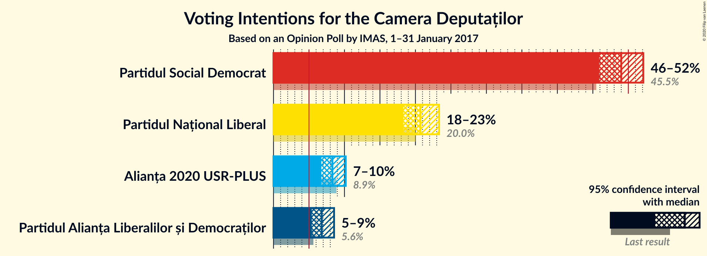
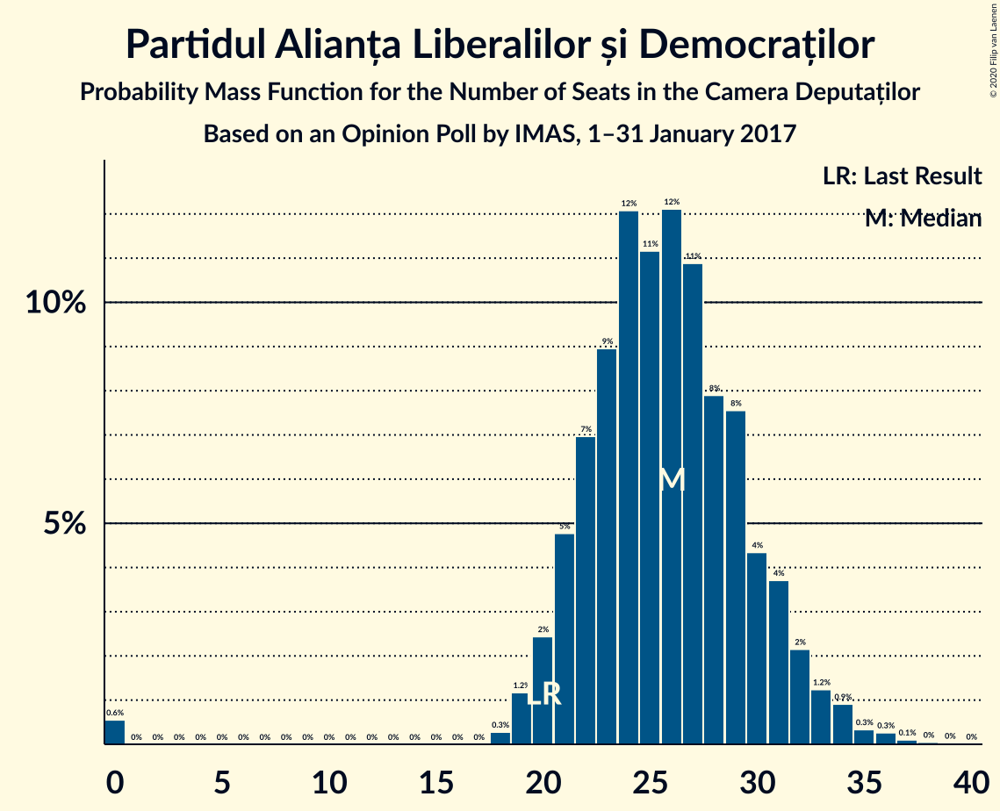

# Opinion Poll by IMAS, 1–31 January 2017

<a href="#voting-intentions">Voting Intentions</a> | <a href="#seats">Seats</a> | <a href="#coalitions">Coalitions</a> | <a href="#technical-information">Technical Information</a>

## Voting Intentions

### Confidence Intervals

| Party | Last Result | Poll Result | 80% Confidence Interval | 90% Confidence Interval | 95% Confidence Interval | 99% Confidence Interval |
|:-----:|:-----------:|:-----------:|:-----------------------:|:-----------------------:|:-----------------------:|:-----------------------:|
| Partidul Social Democrat | 45.5% | 49.0% | 47.0–51.0% |46.4–51.6% |45.9–52.1% |44.9–53.1% |
| Partidul Național Liberal | 20.0% | 20.7% | 19.1–22.4% |18.7–22.9% |18.3–23.3% |17.6–24.2% |
| Alianța 2020 USR-PLUS | 8.9% | 8.3% | 7.3–9.5% |7.0–9.9% |6.7–10.2% |6.3–10.8% |
| Partidul Alianța Liberalilor și Democraților | 5.6% | 6.8% | 5.9–7.9% |5.6–8.3% |5.4–8.5% |5.0–9.1% |

*Note:* The poll result column reflects the actual value used in the calculations. Published results may vary slightly, and in addition be rounded to fewer digits.

## Seats

### Confidence Intervals

| Party | Last Result | Median | 80% Confidence Interval | 90% Confidence Interval | 95% Confidence Interval | 99% Confidence Interval |
|:-----:|:-----------:|:------:|:-----------------------:|:-----------------------:|:-----------------------:|:-----------------------:|
| <a href="#partidul-social-democrat">Partidul Social Democrat</a> | 154 | 183 | 174–203 |172–206 |170–208 |167–212 |
| <a href="#partidul-național-liberal">Partidul Național Liberal</a> | 69 | 78 | 71–87 |69–90 |68–92 |65–96 |
| <a href="#alianța-2020-usr-plus">Alianța 2020 USR-PLUS</a> | 30 | 30 | 0–35 |0–36 |0–37 |0–39 |
| <a href="#partidul-alianța-liberalilor-și-democraților">Partidul Alianța Liberalilor și Democraților</a> | 20 | 26 | 22–30 |21–32 |20–33 |0–35 |

### Partidul Social Democrat

*For a full overview of the results for this party, see the [Partidul Social Democrat](party-partidulsocialdemocrat.html) page.*

| Number of Seats | Probability | Accumulated | Special Marks |
|:---------------:|:-----------:|:-----------:|:-------------:|
| 154 | 0% | 100% | Last Result |
| 155 | 0% | 100% |  |
| 156 | 0% | 100% |  |
| 157 | 0% | 100% |  |
| 158 | 0% | 100% |  |
| 159 | 0% | 100% |  |
| 160 | 0% | 100% |  |
| 161 | 0% | 100% |  |
| 162 | 0% | 100% |  |
| 163 | 0% | 100% |  |
| 164 | 0.1% | 99.9% |  |
| 165 | 0.1% | 99.9% |  |
| 166 | 0.2% | 99.8% | Majority |
| 167 | 0.3% | 99.6% |  |
| 168 | 0.5% | 99.3% |  |
| 169 | 0.7% | 98.8% |  |
| 170 | 0.9% | 98% |  |
| 171 | 1.3% | 97% |  |
| 172 | 2% | 96% |  |
| 173 | 2% | 94% |  |
| 174 | 3% | 92% |  |
| 175 | 3% | 89% |  |
| 176 | 4% | 85% |  |
| 177 | 4% | 81% |  |
| 178 | 5% | 77% |  |
| 179 | 5% | 72% |  |
| 180 | 5% | 67% |  |
| 181 | 5% | 62% |  |
| 182 | 4% | 57% |  |
| 183 | 4% | 53% | Median |
| 184 | 3% | 49% |  |
| 185 | 3% | 45% |  |
| 186 | 2% | 42% |  |
| 187 | 2% | 40% |  |
| 188 | 1.4% | 38% |  |
| 189 | 1.2% | 37% |  |
| 190 | 1.0% | 36% |  |
| 191 | 1.1% | 35% |  |
| 192 | 1.2% | 34% |  |
| 193 | 1.3% | 33% |  |
| 194 | 1.4% | 31% |  |
| 195 | 2% | 30% |  |
| 196 | 2% | 28% |  |
| 197 | 2% | 26% |  |
| 198 | 3% | 24% |  |
| 199 | 2% | 21% |  |
| 200 | 2% | 19% |  |
| 201 | 2% | 16% |  |
| 202 | 2% | 14% |  |
| 203 | 2% | 11% |  |
| 204 | 2% | 9% |  |
| 205 | 2% | 7% |  |
| 206 | 1.3% | 5% |  |
| 207 | 1.0% | 4% |  |
| 208 | 0.9% | 3% |  |
| 209 | 0.8% | 2% |  |
| 210 | 0.5% | 1.4% |  |
| 211 | 0.3% | 0.9% |  |
| 212 | 0.2% | 0.6% |  |
| 213 | 0.1% | 0.5% |  |
| 214 | 0.1% | 0.3% |  |
| 215 | 0.1% | 0.2% |  |
| 216 | 0% | 0.2% |  |
| 217 | 0% | 0.1% |  |
| 218 | 0% | 0.1% |  |
| 219 | 0% | 0.1% |  |
| 220 | 0% | 0.1% |  |
| 221 | 0% | 0.1% |  |
| 222 | 0% | 0.1% |  |
| 223 | 0% | 0% |  |

### Partidul Național Liberal

*For a full overview of the results for this party, see the [Partidul Național Liberal](party-partidulnaționalliberal.html) page.*

| Number of Seats | Probability | Accumulated | Special Marks |
|:---------------:|:-----------:|:-----------:|:-------------:|
| 62 | 0% | 100% |  |
| 63 | 0.1% | 99.9% |  |
| 64 | 0.2% | 99.8% |  |
| 65 | 0.3% | 99.6% |  |
| 66 | 0.6% | 99.3% |  |
| 67 | 0.9% | 98.7% |  |
| 68 | 1.4% | 98% |  |
| 69 | 2% | 96% | Last Result |
| 70 | 3% | 94% |  |
| 71 | 3% | 92% |  |
| 72 | 4% | 88% |  |
| 73 | 5% | 84% |  |
| 74 | 6% | 79% |  |
| 75 | 6% | 73% |  |
| 76 | 6% | 67% |  |
| 77 | 6% | 61% |  |
| 78 | 6% | 54% | Median |
| 79 | 6% | 48% |  |
| 80 | 5% | 42% |  |
| 81 | 5% | 37% |  |
| 82 | 5% | 32% |  |
| 83 | 4% | 27% |  |
| 84 | 4% | 23% |  |
| 85 | 3% | 19% |  |
| 86 | 3% | 16% |  |
| 87 | 3% | 13% |  |
| 88 | 2% | 10% |  |
| 89 | 2% | 8% |  |
| 90 | 2% | 6% |  |
| 91 | 1.2% | 4% |  |
| 92 | 0.9% | 3% |  |
| 93 | 0.7% | 2% |  |
| 94 | 0.5% | 1.4% |  |
| 95 | 0.3% | 0.9% |  |
| 96 | 0.2% | 0.6% |  |
| 97 | 0.1% | 0.4% |  |
| 98 | 0.1% | 0.2% |  |
| 99 | 0.1% | 0.1% |  |
| 100 | 0% | 0.1% |  |
| 101 | 0% | 0% |  |

### Alianța 2020 USR-PLUS

*For a full overview of the results for this party, see the [Alianța 2020 USR-PLUS](party-alianța2020usr-plus.html) page.*

| Number of Seats | Probability | Accumulated | Special Marks |
|:---------------:|:-----------:|:-----------:|:-------------:|
| 0 | 35% | 100% |  |
| 1 | 0% | 65% |  |
| 2 | 0% | 65% |  |
| 3 | 0% | 65% |  |
| 4 | 0% | 65% |  |
| 5 | 0% | 65% |  |
| 6 | 0% | 65% |  |
| 7 | 0% | 65% |  |
| 8 | 0% | 65% |  |
| 9 | 0% | 65% |  |
| 10 | 0% | 65% |  |
| 11 | 0% | 65% |  |
| 12 | 0% | 65% |  |
| 13 | 0% | 65% |  |
| 14 | 0% | 65% |  |
| 15 | 0% | 65% |  |
| 16 | 0% | 65% |  |
| 17 | 0% | 65% |  |
| 18 | 0% | 65% |  |
| 19 | 0% | 65% |  |
| 20 | 0% | 65% |  |
| 21 | 0% | 65% |  |
| 22 | 0% | 65% |  |
| 23 | 0% | 65% |  |
| 24 | 0% | 65% |  |
| 25 | 0% | 65% |  |
| 26 | 0% | 65% |  |
| 27 | 0% | 65% |  |
| 28 | 0.1% | 65% |  |
| 29 | 5% | 65% |  |
| 30 | 12% | 60% | Last Result, Median |
| 31 | 12% | 48% |  |
| 32 | 11% | 36% |  |
| 33 | 9% | 26% |  |
| 34 | 6% | 17% |  |
| 35 | 4% | 11% |  |
| 36 | 3% | 6% |  |
| 37 | 2% | 4% |  |
| 38 | 0.9% | 2% |  |
| 39 | 0.5% | 0.9% |  |
| 40 | 0.2% | 0.4% |  |
| 41 | 0.1% | 0.2% |  |
| 42 | 0% | 0.1% |  |
| 43 | 0% | 0% |  |

### Partidul Alianța Liberalilor și Democraților

*For a full overview of the results for this party, see the [Partidul Alianța Liberalilor și Democraților](party-partidulalianțaliberalilorșidemocraților.html) page.*

| Number of Seats | Probability | Accumulated | Special Marks |
|:---------------:|:-----------:|:-----------:|:-------------:|
| 0 | 0.6% | 100% |  |
| 1 | 0% | 99.4% |  |
| 2 | 0% | 99.4% |  |
| 3 | 0% | 99.4% |  |
| 4 | 0% | 99.4% |  |
| 5 | 0% | 99.4% |  |
| 6 | 0% | 99.4% |  |
| 7 | 0% | 99.4% |  |
| 8 | 0% | 99.4% |  |
| 9 | 0% | 99.4% |  |
| 10 | 0% | 99.4% |  |
| 11 | 0% | 99.4% |  |
| 12 | 0% | 99.4% |  |
| 13 | 0% | 99.4% |  |
| 14 | 0% | 99.4% |  |
| 15 | 0% | 99.4% |  |
| 16 | 0% | 99.4% |  |
| 17 | 0% | 99.4% |  |
| 18 | 0.3% | 99.4% |  |
| 19 | 1.2% | 99.2% |  |
| 20 | 2% | 98% | Last Result |
| 21 | 5% | 96% |  |
| 22 | 7% | 91% |  |
| 23 | 9% | 84% |  |
| 24 | 12% | 75% |  |
| 25 | 11% | 63% |  |
| 26 | 12% | 52% | Median |
| 27 | 11% | 39% |  |
| 28 | 8% | 29% |  |
| 29 | 8% | 21% |  |
| 30 | 4% | 13% |  |
| 31 | 4% | 9% |  |
| 32 | 2% | 5% |  |
| 33 | 1.2% | 3% |  |
| 34 | 0.9% | 2% |  |
| 35 | 0.3% | 0.8% |  |
| 36 | 0.3% | 0.5% |  |
| 37 | 0.1% | 0.2% |  |
| 38 | 0% | 0.1% |  |
| 39 | 0% | 0% |  |

## Coalitions

### Confidence Intervals

| Coalition | Last Result | Median | Majority? | 80% Confidence Interval | 90% Confidence Interval | 95% Confidence Interval | 99% Confidence Interval |
|:---------:|:-----------:|:------:|:---------:|:-----------------------:|:-----------------------:|:-----------------------:|:-----------------------:|
| Partidul Social Democrat – Partidul Alianța Liberalilor și Democraților | 174 | 208 | 100% | 199–230 | 197–233 | 195–235 | 192–238 |
| Partidul Național Liberal – Alianța 2020 USR-PLUS – Partidul Alianța Liberalilor și Democraților | 119 | 129 | 0% | 109–138 | 106–140 | 104–142 | 100–145 |
| Partidul Național Liberal – Alianța 2020 USR-PLUS | 99 | 104 | 0% | 82–113 | 79–115 | 77–117 | 74–120 |
| Partidul Național Liberal | 69 | 78 | 0% | 71–87 | 69–90 | 68–92 | 65–96 |

### Partidul Social Democrat – Partidul Alianța Liberalilor și Democraților

| Number of Seats | Probability | Accumulated | Special Marks |
|:---------------:|:-----------:|:-----------:|:-------------:|
| 174 | 0% | 100% | Last Result |
| 175 | 0% | 100% |  |
| 176 | 0% | 100% |  |
| 177 | 0% | 100% |  |
| 178 | 0% | 100% |  |
| 179 | 0% | 100% |  |
| 180 | 0% | 100% |  |
| 181 | 0% | 100% |  |
| 182 | 0% | 100% |  |
| 183 | 0% | 100% |  |
| 184 | 0% | 100% |  |
| 185 | 0% | 100% |  |
| 186 | 0% | 100% |  |
| 187 | 0% | 100% |  |
| 188 | 0% | 99.9% |  |
| 189 | 0.1% | 99.9% |  |
| 190 | 0.1% | 99.8% |  |
| 191 | 0.2% | 99.7% |  |
| 192 | 0.3% | 99.5% |  |
| 193 | 0.4% | 99.3% |  |
| 194 | 0.7% | 98.9% |  |
| 195 | 0.9% | 98% |  |
| 196 | 1.3% | 97% |  |
| 197 | 2% | 96% |  |
| 198 | 2% | 94% |  |
| 199 | 3% | 92% |  |
| 200 | 4% | 89% |  |
| 201 | 4% | 85% |  |
| 202 | 5% | 81% |  |
| 203 | 5% | 76% |  |
| 204 | 6% | 71% |  |
| 205 | 5% | 65% |  |
| 206 | 5% | 60% |  |
| 207 | 5% | 55% |  |
| 208 | 4% | 51% |  |
| 209 | 3% | 47% | Median |
| 210 | 2% | 43% |  |
| 211 | 2% | 41% |  |
| 212 | 1.4% | 39% |  |
| 213 | 1.0% | 37% |  |
| 214 | 0.7% | 36% |  |
| 215 | 0.5% | 36% |  |
| 216 | 0.5% | 35% |  |
| 217 | 0.4% | 35% |  |
| 218 | 0.5% | 34% |  |
| 219 | 0.7% | 34% |  |
| 220 | 0.9% | 33% |  |
| 221 | 1.2% | 32% |  |
| 222 | 2% | 31% |  |
| 223 | 2% | 30% |  |
| 224 | 2% | 28% |  |
| 225 | 2% | 26% |  |
| 226 | 3% | 23% |  |
| 227 | 3% | 21% |  |
| 228 | 3% | 18% |  |
| 229 | 3% | 15% |  |
| 230 | 3% | 12% |  |
| 231 | 2% | 10% |  |
| 232 | 2% | 8% |  |
| 233 | 2% | 6% |  |
| 234 | 1.3% | 4% |  |
| 235 | 1.0% | 3% |  |
| 236 | 0.7% | 2% |  |
| 237 | 0.5% | 1.3% |  |
| 238 | 0.3% | 0.8% |  |
| 239 | 0.2% | 0.5% |  |
| 240 | 0.1% | 0.3% |  |
| 241 | 0.1% | 0.1% |  |
| 242 | 0% | 0.1% |  |
| 243 | 0% | 0% |  |

### Partidul Național Liberal – Alianța 2020 USR-PLUS – Partidul Alianța Liberalilor și Democraților

| Number of Seats | Probability | Accumulated | Special Marks |
|:---------------:|:-----------:|:-----------:|:-------------:|
| 90 | 0% | 100% |  |
| 91 | 0% | 99.9% |  |
| 92 | 0% | 99.9% |  |
| 93 | 0% | 99.9% |  |
| 94 | 0% | 99.9% |  |
| 95 | 0% | 99.9% |  |
| 96 | 0% | 99.9% |  |
| 97 | 0.1% | 99.8% |  |
| 98 | 0.1% | 99.8% |  |
| 99 | 0.1% | 99.7% |  |
| 100 | 0.2% | 99.5% |  |
| 101 | 0.3% | 99.4% |  |
| 102 | 0.5% | 99.1% |  |
| 103 | 0.8% | 98.6% |  |
| 104 | 0.9% | 98% |  |
| 105 | 1.0% | 97% |  |
| 106 | 1.3% | 96% |  |
| 107 | 2% | 95% |  |
| 108 | 2% | 93% |  |
| 109 | 2% | 91% |  |
| 110 | 2% | 89% |  |
| 111 | 2% | 86% |  |
| 112 | 2% | 84% |  |
| 113 | 2% | 81% |  |
| 114 | 3% | 79% |  |
| 115 | 2% | 76% |  |
| 116 | 2% | 74% |  |
| 117 | 2% | 72% |  |
| 118 | 1.4% | 70% |  |
| 119 | 1.3% | 69% | Last Result |
| 120 | 1.2% | 67% |  |
| 121 | 1.1% | 66% |  |
| 122 | 1.0% | 65% |  |
| 123 | 1.2% | 64% |  |
| 124 | 1.4% | 63% |  |
| 125 | 2% | 62% |  |
| 126 | 2% | 60% |  |
| 127 | 3% | 58% |  |
| 128 | 3% | 55% |  |
| 129 | 4% | 51% |  |
| 130 | 4% | 47% |  |
| 131 | 5% | 43% |  |
| 132 | 5% | 38% |  |
| 133 | 5% | 33% |  |
| 134 | 5% | 28% | Median |
| 135 | 4% | 23% |  |
| 136 | 4% | 19% |  |
| 137 | 3% | 15% |  |
| 138 | 3% | 11% |  |
| 139 | 2% | 8% |  |
| 140 | 2% | 6% |  |
| 141 | 1.3% | 4% |  |
| 142 | 0.9% | 3% |  |
| 143 | 0.7% | 2% |  |
| 144 | 0.5% | 1.2% |  |
| 145 | 0.3% | 0.7% |  |
| 146 | 0.2% | 0.4% |  |
| 147 | 0.1% | 0.2% |  |
| 148 | 0.1% | 0.1% |  |
| 149 | 0% | 0.1% |  |
| 150 | 0% | 0% |  |

### Partidul Național Liberal – Alianța 2020 USR-PLUS

| Number of Seats | Probability | Accumulated | Special Marks |
|:---------------:|:-----------:|:-----------:|:-------------:|
| 70 | 0% | 100% |  |
| 71 | 0.1% | 99.9% |  |
| 72 | 0.1% | 99.9% |  |
| 73 | 0.2% | 99.7% |  |
| 74 | 0.3% | 99.5% |  |
| 75 | 0.5% | 99.2% |  |
| 76 | 0.7% | 98.7% |  |
| 77 | 1.0% | 98% |  |
| 78 | 1.3% | 97% |  |
| 79 | 2% | 96% |  |
| 80 | 2% | 94% |  |
| 81 | 2% | 92% |  |
| 82 | 3% | 90% |  |
| 83 | 3% | 88% |  |
| 84 | 3% | 85% |  |
| 85 | 3% | 82% |  |
| 86 | 3% | 79% |  |
| 87 | 2% | 77% |  |
| 88 | 2% | 74% |  |
| 89 | 2% | 72% |  |
| 90 | 2% | 70% |  |
| 91 | 1.2% | 69% |  |
| 92 | 0.9% | 68% |  |
| 93 | 0.7% | 67% |  |
| 94 | 0.5% | 66% |  |
| 95 | 0.4% | 66% |  |
| 96 | 0.5% | 65% |  |
| 97 | 0.5% | 65% |  |
| 98 | 0.7% | 64% |  |
| 99 | 1.0% | 64% | Last Result |
| 100 | 1.4% | 63% |  |
| 101 | 2% | 61% |  |
| 102 | 2% | 59% |  |
| 103 | 3% | 57% |  |
| 104 | 4% | 53% |  |
| 105 | 5% | 49% |  |
| 106 | 5% | 45% |  |
| 107 | 5% | 40% |  |
| 108 | 6% | 35% | Median |
| 109 | 5% | 29% |  |
| 110 | 5% | 24% |  |
| 111 | 4% | 19% |  |
| 112 | 4% | 15% |  |
| 113 | 3% | 11% |  |
| 114 | 2% | 8% |  |
| 115 | 2% | 6% |  |
| 116 | 1.3% | 4% |  |
| 117 | 0.9% | 3% |  |
| 118 | 0.7% | 2% |  |
| 119 | 0.4% | 1.1% |  |
| 120 | 0.3% | 0.7% |  |
| 121 | 0.2% | 0.5% |  |
| 122 | 0.1% | 0.3% |  |
| 123 | 0.1% | 0.2% |  |
| 124 | 0% | 0.1% |  |
| 125 | 0% | 0.1% |  |
| 126 | 0% | 0% |  |

### Partidul Național Liberal

| Number of Seats | Probability | Accumulated | Special Marks |
|:---------------:|:-----------:|:-----------:|:-------------:|
| 62 | 0% | 100% |  |
| 63 | 0.1% | 99.9% |  |
| 64 | 0.2% | 99.8% |  |
| 65 | 0.3% | 99.6% |  |
| 66 | 0.6% | 99.3% |  |
| 67 | 0.9% | 98.7% |  |
| 68 | 1.4% | 98% |  |
| 69 | 2% | 96% | Last Result |
| 70 | 3% | 94% |  |
| 71 | 3% | 92% |  |
| 72 | 4% | 88% |  |
| 73 | 5% | 84% |  |
| 74 | 6% | 79% |  |
| 75 | 6% | 73% |  |
| 76 | 6% | 67% |  |
| 77 | 6% | 61% |  |
| 78 | 6% | 54% | Median |
| 79 | 6% | 48% |  |
| 80 | 5% | 42% |  |
| 81 | 5% | 37% |  |
| 82 | 5% | 32% |  |
| 83 | 4% | 27% |  |
| 84 | 4% | 23% |  |
| 85 | 3% | 19% |  |
| 86 | 3% | 16% |  |
| 87 | 3% | 13% |  |
| 88 | 2% | 10% |  |
| 89 | 2% | 8% |  |
| 90 | 2% | 6% |  |
| 91 | 1.2% | 4% |  |
| 92 | 0.9% | 3% |  |
| 93 | 0.7% | 2% |  |
| 94 | 0.5% | 1.4% |  |
| 95 | 0.3% | 0.9% |  |
| 96 | 0.2% | 0.6% |  |
| 97 | 0.1% | 0.4% |  |
| 98 | 0.1% | 0.2% |  |
| 99 | 0.1% | 0.1% |  |
| 100 | 0% | 0.1% |  |
| 101 | 0% | 0% |  |

## Technical Information

### Opinion Poll

+ **Polling firm:** IMAS
+ **Commissioner(s):** —
+ **Fieldwork period:** 1–31 January 2017

### Calculations

+ **Sample size:** 1000
+ **Simulations done:** 1,048,576
+ **Error estimate:** 0.26%

