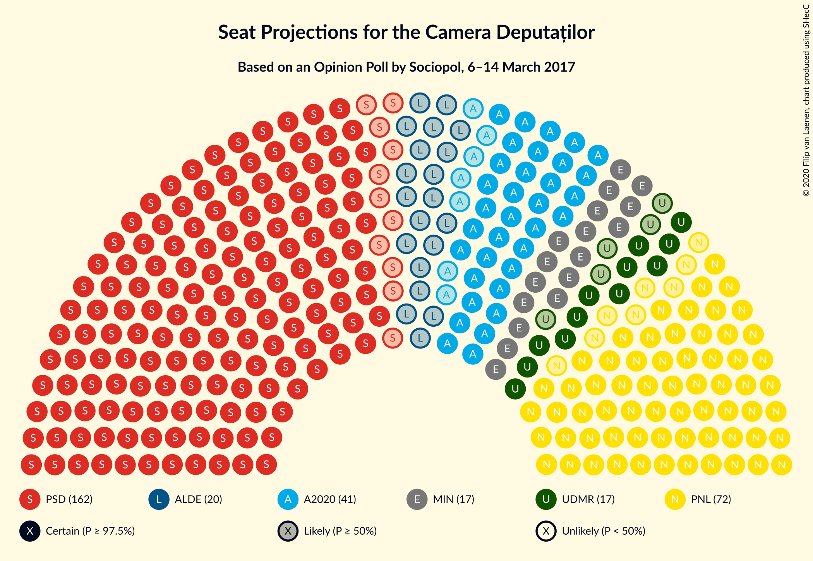
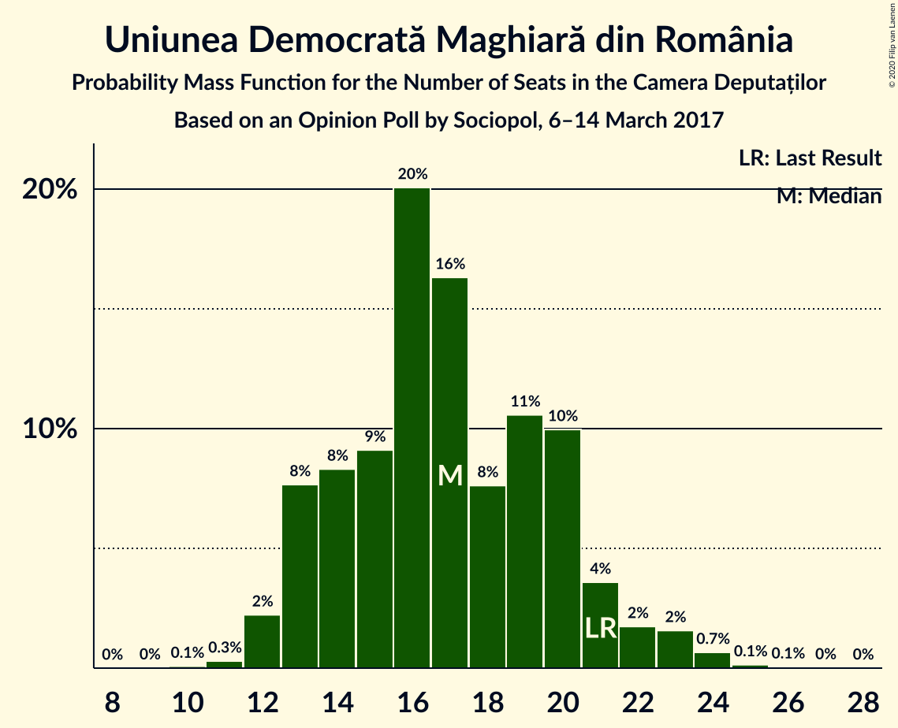
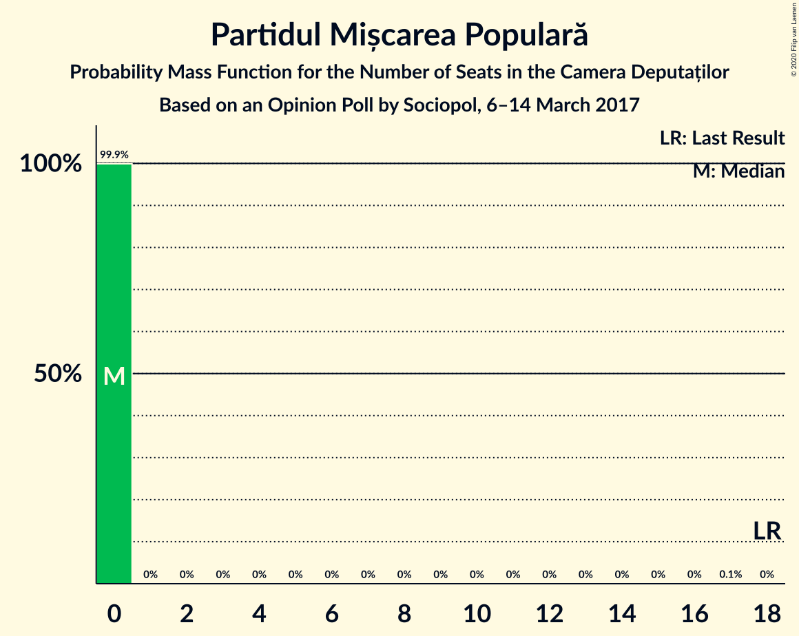
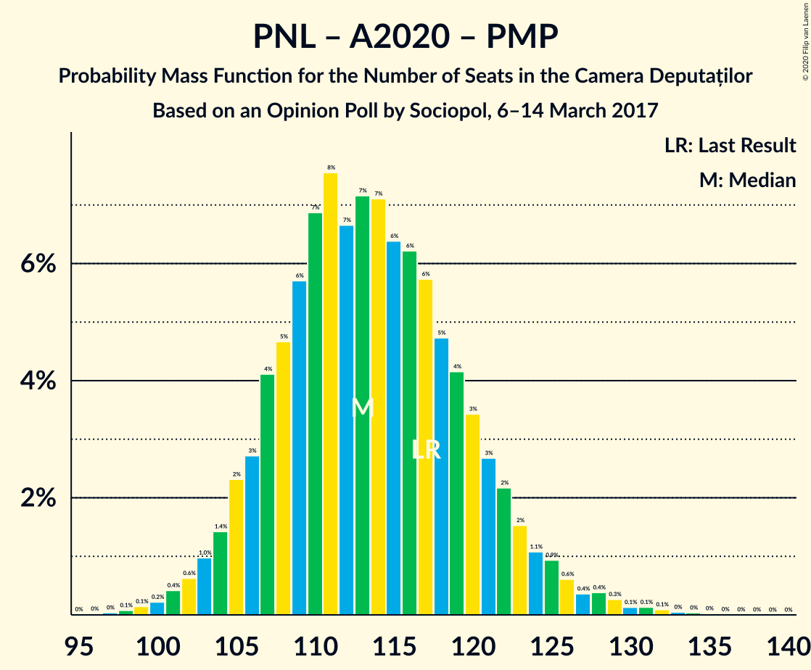
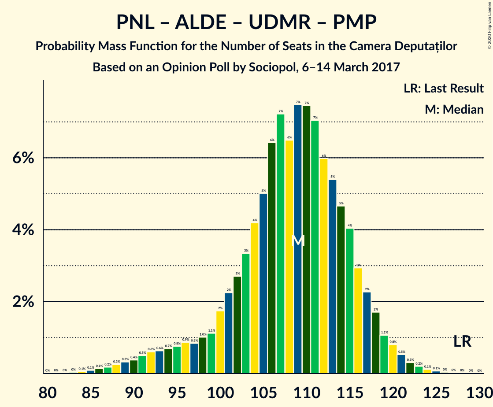
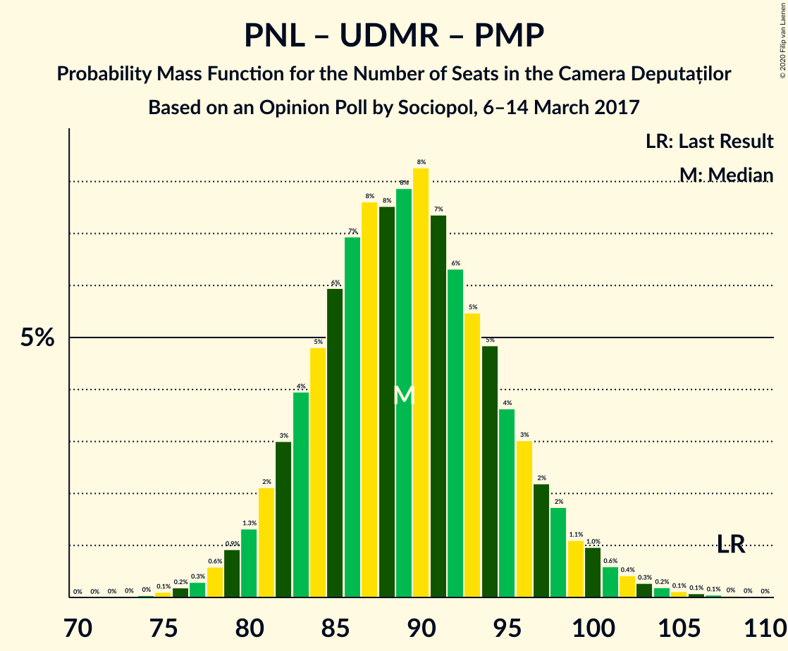
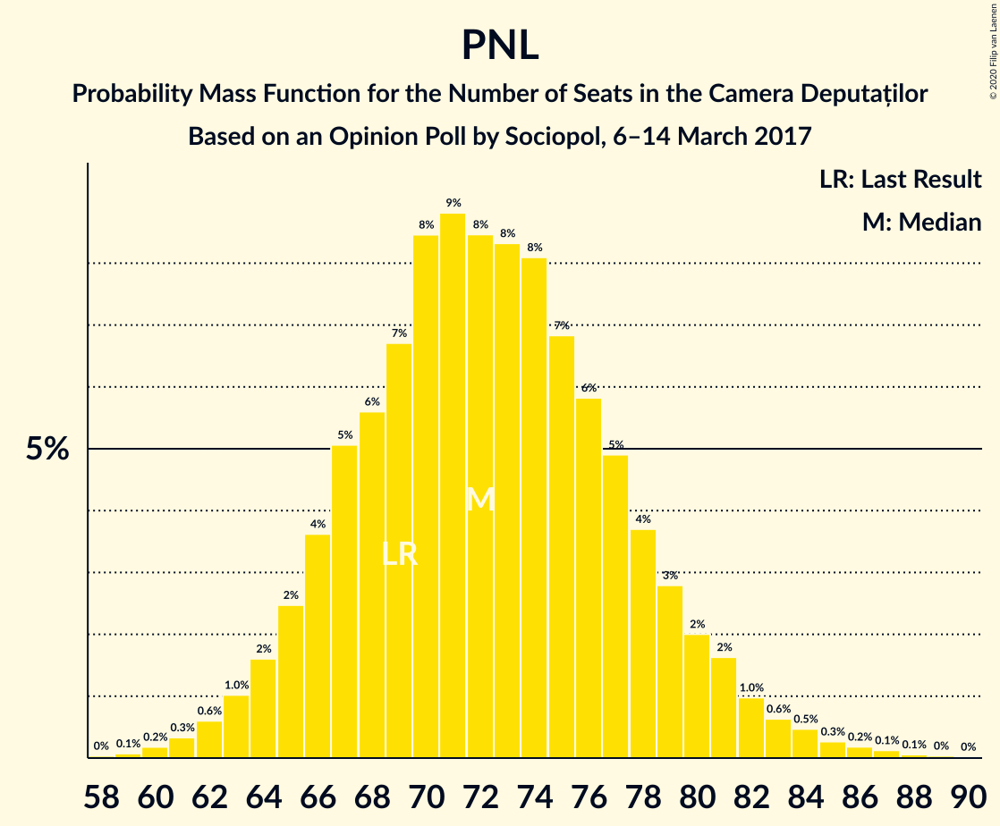

# Opinion Poll by Sociopol, 6–14 March 2017

<a href="#voting-intentions">Voting Intentions</a> | <a href="#seats">Seats</a> | <a href="#coalitions">Coalitions</a> | <a href="#technical-information">Technical Information</a>

## Voting Intentions

### Confidence Intervals

| Party | Last Result | Poll Result | 80% Confidence Interval | 90% Confidence Interval | 95% Confidence Interval | 99% Confidence Interval |
|:-----:|:-----------:|:-----------:|:-----------------------:|:-----------------------:|:-----------------------:|:-----------------------:|
| Partidul Social Democrat | 45.5% | 47.0% | 45.0–49.0% |44.4–49.6% |43.9–50.1% |42.9–51.0% |
| Partidul Național Liberal | 20.0% | 21.0% | 19.4–22.7% |18.9–23.2% |18.5–23.6% |17.8–24.4% |
| Alianța 2020 USR-PLUS | 8.9% | 12.0% | 10.8–13.4% |10.4–13.8% |10.2–14.2% |9.6–14.9% |
| Partidul Alianța Liberalilor și Democraților | 5.6% | 6.0% | 5.1–7.0% |4.9–7.3% |4.6–7.6% |4.3–8.1% |
| Uniunea Democrată Maghiară din România | 6.2% | 5.0% | 4.2–6.0% |4.0–6.2% |3.8–6.5% |3.4–7.0% |
| Partidul Mișcarea Populară | 5.4% | 3.0% | 2.4–3.8% |2.2–4.0% |2.1–4.2% |1.8–4.6% |

*Note:* The poll result column reflects the actual value used in the calculations. Published results may vary slightly, and in addition be rounded to fewer digits.

## Seats

### Confidence Intervals

| Party | Last Result | Median | 80% Confidence Interval | 90% Confidence Interval | 95% Confidence Interval | 99% Confidence Interval |
|:-----:|:-----------:|:------:|:-----------------------:|:-----------------------:|:-----------------------:|:-----------------------:|
| <a href="#partidul-social-democrat">Partidul Social Democrat</a> | 154 | 162 | 155–170 |153–173 |151–176 |148–181 |
| <a href="#partidul-național-liberal">Partidul Național Liberal</a> | 69 | 72 | 67–78 |65–80 |64–82 |61–85 |
| <a href="#alianța-2020-usr-plus">Alianța 2020 USR-PLUS</a> | 30 | 41 | 37–46 |35–48 |34–49 |33–52 |
| <a href="#partidul-alianța-liberalilor-și-democraților">Partidul Alianța Liberalilor și Democraților</a> | 20 | 20 | 17–24 |0–25 |0–26 |0–28 |
| <a href="#uniunea-democrată-maghiară-din-românia">Uniunea Democrată Maghiară din România</a> | 21 | 17 | 13–20 |13–21 |12–22 |12–24 |
| <a href="#partidul-mișcarea-populară">Partidul Mișcarea Populară</a> | 18 | 0 | 0 |0 |0 |0 |

### Partidul Social Democrat

*For a full overview of the results for this party, see the [Partidul Social Democrat](party-partidulsocialdemocrat.html) page.*

| Number of Seats | Probability | Accumulated | Special Marks |
|:---------------:|:-----------:|:-----------:|:-------------:|
| 144 | 0% | 100% |  |
| 145 | 0.1% | 99.9% |  |
| 146 | 0.1% | 99.9% |  |
| 147 | 0.2% | 99.8% |  |
| 148 | 0.3% | 99.6% |  |
| 149 | 0.5% | 99.3% |  |
| 150 | 0.7% | 98.8% |  |
| 151 | 1.3% | 98% |  |
| 152 | 1.5% | 97% |  |
| 153 | 2% | 95% |  |
| 154 | 3% | 93% | Last Result |
| 155 | 3% | 91% |  |
| 156 | 4% | 87% |  |
| 157 | 5% | 84% |  |
| 158 | 5% | 79% |  |
| 159 | 6% | 74% |  |
| 160 | 6% | 68% |  |
| 161 | 7% | 62% |  |
| 162 | 6% | 55% | Median |
| 163 | 7% | 49% |  |
| 164 | 6% | 43% |  |
| 165 | 7% | 37% | Majority |
| 166 | 5% | 30% |  |
| 167 | 5% | 25% |  |
| 168 | 4% | 20% |  |
| 169 | 4% | 16% |  |
| 170 | 3% | 12% |  |
| 171 | 2% | 10% |  |
| 172 | 2% | 8% |  |
| 173 | 1.3% | 6% |  |
| 174 | 0.9% | 5% |  |
| 175 | 0.8% | 4% |  |
| 176 | 0.8% | 3% |  |
| 177 | 0.6% | 2% |  |
| 178 | 0.4% | 2% |  |
| 179 | 0.4% | 1.4% |  |
| 180 | 0.3% | 1.0% |  |
| 181 | 0.2% | 0.7% |  |
| 182 | 0.2% | 0.5% |  |
| 183 | 0.1% | 0.3% |  |
| 184 | 0.1% | 0.2% |  |
| 185 | 0% | 0.1% |  |
| 186 | 0% | 0.1% |  |
| 187 | 0% | 0% |  |

### Partidul Național Liberal

*For a full overview of the results for this party, see the [Partidul Național Liberal](party-partidulnaționalliberal.html) page.*

| Number of Seats | Probability | Accumulated | Special Marks |
|:---------------:|:-----------:|:-----------:|:-------------:|
| 58 | 0% | 100% |  |
| 59 | 0.1% | 99.9% |  |
| 60 | 0.2% | 99.9% |  |
| 61 | 0.3% | 99.7% |  |
| 62 | 0.6% | 99.4% |  |
| 63 | 1.0% | 98.7% |  |
| 64 | 2% | 98% |  |
| 65 | 2% | 96% |  |
| 66 | 4% | 94% |  |
| 67 | 5% | 90% |  |
| 68 | 6% | 85% |  |
| 69 | 7% | 79% | Last Result |
| 70 | 8% | 73% |  |
| 71 | 9% | 64% |  |
| 72 | 8% | 55% | Median |
| 73 | 8% | 47% |  |
| 74 | 8% | 39% |  |
| 75 | 7% | 30% |  |
| 76 | 6% | 24% |  |
| 77 | 5% | 18% |  |
| 78 | 4% | 13% |  |
| 79 | 3% | 9% |  |
| 80 | 2% | 6% |  |
| 81 | 2% | 4% |  |
| 82 | 1.0% | 3% |  |
| 83 | 0.6% | 2% |  |
| 84 | 0.5% | 1.2% |  |
| 85 | 0.3% | 0.7% |  |
| 86 | 0.2% | 0.4% |  |
| 87 | 0.1% | 0.3% |  |
| 88 | 0.1% | 0.1% |  |
| 89 | 0% | 0.1% |  |
| 90 | 0% | 0% |  |

### Alianța 2020 USR-PLUS

*For a full overview of the results for this party, see the [Alianța 2020 USR-PLUS](party-alianța2020usr-plus.html) page.*

| Number of Seats | Probability | Accumulated | Special Marks |
|:---------------:|:-----------:|:-----------:|:-------------:|
| 30 | 0% | 100% | Last Result |
| 31 | 0.1% | 99.9% |  |
| 32 | 0.3% | 99.8% |  |
| 33 | 0.8% | 99.5% |  |
| 34 | 1.4% | 98.8% |  |
| 35 | 3% | 97% |  |
| 36 | 4% | 95% |  |
| 37 | 6% | 90% |  |
| 38 | 8% | 84% |  |
| 39 | 10% | 76% |  |
| 40 | 10% | 66% |  |
| 41 | 10% | 56% | Median |
| 42 | 11% | 46% |  |
| 43 | 9% | 35% |  |
| 44 | 7% | 26% |  |
| 45 | 6% | 19% |  |
| 46 | 4% | 13% |  |
| 47 | 3% | 8% |  |
| 48 | 2% | 5% |  |
| 49 | 1.3% | 3% |  |
| 50 | 0.8% | 2% |  |
| 51 | 0.5% | 1.0% |  |
| 52 | 0.3% | 0.5% |  |
| 53 | 0.1% | 0.2% |  |
| 54 | 0.1% | 0.1% |  |
| 55 | 0% | 0.1% |  |
| 56 | 0% | 0% |  |

### Partidul Alianța Liberalilor și Democraților

*For a full overview of the results for this party, see the [Partidul Alianța Liberalilor și Democraților](party-partidulalianțaliberalilorșidemocraților.html) page.*

| Number of Seats | Probability | Accumulated | Special Marks |
|:---------------:|:-----------:|:-----------:|:-------------:|
| 0 | 8% | 100% |  |
| 1 | 0% | 92% |  |
| 2 | 0% | 92% |  |
| 3 | 0% | 92% |  |
| 4 | 0% | 92% |  |
| 5 | 0% | 92% |  |
| 6 | 0% | 92% |  |
| 7 | 0% | 92% |  |
| 8 | 0% | 92% |  |
| 9 | 0% | 92% |  |
| 10 | 0% | 92% |  |
| 11 | 0% | 92% |  |
| 12 | 0% | 92% |  |
| 13 | 0% | 92% |  |
| 14 | 0% | 92% |  |
| 15 | 0% | 92% |  |
| 16 | 0% | 92% |  |
| 17 | 6% | 92% |  |
| 18 | 11% | 86% |  |
| 19 | 14% | 75% |  |
| 20 | 15% | 61% | Last Result, Median |
| 21 | 15% | 46% |  |
| 22 | 11% | 31% |  |
| 23 | 8% | 19% |  |
| 24 | 5% | 11% |  |
| 25 | 3% | 6% |  |
| 26 | 2% | 3% |  |
| 27 | 0.7% | 1.2% |  |
| 28 | 0.3% | 0.5% |  |
| 29 | 0.1% | 0.2% |  |
| 30 | 0% | 0.1% |  |
| 31 | 0% | 0% |  |

### Uniunea Democrată Maghiară din România

*For a full overview of the results for this party, see the [Uniunea Democrată Maghiară din România](party-uniuneademocratămaghiarădinromânia.html) page.*

| Number of Seats | Probability | Accumulated | Special Marks |
|:---------------:|:-----------:|:-----------:|:-------------:|
| 10 | 0.1% | 100% |  |
| 11 | 0.3% | 99.9% |  |
| 12 | 2% | 99.6% |  |
| 13 | 8% | 97% |  |
| 14 | 8% | 90% |  |
| 15 | 9% | 81% |  |
| 16 | 20% | 72% |  |
| 17 | 16% | 52% | Median |
| 18 | 8% | 36% |  |
| 19 | 11% | 28% |  |
| 20 | 10% | 18% |  |
| 21 | 4% | 8% | Last Result |
| 22 | 2% | 4% |  |
| 23 | 2% | 2% |  |
| 24 | 0.7% | 0.9% |  |
| 25 | 0.1% | 0.2% |  |
| 26 | 0.1% | 0.1% |  |
| 27 | 0% | 0% |  |

### Partidul Mișcarea Populară

*For a full overview of the results for this party, see the [Partidul Mișcarea Populară](party-partidulmișcareapopulară.html) page.*

| Number of Seats | Probability | Accumulated | Special Marks |
|:---------------:|:-----------:|:-----------:|:-------------:|
| 0 | 99.9% | 100% | Median |
| 1 | 0% | 0.1% |  |
| 2 | 0% | 0.1% |  |
| 3 | 0% | 0.1% |  |
| 4 | 0% | 0.1% |  |
| 5 | 0% | 0.1% |  |
| 6 | 0% | 0.1% |  |
| 7 | 0% | 0.1% |  |
| 8 | 0% | 0.1% |  |
| 9 | 0% | 0.1% |  |
| 10 | 0% | 0.1% |  |
| 11 | 0% | 0.1% |  |
| 12 | 0% | 0.1% |  |
| 13 | 0% | 0.1% |  |
| 14 | 0% | 0.1% |  |
| 15 | 0% | 0.1% |  |
| 16 | 0% | 0.1% |  |
| 17 | 0.1% | 0.1% |  |
| 18 | 0% | 0% | Last Result |

## Coalitions

### Confidence Intervals

| Coalition | Last Result | Median | Majority? | 80% Confidence Interval | 90% Confidence Interval | 95% Confidence Interval | 99% Confidence Interval |
|:---------:|:-----------:|:------:|:---------:|:-----------------------:|:-----------------------:|:-----------------------:|:-----------------------:|
| Partidul Social Democrat – Partidul Alianța Liberalilor și Democraților | 174 | 182 | 99.4% | 174–189 | 171–191 | 169–192 | 164–195 |
| Partidul Național Liberal – Alianța 2020 USR-PLUS – Partidul Alianța Liberalilor și Democraților – Uniunea Democrată Maghiară din România – Partidul Mișcarea Populară | 158 | 150 | 0.4% | 142–157 | 139–159 | 136–161 | 131–164 |
| Partidul Național Liberal – Alianța 2020 USR-PLUS – Partidul Alianța Liberalilor și Democraților – Uniunea Democrată Maghiară din România | 140 | 150 | 0.4% | 142–157 | 139–159 | 136–161 | 131–164 |
| Partidul Național Liberal – Alianța 2020 USR-PLUS – Partidul Alianța Liberalilor și Democraților – Partidul Mișcarea Populară | 137 | 133 | 0% | 125–140 | 121–142 | 118–144 | 113–147 |
| Partidul Național Liberal – Alianța 2020 USR-PLUS – Partidul Alianța Liberalilor și Democraților | 119 | 133 | 0% | 125–140 | 121–142 | 118–144 | 113–147 |
| Partidul Național Liberal – Alianța 2020 USR-PLUS – Uniunea Democrată Maghiară din România – Partidul Mișcarea Populară | 138 | 130 | 0% | 123–138 | 121–141 | 120–143 | 117–148 |
| Partidul Național Liberal – Alianța 2020 USR-PLUS – Uniunea Democrată Maghiară din România | 120 | 130 | 0% | 123–138 | 121–141 | 120–143 | 117–148 |
| Partidul Național Liberal – Alianța 2020 USR-PLUS – Partidul Mișcarea Populară | 117 | 113 | 0% | 107–121 | 105–123 | 103–125 | 100–129 |
| Partidul Național Liberal – Alianța 2020 USR-PLUS | 99 | 113 | 0% | 107–121 | 105–123 | 103–125 | 100–129 |
| Partidul Național Liberal – Partidul Alianța Liberalilor și Democraților – Uniunea Democrată Maghiară din România – Partidul Mișcarea Populară | 128 | 109 | 0% | 100–116 | 96–117 | 92–119 | 87–122 |
| Partidul Național Liberal – Partidul Alianța Liberalilor și Democraților – Uniunea Democrată Maghiară din România | 110 | 109 | 0% | 100–116 | 96–117 | 92–119 | 87–122 |
| Partidul Național Liberal – Uniunea Democrată Maghiară din România – Partidul Mișcarea Populară | 108 | 89 | 0% | 83–96 | 81–98 | 80–100 | 77–104 |
| Partidul Național Liberal – Uniunea Democrată Maghiară din România | 90 | 89 | 0% | 83–96 | 81–98 | 80–100 | 77–103 |
| Partidul Național Liberal – Partidul Mișcarea Populară | 87 | 72 | 0% | 67–78 | 65–80 | 64–82 | 61–85 |
| Partidul Național Liberal | 69 | 72 | 0% | 67–78 | 65–80 | 64–82 | 61–85 |
| Alianța 2020 USR-PLUS – Partidul Mișcarea Populară | 48 | 41 | 0% | 37–46 | 35–48 | 34–49 | 33–52 |

### Partidul Social Democrat – Partidul Alianța Liberalilor și Democraților

| Number of Seats | Probability | Accumulated | Special Marks |
|:---------------:|:-----------:|:-----------:|:-------------:|
| 159 | 0% | 100% |  |
| 160 | 0% | 99.9% |  |
| 161 | 0.1% | 99.9% |  |
| 162 | 0.1% | 99.8% |  |
| 163 | 0.1% | 99.7% |  |
| 164 | 0.2% | 99.6% |  |
| 165 | 0.3% | 99.4% | Majority |
| 166 | 0.3% | 99.2% |  |
| 167 | 0.4% | 98.8% |  |
| 168 | 0.5% | 98% |  |
| 169 | 0.7% | 98% |  |
| 170 | 1.1% | 97% |  |
| 171 | 1.3% | 96% |  |
| 172 | 2% | 95% |  |
| 173 | 2% | 93% |  |
| 174 | 3% | 91% | Last Result |
| 175 | 3% | 88% |  |
| 176 | 4% | 85% |  |
| 177 | 4% | 81% |  |
| 178 | 5% | 76% |  |
| 179 | 6% | 71% |  |
| 180 | 6% | 65% |  |
| 181 | 7% | 59% |  |
| 182 | 7% | 52% | Median |
| 183 | 6% | 45% |  |
| 184 | 6% | 39% |  |
| 185 | 7% | 33% |  |
| 186 | 6% | 26% |  |
| 187 | 5% | 20% |  |
| 188 | 4% | 15% |  |
| 189 | 3% | 11% |  |
| 190 | 3% | 8% |  |
| 191 | 2% | 5% |  |
| 192 | 1.4% | 4% |  |
| 193 | 0.8% | 2% |  |
| 194 | 0.6% | 1.3% |  |
| 195 | 0.3% | 0.7% |  |
| 196 | 0.2% | 0.4% |  |
| 197 | 0.1% | 0.2% |  |
| 198 | 0.1% | 0.1% |  |
| 199 | 0% | 0% |  |

### Partidul Național Liberal – Alianța 2020 USR-PLUS – Partidul Alianța Liberalilor și Democraților – Uniunea Democrată Maghiară din România – Partidul Mișcarea Populară

| Number of Seats | Probability | Accumulated | Special Marks |
|:---------------:|:-----------:|:-----------:|:-------------:|
| 126 | 0% | 100% |  |
| 127 | 0% | 99.9% |  |
| 128 | 0.1% | 99.9% |  |
| 129 | 0.1% | 99.8% |  |
| 130 | 0.2% | 99.7% |  |
| 131 | 0.2% | 99.5% |  |
| 132 | 0.3% | 99.3% |  |
| 133 | 0.4% | 99.0% |  |
| 134 | 0.4% | 98.6% |  |
| 135 | 0.6% | 98% |  |
| 136 | 0.8% | 98% |  |
| 137 | 0.8% | 97% |  |
| 138 | 0.9% | 96% |  |
| 139 | 1.3% | 95% |  |
| 140 | 2% | 94% |  |
| 141 | 2% | 92% |  |
| 142 | 3% | 90% |  |
| 143 | 4% | 88% |  |
| 144 | 4% | 84% |  |
| 145 | 5% | 80% |  |
| 146 | 5% | 75% |  |
| 147 | 7% | 70% |  |
| 148 | 6% | 63% |  |
| 149 | 7% | 57% |  |
| 150 | 6% | 51% | Median |
| 151 | 7% | 45% |  |
| 152 | 6% | 38% |  |
| 153 | 6% | 32% |  |
| 154 | 5% | 26% |  |
| 155 | 5% | 21% |  |
| 156 | 4% | 16% |  |
| 157 | 3% | 13% |  |
| 158 | 3% | 9% | Last Result |
| 159 | 2% | 7% |  |
| 160 | 1.5% | 5% |  |
| 161 | 1.3% | 3% |  |
| 162 | 0.7% | 2% |  |
| 163 | 0.5% | 1.2% |  |
| 164 | 0.3% | 0.7% |  |
| 165 | 0.2% | 0.4% | Majority |
| 166 | 0.1% | 0.2% |  |
| 167 | 0.1% | 0.1% |  |
| 168 | 0% | 0.1% |  |
| 169 | 0% | 0% |  |

### Partidul Național Liberal – Alianța 2020 USR-PLUS – Partidul Alianța Liberalilor și Democraților – Uniunea Democrată Maghiară din România

| Number of Seats | Probability | Accumulated | Special Marks |
|:---------------:|:-----------:|:-----------:|:-------------:|
| 126 | 0% | 100% |  |
| 127 | 0% | 99.9% |  |
| 128 | 0.1% | 99.9% |  |
| 129 | 0.1% | 99.8% |  |
| 130 | 0.2% | 99.7% |  |
| 131 | 0.2% | 99.5% |  |
| 132 | 0.3% | 99.3% |  |
| 133 | 0.4% | 99.0% |  |
| 134 | 0.4% | 98.6% |  |
| 135 | 0.6% | 98% |  |
| 136 | 0.8% | 98% |  |
| 137 | 0.8% | 97% |  |
| 138 | 0.9% | 96% |  |
| 139 | 1.3% | 95% |  |
| 140 | 2% | 94% | Last Result |
| 141 | 2% | 92% |  |
| 142 | 3% | 90% |  |
| 143 | 4% | 88% |  |
| 144 | 4% | 84% |  |
| 145 | 5% | 80% |  |
| 146 | 5% | 75% |  |
| 147 | 7% | 70% |  |
| 148 | 6% | 63% |  |
| 149 | 7% | 57% |  |
| 150 | 6% | 51% | Median |
| 151 | 7% | 45% |  |
| 152 | 6% | 38% |  |
| 153 | 6% | 32% |  |
| 154 | 5% | 26% |  |
| 155 | 5% | 21% |  |
| 156 | 4% | 16% |  |
| 157 | 3% | 13% |  |
| 158 | 3% | 9% |  |
| 159 | 2% | 7% |  |
| 160 | 1.5% | 5% |  |
| 161 | 1.2% | 3% |  |
| 162 | 0.7% | 2% |  |
| 163 | 0.5% | 1.2% |  |
| 164 | 0.3% | 0.7% |  |
| 165 | 0.2% | 0.4% | Majority |
| 166 | 0.1% | 0.2% |  |
| 167 | 0.1% | 0.1% |  |
| 168 | 0% | 0.1% |  |
| 169 | 0% | 0% |  |

### Partidul Național Liberal – Alianța 2020 USR-PLUS – Partidul Alianța Liberalilor și Democraților – Partidul Mișcarea Populară

| Number of Seats | Probability | Accumulated | Special Marks |
|:---------------:|:-----------:|:-----------:|:-------------:|
| 108 | 0% | 100% |  |
| 109 | 0.1% | 99.9% |  |
| 110 | 0.1% | 99.9% |  |
| 111 | 0.1% | 99.8% |  |
| 112 | 0.1% | 99.7% |  |
| 113 | 0.2% | 99.6% |  |
| 114 | 0.3% | 99.4% |  |
| 115 | 0.3% | 99.1% |  |
| 116 | 0.5% | 98.9% |  |
| 117 | 0.5% | 98% |  |
| 118 | 0.6% | 98% |  |
| 119 | 1.0% | 97% |  |
| 120 | 0.8% | 96% |  |
| 121 | 0.9% | 96% |  |
| 122 | 1.2% | 95% |  |
| 123 | 1.3% | 93% |  |
| 124 | 2% | 92% |  |
| 125 | 2% | 91% |  |
| 126 | 3% | 88% |  |
| 127 | 4% | 86% |  |
| 128 | 5% | 82% |  |
| 129 | 5% | 77% |  |
| 130 | 6% | 72% |  |
| 131 | 8% | 66% |  |
| 132 | 6% | 58% |  |
| 133 | 7% | 52% | Median |
| 134 | 7% | 45% |  |
| 135 | 6% | 38% |  |
| 136 | 6% | 32% |  |
| 137 | 6% | 27% | Last Result |
| 138 | 5% | 21% |  |
| 139 | 4% | 16% |  |
| 140 | 4% | 12% |  |
| 141 | 2% | 9% |  |
| 142 | 2% | 6% |  |
| 143 | 2% | 4% |  |
| 144 | 1.0% | 3% |  |
| 145 | 0.6% | 2% |  |
| 146 | 0.5% | 1.0% |  |
| 147 | 0.2% | 0.5% |  |
| 148 | 0.1% | 0.3% |  |
| 149 | 0.1% | 0.2% |  |
| 150 | 0% | 0.1% |  |
| 151 | 0% | 0.1% |  |
| 152 | 0% | 0% |  |

### Partidul Național Liberal – Alianța 2020 USR-PLUS – Partidul Alianța Liberalilor și Democraților

| Number of Seats | Probability | Accumulated | Special Marks |
|:---------------:|:-----------:|:-----------:|:-------------:|
| 108 | 0% | 100% |  |
| 109 | 0.1% | 99.9% |  |
| 110 | 0.1% | 99.9% |  |
| 111 | 0.1% | 99.8% |  |
| 112 | 0.1% | 99.7% |  |
| 113 | 0.2% | 99.6% |  |
| 114 | 0.3% | 99.4% |  |
| 115 | 0.3% | 99.1% |  |
| 116 | 0.5% | 98.9% |  |
| 117 | 0.5% | 98% |  |
| 118 | 0.6% | 98% |  |
| 119 | 1.0% | 97% | Last Result |
| 120 | 0.8% | 96% |  |
| 121 | 0.9% | 95% |  |
| 122 | 1.2% | 95% |  |
| 123 | 1.3% | 93% |  |
| 124 | 2% | 92% |  |
| 125 | 2% | 90% |  |
| 126 | 3% | 88% |  |
| 127 | 4% | 86% |  |
| 128 | 5% | 82% |  |
| 129 | 5% | 77% |  |
| 130 | 6% | 72% |  |
| 131 | 8% | 66% |  |
| 132 | 6% | 58% |  |
| 133 | 7% | 52% | Median |
| 134 | 7% | 45% |  |
| 135 | 6% | 38% |  |
| 136 | 6% | 32% |  |
| 137 | 6% | 26% |  |
| 138 | 5% | 21% |  |
| 139 | 4% | 16% |  |
| 140 | 4% | 12% |  |
| 141 | 2% | 9% |  |
| 142 | 2% | 6% |  |
| 143 | 2% | 4% |  |
| 144 | 1.0% | 3% |  |
| 145 | 0.6% | 2% |  |
| 146 | 0.5% | 1.0% |  |
| 147 | 0.2% | 0.5% |  |
| 148 | 0.1% | 0.3% |  |
| 149 | 0.1% | 0.2% |  |
| 150 | 0% | 0.1% |  |
| 151 | 0% | 0.1% |  |
| 152 | 0% | 0% |  |

### Partidul Național Liberal – Alianța 2020 USR-PLUS – Uniunea Democrată Maghiară din România – Partidul Mișcarea Populară

| Number of Seats | Probability | Accumulated | Special Marks |
|:---------------:|:-----------:|:-----------:|:-------------:|
| 114 | 0.1% | 100% |  |
| 115 | 0.1% | 99.9% |  |
| 116 | 0.2% | 99.8% |  |
| 117 | 0.3% | 99.6% |  |
| 118 | 0.6% | 99.3% |  |
| 119 | 0.8% | 98.7% |  |
| 120 | 1.4% | 98% |  |
| 121 | 2% | 96% |  |
| 122 | 3% | 95% |  |
| 123 | 3% | 92% |  |
| 124 | 4% | 89% |  |
| 125 | 5% | 85% |  |
| 126 | 6% | 80% |  |
| 127 | 7% | 74% |  |
| 128 | 6% | 67% |  |
| 129 | 6% | 61% |  |
| 130 | 7% | 55% | Median |
| 131 | 7% | 48% |  |
| 132 | 6% | 41% |  |
| 133 | 6% | 35% |  |
| 134 | 5% | 29% |  |
| 135 | 4% | 24% |  |
| 136 | 4% | 19% |  |
| 137 | 3% | 15% |  |
| 138 | 3% | 12% | Last Result |
| 139 | 2% | 9% |  |
| 140 | 2% | 7% |  |
| 141 | 1.3% | 5% |  |
| 142 | 1.1% | 4% |  |
| 143 | 0.7% | 3% |  |
| 144 | 0.5% | 2% |  |
| 145 | 0.4% | 2% |  |
| 146 | 0.3% | 1.2% |  |
| 147 | 0.3% | 0.8% |  |
| 148 | 0.2% | 0.6% |  |
| 149 | 0.1% | 0.4% |  |
| 150 | 0.1% | 0.3% |  |
| 151 | 0.1% | 0.2% |  |
| 152 | 0% | 0.1% |  |
| 153 | 0% | 0.1% |  |
| 154 | 0% | 0% |  |

### Partidul Național Liberal – Alianța 2020 USR-PLUS – Uniunea Democrată Maghiară din România

| Number of Seats | Probability | Accumulated | Special Marks |
|:---------------:|:-----------:|:-----------:|:-------------:|
| 114 | 0.1% | 100% |  |
| 115 | 0.1% | 99.9% |  |
| 116 | 0.2% | 99.8% |  |
| 117 | 0.3% | 99.6% |  |
| 118 | 0.6% | 99.3% |  |
| 119 | 0.8% | 98.7% |  |
| 120 | 1.4% | 98% | Last Result |
| 121 | 2% | 96% |  |
| 122 | 3% | 95% |  |
| 123 | 3% | 92% |  |
| 124 | 4% | 88% |  |
| 125 | 5% | 84% |  |
| 126 | 6% | 80% |  |
| 127 | 7% | 74% |  |
| 128 | 6% | 67% |  |
| 129 | 6% | 61% |  |
| 130 | 7% | 55% | Median |
| 131 | 7% | 48% |  |
| 132 | 6% | 41% |  |
| 133 | 6% | 34% |  |
| 134 | 5% | 29% |  |
| 135 | 4% | 23% |  |
| 136 | 4% | 19% |  |
| 137 | 3% | 15% |  |
| 138 | 3% | 12% |  |
| 139 | 2% | 9% |  |
| 140 | 2% | 7% |  |
| 141 | 1.3% | 5% |  |
| 142 | 1.1% | 4% |  |
| 143 | 0.7% | 3% |  |
| 144 | 0.5% | 2% |  |
| 145 | 0.4% | 2% |  |
| 146 | 0.3% | 1.1% |  |
| 147 | 0.2% | 0.8% |  |
| 148 | 0.2% | 0.6% |  |
| 149 | 0.1% | 0.4% |  |
| 150 | 0.1% | 0.3% |  |
| 151 | 0.1% | 0.2% |  |
| 152 | 0% | 0.1% |  |
| 153 | 0% | 0.1% |  |
| 154 | 0% | 0% |  |

### Partidul Național Liberal – Alianța 2020 USR-PLUS – Partidul Mișcarea Populară

| Number of Seats | Probability | Accumulated | Special Marks |
|:---------------:|:-----------:|:-----------:|:-------------:|
| 97 | 0% | 100% |  |
| 98 | 0.1% | 99.9% |  |
| 99 | 0.1% | 99.8% |  |
| 100 | 0.2% | 99.7% |  |
| 101 | 0.4% | 99.5% |  |
| 102 | 0.6% | 99.1% |  |
| 103 | 1.0% | 98% |  |
| 104 | 1.4% | 97% |  |
| 105 | 2% | 96% |  |
| 106 | 3% | 94% |  |
| 107 | 4% | 91% |  |
| 108 | 5% | 87% |  |
| 109 | 6% | 82% |  |
| 110 | 7% | 77% |  |
| 111 | 8% | 70% |  |
| 112 | 7% | 62% |  |
| 113 | 7% | 55% | Median |
| 114 | 7% | 48% |  |
| 115 | 6% | 41% |  |
| 116 | 6% | 35% |  |
| 117 | 6% | 29% | Last Result |
| 118 | 5% | 23% |  |
| 119 | 4% | 18% |  |
| 120 | 3% | 14% |  |
| 121 | 3% | 11% |  |
| 122 | 2% | 8% |  |
| 123 | 2% | 6% |  |
| 124 | 1.1% | 4% |  |
| 125 | 0.9% | 3% |  |
| 126 | 0.6% | 2% |  |
| 127 | 0.4% | 2% |  |
| 128 | 0.4% | 1.1% |  |
| 129 | 0.3% | 0.8% |  |
| 130 | 0.1% | 0.5% |  |
| 131 | 0.1% | 0.4% |  |
| 132 | 0.1% | 0.2% |  |
| 133 | 0% | 0.1% |  |
| 134 | 0% | 0.1% |  |
| 135 | 0% | 0.1% |  |
| 136 | 0% | 0% |  |

### Partidul Național Liberal – Alianța 2020 USR-PLUS

| Number of Seats | Probability | Accumulated | Special Marks |
|:---------------:|:-----------:|:-----------:|:-------------:|
| 97 | 0% | 100% |  |
| 98 | 0.1% | 99.9% |  |
| 99 | 0.1% | 99.8% | Last Result |
| 100 | 0.2% | 99.7% |  |
| 101 | 0.4% | 99.5% |  |
| 102 | 0.6% | 99.1% |  |
| 103 | 1.0% | 98% |  |
| 104 | 1.4% | 97% |  |
| 105 | 2% | 96% |  |
| 106 | 3% | 94% |  |
| 107 | 4% | 91% |  |
| 108 | 5% | 87% |  |
| 109 | 6% | 82% |  |
| 110 | 7% | 76% |  |
| 111 | 8% | 70% |  |
| 112 | 7% | 62% |  |
| 113 | 7% | 55% | Median |
| 114 | 7% | 48% |  |
| 115 | 6% | 41% |  |
| 116 | 6% | 35% |  |
| 117 | 6% | 28% |  |
| 118 | 5% | 23% |  |
| 119 | 4% | 18% |  |
| 120 | 3% | 14% |  |
| 121 | 3% | 10% |  |
| 122 | 2% | 8% |  |
| 123 | 2% | 6% |  |
| 124 | 1.1% | 4% |  |
| 125 | 0.9% | 3% |  |
| 126 | 0.6% | 2% |  |
| 127 | 0.4% | 1.5% |  |
| 128 | 0.4% | 1.1% |  |
| 129 | 0.3% | 0.7% |  |
| 130 | 0.1% | 0.5% |  |
| 131 | 0.1% | 0.3% |  |
| 132 | 0.1% | 0.2% |  |
| 133 | 0% | 0.1% |  |
| 134 | 0% | 0.1% |  |
| 135 | 0% | 0% |  |

### Partidul Național Liberal – Partidul Alianța Liberalilor și Democraților – Uniunea Democrată Maghiară din România – Partidul Mișcarea Populară

| Number of Seats | Probability | Accumulated | Special Marks |
|:---------------:|:-----------:|:-----------:|:-------------:|
| 83 | 0% | 100% |  |
| 84 | 0.1% | 99.9% |  |
| 85 | 0.1% | 99.9% |  |
| 86 | 0.1% | 99.8% |  |
| 87 | 0.2% | 99.6% |  |
| 88 | 0.3% | 99.5% |  |
| 89 | 0.3% | 99.2% |  |
| 90 | 0.4% | 98.9% |  |
| 91 | 0.5% | 98.5% |  |
| 92 | 0.6% | 98% |  |
| 93 | 0.6% | 97% |  |
| 94 | 0.7% | 97% |  |
| 95 | 0.8% | 96% |  |
| 96 | 0.9% | 95% |  |
| 97 | 0.8% | 94% |  |
| 98 | 1.0% | 94% |  |
| 99 | 1.1% | 93% |  |
| 100 | 2% | 92% |  |
| 101 | 2% | 90% |  |
| 102 | 3% | 88% |  |
| 103 | 3% | 85% |  |
| 104 | 4% | 81% |  |
| 105 | 5% | 77% |  |
| 106 | 6% | 72% |  |
| 107 | 7% | 66% |  |
| 108 | 6% | 59% |  |
| 109 | 7% | 52% | Median |
| 110 | 7% | 45% |  |
| 111 | 7% | 37% |  |
| 112 | 6% | 30% |  |
| 113 | 5% | 24% |  |
| 114 | 5% | 19% |  |
| 115 | 4% | 14% |  |
| 116 | 3% | 10% |  |
| 117 | 2% | 7% |  |
| 118 | 2% | 5% |  |
| 119 | 1.1% | 3% |  |
| 120 | 0.8% | 2% |  |
| 121 | 0.5% | 1.3% |  |
| 122 | 0.3% | 0.8% |  |
| 123 | 0.2% | 0.5% |  |
| 124 | 0.1% | 0.3% |  |
| 125 | 0.1% | 0.1% |  |
| 126 | 0% | 0.1% |  |
| 127 | 0% | 0% |  |
| 128 | 0% | 0% | Last Result |

### Partidul Național Liberal – Partidul Alianța Liberalilor și Democraților – Uniunea Democrată Maghiară din România

| Number of Seats | Probability | Accumulated | Special Marks |
|:---------------:|:-----------:|:-----------:|:-------------:|
| 83 | 0% | 100% |  |
| 84 | 0.1% | 99.9% |  |
| 85 | 0.1% | 99.9% |  |
| 86 | 0.1% | 99.8% |  |
| 87 | 0.2% | 99.6% |  |
| 88 | 0.3% | 99.5% |  |
| 89 | 0.3% | 99.2% |  |
| 90 | 0.4% | 98.9% |  |
| 91 | 0.5% | 98.5% |  |
| 92 | 0.6% | 98% |  |
| 93 | 0.6% | 97% |  |
| 94 | 0.7% | 97% |  |
| 95 | 0.8% | 96% |  |
| 96 | 0.9% | 95% |  |
| 97 | 0.8% | 94% |  |
| 98 | 1.0% | 94% |  |
| 99 | 1.1% | 93% |  |
| 100 | 2% | 91% |  |
| 101 | 2% | 90% |  |
| 102 | 3% | 87% |  |
| 103 | 3% | 85% |  |
| 104 | 4% | 81% |  |
| 105 | 5% | 77% |  |
| 106 | 6% | 72% |  |
| 107 | 7% | 66% |  |
| 108 | 6% | 59% |  |
| 109 | 7% | 52% | Median |
| 110 | 7% | 45% | Last Result |
| 111 | 7% | 37% |  |
| 112 | 6% | 30% |  |
| 113 | 5% | 24% |  |
| 114 | 5% | 19% |  |
| 115 | 4% | 14% |  |
| 116 | 3% | 10% |  |
| 117 | 2% | 7% |  |
| 118 | 2% | 5% |  |
| 119 | 1.1% | 3% |  |
| 120 | 0.8% | 2% |  |
| 121 | 0.5% | 1.3% |  |
| 122 | 0.3% | 0.7% |  |
| 123 | 0.2% | 0.4% |  |
| 124 | 0.1% | 0.2% |  |
| 125 | 0.1% | 0.1% |  |
| 126 | 0% | 0.1% |  |
| 127 | 0% | 0% |  |

### Partidul Național Liberal – Uniunea Democrată Maghiară din România – Partidul Mișcarea Populară

| Number of Seats | Probability | Accumulated | Special Marks |
|:---------------:|:-----------:|:-----------:|:-------------:|
| 74 | 0% | 100% |  |
| 75 | 0.1% | 99.9% |  |
| 76 | 0.2% | 99.8% |  |
| 77 | 0.3% | 99.6% |  |
| 78 | 0.6% | 99.3% |  |
| 79 | 0.9% | 98.7% |  |
| 80 | 1.3% | 98% |  |
| 81 | 2% | 97% |  |
| 82 | 3% | 94% |  |
| 83 | 4% | 91% |  |
| 84 | 5% | 87% |  |
| 85 | 6% | 83% |  |
| 86 | 7% | 77% |  |
| 87 | 8% | 70% |  |
| 88 | 8% | 62% |  |
| 89 | 8% | 55% | Median |
| 90 | 8% | 47% |  |
| 91 | 7% | 38% |  |
| 92 | 6% | 31% |  |
| 93 | 5% | 25% |  |
| 94 | 5% | 19% |  |
| 95 | 4% | 14% |  |
| 96 | 3% | 11% |  |
| 97 | 2% | 8% |  |
| 98 | 2% | 6% |  |
| 99 | 1.1% | 4% |  |
| 100 | 1.0% | 3% |  |
| 101 | 0.6% | 2% |  |
| 102 | 0.4% | 1.2% |  |
| 103 | 0.3% | 0.8% |  |
| 104 | 0.2% | 0.5% |  |
| 105 | 0.1% | 0.3% |  |
| 106 | 0.1% | 0.2% |  |
| 107 | 0.1% | 0.1% |  |
| 108 | 0% | 0.1% | Last Result |
| 109 | 0% | 0% |  |

### Partidul Național Liberal – Uniunea Democrată Maghiară din România

| Number of Seats | Probability | Accumulated | Special Marks |
|:---------------:|:-----------:|:-----------:|:-------------:|
| 74 | 0% | 100% |  |
| 75 | 0.1% | 99.9% |  |
| 76 | 0.2% | 99.8% |  |
| 77 | 0.3% | 99.6% |  |
| 78 | 0.6% | 99.3% |  |
| 79 | 0.9% | 98.7% |  |
| 80 | 1.3% | 98% |  |
| 81 | 2% | 96% |  |
| 82 | 3% | 94% |  |
| 83 | 4% | 91% |  |
| 84 | 5% | 87% |  |
| 85 | 6% | 83% |  |
| 86 | 7% | 77% |  |
| 87 | 8% | 70% |  |
| 88 | 8% | 62% |  |
| 89 | 8% | 55% | Median |
| 90 | 8% | 47% | Last Result |
| 91 | 7% | 38% |  |
| 92 | 6% | 31% |  |
| 93 | 5% | 25% |  |
| 94 | 5% | 19% |  |
| 95 | 4% | 14% |  |
| 96 | 3% | 11% |  |
| 97 | 2% | 8% |  |
| 98 | 2% | 6% |  |
| 99 | 1.1% | 4% |  |
| 100 | 1.0% | 3% |  |
| 101 | 0.6% | 2% |  |
| 102 | 0.4% | 1.2% |  |
| 103 | 0.3% | 0.8% |  |
| 104 | 0.2% | 0.5% |  |
| 105 | 0.1% | 0.3% |  |
| 106 | 0.1% | 0.2% |  |
| 107 | 0% | 0.1% |  |
| 108 | 0% | 0.1% |  |
| 109 | 0% | 0% |  |

### Partidul Național Liberal – Partidul Mișcarea Populară

| Number of Seats | Probability | Accumulated | Special Marks |
|:---------------:|:-----------:|:-----------:|:-------------:|
| 58 | 0% | 100% |  |
| 59 | 0.1% | 99.9% |  |
| 60 | 0.2% | 99.9% |  |
| 61 | 0.3% | 99.7% |  |
| 62 | 0.6% | 99.4% |  |
| 63 | 1.0% | 98.8% |  |
| 64 | 2% | 98% |  |
| 65 | 2% | 96% |  |
| 66 | 4% | 94% |  |
| 67 | 5% | 90% |  |
| 68 | 6% | 85% |  |
| 69 | 7% | 79% |  |
| 70 | 8% | 73% |  |
| 71 | 9% | 64% |  |
| 72 | 8% | 55% | Median |
| 73 | 8% | 47% |  |
| 74 | 8% | 39% |  |
| 75 | 7% | 31% |  |
| 76 | 6% | 24% |  |
| 77 | 5% | 18% |  |
| 78 | 4% | 13% |  |
| 79 | 3% | 9% |  |
| 80 | 2% | 7% |  |
| 81 | 2% | 5% |  |
| 82 | 1.0% | 3% |  |
| 83 | 0.6% | 2% |  |
| 84 | 0.5% | 1.2% |  |
| 85 | 0.3% | 0.8% |  |
| 86 | 0.2% | 0.5% |  |
| 87 | 0.1% | 0.3% | Last Result |
| 88 | 0.1% | 0.2% |  |
| 89 | 0% | 0.1% |  |
| 90 | 0% | 0.1% |  |
| 91 | 0% | 0% |  |

### Partidul Național Liberal

| Number of Seats | Probability | Accumulated | Special Marks |
|:---------------:|:-----------:|:-----------:|:-------------:|
| 58 | 0% | 100% |  |
| 59 | 0.1% | 99.9% |  |
| 60 | 0.2% | 99.9% |  |
| 61 | 0.3% | 99.7% |  |
| 62 | 0.6% | 99.4% |  |
| 63 | 1.0% | 98.7% |  |
| 64 | 2% | 98% |  |
| 65 | 2% | 96% |  |
| 66 | 4% | 94% |  |
| 67 | 5% | 90% |  |
| 68 | 6% | 85% |  |
| 69 | 7% | 79% | Last Result |
| 70 | 8% | 73% |  |
| 71 | 9% | 64% |  |
| 72 | 8% | 55% | Median |
| 73 | 8% | 47% |  |
| 74 | 8% | 39% |  |
| 75 | 7% | 30% |  |
| 76 | 6% | 24% |  |
| 77 | 5% | 18% |  |
| 78 | 4% | 13% |  |
| 79 | 3% | 9% |  |
| 80 | 2% | 6% |  |
| 81 | 2% | 4% |  |
| 82 | 1.0% | 3% |  |
| 83 | 0.6% | 2% |  |
| 84 | 0.5% | 1.2% |  |
| 85 | 0.3% | 0.7% |  |
| 86 | 0.2% | 0.4% |  |
| 87 | 0.1% | 0.3% |  |
| 88 | 0.1% | 0.1% |  |
| 89 | 0% | 0.1% |  |
| 90 | 0% | 0% |  |

### Alianța 2020 USR-PLUS – Partidul Mișcarea Populară

| Number of Seats | Probability | Accumulated | Special Marks |
|:---------------:|:-----------:|:-----------:|:-------------:|
| 30 | 0% | 100% |  |
| 31 | 0.1% | 99.9% |  |
| 32 | 0.3% | 99.8% |  |
| 33 | 0.8% | 99.5% |  |
| 34 | 1.4% | 98.8% |  |
| 35 | 3% | 97% |  |
| 36 | 4% | 95% |  |
| 37 | 6% | 90% |  |
| 38 | 8% | 84% |  |
| 39 | 10% | 76% |  |
| 40 | 10% | 66% |  |
| 41 | 10% | 56% | Median |
| 42 | 11% | 46% |  |
| 43 | 9% | 35% |  |
| 44 | 7% | 26% |  |
| 45 | 6% | 19% |  |
| 46 | 4% | 13% |  |
| 47 | 3% | 8% |  |
| 48 | 2% | 5% | Last Result |
| 49 | 1.3% | 3% |  |
| 50 | 0.8% | 2% |  |
| 51 | 0.5% | 1.1% |  |
| 52 | 0.3% | 0.6% |  |
| 53 | 0.1% | 0.3% |  |
| 54 | 0.1% | 0.2% |  |
| 55 | 0% | 0.1% |  |
| 56 | 0% | 0.1% |  |
| 57 | 0% | 0% |  |

## Technical Information

### Opinion Poll

+ **Polling firm:** Sociopol
+ **Commissioner(s):** —
+ **Fieldwork period:** 6–14 March 2017

### Calculations

+ **Sample size:** 1007
+ **Simulations done:** 1,048,576
+ **Error estimate:** 2.58%

