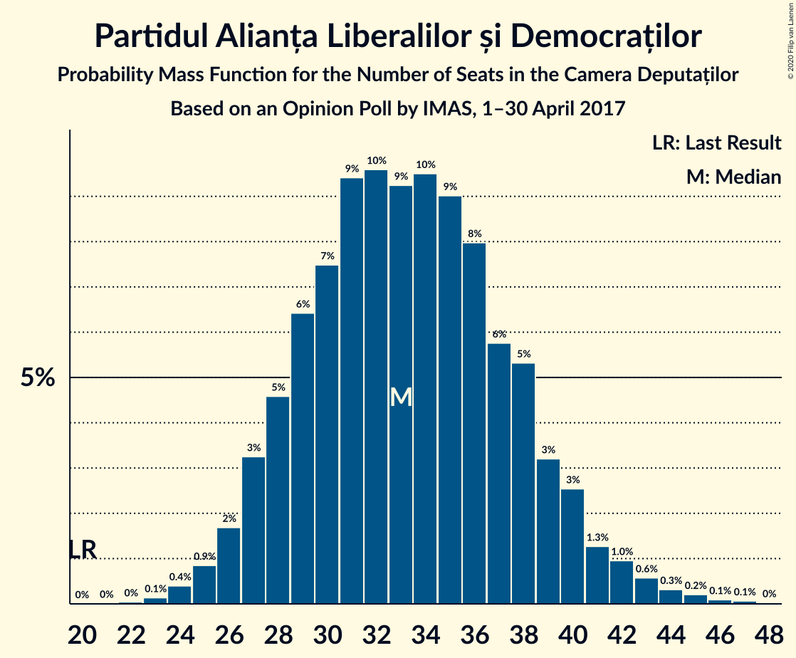

# Opinion Poll by IMAS, 1–30 April 2017

<a href="#voting-intentions">Voting Intentions</a> | <a href="#seats">Seats</a> | <a href="#coalitions">Coalitions</a> | <a href="#technical-information">Technical Information</a>

## Voting Intentions

### Confidence Intervals

| Party | Last Result | Poll Result | 80% Confidence Interval | 90% Confidence Interval | 95% Confidence Interval | 99% Confidence Interval |
|:-----:|:-----------:|:-----------:|:-----------------------:|:-----------------------:|:-----------------------:|:-----------------------:|
| Partidul Social Democrat | 45.5% | 40.6% | 38.6–42.6% |38.1–43.2% |37.6–43.7% |36.7–44.7% |
| Partidul Național Liberal | 20.0% | 25.4% | 23.7–27.2% |23.2–27.7% |22.8–28.2% |22.0–29.1% |
| Partidul Alianța Liberalilor și Democraților | 5.6% | 8.5% | 7.5–9.7% |7.2–10.1% |6.9–10.4% |6.4–11.0% |
| Alianța 2020 USR-PLUS | 8.9% | 8.2% | 7.2–9.4% |6.9–9.8% |6.6–10.1% |6.2–10.7% |

*Note:* The poll result column reflects the actual value used in the calculations. Published results may vary slightly, and in addition be rounded to fewer digits.

## Seats

### Confidence Intervals

| Party | Last Result | Median | 80% Confidence Interval | 90% Confidence Interval | 95% Confidence Interval | 99% Confidence Interval |
|:-----:|:-----------:|:------:|:-----------------------:|:-----------------------:|:-----------------------:|:-----------------------:|
| <a href="#partidul-social-democrat">Partidul Social Democrat</a> | 154 | 157 | 147–174 |145–177 |143–179 |140–Parties of ethnic minorities |
| <a href="#partidul-național-liberal">Partidul Național Liberal</a> | 69 | 99 | 90–110 |88–112 |87–115 |84–119 |
| <a href="#partidul-alianța-liberalilor-și-democraților">Partidul Alianța Liberalilor și Democraților</a> | 20 | 33 | 28–38 |27–40 |26–41 |24–44 |
| <a href="#alianța-2020-usr-plus">Alianța 2020 USR-PLUS</a> | 30 | 31 | 0–35 |0–36 |0–38 |0–40 |

### Partidul Social Democrat

*For a full overview of the results for this party, see the [Partidul Social Democrat](party-partidulsocialdemocrat.html) page.*

| Number of Seats | Probability | Accumulated | Special Marks |
|:---------------:|:-----------:|:-----------:|:-------------:|
| 136 | 0% | 100% |  |
| 137 | 0.1% | 99.9% |  |
| 138 | 0.1% | 99.8% |  |
| 139 | 0.2% | 99.7% |  |
| 140 | 0.3% | 99.5% |  |
| 141 | 0.5% | 99.2% |  |
| 142 | 0.7% | 98.7% |  |
| 143 | 1.0% | 98% |  |
| 144 | 1.4% | 97% |  |
| 145 | 2% | 96% |  |
| 146 | 2% | 94% |  |
| 147 | 3% | 92% |  |
| 148 | 3% | 89% |  |
| 149 | 4% | 85% |  |
| 150 | 4% | 82% |  |
| 151 | 4% | 77% |  |
| 152 | 5% | 73% |  |
| 153 | 4% | 68% |  |
| 154 | 5% | 64% | Last Result |
| 155 | 4% | 60% |  |
| 156 | 4% | 56% |  |
| 157 | 3% | 52% | Median |
| 158 | 3% | 49% |  |
| 159 | 2% | 46% |  |
| 160 | 2% | 44% |  |
| 161 | 2% | 42% |  |
| 162 | 2% | 40% |  |
| 163 | 2% | 38% |  |
| 164 | 2% | 36% |  |
| 165 | 2% | 34% | Majority |
| 166 | 2% | 32% |  |
| 167 | 3% | 30% |  |
| 168 | 3% | 27% |  |
| 169 | 3% | 25% |  |
| 170 | 3% | 22% |  |
| 171 | 3% | 19% |  |
| 172 | 3% | 16% |  |
| 173 | 3% | 14% |  |
| 174 | 2% | 11% |  |
| 175 | 2% | 9% |  |
| 176 | 2% | 7% |  |
| 177 | 1.4% | 5% |  |
| 178 | 1.1% | 4% |  |
| 179 | 0.8% | 3% |  |
| 180 | 0.6% | 2% |  |
| 181 | 0.4% | 1.3% |  |
| 182 | 0.3% | 0.9% |  |
| 183 | 0.2% | 0.6% |  |
| 184 | 0.2% | 0.4% |  |
| 185 | 0.1% | 0.2% |  |
| 186 | 0.1% | 0.1% |  |
| 187 | 0% | 0.1% |  |
| 188 | 0% | 0% |  |

### Partidul Național Liberal

*For a full overview of the results for this party, see the [Partidul Național Liberal](party-partidulnaționalliberal.html) page.*

| Number of Seats | Probability | Accumulated | Special Marks |
|:---------------:|:-----------:|:-----------:|:-------------:|
| 69 | 0% | 100% | Last Result |
| 70 | 0% | 100% |  |
| 71 | 0% | 100% |  |
| 72 | 0% | 100% |  |
| 73 | 0% | 100% |  |
| 74 | 0% | 100% |  |
| 75 | 0% | 100% |  |
| 76 | 0% | 100% |  |
| 77 | 0% | 100% |  |
| 78 | 0% | 100% |  |
| 79 | 0% | 100% |  |
| 80 | 0% | 100% |  |
| 81 | 0.1% | 99.9% |  |
| 82 | 0.1% | 99.9% |  |
| 83 | 0.2% | 99.7% |  |
| 84 | 0.4% | 99.5% |  |
| 85 | 0.6% | 99.1% |  |
| 86 | 0.8% | 98.5% |  |
| 87 | 1.4% | 98% |  |
| 88 | 2% | 96% |  |
| 89 | 2% | 95% |  |
| 90 | 3% | 92% |  |
| 91 | 3% | 89% |  |
| 92 | 4% | 86% |  |
| 93 | 5% | 82% |  |
| 94 | 5% | 77% |  |
| 95 | 5% | 72% |  |
| 96 | 5% | 68% |  |
| 97 | 5% | 63% |  |
| 98 | 5% | 58% |  |
| 99 | 5% | 53% | Median |
| 100 | 5% | 48% |  |
| 101 | 4% | 43% |  |
| 102 | 4% | 39% |  |
| 103 | 4% | 35% |  |
| 104 | 4% | 31% |  |
| 105 | 3% | 27% |  |
| 106 | 4% | 24% |  |
| 107 | 4% | 20% |  |
| 108 | 3% | 16% |  |
| 109 | 3% | 14% |  |
| 110 | 3% | 11% |  |
| 111 | 2% | 8% |  |
| 112 | 2% | 7% |  |
| 113 | 1.4% | 5% |  |
| 114 | 1.0% | 4% |  |
| 115 | 0.7% | 3% |  |
| 116 | 0.6% | 2% |  |
| 117 | 0.4% | 1.2% |  |
| 118 | 0.3% | 0.8% |  |
| 119 | 0.2% | 0.5% |  |
| 120 | 0.1% | 0.3% |  |
| 121 | 0.1% | 0.2% |  |
| 122 | 0.1% | 0.1% |  |
| 123 | 0% | 0.1% |  |
| 124 | 0% | 0% |  |

### Partidul Alianța Liberalilor și Democraților

*For a full overview of the results for this party, see the [Partidul Alianța Liberalilor și Democraților](party-partidulalianțaliberalilorșidemocraților.html) page.*

| Number of Seats | Probability | Accumulated | Special Marks |
|:---------------:|:-----------:|:-----------:|:-------------:|
| 20 | 0% | 100% | Last Result |
| 21 | 0% | 100% |  |
| 22 | 0% | 100% |  |
| 23 | 0.1% | 99.9% |  |
| 24 | 0.4% | 99.8% |  |
| 25 | 0.9% | 99.4% |  |
| 26 | 2% | 98.6% |  |
| 27 | 3% | 97% |  |
| 28 | 5% | 94% |  |
| 29 | 6% | 89% |  |
| 30 | 7% | 83% |  |
| 31 | 9% | 75% |  |
| 32 | 10% | 66% |  |
| 33 | 9% | 56% | Median |
| 34 | 10% | 47% |  |
| 35 | 9% | 37% |  |
| 36 | 8% | 28% |  |
| 37 | 6% | 20% |  |
| 38 | 5% | 15% |  |
| 39 | 3% | 9% |  |
| 40 | 3% | 6% |  |
| 41 | 1.3% | 4% |  |
| 42 | 1.0% | 2% |  |
| 43 | 0.6% | 1.3% |  |
| 44 | 0.3% | 0.7% |  |
| 45 | 0.2% | 0.4% |  |
| 46 | 0.1% | 0.2% |  |
| 47 | 0.1% | 0.1% |  |
| 48 | 0% | 0% |  |

### Alianța 2020 USR-PLUS

*For a full overview of the results for this party, see the [Alianța 2020 USR-PLUS](party-alianța2020usr-plus.html) page.*

| Number of Seats | Probability | Accumulated | Special Marks |
|:---------------:|:-----------:|:-----------:|:-------------:|
| 0 | 40% | 100% |  |
| 1 | 0% | 60% |  |
| 2 | 0% | 60% |  |
| 3 | 0% | 60% |  |
| 4 | 0% | 60% |  |
| 5 | 0% | 60% |  |
| 6 | 0% | 60% |  |
| 7 | 0% | 60% |  |
| 8 | 0% | 60% |  |
| 9 | 0% | 60% |  |
| 10 | 0% | 60% |  |
| 11 | 0% | 60% |  |
| 12 | 0% | 60% |  |
| 13 | 0% | 60% |  |
| 14 | 0% | 60% |  |
| 15 | 0% | 60% |  |
| 16 | 0% | 60% |  |
| 17 | 0% | 60% |  |
| 18 | 0% | 60% |  |
| 19 | 0% | 60% |  |
| 20 | 0% | 60% |  |
| 21 | 0% | 60% |  |
| 22 | 0% | 60% |  |
| 23 | 0% | 60% |  |
| 24 | 0% | 60% |  |
| 25 | 0% | 60% |  |
| 26 | 0% | 60% |  |
| 27 | 0% | 60% |  |
| 28 | 0% | 60% |  |
| 29 | 0.4% | 60% |  |
| 30 | 6% | 59% | Last Result |
| 31 | 12% | 53% | Median |
| 32 | 11% | 41% |  |
| 33 | 9% | 30% |  |
| 34 | 8% | 21% |  |
| 35 | 5% | 13% |  |
| 36 | 4% | 8% |  |
| 37 | 2% | 5% |  |
| 38 | 1.3% | 3% |  |
| 39 | 0.6% | 1.3% |  |
| 40 | 0.4% | 0.7% |  |
| 41 | 0.2% | 0.3% |  |
| 42 | 0.1% | 0.1% |  |
| 43 | 0% | 0.1% |  |
| 44 | 0% | 0% |  |

## Coalitions

### Confidence Intervals

| Coalition | Last Result | Median | Majority? | 80% Confidence Interval | 90% Confidence Interval | 95% Confidence Interval | 99% Confidence Interval |
|:---------:|:-----------:|:------:|:---------:|:-----------------------:|:-----------------------:|:-----------------------:|:-----------------------:|
| Partidul Social Democrat – Partidul Alianța Liberalilor și Democraților | 174 | 189 | 100% | 179–209 | 177–212 | 175–214 | 172–218 |
| Partidul Național Liberal – Partidul Alianța Liberalilor și Democraților – Alianța 2020 USR-PLUS | 119 | 155 | 11% | 138–165 | 135–167 | 133–169 | 129–172 |
| Partidul Național Liberal – Alianța 2020 USR-PLUS | 99 | 123 | 0% | 103–133 | 100–135 | 98–137 | 94–140 |
| Partidul Național Liberal | 69 | 99 | 0% | 90–110 | 88–112 | 87–115 | 84–119 |

### Partidul Social Democrat – Partidul Alianța Liberalilor și Democraților

| Number of Seats | Probability | Accumulated | Special Marks |
|:---------------:|:-----------:|:-----------:|:-------------:|
| 168 | 0% | 100% |  |
| 169 | 0.1% | 99.9% |  |
| 170 | 0.1% | 99.8% |  |
| 171 | 0.2% | 99.7% |  |
| 172 | 0.3% | 99.5% |  |
| 173 | 0.5% | 99.2% |  |
| 174 | 0.7% | 98.7% | Last Result |
| 175 | 1.0% | 98% |  |
| 176 | 1.4% | 97% |  |
| 177 | 2% | 95% |  |
| 178 | 2% | 94% |  |
| 179 | 3% | 91% |  |
| 180 | 4% | 88% |  |
| 181 | 4% | 85% |  |
| 182 | 4% | 81% |  |
| 183 | 5% | 76% |  |
| 184 | 5% | 72% |  |
| 185 | 4% | 67% |  |
| 186 | 4% | 63% |  |
| 187 | 4% | 58% |  |
| 188 | 3% | 55% |  |
| 189 | 3% | 51% |  |
| 190 | 2% | 48% | Median |
| 191 | 2% | 46% |  |
| 192 | 1.4% | 44% |  |
| 193 | 1.2% | 43% |  |
| 194 | 1.0% | 41% |  |
| 195 | 0.9% | 41% |  |
| 196 | 0.9% | 40% |  |
| 197 | 0.9% | 39% |  |
| 198 | 1.1% | 38% |  |
| 199 | 1.5% | 37% |  |
| 200 | 2% | 35% |  |
| 201 | 2% | 34% |  |
| 202 | 2% | 32% |  |
| 203 | 3% | 29% |  |
| 204 | 3% | 27% |  |
| 205 | 3% | 24% |  |
| 206 | 3% | 21% |  |
| 207 | 3% | 18% |  |
| 208 | 3% | 15% |  |
| 209 | 3% | 12% |  |
| 210 | 2% | 9% |  |
| 211 | 2% | 7% |  |
| 212 | 2% | 6% |  |
| 213 | 1.1% | 4% |  |
| 214 | 0.8% | 3% |  |
| 215 | 0.7% | 2% |  |
| 216 | 0.4% | 1.2% |  |
| 217 | 0.3% | 0.8% |  |
| 218 | 0.2% | 0.5% |  |
| 219 | 0.1% | 0.3% |  |
| 220 | 0.1% | 0.2% |  |
| 221 | 0% | 0.1% |  |
| 222 | 0% | 0.1% |  |
| 223 | 0% | 0% |  |

### Partidul Național Liberal – Partidul Alianța Liberalilor și Democraților – Alianța 2020 USR-PLUS

| Number of Seats | Probability | Accumulated | Special Marks |
|:---------------:|:-----------:|:-----------:|:-------------:|
| 119 | 0% | 100% | Last Result |
| 120 | 0% | 100% |  |
| 121 | 0% | 100% |  |
| 122 | 0% | 100% |  |
| 123 | 0% | 100% |  |
| 124 | 0% | 100% |  |
| 125 | 0% | 100% |  |
| 126 | 0.1% | 99.9% |  |
| 127 | 0.1% | 99.9% |  |
| 128 | 0.2% | 99.8% |  |
| 129 | 0.2% | 99.6% |  |
| 130 | 0.3% | 99.4% |  |
| 131 | 0.4% | 99.1% |  |
| 132 | 0.6% | 98.7% |  |
| 133 | 0.8% | 98% |  |
| 134 | 1.1% | 97% |  |
| 135 | 1.4% | 96% |  |
| 136 | 2% | 95% |  |
| 137 | 2% | 93% |  |
| 138 | 2% | 91% |  |
| 139 | 3% | 89% |  |
| 140 | 3% | 86% |  |
| 141 | 3% | 84% |  |
| 142 | 3% | 81% |  |
| 143 | 3% | 78% |  |
| 144 | 3% | 75% |  |
| 145 | 3% | 73% |  |
| 146 | 2% | 70% |  |
| 147 | 2% | 68% |  |
| 148 | 2% | 66% |  |
| 149 | 2% | 64% |  |
| 150 | 2% | 62% |  |
| 151 | 2% | 60% |  |
| 152 | 2% | 58% |  |
| 153 | 2% | 56% |  |
| 154 | 3% | 54% |  |
| 155 | 3% | 51% |  |
| 156 | 4% | 48% |  |
| 157 | 4% | 44% |  |
| 158 | 5% | 40% |  |
| 159 | 4% | 36% |  |
| 160 | 5% | 32% |  |
| 161 | 4% | 27% |  |
| 162 | 4% | 23% |  |
| 163 | 4% | 18% | Median |
| 164 | 3% | 15% |  |
| 165 | 3% | 11% | Majority |
| 166 | 2% | 8% |  |
| 167 | 2% | 6% |  |
| 168 | 1.4% | 4% |  |
| 169 | 1.0% | 3% |  |
| 170 | 0.7% | 2% |  |
| 171 | 0.5% | 1.3% |  |
| 172 | 0.3% | 0.8% |  |
| 173 | 0.2% | 0.5% |  |
| 174 | 0.1% | 0.3% |  |
| 175 | 0.1% | 0.2% |  |
| 176 | 0% | 0.1% |  |
| 177 | 0% | 0% |  |

### Partidul Național Liberal – Alianța 2020 USR-PLUS

| Number of Seats | Probability | Accumulated | Special Marks |
|:---------------:|:-----------:|:-----------:|:-------------:|
| 90 | 0% | 100% |  |
| 91 | 0% | 99.9% |  |
| 92 | 0.1% | 99.9% |  |
| 93 | 0.1% | 99.8% |  |
| 94 | 0.2% | 99.7% |  |
| 95 | 0.3% | 99.5% |  |
| 96 | 0.4% | 99.2% |  |
| 97 | 0.7% | 98.8% |  |
| 98 | 0.8% | 98% |  |
| 99 | 1.1% | 97% | Last Result |
| 100 | 2% | 96% |  |
| 101 | 2% | 94% |  |
| 102 | 2% | 93% |  |
| 103 | 3% | 91% |  |
| 104 | 3% | 88% |  |
| 105 | 3% | 85% |  |
| 106 | 3% | 82% |  |
| 107 | 3% | 79% |  |
| 108 | 3% | 76% |  |
| 109 | 3% | 73% |  |
| 110 | 2% | 71% |  |
| 111 | 2% | 68% |  |
| 112 | 2% | 66% |  |
| 113 | 1.5% | 65% |  |
| 114 | 1.1% | 63% |  |
| 115 | 0.9% | 62% |  |
| 116 | 0.9% | 61% |  |
| 117 | 0.9% | 60% |  |
| 118 | 1.0% | 59% |  |
| 119 | 1.2% | 59% |  |
| 120 | 1.4% | 57% |  |
| 121 | 2% | 56% |  |
| 122 | 2% | 54% |  |
| 123 | 3% | 52% |  |
| 124 | 3% | 49% |  |
| 125 | 4% | 45% |  |
| 126 | 4% | 42% |  |
| 127 | 4% | 37% |  |
| 128 | 5% | 33% |  |
| 129 | 5% | 28% |  |
| 130 | 4% | 24% | Median |
| 131 | 4% | 19% |  |
| 132 | 4% | 15% |  |
| 133 | 3% | 12% |  |
| 134 | 2% | 9% |  |
| 135 | 2% | 6% |  |
| 136 | 1.4% | 5% |  |
| 137 | 1.0% | 3% |  |
| 138 | 0.7% | 2% |  |
| 139 | 0.5% | 1.3% |  |
| 140 | 0.3% | 0.8% |  |
| 141 | 0.2% | 0.5% |  |
| 142 | 0.1% | 0.3% |  |
| 143 | 0.1% | 0.2% |  |
| 144 | 0% | 0.1% |  |
| 145 | 0% | 0% |  |

### Partidul Național Liberal

| Number of Seats | Probability | Accumulated | Special Marks |
|:---------------:|:-----------:|:-----------:|:-------------:|
| 69 | 0% | 100% | Last Result |
| 70 | 0% | 100% |  |
| 71 | 0% | 100% |  |
| 72 | 0% | 100% |  |
| 73 | 0% | 100% |  |
| 74 | 0% | 100% |  |
| 75 | 0% | 100% |  |
| 76 | 0% | 100% |  |
| 77 | 0% | 100% |  |
| 78 | 0% | 100% |  |
| 79 | 0% | 100% |  |
| 80 | 0% | 100% |  |
| 81 | 0.1% | 99.9% |  |
| 82 | 0.1% | 99.9% |  |
| 83 | 0.2% | 99.7% |  |
| 84 | 0.4% | 99.5% |  |
| 85 | 0.6% | 99.1% |  |
| 86 | 0.8% | 98.5% |  |
| 87 | 1.4% | 98% |  |
| 88 | 2% | 96% |  |
| 89 | 2% | 95% |  |
| 90 | 3% | 92% |  |
| 91 | 3% | 89% |  |
| 92 | 4% | 86% |  |
| 93 | 5% | 82% |  |
| 94 | 5% | 77% |  |
| 95 | 5% | 72% |  |
| 96 | 5% | 68% |  |
| 97 | 5% | 63% |  |
| 98 | 5% | 58% |  |
| 99 | 5% | 53% | Median |
| 100 | 5% | 48% |  |
| 101 | 4% | 43% |  |
| 102 | 4% | 39% |  |
| 103 | 4% | 35% |  |
| 104 | 4% | 31% |  |
| 105 | 3% | 27% |  |
| 106 | 4% | 24% |  |
| 107 | 4% | 20% |  |
| 108 | 3% | 16% |  |
| 109 | 3% | 14% |  |
| 110 | 3% | 11% |  |
| 111 | 2% | 8% |  |
| 112 | 2% | 7% |  |
| 113 | 1.4% | 5% |  |
| 114 | 1.0% | 4% |  |
| 115 | 0.7% | 3% |  |
| 116 | 0.6% | 2% |  |
| 117 | 0.4% | 1.2% |  |
| 118 | 0.3% | 0.8% |  |
| 119 | 0.2% | 0.5% |  |
| 120 | 0.1% | 0.3% |  |
| 121 | 0.1% | 0.2% |  |
| 122 | 0.1% | 0.1% |  |
| 123 | 0% | 0.1% |  |
| 124 | 0% | 0% |  |

## Technical Information

### Opinion Poll

+ **Polling firm:** IMAS
+ **Commissioner(s):** —
+ **Fieldwork period:** 1–30 April 2017

### Calculations

+ **Sample size:** 1000
+ **Simulations done:** 1,048,575
+ **Error estimate:** 0.47%

