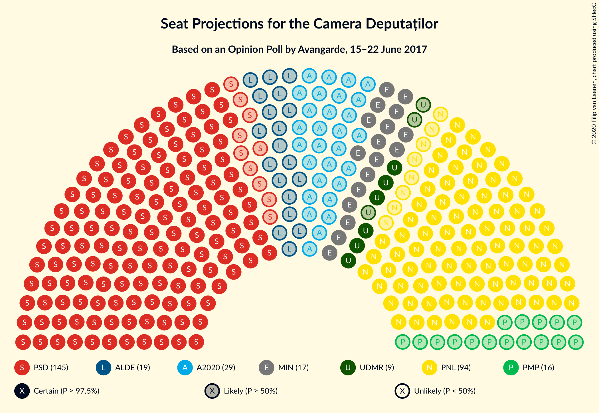
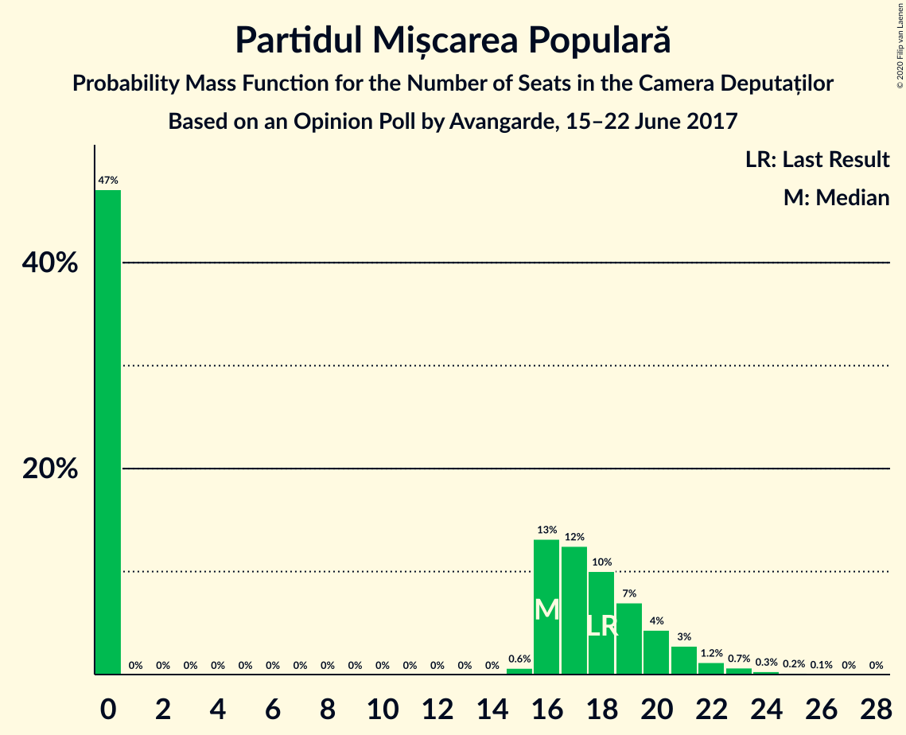
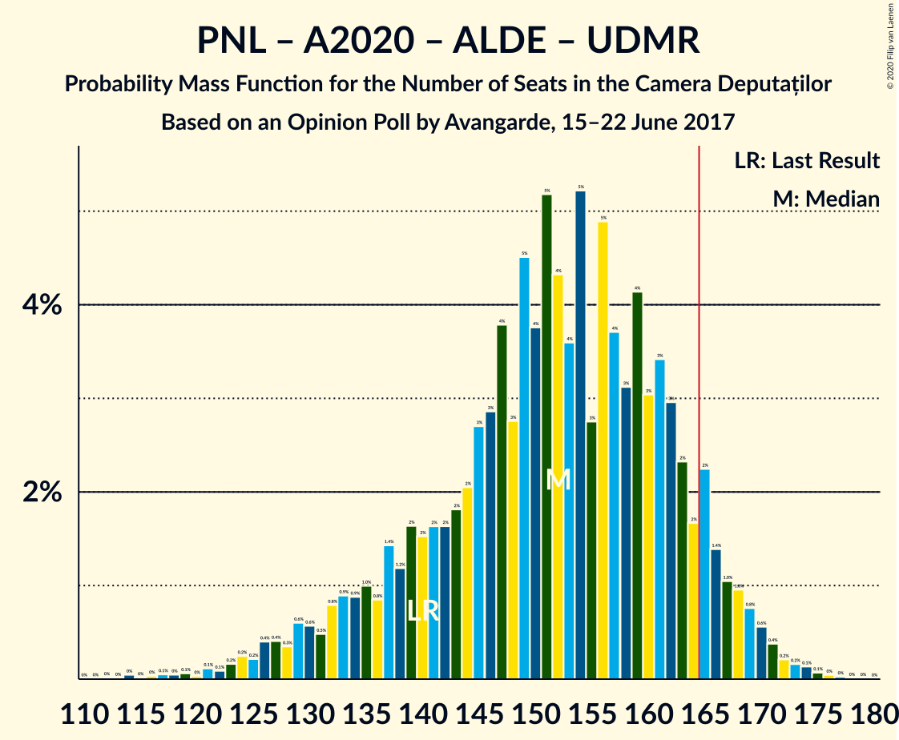
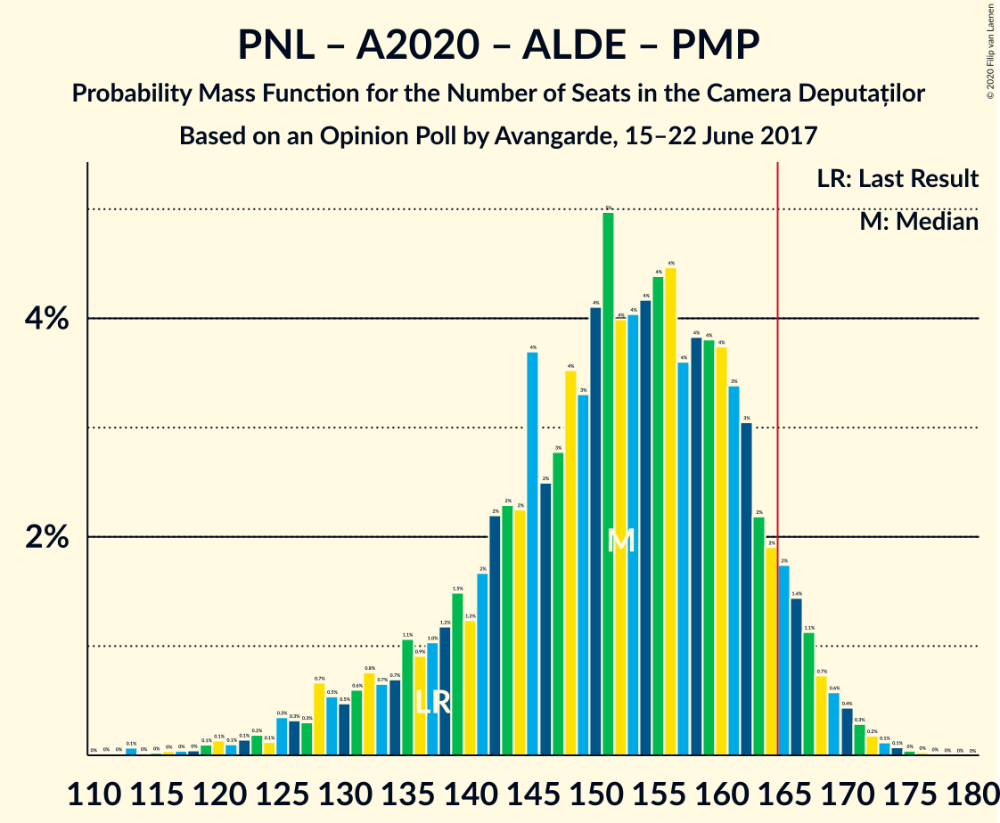
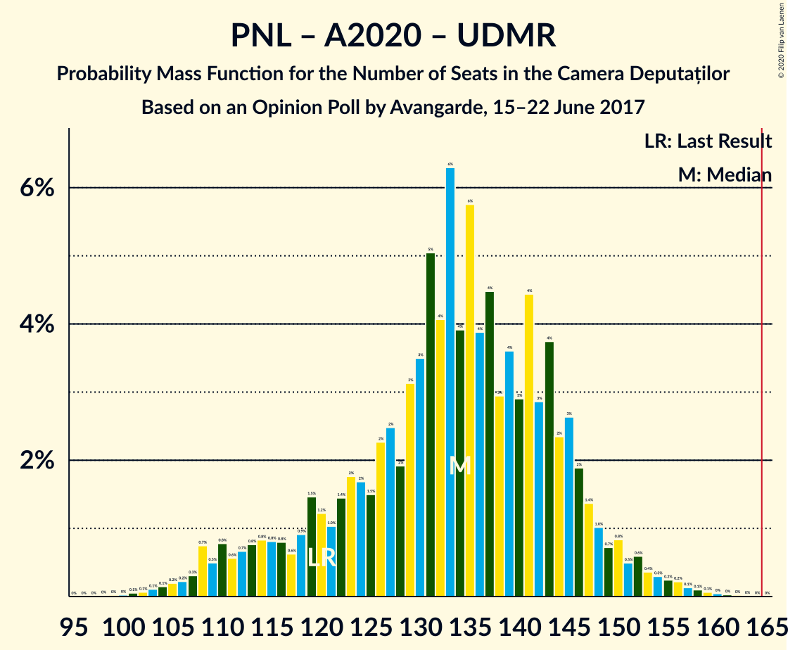
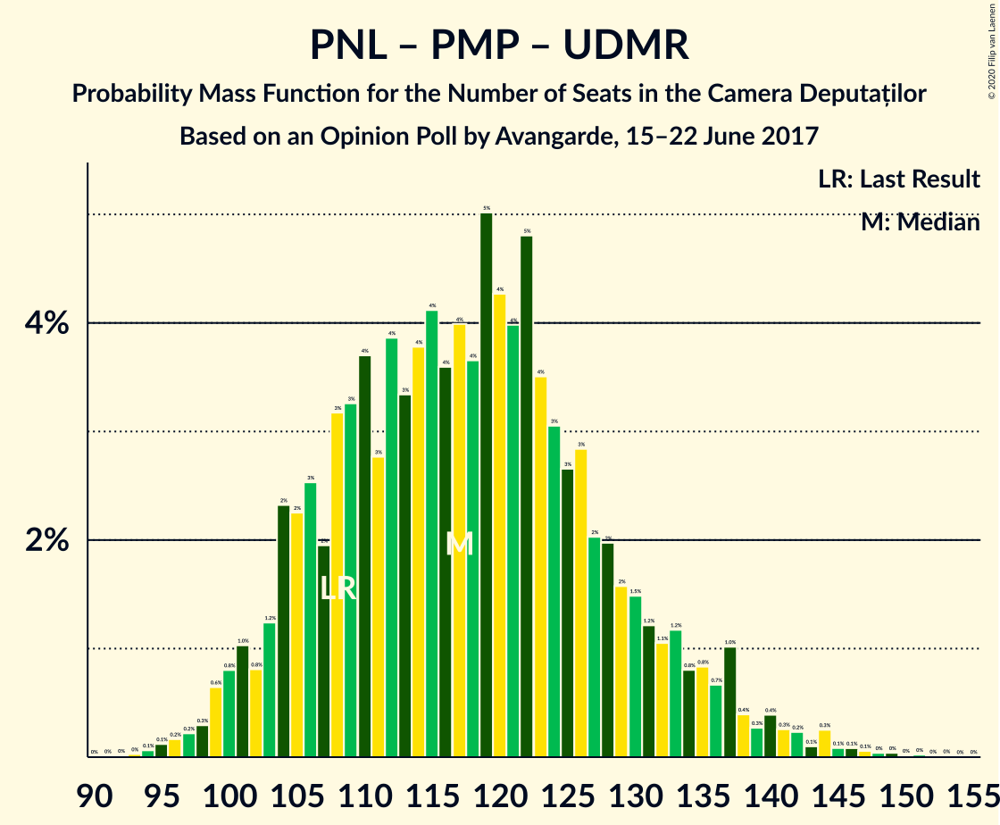

# Opinion Poll by Avangarde, 15–22 June 2017

<a href="#voting-intentions">Voting Intentions</a> | <a href="#seats">Seats</a> | <a href="#coalitions">Coalitions</a> | <a href="#technical-information">Technical Information</a>

## Voting Intentions

### Confidence Intervals

| Party | Last Result | Poll Result | 80% Confidence Interval | 90% Confidence Interval | 95% Confidence Interval | 99% Confidence Interval |
|:-----:|:-----------:|:-----------:|:-----------------------:|:-----------------------:|:-----------------------:|:-----------------------:|
| Partidul Social Democrat | 45.5% | 46.0% | 43.7–48.3% |43.0–48.9% |42.5–49.5% |41.4–50.6% |
| Partidul Național Liberal | 20.0% | 30.0% | 27.9–32.1% |27.3–32.7% |26.8–33.3% |25.9–34.3% |
| Alianța 2020 USR-PLUS | 8.9% | 9.0% | 7.8–10.4% |7.4–10.8% |7.1–11.2% |6.6–11.9% |
| Partidul Alianța Liberalilor și Democraților | 5.6% | 6.0% | 5.0–7.3% |4.8–7.6% |4.6–7.9% |4.1–8.6% |
| Partidul Mișcarea Populară | 5.4% | 5.0% | 4.1–6.1% |3.9–6.5% |3.7–6.8% |3.3–7.3% |
| Uniunea Democrată Maghiară din România | 6.2% | 2.9% | 2.3–3.9% |2.1–4.1% |2.0–4.4% |1.7–4.9% |

*Note:* The poll result column reflects the actual value used in the calculations. Published results may vary slightly, and in addition be rounded to fewer digits.

## Seats

### Confidence Intervals

| Party | Last Result | Median | 80% Confidence Interval | 90% Confidence Interval | 95% Confidence Interval | 99% Confidence Interval |
|:-----:|:-----------:|:------:|:-----------------------:|:-----------------------:|:-----------------------:|:-----------------------:|
| <a href="#partidul-social-democrat">Partidul Social Democrat</a> | 154 | 149 | 140–166 |138–171 |135–173 |132–180 |
| <a href="#partidul-național-liberal">Partidul Național Liberal</a> | 69 | 98 | 90–108 |88–111 |86–115 |83–123 |
| <a href="#alianța-2020-usr-plus">Alianța 2020 USR-PLUS</a> | 30 | 29 | 0–34 |0–35 |0–36 |0–39 |
| <a href="#partidul-alianța-liberalilor-și-democraților">Partidul Alianța Liberalilor și Democraților</a> | 20 | 20 | 16–24 |0–25 |0–26 |0–28 |
| <a href="#partidul-mișcarea-populară">Partidul Mișcarea Populară</a> | 18 | 16 | 0–19 |0–21 |0–22 |0–24 |
| <a href="#uniunea-democrată-maghiară-din-românia">Uniunea Democrată Maghiară din România</a> | 21 | 10 | 7–12 |6–13 |6–14 |5–16 |

### Partidul Social Democrat

*For a full overview of the results for this party, see the [Partidul Social Democrat](party-partidulsocialdemocrat.html) page.*

| Number of Seats | Probability | Accumulated | Special Marks |
|:---------------:|:-----------:|:-----------:|:-------------:|
| 127 | 0% | 100% |  |
| 128 | 0.1% | 99.9% |  |
| 129 | 0.1% | 99.9% |  |
| 130 | 0.1% | 99.8% |  |
| 131 | 0.2% | 99.7% |  |
| 132 | 0.4% | 99.6% |  |
| 133 | 0.5% | 99.2% |  |
| 134 | 0.2% | 98.7% |  |
| 135 | 1.0% | 98% |  |
| 136 | 0.3% | 97% |  |
| 137 | 2% | 97% |  |
| 138 | 2% | 95% |  |
| 139 | 2% | 94% |  |
| 140 | 4% | 92% |  |
| 141 | 4% | 88% |  |
| 142 | 4% | 85% |  |
| 143 | 3% | 81% |  |
| 144 | 5% | 78% |  |
| 145 | 7% | 73% |  |
| 146 | 4% | 66% |  |
| 147 | 5% | 62% |  |
| 148 | 3% | 57% |  |
| 149 | 4% | 54% | Median |
| 150 | 6% | 50% |  |
| 151 | 7% | 44% |  |
| 152 | 4% | 36% |  |
| 153 | 3% | 32% |  |
| 154 | 1.5% | 29% | Last Result |
| 155 | 2% | 28% |  |
| 156 | 2% | 25% |  |
| 157 | 1.5% | 23% |  |
| 158 | 1.1% | 22% |  |
| 159 | 1.4% | 21% |  |
| 160 | 3% | 19% |  |
| 161 | 0.8% | 16% |  |
| 162 | 1.2% | 15% |  |
| 163 | 1.3% | 14% |  |
| 164 | 1.2% | 13% |  |
| 165 | 0.9% | 12% |  |
| 166 | 1.5% | 11% | Majority |
| 167 | 1.4% | 9% |  |
| 168 | 0.9% | 8% |  |
| 169 | 0.4% | 7% |  |
| 170 | 1.4% | 6% |  |
| 171 | 0.8% | 5% |  |
| 172 | 0.3% | 4% |  |
| 173 | 2% | 4% |  |
| 174 | 0.1% | 2% |  |
| 175 | 0.2% | 2% |  |
| 176 | 0.4% | 2% |  |
| 177 | 0.1% | 1.1% |  |
| 178 | 0.3% | 1.0% |  |
| 179 | 0% | 0.7% |  |
| 180 | 0.4% | 0.7% |  |
| 181 | 0% | 0.3% |  |
| 182 | 0.1% | 0.3% |  |
| 183 | 0% | 0.2% |  |
| 184 | 0% | 0.2% |  |
| 185 | 0% | 0.2% |  |
| 186 | 0% | 0.1% |  |
| 187 | 0% | 0.1% |  |
| 188 | 0% | 0.1% |  |
| 189 | 0% | 0.1% |  |
| 190 | 0% | 0.1% |  |
| 191 | 0.1% | 0.1% |  |
| 192 | 0% | 0% |  |

### Partidul Național Liberal

*For a full overview of the results for this party, see the [Partidul Național Liberal](party-partidulnaționalliberal.html) page.*

| Number of Seats | Probability | Accumulated | Special Marks |
|:---------------:|:-----------:|:-----------:|:-------------:|
| 69 | 0% | 100% | Last Result |
| 70 | 0% | 100% |  |
| 71 | 0% | 100% |  |
| 72 | 0% | 100% |  |
| 73 | 0% | 100% |  |
| 74 | 0% | 100% |  |
| 75 | 0% | 100% |  |
| 76 | 0% | 100% |  |
| 77 | 0% | 100% |  |
| 78 | 0% | 100% |  |
| 79 | 0.1% | 100% |  |
| 80 | 0.1% | 99.9% |  |
| 81 | 0.2% | 99.8% |  |
| 82 | 0.1% | 99.6% |  |
| 83 | 0.4% | 99.6% |  |
| 84 | 0.6% | 99.1% |  |
| 85 | 0.7% | 98% |  |
| 86 | 0.9% | 98% |  |
| 87 | 0.9% | 97% |  |
| 88 | 2% | 96% |  |
| 89 | 1.3% | 94% |  |
| 90 | 6% | 93% |  |
| 91 | 2% | 87% |  |
| 92 | 2% | 85% |  |
| 93 | 5% | 83% |  |
| 94 | 10% | 77% |  |
| 95 | 4% | 68% |  |
| 96 | 5% | 64% |  |
| 97 | 7% | 59% |  |
| 98 | 3% | 52% | Median |
| 99 | 4% | 49% |  |
| 100 | 8% | 45% |  |
| 101 | 5% | 38% |  |
| 102 | 6% | 33% |  |
| 103 | 3% | 27% |  |
| 104 | 5% | 24% |  |
| 105 | 3% | 19% |  |
| 106 | 3% | 16% |  |
| 107 | 2% | 13% |  |
| 108 | 3% | 12% |  |
| 109 | 2% | 9% |  |
| 110 | 0.8% | 7% |  |
| 111 | 2% | 6% |  |
| 112 | 0.5% | 4% |  |
| 113 | 0.7% | 4% |  |
| 114 | 0.7% | 3% |  |
| 115 | 0.5% | 3% |  |
| 116 | 0.2% | 2% |  |
| 117 | 0.1% | 2% |  |
| 118 | 0.1% | 2% |  |
| 119 | 0.5% | 2% |  |
| 120 | 0.5% | 1.2% |  |
| 121 | 0.1% | 0.7% |  |
| 122 | 0% | 0.7% |  |
| 123 | 0.1% | 0.6% |  |
| 124 | 0% | 0.5% |  |
| 125 | 0.2% | 0.5% |  |
| 126 | 0.1% | 0.3% |  |
| 127 | 0% | 0.2% |  |
| 128 | 0.2% | 0.2% |  |
| 129 | 0% | 0% |  |

### Alianța 2020 USR-PLUS

*For a full overview of the results for this party, see the [Alianța 2020 USR-PLUS](party-alianța2020usr-plus.html) page.*

| Number of Seats | Probability | Accumulated | Special Marks |
|:---------------:|:-----------:|:-----------:|:-------------:|
| 0 | 16% | 100% |  |
| 1 | 0% | 84% |  |
| 2 | 0% | 84% |  |
| 3 | 0% | 84% |  |
| 4 | 0% | 84% |  |
| 5 | 0% | 84% |  |
| 6 | 0% | 84% |  |
| 7 | 0% | 84% |  |
| 8 | 0% | 84% |  |
| 9 | 0% | 84% |  |
| 10 | 0% | 84% |  |
| 11 | 0% | 84% |  |
| 12 | 0% | 84% |  |
| 13 | 0% | 84% |  |
| 14 | 0% | 84% |  |
| 15 | 0% | 84% |  |
| 16 | 0% | 84% |  |
| 17 | 0% | 84% |  |
| 18 | 0% | 84% |  |
| 19 | 0% | 84% |  |
| 20 | 0% | 84% |  |
| 21 | 0% | 84% |  |
| 22 | 0% | 84% |  |
| 23 | 0% | 84% |  |
| 24 | 0% | 84% |  |
| 25 | 5% | 84% |  |
| 26 | 5% | 79% |  |
| 27 | 7% | 74% |  |
| 28 | 15% | 67% |  |
| 29 | 18% | 52% | Median |
| 30 | 6% | 35% | Last Result |
| 31 | 9% | 29% |  |
| 32 | 6% | 20% |  |
| 33 | 4% | 15% |  |
| 34 | 4% | 11% |  |
| 35 | 4% | 6% |  |
| 36 | 1.0% | 3% |  |
| 37 | 0.7% | 2% |  |
| 38 | 0.5% | 1.2% |  |
| 39 | 0.4% | 0.8% |  |
| 40 | 0.2% | 0.4% |  |
| 41 | 0.1% | 0.2% |  |
| 42 | 0% | 0.1% |  |
| 43 | 0% | 0% |  |

### Partidul Alianța Liberalilor și Democraților

*For a full overview of the results for this party, see the [Partidul Alianța Liberalilor și Democraților](party-partidulalianțaliberalilorșidemocraților.html) page.*

| Number of Seats | Probability | Accumulated | Special Marks |
|:---------------:|:-----------:|:-----------:|:-------------:|
| 0 | 8% | 100% |  |
| 1 | 0% | 92% |  |
| 2 | 0% | 92% |  |
| 3 | 0% | 92% |  |
| 4 | 0% | 92% |  |
| 5 | 0% | 92% |  |
| 6 | 0% | 92% |  |
| 7 | 0% | 92% |  |
| 8 | 0% | 92% |  |
| 9 | 0% | 92% |  |
| 10 | 0% | 92% |  |
| 11 | 0% | 92% |  |
| 12 | 0% | 92% |  |
| 13 | 0% | 92% |  |
| 14 | 0% | 92% |  |
| 15 | 0.2% | 92% |  |
| 16 | 7% | 92% |  |
| 17 | 5% | 85% |  |
| 18 | 14% | 80% |  |
| 19 | 16% | 66% |  |
| 20 | 15% | 50% | Last Result, Median |
| 21 | 13% | 35% |  |
| 22 | 6% | 22% |  |
| 23 | 4% | 16% |  |
| 24 | 5% | 11% |  |
| 25 | 2% | 6% |  |
| 26 | 3% | 5% |  |
| 27 | 1.2% | 2% |  |
| 28 | 0.3% | 0.7% |  |
| 29 | 0.2% | 0.3% |  |
| 30 | 0.1% | 0.1% |  |
| 31 | 0% | 0.1% |  |
| 32 | 0% | 0% |  |

### Partidul Mișcarea Populară

*For a full overview of the results for this party, see the [Partidul Mișcarea Populară](party-partidulmișcareapopulară.html) page.*

| Number of Seats | Probability | Accumulated | Special Marks |
|:---------------:|:-----------:|:-----------:|:-------------:|
| 0 | 48% | 100% |  |
| 1 | 0% | 52% |  |
| 2 | 0% | 52% |  |
| 3 | 0% | 52% |  |
| 4 | 0% | 52% |  |
| 5 | 0% | 52% |  |
| 6 | 0% | 52% |  |
| 7 | 0% | 52% |  |
| 8 | 0% | 52% |  |
| 9 | 0% | 52% |  |
| 10 | 0% | 52% |  |
| 11 | 0% | 52% |  |
| 12 | 0% | 52% |  |
| 13 | 0% | 52% |  |
| 14 | 0% | 52% |  |
| 15 | 0.1% | 52% |  |
| 16 | 15% | 52% | Median |
| 17 | 13% | 38% |  |
| 18 | 10% | 24% | Last Result |
| 19 | 5% | 15% |  |
| 20 | 4% | 10% |  |
| 21 | 3% | 5% |  |
| 22 | 1.2% | 3% |  |
| 23 | 0.8% | 1.4% |  |
| 24 | 0.4% | 0.6% |  |
| 25 | 0.1% | 0.2% |  |
| 26 | 0% | 0.1% |  |
| 27 | 0% | 0% |  |

### Uniunea Democrată Maghiară din România

*For a full overview of the results for this party, see the [Uniunea Democrată Maghiară din România](party-uniuneademocratămaghiarădinromânia.html) page.*

| Number of Seats | Probability | Accumulated | Special Marks |
|:---------------:|:-----------:|:-----------:|:-------------:|
| 4 | 0.1% | 100% |  |
| 5 | 0.8% | 99.9% |  |
| 6 | 5% | 99.1% |  |
| 7 | 10% | 94% |  |
| 8 | 14% | 85% |  |
| 9 | 18% | 71% |  |
| 10 | 20% | 53% | Median |
| 11 | 14% | 33% |  |
| 12 | 10% | 18% |  |
| 13 | 4% | 8% |  |
| 14 | 3% | 5% |  |
| 15 | 0.9% | 2% |  |
| 16 | 0.5% | 0.7% |  |
| 17 | 0.1% | 0.2% |  |
| 18 | 0.1% | 0.1% |  |
| 19 | 0% | 0% |  |
| 20 | 0% | 0% |  |
| 21 | 0% | 0% | Last Result |

## Coalitions

### Confidence Intervals

| Coalition | Last Result | Median | Majority? | 80% Confidence Interval | 90% Confidence Interval | 95% Confidence Interval | 99% Confidence Interval |
|:---------:|:-----------:|:------:|:---------:|:-----------------------:|:-----------------------:|:-----------------------:|:-----------------------:|
| Partidul Social Democrat – Partidul Alianța Liberalilor și Democraților | 174 | 168 | 62% | 157–184 | 155–193 | 152–194 | 146–198 |
| Partidul Național Liberal – Alianța 2020 USR-PLUS – Partidul Alianța Liberalilor și Democraților – Partidul Mișcarea Populară – Uniunea Democrată Maghiară din România | 158 | 163 | 38% | 146–172 | 141–174 | 139–177 | 132–180 |
| Partidul Național Liberal – Alianța 2020 USR-PLUS – Partidul Alianța Liberalilor și Democraților – Uniunea Democrată Maghiară din România | 140 | 152 | 6% | 139–163 | 132–166 | 129–168 | 124–172 |
| Partidul Național Liberal – Alianța 2020 USR-PLUS – Partidul Alianța Liberalilor și Democraților – Partidul Mișcarea Populară | 137 | 153 | 5% | 136–163 | 131–165 | 128–167 | 120–172 |
| Partidul Național Liberal – Alianța 2020 USR-PLUS – Partidul Mișcarea Populară – Uniunea Democrată Maghiară din România | 138 | 144 | 0.6% | 128–155 | 119–157 | 118–160 | 114–166 |
| Partidul Național Liberal – Alianța 2020 USR-PLUS – Partidul Alianța Liberalilor și Democraților | 119 | 143 | 0.1% | 129–154 | 123–157 | 119–159 | 113–162 |
| Partidul Național Liberal – Partidul Alianța Liberalilor și Democraților – Partidul Mișcarea Populară – Uniunea Democrată Maghiară din România | 128 | 137 | 0.2% | 123–146 | 120–150 | 117–153 | 110–163 |
| Partidul Național Liberal – Alianța 2020 USR-PLUS – Uniunea Democrată Maghiară din România | 120 | 133 | 0% | 119–144 | 114–148 | 109–151 | 105–156 |
| Partidul Național Liberal – Alianța 2020 USR-PLUS – Partidul Mișcarea Populară | 117 | 135 | 0% | 119–145 | 109–148 | 107–150 | 101–156 |
| Partidul Național Liberal – Partidul Alianța Liberalilor și Democraților – Uniunea Democrată Maghiară din România | 110 | 126 | 0% | 116–138 | 112–142 | 110–145 | 103–153 |
| Partidul Național Liberal – Alianța 2020 USR-PLUS | 99 | 125 | 0% | 108–135 | 103–138 | 100–141 | 95–147 |
| Partidul Național Liberal – Partidul Mișcarea Populară – Uniunea Democrată Maghiară din România | 108 | 118 | 0% | 106–128 | 102–133 | 100–135 | 97–144 |
| Partidul Național Liberal – Partidul Mișcarea Populară | 87 | 108 | 0% | 96–119 | 94–123 | 90–126 | 88–132 |
| Partidul Național Liberal – Uniunea Democrată Maghiară din România | 90 | 108 | 0% | 99–118 | 97–121 | 94–125 | 91–134 |
| Partidul Național Liberal | 69 | 98 | 0% | 90–108 | 88–111 | 86–115 | 83–123 |
| Alianța 2020 USR-PLUS – Partidul Mișcarea Populară | 48 | 35 | 0% | 17–49 | 0–50 | 0–52 | 0–55 |

### Partidul Social Democrat – Partidul Alianța Liberalilor și Democraților

| Number of Seats | Probability | Accumulated | Special Marks |
|:---------------:|:-----------:|:-----------:|:-------------:|
| 141 | 0% | 100% |  |
| 142 | 0% | 99.9% |  |
| 143 | 0.1% | 99.9% |  |
| 144 | 0.1% | 99.8% |  |
| 145 | 0.2% | 99.7% |  |
| 146 | 0.1% | 99.6% |  |
| 147 | 0.1% | 99.4% |  |
| 148 | 0.1% | 99.3% |  |
| 149 | 0.3% | 99.2% |  |
| 150 | 0.3% | 98.9% |  |
| 151 | 1.0% | 98.6% |  |
| 152 | 0.6% | 98% |  |
| 153 | 0.8% | 97% |  |
| 154 | 0.7% | 96% |  |
| 155 | 0.8% | 95% |  |
| 156 | 4% | 95% |  |
| 157 | 2% | 91% |  |
| 158 | 2% | 89% |  |
| 159 | 3% | 86% |  |
| 160 | 3% | 84% |  |
| 161 | 2% | 80% |  |
| 162 | 2% | 78% |  |
| 163 | 3% | 77% |  |
| 164 | 7% | 74% |  |
| 165 | 5% | 67% |  |
| 166 | 7% | 62% | Majority |
| 167 | 3% | 54% |  |
| 168 | 5% | 51% |  |
| 169 | 3% | 46% | Median |
| 170 | 4% | 43% |  |
| 171 | 8% | 39% |  |
| 172 | 1.1% | 31% |  |
| 173 | 3% | 30% |  |
| 174 | 1.3% | 26% | Last Result |
| 175 | 3% | 25% |  |
| 176 | 1.4% | 22% |  |
| 177 | 2% | 21% |  |
| 178 | 1.2% | 19% |  |
| 179 | 2% | 18% |  |
| 180 | 1.2% | 16% |  |
| 181 | 2% | 15% |  |
| 182 | 2% | 13% |  |
| 183 | 1.2% | 12% |  |
| 184 | 0.8% | 10% |  |
| 185 | 0.4% | 10% |  |
| 186 | 1.3% | 9% |  |
| 187 | 0.4% | 8% |  |
| 188 | 0.4% | 7% |  |
| 189 | 0.4% | 7% |  |
| 190 | 0.4% | 7% |  |
| 191 | 0.6% | 6% |  |
| 192 | 0.5% | 6% |  |
| 193 | 2% | 5% |  |
| 194 | 0.9% | 3% |  |
| 195 | 0.4% | 2% |  |
| 196 | 1.1% | 2% |  |
| 197 | 0.1% | 0.8% |  |
| 198 | 0.4% | 0.8% |  |
| 199 | 0.1% | 0.4% |  |
| 200 | 0% | 0.3% |  |
| 201 | 0.1% | 0.3% |  |
| 202 | 0% | 0.2% |  |
| 203 | 0% | 0.2% |  |
| 204 | 0.1% | 0.2% |  |
| 205 | 0% | 0.1% |  |
| 206 | 0% | 0.1% |  |
| 207 | 0% | 0.1% |  |
| 208 | 0% | 0% |  |

### Partidul Național Liberal – Alianța 2020 USR-PLUS – Partidul Alianța Liberalilor și Democraților – Partidul Mișcarea Populară – Uniunea Democrată Maghiară din România

| Number of Seats | Probability | Accumulated | Special Marks |
|:---------------:|:-----------:|:-----------:|:-------------:|
| 121 | 0.1% | 100% |  |
| 122 | 0% | 99.9% |  |
| 123 | 0% | 99.9% |  |
| 124 | 0% | 99.9% |  |
| 125 | 0% | 99.9% |  |
| 126 | 0% | 99.9% |  |
| 127 | 0% | 99.9% |  |
| 128 | 0% | 99.8% |  |
| 129 | 0% | 99.8% |  |
| 130 | 0.1% | 99.8% |  |
| 131 | 0% | 99.7% |  |
| 132 | 0.4% | 99.7% |  |
| 133 | 0% | 99.3% |  |
| 134 | 0.3% | 99.3% |  |
| 135 | 0.1% | 99.0% |  |
| 136 | 0.4% | 98.9% |  |
| 137 | 0.2% | 98% |  |
| 138 | 0.1% | 98% |  |
| 139 | 2% | 98% |  |
| 140 | 0.3% | 96% |  |
| 141 | 0.8% | 96% |  |
| 142 | 1.4% | 95% |  |
| 143 | 0.4% | 94% |  |
| 144 | 0.9% | 93% |  |
| 145 | 1.4% | 92% |  |
| 146 | 1.5% | 91% |  |
| 147 | 0.9% | 89% |  |
| 148 | 1.2% | 88% |  |
| 149 | 1.3% | 87% |  |
| 150 | 1.2% | 86% |  |
| 151 | 0.8% | 85% |  |
| 152 | 3% | 84% |  |
| 153 | 1.4% | 81% |  |
| 154 | 1.1% | 79% |  |
| 155 | 1.5% | 78% |  |
| 156 | 2% | 77% |  |
| 157 | 2% | 75% |  |
| 158 | 1.5% | 72% | Last Result |
| 159 | 3% | 71% |  |
| 160 | 4% | 68% |  |
| 161 | 7% | 64% |  |
| 162 | 6% | 56% |  |
| 163 | 4% | 50% |  |
| 164 | 3% | 46% |  |
| 165 | 5% | 43% |  |
| 166 | 4% | 38% | Majority |
| 167 | 7% | 34% |  |
| 168 | 5% | 27% |  |
| 169 | 3% | 22% |  |
| 170 | 4% | 19% |  |
| 171 | 4% | 15% |  |
| 172 | 4% | 12% |  |
| 173 | 2% | 8% | Median |
| 174 | 2% | 6% |  |
| 175 | 2% | 5% |  |
| 176 | 0.3% | 3% |  |
| 177 | 1.0% | 3% |  |
| 178 | 0.2% | 2% |  |
| 179 | 0.5% | 1.3% |  |
| 180 | 0.4% | 0.8% |  |
| 181 | 0.2% | 0.4% |  |
| 182 | 0.1% | 0.3% |  |
| 183 | 0.1% | 0.2% |  |
| 184 | 0.1% | 0.1% |  |
| 185 | 0% | 0.1% |  |
| 186 | 0% | 0% |  |

### Partidul Național Liberal – Alianța 2020 USR-PLUS – Partidul Alianța Liberalilor și Democraților – Uniunea Democrată Maghiară din România

| Number of Seats | Probability | Accumulated | Special Marks |
|:---------------:|:-----------:|:-----------:|:-------------:|
| 115 | 0% | 100% |  |
| 116 | 0% | 99.9% |  |
| 117 | 0% | 99.9% |  |
| 118 | 0.1% | 99.9% |  |
| 119 | 0% | 99.8% |  |
| 120 | 0% | 99.8% |  |
| 121 | 0.1% | 99.8% |  |
| 122 | 0% | 99.7% |  |
| 123 | 0.1% | 99.6% |  |
| 124 | 0.2% | 99.6% |  |
| 125 | 0.1% | 99.3% |  |
| 126 | 0.6% | 99.3% |  |
| 127 | 0.1% | 98.6% |  |
| 128 | 0.3% | 98.5% |  |
| 129 | 1.5% | 98% |  |
| 130 | 0.1% | 97% |  |
| 131 | 0.7% | 97% |  |
| 132 | 1.2% | 96% |  |
| 133 | 0.1% | 95% |  |
| 134 | 1.2% | 95% |  |
| 135 | 0.8% | 94% |  |
| 136 | 0.5% | 93% |  |
| 137 | 0.7% | 92% |  |
| 138 | 0.5% | 91% |  |
| 139 | 3% | 91% |  |
| 140 | 1.2% | 88% | Last Result |
| 141 | 1.0% | 87% |  |
| 142 | 2% | 86% |  |
| 143 | 2% | 84% |  |
| 144 | 2% | 82% |  |
| 145 | 2% | 80% |  |
| 146 | 4% | 78% |  |
| 147 | 2% | 73% |  |
| 148 | 3% | 71% |  |
| 149 | 5% | 68% |  |
| 150 | 2% | 62% |  |
| 151 | 9% | 61% |  |
| 152 | 3% | 52% |  |
| 153 | 4% | 49% |  |
| 154 | 2% | 44% |  |
| 155 | 4% | 42% |  |
| 156 | 4% | 38% |  |
| 157 | 4% | 34% | Median |
| 158 | 2% | 31% |  |
| 159 | 3% | 29% |  |
| 160 | 3% | 26% |  |
| 161 | 6% | 22% |  |
| 162 | 4% | 17% |  |
| 163 | 3% | 12% |  |
| 164 | 1.2% | 10% |  |
| 165 | 2% | 9% |  |
| 166 | 2% | 6% | Majority |
| 167 | 0.5% | 4% |  |
| 168 | 1.1% | 4% |  |
| 169 | 1.1% | 2% |  |
| 170 | 0.2% | 1.4% |  |
| 171 | 0.6% | 1.2% |  |
| 172 | 0.3% | 0.6% |  |
| 173 | 0.1% | 0.3% |  |
| 174 | 0.1% | 0.3% |  |
| 175 | 0.1% | 0.2% |  |
| 176 | 0% | 0.1% |  |
| 177 | 0% | 0.1% |  |
| 178 | 0% | 0% |  |

### Partidul Național Liberal – Alianța 2020 USR-PLUS – Partidul Alianța Liberalilor și Democraților – Partidul Mișcarea Populară

| Number of Seats | Probability | Accumulated | Special Marks |
|:---------------:|:-----------:|:-----------:|:-------------:|
| 112 | 0.1% | 100% |  |
| 113 | 0% | 99.9% |  |
| 114 | 0% | 99.9% |  |
| 115 | 0% | 99.9% |  |
| 116 | 0% | 99.8% |  |
| 117 | 0% | 99.8% |  |
| 118 | 0% | 99.8% |  |
| 119 | 0% | 99.8% |  |
| 120 | 0.4% | 99.7% |  |
| 121 | 0.1% | 99.4% |  |
| 122 | 0% | 99.2% |  |
| 123 | 0.4% | 99.2% |  |
| 124 | 0.2% | 98.8% |  |
| 125 | 0.3% | 98.6% |  |
| 126 | 0.6% | 98% |  |
| 127 | 0.2% | 98% |  |
| 128 | 0.3% | 98% |  |
| 129 | 1.4% | 97% |  |
| 130 | 0.6% | 96% |  |
| 131 | 0.5% | 95% |  |
| 132 | 2% | 95% |  |
| 133 | 0.2% | 93% |  |
| 134 | 1.0% | 93% |  |
| 135 | 0.8% | 92% |  |
| 136 | 1.2% | 91% |  |
| 137 | 0.8% | 90% | Last Result |
| 138 | 1.1% | 89% |  |
| 139 | 2% | 88% |  |
| 140 | 1.4% | 86% |  |
| 141 | 0.5% | 85% |  |
| 142 | 2% | 84% |  |
| 143 | 1.4% | 82% |  |
| 144 | 2% | 81% |  |
| 145 | 2% | 79% |  |
| 146 | 2% | 76% |  |
| 147 | 2% | 74% |  |
| 148 | 1.5% | 72% |  |
| 149 | 3% | 71% |  |
| 150 | 3% | 68% |  |
| 151 | 8% | 64% |  |
| 152 | 4% | 56% |  |
| 153 | 5% | 52% |  |
| 154 | 3% | 46% |  |
| 155 | 4% | 43% |  |
| 156 | 5% | 39% |  |
| 157 | 2% | 34% |  |
| 158 | 7% | 33% |  |
| 159 | 3% | 26% |  |
| 160 | 5% | 23% |  |
| 161 | 5% | 18% |  |
| 162 | 4% | 14% |  |
| 163 | 2% | 10% | Median |
| 164 | 2% | 8% |  |
| 165 | 2% | 6% |  |
| 166 | 0.7% | 5% | Majority |
| 167 | 2% | 4% |  |
| 168 | 0.7% | 2% |  |
| 169 | 0.4% | 2% |  |
| 170 | 0.4% | 1.2% |  |
| 171 | 0.2% | 0.7% |  |
| 172 | 0.3% | 0.6% |  |
| 173 | 0.1% | 0.2% |  |
| 174 | 0.1% | 0.2% |  |
| 175 | 0.1% | 0.1% |  |
| 176 | 0% | 0.1% |  |
| 177 | 0% | 0% |  |

### Partidul Național Liberal – Alianța 2020 USR-PLUS – Partidul Mișcarea Populară – Uniunea Democrată Maghiară din România

| Number of Seats | Probability | Accumulated | Special Marks |
|:---------------:|:-----------:|:-----------:|:-------------:|
| 105 | 0% | 100% |  |
| 106 | 0% | 99.9% |  |
| 107 | 0% | 99.9% |  |
| 108 | 0.1% | 99.9% |  |
| 109 | 0% | 99.8% |  |
| 110 | 0% | 99.8% |  |
| 111 | 0.1% | 99.8% |  |
| 112 | 0% | 99.7% |  |
| 113 | 0.1% | 99.7% |  |
| 114 | 0.4% | 99.6% |  |
| 115 | 0.1% | 99.2% |  |
| 116 | 1.1% | 99.2% |  |
| 117 | 0.4% | 98% |  |
| 118 | 0.9% | 98% |  |
| 119 | 2% | 97% |  |
| 120 | 0.5% | 95% |  |
| 121 | 0.6% | 94% |  |
| 122 | 0.4% | 94% |  |
| 123 | 0.4% | 93% |  |
| 124 | 0.4% | 93% |  |
| 125 | 0.4% | 93% |  |
| 126 | 1.3% | 92% |  |
| 127 | 0.4% | 91% |  |
| 128 | 0.8% | 90% |  |
| 129 | 1.2% | 90% |  |
| 130 | 2% | 88% |  |
| 131 | 2% | 87% |  |
| 132 | 1.2% | 85% |  |
| 133 | 2% | 84% |  |
| 134 | 1.2% | 82% |  |
| 135 | 2% | 81% |  |
| 136 | 1.4% | 79% |  |
| 137 | 3% | 78% |  |
| 138 | 1.3% | 75% | Last Result |
| 139 | 3% | 74% |  |
| 140 | 1.1% | 70% |  |
| 141 | 8% | 69% |  |
| 142 | 4% | 61% |  |
| 143 | 3% | 57% |  |
| 144 | 5% | 54% |  |
| 145 | 3% | 49% |  |
| 146 | 7% | 46% |  |
| 147 | 5% | 38% |  |
| 148 | 7% | 33% |  |
| 149 | 3% | 26% |  |
| 150 | 2% | 23% |  |
| 151 | 2% | 22% |  |
| 152 | 3% | 20% |  |
| 153 | 3% | 16% | Median |
| 154 | 2% | 14% |  |
| 155 | 2% | 11% |  |
| 156 | 4% | 9% |  |
| 157 | 0.8% | 5% |  |
| 158 | 0.7% | 5% |  |
| 159 | 0.8% | 4% |  |
| 160 | 0.6% | 3% |  |
| 161 | 1.0% | 2% |  |
| 162 | 0.3% | 1.4% |  |
| 163 | 0.3% | 1.1% |  |
| 164 | 0.1% | 0.8% |  |
| 165 | 0.1% | 0.7% |  |
| 166 | 0.1% | 0.6% | Majority |
| 167 | 0.2% | 0.4% |  |
| 168 | 0.1% | 0.3% |  |
| 169 | 0.1% | 0.2% |  |
| 170 | 0% | 0.1% |  |
| 171 | 0% | 0.1% |  |
| 172 | 0% | 0% |  |

### Partidul Național Liberal – Alianța 2020 USR-PLUS – Partidul Alianța Liberalilor și Democraților

| Number of Seats | Probability | Accumulated | Special Marks |
|:---------------:|:-----------:|:-----------:|:-------------:|
| 103 | 0% | 100% |  |
| 104 | 0% | 99.9% |  |
| 105 | 0% | 99.9% |  |
| 106 | 0% | 99.9% |  |
| 107 | 0% | 99.9% |  |
| 108 | 0% | 99.8% |  |
| 109 | 0% | 99.8% |  |
| 110 | 0% | 99.8% |  |
| 111 | 0.1% | 99.8% |  |
| 112 | 0.1% | 99.7% |  |
| 113 | 0.1% | 99.5% |  |
| 114 | 0.2% | 99.4% |  |
| 115 | 0.1% | 99.2% |  |
| 116 | 0.2% | 99.1% |  |
| 117 | 0.4% | 98.8% |  |
| 118 | 0.1% | 98% |  |
| 119 | 1.2% | 98% | Last Result |
| 120 | 0.9% | 97% |  |
| 121 | 0.4% | 96% |  |
| 122 | 0.6% | 96% |  |
| 123 | 0.7% | 95% |  |
| 124 | 0.3% | 94% |  |
| 125 | 1.1% | 94% |  |
| 126 | 1.3% | 93% |  |
| 127 | 0.9% | 92% |  |
| 128 | 0.7% | 91% |  |
| 129 | 2% | 90% |  |
| 130 | 0.7% | 88% |  |
| 131 | 1.0% | 87% |  |
| 132 | 2% | 86% |  |
| 133 | 1.2% | 84% |  |
| 134 | 2% | 82% |  |
| 135 | 1.2% | 80% |  |
| 136 | 4% | 79% |  |
| 137 | 4% | 75% |  |
| 138 | 3% | 71% |  |
| 139 | 3% | 68% |  |
| 140 | 5% | 66% |  |
| 141 | 1.3% | 61% |  |
| 142 | 7% | 59% |  |
| 143 | 5% | 52% |  |
| 144 | 6% | 48% |  |
| 145 | 3% | 42% |  |
| 146 | 2% | 39% |  |
| 147 | 4% | 36% | Median |
| 148 | 2% | 32% |  |
| 149 | 4% | 30% |  |
| 150 | 3% | 26% |  |
| 151 | 8% | 23% |  |
| 152 | 3% | 15% |  |
| 153 | 2% | 13% |  |
| 154 | 2% | 11% |  |
| 155 | 1.3% | 9% |  |
| 156 | 2% | 7% |  |
| 157 | 1.2% | 5% |  |
| 158 | 1.4% | 4% |  |
| 159 | 0.7% | 3% |  |
| 160 | 0.7% | 2% |  |
| 161 | 0.6% | 1.2% |  |
| 162 | 0.2% | 0.6% |  |
| 163 | 0.1% | 0.4% |  |
| 164 | 0.1% | 0.3% |  |
| 165 | 0.1% | 0.2% |  |
| 166 | 0% | 0.1% | Majority |
| 167 | 0.1% | 0.1% |  |
| 168 | 0% | 0% |  |

### Partidul Național Liberal – Partidul Alianța Liberalilor și Democraților – Partidul Mișcarea Populară – Uniunea Democrată Maghiară din România

| Number of Seats | Probability | Accumulated | Special Marks |
|:---------------:|:-----------:|:-----------:|:-------------:|
| 105 | 0% | 100% |  |
| 106 | 0.1% | 99.9% |  |
| 107 | 0% | 99.9% |  |
| 108 | 0.1% | 99.8% |  |
| 109 | 0.1% | 99.7% |  |
| 110 | 0.2% | 99.6% |  |
| 111 | 0.1% | 99.4% |  |
| 112 | 0.5% | 99.3% |  |
| 113 | 0.1% | 98.8% |  |
| 114 | 0.2% | 98.7% |  |
| 115 | 0.2% | 98.6% |  |
| 116 | 0.4% | 98% |  |
| 117 | 0.8% | 98% |  |
| 118 | 0.6% | 97% |  |
| 119 | 0.4% | 97% |  |
| 120 | 2% | 96% |  |
| 121 | 2% | 94% |  |
| 122 | 1.2% | 93% |  |
| 123 | 2% | 92% |  |
| 124 | 0.9% | 90% |  |
| 125 | 2% | 89% |  |
| 126 | 0.7% | 86% |  |
| 127 | 0.6% | 86% |  |
| 128 | 2% | 85% | Last Result |
| 129 | 1.4% | 83% |  |
| 130 | 2% | 82% |  |
| 131 | 5% | 79% |  |
| 132 | 8% | 75% |  |
| 133 | 2% | 67% |  |
| 134 | 6% | 64% |  |
| 135 | 3% | 59% |  |
| 136 | 3% | 56% |  |
| 137 | 5% | 53% |  |
| 138 | 6% | 48% |  |
| 139 | 4% | 43% |  |
| 140 | 6% | 39% |  |
| 141 | 5% | 33% |  |
| 142 | 7% | 28% |  |
| 143 | 2% | 20% |  |
| 144 | 4% | 18% | Median |
| 145 | 3% | 14% |  |
| 146 | 2% | 11% |  |
| 147 | 1.3% | 9% |  |
| 148 | 0.8% | 7% |  |
| 149 | 1.0% | 7% |  |
| 150 | 0.6% | 6% |  |
| 151 | 0.5% | 5% |  |
| 152 | 2% | 4% |  |
| 153 | 0.7% | 3% |  |
| 154 | 0.2% | 2% |  |
| 155 | 0.3% | 2% |  |
| 156 | 0.2% | 2% |  |
| 157 | 0.2% | 2% |  |
| 158 | 0.1% | 1.3% |  |
| 159 | 0.1% | 1.2% |  |
| 160 | 0.2% | 1.1% |  |
| 161 | 0% | 0.9% |  |
| 162 | 0.1% | 0.9% |  |
| 163 | 0.3% | 0.8% |  |
| 164 | 0.2% | 0.5% |  |
| 165 | 0% | 0.3% |  |
| 166 | 0% | 0.2% | Majority |
| 167 | 0.1% | 0.2% |  |
| 168 | 0% | 0.1% |  |
| 169 | 0% | 0% |  |

### Partidul Național Liberal – Alianța 2020 USR-PLUS – Uniunea Democrată Maghiară din România

| Number of Seats | Probability | Accumulated | Special Marks |
|:---------------:|:-----------:|:-----------:|:-------------:|
| 101 | 0% | 100% |  |
| 102 | 0% | 99.9% |  |
| 103 | 0.1% | 99.9% |  |
| 104 | 0.2% | 99.8% |  |
| 105 | 0.2% | 99.6% |  |
| 106 | 0.3% | 99.5% |  |
| 107 | 0.6% | 99.1% |  |
| 108 | 0.2% | 98.5% |  |
| 109 | 0.9% | 98% |  |
| 110 | 0.7% | 97% |  |
| 111 | 0.4% | 97% |  |
| 112 | 0.3% | 96% |  |
| 113 | 0.4% | 96% |  |
| 114 | 1.1% | 95% |  |
| 115 | 0.1% | 94% |  |
| 116 | 1.5% | 94% |  |
| 117 | 0.5% | 93% |  |
| 118 | 1.3% | 92% |  |
| 119 | 2% | 91% |  |
| 120 | 0.8% | 89% | Last Result |
| 121 | 1.3% | 88% |  |
| 122 | 0.6% | 86% |  |
| 123 | 1.1% | 86% |  |
| 124 | 1.4% | 85% |  |
| 125 | 0.6% | 83% |  |
| 126 | 2% | 83% |  |
| 127 | 2% | 81% |  |
| 128 | 3% | 79% |  |
| 129 | 2% | 76% |  |
| 130 | 8% | 73% |  |
| 131 | 5% | 65% |  |
| 132 | 7% | 60% |  |
| 133 | 4% | 54% |  |
| 134 | 2% | 50% |  |
| 135 | 4% | 48% |  |
| 136 | 2% | 45% |  |
| 137 | 5% | 43% | Median |
| 138 | 3% | 38% |  |
| 139 | 5% | 35% |  |
| 140 | 3% | 30% |  |
| 141 | 8% | 28% |  |
| 142 | 4% | 20% |  |
| 143 | 3% | 16% |  |
| 144 | 3% | 13% |  |
| 145 | 2% | 10% |  |
| 146 | 2% | 8% |  |
| 147 | 0.7% | 6% |  |
| 148 | 1.1% | 5% |  |
| 149 | 0.6% | 4% |  |
| 150 | 0.8% | 3% |  |
| 151 | 0.3% | 3% |  |
| 152 | 0.6% | 2% |  |
| 153 | 0.3% | 2% |  |
| 154 | 0.3% | 1.3% |  |
| 155 | 0.2% | 1.1% |  |
| 156 | 0.4% | 0.8% |  |
| 157 | 0% | 0.4% |  |
| 158 | 0.2% | 0.4% |  |
| 159 | 0% | 0.1% |  |
| 160 | 0% | 0.1% |  |
| 161 | 0% | 0.1% |  |
| 162 | 0% | 0.1% |  |
| 163 | 0% | 0.1% |  |
| 164 | 0% | 0% |  |

### Partidul Național Liberal – Alianța 2020 USR-PLUS – Partidul Mișcarea Populară

| Number of Seats | Probability | Accumulated | Special Marks |
|:---------------:|:-----------:|:-----------:|:-------------:|
| 94 | 0% | 100% |  |
| 95 | 0% | 99.9% |  |
| 96 | 0% | 99.9% |  |
| 97 | 0% | 99.9% |  |
| 98 | 0.1% | 99.9% |  |
| 99 | 0.1% | 99.8% |  |
| 100 | 0% | 99.8% |  |
| 101 | 0.4% | 99.7% |  |
| 102 | 0.1% | 99.4% |  |
| 103 | 0.3% | 99.3% |  |
| 104 | 0.4% | 99.0% |  |
| 105 | 0.2% | 98.6% |  |
| 106 | 0.9% | 98% |  |
| 107 | 0.2% | 98% |  |
| 108 | 2% | 97% |  |
| 109 | 1.3% | 96% |  |
| 110 | 0.4% | 95% |  |
| 111 | 0.4% | 94% |  |
| 112 | 0.4% | 94% |  |
| 113 | 0.5% | 93% |  |
| 114 | 0.3% | 93% |  |
| 115 | 0.6% | 93% |  |
| 116 | 0.8% | 92% |  |
| 117 | 0.8% | 91% | Last Result |
| 118 | 0.4% | 90% |  |
| 119 | 1.4% | 90% |  |
| 120 | 1.4% | 89% |  |
| 121 | 1.3% | 87% |  |
| 122 | 0.7% | 86% |  |
| 123 | 2% | 85% |  |
| 124 | 2% | 84% |  |
| 125 | 2% | 82% |  |
| 126 | 2% | 80% |  |
| 127 | 2% | 78% |  |
| 128 | 3% | 76% |  |
| 129 | 2% | 73% |  |
| 130 | 3% | 71% |  |
| 131 | 6% | 68% |  |
| 132 | 6% | 61% |  |
| 133 | 2% | 56% |  |
| 134 | 3% | 54% |  |
| 135 | 4% | 51% |  |
| 136 | 3% | 47% |  |
| 137 | 8% | 44% |  |
| 138 | 3% | 36% |  |
| 139 | 6% | 32% |  |
| 140 | 2% | 26% |  |
| 141 | 3% | 24% |  |
| 142 | 3% | 21% |  |
| 143 | 4% | 19% | Median |
| 144 | 3% | 15% |  |
| 145 | 3% | 12% |  |
| 146 | 2% | 9% |  |
| 147 | 2% | 8% |  |
| 148 | 2% | 6% |  |
| 149 | 1.3% | 4% |  |
| 150 | 0.5% | 3% |  |
| 151 | 0.4% | 2% |  |
| 152 | 0.4% | 2% |  |
| 153 | 0.2% | 1.4% |  |
| 154 | 0.5% | 1.2% |  |
| 155 | 0.2% | 0.8% |  |
| 156 | 0.2% | 0.6% |  |
| 157 | 0.2% | 0.4% |  |
| 158 | 0.1% | 0.3% |  |
| 159 | 0% | 0.2% |  |
| 160 | 0.1% | 0.2% |  |
| 161 | 0% | 0.1% |  |
| 162 | 0% | 0.1% |  |
| 163 | 0% | 0% |  |

### Partidul Național Liberal – Partidul Alianța Liberalilor și Democraților – Uniunea Democrată Maghiară din România

| Number of Seats | Probability | Accumulated | Special Marks |
|:---------------:|:-----------:|:-----------:|:-------------:|
| 97 | 0.1% | 100% |  |
| 98 | 0% | 99.9% |  |
| 99 | 0% | 99.8% |  |
| 100 | 0.1% | 99.8% |  |
| 101 | 0.2% | 99.7% |  |
| 102 | 0.1% | 99.6% |  |
| 103 | 0.2% | 99.5% |  |
| 104 | 0.1% | 99.3% |  |
| 105 | 0.1% | 99.2% |  |
| 106 | 0.2% | 99.1% |  |
| 107 | 0.2% | 98.9% |  |
| 108 | 0.4% | 98.8% |  |
| 109 | 0.8% | 98% |  |
| 110 | 0.4% | 98% | Last Result |
| 111 | 1.2% | 97% |  |
| 112 | 1.5% | 96% |  |
| 113 | 0.7% | 94% |  |
| 114 | 2% | 94% |  |
| 115 | 0.7% | 92% |  |
| 116 | 1.3% | 91% |  |
| 117 | 1.3% | 89% |  |
| 118 | 1.2% | 88% |  |
| 119 | 1.4% | 87% |  |
| 120 | 5% | 86% |  |
| 121 | 6% | 81% |  |
| 122 | 6% | 75% |  |
| 123 | 7% | 69% |  |
| 124 | 5% | 61% |  |
| 125 | 4% | 56% |  |
| 126 | 5% | 53% |  |
| 127 | 3% | 48% |  |
| 128 | 3% | 44% | Median |
| 129 | 4% | 42% |  |
| 130 | 1.4% | 38% |  |
| 131 | 4% | 36% |  |
| 132 | 8% | 32% |  |
| 133 | 2% | 24% |  |
| 134 | 6% | 22% |  |
| 135 | 2% | 16% |  |
| 136 | 2% | 14% |  |
| 137 | 2% | 12% |  |
| 138 | 0.8% | 10% |  |
| 139 | 3% | 10% |  |
| 140 | 0.5% | 7% |  |
| 141 | 0.7% | 6% |  |
| 142 | 1.4% | 5% |  |
| 143 | 0.4% | 4% |  |
| 144 | 0.7% | 4% |  |
| 145 | 1.5% | 3% |  |
| 146 | 0.2% | 2% |  |
| 147 | 0.1% | 1.4% |  |
| 148 | 0.3% | 1.3% |  |
| 149 | 0.1% | 0.9% |  |
| 150 | 0.1% | 0.8% |  |
| 151 | 0.2% | 0.7% |  |
| 152 | 0% | 0.6% |  |
| 153 | 0.2% | 0.5% |  |
| 154 | 0.1% | 0.4% |  |
| 155 | 0% | 0.3% |  |
| 156 | 0.1% | 0.3% |  |
| 157 | 0.1% | 0.2% |  |
| 158 | 0% | 0.1% |  |
| 159 | 0% | 0.1% |  |
| 160 | 0% | 0% |  |

### Partidul Național Liberal – Alianța 2020 USR-PLUS

| Number of Seats | Probability | Accumulated | Special Marks |
|:---------------:|:-----------:|:-----------:|:-------------:|
| 91 | 0% | 100% |  |
| 92 | 0.2% | 99.9% |  |
| 93 | 0.1% | 99.8% |  |
| 94 | 0.1% | 99.7% |  |
| 95 | 0.2% | 99.6% |  |
| 96 | 0.2% | 99.3% |  |
| 97 | 0.5% | 99.1% |  |
| 98 | 0.2% | 98.6% |  |
| 99 | 0.7% | 98% | Last Result |
| 100 | 1.1% | 98% |  |
| 101 | 0.6% | 97% |  |
| 102 | 0.3% | 96% |  |
| 103 | 0.9% | 96% |  |
| 104 | 0.4% | 95% |  |
| 105 | 0.7% | 94% |  |
| 106 | 1.0% | 94% |  |
| 107 | 1.1% | 93% |  |
| 108 | 2% | 92% |  |
| 109 | 1.4% | 90% |  |
| 110 | 0.6% | 88% |  |
| 111 | 0.8% | 88% |  |
| 112 | 0.9% | 87% |  |
| 113 | 0.8% | 86% |  |
| 114 | 0.9% | 85% |  |
| 115 | 2% | 84% |  |
| 116 | 1.2% | 83% |  |
| 117 | 2% | 82% |  |
| 118 | 2% | 80% |  |
| 119 | 5% | 78% |  |
| 120 | 3% | 73% |  |
| 121 | 6% | 70% |  |
| 122 | 3% | 64% |  |
| 123 | 5% | 60% |  |
| 124 | 4% | 55% |  |
| 125 | 3% | 51% |  |
| 126 | 5% | 47% |  |
| 127 | 3% | 42% | Median |
| 128 | 5% | 39% |  |
| 129 | 3% | 34% |  |
| 130 | 4% | 31% |  |
| 131 | 7% | 27% |  |
| 132 | 6% | 21% |  |
| 133 | 1.1% | 15% |  |
| 134 | 2% | 13% |  |
| 135 | 2% | 11% |  |
| 136 | 2% | 9% |  |
| 137 | 2% | 7% |  |
| 138 | 2% | 5% |  |
| 139 | 0.8% | 4% |  |
| 140 | 0.5% | 3% |  |
| 141 | 0.5% | 3% |  |
| 142 | 0.7% | 2% |  |
| 143 | 0.2% | 1.4% |  |
| 144 | 0.1% | 1.2% |  |
| 145 | 0.5% | 1.1% |  |
| 146 | 0.1% | 0.6% |  |
| 147 | 0.3% | 0.5% |  |
| 148 | 0.1% | 0.2% |  |
| 149 | 0% | 0.1% |  |
| 150 | 0% | 0.1% |  |
| 151 | 0% | 0.1% |  |
| 152 | 0% | 0% |  |

### Partidul Național Liberal – Partidul Mișcarea Populară – Uniunea Democrată Maghiară din România

| Number of Seats | Probability | Accumulated | Special Marks |
|:---------------:|:-----------:|:-----------:|:-------------:|
| 94 | 0.1% | 100% |  |
| 95 | 0.1% | 99.9% |  |
| 96 | 0.1% | 99.7% |  |
| 97 | 0.4% | 99.6% |  |
| 98 | 0.4% | 99.2% |  |
| 99 | 0.7% | 98.8% |  |
| 100 | 1.2% | 98% |  |
| 101 | 1.2% | 97% |  |
| 102 | 2% | 96% |  |
| 103 | 1.1% | 94% |  |
| 104 | 0.6% | 93% |  |
| 105 | 1.4% | 92% |  |
| 106 | 1.4% | 91% |  |
| 107 | 2% | 90% |  |
| 108 | 1.5% | 88% | Last Result |
| 109 | 3% | 87% |  |
| 110 | 2% | 84% |  |
| 111 | 2% | 82% |  |
| 112 | 8% | 79% |  |
| 113 | 2% | 71% |  |
| 114 | 5% | 69% |  |
| 115 | 4% | 64% |  |
| 116 | 4% | 60% |  |
| 117 | 3% | 57% |  |
| 118 | 4% | 54% |  |
| 119 | 9% | 50% |  |
| 120 | 4% | 41% |  |
| 121 | 5% | 37% |  |
| 122 | 4% | 32% |  |
| 123 | 4% | 28% |  |
| 124 | 5% | 24% | Median |
| 125 | 3% | 19% |  |
| 126 | 3% | 16% |  |
| 127 | 0.6% | 13% |  |
| 128 | 4% | 13% |  |
| 129 | 0.7% | 9% |  |
| 130 | 1.3% | 8% |  |
| 131 | 0.8% | 7% |  |
| 132 | 1.0% | 6% |  |
| 133 | 1.5% | 5% |  |
| 134 | 0.6% | 4% |  |
| 135 | 0.8% | 3% |  |
| 136 | 0.4% | 2% |  |
| 137 | 0.4% | 2% |  |
| 138 | 0.1% | 2% |  |
| 139 | 0.2% | 1.4% |  |
| 140 | 0.1% | 1.2% |  |
| 141 | 0.3% | 1.1% |  |
| 142 | 0.2% | 0.8% |  |
| 143 | 0% | 0.6% |  |
| 144 | 0.2% | 0.6% |  |
| 145 | 0.1% | 0.3% |  |
| 146 | 0.1% | 0.3% |  |
| 147 | 0.2% | 0.2% |  |
| 148 | 0% | 0.1% |  |
| 149 | 0% | 0.1% |  |
| 150 | 0% | 0% |  |

### Partidul Național Liberal – Partidul Mișcarea Populară

| Number of Seats | Probability | Accumulated | Special Marks |
|:---------------:|:-----------:|:-----------:|:-------------:|
| 84 | 0% | 100% |  |
| 85 | 0% | 99.9% |  |
| 86 | 0.1% | 99.9% |  |
| 87 | 0.2% | 99.8% | Last Result |
| 88 | 0.6% | 99.6% |  |
| 89 | 0.4% | 99.0% |  |
| 90 | 1.3% | 98.7% |  |
| 91 | 0.7% | 97% |  |
| 92 | 0.7% | 97% |  |
| 93 | 0.9% | 96% |  |
| 94 | 1.0% | 95% |  |
| 95 | 3% | 94% |  |
| 96 | 1.3% | 91% |  |
| 97 | 2% | 90% |  |
| 98 | 2% | 88% |  |
| 99 | 2% | 87% |  |
| 100 | 4% | 84% |  |
| 101 | 3% | 81% |  |
| 102 | 6% | 77% |  |
| 103 | 2% | 72% |  |
| 104 | 5% | 70% |  |
| 105 | 3% | 65% |  |
| 106 | 5% | 61% |  |
| 107 | 2% | 56% |  |
| 108 | 5% | 54% |  |
| 109 | 3% | 49% |  |
| 110 | 6% | 46% |  |
| 111 | 7% | 40% |  |
| 112 | 4% | 34% |  |
| 113 | 4% | 29% |  |
| 114 | 3% | 26% | Median |
| 115 | 3% | 22% |  |
| 116 | 4% | 19% |  |
| 117 | 3% | 16% |  |
| 118 | 2% | 12% |  |
| 119 | 2% | 11% |  |
| 120 | 2% | 9% |  |
| 121 | 0.9% | 7% |  |
| 122 | 0.8% | 6% |  |
| 123 | 0.8% | 5% |  |
| 124 | 0.4% | 4% |  |
| 125 | 1.0% | 4% |  |
| 126 | 0.9% | 3% |  |
| 127 | 0.3% | 2% |  |
| 128 | 0.6% | 2% |  |
| 129 | 0.1% | 1.1% |  |
| 130 | 0.2% | 1.0% |  |
| 131 | 0.2% | 0.8% |  |
| 132 | 0.2% | 0.6% |  |
| 133 | 0.1% | 0.4% |  |
| 134 | 0% | 0.3% |  |
| 135 | 0.1% | 0.3% |  |
| 136 | 0% | 0.2% |  |
| 137 | 0.1% | 0.2% |  |
| 138 | 0% | 0.1% |  |
| 139 | 0% | 0% |  |

### Partidul Național Liberal – Uniunea Democrată Maghiară din România

| Number of Seats | Probability | Accumulated | Special Marks |
|:---------------:|:-----------:|:-----------:|:-------------:|
| 87 | 0% | 100% |  |
| 88 | 0.1% | 99.9% |  |
| 89 | 0.1% | 99.8% |  |
| 90 | 0.2% | 99.8% | Last Result |
| 91 | 0.3% | 99.6% |  |
| 92 | 0.2% | 99.3% |  |
| 93 | 0.8% | 99.1% |  |
| 94 | 1.1% | 98% |  |
| 95 | 0.7% | 97% |  |
| 96 | 0.8% | 97% |  |
| 97 | 1.0% | 96% |  |
| 98 | 3% | 95% |  |
| 99 | 2% | 92% |  |
| 100 | 3% | 90% |  |
| 101 | 2% | 87% |  |
| 102 | 9% | 85% |  |
| 103 | 6% | 76% |  |
| 104 | 4% | 69% |  |
| 105 | 4% | 66% |  |
| 106 | 5% | 61% |  |
| 107 | 5% | 56% |  |
| 108 | 4% | 51% | Median |
| 109 | 4% | 47% |  |
| 110 | 4% | 43% |  |
| 111 | 4% | 39% |  |
| 112 | 9% | 35% |  |
| 113 | 3% | 27% |  |
| 114 | 5% | 24% |  |
| 115 | 3% | 19% |  |
| 116 | 3% | 16% |  |
| 117 | 1.4% | 13% |  |
| 118 | 2% | 11% |  |
| 119 | 3% | 10% |  |
| 120 | 0.9% | 7% |  |
| 121 | 1.1% | 6% |  |
| 122 | 0.7% | 5% |  |
| 123 | 0.4% | 4% |  |
| 124 | 0.6% | 3% |  |
| 125 | 0.6% | 3% |  |
| 126 | 0.5% | 2% |  |
| 127 | 0.2% | 2% |  |
| 128 | 0.1% | 2% |  |
| 129 | 0.2% | 2% |  |
| 130 | 0.1% | 1.4% |  |
| 131 | 0.1% | 1.3% |  |
| 132 | 0.4% | 1.1% |  |
| 133 | 0.1% | 0.7% |  |
| 134 | 0.2% | 0.6% |  |
| 135 | 0.1% | 0.4% |  |
| 136 | 0% | 0.3% |  |
| 137 | 0.2% | 0.3% |  |
| 138 | 0% | 0.1% |  |
| 139 | 0% | 0% |  |

### Partidul Național Liberal

| Number of Seats | Probability | Accumulated | Special Marks |
|:---------------:|:-----------:|:-----------:|:-------------:|
| 69 | 0% | 100% | Last Result |
| 70 | 0% | 100% |  |
| 71 | 0% | 100% |  |
| 72 | 0% | 100% |  |
| 73 | 0% | 100% |  |
| 74 | 0% | 100% |  |
| 75 | 0% | 100% |  |
| 76 | 0% | 100% |  |
| 77 | 0% | 100% |  |
| 78 | 0% | 100% |  |
| 79 | 0.1% | 100% |  |
| 80 | 0.1% | 99.9% |  |
| 81 | 0.2% | 99.8% |  |
| 82 | 0.1% | 99.6% |  |
| 83 | 0.4% | 99.6% |  |
| 84 | 0.6% | 99.1% |  |
| 85 | 0.7% | 98% |  |
| 86 | 0.9% | 98% |  |
| 87 | 0.9% | 97% |  |
| 88 | 2% | 96% |  |
| 89 | 1.3% | 94% |  |
| 90 | 6% | 93% |  |
| 91 | 2% | 87% |  |
| 92 | 2% | 85% |  |
| 93 | 5% | 83% |  |
| 94 | 10% | 77% |  |
| 95 | 4% | 68% |  |
| 96 | 5% | 64% |  |
| 97 | 7% | 59% |  |
| 98 | 3% | 52% | Median |
| 99 | 4% | 49% |  |
| 100 | 8% | 45% |  |
| 101 | 5% | 38% |  |
| 102 | 6% | 33% |  |
| 103 | 3% | 27% |  |
| 104 | 5% | 24% |  |
| 105 | 3% | 19% |  |
| 106 | 3% | 16% |  |
| 107 | 2% | 13% |  |
| 108 | 3% | 12% |  |
| 109 | 2% | 9% |  |
| 110 | 0.8% | 7% |  |
| 111 | 2% | 6% |  |
| 112 | 0.5% | 4% |  |
| 113 | 0.7% | 4% |  |
| 114 | 0.7% | 3% |  |
| 115 | 0.5% | 3% |  |
| 116 | 0.2% | 2% |  |
| 117 | 0.1% | 2% |  |
| 118 | 0.1% | 2% |  |
| 119 | 0.5% | 2% |  |
| 120 | 0.5% | 1.2% |  |
| 121 | 0.1% | 0.7% |  |
| 122 | 0% | 0.7% |  |
| 123 | 0.1% | 0.6% |  |
| 124 | 0% | 0.5% |  |
| 125 | 0.2% | 0.5% |  |
| 126 | 0.1% | 0.3% |  |
| 127 | 0% | 0.2% |  |
| 128 | 0.2% | 0.2% |  |
| 129 | 0% | 0% |  |

### Alianța 2020 USR-PLUS – Partidul Mișcarea Populară

| Number of Seats | Probability | Accumulated | Special Marks |
|:---------------:|:-----------:|:-----------:|:-------------:|
| 0 | 9% | 100% |  |
| 1 | 0% | 91% |  |
| 2 | 0% | 91% |  |
| 3 | 0% | 91% |  |
| 4 | 0% | 91% |  |
| 5 | 0% | 91% |  |
| 6 | 0% | 91% |  |
| 7 | 0% | 91% |  |
| 8 | 0% | 91% |  |
| 9 | 0% | 91% |  |
| 10 | 0% | 91% |  |
| 11 | 0% | 91% |  |
| 12 | 0% | 91% |  |
| 13 | 0% | 91% |  |
| 14 | 0% | 91% |  |
| 15 | 0% | 91% |  |
| 16 | 0% | 91% |  |
| 17 | 1.4% | 91% |  |
| 18 | 0.8% | 90% |  |
| 19 | 1.2% | 89% |  |
| 20 | 1.4% | 88% |  |
| 21 | 0.7% | 86% |  |
| 22 | 0.6% | 86% |  |
| 23 | 0.4% | 85% |  |
| 24 | 0.2% | 85% |  |
| 25 | 0.1% | 84% |  |
| 26 | 0.2% | 84% |  |
| 27 | 3% | 84% |  |
| 28 | 6% | 81% |  |
| 29 | 9% | 75% |  |
| 30 | 2% | 66% |  |
| 31 | 5% | 64% |  |
| 32 | 4% | 59% |  |
| 33 | 2% | 55% |  |
| 34 | 3% | 54% |  |
| 35 | 3% | 50% |  |
| 36 | 0.6% | 47% |  |
| 37 | 0.5% | 47% |  |
| 38 | 0.3% | 46% |  |
| 39 | 0.3% | 46% |  |
| 40 | 0.2% | 46% |  |
| 41 | 4% | 46% |  |
| 42 | 1.4% | 41% |  |
| 43 | 3% | 40% |  |
| 44 | 5% | 37% |  |
| 45 | 8% | 32% | Median |
| 46 | 4% | 24% |  |
| 47 | 5% | 20% |  |
| 48 | 4% | 15% | Last Result |
| 49 | 5% | 12% |  |
| 50 | 2% | 7% |  |
| 51 | 1.0% | 4% |  |
| 52 | 1.0% | 3% |  |
| 53 | 1.0% | 2% |  |
| 54 | 0.7% | 1.4% |  |
| 55 | 0.4% | 0.8% |  |
| 56 | 0.2% | 0.3% |  |
| 57 | 0.1% | 0.2% |  |
| 58 | 0% | 0.1% |  |
| 59 | 0% | 0.1% |  |
| 60 | 0% | 0% |  |

## Technical Information

### Opinion Poll

+ **Polling firm:** Avangarde
+ **Commissioner(s):** —
+ **Fieldwork period:** 15–22 June 2017

### Calculations

+ **Sample size:** 781
+ **Simulations done:** 131,072
+ **Error estimate:** 0.85%

