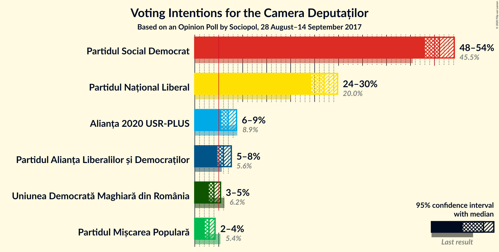
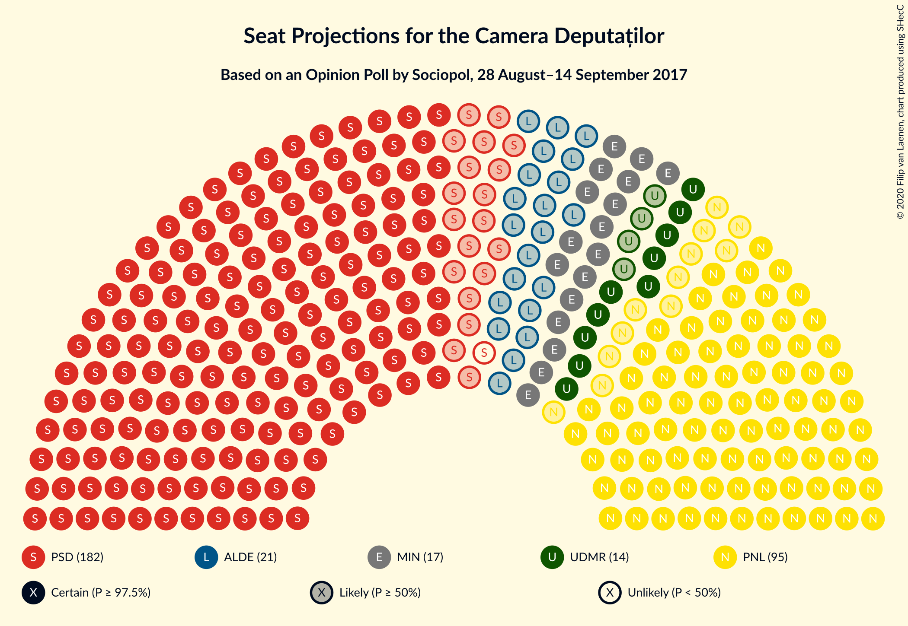
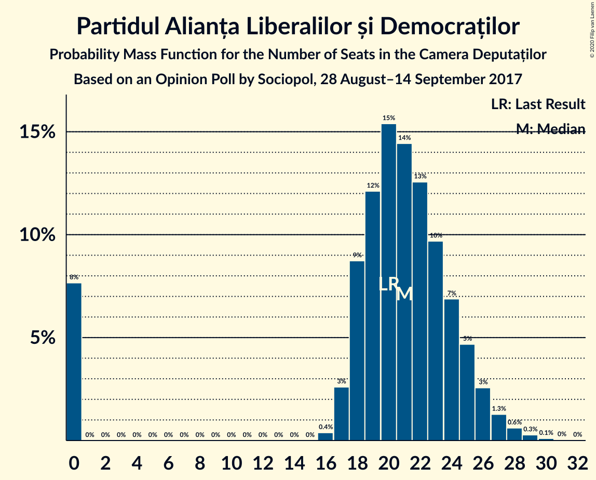
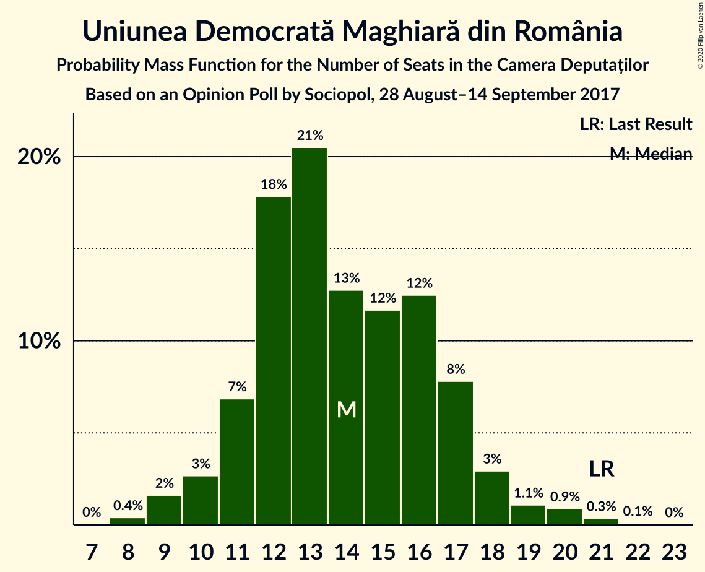
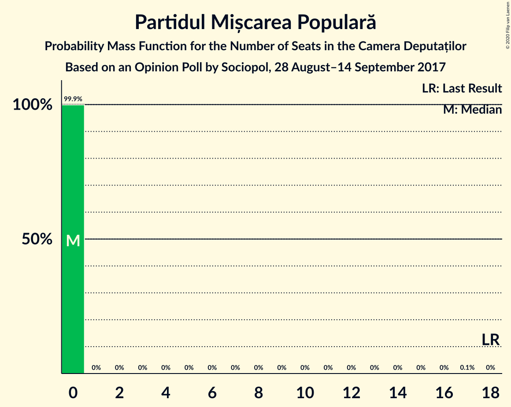
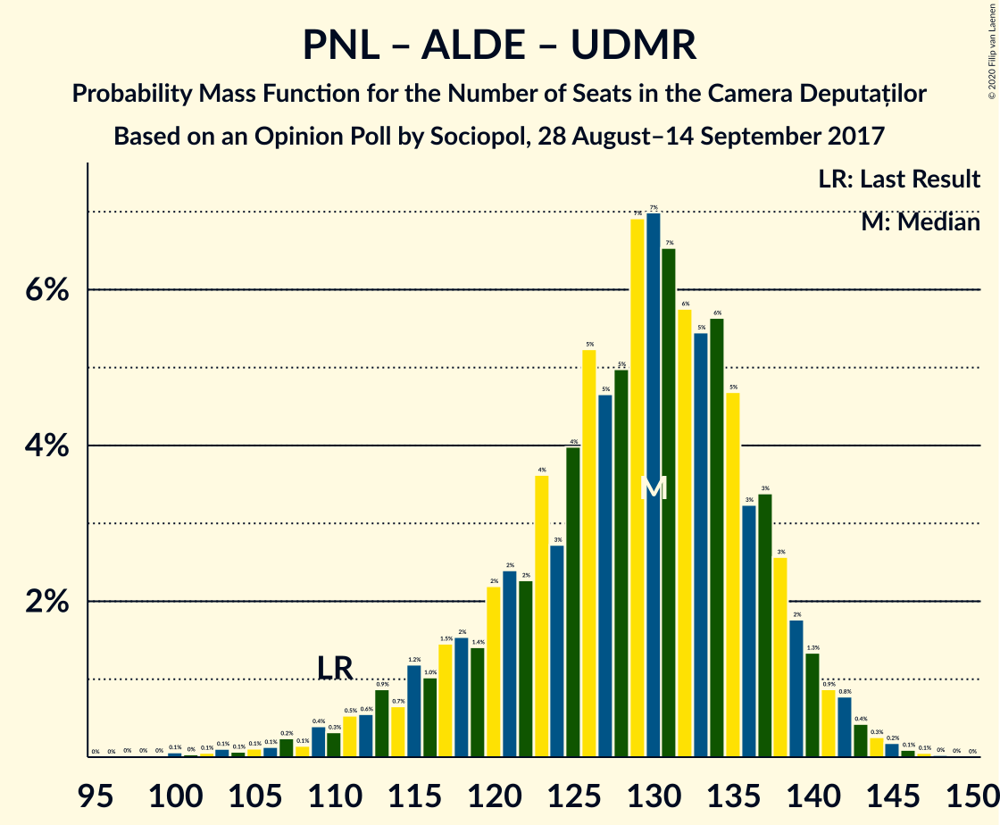
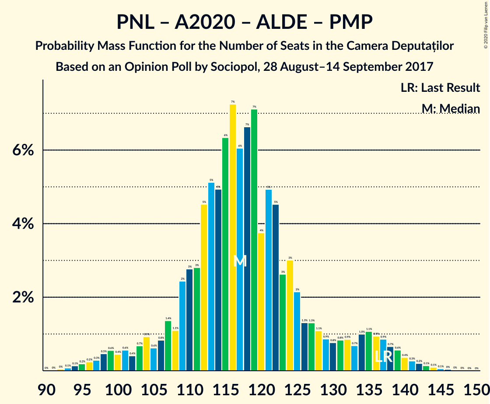

# Opinion Poll by Sociopol, 28 August–14 September 2017

<a href="#voting-intentions">Voting Intentions</a> | <a href="#seats">Seats</a> | <a href="#coalitions">Coalitions</a> | <a href="#technical-information">Technical Information</a>

## Voting Intentions

### Confidence Intervals

| Party | Last Result | Poll Result | 80% Confidence Interval | 90% Confidence Interval | 95% Confidence Interval | 99% Confidence Interval |
|:-----:|:-----------:|:-----------:|:-----------------------:|:-----------------------:|:-----------------------:|:-----------------------:|
| Partidul Social Democrat | 45.5% | 51.0% | 49.0–53.1% |48.4–53.6% |48.0–54.1% |47.0–55.1% |
| Partidul Național Liberal | 20.0% | 27.0% | 25.2–28.8% |24.7–29.3% |24.3–29.8% |23.5–30.7% |
| Alianța 2020 USR-PLUS | 8.9% | 7.0% | 6.0–8.1% |5.8–8.4% |5.5–8.7% |5.1–9.3% |
| Partidul Alianța Liberalilor și Democraților | 5.6% | 6.0% | 5.1–7.0% |4.9–7.3% |4.7–7.6% |4.3–8.2% |
| Uniunea Democrată Maghiară din România | 6.2% | 4.0% | 3.3–4.9% |3.1–5.2% |2.9–5.4% |2.6–5.9% |
| Partidul Mișcarea Populară | 5.4% | 3.0% | 2.4–3.8% |2.2–4.0% |2.1–4.2% |1.8–4.7% |

*Note:* The poll result column reflects the actual value used in the calculations. Published results may vary slightly, and in addition be rounded to fewer digits.

## Seats

### Confidence Intervals

| Party | Last Result | Median | 80% Confidence Interval | 90% Confidence Interval | 95% Confidence Interval | 99% Confidence Interval |
|:-----:|:-----------:|:------:|:-----------------------:|:-----------------------:|:-----------------------:|:-----------------------:|
| <a href="#partidul-social-democrat">Partidul Social Democrat</a> | 154 | 181 | 170–189 |165–192 |162–195 |157–203 |
| <a href="#partidul-național-liberal">Partidul Național Liberal</a> | 69 | 95 | 88–103 |86–103 |83–107 |79–110 |
| <a href="#alianța-2020-usr-plus">Alianța 2020 USR-PLUS</a> | 30 | 0 | 0–26 |0–27 |0–28 |0–30 |
| <a href="#partidul-alianța-liberalilor-și-democraților">Partidul Alianța Liberalilor și Democraților</a> | 20 | 21 | 18–24 |0–26 |0–27 |0–28 |
| <a href="#uniunea-democrată-maghiară-din-românia">Uniunea Democrată Maghiară din România</a> | 21 | 14 | 11–17 |11–18 |10–19 |9–20 |
| <a href="#partidul-mișcarea-populară">Partidul Mișcarea Populară</a> | 18 | 0 | 0 |0 |0 |0 |

### Partidul Social Democrat

*For a full overview of the results for this party, see the [Partidul Social Democrat](party-partidulsocialdemocrat.html) page.*

| Number of Seats | Probability | Accumulated | Special Marks |
|:---------------:|:-----------:|:-----------:|:-------------:|
| 153 | 0% | 100% |  |
| 154 | 0% | 99.9% | Last Result |
| 155 | 0.1% | 99.9% |  |
| 156 | 0.2% | 99.8% |  |
| 157 | 0.2% | 99.6% |  |
| 158 | 0.2% | 99.5% |  |
| 159 | 0.3% | 99.3% |  |
| 160 | 0.3% | 98.9% |  |
| 161 | 0.6% | 98.6% |  |
| 162 | 0.9% | 98% |  |
| 163 | 0.5% | 97% |  |
| 164 | 0.5% | 97% |  |
| 165 | 1.3% | 96% |  |
| 166 | 2% | 95% | Majority |
| 167 | 1.1% | 93% |  |
| 168 | 1.0% | 92% |  |
| 169 | 0.5% | 91% |  |
| 170 | 2% | 90% |  |
| 171 | 2% | 89% |  |
| 172 | 1.2% | 87% |  |
| 173 | 3% | 86% |  |
| 174 | 2% | 83% |  |
| 175 | 5% | 81% |  |
| 176 | 3% | 76% |  |
| 177 | 8% | 73% |  |
| 178 | 6% | 65% |  |
| 179 | 6% | 60% |  |
| 180 | 3% | 54% |  |
| 181 | 7% | 51% | Median |
| 182 | 7% | 44% |  |
| 183 | 4% | 37% |  |
| 184 | 8% | 34% |  |
| 185 | 4% | 25% |  |
| 186 | 5% | 21% |  |
| 187 | 2% | 16% |  |
| 188 | 3% | 14% |  |
| 189 | 2% | 11% |  |
| 190 | 2% | 8% |  |
| 191 | 0.6% | 6% |  |
| 192 | 1.0% | 5% |  |
| 193 | 0.4% | 4% |  |
| 194 | 0.7% | 4% |  |
| 195 | 1.1% | 3% |  |
| 196 | 0.8% | 2% |  |
| 197 | 0.3% | 1.5% |  |
| 198 | 0.1% | 1.2% |  |
| 199 | 0.2% | 1.1% |  |
| 200 | 0.1% | 0.9% |  |
| 201 | 0.1% | 0.7% |  |
| 202 | 0% | 0.6% |  |
| 203 | 0.4% | 0.6% |  |
| 204 | 0.1% | 0.2% |  |
| 205 | 0% | 0.1% |  |
| 206 | 0% | 0% |  |

### Partidul Național Liberal

*For a full overview of the results for this party, see the [Partidul Național Liberal](party-partidulnaționalliberal.html) page.*

| Number of Seats | Probability | Accumulated | Special Marks |
|:---------------:|:-----------:|:-----------:|:-------------:|
| 69 | 0% | 100% | Last Result |
| 70 | 0% | 100% |  |
| 71 | 0% | 100% |  |
| 72 | 0% | 100% |  |
| 73 | 0% | 100% |  |
| 74 | 0% | 100% |  |
| 75 | 0% | 100% |  |
| 76 | 0% | 100% |  |
| 77 | 0.1% | 100% |  |
| 78 | 0.3% | 99.8% |  |
| 79 | 0.1% | 99.5% |  |
| 80 | 0.1% | 99.5% |  |
| 81 | 0.4% | 99.4% |  |
| 82 | 1.1% | 99.0% |  |
| 83 | 0.8% | 98% |  |
| 84 | 1.0% | 97% |  |
| 85 | 1.1% | 96% |  |
| 86 | 3% | 95% |  |
| 87 | 1.1% | 92% |  |
| 88 | 4% | 91% |  |
| 89 | 5% | 88% |  |
| 90 | 3% | 82% |  |
| 91 | 2% | 79% |  |
| 92 | 2% | 77% |  |
| 93 | 15% | 75% |  |
| 94 | 9% | 60% |  |
| 95 | 3% | 51% | Median |
| 96 | 0.6% | 48% |  |
| 97 | 10% | 47% |  |
| 98 | 15% | 38% |  |
| 99 | 4% | 23% |  |
| 100 | 0.2% | 19% |  |
| 101 | 3% | 19% |  |
| 102 | 5% | 16% |  |
| 103 | 6% | 11% |  |
| 104 | 0.5% | 5% |  |
| 105 | 0.2% | 4% |  |
| 106 | 1.0% | 4% |  |
| 107 | 1.1% | 3% |  |
| 108 | 0.8% | 2% |  |
| 109 | 0.4% | 1.0% |  |
| 110 | 0.1% | 0.6% |  |
| 111 | 0.2% | 0.5% |  |
| 112 | 0.2% | 0.2% |  |
| 113 | 0% | 0.1% |  |
| 114 | 0% | 0% |  |

### Alianța 2020 USR-PLUS

*For a full overview of the results for this party, see the [Alianța 2020 USR-PLUS](party-alianța2020usr-plus.html) page.*

| Number of Seats | Probability | Accumulated | Special Marks |
|:---------------:|:-----------:|:-----------:|:-------------:|
| 0 | 88% | 100% | Median |
| 1 | 0% | 12% |  |
| 2 | 0% | 12% |  |
| 3 | 0% | 12% |  |
| 4 | 0% | 12% |  |
| 5 | 0% | 12% |  |
| 6 | 0% | 12% |  |
| 7 | 0% | 12% |  |
| 8 | 0% | 12% |  |
| 9 | 0% | 12% |  |
| 10 | 0% | 12% |  |
| 11 | 0% | 12% |  |
| 12 | 0% | 12% |  |
| 13 | 0% | 12% |  |
| 14 | 0% | 12% |  |
| 15 | 0% | 12% |  |
| 16 | 0% | 12% |  |
| 17 | 0% | 12% |  |
| 18 | 0% | 12% |  |
| 19 | 0% | 12% |  |
| 20 | 0% | 12% |  |
| 21 | 0% | 12% |  |
| 22 | 0% | 12% |  |
| 23 | 0% | 12% |  |
| 24 | 0% | 12% |  |
| 25 | 0% | 12% |  |
| 26 | 3% | 12% |  |
| 27 | 4% | 8% |  |
| 28 | 2% | 4% |  |
| 29 | 1.1% | 2% |  |
| 30 | 0.5% | 1.0% | Last Result |
| 31 | 0.3% | 0.5% |  |
| 32 | 0.1% | 0.2% |  |
| 33 | 0% | 0.1% |  |
| 34 | 0% | 0% |  |

### Partidul Alianța Liberalilor și Democraților

*For a full overview of the results for this party, see the [Partidul Alianța Liberalilor și Democraților](party-partidulalianțaliberalilorșidemocraților.html) page.*

| Number of Seats | Probability | Accumulated | Special Marks |
|:---------------:|:-----------:|:-----------:|:-------------:|
| 0 | 6% | 100% |  |
| 1 | 0% | 94% |  |
| 2 | 0% | 94% |  |
| 3 | 0% | 94% |  |
| 4 | 0% | 94% |  |
| 5 | 0% | 94% |  |
| 6 | 0% | 94% |  |
| 7 | 0% | 94% |  |
| 8 | 0% | 94% |  |
| 9 | 0% | 94% |  |
| 10 | 0% | 94% |  |
| 11 | 0% | 94% |  |
| 12 | 0% | 94% |  |
| 13 | 0% | 94% |  |
| 14 | 0% | 94% |  |
| 15 | 0% | 94% |  |
| 16 | 0.5% | 94% |  |
| 17 | 2% | 93% |  |
| 18 | 7% | 91% |  |
| 19 | 13% | 84% |  |
| 20 | 19% | 70% | Last Result |
| 21 | 15% | 51% | Median |
| 22 | 18% | 37% |  |
| 23 | 4% | 18% |  |
| 24 | 5% | 14% |  |
| 25 | 3% | 9% |  |
| 26 | 3% | 6% |  |
| 27 | 2% | 3% |  |
| 28 | 0.5% | 1.0% |  |
| 29 | 0.4% | 0.4% |  |
| 30 | 0% | 0.1% |  |
| 31 | 0% | 0% |  |

### Uniunea Democrată Maghiară din România

*For a full overview of the results for this party, see the [Uniunea Democrată Maghiară din România](party-uniuneademocratămaghiarădinromânia.html) page.*

| Number of Seats | Probability | Accumulated | Special Marks |
|:---------------:|:-----------:|:-----------:|:-------------:|
| 7 | 0% | 100% |  |
| 8 | 0.4% | 99.9% |  |
| 9 | 1.0% | 99.5% |  |
| 10 | 2% | 98.6% |  |
| 11 | 11% | 97% |  |
| 12 | 21% | 86% |  |
| 13 | 13% | 65% |  |
| 14 | 7% | 52% | Median |
| 15 | 20% | 45% |  |
| 16 | 14% | 25% |  |
| 17 | 5% | 11% |  |
| 18 | 3% | 6% |  |
| 19 | 1.5% | 3% |  |
| 20 | 1.2% | 2% |  |
| 21 | 0.2% | 0.4% | Last Result |
| 22 | 0.1% | 0.2% |  |
| 23 | 0% | 0.1% |  |
| 24 | 0% | 0% |  |

### Partidul Mișcarea Populară

*For a full overview of the results for this party, see the [Partidul Mișcarea Populară](party-partidulmișcareapopulară.html) page.*

| Number of Seats | Probability | Accumulated | Special Marks |
|:---------------:|:-----------:|:-----------:|:-------------:|
| 0 | 99.9% | 100% | Median |
| 1 | 0% | 0.1% |  |
| 2 | 0% | 0.1% |  |
| 3 | 0% | 0.1% |  |
| 4 | 0% | 0.1% |  |
| 5 | 0% | 0.1% |  |
| 6 | 0% | 0.1% |  |
| 7 | 0% | 0.1% |  |
| 8 | 0% | 0.1% |  |
| 9 | 0% | 0.1% |  |
| 10 | 0% | 0.1% |  |
| 11 | 0% | 0.1% |  |
| 12 | 0% | 0.1% |  |
| 13 | 0% | 0.1% |  |
| 14 | 0% | 0.1% |  |
| 15 | 0% | 0.1% |  |
| 16 | 0% | 0.1% |  |
| 17 | 0% | 0.1% |  |
| 18 | 0% | 0% | Last Result |

## Coalitions

### Confidence Intervals

| Coalition | Last Result | Median | Majority? | 80% Confidence Interval | 90% Confidence Interval | 95% Confidence Interval | 99% Confidence Interval |
|:---------:|:-----------:|:------:|:---------:|:-----------------------:|:-----------------------:|:-----------------------:|:-----------------------:|
| Partidul Social Democrat – Partidul Alianța Liberalilor și Democraților | 174 | 201 | 100% | 188–208 | 184–210 | 180–211 | 175–215 |
| Partidul Național Liberal – Alianța 2020 USR-PLUS – Partidul Alianța Liberalilor și Democraților – Uniunea Democrată Maghiară din România – Partidul Mișcarea Populară | 158 | 131 | 0% | 123–142 | 120–147 | 117–150 | 109–155 |
| Partidul Național Liberal – Alianța 2020 USR-PLUS – Partidul Alianța Liberalilor și Democraților – Uniunea Democrată Maghiară din România | 140 | 131 | 0% | 123–142 | 120–147 | 117–150 | 109–155 |
| Partidul Național Liberal – Partidul Alianța Liberalilor și Democraților – Uniunea Democrată Maghiară din România – Partidul Mișcarea Populară | 128 | 130 | 0% | 119–137 | 116–139 | 113–141 | 107–144 |
| Partidul Național Liberal – Partidul Alianța Liberalilor și Democraților – Uniunea Democrată Maghiară din România | 110 | 130 | 0% | 119–137 | 116–139 | 113–141 | 107–144 |
| Partidul Național Liberal – Alianța 2020 USR-PLUS – Partidul Alianța Liberalilor și Democraților – Partidul Mișcarea Populară | 137 | 118 | 0% | 109–129 | 106–135 | 101–136 | 94–142 |
| Partidul Național Liberal – Alianța 2020 USR-PLUS – Partidul Alianța Liberalilor și Democraților | 119 | 118 | 0% | 109–129 | 106–135 | 101–136 | 94–142 |
| Partidul Național Liberal – Alianța 2020 USR-PLUS – Uniunea Democrată Maghiară din România – Partidul Mișcarea Populară | 138 | 111 | 0% | 104–124 | 102–128 | 101–132 | 97–137 |
| Partidul Național Liberal – Alianța 2020 USR-PLUS – Uniunea Democrată Maghiară din România | 120 | 110 | 0% | 104–124 | 102–128 | 101–132 | 97–137 |
| Partidul Național Liberal – Uniunea Democrată Maghiară din România – Partidul Mișcarea Populară | 108 | 109 | 0% | 101–117 | 98–118 | 97–121 | 92–125 |
| Partidul Național Liberal – Uniunea Democrată Maghiară din România | 90 | 109 | 0% | 101–117 | 98–118 | 97–121 | 92–125 |
| Partidul Național Liberal – Alianța 2020 USR-PLUS – Partidul Mișcarea Populară | 117 | 97 | 0% | 89–110 | 88–116 | 88–118 | 84–124 |
| Partidul Național Liberal – Alianța 2020 USR-PLUS | 99 | 97 | 0% | 89–110 | 88–116 | 88–118 | 84–124 |
| Partidul Național Liberal – Partidul Mișcarea Populară | 87 | 95 | 0% | 88–103 | 86–103 | 83–107 | 79–110 |
| Partidul Național Liberal | 69 | 95 | 0% | 88–103 | 86–103 | 83–107 | 79–110 |
| Alianța 2020 USR-PLUS – Partidul Mișcarea Populară | 48 | 0 | 0% | 0–26 | 0–27 | 0–28 | 0–30 |

### Partidul Social Democrat – Partidul Alianța Liberalilor și Democraților

| Number of Seats | Probability | Accumulated | Special Marks |
|:---------------:|:-----------:|:-----------:|:-------------:|
| 169 | 0% | 100% |  |
| 170 | 0% | 99.9% |  |
| 171 | 0% | 99.9% |  |
| 172 | 0% | 99.9% |  |
| 173 | 0.1% | 99.8% |  |
| 174 | 0.1% | 99.7% | Last Result |
| 175 | 0.2% | 99.6% |  |
| 176 | 0.2% | 99.4% |  |
| 177 | 0.3% | 99.2% |  |
| 178 | 0.3% | 98.9% |  |
| 179 | 0.8% | 98.7% |  |
| 180 | 0.8% | 98% |  |
| 181 | 0.2% | 97% |  |
| 182 | 0.5% | 97% |  |
| 183 | 0.8% | 96% |  |
| 184 | 2% | 96% |  |
| 185 | 1.0% | 94% |  |
| 186 | 0.5% | 93% |  |
| 187 | 1.0% | 92% |  |
| 188 | 2% | 91% |  |
| 189 | 0.8% | 89% |  |
| 190 | 1.0% | 88% |  |
| 191 | 1.4% | 87% |  |
| 192 | 1.1% | 86% |  |
| 193 | 1.0% | 85% |  |
| 194 | 3% | 84% |  |
| 195 | 4% | 81% |  |
| 196 | 4% | 76% |  |
| 197 | 2% | 72% |  |
| 198 | 6% | 71% |  |
| 199 | 8% | 65% |  |
| 200 | 3% | 56% |  |
| 201 | 3% | 53% |  |
| 202 | 8% | 50% | Median |
| 203 | 11% | 42% |  |
| 204 | 4% | 31% |  |
| 205 | 4% | 27% |  |
| 206 | 6% | 23% |  |
| 207 | 6% | 17% |  |
| 208 | 2% | 11% |  |
| 209 | 1.1% | 9% |  |
| 210 | 3% | 8% |  |
| 211 | 3% | 5% |  |
| 212 | 0.7% | 2% |  |
| 213 | 0.5% | 2% |  |
| 214 | 0.6% | 1.1% |  |
| 215 | 0.3% | 0.5% |  |
| 216 | 0.1% | 0.2% |  |
| 217 | 0.1% | 0.2% |  |
| 218 | 0.1% | 0.1% |  |
| 219 | 0% | 0% |  |

### Partidul Național Liberal – Alianța 2020 USR-PLUS – Partidul Alianța Liberalilor și Democraților – Uniunea Democrată Maghiară din România – Partidul Mișcarea Populară

| Number of Seats | Probability | Accumulated | Special Marks |
|:---------------:|:-----------:|:-----------:|:-------------:|
| 107 | 0% | 100% |  |
| 108 | 0.1% | 99.9% |  |
| 109 | 0.4% | 99.8% |  |
| 110 | 0% | 99.4% |  |
| 111 | 0.1% | 99.4% |  |
| 112 | 0.1% | 99.3% |  |
| 113 | 0.2% | 99.1% |  |
| 114 | 0.1% | 98.9% |  |
| 115 | 0.3% | 98.8% |  |
| 116 | 0.8% | 98.5% |  |
| 117 | 1.1% | 98% |  |
| 118 | 0.7% | 97% |  |
| 119 | 0.4% | 96% |  |
| 120 | 1.0% | 96% |  |
| 121 | 0.6% | 95% |  |
| 122 | 2% | 94% |  |
| 123 | 2% | 92% |  |
| 124 | 3% | 89% |  |
| 125 | 2% | 86% |  |
| 126 | 5% | 84% |  |
| 127 | 4% | 79% |  |
| 128 | 8% | 75% |  |
| 129 | 4% | 66% |  |
| 130 | 7% | 63% | Median |
| 131 | 7% | 56% |  |
| 132 | 3% | 49% |  |
| 133 | 6% | 46% |  |
| 134 | 6% | 40% |  |
| 135 | 8% | 35% |  |
| 136 | 3% | 27% |  |
| 137 | 5% | 24% |  |
| 138 | 2% | 19% |  |
| 139 | 3% | 17% |  |
| 140 | 1.2% | 14% |  |
| 141 | 2% | 13% |  |
| 142 | 2% | 11% |  |
| 143 | 0.5% | 10% |  |
| 144 | 1.0% | 9% |  |
| 145 | 1.1% | 8% |  |
| 146 | 2% | 7% |  |
| 147 | 1.3% | 5% |  |
| 148 | 0.5% | 4% |  |
| 149 | 0.5% | 3% |  |
| 150 | 0.9% | 3% |  |
| 151 | 0.6% | 2% |  |
| 152 | 0.3% | 1.4% |  |
| 153 | 0.3% | 1.1% |  |
| 154 | 0.2% | 0.7% |  |
| 155 | 0.2% | 0.5% |  |
| 156 | 0.2% | 0.4% |  |
| 157 | 0.1% | 0.2% |  |
| 158 | 0% | 0.1% | Last Result |
| 159 | 0% | 0.1% |  |
| 160 | 0% | 0% |  |

### Partidul Național Liberal – Alianța 2020 USR-PLUS – Partidul Alianța Liberalilor și Democraților – Uniunea Democrată Maghiară din România

| Number of Seats | Probability | Accumulated | Special Marks |
|:---------------:|:-----------:|:-----------:|:-------------:|
| 107 | 0% | 100% |  |
| 108 | 0.2% | 99.9% |  |
| 109 | 0.4% | 99.8% |  |
| 110 | 0% | 99.4% |  |
| 111 | 0.1% | 99.4% |  |
| 112 | 0.1% | 99.3% |  |
| 113 | 0.2% | 99.1% |  |
| 114 | 0.1% | 98.9% |  |
| 115 | 0.3% | 98.8% |  |
| 116 | 0.8% | 98% |  |
| 117 | 1.1% | 98% |  |
| 118 | 0.7% | 97% |  |
| 119 | 0.4% | 96% |  |
| 120 | 1.0% | 95% |  |
| 121 | 0.6% | 94% |  |
| 122 | 2% | 94% |  |
| 123 | 2% | 91% |  |
| 124 | 3% | 89% |  |
| 125 | 2% | 86% |  |
| 126 | 5% | 84% |  |
| 127 | 4% | 79% |  |
| 128 | 8% | 75% |  |
| 129 | 4% | 66% |  |
| 130 | 7% | 63% | Median |
| 131 | 7% | 56% |  |
| 132 | 3% | 49% |  |
| 133 | 6% | 46% |  |
| 134 | 6% | 40% |  |
| 135 | 8% | 35% |  |
| 136 | 3% | 27% |  |
| 137 | 5% | 23% |  |
| 138 | 2% | 19% |  |
| 139 | 3% | 17% |  |
| 140 | 1.2% | 14% | Last Result |
| 141 | 2% | 13% |  |
| 142 | 2% | 11% |  |
| 143 | 0.5% | 9% |  |
| 144 | 1.0% | 9% |  |
| 145 | 1.1% | 8% |  |
| 146 | 2% | 7% |  |
| 147 | 1.3% | 5% |  |
| 148 | 0.5% | 4% |  |
| 149 | 0.5% | 3% |  |
| 150 | 0.9% | 3% |  |
| 151 | 0.6% | 2% |  |
| 152 | 0.3% | 1.4% |  |
| 153 | 0.3% | 1.1% |  |
| 154 | 0.2% | 0.7% |  |
| 155 | 0.2% | 0.5% |  |
| 156 | 0.2% | 0.3% |  |
| 157 | 0.1% | 0.2% |  |
| 158 | 0% | 0.1% |  |
| 159 | 0% | 0.1% |  |
| 160 | 0% | 0% |  |

### Partidul Național Liberal – Partidul Alianța Liberalilor și Democraților – Uniunea Democrată Maghiară din România – Partidul Mișcarea Populară

| Number of Seats | Probability | Accumulated | Special Marks |
|:---------------:|:-----------:|:-----------:|:-------------:|
| 100 | 0% | 100% |  |
| 101 | 0% | 99.9% |  |
| 102 | 0% | 99.9% |  |
| 103 | 0% | 99.9% |  |
| 104 | 0.1% | 99.9% |  |
| 105 | 0% | 99.8% |  |
| 106 | 0% | 99.7% |  |
| 107 | 0.3% | 99.7% |  |
| 108 | 0.2% | 99.4% |  |
| 109 | 0.5% | 99.1% |  |
| 110 | 0.2% | 98.6% |  |
| 111 | 0.6% | 98% |  |
| 112 | 0.3% | 98% |  |
| 113 | 0.5% | 98% |  |
| 114 | 0.2% | 97% |  |
| 115 | 1.5% | 97% |  |
| 116 | 2% | 95% |  |
| 117 | 1.3% | 94% |  |
| 118 | 2% | 92% |  |
| 119 | 1.4% | 91% |  |
| 120 | 3% | 89% |  |
| 121 | 1.2% | 86% |  |
| 122 | 3% | 85% |  |
| 123 | 3% | 82% |  |
| 124 | 3% | 79% |  |
| 125 | 2% | 76% |  |
| 126 | 5% | 73% |  |
| 127 | 5% | 68% |  |
| 128 | 8% | 63% | Last Result |
| 129 | 4% | 55% |  |
| 130 | 7% | 51% | Median |
| 131 | 7% | 45% |  |
| 132 | 3% | 38% |  |
| 133 | 6% | 35% |  |
| 134 | 6% | 29% |  |
| 135 | 8% | 23% |  |
| 136 | 3% | 15% |  |
| 137 | 4% | 12% |  |
| 138 | 2% | 8% |  |
| 139 | 2% | 6% |  |
| 140 | 0.9% | 4% |  |
| 141 | 0.8% | 3% |  |
| 142 | 0.9% | 2% |  |
| 143 | 0.3% | 1.1% |  |
| 144 | 0.4% | 0.8% |  |
| 145 | 0.2% | 0.4% |  |
| 146 | 0.1% | 0.2% |  |
| 147 | 0.1% | 0.1% |  |
| 148 | 0% | 0.1% |  |
| 149 | 0% | 0% |  |

### Partidul Național Liberal – Partidul Alianța Liberalilor și Democraților – Uniunea Democrată Maghiară din România

| Number of Seats | Probability | Accumulated | Special Marks |
|:---------------:|:-----------:|:-----------:|:-------------:|
| 100 | 0% | 100% |  |
| 101 | 0% | 99.9% |  |
| 102 | 0% | 99.9% |  |
| 103 | 0% | 99.9% |  |
| 104 | 0.1% | 99.9% |  |
| 105 | 0% | 99.8% |  |
| 106 | 0% | 99.7% |  |
| 107 | 0.3% | 99.7% |  |
| 108 | 0.2% | 99.4% |  |
| 109 | 0.5% | 99.1% |  |
| 110 | 0.2% | 98.6% | Last Result |
| 111 | 0.6% | 98% |  |
| 112 | 0.3% | 98% |  |
| 113 | 0.5% | 98% |  |
| 114 | 0.2% | 97% |  |
| 115 | 1.5% | 97% |  |
| 116 | 2% | 95% |  |
| 117 | 1.3% | 94% |  |
| 118 | 2% | 92% |  |
| 119 | 1.4% | 91% |  |
| 120 | 3% | 89% |  |
| 121 | 1.2% | 86% |  |
| 122 | 3% | 85% |  |
| 123 | 3% | 82% |  |
| 124 | 3% | 79% |  |
| 125 | 2% | 76% |  |
| 126 | 5% | 73% |  |
| 127 | 5% | 68% |  |
| 128 | 8% | 63% |  |
| 129 | 4% | 55% |  |
| 130 | 7% | 51% | Median |
| 131 | 7% | 44% |  |
| 132 | 3% | 38% |  |
| 133 | 6% | 35% |  |
| 134 | 6% | 29% |  |
| 135 | 8% | 23% |  |
| 136 | 3% | 15% |  |
| 137 | 4% | 12% |  |
| 138 | 2% | 8% |  |
| 139 | 2% | 6% |  |
| 140 | 0.9% | 4% |  |
| 141 | 0.8% | 3% |  |
| 142 | 0.9% | 2% |  |
| 143 | 0.3% | 1.1% |  |
| 144 | 0.4% | 0.7% |  |
| 145 | 0.2% | 0.4% |  |
| 146 | 0.1% | 0.2% |  |
| 147 | 0.1% | 0.1% |  |
| 148 | 0% | 0% |  |

### Partidul Național Liberal – Alianța 2020 USR-PLUS – Partidul Alianța Liberalilor și Democraților – Partidul Mișcarea Populară

| Number of Seats | Probability | Accumulated | Special Marks |
|:---------------:|:-----------:|:-----------:|:-------------:|
| 92 | 0.1% | 100% |  |
| 93 | 0.2% | 99.9% |  |
| 94 | 0.4% | 99.7% |  |
| 95 | 0% | 99.3% |  |
| 96 | 0.1% | 99.3% |  |
| 97 | 0.2% | 99.2% |  |
| 98 | 0.8% | 99.0% |  |
| 99 | 0.5% | 98% |  |
| 100 | 0% | 98% |  |
| 101 | 0.2% | 98% |  |
| 102 | 0.5% | 97% |  |
| 103 | 0.8% | 97% |  |
| 104 | 0.7% | 96% |  |
| 105 | 0.1% | 95% |  |
| 106 | 0.6% | 95% |  |
| 107 | 0.8% | 95% |  |
| 108 | 1.0% | 94% |  |
| 109 | 3% | 93% |  |
| 110 | 3% | 90% |  |
| 111 | 3% | 87% |  |
| 112 | 3% | 84% |  |
| 113 | 5% | 80% |  |
| 114 | 3% | 76% |  |
| 115 | 10% | 73% |  |
| 116 | 7% | 63% | Median |
| 117 | 4% | 56% |  |
| 118 | 10% | 52% |  |
| 119 | 4% | 42% |  |
| 120 | 6% | 38% |  |
| 121 | 4% | 32% |  |
| 122 | 6% | 28% |  |
| 123 | 2% | 23% |  |
| 124 | 4% | 20% |  |
| 125 | 2% | 16% |  |
| 126 | 1.4% | 14% |  |
| 127 | 1.3% | 13% |  |
| 128 | 1.2% | 12% |  |
| 129 | 2% | 10% |  |
| 130 | 0.6% | 9% |  |
| 131 | 0.5% | 8% |  |
| 132 | 0.4% | 7% |  |
| 133 | 0.8% | 7% |  |
| 134 | 0.7% | 6% |  |
| 135 | 2% | 6% |  |
| 136 | 1.1% | 3% |  |
| 137 | 0.4% | 2% | Last Result |
| 138 | 0.5% | 2% |  |
| 139 | 0.3% | 2% |  |
| 140 | 0.3% | 1.2% |  |
| 141 | 0.2% | 0.8% |  |
| 142 | 0.3% | 0.7% |  |
| 143 | 0.1% | 0.4% |  |
| 144 | 0.1% | 0.3% |  |
| 145 | 0.1% | 0.1% |  |
| 146 | 0% | 0.1% |  |
| 147 | 0% | 0% |  |

### Partidul Național Liberal – Alianța 2020 USR-PLUS – Partidul Alianța Liberalilor și Democraților

| Number of Seats | Probability | Accumulated | Special Marks |
|:---------------:|:-----------:|:-----------:|:-------------:|
| 92 | 0.1% | 100% |  |
| 93 | 0.2% | 99.9% |  |
| 94 | 0.4% | 99.7% |  |
| 95 | 0% | 99.3% |  |
| 96 | 0.1% | 99.3% |  |
| 97 | 0.2% | 99.2% |  |
| 98 | 0.8% | 98.9% |  |
| 99 | 0.5% | 98% |  |
| 100 | 0% | 98% |  |
| 101 | 0.2% | 98% |  |
| 102 | 0.5% | 97% |  |
| 103 | 0.8% | 97% |  |
| 104 | 0.7% | 96% |  |
| 105 | 0.1% | 95% |  |
| 106 | 0.6% | 95% |  |
| 107 | 0.8% | 95% |  |
| 108 | 1.0% | 94% |  |
| 109 | 3% | 93% |  |
| 110 | 3% | 90% |  |
| 111 | 3% | 87% |  |
| 112 | 3% | 84% |  |
| 113 | 5% | 80% |  |
| 114 | 3% | 76% |  |
| 115 | 10% | 73% |  |
| 116 | 7% | 63% | Median |
| 117 | 4% | 56% |  |
| 118 | 10% | 52% |  |
| 119 | 4% | 42% | Last Result |
| 120 | 6% | 38% |  |
| 121 | 4% | 32% |  |
| 122 | 6% | 28% |  |
| 123 | 2% | 22% |  |
| 124 | 4% | 20% |  |
| 125 | 2% | 16% |  |
| 126 | 1.4% | 14% |  |
| 127 | 1.3% | 13% |  |
| 128 | 1.2% | 12% |  |
| 129 | 2% | 10% |  |
| 130 | 0.6% | 9% |  |
| 131 | 0.5% | 8% |  |
| 132 | 0.4% | 7% |  |
| 133 | 0.8% | 7% |  |
| 134 | 0.7% | 6% |  |
| 135 | 2% | 6% |  |
| 136 | 1.1% | 3% |  |
| 137 | 0.4% | 2% |  |
| 138 | 0.5% | 2% |  |
| 139 | 0.3% | 2% |  |
| 140 | 0.3% | 1.2% |  |
| 141 | 0.2% | 0.8% |  |
| 142 | 0.3% | 0.7% |  |
| 143 | 0.1% | 0.4% |  |
| 144 | 0.1% | 0.3% |  |
| 145 | 0.1% | 0.1% |  |
| 146 | 0% | 0.1% |  |
| 147 | 0% | 0% |  |

### Partidul Național Liberal – Alianța 2020 USR-PLUS – Uniunea Democrată Maghiară din România – Partidul Mișcarea Populară

| Number of Seats | Probability | Accumulated | Special Marks |
|:---------------:|:-----------:|:-----------:|:-------------:|
| 94 | 0.1% | 100% |  |
| 95 | 0.1% | 99.9% |  |
| 96 | 0.1% | 99.8% |  |
| 97 | 0.3% | 99.8% |  |
| 98 | 0.6% | 99.5% |  |
| 99 | 0.5% | 98.9% |  |
| 100 | 0.7% | 98% |  |
| 101 | 3% | 98% |  |
| 102 | 3% | 95% |  |
| 103 | 1.1% | 92% |  |
| 104 | 2% | 91% |  |
| 105 | 6% | 89% |  |
| 106 | 6% | 83% |  |
| 107 | 4% | 77% |  |
| 108 | 4% | 73% |  |
| 109 | 11% | 69% | Median |
| 110 | 8% | 58% |  |
| 111 | 3% | 50% |  |
| 112 | 3% | 47% |  |
| 113 | 8% | 44% |  |
| 114 | 6% | 35% |  |
| 115 | 2% | 29% |  |
| 116 | 4% | 28% |  |
| 117 | 4% | 24% |  |
| 118 | 3% | 19% |  |
| 119 | 1.0% | 16% |  |
| 120 | 1.1% | 15% |  |
| 121 | 1.4% | 14% |  |
| 122 | 1.0% | 13% |  |
| 123 | 0.8% | 12% |  |
| 124 | 2% | 11% |  |
| 125 | 1.0% | 9% |  |
| 126 | 0.5% | 8% |  |
| 127 | 1.0% | 7% |  |
| 128 | 2% | 6% |  |
| 129 | 0.8% | 4% |  |
| 130 | 0.5% | 4% |  |
| 131 | 0.2% | 3% |  |
| 132 | 0.8% | 3% |  |
| 133 | 0.8% | 2% |  |
| 134 | 0.3% | 1.3% |  |
| 135 | 0.3% | 1.1% |  |
| 136 | 0.2% | 0.8% |  |
| 137 | 0.2% | 0.6% |  |
| 138 | 0.1% | 0.4% | Last Result |
| 139 | 0.1% | 0.3% |  |
| 140 | 0% | 0.2% |  |
| 141 | 0% | 0.1% |  |
| 142 | 0% | 0.1% |  |
| 143 | 0% | 0.1% |  |
| 144 | 0% | 0% |  |

### Partidul Național Liberal – Alianța 2020 USR-PLUS – Uniunea Democrată Maghiară din România

| Number of Seats | Probability | Accumulated | Special Marks |
|:---------------:|:-----------:|:-----------:|:-------------:|
| 94 | 0.1% | 100% |  |
| 95 | 0.1% | 99.9% |  |
| 96 | 0.1% | 99.8% |  |
| 97 | 0.3% | 99.8% |  |
| 98 | 0.6% | 99.4% |  |
| 99 | 0.5% | 98.9% |  |
| 100 | 0.7% | 98% |  |
| 101 | 3% | 98% |  |
| 102 | 3% | 95% |  |
| 103 | 1.2% | 92% |  |
| 104 | 2% | 91% |  |
| 105 | 6% | 89% |  |
| 106 | 6% | 83% |  |
| 107 | 4% | 77% |  |
| 108 | 4% | 73% |  |
| 109 | 11% | 69% | Median |
| 110 | 8% | 57% |  |
| 111 | 3% | 50% |  |
| 112 | 3% | 47% |  |
| 113 | 8% | 43% |  |
| 114 | 6% | 35% |  |
| 115 | 2% | 29% |  |
| 116 | 4% | 28% |  |
| 117 | 4% | 24% |  |
| 118 | 3% | 19% |  |
| 119 | 1.0% | 16% |  |
| 120 | 1.1% | 15% | Last Result |
| 121 | 1.4% | 14% |  |
| 122 | 1.0% | 13% |  |
| 123 | 0.8% | 12% |  |
| 124 | 2% | 11% |  |
| 125 | 1.0% | 9% |  |
| 126 | 0.5% | 8% |  |
| 127 | 1.0% | 7% |  |
| 128 | 2% | 6% |  |
| 129 | 0.8% | 4% |  |
| 130 | 0.5% | 4% |  |
| 131 | 0.2% | 3% |  |
| 132 | 0.8% | 3% |  |
| 133 | 0.8% | 2% |  |
| 134 | 0.3% | 1.3% |  |
| 135 | 0.3% | 1.1% |  |
| 136 | 0.2% | 0.8% |  |
| 137 | 0.2% | 0.6% |  |
| 138 | 0.1% | 0.4% |  |
| 139 | 0.1% | 0.3% |  |
| 140 | 0% | 0.2% |  |
| 141 | 0% | 0.1% |  |
| 142 | 0% | 0.1% |  |
| 143 | 0% | 0.1% |  |
| 144 | 0% | 0% |  |

### Partidul Național Liberal – Uniunea Democrată Maghiară din România – Partidul Mișcarea Populară

| Number of Seats | Probability | Accumulated | Special Marks |
|:---------------:|:-----------:|:-----------:|:-------------:|
| 89 | 0% | 100% |  |
| 90 | 0.1% | 99.9% |  |
| 91 | 0.2% | 99.8% |  |
| 92 | 0.2% | 99.6% |  |
| 93 | 0.2% | 99.4% |  |
| 94 | 0.7% | 99.2% |  |
| 95 | 0.3% | 98.5% |  |
| 96 | 0.2% | 98% |  |
| 97 | 1.4% | 98% |  |
| 98 | 3% | 97% |  |
| 99 | 0.6% | 94% |  |
| 100 | 1.1% | 93% |  |
| 101 | 4% | 92% |  |
| 102 | 4% | 88% |  |
| 103 | 1.5% | 84% |  |
| 104 | 3% | 83% |  |
| 105 | 7% | 80% |  |
| 106 | 6% | 73% |  |
| 107 | 4% | 67% |  |
| 108 | 5% | 62% | Last Result |
| 109 | 12% | 58% | Median |
| 110 | 8% | 46% |  |
| 111 | 3% | 39% |  |
| 112 | 3% | 35% |  |
| 113 | 8% | 32% |  |
| 114 | 6% | 24% |  |
| 115 | 2% | 18% |  |
| 116 | 4% | 16% |  |
| 117 | 4% | 12% |  |
| 118 | 3% | 8% |  |
| 119 | 0.7% | 5% |  |
| 120 | 0.9% | 4% |  |
| 121 | 1.1% | 3% |  |
| 122 | 0.7% | 2% |  |
| 123 | 0.3% | 1.3% |  |
| 124 | 0.4% | 1.0% |  |
| 125 | 0.3% | 0.5% |  |
| 126 | 0.1% | 0.3% |  |
| 127 | 0.1% | 0.2% |  |
| 128 | 0% | 0.1% |  |
| 129 | 0% | 0.1% |  |
| 130 | 0% | 0% |  |

### Partidul Național Liberal – Uniunea Democrată Maghiară din România

| Number of Seats | Probability | Accumulated | Special Marks |
|:---------------:|:-----------:|:-----------:|:-------------:|
| 89 | 0% | 100% |  |
| 90 | 0.1% | 99.9% | Last Result |
| 91 | 0.2% | 99.8% |  |
| 92 | 0.2% | 99.6% |  |
| 93 | 0.2% | 99.4% |  |
| 94 | 0.7% | 99.2% |  |
| 95 | 0.3% | 98% |  |
| 96 | 0.2% | 98% |  |
| 97 | 1.4% | 98% |  |
| 98 | 3% | 97% |  |
| 99 | 0.6% | 94% |  |
| 100 | 1.1% | 93% |  |
| 101 | 4% | 92% |  |
| 102 | 4% | 88% |  |
| 103 | 1.5% | 84% |  |
| 104 | 3% | 82% |  |
| 105 | 7% | 80% |  |
| 106 | 6% | 73% |  |
| 107 | 5% | 67% |  |
| 108 | 5% | 62% |  |
| 109 | 12% | 58% | Median |
| 110 | 8% | 46% |  |
| 111 | 3% | 38% |  |
| 112 | 3% | 35% |  |
| 113 | 8% | 32% |  |
| 114 | 6% | 23% |  |
| 115 | 2% | 18% |  |
| 116 | 4% | 16% |  |
| 117 | 4% | 12% |  |
| 118 | 3% | 8% |  |
| 119 | 0.7% | 5% |  |
| 120 | 0.9% | 4% |  |
| 121 | 1.1% | 3% |  |
| 122 | 0.7% | 2% |  |
| 123 | 0.3% | 1.2% |  |
| 124 | 0.4% | 0.9% |  |
| 125 | 0.3% | 0.5% |  |
| 126 | 0.1% | 0.2% |  |
| 127 | 0.1% | 0.2% |  |
| 128 | 0% | 0.1% |  |
| 129 | 0% | 0.1% |  |
| 130 | 0% | 0% |  |

### Partidul Național Liberal – Alianța 2020 USR-PLUS – Partidul Mișcarea Populară

| Number of Seats | Probability | Accumulated | Special Marks |
|:---------------:|:-----------:|:-----------:|:-------------:|
| 80 | 0.1% | 100% |  |
| 81 | 0% | 99.9% |  |
| 82 | 0% | 99.9% |  |
| 83 | 0.1% | 99.9% |  |
| 84 | 1.0% | 99.8% |  |
| 85 | 0.7% | 98.7% |  |
| 86 | 0.1% | 98% |  |
| 87 | 0.2% | 98% |  |
| 88 | 4% | 98% |  |
| 89 | 5% | 94% |  |
| 90 | 1.5% | 89% |  |
| 91 | 0.1% | 87% |  |
| 92 | 2% | 87% |  |
| 93 | 15% | 85% |  |
| 94 | 9% | 70% |  |
| 95 | 2% | 62% | Median |
| 96 | 0.5% | 60% |  |
| 97 | 10% | 59% |  |
| 98 | 15% | 49% |  |
| 99 | 4% | 35% |  |
| 100 | 0.2% | 31% |  |
| 101 | 3% | 30% |  |
| 102 | 5% | 27% |  |
| 103 | 6% | 22% |  |
| 104 | 0.6% | 16% |  |
| 105 | 0.3% | 16% |  |
| 106 | 1.1% | 15% |  |
| 107 | 1.2% | 14% |  |
| 108 | 1.3% | 13% |  |
| 109 | 1.2% | 12% |  |
| 110 | 0.6% | 11% |  |
| 111 | 0.5% | 10% |  |
| 112 | 1.5% | 9% |  |
| 113 | 1.3% | 8% |  |
| 114 | 0.9% | 7% |  |
| 115 | 0.5% | 6% |  |
| 116 | 0.4% | 5% |  |
| 117 | 2% | 5% | Last Result |
| 118 | 0.9% | 3% |  |
| 119 | 0.3% | 2% |  |
| 120 | 0.2% | 2% |  |
| 121 | 0.2% | 2% |  |
| 122 | 0.5% | 1.4% |  |
| 123 | 0.3% | 0.9% |  |
| 124 | 0.2% | 0.6% |  |
| 125 | 0.1% | 0.4% |  |
| 126 | 0.1% | 0.3% |  |
| 127 | 0.1% | 0.2% |  |
| 128 | 0% | 0.1% |  |
| 129 | 0% | 0.1% |  |
| 130 | 0% | 0.1% |  |
| 131 | 0% | 0% |  |

### Partidul Național Liberal – Alianța 2020 USR-PLUS

| Number of Seats | Probability | Accumulated | Special Marks |
|:---------------:|:-----------:|:-----------:|:-------------:|
| 80 | 0.1% | 100% |  |
| 81 | 0% | 99.9% |  |
| 82 | 0% | 99.9% |  |
| 83 | 0.1% | 99.9% |  |
| 84 | 1.0% | 99.8% |  |
| 85 | 0.7% | 98.7% |  |
| 86 | 0.1% | 98% |  |
| 87 | 0.2% | 98% |  |
| 88 | 4% | 98% |  |
| 89 | 5% | 94% |  |
| 90 | 1.5% | 89% |  |
| 91 | 0.1% | 87% |  |
| 92 | 2% | 87% |  |
| 93 | 15% | 85% |  |
| 94 | 9% | 70% |  |
| 95 | 2% | 61% | Median |
| 96 | 0.5% | 59% |  |
| 97 | 10% | 59% |  |
| 98 | 15% | 49% |  |
| 99 | 4% | 35% | Last Result |
| 100 | 0.2% | 30% |  |
| 101 | 3% | 30% |  |
| 102 | 5% | 27% |  |
| 103 | 6% | 22% |  |
| 104 | 0.6% | 16% |  |
| 105 | 0.3% | 16% |  |
| 106 | 1.1% | 15% |  |
| 107 | 1.2% | 14% |  |
| 108 | 1.3% | 13% |  |
| 109 | 1.2% | 12% |  |
| 110 | 0.6% | 10% |  |
| 111 | 0.5% | 10% |  |
| 112 | 1.5% | 9% |  |
| 113 | 1.3% | 8% |  |
| 114 | 0.9% | 7% |  |
| 115 | 0.5% | 6% |  |
| 116 | 0.4% | 5% |  |
| 117 | 2% | 5% |  |
| 118 | 0.9% | 3% |  |
| 119 | 0.3% | 2% |  |
| 120 | 0.2% | 2% |  |
| 121 | 0.2% | 2% |  |
| 122 | 0.5% | 1.4% |  |
| 123 | 0.3% | 0.9% |  |
| 124 | 0.2% | 0.6% |  |
| 125 | 0.1% | 0.4% |  |
| 126 | 0.1% | 0.2% |  |
| 127 | 0.1% | 0.2% |  |
| 128 | 0% | 0.1% |  |
| 129 | 0% | 0.1% |  |
| 130 | 0% | 0.1% |  |
| 131 | 0% | 0% |  |

### Partidul Național Liberal – Partidul Mișcarea Populară

| Number of Seats | Probability | Accumulated | Special Marks |
|:---------------:|:-----------:|:-----------:|:-------------:|
| 77 | 0.1% | 100% |  |
| 78 | 0.3% | 99.8% |  |
| 79 | 0.1% | 99.5% |  |
| 80 | 0.1% | 99.5% |  |
| 81 | 0.4% | 99.4% |  |
| 82 | 1.1% | 99.0% |  |
| 83 | 0.8% | 98% |  |
| 84 | 1.0% | 97% |  |
| 85 | 1.1% | 96% |  |
| 86 | 3% | 95% |  |
| 87 | 1.1% | 92% | Last Result |
| 88 | 4% | 91% |  |
| 89 | 5% | 88% |  |
| 90 | 3% | 82% |  |
| 91 | 2% | 79% |  |
| 92 | 2% | 77% |  |
| 93 | 15% | 75% |  |
| 94 | 9% | 60% |  |
| 95 | 3% | 51% | Median |
| 96 | 0.6% | 48% |  |
| 97 | 10% | 48% |  |
| 98 | 15% | 38% |  |
| 99 | 4% | 23% |  |
| 100 | 0.2% | 19% |  |
| 101 | 3% | 19% |  |
| 102 | 5% | 16% |  |
| 103 | 6% | 11% |  |
| 104 | 0.5% | 5% |  |
| 105 | 0.2% | 4% |  |
| 106 | 1.0% | 4% |  |
| 107 | 1.1% | 3% |  |
| 108 | 0.8% | 2% |  |
| 109 | 0.4% | 1.0% |  |
| 110 | 0.1% | 0.6% |  |
| 111 | 0.2% | 0.5% |  |
| 112 | 0.2% | 0.3% |  |
| 113 | 0% | 0.1% |  |
| 114 | 0% | 0.1% |  |
| 115 | 0% | 0% |  |

### Partidul Național Liberal

| Number of Seats | Probability | Accumulated | Special Marks |
|:---------------:|:-----------:|:-----------:|:-------------:|
| 69 | 0% | 100% | Last Result |
| 70 | 0% | 100% |  |
| 71 | 0% | 100% |  |
| 72 | 0% | 100% |  |
| 73 | 0% | 100% |  |
| 74 | 0% | 100% |  |
| 75 | 0% | 100% |  |
| 76 | 0% | 100% |  |
| 77 | 0.1% | 100% |  |
| 78 | 0.3% | 99.8% |  |
| 79 | 0.1% | 99.5% |  |
| 80 | 0.1% | 99.5% |  |
| 81 | 0.4% | 99.4% |  |
| 82 | 1.1% | 99.0% |  |
| 83 | 0.8% | 98% |  |
| 84 | 1.0% | 97% |  |
| 85 | 1.1% | 96% |  |
| 86 | 3% | 95% |  |
| 87 | 1.1% | 92% |  |
| 88 | 4% | 91% |  |
| 89 | 5% | 88% |  |
| 90 | 3% | 82% |  |
| 91 | 2% | 79% |  |
| 92 | 2% | 77% |  |
| 93 | 15% | 75% |  |
| 94 | 9% | 60% |  |
| 95 | 3% | 51% | Median |
| 96 | 0.6% | 48% |  |
| 97 | 10% | 47% |  |
| 98 | 15% | 38% |  |
| 99 | 4% | 23% |  |
| 100 | 0.2% | 19% |  |
| 101 | 3% | 19% |  |
| 102 | 5% | 16% |  |
| 103 | 6% | 11% |  |
| 104 | 0.5% | 5% |  |
| 105 | 0.2% | 4% |  |
| 106 | 1.0% | 4% |  |
| 107 | 1.1% | 3% |  |
| 108 | 0.8% | 2% |  |
| 109 | 0.4% | 1.0% |  |
| 110 | 0.1% | 0.6% |  |
| 111 | 0.2% | 0.5% |  |
| 112 | 0.2% | 0.2% |  |
| 113 | 0% | 0.1% |  |
| 114 | 0% | 0% |  |

### Alianța 2020 USR-PLUS – Partidul Mișcarea Populară

| Number of Seats | Probability | Accumulated | Special Marks |
|:---------------:|:-----------:|:-----------:|:-------------:|
| 0 | 88% | 100% | Median |
| 1 | 0% | 12% |  |
| 2 | 0% | 12% |  |
| 3 | 0% | 12% |  |
| 4 | 0% | 12% |  |
| 5 | 0% | 12% |  |
| 6 | 0% | 12% |  |
| 7 | 0% | 12% |  |
| 8 | 0% | 12% |  |
| 9 | 0% | 12% |  |
| 10 | 0% | 12% |  |
| 11 | 0% | 12% |  |
| 12 | 0% | 12% |  |
| 13 | 0% | 12% |  |
| 14 | 0% | 12% |  |
| 15 | 0% | 12% |  |
| 16 | 0% | 12% |  |
| 17 | 0% | 12% |  |
| 18 | 0% | 12% |  |
| 19 | 0% | 12% |  |
| 20 | 0% | 12% |  |
| 21 | 0% | 12% |  |
| 22 | 0% | 12% |  |
| 23 | 0% | 12% |  |
| 24 | 0% | 12% |  |
| 25 | 0% | 12% |  |
| 26 | 3% | 12% |  |
| 27 | 4% | 8% |  |
| 28 | 2% | 4% |  |
| 29 | 1.1% | 2% |  |
| 30 | 0.5% | 1.0% |  |
| 31 | 0.3% | 0.5% |  |
| 32 | 0.1% | 0.2% |  |
| 33 | 0% | 0.1% |  |
| 34 | 0% | 0% |  |
| 35 | 0% | 0% |  |
| 36 | 0% | 0% |  |
| 37 | 0% | 0% |  |
| 38 | 0% | 0% |  |
| 39 | 0% | 0% |  |
| 40 | 0% | 0% |  |
| 41 | 0% | 0% |  |
| 42 | 0% | 0% |  |
| 43 | 0% | 0% |  |
| 44 | 0% | 0% |  |
| 45 | 0% | 0% |  |
| 46 | 0% | 0% |  |
| 47 | 0% | 0% |  |
| 48 | 0% | 0% | Last Result |

## Technical Information

### Opinion Poll

+ **Polling firm:** Sociopol
+ **Commissioner(s):** —
+ **Fieldwork period:** 28 August–14 September 2017

### Calculations

+ **Sample size:** 1005
+ **Simulations done:** 131,072
+ **Error estimate:** 1.25%

