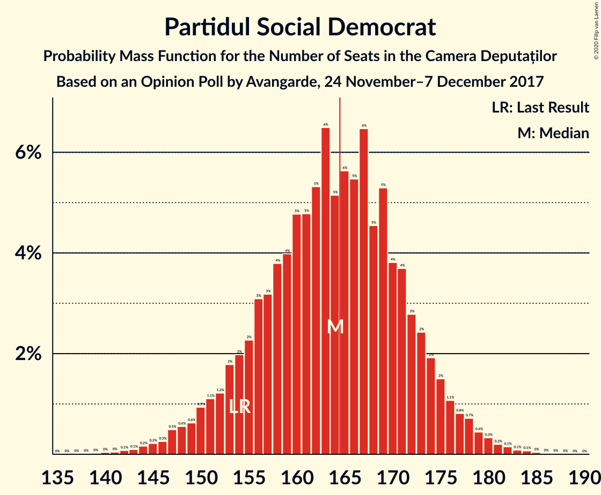
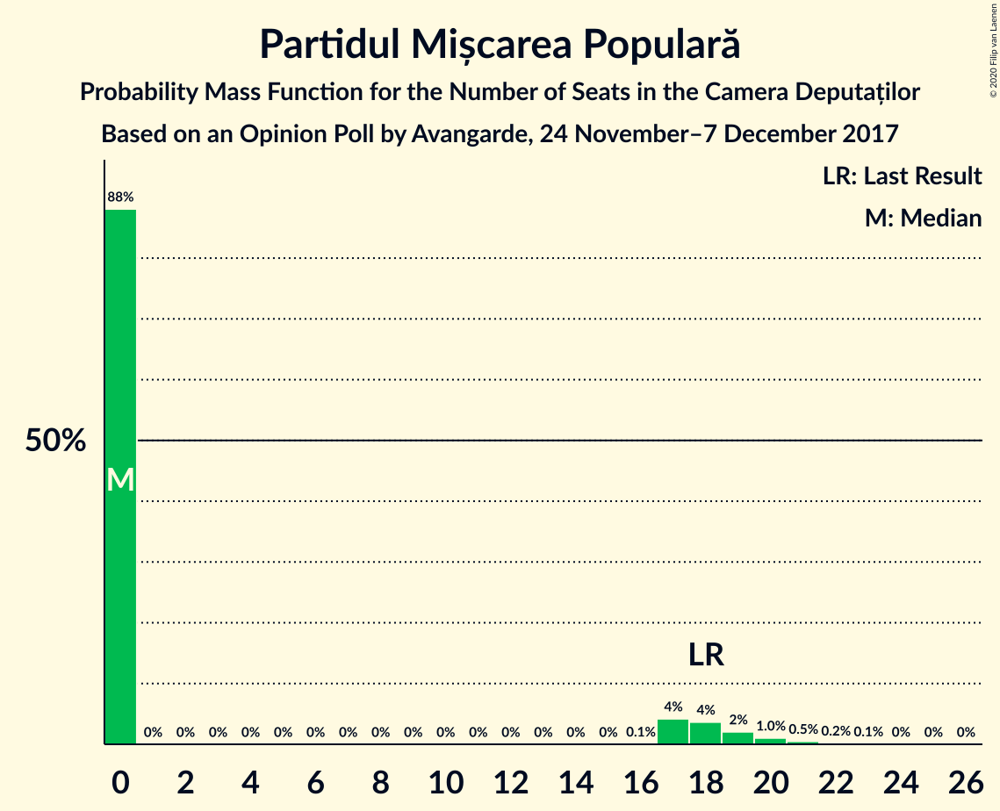
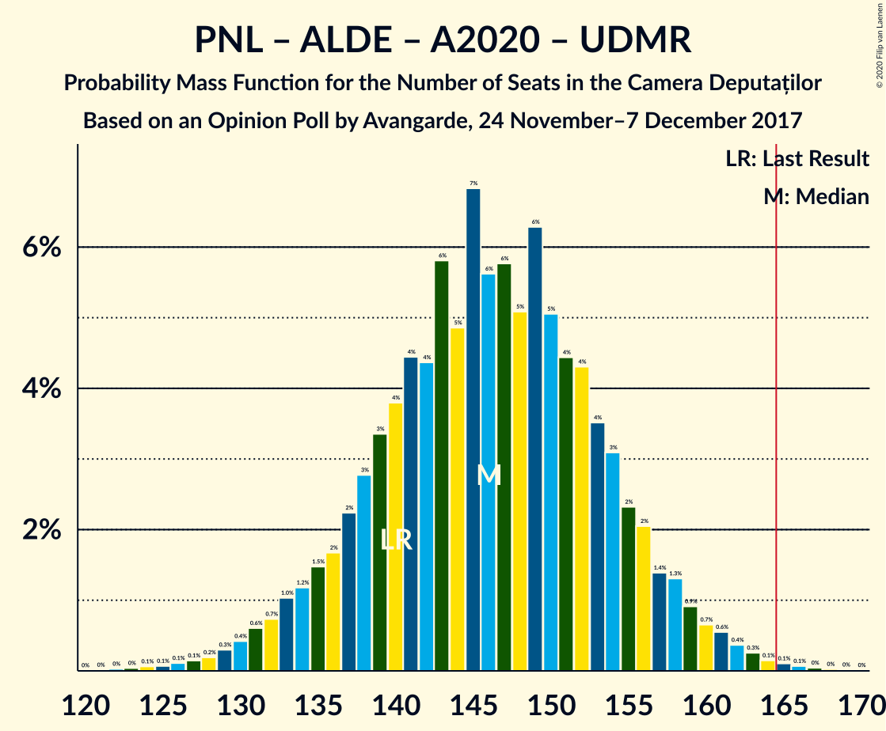
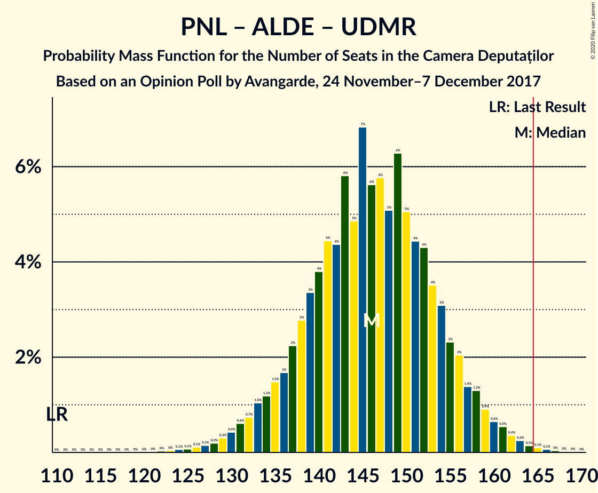
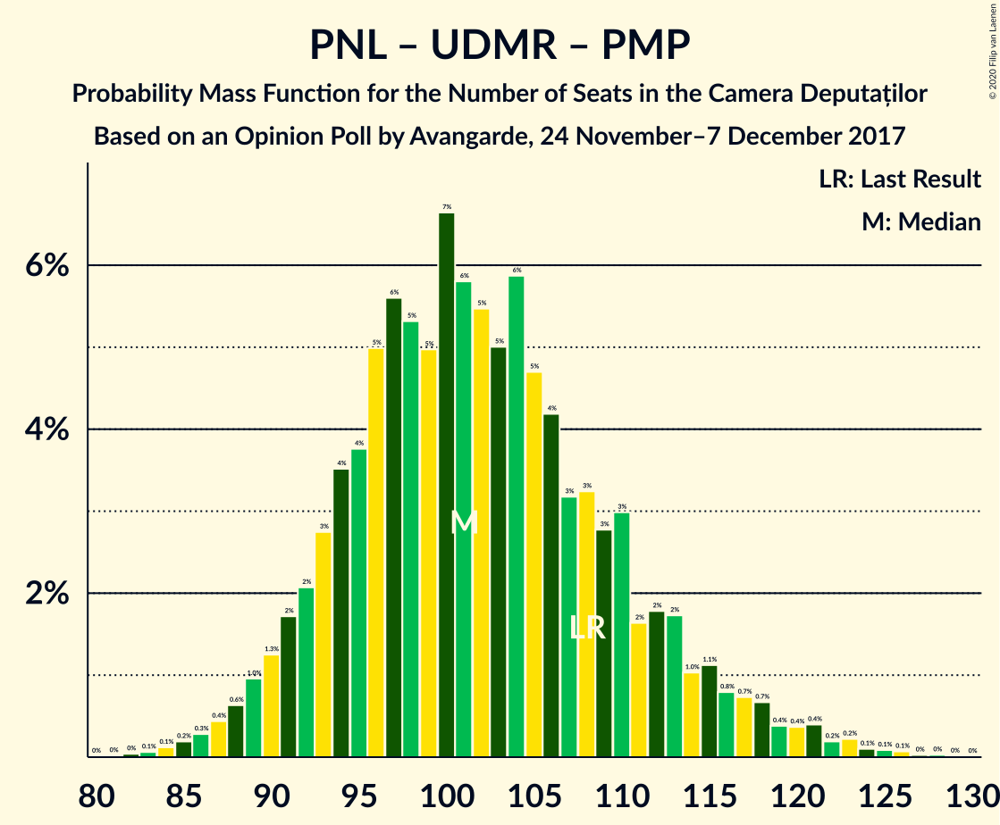

# Opinion Poll by Avangarde, 24 November–7 December 2017

<a href="#voting-intentions">Voting Intentions</a> | <a href="#seats">Seats</a> | <a href="#coalitions">Coalitions</a> | <a href="#technical-information">Technical Information</a>

## Voting Intentions

### Confidence Intervals

| Party | Last Result | Poll Result | 80% Confidence Interval | 90% Confidence Interval | 95% Confidence Interval | 99% Confidence Interval |
|:-----:|:-----------:|:-----------:|:-----------------------:|:-----------------------:|:-----------------------:|:-----------------------:|
| Partidul Social Democrat | 45.5% | 46.0% | 43.6–48.4% |42.9–49.1% |42.3–49.7% |41.2–50.9% |
| Partidul Național Liberal | 20.0% | 23.0% | 21.0–25.1% |20.5–25.7% |20.0–26.3% |19.1–27.3% |
| Partidul Alianța Liberalilor și Democraților | 5.6% | 13.0% | 11.5–14.8% |11.1–15.3% |10.7–15.7% |10.0–16.6% |
| Uniunea Democrată Maghiară din România | 6.2% | 5.0% | 4.1–6.2% |3.8–6.6% |3.6–6.9% |3.2–7.5% |
| Alianța 2020 USR-PLUS | 8.9% | 5.0% | 4.1–6.2% |3.8–6.6% |3.6–6.9% |3.2–7.5% |
| Partidul Mișcarea Populară | 5.4% | 4.0% | 3.2–5.1% |3.0–5.4% |2.8–5.7% |2.4–6.3% |

*Note:* The poll result column reflects the actual value used in the calculations. Published results may vary slightly, and in addition be rounded to fewer digits.

## Seats

### Confidence Intervals

| Party | Last Result | Median | 80% Confidence Interval | 90% Confidence Interval | 95% Confidence Interval | 99% Confidence Interval |
|:-----:|:-----------:|:------:|:-----------------------:|:-----------------------:|:-----------------------:|:-----------------------:|
| <a href="#partidul-social-democrat">Partidul Social Democrat</a> | 154 | 164 | 155–173 |152–175 |150–177 |145–181 |
| <a href="#partidul-național-liberal">Partidul Național Liberal</a> | 69 | 82 | 75–89 |73–91 |72–93 |68–97 |
| <a href="#partidul-alianța-liberalilor-și-democraților">Partidul Alianța Liberalilor și Democraților</a> | 20 | 47 | 40–52 |39–55 |38–55 |35–57 |
| <a href="#uniunea-democrată-maghiară-din-românia">Uniunea Democrată Maghiară din România</a> | 21 | 18 | 14–21 |14–22 |13–24 |11–26 |
| <a href="#alianța-2020-usr-plus">Alianța 2020 USR-PLUS</a> | 30 | 0 | 0 |0 |0 |0 |
| <a href="#partidul-mișcarea-populară">Partidul Mișcarea Populară</a> | 18 | 0 | 0 |0–18 |0–19 |0–21 |

### Partidul Social Democrat

*For a full overview of the results for this party, see the [Partidul Social Democrat](party-partidulsocialdemocrat.html) page.*

| Number of Seats | Probability | Accumulated | Special Marks |
|:---------------:|:-----------:|:-----------:|:-------------:|
| 140 | 0.1% | 100% |  |
| 141 | 0% | 99.9% |  |
| 142 | 0.1% | 99.9% |  |
| 143 | 0.1% | 99.8% |  |
| 144 | 0.1% | 99.7% |  |
| 145 | 0.2% | 99.6% |  |
| 146 | 0.3% | 99.4% |  |
| 147 | 0.2% | 99.1% |  |
| 148 | 0.5% | 98.9% |  |
| 149 | 0.6% | 98% |  |
| 150 | 0.7% | 98% |  |
| 151 | 0.9% | 97% |  |
| 152 | 1.5% | 96% |  |
| 153 | 1.2% | 95% |  |
| 154 | 2% | 94% | Last Result |
| 155 | 2% | 92% |  |
| 156 | 3% | 90% |  |
| 157 | 3% | 87% |  |
| 158 | 3% | 84% |  |
| 159 | 5% | 80% |  |
| 160 | 2% | 75% |  |
| 161 | 6% | 73% |  |
| 162 | 6% | 67% |  |
| 163 | 8% | 61% |  |
| 164 | 6% | 53% | Median |
| 165 | 5% | 47% |  |
| 166 | 4% | 42% | Majority |
| 167 | 7% | 38% |  |
| 168 | 5% | 31% |  |
| 169 | 6% | 26% |  |
| 170 | 3% | 20% |  |
| 171 | 4% | 17% |  |
| 172 | 3% | 13% |  |
| 173 | 2% | 10% |  |
| 174 | 2% | 8% |  |
| 175 | 2% | 6% |  |
| 176 | 1.1% | 4% |  |
| 177 | 1.0% | 3% |  |
| 178 | 0.7% | 2% |  |
| 179 | 0.3% | 1.4% |  |
| 180 | 0.6% | 1.1% |  |
| 181 | 0.2% | 0.6% |  |
| 182 | 0.1% | 0.3% |  |
| 183 | 0.1% | 0.3% |  |
| 184 | 0.1% | 0.2% |  |
| 185 | 0% | 0.1% |  |
| 186 | 0% | 0% |  |

### Partidul Național Liberal

*For a full overview of the results for this party, see the [Partidul Național Liberal](party-partidulnaționalliberal.html) page.*

| Number of Seats | Probability | Accumulated | Special Marks |
|:---------------:|:-----------:|:-----------:|:-------------:|
| 63 | 0% | 100% |  |
| 64 | 0% | 99.9% |  |
| 65 | 0.1% | 99.9% |  |
| 66 | 0.1% | 99.8% |  |
| 67 | 0.2% | 99.7% |  |
| 68 | 0.4% | 99.5% |  |
| 69 | 0.4% | 99.1% | Last Result |
| 70 | 0.7% | 98.7% |  |
| 71 | 0.5% | 98% |  |
| 72 | 2% | 98% |  |
| 73 | 1.0% | 96% |  |
| 74 | 4% | 95% |  |
| 75 | 2% | 91% |  |
| 76 | 4% | 89% |  |
| 77 | 5% | 85% |  |
| 78 | 5% | 80% |  |
| 79 | 7% | 76% |  |
| 80 | 7% | 68% |  |
| 81 | 5% | 61% |  |
| 82 | 10% | 56% | Median |
| 83 | 9% | 46% |  |
| 84 | 5% | 37% |  |
| 85 | 7% | 32% |  |
| 86 | 5% | 26% |  |
| 87 | 5% | 21% |  |
| 88 | 4% | 16% |  |
| 89 | 4% | 12% |  |
| 90 | 1.5% | 8% |  |
| 91 | 3% | 6% |  |
| 92 | 0.3% | 3% |  |
| 93 | 1.4% | 3% |  |
| 94 | 0.3% | 1.5% |  |
| 95 | 0.4% | 1.2% |  |
| 96 | 0.3% | 0.8% |  |
| 97 | 0.2% | 0.5% |  |
| 98 | 0.1% | 0.4% |  |
| 99 | 0.1% | 0.2% |  |
| 100 | 0% | 0.1% |  |
| 101 | 0% | 0.1% |  |
| 102 | 0% | 0% |  |

### Partidul Alianța Liberalilor și Democraților

*For a full overview of the results for this party, see the [Partidul Alianța Liberalilor și Democraților](party-partidulalianțaliberalilorșidemocraților.html) page.*

| Number of Seats | Probability | Accumulated | Special Marks |
|:---------------:|:-----------:|:-----------:|:-------------:|
| 20 | 0% | 100% | Last Result |
| 21 | 0% | 100% |  |
| 22 | 0% | 100% |  |
| 23 | 0% | 100% |  |
| 24 | 0% | 100% |  |
| 25 | 0% | 100% |  |
| 26 | 0% | 100% |  |
| 27 | 0% | 100% |  |
| 28 | 0% | 100% |  |
| 29 | 0% | 100% |  |
| 30 | 0% | 100% |  |
| 31 | 0% | 100% |  |
| 32 | 0% | 100% |  |
| 33 | 0.1% | 100% |  |
| 34 | 0.1% | 99.9% |  |
| 35 | 0.3% | 99.8% |  |
| 36 | 0.7% | 99.5% |  |
| 37 | 0.8% | 98.8% |  |
| 38 | 1.1% | 98% |  |
| 39 | 4% | 97% |  |
| 40 | 5% | 93% |  |
| 41 | 4% | 88% |  |
| 42 | 3% | 85% |  |
| 43 | 3% | 81% |  |
| 44 | 4% | 78% |  |
| 45 | 10% | 74% |  |
| 46 | 6% | 64% |  |
| 47 | 21% | 58% | Median |
| 48 | 13% | 37% |  |
| 49 | 8% | 24% |  |
| 50 | 5% | 16% |  |
| 51 | 0.7% | 12% |  |
| 52 | 1.3% | 11% |  |
| 53 | 2% | 10% |  |
| 54 | 2% | 7% |  |
| 55 | 3% | 5% |  |
| 56 | 0.9% | 2% |  |
| 57 | 0.9% | 1.3% |  |
| 58 | 0.2% | 0.4% |  |
| 59 | 0% | 0.2% |  |
| 60 | 0.1% | 0.2% |  |
| 61 | 0% | 0.2% |  |
| 62 | 0.1% | 0.1% |  |
| 63 | 0.1% | 0.1% |  |
| 64 | 0% | 0% |  |

### Uniunea Democrată Maghiară din România

*For a full overview of the results for this party, see the [Uniunea Democrată Maghiară din România](party-uniuneademocratămaghiarădinromânia.html) page.*

| Number of Seats | Probability | Accumulated | Special Marks |
|:---------------:|:-----------:|:-----------:|:-------------:|
| 9 | 0% | 100% |  |
| 10 | 0.1% | 99.9% |  |
| 11 | 0.5% | 99.8% |  |
| 12 | 2% | 99.3% |  |
| 13 | 3% | 98% |  |
| 14 | 7% | 95% |  |
| 15 | 9% | 89% |  |
| 16 | 12% | 80% |  |
| 17 | 16% | 68% |  |
| 18 | 13% | 51% | Median |
| 19 | 14% | 39% |  |
| 20 | 10% | 25% |  |
| 21 | 6% | 14% | Last Result |
| 22 | 4% | 8% |  |
| 23 | 2% | 5% |  |
| 24 | 1.0% | 3% |  |
| 25 | 0.8% | 2% |  |
| 26 | 0.5% | 0.9% |  |
| 27 | 0.2% | 0.4% |  |
| 28 | 0.1% | 0.2% |  |
| 29 | 0.1% | 0.1% |  |
| 30 | 0% | 0% |  |

### Alianța 2020 USR-PLUS

*For a full overview of the results for this party, see the [Alianța 2020 USR-PLUS](party-alianța2020usr-plus.html) page.*

| Number of Seats | Probability | Accumulated | Special Marks |
|:---------------:|:-----------:|:-----------:|:-------------:|
| 0 | 99.9% | 100% | Median |
| 1 | 0% | 0.1% |  |
| 2 | 0% | 0.1% |  |
| 3 | 0% | 0.1% |  |
| 4 | 0% | 0.1% |  |
| 5 | 0% | 0.1% |  |
| 6 | 0% | 0.1% |  |
| 7 | 0% | 0.1% |  |
| 8 | 0% | 0.1% |  |
| 9 | 0% | 0.1% |  |
| 10 | 0% | 0.1% |  |
| 11 | 0% | 0.1% |  |
| 12 | 0% | 0.1% |  |
| 13 | 0% | 0.1% |  |
| 14 | 0% | 0.1% |  |
| 15 | 0% | 0.1% |  |
| 16 | 0% | 0.1% |  |
| 17 | 0% | 0.1% |  |
| 18 | 0% | 0.1% |  |
| 19 | 0% | 0.1% |  |
| 20 | 0% | 0.1% |  |
| 21 | 0% | 0.1% |  |
| 22 | 0% | 0.1% |  |
| 23 | 0% | 0.1% |  |
| 24 | 0% | 0.1% |  |
| 25 | 0% | 0.1% |  |
| 26 | 0% | 0.1% |  |
| 27 | 0% | 0.1% |  |
| 28 | 0% | 0% |  |
| 29 | 0% | 0% |  |
| 30 | 0% | 0% | Last Result |

### Partidul Mișcarea Populară

*For a full overview of the results for this party, see the [Partidul Mișcarea Populară](party-partidulmișcareapopulară.html) page.*

| Number of Seats | Probability | Accumulated | Special Marks |
|:---------------:|:-----------:|:-----------:|:-------------:|
| 0 | 91% | 100% | Median |
| 1 | 0% | 9% |  |
| 2 | 0% | 9% |  |
| 3 | 0% | 9% |  |
| 4 | 0% | 9% |  |
| 5 | 0% | 9% |  |
| 6 | 0% | 9% |  |
| 7 | 0% | 9% |  |
| 8 | 0% | 9% |  |
| 9 | 0% | 9% |  |
| 10 | 0% | 9% |  |
| 11 | 0% | 9% |  |
| 12 | 0% | 9% |  |
| 13 | 0% | 9% |  |
| 14 | 0% | 9% |  |
| 15 | 0% | 9% |  |
| 16 | 0% | 9% |  |
| 17 | 3% | 9% |  |
| 18 | 3% | 6% | Last Result |
| 19 | 1.4% | 3% |  |
| 20 | 0.8% | 2% |  |
| 21 | 0.4% | 0.8% |  |
| 22 | 0.2% | 0.4% |  |
| 23 | 0.1% | 0.2% |  |
| 24 | 0% | 0.1% |  |
| 25 | 0% | 0% |  |

## Coalitions

### Confidence Intervals

| Coalition | Last Result | Median | Majority? | 80% Confidence Interval | 90% Confidence Interval | 95% Confidence Interval | 99% Confidence Interval |
|:---------:|:-----------:|:------:|:---------:|:-----------------------:|:-----------------------:|:-----------------------:|:-----------------------:|
| Partidul Social Democrat – Partidul Alianța Liberalilor și Democraților | 174 | 211 | 100% | 202–219 | 199–221 | 195–223 | 189–226 |
| Partidul Național Liberal – Partidul Alianța Liberalilor și Democraților – Alianța 2020 USR-PLUS – Uniunea Democrată Maghiară din România – Partidul Mișcarea Populară | 158 | 148 | 0.9% | 139–157 | 137–160 | 135–162 | 131–167 |
| Partidul Național Liberal – Partidul Alianța Liberalilor și Democraților – Uniunea Democrată Maghiară din România – Partidul Mișcarea Populară | 128 | 148 | 0.9% | 139–157 | 137–160 | 135–162 | 131–167 |
| Partidul Național Liberal – Partidul Alianța Liberalilor și Democraților – Alianța 2020 USR-PLUS – Uniunea Democrată Maghiară din România | 140 | 146 | 0.2% | 138–155 | 135–157 | 133–159 | 128–163 |
| Partidul Național Liberal – Partidul Alianța Liberalilor și Democraților – Uniunea Democrată Maghiară din România | 110 | 146 | 0.2% | 138–154 | 135–157 | 133–159 | 128–163 |
| Partidul Național Liberal – Partidul Alianța Liberalilor și Democraților – Alianța 2020 USR-PLUS – Partidul Mișcarea Populară | 137 | 130 | 0% | 121–140 | 119–142 | 117–145 | 114–149 |
| Partidul Național Liberal – Partidul Alianța Liberalilor și Democraților – Alianța 2020 USR-PLUS | 119 | 129 | 0% | 120–136 | 118–140 | 115–141 | 111–146 |
| Partidul Național Liberal – Alianța 2020 USR-PLUS – Uniunea Democrată Maghiară din România – Partidul Mișcarea Populară | 138 | 101 | 0% | 93–110 | 91–113 | 89–117 | 86–123 |
| Partidul Național Liberal – Uniunea Democrată Maghiară din România – Partidul Mișcarea Populară | 108 | 101 | 0% | 93–110 | 91–113 | 89–117 | 86–123 |
| Partidul Național Liberal – Alianța 2020 USR-PLUS – Uniunea Democrată Maghiară din România | 120 | 100 | 0% | 92–108 | 90–110 | 88–112 | 84–116 |
| Partidul Național Liberal – Uniunea Democrată Maghiară din România | 90 | 100 | 0% | 92–108 | 90–110 | 88–112 | 84–116 |
| Partidul Național Liberal – Alianța 2020 USR-PLUS – Partidul Mișcarea Populară | 117 | 83 | 0% | 76–93 | 74–96 | 72–99 | 69–106 |
| Partidul Național Liberal – Partidul Mișcarea Populară | 87 | 83 | 0% | 76–93 | 74–96 | 72–99 | 69–106 |
| Partidul Național Liberal – Alianța 2020 USR-PLUS | 99 | 82 | 0% | 75–89 | 73–91 | 72–93 | 68–97 |
| Partidul Național Liberal | 69 | 82 | 0% | 75–89 | 73–91 | 72–93 | 68–97 |
| Alianța 2020 USR-PLUS – Partidul Mișcarea Populară | 48 | 0 | 0% | 0 | 0–18 | 0–19 | 0–21 |

### Partidul Social Democrat – Partidul Alianța Liberalilor și Democraților

| Number of Seats | Probability | Accumulated | Special Marks |
|:---------------:|:-----------:|:-----------:|:-------------:|
| 174 | 0% | 100% | Last Result |
| 175 | 0% | 100% |  |
| 176 | 0% | 100% |  |
| 177 | 0% | 100% |  |
| 178 | 0% | 100% |  |
| 179 | 0% | 100% |  |
| 180 | 0% | 100% |  |
| 181 | 0% | 100% |  |
| 182 | 0% | 100% |  |
| 183 | 0% | 100% |  |
| 184 | 0% | 100% |  |
| 185 | 0% | 99.9% |  |
| 186 | 0.1% | 99.9% |  |
| 187 | 0.1% | 99.8% |  |
| 188 | 0.1% | 99.8% |  |
| 189 | 0.3% | 99.7% |  |
| 190 | 0.3% | 99.4% |  |
| 191 | 0.1% | 99.1% |  |
| 192 | 0.4% | 99.0% |  |
| 193 | 0.4% | 98.6% |  |
| 194 | 0.4% | 98% |  |
| 195 | 0.6% | 98% |  |
| 196 | 0.5% | 97% |  |
| 197 | 0.6% | 97% |  |
| 198 | 0.8% | 96% |  |
| 199 | 2% | 95% |  |
| 200 | 1.3% | 93% |  |
| 201 | 1.4% | 92% |  |
| 202 | 3% | 90% |  |
| 203 | 2% | 88% |  |
| 204 | 4% | 85% |  |
| 205 | 3% | 81% |  |
| 206 | 4% | 78% |  |
| 207 | 3% | 75% |  |
| 208 | 10% | 72% |  |
| 209 | 3% | 62% |  |
| 210 | 6% | 59% |  |
| 211 | 5% | 52% | Median |
| 212 | 10% | 48% |  |
| 213 | 3% | 37% |  |
| 214 | 6% | 35% |  |
| 215 | 3% | 29% |  |
| 216 | 7% | 26% |  |
| 217 | 4% | 19% |  |
| 218 | 3% | 14% |  |
| 219 | 2% | 11% |  |
| 220 | 2% | 9% |  |
| 221 | 3% | 7% |  |
| 222 | 1.2% | 4% |  |
| 223 | 1.0% | 3% |  |
| 224 | 0.6% | 2% |  |
| 225 | 0.6% | 1.2% |  |
| 226 | 0.2% | 0.6% |  |
| 227 | 0.2% | 0.4% |  |
| 228 | 0.1% | 0.3% |  |
| 229 | 0.1% | 0.1% |  |
| 230 | 0% | 0.1% |  |
| 231 | 0% | 0% |  |

### Partidul Național Liberal – Partidul Alianța Liberalilor și Democraților – Alianța 2020 USR-PLUS – Uniunea Democrată Maghiară din România – Partidul Mișcarea Populară

| Number of Seats | Probability | Accumulated | Special Marks |
|:---------------:|:-----------:|:-----------:|:-------------:|
| 127 | 0% | 100% |  |
| 128 | 0.1% | 99.9% |  |
| 129 | 0.1% | 99.8% |  |
| 130 | 0.1% | 99.7% |  |
| 131 | 0.2% | 99.7% |  |
| 132 | 0.6% | 99.4% |  |
| 133 | 0.3% | 98.9% |  |
| 134 | 0.7% | 98.6% |  |
| 135 | 1.0% | 98% |  |
| 136 | 1.1% | 97% |  |
| 137 | 2% | 96% |  |
| 138 | 2% | 94% |  |
| 139 | 2% | 92% |  |
| 140 | 3% | 90% |  |
| 141 | 4% | 87% |  |
| 142 | 3% | 83% |  |
| 143 | 6% | 80% |  |
| 144 | 5% | 74% |  |
| 145 | 7% | 69% |  |
| 146 | 4% | 62% |  |
| 147 | 5% | 58% | Median |
| 148 | 6% | 53% |  |
| 149 | 8% | 47% |  |
| 150 | 6% | 39% |  |
| 151 | 6% | 33% |  |
| 152 | 2% | 27% |  |
| 153 | 5% | 25% |  |
| 154 | 3% | 20% |  |
| 155 | 3% | 16% |  |
| 156 | 3% | 13% |  |
| 157 | 2% | 10% |  |
| 158 | 2% | 8% | Last Result |
| 159 | 1.2% | 6% |  |
| 160 | 1.5% | 5% |  |
| 161 | 0.9% | 4% |  |
| 162 | 0.7% | 3% |  |
| 163 | 0.6% | 2% |  |
| 164 | 0.5% | 2% |  |
| 165 | 0.2% | 1.1% |  |
| 166 | 0.3% | 0.9% | Majority |
| 167 | 0.2% | 0.6% |  |
| 168 | 0.1% | 0.4% |  |
| 169 | 0.1% | 0.3% |  |
| 170 | 0.1% | 0.2% |  |
| 171 | 0% | 0.1% |  |
| 172 | 0.1% | 0.1% |  |
| 173 | 0% | 0% |  |

### Partidul Național Liberal – Partidul Alianța Liberalilor și Democraților – Uniunea Democrată Maghiară din România – Partidul Mișcarea Populară

| Number of Seats | Probability | Accumulated | Special Marks |
|:---------------:|:-----------:|:-----------:|:-------------:|
| 126 | 0% | 100% |  |
| 127 | 0% | 99.9% |  |
| 128 | 0.1% | 99.9% | Last Result |
| 129 | 0.1% | 99.8% |  |
| 130 | 0.1% | 99.7% |  |
| 131 | 0.2% | 99.6% |  |
| 132 | 0.6% | 99.4% |  |
| 133 | 0.3% | 98.9% |  |
| 134 | 0.7% | 98.6% |  |
| 135 | 1.0% | 98% |  |
| 136 | 1.1% | 97% |  |
| 137 | 2% | 96% |  |
| 138 | 2% | 94% |  |
| 139 | 2% | 92% |  |
| 140 | 3% | 90% |  |
| 141 | 4% | 87% |  |
| 142 | 3% | 83% |  |
| 143 | 6% | 80% |  |
| 144 | 5% | 74% |  |
| 145 | 7% | 69% |  |
| 146 | 4% | 61% |  |
| 147 | 5% | 58% | Median |
| 148 | 6% | 53% |  |
| 149 | 8% | 47% |  |
| 150 | 6% | 39% |  |
| 151 | 6% | 33% |  |
| 152 | 2% | 27% |  |
| 153 | 5% | 25% |  |
| 154 | 3% | 19% |  |
| 155 | 3% | 16% |  |
| 156 | 3% | 13% |  |
| 157 | 2% | 10% |  |
| 158 | 2% | 8% |  |
| 159 | 1.2% | 6% |  |
| 160 | 1.4% | 5% |  |
| 161 | 0.9% | 4% |  |
| 162 | 0.7% | 3% |  |
| 163 | 0.6% | 2% |  |
| 164 | 0.5% | 2% |  |
| 165 | 0.2% | 1.1% |  |
| 166 | 0.3% | 0.9% | Majority |
| 167 | 0.2% | 0.6% |  |
| 168 | 0.1% | 0.4% |  |
| 169 | 0.1% | 0.3% |  |
| 170 | 0.1% | 0.2% |  |
| 171 | 0% | 0.1% |  |
| 172 | 0.1% | 0.1% |  |
| 173 | 0% | 0% |  |

### Partidul Național Liberal – Partidul Alianța Liberalilor și Democraților – Alianța 2020 USR-PLUS – Uniunea Democrată Maghiară din România

| Number of Seats | Probability | Accumulated | Special Marks |
|:---------------:|:-----------:|:-----------:|:-------------:|
| 123 | 0% | 100% |  |
| 124 | 0.1% | 99.9% |  |
| 125 | 0% | 99.9% |  |
| 126 | 0.1% | 99.8% |  |
| 127 | 0.2% | 99.8% |  |
| 128 | 0.2% | 99.6% |  |
| 129 | 0.2% | 99.4% |  |
| 130 | 0.3% | 99.2% |  |
| 131 | 0.6% | 98.9% |  |
| 132 | 0.7% | 98% |  |
| 133 | 0.7% | 98% |  |
| 134 | 1.1% | 97% |  |
| 135 | 2% | 96% |  |
| 136 | 1.5% | 94% |  |
| 137 | 2% | 93% |  |
| 138 | 3% | 90% |  |
| 139 | 3% | 88% |  |
| 140 | 3% | 84% | Last Result |
| 141 | 4% | 81% |  |
| 142 | 3% | 77% |  |
| 143 | 6% | 73% |  |
| 144 | 6% | 67% |  |
| 145 | 7% | 61% |  |
| 146 | 4% | 54% |  |
| 147 | 5% | 50% | Median |
| 148 | 6% | 45% |  |
| 149 | 8% | 39% |  |
| 150 | 6% | 31% |  |
| 151 | 6% | 25% |  |
| 152 | 2% | 19% |  |
| 153 | 4% | 17% |  |
| 154 | 3% | 13% |  |
| 155 | 3% | 10% |  |
| 156 | 1.5% | 7% |  |
| 157 | 2% | 6% |  |
| 158 | 1.1% | 4% |  |
| 159 | 0.8% | 3% |  |
| 160 | 1.1% | 2% |  |
| 161 | 0.4% | 1.3% |  |
| 162 | 0.3% | 0.9% |  |
| 163 | 0.2% | 0.6% |  |
| 164 | 0.2% | 0.4% |  |
| 165 | 0% | 0.2% |  |
| 166 | 0.1% | 0.2% | Majority |
| 167 | 0% | 0.1% |  |
| 168 | 0% | 0.1% |  |
| 169 | 0% | 0% |  |

### Partidul Național Liberal – Partidul Alianța Liberalilor și Democraților – Uniunea Democrată Maghiară din România

| Number of Seats | Probability | Accumulated | Special Marks |
|:---------------:|:-----------:|:-----------:|:-------------:|
| 110 | 0% | 100% | Last Result |
| 111 | 0% | 100% |  |
| 112 | 0% | 100% |  |
| 113 | 0% | 100% |  |
| 114 | 0% | 100% |  |
| 115 | 0% | 100% |  |
| 116 | 0% | 100% |  |
| 117 | 0% | 100% |  |
| 118 | 0% | 100% |  |
| 119 | 0% | 100% |  |
| 120 | 0% | 100% |  |
| 121 | 0% | 100% |  |
| 122 | 0% | 100% |  |
| 123 | 0% | 99.9% |  |
| 124 | 0.1% | 99.9% |  |
| 125 | 0% | 99.9% |  |
| 126 | 0.1% | 99.8% |  |
| 127 | 0.2% | 99.7% |  |
| 128 | 0.2% | 99.6% |  |
| 129 | 0.2% | 99.4% |  |
| 130 | 0.3% | 99.2% |  |
| 131 | 0.6% | 98.9% |  |
| 132 | 0.7% | 98% |  |
| 133 | 0.8% | 98% |  |
| 134 | 1.1% | 97% |  |
| 135 | 2% | 96% |  |
| 136 | 1.5% | 94% |  |
| 137 | 2% | 93% |  |
| 138 | 3% | 90% |  |
| 139 | 3% | 88% |  |
| 140 | 3% | 84% |  |
| 141 | 4% | 81% |  |
| 142 | 3% | 77% |  |
| 143 | 6% | 73% |  |
| 144 | 6% | 67% |  |
| 145 | 7% | 61% |  |
| 146 | 4% | 54% |  |
| 147 | 5% | 50% | Median |
| 148 | 6% | 45% |  |
| 149 | 8% | 39% |  |
| 150 | 6% | 31% |  |
| 151 | 6% | 25% |  |
| 152 | 2% | 19% |  |
| 153 | 4% | 17% |  |
| 154 | 3% | 13% |  |
| 155 | 3% | 10% |  |
| 156 | 1.5% | 7% |  |
| 157 | 2% | 6% |  |
| 158 | 1.1% | 4% |  |
| 159 | 0.8% | 3% |  |
| 160 | 1.1% | 2% |  |
| 161 | 0.4% | 1.3% |  |
| 162 | 0.3% | 0.9% |  |
| 163 | 0.2% | 0.6% |  |
| 164 | 0.2% | 0.4% |  |
| 165 | 0% | 0.2% |  |
| 166 | 0.1% | 0.2% | Majority |
| 167 | 0% | 0.1% |  |
| 168 | 0% | 0.1% |  |
| 169 | 0% | 0% |  |

### Partidul Național Liberal – Partidul Alianța Liberalilor și Democraților – Alianța 2020 USR-PLUS – Partidul Mișcarea Populară

| Number of Seats | Probability | Accumulated | Special Marks |
|:---------------:|:-----------:|:-----------:|:-------------:|
| 110 | 0% | 100% |  |
| 111 | 0.1% | 99.9% |  |
| 112 | 0.1% | 99.9% |  |
| 113 | 0.3% | 99.8% |  |
| 114 | 0.5% | 99.5% |  |
| 115 | 0.5% | 99.0% |  |
| 116 | 0.9% | 98% |  |
| 117 | 0.6% | 98% |  |
| 118 | 1.4% | 97% |  |
| 119 | 3% | 96% |  |
| 120 | 2% | 93% |  |
| 121 | 2% | 91% |  |
| 122 | 2% | 89% |  |
| 123 | 2% | 87% |  |
| 124 | 4% | 85% |  |
| 125 | 6% | 82% |  |
| 126 | 3% | 76% |  |
| 127 | 4% | 73% |  |
| 128 | 5% | 69% |  |
| 129 | 7% | 64% | Median |
| 130 | 15% | 57% |  |
| 131 | 5% | 42% |  |
| 132 | 7% | 37% |  |
| 133 | 3% | 30% |  |
| 134 | 3% | 26% |  |
| 135 | 4% | 23% |  |
| 136 | 3% | 19% |  |
| 137 | 2% | 16% | Last Result |
| 138 | 1.0% | 14% |  |
| 139 | 2% | 13% |  |
| 140 | 3% | 11% |  |
| 141 | 3% | 8% |  |
| 142 | 1.3% | 5% |  |
| 143 | 0.7% | 4% |  |
| 144 | 0.6% | 3% |  |
| 145 | 0.5% | 3% |  |
| 146 | 0.9% | 2% |  |
| 147 | 0.6% | 1.5% |  |
| 148 | 0.3% | 0.9% |  |
| 149 | 0.1% | 0.6% |  |
| 150 | 0.1% | 0.5% |  |
| 151 | 0.1% | 0.4% |  |
| 152 | 0.1% | 0.3% |  |
| 153 | 0% | 0.2% |  |
| 154 | 0% | 0.2% |  |
| 155 | 0.1% | 0.1% |  |
| 156 | 0.1% | 0.1% |  |
| 157 | 0% | 0% |  |

### Partidul Național Liberal – Partidul Alianța Liberalilor și Democraților – Alianța 2020 USR-PLUS

| Number of Seats | Probability | Accumulated | Special Marks |
|:---------------:|:-----------:|:-----------:|:-------------:|
| 107 | 0% | 100% |  |
| 108 | 0.1% | 99.9% |  |
| 109 | 0.1% | 99.8% |  |
| 110 | 0.1% | 99.8% |  |
| 111 | 0.2% | 99.7% |  |
| 112 | 0.3% | 99.5% |  |
| 113 | 0.5% | 99.2% |  |
| 114 | 0.8% | 98.7% |  |
| 115 | 0.8% | 98% |  |
| 116 | 1.2% | 97% |  |
| 117 | 0.7% | 96% |  |
| 118 | 2% | 95% |  |
| 119 | 3% | 93% | Last Result |
| 120 | 2% | 91% |  |
| 121 | 3% | 88% |  |
| 122 | 3% | 85% |  |
| 123 | 3% | 83% |  |
| 124 | 4% | 79% |  |
| 125 | 6% | 75% |  |
| 126 | 4% | 69% |  |
| 127 | 5% | 66% |  |
| 128 | 5% | 61% |  |
| 129 | 7% | 56% | Median |
| 130 | 15% | 49% |  |
| 131 | 5% | 34% |  |
| 132 | 7% | 29% |  |
| 133 | 3% | 22% |  |
| 134 | 3% | 19% |  |
| 135 | 4% | 15% |  |
| 136 | 3% | 12% |  |
| 137 | 2% | 9% |  |
| 138 | 0.6% | 7% |  |
| 139 | 1.2% | 7% |  |
| 140 | 1.2% | 5% |  |
| 141 | 2% | 4% |  |
| 142 | 0.9% | 2% |  |
| 143 | 0.5% | 2% |  |
| 144 | 0.3% | 1.0% |  |
| 145 | 0.2% | 0.7% |  |
| 146 | 0.2% | 0.5% |  |
| 147 | 0.1% | 0.3% |  |
| 148 | 0.1% | 0.1% |  |
| 149 | 0% | 0.1% |  |
| 150 | 0% | 0.1% |  |
| 151 | 0% | 0% |  |

### Partidul Național Liberal – Alianța 2020 USR-PLUS – Uniunea Democrată Maghiară din România – Partidul Mișcarea Populară

| Number of Seats | Probability | Accumulated | Special Marks |
|:---------------:|:-----------:|:-----------:|:-------------:|
| 82 | 0% | 100% |  |
| 83 | 0.1% | 99.9% |  |
| 84 | 0.1% | 99.9% |  |
| 85 | 0.2% | 99.7% |  |
| 86 | 0.2% | 99.6% |  |
| 87 | 0.6% | 99.4% |  |
| 88 | 0.6% | 98.8% |  |
| 89 | 1.0% | 98% |  |
| 90 | 1.2% | 97% |  |
| 91 | 3% | 96% |  |
| 92 | 2% | 93% |  |
| 93 | 2% | 91% |  |
| 94 | 3% | 89% |  |
| 95 | 4% | 86% |  |
| 96 | 7% | 81% |  |
| 97 | 3% | 74% |  |
| 98 | 6% | 71% |  |
| 99 | 3% | 65% |  |
| 100 | 10% | 63% | Median |
| 101 | 5% | 52% |  |
| 102 | 6% | 48% |  |
| 103 | 3% | 41% |  |
| 104 | 10% | 38% |  |
| 105 | 3% | 28% |  |
| 106 | 4% | 25% |  |
| 107 | 3% | 22% |  |
| 108 | 4% | 19% |  |
| 109 | 2% | 15% |  |
| 110 | 3% | 12% |  |
| 111 | 1.4% | 10% |  |
| 112 | 1.3% | 8% |  |
| 113 | 2% | 7% |  |
| 114 | 0.8% | 5% |  |
| 115 | 0.6% | 4% |  |
| 116 | 0.5% | 3% |  |
| 117 | 0.6% | 3% |  |
| 118 | 0.4% | 2% |  |
| 119 | 0.4% | 2% |  |
| 120 | 0.4% | 1.4% |  |
| 121 | 0.1% | 1.0% |  |
| 122 | 0.3% | 0.9% |  |
| 123 | 0.3% | 0.6% |  |
| 124 | 0.1% | 0.3% |  |
| 125 | 0.1% | 0.2% |  |
| 126 | 0.1% | 0.2% |  |
| 127 | 0% | 0.1% |  |
| 128 | 0% | 0.1% |  |
| 129 | 0% | 0% |  |
| 130 | 0% | 0% |  |
| 131 | 0% | 0% |  |
| 132 | 0% | 0% |  |
| 133 | 0% | 0% |  |
| 134 | 0% | 0% |  |
| 135 | 0% | 0% |  |
| 136 | 0% | 0% |  |
| 137 | 0% | 0% |  |
| 138 | 0% | 0% | Last Result |

### Partidul Național Liberal – Uniunea Democrată Maghiară din România – Partidul Mișcarea Populară

| Number of Seats | Probability | Accumulated | Special Marks |
|:---------------:|:-----------:|:-----------:|:-------------:|
| 82 | 0% | 100% |  |
| 83 | 0.1% | 99.9% |  |
| 84 | 0.1% | 99.9% |  |
| 85 | 0.2% | 99.7% |  |
| 86 | 0.2% | 99.5% |  |
| 87 | 0.6% | 99.4% |  |
| 88 | 0.6% | 98.8% |  |
| 89 | 1.0% | 98% |  |
| 90 | 1.2% | 97% |  |
| 91 | 3% | 96% |  |
| 92 | 2% | 93% |  |
| 93 | 2% | 91% |  |
| 94 | 3% | 89% |  |
| 95 | 4% | 86% |  |
| 96 | 7% | 81% |  |
| 97 | 3% | 74% |  |
| 98 | 6% | 71% |  |
| 99 | 3% | 65% |  |
| 100 | 10% | 63% | Median |
| 101 | 5% | 52% |  |
| 102 | 6% | 48% |  |
| 103 | 3% | 41% |  |
| 104 | 10% | 38% |  |
| 105 | 3% | 28% |  |
| 106 | 4% | 25% |  |
| 107 | 3% | 22% |  |
| 108 | 4% | 19% | Last Result |
| 109 | 2% | 15% |  |
| 110 | 3% | 12% |  |
| 111 | 1.4% | 10% |  |
| 112 | 1.3% | 8% |  |
| 113 | 2% | 7% |  |
| 114 | 0.8% | 5% |  |
| 115 | 0.6% | 4% |  |
| 116 | 0.5% | 3% |  |
| 117 | 0.6% | 3% |  |
| 118 | 0.4% | 2% |  |
| 119 | 0.4% | 2% |  |
| 120 | 0.4% | 1.4% |  |
| 121 | 0.1% | 1.0% |  |
| 122 | 0.3% | 0.8% |  |
| 123 | 0.3% | 0.6% |  |
| 124 | 0.1% | 0.3% |  |
| 125 | 0.1% | 0.2% |  |
| 126 | 0.1% | 0.1% |  |
| 127 | 0% | 0.1% |  |
| 128 | 0% | 0% |  |

### Partidul Național Liberal – Alianța 2020 USR-PLUS – Uniunea Democrată Maghiară din România

| Number of Seats | Probability | Accumulated | Special Marks |
|:---------------:|:-----------:|:-----------:|:-------------:|
| 80 | 0% | 100% |  |
| 81 | 0.1% | 99.9% |  |
| 82 | 0.1% | 99.8% |  |
| 83 | 0.1% | 99.8% |  |
| 84 | 0.2% | 99.6% |  |
| 85 | 0.3% | 99.4% |  |
| 86 | 0.4% | 99.1% |  |
| 87 | 0.8% | 98.7% |  |
| 88 | 0.7% | 98% |  |
| 89 | 1.0% | 97% |  |
| 90 | 2% | 96% |  |
| 91 | 3% | 94% |  |
| 92 | 3% | 91% |  |
| 93 | 3% | 88% |  |
| 94 | 4% | 85% |  |
| 95 | 5% | 81% |  |
| 96 | 9% | 77% |  |
| 97 | 3% | 68% |  |
| 98 | 6% | 64% |  |
| 99 | 3% | 58% |  |
| 100 | 10% | 55% | Median |
| 101 | 5% | 45% |  |
| 102 | 7% | 40% |  |
| 103 | 3% | 33% |  |
| 104 | 10% | 30% |  |
| 105 | 3% | 20% |  |
| 106 | 4% | 17% |  |
| 107 | 3% | 13% |  |
| 108 | 4% | 11% |  |
| 109 | 2% | 7% |  |
| 110 | 2% | 5% |  |
| 111 | 0.8% | 4% |  |
| 112 | 0.7% | 3% |  |
| 113 | 0.9% | 2% |  |
| 114 | 0.3% | 1.3% |  |
| 115 | 0.4% | 1.0% |  |
| 116 | 0.2% | 0.7% |  |
| 117 | 0.3% | 0.5% |  |
| 118 | 0.1% | 0.2% |  |
| 119 | 0.1% | 0.2% |  |
| 120 | 0% | 0.1% | Last Result |
| 121 | 0% | 0.1% |  |
| 122 | 0% | 0.1% |  |
| 123 | 0% | 0% |  |

### Partidul Național Liberal – Uniunea Democrată Maghiară din România

| Number of Seats | Probability | Accumulated | Special Marks |
|:---------------:|:-----------:|:-----------:|:-------------:|
| 80 | 0% | 100% |  |
| 81 | 0.1% | 99.9% |  |
| 82 | 0.1% | 99.8% |  |
| 83 | 0.1% | 99.8% |  |
| 84 | 0.2% | 99.6% |  |
| 85 | 0.3% | 99.4% |  |
| 86 | 0.4% | 99.1% |  |
| 87 | 0.8% | 98.7% |  |
| 88 | 0.7% | 98% |  |
| 89 | 1.0% | 97% |  |
| 90 | 2% | 96% | Last Result |
| 91 | 3% | 94% |  |
| 92 | 3% | 91% |  |
| 93 | 3% | 88% |  |
| 94 | 4% | 85% |  |
| 95 | 5% | 81% |  |
| 96 | 9% | 77% |  |
| 97 | 3% | 68% |  |
| 98 | 6% | 64% |  |
| 99 | 3% | 58% |  |
| 100 | 10% | 55% | Median |
| 101 | 5% | 45% |  |
| 102 | 7% | 40% |  |
| 103 | 3% | 33% |  |
| 104 | 10% | 30% |  |
| 105 | 3% | 20% |  |
| 106 | 4% | 17% |  |
| 107 | 3% | 13% |  |
| 108 | 4% | 11% |  |
| 109 | 2% | 7% |  |
| 110 | 2% | 5% |  |
| 111 | 0.8% | 4% |  |
| 112 | 0.7% | 3% |  |
| 113 | 0.9% | 2% |  |
| 114 | 0.3% | 1.2% |  |
| 115 | 0.4% | 1.0% |  |
| 116 | 0.2% | 0.6% |  |
| 117 | 0.3% | 0.4% |  |
| 118 | 0.1% | 0.2% |  |
| 119 | 0.1% | 0.1% |  |
| 120 | 0% | 0.1% |  |
| 121 | 0% | 0% |  |

### Partidul Național Liberal – Alianța 2020 USR-PLUS – Partidul Mișcarea Populară

| Number of Seats | Probability | Accumulated | Special Marks |
|:---------------:|:-----------:|:-----------:|:-------------:|
| 65 | 0% | 100% |  |
| 66 | 0.1% | 99.9% |  |
| 67 | 0.1% | 99.9% |  |
| 68 | 0.1% | 99.8% |  |
| 69 | 0.2% | 99.7% |  |
| 70 | 0.4% | 99.4% |  |
| 71 | 0.5% | 99.0% |  |
| 72 | 1.1% | 98.5% |  |
| 73 | 0.9% | 97% |  |
| 74 | 3% | 96% |  |
| 75 | 2% | 93% |  |
| 76 | 4% | 92% |  |
| 77 | 5% | 88% |  |
| 78 | 3% | 83% |  |
| 79 | 7% | 81% |  |
| 80 | 5% | 74% |  |
| 81 | 5% | 68% |  |
| 82 | 10% | 64% | Median |
| 83 | 9% | 54% |  |
| 84 | 5% | 45% |  |
| 85 | 7% | 40% |  |
| 86 | 5% | 33% |  |
| 87 | 5% | 29% |  |
| 88 | 4% | 24% |  |
| 89 | 4% | 21% |  |
| 90 | 2% | 16% |  |
| 91 | 4% | 15% |  |
| 92 | 0.8% | 11% |  |
| 93 | 2% | 10% |  |
| 94 | 0.7% | 8% |  |
| 95 | 1.1% | 8% |  |
| 96 | 2% | 7% |  |
| 97 | 2% | 5% |  |
| 98 | 0.3% | 3% |  |
| 99 | 0.4% | 3% |  |
| 100 | 0.2% | 2% |  |
| 101 | 0.2% | 2% |  |
| 102 | 0.1% | 2% |  |
| 103 | 0.2% | 2% |  |
| 104 | 0.2% | 1.4% |  |
| 105 | 0.5% | 1.3% |  |
| 106 | 0.5% | 0.8% |  |
| 107 | 0.1% | 0.3% |  |
| 108 | 0.1% | 0.2% |  |
| 109 | 0.1% | 0.1% |  |
| 110 | 0% | 0.1% |  |
| 111 | 0% | 0% |  |
| 112 | 0% | 0% |  |
| 113 | 0% | 0% |  |
| 114 | 0% | 0% |  |
| 115 | 0% | 0% |  |
| 116 | 0% | 0% |  |
| 117 | 0% | 0% | Last Result |

### Partidul Național Liberal – Partidul Mișcarea Populară

| Number of Seats | Probability | Accumulated | Special Marks |
|:---------------:|:-----------:|:-----------:|:-------------:|
| 65 | 0% | 100% |  |
| 66 | 0.1% | 99.9% |  |
| 67 | 0.1% | 99.9% |  |
| 68 | 0.1% | 99.8% |  |
| 69 | 0.2% | 99.6% |  |
| 70 | 0.4% | 99.4% |  |
| 71 | 0.5% | 99.0% |  |
| 72 | 1.1% | 98.5% |  |
| 73 | 0.9% | 97% |  |
| 74 | 3% | 96% |  |
| 75 | 2% | 93% |  |
| 76 | 4% | 92% |  |
| 77 | 5% | 88% |  |
| 78 | 3% | 83% |  |
| 79 | 7% | 81% |  |
| 80 | 5% | 74% |  |
| 81 | 5% | 68% |  |
| 82 | 10% | 64% | Median |
| 83 | 9% | 54% |  |
| 84 | 5% | 45% |  |
| 85 | 7% | 40% |  |
| 86 | 5% | 33% |  |
| 87 | 5% | 29% | Last Result |
| 88 | 4% | 24% |  |
| 89 | 4% | 20% |  |
| 90 | 2% | 16% |  |
| 91 | 4% | 15% |  |
| 92 | 0.8% | 11% |  |
| 93 | 2% | 10% |  |
| 94 | 0.7% | 8% |  |
| 95 | 1.1% | 8% |  |
| 96 | 2% | 7% |  |
| 97 | 2% | 5% |  |
| 98 | 0.3% | 3% |  |
| 99 | 0.4% | 3% |  |
| 100 | 0.2% | 2% |  |
| 101 | 0.2% | 2% |  |
| 102 | 0.1% | 2% |  |
| 103 | 0.2% | 2% |  |
| 104 | 0.2% | 1.4% |  |
| 105 | 0.5% | 1.2% |  |
| 106 | 0.5% | 0.7% |  |
| 107 | 0.1% | 0.3% |  |
| 108 | 0.1% | 0.2% |  |
| 109 | 0.1% | 0.1% |  |
| 110 | 0% | 0.1% |  |
| 111 | 0% | 0% |  |

### Partidul Național Liberal – Alianța 2020 USR-PLUS

| Number of Seats | Probability | Accumulated | Special Marks |
|:---------------:|:-----------:|:-----------:|:-------------:|
| 63 | 0% | 100% |  |
| 64 | 0% | 99.9% |  |
| 65 | 0.1% | 99.9% |  |
| 66 | 0.1% | 99.8% |  |
| 67 | 0.2% | 99.7% |  |
| 68 | 0.4% | 99.5% |  |
| 69 | 0.4% | 99.1% |  |
| 70 | 0.7% | 98.7% |  |
| 71 | 0.5% | 98% |  |
| 72 | 2% | 98% |  |
| 73 | 0.9% | 96% |  |
| 74 | 4% | 95% |  |
| 75 | 2% | 91% |  |
| 76 | 4% | 89% |  |
| 77 | 5% | 85% |  |
| 78 | 5% | 80% |  |
| 79 | 7% | 76% |  |
| 80 | 7% | 68% |  |
| 81 | 5% | 61% |  |
| 82 | 10% | 56% | Median |
| 83 | 9% | 46% |  |
| 84 | 5% | 38% |  |
| 85 | 7% | 32% |  |
| 86 | 4% | 26% |  |
| 87 | 5% | 21% |  |
| 88 | 4% | 16% |  |
| 89 | 4% | 13% |  |
| 90 | 1.5% | 8% |  |
| 91 | 3% | 7% |  |
| 92 | 0.3% | 3% |  |
| 93 | 1.4% | 3% |  |
| 94 | 0.3% | 2% |  |
| 95 | 0.4% | 1.3% |  |
| 96 | 0.3% | 0.9% |  |
| 97 | 0.2% | 0.6% |  |
| 98 | 0.1% | 0.4% |  |
| 99 | 0.1% | 0.3% | Last Result |
| 100 | 0% | 0.2% |  |
| 101 | 0.1% | 0.1% |  |
| 102 | 0% | 0.1% |  |
| 103 | 0% | 0.1% |  |
| 104 | 0% | 0.1% |  |
| 105 | 0% | 0% |  |

### Partidul Național Liberal

| Number of Seats | Probability | Accumulated | Special Marks |
|:---------------:|:-----------:|:-----------:|:-------------:|
| 63 | 0% | 100% |  |
| 64 | 0% | 99.9% |  |
| 65 | 0.1% | 99.9% |  |
| 66 | 0.1% | 99.8% |  |
| 67 | 0.2% | 99.7% |  |
| 68 | 0.4% | 99.5% |  |
| 69 | 0.4% | 99.1% | Last Result |
| 70 | 0.7% | 98.7% |  |
| 71 | 0.5% | 98% |  |
| 72 | 2% | 98% |  |
| 73 | 1.0% | 96% |  |
| 74 | 4% | 95% |  |
| 75 | 2% | 91% |  |
| 76 | 4% | 89% |  |
| 77 | 5% | 85% |  |
| 78 | 5% | 80% |  |
| 79 | 7% | 76% |  |
| 80 | 7% | 68% |  |
| 81 | 5% | 61% |  |
| 82 | 10% | 56% | Median |
| 83 | 9% | 46% |  |
| 84 | 5% | 37% |  |
| 85 | 7% | 32% |  |
| 86 | 5% | 26% |  |
| 87 | 5% | 21% |  |
| 88 | 4% | 16% |  |
| 89 | 4% | 12% |  |
| 90 | 1.5% | 8% |  |
| 91 | 3% | 6% |  |
| 92 | 0.3% | 3% |  |
| 93 | 1.4% | 3% |  |
| 94 | 0.3% | 1.5% |  |
| 95 | 0.4% | 1.2% |  |
| 96 | 0.3% | 0.8% |  |
| 97 | 0.2% | 0.5% |  |
| 98 | 0.1% | 0.4% |  |
| 99 | 0.1% | 0.2% |  |
| 100 | 0% | 0.1% |  |
| 101 | 0% | 0.1% |  |
| 102 | 0% | 0% |  |

### Alianța 2020 USR-PLUS – Partidul Mișcarea Populară

| Number of Seats | Probability | Accumulated | Special Marks |
|:---------------:|:-----------:|:-----------:|:-------------:|
| 0 | 91% | 100% | Median |
| 1 | 0% | 9% |  |
| 2 | 0% | 9% |  |
| 3 | 0% | 9% |  |
| 4 | 0% | 9% |  |
| 5 | 0% | 9% |  |
| 6 | 0% | 9% |  |
| 7 | 0% | 9% |  |
| 8 | 0% | 9% |  |
| 9 | 0% | 9% |  |
| 10 | 0% | 9% |  |
| 11 | 0% | 9% |  |
| 12 | 0% | 9% |  |
| 13 | 0% | 9% |  |
| 14 | 0% | 9% |  |
| 15 | 0% | 9% |  |
| 16 | 0% | 9% |  |
| 17 | 3% | 9% |  |
| 18 | 3% | 6% |  |
| 19 | 1.4% | 3% |  |
| 20 | 0.8% | 2% |  |
| 21 | 0.4% | 0.9% |  |
| 22 | 0.2% | 0.5% |  |
| 23 | 0.1% | 0.3% |  |
| 24 | 0% | 0.1% |  |
| 25 | 0% | 0.1% |  |
| 26 | 0% | 0.1% |  |
| 27 | 0% | 0.1% |  |
| 28 | 0% | 0% |  |
| 29 | 0% | 0% |  |
| 30 | 0% | 0% |  |
| 31 | 0% | 0% |  |
| 32 | 0% | 0% |  |
| 33 | 0% | 0% |  |
| 34 | 0% | 0% |  |
| 35 | 0% | 0% |  |
| 36 | 0% | 0% |  |
| 37 | 0% | 0% |  |
| 38 | 0% | 0% |  |
| 39 | 0% | 0% |  |
| 40 | 0% | 0% |  |
| 41 | 0% | 0% |  |
| 42 | 0% | 0% |  |
| 43 | 0% | 0% |  |
| 44 | 0% | 0% |  |
| 45 | 0% | 0% |  |
| 46 | 0% | 0% |  |
| 47 | 0% | 0% |  |
| 48 | 0% | 0% | Last Result |

## Technical Information

### Opinion Poll

+ **Polling firm:** Avangarde
+ **Commissioner(s):** —
+ **Fieldwork period:** 24 November–7 December 2017

### Calculations

+ **Sample size:** 700
+ **Simulations done:** 131,072
+ **Error estimate:** 0.64%

