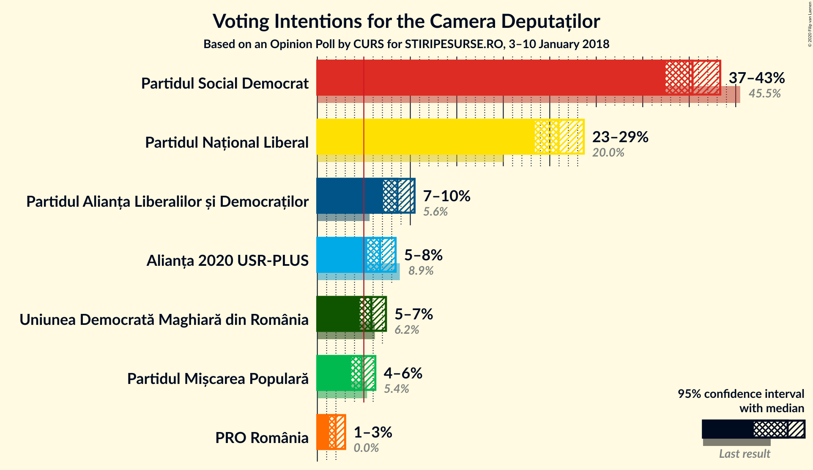
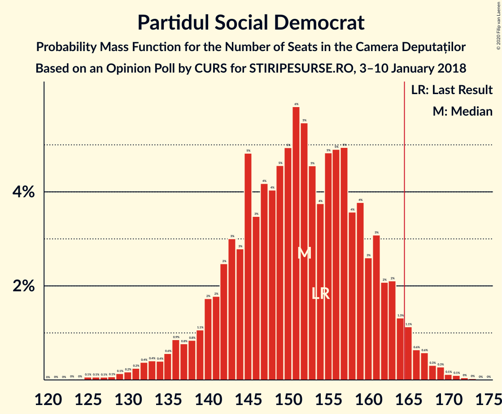
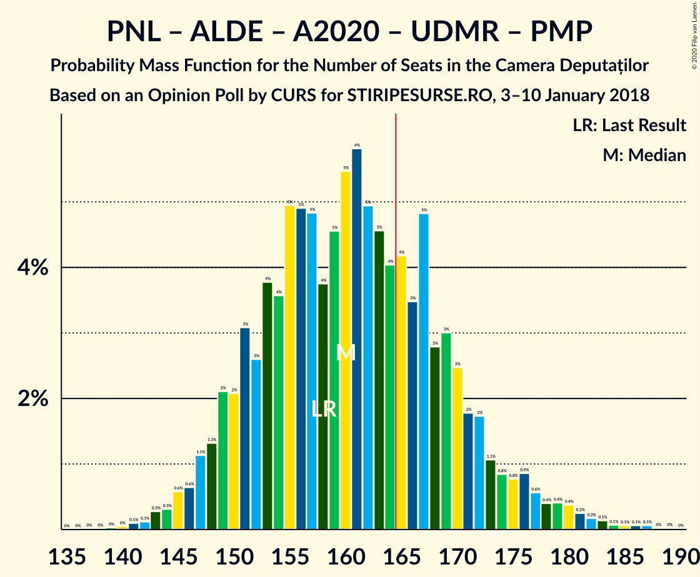
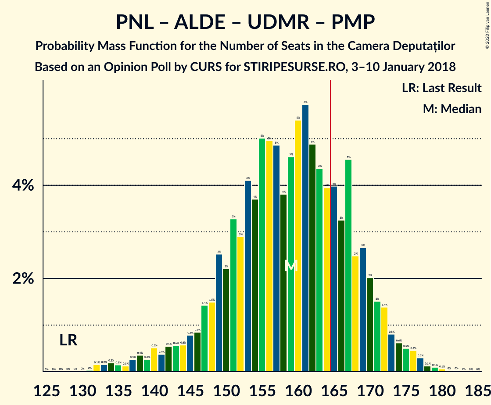
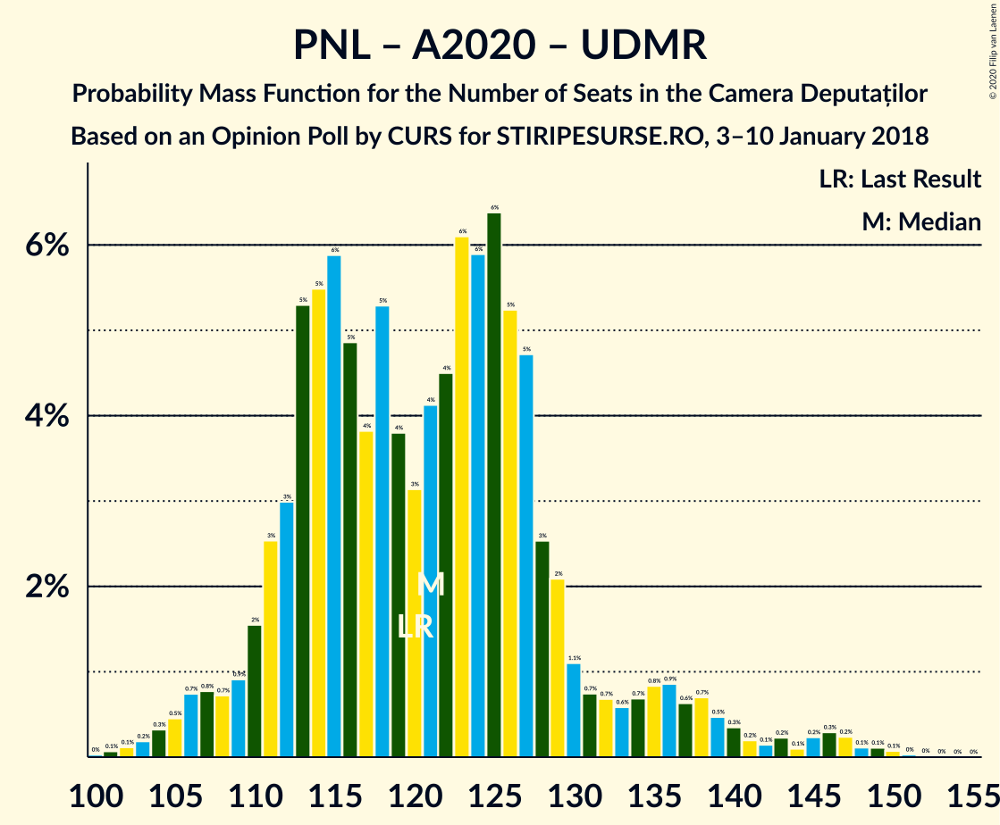
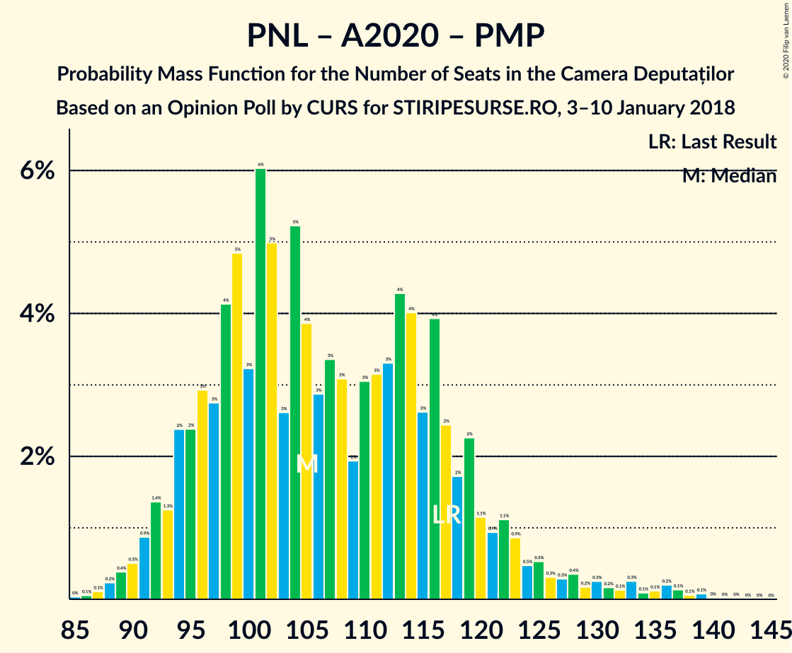

# Opinion Poll by CURS for STIRIPESURSE.RO, 3–10 January 2018

<a href="#voting-intentions">Voting Intentions</a> | <a href="#seats">Seats</a> | <a href="#coalitions">Coalitions</a> | <a href="#technical-information">Technical Information</a>

## Voting Intentions

### Confidence Intervals

| Party | Last Result | Poll Result | 80% Confidence Interval | 90% Confidence Interval | 95% Confidence Interval | 99% Confidence Interval |
|:-----:|:-----------:|:-----------:|:-----------------------:|:-----------------------:|:-----------------------:|:-----------------------:|
| Partidul Social Democrat | 45.5% | 40.4% | 38.5–42.3% |37.9–42.9% |37.4–43.3% |36.5–44.3% |
| Partidul Național Liberal | 20.0% | 25.9% | 24.3–27.7% |23.8–28.2% |23.4–28.7% |22.6–29.5% |
| Partidul Alianța Liberalilor și Democraților | 5.6% | 8.6% | 7.6–9.8% |7.3–10.2% |7.1–10.5% |6.6–11.1% |
| Alianța 2020 USR-PLUS | 8.9% | 6.7% | 5.9–7.8% |5.6–8.1% |5.4–8.4% |5.0–9.0% |
| Uniunea Democrată Maghiară din România | 6.2% | 5.8% | 5.0–6.8% |4.7–7.1% |4.6–7.4% |4.2–7.9% |
| Partidul Mișcarea Populară | 5.4% | 4.8% | 4.0–5.7% |3.8–6.0% |3.6–6.2% |3.3–6.7% |
| PRO România | 0.0% | 2.0% | 1.5–2.6% |1.4–2.8% |1.3–3.0% |1.1–3.4% |

*Note:* The poll result column reflects the actual value used in the calculations. Published results may vary slightly, and in addition be rounded to fewer digits.

## Seats

### Confidence Intervals

| Party | Last Result | Median | 80% Confidence Interval | 90% Confidence Interval | 95% Confidence Interval | 99% Confidence Interval |
|:-----:|:-----------:|:------:|:-----------------------:|:-----------------------:|:-----------------------:|:-----------------------:|
| <a href="#partidul-social-democrat">Partidul Social Democrat</a> | 154 | 152 | 142–161 |138–163 |135–165 |130–169 |
| <a href="#partidul-național-liberal">Partidul Național Liberal</a> | 69 | 98 | 90–105 |87–107 |85–109 |81–112 |
| <a href="#partidul-alianța-liberalilor-și-democraților">Partidul Alianța Liberalilor și Democraților</a> | 20 | 32 | 28–37 |27–38 |26–39 |24–42 |
| <a href="#alianța-2020-usr-plus">Alianța 2020 USR-PLUS</a> | 30 | 0 | 0 |0–28 |0–29 |0–31 |
| <a href="#uniunea-democrată-maghiară-din-românia">Uniunea Democrată Maghiară din România</a> | 21 | 22 | 18–25 |17–26 |16–27 |15–30 |
| <a href="#partidul-mișcarea-populară">Partidul Mișcarea Populară</a> | 18 | 0 | 0–20 |0–21 |0–22 |0–24 |
| <a href="#pro-românia">PRO România</a> | 0 | 0 | 0 |0 |0 |0 |

### Partidul Social Democrat

*For a full overview of the results for this party, see the [Partidul Social Democrat](party-partidulsocialdemocrat.html) page.*

| Number of Seats | Probability | Accumulated | Special Marks |
|:---------------:|:-----------:|:-----------:|:-------------:|
| 124 | 0% | 100% |  |
| 125 | 0.1% | 99.9% |  |
| 126 | 0.1% | 99.9% |  |
| 127 | 0.1% | 99.8% |  |
| 128 | 0.1% | 99.7% |  |
| 129 | 0.1% | 99.7% |  |
| 130 | 0.2% | 99.5% |  |
| 131 | 0.2% | 99.4% |  |
| 132 | 0.4% | 99.1% |  |
| 133 | 0.4% | 98.8% |  |
| 134 | 0.4% | 98% |  |
| 135 | 0.6% | 98% |  |
| 136 | 0.9% | 97% |  |
| 137 | 0.8% | 97% |  |
| 138 | 0.8% | 96% |  |
| 139 | 1.1% | 95% |  |
| 140 | 2% | 94% |  |
| 141 | 2% | 92% |  |
| 142 | 2% | 90% |  |
| 143 | 3% | 88% |  |
| 144 | 3% | 85% |  |
| 145 | 5% | 82% |  |
| 146 | 3% | 77% |  |
| 147 | 4% | 74% |  |
| 148 | 4% | 70% |  |
| 149 | 5% | 66% |  |
| 150 | 5% | 61% |  |
| 151 | 6% | 56% |  |
| 152 | 5% | 50% | Median |
| 153 | 5% | 45% |  |
| 154 | 4% | 40% | Last Result |
| 155 | 5% | 36% |  |
| 156 | 5% | 32% |  |
| 157 | 5% | 27% |  |
| 158 | 4% | 22% |  |
| 159 | 4% | 18% |  |
| 160 | 3% | 14% |  |
| 161 | 3% | 12% |  |
| 162 | 2% | 9% |  |
| 163 | 2% | 7% |  |
| 164 | 1.3% | 5% |  |
| 165 | 1.1% | 3% |  |
| 166 | 0.6% | 2% | Majority |
| 167 | 0.6% | 1.5% |  |
| 168 | 0.3% | 0.9% |  |
| 169 | 0.3% | 0.6% |  |
| 170 | 0.1% | 0.3% |  |
| 171 | 0.1% | 0.2% |  |
| 172 | 0% | 0.1% |  |
| 173 | 0% | 0.1% |  |
| 174 | 0% | 0% |  |

### Partidul Național Liberal

*For a full overview of the results for this party, see the [Partidul Național Liberal](party-partidulnaționalliberal.html) page.*

| Number of Seats | Probability | Accumulated | Special Marks |
|:---------------:|:-----------:|:-----------:|:-------------:|
| 69 | 0% | 100% | Last Result |
| 70 | 0% | 100% |  |
| 71 | 0% | 100% |  |
| 72 | 0% | 100% |  |
| 73 | 0% | 100% |  |
| 74 | 0% | 100% |  |
| 75 | 0% | 100% |  |
| 76 | 0% | 100% |  |
| 77 | 0% | 100% |  |
| 78 | 0% | 99.9% |  |
| 79 | 0.1% | 99.9% |  |
| 80 | 0.2% | 99.8% |  |
| 81 | 0.2% | 99.6% |  |
| 82 | 0.2% | 99.5% |  |
| 83 | 0.4% | 99.2% |  |
| 84 | 0.6% | 98.8% |  |
| 85 | 0.9% | 98% |  |
| 86 | 1.3% | 97% |  |
| 87 | 1.3% | 96% |  |
| 88 | 2% | 95% |  |
| 89 | 2% | 92% |  |
| 90 | 3% | 90% |  |
| 91 | 4% | 87% |  |
| 92 | 4% | 82% |  |
| 93 | 4% | 78% |  |
| 94 | 6% | 74% |  |
| 95 | 6% | 67% |  |
| 96 | 7% | 62% |  |
| 97 | 4% | 55% |  |
| 98 | 8% | 51% | Median |
| 99 | 6% | 43% |  |
| 100 | 5% | 37% |  |
| 101 | 7% | 32% |  |
| 102 | 6% | 26% |  |
| 103 | 3% | 20% |  |
| 104 | 5% | 17% |  |
| 105 | 4% | 12% |  |
| 106 | 2% | 9% |  |
| 107 | 2% | 6% |  |
| 108 | 1.4% | 4% |  |
| 109 | 0.7% | 3% |  |
| 110 | 0.6% | 2% |  |
| 111 | 0.5% | 1.2% |  |
| 112 | 0.2% | 0.7% |  |
| 113 | 0.2% | 0.5% |  |
| 114 | 0.1% | 0.3% |  |
| 115 | 0.1% | 0.1% |  |
| 116 | 0% | 0.1% |  |
| 117 | 0% | 0% |  |

### Partidul Alianța Liberalilor și Democraților

*For a full overview of the results for this party, see the [Partidul Alianța Liberalilor și Democraților](party-partidulalianțaliberalilorșidemocraților.html) page.*

| Number of Seats | Probability | Accumulated | Special Marks |
|:---------------:|:-----------:|:-----------:|:-------------:|
| 20 | 0% | 100% | Last Result |
| 21 | 0% | 100% |  |
| 22 | 0.1% | 100% |  |
| 23 | 0.2% | 99.9% |  |
| 24 | 0.3% | 99.6% |  |
| 25 | 1.0% | 99.3% |  |
| 26 | 3% | 98% |  |
| 27 | 5% | 96% |  |
| 28 | 5% | 90% |  |
| 29 | 5% | 85% |  |
| 30 | 8% | 80% |  |
| 31 | 19% | 72% |  |
| 32 | 10% | 53% | Median |
| 33 | 8% | 43% |  |
| 34 | 7% | 35% |  |
| 35 | 9% | 28% |  |
| 36 | 8% | 18% |  |
| 37 | 4% | 10% |  |
| 38 | 3% | 6% |  |
| 39 | 1.2% | 3% |  |
| 40 | 1.1% | 2% |  |
| 41 | 0.5% | 1.0% |  |
| 42 | 0.3% | 0.6% |  |
| 43 | 0.1% | 0.2% |  |
| 44 | 0.1% | 0.1% |  |
| 45 | 0% | 0.1% |  |
| 46 | 0% | 0% |  |

### Alianța 2020 USR-PLUS

*For a full overview of the results for this party, see the [Alianța 2020 USR-PLUS](party-alianța2020usr-plus.html) page.*

| Number of Seats | Probability | Accumulated | Special Marks |
|:---------------:|:-----------:|:-----------:|:-------------:|
| 0 | 94% | 100% | Median |
| 1 | 0% | 6% |  |
| 2 | 0% | 6% |  |
| 3 | 0% | 6% |  |
| 4 | 0% | 6% |  |
| 5 | 0% | 6% |  |
| 6 | 0% | 6% |  |
| 7 | 0% | 6% |  |
| 8 | 0% | 6% |  |
| 9 | 0% | 6% |  |
| 10 | 0% | 6% |  |
| 11 | 0% | 6% |  |
| 12 | 0% | 6% |  |
| 13 | 0% | 6% |  |
| 14 | 0% | 6% |  |
| 15 | 0% | 6% |  |
| 16 | 0% | 6% |  |
| 17 | 0% | 6% |  |
| 18 | 0% | 6% |  |
| 19 | 0% | 6% |  |
| 20 | 0% | 6% |  |
| 21 | 0% | 6% |  |
| 22 | 0% | 6% |  |
| 23 | 0% | 6% |  |
| 24 | 0% | 6% |  |
| 25 | 0% | 6% |  |
| 26 | 0% | 6% |  |
| 27 | 0.6% | 6% |  |
| 28 | 2% | 6% |  |
| 29 | 2% | 4% |  |
| 30 | 1.1% | 2% | Last Result |
| 31 | 0.4% | 0.8% |  |
| 32 | 0.2% | 0.4% |  |
| 33 | 0.1% | 0.2% |  |
| 34 | 0% | 0.1% |  |
| 35 | 0% | 0% |  |

### Uniunea Democrată Maghiară din România

*For a full overview of the results for this party, see the [Uniunea Democrată Maghiară din România](party-uniuneademocratămaghiarădinromânia.html) page.*

| Number of Seats | Probability | Accumulated | Special Marks |
|:---------------:|:-----------:|:-----------:|:-------------:|
| 13 | 0% | 100% |  |
| 14 | 0.2% | 99.9% |  |
| 15 | 0.5% | 99.8% |  |
| 16 | 2% | 99.2% |  |
| 17 | 4% | 97% |  |
| 18 | 7% | 94% |  |
| 19 | 9% | 87% |  |
| 20 | 13% | 78% |  |
| 21 | 13% | 65% | Last Result |
| 22 | 14% | 51% | Median |
| 23 | 12% | 37% |  |
| 24 | 9% | 25% |  |
| 25 | 7% | 16% |  |
| 26 | 4% | 9% |  |
| 27 | 3% | 5% |  |
| 28 | 1.3% | 2% |  |
| 29 | 0.6% | 1.1% |  |
| 30 | 0.3% | 0.5% |  |
| 31 | 0.1% | 0.2% |  |
| 32 | 0.1% | 0.1% |  |
| 33 | 0% | 0% |  |

### Partidul Mișcarea Populară

*For a full overview of the results for this party, see the [Partidul Mișcarea Populară](party-partidulmișcareapopulară.html) page.*

| Number of Seats | Probability | Accumulated | Special Marks |
|:---------------:|:-----------:|:-----------:|:-------------:|
| 0 | 61% | 100% | Median |
| 1 | 0% | 39% |  |
| 2 | 0% | 39% |  |
| 3 | 0% | 39% |  |
| 4 | 0% | 39% |  |
| 5 | 0% | 39% |  |
| 6 | 0% | 39% |  |
| 7 | 0% | 39% |  |
| 8 | 0% | 39% |  |
| 9 | 0% | 39% |  |
| 10 | 0% | 39% |  |
| 11 | 0% | 39% |  |
| 12 | 0% | 39% |  |
| 13 | 0% | 39% |  |
| 14 | 0% | 39% |  |
| 15 | 0% | 39% |  |
| 16 | 0% | 39% |  |
| 17 | 0.7% | 39% |  |
| 18 | 9% | 38% | Last Result |
| 19 | 12% | 29% |  |
| 20 | 7% | 16% |  |
| 21 | 5% | 9% |  |
| 22 | 3% | 5% |  |
| 23 | 1.1% | 2% |  |
| 24 | 0.5% | 0.8% |  |
| 25 | 0.2% | 0.3% |  |
| 26 | 0.1% | 0.1% |  |
| 27 | 0% | 0% |  |

### PRO România

*For a full overview of the results for this party, see the [PRO România](party-proromânia.html) page.*

| Number of Seats | Probability | Accumulated | Special Marks |
|:---------------:|:-----------:|:-----------:|:-------------:|
| 0 | 100% | 100% | Last Result, Median |

## Coalitions

### Confidence Intervals

| Coalition | Last Result | Median | Majority? | 80% Confidence Interval | 90% Confidence Interval | 95% Confidence Interval | 99% Confidence Interval |
|:---------:|:-----------:|:------:|:---------:|:-----------------------:|:-----------------------:|:-----------------------:|:-----------------------:|
| Partidul Social Democrat – Partidul Alianța Liberalilor și Democraților – PRO România | 174 | 185 | 98% | 173–195 | 169–197 | 166–198 | 157–201 |
| Partidul Social Democrat – Partidul Alianța Liberalilor și Democraților | 174 | 185 | 98% | 173–195 | 169–197 | 166–198 | 157–201 |
| Partidul Național Liberal – Partidul Alianța Liberalilor și Democraților – Alianța 2020 USR-PLUS – Uniunea Democrată Maghiară din România – Partidul Mișcarea Populară | 158 | 160 | 26% | 151–170 | 149–174 | 147–177 | 143–182 |
| Partidul Național Liberal – Partidul Alianța Liberalilor și Democraților – Uniunea Democrată Maghiară din România – Partidul Mișcarea Populară | 128 | 159 | 21% | 149–169 | 145–171 | 141–173 | 134–177 |
| Partidul Național Liberal – Partidul Alianța Liberalilor și Democraților – Alianța 2020 USR-PLUS – Uniunea Democrată Maghiară din România | 140 | 153 | 6% | 143–163 | 141–166 | 139–170 | 135–177 |
| Partidul Social Democrat – PRO România | 154 | 152 | 2% | 142–161 | 138–163 | 135–165 | 130–169 |
| Partidul Național Liberal – Partidul Alianța Liberalilor și Democraților – Uniunea Democrată Maghiară din România | 110 | 152 | 2% | 141–161 | 138–163 | 135–165 | 130–169 |
| Partidul Național Liberal – Partidul Alianța Liberalilor și Democraților – Alianța 2020 USR-PLUS – Partidul Mișcarea Populară | 137 | 138 | 0.2% | 129–150 | 126–153 | 125–156 | 121–163 |
| Partidul Național Liberal – Partidul Alianța Liberalilor și Democraților – Alianța 2020 USR-PLUS | 119 | 131 | 0% | 122–141 | 120–145 | 117–149 | 114–156 |
| Partidul Național Liberal – Alianța 2020 USR-PLUS – Uniunea Democrată Maghiară din România – Partidul Mișcarea Populară | 138 | 127 | 0% | 117–139 | 115–143 | 114–146 | 111–155 |
| Partidul Național Liberal – Uniunea Democrată Maghiară din România – Partidul Mișcarea Populară | 108 | 126 | 0% | 116–137 | 113–140 | 110–143 | 106–146 |
| Partidul Național Liberal – Alianța 2020 USR-PLUS – Uniunea Democrată Maghiară din România | 120 | 121 | 0% | 112–129 | 110–135 | 107–139 | 104–147 |
| Partidul Național Liberal – Uniunea Democrată Maghiară din România | 90 | 119 | 0% | 110–127 | 107–129 | 106–131 | 100–136 |
| Partidul Național Liberal – Alianța 2020 USR-PLUS – Partidul Mișcarea Populară | 117 | 105 | 0% | 96–119 | 94–122 | 92–126 | 89–136 |
| Partidul Național Liberal – Partidul Mișcarea Populară | 87 | 104 | 0% | 94–116 | 92–119 | 89–121 | 85–125 |
| Partidul Național Liberal – Alianța 2020 USR-PLUS | 99 | 98 | 0% | 91–107 | 89–114 | 87–119 | 84–126 |
| Partidul Național Liberal | 69 | 98 | 0% | 90–105 | 87–107 | 85–109 | 81–112 |
| Alianța 2020 USR-PLUS – Partidul Mișcarea Populară | 48 | 0 | 0% | 0–22 | 0–29 | 0–31 | 0–47 |

### Partidul Social Democrat – Partidul Alianța Liberalilor și Democraților – PRO România

| Number of Seats | Probability | Accumulated | Special Marks |
|:---------------:|:-----------:|:-----------:|:-------------:|
| 153 | 0% | 100% |  |
| 154 | 0% | 99.9% |  |
| 155 | 0.1% | 99.9% |  |
| 156 | 0.1% | 99.8% |  |
| 157 | 0.2% | 99.7% |  |
| 158 | 0.3% | 99.5% |  |
| 159 | 0.2% | 99.2% |  |
| 160 | 0.1% | 98.9% |  |
| 161 | 0.1% | 98.8% |  |
| 162 | 0.1% | 98.7% |  |
| 163 | 0.2% | 98.6% |  |
| 164 | 0.3% | 98% |  |
| 165 | 0.5% | 98% |  |
| 166 | 0.8% | 98% | Majority |
| 167 | 0.9% | 97% |  |
| 168 | 0.8% | 96% |  |
| 169 | 1.2% | 95% |  |
| 170 | 1.0% | 94% |  |
| 171 | 1.1% | 93% |  |
| 172 | 1.4% | 92% |  |
| 173 | 1.4% | 90% |  |
| 174 | 1.5% | 89% | Last Result |
| 175 | 3% | 88% |  |
| 176 | 4% | 84% |  |
| 177 | 4% | 80% |  |
| 178 | 4% | 76% |  |
| 179 | 5% | 71% |  |
| 180 | 4% | 67% |  |
| 181 | 3% | 63% |  |
| 182 | 3% | 60% |  |
| 183 | 2% | 57% |  |
| 184 | 3% | 55% | Median |
| 185 | 5% | 52% |  |
| 186 | 5% | 47% |  |
| 187 | 6% | 42% |  |
| 188 | 6% | 35% |  |
| 189 | 6% | 29% |  |
| 190 | 4% | 24% |  |
| 191 | 3% | 20% |  |
| 192 | 2% | 17% |  |
| 193 | 2% | 14% |  |
| 194 | 2% | 12% |  |
| 195 | 2% | 10% |  |
| 196 | 2% | 9% |  |
| 197 | 2% | 6% |  |
| 198 | 2% | 4% |  |
| 199 | 1.2% | 2% |  |
| 200 | 0.5% | 1.3% |  |
| 201 | 0.4% | 0.8% |  |
| 202 | 0.2% | 0.4% |  |
| 203 | 0.1% | 0.2% |  |
| 204 | 0% | 0.1% |  |
| 205 | 0% | 0.1% |  |
| 206 | 0% | 0% |  |

### Partidul Social Democrat – Partidul Alianța Liberalilor și Democraților

| Number of Seats | Probability | Accumulated | Special Marks |
|:---------------:|:-----------:|:-----------:|:-------------:|
| 153 | 0% | 100% |  |
| 154 | 0% | 99.9% |  |
| 155 | 0.1% | 99.9% |  |
| 156 | 0.1% | 99.8% |  |
| 157 | 0.2% | 99.7% |  |
| 158 | 0.3% | 99.5% |  |
| 159 | 0.2% | 99.2% |  |
| 160 | 0.1% | 98.9% |  |
| 161 | 0.1% | 98.8% |  |
| 162 | 0.1% | 98.7% |  |
| 163 | 0.2% | 98.6% |  |
| 164 | 0.3% | 98% |  |
| 165 | 0.5% | 98% |  |
| 166 | 0.8% | 98% | Majority |
| 167 | 0.9% | 97% |  |
| 168 | 0.8% | 96% |  |
| 169 | 1.2% | 95% |  |
| 170 | 1.0% | 94% |  |
| 171 | 1.1% | 93% |  |
| 172 | 1.4% | 92% |  |
| 173 | 1.4% | 90% |  |
| 174 | 1.5% | 89% | Last Result |
| 175 | 3% | 88% |  |
| 176 | 4% | 84% |  |
| 177 | 4% | 80% |  |
| 178 | 4% | 76% |  |
| 179 | 5% | 71% |  |
| 180 | 4% | 67% |  |
| 181 | 3% | 63% |  |
| 182 | 3% | 60% |  |
| 183 | 2% | 57% |  |
| 184 | 3% | 55% | Median |
| 185 | 5% | 52% |  |
| 186 | 5% | 47% |  |
| 187 | 6% | 42% |  |
| 188 | 6% | 35% |  |
| 189 | 6% | 29% |  |
| 190 | 4% | 24% |  |
| 191 | 3% | 20% |  |
| 192 | 2% | 17% |  |
| 193 | 2% | 14% |  |
| 194 | 2% | 12% |  |
| 195 | 2% | 10% |  |
| 196 | 2% | 9% |  |
| 197 | 2% | 6% |  |
| 198 | 2% | 4% |  |
| 199 | 1.2% | 2% |  |
| 200 | 0.5% | 1.3% |  |
| 201 | 0.4% | 0.8% |  |
| 202 | 0.2% | 0.4% |  |
| 203 | 0.1% | 0.2% |  |
| 204 | 0% | 0.1% |  |
| 205 | 0% | 0.1% |  |
| 206 | 0% | 0% |  |

### Partidul Național Liberal – Partidul Alianța Liberalilor și Democraților – Alianța 2020 USR-PLUS – Uniunea Democrată Maghiară din România – Partidul Mișcarea Populară

| Number of Seats | Probability | Accumulated | Special Marks |
|:---------------:|:-----------:|:-----------:|:-------------:|
| 139 | 0% | 100% |  |
| 140 | 0% | 99.9% |  |
| 141 | 0.1% | 99.9% |  |
| 142 | 0.1% | 99.8% |  |
| 143 | 0.3% | 99.7% |  |
| 144 | 0.3% | 99.4% |  |
| 145 | 0.6% | 99.1% |  |
| 146 | 0.6% | 98.5% |  |
| 147 | 1.1% | 98% |  |
| 148 | 1.3% | 97% |  |
| 149 | 2% | 95% |  |
| 150 | 2% | 93% |  |
| 151 | 3% | 91% |  |
| 152 | 3% | 88% | Median |
| 153 | 4% | 86% |  |
| 154 | 4% | 82% |  |
| 155 | 5% | 78% |  |
| 156 | 5% | 73% |  |
| 157 | 5% | 68% |  |
| 158 | 4% | 64% | Last Result |
| 159 | 5% | 60% |  |
| 160 | 5% | 55% |  |
| 161 | 6% | 50% |  |
| 162 | 5% | 44% |  |
| 163 | 5% | 39% |  |
| 164 | 4% | 34% |  |
| 165 | 4% | 30% |  |
| 166 | 3% | 26% | Majority |
| 167 | 5% | 23% |  |
| 168 | 3% | 18% |  |
| 169 | 3% | 15% |  |
| 170 | 2% | 12% |  |
| 171 | 2% | 10% |  |
| 172 | 2% | 8% |  |
| 173 | 1.1% | 6% |  |
| 174 | 0.8% | 5% |  |
| 175 | 0.8% | 4% |  |
| 176 | 0.9% | 3% |  |
| 177 | 0.6% | 3% |  |
| 178 | 0.4% | 2% |  |
| 179 | 0.4% | 2% |  |
| 180 | 0.4% | 1.2% |  |
| 181 | 0.2% | 0.9% |  |
| 182 | 0.2% | 0.6% |  |
| 183 | 0.1% | 0.5% |  |
| 184 | 0.1% | 0.3% |  |
| 185 | 0.1% | 0.3% |  |
| 186 | 0.1% | 0.2% |  |
| 187 | 0.1% | 0.1% |  |
| 188 | 0% | 0.1% |  |
| 189 | 0% | 0% |  |

### Partidul Național Liberal – Partidul Alianța Liberalilor și Democraților – Uniunea Democrată Maghiară din România – Partidul Mișcarea Populară

| Number of Seats | Probability | Accumulated | Special Marks |
|:---------------:|:-----------:|:-----------:|:-------------:|
| 128 | 0% | 100% | Last Result |
| 129 | 0% | 100% |  |
| 130 | 0% | 100% |  |
| 131 | 0% | 100% |  |
| 132 | 0.1% | 99.9% |  |
| 133 | 0.2% | 99.8% |  |
| 134 | 0.2% | 99.6% |  |
| 135 | 0.1% | 99.4% |  |
| 136 | 0.1% | 99.3% |  |
| 137 | 0.3% | 99.2% |  |
| 138 | 0.4% | 98.9% |  |
| 139 | 0.3% | 98.5% |  |
| 140 | 0.5% | 98% |  |
| 141 | 0.4% | 98% |  |
| 142 | 0.5% | 97% |  |
| 143 | 0.6% | 97% |  |
| 144 | 0.6% | 96% |  |
| 145 | 0.8% | 96% |  |
| 146 | 0.8% | 95% |  |
| 147 | 1.4% | 94% |  |
| 148 | 1.5% | 93% |  |
| 149 | 3% | 91% |  |
| 150 | 2% | 89% |  |
| 151 | 3% | 86% |  |
| 152 | 3% | 83% | Median |
| 153 | 4% | 80% |  |
| 154 | 4% | 76% |  |
| 155 | 5% | 72% |  |
| 156 | 5% | 67% |  |
| 157 | 5% | 62% |  |
| 158 | 4% | 58% |  |
| 159 | 5% | 54% |  |
| 160 | 5% | 49% |  |
| 161 | 6% | 44% |  |
| 162 | 5% | 38% |  |
| 163 | 4% | 33% |  |
| 164 | 4% | 29% |  |
| 165 | 4% | 25% |  |
| 166 | 3% | 21% | Majority |
| 167 | 5% | 18% |  |
| 168 | 2% | 13% |  |
| 169 | 3% | 11% |  |
| 170 | 2% | 8% |  |
| 171 | 2% | 6% |  |
| 172 | 1.4% | 4% |  |
| 173 | 0.8% | 3% |  |
| 174 | 0.6% | 2% |  |
| 175 | 0.5% | 2% |  |
| 176 | 0.5% | 1.1% |  |
| 177 | 0.3% | 0.6% |  |
| 178 | 0.1% | 0.3% |  |
| 179 | 0.1% | 0.2% |  |
| 180 | 0.1% | 0.1% |  |
| 181 | 0% | 0.1% |  |
| 182 | 0% | 0% |  |

### Partidul Național Liberal – Partidul Alianța Liberalilor și Democraților – Alianța 2020 USR-PLUS – Uniunea Democrată Maghiară din România

| Number of Seats | Probability | Accumulated | Special Marks |
|:---------------:|:-----------:|:-----------:|:-------------:|
| 131 | 0% | 100% |  |
| 132 | 0.1% | 99.9% |  |
| 133 | 0.1% | 99.9% |  |
| 134 | 0.2% | 99.7% |  |
| 135 | 0.2% | 99.6% |  |
| 136 | 0.4% | 99.4% |  |
| 137 | 0.5% | 99.0% |  |
| 138 | 0.9% | 98% |  |
| 139 | 1.1% | 98% |  |
| 140 | 1.1% | 96% | Last Result |
| 141 | 2% | 95% |  |
| 142 | 2% | 93% |  |
| 143 | 3% | 91% |  |
| 144 | 3% | 88% |  |
| 145 | 2% | 84% |  |
| 146 | 4% | 82% |  |
| 147 | 4% | 78% |  |
| 148 | 3% | 74% |  |
| 149 | 6% | 71% |  |
| 150 | 4% | 65% |  |
| 151 | 4% | 60% |  |
| 152 | 4% | 56% | Median |
| 153 | 5% | 53% |  |
| 154 | 4% | 47% |  |
| 155 | 5% | 43% |  |
| 156 | 5% | 38% |  |
| 157 | 4% | 33% |  |
| 158 | 3% | 29% |  |
| 159 | 4% | 25% |  |
| 160 | 4% | 21% |  |
| 161 | 4% | 17% |  |
| 162 | 3% | 13% |  |
| 163 | 2% | 11% |  |
| 164 | 2% | 8% |  |
| 165 | 0.9% | 7% |  |
| 166 | 1.1% | 6% | Majority |
| 167 | 0.8% | 5% |  |
| 168 | 0.7% | 4% |  |
| 169 | 0.6% | 3% |  |
| 170 | 0.6% | 3% |  |
| 171 | 0.3% | 2% |  |
| 172 | 0.3% | 2% |  |
| 173 | 0.2% | 1.4% |  |
| 174 | 0.2% | 1.2% |  |
| 175 | 0.2% | 1.0% |  |
| 176 | 0.3% | 0.8% |  |
| 177 | 0.1% | 0.5% |  |
| 178 | 0.2% | 0.4% |  |
| 179 | 0.1% | 0.2% |  |
| 180 | 0.1% | 0.1% |  |
| 181 | 0% | 0.1% |  |
| 182 | 0% | 0% |  |

### Partidul Social Democrat – PRO România

| Number of Seats | Probability | Accumulated | Special Marks |
|:---------------:|:-----------:|:-----------:|:-------------:|
| 124 | 0% | 100% |  |
| 125 | 0.1% | 99.9% |  |
| 126 | 0.1% | 99.9% |  |
| 127 | 0.1% | 99.8% |  |
| 128 | 0.1% | 99.7% |  |
| 129 | 0.1% | 99.7% |  |
| 130 | 0.2% | 99.5% |  |
| 131 | 0.2% | 99.4% |  |
| 132 | 0.4% | 99.1% |  |
| 133 | 0.4% | 98.8% |  |
| 134 | 0.4% | 98% |  |
| 135 | 0.6% | 98% |  |
| 136 | 0.9% | 97% |  |
| 137 | 0.8% | 97% |  |
| 138 | 0.8% | 96% |  |
| 139 | 1.1% | 95% |  |
| 140 | 2% | 94% |  |
| 141 | 2% | 92% |  |
| 142 | 2% | 90% |  |
| 143 | 3% | 88% |  |
| 144 | 3% | 85% |  |
| 145 | 5% | 82% |  |
| 146 | 3% | 77% |  |
| 147 | 4% | 74% |  |
| 148 | 4% | 70% |  |
| 149 | 5% | 66% |  |
| 150 | 5% | 61% |  |
| 151 | 6% | 56% |  |
| 152 | 5% | 50% | Median |
| 153 | 5% | 45% |  |
| 154 | 4% | 40% | Last Result |
| 155 | 5% | 36% |  |
| 156 | 5% | 32% |  |
| 157 | 5% | 27% |  |
| 158 | 4% | 22% |  |
| 159 | 4% | 18% |  |
| 160 | 3% | 14% |  |
| 161 | 3% | 12% |  |
| 162 | 2% | 9% |  |
| 163 | 2% | 7% |  |
| 164 | 1.3% | 5% |  |
| 165 | 1.1% | 3% |  |
| 166 | 0.6% | 2% | Majority |
| 167 | 0.6% | 1.5% |  |
| 168 | 0.3% | 0.9% |  |
| 169 | 0.3% | 0.6% |  |
| 170 | 0.1% | 0.3% |  |
| 171 | 0.1% | 0.2% |  |
| 172 | 0% | 0.1% |  |
| 173 | 0% | 0.1% |  |
| 174 | 0% | 0% |  |

### Partidul Național Liberal – Partidul Alianța Liberalilor și Democraților – Uniunea Democrată Maghiară din România

| Number of Seats | Probability | Accumulated | Special Marks |
|:---------------:|:-----------:|:-----------:|:-------------:|
| 110 | 0% | 100% | Last Result |
| 111 | 0% | 100% |  |
| 112 | 0% | 100% |  |
| 113 | 0% | 100% |  |
| 114 | 0% | 100% |  |
| 115 | 0% | 100% |  |
| 116 | 0% | 100% |  |
| 117 | 0% | 100% |  |
| 118 | 0% | 100% |  |
| 119 | 0% | 100% |  |
| 120 | 0% | 100% |  |
| 121 | 0% | 100% |  |
| 122 | 0% | 100% |  |
| 123 | 0% | 100% |  |
| 124 | 0% | 100% |  |
| 125 | 0.1% | 99.9% |  |
| 126 | 0.1% | 99.9% |  |
| 127 | 0.1% | 99.8% |  |
| 128 | 0.1% | 99.7% |  |
| 129 | 0.1% | 99.6% |  |
| 130 | 0.1% | 99.6% |  |
| 131 | 0.2% | 99.4% |  |
| 132 | 0.4% | 99.2% |  |
| 133 | 0.4% | 98.8% |  |
| 134 | 0.6% | 98% |  |
| 135 | 0.5% | 98% |  |
| 136 | 0.7% | 97% |  |
| 137 | 0.8% | 97% |  |
| 138 | 1.3% | 96% |  |
| 139 | 1.4% | 94% |  |
| 140 | 2% | 93% |  |
| 141 | 3% | 91% |  |
| 142 | 3% | 89% |  |
| 143 | 4% | 86% |  |
| 144 | 4% | 83% |  |
| 145 | 3% | 79% |  |
| 146 | 4% | 77% |  |
| 147 | 4% | 72% |  |
| 148 | 3% | 68% |  |
| 149 | 6% | 65% |  |
| 150 | 4% | 59% |  |
| 151 | 4% | 54% |  |
| 152 | 4% | 50% | Median |
| 153 | 5% | 46% |  |
| 154 | 4% | 41% |  |
| 155 | 5% | 37% |  |
| 156 | 5% | 32% |  |
| 157 | 4% | 27% |  |
| 158 | 3% | 23% |  |
| 159 | 4% | 20% |  |
| 160 | 4% | 16% |  |
| 161 | 4% | 12% |  |
| 162 | 3% | 8% |  |
| 163 | 2% | 6% |  |
| 164 | 1.5% | 4% |  |
| 165 | 0.7% | 3% |  |
| 166 | 0.8% | 2% | Majority |
| 167 | 0.4% | 1.3% |  |
| 168 | 0.3% | 0.8% |  |
| 169 | 0.3% | 0.5% |  |
| 170 | 0.1% | 0.3% |  |
| 171 | 0.1% | 0.2% |  |
| 172 | 0% | 0.1% |  |
| 173 | 0% | 0.1% |  |
| 174 | 0% | 0% |  |

### Partidul Național Liberal – Partidul Alianța Liberalilor și Democraților – Alianța 2020 USR-PLUS – Partidul Mișcarea Populară

| Number of Seats | Probability | Accumulated | Special Marks |
|:---------------:|:-----------:|:-----------:|:-------------:|
| 117 | 0% | 100% |  |
| 118 | 0.1% | 99.9% |  |
| 119 | 0.1% | 99.9% |  |
| 120 | 0.2% | 99.8% |  |
| 121 | 0.3% | 99.6% |  |
| 122 | 0.3% | 99.4% |  |
| 123 | 0.8% | 99.1% |  |
| 124 | 0.6% | 98% |  |
| 125 | 1.0% | 98% |  |
| 126 | 2% | 97% |  |
| 127 | 2% | 95% |  |
| 128 | 2% | 93% |  |
| 129 | 4% | 91% |  |
| 130 | 3% | 87% | Median |
| 131 | 4% | 84% |  |
| 132 | 5% | 81% |  |
| 133 | 3% | 75% |  |
| 134 | 5% | 73% |  |
| 135 | 6% | 68% |  |
| 136 | 3% | 61% |  |
| 137 | 4% | 58% | Last Result |
| 138 | 5% | 54% |  |
| 139 | 3% | 50% |  |
| 140 | 6% | 47% |  |
| 141 | 3% | 41% |  |
| 142 | 5% | 38% |  |
| 143 | 4% | 33% |  |
| 144 | 3% | 29% |  |
| 145 | 4% | 27% |  |
| 146 | 3% | 22% |  |
| 147 | 4% | 19% |  |
| 148 | 3% | 15% |  |
| 149 | 2% | 12% |  |
| 150 | 2% | 10% |  |
| 151 | 2% | 8% |  |
| 152 | 1.2% | 7% |  |
| 153 | 1.0% | 5% |  |
| 154 | 0.9% | 4% |  |
| 155 | 0.5% | 3% |  |
| 156 | 0.5% | 3% |  |
| 157 | 0.4% | 2% |  |
| 158 | 0.3% | 2% |  |
| 159 | 0.4% | 2% |  |
| 160 | 0.2% | 1.3% |  |
| 161 | 0.2% | 1.1% |  |
| 162 | 0.2% | 0.9% |  |
| 163 | 0.2% | 0.6% |  |
| 164 | 0.1% | 0.4% |  |
| 165 | 0.1% | 0.3% |  |
| 166 | 0.1% | 0.2% | Majority |
| 167 | 0% | 0.2% |  |
| 168 | 0.1% | 0.1% |  |
| 169 | 0% | 0.1% |  |
| 170 | 0% | 0% |  |

### Partidul Național Liberal – Partidul Alianța Liberalilor și Democraților – Alianța 2020 USR-PLUS

| Number of Seats | Probability | Accumulated | Special Marks |
|:---------------:|:-----------:|:-----------:|:-------------:|
| 110 | 0% | 100% |  |
| 111 | 0% | 99.9% |  |
| 112 | 0.1% | 99.9% |  |
| 113 | 0.2% | 99.8% |  |
| 114 | 0.2% | 99.7% |  |
| 115 | 0.5% | 99.5% |  |
| 116 | 0.4% | 99.0% |  |
| 117 | 1.2% | 98.6% |  |
| 118 | 0.9% | 97% |  |
| 119 | 1.4% | 97% | Last Result |
| 120 | 2% | 95% |  |
| 121 | 3% | 93% |  |
| 122 | 2% | 91% |  |
| 123 | 4% | 88% |  |
| 124 | 4% | 85% |  |
| 125 | 4% | 81% |  |
| 126 | 5% | 77% |  |
| 127 | 4% | 72% |  |
| 128 | 4% | 68% |  |
| 129 | 7% | 64% |  |
| 130 | 4% | 56% | Median |
| 131 | 5% | 53% |  |
| 132 | 6% | 47% |  |
| 133 | 3% | 41% |  |
| 134 | 5% | 38% |  |
| 135 | 7% | 33% |  |
| 136 | 3% | 26% |  |
| 137 | 4% | 23% |  |
| 138 | 4% | 20% |  |
| 139 | 2% | 16% |  |
| 140 | 4% | 14% |  |
| 141 | 2% | 11% |  |
| 142 | 1.3% | 9% |  |
| 143 | 1.4% | 8% |  |
| 144 | 0.8% | 6% |  |
| 145 | 0.9% | 5% |  |
| 146 | 0.7% | 4% |  |
| 147 | 0.4% | 4% |  |
| 148 | 0.5% | 3% |  |
| 149 | 0.4% | 3% |  |
| 150 | 0.4% | 2% |  |
| 151 | 0.4% | 2% |  |
| 152 | 0.2% | 2% |  |
| 153 | 0.3% | 1.4% |  |
| 154 | 0.3% | 1.0% |  |
| 155 | 0.1% | 0.7% |  |
| 156 | 0.2% | 0.6% |  |
| 157 | 0.1% | 0.4% |  |
| 158 | 0% | 0.3% |  |
| 159 | 0.1% | 0.3% |  |
| 160 | 0% | 0.1% |  |
| 161 | 0% | 0.1% |  |
| 162 | 0% | 0% |  |

### Partidul Național Liberal – Alianța 2020 USR-PLUS – Uniunea Democrată Maghiară din România – Partidul Mișcarea Populară

| Number of Seats | Probability | Accumulated | Special Marks |
|:---------------:|:-----------:|:-----------:|:-------------:|
| 107 | 0% | 100% |  |
| 108 | 0% | 99.9% |  |
| 109 | 0.1% | 99.9% |  |
| 110 | 0.2% | 99.8% |  |
| 111 | 0.4% | 99.6% |  |
| 112 | 0.5% | 99.2% |  |
| 113 | 1.2% | 98.7% |  |
| 114 | 2% | 98% |  |
| 115 | 2% | 96% |  |
| 116 | 2% | 94% |  |
| 117 | 2% | 91% |  |
| 118 | 2% | 90% |  |
| 119 | 2% | 88% |  |
| 120 | 2% | 86% | Median |
| 121 | 3% | 83% |  |
| 122 | 4% | 80% |  |
| 123 | 6% | 76% |  |
| 124 | 6% | 71% |  |
| 125 | 6% | 65% |  |
| 126 | 5% | 58% |  |
| 127 | 5% | 53% |  |
| 128 | 3% | 48% |  |
| 129 | 2% | 45% |  |
| 130 | 3% | 43% |  |
| 131 | 3% | 40% |  |
| 132 | 4% | 37% |  |
| 133 | 5% | 33% |  |
| 134 | 4% | 29% |  |
| 135 | 4% | 24% |  |
| 136 | 4% | 20% |  |
| 137 | 3% | 16% |  |
| 138 | 1.5% | 12% | Last Result |
| 139 | 1.4% | 11% |  |
| 140 | 1.4% | 10% |  |
| 141 | 1.1% | 8% |  |
| 142 | 1.0% | 7% |  |
| 143 | 1.2% | 6% |  |
| 144 | 0.8% | 5% |  |
| 145 | 0.9% | 4% |  |
| 146 | 0.8% | 3% |  |
| 147 | 0.5% | 2% |  |
| 148 | 0.3% | 2% |  |
| 149 | 0.2% | 2% |  |
| 150 | 0.1% | 1.4% |  |
| 151 | 0.1% | 1.3% |  |
| 152 | 0.1% | 1.2% |  |
| 153 | 0.2% | 1.1% |  |
| 154 | 0.3% | 0.8% |  |
| 155 | 0.2% | 0.5% |  |
| 156 | 0.1% | 0.3% |  |
| 157 | 0.1% | 0.2% |  |
| 158 | 0% | 0.1% |  |
| 159 | 0% | 0.1% |  |
| 160 | 0% | 0% |  |

### Partidul Național Liberal – Uniunea Democrată Maghiară din România – Partidul Mișcarea Populară

| Number of Seats | Probability | Accumulated | Special Marks |
|:---------------:|:-----------:|:-----------:|:-------------:|
| 100 | 0% | 100% |  |
| 101 | 0% | 99.9% |  |
| 102 | 0% | 99.9% |  |
| 103 | 0% | 99.9% |  |
| 104 | 0.1% | 99.9% |  |
| 105 | 0.2% | 99.8% |  |
| 106 | 0.3% | 99.6% |  |
| 107 | 0.6% | 99.3% |  |
| 108 | 0.4% | 98.7% | Last Result |
| 109 | 0.6% | 98% |  |
| 110 | 0.6% | 98% |  |
| 111 | 0.6% | 97% |  |
| 112 | 0.6% | 96% |  |
| 113 | 1.3% | 96% |  |
| 114 | 2% | 95% |  |
| 115 | 2% | 93% |  |
| 116 | 3% | 91% |  |
| 117 | 2% | 88% |  |
| 118 | 2% | 86% |  |
| 119 | 2% | 83% |  |
| 120 | 2% | 81% | Median |
| 121 | 3% | 79% |  |
| 122 | 4% | 75% |  |
| 123 | 6% | 72% |  |
| 124 | 6% | 66% |  |
| 125 | 7% | 60% |  |
| 126 | 6% | 53% |  |
| 127 | 5% | 47% |  |
| 128 | 3% | 42% |  |
| 129 | 2% | 39% |  |
| 130 | 3% | 37% |  |
| 131 | 3% | 34% |  |
| 132 | 4% | 31% |  |
| 133 | 4% | 27% |  |
| 134 | 4% | 23% |  |
| 135 | 4% | 19% |  |
| 136 | 4% | 15% |  |
| 137 | 3% | 11% |  |
| 138 | 1.0% | 8% |  |
| 139 | 1.1% | 7% |  |
| 140 | 1.1% | 6% |  |
| 141 | 1.0% | 5% |  |
| 142 | 0.9% | 4% |  |
| 143 | 0.9% | 3% |  |
| 144 | 0.7% | 2% |  |
| 145 | 0.4% | 1.1% |  |
| 146 | 0.4% | 0.7% |  |
| 147 | 0.2% | 0.3% |  |
| 148 | 0.1% | 0.1% |  |
| 149 | 0% | 0.1% |  |
| 150 | 0% | 0% |  |

### Partidul Național Liberal – Alianța 2020 USR-PLUS – Uniunea Democrată Maghiară din România

| Number of Seats | Probability | Accumulated | Special Marks |
|:---------------:|:-----------:|:-----------:|:-------------:|
| 101 | 0.1% | 100% |  |
| 102 | 0.1% | 99.9% |  |
| 103 | 0.2% | 99.8% |  |
| 104 | 0.3% | 99.6% |  |
| 105 | 0.5% | 99.3% |  |
| 106 | 0.7% | 98.8% |  |
| 107 | 0.8% | 98% |  |
| 108 | 0.7% | 97% |  |
| 109 | 0.9% | 97% |  |
| 110 | 2% | 96% |  |
| 111 | 3% | 94% |  |
| 112 | 3% | 92% |  |
| 113 | 5% | 89% |  |
| 114 | 5% | 83% |  |
| 115 | 6% | 78% |  |
| 116 | 5% | 72% |  |
| 117 | 4% | 67% |  |
| 118 | 5% | 63% |  |
| 119 | 4% | 58% |  |
| 120 | 3% | 54% | Last Result, Median |
| 121 | 4% | 51% |  |
| 122 | 4% | 47% |  |
| 123 | 6% | 42% |  |
| 124 | 6% | 36% |  |
| 125 | 6% | 30% |  |
| 126 | 5% | 24% |  |
| 127 | 5% | 19% |  |
| 128 | 3% | 14% |  |
| 129 | 2% | 12% |  |
| 130 | 1.1% | 9% |  |
| 131 | 0.7% | 8% |  |
| 132 | 0.7% | 8% |  |
| 133 | 0.6% | 7% |  |
| 134 | 0.7% | 6% |  |
| 135 | 0.8% | 6% |  |
| 136 | 0.9% | 5% |  |
| 137 | 0.6% | 4% |  |
| 138 | 0.7% | 3% |  |
| 139 | 0.5% | 3% |  |
| 140 | 0.3% | 2% |  |
| 141 | 0.2% | 2% |  |
| 142 | 0.1% | 2% |  |
| 143 | 0.2% | 1.4% |  |
| 144 | 0.1% | 1.2% |  |
| 145 | 0.2% | 1.1% |  |
| 146 | 0.3% | 0.9% |  |
| 147 | 0.2% | 0.6% |  |
| 148 | 0.1% | 0.4% |  |
| 149 | 0.1% | 0.2% |  |
| 150 | 0.1% | 0.1% |  |
| 151 | 0% | 0.1% |  |
| 152 | 0% | 0% |  |

### Partidul Național Liberal – Uniunea Democrată Maghiară din România

| Number of Seats | Probability | Accumulated | Special Marks |
|:---------------:|:-----------:|:-----------:|:-------------:|
| 90 | 0% | 100% | Last Result |
| 91 | 0% | 100% |  |
| 92 | 0% | 100% |  |
| 93 | 0% | 100% |  |
| 94 | 0% | 100% |  |
| 95 | 0% | 100% |  |
| 96 | 0% | 100% |  |
| 97 | 0.1% | 99.9% |  |
| 98 | 0.1% | 99.9% |  |
| 99 | 0.1% | 99.8% |  |
| 100 | 0.3% | 99.7% |  |
| 101 | 0.2% | 99.4% |  |
| 102 | 0.2% | 99.1% |  |
| 103 | 0.3% | 98.9% |  |
| 104 | 0.4% | 98.7% |  |
| 105 | 0.7% | 98% |  |
| 106 | 1.1% | 98% |  |
| 107 | 1.5% | 96% |  |
| 108 | 1.3% | 95% |  |
| 109 | 2% | 94% |  |
| 110 | 2% | 92% |  |
| 111 | 3% | 90% |  |
| 112 | 3% | 87% |  |
| 113 | 5% | 84% |  |
| 114 | 6% | 78% |  |
| 115 | 6% | 73% |  |
| 116 | 5% | 67% |  |
| 117 | 4% | 62% |  |
| 118 | 6% | 58% |  |
| 119 | 4% | 52% |  |
| 120 | 3% | 48% | Median |
| 121 | 4% | 45% |  |
| 122 | 5% | 41% |  |
| 123 | 6% | 36% |  |
| 124 | 6% | 30% |  |
| 125 | 6% | 24% |  |
| 126 | 5% | 18% |  |
| 127 | 5% | 13% |  |
| 128 | 2% | 8% |  |
| 129 | 2% | 6% |  |
| 130 | 1.0% | 4% |  |
| 131 | 0.6% | 3% |  |
| 132 | 0.6% | 2% |  |
| 133 | 0.4% | 2% |  |
| 134 | 0.4% | 1.3% |  |
| 135 | 0.4% | 0.9% |  |
| 136 | 0.2% | 0.5% |  |
| 137 | 0.2% | 0.3% |  |
| 138 | 0.1% | 0.1% |  |
| 139 | 0.1% | 0.1% |  |
| 140 | 0% | 0% |  |

### Partidul Național Liberal – Alianța 2020 USR-PLUS – Partidul Mișcarea Populară

| Number of Seats | Probability | Accumulated | Special Marks |
|:---------------:|:-----------:|:-----------:|:-------------:|
| 85 | 0% | 100% |  |
| 86 | 0.1% | 99.9% |  |
| 87 | 0.1% | 99.9% |  |
| 88 | 0.2% | 99.8% |  |
| 89 | 0.4% | 99.5% |  |
| 90 | 0.5% | 99.2% |  |
| 91 | 0.9% | 98.6% |  |
| 92 | 1.4% | 98% |  |
| 93 | 1.3% | 96% |  |
| 94 | 2% | 95% |  |
| 95 | 2% | 93% |  |
| 96 | 3% | 90% |  |
| 97 | 3% | 87% |  |
| 98 | 4% | 85% | Median |
| 99 | 5% | 81% |  |
| 100 | 3% | 76% |  |
| 101 | 6% | 73% |  |
| 102 | 5% | 66% |  |
| 103 | 3% | 61% |  |
| 104 | 5% | 59% |  |
| 105 | 4% | 54% |  |
| 106 | 3% | 50% |  |
| 107 | 3% | 47% |  |
| 108 | 3% | 44% |  |
| 109 | 2% | 40% |  |
| 110 | 3% | 39% |  |
| 111 | 3% | 35% |  |
| 112 | 3% | 32% |  |
| 113 | 4% | 29% |  |
| 114 | 4% | 25% |  |
| 115 | 3% | 21% |  |
| 116 | 4% | 18% |  |
| 117 | 2% | 14% | Last Result |
| 118 | 2% | 12% |  |
| 119 | 2% | 10% |  |
| 120 | 1.1% | 8% |  |
| 121 | 0.9% | 7% |  |
| 122 | 1.1% | 6% |  |
| 123 | 0.9% | 5% |  |
| 124 | 0.5% | 4% |  |
| 125 | 0.5% | 3% |  |
| 126 | 0.3% | 3% |  |
| 127 | 0.3% | 2% |  |
| 128 | 0.4% | 2% |  |
| 129 | 0.2% | 2% |  |
| 130 | 0.3% | 2% |  |
| 131 | 0.2% | 1.3% |  |
| 132 | 0.1% | 1.1% |  |
| 133 | 0.3% | 1.0% |  |
| 134 | 0.1% | 0.7% |  |
| 135 | 0.1% | 0.7% |  |
| 136 | 0.2% | 0.5% |  |
| 137 | 0.1% | 0.3% |  |
| 138 | 0.1% | 0.2% |  |
| 139 | 0.1% | 0.1% |  |
| 140 | 0% | 0.1% |  |
| 141 | 0% | 0% |  |

### Partidul Național Liberal – Partidul Mișcarea Populară

| Number of Seats | Probability | Accumulated | Special Marks |
|:---------------:|:-----------:|:-----------:|:-------------:|
| 81 | 0% | 100% |  |
| 82 | 0% | 99.9% |  |
| 83 | 0.1% | 99.9% |  |
| 84 | 0.1% | 99.8% |  |
| 85 | 0.2% | 99.7% |  |
| 86 | 0.4% | 99.5% |  |
| 87 | 0.4% | 99.0% | Last Result |
| 88 | 0.7% | 98.7% |  |
| 89 | 0.7% | 98% |  |
| 90 | 0.8% | 97% |  |
| 91 | 1.3% | 97% |  |
| 92 | 2% | 95% |  |
| 93 | 2% | 94% |  |
| 94 | 3% | 92% |  |
| 95 | 3% | 89% |  |
| 96 | 3% | 87% |  |
| 97 | 3% | 84% |  |
| 98 | 4% | 81% | Median |
| 99 | 5% | 76% |  |
| 100 | 3% | 71% |  |
| 101 | 6% | 68% |  |
| 102 | 5% | 62% |  |
| 103 | 3% | 57% |  |
| 104 | 5% | 54% |  |
| 105 | 4% | 48% |  |
| 106 | 3% | 44% |  |
| 107 | 3% | 41% |  |
| 108 | 3% | 38% |  |
| 109 | 2% | 35% |  |
| 110 | 3% | 33% |  |
| 111 | 3% | 30% |  |
| 112 | 3% | 26% |  |
| 113 | 4% | 23% |  |
| 114 | 4% | 19% |  |
| 115 | 2% | 15% |  |
| 116 | 4% | 13% |  |
| 117 | 2% | 9% |  |
| 118 | 1.4% | 7% |  |
| 119 | 2% | 6% |  |
| 120 | 0.9% | 4% |  |
| 121 | 0.6% | 3% |  |
| 122 | 0.9% | 2% |  |
| 123 | 0.5% | 1.3% |  |
| 124 | 0.3% | 0.8% |  |
| 125 | 0.2% | 0.5% |  |
| 126 | 0.1% | 0.3% |  |
| 127 | 0.1% | 0.2% |  |
| 128 | 0% | 0.1% |  |
| 129 | 0% | 0% |  |

### Partidul Național Liberal – Alianța 2020 USR-PLUS

| Number of Seats | Probability | Accumulated | Special Marks |
|:---------------:|:-----------:|:-----------:|:-------------:|
| 80 | 0% | 100% |  |
| 81 | 0.1% | 99.9% |  |
| 82 | 0.1% | 99.9% |  |
| 83 | 0.2% | 99.8% |  |
| 84 | 0.3% | 99.6% |  |
| 85 | 0.5% | 99.2% |  |
| 86 | 0.7% | 98.7% |  |
| 87 | 1.0% | 98% |  |
| 88 | 2% | 97% |  |
| 89 | 2% | 95% |  |
| 90 | 3% | 93% |  |
| 91 | 4% | 91% |  |
| 92 | 4% | 87% |  |
| 93 | 4% | 83% |  |
| 94 | 6% | 79% |  |
| 95 | 6% | 73% |  |
| 96 | 6% | 67% |  |
| 97 | 4% | 61% |  |
| 98 | 8% | 57% | Median |
| 99 | 6% | 49% | Last Result |
| 100 | 5% | 43% |  |
| 101 | 7% | 39% |  |
| 102 | 5% | 32% |  |
| 103 | 3% | 26% |  |
| 104 | 5% | 24% |  |
| 105 | 4% | 18% |  |
| 106 | 2% | 15% |  |
| 107 | 3% | 12% |  |
| 108 | 2% | 10% |  |
| 109 | 0.8% | 8% |  |
| 110 | 0.8% | 8% |  |
| 111 | 0.6% | 7% |  |
| 112 | 0.4% | 6% |  |
| 113 | 0.5% | 6% |  |
| 114 | 0.6% | 5% |  |
| 115 | 0.5% | 5% |  |
| 116 | 0.3% | 4% |  |
| 117 | 0.4% | 4% |  |
| 118 | 0.5% | 3% |  |
| 119 | 0.6% | 3% |  |
| 120 | 0.4% | 2% |  |
| 121 | 0.4% | 2% |  |
| 122 | 0.2% | 2% |  |
| 123 | 0.4% | 1.4% |  |
| 124 | 0.2% | 1.0% |  |
| 125 | 0.2% | 0.8% |  |
| 126 | 0.1% | 0.6% |  |
| 127 | 0.1% | 0.5% |  |
| 128 | 0.1% | 0.3% |  |
| 129 | 0.1% | 0.2% |  |
| 130 | 0% | 0.1% |  |
| 131 | 0% | 0.1% |  |
| 132 | 0% | 0% |  |

### Partidul Național Liberal

| Number of Seats | Probability | Accumulated | Special Marks |
|:---------------:|:-----------:|:-----------:|:-------------:|
| 69 | 0% | 100% | Last Result |
| 70 | 0% | 100% |  |
| 71 | 0% | 100% |  |
| 72 | 0% | 100% |  |
| 73 | 0% | 100% |  |
| 74 | 0% | 100% |  |
| 75 | 0% | 100% |  |
| 76 | 0% | 100% |  |
| 77 | 0% | 100% |  |
| 78 | 0% | 99.9% |  |
| 79 | 0.1% | 99.9% |  |
| 80 | 0.2% | 99.8% |  |
| 81 | 0.2% | 99.6% |  |
| 82 | 0.2% | 99.5% |  |
| 83 | 0.4% | 99.2% |  |
| 84 | 0.6% | 98.8% |  |
| 85 | 0.9% | 98% |  |
| 86 | 1.3% | 97% |  |
| 87 | 1.3% | 96% |  |
| 88 | 2% | 95% |  |
| 89 | 2% | 92% |  |
| 90 | 3% | 90% |  |
| 91 | 4% | 87% |  |
| 92 | 4% | 82% |  |
| 93 | 4% | 78% |  |
| 94 | 6% | 74% |  |
| 95 | 6% | 67% |  |
| 96 | 7% | 62% |  |
| 97 | 4% | 55% |  |
| 98 | 8% | 51% | Median |
| 99 | 6% | 43% |  |
| 100 | 5% | 37% |  |
| 101 | 7% | 32% |  |
| 102 | 6% | 26% |  |
| 103 | 3% | 20% |  |
| 104 | 5% | 17% |  |
| 105 | 4% | 12% |  |
| 106 | 2% | 9% |  |
| 107 | 2% | 6% |  |
| 108 | 1.4% | 4% |  |
| 109 | 0.7% | 3% |  |
| 110 | 0.6% | 2% |  |
| 111 | 0.5% | 1.2% |  |
| 112 | 0.2% | 0.7% |  |
| 113 | 0.2% | 0.5% |  |
| 114 | 0.1% | 0.3% |  |
| 115 | 0.1% | 0.1% |  |
| 116 | 0% | 0.1% |  |
| 117 | 0% | 0% |  |

### Alianța 2020 USR-PLUS – Partidul Mișcarea Populară

| Number of Seats | Probability | Accumulated | Special Marks |
|:---------------:|:-----------:|:-----------:|:-------------:|
| 0 | 57% | 100% | Median |
| 1 | 0% | 43% |  |
| 2 | 0% | 43% |  |
| 3 | 0% | 43% |  |
| 4 | 0% | 43% |  |
| 5 | 0% | 43% |  |
| 6 | 0% | 43% |  |
| 7 | 0% | 43% |  |
| 8 | 0% | 43% |  |
| 9 | 0% | 43% |  |
| 10 | 0% | 43% |  |
| 11 | 0% | 43% |  |
| 12 | 0% | 43% |  |
| 13 | 0% | 43% |  |
| 14 | 0% | 43% |  |
| 15 | 0% | 43% |  |
| 16 | 0% | 43% |  |
| 17 | 0% | 43% |  |
| 18 | 9% | 43% |  |
| 19 | 12% | 34% |  |
| 20 | 7% | 22% |  |
| 21 | 5% | 15% |  |
| 22 | 3% | 11% |  |
| 23 | 1.1% | 8% |  |
| 24 | 0.5% | 7% |  |
| 25 | 0.2% | 6% |  |
| 26 | 0.1% | 6% |  |
| 27 | 0% | 6% |  |
| 28 | 0.9% | 6% |  |
| 29 | 2% | 5% |  |
| 30 | 0.9% | 4% |  |
| 31 | 0.3% | 3% |  |
| 32 | 0.2% | 2% |  |
| 33 | 0.1% | 2% |  |
| 34 | 0% | 2% |  |
| 35 | 0% | 2% |  |
| 36 | 0% | 2% |  |
| 37 | 0% | 2% |  |
| 38 | 0% | 2% |  |
| 39 | 0% | 2% |  |
| 40 | 0% | 2% |  |
| 41 | 0% | 2% |  |
| 42 | 0% | 2% |  |
| 43 | 0% | 2% |  |
| 44 | 0.1% | 2% |  |
| 45 | 0.7% | 2% |  |
| 46 | 0.3% | 1.1% |  |
| 47 | 0.4% | 0.8% |  |
| 48 | 0.2% | 0.4% | Last Result |
| 49 | 0.1% | 0.2% |  |
| 50 | 0.1% | 0.1% |  |
| 51 | 0% | 0% |  |

## Technical Information

### Opinion Poll

+ **Polling firm:** CURS
+ **Commissioner(s):** STIRIPESURSE.RO
+ **Fieldwork period:** 3–10 January 2018

### Calculations

+ **Sample size:** 1068
+ **Simulations done:** 1,048,576
+ **Error estimate:** 1.17%

