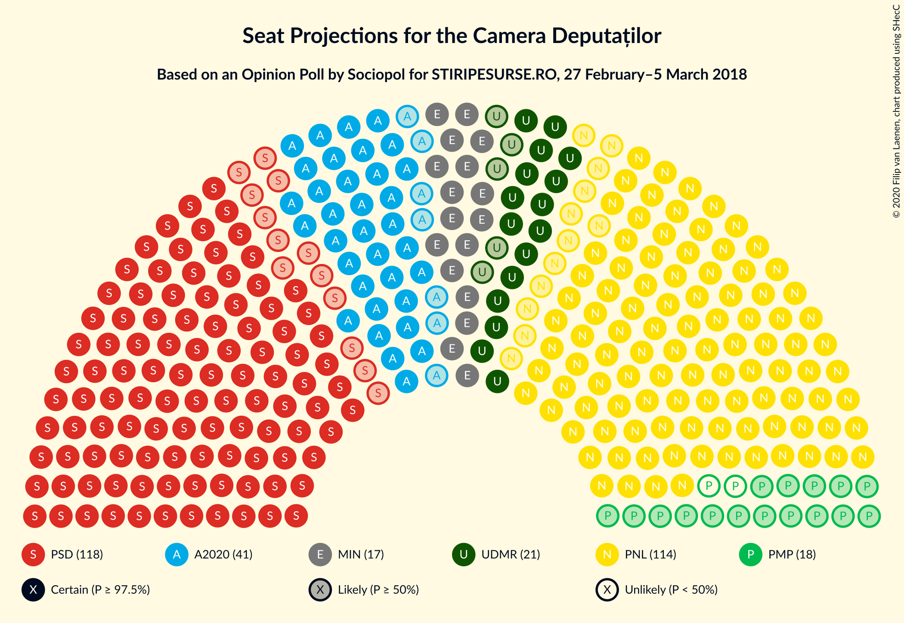
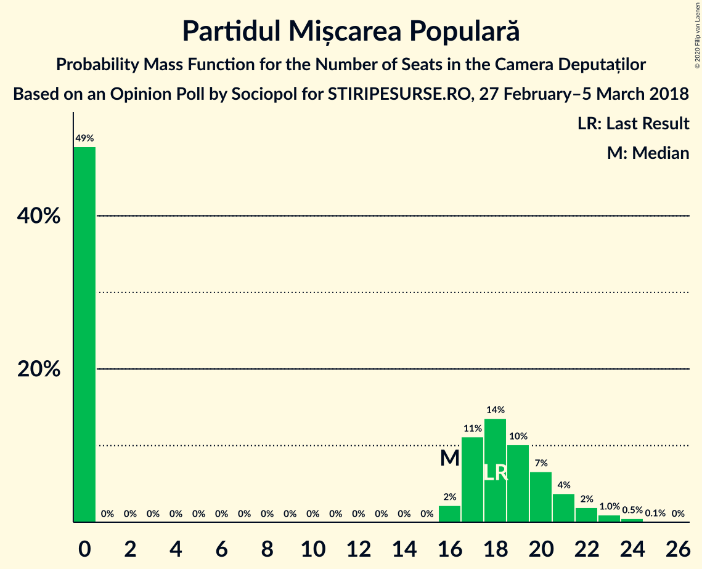
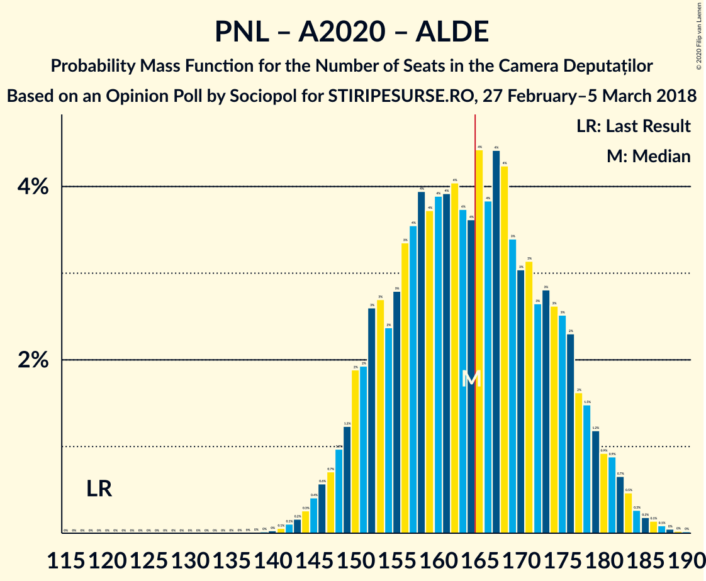
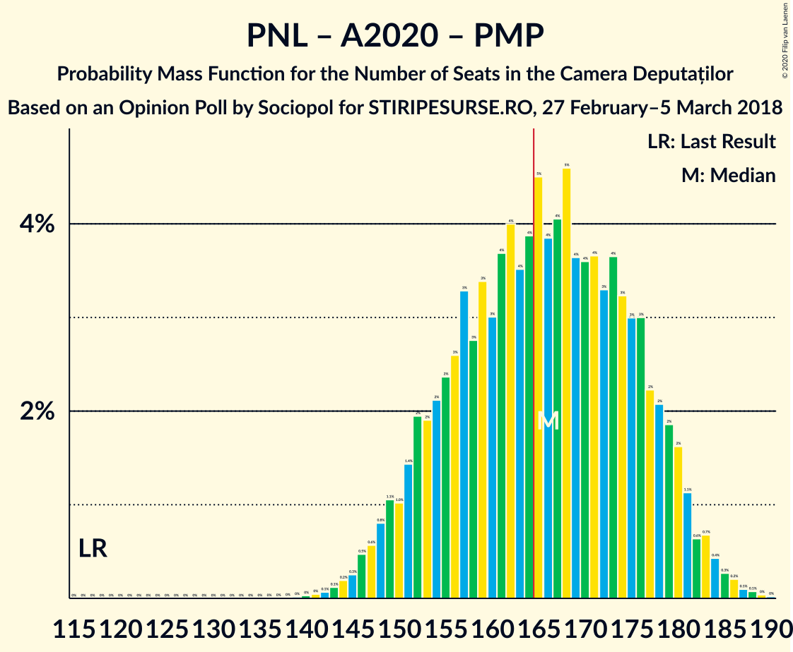
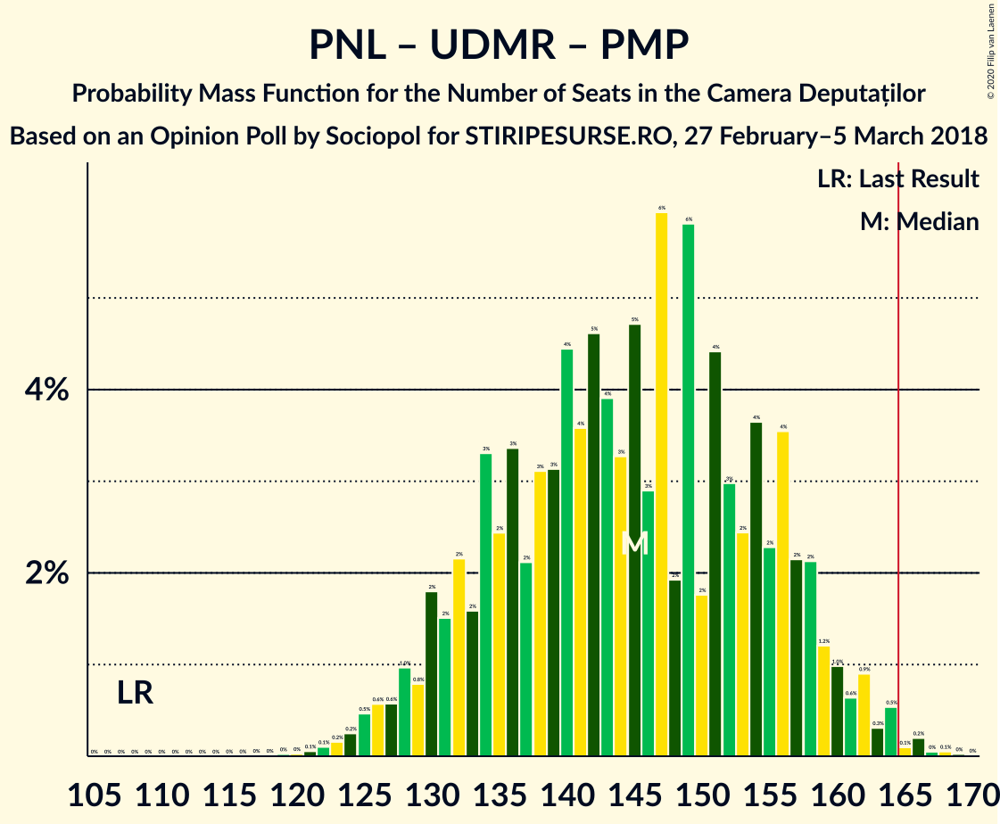

# Opinion Poll by Sociopol for STIRIPESURSE.RO, 27 February–5 March 2018

<a href="#voting-intentions">Voting Intentions</a> | <a href="#seats">Seats</a> | <a href="#coalitions">Coalitions</a> | <a href="#technical-information">Technical Information</a>

## Voting Intentions

### Confidence Intervals

| Party | Last Result | Poll Result | 80% Confidence Interval | 90% Confidence Interval | 95% Confidence Interval | 99% Confidence Interval |
|:-----:|:-----------:|:-----------:|:-----------------------:|:-----------------------:|:-----------------------:|:-----------------------:|
| Partidul Social Democrat | 45.5% | 34.0% | 32.1–36.0% |31.6–36.5% |31.1–37.0% |30.2–38.0% |
| Partidul Național Liberal | 20.0% | 33.0% | 31.1–34.9% |30.6–35.5% |30.1–36.0% |29.3–36.9% |
| Alianța 2020 USR-PLUS | 8.9% | 12.0% | 10.8–13.4% |10.4–13.8% |10.1–14.2% |9.6–14.9% |
| Uniunea Democrată Maghiară din România | 6.2% | 6.0% | 5.1–7.1% |4.9–7.4% |4.7–7.7% |4.3–8.2% |
| Partidul Alianța Liberalilor și Democraților | 5.6% | 5.0% | 4.2–6.0% |4.0–6.3% |3.8–6.5% |3.5–7.1% |
| Partidul Mișcarea Populară | 5.4% | 5.0% | 4.2–6.0% |4.0–6.3% |3.8–6.5% |3.5–7.1% |

*Note:* The poll result column reflects the actual value used in the calculations. Published results may vary slightly, and in addition be rounded to fewer digits.

## Seats

### Confidence Intervals

| Party | Last Result | Median | 80% Confidence Interval | 90% Confidence Interval | 95% Confidence Interval | 99% Confidence Interval |
|:-----:|:-----------:|:------:|:-----------------------:|:-----------------------:|:-----------------------:|:-----------------------:|
| <a href="#partidul-social-democrat">Partidul Social Democrat</a> | 154 | 118 | 109–127 |107–130 |105–132 |101–136 |
| <a href="#partidul-național-liberal">Partidul Național Liberal</a> | 69 | 114 | 106–123 |103–126 |102–128 |98–132 |
| <a href="#alianța-2020-usr-plus">Alianța 2020 USR-PLUS</a> | 30 | 41 | 37–47 |35–48 |34–50 |32–52 |
| <a href="#uniunea-democrată-maghiară-din-românia">Uniunea Democrată Maghiară din România</a> | 21 | 21 | 17–24 |16–25 |16–26 |14–28 |
| <a href="#partidul-alianța-liberalilor-și-democraților">Partidul Alianța Liberalilor și Democraților</a> | 20 | 0 | 0–19 |0–22 |0–22 |0–23 |
| <a href="#partidul-mișcarea-populară">Partidul Mișcarea Populară</a> | 18 | 16 | 0–20 |0–21 |0–22 |0–24 |

### Partidul Social Democrat

*For a full overview of the results for this party, see the [Partidul Social Democrat](party-partidulsocialdemocrat.html) page.*

| Number of Seats | Probability | Accumulated | Special Marks |
|:---------------:|:-----------:|:-----------:|:-------------:|
| 97 | 0% | 100% |  |
| 98 | 0.1% | 99.9% |  |
| 99 | 0.1% | 99.9% |  |
| 100 | 0.1% | 99.8% |  |
| 101 | 0.3% | 99.7% |  |
| 102 | 0.3% | 99.4% |  |
| 103 | 0.5% | 99.1% |  |
| 104 | 1.0% | 98.6% |  |
| 105 | 1.0% | 98% |  |
| 106 | 1.0% | 97% |  |
| 107 | 2% | 96% |  |
| 108 | 3% | 94% |  |
| 109 | 2% | 91% |  |
| 110 | 3% | 89% |  |
| 111 | 4% | 86% |  |
| 112 | 5% | 82% |  |
| 113 | 4% | 77% |  |
| 114 | 5% | 74% |  |
| 115 | 5% | 69% |  |
| 116 | 7% | 64% |  |
| 117 | 6% | 57% |  |
| 118 | 5% | 51% | Median |
| 119 | 5% | 46% |  |
| 120 | 5% | 41% |  |
| 121 | 6% | 36% |  |
| 122 | 4% | 30% |  |
| 123 | 4% | 25% |  |
| 124 | 3% | 21% |  |
| 125 | 4% | 19% |  |
| 126 | 3% | 14% |  |
| 127 | 2% | 11% |  |
| 128 | 1.3% | 8% |  |
| 129 | 1.2% | 7% |  |
| 130 | 2% | 6% |  |
| 131 | 1.1% | 4% |  |
| 132 | 0.9% | 3% |  |
| 133 | 0.5% | 2% |  |
| 134 | 0.3% | 1.3% |  |
| 135 | 0.2% | 0.9% |  |
| 136 | 0.2% | 0.7% |  |
| 137 | 0.3% | 0.5% |  |
| 138 | 0.1% | 0.2% |  |
| 139 | 0% | 0.1% |  |
| 140 | 0% | 0.1% |  |
| 141 | 0% | 0.1% |  |
| 142 | 0% | 0% |  |
| 143 | 0% | 0% |  |
| 144 | 0% | 0% |  |
| 145 | 0% | 0% |  |
| 146 | 0% | 0% |  |
| 147 | 0% | 0% |  |
| 148 | 0% | 0% |  |
| 149 | 0% | 0% |  |
| 150 | 0% | 0% |  |
| 151 | 0% | 0% |  |
| 152 | 0% | 0% |  |
| 153 | 0% | 0% |  |
| 154 | 0% | 0% | Last Result |

### Partidul Național Liberal

*For a full overview of the results for this party, see the [Partidul Național Liberal](party-partidulnaționalliberal.html) page.*

| Number of Seats | Probability | Accumulated | Special Marks |
|:---------------:|:-----------:|:-----------:|:-------------:|
| 69 | 0% | 100% | Last Result |
| 70 | 0% | 100% |  |
| 71 | 0% | 100% |  |
| 72 | 0% | 100% |  |
| 73 | 0% | 100% |  |
| 74 | 0% | 100% |  |
| 75 | 0% | 100% |  |
| 76 | 0% | 100% |  |
| 77 | 0% | 100% |  |
| 78 | 0% | 100% |  |
| 79 | 0% | 100% |  |
| 80 | 0% | 100% |  |
| 81 | 0% | 100% |  |
| 82 | 0% | 100% |  |
| 83 | 0% | 100% |  |
| 84 | 0% | 100% |  |
| 85 | 0% | 100% |  |
| 86 | 0% | 100% |  |
| 87 | 0% | 100% |  |
| 88 | 0% | 100% |  |
| 89 | 0% | 100% |  |
| 90 | 0% | 100% |  |
| 91 | 0% | 100% |  |
| 92 | 0% | 100% |  |
| 93 | 0% | 100% |  |
| 94 | 0% | 100% |  |
| 95 | 0.1% | 99.9% |  |
| 96 | 0.1% | 99.9% |  |
| 97 | 0.1% | 99.8% |  |
| 98 | 0.3% | 99.6% |  |
| 99 | 0.4% | 99.4% |  |
| 100 | 0.7% | 99.0% |  |
| 101 | 0.7% | 98% |  |
| 102 | 1.2% | 98% |  |
| 103 | 2% | 96% |  |
| 104 | 2% | 95% |  |
| 105 | 3% | 93% |  |
| 106 | 3% | 90% |  |
| 107 | 3% | 87% |  |
| 108 | 4% | 85% |  |
| 109 | 4% | 81% |  |
| 110 | 5% | 76% |  |
| 111 | 5% | 72% |  |
| 112 | 5% | 66% |  |
| 113 | 6% | 61% |  |
| 114 | 5% | 55% | Median |
| 115 | 6% | 49% |  |
| 116 | 5% | 43% |  |
| 117 | 5% | 38% |  |
| 118 | 5% | 33% |  |
| 119 | 5% | 28% |  |
| 120 | 4% | 23% |  |
| 121 | 4% | 19% |  |
| 122 | 3% | 15% |  |
| 123 | 3% | 12% |  |
| 124 | 2% | 10% |  |
| 125 | 1.5% | 7% |  |
| 126 | 1.2% | 6% |  |
| 127 | 1.0% | 4% |  |
| 128 | 1.1% | 3% |  |
| 129 | 0.7% | 2% |  |
| 130 | 0.6% | 2% |  |
| 131 | 0.4% | 1.0% |  |
| 132 | 0.2% | 0.6% |  |
| 133 | 0.1% | 0.4% |  |
| 134 | 0.1% | 0.3% |  |
| 135 | 0.1% | 0.2% |  |
| 136 | 0% | 0.1% |  |
| 137 | 0% | 0.1% |  |
| 138 | 0% | 0% |  |

### Alianța 2020 USR-PLUS

*For a full overview of the results for this party, see the [Alianța 2020 USR-PLUS](party-alianța2020usr-plus.html) page.*

| Number of Seats | Probability | Accumulated | Special Marks |
|:---------------:|:-----------:|:-----------:|:-------------:|
| 30 | 0.1% | 100% | Last Result |
| 31 | 0.1% | 99.9% |  |
| 32 | 0.5% | 99.7% |  |
| 33 | 0.9% | 99.3% |  |
| 34 | 2% | 98% |  |
| 35 | 3% | 97% |  |
| 36 | 4% | 94% |  |
| 37 | 6% | 90% |  |
| 38 | 8% | 85% |  |
| 39 | 8% | 77% |  |
| 40 | 10% | 69% |  |
| 41 | 10% | 59% | Median |
| 42 | 9% | 49% |  |
| 43 | 10% | 40% |  |
| 44 | 6% | 29% |  |
| 45 | 8% | 23% |  |
| 46 | 4% | 15% |  |
| 47 | 4% | 11% |  |
| 48 | 2% | 7% |  |
| 49 | 2% | 4% |  |
| 50 | 1.4% | 3% |  |
| 51 | 0.5% | 1.4% |  |
| 52 | 0.6% | 1.0% |  |
| 53 | 0.1% | 0.4% |  |
| 54 | 0.1% | 0.2% |  |
| 55 | 0.1% | 0.1% |  |
| 56 | 0% | 0% |  |

### Uniunea Democrată Maghiară din România

*For a full overview of the results for this party, see the [Uniunea Democrată Maghiară din România](party-uniuneademocratămaghiarădinromânia.html) page.*

| Number of Seats | Probability | Accumulated | Special Marks |
|:---------------:|:-----------:|:-----------:|:-------------:|
| 13 | 0.1% | 100% |  |
| 14 | 0.5% | 99.8% |  |
| 15 | 1.5% | 99.3% |  |
| 16 | 3% | 98% |  |
| 17 | 6% | 94% |  |
| 18 | 10% | 88% |  |
| 19 | 13% | 78% |  |
| 20 | 14% | 65% |  |
| 21 | 13% | 51% | Last Result, Median |
| 22 | 12% | 37% |  |
| 23 | 10% | 25% |  |
| 24 | 6% | 15% |  |
| 25 | 4% | 9% |  |
| 26 | 2% | 5% |  |
| 27 | 1.3% | 2% |  |
| 28 | 0.6% | 1.1% |  |
| 29 | 0.3% | 0.5% |  |
| 30 | 0.1% | 0.2% |  |
| 31 | 0% | 0.1% |  |
| 32 | 0% | 0% |  |

### Partidul Alianța Liberalilor și Democraților

*For a full overview of the results for this party, see the [Partidul Alianța Liberalilor și Democraților](party-partidulalianțaliberalilorșidemocraților.html) page.*

| Number of Seats | Probability | Accumulated | Special Marks |
|:---------------:|:-----------:|:-----------:|:-------------:|
| 0 | 59% | 100% | Median |
| 1 | 0% | 41% |  |
| 2 | 0% | 41% |  |
| 3 | 0% | 41% |  |
| 4 | 0% | 41% |  |
| 5 | 0% | 41% |  |
| 6 | 0% | 41% |  |
| 7 | 0% | 41% |  |
| 8 | 0% | 41% |  |
| 9 | 0% | 41% |  |
| 10 | 0% | 41% |  |
| 11 | 0% | 41% |  |
| 12 | 0% | 41% |  |
| 13 | 0% | 41% |  |
| 14 | 0% | 41% |  |
| 15 | 0% | 41% |  |
| 16 | 0.2% | 41% |  |
| 17 | 0% | 40% |  |
| 18 | 9% | 40% |  |
| 19 | 26% | 32% |  |
| 20 | 0.4% | 6% | Last Result |
| 21 | 0.3% | 5% |  |
| 22 | 4% | 5% |  |
| 23 | 1.0% | 1.2% |  |
| 24 | 0% | 0.2% |  |
| 25 | 0.1% | 0.2% |  |
| 26 | 0.1% | 0.1% |  |
| 27 | 0% | 0% |  |

### Partidul Mișcarea Populară

*For a full overview of the results for this party, see the [Partidul Mișcarea Populară](party-partidulmișcareapopulară.html) page.*

| Number of Seats | Probability | Accumulated | Special Marks |
|:---------------:|:-----------:|:-----------:|:-------------:|
| 0 | 49% | 100% |  |
| 1 | 0% | 51% |  |
| 2 | 0% | 51% |  |
| 3 | 0% | 51% |  |
| 4 | 0% | 51% |  |
| 5 | 0% | 51% |  |
| 6 | 0% | 51% |  |
| 7 | 0% | 51% |  |
| 8 | 0% | 51% |  |
| 9 | 0% | 51% |  |
| 10 | 0% | 51% |  |
| 11 | 0% | 51% |  |
| 12 | 0% | 51% |  |
| 13 | 0% | 51% |  |
| 14 | 0% | 51% |  |
| 15 | 0% | 51% |  |
| 16 | 2% | 51% | Median |
| 17 | 11% | 49% |  |
| 18 | 14% | 38% | Last Result |
| 19 | 10% | 24% |  |
| 20 | 7% | 14% |  |
| 21 | 4% | 7% |  |
| 22 | 2% | 4% |  |
| 23 | 1.0% | 2% |  |
| 24 | 0.5% | 0.6% |  |
| 25 | 0.1% | 0.1% |  |
| 26 | 0% | 0% |  |

## Coalitions

### Confidence Intervals

| Coalition | Last Result | Median | Majority? | 80% Confidence Interval | 90% Confidence Interval | 95% Confidence Interval | 99% Confidence Interval |
|:---------:|:-----------:|:------:|:---------:|:-----------------------:|:-----------------------:|:-----------------------:|:-----------------------:|
| Partidul Național Liberal – Alianța 2020 USR-PLUS – Uniunea Democrată Maghiară din România – Partidul Alianța Liberalilor și Democraților – Partidul Mișcarea Populară | 158 | 194 | 100% | 185–203 | 182–205 | 180–207 | 176–211 |
| Partidul Național Liberal – Alianța 2020 USR-PLUS – Uniunea Democrată Maghiară din România – Partidul Mișcarea Populară | 138 | 187 | 99.7% | 174–198 | 171–200 | 170–202 | 165–206 |
| Partidul Național Liberal – Alianța 2020 USR-PLUS – Uniunea Democrată Maghiară din România – Partidul Alianța Liberalilor și Democraților | 140 | 185 | 99.6% | 173–196 | 171–199 | 168–201 | 165–205 |
| Partidul Național Liberal – Alianța 2020 USR-PLUS – Uniunea Democrată Maghiară din România | 120 | 176 | 91% | 165–189 | 162–192 | 160–194 | 156–198 |
| Partidul Național Liberal – Alianța 2020 USR-PLUS – Partidul Alianța Liberalilor și Democraților – Partidul Mișcarea Populară | 137 | 174 | 87% | 163–183 | 160–186 | 158–188 | 154–192 |
| Partidul Național Liberal – Alianța 2020 USR-PLUS – Partidul Alianța Liberalilor și Democraților | 119 | 164 | 47% | 152–176 | 150–178 | 148–181 | 144–185 |
| Partidul Național Liberal – Alianța 2020 USR-PLUS – Partidul Mișcarea Populară | 117 | 166 | 55% | 154–177 | 151–180 | 148–181 | 145–185 |
| Partidul Național Liberal – Alianța 2020 USR-PLUS | 99 | 156 | 16% | 145–167 | 142–170 | 141–173 | 136–176 |
| Partidul Național Liberal – Uniunea Democrată Maghiară din România – Partidul Alianța Liberalilor și Democraților – Partidul Mișcarea Populară | 128 | 153 | 8% | 142–164 | 139–166 | 136–168 | 132–172 |
| Partidul Național Liberal – Uniunea Democrată Maghiară din România – Partidul Mișcarea Populară | 108 | 145 | 0.4% | 133–156 | 130–159 | 128–161 | 124–164 |
| Partidul Național Liberal – Uniunea Democrată Maghiară din România – Partidul Alianța Liberalilor și Democraților | 110 | 143 | 0.4% | 131–155 | 129–158 | 127–160 | 123–164 |
| Partidul Național Liberal – Uniunea Democrată Maghiară din România | 90 | 135 | 0% | 125–145 | 123–148 | 121–151 | 117–154 |
| Partidul Social Democrat – Partidul Alianța Liberalilor și Democraților | 174 | 125 | 0% | 114–138 | 112–141 | 110–142 | 106–147 |
| Partidul Național Liberal – Partidul Mișcarea Populară | 87 | 124 | 0% | 112–136 | 110–138 | 107–140 | 104–144 |
| Partidul Național Liberal | 69 | 114 | 0% | 106–123 | 103–126 | 102–128 | 98–132 |
| Alianța 2020 USR-PLUS – Partidul Mișcarea Populară | 48 | 52 | 0% | 39–63 | 38–64 | 36–66 | 34–69 |

### Partidul Național Liberal – Alianța 2020 USR-PLUS – Uniunea Democrată Maghiară din România – Partidul Alianța Liberalilor și Democraților – Partidul Mișcarea Populară

| Number of Seats | Probability | Accumulated | Special Marks |
|:---------------:|:-----------:|:-----------:|:-------------:|
| 158 | 0% | 100% | Last Result |
| 159 | 0% | 100% |  |
| 160 | 0% | 100% |  |
| 161 | 0% | 100% |  |
| 162 | 0% | 100% |  |
| 163 | 0% | 100% |  |
| 164 | 0% | 100% |  |
| 165 | 0% | 100% | Majority |
| 166 | 0% | 100% |  |
| 167 | 0% | 100% |  |
| 168 | 0% | 100% |  |
| 169 | 0% | 100% |  |
| 170 | 0% | 100% |  |
| 171 | 0% | 100% |  |
| 172 | 0% | 99.9% |  |
| 173 | 0% | 99.9% |  |
| 174 | 0.1% | 99.9% |  |
| 175 | 0.3% | 99.8% |  |
| 176 | 0.2% | 99.5% |  |
| 177 | 0.2% | 99.3% |  |
| 178 | 0.3% | 99.1% |  |
| 179 | 0.5% | 98.7% |  |
| 180 | 0.9% | 98% |  |
| 181 | 1.1% | 97% |  |
| 182 | 2% | 96% |  |
| 183 | 1.2% | 94% |  |
| 184 | 1.3% | 93% |  |
| 185 | 2% | 92% |  |
| 186 | 3% | 89% |  |
| 187 | 4% | 86% |  |
| 188 | 3% | 81% |  |
| 189 | 4% | 79% |  |
| 190 | 4% | 75% |  |
| 191 | 6% | 70% |  |
| 192 | 5% | 64% | Median |
| 193 | 5% | 59% |  |
| 194 | 5% | 54% |  |
| 195 | 6% | 49% |  |
| 196 | 7% | 43% |  |
| 197 | 5% | 36% |  |
| 198 | 5% | 31% |  |
| 199 | 4% | 26% |  |
| 200 | 5% | 23% |  |
| 201 | 4% | 18% |  |
| 202 | 3% | 14% |  |
| 203 | 2% | 11% |  |
| 204 | 3% | 9% |  |
| 205 | 2% | 6% |  |
| 206 | 1.0% | 4% |  |
| 207 | 1.0% | 3% |  |
| 208 | 1.0% | 2% |  |
| 209 | 0.5% | 1.4% |  |
| 210 | 0.3% | 0.9% |  |
| 211 | 0.3% | 0.6% |  |
| 212 | 0.1% | 0.3% |  |
| 213 | 0.1% | 0.2% |  |
| 214 | 0.1% | 0.1% |  |
| 215 | 0% | 0.1% |  |
| 216 | 0% | 0% |  |

### Partidul Național Liberal – Alianța 2020 USR-PLUS – Uniunea Democrată Maghiară din România – Partidul Mișcarea Populară

| Number of Seats | Probability | Accumulated | Special Marks |
|:---------------:|:-----------:|:-----------:|:-------------:|
| 138 | 0% | 100% | Last Result |
| 139 | 0% | 100% |  |
| 140 | 0% | 100% |  |
| 141 | 0% | 100% |  |
| 142 | 0% | 100% |  |
| 143 | 0% | 100% |  |
| 144 | 0% | 100% |  |
| 145 | 0% | 100% |  |
| 146 | 0% | 100% |  |
| 147 | 0% | 100% |  |
| 148 | 0% | 100% |  |
| 149 | 0% | 100% |  |
| 150 | 0% | 100% |  |
| 151 | 0% | 100% |  |
| 152 | 0% | 100% |  |
| 153 | 0% | 100% |  |
| 154 | 0% | 100% |  |
| 155 | 0% | 100% |  |
| 156 | 0% | 100% |  |
| 157 | 0% | 100% |  |
| 158 | 0% | 100% |  |
| 159 | 0% | 100% |  |
| 160 | 0% | 100% |  |
| 161 | 0% | 100% |  |
| 162 | 0.1% | 99.9% |  |
| 163 | 0% | 99.9% |  |
| 164 | 0.1% | 99.8% |  |
| 165 | 0.3% | 99.7% | Majority |
| 166 | 0.5% | 99.4% |  |
| 167 | 0.5% | 98.9% |  |
| 168 | 0.4% | 98% |  |
| 169 | 0.5% | 98% |  |
| 170 | 1.3% | 98% |  |
| 171 | 2% | 96% |  |
| 172 | 2% | 95% |  |
| 173 | 1.3% | 92% |  |
| 174 | 1.3% | 91% |  |
| 175 | 2% | 90% |  |
| 176 | 4% | 88% |  |
| 177 | 3% | 84% |  |
| 178 | 2% | 81% |  |
| 179 | 3% | 79% |  |
| 180 | 4% | 76% |  |
| 181 | 3% | 72% |  |
| 182 | 5% | 69% |  |
| 183 | 3% | 64% |  |
| 184 | 2% | 61% |  |
| 185 | 4% | 59% |  |
| 186 | 5% | 55% |  |
| 187 | 5% | 50% |  |
| 188 | 3% | 45% |  |
| 189 | 4% | 43% |  |
| 190 | 4% | 39% |  |
| 191 | 4% | 35% |  |
| 192 | 4% | 31% | Median |
| 193 | 4% | 27% |  |
| 194 | 3% | 23% |  |
| 195 | 3% | 20% |  |
| 196 | 4% | 17% |  |
| 197 | 3% | 13% |  |
| 198 | 2% | 10% |  |
| 199 | 2% | 8% |  |
| 200 | 2% | 6% |  |
| 201 | 1.2% | 4% |  |
| 202 | 0.9% | 3% |  |
| 203 | 0.9% | 2% |  |
| 204 | 0.4% | 1.2% |  |
| 205 | 0.3% | 0.8% |  |
| 206 | 0.2% | 0.5% |  |
| 207 | 0.2% | 0.3% |  |
| 208 | 0.1% | 0.2% |  |
| 209 | 0% | 0.1% |  |
| 210 | 0% | 0% |  |

### Partidul Național Liberal – Alianța 2020 USR-PLUS – Uniunea Democrată Maghiară din România – Partidul Alianța Liberalilor și Democraților

| Number of Seats | Probability | Accumulated | Special Marks |
|:---------------:|:-----------:|:-----------:|:-------------:|
| 140 | 0% | 100% | Last Result |
| 141 | 0% | 100% |  |
| 142 | 0% | 100% |  |
| 143 | 0% | 100% |  |
| 144 | 0% | 100% |  |
| 145 | 0% | 100% |  |
| 146 | 0% | 100% |  |
| 147 | 0% | 100% |  |
| 148 | 0% | 100% |  |
| 149 | 0% | 100% |  |
| 150 | 0% | 100% |  |
| 151 | 0% | 100% |  |
| 152 | 0% | 100% |  |
| 153 | 0% | 100% |  |
| 154 | 0% | 100% |  |
| 155 | 0% | 100% |  |
| 156 | 0% | 100% |  |
| 157 | 0% | 100% |  |
| 158 | 0% | 100% |  |
| 159 | 0% | 100% |  |
| 160 | 0% | 100% |  |
| 161 | 0.1% | 100% |  |
| 162 | 0.1% | 99.9% |  |
| 163 | 0.1% | 99.8% |  |
| 164 | 0.1% | 99.7% |  |
| 165 | 0.4% | 99.6% | Majority |
| 166 | 0.6% | 99.3% |  |
| 167 | 0.7% | 98.7% |  |
| 168 | 0.6% | 98% |  |
| 169 | 0.6% | 97% |  |
| 170 | 2% | 97% |  |
| 171 | 2% | 95% |  |
| 172 | 2% | 93% |  |
| 173 | 2% | 90% |  |
| 174 | 2% | 88% |  |
| 175 | 2% | 86% |  |
| 176 | 4% | 84% | Median |
| 177 | 4% | 80% |  |
| 178 | 4% | 75% |  |
| 179 | 2% | 71% |  |
| 180 | 3% | 69% |  |
| 181 | 4% | 66% |  |
| 182 | 5% | 62% |  |
| 183 | 4% | 57% |  |
| 184 | 2% | 53% |  |
| 185 | 4% | 51% |  |
| 186 | 5% | 47% |  |
| 187 | 6% | 42% |  |
| 188 | 2% | 36% |  |
| 189 | 3% | 34% |  |
| 190 | 3% | 31% |  |
| 191 | 5% | 28% |  |
| 192 | 3% | 23% |  |
| 193 | 2% | 20% |  |
| 194 | 2% | 18% |  |
| 195 | 3% | 15% |  |
| 196 | 3% | 12% |  |
| 197 | 2% | 9% |  |
| 198 | 2% | 7% |  |
| 199 | 1.2% | 6% |  |
| 200 | 1.4% | 5% |  |
| 201 | 0.9% | 3% |  |
| 202 | 0.9% | 2% |  |
| 203 | 0.5% | 1.3% |  |
| 204 | 0.3% | 0.9% |  |
| 205 | 0.2% | 0.6% |  |
| 206 | 0.2% | 0.4% |  |
| 207 | 0.1% | 0.2% |  |
| 208 | 0% | 0.1% |  |
| 209 | 0% | 0.1% |  |
| 210 | 0% | 0% |  |

### Partidul Național Liberal – Alianța 2020 USR-PLUS – Uniunea Democrată Maghiară din România

| Number of Seats | Probability | Accumulated | Special Marks |
|:---------------:|:-----------:|:-----------:|:-------------:|
| 120 | 0% | 100% | Last Result |
| 121 | 0% | 100% |  |
| 122 | 0% | 100% |  |
| 123 | 0% | 100% |  |
| 124 | 0% | 100% |  |
| 125 | 0% | 100% |  |
| 126 | 0% | 100% |  |
| 127 | 0% | 100% |  |
| 128 | 0% | 100% |  |
| 129 | 0% | 100% |  |
| 130 | 0% | 100% |  |
| 131 | 0% | 100% |  |
| 132 | 0% | 100% |  |
| 133 | 0% | 100% |  |
| 134 | 0% | 100% |  |
| 135 | 0% | 100% |  |
| 136 | 0% | 100% |  |
| 137 | 0% | 100% |  |
| 138 | 0% | 100% |  |
| 139 | 0% | 100% |  |
| 140 | 0% | 100% |  |
| 141 | 0% | 100% |  |
| 142 | 0% | 100% |  |
| 143 | 0% | 100% |  |
| 144 | 0% | 100% |  |
| 145 | 0% | 100% |  |
| 146 | 0% | 100% |  |
| 147 | 0% | 100% |  |
| 148 | 0% | 100% |  |
| 149 | 0% | 100% |  |
| 150 | 0% | 100% |  |
| 151 | 0% | 100% |  |
| 152 | 0.1% | 100% |  |
| 153 | 0.1% | 99.9% |  |
| 154 | 0.1% | 99.8% |  |
| 155 | 0.1% | 99.7% |  |
| 156 | 0.2% | 99.7% |  |
| 157 | 0.5% | 99.4% |  |
| 158 | 0.6% | 98.9% |  |
| 159 | 0.6% | 98% |  |
| 160 | 0.5% | 98% |  |
| 161 | 0.9% | 97% |  |
| 162 | 2% | 96% |  |
| 163 | 2% | 95% |  |
| 164 | 2% | 93% |  |
| 165 | 1.3% | 91% | Majority |
| 166 | 2% | 89% |  |
| 167 | 3% | 87% |  |
| 168 | 3% | 85% |  |
| 169 | 2% | 82% |  |
| 170 | 3% | 80% |  |
| 171 | 4% | 76% |  |
| 172 | 5% | 72% |  |
| 173 | 4% | 67% |  |
| 174 | 3% | 63% |  |
| 175 | 4% | 60% |  |
| 176 | 6% | 56% | Median |
| 177 | 6% | 50% |  |
| 178 | 5% | 44% |  |
| 179 | 3% | 39% |  |
| 180 | 3% | 36% |  |
| 181 | 4% | 33% |  |
| 182 | 4% | 29% |  |
| 183 | 3% | 25% |  |
| 184 | 2% | 22% |  |
| 185 | 2% | 20% |  |
| 186 | 3% | 18% |  |
| 187 | 4% | 16% |  |
| 188 | 1.4% | 12% |  |
| 189 | 2% | 10% |  |
| 190 | 1.1% | 9% |  |
| 191 | 2% | 8% |  |
| 192 | 2% | 6% |  |
| 193 | 1.1% | 4% |  |
| 194 | 0.9% | 3% |  |
| 195 | 0.4% | 2% |  |
| 196 | 0.5% | 2% |  |
| 197 | 0.4% | 1.1% |  |
| 198 | 0.3% | 0.7% |  |
| 199 | 0.2% | 0.4% |  |
| 200 | 0.1% | 0.2% |  |
| 201 | 0% | 0.1% |  |
| 202 | 0% | 0.1% |  |
| 203 | 0% | 0% |  |

### Partidul Național Liberal – Alianța 2020 USR-PLUS – Partidul Alianța Liberalilor și Democraților – Partidul Mișcarea Populară

| Number of Seats | Probability | Accumulated | Special Marks |
|:---------------:|:-----------:|:-----------:|:-------------:|
| 137 | 0% | 100% | Last Result |
| 138 | 0% | 100% |  |
| 139 | 0% | 100% |  |
| 140 | 0% | 100% |  |
| 141 | 0% | 100% |  |
| 142 | 0% | 100% |  |
| 143 | 0% | 100% |  |
| 144 | 0% | 100% |  |
| 145 | 0% | 100% |  |
| 146 | 0% | 100% |  |
| 147 | 0% | 100% |  |
| 148 | 0% | 100% |  |
| 149 | 0% | 100% |  |
| 150 | 0% | 100% |  |
| 151 | 0.1% | 99.9% |  |
| 152 | 0.1% | 99.9% |  |
| 153 | 0.2% | 99.8% |  |
| 154 | 0.2% | 99.6% |  |
| 155 | 0.2% | 99.4% |  |
| 156 | 0.4% | 99.1% |  |
| 157 | 0.6% | 98.7% |  |
| 158 | 0.9% | 98% |  |
| 159 | 1.2% | 97% |  |
| 160 | 1.1% | 96% |  |
| 161 | 1.5% | 95% |  |
| 162 | 2% | 93% |  |
| 163 | 2% | 92% |  |
| 164 | 2% | 90% |  |
| 165 | 3% | 87% | Majority |
| 166 | 3% | 84% |  |
| 167 | 4% | 81% |  |
| 168 | 4% | 78% |  |
| 169 | 4% | 73% |  |
| 170 | 4% | 69% |  |
| 171 | 5% | 65% | Median |
| 172 | 5% | 60% |  |
| 173 | 5% | 56% |  |
| 174 | 5% | 50% |  |
| 175 | 5% | 45% |  |
| 176 | 6% | 40% |  |
| 177 | 4% | 34% |  |
| 178 | 4% | 30% |  |
| 179 | 4% | 26% |  |
| 180 | 4% | 22% |  |
| 181 | 3% | 18% |  |
| 182 | 3% | 14% |  |
| 183 | 3% | 12% |  |
| 184 | 2% | 9% |  |
| 185 | 2% | 7% |  |
| 186 | 1.4% | 5% |  |
| 187 | 1.3% | 4% |  |
| 188 | 0.8% | 3% |  |
| 189 | 0.7% | 2% |  |
| 190 | 0.5% | 1.3% |  |
| 191 | 0.3% | 0.9% |  |
| 192 | 0.2% | 0.5% |  |
| 193 | 0.1% | 0.3% |  |
| 194 | 0.1% | 0.2% |  |
| 195 | 0.1% | 0.1% |  |
| 196 | 0% | 0.1% |  |
| 197 | 0% | 0% |  |

### Partidul Național Liberal – Alianța 2020 USR-PLUS – Partidul Alianța Liberalilor și Democraților

| Number of Seats | Probability | Accumulated | Special Marks |
|:---------------:|:-----------:|:-----------:|:-------------:|
| 119 | 0% | 100% | Last Result |
| 120 | 0% | 100% |  |
| 121 | 0% | 100% |  |
| 122 | 0% | 100% |  |
| 123 | 0% | 100% |  |
| 124 | 0% | 100% |  |
| 125 | 0% | 100% |  |
| 126 | 0% | 100% |  |
| 127 | 0% | 100% |  |
| 128 | 0% | 100% |  |
| 129 | 0% | 100% |  |
| 130 | 0% | 100% |  |
| 131 | 0% | 100% |  |
| 132 | 0% | 100% |  |
| 133 | 0% | 100% |  |
| 134 | 0% | 100% |  |
| 135 | 0% | 100% |  |
| 136 | 0% | 100% |  |
| 137 | 0% | 100% |  |
| 138 | 0% | 100% |  |
| 139 | 0% | 100% |  |
| 140 | 0% | 100% |  |
| 141 | 0.1% | 99.9% |  |
| 142 | 0.1% | 99.9% |  |
| 143 | 0.2% | 99.8% |  |
| 144 | 0.3% | 99.6% |  |
| 145 | 0.4% | 99.3% |  |
| 146 | 0.6% | 98.9% |  |
| 147 | 0.7% | 98% |  |
| 148 | 1.0% | 98% |  |
| 149 | 1.2% | 97% |  |
| 150 | 2% | 95% |  |
| 151 | 2% | 94% |  |
| 152 | 3% | 92% |  |
| 153 | 3% | 89% |  |
| 154 | 2% | 86% |  |
| 155 | 3% | 84% | Median |
| 156 | 3% | 81% |  |
| 157 | 4% | 78% |  |
| 158 | 4% | 74% |  |
| 159 | 4% | 70% |  |
| 160 | 4% | 67% |  |
| 161 | 4% | 63% |  |
| 162 | 4% | 59% |  |
| 163 | 4% | 55% |  |
| 164 | 4% | 51% |  |
| 165 | 4% | 47% | Majority |
| 166 | 4% | 43% |  |
| 167 | 4% | 39% |  |
| 168 | 4% | 35% |  |
| 169 | 3% | 30% |  |
| 170 | 3% | 27% |  |
| 171 | 3% | 24% |  |
| 172 | 3% | 21% |  |
| 173 | 3% | 18% |  |
| 174 | 3% | 15% |  |
| 175 | 3% | 13% |  |
| 176 | 2% | 10% |  |
| 177 | 2% | 8% |  |
| 178 | 1.5% | 6% |  |
| 179 | 1.2% | 5% |  |
| 180 | 0.9% | 4% |  |
| 181 | 0.9% | 3% |  |
| 182 | 0.7% | 2% |  |
| 183 | 0.5% | 1.2% |  |
| 184 | 0.3% | 0.8% |  |
| 185 | 0.2% | 0.5% |  |
| 186 | 0.1% | 0.3% |  |
| 187 | 0.1% | 0.2% |  |
| 188 | 0% | 0.1% |  |
| 189 | 0% | 0.1% |  |
| 190 | 0% | 0% |  |

### Partidul Național Liberal – Alianța 2020 USR-PLUS – Partidul Mișcarea Populară

| Number of Seats | Probability | Accumulated | Special Marks |
|:---------------:|:-----------:|:-----------:|:-------------:|
| 117 | 0% | 100% | Last Result |
| 118 | 0% | 100% |  |
| 119 | 0% | 100% |  |
| 120 | 0% | 100% |  |
| 121 | 0% | 100% |  |
| 122 | 0% | 100% |  |
| 123 | 0% | 100% |  |
| 124 | 0% | 100% |  |
| 125 | 0% | 100% |  |
| 126 | 0% | 100% |  |
| 127 | 0% | 100% |  |
| 128 | 0% | 100% |  |
| 129 | 0% | 100% |  |
| 130 | 0% | 100% |  |
| 131 | 0% | 100% |  |
| 132 | 0% | 100% |  |
| 133 | 0% | 100% |  |
| 134 | 0% | 100% |  |
| 135 | 0% | 100% |  |
| 136 | 0% | 100% |  |
| 137 | 0% | 100% |  |
| 138 | 0% | 100% |  |
| 139 | 0% | 100% |  |
| 140 | 0% | 100% |  |
| 141 | 0% | 99.9% |  |
| 142 | 0.1% | 99.9% |  |
| 143 | 0.1% | 99.8% |  |
| 144 | 0.2% | 99.7% |  |
| 145 | 0.3% | 99.5% |  |
| 146 | 0.5% | 99.3% |  |
| 147 | 0.6% | 98.8% |  |
| 148 | 0.8% | 98% |  |
| 149 | 1.1% | 97% |  |
| 150 | 1.0% | 96% |  |
| 151 | 1.4% | 95% |  |
| 152 | 2% | 94% |  |
| 153 | 2% | 92% |  |
| 154 | 2% | 90% |  |
| 155 | 2% | 88% |  |
| 156 | 3% | 86% |  |
| 157 | 3% | 83% |  |
| 158 | 3% | 80% |  |
| 159 | 3% | 77% |  |
| 160 | 3% | 74% |  |
| 161 | 4% | 71% |  |
| 162 | 4% | 67% |  |
| 163 | 4% | 63% |  |
| 164 | 4% | 59% |  |
| 165 | 5% | 55% | Majority |
| 166 | 4% | 51% |  |
| 167 | 4% | 47% |  |
| 168 | 5% | 43% |  |
| 169 | 4% | 38% |  |
| 170 | 4% | 35% |  |
| 171 | 4% | 31% | Median |
| 172 | 3% | 28% |  |
| 173 | 4% | 24% |  |
| 174 | 3% | 21% |  |
| 175 | 3% | 17% |  |
| 176 | 3% | 14% |  |
| 177 | 2% | 11% |  |
| 178 | 2% | 9% |  |
| 179 | 2% | 7% |  |
| 180 | 2% | 5% |  |
| 181 | 1.1% | 4% |  |
| 182 | 0.6% | 2% |  |
| 183 | 0.7% | 2% |  |
| 184 | 0.4% | 1.2% |  |
| 185 | 0.3% | 0.7% |  |
| 186 | 0.2% | 0.5% |  |
| 187 | 0.1% | 0.3% |  |
| 188 | 0.1% | 0.2% |  |
| 189 | 0% | 0.1% |  |
| 190 | 0% | 0% |  |

### Partidul Național Liberal – Alianța 2020 USR-PLUS

| Number of Seats | Probability | Accumulated | Special Marks |
|:---------------:|:-----------:|:-----------:|:-------------:|
| 99 | 0% | 100% | Last Result |
| 100 | 0% | 100% |  |
| 101 | 0% | 100% |  |
| 102 | 0% | 100% |  |
| 103 | 0% | 100% |  |
| 104 | 0% | 100% |  |
| 105 | 0% | 100% |  |
| 106 | 0% | 100% |  |
| 107 | 0% | 100% |  |
| 108 | 0% | 100% |  |
| 109 | 0% | 100% |  |
| 110 | 0% | 100% |  |
| 111 | 0% | 100% |  |
| 112 | 0% | 100% |  |
| 113 | 0% | 100% |  |
| 114 | 0% | 100% |  |
| 115 | 0% | 100% |  |
| 116 | 0% | 100% |  |
| 117 | 0% | 100% |  |
| 118 | 0% | 100% |  |
| 119 | 0% | 100% |  |
| 120 | 0% | 100% |  |
| 121 | 0% | 100% |  |
| 122 | 0% | 100% |  |
| 123 | 0% | 100% |  |
| 124 | 0% | 100% |  |
| 125 | 0% | 100% |  |
| 126 | 0% | 100% |  |
| 127 | 0% | 100% |  |
| 128 | 0% | 100% |  |
| 129 | 0% | 100% |  |
| 130 | 0% | 100% |  |
| 131 | 0% | 100% |  |
| 132 | 0% | 100% |  |
| 133 | 0.1% | 99.9% |  |
| 134 | 0.1% | 99.9% |  |
| 135 | 0.1% | 99.8% |  |
| 136 | 0.2% | 99.7% |  |
| 137 | 0.3% | 99.5% |  |
| 138 | 0.4% | 99.2% |  |
| 139 | 0.6% | 98.8% |  |
| 140 | 0.7% | 98% |  |
| 141 | 1.1% | 98% |  |
| 142 | 1.5% | 96% |  |
| 143 | 1.5% | 95% |  |
| 144 | 2% | 93% |  |
| 145 | 2% | 92% |  |
| 146 | 2% | 90% |  |
| 147 | 3% | 87% |  |
| 148 | 3% | 85% |  |
| 149 | 4% | 82% |  |
| 150 | 4% | 78% |  |
| 151 | 4% | 74% |  |
| 152 | 5% | 70% |  |
| 153 | 5% | 66% |  |
| 154 | 4% | 61% |  |
| 155 | 5% | 57% | Median |
| 156 | 5% | 52% |  |
| 157 | 5% | 47% |  |
| 158 | 5% | 42% |  |
| 159 | 4% | 37% |  |
| 160 | 4% | 33% |  |
| 161 | 4% | 29% |  |
| 162 | 3% | 25% |  |
| 163 | 3% | 22% |  |
| 164 | 3% | 19% |  |
| 165 | 3% | 16% | Majority |
| 166 | 2% | 14% |  |
| 167 | 2% | 11% |  |
| 168 | 2% | 9% |  |
| 169 | 2% | 7% |  |
| 170 | 1.1% | 5% |  |
| 171 | 1.1% | 4% |  |
| 172 | 0.6% | 3% |  |
| 173 | 0.8% | 3% |  |
| 174 | 0.6% | 2% |  |
| 175 | 0.4% | 1.1% |  |
| 176 | 0.2% | 0.7% |  |
| 177 | 0.2% | 0.4% |  |
| 178 | 0.1% | 0.3% |  |
| 179 | 0.1% | 0.2% |  |
| 180 | 0% | 0.1% |  |
| 181 | 0% | 0.1% |  |
| 182 | 0% | 0% |  |

### Partidul Național Liberal – Uniunea Democrată Maghiară din România – Partidul Alianța Liberalilor și Democraților – Partidul Mișcarea Populară

| Number of Seats | Probability | Accumulated | Special Marks |
|:---------------:|:-----------:|:-----------:|:-------------:|
| 128 | 0% | 100% | Last Result |
| 129 | 0.1% | 99.9% |  |
| 130 | 0% | 99.9% |  |
| 131 | 0.3% | 99.8% |  |
| 132 | 0.2% | 99.6% |  |
| 133 | 0.6% | 99.4% |  |
| 134 | 0.4% | 98.8% |  |
| 135 | 0.4% | 98% |  |
| 136 | 0.9% | 98% |  |
| 137 | 0.5% | 97% |  |
| 138 | 2% | 97% |  |
| 139 | 0.9% | 95% |  |
| 140 | 2% | 94% |  |
| 141 | 1.4% | 92% |  |
| 142 | 3% | 90% |  |
| 143 | 3% | 87% |  |
| 144 | 3% | 85% |  |
| 145 | 3% | 82% |  |
| 146 | 3% | 79% |  |
| 147 | 5% | 76% |  |
| 148 | 2% | 72% |  |
| 149 | 6% | 70% |  |
| 150 | 2% | 64% |  |
| 151 | 6% | 61% | Median |
| 152 | 3% | 56% |  |
| 153 | 5% | 52% |  |
| 154 | 5% | 47% |  |
| 155 | 5% | 42% |  |
| 156 | 5% | 36% |  |
| 157 | 5% | 32% |  |
| 158 | 4% | 27% |  |
| 159 | 4% | 23% |  |
| 160 | 2% | 19% |  |
| 161 | 3% | 17% |  |
| 162 | 2% | 14% |  |
| 163 | 2% | 12% |  |
| 164 | 2% | 10% |  |
| 165 | 2% | 8% | Majority |
| 166 | 1.5% | 6% |  |
| 167 | 1.4% | 5% |  |
| 168 | 0.9% | 3% |  |
| 169 | 0.7% | 2% |  |
| 170 | 0.5% | 2% |  |
| 171 | 0.3% | 1.1% |  |
| 172 | 0.3% | 0.8% |  |
| 173 | 0.1% | 0.4% |  |
| 174 | 0.1% | 0.3% |  |
| 175 | 0.1% | 0.2% |  |
| 176 | 0% | 0.1% |  |
| 177 | 0% | 0% |  |

### Partidul Național Liberal – Uniunea Democrată Maghiară din România – Partidul Mișcarea Populară

| Number of Seats | Probability | Accumulated | Special Marks |
|:---------------:|:-----------:|:-----------:|:-------------:|
| 108 | 0% | 100% | Last Result |
| 109 | 0% | 100% |  |
| 110 | 0% | 100% |  |
| 111 | 0% | 100% |  |
| 112 | 0% | 100% |  |
| 113 | 0% | 100% |  |
| 114 | 0% | 100% |  |
| 115 | 0% | 100% |  |
| 116 | 0% | 100% |  |
| 117 | 0% | 100% |  |
| 118 | 0% | 100% |  |
| 119 | 0% | 100% |  |
| 120 | 0% | 100% |  |
| 121 | 0.1% | 99.9% |  |
| 122 | 0.1% | 99.9% |  |
| 123 | 0.2% | 99.8% |  |
| 124 | 0.2% | 99.6% |  |
| 125 | 0.5% | 99.4% |  |
| 126 | 0.6% | 98.9% |  |
| 127 | 0.6% | 98% |  |
| 128 | 1.0% | 98% |  |
| 129 | 0.8% | 97% |  |
| 130 | 2% | 96% |  |
| 131 | 2% | 94% |  |
| 132 | 2% | 93% |  |
| 133 | 2% | 91% |  |
| 134 | 3% | 89% |  |
| 135 | 2% | 86% |  |
| 136 | 3% | 83% |  |
| 137 | 2% | 80% |  |
| 138 | 3% | 78% |  |
| 139 | 3% | 75% |  |
| 140 | 4% | 71% |  |
| 141 | 4% | 67% |  |
| 142 | 5% | 63% |  |
| 143 | 4% | 59% |  |
| 144 | 3% | 55% |  |
| 145 | 5% | 52% |  |
| 146 | 3% | 47% |  |
| 147 | 6% | 44% |  |
| 148 | 2% | 38% |  |
| 149 | 6% | 36% |  |
| 150 | 2% | 30% |  |
| 151 | 4% | 29% | Median |
| 152 | 3% | 24% |  |
| 153 | 2% | 21% |  |
| 154 | 4% | 19% |  |
| 155 | 2% | 15% |  |
| 156 | 4% | 13% |  |
| 157 | 2% | 9% |  |
| 158 | 2% | 7% |  |
| 159 | 1.2% | 5% |  |
| 160 | 1.0% | 4% |  |
| 161 | 0.6% | 3% |  |
| 162 | 0.9% | 2% |  |
| 163 | 0.3% | 1.3% |  |
| 164 | 0.5% | 1.0% |  |
| 165 | 0.1% | 0.4% | Majority |
| 166 | 0.2% | 0.4% |  |
| 167 | 0% | 0.2% |  |
| 168 | 0.1% | 0.1% |  |
| 169 | 0% | 0.1% |  |
| 170 | 0% | 0% |  |

### Partidul Național Liberal – Uniunea Democrată Maghiară din România – Partidul Alianța Liberalilor și Democraților

| Number of Seats | Probability | Accumulated | Special Marks |
|:---------------:|:-----------:|:-----------:|:-------------:|
| 110 | 0% | 100% | Last Result |
| 111 | 0% | 100% |  |
| 112 | 0% | 100% |  |
| 113 | 0% | 100% |  |
| 114 | 0% | 100% |  |
| 115 | 0% | 100% |  |
| 116 | 0% | 100% |  |
| 117 | 0% | 100% |  |
| 118 | 0% | 100% |  |
| 119 | 0% | 100% |  |
| 120 | 0.1% | 99.9% |  |
| 121 | 0.1% | 99.9% |  |
| 122 | 0.1% | 99.8% |  |
| 123 | 0.2% | 99.7% |  |
| 124 | 0.3% | 99.4% |  |
| 125 | 0.5% | 99.2% |  |
| 126 | 0.6% | 98.6% |  |
| 127 | 1.0% | 98% |  |
| 128 | 1.2% | 97% |  |
| 129 | 2% | 96% |  |
| 130 | 2% | 94% |  |
| 131 | 3% | 92% |  |
| 132 | 2% | 90% |  |
| 133 | 4% | 87% |  |
| 134 | 3% | 84% |  |
| 135 | 3% | 81% | Median |
| 136 | 3% | 78% |  |
| 137 | 3% | 75% |  |
| 138 | 5% | 72% |  |
| 139 | 3% | 67% |  |
| 140 | 5% | 64% |  |
| 141 | 3% | 59% |  |
| 142 | 5% | 56% |  |
| 143 | 4% | 51% |  |
| 144 | 4% | 46% |  |
| 145 | 3% | 42% |  |
| 146 | 4% | 39% |  |
| 147 | 4% | 35% |  |
| 148 | 3% | 31% |  |
| 149 | 4% | 29% |  |
| 150 | 2% | 24% |  |
| 151 | 4% | 22% |  |
| 152 | 1.5% | 18% |  |
| 153 | 4% | 17% |  |
| 154 | 2% | 13% |  |
| 155 | 3% | 11% |  |
| 156 | 1.1% | 8% |  |
| 157 | 2% | 7% |  |
| 158 | 1.0% | 5% |  |
| 159 | 1.5% | 4% |  |
| 160 | 0.6% | 3% |  |
| 161 | 0.8% | 2% |  |
| 162 | 0.4% | 1.4% |  |
| 163 | 0.4% | 1.0% |  |
| 164 | 0.3% | 0.6% |  |
| 165 | 0.2% | 0.4% | Majority |
| 166 | 0.1% | 0.2% |  |
| 167 | 0% | 0.1% |  |
| 168 | 0.1% | 0.1% |  |
| 169 | 0% | 0% |  |

### Partidul Național Liberal – Uniunea Democrată Maghiară din România

| Number of Seats | Probability | Accumulated | Special Marks |
|:---------------:|:-----------:|:-----------:|:-------------:|
| 90 | 0% | 100% | Last Result |
| 91 | 0% | 100% |  |
| 92 | 0% | 100% |  |
| 93 | 0% | 100% |  |
| 94 | 0% | 100% |  |
| 95 | 0% | 100% |  |
| 96 | 0% | 100% |  |
| 97 | 0% | 100% |  |
| 98 | 0% | 100% |  |
| 99 | 0% | 100% |  |
| 100 | 0% | 100% |  |
| 101 | 0% | 100% |  |
| 102 | 0% | 100% |  |
| 103 | 0% | 100% |  |
| 104 | 0% | 100% |  |
| 105 | 0% | 100% |  |
| 106 | 0% | 100% |  |
| 107 | 0% | 100% |  |
| 108 | 0% | 100% |  |
| 109 | 0% | 100% |  |
| 110 | 0% | 100% |  |
| 111 | 0% | 100% |  |
| 112 | 0% | 100% |  |
| 113 | 0% | 100% |  |
| 114 | 0.1% | 99.9% |  |
| 115 | 0.1% | 99.9% |  |
| 116 | 0.2% | 99.8% |  |
| 117 | 0.2% | 99.6% |  |
| 118 | 0.3% | 99.4% |  |
| 119 | 0.5% | 99.0% |  |
| 120 | 0.6% | 98.5% |  |
| 121 | 1.0% | 98% |  |
| 122 | 1.3% | 97% |  |
| 123 | 2% | 96% |  |
| 124 | 2% | 94% |  |
| 125 | 2% | 92% |  |
| 126 | 3% | 90% |  |
| 127 | 3% | 87% |  |
| 128 | 3% | 85% |  |
| 129 | 4% | 81% |  |
| 130 | 5% | 77% |  |
| 131 | 5% | 73% |  |
| 132 | 5% | 68% |  |
| 133 | 5% | 63% |  |
| 134 | 6% | 58% |  |
| 135 | 5% | 52% | Median |
| 136 | 6% | 47% |  |
| 137 | 4% | 42% |  |
| 138 | 6% | 38% |  |
| 139 | 4% | 33% |  |
| 140 | 5% | 29% |  |
| 141 | 3% | 24% |  |
| 142 | 4% | 21% |  |
| 143 | 3% | 17% |  |
| 144 | 3% | 14% |  |
| 145 | 2% | 11% |  |
| 146 | 2% | 9% |  |
| 147 | 2% | 7% |  |
| 148 | 0.6% | 5% |  |
| 149 | 2% | 5% |  |
| 150 | 0.3% | 3% |  |
| 151 | 1.3% | 3% |  |
| 152 | 0.2% | 1.4% |  |
| 153 | 0.6% | 1.2% |  |
| 154 | 0.2% | 0.6% |  |
| 155 | 0.1% | 0.4% |  |
| 156 | 0.1% | 0.3% |  |
| 157 | 0% | 0.2% |  |
| 158 | 0.1% | 0.1% |  |
| 159 | 0% | 0.1% |  |
| 160 | 0% | 0% |  |

### Partidul Social Democrat – Partidul Alianța Liberalilor și Democraților

| Number of Seats | Probability | Accumulated | Special Marks |
|:---------------:|:-----------:|:-----------:|:-------------:|
| 103 | 0% | 100% |  |
| 104 | 0.1% | 99.9% |  |
| 105 | 0.2% | 99.8% |  |
| 106 | 0.2% | 99.7% |  |
| 107 | 0.3% | 99.5% |  |
| 108 | 0.4% | 99.2% |  |
| 109 | 0.9% | 98.8% |  |
| 110 | 0.9% | 98% |  |
| 111 | 1.2% | 97% |  |
| 112 | 2% | 96% |  |
| 113 | 2% | 94% |  |
| 114 | 2% | 92% |  |
| 115 | 3% | 90% |  |
| 116 | 4% | 87% |  |
| 117 | 3% | 83% |  |
| 118 | 3% | 80% | Median |
| 119 | 4% | 77% |  |
| 120 | 4% | 73% |  |
| 121 | 4% | 69% |  |
| 122 | 4% | 65% |  |
| 123 | 4% | 61% |  |
| 124 | 3% | 57% |  |
| 125 | 5% | 55% |  |
| 126 | 5% | 50% |  |
| 127 | 4% | 45% |  |
| 128 | 2% | 41% |  |
| 129 | 3% | 39% |  |
| 130 | 5% | 36% |  |
| 131 | 3% | 31% |  |
| 132 | 4% | 28% |  |
| 133 | 3% | 24% |  |
| 134 | 2% | 21% |  |
| 135 | 3% | 19% |  |
| 136 | 4% | 16% |  |
| 137 | 2% | 12% |  |
| 138 | 1.3% | 10% |  |
| 139 | 1.3% | 9% |  |
| 140 | 2% | 8% |  |
| 141 | 2% | 5% |  |
| 142 | 1.3% | 4% |  |
| 143 | 0.5% | 2% |  |
| 144 | 0.4% | 2% |  |
| 145 | 0.5% | 2% |  |
| 146 | 0.5% | 1.1% |  |
| 147 | 0.3% | 0.6% |  |
| 148 | 0.1% | 0.3% |  |
| 149 | 0% | 0.2% |  |
| 150 | 0.1% | 0.1% |  |
| 151 | 0% | 0.1% |  |
| 152 | 0% | 0% |  |
| 153 | 0% | 0% |  |
| 154 | 0% | 0% |  |
| 155 | 0% | 0% |  |
| 156 | 0% | 0% |  |
| 157 | 0% | 0% |  |
| 158 | 0% | 0% |  |
| 159 | 0% | 0% |  |
| 160 | 0% | 0% |  |
| 161 | 0% | 0% |  |
| 162 | 0% | 0% |  |
| 163 | 0% | 0% |  |
| 164 | 0% | 0% |  |
| 165 | 0% | 0% | Majority |
| 166 | 0% | 0% |  |
| 167 | 0% | 0% |  |
| 168 | 0% | 0% |  |
| 169 | 0% | 0% |  |
| 170 | 0% | 0% |  |
| 171 | 0% | 0% |  |
| 172 | 0% | 0% |  |
| 173 | 0% | 0% |  |
| 174 | 0% | 0% | Last Result |

### Partidul Național Liberal – Partidul Mișcarea Populară

| Number of Seats | Probability | Accumulated | Special Marks |
|:---------------:|:-----------:|:-----------:|:-------------:|
| 87 | 0% | 100% | Last Result |
| 88 | 0% | 100% |  |
| 89 | 0% | 100% |  |
| 90 | 0% | 100% |  |
| 91 | 0% | 100% |  |
| 92 | 0% | 100% |  |
| 93 | 0% | 100% |  |
| 94 | 0% | 100% |  |
| 95 | 0% | 100% |  |
| 96 | 0% | 100% |  |
| 97 | 0% | 100% |  |
| 98 | 0% | 100% |  |
| 99 | 0% | 100% |  |
| 100 | 0% | 100% |  |
| 101 | 0.1% | 99.9% |  |
| 102 | 0.1% | 99.9% |  |
| 103 | 0.2% | 99.8% |  |
| 104 | 0.3% | 99.6% |  |
| 105 | 0.5% | 99.3% |  |
| 106 | 0.6% | 98.8% |  |
| 107 | 0.8% | 98% |  |
| 108 | 1.1% | 97% |  |
| 109 | 1.2% | 96% |  |
| 110 | 1.4% | 95% |  |
| 111 | 2% | 94% |  |
| 112 | 2% | 92% |  |
| 113 | 3% | 89% |  |
| 114 | 3% | 86% |  |
| 115 | 3% | 84% |  |
| 116 | 3% | 81% |  |
| 117 | 3% | 78% |  |
| 118 | 4% | 75% |  |
| 119 | 4% | 72% |  |
| 120 | 4% | 68% |  |
| 121 | 5% | 64% |  |
| 122 | 4% | 59% |  |
| 123 | 4% | 56% |  |
| 124 | 4% | 52% |  |
| 125 | 3% | 48% |  |
| 126 | 3% | 45% |  |
| 127 | 4% | 41% |  |
| 128 | 4% | 37% |  |
| 129 | 3% | 33% |  |
| 130 | 3% | 29% | Median |
| 131 | 3% | 26% |  |
| 132 | 4% | 23% |  |
| 133 | 3% | 19% |  |
| 134 | 3% | 16% |  |
| 135 | 3% | 14% |  |
| 136 | 3% | 10% |  |
| 137 | 2% | 8% |  |
| 138 | 1.2% | 6% |  |
| 139 | 1.1% | 4% |  |
| 140 | 1.0% | 3% |  |
| 141 | 0.8% | 2% |  |
| 142 | 0.6% | 2% |  |
| 143 | 0.4% | 1.0% |  |
| 144 | 0.2% | 0.6% |  |
| 145 | 0.2% | 0.4% |  |
| 146 | 0.1% | 0.2% |  |
| 147 | 0% | 0.1% |  |
| 148 | 0% | 0.1% |  |
| 149 | 0% | 0% |  |

### Partidul Național Liberal

| Number of Seats | Probability | Accumulated | Special Marks |
|:---------------:|:-----------:|:-----------:|:-------------:|
| 69 | 0% | 100% | Last Result |
| 70 | 0% | 100% |  |
| 71 | 0% | 100% |  |
| 72 | 0% | 100% |  |
| 73 | 0% | 100% |  |
| 74 | 0% | 100% |  |
| 75 | 0% | 100% |  |
| 76 | 0% | 100% |  |
| 77 | 0% | 100% |  |
| 78 | 0% | 100% |  |
| 79 | 0% | 100% |  |
| 80 | 0% | 100% |  |
| 81 | 0% | 100% |  |
| 82 | 0% | 100% |  |
| 83 | 0% | 100% |  |
| 84 | 0% | 100% |  |
| 85 | 0% | 100% |  |
| 86 | 0% | 100% |  |
| 87 | 0% | 100% |  |
| 88 | 0% | 100% |  |
| 89 | 0% | 100% |  |
| 90 | 0% | 100% |  |
| 91 | 0% | 100% |  |
| 92 | 0% | 100% |  |
| 93 | 0% | 100% |  |
| 94 | 0% | 100% |  |
| 95 | 0.1% | 99.9% |  |
| 96 | 0.1% | 99.9% |  |
| 97 | 0.1% | 99.8% |  |
| 98 | 0.3% | 99.6% |  |
| 99 | 0.4% | 99.4% |  |
| 100 | 0.7% | 99.0% |  |
| 101 | 0.7% | 98% |  |
| 102 | 1.2% | 98% |  |
| 103 | 2% | 96% |  |
| 104 | 2% | 95% |  |
| 105 | 3% | 93% |  |
| 106 | 3% | 90% |  |
| 107 | 3% | 87% |  |
| 108 | 4% | 85% |  |
| 109 | 4% | 81% |  |
| 110 | 5% | 76% |  |
| 111 | 5% | 72% |  |
| 112 | 5% | 66% |  |
| 113 | 6% | 61% |  |
| 114 | 5% | 55% | Median |
| 115 | 6% | 49% |  |
| 116 | 5% | 43% |  |
| 117 | 5% | 38% |  |
| 118 | 5% | 33% |  |
| 119 | 5% | 28% |  |
| 120 | 4% | 23% |  |
| 121 | 4% | 19% |  |
| 122 | 3% | 15% |  |
| 123 | 3% | 12% |  |
| 124 | 2% | 10% |  |
| 125 | 1.5% | 7% |  |
| 126 | 1.2% | 6% |  |
| 127 | 1.0% | 4% |  |
| 128 | 1.1% | 3% |  |
| 129 | 0.7% | 2% |  |
| 130 | 0.6% | 2% |  |
| 131 | 0.4% | 1.0% |  |
| 132 | 0.2% | 0.6% |  |
| 133 | 0.1% | 0.4% |  |
| 134 | 0.1% | 0.3% |  |
| 135 | 0.1% | 0.2% |  |
| 136 | 0% | 0.1% |  |
| 137 | 0% | 0.1% |  |
| 138 | 0% | 0% |  |

### Alianța 2020 USR-PLUS – Partidul Mișcarea Populară

| Number of Seats | Probability | Accumulated | Special Marks |
|:---------------:|:-----------:|:-----------:|:-------------:|
| 31 | 0% | 100% |  |
| 32 | 0% | 99.9% |  |
| 33 | 0.2% | 99.9% |  |
| 34 | 0.4% | 99.7% |  |
| 35 | 0.6% | 99.3% |  |
| 36 | 1.4% | 98.7% |  |
| 37 | 1.4% | 97% |  |
| 38 | 3% | 96% |  |
| 39 | 3% | 93% |  |
| 40 | 4% | 90% |  |
| 41 | 5% | 85% |  |
| 42 | 5% | 81% |  |
| 43 | 5% | 76% |  |
| 44 | 4% | 71% |  |
| 45 | 4% | 67% |  |
| 46 | 3% | 62% |  |
| 47 | 3% | 59% |  |
| 48 | 1.5% | 56% | Last Result |
| 49 | 2% | 54% |  |
| 50 | 1.5% | 53% |  |
| 51 | 1.2% | 51% |  |
| 52 | 1.4% | 50% |  |
| 53 | 2% | 49% |  |
| 54 | 2% | 47% |  |
| 55 | 3% | 45% |  |
| 56 | 4% | 41% |  |
| 57 | 4% | 37% | Median |
| 58 | 5% | 33% |  |
| 59 | 5% | 28% |  |
| 60 | 5% | 23% |  |
| 61 | 4% | 18% |  |
| 62 | 4% | 14% |  |
| 63 | 3% | 10% |  |
| 64 | 2% | 7% |  |
| 65 | 2% | 5% |  |
| 66 | 1.1% | 3% |  |
| 67 | 0.8% | 2% |  |
| 68 | 0.6% | 1.3% |  |
| 69 | 0.3% | 0.7% |  |
| 70 | 0.2% | 0.4% |  |
| 71 | 0.1% | 0.2% |  |
| 72 | 0% | 0.1% |  |
| 73 | 0% | 0% |  |

## Technical Information

### Opinion Poll

+ **Polling firm:** Sociopol
+ **Commissioner(s):** STIRIPESURSE.RO
+ **Fieldwork period:** 27 February–5 March 2018

### Calculations

+ **Sample size:** 1000
+ **Simulations done:** 1,048,576
+ **Error estimate:** 1.10%

