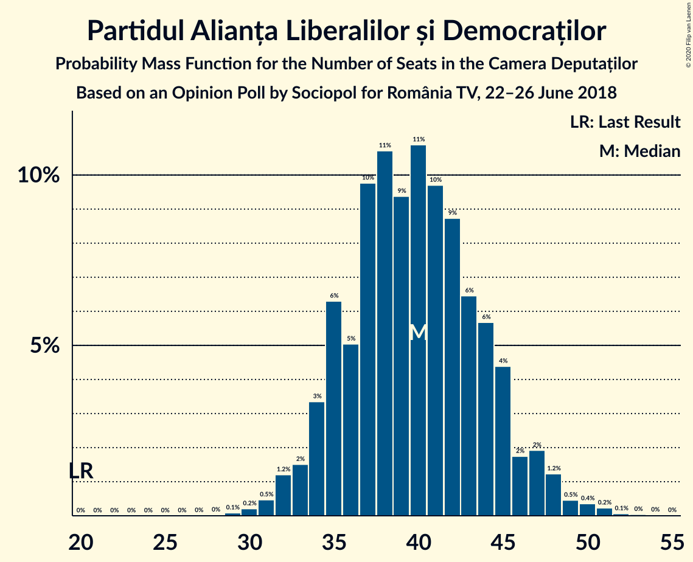
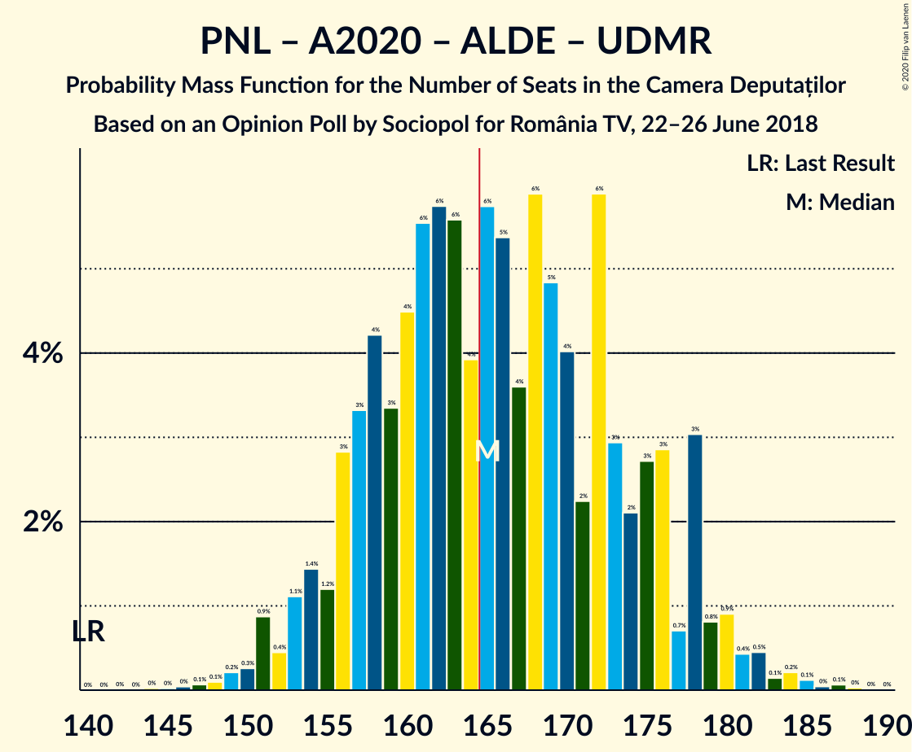
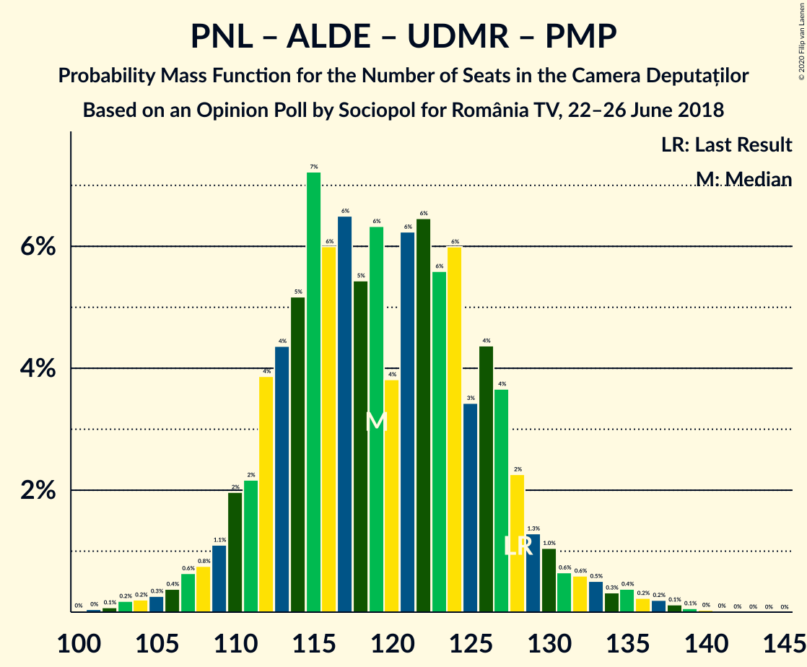

# Opinion Poll by Sociopol for România TV, 22–26 June 2018

<a href="#voting-intentions">Voting Intentions</a> | <a href="#seats">Seats</a> | <a href="#coalitions">Coalitions</a> | <a href="#technical-information">Technical Information</a>

## Voting Intentions

### Confidence Intervals

| Party | Last Result | Poll Result | 80% Confidence Interval | 90% Confidence Interval | 95% Confidence Interval | 99% Confidence Interval |
|:-----:|:-----------:|:-----------:|:-----------------------:|:-----------------------:|:-----------------------:|:-----------------------:|
| Partidul Social Democrat | 45.5% | 41.0% | 38.9–43.1% |38.4–43.7% |37.9–44.2% |36.9–45.2% |
| Partidul Național Liberal | 20.0% | 20.0% | 18.3–21.7% |17.9–22.2% |17.5–22.7% |16.7–23.5% |
| Alianța 2020 USR-PLUS | 8.9% | 14.0% | 12.6–15.5% |12.2–16.0% |11.9–16.4% |11.2–17.1% |
| Partidul Alianța Liberalilor și Democraților | 5.6% | 12.0% | 10.7–13.5% |10.3–13.9% |10.0–14.3% |9.5–15.0% |
| PRO România | 0.0% | 5.0% | 4.2–6.1% |4.0–6.4% |3.8–6.6% |3.4–7.2% |
| Uniunea Democrată Maghiară din România | 6.2% | 4.0% | 3.3–5.0% |3.1–5.3% |2.9–5.5% |2.6–6.0% |
| Partidul Mișcarea Populară | 5.4% | 1.0% | 0.7–1.6% |0.6–1.7% |0.5–1.9% |0.4–2.2% |

*Note:* The poll result column reflects the actual value used in the calculations. Published results may vary slightly, and in addition be rounded to fewer digits.

## Seats

### Confidence Intervals

| Party | Last Result | Median | 80% Confidence Interval | 90% Confidence Interval | 95% Confidence Interval | 99% Confidence Interval |
|:-----:|:-----------:|:------:|:-----------------------:|:-----------------------:|:-----------------------:|:-----------------------:|
| <a href="#partidul-social-democrat">Partidul Social Democrat</a> | 154 | 138 | 128–144 |126–148 |124–150 |120–152 |
| <a href="#partidul-național-liberal">Partidul Național Liberal</a> | 69 | 65 | 60–72 |59–74 |57–76 |54–79 |
| <a href="#alianța-2020-usr-plus">Alianța 2020 USR-PLUS</a> | 30 | 47 | 42–52 |40–54 |38–55 |37–58 |
| <a href="#partidul-alianța-liberalilor-și-democraților">Partidul Alianța Liberalilor și Democraților</a> | 20 | 39 | 35–44 |34–46 |33–47 |31–51 |
| <a href="#pro-românia">PRO România</a> | 0 | 16 | 0–18 |0–20 |0–21 |0–23 |
| <a href="#uniunea-democrată-maghiară-din-românia">Uniunea Democrată Maghiară din România</a> | 21 | 13 | 10–16 |10–17 |9–18 |8–20 |
| <a href="#partidul-mișcarea-populară">Partidul Mișcarea Populară</a> | 18 | 0 | 0 |0 |0 |0 |

### Partidul Social Democrat

*For a full overview of the results for this party, see the [Partidul Social Democrat](party-partidulsocialdemocrat.html) page.*

| Number of Seats | Probability | Accumulated | Special Marks |
|:---------------:|:-----------:|:-----------:|:-------------:|
| 116 | 0% | 100% |  |
| 117 | 0.1% | 99.9% |  |
| 118 | 0.1% | 99.8% |  |
| 119 | 0.1% | 99.7% |  |
| 120 | 0.2% | 99.6% |  |
| 121 | 0.3% | 99.4% |  |
| 122 | 0.6% | 99.1% |  |
| 123 | 0.4% | 98.5% |  |
| 124 | 2% | 98% |  |
| 125 | 0.6% | 96% |  |
| 126 | 2% | 96% |  |
| 127 | 3% | 94% |  |
| 128 | 3% | 91% |  |
| 129 | 6% | 88% |  |
| 130 | 2% | 83% |  |
| 131 | 2% | 81% |  |
| 132 | 2% | 79% |  |
| 133 | 3% | 77% |  |
| 134 | 1.4% | 74% |  |
| 135 | 2% | 72% |  |
| 136 | 9% | 70% |  |
| 137 | 9% | 61% |  |
| 138 | 15% | 51% | Median |
| 139 | 6% | 36% |  |
| 140 | 5% | 31% |  |
| 141 | 6% | 26% |  |
| 142 | 7% | 20% |  |
| 143 | 3% | 13% |  |
| 144 | 0.4% | 10% |  |
| 145 | 1.0% | 10% |  |
| 146 | 0.5% | 9% |  |
| 147 | 1.0% | 8% |  |
| 148 | 3% | 7% |  |
| 149 | 0.7% | 4% |  |
| 150 | 0.9% | 3% |  |
| 151 | 0.9% | 2% |  |
| 152 | 1.2% | 2% |  |
| 153 | 0% | 0.3% |  |
| 154 | 0.2% | 0.3% | Last Result |
| 155 | 0% | 0.1% |  |
| 156 | 0% | 0% |  |

### Partidul Național Liberal

*For a full overview of the results for this party, see the [Partidul Național Liberal](party-partidulnaționalliberal.html) page.*

| Number of Seats | Probability | Accumulated | Special Marks |
|:---------------:|:-----------:|:-----------:|:-------------:|
| 52 | 0% | 100% |  |
| 53 | 0.1% | 99.9% |  |
| 54 | 0.4% | 99.9% |  |
| 55 | 1.0% | 99.5% |  |
| 56 | 0.2% | 98% |  |
| 57 | 2% | 98% |  |
| 58 | 1.4% | 97% |  |
| 59 | 1.4% | 95% |  |
| 60 | 9% | 94% |  |
| 61 | 3% | 85% |  |
| 62 | 13% | 82% |  |
| 63 | 6% | 70% |  |
| 64 | 11% | 64% |  |
| 65 | 4% | 52% | Median |
| 66 | 2% | 49% |  |
| 67 | 14% | 46% |  |
| 68 | 7% | 33% |  |
| 69 | 5% | 26% | Last Result |
| 70 | 2% | 20% |  |
| 71 | 2% | 18% |  |
| 72 | 7% | 16% |  |
| 73 | 4% | 9% |  |
| 74 | 0.9% | 5% |  |
| 75 | 1.4% | 4% |  |
| 76 | 0.9% | 3% |  |
| 77 | 0.4% | 2% |  |
| 78 | 0.4% | 1.4% |  |
| 79 | 0.5% | 1.0% |  |
| 80 | 0.1% | 0.5% |  |
| 81 | 0.2% | 0.4% |  |
| 82 | 0% | 0.1% |  |
| 83 | 0.1% | 0.1% |  |
| 84 | 0.1% | 0.1% |  |
| 85 | 0% | 0% |  |

### Alianța 2020 USR-PLUS

*For a full overview of the results for this party, see the [Alianța 2020 USR-PLUS](party-alianța2020usr-plus.html) page.*

| Number of Seats | Probability | Accumulated | Special Marks |
|:---------------:|:-----------:|:-----------:|:-------------:|
| 30 | 0% | 100% | Last Result |
| 31 | 0% | 100% |  |
| 32 | 0% | 100% |  |
| 33 | 0% | 100% |  |
| 34 | 0% | 100% |  |
| 35 | 0.1% | 100% |  |
| 36 | 0.3% | 99.9% |  |
| 37 | 0.9% | 99.6% |  |
| 38 | 1.3% | 98.8% |  |
| 39 | 1.4% | 97% |  |
| 40 | 2% | 96% |  |
| 41 | 3% | 94% |  |
| 42 | 6% | 91% |  |
| 43 | 8% | 85% |  |
| 44 | 9% | 77% |  |
| 45 | 10% | 68% |  |
| 46 | 5% | 58% |  |
| 47 | 17% | 53% | Median |
| 48 | 12% | 37% |  |
| 49 | 7% | 24% |  |
| 50 | 2% | 17% |  |
| 51 | 3% | 16% |  |
| 52 | 4% | 13% |  |
| 53 | 3% | 9% |  |
| 54 | 3% | 6% |  |
| 55 | 0.7% | 3% |  |
| 56 | 0.1% | 2% |  |
| 57 | 2% | 2% |  |
| 58 | 0.4% | 0.6% |  |
| 59 | 0.1% | 0.2% |  |
| 60 | 0% | 0.1% |  |
| 61 | 0% | 0.1% |  |
| 62 | 0% | 0% |  |

### Partidul Alianța Liberalilor și Democraților

*For a full overview of the results for this party, see the [Partidul Alianța Liberalilor și Democraților](party-partidulalianțaliberalilorșidemocraților.html) page.*

| Number of Seats | Probability | Accumulated | Special Marks |
|:---------------:|:-----------:|:-----------:|:-------------:|
| 20 | 0% | 100% | Last Result |
| 21 | 0% | 100% |  |
| 22 | 0% | 100% |  |
| 23 | 0% | 100% |  |
| 24 | 0% | 100% |  |
| 25 | 0% | 100% |  |
| 26 | 0% | 100% |  |
| 27 | 0% | 100% |  |
| 28 | 0.1% | 100% |  |
| 29 | 0% | 99.9% |  |
| 30 | 0.2% | 99.9% |  |
| 31 | 1.0% | 99.7% |  |
| 32 | 0.4% | 98.6% |  |
| 33 | 3% | 98% |  |
| 34 | 3% | 96% |  |
| 35 | 11% | 93% |  |
| 36 | 5% | 82% |  |
| 37 | 3% | 77% |  |
| 38 | 23% | 74% |  |
| 39 | 3% | 51% | Median |
| 40 | 17% | 48% |  |
| 41 | 5% | 31% |  |
| 42 | 9% | 27% |  |
| 43 | 4% | 18% |  |
| 44 | 5% | 14% |  |
| 45 | 2% | 9% |  |
| 46 | 3% | 7% |  |
| 47 | 1.2% | 4% |  |
| 48 | 1.0% | 2% |  |
| 49 | 0.3% | 1.4% |  |
| 50 | 0.6% | 1.1% |  |
| 51 | 0.3% | 0.5% |  |
| 52 | 0% | 0.2% |  |
| 53 | 0.1% | 0.2% |  |
| 54 | 0% | 0.1% |  |
| 55 | 0% | 0% |  |

### PRO România

*For a full overview of the results for this party, see the [PRO România](party-proromânia.html) page.*

| Number of Seats | Probability | Accumulated | Special Marks |
|:---------------:|:-----------:|:-----------:|:-------------:|
| 0 | 38% | 100% | Last Result |
| 1 | 0% | 62% |  |
| 2 | 0% | 62% |  |
| 3 | 0% | 62% |  |
| 4 | 0% | 62% |  |
| 5 | 0% | 62% |  |
| 6 | 0% | 62% |  |
| 7 | 0% | 62% |  |
| 8 | 0% | 62% |  |
| 9 | 0% | 62% |  |
| 10 | 0% | 62% |  |
| 11 | 0% | 62% |  |
| 12 | 0% | 62% |  |
| 13 | 0% | 62% |  |
| 14 | 0% | 62% |  |
| 15 | 0% | 62% |  |
| 16 | 27% | 62% | Median |
| 17 | 9% | 35% |  |
| 18 | 16% | 26% |  |
| 19 | 3% | 10% |  |
| 20 | 4% | 7% |  |
| 21 | 0.6% | 3% |  |
| 22 | 2% | 2% |  |
| 23 | 0.2% | 0.6% |  |
| 24 | 0.4% | 0.4% |  |
| 25 | 0% | 0.1% |  |
| 26 | 0% | 0% |  |

### Uniunea Democrată Maghiară din România

*For a full overview of the results for this party, see the [Uniunea Democrată Maghiară din România](party-uniuneademocratămaghiarădinromânia.html) page.*

| Number of Seats | Probability | Accumulated | Special Marks |
|:---------------:|:-----------:|:-----------:|:-------------:|
| 7 | 0.1% | 100% |  |
| 8 | 0.6% | 99.9% |  |
| 9 | 3% | 99.3% |  |
| 10 | 13% | 97% |  |
| 11 | 22% | 84% |  |
| 12 | 11% | 62% |  |
| 13 | 14% | 51% | Median |
| 14 | 12% | 37% |  |
| 15 | 9% | 25% |  |
| 16 | 10% | 16% |  |
| 17 | 3% | 7% |  |
| 18 | 2% | 4% |  |
| 19 | 1.4% | 2% |  |
| 20 | 0.4% | 0.6% |  |
| 21 | 0.1% | 0.2% | Last Result |
| 22 | 0.1% | 0.1% |  |
| 23 | 0% | 0% |  |

### Partidul Mișcarea Populară

*For a full overview of the results for this party, see the [Partidul Mișcarea Populară](party-partidulmișcareapopulară.html) page.*

| Number of Seats | Probability | Accumulated | Special Marks |
|:---------------:|:-----------:|:-----------:|:-------------:|
| 0 | 100% | 100% | Median |
| 1 | 0% | 0% |  |
| 2 | 0% | 0% |  |
| 3 | 0% | 0% |  |
| 4 | 0% | 0% |  |
| 5 | 0% | 0% |  |
| 6 | 0% | 0% |  |
| 7 | 0% | 0% |  |
| 8 | 0% | 0% |  |
| 9 | 0% | 0% |  |
| 10 | 0% | 0% |  |
| 11 | 0% | 0% |  |
| 12 | 0% | 0% |  |
| 13 | 0% | 0% |  |
| 14 | 0% | 0% |  |
| 15 | 0% | 0% |  |
| 16 | 0% | 0% |  |
| 17 | 0% | 0% |  |
| 18 | 0% | 0% | Last Result |

## Coalitions

### Confidence Intervals

| Coalition | Last Result | Median | Majority? | 80% Confidence Interval | 90% Confidence Interval | 95% Confidence Interval | 99% Confidence Interval |
|:---------:|:-----------:|:------:|:---------:|:-----------------------:|:-----------------------:|:-----------------------:|:-----------------------:|
| Partidul Social Democrat – Partidul Alianța Liberalilor și Democraților – PRO România | 174 | 188 | 100% | 178–194 | 176–197 | 174–198 | 169–202 |
| Partidul Social Democrat – Partidul Alianța Liberalilor și Democraților | 174 | 176 | 93% | 167–187 | 164–189 | 163–190 | 159–194 |
| Partidul Național Liberal – Alianța 2020 USR-PLUS – Partidul Alianța Liberalilor și Democraților – Uniunea Democrată Maghiară din România – Partidul Mișcarea Populară | 158 | 164 | 41% | 156–173 | 153–179 | 153–180 | 149–184 |
| Partidul Național Liberal – Alianța 2020 USR-PLUS – Partidul Alianța Liberalilor și Democraților – Uniunea Democrată Maghiară din România | 140 | 164 | 41% | 156–173 | 153–179 | 153–180 | 149–184 |
| Partidul Național Liberal – Alianța 2020 USR-PLUS – Partidul Alianța Liberalilor și Democraților – Partidul Mișcarea Populară | 137 | 150 | 2% | 144–161 | 141–163 | 139–165 | 135–171 |
| Partidul Național Liberal – Alianța 2020 USR-PLUS – Partidul Alianța Liberalilor și Democraților | 119 | 150 | 2% | 144–161 | 141–163 | 139–165 | 135–171 |
| Partidul Social Democrat – PRO România | 154 | 148 | 0.1% | 139–156 | 133–159 | 132–159 | 128–163 |
| Partidul Național Liberal – Alianța 2020 USR-PLUS – Uniunea Democrată Maghiară din România – Partidul Mișcarea Populară | 138 | 124 | 0% | 118–134 | 115–136 | 114–138 | 110–143 |
| Partidul Național Liberal – Alianța 2020 USR-PLUS – Uniunea Democrată Maghiară din România | 120 | 124 | 0% | 118–134 | 115–136 | 114–138 | 110–143 |
| Partidul Național Liberal – Partidul Alianța Liberalilor și Democraților – Uniunea Democrată Maghiară din România – Partidul Mișcarea Populară | 128 | 117 | 0% | 110–128 | 109–132 | 107–133 | 106–137 |
| Partidul Național Liberal – Partidul Alianța Liberalilor și Democraților – Uniunea Democrată Maghiară din România | 110 | 117 | 0% | 110–128 | 109–132 | 107–133 | 106–137 |
| Partidul Național Liberal – Alianța 2020 USR-PLUS – Partidul Mișcarea Populară | 117 | 111 | 0% | 105–121 | 103–123 | 101–125 | 99–127 |
| Partidul Național Liberal – Alianța 2020 USR-PLUS | 99 | 111 | 0% | 105–121 | 103–123 | 101–125 | 99–127 |
| Partidul Național Liberal – Uniunea Democrată Maghiară din România – Partidul Mișcarea Populară | 108 | 78 | 0% | 72–85 | 71–89 | 70–90 | 67–95 |
| Partidul Național Liberal – Uniunea Democrată Maghiară din România | 90 | 78 | 0% | 72–85 | 71–89 | 70–90 | 67–95 |
| Partidul Național Liberal – Partidul Mișcarea Populară | 87 | 65 | 0% | 60–72 | 59–74 | 57–76 | 54–79 |
| Partidul Național Liberal | 69 | 65 | 0% | 60–72 | 59–74 | 57–76 | 54–79 |
| Alianța 2020 USR-PLUS – Partidul Mișcarea Populară | 48 | 47 | 0% | 42–52 | 40–54 | 38–55 | 37–58 |

### Partidul Social Democrat – Partidul Alianța Liberalilor și Democraților – PRO România

| Number of Seats | Probability | Accumulated | Special Marks |
|:---------------:|:-----------:|:-----------:|:-------------:|
| 166 | 0.1% | 100% | Majority |
| 167 | 0% | 99.8% |  |
| 168 | 0.2% | 99.8% |  |
| 169 | 0.3% | 99.6% |  |
| 170 | 0.1% | 99.3% |  |
| 171 | 0.6% | 99.3% |  |
| 172 | 0.2% | 98.7% |  |
| 173 | 0.6% | 98.5% |  |
| 174 | 1.0% | 98% | Last Result |
| 175 | 0.8% | 97% |  |
| 176 | 4% | 96% |  |
| 177 | 1.1% | 92% |  |
| 178 | 3% | 91% |  |
| 179 | 3% | 88% |  |
| 180 | 6% | 84% |  |
| 181 | 2% | 79% |  |
| 182 | 2% | 77% |  |
| 183 | 4% | 74% |  |
| 184 | 3% | 70% |  |
| 185 | 6% | 67% |  |
| 186 | 2% | 61% |  |
| 187 | 4% | 59% |  |
| 188 | 7% | 55% |  |
| 189 | 11% | 48% |  |
| 190 | 3% | 37% |  |
| 191 | 6% | 34% |  |
| 192 | 10% | 28% |  |
| 193 | 2% | 18% | Median |
| 194 | 9% | 16% |  |
| 195 | 1.2% | 8% |  |
| 196 | 0.8% | 6% |  |
| 197 | 0.6% | 6% |  |
| 198 | 3% | 5% |  |
| 199 | 0.3% | 2% |  |
| 200 | 0.3% | 2% |  |
| 201 | 0.7% | 1.4% |  |
| 202 | 0.5% | 0.7% |  |
| 203 | 0% | 0.2% |  |
| 204 | 0% | 0.2% |  |
| 205 | 0.1% | 0.2% |  |
| 206 | 0% | 0% |  |

### Partidul Social Democrat – Partidul Alianța Liberalilor și Democraților

| Number of Seats | Probability | Accumulated | Special Marks |
|:---------------:|:-----------:|:-----------:|:-------------:|
| 155 | 0.1% | 100% |  |
| 156 | 0% | 99.8% |  |
| 157 | 0.1% | 99.8% |  |
| 158 | 0.2% | 99.8% |  |
| 159 | 0.3% | 99.5% |  |
| 160 | 0.1% | 99.3% |  |
| 161 | 0.4% | 99.2% |  |
| 162 | 1.0% | 98.7% |  |
| 163 | 0.8% | 98% |  |
| 164 | 2% | 97% |  |
| 165 | 2% | 95% |  |
| 166 | 0.5% | 93% | Majority |
| 167 | 4% | 93% |  |
| 168 | 2% | 88% |  |
| 169 | 3% | 86% |  |
| 170 | 4% | 83% |  |
| 171 | 2% | 80% |  |
| 172 | 1.3% | 78% |  |
| 173 | 10% | 76% |  |
| 174 | 2% | 66% | Last Result |
| 175 | 7% | 64% |  |
| 176 | 19% | 57% |  |
| 177 | 1.1% | 38% | Median |
| 178 | 5% | 37% |  |
| 179 | 3% | 32% |  |
| 180 | 6% | 29% |  |
| 181 | 3% | 23% |  |
| 182 | 1.5% | 20% |  |
| 183 | 4% | 18% |  |
| 184 | 1.5% | 14% |  |
| 185 | 1.0% | 13% |  |
| 186 | 1.2% | 12% |  |
| 187 | 1.2% | 10% |  |
| 188 | 4% | 9% |  |
| 189 | 3% | 5% |  |
| 190 | 0.2% | 3% |  |
| 191 | 0.1% | 2% |  |
| 192 | 0.6% | 2% |  |
| 193 | 0.3% | 2% |  |
| 194 | 1.1% | 2% |  |
| 195 | 0% | 0.4% |  |
| 196 | 0.1% | 0.4% |  |
| 197 | 0.1% | 0.3% |  |
| 198 | 0.1% | 0.2% |  |
| 199 | 0% | 0% |  |

### Partidul Național Liberal – Alianța 2020 USR-PLUS – Partidul Alianța Liberalilor și Democraților – Uniunea Democrată Maghiară din România – Partidul Mișcarea Populară

| Number of Seats | Probability | Accumulated | Special Marks |
|:---------------:|:-----------:|:-----------:|:-------------:|
| 146 | 0% | 100% |  |
| 147 | 0% | 99.9% |  |
| 148 | 0.1% | 99.9% |  |
| 149 | 0.6% | 99.8% |  |
| 150 | 0.1% | 99.1% |  |
| 151 | 1.0% | 99.1% |  |
| 152 | 0.3% | 98% |  |
| 153 | 3% | 98% |  |
| 154 | 0.8% | 95% |  |
| 155 | 0.7% | 94% |  |
| 156 | 7% | 93% |  |
| 157 | 0.7% | 86% |  |
| 158 | 9% | 85% | Last Result |
| 159 | 8% | 76% |  |
| 160 | 12% | 68% |  |
| 161 | 2% | 57% |  |
| 162 | 2% | 54% |  |
| 163 | 1.0% | 52% |  |
| 164 | 4% | 51% | Median |
| 165 | 6% | 46% |  |
| 166 | 2% | 41% | Majority |
| 167 | 4% | 39% |  |
| 168 | 2% | 35% |  |
| 169 | 4% | 33% |  |
| 170 | 6% | 30% |  |
| 171 | 4% | 23% |  |
| 172 | 6% | 19% |  |
| 173 | 4% | 13% |  |
| 174 | 1.4% | 10% |  |
| 175 | 1.1% | 8% |  |
| 176 | 1.0% | 7% |  |
| 177 | 0.6% | 6% |  |
| 178 | 0.2% | 6% |  |
| 179 | 2% | 5% |  |
| 180 | 0.8% | 3% |  |
| 181 | 0.7% | 2% |  |
| 182 | 0.4% | 2% |  |
| 183 | 0.5% | 1.2% |  |
| 184 | 0.2% | 0.7% |  |
| 185 | 0.3% | 0.5% |  |
| 186 | 0% | 0.1% |  |
| 187 | 0% | 0.1% |  |
| 188 | 0% | 0% |  |

### Partidul Național Liberal – Alianța 2020 USR-PLUS – Partidul Alianța Liberalilor și Democraților – Uniunea Democrată Maghiară din România

| Number of Seats | Probability | Accumulated | Special Marks |
|:---------------:|:-----------:|:-----------:|:-------------:|
| 140 | 0% | 100% | Last Result |
| 141 | 0% | 100% |  |
| 142 | 0% | 100% |  |
| 143 | 0% | 100% |  |
| 144 | 0% | 100% |  |
| 145 | 0% | 100% |  |
| 146 | 0% | 100% |  |
| 147 | 0% | 99.9% |  |
| 148 | 0.1% | 99.9% |  |
| 149 | 0.6% | 99.8% |  |
| 150 | 0.1% | 99.1% |  |
| 151 | 1.0% | 99.1% |  |
| 152 | 0.3% | 98% |  |
| 153 | 3% | 98% |  |
| 154 | 0.8% | 95% |  |
| 155 | 0.7% | 94% |  |
| 156 | 7% | 93% |  |
| 157 | 0.7% | 86% |  |
| 158 | 9% | 85% |  |
| 159 | 8% | 76% |  |
| 160 | 12% | 68% |  |
| 161 | 2% | 57% |  |
| 162 | 2% | 54% |  |
| 163 | 1.0% | 52% |  |
| 164 | 4% | 51% | Median |
| 165 | 6% | 46% |  |
| 166 | 2% | 41% | Majority |
| 167 | 4% | 39% |  |
| 168 | 2% | 35% |  |
| 169 | 4% | 33% |  |
| 170 | 6% | 30% |  |
| 171 | 4% | 23% |  |
| 172 | 6% | 19% |  |
| 173 | 4% | 13% |  |
| 174 | 1.4% | 10% |  |
| 175 | 1.1% | 8% |  |
| 176 | 1.0% | 7% |  |
| 177 | 0.6% | 6% |  |
| 178 | 0.2% | 6% |  |
| 179 | 2% | 5% |  |
| 180 | 0.8% | 3% |  |
| 181 | 0.7% | 2% |  |
| 182 | 0.4% | 2% |  |
| 183 | 0.5% | 1.2% |  |
| 184 | 0.2% | 0.7% |  |
| 185 | 0.3% | 0.5% |  |
| 186 | 0% | 0.1% |  |
| 187 | 0% | 0.1% |  |
| 188 | 0% | 0% |  |

### Partidul Național Liberal – Alianța 2020 USR-PLUS – Partidul Alianța Liberalilor și Democraților – Partidul Mișcarea Populară

| Number of Seats | Probability | Accumulated | Special Marks |
|:---------------:|:-----------:|:-----------:|:-------------:|
| 133 | 0% | 100% |  |
| 134 | 0% | 99.9% |  |
| 135 | 0.4% | 99.9% |  |
| 136 | 0.1% | 99.5% |  |
| 137 | 0.3% | 99.3% | Last Result |
| 138 | 1.5% | 99.0% |  |
| 139 | 1.4% | 98% |  |
| 140 | 0.3% | 96% |  |
| 141 | 1.2% | 96% |  |
| 142 | 0.5% | 95% |  |
| 143 | 3% | 94% |  |
| 144 | 1.3% | 91% |  |
| 145 | 7% | 90% |  |
| 146 | 8% | 83% |  |
| 147 | 10% | 75% |  |
| 148 | 3% | 65% |  |
| 149 | 5% | 62% |  |
| 150 | 13% | 57% |  |
| 151 | 3% | 44% | Median |
| 152 | 2% | 41% |  |
| 153 | 3% | 39% |  |
| 154 | 2% | 36% |  |
| 155 | 3% | 35% |  |
| 156 | 3% | 32% |  |
| 157 | 7% | 29% |  |
| 158 | 3% | 22% |  |
| 159 | 4% | 19% |  |
| 160 | 2% | 14% |  |
| 161 | 4% | 12% |  |
| 162 | 2% | 8% |  |
| 163 | 3% | 6% |  |
| 164 | 0.5% | 4% |  |
| 165 | 0.9% | 3% |  |
| 166 | 0.5% | 2% | Majority |
| 167 | 0.3% | 2% |  |
| 168 | 0.1% | 2% |  |
| 169 | 0.3% | 1.4% |  |
| 170 | 0.4% | 1.1% |  |
| 171 | 0.3% | 0.7% |  |
| 172 | 0% | 0.4% |  |
| 173 | 0.3% | 0.3% |  |
| 174 | 0% | 0% |  |

### Partidul Național Liberal – Alianța 2020 USR-PLUS – Partidul Alianța Liberalilor și Democraților

| Number of Seats | Probability | Accumulated | Special Marks |
|:---------------:|:-----------:|:-----------:|:-------------:|
| 119 | 0% | 100% | Last Result |
| 120 | 0% | 100% |  |
| 121 | 0% | 100% |  |
| 122 | 0% | 100% |  |
| 123 | 0% | 100% |  |
| 124 | 0% | 100% |  |
| 125 | 0% | 100% |  |
| 126 | 0% | 100% |  |
| 127 | 0% | 100% |  |
| 128 | 0% | 100% |  |
| 129 | 0% | 100% |  |
| 130 | 0% | 100% |  |
| 131 | 0% | 100% |  |
| 132 | 0% | 100% |  |
| 133 | 0% | 100% |  |
| 134 | 0% | 99.9% |  |
| 135 | 0.4% | 99.9% |  |
| 136 | 0.1% | 99.5% |  |
| 137 | 0.3% | 99.3% |  |
| 138 | 1.5% | 99.0% |  |
| 139 | 1.4% | 98% |  |
| 140 | 0.3% | 96% |  |
| 141 | 1.2% | 96% |  |
| 142 | 0.5% | 95% |  |
| 143 | 3% | 94% |  |
| 144 | 1.3% | 91% |  |
| 145 | 7% | 90% |  |
| 146 | 8% | 83% |  |
| 147 | 10% | 75% |  |
| 148 | 3% | 65% |  |
| 149 | 5% | 62% |  |
| 150 | 13% | 57% |  |
| 151 | 3% | 44% | Median |
| 152 | 2% | 41% |  |
| 153 | 3% | 39% |  |
| 154 | 2% | 36% |  |
| 155 | 3% | 35% |  |
| 156 | 3% | 32% |  |
| 157 | 7% | 29% |  |
| 158 | 3% | 22% |  |
| 159 | 4% | 19% |  |
| 160 | 2% | 14% |  |
| 161 | 4% | 12% |  |
| 162 | 2% | 8% |  |
| 163 | 3% | 6% |  |
| 164 | 0.5% | 4% |  |
| 165 | 0.9% | 3% |  |
| 166 | 0.5% | 2% | Majority |
| 167 | 0.3% | 2% |  |
| 168 | 0.1% | 2% |  |
| 169 | 0.3% | 1.4% |  |
| 170 | 0.4% | 1.1% |  |
| 171 | 0.3% | 0.7% |  |
| 172 | 0% | 0.4% |  |
| 173 | 0.3% | 0.3% |  |
| 174 | 0% | 0% |  |

### Partidul Social Democrat – PRO România

| Number of Seats | Probability | Accumulated | Special Marks |
|:---------------:|:-----------:|:-----------:|:-------------:|
| 125 | 0% | 100% |  |
| 126 | 0% | 99.9% |  |
| 127 | 0.3% | 99.9% |  |
| 128 | 0.2% | 99.5% |  |
| 129 | 0.5% | 99.3% |  |
| 130 | 0.4% | 98.8% |  |
| 131 | 0.7% | 98% |  |
| 132 | 0.8% | 98% |  |
| 133 | 2% | 97% |  |
| 134 | 0.2% | 95% |  |
| 135 | 0.6% | 94% |  |
| 136 | 1.0% | 94% |  |
| 137 | 1.1% | 93% |  |
| 138 | 1.4% | 92% |  |
| 139 | 4% | 90% |  |
| 140 | 6% | 87% |  |
| 141 | 4% | 81% |  |
| 142 | 6% | 77% |  |
| 143 | 4% | 70% |  |
| 144 | 2% | 67% |  |
| 145 | 4% | 65% |  |
| 146 | 2% | 61% |  |
| 147 | 6% | 59% |  |
| 148 | 4% | 54% |  |
| 149 | 1.0% | 49% |  |
| 150 | 2% | 48% |  |
| 151 | 2% | 46% |  |
| 152 | 12% | 43% |  |
| 153 | 8% | 32% |  |
| 154 | 9% | 24% | Last Result, Median |
| 155 | 0.7% | 15% |  |
| 156 | 7% | 14% |  |
| 157 | 0.7% | 7% |  |
| 158 | 0.8% | 6% |  |
| 159 | 3% | 5% |  |
| 160 | 0.3% | 2% |  |
| 161 | 1.0% | 2% |  |
| 162 | 0.1% | 0.9% |  |
| 163 | 0.6% | 0.9% |  |
| 164 | 0.1% | 0.2% |  |
| 165 | 0% | 0.1% |  |
| 166 | 0% | 0.1% | Majority |
| 167 | 0% | 0% |  |

### Partidul Național Liberal – Alianța 2020 USR-PLUS – Uniunea Democrată Maghiară din România – Partidul Mișcarea Populară

| Number of Seats | Probability | Accumulated | Special Marks |
|:---------------:|:-----------:|:-----------:|:-------------:|
| 107 | 0.1% | 100% |  |
| 108 | 0% | 99.8% |  |
| 109 | 0% | 99.8% |  |
| 110 | 0.5% | 99.8% |  |
| 111 | 0.7% | 99.3% |  |
| 112 | 0.3% | 98.6% |  |
| 113 | 0.3% | 98% |  |
| 114 | 3% | 98% |  |
| 115 | 0.6% | 95% |  |
| 116 | 0.8% | 94% |  |
| 117 | 1.2% | 94% |  |
| 118 | 9% | 92% |  |
| 119 | 2% | 84% |  |
| 120 | 10% | 82% |  |
| 121 | 6% | 72% |  |
| 122 | 3% | 66% |  |
| 123 | 11% | 63% |  |
| 124 | 7% | 52% |  |
| 125 | 4% | 45% | Median |
| 126 | 2% | 41% |  |
| 127 | 6% | 39% |  |
| 128 | 3% | 33% |  |
| 129 | 4% | 30% |  |
| 130 | 2% | 26% |  |
| 131 | 2% | 23% |  |
| 132 | 6% | 21% |  |
| 133 | 3% | 16% |  |
| 134 | 3% | 12% |  |
| 135 | 1.1% | 9% |  |
| 136 | 4% | 8% |  |
| 137 | 0.8% | 4% |  |
| 138 | 1.0% | 3% | Last Result |
| 139 | 0.6% | 2% |  |
| 140 | 0.2% | 1.5% |  |
| 141 | 0.6% | 1.3% |  |
| 142 | 0.1% | 0.7% |  |
| 143 | 0.3% | 0.7% |  |
| 144 | 0.2% | 0.4% |  |
| 145 | 0% | 0.2% |  |
| 146 | 0.1% | 0.2% |  |
| 147 | 0% | 0% |  |

### Partidul Național Liberal – Alianța 2020 USR-PLUS – Uniunea Democrată Maghiară din România

| Number of Seats | Probability | Accumulated | Special Marks |
|:---------------:|:-----------:|:-----------:|:-------------:|
| 107 | 0.1% | 100% |  |
| 108 | 0% | 99.8% |  |
| 109 | 0% | 99.8% |  |
| 110 | 0.5% | 99.8% |  |
| 111 | 0.7% | 99.3% |  |
| 112 | 0.3% | 98.6% |  |
| 113 | 0.3% | 98% |  |
| 114 | 3% | 98% |  |
| 115 | 0.6% | 95% |  |
| 116 | 0.8% | 94% |  |
| 117 | 1.2% | 94% |  |
| 118 | 9% | 92% |  |
| 119 | 2% | 84% |  |
| 120 | 10% | 82% | Last Result |
| 121 | 6% | 72% |  |
| 122 | 3% | 66% |  |
| 123 | 11% | 63% |  |
| 124 | 7% | 52% |  |
| 125 | 4% | 45% | Median |
| 126 | 2% | 41% |  |
| 127 | 6% | 39% |  |
| 128 | 3% | 33% |  |
| 129 | 4% | 30% |  |
| 130 | 2% | 26% |  |
| 131 | 2% | 23% |  |
| 132 | 6% | 21% |  |
| 133 | 3% | 16% |  |
| 134 | 3% | 12% |  |
| 135 | 1.1% | 9% |  |
| 136 | 4% | 8% |  |
| 137 | 0.8% | 4% |  |
| 138 | 1.0% | 3% |  |
| 139 | 0.6% | 2% |  |
| 140 | 0.2% | 1.5% |  |
| 141 | 0.6% | 1.3% |  |
| 142 | 0.1% | 0.7% |  |
| 143 | 0.3% | 0.7% |  |
| 144 | 0.2% | 0.4% |  |
| 145 | 0% | 0.2% |  |
| 146 | 0.1% | 0.2% |  |
| 147 | 0% | 0% |  |

### Partidul Național Liberal – Partidul Alianța Liberalilor și Democraților – Uniunea Democrată Maghiară din România – Partidul Mișcarea Populară

| Number of Seats | Probability | Accumulated | Special Marks |
|:---------------:|:-----------:|:-----------:|:-------------:|
| 103 | 0.1% | 100% |  |
| 104 | 0.1% | 99.8% |  |
| 105 | 0.1% | 99.7% |  |
| 106 | 0.7% | 99.6% |  |
| 107 | 2% | 98.9% |  |
| 108 | 0.8% | 97% |  |
| 109 | 6% | 96% |  |
| 110 | 2% | 91% |  |
| 111 | 3% | 89% |  |
| 112 | 9% | 86% |  |
| 113 | 10% | 77% |  |
| 114 | 3% | 67% |  |
| 115 | 9% | 63% |  |
| 116 | 4% | 55% |  |
| 117 | 4% | 50% | Median |
| 118 | 3% | 46% |  |
| 119 | 4% | 43% |  |
| 120 | 4% | 39% |  |
| 121 | 5% | 35% |  |
| 122 | 6% | 29% |  |
| 123 | 4% | 23% |  |
| 124 | 5% | 19% |  |
| 125 | 2% | 15% |  |
| 126 | 0.5% | 12% |  |
| 127 | 2% | 12% |  |
| 128 | 2% | 10% | Last Result |
| 129 | 0.7% | 8% |  |
| 130 | 1.1% | 8% |  |
| 131 | 0.7% | 7% |  |
| 132 | 3% | 6% |  |
| 133 | 1.0% | 3% |  |
| 134 | 0.8% | 2% |  |
| 135 | 0.4% | 1.2% |  |
| 136 | 0.1% | 0.8% |  |
| 137 | 0.5% | 0.7% |  |
| 138 | 0.2% | 0.2% |  |
| 139 | 0.1% | 0.1% |  |
| 140 | 0% | 0% |  |

### Partidul Național Liberal – Partidul Alianța Liberalilor și Democraților – Uniunea Democrată Maghiară din România

| Number of Seats | Probability | Accumulated | Special Marks |
|:---------------:|:-----------:|:-----------:|:-------------:|
| 103 | 0.1% | 100% |  |
| 104 | 0.1% | 99.8% |  |
| 105 | 0.1% | 99.7% |  |
| 106 | 0.7% | 99.6% |  |
| 107 | 2% | 98.9% |  |
| 108 | 0.8% | 97% |  |
| 109 | 6% | 96% |  |
| 110 | 2% | 91% | Last Result |
| 111 | 3% | 89% |  |
| 112 | 9% | 86% |  |
| 113 | 10% | 77% |  |
| 114 | 3% | 67% |  |
| 115 | 9% | 63% |  |
| 116 | 4% | 55% |  |
| 117 | 4% | 50% | Median |
| 118 | 3% | 46% |  |
| 119 | 4% | 43% |  |
| 120 | 4% | 39% |  |
| 121 | 5% | 35% |  |
| 122 | 6% | 29% |  |
| 123 | 4% | 23% |  |
| 124 | 5% | 19% |  |
| 125 | 2% | 15% |  |
| 126 | 0.5% | 12% |  |
| 127 | 2% | 12% |  |
| 128 | 2% | 10% |  |
| 129 | 0.7% | 8% |  |
| 130 | 1.1% | 8% |  |
| 131 | 0.7% | 7% |  |
| 132 | 3% | 6% |  |
| 133 | 1.0% | 3% |  |
| 134 | 0.8% | 2% |  |
| 135 | 0.4% | 1.2% |  |
| 136 | 0.1% | 0.8% |  |
| 137 | 0.5% | 0.7% |  |
| 138 | 0.2% | 0.2% |  |
| 139 | 0.1% | 0.1% |  |
| 140 | 0% | 0% |  |

### Partidul Național Liberal – Alianța 2020 USR-PLUS – Partidul Mișcarea Populară

| Number of Seats | Probability | Accumulated | Special Marks |
|:---------------:|:-----------:|:-----------:|:-------------:|
| 94 | 0.1% | 100% |  |
| 95 | 0% | 99.8% |  |
| 96 | 0.1% | 99.8% |  |
| 97 | 0.1% | 99.8% |  |
| 98 | 0.1% | 99.6% |  |
| 99 | 1.0% | 99.6% |  |
| 100 | 0.6% | 98.5% |  |
| 101 | 1.0% | 98% |  |
| 102 | 1.5% | 97% |  |
| 103 | 0.8% | 95% |  |
| 104 | 3% | 95% |  |
| 105 | 3% | 92% |  |
| 106 | 2% | 89% |  |
| 107 | 8% | 86% |  |
| 108 | 8% | 79% |  |
| 109 | 2% | 71% |  |
| 110 | 13% | 69% |  |
| 111 | 8% | 56% |  |
| 112 | 12% | 48% | Median |
| 113 | 2% | 36% |  |
| 114 | 3% | 35% |  |
| 115 | 3% | 32% |  |
| 116 | 6% | 29% |  |
| 117 | 2% | 23% | Last Result |
| 118 | 2% | 22% |  |
| 119 | 4% | 20% |  |
| 120 | 3% | 16% |  |
| 121 | 7% | 13% |  |
| 122 | 0.5% | 6% |  |
| 123 | 2% | 6% |  |
| 124 | 0.7% | 4% |  |
| 125 | 0.6% | 3% |  |
| 126 | 2% | 2% |  |
| 127 | 0.1% | 0.6% |  |
| 128 | 0.1% | 0.4% |  |
| 129 | 0% | 0.3% |  |
| 130 | 0.1% | 0.3% |  |
| 131 | 0% | 0.1% |  |
| 132 | 0% | 0.1% |  |
| 133 | 0.1% | 0.1% |  |
| 134 | 0% | 0% |  |

### Partidul Național Liberal – Alianța 2020 USR-PLUS

| Number of Seats | Probability | Accumulated | Special Marks |
|:---------------:|:-----------:|:-----------:|:-------------:|
| 94 | 0.1% | 100% |  |
| 95 | 0% | 99.8% |  |
| 96 | 0.1% | 99.8% |  |
| 97 | 0.1% | 99.8% |  |
| 98 | 0.1% | 99.6% |  |
| 99 | 1.0% | 99.6% | Last Result |
| 100 | 0.6% | 98.5% |  |
| 101 | 1.0% | 98% |  |
| 102 | 1.5% | 97% |  |
| 103 | 0.8% | 95% |  |
| 104 | 3% | 95% |  |
| 105 | 3% | 92% |  |
| 106 | 2% | 89% |  |
| 107 | 8% | 86% |  |
| 108 | 8% | 79% |  |
| 109 | 2% | 71% |  |
| 110 | 13% | 69% |  |
| 111 | 8% | 56% |  |
| 112 | 12% | 48% | Median |
| 113 | 2% | 36% |  |
| 114 | 3% | 35% |  |
| 115 | 3% | 32% |  |
| 116 | 6% | 29% |  |
| 117 | 2% | 23% |  |
| 118 | 2% | 22% |  |
| 119 | 4% | 20% |  |
| 120 | 3% | 16% |  |
| 121 | 7% | 13% |  |
| 122 | 0.5% | 6% |  |
| 123 | 2% | 6% |  |
| 124 | 0.7% | 4% |  |
| 125 | 0.6% | 3% |  |
| 126 | 2% | 2% |  |
| 127 | 0.1% | 0.6% |  |
| 128 | 0.1% | 0.4% |  |
| 129 | 0% | 0.3% |  |
| 130 | 0.1% | 0.3% |  |
| 131 | 0% | 0.1% |  |
| 132 | 0% | 0.1% |  |
| 133 | 0.1% | 0.1% |  |
| 134 | 0% | 0% |  |

### Partidul Național Liberal – Uniunea Democrată Maghiară din România – Partidul Mișcarea Populară

| Number of Seats | Probability | Accumulated | Special Marks |
|:---------------:|:-----------:|:-----------:|:-------------:|
| 64 | 0.1% | 100% |  |
| 65 | 0.1% | 99.9% |  |
| 66 | 0.1% | 99.9% |  |
| 67 | 0.9% | 99.8% |  |
| 68 | 0.5% | 98.9% |  |
| 69 | 0.5% | 98% |  |
| 70 | 0.7% | 98% |  |
| 71 | 7% | 97% |  |
| 72 | 13% | 90% |  |
| 73 | 2% | 77% |  |
| 74 | 1.3% | 76% |  |
| 75 | 2% | 74% |  |
| 76 | 4% | 72% |  |
| 77 | 14% | 68% |  |
| 78 | 12% | 54% | Median |
| 79 | 4% | 41% |  |
| 80 | 1.3% | 38% |  |
| 81 | 1.0% | 36% |  |
| 82 | 8% | 35% |  |
| 83 | 8% | 27% |  |
| 84 | 7% | 19% |  |
| 85 | 2% | 11% |  |
| 86 | 0.2% | 10% |  |
| 87 | 1.3% | 9% |  |
| 88 | 1.1% | 8% |  |
| 89 | 4% | 7% |  |
| 90 | 0.8% | 3% |  |
| 91 | 0.7% | 2% |  |
| 92 | 0.1% | 1.3% |  |
| 93 | 0.1% | 1.3% |  |
| 94 | 0.7% | 1.2% |  |
| 95 | 0.3% | 0.5% |  |
| 96 | 0.2% | 0.2% |  |
| 97 | 0% | 0% |  |
| 98 | 0% | 0% |  |
| 99 | 0% | 0% |  |
| 100 | 0% | 0% |  |
| 101 | 0% | 0% |  |
| 102 | 0% | 0% |  |
| 103 | 0% | 0% |  |
| 104 | 0% | 0% |  |
| 105 | 0% | 0% |  |
| 106 | 0% | 0% |  |
| 107 | 0% | 0% |  |
| 108 | 0% | 0% | Last Result |

### Partidul Național Liberal – Uniunea Democrată Maghiară din România

| Number of Seats | Probability | Accumulated | Special Marks |
|:---------------:|:-----------:|:-----------:|:-------------:|
| 64 | 0.1% | 100% |  |
| 65 | 0.1% | 99.9% |  |
| 66 | 0.1% | 99.9% |  |
| 67 | 0.9% | 99.8% |  |
| 68 | 0.5% | 98.9% |  |
| 69 | 0.5% | 98% |  |
| 70 | 0.7% | 98% |  |
| 71 | 7% | 97% |  |
| 72 | 13% | 90% |  |
| 73 | 2% | 77% |  |
| 74 | 1.3% | 76% |  |
| 75 | 2% | 74% |  |
| 76 | 4% | 72% |  |
| 77 | 14% | 68% |  |
| 78 | 12% | 54% | Median |
| 79 | 4% | 41% |  |
| 80 | 1.3% | 38% |  |
| 81 | 1.0% | 36% |  |
| 82 | 8% | 35% |  |
| 83 | 8% | 27% |  |
| 84 | 7% | 19% |  |
| 85 | 2% | 11% |  |
| 86 | 0.2% | 10% |  |
| 87 | 1.3% | 9% |  |
| 88 | 1.1% | 8% |  |
| 89 | 4% | 7% |  |
| 90 | 0.8% | 3% | Last Result |
| 91 | 0.7% | 2% |  |
| 92 | 0.1% | 1.3% |  |
| 93 | 0.1% | 1.3% |  |
| 94 | 0.7% | 1.2% |  |
| 95 | 0.3% | 0.5% |  |
| 96 | 0.2% | 0.2% |  |
| 97 | 0% | 0% |  |

### Partidul Național Liberal – Partidul Mișcarea Populară

| Number of Seats | Probability | Accumulated | Special Marks |
|:---------------:|:-----------:|:-----------:|:-------------:|
| 52 | 0% | 100% |  |
| 53 | 0.1% | 99.9% |  |
| 54 | 0.4% | 99.9% |  |
| 55 | 1.0% | 99.5% |  |
| 56 | 0.2% | 98% |  |
| 57 | 2% | 98% |  |
| 58 | 1.4% | 97% |  |
| 59 | 1.4% | 95% |  |
| 60 | 9% | 94% |  |
| 61 | 3% | 85% |  |
| 62 | 13% | 82% |  |
| 63 | 6% | 70% |  |
| 64 | 11% | 64% |  |
| 65 | 4% | 52% | Median |
| 66 | 2% | 49% |  |
| 67 | 14% | 46% |  |
| 68 | 7% | 33% |  |
| 69 | 5% | 26% |  |
| 70 | 2% | 20% |  |
| 71 | 2% | 18% |  |
| 72 | 7% | 16% |  |
| 73 | 4% | 9% |  |
| 74 | 0.9% | 5% |  |
| 75 | 1.4% | 4% |  |
| 76 | 0.9% | 3% |  |
| 77 | 0.4% | 2% |  |
| 78 | 0.4% | 1.4% |  |
| 79 | 0.5% | 1.0% |  |
| 80 | 0.1% | 0.5% |  |
| 81 | 0.2% | 0.4% |  |
| 82 | 0% | 0.1% |  |
| 83 | 0.1% | 0.1% |  |
| 84 | 0.1% | 0.1% |  |
| 85 | 0% | 0% |  |
| 86 | 0% | 0% |  |
| 87 | 0% | 0% | Last Result |

### Partidul Național Liberal

| Number of Seats | Probability | Accumulated | Special Marks |
|:---------------:|:-----------:|:-----------:|:-------------:|
| 52 | 0% | 100% |  |
| 53 | 0.1% | 99.9% |  |
| 54 | 0.4% | 99.9% |  |
| 55 | 1.0% | 99.5% |  |
| 56 | 0.2% | 98% |  |
| 57 | 2% | 98% |  |
| 58 | 1.4% | 97% |  |
| 59 | 1.4% | 95% |  |
| 60 | 9% | 94% |  |
| 61 | 3% | 85% |  |
| 62 | 13% | 82% |  |
| 63 | 6% | 70% |  |
| 64 | 11% | 64% |  |
| 65 | 4% | 52% | Median |
| 66 | 2% | 49% |  |
| 67 | 14% | 46% |  |
| 68 | 7% | 33% |  |
| 69 | 5% | 26% | Last Result |
| 70 | 2% | 20% |  |
| 71 | 2% | 18% |  |
| 72 | 7% | 16% |  |
| 73 | 4% | 9% |  |
| 74 | 0.9% | 5% |  |
| 75 | 1.4% | 4% |  |
| 76 | 0.9% | 3% |  |
| 77 | 0.4% | 2% |  |
| 78 | 0.4% | 1.4% |  |
| 79 | 0.5% | 1.0% |  |
| 80 | 0.1% | 0.5% |  |
| 81 | 0.2% | 0.4% |  |
| 82 | 0% | 0.1% |  |
| 83 | 0.1% | 0.1% |  |
| 84 | 0.1% | 0.1% |  |
| 85 | 0% | 0% |  |

### Alianța 2020 USR-PLUS – Partidul Mișcarea Populară

| Number of Seats | Probability | Accumulated | Special Marks |
|:---------------:|:-----------:|:-----------:|:-------------:|
| 35 | 0.1% | 100% |  |
| 36 | 0.3% | 99.9% |  |
| 37 | 0.9% | 99.6% |  |
| 38 | 1.3% | 98.8% |  |
| 39 | 1.4% | 97% |  |
| 40 | 2% | 96% |  |
| 41 | 3% | 94% |  |
| 42 | 6% | 91% |  |
| 43 | 8% | 85% |  |
| 44 | 9% | 77% |  |
| 45 | 10% | 68% |  |
| 46 | 5% | 58% |  |
| 47 | 17% | 53% | Median |
| 48 | 12% | 37% | Last Result |
| 49 | 7% | 24% |  |
| 50 | 2% | 17% |  |
| 51 | 3% | 16% |  |
| 52 | 4% | 13% |  |
| 53 | 3% | 9% |  |
| 54 | 3% | 6% |  |
| 55 | 0.7% | 3% |  |
| 56 | 0.1% | 2% |  |
| 57 | 2% | 2% |  |
| 58 | 0.4% | 0.6% |  |
| 59 | 0.1% | 0.2% |  |
| 60 | 0% | 0.1% |  |
| 61 | 0% | 0.1% |  |
| 62 | 0% | 0% |  |

## Technical Information

### Opinion Poll

+ **Polling firm:** Sociopol
+ **Commissioner(s):** România TV
+ **Fieldwork period:** 22–26 June 2018

### Calculations

+ **Sample size:** 917
+ **Simulations done:** 65,536
+ **Error estimate:** 1.81%

