# Opinion Poll by IMAS, 1–30 June 2018

<a href="#voting-intentions">Voting Intentions</a> | <a href="#seats">Seats</a> | <a href="#coalitions">Coalitions</a> | <a href="#technical-information">Technical Information</a>

## Voting Intentions

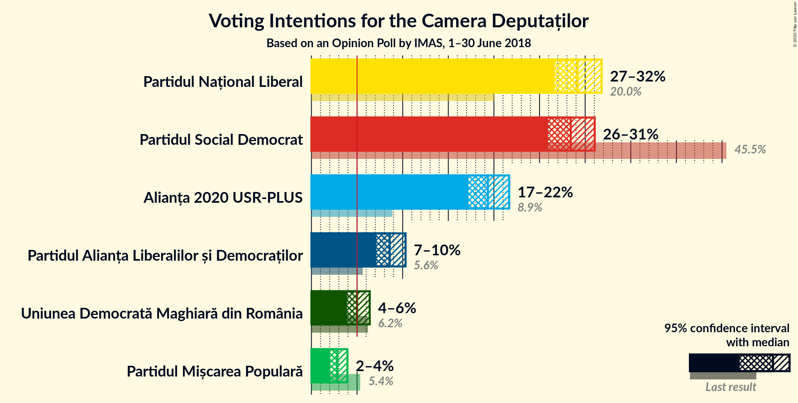

### Confidence Intervals

| Party | Last Result | Poll Result | 80% Confidence Interval | 90% Confidence Interval | 95% Confidence Interval | 99% Confidence Interval |
|:-----:|:-----------:|:-----------:|:-----------------------:|:-----------------------:|:-----------------------:|:-----------------------:|
| Partidul Național Liberal | 20.0% | 29.2% | 27.5–30.9% |27.1–31.4% |26.7–31.8% |25.9–32.6% |
| Partidul Social Democrat | 45.5% | 28.4% | 26.8–30.1% |26.3–30.6% |25.9–31.0% |25.2–31.9% |
| Alianța 2020 USR-PLUS | 8.9% | 19.3% | 17.9–20.9% |17.5–21.3% |17.2–21.7% |16.5–22.4% |
| Partidul Alianța Liberalilor și Democraților | 5.6% | 8.6% | 7.6–9.7% |7.3–10.0% |7.1–10.3% |6.7–10.9% |
| Uniunea Democrată Maghiară din România | 6.2% | 5.0% | 4.3–5.9% |4.1–6.2% |3.9–6.4% |3.6–6.8% |
| Partidul Mișcarea Populară | 5.4% | 2.8% | 2.3–3.6% |2.1–3.8% |2.0–3.9% |1.8–4.3% |

*Note:* The poll result column reflects the actual value used in the calculations. Published results may vary slightly, and in addition be rounded to fewer digits.

## Seats

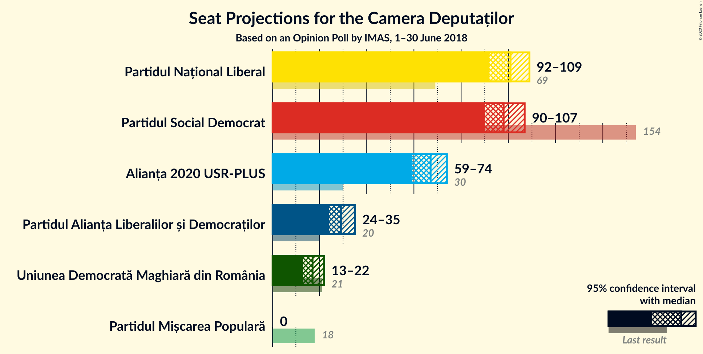

### Confidence Intervals

| Party | Last Result | Median | 80% Confidence Interval | 90% Confidence Interval | 95% Confidence Interval | 99% Confidence Interval |
|:-----:|:-----------:|:------:|:-----------------------:|:-----------------------:|:-----------------------:|:-----------------------:|
| <a href="#partidul-național-liberal">Partidul Național Liberal</a> | 69 | 100 | 95–107 |93–108 |92–109 |89–112 |
| <a href="#partidul-social-democrat">Partidul Social Democrat</a> | 154 | 98 | 92–104 |91–105 |89–107 |87–110 |
| <a href="#alianța-2020-usr-plus">Alianța 2020 USR-PLUS</a> | 30 | 67 | 62–72 |60–73 |59–75 |57–77 |
| <a href="#partidul-alianța-liberalilor-și-democraților">Partidul Alianța Liberalilor și Democraților</a> | 20 | 29 | 26–34 |25–34 |24–35 |23–37 |
| <a href="#uniunea-democrată-maghiară-din-românia">Uniunea Democrată Maghiară din România</a> | 21 | 17 | 14–20 |14–21 |13–22 |12–23 |
| <a href="#partidul-mișcarea-populară">Partidul Mișcarea Populară</a> | 18 | 0 | 0 |0 |0 |0 |

### Partidul Național Liberal

*For a full overview of the results for this party, see the [Partidul Național Liberal](party-partidulnaționalliberal.html) page.*

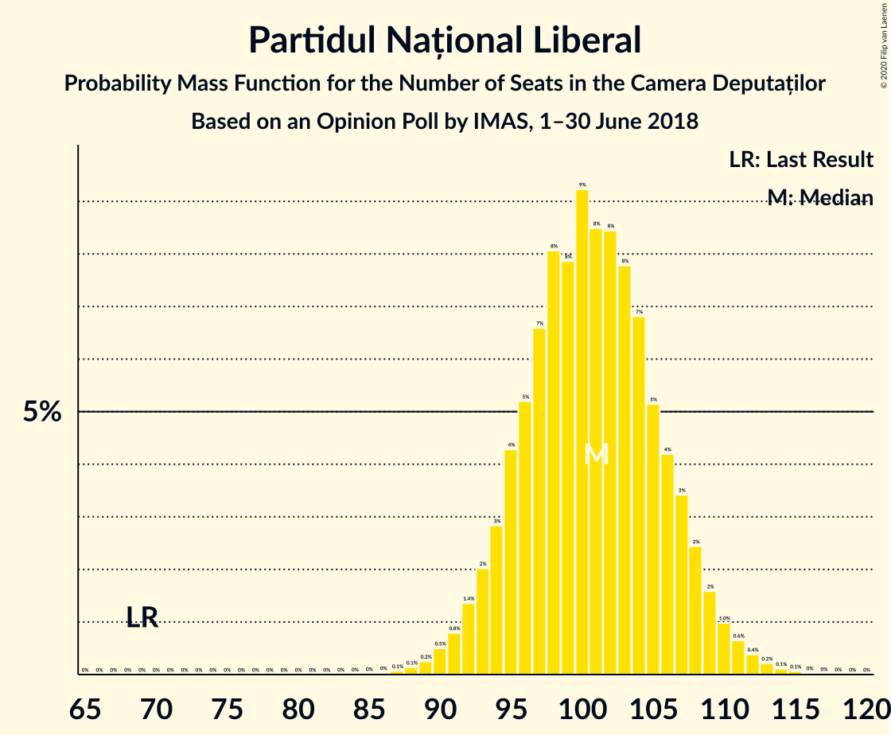

| Number of Seats | Probability | Accumulated | Special Marks |
|:---------------:|:-----------:|:-----------:|:-------------:|
| 69 | 0% | 100% | Last Result |
| 70 | 0% | 100% |  |
| 71 | 0% | 100% |  |
| 72 | 0% | 100% |  |
| 73 | 0% | 100% |  |
| 74 | 0% | 100% |  |
| 75 | 0% | 100% |  |
| 76 | 0% | 100% |  |
| 77 | 0% | 100% |  |
| 78 | 0% | 100% |  |
| 79 | 0% | 100% |  |
| 80 | 0% | 100% |  |
| 81 | 0% | 100% |  |
| 82 | 0% | 100% |  |
| 83 | 0% | 100% |  |
| 84 | 0% | 100% |  |
| 85 | 0% | 100% |  |
| 86 | 0% | 100% |  |
| 87 | 0.1% | 99.9% |  |
| 88 | 0.1% | 99.8% |  |
| 89 | 0.4% | 99.7% |  |
| 90 | 0.5% | 99.4% |  |
| 91 | 0.8% | 98.9% |  |
| 92 | 2% | 98% |  |
| 93 | 1.5% | 96% |  |
| 94 | 2% | 95% |  |
| 95 | 4% | 93% |  |
| 96 | 7% | 89% |  |
| 97 | 6% | 82% |  |
| 98 | 12% | 77% |  |
| 99 | 7% | 65% |  |
| 100 | 11% | 57% | Median |
| 101 | 8% | 46% |  |
| 102 | 8% | 38% |  |
| 103 | 4% | 29% |  |
| 104 | 5% | 25% |  |
| 105 | 5% | 21% |  |
| 106 | 4% | 15% |  |
| 107 | 3% | 12% |  |
| 108 | 4% | 9% |  |
| 109 | 2% | 5% |  |
| 110 | 1.2% | 2% |  |
| 111 | 0.5% | 1.2% |  |
| 112 | 0.3% | 0.7% |  |
| 113 | 0.1% | 0.4% |  |
| 114 | 0.1% | 0.2% |  |
| 115 | 0.1% | 0.1% |  |
| 116 | 0% | 0.1% |  |
| 117 | 0% | 0% |  |

### Partidul Social Democrat

*For a full overview of the results for this party, see the [Partidul Social Democrat](party-partidulsocialdemocrat.html) page.*

| Number of Seats | Probability | Accumulated | Special Marks |
|:---------------:|:-----------:|:-----------:|:-------------:|
| 84 | 0% | 100% |  |
| 85 | 0.1% | 99.9% |  |
| 86 | 0.2% | 99.9% |  |
| 87 | 0.5% | 99.7% |  |
| 88 | 0.8% | 99.2% |  |
| 89 | 1.3% | 98% |  |
| 90 | 2% | 97% |  |
| 91 | 2% | 95% |  |
| 92 | 4% | 93% |  |
| 93 | 3% | 89% |  |
| 94 | 5% | 86% |  |
| 95 | 9% | 81% |  |
| 96 | 8% | 72% |  |
| 97 | 12% | 64% |  |
| 98 | 7% | 53% | Median |
| 99 | 8% | 45% |  |
| 100 | 6% | 37% |  |
| 101 | 7% | 31% |  |
| 102 | 7% | 24% |  |
| 103 | 5% | 17% |  |
| 104 | 6% | 12% |  |
| 105 | 2% | 6% |  |
| 106 | 1.3% | 4% |  |
| 107 | 1.0% | 3% |  |
| 108 | 0.5% | 2% |  |
| 109 | 0.4% | 1.0% |  |
| 110 | 0.3% | 0.6% |  |
| 111 | 0.1% | 0.3% |  |
| 112 | 0.1% | 0.2% |  |
| 113 | 0.1% | 0.1% |  |
| 114 | 0% | 0% |  |
| 115 | 0% | 0% |  |
| 116 | 0% | 0% |  |
| 117 | 0% | 0% |  |
| 118 | 0% | 0% |  |
| 119 | 0% | 0% |  |
| 120 | 0% | 0% |  |
| 121 | 0% | 0% |  |
| 122 | 0% | 0% |  |
| 123 | 0% | 0% |  |
| 124 | 0% | 0% |  |
| 125 | 0% | 0% |  |
| 126 | 0% | 0% |  |
| 127 | 0% | 0% |  |
| 128 | 0% | 0% |  |
| 129 | 0% | 0% |  |
| 130 | 0% | 0% |  |
| 131 | 0% | 0% |  |
| 132 | 0% | 0% |  |
| 133 | 0% | 0% |  |
| 134 | 0% | 0% |  |
| 135 | 0% | 0% |  |
| 136 | 0% | 0% |  |
| 137 | 0% | 0% |  |
| 138 | 0% | 0% |  |
| 139 | 0% | 0% |  |
| 140 | 0% | 0% |  |
| 141 | 0% | 0% |  |
| 142 | 0% | 0% |  |
| 143 | 0% | 0% |  |
| 144 | 0% | 0% |  |
| 145 | 0% | 0% |  |
| 146 | 0% | 0% |  |
| 147 | 0% | 0% |  |
| 148 | 0% | 0% |  |
| 149 | 0% | 0% |  |
| 150 | 0% | 0% |  |
| 151 | 0% | 0% |  |
| 152 | 0% | 0% |  |
| 153 | 0% | 0% |  |
| 154 | 0% | 0% | Last Result |

### Alianța 2020 USR-PLUS

*For a full overview of the results for this party, see the [Alianța 2020 USR-PLUS](party-alianța2020usr-plus.html) page.*

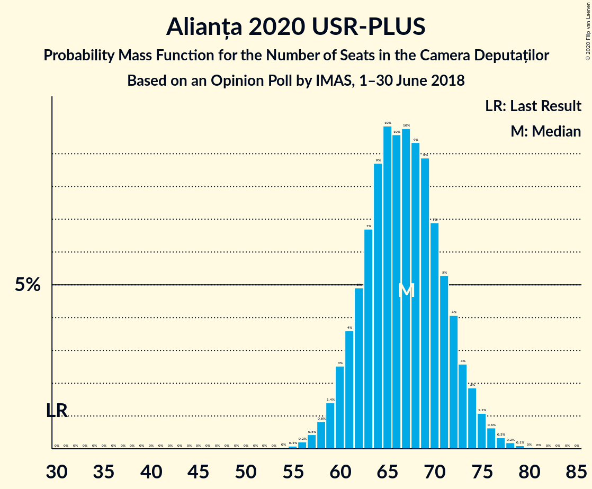

| Number of Seats | Probability | Accumulated | Special Marks |
|:---------------:|:-----------:|:-----------:|:-------------:|
| 30 | 0% | 100% | Last Result |
| 31 | 0% | 100% |  |
| 32 | 0% | 100% |  |
| 33 | 0% | 100% |  |
| 34 | 0% | 100% |  |
| 35 | 0% | 100% |  |
| 36 | 0% | 100% |  |
| 37 | 0% | 100% |  |
| 38 | 0% | 100% |  |
| 39 | 0% | 100% |  |
| 40 | 0% | 100% |  |
| 41 | 0% | 100% |  |
| 42 | 0% | 100% |  |
| 43 | 0% | 100% |  |
| 44 | 0% | 100% |  |
| 45 | 0% | 100% |  |
| 46 | 0% | 100% |  |
| 47 | 0% | 100% |  |
| 48 | 0% | 100% |  |
| 49 | 0% | 100% |  |
| 50 | 0% | 100% |  |
| 51 | 0% | 100% |  |
| 52 | 0% | 100% |  |
| 53 | 0% | 100% |  |
| 54 | 0% | 100% |  |
| 55 | 0.1% | 99.9% |  |
| 56 | 0.2% | 99.9% |  |
| 57 | 0.4% | 99.7% |  |
| 58 | 0.9% | 99.2% |  |
| 59 | 1.3% | 98% |  |
| 60 | 3% | 97% |  |
| 61 | 3% | 94% |  |
| 62 | 4% | 91% |  |
| 63 | 6% | 86% |  |
| 64 | 9% | 81% |  |
| 65 | 11% | 71% |  |
| 66 | 7% | 61% |  |
| 67 | 9% | 53% | Median |
| 68 | 10% | 44% |  |
| 69 | 10% | 34% |  |
| 70 | 8% | 24% |  |
| 71 | 6% | 17% |  |
| 72 | 4% | 11% |  |
| 73 | 3% | 7% |  |
| 74 | 2% | 4% |  |
| 75 | 1.0% | 3% |  |
| 76 | 0.8% | 2% |  |
| 77 | 0.4% | 0.7% |  |
| 78 | 0.2% | 0.4% |  |
| 79 | 0.1% | 0.2% |  |
| 80 | 0% | 0.1% |  |
| 81 | 0% | 0% |  |

### Partidul Alianța Liberalilor și Democraților

*For a full overview of the results for this party, see the [Partidul Alianța Liberalilor și Democraților](party-partidulalianțaliberalilorșidemocraților.html) page.*

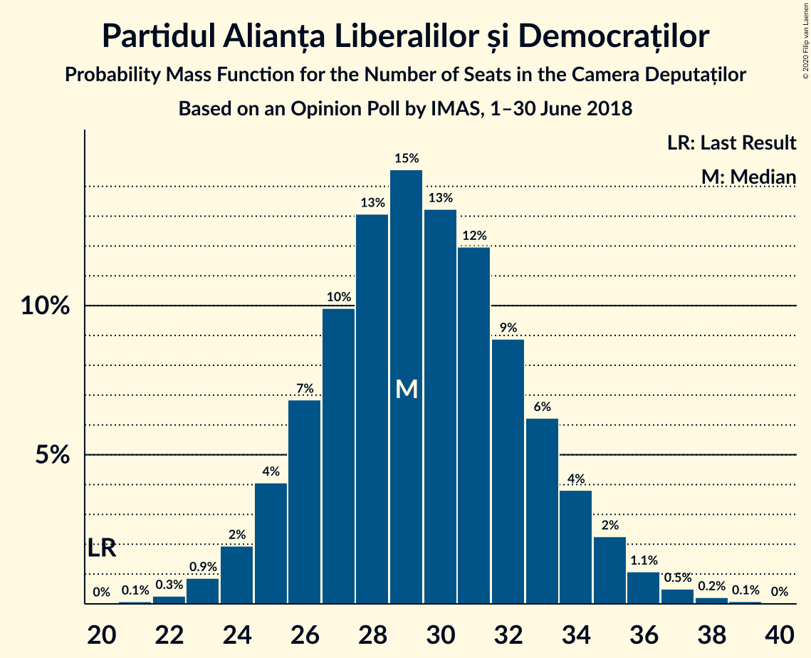

| Number of Seats | Probability | Accumulated | Special Marks |
|:---------------:|:-----------:|:-----------:|:-------------:|
| 20 | 0% | 100% | Last Result |
| 21 | 0.1% | 100% |  |
| 22 | 0.2% | 99.9% |  |
| 23 | 0.7% | 99.8% |  |
| 24 | 2% | 99.1% |  |
| 25 | 5% | 97% |  |
| 26 | 10% | 92% |  |
| 27 | 11% | 82% |  |
| 28 | 15% | 71% |  |
| 29 | 9% | 56% | Median |
| 30 | 6% | 48% |  |
| 31 | 12% | 41% |  |
| 32 | 9% | 29% |  |
| 33 | 9% | 20% |  |
| 34 | 6% | 11% |  |
| 35 | 3% | 5% |  |
| 36 | 1.3% | 2% |  |
| 37 | 0.3% | 0.6% |  |
| 38 | 0.1% | 0.3% |  |
| 39 | 0.1% | 0.1% |  |
| 40 | 0% | 0.1% |  |
| 41 | 0% | 0% |  |

### Uniunea Democrată Maghiară din România

*For a full overview of the results for this party, see the [Uniunea Democrată Maghiară din România](party-uniuneademocratămaghiarădinromânia.html) page.*

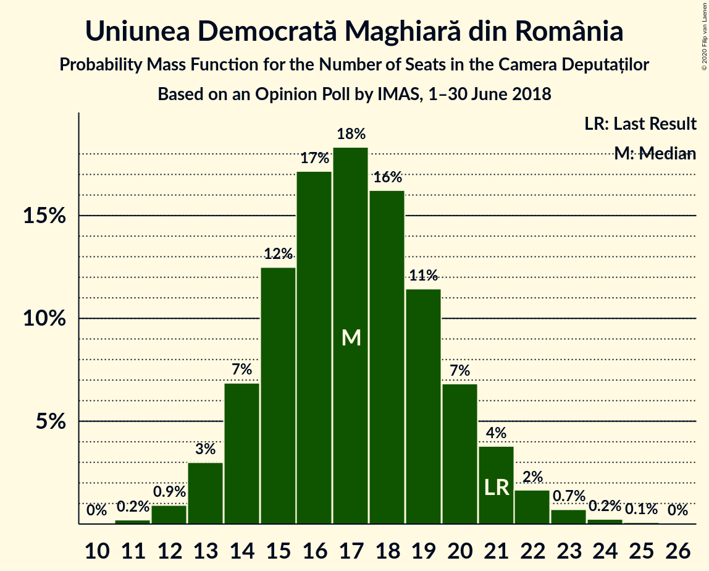

| Number of Seats | Probability | Accumulated | Special Marks |
|:---------------:|:-----------:|:-----------:|:-------------:|
| 11 | 0.2% | 100% |  |
| 12 | 0.9% | 99.8% |  |
| 13 | 3% | 98.9% |  |
| 14 | 7% | 96% |  |
| 15 | 14% | 89% |  |
| 16 | 15% | 74% |  |
| 17 | 19% | 60% | Median |
| 18 | 17% | 41% |  |
| 19 | 11% | 24% |  |
| 20 | 6% | 13% |  |
| 21 | 4% | 6% | Last Result |
| 22 | 2% | 3% |  |
| 23 | 0.6% | 0.9% |  |
| 24 | 0.2% | 0.3% |  |
| 25 | 0.1% | 0.1% |  |
| 26 | 0% | 0% |  |

### Partidul Mișcarea Populară

*For a full overview of the results for this party, see the [Partidul Mișcarea Populară](party-partidulmișcareapopulară.html) page.*

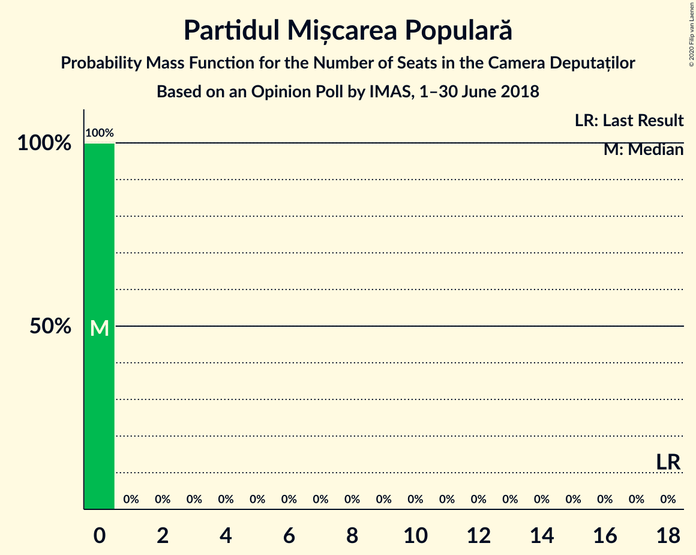

| Number of Seats | Probability | Accumulated | Special Marks |
|:---------------:|:-----------:|:-----------:|:-------------:|
| 0 | 100% | 100% | Median |
| 1 | 0% | 0% |  |
| 2 | 0% | 0% |  |
| 3 | 0% | 0% |  |
| 4 | 0% | 0% |  |
| 5 | 0% | 0% |  |
| 6 | 0% | 0% |  |
| 7 | 0% | 0% |  |
| 8 | 0% | 0% |  |
| 9 | 0% | 0% |  |
| 10 | 0% | 0% |  |
| 11 | 0% | 0% |  |
| 12 | 0% | 0% |  |
| 13 | 0% | 0% |  |
| 14 | 0% | 0% |  |
| 15 | 0% | 0% |  |
| 16 | 0% | 0% |  |
| 17 | 0% | 0% |  |
| 18 | 0% | 0% | Last Result |

## Coalitions

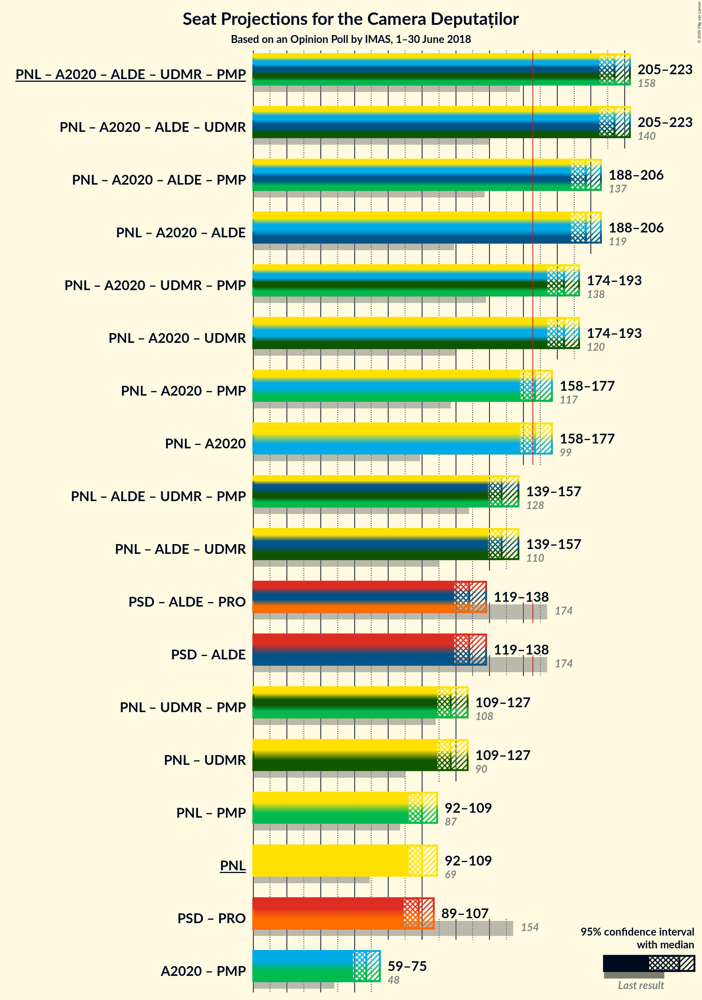

### Confidence Intervals

| Coalition | Last Result | Median | Majority? | 80% Confidence Interval | 90% Confidence Interval | 95% Confidence Interval | 99% Confidence Interval |
|:---------:|:-----------:|:------:|:---------:|:-----------------------:|:-----------------------:|:-----------------------:|:-----------------------:|
| Partidul Național Liberal – Alianța 2020 USR-PLUS – Partidul Alianța Liberalilor și Democraților – Uniunea Democrată Maghiară din România – Partidul Mișcarea Populară | 158 | 214 | 100% | 208–220 | 207–221 | 205–223 | 202–225 |
| Partidul Național Liberal – Alianța 2020 USR-PLUS – Partidul Alianța Liberalilor și Democraților – Uniunea Democrată Maghiară din România | 140 | 214 | 100% | 208–220 | 207–221 | 205–223 | 202–225 |
| Partidul Național Liberal – Alianța 2020 USR-PLUS – Partidul Alianța Liberalilor și Democraților – Partidul Mișcarea Populară | 137 | 197 | 100% | 191–203 | 189–204 | 188–206 | 185–209 |
| Partidul Național Liberal – Alianța 2020 USR-PLUS – Partidul Alianța Liberalilor și Democraților | 119 | 197 | 100% | 191–203 | 189–204 | 188–206 | 185–209 |
| Partidul Național Liberal – Alianța 2020 USR-PLUS – Uniunea Democrată Maghiară din România – Partidul Mișcarea Populară | 138 | 184 | 100% | 179–191 | 177–193 | 174–193 | 172–196 |
| Partidul Național Liberal – Alianța 2020 USR-PLUS – Uniunea Democrată Maghiară din România | 120 | 184 | 100% | 179–191 | 177–193 | 174–193 | 172–196 |
| Partidul Național Liberal – Alianța 2020 USR-PLUS – Partidul Mișcarea Populară | 117 | 167 | 63% | 162–174 | 160–176 | 158–177 | 155–179 |
| Partidul Național Liberal – Alianța 2020 USR-PLUS | 99 | 167 | 63% | 162–174 | 160–176 | 158–177 | 155–179 |
| Partidul Național Liberal – Partidul Alianța Liberalilor și Democraților – Uniunea Democrată Maghiară din România – Partidul Mișcarea Populară | 128 | 147 | 0% | 141–153 | 140–155 | 139–157 | 134–160 |
| Partidul Național Liberal – Partidul Alianța Liberalilor și Democraților – Uniunea Democrată Maghiară din România | 110 | 147 | 0% | 141–153 | 140–155 | 139–157 | 134–160 |
| Partidul Social Democrat – Partidul Alianța Liberalilor și Democraților | 174 | 128 | 0% | 121–133 | 119–135 | 119–138 | 116–140 |
| Partidul Național Liberal – Uniunea Democrată Maghiară din România – Partidul Mișcarea Populară | 108 | 117 | 0% | 112–124 | 110–126 | 109–127 | 106–129 |
| Partidul Național Liberal – Uniunea Democrată Maghiară din România | 90 | 117 | 0% | 112–124 | 110–126 | 109–127 | 106–129 |
| Partidul Național Liberal – Partidul Mișcarea Populară | 87 | 100 | 0% | 95–107 | 93–108 | 92–109 | 89–112 |
| Partidul Național Liberal | 69 | 100 | 0% | 95–107 | 93–108 | 92–109 | 89–112 |
| Alianța 2020 USR-PLUS – Partidul Mișcarea Populară | 48 | 67 | 0% | 62–72 | 60–73 | 59–75 | 57–77 |

### Partidul Național Liberal – Alianța 2020 USR-PLUS – Partidul Alianța Liberalilor și Democraților – Uniunea Democrată Maghiară din România – Partidul Mișcarea Populară

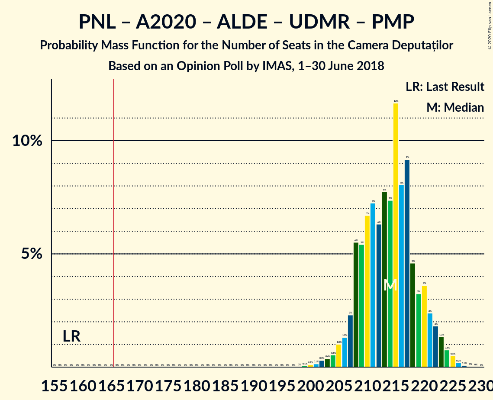

| Number of Seats | Probability | Accumulated | Special Marks |
|:---------------:|:-----------:|:-----------:|:-------------:|
| 158 | 0% | 100% | Last Result |
| 159 | 0% | 100% |  |
| 160 | 0% | 100% |  |
| 161 | 0% | 100% |  |
| 162 | 0% | 100% |  |
| 163 | 0% | 100% |  |
| 164 | 0% | 100% |  |
| 165 | 0% | 100% |  |
| 166 | 0% | 100% | Majority |
| 167 | 0% | 100% |  |
| 168 | 0% | 100% |  |
| 169 | 0% | 100% |  |
| 170 | 0% | 100% |  |
| 171 | 0% | 100% |  |
| 172 | 0% | 100% |  |
| 173 | 0% | 100% |  |
| 174 | 0% | 100% |  |
| 175 | 0% | 100% |  |
| 176 | 0% | 100% |  |
| 177 | 0% | 100% |  |
| 178 | 0% | 100% |  |
| 179 | 0% | 100% |  |
| 180 | 0% | 100% |  |
| 181 | 0% | 100% |  |
| 182 | 0% | 100% |  |
| 183 | 0% | 100% |  |
| 184 | 0% | 100% |  |
| 185 | 0% | 100% |  |
| 186 | 0% | 100% |  |
| 187 | 0% | 100% |  |
| 188 | 0% | 100% |  |
| 189 | 0% | 100% |  |
| 190 | 0% | 100% |  |
| 191 | 0% | 100% |  |
| 192 | 0% | 100% |  |
| 193 | 0% | 100% |  |
| 194 | 0% | 100% |  |
| 195 | 0% | 100% |  |
| 196 | 0% | 100% |  |
| 197 | 0% | 100% |  |
| 198 | 0% | 100% |  |
| 199 | 0.1% | 100% |  |
| 200 | 0.1% | 99.9% |  |
| 201 | 0.1% | 99.8% |  |
| 202 | 0.3% | 99.7% |  |
| 203 | 0.4% | 99.4% |  |
| 204 | 0.5% | 99.0% |  |
| 205 | 1.0% | 98% |  |
| 206 | 1.3% | 97% |  |
| 207 | 2% | 96% |  |
| 208 | 6% | 94% |  |
| 209 | 5% | 88% |  |
| 210 | 7% | 83% |  |
| 211 | 7% | 76% |  |
| 212 | 6% | 69% |  |
| 213 | 8% | 63% | Median |
| 214 | 7% | 55% |  |
| 215 | 12% | 47% |  |
| 216 | 8% | 36% |  |
| 217 | 9% | 28% |  |
| 218 | 5% | 19% |  |
| 219 | 3% | 14% |  |
| 220 | 4% | 11% |  |
| 221 | 2% | 7% |  |
| 222 | 2% | 5% |  |
| 223 | 1.3% | 3% |  |
| 224 | 0.8% | 2% |  |
| 225 | 0.5% | 0.8% |  |
| 226 | 0.2% | 0.3% |  |
| 227 | 0.1% | 0.1% |  |
| 228 | 0% | 0.1% |  |
| 229 | 0% | 0% |  |

### Partidul Național Liberal – Alianța 2020 USR-PLUS – Partidul Alianța Liberalilor și Democraților – Uniunea Democrată Maghiară din România

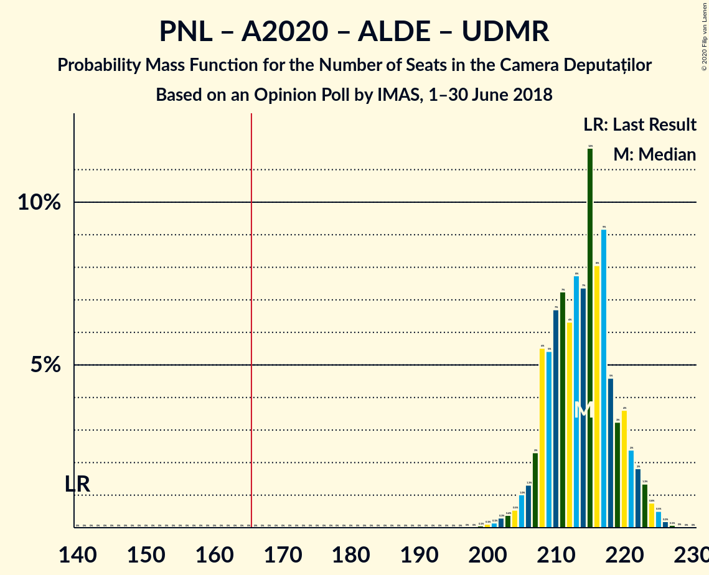

| Number of Seats | Probability | Accumulated | Special Marks |
|:---------------:|:-----------:|:-----------:|:-------------:|
| 140 | 0% | 100% | Last Result |
| 141 | 0% | 100% |  |
| 142 | 0% | 100% |  |
| 143 | 0% | 100% |  |
| 144 | 0% | 100% |  |
| 145 | 0% | 100% |  |
| 146 | 0% | 100% |  |
| 147 | 0% | 100% |  |
| 148 | 0% | 100% |  |
| 149 | 0% | 100% |  |
| 150 | 0% | 100% |  |
| 151 | 0% | 100% |  |
| 152 | 0% | 100% |  |
| 153 | 0% | 100% |  |
| 154 | 0% | 100% |  |
| 155 | 0% | 100% |  |
| 156 | 0% | 100% |  |
| 157 | 0% | 100% |  |
| 158 | 0% | 100% |  |
| 159 | 0% | 100% |  |
| 160 | 0% | 100% |  |
| 161 | 0% | 100% |  |
| 162 | 0% | 100% |  |
| 163 | 0% | 100% |  |
| 164 | 0% | 100% |  |
| 165 | 0% | 100% |  |
| 166 | 0% | 100% | Majority |
| 167 | 0% | 100% |  |
| 168 | 0% | 100% |  |
| 169 | 0% | 100% |  |
| 170 | 0% | 100% |  |
| 171 | 0% | 100% |  |
| 172 | 0% | 100% |  |
| 173 | 0% | 100% |  |
| 174 | 0% | 100% |  |
| 175 | 0% | 100% |  |
| 176 | 0% | 100% |  |
| 177 | 0% | 100% |  |
| 178 | 0% | 100% |  |
| 179 | 0% | 100% |  |
| 180 | 0% | 100% |  |
| 181 | 0% | 100% |  |
| 182 | 0% | 100% |  |
| 183 | 0% | 100% |  |
| 184 | 0% | 100% |  |
| 185 | 0% | 100% |  |
| 186 | 0% | 100% |  |
| 187 | 0% | 100% |  |
| 188 | 0% | 100% |  |
| 189 | 0% | 100% |  |
| 190 | 0% | 100% |  |
| 191 | 0% | 100% |  |
| 192 | 0% | 100% |  |
| 193 | 0% | 100% |  |
| 194 | 0% | 100% |  |
| 195 | 0% | 100% |  |
| 196 | 0% | 100% |  |
| 197 | 0% | 100% |  |
| 198 | 0% | 100% |  |
| 199 | 0.1% | 100% |  |
| 200 | 0.1% | 99.9% |  |
| 201 | 0.1% | 99.8% |  |
| 202 | 0.3% | 99.7% |  |
| 203 | 0.4% | 99.4% |  |
| 204 | 0.5% | 99.0% |  |
| 205 | 1.0% | 98% |  |
| 206 | 1.3% | 97% |  |
| 207 | 2% | 96% |  |
| 208 | 6% | 94% |  |
| 209 | 5% | 88% |  |
| 210 | 7% | 83% |  |
| 211 | 7% | 76% |  |
| 212 | 6% | 69% |  |
| 213 | 8% | 63% | Median |
| 214 | 7% | 55% |  |
| 215 | 12% | 47% |  |
| 216 | 8% | 36% |  |
| 217 | 9% | 28% |  |
| 218 | 5% | 19% |  |
| 219 | 3% | 14% |  |
| 220 | 4% | 11% |  |
| 221 | 2% | 7% |  |
| 222 | 2% | 5% |  |
| 223 | 1.3% | 3% |  |
| 224 | 0.8% | 2% |  |
| 225 | 0.5% | 0.8% |  |
| 226 | 0.2% | 0.3% |  |
| 227 | 0.1% | 0.1% |  |
| 228 | 0% | 0.1% |  |
| 229 | 0% | 0% |  |

### Partidul Național Liberal – Alianța 2020 USR-PLUS – Partidul Alianța Liberalilor și Democraților – Partidul Mișcarea Populară

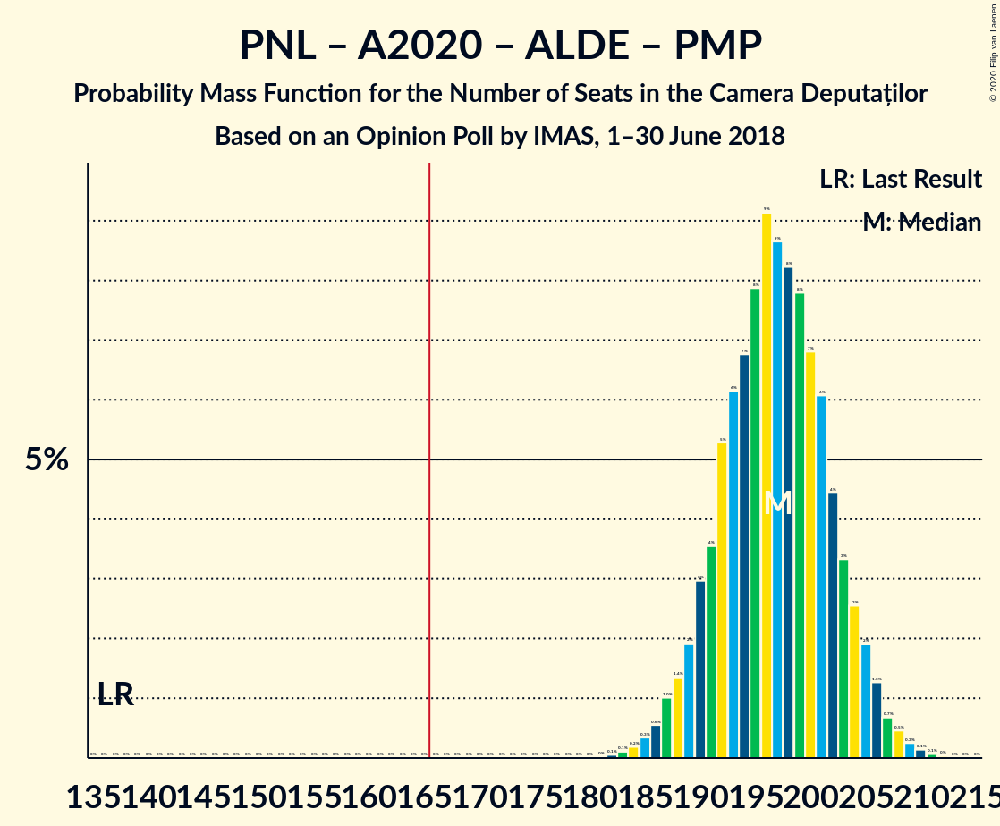

| Number of Seats | Probability | Accumulated | Special Marks |
|:---------------:|:-----------:|:-----------:|:-------------:|
| 137 | 0% | 100% | Last Result |
| 138 | 0% | 100% |  |
| 139 | 0% | 100% |  |
| 140 | 0% | 100% |  |
| 141 | 0% | 100% |  |
| 142 | 0% | 100% |  |
| 143 | 0% | 100% |  |
| 144 | 0% | 100% |  |
| 145 | 0% | 100% |  |
| 146 | 0% | 100% |  |
| 147 | 0% | 100% |  |
| 148 | 0% | 100% |  |
| 149 | 0% | 100% |  |
| 150 | 0% | 100% |  |
| 151 | 0% | 100% |  |
| 152 | 0% | 100% |  |
| 153 | 0% | 100% |  |
| 154 | 0% | 100% |  |
| 155 | 0% | 100% |  |
| 156 | 0% | 100% |  |
| 157 | 0% | 100% |  |
| 158 | 0% | 100% |  |
| 159 | 0% | 100% |  |
| 160 | 0% | 100% |  |
| 161 | 0% | 100% |  |
| 162 | 0% | 100% |  |
| 163 | 0% | 100% |  |
| 164 | 0% | 100% |  |
| 165 | 0% | 100% |  |
| 166 | 0% | 100% | Majority |
| 167 | 0% | 100% |  |
| 168 | 0% | 100% |  |
| 169 | 0% | 100% |  |
| 170 | 0% | 100% |  |
| 171 | 0% | 100% |  |
| 172 | 0% | 100% |  |
| 173 | 0% | 100% |  |
| 174 | 0% | 100% |  |
| 175 | 0% | 100% |  |
| 176 | 0% | 100% |  |
| 177 | 0% | 100% |  |
| 178 | 0% | 100% |  |
| 179 | 0% | 100% |  |
| 180 | 0% | 100% |  |
| 181 | 0% | 100% |  |
| 182 | 0.1% | 99.9% |  |
| 183 | 0.1% | 99.9% |  |
| 184 | 0.1% | 99.7% |  |
| 185 | 0.4% | 99.6% |  |
| 186 | 0.5% | 99.3% |  |
| 187 | 0.9% | 98.8% |  |
| 188 | 1.3% | 98% |  |
| 189 | 3% | 97% |  |
| 190 | 3% | 94% |  |
| 191 | 4% | 91% |  |
| 192 | 5% | 88% |  |
| 193 | 8% | 82% |  |
| 194 | 5% | 75% |  |
| 195 | 5% | 69% |  |
| 196 | 10% | 64% | Median |
| 197 | 8% | 54% |  |
| 198 | 10% | 46% |  |
| 199 | 9% | 36% |  |
| 200 | 7% | 28% |  |
| 201 | 6% | 21% |  |
| 202 | 5% | 15% |  |
| 203 | 3% | 10% |  |
| 204 | 3% | 7% |  |
| 205 | 1.3% | 5% |  |
| 206 | 2% | 3% |  |
| 207 | 0.6% | 2% |  |
| 208 | 0.5% | 1.0% |  |
| 209 | 0.3% | 0.6% |  |
| 210 | 0.2% | 0.3% |  |
| 211 | 0.1% | 0.1% |  |
| 212 | 0% | 0.1% |  |
| 213 | 0% | 0% |  |

### Partidul Național Liberal – Alianța 2020 USR-PLUS – Partidul Alianța Liberalilor și Democraților

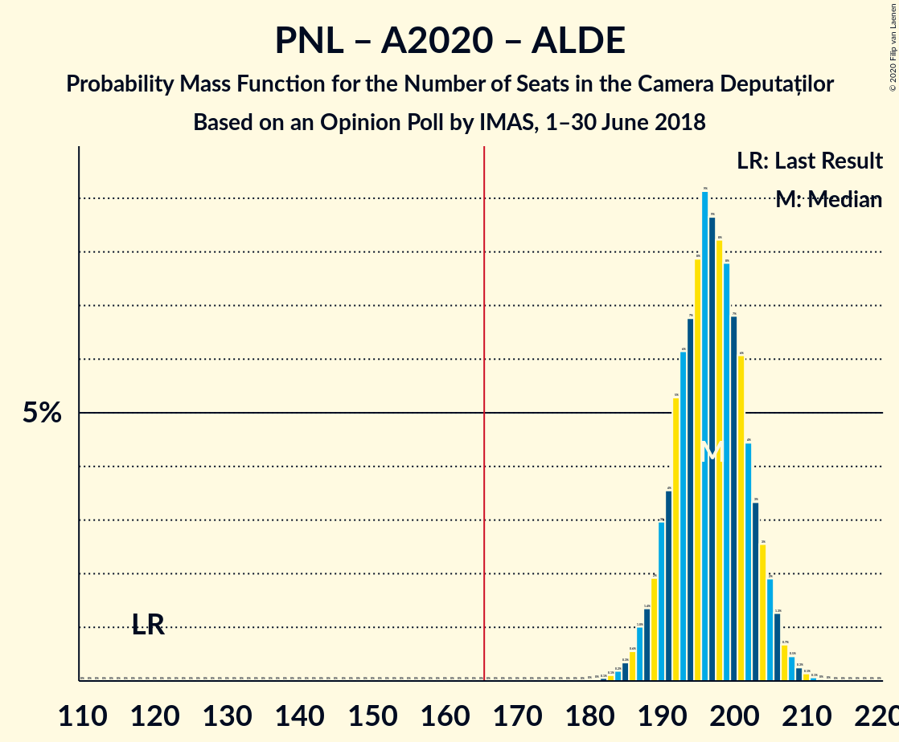

| Number of Seats | Probability | Accumulated | Special Marks |
|:---------------:|:-----------:|:-----------:|:-------------:|
| 119 | 0% | 100% | Last Result |
| 120 | 0% | 100% |  |
| 121 | 0% | 100% |  |
| 122 | 0% | 100% |  |
| 123 | 0% | 100% |  |
| 124 | 0% | 100% |  |
| 125 | 0% | 100% |  |
| 126 | 0% | 100% |  |
| 127 | 0% | 100% |  |
| 128 | 0% | 100% |  |
| 129 | 0% | 100% |  |
| 130 | 0% | 100% |  |
| 131 | 0% | 100% |  |
| 132 | 0% | 100% |  |
| 133 | 0% | 100% |  |
| 134 | 0% | 100% |  |
| 135 | 0% | 100% |  |
| 136 | 0% | 100% |  |
| 137 | 0% | 100% |  |
| 138 | 0% | 100% |  |
| 139 | 0% | 100% |  |
| 140 | 0% | 100% |  |
| 141 | 0% | 100% |  |
| 142 | 0% | 100% |  |
| 143 | 0% | 100% |  |
| 144 | 0% | 100% |  |
| 145 | 0% | 100% |  |
| 146 | 0% | 100% |  |
| 147 | 0% | 100% |  |
| 148 | 0% | 100% |  |
| 149 | 0% | 100% |  |
| 150 | 0% | 100% |  |
| 151 | 0% | 100% |  |
| 152 | 0% | 100% |  |
| 153 | 0% | 100% |  |
| 154 | 0% | 100% |  |
| 155 | 0% | 100% |  |
| 156 | 0% | 100% |  |
| 157 | 0% | 100% |  |
| 158 | 0% | 100% |  |
| 159 | 0% | 100% |  |
| 160 | 0% | 100% |  |
| 161 | 0% | 100% |  |
| 162 | 0% | 100% |  |
| 163 | 0% | 100% |  |
| 164 | 0% | 100% |  |
| 165 | 0% | 100% |  |
| 166 | 0% | 100% | Majority |
| 167 | 0% | 100% |  |
| 168 | 0% | 100% |  |
| 169 | 0% | 100% |  |
| 170 | 0% | 100% |  |
| 171 | 0% | 100% |  |
| 172 | 0% | 100% |  |
| 173 | 0% | 100% |  |
| 174 | 0% | 100% |  |
| 175 | 0% | 100% |  |
| 176 | 0% | 100% |  |
| 177 | 0% | 100% |  |
| 178 | 0% | 100% |  |
| 179 | 0% | 100% |  |
| 180 | 0% | 100% |  |
| 181 | 0% | 100% |  |
| 182 | 0.1% | 99.9% |  |
| 183 | 0.1% | 99.9% |  |
| 184 | 0.1% | 99.7% |  |
| 185 | 0.4% | 99.6% |  |
| 186 | 0.5% | 99.3% |  |
| 187 | 0.9% | 98.8% |  |
| 188 | 1.3% | 98% |  |
| 189 | 3% | 97% |  |
| 190 | 3% | 94% |  |
| 191 | 4% | 91% |  |
| 192 | 5% | 88% |  |
| 193 | 8% | 82% |  |
| 194 | 5% | 75% |  |
| 195 | 5% | 69% |  |
| 196 | 10% | 64% | Median |
| 197 | 8% | 54% |  |
| 198 | 10% | 46% |  |
| 199 | 9% | 36% |  |
| 200 | 7% | 28% |  |
| 201 | 6% | 21% |  |
| 202 | 5% | 15% |  |
| 203 | 3% | 10% |  |
| 204 | 3% | 7% |  |
| 205 | 1.3% | 5% |  |
| 206 | 2% | 3% |  |
| 207 | 0.6% | 2% |  |
| 208 | 0.5% | 1.0% |  |
| 209 | 0.3% | 0.6% |  |
| 210 | 0.2% | 0.3% |  |
| 211 | 0.1% | 0.1% |  |
| 212 | 0% | 0.1% |  |
| 213 | 0% | 0% |  |

### Partidul Național Liberal – Alianța 2020 USR-PLUS – Uniunea Democrată Maghiară din România – Partidul Mișcarea Populară

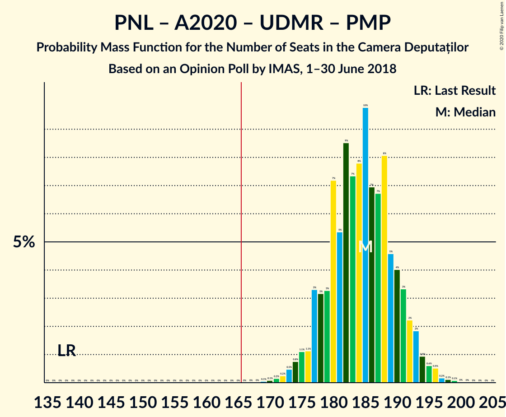

| Number of Seats | Probability | Accumulated | Special Marks |
|:---------------:|:-----------:|:-----------:|:-------------:|
| 138 | 0% | 100% | Last Result |
| 139 | 0% | 100% |  |
| 140 | 0% | 100% |  |
| 141 | 0% | 100% |  |
| 142 | 0% | 100% |  |
| 143 | 0% | 100% |  |
| 144 | 0% | 100% |  |
| 145 | 0% | 100% |  |
| 146 | 0% | 100% |  |
| 147 | 0% | 100% |  |
| 148 | 0% | 100% |  |
| 149 | 0% | 100% |  |
| 150 | 0% | 100% |  |
| 151 | 0% | 100% |  |
| 152 | 0% | 100% |  |
| 153 | 0% | 100% |  |
| 154 | 0% | 100% |  |
| 155 | 0% | 100% |  |
| 156 | 0% | 100% |  |
| 157 | 0% | 100% |  |
| 158 | 0% | 100% |  |
| 159 | 0% | 100% |  |
| 160 | 0% | 100% |  |
| 161 | 0% | 100% |  |
| 162 | 0% | 100% |  |
| 163 | 0% | 100% |  |
| 164 | 0% | 100% |  |
| 165 | 0% | 100% |  |
| 166 | 0% | 100% | Majority |
| 167 | 0% | 100% |  |
| 168 | 0% | 100% |  |
| 169 | 0% | 100% |  |
| 170 | 0.1% | 100% |  |
| 171 | 0.3% | 99.8% |  |
| 172 | 0.1% | 99.6% |  |
| 173 | 0.9% | 99.4% |  |
| 174 | 1.4% | 98.5% |  |
| 175 | 0.5% | 97% |  |
| 176 | 0.5% | 97% |  |
| 177 | 3% | 96% |  |
| 178 | 3% | 93% |  |
| 179 | 3% | 91% |  |
| 180 | 3% | 88% |  |
| 181 | 10% | 85% |  |
| 182 | 14% | 75% |  |
| 183 | 4% | 60% |  |
| 184 | 14% | 57% | Median |
| 185 | 9% | 43% |  |
| 186 | 4% | 33% |  |
| 187 | 4% | 29% |  |
| 188 | 3% | 26% |  |
| 189 | 7% | 23% |  |
| 190 | 5% | 16% |  |
| 191 | 1.3% | 11% |  |
| 192 | 5% | 10% |  |
| 193 | 3% | 5% |  |
| 194 | 0.3% | 2% |  |
| 195 | 0.5% | 1.4% |  |
| 196 | 0.5% | 0.9% |  |
| 197 | 0.1% | 0.4% |  |
| 198 | 0.1% | 0.2% |  |
| 199 | 0.1% | 0.1% |  |
| 200 | 0.1% | 0.1% |  |
| 201 | 0% | 0% |  |

### Partidul Național Liberal – Alianța 2020 USR-PLUS – Uniunea Democrată Maghiară din România

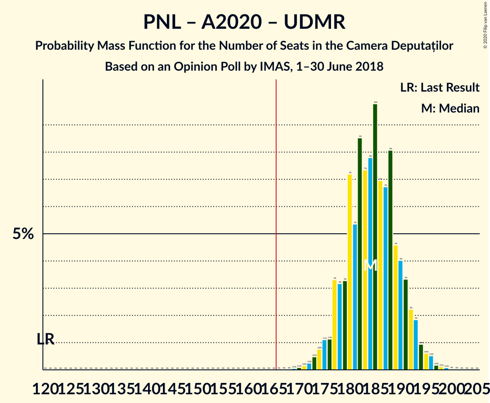

| Number of Seats | Probability | Accumulated | Special Marks |
|:---------------:|:-----------:|:-----------:|:-------------:|
| 120 | 0% | 100% | Last Result |
| 121 | 0% | 100% |  |
| 122 | 0% | 100% |  |
| 123 | 0% | 100% |  |
| 124 | 0% | 100% |  |
| 125 | 0% | 100% |  |
| 126 | 0% | 100% |  |
| 127 | 0% | 100% |  |
| 128 | 0% | 100% |  |
| 129 | 0% | 100% |  |
| 130 | 0% | 100% |  |
| 131 | 0% | 100% |  |
| 132 | 0% | 100% |  |
| 133 | 0% | 100% |  |
| 134 | 0% | 100% |  |
| 135 | 0% | 100% |  |
| 136 | 0% | 100% |  |
| 137 | 0% | 100% |  |
| 138 | 0% | 100% |  |
| 139 | 0% | 100% |  |
| 140 | 0% | 100% |  |
| 141 | 0% | 100% |  |
| 142 | 0% | 100% |  |
| 143 | 0% | 100% |  |
| 144 | 0% | 100% |  |
| 145 | 0% | 100% |  |
| 146 | 0% | 100% |  |
| 147 | 0% | 100% |  |
| 148 | 0% | 100% |  |
| 149 | 0% | 100% |  |
| 150 | 0% | 100% |  |
| 151 | 0% | 100% |  |
| 152 | 0% | 100% |  |
| 153 | 0% | 100% |  |
| 154 | 0% | 100% |  |
| 155 | 0% | 100% |  |
| 156 | 0% | 100% |  |
| 157 | 0% | 100% |  |
| 158 | 0% | 100% |  |
| 159 | 0% | 100% |  |
| 160 | 0% | 100% |  |
| 161 | 0% | 100% |  |
| 162 | 0% | 100% |  |
| 163 | 0% | 100% |  |
| 164 | 0% | 100% |  |
| 165 | 0% | 100% |  |
| 166 | 0% | 100% | Majority |
| 167 | 0% | 100% |  |
| 168 | 0% | 100% |  |
| 169 | 0% | 100% |  |
| 170 | 0.1% | 100% |  |
| 171 | 0.3% | 99.8% |  |
| 172 | 0.1% | 99.6% |  |
| 173 | 0.9% | 99.4% |  |
| 174 | 1.4% | 98.5% |  |
| 175 | 0.5% | 97% |  |
| 176 | 0.5% | 97% |  |
| 177 | 3% | 96% |  |
| 178 | 3% | 93% |  |
| 179 | 3% | 91% |  |
| 180 | 3% | 88% |  |
| 181 | 10% | 85% |  |
| 182 | 14% | 75% |  |
| 183 | 4% | 60% |  |
| 184 | 14% | 57% | Median |
| 185 | 9% | 43% |  |
| 186 | 4% | 33% |  |
| 187 | 4% | 29% |  |
| 188 | 3% | 26% |  |
| 189 | 7% | 23% |  |
| 190 | 5% | 16% |  |
| 191 | 1.3% | 11% |  |
| 192 | 5% | 10% |  |
| 193 | 3% | 5% |  |
| 194 | 0.3% | 2% |  |
| 195 | 0.5% | 1.4% |  |
| 196 | 0.5% | 0.9% |  |
| 197 | 0.1% | 0.4% |  |
| 198 | 0.1% | 0.2% |  |
| 199 | 0.1% | 0.1% |  |
| 200 | 0.1% | 0.1% |  |
| 201 | 0% | 0% |  |

### Partidul Național Liberal – Alianța 2020 USR-PLUS – Partidul Mișcarea Populară

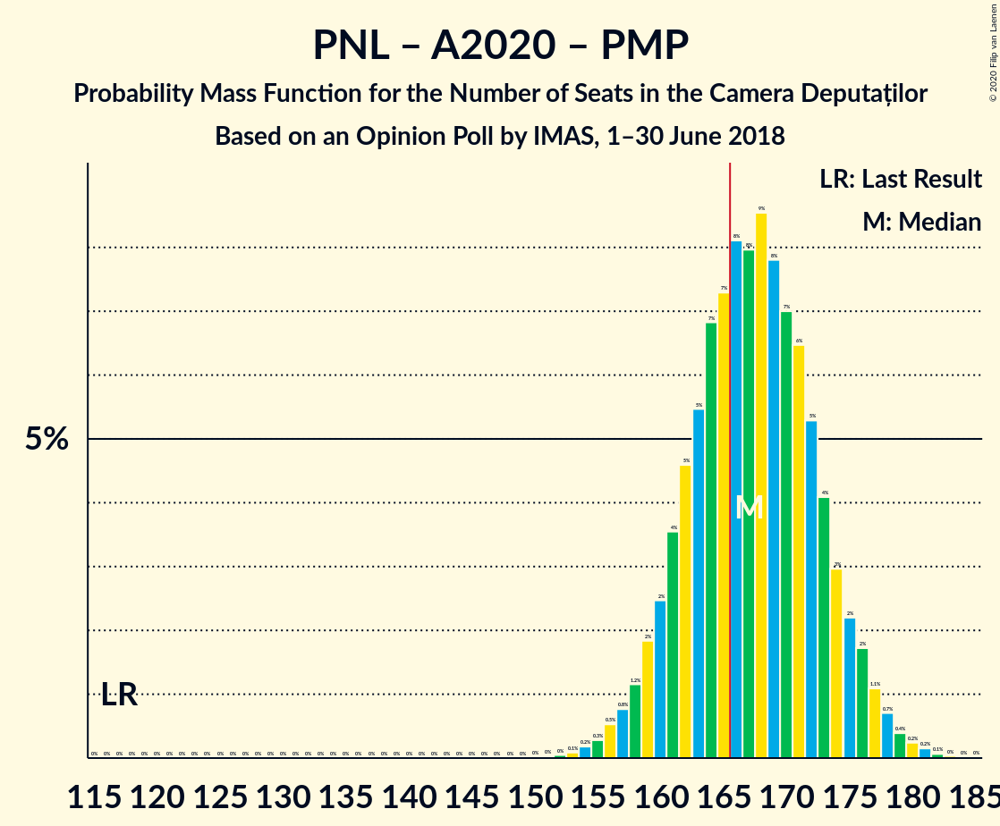

| Number of Seats | Probability | Accumulated | Special Marks |
|:---------------:|:-----------:|:-----------:|:-------------:|
| 117 | 0% | 100% | Last Result |
| 118 | 0% | 100% |  |
| 119 | 0% | 100% |  |
| 120 | 0% | 100% |  |
| 121 | 0% | 100% |  |
| 122 | 0% | 100% |  |
| 123 | 0% | 100% |  |
| 124 | 0% | 100% |  |
| 125 | 0% | 100% |  |
| 126 | 0% | 100% |  |
| 127 | 0% | 100% |  |
| 128 | 0% | 100% |  |
| 129 | 0% | 100% |  |
| 130 | 0% | 100% |  |
| 131 | 0% | 100% |  |
| 132 | 0% | 100% |  |
| 133 | 0% | 100% |  |
| 134 | 0% | 100% |  |
| 135 | 0% | 100% |  |
| 136 | 0% | 100% |  |
| 137 | 0% | 100% |  |
| 138 | 0% | 100% |  |
| 139 | 0% | 100% |  |
| 140 | 0% | 100% |  |
| 141 | 0% | 100% |  |
| 142 | 0% | 100% |  |
| 143 | 0% | 100% |  |
| 144 | 0% | 100% |  |
| 145 | 0% | 100% |  |
| 146 | 0% | 100% |  |
| 147 | 0% | 100% |  |
| 148 | 0% | 100% |  |
| 149 | 0% | 100% |  |
| 150 | 0% | 100% |  |
| 151 | 0% | 100% |  |
| 152 | 0.1% | 100% |  |
| 153 | 0.1% | 99.9% |  |
| 154 | 0.3% | 99.8% |  |
| 155 | 0.2% | 99.6% |  |
| 156 | 0.7% | 99.4% |  |
| 157 | 0.9% | 98.6% |  |
| 158 | 0.9% | 98% |  |
| 159 | 1.5% | 97% |  |
| 160 | 3% | 95% |  |
| 161 | 2% | 92% |  |
| 162 | 4% | 90% |  |
| 163 | 6% | 86% |  |
| 164 | 10% | 80% |  |
| 165 | 7% | 70% |  |
| 166 | 9% | 63% | Majority |
| 167 | 6% | 55% | Median |
| 168 | 9% | 48% |  |
| 169 | 9% | 39% |  |
| 170 | 5% | 30% |  |
| 171 | 6% | 25% |  |
| 172 | 4% | 19% |  |
| 173 | 4% | 15% |  |
| 174 | 3% | 11% |  |
| 175 | 3% | 8% |  |
| 176 | 2% | 5% |  |
| 177 | 1.4% | 3% |  |
| 178 | 1.0% | 2% |  |
| 179 | 0.4% | 0.8% |  |
| 180 | 0.1% | 0.5% |  |
| 181 | 0.2% | 0.3% |  |
| 182 | 0.1% | 0.1% |  |
| 183 | 0% | 0.1% |  |
| 184 | 0% | 0% |  |

### Partidul Național Liberal – Alianța 2020 USR-PLUS

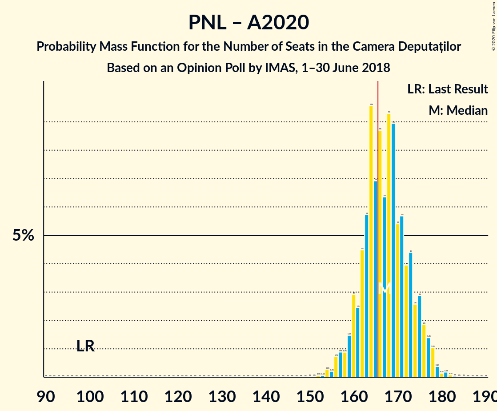

| Number of Seats | Probability | Accumulated | Special Marks |
|:---------------:|:-----------:|:-----------:|:-------------:|
| 99 | 0% | 100% | Last Result |
| 100 | 0% | 100% |  |
| 101 | 0% | 100% |  |
| 102 | 0% | 100% |  |
| 103 | 0% | 100% |  |
| 104 | 0% | 100% |  |
| 105 | 0% | 100% |  |
| 106 | 0% | 100% |  |
| 107 | 0% | 100% |  |
| 108 | 0% | 100% |  |
| 109 | 0% | 100% |  |
| 110 | 0% | 100% |  |
| 111 | 0% | 100% |  |
| 112 | 0% | 100% |  |
| 113 | 0% | 100% |  |
| 114 | 0% | 100% |  |
| 115 | 0% | 100% |  |
| 116 | 0% | 100% |  |
| 117 | 0% | 100% |  |
| 118 | 0% | 100% |  |
| 119 | 0% | 100% |  |
| 120 | 0% | 100% |  |
| 121 | 0% | 100% |  |
| 122 | 0% | 100% |  |
| 123 | 0% | 100% |  |
| 124 | 0% | 100% |  |
| 125 | 0% | 100% |  |
| 126 | 0% | 100% |  |
| 127 | 0% | 100% |  |
| 128 | 0% | 100% |  |
| 129 | 0% | 100% |  |
| 130 | 0% | 100% |  |
| 131 | 0% | 100% |  |
| 132 | 0% | 100% |  |
| 133 | 0% | 100% |  |
| 134 | 0% | 100% |  |
| 135 | 0% | 100% |  |
| 136 | 0% | 100% |  |
| 137 | 0% | 100% |  |
| 138 | 0% | 100% |  |
| 139 | 0% | 100% |  |
| 140 | 0% | 100% |  |
| 141 | 0% | 100% |  |
| 142 | 0% | 100% |  |
| 143 | 0% | 100% |  |
| 144 | 0% | 100% |  |
| 145 | 0% | 100% |  |
| 146 | 0% | 100% |  |
| 147 | 0% | 100% |  |
| 148 | 0% | 100% |  |
| 149 | 0% | 100% |  |
| 150 | 0% | 100% |  |
| 151 | 0% | 100% |  |
| 152 | 0.1% | 100% |  |
| 153 | 0.1% | 99.9% |  |
| 154 | 0.3% | 99.8% |  |
| 155 | 0.2% | 99.6% |  |
| 156 | 0.7% | 99.3% |  |
| 157 | 0.9% | 98.6% |  |
| 158 | 0.9% | 98% |  |
| 159 | 1.5% | 97% |  |
| 160 | 3% | 95% |  |
| 161 | 2% | 92% |  |
| 162 | 4% | 90% |  |
| 163 | 6% | 86% |  |
| 164 | 10% | 80% |  |
| 165 | 7% | 70% |  |
| 166 | 9% | 63% | Majority |
| 167 | 6% | 55% | Median |
| 168 | 9% | 48% |  |
| 169 | 9% | 39% |  |
| 170 | 5% | 30% |  |
| 171 | 6% | 25% |  |
| 172 | 4% | 19% |  |
| 173 | 4% | 15% |  |
| 174 | 3% | 11% |  |
| 175 | 3% | 8% |  |
| 176 | 2% | 5% |  |
| 177 | 1.4% | 3% |  |
| 178 | 1.0% | 2% |  |
| 179 | 0.4% | 0.8% |  |
| 180 | 0.1% | 0.5% |  |
| 181 | 0.2% | 0.3% |  |
| 182 | 0.1% | 0.1% |  |
| 183 | 0% | 0.1% |  |
| 184 | 0% | 0% |  |

### Partidul Național Liberal – Partidul Alianța Liberalilor și Democraților – Uniunea Democrată Maghiară din România – Partidul Mișcarea Populară

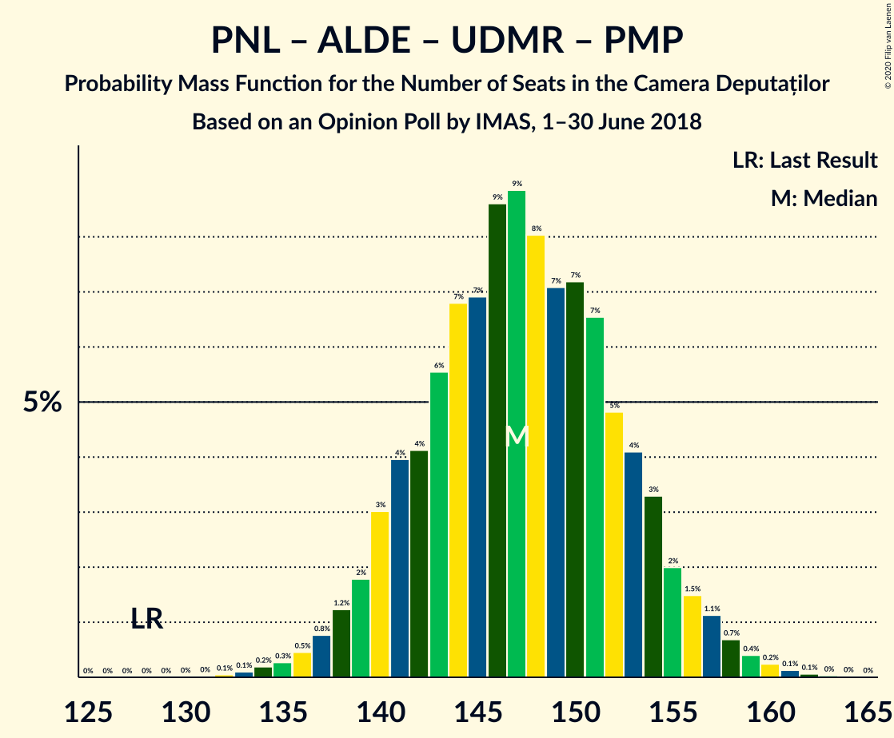

| Number of Seats | Probability | Accumulated | Special Marks |
|:---------------:|:-----------:|:-----------:|:-------------:|
| 128 | 0% | 100% | Last Result |
| 129 | 0% | 100% |  |
| 130 | 0% | 100% |  |
| 131 | 0% | 100% |  |
| 132 | 0.1% | 100% |  |
| 133 | 0.1% | 99.9% |  |
| 134 | 0.3% | 99.8% |  |
| 135 | 0.3% | 99.5% |  |
| 136 | 0.3% | 99.1% |  |
| 137 | 0.4% | 98.8% |  |
| 138 | 0.8% | 98% |  |
| 139 | 1.4% | 98% |  |
| 140 | 3% | 96% |  |
| 141 | 6% | 93% |  |
| 142 | 7% | 87% |  |
| 143 | 7% | 80% |  |
| 144 | 4% | 72% |  |
| 145 | 6% | 68% |  |
| 146 | 8% | 63% | Median |
| 147 | 5% | 54% |  |
| 148 | 8% | 50% |  |
| 149 | 11% | 42% |  |
| 150 | 6% | 32% |  |
| 151 | 9% | 26% |  |
| 152 | 5% | 16% |  |
| 153 | 3% | 12% |  |
| 154 | 2% | 9% |  |
| 155 | 2% | 6% |  |
| 156 | 1.3% | 5% |  |
| 157 | 1.2% | 4% |  |
| 158 | 1.1% | 2% |  |
| 159 | 0.6% | 1.2% |  |
| 160 | 0.4% | 0.6% |  |
| 161 | 0.1% | 0.2% |  |
| 162 | 0% | 0.1% |  |
| 163 | 0% | 0% |  |

### Partidul Național Liberal – Partidul Alianța Liberalilor și Democraților – Uniunea Democrată Maghiară din România

| Number of Seats | Probability | Accumulated | Special Marks |
|:---------------:|:-----------:|:-----------:|:-------------:|
| 110 | 0% | 100% | Last Result |
| 111 | 0% | 100% |  |
| 112 | 0% | 100% |  |
| 113 | 0% | 100% |  |
| 114 | 0% | 100% |  |
| 115 | 0% | 100% |  |
| 116 | 0% | 100% |  |
| 117 | 0% | 100% |  |
| 118 | 0% | 100% |  |
| 119 | 0% | 100% |  |
| 120 | 0% | 100% |  |
| 121 | 0% | 100% |  |
| 122 | 0% | 100% |  |
| 123 | 0% | 100% |  |
| 124 | 0% | 100% |  |
| 125 | 0% | 100% |  |
| 126 | 0% | 100% |  |
| 127 | 0% | 100% |  |
| 128 | 0% | 100% |  |
| 129 | 0% | 100% |  |
| 130 | 0% | 100% |  |
| 131 | 0% | 100% |  |
| 132 | 0.1% | 100% |  |
| 133 | 0.1% | 99.9% |  |
| 134 | 0.3% | 99.8% |  |
| 135 | 0.3% | 99.5% |  |
| 136 | 0.3% | 99.1% |  |
| 137 | 0.4% | 98.8% |  |
| 138 | 0.8% | 98% |  |
| 139 | 1.4% | 98% |  |
| 140 | 3% | 96% |  |
| 141 | 6% | 93% |  |
| 142 | 7% | 87% |  |
| 143 | 7% | 80% |  |
| 144 | 4% | 72% |  |
| 145 | 6% | 68% |  |
| 146 | 8% | 63% | Median |
| 147 | 5% | 54% |  |
| 148 | 8% | 50% |  |
| 149 | 11% | 42% |  |
| 150 | 6% | 32% |  |
| 151 | 9% | 26% |  |
| 152 | 5% | 16% |  |
| 153 | 3% | 12% |  |
| 154 | 2% | 9% |  |
| 155 | 2% | 6% |  |
| 156 | 1.3% | 5% |  |
| 157 | 1.2% | 4% |  |
| 158 | 1.1% | 2% |  |
| 159 | 0.6% | 1.2% |  |
| 160 | 0.4% | 0.6% |  |
| 161 | 0.1% | 0.2% |  |
| 162 | 0% | 0.1% |  |
| 163 | 0% | 0% |  |

### Partidul Social Democrat – Partidul Alianța Liberalilor și Democraților

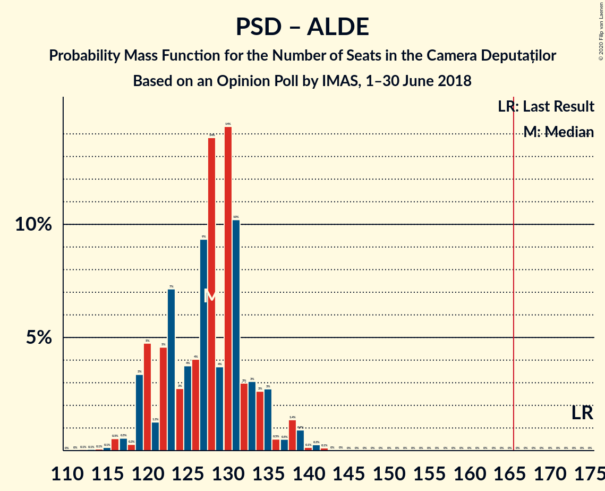

| Number of Seats | Probability | Accumulated | Special Marks |
|:---------------:|:-----------:|:-----------:|:-------------:|
| 112 | 0.1% | 100% |  |
| 113 | 0.1% | 99.9% |  |
| 114 | 0.1% | 99.9% |  |
| 115 | 0.1% | 99.8% |  |
| 116 | 0.5% | 99.6% |  |
| 117 | 0.5% | 99.1% |  |
| 118 | 0.3% | 98.6% |  |
| 119 | 3% | 98% |  |
| 120 | 5% | 95% |  |
| 121 | 1.3% | 90% |  |
| 122 | 5% | 89% |  |
| 123 | 7% | 84% |  |
| 124 | 3% | 77% |  |
| 125 | 4% | 74% |  |
| 126 | 4% | 71% |  |
| 127 | 9% | 67% | Median |
| 128 | 14% | 57% |  |
| 129 | 4% | 43% |  |
| 130 | 14% | 40% |  |
| 131 | 10% | 25% |  |
| 132 | 3% | 15% |  |
| 133 | 3% | 12% |  |
| 134 | 3% | 9% |  |
| 135 | 3% | 7% |  |
| 136 | 0.5% | 4% |  |
| 137 | 0.5% | 3% |  |
| 138 | 1.4% | 3% |  |
| 139 | 0.9% | 1.5% |  |
| 140 | 0.1% | 0.6% |  |
| 141 | 0.3% | 0.4% |  |
| 142 | 0.1% | 0.2% |  |
| 143 | 0% | 0% |  |
| 144 | 0% | 0% |  |
| 145 | 0% | 0% |  |
| 146 | 0% | 0% |  |
| 147 | 0% | 0% |  |
| 148 | 0% | 0% |  |
| 149 | 0% | 0% |  |
| 150 | 0% | 0% |  |
| 151 | 0% | 0% |  |
| 152 | 0% | 0% |  |
| 153 | 0% | 0% |  |
| 154 | 0% | 0% |  |
| 155 | 0% | 0% |  |
| 156 | 0% | 0% |  |
| 157 | 0% | 0% |  |
| 158 | 0% | 0% |  |
| 159 | 0% | 0% |  |
| 160 | 0% | 0% |  |
| 161 | 0% | 0% |  |
| 162 | 0% | 0% |  |
| 163 | 0% | 0% |  |
| 164 | 0% | 0% |  |
| 165 | 0% | 0% |  |
| 166 | 0% | 0% | Majority |
| 167 | 0% | 0% |  |
| 168 | 0% | 0% |  |
| 169 | 0% | 0% |  |
| 170 | 0% | 0% |  |
| 171 | 0% | 0% |  |
| 172 | 0% | 0% |  |
| 173 | 0% | 0% |  |
| 174 | 0% | 0% | Last Result |

### Partidul Național Liberal – Uniunea Democrată Maghiară din România – Partidul Mișcarea Populară

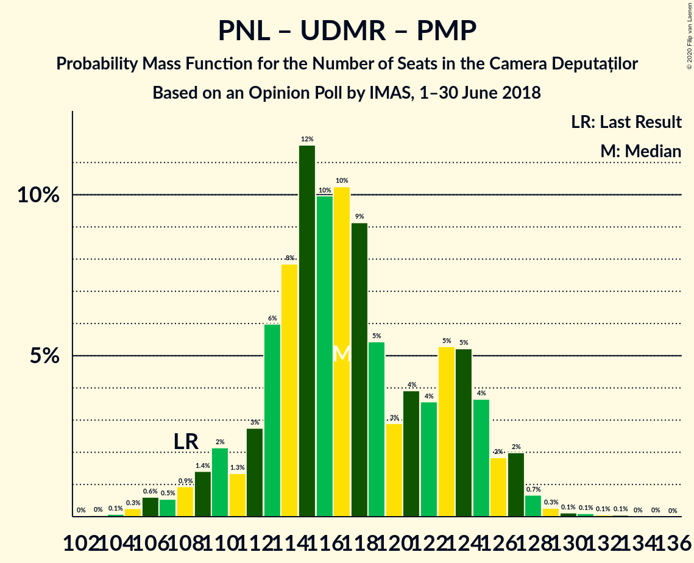

| Number of Seats | Probability | Accumulated | Special Marks |
|:---------------:|:-----------:|:-----------:|:-------------:|
| 103 | 0% | 100% |  |
| 104 | 0.1% | 99.9% |  |
| 105 | 0.3% | 99.9% |  |
| 106 | 0.6% | 99.6% |  |
| 107 | 0.5% | 99.0% |  |
| 108 | 0.9% | 98% | Last Result |
| 109 | 1.4% | 98% |  |
| 110 | 2% | 96% |  |
| 111 | 1.3% | 94% |  |
| 112 | 3% | 93% |  |
| 113 | 6% | 90% |  |
| 114 | 8% | 84% |  |
| 115 | 12% | 76% |  |
| 116 | 10% | 64% |  |
| 117 | 10% | 55% | Median |
| 118 | 9% | 44% |  |
| 119 | 5% | 35% |  |
| 120 | 3% | 30% |  |
| 121 | 4% | 27% |  |
| 122 | 4% | 23% |  |
| 123 | 5% | 19% |  |
| 124 | 5% | 14% |  |
| 125 | 4% | 9% |  |
| 126 | 2% | 5% |  |
| 127 | 2% | 3% |  |
| 128 | 0.7% | 1.3% |  |
| 129 | 0.3% | 0.7% |  |
| 130 | 0.1% | 0.4% |  |
| 131 | 0.1% | 0.3% |  |
| 132 | 0.1% | 0.2% |  |
| 133 | 0.1% | 0.1% |  |
| 134 | 0% | 0.1% |  |
| 135 | 0% | 0% |  |

### Partidul Național Liberal – Uniunea Democrată Maghiară din România

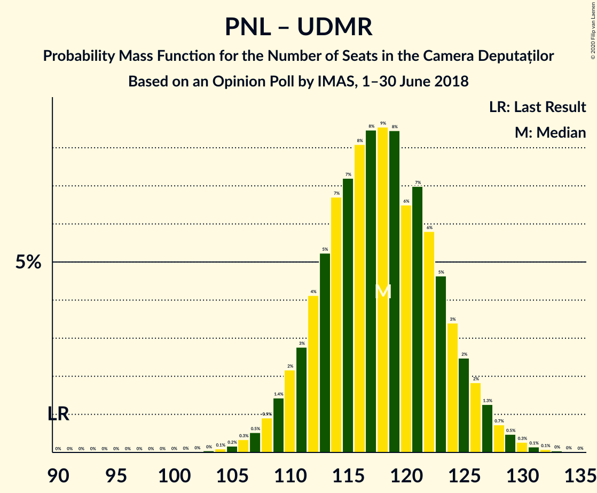

| Number of Seats | Probability | Accumulated | Special Marks |
|:---------------:|:-----------:|:-----------:|:-------------:|
| 90 | 0% | 100% | Last Result |
| 91 | 0% | 100% |  |
| 92 | 0% | 100% |  |
| 93 | 0% | 100% |  |
| 94 | 0% | 100% |  |
| 95 | 0% | 100% |  |
| 96 | 0% | 100% |  |
| 97 | 0% | 100% |  |
| 98 | 0% | 100% |  |
| 99 | 0% | 100% |  |
| 100 | 0% | 100% |  |
| 101 | 0% | 100% |  |
| 102 | 0% | 100% |  |
| 103 | 0% | 100% |  |
| 104 | 0.1% | 99.9% |  |
| 105 | 0.3% | 99.9% |  |
| 106 | 0.6% | 99.6% |  |
| 107 | 0.5% | 99.0% |  |
| 108 | 0.9% | 98% |  |
| 109 | 1.4% | 98% |  |
| 110 | 2% | 96% |  |
| 111 | 1.3% | 94% |  |
| 112 | 3% | 93% |  |
| 113 | 6% | 90% |  |
| 114 | 8% | 84% |  |
| 115 | 12% | 76% |  |
| 116 | 10% | 64% |  |
| 117 | 10% | 55% | Median |
| 118 | 9% | 44% |  |
| 119 | 5% | 35% |  |
| 120 | 3% | 30% |  |
| 121 | 4% | 27% |  |
| 122 | 4% | 23% |  |
| 123 | 5% | 19% |  |
| 124 | 5% | 14% |  |
| 125 | 4% | 9% |  |
| 126 | 2% | 5% |  |
| 127 | 2% | 3% |  |
| 128 | 0.7% | 1.3% |  |
| 129 | 0.3% | 0.6% |  |
| 130 | 0.1% | 0.4% |  |
| 131 | 0.1% | 0.3% |  |
| 132 | 0.1% | 0.2% |  |
| 133 | 0.1% | 0.1% |  |
| 134 | 0% | 0.1% |  |
| 135 | 0% | 0% |  |

### Partidul Național Liberal – Partidul Mișcarea Populară

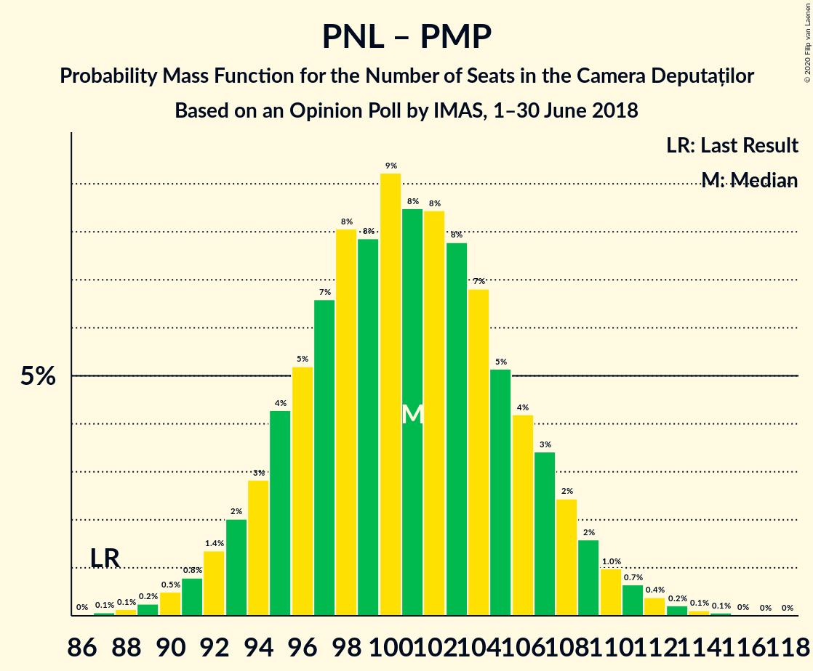

| Number of Seats | Probability | Accumulated | Special Marks |
|:---------------:|:-----------:|:-----------:|:-------------:|
| 86 | 0% | 100% |  |
| 87 | 0.1% | 99.9% | Last Result |
| 88 | 0.1% | 99.8% |  |
| 89 | 0.4% | 99.7% |  |
| 90 | 0.5% | 99.4% |  |
| 91 | 0.8% | 98.9% |  |
| 92 | 2% | 98% |  |
| 93 | 1.5% | 96% |  |
| 94 | 2% | 95% |  |
| 95 | 4% | 93% |  |
| 96 | 7% | 89% |  |
| 97 | 6% | 82% |  |
| 98 | 12% | 77% |  |
| 99 | 7% | 65% |  |
| 100 | 11% | 57% | Median |
| 101 | 8% | 46% |  |
| 102 | 8% | 38% |  |
| 103 | 4% | 29% |  |
| 104 | 5% | 25% |  |
| 105 | 5% | 21% |  |
| 106 | 4% | 16% |  |
| 107 | 3% | 12% |  |
| 108 | 4% | 9% |  |
| 109 | 2% | 5% |  |
| 110 | 1.2% | 2% |  |
| 111 | 0.5% | 1.2% |  |
| 112 | 0.3% | 0.7% |  |
| 113 | 0.1% | 0.4% |  |
| 114 | 0.1% | 0.2% |  |
| 115 | 0.1% | 0.1% |  |
| 116 | 0% | 0.1% |  |
| 117 | 0% | 0% |  |

### Partidul Național Liberal

| Number of Seats | Probability | Accumulated | Special Marks |
|:---------------:|:-----------:|:-----------:|:-------------:|
| 69 | 0% | 100% | Last Result |
| 70 | 0% | 100% |  |
| 71 | 0% | 100% |  |
| 72 | 0% | 100% |  |
| 73 | 0% | 100% |  |
| 74 | 0% | 100% |  |
| 75 | 0% | 100% |  |
| 76 | 0% | 100% |  |
| 77 | 0% | 100% |  |
| 78 | 0% | 100% |  |
| 79 | 0% | 100% |  |
| 80 | 0% | 100% |  |
| 81 | 0% | 100% |  |
| 82 | 0% | 100% |  |
| 83 | 0% | 100% |  |
| 84 | 0% | 100% |  |
| 85 | 0% | 100% |  |
| 86 | 0% | 100% |  |
| 87 | 0.1% | 99.9% |  |
| 88 | 0.1% | 99.8% |  |
| 89 | 0.4% | 99.7% |  |
| 90 | 0.5% | 99.4% |  |
| 91 | 0.8% | 98.9% |  |
| 92 | 2% | 98% |  |
| 93 | 1.5% | 96% |  |
| 94 | 2% | 95% |  |
| 95 | 4% | 93% |  |
| 96 | 7% | 89% |  |
| 97 | 6% | 82% |  |
| 98 | 12% | 77% |  |
| 99 | 7% | 65% |  |
| 100 | 11% | 57% | Median |
| 101 | 8% | 46% |  |
| 102 | 8% | 38% |  |
| 103 | 4% | 29% |  |
| 104 | 5% | 25% |  |
| 105 | 5% | 21% |  |
| 106 | 4% | 15% |  |
| 107 | 3% | 12% |  |
| 108 | 4% | 9% |  |
| 109 | 2% | 5% |  |
| 110 | 1.2% | 2% |  |
| 111 | 0.5% | 1.2% |  |
| 112 | 0.3% | 0.7% |  |
| 113 | 0.1% | 0.4% |  |
| 114 | 0.1% | 0.2% |  |
| 115 | 0.1% | 0.1% |  |
| 116 | 0% | 0.1% |  |
| 117 | 0% | 0% |  |

### Alianța 2020 USR-PLUS – Partidul Mișcarea Populară

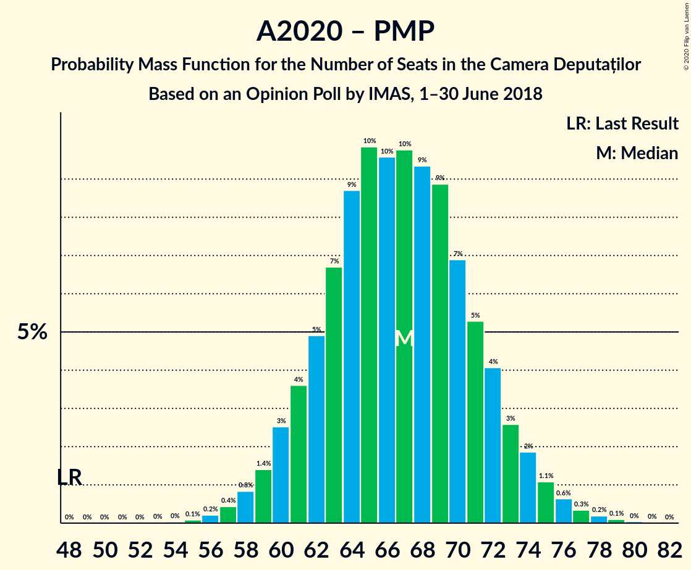

| Number of Seats | Probability | Accumulated | Special Marks |
|:---------------:|:-----------:|:-----------:|:-------------:|
| 48 | 0% | 100% | Last Result |
| 49 | 0% | 100% |  |
| 50 | 0% | 100% |  |
| 51 | 0% | 100% |  |
| 52 | 0% | 100% |  |
| 53 | 0% | 100% |  |
| 54 | 0% | 100% |  |
| 55 | 0.1% | 99.9% |  |
| 56 | 0.2% | 99.9% |  |
| 57 | 0.4% | 99.7% |  |
| 58 | 0.9% | 99.2% |  |
| 59 | 1.3% | 98% |  |
| 60 | 3% | 97% |  |
| 61 | 3% | 94% |  |
| 62 | 4% | 91% |  |
| 63 | 6% | 86% |  |
| 64 | 9% | 81% |  |
| 65 | 11% | 71% |  |
| 66 | 7% | 61% |  |
| 67 | 9% | 53% | Median |
| 68 | 10% | 44% |  |
| 69 | 10% | 34% |  |
| 70 | 8% | 24% |  |
| 71 | 6% | 17% |  |
| 72 | 4% | 11% |  |
| 73 | 3% | 7% |  |
| 74 | 2% | 4% |  |
| 75 | 1.0% | 3% |  |
| 76 | 0.8% | 2% |  |
| 77 | 0.4% | 0.8% |  |
| 78 | 0.2% | 0.4% |  |
| 79 | 0.1% | 0.2% |  |
| 80 | 0% | 0.1% |  |
| 81 | 0% | 0% |  |

## Technical Information

### Opinion Poll

+ **Polling firm:** IMAS
+ **Commissioner(s):** —
+ **Fieldwork period:** 1–30 June 2018

### Calculations

+ **Sample size:** 1200
+ **Simulations done:** 131,072
+ **Error estimate:** 1.16%

