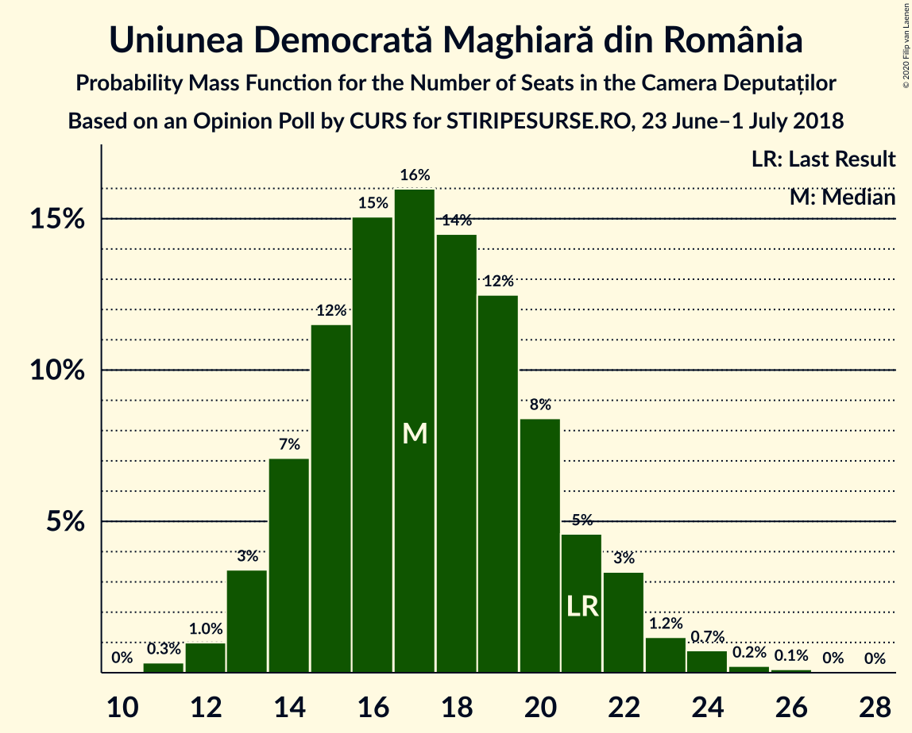
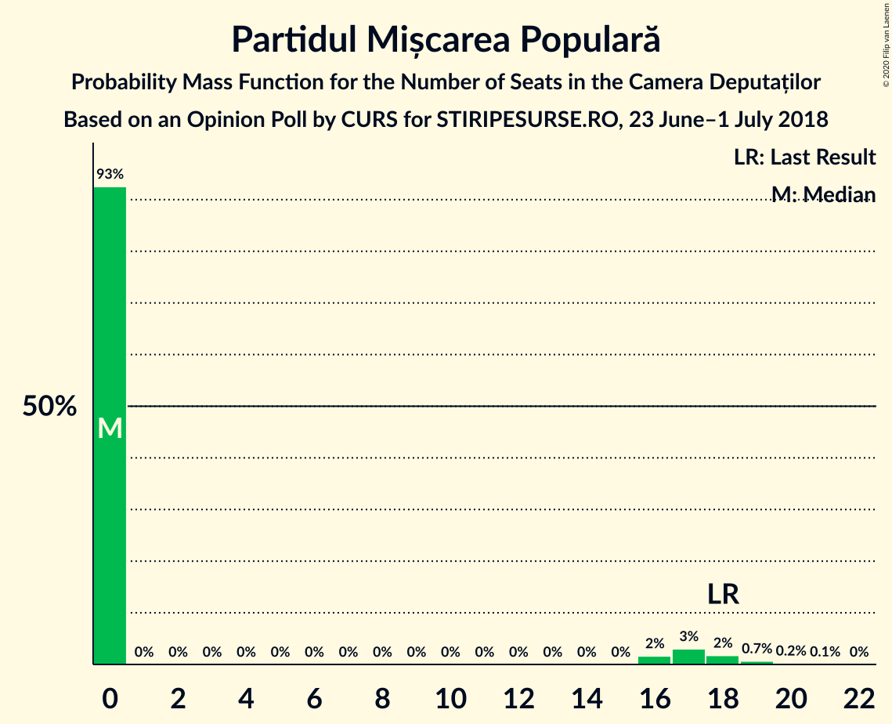
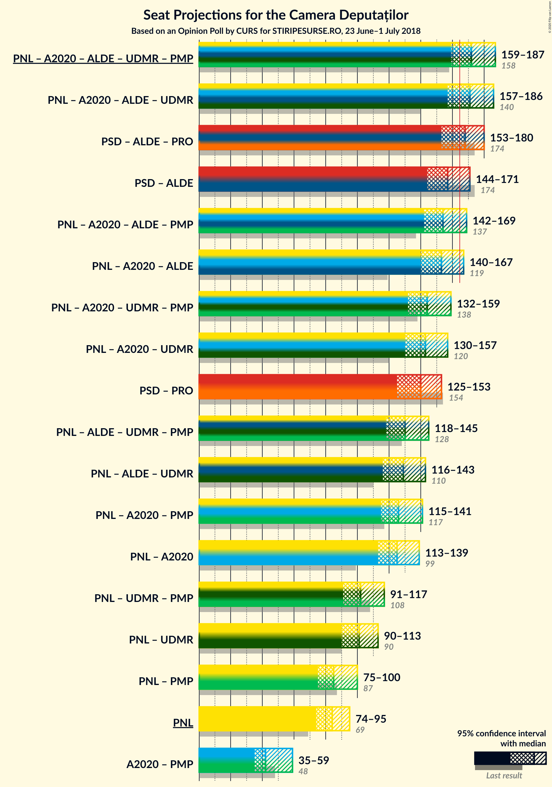
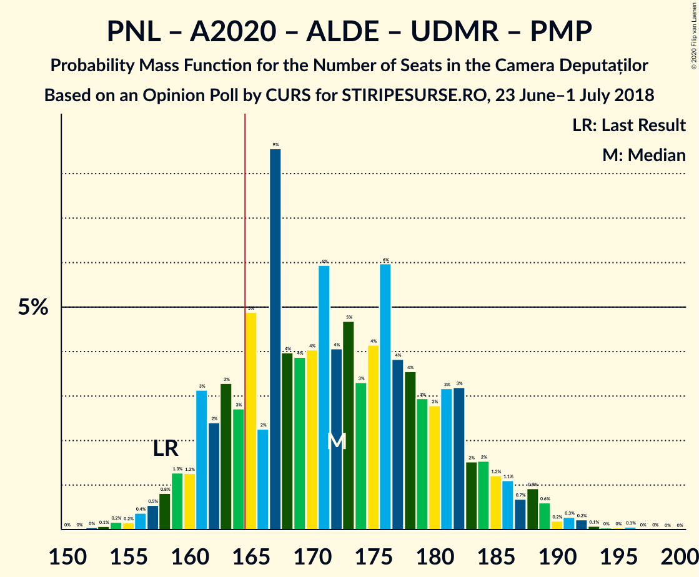
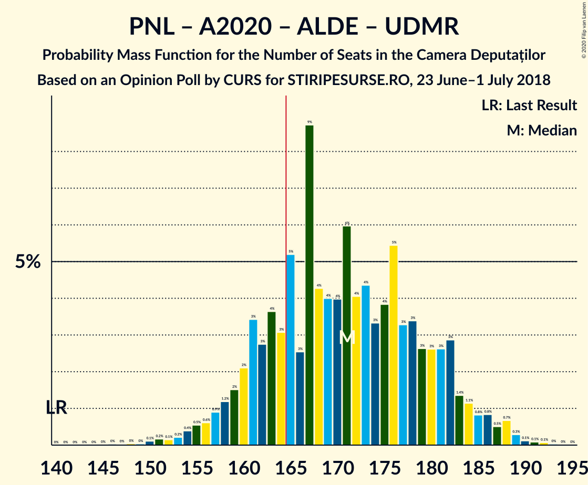
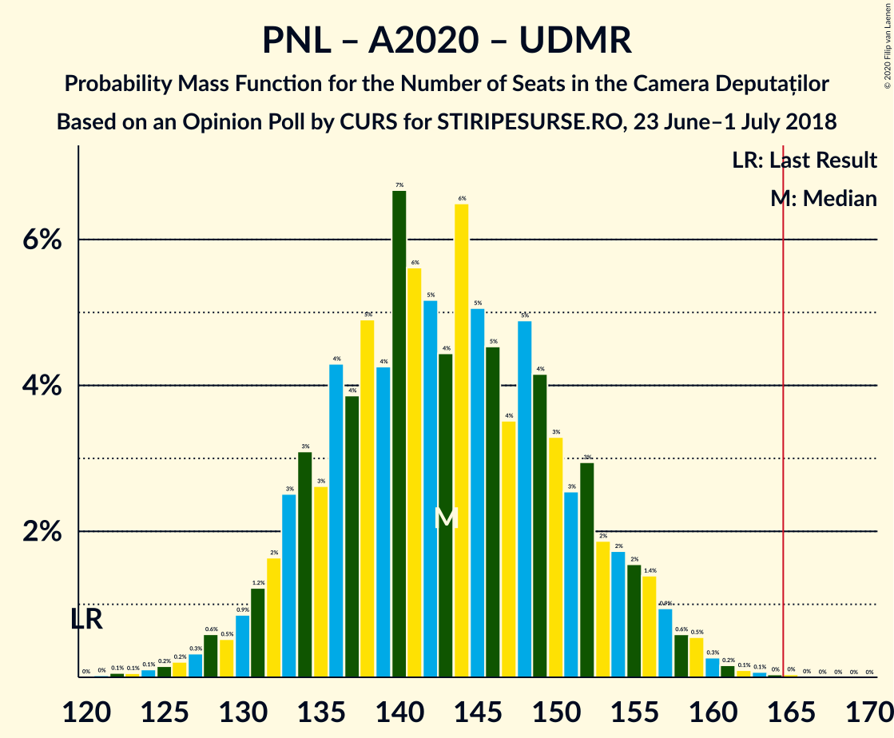

# Opinion Poll by CURS for STIRIPESURSE.RO, 23 June–1 July 2018

<a href="#voting-intentions">Voting Intentions</a> | <a href="#seats">Seats</a> | <a href="#coalitions">Coalitions</a> | <a href="#technical-information">Technical Information</a>

## Voting Intentions

### Confidence Intervals

| Party | Last Result | Poll Result | 80% Confidence Interval | 90% Confidence Interval | 95% Confidence Interval | 99% Confidence Interval |
|:-----:|:-----------:|:-----------:|:-----------------------:|:-----------------------:|:-----------------------:|:-----------------------:|
| Partidul Social Democrat | 45.5% | 37.4% | 35.5–39.3% |35.0–39.9% |34.5–40.3% |33.7–41.3% |
| Partidul Național Liberal | 20.0% | 24.3% | 22.6–26.0% |22.2–26.5% |21.8–26.9% |21.0–27.8% |
| Alianța 2020 USR-PLUS | 8.9% | 12.1% | 10.9–13.5% |10.5–13.9% |10.3–14.2% |9.7–14.9% |
| Partidul Alianța Liberalilor și Democraților | 5.6% | 8.1% | 7.1–9.2% |6.8–9.6% |6.6–9.9% |6.1–10.4% |
| Uniunea Democrată Maghiară din România | 6.2% | 5.1% | 4.3–6.0% |4.1–6.3% |3.9–6.6% |3.6–7.0% |
| PRO România | 0.0% | 5.1% | 4.3–6.0% |4.1–6.3% |3.9–6.6% |3.6–7.0% |
| Partidul Mișcarea Populară | 5.4% | 4.0% | 3.4–4.9% |3.2–5.2% |3.0–5.4% |2.7–5.9% |

*Note:* The poll result column reflects the actual value used in the calculations. Published results may vary slightly, and in addition be rounded to fewer digits.

## Seats

### Confidence Intervals

| Party | Last Result | Median | 80% Confidence Interval | 90% Confidence Interval | 95% Confidence Interval | 99% Confidence Interval |
|:-----:|:-----------:|:------:|:-----------------------:|:-----------------------:|:-----------------------:|:-----------------------:|
| <a href="#partidul-social-democrat">Partidul Social Democrat</a> | 154 | 129 | 120–138 |118–141 |116–142 |113–146 |
| <a href="#partidul-național-liberal">Partidul Național Liberal</a> | 69 | 83 | 77–90 |75–92 |73–93 |70–98 |
| <a href="#alianța-2020-usr-plus">Alianța 2020 USR-PLUS</a> | 30 | 41 | 37–47 |36–48 |35–50 |33–53 |
| <a href="#partidul-alianța-liberalilor-și-democraților">Partidul Alianța Liberalilor și Democraților</a> | 20 | 27 | 24–32 |23–33 |22–34 |21–37 |
| <a href="#uniunea-democrată-maghiară-din-românia">Uniunea Democrată Maghiară din România</a> | 21 | 17 | 14–20 |13–21 |13–23 |12–24 |
| <a href="#pro-românia">PRO România</a> | 0 | 17 | 0–20 |0–21 |0–22 |0–24 |
| <a href="#partidul-mișcarea-populară">Partidul Mișcarea Populară</a> | 18 | 0 | 0 |0–17 |0–17 |0–19 |

### Partidul Social Democrat

*For a full overview of the results for this party, see the [Partidul Social Democrat](party-partidulsocialdemocrat.html) page.*

| Number of Seats | Probability | Accumulated | Special Marks |
|:---------------:|:-----------:|:-----------:|:-------------:|
| 109 | 0% | 100% |  |
| 110 | 0% | 99.9% |  |
| 111 | 0% | 99.9% |  |
| 112 | 0.1% | 99.9% |  |
| 113 | 0.5% | 99.7% |  |
| 114 | 0.7% | 99.3% |  |
| 115 | 0.3% | 98.6% |  |
| 116 | 1.0% | 98% |  |
| 117 | 2% | 97% |  |
| 118 | 0.8% | 95% |  |
| 119 | 2% | 94% |  |
| 120 | 2% | 92% |  |
| 121 | 3% | 90% |  |
| 122 | 3% | 87% |  |
| 123 | 4% | 84% |  |
| 124 | 4% | 80% |  |
| 125 | 5% | 76% |  |
| 126 | 9% | 71% |  |
| 127 | 2% | 62% |  |
| 128 | 9% | 60% |  |
| 129 | 3% | 52% | Median |
| 130 | 5% | 49% |  |
| 131 | 6% | 44% |  |
| 132 | 6% | 38% |  |
| 133 | 4% | 32% |  |
| 134 | 6% | 28% |  |
| 135 | 5% | 22% |  |
| 136 | 2% | 17% |  |
| 137 | 1.2% | 15% |  |
| 138 | 5% | 14% |  |
| 139 | 2% | 10% |  |
| 140 | 0.6% | 8% |  |
| 141 | 4% | 7% |  |
| 142 | 0.4% | 3% |  |
| 143 | 1.2% | 2% |  |
| 144 | 0.4% | 1.2% |  |
| 145 | 0.2% | 0.8% |  |
| 146 | 0.2% | 0.6% |  |
| 147 | 0.1% | 0.3% |  |
| 148 | 0.1% | 0.2% |  |
| 149 | 0.1% | 0.1% |  |
| 150 | 0% | 0.1% |  |
| 151 | 0% | 0.1% |  |
| 152 | 0% | 0% |  |
| 153 | 0% | 0% |  |
| 154 | 0% | 0% | Last Result |

### Partidul Național Liberal

*For a full overview of the results for this party, see the [Partidul Național Liberal](party-partidulnaționalliberal.html) page.*

| Number of Seats | Probability | Accumulated | Special Marks |
|:---------------:|:-----------:|:-----------:|:-------------:|
| 67 | 0% | 100% |  |
| 68 | 0% | 99.9% |  |
| 69 | 0.1% | 99.9% | Last Result |
| 70 | 0.8% | 99.8% |  |
| 71 | 0.2% | 99.0% |  |
| 72 | 0.4% | 98.8% |  |
| 73 | 1.0% | 98% |  |
| 74 | 1.4% | 97% |  |
| 75 | 2% | 96% |  |
| 76 | 1.0% | 94% |  |
| 77 | 4% | 93% |  |
| 78 | 5% | 88% |  |
| 79 | 3% | 83% |  |
| 80 | 8% | 79% |  |
| 81 | 15% | 71% |  |
| 82 | 4% | 56% |  |
| 83 | 3% | 51% | Median |
| 84 | 10% | 48% |  |
| 85 | 4% | 38% |  |
| 86 | 7% | 35% |  |
| 87 | 7% | 28% |  |
| 88 | 5% | 21% |  |
| 89 | 3% | 16% |  |
| 90 | 4% | 13% |  |
| 91 | 4% | 9% |  |
| 92 | 1.2% | 6% |  |
| 93 | 2% | 4% |  |
| 94 | 0.6% | 2% |  |
| 95 | 0.6% | 2% |  |
| 96 | 0.2% | 1.2% |  |
| 97 | 0.2% | 0.9% |  |
| 98 | 0.3% | 0.8% |  |
| 99 | 0.1% | 0.4% |  |
| 100 | 0.2% | 0.3% |  |
| 101 | 0.1% | 0.1% |  |
| 102 | 0% | 0% |  |

### Alianța 2020 USR-PLUS

*For a full overview of the results for this party, see the [Alianța 2020 USR-PLUS](party-alianța2020usr-plus.html) page.*

| Number of Seats | Probability | Accumulated | Special Marks |
|:---------------:|:-----------:|:-----------:|:-------------:|
| 30 | 0.1% | 100% | Last Result |
| 31 | 0.1% | 99.9% |  |
| 32 | 0.3% | 99.8% |  |
| 33 | 0.8% | 99.5% |  |
| 34 | 1.0% | 98.7% |  |
| 35 | 2% | 98% |  |
| 36 | 5% | 96% |  |
| 37 | 5% | 91% |  |
| 38 | 6% | 86% |  |
| 39 | 4% | 80% |  |
| 40 | 15% | 76% |  |
| 41 | 11% | 61% | Median |
| 42 | 7% | 50% |  |
| 43 | 15% | 43% |  |
| 44 | 4% | 27% |  |
| 45 | 7% | 23% |  |
| 46 | 4% | 16% |  |
| 47 | 5% | 11% |  |
| 48 | 2% | 6% |  |
| 49 | 2% | 4% |  |
| 50 | 1.5% | 3% |  |
| 51 | 0.7% | 1.4% |  |
| 52 | 0.2% | 0.7% |  |
| 53 | 0.4% | 0.5% |  |
| 54 | 0.1% | 0.2% |  |
| 55 | 0% | 0.1% |  |
| 56 | 0% | 0% |  |

### Partidul Alianța Liberalilor și Democraților

*For a full overview of the results for this party, see the [Partidul Alianța Liberalilor și Democraților](party-partidulalianțaliberalilorșidemocraților.html) page.*

| Number of Seats | Probability | Accumulated | Special Marks |
|:---------------:|:-----------:|:-----------:|:-------------:|
| 19 | 0.1% | 100% |  |
| 20 | 0.4% | 99.9% | Last Result |
| 21 | 1.2% | 99.5% |  |
| 22 | 2% | 98% |  |
| 23 | 5% | 97% |  |
| 24 | 7% | 91% |  |
| 25 | 9% | 85% |  |
| 26 | 13% | 76% |  |
| 27 | 15% | 63% | Median |
| 28 | 13% | 48% |  |
| 29 | 8% | 35% |  |
| 30 | 7% | 27% |  |
| 31 | 8% | 20% |  |
| 32 | 5% | 12% |  |
| 33 | 4% | 7% |  |
| 34 | 0.8% | 3% |  |
| 35 | 0.8% | 2% |  |
| 36 | 0.4% | 1.0% |  |
| 37 | 0.4% | 0.6% |  |
| 38 | 0.1% | 0.2% |  |
| 39 | 0.1% | 0.1% |  |
| 40 | 0% | 0% |  |

### Uniunea Democrată Maghiară din România

*For a full overview of the results for this party, see the [Uniunea Democrată Maghiară din România](party-uniuneademocratămaghiarădinromânia.html) page.*

| Number of Seats | Probability | Accumulated | Special Marks |
|:---------------:|:-----------:|:-----------:|:-------------:|
| 11 | 0.3% | 100% |  |
| 12 | 1.3% | 99.6% |  |
| 13 | 4% | 98% |  |
| 14 | 9% | 94% |  |
| 15 | 11% | 86% |  |
| 16 | 13% | 74% |  |
| 17 | 18% | 62% | Median |
| 18 | 15% | 43% |  |
| 19 | 10% | 28% |  |
| 20 | 9% | 18% |  |
| 21 | 4% | 9% | Last Result |
| 22 | 2% | 5% |  |
| 23 | 2% | 3% |  |
| 24 | 0.7% | 1.1% |  |
| 25 | 0.2% | 0.3% |  |
| 26 | 0.1% | 0.2% |  |
| 27 | 0% | 0% |  |

### PRO România

*For a full overview of the results for this party, see the [PRO România](party-proromânia.html) page.*

| Number of Seats | Probability | Accumulated | Special Marks |
|:---------------:|:-----------:|:-----------:|:-------------:|
| 0 | 39% | 100% | Last Result |
| 1 | 0% | 61% |  |
| 2 | 0% | 61% |  |
| 3 | 0% | 61% |  |
| 4 | 0% | 61% |  |
| 5 | 0% | 61% |  |
| 6 | 0% | 61% |  |
| 7 | 0% | 61% |  |
| 8 | 0% | 61% |  |
| 9 | 0% | 61% |  |
| 10 | 0% | 61% |  |
| 11 | 0% | 61% |  |
| 12 | 0% | 61% |  |
| 13 | 0% | 61% |  |
| 14 | 0% | 61% |  |
| 15 | 0% | 61% |  |
| 16 | 0.6% | 61% |  |
| 17 | 19% | 60% | Median |
| 18 | 14% | 41% |  |
| 19 | 10% | 28% |  |
| 20 | 9% | 17% |  |
| 21 | 4% | 8% |  |
| 22 | 2% | 4% |  |
| 23 | 0.7% | 1.4% |  |
| 24 | 0.5% | 0.7% |  |
| 25 | 0.1% | 0.2% |  |
| 26 | 0.1% | 0.1% |  |
| 27 | 0% | 0% |  |

### Partidul Mișcarea Populară

*For a full overview of the results for this party, see the [Partidul Mișcarea Populară](party-partidulmișcareapopulară.html) page.*

| Number of Seats | Probability | Accumulated | Special Marks |
|:---------------:|:-----------:|:-----------:|:-------------:|
| 0 | 91% | 100% | Median |
| 1 | 0% | 9% |  |
| 2 | 0% | 9% |  |
| 3 | 0% | 9% |  |
| 4 | 0% | 9% |  |
| 5 | 0% | 9% |  |
| 6 | 0% | 9% |  |
| 7 | 0% | 9% |  |
| 8 | 0% | 9% |  |
| 9 | 0% | 9% |  |
| 10 | 0% | 9% |  |
| 11 | 0% | 9% |  |
| 12 | 0% | 9% |  |
| 13 | 0% | 9% |  |
| 14 | 0% | 9% |  |
| 15 | 0% | 9% |  |
| 16 | 3% | 9% |  |
| 17 | 4% | 6% |  |
| 18 | 1.4% | 2% | Last Result |
| 19 | 0.5% | 1.0% |  |
| 20 | 0.3% | 0.4% |  |
| 21 | 0.1% | 0.1% |  |
| 22 | 0% | 0% |  |

## Coalitions

### Confidence Intervals

| Coalition | Last Result | Median | Majority? | 80% Confidence Interval | 90% Confidence Interval | 95% Confidence Interval | 99% Confidence Interval |
|:---------:|:-----------:|:------:|:---------:|:-----------------------:|:-----------------------:|:-----------------------:|:-----------------------:|
| Partidul Național Liberal – Alianța 2020 USR-PLUS – Partidul Alianța Liberalilor și Democraților – Uniunea Democrată Maghiară din România – Partidul Mișcarea Populară | 158 | 171 | 78% | 162–182 | 160–185 | 159–188 | 156–192 |
| Partidul Național Liberal – Alianța 2020 USR-PLUS – Partidul Alianța Liberalilor și Democraților – Uniunea Democrată Maghiară din România | 140 | 169 | 71% | 161–180 | 158–183 | 155–187 | 151–188 |
| Partidul Social Democrat – Partidul Alianța Liberalilor și Democraților – PRO România | 174 | 169 | 66% | 159–178 | 157–178 | 153–182 | 148–184 |
| Partidul Social Democrat – Partidul Alianța Liberalilor și Democraților | 174 | 157 | 16% | 147–167 | 144–169 | 143–171 | 140–175 |
| Partidul Național Liberal – Alianța 2020 USR-PLUS – Partidul Alianța Liberalilor și Democraților – Partidul Mișcarea Populară | 137 | 153 | 8% | 146–164 | 143–167 | 141–169 | 139–175 |
| Partidul Național Liberal – Alianța 2020 USR-PLUS – Partidul Alianța Liberalilor și Democraților | 119 | 152 | 5% | 143–163 | 141–165 | 139–168 | 134–171 |
| Partidul Național Liberal – Alianța 2020 USR-PLUS – Uniunea Democrată Maghiară din România – Partidul Mișcarea Populară | 138 | 143 | 0.4% | 134–153 | 134–155 | 130–159 | 128–164 |
| Partidul Național Liberal – Alianța 2020 USR-PLUS – Uniunea Democrată Maghiară din România | 120 | 141 | 0% | 134–152 | 131–154 | 128–155 | 127–160 |
| Partidul Social Democrat – PRO România | 154 | 141 | 0% | 130–150 | 127–152 | 124–153 | 120–156 |
| Partidul Național Liberal – Partidul Alianța Liberalilor și Democraților – Uniunea Democrată Maghiară din România – Partidul Mișcarea Populară | 128 | 130 | 0% | 121–140 | 121–143 | 119–144 | 113–151 |
| Partidul Național Liberal – Partidul Alianța Liberalilor și Democraților – Uniunea Democrată Maghiară din România | 110 | 128 | 0% | 121–135 | 118–142 | 115–143 | 112–145 |
| Partidul Național Liberal – Alianța 2020 USR-PLUS – Partidul Mișcarea Populară | 117 | 126 | 0% | 119–136 | 117–138 | 113–141 | 111–147 |
| Partidul Național Liberal – Alianța 2020 USR-PLUS | 99 | 124 | 0% | 117–133 | 114–136 | 112–137 | 109–142 |
| Partidul Național Liberal – Uniunea Democrată Maghiară din România – Partidul Mișcarea Populară | 108 | 101 | 0% | 94–111 | 93–114 | 91–116 | 88–124 |
| Partidul Național Liberal – Uniunea Democrată Maghiară din România | 90 | 100 | 0% | 93–109 | 91–110 | 90–112 | 87–117 |
| Partidul Național Liberal – Partidul Mișcarea Populară | 87 | 84 | 0% | 78–93 | 77–96 | 75–100 | 72–106 |
| Partidul Național Liberal | 69 | 83 | 0% | 77–90 | 75–92 | 73–93 | 70–98 |
| Alianța 2020 USR-PLUS – Partidul Mișcarea Populară | 48 | 43 | 0% | 37–50 | 36–56 | 35–58 | 33–64 |

### Partidul Național Liberal – Alianța 2020 USR-PLUS – Partidul Alianța Liberalilor și Democraților – Uniunea Democrată Maghiară din România – Partidul Mișcarea Populară

| Number of Seats | Probability | Accumulated | Special Marks |
|:---------------:|:-----------:|:-----------:|:-------------:|
| 151 | 0% | 100% |  |
| 152 | 0.1% | 99.9% |  |
| 153 | 0% | 99.9% |  |
| 154 | 0.1% | 99.8% |  |
| 155 | 0.1% | 99.7% |  |
| 156 | 0.3% | 99.6% |  |
| 157 | 0.8% | 99.3% |  |
| 158 | 0.8% | 98.5% | Last Result |
| 159 | 2% | 98% |  |
| 160 | 1.0% | 96% |  |
| 161 | 3% | 95% |  |
| 162 | 7% | 92% |  |
| 163 | 2% | 86% |  |
| 164 | 3% | 83% |  |
| 165 | 2% | 81% |  |
| 166 | 3% | 78% | Majority |
| 167 | 10% | 75% |  |
| 168 | 5% | 65% | Median |
| 169 | 3% | 60% |  |
| 170 | 2% | 56% |  |
| 171 | 7% | 54% |  |
| 172 | 4% | 47% |  |
| 173 | 5% | 42% |  |
| 174 | 6% | 38% |  |
| 175 | 2% | 32% |  |
| 176 | 2% | 30% |  |
| 177 | 6% | 28% |  |
| 178 | 5% | 22% |  |
| 179 | 2% | 16% |  |
| 180 | 2% | 15% |  |
| 181 | 2% | 13% |  |
| 182 | 3% | 10% |  |
| 183 | 1.3% | 8% |  |
| 184 | 1.0% | 6% |  |
| 185 | 0.5% | 5% |  |
| 186 | 0.6% | 5% |  |
| 187 | 0.9% | 4% |  |
| 188 | 2% | 3% |  |
| 189 | 0.1% | 1.1% |  |
| 190 | 0.1% | 1.0% |  |
| 191 | 0.2% | 0.9% |  |
| 192 | 0.4% | 0.7% |  |
| 193 | 0.1% | 0.3% |  |
| 194 | 0% | 0.2% |  |
| 195 | 0% | 0.2% |  |
| 196 | 0% | 0.2% |  |
| 197 | 0% | 0.1% |  |
| 198 | 0.1% | 0.1% |  |
| 199 | 0% | 0% |  |

### Partidul Național Liberal – Alianța 2020 USR-PLUS – Partidul Alianța Liberalilor și Democraților – Uniunea Democrată Maghiară din România

| Number of Seats | Probability | Accumulated | Special Marks |
|:---------------:|:-----------:|:-----------:|:-------------:|
| 140 | 0% | 100% | Last Result |
| 141 | 0% | 100% |  |
| 142 | 0% | 100% |  |
| 143 | 0% | 100% |  |
| 144 | 0% | 100% |  |
| 145 | 0% | 100% |  |
| 146 | 0% | 100% |  |
| 147 | 0.1% | 99.9% |  |
| 148 | 0% | 99.9% |  |
| 149 | 0% | 99.8% |  |
| 150 | 0.1% | 99.8% |  |
| 151 | 0.7% | 99.7% |  |
| 152 | 0.1% | 99.0% |  |
| 153 | 0.1% | 99.0% |  |
| 154 | 0.3% | 98.8% |  |
| 155 | 1.3% | 98% |  |
| 156 | 0.5% | 97% |  |
| 157 | 1.3% | 97% |  |
| 158 | 1.0% | 95% |  |
| 159 | 2% | 94% |  |
| 160 | 1.5% | 92% |  |
| 161 | 4% | 91% |  |
| 162 | 7% | 87% |  |
| 163 | 2% | 80% |  |
| 164 | 3% | 78% |  |
| 165 | 3% | 74% |  |
| 166 | 3% | 71% | Majority |
| 167 | 10% | 68% |  |
| 168 | 6% | 58% | Median |
| 169 | 3% | 53% |  |
| 170 | 2% | 49% |  |
| 171 | 7% | 47% |  |
| 172 | 4% | 40% |  |
| 173 | 4% | 36% |  |
| 174 | 6% | 32% |  |
| 175 | 2% | 26% |  |
| 176 | 2% | 24% |  |
| 177 | 5% | 22% |  |
| 178 | 5% | 18% |  |
| 179 | 1.3% | 12% |  |
| 180 | 2% | 11% |  |
| 181 | 2% | 9% |  |
| 182 | 2% | 7% |  |
| 183 | 1.2% | 6% |  |
| 184 | 0.6% | 4% |  |
| 185 | 0.5% | 4% |  |
| 186 | 0.5% | 3% |  |
| 187 | 0.6% | 3% |  |
| 188 | 2% | 2% |  |
| 189 | 0.1% | 0.4% |  |
| 190 | 0% | 0.3% |  |
| 191 | 0.1% | 0.3% |  |
| 192 | 0% | 0.1% |  |
| 193 | 0.1% | 0.1% |  |
| 194 | 0% | 0% |  |

### Partidul Social Democrat – Partidul Alianța Liberalilor și Democraților – PRO România

| Number of Seats | Probability | Accumulated | Special Marks |
|:---------------:|:-----------:|:-----------:|:-------------:|
| 142 | 0.1% | 100% |  |
| 143 | 0% | 99.9% |  |
| 144 | 0% | 99.9% |  |
| 145 | 0.2% | 99.8% |  |
| 146 | 0.1% | 99.7% |  |
| 147 | 0.1% | 99.6% |  |
| 148 | 0.1% | 99.5% |  |
| 149 | 0.3% | 99.4% |  |
| 150 | 0.4% | 99.2% |  |
| 151 | 0.3% | 98.8% |  |
| 152 | 0.3% | 98.5% |  |
| 153 | 0.8% | 98% |  |
| 154 | 0.7% | 97% |  |
| 155 | 0.4% | 97% |  |
| 156 | 0.9% | 96% |  |
| 157 | 2% | 95% |  |
| 158 | 2% | 93% |  |
| 159 | 4% | 91% |  |
| 160 | 3% | 87% |  |
| 161 | 3% | 84% |  |
| 162 | 3% | 81% |  |
| 163 | 3% | 79% |  |
| 164 | 5% | 75% |  |
| 165 | 4% | 70% |  |
| 166 | 6% | 66% | Majority |
| 167 | 1.2% | 59% |  |
| 168 | 4% | 58% |  |
| 169 | 6% | 54% |  |
| 170 | 5% | 48% |  |
| 171 | 13% | 43% |  |
| 172 | 7% | 30% |  |
| 173 | 1.3% | 23% | Median |
| 174 | 1.0% | 22% | Last Result |
| 175 | 3% | 21% |  |
| 176 | 4% | 18% |  |
| 177 | 2% | 14% |  |
| 178 | 8% | 12% |  |
| 179 | 0.8% | 5% |  |
| 180 | 0.4% | 4% |  |
| 181 | 0.8% | 3% |  |
| 182 | 0.9% | 3% |  |
| 183 | 0.6% | 2% |  |
| 184 | 0.8% | 1.1% |  |
| 185 | 0.2% | 0.3% |  |
| 186 | 0% | 0.2% |  |
| 187 | 0% | 0.1% |  |
| 188 | 0% | 0.1% |  |
| 189 | 0% | 0.1% |  |
| 190 | 0% | 0% |  |

### Partidul Social Democrat – Partidul Alianța Liberalilor și Democraților

| Number of Seats | Probability | Accumulated | Special Marks |
|:---------------:|:-----------:|:-----------:|:-------------:|
| 136 | 0.1% | 100% |  |
| 137 | 0% | 99.9% |  |
| 138 | 0.2% | 99.9% |  |
| 139 | 0.1% | 99.7% |  |
| 140 | 0.4% | 99.6% |  |
| 141 | 0.8% | 99.2% |  |
| 142 | 0.9% | 98% |  |
| 143 | 0.6% | 98% |  |
| 144 | 2% | 97% |  |
| 145 | 2% | 95% |  |
| 146 | 1.4% | 93% |  |
| 147 | 3% | 91% |  |
| 148 | 1.2% | 88% |  |
| 149 | 5% | 87% |  |
| 150 | 3% | 82% |  |
| 151 | 2% | 79% |  |
| 152 | 3% | 78% |  |
| 153 | 6% | 75% |  |
| 154 | 10% | 69% |  |
| 155 | 4% | 58% |  |
| 156 | 4% | 54% | Median |
| 157 | 3% | 50% |  |
| 158 | 3% | 47% |  |
| 159 | 7% | 44% |  |
| 160 | 7% | 37% |  |
| 161 | 4% | 29% |  |
| 162 | 2% | 26% |  |
| 163 | 2% | 24% |  |
| 164 | 2% | 22% |  |
| 165 | 4% | 20% |  |
| 166 | 4% | 16% | Majority |
| 167 | 1.4% | 11% |  |
| 168 | 3% | 10% |  |
| 169 | 3% | 7% |  |
| 170 | 0.4% | 4% |  |
| 171 | 2% | 4% |  |
| 172 | 1.0% | 2% |  |
| 173 | 0.5% | 1.1% |  |
| 174 | 0.1% | 0.6% | Last Result |
| 175 | 0.1% | 0.5% |  |
| 176 | 0.1% | 0.4% |  |
| 177 | 0.1% | 0.2% |  |
| 178 | 0.1% | 0.1% |  |
| 179 | 0.1% | 0.1% |  |
| 180 | 0% | 0% |  |

### Partidul Național Liberal – Alianța 2020 USR-PLUS – Partidul Alianța Liberalilor și Democraților – Partidul Mișcarea Populară

| Number of Seats | Probability | Accumulated | Special Marks |
|:---------------:|:-----------:|:-----------:|:-------------:|
| 135 | 0% | 100% |  |
| 136 | 0.1% | 99.9% |  |
| 137 | 0% | 99.8% | Last Result |
| 138 | 0.1% | 99.8% |  |
| 139 | 0.6% | 99.7% |  |
| 140 | 1.1% | 99.1% |  |
| 141 | 0.7% | 98% |  |
| 142 | 2% | 97% |  |
| 143 | 2% | 96% |  |
| 144 | 2% | 94% |  |
| 145 | 2% | 92% |  |
| 146 | 3% | 91% |  |
| 147 | 5% | 88% |  |
| 148 | 5% | 83% |  |
| 149 | 2% | 78% |  |
| 150 | 10% | 76% |  |
| 151 | 9% | 67% | Median |
| 152 | 2% | 58% |  |
| 153 | 7% | 55% |  |
| 154 | 1.5% | 49% |  |
| 155 | 7% | 47% |  |
| 156 | 7% | 40% |  |
| 157 | 5% | 33% |  |
| 158 | 2% | 28% |  |
| 159 | 4% | 26% |  |
| 160 | 2% | 22% |  |
| 161 | 4% | 20% |  |
| 162 | 3% | 17% |  |
| 163 | 3% | 14% |  |
| 164 | 2% | 11% |  |
| 165 | 0.9% | 9% |  |
| 166 | 1.3% | 8% | Majority |
| 167 | 2% | 7% |  |
| 168 | 1.2% | 5% |  |
| 169 | 2% | 4% |  |
| 170 | 0.5% | 2% |  |
| 171 | 0.2% | 2% |  |
| 172 | 0.5% | 1.3% |  |
| 173 | 0.2% | 0.8% |  |
| 174 | 0.1% | 0.7% |  |
| 175 | 0.2% | 0.6% |  |
| 176 | 0% | 0.3% |  |
| 177 | 0.1% | 0.3% |  |
| 178 | 0% | 0.2% |  |
| 179 | 0.1% | 0.2% |  |
| 180 | 0.1% | 0.1% |  |
| 181 | 0% | 0% |  |

### Partidul Național Liberal – Alianța 2020 USR-PLUS – Partidul Alianța Liberalilor și Democraților

| Number of Seats | Probability | Accumulated | Special Marks |
|:---------------:|:-----------:|:-----------:|:-------------:|
| 119 | 0% | 100% | Last Result |
| 120 | 0% | 100% |  |
| 121 | 0% | 100% |  |
| 122 | 0% | 100% |  |
| 123 | 0% | 100% |  |
| 124 | 0% | 100% |  |
| 125 | 0% | 100% |  |
| 126 | 0% | 100% |  |
| 127 | 0% | 100% |  |
| 128 | 0% | 100% |  |
| 129 | 0% | 100% |  |
| 130 | 0% | 100% |  |
| 131 | 0% | 99.9% |  |
| 132 | 0.1% | 99.9% |  |
| 133 | 0% | 99.8% |  |
| 134 | 0.7% | 99.8% |  |
| 135 | 0.2% | 99.1% |  |
| 136 | 0.3% | 99.0% |  |
| 137 | 0.1% | 98.7% |  |
| 138 | 0.8% | 98.6% |  |
| 139 | 0.8% | 98% |  |
| 140 | 1.4% | 97% |  |
| 141 | 1.3% | 96% |  |
| 142 | 2% | 94% |  |
| 143 | 2% | 92% |  |
| 144 | 3% | 90% |  |
| 145 | 2% | 87% |  |
| 146 | 3% | 85% |  |
| 147 | 5% | 82% |  |
| 148 | 5% | 77% |  |
| 149 | 2% | 72% |  |
| 150 | 10% | 70% |  |
| 151 | 9% | 60% | Median |
| 152 | 2% | 51% |  |
| 153 | 7% | 49% |  |
| 154 | 0.9% | 42% |  |
| 155 | 7% | 41% |  |
| 156 | 7% | 33% |  |
| 157 | 4% | 27% |  |
| 158 | 2% | 22% |  |
| 159 | 2% | 20% |  |
| 160 | 2% | 18% |  |
| 161 | 3% | 16% |  |
| 162 | 3% | 13% |  |
| 163 | 3% | 10% |  |
| 164 | 2% | 8% |  |
| 165 | 0.8% | 6% |  |
| 166 | 1.2% | 5% | Majority |
| 167 | 0.6% | 4% |  |
| 168 | 0.6% | 3% |  |
| 169 | 2% | 2% |  |
| 170 | 0.2% | 0.8% |  |
| 171 | 0.2% | 0.5% |  |
| 172 | 0.1% | 0.4% |  |
| 173 | 0.1% | 0.2% |  |
| 174 | 0% | 0.1% |  |
| 175 | 0.1% | 0.1% |  |
| 176 | 0% | 0% |  |

### Partidul Național Liberal – Alianța 2020 USR-PLUS – Uniunea Democrată Maghiară din România – Partidul Mișcarea Populară

| Number of Seats | Probability | Accumulated | Special Marks |
|:---------------:|:-----------:|:-----------:|:-------------:|
| 123 | 0% | 100% |  |
| 124 | 0% | 99.9% |  |
| 125 | 0% | 99.9% |  |
| 126 | 0% | 99.9% |  |
| 127 | 0.2% | 99.8% |  |
| 128 | 0.8% | 99.7% |  |
| 129 | 0.6% | 98.9% |  |
| 130 | 0.9% | 98% |  |
| 131 | 0.8% | 97% |  |
| 132 | 0.4% | 97% |  |
| 133 | 0.8% | 96% |  |
| 134 | 8% | 95% |  |
| 135 | 2% | 88% |  |
| 136 | 4% | 86% |  |
| 137 | 3% | 82% |  |
| 138 | 1.0% | 79% | Last Result |
| 139 | 1.3% | 78% |  |
| 140 | 7% | 77% |  |
| 141 | 13% | 70% | Median |
| 142 | 5% | 57% |  |
| 143 | 6% | 52% |  |
| 144 | 4% | 46% |  |
| 145 | 1.2% | 42% |  |
| 146 | 6% | 41% |  |
| 147 | 4% | 34% |  |
| 148 | 5% | 30% |  |
| 149 | 3% | 25% |  |
| 150 | 3% | 21% |  |
| 151 | 3% | 19% |  |
| 152 | 3% | 16% |  |
| 153 | 4% | 13% |  |
| 154 | 2% | 9% |  |
| 155 | 2% | 7% |  |
| 156 | 0.9% | 5% |  |
| 157 | 0.4% | 4% |  |
| 158 | 0.7% | 3% |  |
| 159 | 0.8% | 3% |  |
| 160 | 0.3% | 2% |  |
| 161 | 0.3% | 1.5% |  |
| 162 | 0.4% | 1.2% |  |
| 163 | 0.3% | 0.8% |  |
| 164 | 0.1% | 0.6% |  |
| 165 | 0.1% | 0.5% |  |
| 166 | 0.1% | 0.4% | Majority |
| 167 | 0.2% | 0.3% |  |
| 168 | 0% | 0.2% |  |
| 169 | 0% | 0.1% |  |
| 170 | 0.1% | 0.1% |  |
| 171 | 0% | 0% |  |

### Partidul Național Liberal – Alianța 2020 USR-PLUS – Uniunea Democrată Maghiară din România

| Number of Seats | Probability | Accumulated | Special Marks |
|:---------------:|:-----------:|:-----------:|:-------------:|
| 120 | 0% | 100% | Last Result |
| 121 | 0.1% | 100% |  |
| 122 | 0.1% | 99.8% |  |
| 123 | 0% | 99.8% |  |
| 124 | 0.1% | 99.7% |  |
| 125 | 0.1% | 99.7% |  |
| 126 | 0.1% | 99.6% |  |
| 127 | 0.9% | 99.5% |  |
| 128 | 2% | 98.6% |  |
| 129 | 0.7% | 97% |  |
| 130 | 1.2% | 96% |  |
| 131 | 1.1% | 95% |  |
| 132 | 1.1% | 94% |  |
| 133 | 1.0% | 93% |  |
| 134 | 9% | 92% |  |
| 135 | 2% | 83% |  |
| 136 | 4% | 81% |  |
| 137 | 4% | 77% |  |
| 138 | 1.2% | 73% |  |
| 139 | 2% | 72% |  |
| 140 | 7% | 70% |  |
| 141 | 13% | 63% | Median |
| 142 | 5% | 49% |  |
| 143 | 5% | 44% |  |
| 144 | 3% | 39% |  |
| 145 | 1.2% | 35% |  |
| 146 | 6% | 34% |  |
| 147 | 4% | 28% |  |
| 148 | 5% | 24% |  |
| 149 | 3% | 19% |  |
| 150 | 2% | 16% |  |
| 151 | 2% | 14% |  |
| 152 | 3% | 12% |  |
| 153 | 3% | 9% |  |
| 154 | 1.3% | 5% |  |
| 155 | 2% | 4% |  |
| 156 | 0.4% | 2% |  |
| 157 | 0.3% | 2% |  |
| 158 | 0.4% | 2% |  |
| 159 | 0.7% | 1.2% |  |
| 160 | 0.2% | 0.5% |  |
| 161 | 0% | 0.3% |  |
| 162 | 0.1% | 0.2% |  |
| 163 | 0% | 0.1% |  |
| 164 | 0% | 0.1% |  |
| 165 | 0% | 0.1% |  |
| 166 | 0% | 0% | Majority |

### Partidul Social Democrat – PRO România

| Number of Seats | Probability | Accumulated | Special Marks |
|:---------------:|:-----------:|:-----------:|:-------------:|
| 114 | 0.1% | 100% |  |
| 115 | 0% | 99.9% |  |
| 116 | 0% | 99.9% |  |
| 117 | 0% | 99.8% |  |
| 118 | 0% | 99.8% |  |
| 119 | 0.1% | 99.8% |  |
| 120 | 0.4% | 99.7% |  |
| 121 | 0.2% | 99.3% |  |
| 122 | 0.1% | 99.1% |  |
| 123 | 0.1% | 99.0% |  |
| 124 | 2% | 98.9% |  |
| 125 | 0.9% | 97% |  |
| 126 | 0.6% | 96% |  |
| 127 | 0.5% | 95% |  |
| 128 | 1.0% | 95% |  |
| 129 | 1.3% | 94% |  |
| 130 | 3% | 92% |  |
| 131 | 2% | 90% |  |
| 132 | 2% | 87% |  |
| 133 | 2% | 85% |  |
| 134 | 5% | 84% |  |
| 135 | 6% | 78% |  |
| 136 | 2% | 72% |  |
| 137 | 2% | 70% |  |
| 138 | 6% | 68% |  |
| 139 | 5% | 62% |  |
| 140 | 4% | 58% |  |
| 141 | 7% | 53% |  |
| 142 | 2% | 46% |  |
| 143 | 3% | 44% |  |
| 144 | 5% | 40% |  |
| 145 | 10% | 35% |  |
| 146 | 3% | 25% | Median |
| 147 | 2% | 22% |  |
| 148 | 3% | 19% |  |
| 149 | 2% | 17% |  |
| 150 | 7% | 14% |  |
| 151 | 3% | 8% |  |
| 152 | 1.0% | 5% |  |
| 153 | 2% | 4% |  |
| 154 | 0.8% | 2% | Last Result |
| 155 | 0.8% | 1.5% |  |
| 156 | 0.3% | 0.7% |  |
| 157 | 0.1% | 0.4% |  |
| 158 | 0.1% | 0.3% |  |
| 159 | 0% | 0.2% |  |
| 160 | 0.1% | 0.1% |  |
| 161 | 0% | 0.1% |  |
| 162 | 0% | 0% |  |

### Partidul Național Liberal – Partidul Alianța Liberalilor și Democraților – Uniunea Democrată Maghiară din România – Partidul Mișcarea Populară

| Number of Seats | Probability | Accumulated | Special Marks |
|:---------------:|:-----------:|:-----------:|:-------------:|
| 111 | 0.1% | 100% |  |
| 112 | 0% | 99.9% |  |
| 113 | 0.4% | 99.8% |  |
| 114 | 0.3% | 99.4% |  |
| 115 | 0.4% | 99.1% |  |
| 116 | 0.2% | 98.7% |  |
| 117 | 0.2% | 98.5% |  |
| 118 | 0.6% | 98% |  |
| 119 | 0.3% | 98% |  |
| 120 | 0.6% | 97% |  |
| 121 | 7% | 97% |  |
| 122 | 6% | 90% |  |
| 123 | 4% | 84% |  |
| 124 | 10% | 80% |  |
| 125 | 7% | 70% |  |
| 126 | 2% | 63% |  |
| 127 | 3% | 61% | Median |
| 128 | 1.1% | 58% | Last Result |
| 129 | 2% | 57% |  |
| 130 | 6% | 55% |  |
| 131 | 9% | 49% |  |
| 132 | 9% | 40% |  |
| 133 | 6% | 31% |  |
| 134 | 6% | 25% |  |
| 135 | 4% | 20% |  |
| 136 | 2% | 15% |  |
| 137 | 0.8% | 14% |  |
| 138 | 0.6% | 13% |  |
| 139 | 0.8% | 12% |  |
| 140 | 2% | 11% |  |
| 141 | 2% | 10% |  |
| 142 | 3% | 8% |  |
| 143 | 2% | 5% |  |
| 144 | 0.5% | 3% |  |
| 145 | 0.7% | 2% |  |
| 146 | 0.2% | 2% |  |
| 147 | 0.1% | 2% |  |
| 148 | 0.2% | 1.5% |  |
| 149 | 0.3% | 1.3% |  |
| 150 | 0.3% | 0.9% |  |
| 151 | 0.3% | 0.6% |  |
| 152 | 0.3% | 0.3% |  |
| 153 | 0% | 0.1% |  |
| 154 | 0% | 0% |  |

### Partidul Național Liberal – Partidul Alianța Liberalilor și Democraților – Uniunea Democrată Maghiară din România

| Number of Seats | Probability | Accumulated | Special Marks |
|:---------------:|:-----------:|:-----------:|:-------------:|
| 110 | 0.1% | 100% | Last Result |
| 111 | 0.2% | 99.9% |  |
| 112 | 0.3% | 99.7% |  |
| 113 | 0.7% | 99.5% |  |
| 114 | 1.3% | 98.8% |  |
| 115 | 1.0% | 98% |  |
| 116 | 0.7% | 96% |  |
| 117 | 0.2% | 96% |  |
| 118 | 0.7% | 96% |  |
| 119 | 0.4% | 95% |  |
| 120 | 0.8% | 94% |  |
| 121 | 7% | 94% |  |
| 122 | 6% | 86% |  |
| 123 | 5% | 80% |  |
| 124 | 11% | 75% |  |
| 125 | 8% | 64% |  |
| 126 | 2% | 56% |  |
| 127 | 3% | 54% | Median |
| 128 | 1.1% | 51% |  |
| 129 | 2% | 50% |  |
| 130 | 6% | 48% |  |
| 131 | 8% | 42% |  |
| 132 | 9% | 34% |  |
| 133 | 6% | 25% |  |
| 134 | 6% | 19% |  |
| 135 | 4% | 14% |  |
| 136 | 2% | 9% |  |
| 137 | 0.7% | 8% |  |
| 138 | 0.3% | 7% |  |
| 139 | 0.3% | 7% |  |
| 140 | 0.5% | 6% |  |
| 141 | 0.5% | 6% |  |
| 142 | 2% | 5% |  |
| 143 | 2% | 3% |  |
| 144 | 0.5% | 1.5% |  |
| 145 | 0.7% | 1.0% |  |
| 146 | 0.2% | 0.3% |  |
| 147 | 0.1% | 0.1% |  |
| 148 | 0% | 0% |  |

### Partidul Național Liberal – Alianța 2020 USR-PLUS – Partidul Mișcarea Populară

| Number of Seats | Probability | Accumulated | Special Marks |
|:---------------:|:-----------:|:-----------:|:-------------:|
| 107 | 0% | 100% |  |
| 108 | 0% | 99.9% |  |
| 109 | 0.1% | 99.9% |  |
| 110 | 0% | 99.8% |  |
| 111 | 0.4% | 99.8% |  |
| 112 | 1.1% | 99.4% |  |
| 113 | 0.9% | 98% |  |
| 114 | 0.9% | 97% |  |
| 115 | 1.1% | 97% |  |
| 116 | 0.3% | 95% |  |
| 117 | 2% | 95% | Last Result |
| 118 | 3% | 94% |  |
| 119 | 5% | 91% |  |
| 120 | 6% | 86% |  |
| 121 | 2% | 80% |  |
| 122 | 3% | 78% |  |
| 123 | 2% | 74% |  |
| 124 | 20% | 72% | Median |
| 125 | 1.2% | 52% |  |
| 126 | 5% | 50% |  |
| 127 | 5% | 45% |  |
| 128 | 6% | 41% |  |
| 129 | 2% | 35% |  |
| 130 | 5% | 33% |  |
| 131 | 4% | 28% |  |
| 132 | 4% | 23% |  |
| 133 | 6% | 20% |  |
| 134 | 2% | 14% |  |
| 135 | 1.5% | 12% |  |
| 136 | 3% | 11% |  |
| 137 | 2% | 8% |  |
| 138 | 1.1% | 6% |  |
| 139 | 0.7% | 4% |  |
| 140 | 1.1% | 4% |  |
| 141 | 0.5% | 3% |  |
| 142 | 0.4% | 2% |  |
| 143 | 0.3% | 2% |  |
| 144 | 0.3% | 1.4% |  |
| 145 | 0.1% | 1.1% |  |
| 146 | 0.4% | 1.0% |  |
| 147 | 0.1% | 0.6% |  |
| 148 | 0.1% | 0.5% |  |
| 149 | 0.1% | 0.4% |  |
| 150 | 0.2% | 0.3% |  |
| 151 | 0% | 0.1% |  |
| 152 | 0.1% | 0.1% |  |
| 153 | 0% | 0% |  |

### Partidul Național Liberal – Alianța 2020 USR-PLUS

| Number of Seats | Probability | Accumulated | Special Marks |
|:---------------:|:-----------:|:-----------:|:-------------:|
| 99 | 0% | 100% | Last Result |
| 100 | 0% | 100% |  |
| 101 | 0% | 100% |  |
| 102 | 0% | 100% |  |
| 103 | 0% | 100% |  |
| 104 | 0% | 100% |  |
| 105 | 0.1% | 100% |  |
| 106 | 0.1% | 99.9% |  |
| 107 | 0.1% | 99.8% |  |
| 108 | 0.1% | 99.7% |  |
| 109 | 0.2% | 99.7% |  |
| 110 | 0.8% | 99.5% |  |
| 111 | 1.1% | 98.7% |  |
| 112 | 1.5% | 98% |  |
| 113 | 1.0% | 96% |  |
| 114 | 1.0% | 95% |  |
| 115 | 1.3% | 94% |  |
| 116 | 2% | 93% |  |
| 117 | 2% | 91% |  |
| 118 | 3% | 89% |  |
| 119 | 6% | 87% |  |
| 120 | 6% | 80% |  |
| 121 | 2% | 74% |  |
| 122 | 4% | 72% |  |
| 123 | 3% | 68% |  |
| 124 | 20% | 65% | Median |
| 125 | 1.5% | 44% |  |
| 126 | 5% | 43% |  |
| 127 | 4% | 38% |  |
| 128 | 5% | 34% |  |
| 129 | 3% | 29% |  |
| 130 | 5% | 26% |  |
| 131 | 4% | 21% |  |
| 132 | 3% | 17% |  |
| 133 | 5% | 15% |  |
| 134 | 2% | 9% |  |
| 135 | 1.1% | 7% |  |
| 136 | 2% | 6% |  |
| 137 | 2% | 4% |  |
| 138 | 0.9% | 2% |  |
| 139 | 0.3% | 1.5% |  |
| 140 | 0.3% | 1.1% |  |
| 141 | 0.2% | 0.8% |  |
| 142 | 0.2% | 0.6% |  |
| 143 | 0.2% | 0.4% |  |
| 144 | 0.1% | 0.2% |  |
| 145 | 0% | 0.1% |  |
| 146 | 0.1% | 0.1% |  |
| 147 | 0% | 0% |  |

### Partidul Național Liberal – Uniunea Democrată Maghiară din România – Partidul Mișcarea Populară

| Number of Seats | Probability | Accumulated | Special Marks |
|:---------------:|:-----------:|:-----------:|:-------------:|
| 85 | 0% | 100% |  |
| 86 | 0.1% | 99.9% |  |
| 87 | 0.1% | 99.8% |  |
| 88 | 0.3% | 99.7% |  |
| 89 | 0.4% | 99.4% |  |
| 90 | 0.4% | 99.0% |  |
| 91 | 3% | 98.6% |  |
| 92 | 1.0% | 96% |  |
| 93 | 3% | 95% |  |
| 94 | 7% | 92% |  |
| 95 | 2% | 86% |  |
| 96 | 2% | 83% |  |
| 97 | 3% | 81% |  |
| 98 | 12% | 79% |  |
| 99 | 5% | 67% |  |
| 100 | 8% | 62% | Median |
| 101 | 7% | 54% |  |
| 102 | 6% | 47% |  |
| 103 | 3% | 41% |  |
| 104 | 5% | 38% |  |
| 105 | 6% | 34% |  |
| 106 | 4% | 27% |  |
| 107 | 3% | 24% |  |
| 108 | 4% | 21% | Last Result |
| 109 | 2% | 17% |  |
| 110 | 5% | 15% |  |
| 111 | 2% | 10% |  |
| 112 | 1.5% | 9% |  |
| 113 | 1.0% | 7% |  |
| 114 | 3% | 6% |  |
| 115 | 0.8% | 4% |  |
| 116 | 0.5% | 3% |  |
| 117 | 0.4% | 2% |  |
| 118 | 0.4% | 2% |  |
| 119 | 0.5% | 2% |  |
| 120 | 0.1% | 1.1% |  |
| 121 | 0.1% | 1.0% |  |
| 122 | 0.1% | 0.9% |  |
| 123 | 0.1% | 0.7% |  |
| 124 | 0.3% | 0.7% |  |
| 125 | 0% | 0.4% |  |
| 126 | 0.3% | 0.4% |  |
| 127 | 0.1% | 0.1% |  |
| 128 | 0% | 0% |  |

### Partidul Național Liberal – Uniunea Democrată Maghiară din România

| Number of Seats | Probability | Accumulated | Special Marks |
|:---------------:|:-----------:|:-----------:|:-------------:|
| 83 | 0% | 100% |  |
| 84 | 0.2% | 99.9% |  |
| 85 | 0% | 99.8% |  |
| 86 | 0.1% | 99.7% |  |
| 87 | 0.7% | 99.6% |  |
| 88 | 0.4% | 98.9% |  |
| 89 | 0.7% | 98% |  |
| 90 | 0.5% | 98% | Last Result |
| 91 | 4% | 97% |  |
| 92 | 1.2% | 94% |  |
| 93 | 3% | 92% |  |
| 94 | 7% | 90% |  |
| 95 | 3% | 82% |  |
| 96 | 3% | 79% |  |
| 97 | 4% | 77% |  |
| 98 | 13% | 73% |  |
| 99 | 5% | 60% |  |
| 100 | 8% | 55% | Median |
| 101 | 7% | 47% |  |
| 102 | 7% | 40% |  |
| 103 | 2% | 33% |  |
| 104 | 5% | 31% |  |
| 105 | 6% | 26% |  |
| 106 | 4% | 20% |  |
| 107 | 2% | 16% |  |
| 108 | 3% | 14% |  |
| 109 | 2% | 11% |  |
| 110 | 5% | 9% |  |
| 111 | 0.7% | 4% |  |
| 112 | 1.3% | 3% |  |
| 113 | 0.3% | 2% |  |
| 114 | 0.7% | 2% |  |
| 115 | 0.2% | 1.1% |  |
| 116 | 0.3% | 0.9% |  |
| 117 | 0.2% | 0.6% |  |
| 118 | 0.3% | 0.4% |  |
| 119 | 0% | 0.1% |  |
| 120 | 0% | 0.1% |  |
| 121 | 0% | 0.1% |  |
| 122 | 0% | 0% |  |

### Partidul Național Liberal – Partidul Mișcarea Populară

| Number of Seats | Probability | Accumulated | Special Marks |
|:---------------:|:-----------:|:-----------:|:-------------:|
| 69 | 0% | 100% |  |
| 70 | 0.2% | 99.9% |  |
| 71 | 0.2% | 99.8% |  |
| 72 | 0.2% | 99.6% |  |
| 73 | 0.9% | 99.4% |  |
| 74 | 0.7% | 98.6% |  |
| 75 | 2% | 98% |  |
| 76 | 0.8% | 96% |  |
| 77 | 4% | 95% |  |
| 78 | 4% | 91% |  |
| 79 | 3% | 87% |  |
| 80 | 7% | 84% |  |
| 81 | 15% | 77% |  |
| 82 | 4% | 62% |  |
| 83 | 3% | 58% | Median |
| 84 | 10% | 55% |  |
| 85 | 3% | 46% |  |
| 86 | 7% | 43% |  |
| 87 | 7% | 36% | Last Result |
| 88 | 4% | 28% |  |
| 89 | 3% | 24% |  |
| 90 | 5% | 21% |  |
| 91 | 4% | 16% |  |
| 92 | 1.4% | 13% |  |
| 93 | 2% | 11% |  |
| 94 | 0.8% | 9% |  |
| 95 | 2% | 8% |  |
| 96 | 1.4% | 6% |  |
| 97 | 0.5% | 5% |  |
| 98 | 0.9% | 4% |  |
| 99 | 0.5% | 3% |  |
| 100 | 0.7% | 3% |  |
| 101 | 0.4% | 2% |  |
| 102 | 0.7% | 2% |  |
| 103 | 0.2% | 1.0% |  |
| 104 | 0.1% | 0.8% |  |
| 105 | 0.2% | 0.7% |  |
| 106 | 0.1% | 0.6% |  |
| 107 | 0.1% | 0.4% |  |
| 108 | 0.1% | 0.3% |  |
| 109 | 0.2% | 0.3% |  |
| 110 | 0% | 0.1% |  |
| 111 | 0% | 0.1% |  |
| 112 | 0% | 0% |  |

### Partidul Național Liberal

| Number of Seats | Probability | Accumulated | Special Marks |
|:---------------:|:-----------:|:-----------:|:-------------:|
| 67 | 0% | 100% |  |
| 68 | 0% | 99.9% |  |
| 69 | 0.1% | 99.9% | Last Result |
| 70 | 0.8% | 99.8% |  |
| 71 | 0.2% | 99.0% |  |
| 72 | 0.4% | 98.8% |  |
| 73 | 1.0% | 98% |  |
| 74 | 1.4% | 97% |  |
| 75 | 2% | 96% |  |
| 76 | 1.0% | 94% |  |
| 77 | 4% | 93% |  |
| 78 | 5% | 88% |  |
| 79 | 3% | 83% |  |
| 80 | 8% | 79% |  |
| 81 | 15% | 71% |  |
| 82 | 4% | 56% |  |
| 83 | 3% | 51% | Median |
| 84 | 10% | 48% |  |
| 85 | 4% | 38% |  |
| 86 | 7% | 35% |  |
| 87 | 7% | 28% |  |
| 88 | 5% | 21% |  |
| 89 | 3% | 16% |  |
| 90 | 4% | 13% |  |
| 91 | 4% | 9% |  |
| 92 | 1.2% | 6% |  |
| 93 | 2% | 4% |  |
| 94 | 0.6% | 2% |  |
| 95 | 0.6% | 2% |  |
| 96 | 0.2% | 1.2% |  |
| 97 | 0.2% | 0.9% |  |
| 98 | 0.3% | 0.8% |  |
| 99 | 0.1% | 0.4% |  |
| 100 | 0.2% | 0.3% |  |
| 101 | 0.1% | 0.1% |  |
| 102 | 0% | 0% |  |

### Alianța 2020 USR-PLUS – Partidul Mișcarea Populară

| Number of Seats | Probability | Accumulated | Special Marks |
|:---------------:|:-----------:|:-----------:|:-------------:|
| 31 | 0.1% | 100% |  |
| 32 | 0.1% | 99.9% |  |
| 33 | 0.4% | 99.7% |  |
| 34 | 0.8% | 99.3% |  |
| 35 | 2% | 98% |  |
| 36 | 3% | 97% |  |
| 37 | 4% | 93% |  |
| 38 | 6% | 89% |  |
| 39 | 3% | 84% |  |
| 40 | 14% | 80% |  |
| 41 | 10% | 67% | Median |
| 42 | 7% | 57% |  |
| 43 | 15% | 50% |  |
| 44 | 4% | 35% |  |
| 45 | 7% | 31% |  |
| 46 | 4% | 24% |  |
| 47 | 5% | 20% |  |
| 48 | 2% | 15% | Last Result |
| 49 | 2% | 13% |  |
| 50 | 2% | 11% |  |
| 51 | 0.8% | 10% |  |
| 52 | 2% | 9% |  |
| 53 | 1.3% | 7% |  |
| 54 | 0.4% | 6% |  |
| 55 | 0.3% | 5% |  |
| 56 | 1.2% | 5% |  |
| 57 | 0.7% | 4% |  |
| 58 | 1.0% | 3% |  |
| 59 | 0.6% | 2% |  |
| 60 | 0.2% | 2% |  |
| 61 | 0.5% | 2% |  |
| 62 | 0.2% | 1.0% |  |
| 63 | 0.3% | 0.8% |  |
| 64 | 0.1% | 0.5% |  |
| 65 | 0.2% | 0.4% |  |
| 66 | 0% | 0.1% |  |
| 67 | 0% | 0.1% |  |
| 68 | 0% | 0% |  |

## Technical Information

### Opinion Poll

+ **Polling firm:** CURS
+ **Commissioner(s):** STIRIPESURSE.RO
+ **Fieldwork period:** 23 June–1 July 2018

### Calculations

+ **Sample size:** 1067
+ **Simulations done:** 131,072
+ **Error estimate:** 1.31%

