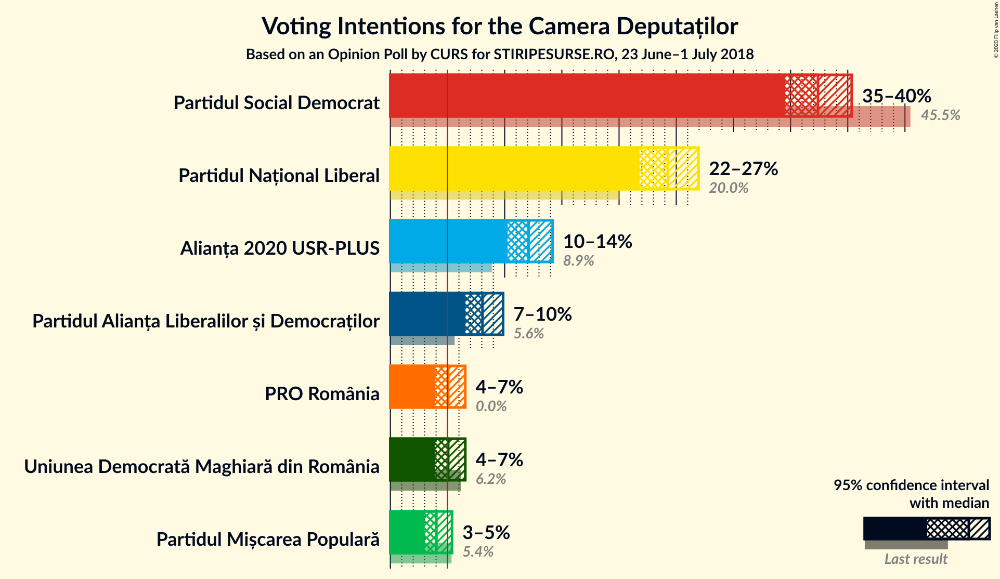
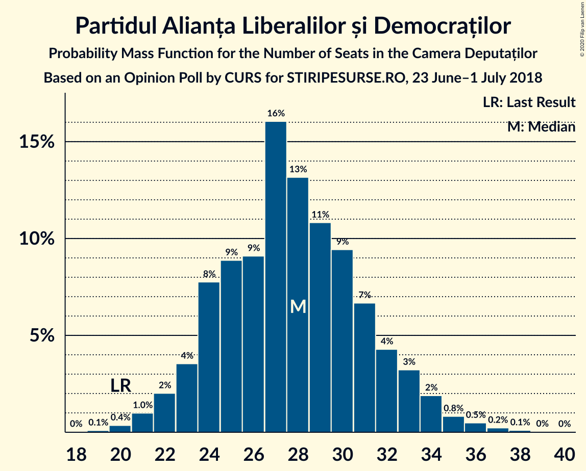
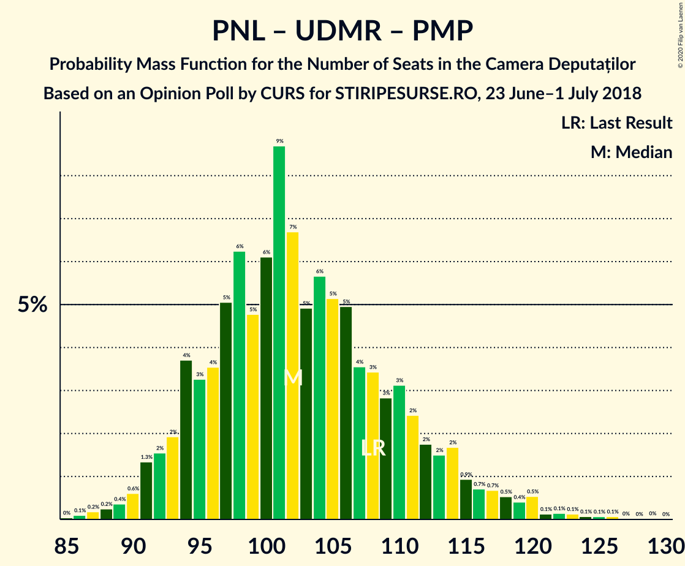
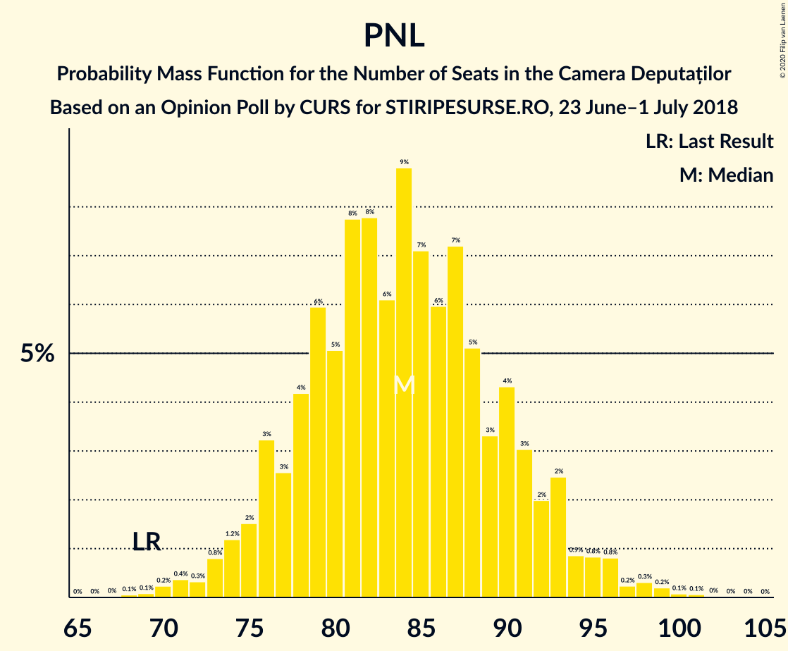

# Opinion Poll by CURS for STIRIPESURSE.RO, 23 June–1 July 2018

<a href="#voting-intentions">Voting Intentions</a> | <a href="#seats">Seats</a> | <a href="#coalitions">Coalitions</a> | <a href="#technical-information">Technical Information</a>

## Voting Intentions

### Confidence Intervals

| Party | Last Result | Poll Result | 80% Confidence Interval | 90% Confidence Interval | 95% Confidence Interval | 99% Confidence Interval |
|:-----:|:-----------:|:-----------:|:-----------------------:|:-----------------------:|:-----------------------:|:-----------------------:|
| Partidul Social Democrat | 45.5% | 37.4% | 35.5–39.3% |35.0–39.9% |34.5–40.3% |33.7–41.3% |
| Partidul Național Liberal | 20.0% | 24.3% | 22.6–26.0% |22.2–26.5% |21.8–26.9% |21.0–27.8% |
| Alianța 2020 USR-PLUS | 8.9% | 12.1% | 10.9–13.5% |10.5–13.9% |10.3–14.2% |9.7–14.9% |
| Partidul Alianța Liberalilor și Democraților | 5.6% | 8.1% | 7.1–9.2% |6.8–9.6% |6.6–9.9% |6.1–10.4% |
| Uniunea Democrată Maghiară din România | 6.2% | 5.1% | 4.3–6.0% |4.1–6.3% |3.9–6.6% |3.6–7.0% |
| PRO România | 0.0% | 5.1% | 4.3–6.0% |4.1–6.3% |3.9–6.6% |3.6–7.0% |
| Partidul Mișcarea Populară | 5.4% | 4.0% | 3.4–4.9% |3.2–5.2% |3.0–5.4% |2.7–5.9% |

*Note:* The poll result column reflects the actual value used in the calculations. Published results may vary slightly, and in addition be rounded to fewer digits.

## Seats

### Confidence Intervals

| Party | Last Result | Median | 80% Confidence Interval | 90% Confidence Interval | 95% Confidence Interval | 99% Confidence Interval |
|:-----:|:-----------:|:------:|:-----------------------:|:-----------------------:|:-----------------------:|:-----------------------:|
| <a href="#partidul-social-democrat">Partidul Social Democrat</a> | 154 | 129 | 121–138 |119–141 |117–142 |113–146 |
| <a href="#partidul-național-liberal">Partidul Național Liberal</a> | 69 | 84 | 77–91 |76–93 |74–95 |71–98 |
| <a href="#alianța-2020-usr-plus">Alianța 2020 USR-PLUS</a> | 30 | 42 | 37–47 |36–48 |35–49 |33–52 |
| <a href="#partidul-alianța-liberalilor-și-democraților">Partidul Alianța Liberalilor și Democraților</a> | 20 | 28 | 24–32 |23–33 |22–34 |21–36 |
| <a href="#uniunea-democrată-maghiară-din-românia">Uniunea Democrată Maghiară din România</a> | 21 | 17 | 14–21 |14–22 |13–22 |12–24 |
| <a href="#pro-românia">PRO România</a> | 0 | 17 | 0–20 |0–21 |0–22 |0–24 |
| <a href="#partidul-mișcarea-populară">Partidul Mișcarea Populară</a> | 18 | 0 | 0 |0–17 |0–Parties of ethnic minorities |17 |

### Partidul Social Democrat

*For a full overview of the results for this party, see the [Partidul Social Democrat](party-partidulsocialdemocrat.html) page.*

| Number of Seats | Probability | Accumulated | Special Marks |
|:---------------:|:-----------:|:-----------:|:-------------:|
| 109 | 0% | 100% |  |
| 110 | 0% | 99.9% |  |
| 111 | 0.1% | 99.9% |  |
| 112 | 0.1% | 99.8% |  |
| 113 | 0.2% | 99.7% |  |
| 114 | 0.4% | 99.4% |  |
| 115 | 0.3% | 99.1% |  |
| 116 | 0.7% | 98.7% |  |
| 117 | 1.0% | 98% |  |
| 118 | 1.4% | 97% |  |
| 119 | 1.5% | 96% |  |
| 120 | 3% | 94% |  |
| 121 | 2% | 91% |  |
| 122 | 4% | 89% |  |
| 123 | 4% | 85% |  |
| 124 | 4% | 81% |  |
| 125 | 4% | 76% |  |
| 126 | 7% | 73% |  |
| 127 | 6% | 66% |  |
| 128 | 7% | 60% |  |
| 129 | 3% | 53% | Median |
| 130 | 6% | 49% |  |
| 131 | 5% | 43% |  |
| 132 | 6% | 38% |  |
| 133 | 4% | 32% |  |
| 134 | 5% | 28% |  |
| 135 | 4% | 23% |  |
| 136 | 5% | 20% |  |
| 137 | 3% | 14% |  |
| 138 | 3% | 11% |  |
| 139 | 2% | 9% |  |
| 140 | 1.4% | 7% |  |
| 141 | 2% | 6% |  |
| 142 | 1.0% | 3% |  |
| 143 | 0.6% | 2% |  |
| 144 | 0.7% | 2% |  |
| 145 | 0.4% | 1.0% |  |
| 146 | 0.2% | 0.6% |  |
| 147 | 0.2% | 0.4% |  |
| 148 | 0.1% | 0.3% |  |
| 149 | 0.1% | 0.1% |  |
| 150 | 0% | 0.1% |  |
| 151 | 0% | 0% |  |
| 152 | 0% | 0% |  |
| 153 | 0% | 0% |  |
| 154 | 0% | 0% | Last Result |

### Partidul Național Liberal

*For a full overview of the results for this party, see the [Partidul Național Liberal](party-partidulnaționalliberal.html) page.*

| Number of Seats | Probability | Accumulated | Special Marks |
|:---------------:|:-----------:|:-----------:|:-------------:|
| 68 | 0.1% | 100% |  |
| 69 | 0.1% | 99.9% | Last Result |
| 70 | 0.2% | 99.8% |  |
| 71 | 0.4% | 99.6% |  |
| 72 | 0.3% | 99.2% |  |
| 73 | 0.8% | 98.9% |  |
| 74 | 1.2% | 98% |  |
| 75 | 2% | 97% |  |
| 76 | 3% | 95% |  |
| 77 | 3% | 92% |  |
| 78 | 4% | 90% |  |
| 79 | 6% | 85% |  |
| 80 | 5% | 79% |  |
| 81 | 8% | 74% |  |
| 82 | 8% | 67% |  |
| 83 | 6% | 59% |  |
| 84 | 9% | 53% | Median |
| 85 | 7% | 44% |  |
| 86 | 6% | 37% |  |
| 87 | 7% | 31% |  |
| 88 | 5% | 24% |  |
| 89 | 3% | 19% |  |
| 90 | 4% | 15% |  |
| 91 | 3% | 11% |  |
| 92 | 2% | 8% |  |
| 93 | 2% | 6% |  |
| 94 | 0.9% | 3% |  |
| 95 | 0.8% | 3% |  |
| 96 | 0.8% | 2% |  |
| 97 | 0.2% | 0.9% |  |
| 98 | 0.3% | 0.7% |  |
| 99 | 0.2% | 0.4% |  |
| 100 | 0.1% | 0.2% |  |
| 101 | 0.1% | 0.1% |  |
| 102 | 0% | 0.1% |  |
| 103 | 0% | 0% |  |

### Alianța 2020 USR-PLUS

*For a full overview of the results for this party, see the [Alianța 2020 USR-PLUS](party-alianța2020usr-plus.html) page.*

| Number of Seats | Probability | Accumulated | Special Marks |
|:---------------:|:-----------:|:-----------:|:-------------:|
| 30 | 0% | 100% | Last Result |
| 31 | 0.1% | 100% |  |
| 32 | 0.2% | 99.9% |  |
| 33 | 0.6% | 99.6% |  |
| 34 | 1.2% | 99.1% |  |
| 35 | 2% | 98% |  |
| 36 | 4% | 96% |  |
| 37 | 5% | 92% |  |
| 38 | 7% | 88% |  |
| 39 | 10% | 81% |  |
| 40 | 8% | 71% |  |
| 41 | 12% | 63% |  |
| 42 | 11% | 51% | Median |
| 43 | 10% | 40% |  |
| 44 | 7% | 30% |  |
| 45 | 7% | 23% |  |
| 46 | 6% | 16% |  |
| 47 | 4% | 10% |  |
| 48 | 2% | 6% |  |
| 49 | 2% | 4% |  |
| 50 | 1.0% | 2% |  |
| 51 | 0.5% | 1.1% |  |
| 52 | 0.3% | 0.7% |  |
| 53 | 0.2% | 0.3% |  |
| 54 | 0.1% | 0.1% |  |
| 55 | 0% | 0.1% |  |
| 56 | 0% | 0% |  |

### Partidul Alianța Liberalilor și Democraților

*For a full overview of the results for this party, see the [Partidul Alianța Liberalilor și Democraților](party-partidulalianțaliberalilorșidemocraților.html) page.*

| Number of Seats | Probability | Accumulated | Special Marks |
|:---------------:|:-----------:|:-----------:|:-------------:|
| 19 | 0.1% | 100% |  |
| 20 | 0.4% | 99.9% | Last Result |
| 21 | 1.0% | 99.5% |  |
| 22 | 2% | 98.5% |  |
| 23 | 4% | 97% |  |
| 24 | 8% | 93% |  |
| 25 | 9% | 85% |  |
| 26 | 9% | 76% |  |
| 27 | 16% | 67% |  |
| 28 | 13% | 51% | Median |
| 29 | 11% | 38% |  |
| 30 | 9% | 27% |  |
| 31 | 7% | 18% |  |
| 32 | 4% | 11% |  |
| 33 | 3% | 7% |  |
| 34 | 2% | 4% |  |
| 35 | 0.8% | 2% |  |
| 36 | 0.5% | 0.9% |  |
| 37 | 0.2% | 0.4% |  |
| 38 | 0.1% | 0.2% |  |
| 39 | 0% | 0.1% |  |
| 40 | 0% | 0% |  |

### Uniunea Democrată Maghiară din România

*For a full overview of the results for this party, see the [Uniunea Democrată Maghiară din România](party-uniuneademocratămaghiarădinromânia.html) page.*

| Number of Seats | Probability | Accumulated | Special Marks |
|:---------------:|:-----------:|:-----------:|:-------------:|
| 11 | 0.3% | 100% |  |
| 12 | 1.0% | 99.6% |  |
| 13 | 3% | 98.6% |  |
| 14 | 7% | 95% |  |
| 15 | 12% | 88% |  |
| 16 | 15% | 77% |  |
| 17 | 16% | 62% | Median |
| 18 | 14% | 46% |  |
| 19 | 12% | 31% |  |
| 20 | 8% | 19% |  |
| 21 | 5% | 10% | Last Result |
| 22 | 3% | 6% |  |
| 23 | 1.2% | 2% |  |
| 24 | 0.7% | 1.1% |  |
| 25 | 0.2% | 0.4% |  |
| 26 | 0.1% | 0.2% |  |
| 27 | 0% | 0% |  |

### PRO România

*For a full overview of the results for this party, see the [PRO România](party-proromânia.html) page.*

| Number of Seats | Probability | Accumulated | Special Marks |
|:---------------:|:-----------:|:-----------:|:-------------:|
| 0 | 44% | 100% | Last Result |
| 1 | 0% | 56% |  |
| 2 | 0% | 56% |  |
| 3 | 0% | 56% |  |
| 4 | 0% | 56% |  |
| 5 | 0% | 56% |  |
| 6 | 0% | 56% |  |
| 7 | 0% | 56% |  |
| 8 | 0% | 56% |  |
| 9 | 0% | 56% |  |
| 10 | 0% | 56% |  |
| 11 | 0% | 56% |  |
| 12 | 0% | 56% |  |
| 13 | 0% | 56% |  |
| 14 | 0% | 56% |  |
| 15 | 0% | 56% |  |
| 16 | 0.8% | 56% |  |
| 17 | 16% | 56% | Median |
| 18 | 13% | 40% |  |
| 19 | 13% | 27% |  |
| 20 | 6% | 13% |  |
| 21 | 4% | 7% |  |
| 22 | 2% | 3% |  |
| 23 | 0.8% | 1.3% |  |
| 24 | 0.4% | 0.5% |  |
| 25 | 0.1% | 0.2% |  |
| 26 | 0% | 0.1% |  |
| 27 | 0% | 0% |  |

### Partidul Mișcarea Populară

*For a full overview of the results for this party, see the [Partidul Mișcarea Populară](party-partidulmișcareapopulară.html) page.*

| Number of Seats | Probability | Accumulated | Special Marks |
|:---------------:|:-----------:|:-----------:|:-------------:|
| 0 | 93% | 100% | Median |
| 1 | 0% | 7% |  |
| 2 | 0% | 7% |  |
| 3 | 0% | 7% |  |
| 4 | 0% | 7% |  |
| 5 | 0% | 7% |  |
| 6 | 0% | 7% |  |
| 7 | 0% | 7% |  |
| 8 | 0% | 7% |  |
| 9 | 0% | 7% |  |
| 10 | 0% | 7% |  |
| 11 | 0% | 7% |  |
| 12 | 0% | 7% |  |
| 13 | 0% | 7% |  |
| 14 | 0% | 7% |  |
| 15 | 0% | 7% |  |
| 16 | 2% | 7% |  |
| 17 | 3% | 6% |  |
| 18 | 2% | 3% | Last Result |
| 19 | 0.7% | 1.0% |  |
| 20 | 0.2% | 0.3% |  |
| 21 | 0.1% | 0.1% |  |
| 22 | 0% | 0% |  |

## Coalitions

### Confidence Intervals

| Coalition | Last Result | Median | Majority? | 80% Confidence Interval | 90% Confidence Interval | 95% Confidence Interval | 99% Confidence Interval |
|:---------:|:-----------:|:------:|:---------:|:-----------------------:|:-----------------------:|:-----------------------:|:-----------------------:|
| Partidul Social Democrat – Partidul Alianța Liberalilor și Democraților | 174 | 157 | 17% | 148–167 | 146–169 | 144–171 | 139–175 |
| Partidul Național Liberal – Alianța 2020 USR-PLUS – Partidul Alianța Liberalilor și Democraților – Partidul Mișcarea Populară | 137 | 154 | 9% | 146–164 | 144–167 | 142–169 | 138–174 |
| Partidul Național Liberal – Alianța 2020 USR-PLUS – Partidul Alianța Liberalilor și Democraților | 119 | 153 | 6% | 145–163 | 142–165 | 140–167 | 136–171 |
| Partidul Național Liberal – Alianța 2020 USR-PLUS – Uniunea Democrată Maghiară din România – Partidul Mișcarea Populară | 138 | 144 | 0.4% | 135–154 | 133–157 | 132–159 | 128–164 |
| Partidul Național Liberal – Alianța 2020 USR-PLUS – Uniunea Democrată Maghiară din România | 120 | 143 | 0.1% | 134–152 | 132–155 | 130–157 | 126–160 |
| Partidul Social Democrat – PRO România | 154 | 140 | 0% | 130–150 | 127–151 | 125–153 | 121–156 |
| Partidul Național Liberal – Partidul Alianța Liberalilor și Democraților – Uniunea Democrată Maghiară din România – Partidul Mișcarea Populară | 128 | 130 | 0% | 122–140 | 120–143 | 118–145 | 115–150 |
| Partidul Național Liberal – Partidul Alianța Liberalilor și Democraților – Uniunea Democrată Maghiară din România | 110 | 129 | 0% | 121–138 | 119–140 | 116–143 | 113–146 |
| Partidul Național Liberal – Alianța 2020 USR-PLUS – Partidul Mișcarea Populară | 117 | 126 | 0% | 119–136 | 116–139 | 115–141 | 112–146 |
| Partidul Național Liberal – Alianța 2020 USR-PLUS | 99 | 125 | 0% | 118–134 | 115–137 | 113–139 | 110–142 |
| Partidul Național Liberal – Uniunea Democrată Maghiară din România – Partidul Mișcarea Populară | 108 | 102 | 0% | 94–111 | 93–114 | 91–117 | 88–122 |
| Partidul Național Liberal – Uniunea Democrată Maghiară din România | 90 | 101 | 0% | 94–109 | 92–111 | 90–113 | 87–117 |
| Partidul Național Liberal – Partidul Mișcarea Populară | 87 | 85 | 0% | 78–93 | 76–97 | 75–100 | 72–104 |
| Partidul Național Liberal | 69 | 84 | 0% | 77–91 | 76–93 | 74–95 | 71–98 |
| Alianța 2020 USR-PLUS – Partidul Mișcarea Populară | 48 | 42 | 0% | 37–49 | 36–56 | 35–59 | 33–63 |
| Partidul Național Liberal – Alianța 2020 USR-PLUS – Partidul Alianța Liberalilor și Democraților – Uniunea Democrată Maghiară din România – Partidul Mișcarea Populară | 158 | 172 | 84% | 162–Parties of ethnic minorities | 17 | 17 | 17 |
| Partidul Național Liberal – Alianța 2020 USR-PLUS – Partidul Alianța Liberalilor și Democraților – Uniunea Democrată Maghiară din România | 140 | 171 | 79% | 161–Parties of ethnic minorities | 17 | 17 | 17 |
| Partidul Social Democrat – Partidul Alianța Liberalilor și Democraților – PRO România | 174 | 168 | 67% | 158–177 | 155–179 | 153–Parties of ethnic minorities | 17 |

### Partidul Social Democrat – Partidul Alianța Liberalilor și Democraților

| Number of Seats | Probability | Accumulated | Special Marks |
|:---------------:|:-----------:|:-----------:|:-------------:|
| 135 | 0% | 100% |  |
| 136 | 0.1% | 99.9% |  |
| 137 | 0.1% | 99.9% |  |
| 138 | 0.1% | 99.8% |  |
| 139 | 0.2% | 99.7% |  |
| 140 | 0.3% | 99.5% |  |
| 141 | 0.5% | 99.2% |  |
| 142 | 0.5% | 98.7% |  |
| 143 | 0.6% | 98% |  |
| 144 | 1.2% | 98% |  |
| 145 | 1.3% | 96% |  |
| 146 | 2% | 95% |  |
| 147 | 2% | 93% |  |
| 148 | 2% | 91% |  |
| 149 | 3% | 89% |  |
| 150 | 3% | 85% |  |
| 151 | 5% | 82% |  |
| 152 | 4% | 77% |  |
| 153 | 5% | 74% |  |
| 154 | 7% | 69% |  |
| 155 | 5% | 62% |  |
| 156 | 5% | 56% |  |
| 157 | 5% | 52% | Median |
| 158 | 4% | 46% |  |
| 159 | 4% | 42% |  |
| 160 | 5% | 38% |  |
| 161 | 4% | 33% |  |
| 162 | 4% | 29% |  |
| 163 | 4% | 25% |  |
| 164 | 4% | 21% |  |
| 165 | 2% | 17% | Majority |
| 166 | 3% | 14% |  |
| 167 | 3% | 11% |  |
| 168 | 3% | 9% |  |
| 169 | 1.3% | 6% |  |
| 170 | 1.1% | 5% |  |
| 171 | 1.2% | 4% |  |
| 172 | 0.5% | 2% |  |
| 173 | 0.7% | 2% |  |
| 174 | 0.5% | 1.1% | Last Result |
| 175 | 0.2% | 0.5% |  |
| 176 | 0.2% | 0.3% |  |
| 177 | 0.1% | 0.2% |  |
| 178 | 0.1% | 0.1% |  |
| 179 | 0% | 0.1% |  |
| 180 | 0% | 0% |  |

### Partidul Național Liberal – Alianța 2020 USR-PLUS – Partidul Alianța Liberalilor și Democraților – Partidul Mișcarea Populară

| Number of Seats | Probability | Accumulated | Special Marks |
|:---------------:|:-----------:|:-----------:|:-------------:|
| 135 | 0% | 100% |  |
| 136 | 0.1% | 99.9% |  |
| 137 | 0.1% | 99.8% | Last Result |
| 138 | 0.2% | 99.7% |  |
| 139 | 0.4% | 99.5% |  |
| 140 | 0.5% | 99.1% |  |
| 141 | 0.6% | 98.6% |  |
| 142 | 1.0% | 98% |  |
| 143 | 1.5% | 97% |  |
| 144 | 2% | 95% |  |
| 145 | 3% | 94% |  |
| 146 | 2% | 91% |  |
| 147 | 5% | 88% |  |
| 148 | 4% | 84% |  |
| 149 | 6% | 80% |  |
| 150 | 5% | 74% |  |
| 151 | 5% | 69% |  |
| 152 | 5% | 64% |  |
| 153 | 5% | 58% |  |
| 154 | 4% | 53% | Median |
| 155 | 5% | 49% |  |
| 156 | 5% | 44% |  |
| 157 | 4% | 39% |  |
| 158 | 5% | 35% |  |
| 159 | 5% | 30% |  |
| 160 | 3% | 26% |  |
| 161 | 4% | 22% |  |
| 162 | 4% | 19% |  |
| 163 | 3% | 15% |  |
| 164 | 2% | 12% |  |
| 165 | 2% | 9% | Majority |
| 166 | 2% | 7% |  |
| 167 | 1.4% | 6% |  |
| 168 | 1.2% | 4% |  |
| 169 | 1.2% | 3% |  |
| 170 | 0.6% | 2% |  |
| 171 | 0.3% | 1.4% |  |
| 172 | 0.3% | 1.1% |  |
| 173 | 0.2% | 0.8% |  |
| 174 | 0.1% | 0.6% |  |
| 175 | 0.1% | 0.5% |  |
| 176 | 0.1% | 0.3% |  |
| 177 | 0.1% | 0.2% |  |
| 178 | 0% | 0.1% |  |
| 179 | 0% | 0.1% |  |
| 180 | 0% | 0% |  |

### Partidul Național Liberal – Alianța 2020 USR-PLUS – Partidul Alianța Liberalilor și Democraților

| Number of Seats | Probability | Accumulated | Special Marks |
|:---------------:|:-----------:|:-----------:|:-------------:|
| 119 | 0% | 100% | Last Result |
| 120 | 0% | 100% |  |
| 121 | 0% | 100% |  |
| 122 | 0% | 100% |  |
| 123 | 0% | 100% |  |
| 124 | 0% | 100% |  |
| 125 | 0% | 100% |  |
| 126 | 0% | 100% |  |
| 127 | 0% | 100% |  |
| 128 | 0% | 100% |  |
| 129 | 0% | 100% |  |
| 130 | 0% | 100% |  |
| 131 | 0% | 100% |  |
| 132 | 0% | 99.9% |  |
| 133 | 0.1% | 99.9% |  |
| 134 | 0.2% | 99.8% |  |
| 135 | 0.1% | 99.7% |  |
| 136 | 0.3% | 99.5% |  |
| 137 | 0.2% | 99.2% |  |
| 138 | 0.4% | 99.0% |  |
| 139 | 0.7% | 98.6% |  |
| 140 | 0.8% | 98% |  |
| 141 | 1.0% | 97% |  |
| 142 | 2% | 96% |  |
| 143 | 2% | 94% |  |
| 144 | 2% | 93% |  |
| 145 | 3% | 90% |  |
| 146 | 3% | 87% |  |
| 147 | 5% | 84% |  |
| 148 | 4% | 79% |  |
| 149 | 6% | 75% |  |
| 150 | 6% | 69% |  |
| 151 | 6% | 63% |  |
| 152 | 6% | 58% |  |
| 153 | 5% | 52% |  |
| 154 | 4% | 47% | Median |
| 155 | 5% | 43% |  |
| 156 | 5% | 38% |  |
| 157 | 4% | 33% |  |
| 158 | 4% | 29% |  |
| 159 | 4% | 25% |  |
| 160 | 3% | 21% |  |
| 161 | 3% | 18% |  |
| 162 | 3% | 14% |  |
| 163 | 3% | 11% |  |
| 164 | 2% | 8% |  |
| 165 | 2% | 6% | Majority |
| 166 | 1.3% | 4% |  |
| 167 | 0.8% | 3% |  |
| 168 | 0.6% | 2% |  |
| 169 | 0.7% | 2% |  |
| 170 | 0.3% | 0.9% |  |
| 171 | 0.2% | 0.6% |  |
| 172 | 0.2% | 0.4% |  |
| 173 | 0.1% | 0.2% |  |
| 174 | 0.1% | 0.1% |  |
| 175 | 0% | 0.1% |  |
| 176 | 0% | 0% |  |

### Partidul Național Liberal – Alianța 2020 USR-PLUS – Uniunea Democrată Maghiară din România – Partidul Mișcarea Populară

| Number of Seats | Probability | Accumulated | Special Marks |
|:---------------:|:-----------:|:-----------:|:-------------:|
| 125 | 0% | 100% |  |
| 126 | 0.1% | 99.9% |  |
| 127 | 0.2% | 99.8% |  |
| 128 | 0.3% | 99.6% |  |
| 129 | 0.3% | 99.3% |  |
| 130 | 0.6% | 99.0% |  |
| 131 | 0.7% | 98% |  |
| 132 | 1.3% | 98% |  |
| 133 | 2% | 96% |  |
| 134 | 3% | 94% |  |
| 135 | 2% | 92% |  |
| 136 | 4% | 89% |  |
| 137 | 4% | 86% |  |
| 138 | 4% | 82% | Last Result |
| 139 | 4% | 78% |  |
| 140 | 6% | 74% |  |
| 141 | 5% | 68% |  |
| 142 | 5% | 62% |  |
| 143 | 4% | 57% | Median |
| 144 | 7% | 53% |  |
| 145 | 5% | 46% |  |
| 146 | 5% | 41% |  |
| 147 | 4% | 37% |  |
| 148 | 5% | 33% |  |
| 149 | 5% | 28% |  |
| 150 | 4% | 23% |  |
| 151 | 3% | 20% |  |
| 152 | 3% | 17% |  |
| 153 | 2% | 13% |  |
| 154 | 2% | 11% |  |
| 155 | 2% | 9% |  |
| 156 | 2% | 7% |  |
| 157 | 1.3% | 5% |  |
| 158 | 1.0% | 4% |  |
| 159 | 0.9% | 3% |  |
| 160 | 0.5% | 2% |  |
| 161 | 0.4% | 1.5% |  |
| 162 | 0.3% | 1.1% |  |
| 163 | 0.2% | 0.8% |  |
| 164 | 0.2% | 0.6% |  |
| 165 | 0.1% | 0.4% | Majority |
| 166 | 0.1% | 0.2% |  |
| 167 | 0% | 0.2% |  |
| 168 | 0.1% | 0.1% |  |
| 169 | 0% | 0.1% |  |
| 170 | 0% | 0% |  |

### Partidul Național Liberal – Alianța 2020 USR-PLUS – Uniunea Democrată Maghiară din România

| Number of Seats | Probability | Accumulated | Special Marks |
|:---------------:|:-----------:|:-----------:|:-------------:|
| 120 | 0% | 100% | Last Result |
| 121 | 0% | 100% |  |
| 122 | 0.1% | 99.9% |  |
| 123 | 0.1% | 99.9% |  |
| 124 | 0.1% | 99.8% |  |
| 125 | 0.2% | 99.7% |  |
| 126 | 0.2% | 99.6% |  |
| 127 | 0.3% | 99.4% |  |
| 128 | 0.6% | 99.0% |  |
| 129 | 0.5% | 98% |  |
| 130 | 0.9% | 98% |  |
| 131 | 1.2% | 97% |  |
| 132 | 2% | 96% |  |
| 133 | 3% | 94% |  |
| 134 | 3% | 92% |  |
| 135 | 3% | 89% |  |
| 136 | 4% | 86% |  |
| 137 | 4% | 82% |  |
| 138 | 5% | 78% |  |
| 139 | 4% | 73% |  |
| 140 | 7% | 69% |  |
| 141 | 6% | 62% |  |
| 142 | 5% | 56% |  |
| 143 | 4% | 51% | Median |
| 144 | 6% | 47% |  |
| 145 | 5% | 40% |  |
| 146 | 5% | 35% |  |
| 147 | 4% | 31% |  |
| 148 | 5% | 27% |  |
| 149 | 4% | 22% |  |
| 150 | 3% | 18% |  |
| 151 | 3% | 15% |  |
| 152 | 3% | 12% |  |
| 153 | 2% | 9% |  |
| 154 | 2% | 7% |  |
| 155 | 2% | 6% |  |
| 156 | 1.4% | 4% |  |
| 157 | 0.9% | 3% |  |
| 158 | 0.6% | 2% |  |
| 159 | 0.5% | 1.3% |  |
| 160 | 0.3% | 0.7% |  |
| 161 | 0.2% | 0.4% |  |
| 162 | 0.1% | 0.3% |  |
| 163 | 0.1% | 0.2% |  |
| 164 | 0% | 0.1% |  |
| 165 | 0% | 0.1% | Majority |
| 166 | 0% | 0% |  |

### Partidul Social Democrat – PRO România

| Number of Seats | Probability | Accumulated | Special Marks |
|:---------------:|:-----------:|:-----------:|:-------------:|
| 116 | 0.1% | 100% |  |
| 117 | 0% | 99.9% |  |
| 118 | 0% | 99.9% |  |
| 119 | 0.1% | 99.8% |  |
| 120 | 0.2% | 99.7% |  |
| 121 | 0.3% | 99.5% |  |
| 122 | 0.2% | 99.3% |  |
| 123 | 0.6% | 99.1% |  |
| 124 | 0.9% | 98% |  |
| 125 | 0.7% | 98% |  |
| 126 | 1.1% | 97% |  |
| 127 | 1.2% | 96% |  |
| 128 | 2% | 95% |  |
| 129 | 2% | 93% |  |
| 130 | 3% | 91% |  |
| 131 | 3% | 88% |  |
| 132 | 3% | 85% |  |
| 133 | 3% | 82% |  |
| 134 | 4% | 79% |  |
| 135 | 4% | 76% |  |
| 136 | 6% | 72% |  |
| 137 | 4% | 66% |  |
| 138 | 3% | 62% |  |
| 139 | 5% | 59% |  |
| 140 | 4% | 54% |  |
| 141 | 6% | 50% |  |
| 142 | 4% | 44% |  |
| 143 | 4% | 40% |  |
| 144 | 4% | 36% |  |
| 145 | 9% | 32% |  |
| 146 | 2% | 23% | Median |
| 147 | 5% | 21% |  |
| 148 | 3% | 16% |  |
| 149 | 3% | 14% |  |
| 150 | 2% | 10% |  |
| 151 | 3% | 8% |  |
| 152 | 1.3% | 5% |  |
| 153 | 1.3% | 3% |  |
| 154 | 0.8% | 2% | Last Result |
| 155 | 0.5% | 1.4% |  |
| 156 | 0.4% | 0.8% |  |
| 157 | 0.2% | 0.5% |  |
| 158 | 0.2% | 0.3% |  |
| 159 | 0.1% | 0.2% |  |
| 160 | 0% | 0.1% |  |
| 161 | 0% | 0% |  |

### Partidul Național Liberal – Partidul Alianța Liberalilor și Democraților – Uniunea Democrată Maghiară din România – Partidul Mișcarea Populară

| Number of Seats | Probability | Accumulated | Special Marks |
|:---------------:|:-----------:|:-----------:|:-------------:|
| 111 | 0% | 100% |  |
| 112 | 0.1% | 99.9% |  |
| 113 | 0.2% | 99.9% |  |
| 114 | 0.2% | 99.7% |  |
| 115 | 0.4% | 99.5% |  |
| 116 | 0.5% | 99.2% |  |
| 117 | 0.7% | 98.6% |  |
| 118 | 0.7% | 98% |  |
| 119 | 2% | 97% |  |
| 120 | 2% | 96% |  |
| 121 | 3% | 94% |  |
| 122 | 3% | 91% |  |
| 123 | 3% | 88% |  |
| 124 | 6% | 85% |  |
| 125 | 6% | 78% |  |
| 126 | 3% | 72% |  |
| 127 | 5% | 69% |  |
| 128 | 6% | 63% | Last Result |
| 129 | 5% | 57% | Median |
| 130 | 4% | 52% |  |
| 131 | 6% | 48% |  |
| 132 | 6% | 42% |  |
| 133 | 5% | 36% |  |
| 134 | 5% | 31% |  |
| 135 | 4% | 26% |  |
| 136 | 3% | 21% |  |
| 137 | 3% | 18% |  |
| 138 | 2% | 15% |  |
| 139 | 2% | 13% |  |
| 140 | 3% | 11% |  |
| 141 | 2% | 8% |  |
| 142 | 1.5% | 7% |  |
| 143 | 1.3% | 5% |  |
| 144 | 1.0% | 4% |  |
| 145 | 0.7% | 3% |  |
| 146 | 0.5% | 2% |  |
| 147 | 0.4% | 2% |  |
| 148 | 0.2% | 1.1% |  |
| 149 | 0.3% | 0.9% |  |
| 150 | 0.2% | 0.6% |  |
| 151 | 0.2% | 0.5% |  |
| 152 | 0.1% | 0.3% |  |
| 153 | 0.1% | 0.2% |  |
| 154 | 0% | 0.1% |  |
| 155 | 0% | 0.1% |  |
| 156 | 0% | 0% |  |

### Partidul Național Liberal – Partidul Alianța Liberalilor și Democraților – Uniunea Democrată Maghiară din România

| Number of Seats | Probability | Accumulated | Special Marks |
|:---------------:|:-----------:|:-----------:|:-------------:|
| 109 | 0.1% | 100% |  |
| 110 | 0% | 99.9% | Last Result |
| 111 | 0.1% | 99.9% |  |
| 112 | 0.2% | 99.7% |  |
| 113 | 0.3% | 99.6% |  |
| 114 | 0.4% | 99.3% |  |
| 115 | 0.6% | 98.9% |  |
| 116 | 0.8% | 98% |  |
| 117 | 1.0% | 97% |  |
| 118 | 0.9% | 96% |  |
| 119 | 2% | 95% |  |
| 120 | 2% | 93% |  |
| 121 | 3% | 91% |  |
| 122 | 4% | 88% |  |
| 123 | 3% | 84% |  |
| 124 | 7% | 80% |  |
| 125 | 7% | 74% |  |
| 126 | 4% | 67% |  |
| 127 | 6% | 63% |  |
| 128 | 6% | 57% |  |
| 129 | 5% | 51% | Median |
| 130 | 4% | 46% |  |
| 131 | 6% | 42% |  |
| 132 | 6% | 36% |  |
| 133 | 5% | 30% |  |
| 134 | 5% | 25% |  |
| 135 | 4% | 20% |  |
| 136 | 3% | 16% |  |
| 137 | 3% | 13% |  |
| 138 | 2% | 10% |  |
| 139 | 2% | 8% |  |
| 140 | 2% | 7% |  |
| 141 | 1.2% | 5% |  |
| 142 | 1.0% | 4% |  |
| 143 | 1.0% | 3% |  |
| 144 | 0.5% | 2% |  |
| 145 | 0.5% | 1.1% |  |
| 146 | 0.2% | 0.6% |  |
| 147 | 0.2% | 0.4% |  |
| 148 | 0.1% | 0.2% |  |
| 149 | 0.1% | 0.1% |  |
| 150 | 0% | 0% |  |

### Partidul Național Liberal – Alianța 2020 USR-PLUS – Partidul Mișcarea Populară

| Number of Seats | Probability | Accumulated | Special Marks |
|:---------------:|:-----------:|:-----------:|:-------------:|
| 108 | 0% | 100% |  |
| 109 | 0.1% | 99.9% |  |
| 110 | 0.1% | 99.9% |  |
| 111 | 0.2% | 99.7% |  |
| 112 | 0.5% | 99.5% |  |
| 113 | 0.4% | 99.0% |  |
| 114 | 0.7% | 98.6% |  |
| 115 | 1.1% | 98% |  |
| 116 | 2% | 97% |  |
| 117 | 1.4% | 95% | Last Result |
| 118 | 3% | 93% |  |
| 119 | 2% | 90% |  |
| 120 | 5% | 88% |  |
| 121 | 4% | 82% |  |
| 122 | 6% | 79% |  |
| 123 | 5% | 73% |  |
| 124 | 7% | 68% |  |
| 125 | 4% | 61% |  |
| 126 | 6% | 56% | Median |
| 127 | 6% | 50% |  |
| 128 | 6% | 44% |  |
| 129 | 5% | 38% |  |
| 130 | 4% | 33% |  |
| 131 | 4% | 29% |  |
| 132 | 3% | 25% |  |
| 133 | 5% | 22% |  |
| 134 | 3% | 16% |  |
| 135 | 2% | 14% |  |
| 136 | 2% | 11% |  |
| 137 | 2% | 9% |  |
| 138 | 1.5% | 7% |  |
| 139 | 1.3% | 6% |  |
| 140 | 1.0% | 4% |  |
| 141 | 0.8% | 3% |  |
| 142 | 0.7% | 2% |  |
| 143 | 0.4% | 2% |  |
| 144 | 0.4% | 1.3% |  |
| 145 | 0.2% | 0.9% |  |
| 146 | 0.2% | 0.7% |  |
| 147 | 0.1% | 0.4% |  |
| 148 | 0.1% | 0.3% |  |
| 149 | 0.1% | 0.2% |  |
| 150 | 0.1% | 0.1% |  |
| 151 | 0% | 0.1% |  |
| 152 | 0% | 0.1% |  |
| 153 | 0% | 0% |  |

### Partidul Național Liberal – Alianța 2020 USR-PLUS

| Number of Seats | Probability | Accumulated | Special Marks |
|:---------------:|:-----------:|:-----------:|:-------------:|
| 99 | 0% | 100% | Last Result |
| 100 | 0% | 100% |  |
| 101 | 0% | 100% |  |
| 102 | 0% | 100% |  |
| 103 | 0% | 100% |  |
| 104 | 0% | 100% |  |
| 105 | 0% | 100% |  |
| 106 | 0% | 100% |  |
| 107 | 0.1% | 99.9% |  |
| 108 | 0.1% | 99.8% |  |
| 109 | 0.1% | 99.7% |  |
| 110 | 0.4% | 99.6% |  |
| 111 | 0.4% | 99.2% |  |
| 112 | 0.6% | 98.8% |  |
| 113 | 0.7% | 98% |  |
| 114 | 1.0% | 97% |  |
| 115 | 1.5% | 96% |  |
| 116 | 3% | 95% |  |
| 117 | 2% | 92% |  |
| 118 | 4% | 91% |  |
| 119 | 3% | 87% |  |
| 120 | 6% | 84% |  |
| 121 | 4% | 78% |  |
| 122 | 6% | 74% |  |
| 123 | 6% | 68% |  |
| 124 | 8% | 62% |  |
| 125 | 5% | 55% |  |
| 126 | 6% | 50% | Median |
| 127 | 6% | 44% |  |
| 128 | 6% | 38% |  |
| 129 | 5% | 32% |  |
| 130 | 4% | 27% |  |
| 131 | 4% | 23% |  |
| 132 | 3% | 19% |  |
| 133 | 5% | 16% |  |
| 134 | 2% | 11% |  |
| 135 | 2% | 9% |  |
| 136 | 2% | 7% |  |
| 137 | 2% | 5% |  |
| 138 | 1.0% | 3% |  |
| 139 | 1.0% | 3% |  |
| 140 | 0.5% | 2% |  |
| 141 | 0.3% | 1.1% |  |
| 142 | 0.3% | 0.7% |  |
| 143 | 0.2% | 0.4% |  |
| 144 | 0.1% | 0.2% |  |
| 145 | 0.1% | 0.1% |  |
| 146 | 0% | 0.1% |  |
| 147 | 0% | 0% |  |

### Partidul Național Liberal – Uniunea Democrată Maghiară din România – Partidul Mișcarea Populară

| Number of Seats | Probability | Accumulated | Special Marks |
|:---------------:|:-----------:|:-----------:|:-------------:|
| 85 | 0% | 100% |  |
| 86 | 0.1% | 99.9% |  |
| 87 | 0.2% | 99.8% |  |
| 88 | 0.2% | 99.6% |  |
| 89 | 0.4% | 99.4% |  |
| 90 | 0.6% | 99.0% |  |
| 91 | 1.3% | 98% |  |
| 92 | 2% | 97% |  |
| 93 | 2% | 96% |  |
| 94 | 4% | 94% |  |
| 95 | 3% | 90% |  |
| 96 | 4% | 87% |  |
| 97 | 5% | 83% |  |
| 98 | 6% | 78% |  |
| 99 | 5% | 72% |  |
| 100 | 6% | 67% |  |
| 101 | 9% | 61% | Median |
| 102 | 7% | 52% |  |
| 103 | 5% | 45% |  |
| 104 | 6% | 41% |  |
| 105 | 5% | 35% |  |
| 106 | 5% | 30% |  |
| 107 | 4% | 25% |  |
| 108 | 3% | 21% | Last Result |
| 109 | 3% | 18% |  |
| 110 | 3% | 15% |  |
| 111 | 2% | 12% |  |
| 112 | 2% | 9% |  |
| 113 | 2% | 8% |  |
| 114 | 2% | 6% |  |
| 115 | 0.9% | 5% |  |
| 116 | 0.7% | 4% |  |
| 117 | 0.7% | 3% |  |
| 118 | 0.5% | 2% |  |
| 119 | 0.4% | 2% |  |
| 120 | 0.5% | 1.2% |  |
| 121 | 0.1% | 0.7% |  |
| 122 | 0.1% | 0.6% |  |
| 123 | 0.1% | 0.4% |  |
| 124 | 0.1% | 0.3% |  |
| 125 | 0.1% | 0.2% |  |
| 126 | 0.1% | 0.2% |  |
| 127 | 0% | 0.1% |  |
| 128 | 0% | 0.1% |  |
| 129 | 0% | 0% |  |

### Partidul Național Liberal – Uniunea Democrată Maghiară din România

| Number of Seats | Probability | Accumulated | Special Marks |
|:---------------:|:-----------:|:-----------:|:-------------:|
| 83 | 0% | 100% |  |
| 84 | 0.1% | 99.9% |  |
| 85 | 0.1% | 99.9% |  |
| 86 | 0.2% | 99.7% |  |
| 87 | 0.3% | 99.5% |  |
| 88 | 0.4% | 99.2% |  |
| 89 | 0.5% | 98.8% |  |
| 90 | 1.1% | 98% | Last Result |
| 91 | 2% | 97% |  |
| 92 | 2% | 96% |  |
| 93 | 3% | 94% |  |
| 94 | 4% | 91% |  |
| 95 | 4% | 87% |  |
| 96 | 4% | 83% |  |
| 97 | 6% | 79% |  |
| 98 | 7% | 73% |  |
| 99 | 5% | 67% |  |
| 100 | 7% | 62% |  |
| 101 | 9% | 55% | Median |
| 102 | 7% | 46% |  |
| 103 | 5% | 39% |  |
| 104 | 6% | 34% |  |
| 105 | 5% | 28% |  |
| 106 | 5% | 23% |  |
| 107 | 3% | 18% |  |
| 108 | 3% | 15% |  |
| 109 | 3% | 12% |  |
| 110 | 3% | 9% |  |
| 111 | 2% | 7% |  |
| 112 | 1.4% | 5% |  |
| 113 | 0.9% | 3% |  |
| 114 | 1.1% | 2% |  |
| 115 | 0.4% | 1.3% |  |
| 116 | 0.4% | 0.9% |  |
| 117 | 0.2% | 0.5% |  |
| 118 | 0.2% | 0.3% |  |
| 119 | 0.1% | 0.2% |  |
| 120 | 0% | 0.1% |  |
| 121 | 0% | 0.1% |  |
| 122 | 0% | 0% |  |

### Partidul Național Liberal – Partidul Mișcarea Populară

| Number of Seats | Probability | Accumulated | Special Marks |
|:---------------:|:-----------:|:-----------:|:-------------:|
| 69 | 0% | 100% |  |
| 70 | 0.1% | 99.9% |  |
| 71 | 0.2% | 99.8% |  |
| 72 | 0.2% | 99.6% |  |
| 73 | 0.6% | 99.4% |  |
| 74 | 0.9% | 98.8% |  |
| 75 | 1.2% | 98% |  |
| 76 | 3% | 97% |  |
| 77 | 2% | 94% |  |
| 78 | 4% | 92% |  |
| 79 | 5% | 88% |  |
| 80 | 5% | 83% |  |
| 81 | 7% | 79% |  |
| 82 | 8% | 72% |  |
| 83 | 5% | 64% |  |
| 84 | 8% | 59% | Median |
| 85 | 7% | 50% |  |
| 86 | 6% | 43% |  |
| 87 | 7% | 38% | Last Result |
| 88 | 5% | 31% |  |
| 89 | 3% | 25% |  |
| 90 | 5% | 22% |  |
| 91 | 3% | 18% |  |
| 92 | 2% | 14% |  |
| 93 | 3% | 12% |  |
| 94 | 1.3% | 9% |  |
| 95 | 2% | 8% |  |
| 96 | 1.2% | 6% |  |
| 97 | 0.7% | 5% |  |
| 98 | 1.0% | 4% |  |
| 99 | 0.6% | 3% |  |
| 100 | 0.6% | 3% |  |
| 101 | 0.7% | 2% |  |
| 102 | 0.4% | 1.5% |  |
| 103 | 0.4% | 1.0% |  |
| 104 | 0.1% | 0.6% |  |
| 105 | 0.1% | 0.5% |  |
| 106 | 0.1% | 0.4% |  |
| 107 | 0.1% | 0.3% |  |
| 108 | 0.1% | 0.2% |  |
| 109 | 0.1% | 0.1% |  |
| 110 | 0% | 0.1% |  |
| 111 | 0% | 0% |  |

### Partidul Național Liberal

| Number of Seats | Probability | Accumulated | Special Marks |
|:---------------:|:-----------:|:-----------:|:-------------:|
| 68 | 0.1% | 100% |  |
| 69 | 0.1% | 99.9% | Last Result |
| 70 | 0.2% | 99.8% |  |
| 71 | 0.4% | 99.6% |  |
| 72 | 0.3% | 99.2% |  |
| 73 | 0.8% | 98.9% |  |
| 74 | 1.2% | 98% |  |
| 75 | 2% | 97% |  |
| 76 | 3% | 95% |  |
| 77 | 3% | 92% |  |
| 78 | 4% | 90% |  |
| 79 | 6% | 85% |  |
| 80 | 5% | 79% |  |
| 81 | 8% | 74% |  |
| 82 | 8% | 67% |  |
| 83 | 6% | 59% |  |
| 84 | 9% | 53% | Median |
| 85 | 7% | 44% |  |
| 86 | 6% | 37% |  |
| 87 | 7% | 31% |  |
| 88 | 5% | 24% |  |
| 89 | 3% | 19% |  |
| 90 | 4% | 15% |  |
| 91 | 3% | 11% |  |
| 92 | 2% | 8% |  |
| 93 | 2% | 6% |  |
| 94 | 0.9% | 3% |  |
| 95 | 0.8% | 3% |  |
| 96 | 0.8% | 2% |  |
| 97 | 0.2% | 0.9% |  |
| 98 | 0.3% | 0.7% |  |
| 99 | 0.2% | 0.4% |  |
| 100 | 0.1% | 0.2% |  |
| 101 | 0.1% | 0.1% |  |
| 102 | 0% | 0.1% |  |
| 103 | 0% | 0% |  |

### Alianța 2020 USR-PLUS – Partidul Mișcarea Populară

| Number of Seats | Probability | Accumulated | Special Marks |
|:---------------:|:-----------:|:-----------:|:-------------:|
| 31 | 0.1% | 100% |  |
| 32 | 0.2% | 99.9% |  |
| 33 | 0.4% | 99.7% |  |
| 34 | 0.9% | 99.3% |  |
| 35 | 1.5% | 98% |  |
| 36 | 3% | 97% |  |
| 37 | 4% | 94% |  |
| 38 | 6% | 90% |  |
| 39 | 9% | 84% |  |
| 40 | 8% | 75% |  |
| 41 | 11% | 67% |  |
| 42 | 10% | 56% | Median |
| 43 | 10% | 46% |  |
| 44 | 7% | 37% |  |
| 45 | 7% | 30% |  |
| 46 | 6% | 23% |  |
| 47 | 4% | 17% |  |
| 48 | 2% | 14% | Last Result |
| 49 | 2% | 11% |  |
| 50 | 1.2% | 9% |  |
| 51 | 0.6% | 8% |  |
| 52 | 0.8% | 8% |  |
| 53 | 0.6% | 7% |  |
| 54 | 0.6% | 6% |  |
| 55 | 0.5% | 6% |  |
| 56 | 0.9% | 5% |  |
| 57 | 0.9% | 4% |  |
| 58 | 0.7% | 3% |  |
| 59 | 0.7% | 3% |  |
| 60 | 0.5% | 2% |  |
| 61 | 0.4% | 1.3% |  |
| 62 | 0.3% | 0.9% |  |
| 63 | 0.3% | 0.7% |  |
| 64 | 0.1% | 0.4% |  |
| 65 | 0.1% | 0.3% |  |
| 66 | 0.1% | 0.1% |  |
| 67 | 0% | 0.1% |  |
| 68 | 0% | 0% |  |

### Partidul Național Liberal – Alianța 2020 USR-PLUS – Partidul Alianța Liberalilor și Democraților – Uniunea Democrată Maghiară din România – Partidul Mișcarea Populară

| Number of Seats | Probability | Accumulated | Special Marks |
|:---------------:|:-----------:|:-----------:|:-------------:|
| 152 | 0% | 100% |  |
| 153 | 0.1% | 99.9% |  |
| 154 | 0.2% | 99.8% |  |
| 155 | 0.2% | 99.7% |  |
| 156 | 0.4% | 99.5% |  |
| 157 | 0.5% | 99.2% |  |
| 158 | 0.8% | 98.6% | Last Result |
| 159 | 1.3% | 98% |  |
| 160 | 1.3% | 97% |  |
| 161 | 3% | 95% |  |
| 162 | 2% | 92% |  |
| 163 | 3% | 90% |  |
| 164 | 3% | 86% |  |
| 165 | 5% | 84% | Majority |
| 166 | 2% | 79% |  |
| 167 | 9% | 77% |  |
| 168 | 4% | 68% |  |
| 169 | 4% | 64% |  |
| 170 | 4% | 60% |  |
| 171 | 6% | 56% | Median |
| 172 | 4% | 50% |  |
| 173 | 5% | 46% |  |
| 174 | 3% | 41% |  |
| 175 | 4% | 38% |  |
| 176 | 6% | 34% |  |
| 177 | 4% | 28% |  |
| 178 | 4% | 24% |  |
| 179 | 3% | 21% |  |
| 180 | 3% | 18% |  |
| 181 | 3% | 15% |  |
| 182 | 3% | 12% |  |
| 183 | 2% | 9% |  |
| 184 | 2% | 7% |  |
| 185 | 1.2% | 5% |  |
| 186 | 1.1% | 4% |  |
| 187 | 0.7% | 3% |  |
| 188 | 0.9% | 2% |  |
| 189 | 0.6% | 2% |  |
| 190 | 0.2% | 0.9% |  |
| 191 | 0.3% | 0.7% |  |
| 192 | 0.2% | 0.5% |  |
| 193 | 0.1% | 0.3% |  |
| 194 | 0% | 0.2% |  |
| 195 | 0% | 0.1% |  |
| 196 | 0.1% | 0.1% |  |
| 197 | 0% | 0% |  |

### Partidul Național Liberal – Alianța 2020 USR-PLUS – Partidul Alianța Liberalilor și Democraților – Uniunea Democrată Maghiară din România

| Number of Seats | Probability | Accumulated | Special Marks |
|:---------------:|:-----------:|:-----------:|:-------------:|
| 140 | 0% | 100% | Last Result |
| 141 | 0% | 100% |  |
| 142 | 0% | 100% |  |
| 143 | 0% | 100% |  |
| 144 | 0% | 100% |  |
| 145 | 0% | 100% |  |
| 146 | 0% | 100% |  |
| 147 | 0% | 100% |  |
| 148 | 0% | 99.9% |  |
| 149 | 0% | 99.9% |  |
| 150 | 0.1% | 99.8% |  |
| 151 | 0.2% | 99.7% |  |
| 152 | 0.1% | 99.6% |  |
| 153 | 0.2% | 99.4% |  |
| 154 | 0.4% | 99.2% |  |
| 155 | 0.5% | 98.8% |  |
| 156 | 0.6% | 98% |  |
| 157 | 0.9% | 98% |  |
| 158 | 1.2% | 97% |  |
| 159 | 2% | 96% |  |
| 160 | 2% | 94% |  |
| 161 | 3% | 92% |  |
| 162 | 3% | 89% |  |
| 163 | 4% | 86% |  |
| 164 | 3% | 82% |  |
| 165 | 5% | 79% | Majority |
| 166 | 3% | 74% |  |
| 167 | 9% | 71% |  |
| 168 | 4% | 63% |  |
| 169 | 4% | 58% |  |
| 170 | 4% | 54% |  |
| 171 | 6% | 50% | Median |
| 172 | 4% | 44% |  |
| 173 | 4% | 40% |  |
| 174 | 3% | 36% |  |
| 175 | 4% | 33% |  |
| 176 | 5% | 29% |  |
| 177 | 3% | 23% |  |
| 178 | 3% | 20% |  |
| 179 | 3% | 17% |  |
| 180 | 3% | 14% |  |
| 181 | 3% | 11% |  |
| 182 | 3% | 9% |  |
| 183 | 1.4% | 6% |  |
| 184 | 1.1% | 5% |  |
| 185 | 0.8% | 3% |  |
| 186 | 0.8% | 3% |  |
| 187 | 0.5% | 2% |  |
| 188 | 0.7% | 1.3% |  |
| 189 | 0.3% | 0.6% |  |
| 190 | 0.1% | 0.3% |  |
| 191 | 0.1% | 0.2% |  |
| 192 | 0.1% | 0.1% |  |
| 193 | 0% | 0.1% |  |
| 194 | 0% | 0% |  |

### Partidul Social Democrat – Partidul Alianța Liberalilor și Democraților – PRO România

| Number of Seats | Probability | Accumulated | Special Marks |
|:---------------:|:-----------:|:-----------:|:-------------:|
| 143 | 0% | 100% |  |
| 144 | 0.1% | 99.9% |  |
| 145 | 0% | 99.9% |  |
| 146 | 0.1% | 99.8% |  |
| 147 | 0.1% | 99.8% |  |
| 148 | 0.2% | 99.6% |  |
| 149 | 0.2% | 99.4% |  |
| 150 | 0.3% | 99.2% |  |
| 151 | 0.4% | 98.9% |  |
| 152 | 0.5% | 98.5% |  |
| 153 | 0.9% | 98% |  |
| 154 | 1.0% | 97% |  |
| 155 | 1.3% | 96% |  |
| 156 | 2% | 95% |  |
| 157 | 2% | 93% |  |
| 158 | 2% | 91% |  |
| 159 | 2% | 89% |  |
| 160 | 3% | 87% |  |
| 161 | 3% | 83% |  |
| 162 | 4% | 80% |  |
| 163 | 5% | 77% |  |
| 164 | 5% | 72% |  |
| 165 | 4% | 67% | Majority |
| 166 | 5% | 63% |  |
| 167 | 5% | 59% |  |
| 168 | 7% | 54% |  |
| 169 | 4% | 47% |  |
| 170 | 5% | 43% |  |
| 171 | 5% | 38% |  |
| 172 | 6% | 32% |  |
| 173 | 4% | 26% |  |
| 174 | 4% | 22% | Last Result, Median |
| 175 | 4% | 18% |  |
| 176 | 4% | 14% |  |
| 177 | 2% | 11% |  |
| 178 | 3% | 8% |  |
| 179 | 2% | 6% |  |
| 180 | 1.3% | 4% |  |
| 181 | 0.7% | 2% |  |
| 182 | 0.6% | 2% |  |
| 183 | 0.3% | 1.0% |  |
| 184 | 0.3% | 0.7% |  |
| 185 | 0.2% | 0.4% |  |
| 186 | 0.1% | 0.2% |  |
| 187 | 0% | 0.1% |  |
| 188 | 0% | 0% |  |

## Technical Information

### Opinion Poll

+ **Polling firm:** CURS
+ **Commissioner(s):** STIRIPESURSE.RO
+ **Fieldwork period:** 23 June–1 July 2018

### Calculations

+ **Sample size:** 1067
+ **Simulations done:** 1,048,575
+ **Error estimate:** 0.61%

