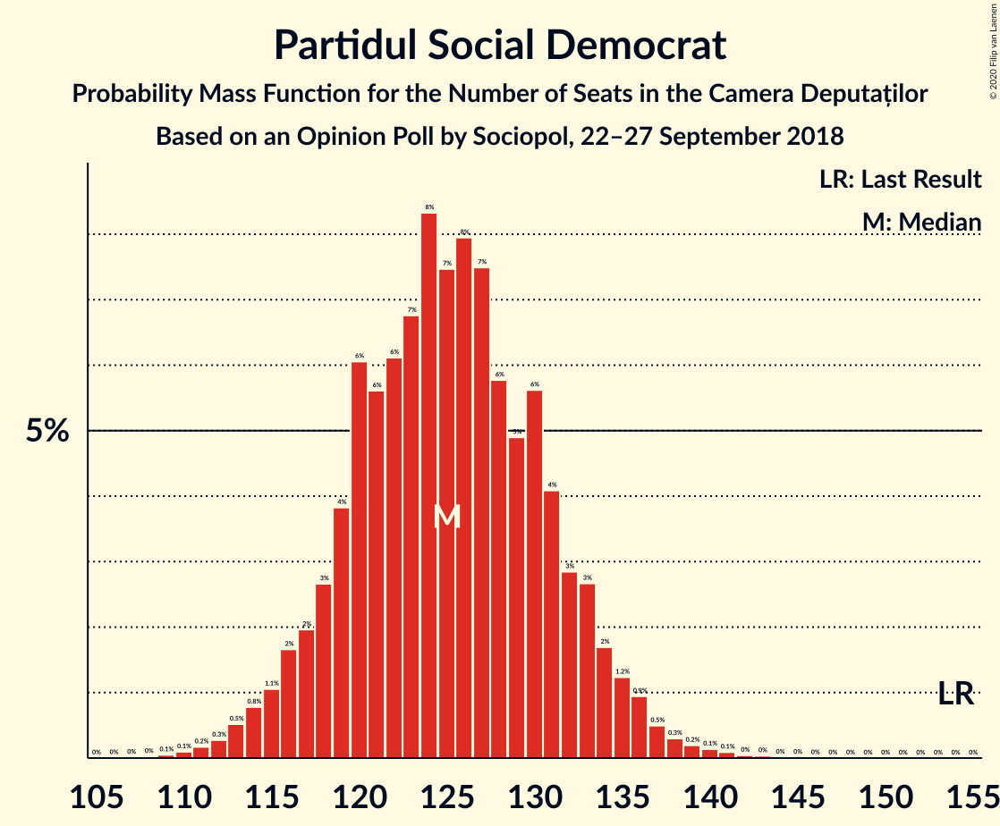
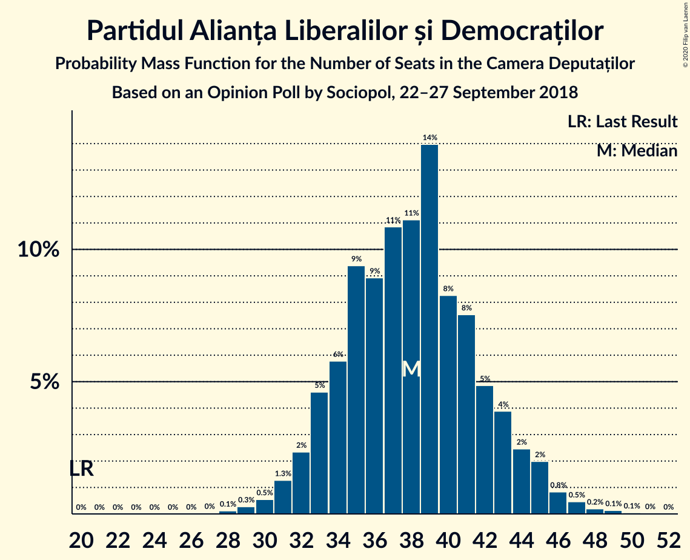
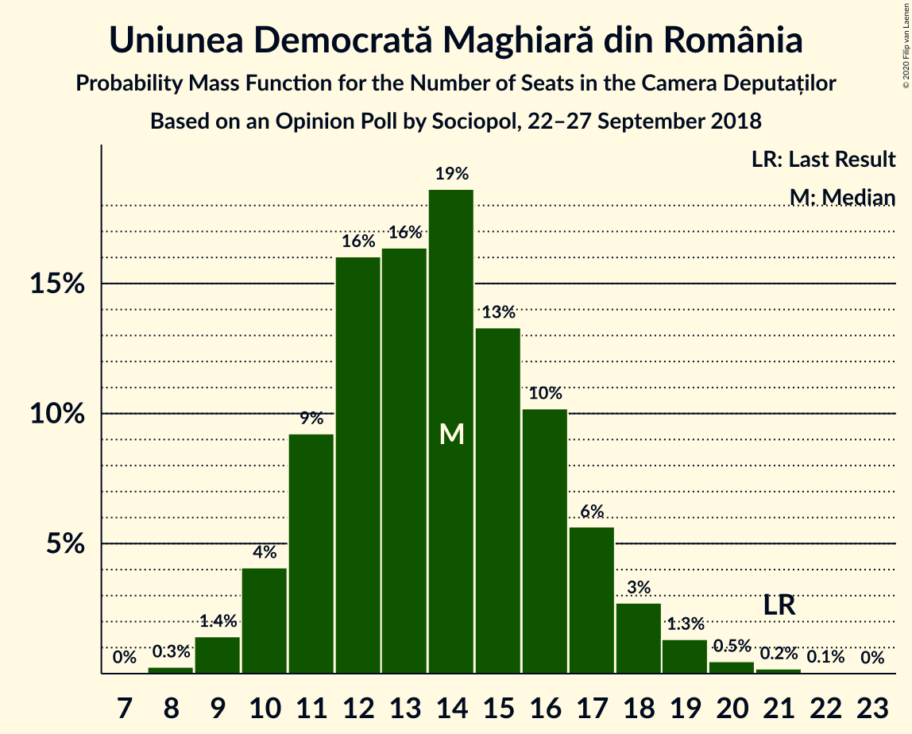
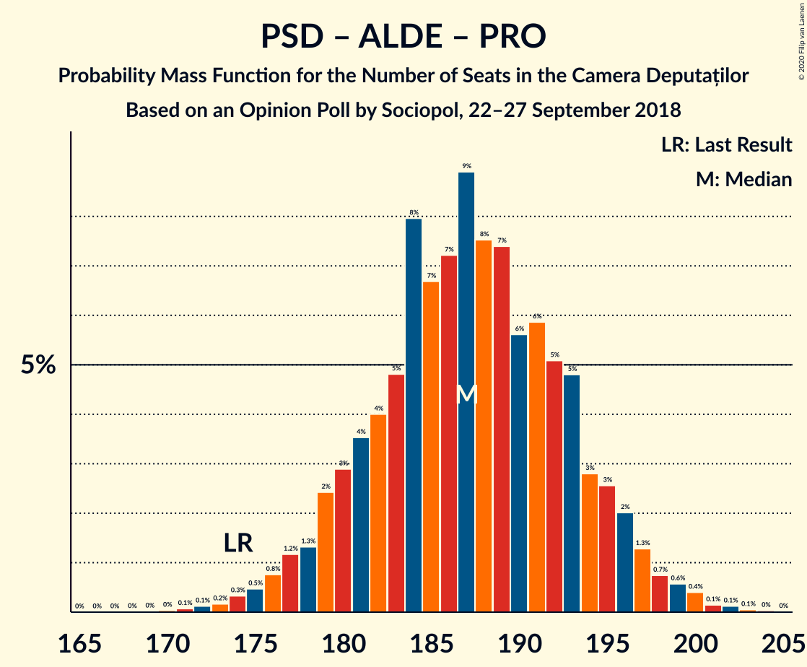
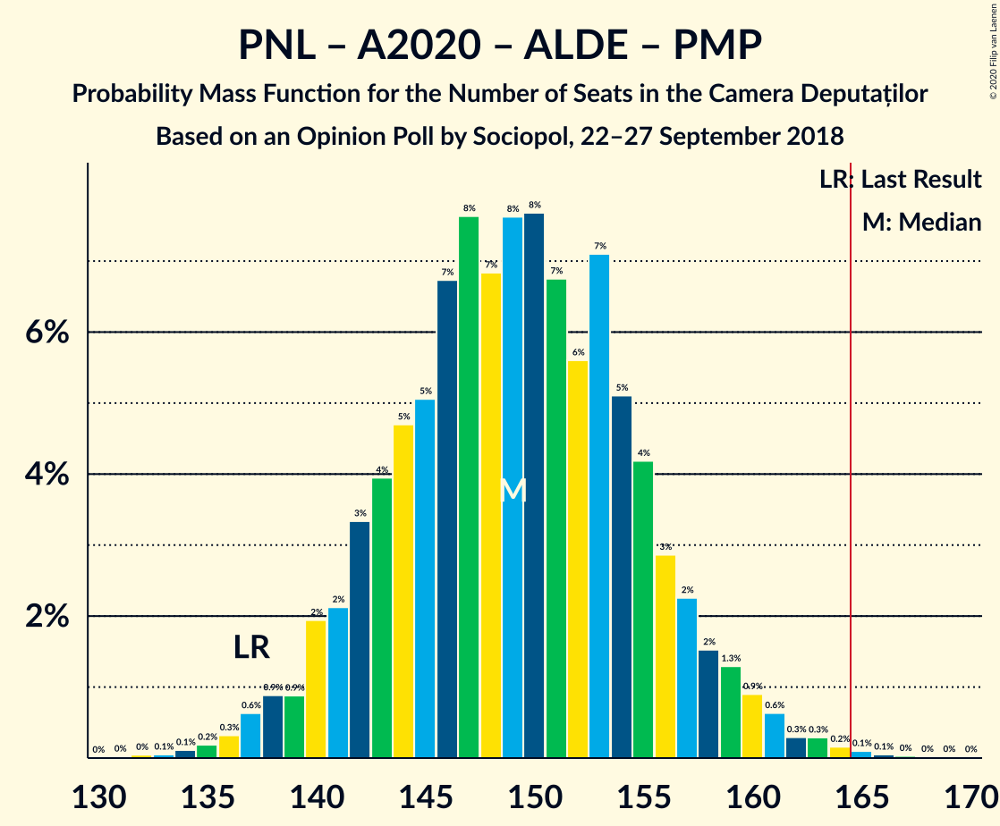
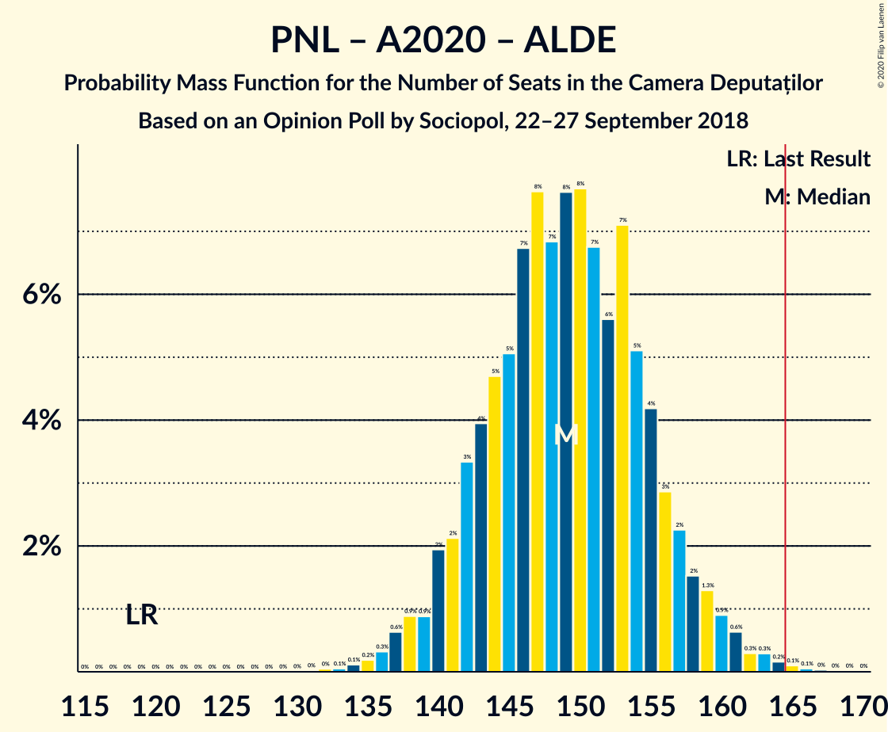
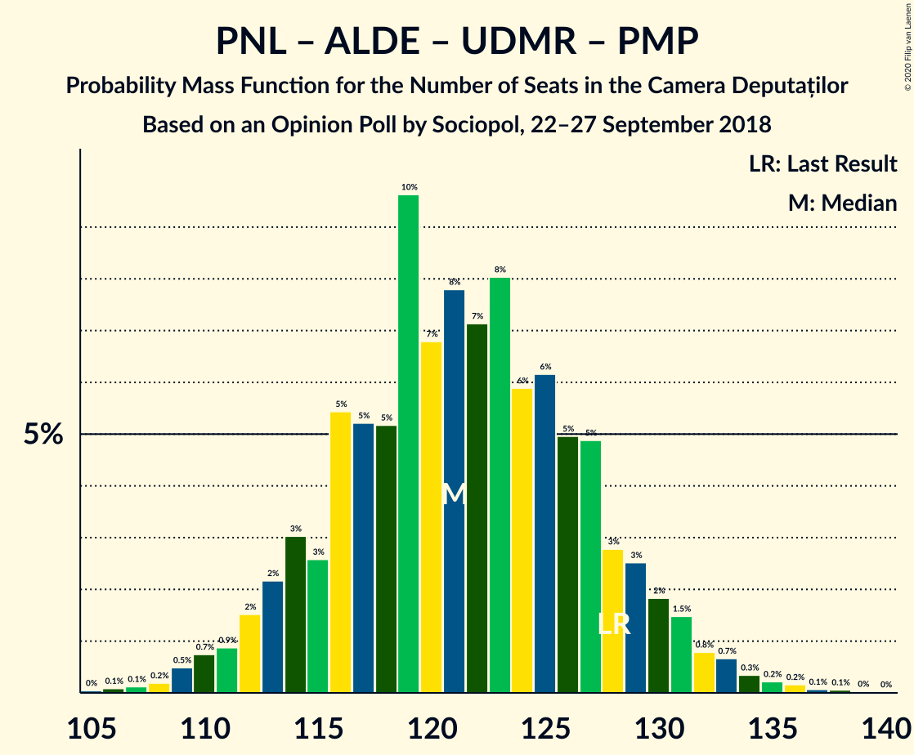
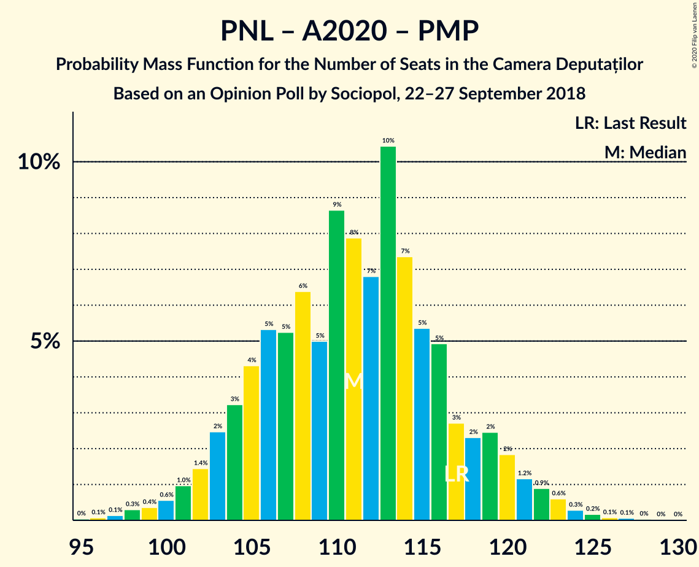

# Opinion Poll by Sociopol, 22–27 September 2018

<a href="#voting-intentions">Voting Intentions</a> | <a href="#seats">Seats</a> | <a href="#coalitions">Coalitions</a> | <a href="#technical-information">Technical Information</a>

## Voting Intentions

### Confidence Intervals

| Party | Last Result | Poll Result | 80% Confidence Interval | 90% Confidence Interval | 95% Confidence Interval | 99% Confidence Interval |
|:-----:|:-----------:|:-----------:|:-----------------------:|:-----------------------:|:-----------------------:|:-----------------------:|
| Partidul Social Democrat | 45.5% | 36.0% | 34.0–37.9% |33.5–38.5% |33.0–39.0% |32.1–39.9% |
| Partidul Național Liberal | 20.0% | 20.0% | 18.5–21.7% |18.0–22.2% |17.6–22.6% |16.9–23.4% |
| Alianța 2020 USR-PLUS | 8.9% | 12.0% | 10.7–13.4% |10.4–13.8% |10.1–14.1% |9.5–14.8% |
| Partidul Alianța Liberalilor și Democraților | 5.6% | 11.0% | 9.8–12.3% |9.4–12.7% |9.2–13.0% |8.6–13.7% |
| PRO România | 0.0% | 7.0% | 6.0–8.1% |5.8–8.4% |5.5–8.7% |5.1–9.3% |
| Uniunea Democrată Maghiară din România | 6.2% | 4.0% | 3.3–4.9% |3.1–5.2% |2.9–5.4% |2.6–5.9% |
| Partidul Mișcarea Populară | 5.4% | 2.0% | 1.5–2.7% |1.4–2.9% |1.3–3.1% |1.1–3.4% |

*Note:* The poll result column reflects the actual value used in the calculations. Published results may vary slightly, and in addition be rounded to fewer digits.

## Seats

### Confidence Intervals

| Party | Last Result | Median | 80% Confidence Interval | 90% Confidence Interval | 95% Confidence Interval | 99% Confidence Interval |
|:-----:|:-----------:|:------:|:-----------------------:|:-----------------------:|:-----------------------:|:-----------------------:|
| <a href="#partidul-social-democrat">Partidul Social Democrat</a> | 154 | 125 | 119–132 |117–134 |115–135 |112–139 |
| <a href="#partidul-național-liberal">Partidul Național Liberal</a> | 69 | 70 | 64–75 |63–77 |61–78 |59–81 |
| <a href="#alianța-2020-usr-plus">Alianța 2020 USR-PLUS</a> | 30 | 41 | 37–46 |36–48 |35–49 |33–51 |
| <a href="#partidul-alianța-liberalilor-și-democraților">Partidul Alianța Liberalilor și Democraților</a> | 20 | 38 | 34–43 |33–44 |32–45 |30–47 |
| <a href="#pro-românia">PRO România</a> | 0 | 24 | 21–28 |20–29 |19–30 |17–32 |
| <a href="#uniunea-democrată-maghiară-din-românia">Uniunea Democrată Maghiară din România</a> | 21 | 14 | 11–17 |10–17 |10–18 |9–20 |
| <a href="#partidul-mișcarea-populară">Partidul Mișcarea Populară</a> | 18 | 0 | 0 |0 |0 |0 |

### Partidul Social Democrat

*For a full overview of the results for this party, see the [Partidul Social Democrat](party-partidulsocialdemocrat.html) page.*

| Number of Seats | Probability | Accumulated | Special Marks |
|:---------------:|:-----------:|:-----------:|:-------------:|
| 109 | 0.1% | 100% |  |
| 110 | 0.1% | 99.9% |  |
| 111 | 0.2% | 99.8% |  |
| 112 | 0.3% | 99.6% |  |
| 113 | 0.5% | 99.4% |  |
| 114 | 0.8% | 98.8% |  |
| 115 | 1.1% | 98% |  |
| 116 | 2% | 97% |  |
| 117 | 2% | 95% |  |
| 118 | 3% | 93% |  |
| 119 | 4% | 91% |  |
| 120 | 6% | 87% |  |
| 121 | 6% | 81% |  |
| 122 | 6% | 75% |  |
| 123 | 7% | 69% |  |
| 124 | 8% | 62% |  |
| 125 | 7% | 54% | Median |
| 126 | 8% | 47% |  |
| 127 | 7% | 39% |  |
| 128 | 6% | 31% |  |
| 129 | 5% | 25% |  |
| 130 | 6% | 20% |  |
| 131 | 4% | 15% |  |
| 132 | 3% | 11% |  |
| 133 | 3% | 8% |  |
| 134 | 2% | 5% |  |
| 135 | 1.2% | 4% |  |
| 136 | 0.9% | 2% |  |
| 137 | 0.5% | 1.3% |  |
| 138 | 0.3% | 0.8% |  |
| 139 | 0.2% | 0.5% |  |
| 140 | 0.1% | 0.3% |  |
| 141 | 0.1% | 0.2% |  |
| 142 | 0% | 0.1% |  |
| 143 | 0% | 0.1% |  |
| 144 | 0% | 0% |  |
| 145 | 0% | 0% |  |
| 146 | 0% | 0% |  |
| 147 | 0% | 0% |  |
| 148 | 0% | 0% |  |
| 149 | 0% | 0% |  |
| 150 | 0% | 0% |  |
| 151 | 0% | 0% |  |
| 152 | 0% | 0% |  |
| 153 | 0% | 0% |  |
| 154 | 0% | 0% | Last Result |

### Partidul Național Liberal

*For a full overview of the results for this party, see the [Partidul Național Liberal](party-partidulnaționalliberal.html) page.*

| Number of Seats | Probability | Accumulated | Special Marks |
|:---------------:|:-----------:|:-----------:|:-------------:|
| 56 | 0% | 100% |  |
| 57 | 0.1% | 99.9% |  |
| 58 | 0.3% | 99.8% |  |
| 59 | 0.4% | 99.5% |  |
| 60 | 0.7% | 99.2% |  |
| 61 | 2% | 98% |  |
| 62 | 2% | 97% |  |
| 63 | 3% | 95% |  |
| 64 | 4% | 93% |  |
| 65 | 6% | 88% |  |
| 66 | 6% | 82% |  |
| 67 | 8% | 76% |  |
| 68 | 9% | 68% |  |
| 69 | 8% | 59% | Last Result |
| 70 | 9% | 51% | Median |
| 71 | 8% | 42% |  |
| 72 | 8% | 33% |  |
| 73 | 7% | 25% |  |
| 74 | 5% | 18% |  |
| 75 | 4% | 13% |  |
| 76 | 3% | 9% |  |
| 77 | 2% | 6% |  |
| 78 | 2% | 4% |  |
| 79 | 0.9% | 2% |  |
| 80 | 0.5% | 1.2% |  |
| 81 | 0.3% | 0.7% |  |
| 82 | 0.2% | 0.4% |  |
| 83 | 0.1% | 0.2% |  |
| 84 | 0.1% | 0.1% |  |
| 85 | 0% | 0.1% |  |
| 86 | 0% | 0% |  |

### Alianța 2020 USR-PLUS

*For a full overview of the results for this party, see the [Alianța 2020 USR-PLUS](party-alianța2020usr-plus.html) page.*

| Number of Seats | Probability | Accumulated | Special Marks |
|:---------------:|:-----------:|:-----------:|:-------------:|
| 30 | 0% | 100% | Last Result |
| 31 | 0.1% | 100% |  |
| 32 | 0.2% | 99.9% |  |
| 33 | 0.5% | 99.6% |  |
| 34 | 1.2% | 99.2% |  |
| 35 | 2% | 98% |  |
| 36 | 4% | 96% |  |
| 37 | 6% | 92% |  |
| 38 | 7% | 87% |  |
| 39 | 9% | 80% |  |
| 40 | 11% | 71% |  |
| 41 | 11% | 59% | Median |
| 42 | 11% | 48% |  |
| 43 | 9% | 37% |  |
| 44 | 8% | 28% |  |
| 45 | 6% | 20% |  |
| 46 | 5% | 13% |  |
| 47 | 3% | 9% |  |
| 48 | 2% | 5% |  |
| 49 | 1.3% | 3% |  |
| 50 | 0.7% | 2% |  |
| 51 | 0.4% | 0.8% |  |
| 52 | 0.2% | 0.4% |  |
| 53 | 0.1% | 0.2% |  |
| 54 | 0% | 0.1% |  |
| 55 | 0% | 0% |  |

### Partidul Alianța Liberalilor și Democraților

*For a full overview of the results for this party, see the [Partidul Alianța Liberalilor și Democraților](party-partidulalianțaliberalilorșidemocraților.html) page.*

| Number of Seats | Probability | Accumulated | Special Marks |
|:---------------:|:-----------:|:-----------:|:-------------:|
| 20 | 0% | 100% | Last Result |
| 21 | 0% | 100% |  |
| 22 | 0% | 100% |  |
| 23 | 0% | 100% |  |
| 24 | 0% | 100% |  |
| 25 | 0% | 100% |  |
| 26 | 0% | 100% |  |
| 27 | 0% | 100% |  |
| 28 | 0.1% | 100% |  |
| 29 | 0.3% | 99.8% |  |
| 30 | 0.5% | 99.6% |  |
| 31 | 1.3% | 99.0% |  |
| 32 | 2% | 98% |  |
| 33 | 5% | 95% |  |
| 34 | 6% | 91% |  |
| 35 | 9% | 85% |  |
| 36 | 9% | 76% |  |
| 37 | 11% | 67% |  |
| 38 | 11% | 56% | Median |
| 39 | 14% | 45% |  |
| 40 | 8% | 31% |  |
| 41 | 8% | 22% |  |
| 42 | 5% | 15% |  |
| 43 | 4% | 10% |  |
| 44 | 2% | 6% |  |
| 45 | 2% | 4% |  |
| 46 | 0.8% | 2% |  |
| 47 | 0.5% | 0.9% |  |
| 48 | 0.2% | 0.4% |  |
| 49 | 0.1% | 0.2% |  |
| 50 | 0.1% | 0.1% |  |
| 51 | 0% | 0% |  |

### PRO România

*For a full overview of the results for this party, see the [PRO România](party-proromânia.html) page.*

| Number of Seats | Probability | Accumulated | Special Marks |
|:---------------:|:-----------:|:-----------:|:-------------:|
| 0 | 0.3% | 100% | Last Result |
| 1 | 0% | 99.7% |  |
| 2 | 0% | 99.7% |  |
| 3 | 0% | 99.7% |  |
| 4 | 0% | 99.7% |  |
| 5 | 0% | 99.7% |  |
| 6 | 0% | 99.7% |  |
| 7 | 0% | 99.7% |  |
| 8 | 0% | 99.7% |  |
| 9 | 0% | 99.7% |  |
| 10 | 0% | 99.7% |  |
| 11 | 0% | 99.7% |  |
| 12 | 0% | 99.7% |  |
| 13 | 0% | 99.7% |  |
| 14 | 0% | 99.7% |  |
| 15 | 0% | 99.7% |  |
| 16 | 0% | 99.7% |  |
| 17 | 0.2% | 99.7% |  |
| 18 | 1.1% | 99.5% |  |
| 19 | 3% | 98% |  |
| 20 | 5% | 95% |  |
| 21 | 8% | 91% |  |
| 22 | 11% | 83% |  |
| 23 | 13% | 72% |  |
| 24 | 15% | 59% | Median |
| 25 | 14% | 44% |  |
| 26 | 11% | 30% |  |
| 27 | 7% | 18% |  |
| 28 | 4% | 11% |  |
| 29 | 3% | 7% |  |
| 30 | 2% | 3% |  |
| 31 | 1.0% | 2% |  |
| 32 | 0.5% | 0.7% |  |
| 33 | 0.2% | 0.3% |  |
| 34 | 0.1% | 0.1% |  |
| 35 | 0% | 0% |  |

### Uniunea Democrată Maghiară din România

*For a full overview of the results for this party, see the [Uniunea Democrată Maghiară din România](party-uniuneademocratămaghiarădinromânia.html) page.*

| Number of Seats | Probability | Accumulated | Special Marks |
|:---------------:|:-----------:|:-----------:|:-------------:|
| 8 | 0.3% | 100% |  |
| 9 | 1.4% | 99.7% |  |
| 10 | 4% | 98% |  |
| 11 | 9% | 94% |  |
| 12 | 16% | 85% |  |
| 13 | 16% | 69% |  |
| 14 | 19% | 53% | Median |
| 15 | 13% | 34% |  |
| 16 | 10% | 21% |  |
| 17 | 6% | 10% |  |
| 18 | 3% | 5% |  |
| 19 | 1.3% | 2% |  |
| 20 | 0.5% | 0.7% |  |
| 21 | 0.2% | 0.3% | Last Result |
| 22 | 0.1% | 0.1% |  |
| 23 | 0% | 0% |  |

### Partidul Mișcarea Populară

*For a full overview of the results for this party, see the [Partidul Mișcarea Populară](party-partidulmișcareapopulară.html) page.*

| Number of Seats | Probability | Accumulated | Special Marks |
|:---------------:|:-----------:|:-----------:|:-------------:|
| 0 | 100% | 100% | Median |
| 1 | 0% | 0% |  |
| 2 | 0% | 0% |  |
| 3 | 0% | 0% |  |
| 4 | 0% | 0% |  |
| 5 | 0% | 0% |  |
| 6 | 0% | 0% |  |
| 7 | 0% | 0% |  |
| 8 | 0% | 0% |  |
| 9 | 0% | 0% |  |
| 10 | 0% | 0% |  |
| 11 | 0% | 0% |  |
| 12 | 0% | 0% |  |
| 13 | 0% | 0% |  |
| 14 | 0% | 0% |  |
| 15 | 0% | 0% |  |
| 16 | 0% | 0% |  |
| 17 | 0% | 0% |  |
| 18 | 0% | 0% | Last Result |

## Coalitions

### Confidence Intervals

| Coalition | Last Result | Median | Majority? | 80% Confidence Interval | 90% Confidence Interval | 95% Confidence Interval | 99% Confidence Interval |
|:---------:|:-----------:|:------:|:---------:|:-----------------------:|:-----------------------:|:-----------------------:|:-----------------------:|
| Partidul Social Democrat – Partidul Alianța Liberalilor și Democraților – PRO România | 174 | 187 | 100% | 181–194 | 179–196 | 177–197 | 174–200 |
| Partidul Național Liberal – Alianța 2020 USR-PLUS – Partidul Alianța Liberalilor și Democraților – Uniunea Democrată Maghiară din România – Partidul Mișcarea Populară | 158 | 163 | 30% | 156–169 | 154–171 | 153–173 | 149–177 |
| Partidul Național Liberal – Alianța 2020 USR-PLUS – Partidul Alianța Liberalilor și Democraților – Uniunea Democrată Maghiară din România | 140 | 163 | 30% | 156–169 | 154–171 | 153–173 | 149–177 |
| Partidul Social Democrat – Partidul Alianța Liberalilor și Democraților | 174 | 163 | 32% | 156–170 | 155–172 | 153–173 | 150–177 |
| Partidul Național Liberal – Alianța 2020 USR-PLUS – Partidul Alianța Liberalilor și Democraților – Partidul Mișcarea Populară | 137 | 149 | 0.1% | 142–156 | 140–158 | 139–160 | 136–163 |
| Partidul Național Liberal – Alianța 2020 USR-PLUS – Partidul Alianța Liberalilor și Democraților | 119 | 149 | 0.1% | 142–156 | 140–158 | 139–160 | 136–163 |
| Partidul Social Democrat – PRO România | 154 | 149 | 0.1% | 143–156 | 141–158 | 139–159 | 135–163 |
| Partidul Național Liberal – Alianța 2020 USR-PLUS – Uniunea Democrată Maghiară din România – Partidul Mișcarea Populară | 138 | 125 | 0% | 118–131 | 116–133 | 115–135 | 112–138 |
| Partidul Național Liberal – Alianța 2020 USR-PLUS – Uniunea Democrată Maghiară din România | 120 | 125 | 0% | 118–131 | 116–133 | 115–135 | 112–138 |
| Partidul Național Liberal – Partidul Alianța Liberalilor și Democraților – Uniunea Democrată Maghiară din România – Partidul Mișcarea Populară | 128 | 121 | 0% | 115–128 | 113–130 | 111–131 | 109–135 |
| Partidul Național Liberal – Partidul Alianța Liberalilor și Democraților – Uniunea Democrată Maghiară din România | 110 | 121 | 0% | 115–128 | 113–130 | 111–131 | 109–135 |
| Partidul Național Liberal – Alianța 2020 USR-PLUS – Partidul Mișcarea Populară | 117 | 111 | 0% | 105–117 | 103–120 | 102–121 | 98–124 |
| Partidul Național Liberal – Alianța 2020 USR-PLUS | 99 | 111 | 0% | 105–117 | 103–120 | 102–121 | 98–124 |
| Partidul Național Liberal – Uniunea Democrată Maghiară din România – Partidul Mișcarea Populară | 108 | 83 | 0% | 77–89 | 76–91 | 75–93 | 72–96 |
| Partidul Național Liberal – Uniunea Democrată Maghiară din România | 90 | 83 | 0% | 77–89 | 76–91 | 75–93 | 72–96 |
| Partidul Național Liberal – Partidul Mișcarea Populară | 87 | 70 | 0% | 64–75 | 63–77 | 61–78 | 59–81 |
| Partidul Național Liberal | 69 | 70 | 0% | 64–75 | 63–77 | 61–78 | 59–81 |
| Alianța 2020 USR-PLUS – Partidul Mișcarea Populară | 48 | 41 | 0% | 37–46 | 36–48 | 35–49 | 33–51 |

### Partidul Social Democrat – Partidul Alianța Liberalilor și Democraților – PRO România

| Number of Seats | Probability | Accumulated | Special Marks |
|:---------------:|:-----------:|:-----------:|:-------------:|
| 169 | 0% | 100% |  |
| 170 | 0% | 99.9% |  |
| 171 | 0.1% | 99.9% |  |
| 172 | 0.1% | 99.8% |  |
| 173 | 0.2% | 99.7% |  |
| 174 | 0.3% | 99.5% | Last Result |
| 175 | 0.5% | 99.2% |  |
| 176 | 0.8% | 98.7% |  |
| 177 | 1.2% | 98% |  |
| 178 | 1.3% | 97% |  |
| 179 | 2% | 95% |  |
| 180 | 3% | 93% |  |
| 181 | 4% | 90% |  |
| 182 | 4% | 87% |  |
| 183 | 5% | 83% |  |
| 184 | 8% | 78% |  |
| 185 | 7% | 70% |  |
| 186 | 7% | 63% |  |
| 187 | 9% | 56% | Median |
| 188 | 8% | 47% |  |
| 189 | 7% | 40% |  |
| 190 | 6% | 32% |  |
| 191 | 6% | 27% |  |
| 192 | 5% | 21% |  |
| 193 | 5% | 16% |  |
| 194 | 3% | 11% |  |
| 195 | 3% | 8% |  |
| 196 | 2% | 5% |  |
| 197 | 1.3% | 3% |  |
| 198 | 0.7% | 2% |  |
| 199 | 0.6% | 1.4% |  |
| 200 | 0.4% | 0.8% |  |
| 201 | 0.1% | 0.4% |  |
| 202 | 0.1% | 0.2% |  |
| 203 | 0.1% | 0.1% |  |
| 204 | 0% | 0.1% |  |
| 205 | 0% | 0% |  |

### Partidul Național Liberal – Alianța 2020 USR-PLUS – Partidul Alianța Liberalilor și Democraților – Uniunea Democrată Maghiară din România – Partidul Mișcarea Populară

| Number of Seats | Probability | Accumulated | Special Marks |
|:---------------:|:-----------:|:-----------:|:-------------:|
| 146 | 0% | 100% |  |
| 147 | 0.1% | 99.9% |  |
| 148 | 0.1% | 99.8% |  |
| 149 | 0.2% | 99.7% |  |
| 150 | 0.3% | 99.5% |  |
| 151 | 0.6% | 99.1% |  |
| 152 | 1.0% | 98.5% |  |
| 153 | 1.2% | 98% |  |
| 154 | 2% | 96% |  |
| 155 | 3% | 94% |  |
| 156 | 4% | 92% |  |
| 157 | 4% | 88% |  |
| 158 | 4% | 84% | Last Result |
| 159 | 7% | 80% |  |
| 160 | 7% | 73% |  |
| 161 | 6% | 66% |  |
| 162 | 7% | 60% |  |
| 163 | 9% | 54% | Median |
| 164 | 6% | 44% |  |
| 165 | 9% | 39% |  |
| 166 | 6% | 30% | Majority |
| 167 | 6% | 24% |  |
| 168 | 5% | 18% |  |
| 169 | 4% | 14% |  |
| 170 | 3% | 9% |  |
| 171 | 2% | 7% |  |
| 172 | 1.3% | 5% |  |
| 173 | 1.1% | 3% |  |
| 174 | 0.9% | 2% |  |
| 175 | 0.5% | 1.4% |  |
| 176 | 0.3% | 0.9% |  |
| 177 | 0.2% | 0.6% |  |
| 178 | 0.1% | 0.4% |  |
| 179 | 0.1% | 0.2% |  |
| 180 | 0% | 0.1% |  |
| 181 | 0% | 0.1% |  |
| 182 | 0% | 0.1% |  |
| 183 | 0% | 0% |  |

### Partidul Național Liberal – Alianța 2020 USR-PLUS – Partidul Alianța Liberalilor și Democraților – Uniunea Democrată Maghiară din România

| Number of Seats | Probability | Accumulated | Special Marks |
|:---------------:|:-----------:|:-----------:|:-------------:|
| 140 | 0% | 100% | Last Result |
| 141 | 0% | 100% |  |
| 142 | 0% | 100% |  |
| 143 | 0% | 100% |  |
| 144 | 0% | 100% |  |
| 145 | 0% | 100% |  |
| 146 | 0% | 100% |  |
| 147 | 0.1% | 99.9% |  |
| 148 | 0.1% | 99.8% |  |
| 149 | 0.2% | 99.7% |  |
| 150 | 0.3% | 99.5% |  |
| 151 | 0.6% | 99.1% |  |
| 152 | 1.0% | 98.5% |  |
| 153 | 1.2% | 98% |  |
| 154 | 2% | 96% |  |
| 155 | 3% | 94% |  |
| 156 | 4% | 92% |  |
| 157 | 4% | 88% |  |
| 158 | 4% | 84% |  |
| 159 | 7% | 80% |  |
| 160 | 7% | 73% |  |
| 161 | 6% | 66% |  |
| 162 | 7% | 60% |  |
| 163 | 9% | 54% | Median |
| 164 | 6% | 44% |  |
| 165 | 9% | 39% |  |
| 166 | 6% | 30% | Majority |
| 167 | 6% | 24% |  |
| 168 | 5% | 18% |  |
| 169 | 4% | 14% |  |
| 170 | 3% | 9% |  |
| 171 | 2% | 7% |  |
| 172 | 1.3% | 5% |  |
| 173 | 1.1% | 3% |  |
| 174 | 0.9% | 2% |  |
| 175 | 0.5% | 1.4% |  |
| 176 | 0.3% | 0.9% |  |
| 177 | 0.2% | 0.6% |  |
| 178 | 0.1% | 0.4% |  |
| 179 | 0.1% | 0.2% |  |
| 180 | 0% | 0.1% |  |
| 181 | 0% | 0.1% |  |
| 182 | 0% | 0.1% |  |
| 183 | 0% | 0% |  |

### Partidul Social Democrat – Partidul Alianța Liberalilor și Democraților

| Number of Seats | Probability | Accumulated | Special Marks |
|:---------------:|:-----------:|:-----------:|:-------------:|
| 146 | 0% | 100% |  |
| 147 | 0.1% | 99.9% |  |
| 148 | 0.1% | 99.8% |  |
| 149 | 0.2% | 99.8% |  |
| 150 | 0.4% | 99.5% |  |
| 151 | 0.5% | 99.2% |  |
| 152 | 0.9% | 98.7% |  |
| 153 | 1.3% | 98% |  |
| 154 | 1.3% | 97% |  |
| 155 | 2% | 95% |  |
| 156 | 4% | 93% |  |
| 157 | 4% | 89% |  |
| 158 | 4% | 86% |  |
| 159 | 7% | 82% |  |
| 160 | 7% | 75% |  |
| 161 | 5% | 68% |  |
| 162 | 8% | 63% |  |
| 163 | 8% | 54% | Median |
| 164 | 7% | 46% |  |
| 165 | 7% | 39% |  |
| 166 | 6% | 32% | Majority |
| 167 | 6% | 26% |  |
| 168 | 5% | 20% |  |
| 169 | 3% | 15% |  |
| 170 | 4% | 12% |  |
| 171 | 2% | 8% |  |
| 172 | 2% | 6% |  |
| 173 | 2% | 4% |  |
| 174 | 0.8% | 2% | Last Result |
| 175 | 0.5% | 2% |  |
| 176 | 0.4% | 1.0% |  |
| 177 | 0.2% | 0.6% |  |
| 178 | 0.1% | 0.4% |  |
| 179 | 0.1% | 0.2% |  |
| 180 | 0.1% | 0.2% |  |
| 181 | 0% | 0.1% |  |
| 182 | 0% | 0.1% |  |
| 183 | 0% | 0% |  |

### Partidul Național Liberal – Alianța 2020 USR-PLUS – Partidul Alianța Liberalilor și Democraților – Partidul Mișcarea Populară

| Number of Seats | Probability | Accumulated | Special Marks |
|:---------------:|:-----------:|:-----------:|:-------------:|
| 132 | 0% | 100% |  |
| 133 | 0.1% | 99.9% |  |
| 134 | 0.1% | 99.9% |  |
| 135 | 0.2% | 99.7% |  |
| 136 | 0.3% | 99.6% |  |
| 137 | 0.6% | 99.2% | Last Result |
| 138 | 0.9% | 98.6% |  |
| 139 | 0.9% | 98% |  |
| 140 | 2% | 97% |  |
| 141 | 2% | 95% |  |
| 142 | 3% | 93% |  |
| 143 | 4% | 89% |  |
| 144 | 5% | 85% |  |
| 145 | 5% | 81% |  |
| 146 | 7% | 76% |  |
| 147 | 8% | 69% |  |
| 148 | 7% | 61% |  |
| 149 | 8% | 55% | Median |
| 150 | 8% | 47% |  |
| 151 | 7% | 39% |  |
| 152 | 6% | 32% |  |
| 153 | 7% | 27% |  |
| 154 | 5% | 20% |  |
| 155 | 4% | 15% |  |
| 156 | 3% | 10% |  |
| 157 | 2% | 8% |  |
| 158 | 2% | 5% |  |
| 159 | 1.3% | 4% |  |
| 160 | 0.9% | 3% |  |
| 161 | 0.6% | 2% |  |
| 162 | 0.3% | 1.0% |  |
| 163 | 0.3% | 0.7% |  |
| 164 | 0.2% | 0.4% |  |
| 165 | 0.1% | 0.2% |  |
| 166 | 0.1% | 0.1% | Majority |
| 167 | 0% | 0.1% |  |
| 168 | 0% | 0.1% |  |
| 169 | 0% | 0% |  |

### Partidul Național Liberal – Alianța 2020 USR-PLUS – Partidul Alianța Liberalilor și Democraților

| Number of Seats | Probability | Accumulated | Special Marks |
|:---------------:|:-----------:|:-----------:|:-------------:|
| 119 | 0% | 100% | Last Result |
| 120 | 0% | 100% |  |
| 121 | 0% | 100% |  |
| 122 | 0% | 100% |  |
| 123 | 0% | 100% |  |
| 124 | 0% | 100% |  |
| 125 | 0% | 100% |  |
| 126 | 0% | 100% |  |
| 127 | 0% | 100% |  |
| 128 | 0% | 100% |  |
| 129 | 0% | 100% |  |
| 130 | 0% | 100% |  |
| 131 | 0% | 100% |  |
| 132 | 0% | 100% |  |
| 133 | 0.1% | 99.9% |  |
| 134 | 0.1% | 99.9% |  |
| 135 | 0.2% | 99.7% |  |
| 136 | 0.3% | 99.6% |  |
| 137 | 0.6% | 99.2% |  |
| 138 | 0.9% | 98.6% |  |
| 139 | 0.9% | 98% |  |
| 140 | 2% | 97% |  |
| 141 | 2% | 95% |  |
| 142 | 3% | 93% |  |
| 143 | 4% | 89% |  |
| 144 | 5% | 85% |  |
| 145 | 5% | 81% |  |
| 146 | 7% | 76% |  |
| 147 | 8% | 69% |  |
| 148 | 7% | 61% |  |
| 149 | 8% | 55% | Median |
| 150 | 8% | 47% |  |
| 151 | 7% | 39% |  |
| 152 | 6% | 32% |  |
| 153 | 7% | 27% |  |
| 154 | 5% | 20% |  |
| 155 | 4% | 15% |  |
| 156 | 3% | 10% |  |
| 157 | 2% | 8% |  |
| 158 | 2% | 5% |  |
| 159 | 1.3% | 4% |  |
| 160 | 0.9% | 3% |  |
| 161 | 0.6% | 2% |  |
| 162 | 0.3% | 1.0% |  |
| 163 | 0.3% | 0.7% |  |
| 164 | 0.2% | 0.4% |  |
| 165 | 0.1% | 0.2% |  |
| 166 | 0.1% | 0.1% | Majority |
| 167 | 0% | 0.1% |  |
| 168 | 0% | 0.1% |  |
| 169 | 0% | 0% |  |

### Partidul Social Democrat – PRO România

| Number of Seats | Probability | Accumulated | Special Marks |
|:---------------:|:-----------:|:-----------:|:-------------:|
| 130 | 0% | 100% |  |
| 131 | 0% | 99.9% |  |
| 132 | 0% | 99.9% |  |
| 133 | 0.1% | 99.9% |  |
| 134 | 0.1% | 99.8% |  |
| 135 | 0.2% | 99.6% |  |
| 136 | 0.3% | 99.4% |  |
| 137 | 0.5% | 99.1% |  |
| 138 | 0.9% | 98.6% |  |
| 139 | 1.1% | 98% |  |
| 140 | 1.3% | 97% |  |
| 141 | 2% | 95% |  |
| 142 | 3% | 93% |  |
| 143 | 4% | 91% |  |
| 144 | 5% | 86% |  |
| 145 | 6% | 82% |  |
| 146 | 6% | 76% |  |
| 147 | 9% | 70% |  |
| 148 | 6% | 61% |  |
| 149 | 9% | 56% | Median |
| 150 | 7% | 46% |  |
| 151 | 6% | 40% |  |
| 152 | 7% | 34% |  |
| 153 | 7% | 27% |  |
| 154 | 4% | 20% | Last Result |
| 155 | 4% | 16% |  |
| 156 | 4% | 12% |  |
| 157 | 3% | 8% |  |
| 158 | 2% | 6% |  |
| 159 | 1.2% | 4% |  |
| 160 | 1.0% | 2% |  |
| 161 | 0.6% | 1.5% |  |
| 162 | 0.3% | 0.9% |  |
| 163 | 0.2% | 0.5% |  |
| 164 | 0.1% | 0.3% |  |
| 165 | 0.1% | 0.2% |  |
| 166 | 0% | 0.1% | Majority |
| 167 | 0% | 0% |  |

### Partidul Național Liberal – Alianța 2020 USR-PLUS – Uniunea Democrată Maghiară din România – Partidul Mișcarea Populară

| Number of Seats | Probability | Accumulated | Special Marks |
|:---------------:|:-----------:|:-----------:|:-------------:|
| 108 | 0% | 100% |  |
| 109 | 0.1% | 99.9% |  |
| 110 | 0.1% | 99.9% |  |
| 111 | 0.1% | 99.8% |  |
| 112 | 0.4% | 99.6% |  |
| 113 | 0.6% | 99.2% |  |
| 114 | 0.7% | 98.6% |  |
| 115 | 1.3% | 98% |  |
| 116 | 2% | 97% |  |
| 117 | 3% | 95% |  |
| 118 | 3% | 92% |  |
| 119 | 5% | 89% |  |
| 120 | 5% | 84% |  |
| 121 | 6% | 79% |  |
| 122 | 6% | 73% |  |
| 123 | 7% | 68% |  |
| 124 | 8% | 60% |  |
| 125 | 9% | 53% | Median |
| 126 | 7% | 44% |  |
| 127 | 7% | 37% |  |
| 128 | 8% | 30% |  |
| 129 | 5% | 22% |  |
| 130 | 4% | 17% |  |
| 131 | 4% | 13% |  |
| 132 | 3% | 10% |  |
| 133 | 2% | 7% |  |
| 134 | 1.3% | 5% |  |
| 135 | 1.2% | 3% |  |
| 136 | 0.8% | 2% |  |
| 137 | 0.5% | 1.3% |  |
| 138 | 0.3% | 0.8% | Last Result |
| 139 | 0.2% | 0.5% |  |
| 140 | 0.1% | 0.3% |  |
| 141 | 0.1% | 0.2% |  |
| 142 | 0% | 0.1% |  |
| 143 | 0% | 0.1% |  |
| 144 | 0% | 0% |  |

### Partidul Național Liberal – Alianța 2020 USR-PLUS – Uniunea Democrată Maghiară din România

| Number of Seats | Probability | Accumulated | Special Marks |
|:---------------:|:-----------:|:-----------:|:-------------:|
| 108 | 0% | 100% |  |
| 109 | 0.1% | 99.9% |  |
| 110 | 0.1% | 99.9% |  |
| 111 | 0.1% | 99.8% |  |
| 112 | 0.4% | 99.6% |  |
| 113 | 0.6% | 99.2% |  |
| 114 | 0.7% | 98.6% |  |
| 115 | 1.3% | 98% |  |
| 116 | 2% | 97% |  |
| 117 | 3% | 95% |  |
| 118 | 3% | 92% |  |
| 119 | 5% | 89% |  |
| 120 | 5% | 84% | Last Result |
| 121 | 6% | 79% |  |
| 122 | 6% | 73% |  |
| 123 | 7% | 68% |  |
| 124 | 8% | 60% |  |
| 125 | 9% | 53% | Median |
| 126 | 7% | 44% |  |
| 127 | 7% | 37% |  |
| 128 | 8% | 30% |  |
| 129 | 5% | 22% |  |
| 130 | 4% | 17% |  |
| 131 | 4% | 13% |  |
| 132 | 3% | 10% |  |
| 133 | 2% | 7% |  |
| 134 | 1.3% | 5% |  |
| 135 | 1.2% | 3% |  |
| 136 | 0.8% | 2% |  |
| 137 | 0.5% | 1.3% |  |
| 138 | 0.3% | 0.8% |  |
| 139 | 0.2% | 0.5% |  |
| 140 | 0.1% | 0.3% |  |
| 141 | 0.1% | 0.2% |  |
| 142 | 0% | 0.1% |  |
| 143 | 0% | 0.1% |  |
| 144 | 0% | 0% |  |

### Partidul Național Liberal – Partidul Alianța Liberalilor și Democraților – Uniunea Democrată Maghiară din România – Partidul Mișcarea Populară

| Number of Seats | Probability | Accumulated | Special Marks |
|:---------------:|:-----------:|:-----------:|:-------------:|
| 105 | 0% | 100% |  |
| 106 | 0.1% | 99.9% |  |
| 107 | 0.1% | 99.8% |  |
| 108 | 0.2% | 99.7% |  |
| 109 | 0.5% | 99.5% |  |
| 110 | 0.7% | 99.0% |  |
| 111 | 0.9% | 98% |  |
| 112 | 2% | 97% |  |
| 113 | 2% | 96% |  |
| 114 | 3% | 94% |  |
| 115 | 3% | 91% |  |
| 116 | 5% | 88% |  |
| 117 | 5% | 83% |  |
| 118 | 5% | 77% |  |
| 119 | 10% | 72% |  |
| 120 | 7% | 63% |  |
| 121 | 8% | 56% |  |
| 122 | 7% | 48% | Median |
| 123 | 8% | 41% |  |
| 124 | 6% | 33% |  |
| 125 | 6% | 27% |  |
| 126 | 5% | 21% |  |
| 127 | 5% | 16% |  |
| 128 | 3% | 11% | Last Result |
| 129 | 3% | 8% |  |
| 130 | 2% | 6% |  |
| 131 | 1.5% | 4% |  |
| 132 | 0.8% | 2% |  |
| 133 | 0.7% | 2% |  |
| 134 | 0.3% | 0.9% |  |
| 135 | 0.2% | 0.6% |  |
| 136 | 0.2% | 0.4% |  |
| 137 | 0.1% | 0.2% |  |
| 138 | 0.1% | 0.1% |  |
| 139 | 0% | 0.1% |  |
| 140 | 0% | 0% |  |

### Partidul Național Liberal – Partidul Alianța Liberalilor și Democraților – Uniunea Democrată Maghiară din România

| Number of Seats | Probability | Accumulated | Special Marks |
|:---------------:|:-----------:|:-----------:|:-------------:|
| 105 | 0% | 100% |  |
| 106 | 0.1% | 99.9% |  |
| 107 | 0.1% | 99.8% |  |
| 108 | 0.2% | 99.7% |  |
| 109 | 0.5% | 99.5% |  |
| 110 | 0.7% | 99.0% | Last Result |
| 111 | 0.9% | 98% |  |
| 112 | 2% | 97% |  |
| 113 | 2% | 96% |  |
| 114 | 3% | 94% |  |
| 115 | 3% | 91% |  |
| 116 | 5% | 88% |  |
| 117 | 5% | 83% |  |
| 118 | 5% | 77% |  |
| 119 | 10% | 72% |  |
| 120 | 7% | 63% |  |
| 121 | 8% | 56% |  |
| 122 | 7% | 48% | Median |
| 123 | 8% | 41% |  |
| 124 | 6% | 33% |  |
| 125 | 6% | 27% |  |
| 126 | 5% | 21% |  |
| 127 | 5% | 16% |  |
| 128 | 3% | 11% |  |
| 129 | 3% | 8% |  |
| 130 | 2% | 6% |  |
| 131 | 1.5% | 4% |  |
| 132 | 0.8% | 2% |  |
| 133 | 0.7% | 2% |  |
| 134 | 0.3% | 0.9% |  |
| 135 | 0.2% | 0.6% |  |
| 136 | 0.2% | 0.4% |  |
| 137 | 0.1% | 0.2% |  |
| 138 | 0.1% | 0.1% |  |
| 139 | 0% | 0.1% |  |
| 140 | 0% | 0% |  |

### Partidul Național Liberal – Alianța 2020 USR-PLUS – Partidul Mișcarea Populară

| Number of Seats | Probability | Accumulated | Special Marks |
|:---------------:|:-----------:|:-----------:|:-------------:|
| 95 | 0% | 100% |  |
| 96 | 0.1% | 99.9% |  |
| 97 | 0.1% | 99.8% |  |
| 98 | 0.3% | 99.7% |  |
| 99 | 0.4% | 99.4% |  |
| 100 | 0.6% | 99.0% |  |
| 101 | 1.0% | 98% |  |
| 102 | 1.4% | 98% |  |
| 103 | 2% | 96% |  |
| 104 | 3% | 94% |  |
| 105 | 4% | 90% |  |
| 106 | 5% | 86% |  |
| 107 | 5% | 81% |  |
| 108 | 6% | 75% |  |
| 109 | 5% | 69% |  |
| 110 | 9% | 64% |  |
| 111 | 8% | 55% | Median |
| 112 | 7% | 48% |  |
| 113 | 10% | 41% |  |
| 114 | 7% | 30% |  |
| 115 | 5% | 23% |  |
| 116 | 5% | 18% |  |
| 117 | 3% | 13% | Last Result |
| 118 | 2% | 10% |  |
| 119 | 2% | 8% |  |
| 120 | 2% | 5% |  |
| 121 | 1.2% | 3% |  |
| 122 | 0.9% | 2% |  |
| 123 | 0.6% | 1.3% |  |
| 124 | 0.3% | 0.7% |  |
| 125 | 0.2% | 0.4% |  |
| 126 | 0.1% | 0.2% |  |
| 127 | 0.1% | 0.2% |  |
| 128 | 0% | 0.1% |  |
| 129 | 0% | 0.1% |  |
| 130 | 0% | 0% |  |

### Partidul Național Liberal – Alianța 2020 USR-PLUS

| Number of Seats | Probability | Accumulated | Special Marks |
|:---------------:|:-----------:|:-----------:|:-------------:|
| 95 | 0% | 100% |  |
| 96 | 0.1% | 99.9% |  |
| 97 | 0.1% | 99.8% |  |
| 98 | 0.3% | 99.7% |  |
| 99 | 0.4% | 99.4% | Last Result |
| 100 | 0.6% | 99.0% |  |
| 101 | 1.0% | 98% |  |
| 102 | 1.4% | 98% |  |
| 103 | 2% | 96% |  |
| 104 | 3% | 94% |  |
| 105 | 4% | 90% |  |
| 106 | 5% | 86% |  |
| 107 | 5% | 81% |  |
| 108 | 6% | 75% |  |
| 109 | 5% | 69% |  |
| 110 | 9% | 64% |  |
| 111 | 8% | 55% | Median |
| 112 | 7% | 48% |  |
| 113 | 10% | 41% |  |
| 114 | 7% | 30% |  |
| 115 | 5% | 23% |  |
| 116 | 5% | 18% |  |
| 117 | 3% | 13% |  |
| 118 | 2% | 10% |  |
| 119 | 2% | 8% |  |
| 120 | 2% | 5% |  |
| 121 | 1.2% | 3% |  |
| 122 | 0.9% | 2% |  |
| 123 | 0.6% | 1.3% |  |
| 124 | 0.3% | 0.7% |  |
| 125 | 0.2% | 0.4% |  |
| 126 | 0.1% | 0.2% |  |
| 127 | 0.1% | 0.2% |  |
| 128 | 0% | 0.1% |  |
| 129 | 0% | 0.1% |  |
| 130 | 0% | 0% |  |

### Partidul Național Liberal – Uniunea Democrată Maghiară din România – Partidul Mișcarea Populară

| Number of Seats | Probability | Accumulated | Special Marks |
|:---------------:|:-----------:|:-----------:|:-------------:|
| 69 | 0.1% | 100% |  |
| 70 | 0.1% | 99.9% |  |
| 71 | 0.2% | 99.8% |  |
| 72 | 0.4% | 99.6% |  |
| 73 | 0.7% | 99.2% |  |
| 74 | 0.9% | 98% |  |
| 75 | 2% | 98% |  |
| 76 | 3% | 96% |  |
| 77 | 3% | 93% |  |
| 78 | 4% | 90% |  |
| 79 | 7% | 85% |  |
| 80 | 5% | 79% |  |
| 81 | 8% | 73% |  |
| 82 | 8% | 65% |  |
| 83 | 7% | 57% |  |
| 84 | 11% | 50% | Median |
| 85 | 7% | 39% |  |
| 86 | 7% | 31% |  |
| 87 | 6% | 24% |  |
| 88 | 6% | 18% |  |
| 89 | 4% | 13% |  |
| 90 | 3% | 9% |  |
| 91 | 2% | 6% |  |
| 92 | 1.4% | 4% |  |
| 93 | 1.1% | 3% |  |
| 94 | 0.6% | 2% |  |
| 95 | 0.4% | 0.9% |  |
| 96 | 0.2% | 0.5% |  |
| 97 | 0.2% | 0.3% |  |
| 98 | 0.1% | 0.2% |  |
| 99 | 0% | 0.1% |  |
| 100 | 0% | 0% |  |
| 101 | 0% | 0% |  |
| 102 | 0% | 0% |  |
| 103 | 0% | 0% |  |
| 104 | 0% | 0% |  |
| 105 | 0% | 0% |  |
| 106 | 0% | 0% |  |
| 107 | 0% | 0% |  |
| 108 | 0% | 0% | Last Result |

### Partidul Național Liberal – Uniunea Democrată Maghiară din România

| Number of Seats | Probability | Accumulated | Special Marks |
|:---------------:|:-----------:|:-----------:|:-------------:|
| 69 | 0.1% | 100% |  |
| 70 | 0.1% | 99.9% |  |
| 71 | 0.2% | 99.8% |  |
| 72 | 0.4% | 99.6% |  |
| 73 | 0.7% | 99.2% |  |
| 74 | 0.9% | 98% |  |
| 75 | 2% | 98% |  |
| 76 | 3% | 96% |  |
| 77 | 3% | 93% |  |
| 78 | 4% | 90% |  |
| 79 | 7% | 85% |  |
| 80 | 5% | 79% |  |
| 81 | 8% | 73% |  |
| 82 | 8% | 65% |  |
| 83 | 7% | 57% |  |
| 84 | 11% | 50% | Median |
| 85 | 7% | 39% |  |
| 86 | 7% | 31% |  |
| 87 | 6% | 24% |  |
| 88 | 6% | 18% |  |
| 89 | 4% | 13% |  |
| 90 | 3% | 9% | Last Result |
| 91 | 2% | 6% |  |
| 92 | 1.4% | 4% |  |
| 93 | 1.1% | 3% |  |
| 94 | 0.6% | 2% |  |
| 95 | 0.4% | 0.9% |  |
| 96 | 0.2% | 0.5% |  |
| 97 | 0.2% | 0.3% |  |
| 98 | 0.1% | 0.2% |  |
| 99 | 0% | 0.1% |  |
| 100 | 0% | 0% |  |

### Partidul Național Liberal – Partidul Mișcarea Populară

| Number of Seats | Probability | Accumulated | Special Marks |
|:---------------:|:-----------:|:-----------:|:-------------:|
| 56 | 0% | 100% |  |
| 57 | 0.1% | 99.9% |  |
| 58 | 0.3% | 99.8% |  |
| 59 | 0.4% | 99.5% |  |
| 60 | 0.7% | 99.2% |  |
| 61 | 2% | 98% |  |
| 62 | 2% | 97% |  |
| 63 | 3% | 95% |  |
| 64 | 4% | 93% |  |
| 65 | 6% | 88% |  |
| 66 | 6% | 82% |  |
| 67 | 8% | 76% |  |
| 68 | 9% | 68% |  |
| 69 | 8% | 59% |  |
| 70 | 9% | 51% | Median |
| 71 | 8% | 42% |  |
| 72 | 8% | 33% |  |
| 73 | 7% | 25% |  |
| 74 | 5% | 18% |  |
| 75 | 4% | 13% |  |
| 76 | 3% | 9% |  |
| 77 | 2% | 6% |  |
| 78 | 2% | 4% |  |
| 79 | 0.9% | 2% |  |
| 80 | 0.5% | 1.2% |  |
| 81 | 0.3% | 0.7% |  |
| 82 | 0.2% | 0.4% |  |
| 83 | 0.1% | 0.2% |  |
| 84 | 0.1% | 0.1% |  |
| 85 | 0% | 0.1% |  |
| 86 | 0% | 0% |  |
| 87 | 0% | 0% | Last Result |

### Partidul Național Liberal

| Number of Seats | Probability | Accumulated | Special Marks |
|:---------------:|:-----------:|:-----------:|:-------------:|
| 56 | 0% | 100% |  |
| 57 | 0.1% | 99.9% |  |
| 58 | 0.3% | 99.8% |  |
| 59 | 0.4% | 99.5% |  |
| 60 | 0.7% | 99.2% |  |
| 61 | 2% | 98% |  |
| 62 | 2% | 97% |  |
| 63 | 3% | 95% |  |
| 64 | 4% | 93% |  |
| 65 | 6% | 88% |  |
| 66 | 6% | 82% |  |
| 67 | 8% | 76% |  |
| 68 | 9% | 68% |  |
| 69 | 8% | 59% | Last Result |
| 70 | 9% | 51% | Median |
| 71 | 8% | 42% |  |
| 72 | 8% | 33% |  |
| 73 | 7% | 25% |  |
| 74 | 5% | 18% |  |
| 75 | 4% | 13% |  |
| 76 | 3% | 9% |  |
| 77 | 2% | 6% |  |
| 78 | 2% | 4% |  |
| 79 | 0.9% | 2% |  |
| 80 | 0.5% | 1.2% |  |
| 81 | 0.3% | 0.7% |  |
| 82 | 0.2% | 0.4% |  |
| 83 | 0.1% | 0.2% |  |
| 84 | 0.1% | 0.1% |  |
| 85 | 0% | 0.1% |  |
| 86 | 0% | 0% |  |

### Alianța 2020 USR-PLUS – Partidul Mișcarea Populară

| Number of Seats | Probability | Accumulated | Special Marks |
|:---------------:|:-----------:|:-----------:|:-------------:|
| 31 | 0.1% | 100% |  |
| 32 | 0.2% | 99.9% |  |
| 33 | 0.5% | 99.6% |  |
| 34 | 1.2% | 99.2% |  |
| 35 | 2% | 98% |  |
| 36 | 4% | 96% |  |
| 37 | 6% | 92% |  |
| 38 | 7% | 87% |  |
| 39 | 9% | 80% |  |
| 40 | 11% | 71% |  |
| 41 | 11% | 59% | Median |
| 42 | 11% | 48% |  |
| 43 | 9% | 37% |  |
| 44 | 8% | 28% |  |
| 45 | 6% | 20% |  |
| 46 | 5% | 13% |  |
| 47 | 3% | 9% |  |
| 48 | 2% | 5% | Last Result |
| 49 | 1.3% | 3% |  |
| 50 | 0.7% | 2% |  |
| 51 | 0.4% | 0.8% |  |
| 52 | 0.2% | 0.4% |  |
| 53 | 0.1% | 0.2% |  |
| 54 | 0% | 0.1% |  |
| 55 | 0% | 0% |  |

## Technical Information

### Opinion Poll

+ **Polling firm:** Sociopol
+ **Commissioner(s):** —
+ **Fieldwork period:** 22–27 September 2018

### Calculations

+ **Sample size:** 1004
+ **Simulations done:** 1,048,576
+ **Error estimate:** 0.93%

