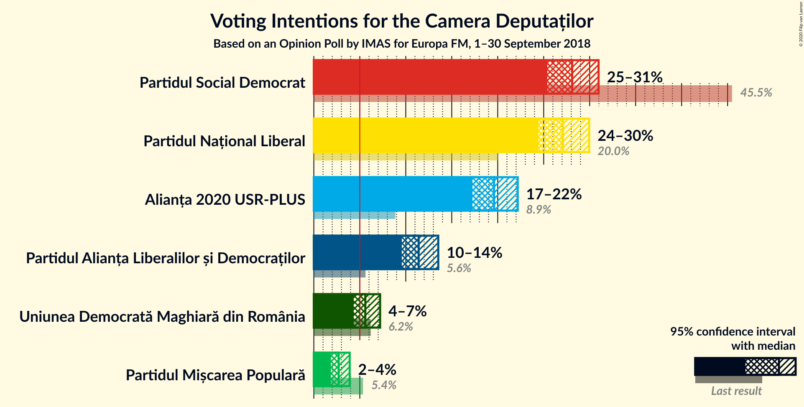
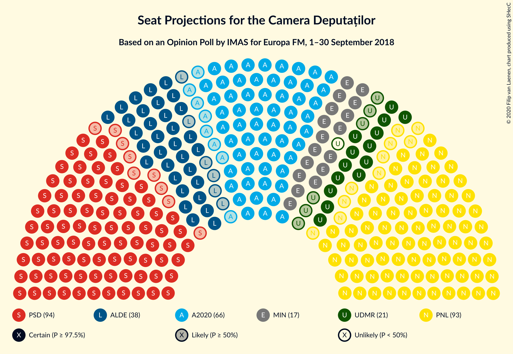
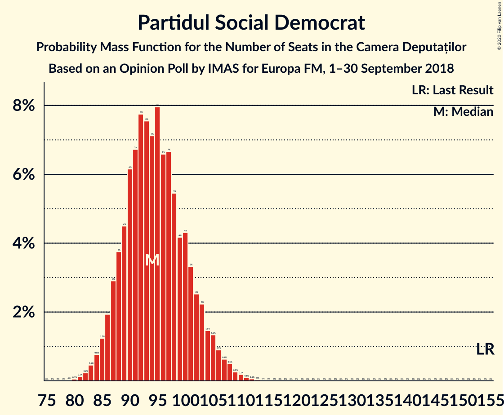
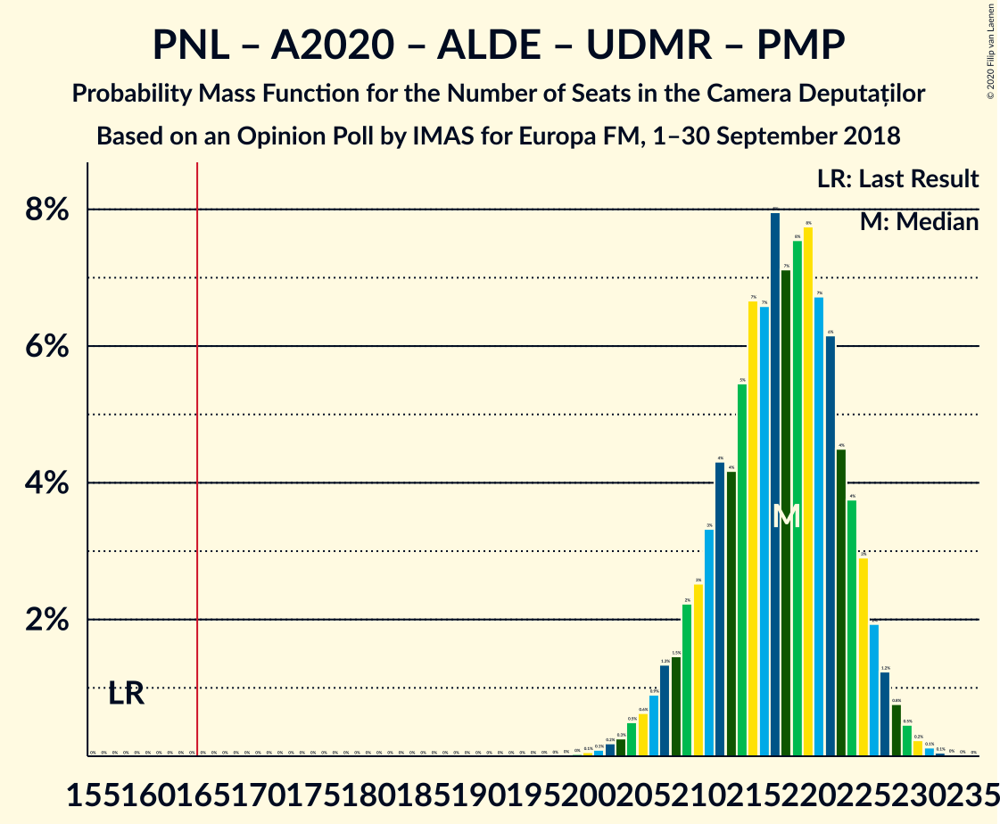
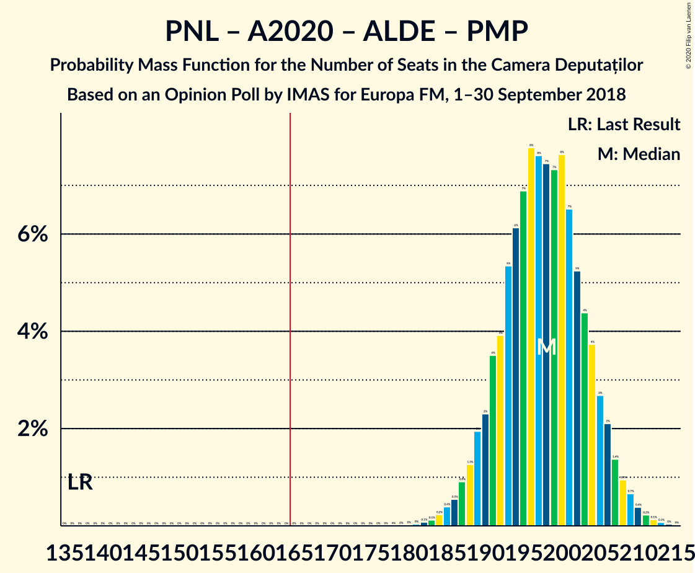
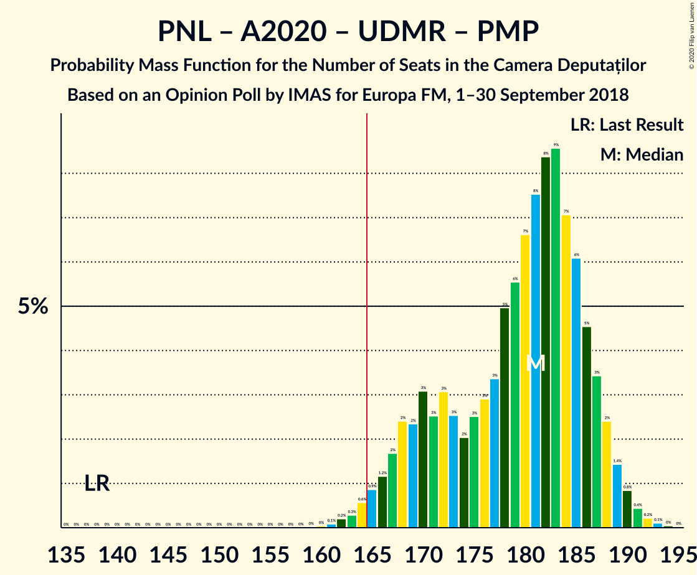
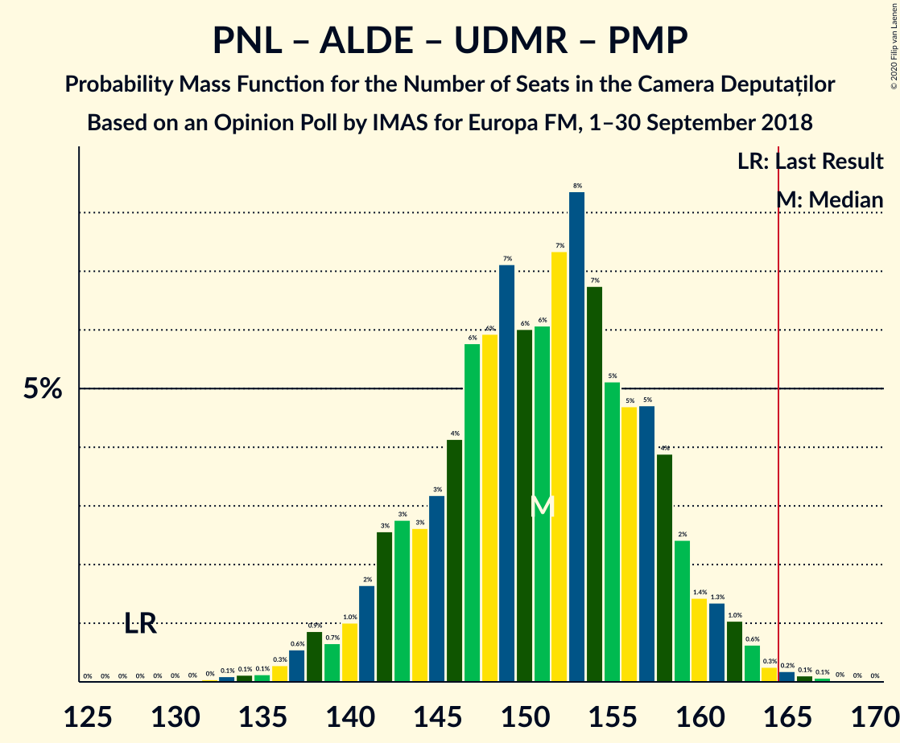

# Opinion Poll by IMAS for Europa FM, 1–30 September 2018

<a href="#voting-intentions">Voting Intentions</a> | <a href="#seats">Seats</a> | <a href="#coalitions">Coalitions</a> | <a href="#technical-information">Technical Information</a>

## Voting Intentions

### Confidence Intervals

| Party | Last Result | Poll Result | 80% Confidence Interval | 90% Confidence Interval | 95% Confidence Interval | 99% Confidence Interval |
|:-----:|:-----------:|:-----------:|:-----------------------:|:-----------------------:|:-----------------------:|:-----------------------:|
| Partidul Social Democrat | 45.5% | 28.1% | 26.3–30.0% |25.8–30.5% |25.4–31.0% |24.6–31.9% |
| Partidul Național Liberal | 20.0% | 27.1% | 25.3–29.0% |24.9–29.5% |24.4–29.9% |23.6–30.8% |
| Alianța 2020 USR-PLUS | 8.9% | 19.6% | 18.1–21.3% |17.6–21.8% |17.3–22.2% |16.5–23.0% |
| Partidul Alianța Liberalilor și Democraților | 5.6% | 11.4% | 10.2–12.8% |9.9–13.2% |9.6–13.5% |9.0–14.2% |
| Uniunea Democrată Maghiară din România | 6.2% | 5.6% | 4.8–6.6% |4.5–7.0% |4.3–7.2% |4.0–7.7% |
| Partidul Mișcarea Populară | 5.4% | 2.7% | 2.1–3.5% |2.0–3.7% |1.9–3.9% |1.6–4.3% |

*Note:* The poll result column reflects the actual value used in the calculations. Published results may vary slightly, and in addition be rounded to fewer digits.

## Seats

### Confidence Intervals

| Party | Last Result | Median | 80% Confidence Interval | 90% Confidence Interval | 95% Confidence Interval | 99% Confidence Interval |
|:-----:|:-----------:|:------:|:-----------------------:|:-----------------------:|:-----------------------:|:-----------------------:|
| <a href="#partidul-social-democrat">Partidul Social Democrat</a> | 154 | 93 | 88–100 |87–103 |85–105 |83–108 |
| <a href="#partidul-național-liberal">Partidul Național Liberal</a> | 69 | 94 | 87–100 |85–101 |84–103 |80–105 |
| <a href="#alianța-2020-usr-plus">Alianța 2020 USR-PLUS</a> | 30 | 66 | 61–72 |60–74 |59–75 |56–78 |
| <a href="#partidul-alianța-liberalilor-și-democraților">Partidul Alianța Liberalilor și Democraților</a> | 20 | 38 | 34–42 |33–44 |32–45 |30–48 |
| <a href="#uniunea-democrată-maghiară-din-românia">Uniunea Democrată Maghiară din România</a> | 21 | 20 | 17–23 |15–24 |14–24 |12–25 |
| <a href="#partidul-mișcarea-populară">Partidul Mișcarea Populară</a> | 18 | 0 | 0 |0 |0 |0 |

### Partidul Social Democrat

*For a full overview of the results for this party, see the [Partidul Social Democrat](party-partidulsocialdemocrat.html) page.*

| Number of Seats | Probability | Accumulated | Special Marks |
|:---------------:|:-----------:|:-----------:|:-------------:|
| 80 | 0% | 100% |  |
| 81 | 0.1% | 99.9% |  |
| 82 | 0.1% | 99.9% |  |
| 83 | 0.4% | 99.7% |  |
| 84 | 0.8% | 99.3% |  |
| 85 | 1.2% | 98.6% |  |
| 86 | 2% | 97% |  |
| 87 | 2% | 95% |  |
| 88 | 5% | 93% |  |
| 89 | 4% | 88% |  |
| 90 | 9% | 84% |  |
| 91 | 7% | 75% |  |
| 92 | 9% | 68% |  |
| 93 | 9% | 59% | Median |
| 94 | 5% | 49% |  |
| 95 | 9% | 45% |  |
| 96 | 6% | 35% |  |
| 97 | 7% | 29% |  |
| 98 | 5% | 22% |  |
| 99 | 4% | 17% |  |
| 100 | 3% | 13% |  |
| 101 | 3% | 10% |  |
| 102 | 2% | 7% |  |
| 103 | 1.4% | 5% |  |
| 104 | 1.2% | 4% |  |
| 105 | 0.8% | 3% |  |
| 106 | 0.6% | 2% |  |
| 107 | 0.3% | 1.1% |  |
| 108 | 0.4% | 0.8% |  |
| 109 | 0.2% | 0.4% |  |
| 110 | 0.1% | 0.3% |  |
| 111 | 0.1% | 0.1% |  |
| 112 | 0% | 0.1% |  |
| 113 | 0% | 0% |  |
| 114 | 0% | 0% |  |
| 115 | 0% | 0% |  |
| 116 | 0% | 0% |  |
| 117 | 0% | 0% |  |
| 118 | 0% | 0% |  |
| 119 | 0% | 0% |  |
| 120 | 0% | 0% |  |
| 121 | 0% | 0% |  |
| 122 | 0% | 0% |  |
| 123 | 0% | 0% |  |
| 124 | 0% | 0% |  |
| 125 | 0% | 0% |  |
| 126 | 0% | 0% |  |
| 127 | 0% | 0% |  |
| 128 | 0% | 0% |  |
| 129 | 0% | 0% |  |
| 130 | 0% | 0% |  |
| 131 | 0% | 0% |  |
| 132 | 0% | 0% |  |
| 133 | 0% | 0% |  |
| 134 | 0% | 0% |  |
| 135 | 0% | 0% |  |
| 136 | 0% | 0% |  |
| 137 | 0% | 0% |  |
| 138 | 0% | 0% |  |
| 139 | 0% | 0% |  |
| 140 | 0% | 0% |  |
| 141 | 0% | 0% |  |
| 142 | 0% | 0% |  |
| 143 | 0% | 0% |  |
| 144 | 0% | 0% |  |
| 145 | 0% | 0% |  |
| 146 | 0% | 0% |  |
| 147 | 0% | 0% |  |
| 148 | 0% | 0% |  |
| 149 | 0% | 0% |  |
| 150 | 0% | 0% |  |
| 151 | 0% | 0% |  |
| 152 | 0% | 0% |  |
| 153 | 0% | 0% |  |
| 154 | 0% | 0% | Last Result |

### Partidul Național Liberal

*For a full overview of the results for this party, see the [Partidul Național Liberal](party-partidulnaționalliberal.html) page.*

| Number of Seats | Probability | Accumulated | Special Marks |
|:---------------:|:-----------:|:-----------:|:-------------:|
| 69 | 0% | 100% | Last Result |
| 70 | 0% | 100% |  |
| 71 | 0% | 100% |  |
| 72 | 0% | 100% |  |
| 73 | 0% | 100% |  |
| 74 | 0% | 100% |  |
| 75 | 0% | 100% |  |
| 76 | 0% | 100% |  |
| 77 | 0% | 100% |  |
| 78 | 0.1% | 99.9% |  |
| 79 | 0.2% | 99.8% |  |
| 80 | 0.3% | 99.7% |  |
| 81 | 0.4% | 99.4% |  |
| 82 | 0.8% | 99.1% |  |
| 83 | 0.7% | 98% |  |
| 84 | 2% | 98% |  |
| 85 | 2% | 96% |  |
| 86 | 2% | 94% |  |
| 87 | 3% | 92% |  |
| 88 | 4% | 89% |  |
| 89 | 5% | 85% |  |
| 90 | 6% | 80% |  |
| 91 | 8% | 74% |  |
| 92 | 6% | 66% |  |
| 93 | 10% | 60% |  |
| 94 | 7% | 50% | Median |
| 95 | 9% | 43% |  |
| 96 | 7% | 35% |  |
| 97 | 7% | 28% |  |
| 98 | 6% | 21% |  |
| 99 | 6% | 16% |  |
| 100 | 3% | 10% |  |
| 101 | 3% | 7% |  |
| 102 | 2% | 4% |  |
| 103 | 1.3% | 3% |  |
| 104 | 0.7% | 1.5% |  |
| 105 | 0.3% | 0.8% |  |
| 106 | 0.2% | 0.5% |  |
| 107 | 0.1% | 0.2% |  |
| 108 | 0.1% | 0.1% |  |
| 109 | 0% | 0.1% |  |
| 110 | 0% | 0% |  |

### Alianța 2020 USR-PLUS

*For a full overview of the results for this party, see the [Alianța 2020 USR-PLUS](party-alianța2020usr-plus.html) page.*

| Number of Seats | Probability | Accumulated | Special Marks |
|:---------------:|:-----------:|:-----------:|:-------------:|
| 30 | 0% | 100% | Last Result |
| 31 | 0% | 100% |  |
| 32 | 0% | 100% |  |
| 33 | 0% | 100% |  |
| 34 | 0% | 100% |  |
| 35 | 0% | 100% |  |
| 36 | 0% | 100% |  |
| 37 | 0% | 100% |  |
| 38 | 0% | 100% |  |
| 39 | 0% | 100% |  |
| 40 | 0% | 100% |  |
| 41 | 0% | 100% |  |
| 42 | 0% | 100% |  |
| 43 | 0% | 100% |  |
| 44 | 0% | 100% |  |
| 45 | 0% | 100% |  |
| 46 | 0% | 100% |  |
| 47 | 0% | 100% |  |
| 48 | 0% | 100% |  |
| 49 | 0% | 100% |  |
| 50 | 0% | 100% |  |
| 51 | 0% | 100% |  |
| 52 | 0% | 100% |  |
| 53 | 0% | 100% |  |
| 54 | 0.1% | 99.9% |  |
| 55 | 0.2% | 99.9% |  |
| 56 | 0.3% | 99.7% |  |
| 57 | 0.8% | 99.4% |  |
| 58 | 0.9% | 98.5% |  |
| 59 | 2% | 98% |  |
| 60 | 3% | 96% |  |
| 61 | 4% | 92% |  |
| 62 | 6% | 88% |  |
| 63 | 6% | 82% |  |
| 64 | 7% | 75% |  |
| 65 | 7% | 68% |  |
| 66 | 11% | 61% | Median |
| 67 | 8% | 50% |  |
| 68 | 11% | 41% |  |
| 69 | 7% | 30% |  |
| 70 | 7% | 23% |  |
| 71 | 5% | 16% |  |
| 72 | 4% | 12% |  |
| 73 | 2% | 7% |  |
| 74 | 2% | 5% |  |
| 75 | 1.3% | 3% |  |
| 76 | 0.9% | 2% |  |
| 77 | 0.6% | 1.1% |  |
| 78 | 0.3% | 0.5% |  |
| 79 | 0.1% | 0.3% |  |
| 80 | 0.1% | 0.1% |  |
| 81 | 0% | 0.1% |  |
| 82 | 0% | 0% |  |

### Partidul Alianța Liberalilor și Democraților

*For a full overview of the results for this party, see the [Partidul Alianța Liberalilor și Democraților](party-partidulalianțaliberalilorșidemocraților.html) page.*

| Number of Seats | Probability | Accumulated | Special Marks |
|:---------------:|:-----------:|:-----------:|:-------------:|
| 20 | 0% | 100% | Last Result |
| 21 | 0% | 100% |  |
| 22 | 0% | 100% |  |
| 23 | 0% | 100% |  |
| 24 | 0% | 100% |  |
| 25 | 0% | 100% |  |
| 26 | 0% | 100% |  |
| 27 | 0% | 100% |  |
| 28 | 0.1% | 100% |  |
| 29 | 0.2% | 99.9% |  |
| 30 | 0.5% | 99.7% |  |
| 31 | 1.4% | 99.2% |  |
| 32 | 3% | 98% |  |
| 33 | 4% | 95% |  |
| 34 | 5% | 91% |  |
| 35 | 9% | 85% |  |
| 36 | 12% | 77% |  |
| 37 | 11% | 65% |  |
| 38 | 12% | 54% | Median |
| 39 | 11% | 42% |  |
| 40 | 9% | 30% |  |
| 41 | 7% | 21% |  |
| 42 | 6% | 14% |  |
| 43 | 3% | 9% |  |
| 44 | 2% | 6% |  |
| 45 | 2% | 3% |  |
| 46 | 0.9% | 2% |  |
| 47 | 0.4% | 1.0% |  |
| 48 | 0.3% | 0.6% |  |
| 49 | 0.2% | 0.3% |  |
| 50 | 0.1% | 0.1% |  |
| 51 | 0% | 0.1% |  |
| 52 | 0% | 0% |  |

### Uniunea Democrată Maghiară din România

*For a full overview of the results for this party, see the [Uniunea Democrată Maghiară din România](party-uniuneademocratămaghiarădinromânia.html) page.*

| Number of Seats | Probability | Accumulated | Special Marks |
|:---------------:|:-----------:|:-----------:|:-------------:|
| 11 | 0.1% | 100% |  |
| 12 | 0.4% | 99.9% |  |
| 13 | 0.4% | 99.5% |  |
| 14 | 2% | 99.1% |  |
| 15 | 3% | 97% |  |
| 16 | 2% | 94% |  |
| 17 | 4% | 91% |  |
| 18 | 12% | 88% |  |
| 19 | 10% | 76% |  |
| 20 | 16% | 65% | Median |
| 21 | 25% | 50% | Last Result |
| 22 | 13% | 25% |  |
| 23 | 6% | 12% |  |
| 24 | 5% | 7% |  |
| 25 | 1.4% | 2% |  |
| 26 | 0.1% | 0.3% |  |
| 27 | 0.1% | 0.2% |  |
| 28 | 0% | 0% |  |

### Partidul Mișcarea Populară

*For a full overview of the results for this party, see the [Partidul Mișcarea Populară](party-partidulmișcareapopulară.html) page.*

| Number of Seats | Probability | Accumulated | Special Marks |
|:---------------:|:-----------:|:-----------:|:-------------:|
| 0 | 100% | 100% | Median |
| 1 | 0% | 0% |  |
| 2 | 0% | 0% |  |
| 3 | 0% | 0% |  |
| 4 | 0% | 0% |  |
| 5 | 0% | 0% |  |
| 6 | 0% | 0% |  |
| 7 | 0% | 0% |  |
| 8 | 0% | 0% |  |
| 9 | 0% | 0% |  |
| 10 | 0% | 0% |  |
| 11 | 0% | 0% |  |
| 12 | 0% | 0% |  |
| 13 | 0% | 0% |  |
| 14 | 0% | 0% |  |
| 15 | 0% | 0% |  |
| 16 | 0% | 0% |  |
| 17 | 0% | 0% |  |
| 18 | 0% | 0% | Last Result |

## Coalitions

### Confidence Intervals

| Coalition | Last Result | Median | Majority? | 80% Confidence Interval | 90% Confidence Interval | 95% Confidence Interval | 99% Confidence Interval |
|:---------:|:-----------:|:------:|:---------:|:-----------------------:|:-----------------------:|:-----------------------:|:-----------------------:|
| Partidul Național Liberal – Alianța 2020 USR-PLUS – Partidul Alianța Liberalilor și Democraților – Uniunea Democrată Maghiară din România – Partidul Mișcarea Populară | 158 | 219 | 100% | 212–224 | 209–225 | 207–227 | 204–229 |
| Partidul Național Liberal – Alianța 2020 USR-PLUS – Partidul Alianța Liberalilor și Democraților – Uniunea Democrată Maghiară din România | 140 | 219 | 100% | 212–224 | 209–225 | 207–227 | 204–229 |
| Partidul Național Liberal – Alianța 2020 USR-PLUS – Partidul Alianța Liberalilor și Democraților – Partidul Mișcarea Populară | 137 | 198 | 100% | 191–204 | 189–206 | 188–208 | 185–211 |
| Partidul Național Liberal – Alianța 2020 USR-PLUS – Partidul Alianța Liberalilor și Democraților | 119 | 198 | 100% | 191–204 | 189–206 | 188–208 | 185–211 |
| Partidul Național Liberal – Alianța 2020 USR-PLUS – Uniunea Democrată Maghiară din România – Partidul Mișcarea Populară | 138 | 181 | 98% | 174–186 | 169–187 | 166–188 | 162–190 |
| Partidul Național Liberal – Alianța 2020 USR-PLUS – Uniunea Democrată Maghiară din România | 120 | 181 | 98% | 174–186 | 169–187 | 166–188 | 162–190 |
| Partidul Național Liberal – Alianța 2020 USR-PLUS – Partidul Mișcarea Populară | 117 | 160 | 14% | 153–167 | 151–168 | 149–170 | 146–173 |
| Partidul Național Liberal – Alianța 2020 USR-PLUS | 99 | 160 | 14% | 153–167 | 151–168 | 149–170 | 146–173 |
| Partidul Național Liberal – Partidul Alianța Liberalilor și Democraților – Uniunea Democrată Maghiară din România – Partidul Mișcarea Populară | 128 | 152 | 0.2% | 145–158 | 142–160 | 141–161 | 136–164 |
| Partidul Național Liberal – Partidul Alianța Liberalilor și Democraților – Uniunea Democrată Maghiară din România | 110 | 152 | 0.2% | 145–158 | 142–160 | 141–161 | 136–164 |
| Partidul Social Democrat – Partidul Alianța Liberalilor și Democraților | 174 | 131 | 0% | 126–138 | 125–143 | 124–146 | 122–150 |
| Partidul Național Liberal – Uniunea Democrată Maghiară din România – Partidul Mișcarea Populară | 108 | 114 | 0% | 107–119 | 102–120 | 100–121 | 97–123 |
| Partidul Național Liberal – Uniunea Democrată Maghiară din România | 90 | 114 | 0% | 107–119 | 102–120 | 100–121 | 97–123 |
| Partidul Național Liberal – Partidul Mișcarea Populară | 87 | 94 | 0% | 87–100 | 85–101 | 84–103 | 80–105 |
| Partidul Național Liberal | 69 | 94 | 0% | 87–100 | 85–101 | 84–103 | 80–105 |
| Alianța 2020 USR-PLUS – Partidul Mișcarea Populară | 48 | 66 | 0% | 61–72 | 60–74 | 59–75 | 56–78 |

### Partidul Național Liberal – Alianța 2020 USR-PLUS – Partidul Alianța Liberalilor și Democraților – Uniunea Democrată Maghiară din România – Partidul Mișcarea Populară

| Number of Seats | Probability | Accumulated | Special Marks |
|:---------------:|:-----------:|:-----------:|:-------------:|
| 158 | 0% | 100% | Last Result |
| 159 | 0% | 100% |  |
| 160 | 0% | 100% |  |
| 161 | 0% | 100% |  |
| 162 | 0% | 100% |  |
| 163 | 0% | 100% |  |
| 164 | 0% | 100% |  |
| 165 | 0% | 100% |  |
| 166 | 0% | 100% | Majority |
| 167 | 0% | 100% |  |
| 168 | 0% | 100% |  |
| 169 | 0% | 100% |  |
| 170 | 0% | 100% |  |
| 171 | 0% | 100% |  |
| 172 | 0% | 100% |  |
| 173 | 0% | 100% |  |
| 174 | 0% | 100% |  |
| 175 | 0% | 100% |  |
| 176 | 0% | 100% |  |
| 177 | 0% | 100% |  |
| 178 | 0% | 100% |  |
| 179 | 0% | 100% |  |
| 180 | 0% | 100% |  |
| 181 | 0% | 100% |  |
| 182 | 0% | 100% |  |
| 183 | 0% | 100% |  |
| 184 | 0% | 100% |  |
| 185 | 0% | 100% |  |
| 186 | 0% | 100% |  |
| 187 | 0% | 100% |  |
| 188 | 0% | 100% |  |
| 189 | 0% | 100% |  |
| 190 | 0% | 100% |  |
| 191 | 0% | 100% |  |
| 192 | 0% | 100% |  |
| 193 | 0% | 100% |  |
| 194 | 0% | 100% |  |
| 195 | 0% | 100% |  |
| 196 | 0% | 100% |  |
| 197 | 0% | 100% |  |
| 198 | 0% | 100% |  |
| 199 | 0% | 100% |  |
| 200 | 0% | 100% |  |
| 201 | 0.1% | 99.9% |  |
| 202 | 0.1% | 99.9% |  |
| 203 | 0.2% | 99.7% |  |
| 204 | 0.4% | 99.6% |  |
| 205 | 0.3% | 99.2% |  |
| 206 | 0.6% | 98.9% |  |
| 207 | 0.8% | 98% |  |
| 208 | 1.2% | 97% |  |
| 209 | 1.4% | 96% |  |
| 210 | 2% | 95% |  |
| 211 | 3% | 93% |  |
| 212 | 3% | 90% |  |
| 213 | 4% | 87% |  |
| 214 | 5% | 83% |  |
| 215 | 7% | 78% |  |
| 216 | 6% | 71% |  |
| 217 | 9% | 65% |  |
| 218 | 5% | 55% | Median |
| 219 | 9% | 51% |  |
| 220 | 9% | 41% |  |
| 221 | 7% | 32% |  |
| 222 | 9% | 25% |  |
| 223 | 4% | 16% |  |
| 224 | 5% | 12% |  |
| 225 | 2% | 7% |  |
| 226 | 2% | 5% |  |
| 227 | 1.2% | 3% |  |
| 228 | 0.8% | 1.4% |  |
| 229 | 0.4% | 0.7% |  |
| 230 | 0.1% | 0.3% |  |
| 231 | 0.1% | 0.1% |  |
| 232 | 0% | 0.1% |  |
| 233 | 0% | 0% |  |

### Partidul Național Liberal – Alianța 2020 USR-PLUS – Partidul Alianța Liberalilor și Democraților – Uniunea Democrată Maghiară din România

| Number of Seats | Probability | Accumulated | Special Marks |
|:---------------:|:-----------:|:-----------:|:-------------:|
| 140 | 0% | 100% | Last Result |
| 141 | 0% | 100% |  |
| 142 | 0% | 100% |  |
| 143 | 0% | 100% |  |
| 144 | 0% | 100% |  |
| 145 | 0% | 100% |  |
| 146 | 0% | 100% |  |
| 147 | 0% | 100% |  |
| 148 | 0% | 100% |  |
| 149 | 0% | 100% |  |
| 150 | 0% | 100% |  |
| 151 | 0% | 100% |  |
| 152 | 0% | 100% |  |
| 153 | 0% | 100% |  |
| 154 | 0% | 100% |  |
| 155 | 0% | 100% |  |
| 156 | 0% | 100% |  |
| 157 | 0% | 100% |  |
| 158 | 0% | 100% |  |
| 159 | 0% | 100% |  |
| 160 | 0% | 100% |  |
| 161 | 0% | 100% |  |
| 162 | 0% | 100% |  |
| 163 | 0% | 100% |  |
| 164 | 0% | 100% |  |
| 165 | 0% | 100% |  |
| 166 | 0% | 100% | Majority |
| 167 | 0% | 100% |  |
| 168 | 0% | 100% |  |
| 169 | 0% | 100% |  |
| 170 | 0% | 100% |  |
| 171 | 0% | 100% |  |
| 172 | 0% | 100% |  |
| 173 | 0% | 100% |  |
| 174 | 0% | 100% |  |
| 175 | 0% | 100% |  |
| 176 | 0% | 100% |  |
| 177 | 0% | 100% |  |
| 178 | 0% | 100% |  |
| 179 | 0% | 100% |  |
| 180 | 0% | 100% |  |
| 181 | 0% | 100% |  |
| 182 | 0% | 100% |  |
| 183 | 0% | 100% |  |
| 184 | 0% | 100% |  |
| 185 | 0% | 100% |  |
| 186 | 0% | 100% |  |
| 187 | 0% | 100% |  |
| 188 | 0% | 100% |  |
| 189 | 0% | 100% |  |
| 190 | 0% | 100% |  |
| 191 | 0% | 100% |  |
| 192 | 0% | 100% |  |
| 193 | 0% | 100% |  |
| 194 | 0% | 100% |  |
| 195 | 0% | 100% |  |
| 196 | 0% | 100% |  |
| 197 | 0% | 100% |  |
| 198 | 0% | 100% |  |
| 199 | 0% | 100% |  |
| 200 | 0% | 100% |  |
| 201 | 0.1% | 99.9% |  |
| 202 | 0.1% | 99.9% |  |
| 203 | 0.2% | 99.7% |  |
| 204 | 0.4% | 99.6% |  |
| 205 | 0.3% | 99.2% |  |
| 206 | 0.6% | 98.8% |  |
| 207 | 0.8% | 98% |  |
| 208 | 1.2% | 97% |  |
| 209 | 1.4% | 96% |  |
| 210 | 2% | 95% |  |
| 211 | 3% | 93% |  |
| 212 | 3% | 90% |  |
| 213 | 4% | 87% |  |
| 214 | 5% | 83% |  |
| 215 | 7% | 77% |  |
| 216 | 6% | 71% |  |
| 217 | 9% | 65% |  |
| 218 | 5% | 55% | Median |
| 219 | 9% | 51% |  |
| 220 | 9% | 41% |  |
| 221 | 7% | 32% |  |
| 222 | 9% | 25% |  |
| 223 | 4% | 16% |  |
| 224 | 5% | 12% |  |
| 225 | 2% | 7% |  |
| 226 | 2% | 5% |  |
| 227 | 1.2% | 3% |  |
| 228 | 0.8% | 1.4% |  |
| 229 | 0.4% | 0.7% |  |
| 230 | 0.1% | 0.3% |  |
| 231 | 0.1% | 0.1% |  |
| 232 | 0% | 0.1% |  |
| 233 | 0% | 0% |  |

### Partidul Național Liberal – Alianța 2020 USR-PLUS – Partidul Alianța Liberalilor și Democraților – Partidul Mișcarea Populară

| Number of Seats | Probability | Accumulated | Special Marks |
|:---------------:|:-----------:|:-----------:|:-------------:|
| 137 | 0% | 100% | Last Result |
| 138 | 0% | 100% |  |
| 139 | 0% | 100% |  |
| 140 | 0% | 100% |  |
| 141 | 0% | 100% |  |
| 142 | 0% | 100% |  |
| 143 | 0% | 100% |  |
| 144 | 0% | 100% |  |
| 145 | 0% | 100% |  |
| 146 | 0% | 100% |  |
| 147 | 0% | 100% |  |
| 148 | 0% | 100% |  |
| 149 | 0% | 100% |  |
| 150 | 0% | 100% |  |
| 151 | 0% | 100% |  |
| 152 | 0% | 100% |  |
| 153 | 0% | 100% |  |
| 154 | 0% | 100% |  |
| 155 | 0% | 100% |  |
| 156 | 0% | 100% |  |
| 157 | 0% | 100% |  |
| 158 | 0% | 100% |  |
| 159 | 0% | 100% |  |
| 160 | 0% | 100% |  |
| 161 | 0% | 100% |  |
| 162 | 0% | 100% |  |
| 163 | 0% | 100% |  |
| 164 | 0% | 100% |  |
| 165 | 0% | 100% |  |
| 166 | 0% | 100% | Majority |
| 167 | 0% | 100% |  |
| 168 | 0% | 100% |  |
| 169 | 0% | 100% |  |
| 170 | 0% | 100% |  |
| 171 | 0% | 100% |  |
| 172 | 0% | 100% |  |
| 173 | 0% | 100% |  |
| 174 | 0% | 100% |  |
| 175 | 0% | 100% |  |
| 176 | 0% | 100% |  |
| 177 | 0% | 100% |  |
| 178 | 0% | 100% |  |
| 179 | 0% | 100% |  |
| 180 | 0% | 100% |  |
| 181 | 0% | 100% |  |
| 182 | 0.1% | 99.9% |  |
| 183 | 0.1% | 99.9% |  |
| 184 | 0.3% | 99.8% |  |
| 185 | 0.4% | 99.5% |  |
| 186 | 0.4% | 99.1% |  |
| 187 | 1.0% | 98.7% |  |
| 188 | 1.0% | 98% |  |
| 189 | 3% | 97% |  |
| 190 | 0.7% | 94% |  |
| 191 | 5% | 93% |  |
| 192 | 2% | 88% |  |
| 193 | 8% | 87% |  |
| 194 | 3% | 79% |  |
| 195 | 9% | 76% |  |
| 196 | 6% | 67% |  |
| 197 | 7% | 61% |  |
| 198 | 4% | 54% | Median |
| 199 | 11% | 50% |  |
| 200 | 9% | 39% |  |
| 201 | 5% | 30% |  |
| 202 | 6% | 25% |  |
| 203 | 5% | 19% |  |
| 204 | 6% | 15% |  |
| 205 | 1.2% | 9% |  |
| 206 | 3% | 7% |  |
| 207 | 0.8% | 4% |  |
| 208 | 2% | 3% |  |
| 209 | 0.5% | 2% |  |
| 210 | 0.5% | 1.0% |  |
| 211 | 0.3% | 0.5% |  |
| 212 | 0.1% | 0.3% |  |
| 213 | 0.1% | 0.2% |  |
| 214 | 0% | 0.1% |  |
| 215 | 0% | 0% |  |

### Partidul Național Liberal – Alianța 2020 USR-PLUS – Partidul Alianța Liberalilor și Democraților

| Number of Seats | Probability | Accumulated | Special Marks |
|:---------------:|:-----------:|:-----------:|:-------------:|
| 119 | 0% | 100% | Last Result |
| 120 | 0% | 100% |  |
| 121 | 0% | 100% |  |
| 122 | 0% | 100% |  |
| 123 | 0% | 100% |  |
| 124 | 0% | 100% |  |
| 125 | 0% | 100% |  |
| 126 | 0% | 100% |  |
| 127 | 0% | 100% |  |
| 128 | 0% | 100% |  |
| 129 | 0% | 100% |  |
| 130 | 0% | 100% |  |
| 131 | 0% | 100% |  |
| 132 | 0% | 100% |  |
| 133 | 0% | 100% |  |
| 134 | 0% | 100% |  |
| 135 | 0% | 100% |  |
| 136 | 0% | 100% |  |
| 137 | 0% | 100% |  |
| 138 | 0% | 100% |  |
| 139 | 0% | 100% |  |
| 140 | 0% | 100% |  |
| 141 | 0% | 100% |  |
| 142 | 0% | 100% |  |
| 143 | 0% | 100% |  |
| 144 | 0% | 100% |  |
| 145 | 0% | 100% |  |
| 146 | 0% | 100% |  |
| 147 | 0% | 100% |  |
| 148 | 0% | 100% |  |
| 149 | 0% | 100% |  |
| 150 | 0% | 100% |  |
| 151 | 0% | 100% |  |
| 152 | 0% | 100% |  |
| 153 | 0% | 100% |  |
| 154 | 0% | 100% |  |
| 155 | 0% | 100% |  |
| 156 | 0% | 100% |  |
| 157 | 0% | 100% |  |
| 158 | 0% | 100% |  |
| 159 | 0% | 100% |  |
| 160 | 0% | 100% |  |
| 161 | 0% | 100% |  |
| 162 | 0% | 100% |  |
| 163 | 0% | 100% |  |
| 164 | 0% | 100% |  |
| 165 | 0% | 100% |  |
| 166 | 0% | 100% | Majority |
| 167 | 0% | 100% |  |
| 168 | 0% | 100% |  |
| 169 | 0% | 100% |  |
| 170 | 0% | 100% |  |
| 171 | 0% | 100% |  |
| 172 | 0% | 100% |  |
| 173 | 0% | 100% |  |
| 174 | 0% | 100% |  |
| 175 | 0% | 100% |  |
| 176 | 0% | 100% |  |
| 177 | 0% | 100% |  |
| 178 | 0% | 100% |  |
| 179 | 0% | 100% |  |
| 180 | 0% | 100% |  |
| 181 | 0% | 100% |  |
| 182 | 0.1% | 99.9% |  |
| 183 | 0.1% | 99.9% |  |
| 184 | 0.3% | 99.8% |  |
| 185 | 0.4% | 99.5% |  |
| 186 | 0.4% | 99.1% |  |
| 187 | 1.0% | 98.7% |  |
| 188 | 1.0% | 98% |  |
| 189 | 3% | 97% |  |
| 190 | 0.7% | 94% |  |
| 191 | 5% | 93% |  |
| 192 | 2% | 88% |  |
| 193 | 8% | 87% |  |
| 194 | 3% | 79% |  |
| 195 | 9% | 76% |  |
| 196 | 6% | 67% |  |
| 197 | 7% | 61% |  |
| 198 | 4% | 54% | Median |
| 199 | 11% | 50% |  |
| 200 | 9% | 39% |  |
| 201 | 5% | 30% |  |
| 202 | 6% | 25% |  |
| 203 | 5% | 19% |  |
| 204 | 6% | 15% |  |
| 205 | 1.2% | 8% |  |
| 206 | 3% | 7% |  |
| 207 | 0.8% | 4% |  |
| 208 | 2% | 3% |  |
| 209 | 0.5% | 2% |  |
| 210 | 0.5% | 1.0% |  |
| 211 | 0.3% | 0.5% |  |
| 212 | 0.1% | 0.3% |  |
| 213 | 0.1% | 0.2% |  |
| 214 | 0% | 0.1% |  |
| 215 | 0% | 0% |  |

### Partidul Național Liberal – Alianța 2020 USR-PLUS – Uniunea Democrată Maghiară din România – Partidul Mișcarea Populară

| Number of Seats | Probability | Accumulated | Special Marks |
|:---------------:|:-----------:|:-----------:|:-------------:|
| 138 | 0% | 100% | Last Result |
| 139 | 0% | 100% |  |
| 140 | 0% | 100% |  |
| 141 | 0% | 100% |  |
| 142 | 0% | 100% |  |
| 143 | 0% | 100% |  |
| 144 | 0% | 100% |  |
| 145 | 0% | 100% |  |
| 146 | 0% | 100% |  |
| 147 | 0% | 100% |  |
| 148 | 0% | 100% |  |
| 149 | 0% | 100% |  |
| 150 | 0% | 100% |  |
| 151 | 0% | 100% |  |
| 152 | 0% | 100% |  |
| 153 | 0% | 100% |  |
| 154 | 0% | 100% |  |
| 155 | 0% | 100% |  |
| 156 | 0% | 100% |  |
| 157 | 0% | 100% |  |
| 158 | 0% | 100% |  |
| 159 | 0% | 100% |  |
| 160 | 0% | 100% |  |
| 161 | 0% | 99.9% |  |
| 162 | 0.4% | 99.9% |  |
| 163 | 0.1% | 99.5% |  |
| 164 | 0.2% | 99.3% |  |
| 165 | 1.3% | 99.1% |  |
| 166 | 0.7% | 98% | Majority |
| 167 | 0.2% | 97% |  |
| 168 | 2% | 97% |  |
| 169 | 2% | 95% |  |
| 170 | 0.5% | 94% |  |
| 171 | 1.1% | 93% |  |
| 172 | 1.4% | 92% |  |
| 173 | 0.8% | 91% |  |
| 174 | 2% | 90% |  |
| 175 | 2% | 88% |  |
| 176 | 3% | 86% |  |
| 177 | 6% | 83% |  |
| 178 | 8% | 77% |  |
| 179 | 7% | 69% |  |
| 180 | 8% | 61% | Median |
| 181 | 7% | 53% |  |
| 182 | 11% | 46% |  |
| 183 | 13% | 35% |  |
| 184 | 3% | 22% |  |
| 185 | 7% | 19% |  |
| 186 | 6% | 11% |  |
| 187 | 0.9% | 5% |  |
| 188 | 2% | 4% |  |
| 189 | 2% | 2% |  |
| 190 | 0.2% | 0.7% |  |
| 191 | 0.2% | 0.5% |  |
| 192 | 0.2% | 0.3% |  |
| 193 | 0% | 0.1% |  |
| 194 | 0% | 0% |  |

### Partidul Național Liberal – Alianța 2020 USR-PLUS – Uniunea Democrată Maghiară din România

| Number of Seats | Probability | Accumulated | Special Marks |
|:---------------:|:-----------:|:-----------:|:-------------:|
| 120 | 0% | 100% | Last Result |
| 121 | 0% | 100% |  |
| 122 | 0% | 100% |  |
| 123 | 0% | 100% |  |
| 124 | 0% | 100% |  |
| 125 | 0% | 100% |  |
| 126 | 0% | 100% |  |
| 127 | 0% | 100% |  |
| 128 | 0% | 100% |  |
| 129 | 0% | 100% |  |
| 130 | 0% | 100% |  |
| 131 | 0% | 100% |  |
| 132 | 0% | 100% |  |
| 133 | 0% | 100% |  |
| 134 | 0% | 100% |  |
| 135 | 0% | 100% |  |
| 136 | 0% | 100% |  |
| 137 | 0% | 100% |  |
| 138 | 0% | 100% |  |
| 139 | 0% | 100% |  |
| 140 | 0% | 100% |  |
| 141 | 0% | 100% |  |
| 142 | 0% | 100% |  |
| 143 | 0% | 100% |  |
| 144 | 0% | 100% |  |
| 145 | 0% | 100% |  |
| 146 | 0% | 100% |  |
| 147 | 0% | 100% |  |
| 148 | 0% | 100% |  |
| 149 | 0% | 100% |  |
| 150 | 0% | 100% |  |
| 151 | 0% | 100% |  |
| 152 | 0% | 100% |  |
| 153 | 0% | 100% |  |
| 154 | 0% | 100% |  |
| 155 | 0% | 100% |  |
| 156 | 0% | 100% |  |
| 157 | 0% | 100% |  |
| 158 | 0% | 100% |  |
| 159 | 0% | 100% |  |
| 160 | 0% | 100% |  |
| 161 | 0% | 99.9% |  |
| 162 | 0.4% | 99.9% |  |
| 163 | 0.1% | 99.5% |  |
| 164 | 0.2% | 99.3% |  |
| 165 | 1.4% | 99.1% |  |
| 166 | 0.7% | 98% | Majority |
| 167 | 0.2% | 97% |  |
| 168 | 2% | 97% |  |
| 169 | 2% | 95% |  |
| 170 | 0.5% | 94% |  |
| 171 | 1.1% | 93% |  |
| 172 | 1.4% | 92% |  |
| 173 | 0.8% | 91% |  |
| 174 | 2% | 90% |  |
| 175 | 2% | 88% |  |
| 176 | 3% | 86% |  |
| 177 | 6% | 83% |  |
| 178 | 8% | 77% |  |
| 179 | 7% | 69% |  |
| 180 | 8% | 61% | Median |
| 181 | 7% | 53% |  |
| 182 | 11% | 46% |  |
| 183 | 13% | 35% |  |
| 184 | 3% | 22% |  |
| 185 | 7% | 19% |  |
| 186 | 6% | 11% |  |
| 187 | 0.9% | 5% |  |
| 188 | 2% | 4% |  |
| 189 | 2% | 2% |  |
| 190 | 0.2% | 0.7% |  |
| 191 | 0.2% | 0.5% |  |
| 192 | 0.2% | 0.3% |  |
| 193 | 0% | 0.1% |  |
| 194 | 0% | 0% |  |

### Partidul Național Liberal – Alianța 2020 USR-PLUS – Partidul Mișcarea Populară

| Number of Seats | Probability | Accumulated | Special Marks |
|:---------------:|:-----------:|:-----------:|:-------------:|
| 117 | 0% | 100% | Last Result |
| 118 | 0% | 100% |  |
| 119 | 0% | 100% |  |
| 120 | 0% | 100% |  |
| 121 | 0% | 100% |  |
| 122 | 0% | 100% |  |
| 123 | 0% | 100% |  |
| 124 | 0% | 100% |  |
| 125 | 0% | 100% |  |
| 126 | 0% | 100% |  |
| 127 | 0% | 100% |  |
| 128 | 0% | 100% |  |
| 129 | 0% | 100% |  |
| 130 | 0% | 100% |  |
| 131 | 0% | 100% |  |
| 132 | 0% | 100% |  |
| 133 | 0% | 100% |  |
| 134 | 0% | 100% |  |
| 135 | 0% | 100% |  |
| 136 | 0% | 100% |  |
| 137 | 0% | 100% |  |
| 138 | 0% | 100% |  |
| 139 | 0% | 100% |  |
| 140 | 0% | 100% |  |
| 141 | 0% | 100% |  |
| 142 | 0% | 100% |  |
| 143 | 0.1% | 99.9% |  |
| 144 | 0.2% | 99.9% |  |
| 145 | 0.2% | 99.7% |  |
| 146 | 0.4% | 99.5% |  |
| 147 | 0.4% | 99.2% |  |
| 148 | 0.5% | 98.8% |  |
| 149 | 1.2% | 98% |  |
| 150 | 1.4% | 97% |  |
| 151 | 1.3% | 96% |  |
| 152 | 3% | 94% |  |
| 153 | 3% | 92% |  |
| 154 | 3% | 88% |  |
| 155 | 5% | 85% |  |
| 156 | 6% | 80% |  |
| 157 | 6% | 74% |  |
| 158 | 7% | 68% |  |
| 159 | 6% | 62% |  |
| 160 | 7% | 55% | Median |
| 161 | 7% | 48% |  |
| 162 | 6% | 41% |  |
| 163 | 9% | 35% |  |
| 164 | 5% | 26% |  |
| 165 | 6% | 20% |  |
| 166 | 4% | 14% | Majority |
| 167 | 2% | 10% |  |
| 168 | 4% | 9% |  |
| 169 | 2% | 5% |  |
| 170 | 0.9% | 3% |  |
| 171 | 1.0% | 2% |  |
| 172 | 0.7% | 1.2% |  |
| 173 | 0.2% | 0.6% |  |
| 174 | 0.2% | 0.4% |  |
| 175 | 0.1% | 0.2% |  |
| 176 | 0% | 0.1% |  |
| 177 | 0% | 0% |  |

### Partidul Național Liberal – Alianța 2020 USR-PLUS

| Number of Seats | Probability | Accumulated | Special Marks |
|:---------------:|:-----------:|:-----------:|:-------------:|
| 99 | 0% | 100% | Last Result |
| 100 | 0% | 100% |  |
| 101 | 0% | 100% |  |
| 102 | 0% | 100% |  |
| 103 | 0% | 100% |  |
| 104 | 0% | 100% |  |
| 105 | 0% | 100% |  |
| 106 | 0% | 100% |  |
| 107 | 0% | 100% |  |
| 108 | 0% | 100% |  |
| 109 | 0% | 100% |  |
| 110 | 0% | 100% |  |
| 111 | 0% | 100% |  |
| 112 | 0% | 100% |  |
| 113 | 0% | 100% |  |
| 114 | 0% | 100% |  |
| 115 | 0% | 100% |  |
| 116 | 0% | 100% |  |
| 117 | 0% | 100% |  |
| 118 | 0% | 100% |  |
| 119 | 0% | 100% |  |
| 120 | 0% | 100% |  |
| 121 | 0% | 100% |  |
| 122 | 0% | 100% |  |
| 123 | 0% | 100% |  |
| 124 | 0% | 100% |  |
| 125 | 0% | 100% |  |
| 126 | 0% | 100% |  |
| 127 | 0% | 100% |  |
| 128 | 0% | 100% |  |
| 129 | 0% | 100% |  |
| 130 | 0% | 100% |  |
| 131 | 0% | 100% |  |
| 132 | 0% | 100% |  |
| 133 | 0% | 100% |  |
| 134 | 0% | 100% |  |
| 135 | 0% | 100% |  |
| 136 | 0% | 100% |  |
| 137 | 0% | 100% |  |
| 138 | 0% | 100% |  |
| 139 | 0% | 100% |  |
| 140 | 0% | 100% |  |
| 141 | 0% | 100% |  |
| 142 | 0% | 100% |  |
| 143 | 0.1% | 99.9% |  |
| 144 | 0.2% | 99.9% |  |
| 145 | 0.2% | 99.7% |  |
| 146 | 0.4% | 99.5% |  |
| 147 | 0.4% | 99.1% |  |
| 148 | 0.5% | 98.8% |  |
| 149 | 1.2% | 98% |  |
| 150 | 1.4% | 97% |  |
| 151 | 1.3% | 96% |  |
| 152 | 3% | 94% |  |
| 153 | 3% | 92% |  |
| 154 | 3% | 88% |  |
| 155 | 5% | 85% |  |
| 156 | 6% | 80% |  |
| 157 | 6% | 74% |  |
| 158 | 7% | 68% |  |
| 159 | 6% | 62% |  |
| 160 | 7% | 55% | Median |
| 161 | 7% | 48% |  |
| 162 | 6% | 41% |  |
| 163 | 9% | 35% |  |
| 164 | 5% | 26% |  |
| 165 | 6% | 20% |  |
| 166 | 4% | 14% | Majority |
| 167 | 2% | 10% |  |
| 168 | 4% | 9% |  |
| 169 | 2% | 5% |  |
| 170 | 0.9% | 3% |  |
| 171 | 1.0% | 2% |  |
| 172 | 0.7% | 1.2% |  |
| 173 | 0.2% | 0.6% |  |
| 174 | 0.2% | 0.4% |  |
| 175 | 0.1% | 0.2% |  |
| 176 | 0% | 0.1% |  |
| 177 | 0% | 0% |  |

### Partidul Național Liberal – Partidul Alianța Liberalilor și Democraților – Uniunea Democrată Maghiară din România – Partidul Mișcarea Populară

| Number of Seats | Probability | Accumulated | Special Marks |
|:---------------:|:-----------:|:-----------:|:-------------:|
| 128 | 0% | 100% | Last Result |
| 129 | 0% | 100% |  |
| 130 | 0% | 100% |  |
| 131 | 0% | 100% |  |
| 132 | 0% | 100% |  |
| 133 | 0% | 99.9% |  |
| 134 | 0% | 99.9% |  |
| 135 | 0.1% | 99.9% |  |
| 136 | 0.3% | 99.7% |  |
| 137 | 0.4% | 99.4% |  |
| 138 | 0.2% | 99.1% |  |
| 139 | 0.4% | 98.9% |  |
| 140 | 0.8% | 98% |  |
| 141 | 2% | 98% |  |
| 142 | 1.0% | 96% |  |
| 143 | 2% | 95% |  |
| 144 | 3% | 93% |  |
| 145 | 3% | 90% |  |
| 146 | 3% | 87% |  |
| 147 | 5% | 84% |  |
| 148 | 6% | 79% |  |
| 149 | 8% | 73% |  |
| 150 | 4% | 65% |  |
| 151 | 6% | 61% |  |
| 152 | 11% | 55% | Median |
| 153 | 9% | 43% |  |
| 154 | 5% | 34% |  |
| 155 | 5% | 29% |  |
| 156 | 8% | 24% |  |
| 157 | 5% | 16% |  |
| 158 | 4% | 11% |  |
| 159 | 1.4% | 7% |  |
| 160 | 2% | 6% |  |
| 161 | 1.3% | 3% |  |
| 162 | 1.3% | 2% |  |
| 163 | 0.3% | 0.8% |  |
| 164 | 0.2% | 0.6% |  |
| 165 | 0.2% | 0.3% |  |
| 166 | 0.1% | 0.2% | Majority |
| 167 | 0% | 0.1% |  |
| 168 | 0% | 0% |  |

### Partidul Național Liberal – Partidul Alianța Liberalilor și Democraților – Uniunea Democrată Maghiară din România

| Number of Seats | Probability | Accumulated | Special Marks |
|:---------------:|:-----------:|:-----------:|:-------------:|
| 110 | 0% | 100% | Last Result |
| 111 | 0% | 100% |  |
| 112 | 0% | 100% |  |
| 113 | 0% | 100% |  |
| 114 | 0% | 100% |  |
| 115 | 0% | 100% |  |
| 116 | 0% | 100% |  |
| 117 | 0% | 100% |  |
| 118 | 0% | 100% |  |
| 119 | 0% | 100% |  |
| 120 | 0% | 100% |  |
| 121 | 0% | 100% |  |
| 122 | 0% | 100% |  |
| 123 | 0% | 100% |  |
| 124 | 0% | 100% |  |
| 125 | 0% | 100% |  |
| 126 | 0% | 100% |  |
| 127 | 0% | 100% |  |
| 128 | 0% | 100% |  |
| 129 | 0% | 100% |  |
| 130 | 0% | 100% |  |
| 131 | 0% | 100% |  |
| 132 | 0% | 100% |  |
| 133 | 0% | 99.9% |  |
| 134 | 0% | 99.9% |  |
| 135 | 0.1% | 99.9% |  |
| 136 | 0.3% | 99.7% |  |
| 137 | 0.4% | 99.4% |  |
| 138 | 0.2% | 99.1% |  |
| 139 | 0.4% | 98.9% |  |
| 140 | 0.8% | 98% |  |
| 141 | 2% | 98% |  |
| 142 | 1.0% | 96% |  |
| 143 | 2% | 95% |  |
| 144 | 3% | 93% |  |
| 145 | 3% | 90% |  |
| 146 | 3% | 87% |  |
| 147 | 5% | 84% |  |
| 148 | 6% | 79% |  |
| 149 | 8% | 73% |  |
| 150 | 4% | 65% |  |
| 151 | 6% | 61% |  |
| 152 | 11% | 54% | Median |
| 153 | 9% | 43% |  |
| 154 | 5% | 34% |  |
| 155 | 5% | 29% |  |
| 156 | 8% | 24% |  |
| 157 | 5% | 16% |  |
| 158 | 4% | 11% |  |
| 159 | 1.4% | 7% |  |
| 160 | 2% | 6% |  |
| 161 | 1.3% | 3% |  |
| 162 | 1.3% | 2% |  |
| 163 | 0.3% | 0.8% |  |
| 164 | 0.2% | 0.6% |  |
| 165 | 0.2% | 0.3% |  |
| 166 | 0.1% | 0.2% | Majority |
| 167 | 0% | 0.1% |  |
| 168 | 0% | 0% |  |

### Partidul Social Democrat – Partidul Alianța Liberalilor și Democraților

| Number of Seats | Probability | Accumulated | Special Marks |
|:---------------:|:-----------:|:-----------:|:-------------:|
| 119 | 0% | 100% |  |
| 120 | 0.2% | 99.9% |  |
| 121 | 0.2% | 99.7% |  |
| 122 | 0.2% | 99.5% |  |
| 123 | 2% | 99.3% |  |
| 124 | 2% | 98% |  |
| 125 | 0.9% | 96% |  |
| 126 | 6% | 95% |  |
| 127 | 7% | 89% |  |
| 128 | 3% | 81% |  |
| 129 | 13% | 78% |  |
| 130 | 11% | 65% |  |
| 131 | 7% | 54% | Median |
| 132 | 8% | 47% |  |
| 133 | 7% | 39% |  |
| 134 | 8% | 31% |  |
| 135 | 6% | 23% |  |
| 136 | 3% | 17% |  |
| 137 | 2% | 14% |  |
| 138 | 2% | 12% |  |
| 139 | 0.8% | 10% |  |
| 140 | 1.4% | 9% |  |
| 141 | 1.1% | 8% |  |
| 142 | 0.5% | 7% |  |
| 143 | 2% | 6% |  |
| 144 | 2% | 5% |  |
| 145 | 0.2% | 3% |  |
| 146 | 0.7% | 3% |  |
| 147 | 1.3% | 2% |  |
| 148 | 0.2% | 0.9% |  |
| 149 | 0.1% | 0.7% |  |
| 150 | 0.4% | 0.5% |  |
| 151 | 0% | 0.1% |  |
| 152 | 0% | 0.1% |  |
| 153 | 0% | 0% |  |
| 154 | 0% | 0% |  |
| 155 | 0% | 0% |  |
| 156 | 0% | 0% |  |
| 157 | 0% | 0% |  |
| 158 | 0% | 0% |  |
| 159 | 0% | 0% |  |
| 160 | 0% | 0% |  |
| 161 | 0% | 0% |  |
| 162 | 0% | 0% |  |
| 163 | 0% | 0% |  |
| 164 | 0% | 0% |  |
| 165 | 0% | 0% |  |
| 166 | 0% | 0% | Majority |
| 167 | 0% | 0% |  |
| 168 | 0% | 0% |  |
| 169 | 0% | 0% |  |
| 170 | 0% | 0% |  |
| 171 | 0% | 0% |  |
| 172 | 0% | 0% |  |
| 173 | 0% | 0% |  |
| 174 | 0% | 0% | Last Result |

### Partidul Național Liberal – Uniunea Democrată Maghiară din România – Partidul Mișcarea Populară

| Number of Seats | Probability | Accumulated | Special Marks |
|:---------------:|:-----------:|:-----------:|:-------------:|
| 94 | 0% | 100% |  |
| 95 | 0.1% | 99.9% |  |
| 96 | 0.2% | 99.9% |  |
| 97 | 0.3% | 99.7% |  |
| 98 | 0.5% | 99.4% |  |
| 99 | 0.8% | 98.9% |  |
| 100 | 0.9% | 98% |  |
| 101 | 1.2% | 97% |  |
| 102 | 1.4% | 96% |  |
| 103 | 1.4% | 95% |  |
| 104 | 1.0% | 93% |  |
| 105 | 0.8% | 92% |  |
| 106 | 0.9% | 91% |  |
| 107 | 1.0% | 91% |  |
| 108 | 2% | 90% | Last Result |
| 109 | 3% | 88% |  |
| 110 | 3% | 85% |  |
| 111 | 5% | 82% |  |
| 112 | 10% | 77% |  |
| 113 | 10% | 67% |  |
| 114 | 10% | 57% | Median |
| 115 | 10% | 48% |  |
| 116 | 9% | 38% |  |
| 117 | 10% | 29% |  |
| 118 | 7% | 19% |  |
| 119 | 6% | 12% |  |
| 120 | 3% | 6% |  |
| 121 | 2% | 4% |  |
| 122 | 0.8% | 2% |  |
| 123 | 0.5% | 0.9% |  |
| 124 | 0.2% | 0.3% |  |
| 125 | 0.1% | 0.2% |  |
| 126 | 0% | 0.1% |  |
| 127 | 0% | 0% |  |

### Partidul Național Liberal – Uniunea Democrată Maghiară din România

| Number of Seats | Probability | Accumulated | Special Marks |
|:---------------:|:-----------:|:-----------:|:-------------:|
| 90 | 0% | 100% | Last Result |
| 91 | 0% | 100% |  |
| 92 | 0% | 100% |  |
| 93 | 0% | 100% |  |
| 94 | 0% | 100% |  |
| 95 | 0.1% | 99.9% |  |
| 96 | 0.2% | 99.9% |  |
| 97 | 0.3% | 99.7% |  |
| 98 | 0.5% | 99.4% |  |
| 99 | 0.8% | 98.9% |  |
| 100 | 0.9% | 98% |  |
| 101 | 1.2% | 97% |  |
| 102 | 1.4% | 96% |  |
| 103 | 1.4% | 95% |  |
| 104 | 1.0% | 93% |  |
| 105 | 0.8% | 92% |  |
| 106 | 0.9% | 91% |  |
| 107 | 1.0% | 91% |  |
| 108 | 2% | 90% |  |
| 109 | 3% | 88% |  |
| 110 | 3% | 85% |  |
| 111 | 5% | 82% |  |
| 112 | 10% | 77% |  |
| 113 | 10% | 67% |  |
| 114 | 10% | 57% | Median |
| 115 | 10% | 48% |  |
| 116 | 9% | 38% |  |
| 117 | 10% | 29% |  |
| 118 | 7% | 19% |  |
| 119 | 6% | 12% |  |
| 120 | 3% | 6% |  |
| 121 | 2% | 4% |  |
| 122 | 0.8% | 2% |  |
| 123 | 0.5% | 0.9% |  |
| 124 | 0.2% | 0.3% |  |
| 125 | 0.1% | 0.2% |  |
| 126 | 0% | 0.1% |  |
| 127 | 0% | 0% |  |

### Partidul Național Liberal – Partidul Mișcarea Populară

| Number of Seats | Probability | Accumulated | Special Marks |
|:---------------:|:-----------:|:-----------:|:-------------:|
| 77 | 0% | 100% |  |
| 78 | 0.1% | 99.9% |  |
| 79 | 0.2% | 99.8% |  |
| 80 | 0.3% | 99.7% |  |
| 81 | 0.4% | 99.4% |  |
| 82 | 0.7% | 99.1% |  |
| 83 | 0.7% | 98% |  |
| 84 | 2% | 98% |  |
| 85 | 2% | 96% |  |
| 86 | 2% | 94% |  |
| 87 | 3% | 92% | Last Result |
| 88 | 4% | 89% |  |
| 89 | 5% | 85% |  |
| 90 | 6% | 80% |  |
| 91 | 8% | 74% |  |
| 92 | 6% | 66% |  |
| 93 | 10% | 60% |  |
| 94 | 7% | 50% | Median |
| 95 | 9% | 43% |  |
| 96 | 7% | 35% |  |
| 97 | 7% | 28% |  |
| 98 | 6% | 21% |  |
| 99 | 6% | 16% |  |
| 100 | 3% | 10% |  |
| 101 | 3% | 7% |  |
| 102 | 2% | 4% |  |
| 103 | 1.4% | 3% |  |
| 104 | 0.7% | 1.5% |  |
| 105 | 0.3% | 0.8% |  |
| 106 | 0.2% | 0.5% |  |
| 107 | 0.1% | 0.3% |  |
| 108 | 0.1% | 0.1% |  |
| 109 | 0% | 0.1% |  |
| 110 | 0% | 0% |  |

### Partidul Național Liberal

| Number of Seats | Probability | Accumulated | Special Marks |
|:---------------:|:-----------:|:-----------:|:-------------:|
| 69 | 0% | 100% | Last Result |
| 70 | 0% | 100% |  |
| 71 | 0% | 100% |  |
| 72 | 0% | 100% |  |
| 73 | 0% | 100% |  |
| 74 | 0% | 100% |  |
| 75 | 0% | 100% |  |
| 76 | 0% | 100% |  |
| 77 | 0% | 100% |  |
| 78 | 0.1% | 99.9% |  |
| 79 | 0.2% | 99.8% |  |
| 80 | 0.3% | 99.7% |  |
| 81 | 0.4% | 99.4% |  |
| 82 | 0.8% | 99.1% |  |
| 83 | 0.7% | 98% |  |
| 84 | 2% | 98% |  |
| 85 | 2% | 96% |  |
| 86 | 2% | 94% |  |
| 87 | 3% | 92% |  |
| 88 | 4% | 89% |  |
| 89 | 5% | 85% |  |
| 90 | 6% | 80% |  |
| 91 | 8% | 74% |  |
| 92 | 6% | 66% |  |
| 93 | 10% | 60% |  |
| 94 | 7% | 50% | Median |
| 95 | 9% | 43% |  |
| 96 | 7% | 35% |  |
| 97 | 7% | 28% |  |
| 98 | 6% | 21% |  |
| 99 | 6% | 16% |  |
| 100 | 3% | 10% |  |
| 101 | 3% | 7% |  |
| 102 | 2% | 4% |  |
| 103 | 1.3% | 3% |  |
| 104 | 0.7% | 1.5% |  |
| 105 | 0.3% | 0.8% |  |
| 106 | 0.2% | 0.5% |  |
| 107 | 0.1% | 0.2% |  |
| 108 | 0.1% | 0.1% |  |
| 109 | 0% | 0.1% |  |
| 110 | 0% | 0% |  |

### Alianța 2020 USR-PLUS – Partidul Mișcarea Populară

| Number of Seats | Probability | Accumulated | Special Marks |
|:---------------:|:-----------:|:-----------:|:-------------:|
| 48 | 0% | 100% | Last Result |
| 49 | 0% | 100% |  |
| 50 | 0% | 100% |  |
| 51 | 0% | 100% |  |
| 52 | 0% | 100% |  |
| 53 | 0% | 100% |  |
| 54 | 0.1% | 99.9% |  |
| 55 | 0.2% | 99.9% |  |
| 56 | 0.3% | 99.7% |  |
| 57 | 0.8% | 99.4% |  |
| 58 | 0.9% | 98.5% |  |
| 59 | 2% | 98% |  |
| 60 | 3% | 96% |  |
| 61 | 4% | 92% |  |
| 62 | 6% | 88% |  |
| 63 | 6% | 82% |  |
| 64 | 7% | 75% |  |
| 65 | 7% | 68% |  |
| 66 | 11% | 61% | Median |
| 67 | 8% | 50% |  |
| 68 | 11% | 41% |  |
| 69 | 7% | 30% |  |
| 70 | 7% | 23% |  |
| 71 | 5% | 16% |  |
| 72 | 4% | 12% |  |
| 73 | 2% | 7% |  |
| 74 | 2% | 5% |  |
| 75 | 1.3% | 3% |  |
| 76 | 0.9% | 2% |  |
| 77 | 0.6% | 1.1% |  |
| 78 | 0.3% | 0.6% |  |
| 79 | 0.1% | 0.3% |  |
| 80 | 0.1% | 0.2% |  |
| 81 | 0.1% | 0.1% |  |
| 82 | 0% | 0% |  |

## Technical Information

### Opinion Poll

+ **Polling firm:** IMAS
+ **Commissioner(s):** Europa FM
+ **Fieldwork period:** 1–30 September 2018

### Calculations

+ **Sample size:** 1000
+ **Simulations done:** 131,072
+ **Error estimate:** 1.69%

