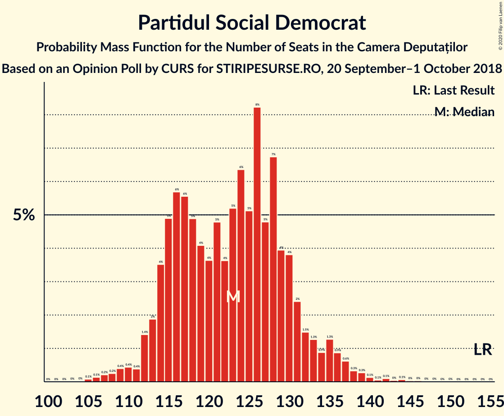
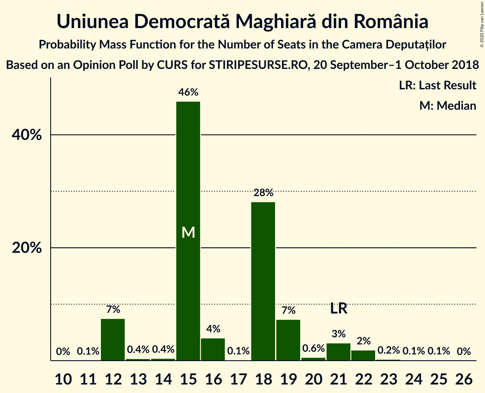
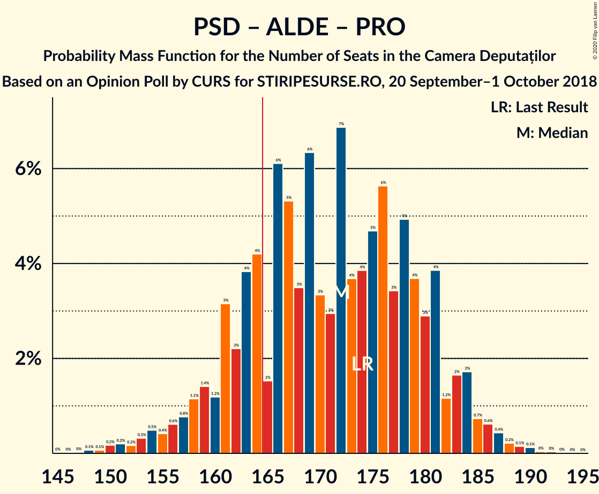
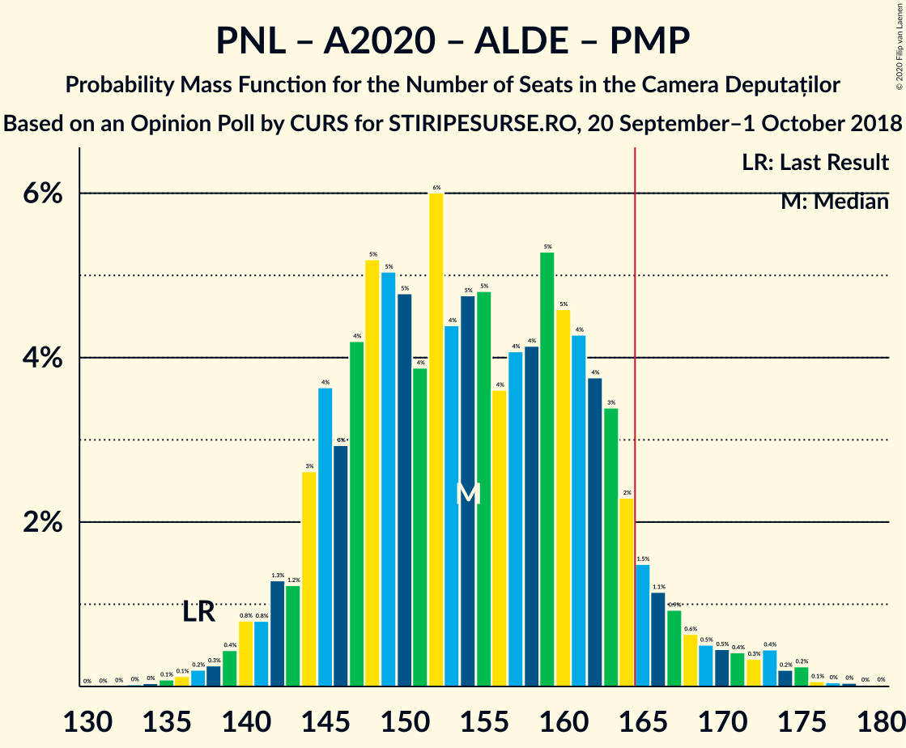
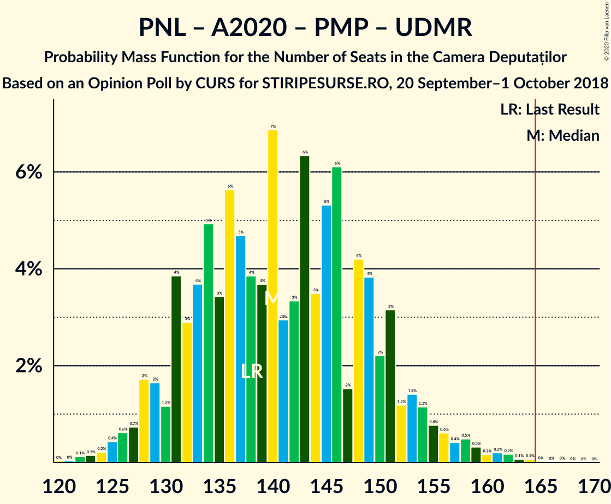
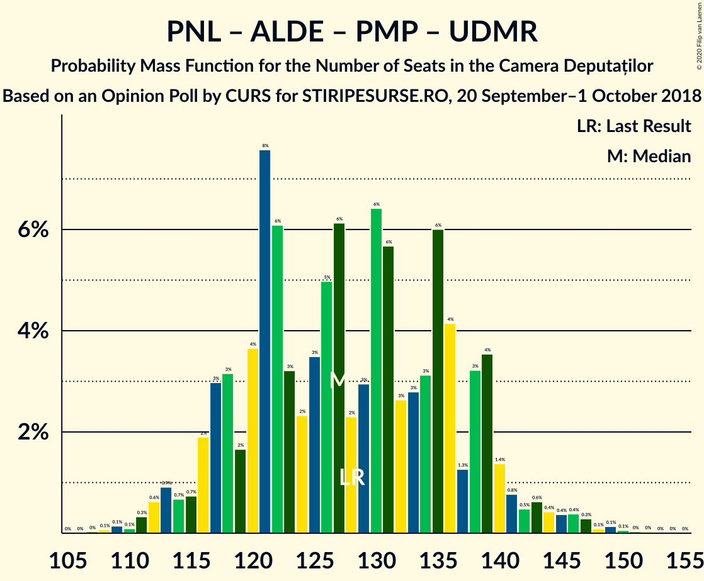
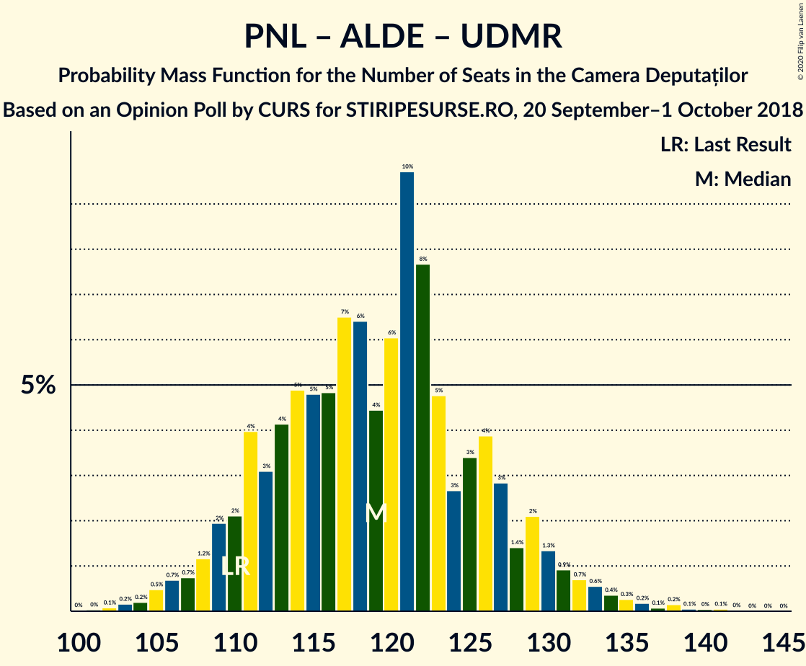

# Opinion Poll by CURS for STIRIPESURSE.RO, 20 September–1 October 2018

<a href="#voting-intentions">Voting Intentions</a> | <a href="#seats">Seats</a> | <a href="#coalitions">Coalitions</a> | <a href="#technical-information">Technical Information</a>

## Voting Intentions

### Confidence Intervals

| Party | Last Result | Poll Result | 80% Confidence Interval | 90% Confidence Interval | 95% Confidence Interval | 99% Confidence Interval |
|:-----:|:-----------:|:-----------:|:-----------------------:|:-----------------------:|:-----------------------:|:-----------------------:|
| Partidul Social Democrat | 45.5% | 37.0% | 35.1–38.9% |34.6–39.5% |34.2–40.0% |33.3–40.9% |
| Partidul Național Liberal | 20.0% | 22.0% | 20.5–23.7% |20.0–24.2% |19.6–24.6% |18.9–25.4% |
| Alianța 2020 USR-PLUS | 8.9% | 12.9% | 11.7–14.3% |11.3–14.7% |11.1–15.1% |10.5–15.8% |
| Partidul Alianța Liberalilor și Democraților | 5.6% | 9.0% | 8.0–10.2% |7.7–10.6% |7.4–10.9% |7.0–11.5% |
| PRO România | 0.0% | 6.0% | 5.2–7.0% |4.9–7.3% |4.7–7.6% |4.3–8.1% |
| Uniunea Democrată Maghiară din România | 6.2% | 5.0% | 4.2–5.9% |4.0–6.2% |3.8–6.4% |3.5–6.9% |
| Partidul Mișcarea Populară | 5.4% | 5.0% | 4.2–5.9% |4.0–6.2% |3.8–6.4% |3.5–6.9% |

*Note:* The poll result column reflects the actual value used in the calculations. Published results may vary slightly, and in addition be rounded to fewer digits.

## Seats

### Confidence Intervals

| Party | Last Result | Median | 80% Confidence Interval | 90% Confidence Interval | 95% Confidence Interval | 99% Confidence Interval |
|:-----:|:-----------:|:------:|:-----------------------:|:-----------------------:|:-----------------------:|:-----------------------:|
| <a href="#partidul-social-democrat">Partidul Social Democrat</a> | 154 | 123 | 115–130 |113–133 |112–136 |108–139 |
| <a href="#partidul-național-liberal">Partidul Național Liberal</a> | 69 | 74 | 67–80 |66–81 |64–83 |61–87 |
| <a href="#alianța-2020-usr-plus">Alianța 2020 USR-PLUS</a> | 30 | 43 | 38–47 |37–49 |36–50 |34–53 |
| <a href="#partidul-alianța-liberalilor-și-democraților">Partidul Alianța Liberalilor și Democraților</a> | 20 | 30 | 26–34 |25–35 |24–36 |22–38 |
| <a href="#pro-românia">PRO România</a> | 0 | 19 | 17–23 |0–24 |0–25 |0–27 |
| <a href="#uniunea-democrată-maghiară-din-românia">Uniunea Democrată Maghiară din România</a> | 21 | 15 | 15–19 |12–21 |12–21 |12–22 |
| <a href="#partidul-mișcarea-populară">Partidul Mișcarea Populară</a> | 18 | 0 | 0–19 |0–20 |0–20 |0–22 |

### Partidul Social Democrat

*For a full overview of the results for this party, see the [Partidul Social Democrat](party-partidulsocialdemocrat.html) page.*

| Number of Seats | Probability | Accumulated | Special Marks |
|:---------------:|:-----------:|:-----------:|:-------------:|
| 105 | 0.1% | 100% |  |
| 106 | 0.1% | 99.9% |  |
| 107 | 0.2% | 99.7% |  |
| 108 | 0.2% | 99.5% |  |
| 109 | 0.4% | 99.3% |  |
| 110 | 0.4% | 98.9% |  |
| 111 | 0.4% | 98% |  |
| 112 | 1.4% | 98% |  |
| 113 | 2% | 97% |  |
| 114 | 4% | 95% |  |
| 115 | 5% | 91% |  |
| 116 | 6% | 86% |  |
| 117 | 6% | 81% |  |
| 118 | 5% | 75% |  |
| 119 | 4% | 70% |  |
| 120 | 4% | 66% |  |
| 121 | 5% | 62% |  |
| 122 | 4% | 58% |  |
| 123 | 5% | 54% | Median |
| 124 | 6% | 49% |  |
| 125 | 5% | 43% |  |
| 126 | 8% | 37% |  |
| 127 | 5% | 29% |  |
| 128 | 7% | 24% |  |
| 129 | 4% | 18% |  |
| 130 | 4% | 14% |  |
| 131 | 2% | 10% |  |
| 132 | 1.5% | 7% |  |
| 133 | 1.3% | 6% |  |
| 134 | 0.9% | 5% |  |
| 135 | 1.3% | 4% |  |
| 136 | 0.9% | 3% |  |
| 137 | 0.6% | 2% |  |
| 138 | 0.3% | 1.1% |  |
| 139 | 0.3% | 0.8% |  |
| 140 | 0.1% | 0.5% |  |
| 141 | 0.1% | 0.4% |  |
| 142 | 0.1% | 0.3% |  |
| 143 | 0% | 0.2% |  |
| 144 | 0.1% | 0.2% |  |
| 145 | 0% | 0.1% |  |
| 146 | 0% | 0.1% |  |
| 147 | 0% | 0% |  |
| 148 | 0% | 0% |  |
| 149 | 0% | 0% |  |
| 150 | 0% | 0% |  |
| 151 | 0% | 0% |  |
| 152 | 0% | 0% |  |
| 153 | 0% | 0% |  |
| 154 | 0% | 0% | Last Result |

### Partidul Național Liberal

*For a full overview of the results for this party, see the [Partidul Național Liberal](party-partidulnaționalliberal.html) page.*

| Number of Seats | Probability | Accumulated | Special Marks |
|:---------------:|:-----------:|:-----------:|:-------------:|
| 58 | 0% | 100% |  |
| 59 | 0% | 99.9% |  |
| 60 | 0.2% | 99.9% |  |
| 61 | 0.2% | 99.7% |  |
| 62 | 0.5% | 99.5% |  |
| 63 | 1.0% | 98.9% |  |
| 64 | 1.1% | 98% |  |
| 65 | 2% | 97% |  |
| 66 | 5% | 95% |  |
| 67 | 3% | 91% |  |
| 68 | 7% | 87% |  |
| 69 | 5% | 80% | Last Result |
| 70 | 5% | 75% |  |
| 71 | 5% | 70% |  |
| 72 | 9% | 66% |  |
| 73 | 6% | 56% |  |
| 74 | 14% | 50% | Median |
| 75 | 9% | 36% |  |
| 76 | 6% | 27% |  |
| 77 | 5% | 21% |  |
| 78 | 3% | 16% |  |
| 79 | 3% | 13% |  |
| 80 | 4% | 11% |  |
| 81 | 3% | 7% |  |
| 82 | 1.2% | 4% |  |
| 83 | 2% | 3% |  |
| 84 | 0.3% | 1.5% |  |
| 85 | 0.3% | 1.2% |  |
| 86 | 0.2% | 0.9% |  |
| 87 | 0.4% | 0.6% |  |
| 88 | 0.1% | 0.3% |  |
| 89 | 0.1% | 0.2% |  |
| 90 | 0% | 0.1% |  |
| 91 | 0% | 0% |  |

### Alianța 2020 USR-PLUS

*For a full overview of the results for this party, see the [Alianța 2020 USR-PLUS](party-alianța2020usr-plus.html) page.*

| Number of Seats | Probability | Accumulated | Special Marks |
|:---------------:|:-----------:|:-----------:|:-------------:|
| 30 | 0% | 100% | Last Result |
| 31 | 0% | 100% |  |
| 32 | 0.1% | 100% |  |
| 33 | 0.2% | 99.9% |  |
| 34 | 0.6% | 99.7% |  |
| 35 | 1.0% | 99.1% |  |
| 36 | 2% | 98% |  |
| 37 | 4% | 96% |  |
| 38 | 5% | 92% |  |
| 39 | 7% | 87% |  |
| 40 | 8% | 80% |  |
| 41 | 9% | 72% |  |
| 42 | 10% | 63% |  |
| 43 | 12% | 53% | Median |
| 44 | 10% | 40% |  |
| 45 | 7% | 31% |  |
| 46 | 7% | 23% |  |
| 47 | 7% | 17% |  |
| 48 | 4% | 10% |  |
| 49 | 2% | 6% |  |
| 50 | 2% | 4% |  |
| 51 | 0.8% | 2% |  |
| 52 | 0.5% | 1.2% |  |
| 53 | 0.4% | 0.7% |  |
| 54 | 0.2% | 0.3% |  |
| 55 | 0.1% | 0.1% |  |
| 56 | 0.1% | 0.1% |  |
| 57 | 0% | 0% |  |

### Partidul Alianța Liberalilor și Democraților

*For a full overview of the results for this party, see the [Partidul Alianța Liberalilor și Democraților](party-partidulalianțaliberalilorșidemocraților.html) page.*

| Number of Seats | Probability | Accumulated | Special Marks |
|:---------------:|:-----------:|:-----------:|:-------------:|
| 20 | 0% | 100% | Last Result |
| 21 | 0.1% | 100% |  |
| 22 | 0.4% | 99.8% |  |
| 23 | 1.1% | 99.4% |  |
| 24 | 2% | 98% |  |
| 25 | 4% | 96% |  |
| 26 | 6% | 92% |  |
| 27 | 8% | 86% |  |
| 28 | 12% | 78% |  |
| 29 | 13% | 65% |  |
| 30 | 13% | 52% | Median |
| 31 | 12% | 39% |  |
| 32 | 10% | 27% |  |
| 33 | 6% | 17% |  |
| 34 | 5% | 11% |  |
| 35 | 3% | 6% |  |
| 36 | 2% | 3% |  |
| 37 | 0.9% | 2% |  |
| 38 | 0.4% | 0.9% |  |
| 39 | 0.3% | 0.4% |  |
| 40 | 0.1% | 0.2% |  |
| 41 | 0% | 0.1% |  |
| 42 | 0% | 0% |  |

### PRO România

*For a full overview of the results for this party, see the [PRO România](party-proromânia.html) page.*

| Number of Seats | Probability | Accumulated | Special Marks |
|:---------------:|:-----------:|:-----------:|:-------------:|
| 0 | 7% | 100% | Last Result |
| 1 | 0% | 93% |  |
| 2 | 0% | 93% |  |
| 3 | 0% | 93% |  |
| 4 | 0% | 93% |  |
| 5 | 0% | 93% |  |
| 6 | 0% | 93% |  |
| 7 | 0% | 93% |  |
| 8 | 0% | 93% |  |
| 9 | 0% | 93% |  |
| 10 | 0% | 93% |  |
| 11 | 0% | 93% |  |
| 12 | 0% | 93% |  |
| 13 | 0% | 93% |  |
| 14 | 0% | 93% |  |
| 15 | 0% | 93% |  |
| 16 | 2% | 93% |  |
| 17 | 9% | 91% |  |
| 18 | 15% | 82% |  |
| 19 | 20% | 67% | Median |
| 20 | 14% | 47% |  |
| 21 | 11% | 33% |  |
| 22 | 8% | 22% |  |
| 23 | 7% | 15% |  |
| 24 | 4% | 7% |  |
| 25 | 2% | 3% |  |
| 26 | 0.7% | 1.3% |  |
| 27 | 0.3% | 0.5% |  |
| 28 | 0.1% | 0.2% |  |
| 29 | 0.1% | 0.1% |  |
| 30 | 0% | 0% |  |

### Uniunea Democrată Maghiară din România

*For a full overview of the results for this party, see the [Uniunea Democrată Maghiară din România](party-uniuneademocratămaghiarădinromânia.html) page.*

| Number of Seats | Probability | Accumulated | Special Marks |
|:---------------:|:-----------:|:-----------:|:-------------:|
| 11 | 0.1% | 100% |  |
| 12 | 7% | 99.9% |  |
| 13 | 0.4% | 92% |  |
| 14 | 0.4% | 92% |  |
| 15 | 46% | 92% | Median |
| 16 | 4% | 46% |  |
| 17 | 0.1% | 42% |  |
| 18 | 28% | 42% |  |
| 19 | 7% | 13% |  |
| 20 | 0.6% | 6% |  |
| 21 | 3% | 5% | Last Result |
| 22 | 2% | 2% |  |
| 23 | 0.2% | 0.5% |  |
| 24 | 0.1% | 0.2% |  |
| 25 | 0.1% | 0.1% |  |
| 26 | 0% | 0% |  |

### Partidul Mișcarea Populară

*For a full overview of the results for this party, see the [Partidul Mișcarea Populară](party-partidulmișcareapopulară.html) page.*

| Number of Seats | Probability | Accumulated | Special Marks |
|:---------------:|:-----------:|:-----------:|:-------------:|
| 0 | 51% | 100% | Median |
| 1 | 0% | 49% |  |
| 2 | 0% | 49% |  |
| 3 | 0% | 49% |  |
| 4 | 0% | 49% |  |
| 5 | 0% | 49% |  |
| 6 | 0% | 49% |  |
| 7 | 0% | 49% |  |
| 8 | 0% | 49% |  |
| 9 | 0% | 49% |  |
| 10 | 0% | 49% |  |
| 11 | 0% | 49% |  |
| 12 | 0% | 49% |  |
| 13 | 0% | 49% |  |
| 14 | 0% | 49% |  |
| 15 | 0% | 49% |  |
| 16 | 12% | 49% |  |
| 17 | 15% | 38% |  |
| 18 | 10% | 23% | Last Result |
| 19 | 7% | 13% |  |
| 20 | 4% | 6% |  |
| 21 | 1.5% | 2% |  |
| 22 | 0.6% | 0.9% |  |
| 23 | 0.2% | 0.3% |  |
| 24 | 0.1% | 0.1% |  |
| 25 | 0% | 0% |  |

## Coalitions

### Confidence Intervals

| Coalition | Last Result | Median | Majority? | 80% Confidence Interval | 90% Confidence Interval | 95% Confidence Interval | 99% Confidence Interval |
|:---------:|:-----------:|:------:|:---------:|:-----------------------:|:-----------------------:|:-----------------------:|:-----------------------:|
| Partidul Național Liberal – Alianța 2020 USR-PLUS – Partidul Alianța Liberalilor și Democraților – Partidul Mișcarea Populară – Uniunea Democrată Maghiară din România | 158 | 170 | 79% | 162–179 | 160–182 | 158–186 | 154–191 |
| Partidul Social Democrat – Partidul Alianța Liberalilor și Democraților – PRO România | 174 | 172 | 80% | 161–181 | 159–183 | 156–184 | 151–188 |
| Partidul Național Liberal – Alianța 2020 USR-PLUS – Partidul Alianța Liberalilor și Democraților – Uniunea Democrată Maghiară din România | 140 | 162 | 34% | 152–172 | 150–174 | 149–177 | 145–182 |
| Partidul Național Liberal – Alianța 2020 USR-PLUS – Partidul Alianța Liberalilor și Democraților – Partidul Mișcarea Populară | 137 | 154 | 7% | 145–163 | 143–166 | 141–169 | 138–174 |
| Partidul Social Democrat – Partidul Alianța Liberalilor și Democraților | 174 | 153 | 5% | 143–162 | 141–164 | 140–166 | 136–172 |
| Partidul Național Liberal – Alianța 2020 USR-PLUS – Partidul Alianța Liberalilor și Democraților | 119 | 145 | 0.5% | 137–154 | 134–157 | 133–160 | 130–164 |
| Partidul Național Liberal – Alianța 2020 USR-PLUS – Partidul Mișcarea Populară – Uniunea Democrată Maghiară din România | 138 | 140 | 0.1% | 131–151 | 129–153 | 128–156 | 124–161 |
| Partidul Social Democrat – PRO România | 154 | 142 | 0% | 133–150 | 130–152 | 126–154 | 121–158 |
| Partidul Național Liberal – Alianța 2020 USR-PLUS – Uniunea Democrată Maghiară din România | 120 | 132 | 0% | 124–140 | 122–143 | 120–146 | 117–150 |
| Partidul Național Liberal – Partidul Alianța Liberalilor și Democraților – Partidul Mișcarea Populară – Uniunea Democrată Maghiară din România | 128 | 127 | 0% | 118–138 | 116–140 | 114–142 | 111–147 |
| Partidul Național Liberal – Alianța 2020 USR-PLUS – Partidul Mișcarea Populară | 117 | 124 | 0% | 115–134 | 113–137 | 111–139 | 107–143 |
| Partidul Național Liberal – Partidul Alianța Liberalilor și Democraților – Uniunea Democrată Maghiară din România | 110 | 119 | 0% | 111–127 | 109–129 | 108–131 | 104–136 |
| Partidul Național Liberal – Alianța 2020 USR-PLUS | 99 | 116 | 0% | 108–124 | 106–126 | 104–128 | 101–133 |
| Partidul Național Liberal – Partidul Mișcarea Populară – Uniunea Democrată Maghiară din România | 108 | 98 | 0% | 88–108 | 86–110 | 84–113 | 81–117 |
| Partidul Național Liberal – Uniunea Democrată Maghiară din România | 90 | 90 | 0% | 83–96 | 81–98 | 79–100 | 77–104 |
| Partidul Național Liberal – Partidul Mișcarea Populară | 87 | 82 | 0% | 72–92 | 69–94 | 68–96 | 65–99 |
| Partidul Național Liberal | 69 | 74 | 0% | 67–80 | 66–81 | 64–83 | 61–87 |
| Alianța 2020 USR-PLUS – Partidul Mișcarea Populară | 48 | 51 | 0% | 41–63 | 40–63 | 38–66 | 36–69 |

### Partidul Național Liberal – Alianța 2020 USR-PLUS – Partidul Alianța Liberalilor și Democraților – Partidul Mișcarea Populară – Uniunea Democrată Maghiară din România

| Number of Seats | Probability | Accumulated | Special Marks |
|:---------------:|:-----------:|:-----------:|:-------------:|
| 150 | 0% | 100% |  |
| 151 | 0.1% | 99.9% |  |
| 152 | 0.1% | 99.9% |  |
| 153 | 0.1% | 99.8% |  |
| 154 | 0.3% | 99.6% |  |
| 155 | 0.3% | 99.3% |  |
| 156 | 0.6% | 99.0% |  |
| 157 | 0.6% | 98% |  |
| 158 | 0.8% | 98% | Last Result |
| 159 | 1.0% | 97% |  |
| 160 | 2% | 96% |  |
| 161 | 2% | 94% |  |
| 162 | 3% | 92% | Median |
| 163 | 6% | 88% |  |
| 164 | 4% | 83% |  |
| 165 | 6% | 79% | Majority |
| 166 | 4% | 73% |  |
| 167 | 7% | 69% |  |
| 168 | 4% | 62% |  |
| 169 | 6% | 58% |  |
| 170 | 5% | 52% |  |
| 171 | 3% | 48% |  |
| 172 | 4% | 44% |  |
| 173 | 4% | 41% |  |
| 174 | 5% | 36% |  |
| 175 | 5% | 31% |  |
| 176 | 5% | 26% |  |
| 177 | 5% | 21% |  |
| 178 | 4% | 16% |  |
| 179 | 3% | 13% |  |
| 180 | 3% | 9% |  |
| 181 | 2% | 7% |  |
| 182 | 0.9% | 5% |  |
| 183 | 0.6% | 4% |  |
| 184 | 0.5% | 4% |  |
| 185 | 0.5% | 3% |  |
| 186 | 0.3% | 3% |  |
| 187 | 0.4% | 2% |  |
| 188 | 0.4% | 2% |  |
| 189 | 0.5% | 1.5% |  |
| 190 | 0.3% | 1.0% |  |
| 191 | 0.3% | 0.6% |  |
| 192 | 0.2% | 0.4% |  |
| 193 | 0% | 0.2% |  |
| 194 | 0% | 0.1% |  |
| 195 | 0% | 0.1% |  |
| 196 | 0% | 0.1% |  |
| 197 | 0% | 0% |  |

### Partidul Social Democrat – Partidul Alianța Liberalilor și Democraților – PRO România

| Number of Seats | Probability | Accumulated | Special Marks |
|:---------------:|:-----------:|:-----------:|:-------------:|
| 147 | 0% | 100% |  |
| 148 | 0.1% | 99.9% |  |
| 149 | 0.1% | 99.9% |  |
| 150 | 0.2% | 99.8% |  |
| 151 | 0.2% | 99.6% |  |
| 152 | 0.2% | 99.4% |  |
| 153 | 0.3% | 99.3% |  |
| 154 | 0.5% | 98.9% |  |
| 155 | 0.4% | 98% |  |
| 156 | 0.6% | 98% |  |
| 157 | 0.8% | 97% |  |
| 158 | 1.1% | 97% |  |
| 159 | 1.4% | 95% |  |
| 160 | 1.2% | 94% |  |
| 161 | 3% | 93% |  |
| 162 | 2% | 90% |  |
| 163 | 4% | 88% |  |
| 164 | 4% | 84% |  |
| 165 | 2% | 80% | Majority |
| 166 | 6% | 78% |  |
| 167 | 5% | 72% |  |
| 168 | 3% | 67% |  |
| 169 | 6% | 63% |  |
| 170 | 3% | 57% |  |
| 171 | 3% | 53% |  |
| 172 | 7% | 50% | Median |
| 173 | 4% | 44% |  |
| 174 | 4% | 40% | Last Result |
| 175 | 5% | 36% |  |
| 176 | 6% | 31% |  |
| 177 | 3% | 26% |  |
| 178 | 5% | 22% |  |
| 179 | 4% | 17% |  |
| 180 | 3% | 14% |  |
| 181 | 4% | 11% |  |
| 182 | 1.2% | 7% |  |
| 183 | 2% | 6% |  |
| 184 | 2% | 4% |  |
| 185 | 0.7% | 2% |  |
| 186 | 0.6% | 2% |  |
| 187 | 0.4% | 1.0% |  |
| 188 | 0.2% | 0.6% |  |
| 189 | 0.1% | 0.4% |  |
| 190 | 0.1% | 0.2% |  |
| 191 | 0% | 0.1% |  |
| 192 | 0% | 0.1% |  |
| 193 | 0% | 0% |  |

### Partidul Național Liberal – Alianța 2020 USR-PLUS – Partidul Alianța Liberalilor și Democraților – Uniunea Democrată Maghiară din România

| Number of Seats | Probability | Accumulated | Special Marks |
|:---------------:|:-----------:|:-----------:|:-------------:|
| 140 | 0% | 100% | Last Result |
| 141 | 0% | 100% |  |
| 142 | 0% | 100% |  |
| 143 | 0.1% | 99.9% |  |
| 144 | 0.1% | 99.8% |  |
| 145 | 0.3% | 99.7% |  |
| 146 | 0.3% | 99.5% |  |
| 147 | 0.5% | 99.1% |  |
| 148 | 0.8% | 98.7% |  |
| 149 | 1.4% | 98% |  |
| 150 | 1.5% | 96% |  |
| 151 | 3% | 95% |  |
| 152 | 3% | 92% |  |
| 153 | 3% | 89% |  |
| 154 | 3% | 86% |  |
| 155 | 3% | 83% |  |
| 156 | 4% | 80% |  |
| 157 | 4% | 76% |  |
| 158 | 4% | 72% |  |
| 159 | 4% | 68% |  |
| 160 | 5% | 63% |  |
| 161 | 6% | 58% |  |
| 162 | 5% | 52% | Median |
| 163 | 7% | 47% |  |
| 164 | 6% | 40% |  |
| 165 | 6% | 34% | Majority |
| 166 | 3% | 28% |  |
| 167 | 5% | 25% |  |
| 168 | 2% | 19% |  |
| 169 | 3% | 17% |  |
| 170 | 2% | 14% |  |
| 171 | 2% | 12% |  |
| 172 | 2% | 10% |  |
| 173 | 1.3% | 8% |  |
| 174 | 2% | 7% |  |
| 175 | 1.1% | 5% |  |
| 176 | 1.2% | 4% |  |
| 177 | 0.8% | 3% |  |
| 178 | 0.4% | 2% |  |
| 179 | 0.4% | 1.4% |  |
| 180 | 0.3% | 1.0% |  |
| 181 | 0.1% | 0.7% |  |
| 182 | 0.1% | 0.5% |  |
| 183 | 0.1% | 0.4% |  |
| 184 | 0.1% | 0.4% |  |
| 185 | 0.1% | 0.3% |  |
| 186 | 0.1% | 0.2% |  |
| 187 | 0.1% | 0.2% |  |
| 188 | 0% | 0.1% |  |
| 189 | 0% | 0.1% |  |
| 190 | 0% | 0% |  |

### Partidul Național Liberal – Alianța 2020 USR-PLUS – Partidul Alianța Liberalilor și Democraților – Partidul Mișcarea Populară

| Number of Seats | Probability | Accumulated | Special Marks |
|:---------------:|:-----------:|:-----------:|:-------------:|
| 134 | 0% | 100% |  |
| 135 | 0.1% | 99.9% |  |
| 136 | 0.1% | 99.8% |  |
| 137 | 0.2% | 99.7% | Last Result |
| 138 | 0.3% | 99.5% |  |
| 139 | 0.4% | 99.2% |  |
| 140 | 0.8% | 98.8% |  |
| 141 | 0.8% | 98% |  |
| 142 | 1.3% | 97% |  |
| 143 | 1.2% | 96% |  |
| 144 | 3% | 95% |  |
| 145 | 4% | 92% |  |
| 146 | 3% | 88% |  |
| 147 | 4% | 86% | Median |
| 148 | 5% | 81% |  |
| 149 | 5% | 76% |  |
| 150 | 5% | 71% |  |
| 151 | 4% | 66% |  |
| 152 | 6% | 62% |  |
| 153 | 4% | 56% |  |
| 154 | 5% | 52% |  |
| 155 | 5% | 47% |  |
| 156 | 4% | 42% |  |
| 157 | 4% | 39% |  |
| 158 | 4% | 35% |  |
| 159 | 5% | 31% |  |
| 160 | 5% | 25% |  |
| 161 | 4% | 21% |  |
| 162 | 4% | 16% |  |
| 163 | 3% | 13% |  |
| 164 | 2% | 9% |  |
| 165 | 1.5% | 7% | Majority |
| 166 | 1.1% | 6% |  |
| 167 | 0.9% | 4% |  |
| 168 | 0.6% | 3% |  |
| 169 | 0.5% | 3% |  |
| 170 | 0.5% | 2% |  |
| 171 | 0.4% | 2% |  |
| 172 | 0.3% | 1.4% |  |
| 173 | 0.4% | 1.1% |  |
| 174 | 0.2% | 0.7% |  |
| 175 | 0.2% | 0.5% |  |
| 176 | 0.1% | 0.2% |  |
| 177 | 0% | 0.2% |  |
| 178 | 0% | 0.1% |  |
| 179 | 0% | 0.1% |  |
| 180 | 0% | 0% |  |

### Partidul Social Democrat – Partidul Alianța Liberalilor și Democraților

| Number of Seats | Probability | Accumulated | Special Marks |
|:---------------:|:-----------:|:-----------:|:-------------:|
| 133 | 0% | 100% |  |
| 134 | 0.1% | 99.9% |  |
| 135 | 0.1% | 99.8% |  |
| 136 | 0.2% | 99.7% |  |
| 137 | 0.3% | 99.5% |  |
| 138 | 0.6% | 99.2% |  |
| 139 | 0.6% | 98.6% |  |
| 140 | 2% | 98% |  |
| 141 | 2% | 96% |  |
| 142 | 2% | 95% |  |
| 143 | 3% | 93% |  |
| 144 | 3% | 89% |  |
| 145 | 4% | 86% |  |
| 146 | 4% | 82% |  |
| 147 | 3% | 78% |  |
| 148 | 6% | 75% |  |
| 149 | 5% | 69% |  |
| 150 | 5% | 65% |  |
| 151 | 5% | 60% |  |
| 152 | 5% | 55% |  |
| 153 | 5% | 50% | Median |
| 154 | 6% | 45% |  |
| 155 | 4% | 40% |  |
| 156 | 6% | 36% |  |
| 157 | 5% | 30% |  |
| 158 | 4% | 24% |  |
| 159 | 4% | 20% |  |
| 160 | 3% | 16% |  |
| 161 | 3% | 13% |  |
| 162 | 4% | 11% |  |
| 163 | 1.4% | 7% |  |
| 164 | 1.2% | 6% |  |
| 165 | 1.1% | 5% | Majority |
| 166 | 1.0% | 3% |  |
| 167 | 0.5% | 2% |  |
| 168 | 0.5% | 2% |  |
| 169 | 0.4% | 1.4% |  |
| 170 | 0.3% | 1.0% |  |
| 171 | 0.2% | 0.7% |  |
| 172 | 0.1% | 0.5% |  |
| 173 | 0.1% | 0.4% |  |
| 174 | 0.1% | 0.3% | Last Result |
| 175 | 0% | 0.2% |  |
| 176 | 0% | 0.1% |  |
| 177 | 0% | 0.1% |  |
| 178 | 0% | 0.1% |  |
| 179 | 0% | 0.1% |  |
| 180 | 0% | 0% |  |

### Partidul Național Liberal – Alianța 2020 USR-PLUS – Partidul Alianța Liberalilor și Democraților

| Number of Seats | Probability | Accumulated | Special Marks |
|:---------------:|:-----------:|:-----------:|:-------------:|
| 119 | 0% | 100% | Last Result |
| 120 | 0% | 100% |  |
| 121 | 0% | 100% |  |
| 122 | 0% | 100% |  |
| 123 | 0% | 100% |  |
| 124 | 0% | 100% |  |
| 125 | 0% | 100% |  |
| 126 | 0% | 100% |  |
| 127 | 0.1% | 99.9% |  |
| 128 | 0.1% | 99.9% |  |
| 129 | 0.1% | 99.7% |  |
| 130 | 0.4% | 99.6% |  |
| 131 | 0.5% | 99.2% |  |
| 132 | 0.7% | 98.6% |  |
| 133 | 1.2% | 98% |  |
| 134 | 2% | 97% |  |
| 135 | 2% | 95% |  |
| 136 | 3% | 93% |  |
| 137 | 4% | 90% |  |
| 138 | 2% | 86% |  |
| 139 | 4% | 84% |  |
| 140 | 3% | 79% |  |
| 141 | 5% | 76% |  |
| 142 | 5% | 71% |  |
| 143 | 5% | 67% |  |
| 144 | 6% | 62% |  |
| 145 | 6% | 56% |  |
| 146 | 6% | 50% |  |
| 147 | 5% | 43% | Median |
| 148 | 6% | 38% |  |
| 149 | 5% | 32% |  |
| 150 | 5% | 27% |  |
| 151 | 3% | 22% |  |
| 152 | 4% | 19% |  |
| 153 | 2% | 15% |  |
| 154 | 3% | 12% |  |
| 155 | 2% | 10% |  |
| 156 | 2% | 8% |  |
| 157 | 2% | 6% |  |
| 158 | 0.8% | 4% |  |
| 159 | 0.9% | 4% |  |
| 160 | 0.9% | 3% |  |
| 161 | 0.6% | 2% |  |
| 162 | 0.2% | 1.2% |  |
| 163 | 0.2% | 0.9% |  |
| 164 | 0.2% | 0.7% |  |
| 165 | 0.1% | 0.5% | Majority |
| 166 | 0.1% | 0.4% |  |
| 167 | 0.1% | 0.3% |  |
| 168 | 0% | 0.2% |  |
| 169 | 0% | 0.1% |  |
| 170 | 0% | 0.1% |  |
| 171 | 0% | 0.1% |  |
| 172 | 0% | 0% |  |

### Partidul Național Liberal – Alianța 2020 USR-PLUS – Partidul Mișcarea Populară – Uniunea Democrată Maghiară din România

| Number of Seats | Probability | Accumulated | Special Marks |
|:---------------:|:-----------:|:-----------:|:-------------:|
| 120 | 0% | 100% |  |
| 121 | 0% | 99.9% |  |
| 122 | 0.1% | 99.9% |  |
| 123 | 0.1% | 99.8% |  |
| 124 | 0.2% | 99.6% |  |
| 125 | 0.4% | 99.4% |  |
| 126 | 0.6% | 99.0% |  |
| 127 | 0.7% | 98% |  |
| 128 | 2% | 98% |  |
| 129 | 2% | 96% |  |
| 130 | 1.2% | 94% |  |
| 131 | 4% | 93% |  |
| 132 | 3% | 89% | Median |
| 133 | 4% | 86% |  |
| 134 | 5% | 83% |  |
| 135 | 3% | 78% |  |
| 136 | 6% | 74% |  |
| 137 | 5% | 69% |  |
| 138 | 4% | 64% | Last Result |
| 139 | 4% | 60% |  |
| 140 | 7% | 56% |  |
| 141 | 3% | 50% |  |
| 142 | 3% | 47% |  |
| 143 | 6% | 43% |  |
| 144 | 3% | 37% |  |
| 145 | 5% | 33% |  |
| 146 | 6% | 28% |  |
| 147 | 2% | 22% |  |
| 148 | 4% | 20% |  |
| 149 | 4% | 16% |  |
| 150 | 2% | 12% |  |
| 151 | 3% | 10% |  |
| 152 | 1.2% | 7% |  |
| 153 | 1.4% | 6% |  |
| 154 | 1.1% | 5% |  |
| 155 | 0.8% | 3% |  |
| 156 | 0.6% | 3% |  |
| 157 | 0.4% | 2% |  |
| 158 | 0.5% | 2% |  |
| 159 | 0.3% | 1.1% |  |
| 160 | 0.2% | 0.7% |  |
| 161 | 0.2% | 0.6% |  |
| 162 | 0.2% | 0.4% |  |
| 163 | 0.1% | 0.2% |  |
| 164 | 0.1% | 0.1% |  |
| 165 | 0% | 0.1% | Majority |
| 166 | 0% | 0% |  |

### Partidul Social Democrat – PRO România

| Number of Seats | Probability | Accumulated | Special Marks |
|:---------------:|:-----------:|:-----------:|:-------------:|
| 116 | 0% | 100% |  |
| 117 | 0% | 99.9% |  |
| 118 | 0% | 99.9% |  |
| 119 | 0% | 99.9% |  |
| 120 | 0.2% | 99.8% |  |
| 121 | 0.3% | 99.6% |  |
| 122 | 0.3% | 99.4% |  |
| 123 | 0.5% | 99.0% |  |
| 124 | 0.4% | 98.5% |  |
| 125 | 0.4% | 98% |  |
| 126 | 0.3% | 98% |  |
| 127 | 0.5% | 97% |  |
| 128 | 0.5% | 97% |  |
| 129 | 0.6% | 96% |  |
| 130 | 0.9% | 96% |  |
| 131 | 2% | 95% |  |
| 132 | 3% | 93% |  |
| 133 | 3% | 91% |  |
| 134 | 4% | 87% |  |
| 135 | 5% | 84% |  |
| 136 | 5% | 79% |  |
| 137 | 5% | 74% |  |
| 138 | 5% | 69% |  |
| 139 | 4% | 64% |  |
| 140 | 4% | 59% |  |
| 141 | 3% | 56% |  |
| 142 | 5% | 52% | Median |
| 143 | 6% | 48% |  |
| 144 | 4% | 42% |  |
| 145 | 7% | 38% |  |
| 146 | 4% | 31% |  |
| 147 | 6% | 27% |  |
| 148 | 4% | 21% |  |
| 149 | 6% | 17% |  |
| 150 | 3% | 12% |  |
| 151 | 2% | 8% |  |
| 152 | 2% | 6% |  |
| 153 | 1.0% | 4% |  |
| 154 | 0.8% | 3% | Last Result |
| 155 | 0.6% | 2% |  |
| 156 | 0.6% | 2% |  |
| 157 | 0.3% | 1.0% |  |
| 158 | 0.3% | 0.7% |  |
| 159 | 0.1% | 0.4% |  |
| 160 | 0.1% | 0.2% |  |
| 161 | 0.1% | 0.1% |  |
| 162 | 0% | 0.1% |  |
| 163 | 0% | 0% |  |

### Partidul Național Liberal – Alianța 2020 USR-PLUS – Uniunea Democrată Maghiară din România

| Number of Seats | Probability | Accumulated | Special Marks |
|:---------------:|:-----------:|:-----------:|:-------------:|
| 113 | 0% | 100% |  |
| 114 | 0.1% | 99.9% |  |
| 115 | 0.1% | 99.9% |  |
| 116 | 0.2% | 99.8% |  |
| 117 | 0.3% | 99.6% |  |
| 118 | 0.6% | 99.3% |  |
| 119 | 0.7% | 98.8% |  |
| 120 | 1.1% | 98% | Last Result |
| 121 | 2% | 97% |  |
| 122 | 3% | 95% |  |
| 123 | 2% | 93% |  |
| 124 | 3% | 91% |  |
| 125 | 3% | 87% |  |
| 126 | 5% | 84% |  |
| 127 | 5% | 79% |  |
| 128 | 5% | 75% |  |
| 129 | 6% | 69% |  |
| 130 | 4% | 64% |  |
| 131 | 7% | 60% |  |
| 132 | 6% | 53% | Median |
| 133 | 6% | 47% |  |
| 134 | 7% | 42% |  |
| 135 | 5% | 35% |  |
| 136 | 6% | 30% |  |
| 137 | 5% | 24% |  |
| 138 | 3% | 19% |  |
| 139 | 3% | 17% |  |
| 140 | 4% | 13% |  |
| 141 | 2% | 9% |  |
| 142 | 1.4% | 8% |  |
| 143 | 2% | 6% |  |
| 144 | 1.0% | 5% |  |
| 145 | 0.9% | 4% |  |
| 146 | 1.1% | 3% |  |
| 147 | 0.3% | 2% |  |
| 148 | 0.4% | 1.4% |  |
| 149 | 0.2% | 1.0% |  |
| 150 | 0.4% | 0.8% |  |
| 151 | 0.1% | 0.4% |  |
| 152 | 0.1% | 0.3% |  |
| 153 | 0.1% | 0.2% |  |
| 154 | 0% | 0.2% |  |
| 155 | 0% | 0.1% |  |
| 156 | 0.1% | 0.1% |  |
| 157 | 0% | 0% |  |

### Partidul Național Liberal – Partidul Alianța Liberalilor și Democraților – Partidul Mișcarea Populară – Uniunea Democrată Maghiară din România

| Number of Seats | Probability | Accumulated | Special Marks |
|:---------------:|:-----------:|:-----------:|:-------------:|
| 107 | 0% | 100% |  |
| 108 | 0.1% | 99.9% |  |
| 109 | 0.1% | 99.9% |  |
| 110 | 0.1% | 99.7% |  |
| 111 | 0.3% | 99.6% |  |
| 112 | 0.6% | 99.3% |  |
| 113 | 0.9% | 98.7% |  |
| 114 | 0.7% | 98% |  |
| 115 | 0.7% | 97% |  |
| 116 | 2% | 96% |  |
| 117 | 3% | 94% |  |
| 118 | 3% | 91% |  |
| 119 | 2% | 88% | Median |
| 120 | 4% | 87% |  |
| 121 | 8% | 83% |  |
| 122 | 6% | 75% |  |
| 123 | 3% | 69% |  |
| 124 | 2% | 66% |  |
| 125 | 3% | 64% |  |
| 126 | 5% | 60% |  |
| 127 | 6% | 55% |  |
| 128 | 2% | 49% | Last Result |
| 129 | 3% | 47% |  |
| 130 | 6% | 44% |  |
| 131 | 6% | 38% |  |
| 132 | 3% | 32% |  |
| 133 | 3% | 29% |  |
| 134 | 3% | 26% |  |
| 135 | 6% | 23% |  |
| 136 | 4% | 17% |  |
| 137 | 1.3% | 13% |  |
| 138 | 3% | 12% |  |
| 139 | 4% | 9% |  |
| 140 | 1.4% | 5% |  |
| 141 | 0.8% | 4% |  |
| 142 | 0.5% | 3% |  |
| 143 | 0.6% | 2% |  |
| 144 | 0.4% | 2% |  |
| 145 | 0.4% | 1.4% |  |
| 146 | 0.4% | 1.0% |  |
| 147 | 0.3% | 0.7% |  |
| 148 | 0.1% | 0.4% |  |
| 149 | 0.1% | 0.3% |  |
| 150 | 0.1% | 0.2% |  |
| 151 | 0% | 0.1% |  |
| 152 | 0% | 0.1% |  |
| 153 | 0% | 0% |  |

### Partidul Național Liberal – Alianța 2020 USR-PLUS – Partidul Mișcarea Populară

| Number of Seats | Probability | Accumulated | Special Marks |
|:---------------:|:-----------:|:-----------:|:-------------:|
| 104 | 0% | 100% |  |
| 105 | 0.1% | 99.9% |  |
| 106 | 0.1% | 99.9% |  |
| 107 | 0.2% | 99.7% |  |
| 108 | 0.3% | 99.5% |  |
| 109 | 0.4% | 99.2% |  |
| 110 | 1.0% | 98.8% |  |
| 111 | 1.1% | 98% |  |
| 112 | 1.1% | 97% |  |
| 113 | 2% | 96% |  |
| 114 | 2% | 93% |  |
| 115 | 3% | 91% |  |
| 116 | 4% | 88% |  |
| 117 | 4% | 84% | Last Result, Median |
| 118 | 4% | 80% |  |
| 119 | 5% | 76% |  |
| 120 | 3% | 71% |  |
| 121 | 6% | 68% |  |
| 122 | 5% | 62% |  |
| 123 | 3% | 57% |  |
| 124 | 4% | 54% |  |
| 125 | 5% | 50% |  |
| 126 | 3% | 45% |  |
| 127 | 3% | 41% |  |
| 128 | 6% | 38% |  |
| 129 | 3% | 31% |  |
| 130 | 5% | 28% |  |
| 131 | 5% | 23% |  |
| 132 | 1.4% | 18% |  |
| 133 | 4% | 17% |  |
| 134 | 3% | 13% |  |
| 135 | 2% | 10% |  |
| 136 | 2% | 8% |  |
| 137 | 0.8% | 5% |  |
| 138 | 1.0% | 4% |  |
| 139 | 1.3% | 3% |  |
| 140 | 0.4% | 2% |  |
| 141 | 0.5% | 2% |  |
| 142 | 0.5% | 1.3% |  |
| 143 | 0.4% | 0.8% |  |
| 144 | 0.1% | 0.5% |  |
| 145 | 0.2% | 0.3% |  |
| 146 | 0.1% | 0.2% |  |
| 147 | 0% | 0.1% |  |
| 148 | 0% | 0.1% |  |
| 149 | 0% | 0% |  |

### Partidul Național Liberal – Partidul Alianța Liberalilor și Democraților – Uniunea Democrată Maghiară din România

| Number of Seats | Probability | Accumulated | Special Marks |
|:---------------:|:-----------:|:-----------:|:-------------:|
| 101 | 0% | 100% |  |
| 102 | 0.1% | 99.9% |  |
| 103 | 0.2% | 99.8% |  |
| 104 | 0.2% | 99.7% |  |
| 105 | 0.5% | 99.5% |  |
| 106 | 0.7% | 99.0% |  |
| 107 | 0.7% | 98% |  |
| 108 | 1.2% | 98% |  |
| 109 | 2% | 96% |  |
| 110 | 2% | 94% | Last Result |
| 111 | 4% | 92% |  |
| 112 | 3% | 88% |  |
| 113 | 4% | 85% |  |
| 114 | 5% | 81% |  |
| 115 | 5% | 76% |  |
| 116 | 5% | 71% |  |
| 117 | 7% | 67% |  |
| 118 | 6% | 60% |  |
| 119 | 4% | 54% | Median |
| 120 | 6% | 49% |  |
| 121 | 10% | 43% |  |
| 122 | 8% | 33% |  |
| 123 | 5% | 26% |  |
| 124 | 3% | 21% |  |
| 125 | 3% | 18% |  |
| 126 | 4% | 15% |  |
| 127 | 3% | 11% |  |
| 128 | 1.4% | 8% |  |
| 129 | 2% | 7% |  |
| 130 | 1.3% | 5% |  |
| 131 | 0.9% | 3% |  |
| 132 | 0.7% | 2% |  |
| 133 | 0.6% | 2% |  |
| 134 | 0.4% | 1.2% |  |
| 135 | 0.3% | 0.9% |  |
| 136 | 0.2% | 0.6% |  |
| 137 | 0.1% | 0.4% |  |
| 138 | 0.2% | 0.3% |  |
| 139 | 0.1% | 0.2% |  |
| 140 | 0% | 0.1% |  |
| 141 | 0.1% | 0.1% |  |
| 142 | 0% | 0% |  |

### Partidul Național Liberal – Alianța 2020 USR-PLUS

| Number of Seats | Probability | Accumulated | Special Marks |
|:---------------:|:-----------:|:-----------:|:-------------:|
| 98 | 0% | 100% |  |
| 99 | 0.1% | 99.9% | Last Result |
| 100 | 0.1% | 99.8% |  |
| 101 | 0.2% | 99.7% |  |
| 102 | 0.5% | 99.5% |  |
| 103 | 0.6% | 99.0% |  |
| 104 | 1.1% | 98% |  |
| 105 | 1.4% | 97% |  |
| 106 | 2% | 96% |  |
| 107 | 3% | 94% |  |
| 108 | 3% | 91% |  |
| 109 | 4% | 88% |  |
| 110 | 4% | 84% |  |
| 111 | 6% | 80% |  |
| 112 | 5% | 74% |  |
| 113 | 6% | 69% |  |
| 114 | 6% | 63% |  |
| 115 | 5% | 58% |  |
| 116 | 7% | 52% |  |
| 117 | 7% | 45% | Median |
| 118 | 6% | 38% |  |
| 119 | 6% | 33% |  |
| 120 | 4% | 26% |  |
| 121 | 6% | 23% |  |
| 122 | 4% | 17% |  |
| 123 | 2% | 13% |  |
| 124 | 2% | 11% |  |
| 125 | 2% | 8% |  |
| 126 | 2% | 6% |  |
| 127 | 1.2% | 4% |  |
| 128 | 0.9% | 3% |  |
| 129 | 0.4% | 2% |  |
| 130 | 0.6% | 2% |  |
| 131 | 0.3% | 1.2% |  |
| 132 | 0.2% | 0.8% |  |
| 133 | 0.2% | 0.6% |  |
| 134 | 0.2% | 0.4% |  |
| 135 | 0% | 0.2% |  |
| 136 | 0.1% | 0.2% |  |
| 137 | 0% | 0.1% |  |
| 138 | 0% | 0.1% |  |
| 139 | 0% | 0% |  |

### Partidul Național Liberal – Partidul Mișcarea Populară – Uniunea Democrată Maghiară din România

| Number of Seats | Probability | Accumulated | Special Marks |
|:---------------:|:-----------:|:-----------:|:-------------:|
| 78 | 0% | 100% |  |
| 79 | 0.1% | 99.9% |  |
| 80 | 0.1% | 99.8% |  |
| 81 | 0.2% | 99.7% |  |
| 82 | 0.8% | 99.5% |  |
| 83 | 0.4% | 98.6% |  |
| 84 | 2% | 98% |  |
| 85 | 0.8% | 96% |  |
| 86 | 2% | 96% |  |
| 87 | 2% | 94% |  |
| 88 | 3% | 92% |  |
| 89 | 2% | 88% | Median |
| 90 | 9% | 86% |  |
| 91 | 2% | 78% |  |
| 92 | 7% | 75% |  |
| 93 | 4% | 69% |  |
| 94 | 4% | 65% |  |
| 95 | 2% | 62% |  |
| 96 | 3% | 59% |  |
| 97 | 2% | 56% |  |
| 98 | 5% | 54% |  |
| 99 | 3% | 49% |  |
| 100 | 5% | 46% |  |
| 101 | 5% | 41% |  |
| 102 | 4% | 36% |  |
| 103 | 3% | 32% |  |
| 104 | 3% | 29% |  |
| 105 | 4% | 26% |  |
| 106 | 4% | 22% |  |
| 107 | 4% | 18% |  |
| 108 | 4% | 14% | Last Result |
| 109 | 3% | 9% |  |
| 110 | 2% | 7% |  |
| 111 | 1.3% | 5% |  |
| 112 | 0.7% | 3% |  |
| 113 | 0.6% | 3% |  |
| 114 | 0.6% | 2% |  |
| 115 | 0.6% | 1.5% |  |
| 116 | 0.2% | 0.8% |  |
| 117 | 0.3% | 0.6% |  |
| 118 | 0.1% | 0.3% |  |
| 119 | 0.1% | 0.2% |  |
| 120 | 0.1% | 0.1% |  |
| 121 | 0% | 0.1% |  |
| 122 | 0% | 0.1% |  |
| 123 | 0% | 0% |  |

### Partidul Național Liberal – Uniunea Democrată Maghiară din România

| Number of Seats | Probability | Accumulated | Special Marks |
|:---------------:|:-----------:|:-----------:|:-------------:|
| 73 | 0% | 100% |  |
| 74 | 0% | 99.9% |  |
| 75 | 0.2% | 99.9% |  |
| 76 | 0.2% | 99.7% |  |
| 77 | 0.3% | 99.5% |  |
| 78 | 0.9% | 99.2% |  |
| 79 | 0.9% | 98% |  |
| 80 | 1.3% | 97% |  |
| 81 | 3% | 96% |  |
| 82 | 3% | 93% |  |
| 83 | 5% | 90% |  |
| 84 | 6% | 85% |  |
| 85 | 4% | 80% |  |
| 86 | 6% | 76% |  |
| 87 | 5% | 70% |  |
| 88 | 6% | 65% |  |
| 89 | 8% | 59% | Median |
| 90 | 11% | 51% | Last Result |
| 91 | 6% | 40% |  |
| 92 | 10% | 34% |  |
| 93 | 4% | 24% |  |
| 94 | 4% | 20% |  |
| 95 | 2% | 16% |  |
| 96 | 3% | 13% |  |
| 97 | 2% | 10% |  |
| 98 | 4% | 8% |  |
| 99 | 1.2% | 4% |  |
| 100 | 1.2% | 3% |  |
| 101 | 0.6% | 2% |  |
| 102 | 0.4% | 1.4% |  |
| 103 | 0.4% | 1.0% |  |
| 104 | 0.2% | 0.6% |  |
| 105 | 0.2% | 0.5% |  |
| 106 | 0.1% | 0.3% |  |
| 107 | 0.1% | 0.2% |  |
| 108 | 0.1% | 0.1% |  |
| 109 | 0% | 0% |  |

### Partidul Național Liberal – Partidul Mișcarea Populară

| Number of Seats | Probability | Accumulated | Special Marks |
|:---------------:|:-----------:|:-----------:|:-------------:|
| 62 | 0% | 100% |  |
| 63 | 0% | 99.9% |  |
| 64 | 0.3% | 99.9% |  |
| 65 | 0.2% | 99.6% |  |
| 66 | 0.9% | 99.5% |  |
| 67 | 0.9% | 98.5% |  |
| 68 | 1.0% | 98% |  |
| 69 | 2% | 97% |  |
| 70 | 1.4% | 95% |  |
| 71 | 1.4% | 94% |  |
| 72 | 6% | 92% |  |
| 73 | 3% | 86% |  |
| 74 | 7% | 83% | Median |
| 75 | 7% | 76% |  |
| 76 | 2% | 68% |  |
| 77 | 4% | 66% |  |
| 78 | 2% | 62% |  |
| 79 | 3% | 60% |  |
| 80 | 3% | 57% |  |
| 81 | 3% | 54% |  |
| 82 | 2% | 51% |  |
| 83 | 4% | 49% |  |
| 84 | 3% | 45% |  |
| 85 | 5% | 42% |  |
| 86 | 5% | 37% |  |
| 87 | 4% | 32% | Last Result |
| 88 | 2% | 28% |  |
| 89 | 3% | 26% |  |
| 90 | 4% | 23% |  |
| 91 | 5% | 19% |  |
| 92 | 5% | 14% |  |
| 93 | 4% | 9% |  |
| 94 | 2% | 5% |  |
| 95 | 0.7% | 4% |  |
| 96 | 0.5% | 3% |  |
| 97 | 0.6% | 2% |  |
| 98 | 0.8% | 2% |  |
| 99 | 0.6% | 1.1% |  |
| 100 | 0.2% | 0.5% |  |
| 101 | 0.1% | 0.3% |  |
| 102 | 0% | 0.2% |  |
| 103 | 0% | 0.1% |  |
| 104 | 0% | 0.1% |  |
| 105 | 0% | 0.1% |  |
| 106 | 0% | 0% |  |

### Partidul Național Liberal

| Number of Seats | Probability | Accumulated | Special Marks |
|:---------------:|:-----------:|:-----------:|:-------------:|
| 58 | 0% | 100% |  |
| 59 | 0% | 99.9% |  |
| 60 | 0.2% | 99.9% |  |
| 61 | 0.2% | 99.7% |  |
| 62 | 0.5% | 99.5% |  |
| 63 | 1.0% | 98.9% |  |
| 64 | 1.1% | 98% |  |
| 65 | 2% | 97% |  |
| 66 | 5% | 95% |  |
| 67 | 3% | 91% |  |
| 68 | 7% | 87% |  |
| 69 | 5% | 80% | Last Result |
| 70 | 5% | 75% |  |
| 71 | 5% | 70% |  |
| 72 | 9% | 66% |  |
| 73 | 6% | 56% |  |
| 74 | 14% | 50% | Median |
| 75 | 9% | 36% |  |
| 76 | 6% | 27% |  |
| 77 | 5% | 21% |  |
| 78 | 3% | 16% |  |
| 79 | 3% | 13% |  |
| 80 | 4% | 11% |  |
| 81 | 3% | 7% |  |
| 82 | 1.2% | 4% |  |
| 83 | 2% | 3% |  |
| 84 | 0.3% | 1.5% |  |
| 85 | 0.3% | 1.2% |  |
| 86 | 0.2% | 0.9% |  |
| 87 | 0.4% | 0.6% |  |
| 88 | 0.1% | 0.3% |  |
| 89 | 0.1% | 0.2% |  |
| 90 | 0% | 0.1% |  |
| 91 | 0% | 0% |  |

### Alianța 2020 USR-PLUS – Partidul Mișcarea Populară

| Number of Seats | Probability | Accumulated | Special Marks |
|:---------------:|:-----------:|:-----------:|:-------------:|
| 34 | 0.1% | 100% |  |
| 35 | 0.2% | 99.9% |  |
| 36 | 0.3% | 99.7% |  |
| 37 | 0.9% | 99.4% |  |
| 38 | 1.4% | 98.6% |  |
| 39 | 2% | 97% |  |
| 40 | 2% | 95% |  |
| 41 | 4% | 93% |  |
| 42 | 5% | 89% |  |
| 43 | 7% | 84% | Median |
| 44 | 6% | 77% |  |
| 45 | 5% | 70% |  |
| 46 | 4% | 66% |  |
| 47 | 5% | 62% |  |
| 48 | 3% | 57% | Last Result |
| 49 | 1.5% | 54% |  |
| 50 | 2% | 53% |  |
| 51 | 1.0% | 51% |  |
| 52 | 0.6% | 50% |  |
| 53 | 3% | 49% |  |
| 54 | 3% | 46% |  |
| 55 | 0.7% | 43% |  |
| 56 | 5% | 42% |  |
| 57 | 7% | 37% |  |
| 58 | 1.0% | 30% |  |
| 59 | 5% | 29% |  |
| 60 | 9% | 24% |  |
| 61 | 0.6% | 15% |  |
| 62 | 4% | 14% |  |
| 63 | 6% | 10% |  |
| 64 | 0.6% | 5% |  |
| 65 | 1.4% | 4% |  |
| 66 | 2% | 3% |  |
| 67 | 0.3% | 1.0% |  |
| 68 | 0.2% | 0.7% |  |
| 69 | 0.4% | 0.5% |  |
| 70 | 0.1% | 0.1% |  |
| 71 | 0% | 0.1% |  |
| 72 | 0% | 0.1% |  |
| 73 | 0% | 0% |  |

## Technical Information

### Opinion Poll

+ **Polling firm:** CURS
+ **Commissioner(s):** STIRIPESURSE.RO
+ **Fieldwork period:** 20 September–1 October 2018

### Calculations

+ **Sample size:** 1067
+ **Simulations done:** 1,048,576
+ **Error estimate:** 0.90%

