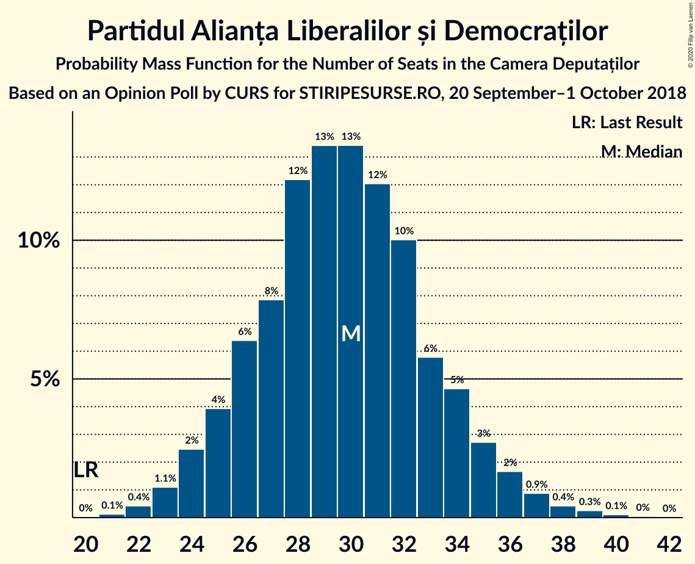
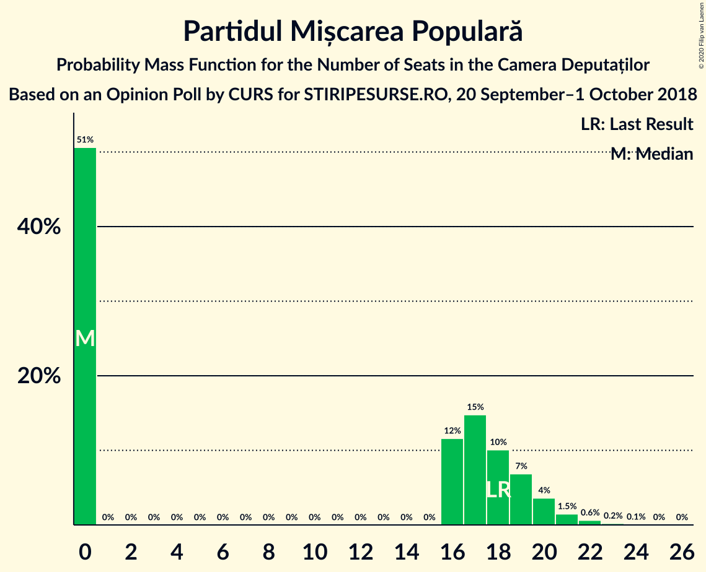
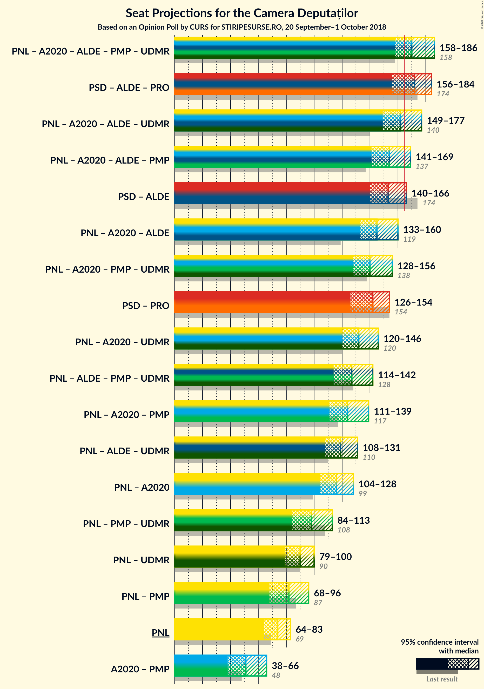
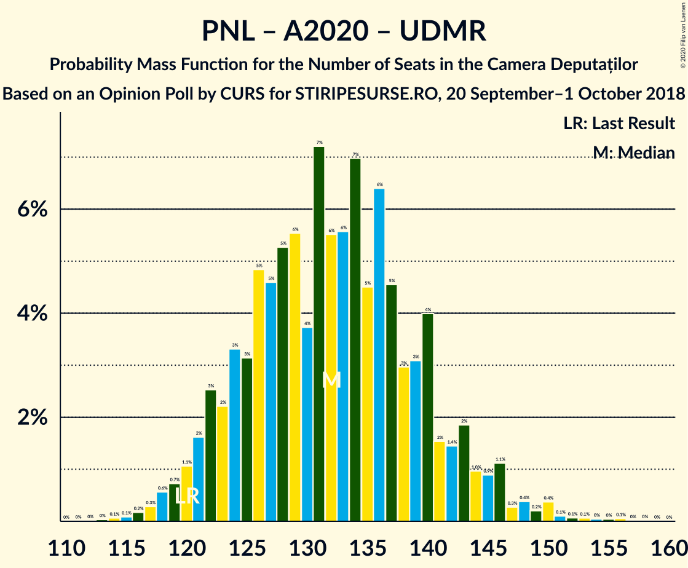
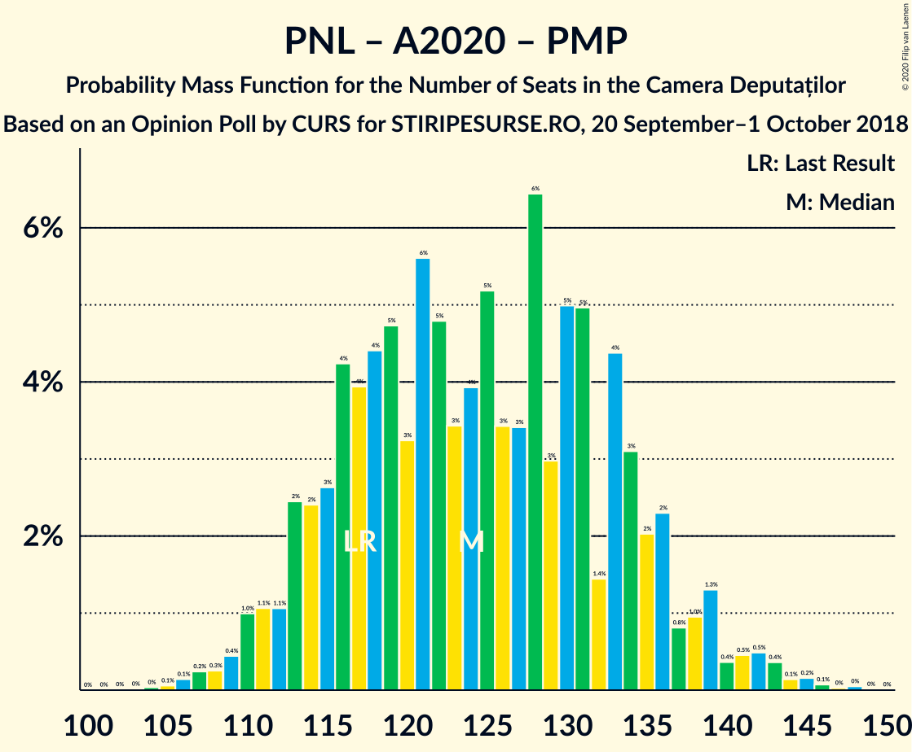
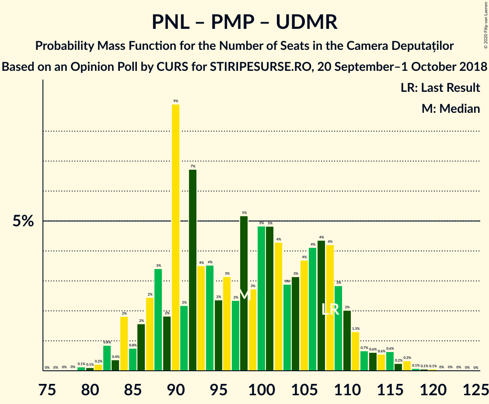
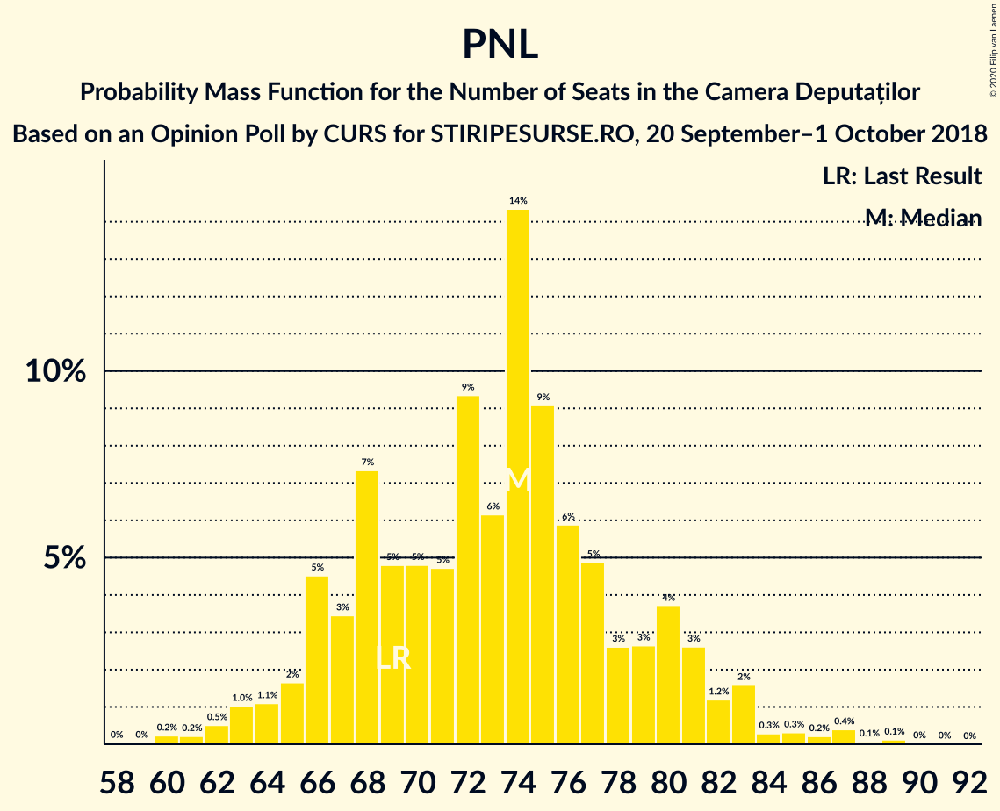

# Opinion Poll by CURS for STIRIPESURSE.RO, 20 September–1 October 2018

<a href="#voting-intentions">Voting Intentions</a> | <a href="#seats">Seats</a> | <a href="#coalitions">Coalitions</a> | <a href="#technical-information">Technical Information</a>

## Voting Intentions

### Confidence Intervals

| Party | Last Result | Poll Result | 80% Confidence Interval | 90% Confidence Interval | 95% Confidence Interval | 99% Confidence Interval |
|:-----:|:-----------:|:-----------:|:-----------------------:|:-----------------------:|:-----------------------:|:-----------------------:|
| Partidul Social Democrat | 45.5% | 37.0% | 35.1–38.9% |34.6–39.5% |34.2–40.0% |33.3–40.9% |
| Partidul Național Liberal | 20.0% | 22.0% | 20.5–23.7% |20.0–24.2% |19.6–24.6% |18.9–25.4% |
| Alianța 2020 USR-PLUS | 8.9% | 12.9% | 11.7–14.3% |11.3–14.7% |11.1–15.1% |10.5–15.8% |
| Partidul Alianța Liberalilor și Democraților | 5.6% | 9.0% | 8.0–10.2% |7.7–10.6% |7.4–10.9% |7.0–11.5% |
| PRO România | 0.0% | 6.0% | 5.2–7.0% |4.9–7.3% |4.7–7.6% |4.3–8.1% |
| Uniunea Democrată Maghiară din România | 6.2% | 5.0% | 4.2–5.9% |4.0–6.2% |3.8–6.4% |3.5–6.9% |
| Partidul Mișcarea Populară | 5.4% | 5.0% | 4.2–5.9% |4.0–6.2% |3.8–6.4% |3.5–6.9% |

*Note:* The poll result column reflects the actual value used in the calculations. Published results may vary slightly, and in addition be rounded to fewer digits.

## Seats

### Confidence Intervals

| Party | Last Result | Median | 80% Confidence Interval | 90% Confidence Interval | 95% Confidence Interval | 99% Confidence Interval |
|:-----:|:-----------:|:------:|:-----------------------:|:-----------------------:|:-----------------------:|:-----------------------:|
| <a href="#partidul-social-democrat">Partidul Social Democrat</a> | 154 | 124 | 114–132 |113–135 |112–136 |109–142 |
| <a href="#partidul-național-liberal">Partidul Național Liberal</a> | 69 | 73 | 66–80 |65–81 |64–83 |62–87 |
| <a href="#alianța-2020-usr-plus">Alianța 2020 USR-PLUS</a> | 30 | 43 | 38–48 |36–49 |36–50 |34–53 |
| <a href="#partidul-alianța-liberalilor-și-democraților">Partidul Alianța Liberalilor și Democraților</a> | 20 | 30 | 26–33 |25–35 |24–36 |22–38 |
| <a href="#pro-românia">PRO România</a> | 0 | 20 | 16–23 |0–25 |0–25 |0–26 |
| <a href="#uniunea-democrată-maghiară-din-românia">Uniunea Democrată Maghiară din România</a> | 21 | 15 | 15–19 |12–21 |12–22 |12–22 |
| <a href="#partidul-mișcarea-populară">Partidul Mișcarea Populară</a> | 18 | 0 | 0–19 |0–20 |0–21 |0–22 |

### Partidul Social Democrat

*For a full overview of the results for this party, see the [Partidul Social Democrat](party-partidulsocialdemocrat.html) page.*

| Number of Seats | Probability | Accumulated | Special Marks |
|:---------------:|:-----------:|:-----------:|:-------------:|
| 104 | 0% | 100% |  |
| 105 | 0.1% | 99.9% |  |
| 106 | 0.1% | 99.9% |  |
| 107 | 0.1% | 99.8% |  |
| 108 | 0.1% | 99.6% |  |
| 109 | 0.1% | 99.6% |  |
| 110 | 0.5% | 99.4% |  |
| 111 | 0.6% | 98.9% |  |
| 112 | 2% | 98% |  |
| 113 | 2% | 96% |  |
| 114 | 6% | 94% |  |
| 115 | 4% | 88% |  |
| 116 | 3% | 84% |  |
| 117 | 2% | 81% |  |
| 118 | 2% | 80% |  |
| 119 | 3% | 77% |  |
| 120 | 2% | 74% |  |
| 121 | 5% | 72% |  |
| 122 | 4% | 67% |  |
| 123 | 11% | 64% |  |
| 124 | 6% | 53% | Median |
| 125 | 9% | 47% |  |
| 126 | 10% | 38% |  |
| 127 | 8% | 28% |  |
| 128 | 5% | 21% |  |
| 129 | 2% | 15% |  |
| 130 | 0.9% | 14% |  |
| 131 | 0.5% | 13% |  |
| 132 | 3% | 12% |  |
| 133 | 1.4% | 9% |  |
| 134 | 1.4% | 8% |  |
| 135 | 4% | 7% |  |
| 136 | 2% | 3% |  |
| 137 | 0.3% | 1.1% |  |
| 138 | 0.1% | 0.8% |  |
| 139 | 0.1% | 0.8% |  |
| 140 | 0% | 0.7% |  |
| 141 | 0.1% | 0.6% |  |
| 142 | 0.2% | 0.6% |  |
| 143 | 0% | 0.3% |  |
| 144 | 0.2% | 0.3% |  |
| 145 | 0.1% | 0.1% |  |
| 146 | 0% | 0% |  |
| 147 | 0% | 0% |  |
| 148 | 0% | 0% |  |
| 149 | 0% | 0% |  |
| 150 | 0% | 0% |  |
| 151 | 0% | 0% |  |
| 152 | 0% | 0% |  |
| 153 | 0% | 0% |  |
| 154 | 0% | 0% | Last Result |

### Partidul Național Liberal

*For a full overview of the results for this party, see the [Partidul Național Liberal](party-partidulnaționalliberal.html) page.*

| Number of Seats | Probability | Accumulated | Special Marks |
|:---------------:|:-----------:|:-----------:|:-------------:|
| 58 | 0% | 100% |  |
| 59 | 0% | 99.9% |  |
| 60 | 0.1% | 99.9% |  |
| 61 | 0.1% | 99.8% |  |
| 62 | 0.3% | 99.7% |  |
| 63 | 2% | 99.4% |  |
| 64 | 2% | 98% |  |
| 65 | 1.3% | 96% |  |
| 66 | 5% | 94% |  |
| 67 | 4% | 89% |  |
| 68 | 2% | 85% |  |
| 69 | 3% | 83% | Last Result |
| 70 | 2% | 80% |  |
| 71 | 5% | 78% |  |
| 72 | 17% | 73% |  |
| 73 | 6% | 56% | Median |
| 74 | 9% | 50% |  |
| 75 | 12% | 40% |  |
| 76 | 2% | 28% |  |
| 77 | 4% | 26% |  |
| 78 | 5% | 22% |  |
| 79 | 3% | 18% |  |
| 80 | 7% | 14% |  |
| 81 | 4% | 8% |  |
| 82 | 1.2% | 4% |  |
| 83 | 0.7% | 3% |  |
| 84 | 0.3% | 2% |  |
| 85 | 0.1% | 2% |  |
| 86 | 0.1% | 2% |  |
| 87 | 1.3% | 1.5% |  |
| 88 | 0.1% | 0.2% |  |
| 89 | 0.1% | 0.1% |  |
| 90 | 0% | 0.1% |  |
| 91 | 0% | 0.1% |  |
| 92 | 0% | 0% |  |

### Alianța 2020 USR-PLUS

*For a full overview of the results for this party, see the [Alianța 2020 USR-PLUS](party-alianța2020usr-plus.html) page.*

| Number of Seats | Probability | Accumulated | Special Marks |
|:---------------:|:-----------:|:-----------:|:-------------:|
| 30 | 0% | 100% | Last Result |
| 31 | 0% | 100% |  |
| 32 | 0% | 100% |  |
| 33 | 0.2% | 99.9% |  |
| 34 | 0.5% | 99.7% |  |
| 35 | 1.0% | 99.2% |  |
| 36 | 4% | 98% |  |
| 37 | 3% | 94% |  |
| 38 | 5% | 92% |  |
| 39 | 7% | 87% |  |
| 40 | 9% | 80% |  |
| 41 | 3% | 71% |  |
| 42 | 15% | 68% |  |
| 43 | 10% | 54% | Median |
| 44 | 11% | 44% |  |
| 45 | 3% | 33% |  |
| 46 | 13% | 30% |  |
| 47 | 5% | 17% |  |
| 48 | 6% | 12% |  |
| 49 | 1.4% | 6% |  |
| 50 | 2% | 4% |  |
| 51 | 0.7% | 2% |  |
| 52 | 0.5% | 1.3% |  |
| 53 | 0.6% | 0.8% |  |
| 54 | 0% | 0.2% |  |
| 55 | 0.1% | 0.1% |  |
| 56 | 0% | 0.1% |  |
| 57 | 0.1% | 0.1% |  |
| 58 | 0% | 0% |  |

### Partidul Alianța Liberalilor și Democraților

*For a full overview of the results for this party, see the [Partidul Alianța Liberalilor și Democraților](party-partidulalianțaliberalilorșidemocraților.html) page.*

| Number of Seats | Probability | Accumulated | Special Marks |
|:---------------:|:-----------:|:-----------:|:-------------:|
| 20 | 0% | 100% | Last Result |
| 21 | 0.1% | 100% |  |
| 22 | 0.4% | 99.8% |  |
| 23 | 0.8% | 99.4% |  |
| 24 | 2% | 98.7% |  |
| 25 | 4% | 96% |  |
| 26 | 5% | 93% |  |
| 27 | 5% | 88% |  |
| 28 | 16% | 83% |  |
| 29 | 13% | 66% |  |
| 30 | 8% | 53% | Median |
| 31 | 18% | 45% |  |
| 32 | 12% | 26% |  |
| 33 | 5% | 15% |  |
| 34 | 4% | 10% |  |
| 35 | 2% | 6% |  |
| 36 | 1.4% | 3% |  |
| 37 | 1.0% | 2% |  |
| 38 | 0.7% | 1.1% |  |
| 39 | 0.2% | 0.4% |  |
| 40 | 0.1% | 0.2% |  |
| 41 | 0.1% | 0.1% |  |
| 42 | 0% | 0% |  |

### PRO România

*For a full overview of the results for this party, see the [PRO România](party-proromânia.html) page.*

| Number of Seats | Probability | Accumulated | Special Marks |
|:---------------:|:-----------:|:-----------:|:-------------:|
| 0 | 9% | 100% | Last Result |
| 1 | 0% | 91% |  |
| 2 | 0% | 91% |  |
| 3 | 0% | 91% |  |
| 4 | 0% | 91% |  |
| 5 | 0% | 91% |  |
| 6 | 0% | 91% |  |
| 7 | 0% | 91% |  |
| 8 | 0% | 91% |  |
| 9 | 0% | 91% |  |
| 10 | 0% | 91% |  |
| 11 | 0% | 91% |  |
| 12 | 0% | 91% |  |
| 13 | 0% | 91% |  |
| 14 | 0% | 91% |  |
| 15 | 0% | 91% |  |
| 16 | 3% | 91% |  |
| 17 | 8% | 87% |  |
| 18 | 11% | 79% |  |
| 19 | 14% | 68% |  |
| 20 | 22% | 54% | Median |
| 21 | 10% | 32% |  |
| 22 | 9% | 22% |  |
| 23 | 5% | 13% |  |
| 24 | 3% | 8% |  |
| 25 | 4% | 5% |  |
| 26 | 0.3% | 0.7% |  |
| 27 | 0.2% | 0.4% |  |
| 28 | 0.1% | 0.2% |  |
| 29 | 0.1% | 0.1% |  |
| 30 | 0% | 0% |  |

### Uniunea Democrată Maghiară din România

*For a full overview of the results for this party, see the [Uniunea Democrată Maghiară din România](party-uniuneademocratămaghiarădinromânia.html) page.*

| Number of Seats | Probability | Accumulated | Special Marks |
|:---------------:|:-----------:|:-----------:|:-------------:|
| 11 | 0.1% | 100% |  |
| 12 | 8% | 99.9% |  |
| 13 | 0.4% | 92% |  |
| 14 | 0.5% | 92% |  |
| 15 | 44% | 91% | Median |
| 16 | 5% | 47% |  |
| 17 | 0.3% | 43% |  |
| 18 | 25% | 43% |  |
| 19 | 9% | 18% |  |
| 20 | 3% | 9% |  |
| 21 | 2% | 6% | Last Result |
| 22 | 3% | 3% |  |
| 23 | 0.2% | 0.5% |  |
| 24 | 0.1% | 0.2% |  |
| 25 | 0.1% | 0.1% |  |
| 26 | 0% | 0% |  |

### Partidul Mișcarea Populară

*For a full overview of the results for this party, see the [Partidul Mișcarea Populară](party-partidulmișcareapopulară.html) page.*

| Number of Seats | Probability | Accumulated | Special Marks |
|:---------------:|:-----------:|:-----------:|:-------------:|
| 0 | 58% | 100% | Median |
| 1 | 0% | 42% |  |
| 2 | 0% | 42% |  |
| 3 | 0% | 42% |  |
| 4 | 0% | 42% |  |
| 5 | 0% | 42% |  |
| 6 | 0% | 42% |  |
| 7 | 0% | 42% |  |
| 8 | 0% | 42% |  |
| 9 | 0% | 42% |  |
| 10 | 0% | 42% |  |
| 11 | 0% | 42% |  |
| 12 | 0% | 42% |  |
| 13 | 0% | 42% |  |
| 14 | 0% | 42% |  |
| 15 | 0% | 42% |  |
| 16 | 4% | 42% |  |
| 17 | 14% | 38% |  |
| 18 | 12% | 25% | Last Result |
| 19 | 7% | 13% |  |
| 20 | 3% | 6% |  |
| 21 | 2% | 3% |  |
| 22 | 0.8% | 1.0% |  |
| 23 | 0.2% | 0.3% |  |
| 24 | 0% | 0.1% |  |
| 25 | 0% | 0% |  |

## Coalitions

### Confidence Intervals

| Coalition | Last Result | Median | Majority? | 80% Confidence Interval | 90% Confidence Interval | 95% Confidence Interval | 99% Confidence Interval |
|:---------:|:-----------:|:------:|:---------:|:-----------------------:|:-----------------------:|:-----------------------:|:-----------------------:|
| Partidul Social Democrat – Partidul Alianța Liberalilor și Democraților – PRO România | 174 | 172 | 81% | 163–180 | 159–182 | 157–184 | 153–187 |
| Partidul Național Liberal – Alianța 2020 USR-PLUS – Partidul Alianța Liberalilor și Democraților – Partidul Mișcarea Populară – Uniunea Democrată Maghiară din România | 158 | 169 | 76% | 163–179 | 160–181 | 158–183 | 154–191 |
| Partidul Național Liberal – Alianța 2020 USR-PLUS – Partidul Alianța Liberalilor și Democraților – Uniunea Democrată Maghiară din România | 140 | 164 | 38% | 152–174 | 150–177 | 149–178 | 145–181 |
| Partidul Național Liberal – Alianța 2020 USR-PLUS – Partidul Alianța Liberalilor și Democraților – Partidul Mișcarea Populară | 137 | 153 | 5% | 146–163 | 143–166 | 140–168 | 138–175 |
| Partidul Social Democrat – Partidul Alianța Liberalilor și Democraților | 174 | 154 | 6% | 144–162 | 142–166 | 140–167 | 137–173 |
| Partidul Național Liberal – Alianța 2020 USR-PLUS – Partidul Alianța Liberalilor și Democraților | 119 | 147 | 0.3% | 136–156 | 134–159 | 133–161 | 130–164 |
| Partidul Național Liberal – Alianța 2020 USR-PLUS – Partidul Mișcarea Populară – Uniunea Democrată Maghiară din România | 138 | 140 | 0% | 132–149 | 130–153 | 128–155 | 125–159 |
| Partidul Social Democrat – PRO România | 154 | 143 | 0% | 133–149 | 131–152 | 129–154 | 121–158 |
| Partidul Național Liberal – Alianța 2020 USR-PLUS – Uniunea Democrată Maghiară din România | 120 | 134 | 0% | 123–143 | 121–146 | 120–146 | 117–150 |
| Partidul Național Liberal – Partidul Alianța Liberalilor și Democraților – Partidul Mișcarea Populară – Uniunea Democrată Maghiară din România | 128 | 127 | 0% | 118–137 | 117–140 | 114–143 | 111–148 |
| Partidul Național Liberal – Alianța 2020 USR-PLUS – Partidul Mișcarea Populară | 117 | 123 | 0% | 115–134 | 113–136 | 111–139 | 108–142 |
| Partidul Național Liberal – Partidul Alianța Liberalilor și Democraților – Uniunea Democrată Maghiară din România | 110 | 119 | 0% | 112–128 | 109–130 | 108–132 | 105–136 |
| Partidul Național Liberal – Alianța 2020 USR-PLUS | 99 | 116 | 0% | 107–124 | 106–126 | 104–129 | 101–134 |
| Partidul Național Liberal – Partidul Mișcarea Populară – Uniunea Democrată Maghiară din România | 108 | 98 | 0% | 89–107 | 87–110 | 86–113 | 80–116 |
| Partidul Național Liberal – Uniunea Democrată Maghiară din România | 90 | 90 | 0% | 82–98 | 81–99 | 79–100 | 78–104 |
| Partidul Național Liberal – Partidul Mișcarea Populară | 87 | 80 | 0% | 72–92 | 71–94 | 69–97 | 64–99 |
| Partidul Național Liberal | 69 | 73 | 0% | 66–80 | 65–81 | 64–83 | 62–87 |
| Alianța 2020 USR-PLUS – Partidul Mișcarea Populară | 48 | 48 | 0% | 42–62 | 40–63 | 39–65 | 36–68 |

### Partidul Social Democrat – Partidul Alianța Liberalilor și Democraților – PRO România

| Number of Seats | Probability | Accumulated | Special Marks |
|:---------------:|:-----------:|:-----------:|:-------------:|
| 147 | 0% | 100% |  |
| 148 | 0% | 99.9% |  |
| 149 | 0% | 99.9% |  |
| 150 | 0.1% | 99.8% |  |
| 151 | 0% | 99.7% |  |
| 152 | 0.1% | 99.7% |  |
| 153 | 0.2% | 99.6% |  |
| 154 | 0.3% | 99.4% |  |
| 155 | 0.6% | 99.1% |  |
| 156 | 0.8% | 98% |  |
| 157 | 0.4% | 98% |  |
| 158 | 0.8% | 97% |  |
| 159 | 2% | 96% |  |
| 160 | 1.1% | 95% |  |
| 161 | 2% | 94% |  |
| 162 | 2% | 92% |  |
| 163 | 6% | 90% |  |
| 164 | 2% | 84% |  |
| 165 | 2% | 82% |  |
| 166 | 6% | 81% | Majority |
| 167 | 4% | 75% |  |
| 168 | 4% | 71% |  |
| 169 | 7% | 68% |  |
| 170 | 2% | 60% |  |
| 171 | 1.5% | 58% |  |
| 172 | 10% | 57% |  |
| 173 | 2% | 47% |  |
| 174 | 8% | 45% | Last Result, Median |
| 175 | 3% | 37% |  |
| 176 | 10% | 35% |  |
| 177 | 2% | 25% |  |
| 178 | 10% | 22% |  |
| 179 | 1.3% | 12% |  |
| 180 | 4% | 11% |  |
| 181 | 1.0% | 7% |  |
| 182 | 1.4% | 6% |  |
| 183 | 2% | 5% |  |
| 184 | 0.9% | 3% |  |
| 185 | 0.9% | 2% |  |
| 186 | 0.2% | 0.9% |  |
| 187 | 0.2% | 0.7% |  |
| 188 | 0.2% | 0.5% |  |
| 189 | 0.1% | 0.3% |  |
| 190 | 0.1% | 0.3% |  |
| 191 | 0.1% | 0.1% |  |
| 192 | 0% | 0% |  |

### Partidul Național Liberal – Alianța 2020 USR-PLUS – Partidul Alianța Liberalilor și Democraților – Partidul Mișcarea Populară – Uniunea Democrată Maghiară din România

| Number of Seats | Probability | Accumulated | Special Marks |
|:---------------:|:-----------:|:-----------:|:-------------:|
| 151 | 0.1% | 100% |  |
| 152 | 0.1% | 99.9% |  |
| 153 | 0.1% | 99.8% |  |
| 154 | 0.7% | 99.7% |  |
| 155 | 0.2% | 99.0% |  |
| 156 | 0.4% | 98.8% |  |
| 157 | 0.4% | 98% |  |
| 158 | 2% | 98% | Last Result |
| 159 | 0.6% | 96% |  |
| 160 | 1.0% | 96% |  |
| 161 | 1.0% | 95% | Median |
| 162 | 4% | 94% |  |
| 163 | 2% | 90% |  |
| 164 | 7% | 88% |  |
| 165 | 6% | 81% |  |
| 166 | 8% | 76% | Majority |
| 167 | 6% | 68% |  |
| 168 | 7% | 62% |  |
| 169 | 9% | 55% |  |
| 170 | 6% | 46% |  |
| 171 | 2% | 40% |  |
| 172 | 3% | 37% |  |
| 173 | 1.4% | 34% |  |
| 174 | 3% | 33% |  |
| 175 | 4% | 30% |  |
| 176 | 4% | 26% |  |
| 177 | 5% | 23% |  |
| 178 | 5% | 17% |  |
| 179 | 3% | 13% |  |
| 180 | 3% | 10% |  |
| 181 | 3% | 7% |  |
| 182 | 0.8% | 4% |  |
| 183 | 1.1% | 4% |  |
| 184 | 0.5% | 2% |  |
| 185 | 0.2% | 2% |  |
| 186 | 0.1% | 2% |  |
| 187 | 0.1% | 2% |  |
| 188 | 0.2% | 1.5% |  |
| 189 | 0.2% | 1.3% |  |
| 190 | 0.1% | 1.2% |  |
| 191 | 0.6% | 1.1% |  |
| 192 | 0.3% | 0.5% |  |
| 193 | 0% | 0.1% |  |
| 194 | 0.1% | 0.1% |  |
| 195 | 0% | 0% |  |

### Partidul Național Liberal – Alianța 2020 USR-PLUS – Partidul Alianța Liberalilor și Democraților – Uniunea Democrată Maghiară din România

| Number of Seats | Probability | Accumulated | Special Marks |
|:---------------:|:-----------:|:-----------:|:-------------:|
| 140 | 0% | 100% | Last Result |
| 141 | 0% | 100% |  |
| 142 | 0% | 100% |  |
| 143 | 0% | 99.9% |  |
| 144 | 0.1% | 99.9% |  |
| 145 | 0.4% | 99.8% |  |
| 146 | 0.2% | 99.4% |  |
| 147 | 0.6% | 99.2% |  |
| 148 | 0.6% | 98.6% |  |
| 149 | 3% | 98% |  |
| 150 | 0.7% | 95% |  |
| 151 | 2% | 94% |  |
| 152 | 4% | 92% |  |
| 153 | 6% | 88% |  |
| 154 | 2% | 82% |  |
| 155 | 2% | 80% |  |
| 156 | 3% | 78% |  |
| 157 | 2% | 75% |  |
| 158 | 3% | 73% |  |
| 159 | 3% | 71% |  |
| 160 | 6% | 68% |  |
| 161 | 1.3% | 62% | Median |
| 162 | 6% | 61% |  |
| 163 | 4% | 55% |  |
| 164 | 7% | 51% |  |
| 165 | 5% | 43% |  |
| 166 | 8% | 38% | Majority |
| 167 | 5% | 30% |  |
| 168 | 2% | 24% |  |
| 169 | 7% | 23% |  |
| 170 | 1.1% | 15% |  |
| 171 | 1.2% | 14% |  |
| 172 | 1.5% | 13% |  |
| 173 | 0.9% | 11% |  |
| 174 | 1.3% | 10% |  |
| 175 | 2% | 9% |  |
| 176 | 1.3% | 7% |  |
| 177 | 3% | 6% |  |
| 178 | 0.5% | 3% |  |
| 179 | 0.7% | 2% |  |
| 180 | 1.1% | 2% |  |
| 181 | 0.2% | 0.6% |  |
| 182 | 0.1% | 0.4% |  |
| 183 | 0.2% | 0.3% |  |
| 184 | 0% | 0.1% |  |
| 185 | 0% | 0.1% |  |
| 186 | 0% | 0.1% |  |
| 187 | 0% | 0.1% |  |
| 188 | 0% | 0.1% |  |
| 189 | 0% | 0.1% |  |
| 190 | 0% | 0% |  |

### Partidul Național Liberal – Alianța 2020 USR-PLUS – Partidul Alianța Liberalilor și Democraților – Partidul Mișcarea Populară

| Number of Seats | Probability | Accumulated | Special Marks |
|:---------------:|:-----------:|:-----------:|:-------------:|
| 133 | 0.1% | 100% |  |
| 134 | 0% | 99.9% |  |
| 135 | 0.1% | 99.9% |  |
| 136 | 0.1% | 99.8% |  |
| 137 | 0.2% | 99.7% | Last Result |
| 138 | 0.1% | 99.5% |  |
| 139 | 1.1% | 99.4% |  |
| 140 | 0.9% | 98% |  |
| 141 | 0.4% | 97% |  |
| 142 | 0.9% | 97% |  |
| 143 | 2% | 96% |  |
| 144 | 4% | 95% |  |
| 145 | 0.4% | 91% |  |
| 146 | 5% | 91% | Median |
| 147 | 3% | 86% |  |
| 148 | 6% | 82% |  |
| 149 | 6% | 77% |  |
| 150 | 3% | 70% |  |
| 151 | 6% | 67% |  |
| 152 | 6% | 61% |  |
| 153 | 7% | 55% |  |
| 154 | 7% | 48% |  |
| 155 | 6% | 41% |  |
| 156 | 3% | 36% |  |
| 157 | 4% | 33% |  |
| 158 | 2% | 29% |  |
| 159 | 2% | 26% |  |
| 160 | 4% | 24% |  |
| 161 | 3% | 20% |  |
| 162 | 3% | 17% |  |
| 163 | 6% | 14% |  |
| 164 | 2% | 9% |  |
| 165 | 1.3% | 7% |  |
| 166 | 2% | 5% | Majority |
| 167 | 1.0% | 4% |  |
| 168 | 0.4% | 3% |  |
| 169 | 0.5% | 2% |  |
| 170 | 0.1% | 2% |  |
| 171 | 0.3% | 2% |  |
| 172 | 0.1% | 1.3% |  |
| 173 | 0.3% | 1.1% |  |
| 174 | 0.1% | 0.8% |  |
| 175 | 0.5% | 0.7% |  |
| 176 | 0% | 0.2% |  |
| 177 | 0.1% | 0.2% |  |
| 178 | 0% | 0% |  |

### Partidul Social Democrat – Partidul Alianța Liberalilor și Democraților

| Number of Seats | Probability | Accumulated | Special Marks |
|:---------------:|:-----------:|:-----------:|:-------------:|
| 133 | 0% | 100% |  |
| 134 | 0.1% | 99.9% |  |
| 135 | 0.2% | 99.9% |  |
| 136 | 0.1% | 99.7% |  |
| 137 | 0.2% | 99.6% |  |
| 138 | 1.0% | 99.3% |  |
| 139 | 0.8% | 98% |  |
| 140 | 0.6% | 98% |  |
| 141 | 1.5% | 97% |  |
| 142 | 2% | 95% |  |
| 143 | 4% | 94% |  |
| 144 | 2% | 90% |  |
| 145 | 3% | 88% |  |
| 146 | 2% | 85% |  |
| 147 | 5% | 83% |  |
| 148 | 3% | 78% |  |
| 149 | 4% | 74% |  |
| 150 | 4% | 71% |  |
| 151 | 4% | 67% |  |
| 152 | 6% | 62% |  |
| 153 | 5% | 57% |  |
| 154 | 8% | 52% | Median |
| 155 | 8% | 44% |  |
| 156 | 5% | 36% |  |
| 157 | 2% | 31% |  |
| 158 | 8% | 29% |  |
| 159 | 5% | 21% |  |
| 160 | 3% | 16% |  |
| 161 | 1.3% | 13% |  |
| 162 | 3% | 12% |  |
| 163 | 2% | 9% |  |
| 164 | 0.8% | 7% |  |
| 165 | 0.5% | 7% |  |
| 166 | 3% | 6% | Majority |
| 167 | 0.4% | 3% |  |
| 168 | 0.1% | 2% |  |
| 169 | 1.2% | 2% |  |
| 170 | 0.5% | 1.2% |  |
| 171 | 0.1% | 0.7% |  |
| 172 | 0% | 0.6% |  |
| 173 | 0.3% | 0.6% |  |
| 174 | 0.1% | 0.2% | Last Result |
| 175 | 0.1% | 0.2% |  |
| 176 | 0% | 0.1% |  |
| 177 | 0% | 0.1% |  |
| 178 | 0% | 0% |  |

### Partidul Național Liberal – Alianța 2020 USR-PLUS – Partidul Alianța Liberalilor și Democraților

| Number of Seats | Probability | Accumulated | Special Marks |
|:---------------:|:-----------:|:-----------:|:-------------:|
| 119 | 0% | 100% | Last Result |
| 120 | 0% | 100% |  |
| 121 | 0% | 100% |  |
| 122 | 0% | 100% |  |
| 123 | 0% | 100% |  |
| 124 | 0% | 100% |  |
| 125 | 0% | 100% |  |
| 126 | 0.1% | 100% |  |
| 127 | 0.1% | 99.9% |  |
| 128 | 0% | 99.8% |  |
| 129 | 0.1% | 99.8% |  |
| 130 | 0.8% | 99.7% |  |
| 131 | 0.5% | 99.0% |  |
| 132 | 0.7% | 98% |  |
| 133 | 0.7% | 98% |  |
| 134 | 4% | 97% |  |
| 135 | 0.6% | 93% |  |
| 136 | 3% | 93% |  |
| 137 | 5% | 90% |  |
| 138 | 5% | 85% |  |
| 139 | 1.5% | 80% |  |
| 140 | 2% | 79% |  |
| 141 | 6% | 77% |  |
| 142 | 2% | 72% |  |
| 143 | 2% | 70% |  |
| 144 | 6% | 67% |  |
| 145 | 6% | 62% |  |
| 146 | 5% | 55% | Median |
| 147 | 3% | 50% |  |
| 148 | 8% | 47% |  |
| 149 | 7% | 39% |  |
| 150 | 2% | 32% |  |
| 151 | 6% | 30% |  |
| 152 | 6% | 24% |  |
| 153 | 2% | 19% |  |
| 154 | 5% | 17% |  |
| 155 | 1.1% | 12% |  |
| 156 | 2% | 11% |  |
| 157 | 3% | 9% |  |
| 158 | 0.4% | 6% |  |
| 159 | 1.3% | 5% |  |
| 160 | 1.4% | 4% |  |
| 161 | 0.4% | 3% |  |
| 162 | 0.1% | 2% |  |
| 163 | 0.8% | 2% |  |
| 164 | 1.0% | 1.3% |  |
| 165 | 0.1% | 0.3% |  |
| 166 | 0% | 0.3% | Majority |
| 167 | 0.2% | 0.3% |  |
| 168 | 0% | 0.1% |  |
| 169 | 0% | 0.1% |  |
| 170 | 0% | 0.1% |  |
| 171 | 0% | 0.1% |  |
| 172 | 0% | 0% |  |

### Partidul Național Liberal – Alianța 2020 USR-PLUS – Partidul Mișcarea Populară – Uniunea Democrată Maghiară din România

| Number of Seats | Probability | Accumulated | Special Marks |
|:---------------:|:-----------:|:-----------:|:-------------:|
| 121 | 0.1% | 100% |  |
| 122 | 0.1% | 99.9% |  |
| 123 | 0.1% | 99.7% |  |
| 124 | 0.2% | 99.7% |  |
| 125 | 0.2% | 99.5% |  |
| 126 | 0.2% | 99.3% |  |
| 127 | 0.9% | 99.1% |  |
| 128 | 0.9% | 98% |  |
| 129 | 2% | 97% |  |
| 130 | 1.4% | 95% |  |
| 131 | 1.0% | 94% | Median |
| 132 | 4% | 93% |  |
| 133 | 1.3% | 89% |  |
| 134 | 10% | 88% |  |
| 135 | 2% | 78% |  |
| 136 | 10% | 75% |  |
| 137 | 3% | 65% |  |
| 138 | 8% | 63% | Last Result |
| 139 | 2% | 55% |  |
| 140 | 10% | 53% |  |
| 141 | 1.5% | 43% |  |
| 142 | 2% | 42% |  |
| 143 | 7% | 40% |  |
| 144 | 4% | 32% |  |
| 145 | 4% | 29% |  |
| 146 | 6% | 25% |  |
| 147 | 2% | 19% |  |
| 148 | 2% | 18% |  |
| 149 | 6% | 16% |  |
| 150 | 2% | 10% |  |
| 151 | 2% | 8% |  |
| 152 | 1.1% | 6% |  |
| 153 | 2% | 5% |  |
| 154 | 0.8% | 4% |  |
| 155 | 0.4% | 3% |  |
| 156 | 0.8% | 2% |  |
| 157 | 0.6% | 2% |  |
| 158 | 0.3% | 0.9% |  |
| 159 | 0.2% | 0.6% |  |
| 160 | 0.1% | 0.4% |  |
| 161 | 0% | 0.3% |  |
| 162 | 0.1% | 0.3% |  |
| 163 | 0% | 0.2% |  |
| 164 | 0% | 0.1% |  |
| 165 | 0% | 0.1% |  |
| 166 | 0% | 0% | Majority |

### Partidul Social Democrat – PRO România

| Number of Seats | Probability | Accumulated | Special Marks |
|:---------------:|:-----------:|:-----------:|:-------------:|
| 118 | 0.1% | 100% |  |
| 119 | 0% | 99.9% |  |
| 120 | 0.3% | 99.9% |  |
| 121 | 0.6% | 99.5% |  |
| 122 | 0.1% | 98.9% |  |
| 123 | 0.2% | 98.8% |  |
| 124 | 0.2% | 98.7% |  |
| 125 | 0.1% | 98.5% |  |
| 126 | 0.1% | 98% |  |
| 127 | 0.2% | 98% |  |
| 128 | 0.5% | 98% |  |
| 129 | 1.1% | 98% |  |
| 130 | 0.8% | 96% |  |
| 131 | 3% | 96% |  |
| 132 | 3% | 93% |  |
| 133 | 3% | 90% |  |
| 134 | 5% | 87% |  |
| 135 | 5% | 83% |  |
| 136 | 4% | 77% |  |
| 137 | 4% | 74% |  |
| 138 | 3% | 70% |  |
| 139 | 1.4% | 67% |  |
| 140 | 3% | 66% |  |
| 141 | 2% | 63% |  |
| 142 | 6% | 60% |  |
| 143 | 9% | 54% |  |
| 144 | 7% | 45% | Median |
| 145 | 6% | 38% |  |
| 146 | 8% | 32% |  |
| 147 | 6% | 24% |  |
| 148 | 7% | 19% |  |
| 149 | 2% | 12% |  |
| 150 | 4% | 10% |  |
| 151 | 1.0% | 6% |  |
| 152 | 1.0% | 5% |  |
| 153 | 0.6% | 4% |  |
| 154 | 2% | 4% | Last Result |
| 155 | 0.4% | 2% |  |
| 156 | 0.4% | 2% |  |
| 157 | 0.2% | 1.2% |  |
| 158 | 0.7% | 1.0% |  |
| 159 | 0.1% | 0.3% |  |
| 160 | 0.1% | 0.2% |  |
| 161 | 0.1% | 0.1% |  |
| 162 | 0% | 0% |  |

### Partidul Național Liberal – Alianța 2020 USR-PLUS – Uniunea Democrată Maghiară din România

| Number of Seats | Probability | Accumulated | Special Marks |
|:---------------:|:-----------:|:-----------:|:-------------:|
| 113 | 0% | 100% |  |
| 114 | 0% | 99.9% |  |
| 115 | 0.1% | 99.9% |  |
| 116 | 0.1% | 99.8% |  |
| 117 | 0.9% | 99.7% |  |
| 118 | 0.3% | 98.8% |  |
| 119 | 0.5% | 98.5% |  |
| 120 | 1.0% | 98% | Last Result |
| 121 | 6% | 97% |  |
| 122 | 0.8% | 91% |  |
| 123 | 2% | 91% |  |
| 124 | 2% | 88% |  |
| 125 | 4% | 86% |  |
| 126 | 3% | 82% |  |
| 127 | 5% | 80% |  |
| 128 | 2% | 75% |  |
| 129 | 5% | 73% |  |
| 130 | 3% | 68% |  |
| 131 | 7% | 66% | Median |
| 132 | 4% | 59% |  |
| 133 | 3% | 54% |  |
| 134 | 10% | 51% |  |
| 135 | 2% | 41% |  |
| 136 | 11% | 39% |  |
| 137 | 3% | 28% |  |
| 138 | 5% | 25% |  |
| 139 | 2% | 20% |  |
| 140 | 5% | 18% |  |
| 141 | 0.9% | 13% |  |
| 142 | 2% | 12% |  |
| 143 | 3% | 10% |  |
| 144 | 0.9% | 7% |  |
| 145 | 0.4% | 6% |  |
| 146 | 4% | 6% |  |
| 147 | 0.2% | 2% |  |
| 148 | 0.4% | 2% |  |
| 149 | 0.2% | 2% |  |
| 150 | 1.1% | 1.4% |  |
| 151 | 0.1% | 0.3% |  |
| 152 | 0% | 0.3% |  |
| 153 | 0.1% | 0.2% |  |
| 154 | 0% | 0.1% |  |
| 155 | 0% | 0.1% |  |
| 156 | 0% | 0.1% |  |
| 157 | 0% | 0% |  |

### Partidul Național Liberal – Partidul Alianța Liberalilor și Democraților – Partidul Mișcarea Populară – Uniunea Democrată Maghiară din România

| Number of Seats | Probability | Accumulated | Special Marks |
|:---------------:|:-----------:|:-----------:|:-------------:|
| 107 | 0% | 100% |  |
| 108 | 0.1% | 99.9% |  |
| 109 | 0.1% | 99.9% |  |
| 110 | 0.1% | 99.8% |  |
| 111 | 0.2% | 99.7% |  |
| 112 | 0.2% | 99.5% |  |
| 113 | 0.8% | 99.3% |  |
| 114 | 1.5% | 98% |  |
| 115 | 0.8% | 97% |  |
| 116 | 0.6% | 96% |  |
| 117 | 2% | 96% |  |
| 118 | 9% | 94% | Median |
| 119 | 2% | 84% |  |
| 120 | 0.8% | 82% |  |
| 121 | 4% | 81% |  |
| 122 | 9% | 77% |  |
| 123 | 3% | 68% |  |
| 124 | 2% | 64% |  |
| 125 | 2% | 62% |  |
| 126 | 3% | 60% |  |
| 127 | 9% | 57% |  |
| 128 | 6% | 48% | Last Result |
| 129 | 4% | 42% |  |
| 130 | 2% | 38% |  |
| 131 | 8% | 36% |  |
| 132 | 5% | 28% |  |
| 133 | 3% | 23% |  |
| 134 | 1.4% | 20% |  |
| 135 | 1.4% | 19% |  |
| 136 | 7% | 17% |  |
| 137 | 1.1% | 11% |  |
| 138 | 0.6% | 9% |  |
| 139 | 4% | 9% |  |
| 140 | 1.1% | 5% |  |
| 141 | 1.3% | 4% |  |
| 142 | 0.3% | 3% |  |
| 143 | 0.4% | 3% |  |
| 144 | 0.5% | 2% |  |
| 145 | 0.7% | 2% |  |
| 146 | 0% | 1.1% |  |
| 147 | 0.5% | 1.0% |  |
| 148 | 0.1% | 0.5% |  |
| 149 | 0.3% | 0.4% |  |
| 150 | 0% | 0.1% |  |
| 151 | 0% | 0.1% |  |
| 152 | 0.1% | 0.1% |  |
| 153 | 0% | 0% |  |

### Partidul Național Liberal – Alianța 2020 USR-PLUS – Partidul Mișcarea Populară

| Number of Seats | Probability | Accumulated | Special Marks |
|:---------------:|:-----------:|:-----------:|:-------------:|
| 104 | 0% | 100% |  |
| 105 | 0% | 99.9% |  |
| 106 | 0.2% | 99.9% |  |
| 107 | 0.2% | 99.7% |  |
| 108 | 0.1% | 99.5% |  |
| 109 | 0.2% | 99.4% |  |
| 110 | 0.7% | 99.3% |  |
| 111 | 1.1% | 98.5% |  |
| 112 | 2% | 97% |  |
| 113 | 1.2% | 96% |  |
| 114 | 2% | 95% |  |
| 115 | 6% | 92% |  |
| 116 | 5% | 87% | Median |
| 117 | 3% | 81% | Last Result |
| 118 | 2% | 78% |  |
| 119 | 2% | 76% |  |
| 120 | 2% | 74% |  |
| 121 | 10% | 72% |  |
| 122 | 6% | 62% |  |
| 123 | 8% | 56% |  |
| 124 | 3% | 48% |  |
| 125 | 8% | 45% |  |
| 126 | 5% | 37% |  |
| 127 | 2% | 32% |  |
| 128 | 3% | 30% |  |
| 129 | 4% | 27% |  |
| 130 | 4% | 23% |  |
| 131 | 2% | 20% |  |
| 132 | 0.6% | 17% |  |
| 133 | 3% | 17% |  |
| 134 | 7% | 14% |  |
| 135 | 2% | 7% |  |
| 136 | 0.9% | 5% |  |
| 137 | 0.8% | 4% |  |
| 138 | 0.2% | 3% |  |
| 139 | 1.0% | 3% |  |
| 140 | 0.5% | 2% |  |
| 141 | 1.0% | 2% |  |
| 142 | 0.3% | 0.7% |  |
| 143 | 0.1% | 0.4% |  |
| 144 | 0.1% | 0.4% |  |
| 145 | 0.1% | 0.3% |  |
| 146 | 0.1% | 0.2% |  |
| 147 | 0% | 0.1% |  |
| 148 | 0% | 0.1% |  |
| 149 | 0% | 0% |  |

### Partidul Național Liberal – Partidul Alianța Liberalilor și Democraților – Uniunea Democrată Maghiară din România

| Number of Seats | Probability | Accumulated | Special Marks |
|:---------------:|:-----------:|:-----------:|:-------------:|
| 102 | 0.1% | 100% |  |
| 103 | 0.2% | 99.8% |  |
| 104 | 0% | 99.6% |  |
| 105 | 0.3% | 99.6% |  |
| 106 | 1.2% | 99.3% |  |
| 107 | 0.5% | 98% |  |
| 108 | 1.0% | 98% |  |
| 109 | 3% | 97% |  |
| 110 | 1.4% | 93% | Last Result |
| 111 | 2% | 92% |  |
| 112 | 3% | 90% |  |
| 113 | 2% | 87% |  |
| 114 | 7% | 85% |  |
| 115 | 5% | 78% |  |
| 116 | 2% | 73% |  |
| 117 | 3% | 71% |  |
| 118 | 14% | 68% | Median |
| 119 | 5% | 54% |  |
| 120 | 2% | 49% |  |
| 121 | 7% | 47% |  |
| 122 | 10% | 41% |  |
| 123 | 4% | 31% |  |
| 124 | 3% | 27% |  |
| 125 | 2% | 24% |  |
| 126 | 3% | 22% |  |
| 127 | 8% | 19% |  |
| 128 | 3% | 12% |  |
| 129 | 3% | 9% |  |
| 130 | 1.0% | 5% |  |
| 131 | 1.1% | 4% |  |
| 132 | 1.0% | 3% |  |
| 133 | 1.1% | 2% |  |
| 134 | 0.2% | 1.0% |  |
| 135 | 0.2% | 0.7% |  |
| 136 | 0.1% | 0.5% |  |
| 137 | 0% | 0.4% |  |
| 138 | 0.2% | 0.4% |  |
| 139 | 0.1% | 0.2% |  |
| 140 | 0% | 0.1% |  |
| 141 | 0% | 0.1% |  |
| 142 | 0% | 0.1% |  |
| 143 | 0% | 0% |  |

### Partidul Național Liberal – Alianța 2020 USR-PLUS

| Number of Seats | Probability | Accumulated | Special Marks |
|:---------------:|:-----------:|:-----------:|:-------------:|
| 98 | 0.1% | 100% |  |
| 99 | 0.1% | 99.9% | Last Result |
| 100 | 0.1% | 99.8% |  |
| 101 | 0.5% | 99.8% |  |
| 102 | 1.3% | 99.3% |  |
| 103 | 0.2% | 98% |  |
| 104 | 0.3% | 98% |  |
| 105 | 0.6% | 97% |  |
| 106 | 7% | 97% |  |
| 107 | 2% | 90% |  |
| 108 | 3% | 88% |  |
| 109 | 2% | 85% |  |
| 110 | 4% | 84% |  |
| 111 | 3% | 80% |  |
| 112 | 6% | 77% |  |
| 113 | 2% | 71% |  |
| 114 | 5% | 69% |  |
| 115 | 8% | 64% |  |
| 116 | 11% | 56% | Median |
| 117 | 4% | 46% |  |
| 118 | 3% | 41% |  |
| 119 | 2% | 38% |  |
| 120 | 2% | 37% |  |
| 121 | 11% | 35% |  |
| 122 | 6% | 24% |  |
| 123 | 5% | 18% |  |
| 124 | 3% | 13% |  |
| 125 | 0.8% | 10% |  |
| 126 | 4% | 9% |  |
| 127 | 2% | 5% |  |
| 128 | 0.5% | 3% |  |
| 129 | 0.2% | 3% |  |
| 130 | 0.6% | 2% |  |
| 131 | 0.4% | 2% |  |
| 132 | 0.2% | 1.5% |  |
| 133 | 0.2% | 1.3% |  |
| 134 | 1.0% | 1.1% |  |
| 135 | 0% | 0.1% |  |
| 136 | 0% | 0.1% |  |
| 137 | 0% | 0.1% |  |
| 138 | 0% | 0.1% |  |
| 139 | 0% | 0% |  |

### Partidul Național Liberal – Partidul Mișcarea Populară – Uniunea Democrată Maghiară din România

| Number of Seats | Probability | Accumulated | Special Marks |
|:---------------:|:-----------:|:-----------:|:-------------:|
| 78 | 0% | 100% |  |
| 79 | 0.3% | 99.9% |  |
| 80 | 0.3% | 99.7% |  |
| 81 | 0% | 99.4% |  |
| 82 | 0.2% | 99.4% |  |
| 83 | 0.6% | 99.2% |  |
| 84 | 0.2% | 98.6% |  |
| 85 | 0.3% | 98% |  |
| 86 | 1.4% | 98% |  |
| 87 | 2% | 97% |  |
| 88 | 4% | 95% | Median |
| 89 | 1.4% | 91% |  |
| 90 | 16% | 89% |  |
| 91 | 6% | 73% |  |
| 92 | 2% | 67% |  |
| 93 | 1.4% | 65% |  |
| 94 | 4% | 64% |  |
| 95 | 3% | 60% |  |
| 96 | 4% | 57% |  |
| 97 | 2% | 53% |  |
| 98 | 8% | 51% |  |
| 99 | 5% | 43% |  |
| 100 | 6% | 38% |  |
| 101 | 0.6% | 32% |  |
| 102 | 2% | 31% |  |
| 103 | 3% | 29% |  |
| 104 | 4% | 26% |  |
| 105 | 2% | 23% |  |
| 106 | 2% | 20% |  |
| 107 | 10% | 18% |  |
| 108 | 1.0% | 9% | Last Result |
| 109 | 2% | 8% |  |
| 110 | 1.0% | 6% |  |
| 111 | 1.0% | 5% |  |
| 112 | 0.3% | 4% |  |
| 113 | 1.2% | 3% |  |
| 114 | 0.8% | 2% |  |
| 115 | 0.6% | 1.2% |  |
| 116 | 0.2% | 0.7% |  |
| 117 | 0.1% | 0.4% |  |
| 118 | 0% | 0.3% |  |
| 119 | 0.1% | 0.2% |  |
| 120 | 0% | 0.2% |  |
| 121 | 0% | 0.1% |  |
| 122 | 0% | 0.1% |  |
| 123 | 0% | 0.1% |  |
| 124 | 0% | 0% |  |

### Partidul Național Liberal – Uniunea Democrată Maghiară din România

| Number of Seats | Probability | Accumulated | Special Marks |
|:---------------:|:-----------:|:-----------:|:-------------:|
| 73 | 0% | 100% |  |
| 74 | 0% | 99.9% |  |
| 75 | 0% | 99.9% |  |
| 76 | 0% | 99.9% |  |
| 77 | 0.2% | 99.8% |  |
| 78 | 2% | 99.6% |  |
| 79 | 1.3% | 98% |  |
| 80 | 2% | 97% |  |
| 81 | 5% | 95% |  |
| 82 | 4% | 91% |  |
| 83 | 2% | 86% |  |
| 84 | 2% | 85% |  |
| 85 | 0.9% | 82% |  |
| 86 | 2% | 81% |  |
| 87 | 6% | 79% |  |
| 88 | 6% | 73% | Median |
| 89 | 11% | 67% |  |
| 90 | 18% | 56% | Last Result |
| 91 | 8% | 38% |  |
| 92 | 3% | 30% |  |
| 93 | 2% | 27% |  |
| 94 | 3% | 25% |  |
| 95 | 3% | 22% |  |
| 96 | 4% | 19% |  |
| 97 | 1.5% | 15% |  |
| 98 | 8% | 13% |  |
| 99 | 2% | 5% |  |
| 100 | 0.7% | 3% |  |
| 101 | 0.3% | 2% |  |
| 102 | 0.5% | 2% |  |
| 103 | 1.1% | 2% |  |
| 104 | 0.1% | 0.5% |  |
| 105 | 0.1% | 0.5% |  |
| 106 | 0% | 0.4% |  |
| 107 | 0.3% | 0.3% |  |
| 108 | 0% | 0% |  |

### Partidul Național Liberal – Partidul Mișcarea Populară

| Number of Seats | Probability | Accumulated | Special Marks |
|:---------------:|:-----------:|:-----------:|:-------------:|
| 62 | 0% | 100% |  |
| 63 | 0.1% | 99.9% |  |
| 64 | 0.6% | 99.9% |  |
| 65 | 0.3% | 99.3% |  |
| 66 | 0.1% | 99.0% |  |
| 67 | 0.4% | 98.9% |  |
| 68 | 0.5% | 98.5% |  |
| 69 | 1.0% | 98% |  |
| 70 | 0.7% | 97% |  |
| 71 | 2% | 96% |  |
| 72 | 13% | 95% |  |
| 73 | 4% | 82% | Median |
| 74 | 2% | 78% |  |
| 75 | 11% | 76% |  |
| 76 | 1.5% | 65% |  |
| 77 | 3% | 64% |  |
| 78 | 3% | 61% |  |
| 79 | 5% | 58% |  |
| 80 | 6% | 53% |  |
| 81 | 4% | 47% |  |
| 82 | 2% | 43% |  |
| 83 | 1.1% | 41% |  |
| 84 | 3% | 39% |  |
| 85 | 6% | 36% |  |
| 86 | 0.5% | 30% |  |
| 87 | 4% | 30% | Last Result |
| 88 | 2% | 26% |  |
| 89 | 6% | 24% |  |
| 90 | 1.3% | 18% |  |
| 91 | 2% | 17% |  |
| 92 | 8% | 15% |  |
| 93 | 1.1% | 7% |  |
| 94 | 2% | 5% |  |
| 95 | 0.5% | 4% |  |
| 96 | 0.8% | 3% |  |
| 97 | 1.0% | 3% |  |
| 98 | 0.6% | 2% |  |
| 99 | 0.6% | 1.1% |  |
| 100 | 0.2% | 0.5% |  |
| 101 | 0% | 0.3% |  |
| 102 | 0% | 0.2% |  |
| 103 | 0% | 0.2% |  |
| 104 | 0.1% | 0.1% |  |
| 105 | 0% | 0.1% |  |
| 106 | 0% | 0% |  |

### Partidul Național Liberal

| Number of Seats | Probability | Accumulated | Special Marks |
|:---------------:|:-----------:|:-----------:|:-------------:|
| 58 | 0% | 100% |  |
| 59 | 0% | 99.9% |  |
| 60 | 0.1% | 99.9% |  |
| 61 | 0.1% | 99.8% |  |
| 62 | 0.3% | 99.7% |  |
| 63 | 2% | 99.4% |  |
| 64 | 2% | 98% |  |
| 65 | 1.3% | 96% |  |
| 66 | 5% | 94% |  |
| 67 | 4% | 89% |  |
| 68 | 2% | 85% |  |
| 69 | 3% | 83% | Last Result |
| 70 | 2% | 80% |  |
| 71 | 5% | 78% |  |
| 72 | 17% | 73% |  |
| 73 | 6% | 56% | Median |
| 74 | 9% | 50% |  |
| 75 | 12% | 40% |  |
| 76 | 2% | 28% |  |
| 77 | 4% | 26% |  |
| 78 | 5% | 22% |  |
| 79 | 3% | 18% |  |
| 80 | 7% | 14% |  |
| 81 | 4% | 8% |  |
| 82 | 1.2% | 4% |  |
| 83 | 0.7% | 3% |  |
| 84 | 0.3% | 2% |  |
| 85 | 0.1% | 2% |  |
| 86 | 0.1% | 2% |  |
| 87 | 1.3% | 1.5% |  |
| 88 | 0.1% | 0.2% |  |
| 89 | 0.1% | 0.1% |  |
| 90 | 0% | 0.1% |  |
| 91 | 0% | 0.1% |  |
| 92 | 0% | 0% |  |

### Alianța 2020 USR-PLUS – Partidul Mișcarea Populară

| Number of Seats | Probability | Accumulated | Special Marks |
|:---------------:|:-----------:|:-----------:|:-------------:|
| 33 | 0.1% | 100% |  |
| 34 | 0% | 99.9% |  |
| 35 | 0.2% | 99.9% |  |
| 36 | 0.3% | 99.7% |  |
| 37 | 1.3% | 99.4% |  |
| 38 | 0.5% | 98% |  |
| 39 | 2% | 98% |  |
| 40 | 2% | 96% |  |
| 41 | 2% | 93% |  |
| 42 | 7% | 91% |  |
| 43 | 8% | 84% | Median |
| 44 | 8% | 76% |  |
| 45 | 2% | 68% |  |
| 46 | 10% | 67% |  |
| 47 | 4% | 56% |  |
| 48 | 5% | 52% | Last Result |
| 49 | 1.2% | 47% |  |
| 50 | 2% | 46% |  |
| 51 | 0.9% | 43% |  |
| 52 | 0.6% | 42% |  |
| 53 | 4% | 42% |  |
| 54 | 1.2% | 38% |  |
| 55 | 0.5% | 36% |  |
| 56 | 7% | 36% |  |
| 57 | 4% | 29% |  |
| 58 | 0.8% | 25% |  |
| 59 | 5% | 24% |  |
| 60 | 7% | 19% |  |
| 61 | 0.4% | 12% |  |
| 62 | 3% | 11% |  |
| 63 | 4% | 9% |  |
| 64 | 0.2% | 4% |  |
| 65 | 2% | 4% |  |
| 66 | 1.1% | 2% |  |
| 67 | 0.1% | 0.7% |  |
| 68 | 0.3% | 0.6% |  |
| 69 | 0.2% | 0.4% |  |
| 70 | 0% | 0.2% |  |
| 71 | 0% | 0.1% |  |
| 72 | 0.1% | 0.1% |  |
| 73 | 0% | 0% |  |

## Technical Information

### Opinion Poll

+ **Polling firm:** CURS
+ **Commissioner(s):** STIRIPESURSE.RO
+ **Fieldwork period:** 20 September–1 October 2018

### Calculations

+ **Sample size:** 1067
+ **Simulations done:** 131,072
+ **Error estimate:** 1.39%

