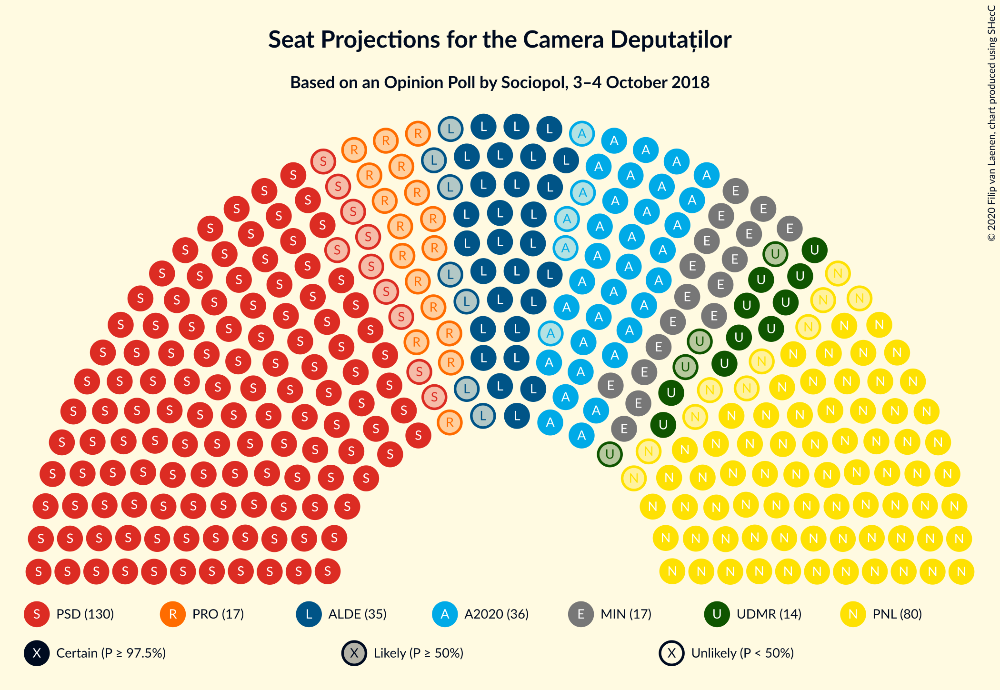
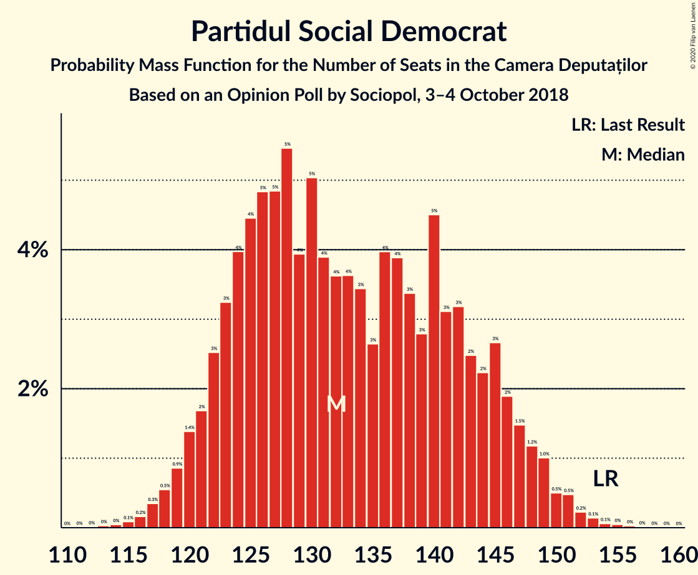
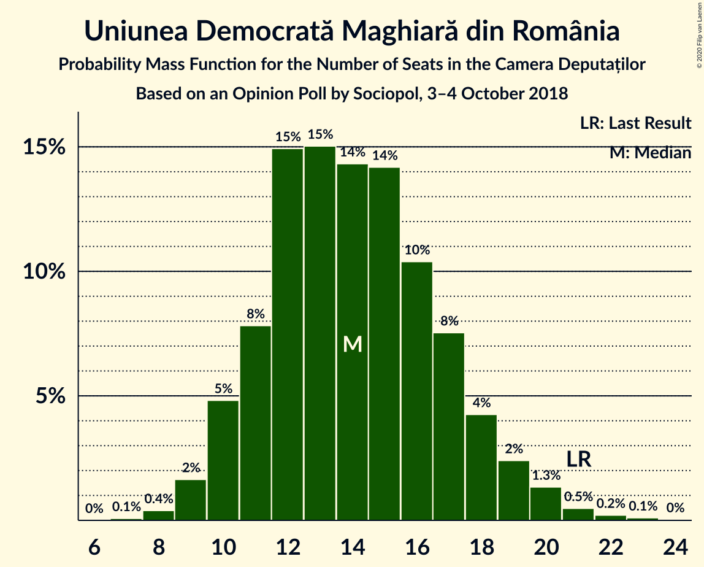
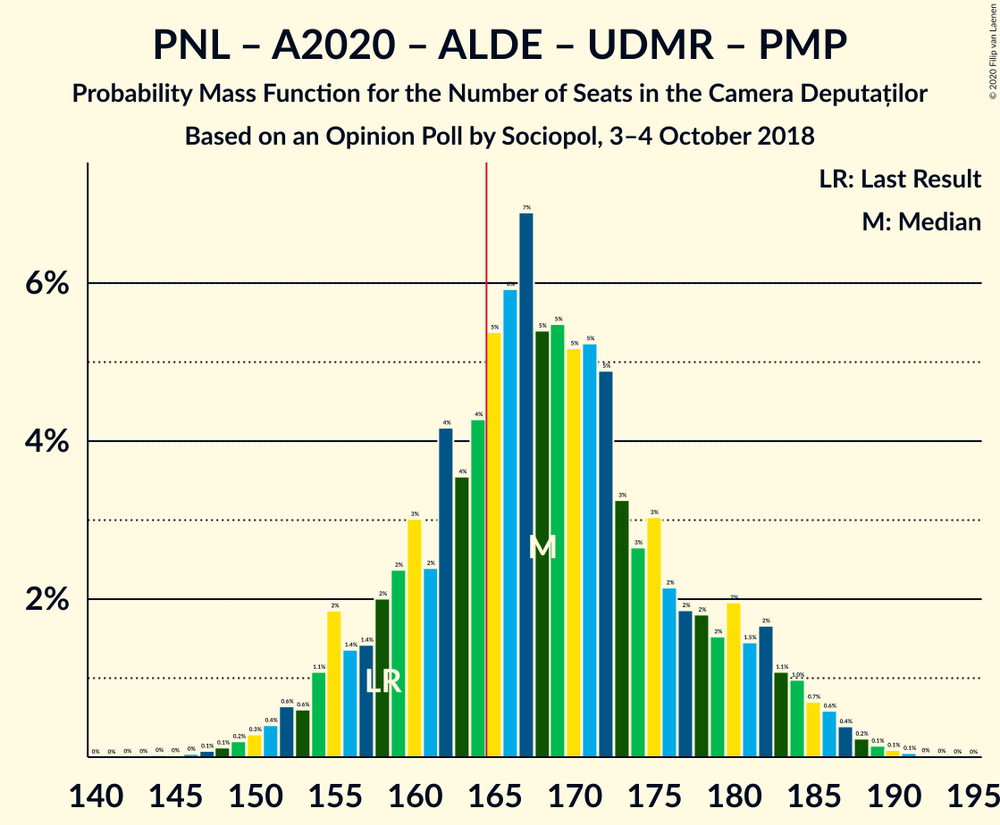
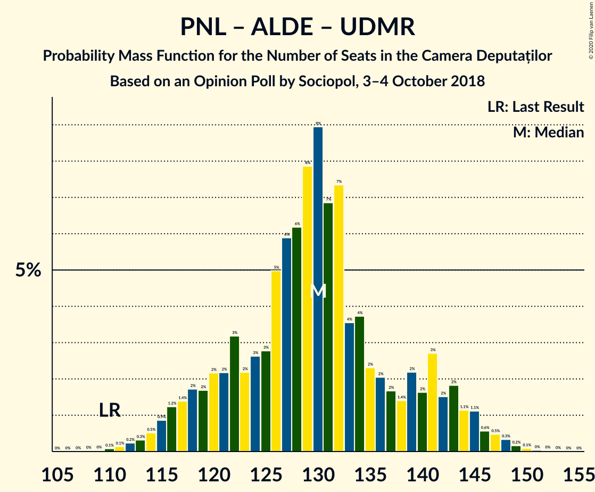
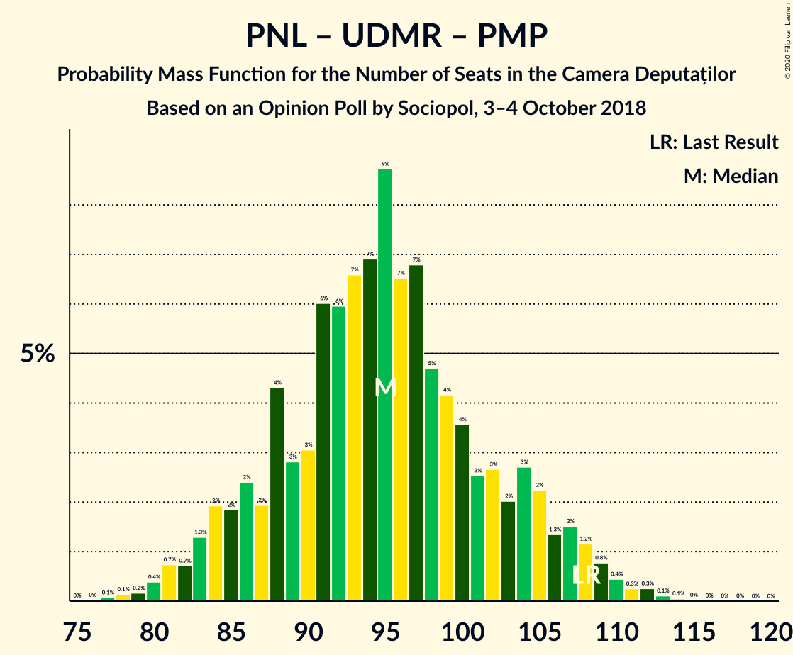

# Opinion Poll by Sociopol, 3–4 October 2018

<a href="#voting-intentions">Voting Intentions</a> | <a href="#seats">Seats</a> | <a href="#coalitions">Coalitions</a> | <a href="#technical-information">Technical Information</a>

## Voting Intentions

### Confidence Intervals

| Party | Last Result | Poll Result | 80% Confidence Interval | 90% Confidence Interval | 95% Confidence Interval | 99% Confidence Interval |
|:-----:|:-----------:|:-----------:|:-----------------------:|:-----------------------:|:-----------------------:|:-----------------------:|
| Partidul Social Democrat | 45.5% | 38.0% | 36.0–40.2% |35.4–40.8% |34.9–41.3% |33.9–42.3% |
| Partidul Național Liberal | 20.0% | 23.0% | 21.3–24.9% |20.8–25.5% |20.3–25.9% |19.5–26.9% |
| Alianța 2020 USR-PLUS | 8.9% | 11.0% | 9.7–12.5% |9.4–12.9% |9.1–13.3% |8.5–14.0% |
| Partidul Alianța Liberalilor și Democraților | 5.6% | 10.0% | 8.8–11.4% |8.4–11.8% |8.1–12.1% |7.6–12.8% |
| PRO România | 0.0% | 5.0% | 4.2–6.1% |4.0–6.4% |3.8–6.7% |3.4–7.3% |
| Uniunea Democrată Maghiară din România | 6.2% | 4.0% | 3.3–5.0% |3.1–5.3% |2.9–5.5% |2.6–6.1% |
| Partidul Mișcarea Populară | 5.4% | 1.0% | 0.7–1.6% |0.6–1.8% |0.5–2.0% |0.4–2.3% |

*Note:* The poll result column reflects the actual value used in the calculations. Published results may vary slightly, and in addition be rounded to fewer digits.

## Seats

### Confidence Intervals

| Party | Last Result | Median | 80% Confidence Interval | 90% Confidence Interval | 95% Confidence Interval | 99% Confidence Interval |
|:-----:|:-----------:|:------:|:-----------------------:|:-----------------------:|:-----------------------:|:-----------------------:|
| <a href="#partidul-social-democrat">Partidul Social Democrat</a> | 154 | 130 | 124–138 |123–141 |122–148 |119–152 |
| <a href="#partidul-național-liberal">Partidul Național Liberal</a> | 69 | 82 | 75–88 |73–91 |72–93 |69–95 |
| <a href="#alianța-2020-usr-plus">Alianța 2020 USR-PLUS</a> | 30 | 38 | 33–43 |32–44 |31–46 |29–48 |
| <a href="#partidul-alianța-liberalilor-și-democraților">Partidul Alianța Liberalilor și Democraților</a> | 20 | 35 | 30–40 |29–41 |28–43 |27–45 |
| <a href="#pro-românia">PRO România</a> | 0 | 17 | 0–21 |0–22 |0–23 |0–25 |
| <a href="#uniunea-democrată-maghiară-din-românia">Uniunea Democrată Maghiară din România</a> | 21 | 14 | 11–17 |11–18 |10–19 |9–21 |
| <a href="#partidul-mișcarea-populară">Partidul Mișcarea Populară</a> | 18 | 0 | 0 |0 |0 |0 |

### Partidul Social Democrat

*For a full overview of the results for this party, see the [Partidul Social Democrat](party-partidulsocialdemocrat.html) page.*

| Number of Seats | Probability | Accumulated | Special Marks |
|:---------------:|:-----------:|:-----------:|:-------------:|
| 114 | 0% | 100% |  |
| 115 | 0% | 99.9% |  |
| 116 | 0% | 99.9% |  |
| 117 | 0.1% | 99.9% |  |
| 118 | 0.1% | 99.8% |  |
| 119 | 0.4% | 99.7% |  |
| 120 | 0.5% | 99.4% |  |
| 121 | 0.7% | 98.9% |  |
| 122 | 1.1% | 98% |  |
| 123 | 2% | 97% |  |
| 124 | 6% | 95% |  |
| 125 | 2% | 88% |  |
| 126 | 7% | 86% |  |
| 127 | 4% | 79% |  |
| 128 | 10% | 75% |  |
| 129 | 7% | 65% |  |
| 130 | 10% | 58% | Median |
| 131 | 8% | 47% |  |
| 132 | 9% | 40% |  |
| 133 | 6% | 31% |  |
| 134 | 4% | 25% |  |
| 135 | 5% | 21% |  |
| 136 | 4% | 16% |  |
| 137 | 2% | 13% |  |
| 138 | 3% | 10% |  |
| 139 | 0.8% | 7% |  |
| 140 | 1.3% | 7% |  |
| 141 | 0.3% | 5% |  |
| 142 | 0.3% | 5% |  |
| 143 | 0.3% | 5% |  |
| 144 | 0.7% | 4% |  |
| 145 | 0.3% | 4% |  |
| 146 | 0.3% | 3% |  |
| 147 | 0.4% | 3% |  |
| 148 | 0.2% | 3% |  |
| 149 | 0.6% | 2% |  |
| 150 | 0.9% | 2% |  |
| 151 | 0.3% | 0.8% |  |
| 152 | 0.1% | 0.5% |  |
| 153 | 0.2% | 0.4% |  |
| 154 | 0% | 0.2% | Last Result |
| 155 | 0.1% | 0.2% |  |
| 156 | 0% | 0.1% |  |
| 157 | 0% | 0.1% |  |
| 158 | 0% | 0% |  |

### Partidul Național Liberal

*For a full overview of the results for this party, see the [Partidul Național Liberal](party-partidulnaționalliberal.html) page.*

| Number of Seats | Probability | Accumulated | Special Marks |
|:---------------:|:-----------:|:-----------:|:-------------:|
| 64 | 0% | 100% |  |
| 65 | 0% | 99.9% |  |
| 66 | 0.1% | 99.9% |  |
| 67 | 0.2% | 99.8% |  |
| 68 | 0.1% | 99.6% |  |
| 69 | 0.5% | 99.5% | Last Result |
| 70 | 0.6% | 99.0% |  |
| 71 | 0.4% | 98% |  |
| 72 | 1.0% | 98% |  |
| 73 | 2% | 97% |  |
| 74 | 2% | 95% |  |
| 75 | 4% | 93% |  |
| 76 | 5% | 89% |  |
| 77 | 7% | 84% |  |
| 78 | 9% | 77% |  |
| 79 | 4% | 68% |  |
| 80 | 5% | 63% |  |
| 81 | 7% | 58% |  |
| 82 | 5% | 51% | Median |
| 83 | 9% | 46% |  |
| 84 | 7% | 37% |  |
| 85 | 5% | 30% |  |
| 86 | 3% | 25% |  |
| 87 | 6% | 22% |  |
| 88 | 6% | 15% |  |
| 89 | 2% | 9% |  |
| 90 | 0.9% | 7% |  |
| 91 | 2% | 6% |  |
| 92 | 2% | 5% |  |
| 93 | 1.1% | 3% |  |
| 94 | 1.0% | 2% |  |
| 95 | 0.4% | 0.7% |  |
| 96 | 0.2% | 0.3% |  |
| 97 | 0% | 0.2% |  |
| 98 | 0.1% | 0.1% |  |
| 99 | 0% | 0% |  |

### Alianța 2020 USR-PLUS

*For a full overview of the results for this party, see the [Alianța 2020 USR-PLUS](party-alianța2020usr-plus.html) page.*

| Number of Seats | Probability | Accumulated | Special Marks |
|:---------------:|:-----------:|:-----------:|:-------------:|
| 0 | 0.1% | 100% |  |
| 1 | 0% | 99.9% |  |
| 2 | 0% | 99.9% |  |
| 3 | 0% | 99.9% |  |
| 4 | 0% | 99.9% |  |
| 5 | 0% | 99.9% |  |
| 6 | 0% | 99.9% |  |
| 7 | 0% | 99.9% |  |
| 8 | 0% | 99.9% |  |
| 9 | 0% | 99.9% |  |
| 10 | 0% | 99.9% |  |
| 11 | 0% | 99.9% |  |
| 12 | 0% | 99.9% |  |
| 13 | 0% | 99.9% |  |
| 14 | 0% | 99.9% |  |
| 15 | 0% | 99.9% |  |
| 16 | 0% | 99.9% |  |
| 17 | 0% | 99.9% |  |
| 18 | 0% | 99.9% |  |
| 19 | 0% | 99.9% |  |
| 20 | 0% | 99.9% |  |
| 21 | 0% | 99.9% |  |
| 22 | 0% | 99.9% |  |
| 23 | 0% | 99.9% |  |
| 24 | 0% | 99.9% |  |
| 25 | 0% | 99.9% |  |
| 26 | 0% | 99.9% |  |
| 27 | 0% | 99.9% |  |
| 28 | 0.2% | 99.9% |  |
| 29 | 0.3% | 99.7% |  |
| 30 | 0.9% | 99.4% | Last Result |
| 31 | 1.1% | 98.5% |  |
| 32 | 3% | 97% |  |
| 33 | 7% | 95% |  |
| 34 | 6% | 88% |  |
| 35 | 8% | 81% |  |
| 36 | 13% | 74% |  |
| 37 | 6% | 60% |  |
| 38 | 9% | 54% | Median |
| 39 | 12% | 45% |  |
| 40 | 10% | 33% |  |
| 41 | 6% | 23% |  |
| 42 | 3% | 17% |  |
| 43 | 6% | 14% |  |
| 44 | 3% | 8% |  |
| 45 | 2% | 5% |  |
| 46 | 0.9% | 3% |  |
| 47 | 1.0% | 2% |  |
| 48 | 0.3% | 0.8% |  |
| 49 | 0.2% | 0.5% |  |
| 50 | 0.2% | 0.3% |  |
| 51 | 0.1% | 0.1% |  |
| 52 | 0% | 0.1% |  |
| 53 | 0% | 0% |  |

### Partidul Alianța Liberalilor și Democraților

*For a full overview of the results for this party, see the [Partidul Alianța Liberalilor și Democraților](party-partidulalianțaliberalilorșidemocraților.html) page.*

| Number of Seats | Probability | Accumulated | Special Marks |
|:---------------:|:-----------:|:-----------:|:-------------:|
| 20 | 0% | 100% | Last Result |
| 21 | 0% | 100% |  |
| 22 | 0% | 100% |  |
| 23 | 0% | 100% |  |
| 24 | 0.1% | 100% |  |
| 25 | 0.1% | 99.9% |  |
| 26 | 0.3% | 99.8% |  |
| 27 | 1.2% | 99.5% |  |
| 28 | 2% | 98% |  |
| 29 | 2% | 96% |  |
| 30 | 6% | 94% |  |
| 31 | 7% | 88% |  |
| 32 | 6% | 81% |  |
| 33 | 7% | 74% |  |
| 34 | 9% | 67% |  |
| 35 | 10% | 58% | Median |
| 36 | 17% | 49% |  |
| 37 | 8% | 31% |  |
| 38 | 6% | 23% |  |
| 39 | 6% | 17% |  |
| 40 | 4% | 11% |  |
| 41 | 3% | 8% |  |
| 42 | 2% | 5% |  |
| 43 | 1.5% | 3% |  |
| 44 | 0.6% | 2% |  |
| 45 | 0.8% | 1.2% |  |
| 46 | 0.2% | 0.4% |  |
| 47 | 0.1% | 0.2% |  |
| 48 | 0.1% | 0.1% |  |
| 49 | 0% | 0% |  |

### PRO România

*For a full overview of the results for this party, see the [PRO România](party-proromânia.html) page.*

| Number of Seats | Probability | Accumulated | Special Marks |
|:---------------:|:-----------:|:-----------:|:-------------:|
| 0 | 37% | 100% | Last Result |
| 1 | 0% | 63% |  |
| 2 | 0% | 63% |  |
| 3 | 0% | 63% |  |
| 4 | 0% | 63% |  |
| 5 | 0% | 63% |  |
| 6 | 0% | 63% |  |
| 7 | 0% | 63% |  |
| 8 | 0% | 63% |  |
| 9 | 0% | 63% |  |
| 10 | 0% | 63% |  |
| 11 | 0% | 63% |  |
| 12 | 0% | 63% |  |
| 13 | 0% | 63% |  |
| 14 | 0% | 63% |  |
| 15 | 0% | 63% |  |
| 16 | 0% | 63% |  |
| 17 | 13% | 63% | Median |
| 18 | 15% | 50% |  |
| 19 | 13% | 35% |  |
| 20 | 10% | 22% |  |
| 21 | 6% | 12% |  |
| 22 | 4% | 6% |  |
| 23 | 1.2% | 3% |  |
| 24 | 0.9% | 1.4% |  |
| 25 | 0.3% | 0.5% |  |
| 26 | 0.1% | 0.2% |  |
| 27 | 0.1% | 0.1% |  |
| 28 | 0% | 0% |  |

### Uniunea Democrată Maghiară din România

*For a full overview of the results for this party, see the [Uniunea Democrată Maghiară din România](party-uniuneademocratămaghiarădinromânia.html) page.*

| Number of Seats | Probability | Accumulated | Special Marks |
|:---------------:|:-----------:|:-----------:|:-------------:|
| 8 | 0.3% | 100% |  |
| 9 | 0.7% | 99.7% |  |
| 10 | 4% | 99.0% |  |
| 11 | 6% | 95% |  |
| 12 | 20% | 89% |  |
| 13 | 9% | 69% |  |
| 14 | 15% | 60% | Median |
| 15 | 13% | 45% |  |
| 16 | 12% | 32% |  |
| 17 | 10% | 20% |  |
| 18 | 5% | 9% |  |
| 19 | 2% | 5% |  |
| 20 | 1.3% | 2% |  |
| 21 | 0.5% | 0.8% | Last Result |
| 22 | 0.1% | 0.2% |  |
| 23 | 0.1% | 0.2% |  |
| 24 | 0% | 0% |  |

### Partidul Mișcarea Populară

*For a full overview of the results for this party, see the [Partidul Mișcarea Populară](party-partidulmișcareapopulară.html) page.*

| Number of Seats | Probability | Accumulated | Special Marks |
|:---------------:|:-----------:|:-----------:|:-------------:|
| 0 | 100% | 100% | Median |
| 1 | 0% | 0% |  |
| 2 | 0% | 0% |  |
| 3 | 0% | 0% |  |
| 4 | 0% | 0% |  |
| 5 | 0% | 0% |  |
| 6 | 0% | 0% |  |
| 7 | 0% | 0% |  |
| 8 | 0% | 0% |  |
| 9 | 0% | 0% |  |
| 10 | 0% | 0% |  |
| 11 | 0% | 0% |  |
| 12 | 0% | 0% |  |
| 13 | 0% | 0% |  |
| 14 | 0% | 0% |  |
| 15 | 0% | 0% |  |
| 16 | 0% | 0% |  |
| 17 | 0% | 0% |  |
| 18 | 0% | 0% | Last Result |

## Coalitions

### Confidence Intervals

| Coalition | Last Result | Median | Majority? | 80% Confidence Interval | 90% Confidence Interval | 95% Confidence Interval | 99% Confidence Interval |
|:---------:|:-----------:|:------:|:---------:|:-----------------------:|:-----------------------:|:-----------------------:|:-----------------------:|
| Partidul Social Democrat – Partidul Alianța Liberalilor și Democraților – PRO România | 174 | 179 | 95% | 168–186 | 166–188 | 164–190 | 161–196 |
| Partidul Național Liberal – Alianța 2020 USR-PLUS – Partidul Alianța Liberalilor și Democraților – Uniunea Democrată Maghiară din România – Partidul Mișcarea Populară | 158 | 167 | 60% | 160–180 | 158–182 | 157–183 | 151–186 |
| Partidul Național Liberal – Alianța 2020 USR-PLUS – Partidul Alianța Liberalilor și Democraților – Uniunea Democrată Maghiară din România | 140 | 167 | 60% | 160–180 | 158–182 | 157–183 | 151–186 |
| Partidul Social Democrat – Partidul Alianța Liberalilor și Democraților | 174 | 165 | 50% | 159–175 | 157–178 | 155–183 | 152–188 |
| Partidul Național Liberal – Alianța 2020 USR-PLUS – Partidul Alianța Liberalilor și Democraților – Partidul Mișcarea Populară | 137 | 153 | 9% | 146–165 | 143–168 | 142–170 | 138–173 |
| Partidul Național Liberal – Alianța 2020 USR-PLUS – Partidul Alianța Liberalilor și Democraților | 119 | 153 | 9% | 146–165 | 143–168 | 142–170 | 138–173 |
| Partidul Social Democrat – PRO România | 154 | 145 | 0.2% | 132–152 | 130–154 | 129–155 | 126–161 |
| Partidul Național Liberal – Alianța 2020 USR-PLUS – Uniunea Democrată Maghiară din România – Partidul Mișcarea Populară | 138 | 133 | 0% | 126–144 | 124–146 | 122–148 | 116–151 |
| Partidul Național Liberal – Alianța 2020 USR-PLUS – Uniunea Democrată Maghiară din România | 120 | 133 | 0% | 126–144 | 124–146 | 122–148 | 116–151 |
| Partidul Național Liberal – Partidul Alianța Liberalilor și Democraților – Uniunea Democrată Maghiară din România – Partidul Mișcarea Populară | 128 | 130 | 0% | 123–141 | 122–141 | 120–142 | 112–145 |
| Partidul Național Liberal – Partidul Alianța Liberalilor și Democraților – Uniunea Democrată Maghiară din România | 110 | 130 | 0% | 123–141 | 122–141 | 120–142 | 112–145 |
| Partidul Național Liberal – Alianța 2020 USR-PLUS – Partidul Mișcarea Populară | 117 | 118 | 0% | 111–130 | 110–131 | 109–132 | 104–136 |
| Partidul Național Liberal – Alianța 2020 USR-PLUS | 99 | 118 | 0% | 111–130 | 110–131 | 109–132 | 104–136 |
| Partidul Național Liberal – Uniunea Democrată Maghiară din România – Partidul Mișcarea Populară | 108 | 95 | 0% | 90–104 | 88–105 | 86–107 | 80–108 |
| Partidul Național Liberal – Uniunea Democrată Maghiară din România | 90 | 95 | 0% | 90–104 | 88–105 | 86–107 | 80–108 |
| Partidul Național Liberal – Partidul Mișcarea Populară | 87 | 82 | 0% | 75–88 | 73–91 | 72–93 | 69–95 |
| Partidul Național Liberal | 69 | 82 | 0% | 75–88 | 73–91 | 72–93 | 69–95 |
| Alianța 2020 USR-PLUS – Partidul Mișcarea Populară | 48 | 38 | 0% | 33–43 | 32–44 | 31–46 | 29–48 |

### Partidul Social Democrat – Partidul Alianța Liberalilor și Democraților – PRO România

| Number of Seats | Probability | Accumulated | Special Marks |
|:---------------:|:-----------:|:-----------:|:-------------:|
| 158 | 0.1% | 100% |  |
| 159 | 0% | 99.9% |  |
| 160 | 0.2% | 99.9% |  |
| 161 | 0.2% | 99.6% |  |
| 162 | 0.2% | 99.5% |  |
| 163 | 0.9% | 99.3% |  |
| 164 | 1.2% | 98% |  |
| 165 | 2% | 97% |  |
| 166 | 1.2% | 95% | Majority |
| 167 | 3% | 94% |  |
| 168 | 2% | 91% |  |
| 169 | 4% | 89% |  |
| 170 | 4% | 85% |  |
| 171 | 2% | 81% |  |
| 172 | 3% | 79% |  |
| 173 | 3% | 76% |  |
| 174 | 3% | 73% | Last Result |
| 175 | 2% | 69% |  |
| 176 | 4% | 67% |  |
| 177 | 6% | 63% |  |
| 178 | 6% | 57% |  |
| 179 | 2% | 51% |  |
| 180 | 7% | 49% |  |
| 181 | 3% | 42% |  |
| 182 | 6% | 40% | Median |
| 183 | 16% | 34% |  |
| 184 | 5% | 18% |  |
| 185 | 3% | 13% |  |
| 186 | 2% | 10% |  |
| 187 | 2% | 9% |  |
| 188 | 1.5% | 6% |  |
| 189 | 1.2% | 5% |  |
| 190 | 2% | 4% |  |
| 191 | 0.5% | 2% |  |
| 192 | 0.2% | 1.2% |  |
| 193 | 0.1% | 1.0% |  |
| 194 | 0.1% | 0.9% |  |
| 195 | 0.1% | 0.8% |  |
| 196 | 0.4% | 0.6% |  |
| 197 | 0% | 0.2% |  |
| 198 | 0% | 0.2% |  |
| 199 | 0% | 0.2% |  |
| 200 | 0% | 0.2% |  |
| 201 | 0% | 0.1% |  |
| 202 | 0% | 0.1% |  |
| 203 | 0% | 0.1% |  |
| 204 | 0% | 0.1% |  |
| 205 | 0% | 0.1% |  |
| 206 | 0% | 0.1% |  |
| 207 | 0% | 0.1% |  |
| 208 | 0% | 0.1% |  |
| 209 | 0% | 0% |  |

### Partidul Național Liberal – Alianța 2020 USR-PLUS – Partidul Alianța Liberalilor și Democraților – Uniunea Democrată Maghiară din România – Partidul Mișcarea Populară

| Number of Seats | Probability | Accumulated | Special Marks |
|:---------------:|:-----------:|:-----------:|:-------------:|
| 140 | 0% | 100% |  |
| 141 | 0% | 99.9% |  |
| 142 | 0% | 99.9% |  |
| 143 | 0% | 99.9% |  |
| 144 | 0% | 99.9% |  |
| 145 | 0% | 99.9% |  |
| 146 | 0.1% | 99.9% |  |
| 147 | 0% | 99.8% |  |
| 148 | 0% | 99.8% |  |
| 149 | 0% | 99.7% |  |
| 150 | 0.1% | 99.7% |  |
| 151 | 0.3% | 99.6% |  |
| 152 | 0.1% | 99.2% |  |
| 153 | 0.2% | 99.1% |  |
| 154 | 0.3% | 99.0% |  |
| 155 | 0.4% | 98.6% |  |
| 156 | 0.5% | 98% |  |
| 157 | 1.4% | 98% |  |
| 158 | 2% | 96% | Last Result |
| 159 | 2% | 95% |  |
| 160 | 3% | 93% |  |
| 161 | 3% | 89% |  |
| 162 | 9% | 86% |  |
| 163 | 4% | 77% |  |
| 164 | 3% | 74% |  |
| 165 | 10% | 70% |  |
| 166 | 6% | 60% | Majority |
| 167 | 5% | 53% |  |
| 168 | 3% | 48% |  |
| 169 | 2% | 45% | Median |
| 170 | 5% | 43% |  |
| 171 | 4% | 38% |  |
| 172 | 2% | 34% |  |
| 173 | 0.9% | 33% |  |
| 174 | 3% | 32% |  |
| 175 | 3% | 28% |  |
| 176 | 3% | 26% |  |
| 177 | 4% | 22% |  |
| 178 | 3% | 19% |  |
| 179 | 3% | 16% |  |
| 180 | 4% | 13% |  |
| 181 | 2% | 9% |  |
| 182 | 3% | 7% |  |
| 183 | 2% | 4% |  |
| 184 | 1.0% | 2% |  |
| 185 | 0.4% | 1.1% |  |
| 186 | 0.3% | 0.7% |  |
| 187 | 0.2% | 0.4% |  |
| 188 | 0.1% | 0.2% |  |
| 189 | 0.1% | 0.1% |  |
| 190 | 0% | 0.1% |  |
| 191 | 0% | 0% |  |

### Partidul Național Liberal – Alianța 2020 USR-PLUS – Partidul Alianța Liberalilor și Democraților – Uniunea Democrată Maghiară din România

| Number of Seats | Probability | Accumulated | Special Marks |
|:---------------:|:-----------:|:-----------:|:-------------:|
| 140 | 0% | 100% | Last Result |
| 141 | 0% | 99.9% |  |
| 142 | 0% | 99.9% |  |
| 143 | 0% | 99.9% |  |
| 144 | 0% | 99.9% |  |
| 145 | 0% | 99.9% |  |
| 146 | 0.1% | 99.9% |  |
| 147 | 0% | 99.8% |  |
| 148 | 0% | 99.8% |  |
| 149 | 0% | 99.7% |  |
| 150 | 0.1% | 99.7% |  |
| 151 | 0.3% | 99.6% |  |
| 152 | 0.1% | 99.2% |  |
| 153 | 0.2% | 99.1% |  |
| 154 | 0.3% | 99.0% |  |
| 155 | 0.4% | 98.6% |  |
| 156 | 0.5% | 98% |  |
| 157 | 1.4% | 98% |  |
| 158 | 2% | 96% |  |
| 159 | 2% | 95% |  |
| 160 | 3% | 93% |  |
| 161 | 3% | 89% |  |
| 162 | 9% | 86% |  |
| 163 | 4% | 77% |  |
| 164 | 3% | 74% |  |
| 165 | 10% | 70% |  |
| 166 | 6% | 60% | Majority |
| 167 | 5% | 53% |  |
| 168 | 3% | 48% |  |
| 169 | 2% | 45% | Median |
| 170 | 5% | 43% |  |
| 171 | 4% | 38% |  |
| 172 | 2% | 34% |  |
| 173 | 0.9% | 33% |  |
| 174 | 3% | 32% |  |
| 175 | 3% | 28% |  |
| 176 | 3% | 26% |  |
| 177 | 4% | 22% |  |
| 178 | 3% | 19% |  |
| 179 | 3% | 16% |  |
| 180 | 4% | 13% |  |
| 181 | 2% | 9% |  |
| 182 | 3% | 7% |  |
| 183 | 2% | 4% |  |
| 184 | 1.0% | 2% |  |
| 185 | 0.4% | 1.1% |  |
| 186 | 0.3% | 0.7% |  |
| 187 | 0.2% | 0.4% |  |
| 188 | 0.1% | 0.2% |  |
| 189 | 0.1% | 0.1% |  |
| 190 | 0% | 0.1% |  |
| 191 | 0% | 0% |  |

### Partidul Social Democrat – Partidul Alianța Liberalilor și Democraților

| Number of Seats | Probability | Accumulated | Special Marks |
|:---------------:|:-----------:|:-----------:|:-------------:|
| 148 | 0% | 100% |  |
| 149 | 0% | 99.9% |  |
| 150 | 0% | 99.9% |  |
| 151 | 0.2% | 99.9% |  |
| 152 | 0.2% | 99.6% |  |
| 153 | 0.6% | 99.4% |  |
| 154 | 0.2% | 98.8% |  |
| 155 | 1.1% | 98.6% |  |
| 156 | 1.1% | 97% |  |
| 157 | 2% | 96% |  |
| 158 | 2% | 94% |  |
| 159 | 7% | 92% |  |
| 160 | 4% | 85% |  |
| 161 | 7% | 81% |  |
| 162 | 5% | 74% |  |
| 163 | 6% | 69% |  |
| 164 | 10% | 63% |  |
| 165 | 4% | 54% | Median |
| 166 | 11% | 50% | Majority |
| 167 | 5% | 39% |  |
| 168 | 4% | 34% |  |
| 169 | 5% | 30% |  |
| 170 | 5% | 25% |  |
| 171 | 2% | 20% |  |
| 172 | 3% | 18% |  |
| 173 | 2% | 15% |  |
| 174 | 2% | 12% | Last Result |
| 175 | 2% | 10% |  |
| 176 | 1.3% | 9% |  |
| 177 | 2% | 7% |  |
| 178 | 0.7% | 5% |  |
| 179 | 0.6% | 5% |  |
| 180 | 0.8% | 4% |  |
| 181 | 0.2% | 3% |  |
| 182 | 0.2% | 3% |  |
| 183 | 1.3% | 3% |  |
| 184 | 0.3% | 1.4% |  |
| 185 | 0.2% | 1.2% |  |
| 186 | 0.2% | 0.9% |  |
| 187 | 0.2% | 0.7% |  |
| 188 | 0.2% | 0.6% |  |
| 189 | 0.1% | 0.4% |  |
| 190 | 0.1% | 0.3% |  |
| 191 | 0% | 0.1% |  |
| 192 | 0% | 0.1% |  |
| 193 | 0% | 0.1% |  |
| 194 | 0% | 0.1% |  |
| 195 | 0% | 0% |  |

### Partidul Național Liberal – Alianța 2020 USR-PLUS – Partidul Alianța Liberalilor și Democraților – Partidul Mișcarea Populară

| Number of Seats | Probability | Accumulated | Special Marks |
|:---------------:|:-----------:|:-----------:|:-------------:|
| 124 | 0% | 100% |  |
| 125 | 0% | 99.9% |  |
| 126 | 0% | 99.9% |  |
| 127 | 0% | 99.9% |  |
| 128 | 0% | 99.9% |  |
| 129 | 0% | 99.9% |  |
| 130 | 0% | 99.9% |  |
| 131 | 0% | 99.9% |  |
| 132 | 0% | 99.9% |  |
| 133 | 0% | 99.9% |  |
| 134 | 0% | 99.8% |  |
| 135 | 0.1% | 99.8% |  |
| 136 | 0.1% | 99.7% |  |
| 137 | 0% | 99.6% | Last Result |
| 138 | 0.1% | 99.6% |  |
| 139 | 0.4% | 99.5% |  |
| 140 | 0.8% | 99.1% |  |
| 141 | 0.4% | 98% |  |
| 142 | 1.5% | 98% |  |
| 143 | 2% | 96% |  |
| 144 | 1.3% | 94% |  |
| 145 | 2% | 93% |  |
| 146 | 4% | 91% |  |
| 147 | 4% | 87% |  |
| 148 | 6% | 83% |  |
| 149 | 4% | 78% |  |
| 150 | 4% | 74% |  |
| 151 | 5% | 71% |  |
| 152 | 7% | 66% |  |
| 153 | 11% | 59% |  |
| 154 | 1.4% | 49% |  |
| 155 | 4% | 47% | Median |
| 156 | 3% | 43% |  |
| 157 | 4% | 40% |  |
| 158 | 7% | 36% |  |
| 159 | 2% | 29% |  |
| 160 | 2% | 26% |  |
| 161 | 3% | 25% |  |
| 162 | 3% | 21% |  |
| 163 | 2% | 18% |  |
| 164 | 2% | 16% |  |
| 165 | 4% | 13% |  |
| 166 | 2% | 9% | Majority |
| 167 | 2% | 7% |  |
| 168 | 1.1% | 5% |  |
| 169 | 1.3% | 4% |  |
| 170 | 2% | 3% |  |
| 171 | 0.2% | 1.1% |  |
| 172 | 0.2% | 0.8% |  |
| 173 | 0.3% | 0.6% |  |
| 174 | 0.2% | 0.4% |  |
| 175 | 0% | 0.2% |  |
| 176 | 0% | 0.1% |  |
| 177 | 0.1% | 0.1% |  |
| 178 | 0% | 0% |  |

### Partidul Național Liberal – Alianța 2020 USR-PLUS – Partidul Alianța Liberalilor și Democraților

| Number of Seats | Probability | Accumulated | Special Marks |
|:---------------:|:-----------:|:-----------:|:-------------:|
| 119 | 0% | 100% | Last Result |
| 120 | 0% | 100% |  |
| 121 | 0% | 100% |  |
| 122 | 0% | 100% |  |
| 123 | 0% | 100% |  |
| 124 | 0% | 100% |  |
| 125 | 0% | 99.9% |  |
| 126 | 0% | 99.9% |  |
| 127 | 0% | 99.9% |  |
| 128 | 0% | 99.9% |  |
| 129 | 0% | 99.9% |  |
| 130 | 0% | 99.9% |  |
| 131 | 0% | 99.9% |  |
| 132 | 0% | 99.9% |  |
| 133 | 0% | 99.9% |  |
| 134 | 0% | 99.8% |  |
| 135 | 0.1% | 99.8% |  |
| 136 | 0.1% | 99.7% |  |
| 137 | 0% | 99.6% |  |
| 138 | 0.1% | 99.6% |  |
| 139 | 0.4% | 99.5% |  |
| 140 | 0.8% | 99.1% |  |
| 141 | 0.4% | 98% |  |
| 142 | 1.5% | 98% |  |
| 143 | 2% | 96% |  |
| 144 | 1.3% | 94% |  |
| 145 | 2% | 93% |  |
| 146 | 4% | 91% |  |
| 147 | 4% | 87% |  |
| 148 | 6% | 83% |  |
| 149 | 4% | 78% |  |
| 150 | 4% | 74% |  |
| 151 | 5% | 71% |  |
| 152 | 7% | 66% |  |
| 153 | 11% | 59% |  |
| 154 | 1.4% | 49% |  |
| 155 | 4% | 47% | Median |
| 156 | 3% | 43% |  |
| 157 | 4% | 40% |  |
| 158 | 7% | 36% |  |
| 159 | 2% | 29% |  |
| 160 | 2% | 26% |  |
| 161 | 3% | 25% |  |
| 162 | 3% | 21% |  |
| 163 | 2% | 18% |  |
| 164 | 2% | 16% |  |
| 165 | 4% | 13% |  |
| 166 | 2% | 9% | Majority |
| 167 | 2% | 7% |  |
| 168 | 1.1% | 5% |  |
| 169 | 1.3% | 4% |  |
| 170 | 2% | 3% |  |
| 171 | 0.2% | 1.1% |  |
| 172 | 0.2% | 0.8% |  |
| 173 | 0.3% | 0.6% |  |
| 174 | 0.2% | 0.4% |  |
| 175 | 0% | 0.2% |  |
| 176 | 0% | 0.1% |  |
| 177 | 0.1% | 0.1% |  |
| 178 | 0% | 0% |  |

### Partidul Social Democrat – PRO România

| Number of Seats | Probability | Accumulated | Special Marks |
|:---------------:|:-----------:|:-----------:|:-------------:|
| 122 | 0% | 100% |  |
| 123 | 0.1% | 99.9% |  |
| 124 | 0.1% | 99.9% |  |
| 125 | 0.2% | 99.8% |  |
| 126 | 0.3% | 99.6% |  |
| 127 | 0.4% | 99.3% |  |
| 128 | 1.0% | 98.9% |  |
| 129 | 2% | 98% |  |
| 130 | 3% | 96% |  |
| 131 | 2% | 93% |  |
| 132 | 4% | 91% |  |
| 133 | 3% | 87% |  |
| 134 | 3% | 84% |  |
| 135 | 4% | 81% |  |
| 136 | 3% | 78% |  |
| 137 | 3% | 74% |  |
| 138 | 3% | 72% |  |
| 139 | 0.9% | 68% |  |
| 140 | 2% | 67% |  |
| 141 | 4% | 66% |  |
| 142 | 5% | 62% |  |
| 143 | 2% | 57% |  |
| 144 | 3% | 55% |  |
| 145 | 5% | 52% |  |
| 146 | 6% | 47% |  |
| 147 | 10% | 40% | Median |
| 148 | 3% | 30% |  |
| 149 | 4% | 26% |  |
| 150 | 9% | 23% |  |
| 151 | 3% | 14% |  |
| 152 | 3% | 11% |  |
| 153 | 2% | 7% |  |
| 154 | 2% | 5% | Last Result |
| 155 | 1.4% | 4% |  |
| 156 | 0.5% | 2% |  |
| 157 | 0.4% | 2% |  |
| 158 | 0.3% | 1.4% |  |
| 159 | 0.2% | 1.0% |  |
| 160 | 0.1% | 0.9% |  |
| 161 | 0.3% | 0.8% |  |
| 162 | 0.1% | 0.4% |  |
| 163 | 0% | 0.3% |  |
| 164 | 0% | 0.3% |  |
| 165 | 0% | 0.2% |  |
| 166 | 0.1% | 0.2% | Majority |
| 167 | 0% | 0.1% |  |
| 168 | 0% | 0.1% |  |
| 169 | 0% | 0.1% |  |
| 170 | 0% | 0.1% |  |
| 171 | 0% | 0.1% |  |
| 172 | 0% | 0.1% |  |
| 173 | 0% | 0% |  |

### Partidul Național Liberal – Alianța 2020 USR-PLUS – Uniunea Democrată Maghiară din România – Partidul Mișcarea Populară

| Number of Seats | Probability | Accumulated | Special Marks |
|:---------------:|:-----------:|:-----------:|:-------------:|
| 104 | 0% | 100% |  |
| 105 | 0% | 99.9% |  |
| 106 | 0% | 99.9% |  |
| 107 | 0% | 99.9% |  |
| 108 | 0% | 99.9% |  |
| 109 | 0% | 99.9% |  |
| 110 | 0% | 99.9% |  |
| 111 | 0% | 99.9% |  |
| 112 | 0% | 99.9% |  |
| 113 | 0% | 99.8% |  |
| 114 | 0% | 99.8% |  |
| 115 | 0% | 99.8% |  |
| 116 | 0.4% | 99.8% |  |
| 117 | 0.1% | 99.4% |  |
| 118 | 0.1% | 99.2% |  |
| 119 | 0.1% | 99.1% |  |
| 120 | 0.2% | 99.0% |  |
| 121 | 0.5% | 98.8% |  |
| 122 | 2% | 98% |  |
| 123 | 1.2% | 96% |  |
| 124 | 1.5% | 95% |  |
| 125 | 2% | 94% |  |
| 126 | 2% | 91% |  |
| 127 | 3% | 90% |  |
| 128 | 5% | 87% |  |
| 129 | 16% | 82% |  |
| 130 | 6% | 66% |  |
| 131 | 3% | 60% |  |
| 132 | 7% | 58% |  |
| 133 | 2% | 51% |  |
| 134 | 6% | 49% | Median |
| 135 | 6% | 43% |  |
| 136 | 4% | 37% |  |
| 137 | 2% | 33% |  |
| 138 | 3% | 31% | Last Result |
| 139 | 3% | 27% |  |
| 140 | 3% | 24% |  |
| 141 | 2% | 21% |  |
| 142 | 4% | 19% |  |
| 143 | 4% | 15% |  |
| 144 | 2% | 11% |  |
| 145 | 3% | 9% |  |
| 146 | 1.2% | 6% |  |
| 147 | 2% | 5% |  |
| 148 | 1.2% | 3% |  |
| 149 | 0.9% | 2% |  |
| 150 | 0.2% | 0.7% |  |
| 151 | 0.2% | 0.5% |  |
| 152 | 0.2% | 0.4% |  |
| 153 | 0% | 0.1% |  |
| 154 | 0.1% | 0.1% |  |
| 155 | 0% | 0% |  |

### Partidul Național Liberal – Alianța 2020 USR-PLUS – Uniunea Democrată Maghiară din România

| Number of Seats | Probability | Accumulated | Special Marks |
|:---------------:|:-----------:|:-----------:|:-------------:|
| 104 | 0% | 100% |  |
| 105 | 0% | 99.9% |  |
| 106 | 0% | 99.9% |  |
| 107 | 0% | 99.9% |  |
| 108 | 0% | 99.9% |  |
| 109 | 0% | 99.9% |  |
| 110 | 0% | 99.9% |  |
| 111 | 0% | 99.9% |  |
| 112 | 0% | 99.9% |  |
| 113 | 0% | 99.8% |  |
| 114 | 0% | 99.8% |  |
| 115 | 0% | 99.8% |  |
| 116 | 0.4% | 99.8% |  |
| 117 | 0.1% | 99.4% |  |
| 118 | 0.1% | 99.2% |  |
| 119 | 0.1% | 99.1% |  |
| 120 | 0.2% | 99.0% | Last Result |
| 121 | 0.5% | 98.8% |  |
| 122 | 2% | 98% |  |
| 123 | 1.2% | 96% |  |
| 124 | 1.5% | 95% |  |
| 125 | 2% | 94% |  |
| 126 | 2% | 91% |  |
| 127 | 3% | 90% |  |
| 128 | 5% | 87% |  |
| 129 | 16% | 82% |  |
| 130 | 6% | 66% |  |
| 131 | 3% | 60% |  |
| 132 | 7% | 58% |  |
| 133 | 2% | 51% |  |
| 134 | 6% | 49% | Median |
| 135 | 6% | 43% |  |
| 136 | 4% | 37% |  |
| 137 | 2% | 33% |  |
| 138 | 3% | 31% |  |
| 139 | 3% | 27% |  |
| 140 | 3% | 24% |  |
| 141 | 2% | 21% |  |
| 142 | 4% | 19% |  |
| 143 | 4% | 15% |  |
| 144 | 2% | 11% |  |
| 145 | 3% | 9% |  |
| 146 | 1.2% | 6% |  |
| 147 | 2% | 5% |  |
| 148 | 1.2% | 3% |  |
| 149 | 0.9% | 2% |  |
| 150 | 0.2% | 0.7% |  |
| 151 | 0.2% | 0.5% |  |
| 152 | 0.2% | 0.4% |  |
| 153 | 0% | 0.1% |  |
| 154 | 0.1% | 0.1% |  |
| 155 | 0% | 0% |  |

### Partidul Național Liberal – Partidul Alianța Liberalilor și Democraților – Uniunea Democrată Maghiară din România – Partidul Mișcarea Populară

| Number of Seats | Probability | Accumulated | Special Marks |
|:---------------:|:-----------:|:-----------:|:-------------:|
| 108 | 0% | 100% |  |
| 109 | 0% | 99.9% |  |
| 110 | 0.1% | 99.9% |  |
| 111 | 0.2% | 99.8% |  |
| 112 | 0.2% | 99.6% |  |
| 113 | 0.1% | 99.5% |  |
| 114 | 0.1% | 99.4% |  |
| 115 | 0.3% | 99.3% |  |
| 116 | 0.1% | 99.1% |  |
| 117 | 0.1% | 99.0% |  |
| 118 | 0.2% | 98.9% |  |
| 119 | 0.5% | 98.7% |  |
| 120 | 0.9% | 98% |  |
| 121 | 1.4% | 97% |  |
| 122 | 3% | 96% |  |
| 123 | 5% | 93% |  |
| 124 | 3% | 88% |  |
| 125 | 4% | 85% |  |
| 126 | 6% | 81% |  |
| 127 | 9% | 75% |  |
| 128 | 6% | 66% | Last Result |
| 129 | 8% | 61% |  |
| 130 | 10% | 52% |  |
| 131 | 3% | 42% | Median |
| 132 | 5% | 39% |  |
| 133 | 0.8% | 34% |  |
| 134 | 1.0% | 34% |  |
| 135 | 0.5% | 33% |  |
| 136 | 5% | 32% |  |
| 137 | 4% | 28% |  |
| 138 | 4% | 24% |  |
| 139 | 4% | 20% |  |
| 140 | 4% | 16% |  |
| 141 | 7% | 12% |  |
| 142 | 3% | 5% |  |
| 143 | 0.7% | 2% |  |
| 144 | 0.6% | 1.2% |  |
| 145 | 0.4% | 0.6% |  |
| 146 | 0.2% | 0.2% |  |
| 147 | 0% | 0.1% |  |
| 148 | 0% | 0% |  |

### Partidul Național Liberal – Partidul Alianța Liberalilor și Democraților – Uniunea Democrată Maghiară din România

| Number of Seats | Probability | Accumulated | Special Marks |
|:---------------:|:-----------:|:-----------:|:-------------:|
| 108 | 0% | 100% |  |
| 109 | 0% | 99.9% |  |
| 110 | 0.1% | 99.9% | Last Result |
| 111 | 0.2% | 99.8% |  |
| 112 | 0.2% | 99.6% |  |
| 113 | 0.1% | 99.5% |  |
| 114 | 0.1% | 99.4% |  |
| 115 | 0.3% | 99.3% |  |
| 116 | 0.1% | 99.1% |  |
| 117 | 0.1% | 99.0% |  |
| 118 | 0.2% | 98.9% |  |
| 119 | 0.5% | 98.7% |  |
| 120 | 0.9% | 98% |  |
| 121 | 1.4% | 97% |  |
| 122 | 3% | 96% |  |
| 123 | 5% | 93% |  |
| 124 | 3% | 88% |  |
| 125 | 4% | 85% |  |
| 126 | 6% | 81% |  |
| 127 | 9% | 75% |  |
| 128 | 6% | 66% |  |
| 129 | 8% | 61% |  |
| 130 | 10% | 52% |  |
| 131 | 3% | 42% | Median |
| 132 | 5% | 39% |  |
| 133 | 0.8% | 34% |  |
| 134 | 1.0% | 34% |  |
| 135 | 0.5% | 33% |  |
| 136 | 5% | 32% |  |
| 137 | 4% | 28% |  |
| 138 | 4% | 24% |  |
| 139 | 4% | 20% |  |
| 140 | 4% | 16% |  |
| 141 | 7% | 12% |  |
| 142 | 3% | 5% |  |
| 143 | 0.7% | 2% |  |
| 144 | 0.6% | 1.2% |  |
| 145 | 0.4% | 0.6% |  |
| 146 | 0.2% | 0.2% |  |
| 147 | 0% | 0.1% |  |
| 148 | 0% | 0% |  |

### Partidul Național Liberal – Alianța 2020 USR-PLUS – Partidul Mișcarea Populară

| Number of Seats | Probability | Accumulated | Special Marks |
|:---------------:|:-----------:|:-----------:|:-------------:|
| 86 | 0% | 100% |  |
| 87 | 0% | 99.9% |  |
| 88 | 0% | 99.9% |  |
| 89 | 0% | 99.9% |  |
| 90 | 0% | 99.9% |  |
| 91 | 0% | 99.9% |  |
| 92 | 0% | 99.9% |  |
| 93 | 0% | 99.9% |  |
| 94 | 0% | 99.9% |  |
| 95 | 0% | 99.9% |  |
| 96 | 0% | 99.9% |  |
| 97 | 0% | 99.9% |  |
| 98 | 0% | 99.9% |  |
| 99 | 0% | 99.9% |  |
| 100 | 0% | 99.8% |  |
| 101 | 0% | 99.8% |  |
| 102 | 0% | 99.8% |  |
| 103 | 0.1% | 99.8% |  |
| 104 | 0.2% | 99.7% |  |
| 105 | 0.9% | 99.5% |  |
| 106 | 0.6% | 98.6% |  |
| 107 | 0.2% | 98% |  |
| 108 | 0% | 98% |  |
| 109 | 0.3% | 98% |  |
| 110 | 4% | 97% |  |
| 111 | 5% | 94% |  |
| 112 | 6% | 89% |  |
| 113 | 3% | 83% |  |
| 114 | 0.1% | 80% |  |
| 115 | 0.2% | 80% |  |
| 116 | 6% | 79% |  |
| 117 | 17% | 74% | Last Result |
| 118 | 13% | 56% |  |
| 119 | 1.4% | 43% |  |
| 120 | 0.1% | 42% | Median |
| 121 | 0.3% | 42% |  |
| 122 | 0.7% | 42% |  |
| 123 | 10% | 41% |  |
| 124 | 12% | 31% |  |
| 125 | 3% | 20% |  |
| 126 | 0.4% | 16% |  |
| 127 | 0% | 16% |  |
| 128 | 0.3% | 16% |  |
| 129 | 3% | 15% |  |
| 130 | 7% | 12% |  |
| 131 | 3% | 5% |  |
| 132 | 0.6% | 3% |  |
| 133 | 0% | 2% |  |
| 134 | 0% | 2% |  |
| 135 | 0.3% | 2% |  |
| 136 | 1.4% | 2% |  |
| 137 | 0.2% | 0.3% |  |
| 138 | 0.1% | 0.2% |  |
| 139 | 0% | 0.1% |  |
| 140 | 0% | 0.1% |  |
| 141 | 0% | 0.1% |  |
| 142 | 0% | 0.1% |  |
| 143 | 0% | 0% |  |

### Partidul Național Liberal – Alianța 2020 USR-PLUS

| Number of Seats | Probability | Accumulated | Special Marks |
|:---------------:|:-----------:|:-----------:|:-------------:|
| 86 | 0% | 100% |  |
| 87 | 0% | 99.9% |  |
| 88 | 0% | 99.9% |  |
| 89 | 0% | 99.9% |  |
| 90 | 0% | 99.9% |  |
| 91 | 0% | 99.9% |  |
| 92 | 0% | 99.9% |  |
| 93 | 0% | 99.9% |  |
| 94 | 0% | 99.9% |  |
| 95 | 0% | 99.9% |  |
| 96 | 0% | 99.9% |  |
| 97 | 0% | 99.9% |  |
| 98 | 0% | 99.9% |  |
| 99 | 0% | 99.9% | Last Result |
| 100 | 0% | 99.8% |  |
| 101 | 0% | 99.8% |  |
| 102 | 0% | 99.8% |  |
| 103 | 0.1% | 99.8% |  |
| 104 | 0.2% | 99.7% |  |
| 105 | 0.9% | 99.5% |  |
| 106 | 0.6% | 98.6% |  |
| 107 | 0.2% | 98% |  |
| 108 | 0% | 98% |  |
| 109 | 0.3% | 98% |  |
| 110 | 4% | 97% |  |
| 111 | 5% | 94% |  |
| 112 | 6% | 89% |  |
| 113 | 3% | 83% |  |
| 114 | 0.1% | 80% |  |
| 115 | 0.2% | 80% |  |
| 116 | 6% | 79% |  |
| 117 | 17% | 74% |  |
| 118 | 13% | 56% |  |
| 119 | 1.4% | 43% |  |
| 120 | 0.1% | 42% | Median |
| 121 | 0.3% | 42% |  |
| 122 | 0.7% | 42% |  |
| 123 | 10% | 41% |  |
| 124 | 12% | 31% |  |
| 125 | 3% | 20% |  |
| 126 | 0.4% | 16% |  |
| 127 | 0% | 16% |  |
| 128 | 0.3% | 16% |  |
| 129 | 3% | 15% |  |
| 130 | 7% | 12% |  |
| 131 | 3% | 5% |  |
| 132 | 0.6% | 3% |  |
| 133 | 0% | 2% |  |
| 134 | 0% | 2% |  |
| 135 | 0.3% | 2% |  |
| 136 | 1.4% | 2% |  |
| 137 | 0.2% | 0.3% |  |
| 138 | 0.1% | 0.2% |  |
| 139 | 0% | 0.1% |  |
| 140 | 0% | 0.1% |  |
| 141 | 0% | 0.1% |  |
| 142 | 0% | 0.1% |  |
| 143 | 0% | 0% |  |

### Partidul Național Liberal – Uniunea Democrată Maghiară din România – Partidul Mișcarea Populară

| Number of Seats | Probability | Accumulated | Special Marks |
|:---------------:|:-----------:|:-----------:|:-------------:|
| 77 | 0.1% | 100% |  |
| 78 | 0% | 99.8% |  |
| 79 | 0.1% | 99.8% |  |
| 80 | 0.4% | 99.7% |  |
| 81 | 0.1% | 99.3% |  |
| 82 | 0.1% | 99.2% |  |
| 83 | 0.3% | 99.1% |  |
| 84 | 0.2% | 98.8% |  |
| 85 | 0.4% | 98.6% |  |
| 86 | 1.3% | 98% |  |
| 87 | 2% | 97% |  |
| 88 | 3% | 95% |  |
| 89 | 2% | 93% |  |
| 90 | 3% | 91% |  |
| 91 | 11% | 88% |  |
| 92 | 5% | 77% |  |
| 93 | 11% | 72% |  |
| 94 | 6% | 61% |  |
| 95 | 6% | 55% |  |
| 96 | 7% | 49% | Median |
| 97 | 7% | 42% |  |
| 98 | 3% | 35% |  |
| 99 | 2% | 32% |  |
| 100 | 4% | 30% |  |
| 101 | 4% | 27% |  |
| 102 | 6% | 23% |  |
| 103 | 4% | 17% |  |
| 104 | 6% | 12% |  |
| 105 | 3% | 7% |  |
| 106 | 2% | 4% |  |
| 107 | 2% | 3% |  |
| 108 | 0.7% | 1.1% | Last Result |
| 109 | 0.3% | 0.4% |  |
| 110 | 0.1% | 0.1% |  |
| 111 | 0% | 0.1% |  |
| 112 | 0% | 0% |  |

### Partidul Național Liberal – Uniunea Democrată Maghiară din România

| Number of Seats | Probability | Accumulated | Special Marks |
|:---------------:|:-----------:|:-----------:|:-------------:|
| 77 | 0.1% | 100% |  |
| 78 | 0% | 99.8% |  |
| 79 | 0.1% | 99.8% |  |
| 80 | 0.4% | 99.7% |  |
| 81 | 0.1% | 99.3% |  |
| 82 | 0.1% | 99.2% |  |
| 83 | 0.3% | 99.1% |  |
| 84 | 0.2% | 98.8% |  |
| 85 | 0.4% | 98.6% |  |
| 86 | 1.3% | 98% |  |
| 87 | 2% | 97% |  |
| 88 | 3% | 95% |  |
| 89 | 2% | 93% |  |
| 90 | 3% | 91% | Last Result |
| 91 | 11% | 88% |  |
| 92 | 5% | 77% |  |
| 93 | 11% | 72% |  |
| 94 | 6% | 61% |  |
| 95 | 6% | 55% |  |
| 96 | 7% | 49% | Median |
| 97 | 7% | 42% |  |
| 98 | 3% | 35% |  |
| 99 | 2% | 32% |  |
| 100 | 4% | 30% |  |
| 101 | 4% | 27% |  |
| 102 | 6% | 23% |  |
| 103 | 4% | 17% |  |
| 104 | 6% | 12% |  |
| 105 | 3% | 7% |  |
| 106 | 2% | 4% |  |
| 107 | 2% | 3% |  |
| 108 | 0.7% | 1.1% |  |
| 109 | 0.3% | 0.4% |  |
| 110 | 0.1% | 0.1% |  |
| 111 | 0% | 0.1% |  |
| 112 | 0% | 0% |  |

### Partidul Național Liberal – Partidul Mișcarea Populară

| Number of Seats | Probability | Accumulated | Special Marks |
|:---------------:|:-----------:|:-----------:|:-------------:|
| 64 | 0% | 100% |  |
| 65 | 0% | 99.9% |  |
| 66 | 0.1% | 99.9% |  |
| 67 | 0.2% | 99.8% |  |
| 68 | 0.1% | 99.6% |  |
| 69 | 0.5% | 99.5% |  |
| 70 | 0.6% | 99.0% |  |
| 71 | 0.4% | 98% |  |
| 72 | 1.0% | 98% |  |
| 73 | 2% | 97% |  |
| 74 | 2% | 95% |  |
| 75 | 4% | 93% |  |
| 76 | 5% | 89% |  |
| 77 | 7% | 84% |  |
| 78 | 9% | 77% |  |
| 79 | 4% | 68% |  |
| 80 | 5% | 63% |  |
| 81 | 7% | 58% |  |
| 82 | 5% | 51% | Median |
| 83 | 9% | 46% |  |
| 84 | 7% | 37% |  |
| 85 | 5% | 30% |  |
| 86 | 3% | 25% |  |
| 87 | 6% | 22% | Last Result |
| 88 | 6% | 15% |  |
| 89 | 2% | 9% |  |
| 90 | 0.9% | 7% |  |
| 91 | 2% | 6% |  |
| 92 | 2% | 5% |  |
| 93 | 1.1% | 3% |  |
| 94 | 1.0% | 2% |  |
| 95 | 0.4% | 0.7% |  |
| 96 | 0.2% | 0.3% |  |
| 97 | 0% | 0.2% |  |
| 98 | 0.1% | 0.1% |  |
| 99 | 0% | 0% |  |

### Partidul Național Liberal

| Number of Seats | Probability | Accumulated | Special Marks |
|:---------------:|:-----------:|:-----------:|:-------------:|
| 64 | 0% | 100% |  |
| 65 | 0% | 99.9% |  |
| 66 | 0.1% | 99.9% |  |
| 67 | 0.2% | 99.8% |  |
| 68 | 0.1% | 99.6% |  |
| 69 | 0.5% | 99.5% | Last Result |
| 70 | 0.6% | 99.0% |  |
| 71 | 0.4% | 98% |  |
| 72 | 1.0% | 98% |  |
| 73 | 2% | 97% |  |
| 74 | 2% | 95% |  |
| 75 | 4% | 93% |  |
| 76 | 5% | 89% |  |
| 77 | 7% | 84% |  |
| 78 | 9% | 77% |  |
| 79 | 4% | 68% |  |
| 80 | 5% | 63% |  |
| 81 | 7% | 58% |  |
| 82 | 5% | 51% | Median |
| 83 | 9% | 46% |  |
| 84 | 7% | 37% |  |
| 85 | 5% | 30% |  |
| 86 | 3% | 25% |  |
| 87 | 6% | 22% |  |
| 88 | 6% | 15% |  |
| 89 | 2% | 9% |  |
| 90 | 0.9% | 7% |  |
| 91 | 2% | 6% |  |
| 92 | 2% | 5% |  |
| 93 | 1.1% | 3% |  |
| 94 | 1.0% | 2% |  |
| 95 | 0.4% | 0.7% |  |
| 96 | 0.2% | 0.3% |  |
| 97 | 0% | 0.2% |  |
| 98 | 0.1% | 0.1% |  |
| 99 | 0% | 0% |  |

### Alianța 2020 USR-PLUS – Partidul Mișcarea Populară

| Number of Seats | Probability | Accumulated | Special Marks |
|:---------------:|:-----------:|:-----------:|:-------------:|
| 0 | 0.1% | 100% |  |
| 1 | 0% | 99.9% |  |
| 2 | 0% | 99.9% |  |
| 3 | 0% | 99.9% |  |
| 4 | 0% | 99.9% |  |
| 5 | 0% | 99.9% |  |
| 6 | 0% | 99.9% |  |
| 7 | 0% | 99.9% |  |
| 8 | 0% | 99.9% |  |
| 9 | 0% | 99.9% |  |
| 10 | 0% | 99.9% |  |
| 11 | 0% | 99.9% |  |
| 12 | 0% | 99.9% |  |
| 13 | 0% | 99.9% |  |
| 14 | 0% | 99.9% |  |
| 15 | 0% | 99.9% |  |
| 16 | 0% | 99.9% |  |
| 17 | 0% | 99.9% |  |
| 18 | 0% | 99.9% |  |
| 19 | 0% | 99.9% |  |
| 20 | 0% | 99.9% |  |
| 21 | 0% | 99.9% |  |
| 22 | 0% | 99.9% |  |
| 23 | 0% | 99.9% |  |
| 24 | 0% | 99.9% |  |
| 25 | 0% | 99.9% |  |
| 26 | 0% | 99.9% |  |
| 27 | 0% | 99.9% |  |
| 28 | 0.2% | 99.9% |  |
| 29 | 0.3% | 99.7% |  |
| 30 | 0.9% | 99.4% |  |
| 31 | 1.1% | 98.5% |  |
| 32 | 3% | 97% |  |
| 33 | 7% | 95% |  |
| 34 | 6% | 88% |  |
| 35 | 8% | 81% |  |
| 36 | 13% | 74% |  |
| 37 | 6% | 60% |  |
| 38 | 9% | 54% | Median |
| 39 | 12% | 45% |  |
| 40 | 10% | 33% |  |
| 41 | 6% | 23% |  |
| 42 | 3% | 17% |  |
| 43 | 6% | 14% |  |
| 44 | 3% | 8% |  |
| 45 | 2% | 5% |  |
| 46 | 0.9% | 3% |  |
| 47 | 1.0% | 2% |  |
| 48 | 0.3% | 0.8% | Last Result |
| 49 | 0.2% | 0.5% |  |
| 50 | 0.2% | 0.3% |  |
| 51 | 0.1% | 0.1% |  |
| 52 | 0% | 0.1% |  |
| 53 | 0% | 0% |  |

## Technical Information

### Opinion Poll

+ **Polling firm:** Sociopol
+ **Commissioner(s):** —
+ **Fieldwork period:** 3–4 October 2018

### Calculations

+ **Sample size:** 873
+ **Simulations done:** 131,072
+ **Error estimate:** 1.04%

