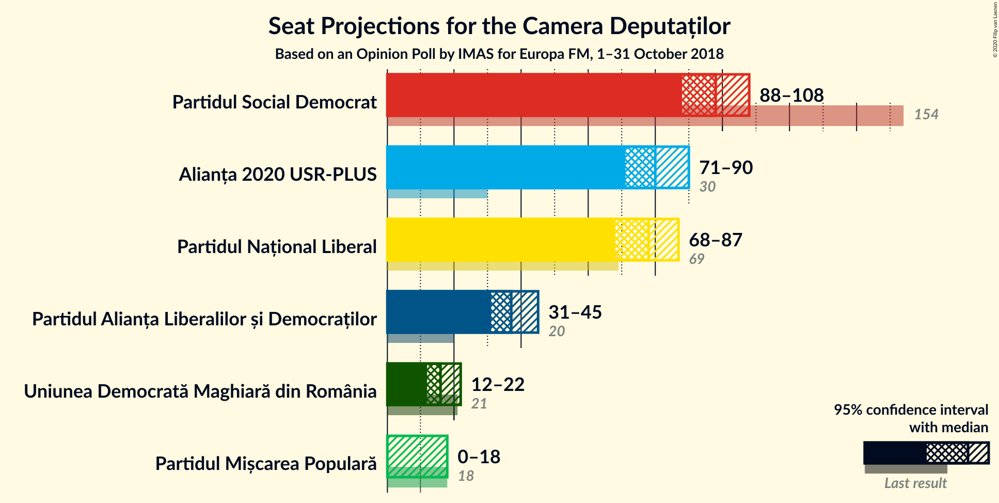
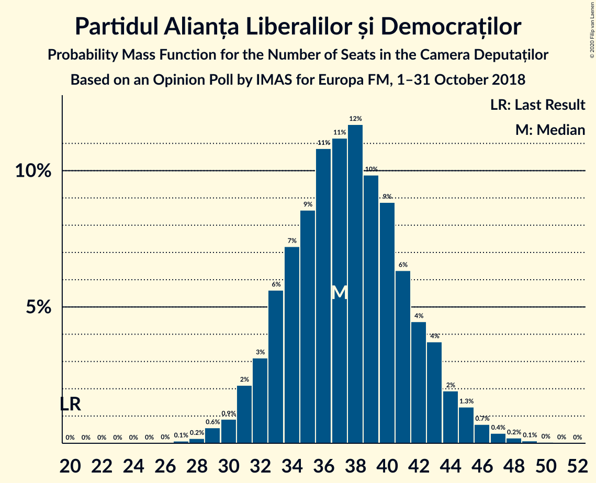
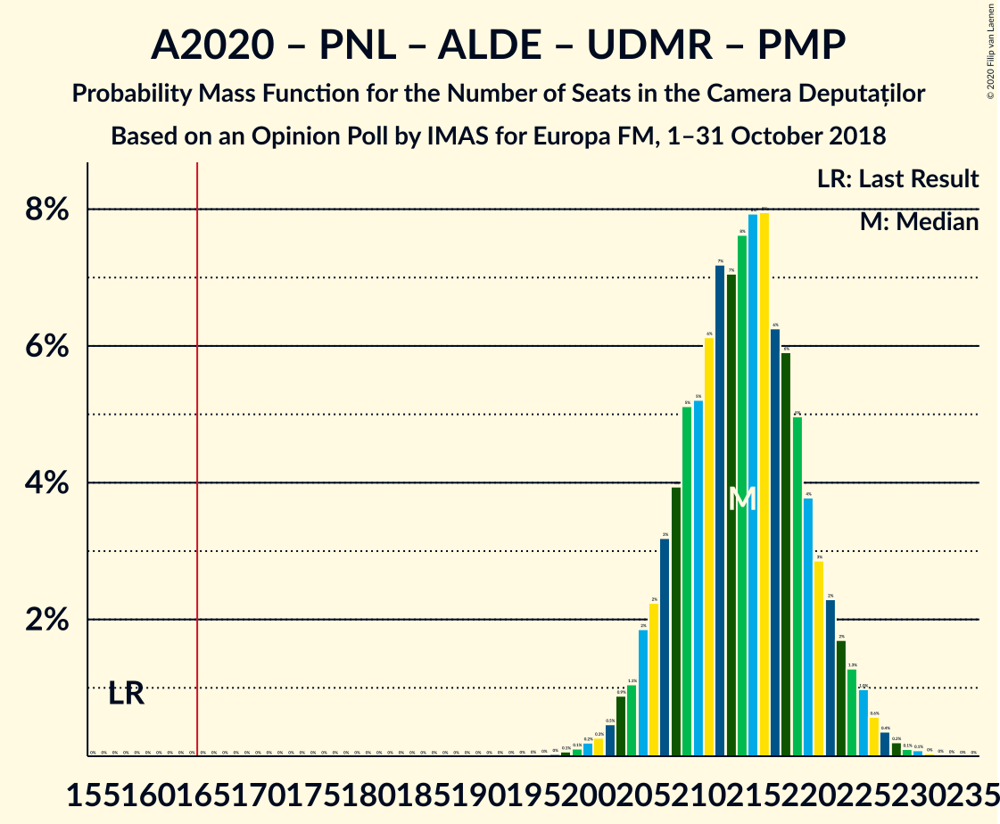
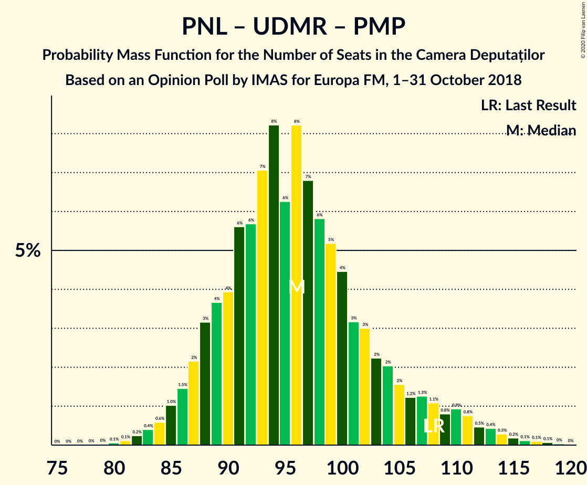

# Opinion Poll by IMAS for Europa FM, 1–31 October 2018

<a href="#voting-intentions">Voting Intentions</a> | <a href="#seats">Seats</a> | <a href="#coalitions">Coalitions</a> | <a href="#technical-information">Technical Information</a>

## Voting Intentions

### Confidence Intervals

| Party | Last Result | Poll Result | 80% Confidence Interval | 90% Confidence Interval | 95% Confidence Interval | 99% Confidence Interval |
|:-----:|:-----------:|:-----------:|:-----------------------:|:-----------------------:|:-----------------------:|:-----------------------:|
| Partidul Social Democrat | 45.5% | 27.6% | 25.8–29.5% |25.3–30.0% |24.9–30.5% |24.1–31.4% |
| Alianța 2020 USR-PLUS | 8.9% | 22.7% | 21.1–24.5% |20.6–25.0% |20.2–25.4% |19.4–26.3% |
| Partidul Național Liberal | 20.0% | 21.9% | 20.3–23.7% |19.8–24.1% |19.4–24.6% |18.7–25.4% |
| Partidul Alianța Liberalilor și Democraților | 5.6% | 10.6% | 9.4–11.9% |9.1–12.3% |8.8–12.7% |8.3–13.3% |
| Uniunea Democrată Maghiară din România | 6.2% | 4.7% | 3.9–5.7% |3.7–6.0% |3.6–6.2% |3.2–6.7% |
| Partidul Mișcarea Populară | 5.4% | 4.1% | 3.4–5.0% |3.2–5.3% |3.0–5.5% |2.7–6.0% |

*Note:* The poll result column reflects the actual value used in the calculations. Published results may vary slightly, and in addition be rounded to fewer digits.

## Seats

### Confidence Intervals

| Party | Last Result | Median | 80% Confidence Interval | 90% Confidence Interval | 95% Confidence Interval | 99% Confidence Interval |
|:-----:|:-----------:|:------:|:-----------------------:|:-----------------------:|:-----------------------:|:-----------------------:|
| <a href="#partidul-social-democrat">Partidul Social Democrat</a> | 154 | 98 | 91–105 |89–107 |87–108 |85–111 |
| <a href="#alianța-2020-usr-plus">Alianța 2020 USR-PLUS</a> | 30 | 80 | 74–87 |73–88 |71–90 |69–93 |
| <a href="#partidul-național-liberal">Partidul Național Liberal</a> | 69 | 79 | 71–83 |70–86 |68–88 |66–91 |
| <a href="#partidul-alianța-liberalilor-și-democraților">Partidul Alianța Liberalilor și Democraților</a> | 20 | 38 | 33–42 |32–43 |31–45 |29–47 |
| <a href="#uniunea-democrată-maghiară-din-românia">Uniunea Democrată Maghiară din România</a> | 21 | 17 | 13–19 |13–21 |12–21 |11–23 |
| <a href="#partidul-mișcarea-populară">Partidul Mișcarea Populară</a> | 18 | 0 | 0–17 |0–17 |0–18 |0–20 |

### Partidul Social Democrat

*For a full overview of the results for this party, see the [Partidul Social Democrat](party-partidulsocialdemocrat.html) page.*

| Number of Seats | Probability | Accumulated | Special Marks |
|:---------------:|:-----------:|:-----------:|:-------------:|
| 81 | 0% | 100% |  |
| 82 | 0% | 99.9% |  |
| 83 | 0.1% | 99.9% |  |
| 84 | 0.2% | 99.8% |  |
| 85 | 0.3% | 99.6% |  |
| 86 | 1.0% | 99.3% |  |
| 87 | 1.5% | 98% |  |
| 88 | 1.0% | 97% |  |
| 89 | 3% | 96% |  |
| 90 | 0.9% | 93% |  |
| 91 | 2% | 92% |  |
| 92 | 4% | 90% |  |
| 93 | 3% | 86% |  |
| 94 | 8% | 82% |  |
| 95 | 3% | 74% |  |
| 96 | 9% | 71% |  |
| 97 | 12% | 63% |  |
| 98 | 8% | 51% | Median |
| 99 | 11% | 42% |  |
| 100 | 5% | 32% |  |
| 101 | 2% | 27% |  |
| 102 | 8% | 25% |  |
| 103 | 2% | 17% |  |
| 104 | 5% | 15% |  |
| 105 | 3% | 10% |  |
| 106 | 2% | 7% |  |
| 107 | 2% | 6% |  |
| 108 | 1.1% | 4% |  |
| 109 | 1.3% | 2% |  |
| 110 | 0.5% | 1.1% |  |
| 111 | 0.2% | 0.6% |  |
| 112 | 0.2% | 0.4% |  |
| 113 | 0% | 0.2% |  |
| 114 | 0.1% | 0.1% |  |
| 115 | 0% | 0.1% |  |
| 116 | 0% | 0% |  |
| 117 | 0% | 0% |  |
| 118 | 0% | 0% |  |
| 119 | 0% | 0% |  |
| 120 | 0% | 0% |  |
| 121 | 0% | 0% |  |
| 122 | 0% | 0% |  |
| 123 | 0% | 0% |  |
| 124 | 0% | 0% |  |
| 125 | 0% | 0% |  |
| 126 | 0% | 0% |  |
| 127 | 0% | 0% |  |
| 128 | 0% | 0% |  |
| 129 | 0% | 0% |  |
| 130 | 0% | 0% |  |
| 131 | 0% | 0% |  |
| 132 | 0% | 0% |  |
| 133 | 0% | 0% |  |
| 134 | 0% | 0% |  |
| 135 | 0% | 0% |  |
| 136 | 0% | 0% |  |
| 137 | 0% | 0% |  |
| 138 | 0% | 0% |  |
| 139 | 0% | 0% |  |
| 140 | 0% | 0% |  |
| 141 | 0% | 0% |  |
| 142 | 0% | 0% |  |
| 143 | 0% | 0% |  |
| 144 | 0% | 0% |  |
| 145 | 0% | 0% |  |
| 146 | 0% | 0% |  |
| 147 | 0% | 0% |  |
| 148 | 0% | 0% |  |
| 149 | 0% | 0% |  |
| 150 | 0% | 0% |  |
| 151 | 0% | 0% |  |
| 152 | 0% | 0% |  |
| 153 | 0% | 0% |  |
| 154 | 0% | 0% | Last Result |

### Alianța 2020 USR-PLUS

*For a full overview of the results for this party, see the [Alianța 2020 USR-PLUS](party-alianța2020usr-plus.html) page.*

| Number of Seats | Probability | Accumulated | Special Marks |
|:---------------:|:-----------:|:-----------:|:-------------:|
| 30 | 0% | 100% | Last Result |
| 31 | 0% | 100% |  |
| 32 | 0% | 100% |  |
| 33 | 0% | 100% |  |
| 34 | 0% | 100% |  |
| 35 | 0% | 100% |  |
| 36 | 0% | 100% |  |
| 37 | 0% | 100% |  |
| 38 | 0% | 100% |  |
| 39 | 0% | 100% |  |
| 40 | 0% | 100% |  |
| 41 | 0% | 100% |  |
| 42 | 0% | 100% |  |
| 43 | 0% | 100% |  |
| 44 | 0% | 100% |  |
| 45 | 0% | 100% |  |
| 46 | 0% | 100% |  |
| 47 | 0% | 100% |  |
| 48 | 0% | 100% |  |
| 49 | 0% | 100% |  |
| 50 | 0% | 100% |  |
| 51 | 0% | 100% |  |
| 52 | 0% | 100% |  |
| 53 | 0% | 100% |  |
| 54 | 0% | 100% |  |
| 55 | 0% | 100% |  |
| 56 | 0% | 100% |  |
| 57 | 0% | 100% |  |
| 58 | 0% | 100% |  |
| 59 | 0% | 100% |  |
| 60 | 0% | 100% |  |
| 61 | 0% | 100% |  |
| 62 | 0% | 100% |  |
| 63 | 0% | 100% |  |
| 64 | 0% | 100% |  |
| 65 | 0.1% | 100% |  |
| 66 | 0.1% | 99.9% |  |
| 67 | 0.2% | 99.8% |  |
| 68 | 0.1% | 99.7% |  |
| 69 | 0.7% | 99.6% |  |
| 70 | 0.7% | 98.9% |  |
| 71 | 0.7% | 98% |  |
| 72 | 2% | 97% |  |
| 73 | 5% | 95% |  |
| 74 | 2% | 91% |  |
| 75 | 2% | 89% |  |
| 76 | 12% | 87% |  |
| 77 | 6% | 75% |  |
| 78 | 3% | 70% |  |
| 79 | 5% | 67% |  |
| 80 | 16% | 61% | Median |
| 81 | 7% | 46% |  |
| 82 | 5% | 39% |  |
| 83 | 5% | 33% |  |
| 84 | 11% | 28% |  |
| 85 | 2% | 17% |  |
| 86 | 4% | 15% |  |
| 87 | 3% | 11% |  |
| 88 | 3% | 7% |  |
| 89 | 1.0% | 4% |  |
| 90 | 2% | 3% |  |
| 91 | 0.7% | 2% |  |
| 92 | 0.3% | 0.9% |  |
| 93 | 0.2% | 0.6% |  |
| 94 | 0.2% | 0.4% |  |
| 95 | 0% | 0.1% |  |
| 96 | 0% | 0.1% |  |
| 97 | 0% | 0.1% |  |
| 98 | 0% | 0% |  |

### Partidul Național Liberal

*For a full overview of the results for this party, see the [Partidul Național Liberal](party-partidulnaționalliberal.html) page.*

| Number of Seats | Probability | Accumulated | Special Marks |
|:---------------:|:-----------:|:-----------:|:-------------:|
| 63 | 0.1% | 100% |  |
| 64 | 0.1% | 99.9% |  |
| 65 | 0.3% | 99.8% |  |
| 66 | 0.2% | 99.6% |  |
| 67 | 0.5% | 99.3% |  |
| 68 | 1.4% | 98.8% |  |
| 69 | 1.2% | 97% | Last Result |
| 70 | 4% | 96% |  |
| 71 | 4% | 92% |  |
| 72 | 5% | 89% |  |
| 73 | 8% | 84% |  |
| 74 | 2% | 76% |  |
| 75 | 4% | 73% |  |
| 76 | 3% | 70% |  |
| 77 | 9% | 67% |  |
| 78 | 3% | 58% |  |
| 79 | 19% | 56% | Median |
| 80 | 10% | 37% |  |
| 81 | 7% | 27% |  |
| 82 | 9% | 20% |  |
| 83 | 3% | 10% |  |
| 84 | 1.5% | 7% |  |
| 85 | 0.3% | 6% |  |
| 86 | 1.2% | 5% |  |
| 87 | 0.8% | 4% |  |
| 88 | 1.2% | 3% |  |
| 89 | 1.3% | 2% |  |
| 90 | 0.2% | 0.8% |  |
| 91 | 0.4% | 0.5% |  |
| 92 | 0.1% | 0.1% |  |
| 93 | 0% | 0% |  |

### Partidul Alianța Liberalilor și Democraților

*For a full overview of the results for this party, see the [Partidul Alianța Liberalilor și Democraților](party-partidulalianțaliberalilorșidemocraților.html) page.*

| Number of Seats | Probability | Accumulated | Special Marks |
|:---------------:|:-----------:|:-----------:|:-------------:|
| 20 | 0% | 100% | Last Result |
| 21 | 0% | 100% |  |
| 22 | 0% | 100% |  |
| 23 | 0% | 100% |  |
| 24 | 0% | 100% |  |
| 25 | 0% | 100% |  |
| 26 | 0% | 100% |  |
| 27 | 0.1% | 100% |  |
| 28 | 0.2% | 99.9% |  |
| 29 | 0.4% | 99.7% |  |
| 30 | 1.3% | 99.3% |  |
| 31 | 2% | 98% |  |
| 32 | 4% | 97% |  |
| 33 | 5% | 92% |  |
| 34 | 5% | 87% |  |
| 35 | 8% | 82% |  |
| 36 | 6% | 74% |  |
| 37 | 15% | 68% |  |
| 38 | 11% | 53% | Median |
| 39 | 11% | 42% |  |
| 40 | 16% | 31% |  |
| 41 | 3% | 15% |  |
| 42 | 5% | 12% |  |
| 43 | 2% | 7% |  |
| 44 | 2% | 5% |  |
| 45 | 2% | 3% |  |
| 46 | 0.5% | 1.4% |  |
| 47 | 0.6% | 1.0% |  |
| 48 | 0.1% | 0.4% |  |
| 49 | 0.2% | 0.3% |  |
| 50 | 0.1% | 0.1% |  |
| 51 | 0% | 0% |  |

### Uniunea Democrată Maghiară din România

*For a full overview of the results for this party, see the [Uniunea Democrată Maghiară din România](party-uniuneademocratămaghiarădinromânia.html) page.*

| Number of Seats | Probability | Accumulated | Special Marks |
|:---------------:|:-----------:|:-----------:|:-------------:|
| 10 | 0.3% | 100% |  |
| 11 | 0.4% | 99.7% |  |
| 12 | 3% | 99.3% |  |
| 13 | 9% | 96% |  |
| 14 | 6% | 88% |  |
| 15 | 20% | 82% |  |
| 16 | 10% | 63% |  |
| 17 | 11% | 52% | Median |
| 18 | 27% | 41% |  |
| 19 | 4% | 14% |  |
| 20 | 4% | 10% |  |
| 21 | 4% | 6% | Last Result |
| 22 | 0.3% | 2% |  |
| 23 | 1.0% | 1.5% |  |
| 24 | 0.3% | 0.4% |  |
| 25 | 0.1% | 0.2% |  |
| 26 | 0.1% | 0.1% |  |
| 27 | 0% | 0% |  |

### Partidul Mișcarea Populară

*For a full overview of the results for this party, see the [Partidul Mișcarea Populară](party-partidulmișcareapopulară.html) page.*

| Number of Seats | Probability | Accumulated | Special Marks |
|:---------------:|:-----------:|:-----------:|:-------------:|
| 0 | 89% | 100% | Median |
| 1 | 0% | 11% |  |
| 2 | 0% | 11% |  |
| 3 | 0% | 11% |  |
| 4 | 0% | 11% |  |
| 5 | 0% | 11% |  |
| 6 | 0% | 11% |  |
| 7 | 0% | 11% |  |
| 8 | 0% | 11% |  |
| 9 | 0% | 11% |  |
| 10 | 0% | 11% |  |
| 11 | 0% | 11% |  |
| 12 | 0% | 11% |  |
| 13 | 0% | 11% |  |
| 14 | 0% | 11% |  |
| 15 | 0% | 11% |  |
| 16 | 0% | 11% |  |
| 17 | 6% | 11% |  |
| 18 | 3% | 5% | Last Result |
| 19 | 1.1% | 2% |  |
| 20 | 0.6% | 0.9% |  |
| 21 | 0.2% | 0.3% |  |
| 22 | 0.1% | 0.1% |  |
| 23 | 0% | 0% |  |

## Coalitions

### Confidence Intervals

| Coalition | Last Result | Median | Majority? | 80% Confidence Interval | 90% Confidence Interval | 95% Confidence Interval | 99% Confidence Interval |
|:---------:|:-----------:|:------:|:---------:|:-----------------------:|:-----------------------:|:-----------------------:|:-----------------------:|
| Alianța 2020 USR-PLUS – Partidul Național Liberal – Partidul Alianța Liberalilor și Democraților – Uniunea Democrată Maghiară din România – Partidul Mișcarea Populară | 158 | 214 | 100% | 207–221 | 205–223 | 204–225 | 201–227 |
| Alianța 2020 USR-PLUS – Partidul Național Liberal – Partidul Alianța Liberalilor și Democraților – Uniunea Democrată Maghiară din România | 140 | 213 | 100% | 204–219 | 199–221 | 197–223 | 193–226 |
| Alianța 2020 USR-PLUS – Partidul Național Liberal – Partidul Alianța Liberalilor și Democraților – Partidul Mișcarea Populară | 137 | 197 | 100% | 191–205 | 189–207 | 187–209 | 183–212 |
| Alianța 2020 USR-PLUS – Partidul Național Liberal – Partidul Alianța Liberalilor și Democraților | 119 | 197 | 100% | 188–203 | 183–205 | 182–207 | 177–210 |
| Alianța 2020 USR-PLUS – Partidul Național Liberal – Uniunea Democrată Maghiară din România – Partidul Mișcarea Populară | 138 | 177 | 96% | 170–184 | 167–186 | 165–190 | 163–192 |
| Alianța 2020 USR-PLUS – Partidul Național Liberal – Uniunea Democrată Maghiară din România | 120 | 176 | 91% | 166–183 | 164–184 | 161–185 | 158–190 |
| Alianța 2020 USR-PLUS – Partidul Național Liberal – Partidul Mișcarea Populară | 117 | 159 | 18% | 154–168 | 150–170 | 148–173 | 146–177 |
| Alianța 2020 USR-PLUS – Partidul Național Liberal | 99 | 159 | 11% | 150–166 | 148–168 | 146–170 | 141–172 |
| Partidul Național Liberal – Partidul Alianța Liberalilor și Democraților – Uniunea Democrată Maghiară din România – Partidul Mișcarea Populară | 128 | 134 | 0% | 126–141 | 124–144 | 122–147 | 120–151 |
| Partidul Social Democrat – Partidul Alianța Liberalilor și Democraților | 174 | 135 | 0% | 128–142 | 126–145 | 122–147 | 120–149 |
| Partidul Național Liberal – Partidul Alianța Liberalilor și Democraților – Uniunea Democrată Maghiară din România | 110 | 133 | 0% | 124–139 | 122–140 | 120–142 | 116–146 |
| Partidul Național Liberal – Uniunea Democrată Maghiară din România – Partidul Mișcarea Populară | 108 | 96 | 0% | 88–104 | 87–109 | 85–110 | 83–114 |
| Partidul Național Liberal – Uniunea Democrată Maghiară din România | 90 | 95 | 0% | 87–100 | 85–103 | 84–104 | 81–108 |
| Alianța 2020 USR-PLUS – Partidul Mișcarea Populară | 48 | 81 | 0% | 76–90 | 73–94 | 72–98 | 69–102 |
| Partidul Național Liberal – Partidul Mișcarea Populară | 87 | 79 | 0% | 72–88 | 70–93 | 70–94 | 68–98 |
| Partidul Național Liberal | 69 | 79 | 0% | 71–83 | 70–86 | 68–88 | 66–91 |

### Alianța 2020 USR-PLUS – Partidul Național Liberal – Partidul Alianța Liberalilor și Democraților – Uniunea Democrată Maghiară din România – Partidul Mișcarea Populară

| Number of Seats | Probability | Accumulated | Special Marks |
|:---------------:|:-----------:|:-----------:|:-------------:|
| 158 | 0% | 100% | Last Result |
| 159 | 0% | 100% |  |
| 160 | 0% | 100% |  |
| 161 | 0% | 100% |  |
| 162 | 0% | 100% |  |
| 163 | 0% | 100% |  |
| 164 | 0% | 100% |  |
| 165 | 0% | 100% |  |
| 166 | 0% | 100% | Majority |
| 167 | 0% | 100% |  |
| 168 | 0% | 100% |  |
| 169 | 0% | 100% |  |
| 170 | 0% | 100% |  |
| 171 | 0% | 100% |  |
| 172 | 0% | 100% |  |
| 173 | 0% | 100% |  |
| 174 | 0% | 100% |  |
| 175 | 0% | 100% |  |
| 176 | 0% | 100% |  |
| 177 | 0% | 100% |  |
| 178 | 0% | 100% |  |
| 179 | 0% | 100% |  |
| 180 | 0% | 100% |  |
| 181 | 0% | 100% |  |
| 182 | 0% | 100% |  |
| 183 | 0% | 100% |  |
| 184 | 0% | 100% |  |
| 185 | 0% | 100% |  |
| 186 | 0% | 100% |  |
| 187 | 0% | 100% |  |
| 188 | 0% | 100% |  |
| 189 | 0% | 100% |  |
| 190 | 0% | 100% |  |
| 191 | 0% | 100% |  |
| 192 | 0% | 100% |  |
| 193 | 0% | 100% |  |
| 194 | 0% | 100% |  |
| 195 | 0% | 100% |  |
| 196 | 0% | 100% |  |
| 197 | 0% | 100% |  |
| 198 | 0.1% | 99.9% |  |
| 199 | 0% | 99.9% |  |
| 200 | 0.2% | 99.8% |  |
| 201 | 0.2% | 99.6% |  |
| 202 | 0.5% | 99.4% |  |
| 203 | 1.3% | 98.9% |  |
| 204 | 1.1% | 98% |  |
| 205 | 2% | 96% |  |
| 206 | 2% | 94% |  |
| 207 | 3% | 93% |  |
| 208 | 5% | 90% |  |
| 209 | 2% | 85% |  |
| 210 | 8% | 83% |  |
| 211 | 2% | 75% |  |
| 212 | 5% | 73% |  |
| 213 | 11% | 68% |  |
| 214 | 8% | 58% | Median |
| 215 | 12% | 49% |  |
| 216 | 9% | 37% |  |
| 217 | 3% | 29% |  |
| 218 | 8% | 26% |  |
| 219 | 3% | 18% |  |
| 220 | 4% | 14% |  |
| 221 | 2% | 10% |  |
| 222 | 0.9% | 8% |  |
| 223 | 3% | 7% |  |
| 224 | 1.0% | 4% |  |
| 225 | 1.5% | 3% |  |
| 226 | 1.0% | 2% |  |
| 227 | 0.3% | 0.7% |  |
| 228 | 0.2% | 0.4% |  |
| 229 | 0.1% | 0.2% |  |
| 230 | 0% | 0.1% |  |
| 231 | 0% | 0.1% |  |
| 232 | 0% | 0% |  |

### Alianța 2020 USR-PLUS – Partidul Național Liberal – Partidul Alianța Liberalilor și Democraților – Uniunea Democrată Maghiară din România

| Number of Seats | Probability | Accumulated | Special Marks |
|:---------------:|:-----------:|:-----------:|:-------------:|
| 140 | 0% | 100% | Last Result |
| 141 | 0% | 100% |  |
| 142 | 0% | 100% |  |
| 143 | 0% | 100% |  |
| 144 | 0% | 100% |  |
| 145 | 0% | 100% |  |
| 146 | 0% | 100% |  |
| 147 | 0% | 100% |  |
| 148 | 0% | 100% |  |
| 149 | 0% | 100% |  |
| 150 | 0% | 100% |  |
| 151 | 0% | 100% |  |
| 152 | 0% | 100% |  |
| 153 | 0% | 100% |  |
| 154 | 0% | 100% |  |
| 155 | 0% | 100% |  |
| 156 | 0% | 100% |  |
| 157 | 0% | 100% |  |
| 158 | 0% | 100% |  |
| 159 | 0% | 100% |  |
| 160 | 0% | 100% |  |
| 161 | 0% | 100% |  |
| 162 | 0% | 100% |  |
| 163 | 0% | 100% |  |
| 164 | 0% | 100% |  |
| 165 | 0% | 100% |  |
| 166 | 0% | 100% | Majority |
| 167 | 0% | 100% |  |
| 168 | 0% | 100% |  |
| 169 | 0% | 100% |  |
| 170 | 0% | 100% |  |
| 171 | 0% | 100% |  |
| 172 | 0% | 100% |  |
| 173 | 0% | 100% |  |
| 174 | 0% | 100% |  |
| 175 | 0% | 100% |  |
| 176 | 0% | 100% |  |
| 177 | 0% | 100% |  |
| 178 | 0% | 100% |  |
| 179 | 0% | 100% |  |
| 180 | 0% | 100% |  |
| 181 | 0% | 100% |  |
| 182 | 0% | 100% |  |
| 183 | 0% | 100% |  |
| 184 | 0% | 100% |  |
| 185 | 0% | 100% |  |
| 186 | 0% | 100% |  |
| 187 | 0% | 100% |  |
| 188 | 0% | 100% |  |
| 189 | 0% | 100% |  |
| 190 | 0.1% | 99.9% |  |
| 191 | 0% | 99.8% |  |
| 192 | 0.1% | 99.8% |  |
| 193 | 0.2% | 99.7% |  |
| 194 | 0.2% | 99.5% |  |
| 195 | 0.2% | 99.2% |  |
| 196 | 1.2% | 99.0% |  |
| 197 | 0.9% | 98% |  |
| 198 | 0.3% | 97% |  |
| 199 | 2% | 97% |  |
| 200 | 0.4% | 94% |  |
| 201 | 0.4% | 94% |  |
| 202 | 0.9% | 93% |  |
| 203 | 2% | 93% |  |
| 204 | 1.4% | 91% |  |
| 205 | 3% | 89% |  |
| 206 | 3% | 87% |  |
| 207 | 3% | 84% |  |
| 208 | 6% | 81% |  |
| 209 | 2% | 75% |  |
| 210 | 8% | 73% |  |
| 211 | 2% | 65% |  |
| 212 | 5% | 63% |  |
| 213 | 10% | 58% |  |
| 214 | 7% | 49% | Median |
| 215 | 12% | 41% |  |
| 216 | 7% | 30% |  |
| 217 | 2% | 23% |  |
| 218 | 8% | 21% |  |
| 219 | 3% | 13% |  |
| 220 | 4% | 10% |  |
| 221 | 2% | 6% |  |
| 222 | 0.6% | 4% |  |
| 223 | 1.5% | 3% |  |
| 224 | 0.5% | 2% |  |
| 225 | 0.8% | 1.5% |  |
| 226 | 0.4% | 0.6% |  |
| 227 | 0.1% | 0.3% |  |
| 228 | 0.1% | 0.2% |  |
| 229 | 0% | 0.1% |  |
| 230 | 0% | 0% |  |

### Alianța 2020 USR-PLUS – Partidul Național Liberal – Partidul Alianța Liberalilor și Democraților – Partidul Mișcarea Populară

| Number of Seats | Probability | Accumulated | Special Marks |
|:---------------:|:-----------:|:-----------:|:-------------:|
| 137 | 0% | 100% | Last Result |
| 138 | 0% | 100% |  |
| 139 | 0% | 100% |  |
| 140 | 0% | 100% |  |
| 141 | 0% | 100% |  |
| 142 | 0% | 100% |  |
| 143 | 0% | 100% |  |
| 144 | 0% | 100% |  |
| 145 | 0% | 100% |  |
| 146 | 0% | 100% |  |
| 147 | 0% | 100% |  |
| 148 | 0% | 100% |  |
| 149 | 0% | 100% |  |
| 150 | 0% | 100% |  |
| 151 | 0% | 100% |  |
| 152 | 0% | 100% |  |
| 153 | 0% | 100% |  |
| 154 | 0% | 100% |  |
| 155 | 0% | 100% |  |
| 156 | 0% | 100% |  |
| 157 | 0% | 100% |  |
| 158 | 0% | 100% |  |
| 159 | 0% | 100% |  |
| 160 | 0% | 100% |  |
| 161 | 0% | 100% |  |
| 162 | 0% | 100% |  |
| 163 | 0% | 100% |  |
| 164 | 0% | 100% |  |
| 165 | 0% | 100% |  |
| 166 | 0% | 100% | Majority |
| 167 | 0% | 100% |  |
| 168 | 0% | 100% |  |
| 169 | 0% | 100% |  |
| 170 | 0% | 100% |  |
| 171 | 0% | 100% |  |
| 172 | 0% | 100% |  |
| 173 | 0% | 100% |  |
| 174 | 0% | 100% |  |
| 175 | 0% | 100% |  |
| 176 | 0% | 100% |  |
| 177 | 0% | 100% |  |
| 178 | 0% | 100% |  |
| 179 | 0% | 100% |  |
| 180 | 0.1% | 100% |  |
| 181 | 0% | 99.9% |  |
| 182 | 0.1% | 99.9% |  |
| 183 | 0.3% | 99.7% |  |
| 184 | 0.2% | 99.4% |  |
| 185 | 0.5% | 99.2% |  |
| 186 | 0.9% | 98.7% |  |
| 187 | 0.8% | 98% |  |
| 188 | 2% | 97% |  |
| 189 | 2% | 95% |  |
| 190 | 2% | 93% |  |
| 191 | 3% | 91% |  |
| 192 | 4% | 88% |  |
| 193 | 4% | 84% |  |
| 194 | 3% | 80% |  |
| 195 | 9% | 77% |  |
| 196 | 4% | 67% |  |
| 197 | 16% | 63% | Median |
| 198 | 7% | 47% |  |
| 199 | 4% | 40% |  |
| 200 | 9% | 37% |  |
| 201 | 7% | 28% |  |
| 202 | 5% | 21% |  |
| 203 | 3% | 16% |  |
| 204 | 3% | 13% |  |
| 205 | 2% | 10% |  |
| 206 | 2% | 8% |  |
| 207 | 2% | 6% |  |
| 208 | 1.2% | 4% |  |
| 209 | 1.4% | 3% |  |
| 210 | 0.7% | 2% |  |
| 211 | 0.4% | 1.0% |  |
| 212 | 0.3% | 0.6% |  |
| 213 | 0.1% | 0.2% |  |
| 214 | 0% | 0.1% |  |
| 215 | 0% | 0.1% |  |
| 216 | 0% | 0% |  |

### Alianța 2020 USR-PLUS – Partidul Național Liberal – Partidul Alianța Liberalilor și Democraților

| Number of Seats | Probability | Accumulated | Special Marks |
|:---------------:|:-----------:|:-----------:|:-------------:|
| 119 | 0% | 100% | Last Result |
| 120 | 0% | 100% |  |
| 121 | 0% | 100% |  |
| 122 | 0% | 100% |  |
| 123 | 0% | 100% |  |
| 124 | 0% | 100% |  |
| 125 | 0% | 100% |  |
| 126 | 0% | 100% |  |
| 127 | 0% | 100% |  |
| 128 | 0% | 100% |  |
| 129 | 0% | 100% |  |
| 130 | 0% | 100% |  |
| 131 | 0% | 100% |  |
| 132 | 0% | 100% |  |
| 133 | 0% | 100% |  |
| 134 | 0% | 100% |  |
| 135 | 0% | 100% |  |
| 136 | 0% | 100% |  |
| 137 | 0% | 100% |  |
| 138 | 0% | 100% |  |
| 139 | 0% | 100% |  |
| 140 | 0% | 100% |  |
| 141 | 0% | 100% |  |
| 142 | 0% | 100% |  |
| 143 | 0% | 100% |  |
| 144 | 0% | 100% |  |
| 145 | 0% | 100% |  |
| 146 | 0% | 100% |  |
| 147 | 0% | 100% |  |
| 148 | 0% | 100% |  |
| 149 | 0% | 100% |  |
| 150 | 0% | 100% |  |
| 151 | 0% | 100% |  |
| 152 | 0% | 100% |  |
| 153 | 0% | 100% |  |
| 154 | 0% | 100% |  |
| 155 | 0% | 100% |  |
| 156 | 0% | 100% |  |
| 157 | 0% | 100% |  |
| 158 | 0% | 100% |  |
| 159 | 0% | 100% |  |
| 160 | 0% | 100% |  |
| 161 | 0% | 100% |  |
| 162 | 0% | 100% |  |
| 163 | 0% | 100% |  |
| 164 | 0% | 100% |  |
| 165 | 0% | 100% |  |
| 166 | 0% | 100% | Majority |
| 167 | 0% | 100% |  |
| 168 | 0% | 100% |  |
| 169 | 0% | 100% |  |
| 170 | 0% | 100% |  |
| 171 | 0% | 100% |  |
| 172 | 0% | 100% |  |
| 173 | 0% | 100% |  |
| 174 | 0.1% | 99.9% |  |
| 175 | 0.1% | 99.8% |  |
| 176 | 0.1% | 99.8% |  |
| 177 | 0.2% | 99.6% |  |
| 178 | 0.1% | 99.5% |  |
| 179 | 0.3% | 99.4% |  |
| 180 | 0.6% | 99.1% |  |
| 181 | 0.6% | 98% |  |
| 182 | 1.1% | 98% |  |
| 183 | 3% | 97% |  |
| 184 | 0.4% | 94% |  |
| 185 | 0.7% | 94% |  |
| 186 | 2% | 93% |  |
| 187 | 1.0% | 91% |  |
| 188 | 2% | 90% |  |
| 189 | 4% | 88% |  |
| 190 | 3% | 85% |  |
| 191 | 3% | 82% |  |
| 192 | 5% | 79% |  |
| 193 | 4% | 74% |  |
| 194 | 3% | 70% |  |
| 195 | 9% | 66% |  |
| 196 | 4% | 57% |  |
| 197 | 16% | 54% | Median |
| 198 | 6% | 38% |  |
| 199 | 2% | 31% |  |
| 200 | 6% | 29% |  |
| 201 | 7% | 22% |  |
| 202 | 5% | 15% |  |
| 203 | 2% | 10% |  |
| 204 | 2% | 8% |  |
| 205 | 2% | 6% |  |
| 206 | 1.4% | 4% |  |
| 207 | 0.7% | 3% |  |
| 208 | 0.8% | 2% |  |
| 209 | 0.6% | 1.2% |  |
| 210 | 0.3% | 0.6% |  |
| 211 | 0.1% | 0.3% |  |
| 212 | 0% | 0.1% |  |
| 213 | 0% | 0.1% |  |
| 214 | 0% | 0% |  |

### Alianța 2020 USR-PLUS – Partidul Național Liberal – Uniunea Democrată Maghiară din România – Partidul Mișcarea Populară

| Number of Seats | Probability | Accumulated | Special Marks |
|:---------------:|:-----------:|:-----------:|:-------------:|
| 138 | 0% | 100% | Last Result |
| 139 | 0% | 100% |  |
| 140 | 0% | 100% |  |
| 141 | 0% | 100% |  |
| 142 | 0% | 100% |  |
| 143 | 0% | 100% |  |
| 144 | 0% | 100% |  |
| 145 | 0% | 100% |  |
| 146 | 0% | 100% |  |
| 147 | 0% | 100% |  |
| 148 | 0% | 100% |  |
| 149 | 0% | 100% |  |
| 150 | 0% | 100% |  |
| 151 | 0% | 100% |  |
| 152 | 0% | 100% |  |
| 153 | 0% | 100% |  |
| 154 | 0% | 100% |  |
| 155 | 0% | 100% |  |
| 156 | 0% | 100% |  |
| 157 | 0% | 100% |  |
| 158 | 0% | 100% |  |
| 159 | 0% | 99.9% |  |
| 160 | 0% | 99.9% |  |
| 161 | 0% | 99.9% |  |
| 162 | 0.2% | 99.8% |  |
| 163 | 0.5% | 99.7% |  |
| 164 | 2% | 99.1% |  |
| 165 | 2% | 98% |  |
| 166 | 0.9% | 96% | Majority |
| 167 | 0.5% | 95% |  |
| 168 | 0.6% | 95% |  |
| 169 | 3% | 94% |  |
| 170 | 7% | 91% |  |
| 171 | 6% | 84% |  |
| 172 | 7% | 78% |  |
| 173 | 3% | 71% |  |
| 174 | 1.0% | 69% |  |
| 175 | 1.1% | 68% |  |
| 176 | 9% | 67% | Median |
| 177 | 17% | 58% |  |
| 178 | 12% | 41% |  |
| 179 | 8% | 29% |  |
| 180 | 1.4% | 21% |  |
| 181 | 0.9% | 19% |  |
| 182 | 2% | 19% |  |
| 183 | 4% | 17% |  |
| 184 | 4% | 12% |  |
| 185 | 3% | 9% |  |
| 186 | 2% | 6% |  |
| 187 | 0.4% | 4% |  |
| 188 | 0.2% | 4% |  |
| 189 | 0.9% | 4% |  |
| 190 | 1.3% | 3% |  |
| 191 | 1.0% | 2% |  |
| 192 | 0.4% | 0.6% |  |
| 193 | 0% | 0.2% |  |
| 194 | 0% | 0.2% |  |
| 195 | 0.1% | 0.2% |  |
| 196 | 0.1% | 0.1% |  |
| 197 | 0% | 0% |  |

### Alianța 2020 USR-PLUS – Partidul Național Liberal – Uniunea Democrată Maghiară din România

| Number of Seats | Probability | Accumulated | Special Marks |
|:---------------:|:-----------:|:-----------:|:-------------:|
| 120 | 0% | 100% | Last Result |
| 121 | 0% | 100% |  |
| 122 | 0% | 100% |  |
| 123 | 0% | 100% |  |
| 124 | 0% | 100% |  |
| 125 | 0% | 100% |  |
| 126 | 0% | 100% |  |
| 127 | 0% | 100% |  |
| 128 | 0% | 100% |  |
| 129 | 0% | 100% |  |
| 130 | 0% | 100% |  |
| 131 | 0% | 100% |  |
| 132 | 0% | 100% |  |
| 133 | 0% | 100% |  |
| 134 | 0% | 100% |  |
| 135 | 0% | 100% |  |
| 136 | 0% | 100% |  |
| 137 | 0% | 100% |  |
| 138 | 0% | 100% |  |
| 139 | 0% | 100% |  |
| 140 | 0% | 100% |  |
| 141 | 0% | 100% |  |
| 142 | 0% | 100% |  |
| 143 | 0% | 100% |  |
| 144 | 0% | 100% |  |
| 145 | 0% | 100% |  |
| 146 | 0% | 100% |  |
| 147 | 0% | 100% |  |
| 148 | 0% | 100% |  |
| 149 | 0% | 100% |  |
| 150 | 0% | 100% |  |
| 151 | 0% | 100% |  |
| 152 | 0% | 100% |  |
| 153 | 0.1% | 100% |  |
| 154 | 0.1% | 99.9% |  |
| 155 | 0% | 99.8% |  |
| 156 | 0% | 99.8% |  |
| 157 | 0.1% | 99.7% |  |
| 158 | 0.3% | 99.6% |  |
| 159 | 0.5% | 99.3% |  |
| 160 | 0.5% | 98.8% |  |
| 161 | 1.3% | 98% |  |
| 162 | 0.7% | 97% |  |
| 163 | 0.7% | 96% |  |
| 164 | 2% | 96% |  |
| 165 | 3% | 94% |  |
| 166 | 3% | 91% | Majority |
| 167 | 0.8% | 89% |  |
| 168 | 0.7% | 88% |  |
| 169 | 3% | 87% |  |
| 170 | 7% | 84% |  |
| 171 | 6% | 76% |  |
| 172 | 8% | 70% |  |
| 173 | 4% | 63% |  |
| 174 | 1.5% | 59% |  |
| 175 | 1.2% | 58% |  |
| 176 | 8% | 57% | Median |
| 177 | 17% | 48% |  |
| 178 | 11% | 32% |  |
| 179 | 7% | 21% |  |
| 180 | 1.4% | 14% |  |
| 181 | 0.8% | 12% |  |
| 182 | 1.0% | 11% |  |
| 183 | 3% | 10% |  |
| 184 | 3% | 8% |  |
| 185 | 2% | 4% |  |
| 186 | 0.9% | 2% |  |
| 187 | 0.3% | 1.3% |  |
| 188 | 0.1% | 1.0% |  |
| 189 | 0.3% | 0.9% |  |
| 190 | 0.3% | 0.6% |  |
| 191 | 0.2% | 0.3% |  |
| 192 | 0% | 0.1% |  |
| 193 | 0% | 0% |  |

### Alianța 2020 USR-PLUS – Partidul Național Liberal – Partidul Mișcarea Populară

| Number of Seats | Probability | Accumulated | Special Marks |
|:---------------:|:-----------:|:-----------:|:-------------:|
| 117 | 0% | 100% | Last Result |
| 118 | 0% | 100% |  |
| 119 | 0% | 100% |  |
| 120 | 0% | 100% |  |
| 121 | 0% | 100% |  |
| 122 | 0% | 100% |  |
| 123 | 0% | 100% |  |
| 124 | 0% | 100% |  |
| 125 | 0% | 100% |  |
| 126 | 0% | 100% |  |
| 127 | 0% | 100% |  |
| 128 | 0% | 100% |  |
| 129 | 0% | 100% |  |
| 130 | 0% | 100% |  |
| 131 | 0% | 100% |  |
| 132 | 0% | 100% |  |
| 133 | 0% | 100% |  |
| 134 | 0% | 100% |  |
| 135 | 0% | 100% |  |
| 136 | 0% | 100% |  |
| 137 | 0% | 100% |  |
| 138 | 0% | 100% |  |
| 139 | 0% | 100% |  |
| 140 | 0% | 100% |  |
| 141 | 0% | 100% |  |
| 142 | 0% | 100% |  |
| 143 | 0% | 99.9% |  |
| 144 | 0.2% | 99.9% |  |
| 145 | 0.1% | 99.7% |  |
| 146 | 1.0% | 99.6% |  |
| 147 | 0.4% | 98.6% |  |
| 148 | 1.1% | 98% |  |
| 149 | 0.9% | 97% |  |
| 150 | 2% | 96% |  |
| 151 | 2% | 95% |  |
| 152 | 1.3% | 93% |  |
| 153 | 2% | 92% |  |
| 154 | 3% | 90% |  |
| 155 | 6% | 87% |  |
| 156 | 6% | 80% |  |
| 157 | 6% | 74% |  |
| 158 | 9% | 69% |  |
| 159 | 10% | 60% | Median |
| 160 | 13% | 49% |  |
| 161 | 6% | 37% |  |
| 162 | 2% | 30% |  |
| 163 | 2% | 28% |  |
| 164 | 4% | 26% |  |
| 165 | 4% | 23% |  |
| 166 | 3% | 18% | Majority |
| 167 | 4% | 15% |  |
| 168 | 2% | 11% |  |
| 169 | 2% | 9% |  |
| 170 | 2% | 7% |  |
| 171 | 1.0% | 4% |  |
| 172 | 0.7% | 3% |  |
| 173 | 0.5% | 3% |  |
| 174 | 0.4% | 2% |  |
| 175 | 0.2% | 2% |  |
| 176 | 0.6% | 2% |  |
| 177 | 0.5% | 0.9% |  |
| 178 | 0.2% | 0.4% |  |
| 179 | 0.1% | 0.2% |  |
| 180 | 0.1% | 0.1% |  |
| 181 | 0% | 0% |  |

### Alianța 2020 USR-PLUS – Partidul Național Liberal

| Number of Seats | Probability | Accumulated | Special Marks |
|:---------------:|:-----------:|:-----------:|:-------------:|
| 99 | 0% | 100% | Last Result |
| 100 | 0% | 100% |  |
| 101 | 0% | 100% |  |
| 102 | 0% | 100% |  |
| 103 | 0% | 100% |  |
| 104 | 0% | 100% |  |
| 105 | 0% | 100% |  |
| 106 | 0% | 100% |  |
| 107 | 0% | 100% |  |
| 108 | 0% | 100% |  |
| 109 | 0% | 100% |  |
| 110 | 0% | 100% |  |
| 111 | 0% | 100% |  |
| 112 | 0% | 100% |  |
| 113 | 0% | 100% |  |
| 114 | 0% | 100% |  |
| 115 | 0% | 100% |  |
| 116 | 0% | 100% |  |
| 117 | 0% | 100% |  |
| 118 | 0% | 100% |  |
| 119 | 0% | 100% |  |
| 120 | 0% | 100% |  |
| 121 | 0% | 100% |  |
| 122 | 0% | 100% |  |
| 123 | 0% | 100% |  |
| 124 | 0% | 100% |  |
| 125 | 0% | 100% |  |
| 126 | 0% | 100% |  |
| 127 | 0% | 100% |  |
| 128 | 0% | 100% |  |
| 129 | 0% | 100% |  |
| 130 | 0% | 100% |  |
| 131 | 0% | 100% |  |
| 132 | 0% | 100% |  |
| 133 | 0% | 100% |  |
| 134 | 0% | 100% |  |
| 135 | 0% | 100% |  |
| 136 | 0% | 100% |  |
| 137 | 0.1% | 100% |  |
| 138 | 0.1% | 99.9% |  |
| 139 | 0.1% | 99.8% |  |
| 140 | 0.1% | 99.7% |  |
| 141 | 0.2% | 99.6% |  |
| 142 | 0.3% | 99.4% |  |
| 143 | 0.2% | 99.2% |  |
| 144 | 0.4% | 98.9% |  |
| 145 | 0.3% | 98.5% |  |
| 146 | 2% | 98% |  |
| 147 | 1.5% | 97% |  |
| 148 | 2% | 95% |  |
| 149 | 2% | 93% |  |
| 150 | 3% | 91% |  |
| 151 | 2% | 88% |  |
| 152 | 2% | 86% |  |
| 153 | 2% | 84% |  |
| 154 | 4% | 82% |  |
| 155 | 6% | 78% |  |
| 156 | 6% | 72% |  |
| 157 | 6% | 66% |  |
| 158 | 10% | 60% |  |
| 159 | 11% | 50% | Median |
| 160 | 13% | 40% |  |
| 161 | 6% | 27% |  |
| 162 | 2% | 21% |  |
| 163 | 2% | 19% |  |
| 164 | 2% | 17% |  |
| 165 | 4% | 15% |  |
| 166 | 2% | 11% | Majority |
| 167 | 2% | 9% |  |
| 168 | 2% | 6% |  |
| 169 | 2% | 4% |  |
| 170 | 1.4% | 3% |  |
| 171 | 0.6% | 1.3% |  |
| 172 | 0.3% | 0.7% |  |
| 173 | 0.2% | 0.4% |  |
| 174 | 0.1% | 0.2% |  |
| 175 | 0% | 0.1% |  |
| 176 | 0% | 0.1% |  |
| 177 | 0% | 0.1% |  |
| 178 | 0% | 0% |  |

### Partidul Național Liberal – Partidul Alianța Liberalilor și Democraților – Uniunea Democrată Maghiară din România – Partidul Mișcarea Populară

| Number of Seats | Probability | Accumulated | Special Marks |
|:---------------:|:-----------:|:-----------:|:-------------:|
| 115 | 0% | 100% |  |
| 116 | 0% | 99.9% |  |
| 117 | 0.1% | 99.9% |  |
| 118 | 0.2% | 99.9% |  |
| 119 | 0.1% | 99.7% |  |
| 120 | 0.4% | 99.5% |  |
| 121 | 0.5% | 99.1% |  |
| 122 | 1.1% | 98.6% |  |
| 123 | 1.1% | 97% |  |
| 124 | 2% | 96% |  |
| 125 | 3% | 94% |  |
| 126 | 4% | 92% |  |
| 127 | 3% | 88% |  |
| 128 | 6% | 85% | Last Result |
| 129 | 3% | 79% |  |
| 130 | 4% | 77% |  |
| 131 | 4% | 73% |  |
| 132 | 5% | 69% |  |
| 133 | 10% | 64% |  |
| 134 | 8% | 54% | Median |
| 135 | 7% | 46% |  |
| 136 | 8% | 39% |  |
| 137 | 6% | 30% |  |
| 138 | 5% | 25% |  |
| 139 | 6% | 20% |  |
| 140 | 2% | 14% |  |
| 141 | 2% | 11% |  |
| 142 | 2% | 10% |  |
| 143 | 3% | 8% |  |
| 144 | 0.9% | 5% |  |
| 145 | 1.0% | 4% |  |
| 146 | 0.7% | 3% |  |
| 147 | 0.5% | 3% |  |
| 148 | 0.5% | 2% |  |
| 149 | 0.6% | 1.5% |  |
| 150 | 0.3% | 0.8% |  |
| 151 | 0.2% | 0.6% |  |
| 152 | 0.1% | 0.4% |  |
| 153 | 0.1% | 0.2% |  |
| 154 | 0.1% | 0.2% |  |
| 155 | 0% | 0.1% |  |
| 156 | 0% | 0.1% |  |
| 157 | 0% | 0% |  |

### Partidul Social Democrat – Partidul Alianța Liberalilor și Democraților

| Number of Seats | Probability | Accumulated | Special Marks |
|:---------------:|:-----------:|:-----------:|:-------------:|
| 116 | 0.1% | 100% |  |
| 117 | 0.1% | 99.9% |  |
| 118 | 0% | 99.8% |  |
| 119 | 0% | 99.8% |  |
| 120 | 0.4% | 99.8% |  |
| 121 | 1.0% | 99.4% |  |
| 122 | 1.3% | 98% |  |
| 123 | 0.9% | 97% |  |
| 124 | 0.2% | 96% |  |
| 125 | 0.4% | 96% |  |
| 126 | 2% | 96% |  |
| 127 | 3% | 94% |  |
| 128 | 4% | 91% |  |
| 129 | 4% | 88% |  |
| 130 | 2% | 83% |  |
| 131 | 0.9% | 81% |  |
| 132 | 1.4% | 81% |  |
| 133 | 8% | 79% |  |
| 134 | 12% | 71% |  |
| 135 | 17% | 59% |  |
| 136 | 9% | 42% | Median |
| 137 | 1.1% | 33% |  |
| 138 | 1.0% | 32% |  |
| 139 | 3% | 31% |  |
| 140 | 7% | 29% |  |
| 141 | 6% | 22% |  |
| 142 | 7% | 16% |  |
| 143 | 3% | 9% |  |
| 144 | 0.6% | 6% |  |
| 145 | 0.5% | 5% |  |
| 146 | 0.9% | 5% |  |
| 147 | 2% | 4% |  |
| 148 | 2% | 2% |  |
| 149 | 0.5% | 0.9% |  |
| 150 | 0.2% | 0.3% |  |
| 151 | 0% | 0.2% |  |
| 152 | 0% | 0.1% |  |
| 153 | 0% | 0.1% |  |
| 154 | 0% | 0.1% |  |
| 155 | 0% | 0% |  |
| 156 | 0% | 0% |  |
| 157 | 0% | 0% |  |
| 158 | 0% | 0% |  |
| 159 | 0% | 0% |  |
| 160 | 0% | 0% |  |
| 161 | 0% | 0% |  |
| 162 | 0% | 0% |  |
| 163 | 0% | 0% |  |
| 164 | 0% | 0% |  |
| 165 | 0% | 0% |  |
| 166 | 0% | 0% | Majority |
| 167 | 0% | 0% |  |
| 168 | 0% | 0% |  |
| 169 | 0% | 0% |  |
| 170 | 0% | 0% |  |
| 171 | 0% | 0% |  |
| 172 | 0% | 0% |  |
| 173 | 0% | 0% |  |
| 174 | 0% | 0% | Last Result |

### Partidul Național Liberal – Partidul Alianța Liberalilor și Democraților – Uniunea Democrată Maghiară din România

| Number of Seats | Probability | Accumulated | Special Marks |
|:---------------:|:-----------:|:-----------:|:-------------:|
| 110 | 0% | 100% | Last Result |
| 111 | 0% | 100% |  |
| 112 | 0% | 100% |  |
| 113 | 0.1% | 100% |  |
| 114 | 0.1% | 99.9% |  |
| 115 | 0.1% | 99.8% |  |
| 116 | 0.2% | 99.7% |  |
| 117 | 0.8% | 99.5% |  |
| 118 | 0.3% | 98.7% |  |
| 119 | 0.5% | 98% |  |
| 120 | 1.4% | 98% |  |
| 121 | 1.0% | 96% |  |
| 122 | 1.3% | 95% |  |
| 123 | 2% | 94% |  |
| 124 | 3% | 92% |  |
| 125 | 3% | 89% |  |
| 126 | 6% | 86% |  |
| 127 | 4% | 80% |  |
| 128 | 6% | 77% |  |
| 129 | 3% | 71% |  |
| 130 | 4% | 68% |  |
| 131 | 4% | 64% |  |
| 132 | 6% | 59% |  |
| 133 | 10% | 54% |  |
| 134 | 8% | 44% | Median |
| 135 | 7% | 36% |  |
| 136 | 8% | 29% |  |
| 137 | 5% | 21% |  |
| 138 | 4% | 16% |  |
| 139 | 6% | 12% |  |
| 140 | 2% | 6% |  |
| 141 | 1.2% | 5% |  |
| 142 | 1.1% | 3% |  |
| 143 | 0.7% | 2% |  |
| 144 | 0.6% | 2% |  |
| 145 | 0.4% | 1.1% |  |
| 146 | 0.2% | 0.7% |  |
| 147 | 0.2% | 0.4% |  |
| 148 | 0.1% | 0.2% |  |
| 149 | 0% | 0.1% |  |
| 150 | 0% | 0.1% |  |
| 151 | 0% | 0% |  |

### Partidul Național Liberal – Uniunea Democrată Maghiară din România – Partidul Mișcarea Populară

| Number of Seats | Probability | Accumulated | Special Marks |
|:---------------:|:-----------:|:-----------:|:-------------:|
| 80 | 0% | 100% |  |
| 81 | 0.1% | 99.9% |  |
| 82 | 0.2% | 99.8% |  |
| 83 | 0.3% | 99.6% |  |
| 84 | 0.8% | 99.3% |  |
| 85 | 1.4% | 98.5% |  |
| 86 | 2% | 97% |  |
| 87 | 4% | 96% |  |
| 88 | 4% | 92% |  |
| 89 | 3% | 88% |  |
| 90 | 3% | 85% |  |
| 91 | 3% | 82% |  |
| 92 | 4% | 79% |  |
| 93 | 4% | 75% |  |
| 94 | 9% | 71% |  |
| 95 | 6% | 62% |  |
| 96 | 10% | 56% | Median |
| 97 | 10% | 46% |  |
| 98 | 7% | 35% |  |
| 99 | 6% | 29% |  |
| 100 | 5% | 23% |  |
| 101 | 2% | 18% |  |
| 102 | 3% | 16% |  |
| 103 | 2% | 13% |  |
| 104 | 2% | 11% |  |
| 105 | 0.9% | 9% |  |
| 106 | 1.3% | 8% |  |
| 107 | 0.8% | 7% |  |
| 108 | 1.0% | 6% | Last Result |
| 109 | 1.2% | 5% |  |
| 110 | 2% | 4% |  |
| 111 | 0.8% | 2% |  |
| 112 | 0.3% | 2% |  |
| 113 | 0.6% | 1.3% |  |
| 114 | 0.2% | 0.7% |  |
| 115 | 0.1% | 0.5% |  |
| 116 | 0.1% | 0.4% |  |
| 117 | 0.1% | 0.3% |  |
| 118 | 0% | 0.1% |  |
| 119 | 0% | 0.1% |  |
| 120 | 0% | 0% |  |

### Partidul Național Liberal – Uniunea Democrată Maghiară din România

| Number of Seats | Probability | Accumulated | Special Marks |
|:---------------:|:-----------:|:-----------:|:-------------:|
| 77 | 0% | 100% |  |
| 78 | 0% | 99.9% |  |
| 79 | 0.1% | 99.9% |  |
| 80 | 0.1% | 99.9% |  |
| 81 | 0.3% | 99.8% |  |
| 82 | 0.8% | 99.4% |  |
| 83 | 0.6% | 98.6% |  |
| 84 | 1.2% | 98% |  |
| 85 | 2% | 97% |  |
| 86 | 2% | 94% |  |
| 87 | 4% | 92% |  |
| 88 | 4% | 88% |  |
| 89 | 3% | 83% |  |
| 90 | 3% | 80% | Last Result |
| 91 | 4% | 77% |  |
| 92 | 5% | 73% |  |
| 93 | 6% | 68% |  |
| 94 | 9% | 62% |  |
| 95 | 6% | 53% |  |
| 96 | 11% | 46% | Median |
| 97 | 10% | 36% |  |
| 98 | 7% | 25% |  |
| 99 | 5% | 19% |  |
| 100 | 5% | 13% |  |
| 101 | 2% | 8% |  |
| 102 | 2% | 7% |  |
| 103 | 1.3% | 5% |  |
| 104 | 1.3% | 4% |  |
| 105 | 0.5% | 2% |  |
| 106 | 0.7% | 2% |  |
| 107 | 0.5% | 1.1% |  |
| 108 | 0.3% | 0.6% |  |
| 109 | 0.2% | 0.3% |  |
| 110 | 0% | 0.1% |  |
| 111 | 0% | 0.1% |  |
| 112 | 0% | 0% |  |

### Alianța 2020 USR-PLUS – Partidul Mișcarea Populară

| Number of Seats | Probability | Accumulated | Special Marks |
|:---------------:|:-----------:|:-----------:|:-------------:|
| 48 | 0% | 100% | Last Result |
| 49 | 0% | 100% |  |
| 50 | 0% | 100% |  |
| 51 | 0% | 100% |  |
| 52 | 0% | 100% |  |
| 53 | 0% | 100% |  |
| 54 | 0% | 100% |  |
| 55 | 0% | 100% |  |
| 56 | 0% | 100% |  |
| 57 | 0% | 100% |  |
| 58 | 0% | 100% |  |
| 59 | 0% | 100% |  |
| 60 | 0% | 100% |  |
| 61 | 0% | 100% |  |
| 62 | 0% | 100% |  |
| 63 | 0% | 100% |  |
| 64 | 0% | 100% |  |
| 65 | 0% | 100% |  |
| 66 | 0% | 100% |  |
| 67 | 0.1% | 99.9% |  |
| 68 | 0.1% | 99.9% |  |
| 69 | 0.4% | 99.8% |  |
| 70 | 0.5% | 99.4% |  |
| 71 | 0.5% | 98.9% |  |
| 72 | 1.4% | 98% |  |
| 73 | 3% | 97% |  |
| 74 | 2% | 94% |  |
| 75 | 1.5% | 93% |  |
| 76 | 10% | 91% |  |
| 77 | 6% | 81% |  |
| 78 | 3% | 76% |  |
| 79 | 5% | 73% |  |
| 80 | 14% | 69% | Median |
| 81 | 7% | 54% |  |
| 82 | 4% | 47% |  |
| 83 | 5% | 43% |  |
| 84 | 11% | 38% |  |
| 85 | 2% | 27% |  |
| 86 | 4% | 25% |  |
| 87 | 4% | 21% |  |
| 88 | 3% | 17% |  |
| 89 | 1.2% | 14% |  |
| 90 | 3% | 13% |  |
| 91 | 1.3% | 9% |  |
| 92 | 0.6% | 8% |  |
| 93 | 2% | 7% |  |
| 94 | 0.8% | 6% |  |
| 95 | 0.3% | 5% |  |
| 96 | 0.6% | 5% |  |
| 97 | 1.2% | 4% |  |
| 98 | 0.4% | 3% |  |
| 99 | 0.9% | 2% |  |
| 100 | 0.7% | 2% |  |
| 101 | 0.1% | 0.8% |  |
| 102 | 0.3% | 0.7% |  |
| 103 | 0.3% | 0.4% |  |
| 104 | 0% | 0.2% |  |
| 105 | 0.1% | 0.2% |  |
| 106 | 0.1% | 0.1% |  |
| 107 | 0% | 0% |  |

### Partidul Național Liberal – Partidul Mișcarea Populară

| Number of Seats | Probability | Accumulated | Special Marks |
|:---------------:|:-----------:|:-----------:|:-------------:|
| 63 | 0% | 100% |  |
| 64 | 0.1% | 99.9% |  |
| 65 | 0.1% | 99.9% |  |
| 66 | 0.1% | 99.8% |  |
| 67 | 0.1% | 99.7% |  |
| 68 | 0.4% | 99.5% |  |
| 69 | 0.5% | 99.1% |  |
| 70 | 4% | 98.7% |  |
| 71 | 3% | 95% |  |
| 72 | 5% | 92% |  |
| 73 | 7% | 88% |  |
| 74 | 1.4% | 80% |  |
| 75 | 3% | 79% |  |
| 76 | 1.3% | 76% |  |
| 77 | 7% | 74% |  |
| 78 | 2% | 68% |  |
| 79 | 19% | 65% | Median |
| 80 | 10% | 47% |  |
| 81 | 7% | 37% |  |
| 82 | 9% | 30% |  |
| 83 | 3% | 21% |  |
| 84 | 2% | 17% |  |
| 85 | 1.1% | 16% |  |
| 86 | 2% | 14% |  |
| 87 | 1.1% | 13% | Last Result |
| 88 | 2% | 12% |  |
| 89 | 2% | 9% |  |
| 90 | 0.6% | 8% |  |
| 91 | 0.8% | 7% |  |
| 92 | 0.9% | 6% |  |
| 93 | 0.8% | 5% |  |
| 94 | 2% | 5% |  |
| 95 | 0.9% | 2% |  |
| 96 | 0.3% | 1.3% |  |
| 97 | 0.4% | 1.0% |  |
| 98 | 0.2% | 0.6% |  |
| 99 | 0% | 0.4% |  |
| 100 | 0.1% | 0.4% |  |
| 101 | 0.1% | 0.3% |  |
| 102 | 0.1% | 0.2% |  |
| 103 | 0% | 0.1% |  |
| 104 | 0% | 0% |  |

### Partidul Național Liberal

| Number of Seats | Probability | Accumulated | Special Marks |
|:---------------:|:-----------:|:-----------:|:-------------:|
| 63 | 0.1% | 100% |  |
| 64 | 0.1% | 99.9% |  |
| 65 | 0.3% | 99.8% |  |
| 66 | 0.2% | 99.6% |  |
| 67 | 0.5% | 99.3% |  |
| 68 | 1.4% | 98.8% |  |
| 69 | 1.2% | 97% | Last Result |
| 70 | 4% | 96% |  |
| 71 | 4% | 92% |  |
| 72 | 5% | 89% |  |
| 73 | 8% | 84% |  |
| 74 | 2% | 76% |  |
| 75 | 4% | 73% |  |
| 76 | 3% | 70% |  |
| 77 | 9% | 67% |  |
| 78 | 3% | 58% |  |
| 79 | 19% | 56% | Median |
| 80 | 10% | 37% |  |
| 81 | 7% | 27% |  |
| 82 | 9% | 20% |  |
| 83 | 3% | 10% |  |
| 84 | 1.5% | 7% |  |
| 85 | 0.3% | 6% |  |
| 86 | 1.2% | 5% |  |
| 87 | 0.8% | 4% |  |
| 88 | 1.2% | 3% |  |
| 89 | 1.3% | 2% |  |
| 90 | 0.2% | 0.8% |  |
| 91 | 0.4% | 0.5% |  |
| 92 | 0.1% | 0.1% |  |
| 93 | 0% | 0% |  |

## Technical Information

### Opinion Poll

+ **Polling firm:** IMAS
+ **Commissioner(s):** Europa FM
+ **Fieldwork period:** 1–31 October 2018

### Calculations

+ **Sample size:** 1000
+ **Simulations done:** 131,072
+ **Error estimate:** 0.61%

