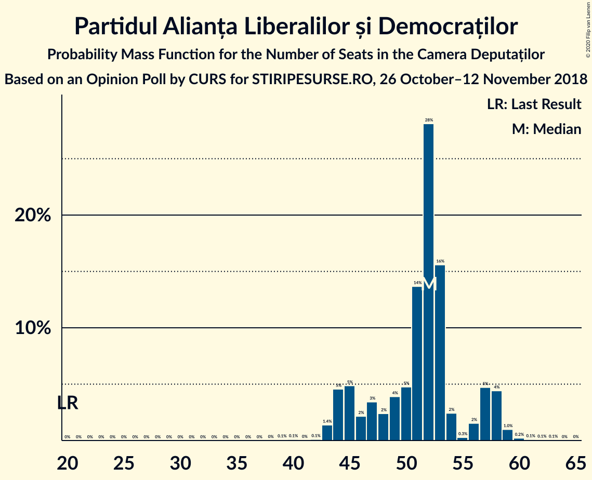
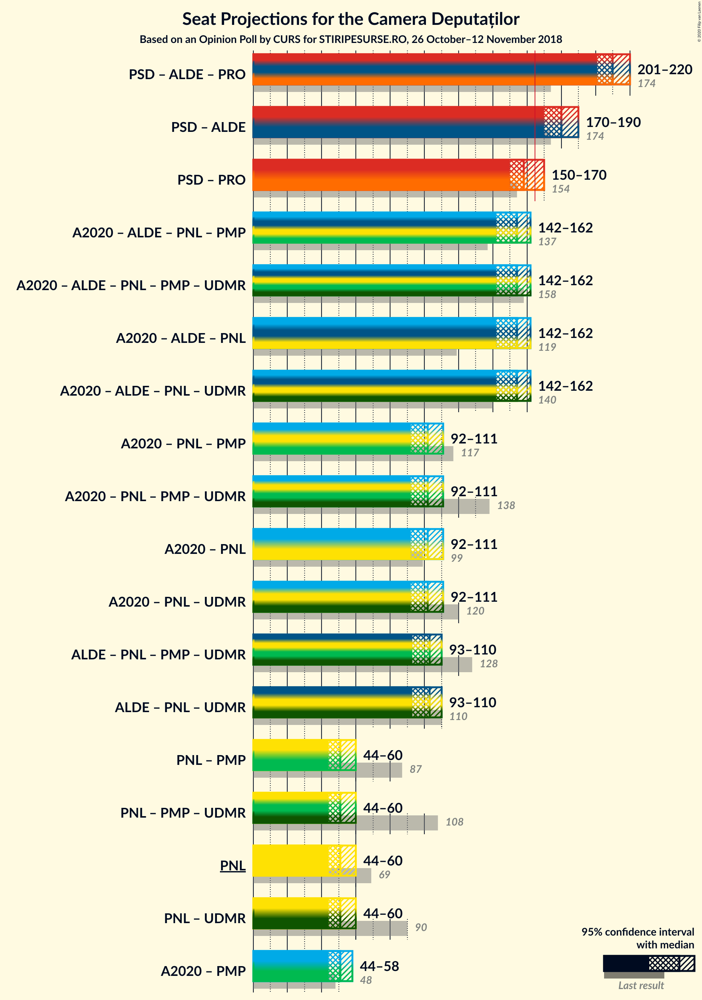
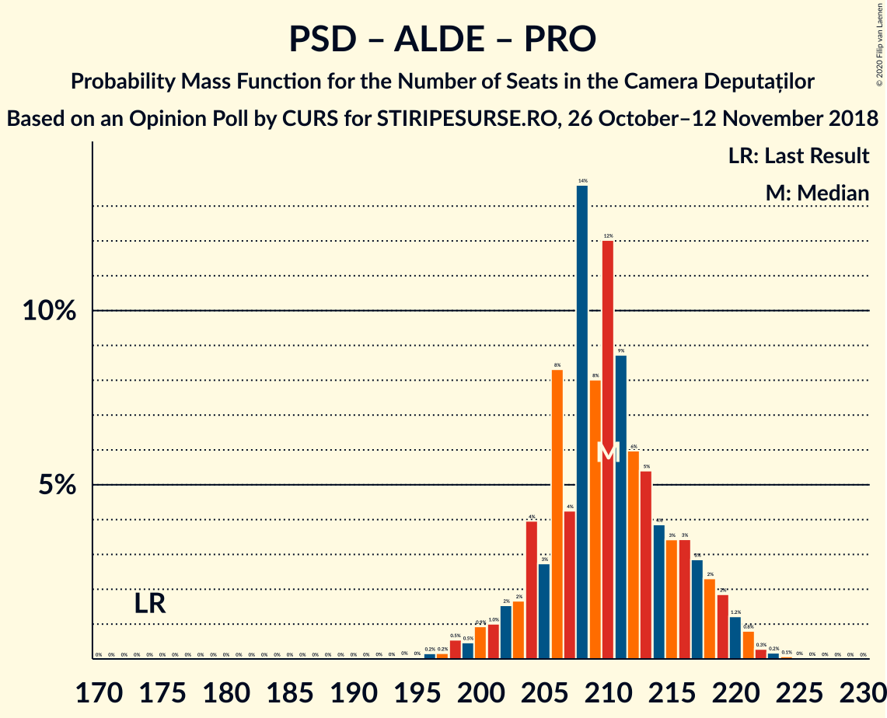
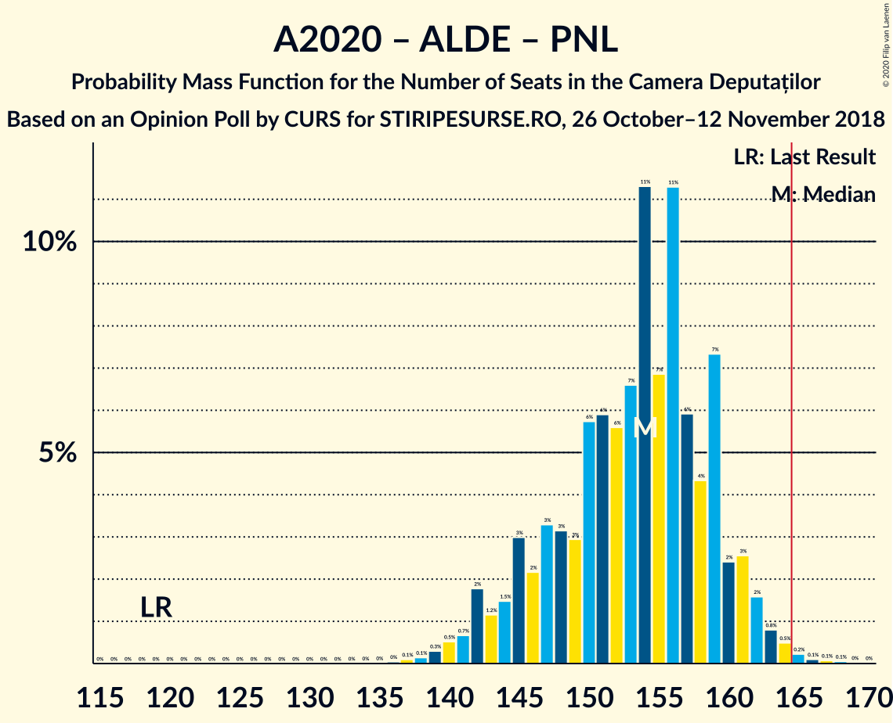
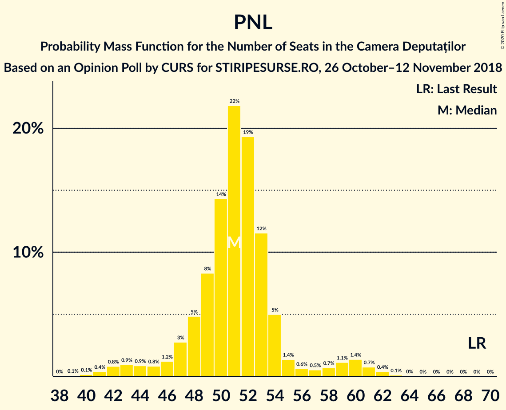

# Opinion Poll by CURS for STIRIPESURSE.RO, 26 October–12 November 2018

<a href="#voting-intentions">Voting Intentions</a> | <a href="#seats">Seats</a> | <a href="#coalitions">Coalitions</a> | <a href="#technical-information">Technical Information</a>

## Voting Intentions

### Confidence Intervals

| Party | Last Result | Poll Result | 80% Confidence Interval | 90% Confidence Interval | 95% Confidence Interval | 99% Confidence Interval |
|:-----:|:-----------:|:-----------:|:-----------------------:|:-----------------------:|:-----------------------:|:-----------------------:|
| Partidul Social Democrat | 45.5% | 38.0% | 36.1–39.9% |35.5–40.4% |35.1–40.9% |34.2–41.9% |
| Partidul Alianța Liberalilor și Democraților | 5.6% | 15.0% | 13.7–16.5% |13.3–16.9% |13.0–17.3% |12.4–18.0% |
| Partidul Național Liberal | 20.0% | 15.0% | 13.7–16.5% |13.3–16.9% |13.0–17.3% |12.4–18.0% |
| Alianța 2020 USR-PLUS | 8.9% | 15.0% | 13.7–16.5% |13.3–16.9% |13.0–17.3% |12.4–18.0% |
| PRO România | 0.0% | 9.0% | 8.0–10.2% |7.7–10.6% |7.4–10.9% |7.0–11.5% |
| Partidul Mișcarea Populară | 5.4% | 3.0% | 2.4–3.8% |2.3–4.0% |2.1–4.2% |1.9–4.6% |

*Note:* The poll result column reflects the actual value used in the calculations. Published results may vary slightly, and in addition be rounded to fewer digits.

## Seats

### Confidence Intervals

| Party | Last Result | Median | 80% Confidence Interval | 90% Confidence Interval | 95% Confidence Interval | 99% Confidence Interval |
|:-----:|:-----------:|:------:|:-----------------------:|:-----------------------:|:-----------------------:|:-----------------------:|
| <a href="#partidul-social-democrat">Partidul Social Democrat</a> | 154 | 129 | 123–135 |122–137 |120–138 |117–140 |
| <a href="#partidul-alianța-liberalilor-și-democraților">Partidul Alianța Liberalilor și Democraților</a> | 20 | 51 | 47–53 |46–56 |46–57 |43–60 |
| <a href="#partidul-național-liberal">Partidul Național Liberal</a> | 69 | 51 | 49–53 |47–57 |44–59 |41–60 |
| <a href="#alianța-2020-usr-plus">Alianța 2020 USR-PLUS</a> | 30 | 50 | 48–56 |46–57 |44–58 |41–61 |
| <a href="#pro-românia">PRO România</a> | 0 | 31 | 27–34 |26–34 |26–36 |24–38 |
| <a href="#partidul-mișcarea-populară">Partidul Mișcarea Populară</a> | 18 | 0 | 0 |0 |0 |0 |

### Partidul Social Democrat

*For a full overview of the results for this party, see the [Partidul Social Democrat](party-partidulsocialdemocrat.html) page.*

| Number of Seats | Probability | Accumulated | Special Marks |
|:---------------:|:-----------:|:-----------:|:-------------:|
| 113 | 0% | 100% |  |
| 114 | 0% | 99.9% |  |
| 115 | 0.1% | 99.9% |  |
| 116 | 0.2% | 99.8% |  |
| 117 | 0.3% | 99.7% |  |
| 118 | 0.6% | 99.4% |  |
| 119 | 0.7% | 98.8% |  |
| 120 | 1.2% | 98% |  |
| 121 | 2% | 97% |  |
| 122 | 4% | 95% |  |
| 123 | 6% | 92% |  |
| 124 | 3% | 86% |  |
| 125 | 7% | 83% |  |
| 126 | 4% | 76% |  |
| 127 | 12% | 71% |  |
| 128 | 6% | 59% |  |
| 129 | 11% | 53% | Median |
| 130 | 7% | 43% |  |
| 131 | 3% | 36% |  |
| 132 | 5% | 33% |  |
| 133 | 8% | 28% |  |
| 134 | 9% | 20% |  |
| 135 | 3% | 12% |  |
| 136 | 3% | 8% |  |
| 137 | 2% | 5% |  |
| 138 | 1.5% | 3% |  |
| 139 | 0.7% | 2% |  |
| 140 | 0.7% | 1.1% |  |
| 141 | 0.2% | 0.5% |  |
| 142 | 0.1% | 0.3% |  |
| 143 | 0.1% | 0.2% |  |
| 144 | 0.1% | 0.1% |  |
| 145 | 0% | 0.1% |  |
| 146 | 0% | 0% |  |
| 147 | 0% | 0% |  |
| 148 | 0% | 0% |  |
| 149 | 0% | 0% |  |
| 150 | 0% | 0% |  |
| 151 | 0% | 0% |  |
| 152 | 0% | 0% |  |
| 153 | 0% | 0% |  |
| 154 | 0% | 0% | Last Result |

### Partidul Alianța Liberalilor și Democraților

*For a full overview of the results for this party, see the [Partidul Alianța Liberalilor și Democraților](party-partidulalianțaliberalilorșidemocraților.html) page.*

| Number of Seats | Probability | Accumulated | Special Marks |
|:---------------:|:-----------:|:-----------:|:-------------:|
| 20 | 0% | 100% | Last Result |
| 21 | 0% | 100% |  |
| 22 | 0% | 100% |  |
| 23 | 0% | 100% |  |
| 24 | 0% | 100% |  |
| 25 | 0% | 100% |  |
| 26 | 0% | 100% |  |
| 27 | 0% | 100% |  |
| 28 | 0% | 100% |  |
| 29 | 0% | 100% |  |
| 30 | 0% | 100% |  |
| 31 | 0% | 100% |  |
| 32 | 0% | 100% |  |
| 33 | 0% | 100% |  |
| 34 | 0% | 100% |  |
| 35 | 0% | 100% |  |
| 36 | 0% | 100% |  |
| 37 | 0% | 100% |  |
| 38 | 0% | 100% |  |
| 39 | 0% | 100% |  |
| 40 | 0% | 99.9% |  |
| 41 | 0% | 99.9% |  |
| 42 | 0.2% | 99.9% |  |
| 43 | 1.3% | 99.7% |  |
| 44 | 0.4% | 98% |  |
| 45 | 0.2% | 98% |  |
| 46 | 6% | 98% |  |
| 47 | 7% | 92% |  |
| 48 | 1.1% | 85% |  |
| 49 | 0.1% | 84% |  |
| 50 | 4% | 83% |  |
| 51 | 35% | 80% | Median |
| 52 | 35% | 45% |  |
| 53 | 2% | 10% |  |
| 54 | 0% | 8% |  |
| 55 | 0.6% | 8% |  |
| 56 | 3% | 7% |  |
| 57 | 3% | 4% |  |
| 58 | 0.2% | 1.3% |  |
| 59 | 0.2% | 1.1% |  |
| 60 | 0.7% | 0.9% |  |
| 61 | 0.1% | 0.2% |  |
| 62 | 0% | 0.1% |  |
| 63 | 0% | 0.1% |  |
| 64 | 0% | 0.1% |  |
| 65 | 0% | 0.1% |  |
| 66 | 0% | 0% |  |

### Partidul Național Liberal

*For a full overview of the results for this party, see the [Partidul Național Liberal](party-partidulnaționalliberal.html) page.*

| Number of Seats | Probability | Accumulated | Special Marks |
|:---------------:|:-----------:|:-----------:|:-------------:|
| 40 | 0.1% | 100% |  |
| 41 | 0.4% | 99.9% |  |
| 42 | 1.2% | 99.5% |  |
| 43 | 0.5% | 98% |  |
| 44 | 0.6% | 98% |  |
| 45 | 1.1% | 97% |  |
| 46 | 0.7% | 96% |  |
| 47 | 0.7% | 95% |  |
| 48 | 3% | 95% |  |
| 49 | 10% | 91% |  |
| 50 | 25% | 82% |  |
| 51 | 24% | 57% | Median |
| 52 | 17% | 33% |  |
| 53 | 7% | 16% |  |
| 54 | 3% | 9% |  |
| 55 | 0.9% | 6% |  |
| 56 | 0.4% | 5% |  |
| 57 | 0.4% | 5% |  |
| 58 | 0.6% | 5% |  |
| 59 | 2% | 4% |  |
| 60 | 2% | 2% |  |
| 61 | 0.2% | 0.3% |  |
| 62 | 0.1% | 0.2% |  |
| 63 | 0.1% | 0.1% |  |
| 64 | 0% | 0% |  |
| 65 | 0% | 0% |  |
| 66 | 0% | 0% |  |
| 67 | 0% | 0% |  |
| 68 | 0% | 0% |  |
| 69 | 0% | 0% | Last Result |

### Alianța 2020 USR-PLUS

*For a full overview of the results for this party, see the [Alianța 2020 USR-PLUS](party-alianța2020usr-plus.html) page.*

| Number of Seats | Probability | Accumulated | Special Marks |
|:---------------:|:-----------:|:-----------:|:-------------:|
| 30 | 0% | 100% | Last Result |
| 31 | 0% | 100% |  |
| 32 | 0% | 100% |  |
| 33 | 0% | 100% |  |
| 34 | 0% | 100% |  |
| 35 | 0% | 100% |  |
| 36 | 0% | 100% |  |
| 37 | 0% | 100% |  |
| 38 | 0% | 100% |  |
| 39 | 0% | 100% |  |
| 40 | 0.2% | 100% |  |
| 41 | 0.2% | 99.7% |  |
| 42 | 0.3% | 99.5% |  |
| 43 | 0.6% | 99.1% |  |
| 44 | 2% | 98.6% |  |
| 45 | 1.2% | 96% |  |
| 46 | 1.0% | 95% |  |
| 47 | 2% | 94% |  |
| 48 | 4% | 92% |  |
| 49 | 22% | 88% |  |
| 50 | 19% | 66% | Median |
| 51 | 22% | 48% |  |
| 52 | 11% | 26% |  |
| 53 | 2% | 15% |  |
| 54 | 0.9% | 13% |  |
| 55 | 0.8% | 12% |  |
| 56 | 3% | 11% |  |
| 57 | 5% | 8% |  |
| 58 | 0.9% | 3% |  |
| 59 | 0.7% | 2% |  |
| 60 | 0.7% | 2% |  |
| 61 | 0.8% | 0.9% |  |
| 62 | 0.1% | 0.1% |  |
| 63 | 0% | 0% |  |

### PRO România

*For a full overview of the results for this party, see the [PRO România](party-proromânia.html) page.*

| Number of Seats | Probability | Accumulated | Special Marks |
|:---------------:|:-----------:|:-----------:|:-------------:|
| 0 | 0% | 100% | Last Result |
| 1 | 0% | 100% |  |
| 2 | 0% | 100% |  |
| 3 | 0% | 100% |  |
| 4 | 0% | 100% |  |
| 5 | 0% | 100% |  |
| 6 | 0% | 100% |  |
| 7 | 0% | 100% |  |
| 8 | 0% | 100% |  |
| 9 | 0% | 100% |  |
| 10 | 0% | 100% |  |
| 11 | 0% | 100% |  |
| 12 | 0% | 100% |  |
| 13 | 0% | 100% |  |
| 14 | 0% | 100% |  |
| 15 | 0% | 100% |  |
| 16 | 0% | 100% |  |
| 17 | 0% | 100% |  |
| 18 | 0% | 100% |  |
| 19 | 0% | 100% |  |
| 20 | 0% | 100% |  |
| 21 | 0% | 100% |  |
| 22 | 0.1% | 100% |  |
| 23 | 0.2% | 99.9% |  |
| 24 | 0.5% | 99.7% |  |
| 25 | 2% | 99.2% |  |
| 26 | 3% | 98% |  |
| 27 | 7% | 94% |  |
| 28 | 13% | 87% |  |
| 29 | 13% | 73% |  |
| 30 | 7% | 60% |  |
| 31 | 25% | 53% | Median |
| 32 | 9% | 28% |  |
| 33 | 9% | 19% |  |
| 34 | 6% | 10% |  |
| 35 | 2% | 4% |  |
| 36 | 2% | 3% |  |
| 37 | 0.5% | 1.2% |  |
| 38 | 0.4% | 0.7% |  |
| 39 | 0.2% | 0.3% |  |
| 40 | 0.1% | 0.2% |  |
| 41 | 0% | 0.1% |  |
| 42 | 0% | 0% |  |

### Partidul Mișcarea Populară

*For a full overview of the results for this party, see the [Partidul Mișcarea Populară](party-partidulmișcareapopulară.html) page.*

| Number of Seats | Probability | Accumulated | Special Marks |
|:---------------:|:-----------:|:-----------:|:-------------:|
| 0 | 99.9% | 100% | Median |
| 1 | 0% | 0.1% |  |
| 2 | 0% | 0.1% |  |
| 3 | 0% | 0.1% |  |
| 4 | 0% | 0.1% |  |
| 5 | 0% | 0.1% |  |
| 6 | 0% | 0.1% |  |
| 7 | 0% | 0.1% |  |
| 8 | 0% | 0.1% |  |
| 9 | 0% | 0.1% |  |
| 10 | 0% | 0.1% |  |
| 11 | 0% | 0.1% |  |
| 12 | 0% | 0.1% |  |
| 13 | 0% | 0.1% |  |
| 14 | 0% | 0.1% |  |
| 15 | 0% | 0.1% |  |
| 16 | 0% | 0.1% |  |
| 17 | 0% | 0% |  |
| 18 | 0% | 0% | Last Result |

## Coalitions

### Confidence Intervals

| Coalition | Last Result | Median | Majority? | 80% Confidence Interval | 90% Confidence Interval | 95% Confidence Interval | 99% Confidence Interval |
|:---------:|:-----------:|:------:|:---------:|:-----------------------:|:-----------------------:|:-----------------------:|:-----------------------:|
| Partidul Social Democrat – Partidul Alianța Liberalilor și Democraților – PRO România | 174 | 211 | 100% | 204–214 | 202–217 | 201–220 | 198–222 |
| Partidul Social Democrat – Partidul Alianța Liberalilor și Democraților | 174 | 180 | 99.8% | 174–186 | 172–188 | 171–189 | 167–192 |
| Partidul Social Democrat – PRO România | 154 | 159 | 3% | 156–163 | 154–164 | 153–167 | 147–172 |
| Alianța 2020 USR-PLUS – Partidul Alianța Liberalilor și Democraților – Partidul Național Liberal – Partidul Mișcarea Populară | 137 | 153 | 0.4% | 149–156 | 148–158 | 145–159 | 140–165 |
| Alianța 2020 USR-PLUS – Partidul Alianța Liberalilor și Democraților – Partidul Național Liberal | 119 | 153 | 0.4% | 149–156 | 148–158 | 145–159 | 140–165 |
| Alianța 2020 USR-PLUS – Partidul Național Liberal – Partidul Mișcarea Populară | 117 | 101 | 0% | 98–108 | 95–110 | 92–111 | 90–114 |
| Alianța 2020 USR-PLUS – Partidul Național Liberal | 99 | 101 | 0% | 98–108 | 95–110 | 92–111 | 90–114 |
| Partidul Național Liberal – Partidul Mișcarea Populară | 87 | 51 | 0% | 49–53 | 47–57 | 44–59 | 41–60 |
| Partidul Național Liberal | 69 | 51 | 0% | 49–53 | 47–57 | 44–59 | 41–60 |
| Alianța 2020 USR-PLUS – Partidul Mișcarea Populară | 48 | 50 | 0% | 48–56 | 46–57 | 44–58 | 41–61 |

### Partidul Social Democrat – Partidul Alianța Liberalilor și Democraților – PRO România

| Number of Seats | Probability | Accumulated | Special Marks |
|:---------------:|:-----------:|:-----------:|:-------------:|
| 174 | 0% | 100% | Last Result |
| 175 | 0% | 100% |  |
| 176 | 0% | 100% |  |
| 177 | 0% | 100% |  |
| 178 | 0% | 100% |  |
| 179 | 0% | 100% |  |
| 180 | 0% | 100% |  |
| 181 | 0% | 100% |  |
| 182 | 0% | 100% |  |
| 183 | 0% | 100% |  |
| 184 | 0% | 100% |  |
| 185 | 0% | 100% |  |
| 186 | 0% | 100% |  |
| 187 | 0% | 100% |  |
| 188 | 0% | 100% |  |
| 189 | 0% | 100% |  |
| 190 | 0% | 100% |  |
| 191 | 0% | 100% |  |
| 192 | 0% | 100% |  |
| 193 | 0% | 100% |  |
| 194 | 0% | 100% |  |
| 195 | 0% | 100% |  |
| 196 | 0% | 99.9% |  |
| 197 | 0.1% | 99.9% |  |
| 198 | 0.5% | 99.8% |  |
| 199 | 0.4% | 99.3% |  |
| 200 | 0.5% | 98.9% |  |
| 201 | 2% | 98% |  |
| 202 | 3% | 97% |  |
| 203 | 3% | 94% |  |
| 204 | 2% | 91% |  |
| 205 | 1.5% | 89% |  |
| 206 | 3% | 87% |  |
| 207 | 2% | 85% |  |
| 208 | 10% | 83% |  |
| 209 | 7% | 73% |  |
| 210 | 15% | 66% |  |
| 211 | 9% | 50% | Median |
| 212 | 9% | 42% |  |
| 213 | 16% | 32% |  |
| 214 | 6% | 16% |  |
| 215 | 3% | 10% |  |
| 216 | 0.9% | 6% |  |
| 217 | 1.0% | 6% |  |
| 218 | 1.2% | 5% |  |
| 219 | 0.5% | 3% |  |
| 220 | 2% | 3% |  |
| 221 | 0.3% | 1.0% |  |
| 222 | 0.3% | 0.7% |  |
| 223 | 0.2% | 0.4% |  |
| 224 | 0.1% | 0.2% |  |
| 225 | 0% | 0.1% |  |
| 226 | 0% | 0% |  |

### Partidul Social Democrat – Partidul Alianța Liberalilor și Democraților

| Number of Seats | Probability | Accumulated | Special Marks |
|:---------------:|:-----------:|:-----------:|:-------------:|
| 163 | 0% | 100% |  |
| 164 | 0.1% | 99.9% |  |
| 165 | 0.1% | 99.9% |  |
| 166 | 0.1% | 99.8% | Majority |
| 167 | 0.4% | 99.7% |  |
| 168 | 0.4% | 99.3% |  |
| 169 | 0.5% | 98.9% |  |
| 170 | 0.7% | 98% |  |
| 171 | 1.0% | 98% |  |
| 172 | 2% | 97% |  |
| 173 | 3% | 94% |  |
| 174 | 5% | 92% | Last Result |
| 175 | 7% | 86% |  |
| 176 | 5% | 79% |  |
| 177 | 6% | 75% |  |
| 178 | 3% | 68% |  |
| 179 | 12% | 65% |  |
| 180 | 11% | 54% | Median |
| 181 | 7% | 43% |  |
| 182 | 2% | 36% |  |
| 183 | 4% | 34% |  |
| 184 | 8% | 30% |  |
| 185 | 9% | 22% |  |
| 186 | 3% | 13% |  |
| 187 | 4% | 10% |  |
| 188 | 3% | 6% |  |
| 189 | 1.2% | 3% |  |
| 190 | 0.8% | 2% |  |
| 191 | 0.4% | 1.0% |  |
| 192 | 0.3% | 0.6% |  |
| 193 | 0.2% | 0.3% |  |
| 194 | 0.1% | 0.2% |  |
| 195 | 0.1% | 0.1% |  |
| 196 | 0% | 0.1% |  |
| 197 | 0% | 0% |  |

### Partidul Social Democrat – PRO România

| Number of Seats | Probability | Accumulated | Special Marks |
|:---------------:|:-----------:|:-----------:|:-------------:|
| 142 | 0% | 100% |  |
| 143 | 0% | 99.9% |  |
| 144 | 0.1% | 99.9% |  |
| 145 | 0.1% | 99.8% |  |
| 146 | 0.1% | 99.7% |  |
| 147 | 0.2% | 99.6% |  |
| 148 | 0.2% | 99.4% |  |
| 149 | 0.3% | 99.2% |  |
| 150 | 0.5% | 98.9% |  |
| 151 | 0.4% | 98% |  |
| 152 | 0.4% | 98% |  |
| 153 | 1.0% | 98% |  |
| 154 | 2% | 97% | Last Result |
| 155 | 4% | 94% |  |
| 156 | 12% | 90% |  |
| 157 | 9% | 79% |  |
| 158 | 15% | 69% |  |
| 159 | 8% | 55% |  |
| 160 | 7% | 47% | Median |
| 161 | 10% | 40% |  |
| 162 | 16% | 30% |  |
| 163 | 6% | 14% |  |
| 164 | 4% | 8% |  |
| 165 | 2% | 5% |  |
| 166 | 0.4% | 3% | Majority |
| 167 | 0.4% | 3% |  |
| 168 | 0.3% | 2% |  |
| 169 | 0.4% | 2% |  |
| 170 | 0.5% | 1.5% |  |
| 171 | 0.5% | 1.0% |  |
| 172 | 0.1% | 0.5% |  |
| 173 | 0.1% | 0.4% |  |
| 174 | 0.1% | 0.3% |  |
| 175 | 0.1% | 0.2% |  |
| 176 | 0.1% | 0.1% |  |
| 177 | 0% | 0% |  |

### Alianța 2020 USR-PLUS – Partidul Alianța Liberalilor și Democraților – Partidul Național Liberal – Partidul Mișcarea Populară

| Number of Seats | Probability | Accumulated | Special Marks |
|:---------------:|:-----------:|:-----------:|:-------------:|
| 136 | 0.1% | 100% |  |
| 137 | 0.1% | 99.9% | Last Result |
| 138 | 0.1% | 99.8% |  |
| 139 | 0.1% | 99.7% |  |
| 140 | 0.1% | 99.6% |  |
| 141 | 0.5% | 99.5% |  |
| 142 | 0.5% | 99.0% |  |
| 143 | 0.4% | 98.5% |  |
| 144 | 0.3% | 98% |  |
| 145 | 0.4% | 98% |  |
| 146 | 0.4% | 97% |  |
| 147 | 2% | 97% |  |
| 148 | 4% | 95% |  |
| 149 | 6% | 92% |  |
| 150 | 16% | 86% |  |
| 151 | 10% | 70% |  |
| 152 | 7% | 60% | Median |
| 153 | 8% | 53% |  |
| 154 | 15% | 45% |  |
| 155 | 9% | 31% |  |
| 156 | 12% | 21% |  |
| 157 | 4% | 10% |  |
| 158 | 2% | 6% |  |
| 159 | 1.0% | 3% |  |
| 160 | 0.4% | 2% |  |
| 161 | 0.4% | 2% |  |
| 162 | 0.5% | 2% |  |
| 163 | 0.3% | 1.1% |  |
| 164 | 0.2% | 0.8% |  |
| 165 | 0.2% | 0.6% |  |
| 166 | 0.1% | 0.4% | Majority |
| 167 | 0.1% | 0.3% |  |
| 168 | 0.1% | 0.2% |  |
| 169 | 0% | 0.1% |  |
| 170 | 0% | 0.1% |  |
| 171 | 0% | 0% |  |

### Alianța 2020 USR-PLUS – Partidul Alianța Liberalilor și Democraților – Partidul Național Liberal

| Number of Seats | Probability | Accumulated | Special Marks |
|:---------------:|:-----------:|:-----------:|:-------------:|
| 119 | 0% | 100% | Last Result |
| 120 | 0% | 100% |  |
| 121 | 0% | 100% |  |
| 122 | 0% | 100% |  |
| 123 | 0% | 100% |  |
| 124 | 0% | 100% |  |
| 125 | 0% | 100% |  |
| 126 | 0% | 100% |  |
| 127 | 0% | 100% |  |
| 128 | 0% | 100% |  |
| 129 | 0% | 100% |  |
| 130 | 0% | 100% |  |
| 131 | 0% | 100% |  |
| 132 | 0% | 100% |  |
| 133 | 0% | 100% |  |
| 134 | 0% | 100% |  |
| 135 | 0% | 100% |  |
| 136 | 0.1% | 100% |  |
| 137 | 0.1% | 99.9% |  |
| 138 | 0.1% | 99.8% |  |
| 139 | 0.1% | 99.7% |  |
| 140 | 0.1% | 99.6% |  |
| 141 | 0.5% | 99.5% |  |
| 142 | 0.5% | 99.0% |  |
| 143 | 0.4% | 98% |  |
| 144 | 0.3% | 98% |  |
| 145 | 0.4% | 98% |  |
| 146 | 0.4% | 97% |  |
| 147 | 2% | 97% |  |
| 148 | 4% | 95% |  |
| 149 | 6% | 92% |  |
| 150 | 16% | 86% |  |
| 151 | 10% | 70% |  |
| 152 | 7% | 60% | Median |
| 153 | 8% | 53% |  |
| 154 | 15% | 45% |  |
| 155 | 9% | 31% |  |
| 156 | 12% | 21% |  |
| 157 | 4% | 9% |  |
| 158 | 2% | 6% |  |
| 159 | 1.0% | 3% |  |
| 160 | 0.4% | 2% |  |
| 161 | 0.4% | 2% |  |
| 162 | 0.5% | 2% |  |
| 163 | 0.3% | 1.1% |  |
| 164 | 0.2% | 0.8% |  |
| 165 | 0.2% | 0.6% |  |
| 166 | 0.1% | 0.4% | Majority |
| 167 | 0.1% | 0.3% |  |
| 168 | 0.1% | 0.2% |  |
| 169 | 0% | 0.1% |  |
| 170 | 0% | 0.1% |  |
| 171 | 0% | 0% |  |

### Alianța 2020 USR-PLUS – Partidul Național Liberal – Partidul Mișcarea Populară

| Number of Seats | Probability | Accumulated | Special Marks |
|:---------------:|:-----------:|:-----------:|:-------------:|
| 87 | 0% | 100% |  |
| 88 | 0.1% | 99.9% |  |
| 89 | 0.2% | 99.8% |  |
| 90 | 0.3% | 99.6% |  |
| 91 | 0.3% | 99.3% |  |
| 92 | 2% | 99.0% |  |
| 93 | 0.5% | 97% |  |
| 94 | 1.2% | 97% |  |
| 95 | 1.0% | 95% |  |
| 96 | 0.9% | 94% |  |
| 97 | 3% | 94% |  |
| 98 | 6% | 90% |  |
| 99 | 16% | 84% |  |
| 100 | 9% | 68% |  |
| 101 | 9% | 58% | Median |
| 102 | 15% | 50% |  |
| 103 | 7% | 34% |  |
| 104 | 10% | 27% |  |
| 105 | 2% | 17% |  |
| 106 | 3% | 15% |  |
| 107 | 1.5% | 13% |  |
| 108 | 2% | 11% |  |
| 109 | 3% | 9% |  |
| 110 | 3% | 6% |  |
| 111 | 2% | 3% |  |
| 112 | 0.5% | 2% |  |
| 113 | 0.4% | 1.1% |  |
| 114 | 0.5% | 0.7% |  |
| 115 | 0.1% | 0.2% |  |
| 116 | 0% | 0.1% |  |
| 117 | 0% | 0.1% | Last Result |
| 118 | 0% | 0% |  |

### Alianța 2020 USR-PLUS – Partidul Național Liberal

| Number of Seats | Probability | Accumulated | Special Marks |
|:---------------:|:-----------:|:-----------:|:-------------:|
| 87 | 0% | 100% |  |
| 88 | 0.1% | 99.9% |  |
| 89 | 0.2% | 99.8% |  |
| 90 | 0.3% | 99.6% |  |
| 91 | 0.3% | 99.3% |  |
| 92 | 2% | 99.0% |  |
| 93 | 0.5% | 97% |  |
| 94 | 1.2% | 97% |  |
| 95 | 1.0% | 95% |  |
| 96 | 1.0% | 94% |  |
| 97 | 3% | 93% |  |
| 98 | 6% | 90% |  |
| 99 | 16% | 84% | Last Result |
| 100 | 9% | 68% |  |
| 101 | 9% | 58% | Median |
| 102 | 15% | 49% |  |
| 103 | 7% | 34% |  |
| 104 | 10% | 27% |  |
| 105 | 2% | 17% |  |
| 106 | 3% | 15% |  |
| 107 | 1.5% | 13% |  |
| 108 | 2% | 11% |  |
| 109 | 3% | 9% |  |
| 110 | 3% | 6% |  |
| 111 | 2% | 3% |  |
| 112 | 0.5% | 2% |  |
| 113 | 0.4% | 1.1% |  |
| 114 | 0.5% | 0.7% |  |
| 115 | 0.1% | 0.2% |  |
| 116 | 0% | 0.1% |  |
| 117 | 0% | 0.1% |  |
| 118 | 0% | 0% |  |

### Partidul Național Liberal – Partidul Mișcarea Populară

| Number of Seats | Probability | Accumulated | Special Marks |
|:---------------:|:-----------:|:-----------:|:-------------:|
| 40 | 0.1% | 100% |  |
| 41 | 0.4% | 99.9% |  |
| 42 | 1.2% | 99.5% |  |
| 43 | 0.5% | 98% |  |
| 44 | 0.6% | 98% |  |
| 45 | 1.1% | 97% |  |
| 46 | 0.7% | 96% |  |
| 47 | 0.7% | 95% |  |
| 48 | 3% | 95% |  |
| 49 | 10% | 92% |  |
| 50 | 25% | 82% |  |
| 51 | 24% | 57% | Median |
| 52 | 17% | 33% |  |
| 53 | 7% | 16% |  |
| 54 | 3% | 9% |  |
| 55 | 0.9% | 6% |  |
| 56 | 0.4% | 6% |  |
| 57 | 0.4% | 5% |  |
| 58 | 0.6% | 5% |  |
| 59 | 2% | 4% |  |
| 60 | 2% | 2% |  |
| 61 | 0.2% | 0.4% |  |
| 62 | 0.1% | 0.2% |  |
| 63 | 0.1% | 0.1% |  |
| 64 | 0% | 0.1% |  |
| 65 | 0% | 0% |  |
| 66 | 0% | 0% |  |
| 67 | 0% | 0% |  |
| 68 | 0% | 0% |  |
| 69 | 0% | 0% |  |
| 70 | 0% | 0% |  |
| 71 | 0% | 0% |  |
| 72 | 0% | 0% |  |
| 73 | 0% | 0% |  |
| 74 | 0% | 0% |  |
| 75 | 0% | 0% |  |
| 76 | 0% | 0% |  |
| 77 | 0% | 0% |  |
| 78 | 0% | 0% |  |
| 79 | 0% | 0% |  |
| 80 | 0% | 0% |  |
| 81 | 0% | 0% |  |
| 82 | 0% | 0% |  |
| 83 | 0% | 0% |  |
| 84 | 0% | 0% |  |
| 85 | 0% | 0% |  |
| 86 | 0% | 0% |  |
| 87 | 0% | 0% | Last Result |

### Partidul Național Liberal

| Number of Seats | Probability | Accumulated | Special Marks |
|:---------------:|:-----------:|:-----------:|:-------------:|
| 40 | 0.1% | 100% |  |
| 41 | 0.4% | 99.9% |  |
| 42 | 1.2% | 99.5% |  |
| 43 | 0.5% | 98% |  |
| 44 | 0.6% | 98% |  |
| 45 | 1.1% | 97% |  |
| 46 | 0.7% | 96% |  |
| 47 | 0.7% | 95% |  |
| 48 | 3% | 95% |  |
| 49 | 10% | 91% |  |
| 50 | 25% | 82% |  |
| 51 | 24% | 57% | Median |
| 52 | 17% | 33% |  |
| 53 | 7% | 16% |  |
| 54 | 3% | 9% |  |
| 55 | 0.9% | 6% |  |
| 56 | 0.4% | 5% |  |
| 57 | 0.4% | 5% |  |
| 58 | 0.6% | 5% |  |
| 59 | 2% | 4% |  |
| 60 | 2% | 2% |  |
| 61 | 0.2% | 0.3% |  |
| 62 | 0.1% | 0.2% |  |
| 63 | 0.1% | 0.1% |  |
| 64 | 0% | 0% |  |
| 65 | 0% | 0% |  |
| 66 | 0% | 0% |  |
| 67 | 0% | 0% |  |
| 68 | 0% | 0% |  |
| 69 | 0% | 0% | Last Result |

### Alianța 2020 USR-PLUS – Partidul Mișcarea Populară

| Number of Seats | Probability | Accumulated | Special Marks |
|:---------------:|:-----------:|:-----------:|:-------------:|
| 40 | 0.2% | 100% |  |
| 41 | 0.2% | 99.7% |  |
| 42 | 0.3% | 99.5% |  |
| 43 | 0.6% | 99.1% |  |
| 44 | 2% | 98.6% |  |
| 45 | 1.2% | 96% |  |
| 46 | 0.9% | 95% |  |
| 47 | 2% | 94% |  |
| 48 | 4% | 92% | Last Result |
| 49 | 22% | 88% |  |
| 50 | 19% | 66% | Median |
| 51 | 22% | 48% |  |
| 52 | 11% | 26% |  |
| 53 | 2% | 15% |  |
| 54 | 0.9% | 13% |  |
| 55 | 0.8% | 12% |  |
| 56 | 3% | 11% |  |
| 57 | 5% | 8% |  |
| 58 | 0.9% | 3% |  |
| 59 | 0.7% | 2% |  |
| 60 | 0.7% | 2% |  |
| 61 | 0.8% | 1.0% |  |
| 62 | 0.1% | 0.2% |  |
| 63 | 0% | 0.1% |  |
| 64 | 0% | 0.1% |  |
| 65 | 0% | 0% |  |

## Technical Information

### Opinion Poll

+ **Polling firm:** CURS
+ **Commissioner(s):** STIRIPESURSE.RO
+ **Fieldwork period:** 26 October–12 November 2018

### Calculations

+ **Sample size:** 1067
+ **Simulations done:** 131,072
+ **Error estimate:** 0.56%

