# Opinion Poll by IMAS for Europa FM, 4–20 December 2018

<a href="#voting-intentions">Voting Intentions</a> | <a href="#seats">Seats</a> | <a href="#coalitions">Coalitions</a> | <a href="#technical-information">Technical Information</a>

## Voting Intentions

### Confidence Intervals

| Party | Last Result | Poll Result | 80% Confidence Interval | 90% Confidence Interval | 95% Confidence Interval | 99% Confidence Interval |
|:-----:|:-----------:|:-----------:|:-----------------------:|:-----------------------:|:-----------------------:|:-----------------------:|
| Partidul Național Liberal | 20.0% | 26.1% | 24.4–28.0% |23.9–28.5% |23.5–28.9% |22.7–29.8% |
| Partidul Social Democrat | 45.5% | 25.2% | 23.5–27.1% |23.1–27.6% |22.7–28.0% |21.9–28.9% |
| Alianța 2020 USR-PLUS | 8.9% | 19.6% | 18.1–21.3% |17.6–21.8% |17.3–22.2% |16.6–23.0% |
| Partidul Alianța Liberalilor și Democraților | 5.6% | 9.6% | 8.5–10.9% |8.2–11.3% |7.9–11.6% |7.4–12.2% |
| PRO România | 0.0% | 6.2% | 5.3–7.3% |5.1–7.6% |4.9–7.9% |4.5–8.5% |
| Uniunea Democrată Maghiară din România | 6.2% | 4.6% | 3.8–5.5% |3.6–5.8% |3.4–6.0% |3.1–6.5% |
| Partidul Mișcarea Populară | 5.4% | 2.5% | 2.0–3.2% |1.8–3.4% |1.7–3.6% |1.5–4.0% |

*Note:* The poll result column reflects the actual value used in the calculations. Published results may vary slightly, and in addition be rounded to fewer digits.

## Seats

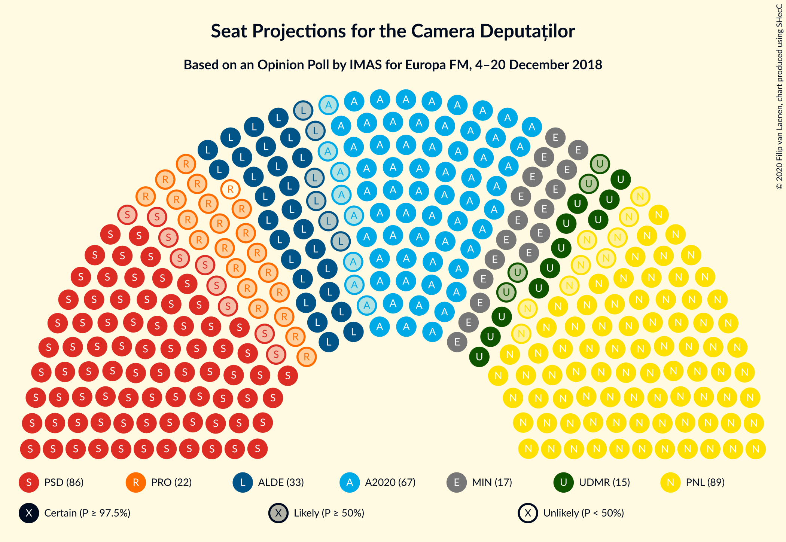

### Confidence Intervals

| Party | Last Result | Median | 80% Confidence Interval | 90% Confidence Interval | 95% Confidence Interval | 99% Confidence Interval |
|:-----:|:-----------:|:------:|:-----------------------:|:-----------------------:|:-----------------------:|:-----------------------:|
| <a href="#partidul-național-liberal">Partidul Național Liberal</a> | 69 | 89 | 84–95 |82–97 |81–99 |78–103 |
| <a href="#partidul-social-democrat">Partidul Social Democrat</a> | 154 | 86 | 81–92 |79–95 |78–96 |75–100 |
| <a href="#alianța-2020-usr-plus">Alianța 2020 USR-PLUS</a> | 30 | 67 | 61–72 |61–74 |59–76 |56–79 |
| <a href="#partidul-alianța-liberalilor-și-democraților">Partidul Alianța Liberalilor și Democraților</a> | 20 | 32 | 29–37 |28–38 |27–39 |25–41 |
| <a href="#pro-românia">PRO România</a> | 0 | 22 | 18–24 |18–25 |17–27 |0–28 |
| <a href="#uniunea-democrată-maghiară-din-românia">Uniunea Democrată Maghiară din România</a> | 21 | 15 | 13–18 |12–19 |11–20 |10–22 |
| <a href="#partidul-mișcarea-populară">Partidul Mișcarea Populară</a> | 18 | 0 | 0 |0 |0 |0 |

### Partidul Național Liberal

*For a full overview of the results for this party, see the [Partidul Național Liberal](party-partidulnaționalliberal.html) page.*

| Number of Seats | Probability | Accumulated | Special Marks |
|:---------------:|:-----------:|:-----------:|:-------------:|
| 69 | 0% | 100% | Last Result |
| 70 | 0% | 100% |  |
| 71 | 0% | 100% |  |
| 72 | 0% | 100% |  |
| 73 | 0% | 100% |  |
| 74 | 0% | 100% |  |
| 75 | 0% | 100% |  |
| 76 | 0.1% | 99.9% |  |
| 77 | 0.1% | 99.8% |  |
| 78 | 0.6% | 99.7% |  |
| 79 | 0.5% | 99.1% |  |
| 80 | 1.0% | 98.6% |  |
| 81 | 1.4% | 98% |  |
| 82 | 2% | 96% |  |
| 83 | 2% | 94% |  |
| 84 | 6% | 92% |  |
| 85 | 4% | 86% |  |
| 86 | 8% | 82% |  |
| 87 | 5% | 74% |  |
| 88 | 10% | 68% |  |
| 89 | 11% | 58% | Median |
| 90 | 7% | 46% |  |
| 91 | 9% | 39% |  |
| 92 | 8% | 30% |  |
| 93 | 5% | 21% |  |
| 94 | 4% | 16% |  |
| 95 | 4% | 12% |  |
| 96 | 2% | 8% |  |
| 97 | 1.2% | 5% |  |
| 98 | 0.7% | 4% |  |
| 99 | 1.3% | 3% |  |
| 100 | 0.8% | 2% |  |
| 101 | 0.5% | 1.1% |  |
| 102 | 0.2% | 0.7% |  |
| 103 | 0.2% | 0.5% |  |
| 104 | 0.1% | 0.3% |  |
| 105 | 0.1% | 0.2% |  |
| 106 | 0% | 0.1% |  |
| 107 | 0% | 0.1% |  |
| 108 | 0% | 0.1% |  |
| 109 | 0% | 0% |  |

### Partidul Social Democrat

*For a full overview of the results for this party, see the [Partidul Social Democrat](party-partidulsocialdemocrat.html) page.*

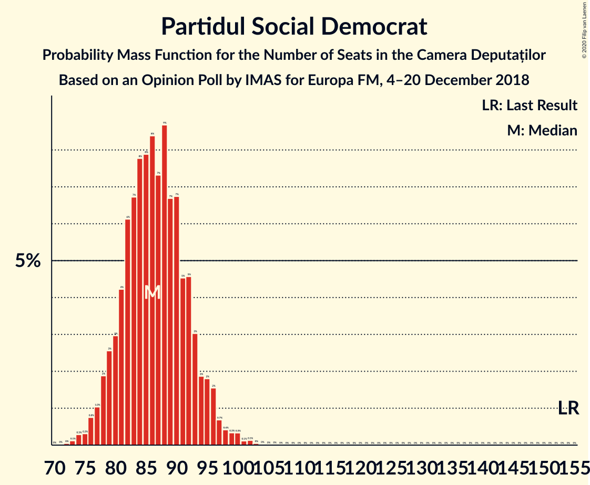

| Number of Seats | Probability | Accumulated | Special Marks |
|:---------------:|:-----------:|:-----------:|:-------------:|
| 72 | 0% | 100% |  |
| 73 | 0.2% | 99.9% |  |
| 74 | 0.1% | 99.7% |  |
| 75 | 0.3% | 99.5% |  |
| 76 | 0.6% | 99.3% |  |
| 77 | 0.7% | 98.6% |  |
| 78 | 2% | 98% |  |
| 79 | 2% | 96% |  |
| 80 | 3% | 94% |  |
| 81 | 3% | 91% |  |
| 82 | 8% | 88% |  |
| 83 | 10% | 80% |  |
| 84 | 5% | 70% |  |
| 85 | 8% | 65% |  |
| 86 | 10% | 57% | Median |
| 87 | 8% | 47% |  |
| 88 | 4% | 39% |  |
| 89 | 3% | 35% |  |
| 90 | 11% | 31% |  |
| 91 | 7% | 20% |  |
| 92 | 5% | 13% |  |
| 93 | 2% | 8% |  |
| 94 | 1.1% | 6% |  |
| 95 | 2% | 5% |  |
| 96 | 1.5% | 3% |  |
| 97 | 0.4% | 2% |  |
| 98 | 0.2% | 1.4% |  |
| 99 | 0.5% | 1.2% |  |
| 100 | 0.3% | 0.8% |  |
| 101 | 0.1% | 0.4% |  |
| 102 | 0.3% | 0.3% |  |
| 103 | 0% | 0.1% |  |
| 104 | 0% | 0% |  |
| 105 | 0% | 0% |  |
| 106 | 0% | 0% |  |
| 107 | 0% | 0% |  |
| 108 | 0% | 0% |  |
| 109 | 0% | 0% |  |
| 110 | 0% | 0% |  |
| 111 | 0% | 0% |  |
| 112 | 0% | 0% |  |
| 113 | 0% | 0% |  |
| 114 | 0% | 0% |  |
| 115 | 0% | 0% |  |
| 116 | 0% | 0% |  |
| 117 | 0% | 0% |  |
| 118 | 0% | 0% |  |
| 119 | 0% | 0% |  |
| 120 | 0% | 0% |  |
| 121 | 0% | 0% |  |
| 122 | 0% | 0% |  |
| 123 | 0% | 0% |  |
| 124 | 0% | 0% |  |
| 125 | 0% | 0% |  |
| 126 | 0% | 0% |  |
| 127 | 0% | 0% |  |
| 128 | 0% | 0% |  |
| 129 | 0% | 0% |  |
| 130 | 0% | 0% |  |
| 131 | 0% | 0% |  |
| 132 | 0% | 0% |  |
| 133 | 0% | 0% |  |
| 134 | 0% | 0% |  |
| 135 | 0% | 0% |  |
| 136 | 0% | 0% |  |
| 137 | 0% | 0% |  |
| 138 | 0% | 0% |  |
| 139 | 0% | 0% |  |
| 140 | 0% | 0% |  |
| 141 | 0% | 0% |  |
| 142 | 0% | 0% |  |
| 143 | 0% | 0% |  |
| 144 | 0% | 0% |  |
| 145 | 0% | 0% |  |
| 146 | 0% | 0% |  |
| 147 | 0% | 0% |  |
| 148 | 0% | 0% |  |
| 149 | 0% | 0% |  |
| 150 | 0% | 0% |  |
| 151 | 0% | 0% |  |
| 152 | 0% | 0% |  |
| 153 | 0% | 0% |  |
| 154 | 0% | 0% | Last Result |

### Alianța 2020 USR-PLUS

*For a full overview of the results for this party, see the [Alianța 2020 USR-PLUS](party-alianța2020usr-plus.html) page.*

| Number of Seats | Probability | Accumulated | Special Marks |
|:---------------:|:-----------:|:-----------:|:-------------:|
| 30 | 0% | 100% | Last Result |
| 31 | 0% | 100% |  |
| 32 | 0% | 100% |  |
| 33 | 0% | 100% |  |
| 34 | 0% | 100% |  |
| 35 | 0% | 100% |  |
| 36 | 0% | 100% |  |
| 37 | 0% | 100% |  |
| 38 | 0% | 100% |  |
| 39 | 0% | 100% |  |
| 40 | 0% | 100% |  |
| 41 | 0% | 100% |  |
| 42 | 0% | 100% |  |
| 43 | 0% | 100% |  |
| 44 | 0% | 100% |  |
| 45 | 0% | 100% |  |
| 46 | 0% | 100% |  |
| 47 | 0% | 100% |  |
| 48 | 0% | 100% |  |
| 49 | 0% | 100% |  |
| 50 | 0% | 100% |  |
| 51 | 0% | 100% |  |
| 52 | 0% | 100% |  |
| 53 | 0% | 100% |  |
| 54 | 0.1% | 100% |  |
| 55 | 0.1% | 99.9% |  |
| 56 | 0.3% | 99.8% |  |
| 57 | 0.4% | 99.5% |  |
| 58 | 0.7% | 99.0% |  |
| 59 | 2% | 98% |  |
| 60 | 1.0% | 97% |  |
| 61 | 6% | 96% |  |
| 62 | 3% | 90% |  |
| 63 | 8% | 87% |  |
| 64 | 5% | 78% |  |
| 65 | 15% | 73% |  |
| 66 | 6% | 58% |  |
| 67 | 11% | 53% | Median |
| 68 | 6% | 42% |  |
| 69 | 7% | 36% |  |
| 70 | 11% | 30% |  |
| 71 | 3% | 19% |  |
| 72 | 6% | 16% |  |
| 73 | 3% | 10% |  |
| 74 | 3% | 7% |  |
| 75 | 2% | 4% |  |
| 76 | 0.7% | 3% |  |
| 77 | 1.1% | 2% |  |
| 78 | 0.3% | 0.9% |  |
| 79 | 0.3% | 0.6% |  |
| 80 | 0.1% | 0.3% |  |
| 81 | 0.2% | 0.2% |  |
| 82 | 0% | 0.1% |  |
| 83 | 0% | 0% |  |

### Partidul Alianța Liberalilor și Democraților

*For a full overview of the results for this party, see the [Partidul Alianța Liberalilor și Democraților](party-partidulalianțaliberalilorșidemocraților.html) page.*

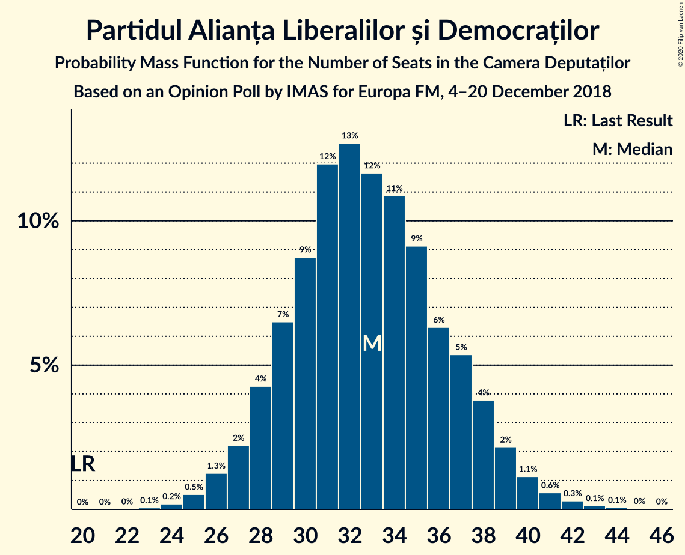

| Number of Seats | Probability | Accumulated | Special Marks |
|:---------------:|:-----------:|:-----------:|:-------------:|
| 20 | 0% | 100% | Last Result |
| 21 | 0% | 100% |  |
| 22 | 0% | 100% |  |
| 23 | 0% | 100% |  |
| 24 | 0.2% | 99.9% |  |
| 25 | 0.7% | 99.7% |  |
| 26 | 1.3% | 99.0% |  |
| 27 | 1.4% | 98% |  |
| 28 | 2% | 96% |  |
| 29 | 5% | 94% |  |
| 30 | 8% | 89% |  |
| 31 | 18% | 81% |  |
| 32 | 17% | 63% | Median |
| 33 | 9% | 45% |  |
| 34 | 9% | 36% |  |
| 35 | 7% | 27% |  |
| 36 | 5% | 20% |  |
| 37 | 8% | 16% |  |
| 38 | 3% | 8% |  |
| 39 | 2% | 4% |  |
| 40 | 1.3% | 2% |  |
| 41 | 0.5% | 0.9% |  |
| 42 | 0.2% | 0.4% |  |
| 43 | 0.1% | 0.2% |  |
| 44 | 0% | 0.1% |  |
| 45 | 0% | 0% |  |

### PRO România

*For a full overview of the results for this party, see the [PRO România](party-proromânia.html) page.*

| Number of Seats | Probability | Accumulated | Special Marks |
|:---------------:|:-----------:|:-----------:|:-------------:|
| 0 | 2% | 100% | Last Result |
| 1 | 0% | 98% |  |
| 2 | 0% | 98% |  |
| 3 | 0% | 98% |  |
| 4 | 0% | 98% |  |
| 5 | 0% | 98% |  |
| 6 | 0% | 98% |  |
| 7 | 0% | 98% |  |
| 8 | 0% | 98% |  |
| 9 | 0% | 98% |  |
| 10 | 0% | 98% |  |
| 11 | 0% | 98% |  |
| 12 | 0% | 98% |  |
| 13 | 0% | 98% |  |
| 14 | 0% | 98% |  |
| 15 | 0% | 98% |  |
| 16 | 0% | 98% |  |
| 17 | 2% | 98% |  |
| 18 | 10% | 96% |  |
| 19 | 17% | 86% |  |
| 20 | 13% | 69% |  |
| 21 | 4% | 56% |  |
| 22 | 7% | 52% | Median |
| 23 | 20% | 45% |  |
| 24 | 18% | 24% |  |
| 25 | 3% | 6% |  |
| 26 | 0.7% | 4% |  |
| 27 | 2% | 3% |  |
| 28 | 1.1% | 1.4% |  |
| 29 | 0.2% | 0.3% |  |
| 30 | 0% | 0.1% |  |
| 31 | 0% | 0% |  |

### Uniunea Democrată Maghiară din România

*For a full overview of the results for this party, see the [Uniunea Democrată Maghiară din România](party-uniuneademocratămaghiarădinromânia.html) page.*

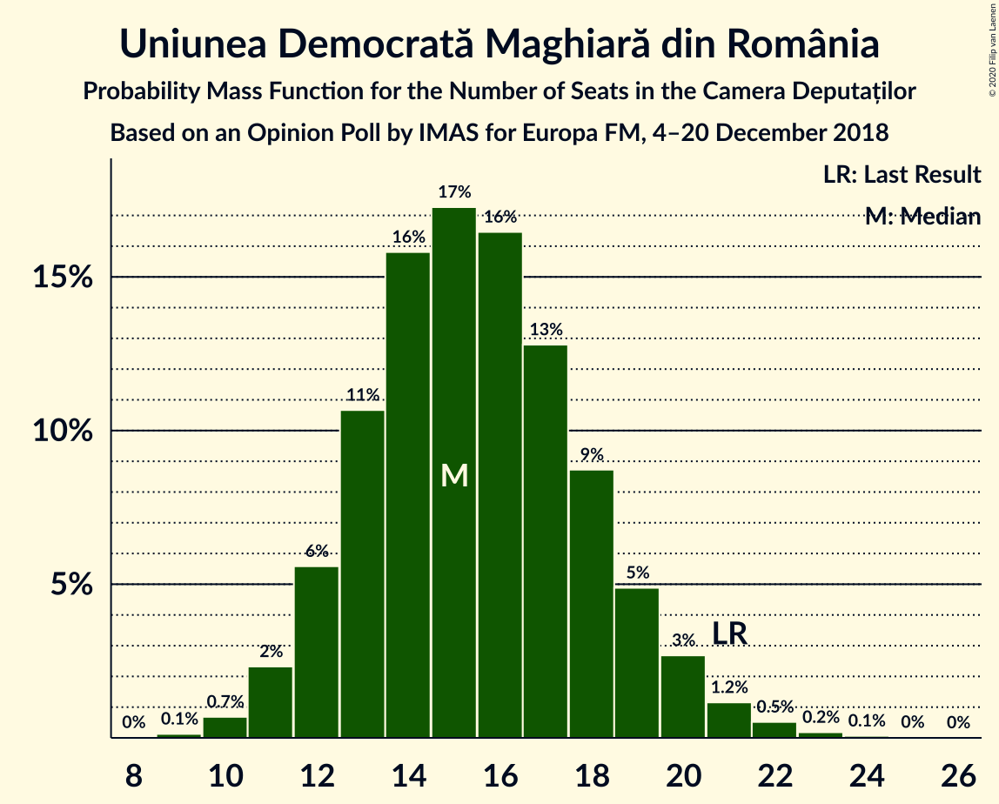

| Number of Seats | Probability | Accumulated | Special Marks |
|:---------------:|:-----------:|:-----------:|:-------------:|
| 9 | 0.1% | 100% |  |
| 10 | 0.9% | 99.9% |  |
| 11 | 2% | 99.0% |  |
| 12 | 6% | 97% |  |
| 13 | 10% | 90% |  |
| 14 | 15% | 80% |  |
| 15 | 20% | 66% | Median |
| 16 | 16% | 46% |  |
| 17 | 14% | 30% |  |
| 18 | 7% | 16% |  |
| 19 | 5% | 9% |  |
| 20 | 1.4% | 4% |  |
| 21 | 2% | 2% | Last Result |
| 22 | 0.3% | 0.7% |  |
| 23 | 0.3% | 0.3% |  |
| 24 | 0.1% | 0.1% |  |
| 25 | 0% | 0% |  |

### Partidul Mișcarea Populară

*For a full overview of the results for this party, see the [Partidul Mișcarea Populară](party-partidulmișcareapopulară.html) page.*

| Number of Seats | Probability | Accumulated | Special Marks |
|:---------------:|:-----------:|:-----------:|:-------------:|
| 0 | 100% | 100% | Median |
| 1 | 0% | 0% |  |
| 2 | 0% | 0% |  |
| 3 | 0% | 0% |  |
| 4 | 0% | 0% |  |
| 5 | 0% | 0% |  |
| 6 | 0% | 0% |  |
| 7 | 0% | 0% |  |
| 8 | 0% | 0% |  |
| 9 | 0% | 0% |  |
| 10 | 0% | 0% |  |
| 11 | 0% | 0% |  |
| 12 | 0% | 0% |  |
| 13 | 0% | 0% |  |
| 14 | 0% | 0% |  |
| 15 | 0% | 0% |  |
| 16 | 0% | 0% |  |
| 17 | 0% | 0% |  |
| 18 | 0% | 0% | Last Result |

## Coalitions

### Confidence Intervals

| Coalition | Last Result | Median | Majority? | 80% Confidence Interval | 90% Confidence Interval | 95% Confidence Interval | 99% Confidence Interval |
|:---------:|:-----------:|:------:|:---------:|:-----------------------:|:-----------------------:|:-----------------------:|:-----------------------:|
| Partidul Național Liberal – Alianța 2020 USR-PLUS – Partidul Alianța Liberalilor și Democraților – Uniunea Democrată Maghiară din România – Partidul Mișcarea Populară | 158 | 205 | 100% | 199–210 | 197–213 | 195–215 | 192–224 |
| Partidul Național Liberal – Alianța 2020 USR-PLUS – Partidul Alianța Liberalilor și Democraților – Uniunea Democrată Maghiară din România | 140 | 205 | 100% | 199–210 | 197–213 | 195–215 | 192–224 |
| Partidul Național Liberal – Alianța 2020 USR-PLUS – Partidul Alianța Liberalilor și Democraților – Partidul Mișcarea Populară | 137 | 189 | 100% | 183–195 | 181–198 | 179–200 | 176–209 |
| Partidul Național Liberal – Alianța 2020 USR-PLUS – Partidul Alianța Liberalilor și Democraților | 119 | 189 | 100% | 183–195 | 181–198 | 179–200 | 176–209 |
| Partidul Național Liberal – Alianța 2020 USR-PLUS – Uniunea Democrată Maghiară din România – Partidul Mișcarea Populară | 138 | 171 | 91% | 166–179 | 163–180 | 162–183 | 159–188 |
| Partidul Național Liberal – Alianța 2020 USR-PLUS – Uniunea Democrată Maghiară din România | 120 | 171 | 91% | 166–179 | 163–180 | 162–183 | 159–188 |
| Partidul Național Liberal – Alianța 2020 USR-PLUS – Partidul Mișcarea Populară | 117 | 156 | 4% | 150–163 | 149–164 | 147–167 | 143–173 |
| Partidul Național Liberal – Alianța 2020 USR-PLUS | 99 | 156 | 4% | 150–163 | 149–164 | 147–167 | 143–173 |
| Partidul Social Democrat – Partidul Alianța Liberalilor și Democraților – PRO România | 174 | 141 | 0% | 133–146 | 132–149 | 129–150 | 124–153 |
| Partidul Național Liberal – Partidul Alianța Liberalilor și Democraților – Uniunea Democrată Maghiară din România – Partidul Mișcarea Populară | 128 | 138 | 0% | 131–144 | 129–147 | 127–149 | 124–153 |
| Partidul Național Liberal – Partidul Alianța Liberalilor și Democraților – Uniunea Democrată Maghiară din România | 110 | 138 | 0% | 131–144 | 129–147 | 127–149 | 124–153 |
| Partidul Social Democrat – Partidul Alianța Liberalilor și Democraților | 174 | 119 | 0% | 114–127 | 111–128 | 109–130 | 106–133 |
| Partidul Social Democrat – PRO România | 154 | 107 | 0% | 102–113 | 99–115 | 97–117 | 88–120 |
| Partidul Național Liberal – Uniunea Democrată Maghiară din România – Partidul Mișcarea Populară | 108 | 104 | 0% | 99–111 | 97–113 | 95–115 | 92–118 |
| Partidul Național Liberal – Uniunea Democrată Maghiară din România | 90 | 104 | 0% | 99–111 | 97–113 | 95–115 | 92–118 |
| Partidul Național Liberal – Partidul Mișcarea Populară | 87 | 89 | 0% | 84–95 | 82–97 | 81–99 | 78–103 |
| Partidul Național Liberal | 69 | 89 | 0% | 84–95 | 82–97 | 81–99 | 78–103 |
| Alianța 2020 USR-PLUS – Partidul Mișcarea Populară | 48 | 67 | 0% | 61–72 | 61–74 | 59–76 | 56–79 |

### Partidul Național Liberal – Alianța 2020 USR-PLUS – Partidul Alianța Liberalilor și Democraților – Uniunea Democrată Maghiară din România – Partidul Mișcarea Populară

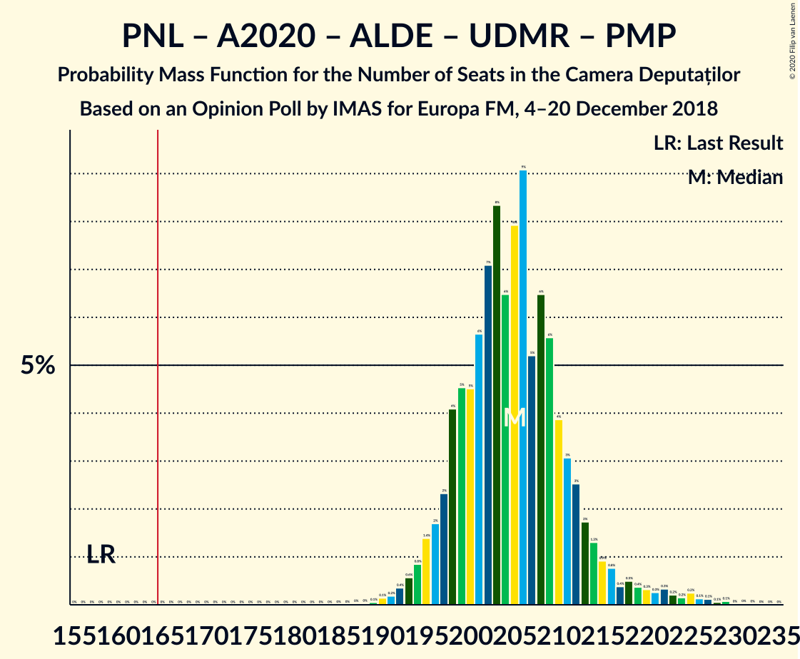

| Number of Seats | Probability | Accumulated | Special Marks |
|:---------------:|:-----------:|:-----------:|:-------------:|
| 158 | 0% | 100% | Last Result |
| 159 | 0% | 100% |  |
| 160 | 0% | 100% |  |
| 161 | 0% | 100% |  |
| 162 | 0% | 100% |  |
| 163 | 0% | 100% |  |
| 164 | 0% | 100% |  |
| 165 | 0% | 100% |  |
| 166 | 0% | 100% | Majority |
| 167 | 0% | 100% |  |
| 168 | 0% | 100% |  |
| 169 | 0% | 100% |  |
| 170 | 0% | 100% |  |
| 171 | 0% | 100% |  |
| 172 | 0% | 100% |  |
| 173 | 0% | 100% |  |
| 174 | 0% | 100% |  |
| 175 | 0% | 100% |  |
| 176 | 0% | 100% |  |
| 177 | 0% | 100% |  |
| 178 | 0% | 100% |  |
| 179 | 0% | 100% |  |
| 180 | 0% | 100% |  |
| 181 | 0% | 100% |  |
| 182 | 0% | 100% |  |
| 183 | 0% | 100% |  |
| 184 | 0% | 100% |  |
| 185 | 0% | 100% |  |
| 186 | 0% | 100% |  |
| 187 | 0% | 100% |  |
| 188 | 0% | 99.9% |  |
| 189 | 0% | 99.9% |  |
| 190 | 0.1% | 99.9% |  |
| 191 | 0.3% | 99.8% |  |
| 192 | 0.2% | 99.5% |  |
| 193 | 0.3% | 99.3% |  |
| 194 | 0.9% | 99.1% |  |
| 195 | 2% | 98% |  |
| 196 | 0.8% | 96% |  |
| 197 | 3% | 95% |  |
| 198 | 1.4% | 92% |  |
| 199 | 11% | 91% |  |
| 200 | 3% | 80% |  |
| 201 | 5% | 77% |  |
| 202 | 8% | 72% |  |
| 203 | 7% | 64% | Median |
| 204 | 5% | 57% |  |
| 205 | 8% | 52% |  |
| 206 | 15% | 44% |  |
| 207 | 3% | 29% |  |
| 208 | 6% | 26% |  |
| 209 | 4% | 20% |  |
| 210 | 7% | 16% |  |
| 211 | 2% | 9% |  |
| 212 | 2% | 8% |  |
| 213 | 1.1% | 6% |  |
| 214 | 2% | 5% |  |
| 215 | 0.6% | 3% |  |
| 216 | 0.4% | 2% |  |
| 217 | 0.3% | 2% |  |
| 218 | 0.2% | 2% |  |
| 219 | 0.1% | 1.5% |  |
| 220 | 0.1% | 1.3% |  |
| 221 | 0.1% | 1.2% |  |
| 222 | 0.3% | 1.1% |  |
| 223 | 0% | 0.8% |  |
| 224 | 0.3% | 0.8% |  |
| 225 | 0.1% | 0.5% |  |
| 226 | 0.1% | 0.3% |  |
| 227 | 0.1% | 0.2% |  |
| 228 | 0% | 0.1% |  |
| 229 | 0.1% | 0.1% |  |
| 230 | 0% | 0.1% |  |
| 231 | 0% | 0% |  |

### Partidul Național Liberal – Alianța 2020 USR-PLUS – Partidul Alianța Liberalilor și Democraților – Uniunea Democrată Maghiară din România

| Number of Seats | Probability | Accumulated | Special Marks |
|:---------------:|:-----------:|:-----------:|:-------------:|
| 140 | 0% | 100% | Last Result |
| 141 | 0% | 100% |  |
| 142 | 0% | 100% |  |
| 143 | 0% | 100% |  |
| 144 | 0% | 100% |  |
| 145 | 0% | 100% |  |
| 146 | 0% | 100% |  |
| 147 | 0% | 100% |  |
| 148 | 0% | 100% |  |
| 149 | 0% | 100% |  |
| 150 | 0% | 100% |  |
| 151 | 0% | 100% |  |
| 152 | 0% | 100% |  |
| 153 | 0% | 100% |  |
| 154 | 0% | 100% |  |
| 155 | 0% | 100% |  |
| 156 | 0% | 100% |  |
| 157 | 0% | 100% |  |
| 158 | 0% | 100% |  |
| 159 | 0% | 100% |  |
| 160 | 0% | 100% |  |
| 161 | 0% | 100% |  |
| 162 | 0% | 100% |  |
| 163 | 0% | 100% |  |
| 164 | 0% | 100% |  |
| 165 | 0% | 100% |  |
| 166 | 0% | 100% | Majority |
| 167 | 0% | 100% |  |
| 168 | 0% | 100% |  |
| 169 | 0% | 100% |  |
| 170 | 0% | 100% |  |
| 171 | 0% | 100% |  |
| 172 | 0% | 100% |  |
| 173 | 0% | 100% |  |
| 174 | 0% | 100% |  |
| 175 | 0% | 100% |  |
| 176 | 0% | 100% |  |
| 177 | 0% | 100% |  |
| 178 | 0% | 100% |  |
| 179 | 0% | 100% |  |
| 180 | 0% | 100% |  |
| 181 | 0% | 100% |  |
| 182 | 0% | 100% |  |
| 183 | 0% | 100% |  |
| 184 | 0% | 100% |  |
| 185 | 0% | 100% |  |
| 186 | 0% | 100% |  |
| 187 | 0% | 100% |  |
| 188 | 0% | 99.9% |  |
| 189 | 0% | 99.9% |  |
| 190 | 0.1% | 99.9% |  |
| 191 | 0.3% | 99.8% |  |
| 192 | 0.2% | 99.5% |  |
| 193 | 0.3% | 99.3% |  |
| 194 | 0.9% | 99.1% |  |
| 195 | 2% | 98% |  |
| 196 | 0.8% | 96% |  |
| 197 | 3% | 95% |  |
| 198 | 1.4% | 92% |  |
| 199 | 11% | 91% |  |
| 200 | 3% | 80% |  |
| 201 | 5% | 77% |  |
| 202 | 8% | 72% |  |
| 203 | 7% | 64% | Median |
| 204 | 5% | 57% |  |
| 205 | 8% | 52% |  |
| 206 | 15% | 44% |  |
| 207 | 3% | 29% |  |
| 208 | 6% | 26% |  |
| 209 | 4% | 20% |  |
| 210 | 7% | 16% |  |
| 211 | 2% | 9% |  |
| 212 | 2% | 8% |  |
| 213 | 1.1% | 6% |  |
| 214 | 2% | 5% |  |
| 215 | 0.6% | 3% |  |
| 216 | 0.4% | 2% |  |
| 217 | 0.3% | 2% |  |
| 218 | 0.2% | 2% |  |
| 219 | 0.1% | 1.5% |  |
| 220 | 0.1% | 1.3% |  |
| 221 | 0.1% | 1.2% |  |
| 222 | 0.3% | 1.1% |  |
| 223 | 0% | 0.8% |  |
| 224 | 0.3% | 0.8% |  |
| 225 | 0.1% | 0.5% |  |
| 226 | 0.1% | 0.3% |  |
| 227 | 0.1% | 0.2% |  |
| 228 | 0% | 0.1% |  |
| 229 | 0.1% | 0.1% |  |
| 230 | 0% | 0.1% |  |
| 231 | 0% | 0% |  |

### Partidul Național Liberal – Alianța 2020 USR-PLUS – Partidul Alianța Liberalilor și Democraților – Partidul Mișcarea Populară

| Number of Seats | Probability | Accumulated | Special Marks |
|:---------------:|:-----------:|:-----------:|:-------------:|
| 137 | 0% | 100% | Last Result |
| 138 | 0% | 100% |  |
| 139 | 0% | 100% |  |
| 140 | 0% | 100% |  |
| 141 | 0% | 100% |  |
| 142 | 0% | 100% |  |
| 143 | 0% | 100% |  |
| 144 | 0% | 100% |  |
| 145 | 0% | 100% |  |
| 146 | 0% | 100% |  |
| 147 | 0% | 100% |  |
| 148 | 0% | 100% |  |
| 149 | 0% | 100% |  |
| 150 | 0% | 100% |  |
| 151 | 0% | 100% |  |
| 152 | 0% | 100% |  |
| 153 | 0% | 100% |  |
| 154 | 0% | 100% |  |
| 155 | 0% | 100% |  |
| 156 | 0% | 100% |  |
| 157 | 0% | 100% |  |
| 158 | 0% | 100% |  |
| 159 | 0% | 100% |  |
| 160 | 0% | 100% |  |
| 161 | 0% | 100% |  |
| 162 | 0% | 100% |  |
| 163 | 0% | 100% |  |
| 164 | 0% | 100% |  |
| 165 | 0% | 100% |  |
| 166 | 0% | 100% | Majority |
| 167 | 0% | 100% |  |
| 168 | 0% | 100% |  |
| 169 | 0% | 100% |  |
| 170 | 0% | 100% |  |
| 171 | 0% | 100% |  |
| 172 | 0% | 100% |  |
| 173 | 0.1% | 100% |  |
| 174 | 0.1% | 99.9% |  |
| 175 | 0.2% | 99.8% |  |
| 176 | 0.2% | 99.6% |  |
| 177 | 0.5% | 99.3% |  |
| 178 | 0.7% | 98.8% |  |
| 179 | 0.6% | 98% |  |
| 180 | 1.0% | 97% |  |
| 181 | 2% | 97% |  |
| 182 | 1.4% | 94% |  |
| 183 | 3% | 93% |  |
| 184 | 8% | 90% |  |
| 185 | 4% | 82% |  |
| 186 | 8% | 78% |  |
| 187 | 6% | 70% |  |
| 188 | 11% | 64% | Median |
| 189 | 8% | 54% |  |
| 190 | 11% | 46% |  |
| 191 | 8% | 34% |  |
| 192 | 6% | 27% |  |
| 193 | 8% | 21% |  |
| 194 | 2% | 13% |  |
| 195 | 2% | 11% |  |
| 196 | 2% | 9% |  |
| 197 | 1.1% | 7% |  |
| 198 | 2% | 6% |  |
| 199 | 0.3% | 4% |  |
| 200 | 1.5% | 4% |  |
| 201 | 0.4% | 2% |  |
| 202 | 0.3% | 2% |  |
| 203 | 0.3% | 2% |  |
| 204 | 0.1% | 1.3% |  |
| 205 | 0.2% | 1.2% |  |
| 206 | 0.1% | 1.0% |  |
| 207 | 0.2% | 0.9% |  |
| 208 | 0.2% | 0.7% |  |
| 209 | 0.1% | 0.5% |  |
| 210 | 0.1% | 0.4% |  |
| 211 | 0.1% | 0.3% |  |
| 212 | 0% | 0.2% |  |
| 213 | 0.1% | 0.1% |  |
| 214 | 0% | 0.1% |  |
| 215 | 0% | 0% |  |

### Partidul Național Liberal – Alianța 2020 USR-PLUS – Partidul Alianța Liberalilor și Democraților

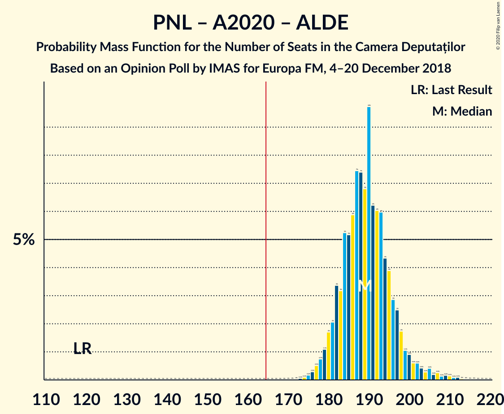

| Number of Seats | Probability | Accumulated | Special Marks |
|:---------------:|:-----------:|:-----------:|:-------------:|
| 119 | 0% | 100% | Last Result |
| 120 | 0% | 100% |  |
| 121 | 0% | 100% |  |
| 122 | 0% | 100% |  |
| 123 | 0% | 100% |  |
| 124 | 0% | 100% |  |
| 125 | 0% | 100% |  |
| 126 | 0% | 100% |  |
| 127 | 0% | 100% |  |
| 128 | 0% | 100% |  |
| 129 | 0% | 100% |  |
| 130 | 0% | 100% |  |
| 131 | 0% | 100% |  |
| 132 | 0% | 100% |  |
| 133 | 0% | 100% |  |
| 134 | 0% | 100% |  |
| 135 | 0% | 100% |  |
| 136 | 0% | 100% |  |
| 137 | 0% | 100% |  |
| 138 | 0% | 100% |  |
| 139 | 0% | 100% |  |
| 140 | 0% | 100% |  |
| 141 | 0% | 100% |  |
| 142 | 0% | 100% |  |
| 143 | 0% | 100% |  |
| 144 | 0% | 100% |  |
| 145 | 0% | 100% |  |
| 146 | 0% | 100% |  |
| 147 | 0% | 100% |  |
| 148 | 0% | 100% |  |
| 149 | 0% | 100% |  |
| 150 | 0% | 100% |  |
| 151 | 0% | 100% |  |
| 152 | 0% | 100% |  |
| 153 | 0% | 100% |  |
| 154 | 0% | 100% |  |
| 155 | 0% | 100% |  |
| 156 | 0% | 100% |  |
| 157 | 0% | 100% |  |
| 158 | 0% | 100% |  |
| 159 | 0% | 100% |  |
| 160 | 0% | 100% |  |
| 161 | 0% | 100% |  |
| 162 | 0% | 100% |  |
| 163 | 0% | 100% |  |
| 164 | 0% | 100% |  |
| 165 | 0% | 100% |  |
| 166 | 0% | 100% | Majority |
| 167 | 0% | 100% |  |
| 168 | 0% | 100% |  |
| 169 | 0% | 100% |  |
| 170 | 0% | 100% |  |
| 171 | 0% | 100% |  |
| 172 | 0% | 100% |  |
| 173 | 0.1% | 100% |  |
| 174 | 0.1% | 99.9% |  |
| 175 | 0.2% | 99.8% |  |
| 176 | 0.2% | 99.6% |  |
| 177 | 0.5% | 99.3% |  |
| 178 | 0.7% | 98.8% |  |
| 179 | 0.6% | 98% |  |
| 180 | 1.0% | 97% |  |
| 181 | 2% | 97% |  |
| 182 | 1.4% | 94% |  |
| 183 | 3% | 93% |  |
| 184 | 8% | 90% |  |
| 185 | 4% | 82% |  |
| 186 | 8% | 78% |  |
| 187 | 6% | 70% |  |
| 188 | 11% | 64% | Median |
| 189 | 8% | 54% |  |
| 190 | 11% | 46% |  |
| 191 | 8% | 34% |  |
| 192 | 6% | 27% |  |
| 193 | 8% | 21% |  |
| 194 | 2% | 13% |  |
| 195 | 2% | 11% |  |
| 196 | 2% | 9% |  |
| 197 | 1.1% | 7% |  |
| 198 | 2% | 6% |  |
| 199 | 0.3% | 4% |  |
| 200 | 1.5% | 4% |  |
| 201 | 0.4% | 2% |  |
| 202 | 0.3% | 2% |  |
| 203 | 0.3% | 2% |  |
| 204 | 0.1% | 1.3% |  |
| 205 | 0.2% | 1.2% |  |
| 206 | 0.1% | 1.0% |  |
| 207 | 0.2% | 0.9% |  |
| 208 | 0.2% | 0.7% |  |
| 209 | 0.1% | 0.5% |  |
| 210 | 0.1% | 0.4% |  |
| 211 | 0.1% | 0.3% |  |
| 212 | 0% | 0.2% |  |
| 213 | 0.1% | 0.1% |  |
| 214 | 0% | 0.1% |  |
| 215 | 0% | 0% |  |

### Partidul Național Liberal – Alianța 2020 USR-PLUS – Uniunea Democrată Maghiară din România – Partidul Mișcarea Populară

| Number of Seats | Probability | Accumulated | Special Marks |
|:---------------:|:-----------:|:-----------:|:-------------:|
| 138 | 0% | 100% | Last Result |
| 139 | 0% | 100% |  |
| 140 | 0% | 100% |  |
| 141 | 0% | 100% |  |
| 142 | 0% | 100% |  |
| 143 | 0% | 100% |  |
| 144 | 0% | 100% |  |
| 145 | 0% | 100% |  |
| 146 | 0% | 100% |  |
| 147 | 0% | 100% |  |
| 148 | 0% | 100% |  |
| 149 | 0% | 100% |  |
| 150 | 0% | 100% |  |
| 151 | 0% | 100% |  |
| 152 | 0% | 100% |  |
| 153 | 0% | 100% |  |
| 154 | 0% | 100% |  |
| 155 | 0% | 100% |  |
| 156 | 0.1% | 99.9% |  |
| 157 | 0.1% | 99.8% |  |
| 158 | 0.1% | 99.7% |  |
| 159 | 0.5% | 99.6% |  |
| 160 | 0.9% | 99.0% |  |
| 161 | 0.6% | 98% |  |
| 162 | 0.7% | 98% |  |
| 163 | 2% | 97% |  |
| 164 | 2% | 95% |  |
| 165 | 2% | 93% |  |
| 166 | 6% | 91% | Majority |
| 167 | 6% | 86% |  |
| 168 | 9% | 80% |  |
| 169 | 8% | 71% |  |
| 170 | 9% | 63% |  |
| 171 | 6% | 54% | Median |
| 172 | 3% | 48% |  |
| 173 | 13% | 45% |  |
| 174 | 6% | 32% |  |
| 175 | 2% | 27% |  |
| 176 | 6% | 25% |  |
| 177 | 4% | 19% |  |
| 178 | 2% | 15% |  |
| 179 | 6% | 13% |  |
| 180 | 2% | 7% |  |
| 181 | 1.1% | 5% |  |
| 182 | 0.9% | 3% |  |
| 183 | 0.9% | 3% |  |
| 184 | 0.5% | 2% |  |
| 185 | 0.2% | 1.1% |  |
| 186 | 0.3% | 1.0% |  |
| 187 | 0.1% | 0.7% |  |
| 188 | 0.1% | 0.6% |  |
| 189 | 0.1% | 0.5% |  |
| 190 | 0.1% | 0.4% |  |
| 191 | 0.1% | 0.4% |  |
| 192 | 0.1% | 0.2% |  |
| 193 | 0.1% | 0.1% |  |
| 194 | 0% | 0.1% |  |
| 195 | 0% | 0% |  |

### Partidul Național Liberal – Alianța 2020 USR-PLUS – Uniunea Democrată Maghiară din România

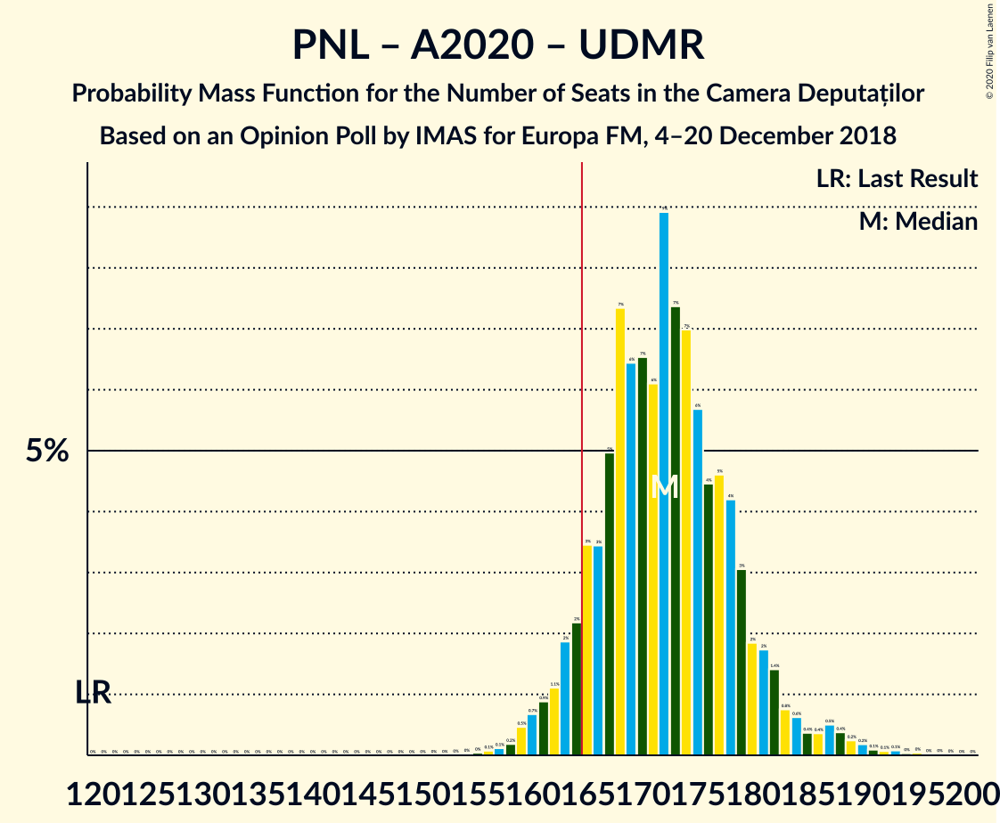

| Number of Seats | Probability | Accumulated | Special Marks |
|:---------------:|:-----------:|:-----------:|:-------------:|
| 120 | 0% | 100% | Last Result |
| 121 | 0% | 100% |  |
| 122 | 0% | 100% |  |
| 123 | 0% | 100% |  |
| 124 | 0% | 100% |  |
| 125 | 0% | 100% |  |
| 126 | 0% | 100% |  |
| 127 | 0% | 100% |  |
| 128 | 0% | 100% |  |
| 129 | 0% | 100% |  |
| 130 | 0% | 100% |  |
| 131 | 0% | 100% |  |
| 132 | 0% | 100% |  |
| 133 | 0% | 100% |  |
| 134 | 0% | 100% |  |
| 135 | 0% | 100% |  |
| 136 | 0% | 100% |  |
| 137 | 0% | 100% |  |
| 138 | 0% | 100% |  |
| 139 | 0% | 100% |  |
| 140 | 0% | 100% |  |
| 141 | 0% | 100% |  |
| 142 | 0% | 100% |  |
| 143 | 0% | 100% |  |
| 144 | 0% | 100% |  |
| 145 | 0% | 100% |  |
| 146 | 0% | 100% |  |
| 147 | 0% | 100% |  |
| 148 | 0% | 100% |  |
| 149 | 0% | 100% |  |
| 150 | 0% | 100% |  |
| 151 | 0% | 100% |  |
| 152 | 0% | 100% |  |
| 153 | 0% | 100% |  |
| 154 | 0% | 100% |  |
| 155 | 0% | 100% |  |
| 156 | 0.1% | 99.9% |  |
| 157 | 0.1% | 99.8% |  |
| 158 | 0.1% | 99.7% |  |
| 159 | 0.5% | 99.6% |  |
| 160 | 0.9% | 99.0% |  |
| 161 | 0.6% | 98% |  |
| 162 | 0.7% | 98% |  |
| 163 | 2% | 97% |  |
| 164 | 2% | 95% |  |
| 165 | 2% | 93% |  |
| 166 | 6% | 91% | Majority |
| 167 | 6% | 86% |  |
| 168 | 9% | 80% |  |
| 169 | 8% | 71% |  |
| 170 | 9% | 63% |  |
| 171 | 6% | 54% | Median |
| 172 | 3% | 48% |  |
| 173 | 13% | 45% |  |
| 174 | 6% | 32% |  |
| 175 | 2% | 27% |  |
| 176 | 6% | 25% |  |
| 177 | 4% | 19% |  |
| 178 | 2% | 15% |  |
| 179 | 6% | 13% |  |
| 180 | 2% | 7% |  |
| 181 | 1.1% | 5% |  |
| 182 | 0.9% | 3% |  |
| 183 | 0.9% | 3% |  |
| 184 | 0.5% | 2% |  |
| 185 | 0.2% | 1.1% |  |
| 186 | 0.3% | 1.0% |  |
| 187 | 0.1% | 0.7% |  |
| 188 | 0.1% | 0.6% |  |
| 189 | 0.1% | 0.5% |  |
| 190 | 0.1% | 0.4% |  |
| 191 | 0.1% | 0.4% |  |
| 192 | 0.1% | 0.2% |  |
| 193 | 0.1% | 0.1% |  |
| 194 | 0% | 0.1% |  |
| 195 | 0% | 0% |  |

### Partidul Național Liberal – Alianța 2020 USR-PLUS – Partidul Mișcarea Populară

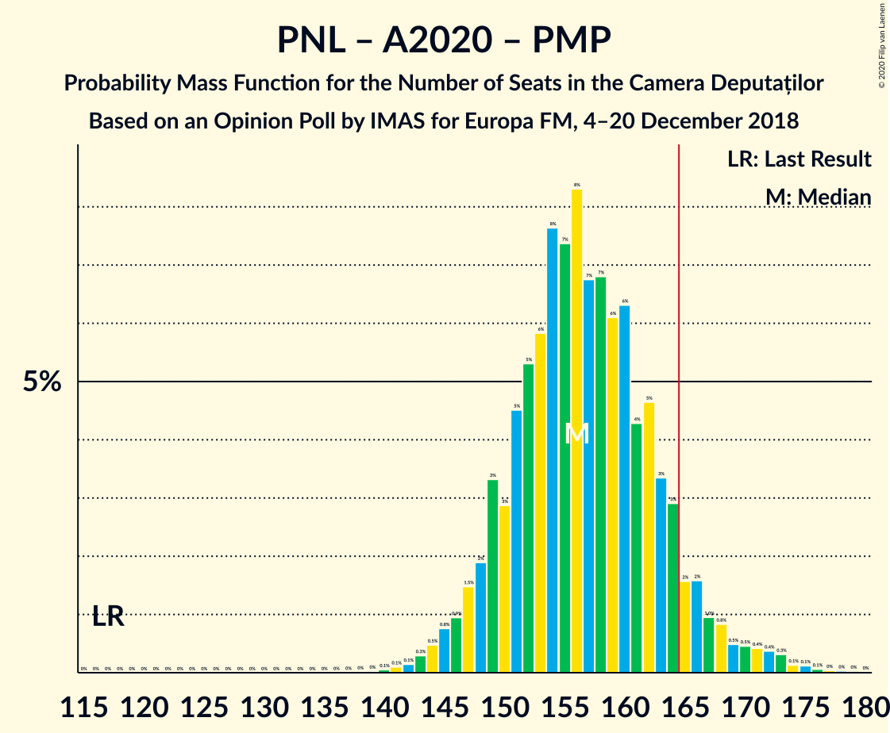

| Number of Seats | Probability | Accumulated | Special Marks |
|:---------------:|:-----------:|:-----------:|:-------------:|
| 117 | 0% | 100% | Last Result |
| 118 | 0% | 100% |  |
| 119 | 0% | 100% |  |
| 120 | 0% | 100% |  |
| 121 | 0% | 100% |  |
| 122 | 0% | 100% |  |
| 123 | 0% | 100% |  |
| 124 | 0% | 100% |  |
| 125 | 0% | 100% |  |
| 126 | 0% | 100% |  |
| 127 | 0% | 100% |  |
| 128 | 0% | 100% |  |
| 129 | 0% | 100% |  |
| 130 | 0% | 100% |  |
| 131 | 0% | 100% |  |
| 132 | 0% | 100% |  |
| 133 | 0% | 100% |  |
| 134 | 0% | 100% |  |
| 135 | 0% | 100% |  |
| 136 | 0% | 100% |  |
| 137 | 0% | 100% |  |
| 138 | 0% | 100% |  |
| 139 | 0% | 100% |  |
| 140 | 0% | 99.9% |  |
| 141 | 0.1% | 99.9% |  |
| 142 | 0.1% | 99.8% |  |
| 143 | 0.5% | 99.7% |  |
| 144 | 0.3% | 99.1% |  |
| 145 | 0.4% | 98.9% |  |
| 146 | 0.7% | 98% |  |
| 147 | 0.9% | 98% |  |
| 148 | 2% | 97% |  |
| 149 | 3% | 95% |  |
| 150 | 2% | 92% |  |
| 151 | 4% | 90% |  |
| 152 | 5% | 86% |  |
| 153 | 10% | 81% |  |
| 154 | 11% | 71% |  |
| 155 | 7% | 60% |  |
| 156 | 8% | 53% | Median |
| 157 | 8% | 44% |  |
| 158 | 6% | 36% |  |
| 159 | 4% | 30% |  |
| 160 | 7% | 27% |  |
| 161 | 3% | 19% |  |
| 162 | 5% | 17% |  |
| 163 | 2% | 11% |  |
| 164 | 4% | 9% |  |
| 165 | 1.1% | 5% |  |
| 166 | 0.9% | 4% | Majority |
| 167 | 1.1% | 3% |  |
| 168 | 0.3% | 2% |  |
| 169 | 0.3% | 1.4% |  |
| 170 | 0.2% | 1.1% |  |
| 171 | 0.2% | 0.9% |  |
| 172 | 0.1% | 0.7% |  |
| 173 | 0.2% | 0.6% |  |
| 174 | 0.1% | 0.4% |  |
| 175 | 0.1% | 0.4% |  |
| 176 | 0.1% | 0.3% |  |
| 177 | 0.1% | 0.2% |  |
| 178 | 0% | 0.1% |  |
| 179 | 0% | 0% |  |

### Partidul Național Liberal – Alianța 2020 USR-PLUS

| Number of Seats | Probability | Accumulated | Special Marks |
|:---------------:|:-----------:|:-----------:|:-------------:|
| 99 | 0% | 100% | Last Result |
| 100 | 0% | 100% |  |
| 101 | 0% | 100% |  |
| 102 | 0% | 100% |  |
| 103 | 0% | 100% |  |
| 104 | 0% | 100% |  |
| 105 | 0% | 100% |  |
| 106 | 0% | 100% |  |
| 107 | 0% | 100% |  |
| 108 | 0% | 100% |  |
| 109 | 0% | 100% |  |
| 110 | 0% | 100% |  |
| 111 | 0% | 100% |  |
| 112 | 0% | 100% |  |
| 113 | 0% | 100% |  |
| 114 | 0% | 100% |  |
| 115 | 0% | 100% |  |
| 116 | 0% | 100% |  |
| 117 | 0% | 100% |  |
| 118 | 0% | 100% |  |
| 119 | 0% | 100% |  |
| 120 | 0% | 100% |  |
| 121 | 0% | 100% |  |
| 122 | 0% | 100% |  |
| 123 | 0% | 100% |  |
| 124 | 0% | 100% |  |
| 125 | 0% | 100% |  |
| 126 | 0% | 100% |  |
| 127 | 0% | 100% |  |
| 128 | 0% | 100% |  |
| 129 | 0% | 100% |  |
| 130 | 0% | 100% |  |
| 131 | 0% | 100% |  |
| 132 | 0% | 100% |  |
| 133 | 0% | 100% |  |
| 134 | 0% | 100% |  |
| 135 | 0% | 100% |  |
| 136 | 0% | 100% |  |
| 137 | 0% | 100% |  |
| 138 | 0% | 100% |  |
| 139 | 0% | 100% |  |
| 140 | 0% | 99.9% |  |
| 141 | 0.1% | 99.9% |  |
| 142 | 0.1% | 99.8% |  |
| 143 | 0.5% | 99.7% |  |
| 144 | 0.3% | 99.1% |  |
| 145 | 0.4% | 98.9% |  |
| 146 | 0.7% | 98% |  |
| 147 | 0.9% | 98% |  |
| 148 | 2% | 97% |  |
| 149 | 3% | 95% |  |
| 150 | 2% | 92% |  |
| 151 | 4% | 90% |  |
| 152 | 5% | 86% |  |
| 153 | 10% | 81% |  |
| 154 | 11% | 71% |  |
| 155 | 7% | 60% |  |
| 156 | 8% | 53% | Median |
| 157 | 8% | 44% |  |
| 158 | 6% | 36% |  |
| 159 | 4% | 30% |  |
| 160 | 7% | 27% |  |
| 161 | 3% | 19% |  |
| 162 | 5% | 17% |  |
| 163 | 2% | 11% |  |
| 164 | 4% | 9% |  |
| 165 | 1.1% | 5% |  |
| 166 | 0.9% | 4% | Majority |
| 167 | 1.1% | 3% |  |
| 168 | 0.3% | 2% |  |
| 169 | 0.3% | 1.4% |  |
| 170 | 0.2% | 1.1% |  |
| 171 | 0.2% | 0.9% |  |
| 172 | 0.1% | 0.7% |  |
| 173 | 0.2% | 0.6% |  |
| 174 | 0.1% | 0.4% |  |
| 175 | 0.1% | 0.4% |  |
| 176 | 0.1% | 0.3% |  |
| 177 | 0.1% | 0.2% |  |
| 178 | 0% | 0.1% |  |
| 179 | 0% | 0% |  |

### Partidul Social Democrat – Partidul Alianța Liberalilor și Democraților – PRO România

| Number of Seats | Probability | Accumulated | Special Marks |
|:---------------:|:-----------:|:-----------:|:-------------:|
| 118 | 0% | 100% |  |
| 119 | 0.1% | 99.9% |  |
| 120 | 0.1% | 99.9% |  |
| 121 | 0.1% | 99.8% |  |
| 122 | 0.1% | 99.6% |  |
| 123 | 0.1% | 99.6% |  |
| 124 | 0.1% | 99.5% |  |
| 125 | 0.1% | 99.4% |  |
| 126 | 0.3% | 99.3% |  |
| 127 | 0.2% | 99.0% |  |
| 128 | 0.5% | 98.9% |  |
| 129 | 0.9% | 98% |  |
| 130 | 0.9% | 97% |  |
| 131 | 1.1% | 97% |  |
| 132 | 2% | 95% |  |
| 133 | 6% | 93% |  |
| 134 | 2% | 87% |  |
| 135 | 4% | 85% |  |
| 136 | 6% | 81% |  |
| 137 | 2% | 75% |  |
| 138 | 6% | 73% |  |
| 139 | 13% | 68% |  |
| 140 | 3% | 55% | Median |
| 141 | 6% | 52% |  |
| 142 | 9% | 46% |  |
| 143 | 8% | 37% |  |
| 144 | 9% | 29% |  |
| 145 | 6% | 20% |  |
| 146 | 6% | 14% |  |
| 147 | 2% | 9% |  |
| 148 | 2% | 7% |  |
| 149 | 2% | 5% |  |
| 150 | 0.7% | 3% |  |
| 151 | 0.6% | 2% |  |
| 152 | 0.9% | 2% |  |
| 153 | 0.5% | 1.0% |  |
| 154 | 0.1% | 0.4% |  |
| 155 | 0.1% | 0.3% |  |
| 156 | 0.1% | 0.2% |  |
| 157 | 0% | 0.1% |  |
| 158 | 0% | 0% |  |
| 159 | 0% | 0% |  |
| 160 | 0% | 0% |  |
| 161 | 0% | 0% |  |
| 162 | 0% | 0% |  |
| 163 | 0% | 0% |  |
| 164 | 0% | 0% |  |
| 165 | 0% | 0% |  |
| 166 | 0% | 0% | Majority |
| 167 | 0% | 0% |  |
| 168 | 0% | 0% |  |
| 169 | 0% | 0% |  |
| 170 | 0% | 0% |  |
| 171 | 0% | 0% |  |
| 172 | 0% | 0% |  |
| 173 | 0% | 0% |  |
| 174 | 0% | 0% | Last Result |

### Partidul Național Liberal – Partidul Alianța Liberalilor și Democraților – Uniunea Democrată Maghiară din România – Partidul Mișcarea Populară

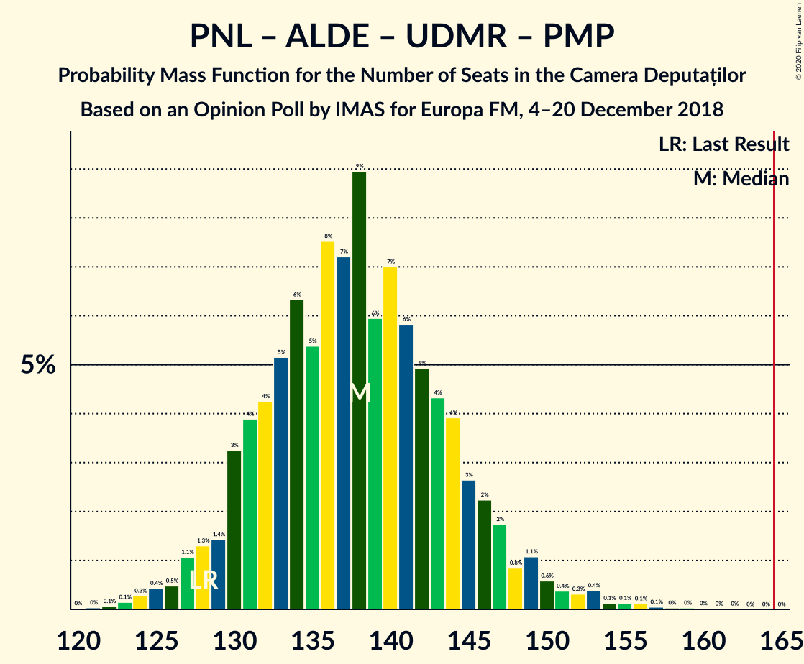

| Number of Seats | Probability | Accumulated | Special Marks |
|:---------------:|:-----------:|:-----------:|:-------------:|
| 121 | 0.1% | 100% |  |
| 122 | 0.1% | 99.9% |  |
| 123 | 0.1% | 99.9% |  |
| 124 | 0.5% | 99.8% |  |
| 125 | 0.4% | 99.3% |  |
| 126 | 0.3% | 98.9% |  |
| 127 | 2% | 98.6% |  |
| 128 | 0.7% | 97% | Last Result |
| 129 | 2% | 96% |  |
| 130 | 3% | 94% |  |
| 131 | 2% | 91% |  |
| 132 | 5% | 88% |  |
| 133 | 2% | 83% |  |
| 134 | 13% | 81% |  |
| 135 | 5% | 67% |  |
| 136 | 5% | 62% | Median |
| 137 | 7% | 57% |  |
| 138 | 4% | 50% |  |
| 139 | 8% | 46% |  |
| 140 | 10% | 38% |  |
| 141 | 10% | 28% |  |
| 142 | 4% | 18% |  |
| 143 | 2% | 14% |  |
| 144 | 4% | 12% |  |
| 145 | 2% | 8% |  |
| 146 | 0.8% | 6% |  |
| 147 | 3% | 6% |  |
| 148 | 0.5% | 3% |  |
| 149 | 1.1% | 3% |  |
| 150 | 0.5% | 2% |  |
| 151 | 0.2% | 1.1% |  |
| 152 | 0.2% | 0.9% |  |
| 153 | 0.3% | 0.7% |  |
| 154 | 0.1% | 0.5% |  |
| 155 | 0.2% | 0.4% |  |
| 156 | 0.1% | 0.2% |  |
| 157 | 0% | 0.1% |  |
| 158 | 0% | 0.1% |  |
| 159 | 0% | 0.1% |  |
| 160 | 0% | 0% |  |

### Partidul Național Liberal – Partidul Alianța Liberalilor și Democraților – Uniunea Democrată Maghiară din România

| Number of Seats | Probability | Accumulated | Special Marks |
|:---------------:|:-----------:|:-----------:|:-------------:|
| 110 | 0% | 100% | Last Result |
| 111 | 0% | 100% |  |
| 112 | 0% | 100% |  |
| 113 | 0% | 100% |  |
| 114 | 0% | 100% |  |
| 115 | 0% | 100% |  |
| 116 | 0% | 100% |  |
| 117 | 0% | 100% |  |
| 118 | 0% | 100% |  |
| 119 | 0% | 100% |  |
| 120 | 0% | 100% |  |
| 121 | 0.1% | 100% |  |
| 122 | 0.1% | 99.9% |  |
| 123 | 0.1% | 99.9% |  |
| 124 | 0.5% | 99.8% |  |
| 125 | 0.4% | 99.3% |  |
| 126 | 0.3% | 98.9% |  |
| 127 | 2% | 98.6% |  |
| 128 | 0.7% | 97% |  |
| 129 | 2% | 96% |  |
| 130 | 3% | 94% |  |
| 131 | 2% | 91% |  |
| 132 | 5% | 88% |  |
| 133 | 2% | 83% |  |
| 134 | 13% | 81% |  |
| 135 | 5% | 67% |  |
| 136 | 5% | 62% | Median |
| 137 | 7% | 57% |  |
| 138 | 4% | 50% |  |
| 139 | 8% | 46% |  |
| 140 | 10% | 38% |  |
| 141 | 10% | 28% |  |
| 142 | 4% | 18% |  |
| 143 | 2% | 14% |  |
| 144 | 4% | 12% |  |
| 145 | 2% | 8% |  |
| 146 | 0.8% | 6% |  |
| 147 | 3% | 6% |  |
| 148 | 0.5% | 3% |  |
| 149 | 1.1% | 3% |  |
| 150 | 0.5% | 2% |  |
| 151 | 0.2% | 1.1% |  |
| 152 | 0.2% | 0.9% |  |
| 153 | 0.3% | 0.7% |  |
| 154 | 0.1% | 0.5% |  |
| 155 | 0.2% | 0.4% |  |
| 156 | 0.1% | 0.2% |  |
| 157 | 0% | 0.1% |  |
| 158 | 0% | 0.1% |  |
| 159 | 0% | 0.1% |  |
| 160 | 0% | 0% |  |

### Partidul Social Democrat – Partidul Alianța Liberalilor și Democraților

| Number of Seats | Probability | Accumulated | Special Marks |
|:---------------:|:-----------:|:-----------:|:-------------:|
| 103 | 0% | 100% |  |
| 104 | 0.1% | 99.9% |  |
| 105 | 0.1% | 99.9% |  |
| 106 | 0.4% | 99.8% |  |
| 107 | 0.7% | 99.4% |  |
| 108 | 0.5% | 98.7% |  |
| 109 | 0.9% | 98% |  |
| 110 | 0.8% | 97% |  |
| 111 | 2% | 97% |  |
| 112 | 2% | 95% |  |
| 113 | 3% | 93% |  |
| 114 | 9% | 90% |  |
| 115 | 11% | 82% |  |
| 116 | 3% | 71% |  |
| 117 | 7% | 68% |  |
| 118 | 5% | 61% | Median |
| 119 | 8% | 56% |  |
| 120 | 7% | 49% |  |
| 121 | 10% | 42% |  |
| 122 | 6% | 31% |  |
| 123 | 7% | 25% |  |
| 124 | 2% | 17% |  |
| 125 | 2% | 15% |  |
| 126 | 2% | 13% |  |
| 127 | 4% | 11% |  |
| 128 | 2% | 7% |  |
| 129 | 2% | 5% |  |
| 130 | 0.9% | 3% |  |
| 131 | 0.6% | 2% |  |
| 132 | 0.5% | 1.3% |  |
| 133 | 0.4% | 0.8% |  |
| 134 | 0.2% | 0.4% |  |
| 135 | 0.1% | 0.2% |  |
| 136 | 0.1% | 0.1% |  |
| 137 | 0% | 0.1% |  |
| 138 | 0% | 0% |  |
| 139 | 0% | 0% |  |
| 140 | 0% | 0% |  |
| 141 | 0% | 0% |  |
| 142 | 0% | 0% |  |
| 143 | 0% | 0% |  |
| 144 | 0% | 0% |  |
| 145 | 0% | 0% |  |
| 146 | 0% | 0% |  |
| 147 | 0% | 0% |  |
| 148 | 0% | 0% |  |
| 149 | 0% | 0% |  |
| 150 | 0% | 0% |  |
| 151 | 0% | 0% |  |
| 152 | 0% | 0% |  |
| 153 | 0% | 0% |  |
| 154 | 0% | 0% |  |
| 155 | 0% | 0% |  |
| 156 | 0% | 0% |  |
| 157 | 0% | 0% |  |
| 158 | 0% | 0% |  |
| 159 | 0% | 0% |  |
| 160 | 0% | 0% |  |
| 161 | 0% | 0% |  |
| 162 | 0% | 0% |  |
| 163 | 0% | 0% |  |
| 164 | 0% | 0% |  |
| 165 | 0% | 0% |  |
| 166 | 0% | 0% | Majority |
| 167 | 0% | 0% |  |
| 168 | 0% | 0% |  |
| 169 | 0% | 0% |  |
| 170 | 0% | 0% |  |
| 171 | 0% | 0% |  |
| 172 | 0% | 0% |  |
| 173 | 0% | 0% |  |
| 174 | 0% | 0% | Last Result |

### Partidul Social Democrat – PRO România

| Number of Seats | Probability | Accumulated | Special Marks |
|:---------------:|:-----------:|:-----------:|:-------------:|
| 82 | 0% | 100% |  |
| 83 | 0.1% | 99.9% |  |
| 84 | 0% | 99.9% |  |
| 85 | 0.1% | 99.9% |  |
| 86 | 0.1% | 99.8% |  |
| 87 | 0.1% | 99.7% |  |
| 88 | 0.3% | 99.5% |  |
| 89 | 0% | 99.2% |  |
| 90 | 0.3% | 99.2% |  |
| 91 | 0.1% | 98.9% |  |
| 92 | 0.1% | 98.8% |  |
| 93 | 0.1% | 98.7% |  |
| 94 | 0.2% | 98.5% |  |
| 95 | 0.3% | 98% |  |
| 96 | 0.4% | 98% |  |
| 97 | 0.6% | 98% |  |
| 98 | 2% | 97% |  |
| 99 | 1.1% | 95% |  |
| 100 | 2% | 94% |  |
| 101 | 2% | 92% |  |
| 102 | 7% | 91% |  |
| 103 | 4% | 84% |  |
| 104 | 6% | 80% |  |
| 105 | 3% | 74% |  |
| 106 | 15% | 71% |  |
| 107 | 8% | 56% |  |
| 108 | 5% | 48% | Median |
| 109 | 7% | 43% |  |
| 110 | 8% | 36% |  |
| 111 | 5% | 28% |  |
| 112 | 3% | 23% |  |
| 113 | 11% | 20% |  |
| 114 | 1.4% | 9% |  |
| 115 | 3% | 8% |  |
| 116 | 0.8% | 5% |  |
| 117 | 2% | 4% |  |
| 118 | 0.9% | 2% |  |
| 119 | 0.3% | 0.9% |  |
| 120 | 0.2% | 0.7% |  |
| 121 | 0.3% | 0.5% |  |
| 122 | 0.1% | 0.2% |  |
| 123 | 0% | 0.1% |  |
| 124 | 0% | 0.1% |  |
| 125 | 0% | 0.1% |  |
| 126 | 0% | 0% |  |
| 127 | 0% | 0% |  |
| 128 | 0% | 0% |  |
| 129 | 0% | 0% |  |
| 130 | 0% | 0% |  |
| 131 | 0% | 0% |  |
| 132 | 0% | 0% |  |
| 133 | 0% | 0% |  |
| 134 | 0% | 0% |  |
| 135 | 0% | 0% |  |
| 136 | 0% | 0% |  |
| 137 | 0% | 0% |  |
| 138 | 0% | 0% |  |
| 139 | 0% | 0% |  |
| 140 | 0% | 0% |  |
| 141 | 0% | 0% |  |
| 142 | 0% | 0% |  |
| 143 | 0% | 0% |  |
| 144 | 0% | 0% |  |
| 145 | 0% | 0% |  |
| 146 | 0% | 0% |  |
| 147 | 0% | 0% |  |
| 148 | 0% | 0% |  |
| 149 | 0% | 0% |  |
| 150 | 0% | 0% |  |
| 151 | 0% | 0% |  |
| 152 | 0% | 0% |  |
| 153 | 0% | 0% |  |
| 154 | 0% | 0% | Last Result |

### Partidul Național Liberal – Uniunea Democrată Maghiară din România – Partidul Mișcarea Populară

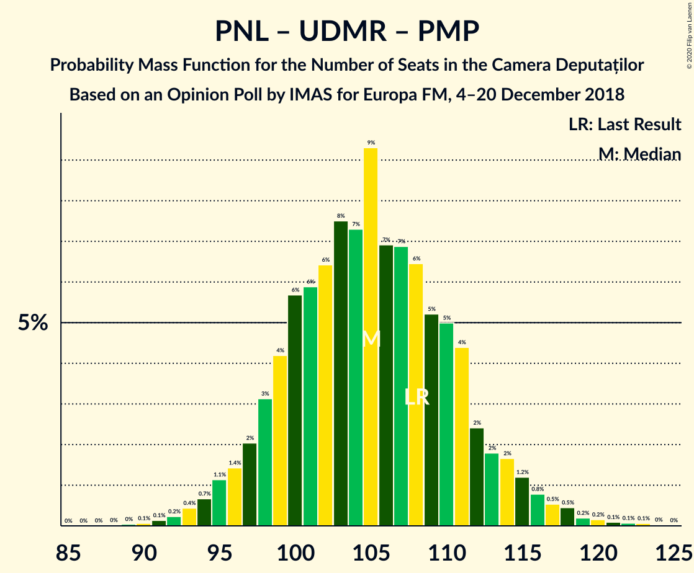

| Number of Seats | Probability | Accumulated | Special Marks |
|:---------------:|:-----------:|:-----------:|:-------------:|
| 89 | 0% | 100% |  |
| 90 | 0.1% | 99.9% |  |
| 91 | 0.1% | 99.8% |  |
| 92 | 0.4% | 99.8% |  |
| 93 | 0.2% | 99.3% |  |
| 94 | 0.4% | 99.2% |  |
| 95 | 2% | 98.8% |  |
| 96 | 1.0% | 97% |  |
| 97 | 1.4% | 96% |  |
| 98 | 4% | 95% |  |
| 99 | 4% | 91% |  |
| 100 | 7% | 87% |  |
| 101 | 6% | 79% |  |
| 102 | 3% | 73% |  |
| 103 | 9% | 70% |  |
| 104 | 13% | 61% | Median |
| 105 | 4% | 48% |  |
| 106 | 11% | 44% |  |
| 107 | 6% | 33% |  |
| 108 | 5% | 27% | Last Result |
| 109 | 7% | 22% |  |
| 110 | 4% | 15% |  |
| 111 | 3% | 11% |  |
| 112 | 2% | 8% |  |
| 113 | 1.1% | 6% |  |
| 114 | 0.9% | 4% |  |
| 115 | 2% | 4% |  |
| 116 | 0.3% | 2% |  |
| 117 | 0.6% | 1.3% |  |
| 118 | 0.3% | 0.7% |  |
| 119 | 0.1% | 0.4% |  |
| 120 | 0.2% | 0.3% |  |
| 121 | 0% | 0.2% |  |
| 122 | 0% | 0.1% |  |
| 123 | 0.1% | 0.1% |  |
| 124 | 0% | 0% |  |

### Partidul Național Liberal – Uniunea Democrată Maghiară din România

| Number of Seats | Probability | Accumulated | Special Marks |
|:---------------:|:-----------:|:-----------:|:-------------:|
| 89 | 0% | 100% |  |
| 90 | 0.1% | 99.9% | Last Result |
| 91 | 0.1% | 99.8% |  |
| 92 | 0.4% | 99.8% |  |
| 93 | 0.2% | 99.3% |  |
| 94 | 0.4% | 99.2% |  |
| 95 | 2% | 98.8% |  |
| 96 | 1.0% | 97% |  |
| 97 | 1.4% | 96% |  |
| 98 | 4% | 95% |  |
| 99 | 4% | 91% |  |
| 100 | 7% | 87% |  |
| 101 | 6% | 79% |  |
| 102 | 3% | 73% |  |
| 103 | 9% | 70% |  |
| 104 | 13% | 61% | Median |
| 105 | 4% | 48% |  |
| 106 | 11% | 44% |  |
| 107 | 6% | 33% |  |
| 108 | 5% | 27% |  |
| 109 | 7% | 22% |  |
| 110 | 4% | 15% |  |
| 111 | 3% | 11% |  |
| 112 | 2% | 8% |  |
| 113 | 1.1% | 6% |  |
| 114 | 0.9% | 4% |  |
| 115 | 2% | 4% |  |
| 116 | 0.3% | 2% |  |
| 117 | 0.6% | 1.3% |  |
| 118 | 0.3% | 0.7% |  |
| 119 | 0.1% | 0.4% |  |
| 120 | 0.2% | 0.3% |  |
| 121 | 0% | 0.2% |  |
| 122 | 0% | 0.1% |  |
| 123 | 0.1% | 0.1% |  |
| 124 | 0% | 0% |  |

### Partidul Național Liberal – Partidul Mișcarea Populară

| Number of Seats | Probability | Accumulated | Special Marks |
|:---------------:|:-----------:|:-----------:|:-------------:|
| 75 | 0% | 100% |  |
| 76 | 0.1% | 99.9% |  |
| 77 | 0.1% | 99.8% |  |
| 78 | 0.6% | 99.7% |  |
| 79 | 0.5% | 99.1% |  |
| 80 | 1.0% | 98.6% |  |
| 81 | 1.4% | 98% |  |
| 82 | 2% | 96% |  |
| 83 | 2% | 94% |  |
| 84 | 6% | 92% |  |
| 85 | 4% | 86% |  |
| 86 | 8% | 82% |  |
| 87 | 5% | 74% | Last Result |
| 88 | 10% | 68% |  |
| 89 | 11% | 58% | Median |
| 90 | 7% | 46% |  |
| 91 | 9% | 39% |  |
| 92 | 8% | 30% |  |
| 93 | 5% | 21% |  |
| 94 | 4% | 16% |  |
| 95 | 4% | 12% |  |
| 96 | 2% | 8% |  |
| 97 | 1.2% | 5% |  |
| 98 | 0.7% | 4% |  |
| 99 | 1.3% | 3% |  |
| 100 | 0.8% | 2% |  |
| 101 | 0.5% | 1.1% |  |
| 102 | 0.2% | 0.7% |  |
| 103 | 0.2% | 0.5% |  |
| 104 | 0.1% | 0.3% |  |
| 105 | 0.1% | 0.2% |  |
| 106 | 0% | 0.1% |  |
| 107 | 0% | 0.1% |  |
| 108 | 0% | 0.1% |  |
| 109 | 0% | 0% |  |

### Partidul Național Liberal

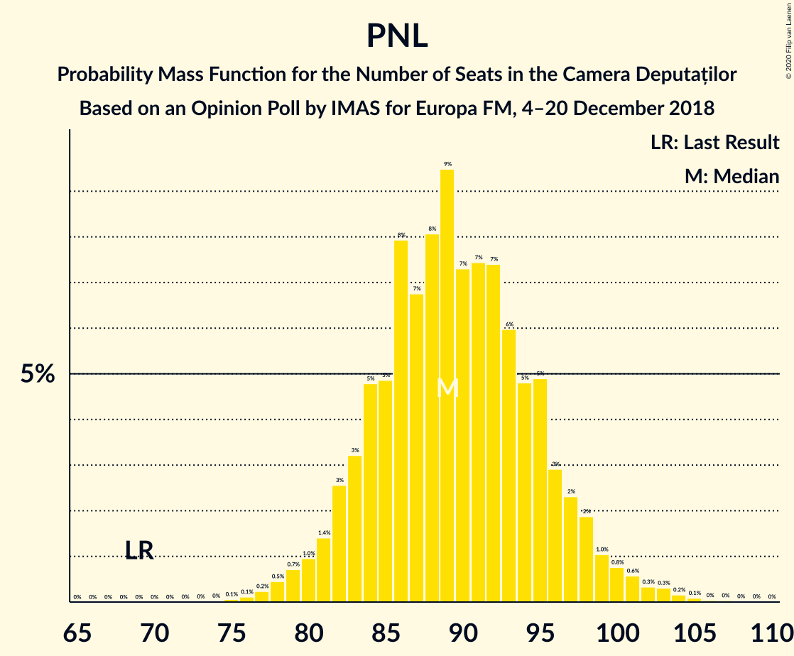

| Number of Seats | Probability | Accumulated | Special Marks |
|:---------------:|:-----------:|:-----------:|:-------------:|
| 69 | 0% | 100% | Last Result |
| 70 | 0% | 100% |  |
| 71 | 0% | 100% |  |
| 72 | 0% | 100% |  |
| 73 | 0% | 100% |  |
| 74 | 0% | 100% |  |
| 75 | 0% | 100% |  |
| 76 | 0.1% | 99.9% |  |
| 77 | 0.1% | 99.8% |  |
| 78 | 0.6% | 99.7% |  |
| 79 | 0.5% | 99.1% |  |
| 80 | 1.0% | 98.6% |  |
| 81 | 1.4% | 98% |  |
| 82 | 2% | 96% |  |
| 83 | 2% | 94% |  |
| 84 | 6% | 92% |  |
| 85 | 4% | 86% |  |
| 86 | 8% | 82% |  |
| 87 | 5% | 74% |  |
| 88 | 10% | 68% |  |
| 89 | 11% | 58% | Median |
| 90 | 7% | 46% |  |
| 91 | 9% | 39% |  |
| 92 | 8% | 30% |  |
| 93 | 5% | 21% |  |
| 94 | 4% | 16% |  |
| 95 | 4% | 12% |  |
| 96 | 2% | 8% |  |
| 97 | 1.2% | 5% |  |
| 98 | 0.7% | 4% |  |
| 99 | 1.3% | 3% |  |
| 100 | 0.8% | 2% |  |
| 101 | 0.5% | 1.1% |  |
| 102 | 0.2% | 0.7% |  |
| 103 | 0.2% | 0.5% |  |
| 104 | 0.1% | 0.3% |  |
| 105 | 0.1% | 0.2% |  |
| 106 | 0% | 0.1% |  |
| 107 | 0% | 0.1% |  |
| 108 | 0% | 0.1% |  |
| 109 | 0% | 0% |  |

### Alianța 2020 USR-PLUS – Partidul Mișcarea Populară

| Number of Seats | Probability | Accumulated | Special Marks |
|:---------------:|:-----------:|:-----------:|:-------------:|
| 48 | 0% | 100% | Last Result |
| 49 | 0% | 100% |  |
| 50 | 0% | 100% |  |
| 51 | 0% | 100% |  |
| 52 | 0% | 100% |  |
| 53 | 0% | 100% |  |
| 54 | 0.1% | 100% |  |
| 55 | 0.1% | 99.9% |  |
| 56 | 0.3% | 99.8% |  |
| 57 | 0.4% | 99.5% |  |
| 58 | 0.7% | 99.0% |  |
| 59 | 2% | 98% |  |
| 60 | 1.0% | 97% |  |
| 61 | 6% | 96% |  |
| 62 | 3% | 90% |  |
| 63 | 8% | 87% |  |
| 64 | 5% | 78% |  |
| 65 | 15% | 73% |  |
| 66 | 6% | 58% |  |
| 67 | 11% | 53% | Median |
| 68 | 6% | 42% |  |
| 69 | 7% | 36% |  |
| 70 | 11% | 30% |  |
| 71 | 3% | 19% |  |
| 72 | 6% | 16% |  |
| 73 | 3% | 10% |  |
| 74 | 3% | 7% |  |
| 75 | 2% | 4% |  |
| 76 | 0.7% | 3% |  |
| 77 | 1.1% | 2% |  |
| 78 | 0.3% | 0.9% |  |
| 79 | 0.3% | 0.6% |  |
| 80 | 0.1% | 0.3% |  |
| 81 | 0.2% | 0.2% |  |
| 82 | 0% | 0.1% |  |
| 83 | 0% | 0% |  |

## Technical Information

### Opinion Poll

+ **Polling firm:** IMAS
+ **Commissioner(s):** Europa FM
+ **Fieldwork period:** 4–20 December 2018

### Calculations

+ **Sample size:** 1010
+ **Simulations done:** 131,072
+ **Error estimate:** 1.87%

