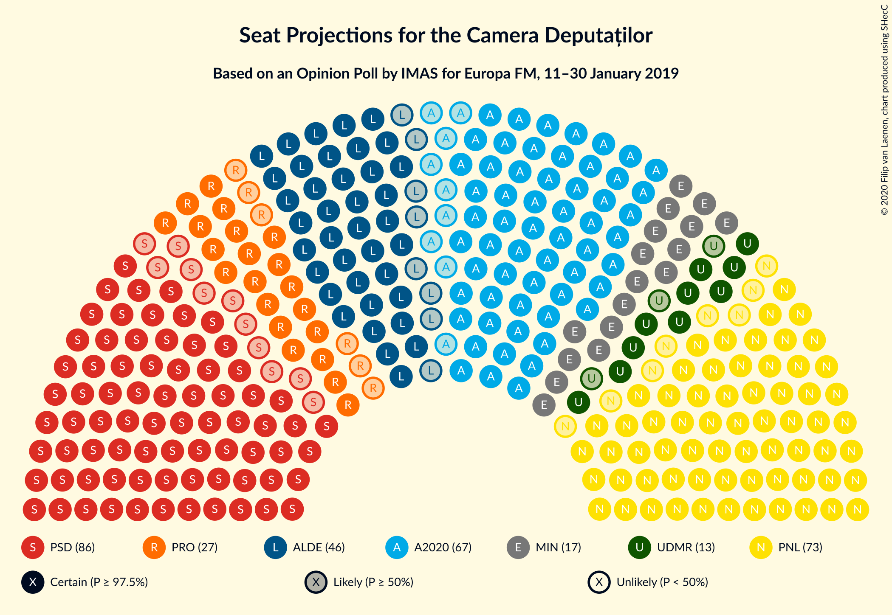
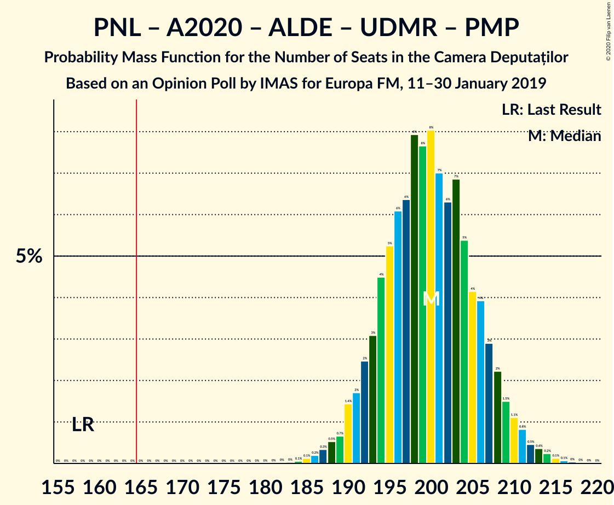
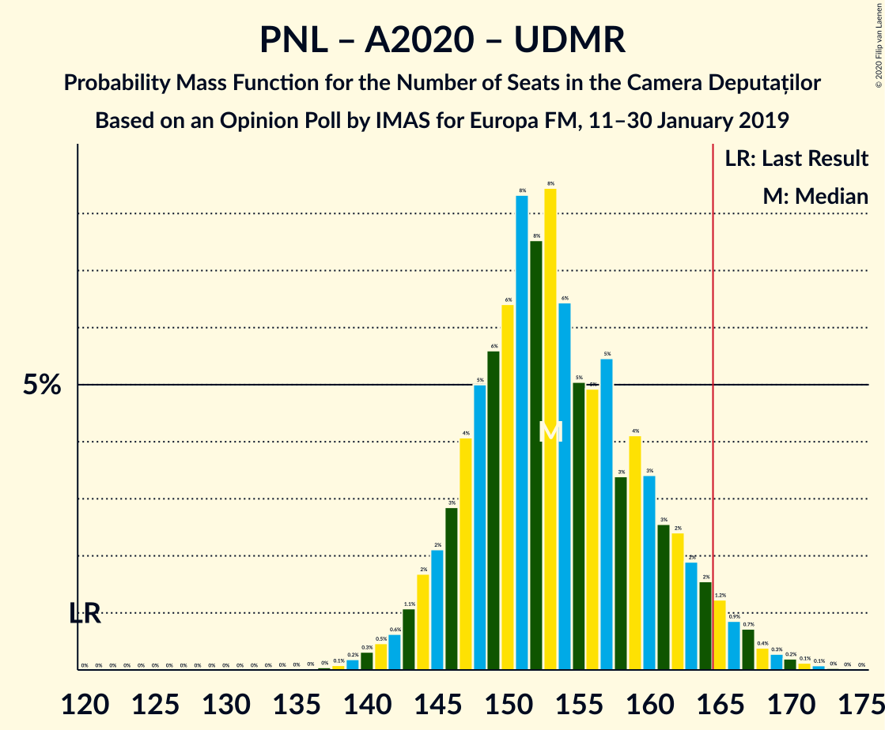
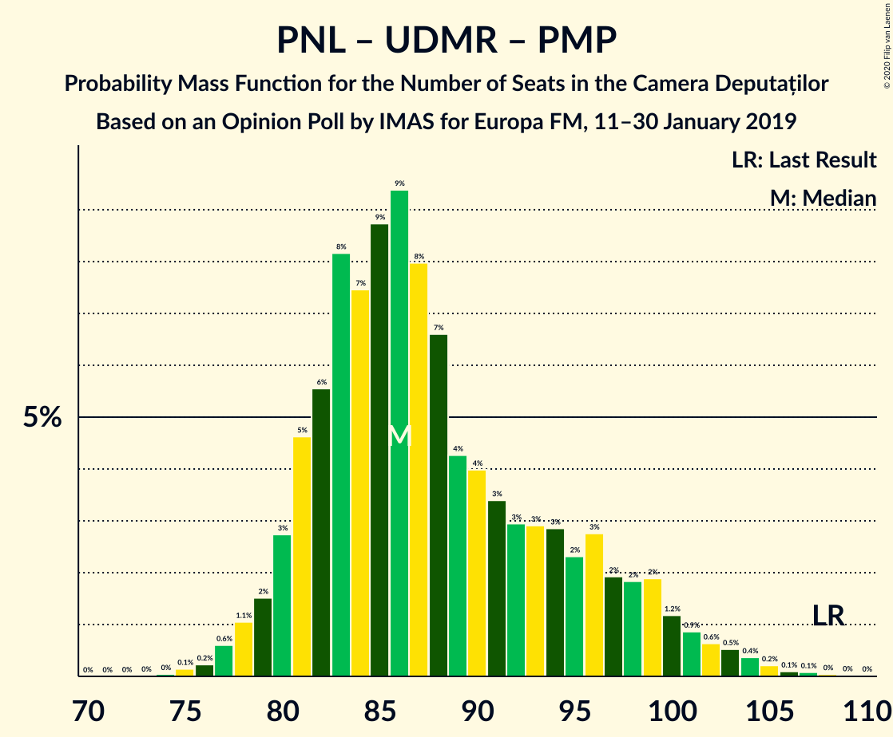

# Opinion Poll by IMAS for Europa FM, 11–30 January 2019

<a href="#voting-intentions">Voting Intentions</a> | <a href="#seats">Seats</a> | <a href="#coalitions">Coalitions</a> | <a href="#technical-information">Technical Information</a>

## Voting Intentions

### Confidence Intervals

| Party | Last Result | Poll Result | 80% Confidence Interval | 90% Confidence Interval | 95% Confidence Interval | 99% Confidence Interval |
|:-----:|:-----------:|:-----------:|:-----------------------:|:-----------------------:|:-----------------------:|:-----------------------:|
| Partidul Social Democrat | 45.5% | 25.2% | 23.5–27.0% |23.0–27.6% |22.6–28.0% |21.8–28.9% |
| Partidul Național Liberal | 20.0% | 22.1% | 20.4–23.8% |20.0–24.3% |19.6–24.7% |18.9–25.6% |
| Alianța 2020 USR-PLUS | 8.9% | 19.9% | 18.3–21.6% |17.9–22.0% |17.5–22.5% |16.8–23.3% |
| Partidul Alianța Liberalilor și Democraților | 5.6% | 13.4% | 12.1–14.8% |11.7–15.2% |11.4–15.6% |10.8–16.3% |
| PRO România | 0.0% | 8.1% | 7.1–9.3% |6.8–9.7% |6.6–10.0% |6.1–10.6% |
| Uniunea Democrată Maghiară din România | 6.2% | 4.4% | 3.6–5.3% |3.4–5.6% |3.3–5.8% |2.9–6.3% |
| Partidul Mișcarea Populară | 5.4% | 3.8% | 3.1–4.6% |2.9–4.9% |2.7–5.1% |2.5–5.6% |

*Note:* The poll result column reflects the actual value used in the calculations. Published results may vary slightly, and in addition be rounded to fewer digits.

## Seats

### Confidence Intervals

| Party | Last Result | Median | 80% Confidence Interval | 90% Confidence Interval | 95% Confidence Interval | 99% Confidence Interval |
|:-----:|:-----------:|:------:|:-----------------------:|:-----------------------:|:-----------------------:|:-----------------------:|
| <a href="#partidul-social-democrat">Partidul Social Democrat</a> | 154 | 82 | 75–93 |75–94 |75–94 |72–99 |
| <a href="#partidul-național-liberal">Partidul Național Liberal</a> | 69 | 73 | 67–82 |64–82 |64–83 |62–89 |
| <a href="#alianța-2020-usr-plus">Alianța 2020 USR-PLUS</a> | 30 | 67 | 60–74 |59–75 |58–76 |55–77 |
| <a href="#partidul-alianța-liberalilor-și-democraților">Partidul Alianța Liberalilor și Democraților</a> | 20 | 44 | 40–51 |38–52 |37–52 |36–56 |
| <a href="#pro-românia">PRO România</a> | 0 | 27 | 24–31 |23–32 |22–32 |20–34 |
| <a href="#uniunea-democrată-maghiară-din-românia">Uniunea Democrată Maghiară din România</a> | 21 | 13 | 11–18 |10–18 |10–20 |9–21 |
| <a href="#partidul-mișcarea-populară">Partidul Mișcarea Populară</a> | 18 | 0 | 0 |0–16 |0–17 |0–19 |

### Partidul Social Democrat

*For a full overview of the results for this party, see the [Partidul Social Democrat](party-partidulsocialdemocrat.html) page.*

| Number of Seats | Probability | Accumulated | Special Marks |
|:---------------:|:-----------:|:-----------:|:-------------:|
| 70 | 0% | 100% |  |
| 71 | 0.1% | 99.9% |  |
| 72 | 1.1% | 99.9% |  |
| 73 | 0.1% | 98.8% |  |
| 74 | 0.9% | 98.6% |  |
| 75 | 8% | 98% |  |
| 76 | 2% | 90% |  |
| 77 | 4% | 88% |  |
| 78 | 1.0% | 84% |  |
| 79 | 12% | 83% |  |
| 80 | 3% | 71% |  |
| 81 | 11% | 67% |  |
| 82 | 14% | 56% | Median |
| 83 | 3% | 42% |  |
| 84 | 0.7% | 39% |  |
| 85 | 0.3% | 38% |  |
| 86 | 0.5% | 38% |  |
| 87 | 1.5% | 37% |  |
| 88 | 0.2% | 36% |  |
| 89 | 0.9% | 36% |  |
| 90 | 10% | 35% |  |
| 91 | 8% | 25% |  |
| 92 | 1.2% | 17% |  |
| 93 | 6% | 15% |  |
| 94 | 7% | 9% |  |
| 95 | 0.2% | 2% |  |
| 96 | 0% | 2% |  |
| 97 | 0.6% | 2% |  |
| 98 | 0.1% | 1.0% |  |
| 99 | 0.7% | 0.8% |  |
| 100 | 0% | 0.1% |  |
| 101 | 0.1% | 0.1% |  |
| 102 | 0% | 0% |  |
| 103 | 0% | 0% |  |
| 104 | 0% | 0% |  |
| 105 | 0% | 0% |  |
| 106 | 0% | 0% |  |
| 107 | 0% | 0% |  |
| 108 | 0% | 0% |  |
| 109 | 0% | 0% |  |
| 110 | 0% | 0% |  |
| 111 | 0% | 0% |  |
| 112 | 0% | 0% |  |
| 113 | 0% | 0% |  |
| 114 | 0% | 0% |  |
| 115 | 0% | 0% |  |
| 116 | 0% | 0% |  |
| 117 | 0% | 0% |  |
| 118 | 0% | 0% |  |
| 119 | 0% | 0% |  |
| 120 | 0% | 0% |  |
| 121 | 0% | 0% |  |
| 122 | 0% | 0% |  |
| 123 | 0% | 0% |  |
| 124 | 0% | 0% |  |
| 125 | 0% | 0% |  |
| 126 | 0% | 0% |  |
| 127 | 0% | 0% |  |
| 128 | 0% | 0% |  |
| 129 | 0% | 0% |  |
| 130 | 0% | 0% |  |
| 131 | 0% | 0% |  |
| 132 | 0% | 0% |  |
| 133 | 0% | 0% |  |
| 134 | 0% | 0% |  |
| 135 | 0% | 0% |  |
| 136 | 0% | 0% |  |
| 137 | 0% | 0% |  |
| 138 | 0% | 0% |  |
| 139 | 0% | 0% |  |
| 140 | 0% | 0% |  |
| 141 | 0% | 0% |  |
| 142 | 0% | 0% |  |
| 143 | 0% | 0% |  |
| 144 | 0% | 0% |  |
| 145 | 0% | 0% |  |
| 146 | 0% | 0% |  |
| 147 | 0% | 0% |  |
| 148 | 0% | 0% |  |
| 149 | 0% | 0% |  |
| 150 | 0% | 0% |  |
| 151 | 0% | 0% |  |
| 152 | 0% | 0% |  |
| 153 | 0% | 0% |  |
| 154 | 0% | 0% | Last Result |

### Partidul Național Liberal

*For a full overview of the results for this party, see the [Partidul Național Liberal](party-partidulnaționalliberal.html) page.*

| Number of Seats | Probability | Accumulated | Special Marks |
|:---------------:|:-----------:|:-----------:|:-------------:|
| 60 | 0.1% | 100% |  |
| 61 | 0.2% | 99.9% |  |
| 62 | 0.3% | 99.6% |  |
| 63 | 0.7% | 99.4% |  |
| 64 | 6% | 98.7% |  |
| 65 | 0.9% | 92% |  |
| 66 | 1.2% | 91% |  |
| 67 | 0.5% | 90% |  |
| 68 | 3% | 90% |  |
| 69 | 6% | 86% | Last Result |
| 70 | 22% | 80% |  |
| 71 | 6% | 59% |  |
| 72 | 1.1% | 52% |  |
| 73 | 3% | 51% | Median |
| 74 | 2% | 48% |  |
| 75 | 7% | 46% |  |
| 76 | 8% | 38% |  |
| 77 | 12% | 30% |  |
| 78 | 2% | 18% |  |
| 79 | 0.6% | 16% |  |
| 80 | 0.6% | 15% |  |
| 81 | 0.6% | 15% |  |
| 82 | 10% | 14% |  |
| 83 | 2% | 4% |  |
| 84 | 0.6% | 1.5% |  |
| 85 | 0.1% | 0.8% |  |
| 86 | 0% | 0.7% |  |
| 87 | 0% | 0.7% |  |
| 88 | 0.1% | 0.7% |  |
| 89 | 0.5% | 0.6% |  |
| 90 | 0% | 0% |  |

### Alianța 2020 USR-PLUS

*For a full overview of the results for this party, see the [Alianța 2020 USR-PLUS](party-alianța2020usr-plus.html) page.*

| Number of Seats | Probability | Accumulated | Special Marks |
|:---------------:|:-----------:|:-----------:|:-------------:|
| 30 | 0% | 100% | Last Result |
| 31 | 0% | 100% |  |
| 32 | 0% | 100% |  |
| 33 | 0% | 100% |  |
| 34 | 0% | 100% |  |
| 35 | 0% | 100% |  |
| 36 | 0% | 100% |  |
| 37 | 0% | 100% |  |
| 38 | 0% | 100% |  |
| 39 | 0% | 100% |  |
| 40 | 0% | 100% |  |
| 41 | 0% | 100% |  |
| 42 | 0% | 100% |  |
| 43 | 0% | 100% |  |
| 44 | 0% | 100% |  |
| 45 | 0% | 100% |  |
| 46 | 0% | 100% |  |
| 47 | 0% | 100% |  |
| 48 | 0% | 100% |  |
| 49 | 0% | 100% |  |
| 50 | 0% | 100% |  |
| 51 | 0% | 100% |  |
| 52 | 0% | 100% |  |
| 53 | 0% | 100% |  |
| 54 | 0.2% | 99.9% |  |
| 55 | 0.3% | 99.7% |  |
| 56 | 0.8% | 99.4% |  |
| 57 | 0.6% | 98.7% |  |
| 58 | 1.4% | 98% |  |
| 59 | 4% | 97% |  |
| 60 | 6% | 93% |  |
| 61 | 3% | 87% |  |
| 62 | 11% | 84% |  |
| 63 | 2% | 73% |  |
| 64 | 7% | 71% |  |
| 65 | 4% | 64% |  |
| 66 | 9% | 60% |  |
| 67 | 8% | 52% | Median |
| 68 | 4% | 44% |  |
| 69 | 8% | 40% |  |
| 70 | 6% | 32% |  |
| 71 | 7% | 27% |  |
| 72 | 1.5% | 20% |  |
| 73 | 8% | 19% |  |
| 74 | 3% | 10% |  |
| 75 | 4% | 7% |  |
| 76 | 2% | 3% |  |
| 77 | 0.3% | 0.6% |  |
| 78 | 0.1% | 0.3% |  |
| 79 | 0.1% | 0.2% |  |
| 80 | 0% | 0.1% |  |
| 81 | 0% | 0% |  |

### Partidul Alianța Liberalilor și Democraților

*For a full overview of the results for this party, see the [Partidul Alianța Liberalilor și Democraților](party-partidulalianțaliberalilorșidemocraților.html) page.*

| Number of Seats | Probability | Accumulated | Special Marks |
|:---------------:|:-----------:|:-----------:|:-------------:|
| 20 | 0% | 100% | Last Result |
| 21 | 0% | 100% |  |
| 22 | 0% | 100% |  |
| 23 | 0% | 100% |  |
| 24 | 0% | 100% |  |
| 25 | 0% | 100% |  |
| 26 | 0% | 100% |  |
| 27 | 0% | 100% |  |
| 28 | 0% | 100% |  |
| 29 | 0% | 100% |  |
| 30 | 0% | 100% |  |
| 31 | 0% | 100% |  |
| 32 | 0% | 100% |  |
| 33 | 0% | 100% |  |
| 34 | 0.2% | 99.9% |  |
| 35 | 0.3% | 99.8% |  |
| 36 | 1.2% | 99.5% |  |
| 37 | 0.9% | 98% |  |
| 38 | 4% | 97% |  |
| 39 | 1.1% | 94% |  |
| 40 | 3% | 93% |  |
| 41 | 8% | 90% |  |
| 42 | 10% | 82% |  |
| 43 | 16% | 72% |  |
| 44 | 15% | 56% | Median |
| 45 | 3% | 40% |  |
| 46 | 4% | 38% |  |
| 47 | 2% | 34% |  |
| 48 | 8% | 32% |  |
| 49 | 10% | 24% |  |
| 50 | 1.1% | 14% |  |
| 51 | 8% | 13% |  |
| 52 | 3% | 5% |  |
| 53 | 2% | 2% |  |
| 54 | 0.2% | 0.9% |  |
| 55 | 0.1% | 0.7% |  |
| 56 | 0.6% | 0.6% |  |
| 57 | 0% | 0.1% |  |
| 58 | 0% | 0.1% |  |
| 59 | 0% | 0% |  |

### PRO România

*For a full overview of the results for this party, see the [PRO România](party-proromânia.html) page.*

| Number of Seats | Probability | Accumulated | Special Marks |
|:---------------:|:-----------:|:-----------:|:-------------:|
| 0 | 0% | 100% | Last Result |
| 1 | 0% | 100% |  |
| 2 | 0% | 100% |  |
| 3 | 0% | 100% |  |
| 4 | 0% | 100% |  |
| 5 | 0% | 100% |  |
| 6 | 0% | 100% |  |
| 7 | 0% | 100% |  |
| 8 | 0% | 100% |  |
| 9 | 0% | 100% |  |
| 10 | 0% | 100% |  |
| 11 | 0% | 100% |  |
| 12 | 0% | 100% |  |
| 13 | 0% | 100% |  |
| 14 | 0% | 100% |  |
| 15 | 0% | 100% |  |
| 16 | 0% | 100% |  |
| 17 | 0% | 100% |  |
| 18 | 0.1% | 100% |  |
| 19 | 0.1% | 99.9% |  |
| 20 | 1.0% | 99.8% |  |
| 21 | 0.5% | 98.8% |  |
| 22 | 2% | 98% |  |
| 23 | 5% | 96% |  |
| 24 | 10% | 92% |  |
| 25 | 16% | 82% |  |
| 26 | 5% | 66% |  |
| 27 | 20% | 61% | Median |
| 28 | 9% | 41% |  |
| 29 | 5% | 32% |  |
| 30 | 14% | 27% |  |
| 31 | 5% | 13% |  |
| 32 | 5% | 8% |  |
| 33 | 2% | 2% |  |
| 34 | 0.3% | 0.7% |  |
| 35 | 0.2% | 0.4% |  |
| 36 | 0.1% | 0.3% |  |
| 37 | 0.2% | 0.2% |  |
| 38 | 0% | 0% |  |

### Uniunea Democrată Maghiară din România

*For a full overview of the results for this party, see the [Uniunea Democrată Maghiară din România](party-uniuneademocratămaghiarădinromânia.html) page.*

| Number of Seats | Probability | Accumulated | Special Marks |
|:---------------:|:-----------:|:-----------:|:-------------:|
| 8 | 0.1% | 100% |  |
| 9 | 0.9% | 99.9% |  |
| 10 | 7% | 99.0% |  |
| 11 | 5% | 92% |  |
| 12 | 14% | 88% |  |
| 13 | 26% | 74% | Median |
| 14 | 10% | 48% |  |
| 15 | 6% | 38% |  |
| 16 | 5% | 32% |  |
| 17 | 16% | 27% |  |
| 18 | 6% | 10% |  |
| 19 | 2% | 5% |  |
| 20 | 3% | 3% |  |
| 21 | 0.4% | 0.6% | Last Result |
| 22 | 0.1% | 0.2% |  |
| 23 | 0.1% | 0.1% |  |
| 24 | 0% | 0% |  |

### Partidul Mișcarea Populară

*For a full overview of the results for this party, see the [Partidul Mișcarea Populară](party-partidulmișcareapopulară.html) page.*

| Number of Seats | Probability | Accumulated | Special Marks |
|:---------------:|:-----------:|:-----------:|:-------------:|
| 0 | 91% | 100% | Median |
| 1 | 0% | 9% |  |
| 2 | 0% | 9% |  |
| 3 | 0% | 9% |  |
| 4 | 0% | 9% |  |
| 5 | 0% | 9% |  |
| 6 | 0% | 9% |  |
| 7 | 0% | 9% |  |
| 8 | 0% | 9% |  |
| 9 | 0% | 9% |  |
| 10 | 0% | 9% |  |
| 11 | 0% | 9% |  |
| 12 | 0% | 9% |  |
| 13 | 0% | 9% |  |
| 14 | 0% | 9% |  |
| 15 | 0% | 9% |  |
| 16 | 5% | 9% |  |
| 17 | 1.2% | 4% |  |
| 18 | 2% | 2% | Last Result |
| 19 | 0.5% | 0.7% |  |
| 20 | 0.1% | 0.2% |  |
| 21 | 0% | 0% |  |

## Coalitions

### Confidence Intervals

| Coalition | Last Result | Median | Majority? | 80% Confidence Interval | 90% Confidence Interval | 95% Confidence Interval | 99% Confidence Interval |
|:---------:|:-----------:|:------:|:---------:|:-----------------------:|:-----------------------:|:-----------------------:|:-----------------------:|
| Partidul Național Liberal – Alianța 2020 USR-PLUS – Partidul Alianța Liberalilor și Democraților – Uniunea Democrată Maghiară din România – Partidul Mișcarea Populară | 158 | 200 | 100% | 192–208 | 191–210 | 190–214 | 185–216 |
| Partidul Național Liberal – Alianța 2020 USR-PLUS – Partidul Alianța Liberalilor și Democraților – Uniunea Democrată Maghiară din România | 140 | 199 | 100% | 191–207 | 187–208 | 187–210 | 181–216 |
| Partidul Național Liberal – Alianța 2020 USR-PLUS – Partidul Alianța Liberalilor și Democraților – Partidul Mișcarea Populară | 137 | 187 | 100% | 179–195 | 177–196 | 176–201 | 173–201 |
| Partidul Național Liberal – Alianța 2020 USR-PLUS – Partidul Alianța Liberalilor și Democraților | 119 | 185 | 99.9% | 177–193 | 176–196 | 174–196 | 168–199 |
| Partidul Național Liberal – Alianța 2020 USR-PLUS – Uniunea Democrată Maghiară din România – Partidul Mișcarea Populară | 138 | 157 | 11% | 147–166 | 147–168 | 146–169 | 140–171 |
| Partidul Național Liberal – Alianța 2020 USR-PLUS – Uniunea Democrată Maghiară din România | 120 | 155 | 7% | 147–161 | 144–166 | 143–168 | 140–171 |
| Partidul Social Democrat – Partidul Alianța Liberalilor și Democraților – PRO România | 174 | 155 | 3% | 146–165 | 144–165 | 143–166 | 141–172 |
| Partidul Național Liberal – Alianța 2020 USR-PLUS – Partidul Mișcarea Populară | 117 | 143 | 0% | 134–151 | 133–154 | 133–155 | 126–157 |
| Partidul Național Liberal – Alianța 2020 USR-PLUS | 99 | 141 | 0% | 133–147 | 132–151 | 130–153 | 124–154 |
| Partidul Național Liberal – Partidul Alianța Liberalilor și Democraților – Uniunea Democrată Maghiară din România – Partidul Mișcarea Populară | 128 | 134 | 0% | 123–143 | 122–146 | 122–146 | 121–148 |
| Partidul Național Liberal – Partidul Alianța Liberalilor și Democraților – Uniunea Democrată Maghiară din România | 110 | 132 | 0% | 123–142 | 122–142 | 122–144 | 119–146 |
| Partidul Social Democrat – Partidul Alianța Liberalilor și Democraților | 174 | 129 | 0% | 120–138 | 117–140 | 117–140 | 115–144 |
| Partidul Social Democrat – PRO România | 154 | 112 | 0% | 104–120 | 102–121 | 98–122 | 96–127 |
| Partidul Național Liberal – Uniunea Democrată Maghiară din România – Partidul Mișcarea Populară | 108 | 88 | 0% | 82–99 | 78–100 | 78–103 | 77–105 |
| Partidul Național Liberal – Uniunea Democrată Maghiară din România | 90 | 87 | 0% | 80–99 | 78–99 | 78–99 | 77–104 |
| Partidul Național Liberal – Partidul Mișcarea Populară | 87 | 75 | 0% | 68–83 | 64–87 | 64–90 | 62–92 |
| Alianța 2020 USR-PLUS – Partidul Mișcarea Populară | 48 | 68 | 0% | 60–76 | 60–80 | 58–84 | 56–84 |
| Partidul Național Liberal | 69 | 73 | 0% | 67–82 | 64–82 | 64–83 | 62–89 |

### Partidul Național Liberal – Alianța 2020 USR-PLUS – Partidul Alianța Liberalilor și Democraților – Uniunea Democrată Maghiară din România – Partidul Mișcarea Populară

| Number of Seats | Probability | Accumulated | Special Marks |
|:---------------:|:-----------:|:-----------:|:-------------:|
| 158 | 0% | 100% | Last Result |
| 159 | 0% | 100% |  |
| 160 | 0% | 100% |  |
| 161 | 0% | 100% |  |
| 162 | 0% | 100% |  |
| 163 | 0% | 100% |  |
| 164 | 0% | 100% |  |
| 165 | 0% | 100% |  |
| 166 | 0% | 100% | Majority |
| 167 | 0% | 100% |  |
| 168 | 0% | 100% |  |
| 169 | 0% | 100% |  |
| 170 | 0% | 100% |  |
| 171 | 0% | 100% |  |
| 172 | 0% | 100% |  |
| 173 | 0% | 100% |  |
| 174 | 0% | 100% |  |
| 175 | 0% | 100% |  |
| 176 | 0% | 100% |  |
| 177 | 0% | 100% |  |
| 178 | 0% | 100% |  |
| 179 | 0% | 100% |  |
| 180 | 0.1% | 100% |  |
| 181 | 0% | 99.9% |  |
| 182 | 0% | 99.9% |  |
| 183 | 0% | 99.9% |  |
| 184 | 0% | 99.9% |  |
| 185 | 0.4% | 99.9% |  |
| 186 | 0.4% | 99.4% |  |
| 187 | 0.3% | 99.0% |  |
| 188 | 0.1% | 98.8% |  |
| 189 | 0.5% | 98.7% |  |
| 190 | 2% | 98% |  |
| 191 | 6% | 97% |  |
| 192 | 0.7% | 90% |  |
| 193 | 1.4% | 90% |  |
| 194 | 5% | 88% |  |
| 195 | 0.5% | 83% |  |
| 196 | 6% | 82% |  |
| 197 | 12% | 77% | Median |
| 198 | 3% | 65% |  |
| 199 | 7% | 62% |  |
| 200 | 9% | 56% |  |
| 201 | 3% | 47% |  |
| 202 | 1.1% | 44% |  |
| 203 | 4% | 42% |  |
| 204 | 10% | 39% |  |
| 205 | 3% | 29% |  |
| 206 | 5% | 25% |  |
| 207 | 10% | 20% |  |
| 208 | 3% | 11% |  |
| 209 | 1.2% | 8% |  |
| 210 | 2% | 7% |  |
| 211 | 0.3% | 5% |  |
| 212 | 0.1% | 4% |  |
| 213 | 0.6% | 4% |  |
| 214 | 3% | 4% |  |
| 215 | 0.1% | 0.7% |  |
| 216 | 0.5% | 0.6% |  |
| 217 | 0.1% | 0.1% |  |
| 218 | 0% | 0% |  |

### Partidul Național Liberal – Alianța 2020 USR-PLUS – Partidul Alianța Liberalilor și Democraților – Uniunea Democrată Maghiară din România

| Number of Seats | Probability | Accumulated | Special Marks |
|:---------------:|:-----------:|:-----------:|:-------------:|
| 140 | 0% | 100% | Last Result |
| 141 | 0% | 100% |  |
| 142 | 0% | 100% |  |
| 143 | 0% | 100% |  |
| 144 | 0% | 100% |  |
| 145 | 0% | 100% |  |
| 146 | 0% | 100% |  |
| 147 | 0% | 100% |  |
| 148 | 0% | 100% |  |
| 149 | 0% | 100% |  |
| 150 | 0% | 100% |  |
| 151 | 0% | 100% |  |
| 152 | 0% | 100% |  |
| 153 | 0% | 100% |  |
| 154 | 0% | 100% |  |
| 155 | 0% | 100% |  |
| 156 | 0% | 100% |  |
| 157 | 0% | 100% |  |
| 158 | 0% | 100% |  |
| 159 | 0% | 100% |  |
| 160 | 0% | 100% |  |
| 161 | 0% | 100% |  |
| 162 | 0% | 100% |  |
| 163 | 0% | 100% |  |
| 164 | 0% | 100% |  |
| 165 | 0% | 100% |  |
| 166 | 0% | 100% | Majority |
| 167 | 0% | 100% |  |
| 168 | 0% | 100% |  |
| 169 | 0% | 100% |  |
| 170 | 0% | 100% |  |
| 171 | 0% | 100% |  |
| 172 | 0% | 100% |  |
| 173 | 0% | 100% |  |
| 174 | 0% | 100% |  |
| 175 | 0% | 100% |  |
| 176 | 0% | 100% |  |
| 177 | 0% | 100% |  |
| 178 | 0% | 100% |  |
| 179 | 0% | 100% |  |
| 180 | 0.1% | 100% |  |
| 181 | 0.7% | 99.9% |  |
| 182 | 0% | 99.2% |  |
| 183 | 0% | 99.2% |  |
| 184 | 0% | 99.1% |  |
| 185 | 0.5% | 99.1% |  |
| 186 | 0.5% | 98.6% |  |
| 187 | 3% | 98% |  |
| 188 | 0.1% | 95% |  |
| 189 | 0.5% | 95% |  |
| 190 | 2% | 94% |  |
| 191 | 6% | 92% |  |
| 192 | 2% | 86% |  |
| 193 | 2% | 84% |  |
| 194 | 6% | 82% |  |
| 195 | 0.5% | 77% |  |
| 196 | 6% | 76% |  |
| 197 | 12% | 70% | Median |
| 198 | 5% | 59% |  |
| 199 | 7% | 53% |  |
| 200 | 8% | 47% |  |
| 201 | 3% | 39% |  |
| 202 | 0.9% | 35% |  |
| 203 | 3% | 34% |  |
| 204 | 9% | 32% |  |
| 205 | 2% | 22% |  |
| 206 | 5% | 20% |  |
| 207 | 9% | 15% |  |
| 208 | 2% | 6% |  |
| 209 | 0.8% | 4% |  |
| 210 | 1.4% | 3% |  |
| 211 | 0.2% | 2% |  |
| 212 | 0.1% | 2% |  |
| 213 | 0.5% | 1.5% |  |
| 214 | 0.3% | 1.0% |  |
| 215 | 0.1% | 0.6% |  |
| 216 | 0.5% | 0.6% |  |
| 217 | 0% | 0.1% |  |
| 218 | 0% | 0% |  |

### Partidul Național Liberal – Alianța 2020 USR-PLUS – Partidul Alianța Liberalilor și Democraților – Partidul Mișcarea Populară

| Number of Seats | Probability | Accumulated | Special Marks |
|:---------------:|:-----------:|:-----------:|:-------------:|
| 137 | 0% | 100% | Last Result |
| 138 | 0% | 100% |  |
| 139 | 0% | 100% |  |
| 140 | 0% | 100% |  |
| 141 | 0% | 100% |  |
| 142 | 0% | 100% |  |
| 143 | 0% | 100% |  |
| 144 | 0% | 100% |  |
| 145 | 0% | 100% |  |
| 146 | 0% | 100% |  |
| 147 | 0% | 100% |  |
| 148 | 0% | 100% |  |
| 149 | 0% | 100% |  |
| 150 | 0% | 100% |  |
| 151 | 0% | 100% |  |
| 152 | 0% | 100% |  |
| 153 | 0% | 100% |  |
| 154 | 0% | 100% |  |
| 155 | 0% | 100% |  |
| 156 | 0% | 100% |  |
| 157 | 0% | 100% |  |
| 158 | 0% | 100% |  |
| 159 | 0% | 100% |  |
| 160 | 0% | 100% |  |
| 161 | 0% | 100% |  |
| 162 | 0% | 100% |  |
| 163 | 0% | 100% |  |
| 164 | 0% | 100% |  |
| 165 | 0% | 100% |  |
| 166 | 0.1% | 100% | Majority |
| 167 | 0% | 99.9% |  |
| 168 | 0% | 99.9% |  |
| 169 | 0.1% | 99.9% |  |
| 170 | 0% | 99.8% |  |
| 171 | 0% | 99.8% |  |
| 172 | 0% | 99.8% |  |
| 173 | 0.9% | 99.8% |  |
| 174 | 0.5% | 98.9% |  |
| 175 | 0.4% | 98% |  |
| 176 | 0.9% | 98% |  |
| 177 | 6% | 97% |  |
| 178 | 0.4% | 91% |  |
| 179 | 1.1% | 90% |  |
| 180 | 2% | 89% |  |
| 181 | 9% | 87% |  |
| 182 | 2% | 79% |  |
| 183 | 9% | 77% |  |
| 184 | 5% | 67% | Median |
| 185 | 9% | 63% |  |
| 186 | 1.2% | 54% |  |
| 187 | 19% | 53% |  |
| 188 | 3% | 34% |  |
| 189 | 1.4% | 31% |  |
| 190 | 7% | 30% |  |
| 191 | 2% | 23% |  |
| 192 | 2% | 21% |  |
| 193 | 4% | 19% |  |
| 194 | 1.3% | 15% |  |
| 195 | 4% | 14% |  |
| 196 | 4% | 9% |  |
| 197 | 0.1% | 5% |  |
| 198 | 0.9% | 5% |  |
| 199 | 0.4% | 4% |  |
| 200 | 0.4% | 3% |  |
| 201 | 3% | 3% |  |
| 202 | 0.2% | 0.3% |  |
| 203 | 0.1% | 0.1% |  |
| 204 | 0% | 0% |  |

### Partidul Național Liberal – Alianța 2020 USR-PLUS – Partidul Alianța Liberalilor și Democraților

| Number of Seats | Probability | Accumulated | Special Marks |
|:---------------:|:-----------:|:-----------:|:-------------:|
| 119 | 0% | 100% | Last Result |
| 120 | 0% | 100% |  |
| 121 | 0% | 100% |  |
| 122 | 0% | 100% |  |
| 123 | 0% | 100% |  |
| 124 | 0% | 100% |  |
| 125 | 0% | 100% |  |
| 126 | 0% | 100% |  |
| 127 | 0% | 100% |  |
| 128 | 0% | 100% |  |
| 129 | 0% | 100% |  |
| 130 | 0% | 100% |  |
| 131 | 0% | 100% |  |
| 132 | 0% | 100% |  |
| 133 | 0% | 100% |  |
| 134 | 0% | 100% |  |
| 135 | 0% | 100% |  |
| 136 | 0% | 100% |  |
| 137 | 0% | 100% |  |
| 138 | 0% | 100% |  |
| 139 | 0% | 100% |  |
| 140 | 0% | 100% |  |
| 141 | 0% | 100% |  |
| 142 | 0% | 100% |  |
| 143 | 0% | 100% |  |
| 144 | 0% | 100% |  |
| 145 | 0% | 100% |  |
| 146 | 0% | 100% |  |
| 147 | 0% | 100% |  |
| 148 | 0% | 100% |  |
| 149 | 0% | 100% |  |
| 150 | 0% | 100% |  |
| 151 | 0% | 100% |  |
| 152 | 0% | 100% |  |
| 153 | 0% | 100% |  |
| 154 | 0% | 100% |  |
| 155 | 0% | 100% |  |
| 156 | 0% | 100% |  |
| 157 | 0% | 100% |  |
| 158 | 0% | 100% |  |
| 159 | 0% | 100% |  |
| 160 | 0% | 100% |  |
| 161 | 0% | 100% |  |
| 162 | 0% | 100% |  |
| 163 | 0% | 100% |  |
| 164 | 0% | 100% |  |
| 165 | 0% | 99.9% |  |
| 166 | 0.1% | 99.9% | Majority |
| 167 | 0% | 99.8% |  |
| 168 | 0.5% | 99.8% |  |
| 169 | 0.2% | 99.4% |  |
| 170 | 0.3% | 99.2% |  |
| 171 | 0% | 98.9% |  |
| 172 | 0.2% | 98.8% |  |
| 173 | 0.9% | 98.6% |  |
| 174 | 0.6% | 98% |  |
| 175 | 2% | 97% |  |
| 176 | 2% | 96% |  |
| 177 | 8% | 94% |  |
| 178 | 1.4% | 86% |  |
| 179 | 1.1% | 85% |  |
| 180 | 2% | 83% |  |
| 181 | 9% | 82% |  |
| 182 | 2% | 73% |  |
| 183 | 9% | 71% |  |
| 184 | 5% | 61% | Median |
| 185 | 11% | 56% |  |
| 186 | 0.9% | 45% |  |
| 187 | 18% | 44% |  |
| 188 | 3% | 26% |  |
| 189 | 1.4% | 23% |  |
| 190 | 7% | 22% |  |
| 191 | 2% | 15% |  |
| 192 | 2% | 13% |  |
| 193 | 1.0% | 11% |  |
| 194 | 0.2% | 10% |  |
| 195 | 4% | 10% |  |
| 196 | 4% | 6% |  |
| 197 | 0% | 2% |  |
| 198 | 0.8% | 1.5% |  |
| 199 | 0.4% | 0.7% |  |
| 200 | 0% | 0.3% |  |
| 201 | 0% | 0.2% |  |
| 202 | 0.1% | 0.2% |  |
| 203 | 0.1% | 0.1% |  |
| 204 | 0% | 0% |  |

### Partidul Național Liberal – Alianța 2020 USR-PLUS – Uniunea Democrată Maghiară din România – Partidul Mișcarea Populară

| Number of Seats | Probability | Accumulated | Special Marks |
|:---------------:|:-----------:|:-----------:|:-------------:|
| 138 | 0.1% | 100% | Last Result |
| 139 | 0.1% | 99.9% |  |
| 140 | 0.5% | 99.8% |  |
| 141 | 0.1% | 99.3% |  |
| 142 | 0% | 99.2% |  |
| 143 | 0.4% | 99.2% |  |
| 144 | 0.2% | 98.8% |  |
| 145 | 0.6% | 98.6% |  |
| 146 | 0.8% | 98% |  |
| 147 | 14% | 97% |  |
| 148 | 1.2% | 84% |  |
| 149 | 10% | 83% |  |
| 150 | 6% | 73% |  |
| 151 | 0.6% | 67% |  |
| 152 | 2% | 66% |  |
| 153 | 0.4% | 65% | Median |
| 154 | 1.0% | 64% |  |
| 155 | 8% | 63% |  |
| 156 | 4% | 55% |  |
| 157 | 6% | 51% |  |
| 158 | 5% | 45% |  |
| 159 | 8% | 40% |  |
| 160 | 5% | 32% |  |
| 161 | 12% | 27% |  |
| 162 | 2% | 15% |  |
| 163 | 2% | 13% |  |
| 164 | 0.2% | 11% |  |
| 165 | 0.4% | 11% |  |
| 166 | 2% | 11% | Majority |
| 167 | 1.3% | 9% |  |
| 168 | 5% | 7% |  |
| 169 | 1.5% | 3% |  |
| 170 | 0.3% | 1.3% |  |
| 171 | 0.7% | 1.0% |  |
| 172 | 0.1% | 0.3% |  |
| 173 | 0.1% | 0.2% |  |
| 174 | 0% | 0.1% |  |
| 175 | 0% | 0% |  |

### Partidul Național Liberal – Alianța 2020 USR-PLUS – Uniunea Democrată Maghiară din România

| Number of Seats | Probability | Accumulated | Special Marks |
|:---------------:|:-----------:|:-----------:|:-------------:|
| 120 | 0% | 100% | Last Result |
| 121 | 0% | 100% |  |
| 122 | 0% | 100% |  |
| 123 | 0% | 100% |  |
| 124 | 0% | 100% |  |
| 125 | 0% | 100% |  |
| 126 | 0% | 100% |  |
| 127 | 0% | 100% |  |
| 128 | 0% | 100% |  |
| 129 | 0% | 100% |  |
| 130 | 0% | 100% |  |
| 131 | 0% | 100% |  |
| 132 | 0% | 100% |  |
| 133 | 0% | 100% |  |
| 134 | 0% | 100% |  |
| 135 | 0% | 99.9% |  |
| 136 | 0% | 99.9% |  |
| 137 | 0% | 99.9% |  |
| 138 | 0.1% | 99.9% |  |
| 139 | 0.1% | 99.8% |  |
| 140 | 0.5% | 99.7% |  |
| 141 | 0.3% | 99.1% |  |
| 142 | 0.5% | 98.9% |  |
| 143 | 2% | 98% |  |
| 144 | 3% | 97% |  |
| 145 | 0.8% | 94% |  |
| 146 | 0.9% | 93% |  |
| 147 | 14% | 92% |  |
| 148 | 1.2% | 79% |  |
| 149 | 10% | 78% |  |
| 150 | 7% | 68% |  |
| 151 | 0.9% | 61% |  |
| 152 | 4% | 60% |  |
| 153 | 0.5% | 56% | Median |
| 154 | 1.1% | 55% |  |
| 155 | 8% | 54% |  |
| 156 | 4% | 46% |  |
| 157 | 6% | 42% |  |
| 158 | 4% | 36% |  |
| 159 | 7% | 32% |  |
| 160 | 4% | 25% |  |
| 161 | 11% | 21% |  |
| 162 | 0.8% | 9% |  |
| 163 | 1.4% | 9% |  |
| 164 | 0.1% | 7% |  |
| 165 | 0.4% | 7% |  |
| 166 | 2% | 7% | Majority |
| 167 | 0.4% | 5% |  |
| 168 | 2% | 4% |  |
| 169 | 1.4% | 2% |  |
| 170 | 0.2% | 1.0% |  |
| 171 | 0.6% | 0.8% |  |
| 172 | 0% | 0.1% |  |
| 173 | 0.1% | 0.1% |  |
| 174 | 0% | 0% |  |

### Partidul Social Democrat – Partidul Alianța Liberalilor și Democraților – PRO România

| Number of Seats | Probability | Accumulated | Special Marks |
|:---------------:|:-----------:|:-----------:|:-------------:|
| 138 | 0% | 100% |  |
| 139 | 0.1% | 99.9% |  |
| 140 | 0.1% | 99.8% |  |
| 141 | 0.7% | 99.7% |  |
| 142 | 0.3% | 99.0% |  |
| 143 | 1.5% | 98.7% |  |
| 144 | 5% | 97% |  |
| 145 | 1.3% | 93% |  |
| 146 | 2% | 91% |  |
| 147 | 0.4% | 89% |  |
| 148 | 0.2% | 89% |  |
| 149 | 2% | 89% |  |
| 150 | 2% | 87% |  |
| 151 | 12% | 85% |  |
| 152 | 5% | 73% |  |
| 153 | 8% | 68% | Median |
| 154 | 5% | 60% |  |
| 155 | 6% | 55% |  |
| 156 | 4% | 49% |  |
| 157 | 8% | 45% |  |
| 158 | 1.0% | 37% |  |
| 159 | 0.4% | 36% |  |
| 160 | 2% | 35% |  |
| 161 | 0.6% | 34% |  |
| 162 | 6% | 33% |  |
| 163 | 10% | 27% |  |
| 164 | 1.2% | 17% |  |
| 165 | 14% | 16% |  |
| 166 | 0.8% | 3% | Majority |
| 167 | 0.6% | 2% |  |
| 168 | 0.2% | 1.4% |  |
| 169 | 0.4% | 1.2% |  |
| 170 | 0% | 0.8% |  |
| 171 | 0.1% | 0.8% |  |
| 172 | 0.5% | 0.7% |  |
| 173 | 0.1% | 0.2% |  |
| 174 | 0.1% | 0.1% | Last Result |
| 175 | 0% | 0% |  |

### Partidul Național Liberal – Alianța 2020 USR-PLUS – Partidul Mișcarea Populară

| Number of Seats | Probability | Accumulated | Special Marks |
|:---------------:|:-----------:|:-----------:|:-------------:|
| 117 | 0% | 100% | Last Result |
| 118 | 0% | 100% |  |
| 119 | 0% | 100% |  |
| 120 | 0% | 100% |  |
| 121 | 0% | 100% |  |
| 122 | 0% | 100% |  |
| 123 | 0% | 100% |  |
| 124 | 0.3% | 99.9% |  |
| 125 | 0% | 99.6% |  |
| 126 | 0.5% | 99.6% |  |
| 127 | 0.3% | 99.1% |  |
| 128 | 0% | 98.8% |  |
| 129 | 0.1% | 98.8% |  |
| 130 | 0.1% | 98.8% |  |
| 131 | 0.1% | 98.7% |  |
| 132 | 0.3% | 98.6% |  |
| 133 | 7% | 98% |  |
| 134 | 8% | 91% |  |
| 135 | 0.2% | 83% |  |
| 136 | 11% | 83% |  |
| 137 | 7% | 72% |  |
| 138 | 0.9% | 65% |  |
| 139 | 0.7% | 64% |  |
| 140 | 5% | 64% | Median |
| 141 | 0.5% | 59% |  |
| 142 | 4% | 58% |  |
| 143 | 17% | 54% |  |
| 144 | 13% | 38% |  |
| 145 | 0.3% | 24% |  |
| 146 | 2% | 24% |  |
| 147 | 8% | 22% |  |
| 148 | 0.6% | 14% |  |
| 149 | 1.4% | 14% |  |
| 150 | 1.4% | 12% |  |
| 151 | 4% | 11% |  |
| 152 | 0.1% | 7% |  |
| 153 | 1.4% | 7% |  |
| 154 | 2% | 6% |  |
| 155 | 3% | 4% |  |
| 156 | 0.8% | 1.4% |  |
| 157 | 0.1% | 0.6% |  |
| 158 | 0.3% | 0.5% |  |
| 159 | 0.1% | 0.2% |  |
| 160 | 0% | 0.1% |  |
| 161 | 0% | 0% |  |

### Partidul Național Liberal – Alianța 2020 USR-PLUS

| Number of Seats | Probability | Accumulated | Special Marks |
|:---------------:|:-----------:|:-----------:|:-------------:|
| 99 | 0% | 100% | Last Result |
| 100 | 0% | 100% |  |
| 101 | 0% | 100% |  |
| 102 | 0% | 100% |  |
| 103 | 0% | 100% |  |
| 104 | 0% | 100% |  |
| 105 | 0% | 100% |  |
| 106 | 0% | 100% |  |
| 107 | 0% | 100% |  |
| 108 | 0% | 100% |  |
| 109 | 0% | 100% |  |
| 110 | 0% | 100% |  |
| 111 | 0% | 100% |  |
| 112 | 0% | 100% |  |
| 113 | 0% | 100% |  |
| 114 | 0% | 100% |  |
| 115 | 0% | 100% |  |
| 116 | 0% | 100% |  |
| 117 | 0% | 100% |  |
| 118 | 0% | 100% |  |
| 119 | 0% | 100% |  |
| 120 | 0% | 100% |  |
| 121 | 0% | 99.9% |  |
| 122 | 0% | 99.9% |  |
| 123 | 0.1% | 99.9% |  |
| 124 | 0.3% | 99.8% |  |
| 125 | 0% | 99.5% |  |
| 126 | 0.5% | 99.5% |  |
| 127 | 0.3% | 99.0% |  |
| 128 | 0.1% | 98.7% |  |
| 129 | 1.0% | 98.6% |  |
| 130 | 1.4% | 98% |  |
| 131 | 0.2% | 96% |  |
| 132 | 2% | 96% |  |
| 133 | 8% | 95% |  |
| 134 | 8% | 86% |  |
| 135 | 0.1% | 78% |  |
| 136 | 11% | 78% |  |
| 137 | 7% | 67% |  |
| 138 | 1.0% | 60% |  |
| 139 | 4% | 59% |  |
| 140 | 5% | 55% | Median |
| 141 | 0.6% | 50% |  |
| 142 | 4% | 50% |  |
| 143 | 17% | 45% |  |
| 144 | 13% | 29% |  |
| 145 | 0.1% | 15% |  |
| 146 | 1.0% | 15% |  |
| 147 | 7% | 14% |  |
| 148 | 0.1% | 7% |  |
| 149 | 0.2% | 7% |  |
| 150 | 0.2% | 7% |  |
| 151 | 4% | 7% |  |
| 152 | 0% | 3% |  |
| 153 | 1.3% | 3% |  |
| 154 | 2% | 2% |  |
| 155 | 0.1% | 0.3% |  |
| 156 | 0% | 0.1% |  |
| 157 | 0.1% | 0.1% |  |
| 158 | 0% | 0% |  |

### Partidul Național Liberal – Partidul Alianța Liberalilor și Democraților – Uniunea Democrată Maghiară din România – Partidul Mișcarea Populară

| Number of Seats | Probability | Accumulated | Special Marks |
|:---------------:|:-----------:|:-----------:|:-------------:|
| 114 | 0.1% | 100% |  |
| 115 | 0% | 99.9% |  |
| 116 | 0% | 99.9% |  |
| 117 | 0% | 99.9% |  |
| 118 | 0% | 99.9% |  |
| 119 | 0% | 99.9% |  |
| 120 | 0% | 99.9% |  |
| 121 | 0.6% | 99.9% |  |
| 122 | 7% | 99.2% |  |
| 123 | 4% | 93% |  |
| 124 | 9% | 88% |  |
| 125 | 2% | 79% |  |
| 126 | 0.1% | 78% |  |
| 127 | 0.1% | 78% |  |
| 128 | 0% | 77% | Last Result |
| 129 | 0.1% | 77% |  |
| 130 | 4% | 77% | Median |
| 131 | 3% | 74% |  |
| 132 | 12% | 70% |  |
| 133 | 1.2% | 59% |  |
| 134 | 18% | 58% |  |
| 135 | 0.7% | 40% |  |
| 136 | 7% | 39% |  |
| 137 | 0.1% | 32% |  |
| 138 | 1.2% | 32% |  |
| 139 | 0.1% | 30% |  |
| 140 | 4% | 30% |  |
| 141 | 3% | 26% |  |
| 142 | 12% | 23% |  |
| 143 | 1.3% | 11% |  |
| 144 | 3% | 10% |  |
| 145 | 1.1% | 7% |  |
| 146 | 5% | 5% |  |
| 147 | 0.1% | 0.7% |  |
| 148 | 0.2% | 0.7% |  |
| 149 | 0% | 0.5% |  |
| 150 | 0.1% | 0.4% |  |
| 151 | 0.1% | 0.4% |  |
| 152 | 0.1% | 0.3% |  |
| 153 | 0.1% | 0.2% |  |
| 154 | 0.1% | 0.2% |  |
| 155 | 0% | 0.1% |  |
| 156 | 0% | 0.1% |  |
| 157 | 0.1% | 0.1% |  |
| 158 | 0% | 0% |  |

### Partidul Național Liberal – Partidul Alianța Liberalilor și Democraților – Uniunea Democrată Maghiară din România

| Number of Seats | Probability | Accumulated | Special Marks |
|:---------------:|:-----------:|:-----------:|:-------------:|
| 110 | 0% | 100% | Last Result |
| 111 | 0% | 100% |  |
| 112 | 0% | 100% |  |
| 113 | 0% | 100% |  |
| 114 | 0.1% | 100% |  |
| 115 | 0% | 99.9% |  |
| 116 | 0% | 99.9% |  |
| 117 | 0.1% | 99.9% |  |
| 118 | 0.1% | 99.9% |  |
| 119 | 0.7% | 99.8% |  |
| 120 | 0.1% | 99.1% |  |
| 121 | 1.3% | 99.0% |  |
| 122 | 7% | 98% |  |
| 123 | 4% | 91% |  |
| 124 | 9% | 87% |  |
| 125 | 2% | 78% |  |
| 126 | 0.2% | 76% |  |
| 127 | 0.2% | 76% |  |
| 128 | 4% | 76% |  |
| 129 | 0.2% | 72% |  |
| 130 | 7% | 71% | Median |
| 131 | 3% | 65% |  |
| 132 | 12% | 61% |  |
| 133 | 1.2% | 50% |  |
| 134 | 18% | 49% |  |
| 135 | 0.7% | 31% |  |
| 136 | 7% | 30% |  |
| 137 | 0.1% | 23% |  |
| 138 | 0.1% | 23% |  |
| 139 | 0% | 23% |  |
| 140 | 4% | 23% |  |
| 141 | 3% | 19% |  |
| 142 | 12% | 16% |  |
| 143 | 1.3% | 4% |  |
| 144 | 1.0% | 3% |  |
| 145 | 1.0% | 2% |  |
| 146 | 0.2% | 0.5% |  |
| 147 | 0% | 0.3% |  |
| 148 | 0% | 0.2% |  |
| 149 | 0% | 0.2% |  |
| 150 | 0% | 0.2% |  |
| 151 | 0.1% | 0.2% |  |
| 152 | 0.1% | 0.1% |  |
| 153 | 0.1% | 0.1% |  |
| 154 | 0% | 0% |  |

### Partidul Social Democrat – Partidul Alianța Liberalilor și Democraților

| Number of Seats | Probability | Accumulated | Special Marks |
|:---------------:|:-----------:|:-----------:|:-------------:|
| 111 | 0% | 100% |  |
| 112 | 0.1% | 99.9% |  |
| 113 | 0% | 99.8% |  |
| 114 | 0% | 99.8% |  |
| 115 | 1.1% | 99.8% |  |
| 116 | 0.6% | 98.7% |  |
| 117 | 4% | 98% |  |
| 118 | 0.6% | 94% |  |
| 119 | 1.3% | 93% |  |
| 120 | 4% | 92% |  |
| 121 | 4% | 88% |  |
| 122 | 5% | 84% |  |
| 123 | 6% | 79% |  |
| 124 | 12% | 73% |  |
| 125 | 2% | 60% |  |
| 126 | 0.4% | 59% | Median |
| 127 | 3% | 59% |  |
| 128 | 6% | 56% |  |
| 129 | 1.1% | 50% |  |
| 130 | 0.1% | 49% |  |
| 131 | 3% | 49% |  |
| 132 | 11% | 46% |  |
| 133 | 9% | 35% |  |
| 134 | 2% | 26% |  |
| 135 | 0.1% | 23% |  |
| 136 | 1.2% | 23% |  |
| 137 | 6% | 22% |  |
| 138 | 8% | 16% |  |
| 139 | 0.6% | 8% |  |
| 140 | 6% | 8% |  |
| 141 | 0.1% | 1.2% |  |
| 142 | 0% | 1.1% |  |
| 143 | 0.4% | 1.1% |  |
| 144 | 0.3% | 0.7% |  |
| 145 | 0.4% | 0.4% |  |
| 146 | 0% | 0% |  |
| 147 | 0% | 0% |  |
| 148 | 0% | 0% |  |
| 149 | 0% | 0% |  |
| 150 | 0% | 0% |  |
| 151 | 0% | 0% |  |
| 152 | 0% | 0% |  |
| 153 | 0% | 0% |  |
| 154 | 0% | 0% |  |
| 155 | 0% | 0% |  |
| 156 | 0% | 0% |  |
| 157 | 0% | 0% |  |
| 158 | 0% | 0% |  |
| 159 | 0% | 0% |  |
| 160 | 0% | 0% |  |
| 161 | 0% | 0% |  |
| 162 | 0% | 0% |  |
| 163 | 0% | 0% |  |
| 164 | 0% | 0% |  |
| 165 | 0% | 0% |  |
| 166 | 0% | 0% | Majority |
| 167 | 0% | 0% |  |
| 168 | 0% | 0% |  |
| 169 | 0% | 0% |  |
| 170 | 0% | 0% |  |
| 171 | 0% | 0% |  |
| 172 | 0% | 0% |  |
| 173 | 0% | 0% |  |
| 174 | 0% | 0% | Last Result |

### Partidul Social Democrat – PRO România

| Number of Seats | Probability | Accumulated | Special Marks |
|:---------------:|:-----------:|:-----------:|:-------------:|
| 95 | 0.1% | 100% |  |
| 96 | 0.5% | 99.9% |  |
| 97 | 0.1% | 99.4% |  |
| 98 | 3% | 99.3% |  |
| 99 | 0.6% | 96% |  |
| 100 | 0.1% | 96% |  |
| 101 | 0.3% | 96% |  |
| 102 | 2% | 95% |  |
| 103 | 1.2% | 93% |  |
| 104 | 3% | 92% |  |
| 105 | 10% | 89% |  |
| 106 | 5% | 80% |  |
| 107 | 3% | 75% |  |
| 108 | 10% | 71% |  |
| 109 | 4% | 61% | Median |
| 110 | 1.1% | 58% |  |
| 111 | 3% | 56% |  |
| 112 | 9% | 53% |  |
| 113 | 7% | 44% |  |
| 114 | 3% | 38% |  |
| 115 | 12% | 35% |  |
| 116 | 6% | 23% |  |
| 117 | 0.5% | 18% |  |
| 118 | 5% | 17% |  |
| 119 | 1.4% | 12% |  |
| 120 | 0.7% | 10% |  |
| 121 | 6% | 10% |  |
| 122 | 2% | 3% |  |
| 123 | 0.5% | 2% |  |
| 124 | 0.1% | 1.3% |  |
| 125 | 0.3% | 1.2% |  |
| 126 | 0.4% | 1.0% |  |
| 127 | 0.4% | 0.6% |  |
| 128 | 0% | 0.1% |  |
| 129 | 0% | 0.1% |  |
| 130 | 0% | 0.1% |  |
| 131 | 0% | 0.1% |  |
| 132 | 0.1% | 0.1% |  |
| 133 | 0% | 0% |  |
| 134 | 0% | 0% |  |
| 135 | 0% | 0% |  |
| 136 | 0% | 0% |  |
| 137 | 0% | 0% |  |
| 138 | 0% | 0% |  |
| 139 | 0% | 0% |  |
| 140 | 0% | 0% |  |
| 141 | 0% | 0% |  |
| 142 | 0% | 0% |  |
| 143 | 0% | 0% |  |
| 144 | 0% | 0% |  |
| 145 | 0% | 0% |  |
| 146 | 0% | 0% |  |
| 147 | 0% | 0% |  |
| 148 | 0% | 0% |  |
| 149 | 0% | 0% |  |
| 150 | 0% | 0% |  |
| 151 | 0% | 0% |  |
| 152 | 0% | 0% |  |
| 153 | 0% | 0% |  |
| 154 | 0% | 0% | Last Result |

### Partidul Național Liberal – Uniunea Democrată Maghiară din România – Partidul Mișcarea Populară

| Number of Seats | Probability | Accumulated | Special Marks |
|:---------------:|:-----------:|:-----------:|:-------------:|
| 75 | 0% | 100% |  |
| 76 | 0.2% | 99.9% |  |
| 77 | 0.8% | 99.7% |  |
| 78 | 6% | 98.9% |  |
| 79 | 0.7% | 93% |  |
| 80 | 0.4% | 92% |  |
| 81 | 0.7% | 92% |  |
| 82 | 14% | 91% |  |
| 83 | 15% | 77% |  |
| 84 | 0.4% | 62% |  |
| 85 | 0.5% | 61% |  |
| 86 | 0.5% | 61% | Median |
| 87 | 8% | 60% |  |
| 88 | 4% | 52% |  |
| 89 | 1.3% | 49% |  |
| 90 | 7% | 47% |  |
| 91 | 3% | 40% |  |
| 92 | 6% | 38% |  |
| 93 | 3% | 32% |  |
| 94 | 3% | 29% |  |
| 95 | 1.0% | 26% |  |
| 96 | 3% | 25% |  |
| 97 | 0.7% | 22% |  |
| 98 | 2% | 21% |  |
| 99 | 11% | 19% |  |
| 100 | 4% | 8% |  |
| 101 | 1.4% | 4% |  |
| 102 | 0.3% | 3% |  |
| 103 | 1.3% | 3% |  |
| 104 | 0.8% | 1.4% |  |
| 105 | 0.2% | 0.6% |  |
| 106 | 0.1% | 0.4% |  |
| 107 | 0.2% | 0.3% |  |
| 108 | 0% | 0.1% | Last Result |
| 109 | 0.1% | 0.1% |  |
| 110 | 0% | 0.1% |  |
| 111 | 0% | 0% |  |

### Partidul Național Liberal – Uniunea Democrată Maghiară din România

| Number of Seats | Probability | Accumulated | Special Marks |
|:---------------:|:-----------:|:-----------:|:-------------:|
| 73 | 0.1% | 100% |  |
| 74 | 0% | 99.9% |  |
| 75 | 0.1% | 99.9% |  |
| 76 | 0.2% | 99.8% |  |
| 77 | 0.8% | 99.6% |  |
| 78 | 6% | 98.8% |  |
| 79 | 0.8% | 93% |  |
| 80 | 2% | 92% |  |
| 81 | 0.7% | 90% |  |
| 82 | 14% | 89% |  |
| 83 | 15% | 74% |  |
| 84 | 5% | 59% |  |
| 85 | 2% | 54% |  |
| 86 | 0.5% | 52% | Median |
| 87 | 8% | 52% |  |
| 88 | 4% | 44% |  |
| 89 | 1.4% | 40% |  |
| 90 | 7% | 38% | Last Result |
| 91 | 3% | 32% |  |
| 92 | 6% | 29% |  |
| 93 | 3% | 23% |  |
| 94 | 3% | 20% |  |
| 95 | 1.0% | 17% |  |
| 96 | 2% | 16% |  |
| 97 | 0.6% | 14% |  |
| 98 | 2% | 14% |  |
| 99 | 10% | 12% |  |
| 100 | 0.1% | 2% |  |
| 101 | 0.7% | 2% |  |
| 102 | 0.2% | 0.9% |  |
| 103 | 0% | 0.7% |  |
| 104 | 0.5% | 0.7% |  |
| 105 | 0.1% | 0.2% |  |
| 106 | 0.1% | 0.1% |  |
| 107 | 0% | 0% |  |

### Partidul Național Liberal – Partidul Mișcarea Populară

| Number of Seats | Probability | Accumulated | Special Marks |
|:---------------:|:-----------:|:-----------:|:-------------:|
| 61 | 0.2% | 100% |  |
| 62 | 0.3% | 99.7% |  |
| 63 | 0.7% | 99.5% |  |
| 64 | 6% | 98.8% |  |
| 65 | 0.4% | 92% |  |
| 66 | 0.1% | 92% |  |
| 67 | 0.1% | 92% |  |
| 68 | 3% | 92% |  |
| 69 | 6% | 89% |  |
| 70 | 22% | 83% |  |
| 71 | 4% | 61% |  |
| 72 | 0.9% | 58% |  |
| 73 | 1.0% | 57% | Median |
| 74 | 1.3% | 56% |  |
| 75 | 7% | 55% |  |
| 76 | 8% | 47% |  |
| 77 | 12% | 39% |  |
| 78 | 2% | 27% |  |
| 79 | 0.3% | 25% |  |
| 80 | 0.6% | 24% |  |
| 81 | 0.6% | 24% |  |
| 82 | 11% | 23% |  |
| 83 | 3% | 12% |  |
| 84 | 0.7% | 9% |  |
| 85 | 0.3% | 8% |  |
| 86 | 0.5% | 8% |  |
| 87 | 3% | 7% | Last Result |
| 88 | 0.3% | 5% |  |
| 89 | 0.6% | 4% |  |
| 90 | 2% | 4% |  |
| 91 | 1.1% | 2% |  |
| 92 | 0.1% | 0.6% |  |
| 93 | 0% | 0.5% |  |
| 94 | 0% | 0.5% |  |
| 95 | 0.3% | 0.5% |  |
| 96 | 0.1% | 0.2% |  |
| 97 | 0% | 0% |  |

### Alianța 2020 USR-PLUS – Partidul Mișcarea Populară

| Number of Seats | Probability | Accumulated | Special Marks |
|:---------------:|:-----------:|:-----------:|:-------------:|
| 48 | 0% | 100% | Last Result |
| 49 | 0% | 100% |  |
| 50 | 0% | 100% |  |
| 51 | 0% | 100% |  |
| 52 | 0% | 100% |  |
| 53 | 0% | 100% |  |
| 54 | 0.1% | 100% |  |
| 55 | 0.3% | 99.9% |  |
| 56 | 0.8% | 99.6% |  |
| 57 | 0.6% | 98.8% |  |
| 58 | 1.2% | 98% |  |
| 59 | 1.4% | 97% |  |
| 60 | 6% | 96% |  |
| 61 | 3% | 90% |  |
| 62 | 10% | 87% |  |
| 63 | 1.2% | 76% |  |
| 64 | 6% | 75% |  |
| 65 | 4% | 70% |  |
| 66 | 8% | 66% |  |
| 67 | 8% | 58% | Median |
| 68 | 1.2% | 50% |  |
| 69 | 7% | 49% |  |
| 70 | 6% | 41% |  |
| 71 | 7% | 36% |  |
| 72 | 1.5% | 29% |  |
| 73 | 8% | 27% |  |
| 74 | 4% | 19% |  |
| 75 | 5% | 15% |  |
| 76 | 2% | 10% |  |
| 77 | 1.4% | 8% |  |
| 78 | 0.2% | 7% |  |
| 79 | 0.8% | 7% |  |
| 80 | 1.1% | 6% |  |
| 81 | 0.6% | 5% |  |
| 82 | 0.5% | 4% |  |
| 83 | 0.7% | 4% |  |
| 84 | 3% | 3% |  |
| 85 | 0.1% | 0.3% |  |
| 86 | 0% | 0.2% |  |
| 87 | 0% | 0.2% |  |
| 88 | 0.1% | 0.1% |  |
| 89 | 0% | 0.1% |  |
| 90 | 0% | 0.1% |  |
| 91 | 0% | 0.1% |  |
| 92 | 0% | 0% |  |

### Partidul Național Liberal

| Number of Seats | Probability | Accumulated | Special Marks |
|:---------------:|:-----------:|:-----------:|:-------------:|
| 60 | 0.1% | 100% |  |
| 61 | 0.2% | 99.9% |  |
| 62 | 0.3% | 99.6% |  |
| 63 | 0.7% | 99.4% |  |
| 64 | 6% | 98.7% |  |
| 65 | 0.9% | 92% |  |
| 66 | 1.2% | 91% |  |
| 67 | 0.5% | 90% |  |
| 68 | 3% | 90% |  |
| 69 | 6% | 86% | Last Result |
| 70 | 22% | 80% |  |
| 71 | 6% | 59% |  |
| 72 | 1.1% | 52% |  |
| 73 | 3% | 51% | Median |
| 74 | 2% | 48% |  |
| 75 | 7% | 46% |  |
| 76 | 8% | 38% |  |
| 77 | 12% | 30% |  |
| 78 | 2% | 18% |  |
| 79 | 0.6% | 16% |  |
| 80 | 0.6% | 15% |  |
| 81 | 0.6% | 15% |  |
| 82 | 10% | 14% |  |
| 83 | 2% | 4% |  |
| 84 | 0.6% | 1.5% |  |
| 85 | 0.1% | 0.8% |  |
| 86 | 0% | 0.7% |  |
| 87 | 0% | 0.7% |  |
| 88 | 0.1% | 0.7% |  |
| 89 | 0.5% | 0.6% |  |
| 90 | 0% | 0% |  |

## Technical Information

### Opinion Poll

+ **Polling firm:** IMAS
+ **Commissioner(s):** Europa FM
+ **Fieldwork period:** 11–30 January 2019

### Calculations

+ **Sample size:** 1011
+ **Simulations done:** 16,384
+ **Error estimate:** 3.60%

