# Opinion Poll by Sociopol, 28 January–4 February 2019

<a href="#voting-intentions">Voting Intentions</a> | <a href="#seats">Seats</a> | <a href="#coalitions">Coalitions</a> | <a href="#technical-information">Technical Information</a>

## Voting Intentions

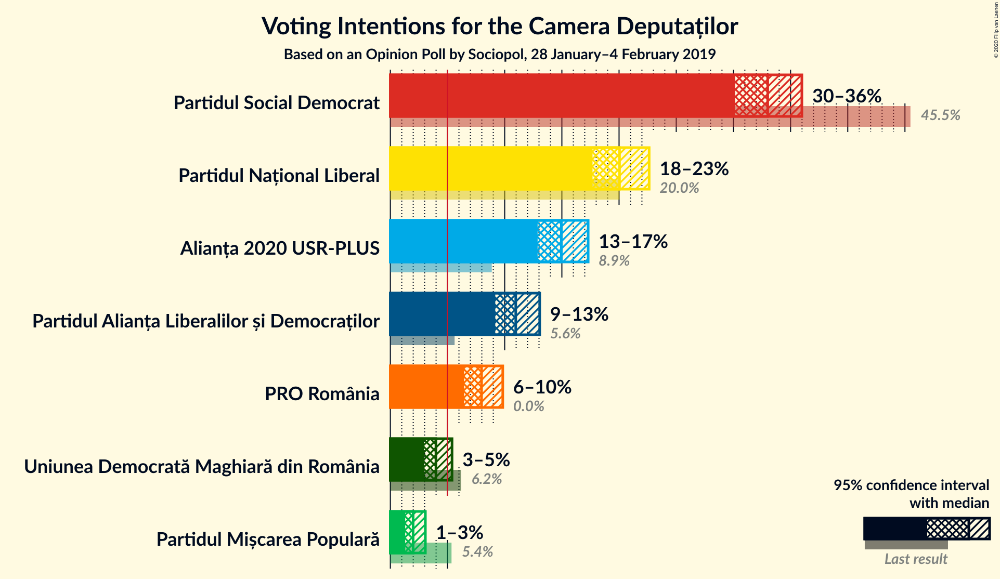

### Confidence Intervals

| Party | Last Result | Poll Result | 80% Confidence Interval | 90% Confidence Interval | 95% Confidence Interval | 99% Confidence Interval |
|:-----:|:-----------:|:-----------:|:-----------------------:|:-----------------------:|:-----------------------:|:-----------------------:|
| Partidul Social Democrat | 45.5% | 33.0% | 31.1–34.9% |30.6–35.5% |30.1–36.0% |29.3–36.9% |
| Partidul Național Liberal | 20.0% | 20.0% | 18.5–21.7% |18.0–22.2% |17.7–22.6% |16.9–23.5% |
| Alianța 2020 USR-PLUS | 8.9% | 15.0% | 13.6–16.5% |13.2–16.9% |12.9–17.3% |12.3–18.1% |
| Partidul Alianța Liberalilor și Democraților | 5.6% | 11.0% | 9.8–12.3% |9.4–12.7% |9.2–13.1% |8.6–13.7% |
| PRO România | 0.0% | 8.0% | 7.0–9.2% |6.7–9.5% |6.4–9.8% |6.0–10.4% |
| Uniunea Democrată Maghiară din România | 6.2% | 4.0% | 3.3–4.9% |3.1–5.2% |2.9–5.4% |2.6–5.9% |
| Partidul Mișcarea Populară | 5.4% | 2.0% | 1.5–2.7% |1.4–2.9% |1.3–3.1% |1.1–3.4% |

*Note:* The poll result column reflects the actual value used in the calculations. Published results may vary slightly, and in addition be rounded to fewer digits.

## Seats

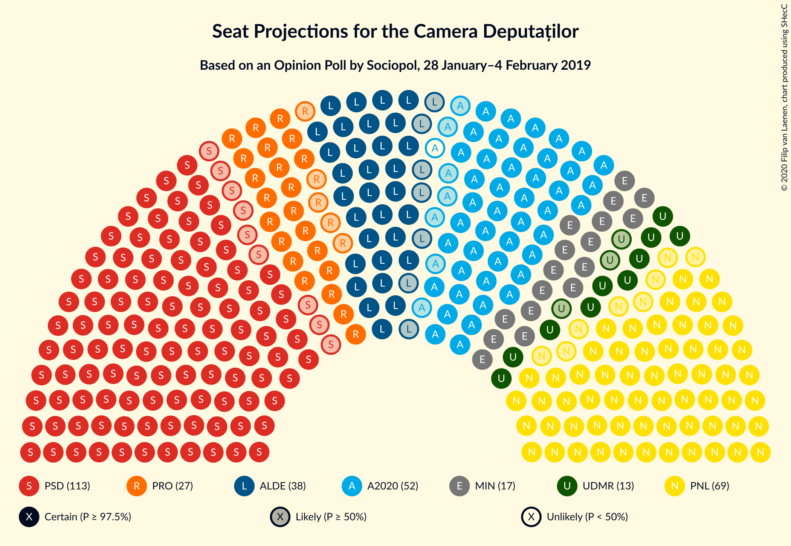

### Confidence Intervals

| Party | Last Result | Median | 80% Confidence Interval | 90% Confidence Interval | 95% Confidence Interval | 99% Confidence Interval |
|:-----:|:-----------:|:------:|:-----------------------:|:-----------------------:|:-----------------------:|:-----------------------:|
| <a href="#partidul-social-democrat">Partidul Social Democrat</a> | 154 | 113 | 107–120 |105–122 |104–123 |101–126 |
| <a href="#partidul-național-liberal">Partidul Național Liberal</a> | 69 | 69 | 63–74 |62–76 |61–77 |58–80 |
| <a href="#alianța-2020-usr-plus">Alianța 2020 USR-PLUS</a> | 30 | 51 | 46–56 |45–58 |44–59 |42–62 |
| <a href="#partidul-alianța-liberalilor-și-democraților">Partidul Alianța Liberalilor și Democraților</a> | 20 | 38 | 33–42 |32–43 |31–45 |29–47 |
| <a href="#pro-românia">PRO România</a> | 0 | 27 | 23–31 |22–32 |22–33 |20–36 |
| <a href="#uniunea-democrată-maghiară-din-românia">Uniunea Democrată Maghiară din România</a> | 21 | 13 | 11–16 |10–17 |10–18 |9–20 |
| <a href="#partidul-mișcarea-populară">Partidul Mișcarea Populară</a> | 18 | 0 | 0 |0 |0 |0 |

### Partidul Social Democrat

*For a full overview of the results for this party, see the [Partidul Social Democrat](party-partidulsocialdemocrat.html) page.*

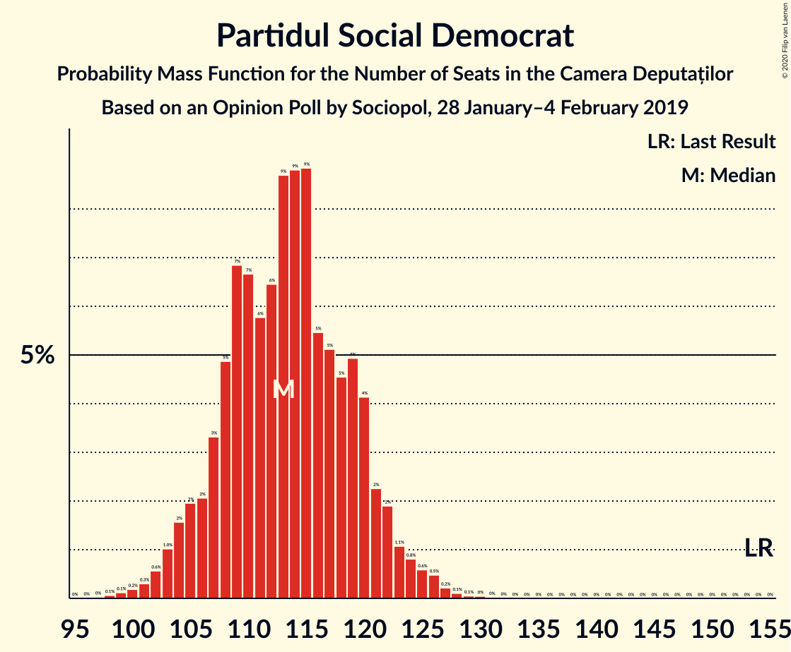

| Number of Seats | Probability | Accumulated | Special Marks |
|:---------------:|:-----------:|:-----------:|:-------------:|
| 97 | 0% | 100% |  |
| 98 | 0.1% | 99.9% |  |
| 99 | 0.1% | 99.9% |  |
| 100 | 0.2% | 99.8% |  |
| 101 | 0.3% | 99.6% |  |
| 102 | 0.6% | 99.3% |  |
| 103 | 1.0% | 98.7% |  |
| 104 | 2% | 98% |  |
| 105 | 2% | 96% |  |
| 106 | 2% | 94% |  |
| 107 | 3% | 92% |  |
| 108 | 5% | 89% |  |
| 109 | 7% | 84% |  |
| 110 | 7% | 77% |  |
| 111 | 6% | 70% |  |
| 112 | 6% | 65% |  |
| 113 | 9% | 58% | Median |
| 114 | 9% | 49% |  |
| 115 | 9% | 41% |  |
| 116 | 5% | 32% |  |
| 117 | 5% | 26% |  |
| 118 | 5% | 21% |  |
| 119 | 5% | 17% |  |
| 120 | 4% | 12% |  |
| 121 | 2% | 8% |  |
| 122 | 2% | 5% |  |
| 123 | 1.1% | 3% |  |
| 124 | 0.8% | 2% |  |
| 125 | 0.6% | 2% |  |
| 126 | 0.5% | 1.0% |  |
| 127 | 0.2% | 0.5% |  |
| 128 | 0.1% | 0.3% |  |
| 129 | 0.1% | 0.1% |  |
| 130 | 0% | 0.1% |  |
| 131 | 0% | 0% |  |
| 132 | 0% | 0% |  |
| 133 | 0% | 0% |  |
| 134 | 0% | 0% |  |
| 135 | 0% | 0% |  |
| 136 | 0% | 0% |  |
| 137 | 0% | 0% |  |
| 138 | 0% | 0% |  |
| 139 | 0% | 0% |  |
| 140 | 0% | 0% |  |
| 141 | 0% | 0% |  |
| 142 | 0% | 0% |  |
| 143 | 0% | 0% |  |
| 144 | 0% | 0% |  |
| 145 | 0% | 0% |  |
| 146 | 0% | 0% |  |
| 147 | 0% | 0% |  |
| 148 | 0% | 0% |  |
| 149 | 0% | 0% |  |
| 150 | 0% | 0% |  |
| 151 | 0% | 0% |  |
| 152 | 0% | 0% |  |
| 153 | 0% | 0% |  |
| 154 | 0% | 0% | Last Result |

### Partidul Național Liberal

*For a full overview of the results for this party, see the [Partidul Național Liberal](party-partidulnaționalliberal.html) page.*

| Number of Seats | Probability | Accumulated | Special Marks |
|:---------------:|:-----------:|:-----------:|:-------------:|
| 55 | 0% | 100% |  |
| 56 | 0.1% | 99.9% |  |
| 57 | 0.2% | 99.9% |  |
| 58 | 0.4% | 99.7% |  |
| 59 | 0.7% | 99.3% |  |
| 60 | 0.9% | 98.6% |  |
| 61 | 2% | 98% |  |
| 62 | 3% | 96% |  |
| 63 | 4% | 93% |  |
| 64 | 5% | 89% |  |
| 65 | 7% | 83% |  |
| 66 | 6% | 76% |  |
| 67 | 8% | 71% |  |
| 68 | 8% | 62% |  |
| 69 | 11% | 54% | Last Result, Median |
| 70 | 10% | 43% |  |
| 71 | 7% | 33% |  |
| 72 | 5% | 26% |  |
| 73 | 6% | 20% |  |
| 74 | 6% | 15% |  |
| 75 | 3% | 9% |  |
| 76 | 3% | 6% |  |
| 77 | 1.4% | 4% |  |
| 78 | 1.0% | 2% |  |
| 79 | 0.7% | 1.5% |  |
| 80 | 0.4% | 0.8% |  |
| 81 | 0.2% | 0.4% |  |
| 82 | 0.1% | 0.2% |  |
| 83 | 0.1% | 0.1% |  |
| 84 | 0% | 0.1% |  |
| 85 | 0% | 0% |  |

### Alianța 2020 USR-PLUS

*For a full overview of the results for this party, see the [Alianța 2020 USR-PLUS](party-alianța2020usr-plus.html) page.*

| Number of Seats | Probability | Accumulated | Special Marks |
|:---------------:|:-----------:|:-----------:|:-------------:|
| 30 | 0% | 100% | Last Result |
| 31 | 0% | 100% |  |
| 32 | 0% | 100% |  |
| 33 | 0% | 100% |  |
| 34 | 0% | 100% |  |
| 35 | 0% | 100% |  |
| 36 | 0% | 100% |  |
| 37 | 0% | 100% |  |
| 38 | 0% | 100% |  |
| 39 | 0% | 100% |  |
| 40 | 0.1% | 99.9% |  |
| 41 | 0.2% | 99.9% |  |
| 42 | 0.6% | 99.7% |  |
| 43 | 0.8% | 99.1% |  |
| 44 | 1.2% | 98% |  |
| 45 | 3% | 97% |  |
| 46 | 5% | 94% |  |
| 47 | 5% | 88% |  |
| 48 | 6% | 84% |  |
| 49 | 10% | 78% |  |
| 50 | 11% | 67% |  |
| 51 | 8% | 56% | Median |
| 52 | 11% | 48% |  |
| 53 | 11% | 38% |  |
| 54 | 7% | 27% |  |
| 55 | 5% | 20% |  |
| 56 | 6% | 15% |  |
| 57 | 4% | 9% |  |
| 58 | 2% | 5% |  |
| 59 | 2% | 4% |  |
| 60 | 1.1% | 2% |  |
| 61 | 0.4% | 1.0% |  |
| 62 | 0.2% | 0.5% |  |
| 63 | 0.2% | 0.3% |  |
| 64 | 0.1% | 0.1% |  |
| 65 | 0% | 0% |  |

### Partidul Alianța Liberalilor și Democraților

*For a full overview of the results for this party, see the [Partidul Alianța Liberalilor și Democraților](party-partidulalianțaliberalilorșidemocraților.html) page.*

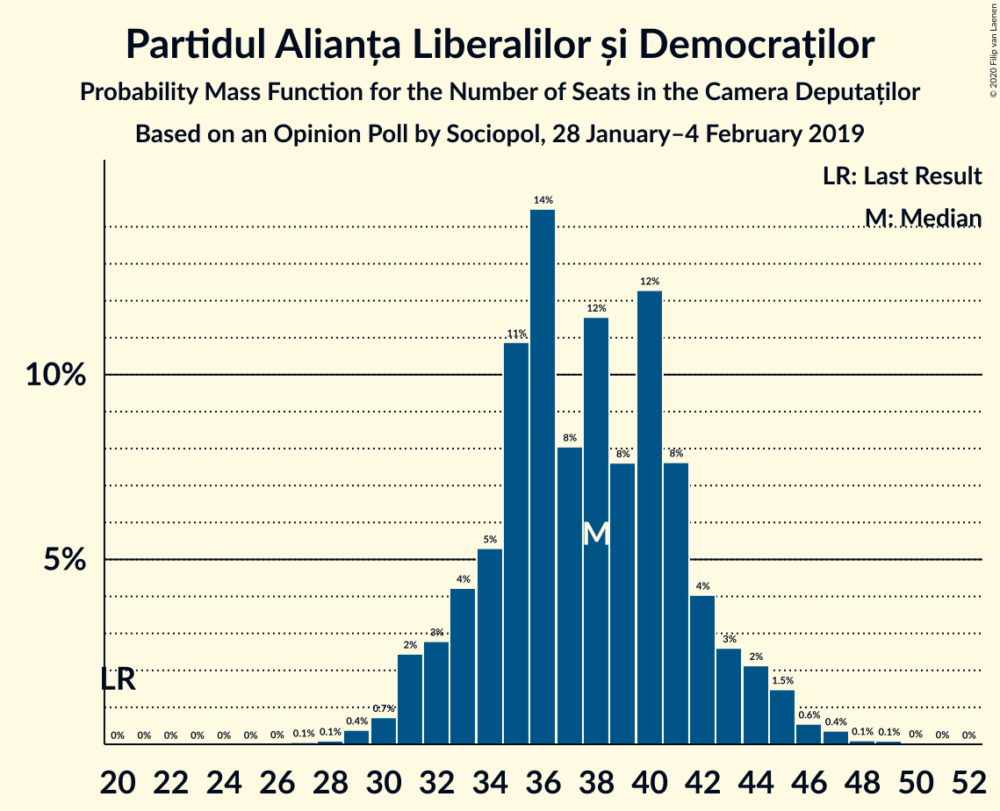

| Number of Seats | Probability | Accumulated | Special Marks |
|:---------------:|:-----------:|:-----------:|:-------------:|
| 20 | 0% | 100% | Last Result |
| 21 | 0% | 100% |  |
| 22 | 0% | 100% |  |
| 23 | 0% | 100% |  |
| 24 | 0% | 100% |  |
| 25 | 0% | 100% |  |
| 26 | 0% | 100% |  |
| 27 | 0.1% | 100% |  |
| 28 | 0.1% | 99.9% |  |
| 29 | 0.4% | 99.8% |  |
| 30 | 0.7% | 99.4% |  |
| 31 | 2% | 98.7% |  |
| 32 | 3% | 96% |  |
| 33 | 4% | 93% |  |
| 34 | 5% | 89% |  |
| 35 | 11% | 84% |  |
| 36 | 14% | 73% |  |
| 37 | 8% | 59% |  |
| 38 | 12% | 51% | Median |
| 39 | 8% | 39% |  |
| 40 | 12% | 31% |  |
| 41 | 8% | 19% |  |
| 42 | 4% | 11% |  |
| 43 | 3% | 7% |  |
| 44 | 2% | 5% |  |
| 45 | 1.5% | 3% |  |
| 46 | 0.6% | 1.2% |  |
| 47 | 0.4% | 0.6% |  |
| 48 | 0.1% | 0.3% |  |
| 49 | 0.1% | 0.1% |  |
| 50 | 0% | 0.1% |  |
| 51 | 0% | 0% |  |

### PRO România

*For a full overview of the results for this party, see the [PRO România](party-proromânia.html) page.*

| Number of Seats | Probability | Accumulated | Special Marks |
|:---------------:|:-----------:|:-----------:|:-------------:|
| 0 | 0% | 100% | Last Result |
| 1 | 0% | 100% |  |
| 2 | 0% | 100% |  |
| 3 | 0% | 100% |  |
| 4 | 0% | 100% |  |
| 5 | 0% | 100% |  |
| 6 | 0% | 100% |  |
| 7 | 0% | 100% |  |
| 8 | 0% | 100% |  |
| 9 | 0% | 100% |  |
| 10 | 0% | 100% |  |
| 11 | 0% | 100% |  |
| 12 | 0% | 100% |  |
| 13 | 0% | 100% |  |
| 14 | 0% | 100% |  |
| 15 | 0% | 100% |  |
| 16 | 0% | 100% |  |
| 17 | 0% | 100% |  |
| 18 | 0% | 100% |  |
| 19 | 0.1% | 100% |  |
| 20 | 0.5% | 99.8% |  |
| 21 | 1.2% | 99.4% |  |
| 22 | 3% | 98% |  |
| 23 | 5% | 95% |  |
| 24 | 7% | 90% |  |
| 25 | 11% | 83% |  |
| 26 | 11% | 72% |  |
| 27 | 12% | 61% | Median |
| 28 | 16% | 49% |  |
| 29 | 11% | 33% |  |
| 30 | 8% | 22% |  |
| 31 | 6% | 14% |  |
| 32 | 4% | 8% |  |
| 33 | 2% | 4% |  |
| 34 | 1.1% | 2% |  |
| 35 | 0.7% | 1.3% |  |
| 36 | 0.3% | 0.5% |  |
| 37 | 0.1% | 0.2% |  |
| 38 | 0% | 0.1% |  |
| 39 | 0% | 0% |  |

### Uniunea Democrată Maghiară din România

*For a full overview of the results for this party, see the [Uniunea Democrată Maghiară din România](party-uniuneademocratămaghiarădinromânia.html) page.*

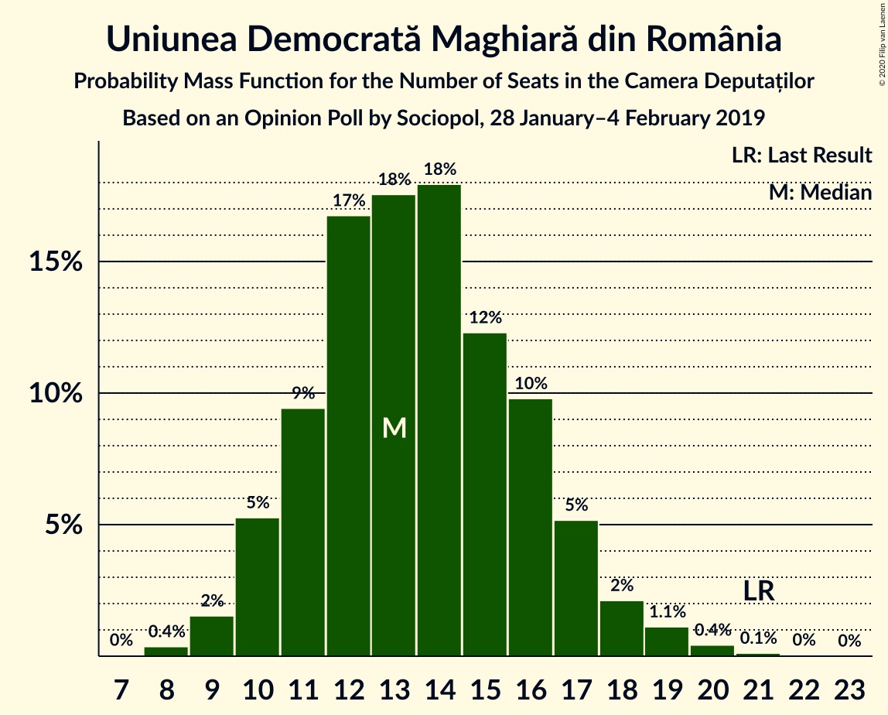

| Number of Seats | Probability | Accumulated | Special Marks |
|:---------------:|:-----------:|:-----------:|:-------------:|
| 8 | 0.4% | 100% |  |
| 9 | 2% | 99.6% |  |
| 10 | 5% | 98% |  |
| 11 | 9% | 93% |  |
| 12 | 17% | 83% |  |
| 13 | 18% | 67% | Median |
| 14 | 18% | 49% |  |
| 15 | 12% | 31% |  |
| 16 | 10% | 19% |  |
| 17 | 5% | 9% |  |
| 18 | 2% | 4% |  |
| 19 | 1.1% | 2% |  |
| 20 | 0.4% | 0.6% |  |
| 21 | 0.1% | 0.2% | Last Result |
| 22 | 0% | 0.1% |  |
| 23 | 0% | 0% |  |

### Partidul Mișcarea Populară

*For a full overview of the results for this party, see the [Partidul Mișcarea Populară](party-partidulmișcareapopulară.html) page.*

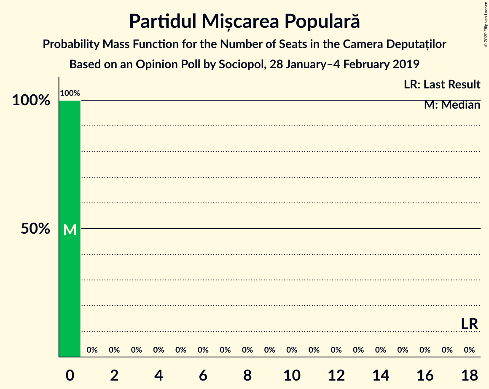

| Number of Seats | Probability | Accumulated | Special Marks |
|:---------------:|:-----------:|:-----------:|:-------------:|
| 0 | 100% | 100% | Median |
| 1 | 0% | 0% |  |
| 2 | 0% | 0% |  |
| 3 | 0% | 0% |  |
| 4 | 0% | 0% |  |
| 5 | 0% | 0% |  |
| 6 | 0% | 0% |  |
| 7 | 0% | 0% |  |
| 8 | 0% | 0% |  |
| 9 | 0% | 0% |  |
| 10 | 0% | 0% |  |
| 11 | 0% | 0% |  |
| 12 | 0% | 0% |  |
| 13 | 0% | 0% |  |
| 14 | 0% | 0% |  |
| 15 | 0% | 0% |  |
| 16 | 0% | 0% |  |
| 17 | 0% | 0% |  |
| 18 | 0% | 0% | Last Result |

## Coalitions

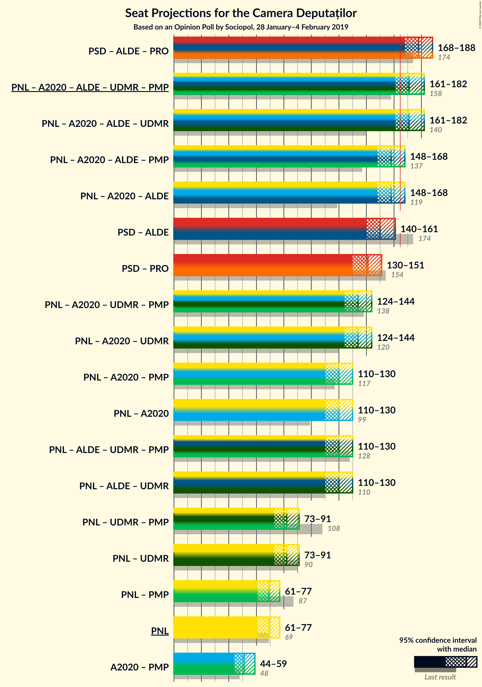

### Confidence Intervals

| Coalition | Last Result | Median | Majority? | 80% Confidence Interval | 90% Confidence Interval | 95% Confidence Interval | 99% Confidence Interval |
|:---------:|:-----------:|:------:|:---------:|:-----------------------:|:-----------------------:|:-----------------------:|:-----------------------:|
| Partidul Social Democrat – Partidul Alianța Liberalilor și Democraților – PRO România | 174 | 178 | 99.3% | 172–185 | 170–187 | 168–188 | 165–191 |
| Partidul Național Liberal – Alianța 2020 USR-PLUS – Partidul Alianța Liberalilor și Democraților – Uniunea Democrată Maghiară din România – Partidul Mișcarea Populară | 158 | 171 | 87% | 164–178 | 163–180 | 161–182 | 158–185 |
| Partidul Național Liberal – Alianța 2020 USR-PLUS – Partidul Alianța Liberalilor și Democraților – Uniunea Democrată Maghiară din România | 140 | 171 | 87% | 164–178 | 163–180 | 161–182 | 158–185 |
| Partidul Național Liberal – Alianța 2020 USR-PLUS – Partidul Alianța Liberalilor și Democraților – Partidul Mișcarea Populară | 137 | 158 | 6% | 151–164 | 149–166 | 148–168 | 144–171 |
| Partidul Național Liberal – Alianța 2020 USR-PLUS – Partidul Alianța Liberalilor și Democraților | 119 | 158 | 6% | 151–164 | 149–166 | 148–168 | 144–171 |
| Partidul Social Democrat – Partidul Alianța Liberalilor și Democraților | 174 | 150 | 0.4% | 144–157 | 143–160 | 140–161 | 138–165 |
| Partidul Social Democrat – PRO România | 154 | 141 | 0% | 134–148 | 132–149 | 130–151 | 127–154 |
| Partidul Național Liberal – Alianța 2020 USR-PLUS – Uniunea Democrată Maghiară din România – Partidul Mișcarea Populară | 138 | 134 | 0% | 127–140 | 125–142 | 124–144 | 121–147 |
| Partidul Național Liberal – Alianța 2020 USR-PLUS – Uniunea Democrată Maghiară din România | 120 | 134 | 0% | 127–140 | 125–142 | 124–144 | 121–147 |
| Partidul Național Liberal – Alianța 2020 USR-PLUS – Partidul Mișcarea Populară | 117 | 120 | 0% | 114–127 | 112–129 | 110–130 | 107–133 |
| Partidul Național Liberal – Alianța 2020 USR-PLUS | 99 | 120 | 0% | 114–127 | 112–129 | 110–130 | 107–133 |
| Partidul Național Liberal – Partidul Alianța Liberalilor și Democraților – Uniunea Democrată Maghiară din România – Partidul Mișcarea Populară | 128 | 120 | 0% | 113–127 | 112–128 | 110–130 | 107–133 |
| Partidul Național Liberal – Partidul Alianța Liberalilor și Democraților – Uniunea Democrată Maghiară din România | 110 | 120 | 0% | 113–127 | 112–128 | 110–130 | 107–133 |
| Partidul Național Liberal – Uniunea Democrată Maghiară din România – Partidul Mișcarea Populară | 108 | 82 | 0% | 77–88 | 75–90 | 73–91 | 71–94 |
| Partidul Național Liberal – Uniunea Democrată Maghiară din România | 90 | 82 | 0% | 77–88 | 75–90 | 73–91 | 71–94 |
| Partidul Național Liberal – Partidul Mișcarea Populară | 87 | 69 | 0% | 63–74 | 62–76 | 61–77 | 58–80 |
| Partidul Național Liberal | 69 | 69 | 0% | 63–74 | 62–76 | 61–77 | 58–80 |
| Alianța 2020 USR-PLUS – Partidul Mișcarea Populară | 48 | 51 | 0% | 46–56 | 45–58 | 44–59 | 42–62 |

### Partidul Social Democrat – Partidul Alianța Liberalilor și Democraților – PRO România

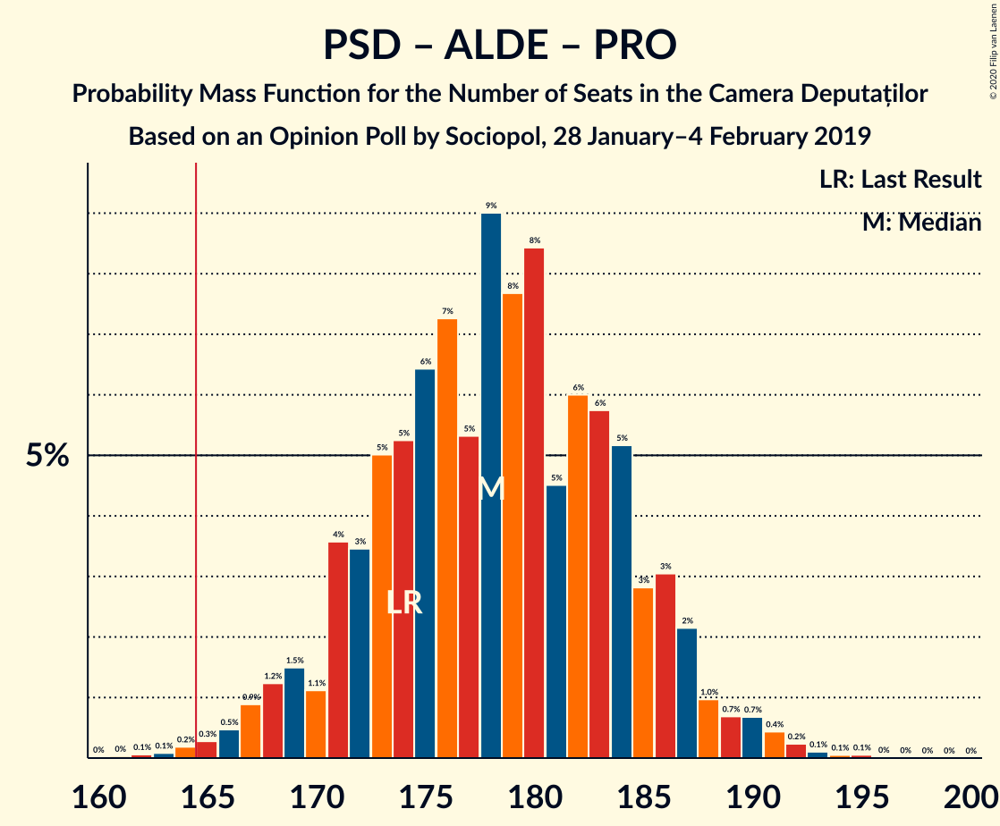

| Number of Seats | Probability | Accumulated | Special Marks |
|:---------------:|:-----------:|:-----------:|:-------------:|
| 161 | 0% | 100% |  |
| 162 | 0.1% | 99.9% |  |
| 163 | 0.1% | 99.9% |  |
| 164 | 0.2% | 99.8% |  |
| 165 | 0.3% | 99.6% |  |
| 166 | 0.5% | 99.3% | Majority |
| 167 | 0.9% | 98.9% |  |
| 168 | 1.2% | 98% |  |
| 169 | 1.5% | 97% |  |
| 170 | 1.1% | 95% |  |
| 171 | 4% | 94% |  |
| 172 | 3% | 91% |  |
| 173 | 5% | 87% |  |
| 174 | 5% | 82% | Last Result |
| 175 | 6% | 77% |  |
| 176 | 7% | 70% |  |
| 177 | 5% | 63% |  |
| 178 | 9% | 58% | Median |
| 179 | 8% | 49% |  |
| 180 | 8% | 41% |  |
| 181 | 5% | 33% |  |
| 182 | 6% | 28% |  |
| 183 | 6% | 22% |  |
| 184 | 5% | 16% |  |
| 185 | 3% | 11% |  |
| 186 | 3% | 8% |  |
| 187 | 2% | 5% |  |
| 188 | 1.0% | 3% |  |
| 189 | 0.7% | 2% |  |
| 190 | 0.7% | 2% |  |
| 191 | 0.4% | 0.9% |  |
| 192 | 0.2% | 0.5% |  |
| 193 | 0.1% | 0.2% |  |
| 194 | 0.1% | 0.1% |  |
| 195 | 0.1% | 0.1% |  |
| 196 | 0% | 0% |  |

### Partidul Național Liberal – Alianța 2020 USR-PLUS – Partidul Alianța Liberalilor și Democraților – Uniunea Democrată Maghiară din România – Partidul Mișcarea Populară

| Number of Seats | Probability | Accumulated | Special Marks |
|:---------------:|:-----------:|:-----------:|:-------------:|
| 154 | 0% | 100% |  |
| 155 | 0.1% | 99.9% |  |
| 156 | 0.1% | 99.9% |  |
| 157 | 0.2% | 99.8% |  |
| 158 | 0.3% | 99.6% | Last Result |
| 159 | 0.5% | 99.3% |  |
| 160 | 0.8% | 98.8% |  |
| 161 | 1.1% | 98% |  |
| 162 | 2% | 97% |  |
| 163 | 2% | 95% |  |
| 164 | 4% | 93% |  |
| 165 | 3% | 89% |  |
| 166 | 5% | 87% | Majority |
| 167 | 7% | 82% |  |
| 168 | 5% | 75% |  |
| 169 | 6% | 70% |  |
| 170 | 8% | 64% |  |
| 171 | 7% | 56% | Median |
| 172 | 8% | 49% |  |
| 173 | 8% | 41% |  |
| 174 | 6% | 33% |  |
| 175 | 5% | 27% |  |
| 176 | 6% | 22% |  |
| 177 | 5% | 16% |  |
| 178 | 3% | 11% |  |
| 179 | 3% | 8% |  |
| 180 | 2% | 6% |  |
| 181 | 1.1% | 4% |  |
| 182 | 1.2% | 3% |  |
| 183 | 0.5% | 1.4% |  |
| 184 | 0.3% | 0.9% |  |
| 185 | 0.2% | 0.5% |  |
| 186 | 0.1% | 0.3% |  |
| 187 | 0.1% | 0.1% |  |
| 188 | 0% | 0.1% |  |
| 189 | 0% | 0% |  |

### Partidul Național Liberal – Alianța 2020 USR-PLUS – Partidul Alianța Liberalilor și Democraților – Uniunea Democrată Maghiară din România

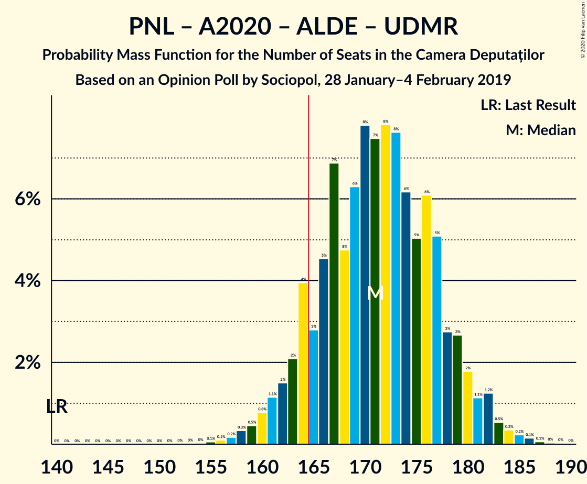

| Number of Seats | Probability | Accumulated | Special Marks |
|:---------------:|:-----------:|:-----------:|:-------------:|
| 140 | 0% | 100% | Last Result |
| 141 | 0% | 100% |  |
| 142 | 0% | 100% |  |
| 143 | 0% | 100% |  |
| 144 | 0% | 100% |  |
| 145 | 0% | 100% |  |
| 146 | 0% | 100% |  |
| 147 | 0% | 100% |  |
| 148 | 0% | 100% |  |
| 149 | 0% | 100% |  |
| 150 | 0% | 100% |  |
| 151 | 0% | 100% |  |
| 152 | 0% | 100% |  |
| 153 | 0% | 100% |  |
| 154 | 0% | 100% |  |
| 155 | 0.1% | 99.9% |  |
| 156 | 0.1% | 99.9% |  |
| 157 | 0.2% | 99.8% |  |
| 158 | 0.3% | 99.6% |  |
| 159 | 0.5% | 99.3% |  |
| 160 | 0.8% | 98.8% |  |
| 161 | 1.1% | 98% |  |
| 162 | 2% | 97% |  |
| 163 | 2% | 95% |  |
| 164 | 4% | 93% |  |
| 165 | 3% | 89% |  |
| 166 | 5% | 87% | Majority |
| 167 | 7% | 82% |  |
| 168 | 5% | 75% |  |
| 169 | 6% | 70% |  |
| 170 | 8% | 64% |  |
| 171 | 7% | 56% | Median |
| 172 | 8% | 49% |  |
| 173 | 8% | 41% |  |
| 174 | 6% | 33% |  |
| 175 | 5% | 27% |  |
| 176 | 6% | 22% |  |
| 177 | 5% | 16% |  |
| 178 | 3% | 11% |  |
| 179 | 3% | 8% |  |
| 180 | 2% | 6% |  |
| 181 | 1.1% | 4% |  |
| 182 | 1.2% | 3% |  |
| 183 | 0.5% | 1.4% |  |
| 184 | 0.3% | 0.9% |  |
| 185 | 0.2% | 0.5% |  |
| 186 | 0.1% | 0.3% |  |
| 187 | 0.1% | 0.1% |  |
| 188 | 0% | 0.1% |  |
| 189 | 0% | 0% |  |

### Partidul Național Liberal – Alianța 2020 USR-PLUS – Partidul Alianța Liberalilor și Democraților – Partidul Mișcarea Populară

| Number of Seats | Probability | Accumulated | Special Marks |
|:---------------:|:-----------:|:-----------:|:-------------:|
| 137 | 0% | 100% | Last Result |
| 138 | 0% | 100% |  |
| 139 | 0% | 100% |  |
| 140 | 0% | 100% |  |
| 141 | 0% | 100% |  |
| 142 | 0.1% | 99.9% |  |
| 143 | 0.2% | 99.8% |  |
| 144 | 0.2% | 99.7% |  |
| 145 | 0.4% | 99.5% |  |
| 146 | 0.6% | 99.1% |  |
| 147 | 0.9% | 98% |  |
| 148 | 2% | 98% |  |
| 149 | 2% | 96% |  |
| 150 | 3% | 94% |  |
| 151 | 4% | 92% |  |
| 152 | 4% | 88% |  |
| 153 | 5% | 84% |  |
| 154 | 6% | 79% |  |
| 155 | 6% | 73% |  |
| 156 | 7% | 67% |  |
| 157 | 8% | 60% |  |
| 158 | 7% | 52% | Median |
| 159 | 7% | 44% |  |
| 160 | 8% | 38% |  |
| 161 | 5% | 30% |  |
| 162 | 7% | 25% |  |
| 163 | 4% | 17% |  |
| 164 | 4% | 13% |  |
| 165 | 3% | 10% |  |
| 166 | 2% | 6% | Majority |
| 167 | 1.3% | 5% |  |
| 168 | 1.4% | 3% |  |
| 169 | 0.8% | 2% |  |
| 170 | 0.5% | 1.2% |  |
| 171 | 0.2% | 0.7% |  |
| 172 | 0.2% | 0.4% |  |
| 173 | 0.1% | 0.2% |  |
| 174 | 0.1% | 0.1% |  |
| 175 | 0% | 0.1% |  |
| 176 | 0% | 0% |  |

### Partidul Național Liberal – Alianța 2020 USR-PLUS – Partidul Alianța Liberalilor și Democraților

| Number of Seats | Probability | Accumulated | Special Marks |
|:---------------:|:-----------:|:-----------:|:-------------:|
| 119 | 0% | 100% | Last Result |
| 120 | 0% | 100% |  |
| 121 | 0% | 100% |  |
| 122 | 0% | 100% |  |
| 123 | 0% | 100% |  |
| 124 | 0% | 100% |  |
| 125 | 0% | 100% |  |
| 126 | 0% | 100% |  |
| 127 | 0% | 100% |  |
| 128 | 0% | 100% |  |
| 129 | 0% | 100% |  |
| 130 | 0% | 100% |  |
| 131 | 0% | 100% |  |
| 132 | 0% | 100% |  |
| 133 | 0% | 100% |  |
| 134 | 0% | 100% |  |
| 135 | 0% | 100% |  |
| 136 | 0% | 100% |  |
| 137 | 0% | 100% |  |
| 138 | 0% | 100% |  |
| 139 | 0% | 100% |  |
| 140 | 0% | 100% |  |
| 141 | 0% | 100% |  |
| 142 | 0.1% | 99.9% |  |
| 143 | 0.2% | 99.8% |  |
| 144 | 0.2% | 99.7% |  |
| 145 | 0.4% | 99.5% |  |
| 146 | 0.6% | 99.1% |  |
| 147 | 0.9% | 98% |  |
| 148 | 2% | 98% |  |
| 149 | 2% | 96% |  |
| 150 | 3% | 94% |  |
| 151 | 4% | 92% |  |
| 152 | 4% | 88% |  |
| 153 | 5% | 84% |  |
| 154 | 6% | 79% |  |
| 155 | 6% | 73% |  |
| 156 | 7% | 67% |  |
| 157 | 8% | 60% |  |
| 158 | 7% | 52% | Median |
| 159 | 7% | 44% |  |
| 160 | 8% | 38% |  |
| 161 | 5% | 30% |  |
| 162 | 7% | 25% |  |
| 163 | 4% | 17% |  |
| 164 | 4% | 13% |  |
| 165 | 3% | 10% |  |
| 166 | 2% | 6% | Majority |
| 167 | 1.3% | 5% |  |
| 168 | 1.4% | 3% |  |
| 169 | 0.8% | 2% |  |
| 170 | 0.5% | 1.2% |  |
| 171 | 0.2% | 0.7% |  |
| 172 | 0.2% | 0.4% |  |
| 173 | 0.1% | 0.2% |  |
| 174 | 0.1% | 0.1% |  |
| 175 | 0% | 0.1% |  |
| 176 | 0% | 0% |  |

### Partidul Social Democrat – Partidul Alianța Liberalilor și Democraților

| Number of Seats | Probability | Accumulated | Special Marks |
|:---------------:|:-----------:|:-----------:|:-------------:|
| 134 | 0.1% | 100% |  |
| 135 | 0% | 99.9% |  |
| 136 | 0% | 99.9% |  |
| 137 | 0.1% | 99.8% |  |
| 138 | 0.6% | 99.7% |  |
| 139 | 1.0% | 99.1% |  |
| 140 | 0.8% | 98% |  |
| 141 | 0.3% | 97% |  |
| 142 | 0.5% | 97% |  |
| 143 | 3% | 97% |  |
| 144 | 6% | 94% |  |
| 145 | 6% | 87% |  |
| 146 | 2% | 81% |  |
| 147 | 0.6% | 80% |  |
| 148 | 5% | 79% |  |
| 149 | 12% | 74% |  |
| 150 | 16% | 62% |  |
| 151 | 5% | 47% | Median |
| 152 | 1.1% | 41% |  |
| 153 | 3% | 40% |  |
| 154 | 9% | 37% |  |
| 155 | 12% | 29% |  |
| 156 | 6% | 17% |  |
| 157 | 0.7% | 11% |  |
| 158 | 0.6% | 10% |  |
| 159 | 3% | 9% |  |
| 160 | 4% | 7% |  |
| 161 | 2% | 3% |  |
| 162 | 0.3% | 1.3% |  |
| 163 | 0.1% | 1.0% |  |
| 164 | 0.2% | 0.9% |  |
| 165 | 0.4% | 0.7% |  |
| 166 | 0.3% | 0.4% | Majority |
| 167 | 0.1% | 0.1% |  |
| 168 | 0% | 0% |  |
| 169 | 0% | 0% |  |
| 170 | 0% | 0% |  |
| 171 | 0% | 0% |  |
| 172 | 0% | 0% |  |
| 173 | 0% | 0% |  |
| 174 | 0% | 0% | Last Result |

### Partidul Social Democrat – PRO România

| Number of Seats | Probability | Accumulated | Special Marks |
|:---------------:|:-----------:|:-----------:|:-------------:|
| 124 | 0% | 100% |  |
| 125 | 0.1% | 99.9% |  |
| 126 | 0.1% | 99.9% |  |
| 127 | 0.2% | 99.7% |  |
| 128 | 0.3% | 99.5% |  |
| 129 | 0.5% | 99.1% |  |
| 130 | 1.2% | 98.6% |  |
| 131 | 1.1% | 97% |  |
| 132 | 2% | 96% |  |
| 133 | 3% | 94% |  |
| 134 | 3% | 92% |  |
| 135 | 5% | 89% |  |
| 136 | 6% | 84% |  |
| 137 | 5% | 78% |  |
| 138 | 6% | 73% |  |
| 139 | 8% | 67% |  |
| 140 | 8% | 59% | Median |
| 141 | 7% | 51% |  |
| 142 | 8% | 44% |  |
| 143 | 6% | 36% |  |
| 144 | 5% | 30% |  |
| 145 | 7% | 25% |  |
| 146 | 5% | 18% |  |
| 147 | 3% | 13% |  |
| 148 | 4% | 11% |  |
| 149 | 2% | 7% |  |
| 150 | 2% | 5% |  |
| 151 | 1.1% | 3% |  |
| 152 | 0.8% | 2% |  |
| 153 | 0.5% | 1.2% |  |
| 154 | 0.3% | 0.7% | Last Result |
| 155 | 0.2% | 0.4% |  |
| 156 | 0.1% | 0.2% |  |
| 157 | 0.1% | 0.1% |  |
| 158 | 0% | 0.1% |  |
| 159 | 0% | 0% |  |

### Partidul Național Liberal – Alianța 2020 USR-PLUS – Uniunea Democrată Maghiară din România – Partidul Mișcarea Populară

| Number of Seats | Probability | Accumulated | Special Marks |
|:---------------:|:-----------:|:-----------:|:-------------:|
| 117 | 0.1% | 100% |  |
| 118 | 0.1% | 99.9% |  |
| 119 | 0.1% | 99.9% |  |
| 120 | 0.2% | 99.8% |  |
| 121 | 0.4% | 99.5% |  |
| 122 | 0.7% | 99.1% |  |
| 123 | 0.7% | 98% |  |
| 124 | 1.0% | 98% |  |
| 125 | 2% | 97% |  |
| 126 | 3% | 95% |  |
| 127 | 3% | 92% |  |
| 128 | 5% | 89% |  |
| 129 | 6% | 84% |  |
| 130 | 6% | 78% |  |
| 131 | 5% | 72% |  |
| 132 | 8% | 67% |  |
| 133 | 8% | 59% | Median |
| 134 | 9% | 51% |  |
| 135 | 5% | 42% |  |
| 136 | 7% | 37% |  |
| 137 | 6% | 30% |  |
| 138 | 5% | 23% | Last Result |
| 139 | 5% | 18% |  |
| 140 | 3% | 13% |  |
| 141 | 4% | 9% |  |
| 142 | 1.1% | 6% |  |
| 143 | 1.5% | 5% |  |
| 144 | 1.2% | 3% |  |
| 145 | 0.9% | 2% |  |
| 146 | 0.5% | 1.1% |  |
| 147 | 0.3% | 0.7% |  |
| 148 | 0.2% | 0.4% |  |
| 149 | 0.1% | 0.2% |  |
| 150 | 0.1% | 0.1% |  |
| 151 | 0% | 0.1% |  |
| 152 | 0% | 0% |  |

### Partidul Național Liberal – Alianța 2020 USR-PLUS – Uniunea Democrată Maghiară din România

| Number of Seats | Probability | Accumulated | Special Marks |
|:---------------:|:-----------:|:-----------:|:-------------:|
| 117 | 0.1% | 100% |  |
| 118 | 0.1% | 99.9% |  |
| 119 | 0.1% | 99.9% |  |
| 120 | 0.2% | 99.8% | Last Result |
| 121 | 0.4% | 99.5% |  |
| 122 | 0.7% | 99.1% |  |
| 123 | 0.7% | 98% |  |
| 124 | 1.0% | 98% |  |
| 125 | 2% | 97% |  |
| 126 | 3% | 95% |  |
| 127 | 3% | 92% |  |
| 128 | 5% | 89% |  |
| 129 | 6% | 84% |  |
| 130 | 6% | 78% |  |
| 131 | 5% | 72% |  |
| 132 | 8% | 67% |  |
| 133 | 8% | 59% | Median |
| 134 | 9% | 51% |  |
| 135 | 5% | 42% |  |
| 136 | 7% | 37% |  |
| 137 | 6% | 30% |  |
| 138 | 5% | 23% |  |
| 139 | 5% | 18% |  |
| 140 | 3% | 13% |  |
| 141 | 4% | 9% |  |
| 142 | 1.1% | 6% |  |
| 143 | 1.5% | 5% |  |
| 144 | 1.2% | 3% |  |
| 145 | 0.9% | 2% |  |
| 146 | 0.5% | 1.1% |  |
| 147 | 0.3% | 0.7% |  |
| 148 | 0.2% | 0.4% |  |
| 149 | 0.1% | 0.2% |  |
| 150 | 0.1% | 0.1% |  |
| 151 | 0% | 0.1% |  |
| 152 | 0% | 0% |  |

### Partidul Național Liberal – Alianța 2020 USR-PLUS – Partidul Mișcarea Populară

| Number of Seats | Probability | Accumulated | Special Marks |
|:---------------:|:-----------:|:-----------:|:-------------:|
| 104 | 0% | 100% |  |
| 105 | 0.1% | 99.9% |  |
| 106 | 0.2% | 99.8% |  |
| 107 | 0.3% | 99.7% |  |
| 108 | 0.4% | 99.4% |  |
| 109 | 0.7% | 99.0% |  |
| 110 | 1.0% | 98% |  |
| 111 | 2% | 97% |  |
| 112 | 2% | 95% |  |
| 113 | 3% | 94% |  |
| 114 | 5% | 91% |  |
| 115 | 4% | 86% |  |
| 116 | 5% | 82% |  |
| 117 | 7% | 76% | Last Result |
| 118 | 8% | 69% |  |
| 119 | 6% | 62% |  |
| 120 | 9% | 56% | Median |
| 121 | 9% | 47% |  |
| 122 | 7% | 38% |  |
| 123 | 5% | 31% |  |
| 124 | 7% | 26% |  |
| 125 | 4% | 19% |  |
| 126 | 4% | 15% |  |
| 127 | 3% | 11% |  |
| 128 | 2% | 8% |  |
| 129 | 2% | 5% |  |
| 130 | 1.0% | 3% |  |
| 131 | 1.0% | 2% |  |
| 132 | 0.4% | 1.2% |  |
| 133 | 0.4% | 0.8% |  |
| 134 | 0.2% | 0.5% |  |
| 135 | 0.1% | 0.3% |  |
| 136 | 0.1% | 0.1% |  |
| 137 | 0% | 0.1% |  |
| 138 | 0% | 0% |  |

### Partidul Național Liberal – Alianța 2020 USR-PLUS

| Number of Seats | Probability | Accumulated | Special Marks |
|:---------------:|:-----------:|:-----------:|:-------------:|
| 99 | 0% | 100% | Last Result |
| 100 | 0% | 100% |  |
| 101 | 0% | 100% |  |
| 102 | 0% | 100% |  |
| 103 | 0% | 100% |  |
| 104 | 0% | 100% |  |
| 105 | 0.1% | 99.9% |  |
| 106 | 0.2% | 99.8% |  |
| 107 | 0.3% | 99.7% |  |
| 108 | 0.4% | 99.4% |  |
| 109 | 0.7% | 99.0% |  |
| 110 | 1.0% | 98% |  |
| 111 | 2% | 97% |  |
| 112 | 2% | 95% |  |
| 113 | 3% | 94% |  |
| 114 | 5% | 91% |  |
| 115 | 4% | 86% |  |
| 116 | 5% | 82% |  |
| 117 | 7% | 76% |  |
| 118 | 8% | 69% |  |
| 119 | 6% | 62% |  |
| 120 | 9% | 56% | Median |
| 121 | 9% | 47% |  |
| 122 | 7% | 38% |  |
| 123 | 5% | 31% |  |
| 124 | 7% | 26% |  |
| 125 | 4% | 19% |  |
| 126 | 4% | 15% |  |
| 127 | 3% | 11% |  |
| 128 | 2% | 8% |  |
| 129 | 2% | 5% |  |
| 130 | 1.0% | 3% |  |
| 131 | 1.0% | 2% |  |
| 132 | 0.4% | 1.2% |  |
| 133 | 0.4% | 0.8% |  |
| 134 | 0.2% | 0.5% |  |
| 135 | 0.1% | 0.3% |  |
| 136 | 0.1% | 0.1% |  |
| 137 | 0% | 0.1% |  |
| 138 | 0% | 0% |  |

### Partidul Național Liberal – Partidul Alianța Liberalilor și Democraților – Uniunea Democrată Maghiară din România – Partidul Mișcarea Populară

| Number of Seats | Probability | Accumulated | Special Marks |
|:---------------:|:-----------:|:-----------:|:-------------:|
| 103 | 0% | 100% |  |
| 104 | 0.1% | 99.9% |  |
| 105 | 0.1% | 99.9% |  |
| 106 | 0.1% | 99.8% |  |
| 107 | 0.2% | 99.6% |  |
| 108 | 0.4% | 99.4% |  |
| 109 | 0.7% | 99.0% |  |
| 110 | 0.9% | 98% |  |
| 111 | 2% | 97% |  |
| 112 | 3% | 96% |  |
| 113 | 3% | 92% |  |
| 114 | 4% | 89% |  |
| 115 | 7% | 85% |  |
| 116 | 6% | 78% |  |
| 117 | 4% | 72% |  |
| 118 | 4% | 68% |  |
| 119 | 8% | 64% |  |
| 120 | 9% | 56% | Median |
| 121 | 8% | 47% |  |
| 122 | 6% | 39% |  |
| 123 | 9% | 33% |  |
| 124 | 6% | 24% |  |
| 125 | 5% | 18% |  |
| 126 | 3% | 13% |  |
| 127 | 4% | 10% |  |
| 128 | 2% | 6% | Last Result |
| 129 | 1.1% | 5% |  |
| 130 | 1.1% | 4% |  |
| 131 | 1.1% | 2% |  |
| 132 | 0.5% | 1.3% |  |
| 133 | 0.3% | 0.8% |  |
| 134 | 0.3% | 0.5% |  |
| 135 | 0.1% | 0.2% |  |
| 136 | 0.1% | 0.1% |  |
| 137 | 0% | 0.1% |  |
| 138 | 0% | 0% |  |

### Partidul Național Liberal – Partidul Alianța Liberalilor și Democraților – Uniunea Democrată Maghiară din România

| Number of Seats | Probability | Accumulated | Special Marks |
|:---------------:|:-----------:|:-----------:|:-------------:|
| 103 | 0% | 100% |  |
| 104 | 0.1% | 99.9% |  |
| 105 | 0.1% | 99.9% |  |
| 106 | 0.1% | 99.8% |  |
| 107 | 0.2% | 99.6% |  |
| 108 | 0.4% | 99.4% |  |
| 109 | 0.7% | 99.0% |  |
| 110 | 0.9% | 98% | Last Result |
| 111 | 2% | 97% |  |
| 112 | 3% | 96% |  |
| 113 | 3% | 92% |  |
| 114 | 4% | 89% |  |
| 115 | 7% | 85% |  |
| 116 | 6% | 78% |  |
| 117 | 4% | 72% |  |
| 118 | 4% | 68% |  |
| 119 | 8% | 64% |  |
| 120 | 9% | 56% | Median |
| 121 | 8% | 47% |  |
| 122 | 6% | 39% |  |
| 123 | 9% | 33% |  |
| 124 | 6% | 24% |  |
| 125 | 5% | 18% |  |
| 126 | 3% | 13% |  |
| 127 | 4% | 10% |  |
| 128 | 2% | 6% |  |
| 129 | 1.1% | 5% |  |
| 130 | 1.1% | 4% |  |
| 131 | 1.1% | 2% |  |
| 132 | 0.5% | 1.3% |  |
| 133 | 0.3% | 0.8% |  |
| 134 | 0.3% | 0.5% |  |
| 135 | 0.1% | 0.2% |  |
| 136 | 0.1% | 0.1% |  |
| 137 | 0% | 0.1% |  |
| 138 | 0% | 0% |  |

### Partidul Național Liberal – Uniunea Democrată Maghiară din România – Partidul Mișcarea Populară

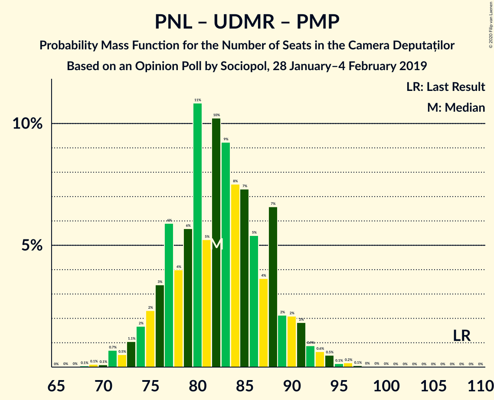

| Number of Seats | Probability | Accumulated | Special Marks |
|:---------------:|:-----------:|:-----------:|:-------------:|
| 68 | 0.1% | 100% |  |
| 69 | 0.1% | 99.9% |  |
| 70 | 0.1% | 99.8% |  |
| 71 | 0.7% | 99.7% |  |
| 72 | 0.5% | 99.0% |  |
| 73 | 1.1% | 98.5% |  |
| 74 | 2% | 97% |  |
| 75 | 2% | 96% |  |
| 76 | 3% | 93% |  |
| 77 | 6% | 90% |  |
| 78 | 4% | 84% |  |
| 79 | 6% | 80% |  |
| 80 | 11% | 74% |  |
| 81 | 5% | 64% |  |
| 82 | 10% | 58% | Median |
| 83 | 9% | 48% |  |
| 84 | 8% | 39% |  |
| 85 | 7% | 31% |  |
| 86 | 5% | 24% |  |
| 87 | 4% | 19% |  |
| 88 | 7% | 15% |  |
| 89 | 2% | 9% |  |
| 90 | 2% | 6% |  |
| 91 | 2% | 4% |  |
| 92 | 0.9% | 2% |  |
| 93 | 0.6% | 2% |  |
| 94 | 0.5% | 0.9% |  |
| 95 | 0.1% | 0.5% |  |
| 96 | 0.2% | 0.3% |  |
| 97 | 0.1% | 0.1% |  |
| 98 | 0% | 0.1% |  |
| 99 | 0% | 0% |  |
| 100 | 0% | 0% |  |
| 101 | 0% | 0% |  |
| 102 | 0% | 0% |  |
| 103 | 0% | 0% |  |
| 104 | 0% | 0% |  |
| 105 | 0% | 0% |  |
| 106 | 0% | 0% |  |
| 107 | 0% | 0% |  |
| 108 | 0% | 0% | Last Result |

### Partidul Național Liberal – Uniunea Democrată Maghiară din România

| Number of Seats | Probability | Accumulated | Special Marks |
|:---------------:|:-----------:|:-----------:|:-------------:|
| 68 | 0.1% | 100% |  |
| 69 | 0.1% | 99.9% |  |
| 70 | 0.1% | 99.8% |  |
| 71 | 0.7% | 99.7% |  |
| 72 | 0.5% | 99.0% |  |
| 73 | 1.1% | 98.5% |  |
| 74 | 2% | 97% |  |
| 75 | 2% | 96% |  |
| 76 | 3% | 93% |  |
| 77 | 6% | 90% |  |
| 78 | 4% | 84% |  |
| 79 | 6% | 80% |  |
| 80 | 11% | 74% |  |
| 81 | 5% | 64% |  |
| 82 | 10% | 58% | Median |
| 83 | 9% | 48% |  |
| 84 | 8% | 39% |  |
| 85 | 7% | 31% |  |
| 86 | 5% | 24% |  |
| 87 | 4% | 19% |  |
| 88 | 7% | 15% |  |
| 89 | 2% | 9% |  |
| 90 | 2% | 6% | Last Result |
| 91 | 2% | 4% |  |
| 92 | 0.9% | 2% |  |
| 93 | 0.6% | 2% |  |
| 94 | 0.5% | 0.9% |  |
| 95 | 0.1% | 0.5% |  |
| 96 | 0.2% | 0.3% |  |
| 97 | 0.1% | 0.1% |  |
| 98 | 0% | 0.1% |  |
| 99 | 0% | 0% |  |

### Partidul Național Liberal – Partidul Mișcarea Populară

| Number of Seats | Probability | Accumulated | Special Marks |
|:---------------:|:-----------:|:-----------:|:-------------:|
| 55 | 0% | 100% |  |
| 56 | 0.1% | 99.9% |  |
| 57 | 0.2% | 99.9% |  |
| 58 | 0.4% | 99.7% |  |
| 59 | 0.7% | 99.3% |  |
| 60 | 0.9% | 98.6% |  |
| 61 | 2% | 98% |  |
| 62 | 3% | 96% |  |
| 63 | 4% | 93% |  |
| 64 | 5% | 89% |  |
| 65 | 7% | 83% |  |
| 66 | 6% | 76% |  |
| 67 | 8% | 71% |  |
| 68 | 8% | 62% |  |
| 69 | 11% | 54% | Median |
| 70 | 10% | 43% |  |
| 71 | 7% | 33% |  |
| 72 | 5% | 26% |  |
| 73 | 6% | 20% |  |
| 74 | 6% | 15% |  |
| 75 | 3% | 9% |  |
| 76 | 3% | 6% |  |
| 77 | 1.4% | 4% |  |
| 78 | 1.0% | 2% |  |
| 79 | 0.7% | 1.5% |  |
| 80 | 0.4% | 0.8% |  |
| 81 | 0.2% | 0.4% |  |
| 82 | 0.1% | 0.2% |  |
| 83 | 0.1% | 0.1% |  |
| 84 | 0% | 0.1% |  |
| 85 | 0% | 0% |  |
| 86 | 0% | 0% |  |
| 87 | 0% | 0% | Last Result |

### Partidul Național Liberal

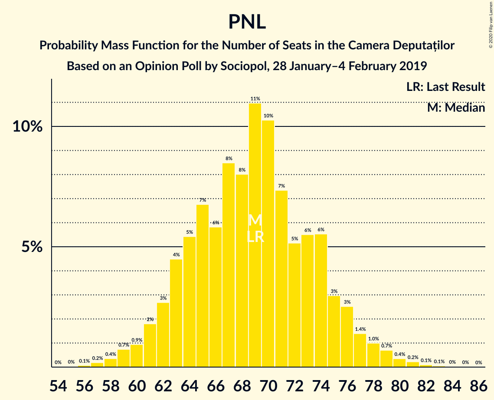

| Number of Seats | Probability | Accumulated | Special Marks |
|:---------------:|:-----------:|:-----------:|:-------------:|
| 55 | 0% | 100% |  |
| 56 | 0.1% | 99.9% |  |
| 57 | 0.2% | 99.9% |  |
| 58 | 0.4% | 99.7% |  |
| 59 | 0.7% | 99.3% |  |
| 60 | 0.9% | 98.6% |  |
| 61 | 2% | 98% |  |
| 62 | 3% | 96% |  |
| 63 | 4% | 93% |  |
| 64 | 5% | 89% |  |
| 65 | 7% | 83% |  |
| 66 | 6% | 76% |  |
| 67 | 8% | 71% |  |
| 68 | 8% | 62% |  |
| 69 | 11% | 54% | Last Result, Median |
| 70 | 10% | 43% |  |
| 71 | 7% | 33% |  |
| 72 | 5% | 26% |  |
| 73 | 6% | 20% |  |
| 74 | 6% | 15% |  |
| 75 | 3% | 9% |  |
| 76 | 3% | 6% |  |
| 77 | 1.4% | 4% |  |
| 78 | 1.0% | 2% |  |
| 79 | 0.7% | 1.5% |  |
| 80 | 0.4% | 0.8% |  |
| 81 | 0.2% | 0.4% |  |
| 82 | 0.1% | 0.2% |  |
| 83 | 0.1% | 0.1% |  |
| 84 | 0% | 0.1% |  |
| 85 | 0% | 0% |  |

### Alianța 2020 USR-PLUS – Partidul Mișcarea Populară

| Number of Seats | Probability | Accumulated | Special Marks |
|:---------------:|:-----------:|:-----------:|:-------------:|
| 39 | 0% | 100% |  |
| 40 | 0.1% | 99.9% |  |
| 41 | 0.2% | 99.9% |  |
| 42 | 0.6% | 99.7% |  |
| 43 | 0.8% | 99.1% |  |
| 44 | 1.2% | 98% |  |
| 45 | 3% | 97% |  |
| 46 | 5% | 94% |  |
| 47 | 5% | 88% |  |
| 48 | 6% | 84% | Last Result |
| 49 | 10% | 78% |  |
| 50 | 11% | 67% |  |
| 51 | 8% | 56% | Median |
| 52 | 11% | 48% |  |
| 53 | 11% | 38% |  |
| 54 | 7% | 27% |  |
| 55 | 5% | 20% |  |
| 56 | 6% | 15% |  |
| 57 | 4% | 9% |  |
| 58 | 2% | 5% |  |
| 59 | 2% | 4% |  |
| 60 | 1.1% | 2% |  |
| 61 | 0.4% | 1.0% |  |
| 62 | 0.2% | 0.5% |  |
| 63 | 0.2% | 0.3% |  |
| 64 | 0.1% | 0.1% |  |
| 65 | 0% | 0% |  |

## Technical Information

### Opinion Poll

+ **Polling firm:** Sociopol
+ **Commissioner(s):** —
+ **Fieldwork period:** 28 January–4 February 2019

### Calculations

+ **Sample size:** 1003
+ **Simulations done:** 1,048,576
+ **Error estimate:** 1.08%

