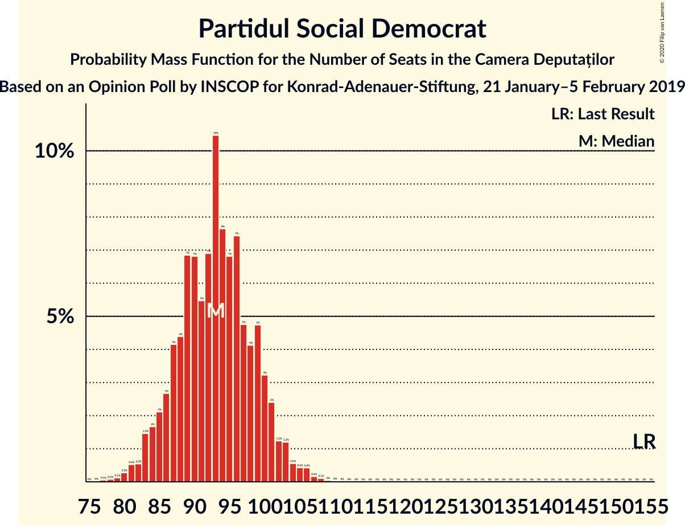
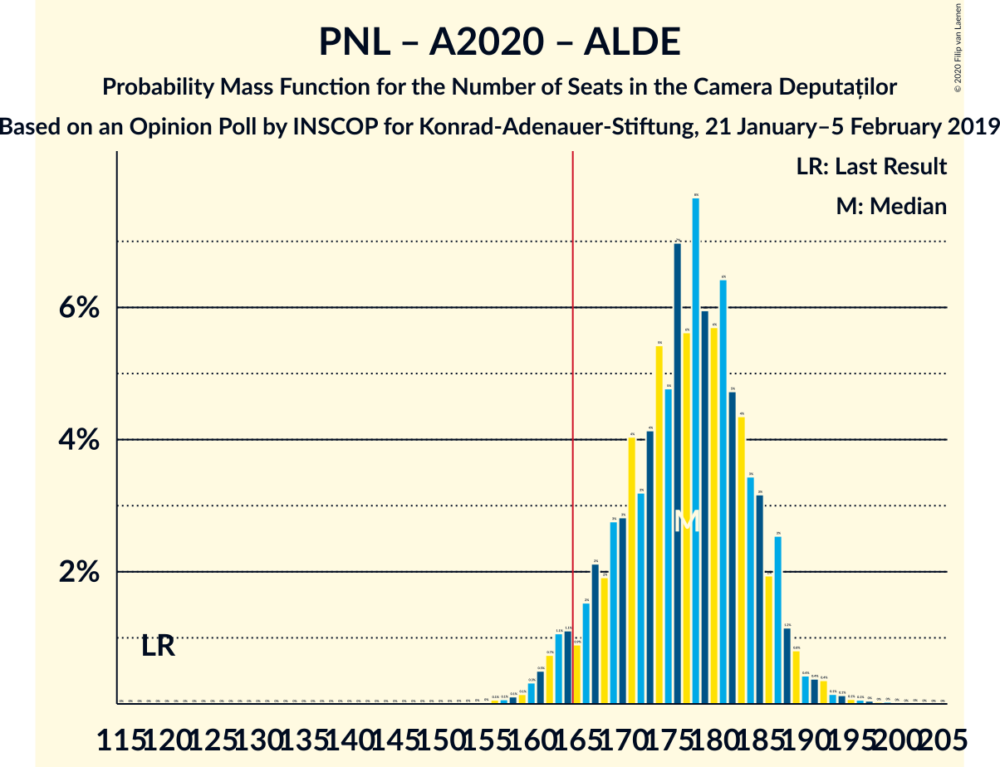
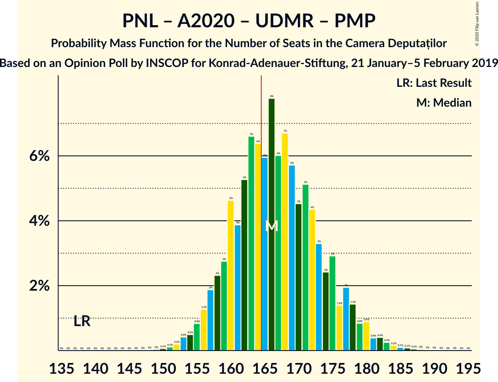
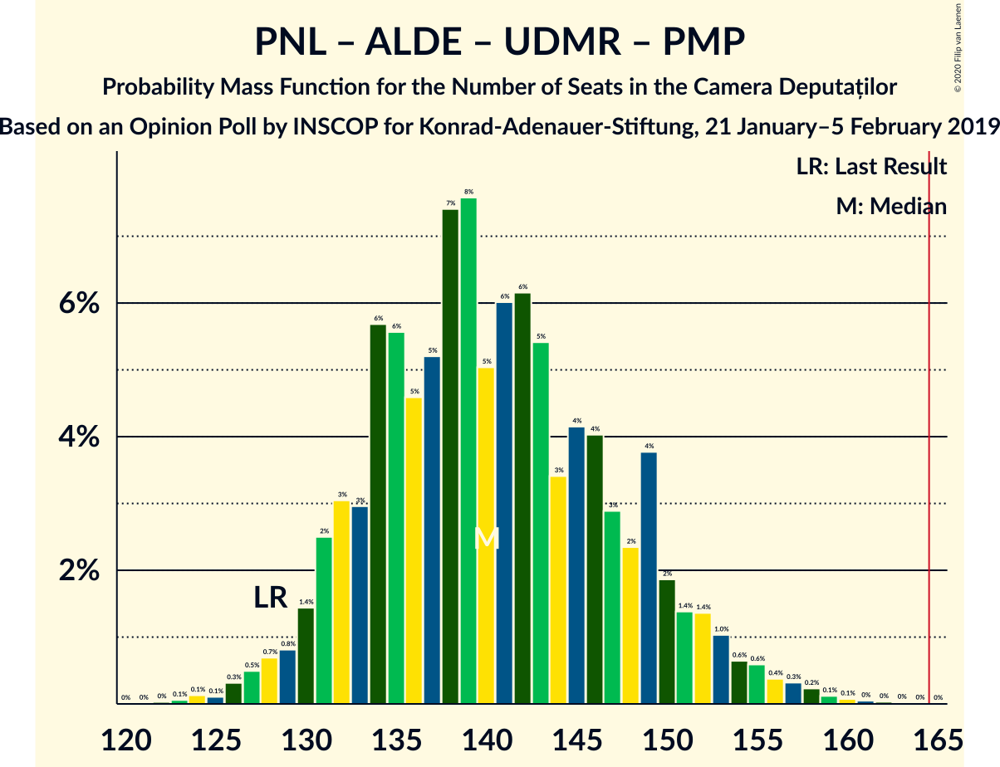
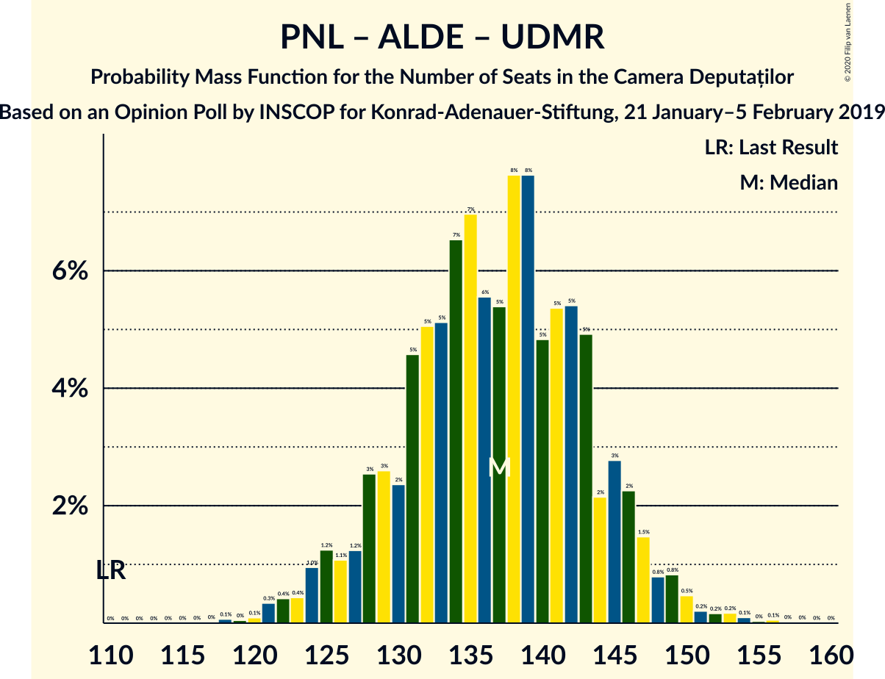
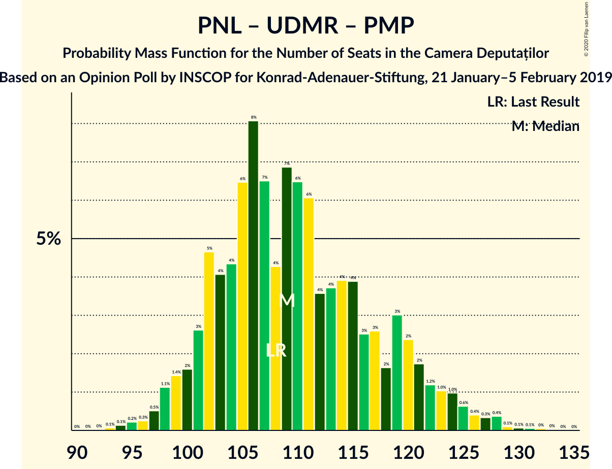

# Opinion Poll by INSCOP for Konrad-Adenauer-Stiftung, 21 January–5 February 2019

<a href="#voting-intentions">Voting Intentions</a> | <a href="#seats">Seats</a> | <a href="#coalitions">Coalitions</a> | <a href="#technical-information">Technical Information</a>

## Voting Intentions

### Confidence Intervals

| Party | Last Result | Poll Result | 80% Confidence Interval | 90% Confidence Interval | 95% Confidence Interval | 99% Confidence Interval |
|:-----:|:-----------:|:-----------:|:-----------------------:|:-----------------------:|:-----------------------:|:-----------------------:|
| Partidul Social Democrat | 45.5% | 27.8% | 26.1–29.6% |25.6–30.1% |25.2–30.5% |24.4–31.4% |
| Partidul Național Liberal | 20.0% | 26.7% | 25.0–28.5% |24.5–29.0% |24.1–29.4% |23.3–30.3% |
| Alianța 2020 USR-PLUS | 8.9% | 17.0% | 15.6–18.6% |15.2–19.0% |14.9–19.4% |14.3–20.2% |
| Partidul Alianța Liberalilor și Democraților | 5.6% | 9.2% | 8.1–10.4% |7.8–10.7% |7.6–11.1% |7.1–11.7% |
| PRO România | 0.0% | 6.6% | 5.7–7.7% |5.4–8.0% |5.2–8.2% |4.8–8.8% |
| Uniunea Democrată Maghiară din România | 6.2% | 5.1% | 4.3–6.1% |4.1–6.3% |3.9–6.6% |3.6–7.1% |
| Partidul Mișcarea Populară | 5.4% | 4.4% | 3.7–5.4% |3.5–5.6% |3.4–5.9% |3.0–6.3% |

*Note:* The poll result column reflects the actual value used in the calculations. Published results may vary slightly, and in addition be rounded to fewer digits.

## Seats

### Confidence Intervals

| Party | Last Result | Median | 80% Confidence Interval | 90% Confidence Interval | 95% Confidence Interval | 99% Confidence Interval |
|:-----:|:-----------:|:------:|:-----------------------:|:-----------------------:|:-----------------------:|:-----------------------:|
| <a href="#partidul-social-democrat">Partidul Social Democrat</a> | 154 | 93 | 87–99 |85–101 |83–103 |80–106 |
| <a href="#partidul-național-liberal">Partidul Național Liberal</a> | 69 | 89 | 83–95 |81–97 |79–99 |77–102 |
| <a href="#alianța-2020-usr-plus">Alianța 2020 USR-PLUS</a> | 30 | 57 | 52–62 |51–64 |49–65 |47–68 |
| <a href="#partidul-alianța-liberalilor-și-democraților">Partidul Alianța Liberalilor și Democraților</a> | 20 | 31 | 27–35 |26–36 |25–37 |23–39 |
| <a href="#pro-românia">PRO România</a> | 0 | 22 | 18–25 |18–26 |17–27 |0–29 |
| <a href="#uniunea-democrată-maghiară-din-românia">Uniunea Democrată Maghiară din România</a> | 21 | 17 | 14–20 |13–21 |13–22 |12–23 |
| <a href="#partidul-mișcarea-populară">Partidul Mișcarea Populară</a> | 18 | 0 | 0–17 |0–18 |0–19 |0–20 |

### Partidul Social Democrat

*For a full overview of the results for this party, see the [Partidul Social Democrat](party-partidulsocialdemocrat.html) page.*

| Number of Seats | Probability | Accumulated | Special Marks |
|:---------------:|:-----------:|:-----------:|:-------------:|
| 77 | 0.1% | 100% |  |
| 78 | 0.1% | 99.9% |  |
| 79 | 0.1% | 99.8% |  |
| 80 | 0.3% | 99.7% |  |
| 81 | 0.5% | 99.4% |  |
| 82 | 0.5% | 98.9% |  |
| 83 | 1.5% | 98% |  |
| 84 | 2% | 97% |  |
| 85 | 2% | 95% |  |
| 86 | 3% | 93% |  |
| 87 | 4% | 90% |  |
| 88 | 4% | 86% |  |
| 89 | 7% | 82% |  |
| 90 | 7% | 75% |  |
| 91 | 5% | 68% |  |
| 92 | 7% | 63% |  |
| 93 | 10% | 56% | Median |
| 94 | 8% | 45% |  |
| 95 | 7% | 38% |  |
| 96 | 7% | 31% |  |
| 97 | 5% | 23% |  |
| 98 | 4% | 19% |  |
| 99 | 5% | 15% |  |
| 100 | 3% | 10% |  |
| 101 | 2% | 7% |  |
| 102 | 1.2% | 4% |  |
| 103 | 1.2% | 3% |  |
| 104 | 0.6% | 2% |  |
| 105 | 0.4% | 1.2% |  |
| 106 | 0.4% | 0.8% |  |
| 107 | 0.2% | 0.4% |  |
| 108 | 0.1% | 0.2% |  |
| 109 | 0% | 0.1% |  |
| 110 | 0% | 0.1% |  |
| 111 | 0% | 0% |  |
| 112 | 0% | 0% |  |
| 113 | 0% | 0% |  |
| 114 | 0% | 0% |  |
| 115 | 0% | 0% |  |
| 116 | 0% | 0% |  |
| 117 | 0% | 0% |  |
| 118 | 0% | 0% |  |
| 119 | 0% | 0% |  |
| 120 | 0% | 0% |  |
| 121 | 0% | 0% |  |
| 122 | 0% | 0% |  |
| 123 | 0% | 0% |  |
| 124 | 0% | 0% |  |
| 125 | 0% | 0% |  |
| 126 | 0% | 0% |  |
| 127 | 0% | 0% |  |
| 128 | 0% | 0% |  |
| 129 | 0% | 0% |  |
| 130 | 0% | 0% |  |
| 131 | 0% | 0% |  |
| 132 | 0% | 0% |  |
| 133 | 0% | 0% |  |
| 134 | 0% | 0% |  |
| 135 | 0% | 0% |  |
| 136 | 0% | 0% |  |
| 137 | 0% | 0% |  |
| 138 | 0% | 0% |  |
| 139 | 0% | 0% |  |
| 140 | 0% | 0% |  |
| 141 | 0% | 0% |  |
| 142 | 0% | 0% |  |
| 143 | 0% | 0% |  |
| 144 | 0% | 0% |  |
| 145 | 0% | 0% |  |
| 146 | 0% | 0% |  |
| 147 | 0% | 0% |  |
| 148 | 0% | 0% |  |
| 149 | 0% | 0% |  |
| 150 | 0% | 0% |  |
| 151 | 0% | 0% |  |
| 152 | 0% | 0% |  |
| 153 | 0% | 0% |  |
| 154 | 0% | 0% | Last Result |

### Partidul Național Liberal

*For a full overview of the results for this party, see the [Partidul Național Liberal](party-partidulnaționalliberal.html) page.*

| Number of Seats | Probability | Accumulated | Special Marks |
|:---------------:|:-----------:|:-----------:|:-------------:|
| 69 | 0% | 100% | Last Result |
| 70 | 0% | 100% |  |
| 71 | 0% | 100% |  |
| 72 | 0% | 100% |  |
| 73 | 0.1% | 100% |  |
| 74 | 0.1% | 99.9% |  |
| 75 | 0.1% | 99.9% |  |
| 76 | 0.1% | 99.8% |  |
| 77 | 0.5% | 99.7% |  |
| 78 | 1.1% | 99.2% |  |
| 79 | 0.9% | 98% |  |
| 80 | 0.8% | 97% |  |
| 81 | 1.5% | 96% |  |
| 82 | 3% | 95% |  |
| 83 | 4% | 92% |  |
| 84 | 4% | 87% |  |
| 85 | 6% | 83% |  |
| 86 | 6% | 78% |  |
| 87 | 7% | 71% |  |
| 88 | 8% | 64% |  |
| 89 | 10% | 57% | Median |
| 90 | 7% | 47% |  |
| 91 | 9% | 40% |  |
| 92 | 5% | 31% |  |
| 93 | 5% | 27% |  |
| 94 | 6% | 21% |  |
| 95 | 6% | 15% |  |
| 96 | 3% | 9% |  |
| 97 | 2% | 7% |  |
| 98 | 2% | 5% |  |
| 99 | 1.3% | 3% |  |
| 100 | 1.0% | 2% |  |
| 101 | 0.5% | 1.1% |  |
| 102 | 0.2% | 0.6% |  |
| 103 | 0.2% | 0.4% |  |
| 104 | 0.1% | 0.2% |  |
| 105 | 0.1% | 0.1% |  |
| 106 | 0% | 0.1% |  |
| 107 | 0% | 0% |  |

### Alianța 2020 USR-PLUS

*For a full overview of the results for this party, see the [Alianța 2020 USR-PLUS](party-alianța2020usr-plus.html) page.*

| Number of Seats | Probability | Accumulated | Special Marks |
|:---------------:|:-----------:|:-----------:|:-------------:|
| 30 | 0% | 100% | Last Result |
| 31 | 0% | 100% |  |
| 32 | 0% | 100% |  |
| 33 | 0% | 100% |  |
| 34 | 0% | 100% |  |
| 35 | 0% | 100% |  |
| 36 | 0% | 100% |  |
| 37 | 0% | 100% |  |
| 38 | 0% | 100% |  |
| 39 | 0% | 100% |  |
| 40 | 0% | 100% |  |
| 41 | 0% | 100% |  |
| 42 | 0% | 100% |  |
| 43 | 0% | 100% |  |
| 44 | 0% | 100% |  |
| 45 | 0.1% | 99.9% |  |
| 46 | 0.2% | 99.9% |  |
| 47 | 0.4% | 99.6% |  |
| 48 | 0.7% | 99.3% |  |
| 49 | 2% | 98.5% |  |
| 50 | 2% | 97% |  |
| 51 | 4% | 95% |  |
| 52 | 6% | 91% |  |
| 53 | 5% | 86% |  |
| 54 | 7% | 81% |  |
| 55 | 10% | 74% |  |
| 56 | 8% | 64% |  |
| 57 | 10% | 56% | Median |
| 58 | 11% | 45% |  |
| 59 | 7% | 34% |  |
| 60 | 8% | 28% |  |
| 61 | 7% | 20% |  |
| 62 | 4% | 13% |  |
| 63 | 3% | 9% |  |
| 64 | 2% | 6% |  |
| 65 | 1.1% | 3% |  |
| 66 | 1.0% | 2% |  |
| 67 | 0.6% | 1.2% |  |
| 68 | 0.3% | 0.6% |  |
| 69 | 0.2% | 0.3% |  |
| 70 | 0.1% | 0.2% |  |
| 71 | 0% | 0.1% |  |
| 72 | 0% | 0% |  |

### Partidul Alianța Liberalilor și Democraților

*For a full overview of the results for this party, see the [Partidul Alianța Liberalilor și Democraților](party-partidulalianțaliberalilorșidemocraților.html) page.*

| Number of Seats | Probability | Accumulated | Special Marks |
|:---------------:|:-----------:|:-----------:|:-------------:|
| 20 | 0% | 100% | Last Result |
| 21 | 0% | 100% |  |
| 22 | 0.2% | 99.9% |  |
| 23 | 0.4% | 99.8% |  |
| 24 | 1.2% | 99.4% |  |
| 25 | 3% | 98% |  |
| 26 | 4% | 95% |  |
| 27 | 6% | 91% |  |
| 28 | 9% | 85% |  |
| 29 | 13% | 76% |  |
| 30 | 13% | 63% |  |
| 31 | 12% | 50% | Median |
| 32 | 10% | 38% |  |
| 33 | 11% | 27% |  |
| 34 | 6% | 17% |  |
| 35 | 5% | 11% |  |
| 36 | 3% | 6% |  |
| 37 | 1.5% | 3% |  |
| 38 | 0.7% | 2% |  |
| 39 | 0.5% | 0.8% |  |
| 40 | 0.2% | 0.3% |  |
| 41 | 0.1% | 0.1% |  |
| 42 | 0% | 0% |  |

### PRO România

*For a full overview of the results for this party, see the [PRO România](party-proromânia.html) page.*

| Number of Seats | Probability | Accumulated | Special Marks |
|:---------------:|:-----------:|:-----------:|:-------------:|
| 0 | 1.1% | 100% | Last Result |
| 1 | 0% | 98.9% |  |
| 2 | 0% | 98.9% |  |
| 3 | 0% | 98.9% |  |
| 4 | 0% | 98.9% |  |
| 5 | 0% | 98.9% |  |
| 6 | 0% | 98.9% |  |
| 7 | 0% | 98.9% |  |
| 8 | 0% | 98.9% |  |
| 9 | 0% | 98.9% |  |
| 10 | 0% | 98.9% |  |
| 11 | 0% | 98.9% |  |
| 12 | 0% | 98.9% |  |
| 13 | 0% | 98.9% |  |
| 14 | 0% | 98.9% |  |
| 15 | 0% | 98.9% |  |
| 16 | 0.4% | 98.9% |  |
| 17 | 3% | 98% |  |
| 18 | 6% | 96% |  |
| 19 | 8% | 90% |  |
| 20 | 14% | 82% |  |
| 21 | 15% | 68% |  |
| 22 | 15% | 53% | Median |
| 23 | 13% | 38% |  |
| 24 | 10% | 25% |  |
| 25 | 6% | 14% |  |
| 26 | 5% | 8% |  |
| 27 | 2% | 4% |  |
| 28 | 1.1% | 2% |  |
| 29 | 0.4% | 0.8% |  |
| 30 | 0.2% | 0.3% |  |
| 31 | 0.1% | 0.1% |  |
| 32 | 0% | 0% |  |

### Uniunea Democrată Maghiară din România

*For a full overview of the results for this party, see the [Uniunea Democrată Maghiară din România](party-uniuneademocratămaghiarădinromânia.html) page.*

| Number of Seats | Probability | Accumulated | Special Marks |
|:---------------:|:-----------:|:-----------:|:-------------:|
| 10 | 0.1% | 100% |  |
| 11 | 0.4% | 99.9% |  |
| 12 | 2% | 99.5% |  |
| 13 | 4% | 98% |  |
| 14 | 9% | 94% |  |
| 15 | 13% | 84% |  |
| 16 | 17% | 71% |  |
| 17 | 16% | 54% | Median |
| 18 | 14% | 38% |  |
| 19 | 10% | 24% |  |
| 20 | 7% | 13% |  |
| 21 | 4% | 7% | Last Result |
| 22 | 2% | 3% |  |
| 23 | 0.7% | 1.2% |  |
| 24 | 0.3% | 0.4% |  |
| 25 | 0.1% | 0.1% |  |
| 26 | 0% | 0% |  |

### Partidul Mișcarea Populară

*For a full overview of the results for this party, see the [Partidul Mișcarea Populară](party-partidulmișcareapopulară.html) page.*

| Number of Seats | Probability | Accumulated | Special Marks |
|:---------------:|:-----------:|:-----------:|:-------------:|
| 0 | 79% | 100% | Median |
| 1 | 0% | 21% |  |
| 2 | 0% | 21% |  |
| 3 | 0% | 21% |  |
| 4 | 0% | 21% |  |
| 5 | 0% | 21% |  |
| 6 | 0% | 21% |  |
| 7 | 0% | 21% |  |
| 8 | 0% | 21% |  |
| 9 | 0% | 21% |  |
| 10 | 0% | 21% |  |
| 11 | 0% | 21% |  |
| 12 | 0% | 21% |  |
| 13 | 0% | 21% |  |
| 14 | 0% | 21% |  |
| 15 | 0% | 21% |  |
| 16 | 8% | 21% |  |
| 17 | 7% | 13% |  |
| 18 | 4% | 6% | Last Result |
| 19 | 2% | 3% |  |
| 20 | 0.6% | 0.8% |  |
| 21 | 0.2% | 0.3% |  |
| 22 | 0.1% | 0.1% |  |
| 23 | 0% | 0% |  |

## Coalitions

### Confidence Intervals

| Coalition | Last Result | Median | Majority? | 80% Confidence Interval | 90% Confidence Interval | 95% Confidence Interval | 99% Confidence Interval |
|:---------:|:-----------:|:------:|:---------:|:-----------------------:|:-----------------------:|:-----------------------:|:-----------------------:|
| Partidul Național Liberal – Alianța 2020 USR-PLUS – Partidul Alianța Liberalilor și Democraților – Uniunea Democrată Maghiară din România – Partidul Mișcarea Populară | 158 | 197 | 100% | 190–205 | 189–207 | 187–209 | 184–213 |
| Partidul Național Liberal – Alianța 2020 USR-PLUS – Partidul Alianța Liberalilor și Democraților – Uniunea Democrată Maghiară din România | 140 | 194 | 100% | 185–202 | 182–203 | 180–206 | 176–210 |
| Partidul Național Liberal – Alianța 2020 USR-PLUS – Partidul Alianța Liberalilor și Democraților – Partidul Mișcarea Populară | 137 | 180 | 99.7% | 173–188 | 171–191 | 170–192 | 166–197 |
| Partidul Național Liberal – Alianța 2020 USR-PLUS – Partidul Alianța Liberalilor și Democraților | 119 | 177 | 95% | 168–185 | 165–187 | 163–189 | 160–193 |
| Partidul Național Liberal – Alianța 2020 USR-PLUS – Uniunea Democrată Maghiară din România – Partidul Mișcarea Populară | 138 | 166 | 57% | 159–175 | 157–177 | 156–179 | 153–184 |
| Partidul Național Liberal – Alianța 2020 USR-PLUS – Uniunea Democrată Maghiară din România | 120 | 164 | 38% | 155–171 | 152–173 | 150–175 | 146–179 |
| Partidul Național Liberal – Alianța 2020 USR-PLUS – Partidul Mișcarea Populară | 117 | 149 | 0.9% | 142–158 | 140–161 | 139–163 | 136–167 |
| Partidul Național Liberal – Alianța 2020 USR-PLUS | 99 | 147 | 0.1% | 138–154 | 136–156 | 134–158 | 130–161 |
| Partidul Social Democrat – Partidul Alianța Liberalilor și Democraților – PRO România | 174 | 146 | 0% | 137–153 | 135–155 | 133–156 | 128–159 |
| Partidul Național Liberal – Partidul Alianța Liberalilor și Democraților – Uniunea Democrată Maghiară din România – Partidul Mișcarea Populară | 128 | 140 | 0% | 133–149 | 131–151 | 129–154 | 126–158 |
| Partidul Național Liberal – Partidul Alianța Liberalilor și Democraților – Uniunea Democrată Maghiară din România | 110 | 137 | 0% | 129–144 | 127–146 | 125–148 | 121–152 |
| Partidul Social Democrat – Partidul Alianța Liberalilor și Democraților | 174 | 124 | 0% | 116–131 | 114–133 | 112–134 | 109–138 |
| Partidul Social Democrat – PRO România | 154 | 115 | 0% | 107–122 | 105–123 | 103–125 | 99–128 |
| Partidul Național Liberal – Uniunea Democrată Maghiară din România – Partidul Mișcarea Populară | 108 | 109 | 0% | 102–119 | 100–122 | 99–124 | 96–128 |
| Partidul Național Liberal – Uniunea Democrată Maghiară din România | 90 | 106 | 0% | 99–113 | 98–115 | 96–117 | 92–120 |
| Partidul Național Liberal – Partidul Mișcarea Populară | 87 | 92 | 0% | 85–103 | 84–105 | 82–108 | 79–111 |
| Partidul Național Liberal | 69 | 89 | 0% | 83–95 | 81–97 | 79–99 | 77–102 |
| Alianța 2020 USR-PLUS – Partidul Mișcarea Populară | 48 | 59 | 0% | 53–72 | 52–74 | 51–76 | 49–79 |

### Partidul Național Liberal – Alianța 2020 USR-PLUS – Partidul Alianța Liberalilor și Democraților – Uniunea Democrată Maghiară din România – Partidul Mișcarea Populară

| Number of Seats | Probability | Accumulated | Special Marks |
|:---------------:|:-----------:|:-----------:|:-------------:|
| 158 | 0% | 100% | Last Result |
| 159 | 0% | 100% |  |
| 160 | 0% | 100% |  |
| 161 | 0% | 100% |  |
| 162 | 0% | 100% |  |
| 163 | 0% | 100% |  |
| 164 | 0% | 100% |  |
| 165 | 0% | 100% |  |
| 166 | 0% | 100% | Majority |
| 167 | 0% | 100% |  |
| 168 | 0% | 100% |  |
| 169 | 0% | 100% |  |
| 170 | 0% | 100% |  |
| 171 | 0% | 100% |  |
| 172 | 0% | 100% |  |
| 173 | 0% | 100% |  |
| 174 | 0% | 100% |  |
| 175 | 0% | 100% |  |
| 176 | 0% | 100% |  |
| 177 | 0% | 100% |  |
| 178 | 0% | 100% |  |
| 179 | 0% | 100% |  |
| 180 | 0% | 100% |  |
| 181 | 0.1% | 99.9% |  |
| 182 | 0.2% | 99.9% |  |
| 183 | 0.1% | 99.7% |  |
| 184 | 0.3% | 99.6% |  |
| 185 | 0.5% | 99.3% |  |
| 186 | 0.8% | 98.8% |  |
| 187 | 1.2% | 98% |  |
| 188 | 2% | 97% |  |
| 189 | 3% | 95% |  |
| 190 | 3% | 92% |  |
| 191 | 3% | 90% |  |
| 192 | 5% | 86% |  |
| 193 | 6% | 81% |  |
| 194 | 6% | 75% | Median |
| 195 | 7% | 69% |  |
| 196 | 8% | 62% |  |
| 197 | 6% | 54% |  |
| 198 | 6% | 48% |  |
| 199 | 8% | 41% |  |
| 200 | 6% | 33% |  |
| 201 | 5% | 28% |  |
| 202 | 5% | 23% |  |
| 203 | 5% | 18% |  |
| 204 | 3% | 13% |  |
| 205 | 2% | 10% |  |
| 206 | 2% | 8% |  |
| 207 | 2% | 6% |  |
| 208 | 1.4% | 4% |  |
| 209 | 0.9% | 3% |  |
| 210 | 0.6% | 2% |  |
| 211 | 0.4% | 1.3% |  |
| 212 | 0.2% | 0.9% |  |
| 213 | 0.2% | 0.7% |  |
| 214 | 0.1% | 0.5% |  |
| 215 | 0.1% | 0.4% |  |
| 216 | 0.1% | 0.3% |  |
| 217 | 0.1% | 0.2% |  |
| 218 | 0% | 0.2% |  |
| 219 | 0% | 0.1% |  |
| 220 | 0% | 0.1% |  |
| 221 | 0% | 0.1% |  |
| 222 | 0% | 0% |  |

### Partidul Național Liberal – Alianța 2020 USR-PLUS – Partidul Alianța Liberalilor și Democraților – Uniunea Democrată Maghiară din România

| Number of Seats | Probability | Accumulated | Special Marks |
|:---------------:|:-----------:|:-----------:|:-------------:|
| 140 | 0% | 100% | Last Result |
| 141 | 0% | 100% |  |
| 142 | 0% | 100% |  |
| 143 | 0% | 100% |  |
| 144 | 0% | 100% |  |
| 145 | 0% | 100% |  |
| 146 | 0% | 100% |  |
| 147 | 0% | 100% |  |
| 148 | 0% | 100% |  |
| 149 | 0% | 100% |  |
| 150 | 0% | 100% |  |
| 151 | 0% | 100% |  |
| 152 | 0% | 100% |  |
| 153 | 0% | 100% |  |
| 154 | 0% | 100% |  |
| 155 | 0% | 100% |  |
| 156 | 0% | 100% |  |
| 157 | 0% | 100% |  |
| 158 | 0% | 100% |  |
| 159 | 0% | 100% |  |
| 160 | 0% | 100% |  |
| 161 | 0% | 100% |  |
| 162 | 0% | 100% |  |
| 163 | 0% | 100% |  |
| 164 | 0% | 100% |  |
| 165 | 0% | 100% |  |
| 166 | 0% | 100% | Majority |
| 167 | 0% | 100% |  |
| 168 | 0% | 100% |  |
| 169 | 0% | 100% |  |
| 170 | 0% | 100% |  |
| 171 | 0% | 100% |  |
| 172 | 0% | 100% |  |
| 173 | 0.1% | 99.9% |  |
| 174 | 0.1% | 99.9% |  |
| 175 | 0.2% | 99.8% |  |
| 176 | 0.3% | 99.5% |  |
| 177 | 0.3% | 99.3% |  |
| 178 | 0.5% | 98.9% |  |
| 179 | 0.8% | 98% |  |
| 180 | 1.2% | 98% |  |
| 181 | 1.1% | 96% |  |
| 182 | 1.5% | 95% |  |
| 183 | 2% | 94% |  |
| 184 | 2% | 92% |  |
| 185 | 2% | 90% |  |
| 186 | 3% | 88% |  |
| 187 | 3% | 85% |  |
| 188 | 3% | 82% |  |
| 189 | 4% | 80% |  |
| 190 | 4% | 75% |  |
| 191 | 4% | 72% |  |
| 192 | 6% | 68% |  |
| 193 | 6% | 62% |  |
| 194 | 6% | 56% | Median |
| 195 | 7% | 50% |  |
| 196 | 8% | 43% |  |
| 197 | 5% | 35% |  |
| 198 | 5% | 30% |  |
| 199 | 6% | 25% |  |
| 200 | 5% | 19% |  |
| 201 | 3% | 14% |  |
| 202 | 3% | 11% |  |
| 203 | 3% | 8% |  |
| 204 | 1.4% | 5% |  |
| 205 | 0.9% | 4% |  |
| 206 | 0.9% | 3% |  |
| 207 | 0.5% | 2% |  |
| 208 | 0.3% | 1.2% |  |
| 209 | 0.2% | 0.9% |  |
| 210 | 0.2% | 0.7% |  |
| 211 | 0.1% | 0.5% |  |
| 212 | 0.1% | 0.4% |  |
| 213 | 0.1% | 0.3% |  |
| 214 | 0% | 0.2% |  |
| 215 | 0% | 0.2% |  |
| 216 | 0.1% | 0.1% |  |
| 217 | 0% | 0.1% |  |
| 218 | 0% | 0.1% |  |
| 219 | 0% | 0% |  |

### Partidul Național Liberal – Alianța 2020 USR-PLUS – Partidul Alianța Liberalilor și Democraților – Partidul Mișcarea Populară

| Number of Seats | Probability | Accumulated | Special Marks |
|:---------------:|:-----------:|:-----------:|:-------------:|
| 137 | 0% | 100% | Last Result |
| 138 | 0% | 100% |  |
| 139 | 0% | 100% |  |
| 140 | 0% | 100% |  |
| 141 | 0% | 100% |  |
| 142 | 0% | 100% |  |
| 143 | 0% | 100% |  |
| 144 | 0% | 100% |  |
| 145 | 0% | 100% |  |
| 146 | 0% | 100% |  |
| 147 | 0% | 100% |  |
| 148 | 0% | 100% |  |
| 149 | 0% | 100% |  |
| 150 | 0% | 100% |  |
| 151 | 0% | 100% |  |
| 152 | 0% | 100% |  |
| 153 | 0% | 100% |  |
| 154 | 0% | 100% |  |
| 155 | 0% | 100% |  |
| 156 | 0% | 100% |  |
| 157 | 0% | 100% |  |
| 158 | 0% | 100% |  |
| 159 | 0% | 100% |  |
| 160 | 0% | 100% |  |
| 161 | 0% | 100% |  |
| 162 | 0% | 100% |  |
| 163 | 0% | 100% |  |
| 164 | 0.1% | 99.9% |  |
| 165 | 0.1% | 99.8% |  |
| 166 | 0.2% | 99.7% | Majority |
| 167 | 0.4% | 99.5% |  |
| 168 | 0.6% | 99.1% |  |
| 169 | 0.8% | 98.5% |  |
| 170 | 1.4% | 98% |  |
| 171 | 2% | 96% |  |
| 172 | 2% | 94% |  |
| 173 | 3% | 92% |  |
| 174 | 4% | 89% |  |
| 175 | 4% | 85% |  |
| 176 | 6% | 81% |  |
| 177 | 5% | 74% | Median |
| 178 | 8% | 69% |  |
| 179 | 6% | 61% |  |
| 180 | 7% | 55% |  |
| 181 | 7% | 48% |  |
| 182 | 6% | 41% |  |
| 183 | 5% | 35% |  |
| 184 | 5% | 30% |  |
| 185 | 4% | 25% |  |
| 186 | 4% | 20% |  |
| 187 | 4% | 16% |  |
| 188 | 3% | 12% |  |
| 189 | 2% | 9% |  |
| 190 | 2% | 7% |  |
| 191 | 1.3% | 6% |  |
| 192 | 2% | 4% |  |
| 193 | 0.8% | 2% |  |
| 194 | 0.4% | 2% |  |
| 195 | 0.4% | 1.2% |  |
| 196 | 0.3% | 0.8% |  |
| 197 | 0.2% | 0.5% |  |
| 198 | 0.1% | 0.4% |  |
| 199 | 0.1% | 0.3% |  |
| 200 | 0% | 0.2% |  |
| 201 | 0% | 0.1% |  |
| 202 | 0% | 0.1% |  |
| 203 | 0% | 0.1% |  |
| 204 | 0% | 0.1% |  |
| 205 | 0% | 0% |  |

### Partidul Național Liberal – Alianța 2020 USR-PLUS – Partidul Alianța Liberalilor și Democraților

| Number of Seats | Probability | Accumulated | Special Marks |
|:---------------:|:-----------:|:-----------:|:-------------:|
| 119 | 0% | 100% | Last Result |
| 120 | 0% | 100% |  |
| 121 | 0% | 100% |  |
| 122 | 0% | 100% |  |
| 123 | 0% | 100% |  |
| 124 | 0% | 100% |  |
| 125 | 0% | 100% |  |
| 126 | 0% | 100% |  |
| 127 | 0% | 100% |  |
| 128 | 0% | 100% |  |
| 129 | 0% | 100% |  |
| 130 | 0% | 100% |  |
| 131 | 0% | 100% |  |
| 132 | 0% | 100% |  |
| 133 | 0% | 100% |  |
| 134 | 0% | 100% |  |
| 135 | 0% | 100% |  |
| 136 | 0% | 100% |  |
| 137 | 0% | 100% |  |
| 138 | 0% | 100% |  |
| 139 | 0% | 100% |  |
| 140 | 0% | 100% |  |
| 141 | 0% | 100% |  |
| 142 | 0% | 100% |  |
| 143 | 0% | 100% |  |
| 144 | 0% | 100% |  |
| 145 | 0% | 100% |  |
| 146 | 0% | 100% |  |
| 147 | 0% | 100% |  |
| 148 | 0% | 100% |  |
| 149 | 0% | 100% |  |
| 150 | 0% | 100% |  |
| 151 | 0% | 100% |  |
| 152 | 0% | 100% |  |
| 153 | 0% | 100% |  |
| 154 | 0% | 100% |  |
| 155 | 0% | 100% |  |
| 156 | 0.1% | 100% |  |
| 157 | 0.1% | 99.9% |  |
| 158 | 0.1% | 99.8% |  |
| 159 | 0.1% | 99.7% |  |
| 160 | 0.3% | 99.6% |  |
| 161 | 0.5% | 99.2% |  |
| 162 | 0.7% | 98.7% |  |
| 163 | 1.1% | 98% |  |
| 164 | 1.1% | 97% |  |
| 165 | 0.9% | 96% |  |
| 166 | 2% | 95% | Majority |
| 167 | 2% | 93% |  |
| 168 | 2% | 91% |  |
| 169 | 3% | 89% |  |
| 170 | 3% | 87% |  |
| 171 | 4% | 84% |  |
| 172 | 3% | 80% |  |
| 173 | 4% | 77% |  |
| 174 | 5% | 72% |  |
| 175 | 5% | 67% |  |
| 176 | 7% | 62% |  |
| 177 | 6% | 55% | Median |
| 178 | 8% | 50% |  |
| 179 | 6% | 42% |  |
| 180 | 6% | 36% |  |
| 181 | 6% | 30% |  |
| 182 | 5% | 24% |  |
| 183 | 4% | 19% |  |
| 184 | 3% | 15% |  |
| 185 | 3% | 11% |  |
| 186 | 2% | 8% |  |
| 187 | 3% | 6% |  |
| 188 | 1.2% | 4% |  |
| 189 | 0.8% | 3% |  |
| 190 | 0.4% | 2% |  |
| 191 | 0.4% | 1.3% |  |
| 192 | 0.4% | 0.9% |  |
| 193 | 0.1% | 0.6% |  |
| 194 | 0.1% | 0.4% |  |
| 195 | 0.1% | 0.3% |  |
| 196 | 0.1% | 0.2% |  |
| 197 | 0% | 0.2% |  |
| 198 | 0% | 0.1% |  |
| 199 | 0% | 0.1% |  |
| 200 | 0% | 0.1% |  |
| 201 | 0% | 0% |  |

### Partidul Național Liberal – Alianța 2020 USR-PLUS – Uniunea Democrată Maghiară din România – Partidul Mișcarea Populară

| Number of Seats | Probability | Accumulated | Special Marks |
|:---------------:|:-----------:|:-----------:|:-------------:|
| 138 | 0% | 100% | Last Result |
| 139 | 0% | 100% |  |
| 140 | 0% | 100% |  |
| 141 | 0% | 100% |  |
| 142 | 0% | 100% |  |
| 143 | 0% | 100% |  |
| 144 | 0% | 100% |  |
| 145 | 0% | 100% |  |
| 146 | 0% | 100% |  |
| 147 | 0% | 100% |  |
| 148 | 0% | 100% |  |
| 149 | 0% | 100% |  |
| 150 | 0.1% | 99.9% |  |
| 151 | 0.1% | 99.9% |  |
| 152 | 0.2% | 99.8% |  |
| 153 | 0.4% | 99.6% |  |
| 154 | 0.5% | 99.1% |  |
| 155 | 0.8% | 98.6% |  |
| 156 | 1.3% | 98% |  |
| 157 | 2% | 97% |  |
| 158 | 2% | 95% |  |
| 159 | 3% | 92% |  |
| 160 | 5% | 90% |  |
| 161 | 4% | 85% |  |
| 162 | 5% | 81% |  |
| 163 | 7% | 76% | Median |
| 164 | 6% | 69% |  |
| 165 | 6% | 63% |  |
| 166 | 8% | 57% | Majority |
| 167 | 6% | 49% |  |
| 168 | 7% | 43% |  |
| 169 | 6% | 36% |  |
| 170 | 5% | 31% |  |
| 171 | 5% | 26% |  |
| 172 | 4% | 21% |  |
| 173 | 3% | 17% |  |
| 174 | 2% | 13% |  |
| 175 | 3% | 11% |  |
| 176 | 1.4% | 8% |  |
| 177 | 2% | 7% |  |
| 178 | 1.4% | 5% |  |
| 179 | 0.8% | 3% |  |
| 180 | 0.9% | 2% |  |
| 181 | 0.4% | 2% |  |
| 182 | 0.4% | 1.2% |  |
| 183 | 0.3% | 0.8% |  |
| 184 | 0.2% | 0.5% |  |
| 185 | 0.1% | 0.4% |  |
| 186 | 0.1% | 0.3% |  |
| 187 | 0.1% | 0.2% |  |
| 188 | 0% | 0.1% |  |
| 189 | 0% | 0.1% |  |
| 190 | 0% | 0.1% |  |
| 191 | 0% | 0% |  |

### Partidul Național Liberal – Alianța 2020 USR-PLUS – Uniunea Democrată Maghiară din România

| Number of Seats | Probability | Accumulated | Special Marks |
|:---------------:|:-----------:|:-----------:|:-------------:|
| 120 | 0% | 100% | Last Result |
| 121 | 0% | 100% |  |
| 122 | 0% | 100% |  |
| 123 | 0% | 100% |  |
| 124 | 0% | 100% |  |
| 125 | 0% | 100% |  |
| 126 | 0% | 100% |  |
| 127 | 0% | 100% |  |
| 128 | 0% | 100% |  |
| 129 | 0% | 100% |  |
| 130 | 0% | 100% |  |
| 131 | 0% | 100% |  |
| 132 | 0% | 100% |  |
| 133 | 0% | 100% |  |
| 134 | 0% | 100% |  |
| 135 | 0% | 100% |  |
| 136 | 0% | 100% |  |
| 137 | 0% | 100% |  |
| 138 | 0% | 100% |  |
| 139 | 0% | 100% |  |
| 140 | 0% | 100% |  |
| 141 | 0% | 100% |  |
| 142 | 0% | 100% |  |
| 143 | 0% | 99.9% |  |
| 144 | 0.1% | 99.9% |  |
| 145 | 0.1% | 99.8% |  |
| 146 | 0.3% | 99.7% |  |
| 147 | 0.4% | 99.4% |  |
| 148 | 0.4% | 99.1% |  |
| 149 | 0.7% | 98.6% |  |
| 150 | 0.7% | 98% |  |
| 151 | 1.1% | 97% |  |
| 152 | 2% | 96% |  |
| 153 | 2% | 94% |  |
| 154 | 2% | 93% |  |
| 155 | 3% | 91% |  |
| 156 | 3% | 88% |  |
| 157 | 3% | 85% |  |
| 158 | 3% | 81% |  |
| 159 | 4% | 78% |  |
| 160 | 5% | 74% |  |
| 161 | 5% | 68% |  |
| 162 | 6% | 63% |  |
| 163 | 7% | 57% | Median |
| 164 | 7% | 50% |  |
| 165 | 6% | 44% |  |
| 166 | 7% | 38% | Majority |
| 167 | 5% | 30% |  |
| 168 | 6% | 25% |  |
| 169 | 4% | 19% |  |
| 170 | 4% | 15% |  |
| 171 | 3% | 11% |  |
| 172 | 2% | 8% |  |
| 173 | 2% | 6% |  |
| 174 | 1.4% | 4% |  |
| 175 | 1.0% | 3% |  |
| 176 | 0.5% | 2% |  |
| 177 | 0.5% | 1.2% |  |
| 178 | 0.2% | 0.8% |  |
| 179 | 0.2% | 0.5% |  |
| 180 | 0.1% | 0.4% |  |
| 181 | 0.1% | 0.3% |  |
| 182 | 0% | 0.2% |  |
| 183 | 0.1% | 0.2% |  |
| 184 | 0% | 0.1% |  |
| 185 | 0% | 0.1% |  |
| 186 | 0% | 0.1% |  |
| 187 | 0% | 0% |  |

### Partidul Național Liberal – Alianța 2020 USR-PLUS – Partidul Mișcarea Populară

| Number of Seats | Probability | Accumulated | Special Marks |
|:---------------:|:-----------:|:-----------:|:-------------:|
| 117 | 0% | 100% | Last Result |
| 118 | 0% | 100% |  |
| 119 | 0% | 100% |  |
| 120 | 0% | 100% |  |
| 121 | 0% | 100% |  |
| 122 | 0% | 100% |  |
| 123 | 0% | 100% |  |
| 124 | 0% | 100% |  |
| 125 | 0% | 100% |  |
| 126 | 0% | 100% |  |
| 127 | 0% | 100% |  |
| 128 | 0% | 100% |  |
| 129 | 0% | 100% |  |
| 130 | 0% | 100% |  |
| 131 | 0% | 100% |  |
| 132 | 0% | 100% |  |
| 133 | 0.1% | 99.9% |  |
| 134 | 0.1% | 99.9% |  |
| 135 | 0.2% | 99.7% |  |
| 136 | 0.4% | 99.5% |  |
| 137 | 0.5% | 99.1% |  |
| 138 | 0.8% | 98.6% |  |
| 139 | 1.2% | 98% |  |
| 140 | 2% | 97% |  |
| 141 | 3% | 95% |  |
| 142 | 3% | 92% |  |
| 143 | 5% | 89% |  |
| 144 | 4% | 85% |  |
| 145 | 6% | 81% |  |
| 146 | 6% | 75% | Median |
| 147 | 6% | 69% |  |
| 148 | 8% | 63% |  |
| 149 | 5% | 55% |  |
| 150 | 8% | 50% |  |
| 151 | 4% | 42% |  |
| 152 | 6% | 38% |  |
| 153 | 4% | 32% |  |
| 154 | 5% | 28% |  |
| 155 | 4% | 23% |  |
| 156 | 4% | 19% |  |
| 157 | 3% | 15% |  |
| 158 | 3% | 12% |  |
| 159 | 2% | 10% |  |
| 160 | 2% | 8% |  |
| 161 | 2% | 6% |  |
| 162 | 1.3% | 4% |  |
| 163 | 0.9% | 3% |  |
| 164 | 0.7% | 2% |  |
| 165 | 0.4% | 1.4% |  |
| 166 | 0.2% | 0.9% | Majority |
| 167 | 0.3% | 0.7% |  |
| 168 | 0.1% | 0.4% |  |
| 169 | 0.1% | 0.3% |  |
| 170 | 0.1% | 0.2% |  |
| 171 | 0.1% | 0.1% |  |
| 172 | 0% | 0.1% |  |
| 173 | 0% | 0% |  |

### Partidul Național Liberal – Alianța 2020 USR-PLUS

| Number of Seats | Probability | Accumulated | Special Marks |
|:---------------:|:-----------:|:-----------:|:-------------:|
| 99 | 0% | 100% | Last Result |
| 100 | 0% | 100% |  |
| 101 | 0% | 100% |  |
| 102 | 0% | 100% |  |
| 103 | 0% | 100% |  |
| 104 | 0% | 100% |  |
| 105 | 0% | 100% |  |
| 106 | 0% | 100% |  |
| 107 | 0% | 100% |  |
| 108 | 0% | 100% |  |
| 109 | 0% | 100% |  |
| 110 | 0% | 100% |  |
| 111 | 0% | 100% |  |
| 112 | 0% | 100% |  |
| 113 | 0% | 100% |  |
| 114 | 0% | 100% |  |
| 115 | 0% | 100% |  |
| 116 | 0% | 100% |  |
| 117 | 0% | 100% |  |
| 118 | 0% | 100% |  |
| 119 | 0% | 100% |  |
| 120 | 0% | 100% |  |
| 121 | 0% | 100% |  |
| 122 | 0% | 100% |  |
| 123 | 0% | 100% |  |
| 124 | 0% | 100% |  |
| 125 | 0% | 100% |  |
| 126 | 0% | 100% |  |
| 127 | 0% | 99.9% |  |
| 128 | 0.1% | 99.9% |  |
| 129 | 0.2% | 99.8% |  |
| 130 | 0.2% | 99.7% |  |
| 131 | 0.4% | 99.5% |  |
| 132 | 0.5% | 99.1% |  |
| 133 | 0.7% | 98.6% |  |
| 134 | 1.1% | 98% |  |
| 135 | 1.2% | 97% |  |
| 136 | 1.4% | 96% |  |
| 137 | 2% | 94% |  |
| 138 | 2% | 92% |  |
| 139 | 3% | 90% |  |
| 140 | 4% | 87% |  |
| 141 | 4% | 82% |  |
| 142 | 4% | 79% |  |
| 143 | 6% | 75% |  |
| 144 | 5% | 69% |  |
| 145 | 7% | 64% |  |
| 146 | 7% | 57% | Median |
| 147 | 7% | 50% |  |
| 148 | 8% | 44% |  |
| 149 | 5% | 36% |  |
| 150 | 7% | 31% |  |
| 151 | 4% | 24% |  |
| 152 | 5% | 20% |  |
| 153 | 3% | 15% |  |
| 154 | 3% | 12% |  |
| 155 | 2% | 8% |  |
| 156 | 2% | 6% |  |
| 157 | 1.4% | 4% |  |
| 158 | 0.9% | 3% |  |
| 159 | 0.6% | 2% |  |
| 160 | 0.4% | 1.1% |  |
| 161 | 0.3% | 0.7% |  |
| 162 | 0.2% | 0.5% |  |
| 163 | 0.1% | 0.3% |  |
| 164 | 0.1% | 0.2% |  |
| 165 | 0% | 0.1% |  |
| 166 | 0% | 0.1% | Majority |
| 167 | 0% | 0.1% |  |
| 168 | 0% | 0% |  |

### Partidul Social Democrat – Partidul Alianța Liberalilor și Democraților – PRO România

| Number of Seats | Probability | Accumulated | Special Marks |
|:---------------:|:-----------:|:-----------:|:-------------:|
| 122 | 0% | 100% |  |
| 123 | 0% | 99.9% |  |
| 124 | 0% | 99.9% |  |
| 125 | 0.1% | 99.9% |  |
| 126 | 0.1% | 99.8% |  |
| 127 | 0.1% | 99.7% |  |
| 128 | 0.2% | 99.6% |  |
| 129 | 0.3% | 99.5% |  |
| 130 | 0.4% | 99.2% |  |
| 131 | 0.4% | 98.8% |  |
| 132 | 0.9% | 98% |  |
| 133 | 0.8% | 98% |  |
| 134 | 1.4% | 97% |  |
| 135 | 2% | 95% |  |
| 136 | 1.4% | 93% |  |
| 137 | 3% | 92% |  |
| 138 | 2% | 89% |  |
| 139 | 3% | 87% |  |
| 140 | 4% | 83% |  |
| 141 | 5% | 79% |  |
| 142 | 5% | 74% |  |
| 143 | 6% | 69% |  |
| 144 | 7% | 64% |  |
| 145 | 6% | 57% |  |
| 146 | 8% | 51% | Median |
| 147 | 6% | 43% |  |
| 148 | 6% | 37% |  |
| 149 | 7% | 31% |  |
| 150 | 5% | 24% |  |
| 151 | 4% | 19% |  |
| 152 | 5% | 15% |  |
| 153 | 3% | 10% |  |
| 154 | 2% | 8% |  |
| 155 | 2% | 5% |  |
| 156 | 1.3% | 3% |  |
| 157 | 0.8% | 2% |  |
| 158 | 0.5% | 1.4% |  |
| 159 | 0.4% | 0.9% |  |
| 160 | 0.2% | 0.4% |  |
| 161 | 0.1% | 0.2% |  |
| 162 | 0.1% | 0.1% |  |
| 163 | 0% | 0.1% |  |
| 164 | 0% | 0% |  |
| 165 | 0% | 0% |  |
| 166 | 0% | 0% | Majority |
| 167 | 0% | 0% |  |
| 168 | 0% | 0% |  |
| 169 | 0% | 0% |  |
| 170 | 0% | 0% |  |
| 171 | 0% | 0% |  |
| 172 | 0% | 0% |  |
| 173 | 0% | 0% |  |
| 174 | 0% | 0% | Last Result |

### Partidul Național Liberal – Partidul Alianța Liberalilor și Democraților – Uniunea Democrată Maghiară din România – Partidul Mișcarea Populară

| Number of Seats | Probability | Accumulated | Special Marks |
|:---------------:|:-----------:|:-----------:|:-------------:|
| 122 | 0% | 100% |  |
| 123 | 0.1% | 99.9% |  |
| 124 | 0.1% | 99.9% |  |
| 125 | 0.1% | 99.8% |  |
| 126 | 0.3% | 99.7% |  |
| 127 | 0.5% | 99.3% |  |
| 128 | 0.7% | 98.8% | Last Result |
| 129 | 0.8% | 98% |  |
| 130 | 1.4% | 97% |  |
| 131 | 2% | 96% |  |
| 132 | 3% | 93% |  |
| 133 | 3% | 90% |  |
| 134 | 6% | 87% |  |
| 135 | 6% | 82% |  |
| 136 | 5% | 76% |  |
| 137 | 5% | 72% | Median |
| 138 | 7% | 66% |  |
| 139 | 8% | 59% |  |
| 140 | 5% | 51% |  |
| 141 | 6% | 46% |  |
| 142 | 6% | 40% |  |
| 143 | 5% | 34% |  |
| 144 | 3% | 29% |  |
| 145 | 4% | 25% |  |
| 146 | 4% | 21% |  |
| 147 | 3% | 17% |  |
| 148 | 2% | 14% |  |
| 149 | 4% | 12% |  |
| 150 | 2% | 8% |  |
| 151 | 1.4% | 6% |  |
| 152 | 1.4% | 5% |  |
| 153 | 1.0% | 4% |  |
| 154 | 0.6% | 3% |  |
| 155 | 0.6% | 2% |  |
| 156 | 0.4% | 1.3% |  |
| 157 | 0.3% | 0.9% |  |
| 158 | 0.2% | 0.6% |  |
| 159 | 0.1% | 0.3% |  |
| 160 | 0.1% | 0.2% |  |
| 161 | 0% | 0.1% |  |
| 162 | 0% | 0.1% |  |
| 163 | 0% | 0.1% |  |
| 164 | 0% | 0% |  |

### Partidul Național Liberal – Partidul Alianța Liberalilor și Democraților – Uniunea Democrată Maghiară din România

| Number of Seats | Probability | Accumulated | Special Marks |
|:---------------:|:-----------:|:-----------:|:-------------:|
| 110 | 0% | 100% | Last Result |
| 111 | 0% | 100% |  |
| 112 | 0% | 100% |  |
| 113 | 0% | 100% |  |
| 114 | 0% | 100% |  |
| 115 | 0% | 100% |  |
| 116 | 0% | 100% |  |
| 117 | 0% | 100% |  |
| 118 | 0.1% | 100% |  |
| 119 | 0% | 99.9% |  |
| 120 | 0.1% | 99.8% |  |
| 121 | 0.3% | 99.7% |  |
| 122 | 0.4% | 99.4% |  |
| 123 | 0.4% | 99.0% |  |
| 124 | 1.0% | 98.5% |  |
| 125 | 1.2% | 98% |  |
| 126 | 1.1% | 96% |  |
| 127 | 1.2% | 95% |  |
| 128 | 3% | 94% |  |
| 129 | 3% | 91% |  |
| 130 | 2% | 89% |  |
| 131 | 5% | 87% |  |
| 132 | 5% | 82% |  |
| 133 | 5% | 77% |  |
| 134 | 7% | 72% |  |
| 135 | 7% | 65% |  |
| 136 | 6% | 58% |  |
| 137 | 5% | 53% | Median |
| 138 | 8% | 47% |  |
| 139 | 8% | 40% |  |
| 140 | 5% | 32% |  |
| 141 | 5% | 27% |  |
| 142 | 5% | 22% |  |
| 143 | 5% | 16% |  |
| 144 | 2% | 12% |  |
| 145 | 3% | 9% |  |
| 146 | 2% | 7% |  |
| 147 | 1.5% | 4% |  |
| 148 | 0.8% | 3% |  |
| 149 | 0.8% | 2% |  |
| 150 | 0.5% | 1.3% |  |
| 151 | 0.2% | 0.8% |  |
| 152 | 0.2% | 0.6% |  |
| 153 | 0.2% | 0.4% |  |
| 154 | 0.1% | 0.2% |  |
| 155 | 0% | 0.2% |  |
| 156 | 0.1% | 0.1% |  |
| 157 | 0% | 0.1% |  |
| 158 | 0% | 0% |  |

### Partidul Social Democrat – Partidul Alianța Liberalilor și Democraților

| Number of Seats | Probability | Accumulated | Special Marks |
|:---------------:|:-----------:|:-----------:|:-------------:|
| 105 | 0% | 100% |  |
| 106 | 0.1% | 99.9% |  |
| 107 | 0.1% | 99.8% |  |
| 108 | 0.1% | 99.7% |  |
| 109 | 0.2% | 99.6% |  |
| 110 | 0.5% | 99.4% |  |
| 111 | 0.8% | 98.9% |  |
| 112 | 0.9% | 98% |  |
| 113 | 1.1% | 97% |  |
| 114 | 2% | 96% |  |
| 115 | 2% | 94% |  |
| 116 | 3% | 92% |  |
| 117 | 2% | 89% |  |
| 118 | 4% | 86% |  |
| 119 | 4% | 82% |  |
| 120 | 7% | 78% |  |
| 121 | 6% | 71% |  |
| 122 | 7% | 65% |  |
| 123 | 5% | 58% |  |
| 124 | 9% | 53% | Median |
| 125 | 7% | 44% |  |
| 126 | 7% | 38% |  |
| 127 | 5% | 30% |  |
| 128 | 7% | 25% |  |
| 129 | 3% | 19% |  |
| 130 | 5% | 15% |  |
| 131 | 3% | 10% |  |
| 132 | 3% | 8% |  |
| 133 | 1.2% | 5% |  |
| 134 | 1.5% | 4% |  |
| 135 | 0.6% | 2% |  |
| 136 | 0.7% | 2% |  |
| 137 | 0.4% | 1.1% |  |
| 138 | 0.3% | 0.7% |  |
| 139 | 0.1% | 0.4% |  |
| 140 | 0.2% | 0.3% |  |
| 141 | 0% | 0.2% |  |
| 142 | 0% | 0.1% |  |
| 143 | 0% | 0.1% |  |
| 144 | 0% | 0% |  |
| 145 | 0% | 0% |  |
| 146 | 0% | 0% |  |
| 147 | 0% | 0% |  |
| 148 | 0% | 0% |  |
| 149 | 0% | 0% |  |
| 150 | 0% | 0% |  |
| 151 | 0% | 0% |  |
| 152 | 0% | 0% |  |
| 153 | 0% | 0% |  |
| 154 | 0% | 0% |  |
| 155 | 0% | 0% |  |
| 156 | 0% | 0% |  |
| 157 | 0% | 0% |  |
| 158 | 0% | 0% |  |
| 159 | 0% | 0% |  |
| 160 | 0% | 0% |  |
| 161 | 0% | 0% |  |
| 162 | 0% | 0% |  |
| 163 | 0% | 0% |  |
| 164 | 0% | 0% |  |
| 165 | 0% | 0% |  |
| 166 | 0% | 0% | Majority |
| 167 | 0% | 0% |  |
| 168 | 0% | 0% |  |
| 169 | 0% | 0% |  |
| 170 | 0% | 0% |  |
| 171 | 0% | 0% |  |
| 172 | 0% | 0% |  |
| 173 | 0% | 0% |  |
| 174 | 0% | 0% | Last Result |

### Partidul Social Democrat – PRO România

| Number of Seats | Probability | Accumulated | Special Marks |
|:---------------:|:-----------:|:-----------:|:-------------:|
| 91 | 0% | 100% |  |
| 92 | 0% | 99.9% |  |
| 93 | 0% | 99.9% |  |
| 94 | 0% | 99.9% |  |
| 95 | 0.1% | 99.8% |  |
| 96 | 0.1% | 99.8% |  |
| 97 | 0.1% | 99.7% |  |
| 98 | 0.1% | 99.6% |  |
| 99 | 0.2% | 99.5% |  |
| 100 | 0.2% | 99.3% |  |
| 101 | 0.4% | 99.1% |  |
| 102 | 0.6% | 98.7% |  |
| 103 | 0.9% | 98% |  |
| 104 | 1.4% | 97% |  |
| 105 | 2% | 96% |  |
| 106 | 2% | 94% |  |
| 107 | 2% | 92% |  |
| 108 | 3% | 90% |  |
| 109 | 5% | 87% |  |
| 110 | 5% | 82% |  |
| 111 | 5% | 77% |  |
| 112 | 6% | 72% |  |
| 113 | 8% | 67% |  |
| 114 | 6% | 59% |  |
| 115 | 6% | 52% | Median |
| 116 | 8% | 46% |  |
| 117 | 7% | 38% |  |
| 118 | 6% | 31% |  |
| 119 | 6% | 25% |  |
| 120 | 5% | 19% |  |
| 121 | 3% | 14% |  |
| 122 | 3% | 10% |  |
| 123 | 3% | 8% |  |
| 124 | 2% | 5% |  |
| 125 | 1.2% | 3% |  |
| 126 | 0.8% | 2% |  |
| 127 | 0.5% | 1.2% |  |
| 128 | 0.3% | 0.7% |  |
| 129 | 0.1% | 0.4% |  |
| 130 | 0.2% | 0.3% |  |
| 131 | 0.1% | 0.1% |  |
| 132 | 0% | 0.1% |  |
| 133 | 0% | 0% |  |
| 134 | 0% | 0% |  |
| 135 | 0% | 0% |  |
| 136 | 0% | 0% |  |
| 137 | 0% | 0% |  |
| 138 | 0% | 0% |  |
| 139 | 0% | 0% |  |
| 140 | 0% | 0% |  |
| 141 | 0% | 0% |  |
| 142 | 0% | 0% |  |
| 143 | 0% | 0% |  |
| 144 | 0% | 0% |  |
| 145 | 0% | 0% |  |
| 146 | 0% | 0% |  |
| 147 | 0% | 0% |  |
| 148 | 0% | 0% |  |
| 149 | 0% | 0% |  |
| 150 | 0% | 0% |  |
| 151 | 0% | 0% |  |
| 152 | 0% | 0% |  |
| 153 | 0% | 0% |  |
| 154 | 0% | 0% | Last Result |

### Partidul Național Liberal – Uniunea Democrată Maghiară din România – Partidul Mișcarea Populară

| Number of Seats | Probability | Accumulated | Special Marks |
|:---------------:|:-----------:|:-----------:|:-------------:|
| 93 | 0.1% | 100% |  |
| 94 | 0.1% | 99.9% |  |
| 95 | 0.2% | 99.7% |  |
| 96 | 0.3% | 99.5% |  |
| 97 | 0.5% | 99.3% |  |
| 98 | 1.1% | 98.8% |  |
| 99 | 1.4% | 98% |  |
| 100 | 2% | 96% |  |
| 101 | 3% | 95% |  |
| 102 | 5% | 92% |  |
| 103 | 4% | 87% |  |
| 104 | 4% | 83% |  |
| 105 | 6% | 79% |  |
| 106 | 8% | 72% | Median |
| 107 | 7% | 64% |  |
| 108 | 4% | 58% | Last Result |
| 109 | 7% | 54% |  |
| 110 | 6% | 47% |  |
| 111 | 6% | 40% |  |
| 112 | 4% | 34% |  |
| 113 | 4% | 31% |  |
| 114 | 4% | 27% |  |
| 115 | 4% | 23% |  |
| 116 | 3% | 19% |  |
| 117 | 3% | 17% |  |
| 118 | 2% | 14% |  |
| 119 | 3% | 12% |  |
| 120 | 2% | 9% |  |
| 121 | 2% | 7% |  |
| 122 | 1.2% | 5% |  |
| 123 | 1.0% | 4% |  |
| 124 | 1.0% | 3% |  |
| 125 | 0.6% | 2% |  |
| 126 | 0.4% | 1.4% |  |
| 127 | 0.3% | 1.0% |  |
| 128 | 0.4% | 0.7% |  |
| 129 | 0.1% | 0.3% |  |
| 130 | 0.1% | 0.2% |  |
| 131 | 0.1% | 0.2% |  |
| 132 | 0% | 0.1% |  |
| 133 | 0% | 0.1% |  |
| 134 | 0% | 0% |  |

### Partidul Național Liberal – Uniunea Democrată Maghiară din România

| Number of Seats | Probability | Accumulated | Special Marks |
|:---------------:|:-----------:|:-----------:|:-------------:|
| 89 | 0% | 100% |  |
| 90 | 0.1% | 99.9% | Last Result |
| 91 | 0.1% | 99.9% |  |
| 92 | 0.4% | 99.8% |  |
| 93 | 0.4% | 99.3% |  |
| 94 | 0.6% | 98.9% |  |
| 95 | 0.8% | 98% |  |
| 96 | 1.2% | 98% |  |
| 97 | 1.3% | 96% |  |
| 98 | 3% | 95% |  |
| 99 | 3% | 92% |  |
| 100 | 3% | 89% |  |
| 101 | 4% | 86% |  |
| 102 | 6% | 82% |  |
| 103 | 7% | 76% |  |
| 104 | 6% | 69% |  |
| 105 | 7% | 63% |  |
| 106 | 9% | 55% | Median |
| 107 | 7% | 46% |  |
| 108 | 5% | 39% |  |
| 109 | 7% | 34% |  |
| 110 | 7% | 27% |  |
| 111 | 6% | 21% |  |
| 112 | 3% | 15% |  |
| 113 | 3% | 12% |  |
| 114 | 3% | 9% |  |
| 115 | 2% | 6% |  |
| 116 | 0.8% | 4% |  |
| 117 | 1.2% | 3% |  |
| 118 | 0.7% | 2% |  |
| 119 | 0.4% | 0.9% |  |
| 120 | 0.1% | 0.5% |  |
| 121 | 0.1% | 0.4% |  |
| 122 | 0.2% | 0.3% |  |
| 123 | 0.1% | 0.1% |  |
| 124 | 0% | 0.1% |  |
| 125 | 0% | 0% |  |

### Partidul Național Liberal – Partidul Mișcarea Populară

| Number of Seats | Probability | Accumulated | Special Marks |
|:---------------:|:-----------:|:-----------:|:-------------:|
| 76 | 0% | 100% |  |
| 77 | 0% | 99.9% |  |
| 78 | 0.1% | 99.9% |  |
| 79 | 0.4% | 99.8% |  |
| 80 | 0.7% | 99.4% |  |
| 81 | 0.8% | 98.7% |  |
| 82 | 0.7% | 98% |  |
| 83 | 2% | 97% |  |
| 84 | 3% | 96% |  |
| 85 | 5% | 93% |  |
| 86 | 5% | 87% |  |
| 87 | 3% | 82% | Last Result |
| 88 | 5% | 79% |  |
| 89 | 9% | 74% | Median |
| 90 | 7% | 65% |  |
| 91 | 8% | 58% |  |
| 92 | 4% | 50% |  |
| 93 | 5% | 47% |  |
| 94 | 6% | 41% |  |
| 95 | 6% | 35% |  |
| 96 | 3% | 29% |  |
| 97 | 2% | 26% |  |
| 98 | 3% | 23% |  |
| 99 | 3% | 20% |  |
| 100 | 3% | 18% |  |
| 101 | 1.5% | 15% |  |
| 102 | 1.3% | 13% |  |
| 103 | 4% | 12% |  |
| 104 | 2% | 8% |  |
| 105 | 2% | 6% |  |
| 106 | 1.1% | 5% |  |
| 107 | 1.0% | 4% |  |
| 108 | 1.0% | 3% |  |
| 109 | 0.8% | 2% |  |
| 110 | 0.3% | 1.1% |  |
| 111 | 0.3% | 0.7% |  |
| 112 | 0.2% | 0.5% |  |
| 113 | 0.1% | 0.3% |  |
| 114 | 0.1% | 0.2% |  |
| 115 | 0% | 0.1% |  |
| 116 | 0% | 0.1% |  |
| 117 | 0% | 0% |  |

### Partidul Național Liberal

| Number of Seats | Probability | Accumulated | Special Marks |
|:---------------:|:-----------:|:-----------:|:-------------:|
| 69 | 0% | 100% | Last Result |
| 70 | 0% | 100% |  |
| 71 | 0% | 100% |  |
| 72 | 0% | 100% |  |
| 73 | 0.1% | 100% |  |
| 74 | 0.1% | 99.9% |  |
| 75 | 0.1% | 99.9% |  |
| 76 | 0.1% | 99.8% |  |
| 77 | 0.5% | 99.7% |  |
| 78 | 1.1% | 99.2% |  |
| 79 | 0.9% | 98% |  |
| 80 | 0.8% | 97% |  |
| 81 | 1.5% | 96% |  |
| 82 | 3% | 95% |  |
| 83 | 4% | 92% |  |
| 84 | 4% | 87% |  |
| 85 | 6% | 83% |  |
| 86 | 6% | 78% |  |
| 87 | 7% | 71% |  |
| 88 | 8% | 64% |  |
| 89 | 10% | 57% | Median |
| 90 | 7% | 47% |  |
| 91 | 9% | 40% |  |
| 92 | 5% | 31% |  |
| 93 | 5% | 27% |  |
| 94 | 6% | 21% |  |
| 95 | 6% | 15% |  |
| 96 | 3% | 9% |  |
| 97 | 2% | 7% |  |
| 98 | 2% | 5% |  |
| 99 | 1.3% | 3% |  |
| 100 | 1.0% | 2% |  |
| 101 | 0.5% | 1.1% |  |
| 102 | 0.2% | 0.6% |  |
| 103 | 0.2% | 0.4% |  |
| 104 | 0.1% | 0.2% |  |
| 105 | 0.1% | 0.1% |  |
| 106 | 0% | 0.1% |  |
| 107 | 0% | 0% |  |

### Alianța 2020 USR-PLUS – Partidul Mișcarea Populară

| Number of Seats | Probability | Accumulated | Special Marks |
|:---------------:|:-----------:|:-----------:|:-------------:|
| 46 | 0.1% | 100% |  |
| 47 | 0.1% | 99.9% |  |
| 48 | 0.3% | 99.8% | Last Result |
| 49 | 0.8% | 99.5% |  |
| 50 | 0.8% | 98.7% |  |
| 51 | 2% | 98% |  |
| 52 | 3% | 96% |  |
| 53 | 3% | 92% |  |
| 54 | 5% | 89% |  |
| 55 | 8% | 84% |  |
| 56 | 6% | 77% |  |
| 57 | 8% | 70% | Median |
| 58 | 9% | 62% |  |
| 59 | 6% | 52% |  |
| 60 | 7% | 46% |  |
| 61 | 7% | 40% |  |
| 62 | 4% | 33% |  |
| 63 | 3% | 29% |  |
| 64 | 3% | 26% |  |
| 65 | 1.5% | 24% |  |
| 66 | 2% | 22% |  |
| 67 | 2% | 20% |  |
| 68 | 3% | 19% |  |
| 69 | 2% | 16% |  |
| 70 | 2% | 14% |  |
| 71 | 2% | 13% |  |
| 72 | 2% | 11% |  |
| 73 | 2% | 9% |  |
| 74 | 2% | 7% |  |
| 75 | 2% | 5% |  |
| 76 | 1.2% | 3% |  |
| 77 | 0.7% | 2% |  |
| 78 | 0.5% | 1.3% |  |
| 79 | 0.4% | 0.8% |  |
| 80 | 0.1% | 0.4% |  |
| 81 | 0.2% | 0.3% |  |
| 82 | 0.1% | 0.1% |  |
| 83 | 0% | 0.1% |  |
| 84 | 0% | 0% |  |

## Technical Information

### Opinion Poll

+ **Polling firm:** INSCOP
+ **Commissioner(s):** Konrad-Adenauer-Stiftung
+ **Fieldwork period:** 21 January–5 February 2019

### Calculations

+ **Sample size:** 1080
+ **Simulations done:** 1,048,576
+ **Error estimate:** 1.07%

