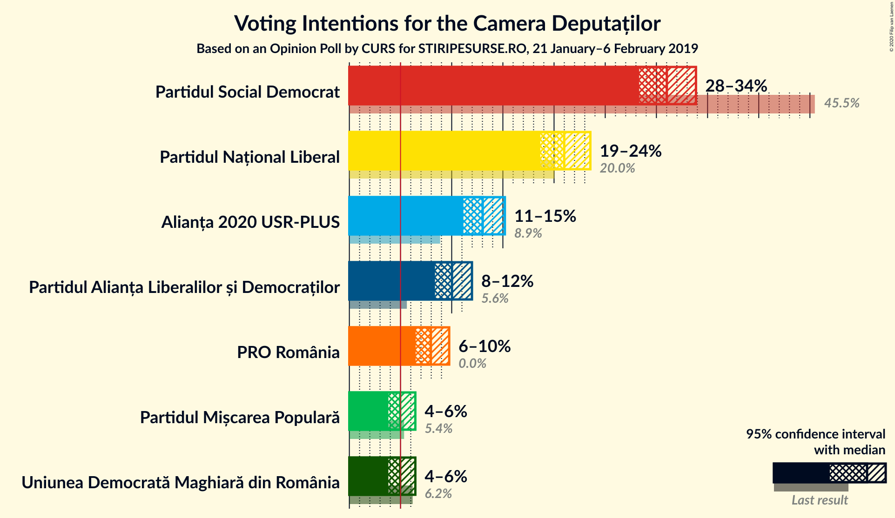
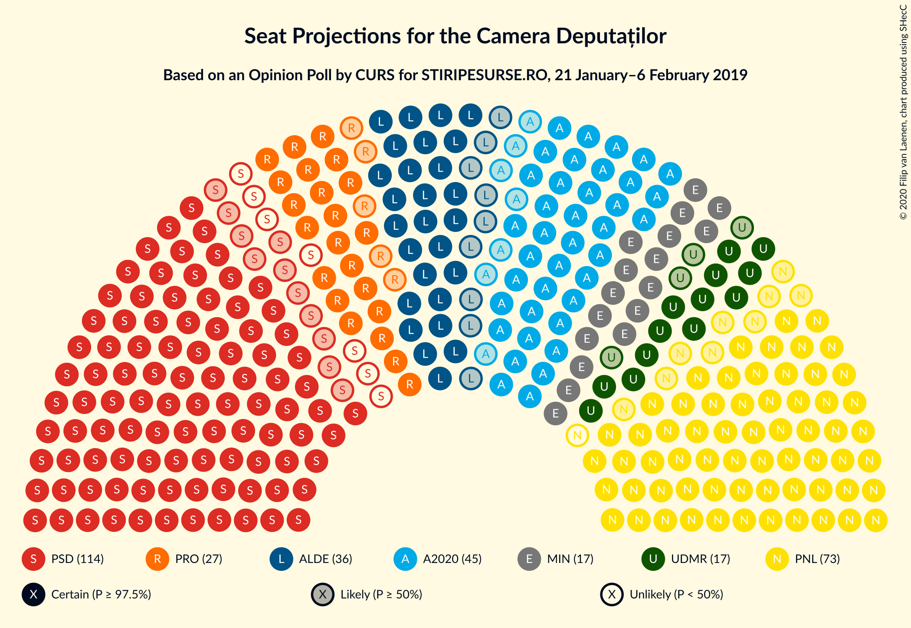
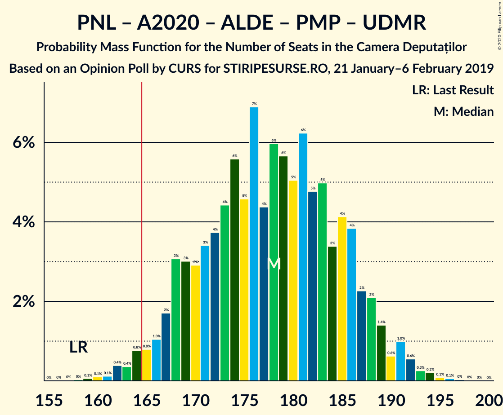
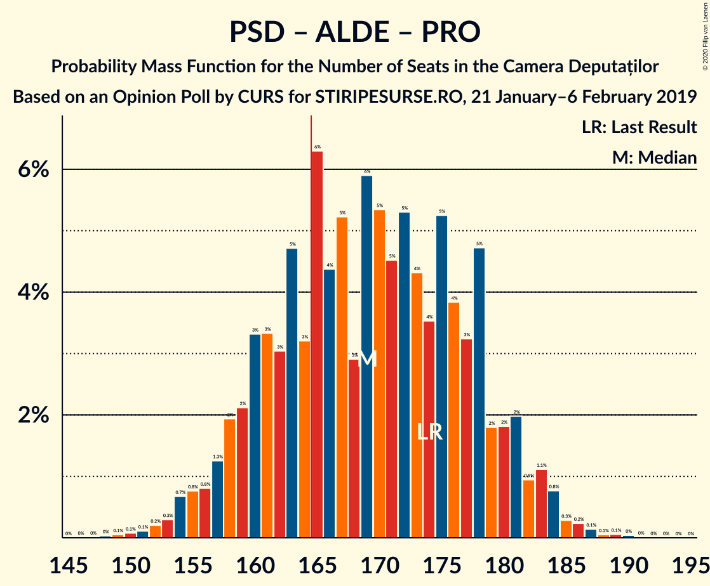
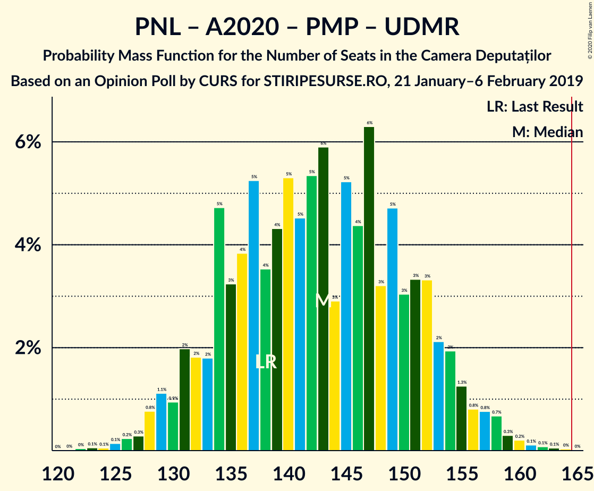
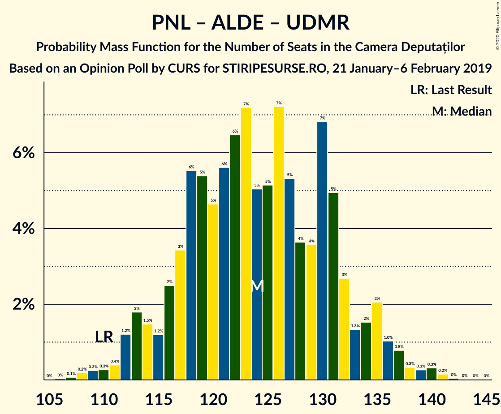

# Opinion Poll by CURS for STIRIPESURSE.RO, 21 January–6 February 2019

<a href="#voting-intentions">Voting Intentions</a> | <a href="#seats">Seats</a> | <a href="#coalitions">Coalitions</a> | <a href="#technical-information">Technical Information</a>

## Voting Intentions

### Confidence Intervals

| Party | Last Result | Poll Result | 80% Confidence Interval | 90% Confidence Interval | 95% Confidence Interval | 99% Confidence Interval |
|:-----:|:-----------:|:-----------:|:-----------------------:|:-----------------------:|:-----------------------:|:-----------------------:|
| Partidul Social Democrat | 45.5% | 31.0% | 29.2–32.9% |28.7–33.4% |28.3–33.9% |27.5–34.8% |
| Partidul Național Liberal | 20.0% | 21.0% | 19.4–22.7% |19.0–23.1% |18.7–23.5% |17.9–24.4% |
| Alianța 2020 USR-PLUS | 8.9% | 13.0% | 11.8–14.4% |11.4–14.8% |11.1–15.2% |10.6–15.9% |
| Partidul Alianța Liberalilor și Democraților | 5.6% | 10.0% | 8.9–11.3% |8.6–11.7% |8.4–12.0% |7.9–12.6% |
| PRO România | 0.0% | 8.0% | 7.0–9.1% |6.7–9.5% |6.5–9.8% |6.1–10.3% |
| Uniunea Democrată Maghiară din România | 6.2% | 5.0% | 4.2–5.9% |4.0–6.2% |3.8–6.4% |3.5–6.9% |
| Partidul Mișcarea Populară | 5.4% | 5.0% | 4.2–5.9% |4.0–6.2% |3.8–6.4% |3.5–6.9% |

*Note:* The poll result column reflects the actual value used in the calculations. Published results may vary slightly, and in addition be rounded to fewer digits.

## Seats

### Confidence Intervals

| Party | Last Result | Median | 80% Confidence Interval | 90% Confidence Interval | 95% Confidence Interval | 99% Confidence Interval |
|:-----:|:-----------:|:------:|:-----------------------:|:-----------------------:|:-----------------------:|:-----------------------:|
| <a href="#partidul-social-democrat">Partidul Social Democrat</a> | 154 | 107 | 100–115 |98–117 |96–118 |93–122 |
| <a href="#partidul-național-liberal">Partidul Național Liberal</a> | 69 | 72 | 66–78 |64–80 |63–82 |61–85 |
| <a href="#alianța-2020-usr-plus">Alianța 2020 USR-PLUS</a> | 30 | 45 | 40–50 |39–51 |38–53 |36–55 |
| <a href="#partidul-alianța-liberalilor-și-democraților">Partidul Alianța Liberalilor și Democraților</a> | 20 | 36 | 30–38 |28–39 |27–40 |26–44 |
| <a href="#pro-românia">PRO România</a> | 0 | 27 | 23–31 |23–32 |22–33 |20–35 |
| <a href="#uniunea-democrată-maghiară-din-românia">Uniunea Democrată Maghiară din România</a> | 21 | 17 | 15–20 |13–21 |13–22 |11–24 |
| <a href="#partidul-mișcarea-populară">Partidul Mișcarea Populară</a> | 18 | 0 | 0–19 |0–20 |0–21 |0–23 |

### Partidul Social Democrat

*For a full overview of the results for this party, see the [Partidul Social Democrat](party-partidulsocialdemocrat.html) page.*

| Number of Seats | Probability | Accumulated | Special Marks |
|:---------------:|:-----------:|:-----------:|:-------------:|
| 90 | 0% | 100% |  |
| 91 | 0.1% | 99.9% |  |
| 92 | 0.2% | 99.8% |  |
| 93 | 0.3% | 99.6% |  |
| 94 | 0.3% | 99.3% |  |
| 95 | 1.0% | 99.0% |  |
| 96 | 0.9% | 98% |  |
| 97 | 1.4% | 97% |  |
| 98 | 2% | 96% |  |
| 99 | 2% | 93% |  |
| 100 | 3% | 91% |  |
| 101 | 5% | 88% |  |
| 102 | 6% | 83% |  |
| 103 | 5% | 78% |  |
| 104 | 8% | 73% |  |
| 105 | 8% | 65% |  |
| 106 | 6% | 57% |  |
| 107 | 7% | 51% | Median |
| 108 | 6% | 44% |  |
| 109 | 6% | 38% |  |
| 110 | 4% | 33% |  |
| 111 | 6% | 29% |  |
| 112 | 3% | 23% |  |
| 113 | 3% | 19% |  |
| 114 | 5% | 16% |  |
| 115 | 2% | 11% |  |
| 116 | 3% | 9% |  |
| 117 | 3% | 6% |  |
| 118 | 0.9% | 3% |  |
| 119 | 1.0% | 2% |  |
| 120 | 0.5% | 1.5% |  |
| 121 | 0.4% | 0.9% |  |
| 122 | 0.2% | 0.5% |  |
| 123 | 0.1% | 0.3% |  |
| 124 | 0.1% | 0.2% |  |
| 125 | 0% | 0.1% |  |
| 126 | 0% | 0.1% |  |
| 127 | 0% | 0% |  |
| 128 | 0% | 0% |  |
| 129 | 0% | 0% |  |
| 130 | 0% | 0% |  |
| 131 | 0% | 0% |  |
| 132 | 0% | 0% |  |
| 133 | 0% | 0% |  |
| 134 | 0% | 0% |  |
| 135 | 0% | 0% |  |
| 136 | 0% | 0% |  |
| 137 | 0% | 0% |  |
| 138 | 0% | 0% |  |
| 139 | 0% | 0% |  |
| 140 | 0% | 0% |  |
| 141 | 0% | 0% |  |
| 142 | 0% | 0% |  |
| 143 | 0% | 0% |  |
| 144 | 0% | 0% |  |
| 145 | 0% | 0% |  |
| 146 | 0% | 0% |  |
| 147 | 0% | 0% |  |
| 148 | 0% | 0% |  |
| 149 | 0% | 0% |  |
| 150 | 0% | 0% |  |
| 151 | 0% | 0% |  |
| 152 | 0% | 0% |  |
| 153 | 0% | 0% |  |
| 154 | 0% | 0% | Last Result |

### Partidul Național Liberal

*For a full overview of the results for this party, see the [Partidul Național Liberal](party-partidulnaționalliberal.html) page.*

| Number of Seats | Probability | Accumulated | Special Marks |
|:---------------:|:-----------:|:-----------:|:-------------:|
| 58 | 0.1% | 100% |  |
| 59 | 0.1% | 99.9% |  |
| 60 | 0.3% | 99.8% |  |
| 61 | 0.5% | 99.5% |  |
| 62 | 0.7% | 99.0% |  |
| 63 | 1.2% | 98% |  |
| 64 | 2% | 97% |  |
| 65 | 3% | 95% |  |
| 66 | 3% | 92% |  |
| 67 | 6% | 88% |  |
| 68 | 6% | 82% |  |
| 69 | 7% | 76% | Last Result |
| 70 | 9% | 69% |  |
| 71 | 7% | 60% |  |
| 72 | 6% | 53% | Median |
| 73 | 9% | 47% |  |
| 74 | 7% | 38% |  |
| 75 | 7% | 30% |  |
| 76 | 6% | 24% |  |
| 77 | 4% | 18% |  |
| 78 | 3% | 13% |  |
| 79 | 4% | 10% |  |
| 80 | 2% | 6% |  |
| 81 | 1.3% | 4% |  |
| 82 | 1.1% | 3% |  |
| 83 | 0.6% | 1.5% |  |
| 84 | 0.4% | 0.9% |  |
| 85 | 0.2% | 0.5% |  |
| 86 | 0.1% | 0.3% |  |
| 87 | 0.1% | 0.2% |  |
| 88 | 0.1% | 0.1% |  |
| 89 | 0% | 0% |  |

### Alianța 2020 USR-PLUS

*For a full overview of the results for this party, see the [Alianța 2020 USR-PLUS](party-alianța2020usr-plus.html) page.*

| Number of Seats | Probability | Accumulated | Special Marks |
|:---------------:|:-----------:|:-----------:|:-------------:|
| 30 | 0% | 100% | Last Result |
| 31 | 0% | 100% |  |
| 32 | 0% | 100% |  |
| 33 | 0% | 100% |  |
| 34 | 0.1% | 99.9% |  |
| 35 | 0.3% | 99.9% |  |
| 36 | 0.5% | 99.6% |  |
| 37 | 1.2% | 99.1% |  |
| 38 | 2% | 98% |  |
| 39 | 3% | 96% |  |
| 40 | 5% | 93% |  |
| 41 | 7% | 88% |  |
| 42 | 8% | 80% |  |
| 43 | 10% | 72% |  |
| 44 | 9% | 63% |  |
| 45 | 11% | 53% | Median |
| 46 | 10% | 43% |  |
| 47 | 8% | 32% |  |
| 48 | 8% | 24% |  |
| 49 | 5% | 16% |  |
| 50 | 3% | 11% |  |
| 51 | 3% | 8% |  |
| 52 | 2% | 5% |  |
| 53 | 1.3% | 3% |  |
| 54 | 0.7% | 1.4% |  |
| 55 | 0.3% | 0.7% |  |
| 56 | 0.2% | 0.4% |  |
| 57 | 0.1% | 0.2% |  |
| 58 | 0% | 0.1% |  |
| 59 | 0% | 0% |  |

### Partidul Alianța Liberalilor și Democraților

*For a full overview of the results for this party, see the [Partidul Alianța Liberalilor și Democraților](party-partidulalianțaliberalilorșidemocraților.html) page.*

| Number of Seats | Probability | Accumulated | Special Marks |
|:---------------:|:-----------:|:-----------:|:-------------:|
| 20 | 0% | 100% | Last Result |
| 21 | 0% | 100% |  |
| 22 | 0% | 100% |  |
| 23 | 0% | 100% |  |
| 24 | 0% | 100% |  |
| 25 | 0.2% | 100% |  |
| 26 | 0.6% | 99.8% |  |
| 27 | 2% | 99.2% |  |
| 28 | 3% | 97% |  |
| 29 | 3% | 95% |  |
| 30 | 2% | 92% |  |
| 31 | 1.1% | 89% |  |
| 32 | 1.1% | 88% |  |
| 33 | 5% | 87% |  |
| 34 | 13% | 82% |  |
| 35 | 19% | 69% |  |
| 36 | 19% | 50% | Median |
| 37 | 16% | 32% |  |
| 38 | 10% | 16% |  |
| 39 | 3% | 6% |  |
| 40 | 1.3% | 3% |  |
| 41 | 0.3% | 1.5% |  |
| 42 | 0.2% | 1.2% |  |
| 43 | 0.3% | 1.0% |  |
| 44 | 0.3% | 0.7% |  |
| 45 | 0.2% | 0.4% |  |
| 46 | 0.1% | 0.2% |  |
| 47 | 0% | 0.1% |  |
| 48 | 0% | 0% |  |

### PRO România

*For a full overview of the results for this party, see the [PRO România](party-proromânia.html) page.*

| Number of Seats | Probability | Accumulated | Special Marks |
|:---------------:|:-----------:|:-----------:|:-------------:|
| 0 | 0% | 100% | Last Result |
| 1 | 0% | 100% |  |
| 2 | 0% | 100% |  |
| 3 | 0% | 100% |  |
| 4 | 0% | 100% |  |
| 5 | 0% | 100% |  |
| 6 | 0% | 100% |  |
| 7 | 0% | 100% |  |
| 8 | 0% | 100% |  |
| 9 | 0% | 100% |  |
| 10 | 0% | 100% |  |
| 11 | 0% | 100% |  |
| 12 | 0% | 100% |  |
| 13 | 0% | 100% |  |
| 14 | 0% | 100% |  |
| 15 | 0% | 100% |  |
| 16 | 0% | 100% |  |
| 17 | 0% | 100% |  |
| 18 | 0% | 100% |  |
| 19 | 0.2% | 100% |  |
| 20 | 0.5% | 99.8% |  |
| 21 | 1.3% | 99.3% |  |
| 22 | 3% | 98% |  |
| 23 | 6% | 95% |  |
| 24 | 8% | 89% |  |
| 25 | 10% | 81% |  |
| 26 | 14% | 71% |  |
| 27 | 14% | 57% | Median |
| 28 | 12% | 43% |  |
| 29 | 9% | 31% |  |
| 30 | 9% | 22% |  |
| 31 | 6% | 13% |  |
| 32 | 3% | 7% |  |
| 33 | 2% | 4% |  |
| 34 | 1.2% | 2% |  |
| 35 | 0.6% | 1.0% |  |
| 36 | 0.2% | 0.4% |  |
| 37 | 0.1% | 0.2% |  |
| 38 | 0% | 0.1% |  |
| 39 | 0% | 0% |  |

### Uniunea Democrată Maghiară din România

*For a full overview of the results for this party, see the [Uniunea Democrată Maghiară din România](party-uniuneademocratămaghiarădinromânia.html) page.*

| Number of Seats | Probability | Accumulated | Special Marks |
|:---------------:|:-----------:|:-----------:|:-------------:|
| 10 | 0% | 100% |  |
| 11 | 0.5% | 99.9% |  |
| 12 | 0.4% | 99.5% |  |
| 13 | 7% | 99.1% |  |
| 14 | 2% | 92% |  |
| 15 | 24% | 91% |  |
| 16 | 2% | 67% |  |
| 17 | 32% | 65% | Median |
| 18 | 4% | 33% |  |
| 19 | 17% | 29% |  |
| 20 | 3% | 12% |  |
| 21 | 4% | 9% | Last Result |
| 22 | 3% | 4% |  |
| 23 | 0.7% | 2% |  |
| 24 | 0.6% | 0.8% |  |
| 25 | 0.1% | 0.2% |  |
| 26 | 0.1% | 0.1% |  |
| 27 | 0% | 0% |  |

### Partidul Mișcarea Populară

*For a full overview of the results for this party, see the [Partidul Mișcarea Populară](party-partidulmișcareapopulară.html) page.*

| Number of Seats | Probability | Accumulated | Special Marks |
|:---------------:|:-----------:|:-----------:|:-------------:|
| 0 | 52% | 100% | Median |
| 1 | 0% | 48% |  |
| 2 | 0% | 48% |  |
| 3 | 0% | 48% |  |
| 4 | 0% | 48% |  |
| 5 | 0% | 48% |  |
| 6 | 0% | 48% |  |
| 7 | 0% | 48% |  |
| 8 | 0% | 48% |  |
| 9 | 0% | 48% |  |
| 10 | 0% | 48% |  |
| 11 | 0% | 48% |  |
| 12 | 0% | 48% |  |
| 13 | 0% | 48% |  |
| 14 | 0% | 48% |  |
| 15 | 0% | 48% |  |
| 16 | 1.2% | 48% |  |
| 17 | 17% | 47% |  |
| 18 | 13% | 30% | Last Result |
| 19 | 8% | 17% |  |
| 20 | 4% | 9% |  |
| 21 | 2% | 4% |  |
| 22 | 1.1% | 2% |  |
| 23 | 0.4% | 0.7% |  |
| 24 | 0.2% | 0.2% |  |
| 25 | 0.1% | 0.1% |  |
| 26 | 0% | 0% |  |

## Coalitions

### Confidence Intervals

| Coalition | Last Result | Median | Majority? | 80% Confidence Interval | 90% Confidence Interval | 95% Confidence Interval | 99% Confidence Interval |
|:---------:|:-----------:|:------:|:---------:|:-----------------------:|:-----------------------:|:-----------------------:|:-----------------------:|
| Partidul Național Liberal – Alianța 2020 USR-PLUS – Partidul Alianța Liberalilor și Democraților – Partidul Mișcarea Populară – Uniunea Democrată Maghiară din România | 158 | 178 | 97% | 169–186 | 167–188 | 165–190 | 162–193 |
| Partidul Social Democrat – Partidul Alianța Liberalilor și Democraților – PRO România | 174 | 169 | 68% | 160–178 | 158–181 | 156–183 | 152–186 |
| Partidul Național Liberal – Alianța 2020 USR-PLUS – Partidul Alianța Liberalilor și Democraților – Uniunea Democrată Maghiară din România | 140 | 169 | 67% | 160–178 | 158–181 | 156–182 | 152–185 |
| Partidul Național Liberal – Alianța 2020 USR-PLUS – Partidul Alianța Liberalilor și Democraților – Partidul Mișcarea Populară | 137 | 161 | 27% | 152–169 | 150–172 | 148–173 | 145–177 |
| Partidul Național Liberal – Alianța 2020 USR-PLUS – Partidul Alianța Liberalilor și Democraților | 119 | 152 | 2% | 143–161 | 141–163 | 139–165 | 136–168 |
| Partidul Național Liberal – Alianța 2020 USR-PLUS – Partidul Mișcarea Populară – Uniunea Democrată Maghiară din România | 138 | 143 | 0% | 134–152 | 131–154 | 129–156 | 126–160 |
| Partidul Social Democrat – Partidul Alianța Liberalilor și Democraților | 174 | 142 | 0% | 134–151 | 131–152 | 129–154 | 126–157 |
| Partidul Social Democrat – PRO România | 154 | 134 | 0% | 126–143 | 124–145 | 122–147 | 119–150 |
| Partidul Național Liberal – Alianța 2020 USR-PLUS – Uniunea Democrată Maghiară din România | 120 | 134 | 0% | 126–142 | 124–145 | 122–146 | 119–149 |
| Partidul Național Liberal – Partidul Alianța Liberalilor și Democraților – Partidul Mișcarea Populară – Uniunea Democrată Maghiară din România | 128 | 133 | 0% | 123–142 | 121–145 | 120–146 | 116–150 |
| Partidul Național Liberal – Alianța 2020 USR-PLUS – Partidul Mișcarea Populară | 117 | 126 | 0% | 116–135 | 114–137 | 112–139 | 109–143 |
| Partidul Național Liberal – Partidul Alianța Liberalilor și Democraților – Uniunea Democrată Maghiară din România | 110 | 124 | 0% | 117–132 | 114–135 | 113–136 | 109–140 |
| Partidul Național Liberal – Alianța 2020 USR-PLUS | 99 | 117 | 0% | 109–125 | 107–127 | 105–128 | 102–132 |
| Partidul Național Liberal – Partidul Mișcarea Populară – Uniunea Democrată Maghiară din România | 108 | 98 | 0% | 88–108 | 86–111 | 84–112 | 81–116 |
| Partidul Național Liberal – Uniunea Democrată Maghiară din România | 90 | 89 | 0% | 83–96 | 80–98 | 79–99 | 77–102 |
| Partidul Național Liberal – Partidul Mișcarea Populară | 87 | 81 | 0% | 70–91 | 69–94 | 67–95 | 65–99 |
| Partidul Național Liberal | 69 | 72 | 0% | 66–78 | 64–80 | 63–82 | 61–85 |
| Alianța 2020 USR-PLUS – Partidul Mișcarea Populară | 48 | 53 | 0% | 43–65 | 41–66 | 40–68 | 38–70 |

### Partidul Național Liberal – Alianța 2020 USR-PLUS – Partidul Alianța Liberalilor și Democraților – Partidul Mișcarea Populară – Uniunea Democrată Maghiară din România

| Number of Seats | Probability | Accumulated | Special Marks |
|:---------------:|:-----------:|:-----------:|:-------------:|
| 158 | 0% | 100% | Last Result |
| 159 | 0.1% | 99.9% |  |
| 160 | 0.1% | 99.9% |  |
| 161 | 0.1% | 99.8% |  |
| 162 | 0.4% | 99.7% |  |
| 163 | 0.4% | 99.3% |  |
| 164 | 0.8% | 98.9% |  |
| 165 | 0.8% | 98% |  |
| 166 | 1.0% | 97% | Majority |
| 167 | 2% | 96% |  |
| 168 | 3% | 95% |  |
| 169 | 3% | 92% |  |
| 170 | 3% | 89% | Median |
| 171 | 3% | 86% |  |
| 172 | 4% | 82% |  |
| 173 | 4% | 78% |  |
| 174 | 6% | 74% |  |
| 175 | 5% | 68% |  |
| 176 | 7% | 64% |  |
| 177 | 4% | 57% |  |
| 178 | 6% | 53% |  |
| 179 | 6% | 47% |  |
| 180 | 5% | 41% |  |
| 181 | 6% | 36% |  |
| 182 | 5% | 30% |  |
| 183 | 5% | 25% |  |
| 184 | 3% | 20% |  |
| 185 | 4% | 17% |  |
| 186 | 4% | 12% |  |
| 187 | 2% | 9% |  |
| 188 | 2% | 6% |  |
| 189 | 1.4% | 4% |  |
| 190 | 0.6% | 3% |  |
| 191 | 1.0% | 2% |  |
| 192 | 0.6% | 1.2% |  |
| 193 | 0.3% | 0.7% |  |
| 194 | 0.2% | 0.4% |  |
| 195 | 0.1% | 0.2% |  |
| 196 | 0.1% | 0.1% |  |
| 197 | 0% | 0.1% |  |
| 198 | 0% | 0% |  |

### Partidul Social Democrat – Partidul Alianța Liberalilor și Democraților – PRO România

| Number of Seats | Probability | Accumulated | Special Marks |
|:---------------:|:-----------:|:-----------:|:-------------:|
| 148 | 0% | 100% |  |
| 149 | 0.1% | 99.9% |  |
| 150 | 0.1% | 99.9% |  |
| 151 | 0.1% | 99.8% |  |
| 152 | 0.2% | 99.7% |  |
| 153 | 0.3% | 99.5% |  |
| 154 | 0.7% | 99.2% |  |
| 155 | 0.8% | 98.5% |  |
| 156 | 0.8% | 98% |  |
| 157 | 1.3% | 97% |  |
| 158 | 2% | 96% |  |
| 159 | 2% | 94% |  |
| 160 | 3% | 92% |  |
| 161 | 3% | 88% |  |
| 162 | 3% | 85% |  |
| 163 | 5% | 82% |  |
| 164 | 3% | 77% |  |
| 165 | 6% | 74% |  |
| 166 | 4% | 68% | Majority |
| 167 | 5% | 63% |  |
| 168 | 3% | 58% |  |
| 169 | 6% | 55% |  |
| 170 | 5% | 49% | Median |
| 171 | 5% | 44% |  |
| 172 | 5% | 39% |  |
| 173 | 4% | 34% |  |
| 174 | 4% | 30% | Last Result |
| 175 | 5% | 26% |  |
| 176 | 4% | 21% |  |
| 177 | 3% | 17% |  |
| 178 | 5% | 14% |  |
| 179 | 2% | 9% |  |
| 180 | 2% | 7% |  |
| 181 | 2% | 6% |  |
| 182 | 0.9% | 4% |  |
| 183 | 1.1% | 3% |  |
| 184 | 0.8% | 2% |  |
| 185 | 0.3% | 0.8% |  |
| 186 | 0.2% | 0.5% |  |
| 187 | 0.1% | 0.3% |  |
| 188 | 0.1% | 0.2% |  |
| 189 | 0.1% | 0.1% |  |
| 190 | 0% | 0.1% |  |
| 191 | 0% | 0% |  |

### Partidul Național Liberal – Alianța 2020 USR-PLUS – Partidul Alianța Liberalilor și Democraților – Uniunea Democrată Maghiară din România

| Number of Seats | Probability | Accumulated | Special Marks |
|:---------------:|:-----------:|:-----------:|:-------------:|
| 140 | 0% | 100% | Last Result |
| 141 | 0% | 100% |  |
| 142 | 0% | 100% |  |
| 143 | 0% | 100% |  |
| 144 | 0% | 100% |  |
| 145 | 0% | 100% |  |
| 146 | 0% | 100% |  |
| 147 | 0% | 100% |  |
| 148 | 0% | 100% |  |
| 149 | 0% | 100% |  |
| 150 | 0.1% | 99.9% |  |
| 151 | 0.1% | 99.8% |  |
| 152 | 0.2% | 99.7% |  |
| 153 | 0.4% | 99.5% |  |
| 154 | 0.5% | 99.1% |  |
| 155 | 0.7% | 98.6% |  |
| 156 | 1.0% | 98% |  |
| 157 | 1.5% | 97% |  |
| 158 | 2% | 95% |  |
| 159 | 2% | 93% |  |
| 160 | 2% | 91% |  |
| 161 | 5% | 89% |  |
| 162 | 3% | 84% |  |
| 163 | 4% | 81% |  |
| 164 | 6% | 77% |  |
| 165 | 5% | 72% |  |
| 166 | 5% | 67% | Majority |
| 167 | 4% | 62% |  |
| 168 | 6% | 58% |  |
| 169 | 6% | 52% |  |
| 170 | 4% | 46% | Median |
| 171 | 5% | 42% |  |
| 172 | 5% | 38% |  |
| 173 | 4% | 33% |  |
| 174 | 5% | 29% |  |
| 175 | 4% | 24% |  |
| 176 | 5% | 20% |  |
| 177 | 3% | 15% |  |
| 178 | 3% | 12% |  |
| 179 | 2% | 9% |  |
| 180 | 2% | 7% |  |
| 181 | 2% | 5% |  |
| 182 | 1.1% | 3% |  |
| 183 | 1.2% | 2% |  |
| 184 | 0.4% | 1.3% |  |
| 185 | 0.4% | 0.8% |  |
| 186 | 0.2% | 0.5% |  |
| 187 | 0.1% | 0.3% |  |
| 188 | 0.1% | 0.2% |  |
| 189 | 0.1% | 0.1% |  |
| 190 | 0% | 0% |  |

### Partidul Național Liberal – Alianța 2020 USR-PLUS – Partidul Alianța Liberalilor și Democraților – Partidul Mișcarea Populară

| Number of Seats | Probability | Accumulated | Special Marks |
|:---------------:|:-----------:|:-----------:|:-------------:|
| 137 | 0% | 100% | Last Result |
| 138 | 0% | 100% |  |
| 139 | 0% | 100% |  |
| 140 | 0% | 100% |  |
| 141 | 0.1% | 99.9% |  |
| 142 | 0% | 99.9% |  |
| 143 | 0.1% | 99.9% |  |
| 144 | 0.2% | 99.7% |  |
| 145 | 0.5% | 99.5% |  |
| 146 | 0.5% | 99.1% |  |
| 147 | 0.6% | 98.6% |  |
| 148 | 0.8% | 98% |  |
| 149 | 2% | 97% |  |
| 150 | 2% | 96% |  |
| 151 | 3% | 94% |  |
| 152 | 2% | 90% |  |
| 153 | 3% | 88% | Median |
| 154 | 5% | 85% |  |
| 155 | 4% | 80% |  |
| 156 | 4% | 77% |  |
| 157 | 5% | 72% |  |
| 158 | 6% | 67% |  |
| 159 | 5% | 61% |  |
| 160 | 4% | 56% |  |
| 161 | 5% | 52% |  |
| 162 | 5% | 47% |  |
| 163 | 6% | 42% |  |
| 164 | 5% | 36% |  |
| 165 | 4% | 31% |  |
| 166 | 5% | 27% | Majority |
| 167 | 5% | 22% |  |
| 168 | 5% | 17% |  |
| 169 | 3% | 13% |  |
| 170 | 2% | 10% |  |
| 171 | 2% | 8% |  |
| 172 | 2% | 5% |  |
| 173 | 0.8% | 3% |  |
| 174 | 0.8% | 2% |  |
| 175 | 0.6% | 2% |  |
| 176 | 0.4% | 0.9% |  |
| 177 | 0.2% | 0.5% |  |
| 178 | 0.1% | 0.3% |  |
| 179 | 0.1% | 0.2% |  |
| 180 | 0.1% | 0.1% |  |
| 181 | 0% | 0% |  |

### Partidul Național Liberal – Alianța 2020 USR-PLUS – Partidul Alianța Liberalilor și Democraților

| Number of Seats | Probability | Accumulated | Special Marks |
|:---------------:|:-----------:|:-----------:|:-------------:|
| 119 | 0% | 100% | Last Result |
| 120 | 0% | 100% |  |
| 121 | 0% | 100% |  |
| 122 | 0% | 100% |  |
| 123 | 0% | 100% |  |
| 124 | 0% | 100% |  |
| 125 | 0% | 100% |  |
| 126 | 0% | 100% |  |
| 127 | 0% | 100% |  |
| 128 | 0% | 100% |  |
| 129 | 0% | 100% |  |
| 130 | 0% | 100% |  |
| 131 | 0% | 100% |  |
| 132 | 0% | 100% |  |
| 133 | 0.1% | 99.9% |  |
| 134 | 0.1% | 99.9% |  |
| 135 | 0.2% | 99.7% |  |
| 136 | 0.3% | 99.6% |  |
| 137 | 0.3% | 99.3% |  |
| 138 | 0.7% | 99.0% |  |
| 139 | 1.3% | 98% |  |
| 140 | 1.1% | 97% |  |
| 141 | 2% | 96% |  |
| 142 | 2% | 94% |  |
| 143 | 3% | 92% |  |
| 144 | 4% | 90% |  |
| 145 | 3% | 85% |  |
| 146 | 5% | 82% |  |
| 147 | 3% | 77% |  |
| 148 | 4% | 74% |  |
| 149 | 6% | 69% |  |
| 150 | 5% | 63% |  |
| 151 | 7% | 58% |  |
| 152 | 5% | 52% |  |
| 153 | 5% | 47% | Median |
| 154 | 6% | 42% |  |
| 155 | 4% | 36% |  |
| 156 | 5% | 32% |  |
| 157 | 4% | 27% |  |
| 158 | 5% | 22% |  |
| 159 | 4% | 17% |  |
| 160 | 3% | 14% |  |
| 161 | 3% | 11% |  |
| 162 | 2% | 8% |  |
| 163 | 2% | 7% |  |
| 164 | 2% | 5% |  |
| 165 | 1.1% | 3% |  |
| 166 | 0.7% | 2% | Majority |
| 167 | 0.3% | 1.2% |  |
| 168 | 0.4% | 0.9% |  |
| 169 | 0.2% | 0.5% |  |
| 170 | 0.1% | 0.3% |  |
| 171 | 0.1% | 0.2% |  |
| 172 | 0.1% | 0.1% |  |
| 173 | 0% | 0% |  |

### Partidul Național Liberal – Alianța 2020 USR-PLUS – Partidul Mișcarea Populară – Uniunea Democrată Maghiară din România

| Number of Seats | Probability | Accumulated | Special Marks |
|:---------------:|:-----------:|:-----------:|:-------------:|
| 122 | 0% | 100% |  |
| 123 | 0.1% | 99.9% |  |
| 124 | 0.1% | 99.9% |  |
| 125 | 0.1% | 99.8% |  |
| 126 | 0.2% | 99.7% |  |
| 127 | 0.3% | 99.5% |  |
| 128 | 0.8% | 99.2% |  |
| 129 | 1.1% | 98% |  |
| 130 | 0.9% | 97% |  |
| 131 | 2% | 96% |  |
| 132 | 2% | 94% |  |
| 133 | 2% | 93% |  |
| 134 | 5% | 91% | Median |
| 135 | 3% | 86% |  |
| 136 | 4% | 83% |  |
| 137 | 5% | 79% |  |
| 138 | 4% | 74% | Last Result |
| 139 | 4% | 70% |  |
| 140 | 5% | 66% |  |
| 141 | 5% | 61% |  |
| 142 | 5% | 56% |  |
| 143 | 6% | 51% |  |
| 144 | 3% | 45% |  |
| 145 | 5% | 42% |  |
| 146 | 4% | 37% |  |
| 147 | 6% | 32% |  |
| 148 | 3% | 26% |  |
| 149 | 5% | 23% |  |
| 150 | 3% | 18% |  |
| 151 | 3% | 15% |  |
| 152 | 3% | 12% |  |
| 153 | 2% | 8% |  |
| 154 | 2% | 6% |  |
| 155 | 1.3% | 4% |  |
| 156 | 0.8% | 3% |  |
| 157 | 0.8% | 2% |  |
| 158 | 0.7% | 1.5% |  |
| 159 | 0.3% | 0.8% |  |
| 160 | 0.2% | 0.5% |  |
| 161 | 0.1% | 0.3% |  |
| 162 | 0.1% | 0.2% |  |
| 163 | 0.1% | 0.1% |  |
| 164 | 0% | 0.1% |  |
| 165 | 0% | 0% |  |

### Partidul Social Democrat – Partidul Alianța Liberalilor și Democraților

| Number of Seats | Probability | Accumulated | Special Marks |
|:---------------:|:-----------:|:-----------:|:-------------:|
| 122 | 0% | 100% |  |
| 123 | 0.1% | 99.9% |  |
| 124 | 0.1% | 99.8% |  |
| 125 | 0.2% | 99.7% |  |
| 126 | 0.3% | 99.5% |  |
| 127 | 0.3% | 99.2% |  |
| 128 | 0.9% | 98.9% |  |
| 129 | 0.7% | 98% |  |
| 130 | 1.4% | 97% |  |
| 131 | 1.3% | 96% |  |
| 132 | 2% | 95% |  |
| 133 | 2% | 93% |  |
| 134 | 2% | 91% |  |
| 135 | 4% | 88% |  |
| 136 | 4% | 85% |  |
| 137 | 4% | 81% |  |
| 138 | 5% | 77% |  |
| 139 | 6% | 72% |  |
| 140 | 7% | 66% |  |
| 141 | 6% | 60% |  |
| 142 | 6% | 54% |  |
| 143 | 6% | 48% | Median |
| 144 | 6% | 42% |  |
| 145 | 4% | 35% |  |
| 146 | 6% | 31% |  |
| 147 | 4% | 26% |  |
| 148 | 4% | 22% |  |
| 149 | 4% | 18% |  |
| 150 | 4% | 14% |  |
| 151 | 2% | 10% |  |
| 152 | 3% | 8% |  |
| 153 | 0.9% | 4% |  |
| 154 | 2% | 4% |  |
| 155 | 0.6% | 2% |  |
| 156 | 0.7% | 1.4% |  |
| 157 | 0.2% | 0.7% |  |
| 158 | 0.2% | 0.5% |  |
| 159 | 0.1% | 0.3% |  |
| 160 | 0.1% | 0.2% |  |
| 161 | 0% | 0.1% |  |
| 162 | 0% | 0% |  |
| 163 | 0% | 0% |  |
| 164 | 0% | 0% |  |
| 165 | 0% | 0% |  |
| 166 | 0% | 0% | Majority |
| 167 | 0% | 0% |  |
| 168 | 0% | 0% |  |
| 169 | 0% | 0% |  |
| 170 | 0% | 0% |  |
| 171 | 0% | 0% |  |
| 172 | 0% | 0% |  |
| 173 | 0% | 0% |  |
| 174 | 0% | 0% | Last Result |

### Partidul Social Democrat – PRO România

| Number of Seats | Probability | Accumulated | Special Marks |
|:---------------:|:-----------:|:-----------:|:-------------:|
| 115 | 0% | 100% |  |
| 116 | 0.1% | 99.9% |  |
| 117 | 0.1% | 99.9% |  |
| 118 | 0.2% | 99.8% |  |
| 119 | 0.3% | 99.6% |  |
| 120 | 0.6% | 99.3% |  |
| 121 | 1.0% | 98.8% |  |
| 122 | 0.6% | 98% |  |
| 123 | 1.4% | 97% |  |
| 124 | 2% | 96% |  |
| 125 | 2% | 94% |  |
| 126 | 4% | 91% |  |
| 127 | 4% | 88% |  |
| 128 | 3% | 83% |  |
| 129 | 5% | 80% |  |
| 130 | 5% | 75% |  |
| 131 | 6% | 70% |  |
| 132 | 5% | 64% |  |
| 133 | 6% | 59% |  |
| 134 | 6% | 53% | Median |
| 135 | 4% | 47% |  |
| 136 | 7% | 43% |  |
| 137 | 5% | 36% |  |
| 138 | 6% | 32% |  |
| 139 | 4% | 26% |  |
| 140 | 4% | 22% |  |
| 141 | 3% | 18% |  |
| 142 | 3% | 14% |  |
| 143 | 3% | 11% |  |
| 144 | 3% | 8% |  |
| 145 | 2% | 5% |  |
| 146 | 1.0% | 4% |  |
| 147 | 0.8% | 3% |  |
| 148 | 0.8% | 2% |  |
| 149 | 0.4% | 1.1% |  |
| 150 | 0.4% | 0.7% |  |
| 151 | 0.1% | 0.3% |  |
| 152 | 0.1% | 0.2% |  |
| 153 | 0.1% | 0.1% |  |
| 154 | 0% | 0.1% | Last Result |
| 155 | 0% | 0% |  |

### Partidul Național Liberal – Alianța 2020 USR-PLUS – Uniunea Democrată Maghiară din România

| Number of Seats | Probability | Accumulated | Special Marks |
|:---------------:|:-----------:|:-----------:|:-------------:|
| 115 | 0% | 100% |  |
| 116 | 0.1% | 99.9% |  |
| 117 | 0.1% | 99.9% |  |
| 118 | 0.3% | 99.8% |  |
| 119 | 0.3% | 99.6% |  |
| 120 | 0.6% | 99.2% | Last Result |
| 121 | 0.7% | 98.7% |  |
| 122 | 0.9% | 98% |  |
| 123 | 2% | 97% |  |
| 124 | 2% | 95% |  |
| 125 | 3% | 94% |  |
| 126 | 5% | 91% |  |
| 127 | 4% | 86% |  |
| 128 | 3% | 83% |  |
| 129 | 6% | 80% |  |
| 130 | 6% | 74% |  |
| 131 | 5% | 69% |  |
| 132 | 7% | 64% |  |
| 133 | 4% | 57% |  |
| 134 | 7% | 53% | Median |
| 135 | 6% | 47% |  |
| 136 | 5% | 41% |  |
| 137 | 6% | 35% |  |
| 138 | 4% | 29% |  |
| 139 | 4% | 25% |  |
| 140 | 5% | 20% |  |
| 141 | 3% | 16% |  |
| 142 | 4% | 12% |  |
| 143 | 2% | 9% |  |
| 144 | 1.0% | 6% |  |
| 145 | 2% | 5% |  |
| 146 | 1.1% | 3% |  |
| 147 | 0.9% | 2% |  |
| 148 | 0.5% | 1.3% |  |
| 149 | 0.3% | 0.8% |  |
| 150 | 0.2% | 0.5% |  |
| 151 | 0.1% | 0.3% |  |
| 152 | 0.1% | 0.2% |  |
| 153 | 0% | 0.1% |  |
| 154 | 0% | 0.1% |  |
| 155 | 0% | 0% |  |

### Partidul Național Liberal – Partidul Alianța Liberalilor și Democraților – Partidul Mișcarea Populară – Uniunea Democrată Maghiară din România

| Number of Seats | Probability | Accumulated | Special Marks |
|:---------------:|:-----------:|:-----------:|:-------------:|
| 112 | 0% | 100% |  |
| 113 | 0% | 99.9% |  |
| 114 | 0.1% | 99.9% |  |
| 115 | 0.2% | 99.8% |  |
| 116 | 0.4% | 99.6% |  |
| 117 | 0.3% | 99.2% |  |
| 118 | 0.3% | 98.9% |  |
| 119 | 1.0% | 98.7% |  |
| 120 | 2% | 98% |  |
| 121 | 2% | 96% |  |
| 122 | 3% | 93% |  |
| 123 | 1.4% | 91% |  |
| 124 | 3% | 89% |  |
| 125 | 4% | 86% | Median |
| 126 | 5% | 83% |  |
| 127 | 4% | 77% |  |
| 128 | 2% | 73% | Last Result |
| 129 | 3% | 71% |  |
| 130 | 8% | 68% |  |
| 131 | 6% | 60% |  |
| 132 | 3% | 54% |  |
| 133 | 2% | 51% |  |
| 134 | 2% | 49% |  |
| 135 | 6% | 46% |  |
| 136 | 6% | 40% |  |
| 137 | 5% | 34% |  |
| 138 | 3% | 28% |  |
| 139 | 3% | 26% |  |
| 140 | 8% | 23% |  |
| 141 | 4% | 16% |  |
| 142 | 2% | 12% |  |
| 143 | 1.1% | 10% |  |
| 144 | 2% | 9% |  |
| 145 | 3% | 7% |  |
| 146 | 2% | 4% |  |
| 147 | 0.6% | 2% |  |
| 148 | 0.4% | 1.4% |  |
| 149 | 0.3% | 1.0% |  |
| 150 | 0.4% | 0.7% |  |
| 151 | 0.2% | 0.4% |  |
| 152 | 0% | 0.1% |  |
| 153 | 0% | 0.1% |  |
| 154 | 0% | 0.1% |  |
| 155 | 0% | 0% |  |

### Partidul Național Liberal – Alianța 2020 USR-PLUS – Partidul Mișcarea Populară

| Number of Seats | Probability | Accumulated | Special Marks |
|:---------------:|:-----------:|:-----------:|:-------------:|
| 105 | 0% | 100% |  |
| 106 | 0% | 99.9% |  |
| 107 | 0.1% | 99.9% |  |
| 108 | 0.1% | 99.8% |  |
| 109 | 0.3% | 99.7% |  |
| 110 | 0.4% | 99.4% |  |
| 111 | 0.7% | 99.0% |  |
| 112 | 0.9% | 98% |  |
| 113 | 1.3% | 97% |  |
| 114 | 2% | 96% |  |
| 115 | 2% | 94% |  |
| 116 | 3% | 92% |  |
| 117 | 3% | 89% | Last Result, Median |
| 118 | 4% | 86% |  |
| 119 | 5% | 82% |  |
| 120 | 5% | 77% |  |
| 121 | 5% | 72% |  |
| 122 | 4% | 68% |  |
| 123 | 5% | 64% |  |
| 124 | 4% | 59% |  |
| 125 | 4% | 55% |  |
| 126 | 6% | 51% |  |
| 127 | 3% | 46% |  |
| 128 | 7% | 43% |  |
| 129 | 4% | 36% |  |
| 130 | 2% | 32% |  |
| 131 | 5% | 30% |  |
| 132 | 6% | 25% |  |
| 133 | 3% | 19% |  |
| 134 | 4% | 16% |  |
| 135 | 3% | 12% |  |
| 136 | 2% | 9% |  |
| 137 | 3% | 7% |  |
| 138 | 1.2% | 4% |  |
| 139 | 0.9% | 3% |  |
| 140 | 0.8% | 2% |  |
| 141 | 0.5% | 2% |  |
| 142 | 0.4% | 1.0% |  |
| 143 | 0.2% | 0.6% |  |
| 144 | 0.2% | 0.4% |  |
| 145 | 0.1% | 0.2% |  |
| 146 | 0% | 0.1% |  |
| 147 | 0% | 0.1% |  |
| 148 | 0% | 0% |  |

### Partidul Național Liberal – Partidul Alianța Liberalilor și Democraților – Uniunea Democrată Maghiară din România

| Number of Seats | Probability | Accumulated | Special Marks |
|:---------------:|:-----------:|:-----------:|:-------------:|
| 106 | 0% | 100% |  |
| 107 | 0.1% | 99.9% |  |
| 108 | 0.2% | 99.9% |  |
| 109 | 0.3% | 99.7% |  |
| 110 | 0.3% | 99.4% | Last Result |
| 111 | 0.4% | 99.1% |  |
| 112 | 1.2% | 98.8% |  |
| 113 | 2% | 98% |  |
| 114 | 1.5% | 96% |  |
| 115 | 1.2% | 94% |  |
| 116 | 2% | 93% |  |
| 117 | 3% | 91% |  |
| 118 | 6% | 87% |  |
| 119 | 5% | 82% |  |
| 120 | 5% | 76% |  |
| 121 | 6% | 72% |  |
| 122 | 6% | 66% |  |
| 123 | 7% | 59% |  |
| 124 | 5% | 52% |  |
| 125 | 5% | 47% | Median |
| 126 | 7% | 42% |  |
| 127 | 5% | 35% |  |
| 128 | 4% | 30% |  |
| 129 | 4% | 26% |  |
| 130 | 7% | 22% |  |
| 131 | 5% | 16% |  |
| 132 | 3% | 11% |  |
| 133 | 1.3% | 8% |  |
| 134 | 2% | 7% |  |
| 135 | 2% | 5% |  |
| 136 | 1.0% | 3% |  |
| 137 | 0.8% | 2% |  |
| 138 | 0.3% | 1.2% |  |
| 139 | 0.3% | 0.8% |  |
| 140 | 0.3% | 0.6% |  |
| 141 | 0.2% | 0.3% |  |
| 142 | 0% | 0.1% |  |
| 143 | 0% | 0.1% |  |
| 144 | 0% | 0% |  |

### Partidul Național Liberal – Alianța 2020 USR-PLUS

| Number of Seats | Probability | Accumulated | Special Marks |
|:---------------:|:-----------:|:-----------:|:-------------:|
| 99 | 0% | 100% | Last Result |
| 100 | 0.1% | 99.9% |  |
| 101 | 0.2% | 99.9% |  |
| 102 | 0.2% | 99.7% |  |
| 103 | 0.4% | 99.5% |  |
| 104 | 0.7% | 99.1% |  |
| 105 | 0.9% | 98% |  |
| 106 | 1.2% | 97% |  |
| 107 | 2% | 96% |  |
| 108 | 2% | 95% |  |
| 109 | 4% | 92% |  |
| 110 | 4% | 89% |  |
| 111 | 4% | 84% |  |
| 112 | 4% | 80% |  |
| 113 | 4% | 76% |  |
| 114 | 7% | 72% |  |
| 115 | 7% | 65% |  |
| 116 | 6% | 58% |  |
| 117 | 5% | 52% | Median |
| 118 | 6% | 46% |  |
| 119 | 6% | 40% |  |
| 120 | 6% | 34% |  |
| 121 | 5% | 27% |  |
| 122 | 4% | 22% |  |
| 123 | 4% | 18% |  |
| 124 | 3% | 14% |  |
| 125 | 3% | 11% |  |
| 126 | 2% | 8% |  |
| 127 | 1.4% | 6% |  |
| 128 | 2% | 4% |  |
| 129 | 0.7% | 2% |  |
| 130 | 0.8% | 2% |  |
| 131 | 0.4% | 1.0% |  |
| 132 | 0.2% | 0.6% |  |
| 133 | 0.2% | 0.4% |  |
| 134 | 0.1% | 0.2% |  |
| 135 | 0.1% | 0.1% |  |
| 136 | 0% | 0.1% |  |
| 137 | 0% | 0% |  |

### Partidul Național Liberal – Partidul Mișcarea Populară – Uniunea Democrată Maghiară din România

| Number of Seats | Probability | Accumulated | Special Marks |
|:---------------:|:-----------:|:-----------:|:-------------:|
| 78 | 0% | 100% |  |
| 79 | 0.1% | 99.9% |  |
| 80 | 0.2% | 99.8% |  |
| 81 | 0.2% | 99.7% |  |
| 82 | 0.6% | 99.4% |  |
| 83 | 0.9% | 98.8% |  |
| 84 | 0.8% | 98% |  |
| 85 | 2% | 97% |  |
| 86 | 2% | 95% |  |
| 87 | 2% | 93% |  |
| 88 | 4% | 91% |  |
| 89 | 4% | 87% | Median |
| 90 | 4% | 83% |  |
| 91 | 3% | 79% |  |
| 92 | 6% | 76% |  |
| 93 | 5% | 70% |  |
| 94 | 4% | 65% |  |
| 95 | 4% | 61% |  |
| 96 | 3% | 57% |  |
| 97 | 3% | 54% |  |
| 98 | 3% | 51% |  |
| 99 | 3% | 48% |  |
| 100 | 3% | 45% |  |
| 101 | 5% | 41% |  |
| 102 | 4% | 36% |  |
| 103 | 5% | 33% |  |
| 104 | 5% | 28% |  |
| 105 | 3% | 22% |  |
| 106 | 3% | 19% |  |
| 107 | 4% | 16% |  |
| 108 | 3% | 12% | Last Result |
| 109 | 2% | 9% |  |
| 110 | 2% | 7% |  |
| 111 | 2% | 5% |  |
| 112 | 1.1% | 3% |  |
| 113 | 0.7% | 2% |  |
| 114 | 0.4% | 1.3% |  |
| 115 | 0.3% | 0.9% |  |
| 116 | 0.3% | 0.6% |  |
| 117 | 0.1% | 0.3% |  |
| 118 | 0.1% | 0.2% |  |
| 119 | 0% | 0.1% |  |
| 120 | 0% | 0.1% |  |
| 121 | 0% | 0% |  |

### Partidul Național Liberal – Uniunea Democrată Maghiară din România

| Number of Seats | Probability | Accumulated | Special Marks |
|:---------------:|:-----------:|:-----------:|:-------------:|
| 74 | 0.1% | 100% |  |
| 75 | 0.1% | 99.9% |  |
| 76 | 0.2% | 99.7% |  |
| 77 | 0.5% | 99.5% |  |
| 78 | 0.6% | 99.1% |  |
| 79 | 1.2% | 98% |  |
| 80 | 2% | 97% |  |
| 81 | 2% | 95% |  |
| 82 | 3% | 93% |  |
| 83 | 5% | 90% |  |
| 84 | 5% | 85% |  |
| 85 | 7% | 81% |  |
| 86 | 7% | 74% |  |
| 87 | 6% | 67% |  |
| 88 | 8% | 61% |  |
| 89 | 8% | 53% | Median |
| 90 | 6% | 46% | Last Result |
| 91 | 5% | 39% |  |
| 92 | 8% | 34% |  |
| 93 | 6% | 26% |  |
| 94 | 5% | 20% |  |
| 95 | 5% | 15% |  |
| 96 | 3% | 11% |  |
| 97 | 2% | 8% |  |
| 98 | 2% | 6% |  |
| 99 | 1.5% | 4% |  |
| 100 | 0.6% | 2% |  |
| 101 | 0.7% | 2% |  |
| 102 | 0.4% | 0.9% |  |
| 103 | 0.2% | 0.5% |  |
| 104 | 0.2% | 0.3% |  |
| 105 | 0.1% | 0.1% |  |
| 106 | 0% | 0.1% |  |
| 107 | 0% | 0.1% |  |
| 108 | 0% | 0% |  |

### Partidul Național Liberal – Partidul Mișcarea Populară

| Number of Seats | Probability | Accumulated | Special Marks |
|:---------------:|:-----------:|:-----------:|:-------------:|
| 62 | 0.1% | 100% |  |
| 63 | 0.1% | 99.9% |  |
| 64 | 0.2% | 99.8% |  |
| 65 | 0.5% | 99.5% |  |
| 66 | 0.8% | 99.0% |  |
| 67 | 1.2% | 98% |  |
| 68 | 1.4% | 97% |  |
| 69 | 2% | 96% |  |
| 70 | 4% | 94% |  |
| 71 | 4% | 90% |  |
| 72 | 3% | 86% | Median |
| 73 | 5% | 83% |  |
| 74 | 5% | 78% |  |
| 75 | 6% | 73% |  |
| 76 | 4% | 67% |  |
| 77 | 3% | 63% |  |
| 78 | 3% | 59% |  |
| 79 | 4% | 56% |  |
| 80 | 3% | 53% |  |
| 81 | 2% | 50% |  |
| 82 | 3% | 48% |  |
| 83 | 3% | 45% |  |
| 84 | 4% | 42% |  |
| 85 | 3% | 38% |  |
| 86 | 5% | 34% |  |
| 87 | 5% | 29% | Last Result |
| 88 | 4% | 25% |  |
| 89 | 4% | 20% |  |
| 90 | 4% | 17% |  |
| 91 | 3% | 13% |  |
| 92 | 3% | 10% |  |
| 93 | 2% | 7% |  |
| 94 | 2% | 5% |  |
| 95 | 1.2% | 3% |  |
| 96 | 0.9% | 2% |  |
| 97 | 0.5% | 1.3% |  |
| 98 | 0.3% | 0.8% |  |
| 99 | 0.2% | 0.5% |  |
| 100 | 0.1% | 0.3% |  |
| 101 | 0.1% | 0.2% |  |
| 102 | 0% | 0.1% |  |
| 103 | 0% | 0% |  |

### Partidul Național Liberal

| Number of Seats | Probability | Accumulated | Special Marks |
|:---------------:|:-----------:|:-----------:|:-------------:|
| 58 | 0.1% | 100% |  |
| 59 | 0.1% | 99.9% |  |
| 60 | 0.3% | 99.8% |  |
| 61 | 0.5% | 99.5% |  |
| 62 | 0.7% | 99.0% |  |
| 63 | 1.2% | 98% |  |
| 64 | 2% | 97% |  |
| 65 | 3% | 95% |  |
| 66 | 3% | 92% |  |
| 67 | 6% | 88% |  |
| 68 | 6% | 82% |  |
| 69 | 7% | 76% | Last Result |
| 70 | 9% | 69% |  |
| 71 | 7% | 60% |  |
| 72 | 6% | 53% | Median |
| 73 | 9% | 47% |  |
| 74 | 7% | 38% |  |
| 75 | 7% | 30% |  |
| 76 | 6% | 24% |  |
| 77 | 4% | 18% |  |
| 78 | 3% | 13% |  |
| 79 | 4% | 10% |  |
| 80 | 2% | 6% |  |
| 81 | 1.3% | 4% |  |
| 82 | 1.1% | 3% |  |
| 83 | 0.6% | 1.5% |  |
| 84 | 0.4% | 0.9% |  |
| 85 | 0.2% | 0.5% |  |
| 86 | 0.1% | 0.3% |  |
| 87 | 0.1% | 0.2% |  |
| 88 | 0.1% | 0.1% |  |
| 89 | 0% | 0% |  |

### Alianța 2020 USR-PLUS – Partidul Mișcarea Populară

| Number of Seats | Probability | Accumulated | Special Marks |
|:---------------:|:-----------:|:-----------:|:-------------:|
| 36 | 0.1% | 100% |  |
| 37 | 0.2% | 99.9% |  |
| 38 | 0.5% | 99.7% |  |
| 39 | 0.7% | 99.2% |  |
| 40 | 1.5% | 98% |  |
| 41 | 2% | 97% |  |
| 42 | 3% | 95% |  |
| 43 | 5% | 92% |  |
| 44 | 4% | 88% |  |
| 45 | 5% | 83% | Median |
| 46 | 7% | 78% |  |
| 47 | 5% | 71% |  |
| 48 | 6% | 66% | Last Result |
| 49 | 4% | 61% |  |
| 50 | 2% | 57% |  |
| 51 | 2% | 54% |  |
| 52 | 2% | 52% |  |
| 53 | 1.3% | 50% |  |
| 54 | 1.3% | 49% |  |
| 55 | 1.0% | 48% |  |
| 56 | 2% | 47% |  |
| 57 | 3% | 45% |  |
| 58 | 4% | 42% |  |
| 59 | 3% | 38% |  |
| 60 | 6% | 35% |  |
| 61 | 5% | 29% |  |
| 62 | 5% | 25% |  |
| 63 | 5% | 20% |  |
| 64 | 4% | 15% |  |
| 65 | 4% | 11% |  |
| 66 | 3% | 7% |  |
| 67 | 2% | 5% |  |
| 68 | 1.4% | 3% |  |
| 69 | 0.6% | 2% |  |
| 70 | 0.5% | 1.0% |  |
| 71 | 0.2% | 0.5% |  |
| 72 | 0.1% | 0.3% |  |
| 73 | 0.1% | 0.1% |  |
| 74 | 0% | 0.1% |  |
| 75 | 0% | 0% |  |

## Technical Information

### Opinion Poll

+ **Polling firm:** CURS
+ **Commissioner(s):** STIRIPESURSE.RO
+ **Fieldwork period:** 21 January–6 February 2019

### Calculations

+ **Sample size:** 1067
+ **Simulations done:** 1,048,576
+ **Error estimate:** 1.30%

