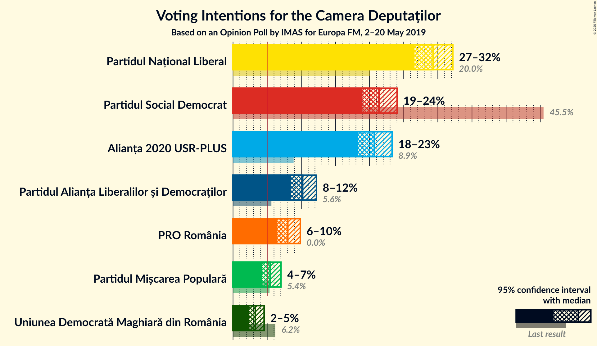
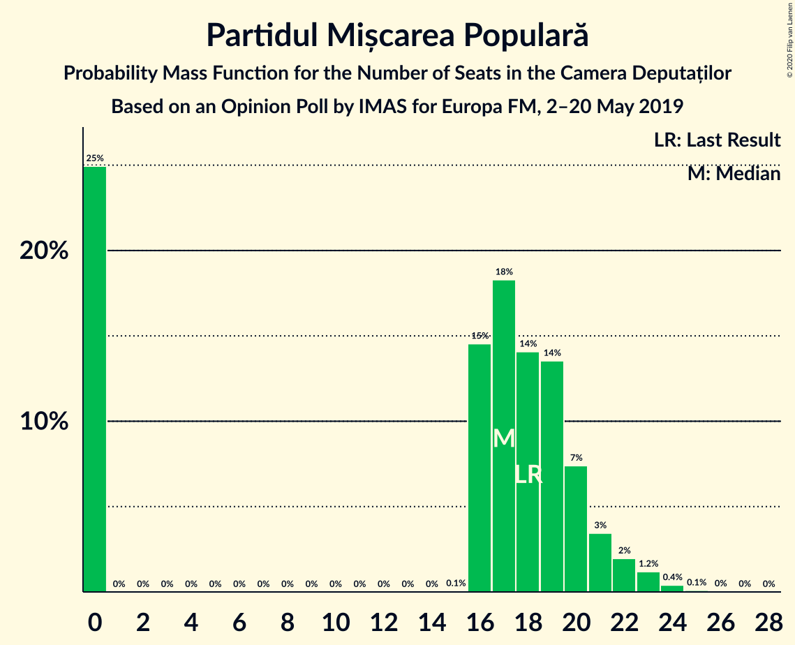
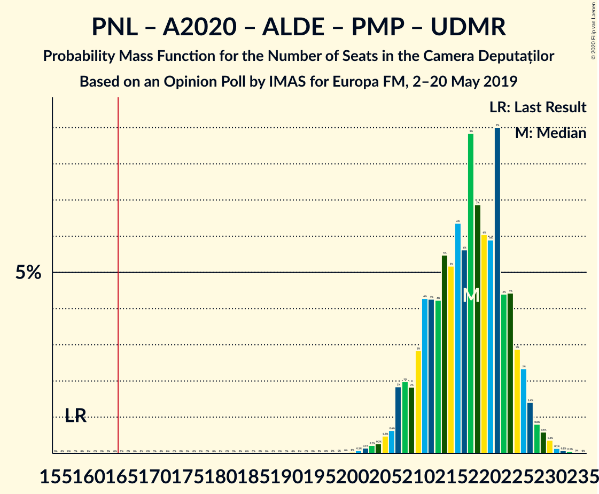
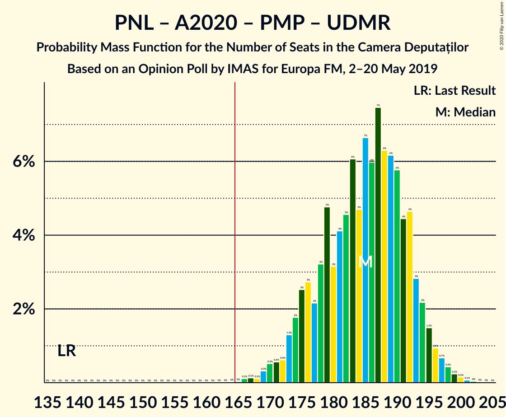
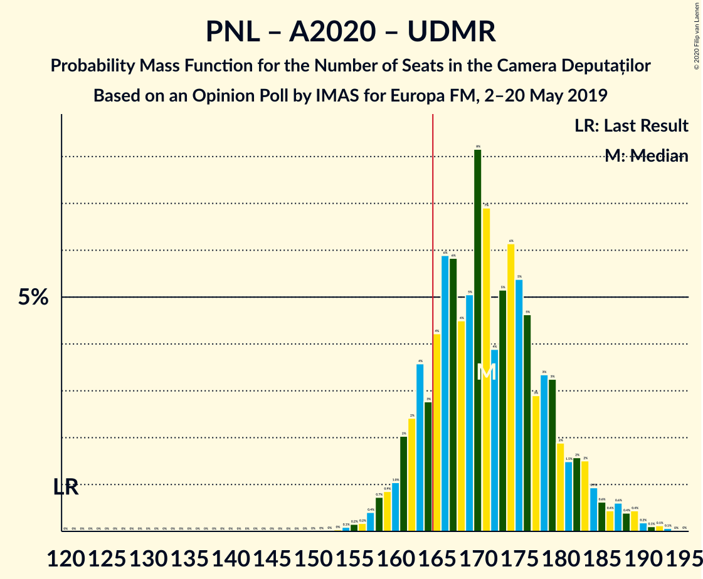
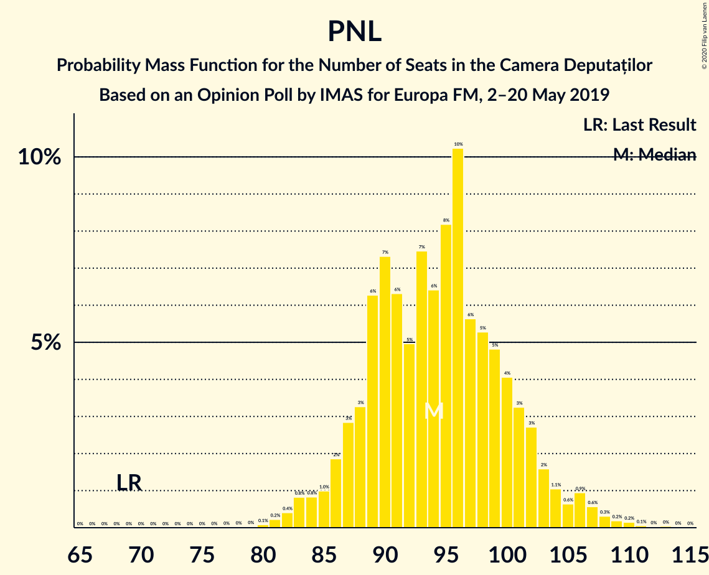

# Opinion Poll by IMAS for Europa FM, 2–20 May 2019

<a href="#voting-intentions">Voting Intentions</a> | <a href="#seats">Seats</a> | <a href="#coalitions">Coalitions</a> | <a href="#technical-information">Technical Information</a>

## Voting Intentions

### Confidence Intervals

| Party | Last Result | Poll Result | 80% Confidence Interval | 90% Confidence Interval | 95% Confidence Interval | 99% Confidence Interval |
|:-----:|:-----------:|:-----------:|:-----------------------:|:-----------------------:|:-----------------------:|:-----------------------:|
| Partidul Național Liberal | 20.0% | 29.3% | 27.5–31.2% |27.0–31.7% |26.6–32.2% |25.7–33.1% |
| Partidul Social Democrat | 45.5% | 21.4% | 19.8–23.1% |19.3–23.6% |19.0–24.0% |18.2–24.9% |
| Alianța 2020 USR-PLUS | 8.9% | 20.7% | 19.1–22.4% |18.7–22.9% |18.3–23.3% |17.6–24.1% |
| Partidul Alianța Liberalilor și Democraților | 5.6% | 10.2% | 9.1–11.5% |8.7–11.9% |8.5–12.2% |8.0–12.9% |
| PRO România | 0.0% | 8.0% | 7.0–9.2% |6.7–9.6% |6.5–9.9% |6.1–10.5% |
| Partidul Mișcarea Populară | 5.4% | 5.4% | 4.6–6.5% |4.4–6.8% |4.2–7.0% |3.8–7.6% |
| Uniunea Democrată Maghiară din România | 6.2% | 3.3% | 2.7–4.1% |2.5–4.3% |2.3–4.6% |2.1–5.0% |

*Note:* The poll result column reflects the actual value used in the calculations. Published results may vary slightly, and in addition be rounded to fewer digits.

## Seats

### Confidence Intervals

| Party | Last Result | Median | 80% Confidence Interval | 90% Confidence Interval | 95% Confidence Interval | 99% Confidence Interval |
|:-----:|:-----------:|:------:|:-----------------------:|:-----------------------:|:-----------------------:|:-----------------------:|
| <a href="#partidul-național-liberal">Partidul Național Liberal</a> | 69 | 94 | 88–101 |86–103 |85–105 |82–109 |
| <a href="#partidul-social-democrat">Partidul Social Democrat</a> | 154 | 68 | 63–75 |62–76 |61–78 |58–80 |
| <a href="#alianța-2020-usr-plus">Alianța 2020 USR-PLUS</a> | 30 | 67 | 61–72 |60–74 |58–76 |56–79 |
| <a href="#partidul-alianța-liberalilor-și-democraților">Partidul Alianța Liberalilor și Democraților</a> | 20 | 33 | 29–37 |28–38 |27–39 |25–42 |
| <a href="#pro-românia">PRO România</a> | 0 | 26 | 22–29 |21–31 |20–32 |19–34 |
| <a href="#partidul-mișcarea-populară">Partidul Mișcarea Populară</a> | 18 | 17 | 0–20 |0–21 |0–22 |0–24 |
| <a href="#uniunea-democrată-maghiară-din-românia">Uniunea Democrată Maghiară din România</a> | 21 | 10 | 8–13 |7–14 |7–14 |6–16 |

### Partidul Național Liberal

*For a full overview of the results for this party, see the [Partidul Național Liberal](party-partidulnaționalliberal.html) page.*

| Number of Seats | Probability | Accumulated | Special Marks |
|:---------------:|:-----------:|:-----------:|:-------------:|
| 69 | 0% | 100% | Last Result |
| 70 | 0% | 100% |  |
| 71 | 0% | 100% |  |
| 72 | 0% | 100% |  |
| 73 | 0% | 100% |  |
| 74 | 0% | 100% |  |
| 75 | 0% | 100% |  |
| 76 | 0% | 100% |  |
| 77 | 0% | 100% |  |
| 78 | 0% | 100% |  |
| 79 | 0% | 100% |  |
| 80 | 0.1% | 99.9% |  |
| 81 | 0.2% | 99.8% |  |
| 82 | 0.4% | 99.6% |  |
| 83 | 0.8% | 99.2% |  |
| 84 | 0.8% | 98% |  |
| 85 | 1.0% | 98% |  |
| 86 | 2% | 97% |  |
| 87 | 3% | 95% |  |
| 88 | 3% | 92% |  |
| 89 | 6% | 89% |  |
| 90 | 7% | 82% |  |
| 91 | 6% | 75% |  |
| 92 | 5% | 69% |  |
| 93 | 7% | 64% |  |
| 94 | 6% | 56% | Median |
| 95 | 8% | 50% |  |
| 96 | 10% | 42% |  |
| 97 | 6% | 31% |  |
| 98 | 5% | 26% |  |
| 99 | 5% | 20% |  |
| 100 | 4% | 16% |  |
| 101 | 3% | 12% |  |
| 102 | 3% | 8% |  |
| 103 | 2% | 6% |  |
| 104 | 1.1% | 4% |  |
| 105 | 0.6% | 3% |  |
| 106 | 0.9% | 2% |  |
| 107 | 0.6% | 1.4% |  |
| 108 | 0.3% | 0.8% |  |
| 109 | 0.2% | 0.5% |  |
| 110 | 0.2% | 0.3% |  |
| 111 | 0.1% | 0.2% |  |
| 112 | 0% | 0.1% |  |
| 113 | 0% | 0.1% |  |
| 114 | 0% | 0% |  |

### Partidul Social Democrat

*For a full overview of the results for this party, see the [Partidul Social Democrat](party-partidulsocialdemocrat.html) page.*

| Number of Seats | Probability | Accumulated | Special Marks |
|:---------------:|:-----------:|:-----------:|:-------------:|
| 55 | 0% | 100% |  |
| 56 | 0.1% | 99.9% |  |
| 57 | 0.2% | 99.8% |  |
| 58 | 0.3% | 99.7% |  |
| 59 | 0.7% | 99.4% |  |
| 60 | 1.1% | 98.6% |  |
| 61 | 2% | 98% |  |
| 62 | 3% | 96% |  |
| 63 | 5% | 92% |  |
| 64 | 6% | 87% |  |
| 65 | 7% | 81% |  |
| 66 | 8% | 74% |  |
| 67 | 8% | 65% |  |
| 68 | 8% | 58% | Median |
| 69 | 8% | 50% |  |
| 70 | 7% | 42% |  |
| 71 | 7% | 35% |  |
| 72 | 5% | 28% |  |
| 73 | 5% | 23% |  |
| 74 | 6% | 18% |  |
| 75 | 4% | 13% |  |
| 76 | 3% | 8% |  |
| 77 | 2% | 5% |  |
| 78 | 1.3% | 3% |  |
| 79 | 1.0% | 2% |  |
| 80 | 0.5% | 1.0% |  |
| 81 | 0.2% | 0.5% |  |
| 82 | 0.1% | 0.3% |  |
| 83 | 0.1% | 0.2% |  |
| 84 | 0% | 0.1% |  |
| 85 | 0% | 0.1% |  |
| 86 | 0% | 0% |  |
| 87 | 0% | 0% |  |
| 88 | 0% | 0% |  |
| 89 | 0% | 0% |  |
| 90 | 0% | 0% |  |
| 91 | 0% | 0% |  |
| 92 | 0% | 0% |  |
| 93 | 0% | 0% |  |
| 94 | 0% | 0% |  |
| 95 | 0% | 0% |  |
| 96 | 0% | 0% |  |
| 97 | 0% | 0% |  |
| 98 | 0% | 0% |  |
| 99 | 0% | 0% |  |
| 100 | 0% | 0% |  |
| 101 | 0% | 0% |  |
| 102 | 0% | 0% |  |
| 103 | 0% | 0% |  |
| 104 | 0% | 0% |  |
| 105 | 0% | 0% |  |
| 106 | 0% | 0% |  |
| 107 | 0% | 0% |  |
| 108 | 0% | 0% |  |
| 109 | 0% | 0% |  |
| 110 | 0% | 0% |  |
| 111 | 0% | 0% |  |
| 112 | 0% | 0% |  |
| 113 | 0% | 0% |  |
| 114 | 0% | 0% |  |
| 115 | 0% | 0% |  |
| 116 | 0% | 0% |  |
| 117 | 0% | 0% |  |
| 118 | 0% | 0% |  |
| 119 | 0% | 0% |  |
| 120 | 0% | 0% |  |
| 121 | 0% | 0% |  |
| 122 | 0% | 0% |  |
| 123 | 0% | 0% |  |
| 124 | 0% | 0% |  |
| 125 | 0% | 0% |  |
| 126 | 0% | 0% |  |
| 127 | 0% | 0% |  |
| 128 | 0% | 0% |  |
| 129 | 0% | 0% |  |
| 130 | 0% | 0% |  |
| 131 | 0% | 0% |  |
| 132 | 0% | 0% |  |
| 133 | 0% | 0% |  |
| 134 | 0% | 0% |  |
| 135 | 0% | 0% |  |
| 136 | 0% | 0% |  |
| 137 | 0% | 0% |  |
| 138 | 0% | 0% |  |
| 139 | 0% | 0% |  |
| 140 | 0% | 0% |  |
| 141 | 0% | 0% |  |
| 142 | 0% | 0% |  |
| 143 | 0% | 0% |  |
| 144 | 0% | 0% |  |
| 145 | 0% | 0% |  |
| 146 | 0% | 0% |  |
| 147 | 0% | 0% |  |
| 148 | 0% | 0% |  |
| 149 | 0% | 0% |  |
| 150 | 0% | 0% |  |
| 151 | 0% | 0% |  |
| 152 | 0% | 0% |  |
| 153 | 0% | 0% |  |
| 154 | 0% | 0% | Last Result |

### Alianța 2020 USR-PLUS

*For a full overview of the results for this party, see the [Alianța 2020 USR-PLUS](party-alianța2020usr-plus.html) page.*

| Number of Seats | Probability | Accumulated | Special Marks |
|:---------------:|:-----------:|:-----------:|:-------------:|
| 30 | 0% | 100% | Last Result |
| 31 | 0% | 100% |  |
| 32 | 0% | 100% |  |
| 33 | 0% | 100% |  |
| 34 | 0% | 100% |  |
| 35 | 0% | 100% |  |
| 36 | 0% | 100% |  |
| 37 | 0% | 100% |  |
| 38 | 0% | 100% |  |
| 39 | 0% | 100% |  |
| 40 | 0% | 100% |  |
| 41 | 0% | 100% |  |
| 42 | 0% | 100% |  |
| 43 | 0% | 100% |  |
| 44 | 0% | 100% |  |
| 45 | 0% | 100% |  |
| 46 | 0% | 100% |  |
| 47 | 0% | 100% |  |
| 48 | 0% | 100% |  |
| 49 | 0% | 100% |  |
| 50 | 0% | 100% |  |
| 51 | 0% | 100% |  |
| 52 | 0% | 100% |  |
| 53 | 0% | 100% |  |
| 54 | 0.1% | 99.9% |  |
| 55 | 0.2% | 99.8% |  |
| 56 | 0.3% | 99.6% |  |
| 57 | 0.8% | 99.3% |  |
| 58 | 1.3% | 98% |  |
| 59 | 2% | 97% |  |
| 60 | 4% | 95% |  |
| 61 | 4% | 91% |  |
| 62 | 7% | 88% |  |
| 63 | 7% | 81% |  |
| 64 | 6% | 74% |  |
| 65 | 10% | 68% |  |
| 66 | 7% | 58% |  |
| 67 | 8% | 51% | Median |
| 68 | 11% | 43% |  |
| 69 | 7% | 32% |  |
| 70 | 7% | 25% |  |
| 71 | 6% | 18% |  |
| 72 | 3% | 13% |  |
| 73 | 3% | 9% |  |
| 74 | 2% | 6% |  |
| 75 | 2% | 4% |  |
| 76 | 1.1% | 3% |  |
| 77 | 0.7% | 2% |  |
| 78 | 0.4% | 1.0% |  |
| 79 | 0.3% | 0.6% |  |
| 80 | 0.1% | 0.3% |  |
| 81 | 0.1% | 0.1% |  |
| 82 | 0.1% | 0.1% |  |
| 83 | 0% | 0% |  |

### Partidul Alianța Liberalilor și Democraților

*For a full overview of the results for this party, see the [Partidul Alianța Liberalilor și Democraților](party-partidulalianțaliberalilorșidemocraților.html) page.*

| Number of Seats | Probability | Accumulated | Special Marks |
|:---------------:|:-----------:|:-----------:|:-------------:|
| 20 | 0% | 100% | Last Result |
| 21 | 0% | 100% |  |
| 22 | 0% | 100% |  |
| 23 | 0.1% | 100% |  |
| 24 | 0.2% | 99.9% |  |
| 25 | 0.5% | 99.7% |  |
| 26 | 1.3% | 99.2% |  |
| 27 | 2% | 98% |  |
| 28 | 5% | 96% |  |
| 29 | 7% | 91% |  |
| 30 | 10% | 84% |  |
| 31 | 12% | 74% |  |
| 32 | 10% | 62% |  |
| 33 | 14% | 52% | Median |
| 34 | 10% | 38% |  |
| 35 | 9% | 28% |  |
| 36 | 7% | 19% |  |
| 37 | 5% | 12% |  |
| 38 | 4% | 7% |  |
| 39 | 2% | 4% |  |
| 40 | 0.9% | 2% |  |
| 41 | 0.6% | 1.2% |  |
| 42 | 0.2% | 0.5% |  |
| 43 | 0.2% | 0.3% |  |
| 44 | 0.1% | 0.1% |  |
| 45 | 0% | 0% |  |

### PRO România

*For a full overview of the results for this party, see the [PRO România](party-proromânia.html) page.*

| Number of Seats | Probability | Accumulated | Special Marks |
|:---------------:|:-----------:|:-----------:|:-------------:|
| 0 | 0% | 100% | Last Result |
| 1 | 0% | 100% |  |
| 2 | 0% | 100% |  |
| 3 | 0% | 100% |  |
| 4 | 0% | 100% |  |
| 5 | 0% | 100% |  |
| 6 | 0% | 100% |  |
| 7 | 0% | 100% |  |
| 8 | 0% | 100% |  |
| 9 | 0% | 100% |  |
| 10 | 0% | 100% |  |
| 11 | 0% | 100% |  |
| 12 | 0% | 100% |  |
| 13 | 0% | 100% |  |
| 14 | 0% | 100% |  |
| 15 | 0% | 100% |  |
| 16 | 0% | 100% |  |
| 17 | 0% | 100% |  |
| 18 | 0.2% | 99.9% |  |
| 19 | 0.6% | 99.7% |  |
| 20 | 2% | 99.1% |  |
| 21 | 3% | 97% |  |
| 22 | 7% | 94% |  |
| 23 | 9% | 87% |  |
| 24 | 13% | 78% |  |
| 25 | 14% | 64% |  |
| 26 | 15% | 51% | Median |
| 27 | 10% | 36% |  |
| 28 | 10% | 26% |  |
| 29 | 6% | 16% |  |
| 30 | 5% | 10% |  |
| 31 | 2% | 5% |  |
| 32 | 1.4% | 3% |  |
| 33 | 0.7% | 1.3% |  |
| 34 | 0.3% | 0.6% |  |
| 35 | 0.2% | 0.2% |  |
| 36 | 0.1% | 0.1% |  |
| 37 | 0% | 0% |  |

### Partidul Mișcarea Populară

*For a full overview of the results for this party, see the [Partidul Mișcarea Populară](party-partidulmișcareapopulară.html) page.*

| Number of Seats | Probability | Accumulated | Special Marks |
|:---------------:|:-----------:|:-----------:|:-------------:|
| 0 | 25% | 100% |  |
| 1 | 0% | 75% |  |
| 2 | 0% | 75% |  |
| 3 | 0% | 75% |  |
| 4 | 0% | 75% |  |
| 5 | 0% | 75% |  |
| 6 | 0% | 75% |  |
| 7 | 0% | 75% |  |
| 8 | 0% | 75% |  |
| 9 | 0% | 75% |  |
| 10 | 0% | 75% |  |
| 11 | 0% | 75% |  |
| 12 | 0% | 75% |  |
| 13 | 0% | 75% |  |
| 14 | 0% | 75% |  |
| 15 | 0.1% | 75% |  |
| 16 | 15% | 75% |  |
| 17 | 18% | 60% | Median |
| 18 | 14% | 42% | Last Result |
| 19 | 14% | 28% |  |
| 20 | 7% | 15% |  |
| 21 | 3% | 7% |  |
| 22 | 2% | 4% |  |
| 23 | 1.2% | 2% |  |
| 24 | 0.4% | 0.6% |  |
| 25 | 0.1% | 0.2% |  |
| 26 | 0% | 0.1% |  |
| 27 | 0% | 0% |  |

### Uniunea Democrată Maghiară din România

*For a full overview of the results for this party, see the [Uniunea Democrată Maghiară din România](party-uniuneademocratămaghiarădinromânia.html) page.*

| Number of Seats | Probability | Accumulated | Special Marks |
|:---------------:|:-----------:|:-----------:|:-------------:|
| 5 | 0.1% | 100% |  |
| 6 | 0.7% | 99.9% |  |
| 7 | 4% | 99.2% |  |
| 8 | 10% | 95% |  |
| 9 | 21% | 85% |  |
| 10 | 18% | 64% | Median |
| 11 | 22% | 46% |  |
| 12 | 11% | 24% |  |
| 13 | 7% | 13% |  |
| 14 | 4% | 6% |  |
| 15 | 1.3% | 2% |  |
| 16 | 0.5% | 0.7% |  |
| 17 | 0.2% | 0.2% |  |
| 18 | 0% | 0% |  |
| 19 | 0% | 0% |  |
| 20 | 0% | 0% |  |
| 21 | 0% | 0% | Last Result |

## Coalitions

### Confidence Intervals

| Coalition | Last Result | Median | Majority? | 80% Confidence Interval | 90% Confidence Interval | 95% Confidence Interval | 99% Confidence Interval |
|:---------:|:-----------:|:------:|:---------:|:-----------------------:|:-----------------------:|:-----------------------:|:-----------------------:|
| Partidul Național Liberal – Alianța 2020 USR-PLUS – Partidul Alianța Liberalilor și Democraților – Partidul Mișcarea Populară – Uniunea Democrată Maghiară din România | 158 | 218 | 100% | 210–224 | 208–226 | 207–227 | 203–230 |
| Partidul Național Liberal – Alianța 2020 USR-PLUS – Partidul Alianța Liberalilor și Democraților – Uniunea Democrată Maghiară din România | 140 | 203 | 100% | 196–214 | 194–216 | 192–219 | 189–223 |
| Partidul Național Liberal – Alianța 2020 USR-PLUS – Partidul Alianța Liberalilor și Democraților – Partidul Mișcarea Populară | 137 | 208 | 100% | 199–214 | 197–216 | 196–217 | 193–220 |
| Partidul Național Liberal – Alianța 2020 USR-PLUS – Partidul Alianța Liberalilor și Democraților | 119 | 193 | 100% | 185–203 | 184–205 | 182–209 | 179–213 |
| Partidul Național Liberal – Alianța 2020 USR-PLUS – Partidul Mișcarea Populară – Uniunea Democrată Maghiară din România | 138 | 185 | 99.9% | 176–192 | 174–194 | 173–196 | 169–199 |
| Partidul Național Liberal – Alianța 2020 USR-PLUS – Partidul Mișcarea Populară | 117 | 175 | 90% | 165–182 | 163–184 | 162–185 | 158–189 |
| Partidul Național Liberal – Alianța 2020 USR-PLUS – Uniunea Democrată Maghiară din România | 120 | 171 | 81% | 163–180 | 161–183 | 160–185 | 157–190 |
| Partidul Național Liberal – Alianța 2020 USR-PLUS | 99 | 161 | 22% | 153–169 | 151–172 | 149–175 | 146–180 |
| Partidul Național Liberal – Partidul Alianța Liberalilor și Democraților – Partidul Mișcarea Populară – Uniunea Democrată Maghiară din România | 128 | 152 | 0.6% | 142–159 | 139–161 | 137–162 | 133–166 |
| Partidul Național Liberal – Partidul Alianța Liberalilor și Democraților – Uniunea Democrată Maghiară din România | 110 | 137 | 0% | 130–145 | 128–148 | 126–150 | 123–154 |
| Partidul Social Democrat – Partidul Alianța Liberalilor și Democraților – PRO România | 174 | 127 | 0% | 120–136 | 118–138 | 116–139 | 113–143 |
| Partidul Național Liberal – Partidul Mișcarea Populară – Uniunea Democrată Maghiară din România | 108 | 119 | 0% | 108–127 | 105–129 | 103–130 | 100–133 |
| Partidul Național Liberal – Partidul Mișcarea Populară | 87 | 109 | 0% | 97–116 | 94–118 | 93–120 | 89–123 |
| Partidul Național Liberal – Uniunea Democrată Maghiară din România | 90 | 105 | 0% | 98–112 | 96–114 | 95–116 | 92–119 |
| Partidul Social Democrat – Partidul Alianța Liberalilor și Democraților | 174 | 101 | 0% | 95–109 | 93–111 | 92–113 | 88–116 |
| Partidul Social Democrat – PRO România | 154 | 94 | 0% | 88–102 | 86–104 | 85–105 | 82–109 |
| Partidul Național Liberal | 69 | 94 | 0% | 88–101 | 86–103 | 85–105 | 82–109 |
| Alianța 2020 USR-PLUS – Partidul Mișcarea Populară | 48 | 82 | 0% | 68–89 | 66–90 | 64–92 | 61–95 |

### Partidul Național Liberal – Alianța 2020 USR-PLUS – Partidul Alianța Liberalilor și Democraților – Partidul Mișcarea Populară – Uniunea Democrată Maghiară din România

| Number of Seats | Probability | Accumulated | Special Marks |
|:---------------:|:-----------:|:-----------:|:-------------:|
| 158 | 0% | 100% | Last Result |
| 159 | 0% | 100% |  |
| 160 | 0% | 100% |  |
| 161 | 0% | 100% |  |
| 162 | 0% | 100% |  |
| 163 | 0% | 100% |  |
| 164 | 0% | 100% |  |
| 165 | 0% | 100% |  |
| 166 | 0% | 100% | Majority |
| 167 | 0% | 100% |  |
| 168 | 0% | 100% |  |
| 169 | 0% | 100% |  |
| 170 | 0% | 100% |  |
| 171 | 0% | 100% |  |
| 172 | 0% | 100% |  |
| 173 | 0% | 100% |  |
| 174 | 0% | 100% |  |
| 175 | 0% | 100% |  |
| 176 | 0% | 100% |  |
| 177 | 0% | 100% |  |
| 178 | 0% | 100% |  |
| 179 | 0% | 100% |  |
| 180 | 0% | 100% |  |
| 181 | 0% | 100% |  |
| 182 | 0% | 100% |  |
| 183 | 0% | 100% |  |
| 184 | 0% | 100% |  |
| 185 | 0% | 100% |  |
| 186 | 0% | 100% |  |
| 187 | 0% | 100% |  |
| 188 | 0% | 100% |  |
| 189 | 0% | 100% |  |
| 190 | 0% | 100% |  |
| 191 | 0% | 100% |  |
| 192 | 0% | 100% |  |
| 193 | 0% | 100% |  |
| 194 | 0% | 100% |  |
| 195 | 0% | 100% |  |
| 196 | 0% | 100% |  |
| 197 | 0% | 100% |  |
| 198 | 0% | 100% |  |
| 199 | 0% | 100% |  |
| 200 | 0% | 99.9% |  |
| 201 | 0.1% | 99.9% |  |
| 202 | 0.1% | 99.8% |  |
| 203 | 0.2% | 99.7% |  |
| 204 | 0.3% | 99.5% |  |
| 205 | 0.5% | 99.2% |  |
| 206 | 0.6% | 98.7% |  |
| 207 | 2% | 98% |  |
| 208 | 2% | 96% |  |
| 209 | 2% | 94% |  |
| 210 | 3% | 92% |  |
| 211 | 4% | 90% |  |
| 212 | 4% | 85% |  |
| 213 | 4% | 81% |  |
| 214 | 5% | 77% |  |
| 215 | 5% | 71% |  |
| 216 | 6% | 66% |  |
| 217 | 6% | 60% |  |
| 218 | 9% | 54% |  |
| 219 | 7% | 45% |  |
| 220 | 6% | 38% |  |
| 221 | 6% | 32% | Median |
| 222 | 9% | 27% |  |
| 223 | 4% | 18% |  |
| 224 | 4% | 13% |  |
| 225 | 3% | 9% |  |
| 226 | 2% | 6% |  |
| 227 | 1.4% | 3% |  |
| 228 | 0.8% | 2% |  |
| 229 | 0.6% | 1.3% |  |
| 230 | 0.4% | 0.7% |  |
| 231 | 0.1% | 0.3% |  |
| 232 | 0.1% | 0.2% |  |
| 233 | 0.1% | 0.1% |  |
| 234 | 0% | 0% |  |

### Partidul Național Liberal – Alianța 2020 USR-PLUS – Partidul Alianța Liberalilor și Democraților – Uniunea Democrată Maghiară din România

| Number of Seats | Probability | Accumulated | Special Marks |
|:---------------:|:-----------:|:-----------:|:-------------:|
| 140 | 0% | 100% | Last Result |
| 141 | 0% | 100% |  |
| 142 | 0% | 100% |  |
| 143 | 0% | 100% |  |
| 144 | 0% | 100% |  |
| 145 | 0% | 100% |  |
| 146 | 0% | 100% |  |
| 147 | 0% | 100% |  |
| 148 | 0% | 100% |  |
| 149 | 0% | 100% |  |
| 150 | 0% | 100% |  |
| 151 | 0% | 100% |  |
| 152 | 0% | 100% |  |
| 153 | 0% | 100% |  |
| 154 | 0% | 100% |  |
| 155 | 0% | 100% |  |
| 156 | 0% | 100% |  |
| 157 | 0% | 100% |  |
| 158 | 0% | 100% |  |
| 159 | 0% | 100% |  |
| 160 | 0% | 100% |  |
| 161 | 0% | 100% |  |
| 162 | 0% | 100% |  |
| 163 | 0% | 100% |  |
| 164 | 0% | 100% |  |
| 165 | 0% | 100% |  |
| 166 | 0% | 100% | Majority |
| 167 | 0% | 100% |  |
| 168 | 0% | 100% |  |
| 169 | 0% | 100% |  |
| 170 | 0% | 100% |  |
| 171 | 0% | 100% |  |
| 172 | 0% | 100% |  |
| 173 | 0% | 100% |  |
| 174 | 0% | 100% |  |
| 175 | 0% | 100% |  |
| 176 | 0% | 100% |  |
| 177 | 0% | 100% |  |
| 178 | 0% | 100% |  |
| 179 | 0% | 100% |  |
| 180 | 0% | 100% |  |
| 181 | 0% | 100% |  |
| 182 | 0% | 100% |  |
| 183 | 0% | 100% |  |
| 184 | 0% | 100% |  |
| 185 | 0% | 100% |  |
| 186 | 0.1% | 100% |  |
| 187 | 0.1% | 99.9% |  |
| 188 | 0.1% | 99.8% |  |
| 189 | 0.3% | 99.7% |  |
| 190 | 0.4% | 99.4% |  |
| 191 | 0.9% | 99.0% |  |
| 192 | 1.0% | 98% |  |
| 193 | 1.4% | 97% |  |
| 194 | 3% | 96% |  |
| 195 | 3% | 93% |  |
| 196 | 4% | 90% |  |
| 197 | 4% | 87% |  |
| 198 | 5% | 83% |  |
| 199 | 6% | 77% |  |
| 200 | 5% | 72% |  |
| 201 | 7% | 66% |  |
| 202 | 4% | 59% |  |
| 203 | 6% | 55% |  |
| 204 | 6% | 49% | Median |
| 205 | 5% | 43% |  |
| 206 | 5% | 38% |  |
| 207 | 4% | 33% |  |
| 208 | 4% | 29% |  |
| 209 | 3% | 24% |  |
| 210 | 3% | 22% |  |
| 211 | 3% | 18% |  |
| 212 | 2% | 15% |  |
| 213 | 2% | 13% |  |
| 214 | 2% | 11% |  |
| 215 | 2% | 8% |  |
| 216 | 2% | 7% |  |
| 217 | 0.8% | 5% |  |
| 218 | 1.3% | 4% |  |
| 219 | 0.5% | 3% |  |
| 220 | 0.7% | 2% |  |
| 221 | 0.4% | 2% |  |
| 222 | 0.5% | 1.2% |  |
| 223 | 0.3% | 0.7% |  |
| 224 | 0.1% | 0.4% |  |
| 225 | 0.1% | 0.3% |  |
| 226 | 0.1% | 0.2% |  |
| 227 | 0% | 0.1% |  |
| 228 | 0% | 0% |  |

### Partidul Național Liberal – Alianța 2020 USR-PLUS – Partidul Alianța Liberalilor și Democraților – Partidul Mișcarea Populară

| Number of Seats | Probability | Accumulated | Special Marks |
|:---------------:|:-----------:|:-----------:|:-------------:|
| 137 | 0% | 100% | Last Result |
| 138 | 0% | 100% |  |
| 139 | 0% | 100% |  |
| 140 | 0% | 100% |  |
| 141 | 0% | 100% |  |
| 142 | 0% | 100% |  |
| 143 | 0% | 100% |  |
| 144 | 0% | 100% |  |
| 145 | 0% | 100% |  |
| 146 | 0% | 100% |  |
| 147 | 0% | 100% |  |
| 148 | 0% | 100% |  |
| 149 | 0% | 100% |  |
| 150 | 0% | 100% |  |
| 151 | 0% | 100% |  |
| 152 | 0% | 100% |  |
| 153 | 0% | 100% |  |
| 154 | 0% | 100% |  |
| 155 | 0% | 100% |  |
| 156 | 0% | 100% |  |
| 157 | 0% | 100% |  |
| 158 | 0% | 100% |  |
| 159 | 0% | 100% |  |
| 160 | 0% | 100% |  |
| 161 | 0% | 100% |  |
| 162 | 0% | 100% |  |
| 163 | 0% | 100% |  |
| 164 | 0% | 100% |  |
| 165 | 0% | 100% |  |
| 166 | 0% | 100% | Majority |
| 167 | 0% | 100% |  |
| 168 | 0% | 100% |  |
| 169 | 0% | 100% |  |
| 170 | 0% | 100% |  |
| 171 | 0% | 100% |  |
| 172 | 0% | 100% |  |
| 173 | 0% | 100% |  |
| 174 | 0% | 100% |  |
| 175 | 0% | 100% |  |
| 176 | 0% | 100% |  |
| 177 | 0% | 100% |  |
| 178 | 0% | 100% |  |
| 179 | 0% | 100% |  |
| 180 | 0% | 100% |  |
| 181 | 0% | 100% |  |
| 182 | 0% | 100% |  |
| 183 | 0% | 100% |  |
| 184 | 0% | 100% |  |
| 185 | 0% | 100% |  |
| 186 | 0% | 100% |  |
| 187 | 0% | 100% |  |
| 188 | 0% | 100% |  |
| 189 | 0% | 100% |  |
| 190 | 0.1% | 99.9% |  |
| 191 | 0.1% | 99.9% |  |
| 192 | 0.1% | 99.7% |  |
| 193 | 0.3% | 99.6% |  |
| 194 | 0.5% | 99.3% |  |
| 195 | 1.0% | 98.8% |  |
| 196 | 0.9% | 98% |  |
| 197 | 2% | 97% |  |
| 198 | 2% | 95% |  |
| 199 | 3% | 93% |  |
| 200 | 4% | 90% |  |
| 201 | 4% | 86% |  |
| 202 | 4% | 82% |  |
| 203 | 4% | 78% |  |
| 204 | 5% | 74% |  |
| 205 | 5% | 69% |  |
| 206 | 5% | 63% |  |
| 207 | 6% | 58% |  |
| 208 | 7% | 52% |  |
| 209 | 8% | 45% |  |
| 210 | 6% | 38% |  |
| 211 | 7% | 31% | Median |
| 212 | 5% | 24% |  |
| 213 | 7% | 19% |  |
| 214 | 3% | 12% |  |
| 215 | 3% | 8% |  |
| 216 | 2% | 5% |  |
| 217 | 1.3% | 3% |  |
| 218 | 0.9% | 2% |  |
| 219 | 0.5% | 1.2% |  |
| 220 | 0.3% | 0.7% |  |
| 221 | 0.2% | 0.4% |  |
| 222 | 0.1% | 0.2% |  |
| 223 | 0% | 0.1% |  |
| 224 | 0% | 0.1% |  |
| 225 | 0% | 0% |  |

### Partidul Național Liberal – Alianța 2020 USR-PLUS – Partidul Alianța Liberalilor și Democraților

| Number of Seats | Probability | Accumulated | Special Marks |
|:---------------:|:-----------:|:-----------:|:-------------:|
| 119 | 0% | 100% | Last Result |
| 120 | 0% | 100% |  |
| 121 | 0% | 100% |  |
| 122 | 0% | 100% |  |
| 123 | 0% | 100% |  |
| 124 | 0% | 100% |  |
| 125 | 0% | 100% |  |
| 126 | 0% | 100% |  |
| 127 | 0% | 100% |  |
| 128 | 0% | 100% |  |
| 129 | 0% | 100% |  |
| 130 | 0% | 100% |  |
| 131 | 0% | 100% |  |
| 132 | 0% | 100% |  |
| 133 | 0% | 100% |  |
| 134 | 0% | 100% |  |
| 135 | 0% | 100% |  |
| 136 | 0% | 100% |  |
| 137 | 0% | 100% |  |
| 138 | 0% | 100% |  |
| 139 | 0% | 100% |  |
| 140 | 0% | 100% |  |
| 141 | 0% | 100% |  |
| 142 | 0% | 100% |  |
| 143 | 0% | 100% |  |
| 144 | 0% | 100% |  |
| 145 | 0% | 100% |  |
| 146 | 0% | 100% |  |
| 147 | 0% | 100% |  |
| 148 | 0% | 100% |  |
| 149 | 0% | 100% |  |
| 150 | 0% | 100% |  |
| 151 | 0% | 100% |  |
| 152 | 0% | 100% |  |
| 153 | 0% | 100% |  |
| 154 | 0% | 100% |  |
| 155 | 0% | 100% |  |
| 156 | 0% | 100% |  |
| 157 | 0% | 100% |  |
| 158 | 0% | 100% |  |
| 159 | 0% | 100% |  |
| 160 | 0% | 100% |  |
| 161 | 0% | 100% |  |
| 162 | 0% | 100% |  |
| 163 | 0% | 100% |  |
| 164 | 0% | 100% |  |
| 165 | 0% | 100% |  |
| 166 | 0% | 100% | Majority |
| 167 | 0% | 100% |  |
| 168 | 0% | 100% |  |
| 169 | 0% | 100% |  |
| 170 | 0% | 100% |  |
| 171 | 0% | 100% |  |
| 172 | 0% | 100% |  |
| 173 | 0% | 100% |  |
| 174 | 0% | 100% |  |
| 175 | 0% | 100% |  |
| 176 | 0.1% | 99.9% |  |
| 177 | 0.1% | 99.8% |  |
| 178 | 0.2% | 99.8% |  |
| 179 | 0.5% | 99.6% |  |
| 180 | 0.3% | 99.1% |  |
| 181 | 0.8% | 98.7% |  |
| 182 | 2% | 98% |  |
| 183 | 1.0% | 96% |  |
| 184 | 2% | 95% |  |
| 185 | 5% | 93% |  |
| 186 | 2% | 88% |  |
| 187 | 4% | 86% |  |
| 188 | 5% | 81% |  |
| 189 | 3% | 76% |  |
| 190 | 8% | 73% |  |
| 191 | 6% | 64% |  |
| 192 | 3% | 58% |  |
| 193 | 7% | 55% |  |
| 194 | 6% | 48% | Median |
| 195 | 4% | 42% |  |
| 196 | 6% | 38% |  |
| 197 | 6% | 32% |  |
| 198 | 2% | 26% |  |
| 199 | 4% | 23% |  |
| 200 | 3% | 19% |  |
| 201 | 2% | 16% |  |
| 202 | 3% | 13% |  |
| 203 | 2% | 10% |  |
| 204 | 2% | 8% |  |
| 205 | 2% | 7% |  |
| 206 | 1.0% | 5% |  |
| 207 | 0.7% | 4% |  |
| 208 | 0.5% | 3% |  |
| 209 | 1.0% | 3% |  |
| 210 | 0.4% | 2% |  |
| 211 | 0.4% | 1.4% |  |
| 212 | 0.4% | 1.0% |  |
| 213 | 0.3% | 0.6% |  |
| 214 | 0.1% | 0.3% |  |
| 215 | 0.1% | 0.2% |  |
| 216 | 0.1% | 0.1% |  |
| 217 | 0% | 0.1% |  |
| 218 | 0% | 0% |  |

### Partidul Național Liberal – Alianța 2020 USR-PLUS – Partidul Mișcarea Populară – Uniunea Democrată Maghiară din România

| Number of Seats | Probability | Accumulated | Special Marks |
|:---------------:|:-----------:|:-----------:|:-------------:|
| 138 | 0% | 100% | Last Result |
| 139 | 0% | 100% |  |
| 140 | 0% | 100% |  |
| 141 | 0% | 100% |  |
| 142 | 0% | 100% |  |
| 143 | 0% | 100% |  |
| 144 | 0% | 100% |  |
| 145 | 0% | 100% |  |
| 146 | 0% | 100% |  |
| 147 | 0% | 100% |  |
| 148 | 0% | 100% |  |
| 149 | 0% | 100% |  |
| 150 | 0% | 100% |  |
| 151 | 0% | 100% |  |
| 152 | 0% | 100% |  |
| 153 | 0% | 100% |  |
| 154 | 0% | 100% |  |
| 155 | 0% | 100% |  |
| 156 | 0% | 100% |  |
| 157 | 0% | 100% |  |
| 158 | 0% | 100% |  |
| 159 | 0% | 100% |  |
| 160 | 0% | 100% |  |
| 161 | 0% | 100% |  |
| 162 | 0% | 100% |  |
| 163 | 0% | 100% |  |
| 164 | 0% | 100% |  |
| 165 | 0% | 100% |  |
| 166 | 0.1% | 99.9% | Majority |
| 167 | 0.1% | 99.8% |  |
| 168 | 0.1% | 99.7% |  |
| 169 | 0.3% | 99.6% |  |
| 170 | 0.5% | 99.3% |  |
| 171 | 0.6% | 98.7% |  |
| 172 | 0.6% | 98% |  |
| 173 | 1.3% | 98% |  |
| 174 | 2% | 96% |  |
| 175 | 3% | 94% |  |
| 176 | 3% | 92% |  |
| 177 | 2% | 89% |  |
| 178 | 3% | 87% |  |
| 179 | 5% | 84% |  |
| 180 | 3% | 79% |  |
| 181 | 4% | 76% |  |
| 182 | 5% | 72% |  |
| 183 | 6% | 67% |  |
| 184 | 5% | 61% |  |
| 185 | 7% | 56% |  |
| 186 | 6% | 50% |  |
| 187 | 7% | 44% |  |
| 188 | 6% | 36% | Median |
| 189 | 6% | 30% |  |
| 190 | 6% | 24% |  |
| 191 | 4% | 18% |  |
| 192 | 5% | 14% |  |
| 193 | 3% | 9% |  |
| 194 | 2% | 6% |  |
| 195 | 1.5% | 4% |  |
| 196 | 0.9% | 3% |  |
| 197 | 0.7% | 2% |  |
| 198 | 0.4% | 1.0% |  |
| 199 | 0.2% | 0.5% |  |
| 200 | 0.2% | 0.3% |  |
| 201 | 0.1% | 0.1% |  |
| 202 | 0% | 0.1% |  |
| 203 | 0% | 0% |  |

### Partidul Național Liberal – Alianța 2020 USR-PLUS – Partidul Mișcarea Populară

| Number of Seats | Probability | Accumulated | Special Marks |
|:---------------:|:-----------:|:-----------:|:-------------:|
| 117 | 0% | 100% | Last Result |
| 118 | 0% | 100% |  |
| 119 | 0% | 100% |  |
| 120 | 0% | 100% |  |
| 121 | 0% | 100% |  |
| 122 | 0% | 100% |  |
| 123 | 0% | 100% |  |
| 124 | 0% | 100% |  |
| 125 | 0% | 100% |  |
| 126 | 0% | 100% |  |
| 127 | 0% | 100% |  |
| 128 | 0% | 100% |  |
| 129 | 0% | 100% |  |
| 130 | 0% | 100% |  |
| 131 | 0% | 100% |  |
| 132 | 0% | 100% |  |
| 133 | 0% | 100% |  |
| 134 | 0% | 100% |  |
| 135 | 0% | 100% |  |
| 136 | 0% | 100% |  |
| 137 | 0% | 100% |  |
| 138 | 0% | 100% |  |
| 139 | 0% | 100% |  |
| 140 | 0% | 100% |  |
| 141 | 0% | 100% |  |
| 142 | 0% | 100% |  |
| 143 | 0% | 100% |  |
| 144 | 0% | 100% |  |
| 145 | 0% | 100% |  |
| 146 | 0% | 100% |  |
| 147 | 0% | 100% |  |
| 148 | 0% | 100% |  |
| 149 | 0% | 100% |  |
| 150 | 0% | 100% |  |
| 151 | 0% | 100% |  |
| 152 | 0% | 100% |  |
| 153 | 0% | 100% |  |
| 154 | 0% | 100% |  |
| 155 | 0.1% | 99.9% |  |
| 156 | 0.1% | 99.9% |  |
| 157 | 0.2% | 99.8% |  |
| 158 | 0.3% | 99.6% |  |
| 159 | 0.3% | 99.3% |  |
| 160 | 0.5% | 99.0% |  |
| 161 | 0.7% | 98.5% |  |
| 162 | 1.5% | 98% |  |
| 163 | 2% | 96% |  |
| 164 | 2% | 95% |  |
| 165 | 3% | 92% |  |
| 166 | 3% | 90% | Majority |
| 167 | 3% | 87% |  |
| 168 | 4% | 84% |  |
| 169 | 3% | 80% |  |
| 170 | 3% | 77% |  |
| 171 | 4% | 73% |  |
| 172 | 4% | 69% |  |
| 173 | 5% | 65% |  |
| 174 | 6% | 61% |  |
| 175 | 6% | 55% |  |
| 176 | 6% | 49% |  |
| 177 | 6% | 43% |  |
| 178 | 7% | 37% | Median |
| 179 | 5% | 29% |  |
| 180 | 6% | 24% |  |
| 181 | 7% | 19% |  |
| 182 | 3% | 12% |  |
| 183 | 3% | 8% |  |
| 184 | 2% | 6% |  |
| 185 | 1.0% | 3% |  |
| 186 | 0.8% | 2% |  |
| 187 | 0.6% | 2% |  |
| 188 | 0.4% | 1.0% |  |
| 189 | 0.3% | 0.5% |  |
| 190 | 0.1% | 0.3% |  |
| 191 | 0.1% | 0.2% |  |
| 192 | 0% | 0.1% |  |
| 193 | 0% | 0% |  |

### Partidul Național Liberal – Alianța 2020 USR-PLUS – Uniunea Democrată Maghiară din România

| Number of Seats | Probability | Accumulated | Special Marks |
|:---------------:|:-----------:|:-----------:|:-------------:|
| 120 | 0% | 100% | Last Result |
| 121 | 0% | 100% |  |
| 122 | 0% | 100% |  |
| 123 | 0% | 100% |  |
| 124 | 0% | 100% |  |
| 125 | 0% | 100% |  |
| 126 | 0% | 100% |  |
| 127 | 0% | 100% |  |
| 128 | 0% | 100% |  |
| 129 | 0% | 100% |  |
| 130 | 0% | 100% |  |
| 131 | 0% | 100% |  |
| 132 | 0% | 100% |  |
| 133 | 0% | 100% |  |
| 134 | 0% | 100% |  |
| 135 | 0% | 100% |  |
| 136 | 0% | 100% |  |
| 137 | 0% | 100% |  |
| 138 | 0% | 100% |  |
| 139 | 0% | 100% |  |
| 140 | 0% | 100% |  |
| 141 | 0% | 100% |  |
| 142 | 0% | 100% |  |
| 143 | 0% | 100% |  |
| 144 | 0% | 100% |  |
| 145 | 0% | 100% |  |
| 146 | 0% | 100% |  |
| 147 | 0% | 100% |  |
| 148 | 0% | 100% |  |
| 149 | 0% | 100% |  |
| 150 | 0% | 100% |  |
| 151 | 0% | 100% |  |
| 152 | 0% | 100% |  |
| 153 | 0% | 100% |  |
| 154 | 0.1% | 99.9% |  |
| 155 | 0.2% | 99.8% |  |
| 156 | 0.2% | 99.7% |  |
| 157 | 0.4% | 99.5% |  |
| 158 | 0.7% | 99.1% |  |
| 159 | 0.9% | 98% |  |
| 160 | 1.0% | 98% |  |
| 161 | 2% | 96% |  |
| 162 | 2% | 94% |  |
| 163 | 4% | 92% |  |
| 164 | 3% | 88% |  |
| 165 | 4% | 86% |  |
| 166 | 6% | 81% | Majority |
| 167 | 6% | 76% |  |
| 168 | 4% | 70% |  |
| 169 | 5% | 65% |  |
| 170 | 8% | 60% |  |
| 171 | 7% | 52% | Median |
| 172 | 4% | 45% |  |
| 173 | 5% | 41% |  |
| 174 | 6% | 36% |  |
| 175 | 5% | 30% |  |
| 176 | 5% | 25% |  |
| 177 | 3% | 20% |  |
| 178 | 3% | 17% |  |
| 179 | 3% | 14% |  |
| 180 | 2% | 10% |  |
| 181 | 1.5% | 9% |  |
| 182 | 2% | 7% |  |
| 183 | 2% | 5% |  |
| 184 | 0.9% | 4% |  |
| 185 | 0.6% | 3% |  |
| 186 | 0.4% | 2% |  |
| 187 | 0.6% | 2% |  |
| 188 | 0.4% | 1.4% |  |
| 189 | 0.4% | 1.0% |  |
| 190 | 0.2% | 0.5% |  |
| 191 | 0.1% | 0.3% |  |
| 192 | 0.1% | 0.2% |  |
| 193 | 0.1% | 0.1% |  |
| 194 | 0% | 0.1% |  |
| 195 | 0% | 0% |  |

### Partidul Național Liberal – Alianța 2020 USR-PLUS

| Number of Seats | Probability | Accumulated | Special Marks |
|:---------------:|:-----------:|:-----------:|:-------------:|
| 99 | 0% | 100% | Last Result |
| 100 | 0% | 100% |  |
| 101 | 0% | 100% |  |
| 102 | 0% | 100% |  |
| 103 | 0% | 100% |  |
| 104 | 0% | 100% |  |
| 105 | 0% | 100% |  |
| 106 | 0% | 100% |  |
| 107 | 0% | 100% |  |
| 108 | 0% | 100% |  |
| 109 | 0% | 100% |  |
| 110 | 0% | 100% |  |
| 111 | 0% | 100% |  |
| 112 | 0% | 100% |  |
| 113 | 0% | 100% |  |
| 114 | 0% | 100% |  |
| 115 | 0% | 100% |  |
| 116 | 0% | 100% |  |
| 117 | 0% | 100% |  |
| 118 | 0% | 100% |  |
| 119 | 0% | 100% |  |
| 120 | 0% | 100% |  |
| 121 | 0% | 100% |  |
| 122 | 0% | 100% |  |
| 123 | 0% | 100% |  |
| 124 | 0% | 100% |  |
| 125 | 0% | 100% |  |
| 126 | 0% | 100% |  |
| 127 | 0% | 100% |  |
| 128 | 0% | 100% |  |
| 129 | 0% | 100% |  |
| 130 | 0% | 100% |  |
| 131 | 0% | 100% |  |
| 132 | 0% | 100% |  |
| 133 | 0% | 100% |  |
| 134 | 0% | 100% |  |
| 135 | 0% | 100% |  |
| 136 | 0% | 100% |  |
| 137 | 0% | 100% |  |
| 138 | 0% | 100% |  |
| 139 | 0% | 100% |  |
| 140 | 0% | 100% |  |
| 141 | 0% | 100% |  |
| 142 | 0% | 100% |  |
| 143 | 0% | 100% |  |
| 144 | 0.1% | 99.9% |  |
| 145 | 0.2% | 99.8% |  |
| 146 | 0.3% | 99.7% |  |
| 147 | 0.5% | 99.4% |  |
| 148 | 0.5% | 98.9% |  |
| 149 | 1.2% | 98% |  |
| 150 | 1.3% | 97% |  |
| 151 | 2% | 96% |  |
| 152 | 3% | 94% |  |
| 153 | 3% | 91% |  |
| 154 | 4% | 88% |  |
| 155 | 5% | 84% |  |
| 156 | 5% | 80% |  |
| 157 | 5% | 75% |  |
| 158 | 6% | 70% |  |
| 159 | 6% | 64% |  |
| 160 | 5% | 58% |  |
| 161 | 8% | 53% | Median |
| 162 | 5% | 45% |  |
| 163 | 5% | 40% |  |
| 164 | 6% | 34% |  |
| 165 | 6% | 28% |  |
| 166 | 4% | 22% | Majority |
| 167 | 4% | 18% |  |
| 168 | 3% | 14% |  |
| 169 | 2% | 11% |  |
| 170 | 2% | 8% |  |
| 171 | 1.4% | 7% |  |
| 172 | 1.2% | 5% |  |
| 173 | 0.9% | 4% |  |
| 174 | 0.6% | 3% |  |
| 175 | 0.4% | 3% |  |
| 176 | 0.7% | 2% |  |
| 177 | 0.4% | 2% |  |
| 178 | 0.2% | 1.1% |  |
| 179 | 0.4% | 0.9% |  |
| 180 | 0.3% | 0.6% |  |
| 181 | 0.2% | 0.3% |  |
| 182 | 0.1% | 0.1% |  |
| 183 | 0% | 0.1% |  |
| 184 | 0% | 0% |  |

### Partidul Național Liberal – Partidul Alianța Liberalilor și Democraților – Partidul Mișcarea Populară – Uniunea Democrată Maghiară din România

| Number of Seats | Probability | Accumulated | Special Marks |
|:---------------:|:-----------:|:-----------:|:-------------:|
| 128 | 0% | 100% | Last Result |
| 129 | 0% | 100% |  |
| 130 | 0.1% | 99.9% |  |
| 131 | 0.1% | 99.9% |  |
| 132 | 0.1% | 99.8% |  |
| 133 | 0.3% | 99.7% |  |
| 134 | 0.4% | 99.4% |  |
| 135 | 0.5% | 99.0% |  |
| 136 | 0.6% | 98% |  |
| 137 | 1.0% | 98% |  |
| 138 | 1.2% | 97% |  |
| 139 | 2% | 96% |  |
| 140 | 1.2% | 93% |  |
| 141 | 2% | 92% |  |
| 142 | 2% | 90% |  |
| 143 | 3% | 88% |  |
| 144 | 3% | 86% |  |
| 145 | 3% | 83% |  |
| 146 | 3% | 79% |  |
| 147 | 4% | 76% |  |
| 148 | 4% | 72% |  |
| 149 | 6% | 68% |  |
| 150 | 6% | 63% |  |
| 151 | 7% | 57% |  |
| 152 | 5% | 50% |  |
| 153 | 6% | 45% |  |
| 154 | 8% | 39% | Median |
| 155 | 5% | 32% |  |
| 156 | 5% | 26% |  |
| 157 | 5% | 21% |  |
| 158 | 5% | 16% |  |
| 159 | 3% | 12% |  |
| 160 | 3% | 8% |  |
| 161 | 2% | 6% |  |
| 162 | 1.2% | 4% |  |
| 163 | 0.7% | 2% |  |
| 164 | 0.7% | 2% |  |
| 165 | 0.4% | 1.0% |  |
| 166 | 0.3% | 0.6% | Majority |
| 167 | 0.1% | 0.3% |  |
| 168 | 0.1% | 0.2% |  |
| 169 | 0% | 0.1% |  |
| 170 | 0% | 0% |  |

### Partidul Național Liberal – Partidul Alianța Liberalilor și Democraților – Uniunea Democrată Maghiară din România

| Number of Seats | Probability | Accumulated | Special Marks |
|:---------------:|:-----------:|:-----------:|:-------------:|
| 110 | 0% | 100% | Last Result |
| 111 | 0% | 100% |  |
| 112 | 0% | 100% |  |
| 113 | 0% | 100% |  |
| 114 | 0% | 100% |  |
| 115 | 0% | 100% |  |
| 116 | 0% | 100% |  |
| 117 | 0% | 100% |  |
| 118 | 0% | 100% |  |
| 119 | 0% | 100% |  |
| 120 | 0.1% | 100% |  |
| 121 | 0.1% | 99.9% |  |
| 122 | 0.2% | 99.8% |  |
| 123 | 0.2% | 99.6% |  |
| 124 | 0.3% | 99.4% |  |
| 125 | 1.0% | 99.1% |  |
| 126 | 0.7% | 98% |  |
| 127 | 2% | 97% |  |
| 128 | 2% | 96% |  |
| 129 | 3% | 94% |  |
| 130 | 4% | 91% |  |
| 131 | 4% | 87% |  |
| 132 | 5% | 83% |  |
| 133 | 6% | 78% |  |
| 134 | 5% | 72% |  |
| 135 | 6% | 67% |  |
| 136 | 7% | 61% |  |
| 137 | 5% | 54% | Median |
| 138 | 8% | 49% |  |
| 139 | 7% | 41% |  |
| 140 | 6% | 34% |  |
| 141 | 4% | 28% |  |
| 142 | 4% | 24% |  |
| 143 | 4% | 20% |  |
| 144 | 4% | 16% |  |
| 145 | 3% | 13% |  |
| 146 | 2% | 9% |  |
| 147 | 2% | 8% |  |
| 148 | 1.1% | 6% |  |
| 149 | 1.3% | 4% |  |
| 150 | 0.8% | 3% |  |
| 151 | 0.8% | 2% |  |
| 152 | 0.6% | 1.5% |  |
| 153 | 0.3% | 0.9% |  |
| 154 | 0.2% | 0.6% |  |
| 155 | 0.1% | 0.4% |  |
| 156 | 0.1% | 0.3% |  |
| 157 | 0.1% | 0.2% |  |
| 158 | 0% | 0.1% |  |
| 159 | 0% | 0.1% |  |
| 160 | 0% | 0% |  |

### Partidul Social Democrat – Partidul Alianța Liberalilor și Democraților – PRO România

| Number of Seats | Probability | Accumulated | Special Marks |
|:---------------:|:-----------:|:-----------:|:-------------:|
| 110 | 0% | 100% |  |
| 111 | 0.1% | 99.9% |  |
| 112 | 0.2% | 99.9% |  |
| 113 | 0.2% | 99.7% |  |
| 114 | 0.4% | 99.5% |  |
| 115 | 0.7% | 99.0% |  |
| 116 | 0.9% | 98% |  |
| 117 | 1.5% | 97% |  |
| 118 | 2% | 96% |  |
| 119 | 3% | 94% |  |
| 120 | 5% | 91% |  |
| 121 | 4% | 86% |  |
| 122 | 6% | 82% |  |
| 123 | 6% | 76% |  |
| 124 | 6% | 70% |  |
| 125 | 7% | 64% |  |
| 126 | 6% | 56% |  |
| 127 | 7% | 50% | Median |
| 128 | 5% | 44% |  |
| 129 | 6% | 39% |  |
| 130 | 5% | 33% |  |
| 131 | 4% | 28% |  |
| 132 | 3% | 24% |  |
| 133 | 5% | 21% |  |
| 134 | 3% | 16% |  |
| 135 | 2% | 13% |  |
| 136 | 3% | 11% |  |
| 137 | 3% | 8% |  |
| 138 | 2% | 6% |  |
| 139 | 1.3% | 4% |  |
| 140 | 0.6% | 2% |  |
| 141 | 0.6% | 2% |  |
| 142 | 0.5% | 1.3% |  |
| 143 | 0.3% | 0.7% |  |
| 144 | 0.1% | 0.4% |  |
| 145 | 0.1% | 0.3% |  |
| 146 | 0.1% | 0.2% |  |
| 147 | 0% | 0.1% |  |
| 148 | 0% | 0% |  |
| 149 | 0% | 0% |  |
| 150 | 0% | 0% |  |
| 151 | 0% | 0% |  |
| 152 | 0% | 0% |  |
| 153 | 0% | 0% |  |
| 154 | 0% | 0% |  |
| 155 | 0% | 0% |  |
| 156 | 0% | 0% |  |
| 157 | 0% | 0% |  |
| 158 | 0% | 0% |  |
| 159 | 0% | 0% |  |
| 160 | 0% | 0% |  |
| 161 | 0% | 0% |  |
| 162 | 0% | 0% |  |
| 163 | 0% | 0% |  |
| 164 | 0% | 0% |  |
| 165 | 0% | 0% |  |
| 166 | 0% | 0% | Majority |
| 167 | 0% | 0% |  |
| 168 | 0% | 0% |  |
| 169 | 0% | 0% |  |
| 170 | 0% | 0% |  |
| 171 | 0% | 0% |  |
| 172 | 0% | 0% |  |
| 173 | 0% | 0% |  |
| 174 | 0% | 0% | Last Result |

### Partidul Național Liberal – Partidul Mișcarea Populară – Uniunea Democrată Maghiară din România

| Number of Seats | Probability | Accumulated | Special Marks |
|:---------------:|:-----------:|:-----------:|:-------------:|
| 95 | 0% | 100% |  |
| 96 | 0% | 99.9% |  |
| 97 | 0.1% | 99.9% |  |
| 98 | 0.1% | 99.8% |  |
| 99 | 0.2% | 99.7% |  |
| 100 | 0.5% | 99.5% |  |
| 101 | 0.2% | 99.0% |  |
| 102 | 1.0% | 98.8% |  |
| 103 | 0.7% | 98% |  |
| 104 | 2% | 97% |  |
| 105 | 2% | 96% |  |
| 106 | 1.4% | 93% |  |
| 107 | 1.3% | 92% |  |
| 108 | 3% | 91% | Last Result |
| 109 | 2% | 88% |  |
| 110 | 3% | 87% |  |
| 111 | 3% | 84% |  |
| 112 | 2% | 81% |  |
| 113 | 3% | 79% |  |
| 114 | 3% | 76% |  |
| 115 | 3% | 73% |  |
| 116 | 5% | 70% |  |
| 117 | 4% | 65% |  |
| 118 | 6% | 61% |  |
| 119 | 7% | 55% |  |
| 120 | 5% | 48% |  |
| 121 | 5% | 43% | Median |
| 122 | 8% | 38% |  |
| 123 | 7% | 30% |  |
| 124 | 4% | 23% |  |
| 125 | 6% | 20% |  |
| 126 | 4% | 14% |  |
| 127 | 3% | 10% |  |
| 128 | 2% | 7% |  |
| 129 | 2% | 5% |  |
| 130 | 1.4% | 3% |  |
| 131 | 0.7% | 2% |  |
| 132 | 0.5% | 1.3% |  |
| 133 | 0.4% | 0.8% |  |
| 134 | 0.2% | 0.4% |  |
| 135 | 0.1% | 0.2% |  |
| 136 | 0.1% | 0.1% |  |
| 137 | 0% | 0.1% |  |
| 138 | 0% | 0% |  |

### Partidul Național Liberal – Partidul Mișcarea Populară

| Number of Seats | Probability | Accumulated | Special Marks |
|:---------------:|:-----------:|:-----------:|:-------------:|
| 85 | 0% | 100% |  |
| 86 | 0.1% | 99.9% |  |
| 87 | 0.1% | 99.9% | Last Result |
| 88 | 0.3% | 99.8% |  |
| 89 | 0.2% | 99.5% |  |
| 90 | 0.3% | 99.3% |  |
| 91 | 0.6% | 99.0% |  |
| 92 | 0.9% | 98% |  |
| 93 | 2% | 98% |  |
| 94 | 2% | 96% |  |
| 95 | 2% | 94% |  |
| 96 | 1.5% | 92% |  |
| 97 | 2% | 91% |  |
| 98 | 2% | 89% |  |
| 99 | 3% | 87% |  |
| 100 | 3% | 84% |  |
| 101 | 2% | 81% |  |
| 102 | 2% | 79% |  |
| 103 | 2% | 77% |  |
| 104 | 2% | 75% |  |
| 105 | 3% | 73% |  |
| 106 | 4% | 69% |  |
| 107 | 5% | 65% |  |
| 108 | 6% | 60% |  |
| 109 | 5% | 54% |  |
| 110 | 7% | 48% |  |
| 111 | 4% | 42% | Median |
| 112 | 7% | 37% |  |
| 113 | 8% | 31% |  |
| 114 | 6% | 23% |  |
| 115 | 4% | 17% |  |
| 116 | 4% | 13% |  |
| 117 | 3% | 9% |  |
| 118 | 2% | 6% |  |
| 119 | 2% | 5% |  |
| 120 | 1.1% | 3% |  |
| 121 | 0.7% | 2% |  |
| 122 | 0.4% | 1.0% |  |
| 123 | 0.3% | 0.6% |  |
| 124 | 0.2% | 0.3% |  |
| 125 | 0.1% | 0.2% |  |
| 126 | 0% | 0.1% |  |
| 127 | 0% | 0% |  |

### Partidul Național Liberal – Uniunea Democrată Maghiară din România

| Number of Seats | Probability | Accumulated | Special Marks |
|:---------------:|:-----------:|:-----------:|:-------------:|
| 89 | 0.1% | 100% |  |
| 90 | 0.1% | 99.9% | Last Result |
| 91 | 0.3% | 99.8% |  |
| 92 | 0.4% | 99.6% |  |
| 93 | 0.6% | 99.1% |  |
| 94 | 0.9% | 98.5% |  |
| 95 | 2% | 98% |  |
| 96 | 2% | 96% |  |
| 97 | 2% | 94% |  |
| 98 | 4% | 92% |  |
| 99 | 5% | 88% |  |
| 100 | 6% | 83% |  |
| 101 | 7% | 77% |  |
| 102 | 6% | 70% |  |
| 103 | 5% | 64% |  |
| 104 | 6% | 59% | Median |
| 105 | 10% | 53% |  |
| 106 | 7% | 43% |  |
| 107 | 7% | 35% |  |
| 108 | 7% | 29% |  |
| 109 | 4% | 22% |  |
| 110 | 4% | 18% |  |
| 111 | 4% | 15% |  |
| 112 | 3% | 11% |  |
| 113 | 2% | 8% |  |
| 114 | 2% | 6% |  |
| 115 | 1.3% | 4% |  |
| 116 | 0.7% | 3% |  |
| 117 | 0.5% | 2% |  |
| 118 | 0.7% | 1.5% |  |
| 119 | 0.3% | 0.8% |  |
| 120 | 0.2% | 0.5% |  |
| 121 | 0.1% | 0.3% |  |
| 122 | 0.1% | 0.2% |  |
| 123 | 0% | 0.1% |  |
| 124 | 0% | 0.1% |  |
| 125 | 0% | 0% |  |

### Partidul Social Democrat – Partidul Alianța Liberalilor și Democraților

| Number of Seats | Probability | Accumulated | Special Marks |
|:---------------:|:-----------:|:-----------:|:-------------:|
| 85 | 0% | 100% |  |
| 86 | 0% | 99.9% |  |
| 87 | 0.1% | 99.9% |  |
| 88 | 0.3% | 99.8% |  |
| 89 | 0.3% | 99.5% |  |
| 90 | 0.6% | 99.2% |  |
| 91 | 0.9% | 98.6% |  |
| 92 | 1.3% | 98% |  |
| 93 | 3% | 96% |  |
| 94 | 3% | 94% |  |
| 95 | 4% | 90% |  |
| 96 | 6% | 86% |  |
| 97 | 6% | 80% |  |
| 98 | 6% | 74% |  |
| 99 | 7% | 67% |  |
| 100 | 7% | 60% |  |
| 101 | 6% | 53% | Median |
| 102 | 6% | 47% |  |
| 103 | 5% | 40% |  |
| 104 | 6% | 35% |  |
| 105 | 5% | 30% |  |
| 106 | 3% | 24% |  |
| 107 | 5% | 21% |  |
| 108 | 4% | 15% |  |
| 109 | 3% | 12% |  |
| 110 | 2% | 9% |  |
| 111 | 2% | 6% |  |
| 112 | 1.4% | 4% |  |
| 113 | 1.1% | 3% |  |
| 114 | 0.6% | 2% |  |
| 115 | 0.4% | 1.1% |  |
| 116 | 0.3% | 0.7% |  |
| 117 | 0.1% | 0.4% |  |
| 118 | 0.1% | 0.2% |  |
| 119 | 0.1% | 0.1% |  |
| 120 | 0% | 0.1% |  |
| 121 | 0% | 0% |  |
| 122 | 0% | 0% |  |
| 123 | 0% | 0% |  |
| 124 | 0% | 0% |  |
| 125 | 0% | 0% |  |
| 126 | 0% | 0% |  |
| 127 | 0% | 0% |  |
| 128 | 0% | 0% |  |
| 129 | 0% | 0% |  |
| 130 | 0% | 0% |  |
| 131 | 0% | 0% |  |
| 132 | 0% | 0% |  |
| 133 | 0% | 0% |  |
| 134 | 0% | 0% |  |
| 135 | 0% | 0% |  |
| 136 | 0% | 0% |  |
| 137 | 0% | 0% |  |
| 138 | 0% | 0% |  |
| 139 | 0% | 0% |  |
| 140 | 0% | 0% |  |
| 141 | 0% | 0% |  |
| 142 | 0% | 0% |  |
| 143 | 0% | 0% |  |
| 144 | 0% | 0% |  |
| 145 | 0% | 0% |  |
| 146 | 0% | 0% |  |
| 147 | 0% | 0% |  |
| 148 | 0% | 0% |  |
| 149 | 0% | 0% |  |
| 150 | 0% | 0% |  |
| 151 | 0% | 0% |  |
| 152 | 0% | 0% |  |
| 153 | 0% | 0% |  |
| 154 | 0% | 0% |  |
| 155 | 0% | 0% |  |
| 156 | 0% | 0% |  |
| 157 | 0% | 0% |  |
| 158 | 0% | 0% |  |
| 159 | 0% | 0% |  |
| 160 | 0% | 0% |  |
| 161 | 0% | 0% |  |
| 162 | 0% | 0% |  |
| 163 | 0% | 0% |  |
| 164 | 0% | 0% |  |
| 165 | 0% | 0% |  |
| 166 | 0% | 0% | Majority |
| 167 | 0% | 0% |  |
| 168 | 0% | 0% |  |
| 169 | 0% | 0% |  |
| 170 | 0% | 0% |  |
| 171 | 0% | 0% |  |
| 172 | 0% | 0% |  |
| 173 | 0% | 0% |  |
| 174 | 0% | 0% | Last Result |

### Partidul Social Democrat – PRO România

| Number of Seats | Probability | Accumulated | Special Marks |
|:---------------:|:-----------:|:-----------:|:-------------:|
| 79 | 0.1% | 100% |  |
| 80 | 0.1% | 99.9% |  |
| 81 | 0.1% | 99.8% |  |
| 82 | 0.4% | 99.7% |  |
| 83 | 0.6% | 99.3% |  |
| 84 | 0.8% | 98.7% |  |
| 85 | 1.4% | 98% |  |
| 86 | 2% | 97% |  |
| 87 | 3% | 94% |  |
| 88 | 4% | 91% |  |
| 89 | 4% | 87% |  |
| 90 | 9% | 82% |  |
| 91 | 6% | 73% |  |
| 92 | 6% | 68% |  |
| 93 | 7% | 62% |  |
| 94 | 9% | 55% | Median |
| 95 | 6% | 46% |  |
| 96 | 6% | 40% |  |
| 97 | 5% | 34% |  |
| 98 | 5% | 29% |  |
| 99 | 4% | 23% |  |
| 100 | 4% | 19% |  |
| 101 | 4% | 15% |  |
| 102 | 3% | 10% |  |
| 103 | 2% | 8% |  |
| 104 | 2% | 6% |  |
| 105 | 2% | 4% |  |
| 106 | 0.6% | 2% |  |
| 107 | 0.5% | 1.3% |  |
| 108 | 0.3% | 0.8% |  |
| 109 | 0.2% | 0.5% |  |
| 110 | 0.1% | 0.3% |  |
| 111 | 0.1% | 0.2% |  |
| 112 | 0% | 0.1% |  |
| 113 | 0% | 0.1% |  |
| 114 | 0% | 0% |  |
| 115 | 0% | 0% |  |
| 116 | 0% | 0% |  |
| 117 | 0% | 0% |  |
| 118 | 0% | 0% |  |
| 119 | 0% | 0% |  |
| 120 | 0% | 0% |  |
| 121 | 0% | 0% |  |
| 122 | 0% | 0% |  |
| 123 | 0% | 0% |  |
| 124 | 0% | 0% |  |
| 125 | 0% | 0% |  |
| 126 | 0% | 0% |  |
| 127 | 0% | 0% |  |
| 128 | 0% | 0% |  |
| 129 | 0% | 0% |  |
| 130 | 0% | 0% |  |
| 131 | 0% | 0% |  |
| 132 | 0% | 0% |  |
| 133 | 0% | 0% |  |
| 134 | 0% | 0% |  |
| 135 | 0% | 0% |  |
| 136 | 0% | 0% |  |
| 137 | 0% | 0% |  |
| 138 | 0% | 0% |  |
| 139 | 0% | 0% |  |
| 140 | 0% | 0% |  |
| 141 | 0% | 0% |  |
| 142 | 0% | 0% |  |
| 143 | 0% | 0% |  |
| 144 | 0% | 0% |  |
| 145 | 0% | 0% |  |
| 146 | 0% | 0% |  |
| 147 | 0% | 0% |  |
| 148 | 0% | 0% |  |
| 149 | 0% | 0% |  |
| 150 | 0% | 0% |  |
| 151 | 0% | 0% |  |
| 152 | 0% | 0% |  |
| 153 | 0% | 0% |  |
| 154 | 0% | 0% | Last Result |

### Partidul Național Liberal

| Number of Seats | Probability | Accumulated | Special Marks |
|:---------------:|:-----------:|:-----------:|:-------------:|
| 69 | 0% | 100% | Last Result |
| 70 | 0% | 100% |  |
| 71 | 0% | 100% |  |
| 72 | 0% | 100% |  |
| 73 | 0% | 100% |  |
| 74 | 0% | 100% |  |
| 75 | 0% | 100% |  |
| 76 | 0% | 100% |  |
| 77 | 0% | 100% |  |
| 78 | 0% | 100% |  |
| 79 | 0% | 100% |  |
| 80 | 0.1% | 99.9% |  |
| 81 | 0.2% | 99.8% |  |
| 82 | 0.4% | 99.6% |  |
| 83 | 0.8% | 99.2% |  |
| 84 | 0.8% | 98% |  |
| 85 | 1.0% | 98% |  |
| 86 | 2% | 97% |  |
| 87 | 3% | 95% |  |
| 88 | 3% | 92% |  |
| 89 | 6% | 89% |  |
| 90 | 7% | 82% |  |
| 91 | 6% | 75% |  |
| 92 | 5% | 69% |  |
| 93 | 7% | 64% |  |
| 94 | 6% | 56% | Median |
| 95 | 8% | 50% |  |
| 96 | 10% | 42% |  |
| 97 | 6% | 31% |  |
| 98 | 5% | 26% |  |
| 99 | 5% | 20% |  |
| 100 | 4% | 16% |  |
| 101 | 3% | 12% |  |
| 102 | 3% | 8% |  |
| 103 | 2% | 6% |  |
| 104 | 1.1% | 4% |  |
| 105 | 0.6% | 3% |  |
| 106 | 0.9% | 2% |  |
| 107 | 0.6% | 1.4% |  |
| 108 | 0.3% | 0.8% |  |
| 109 | 0.2% | 0.5% |  |
| 110 | 0.2% | 0.3% |  |
| 111 | 0.1% | 0.2% |  |
| 112 | 0% | 0.1% |  |
| 113 | 0% | 0.1% |  |
| 114 | 0% | 0% |  |

### Alianța 2020 USR-PLUS – Partidul Mișcarea Populară

| Number of Seats | Probability | Accumulated | Special Marks |
|:---------------:|:-----------:|:-----------:|:-------------:|
| 48 | 0% | 100% | Last Result |
| 49 | 0% | 100% |  |
| 50 | 0% | 100% |  |
| 51 | 0% | 100% |  |
| 52 | 0% | 100% |  |
| 53 | 0% | 100% |  |
| 54 | 0% | 100% |  |
| 55 | 0% | 100% |  |
| 56 | 0% | 100% |  |
| 57 | 0% | 100% |  |
| 58 | 0.1% | 100% |  |
| 59 | 0.1% | 99.9% |  |
| 60 | 0.1% | 99.8% |  |
| 61 | 0.3% | 99.7% |  |
| 62 | 0.6% | 99.3% |  |
| 63 | 0.9% | 98.7% |  |
| 64 | 1.0% | 98% |  |
| 65 | 1.5% | 97% |  |
| 66 | 2% | 95% |  |
| 67 | 2% | 94% |  |
| 68 | 3% | 92% |  |
| 69 | 2% | 89% |  |
| 70 | 2% | 87% |  |
| 71 | 3% | 85% |  |
| 72 | 2% | 82% |  |
| 73 | 2% | 81% |  |
| 74 | 2% | 79% |  |
| 75 | 2% | 77% |  |
| 76 | 2% | 75% |  |
| 77 | 3% | 74% |  |
| 78 | 3% | 70% |  |
| 79 | 4% | 67% |  |
| 80 | 5% | 63% |  |
| 81 | 5% | 58% |  |
| 82 | 8% | 53% |  |
| 83 | 5% | 45% |  |
| 84 | 7% | 40% | Median |
| 85 | 8% | 33% |  |
| 86 | 6% | 25% |  |
| 87 | 5% | 19% |  |
| 88 | 3% | 14% |  |
| 89 | 4% | 11% |  |
| 90 | 2% | 7% |  |
| 91 | 2% | 4% |  |
| 92 | 1.1% | 3% |  |
| 93 | 0.6% | 2% |  |
| 94 | 0.4% | 0.9% |  |
| 95 | 0.3% | 0.5% |  |
| 96 | 0.1% | 0.2% |  |
| 97 | 0.1% | 0.1% |  |
| 98 | 0% | 0.1% |  |
| 99 | 0% | 0% |  |

## Technical Information

### Opinion Poll

+ **Polling firm:** IMAS
+ **Commissioner(s):** Europa FM
+ **Fieldwork period:** 2–20 May 2019

### Calculations

+ **Sample size:** 1010
+ **Simulations done:** 1,048,576
+ **Error estimate:** 1.62%

