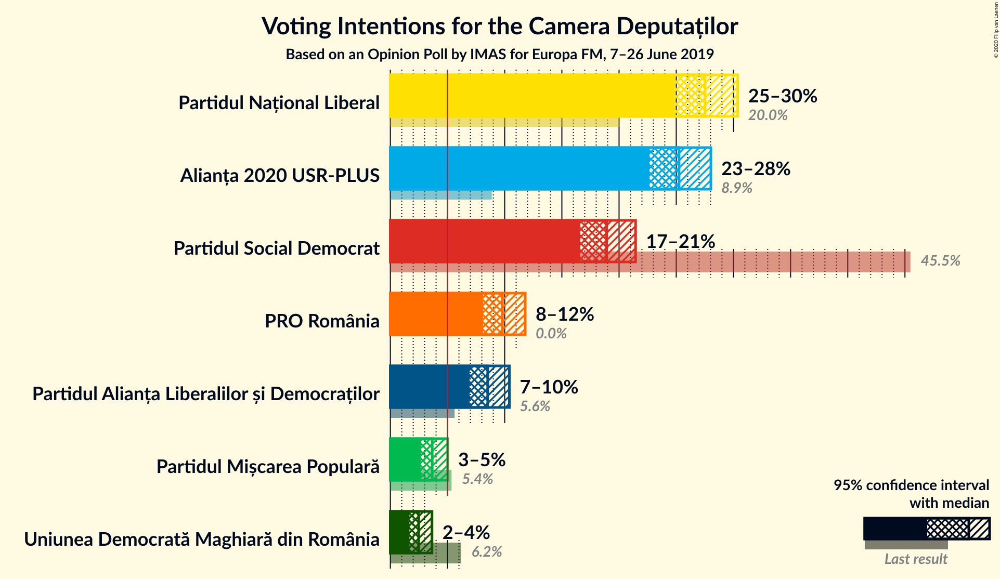
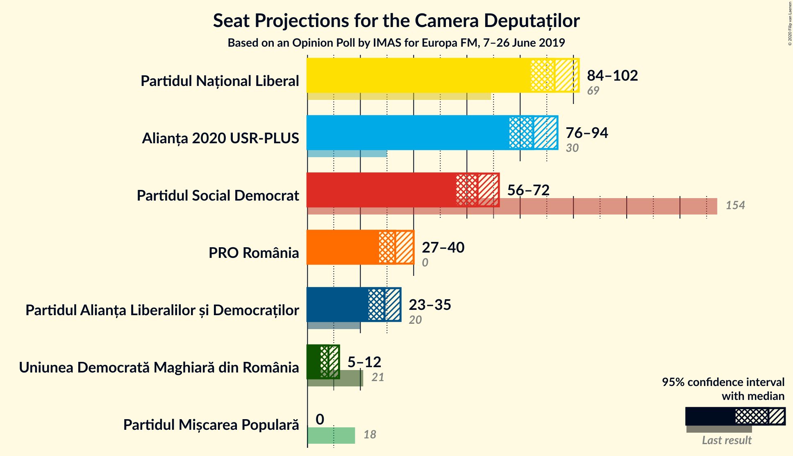
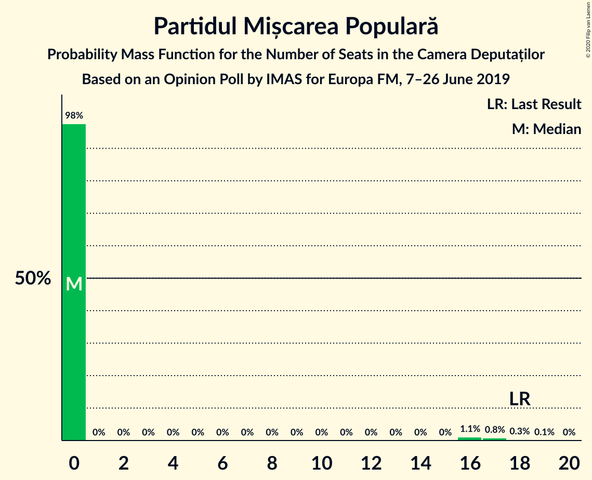
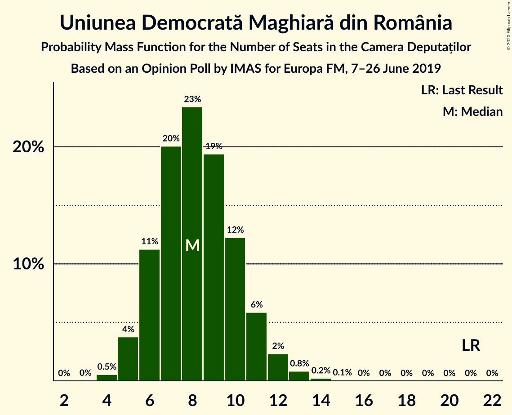
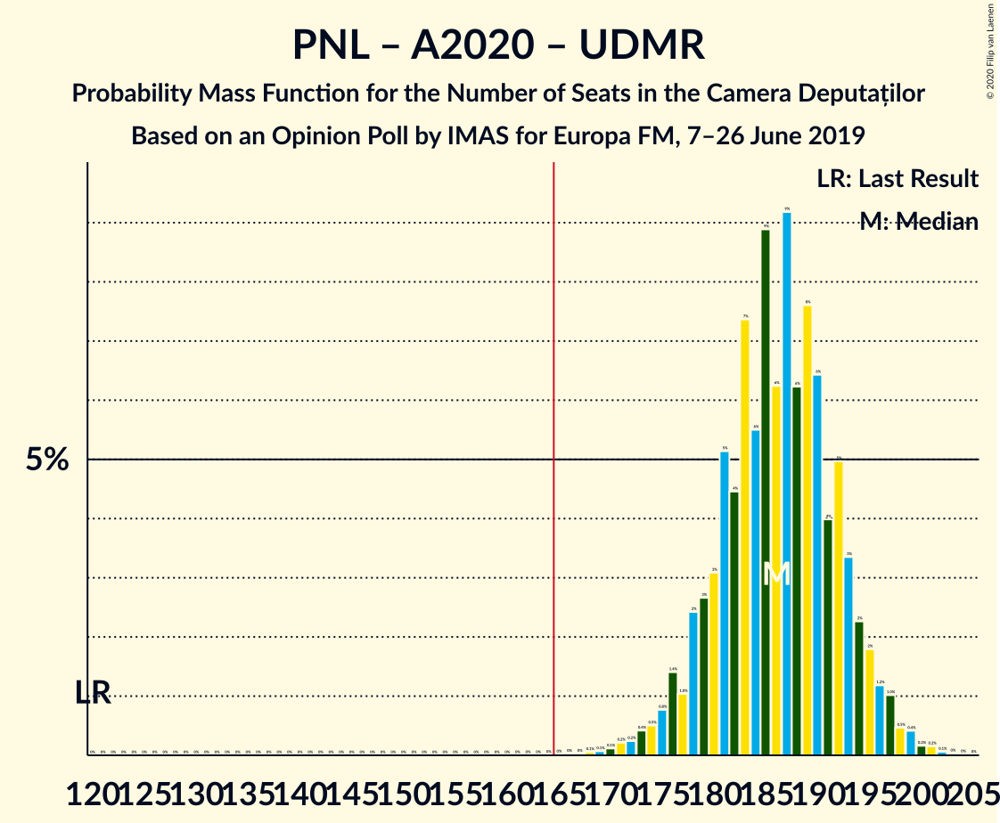
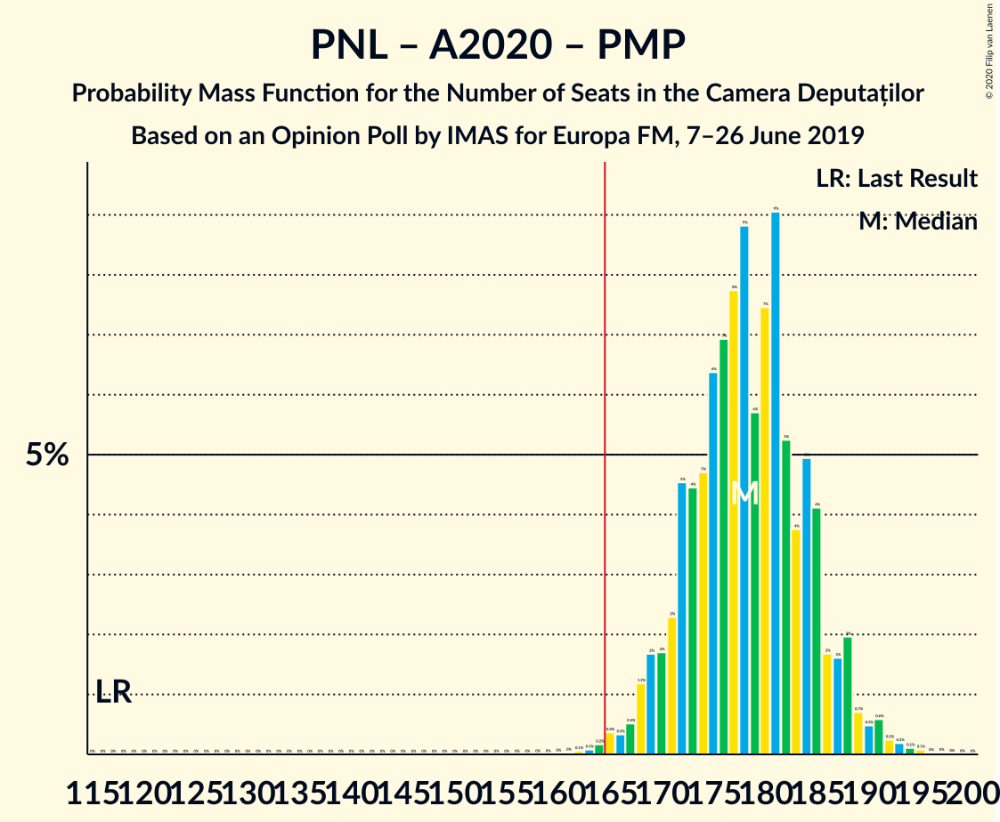

# Opinion Poll by IMAS for Europa FM, 7–26 June 2019

<a href="#voting-intentions">Voting Intentions</a> | <a href="#seats">Seats</a> | <a href="#coalitions">Coalitions</a> | <a href="#technical-information">Technical Information</a>

## Voting Intentions

### Confidence Intervals

| Party | Last Result | Poll Result | 80% Confidence Interval | 90% Confidence Interval | 95% Confidence Interval | 99% Confidence Interval |
|:-----:|:-----------:|:-----------:|:-----------------------:|:-----------------------:|:-----------------------:|:-----------------------:|
| Partidul Național Liberal | 20.0% | 27.5% | 25.8–29.4% |25.3–29.9% |24.9–30.4% |24.0–31.3% |
| Alianța 2020 USR-PLUS | 8.9% | 25.2% | 23.5–27.1% |23.1–27.6% |22.7–28.0% |21.9–28.9% |
| Partidul Social Democrat | 45.5% | 18.9% | 17.4–20.6% |17.0–21.0% |16.6–21.4% |15.9–22.3% |
| PRO România | 0.0% | 9.8% | 8.7–11.1% |8.4–11.5% |8.1–11.8% |7.6–12.5% |
| Partidul Alianța Liberalilor și Democraților | 5.6% | 8.5% | 7.5–9.8% |7.2–10.1% |6.9–10.4% |6.5–11.0% |
| Partidul Mișcarea Populară | 5.4% | 3.7% | 3.0–4.5% |2.8–4.8% |2.7–5.0% |2.4–5.5% |
| Uniunea Democrată Maghiară din România | 6.2% | 2.5% | 2.0–3.2% |1.8–3.4% |1.7–3.6% |1.5–4.0% |

*Note:* The poll result column reflects the actual value used in the calculations. Published results may vary slightly, and in addition be rounded to fewer digits.

## Seats

### Confidence Intervals

| Party | Last Result | Median | 80% Confidence Interval | 90% Confidence Interval | 95% Confidence Interval | 99% Confidence Interval |
|:-----:|:-----------:|:------:|:-----------------------:|:-----------------------:|:-----------------------:|:-----------------------:|
| <a href="#partidul-național-liberal">Partidul Național Liberal</a> | 69 | 92 | 86–99 |85–102 |83–102 |81–104 |
| <a href="#alianța-2020-usr-plus">Alianța 2020 USR-PLUS</a> | 30 | 85 | 79–91 |78–93 |76–94 |74–97 |
| <a href="#partidul-social-democrat">Partidul Social Democrat</a> | 154 | 64 | 58–70 |56–70 |55–73 |54–75 |
| <a href="#pro-românia">PRO România</a> | 0 | 33 | 29–37 |28–39 |27–39 |25–41 |
| <a href="#partidul-alianța-liberalilor-și-democraților">Partidul Alianța Liberalilor și Democraților</a> | 20 | 28 | 25–33 |23–34 |23–35 |21–37 |
| <a href="#partidul-mișcarea-populară">Partidul Mișcarea Populară</a> | 18 | 0 | 0 |0 |0–16 |0–17 |
| <a href="#uniunea-democrată-maghiară-din-românia">Uniunea Democrată Maghiară din România</a> | 21 | 8 | 6–10 |6–11 |5–12 |4–13 |

### Partidul Național Liberal

*For a full overview of the results for this party, see the [Partidul Național Liberal](party-partidulnaționalliberal.html) page.*

| Number of Seats | Probability | Accumulated | Special Marks |
|:---------------:|:-----------:|:-----------:|:-------------:|
| 69 | 0% | 100% | Last Result |
| 70 | 0% | 100% |  |
| 71 | 0% | 100% |  |
| 72 | 0% | 100% |  |
| 73 | 0% | 100% |  |
| 74 | 0% | 100% |  |
| 75 | 0% | 100% |  |
| 76 | 0% | 100% |  |
| 77 | 0% | 100% |  |
| 78 | 0% | 99.9% |  |
| 79 | 0% | 99.9% |  |
| 80 | 0.1% | 99.9% |  |
| 81 | 0.4% | 99.7% |  |
| 82 | 0.8% | 99.3% |  |
| 83 | 1.1% | 98% |  |
| 84 | 2% | 97% |  |
| 85 | 4% | 96% |  |
| 86 | 5% | 91% |  |
| 87 | 6% | 87% |  |
| 88 | 7% | 81% |  |
| 89 | 6% | 74% |  |
| 90 | 13% | 68% |  |
| 91 | 4% | 55% |  |
| 92 | 6% | 52% | Median |
| 93 | 3% | 46% |  |
| 94 | 7% | 42% |  |
| 95 | 4% | 35% |  |
| 96 | 4% | 31% |  |
| 97 | 5% | 27% |  |
| 98 | 8% | 22% |  |
| 99 | 5% | 14% |  |
| 100 | 2% | 10% |  |
| 101 | 2% | 7% |  |
| 102 | 4% | 5% |  |
| 103 | 0.6% | 2% |  |
| 104 | 0.7% | 1.1% |  |
| 105 | 0.2% | 0.4% |  |
| 106 | 0.1% | 0.2% |  |
| 107 | 0% | 0.1% |  |
| 108 | 0% | 0.1% |  |
| 109 | 0% | 0% |  |

### Alianța 2020 USR-PLUS

*For a full overview of the results for this party, see the [Alianța 2020 USR-PLUS](party-alianța2020usr-plus.html) page.*

| Number of Seats | Probability | Accumulated | Special Marks |
|:---------------:|:-----------:|:-----------:|:-------------:|
| 30 | 0% | 100% | Last Result |
| 31 | 0% | 100% |  |
| 32 | 0% | 100% |  |
| 33 | 0% | 100% |  |
| 34 | 0% | 100% |  |
| 35 | 0% | 100% |  |
| 36 | 0% | 100% |  |
| 37 | 0% | 100% |  |
| 38 | 0% | 100% |  |
| 39 | 0% | 100% |  |
| 40 | 0% | 100% |  |
| 41 | 0% | 100% |  |
| 42 | 0% | 100% |  |
| 43 | 0% | 100% |  |
| 44 | 0% | 100% |  |
| 45 | 0% | 100% |  |
| 46 | 0% | 100% |  |
| 47 | 0% | 100% |  |
| 48 | 0% | 100% |  |
| 49 | 0% | 100% |  |
| 50 | 0% | 100% |  |
| 51 | 0% | 100% |  |
| 52 | 0% | 100% |  |
| 53 | 0% | 100% |  |
| 54 | 0% | 100% |  |
| 55 | 0% | 100% |  |
| 56 | 0% | 100% |  |
| 57 | 0% | 100% |  |
| 58 | 0% | 100% |  |
| 59 | 0% | 100% |  |
| 60 | 0% | 100% |  |
| 61 | 0% | 100% |  |
| 62 | 0% | 100% |  |
| 63 | 0% | 100% |  |
| 64 | 0% | 100% |  |
| 65 | 0% | 100% |  |
| 66 | 0% | 100% |  |
| 67 | 0% | 100% |  |
| 68 | 0% | 100% |  |
| 69 | 0% | 100% |  |
| 70 | 0% | 100% |  |
| 71 | 0.1% | 99.9% |  |
| 72 | 0.2% | 99.9% |  |
| 73 | 0.1% | 99.7% |  |
| 74 | 0.3% | 99.6% |  |
| 75 | 1.0% | 99.3% |  |
| 76 | 2% | 98% |  |
| 77 | 0.4% | 96% |  |
| 78 | 3% | 96% |  |
| 79 | 5% | 93% |  |
| 80 | 3% | 89% |  |
| 81 | 4% | 86% |  |
| 82 | 5% | 82% |  |
| 83 | 15% | 76% |  |
| 84 | 3% | 61% |  |
| 85 | 8% | 58% | Median |
| 86 | 13% | 50% |  |
| 87 | 13% | 37% |  |
| 88 | 2% | 24% |  |
| 89 | 5% | 22% |  |
| 90 | 6% | 17% |  |
| 91 | 2% | 11% |  |
| 92 | 1.1% | 9% |  |
| 93 | 4% | 8% |  |
| 94 | 3% | 5% |  |
| 95 | 0.9% | 2% |  |
| 96 | 0.3% | 1.2% |  |
| 97 | 0.6% | 0.9% |  |
| 98 | 0.1% | 0.3% |  |
| 99 | 0.1% | 0.2% |  |
| 100 | 0.1% | 0.1% |  |
| 101 | 0% | 0.1% |  |
| 102 | 0% | 0% |  |

### Partidul Social Democrat

*For a full overview of the results for this party, see the [Partidul Social Democrat](party-partidulsocialdemocrat.html) page.*

| Number of Seats | Probability | Accumulated | Special Marks |
|:---------------:|:-----------:|:-----------:|:-------------:|
| 51 | 0.1% | 100% |  |
| 52 | 0.1% | 99.9% |  |
| 53 | 0.2% | 99.8% |  |
| 54 | 0.6% | 99.5% |  |
| 55 | 2% | 99.0% |  |
| 56 | 2% | 96% |  |
| 57 | 3% | 94% |  |
| 58 | 3% | 92% |  |
| 59 | 5% | 89% |  |
| 60 | 10% | 84% |  |
| 61 | 10% | 74% |  |
| 62 | 4% | 64% |  |
| 63 | 7% | 60% |  |
| 64 | 8% | 53% | Median |
| 65 | 9% | 45% |  |
| 66 | 5% | 36% |  |
| 67 | 4% | 31% |  |
| 68 | 7% | 27% |  |
| 69 | 9% | 20% |  |
| 70 | 6% | 11% |  |
| 71 | 2% | 5% |  |
| 72 | 0.5% | 3% |  |
| 73 | 1.2% | 3% |  |
| 74 | 0.6% | 1.4% |  |
| 75 | 0.5% | 0.8% |  |
| 76 | 0.2% | 0.3% |  |
| 77 | 0% | 0.1% |  |
| 78 | 0% | 0.1% |  |
| 79 | 0% | 0% |  |
| 80 | 0% | 0% |  |
| 81 | 0% | 0% |  |
| 82 | 0% | 0% |  |
| 83 | 0% | 0% |  |
| 84 | 0% | 0% |  |
| 85 | 0% | 0% |  |
| 86 | 0% | 0% |  |
| 87 | 0% | 0% |  |
| 88 | 0% | 0% |  |
| 89 | 0% | 0% |  |
| 90 | 0% | 0% |  |
| 91 | 0% | 0% |  |
| 92 | 0% | 0% |  |
| 93 | 0% | 0% |  |
| 94 | 0% | 0% |  |
| 95 | 0% | 0% |  |
| 96 | 0% | 0% |  |
| 97 | 0% | 0% |  |
| 98 | 0% | 0% |  |
| 99 | 0% | 0% |  |
| 100 | 0% | 0% |  |
| 101 | 0% | 0% |  |
| 102 | 0% | 0% |  |
| 103 | 0% | 0% |  |
| 104 | 0% | 0% |  |
| 105 | 0% | 0% |  |
| 106 | 0% | 0% |  |
| 107 | 0% | 0% |  |
| 108 | 0% | 0% |  |
| 109 | 0% | 0% |  |
| 110 | 0% | 0% |  |
| 111 | 0% | 0% |  |
| 112 | 0% | 0% |  |
| 113 | 0% | 0% |  |
| 114 | 0% | 0% |  |
| 115 | 0% | 0% |  |
| 116 | 0% | 0% |  |
| 117 | 0% | 0% |  |
| 118 | 0% | 0% |  |
| 119 | 0% | 0% |  |
| 120 | 0% | 0% |  |
| 121 | 0% | 0% |  |
| 122 | 0% | 0% |  |
| 123 | 0% | 0% |  |
| 124 | 0% | 0% |  |
| 125 | 0% | 0% |  |
| 126 | 0% | 0% |  |
| 127 | 0% | 0% |  |
| 128 | 0% | 0% |  |
| 129 | 0% | 0% |  |
| 130 | 0% | 0% |  |
| 131 | 0% | 0% |  |
| 132 | 0% | 0% |  |
| 133 | 0% | 0% |  |
| 134 | 0% | 0% |  |
| 135 | 0% | 0% |  |
| 136 | 0% | 0% |  |
| 137 | 0% | 0% |  |
| 138 | 0% | 0% |  |
| 139 | 0% | 0% |  |
| 140 | 0% | 0% |  |
| 141 | 0% | 0% |  |
| 142 | 0% | 0% |  |
| 143 | 0% | 0% |  |
| 144 | 0% | 0% |  |
| 145 | 0% | 0% |  |
| 146 | 0% | 0% |  |
| 147 | 0% | 0% |  |
| 148 | 0% | 0% |  |
| 149 | 0% | 0% |  |
| 150 | 0% | 0% |  |
| 151 | 0% | 0% |  |
| 152 | 0% | 0% |  |
| 153 | 0% | 0% |  |
| 154 | 0% | 0% | Last Result |

### PRO România

*For a full overview of the results for this party, see the [PRO România](party-proromânia.html) page.*

| Number of Seats | Probability | Accumulated | Special Marks |
|:---------------:|:-----------:|:-----------:|:-------------:|
| 0 | 0% | 100% | Last Result |
| 1 | 0% | 100% |  |
| 2 | 0% | 100% |  |
| 3 | 0% | 100% |  |
| 4 | 0% | 100% |  |
| 5 | 0% | 100% |  |
| 6 | 0% | 100% |  |
| 7 | 0% | 100% |  |
| 8 | 0% | 100% |  |
| 9 | 0% | 100% |  |
| 10 | 0% | 100% |  |
| 11 | 0% | 100% |  |
| 12 | 0% | 100% |  |
| 13 | 0% | 100% |  |
| 14 | 0% | 100% |  |
| 15 | 0% | 100% |  |
| 16 | 0% | 100% |  |
| 17 | 0% | 100% |  |
| 18 | 0% | 100% |  |
| 19 | 0% | 100% |  |
| 20 | 0% | 100% |  |
| 21 | 0% | 100% |  |
| 22 | 0% | 100% |  |
| 23 | 0% | 100% |  |
| 24 | 0.1% | 100% |  |
| 25 | 0.5% | 99.8% |  |
| 26 | 0.5% | 99.3% |  |
| 27 | 2% | 98.8% |  |
| 28 | 2% | 97% |  |
| 29 | 5% | 94% |  |
| 30 | 10% | 89% |  |
| 31 | 8% | 80% |  |
| 32 | 14% | 72% |  |
| 33 | 14% | 58% | Median |
| 34 | 9% | 43% |  |
| 35 | 14% | 35% |  |
| 36 | 8% | 21% |  |
| 37 | 5% | 13% |  |
| 38 | 3% | 8% |  |
| 39 | 3% | 5% |  |
| 40 | 1.3% | 2% |  |
| 41 | 0.8% | 1.2% |  |
| 42 | 0.2% | 0.4% |  |
| 43 | 0.1% | 0.2% |  |
| 44 | 0% | 0.1% |  |
| 45 | 0% | 0.1% |  |
| 46 | 0% | 0% |  |

### Partidul Alianța Liberalilor și Democraților

*For a full overview of the results for this party, see the [Partidul Alianța Liberalilor și Democraților](party-partidulalianțaliberalilorșidemocraților.html) page.*

| Number of Seats | Probability | Accumulated | Special Marks |
|:---------------:|:-----------:|:-----------:|:-------------:|
| 20 | 0.1% | 100% | Last Result |
| 21 | 0.6% | 99.9% |  |
| 22 | 1.2% | 99.3% |  |
| 23 | 4% | 98% |  |
| 24 | 3% | 94% |  |
| 25 | 6% | 91% |  |
| 26 | 10% | 84% |  |
| 27 | 10% | 74% |  |
| 28 | 16% | 64% | Median |
| 29 | 10% | 47% |  |
| 30 | 9% | 38% |  |
| 31 | 8% | 29% |  |
| 32 | 8% | 21% |  |
| 33 | 6% | 12% |  |
| 34 | 2% | 7% |  |
| 35 | 3% | 4% |  |
| 36 | 0.4% | 1.4% |  |
| 37 | 0.6% | 1.0% |  |
| 38 | 0.2% | 0.3% |  |
| 39 | 0.1% | 0.2% |  |
| 40 | 0% | 0% |  |

### Partidul Mișcarea Populară

*For a full overview of the results for this party, see the [Partidul Mișcarea Populară](party-partidulmișcareapopulară.html) page.*

| Number of Seats | Probability | Accumulated | Special Marks |
|:---------------:|:-----------:|:-----------:|:-------------:|
| 0 | 97% | 100% | Median |
| 1 | 0% | 3% |  |
| 2 | 0% | 3% |  |
| 3 | 0% | 3% |  |
| 4 | 0% | 3% |  |
| 5 | 0% | 3% |  |
| 6 | 0% | 3% |  |
| 7 | 0% | 3% |  |
| 8 | 0% | 3% |  |
| 9 | 0% | 3% |  |
| 10 | 0% | 3% |  |
| 11 | 0% | 3% |  |
| 12 | 0% | 3% |  |
| 13 | 0% | 3% |  |
| 14 | 0% | 3% |  |
| 15 | 0% | 3% |  |
| 16 | 1.1% | 3% |  |
| 17 | 1.2% | 2% |  |
| 18 | 0.3% | 0.5% | Last Result |
| 19 | 0.1% | 0.2% |  |
| 20 | 0% | 0% |  |

### Uniunea Democrată Maghiară din România

*For a full overview of the results for this party, see the [Uniunea Democrată Maghiară din România](party-uniuneademocratămaghiarădinromânia.html) page.*

| Number of Seats | Probability | Accumulated | Special Marks |
|:---------------:|:-----------:|:-----------:|:-------------:|
| 4 | 0.7% | 100% |  |
| 5 | 3% | 99.3% |  |
| 6 | 11% | 96% |  |
| 7 | 23% | 85% |  |
| 8 | 21% | 62% | Median |
| 9 | 20% | 42% |  |
| 10 | 13% | 21% |  |
| 11 | 5% | 8% |  |
| 12 | 3% | 4% |  |
| 13 | 0.7% | 1.0% |  |
| 14 | 0.2% | 0.3% |  |
| 15 | 0.1% | 0.1% |  |
| 16 | 0% | 0% |  |
| 17 | 0% | 0% |  |
| 18 | 0% | 0% |  |
| 19 | 0% | 0% |  |
| 20 | 0% | 0% |  |
| 21 | 0% | 0% | Last Result |

## Coalitions

### Confidence Intervals

| Coalition | Last Result | Median | Majority? | 80% Confidence Interval | 90% Confidence Interval | 95% Confidence Interval | 99% Confidence Interval |
|:---------:|:-----------:|:------:|:---------:|:-----------------------:|:-----------------------:|:-----------------------:|:-----------------------:|
| Partidul Național Liberal – Alianța 2020 USR-PLUS – Partidul Alianța Liberalilor și Democraților – Partidul Mișcarea Populară – Uniunea Democrată Maghiară din România | 158 | 215 | 100% | 209–222 | 207–224 | 206–225 | 202–228 |
| Partidul Național Liberal – Alianța 2020 USR-PLUS – Partidul Alianța Liberalilor și Democraților – Uniunea Democrată Maghiară din România | 140 | 215 | 100% | 208–222 | 206–223 | 203–225 | 200–227 |
| Partidul Național Liberal – Alianța 2020 USR-PLUS – Partidul Alianța Liberalilor și Democraților – Partidul Mișcarea Populară | 137 | 207 | 100% | 200–214 | 199–216 | 197–217 | 194–220 |
| Partidul Național Liberal – Alianța 2020 USR-PLUS – Partidul Alianța Liberalilor și Democraților | 119 | 207 | 100% | 200–213 | 198–215 | 195–216 | 192–219 |
| Partidul Național Liberal – Alianța 2020 USR-PLUS – Partidul Mișcarea Populară – Uniunea Democrată Maghiară din România | 138 | 185 | 100% | 180–194 | 177–196 | 176–197 | 174–199 |
| Partidul Național Liberal – Alianța 2020 USR-PLUS – Uniunea Democrată Maghiară din România | 120 | 184 | 99.9% | 178–194 | 176–196 | 176–197 | 173–198 |
| Partidul Național Liberal – Alianța 2020 USR-PLUS – Partidul Mișcarea Populară | 117 | 177 | 99.1% | 171–187 | 169–188 | 168–188 | 165–191 |
| Partidul Național Liberal – Alianța 2020 USR-PLUS | 99 | 176 | 98.7% | 171–185 | 169–188 | 168–188 | 164–191 |
| Partidul Național Liberal – Partidul Alianța Liberalilor și Democraților – Partidul Mișcarea Populară – Uniunea Democrată Maghiară din România | 128 | 129 | 0% | 123–137 | 121–140 | 119–141 | 116–145 |
| Partidul Național Liberal – Partidul Alianța Liberalilor și Democraților – Uniunea Democrată Maghiară din România | 110 | 129 | 0% | 123–136 | 121–138 | 119–140 | 115–142 |
| Partidul Social Democrat – PRO România – Partidul Alianța Liberalilor și Democraților | 174 | 127 | 0% | 118–132 | 116–135 | 115–136 | 113–138 |
| Partidul Național Liberal – Partidul Mișcarea Populară – Uniunea Democrată Maghiară din România | 108 | 101 | 0% | 94–109 | 93–110 | 91–113 | 89–117 |
| Partidul Național Liberal – Uniunea Democrată Maghiară din România | 90 | 100 | 0% | 94–108 | 92–109 | 91–110 | 89–113 |
| Partidul Social Democrat – PRO România | 154 | 97 | 0% | 90–103 | 88–105 | 87–106 | 84–110 |
| Partidul Național Liberal – Partidul Mișcarea Populară | 87 | 92 | 0% | 86–100 | 85–102 | 84–104 | 81–109 |
| Partidul Social Democrat – Partidul Alianța Liberalilor și Democraților | 174 | 94 | 0% | 85–99 | 84–101 | 83–102 | 82–103 |
| Partidul Național Liberal | 69 | 92 | 0% | 86–99 | 85–102 | 83–102 | 81–104 |
| Alianța 2020 USR-PLUS – Partidul Mișcarea Populară | 48 | 86 | 0% | 80–93 | 78–94 | 76–96 | 74–101 |

### Partidul Național Liberal – Alianța 2020 USR-PLUS – Partidul Alianța Liberalilor și Democraților – Partidul Mișcarea Populară – Uniunea Democrată Maghiară din România

| Number of Seats | Probability | Accumulated | Special Marks |
|:---------------:|:-----------:|:-----------:|:-------------:|
| 158 | 0% | 100% | Last Result |
| 159 | 0% | 100% |  |
| 160 | 0% | 100% |  |
| 161 | 0% | 100% |  |
| 162 | 0% | 100% |  |
| 163 | 0% | 100% |  |
| 164 | 0% | 100% |  |
| 165 | 0% | 100% |  |
| 166 | 0% | 100% | Majority |
| 167 | 0% | 100% |  |
| 168 | 0% | 100% |  |
| 169 | 0% | 100% |  |
| 170 | 0% | 100% |  |
| 171 | 0% | 100% |  |
| 172 | 0% | 100% |  |
| 173 | 0% | 100% |  |
| 174 | 0% | 100% |  |
| 175 | 0% | 100% |  |
| 176 | 0% | 100% |  |
| 177 | 0% | 100% |  |
| 178 | 0% | 100% |  |
| 179 | 0% | 100% |  |
| 180 | 0% | 100% |  |
| 181 | 0% | 100% |  |
| 182 | 0% | 100% |  |
| 183 | 0% | 100% |  |
| 184 | 0% | 100% |  |
| 185 | 0% | 100% |  |
| 186 | 0% | 100% |  |
| 187 | 0% | 100% |  |
| 188 | 0% | 100% |  |
| 189 | 0% | 100% |  |
| 190 | 0% | 100% |  |
| 191 | 0% | 100% |  |
| 192 | 0% | 100% |  |
| 193 | 0% | 100% |  |
| 194 | 0% | 100% |  |
| 195 | 0% | 100% |  |
| 196 | 0% | 100% |  |
| 197 | 0% | 100% |  |
| 198 | 0% | 100% |  |
| 199 | 0% | 100% |  |
| 200 | 0.2% | 99.9% |  |
| 201 | 0.1% | 99.8% |  |
| 202 | 0.5% | 99.7% |  |
| 203 | 0.5% | 99.2% |  |
| 204 | 0.4% | 98.7% |  |
| 205 | 0.7% | 98% |  |
| 206 | 2% | 98% |  |
| 207 | 2% | 96% |  |
| 208 | 2% | 94% |  |
| 209 | 8% | 92% |  |
| 210 | 3% | 84% |  |
| 211 | 7% | 82% |  |
| 212 | 6% | 74% |  |
| 213 | 7% | 68% | Median |
| 214 | 5% | 61% |  |
| 215 | 13% | 56% |  |
| 216 | 7% | 43% |  |
| 217 | 7% | 37% |  |
| 218 | 5% | 30% |  |
| 219 | 6% | 24% |  |
| 220 | 5% | 18% |  |
| 221 | 2% | 14% |  |
| 222 | 4% | 11% |  |
| 223 | 2% | 8% |  |
| 224 | 2% | 5% |  |
| 225 | 1.2% | 3% |  |
| 226 | 1.1% | 2% |  |
| 227 | 0.3% | 0.9% |  |
| 228 | 0.3% | 0.6% |  |
| 229 | 0.2% | 0.3% |  |
| 230 | 0% | 0.1% |  |
| 231 | 0% | 0% |  |

### Partidul Național Liberal – Alianța 2020 USR-PLUS – Partidul Alianța Liberalilor și Democraților – Uniunea Democrată Maghiară din România

| Number of Seats | Probability | Accumulated | Special Marks |
|:---------------:|:-----------:|:-----------:|:-------------:|
| 140 | 0% | 100% | Last Result |
| 141 | 0% | 100% |  |
| 142 | 0% | 100% |  |
| 143 | 0% | 100% |  |
| 144 | 0% | 100% |  |
| 145 | 0% | 100% |  |
| 146 | 0% | 100% |  |
| 147 | 0% | 100% |  |
| 148 | 0% | 100% |  |
| 149 | 0% | 100% |  |
| 150 | 0% | 100% |  |
| 151 | 0% | 100% |  |
| 152 | 0% | 100% |  |
| 153 | 0% | 100% |  |
| 154 | 0% | 100% |  |
| 155 | 0% | 100% |  |
| 156 | 0% | 100% |  |
| 157 | 0% | 100% |  |
| 158 | 0% | 100% |  |
| 159 | 0% | 100% |  |
| 160 | 0% | 100% |  |
| 161 | 0% | 100% |  |
| 162 | 0% | 100% |  |
| 163 | 0% | 100% |  |
| 164 | 0% | 100% |  |
| 165 | 0% | 100% |  |
| 166 | 0% | 100% | Majority |
| 167 | 0% | 100% |  |
| 168 | 0% | 100% |  |
| 169 | 0% | 100% |  |
| 170 | 0% | 100% |  |
| 171 | 0% | 100% |  |
| 172 | 0% | 100% |  |
| 173 | 0% | 100% |  |
| 174 | 0% | 100% |  |
| 175 | 0% | 100% |  |
| 176 | 0% | 100% |  |
| 177 | 0% | 100% |  |
| 178 | 0% | 100% |  |
| 179 | 0% | 100% |  |
| 180 | 0% | 100% |  |
| 181 | 0% | 100% |  |
| 182 | 0% | 100% |  |
| 183 | 0% | 100% |  |
| 184 | 0% | 100% |  |
| 185 | 0% | 100% |  |
| 186 | 0% | 100% |  |
| 187 | 0% | 100% |  |
| 188 | 0% | 100% |  |
| 189 | 0% | 100% |  |
| 190 | 0% | 100% |  |
| 191 | 0% | 100% |  |
| 192 | 0% | 100% |  |
| 193 | 0% | 100% |  |
| 194 | 0% | 99.9% |  |
| 195 | 0% | 99.9% |  |
| 196 | 0% | 99.9% |  |
| 197 | 0.1% | 99.9% |  |
| 198 | 0% | 99.8% |  |
| 199 | 0.1% | 99.8% |  |
| 200 | 0.3% | 99.7% |  |
| 201 | 0.7% | 99.4% |  |
| 202 | 0.7% | 98.7% |  |
| 203 | 0.6% | 98% |  |
| 204 | 0.7% | 97% |  |
| 205 | 1.0% | 97% |  |
| 206 | 2% | 96% |  |
| 207 | 3% | 94% |  |
| 208 | 2% | 91% |  |
| 209 | 8% | 89% |  |
| 210 | 3% | 82% |  |
| 211 | 7% | 79% |  |
| 212 | 6% | 72% |  |
| 213 | 7% | 65% | Median |
| 214 | 5% | 59% |  |
| 215 | 13% | 53% |  |
| 216 | 7% | 41% |  |
| 217 | 7% | 34% |  |
| 218 | 5% | 27% |  |
| 219 | 6% | 23% |  |
| 220 | 5% | 17% |  |
| 221 | 2% | 12% |  |
| 222 | 4% | 10% |  |
| 223 | 2% | 7% |  |
| 224 | 2% | 5% |  |
| 225 | 1.2% | 3% |  |
| 226 | 1.0% | 2% |  |
| 227 | 0.2% | 0.7% |  |
| 228 | 0.3% | 0.5% |  |
| 229 | 0.1% | 0.2% |  |
| 230 | 0% | 0.1% |  |
| 231 | 0% | 0% |  |

### Partidul Național Liberal – Alianța 2020 USR-PLUS – Partidul Alianța Liberalilor și Democraților – Partidul Mișcarea Populară

| Number of Seats | Probability | Accumulated | Special Marks |
|:---------------:|:-----------:|:-----------:|:-------------:|
| 137 | 0% | 100% | Last Result |
| 138 | 0% | 100% |  |
| 139 | 0% | 100% |  |
| 140 | 0% | 100% |  |
| 141 | 0% | 100% |  |
| 142 | 0% | 100% |  |
| 143 | 0% | 100% |  |
| 144 | 0% | 100% |  |
| 145 | 0% | 100% |  |
| 146 | 0% | 100% |  |
| 147 | 0% | 100% |  |
| 148 | 0% | 100% |  |
| 149 | 0% | 100% |  |
| 150 | 0% | 100% |  |
| 151 | 0% | 100% |  |
| 152 | 0% | 100% |  |
| 153 | 0% | 100% |  |
| 154 | 0% | 100% |  |
| 155 | 0% | 100% |  |
| 156 | 0% | 100% |  |
| 157 | 0% | 100% |  |
| 158 | 0% | 100% |  |
| 159 | 0% | 100% |  |
| 160 | 0% | 100% |  |
| 161 | 0% | 100% |  |
| 162 | 0% | 100% |  |
| 163 | 0% | 100% |  |
| 164 | 0% | 100% |  |
| 165 | 0% | 100% |  |
| 166 | 0% | 100% | Majority |
| 167 | 0% | 100% |  |
| 168 | 0% | 100% |  |
| 169 | 0% | 100% |  |
| 170 | 0% | 100% |  |
| 171 | 0% | 100% |  |
| 172 | 0% | 100% |  |
| 173 | 0% | 100% |  |
| 174 | 0% | 100% |  |
| 175 | 0% | 100% |  |
| 176 | 0% | 100% |  |
| 177 | 0% | 100% |  |
| 178 | 0% | 100% |  |
| 179 | 0% | 100% |  |
| 180 | 0% | 100% |  |
| 181 | 0% | 100% |  |
| 182 | 0% | 100% |  |
| 183 | 0% | 100% |  |
| 184 | 0% | 100% |  |
| 185 | 0% | 100% |  |
| 186 | 0% | 100% |  |
| 187 | 0% | 100% |  |
| 188 | 0% | 100% |  |
| 189 | 0% | 100% |  |
| 190 | 0% | 100% |  |
| 191 | 0.1% | 100% |  |
| 192 | 0.2% | 99.8% |  |
| 193 | 0.2% | 99.7% |  |
| 194 | 0.4% | 99.5% |  |
| 195 | 0.7% | 99.1% |  |
| 196 | 0.9% | 98% |  |
| 197 | 0.6% | 98% |  |
| 198 | 1.3% | 97% |  |
| 199 | 2% | 96% |  |
| 200 | 7% | 93% |  |
| 201 | 3% | 86% |  |
| 202 | 3% | 84% |  |
| 203 | 7% | 81% |  |
| 204 | 10% | 74% |  |
| 205 | 6% | 64% | Median |
| 206 | 5% | 58% |  |
| 207 | 5% | 53% |  |
| 208 | 13% | 48% |  |
| 209 | 7% | 35% |  |
| 210 | 6% | 29% |  |
| 211 | 3% | 22% |  |
| 212 | 5% | 19% |  |
| 213 | 3% | 14% |  |
| 214 | 3% | 10% |  |
| 215 | 2% | 8% |  |
| 216 | 2% | 5% |  |
| 217 | 2% | 3% |  |
| 218 | 0.4% | 1.5% |  |
| 219 | 0.6% | 1.1% |  |
| 220 | 0.1% | 0.5% |  |
| 221 | 0.2% | 0.4% |  |
| 222 | 0.1% | 0.1% |  |
| 223 | 0% | 0.1% |  |
| 224 | 0% | 0% |  |

### Partidul Național Liberal – Alianța 2020 USR-PLUS – Partidul Alianța Liberalilor și Democraților

| Number of Seats | Probability | Accumulated | Special Marks |
|:---------------:|:-----------:|:-----------:|:-------------:|
| 119 | 0% | 100% | Last Result |
| 120 | 0% | 100% |  |
| 121 | 0% | 100% |  |
| 122 | 0% | 100% |  |
| 123 | 0% | 100% |  |
| 124 | 0% | 100% |  |
| 125 | 0% | 100% |  |
| 126 | 0% | 100% |  |
| 127 | 0% | 100% |  |
| 128 | 0% | 100% |  |
| 129 | 0% | 100% |  |
| 130 | 0% | 100% |  |
| 131 | 0% | 100% |  |
| 132 | 0% | 100% |  |
| 133 | 0% | 100% |  |
| 134 | 0% | 100% |  |
| 135 | 0% | 100% |  |
| 136 | 0% | 100% |  |
| 137 | 0% | 100% |  |
| 138 | 0% | 100% |  |
| 139 | 0% | 100% |  |
| 140 | 0% | 100% |  |
| 141 | 0% | 100% |  |
| 142 | 0% | 100% |  |
| 143 | 0% | 100% |  |
| 144 | 0% | 100% |  |
| 145 | 0% | 100% |  |
| 146 | 0% | 100% |  |
| 147 | 0% | 100% |  |
| 148 | 0% | 100% |  |
| 149 | 0% | 100% |  |
| 150 | 0% | 100% |  |
| 151 | 0% | 100% |  |
| 152 | 0% | 100% |  |
| 153 | 0% | 100% |  |
| 154 | 0% | 100% |  |
| 155 | 0% | 100% |  |
| 156 | 0% | 100% |  |
| 157 | 0% | 100% |  |
| 158 | 0% | 100% |  |
| 159 | 0% | 100% |  |
| 160 | 0% | 100% |  |
| 161 | 0% | 100% |  |
| 162 | 0% | 100% |  |
| 163 | 0% | 100% |  |
| 164 | 0% | 100% |  |
| 165 | 0% | 100% |  |
| 166 | 0% | 100% | Majority |
| 167 | 0% | 100% |  |
| 168 | 0% | 100% |  |
| 169 | 0% | 100% |  |
| 170 | 0% | 100% |  |
| 171 | 0% | 100% |  |
| 172 | 0% | 100% |  |
| 173 | 0% | 100% |  |
| 174 | 0% | 100% |  |
| 175 | 0% | 100% |  |
| 176 | 0% | 100% |  |
| 177 | 0% | 100% |  |
| 178 | 0% | 100% |  |
| 179 | 0% | 100% |  |
| 180 | 0% | 100% |  |
| 181 | 0% | 100% |  |
| 182 | 0% | 100% |  |
| 183 | 0% | 100% |  |
| 184 | 0% | 100% |  |
| 185 | 0% | 100% |  |
| 186 | 0% | 100% |  |
| 187 | 0.1% | 100% |  |
| 188 | 0% | 99.9% |  |
| 189 | 0.1% | 99.9% |  |
| 190 | 0.1% | 99.8% |  |
| 191 | 0.2% | 99.8% |  |
| 192 | 0.2% | 99.6% |  |
| 193 | 0.8% | 99.3% |  |
| 194 | 0.5% | 98.6% |  |
| 195 | 1.1% | 98% |  |
| 196 | 1.1% | 97% |  |
| 197 | 0.8% | 96% |  |
| 198 | 1.3% | 95% |  |
| 199 | 2% | 94% |  |
| 200 | 7% | 91% |  |
| 201 | 3% | 84% |  |
| 202 | 3% | 81% |  |
| 203 | 7% | 79% |  |
| 204 | 10% | 72% |  |
| 205 | 6% | 61% | Median |
| 206 | 5% | 56% |  |
| 207 | 5% | 50% |  |
| 208 | 13% | 46% |  |
| 209 | 6% | 33% |  |
| 210 | 6% | 26% |  |
| 211 | 3% | 20% |  |
| 212 | 5% | 18% |  |
| 213 | 3% | 12% |  |
| 214 | 3% | 9% |  |
| 215 | 2% | 7% |  |
| 216 | 2% | 5% |  |
| 217 | 1.3% | 2% |  |
| 218 | 0.3% | 1.2% |  |
| 219 | 0.5% | 0.8% |  |
| 220 | 0.1% | 0.3% |  |
| 221 | 0.2% | 0.3% |  |
| 222 | 0% | 0.1% |  |
| 223 | 0% | 0% |  |

### Partidul Național Liberal – Alianța 2020 USR-PLUS – Partidul Mișcarea Populară – Uniunea Democrată Maghiară din România

| Number of Seats | Probability | Accumulated | Special Marks |
|:---------------:|:-----------:|:-----------:|:-------------:|
| 138 | 0% | 100% | Last Result |
| 139 | 0% | 100% |  |
| 140 | 0% | 100% |  |
| 141 | 0% | 100% |  |
| 142 | 0% | 100% |  |
| 143 | 0% | 100% |  |
| 144 | 0% | 100% |  |
| 145 | 0% | 100% |  |
| 146 | 0% | 100% |  |
| 147 | 0% | 100% |  |
| 148 | 0% | 100% |  |
| 149 | 0% | 100% |  |
| 150 | 0% | 100% |  |
| 151 | 0% | 100% |  |
| 152 | 0% | 100% |  |
| 153 | 0% | 100% |  |
| 154 | 0% | 100% |  |
| 155 | 0% | 100% |  |
| 156 | 0% | 100% |  |
| 157 | 0% | 100% |  |
| 158 | 0% | 100% |  |
| 159 | 0% | 100% |  |
| 160 | 0% | 100% |  |
| 161 | 0% | 100% |  |
| 162 | 0% | 100% |  |
| 163 | 0% | 100% |  |
| 164 | 0% | 100% |  |
| 165 | 0% | 100% |  |
| 166 | 0% | 100% | Majority |
| 167 | 0% | 100% |  |
| 168 | 0% | 100% |  |
| 169 | 0% | 100% |  |
| 170 | 0% | 100% |  |
| 171 | 0% | 99.9% |  |
| 172 | 0% | 99.9% |  |
| 173 | 0.1% | 99.9% |  |
| 174 | 0.6% | 99.8% |  |
| 175 | 0.9% | 99.2% |  |
| 176 | 3% | 98% |  |
| 177 | 1.3% | 95% |  |
| 178 | 2% | 94% |  |
| 179 | 0.5% | 92% |  |
| 180 | 2% | 91% |  |
| 181 | 8% | 89% |  |
| 182 | 9% | 81% |  |
| 183 | 16% | 72% |  |
| 184 | 4% | 55% |  |
| 185 | 1.3% | 51% | Median |
| 186 | 0.9% | 50% |  |
| 187 | 3% | 49% |  |
| 188 | 5% | 45% |  |
| 189 | 9% | 40% |  |
| 190 | 9% | 31% |  |
| 191 | 0.8% | 22% |  |
| 192 | 4% | 21% |  |
| 193 | 2% | 17% |  |
| 194 | 6% | 16% |  |
| 195 | 3% | 10% |  |
| 196 | 3% | 7% |  |
| 197 | 2% | 3% |  |
| 198 | 0.5% | 1.2% |  |
| 199 | 0.3% | 0.7% |  |
| 200 | 0.1% | 0.4% |  |
| 201 | 0.2% | 0.3% |  |
| 202 | 0.1% | 0.1% |  |
| 203 | 0% | 0.1% |  |
| 204 | 0% | 0% |  |

### Partidul Național Liberal – Alianța 2020 USR-PLUS – Uniunea Democrată Maghiară din România

| Number of Seats | Probability | Accumulated | Special Marks |
|:---------------:|:-----------:|:-----------:|:-------------:|
| 120 | 0% | 100% | Last Result |
| 121 | 0% | 100% |  |
| 122 | 0% | 100% |  |
| 123 | 0% | 100% |  |
| 124 | 0% | 100% |  |
| 125 | 0% | 100% |  |
| 126 | 0% | 100% |  |
| 127 | 0% | 100% |  |
| 128 | 0% | 100% |  |
| 129 | 0% | 100% |  |
| 130 | 0% | 100% |  |
| 131 | 0% | 100% |  |
| 132 | 0% | 100% |  |
| 133 | 0% | 100% |  |
| 134 | 0% | 100% |  |
| 135 | 0% | 100% |  |
| 136 | 0% | 100% |  |
| 137 | 0% | 100% |  |
| 138 | 0% | 100% |  |
| 139 | 0% | 100% |  |
| 140 | 0% | 100% |  |
| 141 | 0% | 100% |  |
| 142 | 0% | 100% |  |
| 143 | 0% | 100% |  |
| 144 | 0% | 100% |  |
| 145 | 0% | 100% |  |
| 146 | 0% | 100% |  |
| 147 | 0% | 100% |  |
| 148 | 0% | 100% |  |
| 149 | 0% | 100% |  |
| 150 | 0% | 100% |  |
| 151 | 0% | 100% |  |
| 152 | 0% | 100% |  |
| 153 | 0% | 100% |  |
| 154 | 0% | 100% |  |
| 155 | 0% | 100% |  |
| 156 | 0% | 100% |  |
| 157 | 0% | 100% |  |
| 158 | 0% | 100% |  |
| 159 | 0% | 100% |  |
| 160 | 0% | 100% |  |
| 161 | 0% | 100% |  |
| 162 | 0% | 100% |  |
| 163 | 0% | 100% |  |
| 164 | 0% | 100% |  |
| 165 | 0% | 100% |  |
| 166 | 0% | 99.9% | Majority |
| 167 | 0% | 99.9% |  |
| 168 | 0% | 99.9% |  |
| 169 | 0% | 99.9% |  |
| 170 | 0.1% | 99.8% |  |
| 171 | 0.1% | 99.7% |  |
| 172 | 0.1% | 99.6% |  |
| 173 | 0.1% | 99.5% |  |
| 174 | 0.6% | 99.4% |  |
| 175 | 1.1% | 98.8% |  |
| 176 | 3% | 98% |  |
| 177 | 2% | 94% |  |
| 178 | 3% | 93% |  |
| 179 | 0.6% | 90% |  |
| 180 | 3% | 89% |  |
| 181 | 8% | 87% |  |
| 182 | 9% | 78% |  |
| 183 | 16% | 69% |  |
| 184 | 4% | 53% |  |
| 185 | 1.4% | 48% | Median |
| 186 | 0.9% | 47% |  |
| 187 | 3% | 46% |  |
| 188 | 5% | 43% |  |
| 189 | 9% | 38% |  |
| 190 | 9% | 29% |  |
| 191 | 0.8% | 20% |  |
| 192 | 4% | 19% |  |
| 193 | 1.2% | 15% |  |
| 194 | 5% | 14% |  |
| 195 | 3% | 9% |  |
| 196 | 3% | 6% |  |
| 197 | 2% | 3% |  |
| 198 | 0.4% | 0.8% |  |
| 199 | 0.2% | 0.4% |  |
| 200 | 0.1% | 0.2% |  |
| 201 | 0.1% | 0.1% |  |
| 202 | 0% | 0.1% |  |
| 203 | 0% | 0% |  |

### Partidul Național Liberal – Alianța 2020 USR-PLUS – Partidul Mișcarea Populară

| Number of Seats | Probability | Accumulated | Special Marks |
|:---------------:|:-----------:|:-----------:|:-------------:|
| 117 | 0% | 100% | Last Result |
| 118 | 0% | 100% |  |
| 119 | 0% | 100% |  |
| 120 | 0% | 100% |  |
| 121 | 0% | 100% |  |
| 122 | 0% | 100% |  |
| 123 | 0% | 100% |  |
| 124 | 0% | 100% |  |
| 125 | 0% | 100% |  |
| 126 | 0% | 100% |  |
| 127 | 0% | 100% |  |
| 128 | 0% | 100% |  |
| 129 | 0% | 100% |  |
| 130 | 0% | 100% |  |
| 131 | 0% | 100% |  |
| 132 | 0% | 100% |  |
| 133 | 0% | 100% |  |
| 134 | 0% | 100% |  |
| 135 | 0% | 100% |  |
| 136 | 0% | 100% |  |
| 137 | 0% | 100% |  |
| 138 | 0% | 100% |  |
| 139 | 0% | 100% |  |
| 140 | 0% | 100% |  |
| 141 | 0% | 100% |  |
| 142 | 0% | 100% |  |
| 143 | 0% | 100% |  |
| 144 | 0% | 100% |  |
| 145 | 0% | 100% |  |
| 146 | 0% | 100% |  |
| 147 | 0% | 100% |  |
| 148 | 0% | 100% |  |
| 149 | 0% | 100% |  |
| 150 | 0% | 100% |  |
| 151 | 0% | 100% |  |
| 152 | 0% | 100% |  |
| 153 | 0% | 100% |  |
| 154 | 0% | 100% |  |
| 155 | 0% | 100% |  |
| 156 | 0% | 100% |  |
| 157 | 0% | 100% |  |
| 158 | 0% | 100% |  |
| 159 | 0% | 100% |  |
| 160 | 0% | 100% |  |
| 161 | 0% | 100% |  |
| 162 | 0% | 100% |  |
| 163 | 0% | 99.9% |  |
| 164 | 0.2% | 99.9% |  |
| 165 | 0.6% | 99.7% |  |
| 166 | 0.2% | 99.1% | Majority |
| 167 | 0.1% | 98.9% |  |
| 168 | 2% | 98.8% |  |
| 169 | 4% | 97% |  |
| 170 | 0.4% | 93% |  |
| 171 | 2% | 92% |  |
| 172 | 13% | 90% |  |
| 173 | 2% | 76% |  |
| 174 | 2% | 75% |  |
| 175 | 10% | 73% |  |
| 176 | 12% | 63% |  |
| 177 | 2% | 52% | Median |
| 178 | 5% | 50% |  |
| 179 | 3% | 45% |  |
| 180 | 1.1% | 42% |  |
| 181 | 13% | 41% |  |
| 182 | 3% | 28% |  |
| 183 | 2% | 25% |  |
| 184 | 7% | 24% |  |
| 185 | 7% | 17% |  |
| 186 | 0.2% | 10% |  |
| 187 | 3% | 10% |  |
| 188 | 5% | 7% |  |
| 189 | 0.2% | 2% |  |
| 190 | 0.2% | 2% |  |
| 191 | 1.1% | 1.5% |  |
| 192 | 0.2% | 0.4% |  |
| 193 | 0% | 0.2% |  |
| 194 | 0% | 0.2% |  |
| 195 | 0.1% | 0.1% |  |
| 196 | 0% | 0% |  |

### Partidul Național Liberal – Alianța 2020 USR-PLUS

| Number of Seats | Probability | Accumulated | Special Marks |
|:---------------:|:-----------:|:-----------:|:-------------:|
| 99 | 0% | 100% | Last Result |
| 100 | 0% | 100% |  |
| 101 | 0% | 100% |  |
| 102 | 0% | 100% |  |
| 103 | 0% | 100% |  |
| 104 | 0% | 100% |  |
| 105 | 0% | 100% |  |
| 106 | 0% | 100% |  |
| 107 | 0% | 100% |  |
| 108 | 0% | 100% |  |
| 109 | 0% | 100% |  |
| 110 | 0% | 100% |  |
| 111 | 0% | 100% |  |
| 112 | 0% | 100% |  |
| 113 | 0% | 100% |  |
| 114 | 0% | 100% |  |
| 115 | 0% | 100% |  |
| 116 | 0% | 100% |  |
| 117 | 0% | 100% |  |
| 118 | 0% | 100% |  |
| 119 | 0% | 100% |  |
| 120 | 0% | 100% |  |
| 121 | 0% | 100% |  |
| 122 | 0% | 100% |  |
| 123 | 0% | 100% |  |
| 124 | 0% | 100% |  |
| 125 | 0% | 100% |  |
| 126 | 0% | 100% |  |
| 127 | 0% | 100% |  |
| 128 | 0% | 100% |  |
| 129 | 0% | 100% |  |
| 130 | 0% | 100% |  |
| 131 | 0% | 100% |  |
| 132 | 0% | 100% |  |
| 133 | 0% | 100% |  |
| 134 | 0% | 100% |  |
| 135 | 0% | 100% |  |
| 136 | 0% | 100% |  |
| 137 | 0% | 100% |  |
| 138 | 0% | 100% |  |
| 139 | 0% | 100% |  |
| 140 | 0% | 100% |  |
| 141 | 0% | 100% |  |
| 142 | 0% | 100% |  |
| 143 | 0% | 100% |  |
| 144 | 0% | 100% |  |
| 145 | 0% | 100% |  |
| 146 | 0% | 100% |  |
| 147 | 0% | 100% |  |
| 148 | 0% | 100% |  |
| 149 | 0% | 100% |  |
| 150 | 0% | 100% |  |
| 151 | 0% | 100% |  |
| 152 | 0% | 100% |  |
| 153 | 0% | 100% |  |
| 154 | 0% | 100% |  |
| 155 | 0% | 100% |  |
| 156 | 0% | 100% |  |
| 157 | 0% | 100% |  |
| 158 | 0% | 100% |  |
| 159 | 0.1% | 99.9% |  |
| 160 | 0.1% | 99.9% |  |
| 161 | 0% | 99.8% |  |
| 162 | 0.1% | 99.8% |  |
| 163 | 0.1% | 99.7% |  |
| 164 | 0.3% | 99.7% |  |
| 165 | 0.7% | 99.4% |  |
| 166 | 0.2% | 98.7% | Majority |
| 167 | 0.2% | 98% |  |
| 168 | 3% | 98% |  |
| 169 | 4% | 95% |  |
| 170 | 0.5% | 91% |  |
| 171 | 3% | 91% |  |
| 172 | 14% | 88% |  |
| 173 | 2% | 74% |  |
| 174 | 2% | 73% |  |
| 175 | 10% | 70% |  |
| 176 | 12% | 61% |  |
| 177 | 2% | 49% | Median |
| 178 | 5% | 47% |  |
| 179 | 3% | 42% |  |
| 180 | 1.1% | 40% |  |
| 181 | 13% | 38% |  |
| 182 | 3% | 26% |  |
| 183 | 2% | 23% |  |
| 184 | 6% | 21% |  |
| 185 | 6% | 15% |  |
| 186 | 0% | 9% |  |
| 187 | 3% | 9% |  |
| 188 | 4% | 6% |  |
| 189 | 0% | 1.4% |  |
| 190 | 0.2% | 1.4% |  |
| 191 | 1.0% | 1.2% |  |
| 192 | 0.1% | 0.1% |  |
| 193 | 0% | 0.1% |  |
| 194 | 0% | 0.1% |  |
| 195 | 0% | 0% |  |

### Partidul Național Liberal – Partidul Alianța Liberalilor și Democraților – Partidul Mișcarea Populară – Uniunea Democrată Maghiară din România

| Number of Seats | Probability | Accumulated | Special Marks |
|:---------------:|:-----------:|:-----------:|:-------------:|
| 113 | 0% | 100% |  |
| 114 | 0.1% | 99.9% |  |
| 115 | 0.2% | 99.9% |  |
| 116 | 0.2% | 99.7% |  |
| 117 | 0.3% | 99.4% |  |
| 118 | 0.6% | 99.1% |  |
| 119 | 2% | 98.5% |  |
| 120 | 0.9% | 97% |  |
| 121 | 2% | 96% |  |
| 122 | 3% | 94% |  |
| 123 | 2% | 92% |  |
| 124 | 6% | 90% |  |
| 125 | 9% | 84% |  |
| 126 | 4% | 74% |  |
| 127 | 3% | 70% |  |
| 128 | 7% | 67% | Last Result, Median |
| 129 | 12% | 60% |  |
| 130 | 5% | 48% |  |
| 131 | 8% | 43% |  |
| 132 | 6% | 35% |  |
| 133 | 4% | 29% |  |
| 134 | 6% | 25% |  |
| 135 | 2% | 19% |  |
| 136 | 6% | 16% |  |
| 137 | 3% | 11% |  |
| 138 | 2% | 8% |  |
| 139 | 0.9% | 6% |  |
| 140 | 2% | 5% |  |
| 141 | 1.1% | 4% |  |
| 142 | 0.8% | 2% |  |
| 143 | 0.2% | 2% |  |
| 144 | 0.7% | 1.4% |  |
| 145 | 0.4% | 0.7% |  |
| 146 | 0.1% | 0.3% |  |
| 147 | 0% | 0.2% |  |
| 148 | 0% | 0.2% |  |
| 149 | 0% | 0.1% |  |
| 150 | 0.1% | 0.1% |  |
| 151 | 0% | 0% |  |

### Partidul Național Liberal – Partidul Alianța Liberalilor și Democraților – Uniunea Democrată Maghiară din România

| Number of Seats | Probability | Accumulated | Special Marks |
|:---------------:|:-----------:|:-----------:|:-------------:|
| 110 | 0% | 100% | Last Result |
| 111 | 0% | 100% |  |
| 112 | 0% | 100% |  |
| 113 | 0% | 99.9% |  |
| 114 | 0.1% | 99.9% |  |
| 115 | 0.3% | 99.8% |  |
| 116 | 0.3% | 99.5% |  |
| 117 | 0.4% | 99.2% |  |
| 118 | 0.7% | 98.8% |  |
| 119 | 2% | 98% |  |
| 120 | 1.2% | 96% |  |
| 121 | 2% | 95% |  |
| 122 | 3% | 94% |  |
| 123 | 2% | 91% |  |
| 124 | 7% | 89% |  |
| 125 | 9% | 82% |  |
| 126 | 4% | 73% |  |
| 127 | 3% | 69% |  |
| 128 | 8% | 65% | Median |
| 129 | 12% | 57% |  |
| 130 | 5% | 45% |  |
| 131 | 8% | 40% |  |
| 132 | 6% | 32% |  |
| 133 | 4% | 26% |  |
| 134 | 6% | 22% |  |
| 135 | 2% | 16% |  |
| 136 | 5% | 14% |  |
| 137 | 3% | 8% |  |
| 138 | 2% | 6% |  |
| 139 | 0.7% | 4% |  |
| 140 | 1.1% | 3% |  |
| 141 | 0.9% | 2% |  |
| 142 | 0.8% | 1.3% |  |
| 143 | 0.1% | 0.5% |  |
| 144 | 0.1% | 0.3% |  |
| 145 | 0.1% | 0.3% |  |
| 146 | 0.1% | 0.1% |  |
| 147 | 0% | 0.1% |  |
| 148 | 0% | 0% |  |

### Partidul Social Democrat – PRO România – Partidul Alianța Liberalilor și Democraților

| Number of Seats | Probability | Accumulated | Special Marks |
|:---------------:|:-----------:|:-----------:|:-------------:|
| 109 | 0% | 100% |  |
| 110 | 0.1% | 99.9% |  |
| 111 | 0.2% | 99.9% |  |
| 112 | 0.1% | 99.7% |  |
| 113 | 0.3% | 99.6% |  |
| 114 | 0.5% | 99.3% |  |
| 115 | 2% | 98.8% |  |
| 116 | 3% | 97% |  |
| 117 | 3% | 93% |  |
| 118 | 6% | 90% |  |
| 119 | 2% | 84% |  |
| 120 | 4% | 83% |  |
| 121 | 0.8% | 79% |  |
| 122 | 9% | 78% |  |
| 123 | 9% | 69% |  |
| 124 | 5% | 60% |  |
| 125 | 3% | 55% | Median |
| 126 | 0.9% | 51% |  |
| 127 | 1.3% | 50% |  |
| 128 | 4% | 49% |  |
| 129 | 16% | 45% |  |
| 130 | 9% | 28% |  |
| 131 | 8% | 19% |  |
| 132 | 2% | 11% |  |
| 133 | 0.5% | 9% |  |
| 134 | 2% | 8% |  |
| 135 | 1.3% | 6% |  |
| 136 | 3% | 5% |  |
| 137 | 0.9% | 2% |  |
| 138 | 0.6% | 0.8% |  |
| 139 | 0.1% | 0.2% |  |
| 140 | 0% | 0.1% |  |
| 141 | 0% | 0.1% |  |
| 142 | 0% | 0.1% |  |
| 143 | 0% | 0% |  |
| 144 | 0% | 0% |  |
| 145 | 0% | 0% |  |
| 146 | 0% | 0% |  |
| 147 | 0% | 0% |  |
| 148 | 0% | 0% |  |
| 149 | 0% | 0% |  |
| 150 | 0% | 0% |  |
| 151 | 0% | 0% |  |
| 152 | 0% | 0% |  |
| 153 | 0% | 0% |  |
| 154 | 0% | 0% |  |
| 155 | 0% | 0% |  |
| 156 | 0% | 0% |  |
| 157 | 0% | 0% |  |
| 158 | 0% | 0% |  |
| 159 | 0% | 0% |  |
| 160 | 0% | 0% |  |
| 161 | 0% | 0% |  |
| 162 | 0% | 0% |  |
| 163 | 0% | 0% |  |
| 164 | 0% | 0% |  |
| 165 | 0% | 0% |  |
| 166 | 0% | 0% | Majority |
| 167 | 0% | 0% |  |
| 168 | 0% | 0% |  |
| 169 | 0% | 0% |  |
| 170 | 0% | 0% |  |
| 171 | 0% | 0% |  |
| 172 | 0% | 0% |  |
| 173 | 0% | 0% |  |
| 174 | 0% | 0% | Last Result |

### Partidul Național Liberal – Partidul Mișcarea Populară – Uniunea Democrată Maghiară din România

| Number of Seats | Probability | Accumulated | Special Marks |
|:---------------:|:-----------:|:-----------:|:-------------:|
| 87 | 0% | 100% |  |
| 88 | 0.3% | 99.9% |  |
| 89 | 0.2% | 99.6% |  |
| 90 | 0.7% | 99.4% |  |
| 91 | 1.4% | 98.7% |  |
| 92 | 2% | 97% |  |
| 93 | 3% | 95% |  |
| 94 | 3% | 92% |  |
| 95 | 3% | 89% |  |
| 96 | 11% | 86% |  |
| 97 | 11% | 75% |  |
| 98 | 5% | 64% |  |
| 99 | 4% | 60% |  |
| 100 | 4% | 55% | Median |
| 101 | 6% | 52% |  |
| 102 | 5% | 45% |  |
| 103 | 8% | 40% |  |
| 104 | 3% | 33% |  |
| 105 | 3% | 30% |  |
| 106 | 7% | 27% |  |
| 107 | 5% | 20% |  |
| 108 | 4% | 15% | Last Result |
| 109 | 5% | 11% |  |
| 110 | 2% | 6% |  |
| 111 | 1.1% | 4% |  |
| 112 | 0.7% | 3% |  |
| 113 | 0.5% | 3% |  |
| 114 | 0.3% | 2% |  |
| 115 | 1.1% | 2% |  |
| 116 | 0.3% | 0.8% |  |
| 117 | 0.1% | 0.5% |  |
| 118 | 0.3% | 0.4% |  |
| 119 | 0.1% | 0.2% |  |
| 120 | 0% | 0.1% |  |
| 121 | 0% | 0% |  |

### Partidul Național Liberal – Uniunea Democrată Maghiară din România

| Number of Seats | Probability | Accumulated | Special Marks |
|:---------------:|:-----------:|:-----------:|:-------------:|
| 85 | 0% | 100% |  |
| 86 | 0.1% | 99.9% |  |
| 87 | 0.1% | 99.9% |  |
| 88 | 0.3% | 99.8% |  |
| 89 | 0.3% | 99.5% |  |
| 90 | 0.8% | 99.3% | Last Result |
| 91 | 1.5% | 98% |  |
| 92 | 2% | 97% |  |
| 93 | 3% | 95% |  |
| 94 | 3% | 92% |  |
| 95 | 3% | 89% |  |
| 96 | 11% | 86% |  |
| 97 | 11% | 74% |  |
| 98 | 5% | 63% |  |
| 99 | 5% | 58% |  |
| 100 | 4% | 53% | Median |
| 101 | 6% | 49% |  |
| 102 | 5% | 43% |  |
| 103 | 8% | 38% |  |
| 104 | 3% | 30% |  |
| 105 | 3% | 27% |  |
| 106 | 7% | 24% |  |
| 107 | 5% | 17% |  |
| 108 | 4% | 13% |  |
| 109 | 5% | 9% |  |
| 110 | 2% | 4% |  |
| 111 | 0.8% | 2% |  |
| 112 | 0.6% | 1.3% |  |
| 113 | 0.4% | 0.7% |  |
| 114 | 0.2% | 0.3% |  |
| 115 | 0.1% | 0.1% |  |
| 116 | 0% | 0.1% |  |
| 117 | 0% | 0% |  |

### Partidul Social Democrat – PRO România

| Number of Seats | Probability | Accumulated | Special Marks |
|:---------------:|:-----------:|:-----------:|:-------------:|
| 82 | 0% | 100% |  |
| 83 | 0.2% | 99.9% |  |
| 84 | 0.3% | 99.7% |  |
| 85 | 0.3% | 99.4% |  |
| 86 | 1.1% | 99.1% |  |
| 87 | 1.2% | 98% |  |
| 88 | 2% | 97% |  |
| 89 | 2% | 95% |  |
| 90 | 4% | 92% |  |
| 91 | 2% | 89% |  |
| 92 | 5% | 86% |  |
| 93 | 6% | 82% |  |
| 94 | 5% | 76% |  |
| 95 | 7% | 70% |  |
| 96 | 7% | 63% |  |
| 97 | 13% | 57% | Median |
| 98 | 5% | 44% |  |
| 99 | 7% | 39% |  |
| 100 | 6% | 32% |  |
| 101 | 7% | 26% |  |
| 102 | 3% | 18% |  |
| 103 | 8% | 16% |  |
| 104 | 2% | 8% |  |
| 105 | 2% | 6% |  |
| 106 | 2% | 4% |  |
| 107 | 0.7% | 2% |  |
| 108 | 0.4% | 2% |  |
| 109 | 0.5% | 1.3% |  |
| 110 | 0.5% | 0.8% |  |
| 111 | 0.1% | 0.3% |  |
| 112 | 0.2% | 0.2% |  |
| 113 | 0% | 0.1% |  |
| 114 | 0% | 0% |  |
| 115 | 0% | 0% |  |
| 116 | 0% | 0% |  |
| 117 | 0% | 0% |  |
| 118 | 0% | 0% |  |
| 119 | 0% | 0% |  |
| 120 | 0% | 0% |  |
| 121 | 0% | 0% |  |
| 122 | 0% | 0% |  |
| 123 | 0% | 0% |  |
| 124 | 0% | 0% |  |
| 125 | 0% | 0% |  |
| 126 | 0% | 0% |  |
| 127 | 0% | 0% |  |
| 128 | 0% | 0% |  |
| 129 | 0% | 0% |  |
| 130 | 0% | 0% |  |
| 131 | 0% | 0% |  |
| 132 | 0% | 0% |  |
| 133 | 0% | 0% |  |
| 134 | 0% | 0% |  |
| 135 | 0% | 0% |  |
| 136 | 0% | 0% |  |
| 137 | 0% | 0% |  |
| 138 | 0% | 0% |  |
| 139 | 0% | 0% |  |
| 140 | 0% | 0% |  |
| 141 | 0% | 0% |  |
| 142 | 0% | 0% |  |
| 143 | 0% | 0% |  |
| 144 | 0% | 0% |  |
| 145 | 0% | 0% |  |
| 146 | 0% | 0% |  |
| 147 | 0% | 0% |  |
| 148 | 0% | 0% |  |
| 149 | 0% | 0% |  |
| 150 | 0% | 0% |  |
| 151 | 0% | 0% |  |
| 152 | 0% | 0% |  |
| 153 | 0% | 0% |  |
| 154 | 0% | 0% | Last Result |

### Partidul Național Liberal – Partidul Mișcarea Populară

| Number of Seats | Probability | Accumulated | Special Marks |
|:---------------:|:-----------:|:-----------:|:-------------:|
| 78 | 0% | 100% |  |
| 79 | 0% | 99.9% |  |
| 80 | 0.1% | 99.9% |  |
| 81 | 0.4% | 99.8% |  |
| 82 | 0.8% | 99.5% |  |
| 83 | 1.1% | 98.7% |  |
| 84 | 2% | 98% |  |
| 85 | 4% | 96% |  |
| 86 | 4% | 92% |  |
| 87 | 6% | 88% | Last Result |
| 88 | 6% | 81% |  |
| 89 | 6% | 75% |  |
| 90 | 12% | 69% |  |
| 91 | 4% | 57% |  |
| 92 | 6% | 53% | Median |
| 93 | 3% | 48% |  |
| 94 | 7% | 45% |  |
| 95 | 4% | 38% |  |
| 96 | 4% | 34% |  |
| 97 | 5% | 30% |  |
| 98 | 8% | 25% |  |
| 99 | 5% | 17% |  |
| 100 | 2% | 12% |  |
| 101 | 2% | 10% |  |
| 102 | 4% | 8% |  |
| 103 | 0.7% | 4% |  |
| 104 | 0.8% | 3% |  |
| 105 | 0.4% | 2% |  |
| 106 | 0.2% | 2% |  |
| 107 | 0.7% | 2% |  |
| 108 | 0.4% | 1.2% |  |
| 109 | 0.6% | 0.8% |  |
| 110 | 0.1% | 0.2% |  |
| 111 | 0.1% | 0.2% |  |
| 112 | 0% | 0.1% |  |
| 113 | 0% | 0.1% |  |
| 114 | 0% | 0% |  |

### Partidul Social Democrat – Partidul Alianța Liberalilor și Democraților

| Number of Seats | Probability | Accumulated | Special Marks |
|:---------------:|:-----------:|:-----------:|:-------------:|
| 78 | 0% | 100% |  |
| 79 | 0.1% | 99.9% |  |
| 80 | 0.1% | 99.9% |  |
| 81 | 0.1% | 99.8% |  |
| 82 | 1.2% | 99.7% |  |
| 83 | 2% | 98% |  |
| 84 | 2% | 96% |  |
| 85 | 8% | 94% |  |
| 86 | 4% | 87% |  |
| 87 | 9% | 83% |  |
| 88 | 10% | 74% |  |
| 89 | 3% | 64% |  |
| 90 | 3% | 61% |  |
| 91 | 3% | 58% |  |
| 92 | 1.1% | 55% | Median |
| 93 | 2% | 54% |  |
| 94 | 4% | 51% |  |
| 95 | 4% | 48% |  |
| 96 | 14% | 44% |  |
| 97 | 7% | 30% |  |
| 98 | 8% | 23% |  |
| 99 | 7% | 15% |  |
| 100 | 3% | 8% |  |
| 101 | 3% | 5% |  |
| 102 | 2% | 3% |  |
| 103 | 0.2% | 0.6% |  |
| 104 | 0.1% | 0.4% |  |
| 105 | 0.1% | 0.3% |  |
| 106 | 0% | 0.1% |  |
| 107 | 0% | 0.1% |  |
| 108 | 0% | 0.1% |  |
| 109 | 0% | 0.1% |  |
| 110 | 0% | 0% |  |
| 111 | 0% | 0% |  |
| 112 | 0% | 0% |  |
| 113 | 0% | 0% |  |
| 114 | 0% | 0% |  |
| 115 | 0% | 0% |  |
| 116 | 0% | 0% |  |
| 117 | 0% | 0% |  |
| 118 | 0% | 0% |  |
| 119 | 0% | 0% |  |
| 120 | 0% | 0% |  |
| 121 | 0% | 0% |  |
| 122 | 0% | 0% |  |
| 123 | 0% | 0% |  |
| 124 | 0% | 0% |  |
| 125 | 0% | 0% |  |
| 126 | 0% | 0% |  |
| 127 | 0% | 0% |  |
| 128 | 0% | 0% |  |
| 129 | 0% | 0% |  |
| 130 | 0% | 0% |  |
| 131 | 0% | 0% |  |
| 132 | 0% | 0% |  |
| 133 | 0% | 0% |  |
| 134 | 0% | 0% |  |
| 135 | 0% | 0% |  |
| 136 | 0% | 0% |  |
| 137 | 0% | 0% |  |
| 138 | 0% | 0% |  |
| 139 | 0% | 0% |  |
| 140 | 0% | 0% |  |
| 141 | 0% | 0% |  |
| 142 | 0% | 0% |  |
| 143 | 0% | 0% |  |
| 144 | 0% | 0% |  |
| 145 | 0% | 0% |  |
| 146 | 0% | 0% |  |
| 147 | 0% | 0% |  |
| 148 | 0% | 0% |  |
| 149 | 0% | 0% |  |
| 150 | 0% | 0% |  |
| 151 | 0% | 0% |  |
| 152 | 0% | 0% |  |
| 153 | 0% | 0% |  |
| 154 | 0% | 0% |  |
| 155 | 0% | 0% |  |
| 156 | 0% | 0% |  |
| 157 | 0% | 0% |  |
| 158 | 0% | 0% |  |
| 159 | 0% | 0% |  |
| 160 | 0% | 0% |  |
| 161 | 0% | 0% |  |
| 162 | 0% | 0% |  |
| 163 | 0% | 0% |  |
| 164 | 0% | 0% |  |
| 165 | 0% | 0% |  |
| 166 | 0% | 0% | Majority |
| 167 | 0% | 0% |  |
| 168 | 0% | 0% |  |
| 169 | 0% | 0% |  |
| 170 | 0% | 0% |  |
| 171 | 0% | 0% |  |
| 172 | 0% | 0% |  |
| 173 | 0% | 0% |  |
| 174 | 0% | 0% | Last Result |

### Partidul Național Liberal

| Number of Seats | Probability | Accumulated | Special Marks |
|:---------------:|:-----------:|:-----------:|:-------------:|
| 69 | 0% | 100% | Last Result |
| 70 | 0% | 100% |  |
| 71 | 0% | 100% |  |
| 72 | 0% | 100% |  |
| 73 | 0% | 100% |  |
| 74 | 0% | 100% |  |
| 75 | 0% | 100% |  |
| 76 | 0% | 100% |  |
| 77 | 0% | 100% |  |
| 78 | 0% | 99.9% |  |
| 79 | 0% | 99.9% |  |
| 80 | 0.1% | 99.9% |  |
| 81 | 0.4% | 99.7% |  |
| 82 | 0.8% | 99.3% |  |
| 83 | 1.1% | 98% |  |
| 84 | 2% | 97% |  |
| 85 | 4% | 96% |  |
| 86 | 5% | 91% |  |
| 87 | 6% | 87% |  |
| 88 | 7% | 81% |  |
| 89 | 6% | 74% |  |
| 90 | 13% | 68% |  |
| 91 | 4% | 55% |  |
| 92 | 6% | 52% | Median |
| 93 | 3% | 46% |  |
| 94 | 7% | 42% |  |
| 95 | 4% | 35% |  |
| 96 | 4% | 31% |  |
| 97 | 5% | 27% |  |
| 98 | 8% | 22% |  |
| 99 | 5% | 14% |  |
| 100 | 2% | 10% |  |
| 101 | 2% | 7% |  |
| 102 | 4% | 5% |  |
| 103 | 0.6% | 2% |  |
| 104 | 0.7% | 1.1% |  |
| 105 | 0.2% | 0.4% |  |
| 106 | 0.1% | 0.2% |  |
| 107 | 0% | 0.1% |  |
| 108 | 0% | 0.1% |  |
| 109 | 0% | 0% |  |

### Alianța 2020 USR-PLUS – Partidul Mișcarea Populară

| Number of Seats | Probability | Accumulated | Special Marks |
|:---------------:|:-----------:|:-----------:|:-------------:|
| 48 | 0% | 100% | Last Result |
| 49 | 0% | 100% |  |
| 50 | 0% | 100% |  |
| 51 | 0% | 100% |  |
| 52 | 0% | 100% |  |
| 53 | 0% | 100% |  |
| 54 | 0% | 100% |  |
| 55 | 0% | 100% |  |
| 56 | 0% | 100% |  |
| 57 | 0% | 100% |  |
| 58 | 0% | 100% |  |
| 59 | 0% | 100% |  |
| 60 | 0% | 100% |  |
| 61 | 0% | 100% |  |
| 62 | 0% | 100% |  |
| 63 | 0% | 100% |  |
| 64 | 0% | 100% |  |
| 65 | 0% | 100% |  |
| 66 | 0% | 100% |  |
| 67 | 0% | 100% |  |
| 68 | 0% | 100% |  |
| 69 | 0% | 100% |  |
| 70 | 0% | 100% |  |
| 71 | 0.1% | 100% |  |
| 72 | 0.1% | 99.9% |  |
| 73 | 0.1% | 99.8% |  |
| 74 | 0.3% | 99.7% |  |
| 75 | 0.9% | 99.4% |  |
| 76 | 2% | 98% |  |
| 77 | 0.4% | 97% |  |
| 78 | 2% | 97% |  |
| 79 | 4% | 94% |  |
| 80 | 3% | 90% |  |
| 81 | 4% | 88% |  |
| 82 | 5% | 83% |  |
| 83 | 15% | 78% |  |
| 84 | 3% | 64% |  |
| 85 | 8% | 61% | Median |
| 86 | 13% | 52% |  |
| 87 | 13% | 40% |  |
| 88 | 2% | 27% |  |
| 89 | 5% | 25% |  |
| 90 | 6% | 20% |  |
| 91 | 2% | 14% |  |
| 92 | 1.3% | 12% |  |
| 93 | 4% | 11% |  |
| 94 | 3% | 7% |  |
| 95 | 2% | 4% |  |
| 96 | 0.5% | 3% |  |
| 97 | 0.8% | 2% |  |
| 98 | 0.4% | 1.3% |  |
| 99 | 0.2% | 0.9% |  |
| 100 | 0.1% | 0.7% |  |
| 101 | 0.1% | 0.6% |  |
| 102 | 0.1% | 0.5% |  |
| 103 | 0.1% | 0.4% |  |
| 104 | 0% | 0.2% |  |
| 105 | 0.1% | 0.2% |  |
| 106 | 0% | 0.1% |  |
| 107 | 0.1% | 0.1% |  |
| 108 | 0% | 0% |  |

## Technical Information

### Opinion Poll

+ **Polling firm:** IMAS
+ **Commissioner(s):** Europa FM
+ **Fieldwork period:** 7–26 June 2019

### Calculations

+ **Sample size:** 1010
+ **Simulations done:** 131,072
+ **Error estimate:** 1.77%

