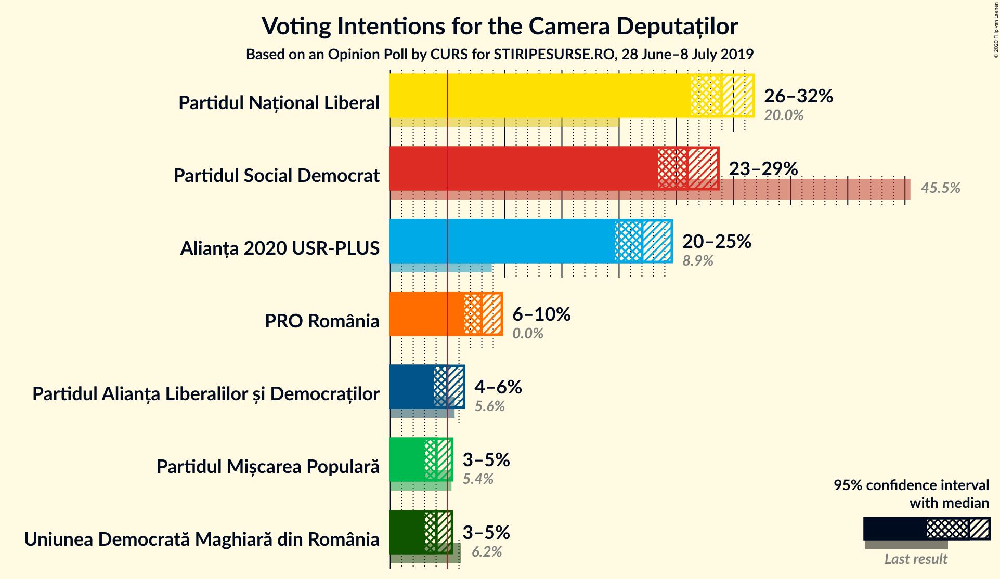
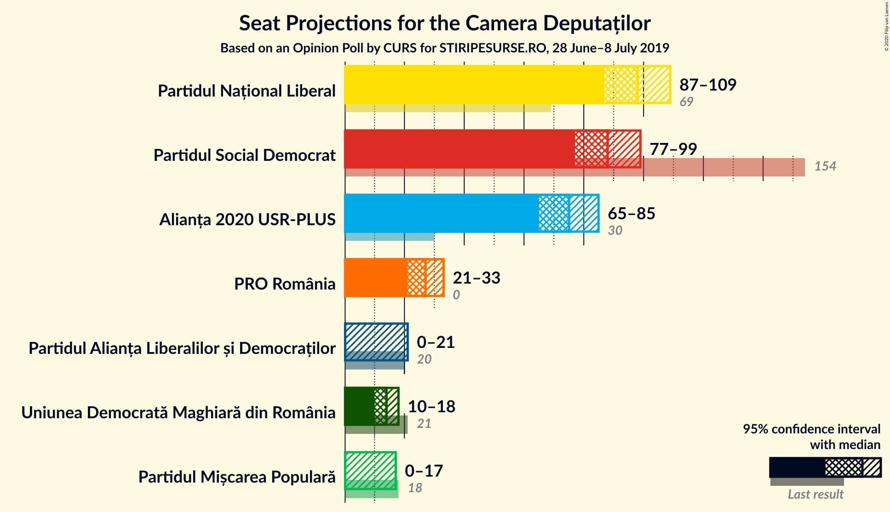
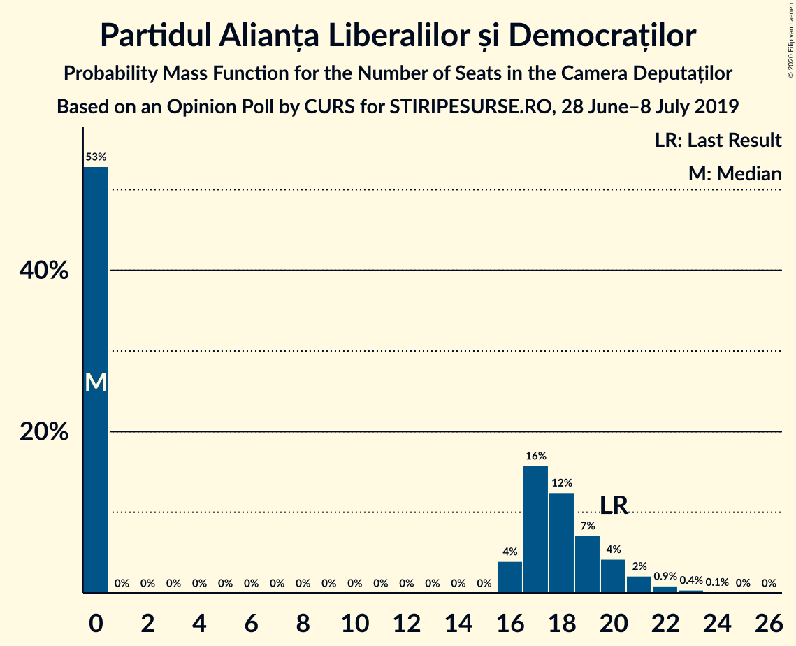
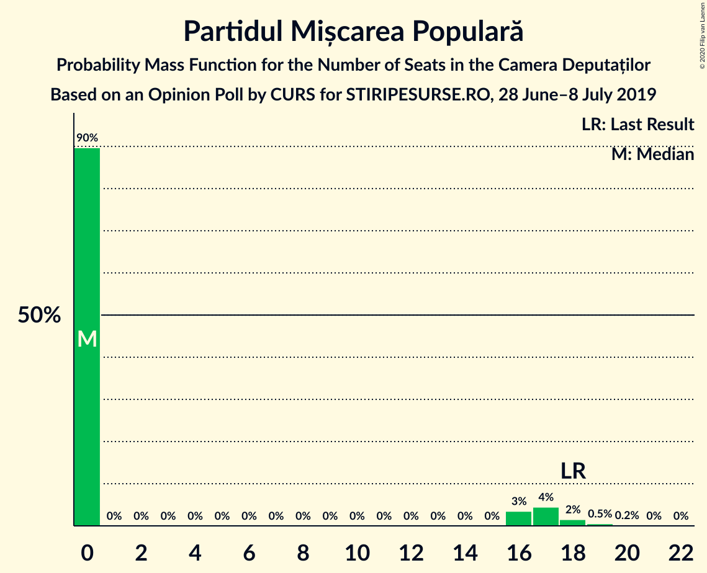
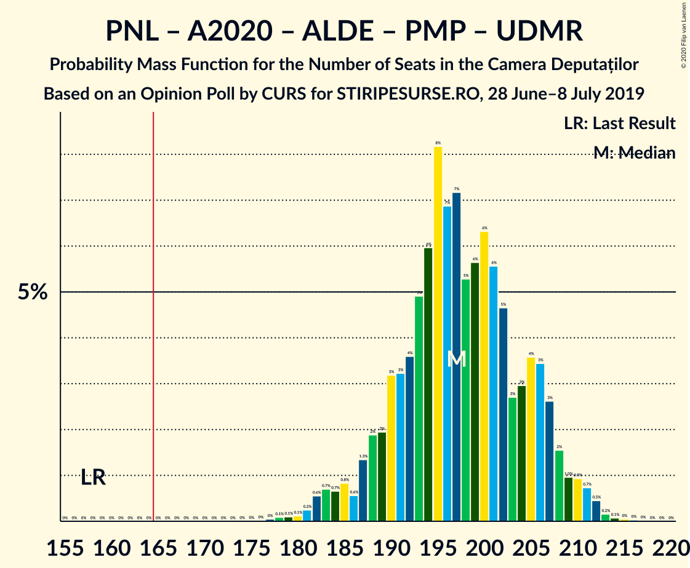
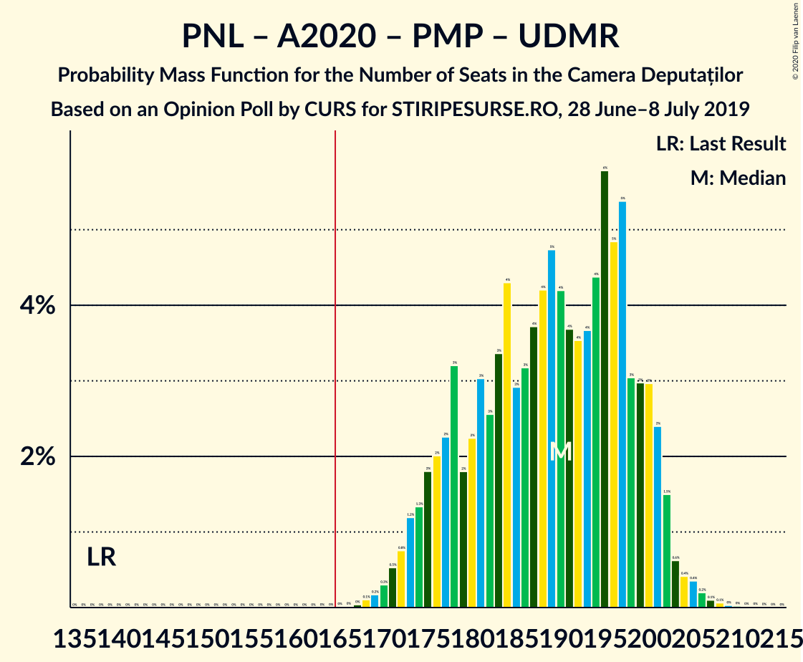
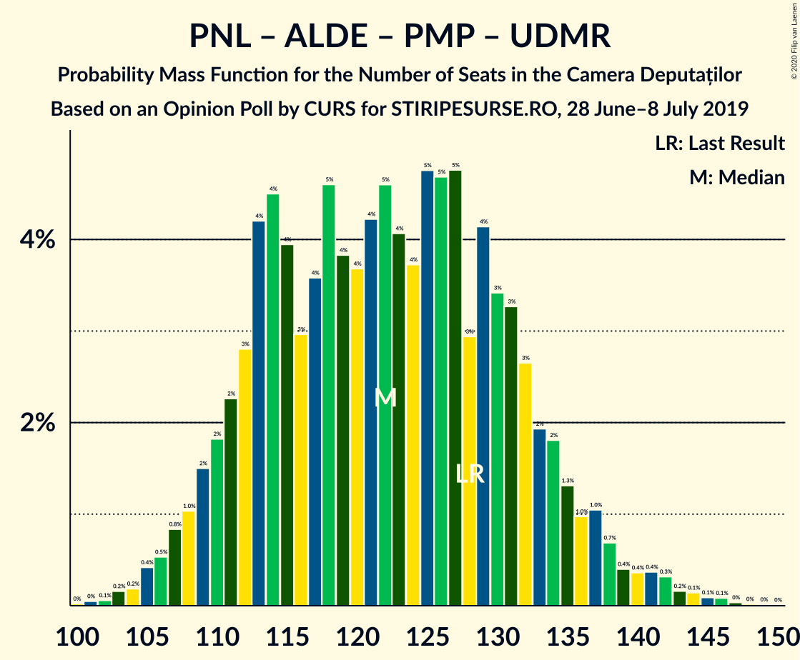
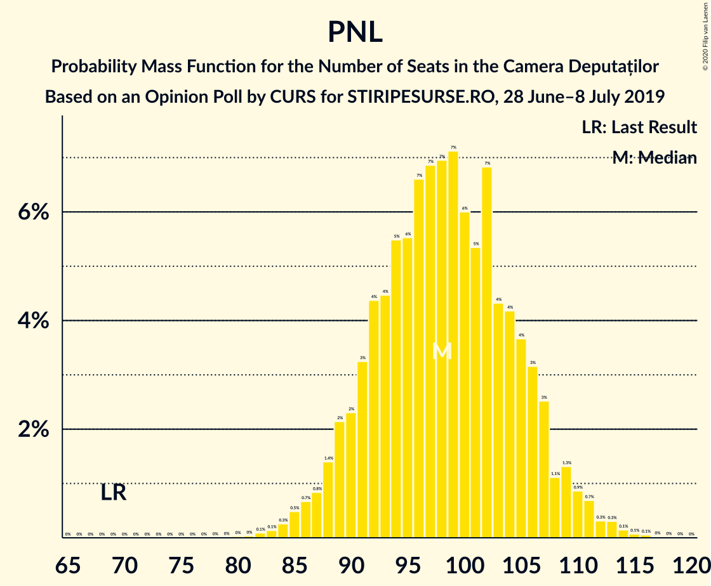

# Opinion Poll by CURS for STIRIPESURSE.RO, 28 June–8 July 2019

<a href="#voting-intentions">Voting Intentions</a> | <a href="#seats">Seats</a> | <a href="#coalitions">Coalitions</a> | <a href="#technical-information">Technical Information</a>

## Voting Intentions

### Confidence Intervals

| Party | Last Result | Poll Result | 80% Confidence Interval | 90% Confidence Interval | 95% Confidence Interval | 99% Confidence Interval |
|:-----:|:-----------:|:-----------:|:-----------------------:|:-----------------------:|:-----------------------:|:-----------------------:|
| Partidul Național Liberal | 20.0% | 29.0% | 27.2–30.8% |26.7–31.3% |26.3–31.8% |25.5–32.6% |
| Partidul Social Democrat | 45.5% | 26.0% | 24.3–27.7% |23.8–28.2% |23.4–28.7% |22.6–29.6% |
| Alianța 2020 USR-PLUS | 8.9% | 22.0% | 20.5–23.7% |20.0–24.2% |19.6–24.6% |18.9–25.4% |
| PRO România | 0.0% | 8.0% | 7.0–9.1% |6.7–9.5% |6.5–9.8% |6.1–10.3% |
| Partidul Alianța Liberalilor și Democraților | 5.6% | 5.0% | 4.2–5.9% |4.0–6.2% |3.8–6.4% |3.5–6.9% |
| Uniunea Democrată Maghiară din România | 6.2% | 4.0% | 3.4–4.9% |3.2–5.2% |3.0–5.4% |2.7–5.9% |
| Partidul Mișcarea Populară | 5.4% | 4.0% | 3.4–4.9% |3.2–5.2% |3.0–5.4% |2.7–5.9% |

*Note:* The poll result column reflects the actual value used in the calculations. Published results may vary slightly, and in addition be rounded to fewer digits.

## Seats

### Confidence Intervals

| Party | Last Result | Median | 80% Confidence Interval | 90% Confidence Interval | 95% Confidence Interval | 99% Confidence Interval |
|:-----:|:-----------:|:------:|:-----------------------:|:-----------------------:|:-----------------------:|:-----------------------:|
| <a href="#partidul-național-liberal">Partidul Național Liberal</a> | 69 | 99 | 91–106 |89–109 |87–110 |85–113 |
| <a href="#partidul-social-democrat">Partidul Social Democrat</a> | 154 | 88 | 80–95 |79–96 |77–98 |75–101 |
| <a href="#alianța-2020-usr-plus">Alianța 2020 USR-PLUS</a> | 30 | 77 | 69–81 |66–82 |65–84 |63–86 |
| <a href="#pro-românia">PRO România</a> | 0 | 27 | 23–31 |22–32 |21–33 |20–35 |
| <a href="#partidul-alianța-liberalilor-și-democraților">Partidul Alianța Liberalilor și Democraților</a> | 20 | 0 | 0–19 |0–20 |0–21 |0–22 |
| <a href="#uniunea-democrată-maghiară-din-românia">Uniunea Democrată Maghiară din România</a> | 21 | 14 | 11–16 |11–16 |11–18 |10–20 |
| <a href="#partidul-mișcarea-populară">Partidul Mișcarea Populară</a> | 18 | 0 | 0 |0–16 |0–17 |0–19 |

### Partidul Național Liberal

*For a full overview of the results for this party, see the [Partidul Național Liberal](party-partidulnaționalliberal.html) page.*

| Number of Seats | Probability | Accumulated | Special Marks |
|:---------------:|:-----------:|:-----------:|:-------------:|
| 69 | 0% | 100% | Last Result |
| 70 | 0% | 100% |  |
| 71 | 0% | 100% |  |
| 72 | 0% | 100% |  |
| 73 | 0% | 100% |  |
| 74 | 0% | 100% |  |
| 75 | 0% | 100% |  |
| 76 | 0% | 100% |  |
| 77 | 0% | 100% |  |
| 78 | 0% | 100% |  |
| 79 | 0% | 100% |  |
| 80 | 0% | 100% |  |
| 81 | 0% | 100% |  |
| 82 | 0.1% | 99.9% |  |
| 83 | 0.1% | 99.8% |  |
| 84 | 0.2% | 99.7% |  |
| 85 | 0.6% | 99.5% |  |
| 86 | 0.6% | 98.9% |  |
| 87 | 1.1% | 98% |  |
| 88 | 1.0% | 97% |  |
| 89 | 4% | 96% |  |
| 90 | 0.9% | 92% |  |
| 91 | 2% | 91% |  |
| 92 | 8% | 90% |  |
| 93 | 3% | 82% |  |
| 94 | 4% | 79% |  |
| 95 | 6% | 75% |  |
| 96 | 4% | 69% |  |
| 97 | 6% | 65% |  |
| 98 | 7% | 59% |  |
| 99 | 8% | 53% | Median |
| 100 | 8% | 45% |  |
| 101 | 2% | 37% |  |
| 102 | 13% | 35% |  |
| 103 | 6% | 22% |  |
| 104 | 0.7% | 16% |  |
| 105 | 5% | 15% |  |
| 106 | 3% | 11% |  |
| 107 | 2% | 7% |  |
| 108 | 0.5% | 6% |  |
| 109 | 1.4% | 5% |  |
| 110 | 2% | 4% |  |
| 111 | 0.9% | 2% |  |
| 112 | 0% | 1.0% |  |
| 113 | 0.6% | 0.9% |  |
| 114 | 0.2% | 0.4% |  |
| 115 | 0.1% | 0.2% |  |
| 116 | 0% | 0.1% |  |
| 117 | 0% | 0.1% |  |
| 118 | 0% | 0% |  |

### Partidul Social Democrat

*For a full overview of the results for this party, see the [Partidul Social Democrat](party-partidulsocialdemocrat.html) page.*

| Number of Seats | Probability | Accumulated | Special Marks |
|:---------------:|:-----------:|:-----------:|:-------------:|
| 72 | 0.1% | 100% |  |
| 73 | 0.1% | 99.9% |  |
| 74 | 0.1% | 99.8% |  |
| 75 | 0.3% | 99.7% |  |
| 76 | 0.7% | 99.5% |  |
| 77 | 1.3% | 98.8% |  |
| 78 | 2% | 97% |  |
| 79 | 2% | 96% |  |
| 80 | 4% | 93% |  |
| 81 | 3% | 90% |  |
| 82 | 5% | 86% |  |
| 83 | 5% | 82% |  |
| 84 | 3% | 76% |  |
| 85 | 9% | 74% |  |
| 86 | 5% | 64% |  |
| 87 | 4% | 59% |  |
| 88 | 9% | 55% | Median |
| 89 | 9% | 46% |  |
| 90 | 3% | 37% |  |
| 91 | 6% | 34% |  |
| 92 | 9% | 28% |  |
| 93 | 4% | 18% |  |
| 94 | 1.0% | 15% |  |
| 95 | 8% | 14% |  |
| 96 | 2% | 6% |  |
| 97 | 0.8% | 4% |  |
| 98 | 1.3% | 3% |  |
| 99 | 0.8% | 2% |  |
| 100 | 0.5% | 1.1% |  |
| 101 | 0.2% | 0.6% |  |
| 102 | 0.1% | 0.4% |  |
| 103 | 0% | 0.3% |  |
| 104 | 0.2% | 0.3% |  |
| 105 | 0% | 0.1% |  |
| 106 | 0% | 0.1% |  |
| 107 | 0% | 0.1% |  |
| 108 | 0% | 0% |  |
| 109 | 0% | 0% |  |
| 110 | 0% | 0% |  |
| 111 | 0% | 0% |  |
| 112 | 0% | 0% |  |
| 113 | 0% | 0% |  |
| 114 | 0% | 0% |  |
| 115 | 0% | 0% |  |
| 116 | 0% | 0% |  |
| 117 | 0% | 0% |  |
| 118 | 0% | 0% |  |
| 119 | 0% | 0% |  |
| 120 | 0% | 0% |  |
| 121 | 0% | 0% |  |
| 122 | 0% | 0% |  |
| 123 | 0% | 0% |  |
| 124 | 0% | 0% |  |
| 125 | 0% | 0% |  |
| 126 | 0% | 0% |  |
| 127 | 0% | 0% |  |
| 128 | 0% | 0% |  |
| 129 | 0% | 0% |  |
| 130 | 0% | 0% |  |
| 131 | 0% | 0% |  |
| 132 | 0% | 0% |  |
| 133 | 0% | 0% |  |
| 134 | 0% | 0% |  |
| 135 | 0% | 0% |  |
| 136 | 0% | 0% |  |
| 137 | 0% | 0% |  |
| 138 | 0% | 0% |  |
| 139 | 0% | 0% |  |
| 140 | 0% | 0% |  |
| 141 | 0% | 0% |  |
| 142 | 0% | 0% |  |
| 143 | 0% | 0% |  |
| 144 | 0% | 0% |  |
| 145 | 0% | 0% |  |
| 146 | 0% | 0% |  |
| 147 | 0% | 0% |  |
| 148 | 0% | 0% |  |
| 149 | 0% | 0% |  |
| 150 | 0% | 0% |  |
| 151 | 0% | 0% |  |
| 152 | 0% | 0% |  |
| 153 | 0% | 0% |  |
| 154 | 0% | 0% | Last Result |

### Alianța 2020 USR-PLUS

*For a full overview of the results for this party, see the [Alianța 2020 USR-PLUS](party-alianța2020usr-plus.html) page.*

| Number of Seats | Probability | Accumulated | Special Marks |
|:---------------:|:-----------:|:-----------:|:-------------:|
| 30 | 0% | 100% | Last Result |
| 31 | 0% | 100% |  |
| 32 | 0% | 100% |  |
| 33 | 0% | 100% |  |
| 34 | 0% | 100% |  |
| 35 | 0% | 100% |  |
| 36 | 0% | 100% |  |
| 37 | 0% | 100% |  |
| 38 | 0% | 100% |  |
| 39 | 0% | 100% |  |
| 40 | 0% | 100% |  |
| 41 | 0% | 100% |  |
| 42 | 0% | 100% |  |
| 43 | 0% | 100% |  |
| 44 | 0% | 100% |  |
| 45 | 0% | 100% |  |
| 46 | 0% | 100% |  |
| 47 | 0% | 100% |  |
| 48 | 0% | 100% |  |
| 49 | 0% | 100% |  |
| 50 | 0% | 100% |  |
| 51 | 0% | 100% |  |
| 52 | 0% | 100% |  |
| 53 | 0% | 100% |  |
| 54 | 0% | 100% |  |
| 55 | 0% | 100% |  |
| 56 | 0% | 100% |  |
| 57 | 0% | 100% |  |
| 58 | 0% | 100% |  |
| 59 | 0% | 100% |  |
| 60 | 0.1% | 100% |  |
| 61 | 0.2% | 99.9% |  |
| 62 | 0.1% | 99.7% |  |
| 63 | 0.5% | 99.6% |  |
| 64 | 0.9% | 99.1% |  |
| 65 | 1.2% | 98% |  |
| 66 | 2% | 97% |  |
| 67 | 2% | 95% |  |
| 68 | 2% | 92% |  |
| 69 | 2% | 90% |  |
| 70 | 6% | 89% |  |
| 71 | 3% | 83% |  |
| 72 | 4% | 80% |  |
| 73 | 6% | 76% |  |
| 74 | 5% | 70% |  |
| 75 | 9% | 65% |  |
| 76 | 5% | 55% |  |
| 77 | 6% | 50% | Median |
| 78 | 11% | 44% |  |
| 79 | 14% | 33% |  |
| 80 | 3% | 19% |  |
| 81 | 6% | 16% |  |
| 82 | 4% | 9% |  |
| 83 | 1.3% | 5% |  |
| 84 | 2% | 4% |  |
| 85 | 1.4% | 2% |  |
| 86 | 0.3% | 0.7% |  |
| 87 | 0.1% | 0.3% |  |
| 88 | 0.1% | 0.2% |  |
| 89 | 0% | 0.1% |  |
| 90 | 0% | 0.1% |  |
| 91 | 0% | 0% |  |

### PRO România

*For a full overview of the results for this party, see the [PRO România](party-proromânia.html) page.*

| Number of Seats | Probability | Accumulated | Special Marks |
|:---------------:|:-----------:|:-----------:|:-------------:|
| 0 | 0% | 100% | Last Result |
| 1 | 0% | 100% |  |
| 2 | 0% | 100% |  |
| 3 | 0% | 100% |  |
| 4 | 0% | 100% |  |
| 5 | 0% | 100% |  |
| 6 | 0% | 100% |  |
| 7 | 0% | 100% |  |
| 8 | 0% | 100% |  |
| 9 | 0% | 100% |  |
| 10 | 0% | 100% |  |
| 11 | 0% | 100% |  |
| 12 | 0% | 100% |  |
| 13 | 0% | 100% |  |
| 14 | 0% | 100% |  |
| 15 | 0% | 100% |  |
| 16 | 0% | 100% |  |
| 17 | 0% | 100% |  |
| 18 | 0.1% | 100% |  |
| 19 | 0.3% | 99.9% |  |
| 20 | 0.7% | 99.6% |  |
| 21 | 2% | 98.9% |  |
| 22 | 3% | 97% |  |
| 23 | 7% | 94% |  |
| 24 | 9% | 86% |  |
| 25 | 11% | 78% |  |
| 26 | 14% | 67% |  |
| 27 | 22% | 53% | Median |
| 28 | 9% | 31% |  |
| 29 | 6% | 22% |  |
| 30 | 4% | 16% |  |
| 31 | 6% | 12% |  |
| 32 | 3% | 6% |  |
| 33 | 0.7% | 3% |  |
| 34 | 1.4% | 2% |  |
| 35 | 0.5% | 0.9% |  |
| 36 | 0.2% | 0.4% |  |
| 37 | 0.1% | 0.2% |  |
| 38 | 0% | 0% |  |

### Partidul Alianța Liberalilor și Democraților

*For a full overview of the results for this party, see the [Partidul Alianța Liberalilor și Democraților](party-partidulalianțaliberalilorșidemocraților.html) page.*

| Number of Seats | Probability | Accumulated | Special Marks |
|:---------------:|:-----------:|:-----------:|:-------------:|
| 0 | 55% | 100% | Median |
| 1 | 0% | 45% |  |
| 2 | 0% | 45% |  |
| 3 | 0% | 45% |  |
| 4 | 0% | 45% |  |
| 5 | 0% | 45% |  |
| 6 | 0% | 45% |  |
| 7 | 0% | 45% |  |
| 8 | 0% | 45% |  |
| 9 | 0% | 45% |  |
| 10 | 0% | 45% |  |
| 11 | 0% | 45% |  |
| 12 | 0% | 45% |  |
| 13 | 0% | 45% |  |
| 14 | 0% | 45% |  |
| 15 | 0% | 45% |  |
| 16 | 3% | 45% |  |
| 17 | 12% | 42% |  |
| 18 | 14% | 30% |  |
| 19 | 11% | 16% |  |
| 20 | 2% | 6% | Last Result |
| 21 | 2% | 4% |  |
| 22 | 0.7% | 1.2% |  |
| 23 | 0.4% | 0.5% |  |
| 24 | 0.1% | 0.1% |  |
| 25 | 0% | 0.1% |  |
| 26 | 0% | 0% |  |

### Uniunea Democrată Maghiară din România

*For a full overview of the results for this party, see the [Uniunea Democrată Maghiară din România](party-uniuneademocratămaghiarădinromânia.html) page.*

| Number of Seats | Probability | Accumulated | Special Marks |
|:---------------:|:-----------:|:-----------:|:-------------:|
| 7 | 0.1% | 100% |  |
| 8 | 0.2% | 99.9% |  |
| 9 | 0% | 99.7% |  |
| 10 | 2% | 99.7% |  |
| 11 | 22% | 98% |  |
| 12 | 22% | 75% |  |
| 13 | 0.1% | 53% |  |
| 14 | 3% | 53% | Median |
| 15 | 21% | 50% |  |
| 16 | 24% | 29% |  |
| 17 | 2% | 4% |  |
| 18 | 0.3% | 3% |  |
| 19 | 1.2% | 2% |  |
| 20 | 1.1% | 1.2% |  |
| 21 | 0.1% | 0.1% | Last Result |
| 22 | 0% | 0% |  |

### Partidul Mișcarea Populară

*For a full overview of the results for this party, see the [Partidul Mișcarea Populară](party-partidulmișcareapopulară.html) page.*

| Number of Seats | Probability | Accumulated | Special Marks |
|:---------------:|:-----------:|:-----------:|:-------------:|
| 0 | 92% | 100% | Median |
| 1 | 0% | 8% |  |
| 2 | 0% | 8% |  |
| 3 | 0% | 8% |  |
| 4 | 0% | 8% |  |
| 5 | 0% | 8% |  |
| 6 | 0% | 8% |  |
| 7 | 0% | 8% |  |
| 8 | 0% | 8% |  |
| 9 | 0% | 8% |  |
| 10 | 0% | 8% |  |
| 11 | 0% | 8% |  |
| 12 | 0% | 8% |  |
| 13 | 0% | 8% |  |
| 14 | 0% | 8% |  |
| 15 | 0% | 8% |  |
| 16 | 4% | 8% |  |
| 17 | 2% | 4% |  |
| 18 | 2% | 2% | Last Result |
| 19 | 0.3% | 0.5% |  |
| 20 | 0.2% | 0.3% |  |
| 21 | 0% | 0% |  |

## Coalitions

### Confidence Intervals

| Coalition | Last Result | Median | Majority? | 80% Confidence Interval | 90% Confidence Interval | 95% Confidence Interval | 99% Confidence Interval |
|:---------:|:-----------:|:------:|:---------:|:-----------------------:|:-----------------------:|:-----------------------:|:-----------------------:|
| Partidul Național Liberal – Alianța 2020 USR-PLUS – Partidul Alianța Liberalilor și Democraților – Partidul Mișcarea Populară – Uniunea Democrată Maghiară din România | 158 | 197 | 100% | 190–206 | 188–208 | 187–209 | 181–212 |
| Partidul Național Liberal – Alianța 2020 USR-PLUS – Partidul Alianța Liberalilor și Democraților – Uniunea Democrată Maghiară din România | 140 | 197 | 100% | 189–204 | 185–207 | 182–208 | 175–210 |
| Partidul Național Liberal – Alianța 2020 USR-PLUS – Partidul Mișcarea Populară – Uniunea Democrată Maghiară din România | 138 | 190 | 100% | 179–198 | 175–200 | 173–202 | 170–205 |
| Partidul Național Liberal – Alianța 2020 USR-PLUS – Uniunea Democrată Maghiară din România | 120 | 189 | 99.8% | 175–198 | 173–199 | 171–201 | 167–204 |
| Partidul Național Liberal – Alianța 2020 USR-PLUS – Partidul Alianța Liberalilor și Democraților – Partidul Mișcarea Populară | 137 | 183 | 99.8% | 175–192 | 174–196 | 172–196 | 168–198 |
| Partidul Național Liberal – Alianța 2020 USR-PLUS – Partidul Alianța Liberalilor și Democraților | 119 | 181 | 98.8% | 174–191 | 172–193 | 169–196 | 163–198 |
| Partidul Național Liberal – Alianța 2020 USR-PLUS – Partidul Mișcarea Populară | 117 | 176 | 90% | 166–184 | 163–187 | 160–188 | 156–192 |
| Partidul Național Liberal – Alianța 2020 USR-PLUS | 99 | 175 | 85% | 163–183 | 160–187 | 158–188 | 154–190 |
| Partidul Social Democrat – PRO România – Partidul Alianța Liberalilor și Democraților | 174 | 122 | 0% | 114–133 | 112–137 | 110–139 | 107–142 |
| Partidul Național Liberal – Partidul Alianța Liberalilor și Democraților – Partidul Mișcarea Populară – Uniunea Democrată Maghiară din România | 128 | 121 | 0% | 112–132 | 110–137 | 109–137 | 104–145 |
| Partidul Național Liberal – Partidul Alianța Liberalilor și Democraților – Uniunea Democrată Maghiară din România | 110 | 121 | 0% | 111–130 | 109–132 | 107–135 | 103–138 |
| Partidul Național Liberal – Partidul Mișcarea Populară – Uniunea Democrată Maghiară din România | 108 | 114 | 0% | 105–122 | 103–125 | 101–127 | 98–132 |
| Partidul Social Democrat – PRO România | 154 | 115 | 0% | 106–122 | 104–124 | 103–125 | 100–131 |
| Partidul Național Liberal – Uniunea Democrată Maghiară din România | 90 | 112 | 0% | 104–120 | 102–123 | 99–125 | 96–129 |
| Partidul Național Liberal – Partidul Mișcarea Populară | 87 | 100 | 0% | 92–108 | 89–111 | 88–113 | 86–119 |
| Partidul Social Democrat – Partidul Alianța Liberalilor și Democraților | 174 | 95 | 0% | 86–107 | 85–109 | 84–112 | 80–115 |
| Partidul Național Liberal | 69 | 99 | 0% | 91–106 | 89–109 | 87–110 | 85–113 |
| Alianța 2020 USR-PLUS – Partidul Mișcarea Populară | 48 | 78 | 0% | 70–84 | 67–86 | 66–87 | 63–93 |

### Partidul Național Liberal – Alianța 2020 USR-PLUS – Partidul Alianța Liberalilor și Democraților – Partidul Mișcarea Populară – Uniunea Democrată Maghiară din România

| Number of Seats | Probability | Accumulated | Special Marks |
|:---------------:|:-----------:|:-----------:|:-------------:|
| 158 | 0% | 100% | Last Result |
| 159 | 0% | 100% |  |
| 160 | 0% | 100% |  |
| 161 | 0% | 100% |  |
| 162 | 0% | 100% |  |
| 163 | 0% | 100% |  |
| 164 | 0% | 100% |  |
| 165 | 0% | 100% |  |
| 166 | 0% | 100% | Majority |
| 167 | 0% | 100% |  |
| 168 | 0% | 100% |  |
| 169 | 0% | 100% |  |
| 170 | 0% | 100% |  |
| 171 | 0% | 100% |  |
| 172 | 0% | 100% |  |
| 173 | 0% | 100% |  |
| 174 | 0% | 100% |  |
| 175 | 0% | 100% |  |
| 176 | 0% | 100% |  |
| 177 | 0% | 100% |  |
| 178 | 0.1% | 100% |  |
| 179 | 0.2% | 99.9% |  |
| 180 | 0.1% | 99.7% |  |
| 181 | 0.1% | 99.6% |  |
| 182 | 0.1% | 99.4% |  |
| 183 | 0.2% | 99.3% |  |
| 184 | 0.6% | 99.2% |  |
| 185 | 0.4% | 98.6% |  |
| 186 | 0.7% | 98% |  |
| 187 | 0.7% | 98% |  |
| 188 | 2% | 97% |  |
| 189 | 2% | 95% |  |
| 190 | 3% | 93% | Median |
| 191 | 8% | 90% |  |
| 192 | 5% | 81% |  |
| 193 | 3% | 76% |  |
| 194 | 3% | 73% |  |
| 195 | 3% | 69% |  |
| 196 | 7% | 66% |  |
| 197 | 13% | 59% |  |
| 198 | 4% | 46% |  |
| 199 | 4% | 42% |  |
| 200 | 7% | 37% |  |
| 201 | 3% | 31% |  |
| 202 | 8% | 27% |  |
| 203 | 5% | 19% |  |
| 204 | 1.3% | 15% |  |
| 205 | 1.2% | 13% |  |
| 206 | 2% | 12% |  |
| 207 | 5% | 10% |  |
| 208 | 3% | 5% |  |
| 209 | 1.2% | 3% |  |
| 210 | 0.4% | 1.3% |  |
| 211 | 0.3% | 1.0% |  |
| 212 | 0.3% | 0.6% |  |
| 213 | 0.2% | 0.3% |  |
| 214 | 0% | 0.1% |  |
| 215 | 0% | 0.1% |  |
| 216 | 0% | 0% |  |

### Partidul Național Liberal – Alianța 2020 USR-PLUS – Partidul Alianța Liberalilor și Democraților – Uniunea Democrată Maghiară din România

| Number of Seats | Probability | Accumulated | Special Marks |
|:---------------:|:-----------:|:-----------:|:-------------:|
| 140 | 0% | 100% | Last Result |
| 141 | 0% | 100% |  |
| 142 | 0% | 100% |  |
| 143 | 0% | 100% |  |
| 144 | 0% | 100% |  |
| 145 | 0% | 100% |  |
| 146 | 0% | 100% |  |
| 147 | 0% | 100% |  |
| 148 | 0% | 100% |  |
| 149 | 0% | 100% |  |
| 150 | 0% | 100% |  |
| 151 | 0% | 100% |  |
| 152 | 0% | 100% |  |
| 153 | 0% | 100% |  |
| 154 | 0% | 100% |  |
| 155 | 0% | 100% |  |
| 156 | 0% | 100% |  |
| 157 | 0% | 100% |  |
| 158 | 0% | 100% |  |
| 159 | 0% | 100% |  |
| 160 | 0% | 100% |  |
| 161 | 0% | 100% |  |
| 162 | 0% | 100% |  |
| 163 | 0% | 100% |  |
| 164 | 0% | 100% |  |
| 165 | 0% | 100% |  |
| 166 | 0% | 100% | Majority |
| 167 | 0% | 100% |  |
| 168 | 0% | 100% |  |
| 169 | 0% | 100% |  |
| 170 | 0% | 100% |  |
| 171 | 0% | 100% |  |
| 172 | 0% | 100% |  |
| 173 | 0.1% | 99.9% |  |
| 174 | 0.1% | 99.8% |  |
| 175 | 0.3% | 99.8% |  |
| 176 | 0.1% | 99.5% |  |
| 177 | 0.4% | 99.4% |  |
| 178 | 0.1% | 99.0% |  |
| 179 | 0.3% | 98.9% |  |
| 180 | 0.5% | 98.6% |  |
| 181 | 0.4% | 98% |  |
| 182 | 0.4% | 98% |  |
| 183 | 0.4% | 97% |  |
| 184 | 1.1% | 97% |  |
| 185 | 0.9% | 96% |  |
| 186 | 0.9% | 95% |  |
| 187 | 1.0% | 94% |  |
| 188 | 3% | 93% |  |
| 189 | 2% | 90% |  |
| 190 | 4% | 88% | Median |
| 191 | 10% | 85% |  |
| 192 | 5% | 74% |  |
| 193 | 3% | 69% |  |
| 194 | 4% | 65% |  |
| 195 | 2% | 62% |  |
| 196 | 7% | 59% |  |
| 197 | 13% | 52% |  |
| 198 | 4% | 39% |  |
| 199 | 4% | 35% |  |
| 200 | 6% | 31% |  |
| 201 | 3% | 25% |  |
| 202 | 8% | 22% |  |
| 203 | 4% | 15% |  |
| 204 | 1.3% | 10% |  |
| 205 | 0.7% | 9% |  |
| 206 | 2% | 8% |  |
| 207 | 2% | 6% |  |
| 208 | 3% | 4% |  |
| 209 | 1.1% | 2% |  |
| 210 | 0.1% | 0.6% |  |
| 211 | 0.2% | 0.5% |  |
| 212 | 0.1% | 0.3% |  |
| 213 | 0.2% | 0.2% |  |
| 214 | 0% | 0% |  |

### Partidul Național Liberal – Alianța 2020 USR-PLUS – Partidul Mișcarea Populară – Uniunea Democrată Maghiară din România

| Number of Seats | Probability | Accumulated | Special Marks |
|:---------------:|:-----------:|:-----------:|:-------------:|
| 138 | 0% | 100% | Last Result |
| 139 | 0% | 100% |  |
| 140 | 0% | 100% |  |
| 141 | 0% | 100% |  |
| 142 | 0% | 100% |  |
| 143 | 0% | 100% |  |
| 144 | 0% | 100% |  |
| 145 | 0% | 100% |  |
| 146 | 0% | 100% |  |
| 147 | 0% | 100% |  |
| 148 | 0% | 100% |  |
| 149 | 0% | 100% |  |
| 150 | 0% | 100% |  |
| 151 | 0% | 100% |  |
| 152 | 0% | 100% |  |
| 153 | 0% | 100% |  |
| 154 | 0% | 100% |  |
| 155 | 0% | 100% |  |
| 156 | 0% | 100% |  |
| 157 | 0% | 100% |  |
| 158 | 0% | 100% |  |
| 159 | 0% | 100% |  |
| 160 | 0% | 100% |  |
| 161 | 0% | 100% |  |
| 162 | 0% | 100% |  |
| 163 | 0% | 100% |  |
| 164 | 0% | 100% |  |
| 165 | 0% | 100% |  |
| 166 | 0% | 100% | Majority |
| 167 | 0% | 100% |  |
| 168 | 0.1% | 99.9% |  |
| 169 | 0.2% | 99.8% |  |
| 170 | 0.3% | 99.6% |  |
| 171 | 0.9% | 99.3% |  |
| 172 | 0.2% | 98% |  |
| 173 | 2% | 98% |  |
| 174 | 1.2% | 97% |  |
| 175 | 0.7% | 96% |  |
| 176 | 0.8% | 95% |  |
| 177 | 1.2% | 94% |  |
| 178 | 2% | 93% |  |
| 179 | 3% | 91% |  |
| 180 | 1.0% | 88% |  |
| 181 | 3% | 87% |  |
| 182 | 4% | 84% |  |
| 183 | 2% | 80% |  |
| 184 | 6% | 79% |  |
| 185 | 5% | 72% |  |
| 186 | 2% | 67% |  |
| 187 | 2% | 65% |  |
| 188 | 4% | 63% |  |
| 189 | 5% | 58% |  |
| 190 | 4% | 53% | Median |
| 191 | 8% | 49% |  |
| 192 | 5% | 41% |  |
| 193 | 3% | 35% |  |
| 194 | 3% | 32% |  |
| 195 | 2% | 29% |  |
| 196 | 5% | 27% |  |
| 197 | 11% | 23% |  |
| 198 | 3% | 12% |  |
| 199 | 3% | 9% |  |
| 200 | 2% | 5% |  |
| 201 | 1.0% | 4% |  |
| 202 | 1.3% | 3% |  |
| 203 | 0.7% | 2% |  |
| 204 | 0.3% | 0.9% |  |
| 205 | 0.1% | 0.6% |  |
| 206 | 0.1% | 0.4% |  |
| 207 | 0.1% | 0.4% |  |
| 208 | 0.2% | 0.3% |  |
| 209 | 0% | 0.1% |  |
| 210 | 0% | 0.1% |  |
| 211 | 0% | 0.1% |  |
| 212 | 0% | 0% |  |

### Partidul Național Liberal – Alianța 2020 USR-PLUS – Uniunea Democrată Maghiară din România

| Number of Seats | Probability | Accumulated | Special Marks |
|:---------------:|:-----------:|:-----------:|:-------------:|
| 120 | 0% | 100% | Last Result |
| 121 | 0% | 100% |  |
| 122 | 0% | 100% |  |
| 123 | 0% | 100% |  |
| 124 | 0% | 100% |  |
| 125 | 0% | 100% |  |
| 126 | 0% | 100% |  |
| 127 | 0% | 100% |  |
| 128 | 0% | 100% |  |
| 129 | 0% | 100% |  |
| 130 | 0% | 100% |  |
| 131 | 0% | 100% |  |
| 132 | 0% | 100% |  |
| 133 | 0% | 100% |  |
| 134 | 0% | 100% |  |
| 135 | 0% | 100% |  |
| 136 | 0% | 100% |  |
| 137 | 0% | 100% |  |
| 138 | 0% | 100% |  |
| 139 | 0% | 100% |  |
| 140 | 0% | 100% |  |
| 141 | 0% | 100% |  |
| 142 | 0% | 100% |  |
| 143 | 0% | 100% |  |
| 144 | 0% | 100% |  |
| 145 | 0% | 100% |  |
| 146 | 0% | 100% |  |
| 147 | 0% | 100% |  |
| 148 | 0% | 100% |  |
| 149 | 0% | 100% |  |
| 150 | 0% | 100% |  |
| 151 | 0% | 100% |  |
| 152 | 0% | 100% |  |
| 153 | 0% | 100% |  |
| 154 | 0% | 100% |  |
| 155 | 0% | 100% |  |
| 156 | 0% | 100% |  |
| 157 | 0% | 100% |  |
| 158 | 0% | 100% |  |
| 159 | 0% | 100% |  |
| 160 | 0% | 100% |  |
| 161 | 0% | 100% |  |
| 162 | 0% | 100% |  |
| 163 | 0% | 100% |  |
| 164 | 0% | 100% |  |
| 165 | 0.1% | 99.9% |  |
| 166 | 0.2% | 99.8% | Majority |
| 167 | 0.4% | 99.6% |  |
| 168 | 0.1% | 99.2% |  |
| 169 | 0.6% | 99.0% |  |
| 170 | 0.6% | 98% |  |
| 171 | 1.2% | 98% |  |
| 172 | 0.7% | 97% |  |
| 173 | 4% | 96% |  |
| 174 | 1.2% | 92% |  |
| 175 | 1.0% | 91% |  |
| 176 | 1.2% | 90% |  |
| 177 | 2% | 89% |  |
| 178 | 2% | 87% |  |
| 179 | 3% | 85% |  |
| 180 | 1.4% | 82% |  |
| 181 | 3% | 81% |  |
| 182 | 4% | 78% |  |
| 183 | 2% | 74% |  |
| 184 | 6% | 72% |  |
| 185 | 5% | 65% |  |
| 186 | 2% | 61% |  |
| 187 | 2% | 59% |  |
| 188 | 4% | 56% |  |
| 189 | 3% | 52% |  |
| 190 | 4% | 49% | Median |
| 191 | 8% | 45% |  |
| 192 | 5% | 37% |  |
| 193 | 3% | 32% |  |
| 194 | 3% | 29% |  |
| 195 | 1.1% | 26% |  |
| 196 | 4% | 25% |  |
| 197 | 11% | 21% |  |
| 198 | 3% | 10% |  |
| 199 | 3% | 8% |  |
| 200 | 1.0% | 4% |  |
| 201 | 0.9% | 3% |  |
| 202 | 1.3% | 2% |  |
| 203 | 0.5% | 1.0% |  |
| 204 | 0.3% | 0.5% |  |
| 205 | 0.1% | 0.2% |  |
| 206 | 0% | 0.1% |  |
| 207 | 0% | 0.1% |  |
| 208 | 0% | 0.1% |  |
| 209 | 0% | 0% |  |

### Partidul Național Liberal – Alianța 2020 USR-PLUS – Partidul Alianța Liberalilor și Democraților – Partidul Mișcarea Populară

| Number of Seats | Probability | Accumulated | Special Marks |
|:---------------:|:-----------:|:-----------:|:-------------:|
| 137 | 0% | 100% | Last Result |
| 138 | 0% | 100% |  |
| 139 | 0% | 100% |  |
| 140 | 0% | 100% |  |
| 141 | 0% | 100% |  |
| 142 | 0% | 100% |  |
| 143 | 0% | 100% |  |
| 144 | 0% | 100% |  |
| 145 | 0% | 100% |  |
| 146 | 0% | 100% |  |
| 147 | 0% | 100% |  |
| 148 | 0% | 100% |  |
| 149 | 0% | 100% |  |
| 150 | 0% | 100% |  |
| 151 | 0% | 100% |  |
| 152 | 0% | 100% |  |
| 153 | 0% | 100% |  |
| 154 | 0% | 100% |  |
| 155 | 0% | 100% |  |
| 156 | 0% | 100% |  |
| 157 | 0% | 100% |  |
| 158 | 0% | 100% |  |
| 159 | 0% | 100% |  |
| 160 | 0% | 100% |  |
| 161 | 0% | 100% |  |
| 162 | 0% | 100% |  |
| 163 | 0% | 100% |  |
| 164 | 0% | 100% |  |
| 165 | 0.1% | 99.9% |  |
| 166 | 0.1% | 99.8% | Majority |
| 167 | 0.1% | 99.7% |  |
| 168 | 0.3% | 99.6% |  |
| 169 | 0.4% | 99.3% |  |
| 170 | 0.3% | 99.0% |  |
| 171 | 0.5% | 98.6% |  |
| 172 | 1.4% | 98% |  |
| 173 | 1.4% | 97% |  |
| 174 | 2% | 95% |  |
| 175 | 4% | 94% |  |
| 176 | 4% | 90% | Median |
| 177 | 2% | 86% |  |
| 178 | 3% | 85% |  |
| 179 | 6% | 82% |  |
| 180 | 7% | 76% |  |
| 181 | 12% | 69% |  |
| 182 | 4% | 57% |  |
| 183 | 4% | 53% |  |
| 184 | 4% | 49% |  |
| 185 | 7% | 45% |  |
| 186 | 4% | 38% |  |
| 187 | 5% | 34% |  |
| 188 | 4% | 29% |  |
| 189 | 2% | 25% |  |
| 190 | 6% | 23% |  |
| 191 | 4% | 18% |  |
| 192 | 4% | 14% |  |
| 193 | 2% | 9% |  |
| 194 | 1.0% | 7% |  |
| 195 | 0.4% | 6% |  |
| 196 | 3% | 6% |  |
| 197 | 0.7% | 2% |  |
| 198 | 1.3% | 2% |  |
| 199 | 0.1% | 0.5% |  |
| 200 | 0.1% | 0.4% |  |
| 201 | 0.2% | 0.3% |  |
| 202 | 0% | 0.1% |  |
| 203 | 0% | 0.1% |  |
| 204 | 0% | 0% |  |

### Partidul Național Liberal – Alianța 2020 USR-PLUS – Partidul Alianța Liberalilor și Democraților

| Number of Seats | Probability | Accumulated | Special Marks |
|:---------------:|:-----------:|:-----------:|:-------------:|
| 119 | 0% | 100% | Last Result |
| 120 | 0% | 100% |  |
| 121 | 0% | 100% |  |
| 122 | 0% | 100% |  |
| 123 | 0% | 100% |  |
| 124 | 0% | 100% |  |
| 125 | 0% | 100% |  |
| 126 | 0% | 100% |  |
| 127 | 0% | 100% |  |
| 128 | 0% | 100% |  |
| 129 | 0% | 100% |  |
| 130 | 0% | 100% |  |
| 131 | 0% | 100% |  |
| 132 | 0% | 100% |  |
| 133 | 0% | 100% |  |
| 134 | 0% | 100% |  |
| 135 | 0% | 100% |  |
| 136 | 0% | 100% |  |
| 137 | 0% | 100% |  |
| 138 | 0% | 100% |  |
| 139 | 0% | 100% |  |
| 140 | 0% | 100% |  |
| 141 | 0% | 100% |  |
| 142 | 0% | 100% |  |
| 143 | 0% | 100% |  |
| 144 | 0% | 100% |  |
| 145 | 0% | 100% |  |
| 146 | 0% | 100% |  |
| 147 | 0% | 100% |  |
| 148 | 0% | 100% |  |
| 149 | 0% | 100% |  |
| 150 | 0% | 100% |  |
| 151 | 0% | 100% |  |
| 152 | 0% | 100% |  |
| 153 | 0% | 100% |  |
| 154 | 0% | 100% |  |
| 155 | 0% | 100% |  |
| 156 | 0% | 100% |  |
| 157 | 0% | 100% |  |
| 158 | 0% | 99.9% |  |
| 159 | 0% | 99.9% |  |
| 160 | 0% | 99.9% |  |
| 161 | 0.1% | 99.9% |  |
| 162 | 0.1% | 99.7% |  |
| 163 | 0.3% | 99.6% |  |
| 164 | 0.1% | 99.3% |  |
| 165 | 0.4% | 99.2% |  |
| 166 | 0.2% | 98.8% | Majority |
| 167 | 0.3% | 98.7% |  |
| 168 | 0.7% | 98% |  |
| 169 | 0.6% | 98% |  |
| 170 | 0.6% | 97% |  |
| 171 | 0.7% | 97% |  |
| 172 | 2% | 96% |  |
| 173 | 2% | 94% |  |
| 174 | 2% | 92% |  |
| 175 | 4% | 90% |  |
| 176 | 4% | 85% | Median |
| 177 | 2% | 82% |  |
| 178 | 3% | 80% |  |
| 179 | 7% | 77% |  |
| 180 | 9% | 70% |  |
| 181 | 12% | 62% |  |
| 182 | 4% | 49% |  |
| 183 | 3% | 46% |  |
| 184 | 4% | 42% |  |
| 185 | 7% | 38% |  |
| 186 | 4% | 32% |  |
| 187 | 5% | 28% |  |
| 188 | 3% | 23% |  |
| 189 | 2% | 20% |  |
| 190 | 5% | 18% |  |
| 191 | 3% | 13% |  |
| 192 | 4% | 10% |  |
| 193 | 2% | 6% |  |
| 194 | 0.8% | 4% |  |
| 195 | 0.2% | 3% |  |
| 196 | 0.5% | 3% |  |
| 197 | 0.7% | 2% |  |
| 198 | 1.2% | 1.4% |  |
| 199 | 0% | 0.1% |  |
| 200 | 0.1% | 0.1% |  |
| 201 | 0% | 0% |  |

### Partidul Național Liberal – Alianța 2020 USR-PLUS – Partidul Mișcarea Populară

| Number of Seats | Probability | Accumulated | Special Marks |
|:---------------:|:-----------:|:-----------:|:-------------:|
| 117 | 0% | 100% | Last Result |
| 118 | 0% | 100% |  |
| 119 | 0% | 100% |  |
| 120 | 0% | 100% |  |
| 121 | 0% | 100% |  |
| 122 | 0% | 100% |  |
| 123 | 0% | 100% |  |
| 124 | 0% | 100% |  |
| 125 | 0% | 100% |  |
| 126 | 0% | 100% |  |
| 127 | 0% | 100% |  |
| 128 | 0% | 100% |  |
| 129 | 0% | 100% |  |
| 130 | 0% | 100% |  |
| 131 | 0% | 100% |  |
| 132 | 0% | 100% |  |
| 133 | 0% | 100% |  |
| 134 | 0% | 100% |  |
| 135 | 0% | 100% |  |
| 136 | 0% | 100% |  |
| 137 | 0% | 100% |  |
| 138 | 0% | 100% |  |
| 139 | 0% | 100% |  |
| 140 | 0% | 100% |  |
| 141 | 0% | 100% |  |
| 142 | 0% | 100% |  |
| 143 | 0% | 100% |  |
| 144 | 0% | 100% |  |
| 145 | 0% | 100% |  |
| 146 | 0% | 100% |  |
| 147 | 0% | 100% |  |
| 148 | 0% | 100% |  |
| 149 | 0% | 100% |  |
| 150 | 0% | 100% |  |
| 151 | 0% | 100% |  |
| 152 | 0% | 100% |  |
| 153 | 0% | 100% |  |
| 154 | 0.1% | 99.9% |  |
| 155 | 0.1% | 99.8% |  |
| 156 | 0.3% | 99.7% |  |
| 157 | 0.1% | 99.4% |  |
| 158 | 0.4% | 99.3% |  |
| 159 | 0.3% | 98.8% |  |
| 160 | 1.2% | 98.6% |  |
| 161 | 0.2% | 97% |  |
| 162 | 2% | 97% |  |
| 163 | 2% | 96% |  |
| 164 | 2% | 94% |  |
| 165 | 1.3% | 92% |  |
| 166 | 2% | 90% | Majority |
| 167 | 4% | 88% |  |
| 168 | 4% | 84% |  |
| 169 | 1.4% | 80% |  |
| 170 | 1.5% | 78% |  |
| 171 | 2% | 77% |  |
| 172 | 3% | 75% |  |
| 173 | 10% | 72% |  |
| 174 | 3% | 61% |  |
| 175 | 6% | 58% |  |
| 176 | 4% | 52% | Median |
| 177 | 3% | 47% |  |
| 178 | 5% | 45% |  |
| 179 | 5% | 40% |  |
| 180 | 6% | 35% |  |
| 181 | 10% | 29% |  |
| 182 | 3% | 18% |  |
| 183 | 4% | 15% |  |
| 184 | 2% | 12% |  |
| 185 | 1.0% | 10% |  |
| 186 | 2% | 9% |  |
| 187 | 2% | 7% |  |
| 188 | 3% | 5% |  |
| 189 | 0.5% | 2% |  |
| 190 | 0.4% | 1.2% |  |
| 191 | 0.3% | 0.8% |  |
| 192 | 0.2% | 0.5% |  |
| 193 | 0.1% | 0.3% |  |
| 194 | 0.1% | 0.2% |  |
| 195 | 0% | 0.1% |  |
| 196 | 0% | 0.1% |  |
| 197 | 0% | 0.1% |  |
| 198 | 0% | 0.1% |  |
| 199 | 0% | 0% |  |

### Partidul Național Liberal – Alianța 2020 USR-PLUS

| Number of Seats | Probability | Accumulated | Special Marks |
|:---------------:|:-----------:|:-----------:|:-------------:|
| 99 | 0% | 100% | Last Result |
| 100 | 0% | 100% |  |
| 101 | 0% | 100% |  |
| 102 | 0% | 100% |  |
| 103 | 0% | 100% |  |
| 104 | 0% | 100% |  |
| 105 | 0% | 100% |  |
| 106 | 0% | 100% |  |
| 107 | 0% | 100% |  |
| 108 | 0% | 100% |  |
| 109 | 0% | 100% |  |
| 110 | 0% | 100% |  |
| 111 | 0% | 100% |  |
| 112 | 0% | 100% |  |
| 113 | 0% | 100% |  |
| 114 | 0% | 100% |  |
| 115 | 0% | 100% |  |
| 116 | 0% | 100% |  |
| 117 | 0% | 100% |  |
| 118 | 0% | 100% |  |
| 119 | 0% | 100% |  |
| 120 | 0% | 100% |  |
| 121 | 0% | 100% |  |
| 122 | 0% | 100% |  |
| 123 | 0% | 100% |  |
| 124 | 0% | 100% |  |
| 125 | 0% | 100% |  |
| 126 | 0% | 100% |  |
| 127 | 0% | 100% |  |
| 128 | 0% | 100% |  |
| 129 | 0% | 100% |  |
| 130 | 0% | 100% |  |
| 131 | 0% | 100% |  |
| 132 | 0% | 100% |  |
| 133 | 0% | 100% |  |
| 134 | 0% | 100% |  |
| 135 | 0% | 100% |  |
| 136 | 0% | 100% |  |
| 137 | 0% | 100% |  |
| 138 | 0% | 100% |  |
| 139 | 0% | 100% |  |
| 140 | 0% | 100% |  |
| 141 | 0% | 100% |  |
| 142 | 0% | 100% |  |
| 143 | 0% | 100% |  |
| 144 | 0% | 100% |  |
| 145 | 0% | 100% |  |
| 146 | 0% | 100% |  |
| 147 | 0% | 100% |  |
| 148 | 0% | 100% |  |
| 149 | 0% | 100% |  |
| 150 | 0.1% | 100% |  |
| 151 | 0% | 99.9% |  |
| 152 | 0% | 99.9% |  |
| 153 | 0.1% | 99.8% |  |
| 154 | 0.3% | 99.7% |  |
| 155 | 0.2% | 99.4% |  |
| 156 | 0.6% | 99.2% |  |
| 157 | 0.7% | 98.6% |  |
| 158 | 0.8% | 98% |  |
| 159 | 0.7% | 97% |  |
| 160 | 1.4% | 96% |  |
| 161 | 0.6% | 95% |  |
| 162 | 4% | 94% |  |
| 163 | 2% | 90% |  |
| 164 | 2% | 88% |  |
| 165 | 2% | 86% |  |
| 166 | 2% | 85% | Majority |
| 167 | 5% | 82% |  |
| 168 | 4% | 78% |  |
| 169 | 2% | 73% |  |
| 170 | 2% | 72% |  |
| 171 | 2% | 70% |  |
| 172 | 3% | 68% |  |
| 173 | 10% | 64% |  |
| 174 | 3% | 55% |  |
| 175 | 6% | 52% |  |
| 176 | 4% | 46% | Median |
| 177 | 2% | 42% |  |
| 178 | 3% | 39% |  |
| 179 | 5% | 37% |  |
| 180 | 6% | 32% |  |
| 181 | 10% | 26% |  |
| 182 | 3% | 16% |  |
| 183 | 3% | 13% |  |
| 184 | 2% | 10% |  |
| 185 | 0.8% | 8% |  |
| 186 | 2% | 7% |  |
| 187 | 2% | 5% |  |
| 188 | 2% | 4% |  |
| 189 | 0.4% | 1.1% |  |
| 190 | 0.4% | 0.6% |  |
| 191 | 0% | 0.3% |  |
| 192 | 0.1% | 0.2% |  |
| 193 | 0.1% | 0.2% |  |
| 194 | 0% | 0.1% |  |
| 195 | 0% | 0% |  |

### Partidul Social Democrat – PRO România – Partidul Alianța Liberalilor și Democraților

| Number of Seats | Probability | Accumulated | Special Marks |
|:---------------:|:-----------:|:-----------:|:-------------:|
| 101 | 0% | 100% |  |
| 102 | 0% | 99.9% |  |
| 103 | 0% | 99.9% |  |
| 104 | 0.2% | 99.9% |  |
| 105 | 0.1% | 99.7% |  |
| 106 | 0.1% | 99.6% |  |
| 107 | 0.1% | 99.6% |  |
| 108 | 0.3% | 99.4% |  |
| 109 | 0.7% | 99.1% |  |
| 110 | 1.3% | 98% |  |
| 111 | 1.0% | 97% |  |
| 112 | 2% | 96% |  |
| 113 | 3% | 95% |  |
| 114 | 3% | 91% |  |
| 115 | 11% | 88% | Median |
| 116 | 5% | 77% |  |
| 117 | 2% | 73% |  |
| 118 | 3% | 71% |  |
| 119 | 3% | 68% |  |
| 120 | 5% | 65% |  |
| 121 | 8% | 59% |  |
| 122 | 4% | 51% |  |
| 123 | 5% | 47% |  |
| 124 | 4% | 42% |  |
| 125 | 2% | 37% |  |
| 126 | 2% | 35% |  |
| 127 | 5% | 33% |  |
| 128 | 6% | 28% |  |
| 129 | 2% | 21% |  |
| 130 | 4% | 20% |  |
| 131 | 3% | 16% |  |
| 132 | 1.0% | 13% |  |
| 133 | 3% | 12% |  |
| 134 | 2% | 9% |  |
| 135 | 1.2% | 7% |  |
| 136 | 0.8% | 6% |  |
| 137 | 0.7% | 5% |  |
| 138 | 1.2% | 4% |  |
| 139 | 2% | 3% |  |
| 140 | 0.2% | 2% |  |
| 141 | 0.9% | 2% |  |
| 142 | 0.3% | 0.7% |  |
| 143 | 0.2% | 0.4% |  |
| 144 | 0.1% | 0.2% |  |
| 145 | 0% | 0.1% |  |
| 146 | 0% | 0% |  |
| 147 | 0% | 0% |  |
| 148 | 0% | 0% |  |
| 149 | 0% | 0% |  |
| 150 | 0% | 0% |  |
| 151 | 0% | 0% |  |
| 152 | 0% | 0% |  |
| 153 | 0% | 0% |  |
| 154 | 0% | 0% |  |
| 155 | 0% | 0% |  |
| 156 | 0% | 0% |  |
| 157 | 0% | 0% |  |
| 158 | 0% | 0% |  |
| 159 | 0% | 0% |  |
| 160 | 0% | 0% |  |
| 161 | 0% | 0% |  |
| 162 | 0% | 0% |  |
| 163 | 0% | 0% |  |
| 164 | 0% | 0% |  |
| 165 | 0% | 0% |  |
| 166 | 0% | 0% | Majority |
| 167 | 0% | 0% |  |
| 168 | 0% | 0% |  |
| 169 | 0% | 0% |  |
| 170 | 0% | 0% |  |
| 171 | 0% | 0% |  |
| 172 | 0% | 0% |  |
| 173 | 0% | 0% |  |
| 174 | 0% | 0% | Last Result |

### Partidul Național Liberal – Partidul Alianța Liberalilor și Democraților – Partidul Mișcarea Populară – Uniunea Democrată Maghiară din România

| Number of Seats | Probability | Accumulated | Special Marks |
|:---------------:|:-----------:|:-----------:|:-------------:|
| 101 | 0% | 100% |  |
| 102 | 0% | 99.9% |  |
| 103 | 0.3% | 99.9% |  |
| 104 | 0.3% | 99.6% |  |
| 105 | 0.2% | 99.3% |  |
| 106 | 0.6% | 99.2% |  |
| 107 | 1.0% | 98.5% |  |
| 108 | 0.1% | 98% |  |
| 109 | 2% | 98% |  |
| 110 | 3% | 96% |  |
| 111 | 3% | 93% |  |
| 112 | 1.1% | 90% |  |
| 113 | 4% | 89% | Median |
| 114 | 6% | 86% |  |
| 115 | 6% | 80% |  |
| 116 | 0.6% | 74% |  |
| 117 | 4% | 74% |  |
| 118 | 10% | 69% |  |
| 119 | 2% | 59% |  |
| 120 | 2% | 57% |  |
| 121 | 5% | 55% |  |
| 122 | 3% | 49% |  |
| 123 | 4% | 46% |  |
| 124 | 6% | 42% |  |
| 125 | 6% | 37% |  |
| 126 | 2% | 30% |  |
| 127 | 3% | 28% |  |
| 128 | 2% | 26% | Last Result |
| 129 | 8% | 24% |  |
| 130 | 2% | 16% |  |
| 131 | 3% | 14% |  |
| 132 | 2% | 11% |  |
| 133 | 1.2% | 9% |  |
| 134 | 2% | 8% |  |
| 135 | 1.4% | 7% |  |
| 136 | 0.4% | 5% |  |
| 137 | 3% | 5% |  |
| 138 | 0.3% | 2% |  |
| 139 | 0.1% | 1.5% |  |
| 140 | 0.3% | 1.4% |  |
| 141 | 0.3% | 1.1% |  |
| 142 | 0.2% | 0.8% |  |
| 143 | 0% | 0.6% |  |
| 144 | 0% | 0.5% |  |
| 145 | 0.3% | 0.5% |  |
| 146 | 0.2% | 0.2% |  |
| 147 | 0% | 0% |  |

### Partidul Național Liberal – Partidul Alianța Liberalilor și Democraților – Uniunea Democrată Maghiară din România

| Number of Seats | Probability | Accumulated | Special Marks |
|:---------------:|:-----------:|:-----------:|:-------------:|
| 98 | 0.1% | 100% |  |
| 99 | 0% | 99.9% |  |
| 100 | 0% | 99.9% |  |
| 101 | 0.1% | 99.8% |  |
| 102 | 0.1% | 99.8% |  |
| 103 | 0.4% | 99.7% |  |
| 104 | 0.4% | 99.3% |  |
| 105 | 0.5% | 98.9% |  |
| 106 | 0.7% | 98% |  |
| 107 | 1.1% | 98% |  |
| 108 | 0.2% | 97% |  |
| 109 | 2% | 96% |  |
| 110 | 3% | 95% | Last Result |
| 111 | 3% | 92% |  |
| 112 | 1.4% | 88% |  |
| 113 | 4% | 87% | Median |
| 114 | 6% | 83% |  |
| 115 | 6% | 77% |  |
| 116 | 0.9% | 71% |  |
| 117 | 5% | 70% |  |
| 118 | 10% | 65% |  |
| 119 | 2% | 55% |  |
| 120 | 3% | 53% |  |
| 121 | 8% | 51% |  |
| 122 | 3% | 43% |  |
| 123 | 3% | 39% |  |
| 124 | 6% | 36% |  |
| 125 | 6% | 30% |  |
| 126 | 2% | 24% |  |
| 127 | 2% | 22% |  |
| 128 | 1.4% | 20% |  |
| 129 | 7% | 18% |  |
| 130 | 2% | 11% |  |
| 131 | 3% | 9% |  |
| 132 | 2% | 6% |  |
| 133 | 0.6% | 5% |  |
| 134 | 1.5% | 4% |  |
| 135 | 1.4% | 3% |  |
| 136 | 0.3% | 1.2% |  |
| 137 | 0.3% | 0.9% |  |
| 138 | 0.2% | 0.6% |  |
| 139 | 0.1% | 0.4% |  |
| 140 | 0.2% | 0.3% |  |
| 141 | 0% | 0.1% |  |
| 142 | 0% | 0.1% |  |
| 143 | 0% | 0% |  |

### Partidul Național Liberal – Partidul Mișcarea Populară – Uniunea Democrată Maghiară din România

| Number of Seats | Probability | Accumulated | Special Marks |
|:---------------:|:-----------:|:-----------:|:-------------:|
| 95 | 0% | 100% |  |
| 96 | 0.1% | 99.9% |  |
| 97 | 0.2% | 99.8% |  |
| 98 | 0.4% | 99.7% |  |
| 99 | 0.7% | 99.3% |  |
| 100 | 0.3% | 98.5% |  |
| 101 | 1.2% | 98% |  |
| 102 | 0.5% | 97% |  |
| 103 | 2% | 97% |  |
| 104 | 4% | 94% |  |
| 105 | 1.3% | 91% |  |
| 106 | 5% | 90% |  |
| 107 | 6% | 84% |  |
| 108 | 2% | 78% | Last Result |
| 109 | 3% | 76% |  |
| 110 | 5% | 73% |  |
| 111 | 4% | 68% |  |
| 112 | 7% | 64% |  |
| 113 | 5% | 56% | Median |
| 114 | 7% | 51% |  |
| 115 | 8% | 44% |  |
| 116 | 1.0% | 36% |  |
| 117 | 4% | 35% |  |
| 118 | 11% | 31% |  |
| 119 | 4% | 20% |  |
| 120 | 2% | 16% |  |
| 121 | 3% | 14% |  |
| 122 | 1.2% | 10% |  |
| 123 | 3% | 9% |  |
| 124 | 0.6% | 6% |  |
| 125 | 0.6% | 5% |  |
| 126 | 1.3% | 5% |  |
| 127 | 1.4% | 4% |  |
| 128 | 0.1% | 2% |  |
| 129 | 0.9% | 2% |  |
| 130 | 0.3% | 1.2% |  |
| 131 | 0.3% | 0.8% |  |
| 132 | 0.1% | 0.5% |  |
| 133 | 0.3% | 0.4% |  |
| 134 | 0% | 0.1% |  |
| 135 | 0% | 0.1% |  |
| 136 | 0% | 0.1% |  |
| 137 | 0% | 0.1% |  |
| 138 | 0% | 0% |  |

### Partidul Social Democrat – PRO România

| Number of Seats | Probability | Accumulated | Special Marks |
|:---------------:|:-----------:|:-----------:|:-------------:|
| 97 | 0% | 100% |  |
| 98 | 0% | 99.9% |  |
| 99 | 0.2% | 99.9% |  |
| 100 | 0.3% | 99.7% |  |
| 101 | 0.3% | 99.4% |  |
| 102 | 0.4% | 99.0% |  |
| 103 | 1.2% | 98.7% |  |
| 104 | 3% | 97% |  |
| 105 | 5% | 95% |  |
| 106 | 2% | 90% |  |
| 107 | 1.2% | 88% |  |
| 108 | 1.3% | 87% |  |
| 109 | 5% | 85% |  |
| 110 | 8% | 81% |  |
| 111 | 3% | 73% |  |
| 112 | 7% | 69% |  |
| 113 | 4% | 63% |  |
| 114 | 4% | 58% |  |
| 115 | 13% | 54% | Median |
| 116 | 7% | 41% |  |
| 117 | 3% | 34% |  |
| 118 | 3% | 31% |  |
| 119 | 3% | 27% |  |
| 120 | 5% | 24% |  |
| 121 | 8% | 19% |  |
| 122 | 3% | 10% |  |
| 123 | 2% | 7% |  |
| 124 | 2% | 5% |  |
| 125 | 0.7% | 3% |  |
| 126 | 0.7% | 2% |  |
| 127 | 0.4% | 2% |  |
| 128 | 0.6% | 1.4% |  |
| 129 | 0.2% | 0.8% |  |
| 130 | 0.1% | 0.7% |  |
| 131 | 0.1% | 0.6% |  |
| 132 | 0.1% | 0.4% |  |
| 133 | 0.2% | 0.3% |  |
| 134 | 0.1% | 0.1% |  |
| 135 | 0% | 0% |  |
| 136 | 0% | 0% |  |
| 137 | 0% | 0% |  |
| 138 | 0% | 0% |  |
| 139 | 0% | 0% |  |
| 140 | 0% | 0% |  |
| 141 | 0% | 0% |  |
| 142 | 0% | 0% |  |
| 143 | 0% | 0% |  |
| 144 | 0% | 0% |  |
| 145 | 0% | 0% |  |
| 146 | 0% | 0% |  |
| 147 | 0% | 0% |  |
| 148 | 0% | 0% |  |
| 149 | 0% | 0% |  |
| 150 | 0% | 0% |  |
| 151 | 0% | 0% |  |
| 152 | 0% | 0% |  |
| 153 | 0% | 0% |  |
| 154 | 0% | 0% | Last Result |

### Partidul Național Liberal – Uniunea Democrată Maghiară din România

| Number of Seats | Probability | Accumulated | Special Marks |
|:---------------:|:-----------:|:-----------:|:-------------:|
| 90 | 0% | 100% | Last Result |
| 91 | 0% | 100% |  |
| 92 | 0% | 100% |  |
| 93 | 0.1% | 100% |  |
| 94 | 0% | 99.9% |  |
| 95 | 0.1% | 99.9% |  |
| 96 | 0.4% | 99.8% |  |
| 97 | 0.3% | 99.4% |  |
| 98 | 0.9% | 99.1% |  |
| 99 | 0.8% | 98% |  |
| 100 | 0.6% | 97% |  |
| 101 | 1.2% | 97% |  |
| 102 | 0.6% | 96% |  |
| 103 | 4% | 95% |  |
| 104 | 4% | 90% |  |
| 105 | 2% | 87% |  |
| 106 | 6% | 85% |  |
| 107 | 6% | 79% |  |
| 108 | 3% | 73% |  |
| 109 | 3% | 70% |  |
| 110 | 5% | 67% |  |
| 111 | 6% | 62% |  |
| 112 | 7% | 57% |  |
| 113 | 6% | 50% | Median |
| 114 | 7% | 44% |  |
| 115 | 7% | 37% |  |
| 116 | 1.0% | 30% |  |
| 117 | 4% | 29% |  |
| 118 | 11% | 24% |  |
| 119 | 2% | 13% |  |
| 120 | 2% | 12% |  |
| 121 | 3% | 10% |  |
| 122 | 1.0% | 7% |  |
| 123 | 2% | 6% |  |
| 124 | 0.5% | 3% |  |
| 125 | 0.4% | 3% |  |
| 126 | 1.1% | 2% |  |
| 127 | 0.4% | 1.1% |  |
| 128 | 0.1% | 0.7% |  |
| 129 | 0.5% | 0.6% |  |
| 130 | 0% | 0.2% |  |
| 131 | 0.1% | 0.1% |  |
| 132 | 0% | 0% |  |

### Partidul Național Liberal – Partidul Mișcarea Populară

| Number of Seats | Probability | Accumulated | Special Marks |
|:---------------:|:-----------:|:-----------:|:-------------:|
| 82 | 0.1% | 100% |  |
| 83 | 0% | 99.9% |  |
| 84 | 0.2% | 99.9% |  |
| 85 | 0.1% | 99.7% |  |
| 86 | 0.5% | 99.6% |  |
| 87 | 0.8% | 99.1% | Last Result |
| 88 | 0.9% | 98% |  |
| 89 | 3% | 97% |  |
| 90 | 0.7% | 94% |  |
| 91 | 2% | 94% |  |
| 92 | 6% | 92% |  |
| 93 | 2% | 86% |  |
| 94 | 3% | 84% |  |
| 95 | 6% | 81% |  |
| 96 | 3% | 75% |  |
| 97 | 6% | 72% |  |
| 98 | 7% | 66% |  |
| 99 | 7% | 59% | Median |
| 100 | 8% | 52% |  |
| 101 | 2% | 44% |  |
| 102 | 13% | 42% |  |
| 103 | 7% | 30% |  |
| 104 | 0.9% | 23% |  |
| 105 | 5% | 22% |  |
| 106 | 4% | 17% |  |
| 107 | 2% | 13% |  |
| 108 | 3% | 12% |  |
| 109 | 2% | 9% |  |
| 110 | 2% | 7% |  |
| 111 | 2% | 5% |  |
| 112 | 0.5% | 4% |  |
| 113 | 0.8% | 3% |  |
| 114 | 0.3% | 2% |  |
| 115 | 0.7% | 2% |  |
| 116 | 0.2% | 1.5% |  |
| 117 | 0.4% | 1.3% |  |
| 118 | 0.3% | 0.9% |  |
| 119 | 0.2% | 0.6% |  |
| 120 | 0.1% | 0.4% |  |
| 121 | 0.3% | 0.4% |  |
| 122 | 0% | 0.1% |  |
| 123 | 0% | 0.1% |  |
| 124 | 0% | 0.1% |  |
| 125 | 0% | 0% |  |

### Partidul Social Democrat – Partidul Alianța Liberalilor și Democraților

| Number of Seats | Probability | Accumulated | Special Marks |
|:---------------:|:-----------:|:-----------:|:-------------:|
| 76 | 0% | 100% |  |
| 77 | 0% | 99.9% |  |
| 78 | 0.2% | 99.9% |  |
| 79 | 0.1% | 99.7% |  |
| 80 | 0.5% | 99.6% |  |
| 81 | 0.3% | 99.1% |  |
| 82 | 0.9% | 98.8% |  |
| 83 | 0.2% | 98% |  |
| 84 | 2% | 98% |  |
| 85 | 3% | 96% |  |
| 86 | 3% | 92% |  |
| 87 | 1.5% | 90% |  |
| 88 | 8% | 88% | Median |
| 89 | 6% | 80% |  |
| 90 | 1.2% | 75% |  |
| 91 | 6% | 74% |  |
| 92 | 7% | 68% |  |
| 93 | 3% | 60% |  |
| 94 | 2% | 58% |  |
| 95 | 8% | 56% |  |
| 96 | 3% | 48% |  |
| 97 | 3% | 45% |  |
| 98 | 4% | 42% |  |
| 99 | 0.9% | 38% |  |
| 100 | 10% | 37% |  |
| 101 | 2% | 27% |  |
| 102 | 0.8% | 25% |  |
| 103 | 5% | 24% |  |
| 104 | 3% | 19% |  |
| 105 | 1.5% | 15% |  |
| 106 | 3% | 14% |  |
| 107 | 3% | 11% |  |
| 108 | 2% | 8% |  |
| 109 | 2% | 6% |  |
| 110 | 1.1% | 4% |  |
| 111 | 0.4% | 3% |  |
| 112 | 2% | 3% |  |
| 113 | 0.4% | 1.2% |  |
| 114 | 0.2% | 0.9% |  |
| 115 | 0.2% | 0.6% |  |
| 116 | 0.3% | 0.4% |  |
| 117 | 0% | 0.2% |  |
| 118 | 0% | 0.1% |  |
| 119 | 0.1% | 0.1% |  |
| 120 | 0% | 0% |  |
| 121 | 0% | 0% |  |
| 122 | 0% | 0% |  |
| 123 | 0% | 0% |  |
| 124 | 0% | 0% |  |
| 125 | 0% | 0% |  |
| 126 | 0% | 0% |  |
| 127 | 0% | 0% |  |
| 128 | 0% | 0% |  |
| 129 | 0% | 0% |  |
| 130 | 0% | 0% |  |
| 131 | 0% | 0% |  |
| 132 | 0% | 0% |  |
| 133 | 0% | 0% |  |
| 134 | 0% | 0% |  |
| 135 | 0% | 0% |  |
| 136 | 0% | 0% |  |
| 137 | 0% | 0% |  |
| 138 | 0% | 0% |  |
| 139 | 0% | 0% |  |
| 140 | 0% | 0% |  |
| 141 | 0% | 0% |  |
| 142 | 0% | 0% |  |
| 143 | 0% | 0% |  |
| 144 | 0% | 0% |  |
| 145 | 0% | 0% |  |
| 146 | 0% | 0% |  |
| 147 | 0% | 0% |  |
| 148 | 0% | 0% |  |
| 149 | 0% | 0% |  |
| 150 | 0% | 0% |  |
| 151 | 0% | 0% |  |
| 152 | 0% | 0% |  |
| 153 | 0% | 0% |  |
| 154 | 0% | 0% |  |
| 155 | 0% | 0% |  |
| 156 | 0% | 0% |  |
| 157 | 0% | 0% |  |
| 158 | 0% | 0% |  |
| 159 | 0% | 0% |  |
| 160 | 0% | 0% |  |
| 161 | 0% | 0% |  |
| 162 | 0% | 0% |  |
| 163 | 0% | 0% |  |
| 164 | 0% | 0% |  |
| 165 | 0% | 0% |  |
| 166 | 0% | 0% | Majority |
| 167 | 0% | 0% |  |
| 168 | 0% | 0% |  |
| 169 | 0% | 0% |  |
| 170 | 0% | 0% |  |
| 171 | 0% | 0% |  |
| 172 | 0% | 0% |  |
| 173 | 0% | 0% |  |
| 174 | 0% | 0% | Last Result |

### Partidul Național Liberal

| Number of Seats | Probability | Accumulated | Special Marks |
|:---------------:|:-----------:|:-----------:|:-------------:|
| 69 | 0% | 100% | Last Result |
| 70 | 0% | 100% |  |
| 71 | 0% | 100% |  |
| 72 | 0% | 100% |  |
| 73 | 0% | 100% |  |
| 74 | 0% | 100% |  |
| 75 | 0% | 100% |  |
| 76 | 0% | 100% |  |
| 77 | 0% | 100% |  |
| 78 | 0% | 100% |  |
| 79 | 0% | 100% |  |
| 80 | 0% | 100% |  |
| 81 | 0% | 100% |  |
| 82 | 0.1% | 99.9% |  |
| 83 | 0.1% | 99.8% |  |
| 84 | 0.2% | 99.7% |  |
| 85 | 0.6% | 99.5% |  |
| 86 | 0.6% | 98.9% |  |
| 87 | 1.1% | 98% |  |
| 88 | 1.0% | 97% |  |
| 89 | 4% | 96% |  |
| 90 | 0.9% | 92% |  |
| 91 | 2% | 91% |  |
| 92 | 8% | 90% |  |
| 93 | 3% | 82% |  |
| 94 | 4% | 79% |  |
| 95 | 6% | 75% |  |
| 96 | 4% | 69% |  |
| 97 | 6% | 65% |  |
| 98 | 7% | 59% |  |
| 99 | 8% | 53% | Median |
| 100 | 8% | 45% |  |
| 101 | 2% | 37% |  |
| 102 | 13% | 35% |  |
| 103 | 6% | 22% |  |
| 104 | 0.7% | 16% |  |
| 105 | 5% | 15% |  |
| 106 | 3% | 11% |  |
| 107 | 2% | 7% |  |
| 108 | 0.5% | 6% |  |
| 109 | 1.4% | 5% |  |
| 110 | 2% | 4% |  |
| 111 | 0.9% | 2% |  |
| 112 | 0% | 1.0% |  |
| 113 | 0.6% | 0.9% |  |
| 114 | 0.2% | 0.4% |  |
| 115 | 0.1% | 0.2% |  |
| 116 | 0% | 0.1% |  |
| 117 | 0% | 0.1% |  |
| 118 | 0% | 0% |  |

### Alianța 2020 USR-PLUS – Partidul Mișcarea Populară

| Number of Seats | Probability | Accumulated | Special Marks |
|:---------------:|:-----------:|:-----------:|:-------------:|
| 48 | 0% | 100% | Last Result |
| 49 | 0% | 100% |  |
| 50 | 0% | 100% |  |
| 51 | 0% | 100% |  |
| 52 | 0% | 100% |  |
| 53 | 0% | 100% |  |
| 54 | 0% | 100% |  |
| 55 | 0% | 100% |  |
| 56 | 0% | 100% |  |
| 57 | 0% | 100% |  |
| 58 | 0% | 100% |  |
| 59 | 0% | 100% |  |
| 60 | 0.1% | 100% |  |
| 61 | 0.1% | 99.9% |  |
| 62 | 0.1% | 99.8% |  |
| 63 | 0.4% | 99.7% |  |
| 64 | 0.9% | 99.3% |  |
| 65 | 0.7% | 98% |  |
| 66 | 2% | 98% |  |
| 67 | 2% | 96% |  |
| 68 | 1.0% | 94% |  |
| 69 | 0.8% | 93% |  |
| 70 | 3% | 92% |  |
| 71 | 2% | 89% |  |
| 72 | 4% | 86% |  |
| 73 | 5% | 83% |  |
| 74 | 5% | 77% |  |
| 75 | 9% | 72% |  |
| 76 | 5% | 63% |  |
| 77 | 6% | 58% | Median |
| 78 | 11% | 51% |  |
| 79 | 14% | 41% |  |
| 80 | 3% | 27% |  |
| 81 | 7% | 23% |  |
| 82 | 4% | 17% |  |
| 83 | 1.5% | 12% |  |
| 84 | 2% | 11% |  |
| 85 | 2% | 8% |  |
| 86 | 3% | 7% |  |
| 87 | 1.1% | 3% |  |
| 88 | 0.4% | 2% |  |
| 89 | 0.8% | 2% |  |
| 90 | 0.4% | 1.1% |  |
| 91 | 0% | 0.7% |  |
| 92 | 0.1% | 0.6% |  |
| 93 | 0.1% | 0.5% |  |
| 94 | 0% | 0.4% |  |
| 95 | 0% | 0.4% |  |
| 96 | 0.1% | 0.4% |  |
| 97 | 0% | 0.3% |  |
| 98 | 0.1% | 0.3% |  |
| 99 | 0.1% | 0.2% |  |
| 100 | 0% | 0.1% |  |
| 101 | 0% | 0.1% |  |
| 102 | 0% | 0.1% |  |
| 103 | 0% | 0% |  |

## Technical Information

### Opinion Poll

+ **Polling firm:** CURS
+ **Commissioner(s):** STIRIPESURSE.RO
+ **Fieldwork period:** 28 June–8 July 2019

### Calculations

+ **Sample size:** 1067
+ **Simulations done:** 131,072
+ **Error estimate:** 1.04%

