# Opinion Poll by CURS for STIRIPESURSE.RO, 19 July–5 August 2019

<a href="#voting-intentions">Voting Intentions</a> | <a href="#seats">Seats</a> | <a href="#coalitions">Coalitions</a> | <a href="#technical-information">Technical Information</a>

## Voting Intentions

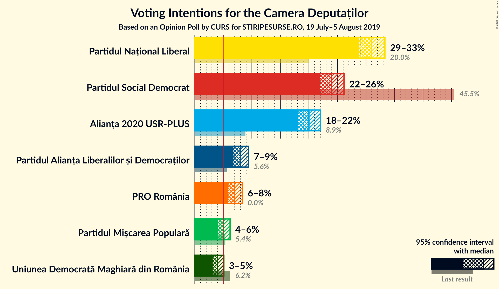

### Confidence Intervals

| Party | Last Result | Poll Result | 80% Confidence Interval | 90% Confidence Interval | 95% Confidence Interval | 99% Confidence Interval |
|:-----:|:-----------:|:-----------:|:-----------------------:|:-----------------------:|:-----------------------:|:-----------------------:|
| Partidul Național Liberal | 20.0% | 31.0% | 29.5–32.5% |29.1–33.0% |28.8–33.3% |28.1–34.0% |
| Partidul Social Democrat | 45.5% | 24.0% | 22.7–25.4% |22.3–25.8% |22.0–26.2% |21.3–26.8% |
| Alianța 2020 USR-PLUS | 8.9% | 20.0% | 18.8–21.3% |18.4–21.7% |18.1–22.0% |17.5–22.7% |
| Partidul Alianța Liberalilor și Democraților | 5.6% | 8.0% | 7.2–8.9% |7.0–9.2% |6.8–9.4% |6.4–9.9% |
| PRO România | 0.0% | 7.0% | 6.2–7.9% |6.0–8.1% |5.8–8.4% |5.5–8.8% |
| Partidul Mișcarea Populară | 5.4% | 5.0% | 4.4–5.8% |4.2–6.0% |4.0–6.2% |3.7–6.6% |
| Uniunea Democrată Maghiară din România | 6.2% | 4.0% | 3.4–4.7% |3.3–4.9% |3.1–5.1% |2.9–5.4% |

*Note:* The poll result column reflects the actual value used in the calculations. Published results may vary slightly, and in addition be rounded to fewer digits.

## Seats

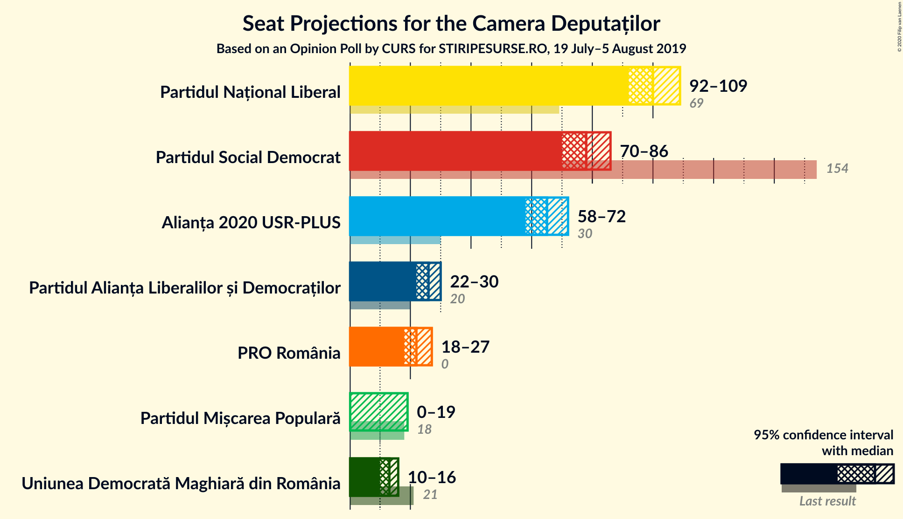

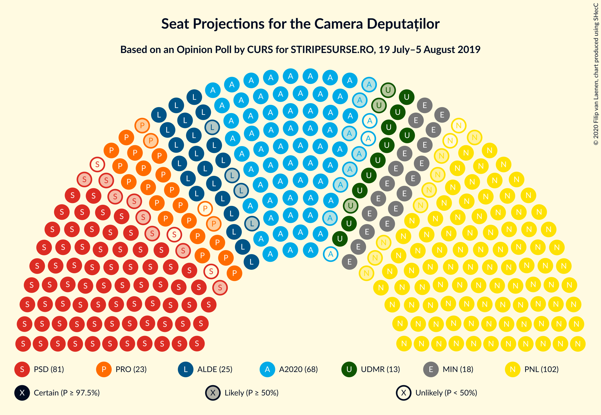

### Confidence Intervals

| Party | Last Result | Median | 80% Confidence Interval | 90% Confidence Interval | 95% Confidence Interval | 99% Confidence Interval |
|:-----:|:-----------:|:------:|:-----------------------:|:-----------------------:|:-----------------------:|:-----------------------:|
| <a href="#partidul-național-liberal">Partidul Național Liberal</a> | 69 | 99 | 94–106 |93–107 |92–109 |90–113 |
| <a href="#partidul-social-democrat">Partidul Social Democrat</a> | 154 | 78 | 73–84 |71–84 |70–85 |67–88 |
| <a href="#alianța-2020-usr-plus">Alianța 2020 USR-PLUS</a> | 30 | 66 | 60–69 |59–71 |58–73 |56–75 |
| <a href="#partidul-alianța-liberalilor-și-democraților">Partidul Alianța Liberalilor și Democraților</a> | 20 | 26 | 23–30 |22–30 |21–30 |20–31 |
| <a href="#pro-românia">PRO România</a> | 0 | 23 | 20–25 |19–26 |18–27 |17–28 |
| <a href="#partidul-mișcarea-populară">Partidul Mișcarea Populară</a> | 18 | 15 | 0–18 |0–19 |0–20 |0–21 |
| <a href="#uniunea-democrată-maghiară-din-românia">Uniunea Democrată Maghiară din România</a> | 21 | 13 | 11–15 |10–15 |10–16 |9–17 |

### Partidul Național Liberal

*For a full overview of the results for this party, see the [Partidul Național Liberal](party-partidulnaționalliberal.html) page.*

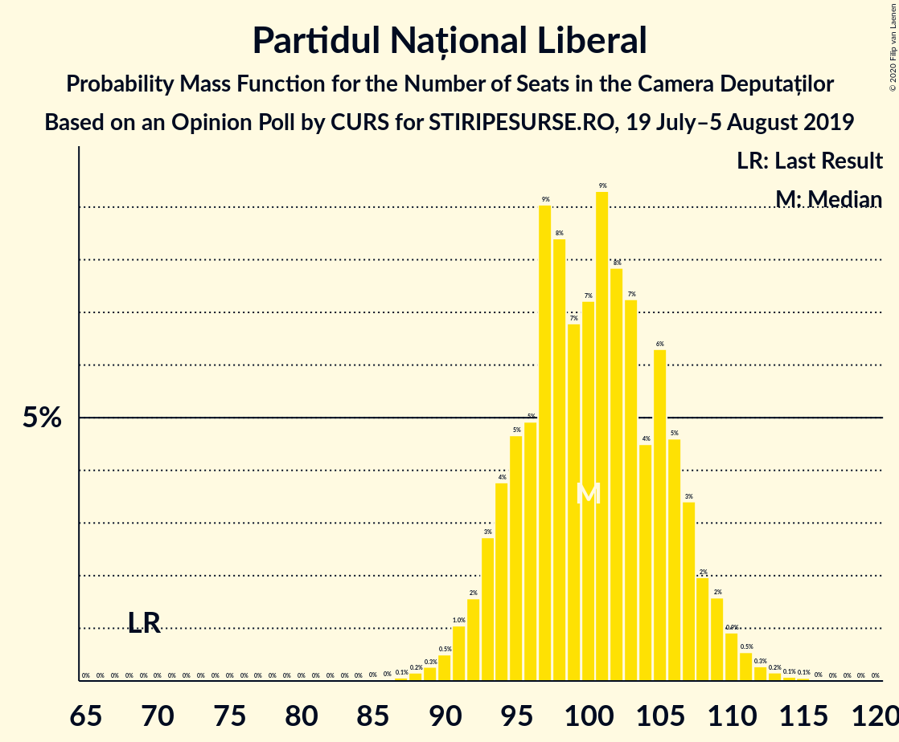

| Number of Seats | Probability | Accumulated | Special Marks |
|:---------------:|:-----------:|:-----------:|:-------------:|
| 69 | 0% | 100% | Last Result |
| 70 | 0% | 100% |  |
| 71 | 0% | 100% |  |
| 72 | 0% | 100% |  |
| 73 | 0% | 100% |  |
| 74 | 0% | 100% |  |
| 75 | 0% | 100% |  |
| 76 | 0% | 100% |  |
| 77 | 0% | 100% |  |
| 78 | 0% | 100% |  |
| 79 | 0% | 100% |  |
| 80 | 0% | 100% |  |
| 81 | 0% | 100% |  |
| 82 | 0% | 100% |  |
| 83 | 0% | 100% |  |
| 84 | 0% | 100% |  |
| 85 | 0% | 100% |  |
| 86 | 0% | 100% |  |
| 87 | 0.1% | 99.9% |  |
| 88 | 0.1% | 99.9% |  |
| 89 | 0.2% | 99.8% |  |
| 90 | 0.4% | 99.7% |  |
| 91 | 1.0% | 99.3% |  |
| 92 | 2% | 98% |  |
| 93 | 4% | 97% |  |
| 94 | 10% | 93% |  |
| 95 | 11% | 83% |  |
| 96 | 6% | 71% |  |
| 97 | 8% | 65% |  |
| 98 | 3% | 57% |  |
| 99 | 12% | 54% | Median |
| 100 | 7% | 43% |  |
| 101 | 5% | 36% |  |
| 102 | 8% | 31% |  |
| 103 | 6% | 23% |  |
| 104 | 3% | 18% |  |
| 105 | 4% | 15% |  |
| 106 | 5% | 10% |  |
| 107 | 1.4% | 6% |  |
| 108 | 1.0% | 4% |  |
| 109 | 1.0% | 3% |  |
| 110 | 1.2% | 2% |  |
| 111 | 0.2% | 1.1% |  |
| 112 | 0.4% | 0.9% |  |
| 113 | 0.3% | 0.5% |  |
| 114 | 0.1% | 0.2% |  |
| 115 | 0.1% | 0.2% |  |
| 116 | 0.1% | 0.1% |  |
| 117 | 0% | 0% |  |

### Partidul Social Democrat

*For a full overview of the results for this party, see the [Partidul Social Democrat](party-partidulsocialdemocrat.html) page.*

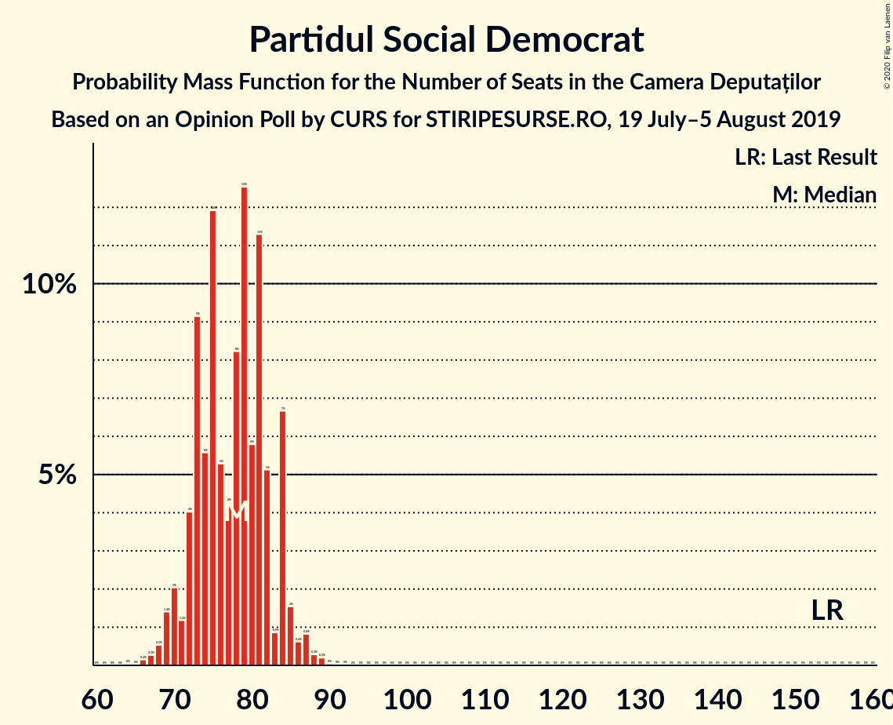

| Number of Seats | Probability | Accumulated | Special Marks |
|:---------------:|:-----------:|:-----------:|:-------------:|
| 64 | 0% | 100% |  |
| 65 | 0% | 99.9% |  |
| 66 | 0.2% | 99.9% |  |
| 67 | 0.3% | 99.8% |  |
| 68 | 0.5% | 99.5% |  |
| 69 | 1.4% | 99.0% |  |
| 70 | 2% | 98% |  |
| 71 | 1.2% | 96% |  |
| 72 | 4% | 94% |  |
| 73 | 9% | 90% |  |
| 74 | 6% | 81% |  |
| 75 | 12% | 76% |  |
| 76 | 5% | 64% |  |
| 77 | 4% | 58% |  |
| 78 | 8% | 54% | Median |
| 79 | 13% | 46% |  |
| 80 | 6% | 33% |  |
| 81 | 11% | 28% |  |
| 82 | 5% | 16% |  |
| 83 | 0.9% | 11% |  |
| 84 | 7% | 10% |  |
| 85 | 2% | 4% |  |
| 86 | 0.6% | 2% |  |
| 87 | 0.8% | 1.4% |  |
| 88 | 0.3% | 0.6% |  |
| 89 | 0.2% | 0.3% |  |
| 90 | 0% | 0.1% |  |
| 91 | 0% | 0.1% |  |
| 92 | 0% | 0% |  |
| 93 | 0% | 0% |  |
| 94 | 0% | 0% |  |
| 95 | 0% | 0% |  |
| 96 | 0% | 0% |  |
| 97 | 0% | 0% |  |
| 98 | 0% | 0% |  |
| 99 | 0% | 0% |  |
| 100 | 0% | 0% |  |
| 101 | 0% | 0% |  |
| 102 | 0% | 0% |  |
| 103 | 0% | 0% |  |
| 104 | 0% | 0% |  |
| 105 | 0% | 0% |  |
| 106 | 0% | 0% |  |
| 107 | 0% | 0% |  |
| 108 | 0% | 0% |  |
| 109 | 0% | 0% |  |
| 110 | 0% | 0% |  |
| 111 | 0% | 0% |  |
| 112 | 0% | 0% |  |
| 113 | 0% | 0% |  |
| 114 | 0% | 0% |  |
| 115 | 0% | 0% |  |
| 116 | 0% | 0% |  |
| 117 | 0% | 0% |  |
| 118 | 0% | 0% |  |
| 119 | 0% | 0% |  |
| 120 | 0% | 0% |  |
| 121 | 0% | 0% |  |
| 122 | 0% | 0% |  |
| 123 | 0% | 0% |  |
| 124 | 0% | 0% |  |
| 125 | 0% | 0% |  |
| 126 | 0% | 0% |  |
| 127 | 0% | 0% |  |
| 128 | 0% | 0% |  |
| 129 | 0% | 0% |  |
| 130 | 0% | 0% |  |
| 131 | 0% | 0% |  |
| 132 | 0% | 0% |  |
| 133 | 0% | 0% |  |
| 134 | 0% | 0% |  |
| 135 | 0% | 0% |  |
| 136 | 0% | 0% |  |
| 137 | 0% | 0% |  |
| 138 | 0% | 0% |  |
| 139 | 0% | 0% |  |
| 140 | 0% | 0% |  |
| 141 | 0% | 0% |  |
| 142 | 0% | 0% |  |
| 143 | 0% | 0% |  |
| 144 | 0% | 0% |  |
| 145 | 0% | 0% |  |
| 146 | 0% | 0% |  |
| 147 | 0% | 0% |  |
| 148 | 0% | 0% |  |
| 149 | 0% | 0% |  |
| 150 | 0% | 0% |  |
| 151 | 0% | 0% |  |
| 152 | 0% | 0% |  |
| 153 | 0% | 0% |  |
| 154 | 0% | 0% | Last Result |

### Alianța 2020 USR-PLUS

*For a full overview of the results for this party, see the [Alianța 2020 USR-PLUS](party-alianța2020usr-plus.html) page.*

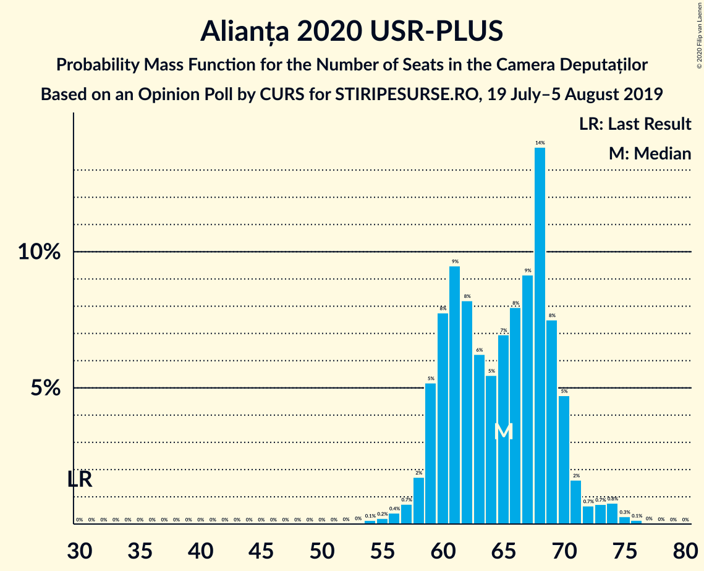

| Number of Seats | Probability | Accumulated | Special Marks |
|:---------------:|:-----------:|:-----------:|:-------------:|
| 30 | 0% | 100% | Last Result |
| 31 | 0% | 100% |  |
| 32 | 0% | 100% |  |
| 33 | 0% | 100% |  |
| 34 | 0% | 100% |  |
| 35 | 0% | 100% |  |
| 36 | 0% | 100% |  |
| 37 | 0% | 100% |  |
| 38 | 0% | 100% |  |
| 39 | 0% | 100% |  |
| 40 | 0% | 100% |  |
| 41 | 0% | 100% |  |
| 42 | 0% | 100% |  |
| 43 | 0% | 100% |  |
| 44 | 0% | 100% |  |
| 45 | 0% | 100% |  |
| 46 | 0% | 100% |  |
| 47 | 0% | 100% |  |
| 48 | 0% | 100% |  |
| 49 | 0% | 100% |  |
| 50 | 0% | 100% |  |
| 51 | 0% | 100% |  |
| 52 | 0% | 100% |  |
| 53 | 0.1% | 100% |  |
| 54 | 0.1% | 99.9% |  |
| 55 | 0.2% | 99.8% |  |
| 56 | 0.3% | 99.6% |  |
| 57 | 0.5% | 99.3% |  |
| 58 | 2% | 98.9% |  |
| 59 | 5% | 97% |  |
| 60 | 7% | 92% |  |
| 61 | 6% | 84% |  |
| 62 | 8% | 78% |  |
| 63 | 2% | 70% |  |
| 64 | 6% | 68% |  |
| 65 | 9% | 62% |  |
| 66 | 17% | 53% | Median |
| 67 | 8% | 36% |  |
| 68 | 17% | 29% |  |
| 69 | 3% | 11% |  |
| 70 | 1.4% | 9% |  |
| 71 | 3% | 7% |  |
| 72 | 1.2% | 4% |  |
| 73 | 1.2% | 3% |  |
| 74 | 1.4% | 2% |  |
| 75 | 0.5% | 0.6% |  |
| 76 | 0.1% | 0.1% |  |
| 77 | 0% | 0% |  |

### Partidul Alianța Liberalilor și Democraților

*For a full overview of the results for this party, see the [Partidul Alianța Liberalilor și Democraților](party-partidulalianțaliberalilorșidemocraților.html) page.*

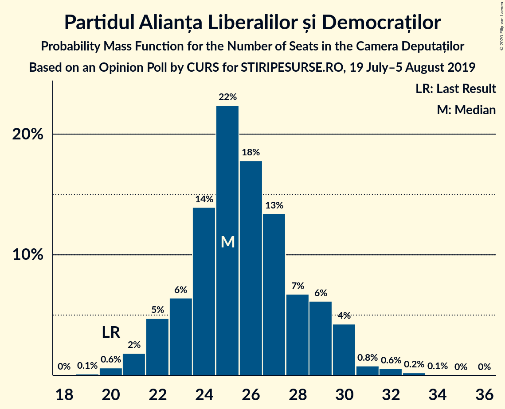

| Number of Seats | Probability | Accumulated | Special Marks |
|:---------------:|:-----------:|:-----------:|:-------------:|
| 18 | 0% | 100% |  |
| 19 | 0.4% | 99.9% |  |
| 20 | 0.4% | 99.6% | Last Result |
| 21 | 2% | 99.2% |  |
| 22 | 6% | 97% |  |
| 23 | 10% | 91% |  |
| 24 | 6% | 82% |  |
| 25 | 5% | 76% |  |
| 26 | 22% | 71% | Median |
| 27 | 27% | 49% |  |
| 28 | 5% | 22% |  |
| 29 | 4% | 17% |  |
| 30 | 10% | 13% |  |
| 31 | 2% | 2% |  |
| 32 | 0.3% | 0.5% |  |
| 33 | 0.1% | 0.2% |  |
| 34 | 0% | 0.1% |  |
| 35 | 0% | 0% |  |

### PRO România

*For a full overview of the results for this party, see the [PRO România](party-proromânia.html) page.*

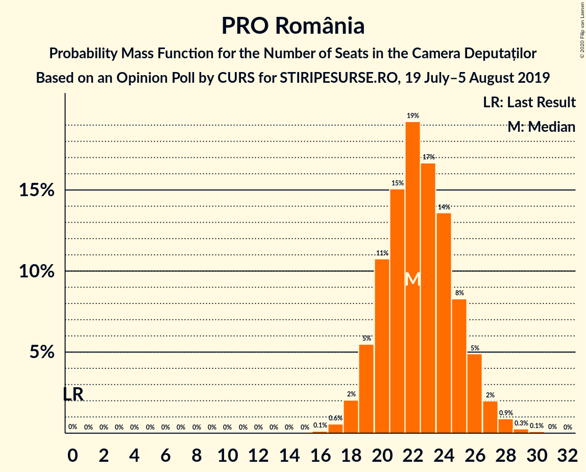

| Number of Seats | Probability | Accumulated | Special Marks |
|:---------------:|:-----------:|:-----------:|:-------------:|
| 0 | 0% | 100% | Last Result |
| 1 | 0% | 100% |  |
| 2 | 0% | 100% |  |
| 3 | 0% | 100% |  |
| 4 | 0% | 100% |  |
| 5 | 0% | 100% |  |
| 6 | 0% | 100% |  |
| 7 | 0% | 100% |  |
| 8 | 0% | 100% |  |
| 9 | 0% | 100% |  |
| 10 | 0% | 100% |  |
| 11 | 0% | 100% |  |
| 12 | 0% | 100% |  |
| 13 | 0% | 100% |  |
| 14 | 0% | 100% |  |
| 15 | 0% | 100% |  |
| 16 | 0.1% | 100% |  |
| 17 | 0.7% | 99.8% |  |
| 18 | 2% | 99.2% |  |
| 19 | 6% | 97% |  |
| 20 | 8% | 91% |  |
| 21 | 13% | 83% |  |
| 22 | 16% | 71% |  |
| 23 | 23% | 55% | Median |
| 24 | 17% | 32% |  |
| 25 | 8% | 14% |  |
| 26 | 4% | 7% |  |
| 27 | 2% | 3% |  |
| 28 | 0.5% | 1.0% |  |
| 29 | 0.3% | 0.4% |  |
| 30 | 0% | 0.1% |  |
| 31 | 0% | 0% |  |

### Partidul Mișcarea Populară

*For a full overview of the results for this party, see the [Partidul Mișcarea Populară](party-partidulmișcareapopulară.html) page.*

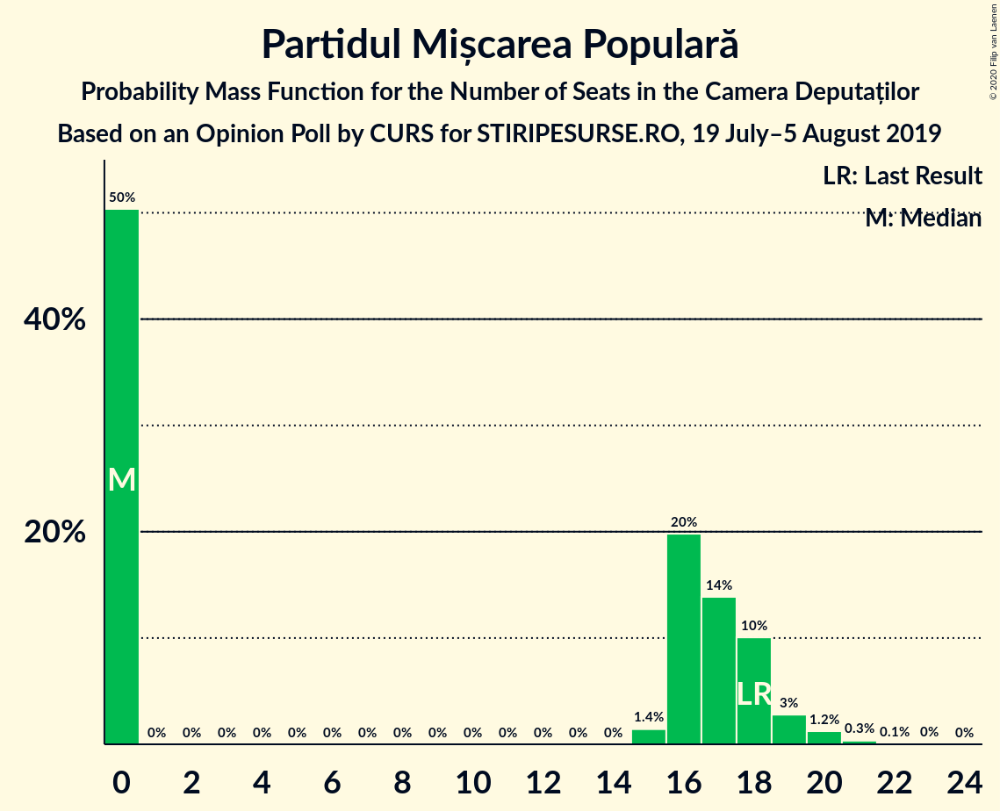

| Number of Seats | Probability | Accumulated | Special Marks |
|:---------------:|:-----------:|:-----------:|:-------------:|
| 0 | 50% | 100% |  |
| 1 | 0% | 50% |  |
| 2 | 0% | 50% |  |
| 3 | 0% | 50% |  |
| 4 | 0% | 50% |  |
| 5 | 0% | 50% |  |
| 6 | 0% | 50% |  |
| 7 | 0% | 50% |  |
| 8 | 0% | 50% |  |
| 9 | 0% | 50% |  |
| 10 | 0% | 50% |  |
| 11 | 0% | 50% |  |
| 12 | 0% | 50% |  |
| 13 | 0% | 50% |  |
| 14 | 0% | 50% |  |
| 15 | 0.8% | 50% | Median |
| 16 | 16% | 50% |  |
| 17 | 15% | 34% |  |
| 18 | 13% | 19% | Last Result |
| 19 | 3% | 6% |  |
| 20 | 2% | 3% |  |
| 21 | 0.5% | 0.6% |  |
| 22 | 0.1% | 0.1% |  |
| 23 | 0% | 0% |  |

### Uniunea Democrată Maghiară din România

*For a full overview of the results for this party, see the [Uniunea Democrată Maghiară din România](party-uniuneademocratămaghiarădinromânia.html) page.*

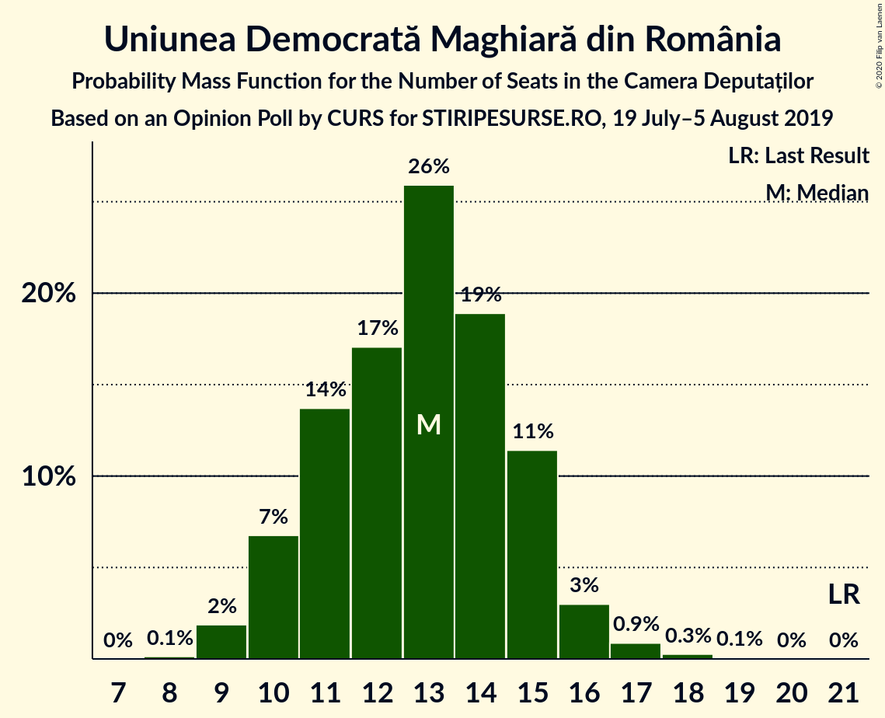

| Number of Seats | Probability | Accumulated | Special Marks |
|:---------------:|:-----------:|:-----------:|:-------------:|
| 8 | 0.1% | 100% |  |
| 9 | 2% | 99.9% |  |
| 10 | 7% | 98% |  |
| 11 | 14% | 91% |  |
| 12 | 17% | 78% |  |
| 13 | 26% | 60% | Median |
| 14 | 19% | 35% |  |
| 15 | 11% | 16% |  |
| 16 | 3% | 4% |  |
| 17 | 0.9% | 1.2% |  |
| 18 | 0.3% | 0.4% |  |
| 19 | 0.1% | 0.1% |  |
| 20 | 0% | 0% |  |
| 21 | 0% | 0% | Last Result |

## Coalitions

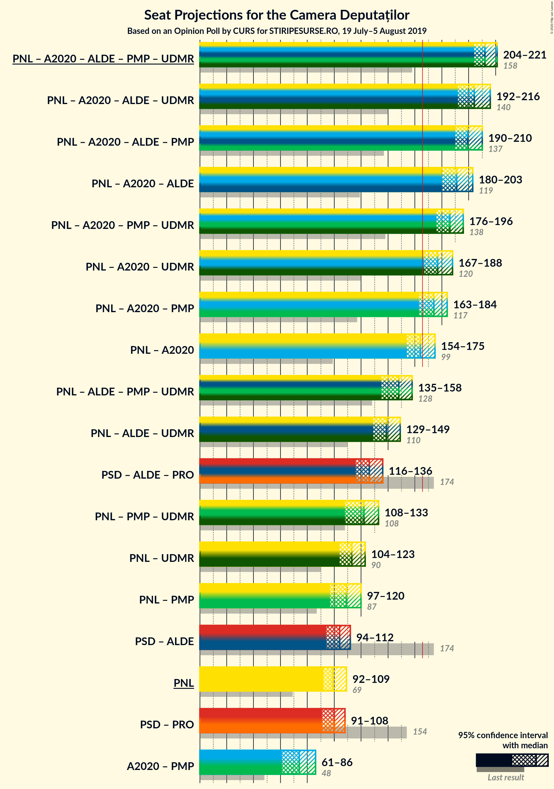

### Confidence Intervals

| Coalition | Last Result | Median | Majority? | 80% Confidence Interval | 90% Confidence Interval | 95% Confidence Interval | 99% Confidence Interval |
|:---------:|:-----------:|:------:|:---------:|:-----------------------:|:-----------------------:|:-----------------------:|:-----------------------:|
| Partidul Național Liberal – Alianța 2020 USR-PLUS – Partidul Alianța Liberalilor și Democraților – Partidul Mișcarea Populară – Uniunea Democrată Maghiară din România | 158 | 212 | 100% | 207–217 | 205–220 | 204–221 | 201–224 |
| Partidul Național Liberal – Alianța 2020 USR-PLUS – Partidul Alianța Liberalilor și Democraților – Uniunea Democrată Maghiară din România | 140 | 204 | 100% | 195–211 | 194–213 | 192–216 | 189–219 |
| Partidul Național Liberal – Alianța 2020 USR-PLUS – Partidul Alianța Liberalilor și Democraților – Partidul Mișcarea Populară | 137 | 199 | 100% | 194–205 | 192–208 | 190–210 | 187–212 |
| Partidul Național Liberal – Alianța 2020 USR-PLUS – Partidul Alianța Liberalilor și Democraților | 119 | 191 | 100% | 183–198 | 181–199 | 180–203 | 176–206 |
| Partidul Național Liberal – Alianța 2020 USR-PLUS – Partidul Mișcarea Populară – Uniunea Democrată Maghiară din România | 138 | 186 | 100% | 179–192 | 177–194 | 176–196 | 173–199 |
| Partidul Național Liberal – Alianța 2020 USR-PLUS – Uniunea Democrată Maghiară din România | 120 | 177 | 98.8% | 169–185 | 167–187 | 167–188 | 163–192 |
| Partidul Național Liberal – Alianța 2020 USR-PLUS – Partidul Mișcarea Populară | 117 | 174 | 89% | 165–180 | 164–182 | 163–184 | 160–186 |
| Partidul Național Liberal – Alianța 2020 USR-PLUS | 99 | 164 | 43% | 157–172 | 156–174 | 154–175 | 151–179 |
| Partidul Național Liberal – Partidul Alianța Liberalilor și Democraților – Partidul Mișcarea Populară – Uniunea Democrată Maghiară din România | 128 | 148 | 0% | 140–154 | 137–156 | 135–158 | 133–161 |
| Partidul Național Liberal – Partidul Alianța Liberalilor și Democraților – Uniunea Democrată Maghiară din România | 110 | 139 | 0% | 131–145 | 130–147 | 129–149 | 126–152 |
| Partidul Social Democrat – Partidul Alianța Liberalilor și Democraților – PRO România | 174 | 126 | 0% | 120–133 | 118–135 | 116–136 | 113–139 |
| Partidul Național Liberal – Partidul Mișcarea Populară – Uniunea Democrată Maghiară din România | 108 | 122 | 0% | 113–130 | 111–132 | 108–133 | 107–135 |
| Partidul Național Liberal – Uniunea Democrată Maghiară din România | 90 | 113 | 0% | 106–118 | 105–120 | 104–123 | 102–125 |
| Partidul Național Liberal – Partidul Mișcarea Populară | 87 | 109 | 0% | 99–118 | 97–120 | 97–120 | 93–123 |
| Partidul Social Democrat – Partidul Alianța Liberalilor și Democraților | 174 | 104 | 0% | 98–109 | 96–112 | 94–112 | 93–116 |
| Partidul Național Liberal | 69 | 99 | 0% | 94–106 | 93–107 | 92–109 | 90–113 |
| Partidul Social Democrat – PRO România | 154 | 100 | 0% | 95–105 | 92–107 | 91–108 | 88–111 |
| Alianța 2020 USR-PLUS – Partidul Mișcarea Populară | 48 | 74 | 0% | 65–83 | 63–85 | 61–86 | 59–89 |

### Partidul Național Liberal – Alianța 2020 USR-PLUS – Partidul Alianța Liberalilor și Democraților – Partidul Mișcarea Populară – Uniunea Democrată Maghiară din România

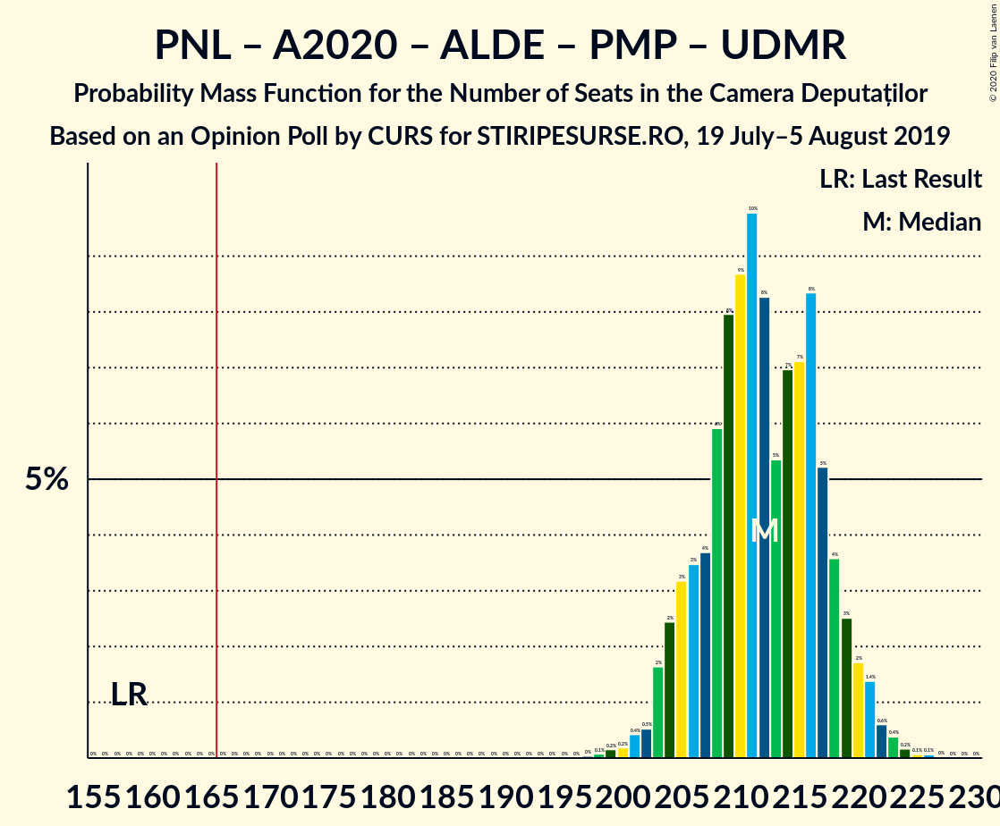

| Number of Seats | Probability | Accumulated | Special Marks |
|:---------------:|:-----------:|:-----------:|:-------------:|
| 158 | 0% | 100% | Last Result |
| 159 | 0% | 100% |  |
| 160 | 0% | 100% |  |
| 161 | 0% | 100% |  |
| 162 | 0% | 100% |  |
| 163 | 0% | 100% |  |
| 164 | 0% | 100% |  |
| 165 | 0% | 100% |  |
| 166 | 0% | 100% | Majority |
| 167 | 0% | 100% |  |
| 168 | 0% | 100% |  |
| 169 | 0% | 100% |  |
| 170 | 0% | 100% |  |
| 171 | 0% | 100% |  |
| 172 | 0% | 100% |  |
| 173 | 0% | 100% |  |
| 174 | 0% | 100% |  |
| 175 | 0% | 100% |  |
| 176 | 0% | 100% |  |
| 177 | 0% | 100% |  |
| 178 | 0% | 100% |  |
| 179 | 0% | 100% |  |
| 180 | 0% | 100% |  |
| 181 | 0% | 100% |  |
| 182 | 0% | 100% |  |
| 183 | 0% | 100% |  |
| 184 | 0% | 100% |  |
| 185 | 0% | 100% |  |
| 186 | 0% | 100% |  |
| 187 | 0% | 100% |  |
| 188 | 0% | 100% |  |
| 189 | 0% | 100% |  |
| 190 | 0% | 100% |  |
| 191 | 0% | 100% |  |
| 192 | 0% | 100% |  |
| 193 | 0% | 100% |  |
| 194 | 0% | 100% |  |
| 195 | 0% | 100% |  |
| 196 | 0% | 100% |  |
| 197 | 0.1% | 100% |  |
| 198 | 0.1% | 99.9% |  |
| 199 | 0.1% | 99.8% |  |
| 200 | 0.1% | 99.7% |  |
| 201 | 0.5% | 99.5% |  |
| 202 | 0.7% | 99.0% |  |
| 203 | 0.7% | 98% |  |
| 204 | 2% | 98% |  |
| 205 | 1.1% | 96% |  |
| 206 | 2% | 95% |  |
| 207 | 7% | 92% |  |
| 208 | 13% | 85% |  |
| 209 | 11% | 72% |  |
| 210 | 4% | 61% |  |
| 211 | 7% | 57% |  |
| 212 | 4% | 50% |  |
| 213 | 6% | 46% |  |
| 214 | 8% | 40% |  |
| 215 | 13% | 32% |  |
| 216 | 6% | 19% |  |
| 217 | 4% | 13% |  |
| 218 | 2% | 9% |  |
| 219 | 2% | 7% | Median |
| 220 | 2% | 6% |  |
| 221 | 2% | 4% |  |
| 222 | 1.2% | 2% |  |
| 223 | 0.4% | 1.2% |  |
| 224 | 0.4% | 0.7% |  |
| 225 | 0.2% | 0.3% |  |
| 226 | 0.1% | 0.2% |  |
| 227 | 0% | 0% |  |

### Partidul Național Liberal – Alianța 2020 USR-PLUS – Partidul Alianța Liberalilor și Democraților – Uniunea Democrată Maghiară din România

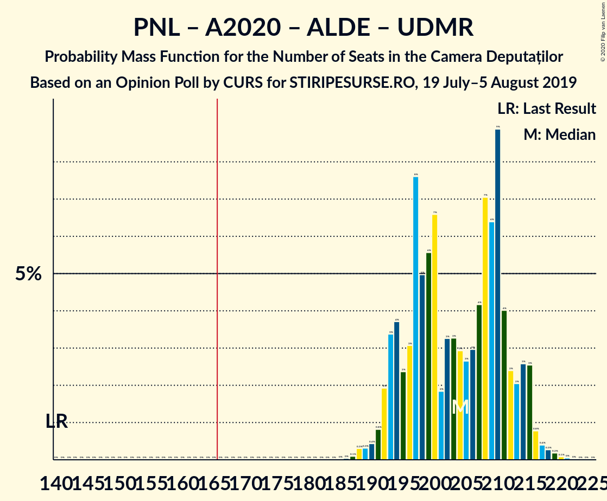

| Number of Seats | Probability | Accumulated | Special Marks |
|:---------------:|:-----------:|:-----------:|:-------------:|
| 140 | 0% | 100% | Last Result |
| 141 | 0% | 100% |  |
| 142 | 0% | 100% |  |
| 143 | 0% | 100% |  |
| 144 | 0% | 100% |  |
| 145 | 0% | 100% |  |
| 146 | 0% | 100% |  |
| 147 | 0% | 100% |  |
| 148 | 0% | 100% |  |
| 149 | 0% | 100% |  |
| 150 | 0% | 100% |  |
| 151 | 0% | 100% |  |
| 152 | 0% | 100% |  |
| 153 | 0% | 100% |  |
| 154 | 0% | 100% |  |
| 155 | 0% | 100% |  |
| 156 | 0% | 100% |  |
| 157 | 0% | 100% |  |
| 158 | 0% | 100% |  |
| 159 | 0% | 100% |  |
| 160 | 0% | 100% |  |
| 161 | 0% | 100% |  |
| 162 | 0% | 100% |  |
| 163 | 0% | 100% |  |
| 164 | 0% | 100% |  |
| 165 | 0% | 100% |  |
| 166 | 0% | 100% | Majority |
| 167 | 0% | 100% |  |
| 168 | 0% | 100% |  |
| 169 | 0% | 100% |  |
| 170 | 0% | 100% |  |
| 171 | 0% | 100% |  |
| 172 | 0% | 100% |  |
| 173 | 0% | 100% |  |
| 174 | 0% | 100% |  |
| 175 | 0% | 100% |  |
| 176 | 0% | 100% |  |
| 177 | 0% | 100% |  |
| 178 | 0% | 100% |  |
| 179 | 0% | 100% |  |
| 180 | 0% | 100% |  |
| 181 | 0% | 100% |  |
| 182 | 0% | 100% |  |
| 183 | 0% | 100% |  |
| 184 | 0% | 100% |  |
| 185 | 0% | 100% |  |
| 186 | 0% | 100% |  |
| 187 | 0.1% | 100% |  |
| 188 | 0.3% | 99.8% |  |
| 189 | 0.3% | 99.6% |  |
| 190 | 0.3% | 99.2% |  |
| 191 | 0.6% | 99.0% |  |
| 192 | 1.0% | 98% |  |
| 193 | 2% | 97% |  |
| 194 | 3% | 96% |  |
| 195 | 3% | 92% |  |
| 196 | 6% | 90% |  |
| 197 | 12% | 84% |  |
| 198 | 4% | 72% |  |
| 199 | 8% | 68% |  |
| 200 | 3% | 60% |  |
| 201 | 1.2% | 56% |  |
| 202 | 2% | 55% |  |
| 203 | 2% | 53% |  |
| 204 | 3% | 51% | Median |
| 205 | 2% | 49% |  |
| 206 | 2% | 46% |  |
| 207 | 7% | 44% |  |
| 208 | 12% | 37% |  |
| 209 | 10% | 24% |  |
| 210 | 4% | 14% |  |
| 211 | 3% | 10% |  |
| 212 | 1.5% | 7% |  |
| 213 | 2% | 6% |  |
| 214 | 0.4% | 4% |  |
| 215 | 1.0% | 4% |  |
| 216 | 0.5% | 3% |  |
| 217 | 0.8% | 2% |  |
| 218 | 0.5% | 1.3% |  |
| 219 | 0.5% | 0.8% |  |
| 220 | 0.2% | 0.3% |  |
| 221 | 0.1% | 0.1% |  |
| 222 | 0% | 0% |  |

### Partidul Național Liberal – Alianța 2020 USR-PLUS – Partidul Alianța Liberalilor și Democraților – Partidul Mișcarea Populară

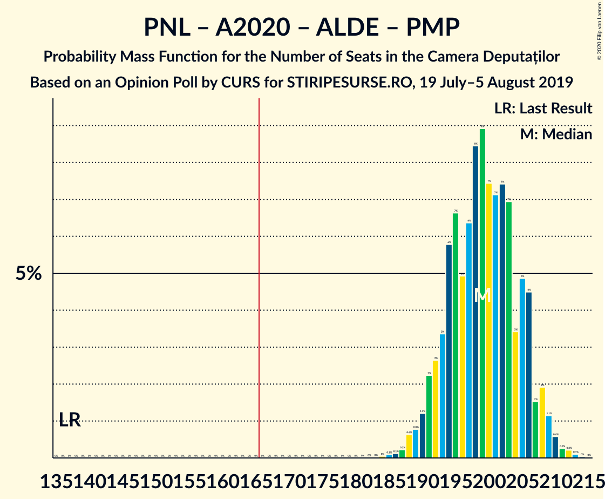

| Number of Seats | Probability | Accumulated | Special Marks |
|:---------------:|:-----------:|:-----------:|:-------------:|
| 137 | 0% | 100% | Last Result |
| 138 | 0% | 100% |  |
| 139 | 0% | 100% |  |
| 140 | 0% | 100% |  |
| 141 | 0% | 100% |  |
| 142 | 0% | 100% |  |
| 143 | 0% | 100% |  |
| 144 | 0% | 100% |  |
| 145 | 0% | 100% |  |
| 146 | 0% | 100% |  |
| 147 | 0% | 100% |  |
| 148 | 0% | 100% |  |
| 149 | 0% | 100% |  |
| 150 | 0% | 100% |  |
| 151 | 0% | 100% |  |
| 152 | 0% | 100% |  |
| 153 | 0% | 100% |  |
| 154 | 0% | 100% |  |
| 155 | 0% | 100% |  |
| 156 | 0% | 100% |  |
| 157 | 0% | 100% |  |
| 158 | 0% | 100% |  |
| 159 | 0% | 100% |  |
| 160 | 0% | 100% |  |
| 161 | 0% | 100% |  |
| 162 | 0% | 100% |  |
| 163 | 0% | 100% |  |
| 164 | 0% | 100% |  |
| 165 | 0% | 100% |  |
| 166 | 0% | 100% | Majority |
| 167 | 0% | 100% |  |
| 168 | 0% | 100% |  |
| 169 | 0% | 100% |  |
| 170 | 0% | 100% |  |
| 171 | 0% | 100% |  |
| 172 | 0% | 100% |  |
| 173 | 0% | 100% |  |
| 174 | 0% | 100% |  |
| 175 | 0% | 100% |  |
| 176 | 0% | 100% |  |
| 177 | 0% | 100% |  |
| 178 | 0% | 100% |  |
| 179 | 0% | 100% |  |
| 180 | 0% | 100% |  |
| 181 | 0% | 100% |  |
| 182 | 0% | 100% |  |
| 183 | 0% | 100% |  |
| 184 | 0.1% | 100% |  |
| 185 | 0.2% | 99.9% |  |
| 186 | 0.1% | 99.8% |  |
| 187 | 0.4% | 99.7% |  |
| 188 | 0.5% | 99.3% |  |
| 189 | 0.7% | 98.8% |  |
| 190 | 0.8% | 98% |  |
| 191 | 1.5% | 97% |  |
| 192 | 4% | 96% |  |
| 193 | 2% | 92% |  |
| 194 | 15% | 90% |  |
| 195 | 5% | 75% |  |
| 196 | 3% | 70% |  |
| 197 | 9% | 66% |  |
| 198 | 6% | 58% |  |
| 199 | 5% | 52% |  |
| 200 | 3% | 47% |  |
| 201 | 6% | 44% |  |
| 202 | 16% | 38% |  |
| 203 | 6% | 22% |  |
| 204 | 4% | 16% |  |
| 205 | 3% | 12% |  |
| 206 | 3% | 9% | Median |
| 207 | 1.0% | 6% |  |
| 208 | 0.9% | 5% |  |
| 209 | 2% | 4% |  |
| 210 | 2% | 3% |  |
| 211 | 0.3% | 1.2% |  |
| 212 | 0.8% | 1.0% |  |
| 213 | 0.1% | 0.2% |  |
| 214 | 0.1% | 0.1% |  |
| 215 | 0% | 0% |  |

### Partidul Național Liberal – Alianța 2020 USR-PLUS – Partidul Alianța Liberalilor și Democraților

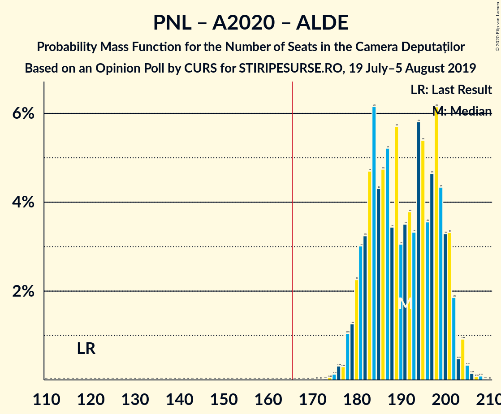

| Number of Seats | Probability | Accumulated | Special Marks |
|:---------------:|:-----------:|:-----------:|:-------------:|
| 119 | 0% | 100% | Last Result |
| 120 | 0% | 100% |  |
| 121 | 0% | 100% |  |
| 122 | 0% | 100% |  |
| 123 | 0% | 100% |  |
| 124 | 0% | 100% |  |
| 125 | 0% | 100% |  |
| 126 | 0% | 100% |  |
| 127 | 0% | 100% |  |
| 128 | 0% | 100% |  |
| 129 | 0% | 100% |  |
| 130 | 0% | 100% |  |
| 131 | 0% | 100% |  |
| 132 | 0% | 100% |  |
| 133 | 0% | 100% |  |
| 134 | 0% | 100% |  |
| 135 | 0% | 100% |  |
| 136 | 0% | 100% |  |
| 137 | 0% | 100% |  |
| 138 | 0% | 100% |  |
| 139 | 0% | 100% |  |
| 140 | 0% | 100% |  |
| 141 | 0% | 100% |  |
| 142 | 0% | 100% |  |
| 143 | 0% | 100% |  |
| 144 | 0% | 100% |  |
| 145 | 0% | 100% |  |
| 146 | 0% | 100% |  |
| 147 | 0% | 100% |  |
| 148 | 0% | 100% |  |
| 149 | 0% | 100% |  |
| 150 | 0% | 100% |  |
| 151 | 0% | 100% |  |
| 152 | 0% | 100% |  |
| 153 | 0% | 100% |  |
| 154 | 0% | 100% |  |
| 155 | 0% | 100% |  |
| 156 | 0% | 100% |  |
| 157 | 0% | 100% |  |
| 158 | 0% | 100% |  |
| 159 | 0% | 100% |  |
| 160 | 0% | 100% |  |
| 161 | 0% | 100% |  |
| 162 | 0% | 100% |  |
| 163 | 0% | 100% |  |
| 164 | 0% | 100% |  |
| 165 | 0% | 100% |  |
| 166 | 0% | 100% | Majority |
| 167 | 0% | 100% |  |
| 168 | 0% | 100% |  |
| 169 | 0% | 100% |  |
| 170 | 0% | 100% |  |
| 171 | 0% | 100% |  |
| 172 | 0% | 100% |  |
| 173 | 0% | 100% |  |
| 174 | 0.1% | 100% |  |
| 175 | 0.2% | 99.9% |  |
| 176 | 0.4% | 99.7% |  |
| 177 | 0.3% | 99.3% |  |
| 178 | 0.5% | 99.0% |  |
| 179 | 0.6% | 98.5% |  |
| 180 | 0.7% | 98% |  |
| 181 | 2% | 97% |  |
| 182 | 1.1% | 95% |  |
| 183 | 8% | 94% |  |
| 184 | 8% | 86% |  |
| 185 | 7% | 78% |  |
| 186 | 10% | 71% |  |
| 187 | 2% | 61% |  |
| 188 | 2% | 59% |  |
| 189 | 3% | 57% |  |
| 190 | 2% | 54% |  |
| 191 | 2% | 51% | Median |
| 192 | 4% | 49% |  |
| 193 | 2% | 45% |  |
| 194 | 16% | 43% |  |
| 195 | 5% | 27% |  |
| 196 | 3% | 22% |  |
| 197 | 7% | 18% |  |
| 198 | 5% | 11% |  |
| 199 | 1.1% | 6% |  |
| 200 | 0.5% | 5% |  |
| 201 | 1.2% | 4% |  |
| 202 | 0.3% | 3% |  |
| 203 | 1.1% | 3% |  |
| 204 | 0.4% | 2% |  |
| 205 | 0.6% | 1.3% |  |
| 206 | 0.3% | 0.7% |  |
| 207 | 0.2% | 0.4% |  |
| 208 | 0.1% | 0.2% |  |
| 209 | 0% | 0% |  |

### Partidul Național Liberal – Alianța 2020 USR-PLUS – Partidul Mișcarea Populară – Uniunea Democrată Maghiară din România

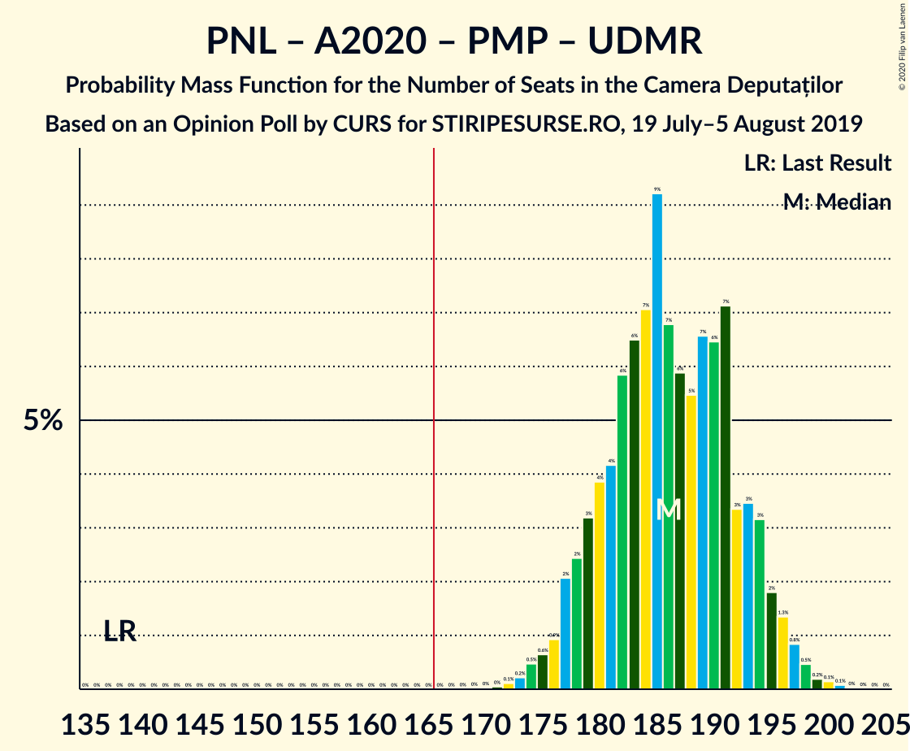

| Number of Seats | Probability | Accumulated | Special Marks |
|:---------------:|:-----------:|:-----------:|:-------------:|
| 138 | 0% | 100% | Last Result |
| 139 | 0% | 100% |  |
| 140 | 0% | 100% |  |
| 141 | 0% | 100% |  |
| 142 | 0% | 100% |  |
| 143 | 0% | 100% |  |
| 144 | 0% | 100% |  |
| 145 | 0% | 100% |  |
| 146 | 0% | 100% |  |
| 147 | 0% | 100% |  |
| 148 | 0% | 100% |  |
| 149 | 0% | 100% |  |
| 150 | 0% | 100% |  |
| 151 | 0% | 100% |  |
| 152 | 0% | 100% |  |
| 153 | 0% | 100% |  |
| 154 | 0% | 100% |  |
| 155 | 0% | 100% |  |
| 156 | 0% | 100% |  |
| 157 | 0% | 100% |  |
| 158 | 0% | 100% |  |
| 159 | 0% | 100% |  |
| 160 | 0% | 100% |  |
| 161 | 0% | 100% |  |
| 162 | 0% | 100% |  |
| 163 | 0% | 100% |  |
| 164 | 0% | 100% |  |
| 165 | 0% | 100% |  |
| 166 | 0% | 100% | Majority |
| 167 | 0% | 100% |  |
| 168 | 0% | 100% |  |
| 169 | 0% | 100% |  |
| 170 | 0% | 100% |  |
| 171 | 0% | 99.9% |  |
| 172 | 0.3% | 99.9% |  |
| 173 | 0.2% | 99.6% |  |
| 174 | 0.1% | 99.4% |  |
| 175 | 0.7% | 99.3% |  |
| 176 | 2% | 98.6% |  |
| 177 | 3% | 97% |  |
| 178 | 4% | 94% |  |
| 179 | 5% | 91% |  |
| 180 | 2% | 86% |  |
| 181 | 11% | 84% |  |
| 182 | 2% | 73% |  |
| 183 | 6% | 70% |  |
| 184 | 8% | 64% |  |
| 185 | 4% | 56% |  |
| 186 | 6% | 52% |  |
| 187 | 6% | 46% |  |
| 188 | 10% | 41% |  |
| 189 | 8% | 30% |  |
| 190 | 6% | 23% |  |
| 191 | 3% | 17% |  |
| 192 | 4% | 14% |  |
| 193 | 3% | 10% | Median |
| 194 | 2% | 7% |  |
| 195 | 2% | 5% |  |
| 196 | 1.0% | 3% |  |
| 197 | 0.4% | 2% |  |
| 198 | 0.7% | 1.3% |  |
| 199 | 0.2% | 0.5% |  |
| 200 | 0.3% | 0.3% |  |
| 201 | 0% | 0.1% |  |
| 202 | 0% | 0% |  |

### Partidul Național Liberal – Alianța 2020 USR-PLUS – Uniunea Democrată Maghiară din România

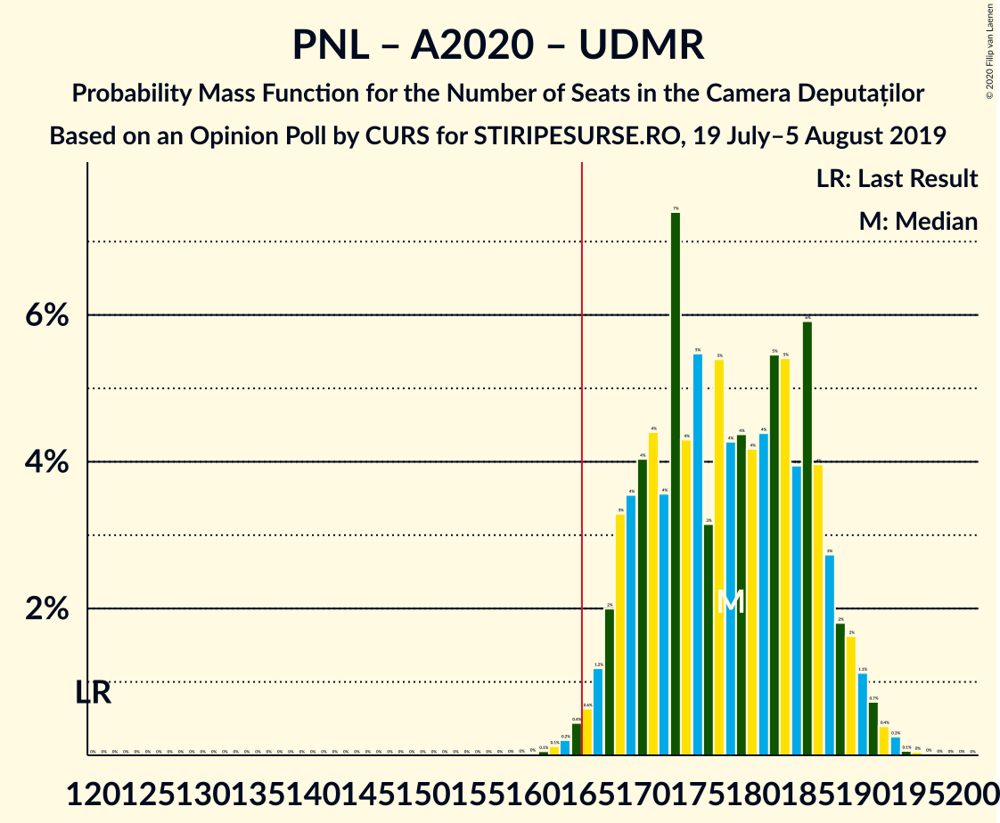

| Number of Seats | Probability | Accumulated | Special Marks |
|:---------------:|:-----------:|:-----------:|:-------------:|
| 120 | 0% | 100% | Last Result |
| 121 | 0% | 100% |  |
| 122 | 0% | 100% |  |
| 123 | 0% | 100% |  |
| 124 | 0% | 100% |  |
| 125 | 0% | 100% |  |
| 126 | 0% | 100% |  |
| 127 | 0% | 100% |  |
| 128 | 0% | 100% |  |
| 129 | 0% | 100% |  |
| 130 | 0% | 100% |  |
| 131 | 0% | 100% |  |
| 132 | 0% | 100% |  |
| 133 | 0% | 100% |  |
| 134 | 0% | 100% |  |
| 135 | 0% | 100% |  |
| 136 | 0% | 100% |  |
| 137 | 0% | 100% |  |
| 138 | 0% | 100% |  |
| 139 | 0% | 100% |  |
| 140 | 0% | 100% |  |
| 141 | 0% | 100% |  |
| 142 | 0% | 100% |  |
| 143 | 0% | 100% |  |
| 144 | 0% | 100% |  |
| 145 | 0% | 100% |  |
| 146 | 0% | 100% |  |
| 147 | 0% | 100% |  |
| 148 | 0% | 100% |  |
| 149 | 0% | 100% |  |
| 150 | 0% | 100% |  |
| 151 | 0% | 100% |  |
| 152 | 0% | 100% |  |
| 153 | 0% | 100% |  |
| 154 | 0% | 100% |  |
| 155 | 0% | 100% |  |
| 156 | 0% | 100% |  |
| 157 | 0% | 100% |  |
| 158 | 0% | 100% |  |
| 159 | 0% | 100% |  |
| 160 | 0% | 100% |  |
| 161 | 0.1% | 100% |  |
| 162 | 0.2% | 99.8% |  |
| 163 | 0.4% | 99.7% |  |
| 164 | 0.3% | 99.3% |  |
| 165 | 0.2% | 99.0% |  |
| 166 | 1.0% | 98.8% | Majority |
| 167 | 3% | 98% |  |
| 168 | 3% | 95% |  |
| 169 | 4% | 92% |  |
| 170 | 8% | 88% |  |
| 171 | 4% | 80% |  |
| 172 | 3% | 76% |  |
| 173 | 9% | 73% |  |
| 174 | 3% | 65% |  |
| 175 | 5% | 61% |  |
| 176 | 4% | 56% |  |
| 177 | 4% | 53% |  |
| 178 | 4% | 49% | Median |
| 179 | 6% | 45% |  |
| 180 | 3% | 38% |  |
| 181 | 12% | 35% |  |
| 182 | 2% | 24% |  |
| 183 | 5% | 22% |  |
| 184 | 6% | 17% |  |
| 185 | 2% | 11% |  |
| 186 | 4% | 10% |  |
| 187 | 1.4% | 5% |  |
| 188 | 1.5% | 4% |  |
| 189 | 0.8% | 2% |  |
| 190 | 0.8% | 2% |  |
| 191 | 0.1% | 0.8% |  |
| 192 | 0.2% | 0.7% |  |
| 193 | 0.3% | 0.5% |  |
| 194 | 0% | 0.2% |  |
| 195 | 0.1% | 0.2% |  |
| 196 | 0% | 0% |  |

### Partidul Național Liberal – Alianța 2020 USR-PLUS – Partidul Mișcarea Populară

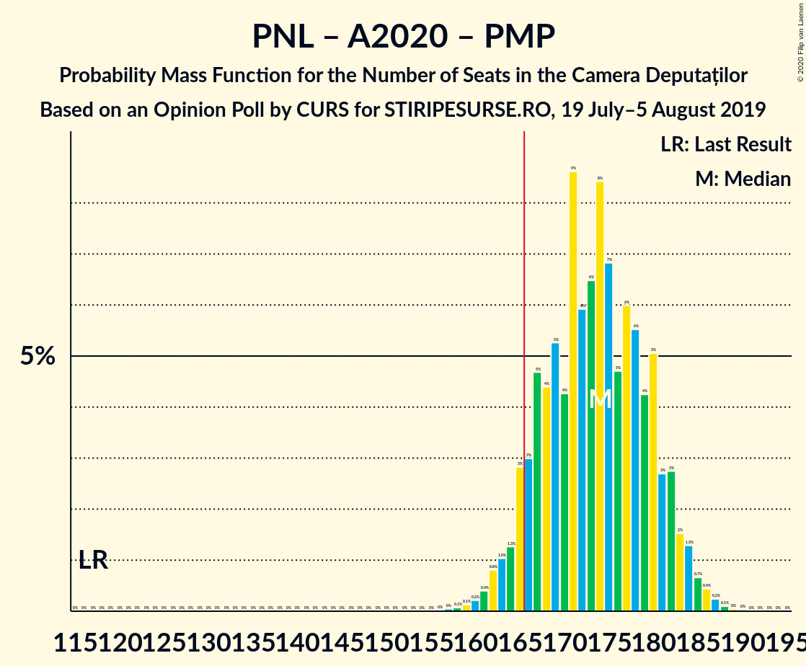

| Number of Seats | Probability | Accumulated | Special Marks |
|:---------------:|:-----------:|:-----------:|:-------------:|
| 117 | 0% | 100% | Last Result |
| 118 | 0% | 100% |  |
| 119 | 0% | 100% |  |
| 120 | 0% | 100% |  |
| 121 | 0% | 100% |  |
| 122 | 0% | 100% |  |
| 123 | 0% | 100% |  |
| 124 | 0% | 100% |  |
| 125 | 0% | 100% |  |
| 126 | 0% | 100% |  |
| 127 | 0% | 100% |  |
| 128 | 0% | 100% |  |
| 129 | 0% | 100% |  |
| 130 | 0% | 100% |  |
| 131 | 0% | 100% |  |
| 132 | 0% | 100% |  |
| 133 | 0% | 100% |  |
| 134 | 0% | 100% |  |
| 135 | 0% | 100% |  |
| 136 | 0% | 100% |  |
| 137 | 0% | 100% |  |
| 138 | 0% | 100% |  |
| 139 | 0% | 100% |  |
| 140 | 0% | 100% |  |
| 141 | 0% | 100% |  |
| 142 | 0% | 100% |  |
| 143 | 0% | 100% |  |
| 144 | 0% | 100% |  |
| 145 | 0% | 100% |  |
| 146 | 0% | 100% |  |
| 147 | 0% | 100% |  |
| 148 | 0% | 100% |  |
| 149 | 0% | 100% |  |
| 150 | 0% | 100% |  |
| 151 | 0% | 100% |  |
| 152 | 0% | 100% |  |
| 153 | 0% | 100% |  |
| 154 | 0% | 100% |  |
| 155 | 0% | 100% |  |
| 156 | 0% | 100% |  |
| 157 | 0.1% | 100% |  |
| 158 | 0.1% | 99.9% |  |
| 159 | 0.2% | 99.9% |  |
| 160 | 0.3% | 99.7% |  |
| 161 | 0.4% | 99.4% |  |
| 162 | 0.5% | 99.0% |  |
| 163 | 3% | 98% |  |
| 164 | 2% | 96% |  |
| 165 | 5% | 94% |  |
| 166 | 3% | 89% | Majority |
| 167 | 10% | 86% |  |
| 168 | 5% | 75% |  |
| 169 | 2% | 70% |  |
| 170 | 2% | 68% |  |
| 171 | 7% | 66% |  |
| 172 | 4% | 59% |  |
| 173 | 4% | 55% |  |
| 174 | 8% | 51% |  |
| 175 | 10% | 43% |  |
| 176 | 8% | 33% |  |
| 177 | 6% | 25% |  |
| 178 | 4% | 20% |  |
| 179 | 3% | 16% |  |
| 180 | 4% | 13% | Median |
| 181 | 1.0% | 8% |  |
| 182 | 2% | 7% |  |
| 183 | 1.2% | 5% |  |
| 184 | 2% | 4% |  |
| 185 | 0.9% | 2% |  |
| 186 | 0.5% | 0.9% |  |
| 187 | 0.1% | 0.4% |  |
| 188 | 0.1% | 0.3% |  |
| 189 | 0.1% | 0.2% |  |
| 190 | 0% | 0% |  |

### Partidul Național Liberal – Alianța 2020 USR-PLUS

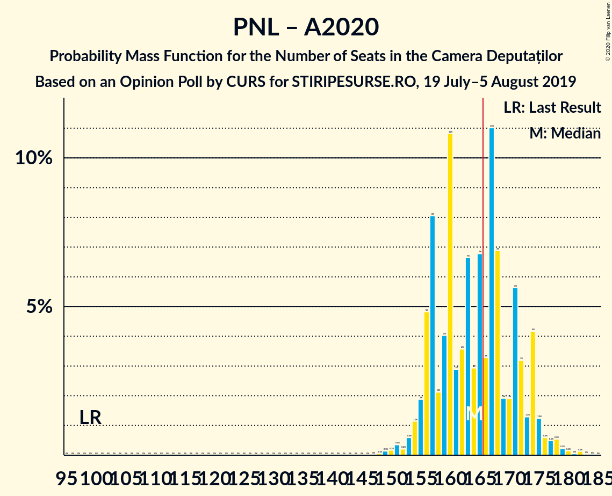

| Number of Seats | Probability | Accumulated | Special Marks |
|:---------------:|:-----------:|:-----------:|:-------------:|
| 99 | 0% | 100% | Last Result |
| 100 | 0% | 100% |  |
| 101 | 0% | 100% |  |
| 102 | 0% | 100% |  |
| 103 | 0% | 100% |  |
| 104 | 0% | 100% |  |
| 105 | 0% | 100% |  |
| 106 | 0% | 100% |  |
| 107 | 0% | 100% |  |
| 108 | 0% | 100% |  |
| 109 | 0% | 100% |  |
| 110 | 0% | 100% |  |
| 111 | 0% | 100% |  |
| 112 | 0% | 100% |  |
| 113 | 0% | 100% |  |
| 114 | 0% | 100% |  |
| 115 | 0% | 100% |  |
| 116 | 0% | 100% |  |
| 117 | 0% | 100% |  |
| 118 | 0% | 100% |  |
| 119 | 0% | 100% |  |
| 120 | 0% | 100% |  |
| 121 | 0% | 100% |  |
| 122 | 0% | 100% |  |
| 123 | 0% | 100% |  |
| 124 | 0% | 100% |  |
| 125 | 0% | 100% |  |
| 126 | 0% | 100% |  |
| 127 | 0% | 100% |  |
| 128 | 0% | 100% |  |
| 129 | 0% | 100% |  |
| 130 | 0% | 100% |  |
| 131 | 0% | 100% |  |
| 132 | 0% | 100% |  |
| 133 | 0% | 100% |  |
| 134 | 0% | 100% |  |
| 135 | 0% | 100% |  |
| 136 | 0% | 100% |  |
| 137 | 0% | 100% |  |
| 138 | 0% | 100% |  |
| 139 | 0% | 100% |  |
| 140 | 0% | 100% |  |
| 141 | 0% | 100% |  |
| 142 | 0% | 100% |  |
| 143 | 0% | 100% |  |
| 144 | 0% | 100% |  |
| 145 | 0% | 100% |  |
| 146 | 0% | 100% |  |
| 147 | 0% | 100% |  |
| 148 | 0.1% | 100% |  |
| 149 | 0.1% | 99.9% |  |
| 150 | 0.2% | 99.8% |  |
| 151 | 0.4% | 99.6% |  |
| 152 | 0.2% | 99.3% |  |
| 153 | 0.6% | 99.0% |  |
| 154 | 1.1% | 98% |  |
| 155 | 2% | 97% |  |
| 156 | 5% | 95% |  |
| 157 | 8% | 91% |  |
| 158 | 2% | 83% |  |
| 159 | 4% | 80% |  |
| 160 | 11% | 76% |  |
| 161 | 3% | 66% |  |
| 162 | 4% | 63% |  |
| 163 | 7% | 59% |  |
| 164 | 3% | 52% |  |
| 165 | 7% | 50% | Median |
| 166 | 3% | 43% | Majority |
| 167 | 11% | 39% |  |
| 168 | 7% | 28% |  |
| 169 | 2% | 22% |  |
| 170 | 2% | 20% |  |
| 171 | 6% | 18% |  |
| 172 | 3% | 12% |  |
| 173 | 1.3% | 9% |  |
| 174 | 4% | 8% |  |
| 175 | 1.2% | 3% |  |
| 176 | 0.6% | 2% |  |
| 177 | 0.5% | 2% |  |
| 178 | 0.5% | 1.1% |  |
| 179 | 0.2% | 0.6% |  |
| 180 | 0.1% | 0.4% |  |
| 181 | 0% | 0.2% |  |
| 182 | 0.1% | 0.2% |  |
| 183 | 0% | 0% |  |

### Partidul Național Liberal – Partidul Alianța Liberalilor și Democraților – Partidul Mișcarea Populară – Uniunea Democrată Maghiară din România

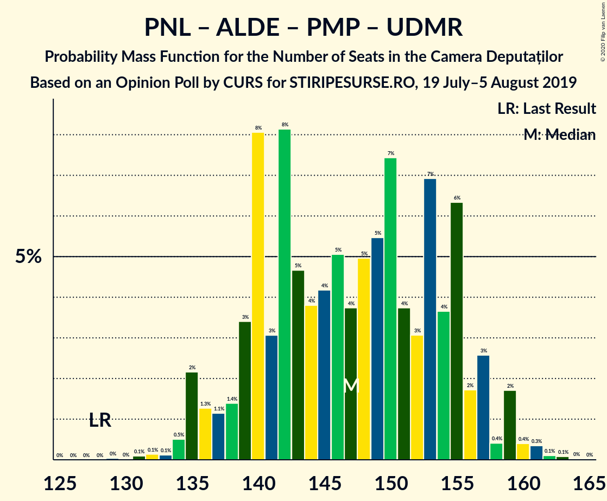

| Number of Seats | Probability | Accumulated | Special Marks |
|:---------------:|:-----------:|:-----------:|:-------------:|
| 128 | 0% | 100% | Last Result |
| 129 | 0.1% | 100% |  |
| 130 | 0% | 99.9% |  |
| 131 | 0.1% | 99.9% |  |
| 132 | 0.1% | 99.8% |  |
| 133 | 0.3% | 99.7% |  |
| 134 | 0.8% | 99.5% |  |
| 135 | 2% | 98.7% |  |
| 136 | 1.0% | 97% |  |
| 137 | 1.3% | 96% |  |
| 138 | 0.8% | 95% |  |
| 139 | 4% | 94% |  |
| 140 | 10% | 90% |  |
| 141 | 8% | 80% |  |
| 142 | 2% | 72% |  |
| 143 | 8% | 71% |  |
| 144 | 3% | 63% |  |
| 145 | 4% | 60% |  |
| 146 | 4% | 55% |  |
| 147 | 0.8% | 52% |  |
| 148 | 6% | 51% |  |
| 149 | 8% | 44% |  |
| 150 | 3% | 36% |  |
| 151 | 5% | 33% |  |
| 152 | 3% | 28% |  |
| 153 | 9% | 25% | Median |
| 154 | 7% | 15% |  |
| 155 | 2% | 8% |  |
| 156 | 3% | 7% |  |
| 157 | 2% | 4% |  |
| 158 | 0.5% | 3% |  |
| 159 | 1.3% | 2% |  |
| 160 | 0.3% | 0.9% |  |
| 161 | 0.2% | 0.7% |  |
| 162 | 0.3% | 0.5% |  |
| 163 | 0.1% | 0.2% |  |
| 164 | 0% | 0.1% |  |
| 165 | 0% | 0% |  |

### Partidul Național Liberal – Partidul Alianța Liberalilor și Democraților – Uniunea Democrată Maghiară din România

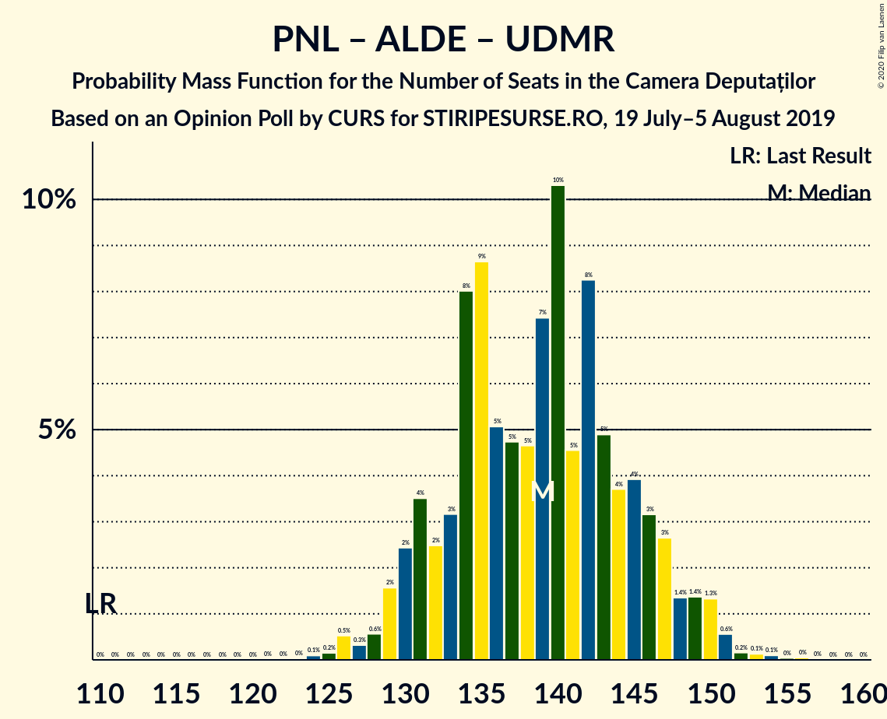

| Number of Seats | Probability | Accumulated | Special Marks |
|:---------------:|:-----------:|:-----------:|:-------------:|
| 110 | 0% | 100% | Last Result |
| 111 | 0% | 100% |  |
| 112 | 0% | 100% |  |
| 113 | 0% | 100% |  |
| 114 | 0% | 100% |  |
| 115 | 0% | 100% |  |
| 116 | 0% | 100% |  |
| 117 | 0% | 100% |  |
| 118 | 0% | 100% |  |
| 119 | 0% | 100% |  |
| 120 | 0% | 100% |  |
| 121 | 0% | 100% |  |
| 122 | 0% | 100% |  |
| 123 | 0.1% | 100% |  |
| 124 | 0.1% | 99.9% |  |
| 125 | 0.1% | 99.8% |  |
| 126 | 0.2% | 99.7% |  |
| 127 | 0.6% | 99.5% |  |
| 128 | 0.6% | 98.9% |  |
| 129 | 2% | 98% |  |
| 130 | 3% | 96% |  |
| 131 | 5% | 94% |  |
| 132 | 2% | 89% |  |
| 133 | 7% | 87% |  |
| 134 | 6% | 80% |  |
| 135 | 11% | 74% |  |
| 136 | 4% | 62% |  |
| 137 | 4% | 59% |  |
| 138 | 5% | 55% | Median |
| 139 | 5% | 50% |  |
| 140 | 13% | 45% |  |
| 141 | 9% | 32% |  |
| 142 | 2% | 23% |  |
| 143 | 8% | 21% |  |
| 144 | 3% | 14% |  |
| 145 | 4% | 11% |  |
| 146 | 2% | 7% |  |
| 147 | 0.5% | 5% |  |
| 148 | 0.9% | 5% |  |
| 149 | 2% | 4% |  |
| 150 | 0.5% | 2% |  |
| 151 | 0.8% | 2% |  |
| 152 | 0.3% | 0.7% |  |
| 153 | 0.2% | 0.5% |  |
| 154 | 0.2% | 0.3% |  |
| 155 | 0.1% | 0.1% |  |
| 156 | 0% | 0% |  |

### Partidul Social Democrat – Partidul Alianța Liberalilor și Democraților – PRO România

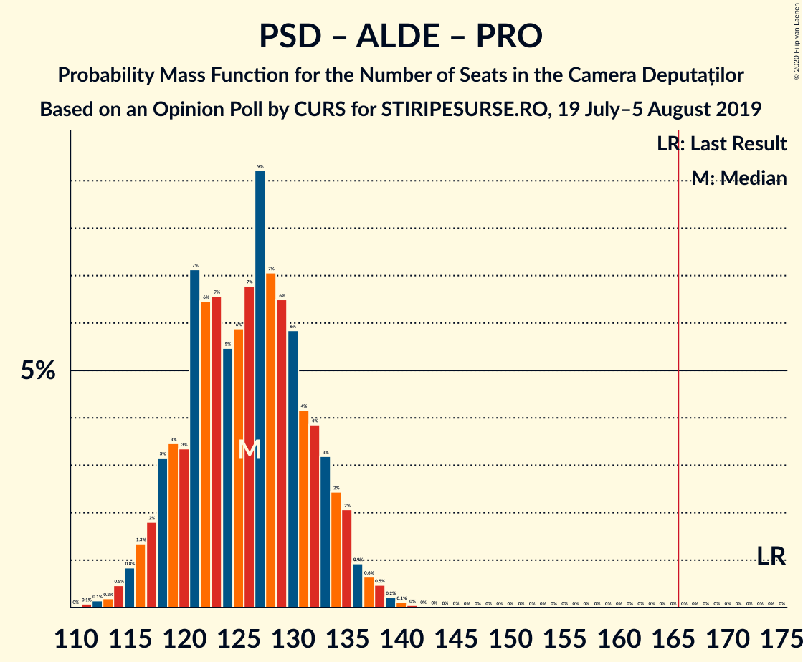

| Number of Seats | Probability | Accumulated | Special Marks |
|:---------------:|:-----------:|:-----------:|:-------------:|
| 111 | 0% | 100% |  |
| 112 | 0.3% | 99.9% |  |
| 113 | 0.2% | 99.7% |  |
| 114 | 0.7% | 99.5% |  |
| 115 | 0.4% | 98.7% |  |
| 116 | 1.0% | 98% |  |
| 117 | 2% | 97% |  |
| 118 | 2% | 95% |  |
| 119 | 3% | 93% |  |
| 120 | 4% | 90% |  |
| 121 | 3% | 86% |  |
| 122 | 6% | 83% |  |
| 123 | 8% | 77% |  |
| 124 | 10% | 70% |  |
| 125 | 6% | 59% |  |
| 126 | 6% | 54% |  |
| 127 | 4% | 48% | Median |
| 128 | 8% | 44% |  |
| 129 | 6% | 36% |  |
| 130 | 2% | 30% |  |
| 131 | 11% | 27% |  |
| 132 | 2% | 16% |  |
| 133 | 5% | 14% |  |
| 134 | 4% | 9% |  |
| 135 | 3% | 6% |  |
| 136 | 2% | 3% |  |
| 137 | 0.7% | 1.4% |  |
| 138 | 0.1% | 0.7% |  |
| 139 | 0.2% | 0.6% |  |
| 140 | 0.3% | 0.4% |  |
| 141 | 0% | 0.1% |  |
| 142 | 0% | 0.1% |  |
| 143 | 0% | 0% |  |
| 144 | 0% | 0% |  |
| 145 | 0% | 0% |  |
| 146 | 0% | 0% |  |
| 147 | 0% | 0% |  |
| 148 | 0% | 0% |  |
| 149 | 0% | 0% |  |
| 150 | 0% | 0% |  |
| 151 | 0% | 0% |  |
| 152 | 0% | 0% |  |
| 153 | 0% | 0% |  |
| 154 | 0% | 0% |  |
| 155 | 0% | 0% |  |
| 156 | 0% | 0% |  |
| 157 | 0% | 0% |  |
| 158 | 0% | 0% |  |
| 159 | 0% | 0% |  |
| 160 | 0% | 0% |  |
| 161 | 0% | 0% |  |
| 162 | 0% | 0% |  |
| 163 | 0% | 0% |  |
| 164 | 0% | 0% |  |
| 165 | 0% | 0% |  |
| 166 | 0% | 0% | Majority |
| 167 | 0% | 0% |  |
| 168 | 0% | 0% |  |
| 169 | 0% | 0% |  |
| 170 | 0% | 0% |  |
| 171 | 0% | 0% |  |
| 172 | 0% | 0% |  |
| 173 | 0% | 0% |  |
| 174 | 0% | 0% | Last Result |

### Partidul Național Liberal – Partidul Mișcarea Populară – Uniunea Democrată Maghiară din România

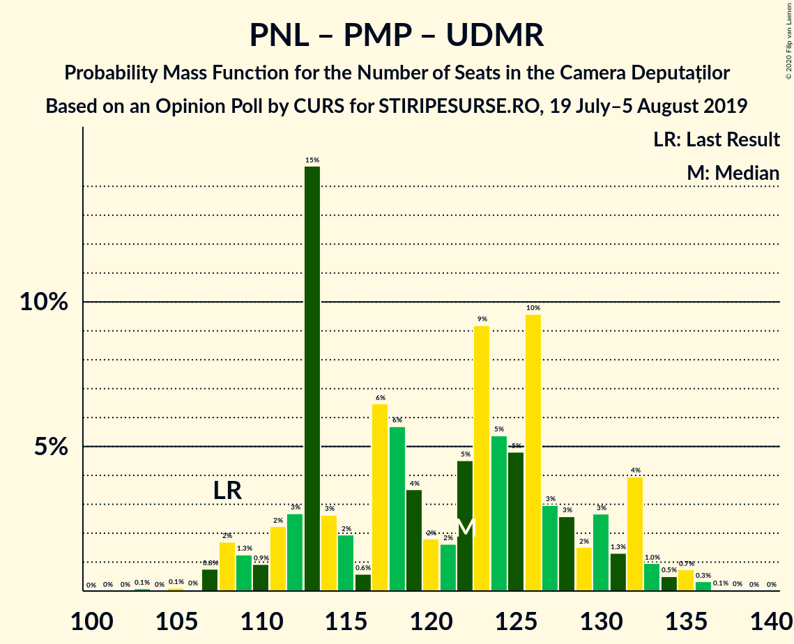

| Number of Seats | Probability | Accumulated | Special Marks |
|:---------------:|:-----------:|:-----------:|:-------------:|
| 103 | 0.1% | 100% |  |
| 104 | 0% | 99.9% |  |
| 105 | 0.1% | 99.9% |  |
| 106 | 0% | 99.8% |  |
| 107 | 0.8% | 99.7% |  |
| 108 | 2% | 99.0% | Last Result |
| 109 | 1.3% | 97% |  |
| 110 | 0.9% | 96% |  |
| 111 | 2% | 95% |  |
| 112 | 3% | 93% |  |
| 113 | 15% | 90% |  |
| 114 | 3% | 75% |  |
| 115 | 2% | 73% |  |
| 116 | 0.6% | 71% |  |
| 117 | 6% | 70% |  |
| 118 | 6% | 64% |  |
| 119 | 4% | 58% |  |
| 120 | 2% | 55% |  |
| 121 | 2% | 53% |  |
| 122 | 5% | 51% |  |
| 123 | 9% | 47% |  |
| 124 | 5% | 37% |  |
| 125 | 5% | 32% |  |
| 126 | 10% | 27% |  |
| 127 | 3% | 18% | Median |
| 128 | 3% | 15% |  |
| 129 | 2% | 12% |  |
| 130 | 3% | 11% |  |
| 131 | 1.3% | 8% |  |
| 132 | 4% | 7% |  |
| 133 | 1.0% | 3% |  |
| 134 | 0.5% | 2% |  |
| 135 | 0.7% | 1.2% |  |
| 136 | 0.3% | 0.5% |  |
| 137 | 0.1% | 0.1% |  |
| 138 | 0% | 0.1% |  |
| 139 | 0% | 0.1% |  |
| 140 | 0% | 0% |  |

### Partidul Național Liberal – Uniunea Democrată Maghiară din România

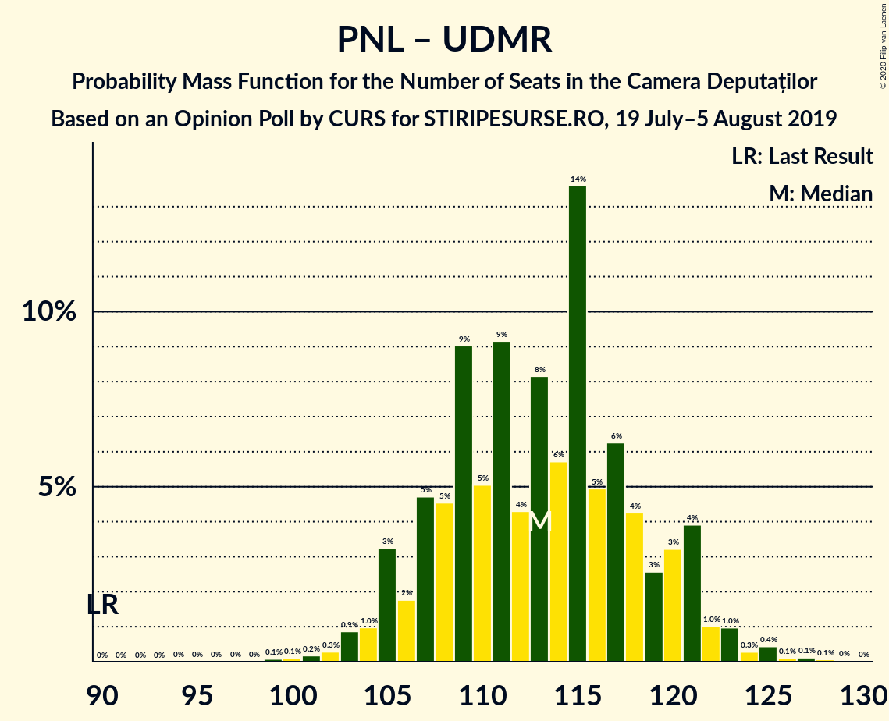

| Number of Seats | Probability | Accumulated | Special Marks |
|:---------------:|:-----------:|:-----------:|:-------------:|
| 90 | 0% | 100% | Last Result |
| 91 | 0% | 100% |  |
| 92 | 0% | 100% |  |
| 93 | 0% | 100% |  |
| 94 | 0% | 100% |  |
| 95 | 0% | 100% |  |
| 96 | 0% | 100% |  |
| 97 | 0% | 100% |  |
| 98 | 0% | 100% |  |
| 99 | 0% | 99.9% |  |
| 100 | 0% | 99.9% |  |
| 101 | 0.3% | 99.9% |  |
| 102 | 0.2% | 99.6% |  |
| 103 | 2% | 99.4% |  |
| 104 | 0.7% | 98% |  |
| 105 | 5% | 97% |  |
| 106 | 3% | 92% |  |
| 107 | 10% | 89% |  |
| 108 | 16% | 80% |  |
| 109 | 2% | 64% |  |
| 110 | 3% | 61% |  |
| 111 | 4% | 58% |  |
| 112 | 4% | 55% | Median |
| 113 | 17% | 50% |  |
| 114 | 6% | 33% |  |
| 115 | 3% | 28% |  |
| 116 | 3% | 25% |  |
| 117 | 7% | 22% |  |
| 118 | 7% | 15% |  |
| 119 | 3% | 8% |  |
| 120 | 1.1% | 6% |  |
| 121 | 0.6% | 5% |  |
| 122 | 1.1% | 4% |  |
| 123 | 2% | 3% |  |
| 124 | 0.6% | 1.4% |  |
| 125 | 0.4% | 0.7% |  |
| 126 | 0% | 0.3% |  |
| 127 | 0.1% | 0.3% |  |
| 128 | 0.1% | 0.2% |  |
| 129 | 0.1% | 0.1% |  |
| 130 | 0% | 0% |  |

### Partidul Național Liberal – Partidul Mișcarea Populară

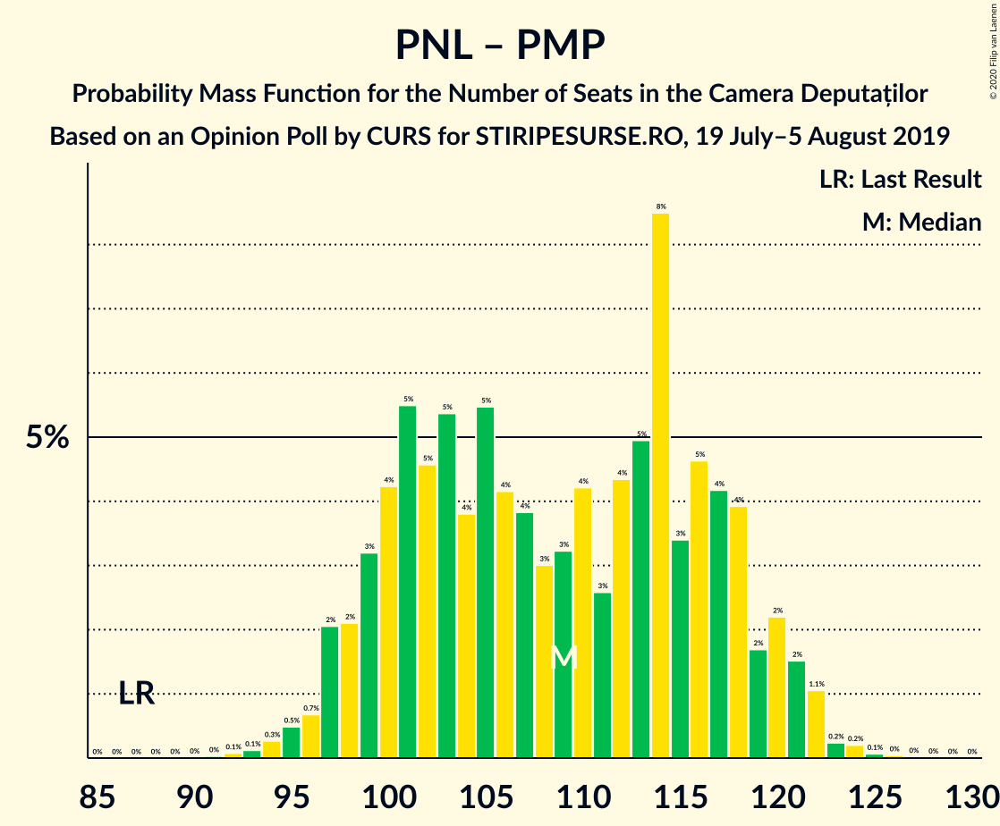

| Number of Seats | Probability | Accumulated | Special Marks |
|:---------------:|:-----------:|:-----------:|:-------------:|
| 87 | 0% | 100% | Last Result |
| 88 | 0% | 100% |  |
| 89 | 0% | 100% |  |
| 90 | 0% | 100% |  |
| 91 | 0.1% | 100% |  |
| 92 | 0.1% | 99.9% |  |
| 93 | 0.4% | 99.8% |  |
| 94 | 0.6% | 99.5% |  |
| 95 | 0.2% | 98.8% |  |
| 96 | 0.6% | 98.6% |  |
| 97 | 4% | 98% |  |
| 98 | 2% | 94% |  |
| 99 | 11% | 92% |  |
| 100 | 6% | 81% |  |
| 101 | 3% | 75% |  |
| 102 | 4% | 72% |  |
| 103 | 2% | 68% |  |
| 104 | 2% | 66% |  |
| 105 | 4% | 64% |  |
| 106 | 5% | 60% |  |
| 107 | 2% | 55% |  |
| 108 | 1.3% | 54% |  |
| 109 | 3% | 52% |  |
| 110 | 9% | 49% |  |
| 111 | 4% | 41% |  |
| 112 | 5% | 36% |  |
| 113 | 10% | 31% |  |
| 114 | 6% | 21% | Median |
| 115 | 1.0% | 15% |  |
| 116 | 2% | 14% |  |
| 117 | 2% | 13% |  |
| 118 | 4% | 11% |  |
| 119 | 2% | 7% |  |
| 120 | 3% | 6% |  |
| 121 | 1.0% | 2% |  |
| 122 | 0.5% | 1.1% |  |
| 123 | 0.2% | 0.7% |  |
| 124 | 0.3% | 0.4% |  |
| 125 | 0% | 0.1% |  |
| 126 | 0% | 0.1% |  |
| 127 | 0% | 0% |  |

### Partidul Social Democrat – Partidul Alianța Liberalilor și Democraților

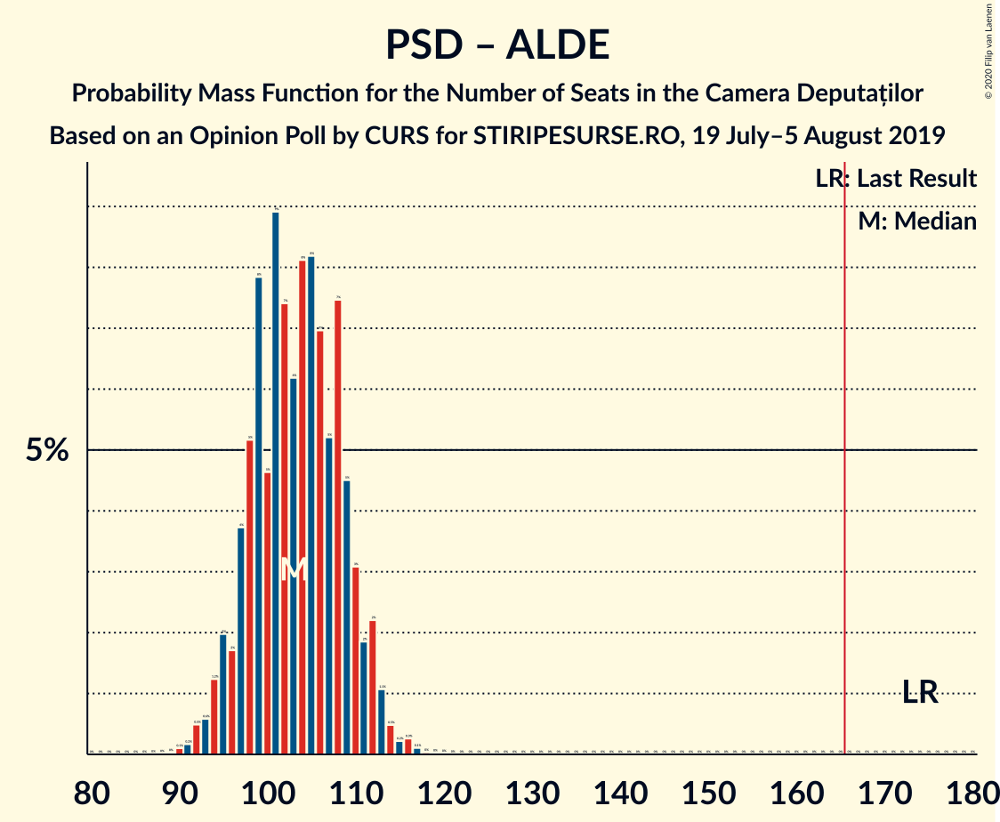

| Number of Seats | Probability | Accumulated | Special Marks |
|:---------------:|:-----------:|:-----------:|:-------------:|
| 89 | 0% | 100% |  |
| 90 | 0.1% | 99.9% |  |
| 91 | 0.2% | 99.8% |  |
| 92 | 0.1% | 99.7% |  |
| 93 | 0.6% | 99.5% |  |
| 94 | 2% | 98.9% |  |
| 95 | 1.3% | 97% |  |
| 96 | 1.5% | 95% |  |
| 97 | 3% | 94% |  |
| 98 | 6% | 91% |  |
| 99 | 7% | 85% |  |
| 100 | 4% | 78% |  |
| 101 | 7% | 74% |  |
| 102 | 9% | 67% |  |
| 103 | 6% | 58% |  |
| 104 | 4% | 52% | Median |
| 105 | 14% | 49% |  |
| 106 | 3% | 35% |  |
| 107 | 4% | 32% |  |
| 108 | 11% | 28% |  |
| 109 | 7% | 17% |  |
| 110 | 1.1% | 10% |  |
| 111 | 2% | 9% |  |
| 112 | 4% | 7% |  |
| 113 | 1.1% | 2% |  |
| 114 | 0.1% | 1.3% |  |
| 115 | 0.5% | 1.2% |  |
| 116 | 0.4% | 0.6% |  |
| 117 | 0.1% | 0.2% |  |
| 118 | 0% | 0.1% |  |
| 119 | 0% | 0% |  |
| 120 | 0% | 0% |  |
| 121 | 0% | 0% |  |
| 122 | 0% | 0% |  |
| 123 | 0% | 0% |  |
| 124 | 0% | 0% |  |
| 125 | 0% | 0% |  |
| 126 | 0% | 0% |  |
| 127 | 0% | 0% |  |
| 128 | 0% | 0% |  |
| 129 | 0% | 0% |  |
| 130 | 0% | 0% |  |
| 131 | 0% | 0% |  |
| 132 | 0% | 0% |  |
| 133 | 0% | 0% |  |
| 134 | 0% | 0% |  |
| 135 | 0% | 0% |  |
| 136 | 0% | 0% |  |
| 137 | 0% | 0% |  |
| 138 | 0% | 0% |  |
| 139 | 0% | 0% |  |
| 140 | 0% | 0% |  |
| 141 | 0% | 0% |  |
| 142 | 0% | 0% |  |
| 143 | 0% | 0% |  |
| 144 | 0% | 0% |  |
| 145 | 0% | 0% |  |
| 146 | 0% | 0% |  |
| 147 | 0% | 0% |  |
| 148 | 0% | 0% |  |
| 149 | 0% | 0% |  |
| 150 | 0% | 0% |  |
| 151 | 0% | 0% |  |
| 152 | 0% | 0% |  |
| 153 | 0% | 0% |  |
| 154 | 0% | 0% |  |
| 155 | 0% | 0% |  |
| 156 | 0% | 0% |  |
| 157 | 0% | 0% |  |
| 158 | 0% | 0% |  |
| 159 | 0% | 0% |  |
| 160 | 0% | 0% |  |
| 161 | 0% | 0% |  |
| 162 | 0% | 0% |  |
| 163 | 0% | 0% |  |
| 164 | 0% | 0% |  |
| 165 | 0% | 0% |  |
| 166 | 0% | 0% | Majority |
| 167 | 0% | 0% |  |
| 168 | 0% | 0% |  |
| 169 | 0% | 0% |  |
| 170 | 0% | 0% |  |
| 171 | 0% | 0% |  |
| 172 | 0% | 0% |  |
| 173 | 0% | 0% |  |
| 174 | 0% | 0% | Last Result |

### Partidul Național Liberal

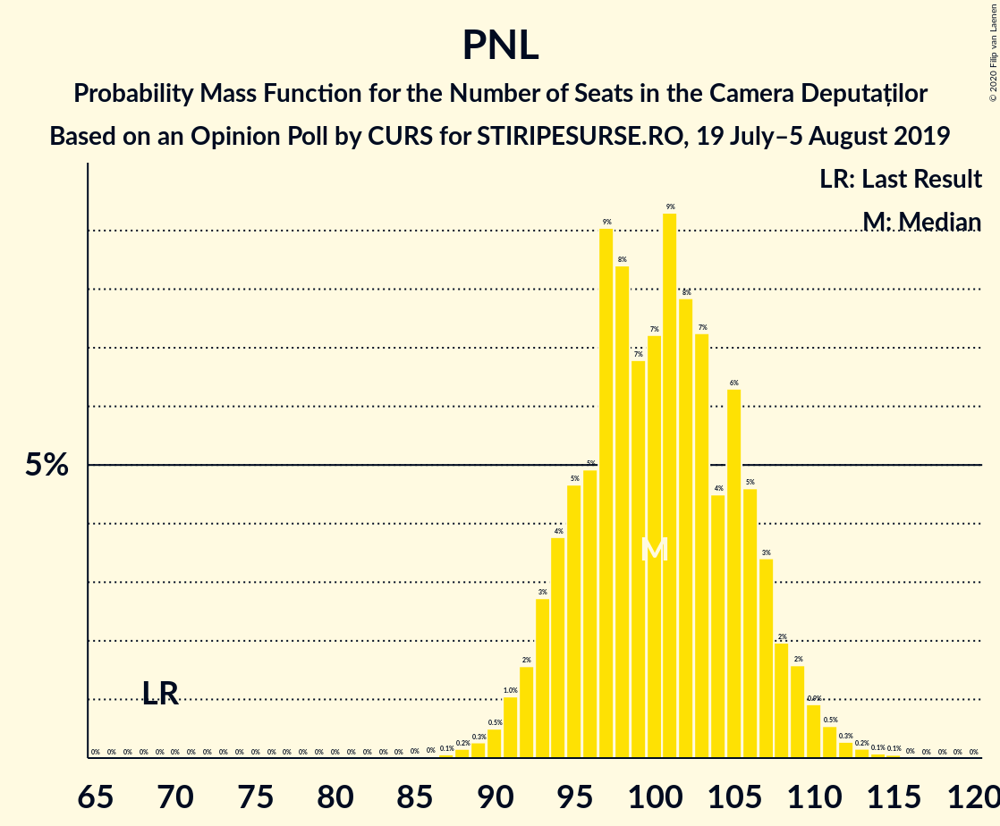

| Number of Seats | Probability | Accumulated | Special Marks |
|:---------------:|:-----------:|:-----------:|:-------------:|
| 69 | 0% | 100% | Last Result |
| 70 | 0% | 100% |  |
| 71 | 0% | 100% |  |
| 72 | 0% | 100% |  |
| 73 | 0% | 100% |  |
| 74 | 0% | 100% |  |
| 75 | 0% | 100% |  |
| 76 | 0% | 100% |  |
| 77 | 0% | 100% |  |
| 78 | 0% | 100% |  |
| 79 | 0% | 100% |  |
| 80 | 0% | 100% |  |
| 81 | 0% | 100% |  |
| 82 | 0% | 100% |  |
| 83 | 0% | 100% |  |
| 84 | 0% | 100% |  |
| 85 | 0% | 100% |  |
| 86 | 0% | 100% |  |
| 87 | 0.1% | 99.9% |  |
| 88 | 0.1% | 99.9% |  |
| 89 | 0.2% | 99.8% |  |
| 90 | 0.4% | 99.7% |  |
| 91 | 1.0% | 99.3% |  |
| 92 | 2% | 98% |  |
| 93 | 4% | 97% |  |
| 94 | 10% | 93% |  |
| 95 | 11% | 83% |  |
| 96 | 6% | 71% |  |
| 97 | 8% | 65% |  |
| 98 | 3% | 57% |  |
| 99 | 12% | 54% | Median |
| 100 | 7% | 43% |  |
| 101 | 5% | 36% |  |
| 102 | 8% | 31% |  |
| 103 | 6% | 23% |  |
| 104 | 3% | 18% |  |
| 105 | 4% | 15% |  |
| 106 | 5% | 10% |  |
| 107 | 1.4% | 6% |  |
| 108 | 1.0% | 4% |  |
| 109 | 1.0% | 3% |  |
| 110 | 1.2% | 2% |  |
| 111 | 0.2% | 1.1% |  |
| 112 | 0.4% | 0.9% |  |
| 113 | 0.3% | 0.5% |  |
| 114 | 0.1% | 0.2% |  |
| 115 | 0.1% | 0.2% |  |
| 116 | 0.1% | 0.1% |  |
| 117 | 0% | 0% |  |

### Partidul Social Democrat – PRO România

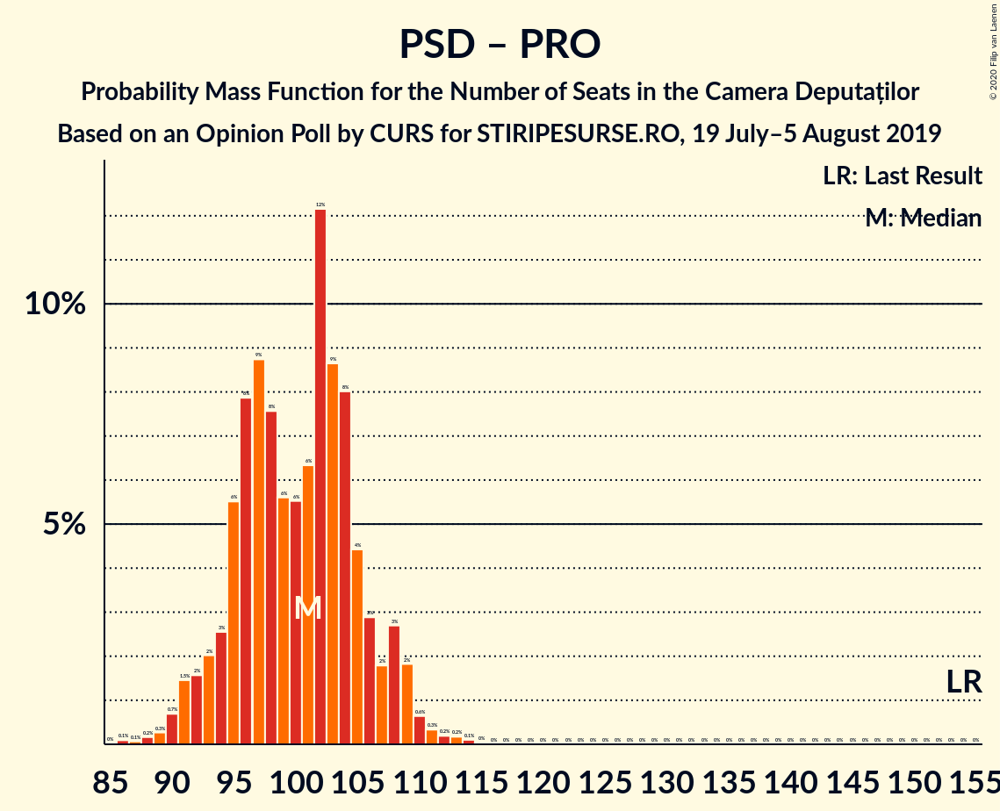

| Number of Seats | Probability | Accumulated | Special Marks |
|:---------------:|:-----------:|:-----------:|:-------------:|
| 86 | 0.1% | 100% |  |
| 87 | 0.2% | 99.8% |  |
| 88 | 0.4% | 99.7% |  |
| 89 | 0.4% | 99.3% |  |
| 90 | 1.2% | 98.8% |  |
| 91 | 2% | 98% |  |
| 92 | 2% | 96% |  |
| 93 | 2% | 94% |  |
| 94 | 2% | 93% |  |
| 95 | 4% | 91% |  |
| 96 | 6% | 87% |  |
| 97 | 13% | 81% |  |
| 98 | 8% | 68% |  |
| 99 | 6% | 60% |  |
| 100 | 4% | 54% |  |
| 101 | 7% | 50% | Median |
| 102 | 4% | 43% |  |
| 103 | 11% | 39% |  |
| 104 | 13% | 28% |  |
| 105 | 7% | 15% |  |
| 106 | 2% | 8% |  |
| 107 | 1.1% | 5% |  |
| 108 | 2% | 4% |  |
| 109 | 0.7% | 2% |  |
| 110 | 0.7% | 2% |  |
| 111 | 0.5% | 1.0% |  |
| 112 | 0.1% | 0.5% |  |
| 113 | 0.1% | 0.3% |  |
| 114 | 0.1% | 0.2% |  |
| 115 | 0.1% | 0.1% |  |
| 116 | 0% | 0% |  |
| 117 | 0% | 0% |  |
| 118 | 0% | 0% |  |
| 119 | 0% | 0% |  |
| 120 | 0% | 0% |  |
| 121 | 0% | 0% |  |
| 122 | 0% | 0% |  |
| 123 | 0% | 0% |  |
| 124 | 0% | 0% |  |
| 125 | 0% | 0% |  |
| 126 | 0% | 0% |  |
| 127 | 0% | 0% |  |
| 128 | 0% | 0% |  |
| 129 | 0% | 0% |  |
| 130 | 0% | 0% |  |
| 131 | 0% | 0% |  |
| 132 | 0% | 0% |  |
| 133 | 0% | 0% |  |
| 134 | 0% | 0% |  |
| 135 | 0% | 0% |  |
| 136 | 0% | 0% |  |
| 137 | 0% | 0% |  |
| 138 | 0% | 0% |  |
| 139 | 0% | 0% |  |
| 140 | 0% | 0% |  |
| 141 | 0% | 0% |  |
| 142 | 0% | 0% |  |
| 143 | 0% | 0% |  |
| 144 | 0% | 0% |  |
| 145 | 0% | 0% |  |
| 146 | 0% | 0% |  |
| 147 | 0% | 0% |  |
| 148 | 0% | 0% |  |
| 149 | 0% | 0% |  |
| 150 | 0% | 0% |  |
| 151 | 0% | 0% |  |
| 152 | 0% | 0% |  |
| 153 | 0% | 0% |  |
| 154 | 0% | 0% | Last Result |

### Alianța 2020 USR-PLUS – Partidul Mișcarea Populară

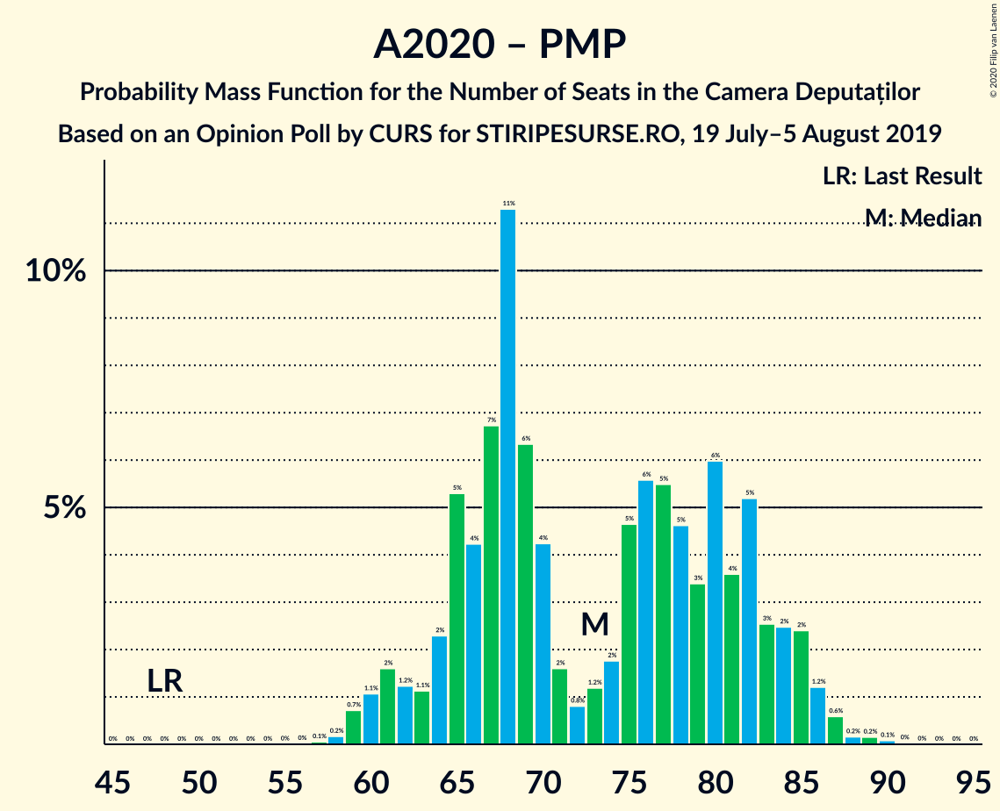

| Number of Seats | Probability | Accumulated | Special Marks |
|:---------------:|:-----------:|:-----------:|:-------------:|
| 48 | 0% | 100% | Last Result |
| 49 | 0% | 100% |  |
| 50 | 0% | 100% |  |
| 51 | 0% | 100% |  |
| 52 | 0% | 100% |  |
| 53 | 0% | 100% |  |
| 54 | 0% | 100% |  |
| 55 | 0% | 100% |  |
| 56 | 0% | 100% |  |
| 57 | 0% | 100% |  |
| 58 | 0.2% | 99.9% |  |
| 59 | 0.5% | 99.7% |  |
| 60 | 1.2% | 99.2% |  |
| 61 | 1.3% | 98% |  |
| 62 | 1.0% | 97% |  |
| 63 | 0.8% | 96% |  |
| 64 | 3% | 95% |  |
| 65 | 6% | 92% |  |
| 66 | 7% | 86% |  |
| 67 | 6% | 79% |  |
| 68 | 14% | 73% |  |
| 69 | 1.1% | 59% |  |
| 70 | 1.0% | 58% |  |
| 71 | 3% | 57% |  |
| 72 | 1.2% | 54% |  |
| 73 | 1.3% | 53% |  |
| 74 | 3% | 52% |  |
| 75 | 4% | 48% |  |
| 76 | 2% | 44% |  |
| 77 | 5% | 42% |  |
| 78 | 2% | 38% |  |
| 79 | 4% | 35% |  |
| 80 | 7% | 32% |  |
| 81 | 4% | 25% | Median |
| 82 | 8% | 21% |  |
| 83 | 4% | 13% |  |
| 84 | 3% | 9% |  |
| 85 | 3% | 7% |  |
| 86 | 2% | 3% |  |
| 87 | 0.6% | 1.4% |  |
| 88 | 0.2% | 0.8% |  |
| 89 | 0.4% | 0.6% |  |
| 90 | 0.2% | 0.2% |  |
| 91 | 0% | 0.1% |  |
| 92 | 0% | 0% |  |

## Technical Information

### Opinion Poll

+ **Polling firm:** CURS
+ **Commissioner(s):** STIRIPESURSE.RO
+ **Fieldwork period:** 19 July–5 August 2019

### Calculations

+ **Sample size:** 1600
+ **Simulations done:** 131,072
+ **Error estimate:** 0.90%

