# Opinion Poll by Socio-Data, 2–6 September 2019

<a href="#voting-intentions">Voting Intentions</a> | <a href="#seats">Seats</a> | <a href="#coalitions">Coalitions</a> | <a href="#technical-information">Technical Information</a>

## Voting Intentions

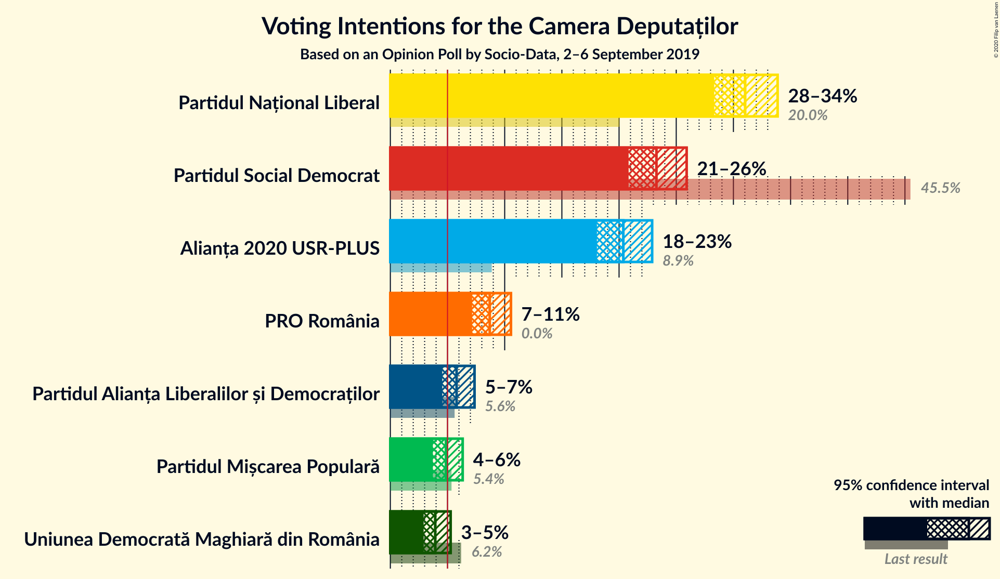

### Confidence Intervals

| Party | Last Result | Poll Result | 80% Confidence Interval | 90% Confidence Interval | 95% Confidence Interval | 99% Confidence Interval |
|:-----:|:-----------:|:-----------:|:-----------------------:|:-----------------------:|:-----------------------:|:-----------------------:|
| Partidul Național Liberal | 20.0% | 31.0% | 29.2–32.9% |28.7–33.4% |28.3–33.9% |27.5–34.8% |
| Partidul Social Democrat | 45.5% | 23.3% | 21.7–25.0% |21.2–25.5% |20.8–25.9% |20.1–26.7% |
| Alianța 2020 USR-PLUS | 8.9% | 20.4% | 18.9–22.0% |18.4–22.5% |18.1–22.9% |17.4–23.7% |
| PRO România | 0.0% | 8.7% | 7.7–9.9% |7.4–10.2% |7.1–10.5% |6.7–11.1% |
| Partidul Alianța Liberalilor și Democraților | 5.6% | 5.8% | 5.0–6.8% |4.7–7.1% |4.5–7.4% |4.2–7.9% |
| Partidul Mișcarea Populară | 5.4% | 4.9% | 4.1–5.8% |3.9–6.1% |3.7–6.3% |3.4–6.8% |
| Uniunea Democrată Maghiară din România | 6.2% | 3.9% | 3.3–4.8% |3.1–5.0% |2.9–5.3% |2.6–5.7% |

*Note:* The poll result column reflects the actual value used in the calculations. Published results may vary slightly, and in addition be rounded to fewer digits.

## Seats

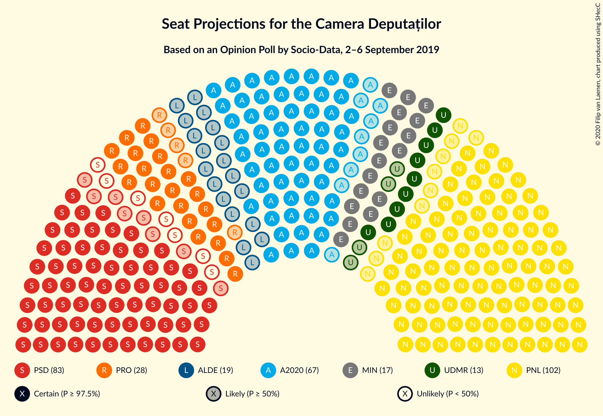

### Confidence Intervals

| Party | Last Result | Median | 80% Confidence Interval | 90% Confidence Interval | 95% Confidence Interval | 99% Confidence Interval |
|:-----:|:-----------:|:------:|:-----------------------:|:-----------------------:|:-----------------------:|:-----------------------:|
| <a href="#partidul-național-liberal">Partidul Național Liberal</a> | 69 | 102 | 95–110 |93–112 |92–114 |88–118 |
| <a href="#partidul-social-democrat">Partidul Social Democrat</a> | 154 | 76 | 70–84 |69–86 |68–87 |65–90 |
| <a href="#alianța-2020-usr-plus">Alianța 2020 USR-PLUS</a> | 30 | 67 | 61–73 |60–75 |58–76 |56–80 |
| <a href="#pro-românia">PRO România</a> | 0 | 28 | 25–32 |24–34 |23–35 |21–37 |
| <a href="#partidul-alianța-liberalilor-și-democraților">Partidul Alianța Liberalilor și Democraților</a> | 20 | 19 | 0–22 |0–23 |0–24 |0–26 |
| <a href="#partidul-mișcarea-populară">Partidul Mișcarea Populară</a> | 18 | 0 | 0–18 |0–19 |0–20 |0–22 |
| <a href="#uniunea-democrată-maghiară-din-românia">Uniunea Democrată Maghiară din România</a> | 21 | 13 | 10–15 |10–16 |9–17 |8–19 |

### Partidul Național Liberal

*For a full overview of the results for this party, see the [Partidul Național Liberal](party-partidulnaționalliberal.html) page.*

| Number of Seats | Probability | Accumulated | Special Marks |
|:---------------:|:-----------:|:-----------:|:-------------:|
| 69 | 0% | 100% | Last Result |
| 70 | 0% | 100% |  |
| 71 | 0% | 100% |  |
| 72 | 0% | 100% |  |
| 73 | 0% | 100% |  |
| 74 | 0% | 100% |  |
| 75 | 0% | 100% |  |
| 76 | 0% | 100% |  |
| 77 | 0% | 100% |  |
| 78 | 0% | 100% |  |
| 79 | 0% | 100% |  |
| 80 | 0% | 100% |  |
| 81 | 0% | 100% |  |
| 82 | 0% | 100% |  |
| 83 | 0% | 100% |  |
| 84 | 0% | 100% |  |
| 85 | 0% | 100% |  |
| 86 | 0.1% | 99.9% |  |
| 87 | 0.1% | 99.9% |  |
| 88 | 0.2% | 99.7% |  |
| 89 | 0.4% | 99.5% |  |
| 90 | 0.5% | 99.1% |  |
| 91 | 0.9% | 98.6% |  |
| 92 | 1.4% | 98% |  |
| 93 | 2% | 96% |  |
| 94 | 3% | 94% |  |
| 95 | 3% | 92% |  |
| 96 | 3% | 88% |  |
| 97 | 5% | 85% |  |
| 98 | 5% | 80% |  |
| 99 | 6% | 75% |  |
| 100 | 7% | 68% |  |
| 101 | 7% | 61% |  |
| 102 | 8% | 54% | Median |
| 103 | 7% | 46% |  |
| 104 | 7% | 39% |  |
| 105 | 5% | 32% |  |
| 106 | 4% | 27% |  |
| 107 | 5% | 23% |  |
| 108 | 4% | 18% |  |
| 109 | 3% | 14% |  |
| 110 | 3% | 11% |  |
| 111 | 3% | 9% |  |
| 112 | 2% | 6% |  |
| 113 | 1.3% | 4% |  |
| 114 | 0.9% | 3% |  |
| 115 | 0.5% | 2% |  |
| 116 | 0.5% | 2% |  |
| 117 | 0.4% | 1.1% |  |
| 118 | 0.3% | 0.7% |  |
| 119 | 0.2% | 0.4% |  |
| 120 | 0.1% | 0.2% |  |
| 121 | 0% | 0.2% |  |
| 122 | 0% | 0.1% |  |
| 123 | 0.1% | 0.1% |  |
| 124 | 0% | 0% |  |

### Partidul Social Democrat

*For a full overview of the results for this party, see the [Partidul Social Democrat](party-partidulsocialdemocrat.html) page.*

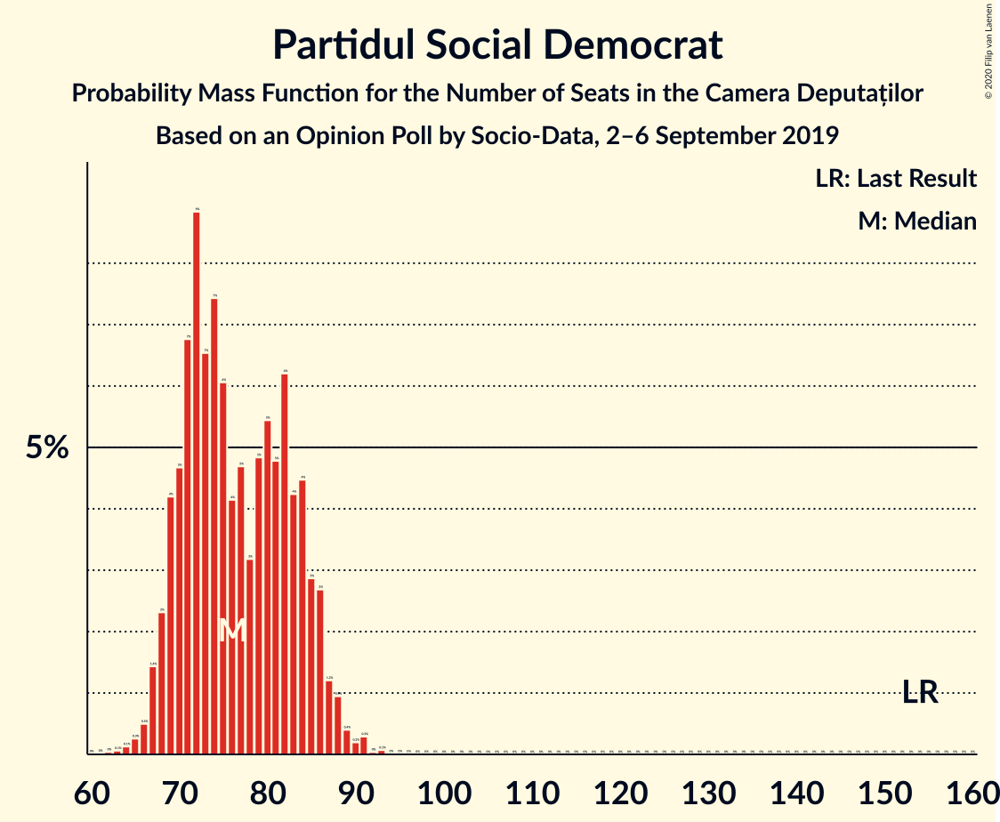

| Number of Seats | Probability | Accumulated | Special Marks |
|:---------------:|:-----------:|:-----------:|:-------------:|
| 62 | 0% | 100% |  |
| 63 | 0.1% | 99.9% |  |
| 64 | 0.1% | 99.9% |  |
| 65 | 0.3% | 99.7% |  |
| 66 | 0.5% | 99.5% |  |
| 67 | 1.4% | 99.0% |  |
| 68 | 2% | 98% |  |
| 69 | 4% | 95% |  |
| 70 | 5% | 91% |  |
| 71 | 7% | 86% |  |
| 72 | 9% | 80% |  |
| 73 | 7% | 71% |  |
| 74 | 7% | 64% |  |
| 75 | 6% | 57% |  |
| 76 | 4% | 51% | Median |
| 77 | 5% | 47% |  |
| 78 | 3% | 42% |  |
| 79 | 5% | 39% |  |
| 80 | 5% | 34% |  |
| 81 | 5% | 28% |  |
| 82 | 6% | 24% |  |
| 83 | 4% | 17% |  |
| 84 | 4% | 13% |  |
| 85 | 3% | 9% |  |
| 86 | 3% | 6% |  |
| 87 | 1.2% | 3% |  |
| 88 | 0.9% | 2% |  |
| 89 | 0.4% | 1.0% |  |
| 90 | 0.2% | 0.6% |  |
| 91 | 0.3% | 0.4% |  |
| 92 | 0% | 0.1% |  |
| 93 | 0.1% | 0.1% |  |
| 94 | 0% | 0% |  |
| 95 | 0% | 0% |  |
| 96 | 0% | 0% |  |
| 97 | 0% | 0% |  |
| 98 | 0% | 0% |  |
| 99 | 0% | 0% |  |
| 100 | 0% | 0% |  |
| 101 | 0% | 0% |  |
| 102 | 0% | 0% |  |
| 103 | 0% | 0% |  |
| 104 | 0% | 0% |  |
| 105 | 0% | 0% |  |
| 106 | 0% | 0% |  |
| 107 | 0% | 0% |  |
| 108 | 0% | 0% |  |
| 109 | 0% | 0% |  |
| 110 | 0% | 0% |  |
| 111 | 0% | 0% |  |
| 112 | 0% | 0% |  |
| 113 | 0% | 0% |  |
| 114 | 0% | 0% |  |
| 115 | 0% | 0% |  |
| 116 | 0% | 0% |  |
| 117 | 0% | 0% |  |
| 118 | 0% | 0% |  |
| 119 | 0% | 0% |  |
| 120 | 0% | 0% |  |
| 121 | 0% | 0% |  |
| 122 | 0% | 0% |  |
| 123 | 0% | 0% |  |
| 124 | 0% | 0% |  |
| 125 | 0% | 0% |  |
| 126 | 0% | 0% |  |
| 127 | 0% | 0% |  |
| 128 | 0% | 0% |  |
| 129 | 0% | 0% |  |
| 130 | 0% | 0% |  |
| 131 | 0% | 0% |  |
| 132 | 0% | 0% |  |
| 133 | 0% | 0% |  |
| 134 | 0% | 0% |  |
| 135 | 0% | 0% |  |
| 136 | 0% | 0% |  |
| 137 | 0% | 0% |  |
| 138 | 0% | 0% |  |
| 139 | 0% | 0% |  |
| 140 | 0% | 0% |  |
| 141 | 0% | 0% |  |
| 142 | 0% | 0% |  |
| 143 | 0% | 0% |  |
| 144 | 0% | 0% |  |
| 145 | 0% | 0% |  |
| 146 | 0% | 0% |  |
| 147 | 0% | 0% |  |
| 148 | 0% | 0% |  |
| 149 | 0% | 0% |  |
| 150 | 0% | 0% |  |
| 151 | 0% | 0% |  |
| 152 | 0% | 0% |  |
| 153 | 0% | 0% |  |
| 154 | 0% | 0% | Last Result |

### Alianța 2020 USR-PLUS

*For a full overview of the results for this party, see the [Alianța 2020 USR-PLUS](party-alianța2020usr-plus.html) page.*

| Number of Seats | Probability | Accumulated | Special Marks |
|:---------------:|:-----------:|:-----------:|:-------------:|
| 30 | 0% | 100% | Last Result |
| 31 | 0% | 100% |  |
| 32 | 0% | 100% |  |
| 33 | 0% | 100% |  |
| 34 | 0% | 100% |  |
| 35 | 0% | 100% |  |
| 36 | 0% | 100% |  |
| 37 | 0% | 100% |  |
| 38 | 0% | 100% |  |
| 39 | 0% | 100% |  |
| 40 | 0% | 100% |  |
| 41 | 0% | 100% |  |
| 42 | 0% | 100% |  |
| 43 | 0% | 100% |  |
| 44 | 0% | 100% |  |
| 45 | 0% | 100% |  |
| 46 | 0% | 100% |  |
| 47 | 0% | 100% |  |
| 48 | 0% | 100% |  |
| 49 | 0% | 100% |  |
| 50 | 0% | 100% |  |
| 51 | 0% | 100% |  |
| 52 | 0% | 100% |  |
| 53 | 0% | 100% |  |
| 54 | 0.1% | 99.9% |  |
| 55 | 0.2% | 99.8% |  |
| 56 | 0.5% | 99.6% |  |
| 57 | 0.9% | 99.2% |  |
| 58 | 1.2% | 98% |  |
| 59 | 2% | 97% |  |
| 60 | 3% | 95% |  |
| 61 | 4% | 93% |  |
| 62 | 5% | 89% |  |
| 63 | 5% | 84% |  |
| 64 | 8% | 79% |  |
| 65 | 8% | 71% |  |
| 66 | 9% | 63% |  |
| 67 | 11% | 55% | Median |
| 68 | 7% | 44% |  |
| 69 | 8% | 37% |  |
| 70 | 7% | 29% |  |
| 71 | 5% | 22% |  |
| 72 | 5% | 16% |  |
| 73 | 4% | 12% |  |
| 74 | 3% | 8% |  |
| 75 | 2% | 6% |  |
| 76 | 1.3% | 4% |  |
| 77 | 0.9% | 2% |  |
| 78 | 0.5% | 2% |  |
| 79 | 0.5% | 1.1% |  |
| 80 | 0.2% | 0.6% |  |
| 81 | 0.1% | 0.3% |  |
| 82 | 0.1% | 0.2% |  |
| 83 | 0.1% | 0.1% |  |
| 84 | 0% | 0.1% |  |
| 85 | 0% | 0% |  |

### PRO România

*For a full overview of the results for this party, see the [PRO România](party-proromânia.html) page.*

| Number of Seats | Probability | Accumulated | Special Marks |
|:---------------:|:-----------:|:-----------:|:-------------:|
| 0 | 0% | 100% | Last Result |
| 1 | 0% | 100% |  |
| 2 | 0% | 100% |  |
| 3 | 0% | 100% |  |
| 4 | 0% | 100% |  |
| 5 | 0% | 100% |  |
| 6 | 0% | 100% |  |
| 7 | 0% | 100% |  |
| 8 | 0% | 100% |  |
| 9 | 0% | 100% |  |
| 10 | 0% | 100% |  |
| 11 | 0% | 100% |  |
| 12 | 0% | 100% |  |
| 13 | 0% | 100% |  |
| 14 | 0% | 100% |  |
| 15 | 0% | 100% |  |
| 16 | 0% | 100% |  |
| 17 | 0% | 100% |  |
| 18 | 0% | 100% |  |
| 19 | 0% | 100% |  |
| 20 | 0.1% | 100% |  |
| 21 | 0.4% | 99.8% |  |
| 22 | 0.9% | 99.5% |  |
| 23 | 2% | 98.5% |  |
| 24 | 4% | 96% |  |
| 25 | 7% | 92% |  |
| 26 | 12% | 85% |  |
| 27 | 14% | 73% |  |
| 28 | 13% | 58% | Median |
| 29 | 11% | 45% |  |
| 30 | 9% | 35% |  |
| 31 | 10% | 25% |  |
| 32 | 5% | 15% |  |
| 33 | 4% | 10% |  |
| 34 | 3% | 6% |  |
| 35 | 2% | 3% |  |
| 36 | 0.8% | 2% |  |
| 37 | 0.4% | 0.7% |  |
| 38 | 0.1% | 0.3% |  |
| 39 | 0.1% | 0.1% |  |
| 40 | 0% | 0% |  |

### Partidul Alianța Liberalilor și Democraților

*For a full overview of the results for this party, see the [Partidul Alianța Liberalilor și Democraților](party-partidulalianțaliberalilorșidemocraților.html) page.*

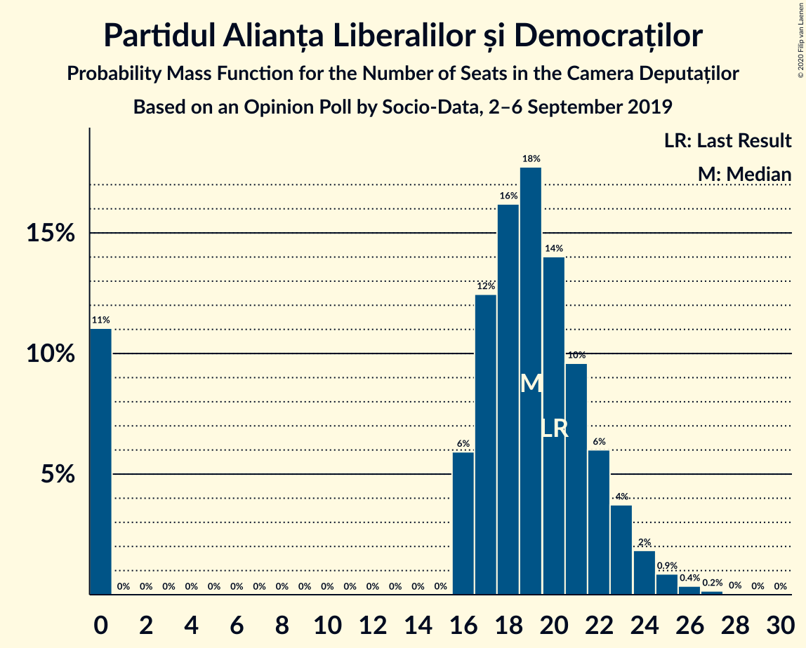

| Number of Seats | Probability | Accumulated | Special Marks |
|:---------------:|:-----------:|:-----------:|:-------------:|
| 0 | 11% | 100% |  |
| 1 | 0% | 89% |  |
| 2 | 0% | 89% |  |
| 3 | 0% | 89% |  |
| 4 | 0% | 89% |  |
| 5 | 0% | 89% |  |
| 6 | 0% | 89% |  |
| 7 | 0% | 89% |  |
| 8 | 0% | 89% |  |
| 9 | 0% | 89% |  |
| 10 | 0% | 89% |  |
| 11 | 0% | 89% |  |
| 12 | 0% | 89% |  |
| 13 | 0% | 89% |  |
| 14 | 0% | 89% |  |
| 15 | 0% | 89% |  |
| 16 | 6% | 89% |  |
| 17 | 12% | 83% |  |
| 18 | 16% | 71% |  |
| 19 | 18% | 54% | Median |
| 20 | 14% | 37% | Last Result |
| 21 | 10% | 23% |  |
| 22 | 6% | 13% |  |
| 23 | 4% | 7% |  |
| 24 | 2% | 3% |  |
| 25 | 0.9% | 1.4% |  |
| 26 | 0.4% | 0.6% |  |
| 27 | 0.2% | 0.2% |  |
| 28 | 0% | 0.1% |  |
| 29 | 0% | 0% |  |

### Partidul Mișcarea Populară

*For a full overview of the results for this party, see the [Partidul Mișcarea Populară](party-partidulmișcareapopulară.html) page.*

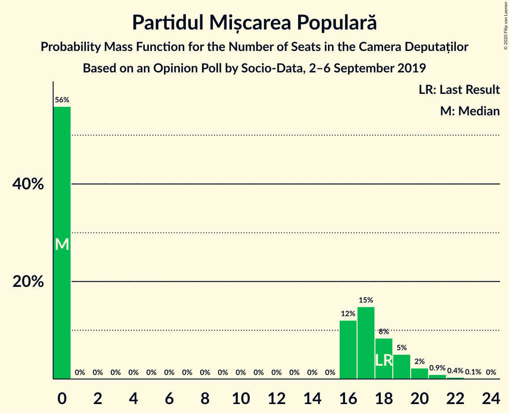

| Number of Seats | Probability | Accumulated | Special Marks |
|:---------------:|:-----------:|:-----------:|:-------------:|
| 0 | 56% | 100% | Median |
| 1 | 0% | 44% |  |
| 2 | 0% | 44% |  |
| 3 | 0% | 44% |  |
| 4 | 0% | 44% |  |
| 5 | 0% | 44% |  |
| 6 | 0% | 44% |  |
| 7 | 0% | 44% |  |
| 8 | 0% | 44% |  |
| 9 | 0% | 44% |  |
| 10 | 0% | 44% |  |
| 11 | 0% | 44% |  |
| 12 | 0% | 44% |  |
| 13 | 0% | 44% |  |
| 14 | 0% | 44% |  |
| 15 | 0% | 44% |  |
| 16 | 12% | 44% |  |
| 17 | 15% | 32% |  |
| 18 | 8% | 17% | Last Result |
| 19 | 5% | 9% |  |
| 20 | 2% | 4% |  |
| 21 | 0.9% | 1.5% |  |
| 22 | 0.4% | 0.5% |  |
| 23 | 0.1% | 0.2% |  |
| 24 | 0% | 0% |  |

### Uniunea Democrată Maghiară din România

*For a full overview of the results for this party, see the [Uniunea Democrată Maghiară din România](party-uniuneademocratămaghiarădinromânia.html) page.*

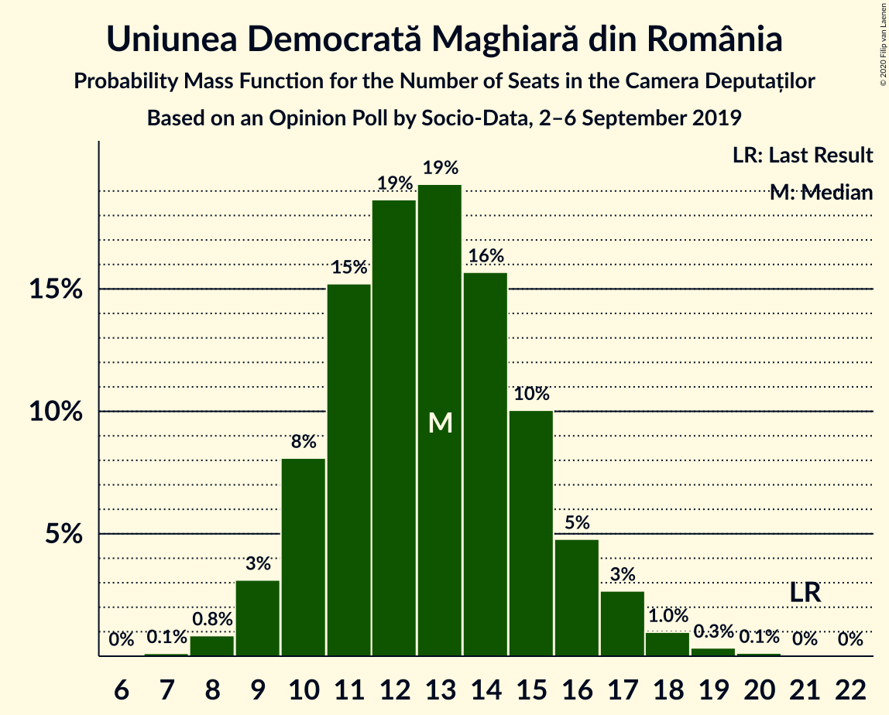

| Number of Seats | Probability | Accumulated | Special Marks |
|:---------------:|:-----------:|:-----------:|:-------------:|
| 7 | 0.1% | 100% |  |
| 8 | 0.8% | 99.9% |  |
| 9 | 3% | 99.0% |  |
| 10 | 8% | 96% |  |
| 11 | 15% | 88% |  |
| 12 | 19% | 73% |  |
| 13 | 19% | 54% | Median |
| 14 | 16% | 35% |  |
| 15 | 10% | 19% |  |
| 16 | 5% | 9% |  |
| 17 | 3% | 4% |  |
| 18 | 1.0% | 2% |  |
| 19 | 0.3% | 0.5% |  |
| 20 | 0.1% | 0.2% |  |
| 21 | 0% | 0.1% | Last Result |
| 22 | 0% | 0% |  |

## Coalitions

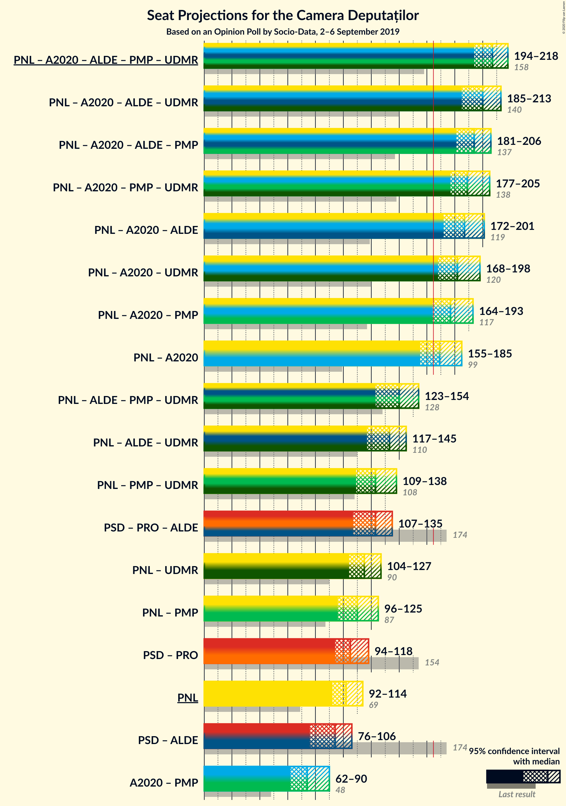

### Confidence Intervals

| Coalition | Last Result | Median | Majority? | 80% Confidence Interval | 90% Confidence Interval | 95% Confidence Interval | 99% Confidence Interval |
|:---------:|:-----------:|:------:|:---------:|:-----------------------:|:-----------------------:|:-----------------------:|:-----------------------:|
| Partidul Național Liberal – Alianța 2020 USR-PLUS – Partidul Alianța Liberalilor și Democraților – Partidul Mișcarea Populară – Uniunea Democrată Maghiară din România | 158 | 207 | 100% | 199–215 | 196–217 | 194–218 | 191–221 |
| Partidul Național Liberal – Alianța 2020 USR-PLUS – Partidul Alianța Liberalilor și Democraților – Uniunea Democrată Maghiară din România | 140 | 200 | 100% | 189–209 | 187–211 | 185–213 | 179–216 |
| Partidul Național Liberal – Alianța 2020 USR-PLUS – Partidul Alianța Liberalilor și Democraților – Partidul Mișcarea Populară | 137 | 194 | 100% | 185–203 | 183–204 | 181–206 | 176–209 |
| Partidul Național Liberal – Alianța 2020 USR-PLUS – Partidul Mișcarea Populară – Uniunea Democrată Maghiară din România | 138 | 189 | 100% | 181–199 | 179–202 | 177–205 | 174–211 |
| Partidul Național Liberal – Alianța 2020 USR-PLUS – Partidul Alianța Liberalilor și Democraților | 119 | 187 | 99.6% | 177–196 | 174–199 | 172–201 | 166–204 |
| Partidul Național Liberal – Alianța 2020 USR-PLUS – Uniunea Democrată Maghiară din România | 120 | 182 | 99.1% | 172–192 | 170–195 | 168–198 | 165–204 |
| Partidul Național Liberal – Alianța 2020 USR-PLUS – Partidul Mișcarea Populară | 117 | 177 | 95% | 168–186 | 166–189 | 164–193 | 161–198 |
| Partidul Național Liberal – Alianța 2020 USR-PLUS | 99 | 169 | 70% | 160–179 | 157–182 | 155–185 | 152–191 |
| Partidul Național Liberal – Partidul Alianța Liberalilor și Democraților – Partidul Mișcarea Populară – Uniunea Democrată Maghiară din România | 128 | 140 | 0% | 130–150 | 126–152 | 123–154 | 117–157 |
| Partidul Național Liberal – Partidul Alianța Liberalilor și Democraților – Uniunea Democrată Maghiară din România | 110 | 133 | 0% | 123–141 | 120–143 | 117–145 | 111–149 |
| Partidul Național Liberal – Partidul Mișcarea Populară – Uniunea Democrată Maghiară din România | 108 | 123 | 0% | 113–133 | 111–135 | 109–138 | 106–143 |
| Partidul Social Democrat – PRO România – Partidul Alianța Liberalilor și Democraților | 174 | 123 | 0% | 113–131 | 110–133 | 107–135 | 101–138 |
| Partidul Național Liberal – Uniunea Democrată Maghiară din România | 90 | 115 | 0% | 107–123 | 105–125 | 104–127 | 101–132 |
| Partidul Național Liberal – Partidul Mișcarea Populară | 87 | 110 | 0% | 100–120 | 98–123 | 96–125 | 93–130 |
| Partidul Social Democrat – PRO România | 154 | 105 | 0% | 97–113 | 95–116 | 94–118 | 91–121 |
| Partidul Național Liberal | 69 | 102 | 0% | 95–110 | 93–112 | 92–114 | 88–118 |
| Partidul Social Democrat – Partidul Alianța Liberalilor și Democraților | 174 | 94 | 0% | 85–102 | 82–104 | 76–106 | 72–108 |
| Alianța 2020 USR-PLUS – Partidul Mișcarea Populară | 48 | 74 | 0% | 65–86 | 63–88 | 62–90 | 59–93 |

### Partidul Național Liberal – Alianța 2020 USR-PLUS – Partidul Alianța Liberalilor și Democraților – Partidul Mișcarea Populară – Uniunea Democrată Maghiară din România

| Number of Seats | Probability | Accumulated | Special Marks |
|:---------------:|:-----------:|:-----------:|:-------------:|
| 158 | 0% | 100% | Last Result |
| 159 | 0% | 100% |  |
| 160 | 0% | 100% |  |
| 161 | 0% | 100% |  |
| 162 | 0% | 100% |  |
| 163 | 0% | 100% |  |
| 164 | 0% | 100% |  |
| 165 | 0% | 100% |  |
| 166 | 0% | 100% | Majority |
| 167 | 0% | 100% |  |
| 168 | 0% | 100% |  |
| 169 | 0% | 100% |  |
| 170 | 0% | 100% |  |
| 171 | 0% | 100% |  |
| 172 | 0% | 100% |  |
| 173 | 0% | 100% |  |
| 174 | 0% | 100% |  |
| 175 | 0% | 100% |  |
| 176 | 0% | 100% |  |
| 177 | 0% | 100% |  |
| 178 | 0% | 100% |  |
| 179 | 0% | 100% |  |
| 180 | 0% | 100% |  |
| 181 | 0% | 100% |  |
| 182 | 0% | 100% |  |
| 183 | 0% | 100% |  |
| 184 | 0% | 100% |  |
| 185 | 0% | 100% |  |
| 186 | 0% | 99.9% |  |
| 187 | 0.1% | 99.9% |  |
| 188 | 0.1% | 99.8% |  |
| 189 | 0.1% | 99.8% |  |
| 190 | 0.1% | 99.6% |  |
| 191 | 0.4% | 99.5% |  |
| 192 | 0.4% | 99.1% |  |
| 193 | 0.9% | 98.8% |  |
| 194 | 0.6% | 98% |  |
| 195 | 1.4% | 97% |  |
| 196 | 1.1% | 96% |  |
| 197 | 2% | 95% |  |
| 198 | 2% | 93% |  |
| 199 | 2% | 91% |  |
| 200 | 4% | 88% |  |
| 201 | 4% | 84% | Median |
| 202 | 5% | 80% |  |
| 203 | 5% | 75% |  |
| 204 | 5% | 70% |  |
| 205 | 5% | 66% |  |
| 206 | 6% | 60% |  |
| 207 | 6% | 54% |  |
| 208 | 6% | 48% |  |
| 209 | 6% | 42% |  |
| 210 | 5% | 36% |  |
| 211 | 4% | 31% |  |
| 212 | 6% | 27% |  |
| 213 | 4% | 21% |  |
| 214 | 5% | 17% |  |
| 215 | 4% | 12% |  |
| 216 | 3% | 8% |  |
| 217 | 2% | 5% |  |
| 218 | 1.2% | 3% |  |
| 219 | 0.8% | 2% |  |
| 220 | 0.6% | 1.2% |  |
| 221 | 0.3% | 0.6% |  |
| 222 | 0.1% | 0.3% |  |
| 223 | 0.1% | 0.2% |  |
| 224 | 0.1% | 0.1% |  |
| 225 | 0% | 0% |  |

### Partidul Național Liberal – Alianța 2020 USR-PLUS – Partidul Alianța Liberalilor și Democraților – Uniunea Democrată Maghiară din România

| Number of Seats | Probability | Accumulated | Special Marks |
|:---------------:|:-----------:|:-----------:|:-------------:|
| 140 | 0% | 100% | Last Result |
| 141 | 0% | 100% |  |
| 142 | 0% | 100% |  |
| 143 | 0% | 100% |  |
| 144 | 0% | 100% |  |
| 145 | 0% | 100% |  |
| 146 | 0% | 100% |  |
| 147 | 0% | 100% |  |
| 148 | 0% | 100% |  |
| 149 | 0% | 100% |  |
| 150 | 0% | 100% |  |
| 151 | 0% | 100% |  |
| 152 | 0% | 100% |  |
| 153 | 0% | 100% |  |
| 154 | 0% | 100% |  |
| 155 | 0% | 100% |  |
| 156 | 0% | 100% |  |
| 157 | 0% | 100% |  |
| 158 | 0% | 100% |  |
| 159 | 0% | 100% |  |
| 160 | 0% | 100% |  |
| 161 | 0% | 100% |  |
| 162 | 0% | 100% |  |
| 163 | 0% | 100% |  |
| 164 | 0% | 100% |  |
| 165 | 0% | 100% |  |
| 166 | 0% | 100% | Majority |
| 167 | 0% | 100% |  |
| 168 | 0% | 100% |  |
| 169 | 0% | 100% |  |
| 170 | 0% | 100% |  |
| 171 | 0% | 100% |  |
| 172 | 0% | 100% |  |
| 173 | 0% | 100% |  |
| 174 | 0% | 100% |  |
| 175 | 0% | 100% |  |
| 176 | 0% | 99.9% |  |
| 177 | 0.1% | 99.9% |  |
| 178 | 0.1% | 99.8% |  |
| 179 | 0.2% | 99.6% |  |
| 180 | 0.2% | 99.5% |  |
| 181 | 0.3% | 99.3% |  |
| 182 | 0.4% | 99.0% |  |
| 183 | 0.4% | 98.6% |  |
| 184 | 0.6% | 98% |  |
| 185 | 1.1% | 98% |  |
| 186 | 1.2% | 96% |  |
| 187 | 2% | 95% |  |
| 188 | 2% | 94% |  |
| 189 | 2% | 92% |  |
| 190 | 3% | 90% |  |
| 191 | 2% | 87% |  |
| 192 | 4% | 85% |  |
| 193 | 3% | 81% |  |
| 194 | 4% | 78% |  |
| 195 | 5% | 74% |  |
| 196 | 4% | 68% |  |
| 197 | 5% | 64% |  |
| 198 | 4% | 59% |  |
| 199 | 5% | 55% |  |
| 200 | 6% | 51% |  |
| 201 | 5% | 45% | Median |
| 202 | 4% | 40% |  |
| 203 | 5% | 35% |  |
| 204 | 4% | 31% |  |
| 205 | 4% | 27% |  |
| 206 | 4% | 23% |  |
| 207 | 4% | 19% |  |
| 208 | 4% | 14% |  |
| 209 | 3% | 11% |  |
| 210 | 2% | 8% |  |
| 211 | 1.5% | 6% |  |
| 212 | 1.2% | 4% |  |
| 213 | 1.1% | 3% |  |
| 214 | 0.9% | 2% |  |
| 215 | 0.4% | 1.2% |  |
| 216 | 0.4% | 0.7% |  |
| 217 | 0.2% | 0.4% |  |
| 218 | 0.1% | 0.2% |  |
| 219 | 0% | 0.1% |  |
| 220 | 0% | 0% |  |

### Partidul Național Liberal – Alianța 2020 USR-PLUS – Partidul Alianța Liberalilor și Democraților – Partidul Mișcarea Populară

| Number of Seats | Probability | Accumulated | Special Marks |
|:---------------:|:-----------:|:-----------:|:-------------:|
| 137 | 0% | 100% | Last Result |
| 138 | 0% | 100% |  |
| 139 | 0% | 100% |  |
| 140 | 0% | 100% |  |
| 141 | 0% | 100% |  |
| 142 | 0% | 100% |  |
| 143 | 0% | 100% |  |
| 144 | 0% | 100% |  |
| 145 | 0% | 100% |  |
| 146 | 0% | 100% |  |
| 147 | 0% | 100% |  |
| 148 | 0% | 100% |  |
| 149 | 0% | 100% |  |
| 150 | 0% | 100% |  |
| 151 | 0% | 100% |  |
| 152 | 0% | 100% |  |
| 153 | 0% | 100% |  |
| 154 | 0% | 100% |  |
| 155 | 0% | 100% |  |
| 156 | 0% | 100% |  |
| 157 | 0% | 100% |  |
| 158 | 0% | 100% |  |
| 159 | 0% | 100% |  |
| 160 | 0% | 100% |  |
| 161 | 0% | 100% |  |
| 162 | 0% | 100% |  |
| 163 | 0% | 100% |  |
| 164 | 0% | 100% |  |
| 165 | 0% | 100% |  |
| 166 | 0% | 100% | Majority |
| 167 | 0% | 100% |  |
| 168 | 0% | 100% |  |
| 169 | 0% | 100% |  |
| 170 | 0% | 100% |  |
| 171 | 0% | 100% |  |
| 172 | 0% | 99.9% |  |
| 173 | 0.1% | 99.9% |  |
| 174 | 0.1% | 99.9% |  |
| 175 | 0.1% | 99.8% |  |
| 176 | 0.3% | 99.7% |  |
| 177 | 0.1% | 99.4% |  |
| 178 | 0.5% | 99.3% |  |
| 179 | 0.5% | 98.8% |  |
| 180 | 0.4% | 98% |  |
| 181 | 1.1% | 98% |  |
| 182 | 1.0% | 97% |  |
| 183 | 1.4% | 96% |  |
| 184 | 2% | 94% |  |
| 185 | 3% | 92% |  |
| 186 | 3% | 90% |  |
| 187 | 3% | 87% |  |
| 188 | 4% | 84% | Median |
| 189 | 5% | 80% |  |
| 190 | 4% | 74% |  |
| 191 | 5% | 70% |  |
| 192 | 5% | 65% |  |
| 193 | 5% | 60% |  |
| 194 | 6% | 55% |  |
| 195 | 6% | 49% |  |
| 196 | 5% | 43% |  |
| 197 | 4% | 38% |  |
| 198 | 5% | 34% |  |
| 199 | 5% | 29% |  |
| 200 | 4% | 24% |  |
| 201 | 5% | 21% |  |
| 202 | 5% | 16% |  |
| 203 | 4% | 11% |  |
| 204 | 2% | 7% |  |
| 205 | 2% | 5% |  |
| 206 | 1.1% | 3% |  |
| 207 | 0.7% | 2% |  |
| 208 | 0.5% | 1.1% |  |
| 209 | 0.3% | 0.7% |  |
| 210 | 0.1% | 0.3% |  |
| 211 | 0.1% | 0.2% |  |
| 212 | 0% | 0.1% |  |
| 213 | 0% | 0% |  |

### Partidul Național Liberal – Alianța 2020 USR-PLUS – Partidul Mișcarea Populară – Uniunea Democrată Maghiară din România

| Number of Seats | Probability | Accumulated | Special Marks |
|:---------------:|:-----------:|:-----------:|:-------------:|
| 138 | 0% | 100% | Last Result |
| 139 | 0% | 100% |  |
| 140 | 0% | 100% |  |
| 141 | 0% | 100% |  |
| 142 | 0% | 100% |  |
| 143 | 0% | 100% |  |
| 144 | 0% | 100% |  |
| 145 | 0% | 100% |  |
| 146 | 0% | 100% |  |
| 147 | 0% | 100% |  |
| 148 | 0% | 100% |  |
| 149 | 0% | 100% |  |
| 150 | 0% | 100% |  |
| 151 | 0% | 100% |  |
| 152 | 0% | 100% |  |
| 153 | 0% | 100% |  |
| 154 | 0% | 100% |  |
| 155 | 0% | 100% |  |
| 156 | 0% | 100% |  |
| 157 | 0% | 100% |  |
| 158 | 0% | 100% |  |
| 159 | 0% | 100% |  |
| 160 | 0% | 100% |  |
| 161 | 0% | 100% |  |
| 162 | 0% | 100% |  |
| 163 | 0% | 100% |  |
| 164 | 0% | 100% |  |
| 165 | 0% | 100% |  |
| 166 | 0% | 100% | Majority |
| 167 | 0% | 100% |  |
| 168 | 0% | 100% |  |
| 169 | 0% | 100% |  |
| 170 | 0% | 100% |  |
| 171 | 0.1% | 99.9% |  |
| 172 | 0.1% | 99.9% |  |
| 173 | 0.2% | 99.8% |  |
| 174 | 0.2% | 99.6% |  |
| 175 | 0.4% | 99.4% |  |
| 176 | 0.6% | 99.0% |  |
| 177 | 1.0% | 98% |  |
| 178 | 2% | 97% |  |
| 179 | 1.5% | 96% |  |
| 180 | 3% | 94% |  |
| 181 | 3% | 91% |  |
| 182 | 5% | 88% | Median |
| 183 | 3% | 83% |  |
| 184 | 6% | 80% |  |
| 185 | 4% | 75% |  |
| 186 | 5% | 70% |  |
| 187 | 5% | 65% |  |
| 188 | 5% | 60% |  |
| 189 | 5% | 54% |  |
| 190 | 6% | 50% |  |
| 191 | 4% | 44% |  |
| 192 | 4% | 40% |  |
| 193 | 6% | 35% |  |
| 194 | 4% | 30% |  |
| 195 | 5% | 26% |  |
| 196 | 4% | 21% |  |
| 197 | 4% | 18% |  |
| 198 | 3% | 14% |  |
| 199 | 2% | 11% |  |
| 200 | 2% | 9% |  |
| 201 | 1.4% | 7% |  |
| 202 | 1.1% | 6% |  |
| 203 | 1.0% | 5% |  |
| 204 | 0.6% | 4% |  |
| 205 | 0.8% | 3% |  |
| 206 | 0.4% | 2% |  |
| 207 | 0.3% | 2% |  |
| 208 | 0.5% | 2% |  |
| 209 | 0.3% | 1.3% |  |
| 210 | 0.3% | 1.1% |  |
| 211 | 0.2% | 0.7% |  |
| 212 | 0.2% | 0.5% |  |
| 213 | 0.1% | 0.3% |  |
| 214 | 0.1% | 0.2% |  |
| 215 | 0% | 0.1% |  |
| 216 | 0% | 0.1% |  |
| 217 | 0% | 0% |  |

### Partidul Național Liberal – Alianța 2020 USR-PLUS – Partidul Alianța Liberalilor și Democraților

| Number of Seats | Probability | Accumulated | Special Marks |
|:---------------:|:-----------:|:-----------:|:-------------:|
| 119 | 0% | 100% | Last Result |
| 120 | 0% | 100% |  |
| 121 | 0% | 100% |  |
| 122 | 0% | 100% |  |
| 123 | 0% | 100% |  |
| 124 | 0% | 100% |  |
| 125 | 0% | 100% |  |
| 126 | 0% | 100% |  |
| 127 | 0% | 100% |  |
| 128 | 0% | 100% |  |
| 129 | 0% | 100% |  |
| 130 | 0% | 100% |  |
| 131 | 0% | 100% |  |
| 132 | 0% | 100% |  |
| 133 | 0% | 100% |  |
| 134 | 0% | 100% |  |
| 135 | 0% | 100% |  |
| 136 | 0% | 100% |  |
| 137 | 0% | 100% |  |
| 138 | 0% | 100% |  |
| 139 | 0% | 100% |  |
| 140 | 0% | 100% |  |
| 141 | 0% | 100% |  |
| 142 | 0% | 100% |  |
| 143 | 0% | 100% |  |
| 144 | 0% | 100% |  |
| 145 | 0% | 100% |  |
| 146 | 0% | 100% |  |
| 147 | 0% | 100% |  |
| 148 | 0% | 100% |  |
| 149 | 0% | 100% |  |
| 150 | 0% | 100% |  |
| 151 | 0% | 100% |  |
| 152 | 0% | 100% |  |
| 153 | 0% | 100% |  |
| 154 | 0% | 100% |  |
| 155 | 0% | 100% |  |
| 156 | 0% | 100% |  |
| 157 | 0% | 100% |  |
| 158 | 0% | 100% |  |
| 159 | 0% | 100% |  |
| 160 | 0% | 100% |  |
| 161 | 0% | 100% |  |
| 162 | 0% | 100% |  |
| 163 | 0.1% | 99.9% |  |
| 164 | 0.1% | 99.9% |  |
| 165 | 0.2% | 99.7% |  |
| 166 | 0.1% | 99.6% | Majority |
| 167 | 0.2% | 99.4% |  |
| 168 | 0.3% | 99.3% |  |
| 169 | 0.4% | 99.0% |  |
| 170 | 0.5% | 98.6% |  |
| 171 | 0.4% | 98% |  |
| 172 | 1.1% | 98% |  |
| 173 | 0.8% | 97% |  |
| 174 | 1.4% | 96% |  |
| 175 | 1.2% | 94% |  |
| 176 | 2% | 93% |  |
| 177 | 2% | 91% |  |
| 178 | 3% | 89% |  |
| 179 | 3% | 86% |  |
| 180 | 3% | 83% |  |
| 181 | 5% | 80% |  |
| 182 | 4% | 75% |  |
| 183 | 3% | 71% |  |
| 184 | 7% | 68% |  |
| 185 | 5% | 61% |  |
| 186 | 6% | 56% |  |
| 187 | 5% | 50% |  |
| 188 | 5% | 46% | Median |
| 189 | 6% | 40% |  |
| 190 | 4% | 35% |  |
| 191 | 4% | 30% |  |
| 192 | 5% | 26% |  |
| 193 | 3% | 21% |  |
| 194 | 4% | 18% |  |
| 195 | 3% | 14% |  |
| 196 | 2% | 11% |  |
| 197 | 1.4% | 8% |  |
| 198 | 2% | 7% |  |
| 199 | 2% | 5% |  |
| 200 | 0.9% | 3% |  |
| 201 | 0.9% | 3% |  |
| 202 | 0.8% | 2% |  |
| 203 | 0.3% | 0.9% |  |
| 204 | 0.3% | 0.6% |  |
| 205 | 0.2% | 0.3% |  |
| 206 | 0.1% | 0.1% |  |
| 207 | 0% | 0.1% |  |
| 208 | 0% | 0% |  |

### Partidul Național Liberal – Alianța 2020 USR-PLUS – Uniunea Democrată Maghiară din România

| Number of Seats | Probability | Accumulated | Special Marks |
|:---------------:|:-----------:|:-----------:|:-------------:|
| 120 | 0% | 100% | Last Result |
| 121 | 0% | 100% |  |
| 122 | 0% | 100% |  |
| 123 | 0% | 100% |  |
| 124 | 0% | 100% |  |
| 125 | 0% | 100% |  |
| 126 | 0% | 100% |  |
| 127 | 0% | 100% |  |
| 128 | 0% | 100% |  |
| 129 | 0% | 100% |  |
| 130 | 0% | 100% |  |
| 131 | 0% | 100% |  |
| 132 | 0% | 100% |  |
| 133 | 0% | 100% |  |
| 134 | 0% | 100% |  |
| 135 | 0% | 100% |  |
| 136 | 0% | 100% |  |
| 137 | 0% | 100% |  |
| 138 | 0% | 100% |  |
| 139 | 0% | 100% |  |
| 140 | 0% | 100% |  |
| 141 | 0% | 100% |  |
| 142 | 0% | 100% |  |
| 143 | 0% | 100% |  |
| 144 | 0% | 100% |  |
| 145 | 0% | 100% |  |
| 146 | 0% | 100% |  |
| 147 | 0% | 100% |  |
| 148 | 0% | 100% |  |
| 149 | 0% | 100% |  |
| 150 | 0% | 100% |  |
| 151 | 0% | 100% |  |
| 152 | 0% | 100% |  |
| 153 | 0% | 100% |  |
| 154 | 0% | 100% |  |
| 155 | 0% | 100% |  |
| 156 | 0% | 100% |  |
| 157 | 0% | 100% |  |
| 158 | 0% | 100% |  |
| 159 | 0% | 100% |  |
| 160 | 0% | 100% |  |
| 161 | 0% | 100% |  |
| 162 | 0.1% | 99.9% |  |
| 163 | 0.1% | 99.9% |  |
| 164 | 0.2% | 99.7% |  |
| 165 | 0.4% | 99.5% |  |
| 166 | 0.6% | 99.1% | Majority |
| 167 | 0.9% | 98.6% |  |
| 168 | 1.0% | 98% |  |
| 169 | 2% | 97% |  |
| 170 | 2% | 95% |  |
| 171 | 2% | 93% |  |
| 172 | 2% | 91% |  |
| 173 | 3% | 89% |  |
| 174 | 2% | 86% |  |
| 175 | 3% | 84% |  |
| 176 | 4% | 81% |  |
| 177 | 3% | 77% |  |
| 178 | 5% | 73% |  |
| 179 | 5% | 68% |  |
| 180 | 5% | 63% |  |
| 181 | 6% | 58% |  |
| 182 | 6% | 53% | Median |
| 183 | 4% | 47% |  |
| 184 | 6% | 43% |  |
| 185 | 4% | 37% |  |
| 186 | 5% | 32% |  |
| 187 | 4% | 27% |  |
| 188 | 4% | 24% |  |
| 189 | 3% | 19% |  |
| 190 | 4% | 16% |  |
| 191 | 2% | 13% |  |
| 192 | 2% | 11% |  |
| 193 | 2% | 9% |  |
| 194 | 0.9% | 7% |  |
| 195 | 2% | 6% |  |
| 196 | 0.7% | 4% |  |
| 197 | 0.8% | 4% |  |
| 198 | 0.4% | 3% |  |
| 199 | 0.5% | 2% |  |
| 200 | 0.2% | 2% |  |
| 201 | 0.6% | 2% |  |
| 202 | 0.2% | 1.2% |  |
| 203 | 0.4% | 1.0% |  |
| 204 | 0.1% | 0.6% |  |
| 205 | 0.2% | 0.5% |  |
| 206 | 0.1% | 0.3% |  |
| 207 | 0.1% | 0.2% |  |
| 208 | 0% | 0.1% |  |
| 209 | 0% | 0.1% |  |
| 210 | 0% | 0% |  |

### Partidul Național Liberal – Alianța 2020 USR-PLUS – Partidul Mișcarea Populară

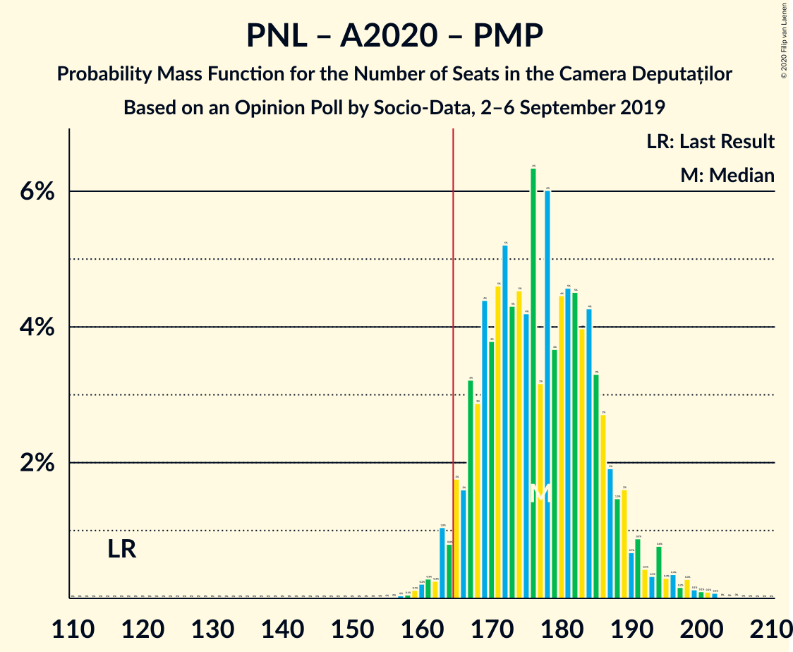

| Number of Seats | Probability | Accumulated | Special Marks |
|:---------------:|:-----------:|:-----------:|:-------------:|
| 117 | 0% | 100% | Last Result |
| 118 | 0% | 100% |  |
| 119 | 0% | 100% |  |
| 120 | 0% | 100% |  |
| 121 | 0% | 100% |  |
| 122 | 0% | 100% |  |
| 123 | 0% | 100% |  |
| 124 | 0% | 100% |  |
| 125 | 0% | 100% |  |
| 126 | 0% | 100% |  |
| 127 | 0% | 100% |  |
| 128 | 0% | 100% |  |
| 129 | 0% | 100% |  |
| 130 | 0% | 100% |  |
| 131 | 0% | 100% |  |
| 132 | 0% | 100% |  |
| 133 | 0% | 100% |  |
| 134 | 0% | 100% |  |
| 135 | 0% | 100% |  |
| 136 | 0% | 100% |  |
| 137 | 0% | 100% |  |
| 138 | 0% | 100% |  |
| 139 | 0% | 100% |  |
| 140 | 0% | 100% |  |
| 141 | 0% | 100% |  |
| 142 | 0% | 100% |  |
| 143 | 0% | 100% |  |
| 144 | 0% | 100% |  |
| 145 | 0% | 100% |  |
| 146 | 0% | 100% |  |
| 147 | 0% | 100% |  |
| 148 | 0% | 100% |  |
| 149 | 0% | 100% |  |
| 150 | 0% | 100% |  |
| 151 | 0% | 100% |  |
| 152 | 0% | 100% |  |
| 153 | 0% | 100% |  |
| 154 | 0% | 100% |  |
| 155 | 0% | 100% |  |
| 156 | 0% | 100% |  |
| 157 | 0% | 100% |  |
| 158 | 0.1% | 99.9% |  |
| 159 | 0.1% | 99.9% |  |
| 160 | 0.2% | 99.8% |  |
| 161 | 0.3% | 99.5% |  |
| 162 | 0.3% | 99.2% |  |
| 163 | 1.0% | 99.0% |  |
| 164 | 0.8% | 98% |  |
| 165 | 2% | 97% |  |
| 166 | 2% | 95% | Majority |
| 167 | 3% | 94% |  |
| 168 | 3% | 91% |  |
| 169 | 4% | 88% | Median |
| 170 | 4% | 83% |  |
| 171 | 5% | 80% |  |
| 172 | 5% | 75% |  |
| 173 | 4% | 70% |  |
| 174 | 5% | 65% |  |
| 175 | 4% | 61% |  |
| 176 | 6% | 57% |  |
| 177 | 3% | 50% |  |
| 178 | 6% | 47% |  |
| 179 | 4% | 41% |  |
| 180 | 4% | 37% |  |
| 181 | 5% | 33% |  |
| 182 | 5% | 28% |  |
| 183 | 4% | 24% |  |
| 184 | 4% | 20% |  |
| 185 | 3% | 16% |  |
| 186 | 3% | 12% |  |
| 187 | 2% | 10% |  |
| 188 | 1.5% | 8% |  |
| 189 | 2% | 6% |  |
| 190 | 0.7% | 5% |  |
| 191 | 0.9% | 4% |  |
| 192 | 0.4% | 3% |  |
| 193 | 0.3% | 3% |  |
| 194 | 0.8% | 2% |  |
| 195 | 0.3% | 2% |  |
| 196 | 0.4% | 1.3% |  |
| 197 | 0.2% | 0.9% |  |
| 198 | 0.3% | 0.8% |  |
| 199 | 0.1% | 0.5% |  |
| 200 | 0.1% | 0.3% |  |
| 201 | 0.1% | 0.2% |  |
| 202 | 0.1% | 0.1% |  |
| 203 | 0% | 0.1% |  |
| 204 | 0% | 0% |  |

### Partidul Național Liberal – Alianța 2020 USR-PLUS

| Number of Seats | Probability | Accumulated | Special Marks |
|:---------------:|:-----------:|:-----------:|:-------------:|
| 99 | 0% | 100% | Last Result |
| 100 | 0% | 100% |  |
| 101 | 0% | 100% |  |
| 102 | 0% | 100% |  |
| 103 | 0% | 100% |  |
| 104 | 0% | 100% |  |
| 105 | 0% | 100% |  |
| 106 | 0% | 100% |  |
| 107 | 0% | 100% |  |
| 108 | 0% | 100% |  |
| 109 | 0% | 100% |  |
| 110 | 0% | 100% |  |
| 111 | 0% | 100% |  |
| 112 | 0% | 100% |  |
| 113 | 0% | 100% |  |
| 114 | 0% | 100% |  |
| 115 | 0% | 100% |  |
| 116 | 0% | 100% |  |
| 117 | 0% | 100% |  |
| 118 | 0% | 100% |  |
| 119 | 0% | 100% |  |
| 120 | 0% | 100% |  |
| 121 | 0% | 100% |  |
| 122 | 0% | 100% |  |
| 123 | 0% | 100% |  |
| 124 | 0% | 100% |  |
| 125 | 0% | 100% |  |
| 126 | 0% | 100% |  |
| 127 | 0% | 100% |  |
| 128 | 0% | 100% |  |
| 129 | 0% | 100% |  |
| 130 | 0% | 100% |  |
| 131 | 0% | 100% |  |
| 132 | 0% | 100% |  |
| 133 | 0% | 100% |  |
| 134 | 0% | 100% |  |
| 135 | 0% | 100% |  |
| 136 | 0% | 100% |  |
| 137 | 0% | 100% |  |
| 138 | 0% | 100% |  |
| 139 | 0% | 100% |  |
| 140 | 0% | 100% |  |
| 141 | 0% | 100% |  |
| 142 | 0% | 100% |  |
| 143 | 0% | 100% |  |
| 144 | 0% | 100% |  |
| 145 | 0% | 100% |  |
| 146 | 0% | 100% |  |
| 147 | 0% | 100% |  |
| 148 | 0% | 100% |  |
| 149 | 0% | 100% |  |
| 150 | 0.1% | 99.9% |  |
| 151 | 0.2% | 99.8% |  |
| 152 | 0.2% | 99.7% |  |
| 153 | 0.4% | 99.4% |  |
| 154 | 0.7% | 99.0% |  |
| 155 | 0.9% | 98% |  |
| 156 | 1.1% | 97% |  |
| 157 | 1.3% | 96% |  |
| 158 | 2% | 95% |  |
| 159 | 2% | 93% |  |
| 160 | 3% | 91% |  |
| 161 | 3% | 88% |  |
| 162 | 3% | 86% |  |
| 163 | 4% | 82% |  |
| 164 | 3% | 78% |  |
| 165 | 6% | 76% |  |
| 166 | 5% | 70% | Majority |
| 167 | 6% | 65% |  |
| 168 | 6% | 59% |  |
| 169 | 5% | 53% | Median |
| 170 | 6% | 48% |  |
| 171 | 5% | 42% |  |
| 172 | 6% | 37% |  |
| 173 | 4% | 31% |  |
| 174 | 4% | 27% |  |
| 175 | 3% | 23% |  |
| 176 | 5% | 20% |  |
| 177 | 2% | 15% |  |
| 178 | 3% | 14% |  |
| 179 | 1.3% | 10% |  |
| 180 | 2% | 9% |  |
| 181 | 1.4% | 7% |  |
| 182 | 1.4% | 6% |  |
| 183 | 0.6% | 4% |  |
| 184 | 1.0% | 4% |  |
| 185 | 0.7% | 3% |  |
| 186 | 0.4% | 2% |  |
| 187 | 0.4% | 2% |  |
| 188 | 0.3% | 1.3% |  |
| 189 | 0.3% | 1.0% |  |
| 190 | 0.2% | 0.7% |  |
| 191 | 0.2% | 0.5% |  |
| 192 | 0.1% | 0.4% |  |
| 193 | 0% | 0.2% |  |
| 194 | 0.1% | 0.2% |  |
| 195 | 0% | 0.1% |  |
| 196 | 0% | 0% |  |

### Partidul Național Liberal – Partidul Alianța Liberalilor și Democraților – Partidul Mișcarea Populară – Uniunea Democrată Maghiară din România

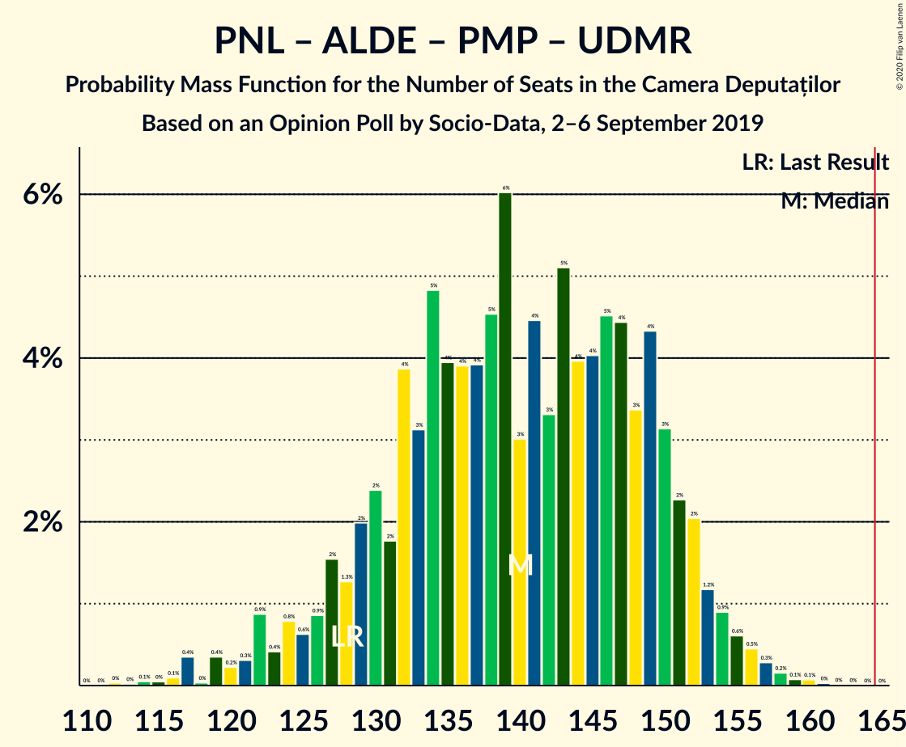

| Number of Seats | Probability | Accumulated | Special Marks |
|:---------------:|:-----------:|:-----------:|:-------------:|
| 113 | 0% | 100% |  |
| 114 | 0.1% | 99.9% |  |
| 115 | 0% | 99.9% |  |
| 116 | 0.1% | 99.8% |  |
| 117 | 0.4% | 99.7% |  |
| 118 | 0% | 99.4% |  |
| 119 | 0.4% | 99.4% |  |
| 120 | 0.2% | 99.0% |  |
| 121 | 0.3% | 98.8% |  |
| 122 | 0.9% | 98% |  |
| 123 | 0.4% | 98% |  |
| 124 | 0.8% | 97% |  |
| 125 | 0.6% | 96% |  |
| 126 | 0.9% | 96% |  |
| 127 | 2% | 95% |  |
| 128 | 1.3% | 93% | Last Result |
| 129 | 2% | 92% |  |
| 130 | 2% | 90% |  |
| 131 | 2% | 88% |  |
| 132 | 4% | 86% |  |
| 133 | 3% | 82% |  |
| 134 | 5% | 79% | Median |
| 135 | 4% | 74% |  |
| 136 | 4% | 70% |  |
| 137 | 4% | 66% |  |
| 138 | 5% | 62% |  |
| 139 | 6% | 58% |  |
| 140 | 3% | 52% |  |
| 141 | 4% | 49% |  |
| 142 | 3% | 44% |  |
| 143 | 5% | 41% |  |
| 144 | 4% | 36% |  |
| 145 | 4% | 32% |  |
| 146 | 5% | 28% |  |
| 147 | 4% | 23% |  |
| 148 | 3% | 19% |  |
| 149 | 4% | 16% |  |
| 150 | 3% | 11% |  |
| 151 | 2% | 8% |  |
| 152 | 2% | 6% |  |
| 153 | 1.2% | 4% |  |
| 154 | 0.9% | 3% |  |
| 155 | 0.6% | 2% |  |
| 156 | 0.5% | 1.1% |  |
| 157 | 0.3% | 0.6% |  |
| 158 | 0.2% | 0.4% |  |
| 159 | 0.1% | 0.2% |  |
| 160 | 0.1% | 0.1% |  |
| 161 | 0% | 0.1% |  |
| 162 | 0% | 0% |  |

### Partidul Național Liberal – Partidul Alianța Liberalilor și Democraților – Uniunea Democrată Maghiară din România

| Number of Seats | Probability | Accumulated | Special Marks |
|:---------------:|:-----------:|:-----------:|:-------------:|
| 107 | 0.1% | 100% |  |
| 108 | 0% | 99.9% |  |
| 109 | 0.1% | 99.8% |  |
| 110 | 0.1% | 99.8% | Last Result |
| 111 | 0.2% | 99.6% |  |
| 112 | 0.2% | 99.4% |  |
| 113 | 0.4% | 99.2% |  |
| 114 | 0.3% | 98.8% |  |
| 115 | 0.4% | 98.5% |  |
| 116 | 0.4% | 98% |  |
| 117 | 1.1% | 98% |  |
| 118 | 0.4% | 97% |  |
| 119 | 1.0% | 96% |  |
| 120 | 1.0% | 95% |  |
| 121 | 1.2% | 94% |  |
| 122 | 2% | 93% |  |
| 123 | 1.3% | 91% |  |
| 124 | 3% | 90% |  |
| 125 | 3% | 87% |  |
| 126 | 3% | 84% |  |
| 127 | 5% | 81% |  |
| 128 | 4% | 76% |  |
| 129 | 6% | 73% |  |
| 130 | 5% | 67% |  |
| 131 | 5% | 61% |  |
| 132 | 6% | 57% |  |
| 133 | 7% | 50% |  |
| 134 | 6% | 44% | Median |
| 135 | 6% | 38% |  |
| 136 | 4% | 32% |  |
| 137 | 4% | 28% |  |
| 138 | 4% | 24% |  |
| 139 | 5% | 19% |  |
| 140 | 2% | 14% |  |
| 141 | 3% | 12% |  |
| 142 | 1.4% | 9% |  |
| 143 | 3% | 7% |  |
| 144 | 1.5% | 5% |  |
| 145 | 1.3% | 3% |  |
| 146 | 0.7% | 2% |  |
| 147 | 0.3% | 1.1% |  |
| 148 | 0.3% | 0.8% |  |
| 149 | 0.2% | 0.5% |  |
| 150 | 0.1% | 0.3% |  |
| 151 | 0.1% | 0.1% |  |
| 152 | 0% | 0.1% |  |
| 153 | 0% | 0.1% |  |
| 154 | 0% | 0% |  |

### Partidul Național Liberal – Partidul Mișcarea Populară – Uniunea Democrată Maghiară din România

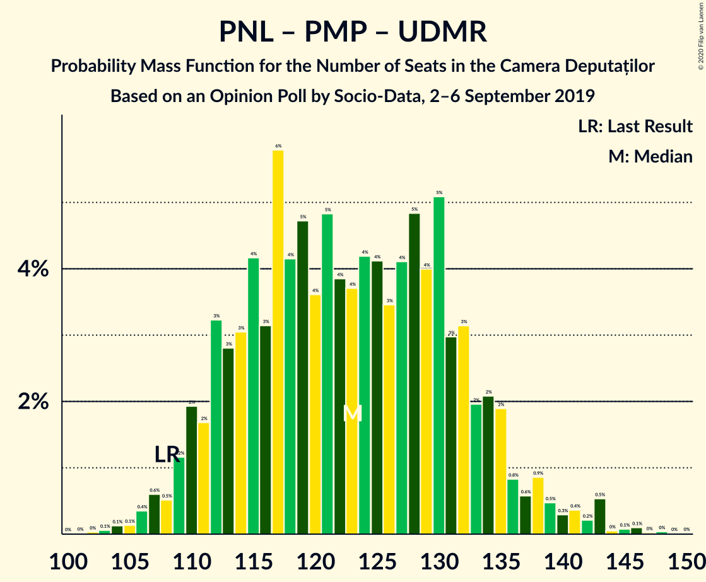

| Number of Seats | Probability | Accumulated | Special Marks |
|:---------------:|:-----------:|:-----------:|:-------------:|
| 102 | 0% | 100% |  |
| 103 | 0.1% | 99.9% |  |
| 104 | 0.1% | 99.9% |  |
| 105 | 0.1% | 99.8% |  |
| 106 | 0.4% | 99.6% |  |
| 107 | 0.6% | 99.3% |  |
| 108 | 0.5% | 98.7% | Last Result |
| 109 | 1.2% | 98% |  |
| 110 | 2% | 97% |  |
| 111 | 2% | 95% |  |
| 112 | 3% | 93% |  |
| 113 | 3% | 90% |  |
| 114 | 3% | 87% |  |
| 115 | 4% | 84% | Median |
| 116 | 3% | 80% |  |
| 117 | 6% | 77% |  |
| 118 | 4% | 71% |  |
| 119 | 5% | 67% |  |
| 120 | 4% | 62% |  |
| 121 | 5% | 59% |  |
| 122 | 4% | 54% |  |
| 123 | 4% | 50% |  |
| 124 | 4% | 46% |  |
| 125 | 4% | 42% |  |
| 126 | 3% | 38% |  |
| 127 | 4% | 35% |  |
| 128 | 5% | 30% |  |
| 129 | 4% | 26% |  |
| 130 | 5% | 22% |  |
| 131 | 3% | 17% |  |
| 132 | 3% | 14% |  |
| 133 | 2% | 10% |  |
| 134 | 2% | 8% |  |
| 135 | 2% | 6% |  |
| 136 | 0.8% | 4% |  |
| 137 | 0.6% | 4% |  |
| 138 | 0.9% | 3% |  |
| 139 | 0.5% | 2% |  |
| 140 | 0.3% | 2% |  |
| 141 | 0.4% | 1.4% |  |
| 142 | 0.2% | 1.1% |  |
| 143 | 0.5% | 0.9% |  |
| 144 | 0% | 0.3% |  |
| 145 | 0.1% | 0.3% |  |
| 146 | 0.1% | 0.2% |  |
| 147 | 0% | 0.1% |  |
| 148 | 0% | 0.1% |  |
| 149 | 0% | 0% |  |

### Partidul Social Democrat – PRO România – Partidul Alianța Liberalilor și Democraților

| Number of Seats | Probability | Accumulated | Special Marks |
|:---------------:|:-----------:|:-----------:|:-------------:|
| 96 | 0% | 100% |  |
| 97 | 0% | 99.9% |  |
| 98 | 0.1% | 99.9% |  |
| 99 | 0.1% | 99.8% |  |
| 100 | 0.2% | 99.7% |  |
| 101 | 0.2% | 99.5% |  |
| 102 | 0.3% | 99.3% |  |
| 103 | 0.3% | 98.9% |  |
| 104 | 0.5% | 98.7% |  |
| 105 | 0.3% | 98% |  |
| 106 | 0.4% | 98% |  |
| 107 | 0.8% | 98% |  |
| 108 | 0.6% | 97% |  |
| 109 | 1.0% | 96% |  |
| 110 | 1.1% | 95% |  |
| 111 | 1.4% | 94% |  |
| 112 | 2% | 93% |  |
| 113 | 2% | 91% |  |
| 114 | 3% | 89% |  |
| 115 | 4% | 86% |  |
| 116 | 4% | 82% |  |
| 117 | 5% | 79% |  |
| 118 | 4% | 74% |  |
| 119 | 6% | 70% |  |
| 120 | 4% | 65% |  |
| 121 | 4% | 60% |  |
| 122 | 6% | 56% |  |
| 123 | 5% | 50% | Median |
| 124 | 5% | 46% |  |
| 125 | 5% | 40% |  |
| 126 | 5% | 35% |  |
| 127 | 4% | 30% |  |
| 128 | 6% | 25% |  |
| 129 | 3% | 20% |  |
| 130 | 5% | 17% |  |
| 131 | 3% | 12% |  |
| 132 | 3% | 9% |  |
| 133 | 1.5% | 6% |  |
| 134 | 2% | 4% |  |
| 135 | 1.0% | 3% |  |
| 136 | 0.6% | 2% |  |
| 137 | 0.4% | 1.0% |  |
| 138 | 0.2% | 0.6% |  |
| 139 | 0.2% | 0.4% |  |
| 140 | 0.1% | 0.2% |  |
| 141 | 0.1% | 0.1% |  |
| 142 | 0% | 0.1% |  |
| 143 | 0% | 0% |  |
| 144 | 0% | 0% |  |
| 145 | 0% | 0% |  |
| 146 | 0% | 0% |  |
| 147 | 0% | 0% |  |
| 148 | 0% | 0% |  |
| 149 | 0% | 0% |  |
| 150 | 0% | 0% |  |
| 151 | 0% | 0% |  |
| 152 | 0% | 0% |  |
| 153 | 0% | 0% |  |
| 154 | 0% | 0% |  |
| 155 | 0% | 0% |  |
| 156 | 0% | 0% |  |
| 157 | 0% | 0% |  |
| 158 | 0% | 0% |  |
| 159 | 0% | 0% |  |
| 160 | 0% | 0% |  |
| 161 | 0% | 0% |  |
| 162 | 0% | 0% |  |
| 163 | 0% | 0% |  |
| 164 | 0% | 0% |  |
| 165 | 0% | 0% |  |
| 166 | 0% | 0% | Majority |
| 167 | 0% | 0% |  |
| 168 | 0% | 0% |  |
| 169 | 0% | 0% |  |
| 170 | 0% | 0% |  |
| 171 | 0% | 0% |  |
| 172 | 0% | 0% |  |
| 173 | 0% | 0% |  |
| 174 | 0% | 0% | Last Result |

### Partidul Național Liberal – Uniunea Democrată Maghiară din România

| Number of Seats | Probability | Accumulated | Special Marks |
|:---------------:|:-----------:|:-----------:|:-------------:|
| 90 | 0% | 100% | Last Result |
| 91 | 0% | 100% |  |
| 92 | 0% | 100% |  |
| 93 | 0% | 100% |  |
| 94 | 0% | 100% |  |
| 95 | 0% | 100% |  |
| 96 | 0% | 100% |  |
| 97 | 0% | 100% |  |
| 98 | 0.1% | 99.9% |  |
| 99 | 0.2% | 99.9% |  |
| 100 | 0.2% | 99.7% |  |
| 101 | 0.4% | 99.5% |  |
| 102 | 0.6% | 99.2% |  |
| 103 | 0.8% | 98.6% |  |
| 104 | 2% | 98% |  |
| 105 | 2% | 96% |  |
| 106 | 2% | 95% |  |
| 107 | 3% | 92% |  |
| 108 | 3% | 90% |  |
| 109 | 4% | 86% |  |
| 110 | 6% | 83% |  |
| 111 | 5% | 77% |  |
| 112 | 8% | 72% |  |
| 113 | 6% | 65% |  |
| 114 | 6% | 59% |  |
| 115 | 7% | 52% | Median |
| 116 | 5% | 45% |  |
| 117 | 8% | 41% |  |
| 118 | 5% | 32% |  |
| 119 | 6% | 28% |  |
| 120 | 4% | 22% |  |
| 121 | 4% | 18% |  |
| 122 | 3% | 15% |  |
| 123 | 3% | 12% |  |
| 124 | 2% | 9% |  |
| 125 | 2% | 7% |  |
| 126 | 1.4% | 5% |  |
| 127 | 1.3% | 4% |  |
| 128 | 0.6% | 2% |  |
| 129 | 0.6% | 2% |  |
| 130 | 0.3% | 1.2% |  |
| 131 | 0.3% | 0.9% |  |
| 132 | 0.1% | 0.5% |  |
| 133 | 0.2% | 0.5% |  |
| 134 | 0.1% | 0.3% |  |
| 135 | 0.1% | 0.2% |  |
| 136 | 0% | 0.1% |  |
| 137 | 0% | 0.1% |  |
| 138 | 0% | 0% |  |

### Partidul Național Liberal – Partidul Mișcarea Populară

| Number of Seats | Probability | Accumulated | Special Marks |
|:---------------:|:-----------:|:-----------:|:-------------:|
| 87 | 0% | 100% | Last Result |
| 88 | 0% | 100% |  |
| 89 | 0% | 100% |  |
| 90 | 0.1% | 100% |  |
| 91 | 0.1% | 99.9% |  |
| 92 | 0.2% | 99.8% |  |
| 93 | 0.2% | 99.7% |  |
| 94 | 0.4% | 99.4% |  |
| 95 | 0.7% | 99.0% |  |
| 96 | 1.3% | 98% |  |
| 97 | 2% | 97% |  |
| 98 | 2% | 95% |  |
| 99 | 2% | 93% |  |
| 100 | 3% | 91% |  |
| 101 | 3% | 87% |  |
| 102 | 4% | 84% | Median |
| 103 | 5% | 80% |  |
| 104 | 5% | 75% |  |
| 105 | 3% | 70% |  |
| 106 | 4% | 66% |  |
| 107 | 4% | 63% |  |
| 108 | 4% | 59% |  |
| 109 | 3% | 55% |  |
| 110 | 4% | 51% |  |
| 111 | 5% | 48% |  |
| 112 | 4% | 43% |  |
| 113 | 4% | 39% |  |
| 114 | 3% | 36% |  |
| 115 | 4% | 33% |  |
| 116 | 5% | 29% |  |
| 117 | 4% | 24% |  |
| 118 | 4% | 20% |  |
| 119 | 4% | 15% |  |
| 120 | 3% | 12% |  |
| 121 | 2% | 9% |  |
| 122 | 1.3% | 7% |  |
| 123 | 1.5% | 6% |  |
| 124 | 1.3% | 4% |  |
| 125 | 0.6% | 3% |  |
| 126 | 0.6% | 2% |  |
| 127 | 0.3% | 2% |  |
| 128 | 0.3% | 1.3% |  |
| 129 | 0.4% | 1.0% |  |
| 130 | 0.2% | 0.6% |  |
| 131 | 0.2% | 0.4% |  |
| 132 | 0.1% | 0.3% |  |
| 133 | 0% | 0.1% |  |
| 134 | 0.1% | 0.1% |  |
| 135 | 0% | 0% |  |

### Partidul Social Democrat – PRO România

| Number of Seats | Probability | Accumulated | Special Marks |
|:---------------:|:-----------:|:-----------:|:-------------:|
| 88 | 0.1% | 100% |  |
| 89 | 0.1% | 99.9% |  |
| 90 | 0.1% | 99.8% |  |
| 91 | 0.3% | 99.7% |  |
| 92 | 0.6% | 99.4% |  |
| 93 | 0.8% | 98.8% |  |
| 94 | 1.2% | 98% |  |
| 95 | 2% | 97% |  |
| 96 | 3% | 95% |  |
| 97 | 4% | 92% |  |
| 98 | 5% | 88% |  |
| 99 | 4% | 83% |  |
| 100 | 6% | 79% |  |
| 101 | 4% | 73% |  |
| 102 | 5% | 69% |  |
| 103 | 6% | 64% |  |
| 104 | 6% | 58% | Median |
| 105 | 6% | 52% |  |
| 106 | 6% | 46% |  |
| 107 | 5% | 40% |  |
| 108 | 5% | 34% |  |
| 109 | 5% | 30% |  |
| 110 | 5% | 25% |  |
| 111 | 4% | 20% |  |
| 112 | 4% | 16% |  |
| 113 | 2% | 12% |  |
| 114 | 2% | 9% |  |
| 115 | 2% | 7% |  |
| 116 | 1.1% | 5% |  |
| 117 | 1.4% | 4% |  |
| 118 | 0.6% | 3% |  |
| 119 | 0.9% | 2% |  |
| 120 | 0.4% | 1.2% |  |
| 121 | 0.4% | 0.9% |  |
| 122 | 0.1% | 0.5% |  |
| 123 | 0.1% | 0.4% |  |
| 124 | 0.1% | 0.2% |  |
| 125 | 0.1% | 0.2% |  |
| 126 | 0% | 0.1% |  |
| 127 | 0% | 0.1% |  |
| 128 | 0% | 0% |  |
| 129 | 0% | 0% |  |
| 130 | 0% | 0% |  |
| 131 | 0% | 0% |  |
| 132 | 0% | 0% |  |
| 133 | 0% | 0% |  |
| 134 | 0% | 0% |  |
| 135 | 0% | 0% |  |
| 136 | 0% | 0% |  |
| 137 | 0% | 0% |  |
| 138 | 0% | 0% |  |
| 139 | 0% | 0% |  |
| 140 | 0% | 0% |  |
| 141 | 0% | 0% |  |
| 142 | 0% | 0% |  |
| 143 | 0% | 0% |  |
| 144 | 0% | 0% |  |
| 145 | 0% | 0% |  |
| 146 | 0% | 0% |  |
| 147 | 0% | 0% |  |
| 148 | 0% | 0% |  |
| 149 | 0% | 0% |  |
| 150 | 0% | 0% |  |
| 151 | 0% | 0% |  |
| 152 | 0% | 0% |  |
| 153 | 0% | 0% |  |
| 154 | 0% | 0% | Last Result |

### Partidul Național Liberal

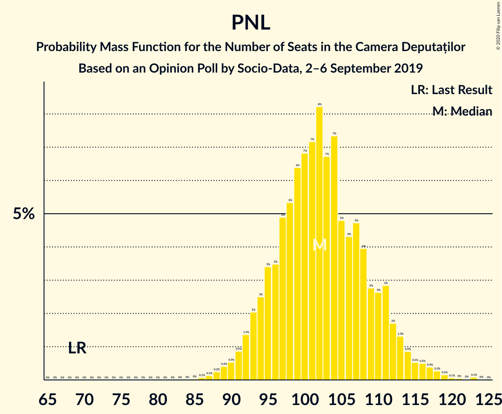

| Number of Seats | Probability | Accumulated | Special Marks |
|:---------------:|:-----------:|:-----------:|:-------------:|
| 69 | 0% | 100% | Last Result |
| 70 | 0% | 100% |  |
| 71 | 0% | 100% |  |
| 72 | 0% | 100% |  |
| 73 | 0% | 100% |  |
| 74 | 0% | 100% |  |
| 75 | 0% | 100% |  |
| 76 | 0% | 100% |  |
| 77 | 0% | 100% |  |
| 78 | 0% | 100% |  |
| 79 | 0% | 100% |  |
| 80 | 0% | 100% |  |
| 81 | 0% | 100% |  |
| 82 | 0% | 100% |  |
| 83 | 0% | 100% |  |
| 84 | 0% | 100% |  |
| 85 | 0% | 100% |  |
| 86 | 0.1% | 99.9% |  |
| 87 | 0.1% | 99.9% |  |
| 88 | 0.2% | 99.7% |  |
| 89 | 0.4% | 99.5% |  |
| 90 | 0.5% | 99.1% |  |
| 91 | 0.9% | 98.6% |  |
| 92 | 1.4% | 98% |  |
| 93 | 2% | 96% |  |
| 94 | 3% | 94% |  |
| 95 | 3% | 92% |  |
| 96 | 3% | 88% |  |
| 97 | 5% | 85% |  |
| 98 | 5% | 80% |  |
| 99 | 6% | 75% |  |
| 100 | 7% | 68% |  |
| 101 | 7% | 61% |  |
| 102 | 8% | 54% | Median |
| 103 | 7% | 46% |  |
| 104 | 7% | 39% |  |
| 105 | 5% | 32% |  |
| 106 | 4% | 27% |  |
| 107 | 5% | 23% |  |
| 108 | 4% | 18% |  |
| 109 | 3% | 14% |  |
| 110 | 3% | 11% |  |
| 111 | 3% | 9% |  |
| 112 | 2% | 6% |  |
| 113 | 1.3% | 4% |  |
| 114 | 0.9% | 3% |  |
| 115 | 0.5% | 2% |  |
| 116 | 0.5% | 2% |  |
| 117 | 0.4% | 1.1% |  |
| 118 | 0.3% | 0.7% |  |
| 119 | 0.2% | 0.4% |  |
| 120 | 0.1% | 0.2% |  |
| 121 | 0% | 0.2% |  |
| 122 | 0% | 0.1% |  |
| 123 | 0.1% | 0.1% |  |
| 124 | 0% | 0% |  |

### Partidul Social Democrat – Partidul Alianța Liberalilor și Democraților

| Number of Seats | Probability | Accumulated | Special Marks |
|:---------------:|:-----------:|:-----------:|:-------------:|
| 68 | 0% | 100% |  |
| 69 | 0.1% | 99.9% |  |
| 70 | 0.1% | 99.9% |  |
| 71 | 0.3% | 99.8% |  |
| 72 | 0.3% | 99.6% |  |
| 73 | 0.3% | 99.2% |  |
| 74 | 0.5% | 99.0% |  |
| 75 | 0.7% | 98% |  |
| 76 | 0.6% | 98% |  |
| 77 | 0.4% | 97% |  |
| 78 | 0.3% | 97% |  |
| 79 | 0.3% | 97% |  |
| 80 | 0.5% | 96% |  |
| 81 | 0.6% | 96% |  |
| 82 | 1.0% | 95% |  |
| 83 | 1.1% | 94% |  |
| 84 | 2% | 93% |  |
| 85 | 2% | 91% |  |
| 86 | 3% | 89% |  |
| 87 | 3% | 86% |  |
| 88 | 4% | 83% |  |
| 89 | 6% | 79% |  |
| 90 | 4% | 74% |  |
| 91 | 7% | 70% |  |
| 92 | 5% | 63% |  |
| 93 | 5% | 58% |  |
| 94 | 5% | 53% |  |
| 95 | 6% | 48% | Median |
| 96 | 5% | 42% |  |
| 97 | 5% | 37% |  |
| 98 | 5% | 33% |  |
| 99 | 5% | 28% |  |
| 100 | 3% | 22% |  |
| 101 | 6% | 19% |  |
| 102 | 4% | 13% |  |
| 103 | 3% | 9% |  |
| 104 | 2% | 7% |  |
| 105 | 2% | 5% |  |
| 106 | 1.2% | 3% |  |
| 107 | 0.7% | 2% |  |
| 108 | 0.5% | 0.9% |  |
| 109 | 0.2% | 0.5% |  |
| 110 | 0.1% | 0.2% |  |
| 111 | 0.1% | 0.1% |  |
| 112 | 0% | 0.1% |  |
| 113 | 0% | 0% |  |
| 114 | 0% | 0% |  |
| 115 | 0% | 0% |  |
| 116 | 0% | 0% |  |
| 117 | 0% | 0% |  |
| 118 | 0% | 0% |  |
| 119 | 0% | 0% |  |
| 120 | 0% | 0% |  |
| 121 | 0% | 0% |  |
| 122 | 0% | 0% |  |
| 123 | 0% | 0% |  |
| 124 | 0% | 0% |  |
| 125 | 0% | 0% |  |
| 126 | 0% | 0% |  |
| 127 | 0% | 0% |  |
| 128 | 0% | 0% |  |
| 129 | 0% | 0% |  |
| 130 | 0% | 0% |  |
| 131 | 0% | 0% |  |
| 132 | 0% | 0% |  |
| 133 | 0% | 0% |  |
| 134 | 0% | 0% |  |
| 135 | 0% | 0% |  |
| 136 | 0% | 0% |  |
| 137 | 0% | 0% |  |
| 138 | 0% | 0% |  |
| 139 | 0% | 0% |  |
| 140 | 0% | 0% |  |
| 141 | 0% | 0% |  |
| 142 | 0% | 0% |  |
| 143 | 0% | 0% |  |
| 144 | 0% | 0% |  |
| 145 | 0% | 0% |  |
| 146 | 0% | 0% |  |
| 147 | 0% | 0% |  |
| 148 | 0% | 0% |  |
| 149 | 0% | 0% |  |
| 150 | 0% | 0% |  |
| 151 | 0% | 0% |  |
| 152 | 0% | 0% |  |
| 153 | 0% | 0% |  |
| 154 | 0% | 0% |  |
| 155 | 0% | 0% |  |
| 156 | 0% | 0% |  |
| 157 | 0% | 0% |  |
| 158 | 0% | 0% |  |
| 159 | 0% | 0% |  |
| 160 | 0% | 0% |  |
| 161 | 0% | 0% |  |
| 162 | 0% | 0% |  |
| 163 | 0% | 0% |  |
| 164 | 0% | 0% |  |
| 165 | 0% | 0% |  |
| 166 | 0% | 0% | Majority |
| 167 | 0% | 0% |  |
| 168 | 0% | 0% |  |
| 169 | 0% | 0% |  |
| 170 | 0% | 0% |  |
| 171 | 0% | 0% |  |
| 172 | 0% | 0% |  |
| 173 | 0% | 0% |  |
| 174 | 0% | 0% | Last Result |

### Alianța 2020 USR-PLUS – Partidul Mișcarea Populară

| Number of Seats | Probability | Accumulated | Special Marks |
|:---------------:|:-----------:|:-----------:|:-------------:|
| 48 | 0% | 100% | Last Result |
| 49 | 0% | 100% |  |
| 50 | 0% | 100% |  |
| 51 | 0% | 100% |  |
| 52 | 0% | 100% |  |
| 53 | 0% | 100% |  |
| 54 | 0% | 100% |  |
| 55 | 0% | 100% |  |
| 56 | 0% | 100% |  |
| 57 | 0.1% | 99.9% |  |
| 58 | 0.2% | 99.8% |  |
| 59 | 0.3% | 99.7% |  |
| 60 | 0.6% | 99.4% |  |
| 61 | 1.2% | 98.8% |  |
| 62 | 2% | 98% |  |
| 63 | 2% | 96% |  |
| 64 | 3% | 94% |  |
| 65 | 4% | 91% |  |
| 66 | 4% | 87% |  |
| 67 | 7% | 83% | Median |
| 68 | 4% | 76% |  |
| 69 | 6% | 72% |  |
| 70 | 5% | 67% |  |
| 71 | 4% | 62% |  |
| 72 | 4% | 58% |  |
| 73 | 3% | 54% |  |
| 74 | 3% | 50% |  |
| 75 | 2% | 48% |  |
| 76 | 3% | 46% |  |
| 77 | 3% | 43% |  |
| 78 | 3% | 40% |  |
| 79 | 3% | 37% |  |
| 80 | 3% | 34% |  |
| 81 | 5% | 31% |  |
| 82 | 4% | 26% |  |
| 83 | 5% | 22% |  |
| 84 | 3% | 17% |  |
| 85 | 3% | 14% |  |
| 86 | 3% | 10% |  |
| 87 | 2% | 8% |  |
| 88 | 2% | 6% |  |
| 89 | 0.8% | 4% |  |
| 90 | 1.2% | 3% |  |
| 91 | 0.6% | 2% |  |
| 92 | 0.4% | 1.0% |  |
| 93 | 0.3% | 0.6% |  |
| 94 | 0.1% | 0.4% |  |
| 95 | 0.1% | 0.2% |  |
| 96 | 0.1% | 0.1% |  |
| 97 | 0% | 0.1% |  |
| 98 | 0% | 0.1% |  |
| 99 | 0% | 0% |  |

## Technical Information

### Opinion Poll

+ **Polling firm:** Socio-Data
+ **Commissioner(s):** —
+ **Fieldwork period:** 2–6 September 2019

### Calculations

+ **Sample size:** 1070
+ **Simulations done:** 1,048,576
+ **Error estimate:** 1.92%

