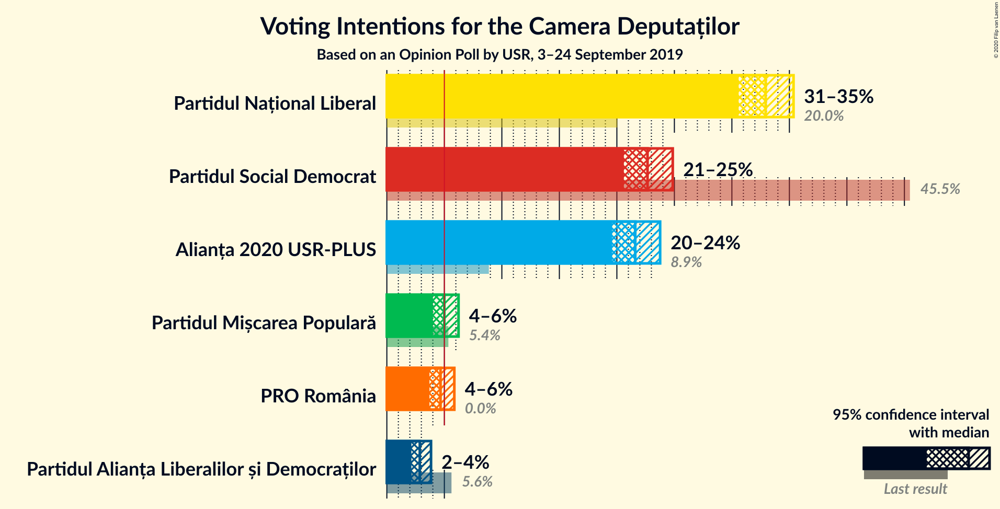
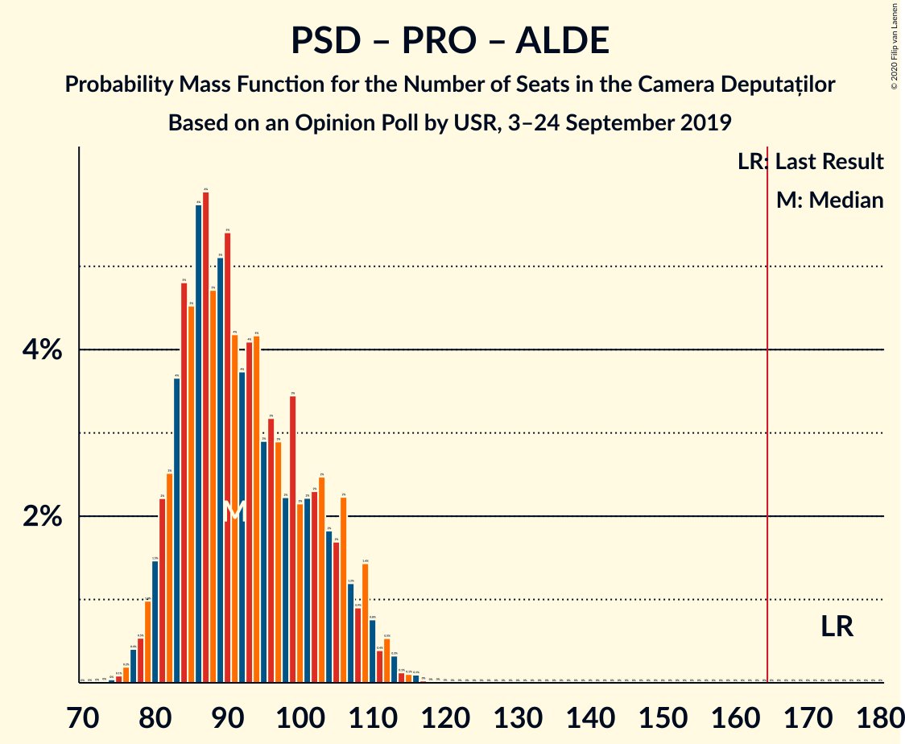

# Opinion Poll by USR, 3–24 September 2019

<a href="#voting-intentions">Voting Intentions</a> | <a href="#seats">Seats</a> | <a href="#coalitions">Coalitions</a> | <a href="#technical-information">Technical Information</a>

## Voting Intentions

### Confidence Intervals

| Party | Last Result | Poll Result | 80% Confidence Interval | 90% Confidence Interval | 95% Confidence Interval | 99% Confidence Interval |
|:-----:|:-----------:|:-----------:|:-----------------------:|:-----------------------:|:-----------------------:|:-----------------------:|
| Partidul Național Liberal | 20.0% | 32.9% | 31.4–34.5% |31.0–35.0% |30.6–35.4% |29.9–36.1% |
| Partidul Social Democrat | 45.5% | 22.7% | 21.3–24.1% |20.9–24.5% |20.6–24.9% |20.0–25.6% |
| Alianța 2020 USR-PLUS | 8.9% | 21.6% | 20.3–23.0% |19.9–23.4% |19.6–23.8% |19.0–24.4% |
| Partidul Mișcarea Populară | 5.4% | 5.0% | 4.3–5.8% |4.2–6.0% |4.0–6.2% |3.7–6.6% |
| PRO România | 0.0% | 4.7% | 4.0–5.4% |3.9–5.7% |3.7–5.9% |3.4–6.2% |
| Partidul Alianța Liberalilor și Democraților | 5.6% | 2.9% | 2.4–3.5% |2.2–3.7% |2.1–3.8% |1.9–4.2% |

*Note:* The poll result column reflects the actual value used in the calculations. Published results may vary slightly, and in addition be rounded to fewer digits.

## Seats

### Confidence Intervals

| Party | Last Result | Median | 80% Confidence Interval | 90% Confidence Interval | 95% Confidence Interval | 99% Confidence Interval |
|:-----:|:-----------:|:------:|:-----------------------:|:-----------------------:|:-----------------------:|:-----------------------:|
| <a href="#partidul-național-liberal">Partidul Național Liberal</a> | 69 | 126 | 117–135 |115–138 |113–140 |109–143 |
| <a href="#partidul-social-democrat">Partidul Social Democrat</a> | 154 | 87 | 80–94 |78–96 |77–98 |74–101 |
| <a href="#alianța-2020-usr-plus">Alianța 2020 USR-PLUS</a> | 30 | 82 | 76–90 |74–92 |73–94 |70–97 |
| <a href="#partidul-mișcarea-populară">Partidul Mișcarea Populară</a> | 18 | 18 | 0–21 |0–22 |0–23 |0–25 |
| <a href="#pro-românia">PRO România</a> | 0 | 0 | 0–20 |0–21 |0–21 |0–23 |
| <a href="#partidul-alianța-liberalilor-și-democraților">Partidul Alianța Liberalilor și Democraților</a> | 20 | 0 | 0 |0 |0 |0 |

### Partidul Național Liberal

*For a full overview of the results for this party, see the [Partidul Național Liberal](party-partidulnaționalliberal.html) page.*

| Number of Seats | Probability | Accumulated | Special Marks |
|:---------------:|:-----------:|:-----------:|:-------------:|
| 69 | 0% | 100% | Last Result |
| 70 | 0% | 100% |  |
| 71 | 0% | 100% |  |
| 72 | 0% | 100% |  |
| 73 | 0% | 100% |  |
| 74 | 0% | 100% |  |
| 75 | 0% | 100% |  |
| 76 | 0% | 100% |  |
| 77 | 0% | 100% |  |
| 78 | 0% | 100% |  |
| 79 | 0% | 100% |  |
| 80 | 0% | 100% |  |
| 81 | 0% | 100% |  |
| 82 | 0% | 100% |  |
| 83 | 0% | 100% |  |
| 84 | 0% | 100% |  |
| 85 | 0% | 100% |  |
| 86 | 0% | 100% |  |
| 87 | 0% | 100% |  |
| 88 | 0% | 100% |  |
| 89 | 0% | 100% |  |
| 90 | 0% | 100% |  |
| 91 | 0% | 100% |  |
| 92 | 0% | 100% |  |
| 93 | 0% | 100% |  |
| 94 | 0% | 100% |  |
| 95 | 0% | 100% |  |
| 96 | 0% | 100% |  |
| 97 | 0% | 100% |  |
| 98 | 0% | 100% |  |
| 99 | 0% | 100% |  |
| 100 | 0% | 100% |  |
| 101 | 0% | 100% |  |
| 102 | 0% | 100% |  |
| 103 | 0% | 100% |  |
| 104 | 0% | 100% |  |
| 105 | 0% | 100% |  |
| 106 | 0% | 100% |  |
| 107 | 0.1% | 99.9% |  |
| 108 | 0.1% | 99.9% |  |
| 109 | 0.2% | 99.7% |  |
| 110 | 0.3% | 99.5% |  |
| 111 | 0.5% | 99.2% |  |
| 112 | 0.7% | 98.7% |  |
| 113 | 1.0% | 98% |  |
| 114 | 1.1% | 97% |  |
| 115 | 2% | 96% |  |
| 116 | 2% | 94% |  |
| 117 | 3% | 92% |  |
| 118 | 3% | 89% |  |
| 119 | 4% | 86% |  |
| 120 | 4% | 83% |  |
| 121 | 4% | 79% |  |
| 122 | 4% | 75% |  |
| 123 | 5% | 71% |  |
| 124 | 6% | 66% |  |
| 125 | 5% | 60% |  |
| 126 | 7% | 55% | Median |
| 127 | 6% | 48% |  |
| 128 | 6% | 43% |  |
| 129 | 6% | 37% |  |
| 130 | 5% | 31% |  |
| 131 | 5% | 26% |  |
| 132 | 4% | 21% |  |
| 133 | 3% | 17% |  |
| 134 | 2% | 15% |  |
| 135 | 3% | 13% |  |
| 136 | 2% | 10% |  |
| 137 | 2% | 8% |  |
| 138 | 1.4% | 6% |  |
| 139 | 1.2% | 5% |  |
| 140 | 1.2% | 3% |  |
| 141 | 0.9% | 2% |  |
| 142 | 0.7% | 1.4% |  |
| 143 | 0.4% | 0.7% |  |
| 144 | 0.2% | 0.4% |  |
| 145 | 0.1% | 0.2% |  |
| 146 | 0% | 0.1% |  |
| 147 | 0% | 0% |  |

### Partidul Social Democrat

*For a full overview of the results for this party, see the [Partidul Social Democrat](party-partidulsocialdemocrat.html) page.*

| Number of Seats | Probability | Accumulated | Special Marks |
|:---------------:|:-----------:|:-----------:|:-------------:|
| 71 | 0.1% | 100% |  |
| 72 | 0.1% | 99.9% |  |
| 73 | 0.2% | 99.8% |  |
| 74 | 0.4% | 99.5% |  |
| 75 | 0.6% | 99.2% |  |
| 76 | 1.0% | 98.5% |  |
| 77 | 2% | 98% |  |
| 78 | 2% | 96% |  |
| 79 | 3% | 94% |  |
| 80 | 4% | 91% |  |
| 81 | 5% | 88% |  |
| 82 | 4% | 83% |  |
| 83 | 7% | 79% |  |
| 84 | 7% | 72% |  |
| 85 | 7% | 65% |  |
| 86 | 8% | 59% |  |
| 87 | 8% | 51% | Median |
| 88 | 6% | 43% |  |
| 89 | 6% | 37% |  |
| 90 | 6% | 31% |  |
| 91 | 5% | 25% |  |
| 92 | 4% | 20% |  |
| 93 | 4% | 16% |  |
| 94 | 4% | 12% |  |
| 95 | 2% | 9% |  |
| 96 | 2% | 7% |  |
| 97 | 2% | 5% |  |
| 98 | 1.0% | 3% |  |
| 99 | 0.6% | 2% |  |
| 100 | 0.6% | 1.2% |  |
| 101 | 0.3% | 0.6% |  |
| 102 | 0.1% | 0.3% |  |
| 103 | 0.1% | 0.2% |  |
| 104 | 0.1% | 0.1% |  |
| 105 | 0% | 0% |  |
| 106 | 0% | 0% |  |
| 107 | 0% | 0% |  |
| 108 | 0% | 0% |  |
| 109 | 0% | 0% |  |
| 110 | 0% | 0% |  |
| 111 | 0% | 0% |  |
| 112 | 0% | 0% |  |
| 113 | 0% | 0% |  |
| 114 | 0% | 0% |  |
| 115 | 0% | 0% |  |
| 116 | 0% | 0% |  |
| 117 | 0% | 0% |  |
| 118 | 0% | 0% |  |
| 119 | 0% | 0% |  |
| 120 | 0% | 0% |  |
| 121 | 0% | 0% |  |
| 122 | 0% | 0% |  |
| 123 | 0% | 0% |  |
| 124 | 0% | 0% |  |
| 125 | 0% | 0% |  |
| 126 | 0% | 0% |  |
| 127 | 0% | 0% |  |
| 128 | 0% | 0% |  |
| 129 | 0% | 0% |  |
| 130 | 0% | 0% |  |
| 131 | 0% | 0% |  |
| 132 | 0% | 0% |  |
| 133 | 0% | 0% |  |
| 134 | 0% | 0% |  |
| 135 | 0% | 0% |  |
| 136 | 0% | 0% |  |
| 137 | 0% | 0% |  |
| 138 | 0% | 0% |  |
| 139 | 0% | 0% |  |
| 140 | 0% | 0% |  |
| 141 | 0% | 0% |  |
| 142 | 0% | 0% |  |
| 143 | 0% | 0% |  |
| 144 | 0% | 0% |  |
| 145 | 0% | 0% |  |
| 146 | 0% | 0% |  |
| 147 | 0% | 0% |  |
| 148 | 0% | 0% |  |
| 149 | 0% | 0% |  |
| 150 | 0% | 0% |  |
| 151 | 0% | 0% |  |
| 152 | 0% | 0% |  |
| 153 | 0% | 0% |  |
| 154 | 0% | 0% | Last Result |

### Alianța 2020 USR-PLUS

*For a full overview of the results for this party, see the [Alianța 2020 USR-PLUS](party-alianța2020usr-plus.html) page.*

| Number of Seats | Probability | Accumulated | Special Marks |
|:---------------:|:-----------:|:-----------:|:-------------:|
| 30 | 0% | 100% | Last Result |
| 31 | 0% | 100% |  |
| 32 | 0% | 100% |  |
| 33 | 0% | 100% |  |
| 34 | 0% | 100% |  |
| 35 | 0% | 100% |  |
| 36 | 0% | 100% |  |
| 37 | 0% | 100% |  |
| 38 | 0% | 100% |  |
| 39 | 0% | 100% |  |
| 40 | 0% | 100% |  |
| 41 | 0% | 100% |  |
| 42 | 0% | 100% |  |
| 43 | 0% | 100% |  |
| 44 | 0% | 100% |  |
| 45 | 0% | 100% |  |
| 46 | 0% | 100% |  |
| 47 | 0% | 100% |  |
| 48 | 0% | 100% |  |
| 49 | 0% | 100% |  |
| 50 | 0% | 100% |  |
| 51 | 0% | 100% |  |
| 52 | 0% | 100% |  |
| 53 | 0% | 100% |  |
| 54 | 0% | 100% |  |
| 55 | 0% | 100% |  |
| 56 | 0% | 100% |  |
| 57 | 0% | 100% |  |
| 58 | 0% | 100% |  |
| 59 | 0% | 100% |  |
| 60 | 0% | 100% |  |
| 61 | 0% | 100% |  |
| 62 | 0% | 100% |  |
| 63 | 0% | 100% |  |
| 64 | 0% | 100% |  |
| 65 | 0% | 100% |  |
| 66 | 0% | 100% |  |
| 67 | 0.1% | 100% |  |
| 68 | 0.1% | 99.9% |  |
| 69 | 0.2% | 99.8% |  |
| 70 | 0.3% | 99.6% |  |
| 71 | 0.6% | 99.3% |  |
| 72 | 0.9% | 98.7% |  |
| 73 | 1.5% | 98% |  |
| 74 | 2% | 96% |  |
| 75 | 3% | 94% |  |
| 76 | 3% | 91% |  |
| 77 | 4% | 88% |  |
| 78 | 5% | 84% |  |
| 79 | 7% | 78% |  |
| 80 | 7% | 71% |  |
| 81 | 8% | 65% |  |
| 82 | 7% | 56% | Median |
| 83 | 7% | 49% |  |
| 84 | 6% | 43% |  |
| 85 | 6% | 37% |  |
| 86 | 6% | 31% |  |
| 87 | 6% | 25% |  |
| 88 | 5% | 19% |  |
| 89 | 3% | 14% |  |
| 90 | 3% | 10% |  |
| 91 | 2% | 8% |  |
| 92 | 2% | 6% |  |
| 93 | 1.5% | 4% |  |
| 94 | 1.0% | 3% |  |
| 95 | 0.7% | 2% |  |
| 96 | 0.4% | 0.9% |  |
| 97 | 0.2% | 0.5% |  |
| 98 | 0.1% | 0.3% |  |
| 99 | 0.1% | 0.1% |  |
| 100 | 0% | 0.1% |  |
| 101 | 0% | 0% |  |

### Partidul Mișcarea Populară

*For a full overview of the results for this party, see the [Partidul Mișcarea Populară](party-partidulmișcareapopulară.html) page.*

| Number of Seats | Probability | Accumulated | Special Marks |
|:---------------:|:-----------:|:-----------:|:-------------:|
| 0 | 47% | 100% |  |
| 1 | 0% | 53% |  |
| 2 | 0% | 53% |  |
| 3 | 0% | 53% |  |
| 4 | 0% | 53% |  |
| 5 | 0% | 53% |  |
| 6 | 0% | 53% |  |
| 7 | 0% | 53% |  |
| 8 | 0% | 53% |  |
| 9 | 0% | 53% |  |
| 10 | 0% | 53% |  |
| 11 | 0% | 53% |  |
| 12 | 0% | 53% |  |
| 13 | 0% | 53% |  |
| 14 | 0% | 53% |  |
| 15 | 0% | 53% |  |
| 16 | 0% | 53% |  |
| 17 | 0.1% | 53% |  |
| 18 | 6% | 53% | Last Result, Median |
| 19 | 15% | 47% |  |
| 20 | 14% | 31% |  |
| 21 | 9% | 17% |  |
| 22 | 4% | 8% |  |
| 23 | 2% | 4% |  |
| 24 | 0.9% | 1.4% |  |
| 25 | 0.4% | 0.5% |  |
| 26 | 0.1% | 0.1% |  |
| 27 | 0% | 0% |  |

### PRO România

*For a full overview of the results for this party, see the [PRO România](party-proromânia.html) page.*

| Number of Seats | Probability | Accumulated | Special Marks |
|:---------------:|:-----------:|:-----------:|:-------------:|
| 0 | 72% | 100% | Last Result, Median |
| 1 | 0% | 28% |  |
| 2 | 0% | 28% |  |
| 3 | 0% | 28% |  |
| 4 | 0% | 28% |  |
| 5 | 0% | 28% |  |
| 6 | 0% | 28% |  |
| 7 | 0% | 28% |  |
| 8 | 0% | 28% |  |
| 9 | 0% | 28% |  |
| 10 | 0% | 28% |  |
| 11 | 0% | 28% |  |
| 12 | 0% | 28% |  |
| 13 | 0% | 28% |  |
| 14 | 0% | 28% |  |
| 15 | 0% | 28% |  |
| 16 | 0% | 28% |  |
| 17 | 0.3% | 28% |  |
| 18 | 6% | 28% |  |
| 19 | 10% | 22% |  |
| 20 | 6% | 11% |  |
| 21 | 3% | 5% |  |
| 22 | 1.4% | 2% |  |
| 23 | 0.5% | 0.8% |  |
| 24 | 0.2% | 0.2% |  |
| 25 | 0% | 0.1% |  |
| 26 | 0% | 0% |  |

### Partidul Alianța Liberalilor și Democraților

*For a full overview of the results for this party, see the [Partidul Alianța Liberalilor și Democraților](party-partidulalianțaliberalilorșidemocraților.html) page.*

| Number of Seats | Probability | Accumulated | Special Marks |
|:---------------:|:-----------:|:-----------:|:-------------:|
| 0 | 100% | 100% | Median |
| 1 | 0% | 0% |  |
| 2 | 0% | 0% |  |
| 3 | 0% | 0% |  |
| 4 | 0% | 0% |  |
| 5 | 0% | 0% |  |
| 6 | 0% | 0% |  |
| 7 | 0% | 0% |  |
| 8 | 0% | 0% |  |
| 9 | 0% | 0% |  |
| 10 | 0% | 0% |  |
| 11 | 0% | 0% |  |
| 12 | 0% | 0% |  |
| 13 | 0% | 0% |  |
| 14 | 0% | 0% |  |
| 15 | 0% | 0% |  |
| 16 | 0% | 0% |  |
| 17 | 0% | 0% |  |
| 18 | 0% | 0% |  |
| 19 | 0% | 0% |  |
| 20 | 0% | 0% | Last Result |

## Coalitions

### Confidence Intervals

| Coalition | Last Result | Median | Majority? | 80% Confidence Interval | 90% Confidence Interval | 95% Confidence Interval | 99% Confidence Interval |
|:---------:|:-----------:|:------:|:---------:|:-----------------------:|:-----------------------:|:-----------------------:|:-----------------------:|
| Partidul Național Liberal – Alianța 2020 USR-PLUS – Partidul Mișcarea Populară – Partidul Alianța Liberalilor și Democraților | 137 | 221 | 100% | 208–229 | 205–231 | 203–232 | 199–235 |
| Partidul Național Liberal – Alianța 2020 USR-PLUS – Partidul Mișcarea Populară | 117 | 221 | 100% | 208–229 | 205–231 | 203–232 | 199–235 |
| Partidul Național Liberal – Partidul Mișcarea Populară | 87 | 137 | 0% | 126–147 | 123–149 | 120–151 | 117–155 |
| Partidul Național Liberal | 69 | 126 | 0% | 117–135 | 115–138 | 113–140 | 109–143 |
| Partidul Social Democrat – PRO România – Partidul Alianța Liberalilor și Democraților | 174 | 91 | 0% | 83–104 | 81–107 | 80–109 | 77–113 |
| Partidul Social Democrat – PRO România | 154 | 91 | 0% | 83–104 | 81–107 | 80–109 | 77–113 |
| Alianța 2020 USR-PLUS – Partidul Mișcarea Populară | 48 | 94 | 0% | 82–105 | 79–107 | 78–108 | 74–111 |
| Partidul Social Democrat – Partidul Alianța Liberalilor și Democraților | 174 | 87 | 0% | 80–94 | 78–96 | 77–98 | 74–101 |
| Partidul Național Liberal – Alianța 2020 USR-PLUS – Partidul Alianța Liberalilor și Democraților | 119 | 208 | 100% | 195–222 | 192–225 | Parties of ethnic minorities–17 | 17 |
| Partidul Național Liberal – Alianța 2020 USR-PLUS | 99 | 208 | 100% | 195–222 | 192–225 | Parties of ethnic minorities–17 | 17 |

### Partidul Național Liberal – Alianța 2020 USR-PLUS – Partidul Mișcarea Populară – Partidul Alianța Liberalilor și Democraților

| Number of Seats | Probability | Accumulated | Special Marks |
|:---------------:|:-----------:|:-----------:|:-------------:|
| 137 | 0% | 100% | Last Result |
| 138 | 0% | 100% |  |
| 139 | 0% | 100% |  |
| 140 | 0% | 100% |  |
| 141 | 0% | 100% |  |
| 142 | 0% | 100% |  |
| 143 | 0% | 100% |  |
| 144 | 0% | 100% |  |
| 145 | 0% | 100% |  |
| 146 | 0% | 100% |  |
| 147 | 0% | 100% |  |
| 148 | 0% | 100% |  |
| 149 | 0% | 100% |  |
| 150 | 0% | 100% |  |
| 151 | 0% | 100% |  |
| 152 | 0% | 100% |  |
| 153 | 0% | 100% |  |
| 154 | 0% | 100% |  |
| 155 | 0% | 100% |  |
| 156 | 0% | 100% |  |
| 157 | 0% | 100% |  |
| 158 | 0% | 100% |  |
| 159 | 0% | 100% |  |
| 160 | 0% | 100% |  |
| 161 | 0% | 100% |  |
| 162 | 0% | 100% |  |
| 163 | 0% | 100% |  |
| 164 | 0% | 100% |  |
| 165 | 0% | 100% | Majority |
| 166 | 0% | 100% |  |
| 167 | 0% | 100% |  |
| 168 | 0% | 100% |  |
| 169 | 0% | 100% |  |
| 170 | 0% | 100% |  |
| 171 | 0% | 100% |  |
| 172 | 0% | 100% |  |
| 173 | 0% | 100% |  |
| 174 | 0% | 100% |  |
| 175 | 0% | 100% |  |
| 176 | 0% | 100% |  |
| 177 | 0% | 100% |  |
| 178 | 0% | 100% |  |
| 179 | 0% | 100% |  |
| 180 | 0% | 100% |  |
| 181 | 0% | 100% |  |
| 182 | 0% | 100% |  |
| 183 | 0% | 100% |  |
| 184 | 0% | 100% |  |
| 185 | 0% | 100% |  |
| 186 | 0% | 100% |  |
| 187 | 0% | 100% |  |
| 188 | 0% | 100% |  |
| 189 | 0% | 100% |  |
| 190 | 0% | 100% |  |
| 191 | 0% | 100% |  |
| 192 | 0% | 100% |  |
| 193 | 0% | 100% |  |
| 194 | 0% | 100% |  |
| 195 | 0% | 100% |  |
| 196 | 0.1% | 99.9% |  |
| 197 | 0.1% | 99.8% |  |
| 198 | 0.1% | 99.7% |  |
| 199 | 0.3% | 99.6% |  |
| 200 | 0.5% | 99.3% |  |
| 201 | 0.4% | 98.8% |  |
| 202 | 0.8% | 98% |  |
| 203 | 1.4% | 98% |  |
| 204 | 0.9% | 96% |  |
| 205 | 1.2% | 95% |  |
| 206 | 2% | 94% |  |
| 207 | 2% | 92% |  |
| 208 | 2% | 90% |  |
| 209 | 2% | 88% |  |
| 210 | 2% | 86% |  |
| 211 | 2% | 84% |  |
| 212 | 2% | 81% |  |
| 213 | 3% | 79% |  |
| 214 | 2% | 76% |  |
| 215 | 3% | 74% |  |
| 216 | 3% | 71% |  |
| 217 | 3% | 67% |  |
| 218 | 4% | 65% |  |
| 219 | 4% | 60% |  |
| 220 | 4% | 56% |  |
| 221 | 4% | 53% |  |
| 222 | 5% | 48% |  |
| 223 | 5% | 43% |  |
| 224 | 5% | 38% |  |
| 225 | 6% | 33% |  |
| 226 | 6% | 27% | Median |
| 227 | 5% | 21% |  |
| 228 | 5% | 17% |  |
| 229 | 4% | 12% |  |
| 230 | 3% | 8% |  |
| 231 | 2% | 6% |  |
| 232 | 1.5% | 4% |  |
| 233 | 1.0% | 2% |  |
| 234 | 0.5% | 1.3% |  |
| 235 | 0.4% | 0.8% |  |
| 236 | 0.2% | 0.3% |  |
| 237 | 0.1% | 0.2% |  |
| 238 | 0% | 0.1% |  |
| 239 | 0% | 0% |  |

### Partidul Național Liberal – Alianța 2020 USR-PLUS – Partidul Mișcarea Populară

| Number of Seats | Probability | Accumulated | Special Marks |
|:---------------:|:-----------:|:-----------:|:-------------:|
| 117 | 0% | 100% | Last Result |
| 118 | 0% | 100% |  |
| 119 | 0% | 100% |  |
| 120 | 0% | 100% |  |
| 121 | 0% | 100% |  |
| 122 | 0% | 100% |  |
| 123 | 0% | 100% |  |
| 124 | 0% | 100% |  |
| 125 | 0% | 100% |  |
| 126 | 0% | 100% |  |
| 127 | 0% | 100% |  |
| 128 | 0% | 100% |  |
| 129 | 0% | 100% |  |
| 130 | 0% | 100% |  |
| 131 | 0% | 100% |  |
| 132 | 0% | 100% |  |
| 133 | 0% | 100% |  |
| 134 | 0% | 100% |  |
| 135 | 0% | 100% |  |
| 136 | 0% | 100% |  |
| 137 | 0% | 100% |  |
| 138 | 0% | 100% |  |
| 139 | 0% | 100% |  |
| 140 | 0% | 100% |  |
| 141 | 0% | 100% |  |
| 142 | 0% | 100% |  |
| 143 | 0% | 100% |  |
| 144 | 0% | 100% |  |
| 145 | 0% | 100% |  |
| 146 | 0% | 100% |  |
| 147 | 0% | 100% |  |
| 148 | 0% | 100% |  |
| 149 | 0% | 100% |  |
| 150 | 0% | 100% |  |
| 151 | 0% | 100% |  |
| 152 | 0% | 100% |  |
| 153 | 0% | 100% |  |
| 154 | 0% | 100% |  |
| 155 | 0% | 100% |  |
| 156 | 0% | 100% |  |
| 157 | 0% | 100% |  |
| 158 | 0% | 100% |  |
| 159 | 0% | 100% |  |
| 160 | 0% | 100% |  |
| 161 | 0% | 100% |  |
| 162 | 0% | 100% |  |
| 163 | 0% | 100% |  |
| 164 | 0% | 100% |  |
| 165 | 0% | 100% | Majority |
| 166 | 0% | 100% |  |
| 167 | 0% | 100% |  |
| 168 | 0% | 100% |  |
| 169 | 0% | 100% |  |
| 170 | 0% | 100% |  |
| 171 | 0% | 100% |  |
| 172 | 0% | 100% |  |
| 173 | 0% | 100% |  |
| 174 | 0% | 100% |  |
| 175 | 0% | 100% |  |
| 176 | 0% | 100% |  |
| 177 | 0% | 100% |  |
| 178 | 0% | 100% |  |
| 179 | 0% | 100% |  |
| 180 | 0% | 100% |  |
| 181 | 0% | 100% |  |
| 182 | 0% | 100% |  |
| 183 | 0% | 100% |  |
| 184 | 0% | 100% |  |
| 185 | 0% | 100% |  |
| 186 | 0% | 100% |  |
| 187 | 0% | 100% |  |
| 188 | 0% | 100% |  |
| 189 | 0% | 100% |  |
| 190 | 0% | 100% |  |
| 191 | 0% | 100% |  |
| 192 | 0% | 100% |  |
| 193 | 0% | 100% |  |
| 194 | 0% | 100% |  |
| 195 | 0% | 100% |  |
| 196 | 0.1% | 99.9% |  |
| 197 | 0.1% | 99.8% |  |
| 198 | 0.1% | 99.7% |  |
| 199 | 0.3% | 99.6% |  |
| 200 | 0.5% | 99.3% |  |
| 201 | 0.4% | 98.8% |  |
| 202 | 0.8% | 98% |  |
| 203 | 1.4% | 98% |  |
| 204 | 0.9% | 96% |  |
| 205 | 1.2% | 95% |  |
| 206 | 2% | 94% |  |
| 207 | 2% | 92% |  |
| 208 | 2% | 90% |  |
| 209 | 2% | 88% |  |
| 210 | 2% | 86% |  |
| 211 | 2% | 84% |  |
| 212 | 2% | 81% |  |
| 213 | 3% | 79% |  |
| 214 | 2% | 76% |  |
| 215 | 3% | 74% |  |
| 216 | 3% | 71% |  |
| 217 | 3% | 67% |  |
| 218 | 4% | 65% |  |
| 219 | 4% | 60% |  |
| 220 | 4% | 56% |  |
| 221 | 4% | 53% |  |
| 222 | 5% | 48% |  |
| 223 | 5% | 43% |  |
| 224 | 5% | 38% |  |
| 225 | 6% | 33% |  |
| 226 | 6% | 27% | Median |
| 227 | 5% | 21% |  |
| 228 | 5% | 17% |  |
| 229 | 4% | 12% |  |
| 230 | 3% | 8% |  |
| 231 | 2% | 6% |  |
| 232 | 1.5% | 4% |  |
| 233 | 1.0% | 2% |  |
| 234 | 0.5% | 1.3% |  |
| 235 | 0.4% | 0.8% |  |
| 236 | 0.2% | 0.3% |  |
| 237 | 0.1% | 0.2% |  |
| 238 | 0% | 0.1% |  |
| 239 | 0% | 0% |  |

### Partidul Național Liberal – Partidul Mișcarea Populară

| Number of Seats | Probability | Accumulated | Special Marks |
|:---------------:|:-----------:|:-----------:|:-------------:|
| 87 | 0% | 100% | Last Result |
| 88 | 0% | 100% |  |
| 89 | 0% | 100% |  |
| 90 | 0% | 100% |  |
| 91 | 0% | 100% |  |
| 92 | 0% | 100% |  |
| 93 | 0% | 100% |  |
| 94 | 0% | 100% |  |
| 95 | 0% | 100% |  |
| 96 | 0% | 100% |  |
| 97 | 0% | 100% |  |
| 98 | 0% | 100% |  |
| 99 | 0% | 100% |  |
| 100 | 0% | 100% |  |
| 101 | 0% | 100% |  |
| 102 | 0% | 100% |  |
| 103 | 0% | 100% |  |
| 104 | 0% | 100% |  |
| 105 | 0% | 100% |  |
| 106 | 0% | 100% |  |
| 107 | 0% | 100% |  |
| 108 | 0% | 100% |  |
| 109 | 0% | 100% |  |
| 110 | 0% | 100% |  |
| 111 | 0% | 100% |  |
| 112 | 0% | 100% |  |
| 113 | 0% | 100% |  |
| 114 | 0% | 99.9% |  |
| 115 | 0.1% | 99.9% |  |
| 116 | 0.2% | 99.8% |  |
| 117 | 0.3% | 99.5% |  |
| 118 | 0.7% | 99.2% |  |
| 119 | 0.7% | 98.5% |  |
| 120 | 0.8% | 98% |  |
| 121 | 0.8% | 97% |  |
| 122 | 1.1% | 96% |  |
| 123 | 1.2% | 95% |  |
| 124 | 2% | 94% |  |
| 125 | 2% | 92% |  |
| 126 | 2% | 91% |  |
| 127 | 2% | 89% |  |
| 128 | 3% | 86% |  |
| 129 | 4% | 83% |  |
| 130 | 4% | 79% |  |
| 131 | 4% | 76% |  |
| 132 | 4% | 71% |  |
| 133 | 3% | 67% |  |
| 134 | 3% | 64% |  |
| 135 | 4% | 60% |  |
| 136 | 4% | 56% |  |
| 137 | 4% | 52% |  |
| 138 | 3% | 48% |  |
| 139 | 3% | 45% |  |
| 140 | 3% | 41% |  |
| 141 | 3% | 39% |  |
| 142 | 3% | 36% |  |
| 143 | 5% | 32% |  |
| 144 | 5% | 28% | Median |
| 145 | 6% | 22% |  |
| 146 | 4% | 16% |  |
| 147 | 3% | 12% |  |
| 148 | 3% | 10% |  |
| 149 | 2% | 7% |  |
| 150 | 2% | 5% |  |
| 151 | 1.0% | 3% |  |
| 152 | 0.5% | 2% |  |
| 153 | 0.5% | 1.5% |  |
| 154 | 0.4% | 1.0% |  |
| 155 | 0.3% | 0.6% |  |
| 156 | 0.2% | 0.3% |  |
| 157 | 0.1% | 0.1% |  |
| 158 | 0% | 0.1% |  |
| 159 | 0% | 0% |  |

### Partidul Național Liberal

| Number of Seats | Probability | Accumulated | Special Marks |
|:---------------:|:-----------:|:-----------:|:-------------:|
| 69 | 0% | 100% | Last Result |
| 70 | 0% | 100% |  |
| 71 | 0% | 100% |  |
| 72 | 0% | 100% |  |
| 73 | 0% | 100% |  |
| 74 | 0% | 100% |  |
| 75 | 0% | 100% |  |
| 76 | 0% | 100% |  |
| 77 | 0% | 100% |  |
| 78 | 0% | 100% |  |
| 79 | 0% | 100% |  |
| 80 | 0% | 100% |  |
| 81 | 0% | 100% |  |
| 82 | 0% | 100% |  |
| 83 | 0% | 100% |  |
| 84 | 0% | 100% |  |
| 85 | 0% | 100% |  |
| 86 | 0% | 100% |  |
| 87 | 0% | 100% |  |
| 88 | 0% | 100% |  |
| 89 | 0% | 100% |  |
| 90 | 0% | 100% |  |
| 91 | 0% | 100% |  |
| 92 | 0% | 100% |  |
| 93 | 0% | 100% |  |
| 94 | 0% | 100% |  |
| 95 | 0% | 100% |  |
| 96 | 0% | 100% |  |
| 97 | 0% | 100% |  |
| 98 | 0% | 100% |  |
| 99 | 0% | 100% |  |
| 100 | 0% | 100% |  |
| 101 | 0% | 100% |  |
| 102 | 0% | 100% |  |
| 103 | 0% | 100% |  |
| 104 | 0% | 100% |  |
| 105 | 0% | 100% |  |
| 106 | 0% | 100% |  |
| 107 | 0.1% | 99.9% |  |
| 108 | 0.1% | 99.9% |  |
| 109 | 0.2% | 99.7% |  |
| 110 | 0.3% | 99.5% |  |
| 111 | 0.5% | 99.2% |  |
| 112 | 0.7% | 98.7% |  |
| 113 | 1.0% | 98% |  |
| 114 | 1.1% | 97% |  |
| 115 | 2% | 96% |  |
| 116 | 2% | 94% |  |
| 117 | 3% | 92% |  |
| 118 | 3% | 89% |  |
| 119 | 4% | 86% |  |
| 120 | 4% | 83% |  |
| 121 | 4% | 79% |  |
| 122 | 4% | 75% |  |
| 123 | 5% | 71% |  |
| 124 | 6% | 66% |  |
| 125 | 5% | 60% |  |
| 126 | 7% | 55% | Median |
| 127 | 6% | 48% |  |
| 128 | 6% | 43% |  |
| 129 | 6% | 37% |  |
| 130 | 5% | 31% |  |
| 131 | 5% | 26% |  |
| 132 | 4% | 21% |  |
| 133 | 3% | 17% |  |
| 134 | 2% | 15% |  |
| 135 | 3% | 13% |  |
| 136 | 2% | 10% |  |
| 137 | 2% | 8% |  |
| 138 | 1.4% | 6% |  |
| 139 | 1.2% | 5% |  |
| 140 | 1.2% | 3% |  |
| 141 | 0.9% | 2% |  |
| 142 | 0.7% | 1.4% |  |
| 143 | 0.4% | 0.7% |  |
| 144 | 0.2% | 0.4% |  |
| 145 | 0.1% | 0.2% |  |
| 146 | 0% | 0.1% |  |
| 147 | 0% | 0% |  |

### Partidul Social Democrat – PRO România – Partidul Alianța Liberalilor și Democraților

| Number of Seats | Probability | Accumulated | Special Marks |
|:---------------:|:-----------:|:-----------:|:-------------:|
| 74 | 0% | 100% |  |
| 75 | 0.1% | 99.9% |  |
| 76 | 0.2% | 99.8% |  |
| 77 | 0.4% | 99.7% |  |
| 78 | 0.5% | 99.2% |  |
| 79 | 1.0% | 98.7% |  |
| 80 | 1.5% | 98% |  |
| 81 | 2% | 96% |  |
| 82 | 3% | 94% |  |
| 83 | 4% | 92% |  |
| 84 | 5% | 88% |  |
| 85 | 5% | 83% |  |
| 86 | 6% | 79% |  |
| 87 | 6% | 73% | Median |
| 88 | 5% | 67% |  |
| 89 | 5% | 62% |  |
| 90 | 5% | 57% |  |
| 91 | 4% | 52% |  |
| 92 | 4% | 47% |  |
| 93 | 4% | 44% |  |
| 94 | 4% | 40% |  |
| 95 | 3% | 35% |  |
| 96 | 3% | 33% |  |
| 97 | 3% | 29% |  |
| 98 | 2% | 26% |  |
| 99 | 3% | 24% |  |
| 100 | 2% | 21% |  |
| 101 | 2% | 19% |  |
| 102 | 2% | 16% |  |
| 103 | 2% | 14% |  |
| 104 | 2% | 12% |  |
| 105 | 2% | 10% |  |
| 106 | 2% | 8% |  |
| 107 | 1.2% | 6% |  |
| 108 | 0.9% | 5% |  |
| 109 | 1.4% | 4% |  |
| 110 | 0.8% | 2% |  |
| 111 | 0.4% | 2% |  |
| 112 | 0.5% | 1.2% |  |
| 113 | 0.3% | 0.7% |  |
| 114 | 0.1% | 0.4% |  |
| 115 | 0.1% | 0.3% |  |
| 116 | 0.1% | 0.2% |  |
| 117 | 0% | 0.1% |  |
| 118 | 0% | 0% |  |
| 119 | 0% | 0% |  |
| 120 | 0% | 0% |  |
| 121 | 0% | 0% |  |
| 122 | 0% | 0% |  |
| 123 | 0% | 0% |  |
| 124 | 0% | 0% |  |
| 125 | 0% | 0% |  |
| 126 | 0% | 0% |  |
| 127 | 0% | 0% |  |
| 128 | 0% | 0% |  |
| 129 | 0% | 0% |  |
| 130 | 0% | 0% |  |
| 131 | 0% | 0% |  |
| 132 | 0% | 0% |  |
| 133 | 0% | 0% |  |
| 134 | 0% | 0% |  |
| 135 | 0% | 0% |  |
| 136 | 0% | 0% |  |
| 137 | 0% | 0% |  |
| 138 | 0% | 0% |  |
| 139 | 0% | 0% |  |
| 140 | 0% | 0% |  |
| 141 | 0% | 0% |  |
| 142 | 0% | 0% |  |
| 143 | 0% | 0% |  |
| 144 | 0% | 0% |  |
| 145 | 0% | 0% |  |
| 146 | 0% | 0% |  |
| 147 | 0% | 0% |  |
| 148 | 0% | 0% |  |
| 149 | 0% | 0% |  |
| 150 | 0% | 0% |  |
| 151 | 0% | 0% |  |
| 152 | 0% | 0% |  |
| 153 | 0% | 0% |  |
| 154 | 0% | 0% |  |
| 155 | 0% | 0% |  |
| 156 | 0% | 0% |  |
| 157 | 0% | 0% |  |
| 158 | 0% | 0% |  |
| 159 | 0% | 0% |  |
| 160 | 0% | 0% |  |
| 161 | 0% | 0% |  |
| 162 | 0% | 0% |  |
| 163 | 0% | 0% |  |
| 164 | 0% | 0% |  |
| 165 | 0% | 0% | Majority |
| 166 | 0% | 0% |  |
| 167 | 0% | 0% |  |
| 168 | 0% | 0% |  |
| 169 | 0% | 0% |  |
| 170 | 0% | 0% |  |
| 171 | 0% | 0% |  |
| 172 | 0% | 0% |  |
| 173 | 0% | 0% |  |
| 174 | 0% | 0% | Last Result |

### Partidul Social Democrat – PRO România

| Number of Seats | Probability | Accumulated | Special Marks |
|:---------------:|:-----------:|:-----------:|:-------------:|
| 74 | 0% | 100% |  |
| 75 | 0.1% | 99.9% |  |
| 76 | 0.2% | 99.8% |  |
| 77 | 0.4% | 99.7% |  |
| 78 | 0.5% | 99.2% |  |
| 79 | 1.0% | 98.7% |  |
| 80 | 1.5% | 98% |  |
| 81 | 2% | 96% |  |
| 82 | 3% | 94% |  |
| 83 | 4% | 92% |  |
| 84 | 5% | 88% |  |
| 85 | 5% | 83% |  |
| 86 | 6% | 79% |  |
| 87 | 6% | 73% | Median |
| 88 | 5% | 67% |  |
| 89 | 5% | 62% |  |
| 90 | 5% | 57% |  |
| 91 | 4% | 52% |  |
| 92 | 4% | 47% |  |
| 93 | 4% | 44% |  |
| 94 | 4% | 40% |  |
| 95 | 3% | 35% |  |
| 96 | 3% | 33% |  |
| 97 | 3% | 29% |  |
| 98 | 2% | 26% |  |
| 99 | 3% | 24% |  |
| 100 | 2% | 21% |  |
| 101 | 2% | 19% |  |
| 102 | 2% | 16% |  |
| 103 | 2% | 14% |  |
| 104 | 2% | 12% |  |
| 105 | 2% | 10% |  |
| 106 | 2% | 8% |  |
| 107 | 1.2% | 6% |  |
| 108 | 0.9% | 5% |  |
| 109 | 1.4% | 4% |  |
| 110 | 0.8% | 2% |  |
| 111 | 0.4% | 2% |  |
| 112 | 0.5% | 1.2% |  |
| 113 | 0.3% | 0.7% |  |
| 114 | 0.1% | 0.4% |  |
| 115 | 0.1% | 0.3% |  |
| 116 | 0.1% | 0.2% |  |
| 117 | 0% | 0.1% |  |
| 118 | 0% | 0% |  |
| 119 | 0% | 0% |  |
| 120 | 0% | 0% |  |
| 121 | 0% | 0% |  |
| 122 | 0% | 0% |  |
| 123 | 0% | 0% |  |
| 124 | 0% | 0% |  |
| 125 | 0% | 0% |  |
| 126 | 0% | 0% |  |
| 127 | 0% | 0% |  |
| 128 | 0% | 0% |  |
| 129 | 0% | 0% |  |
| 130 | 0% | 0% |  |
| 131 | 0% | 0% |  |
| 132 | 0% | 0% |  |
| 133 | 0% | 0% |  |
| 134 | 0% | 0% |  |
| 135 | 0% | 0% |  |
| 136 | 0% | 0% |  |
| 137 | 0% | 0% |  |
| 138 | 0% | 0% |  |
| 139 | 0% | 0% |  |
| 140 | 0% | 0% |  |
| 141 | 0% | 0% |  |
| 142 | 0% | 0% |  |
| 143 | 0% | 0% |  |
| 144 | 0% | 0% |  |
| 145 | 0% | 0% |  |
| 146 | 0% | 0% |  |
| 147 | 0% | 0% |  |
| 148 | 0% | 0% |  |
| 149 | 0% | 0% |  |
| 150 | 0% | 0% |  |
| 151 | 0% | 0% |  |
| 152 | 0% | 0% |  |
| 153 | 0% | 0% |  |
| 154 | 0% | 0% | Last Result |

### Alianța 2020 USR-PLUS – Partidul Mișcarea Populară

| Number of Seats | Probability | Accumulated | Special Marks |
|:---------------:|:-----------:|:-----------:|:-------------:|
| 48 | 0% | 100% | Last Result |
| 49 | 0% | 100% |  |
| 50 | 0% | 100% |  |
| 51 | 0% | 100% |  |
| 52 | 0% | 100% |  |
| 53 | 0% | 100% |  |
| 54 | 0% | 100% |  |
| 55 | 0% | 100% |  |
| 56 | 0% | 100% |  |
| 57 | 0% | 100% |  |
| 58 | 0% | 100% |  |
| 59 | 0% | 100% |  |
| 60 | 0% | 100% |  |
| 61 | 0% | 100% |  |
| 62 | 0% | 100% |  |
| 63 | 0% | 100% |  |
| 64 | 0% | 100% |  |
| 65 | 0% | 100% |  |
| 66 | 0% | 100% |  |
| 67 | 0% | 100% |  |
| 68 | 0% | 100% |  |
| 69 | 0% | 100% |  |
| 70 | 0% | 100% |  |
| 71 | 0% | 100% |  |
| 72 | 0.1% | 99.9% |  |
| 73 | 0.2% | 99.9% |  |
| 74 | 0.2% | 99.7% |  |
| 75 | 0.5% | 99.5% |  |
| 76 | 0.5% | 99.0% |  |
| 77 | 1.0% | 98.5% |  |
| 78 | 1.0% | 98% |  |
| 79 | 2% | 97% |  |
| 80 | 2% | 94% |  |
| 81 | 3% | 93% |  |
| 82 | 3% | 90% |  |
| 83 | 3% | 87% |  |
| 84 | 3% | 84% |  |
| 85 | 4% | 82% |  |
| 86 | 4% | 78% |  |
| 87 | 4% | 74% |  |
| 88 | 4% | 69% |  |
| 89 | 3% | 65% |  |
| 90 | 3% | 62% |  |
| 91 | 2% | 59% |  |
| 92 | 3% | 57% |  |
| 93 | 3% | 54% |  |
| 94 | 3% | 51% |  |
| 95 | 3% | 48% |  |
| 96 | 3% | 45% |  |
| 97 | 3% | 43% |  |
| 98 | 5% | 39% |  |
| 99 | 4% | 35% |  |
| 100 | 6% | 31% | Median |
| 101 | 5% | 25% |  |
| 102 | 5% | 21% |  |
| 103 | 4% | 16% |  |
| 104 | 2% | 12% |  |
| 105 | 3% | 10% |  |
| 106 | 2% | 7% |  |
| 107 | 2% | 5% |  |
| 108 | 1.2% | 3% |  |
| 109 | 0.9% | 2% |  |
| 110 | 0.5% | 1.1% |  |
| 111 | 0.3% | 0.6% |  |
| 112 | 0.2% | 0.3% |  |
| 113 | 0.1% | 0.2% |  |
| 114 | 0.1% | 0.1% |  |
| 115 | 0% | 0% |  |

### Partidul Social Democrat – Partidul Alianța Liberalilor și Democraților

| Number of Seats | Probability | Accumulated | Special Marks |
|:---------------:|:-----------:|:-----------:|:-------------:|
| 71 | 0.1% | 100% |  |
| 72 | 0.1% | 99.9% |  |
| 73 | 0.2% | 99.8% |  |
| 74 | 0.4% | 99.5% |  |
| 75 | 0.6% | 99.2% |  |
| 76 | 1.0% | 98.5% |  |
| 77 | 2% | 98% |  |
| 78 | 2% | 96% |  |
| 79 | 3% | 94% |  |
| 80 | 4% | 91% |  |
| 81 | 5% | 88% |  |
| 82 | 4% | 83% |  |
| 83 | 7% | 79% |  |
| 84 | 7% | 72% |  |
| 85 | 7% | 65% |  |
| 86 | 8% | 59% |  |
| 87 | 8% | 51% | Median |
| 88 | 6% | 43% |  |
| 89 | 6% | 37% |  |
| 90 | 6% | 31% |  |
| 91 | 5% | 25% |  |
| 92 | 4% | 20% |  |
| 93 | 4% | 17% |  |
| 94 | 4% | 12% |  |
| 95 | 2% | 9% |  |
| 96 | 2% | 7% |  |
| 97 | 2% | 5% |  |
| 98 | 1.0% | 3% |  |
| 99 | 0.6% | 2% |  |
| 100 | 0.6% | 1.3% |  |
| 101 | 0.3% | 0.6% |  |
| 102 | 0.1% | 0.3% |  |
| 103 | 0.1% | 0.2% |  |
| 104 | 0.1% | 0.1% |  |
| 105 | 0% | 0% |  |
| 106 | 0% | 0% |  |
| 107 | 0% | 0% |  |
| 108 | 0% | 0% |  |
| 109 | 0% | 0% |  |
| 110 | 0% | 0% |  |
| 111 | 0% | 0% |  |
| 112 | 0% | 0% |  |
| 113 | 0% | 0% |  |
| 114 | 0% | 0% |  |
| 115 | 0% | 0% |  |
| 116 | 0% | 0% |  |
| 117 | 0% | 0% |  |
| 118 | 0% | 0% |  |
| 119 | 0% | 0% |  |
| 120 | 0% | 0% |  |
| 121 | 0% | 0% |  |
| 122 | 0% | 0% |  |
| 123 | 0% | 0% |  |
| 124 | 0% | 0% |  |
| 125 | 0% | 0% |  |
| 126 | 0% | 0% |  |
| 127 | 0% | 0% |  |
| 128 | 0% | 0% |  |
| 129 | 0% | 0% |  |
| 130 | 0% | 0% |  |
| 131 | 0% | 0% |  |
| 132 | 0% | 0% |  |
| 133 | 0% | 0% |  |
| 134 | 0% | 0% |  |
| 135 | 0% | 0% |  |
| 136 | 0% | 0% |  |
| 137 | 0% | 0% |  |
| 138 | 0% | 0% |  |
| 139 | 0% | 0% |  |
| 140 | 0% | 0% |  |
| 141 | 0% | 0% |  |
| 142 | 0% | 0% |  |
| 143 | 0% | 0% |  |
| 144 | 0% | 0% |  |
| 145 | 0% | 0% |  |
| 146 | 0% | 0% |  |
| 147 | 0% | 0% |  |
| 148 | 0% | 0% |  |
| 149 | 0% | 0% |  |
| 150 | 0% | 0% |  |
| 151 | 0% | 0% |  |
| 152 | 0% | 0% |  |
| 153 | 0% | 0% |  |
| 154 | 0% | 0% |  |
| 155 | 0% | 0% |  |
| 156 | 0% | 0% |  |
| 157 | 0% | 0% |  |
| 158 | 0% | 0% |  |
| 159 | 0% | 0% |  |
| 160 | 0% | 0% |  |
| 161 | 0% | 0% |  |
| 162 | 0% | 0% |  |
| 163 | 0% | 0% |  |
| 164 | 0% | 0% |  |
| 165 | 0% | 0% | Majority |
| 166 | 0% | 0% |  |
| 167 | 0% | 0% |  |
| 168 | 0% | 0% |  |
| 169 | 0% | 0% |  |
| 170 | 0% | 0% |  |
| 171 | 0% | 0% |  |
| 172 | 0% | 0% |  |
| 173 | 0% | 0% |  |
| 174 | 0% | 0% | Last Result |

### Partidul Național Liberal – Alianța 2020 USR-PLUS – Partidul Alianța Liberalilor și Democraților

| Number of Seats | Probability | Accumulated | Special Marks |
|:---------------:|:-----------:|:-----------:|:-------------:|
| 119 | 0% | 100% | Last Result |
| 120 | 0% | 100% |  |
| 121 | 0% | 100% |  |
| 122 | 0% | 100% |  |
| 123 | 0% | 100% |  |
| 124 | 0% | 100% |  |
| 125 | 0% | 100% |  |
| 126 | 0% | 100% |  |
| 127 | 0% | 100% |  |
| 128 | 0% | 100% |  |
| 129 | 0% | 100% |  |
| 130 | 0% | 100% |  |
| 131 | 0% | 100% |  |
| 132 | 0% | 100% |  |
| 133 | 0% | 100% |  |
| 134 | 0% | 100% |  |
| 135 | 0% | 100% |  |
| 136 | 0% | 100% |  |
| 137 | 0% | 100% |  |
| 138 | 0% | 100% |  |
| 139 | 0% | 100% |  |
| 140 | 0% | 100% |  |
| 141 | 0% | 100% |  |
| 142 | 0% | 100% |  |
| 143 | 0% | 100% |  |
| 144 | 0% | 100% |  |
| 145 | 0% | 100% |  |
| 146 | 0% | 100% |  |
| 147 | 0% | 100% |  |
| 148 | 0% | 100% |  |
| 149 | 0% | 100% |  |
| 150 | 0% | 100% |  |
| 151 | 0% | 100% |  |
| 152 | 0% | 100% |  |
| 153 | 0% | 100% |  |
| 154 | 0% | 100% |  |
| 155 | 0% | 100% |  |
| 156 | 0% | 100% |  |
| 157 | 0% | 100% |  |
| 158 | 0% | 100% |  |
| 159 | 0% | 100% |  |
| 160 | 0% | 100% |  |
| 161 | 0% | 100% |  |
| 162 | 0% | 100% |  |
| 163 | 0% | 100% |  |
| 164 | 0% | 100% |  |
| 165 | 0% | 100% | Majority |
| 166 | 0% | 100% |  |
| 167 | 0% | 100% |  |
| 168 | 0% | 100% |  |
| 169 | 0% | 100% |  |
| 170 | 0% | 100% |  |
| 171 | 0% | 100% |  |
| 172 | 0% | 100% |  |
| 173 | 0% | 100% |  |
| 174 | 0% | 100% |  |
| 175 | 0% | 100% |  |
| 176 | 0% | 100% |  |
| 177 | 0% | 100% |  |
| 178 | 0% | 100% |  |
| 179 | 0% | 100% |  |
| 180 | 0% | 100% |  |
| 181 | 0% | 100% |  |
| 182 | 0% | 100% |  |
| 183 | 0.1% | 100% |  |
| 184 | 0% | 99.9% |  |
| 185 | 0.1% | 99.9% |  |
| 186 | 0.4% | 99.7% |  |
| 187 | 0.1% | 99.4% |  |
| 188 | 0.5% | 99.2% |  |
| 189 | 1.3% | 98.7% |  |
| 190 | 0.4% | 97% |  |
| 191 | 1.2% | 97% |  |
| 192 | 2% | 96% |  |
| 193 | 0.7% | 94% |  |
| 194 | 2% | 93% |  |
| 195 | 2% | 92% |  |
| 196 | 0.9% | 89% |  |
| 197 | 1.3% | 88% |  |
| 198 | 2% | 87% |  |
| 199 | 2% | 85% |  |
| 200 | 2% | 84% |  |
| 201 | 2% | 82% |  |
| 202 | 3% | 80% |  |
| 203 | 6% | 77% |  |
| 204 | 3% | 71% |  |
| 205 | 4% | 68% |  |
| 206 | 8% | 65% |  |
| 207 | 5% | 57% |  |
| 208 | 4% | 52% | Median |
| 209 | 5% | 49% |  |
| 210 | 4% | 43% |  |
| 211 | 2% | 39% |  |
| 212 | 3% | 37% |  |
| 213 | 2% | 35% |  |
| 214 | 1.4% | 32% |  |
| 215 | 2% | 31% |  |
| 216 | 2% | 29% |  |
| 217 | 2% | 27% |  |
| 218 | 3% | 25% |  |
| 219 | 3% | 21% |  |
| 220 | 3% | 18% |  |
| 221 | 3% | 16% |  |
| 222 | 3% | 13% |  |
| 223 | 2% | 10% |  |
| 224 | 2% | 7% |  |
| 225 | 2% | 5% |  |
| 226 | 1.4% | 4% |  |
| 227 | 0.8% | 2% |  |
| 228 | 0.6% | 2% |  |
| 229 | 0.4% | 0.9% |  |
| 230 | 0.2% | 0.5% |  |
| 231 | 0.1% | 0.3% |  |
| 232 | 0.1% | 0.1% |  |
| 233 | 0% | 0% |  |

### Partidul Național Liberal – Alianța 2020 USR-PLUS

| Number of Seats | Probability | Accumulated | Special Marks |
|:---------------:|:-----------:|:-----------:|:-------------:|
| 99 | 0% | 100% | Last Result |
| 100 | 0% | 100% |  |
| 101 | 0% | 100% |  |
| 102 | 0% | 100% |  |
| 103 | 0% | 100% |  |
| 104 | 0% | 100% |  |
| 105 | 0% | 100% |  |
| 106 | 0% | 100% |  |
| 107 | 0% | 100% |  |
| 108 | 0% | 100% |  |
| 109 | 0% | 100% |  |
| 110 | 0% | 100% |  |
| 111 | 0% | 100% |  |
| 112 | 0% | 100% |  |
| 113 | 0% | 100% |  |
| 114 | 0% | 100% |  |
| 115 | 0% | 100% |  |
| 116 | 0% | 100% |  |
| 117 | 0% | 100% |  |
| 118 | 0% | 100% |  |
| 119 | 0% | 100% |  |
| 120 | 0% | 100% |  |
| 121 | 0% | 100% |  |
| 122 | 0% | 100% |  |
| 123 | 0% | 100% |  |
| 124 | 0% | 100% |  |
| 125 | 0% | 100% |  |
| 126 | 0% | 100% |  |
| 127 | 0% | 100% |  |
| 128 | 0% | 100% |  |
| 129 | 0% | 100% |  |
| 130 | 0% | 100% |  |
| 131 | 0% | 100% |  |
| 132 | 0% | 100% |  |
| 133 | 0% | 100% |  |
| 134 | 0% | 100% |  |
| 135 | 0% | 100% |  |
| 136 | 0% | 100% |  |
| 137 | 0% | 100% |  |
| 138 | 0% | 100% |  |
| 139 | 0% | 100% |  |
| 140 | 0% | 100% |  |
| 141 | 0% | 100% |  |
| 142 | 0% | 100% |  |
| 143 | 0% | 100% |  |
| 144 | 0% | 100% |  |
| 145 | 0% | 100% |  |
| 146 | 0% | 100% |  |
| 147 | 0% | 100% |  |
| 148 | 0% | 100% |  |
| 149 | 0% | 100% |  |
| 150 | 0% | 100% |  |
| 151 | 0% | 100% |  |
| 152 | 0% | 100% |  |
| 153 | 0% | 100% |  |
| 154 | 0% | 100% |  |
| 155 | 0% | 100% |  |
| 156 | 0% | 100% |  |
| 157 | 0% | 100% |  |
| 158 | 0% | 100% |  |
| 159 | 0% | 100% |  |
| 160 | 0% | 100% |  |
| 161 | 0% | 100% |  |
| 162 | 0% | 100% |  |
| 163 | 0% | 100% |  |
| 164 | 0% | 100% |  |
| 165 | 0% | 100% | Majority |
| 166 | 0% | 100% |  |
| 167 | 0% | 100% |  |
| 168 | 0% | 100% |  |
| 169 | 0% | 100% |  |
| 170 | 0% | 100% |  |
| 171 | 0% | 100% |  |
| 172 | 0% | 100% |  |
| 173 | 0% | 100% |  |
| 174 | 0% | 100% |  |
| 175 | 0% | 100% |  |
| 176 | 0% | 100% |  |
| 177 | 0% | 100% |  |
| 178 | 0% | 100% |  |
| 179 | 0% | 100% |  |
| 180 | 0% | 100% |  |
| 181 | 0% | 100% |  |
| 182 | 0% | 100% |  |
| 183 | 0.1% | 100% |  |
| 184 | 0% | 99.9% |  |
| 185 | 0.1% | 99.9% |  |
| 186 | 0.4% | 99.7% |  |
| 187 | 0.1% | 99.4% |  |
| 188 | 0.5% | 99.2% |  |
| 189 | 1.3% | 98.7% |  |
| 190 | 0.4% | 97% |  |
| 191 | 1.2% | 97% |  |
| 192 | 2% | 96% |  |
| 193 | 0.7% | 94% |  |
| 194 | 2% | 93% |  |
| 195 | 2% | 92% |  |
| 196 | 0.9% | 89% |  |
| 197 | 1.3% | 88% |  |
| 198 | 2% | 87% |  |
| 199 | 2% | 85% |  |
| 200 | 2% | 84% |  |
| 201 | 2% | 82% |  |
| 202 | 3% | 80% |  |
| 203 | 6% | 77% |  |
| 204 | 3% | 71% |  |
| 205 | 4% | 68% |  |
| 206 | 8% | 65% |  |
| 207 | 5% | 57% |  |
| 208 | 4% | 52% | Median |
| 209 | 5% | 49% |  |
| 210 | 4% | 43% |  |
| 211 | 2% | 39% |  |
| 212 | 3% | 37% |  |
| 213 | 2% | 35% |  |
| 214 | 1.4% | 32% |  |
| 215 | 2% | 31% |  |
| 216 | 2% | 29% |  |
| 217 | 2% | 27% |  |
| 218 | 3% | 25% |  |
| 219 | 3% | 21% |  |
| 220 | 3% | 18% |  |
| 221 | 3% | 16% |  |
| 222 | 3% | 13% |  |
| 223 | 2% | 10% |  |
| 224 | 2% | 7% |  |
| 225 | 2% | 5% |  |
| 226 | 1.4% | 4% |  |
| 227 | 0.8% | 2% |  |
| 228 | 0.6% | 2% |  |
| 229 | 0.4% | 0.9% |  |
| 230 | 0.2% | 0.5% |  |
| 231 | 0.1% | 0.3% |  |
| 232 | 0.1% | 0.1% |  |
| 233 | 0% | 0% |  |

## Technical Information

### Opinion Poll

+ **Polling firm:** USR
+ **Commissioner(s):** —
+ **Fieldwork period:** 3–24 September 2019

### Calculations

+ **Sample size:** 1500
+ **Simulations done:** 1,048,575
+ **Error estimate:** 0.40%

