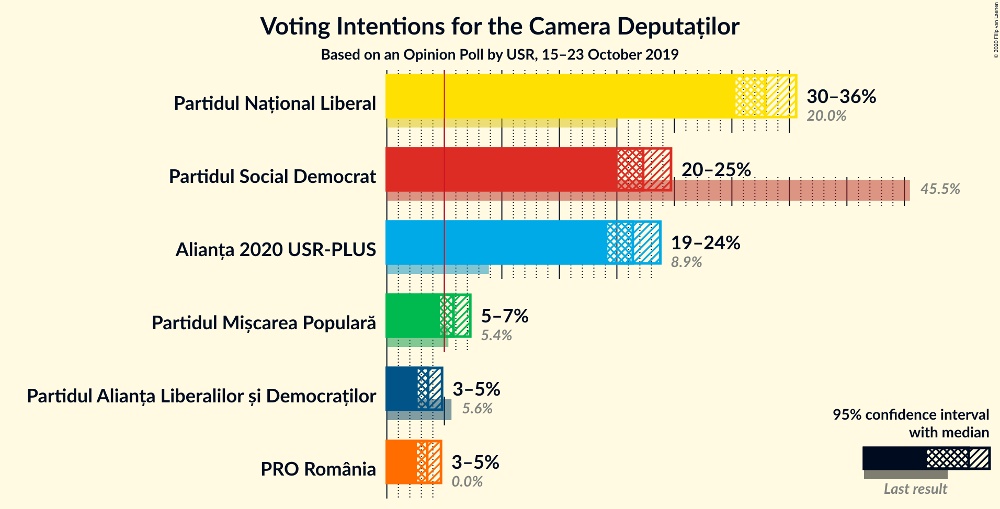
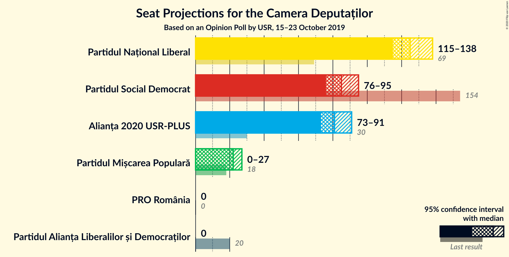
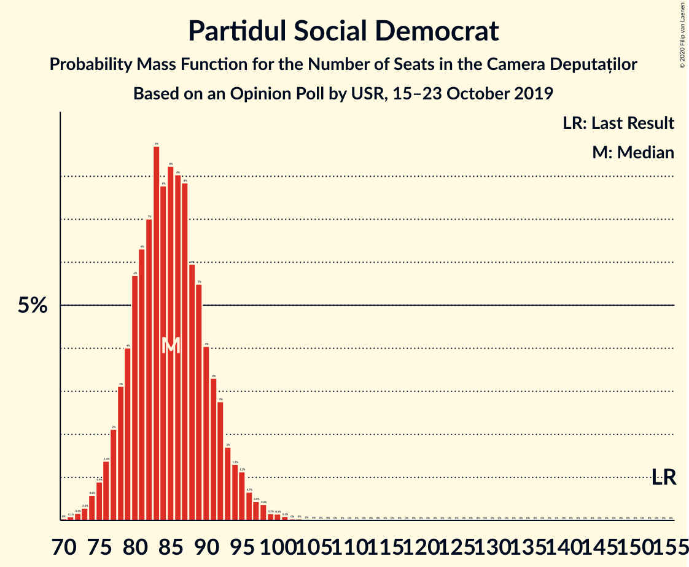
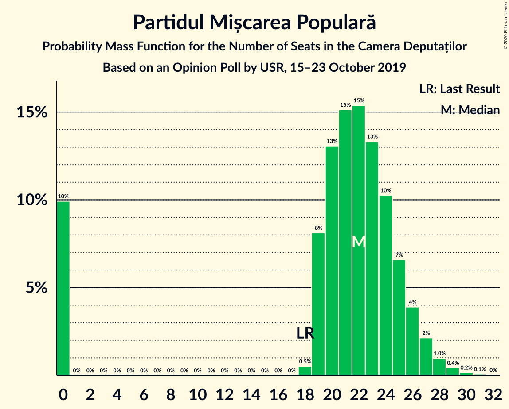
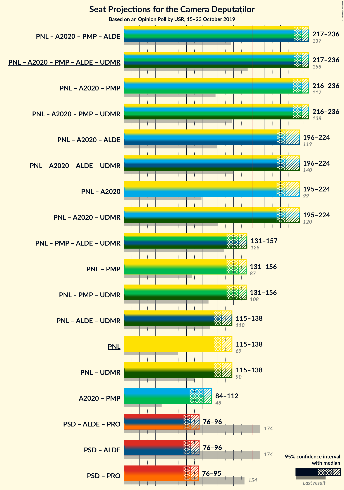

# Opinion Poll by USR, 15–23 October 2019

<a href="#voting-intentions">Voting Intentions</a> | <a href="#seats">Seats</a> | <a href="#coalitions">Coalitions</a> | <a href="#technical-information">Technical Information</a>

## Voting Intentions

### Confidence Intervals

| Party | Last Result | Poll Result | 80% Confidence Interval | 90% Confidence Interval | 95% Confidence Interval | 99% Confidence Interval |
|:-----:|:-----------:|:-----------:|:-----------------------:|:-----------------------:|:-----------------------:|:-----------------------:|
| Partidul Național Liberal | 20.0% | 32.9% | 31.2–34.7% |30.7–35.2% |30.3–35.6% |29.5–36.4% |
| Partidul Social Democrat | 45.5% | 22.3% | 20.8–23.9% |20.4–24.3% |20.0–24.7% |19.4–25.5% |
| Alianța 2020 USR-PLUS | 8.9% | 21.4% | 19.9–23.0% |19.5–23.4% |19.2–23.8% |18.5–24.5% |
| Partidul Mișcarea Populară | 5.4% | 5.8% | 5.0–6.8% |4.8–7.0% |4.6–7.3% |4.3–7.7% |
| Partidul Alianța Liberalilor și Democraților | 5.6% | 3.6% | 3.0–4.4% |2.8–4.6% |2.7–4.8% |2.4–5.2% |
| PRO România | 0.0% | 3.5% | 2.9–4.3% |2.7–4.5% |2.6–4.7% |2.3–5.1% |

*Note:* The poll result column reflects the actual value used in the calculations. Published results may vary slightly, and in addition be rounded to fewer digits.

## Seats

### Confidence Intervals

| Party | Last Result | Median | 80% Confidence Interval | 90% Confidence Interval | 95% Confidence Interval | 99% Confidence Interval |
|:-----:|:-----------:|:------:|:-----------------------:|:-----------------------:|:-----------------------:|:-----------------------:|
| <a href="#partidul-național-liberal">Partidul Național Liberal</a> | 69 | 125 | 119–132 |117–135 |115–138 |112–142 |
| <a href="#partidul-social-democrat">Partidul Social Democrat</a> | 154 | 85 | 79–91 |78–93 |76–95 |73–98 |
| <a href="#alianța-2020-usr-plus">Alianța 2020 USR-PLUS</a> | 30 | 80 | 76–88 |75–90 |73–91 |70–95 |
| <a href="#partidul-mișcarea-populară">Partidul Mișcarea Populară</a> | 18 | 22 | 18–25 |0–26 |0–27 |0–29 |
| <a href="#partidul-alianța-liberalilor-și-democraților">Partidul Alianța Liberalilor și Democraților</a> | 20 | 0 | 0 |0 |0 |0–18 |
| <a href="#pro-românia">PRO România</a> | 0 | 0 | 0 |0 |0 |0–18 |

### Partidul Național Liberal

*For a full overview of the results for this party, see the [Partidul Național Liberal](party-partidulnaționalliberal.html) page.*

| Number of Seats | Probability | Accumulated | Special Marks |
|:---------------:|:-----------:|:-----------:|:-------------:|
| 69 | 0% | 100% | Last Result |
| 70 | 0% | 100% |  |
| 71 | 0% | 100% |  |
| 72 | 0% | 100% |  |
| 73 | 0% | 100% |  |
| 74 | 0% | 100% |  |
| 75 | 0% | 100% |  |
| 76 | 0% | 100% |  |
| 77 | 0% | 100% |  |
| 78 | 0% | 100% |  |
| 79 | 0% | 100% |  |
| 80 | 0% | 100% |  |
| 81 | 0% | 100% |  |
| 82 | 0% | 100% |  |
| 83 | 0% | 100% |  |
| 84 | 0% | 100% |  |
| 85 | 0% | 100% |  |
| 86 | 0% | 100% |  |
| 87 | 0% | 100% |  |
| 88 | 0% | 100% |  |
| 89 | 0% | 100% |  |
| 90 | 0% | 100% |  |
| 91 | 0% | 100% |  |
| 92 | 0% | 100% |  |
| 93 | 0% | 100% |  |
| 94 | 0% | 100% |  |
| 95 | 0% | 100% |  |
| 96 | 0% | 100% |  |
| 97 | 0% | 100% |  |
| 98 | 0% | 100% |  |
| 99 | 0% | 100% |  |
| 100 | 0% | 100% |  |
| 101 | 0% | 100% |  |
| 102 | 0% | 100% |  |
| 103 | 0% | 100% |  |
| 104 | 0% | 100% |  |
| 105 | 0% | 100% |  |
| 106 | 0% | 100% |  |
| 107 | 0% | 100% |  |
| 108 | 0% | 100% |  |
| 109 | 0.1% | 99.9% |  |
| 110 | 0.1% | 99.9% |  |
| 111 | 0.3% | 99.8% |  |
| 112 | 0.3% | 99.5% |  |
| 113 | 0.6% | 99.2% |  |
| 114 | 0.6% | 98.7% |  |
| 115 | 1.1% | 98% |  |
| 116 | 2% | 97% |  |
| 117 | 2% | 95% |  |
| 118 | 3% | 93% |  |
| 119 | 3% | 90% |  |
| 120 | 4% | 87% |  |
| 121 | 4% | 84% |  |
| 122 | 8% | 80% |  |
| 123 | 7% | 71% |  |
| 124 | 7% | 64% |  |
| 125 | 9% | 56% | Median |
| 126 | 6% | 48% |  |
| 127 | 9% | 42% |  |
| 128 | 5% | 32% |  |
| 129 | 5% | 27% |  |
| 130 | 4% | 22% |  |
| 131 | 6% | 18% |  |
| 132 | 3% | 12% |  |
| 133 | 2% | 9% |  |
| 134 | 1.2% | 7% |  |
| 135 | 1.3% | 6% |  |
| 136 | 1.4% | 5% |  |
| 137 | 0.4% | 3% |  |
| 138 | 0.9% | 3% |  |
| 139 | 0.6% | 2% |  |
| 140 | 0.4% | 1.2% |  |
| 141 | 0.1% | 0.8% |  |
| 142 | 0.3% | 0.6% |  |
| 143 | 0.1% | 0.3% |  |
| 144 | 0% | 0.2% |  |
| 145 | 0.1% | 0.2% |  |
| 146 | 0.1% | 0.1% |  |
| 147 | 0% | 0.1% |  |
| 148 | 0% | 0% |  |

### Partidul Social Democrat

*For a full overview of the results for this party, see the [Partidul Social Democrat](party-partidulsocialdemocrat.html) page.*

| Number of Seats | Probability | Accumulated | Special Marks |
|:---------------:|:-----------:|:-----------:|:-------------:|
| 70 | 0% | 100% |  |
| 71 | 0.1% | 99.9% |  |
| 72 | 0.2% | 99.9% |  |
| 73 | 0.3% | 99.7% |  |
| 74 | 0.4% | 99.5% |  |
| 75 | 0.9% | 99.0% |  |
| 76 | 1.5% | 98% |  |
| 77 | 1.1% | 97% |  |
| 78 | 3% | 96% |  |
| 79 | 4% | 93% |  |
| 80 | 7% | 89% |  |
| 81 | 6% | 82% |  |
| 82 | 5% | 77% |  |
| 83 | 10% | 72% |  |
| 84 | 8% | 62% |  |
| 85 | 8% | 54% | Median |
| 86 | 10% | 47% |  |
| 87 | 11% | 37% |  |
| 88 | 7% | 25% |  |
| 89 | 3% | 19% |  |
| 90 | 4% | 16% |  |
| 91 | 3% | 12% |  |
| 92 | 3% | 9% |  |
| 93 | 2% | 6% |  |
| 94 | 0.8% | 4% |  |
| 95 | 2% | 3% |  |
| 96 | 0.6% | 2% |  |
| 97 | 0.2% | 1.1% |  |
| 98 | 0.5% | 0.9% |  |
| 99 | 0.1% | 0.4% |  |
| 100 | 0.1% | 0.3% |  |
| 101 | 0.1% | 0.2% |  |
| 102 | 0% | 0.1% |  |
| 103 | 0% | 0.1% |  |
| 104 | 0% | 0% |  |
| 105 | 0% | 0% |  |
| 106 | 0% | 0% |  |
| 107 | 0% | 0% |  |
| 108 | 0% | 0% |  |
| 109 | 0% | 0% |  |
| 110 | 0% | 0% |  |
| 111 | 0% | 0% |  |
| 112 | 0% | 0% |  |
| 113 | 0% | 0% |  |
| 114 | 0% | 0% |  |
| 115 | 0% | 0% |  |
| 116 | 0% | 0% |  |
| 117 | 0% | 0% |  |
| 118 | 0% | 0% |  |
| 119 | 0% | 0% |  |
| 120 | 0% | 0% |  |
| 121 | 0% | 0% |  |
| 122 | 0% | 0% |  |
| 123 | 0% | 0% |  |
| 124 | 0% | 0% |  |
| 125 | 0% | 0% |  |
| 126 | 0% | 0% |  |
| 127 | 0% | 0% |  |
| 128 | 0% | 0% |  |
| 129 | 0% | 0% |  |
| 130 | 0% | 0% |  |
| 131 | 0% | 0% |  |
| 132 | 0% | 0% |  |
| 133 | 0% | 0% |  |
| 134 | 0% | 0% |  |
| 135 | 0% | 0% |  |
| 136 | 0% | 0% |  |
| 137 | 0% | 0% |  |
| 138 | 0% | 0% |  |
| 139 | 0% | 0% |  |
| 140 | 0% | 0% |  |
| 141 | 0% | 0% |  |
| 142 | 0% | 0% |  |
| 143 | 0% | 0% |  |
| 144 | 0% | 0% |  |
| 145 | 0% | 0% |  |
| 146 | 0% | 0% |  |
| 147 | 0% | 0% |  |
| 148 | 0% | 0% |  |
| 149 | 0% | 0% |  |
| 150 | 0% | 0% |  |
| 151 | 0% | 0% |  |
| 152 | 0% | 0% |  |
| 153 | 0% | 0% |  |
| 154 | 0% | 0% | Last Result |

### Alianța 2020 USR-PLUS

*For a full overview of the results for this party, see the [Alianța 2020 USR-PLUS](party-alianța2020usr-plus.html) page.*

| Number of Seats | Probability | Accumulated | Special Marks |
|:---------------:|:-----------:|:-----------:|:-------------:|
| 30 | 0% | 100% | Last Result |
| 31 | 0% | 100% |  |
| 32 | 0% | 100% |  |
| 33 | 0% | 100% |  |
| 34 | 0% | 100% |  |
| 35 | 0% | 100% |  |
| 36 | 0% | 100% |  |
| 37 | 0% | 100% |  |
| 38 | 0% | 100% |  |
| 39 | 0% | 100% |  |
| 40 | 0% | 100% |  |
| 41 | 0% | 100% |  |
| 42 | 0% | 100% |  |
| 43 | 0% | 100% |  |
| 44 | 0% | 100% |  |
| 45 | 0% | 100% |  |
| 46 | 0% | 100% |  |
| 47 | 0% | 100% |  |
| 48 | 0% | 100% |  |
| 49 | 0% | 100% |  |
| 50 | 0% | 100% |  |
| 51 | 0% | 100% |  |
| 52 | 0% | 100% |  |
| 53 | 0% | 100% |  |
| 54 | 0% | 100% |  |
| 55 | 0% | 100% |  |
| 56 | 0% | 100% |  |
| 57 | 0% | 100% |  |
| 58 | 0% | 100% |  |
| 59 | 0% | 100% |  |
| 60 | 0% | 100% |  |
| 61 | 0% | 100% |  |
| 62 | 0% | 100% |  |
| 63 | 0% | 100% |  |
| 64 | 0% | 100% |  |
| 65 | 0% | 100% |  |
| 66 | 0% | 100% |  |
| 67 | 0.1% | 100% |  |
| 68 | 0.1% | 99.9% |  |
| 69 | 0.3% | 99.8% |  |
| 70 | 0.4% | 99.5% |  |
| 71 | 0.4% | 99.2% |  |
| 72 | 0.7% | 98.8% |  |
| 73 | 1.0% | 98% |  |
| 74 | 1.4% | 97% |  |
| 75 | 3% | 96% |  |
| 76 | 5% | 93% |  |
| 77 | 9% | 89% |  |
| 78 | 8% | 80% |  |
| 79 | 12% | 72% |  |
| 80 | 11% | 60% | Median |
| 81 | 10% | 50% |  |
| 82 | 9% | 40% |  |
| 83 | 5% | 31% |  |
| 84 | 4% | 25% |  |
| 85 | 3% | 21% |  |
| 86 | 5% | 18% |  |
| 87 | 3% | 13% |  |
| 88 | 3% | 10% |  |
| 89 | 2% | 7% |  |
| 90 | 2% | 5% |  |
| 91 | 1.4% | 3% |  |
| 92 | 0.7% | 2% |  |
| 93 | 0.4% | 1.1% |  |
| 94 | 0.2% | 0.7% |  |
| 95 | 0.2% | 0.5% |  |
| 96 | 0.1% | 0.3% |  |
| 97 | 0% | 0.2% |  |
| 98 | 0.1% | 0.2% |  |
| 99 | 0.1% | 0.1% |  |
| 100 | 0.1% | 0.1% |  |
| 101 | 0% | 0% |  |

### Partidul Mișcarea Populară

*For a full overview of the results for this party, see the [Partidul Mișcarea Populară](party-partidulmișcareapopulară.html) page.*

| Number of Seats | Probability | Accumulated | Special Marks |
|:---------------:|:-----------:|:-----------:|:-------------:|
| 0 | 10% | 100% |  |
| 1 | 0% | 90% |  |
| 2 | 0% | 90% |  |
| 3 | 0% | 90% |  |
| 4 | 0% | 90% |  |
| 5 | 0% | 90% |  |
| 6 | 0% | 90% |  |
| 7 | 0% | 90% |  |
| 8 | 0% | 90% |  |
| 9 | 0% | 90% |  |
| 10 | 0% | 90% |  |
| 11 | 0% | 90% |  |
| 12 | 0% | 90% |  |
| 13 | 0% | 90% |  |
| 14 | 0% | 90% |  |
| 15 | 0% | 90% |  |
| 16 | 0% | 90% |  |
| 17 | 0% | 90% |  |
| 18 | 1.1% | 90% | Last Result |
| 19 | 7% | 89% |  |
| 20 | 17% | 83% |  |
| 21 | 14% | 66% |  |
| 22 | 15% | 52% | Median |
| 23 | 15% | 37% |  |
| 24 | 9% | 23% |  |
| 25 | 7% | 13% |  |
| 26 | 3% | 7% |  |
| 27 | 2% | 3% |  |
| 28 | 0.9% | 2% |  |
| 29 | 0.4% | 0.6% |  |
| 30 | 0.2% | 0.2% |  |
| 31 | 0.1% | 0.1% |  |
| 32 | 0% | 0% |  |

### Partidul Alianța Liberalilor și Democraților

*For a full overview of the results for this party, see the [Partidul Alianța Liberalilor și Democraților](party-partidulalianțaliberalilorșidemocraților.html) page.*

| Number of Seats | Probability | Accumulated | Special Marks |
|:---------------:|:-----------:|:-----------:|:-------------:|
| 0 | 98.9% | 100% | Median |
| 1 | 0% | 1.1% |  |
| 2 | 0% | 1.1% |  |
| 3 | 0% | 1.1% |  |
| 4 | 0% | 1.1% |  |
| 5 | 0% | 1.1% |  |
| 6 | 0% | 1.1% |  |
| 7 | 0% | 1.1% |  |
| 8 | 0% | 1.1% |  |
| 9 | 0% | 1.1% |  |
| 10 | 0% | 1.1% |  |
| 11 | 0% | 1.1% |  |
| 12 | 0% | 1.1% |  |
| 13 | 0% | 1.1% |  |
| 14 | 0% | 1.1% |  |
| 15 | 0% | 1.1% |  |
| 16 | 0% | 1.1% |  |
| 17 | 0% | 1.1% |  |
| 18 | 0.6% | 1.0% |  |
| 19 | 0.3% | 0.4% |  |
| 20 | 0.1% | 0.2% | Last Result |
| 21 | 0% | 0% |  |

### PRO România

*For a full overview of the results for this party, see the [PRO România](party-proromânia.html) page.*

| Number of Seats | Probability | Accumulated | Special Marks |
|:---------------:|:-----------:|:-----------:|:-------------:|
| 0 | 99.3% | 100% | Last Result, Median |
| 1 | 0% | 0.7% |  |
| 2 | 0% | 0.7% |  |
| 3 | 0% | 0.7% |  |
| 4 | 0% | 0.7% |  |
| 5 | 0% | 0.7% |  |
| 6 | 0% | 0.7% |  |
| 7 | 0% | 0.7% |  |
| 8 | 0% | 0.7% |  |
| 9 | 0% | 0.7% |  |
| 10 | 0% | 0.7% |  |
| 11 | 0% | 0.7% |  |
| 12 | 0% | 0.7% |  |
| 13 | 0% | 0.7% |  |
| 14 | 0% | 0.7% |  |
| 15 | 0% | 0.7% |  |
| 16 | 0% | 0.7% |  |
| 17 | 0% | 0.7% |  |
| 18 | 0.4% | 0.7% |  |
| 19 | 0.2% | 0.3% |  |
| 20 | 0.1% | 0.1% |  |
| 21 | 0% | 0% |  |

## Coalitions

### Confidence Intervals

| Coalition | Last Result | Median | Majority? | 80% Confidence Interval | 90% Confidence Interval | 95% Confidence Interval | 99% Confidence Interval |
|:---------:|:-----------:|:------:|:---------:|:-----------------------:|:-----------------------:|:-----------------------:|:-----------------------:|
| Partidul Național Liberal – Alianța 2020 USR-PLUS – Partidul Mișcarea Populară – Partidul Alianța Liberalilor și Democraților | 137 | 227 | 100% | 221–233 | 219–234 | 217–236 | 212–238 |
| Partidul Național Liberal – Alianța 2020 USR-PLUS – Partidul Mișcarea Populară | 117 | 227 | 100% | 220–233 | 218–234 | 216–236 | 211–238 |
| Partidul Național Liberal – Alianța 2020 USR-PLUS – Partidul Alianța Liberalilor și Democraților | 119 | 206 | 100% | 200–215 | 198–220 | 196–224 | 192–228 |
| Partidul Național Liberal – Alianța 2020 USR-PLUS | 99 | 206 | 100% | 199–215 | 197–220 | 195–224 | 191–228 |
| Partidul Național Liberal – Partidul Mișcarea Populară | 87 | 146 | 0% | 138–153 | 133–154 | 131–156 | 126–159 |
| Partidul Național Liberal | 69 | 125 | 0% | 119–132 | 117–135 | 115–138 | 112–142 |
| Alianța 2020 USR-PLUS – Partidul Mișcarea Populară | 48 | 101 | 0% | 93–109 | 87–111 | 86–112 | 79–115 |
| Partidul Social Democrat – Partidul Alianța Liberalilor și Democraților – PRO România | 174 | 85 | 0% | 79–92 | 78–94 | 76–96 | 74–101 |
| Partidul Social Democrat – Partidul Alianța Liberalilor și Democraților | 174 | 85 | 0% | 79–91 | 78–93 | 76–96 | 74–100 |
| Partidul Social Democrat – PRO România | 154 | 85 | 0% | 79–91 | 78–93 | 76–95 | 74–100 |

### Partidul Național Liberal – Alianța 2020 USR-PLUS – Partidul Mișcarea Populară – Partidul Alianța Liberalilor și Democraților

| Number of Seats | Probability | Accumulated | Special Marks |
|:---------------:|:-----------:|:-----------:|:-------------:|
| 137 | 0% | 100% | Last Result |
| 138 | 0% | 100% |  |
| 139 | 0% | 100% |  |
| 140 | 0% | 100% |  |
| 141 | 0% | 100% |  |
| 142 | 0% | 100% |  |
| 143 | 0% | 100% |  |
| 144 | 0% | 100% |  |
| 145 | 0% | 100% |  |
| 146 | 0% | 100% |  |
| 147 | 0% | 100% |  |
| 148 | 0% | 100% |  |
| 149 | 0% | 100% |  |
| 150 | 0% | 100% |  |
| 151 | 0% | 100% |  |
| 152 | 0% | 100% |  |
| 153 | 0% | 100% |  |
| 154 | 0% | 100% |  |
| 155 | 0% | 100% |  |
| 156 | 0% | 100% |  |
| 157 | 0% | 100% |  |
| 158 | 0% | 100% |  |
| 159 | 0% | 100% |  |
| 160 | 0% | 100% |  |
| 161 | 0% | 100% |  |
| 162 | 0% | 100% |  |
| 163 | 0% | 100% |  |
| 164 | 0% | 100% |  |
| 165 | 0% | 100% |  |
| 166 | 0% | 100% | Majority |
| 167 | 0% | 100% |  |
| 168 | 0% | 100% |  |
| 169 | 0% | 100% |  |
| 170 | 0% | 100% |  |
| 171 | 0% | 100% |  |
| 172 | 0% | 100% |  |
| 173 | 0% | 100% |  |
| 174 | 0% | 100% |  |
| 175 | 0% | 100% |  |
| 176 | 0% | 100% |  |
| 177 | 0% | 100% |  |
| 178 | 0% | 100% |  |
| 179 | 0% | 100% |  |
| 180 | 0% | 100% |  |
| 181 | 0% | 100% |  |
| 182 | 0% | 100% |  |
| 183 | 0% | 100% |  |
| 184 | 0% | 100% |  |
| 185 | 0% | 100% |  |
| 186 | 0% | 100% |  |
| 187 | 0% | 100% |  |
| 188 | 0% | 100% |  |
| 189 | 0% | 100% |  |
| 190 | 0% | 100% |  |
| 191 | 0% | 100% |  |
| 192 | 0% | 100% |  |
| 193 | 0% | 100% |  |
| 194 | 0% | 100% |  |
| 195 | 0% | 100% |  |
| 196 | 0% | 100% |  |
| 197 | 0% | 100% |  |
| 198 | 0% | 100% |  |
| 199 | 0% | 100% |  |
| 200 | 0% | 100% |  |
| 201 | 0% | 100% |  |
| 202 | 0% | 100% |  |
| 203 | 0% | 100% |  |
| 204 | 0% | 100% |  |
| 205 | 0% | 100% |  |
| 206 | 0% | 99.9% |  |
| 207 | 0% | 99.9% |  |
| 208 | 0% | 99.9% |  |
| 209 | 0.1% | 99.9% |  |
| 210 | 0.1% | 99.8% |  |
| 211 | 0.1% | 99.7% |  |
| 212 | 0.2% | 99.7% |  |
| 213 | 0.3% | 99.5% |  |
| 214 | 0.5% | 99.2% |  |
| 215 | 0.3% | 98.7% |  |
| 216 | 0.7% | 98% |  |
| 217 | 2% | 98% |  |
| 218 | 0.9% | 96% |  |
| 219 | 2% | 95% |  |
| 220 | 3% | 94% |  |
| 221 | 3% | 90% |  |
| 222 | 4% | 87% |  |
| 223 | 3% | 83% |  |
| 224 | 7% | 81% |  |
| 225 | 11% | 74% |  |
| 226 | 10% | 63% |  |
| 227 | 8% | 53% | Median |
| 228 | 8% | 45% |  |
| 229 | 10% | 37% |  |
| 230 | 5% | 27% |  |
| 231 | 6% | 23% |  |
| 232 | 7% | 17% |  |
| 233 | 4% | 10% |  |
| 234 | 3% | 7% |  |
| 235 | 1.1% | 4% |  |
| 236 | 1.4% | 3% |  |
| 237 | 0.9% | 2% |  |
| 238 | 0.4% | 0.9% |  |
| 239 | 0.2% | 0.5% |  |
| 240 | 0.2% | 0.3% |  |
| 241 | 0.1% | 0.1% |  |
| 242 | 0% | 0.1% |  |
| 243 | 0% | 0% |  |

### Partidul Național Liberal – Alianța 2020 USR-PLUS – Partidul Mișcarea Populară

| Number of Seats | Probability | Accumulated | Special Marks |
|:---------------:|:-----------:|:-----------:|:-------------:|
| 117 | 0% | 100% | Last Result |
| 118 | 0% | 100% |  |
| 119 | 0% | 100% |  |
| 120 | 0% | 100% |  |
| 121 | 0% | 100% |  |
| 122 | 0% | 100% |  |
| 123 | 0% | 100% |  |
| 124 | 0% | 100% |  |
| 125 | 0% | 100% |  |
| 126 | 0% | 100% |  |
| 127 | 0% | 100% |  |
| 128 | 0% | 100% |  |
| 129 | 0% | 100% |  |
| 130 | 0% | 100% |  |
| 131 | 0% | 100% |  |
| 132 | 0% | 100% |  |
| 133 | 0% | 100% |  |
| 134 | 0% | 100% |  |
| 135 | 0% | 100% |  |
| 136 | 0% | 100% |  |
| 137 | 0% | 100% |  |
| 138 | 0% | 100% |  |
| 139 | 0% | 100% |  |
| 140 | 0% | 100% |  |
| 141 | 0% | 100% |  |
| 142 | 0% | 100% |  |
| 143 | 0% | 100% |  |
| 144 | 0% | 100% |  |
| 145 | 0% | 100% |  |
| 146 | 0% | 100% |  |
| 147 | 0% | 100% |  |
| 148 | 0% | 100% |  |
| 149 | 0% | 100% |  |
| 150 | 0% | 100% |  |
| 151 | 0% | 100% |  |
| 152 | 0% | 100% |  |
| 153 | 0% | 100% |  |
| 154 | 0% | 100% |  |
| 155 | 0% | 100% |  |
| 156 | 0% | 100% |  |
| 157 | 0% | 100% |  |
| 158 | 0% | 100% |  |
| 159 | 0% | 100% |  |
| 160 | 0% | 100% |  |
| 161 | 0% | 100% |  |
| 162 | 0% | 100% |  |
| 163 | 0% | 100% |  |
| 164 | 0% | 100% |  |
| 165 | 0% | 100% |  |
| 166 | 0% | 100% | Majority |
| 167 | 0% | 100% |  |
| 168 | 0% | 100% |  |
| 169 | 0% | 100% |  |
| 170 | 0% | 100% |  |
| 171 | 0% | 100% |  |
| 172 | 0% | 100% |  |
| 173 | 0% | 100% |  |
| 174 | 0% | 100% |  |
| 175 | 0% | 100% |  |
| 176 | 0% | 100% |  |
| 177 | 0% | 100% |  |
| 178 | 0% | 100% |  |
| 179 | 0% | 100% |  |
| 180 | 0% | 100% |  |
| 181 | 0% | 100% |  |
| 182 | 0% | 100% |  |
| 183 | 0% | 100% |  |
| 184 | 0% | 100% |  |
| 185 | 0% | 100% |  |
| 186 | 0% | 100% |  |
| 187 | 0% | 100% |  |
| 188 | 0% | 100% |  |
| 189 | 0% | 100% |  |
| 190 | 0% | 100% |  |
| 191 | 0% | 100% |  |
| 192 | 0% | 100% |  |
| 193 | 0% | 100% |  |
| 194 | 0% | 100% |  |
| 195 | 0% | 100% |  |
| 196 | 0% | 100% |  |
| 197 | 0% | 100% |  |
| 198 | 0% | 100% |  |
| 199 | 0% | 100% |  |
| 200 | 0% | 100% |  |
| 201 | 0% | 100% |  |
| 202 | 0% | 100% |  |
| 203 | 0% | 100% |  |
| 204 | 0% | 99.9% |  |
| 205 | 0% | 99.9% |  |
| 206 | 0% | 99.9% |  |
| 207 | 0.1% | 99.9% |  |
| 208 | 0.1% | 99.8% |  |
| 209 | 0.1% | 99.7% |  |
| 210 | 0.2% | 99.7% |  |
| 211 | 0.2% | 99.5% |  |
| 212 | 0.2% | 99.3% |  |
| 213 | 0.4% | 99.1% |  |
| 214 | 0.6% | 98.7% |  |
| 215 | 0.3% | 98% |  |
| 216 | 0.8% | 98% |  |
| 217 | 2% | 97% |  |
| 218 | 0.9% | 95% |  |
| 219 | 2% | 94% |  |
| 220 | 3% | 93% |  |
| 221 | 3% | 89% |  |
| 222 | 4% | 86% |  |
| 223 | 3% | 82% |  |
| 224 | 7% | 80% |  |
| 225 | 11% | 73% |  |
| 226 | 10% | 62% |  |
| 227 | 8% | 52% | Median |
| 228 | 8% | 44% |  |
| 229 | 10% | 36% |  |
| 230 | 4% | 27% |  |
| 231 | 5% | 22% |  |
| 232 | 7% | 17% |  |
| 233 | 4% | 10% |  |
| 234 | 2% | 6% |  |
| 235 | 1.0% | 4% |  |
| 236 | 1.4% | 3% |  |
| 237 | 0.8% | 2% |  |
| 238 | 0.4% | 0.8% |  |
| 239 | 0.2% | 0.4% |  |
| 240 | 0.2% | 0.2% |  |
| 241 | 0.1% | 0.1% |  |
| 242 | 0% | 0% |  |

### Partidul Național Liberal – Alianța 2020 USR-PLUS – Partidul Alianța Liberalilor și Democraților

| Number of Seats | Probability | Accumulated | Special Marks |
|:---------------:|:-----------:|:-----------:|:-------------:|
| 119 | 0% | 100% | Last Result |
| 120 | 0% | 100% |  |
| 121 | 0% | 100% |  |
| 122 | 0% | 100% |  |
| 123 | 0% | 100% |  |
| 124 | 0% | 100% |  |
| 125 | 0% | 100% |  |
| 126 | 0% | 100% |  |
| 127 | 0% | 100% |  |
| 128 | 0% | 100% |  |
| 129 | 0% | 100% |  |
| 130 | 0% | 100% |  |
| 131 | 0% | 100% |  |
| 132 | 0% | 100% |  |
| 133 | 0% | 100% |  |
| 134 | 0% | 100% |  |
| 135 | 0% | 100% |  |
| 136 | 0% | 100% |  |
| 137 | 0% | 100% |  |
| 138 | 0% | 100% |  |
| 139 | 0% | 100% |  |
| 140 | 0% | 100% |  |
| 141 | 0% | 100% |  |
| 142 | 0% | 100% |  |
| 143 | 0% | 100% |  |
| 144 | 0% | 100% |  |
| 145 | 0% | 100% |  |
| 146 | 0% | 100% |  |
| 147 | 0% | 100% |  |
| 148 | 0% | 100% |  |
| 149 | 0% | 100% |  |
| 150 | 0% | 100% |  |
| 151 | 0% | 100% |  |
| 152 | 0% | 100% |  |
| 153 | 0% | 100% |  |
| 154 | 0% | 100% |  |
| 155 | 0% | 100% |  |
| 156 | 0% | 100% |  |
| 157 | 0% | 100% |  |
| 158 | 0% | 100% |  |
| 159 | 0% | 100% |  |
| 160 | 0% | 100% |  |
| 161 | 0% | 100% |  |
| 162 | 0% | 100% |  |
| 163 | 0% | 100% |  |
| 164 | 0% | 100% |  |
| 165 | 0% | 100% |  |
| 166 | 0% | 100% | Majority |
| 167 | 0% | 100% |  |
| 168 | 0% | 100% |  |
| 169 | 0% | 100% |  |
| 170 | 0% | 100% |  |
| 171 | 0% | 100% |  |
| 172 | 0% | 100% |  |
| 173 | 0% | 100% |  |
| 174 | 0% | 100% |  |
| 175 | 0% | 100% |  |
| 176 | 0% | 100% |  |
| 177 | 0% | 100% |  |
| 178 | 0% | 100% |  |
| 179 | 0% | 100% |  |
| 180 | 0% | 100% |  |
| 181 | 0% | 100% |  |
| 182 | 0% | 100% |  |
| 183 | 0% | 100% |  |
| 184 | 0% | 100% |  |
| 185 | 0% | 100% |  |
| 186 | 0% | 100% |  |
| 187 | 0% | 100% |  |
| 188 | 0% | 99.9% |  |
| 189 | 0% | 99.9% |  |
| 190 | 0.1% | 99.9% |  |
| 191 | 0.1% | 99.8% |  |
| 192 | 0.2% | 99.7% |  |
| 193 | 0.3% | 99.5% |  |
| 194 | 0.4% | 99.2% |  |
| 195 | 0.8% | 98.8% |  |
| 196 | 0.8% | 98% |  |
| 197 | 2% | 97% |  |
| 198 | 1.3% | 96% |  |
| 199 | 3% | 94% |  |
| 200 | 3% | 91% |  |
| 201 | 3% | 88% |  |
| 202 | 6% | 84% |  |
| 203 | 8% | 78% |  |
| 204 | 9% | 70% |  |
| 205 | 7% | 62% | Median |
| 206 | 12% | 55% |  |
| 207 | 5% | 43% |  |
| 208 | 8% | 38% |  |
| 209 | 6% | 30% |  |
| 210 | 4% | 24% |  |
| 211 | 3% | 20% |  |
| 212 | 3% | 17% |  |
| 213 | 2% | 14% |  |
| 214 | 2% | 12% |  |
| 215 | 0.9% | 11% |  |
| 216 | 0.7% | 10% |  |
| 217 | 1.5% | 9% |  |
| 218 | 0.4% | 7% |  |
| 219 | 0.7% | 7% |  |
| 220 | 2% | 6% |  |
| 221 | 0.3% | 5% |  |
| 222 | 0.6% | 5% |  |
| 223 | 1.2% | 4% |  |
| 224 | 0.3% | 3% |  |
| 225 | 0.7% | 2% |  |
| 226 | 0.7% | 2% |  |
| 227 | 0.1% | 1.0% |  |
| 228 | 0.5% | 0.9% |  |
| 229 | 0.1% | 0.5% |  |
| 230 | 0.1% | 0.4% |  |
| 231 | 0.2% | 0.3% |  |
| 232 | 0% | 0.1% |  |
| 233 | 0% | 0.1% |  |
| 234 | 0% | 0% |  |

### Partidul Național Liberal – Alianța 2020 USR-PLUS

| Number of Seats | Probability | Accumulated | Special Marks |
|:---------------:|:-----------:|:-----------:|:-------------:|
| 99 | 0% | 100% | Last Result |
| 100 | 0% | 100% |  |
| 101 | 0% | 100% |  |
| 102 | 0% | 100% |  |
| 103 | 0% | 100% |  |
| 104 | 0% | 100% |  |
| 105 | 0% | 100% |  |
| 106 | 0% | 100% |  |
| 107 | 0% | 100% |  |
| 108 | 0% | 100% |  |
| 109 | 0% | 100% |  |
| 110 | 0% | 100% |  |
| 111 | 0% | 100% |  |
| 112 | 0% | 100% |  |
| 113 | 0% | 100% |  |
| 114 | 0% | 100% |  |
| 115 | 0% | 100% |  |
| 116 | 0% | 100% |  |
| 117 | 0% | 100% |  |
| 118 | 0% | 100% |  |
| 119 | 0% | 100% |  |
| 120 | 0% | 100% |  |
| 121 | 0% | 100% |  |
| 122 | 0% | 100% |  |
| 123 | 0% | 100% |  |
| 124 | 0% | 100% |  |
| 125 | 0% | 100% |  |
| 126 | 0% | 100% |  |
| 127 | 0% | 100% |  |
| 128 | 0% | 100% |  |
| 129 | 0% | 100% |  |
| 130 | 0% | 100% |  |
| 131 | 0% | 100% |  |
| 132 | 0% | 100% |  |
| 133 | 0% | 100% |  |
| 134 | 0% | 100% |  |
| 135 | 0% | 100% |  |
| 136 | 0% | 100% |  |
| 137 | 0% | 100% |  |
| 138 | 0% | 100% |  |
| 139 | 0% | 100% |  |
| 140 | 0% | 100% |  |
| 141 | 0% | 100% |  |
| 142 | 0% | 100% |  |
| 143 | 0% | 100% |  |
| 144 | 0% | 100% |  |
| 145 | 0% | 100% |  |
| 146 | 0% | 100% |  |
| 147 | 0% | 100% |  |
| 148 | 0% | 100% |  |
| 149 | 0% | 100% |  |
| 150 | 0% | 100% |  |
| 151 | 0% | 100% |  |
| 152 | 0% | 100% |  |
| 153 | 0% | 100% |  |
| 154 | 0% | 100% |  |
| 155 | 0% | 100% |  |
| 156 | 0% | 100% |  |
| 157 | 0% | 100% |  |
| 158 | 0% | 100% |  |
| 159 | 0% | 100% |  |
| 160 | 0% | 100% |  |
| 161 | 0% | 100% |  |
| 162 | 0% | 100% |  |
| 163 | 0% | 100% |  |
| 164 | 0% | 100% |  |
| 165 | 0% | 100% |  |
| 166 | 0% | 100% | Majority |
| 167 | 0% | 100% |  |
| 168 | 0% | 100% |  |
| 169 | 0% | 100% |  |
| 170 | 0% | 100% |  |
| 171 | 0% | 100% |  |
| 172 | 0% | 100% |  |
| 173 | 0% | 100% |  |
| 174 | 0% | 100% |  |
| 175 | 0% | 100% |  |
| 176 | 0% | 100% |  |
| 177 | 0% | 100% |  |
| 178 | 0% | 100% |  |
| 179 | 0% | 100% |  |
| 180 | 0% | 100% |  |
| 181 | 0% | 100% |  |
| 182 | 0% | 100% |  |
| 183 | 0% | 100% |  |
| 184 | 0% | 100% |  |
| 185 | 0% | 100% |  |
| 186 | 0% | 99.9% |  |
| 187 | 0.1% | 99.9% |  |
| 188 | 0% | 99.8% |  |
| 189 | 0.1% | 99.8% |  |
| 190 | 0.2% | 99.7% |  |
| 191 | 0.2% | 99.5% |  |
| 192 | 0.3% | 99.3% |  |
| 193 | 0.3% | 99.0% |  |
| 194 | 0.5% | 98.7% |  |
| 195 | 0.9% | 98% |  |
| 196 | 0.9% | 97% |  |
| 197 | 2% | 96% |  |
| 198 | 1.3% | 95% |  |
| 199 | 4% | 93% |  |
| 200 | 3% | 90% |  |
| 201 | 4% | 87% |  |
| 202 | 6% | 83% |  |
| 203 | 8% | 77% |  |
| 204 | 9% | 69% |  |
| 205 | 7% | 61% | Median |
| 206 | 12% | 54% |  |
| 207 | 4% | 42% |  |
| 208 | 8% | 38% |  |
| 209 | 6% | 30% |  |
| 210 | 4% | 23% |  |
| 211 | 3% | 20% |  |
| 212 | 3% | 17% |  |
| 213 | 2% | 14% |  |
| 214 | 2% | 12% |  |
| 215 | 0.9% | 10% |  |
| 216 | 0.7% | 9% |  |
| 217 | 1.4% | 9% |  |
| 218 | 0.4% | 7% |  |
| 219 | 0.6% | 7% |  |
| 220 | 2% | 6% |  |
| 221 | 0.3% | 5% |  |
| 222 | 0.6% | 4% |  |
| 223 | 1.2% | 4% |  |
| 224 | 0.3% | 3% |  |
| 225 | 0.7% | 2% |  |
| 226 | 0.7% | 2% |  |
| 227 | 0.1% | 1.0% |  |
| 228 | 0.5% | 0.9% |  |
| 229 | 0.1% | 0.4% |  |
| 230 | 0.1% | 0.3% |  |
| 231 | 0.2% | 0.3% |  |
| 232 | 0% | 0.1% |  |
| 233 | 0% | 0.1% |  |
| 234 | 0% | 0% |  |

### Partidul Național Liberal – Partidul Mișcarea Populară

| Number of Seats | Probability | Accumulated | Special Marks |
|:---------------:|:-----------:|:-----------:|:-------------:|
| 87 | 0% | 100% | Last Result |
| 88 | 0% | 100% |  |
| 89 | 0% | 100% |  |
| 90 | 0% | 100% |  |
| 91 | 0% | 100% |  |
| 92 | 0% | 100% |  |
| 93 | 0% | 100% |  |
| 94 | 0% | 100% |  |
| 95 | 0% | 100% |  |
| 96 | 0% | 100% |  |
| 97 | 0% | 100% |  |
| 98 | 0% | 100% |  |
| 99 | 0% | 100% |  |
| 100 | 0% | 100% |  |
| 101 | 0% | 100% |  |
| 102 | 0% | 100% |  |
| 103 | 0% | 100% |  |
| 104 | 0% | 100% |  |
| 105 | 0% | 100% |  |
| 106 | 0% | 100% |  |
| 107 | 0% | 100% |  |
| 108 | 0% | 100% |  |
| 109 | 0% | 100% |  |
| 110 | 0% | 100% |  |
| 111 | 0% | 100% |  |
| 112 | 0% | 100% |  |
| 113 | 0% | 100% |  |
| 114 | 0% | 100% |  |
| 115 | 0% | 100% |  |
| 116 | 0% | 100% |  |
| 117 | 0% | 100% |  |
| 118 | 0% | 100% |  |
| 119 | 0% | 100% |  |
| 120 | 0% | 100% |  |
| 121 | 0% | 99.9% |  |
| 122 | 0% | 99.9% |  |
| 123 | 0.1% | 99.9% |  |
| 124 | 0.1% | 99.8% |  |
| 125 | 0.2% | 99.7% |  |
| 126 | 0.1% | 99.6% |  |
| 127 | 0.5% | 99.5% |  |
| 128 | 0.2% | 99.0% |  |
| 129 | 0.6% | 98.8% |  |
| 130 | 0.2% | 98% |  |
| 131 | 1.4% | 98% |  |
| 132 | 1.3% | 97% |  |
| 133 | 0.4% | 95% |  |
| 134 | 0.7% | 95% |  |
| 135 | 1.3% | 94% |  |
| 136 | 2% | 93% |  |
| 137 | 0.9% | 91% |  |
| 138 | 3% | 90% |  |
| 139 | 2% | 87% |  |
| 140 | 3% | 85% |  |
| 141 | 2% | 83% |  |
| 142 | 5% | 80% |  |
| 143 | 6% | 75% |  |
| 144 | 5% | 70% |  |
| 145 | 13% | 64% |  |
| 146 | 6% | 51% |  |
| 147 | 7% | 46% | Median |
| 148 | 6% | 39% |  |
| 149 | 7% | 33% |  |
| 150 | 4% | 26% |  |
| 151 | 6% | 22% |  |
| 152 | 5% | 16% |  |
| 153 | 4% | 11% |  |
| 154 | 3% | 8% |  |
| 155 | 2% | 5% |  |
| 156 | 1.4% | 3% |  |
| 157 | 0.6% | 2% |  |
| 158 | 0.4% | 1.2% |  |
| 159 | 0.3% | 0.7% |  |
| 160 | 0.2% | 0.4% |  |
| 161 | 0.1% | 0.2% |  |
| 162 | 0.1% | 0.1% |  |
| 163 | 0% | 0.1% |  |
| 164 | 0% | 0% |  |

### Partidul Național Liberal

| Number of Seats | Probability | Accumulated | Special Marks |
|:---------------:|:-----------:|:-----------:|:-------------:|
| 69 | 0% | 100% | Last Result |
| 70 | 0% | 100% |  |
| 71 | 0% | 100% |  |
| 72 | 0% | 100% |  |
| 73 | 0% | 100% |  |
| 74 | 0% | 100% |  |
| 75 | 0% | 100% |  |
| 76 | 0% | 100% |  |
| 77 | 0% | 100% |  |
| 78 | 0% | 100% |  |
| 79 | 0% | 100% |  |
| 80 | 0% | 100% |  |
| 81 | 0% | 100% |  |
| 82 | 0% | 100% |  |
| 83 | 0% | 100% |  |
| 84 | 0% | 100% |  |
| 85 | 0% | 100% |  |
| 86 | 0% | 100% |  |
| 87 | 0% | 100% |  |
| 88 | 0% | 100% |  |
| 89 | 0% | 100% |  |
| 90 | 0% | 100% |  |
| 91 | 0% | 100% |  |
| 92 | 0% | 100% |  |
| 93 | 0% | 100% |  |
| 94 | 0% | 100% |  |
| 95 | 0% | 100% |  |
| 96 | 0% | 100% |  |
| 97 | 0% | 100% |  |
| 98 | 0% | 100% |  |
| 99 | 0% | 100% |  |
| 100 | 0% | 100% |  |
| 101 | 0% | 100% |  |
| 102 | 0% | 100% |  |
| 103 | 0% | 100% |  |
| 104 | 0% | 100% |  |
| 105 | 0% | 100% |  |
| 106 | 0% | 100% |  |
| 107 | 0% | 100% |  |
| 108 | 0% | 100% |  |
| 109 | 0.1% | 99.9% |  |
| 110 | 0.1% | 99.9% |  |
| 111 | 0.3% | 99.8% |  |
| 112 | 0.3% | 99.5% |  |
| 113 | 0.6% | 99.2% |  |
| 114 | 0.6% | 98.7% |  |
| 115 | 1.1% | 98% |  |
| 116 | 2% | 97% |  |
| 117 | 2% | 95% |  |
| 118 | 3% | 93% |  |
| 119 | 3% | 90% |  |
| 120 | 4% | 87% |  |
| 121 | 4% | 84% |  |
| 122 | 8% | 80% |  |
| 123 | 7% | 71% |  |
| 124 | 7% | 64% |  |
| 125 | 9% | 56% | Median |
| 126 | 6% | 48% |  |
| 127 | 9% | 42% |  |
| 128 | 5% | 32% |  |
| 129 | 5% | 27% |  |
| 130 | 4% | 22% |  |
| 131 | 6% | 18% |  |
| 132 | 3% | 12% |  |
| 133 | 2% | 9% |  |
| 134 | 1.2% | 7% |  |
| 135 | 1.3% | 6% |  |
| 136 | 1.4% | 5% |  |
| 137 | 0.4% | 3% |  |
| 138 | 0.9% | 3% |  |
| 139 | 0.6% | 2% |  |
| 140 | 0.4% | 1.2% |  |
| 141 | 0.1% | 0.8% |  |
| 142 | 0.3% | 0.6% |  |
| 143 | 0.1% | 0.3% |  |
| 144 | 0% | 0.2% |  |
| 145 | 0.1% | 0.2% |  |
| 146 | 0.1% | 0.1% |  |
| 147 | 0% | 0.1% |  |
| 148 | 0% | 0% |  |

### Alianța 2020 USR-PLUS – Partidul Mișcarea Populară

| Number of Seats | Probability | Accumulated | Special Marks |
|:---------------:|:-----------:|:-----------:|:-------------:|
| 48 | 0% | 100% | Last Result |
| 49 | 0% | 100% |  |
| 50 | 0% | 100% |  |
| 51 | 0% | 100% |  |
| 52 | 0% | 100% |  |
| 53 | 0% | 100% |  |
| 54 | 0% | 100% |  |
| 55 | 0% | 100% |  |
| 56 | 0% | 100% |  |
| 57 | 0% | 100% |  |
| 58 | 0% | 100% |  |
| 59 | 0% | 100% |  |
| 60 | 0% | 100% |  |
| 61 | 0% | 100% |  |
| 62 | 0% | 100% |  |
| 63 | 0% | 100% |  |
| 64 | 0% | 100% |  |
| 65 | 0% | 100% |  |
| 66 | 0% | 100% |  |
| 67 | 0% | 100% |  |
| 68 | 0% | 100% |  |
| 69 | 0% | 100% |  |
| 70 | 0% | 100% |  |
| 71 | 0% | 100% |  |
| 72 | 0% | 100% |  |
| 73 | 0% | 100% |  |
| 74 | 0% | 100% |  |
| 75 | 0% | 100% |  |
| 76 | 0.1% | 99.9% |  |
| 77 | 0.2% | 99.8% |  |
| 78 | 0.2% | 99.7% |  |
| 79 | 0.2% | 99.5% |  |
| 80 | 0.1% | 99.3% |  |
| 81 | 0.1% | 99.2% |  |
| 82 | 0.1% | 99.1% |  |
| 83 | 0.2% | 99.0% |  |
| 84 | 0.5% | 98.8% |  |
| 85 | 0.7% | 98% |  |
| 86 | 2% | 98% |  |
| 87 | 1.2% | 96% |  |
| 88 | 1.4% | 95% |  |
| 89 | 0.5% | 93% |  |
| 90 | 0.9% | 93% |  |
| 91 | 0.9% | 92% |  |
| 92 | 0.7% | 91% |  |
| 93 | 0.6% | 90% |  |
| 94 | 0.7% | 90% |  |
| 95 | 0.6% | 89% |  |
| 96 | 1.0% | 88% |  |
| 97 | 2% | 87% |  |
| 98 | 6% | 86% |  |
| 99 | 6% | 80% |  |
| 100 | 9% | 74% |  |
| 101 | 15% | 65% |  |
| 102 | 13% | 49% | Median |
| 103 | 10% | 36% |  |
| 104 | 4% | 27% |  |
| 105 | 5% | 23% |  |
| 106 | 2% | 17% |  |
| 107 | 1.4% | 15% |  |
| 108 | 2% | 14% |  |
| 109 | 3% | 12% |  |
| 110 | 3% | 9% |  |
| 111 | 2% | 7% |  |
| 112 | 2% | 4% |  |
| 113 | 1.1% | 2% |  |
| 114 | 0.7% | 1.2% |  |
| 115 | 0.3% | 0.5% |  |
| 116 | 0.1% | 0.2% |  |
| 117 | 0% | 0.1% |  |
| 118 | 0% | 0% |  |

### Partidul Social Democrat – Partidul Alianța Liberalilor și Democraților – PRO România

| Number of Seats | Probability | Accumulated | Special Marks |
|:---------------:|:-----------:|:-----------:|:-------------:|
| 71 | 0.1% | 100% |  |
| 72 | 0.2% | 99.9% |  |
| 73 | 0.2% | 99.8% |  |
| 74 | 0.4% | 99.6% |  |
| 75 | 0.8% | 99.2% |  |
| 76 | 1.4% | 98% |  |
| 77 | 1.0% | 97% |  |
| 78 | 2% | 96% |  |
| 79 | 4% | 94% |  |
| 80 | 7% | 90% |  |
| 81 | 5% | 83% |  |
| 82 | 4% | 78% |  |
| 83 | 10% | 73% |  |
| 84 | 8% | 64% |  |
| 85 | 8% | 56% | Median |
| 86 | 10% | 48% |  |
| 87 | 11% | 38% |  |
| 88 | 7% | 27% |  |
| 89 | 3% | 20% |  |
| 90 | 4% | 18% |  |
| 91 | 3% | 14% |  |
| 92 | 3% | 11% |  |
| 93 | 2% | 7% |  |
| 94 | 0.9% | 6% |  |
| 95 | 2% | 5% |  |
| 96 | 0.8% | 3% |  |
| 97 | 0.3% | 2% |  |
| 98 | 0.6% | 2% |  |
| 99 | 0.4% | 1.3% |  |
| 100 | 0.2% | 0.9% |  |
| 101 | 0.2% | 0.7% |  |
| 102 | 0.2% | 0.5% |  |
| 103 | 0.1% | 0.3% |  |
| 104 | 0.1% | 0.3% |  |
| 105 | 0.1% | 0.2% |  |
| 106 | 0% | 0.1% |  |
| 107 | 0% | 0.1% |  |
| 108 | 0% | 0.1% |  |
| 109 | 0% | 0.1% |  |
| 110 | 0% | 0% |  |
| 111 | 0% | 0% |  |
| 112 | 0% | 0% |  |
| 113 | 0% | 0% |  |
| 114 | 0% | 0% |  |
| 115 | 0% | 0% |  |
| 116 | 0% | 0% |  |
| 117 | 0% | 0% |  |
| 118 | 0% | 0% |  |
| 119 | 0% | 0% |  |
| 120 | 0% | 0% |  |
| 121 | 0% | 0% |  |
| 122 | 0% | 0% |  |
| 123 | 0% | 0% |  |
| 124 | 0% | 0% |  |
| 125 | 0% | 0% |  |
| 126 | 0% | 0% |  |
| 127 | 0% | 0% |  |
| 128 | 0% | 0% |  |
| 129 | 0% | 0% |  |
| 130 | 0% | 0% |  |
| 131 | 0% | 0% |  |
| 132 | 0% | 0% |  |
| 133 | 0% | 0% |  |
| 134 | 0% | 0% |  |
| 135 | 0% | 0% |  |
| 136 | 0% | 0% |  |
| 137 | 0% | 0% |  |
| 138 | 0% | 0% |  |
| 139 | 0% | 0% |  |
| 140 | 0% | 0% |  |
| 141 | 0% | 0% |  |
| 142 | 0% | 0% |  |
| 143 | 0% | 0% |  |
| 144 | 0% | 0% |  |
| 145 | 0% | 0% |  |
| 146 | 0% | 0% |  |
| 147 | 0% | 0% |  |
| 148 | 0% | 0% |  |
| 149 | 0% | 0% |  |
| 150 | 0% | 0% |  |
| 151 | 0% | 0% |  |
| 152 | 0% | 0% |  |
| 153 | 0% | 0% |  |
| 154 | 0% | 0% |  |
| 155 | 0% | 0% |  |
| 156 | 0% | 0% |  |
| 157 | 0% | 0% |  |
| 158 | 0% | 0% |  |
| 159 | 0% | 0% |  |
| 160 | 0% | 0% |  |
| 161 | 0% | 0% |  |
| 162 | 0% | 0% |  |
| 163 | 0% | 0% |  |
| 164 | 0% | 0% |  |
| 165 | 0% | 0% |  |
| 166 | 0% | 0% | Majority |
| 167 | 0% | 0% |  |
| 168 | 0% | 0% |  |
| 169 | 0% | 0% |  |
| 170 | 0% | 0% |  |
| 171 | 0% | 0% |  |
| 172 | 0% | 0% |  |
| 173 | 0% | 0% |  |
| 174 | 0% | 0% | Last Result |

### Partidul Social Democrat – Partidul Alianța Liberalilor și Democraților

| Number of Seats | Probability | Accumulated | Special Marks |
|:---------------:|:-----------:|:-----------:|:-------------:|
| 71 | 0.1% | 100% |  |
| 72 | 0.2% | 99.9% |  |
| 73 | 0.2% | 99.7% |  |
| 74 | 0.4% | 99.5% |  |
| 75 | 0.9% | 99.1% |  |
| 76 | 1.4% | 98% |  |
| 77 | 1.0% | 97% |  |
| 78 | 3% | 96% |  |
| 79 | 4% | 93% |  |
| 80 | 7% | 90% |  |
| 81 | 6% | 83% |  |
| 82 | 5% | 77% |  |
| 83 | 10% | 73% |  |
| 84 | 8% | 63% |  |
| 85 | 8% | 55% | Median |
| 86 | 10% | 48% |  |
| 87 | 11% | 38% |  |
| 88 | 7% | 26% |  |
| 89 | 3% | 20% |  |
| 90 | 4% | 17% |  |
| 91 | 3% | 13% |  |
| 92 | 3% | 10% |  |
| 93 | 2% | 7% |  |
| 94 | 0.9% | 5% |  |
| 95 | 2% | 4% |  |
| 96 | 0.7% | 3% |  |
| 97 | 0.3% | 2% |  |
| 98 | 0.6% | 2% |  |
| 99 | 0.3% | 1.0% |  |
| 100 | 0.2% | 0.6% |  |
| 101 | 0.1% | 0.5% |  |
| 102 | 0.1% | 0.3% |  |
| 103 | 0.1% | 0.2% |  |
| 104 | 0% | 0.1% |  |
| 105 | 0% | 0.1% |  |
| 106 | 0% | 0.1% |  |
| 107 | 0% | 0% |  |
| 108 | 0% | 0% |  |
| 109 | 0% | 0% |  |
| 110 | 0% | 0% |  |
| 111 | 0% | 0% |  |
| 112 | 0% | 0% |  |
| 113 | 0% | 0% |  |
| 114 | 0% | 0% |  |
| 115 | 0% | 0% |  |
| 116 | 0% | 0% |  |
| 117 | 0% | 0% |  |
| 118 | 0% | 0% |  |
| 119 | 0% | 0% |  |
| 120 | 0% | 0% |  |
| 121 | 0% | 0% |  |
| 122 | 0% | 0% |  |
| 123 | 0% | 0% |  |
| 124 | 0% | 0% |  |
| 125 | 0% | 0% |  |
| 126 | 0% | 0% |  |
| 127 | 0% | 0% |  |
| 128 | 0% | 0% |  |
| 129 | 0% | 0% |  |
| 130 | 0% | 0% |  |
| 131 | 0% | 0% |  |
| 132 | 0% | 0% |  |
| 133 | 0% | 0% |  |
| 134 | 0% | 0% |  |
| 135 | 0% | 0% |  |
| 136 | 0% | 0% |  |
| 137 | 0% | 0% |  |
| 138 | 0% | 0% |  |
| 139 | 0% | 0% |  |
| 140 | 0% | 0% |  |
| 141 | 0% | 0% |  |
| 142 | 0% | 0% |  |
| 143 | 0% | 0% |  |
| 144 | 0% | 0% |  |
| 145 | 0% | 0% |  |
| 146 | 0% | 0% |  |
| 147 | 0% | 0% |  |
| 148 | 0% | 0% |  |
| 149 | 0% | 0% |  |
| 150 | 0% | 0% |  |
| 151 | 0% | 0% |  |
| 152 | 0% | 0% |  |
| 153 | 0% | 0% |  |
| 154 | 0% | 0% |  |
| 155 | 0% | 0% |  |
| 156 | 0% | 0% |  |
| 157 | 0% | 0% |  |
| 158 | 0% | 0% |  |
| 159 | 0% | 0% |  |
| 160 | 0% | 0% |  |
| 161 | 0% | 0% |  |
| 162 | 0% | 0% |  |
| 163 | 0% | 0% |  |
| 164 | 0% | 0% |  |
| 165 | 0% | 0% |  |
| 166 | 0% | 0% | Majority |
| 167 | 0% | 0% |  |
| 168 | 0% | 0% |  |
| 169 | 0% | 0% |  |
| 170 | 0% | 0% |  |
| 171 | 0% | 0% |  |
| 172 | 0% | 0% |  |
| 173 | 0% | 0% |  |
| 174 | 0% | 0% | Last Result |

### Partidul Social Democrat – PRO România

| Number of Seats | Probability | Accumulated | Special Marks |
|:---------------:|:-----------:|:-----------:|:-------------:|
| 70 | 0% | 100% |  |
| 71 | 0.1% | 99.9% |  |
| 72 | 0.2% | 99.9% |  |
| 73 | 0.2% | 99.7% |  |
| 74 | 0.4% | 99.5% |  |
| 75 | 0.9% | 99.1% |  |
| 76 | 1.4% | 98% |  |
| 77 | 1.1% | 97% |  |
| 78 | 3% | 96% |  |
| 79 | 4% | 93% |  |
| 80 | 7% | 90% |  |
| 81 | 6% | 83% |  |
| 82 | 5% | 77% |  |
| 83 | 10% | 73% |  |
| 84 | 8% | 63% |  |
| 85 | 8% | 55% | Median |
| 86 | 10% | 47% |  |
| 87 | 11% | 37% |  |
| 88 | 7% | 26% |  |
| 89 | 3% | 19% |  |
| 90 | 4% | 17% |  |
| 91 | 3% | 13% |  |
| 92 | 3% | 10% |  |
| 93 | 2% | 6% |  |
| 94 | 0.9% | 5% |  |
| 95 | 2% | 4% |  |
| 96 | 0.7% | 2% |  |
| 97 | 0.3% | 2% |  |
| 98 | 0.5% | 1.3% |  |
| 99 | 0.3% | 0.8% |  |
| 100 | 0.2% | 0.5% |  |
| 101 | 0.1% | 0.3% |  |
| 102 | 0.1% | 0.3% |  |
| 103 | 0.1% | 0.2% |  |
| 104 | 0% | 0.1% |  |
| 105 | 0% | 0.1% |  |
| 106 | 0% | 0.1% |  |
| 107 | 0% | 0.1% |  |
| 108 | 0% | 0% |  |
| 109 | 0% | 0% |  |
| 110 | 0% | 0% |  |
| 111 | 0% | 0% |  |
| 112 | 0% | 0% |  |
| 113 | 0% | 0% |  |
| 114 | 0% | 0% |  |
| 115 | 0% | 0% |  |
| 116 | 0% | 0% |  |
| 117 | 0% | 0% |  |
| 118 | 0% | 0% |  |
| 119 | 0% | 0% |  |
| 120 | 0% | 0% |  |
| 121 | 0% | 0% |  |
| 122 | 0% | 0% |  |
| 123 | 0% | 0% |  |
| 124 | 0% | 0% |  |
| 125 | 0% | 0% |  |
| 126 | 0% | 0% |  |
| 127 | 0% | 0% |  |
| 128 | 0% | 0% |  |
| 129 | 0% | 0% |  |
| 130 | 0% | 0% |  |
| 131 | 0% | 0% |  |
| 132 | 0% | 0% |  |
| 133 | 0% | 0% |  |
| 134 | 0% | 0% |  |
| 135 | 0% | 0% |  |
| 136 | 0% | 0% |  |
| 137 | 0% | 0% |  |
| 138 | 0% | 0% |  |
| 139 | 0% | 0% |  |
| 140 | 0% | 0% |  |
| 141 | 0% | 0% |  |
| 142 | 0% | 0% |  |
| 143 | 0% | 0% |  |
| 144 | 0% | 0% |  |
| 145 | 0% | 0% |  |
| 146 | 0% | 0% |  |
| 147 | 0% | 0% |  |
| 148 | 0% | 0% |  |
| 149 | 0% | 0% |  |
| 150 | 0% | 0% |  |
| 151 | 0% | 0% |  |
| 152 | 0% | 0% |  |
| 153 | 0% | 0% |  |
| 154 | 0% | 0% | Last Result |

## Technical Information

### Opinion Poll

+ **Polling firm:** USR
+ **Commissioner(s):** —
+ **Fieldwork period:** 15–23 October 2019

### Calculations

+ **Sample size:** 1225
+ **Simulations done:** 131,072
+ **Error estimate:** 0.50%

