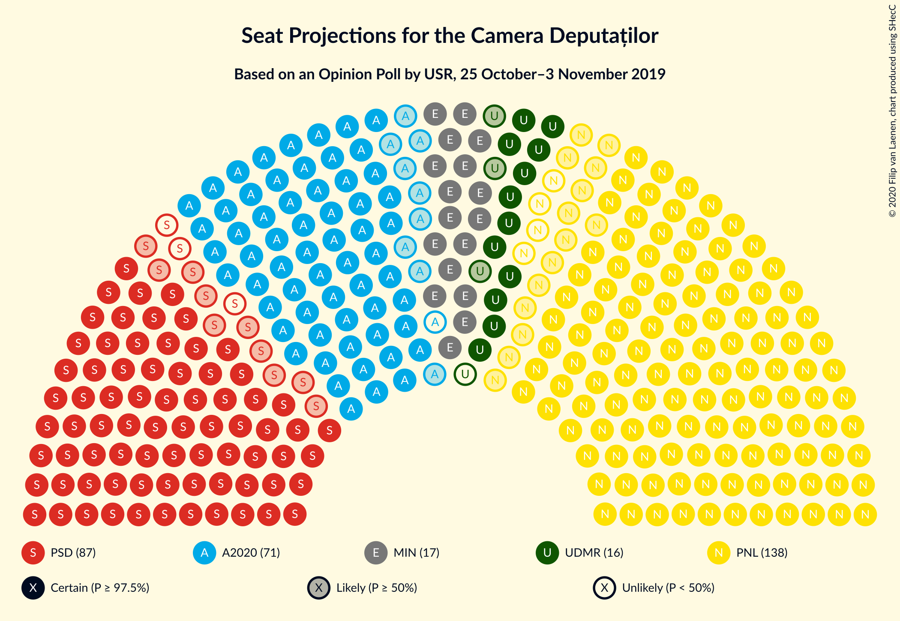
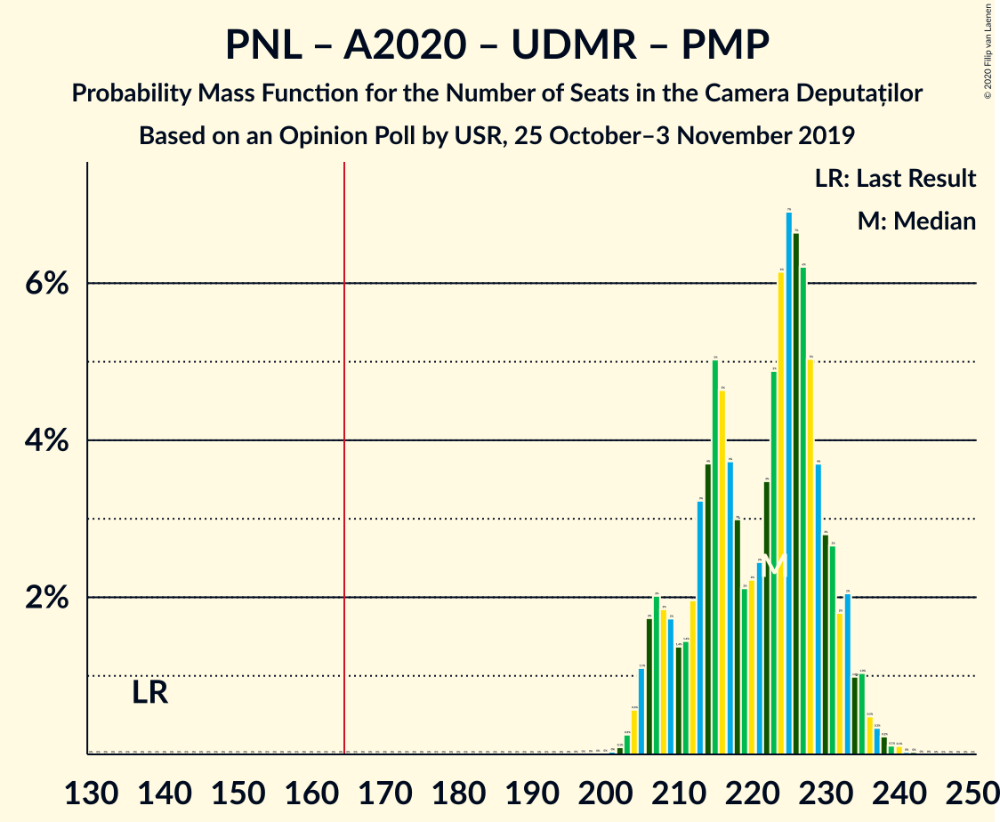
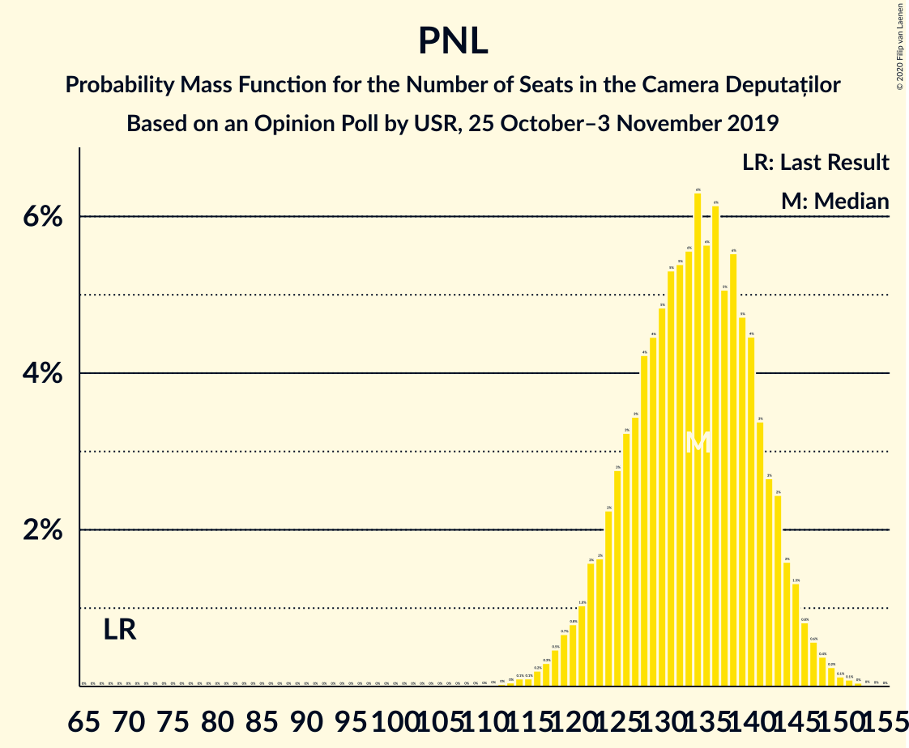

# Opinion Poll by USR, 25 October–3 November 2019

<a href="#voting-intentions">Voting Intentions</a> | <a href="#seats">Seats</a> | <a href="#coalitions">Coalitions</a> | <a href="#technical-information">Technical Information</a>

## Voting Intentions

### Confidence Intervals

| Party | Last Result | Poll Result | 80% Confidence Interval | 90% Confidence Interval | 95% Confidence Interval | 99% Confidence Interval |
|:-----:|:-----------:|:-----------:|:-----------------------:|:-----------------------:|:-----------------------:|:-----------------------:|
| Partidul Național Liberal | 20.0% | 38.2% | 36.4–40.0% |35.9–40.5% |35.5–41.0% |34.7–41.8% |
| Partidul Social Democrat | 45.5% | 24.0% | 22.5–25.6% |22.1–26.1% |21.7–26.5% |21.0–27.3% |
| Alianța 2020 USR-PLUS | 8.9% | 20.0% | 18.6–21.5% |18.2–22.0% |17.8–22.3% |17.2–23.1% |
| PRO România | 0.0% | 4.8% | 4.1–5.7% |3.9–5.9% |3.7–6.2% |3.4–6.6% |
| Uniunea Democrată Maghiară din România | 6.2% | 4.5% | 3.8–5.3% |3.6–5.6% |3.5–5.8% |3.2–6.2% |
| Partidul Mișcarea Populară | 5.4% | 4.3% | 3.7–5.2% |3.5–5.4% |3.3–5.6% |3.0–6.1% |

*Note:* The poll result column reflects the actual value used in the calculations. Published results may vary slightly, and in addition be rounded to fewer digits.

## Seats

### Confidence Intervals

| Party | Last Result | Median | 80% Confidence Interval | 90% Confidence Interval | 95% Confidence Interval | 99% Confidence Interval |
|:-----:|:-----------:|:------:|:-----------------------:|:-----------------------:|:-----------------------:|:-----------------------:|
| <a href="#partidul-național-liberal">Partidul Național Liberal</a> | 69 | 134 | 125–142 |123–144 |120–146 |116–149 |
| <a href="#partidul-social-democrat">Partidul Social Democrat</a> | 154 | 84 | 77–89 |76–91 |74–94 |71–97 |
| <a href="#alianța-2020-usr-plus">Alianța 2020 USR-PLUS</a> | 30 | 70 | 64–76 |63–77 |61–77 |57–82 |
| <a href="#pro-românia">PRO România</a> | 0 | 0 | 0–19 |0–20 |0–20 |0–22 |
| <a href="#uniunea-democrată-maghiară-din-românia">Uniunea Democrată Maghiară din România</a> | 21 | 16 | 13–18 |12–19 |12–20 |10–22 |
| <a href="#partidul-mișcarea-populară">Partidul Mișcarea Populară</a> | 18 | 0 | 0–17 |0–18 |0–18 |0–20 |

### Partidul Național Liberal

*For a full overview of the results for this party, see the [Partidul Național Liberal](party-partidulnaționalliberal.html) page.*

| Number of Seats | Probability | Accumulated | Special Marks |
|:---------------:|:-----------:|:-----------:|:-------------:|
| 69 | 0% | 100% | Last Result |
| 70 | 0% | 100% |  |
| 71 | 0% | 100% |  |
| 72 | 0% | 100% |  |
| 73 | 0% | 100% |  |
| 74 | 0% | 100% |  |
| 75 | 0% | 100% |  |
| 76 | 0% | 100% |  |
| 77 | 0% | 100% |  |
| 78 | 0% | 100% |  |
| 79 | 0% | 100% |  |
| 80 | 0% | 100% |  |
| 81 | 0% | 100% |  |
| 82 | 0% | 100% |  |
| 83 | 0% | 100% |  |
| 84 | 0% | 100% |  |
| 85 | 0% | 100% |  |
| 86 | 0% | 100% |  |
| 87 | 0% | 100% |  |
| 88 | 0% | 100% |  |
| 89 | 0% | 100% |  |
| 90 | 0% | 100% |  |
| 91 | 0% | 100% |  |
| 92 | 0% | 100% |  |
| 93 | 0% | 100% |  |
| 94 | 0% | 100% |  |
| 95 | 0% | 100% |  |
| 96 | 0% | 100% |  |
| 97 | 0% | 100% |  |
| 98 | 0% | 100% |  |
| 99 | 0% | 100% |  |
| 100 | 0% | 100% |  |
| 101 | 0% | 100% |  |
| 102 | 0% | 100% |  |
| 103 | 0% | 100% |  |
| 104 | 0% | 100% |  |
| 105 | 0% | 100% |  |
| 106 | 0% | 100% |  |
| 107 | 0% | 100% |  |
| 108 | 0% | 100% |  |
| 109 | 0% | 100% |  |
| 110 | 0% | 100% |  |
| 111 | 0% | 100% |  |
| 112 | 0% | 100% |  |
| 113 | 0% | 99.9% |  |
| 114 | 0.1% | 99.9% |  |
| 115 | 0.1% | 99.8% |  |
| 116 | 0.3% | 99.7% |  |
| 117 | 0.3% | 99.4% |  |
| 118 | 0.4% | 99.1% |  |
| 119 | 0.3% | 98.7% |  |
| 120 | 1.0% | 98% |  |
| 121 | 0.5% | 97% |  |
| 122 | 2% | 97% |  |
| 123 | 0.9% | 95% |  |
| 124 | 3% | 94% |  |
| 125 | 3% | 91% |  |
| 126 | 3% | 89% |  |
| 127 | 5% | 86% |  |
| 128 | 6% | 81% |  |
| 129 | 2% | 75% |  |
| 130 | 8% | 73% |  |
| 131 | 3% | 65% |  |
| 132 | 4% | 62% |  |
| 133 | 6% | 57% |  |
| 134 | 6% | 52% | Median |
| 135 | 4% | 45% |  |
| 136 | 5% | 42% |  |
| 137 | 5% | 37% |  |
| 138 | 7% | 32% |  |
| 139 | 4% | 25% |  |
| 140 | 4% | 21% |  |
| 141 | 6% | 17% |  |
| 142 | 1.0% | 11% |  |
| 143 | 3% | 10% |  |
| 144 | 2% | 6% |  |
| 145 | 1.2% | 4% |  |
| 146 | 1.4% | 3% |  |
| 147 | 0.6% | 2% |  |
| 148 | 0.3% | 1.0% |  |
| 149 | 0.4% | 0.7% |  |
| 150 | 0.1% | 0.3% |  |
| 151 | 0.1% | 0.2% |  |
| 152 | 0.1% | 0.1% |  |
| 153 | 0% | 0% |  |

### Partidul Social Democrat

*For a full overview of the results for this party, see the [Partidul Social Democrat](party-partidulsocialdemocrat.html) page.*

| Number of Seats | Probability | Accumulated | Special Marks |
|:---------------:|:-----------:|:-----------:|:-------------:|
| 68 | 0% | 100% |  |
| 69 | 0.1% | 99.9% |  |
| 70 | 0.1% | 99.8% |  |
| 71 | 0.2% | 99.7% |  |
| 72 | 0.6% | 99.5% |  |
| 73 | 0.6% | 98.8% |  |
| 74 | 1.0% | 98% |  |
| 75 | 1.4% | 97% |  |
| 76 | 3% | 96% |  |
| 77 | 4% | 93% |  |
| 78 | 3% | 89% |  |
| 79 | 8% | 86% |  |
| 80 | 6% | 78% |  |
| 81 | 4% | 72% |  |
| 82 | 7% | 67% |  |
| 83 | 6% | 60% |  |
| 84 | 6% | 54% | Median |
| 85 | 8% | 48% |  |
| 86 | 10% | 40% |  |
| 87 | 7% | 30% |  |
| 88 | 8% | 23% |  |
| 89 | 6% | 15% |  |
| 90 | 3% | 10% |  |
| 91 | 2% | 6% |  |
| 92 | 0.8% | 4% |  |
| 93 | 0.7% | 4% |  |
| 94 | 1.2% | 3% |  |
| 95 | 0.3% | 2% |  |
| 96 | 0.7% | 1.4% |  |
| 97 | 0.4% | 0.7% |  |
| 98 | 0.1% | 0.3% |  |
| 99 | 0.1% | 0.2% |  |
| 100 | 0% | 0.1% |  |
| 101 | 0% | 0% |  |
| 102 | 0% | 0% |  |
| 103 | 0% | 0% |  |
| 104 | 0% | 0% |  |
| 105 | 0% | 0% |  |
| 106 | 0% | 0% |  |
| 107 | 0% | 0% |  |
| 108 | 0% | 0% |  |
| 109 | 0% | 0% |  |
| 110 | 0% | 0% |  |
| 111 | 0% | 0% |  |
| 112 | 0% | 0% |  |
| 113 | 0% | 0% |  |
| 114 | 0% | 0% |  |
| 115 | 0% | 0% |  |
| 116 | 0% | 0% |  |
| 117 | 0% | 0% |  |
| 118 | 0% | 0% |  |
| 119 | 0% | 0% |  |
| 120 | 0% | 0% |  |
| 121 | 0% | 0% |  |
| 122 | 0% | 0% |  |
| 123 | 0% | 0% |  |
| 124 | 0% | 0% |  |
| 125 | 0% | 0% |  |
| 126 | 0% | 0% |  |
| 127 | 0% | 0% |  |
| 128 | 0% | 0% |  |
| 129 | 0% | 0% |  |
| 130 | 0% | 0% |  |
| 131 | 0% | 0% |  |
| 132 | 0% | 0% |  |
| 133 | 0% | 0% |  |
| 134 | 0% | 0% |  |
| 135 | 0% | 0% |  |
| 136 | 0% | 0% |  |
| 137 | 0% | 0% |  |
| 138 | 0% | 0% |  |
| 139 | 0% | 0% |  |
| 140 | 0% | 0% |  |
| 141 | 0% | 0% |  |
| 142 | 0% | 0% |  |
| 143 | 0% | 0% |  |
| 144 | 0% | 0% |  |
| 145 | 0% | 0% |  |
| 146 | 0% | 0% |  |
| 147 | 0% | 0% |  |
| 148 | 0% | 0% |  |
| 149 | 0% | 0% |  |
| 150 | 0% | 0% |  |
| 151 | 0% | 0% |  |
| 152 | 0% | 0% |  |
| 153 | 0% | 0% |  |
| 154 | 0% | 0% | Last Result |

### Alianța 2020 USR-PLUS

*For a full overview of the results for this party, see the [Alianța 2020 USR-PLUS](party-alianța2020usr-plus.html) page.*

| Number of Seats | Probability | Accumulated | Special Marks |
|:---------------:|:-----------:|:-----------:|:-------------:|
| 30 | 0% | 100% | Last Result |
| 31 | 0% | 100% |  |
| 32 | 0% | 100% |  |
| 33 | 0% | 100% |  |
| 34 | 0% | 100% |  |
| 35 | 0% | 100% |  |
| 36 | 0% | 100% |  |
| 37 | 0% | 100% |  |
| 38 | 0% | 100% |  |
| 39 | 0% | 100% |  |
| 40 | 0% | 100% |  |
| 41 | 0% | 100% |  |
| 42 | 0% | 100% |  |
| 43 | 0% | 100% |  |
| 44 | 0% | 100% |  |
| 45 | 0% | 100% |  |
| 46 | 0% | 100% |  |
| 47 | 0% | 100% |  |
| 48 | 0% | 100% |  |
| 49 | 0% | 100% |  |
| 50 | 0% | 100% |  |
| 51 | 0% | 100% |  |
| 52 | 0% | 100% |  |
| 53 | 0% | 100% |  |
| 54 | 0% | 100% |  |
| 55 | 0% | 100% |  |
| 56 | 0.1% | 100% |  |
| 57 | 0.5% | 99.9% |  |
| 58 | 0.3% | 99.4% |  |
| 59 | 0.5% | 99.1% |  |
| 60 | 0.4% | 98.6% |  |
| 61 | 0.8% | 98% |  |
| 62 | 2% | 97% |  |
| 63 | 2% | 96% |  |
| 64 | 7% | 94% |  |
| 65 | 5% | 87% |  |
| 66 | 5% | 82% |  |
| 67 | 6% | 77% |  |
| 68 | 9% | 71% |  |
| 69 | 9% | 62% |  |
| 70 | 13% | 53% | Median |
| 71 | 9% | 40% |  |
| 72 | 6% | 31% |  |
| 73 | 3% | 26% |  |
| 74 | 5% | 22% |  |
| 75 | 6% | 17% |  |
| 76 | 3% | 11% |  |
| 77 | 6% | 8% |  |
| 78 | 0.9% | 2% |  |
| 79 | 0.4% | 1.2% |  |
| 80 | 0.1% | 0.8% |  |
| 81 | 0.2% | 0.7% |  |
| 82 | 0.2% | 0.5% |  |
| 83 | 0.1% | 0.3% |  |
| 84 | 0.1% | 0.2% |  |
| 85 | 0.1% | 0.1% |  |
| 86 | 0% | 0% |  |

### PRO România

*For a full overview of the results for this party, see the [PRO România](party-proromânia.html) page.*

| Number of Seats | Probability | Accumulated | Special Marks |
|:---------------:|:-----------:|:-----------:|:-------------:|
| 0 | 60% | 100% | Last Result, Median |
| 1 | 0% | 40% |  |
| 2 | 0% | 40% |  |
| 3 | 0% | 40% |  |
| 4 | 0% | 40% |  |
| 5 | 0% | 40% |  |
| 6 | 0% | 40% |  |
| 7 | 0% | 40% |  |
| 8 | 0% | 40% |  |
| 9 | 0% | 40% |  |
| 10 | 0% | 40% |  |
| 11 | 0% | 40% |  |
| 12 | 0% | 40% |  |
| 13 | 0% | 40% |  |
| 14 | 0% | 40% |  |
| 15 | 0% | 40% |  |
| 16 | 0.8% | 40% |  |
| 17 | 16% | 39% |  |
| 18 | 12% | 23% |  |
| 19 | 5% | 11% |  |
| 20 | 4% | 6% |  |
| 21 | 1.5% | 2% |  |
| 22 | 0.6% | 0.8% |  |
| 23 | 0.1% | 0.2% |  |
| 24 | 0% | 0.1% |  |
| 25 | 0% | 0% |  |

### Uniunea Democrată Maghiară din România

*For a full overview of the results for this party, see the [Uniunea Democrată Maghiară din România](party-uniuneademocratămaghiarădinromânia.html) page.*

| Number of Seats | Probability | Accumulated | Special Marks |
|:---------------:|:-----------:|:-----------:|:-------------:|
| 9 | 0.1% | 100% |  |
| 10 | 0.5% | 99.9% |  |
| 11 | 2% | 99.5% |  |
| 12 | 4% | 98% |  |
| 13 | 12% | 94% |  |
| 14 | 15% | 82% |  |
| 15 | 17% | 67% |  |
| 16 | 22% | 50% | Median |
| 17 | 12% | 28% |  |
| 18 | 9% | 16% |  |
| 19 | 4% | 8% |  |
| 20 | 2% | 4% |  |
| 21 | 0.7% | 1.4% | Last Result |
| 22 | 0.4% | 0.6% |  |
| 23 | 0.1% | 0.2% |  |
| 24 | 0% | 0% |  |

### Partidul Mișcarea Populară

*For a full overview of the results for this party, see the [Partidul Mișcarea Populară](party-partidulmișcareapopulară.html) page.*

| Number of Seats | Probability | Accumulated | Special Marks |
|:---------------:|:-----------:|:-----------:|:-------------:|
| 0 | 88% | 100% | Median |
| 1 | 0% | 12% |  |
| 2 | 0% | 12% |  |
| 3 | 0% | 12% |  |
| 4 | 0% | 12% |  |
| 5 | 0% | 12% |  |
| 6 | 0% | 12% |  |
| 7 | 0% | 12% |  |
| 8 | 0% | 12% |  |
| 9 | 0% | 12% |  |
| 10 | 0% | 12% |  |
| 11 | 0% | 12% |  |
| 12 | 0% | 12% |  |
| 13 | 0% | 12% |  |
| 14 | 0% | 12% |  |
| 15 | 0% | 12% |  |
| 16 | 1.4% | 12% |  |
| 17 | 5% | 11% |  |
| 18 | 4% | 6% | Last Result |
| 19 | 1.4% | 2% |  |
| 20 | 0.6% | 0.8% |  |
| 21 | 0.2% | 0.2% |  |
| 22 | 0% | 0.1% |  |
| 23 | 0% | 0% |  |

## Coalitions

### Confidence Intervals

| Coalition | Last Result | Median | Majority? | 80% Confidence Interval | 90% Confidence Interval | 95% Confidence Interval | 99% Confidence Interval |
|:---------:|:-----------:|:------:|:---------:|:-----------------------:|:-----------------------:|:-----------------------:|:-----------------------:|
| Partidul Național Liberal – Alianța 2020 USR-PLUS – Uniunea Democrată Maghiară din România – Partidul Mișcarea Populară | 138 | 223 | 100% | 210–230 | 207–233 | 206–234 | 204–237 |
| Partidul Național Liberal – Alianța 2020 USR-PLUS – Uniunea Democrată Maghiară din România | 120 | 219 | 100% | 207–229 | 205–230 | 202–233 | 195–236 |
| Partidul Național Liberal – Alianța 2020 USR-PLUS – Partidul Mișcarea Populară | 117 | 206 | 100% | 195–216 | 193–218 | 191–219 | 188–222 |
| Partidul Național Liberal – Alianța 2020 USR-PLUS | 99 | 204 | 100% | 193–214 | 190–216 | 187–217 | 181–220 |
| Partidul Național Liberal – Uniunea Democrată Maghiară din România – Partidul Mișcarea Populară | 108 | 152 | 3% | 142–160 | 140–163 | 138–165 | 135–170 |
| Partidul Național Liberal – Uniunea Democrată Maghiară din România | 90 | 149 | 0.6% | 140–158 | 138–160 | 135–162 | 131–165 |
| Partidul Național Liberal – Partidul Mișcarea Populară | 87 | 136 | 0% | 127–145 | 125–147 | 123–151 | 120–154 |
| Partidul Național Liberal | 69 | 134 | 0% | 125–142 | 123–144 | 120–146 | 116–149 |
| Partidul Social Democrat – PRO România | 154 | 89 | 0% | 82–102 | 79–105 | 78–106 | 75–108 |
| Alianța 2020 USR-PLUS – Partidul Mișcarea Populară | 48 | 71 | 0% | 65–81 | 64–85 | 63–88 | 59–93 |

### Partidul Național Liberal – Alianța 2020 USR-PLUS – Uniunea Democrată Maghiară din România – Partidul Mișcarea Populară

| Number of Seats | Probability | Accumulated | Special Marks |
|:---------------:|:-----------:|:-----------:|:-------------:|
| 138 | 0% | 100% | Last Result |
| 139 | 0% | 100% |  |
| 140 | 0% | 100% |  |
| 141 | 0% | 100% |  |
| 142 | 0% | 100% |  |
| 143 | 0% | 100% |  |
| 144 | 0% | 100% |  |
| 145 | 0% | 100% |  |
| 146 | 0% | 100% |  |
| 147 | 0% | 100% |  |
| 148 | 0% | 100% |  |
| 149 | 0% | 100% |  |
| 150 | 0% | 100% |  |
| 151 | 0% | 100% |  |
| 152 | 0% | 100% |  |
| 153 | 0% | 100% |  |
| 154 | 0% | 100% |  |
| 155 | 0% | 100% |  |
| 156 | 0% | 100% |  |
| 157 | 0% | 100% |  |
| 158 | 0% | 100% |  |
| 159 | 0% | 100% |  |
| 160 | 0% | 100% |  |
| 161 | 0% | 100% |  |
| 162 | 0% | 100% |  |
| 163 | 0% | 100% |  |
| 164 | 0% | 100% |  |
| 165 | 0% | 100% | Majority |
| 166 | 0% | 100% |  |
| 167 | 0% | 100% |  |
| 168 | 0% | 100% |  |
| 169 | 0% | 100% |  |
| 170 | 0% | 100% |  |
| 171 | 0% | 100% |  |
| 172 | 0% | 100% |  |
| 173 | 0% | 100% |  |
| 174 | 0% | 100% |  |
| 175 | 0% | 100% |  |
| 176 | 0% | 100% |  |
| 177 | 0% | 100% |  |
| 178 | 0% | 100% |  |
| 179 | 0% | 100% |  |
| 180 | 0% | 100% |  |
| 181 | 0% | 100% |  |
| 182 | 0% | 100% |  |
| 183 | 0% | 100% |  |
| 184 | 0% | 100% |  |
| 185 | 0% | 100% |  |
| 186 | 0% | 100% |  |
| 187 | 0% | 100% |  |
| 188 | 0% | 100% |  |
| 189 | 0% | 100% |  |
| 190 | 0% | 100% |  |
| 191 | 0% | 100% |  |
| 192 | 0% | 100% |  |
| 193 | 0% | 100% |  |
| 194 | 0% | 100% |  |
| 195 | 0% | 100% |  |
| 196 | 0% | 100% |  |
| 197 | 0% | 100% |  |
| 198 | 0% | 100% |  |
| 199 | 0% | 100% |  |
| 200 | 0% | 100% |  |
| 201 | 0% | 99.9% |  |
| 202 | 0.1% | 99.9% |  |
| 203 | 0.2% | 99.8% |  |
| 204 | 0.6% | 99.6% |  |
| 205 | 1.0% | 99.0% |  |
| 206 | 2% | 98% |  |
| 207 | 2% | 96% |  |
| 208 | 2% | 93% |  |
| 209 | 2% | 92% |  |
| 210 | 2% | 90% |  |
| 211 | 2% | 88% |  |
| 212 | 2% | 87% |  |
| 213 | 5% | 85% |  |
| 214 | 4% | 81% |  |
| 215 | 3% | 77% |  |
| 216 | 7% | 73% |  |
| 217 | 2% | 67% |  |
| 218 | 4% | 65% |  |
| 219 | 2% | 61% |  |
| 220 | 2% | 59% | Median |
| 221 | 2% | 57% |  |
| 222 | 4% | 55% |  |
| 223 | 5% | 52% |  |
| 224 | 6% | 47% |  |
| 225 | 5% | 41% |  |
| 226 | 9% | 36% |  |
| 227 | 6% | 27% |  |
| 228 | 4% | 20% |  |
| 229 | 4% | 16% |  |
| 230 | 3% | 13% |  |
| 231 | 2% | 9% |  |
| 232 | 2% | 8% |  |
| 233 | 3% | 6% |  |
| 234 | 0.5% | 3% |  |
| 235 | 0.9% | 2% |  |
| 236 | 0.6% | 1.4% |  |
| 237 | 0.4% | 0.9% |  |
| 238 | 0.2% | 0.4% |  |
| 239 | 0.1% | 0.2% |  |
| 240 | 0.1% | 0.2% |  |
| 241 | 0% | 0% |  |

### Partidul Național Liberal – Alianța 2020 USR-PLUS – Uniunea Democrată Maghiară din România

| Number of Seats | Probability | Accumulated | Special Marks |
|:---------------:|:-----------:|:-----------:|:-------------:|
| 120 | 0% | 100% | Last Result |
| 121 | 0% | 100% |  |
| 122 | 0% | 100% |  |
| 123 | 0% | 100% |  |
| 124 | 0% | 100% |  |
| 125 | 0% | 100% |  |
| 126 | 0% | 100% |  |
| 127 | 0% | 100% |  |
| 128 | 0% | 100% |  |
| 129 | 0% | 100% |  |
| 130 | 0% | 100% |  |
| 131 | 0% | 100% |  |
| 132 | 0% | 100% |  |
| 133 | 0% | 100% |  |
| 134 | 0% | 100% |  |
| 135 | 0% | 100% |  |
| 136 | 0% | 100% |  |
| 137 | 0% | 100% |  |
| 138 | 0% | 100% |  |
| 139 | 0% | 100% |  |
| 140 | 0% | 100% |  |
| 141 | 0% | 100% |  |
| 142 | 0% | 100% |  |
| 143 | 0% | 100% |  |
| 144 | 0% | 100% |  |
| 145 | 0% | 100% |  |
| 146 | 0% | 100% |  |
| 147 | 0% | 100% |  |
| 148 | 0% | 100% |  |
| 149 | 0% | 100% |  |
| 150 | 0% | 100% |  |
| 151 | 0% | 100% |  |
| 152 | 0% | 100% |  |
| 153 | 0% | 100% |  |
| 154 | 0% | 100% |  |
| 155 | 0% | 100% |  |
| 156 | 0% | 100% |  |
| 157 | 0% | 100% |  |
| 158 | 0% | 100% |  |
| 159 | 0% | 100% |  |
| 160 | 0% | 100% |  |
| 161 | 0% | 100% |  |
| 162 | 0% | 100% |  |
| 163 | 0% | 100% |  |
| 164 | 0% | 100% |  |
| 165 | 0% | 100% | Majority |
| 166 | 0% | 100% |  |
| 167 | 0% | 100% |  |
| 168 | 0% | 100% |  |
| 169 | 0% | 100% |  |
| 170 | 0% | 100% |  |
| 171 | 0% | 100% |  |
| 172 | 0% | 100% |  |
| 173 | 0% | 100% |  |
| 174 | 0% | 100% |  |
| 175 | 0% | 100% |  |
| 176 | 0% | 100% |  |
| 177 | 0% | 100% |  |
| 178 | 0% | 100% |  |
| 179 | 0% | 100% |  |
| 180 | 0% | 100% |  |
| 181 | 0% | 100% |  |
| 182 | 0% | 100% |  |
| 183 | 0% | 100% |  |
| 184 | 0% | 100% |  |
| 185 | 0% | 100% |  |
| 186 | 0% | 100% |  |
| 187 | 0% | 100% |  |
| 188 | 0% | 100% |  |
| 189 | 0% | 100% |  |
| 190 | 0% | 100% |  |
| 191 | 0% | 100% |  |
| 192 | 0% | 100% |  |
| 193 | 0.1% | 99.9% |  |
| 194 | 0.1% | 99.8% |  |
| 195 | 0.3% | 99.7% |  |
| 196 | 0.3% | 99.4% |  |
| 197 | 0.4% | 99.1% |  |
| 198 | 0.2% | 98.7% |  |
| 199 | 0.1% | 98.5% |  |
| 200 | 0.4% | 98% |  |
| 201 | 0.1% | 98% |  |
| 202 | 0.6% | 98% |  |
| 203 | 0.8% | 97% |  |
| 204 | 0.9% | 97% |  |
| 205 | 2% | 96% |  |
| 206 | 3% | 94% |  |
| 207 | 3% | 91% |  |
| 208 | 2% | 89% |  |
| 209 | 2% | 87% |  |
| 210 | 2% | 85% |  |
| 211 | 1.4% | 83% |  |
| 212 | 4% | 81% |  |
| 213 | 5% | 77% |  |
| 214 | 4% | 72% |  |
| 215 | 5% | 69% |  |
| 216 | 7% | 64% |  |
| 217 | 2% | 57% |  |
| 218 | 4% | 55% |  |
| 219 | 2% | 52% |  |
| 220 | 1.0% | 49% | Median |
| 221 | 2% | 48% |  |
| 222 | 3% | 47% |  |
| 223 | 5% | 43% |  |
| 224 | 6% | 39% |  |
| 225 | 5% | 33% |  |
| 226 | 9% | 28% |  |
| 227 | 6% | 19% |  |
| 228 | 3% | 13% |  |
| 229 | 2% | 10% |  |
| 230 | 3% | 8% |  |
| 231 | 0.7% | 5% |  |
| 232 | 2% | 4% |  |
| 233 | 1.1% | 3% |  |
| 234 | 0.5% | 2% |  |
| 235 | 0.4% | 1.2% |  |
| 236 | 0.4% | 0.8% |  |
| 237 | 0.3% | 0.4% |  |
| 238 | 0% | 0.1% |  |
| 239 | 0% | 0.1% |  |
| 240 | 0% | 0% |  |

### Partidul Național Liberal – Alianța 2020 USR-PLUS – Partidul Mișcarea Populară

| Number of Seats | Probability | Accumulated | Special Marks |
|:---------------:|:-----------:|:-----------:|:-------------:|
| 117 | 0% | 100% | Last Result |
| 118 | 0% | 100% |  |
| 119 | 0% | 100% |  |
| 120 | 0% | 100% |  |
| 121 | 0% | 100% |  |
| 122 | 0% | 100% |  |
| 123 | 0% | 100% |  |
| 124 | 0% | 100% |  |
| 125 | 0% | 100% |  |
| 126 | 0% | 100% |  |
| 127 | 0% | 100% |  |
| 128 | 0% | 100% |  |
| 129 | 0% | 100% |  |
| 130 | 0% | 100% |  |
| 131 | 0% | 100% |  |
| 132 | 0% | 100% |  |
| 133 | 0% | 100% |  |
| 134 | 0% | 100% |  |
| 135 | 0% | 100% |  |
| 136 | 0% | 100% |  |
| 137 | 0% | 100% |  |
| 138 | 0% | 100% |  |
| 139 | 0% | 100% |  |
| 140 | 0% | 100% |  |
| 141 | 0% | 100% |  |
| 142 | 0% | 100% |  |
| 143 | 0% | 100% |  |
| 144 | 0% | 100% |  |
| 145 | 0% | 100% |  |
| 146 | 0% | 100% |  |
| 147 | 0% | 100% |  |
| 148 | 0% | 100% |  |
| 149 | 0% | 100% |  |
| 150 | 0% | 100% |  |
| 151 | 0% | 100% |  |
| 152 | 0% | 100% |  |
| 153 | 0% | 100% |  |
| 154 | 0% | 100% |  |
| 155 | 0% | 100% |  |
| 156 | 0% | 100% |  |
| 157 | 0% | 100% |  |
| 158 | 0% | 100% |  |
| 159 | 0% | 100% |  |
| 160 | 0% | 100% |  |
| 161 | 0% | 100% |  |
| 162 | 0% | 100% |  |
| 163 | 0% | 100% |  |
| 164 | 0% | 100% |  |
| 165 | 0% | 100% | Majority |
| 166 | 0% | 100% |  |
| 167 | 0% | 100% |  |
| 168 | 0% | 100% |  |
| 169 | 0% | 100% |  |
| 170 | 0% | 100% |  |
| 171 | 0% | 100% |  |
| 172 | 0% | 100% |  |
| 173 | 0% | 100% |  |
| 174 | 0% | 100% |  |
| 175 | 0% | 100% |  |
| 176 | 0% | 100% |  |
| 177 | 0% | 100% |  |
| 178 | 0% | 100% |  |
| 179 | 0% | 100% |  |
| 180 | 0% | 100% |  |
| 181 | 0% | 100% |  |
| 182 | 0% | 100% |  |
| 183 | 0% | 100% |  |
| 184 | 0% | 100% |  |
| 185 | 0.1% | 99.9% |  |
| 186 | 0.1% | 99.9% |  |
| 187 | 0.3% | 99.8% |  |
| 188 | 0.3% | 99.5% |  |
| 189 | 0.5% | 99.2% |  |
| 190 | 0.9% | 98.7% |  |
| 191 | 0.7% | 98% |  |
| 192 | 2% | 97% |  |
| 193 | 3% | 95% |  |
| 194 | 2% | 93% |  |
| 195 | 2% | 90% |  |
| 196 | 4% | 88% |  |
| 197 | 2% | 83% |  |
| 198 | 4% | 82% |  |
| 199 | 2% | 77% |  |
| 200 | 3% | 75% |  |
| 201 | 5% | 72% |  |
| 202 | 4% | 67% |  |
| 203 | 2% | 63% |  |
| 204 | 3% | 61% | Median |
| 205 | 4% | 58% |  |
| 206 | 5% | 55% |  |
| 207 | 3% | 50% |  |
| 208 | 6% | 46% |  |
| 209 | 4% | 40% |  |
| 210 | 6% | 36% |  |
| 211 | 6% | 30% |  |
| 212 | 4% | 23% |  |
| 213 | 3% | 20% |  |
| 214 | 5% | 17% |  |
| 215 | 1.4% | 11% |  |
| 216 | 4% | 10% |  |
| 217 | 1.1% | 6% |  |
| 218 | 2% | 5% |  |
| 219 | 2% | 4% |  |
| 220 | 0.8% | 2% |  |
| 221 | 0.3% | 1.2% |  |
| 222 | 0.5% | 0.9% |  |
| 223 | 0.1% | 0.4% |  |
| 224 | 0.1% | 0.3% |  |
| 225 | 0.1% | 0.2% |  |
| 226 | 0% | 0.1% |  |
| 227 | 0% | 0% |  |

### Partidul Național Liberal – Alianța 2020 USR-PLUS

| Number of Seats | Probability | Accumulated | Special Marks |
|:---------------:|:-----------:|:-----------:|:-------------:|
| 99 | 0% | 100% | Last Result |
| 100 | 0% | 100% |  |
| 101 | 0% | 100% |  |
| 102 | 0% | 100% |  |
| 103 | 0% | 100% |  |
| 104 | 0% | 100% |  |
| 105 | 0% | 100% |  |
| 106 | 0% | 100% |  |
| 107 | 0% | 100% |  |
| 108 | 0% | 100% |  |
| 109 | 0% | 100% |  |
| 110 | 0% | 100% |  |
| 111 | 0% | 100% |  |
| 112 | 0% | 100% |  |
| 113 | 0% | 100% |  |
| 114 | 0% | 100% |  |
| 115 | 0% | 100% |  |
| 116 | 0% | 100% |  |
| 117 | 0% | 100% |  |
| 118 | 0% | 100% |  |
| 119 | 0% | 100% |  |
| 120 | 0% | 100% |  |
| 121 | 0% | 100% |  |
| 122 | 0% | 100% |  |
| 123 | 0% | 100% |  |
| 124 | 0% | 100% |  |
| 125 | 0% | 100% |  |
| 126 | 0% | 100% |  |
| 127 | 0% | 100% |  |
| 128 | 0% | 100% |  |
| 129 | 0% | 100% |  |
| 130 | 0% | 100% |  |
| 131 | 0% | 100% |  |
| 132 | 0% | 100% |  |
| 133 | 0% | 100% |  |
| 134 | 0% | 100% |  |
| 135 | 0% | 100% |  |
| 136 | 0% | 100% |  |
| 137 | 0% | 100% |  |
| 138 | 0% | 100% |  |
| 139 | 0% | 100% |  |
| 140 | 0% | 100% |  |
| 141 | 0% | 100% |  |
| 142 | 0% | 100% |  |
| 143 | 0% | 100% |  |
| 144 | 0% | 100% |  |
| 145 | 0% | 100% |  |
| 146 | 0% | 100% |  |
| 147 | 0% | 100% |  |
| 148 | 0% | 100% |  |
| 149 | 0% | 100% |  |
| 150 | 0% | 100% |  |
| 151 | 0% | 100% |  |
| 152 | 0% | 100% |  |
| 153 | 0% | 100% |  |
| 154 | 0% | 100% |  |
| 155 | 0% | 100% |  |
| 156 | 0% | 100% |  |
| 157 | 0% | 100% |  |
| 158 | 0% | 100% |  |
| 159 | 0% | 100% |  |
| 160 | 0% | 100% |  |
| 161 | 0% | 100% |  |
| 162 | 0% | 100% |  |
| 163 | 0% | 100% |  |
| 164 | 0% | 100% |  |
| 165 | 0% | 100% | Majority |
| 166 | 0% | 100% |  |
| 167 | 0% | 100% |  |
| 168 | 0% | 100% |  |
| 169 | 0% | 100% |  |
| 170 | 0% | 100% |  |
| 171 | 0% | 100% |  |
| 172 | 0% | 100% |  |
| 173 | 0% | 100% |  |
| 174 | 0% | 100% |  |
| 175 | 0% | 100% |  |
| 176 | 0% | 100% |  |
| 177 | 0.1% | 100% |  |
| 178 | 0.1% | 99.9% |  |
| 179 | 0.1% | 99.8% |  |
| 180 | 0.2% | 99.8% |  |
| 181 | 0.1% | 99.5% |  |
| 182 | 0.6% | 99.4% |  |
| 183 | 0.1% | 98.9% |  |
| 184 | 0.2% | 98.7% |  |
| 185 | 0.7% | 98.6% |  |
| 186 | 0.4% | 98% |  |
| 187 | 0.7% | 98% |  |
| 188 | 0.5% | 97% |  |
| 189 | 0.9% | 96% |  |
| 190 | 1.4% | 95% |  |
| 191 | 0.8% | 94% |  |
| 192 | 3% | 93% |  |
| 193 | 3% | 91% |  |
| 194 | 3% | 88% |  |
| 195 | 3% | 85% |  |
| 196 | 6% | 82% |  |
| 197 | 2% | 76% |  |
| 198 | 5% | 74% |  |
| 199 | 2% | 69% |  |
| 200 | 4% | 67% |  |
| 201 | 5% | 63% |  |
| 202 | 3% | 58% |  |
| 203 | 3% | 54% |  |
| 204 | 3% | 52% | Median |
| 205 | 4% | 49% |  |
| 206 | 5% | 45% |  |
| 207 | 3% | 41% |  |
| 208 | 6% | 38% |  |
| 209 | 4% | 32% |  |
| 210 | 6% | 28% |  |
| 211 | 6% | 22% |  |
| 212 | 3% | 16% |  |
| 213 | 2% | 13% |  |
| 214 | 5% | 11% |  |
| 215 | 1.2% | 7% |  |
| 216 | 3% | 6% |  |
| 217 | 0.7% | 3% |  |
| 218 | 0.8% | 2% |  |
| 219 | 0.5% | 1.2% |  |
| 220 | 0.3% | 0.7% |  |
| 221 | 0.2% | 0.4% |  |
| 222 | 0.1% | 0.2% |  |
| 223 | 0% | 0.1% |  |
| 224 | 0% | 0% |  |

### Partidul Național Liberal – Uniunea Democrată Maghiară din România – Partidul Mișcarea Populară

| Number of Seats | Probability | Accumulated | Special Marks |
|:---------------:|:-----------:|:-----------:|:-------------:|
| 108 | 0% | 100% | Last Result |
| 109 | 0% | 100% |  |
| 110 | 0% | 100% |  |
| 111 | 0% | 100% |  |
| 112 | 0% | 100% |  |
| 113 | 0% | 100% |  |
| 114 | 0% | 100% |  |
| 115 | 0% | 100% |  |
| 116 | 0% | 100% |  |
| 117 | 0% | 100% |  |
| 118 | 0% | 100% |  |
| 119 | 0% | 100% |  |
| 120 | 0% | 100% |  |
| 121 | 0% | 100% |  |
| 122 | 0% | 100% |  |
| 123 | 0% | 100% |  |
| 124 | 0% | 100% |  |
| 125 | 0% | 100% |  |
| 126 | 0% | 100% |  |
| 127 | 0% | 100% |  |
| 128 | 0% | 100% |  |
| 129 | 0% | 100% |  |
| 130 | 0% | 100% |  |
| 131 | 0% | 100% |  |
| 132 | 0.1% | 99.9% |  |
| 133 | 0.1% | 99.9% |  |
| 134 | 0.2% | 99.7% |  |
| 135 | 0.4% | 99.6% |  |
| 136 | 0.6% | 99.2% |  |
| 137 | 1.0% | 98.6% |  |
| 138 | 1.3% | 98% |  |
| 139 | 1.0% | 96% |  |
| 140 | 2% | 95% |  |
| 141 | 3% | 93% |  |
| 142 | 4% | 91% |  |
| 143 | 3% | 87% |  |
| 144 | 2% | 84% |  |
| 145 | 5% | 81% |  |
| 146 | 3% | 77% |  |
| 147 | 5% | 73% |  |
| 148 | 3% | 69% |  |
| 149 | 5% | 65% |  |
| 150 | 5% | 60% | Median |
| 151 | 4% | 55% |  |
| 152 | 4% | 51% |  |
| 153 | 4% | 47% |  |
| 154 | 9% | 43% |  |
| 155 | 4% | 34% |  |
| 156 | 8% | 30% |  |
| 157 | 3% | 22% |  |
| 158 | 3% | 19% |  |
| 159 | 3% | 16% |  |
| 160 | 3% | 12% |  |
| 161 | 3% | 10% |  |
| 162 | 2% | 7% |  |
| 163 | 1.1% | 5% |  |
| 164 | 0.7% | 4% |  |
| 165 | 0.9% | 3% | Majority |
| 166 | 1.0% | 2% |  |
| 167 | 0.4% | 1.4% |  |
| 168 | 0.2% | 1.0% |  |
| 169 | 0.2% | 0.7% |  |
| 170 | 0.2% | 0.5% |  |
| 171 | 0% | 0.3% |  |
| 172 | 0.1% | 0.2% |  |
| 173 | 0.1% | 0.2% |  |
| 174 | 0% | 0.1% |  |
| 175 | 0% | 0% |  |

### Partidul Național Liberal – Uniunea Democrată Maghiară din România

| Number of Seats | Probability | Accumulated | Special Marks |
|:---------------:|:-----------:|:-----------:|:-------------:|
| 90 | 0% | 100% | Last Result |
| 91 | 0% | 100% |  |
| 92 | 0% | 100% |  |
| 93 | 0% | 100% |  |
| 94 | 0% | 100% |  |
| 95 | 0% | 100% |  |
| 96 | 0% | 100% |  |
| 97 | 0% | 100% |  |
| 98 | 0% | 100% |  |
| 99 | 0% | 100% |  |
| 100 | 0% | 100% |  |
| 101 | 0% | 100% |  |
| 102 | 0% | 100% |  |
| 103 | 0% | 100% |  |
| 104 | 0% | 100% |  |
| 105 | 0% | 100% |  |
| 106 | 0% | 100% |  |
| 107 | 0% | 100% |  |
| 108 | 0% | 100% |  |
| 109 | 0% | 100% |  |
| 110 | 0% | 100% |  |
| 111 | 0% | 100% |  |
| 112 | 0% | 100% |  |
| 113 | 0% | 100% |  |
| 114 | 0% | 100% |  |
| 115 | 0% | 100% |  |
| 116 | 0% | 100% |  |
| 117 | 0% | 100% |  |
| 118 | 0% | 100% |  |
| 119 | 0% | 100% |  |
| 120 | 0% | 100% |  |
| 121 | 0% | 100% |  |
| 122 | 0% | 100% |  |
| 123 | 0% | 100% |  |
| 124 | 0% | 100% |  |
| 125 | 0% | 100% |  |
| 126 | 0% | 100% |  |
| 127 | 0.2% | 100% |  |
| 128 | 0.1% | 99.8% |  |
| 129 | 0.1% | 99.7% |  |
| 130 | 0% | 99.6% |  |
| 131 | 0.3% | 99.6% |  |
| 132 | 0.3% | 99.3% |  |
| 133 | 0.4% | 99.0% |  |
| 134 | 0.3% | 98.6% |  |
| 135 | 1.0% | 98% |  |
| 136 | 0.9% | 97% |  |
| 137 | 1.3% | 96% |  |
| 138 | 2% | 95% |  |
| 139 | 2% | 93% |  |
| 140 | 2% | 92% |  |
| 141 | 3% | 89% |  |
| 142 | 5% | 86% |  |
| 143 | 4% | 81% |  |
| 144 | 4% | 77% |  |
| 145 | 5% | 73% |  |
| 146 | 3% | 67% |  |
| 147 | 5% | 64% |  |
| 148 | 4% | 59% |  |
| 149 | 5% | 55% |  |
| 150 | 5% | 49% | Median |
| 151 | 4% | 44% |  |
| 152 | 4% | 41% |  |
| 153 | 4% | 37% |  |
| 154 | 8% | 33% |  |
| 155 | 4% | 24% |  |
| 156 | 7% | 21% |  |
| 157 | 3% | 13% |  |
| 158 | 3% | 11% |  |
| 159 | 2% | 8% |  |
| 160 | 2% | 5% |  |
| 161 | 1.2% | 4% |  |
| 162 | 0.8% | 3% |  |
| 163 | 0.8% | 2% |  |
| 164 | 0.4% | 1.0% |  |
| 165 | 0.2% | 0.6% | Majority |
| 166 | 0.2% | 0.4% |  |
| 167 | 0.2% | 0.3% |  |
| 168 | 0% | 0.1% |  |
| 169 | 0% | 0.1% |  |
| 170 | 0% | 0% |  |

### Partidul Național Liberal – Partidul Mișcarea Populară

| Number of Seats | Probability | Accumulated | Special Marks |
|:---------------:|:-----------:|:-----------:|:-------------:|
| 87 | 0% | 100% | Last Result |
| 88 | 0% | 100% |  |
| 89 | 0% | 100% |  |
| 90 | 0% | 100% |  |
| 91 | 0% | 100% |  |
| 92 | 0% | 100% |  |
| 93 | 0% | 100% |  |
| 94 | 0% | 100% |  |
| 95 | 0% | 100% |  |
| 96 | 0% | 100% |  |
| 97 | 0% | 100% |  |
| 98 | 0% | 100% |  |
| 99 | 0% | 100% |  |
| 100 | 0% | 100% |  |
| 101 | 0% | 100% |  |
| 102 | 0% | 100% |  |
| 103 | 0% | 100% |  |
| 104 | 0% | 100% |  |
| 105 | 0% | 100% |  |
| 106 | 0% | 100% |  |
| 107 | 0% | 100% |  |
| 108 | 0% | 100% |  |
| 109 | 0% | 100% |  |
| 110 | 0% | 100% |  |
| 111 | 0% | 100% |  |
| 112 | 0% | 100% |  |
| 113 | 0% | 100% |  |
| 114 | 0% | 100% |  |
| 115 | 0% | 100% |  |
| 116 | 0% | 100% |  |
| 117 | 0% | 99.9% |  |
| 118 | 0.1% | 99.9% |  |
| 119 | 0.2% | 99.8% |  |
| 120 | 0.5% | 99.6% |  |
| 121 | 0.2% | 99.1% |  |
| 122 | 0.9% | 98.9% |  |
| 123 | 0.7% | 98% |  |
| 124 | 2% | 97% |  |
| 125 | 2% | 95% |  |
| 126 | 2% | 93% |  |
| 127 | 4% | 91% |  |
| 128 | 5% | 87% |  |
| 129 | 2% | 82% |  |
| 130 | 7% | 81% |  |
| 131 | 3% | 74% |  |
| 132 | 4% | 71% |  |
| 133 | 5% | 67% |  |
| 134 | 5% | 61% | Median |
| 135 | 4% | 56% |  |
| 136 | 5% | 52% |  |
| 137 | 5% | 48% |  |
| 138 | 7% | 43% |  |
| 139 | 5% | 35% |  |
| 140 | 5% | 31% |  |
| 141 | 7% | 26% |  |
| 142 | 1.4% | 19% |  |
| 143 | 4% | 18% |  |
| 144 | 3% | 14% |  |
| 145 | 3% | 11% |  |
| 146 | 2% | 8% |  |
| 147 | 1.3% | 6% |  |
| 148 | 1.3% | 5% |  |
| 149 | 0.8% | 4% |  |
| 150 | 0.3% | 3% |  |
| 151 | 0.4% | 3% |  |
| 152 | 1.3% | 2% |  |
| 153 | 0.2% | 0.8% |  |
| 154 | 0.2% | 0.7% |  |
| 155 | 0.2% | 0.5% |  |
| 156 | 0.1% | 0.3% |  |
| 157 | 0.1% | 0.2% |  |
| 158 | 0% | 0.1% |  |
| 159 | 0% | 0% |  |

### Partidul Național Liberal

| Number of Seats | Probability | Accumulated | Special Marks |
|:---------------:|:-----------:|:-----------:|:-------------:|
| 69 | 0% | 100% | Last Result |
| 70 | 0% | 100% |  |
| 71 | 0% | 100% |  |
| 72 | 0% | 100% |  |
| 73 | 0% | 100% |  |
| 74 | 0% | 100% |  |
| 75 | 0% | 100% |  |
| 76 | 0% | 100% |  |
| 77 | 0% | 100% |  |
| 78 | 0% | 100% |  |
| 79 | 0% | 100% |  |
| 80 | 0% | 100% |  |
| 81 | 0% | 100% |  |
| 82 | 0% | 100% |  |
| 83 | 0% | 100% |  |
| 84 | 0% | 100% |  |
| 85 | 0% | 100% |  |
| 86 | 0% | 100% |  |
| 87 | 0% | 100% |  |
| 88 | 0% | 100% |  |
| 89 | 0% | 100% |  |
| 90 | 0% | 100% |  |
| 91 | 0% | 100% |  |
| 92 | 0% | 100% |  |
| 93 | 0% | 100% |  |
| 94 | 0% | 100% |  |
| 95 | 0% | 100% |  |
| 96 | 0% | 100% |  |
| 97 | 0% | 100% |  |
| 98 | 0% | 100% |  |
| 99 | 0% | 100% |  |
| 100 | 0% | 100% |  |
| 101 | 0% | 100% |  |
| 102 | 0% | 100% |  |
| 103 | 0% | 100% |  |
| 104 | 0% | 100% |  |
| 105 | 0% | 100% |  |
| 106 | 0% | 100% |  |
| 107 | 0% | 100% |  |
| 108 | 0% | 100% |  |
| 109 | 0% | 100% |  |
| 110 | 0% | 100% |  |
| 111 | 0% | 100% |  |
| 112 | 0% | 100% |  |
| 113 | 0% | 99.9% |  |
| 114 | 0.1% | 99.9% |  |
| 115 | 0.1% | 99.8% |  |
| 116 | 0.3% | 99.7% |  |
| 117 | 0.3% | 99.4% |  |
| 118 | 0.4% | 99.1% |  |
| 119 | 0.3% | 98.7% |  |
| 120 | 1.0% | 98% |  |
| 121 | 0.5% | 97% |  |
| 122 | 2% | 97% |  |
| 123 | 0.9% | 95% |  |
| 124 | 3% | 94% |  |
| 125 | 3% | 91% |  |
| 126 | 3% | 89% |  |
| 127 | 5% | 86% |  |
| 128 | 6% | 81% |  |
| 129 | 2% | 75% |  |
| 130 | 8% | 73% |  |
| 131 | 3% | 65% |  |
| 132 | 4% | 62% |  |
| 133 | 6% | 57% |  |
| 134 | 6% | 52% | Median |
| 135 | 4% | 45% |  |
| 136 | 5% | 42% |  |
| 137 | 5% | 37% |  |
| 138 | 7% | 32% |  |
| 139 | 4% | 25% |  |
| 140 | 4% | 21% |  |
| 141 | 6% | 17% |  |
| 142 | 1.0% | 11% |  |
| 143 | 3% | 10% |  |
| 144 | 2% | 6% |  |
| 145 | 1.2% | 4% |  |
| 146 | 1.4% | 3% |  |
| 147 | 0.6% | 2% |  |
| 148 | 0.3% | 1.0% |  |
| 149 | 0.4% | 0.7% |  |
| 150 | 0.1% | 0.3% |  |
| 151 | 0.1% | 0.2% |  |
| 152 | 0.1% | 0.1% |  |
| 153 | 0% | 0% |  |

### Partidul Social Democrat – PRO România

| Number of Seats | Probability | Accumulated | Special Marks |
|:---------------:|:-----------:|:-----------:|:-------------:|
| 72 | 0.1% | 100% |  |
| 73 | 0.1% | 99.8% |  |
| 74 | 0.2% | 99.8% |  |
| 75 | 0.4% | 99.6% |  |
| 76 | 0.6% | 99.1% |  |
| 77 | 0.9% | 98.6% |  |
| 78 | 0.5% | 98% |  |
| 79 | 3% | 97% |  |
| 80 | 2% | 94% |  |
| 81 | 2% | 92% |  |
| 82 | 3% | 91% |  |
| 83 | 4% | 87% |  |
| 84 | 4% | 84% | Median |
| 85 | 6% | 80% |  |
| 86 | 9% | 73% |  |
| 87 | 5% | 64% |  |
| 88 | 6% | 59% |  |
| 89 | 5% | 53% |  |
| 90 | 4% | 48% |  |
| 91 | 2% | 45% |  |
| 92 | 2% | 43% |  |
| 93 | 2% | 41% |  |
| 94 | 4% | 39% |  |
| 95 | 2% | 35% |  |
| 96 | 7% | 33% |  |
| 97 | 3% | 27% |  |
| 98 | 4% | 23% |  |
| 99 | 5% | 19% |  |
| 100 | 2% | 15% |  |
| 101 | 2% | 13% |  |
| 102 | 2% | 12% |  |
| 103 | 2% | 10% |  |
| 104 | 2% | 8% |  |
| 105 | 2% | 7% |  |
| 106 | 2% | 4% |  |
| 107 | 1.0% | 2% |  |
| 108 | 0.6% | 1.0% |  |
| 109 | 0.2% | 0.4% |  |
| 110 | 0.1% | 0.2% |  |
| 111 | 0% | 0.1% |  |
| 112 | 0% | 0.1% |  |
| 113 | 0% | 0% |  |
| 114 | 0% | 0% |  |
| 115 | 0% | 0% |  |
| 116 | 0% | 0% |  |
| 117 | 0% | 0% |  |
| 118 | 0% | 0% |  |
| 119 | 0% | 0% |  |
| 120 | 0% | 0% |  |
| 121 | 0% | 0% |  |
| 122 | 0% | 0% |  |
| 123 | 0% | 0% |  |
| 124 | 0% | 0% |  |
| 125 | 0% | 0% |  |
| 126 | 0% | 0% |  |
| 127 | 0% | 0% |  |
| 128 | 0% | 0% |  |
| 129 | 0% | 0% |  |
| 130 | 0% | 0% |  |
| 131 | 0% | 0% |  |
| 132 | 0% | 0% |  |
| 133 | 0% | 0% |  |
| 134 | 0% | 0% |  |
| 135 | 0% | 0% |  |
| 136 | 0% | 0% |  |
| 137 | 0% | 0% |  |
| 138 | 0% | 0% |  |
| 139 | 0% | 0% |  |
| 140 | 0% | 0% |  |
| 141 | 0% | 0% |  |
| 142 | 0% | 0% |  |
| 143 | 0% | 0% |  |
| 144 | 0% | 0% |  |
| 145 | 0% | 0% |  |
| 146 | 0% | 0% |  |
| 147 | 0% | 0% |  |
| 148 | 0% | 0% |  |
| 149 | 0% | 0% |  |
| 150 | 0% | 0% |  |
| 151 | 0% | 0% |  |
| 152 | 0% | 0% |  |
| 153 | 0% | 0% |  |
| 154 | 0% | 0% | Last Result |

### Alianța 2020 USR-PLUS – Partidul Mișcarea Populară

| Number of Seats | Probability | Accumulated | Special Marks |
|:---------------:|:-----------:|:-----------:|:-------------:|
| 48 | 0% | 100% | Last Result |
| 49 | 0% | 100% |  |
| 50 | 0% | 100% |  |
| 51 | 0% | 100% |  |
| 52 | 0% | 100% |  |
| 53 | 0% | 100% |  |
| 54 | 0% | 100% |  |
| 55 | 0% | 100% |  |
| 56 | 0% | 100% |  |
| 57 | 0.1% | 100% |  |
| 58 | 0.2% | 99.8% |  |
| 59 | 0.2% | 99.7% |  |
| 60 | 0.3% | 99.5% |  |
| 61 | 0.4% | 99.2% |  |
| 62 | 1.2% | 98.8% |  |
| 63 | 0.9% | 98% |  |
| 64 | 6% | 97% |  |
| 65 | 4% | 90% |  |
| 66 | 4% | 86% |  |
| 67 | 4% | 82% |  |
| 68 | 7% | 78% |  |
| 69 | 9% | 71% |  |
| 70 | 12% | 62% | Median |
| 71 | 9% | 50% |  |
| 72 | 5% | 41% |  |
| 73 | 3% | 36% |  |
| 74 | 5% | 33% |  |
| 75 | 6% | 28% |  |
| 76 | 3% | 22% |  |
| 77 | 6% | 19% |  |
| 78 | 1.3% | 13% |  |
| 79 | 1.1% | 12% |  |
| 80 | 0.8% | 11% |  |
| 81 | 0.7% | 10% |  |
| 82 | 0.7% | 10% |  |
| 83 | 0.4% | 9% |  |
| 84 | 0.9% | 8% |  |
| 85 | 3% | 8% |  |
| 86 | 1.1% | 5% |  |
| 87 | 0.6% | 4% |  |
| 88 | 0.8% | 3% |  |
| 89 | 0.2% | 2% |  |
| 90 | 0.4% | 2% |  |
| 91 | 0.8% | 2% |  |
| 92 | 0.2% | 0.8% |  |
| 93 | 0.2% | 0.5% |  |
| 94 | 0.2% | 0.3% |  |
| 95 | 0% | 0.1% |  |
| 96 | 0% | 0.1% |  |
| 97 | 0% | 0% |  |

## Technical Information

### Opinion Poll

+ **Polling firm:** USR
+ **Commissioner(s):** —
+ **Fieldwork period:** 25 October–3 November 2019

### Calculations

+ **Sample size:** 1225
+ **Simulations done:** 131,072
+ **Error estimate:** 1.40%

