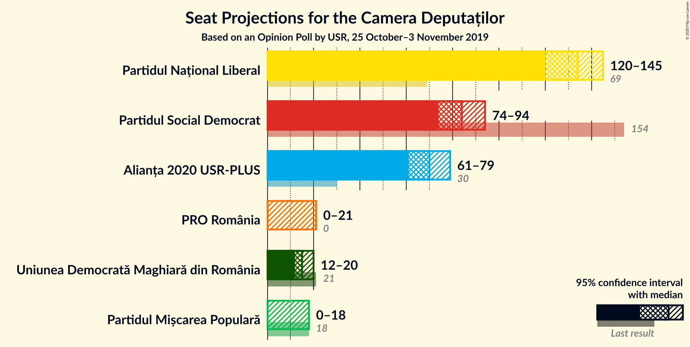

# Opinion Poll by USR, 25 October–3 November 2019

<a href="#voting-intentions">Voting Intentions</a> | <a href="#seats">Seats</a> | <a href="#coalitions">Coalitions</a> | <a href="#technical-information">Technical Information</a>

## Voting Intentions

### Confidence Intervals

| Party | Last Result | Poll Result | 80% Confidence Interval | 90% Confidence Interval | 95% Confidence Interval | 99% Confidence Interval |
|:-----:|:-----------:|:-----------:|:-----------------------:|:-----------------------:|:-----------------------:|:-----------------------:|
| Partidul Național Liberal | 20.0% | 38.2% | 36.4–40.0% |35.9–40.5% |35.5–41.0% |34.7–41.8% |
| Partidul Social Democrat | 45.5% | 24.0% | 22.5–25.6% |22.1–26.1% |21.7–26.5% |21.0–27.3% |
| Alianța 2020 USR-PLUS | 8.9% | 20.0% | 18.6–21.5% |18.2–22.0% |17.8–22.3% |17.2–23.1% |
| PRO România | 0.0% | 4.8% | 4.1–5.7% |3.9–5.9% |3.7–6.2% |3.4–6.6% |
| Uniunea Democrată Maghiară din România | 6.2% | 4.5% | 3.8–5.3% |3.6–5.6% |3.5–5.8% |3.2–6.2% |
| Partidul Mișcarea Populară | 5.4% | 4.3% | 3.7–5.2% |3.5–5.4% |3.3–5.6% |3.0–6.1% |

*Note:* The poll result column reflects the actual value used in the calculations. Published results may vary slightly, and in addition be rounded to fewer digits.

## Seats

### Confidence Intervals

| Party | Last Result | Median | 80% Confidence Interval | 90% Confidence Interval | 95% Confidence Interval | 99% Confidence Interval |
|:-----:|:-----------:|:------:|:-----------------------:|:-----------------------:|:-----------------------:|:-----------------------:|
| <a href="#partidul-național-liberal">Partidul Național Liberal</a> | 69 | 134 | 125–142 |123–144 |120–146 |116–149 |
| <a href="#partidul-social-democrat">Partidul Social Democrat</a> | 154 | 84 | 77–89 |76–91 |74–94 |71–97 |
| <a href="#alianța-2020-usr-plus">Alianța 2020 USR-PLUS</a> | 30 | 70 | 64–76 |63–77 |61–77 |57–82 |
| <a href="#pro-românia">PRO România</a> | 0 | 0 | 0–19 |0–20 |0–20 |0–22 |
| <a href="#uniunea-democrată-maghiară-din-românia">Uniunea Democrată Maghiară din România</a> | 21 | 16 | 13–18 |12–19 |12–20 |10–22 |
| <a href="#partidul-mișcarea-populară">Partidul Mișcarea Populară</a> | 18 | 0 | 0–17 |0–18 |0–18 |0–20 |

