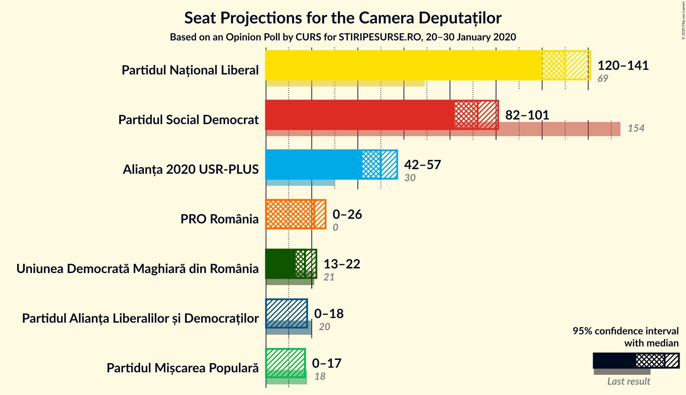

# Opinion Poll by CURS for STIRIPESURSE.RO, 20–30 January 2020

<a href="#voting-intentions">Voting Intentions</a> | <a href="#seats">Seats</a> | <a href="#coalitions">Coalitions</a> | <a href="#technical-information">Technical Information</a>

## Voting Intentions

### Confidence Intervals

| Party | Last Result | Poll Result | 80% Confidence Interval | 90% Confidence Interval | 95% Confidence Interval | 99% Confidence Interval |
|:-----:|:-----------:|:-----------:|:-----------------------:|:-----------------------:|:-----------------------:|:-----------------------:|
| Partidul Național Liberal | 20.0% | 37.0% | 35.3–38.8% |34.8–39.3% |34.4–39.8% |33.5–40.6% |
| Partidul Social Democrat | 45.5% | 26.0% | 24.5–27.7% |24.0–28.2% |23.7–28.6% |22.9–29.4% |
| Alianța 2020 USR-PLUS | 8.9% | 14.0% | 12.8–15.3% |12.5–15.7% |12.2–16.0% |11.6–16.7% |
| PRO România | 0.0% | 6.0% | 5.2–7.0% |5.0–7.3% |4.8–7.5% |4.5–8.0% |
| Uniunea Democrată Maghiară din România | 6.2% | 5.0% | 4.3–5.9% |4.1–6.1% |3.9–6.3% |3.6–6.8% |
| Partidul Alianța Liberalilor și Democraților | 5.6% | 4.0% | 3.4–4.8% |3.2–5.0% |3.0–5.2% |2.7–5.7% |
| Partidul Mișcarea Populară | 5.4% | 4.0% | 3.4–4.8% |3.2–5.0% |3.0–5.2% |2.7–5.7% |

*Note:* The poll result column reflects the actual value used in the calculations. Published results may vary slightly, and in addition be rounded to fewer digits.

## Seats

### Confidence Intervals

| Party | Last Result | Median | 80% Confidence Interval | 90% Confidence Interval | 95% Confidence Interval | 99% Confidence Interval |
|:-----:|:-----------:|:------:|:-----------------------:|:-----------------------:|:-----------------------:|:-----------------------:|
| <a href="#partidul-național-liberal">Partidul Național Liberal</a> | 69 | 131 | 124–138 |123–140 |120–142 |117–147 |
| <a href="#partidul-social-democrat">Partidul Social Democrat</a> | 154 | 92 | 86–98 |84–100 |83–102 |80–106 |
| <a href="#alianța-2020-usr-plus">Alianța 2020 USR-PLUS</a> | 30 | 49 | 45–54 |43–56 |43–57 |40–59 |
| <a href="#pro-românia">PRO România</a> | 0 | 21 | 18–24 |0–25 |0–26 |0–28 |
| <a href="#uniunea-democrată-maghiară-din-românia">Uniunea Democrată Maghiară din România</a> | 21 | 17 | 15–20 |14–21 |13–22 |12–24 |
| <a href="#partidul-alianța-liberalilor-și-democraților">Partidul Alianța Liberalilor și Democraților</a> | 20 | 0 | 0 |0–17 |0–18 |0–18 |
| <a href="#partidul-mișcarea-populară">Partidul Mișcarea Populară</a> | 18 | 0 | 0 |0–17 |0–17 |0–19 |

