# Opinion Poll by IMAS for Europa FM, 11–28 February 2020

<a href="#voting-intentions">Voting Intentions</a> | <a href="#seats">Seats</a> | <a href="#coalitions">Coalitions</a> | <a href="#technical-information">Technical Information</a>

## Voting Intentions

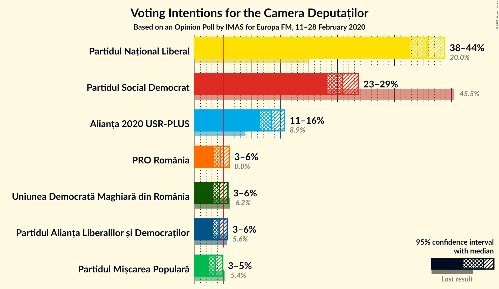

### Confidence Intervals

| Party | Last Result | Poll Result | 80% Confidence Interval | 90% Confidence Interval | 95% Confidence Interval | 99% Confidence Interval |
|:-----:|:-----------:|:-----------:|:-----------------------:|:-----------------------:|:-----------------------:|:-----------------------:|
| Partidul Național Liberal | 20.0% | 40.7% | 38.7–42.7% |38.2–43.3% |37.7–43.8% |36.8–44.7% |
| Partidul Social Democrat | 45.5% | 25.8% | 24.1–27.7% |23.6–28.2% |23.2–28.6% |22.4–29.5% |
| Alianța 2020 USR-PLUS | 8.9% | 13.5% | 12.2–14.9% |11.8–15.3% |11.5–15.7% |10.9–16.4% |
| PRO România | 0.0% | 4.6% | 3.8–5.5% |3.6–5.8% |3.4–6.0% |3.1–6.5% |
| Uniunea Democrată Maghiară din România | 6.2% | 4.4% | 3.6–5.3% |3.4–5.6% |3.3–5.8% |2.9–6.3% |
| Partidul Alianța Liberalilor și Democraților | 5.6% | 4.3% | 3.5–5.2% |3.3–5.5% |3.2–5.7% |2.9–6.2% |
| Partidul Mișcarea Populară | 5.4% | 3.6% | 2.9–4.4% |2.7–4.7% |2.6–4.9% |2.3–5.3% |

*Note:* The poll result column reflects the actual value used in the calculations. Published results may vary slightly, and in addition be rounded to fewer digits.

## Seats

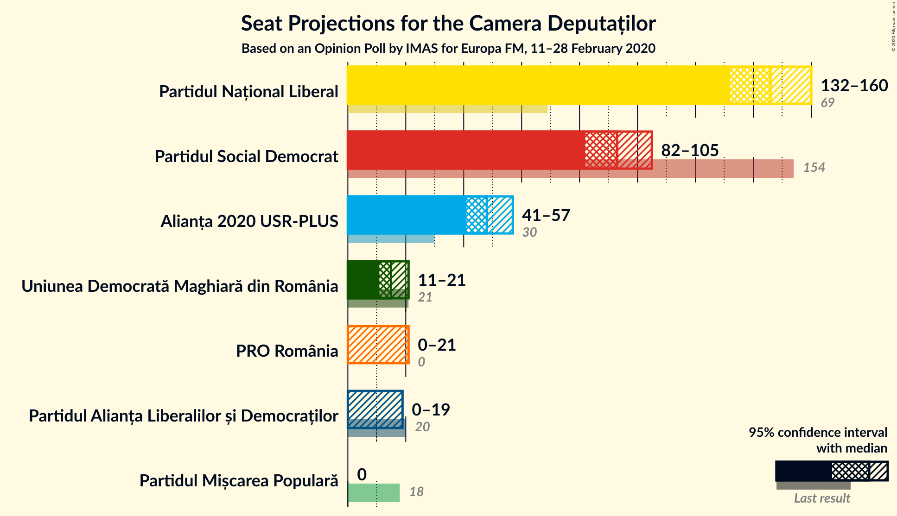

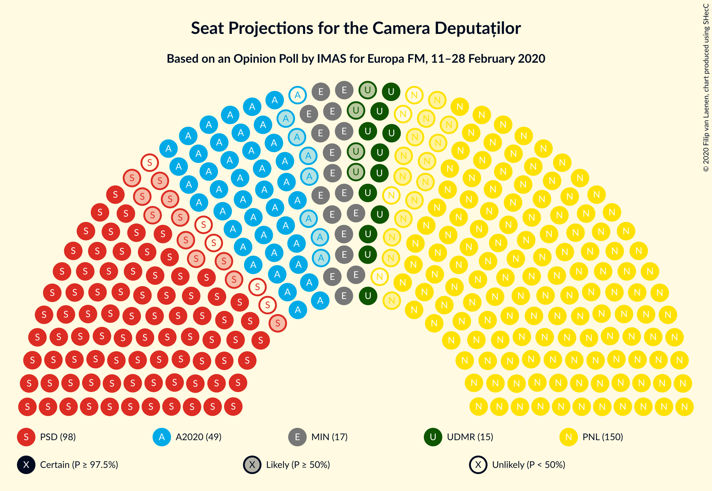

### Confidence Intervals

| Party | Last Result | Median | 80% Confidence Interval | 90% Confidence Interval | 95% Confidence Interval | 99% Confidence Interval |
|:-----:|:-----------:|:------:|:-----------------------:|:-----------------------:|:-----------------------:|:-----------------------:|
| <a href="#partidul-național-liberal">Partidul Național Liberal</a> | 69 | 145 | 136–155 |134–157 |131–159 |127–163 |
| <a href="#partidul-social-democrat">Partidul Social Democrat</a> | 154 | 92 | 85–102 |83–104 |82–106 |79–108 |
| <a href="#alianța-2020-usr-plus">Alianța 2020 USR-PLUS</a> | 30 | 48 | 43–55 |42–56 |41–56 |38–59 |
| <a href="#pro-românia">PRO România</a> | 0 | 0 | 0–19 |0–20 |0–21 |0–22 |
| <a href="#uniunea-democrată-maghiară-din-românia">Uniunea Democrată Maghiară din România</a> | 21 | 16 | 13–19 |12–20 |12–20 |10–22 |
| <a href="#partidul-alianța-liberalilor-și-democraților">Partidul Alianța Liberalilor și Democraților</a> | 20 | 0 | 0–18 |0–18 |0–19 |0–21 |
| <a href="#partidul-mișcarea-populară">Partidul Mișcarea Populară</a> | 18 | 0 | 0 |0 |0 |0–18 |

### Partidul Național Liberal

*For a full overview of the results for this party, see the [Partidul Național Liberal](party-partidulnaționalliberal.html) page.*

| Number of Seats | Probability | Accumulated | Special Marks |
|:---------------:|:-----------:|:-----------:|:-------------:|
| 69 | 0% | 100% | Last Result |
| 70 | 0% | 100% |  |
| 71 | 0% | 100% |  |
| 72 | 0% | 100% |  |
| 73 | 0% | 100% |  |
| 74 | 0% | 100% |  |
| 75 | 0% | 100% |  |
| 76 | 0% | 100% |  |
| 77 | 0% | 100% |  |
| 78 | 0% | 100% |  |
| 79 | 0% | 100% |  |
| 80 | 0% | 100% |  |
| 81 | 0% | 100% |  |
| 82 | 0% | 100% |  |
| 83 | 0% | 100% |  |
| 84 | 0% | 100% |  |
| 85 | 0% | 100% |  |
| 86 | 0% | 100% |  |
| 87 | 0% | 100% |  |
| 88 | 0% | 100% |  |
| 89 | 0% | 100% |  |
| 90 | 0% | 100% |  |
| 91 | 0% | 100% |  |
| 92 | 0% | 100% |  |
| 93 | 0% | 100% |  |
| 94 | 0% | 100% |  |
| 95 | 0% | 100% |  |
| 96 | 0% | 100% |  |
| 97 | 0% | 100% |  |
| 98 | 0% | 100% |  |
| 99 | 0% | 100% |  |
| 100 | 0% | 100% |  |
| 101 | 0% | 100% |  |
| 102 | 0% | 100% |  |
| 103 | 0% | 100% |  |
| 104 | 0% | 100% |  |
| 105 | 0% | 100% |  |
| 106 | 0% | 100% |  |
| 107 | 0% | 100% |  |
| 108 | 0% | 100% |  |
| 109 | 0% | 100% |  |
| 110 | 0% | 100% |  |
| 111 | 0% | 100% |  |
| 112 | 0% | 100% |  |
| 113 | 0% | 100% |  |
| 114 | 0% | 100% |  |
| 115 | 0% | 100% |  |
| 116 | 0% | 100% |  |
| 117 | 0% | 100% |  |
| 118 | 0% | 100% |  |
| 119 | 0% | 100% |  |
| 120 | 0% | 100% |  |
| 121 | 0% | 100% |  |
| 122 | 0% | 100% |  |
| 123 | 0% | 99.9% |  |
| 124 | 0% | 99.9% |  |
| 125 | 0% | 99.9% |  |
| 126 | 0.1% | 99.9% |  |
| 127 | 0.3% | 99.7% |  |
| 128 | 0.1% | 99.4% |  |
| 129 | 0.3% | 99.3% |  |
| 130 | 0.4% | 99.0% |  |
| 131 | 2% | 98.6% |  |
| 132 | 0.5% | 97% |  |
| 133 | 1.0% | 96% |  |
| 134 | 1.4% | 95% |  |
| 135 | 2% | 94% |  |
| 136 | 3% | 92% |  |
| 137 | 4% | 89% |  |
| 138 | 1.3% | 84% |  |
| 139 | 6% | 83% |  |
| 140 | 6% | 77% |  |
| 141 | 3% | 71% |  |
| 142 | 4% | 68% |  |
| 143 | 7% | 64% |  |
| 144 | 3% | 57% |  |
| 145 | 5% | 54% | Median |
| 146 | 7% | 49% |  |
| 147 | 2% | 42% |  |
| 148 | 5% | 40% |  |
| 149 | 8% | 35% |  |
| 150 | 5% | 27% |  |
| 151 | 2% | 22% |  |
| 152 | 4% | 20% |  |
| 153 | 3% | 16% |  |
| 154 | 0.7% | 13% |  |
| 155 | 3% | 12% |  |
| 156 | 3% | 9% |  |
| 157 | 1.5% | 6% |  |
| 158 | 0.7% | 4% |  |
| 159 | 1.4% | 3% |  |
| 160 | 1.0% | 2% |  |
| 161 | 0.2% | 1.0% |  |
| 162 | 0.2% | 0.8% |  |
| 163 | 0.2% | 0.6% |  |
| 164 | 0.2% | 0.5% |  |
| 165 | 0.1% | 0.3% |  |
| 166 | 0.1% | 0.1% | Majority |
| 167 | 0% | 0.1% |  |
| 168 | 0% | 0.1% |  |
| 169 | 0% | 0% |  |

### Partidul Social Democrat

*For a full overview of the results for this party, see the [Partidul Social Democrat](party-partidulsocialdemocrat.html) page.*

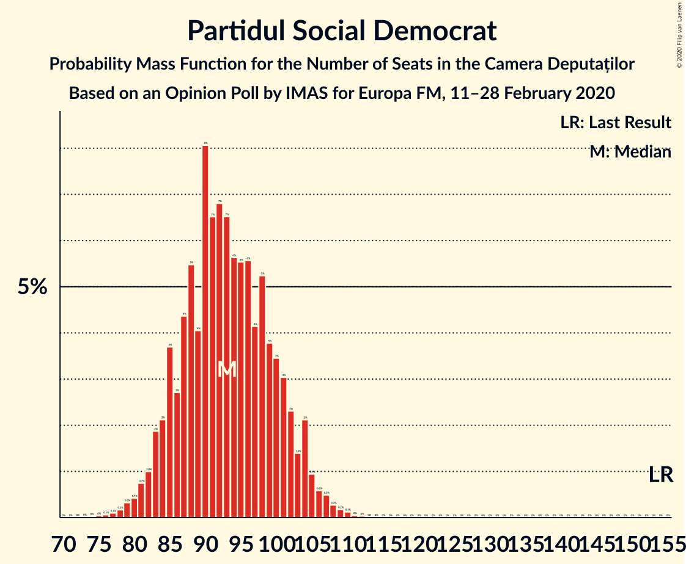

| Number of Seats | Probability | Accumulated | Special Marks |
|:---------------:|:-----------:|:-----------:|:-------------:|
| 74 | 0% | 100% |  |
| 75 | 0% | 99.9% |  |
| 76 | 0.1% | 99.9% |  |
| 77 | 0.1% | 99.8% |  |
| 78 | 0.1% | 99.7% |  |
| 79 | 0.3% | 99.6% |  |
| 80 | 0.5% | 99.4% |  |
| 81 | 0.6% | 98.9% |  |
| 82 | 0.8% | 98% |  |
| 83 | 3% | 97% |  |
| 84 | 2% | 95% |  |
| 85 | 3% | 93% |  |
| 86 | 2% | 90% |  |
| 87 | 3% | 88% |  |
| 88 | 5% | 84% |  |
| 89 | 4% | 79% |  |
| 90 | 7% | 75% |  |
| 91 | 9% | 69% |  |
| 92 | 11% | 60% | Median |
| 93 | 6% | 50% |  |
| 94 | 5% | 44% |  |
| 95 | 7% | 39% |  |
| 96 | 7% | 32% |  |
| 97 | 4% | 26% |  |
| 98 | 5% | 22% |  |
| 99 | 2% | 17% |  |
| 100 | 3% | 15% |  |
| 101 | 2% | 12% |  |
| 102 | 2% | 10% |  |
| 103 | 2% | 8% |  |
| 104 | 2% | 6% |  |
| 105 | 2% | 4% |  |
| 106 | 1.0% | 3% |  |
| 107 | 0.7% | 2% |  |
| 108 | 0.6% | 1.1% |  |
| 109 | 0.3% | 0.5% |  |
| 110 | 0.1% | 0.2% |  |
| 111 | 0% | 0.1% |  |
| 112 | 0.1% | 0.1% |  |
| 113 | 0% | 0% |  |
| 114 | 0% | 0% |  |
| 115 | 0% | 0% |  |
| 116 | 0% | 0% |  |
| 117 | 0% | 0% |  |
| 118 | 0% | 0% |  |
| 119 | 0% | 0% |  |
| 120 | 0% | 0% |  |
| 121 | 0% | 0% |  |
| 122 | 0% | 0% |  |
| 123 | 0% | 0% |  |
| 124 | 0% | 0% |  |
| 125 | 0% | 0% |  |
| 126 | 0% | 0% |  |
| 127 | 0% | 0% |  |
| 128 | 0% | 0% |  |
| 129 | 0% | 0% |  |
| 130 | 0% | 0% |  |
| 131 | 0% | 0% |  |
| 132 | 0% | 0% |  |
| 133 | 0% | 0% |  |
| 134 | 0% | 0% |  |
| 135 | 0% | 0% |  |
| 136 | 0% | 0% |  |
| 137 | 0% | 0% |  |
| 138 | 0% | 0% |  |
| 139 | 0% | 0% |  |
| 140 | 0% | 0% |  |
| 141 | 0% | 0% |  |
| 142 | 0% | 0% |  |
| 143 | 0% | 0% |  |
| 144 | 0% | 0% |  |
| 145 | 0% | 0% |  |
| 146 | 0% | 0% |  |
| 147 | 0% | 0% |  |
| 148 | 0% | 0% |  |
| 149 | 0% | 0% |  |
| 150 | 0% | 0% |  |
| 151 | 0% | 0% |  |
| 152 | 0% | 0% |  |
| 153 | 0% | 0% |  |
| 154 | 0% | 0% | Last Result |

### Alianța 2020 USR-PLUS

*For a full overview of the results for this party, see the [Alianța 2020 USR-PLUS](party-alianța2020usr-plus.html) page.*

| Number of Seats | Probability | Accumulated | Special Marks |
|:---------------:|:-----------:|:-----------:|:-------------:|
| 30 | 0% | 100% | Last Result |
| 31 | 0% | 100% |  |
| 32 | 0% | 100% |  |
| 33 | 0% | 100% |  |
| 34 | 0% | 100% |  |
| 35 | 0% | 100% |  |
| 36 | 0.1% | 100% |  |
| 37 | 0.2% | 99.9% |  |
| 38 | 0.2% | 99.7% |  |
| 39 | 1.1% | 99.5% |  |
| 40 | 0.9% | 98% |  |
| 41 | 1.4% | 98% |  |
| 42 | 4% | 96% |  |
| 43 | 5% | 93% |  |
| 44 | 7% | 87% |  |
| 45 | 6% | 80% |  |
| 46 | 6% | 75% |  |
| 47 | 12% | 69% |  |
| 48 | 10% | 57% | Median |
| 49 | 7% | 47% |  |
| 50 | 8% | 40% |  |
| 51 | 7% | 32% |  |
| 52 | 4% | 25% |  |
| 53 | 8% | 21% |  |
| 54 | 3% | 13% |  |
| 55 | 5% | 10% |  |
| 56 | 3% | 6% |  |
| 57 | 0.9% | 2% |  |
| 58 | 0.6% | 1.1% |  |
| 59 | 0.2% | 0.5% |  |
| 60 | 0.2% | 0.3% |  |
| 61 | 0.1% | 0.2% |  |
| 62 | 0.1% | 0.1% |  |
| 63 | 0% | 0.1% |  |
| 64 | 0% | 0% |  |

### PRO România

*For a full overview of the results for this party, see the [PRO România](party-proromânia.html) page.*

| Number of Seats | Probability | Accumulated | Special Marks |
|:---------------:|:-----------:|:-----------:|:-------------:|
| 0 | 72% | 100% | Last Result, Median |
| 1 | 0% | 28% |  |
| 2 | 0% | 28% |  |
| 3 | 0% | 28% |  |
| 4 | 0% | 28% |  |
| 5 | 0% | 28% |  |
| 6 | 0% | 28% |  |
| 7 | 0% | 28% |  |
| 8 | 0% | 28% |  |
| 9 | 0% | 28% |  |
| 10 | 0% | 28% |  |
| 11 | 0% | 28% |  |
| 12 | 0% | 28% |  |
| 13 | 0% | 28% |  |
| 14 | 0% | 28% |  |
| 15 | 0% | 28% |  |
| 16 | 2% | 28% |  |
| 17 | 3% | 27% |  |
| 18 | 13% | 24% |  |
| 19 | 6% | 11% |  |
| 20 | 2% | 5% |  |
| 21 | 3% | 3% |  |
| 22 | 0.5% | 0.8% |  |
| 23 | 0.2% | 0.3% |  |
| 24 | 0.1% | 0.1% |  |
| 25 | 0% | 0% |  |

### Uniunea Democrată Maghiară din România

*For a full overview of the results for this party, see the [Uniunea Democrată Maghiară din România](party-uniuneademocratămaghiarădinromânia.html) page.*

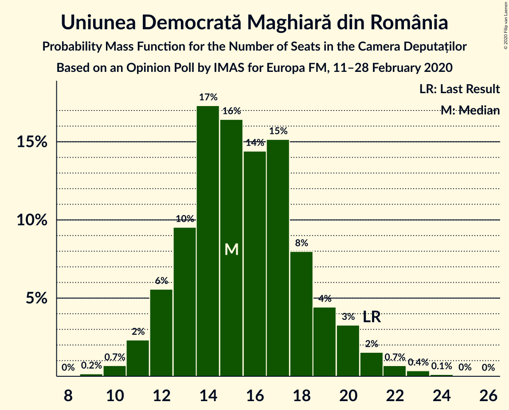

| Number of Seats | Probability | Accumulated | Special Marks |
|:---------------:|:-----------:|:-----------:|:-------------:|
| 9 | 0.1% | 100% |  |
| 10 | 0.4% | 99.9% |  |
| 11 | 2% | 99.4% |  |
| 12 | 3% | 98% |  |
| 13 | 6% | 95% |  |
| 14 | 15% | 89% |  |
| 15 | 20% | 74% |  |
| 16 | 22% | 54% | Median |
| 17 | 14% | 32% |  |
| 18 | 8% | 18% |  |
| 19 | 5% | 10% |  |
| 20 | 4% | 6% |  |
| 21 | 1.1% | 2% | Last Result |
| 22 | 0.3% | 0.7% |  |
| 23 | 0.2% | 0.4% |  |
| 24 | 0.1% | 0.2% |  |
| 25 | 0% | 0.1% |  |
| 26 | 0% | 0% |  |

### Partidul Alianța Liberalilor și Democraților

*For a full overview of the results for this party, see the [Partidul Alianța Liberalilor și Democraților](party-partidulalianțaliberalilorșidemocraților.html) page.*

| Number of Seats | Probability | Accumulated | Special Marks |
|:---------------:|:-----------:|:-----------:|:-------------:|
| 0 | 79% | 100% | Median |
| 1 | 0% | 21% |  |
| 2 | 0% | 21% |  |
| 3 | 0% | 21% |  |
| 4 | 0% | 21% |  |
| 5 | 0% | 21% |  |
| 6 | 0% | 21% |  |
| 7 | 0% | 21% |  |
| 8 | 0% | 21% |  |
| 9 | 0% | 21% |  |
| 10 | 0% | 21% |  |
| 11 | 0% | 21% |  |
| 12 | 0% | 21% |  |
| 13 | 0% | 21% |  |
| 14 | 0% | 21% |  |
| 15 | 0% | 21% |  |
| 16 | 2% | 21% |  |
| 17 | 3% | 20% |  |
| 18 | 13% | 16% |  |
| 19 | 2% | 4% |  |
| 20 | 0.7% | 2% | Last Result |
| 21 | 0.7% | 1.0% |  |
| 22 | 0.3% | 0.4% |  |
| 23 | 0.1% | 0.1% |  |
| 24 | 0% | 0% |  |

### Partidul Mișcarea Populară

*For a full overview of the results for this party, see the [Partidul Mișcarea Populară](party-partidulmișcareapopulară.html) page.*

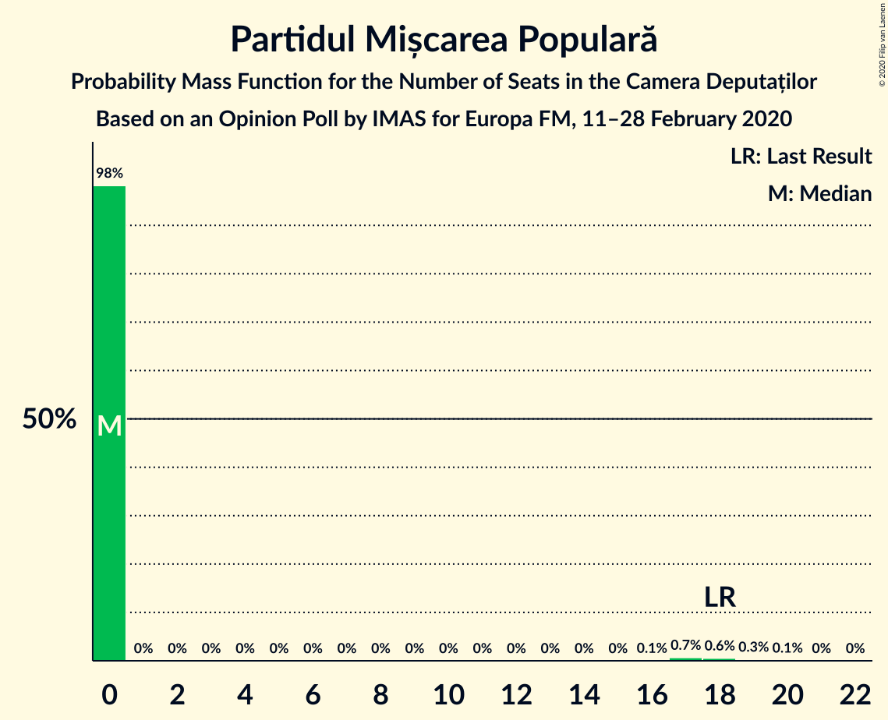

| Number of Seats | Probability | Accumulated | Special Marks |
|:---------------:|:-----------:|:-----------:|:-------------:|
| 0 | 98.5% | 100% | Median |
| 1 | 0% | 1.5% |  |
| 2 | 0% | 1.5% |  |
| 3 | 0% | 1.5% |  |
| 4 | 0% | 1.5% |  |
| 5 | 0% | 1.5% |  |
| 6 | 0% | 1.5% |  |
| 7 | 0% | 1.5% |  |
| 8 | 0% | 1.5% |  |
| 9 | 0% | 1.5% |  |
| 10 | 0% | 1.5% |  |
| 11 | 0% | 1.5% |  |
| 12 | 0% | 1.5% |  |
| 13 | 0% | 1.5% |  |
| 14 | 0% | 1.5% |  |
| 15 | 0% | 1.5% |  |
| 16 | 0.1% | 1.5% |  |
| 17 | 0.5% | 1.3% |  |
| 18 | 0.4% | 0.9% | Last Result |
| 19 | 0.3% | 0.5% |  |
| 20 | 0.2% | 0.2% |  |
| 21 | 0% | 0% |  |

## Coalitions

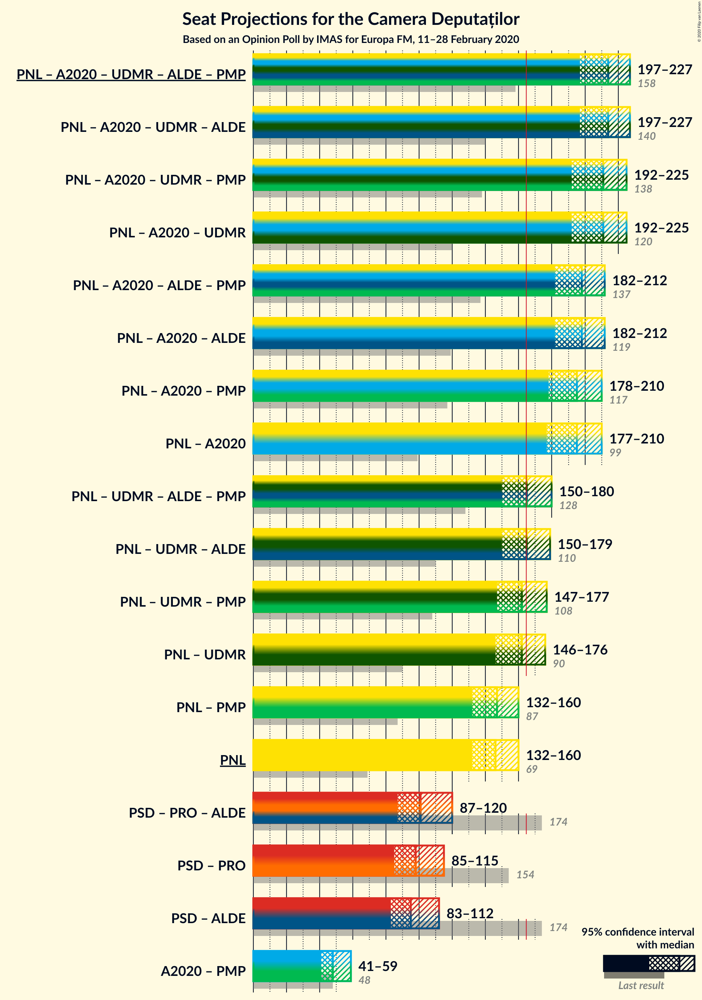

### Confidence Intervals

| Coalition | Last Result | Median | Majority? | 80% Confidence Interval | 90% Confidence Interval | 95% Confidence Interval | 99% Confidence Interval |
|:---------:|:-----------:|:------:|:---------:|:-----------------------:|:-----------------------:|:-----------------------:|:-----------------------:|
| Partidul Național Liberal – Alianța 2020 USR-PLUS – Uniunea Democrată Maghiară din România – Partidul Alianța Liberalilor și Democraților – Partidul Mișcarea Populară | 158 | 215 | 100% | 202–223 | 199–225 | 197–227 | 194–230 |
| Partidul Național Liberal – Alianța 2020 USR-PLUS – Uniunea Democrată Maghiară din România – Partidul Alianța Liberalilor și Democraților | 140 | 215 | 100% | 202–223 | 199–225 | 197–227 | 193–230 |
| Partidul Național Liberal – Alianța 2020 USR-PLUS – Uniunea Democrată Maghiară din România – Partidul Mișcarea Populară | 138 | 210 | 100% | 197–221 | 195–224 | 190–225 | 187–229 |
| Partidul Național Liberal – Alianța 2020 USR-PLUS – Uniunea Democrată Maghiară din România | 120 | 210 | 100% | 197–221 | 194–224 | 190–225 | 186–228 |
| Partidul Național Liberal – Alianța 2020 USR-PLUS – Partidul Alianța Liberalilor și Democraților – Partidul Mișcarea Populară | 137 | 199 | 100% | 187–207 | 184–209 | 182–211 | 178–215 |
| Partidul Național Liberal – Alianța 2020 USR-PLUS – Partidul Alianța Liberalilor și Democraților | 119 | 199 | 100% | 187–207 | 183–209 | 181–211 | 178–215 |
| Partidul Național Liberal – Alianța 2020 USR-PLUS – Partidul Mișcarea Populară | 117 | 194 | 100% | 182–206 | 179–207 | 175–209 | 172–213 |
| Partidul Național Liberal – Alianța 2020 USR-PLUS | 99 | 194 | 100% | 182–205 | 179–207 | 175–209 | 172–212 |
| Partidul Național Liberal – Uniunea Democrată Maghiară din România – Partidul Alianța Liberalilor și Democraților – Partidul Mișcarea Populară | 128 | 166 | 50% | 154–176 | 152–177 | 151–179 | 146–183 |
| Partidul Național Liberal – Uniunea Democrată Maghiară din România – Partidul Alianța Liberalilor și Democraților | 110 | 165 | 49% | 154–176 | 152–177 | 150–179 | 146–182 |
| Partidul Național Liberal – Uniunea Democrată Maghiară din România – Partidul Mișcarea Populară | 108 | 162 | 32% | 152–171 | 149–174 | 145–177 | 141–180 |
| Partidul Național Liberal – Uniunea Democrată Maghiară din România | 90 | 161 | 31% | 152–171 | 149–173 | 145–176 | 141–178 |
| Partidul Național Liberal – Partidul Mișcarea Populară | 87 | 146 | 0.2% | 136–155 | 134–157 | 131–160 | 127–164 |
| Partidul Național Liberal | 69 | 145 | 0.1% | 136–155 | 134–157 | 131–159 | 127–163 |
| Partidul Social Democrat – PRO România – Partidul Alianța Liberalilor și Democraților | 174 | 102 | 0% | 91–115 | 88–117 | 87–122 | 83–125 |
| Partidul Social Democrat – PRO România | 154 | 97 | 0% | 89–110 | 87–113 | 85–115 | 82–118 |
| Partidul Social Democrat – Partidul Alianța Liberalilor și Democraților | 174 | 96 | 0% | 88–109 | 85–110 | 83–111 | 80–117 |
| Alianța 2020 USR-PLUS – Partidul Mișcarea Populară | 48 | 48 | 0% | 43–55 | 42–56 | 41–58 | 39–66 |

### Partidul Național Liberal – Alianța 2020 USR-PLUS – Uniunea Democrată Maghiară din România – Partidul Alianța Liberalilor și Democraților – Partidul Mișcarea Populară

| Number of Seats | Probability | Accumulated | Special Marks |
|:---------------:|:-----------:|:-----------:|:-------------:|
| 158 | 0% | 100% | Last Result |
| 159 | 0% | 100% |  |
| 160 | 0% | 100% |  |
| 161 | 0% | 100% |  |
| 162 | 0% | 100% |  |
| 163 | 0% | 100% |  |
| 164 | 0% | 100% |  |
| 165 | 0% | 100% |  |
| 166 | 0% | 100% | Majority |
| 167 | 0% | 100% |  |
| 168 | 0% | 100% |  |
| 169 | 0% | 100% |  |
| 170 | 0% | 100% |  |
| 171 | 0% | 100% |  |
| 172 | 0% | 100% |  |
| 173 | 0% | 100% |  |
| 174 | 0% | 100% |  |
| 175 | 0% | 100% |  |
| 176 | 0% | 100% |  |
| 177 | 0% | 100% |  |
| 178 | 0% | 100% |  |
| 179 | 0% | 100% |  |
| 180 | 0% | 100% |  |
| 181 | 0% | 100% |  |
| 182 | 0% | 100% |  |
| 183 | 0% | 100% |  |
| 184 | 0% | 100% |  |
| 185 | 0% | 100% |  |
| 186 | 0% | 100% |  |
| 187 | 0% | 100% |  |
| 188 | 0% | 100% |  |
| 189 | 0% | 100% |  |
| 190 | 0% | 99.9% |  |
| 191 | 0.1% | 99.9% |  |
| 192 | 0.1% | 99.8% |  |
| 193 | 0.2% | 99.7% |  |
| 194 | 0.4% | 99.6% |  |
| 195 | 0.1% | 99.2% |  |
| 196 | 1.0% | 99.1% |  |
| 197 | 1.5% | 98% |  |
| 198 | 0.3% | 97% |  |
| 199 | 2% | 96% |  |
| 200 | 1.4% | 94% |  |
| 201 | 2% | 93% |  |
| 202 | 3% | 91% |  |
| 203 | 1.5% | 88% |  |
| 204 | 2% | 86% |  |
| 205 | 3% | 84% |  |
| 206 | 3% | 81% |  |
| 207 | 3% | 78% |  |
| 208 | 3% | 75% |  |
| 209 | 3% | 72% | Median |
| 210 | 3% | 69% |  |
| 211 | 5% | 66% |  |
| 212 | 3% | 62% |  |
| 213 | 2% | 59% |  |
| 214 | 5% | 57% |  |
| 215 | 2% | 51% |  |
| 216 | 6% | 49% |  |
| 217 | 5% | 43% |  |
| 218 | 4% | 38% |  |
| 219 | 5% | 35% |  |
| 220 | 7% | 30% |  |
| 221 | 8% | 22% |  |
| 222 | 4% | 15% |  |
| 223 | 3% | 11% |  |
| 224 | 2% | 8% |  |
| 225 | 2% | 6% |  |
| 226 | 1.1% | 4% |  |
| 227 | 1.4% | 3% |  |
| 228 | 0.4% | 1.4% |  |
| 229 | 0.4% | 1.1% |  |
| 230 | 0.3% | 0.7% |  |
| 231 | 0.2% | 0.4% |  |
| 232 | 0.1% | 0.2% |  |
| 233 | 0.1% | 0.1% |  |
| 234 | 0% | 0.1% |  |
| 235 | 0% | 0% |  |

### Partidul Național Liberal – Alianța 2020 USR-PLUS – Uniunea Democrată Maghiară din România – Partidul Alianța Liberalilor și Democraților

| Number of Seats | Probability | Accumulated | Special Marks |
|:---------------:|:-----------:|:-----------:|:-------------:|
| 140 | 0% | 100% | Last Result |
| 141 | 0% | 100% |  |
| 142 | 0% | 100% |  |
| 143 | 0% | 100% |  |
| 144 | 0% | 100% |  |
| 145 | 0% | 100% |  |
| 146 | 0% | 100% |  |
| 147 | 0% | 100% |  |
| 148 | 0% | 100% |  |
| 149 | 0% | 100% |  |
| 150 | 0% | 100% |  |
| 151 | 0% | 100% |  |
| 152 | 0% | 100% |  |
| 153 | 0% | 100% |  |
| 154 | 0% | 100% |  |
| 155 | 0% | 100% |  |
| 156 | 0% | 100% |  |
| 157 | 0% | 100% |  |
| 158 | 0% | 100% |  |
| 159 | 0% | 100% |  |
| 160 | 0% | 100% |  |
| 161 | 0% | 100% |  |
| 162 | 0% | 100% |  |
| 163 | 0% | 100% |  |
| 164 | 0% | 100% |  |
| 165 | 0% | 100% |  |
| 166 | 0% | 100% | Majority |
| 167 | 0% | 100% |  |
| 168 | 0% | 100% |  |
| 169 | 0% | 100% |  |
| 170 | 0% | 100% |  |
| 171 | 0% | 100% |  |
| 172 | 0% | 100% |  |
| 173 | 0% | 100% |  |
| 174 | 0% | 100% |  |
| 175 | 0% | 100% |  |
| 176 | 0% | 100% |  |
| 177 | 0% | 100% |  |
| 178 | 0% | 100% |  |
| 179 | 0% | 100% |  |
| 180 | 0% | 100% |  |
| 181 | 0% | 100% |  |
| 182 | 0% | 100% |  |
| 183 | 0% | 100% |  |
| 184 | 0% | 100% |  |
| 185 | 0% | 100% |  |
| 186 | 0% | 100% |  |
| 187 | 0% | 100% |  |
| 188 | 0% | 100% |  |
| 189 | 0% | 99.9% |  |
| 190 | 0% | 99.9% |  |
| 191 | 0.1% | 99.9% |  |
| 192 | 0.1% | 99.7% |  |
| 193 | 0.2% | 99.6% |  |
| 194 | 0.5% | 99.4% |  |
| 195 | 0.1% | 98.9% |  |
| 196 | 1.0% | 98.8% |  |
| 197 | 2% | 98% |  |
| 198 | 0.5% | 96% |  |
| 199 | 3% | 96% |  |
| 200 | 1.4% | 93% |  |
| 201 | 2% | 92% |  |
| 202 | 3% | 90% |  |
| 203 | 2% | 87% |  |
| 204 | 3% | 86% |  |
| 205 | 3% | 83% |  |
| 206 | 3% | 80% |  |
| 207 | 3% | 77% |  |
| 208 | 3% | 74% |  |
| 209 | 3% | 71% | Median |
| 210 | 3% | 68% |  |
| 211 | 5% | 65% |  |
| 212 | 3% | 60% |  |
| 213 | 2% | 58% |  |
| 214 | 5% | 56% |  |
| 215 | 2% | 50% |  |
| 216 | 6% | 48% |  |
| 217 | 5% | 42% |  |
| 218 | 4% | 37% |  |
| 219 | 5% | 34% |  |
| 220 | 7% | 29% |  |
| 221 | 8% | 22% |  |
| 222 | 4% | 14% |  |
| 223 | 2% | 10% |  |
| 224 | 2% | 8% |  |
| 225 | 2% | 6% |  |
| 226 | 1.1% | 4% |  |
| 227 | 1.3% | 3% |  |
| 228 | 0.3% | 1.2% |  |
| 229 | 0.3% | 0.9% |  |
| 230 | 0.2% | 0.6% |  |
| 231 | 0.2% | 0.4% |  |
| 232 | 0.1% | 0.2% |  |
| 233 | 0% | 0.1% |  |
| 234 | 0% | 0.1% |  |
| 235 | 0% | 0% |  |

### Partidul Național Liberal – Alianța 2020 USR-PLUS – Uniunea Democrată Maghiară din România – Partidul Mișcarea Populară

| Number of Seats | Probability | Accumulated | Special Marks |
|:---------------:|:-----------:|:-----------:|:-------------:|
| 138 | 0% | 100% | Last Result |
| 139 | 0% | 100% |  |
| 140 | 0% | 100% |  |
| 141 | 0% | 100% |  |
| 142 | 0% | 100% |  |
| 143 | 0% | 100% |  |
| 144 | 0% | 100% |  |
| 145 | 0% | 100% |  |
| 146 | 0% | 100% |  |
| 147 | 0% | 100% |  |
| 148 | 0% | 100% |  |
| 149 | 0% | 100% |  |
| 150 | 0% | 100% |  |
| 151 | 0% | 100% |  |
| 152 | 0% | 100% |  |
| 153 | 0% | 100% |  |
| 154 | 0% | 100% |  |
| 155 | 0% | 100% |  |
| 156 | 0% | 100% |  |
| 157 | 0% | 100% |  |
| 158 | 0% | 100% |  |
| 159 | 0% | 100% |  |
| 160 | 0% | 100% |  |
| 161 | 0% | 100% |  |
| 162 | 0% | 100% |  |
| 163 | 0% | 100% |  |
| 164 | 0% | 100% |  |
| 165 | 0% | 100% |  |
| 166 | 0% | 100% | Majority |
| 167 | 0% | 100% |  |
| 168 | 0% | 100% |  |
| 169 | 0% | 100% |  |
| 170 | 0% | 100% |  |
| 171 | 0% | 100% |  |
| 172 | 0% | 100% |  |
| 173 | 0% | 100% |  |
| 174 | 0% | 100% |  |
| 175 | 0% | 100% |  |
| 176 | 0% | 100% |  |
| 177 | 0% | 100% |  |
| 178 | 0% | 100% |  |
| 179 | 0% | 100% |  |
| 180 | 0% | 100% |  |
| 181 | 0% | 100% |  |
| 182 | 0.1% | 100% |  |
| 183 | 0% | 99.9% |  |
| 184 | 0% | 99.9% |  |
| 185 | 0.2% | 99.8% |  |
| 186 | 0.1% | 99.6% |  |
| 187 | 0.1% | 99.5% |  |
| 188 | 1.5% | 99.4% |  |
| 189 | 0.1% | 98% |  |
| 190 | 0.5% | 98% |  |
| 191 | 0.2% | 97% |  |
| 192 | 0.9% | 97% |  |
| 193 | 0.5% | 96% |  |
| 194 | 0.5% | 96% |  |
| 195 | 2% | 95% |  |
| 196 | 1.2% | 93% |  |
| 197 | 2% | 92% |  |
| 198 | 0.4% | 89% |  |
| 199 | 3% | 89% |  |
| 200 | 2% | 86% |  |
| 201 | 3% | 85% |  |
| 202 | 8% | 81% |  |
| 203 | 4% | 74% |  |
| 204 | 3% | 70% |  |
| 205 | 3% | 66% |  |
| 206 | 2% | 63% |  |
| 207 | 3% | 61% |  |
| 208 | 3% | 58% |  |
| 209 | 2% | 55% | Median |
| 210 | 3% | 52% |  |
| 211 | 3% | 49% |  |
| 212 | 2% | 46% |  |
| 213 | 2% | 43% |  |
| 214 | 5% | 41% |  |
| 215 | 2% | 36% |  |
| 216 | 5% | 34% |  |
| 217 | 4% | 29% |  |
| 218 | 3% | 25% |  |
| 219 | 4% | 21% |  |
| 220 | 3% | 18% |  |
| 221 | 5% | 15% |  |
| 222 | 3% | 10% |  |
| 223 | 1.4% | 7% |  |
| 224 | 2% | 6% |  |
| 225 | 2% | 4% |  |
| 226 | 1.0% | 2% |  |
| 227 | 0.4% | 1.3% |  |
| 228 | 0.3% | 0.9% |  |
| 229 | 0.3% | 0.6% |  |
| 230 | 0.1% | 0.3% |  |
| 231 | 0.1% | 0.2% |  |
| 232 | 0% | 0.1% |  |
| 233 | 0% | 0% |  |

### Partidul Național Liberal – Alianța 2020 USR-PLUS – Uniunea Democrată Maghiară din România

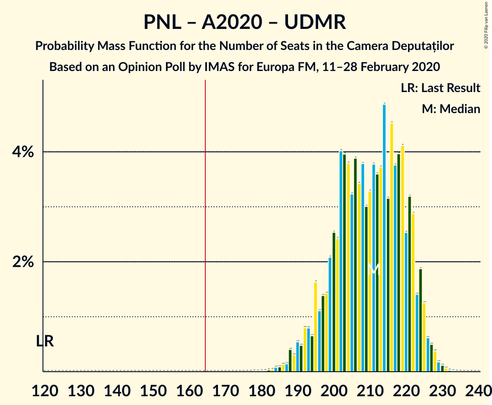

| Number of Seats | Probability | Accumulated | Special Marks |
|:---------------:|:-----------:|:-----------:|:-------------:|
| 120 | 0% | 100% | Last Result |
| 121 | 0% | 100% |  |
| 122 | 0% | 100% |  |
| 123 | 0% | 100% |  |
| 124 | 0% | 100% |  |
| 125 | 0% | 100% |  |
| 126 | 0% | 100% |  |
| 127 | 0% | 100% |  |
| 128 | 0% | 100% |  |
| 129 | 0% | 100% |  |
| 130 | 0% | 100% |  |
| 131 | 0% | 100% |  |
| 132 | 0% | 100% |  |
| 133 | 0% | 100% |  |
| 134 | 0% | 100% |  |
| 135 | 0% | 100% |  |
| 136 | 0% | 100% |  |
| 137 | 0% | 100% |  |
| 138 | 0% | 100% |  |
| 139 | 0% | 100% |  |
| 140 | 0% | 100% |  |
| 141 | 0% | 100% |  |
| 142 | 0% | 100% |  |
| 143 | 0% | 100% |  |
| 144 | 0% | 100% |  |
| 145 | 0% | 100% |  |
| 146 | 0% | 100% |  |
| 147 | 0% | 100% |  |
| 148 | 0% | 100% |  |
| 149 | 0% | 100% |  |
| 150 | 0% | 100% |  |
| 151 | 0% | 100% |  |
| 152 | 0% | 100% |  |
| 153 | 0% | 100% |  |
| 154 | 0% | 100% |  |
| 155 | 0% | 100% |  |
| 156 | 0% | 100% |  |
| 157 | 0% | 100% |  |
| 158 | 0% | 100% |  |
| 159 | 0% | 100% |  |
| 160 | 0% | 100% |  |
| 161 | 0% | 100% |  |
| 162 | 0% | 100% |  |
| 163 | 0% | 100% |  |
| 164 | 0% | 100% |  |
| 165 | 0% | 100% |  |
| 166 | 0% | 100% | Majority |
| 167 | 0% | 100% |  |
| 168 | 0% | 100% |  |
| 169 | 0% | 100% |  |
| 170 | 0% | 100% |  |
| 171 | 0% | 100% |  |
| 172 | 0% | 100% |  |
| 173 | 0% | 100% |  |
| 174 | 0% | 100% |  |
| 175 | 0% | 100% |  |
| 176 | 0% | 100% |  |
| 177 | 0% | 100% |  |
| 178 | 0% | 100% |  |
| 179 | 0% | 100% |  |
| 180 | 0% | 100% |  |
| 181 | 0% | 100% |  |
| 182 | 0.1% | 99.9% |  |
| 183 | 0% | 99.9% |  |
| 184 | 0% | 99.8% |  |
| 185 | 0.3% | 99.8% |  |
| 186 | 0.1% | 99.6% |  |
| 187 | 0.1% | 99.5% |  |
| 188 | 2% | 99.4% |  |
| 189 | 0.1% | 98% |  |
| 190 | 0.6% | 98% |  |
| 191 | 0.2% | 97% |  |
| 192 | 1.0% | 97% |  |
| 193 | 0.5% | 96% |  |
| 194 | 0.6% | 95% |  |
| 195 | 2% | 95% |  |
| 196 | 1.2% | 93% |  |
| 197 | 3% | 91% |  |
| 198 | 0.6% | 89% |  |
| 199 | 3% | 88% |  |
| 200 | 2% | 85% |  |
| 201 | 3% | 84% |  |
| 202 | 8% | 81% |  |
| 203 | 4% | 73% |  |
| 204 | 4% | 69% |  |
| 205 | 3% | 65% |  |
| 206 | 2% | 62% |  |
| 207 | 3% | 59% |  |
| 208 | 3% | 57% |  |
| 209 | 2% | 54% | Median |
| 210 | 3% | 51% |  |
| 211 | 3% | 48% |  |
| 212 | 2% | 45% |  |
| 213 | 2% | 42% |  |
| 214 | 5% | 40% |  |
| 215 | 2% | 35% |  |
| 216 | 5% | 33% |  |
| 217 | 4% | 28% |  |
| 218 | 3% | 24% |  |
| 219 | 4% | 20% |  |
| 220 | 3% | 17% |  |
| 221 | 5% | 14% |  |
| 222 | 2% | 9% |  |
| 223 | 1.3% | 7% |  |
| 224 | 2% | 5% |  |
| 225 | 2% | 4% |  |
| 226 | 1.0% | 2% |  |
| 227 | 0.4% | 1.1% |  |
| 228 | 0.3% | 0.7% |  |
| 229 | 0.2% | 0.4% |  |
| 230 | 0.1% | 0.2% |  |
| 231 | 0.1% | 0.2% |  |
| 232 | 0% | 0% |  |

### Partidul Național Liberal – Alianța 2020 USR-PLUS – Partidul Alianța Liberalilor și Democraților – Partidul Mișcarea Populară

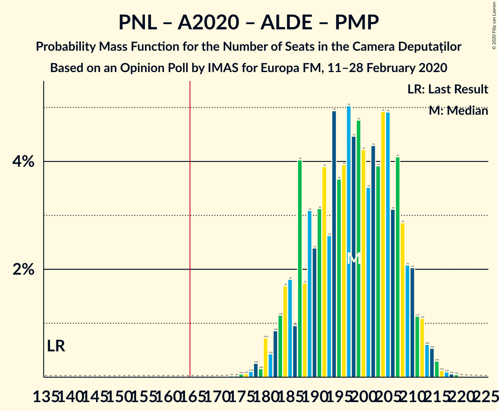

| Number of Seats | Probability | Accumulated | Special Marks |
|:---------------:|:-----------:|:-----------:|:-------------:|
| 137 | 0% | 100% | Last Result |
| 138 | 0% | 100% |  |
| 139 | 0% | 100% |  |
| 140 | 0% | 100% |  |
| 141 | 0% | 100% |  |
| 142 | 0% | 100% |  |
| 143 | 0% | 100% |  |
| 144 | 0% | 100% |  |
| 145 | 0% | 100% |  |
| 146 | 0% | 100% |  |
| 147 | 0% | 100% |  |
| 148 | 0% | 100% |  |
| 149 | 0% | 100% |  |
| 150 | 0% | 100% |  |
| 151 | 0% | 100% |  |
| 152 | 0% | 100% |  |
| 153 | 0% | 100% |  |
| 154 | 0% | 100% |  |
| 155 | 0% | 100% |  |
| 156 | 0% | 100% |  |
| 157 | 0% | 100% |  |
| 158 | 0% | 100% |  |
| 159 | 0% | 100% |  |
| 160 | 0% | 100% |  |
| 161 | 0% | 100% |  |
| 162 | 0% | 100% |  |
| 163 | 0% | 100% |  |
| 164 | 0% | 100% |  |
| 165 | 0% | 100% |  |
| 166 | 0% | 100% | Majority |
| 167 | 0% | 100% |  |
| 168 | 0% | 100% |  |
| 169 | 0% | 100% |  |
| 170 | 0% | 100% |  |
| 171 | 0% | 100% |  |
| 172 | 0% | 100% |  |
| 173 | 0% | 100% |  |
| 174 | 0% | 100% |  |
| 175 | 0.1% | 99.9% |  |
| 176 | 0.1% | 99.8% |  |
| 177 | 0.1% | 99.8% |  |
| 178 | 0.3% | 99.7% |  |
| 179 | 0.1% | 99.3% |  |
| 180 | 1.4% | 99.2% |  |
| 181 | 0.3% | 98% |  |
| 182 | 2% | 98% |  |
| 183 | 0.3% | 95% |  |
| 184 | 2% | 95% |  |
| 185 | 1.2% | 93% |  |
| 186 | 0.8% | 92% |  |
| 187 | 5% | 91% |  |
| 188 | 2% | 86% |  |
| 189 | 2% | 84% |  |
| 190 | 3% | 82% |  |
| 191 | 5% | 79% |  |
| 192 | 4% | 74% |  |
| 193 | 2% | 70% | Median |
| 194 | 4% | 69% |  |
| 195 | 6% | 64% |  |
| 196 | 2% | 58% |  |
| 197 | 2% | 57% |  |
| 198 | 2% | 54% |  |
| 199 | 5% | 52% |  |
| 200 | 1.3% | 47% |  |
| 201 | 1.1% | 46% |  |
| 202 | 9% | 45% |  |
| 203 | 6% | 36% |  |
| 204 | 3% | 30% |  |
| 205 | 10% | 27% |  |
| 206 | 4% | 17% |  |
| 207 | 4% | 13% |  |
| 208 | 2% | 10% |  |
| 209 | 3% | 8% |  |
| 210 | 1.4% | 4% |  |
| 211 | 0.9% | 3% |  |
| 212 | 0.6% | 2% |  |
| 213 | 0.6% | 1.5% |  |
| 214 | 0.2% | 0.9% |  |
| 215 | 0.1% | 0.6% |  |
| 216 | 0.1% | 0.5% |  |
| 217 | 0.2% | 0.4% |  |
| 218 | 0.1% | 0.2% |  |
| 219 | 0% | 0.1% |  |
| 220 | 0.1% | 0.1% |  |
| 221 | 0% | 0% |  |

### Partidul Național Liberal – Alianța 2020 USR-PLUS – Partidul Alianța Liberalilor și Democraților

| Number of Seats | Probability | Accumulated | Special Marks |
|:---------------:|:-----------:|:-----------:|:-------------:|
| 119 | 0% | 100% | Last Result |
| 120 | 0% | 100% |  |
| 121 | 0% | 100% |  |
| 122 | 0% | 100% |  |
| 123 | 0% | 100% |  |
| 124 | 0% | 100% |  |
| 125 | 0% | 100% |  |
| 126 | 0% | 100% |  |
| 127 | 0% | 100% |  |
| 128 | 0% | 100% |  |
| 129 | 0% | 100% |  |
| 130 | 0% | 100% |  |
| 131 | 0% | 100% |  |
| 132 | 0% | 100% |  |
| 133 | 0% | 100% |  |
| 134 | 0% | 100% |  |
| 135 | 0% | 100% |  |
| 136 | 0% | 100% |  |
| 137 | 0% | 100% |  |
| 138 | 0% | 100% |  |
| 139 | 0% | 100% |  |
| 140 | 0% | 100% |  |
| 141 | 0% | 100% |  |
| 142 | 0% | 100% |  |
| 143 | 0% | 100% |  |
| 144 | 0% | 100% |  |
| 145 | 0% | 100% |  |
| 146 | 0% | 100% |  |
| 147 | 0% | 100% |  |
| 148 | 0% | 100% |  |
| 149 | 0% | 100% |  |
| 150 | 0% | 100% |  |
| 151 | 0% | 100% |  |
| 152 | 0% | 100% |  |
| 153 | 0% | 100% |  |
| 154 | 0% | 100% |  |
| 155 | 0% | 100% |  |
| 156 | 0% | 100% |  |
| 157 | 0% | 100% |  |
| 158 | 0% | 100% |  |
| 159 | 0% | 100% |  |
| 160 | 0% | 100% |  |
| 161 | 0% | 100% |  |
| 162 | 0% | 100% |  |
| 163 | 0% | 100% |  |
| 164 | 0% | 100% |  |
| 165 | 0% | 100% |  |
| 166 | 0% | 100% | Majority |
| 167 | 0% | 100% |  |
| 168 | 0% | 100% |  |
| 169 | 0% | 100% |  |
| 170 | 0% | 100% |  |
| 171 | 0% | 100% |  |
| 172 | 0% | 100% |  |
| 173 | 0% | 99.9% |  |
| 174 | 0% | 99.9% |  |
| 175 | 0.1% | 99.9% |  |
| 176 | 0.1% | 99.8% |  |
| 177 | 0.1% | 99.7% |  |
| 178 | 0.4% | 99.5% |  |
| 179 | 0.1% | 99.2% |  |
| 180 | 2% | 99.1% |  |
| 181 | 0.4% | 98% |  |
| 182 | 2% | 97% |  |
| 183 | 0.4% | 95% |  |
| 184 | 2% | 95% |  |
| 185 | 1.2% | 92% |  |
| 186 | 0.8% | 91% |  |
| 187 | 5% | 90% |  |
| 188 | 2% | 85% |  |
| 189 | 2% | 83% |  |
| 190 | 3% | 81% |  |
| 191 | 5% | 78% |  |
| 192 | 4% | 73% |  |
| 193 | 2% | 69% | Median |
| 194 | 4% | 68% |  |
| 195 | 6% | 63% |  |
| 196 | 2% | 57% |  |
| 197 | 2% | 55% |  |
| 198 | 2% | 53% |  |
| 199 | 5% | 51% |  |
| 200 | 1.2% | 46% |  |
| 201 | 1.1% | 45% |  |
| 202 | 9% | 44% |  |
| 203 | 6% | 35% |  |
| 204 | 3% | 29% |  |
| 205 | 10% | 26% |  |
| 206 | 4% | 16% |  |
| 207 | 3% | 12% |  |
| 208 | 2% | 9% |  |
| 209 | 3% | 7% |  |
| 210 | 1.2% | 4% |  |
| 211 | 0.9% | 3% |  |
| 212 | 0.5% | 2% |  |
| 213 | 0.5% | 1.3% |  |
| 214 | 0.2% | 0.8% |  |
| 215 | 0.1% | 0.6% |  |
| 216 | 0% | 0.4% |  |
| 217 | 0.2% | 0.4% |  |
| 218 | 0.1% | 0.2% |  |
| 219 | 0% | 0.1% |  |
| 220 | 0.1% | 0.1% |  |
| 221 | 0% | 0% |  |

### Partidul Național Liberal – Alianța 2020 USR-PLUS – Partidul Mișcarea Populară

| Number of Seats | Probability | Accumulated | Special Marks |
|:---------------:|:-----------:|:-----------:|:-------------:|
| 117 | 0% | 100% | Last Result |
| 118 | 0% | 100% |  |
| 119 | 0% | 100% |  |
| 120 | 0% | 100% |  |
| 121 | 0% | 100% |  |
| 122 | 0% | 100% |  |
| 123 | 0% | 100% |  |
| 124 | 0% | 100% |  |
| 125 | 0% | 100% |  |
| 126 | 0% | 100% |  |
| 127 | 0% | 100% |  |
| 128 | 0% | 100% |  |
| 129 | 0% | 100% |  |
| 130 | 0% | 100% |  |
| 131 | 0% | 100% |  |
| 132 | 0% | 100% |  |
| 133 | 0% | 100% |  |
| 134 | 0% | 100% |  |
| 135 | 0% | 100% |  |
| 136 | 0% | 100% |  |
| 137 | 0% | 100% |  |
| 138 | 0% | 100% |  |
| 139 | 0% | 100% |  |
| 140 | 0% | 100% |  |
| 141 | 0% | 100% |  |
| 142 | 0% | 100% |  |
| 143 | 0% | 100% |  |
| 144 | 0% | 100% |  |
| 145 | 0% | 100% |  |
| 146 | 0% | 100% |  |
| 147 | 0% | 100% |  |
| 148 | 0% | 100% |  |
| 149 | 0% | 100% |  |
| 150 | 0% | 100% |  |
| 151 | 0% | 100% |  |
| 152 | 0% | 100% |  |
| 153 | 0% | 100% |  |
| 154 | 0% | 100% |  |
| 155 | 0% | 100% |  |
| 156 | 0% | 100% |  |
| 157 | 0% | 100% |  |
| 158 | 0% | 100% |  |
| 159 | 0% | 100% |  |
| 160 | 0% | 100% |  |
| 161 | 0% | 100% |  |
| 162 | 0% | 100% |  |
| 163 | 0% | 100% |  |
| 164 | 0% | 100% |  |
| 165 | 0% | 100% |  |
| 166 | 0% | 100% | Majority |
| 167 | 0% | 100% |  |
| 168 | 0% | 99.9% |  |
| 169 | 0.1% | 99.9% |  |
| 170 | 0.1% | 99.9% |  |
| 171 | 0% | 99.8% |  |
| 172 | 0.3% | 99.8% |  |
| 173 | 0.1% | 99.4% |  |
| 174 | 1.4% | 99.3% |  |
| 175 | 0.5% | 98% |  |
| 176 | 0.9% | 97% |  |
| 177 | 0.2% | 96% |  |
| 178 | 0.7% | 96% |  |
| 179 | 2% | 96% |  |
| 180 | 2% | 94% |  |
| 181 | 0.6% | 92% |  |
| 182 | 2% | 91% |  |
| 183 | 1.2% | 89% |  |
| 184 | 2% | 88% |  |
| 185 | 3% | 85% |  |
| 186 | 1.0% | 83% |  |
| 187 | 11% | 82% |  |
| 188 | 2% | 71% |  |
| 189 | 3% | 68% |  |
| 190 | 4% | 65% |  |
| 191 | 6% | 61% |  |
| 192 | 3% | 56% |  |
| 193 | 1.0% | 53% | Median |
| 194 | 5% | 52% |  |
| 195 | 4% | 47% |  |
| 196 | 2% | 43% |  |
| 197 | 2% | 41% |  |
| 198 | 2% | 39% |  |
| 199 | 5% | 37% |  |
| 200 | 0.8% | 32% |  |
| 201 | 0.9% | 31% |  |
| 202 | 8% | 30% |  |
| 203 | 5% | 22% |  |
| 204 | 3% | 17% |  |
| 205 | 4% | 14% |  |
| 206 | 3% | 10% |  |
| 207 | 3% | 8% |  |
| 208 | 0.6% | 5% |  |
| 209 | 2% | 4% |  |
| 210 | 1.1% | 2% |  |
| 211 | 0.2% | 1.0% |  |
| 212 | 0.3% | 0.9% |  |
| 213 | 0.2% | 0.6% |  |
| 214 | 0.1% | 0.4% |  |
| 215 | 0.1% | 0.2% |  |
| 216 | 0% | 0.1% |  |
| 217 | 0.1% | 0.1% |  |
| 218 | 0% | 0% |  |

### Partidul Național Liberal – Alianța 2020 USR-PLUS

| Number of Seats | Probability | Accumulated | Special Marks |
|:---------------:|:-----------:|:-----------:|:-------------:|
| 99 | 0% | 100% | Last Result |
| 100 | 0% | 100% |  |
| 101 | 0% | 100% |  |
| 102 | 0% | 100% |  |
| 103 | 0% | 100% |  |
| 104 | 0% | 100% |  |
| 105 | 0% | 100% |  |
| 106 | 0% | 100% |  |
| 107 | 0% | 100% |  |
| 108 | 0% | 100% |  |
| 109 | 0% | 100% |  |
| 110 | 0% | 100% |  |
| 111 | 0% | 100% |  |
| 112 | 0% | 100% |  |
| 113 | 0% | 100% |  |
| 114 | 0% | 100% |  |
| 115 | 0% | 100% |  |
| 116 | 0% | 100% |  |
| 117 | 0% | 100% |  |
| 118 | 0% | 100% |  |
| 119 | 0% | 100% |  |
| 120 | 0% | 100% |  |
| 121 | 0% | 100% |  |
| 122 | 0% | 100% |  |
| 123 | 0% | 100% |  |
| 124 | 0% | 100% |  |
| 125 | 0% | 100% |  |
| 126 | 0% | 100% |  |
| 127 | 0% | 100% |  |
| 128 | 0% | 100% |  |
| 129 | 0% | 100% |  |
| 130 | 0% | 100% |  |
| 131 | 0% | 100% |  |
| 132 | 0% | 100% |  |
| 133 | 0% | 100% |  |
| 134 | 0% | 100% |  |
| 135 | 0% | 100% |  |
| 136 | 0% | 100% |  |
| 137 | 0% | 100% |  |
| 138 | 0% | 100% |  |
| 139 | 0% | 100% |  |
| 140 | 0% | 100% |  |
| 141 | 0% | 100% |  |
| 142 | 0% | 100% |  |
| 143 | 0% | 100% |  |
| 144 | 0% | 100% |  |
| 145 | 0% | 100% |  |
| 146 | 0% | 100% |  |
| 147 | 0% | 100% |  |
| 148 | 0% | 100% |  |
| 149 | 0% | 100% |  |
| 150 | 0% | 100% |  |
| 151 | 0% | 100% |  |
| 152 | 0% | 100% |  |
| 153 | 0% | 100% |  |
| 154 | 0% | 100% |  |
| 155 | 0% | 100% |  |
| 156 | 0% | 100% |  |
| 157 | 0% | 100% |  |
| 158 | 0% | 100% |  |
| 159 | 0% | 100% |  |
| 160 | 0% | 100% |  |
| 161 | 0% | 100% |  |
| 162 | 0% | 100% |  |
| 163 | 0% | 100% |  |
| 164 | 0% | 100% |  |
| 165 | 0% | 100% |  |
| 166 | 0% | 100% | Majority |
| 167 | 0% | 100% |  |
| 168 | 0% | 99.9% |  |
| 169 | 0.1% | 99.9% |  |
| 170 | 0.1% | 99.8% |  |
| 171 | 0% | 99.8% |  |
| 172 | 0.4% | 99.7% |  |
| 173 | 0.1% | 99.4% |  |
| 174 | 1.4% | 99.3% |  |
| 175 | 0.5% | 98% |  |
| 176 | 1.0% | 97% |  |
| 177 | 0.2% | 96% |  |
| 178 | 0.8% | 96% |  |
| 179 | 2% | 95% |  |
| 180 | 2% | 94% |  |
| 181 | 0.8% | 92% |  |
| 182 | 2% | 91% |  |
| 183 | 1.3% | 88% |  |
| 184 | 2% | 87% |  |
| 185 | 3% | 85% |  |
| 186 | 1.0% | 82% |  |
| 187 | 11% | 81% |  |
| 188 | 2% | 70% |  |
| 189 | 3% | 68% |  |
| 190 | 4% | 65% |  |
| 191 | 6% | 60% |  |
| 192 | 3% | 55% |  |
| 193 | 1.0% | 52% | Median |
| 194 | 5% | 51% |  |
| 195 | 4% | 46% |  |
| 196 | 2% | 42% |  |
| 197 | 2% | 40% |  |
| 198 | 2% | 38% |  |
| 199 | 5% | 36% |  |
| 200 | 0.7% | 31% |  |
| 201 | 0.9% | 30% |  |
| 202 | 8% | 29% |  |
| 203 | 5% | 21% |  |
| 204 | 3% | 17% |  |
| 205 | 4% | 14% |  |
| 206 | 3% | 10% |  |
| 207 | 3% | 7% |  |
| 208 | 0.6% | 4% |  |
| 209 | 2% | 4% |  |
| 210 | 1.0% | 2% |  |
| 211 | 0.1% | 0.8% |  |
| 212 | 0.3% | 0.7% |  |
| 213 | 0.1% | 0.4% |  |
| 214 | 0.1% | 0.3% |  |
| 215 | 0.1% | 0.2% |  |
| 216 | 0% | 0.1% |  |
| 217 | 0.1% | 0.1% |  |
| 218 | 0% | 0% |  |

### Partidul Național Liberal – Uniunea Democrată Maghiară din România – Partidul Alianța Liberalilor și Democraților – Partidul Mișcarea Populară

| Number of Seats | Probability | Accumulated | Special Marks |
|:---------------:|:-----------:|:-----------:|:-------------:|
| 128 | 0% | 100% | Last Result |
| 129 | 0% | 100% |  |
| 130 | 0% | 100% |  |
| 131 | 0% | 100% |  |
| 132 | 0% | 100% |  |
| 133 | 0% | 100% |  |
| 134 | 0% | 100% |  |
| 135 | 0% | 100% |  |
| 136 | 0% | 100% |  |
| 137 | 0% | 100% |  |
| 138 | 0% | 100% |  |
| 139 | 0% | 100% |  |
| 140 | 0% | 100% |  |
| 141 | 0% | 100% |  |
| 142 | 0.1% | 100% |  |
| 143 | 0% | 99.8% |  |
| 144 | 0.1% | 99.8% |  |
| 145 | 0.1% | 99.8% |  |
| 146 | 0.2% | 99.6% |  |
| 147 | 0.8% | 99.4% |  |
| 148 | 0.1% | 98.6% |  |
| 149 | 0.3% | 98.6% |  |
| 150 | 0.6% | 98% |  |
| 151 | 0.7% | 98% |  |
| 152 | 3% | 97% |  |
| 153 | 3% | 94% |  |
| 154 | 3% | 91% |  |
| 155 | 3% | 87% |  |
| 156 | 2% | 84% |  |
| 157 | 2% | 82% |  |
| 158 | 3% | 81% |  |
| 159 | 3% | 77% |  |
| 160 | 4% | 75% |  |
| 161 | 1.4% | 71% | Median |
| 162 | 6% | 69% |  |
| 163 | 5% | 63% |  |
| 164 | 5% | 59% |  |
| 165 | 4% | 54% |  |
| 166 | 6% | 50% | Majority |
| 167 | 3% | 44% |  |
| 168 | 4% | 41% |  |
| 169 | 6% | 36% |  |
| 170 | 2% | 31% |  |
| 171 | 4% | 28% |  |
| 172 | 4% | 24% |  |
| 173 | 6% | 20% |  |
| 174 | 2% | 14% |  |
| 175 | 1.4% | 12% |  |
| 176 | 2% | 11% |  |
| 177 | 5% | 9% |  |
| 178 | 0.9% | 4% |  |
| 179 | 1.5% | 3% |  |
| 180 | 0.3% | 2% |  |
| 181 | 0.3% | 1.4% |  |
| 182 | 0.4% | 1.1% |  |
| 183 | 0.2% | 0.7% |  |
| 184 | 0.1% | 0.4% |  |
| 185 | 0.1% | 0.3% |  |
| 186 | 0.2% | 0.3% |  |
| 187 | 0% | 0.1% |  |
| 188 | 0% | 0.1% |  |
| 189 | 0% | 0% |  |

### Partidul Național Liberal – Uniunea Democrată Maghiară din România – Partidul Alianța Liberalilor și Democraților

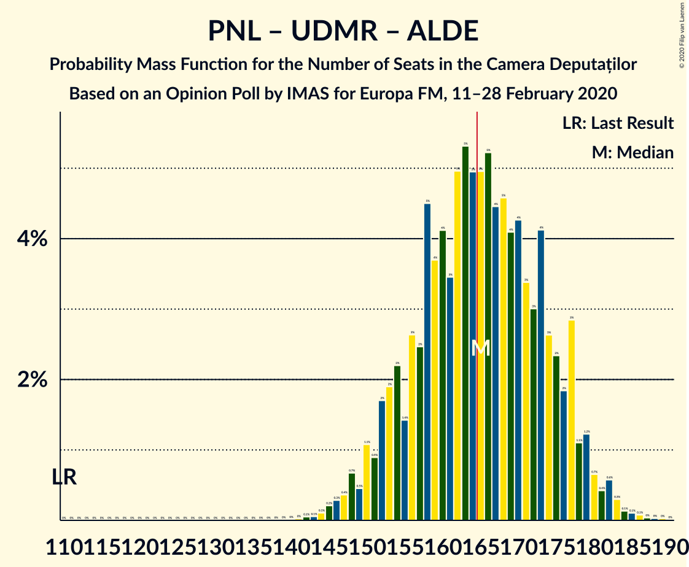

| Number of Seats | Probability | Accumulated | Special Marks |
|:---------------:|:-----------:|:-----------:|:-------------:|
| 110 | 0% | 100% | Last Result |
| 111 | 0% | 100% |  |
| 112 | 0% | 100% |  |
| 113 | 0% | 100% |  |
| 114 | 0% | 100% |  |
| 115 | 0% | 100% |  |
| 116 | 0% | 100% |  |
| 117 | 0% | 100% |  |
| 118 | 0% | 100% |  |
| 119 | 0% | 100% |  |
| 120 | 0% | 100% |  |
| 121 | 0% | 100% |  |
| 122 | 0% | 100% |  |
| 123 | 0% | 100% |  |
| 124 | 0% | 100% |  |
| 125 | 0% | 100% |  |
| 126 | 0% | 100% |  |
| 127 | 0% | 100% |  |
| 128 | 0% | 100% |  |
| 129 | 0% | 100% |  |
| 130 | 0% | 100% |  |
| 131 | 0% | 100% |  |
| 132 | 0% | 100% |  |
| 133 | 0% | 100% |  |
| 134 | 0% | 100% |  |
| 135 | 0% | 100% |  |
| 136 | 0% | 100% |  |
| 137 | 0% | 100% |  |
| 138 | 0% | 100% |  |
| 139 | 0% | 100% |  |
| 140 | 0% | 100% |  |
| 141 | 0% | 99.9% |  |
| 142 | 0.1% | 99.9% |  |
| 143 | 0% | 99.8% |  |
| 144 | 0.1% | 99.8% |  |
| 145 | 0.1% | 99.7% |  |
| 146 | 0.3% | 99.5% |  |
| 147 | 0.8% | 99.3% |  |
| 148 | 0.1% | 98% |  |
| 149 | 0.3% | 98% |  |
| 150 | 0.7% | 98% |  |
| 151 | 0.9% | 97% |  |
| 152 | 3% | 97% |  |
| 153 | 3% | 93% |  |
| 154 | 3% | 90% |  |
| 155 | 3% | 87% |  |
| 156 | 2% | 84% |  |
| 157 | 2% | 81% |  |
| 158 | 3% | 80% |  |
| 159 | 3% | 76% |  |
| 160 | 4% | 73% |  |
| 161 | 1.3% | 70% | Median |
| 162 | 6% | 68% |  |
| 163 | 5% | 62% |  |
| 164 | 5% | 58% |  |
| 165 | 4% | 53% |  |
| 166 | 6% | 49% | Majority |
| 167 | 3% | 43% |  |
| 168 | 4% | 40% |  |
| 169 | 6% | 35% |  |
| 170 | 2% | 30% |  |
| 171 | 4% | 27% |  |
| 172 | 4% | 23% |  |
| 173 | 6% | 19% |  |
| 174 | 2% | 13% |  |
| 175 | 1.3% | 11% |  |
| 176 | 2% | 10% |  |
| 177 | 5% | 8% |  |
| 178 | 0.8% | 4% |  |
| 179 | 1.3% | 3% |  |
| 180 | 0.3% | 1.4% |  |
| 181 | 0.2% | 1.1% |  |
| 182 | 0.4% | 0.9% |  |
| 183 | 0.1% | 0.5% |  |
| 184 | 0.1% | 0.4% |  |
| 185 | 0.1% | 0.3% |  |
| 186 | 0.2% | 0.2% |  |
| 187 | 0% | 0.1% |  |
| 188 | 0% | 0% |  |

### Partidul Național Liberal – Uniunea Democrată Maghiară din România – Partidul Mișcarea Populară

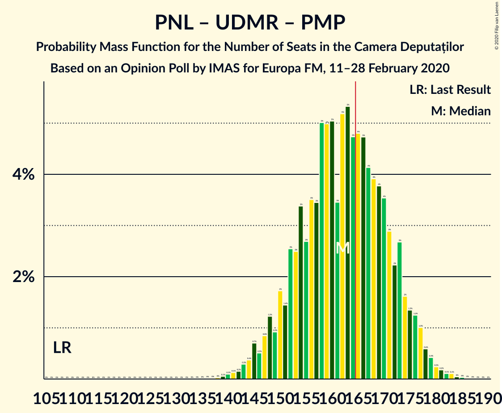

| Number of Seats | Probability | Accumulated | Special Marks |
|:---------------:|:-----------:|:-----------:|:-------------:|
| 108 | 0% | 100% | Last Result |
| 109 | 0% | 100% |  |
| 110 | 0% | 100% |  |
| 111 | 0% | 100% |  |
| 112 | 0% | 100% |  |
| 113 | 0% | 100% |  |
| 114 | 0% | 100% |  |
| 115 | 0% | 100% |  |
| 116 | 0% | 100% |  |
| 117 | 0% | 100% |  |
| 118 | 0% | 100% |  |
| 119 | 0% | 100% |  |
| 120 | 0% | 100% |  |
| 121 | 0% | 100% |  |
| 122 | 0% | 100% |  |
| 123 | 0% | 100% |  |
| 124 | 0% | 100% |  |
| 125 | 0% | 100% |  |
| 126 | 0% | 100% |  |
| 127 | 0% | 100% |  |
| 128 | 0% | 100% |  |
| 129 | 0% | 100% |  |
| 130 | 0% | 100% |  |
| 131 | 0% | 100% |  |
| 132 | 0% | 100% |  |
| 133 | 0% | 100% |  |
| 134 | 0% | 100% |  |
| 135 | 0% | 100% |  |
| 136 | 0% | 100% |  |
| 137 | 0% | 100% |  |
| 138 | 0.1% | 100% |  |
| 139 | 0% | 99.9% |  |
| 140 | 0.3% | 99.9% |  |
| 141 | 0.1% | 99.6% |  |
| 142 | 0.2% | 99.5% |  |
| 143 | 0.2% | 99.3% |  |
| 144 | 0.1% | 99.1% |  |
| 145 | 2% | 99.1% |  |
| 146 | 0.6% | 97% |  |
| 147 | 1.2% | 97% |  |
| 148 | 0.2% | 96% |  |
| 149 | 0.5% | 95% |  |
| 150 | 2% | 95% |  |
| 151 | 0.9% | 93% |  |
| 152 | 5% | 92% |  |
| 153 | 4% | 87% |  |
| 154 | 4% | 83% |  |
| 155 | 7% | 79% |  |
| 156 | 4% | 72% |  |
| 157 | 2% | 68% |  |
| 158 | 3% | 66% |  |
| 159 | 7% | 62% |  |
| 160 | 4% | 56% |  |
| 161 | 2% | 52% | Median |
| 162 | 7% | 50% |  |
| 163 | 3% | 44% |  |
| 164 | 5% | 41% |  |
| 165 | 4% | 36% |  |
| 166 | 6% | 32% | Majority |
| 167 | 2% | 26% |  |
| 168 | 3% | 24% |  |
| 169 | 5% | 21% |  |
| 170 | 2% | 15% |  |
| 171 | 4% | 13% |  |
| 172 | 3% | 10% |  |
| 173 | 2% | 7% |  |
| 174 | 0.4% | 5% |  |
| 175 | 0.5% | 5% |  |
| 176 | 2% | 4% |  |
| 177 | 1.2% | 3% |  |
| 178 | 0.7% | 1.4% |  |
| 179 | 0.2% | 0.7% |  |
| 180 | 0% | 0.5% |  |
| 181 | 0.1% | 0.5% |  |
| 182 | 0.1% | 0.4% |  |
| 183 | 0.2% | 0.3% |  |
| 184 | 0.1% | 0.1% |  |
| 185 | 0% | 0% |  |

### Partidul Național Liberal – Uniunea Democrată Maghiară din România

| Number of Seats | Probability | Accumulated | Special Marks |
|:---------------:|:-----------:|:-----------:|:-------------:|
| 90 | 0% | 100% | Last Result |
| 91 | 0% | 100% |  |
| 92 | 0% | 100% |  |
| 93 | 0% | 100% |  |
| 94 | 0% | 100% |  |
| 95 | 0% | 100% |  |
| 96 | 0% | 100% |  |
| 97 | 0% | 100% |  |
| 98 | 0% | 100% |  |
| 99 | 0% | 100% |  |
| 100 | 0% | 100% |  |
| 101 | 0% | 100% |  |
| 102 | 0% | 100% |  |
| 103 | 0% | 100% |  |
| 104 | 0% | 100% |  |
| 105 | 0% | 100% |  |
| 106 | 0% | 100% |  |
| 107 | 0% | 100% |  |
| 108 | 0% | 100% |  |
| 109 | 0% | 100% |  |
| 110 | 0% | 100% |  |
| 111 | 0% | 100% |  |
| 112 | 0% | 100% |  |
| 113 | 0% | 100% |  |
| 114 | 0% | 100% |  |
| 115 | 0% | 100% |  |
| 116 | 0% | 100% |  |
| 117 | 0% | 100% |  |
| 118 | 0% | 100% |  |
| 119 | 0% | 100% |  |
| 120 | 0% | 100% |  |
| 121 | 0% | 100% |  |
| 122 | 0% | 100% |  |
| 123 | 0% | 100% |  |
| 124 | 0% | 100% |  |
| 125 | 0% | 100% |  |
| 126 | 0% | 100% |  |
| 127 | 0% | 100% |  |
| 128 | 0% | 100% |  |
| 129 | 0% | 100% |  |
| 130 | 0% | 100% |  |
| 131 | 0% | 100% |  |
| 132 | 0% | 100% |  |
| 133 | 0% | 100% |  |
| 134 | 0% | 100% |  |
| 135 | 0% | 100% |  |
| 136 | 0% | 100% |  |
| 137 | 0% | 100% |  |
| 138 | 0.1% | 100% |  |
| 139 | 0% | 99.9% |  |
| 140 | 0.3% | 99.8% |  |
| 141 | 0.1% | 99.5% |  |
| 142 | 0.2% | 99.5% |  |
| 143 | 0.2% | 99.3% |  |
| 144 | 0.1% | 99.1% |  |
| 145 | 2% | 98.9% |  |
| 146 | 0.6% | 97% |  |
| 147 | 1.2% | 97% |  |
| 148 | 0.2% | 95% |  |
| 149 | 0.5% | 95% |  |
| 150 | 2% | 95% |  |
| 151 | 1.0% | 93% |  |
| 152 | 5% | 92% |  |
| 153 | 4% | 87% |  |
| 154 | 4% | 82% |  |
| 155 | 7% | 78% |  |
| 156 | 4% | 71% |  |
| 157 | 2% | 67% |  |
| 158 | 3% | 65% |  |
| 159 | 7% | 61% |  |
| 160 | 4% | 55% |  |
| 161 | 2% | 51% | Median |
| 162 | 7% | 49% |  |
| 163 | 3% | 43% |  |
| 164 | 5% | 40% |  |
| 165 | 4% | 35% |  |
| 166 | 6% | 31% | Majority |
| 167 | 2% | 24% |  |
| 168 | 3% | 23% |  |
| 169 | 5% | 20% |  |
| 170 | 2% | 15% |  |
| 171 | 3% | 12% |  |
| 172 | 3% | 9% |  |
| 173 | 1.5% | 6% |  |
| 174 | 0.3% | 5% |  |
| 175 | 0.5% | 4% |  |
| 176 | 2% | 4% |  |
| 177 | 1.1% | 2% |  |
| 178 | 0.6% | 1.1% |  |
| 179 | 0.2% | 0.5% |  |
| 180 | 0% | 0.3% |  |
| 181 | 0.1% | 0.3% |  |
| 182 | 0.1% | 0.2% |  |
| 183 | 0.1% | 0.1% |  |
| 184 | 0% | 0% |  |

### Partidul Național Liberal – Partidul Mișcarea Populară

| Number of Seats | Probability | Accumulated | Special Marks |
|:---------------:|:-----------:|:-----------:|:-------------:|
| 87 | 0% | 100% | Last Result |
| 88 | 0% | 100% |  |
| 89 | 0% | 100% |  |
| 90 | 0% | 100% |  |
| 91 | 0% | 100% |  |
| 92 | 0% | 100% |  |
| 93 | 0% | 100% |  |
| 94 | 0% | 100% |  |
| 95 | 0% | 100% |  |
| 96 | 0% | 100% |  |
| 97 | 0% | 100% |  |
| 98 | 0% | 100% |  |
| 99 | 0% | 100% |  |
| 100 | 0% | 100% |  |
| 101 | 0% | 100% |  |
| 102 | 0% | 100% |  |
| 103 | 0% | 100% |  |
| 104 | 0% | 100% |  |
| 105 | 0% | 100% |  |
| 106 | 0% | 100% |  |
| 107 | 0% | 100% |  |
| 108 | 0% | 100% |  |
| 109 | 0% | 100% |  |
| 110 | 0% | 100% |  |
| 111 | 0% | 100% |  |
| 112 | 0% | 100% |  |
| 113 | 0% | 100% |  |
| 114 | 0% | 100% |  |
| 115 | 0% | 100% |  |
| 116 | 0% | 100% |  |
| 117 | 0% | 100% |  |
| 118 | 0% | 100% |  |
| 119 | 0% | 100% |  |
| 120 | 0% | 100% |  |
| 121 | 0% | 100% |  |
| 122 | 0% | 100% |  |
| 123 | 0% | 100% |  |
| 124 | 0% | 99.9% |  |
| 125 | 0% | 99.9% |  |
| 126 | 0.1% | 99.9% |  |
| 127 | 0.3% | 99.8% |  |
| 128 | 0.1% | 99.5% |  |
| 129 | 0.3% | 99.4% |  |
| 130 | 0.3% | 99.1% |  |
| 131 | 2% | 98.8% |  |
| 132 | 0.4% | 97% |  |
| 133 | 0.9% | 96% |  |
| 134 | 1.3% | 96% |  |
| 135 | 2% | 94% |  |
| 136 | 3% | 92% |  |
| 137 | 4% | 89% |  |
| 138 | 1.3% | 85% |  |
| 139 | 6% | 84% |  |
| 140 | 6% | 78% |  |
| 141 | 3% | 72% |  |
| 142 | 4% | 69% |  |
| 143 | 7% | 65% |  |
| 144 | 3% | 58% |  |
| 145 | 5% | 55% | Median |
| 146 | 7% | 50% |  |
| 147 | 2% | 43% |  |
| 148 | 5% | 41% |  |
| 149 | 8% | 36% |  |
| 150 | 5% | 29% |  |
| 151 | 2% | 23% |  |
| 152 | 4% | 21% |  |
| 153 | 3% | 17% |  |
| 154 | 0.8% | 14% |  |
| 155 | 3% | 13% |  |
| 156 | 3% | 10% |  |
| 157 | 2% | 6% |  |
| 158 | 0.7% | 5% |  |
| 159 | 2% | 4% |  |
| 160 | 1.1% | 3% |  |
| 161 | 0.3% | 1.4% |  |
| 162 | 0.2% | 1.1% |  |
| 163 | 0.2% | 1.0% |  |
| 164 | 0.4% | 0.8% |  |
| 165 | 0.2% | 0.4% |  |
| 166 | 0.1% | 0.2% | Majority |
| 167 | 0% | 0.1% |  |
| 168 | 0% | 0.1% |  |
| 169 | 0% | 0.1% |  |
| 170 | 0% | 0% |  |

### Partidul Național Liberal

| Number of Seats | Probability | Accumulated | Special Marks |
|:---------------:|:-----------:|:-----------:|:-------------:|
| 69 | 0% | 100% | Last Result |
| 70 | 0% | 100% |  |
| 71 | 0% | 100% |  |
| 72 | 0% | 100% |  |
| 73 | 0% | 100% |  |
| 74 | 0% | 100% |  |
| 75 | 0% | 100% |  |
| 76 | 0% | 100% |  |
| 77 | 0% | 100% |  |
| 78 | 0% | 100% |  |
| 79 | 0% | 100% |  |
| 80 | 0% | 100% |  |
| 81 | 0% | 100% |  |
| 82 | 0% | 100% |  |
| 83 | 0% | 100% |  |
| 84 | 0% | 100% |  |
| 85 | 0% | 100% |  |
| 86 | 0% | 100% |  |
| 87 | 0% | 100% |  |
| 88 | 0% | 100% |  |
| 89 | 0% | 100% |  |
| 90 | 0% | 100% |  |
| 91 | 0% | 100% |  |
| 92 | 0% | 100% |  |
| 93 | 0% | 100% |  |
| 94 | 0% | 100% |  |
| 95 | 0% | 100% |  |
| 96 | 0% | 100% |  |
| 97 | 0% | 100% |  |
| 98 | 0% | 100% |  |
| 99 | 0% | 100% |  |
| 100 | 0% | 100% |  |
| 101 | 0% | 100% |  |
| 102 | 0% | 100% |  |
| 103 | 0% | 100% |  |
| 104 | 0% | 100% |  |
| 105 | 0% | 100% |  |
| 106 | 0% | 100% |  |
| 107 | 0% | 100% |  |
| 108 | 0% | 100% |  |
| 109 | 0% | 100% |  |
| 110 | 0% | 100% |  |
| 111 | 0% | 100% |  |
| 112 | 0% | 100% |  |
| 113 | 0% | 100% |  |
| 114 | 0% | 100% |  |
| 115 | 0% | 100% |  |
| 116 | 0% | 100% |  |
| 117 | 0% | 100% |  |
| 118 | 0% | 100% |  |
| 119 | 0% | 100% |  |
| 120 | 0% | 100% |  |
| 121 | 0% | 100% |  |
| 122 | 0% | 100% |  |
| 123 | 0% | 99.9% |  |
| 124 | 0% | 99.9% |  |
| 125 | 0% | 99.9% |  |
| 126 | 0.1% | 99.9% |  |
| 127 | 0.3% | 99.7% |  |
| 128 | 0.1% | 99.4% |  |
| 129 | 0.3% | 99.3% |  |
| 130 | 0.4% | 99.0% |  |
| 131 | 2% | 98.6% |  |
| 132 | 0.5% | 97% |  |
| 133 | 1.0% | 96% |  |
| 134 | 1.4% | 95% |  |
| 135 | 2% | 94% |  |
| 136 | 3% | 92% |  |
| 137 | 4% | 89% |  |
| 138 | 1.3% | 84% |  |
| 139 | 6% | 83% |  |
| 140 | 6% | 77% |  |
| 141 | 3% | 71% |  |
| 142 | 4% | 68% |  |
| 143 | 7% | 64% |  |
| 144 | 3% | 57% |  |
| 145 | 5% | 54% | Median |
| 146 | 7% | 49% |  |
| 147 | 2% | 42% |  |
| 148 | 5% | 40% |  |
| 149 | 8% | 35% |  |
| 150 | 5% | 27% |  |
| 151 | 2% | 22% |  |
| 152 | 4% | 20% |  |
| 153 | 3% | 16% |  |
| 154 | 0.7% | 13% |  |
| 155 | 3% | 12% |  |
| 156 | 3% | 9% |  |
| 157 | 1.5% | 6% |  |
| 158 | 0.7% | 4% |  |
| 159 | 1.4% | 3% |  |
| 160 | 1.0% | 2% |  |
| 161 | 0.2% | 1.0% |  |
| 162 | 0.2% | 0.8% |  |
| 163 | 0.2% | 0.6% |  |
| 164 | 0.2% | 0.5% |  |
| 165 | 0.1% | 0.3% |  |
| 166 | 0.1% | 0.1% | Majority |
| 167 | 0% | 0.1% |  |
| 168 | 0% | 0.1% |  |
| 169 | 0% | 0% |  |

### Partidul Social Democrat – PRO România – Partidul Alianța Liberalilor și Democraților

| Number of Seats | Probability | Accumulated | Special Marks |
|:---------------:|:-----------:|:-----------:|:-------------:|
| 80 | 0% | 100% |  |
| 81 | 0.1% | 99.9% |  |
| 82 | 0.1% | 99.8% |  |
| 83 | 0.3% | 99.7% |  |
| 84 | 0.3% | 99.4% |  |
| 85 | 0.4% | 99.1% |  |
| 86 | 1.0% | 98.7% |  |
| 87 | 2% | 98% |  |
| 88 | 2% | 96% |  |
| 89 | 1.4% | 94% |  |
| 90 | 3% | 93% |  |
| 91 | 5% | 90% |  |
| 92 | 3% | 85% | Median |
| 93 | 4% | 82% |  |
| 94 | 3% | 79% |  |
| 95 | 4% | 75% |  |
| 96 | 5% | 71% |  |
| 97 | 2% | 66% |  |
| 98 | 5% | 64% |  |
| 99 | 2% | 59% |  |
| 100 | 2% | 57% |  |
| 101 | 3% | 54% |  |
| 102 | 3% | 51% |  |
| 103 | 2% | 48% |  |
| 104 | 3% | 45% |  |
| 105 | 3% | 42% |  |
| 106 | 2% | 39% |  |
| 107 | 3% | 37% |  |
| 108 | 3% | 34% |  |
| 109 | 4% | 30% |  |
| 110 | 8% | 26% |  |
| 111 | 3% | 19% |  |
| 112 | 2% | 15% |  |
| 113 | 3% | 14% |  |
| 114 | 0.4% | 11% |  |
| 115 | 2% | 11% |  |
| 116 | 1.2% | 8% |  |
| 117 | 2% | 7% |  |
| 118 | 0.5% | 5% |  |
| 119 | 0.5% | 4% |  |
| 120 | 0.9% | 4% |  |
| 121 | 0.2% | 3% |  |
| 122 | 0.5% | 3% |  |
| 123 | 0.1% | 2% |  |
| 124 | 1.5% | 2% |  |
| 125 | 0.1% | 0.6% |  |
| 126 | 0.1% | 0.5% |  |
| 127 | 0.2% | 0.4% |  |
| 128 | 0% | 0.2% |  |
| 129 | 0% | 0.1% |  |
| 130 | 0.1% | 0.1% |  |
| 131 | 0% | 0% |  |
| 132 | 0% | 0% |  |
| 133 | 0% | 0% |  |
| 134 | 0% | 0% |  |
| 135 | 0% | 0% |  |
| 136 | 0% | 0% |  |
| 137 | 0% | 0% |  |
| 138 | 0% | 0% |  |
| 139 | 0% | 0% |  |
| 140 | 0% | 0% |  |
| 141 | 0% | 0% |  |
| 142 | 0% | 0% |  |
| 143 | 0% | 0% |  |
| 144 | 0% | 0% |  |
| 145 | 0% | 0% |  |
| 146 | 0% | 0% |  |
| 147 | 0% | 0% |  |
| 148 | 0% | 0% |  |
| 149 | 0% | 0% |  |
| 150 | 0% | 0% |  |
| 151 | 0% | 0% |  |
| 152 | 0% | 0% |  |
| 153 | 0% | 0% |  |
| 154 | 0% | 0% |  |
| 155 | 0% | 0% |  |
| 156 | 0% | 0% |  |
| 157 | 0% | 0% |  |
| 158 | 0% | 0% |  |
| 159 | 0% | 0% |  |
| 160 | 0% | 0% |  |
| 161 | 0% | 0% |  |
| 162 | 0% | 0% |  |
| 163 | 0% | 0% |  |
| 164 | 0% | 0% |  |
| 165 | 0% | 0% |  |
| 166 | 0% | 0% | Majority |
| 167 | 0% | 0% |  |
| 168 | 0% | 0% |  |
| 169 | 0% | 0% |  |
| 170 | 0% | 0% |  |
| 171 | 0% | 0% |  |
| 172 | 0% | 0% |  |
| 173 | 0% | 0% |  |
| 174 | 0% | 0% | Last Result |

### Partidul Social Democrat – PRO România

| Number of Seats | Probability | Accumulated | Special Marks |
|:---------------:|:-----------:|:-----------:|:-------------:|
| 78 | 0% | 100% |  |
| 79 | 0.1% | 99.9% |  |
| 80 | 0.1% | 99.9% |  |
| 81 | 0.2% | 99.8% |  |
| 82 | 0.3% | 99.6% |  |
| 83 | 0.4% | 99.3% |  |
| 84 | 0.4% | 98.9% |  |
| 85 | 1.4% | 98.6% |  |
| 86 | 1.1% | 97% |  |
| 87 | 2% | 96% |  |
| 88 | 2% | 94% |  |
| 89 | 3% | 92% |  |
| 90 | 4% | 89% |  |
| 91 | 8% | 85% |  |
| 92 | 7% | 78% | Median |
| 93 | 5% | 70% |  |
| 94 | 4% | 65% |  |
| 95 | 5% | 62% |  |
| 96 | 6% | 57% |  |
| 97 | 2% | 51% |  |
| 98 | 5% | 49% |  |
| 99 | 2% | 43% |  |
| 100 | 3% | 41% |  |
| 101 | 5% | 38% |  |
| 102 | 3% | 34% |  |
| 103 | 3% | 31% |  |
| 104 | 3% | 28% |  |
| 105 | 3% | 25% |  |
| 106 | 3% | 22% |  |
| 107 | 3% | 19% |  |
| 108 | 2% | 16% |  |
| 109 | 1.5% | 14% |  |
| 110 | 3% | 12% |  |
| 111 | 2% | 9% |  |
| 112 | 1.4% | 7% |  |
| 113 | 2% | 6% |  |
| 114 | 0.3% | 4% |  |
| 115 | 1.5% | 3% |  |
| 116 | 1.0% | 2% |  |
| 117 | 0.1% | 0.9% |  |
| 118 | 0.4% | 0.8% |  |
| 119 | 0.2% | 0.4% |  |
| 120 | 0.1% | 0.3% |  |
| 121 | 0.1% | 0.2% |  |
| 122 | 0% | 0.1% |  |
| 123 | 0% | 0.1% |  |
| 124 | 0% | 0% |  |
| 125 | 0% | 0% |  |
| 126 | 0% | 0% |  |
| 127 | 0% | 0% |  |
| 128 | 0% | 0% |  |
| 129 | 0% | 0% |  |
| 130 | 0% | 0% |  |
| 131 | 0% | 0% |  |
| 132 | 0% | 0% |  |
| 133 | 0% | 0% |  |
| 134 | 0% | 0% |  |
| 135 | 0% | 0% |  |
| 136 | 0% | 0% |  |
| 137 | 0% | 0% |  |
| 138 | 0% | 0% |  |
| 139 | 0% | 0% |  |
| 140 | 0% | 0% |  |
| 141 | 0% | 0% |  |
| 142 | 0% | 0% |  |
| 143 | 0% | 0% |  |
| 144 | 0% | 0% |  |
| 145 | 0% | 0% |  |
| 146 | 0% | 0% |  |
| 147 | 0% | 0% |  |
| 148 | 0% | 0% |  |
| 149 | 0% | 0% |  |
| 150 | 0% | 0% |  |
| 151 | 0% | 0% |  |
| 152 | 0% | 0% |  |
| 153 | 0% | 0% |  |
| 154 | 0% | 0% | Last Result |

### Partidul Social Democrat – Partidul Alianța Liberalilor și Democraților

| Number of Seats | Probability | Accumulated | Special Marks |
|:---------------:|:-----------:|:-----------:|:-------------:|
| 76 | 0% | 100% |  |
| 77 | 0% | 99.9% |  |
| 78 | 0.1% | 99.9% |  |
| 79 | 0.2% | 99.9% |  |
| 80 | 0.3% | 99.6% |  |
| 81 | 0.4% | 99.4% |  |
| 82 | 0.5% | 98.9% |  |
| 83 | 0.9% | 98% |  |
| 84 | 2% | 97% |  |
| 85 | 1.1% | 96% |  |
| 86 | 2% | 95% |  |
| 87 | 3% | 93% |  |
| 88 | 5% | 90% |  |
| 89 | 2% | 86% |  |
| 90 | 4% | 83% |  |
| 91 | 6% | 79% |  |
| 92 | 6% | 74% | Median |
| 93 | 4% | 68% |  |
| 94 | 5% | 63% |  |
| 95 | 7% | 59% |  |
| 96 | 6% | 52% |  |
| 97 | 4% | 46% |  |
| 98 | 5% | 42% |  |
| 99 | 4% | 37% |  |
| 100 | 3% | 34% |  |
| 101 | 2% | 31% |  |
| 102 | 4% | 29% |  |
| 103 | 3% | 25% |  |
| 104 | 2% | 22% |  |
| 105 | 2% | 20% |  |
| 106 | 2% | 18% |  |
| 107 | 2% | 16% |  |
| 108 | 3% | 15% |  |
| 109 | 3% | 12% |  |
| 110 | 5% | 9% |  |
| 111 | 2% | 4% |  |
| 112 | 0.3% | 2% |  |
| 113 | 0.2% | 2% |  |
| 114 | 0.1% | 2% |  |
| 115 | 1.0% | 2% |  |
| 116 | 0.1% | 0.7% |  |
| 117 | 0.3% | 0.6% |  |
| 118 | 0% | 0.3% |  |
| 119 | 0.2% | 0.3% |  |
| 120 | 0% | 0.1% |  |
| 121 | 0% | 0.1% |  |
| 122 | 0% | 0.1% |  |
| 123 | 0% | 0% |  |
| 124 | 0% | 0% |  |
| 125 | 0% | 0% |  |
| 126 | 0% | 0% |  |
| 127 | 0% | 0% |  |
| 128 | 0% | 0% |  |
| 129 | 0% | 0% |  |
| 130 | 0% | 0% |  |
| 131 | 0% | 0% |  |
| 132 | 0% | 0% |  |
| 133 | 0% | 0% |  |
| 134 | 0% | 0% |  |
| 135 | 0% | 0% |  |
| 136 | 0% | 0% |  |
| 137 | 0% | 0% |  |
| 138 | 0% | 0% |  |
| 139 | 0% | 0% |  |
| 140 | 0% | 0% |  |
| 141 | 0% | 0% |  |
| 142 | 0% | 0% |  |
| 143 | 0% | 0% |  |
| 144 | 0% | 0% |  |
| 145 | 0% | 0% |  |
| 146 | 0% | 0% |  |
| 147 | 0% | 0% |  |
| 148 | 0% | 0% |  |
| 149 | 0% | 0% |  |
| 150 | 0% | 0% |  |
| 151 | 0% | 0% |  |
| 152 | 0% | 0% |  |
| 153 | 0% | 0% |  |
| 154 | 0% | 0% |  |
| 155 | 0% | 0% |  |
| 156 | 0% | 0% |  |
| 157 | 0% | 0% |  |
| 158 | 0% | 0% |  |
| 159 | 0% | 0% |  |
| 160 | 0% | 0% |  |
| 161 | 0% | 0% |  |
| 162 | 0% | 0% |  |
| 163 | 0% | 0% |  |
| 164 | 0% | 0% |  |
| 165 | 0% | 0% |  |
| 166 | 0% | 0% | Majority |
| 167 | 0% | 0% |  |
| 168 | 0% | 0% |  |
| 169 | 0% | 0% |  |
| 170 | 0% | 0% |  |
| 171 | 0% | 0% |  |
| 172 | 0% | 0% |  |
| 173 | 0% | 0% |  |
| 174 | 0% | 0% | Last Result |

### Alianța 2020 USR-PLUS – Partidul Mișcarea Populară

| Number of Seats | Probability | Accumulated | Special Marks |
|:---------------:|:-----------:|:-----------:|:-------------:|
| 36 | 0.1% | 100% |  |
| 37 | 0.2% | 99.9% |  |
| 38 | 0.2% | 99.7% |  |
| 39 | 1.1% | 99.5% |  |
| 40 | 0.8% | 98% |  |
| 41 | 1.3% | 98% |  |
| 42 | 3% | 96% |  |
| 43 | 5% | 93% |  |
| 44 | 7% | 88% |  |
| 45 | 6% | 81% |  |
| 46 | 5% | 75% |  |
| 47 | 12% | 70% |  |
| 48 | 10% | 59% | Last Result, Median |
| 49 | 7% | 48% |  |
| 50 | 7% | 41% |  |
| 51 | 7% | 34% |  |
| 52 | 4% | 27% |  |
| 53 | 8% | 23% |  |
| 54 | 3% | 15% |  |
| 55 | 5% | 12% |  |
| 56 | 3% | 7% |  |
| 57 | 1.0% | 4% |  |
| 58 | 0.7% | 3% |  |
| 59 | 0.2% | 2% |  |
| 60 | 0.2% | 2% |  |
| 61 | 0.2% | 1.4% |  |
| 62 | 0.3% | 1.2% |  |
| 63 | 0.3% | 0.9% |  |
| 64 | 0.1% | 0.6% |  |
| 65 | 0% | 0.6% |  |
| 66 | 0.1% | 0.5% |  |
| 67 | 0.1% | 0.4% |  |
| 68 | 0.2% | 0.3% |  |
| 69 | 0% | 0.2% |  |
| 70 | 0% | 0.1% |  |
| 71 | 0% | 0.1% |  |
| 72 | 0% | 0.1% |  |
| 73 | 0% | 0.1% |  |
| 74 | 0% | 0% |  |

## Technical Information

### Opinion Poll

+ **Polling firm:** IMAS
+ **Commissioner(s):** Europa FM
+ **Fieldwork period:** 11–28 February 2020

### Calculations

+ **Sample size:** 1010
+ **Simulations done:** 131,072
+ **Error estimate:** 1.19%

