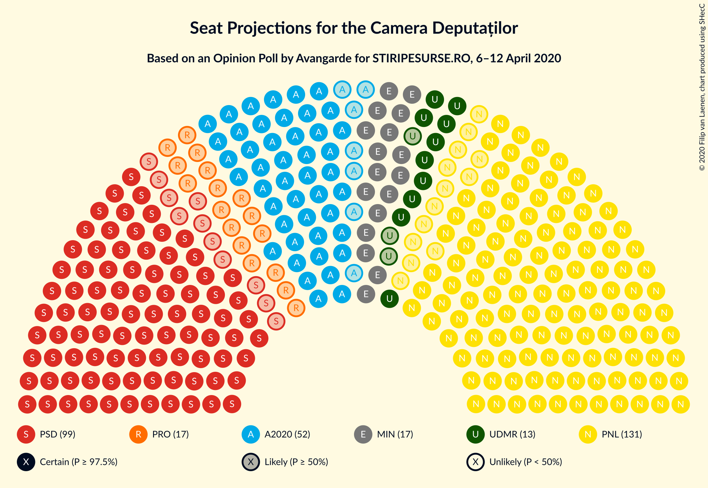
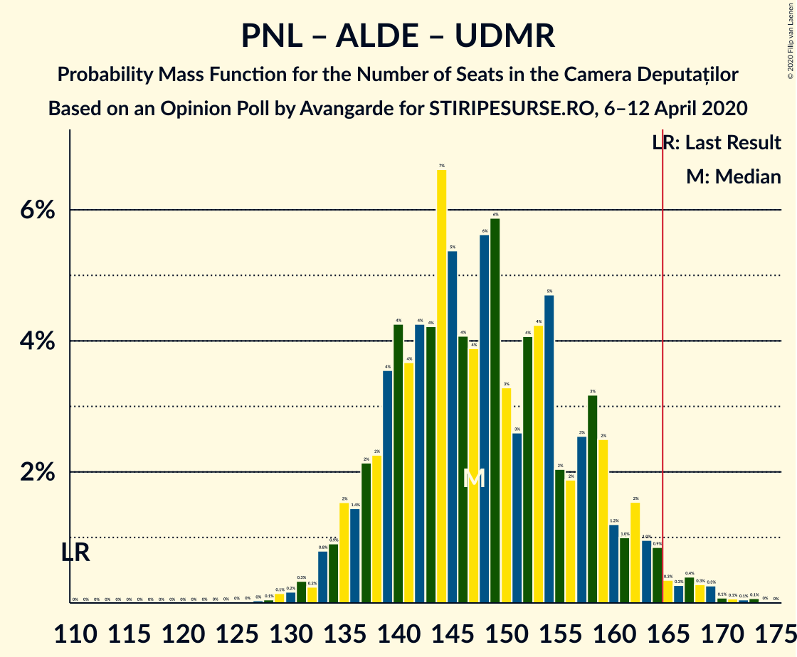
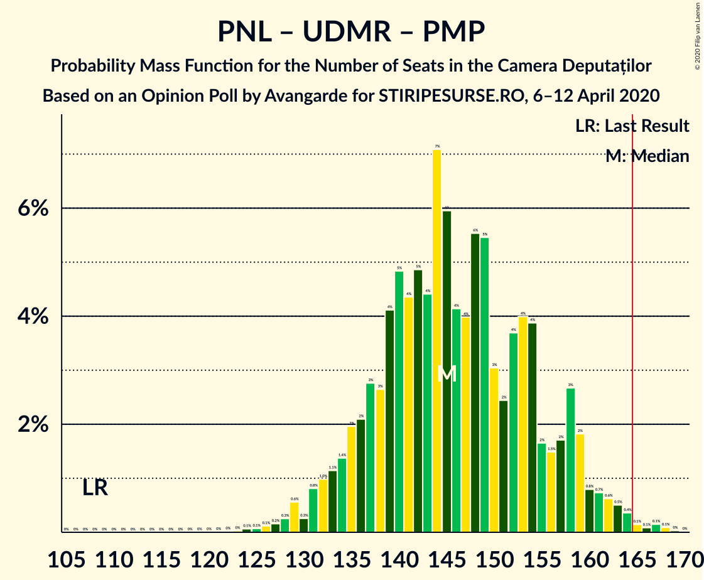

# Opinion Poll by Avangarde for STIRIPESURSE.RO, 6–12 April 2020

<a href="#voting-intentions">Voting Intentions</a> | <a href="#seats">Seats</a> | <a href="#coalitions">Coalitions</a> | <a href="#technical-information">Technical Information</a>

## Voting Intentions

### Confidence Intervals

| Party | Last Result | Poll Result | 80% Confidence Interval | 90% Confidence Interval | 95% Confidence Interval | 99% Confidence Interval |
|:-----:|:-----------:|:-----------:|:-----------------------:|:-----------------------:|:-----------------------:|:-----------------------:|
| Partidul Național Liberal | 20.0% | 38.1% | 36.1–40.2% |35.5–40.8% |35.0–41.3% |34.1–42.4% |
| Partidul Social Democrat | 45.5% | 28.9% | 27.0–30.8% |26.5–31.4% |26.0–31.9% |25.1–32.8% |
| Alianța 2020 USR-PLUS | 8.9% | 15.4% | 14.0–17.0% |13.6–17.5% |13.2–17.9% |12.5–18.7% |
| PRO România | 0.0% | 5.1% | 4.3–6.2% |4.1–6.5% |3.9–6.8% |3.5–7.3% |
| Partidul Alianța Liberalilor și Democraților | 5.6% | 4.2% | 3.4–5.1% |3.2–5.4% |3.0–5.7% |2.7–6.2% |
| Uniunea Democrată Maghiară din România | 6.2% | 4.2% | 3.4–5.1% |3.2–5.4% |3.0–5.7% |2.7–6.2% |
| Partidul Mișcarea Populară | 5.4% | 3.1% | 2.4–3.9% |2.3–4.2% |2.1–4.4% |1.9–4.8% |

*Note:* The poll result column reflects the actual value used in the calculations. Published results may vary slightly, and in addition be rounded to fewer digits.

## Seats

### Confidence Intervals

| Party | Last Result | Median | 80% Confidence Interval | 90% Confidence Interval | 95% Confidence Interval | 99% Confidence Interval |
|:-----:|:-----------:|:------:|:-----------------------:|:-----------------------:|:-----------------------:|:-----------------------:|
| <a href="#partidul-național-liberal">Partidul Național Liberal</a> | 69 | 131 | 123–141 |120–144 |118–146 |115–150 |
| <a href="#partidul-social-democrat">Partidul Social Democrat</a> | 154 | 99 | 92–107 |90–110 |88–112 |84–115 |
| <a href="#alianța-2020-usr-plus">Alianța 2020 USR-PLUS</a> | 30 | 53 | 48–59 |46–61 |45–62 |42–65 |
| <a href="#pro-românia">PRO România</a> | 0 | 17 | 0–21 |0–22 |0–22 |0–24 |
| <a href="#partidul-alianța-liberalilor-și-democraților">Partidul Alianța Liberalilor și Democraților</a> | 20 | 0 | 0–16 |0–18 |0–18 |0–20 |
| <a href="#uniunea-democrată-maghiară-din-românia">Uniunea Democrată Maghiară din România</a> | 21 | 14 | 11–17 |11–18 |10–19 |9–21 |
| <a href="#partidul-mișcarea-populară">Partidul Mișcarea Populară</a> | 18 | 0 | 0 |0 |0 |0 |

### Partidul Național Liberal

*For a full overview of the results for this party, see the [Partidul Național Liberal](party-partidulnaționalliberal.html) page.*

| Number of Seats | Probability | Accumulated | Special Marks |
|:---------------:|:-----------:|:-----------:|:-------------:|
| 69 | 0% | 100% | Last Result |
| 70 | 0% | 100% |  |
| 71 | 0% | 100% |  |
| 72 | 0% | 100% |  |
| 73 | 0% | 100% |  |
| 74 | 0% | 100% |  |
| 75 | 0% | 100% |  |
| 76 | 0% | 100% |  |
| 77 | 0% | 100% |  |
| 78 | 0% | 100% |  |
| 79 | 0% | 100% |  |
| 80 | 0% | 100% |  |
| 81 | 0% | 100% |  |
| 82 | 0% | 100% |  |
| 83 | 0% | 100% |  |
| 84 | 0% | 100% |  |
| 85 | 0% | 100% |  |
| 86 | 0% | 100% |  |
| 87 | 0% | 100% |  |
| 88 | 0% | 100% |  |
| 89 | 0% | 100% |  |
| 90 | 0% | 100% |  |
| 91 | 0% | 100% |  |
| 92 | 0% | 100% |  |
| 93 | 0% | 100% |  |
| 94 | 0% | 100% |  |
| 95 | 0% | 100% |  |
| 96 | 0% | 100% |  |
| 97 | 0% | 100% |  |
| 98 | 0% | 100% |  |
| 99 | 0% | 100% |  |
| 100 | 0% | 100% |  |
| 101 | 0% | 100% |  |
| 102 | 0% | 100% |  |
| 103 | 0% | 100% |  |
| 104 | 0% | 100% |  |
| 105 | 0% | 100% |  |
| 106 | 0% | 100% |  |
| 107 | 0% | 100% |  |
| 108 | 0% | 100% |  |
| 109 | 0% | 100% |  |
| 110 | 0% | 100% |  |
| 111 | 0.1% | 99.9% |  |
| 112 | 0.1% | 99.9% |  |
| 113 | 0.2% | 99.8% |  |
| 114 | 0.1% | 99.6% |  |
| 115 | 0.3% | 99.5% |  |
| 116 | 0.4% | 99.2% |  |
| 117 | 0.7% | 98.8% |  |
| 118 | 0.9% | 98% |  |
| 119 | 1.0% | 97% |  |
| 120 | 2% | 96% |  |
| 121 | 2% | 95% |  |
| 122 | 2% | 92% |  |
| 123 | 3% | 91% |  |
| 124 | 4% | 87% |  |
| 125 | 2% | 84% |  |
| 126 | 4% | 81% |  |
| 127 | 6% | 78% |  |
| 128 | 7% | 72% |  |
| 129 | 4% | 65% |  |
| 130 | 5% | 61% |  |
| 131 | 7% | 56% | Median |
| 132 | 6% | 49% |  |
| 133 | 4% | 43% |  |
| 134 | 5% | 39% |  |
| 135 | 6% | 34% |  |
| 136 | 3% | 28% |  |
| 137 | 2% | 24% |  |
| 138 | 4% | 22% |  |
| 139 | 4% | 18% |  |
| 140 | 3% | 14% |  |
| 141 | 2% | 11% |  |
| 142 | 2% | 10% |  |
| 143 | 3% | 8% |  |
| 144 | 1.4% | 5% |  |
| 145 | 0.8% | 4% |  |
| 146 | 1.1% | 3% |  |
| 147 | 0.3% | 2% |  |
| 148 | 0.8% | 2% |  |
| 149 | 0.1% | 0.9% |  |
| 150 | 0.3% | 0.7% |  |
| 151 | 0.2% | 0.4% |  |
| 152 | 0% | 0.2% |  |
| 153 | 0% | 0.1% |  |
| 154 | 0.1% | 0.1% |  |
| 155 | 0% | 0% |  |

### Partidul Social Democrat

*For a full overview of the results for this party, see the [Partidul Social Democrat](party-partidulsocialdemocrat.html) page.*

| Number of Seats | Probability | Accumulated | Special Marks |
|:---------------:|:-----------:|:-----------:|:-------------:|
| 81 | 0% | 100% |  |
| 82 | 0.1% | 99.9% |  |
| 83 | 0.2% | 99.8% |  |
| 84 | 0.2% | 99.7% |  |
| 85 | 0.4% | 99.4% |  |
| 86 | 0.5% | 99.0% |  |
| 87 | 0.6% | 98.5% |  |
| 88 | 0.9% | 98% |  |
| 89 | 2% | 97% |  |
| 90 | 2% | 95% |  |
| 91 | 3% | 94% |  |
| 92 | 3% | 91% |  |
| 93 | 3% | 88% |  |
| 94 | 4% | 84% |  |
| 95 | 5% | 80% |  |
| 96 | 7% | 76% |  |
| 97 | 6% | 69% |  |
| 98 | 6% | 63% |  |
| 99 | 8% | 57% | Median |
| 100 | 6% | 49% |  |
| 101 | 6% | 43% |  |
| 102 | 6% | 38% |  |
| 103 | 5% | 32% |  |
| 104 | 6% | 27% |  |
| 105 | 4% | 21% |  |
| 106 | 4% | 17% |  |
| 107 | 3% | 13% |  |
| 108 | 2% | 10% |  |
| 109 | 2% | 7% |  |
| 110 | 2% | 6% |  |
| 111 | 1.2% | 4% |  |
| 112 | 1.1% | 3% |  |
| 113 | 0.5% | 2% |  |
| 114 | 0.5% | 1.4% |  |
| 115 | 0.5% | 1.0% |  |
| 116 | 0.2% | 0.5% |  |
| 117 | 0.1% | 0.3% |  |
| 118 | 0.1% | 0.2% |  |
| 119 | 0.1% | 0.2% |  |
| 120 | 0% | 0.1% |  |
| 121 | 0% | 0% |  |
| 122 | 0% | 0% |  |
| 123 | 0% | 0% |  |
| 124 | 0% | 0% |  |
| 125 | 0% | 0% |  |
| 126 | 0% | 0% |  |
| 127 | 0% | 0% |  |
| 128 | 0% | 0% |  |
| 129 | 0% | 0% |  |
| 130 | 0% | 0% |  |
| 131 | 0% | 0% |  |
| 132 | 0% | 0% |  |
| 133 | 0% | 0% |  |
| 134 | 0% | 0% |  |
| 135 | 0% | 0% |  |
| 136 | 0% | 0% |  |
| 137 | 0% | 0% |  |
| 138 | 0% | 0% |  |
| 139 | 0% | 0% |  |
| 140 | 0% | 0% |  |
| 141 | 0% | 0% |  |
| 142 | 0% | 0% |  |
| 143 | 0% | 0% |  |
| 144 | 0% | 0% |  |
| 145 | 0% | 0% |  |
| 146 | 0% | 0% |  |
| 147 | 0% | 0% |  |
| 148 | 0% | 0% |  |
| 149 | 0% | 0% |  |
| 150 | 0% | 0% |  |
| 151 | 0% | 0% |  |
| 152 | 0% | 0% |  |
| 153 | 0% | 0% |  |
| 154 | 0% | 0% | Last Result |

### Alianța 2020 USR-PLUS

*For a full overview of the results for this party, see the [Alianța 2020 USR-PLUS](party-alianța2020usr-plus.html) page.*

| Number of Seats | Probability | Accumulated | Special Marks |
|:---------------:|:-----------:|:-----------:|:-------------:|
| 30 | 0% | 100% | Last Result |
| 31 | 0% | 100% |  |
| 32 | 0% | 100% |  |
| 33 | 0% | 100% |  |
| 34 | 0% | 100% |  |
| 35 | 0% | 100% |  |
| 36 | 0% | 100% |  |
| 37 | 0% | 100% |  |
| 38 | 0% | 100% |  |
| 39 | 0% | 100% |  |
| 40 | 0.1% | 100% |  |
| 41 | 0.2% | 99.9% |  |
| 42 | 0.3% | 99.7% |  |
| 43 | 0.6% | 99.4% |  |
| 44 | 1.2% | 98.8% |  |
| 45 | 2% | 98% |  |
| 46 | 2% | 96% |  |
| 47 | 3% | 94% |  |
| 48 | 5% | 91% |  |
| 49 | 8% | 86% |  |
| 50 | 7% | 78% |  |
| 51 | 7% | 71% |  |
| 52 | 9% | 64% |  |
| 53 | 11% | 55% | Median |
| 54 | 7% | 45% |  |
| 55 | 9% | 38% |  |
| 56 | 6% | 29% |  |
| 57 | 6% | 22% |  |
| 58 | 4% | 17% |  |
| 59 | 4% | 13% |  |
| 60 | 3% | 9% |  |
| 61 | 3% | 6% |  |
| 62 | 1.1% | 3% |  |
| 63 | 0.7% | 2% |  |
| 64 | 0.7% | 1.4% |  |
| 65 | 0.3% | 0.8% |  |
| 66 | 0.2% | 0.5% |  |
| 67 | 0.1% | 0.3% |  |
| 68 | 0.1% | 0.2% |  |
| 69 | 0% | 0.1% |  |
| 70 | 0% | 0% |  |

### PRO România

*For a full overview of the results for this party, see the [PRO România](party-proromânia.html) page.*

| Number of Seats | Probability | Accumulated | Special Marks |
|:---------------:|:-----------:|:-----------:|:-------------:|
| 0 | 41% | 100% | Last Result |
| 1 | 0% | 59% |  |
| 2 | 0% | 59% |  |
| 3 | 0% | 59% |  |
| 4 | 0% | 59% |  |
| 5 | 0% | 59% |  |
| 6 | 0% | 59% |  |
| 7 | 0% | 59% |  |
| 8 | 0% | 59% |  |
| 9 | 0% | 59% |  |
| 10 | 0% | 59% |  |
| 11 | 0% | 59% |  |
| 12 | 0% | 59% |  |
| 13 | 0% | 59% |  |
| 14 | 0% | 59% |  |
| 15 | 0% | 59% |  |
| 16 | 0.9% | 59% |  |
| 17 | 13% | 59% | Median |
| 18 | 16% | 46% |  |
| 19 | 12% | 30% |  |
| 20 | 8% | 18% |  |
| 21 | 5% | 10% |  |
| 22 | 3% | 5% |  |
| 23 | 1.2% | 2% |  |
| 24 | 0.7% | 1.1% |  |
| 25 | 0.3% | 0.4% |  |
| 26 | 0.1% | 0.2% |  |
| 27 | 0% | 0.1% |  |
| 28 | 0% | 0% |  |

### Partidul Alianța Liberalilor și Democraților

*For a full overview of the results for this party, see the [Partidul Alianța Liberalilor și Democraților](party-partidulalianțaliberalilorșidemocraților.html) page.*

| Number of Seats | Probability | Accumulated | Special Marks |
|:---------------:|:-----------:|:-----------:|:-------------:|
| 0 | 88% | 100% | Median |
| 1 | 0% | 12% |  |
| 2 | 0% | 12% |  |
| 3 | 0% | 12% |  |
| 4 | 0% | 12% |  |
| 5 | 0% | 12% |  |
| 6 | 0% | 12% |  |
| 7 | 0% | 12% |  |
| 8 | 0% | 12% |  |
| 9 | 0% | 12% |  |
| 10 | 0% | 12% |  |
| 11 | 0% | 12% |  |
| 12 | 0% | 12% |  |
| 13 | 0% | 12% |  |
| 14 | 0% | 12% |  |
| 15 | 0% | 12% |  |
| 16 | 2% | 12% |  |
| 17 | 4% | 10% |  |
| 18 | 3% | 5% |  |
| 19 | 1.4% | 2% |  |
| 20 | 0.6% | 0.9% | Last Result |
| 21 | 0.2% | 0.4% |  |
| 22 | 0.1% | 0.1% |  |
| 23 | 0% | 0% |  |

### Uniunea Democrată Maghiară din România

*For a full overview of the results for this party, see the [Uniunea Democrată Maghiară din România](party-uniuneademocratămaghiarădinromânia.html) page.*

| Number of Seats | Probability | Accumulated | Special Marks |
|:---------------:|:-----------:|:-----------:|:-------------:|
| 8 | 0.2% | 100% |  |
| 9 | 1.0% | 99.7% |  |
| 10 | 3% | 98.7% |  |
| 11 | 8% | 96% |  |
| 12 | 11% | 88% |  |
| 13 | 18% | 77% |  |
| 14 | 17% | 59% | Median |
| 15 | 14% | 41% |  |
| 16 | 11% | 28% |  |
| 17 | 7% | 16% |  |
| 18 | 5% | 9% |  |
| 19 | 2% | 4% |  |
| 20 | 1.2% | 2% |  |
| 21 | 0.5% | 0.8% | Last Result |
| 22 | 0.2% | 0.3% |  |
| 23 | 0.1% | 0.1% |  |
| 24 | 0% | 0% |  |

### Partidul Mișcarea Populară

*For a full overview of the results for this party, see the [Partidul Mișcarea Populară](party-partidulmișcareapopulară.html) page.*

| Number of Seats | Probability | Accumulated | Special Marks |
|:---------------:|:-----------:|:-----------:|:-------------:|
| 0 | 99.8% | 100% | Median |
| 1 | 0% | 0.2% |  |
| 2 | 0% | 0.2% |  |
| 3 | 0% | 0.2% |  |
| 4 | 0% | 0.2% |  |
| 5 | 0% | 0.2% |  |
| 6 | 0% | 0.2% |  |
| 7 | 0% | 0.2% |  |
| 8 | 0% | 0.2% |  |
| 9 | 0% | 0.2% |  |
| 10 | 0% | 0.2% |  |
| 11 | 0% | 0.2% |  |
| 12 | 0% | 0.2% |  |
| 13 | 0% | 0.2% |  |
| 14 | 0% | 0.2% |  |
| 15 | 0% | 0.2% |  |
| 16 | 0.1% | 0.2% |  |
| 17 | 0.1% | 0.2% |  |
| 18 | 0.1% | 0.1% | Last Result |
| 19 | 0% | 0% |  |

## Coalitions

### Confidence Intervals

| Coalition | Last Result | Median | Majority? | 80% Confidence Interval | 90% Confidence Interval | 95% Confidence Interval | 99% Confidence Interval |
|:---------:|:-----------:|:------:|:---------:|:-----------------------:|:-----------------------:|:-----------------------:|:-----------------------:|
| Partidul Național Liberal – Alianța 2020 USR-PLUS – Partidul Alianța Liberalilor și Democraților – Uniunea Democrată Maghiară din România – Partidul Mișcarea Populară | 158 | 200 | 100% | 191–213 | 189–216 | 187–217 | 183–221 |
| Partidul Național Liberal – Alianța 2020 USR-PLUS – Partidul Alianța Liberalilor și Democraților – Uniunea Democrată Maghiară din România | 140 | 200 | 100% | 191–213 | 189–216 | 187–217 | 183–221 |
| Partidul Național Liberal – Alianța 2020 USR-PLUS – Uniunea Democrată Maghiară din România – Partidul Mișcarea Populară | 138 | 198 | 100% | 189–211 | 185–213 | 182–216 | 177–219 |
| Partidul Național Liberal – Alianța 2020 USR-PLUS – Uniunea Democrată Maghiară din România | 120 | 198 | 100% | 188–211 | 185–213 | 182–216 | 177–219 |
| Partidul Național Liberal – Alianța 2020 USR-PLUS – Partidul Alianța Liberalilor și Democraților – Partidul Mișcarea Populară | 137 | 186 | 99.9% | 177–198 | 174–201 | 172–203 | 169–208 |
| Partidul Național Liberal – Alianța 2020 USR-PLUS – Partidul Alianța Liberalilor și Democraților | 119 | 186 | 99.9% | 177–198 | 174–201 | 172–203 | 169–208 |
| Partidul Național Liberal – Alianța 2020 USR-PLUS – Partidul Mișcarea Populară | 117 | 184 | 99.2% | 174–197 | 172–199 | 169–201 | 164–205 |
| Partidul Național Liberal – Alianța 2020 USR-PLUS | 99 | 184 | 99.2% | 174–197 | 172–199 | 169–201 | 164–205 |
| Partidul Național Liberal – Partidul Alianța Liberalilor și Democraților – Uniunea Democrată Maghiară din România – Partidul Mișcarea Populară | 128 | 148 | 2% | 139–159 | 136–162 | 134–164 | 131–169 |
| Partidul Național Liberal – Partidul Alianța Liberalilor și Democraților – Uniunea Democrată Maghiară din România | 110 | 147 | 2% | 138–158 | 136–162 | 134–164 | 131–169 |
| Partidul Național Liberal – Uniunea Democrată Maghiară din România – Partidul Mișcarea Populară | 108 | 145 | 0.4% | 137–156 | 134–159 | 132–161 | 128–165 |
| Partidul Național Liberal – Uniunea Democrată Maghiară din România | 90 | 145 | 0.4% | 136–156 | 134–159 | 132–161 | 128–165 |
| Partidul Național Liberal – Partidul Mișcarea Populară | 87 | 131 | 0% | 123–141 | 120–144 | 118–146 | 115–150 |
| Partidul Național Liberal | 69 | 131 | 0% | 123–141 | 120–144 | 118–146 | 115–150 |
| Partidul Social Democrat – PRO România – Partidul Alianța Liberalilor și Democraților | 174 | 114 | 0% | 101–123 | 99–127 | 96–130 | 93–135 |
| Partidul Social Democrat – PRO România | 154 | 112 | 0% | 99–121 | 96–123 | 95–125 | 91–129 |
| Partidul Social Democrat – Partidul Alianța Liberalilor și Democraților | 174 | 101 | 0% | 93–111 | 91–114 | 90–117 | 86–122 |
| Alianța 2020 USR-PLUS – Partidul Mișcarea Populară | 48 | 53 | 0% | 48–59 | 46–61 | 45–62 | 42–66 |

### Partidul Național Liberal – Alianța 2020 USR-PLUS – Partidul Alianța Liberalilor și Democraților – Uniunea Democrată Maghiară din România – Partidul Mișcarea Populară

| Number of Seats | Probability | Accumulated | Special Marks |
|:---------------:|:-----------:|:-----------:|:-------------:|
| 158 | 0% | 100% | Last Result |
| 159 | 0% | 100% |  |
| 160 | 0% | 100% |  |
| 161 | 0% | 100% |  |
| 162 | 0% | 100% |  |
| 163 | 0% | 100% |  |
| 164 | 0% | 100% |  |
| 165 | 0% | 100% |  |
| 166 | 0% | 100% | Majority |
| 167 | 0% | 100% |  |
| 168 | 0% | 100% |  |
| 169 | 0% | 100% |  |
| 170 | 0% | 100% |  |
| 171 | 0% | 100% |  |
| 172 | 0% | 100% |  |
| 173 | 0% | 100% |  |
| 174 | 0% | 100% |  |
| 175 | 0% | 100% |  |
| 176 | 0% | 100% |  |
| 177 | 0% | 100% |  |
| 178 | 0% | 100% |  |
| 179 | 0% | 100% |  |
| 180 | 0% | 99.9% |  |
| 181 | 0.1% | 99.9% |  |
| 182 | 0.1% | 99.8% |  |
| 183 | 0.2% | 99.7% |  |
| 184 | 0.5% | 99.5% |  |
| 185 | 0.5% | 99.0% |  |
| 186 | 0.8% | 98.5% |  |
| 187 | 1.0% | 98% |  |
| 188 | 1.1% | 97% |  |
| 189 | 3% | 96% |  |
| 190 | 3% | 93% |  |
| 191 | 2% | 90% |  |
| 192 | 3% | 89% |  |
| 193 | 7% | 85% |  |
| 194 | 3% | 79% |  |
| 195 | 4% | 75% |  |
| 196 | 5% | 71% |  |
| 197 | 4% | 66% |  |
| 198 | 6% | 62% | Median |
| 199 | 3% | 56% |  |
| 200 | 4% | 53% |  |
| 201 | 4% | 49% |  |
| 202 | 3% | 45% |  |
| 203 | 3% | 42% |  |
| 204 | 3% | 39% |  |
| 205 | 3% | 36% |  |
| 206 | 3% | 32% |  |
| 207 | 3% | 29% |  |
| 208 | 5% | 25% |  |
| 209 | 2% | 21% |  |
| 210 | 2% | 18% |  |
| 211 | 2% | 16% |  |
| 212 | 2% | 14% |  |
| 213 | 4% | 11% |  |
| 214 | 2% | 8% |  |
| 215 | 1.1% | 6% |  |
| 216 | 2% | 5% |  |
| 217 | 1.1% | 4% |  |
| 218 | 0.7% | 2% |  |
| 219 | 0.5% | 2% |  |
| 220 | 0.4% | 1.2% |  |
| 221 | 0.4% | 0.8% |  |
| 222 | 0.1% | 0.4% |  |
| 223 | 0.1% | 0.3% |  |
| 224 | 0.1% | 0.2% |  |
| 225 | 0% | 0.1% |  |
| 226 | 0% | 0.1% |  |
| 227 | 0% | 0% |  |

### Partidul Național Liberal – Alianța 2020 USR-PLUS – Partidul Alianța Liberalilor și Democraților – Uniunea Democrată Maghiară din România

| Number of Seats | Probability | Accumulated | Special Marks |
|:---------------:|:-----------:|:-----------:|:-------------:|
| 140 | 0% | 100% | Last Result |
| 141 | 0% | 100% |  |
| 142 | 0% | 100% |  |
| 143 | 0% | 100% |  |
| 144 | 0% | 100% |  |
| 145 | 0% | 100% |  |
| 146 | 0% | 100% |  |
| 147 | 0% | 100% |  |
| 148 | 0% | 100% |  |
| 149 | 0% | 100% |  |
| 150 | 0% | 100% |  |
| 151 | 0% | 100% |  |
| 152 | 0% | 100% |  |
| 153 | 0% | 100% |  |
| 154 | 0% | 100% |  |
| 155 | 0% | 100% |  |
| 156 | 0% | 100% |  |
| 157 | 0% | 100% |  |
| 158 | 0% | 100% |  |
| 159 | 0% | 100% |  |
| 160 | 0% | 100% |  |
| 161 | 0% | 100% |  |
| 162 | 0% | 100% |  |
| 163 | 0% | 100% |  |
| 164 | 0% | 100% |  |
| 165 | 0% | 100% |  |
| 166 | 0% | 100% | Majority |
| 167 | 0% | 100% |  |
| 168 | 0% | 100% |  |
| 169 | 0% | 100% |  |
| 170 | 0% | 100% |  |
| 171 | 0% | 100% |  |
| 172 | 0% | 100% |  |
| 173 | 0% | 100% |  |
| 174 | 0% | 100% |  |
| 175 | 0% | 100% |  |
| 176 | 0% | 100% |  |
| 177 | 0% | 100% |  |
| 178 | 0% | 100% |  |
| 179 | 0% | 100% |  |
| 180 | 0.1% | 99.9% |  |
| 181 | 0.1% | 99.9% |  |
| 182 | 0.1% | 99.7% |  |
| 183 | 0.2% | 99.6% |  |
| 184 | 0.5% | 99.4% |  |
| 185 | 0.5% | 98.9% |  |
| 186 | 0.8% | 98% |  |
| 187 | 1.0% | 98% |  |
| 188 | 1.2% | 97% |  |
| 189 | 3% | 95% |  |
| 190 | 3% | 93% |  |
| 191 | 2% | 90% |  |
| 192 | 3% | 89% |  |
| 193 | 7% | 85% |  |
| 194 | 3% | 79% |  |
| 195 | 4% | 75% |  |
| 196 | 5% | 71% |  |
| 197 | 4% | 66% |  |
| 198 | 6% | 62% | Median |
| 199 | 3% | 56% |  |
| 200 | 4% | 53% |  |
| 201 | 4% | 49% |  |
| 202 | 3% | 45% |  |
| 203 | 3% | 42% |  |
| 204 | 3% | 38% |  |
| 205 | 3% | 36% |  |
| 206 | 3% | 32% |  |
| 207 | 3% | 29% |  |
| 208 | 5% | 25% |  |
| 209 | 2% | 20% |  |
| 210 | 2% | 18% |  |
| 211 | 2% | 16% |  |
| 212 | 2% | 14% |  |
| 213 | 4% | 11% |  |
| 214 | 1.5% | 8% |  |
| 215 | 1.1% | 6% |  |
| 216 | 2% | 5% |  |
| 217 | 1.1% | 3% |  |
| 218 | 0.7% | 2% |  |
| 219 | 0.5% | 2% |  |
| 220 | 0.4% | 1.2% |  |
| 221 | 0.4% | 0.8% |  |
| 222 | 0.1% | 0.4% |  |
| 223 | 0.1% | 0.3% |  |
| 224 | 0.1% | 0.2% |  |
| 225 | 0% | 0.1% |  |
| 226 | 0% | 0.1% |  |
| 227 | 0% | 0% |  |

### Partidul Național Liberal – Alianța 2020 USR-PLUS – Uniunea Democrată Maghiară din România – Partidul Mișcarea Populară

| Number of Seats | Probability | Accumulated | Special Marks |
|:---------------:|:-----------:|:-----------:|:-------------:|
| 138 | 0% | 100% | Last Result |
| 139 | 0% | 100% |  |
| 140 | 0% | 100% |  |
| 141 | 0% | 100% |  |
| 142 | 0% | 100% |  |
| 143 | 0% | 100% |  |
| 144 | 0% | 100% |  |
| 145 | 0% | 100% |  |
| 146 | 0% | 100% |  |
| 147 | 0% | 100% |  |
| 148 | 0% | 100% |  |
| 149 | 0% | 100% |  |
| 150 | 0% | 100% |  |
| 151 | 0% | 100% |  |
| 152 | 0% | 100% |  |
| 153 | 0% | 100% |  |
| 154 | 0% | 100% |  |
| 155 | 0% | 100% |  |
| 156 | 0% | 100% |  |
| 157 | 0% | 100% |  |
| 158 | 0% | 100% |  |
| 159 | 0% | 100% |  |
| 160 | 0% | 100% |  |
| 161 | 0% | 100% |  |
| 162 | 0% | 100% |  |
| 163 | 0% | 100% |  |
| 164 | 0% | 100% |  |
| 165 | 0% | 100% |  |
| 166 | 0% | 100% | Majority |
| 167 | 0% | 100% |  |
| 168 | 0% | 100% |  |
| 169 | 0% | 100% |  |
| 170 | 0% | 100% |  |
| 171 | 0% | 100% |  |
| 172 | 0% | 100% |  |
| 173 | 0% | 99.9% |  |
| 174 | 0.1% | 99.9% |  |
| 175 | 0% | 99.8% |  |
| 176 | 0.1% | 99.8% |  |
| 177 | 0.2% | 99.7% |  |
| 178 | 0.2% | 99.5% |  |
| 179 | 0.4% | 99.3% |  |
| 180 | 0.3% | 98.9% |  |
| 181 | 0.9% | 98.6% |  |
| 182 | 0.3% | 98% |  |
| 183 | 0.8% | 97% |  |
| 184 | 1.0% | 97% |  |
| 185 | 0.8% | 96% |  |
| 186 | 1.2% | 95% |  |
| 187 | 2% | 94% |  |
| 188 | 2% | 92% |  |
| 189 | 3% | 90% |  |
| 190 | 3% | 87% |  |
| 191 | 2% | 84% |  |
| 192 | 4% | 82% |  |
| 193 | 7% | 78% |  |
| 194 | 4% | 71% |  |
| 195 | 5% | 68% |  |
| 196 | 5% | 63% |  |
| 197 | 4% | 58% |  |
| 198 | 6% | 54% | Median |
| 199 | 4% | 49% |  |
| 200 | 4% | 45% |  |
| 201 | 4% | 41% |  |
| 202 | 3% | 37% |  |
| 203 | 3% | 34% |  |
| 204 | 3% | 32% |  |
| 205 | 3% | 29% |  |
| 206 | 3% | 26% |  |
| 207 | 3% | 23% |  |
| 208 | 4% | 20% |  |
| 209 | 2% | 16% |  |
| 210 | 2% | 14% |  |
| 211 | 2% | 11% |  |
| 212 | 2% | 10% |  |
| 213 | 3% | 8% |  |
| 214 | 1.2% | 5% |  |
| 215 | 0.9% | 4% |  |
| 216 | 0.9% | 3% |  |
| 217 | 0.8% | 2% |  |
| 218 | 0.4% | 1.2% |  |
| 219 | 0.3% | 0.8% |  |
| 220 | 0.2% | 0.5% |  |
| 221 | 0.1% | 0.3% |  |
| 222 | 0.1% | 0.1% |  |
| 223 | 0% | 0.1% |  |
| 224 | 0% | 0% |  |

### Partidul Național Liberal – Alianța 2020 USR-PLUS – Uniunea Democrată Maghiară din România

| Number of Seats | Probability | Accumulated | Special Marks |
|:---------------:|:-----------:|:-----------:|:-------------:|
| 120 | 0% | 100% | Last Result |
| 121 | 0% | 100% |  |
| 122 | 0% | 100% |  |
| 123 | 0% | 100% |  |
| 124 | 0% | 100% |  |
| 125 | 0% | 100% |  |
| 126 | 0% | 100% |  |
| 127 | 0% | 100% |  |
| 128 | 0% | 100% |  |
| 129 | 0% | 100% |  |
| 130 | 0% | 100% |  |
| 131 | 0% | 100% |  |
| 132 | 0% | 100% |  |
| 133 | 0% | 100% |  |
| 134 | 0% | 100% |  |
| 135 | 0% | 100% |  |
| 136 | 0% | 100% |  |
| 137 | 0% | 100% |  |
| 138 | 0% | 100% |  |
| 139 | 0% | 100% |  |
| 140 | 0% | 100% |  |
| 141 | 0% | 100% |  |
| 142 | 0% | 100% |  |
| 143 | 0% | 100% |  |
| 144 | 0% | 100% |  |
| 145 | 0% | 100% |  |
| 146 | 0% | 100% |  |
| 147 | 0% | 100% |  |
| 148 | 0% | 100% |  |
| 149 | 0% | 100% |  |
| 150 | 0% | 100% |  |
| 151 | 0% | 100% |  |
| 152 | 0% | 100% |  |
| 153 | 0% | 100% |  |
| 154 | 0% | 100% |  |
| 155 | 0% | 100% |  |
| 156 | 0% | 100% |  |
| 157 | 0% | 100% |  |
| 158 | 0% | 100% |  |
| 159 | 0% | 100% |  |
| 160 | 0% | 100% |  |
| 161 | 0% | 100% |  |
| 162 | 0% | 100% |  |
| 163 | 0% | 100% |  |
| 164 | 0% | 100% |  |
| 165 | 0% | 100% |  |
| 166 | 0% | 100% | Majority |
| 167 | 0% | 100% |  |
| 168 | 0% | 100% |  |
| 169 | 0% | 100% |  |
| 170 | 0% | 100% |  |
| 171 | 0% | 100% |  |
| 172 | 0% | 100% |  |
| 173 | 0% | 99.9% |  |
| 174 | 0.1% | 99.9% |  |
| 175 | 0.1% | 99.8% |  |
| 176 | 0.1% | 99.8% |  |
| 177 | 0.2% | 99.6% |  |
| 178 | 0.2% | 99.5% |  |
| 179 | 0.4% | 99.3% |  |
| 180 | 0.3% | 98.9% |  |
| 181 | 0.9% | 98.6% |  |
| 182 | 0.3% | 98% |  |
| 183 | 0.8% | 97% |  |
| 184 | 1.0% | 97% |  |
| 185 | 0.8% | 96% |  |
| 186 | 1.2% | 95% |  |
| 187 | 2% | 94% |  |
| 188 | 2% | 92% |  |
| 189 | 3% | 90% |  |
| 190 | 3% | 87% |  |
| 191 | 2% | 84% |  |
| 192 | 4% | 82% |  |
| 193 | 7% | 78% |  |
| 194 | 4% | 71% |  |
| 195 | 5% | 68% |  |
| 196 | 5% | 63% |  |
| 197 | 4% | 58% |  |
| 198 | 6% | 54% | Median |
| 199 | 4% | 48% |  |
| 200 | 4% | 44% |  |
| 201 | 4% | 41% |  |
| 202 | 3% | 37% |  |
| 203 | 3% | 34% |  |
| 204 | 3% | 31% |  |
| 205 | 3% | 29% |  |
| 206 | 3% | 26% |  |
| 207 | 3% | 23% |  |
| 208 | 4% | 20% |  |
| 209 | 2% | 15% |  |
| 210 | 2% | 14% |  |
| 211 | 2% | 11% |  |
| 212 | 2% | 10% |  |
| 213 | 3% | 8% |  |
| 214 | 1.2% | 5% |  |
| 215 | 0.9% | 4% |  |
| 216 | 0.9% | 3% |  |
| 217 | 0.8% | 2% |  |
| 218 | 0.4% | 1.2% |  |
| 219 | 0.3% | 0.8% |  |
| 220 | 0.2% | 0.5% |  |
| 221 | 0.1% | 0.3% |  |
| 222 | 0.1% | 0.1% |  |
| 223 | 0% | 0.1% |  |
| 224 | 0% | 0% |  |

### Partidul Național Liberal – Alianța 2020 USR-PLUS – Partidul Alianța Liberalilor și Democraților – Partidul Mișcarea Populară

| Number of Seats | Probability | Accumulated | Special Marks |
|:---------------:|:-----------:|:-----------:|:-------------:|
| 137 | 0% | 100% | Last Result |
| 138 | 0% | 100% |  |
| 139 | 0% | 100% |  |
| 140 | 0% | 100% |  |
| 141 | 0% | 100% |  |
| 142 | 0% | 100% |  |
| 143 | 0% | 100% |  |
| 144 | 0% | 100% |  |
| 145 | 0% | 100% |  |
| 146 | 0% | 100% |  |
| 147 | 0% | 100% |  |
| 148 | 0% | 100% |  |
| 149 | 0% | 100% |  |
| 150 | 0% | 100% |  |
| 151 | 0% | 100% |  |
| 152 | 0% | 100% |  |
| 153 | 0% | 100% |  |
| 154 | 0% | 100% |  |
| 155 | 0% | 100% |  |
| 156 | 0% | 100% |  |
| 157 | 0% | 100% |  |
| 158 | 0% | 100% |  |
| 159 | 0% | 100% |  |
| 160 | 0% | 100% |  |
| 161 | 0% | 100% |  |
| 162 | 0% | 100% |  |
| 163 | 0% | 100% |  |
| 164 | 0% | 100% |  |
| 165 | 0% | 100% |  |
| 166 | 0.1% | 99.9% | Majority |
| 167 | 0.1% | 99.9% |  |
| 168 | 0.1% | 99.8% |  |
| 169 | 0.3% | 99.6% |  |
| 170 | 0.4% | 99.4% |  |
| 171 | 0.5% | 99.0% |  |
| 172 | 1.2% | 98% |  |
| 173 | 1.0% | 97% |  |
| 174 | 2% | 96% |  |
| 175 | 2% | 95% |  |
| 176 | 2% | 93% |  |
| 177 | 3% | 91% |  |
| 178 | 4% | 88% |  |
| 179 | 3% | 85% |  |
| 180 | 4% | 82% |  |
| 181 | 5% | 77% |  |
| 182 | 5% | 72% |  |
| 183 | 5% | 67% |  |
| 184 | 5% | 62% | Median |
| 185 | 5% | 57% |  |
| 186 | 3% | 52% |  |
| 187 | 4% | 49% |  |
| 188 | 4% | 44% |  |
| 189 | 4% | 41% |  |
| 190 | 3% | 37% |  |
| 191 | 4% | 34% |  |
| 192 | 2% | 29% |  |
| 193 | 4% | 27% |  |
| 194 | 3% | 23% |  |
| 195 | 3% | 20% |  |
| 196 | 2% | 17% |  |
| 197 | 3% | 15% |  |
| 198 | 3% | 12% |  |
| 199 | 2% | 9% |  |
| 200 | 2% | 7% |  |
| 201 | 1.3% | 6% |  |
| 202 | 1.3% | 4% |  |
| 203 | 0.7% | 3% |  |
| 204 | 0.5% | 2% |  |
| 205 | 0.5% | 2% |  |
| 206 | 0.4% | 1.3% |  |
| 207 | 0.3% | 0.9% |  |
| 208 | 0.3% | 0.6% |  |
| 209 | 0.1% | 0.3% |  |
| 210 | 0.1% | 0.2% |  |
| 211 | 0.1% | 0.1% |  |
| 212 | 0% | 0.1% |  |
| 213 | 0% | 0% |  |

### Partidul Național Liberal – Alianța 2020 USR-PLUS – Partidul Alianța Liberalilor și Democraților

| Number of Seats | Probability | Accumulated | Special Marks |
|:---------------:|:-----------:|:-----------:|:-------------:|
| 119 | 0% | 100% | Last Result |
| 120 | 0% | 100% |  |
| 121 | 0% | 100% |  |
| 122 | 0% | 100% |  |
| 123 | 0% | 100% |  |
| 124 | 0% | 100% |  |
| 125 | 0% | 100% |  |
| 126 | 0% | 100% |  |
| 127 | 0% | 100% |  |
| 128 | 0% | 100% |  |
| 129 | 0% | 100% |  |
| 130 | 0% | 100% |  |
| 131 | 0% | 100% |  |
| 132 | 0% | 100% |  |
| 133 | 0% | 100% |  |
| 134 | 0% | 100% |  |
| 135 | 0% | 100% |  |
| 136 | 0% | 100% |  |
| 137 | 0% | 100% |  |
| 138 | 0% | 100% |  |
| 139 | 0% | 100% |  |
| 140 | 0% | 100% |  |
| 141 | 0% | 100% |  |
| 142 | 0% | 100% |  |
| 143 | 0% | 100% |  |
| 144 | 0% | 100% |  |
| 145 | 0% | 100% |  |
| 146 | 0% | 100% |  |
| 147 | 0% | 100% |  |
| 148 | 0% | 100% |  |
| 149 | 0% | 100% |  |
| 150 | 0% | 100% |  |
| 151 | 0% | 100% |  |
| 152 | 0% | 100% |  |
| 153 | 0% | 100% |  |
| 154 | 0% | 100% |  |
| 155 | 0% | 100% |  |
| 156 | 0% | 100% |  |
| 157 | 0% | 100% |  |
| 158 | 0% | 100% |  |
| 159 | 0% | 100% |  |
| 160 | 0% | 100% |  |
| 161 | 0% | 100% |  |
| 162 | 0% | 100% |  |
| 163 | 0% | 100% |  |
| 164 | 0% | 100% |  |
| 165 | 0% | 100% |  |
| 166 | 0.1% | 99.9% | Majority |
| 167 | 0.1% | 99.9% |  |
| 168 | 0.1% | 99.7% |  |
| 169 | 0.3% | 99.6% |  |
| 170 | 0.4% | 99.3% |  |
| 171 | 0.5% | 99.0% |  |
| 172 | 1.2% | 98% |  |
| 173 | 1.0% | 97% |  |
| 174 | 2% | 96% |  |
| 175 | 2% | 95% |  |
| 176 | 2% | 93% |  |
| 177 | 3% | 91% |  |
| 178 | 4% | 88% |  |
| 179 | 3% | 84% |  |
| 180 | 4% | 81% |  |
| 181 | 5% | 77% |  |
| 182 | 5% | 72% |  |
| 183 | 5% | 67% |  |
| 184 | 5% | 62% | Median |
| 185 | 5% | 57% |  |
| 186 | 3% | 52% |  |
| 187 | 4% | 49% |  |
| 188 | 4% | 44% |  |
| 189 | 4% | 41% |  |
| 190 | 3% | 37% |  |
| 191 | 4% | 33% |  |
| 192 | 2% | 29% |  |
| 193 | 4% | 27% |  |
| 194 | 3% | 22% |  |
| 195 | 3% | 20% |  |
| 196 | 2% | 17% |  |
| 197 | 3% | 15% |  |
| 198 | 3% | 12% |  |
| 199 | 2% | 9% |  |
| 200 | 2% | 7% |  |
| 201 | 1.3% | 6% |  |
| 202 | 1.3% | 4% |  |
| 203 | 0.7% | 3% |  |
| 204 | 0.5% | 2% |  |
| 205 | 0.5% | 2% |  |
| 206 | 0.4% | 1.2% |  |
| 207 | 0.3% | 0.9% |  |
| 208 | 0.3% | 0.6% |  |
| 209 | 0.1% | 0.3% |  |
| 210 | 0.1% | 0.2% |  |
| 211 | 0.1% | 0.1% |  |
| 212 | 0% | 0.1% |  |
| 213 | 0% | 0% |  |

### Partidul Național Liberal – Alianța 2020 USR-PLUS – Partidul Mișcarea Populară

| Number of Seats | Probability | Accumulated | Special Marks |
|:---------------:|:-----------:|:-----------:|:-------------:|
| 117 | 0% | 100% | Last Result |
| 118 | 0% | 100% |  |
| 119 | 0% | 100% |  |
| 120 | 0% | 100% |  |
| 121 | 0% | 100% |  |
| 122 | 0% | 100% |  |
| 123 | 0% | 100% |  |
| 124 | 0% | 100% |  |
| 125 | 0% | 100% |  |
| 126 | 0% | 100% |  |
| 127 | 0% | 100% |  |
| 128 | 0% | 100% |  |
| 129 | 0% | 100% |  |
| 130 | 0% | 100% |  |
| 131 | 0% | 100% |  |
| 132 | 0% | 100% |  |
| 133 | 0% | 100% |  |
| 134 | 0% | 100% |  |
| 135 | 0% | 100% |  |
| 136 | 0% | 100% |  |
| 137 | 0% | 100% |  |
| 138 | 0% | 100% |  |
| 139 | 0% | 100% |  |
| 140 | 0% | 100% |  |
| 141 | 0% | 100% |  |
| 142 | 0% | 100% |  |
| 143 | 0% | 100% |  |
| 144 | 0% | 100% |  |
| 145 | 0% | 100% |  |
| 146 | 0% | 100% |  |
| 147 | 0% | 100% |  |
| 148 | 0% | 100% |  |
| 149 | 0% | 100% |  |
| 150 | 0% | 100% |  |
| 151 | 0% | 100% |  |
| 152 | 0% | 100% |  |
| 153 | 0% | 100% |  |
| 154 | 0% | 100% |  |
| 155 | 0% | 100% |  |
| 156 | 0% | 100% |  |
| 157 | 0% | 100% |  |
| 158 | 0% | 100% |  |
| 159 | 0% | 100% |  |
| 160 | 0.1% | 99.9% |  |
| 161 | 0.1% | 99.9% |  |
| 162 | 0.1% | 99.8% |  |
| 163 | 0.1% | 99.7% |  |
| 164 | 0.2% | 99.6% |  |
| 165 | 0.2% | 99.4% |  |
| 166 | 0.3% | 99.2% | Majority |
| 167 | 0.4% | 98.9% |  |
| 168 | 0.5% | 98% |  |
| 169 | 0.7% | 98% |  |
| 170 | 1.2% | 97% |  |
| 171 | 0.9% | 96% |  |
| 172 | 2% | 95% |  |
| 173 | 1.4% | 94% |  |
| 174 | 3% | 92% |  |
| 175 | 2% | 90% |  |
| 176 | 2% | 87% |  |
| 177 | 3% | 85% |  |
| 178 | 4% | 82% |  |
| 179 | 3% | 78% |  |
| 180 | 5% | 74% |  |
| 181 | 6% | 69% |  |
| 182 | 5% | 64% |  |
| 183 | 5% | 59% |  |
| 184 | 5% | 54% | Median |
| 185 | 5% | 48% |  |
| 186 | 3% | 43% |  |
| 187 | 4% | 40% |  |
| 188 | 3% | 36% |  |
| 189 | 4% | 33% |  |
| 190 | 3% | 29% |  |
| 191 | 4% | 27% |  |
| 192 | 2% | 23% |  |
| 193 | 4% | 21% |  |
| 194 | 2% | 17% |  |
| 195 | 3% | 15% |  |
| 196 | 2% | 12% |  |
| 197 | 3% | 10% |  |
| 198 | 2% | 8% |  |
| 199 | 2% | 6% |  |
| 200 | 1.1% | 4% |  |
| 201 | 0.9% | 3% |  |
| 202 | 0.7% | 2% |  |
| 203 | 0.5% | 1.5% |  |
| 204 | 0.3% | 0.9% |  |
| 205 | 0.2% | 0.6% |  |
| 206 | 0.1% | 0.4% |  |
| 207 | 0.1% | 0.3% |  |
| 208 | 0% | 0.1% |  |
| 209 | 0% | 0.1% |  |
| 210 | 0% | 0% |  |

### Partidul Național Liberal – Alianța 2020 USR-PLUS

| Number of Seats | Probability | Accumulated | Special Marks |
|:---------------:|:-----------:|:-----------:|:-------------:|
| 99 | 0% | 100% | Last Result |
| 100 | 0% | 100% |  |
| 101 | 0% | 100% |  |
| 102 | 0% | 100% |  |
| 103 | 0% | 100% |  |
| 104 | 0% | 100% |  |
| 105 | 0% | 100% |  |
| 106 | 0% | 100% |  |
| 107 | 0% | 100% |  |
| 108 | 0% | 100% |  |
| 109 | 0% | 100% |  |
| 110 | 0% | 100% |  |
| 111 | 0% | 100% |  |
| 112 | 0% | 100% |  |
| 113 | 0% | 100% |  |
| 114 | 0% | 100% |  |
| 115 | 0% | 100% |  |
| 116 | 0% | 100% |  |
| 117 | 0% | 100% |  |
| 118 | 0% | 100% |  |
| 119 | 0% | 100% |  |
| 120 | 0% | 100% |  |
| 121 | 0% | 100% |  |
| 122 | 0% | 100% |  |
| 123 | 0% | 100% |  |
| 124 | 0% | 100% |  |
| 125 | 0% | 100% |  |
| 126 | 0% | 100% |  |
| 127 | 0% | 100% |  |
| 128 | 0% | 100% |  |
| 129 | 0% | 100% |  |
| 130 | 0% | 100% |  |
| 131 | 0% | 100% |  |
| 132 | 0% | 100% |  |
| 133 | 0% | 100% |  |
| 134 | 0% | 100% |  |
| 135 | 0% | 100% |  |
| 136 | 0% | 100% |  |
| 137 | 0% | 100% |  |
| 138 | 0% | 100% |  |
| 139 | 0% | 100% |  |
| 140 | 0% | 100% |  |
| 141 | 0% | 100% |  |
| 142 | 0% | 100% |  |
| 143 | 0% | 100% |  |
| 144 | 0% | 100% |  |
| 145 | 0% | 100% |  |
| 146 | 0% | 100% |  |
| 147 | 0% | 100% |  |
| 148 | 0% | 100% |  |
| 149 | 0% | 100% |  |
| 150 | 0% | 100% |  |
| 151 | 0% | 100% |  |
| 152 | 0% | 100% |  |
| 153 | 0% | 100% |  |
| 154 | 0% | 100% |  |
| 155 | 0% | 100% |  |
| 156 | 0% | 100% |  |
| 157 | 0% | 100% |  |
| 158 | 0% | 100% |  |
| 159 | 0% | 100% |  |
| 160 | 0.1% | 99.9% |  |
| 161 | 0.1% | 99.9% |  |
| 162 | 0.1% | 99.8% |  |
| 163 | 0.1% | 99.7% |  |
| 164 | 0.2% | 99.6% |  |
| 165 | 0.2% | 99.4% |  |
| 166 | 0.3% | 99.2% | Majority |
| 167 | 0.5% | 98.9% |  |
| 168 | 0.5% | 98% |  |
| 169 | 0.7% | 98% |  |
| 170 | 1.2% | 97% |  |
| 171 | 0.9% | 96% |  |
| 172 | 2% | 95% |  |
| 173 | 1.4% | 93% |  |
| 174 | 3% | 92% |  |
| 175 | 2% | 89% |  |
| 176 | 2% | 87% |  |
| 177 | 3% | 85% |  |
| 178 | 4% | 81% |  |
| 179 | 3% | 78% |  |
| 180 | 5% | 74% |  |
| 181 | 6% | 69% |  |
| 182 | 5% | 64% |  |
| 183 | 5% | 59% |  |
| 184 | 5% | 53% | Median |
| 185 | 5% | 48% |  |
| 186 | 3% | 43% |  |
| 187 | 4% | 40% |  |
| 188 | 3% | 36% |  |
| 189 | 4% | 33% |  |
| 190 | 3% | 29% |  |
| 191 | 4% | 26% |  |
| 192 | 2% | 23% |  |
| 193 | 4% | 21% |  |
| 194 | 2% | 17% |  |
| 195 | 3% | 14% |  |
| 196 | 2% | 12% |  |
| 197 | 3% | 10% |  |
| 198 | 2% | 8% |  |
| 199 | 2% | 6% |  |
| 200 | 1.1% | 4% |  |
| 201 | 0.8% | 3% |  |
| 202 | 0.7% | 2% |  |
| 203 | 0.5% | 1.4% |  |
| 204 | 0.3% | 0.9% |  |
| 205 | 0.2% | 0.6% |  |
| 206 | 0.1% | 0.4% |  |
| 207 | 0.1% | 0.3% |  |
| 208 | 0% | 0.1% |  |
| 209 | 0% | 0.1% |  |
| 210 | 0% | 0% |  |

### Partidul Național Liberal – Partidul Alianța Liberalilor și Democraților – Uniunea Democrată Maghiară din România – Partidul Mișcarea Populară

| Number of Seats | Probability | Accumulated | Special Marks |
|:---------------:|:-----------:|:-----------:|:-------------:|
| 127 | 0% | 100% |  |
| 128 | 0% | 99.9% | Last Result |
| 129 | 0.1% | 99.9% |  |
| 130 | 0.2% | 99.7% |  |
| 131 | 0.3% | 99.6% |  |
| 132 | 0.2% | 99.2% |  |
| 133 | 0.8% | 99.0% |  |
| 134 | 0.9% | 98% |  |
| 135 | 2% | 97% |  |
| 136 | 1.4% | 96% |  |
| 137 | 2% | 94% |  |
| 138 | 2% | 92% |  |
| 139 | 4% | 90% |  |
| 140 | 4% | 86% |  |
| 141 | 4% | 82% |  |
| 142 | 4% | 79% |  |
| 143 | 4% | 74% |  |
| 144 | 7% | 70% |  |
| 145 | 5% | 63% | Median |
| 146 | 4% | 58% |  |
| 147 | 4% | 54% |  |
| 148 | 6% | 50% |  |
| 149 | 6% | 45% |  |
| 150 | 3% | 39% |  |
| 151 | 3% | 35% |  |
| 152 | 4% | 33% |  |
| 153 | 4% | 29% |  |
| 154 | 5% | 24% |  |
| 155 | 2% | 20% |  |
| 156 | 2% | 18% |  |
| 157 | 3% | 16% |  |
| 158 | 3% | 13% |  |
| 159 | 3% | 10% |  |
| 160 | 1.2% | 8% |  |
| 161 | 1.0% | 6% |  |
| 162 | 2% | 5% |  |
| 163 | 1.0% | 4% |  |
| 164 | 0.9% | 3% |  |
| 165 | 0.4% | 2% |  |
| 166 | 0.3% | 2% | Majority |
| 167 | 0.4% | 1.3% |  |
| 168 | 0.3% | 0.9% |  |
| 169 | 0.3% | 0.6% |  |
| 170 | 0.1% | 0.3% |  |
| 171 | 0.1% | 0.2% |  |
| 172 | 0.1% | 0.2% |  |
| 173 | 0.1% | 0.1% |  |
| 174 | 0% | 0.1% |  |
| 175 | 0% | 0% |  |

### Partidul Național Liberal – Partidul Alianța Liberalilor și Democraților – Uniunea Democrată Maghiară din România

| Number of Seats | Probability | Accumulated | Special Marks |
|:---------------:|:-----------:|:-----------:|:-------------:|
| 110 | 0% | 100% | Last Result |
| 111 | 0% | 100% |  |
| 112 | 0% | 100% |  |
| 113 | 0% | 100% |  |
| 114 | 0% | 100% |  |
| 115 | 0% | 100% |  |
| 116 | 0% | 100% |  |
| 117 | 0% | 100% |  |
| 118 | 0% | 100% |  |
| 119 | 0% | 100% |  |
| 120 | 0% | 100% |  |
| 121 | 0% | 100% |  |
| 122 | 0% | 100% |  |
| 123 | 0% | 100% |  |
| 124 | 0% | 100% |  |
| 125 | 0% | 100% |  |
| 126 | 0% | 100% |  |
| 127 | 0% | 100% |  |
| 128 | 0.1% | 99.9% |  |
| 129 | 0.1% | 99.9% |  |
| 130 | 0.2% | 99.7% |  |
| 131 | 0.3% | 99.6% |  |
| 132 | 0.2% | 99.2% |  |
| 133 | 0.8% | 99.0% |  |
| 134 | 0.9% | 98% |  |
| 135 | 2% | 97% |  |
| 136 | 1.4% | 96% |  |
| 137 | 2% | 94% |  |
| 138 | 2% | 92% |  |
| 139 | 4% | 90% |  |
| 140 | 4% | 86% |  |
| 141 | 4% | 82% |  |
| 142 | 4% | 78% |  |
| 143 | 4% | 74% |  |
| 144 | 7% | 70% |  |
| 145 | 5% | 63% | Median |
| 146 | 4% | 58% |  |
| 147 | 4% | 54% |  |
| 148 | 6% | 50% |  |
| 149 | 6% | 44% |  |
| 150 | 3% | 38% |  |
| 151 | 3% | 35% |  |
| 152 | 4% | 33% |  |
| 153 | 4% | 29% |  |
| 154 | 5% | 24% |  |
| 155 | 2% | 20% |  |
| 156 | 2% | 18% |  |
| 157 | 3% | 16% |  |
| 158 | 3% | 13% |  |
| 159 | 2% | 10% |  |
| 160 | 1.2% | 7% |  |
| 161 | 1.0% | 6% |  |
| 162 | 2% | 5% |  |
| 163 | 1.0% | 4% |  |
| 164 | 0.9% | 3% |  |
| 165 | 0.3% | 2% |  |
| 166 | 0.3% | 2% | Majority |
| 167 | 0.4% | 1.3% |  |
| 168 | 0.3% | 0.9% |  |
| 169 | 0.3% | 0.6% |  |
| 170 | 0.1% | 0.3% |  |
| 171 | 0.1% | 0.2% |  |
| 172 | 0.1% | 0.2% |  |
| 173 | 0.1% | 0.1% |  |
| 174 | 0% | 0.1% |  |
| 175 | 0% | 0% |  |

### Partidul Național Liberal – Uniunea Democrată Maghiară din România – Partidul Mișcarea Populară

| Number of Seats | Probability | Accumulated | Special Marks |
|:---------------:|:-----------:|:-----------:|:-------------:|
| 108 | 0% | 100% | Last Result |
| 109 | 0% | 100% |  |
| 110 | 0% | 100% |  |
| 111 | 0% | 100% |  |
| 112 | 0% | 100% |  |
| 113 | 0% | 100% |  |
| 114 | 0% | 100% |  |
| 115 | 0% | 100% |  |
| 116 | 0% | 100% |  |
| 117 | 0% | 100% |  |
| 118 | 0% | 100% |  |
| 119 | 0% | 100% |  |
| 120 | 0% | 100% |  |
| 121 | 0% | 100% |  |
| 122 | 0% | 100% |  |
| 123 | 0% | 100% |  |
| 124 | 0.1% | 99.9% |  |
| 125 | 0.1% | 99.9% |  |
| 126 | 0.1% | 99.8% |  |
| 127 | 0.2% | 99.7% |  |
| 128 | 0.3% | 99.5% |  |
| 129 | 0.6% | 99.3% |  |
| 130 | 0.3% | 98.7% |  |
| 131 | 0.8% | 98% |  |
| 132 | 1.0% | 98% |  |
| 133 | 1.1% | 97% |  |
| 134 | 1.4% | 96% |  |
| 135 | 2% | 94% |  |
| 136 | 2% | 92% |  |
| 137 | 3% | 90% |  |
| 138 | 3% | 87% |  |
| 139 | 4% | 85% |  |
| 140 | 5% | 81% |  |
| 141 | 4% | 76% |  |
| 142 | 5% | 71% |  |
| 143 | 4% | 67% |  |
| 144 | 7% | 62% |  |
| 145 | 6% | 55% | Median |
| 146 | 4% | 49% |  |
| 147 | 4% | 45% |  |
| 148 | 6% | 41% |  |
| 149 | 5% | 35% |  |
| 150 | 3% | 30% |  |
| 151 | 2% | 27% |  |
| 152 | 4% | 24% |  |
| 153 | 4% | 21% |  |
| 154 | 4% | 17% |  |
| 155 | 2% | 13% |  |
| 156 | 1.5% | 11% |  |
| 157 | 2% | 10% |  |
| 158 | 3% | 8% |  |
| 159 | 2% | 5% |  |
| 160 | 0.8% | 4% |  |
| 161 | 0.7% | 3% |  |
| 162 | 0.6% | 2% |  |
| 163 | 0.5% | 1.4% |  |
| 164 | 0.4% | 0.9% |  |
| 165 | 0.1% | 0.5% |  |
| 166 | 0.1% | 0.4% | Majority |
| 167 | 0.1% | 0.3% |  |
| 168 | 0.1% | 0.2% |  |
| 169 | 0% | 0.1% |  |
| 170 | 0% | 0% |  |

### Partidul Național Liberal – Uniunea Democrată Maghiară din România

| Number of Seats | Probability | Accumulated | Special Marks |
|:---------------:|:-----------:|:-----------:|:-------------:|
| 90 | 0% | 100% | Last Result |
| 91 | 0% | 100% |  |
| 92 | 0% | 100% |  |
| 93 | 0% | 100% |  |
| 94 | 0% | 100% |  |
| 95 | 0% | 100% |  |
| 96 | 0% | 100% |  |
| 97 | 0% | 100% |  |
| 98 | 0% | 100% |  |
| 99 | 0% | 100% |  |
| 100 | 0% | 100% |  |
| 101 | 0% | 100% |  |
| 102 | 0% | 100% |  |
| 103 | 0% | 100% |  |
| 104 | 0% | 100% |  |
| 105 | 0% | 100% |  |
| 106 | 0% | 100% |  |
| 107 | 0% | 100% |  |
| 108 | 0% | 100% |  |
| 109 | 0% | 100% |  |
| 110 | 0% | 100% |  |
| 111 | 0% | 100% |  |
| 112 | 0% | 100% |  |
| 113 | 0% | 100% |  |
| 114 | 0% | 100% |  |
| 115 | 0% | 100% |  |
| 116 | 0% | 100% |  |
| 117 | 0% | 100% |  |
| 118 | 0% | 100% |  |
| 119 | 0% | 100% |  |
| 120 | 0% | 100% |  |
| 121 | 0% | 100% |  |
| 122 | 0% | 100% |  |
| 123 | 0% | 100% |  |
| 124 | 0.1% | 99.9% |  |
| 125 | 0.1% | 99.9% |  |
| 126 | 0.1% | 99.8% |  |
| 127 | 0.2% | 99.7% |  |
| 128 | 0.3% | 99.5% |  |
| 129 | 0.6% | 99.3% |  |
| 130 | 0.3% | 98.7% |  |
| 131 | 0.8% | 98% |  |
| 132 | 1.0% | 98% |  |
| 133 | 1.2% | 97% |  |
| 134 | 1.4% | 95% |  |
| 135 | 2% | 94% |  |
| 136 | 2% | 92% |  |
| 137 | 3% | 90% |  |
| 138 | 3% | 87% |  |
| 139 | 4% | 85% |  |
| 140 | 5% | 80% |  |
| 141 | 4% | 76% |  |
| 142 | 5% | 71% |  |
| 143 | 4% | 66% |  |
| 144 | 7% | 62% |  |
| 145 | 6% | 55% | Median |
| 146 | 4% | 49% |  |
| 147 | 4% | 45% |  |
| 148 | 6% | 41% |  |
| 149 | 5% | 35% |  |
| 150 | 3% | 30% |  |
| 151 | 2% | 27% |  |
| 152 | 4% | 24% |  |
| 153 | 4% | 21% |  |
| 154 | 4% | 17% |  |
| 155 | 2% | 13% |  |
| 156 | 1.5% | 11% |  |
| 157 | 2% | 10% |  |
| 158 | 3% | 8% |  |
| 159 | 2% | 5% |  |
| 160 | 0.8% | 3% |  |
| 161 | 0.7% | 3% |  |
| 162 | 0.6% | 2% |  |
| 163 | 0.5% | 1.4% |  |
| 164 | 0.4% | 0.9% |  |
| 165 | 0.1% | 0.5% |  |
| 166 | 0.1% | 0.4% | Majority |
| 167 | 0.1% | 0.3% |  |
| 168 | 0.1% | 0.1% |  |
| 169 | 0% | 0.1% |  |
| 170 | 0% | 0% |  |

### Partidul Național Liberal – Partidul Mișcarea Populară

| Number of Seats | Probability | Accumulated | Special Marks |
|:---------------:|:-----------:|:-----------:|:-------------:|
| 87 | 0% | 100% | Last Result |
| 88 | 0% | 100% |  |
| 89 | 0% | 100% |  |
| 90 | 0% | 100% |  |
| 91 | 0% | 100% |  |
| 92 | 0% | 100% |  |
| 93 | 0% | 100% |  |
| 94 | 0% | 100% |  |
| 95 | 0% | 100% |  |
| 96 | 0% | 100% |  |
| 97 | 0% | 100% |  |
| 98 | 0% | 100% |  |
| 99 | 0% | 100% |  |
| 100 | 0% | 100% |  |
| 101 | 0% | 100% |  |
| 102 | 0% | 100% |  |
| 103 | 0% | 100% |  |
| 104 | 0% | 100% |  |
| 105 | 0% | 100% |  |
| 106 | 0% | 100% |  |
| 107 | 0% | 100% |  |
| 108 | 0% | 100% |  |
| 109 | 0% | 100% |  |
| 110 | 0% | 100% |  |
| 111 | 0.1% | 99.9% |  |
| 112 | 0.1% | 99.9% |  |
| 113 | 0.2% | 99.8% |  |
| 114 | 0.1% | 99.6% |  |
| 115 | 0.3% | 99.5% |  |
| 116 | 0.4% | 99.3% |  |
| 117 | 0.7% | 98.8% |  |
| 118 | 0.8% | 98% |  |
| 119 | 1.0% | 97% |  |
| 120 | 2% | 96% |  |
| 121 | 2% | 95% |  |
| 122 | 2% | 92% |  |
| 123 | 3% | 91% |  |
| 124 | 4% | 88% |  |
| 125 | 2% | 84% |  |
| 126 | 4% | 82% |  |
| 127 | 6% | 78% |  |
| 128 | 7% | 73% |  |
| 129 | 4% | 66% |  |
| 130 | 5% | 62% |  |
| 131 | 7% | 56% | Median |
| 132 | 6% | 49% |  |
| 133 | 4% | 43% |  |
| 134 | 5% | 39% |  |
| 135 | 6% | 34% |  |
| 136 | 3% | 28% |  |
| 137 | 2% | 24% |  |
| 138 | 4% | 22% |  |
| 139 | 4% | 18% |  |
| 140 | 3% | 15% |  |
| 141 | 2% | 11% |  |
| 142 | 2% | 10% |  |
| 143 | 3% | 8% |  |
| 144 | 1.4% | 5% |  |
| 145 | 0.8% | 4% |  |
| 146 | 1.1% | 3% |  |
| 147 | 0.3% | 2% |  |
| 148 | 0.8% | 2% |  |
| 149 | 0.1% | 0.9% |  |
| 150 | 0.3% | 0.8% |  |
| 151 | 0.2% | 0.5% |  |
| 152 | 0.1% | 0.2% |  |
| 153 | 0% | 0.2% |  |
| 154 | 0.1% | 0.1% |  |
| 155 | 0% | 0% |  |

### Partidul Național Liberal

| Number of Seats | Probability | Accumulated | Special Marks |
|:---------------:|:-----------:|:-----------:|:-------------:|
| 69 | 0% | 100% | Last Result |
| 70 | 0% | 100% |  |
| 71 | 0% | 100% |  |
| 72 | 0% | 100% |  |
| 73 | 0% | 100% |  |
| 74 | 0% | 100% |  |
| 75 | 0% | 100% |  |
| 76 | 0% | 100% |  |
| 77 | 0% | 100% |  |
| 78 | 0% | 100% |  |
| 79 | 0% | 100% |  |
| 80 | 0% | 100% |  |
| 81 | 0% | 100% |  |
| 82 | 0% | 100% |  |
| 83 | 0% | 100% |  |
| 84 | 0% | 100% |  |
| 85 | 0% | 100% |  |
| 86 | 0% | 100% |  |
| 87 | 0% | 100% |  |
| 88 | 0% | 100% |  |
| 89 | 0% | 100% |  |
| 90 | 0% | 100% |  |
| 91 | 0% | 100% |  |
| 92 | 0% | 100% |  |
| 93 | 0% | 100% |  |
| 94 | 0% | 100% |  |
| 95 | 0% | 100% |  |
| 96 | 0% | 100% |  |
| 97 | 0% | 100% |  |
| 98 | 0% | 100% |  |
| 99 | 0% | 100% |  |
| 100 | 0% | 100% |  |
| 101 | 0% | 100% |  |
| 102 | 0% | 100% |  |
| 103 | 0% | 100% |  |
| 104 | 0% | 100% |  |
| 105 | 0% | 100% |  |
| 106 | 0% | 100% |  |
| 107 | 0% | 100% |  |
| 108 | 0% | 100% |  |
| 109 | 0% | 100% |  |
| 110 | 0% | 100% |  |
| 111 | 0.1% | 99.9% |  |
| 112 | 0.1% | 99.9% |  |
| 113 | 0.2% | 99.8% |  |
| 114 | 0.1% | 99.6% |  |
| 115 | 0.3% | 99.5% |  |
| 116 | 0.4% | 99.2% |  |
| 117 | 0.7% | 98.8% |  |
| 118 | 0.9% | 98% |  |
| 119 | 1.0% | 97% |  |
| 120 | 2% | 96% |  |
| 121 | 2% | 95% |  |
| 122 | 2% | 92% |  |
| 123 | 3% | 91% |  |
| 124 | 4% | 87% |  |
| 125 | 2% | 84% |  |
| 126 | 4% | 81% |  |
| 127 | 6% | 78% |  |
| 128 | 7% | 72% |  |
| 129 | 4% | 65% |  |
| 130 | 5% | 61% |  |
| 131 | 7% | 56% | Median |
| 132 | 6% | 49% |  |
| 133 | 4% | 43% |  |
| 134 | 5% | 39% |  |
| 135 | 6% | 34% |  |
| 136 | 3% | 28% |  |
| 137 | 2% | 24% |  |
| 138 | 4% | 22% |  |
| 139 | 4% | 18% |  |
| 140 | 3% | 14% |  |
| 141 | 2% | 11% |  |
| 142 | 2% | 10% |  |
| 143 | 3% | 8% |  |
| 144 | 1.4% | 5% |  |
| 145 | 0.8% | 4% |  |
| 146 | 1.1% | 3% |  |
| 147 | 0.3% | 2% |  |
| 148 | 0.8% | 2% |  |
| 149 | 0.1% | 0.9% |  |
| 150 | 0.3% | 0.7% |  |
| 151 | 0.2% | 0.4% |  |
| 152 | 0% | 0.2% |  |
| 153 | 0% | 0.1% |  |
| 154 | 0.1% | 0.1% |  |
| 155 | 0% | 0% |  |

### Partidul Social Democrat – PRO România – Partidul Alianța Liberalilor și Democraților

| Number of Seats | Probability | Accumulated | Special Marks |
|:---------------:|:-----------:|:-----------:|:-------------:|
| 89 | 0% | 100% |  |
| 90 | 0.1% | 99.9% |  |
| 91 | 0.1% | 99.9% |  |
| 92 | 0.2% | 99.7% |  |
| 93 | 0.3% | 99.5% |  |
| 94 | 0.4% | 99.2% |  |
| 95 | 0.8% | 98.8% |  |
| 96 | 0.9% | 98% |  |
| 97 | 0.9% | 97% |  |
| 98 | 1.2% | 96% |  |
| 99 | 3% | 95% |  |
| 100 | 2% | 92% |  |
| 101 | 2% | 90% |  |
| 102 | 2% | 89% |  |
| 103 | 2% | 86% |  |
| 104 | 4% | 84% |  |
| 105 | 3% | 80% |  |
| 106 | 3% | 77% |  |
| 107 | 3% | 74% |  |
| 108 | 3% | 71% |  |
| 109 | 3% | 68% |  |
| 110 | 3% | 66% |  |
| 111 | 4% | 63% |  |
| 112 | 4% | 59% |  |
| 113 | 4% | 55% |  |
| 114 | 6% | 51% |  |
| 115 | 4% | 46% |  |
| 116 | 5% | 42% | Median |
| 117 | 5% | 37% |  |
| 118 | 4% | 32% |  |
| 119 | 7% | 29% |  |
| 120 | 4% | 22% |  |
| 121 | 2% | 18% |  |
| 122 | 3% | 16% |  |
| 123 | 3% | 13% |  |
| 124 | 2% | 10% |  |
| 125 | 2% | 8% |  |
| 126 | 1.2% | 6% |  |
| 127 | 0.8% | 5% |  |
| 128 | 1.0% | 4% |  |
| 129 | 0.8% | 3% |  |
| 130 | 0.3% | 3% |  |
| 131 | 0.9% | 2% |  |
| 132 | 0.3% | 1.4% |  |
| 133 | 0.4% | 1.1% |  |
| 134 | 0.2% | 0.7% |  |
| 135 | 0.2% | 0.5% |  |
| 136 | 0.1% | 0.3% |  |
| 137 | 0% | 0.2% |  |
| 138 | 0.1% | 0.2% |  |
| 139 | 0% | 0.1% |  |
| 140 | 0% | 0.1% |  |
| 141 | 0% | 0% |  |
| 142 | 0% | 0% |  |
| 143 | 0% | 0% |  |
| 144 | 0% | 0% |  |
| 145 | 0% | 0% |  |
| 146 | 0% | 0% |  |
| 147 | 0% | 0% |  |
| 148 | 0% | 0% |  |
| 149 | 0% | 0% |  |
| 150 | 0% | 0% |  |
| 151 | 0% | 0% |  |
| 152 | 0% | 0% |  |
| 153 | 0% | 0% |  |
| 154 | 0% | 0% |  |
| 155 | 0% | 0% |  |
| 156 | 0% | 0% |  |
| 157 | 0% | 0% |  |
| 158 | 0% | 0% |  |
| 159 | 0% | 0% |  |
| 160 | 0% | 0% |  |
| 161 | 0% | 0% |  |
| 162 | 0% | 0% |  |
| 163 | 0% | 0% |  |
| 164 | 0% | 0% |  |
| 165 | 0% | 0% |  |
| 166 | 0% | 0% | Majority |
| 167 | 0% | 0% |  |
| 168 | 0% | 0% |  |
| 169 | 0% | 0% |  |
| 170 | 0% | 0% |  |
| 171 | 0% | 0% |  |
| 172 | 0% | 0% |  |
| 173 | 0% | 0% |  |
| 174 | 0% | 0% | Last Result |

### Partidul Social Democrat – PRO România

| Number of Seats | Probability | Accumulated | Special Marks |
|:---------------:|:-----------:|:-----------:|:-------------:|
| 86 | 0% | 100% |  |
| 87 | 0% | 99.9% |  |
| 88 | 0.1% | 99.9% |  |
| 89 | 0.1% | 99.8% |  |
| 90 | 0.1% | 99.7% |  |
| 91 | 0.4% | 99.6% |  |
| 92 | 0.4% | 99.2% |  |
| 93 | 0.5% | 98.8% |  |
| 94 | 0.7% | 98% |  |
| 95 | 1.1% | 98% |  |
| 96 | 2% | 96% |  |
| 97 | 1.1% | 95% |  |
| 98 | 2% | 94% |  |
| 99 | 4% | 92% |  |
| 100 | 2% | 89% |  |
| 101 | 2% | 86% |  |
| 102 | 2% | 84% |  |
| 103 | 2% | 82% |  |
| 104 | 5% | 79% |  |
| 105 | 3% | 75% |  |
| 106 | 3% | 71% |  |
| 107 | 3% | 68% |  |
| 108 | 3% | 64% |  |
| 109 | 3% | 61% |  |
| 110 | 3% | 58% |  |
| 111 | 4% | 55% |  |
| 112 | 4% | 51% |  |
| 113 | 3% | 47% |  |
| 114 | 6% | 44% |  |
| 115 | 4% | 38% |  |
| 116 | 5% | 34% | Median |
| 117 | 4% | 29% |  |
| 118 | 3% | 25% |  |
| 119 | 7% | 21% |  |
| 120 | 3% | 15% |  |
| 121 | 2% | 11% |  |
| 122 | 3% | 10% |  |
| 123 | 3% | 7% |  |
| 124 | 1.1% | 4% |  |
| 125 | 1.0% | 3% |  |
| 126 | 0.8% | 2% |  |
| 127 | 0.5% | 1.5% |  |
| 128 | 0.5% | 1.0% |  |
| 129 | 0.2% | 0.5% |  |
| 130 | 0.1% | 0.3% |  |
| 131 | 0.1% | 0.2% |  |
| 132 | 0% | 0.1% |  |
| 133 | 0% | 0.1% |  |
| 134 | 0% | 0% |  |
| 135 | 0% | 0% |  |
| 136 | 0% | 0% |  |
| 137 | 0% | 0% |  |
| 138 | 0% | 0% |  |
| 139 | 0% | 0% |  |
| 140 | 0% | 0% |  |
| 141 | 0% | 0% |  |
| 142 | 0% | 0% |  |
| 143 | 0% | 0% |  |
| 144 | 0% | 0% |  |
| 145 | 0% | 0% |  |
| 146 | 0% | 0% |  |
| 147 | 0% | 0% |  |
| 148 | 0% | 0% |  |
| 149 | 0% | 0% |  |
| 150 | 0% | 0% |  |
| 151 | 0% | 0% |  |
| 152 | 0% | 0% |  |
| 153 | 0% | 0% |  |
| 154 | 0% | 0% | Last Result |

### Partidul Social Democrat – Partidul Alianța Liberalilor și Democraților

| Number of Seats | Probability | Accumulated | Special Marks |
|:---------------:|:-----------:|:-----------:|:-------------:|
| 83 | 0.1% | 100% |  |
| 84 | 0.1% | 99.9% |  |
| 85 | 0.2% | 99.8% |  |
| 86 | 0.3% | 99.7% |  |
| 87 | 0.4% | 99.4% |  |
| 88 | 0.6% | 99.0% |  |
| 89 | 0.8% | 98% |  |
| 90 | 1.1% | 98% |  |
| 91 | 2% | 97% |  |
| 92 | 3% | 95% |  |
| 93 | 3% | 92% |  |
| 94 | 3% | 89% |  |
| 95 | 4% | 86% |  |
| 96 | 5% | 82% |  |
| 97 | 5% | 76% |  |
| 98 | 6% | 71% |  |
| 99 | 7% | 65% | Median |
| 100 | 6% | 58% |  |
| 101 | 5% | 53% |  |
| 102 | 6% | 47% |  |
| 103 | 4% | 42% |  |
| 104 | 6% | 37% |  |
| 105 | 5% | 31% |  |
| 106 | 5% | 27% |  |
| 107 | 4% | 22% |  |
| 108 | 3% | 19% |  |
| 109 | 2% | 16% |  |
| 110 | 2% | 13% |  |
| 111 | 2% | 11% |  |
| 112 | 2% | 9% |  |
| 113 | 2% | 8% |  |
| 114 | 0.9% | 6% |  |
| 115 | 0.9% | 5% |  |
| 116 | 0.6% | 4% |  |
| 117 | 0.8% | 3% |  |
| 118 | 0.6% | 2% |  |
| 119 | 0.3% | 2% |  |
| 120 | 0.3% | 2% |  |
| 121 | 0.6% | 1.3% |  |
| 122 | 0.2% | 0.6% |  |
| 123 | 0.1% | 0.4% |  |
| 124 | 0.1% | 0.3% |  |
| 125 | 0.1% | 0.2% |  |
| 126 | 0% | 0.1% |  |
| 127 | 0% | 0.1% |  |
| 128 | 0% | 0.1% |  |
| 129 | 0% | 0% |  |
| 130 | 0% | 0% |  |
| 131 | 0% | 0% |  |
| 132 | 0% | 0% |  |
| 133 | 0% | 0% |  |
| 134 | 0% | 0% |  |
| 135 | 0% | 0% |  |
| 136 | 0% | 0% |  |
| 137 | 0% | 0% |  |
| 138 | 0% | 0% |  |
| 139 | 0% | 0% |  |
| 140 | 0% | 0% |  |
| 141 | 0% | 0% |  |
| 142 | 0% | 0% |  |
| 143 | 0% | 0% |  |
| 144 | 0% | 0% |  |
| 145 | 0% | 0% |  |
| 146 | 0% | 0% |  |
| 147 | 0% | 0% |  |
| 148 | 0% | 0% |  |
| 149 | 0% | 0% |  |
| 150 | 0% | 0% |  |
| 151 | 0% | 0% |  |
| 152 | 0% | 0% |  |
| 153 | 0% | 0% |  |
| 154 | 0% | 0% |  |
| 155 | 0% | 0% |  |
| 156 | 0% | 0% |  |
| 157 | 0% | 0% |  |
| 158 | 0% | 0% |  |
| 159 | 0% | 0% |  |
| 160 | 0% | 0% |  |
| 161 | 0% | 0% |  |
| 162 | 0% | 0% |  |
| 163 | 0% | 0% |  |
| 164 | 0% | 0% |  |
| 165 | 0% | 0% |  |
| 166 | 0% | 0% | Majority |
| 167 | 0% | 0% |  |
| 168 | 0% | 0% |  |
| 169 | 0% | 0% |  |
| 170 | 0% | 0% |  |
| 171 | 0% | 0% |  |
| 172 | 0% | 0% |  |
| 173 | 0% | 0% |  |
| 174 | 0% | 0% | Last Result |

### Alianța 2020 USR-PLUS – Partidul Mișcarea Populară

| Number of Seats | Probability | Accumulated | Special Marks |
|:---------------:|:-----------:|:-----------:|:-------------:|
| 40 | 0.1% | 100% |  |
| 41 | 0.2% | 99.9% |  |
| 42 | 0.3% | 99.7% |  |
| 43 | 0.6% | 99.4% |  |
| 44 | 1.2% | 98.8% |  |
| 45 | 2% | 98% |  |
| 46 | 2% | 96% |  |
| 47 | 3% | 94% |  |
| 48 | 5% | 91% | Last Result |
| 49 | 8% | 86% |  |
| 50 | 7% | 78% |  |
| 51 | 7% | 71% |  |
| 52 | 9% | 65% |  |
| 53 | 11% | 56% | Median |
| 54 | 7% | 45% |  |
| 55 | 9% | 38% |  |
| 56 | 6% | 29% |  |
| 57 | 6% | 23% |  |
| 58 | 4% | 17% |  |
| 59 | 4% | 13% |  |
| 60 | 3% | 9% |  |
| 61 | 3% | 6% |  |
| 62 | 1.1% | 3% |  |
| 63 | 0.8% | 2% |  |
| 64 | 0.7% | 2% |  |
| 65 | 0.3% | 0.9% |  |
| 66 | 0.2% | 0.6% |  |
| 67 | 0.2% | 0.4% |  |
| 68 | 0.1% | 0.3% |  |
| 69 | 0% | 0.2% |  |
| 70 | 0% | 0.1% |  |
| 71 | 0% | 0.1% |  |
| 72 | 0% | 0.1% |  |
| 73 | 0% | 0% |  |

## Technical Information

### Opinion Poll

+ **Polling firm:** Avangarde
+ **Commissioner(s):** STIRIPESURSE.RO
+ **Fieldwork period:** 6–12 April 2020

### Calculations

+ **Sample size:** 915
+ **Simulations done:** 1,048,576
+ **Error estimate:** 0.98%

