# Opinion Poll by BCS, 11–15 April 2020

<a href="#voting-intentions">Voting Intentions</a> | <a href="#seats">Seats</a> | <a href="#coalitions">Coalitions</a> | <a href="#technical-information">Technical Information</a>

## Voting Intentions

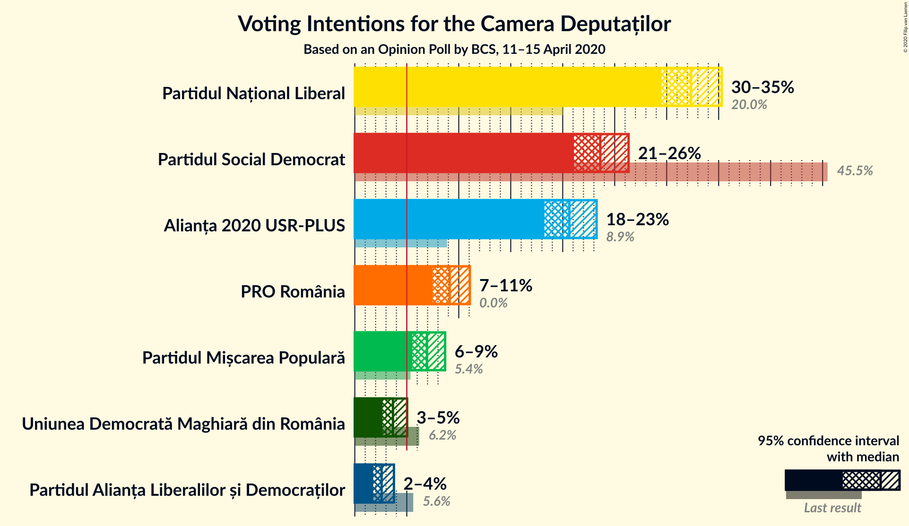

### Confidence Intervals

| Party | Last Result | Poll Result | 80% Confidence Interval | 90% Confidence Interval | 95% Confidence Interval | 99% Confidence Interval |
|:-----:|:-----------:|:-----------:|:-----------------------:|:-----------------------:|:-----------------------:|:-----------------------:|
| Partidul Național Liberal | 20.0% | 32.3% | 30.5–34.3% |30.0–34.8% |29.5–35.3% |28.7–36.2% |
| Partidul Social Democrat | 45.5% | 23.6% | 21.9–25.4% |21.5–25.9% |21.1–26.3% |20.3–27.2% |
| Alianța 2020 USR-PLUS | 8.9% | 20.6% | 19.1–22.3% |18.6–22.8% |18.2–23.3% |17.5–24.1% |
| PRO România | 0.0% | 9.1% | 8.0–10.4% |7.8–10.8% |7.5–11.1% |7.0–11.7% |
| Partidul Mișcarea Populară | 5.4% | 6.9% | 6.0–8.1% |5.7–8.4% |5.5–8.7% |5.1–9.3% |
| Uniunea Democrată Maghiară din România | 6.2% | 3.7% | 3.0–4.6% |2.8–4.8% |2.7–5.0% |2.4–5.5% |
| Partidul Alianța Liberalilor și Democraților | 5.6% | 2.6% | 2.0–3.4% |1.9–3.6% |1.8–3.8% |1.5–4.2% |

*Note:* The poll result column reflects the actual value used in the calculations. Published results may vary slightly, and in addition be rounded to fewer digits.

## Seats

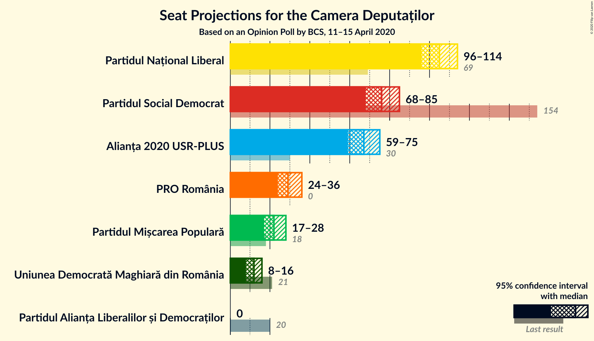

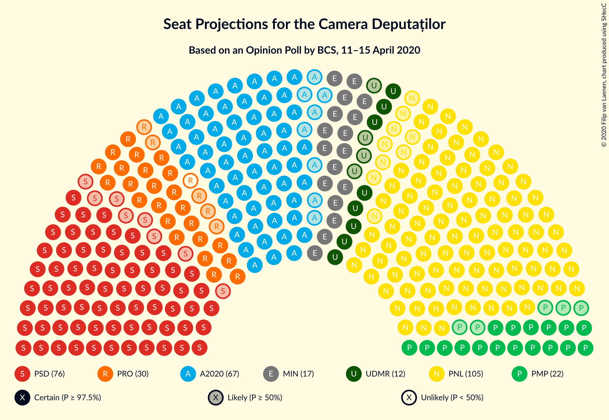

### Confidence Intervals

| Party | Last Result | Median | 80% Confidence Interval | 90% Confidence Interval | 95% Confidence Interval | 99% Confidence Interval |
|:-----:|:-----------:|:------:|:-----------------------:|:-----------------------:|:-----------------------:|:-----------------------:|
| <a href="#partidul-național-liberal">Partidul Național Liberal</a> | 69 | 105 | 99–111 |97–113 |96–114 |93–118 |
| <a href="#partidul-social-democrat">Partidul Social Democrat</a> | 154 | 76 | 71–82 |69–84 |68–85 |66–88 |
| <a href="#alianța-2020-usr-plus">Alianța 2020 USR-PLUS</a> | 30 | 67 | 62–72 |60–74 |59–75 |57–78 |
| <a href="#pro-românia">PRO România</a> | 0 | 29 | 26–33 |25–35 |24–36 |22–38 |
| <a href="#partidul-mișcarea-populară">Partidul Mișcarea Populară</a> | 18 | 22 | 19–26 |18–27 |17–28 |16–30 |
| <a href="#uniunea-democrată-maghiară-din-românia">Uniunea Democrată Maghiară din România</a> | 21 | 12 | 9–14 |9–15 |8–16 |7–17 |
| <a href="#partidul-alianța-liberalilor-și-democraților">Partidul Alianța Liberalilor și Democraților</a> | 20 | 0 | 0 |0 |0 |0 |

### Partidul Național Liberal

*For a full overview of the results for this party, see the [Partidul Național Liberal](party-partidulnaționalliberal.html) page.*

| Number of Seats | Probability | Accumulated | Special Marks |
|:---------------:|:-----------:|:-----------:|:-------------:|
| 69 | 0% | 100% | Last Result |
| 70 | 0% | 100% |  |
| 71 | 0% | 100% |  |
| 72 | 0% | 100% |  |
| 73 | 0% | 100% |  |
| 74 | 0% | 100% |  |
| 75 | 0% | 100% |  |
| 76 | 0% | 100% |  |
| 77 | 0% | 100% |  |
| 78 | 0% | 100% |  |
| 79 | 0% | 100% |  |
| 80 | 0% | 100% |  |
| 81 | 0% | 100% |  |
| 82 | 0% | 100% |  |
| 83 | 0% | 100% |  |
| 84 | 0% | 100% |  |
| 85 | 0% | 100% |  |
| 86 | 0% | 100% |  |
| 87 | 0% | 100% |  |
| 88 | 0% | 100% |  |
| 89 | 0% | 100% |  |
| 90 | 0% | 100% |  |
| 91 | 0.1% | 99.9% |  |
| 92 | 0.2% | 99.8% |  |
| 93 | 0.4% | 99.6% |  |
| 94 | 0.6% | 99.2% |  |
| 95 | 0.7% | 98.6% |  |
| 96 | 1.5% | 98% |  |
| 97 | 2% | 96% |  |
| 98 | 3% | 94% |  |
| 99 | 4% | 91% |  |
| 100 | 5% | 87% |  |
| 101 | 7% | 82% |  |
| 102 | 7% | 76% |  |
| 103 | 6% | 69% |  |
| 104 | 8% | 62% |  |
| 105 | 10% | 54% | Median |
| 106 | 9% | 44% |  |
| 107 | 6% | 35% |  |
| 108 | 6% | 29% |  |
| 109 | 6% | 23% |  |
| 110 | 5% | 17% |  |
| 111 | 4% | 12% |  |
| 112 | 2% | 8% |  |
| 113 | 2% | 6% |  |
| 114 | 2% | 4% |  |
| 115 | 1.0% | 2% |  |
| 116 | 0.5% | 1.4% |  |
| 117 | 0.4% | 0.9% |  |
| 118 | 0.2% | 0.5% |  |
| 119 | 0.1% | 0.3% |  |
| 120 | 0.1% | 0.2% |  |
| 121 | 0.1% | 0.1% |  |
| 122 | 0% | 0% |  |

### Partidul Social Democrat

*For a full overview of the results for this party, see the [Partidul Social Democrat](party-partidulsocialdemocrat.html) page.*

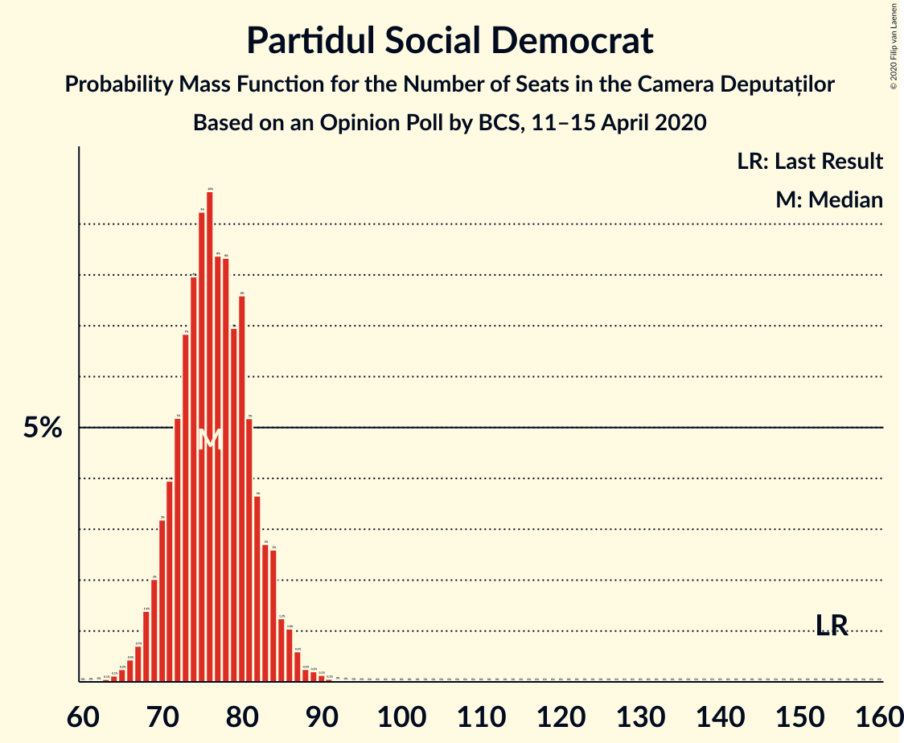

| Number of Seats | Probability | Accumulated | Special Marks |
|:---------------:|:-----------:|:-----------:|:-------------:|
| 63 | 0.1% | 100% |  |
| 64 | 0.1% | 99.9% |  |
| 65 | 0.2% | 99.8% |  |
| 66 | 0.4% | 99.5% |  |
| 67 | 0.7% | 99.1% |  |
| 68 | 1.4% | 98% |  |
| 69 | 2% | 97% |  |
| 70 | 3% | 95% |  |
| 71 | 4% | 92% |  |
| 72 | 5% | 88% |  |
| 73 | 7% | 83% |  |
| 74 | 8% | 76% |  |
| 75 | 9% | 68% |  |
| 76 | 10% | 59% | Median |
| 77 | 8% | 49% |  |
| 78 | 8% | 41% |  |
| 79 | 7% | 32% |  |
| 80 | 8% | 25% |  |
| 81 | 5% | 18% |  |
| 82 | 4% | 13% |  |
| 83 | 3% | 9% |  |
| 84 | 3% | 6% |  |
| 85 | 1.2% | 4% |  |
| 86 | 1.0% | 2% |  |
| 87 | 0.6% | 1.3% |  |
| 88 | 0.2% | 0.7% |  |
| 89 | 0.2% | 0.4% |  |
| 90 | 0.1% | 0.2% |  |
| 91 | 0.1% | 0.1% |  |
| 92 | 0% | 0.1% |  |
| 93 | 0% | 0% |  |
| 94 | 0% | 0% |  |
| 95 | 0% | 0% |  |
| 96 | 0% | 0% |  |
| 97 | 0% | 0% |  |
| 98 | 0% | 0% |  |
| 99 | 0% | 0% |  |
| 100 | 0% | 0% |  |
| 101 | 0% | 0% |  |
| 102 | 0% | 0% |  |
| 103 | 0% | 0% |  |
| 104 | 0% | 0% |  |
| 105 | 0% | 0% |  |
| 106 | 0% | 0% |  |
| 107 | 0% | 0% |  |
| 108 | 0% | 0% |  |
| 109 | 0% | 0% |  |
| 110 | 0% | 0% |  |
| 111 | 0% | 0% |  |
| 112 | 0% | 0% |  |
| 113 | 0% | 0% |  |
| 114 | 0% | 0% |  |
| 115 | 0% | 0% |  |
| 116 | 0% | 0% |  |
| 117 | 0% | 0% |  |
| 118 | 0% | 0% |  |
| 119 | 0% | 0% |  |
| 120 | 0% | 0% |  |
| 121 | 0% | 0% |  |
| 122 | 0% | 0% |  |
| 123 | 0% | 0% |  |
| 124 | 0% | 0% |  |
| 125 | 0% | 0% |  |
| 126 | 0% | 0% |  |
| 127 | 0% | 0% |  |
| 128 | 0% | 0% |  |
| 129 | 0% | 0% |  |
| 130 | 0% | 0% |  |
| 131 | 0% | 0% |  |
| 132 | 0% | 0% |  |
| 133 | 0% | 0% |  |
| 134 | 0% | 0% |  |
| 135 | 0% | 0% |  |
| 136 | 0% | 0% |  |
| 137 | 0% | 0% |  |
| 138 | 0% | 0% |  |
| 139 | 0% | 0% |  |
| 140 | 0% | 0% |  |
| 141 | 0% | 0% |  |
| 142 | 0% | 0% |  |
| 143 | 0% | 0% |  |
| 144 | 0% | 0% |  |
| 145 | 0% | 0% |  |
| 146 | 0% | 0% |  |
| 147 | 0% | 0% |  |
| 148 | 0% | 0% |  |
| 149 | 0% | 0% |  |
| 150 | 0% | 0% |  |
| 151 | 0% | 0% |  |
| 152 | 0% | 0% |  |
| 153 | 0% | 0% |  |
| 154 | 0% | 0% | Last Result |

### Alianța 2020 USR-PLUS

*For a full overview of the results for this party, see the [Alianța 2020 USR-PLUS](party-alianța2020usr-plus.html) page.*

| Number of Seats | Probability | Accumulated | Special Marks |
|:---------------:|:-----------:|:-----------:|:-------------:|
| 30 | 0% | 100% | Last Result |
| 31 | 0% | 100% |  |
| 32 | 0% | 100% |  |
| 33 | 0% | 100% |  |
| 34 | 0% | 100% |  |
| 35 | 0% | 100% |  |
| 36 | 0% | 100% |  |
| 37 | 0% | 100% |  |
| 38 | 0% | 100% |  |
| 39 | 0% | 100% |  |
| 40 | 0% | 100% |  |
| 41 | 0% | 100% |  |
| 42 | 0% | 100% |  |
| 43 | 0% | 100% |  |
| 44 | 0% | 100% |  |
| 45 | 0% | 100% |  |
| 46 | 0% | 100% |  |
| 47 | 0% | 100% |  |
| 48 | 0% | 100% |  |
| 49 | 0% | 100% |  |
| 50 | 0% | 100% |  |
| 51 | 0% | 100% |  |
| 52 | 0% | 100% |  |
| 53 | 0% | 100% |  |
| 54 | 0.1% | 100% |  |
| 55 | 0.1% | 99.9% |  |
| 56 | 0.3% | 99.8% |  |
| 57 | 0.5% | 99.5% |  |
| 58 | 0.9% | 99.0% |  |
| 59 | 1.5% | 98% |  |
| 60 | 3% | 97% |  |
| 61 | 4% | 94% |  |
| 62 | 5% | 90% |  |
| 63 | 6% | 85% |  |
| 64 | 7% | 79% |  |
| 65 | 8% | 72% |  |
| 66 | 9% | 63% |  |
| 67 | 11% | 54% | Median |
| 68 | 9% | 43% |  |
| 69 | 8% | 35% |  |
| 70 | 7% | 26% |  |
| 71 | 5% | 19% |  |
| 72 | 5% | 14% |  |
| 73 | 3% | 9% |  |
| 74 | 2% | 6% |  |
| 75 | 1.5% | 4% |  |
| 76 | 1.1% | 2% |  |
| 77 | 0.5% | 1.2% |  |
| 78 | 0.3% | 0.7% |  |
| 79 | 0.2% | 0.4% |  |
| 80 | 0.1% | 0.2% |  |
| 81 | 0% | 0.1% |  |
| 82 | 0% | 0% |  |

### PRO România

*For a full overview of the results for this party, see the [PRO România](party-proromânia.html) page.*

| Number of Seats | Probability | Accumulated | Special Marks |
|:---------------:|:-----------:|:-----------:|:-------------:|
| 0 | 0% | 100% | Last Result |
| 1 | 0% | 100% |  |
| 2 | 0% | 100% |  |
| 3 | 0% | 100% |  |
| 4 | 0% | 100% |  |
| 5 | 0% | 100% |  |
| 6 | 0% | 100% |  |
| 7 | 0% | 100% |  |
| 8 | 0% | 100% |  |
| 9 | 0% | 100% |  |
| 10 | 0% | 100% |  |
| 11 | 0% | 100% |  |
| 12 | 0% | 100% |  |
| 13 | 0% | 100% |  |
| 14 | 0% | 100% |  |
| 15 | 0% | 100% |  |
| 16 | 0% | 100% |  |
| 17 | 0% | 100% |  |
| 18 | 0% | 100% |  |
| 19 | 0% | 100% |  |
| 20 | 0% | 100% |  |
| 21 | 0.1% | 99.9% |  |
| 22 | 0.4% | 99.8% |  |
| 23 | 1.0% | 99.4% |  |
| 24 | 3% | 98% |  |
| 25 | 5% | 96% |  |
| 26 | 9% | 91% |  |
| 27 | 10% | 82% |  |
| 28 | 11% | 72% |  |
| 29 | 12% | 61% | Median |
| 30 | 13% | 49% |  |
| 31 | 11% | 36% |  |
| 32 | 9% | 25% |  |
| 33 | 6% | 16% |  |
| 34 | 4% | 10% |  |
| 35 | 3% | 6% |  |
| 36 | 2% | 3% |  |
| 37 | 0.7% | 1.2% |  |
| 38 | 0.3% | 0.5% |  |
| 39 | 0.1% | 0.2% |  |
| 40 | 0% | 0.1% |  |
| 41 | 0% | 0% |  |

### Partidul Mișcarea Populară

*For a full overview of the results for this party, see the [Partidul Mișcarea Populară](party-partidulmișcareapopulară.html) page.*

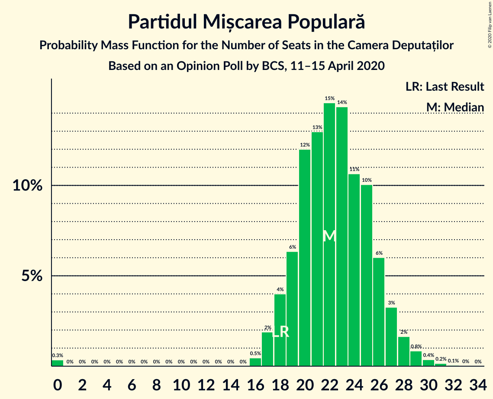

| Number of Seats | Probability | Accumulated | Special Marks |
|:---------------:|:-----------:|:-----------:|:-------------:|
| 0 | 0.3% | 100% |  |
| 1 | 0% | 99.7% |  |
| 2 | 0% | 99.7% |  |
| 3 | 0% | 99.7% |  |
| 4 | 0% | 99.7% |  |
| 5 | 0% | 99.7% |  |
| 6 | 0% | 99.7% |  |
| 7 | 0% | 99.7% |  |
| 8 | 0% | 99.7% |  |
| 9 | 0% | 99.7% |  |
| 10 | 0% | 99.7% |  |
| 11 | 0% | 99.7% |  |
| 12 | 0% | 99.7% |  |
| 13 | 0% | 99.7% |  |
| 14 | 0% | 99.7% |  |
| 15 | 0% | 99.7% |  |
| 16 | 0.5% | 99.7% |  |
| 17 | 2% | 99.2% |  |
| 18 | 4% | 97% | Last Result |
| 19 | 6% | 93% |  |
| 20 | 12% | 87% |  |
| 21 | 13% | 75% |  |
| 22 | 15% | 62% | Median |
| 23 | 14% | 47% |  |
| 24 | 11% | 33% |  |
| 25 | 10% | 22% |  |
| 26 | 6% | 12% |  |
| 27 | 3% | 6% |  |
| 28 | 2% | 3% |  |
| 29 | 0.8% | 1.4% |  |
| 30 | 0.4% | 0.6% |  |
| 31 | 0.2% | 0.2% |  |
| 32 | 0.1% | 0.1% |  |
| 33 | 0% | 0% |  |

### Uniunea Democrată Maghiară din România

*For a full overview of the results for this party, see the [Uniunea Democrată Maghiară din România](party-uniuneademocratămaghiarădinromânia.html) page.*

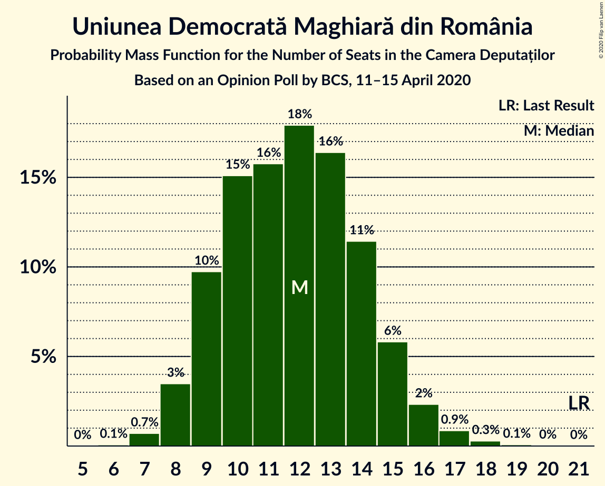

| Number of Seats | Probability | Accumulated | Special Marks |
|:---------------:|:-----------:|:-----------:|:-------------:|
| 6 | 0.1% | 100% |  |
| 7 | 0.7% | 99.9% |  |
| 8 | 3% | 99.2% |  |
| 9 | 10% | 96% |  |
| 10 | 15% | 86% |  |
| 11 | 16% | 71% |  |
| 12 | 18% | 55% | Median |
| 13 | 16% | 37% |  |
| 14 | 11% | 21% |  |
| 15 | 6% | 9% |  |
| 16 | 2% | 4% |  |
| 17 | 0.9% | 1.3% |  |
| 18 | 0.3% | 0.4% |  |
| 19 | 0.1% | 0.1% |  |
| 20 | 0% | 0% |  |
| 21 | 0% | 0% | Last Result |

### Partidul Alianța Liberalilor și Democraților

*For a full overview of the results for this party, see the [Partidul Alianța Liberalilor și Democraților](party-partidulalianțaliberalilorșidemocraților.html) page.*

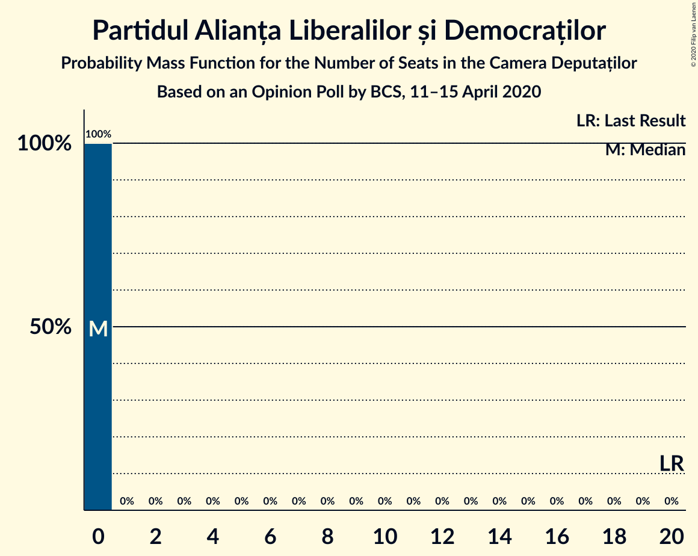

| Number of Seats | Probability | Accumulated | Special Marks |
|:---------------:|:-----------:|:-----------:|:-------------:|
| 0 | 100% | 100% | Median |
| 1 | 0% | 0% |  |
| 2 | 0% | 0% |  |
| 3 | 0% | 0% |  |
| 4 | 0% | 0% |  |
| 5 | 0% | 0% |  |
| 6 | 0% | 0% |  |
| 7 | 0% | 0% |  |
| 8 | 0% | 0% |  |
| 9 | 0% | 0% |  |
| 10 | 0% | 0% |  |
| 11 | 0% | 0% |  |
| 12 | 0% | 0% |  |
| 13 | 0% | 0% |  |
| 14 | 0% | 0% |  |
| 15 | 0% | 0% |  |
| 16 | 0% | 0% |  |
| 17 | 0% | 0% |  |
| 18 | 0% | 0% |  |
| 19 | 0% | 0% |  |
| 20 | 0% | 0% | Last Result |

## Coalitions

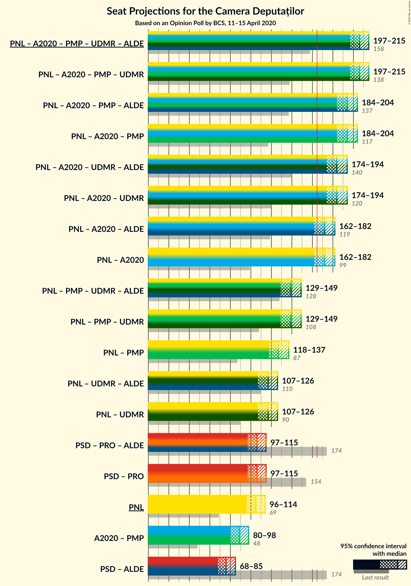

### Confidence Intervals

| Coalition | Last Result | Median | Majority? | 80% Confidence Interval | 90% Confidence Interval | 95% Confidence Interval | 99% Confidence Interval |
|:---------:|:-----------:|:------:|:---------:|:-----------------------:|:-----------------------:|:-----------------------:|:-----------------------:|
| Partidul Național Liberal – Alianța 2020 USR-PLUS – Partidul Mișcarea Populară – Uniunea Democrată Maghiară din România – Partidul Alianța Liberalilor și Democraților | 158 | 206 | 100% | 200–212 | 198–214 | 197–215 | 193–218 |
| Partidul Național Liberal – Alianța 2020 USR-PLUS – Partidul Mișcarea Populară – Uniunea Democrată Maghiară din România | 138 | 206 | 100% | 200–212 | 198–214 | 197–215 | 193–218 |
| Partidul Național Liberal – Alianța 2020 USR-PLUS – Partidul Mișcarea Populară – Partidul Alianța Liberalilor și Democraților | 137 | 194 | 100% | 188–201 | 186–202 | 184–204 | 181–207 |
| Partidul Național Liberal – Alianța 2020 USR-PLUS – Partidul Mișcarea Populară | 117 | 194 | 100% | 188–201 | 186–202 | 184–204 | 181–207 |
| Partidul Național Liberal – Alianța 2020 USR-PLUS – Uniunea Democrată Maghiară din România – Partidul Alianța Liberalilor și Democraților | 140 | 184 | 100% | 177–190 | 175–192 | 174–194 | 171–197 |
| Partidul Național Liberal – Alianța 2020 USR-PLUS – Uniunea Democrată Maghiară din România | 120 | 184 | 100% | 177–190 | 175–192 | 174–194 | 171–197 |
| Partidul Național Liberal – Alianța 2020 USR-PLUS – Partidul Alianța Liberalilor și Democraților | 119 | 172 | 92% | 166–178 | 163–180 | 162–182 | 159–185 |
| Partidul Național Liberal – Alianța 2020 USR-PLUS | 99 | 172 | 92% | 166–178 | 163–180 | 162–182 | 159–185 |
| Partidul Național Liberal – Partidul Mișcarea Populară – Uniunea Democrată Maghiară din România – Partidul Alianța Liberalilor și Democraților | 128 | 139 | 0% | 132–146 | 131–148 | 129–149 | 125–152 |
| Partidul Național Liberal – Partidul Mișcarea Populară – Uniunea Democrată Maghiară din România | 108 | 139 | 0% | 132–146 | 131–148 | 129–149 | 125–152 |
| Partidul Național Liberal – Partidul Mișcarea Populară | 87 | 127 | 0% | 121–134 | 119–136 | 118–137 | 114–140 |
| Partidul Național Liberal – Uniunea Democrată Maghiară din România – Partidul Alianța Liberalilor și Democraților | 110 | 117 | 0% | 110–123 | 109–125 | 107–126 | 104–130 |
| Partidul Național Liberal – Uniunea Democrată Maghiară din România | 90 | 117 | 0% | 110–123 | 109–125 | 107–126 | 104–130 |
| Partidul Social Democrat – PRO România – Partidul Alianța Liberalilor și Democraților | 174 | 106 | 0% | 100–112 | 98–114 | 97–115 | 94–119 |
| Partidul Social Democrat – PRO România | 154 | 106 | 0% | 100–112 | 98–114 | 97–115 | 94–119 |
| Partidul Național Liberal | 69 | 105 | 0% | 99–111 | 97–113 | 96–114 | 93–118 |
| Alianța 2020 USR-PLUS – Partidul Mișcarea Populară | 48 | 89 | 0% | 83–95 | 82–97 | 80–98 | 77–101 |
| Partidul Social Democrat – Partidul Alianța Liberalilor și Democraților | 174 | 76 | 0% | 71–82 | 69–84 | 68–85 | 66–88 |

### Partidul Național Liberal – Alianța 2020 USR-PLUS – Partidul Mișcarea Populară – Uniunea Democrată Maghiară din România – Partidul Alianța Liberalilor și Democraților

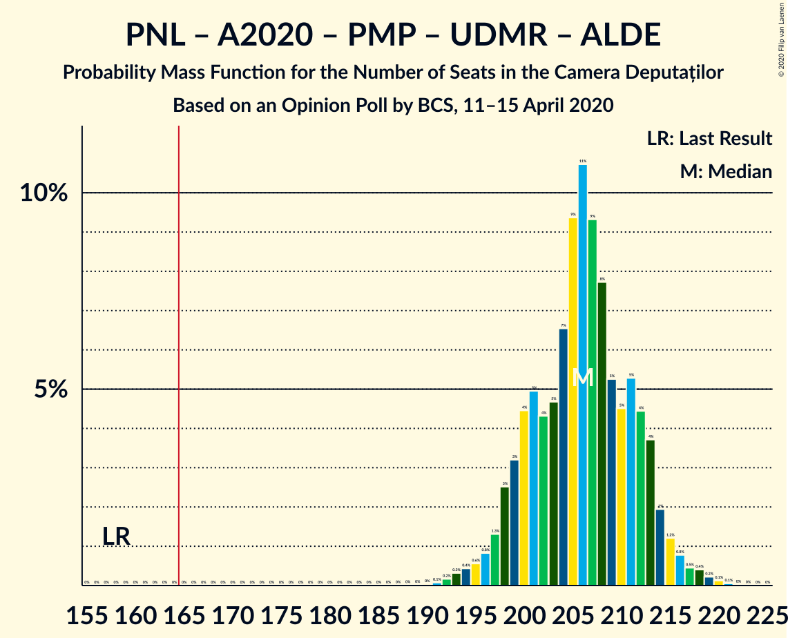

| Number of Seats | Probability | Accumulated | Special Marks |
|:---------------:|:-----------:|:-----------:|:-------------:|
| 158 | 0% | 100% | Last Result |
| 159 | 0% | 100% |  |
| 160 | 0% | 100% |  |
| 161 | 0% | 100% |  |
| 162 | 0% | 100% |  |
| 163 | 0% | 100% |  |
| 164 | 0% | 100% |  |
| 165 | 0% | 100% | Majority |
| 166 | 0% | 100% |  |
| 167 | 0% | 100% |  |
| 168 | 0% | 100% |  |
| 169 | 0% | 100% |  |
| 170 | 0% | 100% |  |
| 171 | 0% | 100% |  |
| 172 | 0% | 100% |  |
| 173 | 0% | 100% |  |
| 174 | 0% | 100% |  |
| 175 | 0% | 100% |  |
| 176 | 0% | 100% |  |
| 177 | 0% | 100% |  |
| 178 | 0% | 100% |  |
| 179 | 0% | 100% |  |
| 180 | 0% | 100% |  |
| 181 | 0% | 100% |  |
| 182 | 0% | 100% |  |
| 183 | 0% | 100% |  |
| 184 | 0% | 100% |  |
| 185 | 0% | 100% |  |
| 186 | 0% | 100% |  |
| 187 | 0% | 100% |  |
| 188 | 0% | 100% |  |
| 189 | 0% | 100% |  |
| 190 | 0% | 99.9% |  |
| 191 | 0.1% | 99.9% |  |
| 192 | 0.2% | 99.8% |  |
| 193 | 0.3% | 99.7% |  |
| 194 | 0.4% | 99.4% |  |
| 195 | 0.6% | 98.9% |  |
| 196 | 0.8% | 98% |  |
| 197 | 1.3% | 98% |  |
| 198 | 3% | 96% |  |
| 199 | 3% | 94% |  |
| 200 | 4% | 91% |  |
| 201 | 5% | 86% |  |
| 202 | 4% | 81% |  |
| 203 | 5% | 77% |  |
| 204 | 7% | 72% |  |
| 205 | 9% | 66% |  |
| 206 | 11% | 56% | Median |
| 207 | 9% | 45% |  |
| 208 | 8% | 36% |  |
| 209 | 5% | 28% |  |
| 210 | 5% | 23% |  |
| 211 | 5% | 19% |  |
| 212 | 4% | 13% |  |
| 213 | 4% | 9% |  |
| 214 | 2% | 5% |  |
| 215 | 1.2% | 3% |  |
| 216 | 0.8% | 2% |  |
| 217 | 0.5% | 1.3% |  |
| 218 | 0.4% | 0.8% |  |
| 219 | 0.2% | 0.4% |  |
| 220 | 0.1% | 0.2% |  |
| 221 | 0.1% | 0.1% |  |
| 222 | 0% | 0% |  |

### Partidul Național Liberal – Alianța 2020 USR-PLUS – Partidul Mișcarea Populară – Uniunea Democrată Maghiară din România

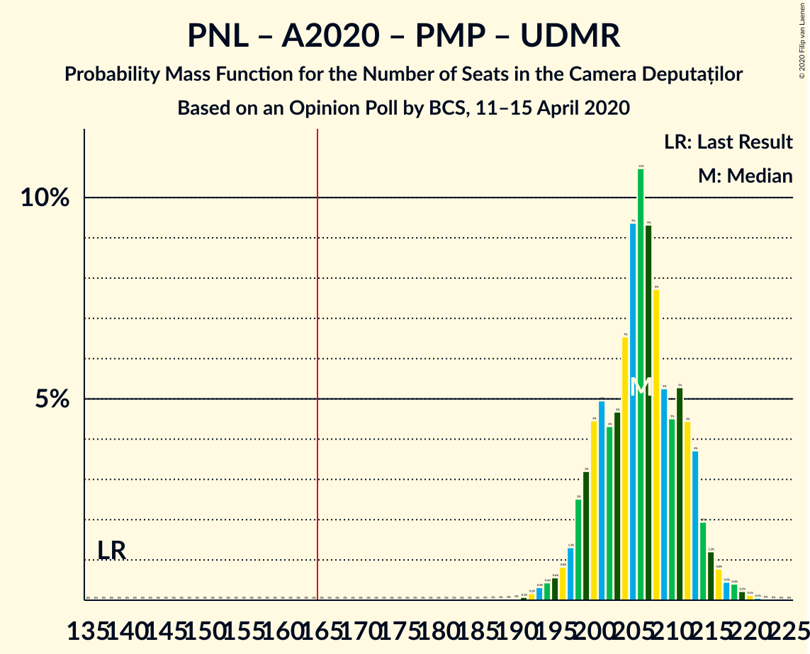

| Number of Seats | Probability | Accumulated | Special Marks |
|:---------------:|:-----------:|:-----------:|:-------------:|
| 138 | 0% | 100% | Last Result |
| 139 | 0% | 100% |  |
| 140 | 0% | 100% |  |
| 141 | 0% | 100% |  |
| 142 | 0% | 100% |  |
| 143 | 0% | 100% |  |
| 144 | 0% | 100% |  |
| 145 | 0% | 100% |  |
| 146 | 0% | 100% |  |
| 147 | 0% | 100% |  |
| 148 | 0% | 100% |  |
| 149 | 0% | 100% |  |
| 150 | 0% | 100% |  |
| 151 | 0% | 100% |  |
| 152 | 0% | 100% |  |
| 153 | 0% | 100% |  |
| 154 | 0% | 100% |  |
| 155 | 0% | 100% |  |
| 156 | 0% | 100% |  |
| 157 | 0% | 100% |  |
| 158 | 0% | 100% |  |
| 159 | 0% | 100% |  |
| 160 | 0% | 100% |  |
| 161 | 0% | 100% |  |
| 162 | 0% | 100% |  |
| 163 | 0% | 100% |  |
| 164 | 0% | 100% |  |
| 165 | 0% | 100% | Majority |
| 166 | 0% | 100% |  |
| 167 | 0% | 100% |  |
| 168 | 0% | 100% |  |
| 169 | 0% | 100% |  |
| 170 | 0% | 100% |  |
| 171 | 0% | 100% |  |
| 172 | 0% | 100% |  |
| 173 | 0% | 100% |  |
| 174 | 0% | 100% |  |
| 175 | 0% | 100% |  |
| 176 | 0% | 100% |  |
| 177 | 0% | 100% |  |
| 178 | 0% | 100% |  |
| 179 | 0% | 100% |  |
| 180 | 0% | 100% |  |
| 181 | 0% | 100% |  |
| 182 | 0% | 100% |  |
| 183 | 0% | 100% |  |
| 184 | 0% | 100% |  |
| 185 | 0% | 100% |  |
| 186 | 0% | 100% |  |
| 187 | 0% | 100% |  |
| 188 | 0% | 100% |  |
| 189 | 0% | 100% |  |
| 190 | 0% | 99.9% |  |
| 191 | 0.1% | 99.9% |  |
| 192 | 0.2% | 99.8% |  |
| 193 | 0.3% | 99.7% |  |
| 194 | 0.4% | 99.4% |  |
| 195 | 0.6% | 98.9% |  |
| 196 | 0.8% | 98% |  |
| 197 | 1.3% | 98% |  |
| 198 | 3% | 96% |  |
| 199 | 3% | 94% |  |
| 200 | 4% | 91% |  |
| 201 | 5% | 86% |  |
| 202 | 4% | 81% |  |
| 203 | 5% | 77% |  |
| 204 | 7% | 72% |  |
| 205 | 9% | 66% |  |
| 206 | 11% | 56% | Median |
| 207 | 9% | 45% |  |
| 208 | 8% | 36% |  |
| 209 | 5% | 28% |  |
| 210 | 5% | 23% |  |
| 211 | 5% | 19% |  |
| 212 | 4% | 13% |  |
| 213 | 4% | 9% |  |
| 214 | 2% | 5% |  |
| 215 | 1.2% | 3% |  |
| 216 | 0.8% | 2% |  |
| 217 | 0.5% | 1.3% |  |
| 218 | 0.4% | 0.8% |  |
| 219 | 0.2% | 0.4% |  |
| 220 | 0.1% | 0.2% |  |
| 221 | 0.1% | 0.1% |  |
| 222 | 0% | 0% |  |

### Partidul Național Liberal – Alianța 2020 USR-PLUS – Partidul Mișcarea Populară – Partidul Alianța Liberalilor și Democraților

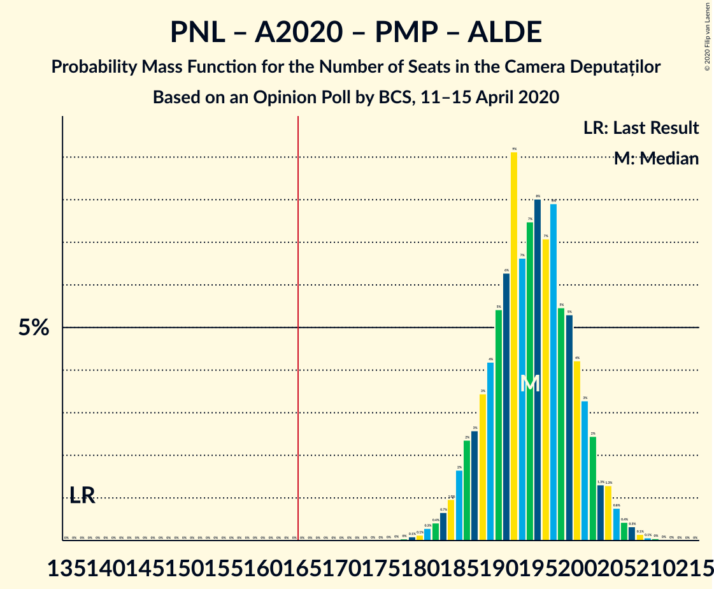

| Number of Seats | Probability | Accumulated | Special Marks |
|:---------------:|:-----------:|:-----------:|:-------------:|
| 137 | 0% | 100% | Last Result |
| 138 | 0% | 100% |  |
| 139 | 0% | 100% |  |
| 140 | 0% | 100% |  |
| 141 | 0% | 100% |  |
| 142 | 0% | 100% |  |
| 143 | 0% | 100% |  |
| 144 | 0% | 100% |  |
| 145 | 0% | 100% |  |
| 146 | 0% | 100% |  |
| 147 | 0% | 100% |  |
| 148 | 0% | 100% |  |
| 149 | 0% | 100% |  |
| 150 | 0% | 100% |  |
| 151 | 0% | 100% |  |
| 152 | 0% | 100% |  |
| 153 | 0% | 100% |  |
| 154 | 0% | 100% |  |
| 155 | 0% | 100% |  |
| 156 | 0% | 100% |  |
| 157 | 0% | 100% |  |
| 158 | 0% | 100% |  |
| 159 | 0% | 100% |  |
| 160 | 0% | 100% |  |
| 161 | 0% | 100% |  |
| 162 | 0% | 100% |  |
| 163 | 0% | 100% |  |
| 164 | 0% | 100% |  |
| 165 | 0% | 100% | Majority |
| 166 | 0% | 100% |  |
| 167 | 0% | 100% |  |
| 168 | 0% | 100% |  |
| 169 | 0% | 100% |  |
| 170 | 0% | 100% |  |
| 171 | 0% | 100% |  |
| 172 | 0% | 100% |  |
| 173 | 0% | 100% |  |
| 174 | 0% | 100% |  |
| 175 | 0% | 100% |  |
| 176 | 0% | 100% |  |
| 177 | 0% | 100% |  |
| 178 | 0% | 99.9% |  |
| 179 | 0.1% | 99.9% |  |
| 180 | 0.1% | 99.8% |  |
| 181 | 0.3% | 99.7% |  |
| 182 | 0.4% | 99.4% |  |
| 183 | 0.7% | 99.0% |  |
| 184 | 1.0% | 98% |  |
| 185 | 2% | 97% |  |
| 186 | 2% | 96% |  |
| 187 | 3% | 93% |  |
| 188 | 3% | 91% |  |
| 189 | 4% | 87% |  |
| 190 | 5% | 83% |  |
| 191 | 6% | 78% |  |
| 192 | 9% | 71% |  |
| 193 | 7% | 62% |  |
| 194 | 7% | 56% | Median |
| 195 | 8% | 48% |  |
| 196 | 7% | 40% |  |
| 197 | 8% | 33% |  |
| 198 | 5% | 25% |  |
| 199 | 5% | 20% |  |
| 200 | 4% | 14% |  |
| 201 | 3% | 10% |  |
| 202 | 2% | 7% |  |
| 203 | 1.3% | 4% |  |
| 204 | 1.3% | 3% |  |
| 205 | 0.8% | 2% |  |
| 206 | 0.4% | 1.1% |  |
| 207 | 0.3% | 0.6% |  |
| 208 | 0.1% | 0.3% |  |
| 209 | 0.1% | 0.2% |  |
| 210 | 0% | 0.1% |  |
| 211 | 0% | 0% |  |

### Partidul Național Liberal – Alianța 2020 USR-PLUS – Partidul Mișcarea Populară

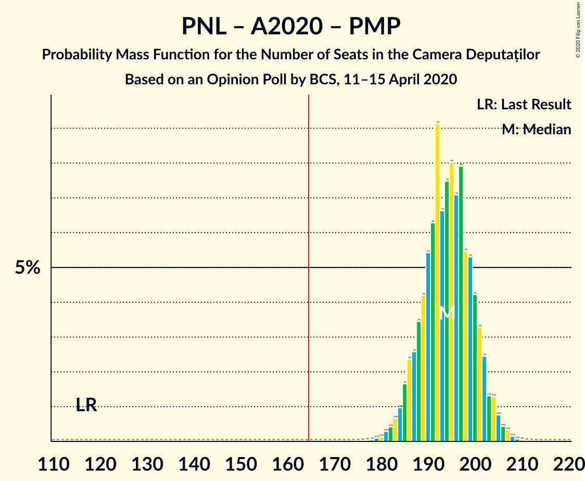

| Number of Seats | Probability | Accumulated | Special Marks |
|:---------------:|:-----------:|:-----------:|:-------------:|
| 117 | 0% | 100% | Last Result |
| 118 | 0% | 100% |  |
| 119 | 0% | 100% |  |
| 120 | 0% | 100% |  |
| 121 | 0% | 100% |  |
| 122 | 0% | 100% |  |
| 123 | 0% | 100% |  |
| 124 | 0% | 100% |  |
| 125 | 0% | 100% |  |
| 126 | 0% | 100% |  |
| 127 | 0% | 100% |  |
| 128 | 0% | 100% |  |
| 129 | 0% | 100% |  |
| 130 | 0% | 100% |  |
| 131 | 0% | 100% |  |
| 132 | 0% | 100% |  |
| 133 | 0% | 100% |  |
| 134 | 0% | 100% |  |
| 135 | 0% | 100% |  |
| 136 | 0% | 100% |  |
| 137 | 0% | 100% |  |
| 138 | 0% | 100% |  |
| 139 | 0% | 100% |  |
| 140 | 0% | 100% |  |
| 141 | 0% | 100% |  |
| 142 | 0% | 100% |  |
| 143 | 0% | 100% |  |
| 144 | 0% | 100% |  |
| 145 | 0% | 100% |  |
| 146 | 0% | 100% |  |
| 147 | 0% | 100% |  |
| 148 | 0% | 100% |  |
| 149 | 0% | 100% |  |
| 150 | 0% | 100% |  |
| 151 | 0% | 100% |  |
| 152 | 0% | 100% |  |
| 153 | 0% | 100% |  |
| 154 | 0% | 100% |  |
| 155 | 0% | 100% |  |
| 156 | 0% | 100% |  |
| 157 | 0% | 100% |  |
| 158 | 0% | 100% |  |
| 159 | 0% | 100% |  |
| 160 | 0% | 100% |  |
| 161 | 0% | 100% |  |
| 162 | 0% | 100% |  |
| 163 | 0% | 100% |  |
| 164 | 0% | 100% |  |
| 165 | 0% | 100% | Majority |
| 166 | 0% | 100% |  |
| 167 | 0% | 100% |  |
| 168 | 0% | 100% |  |
| 169 | 0% | 100% |  |
| 170 | 0% | 100% |  |
| 171 | 0% | 100% |  |
| 172 | 0% | 100% |  |
| 173 | 0% | 100% |  |
| 174 | 0% | 100% |  |
| 175 | 0% | 100% |  |
| 176 | 0% | 100% |  |
| 177 | 0% | 100% |  |
| 178 | 0% | 99.9% |  |
| 179 | 0.1% | 99.9% |  |
| 180 | 0.1% | 99.8% |  |
| 181 | 0.3% | 99.7% |  |
| 182 | 0.4% | 99.4% |  |
| 183 | 0.7% | 99.0% |  |
| 184 | 1.0% | 98% |  |
| 185 | 2% | 97% |  |
| 186 | 2% | 96% |  |
| 187 | 3% | 93% |  |
| 188 | 3% | 91% |  |
| 189 | 4% | 87% |  |
| 190 | 5% | 83% |  |
| 191 | 6% | 78% |  |
| 192 | 9% | 71% |  |
| 193 | 7% | 62% |  |
| 194 | 7% | 56% | Median |
| 195 | 8% | 48% |  |
| 196 | 7% | 40% |  |
| 197 | 8% | 33% |  |
| 198 | 5% | 25% |  |
| 199 | 5% | 20% |  |
| 200 | 4% | 14% |  |
| 201 | 3% | 10% |  |
| 202 | 2% | 7% |  |
| 203 | 1.3% | 4% |  |
| 204 | 1.3% | 3% |  |
| 205 | 0.8% | 2% |  |
| 206 | 0.4% | 1.1% |  |
| 207 | 0.3% | 0.6% |  |
| 208 | 0.1% | 0.3% |  |
| 209 | 0.1% | 0.2% |  |
| 210 | 0% | 0.1% |  |
| 211 | 0% | 0% |  |

### Partidul Național Liberal – Alianța 2020 USR-PLUS – Uniunea Democrată Maghiară din România – Partidul Alianța Liberalilor și Democraților

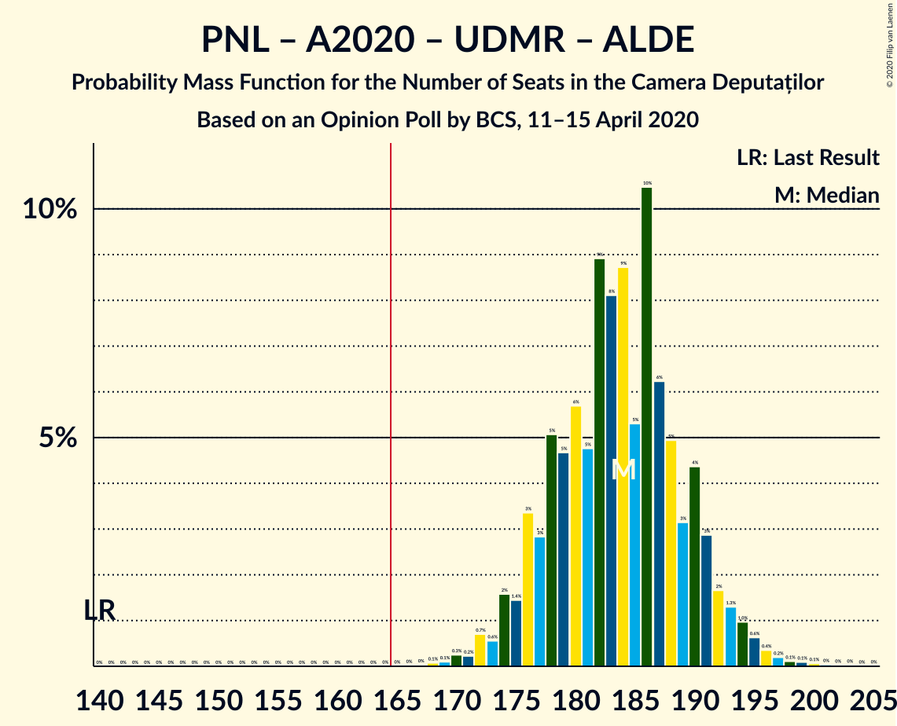

| Number of Seats | Probability | Accumulated | Special Marks |
|:---------------:|:-----------:|:-----------:|:-------------:|
| 140 | 0% | 100% | Last Result |
| 141 | 0% | 100% |  |
| 142 | 0% | 100% |  |
| 143 | 0% | 100% |  |
| 144 | 0% | 100% |  |
| 145 | 0% | 100% |  |
| 146 | 0% | 100% |  |
| 147 | 0% | 100% |  |
| 148 | 0% | 100% |  |
| 149 | 0% | 100% |  |
| 150 | 0% | 100% |  |
| 151 | 0% | 100% |  |
| 152 | 0% | 100% |  |
| 153 | 0% | 100% |  |
| 154 | 0% | 100% |  |
| 155 | 0% | 100% |  |
| 156 | 0% | 100% |  |
| 157 | 0% | 100% |  |
| 158 | 0% | 100% |  |
| 159 | 0% | 100% |  |
| 160 | 0% | 100% |  |
| 161 | 0% | 100% |  |
| 162 | 0% | 100% |  |
| 163 | 0% | 100% |  |
| 164 | 0% | 100% |  |
| 165 | 0% | 100% | Majority |
| 166 | 0% | 100% |  |
| 167 | 0% | 100% |  |
| 168 | 0.1% | 99.9% |  |
| 169 | 0.1% | 99.9% |  |
| 170 | 0.3% | 99.8% |  |
| 171 | 0.2% | 99.5% |  |
| 172 | 0.7% | 99.3% |  |
| 173 | 0.6% | 98.6% |  |
| 174 | 2% | 98% |  |
| 175 | 1.4% | 96% |  |
| 176 | 3% | 95% |  |
| 177 | 3% | 92% |  |
| 178 | 5% | 89% |  |
| 179 | 5% | 84% |  |
| 180 | 6% | 79% |  |
| 181 | 5% | 73% |  |
| 182 | 9% | 69% |  |
| 183 | 8% | 60% |  |
| 184 | 9% | 52% | Median |
| 185 | 5% | 43% |  |
| 186 | 10% | 38% |  |
| 187 | 6% | 27% |  |
| 188 | 5% | 21% |  |
| 189 | 3% | 16% |  |
| 190 | 4% | 13% |  |
| 191 | 3% | 8% |  |
| 192 | 2% | 6% |  |
| 193 | 1.3% | 4% |  |
| 194 | 1.0% | 3% |  |
| 195 | 0.6% | 2% |  |
| 196 | 0.4% | 0.9% |  |
| 197 | 0.2% | 0.6% |  |
| 198 | 0.1% | 0.4% |  |
| 199 | 0.1% | 0.3% |  |
| 200 | 0.1% | 0.2% |  |
| 201 | 0% | 0.1% |  |
| 202 | 0% | 0.1% |  |
| 203 | 0% | 0.1% |  |
| 204 | 0% | 0% |  |

### Partidul Național Liberal – Alianța 2020 USR-PLUS – Uniunea Democrată Maghiară din România

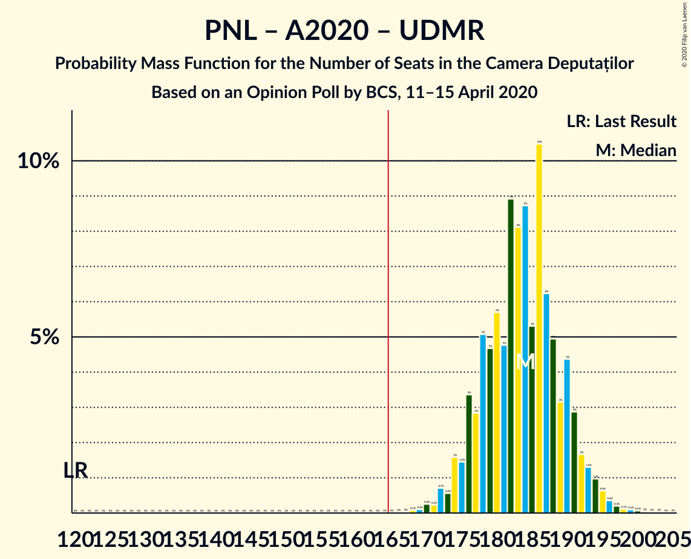

| Number of Seats | Probability | Accumulated | Special Marks |
|:---------------:|:-----------:|:-----------:|:-------------:|
| 120 | 0% | 100% | Last Result |
| 121 | 0% | 100% |  |
| 122 | 0% | 100% |  |
| 123 | 0% | 100% |  |
| 124 | 0% | 100% |  |
| 125 | 0% | 100% |  |
| 126 | 0% | 100% |  |
| 127 | 0% | 100% |  |
| 128 | 0% | 100% |  |
| 129 | 0% | 100% |  |
| 130 | 0% | 100% |  |
| 131 | 0% | 100% |  |
| 132 | 0% | 100% |  |
| 133 | 0% | 100% |  |
| 134 | 0% | 100% |  |
| 135 | 0% | 100% |  |
| 136 | 0% | 100% |  |
| 137 | 0% | 100% |  |
| 138 | 0% | 100% |  |
| 139 | 0% | 100% |  |
| 140 | 0% | 100% |  |
| 141 | 0% | 100% |  |
| 142 | 0% | 100% |  |
| 143 | 0% | 100% |  |
| 144 | 0% | 100% |  |
| 145 | 0% | 100% |  |
| 146 | 0% | 100% |  |
| 147 | 0% | 100% |  |
| 148 | 0% | 100% |  |
| 149 | 0% | 100% |  |
| 150 | 0% | 100% |  |
| 151 | 0% | 100% |  |
| 152 | 0% | 100% |  |
| 153 | 0% | 100% |  |
| 154 | 0% | 100% |  |
| 155 | 0% | 100% |  |
| 156 | 0% | 100% |  |
| 157 | 0% | 100% |  |
| 158 | 0% | 100% |  |
| 159 | 0% | 100% |  |
| 160 | 0% | 100% |  |
| 161 | 0% | 100% |  |
| 162 | 0% | 100% |  |
| 163 | 0% | 100% |  |
| 164 | 0% | 100% |  |
| 165 | 0% | 100% | Majority |
| 166 | 0% | 100% |  |
| 167 | 0% | 100% |  |
| 168 | 0.1% | 99.9% |  |
| 169 | 0.1% | 99.9% |  |
| 170 | 0.3% | 99.8% |  |
| 171 | 0.2% | 99.5% |  |
| 172 | 0.7% | 99.3% |  |
| 173 | 0.6% | 98.6% |  |
| 174 | 2% | 98% |  |
| 175 | 1.4% | 96% |  |
| 176 | 3% | 95% |  |
| 177 | 3% | 92% |  |
| 178 | 5% | 89% |  |
| 179 | 5% | 84% |  |
| 180 | 6% | 79% |  |
| 181 | 5% | 73% |  |
| 182 | 9% | 69% |  |
| 183 | 8% | 60% |  |
| 184 | 9% | 52% | Median |
| 185 | 5% | 43% |  |
| 186 | 10% | 38% |  |
| 187 | 6% | 27% |  |
| 188 | 5% | 21% |  |
| 189 | 3% | 16% |  |
| 190 | 4% | 13% |  |
| 191 | 3% | 8% |  |
| 192 | 2% | 5% |  |
| 193 | 1.3% | 4% |  |
| 194 | 1.0% | 3% |  |
| 195 | 0.6% | 2% |  |
| 196 | 0.4% | 0.9% |  |
| 197 | 0.2% | 0.6% |  |
| 198 | 0.1% | 0.4% |  |
| 199 | 0.1% | 0.3% |  |
| 200 | 0.1% | 0.2% |  |
| 201 | 0% | 0.1% |  |
| 202 | 0% | 0.1% |  |
| 203 | 0% | 0.1% |  |
| 204 | 0% | 0% |  |

### Partidul Național Liberal – Alianța 2020 USR-PLUS – Partidul Alianța Liberalilor și Democraților

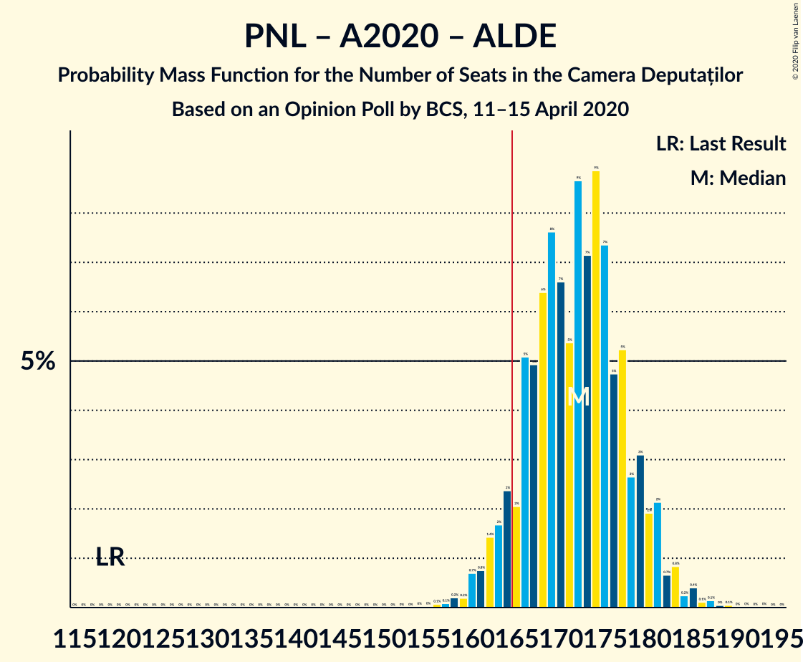

| Number of Seats | Probability | Accumulated | Special Marks |
|:---------------:|:-----------:|:-----------:|:-------------:|
| 119 | 0% | 100% | Last Result |
| 120 | 0% | 100% |  |
| 121 | 0% | 100% |  |
| 122 | 0% | 100% |  |
| 123 | 0% | 100% |  |
| 124 | 0% | 100% |  |
| 125 | 0% | 100% |  |
| 126 | 0% | 100% |  |
| 127 | 0% | 100% |  |
| 128 | 0% | 100% |  |
| 129 | 0% | 100% |  |
| 130 | 0% | 100% |  |
| 131 | 0% | 100% |  |
| 132 | 0% | 100% |  |
| 133 | 0% | 100% |  |
| 134 | 0% | 100% |  |
| 135 | 0% | 100% |  |
| 136 | 0% | 100% |  |
| 137 | 0% | 100% |  |
| 138 | 0% | 100% |  |
| 139 | 0% | 100% |  |
| 140 | 0% | 100% |  |
| 141 | 0% | 100% |  |
| 142 | 0% | 100% |  |
| 143 | 0% | 100% |  |
| 144 | 0% | 100% |  |
| 145 | 0% | 100% |  |
| 146 | 0% | 100% |  |
| 147 | 0% | 100% |  |
| 148 | 0% | 100% |  |
| 149 | 0% | 100% |  |
| 150 | 0% | 100% |  |
| 151 | 0% | 100% |  |
| 152 | 0% | 100% |  |
| 153 | 0% | 100% |  |
| 154 | 0% | 100% |  |
| 155 | 0% | 100% |  |
| 156 | 0.1% | 99.9% |  |
| 157 | 0.1% | 99.9% |  |
| 158 | 0.2% | 99.8% |  |
| 159 | 0.2% | 99.6% |  |
| 160 | 0.7% | 99.4% |  |
| 161 | 0.8% | 98.7% |  |
| 162 | 1.4% | 98% |  |
| 163 | 2% | 96% |  |
| 164 | 2% | 95% |  |
| 165 | 2% | 92% | Majority |
| 166 | 5% | 90% |  |
| 167 | 5% | 85% |  |
| 168 | 6% | 80% |  |
| 169 | 8% | 74% |  |
| 170 | 7% | 66% |  |
| 171 | 5% | 60% |  |
| 172 | 9% | 54% | Median |
| 173 | 7% | 46% |  |
| 174 | 9% | 39% |  |
| 175 | 7% | 30% |  |
| 176 | 5% | 22% |  |
| 177 | 5% | 18% |  |
| 178 | 3% | 12% |  |
| 179 | 3% | 10% |  |
| 180 | 2% | 7% |  |
| 181 | 2% | 5% |  |
| 182 | 0.7% | 3% |  |
| 183 | 0.8% | 2% |  |
| 184 | 0.2% | 1.1% |  |
| 185 | 0.4% | 0.8% |  |
| 186 | 0.1% | 0.4% |  |
| 187 | 0.1% | 0.3% |  |
| 188 | 0% | 0.2% |  |
| 189 | 0.1% | 0.1% |  |
| 190 | 0% | 0.1% |  |
| 191 | 0% | 0.1% |  |
| 192 | 0% | 0% |  |

### Partidul Național Liberal – Alianța 2020 USR-PLUS

| Number of Seats | Probability | Accumulated | Special Marks |
|:---------------:|:-----------:|:-----------:|:-------------:|
| 99 | 0% | 100% | Last Result |
| 100 | 0% | 100% |  |
| 101 | 0% | 100% |  |
| 102 | 0% | 100% |  |
| 103 | 0% | 100% |  |
| 104 | 0% | 100% |  |
| 105 | 0% | 100% |  |
| 106 | 0% | 100% |  |
| 107 | 0% | 100% |  |
| 108 | 0% | 100% |  |
| 109 | 0% | 100% |  |
| 110 | 0% | 100% |  |
| 111 | 0% | 100% |  |
| 112 | 0% | 100% |  |
| 113 | 0% | 100% |  |
| 114 | 0% | 100% |  |
| 115 | 0% | 100% |  |
| 116 | 0% | 100% |  |
| 117 | 0% | 100% |  |
| 118 | 0% | 100% |  |
| 119 | 0% | 100% |  |
| 120 | 0% | 100% |  |
| 121 | 0% | 100% |  |
| 122 | 0% | 100% |  |
| 123 | 0% | 100% |  |
| 124 | 0% | 100% |  |
| 125 | 0% | 100% |  |
| 126 | 0% | 100% |  |
| 127 | 0% | 100% |  |
| 128 | 0% | 100% |  |
| 129 | 0% | 100% |  |
| 130 | 0% | 100% |  |
| 131 | 0% | 100% |  |
| 132 | 0% | 100% |  |
| 133 | 0% | 100% |  |
| 134 | 0% | 100% |  |
| 135 | 0% | 100% |  |
| 136 | 0% | 100% |  |
| 137 | 0% | 100% |  |
| 138 | 0% | 100% |  |
| 139 | 0% | 100% |  |
| 140 | 0% | 100% |  |
| 141 | 0% | 100% |  |
| 142 | 0% | 100% |  |
| 143 | 0% | 100% |  |
| 144 | 0% | 100% |  |
| 145 | 0% | 100% |  |
| 146 | 0% | 100% |  |
| 147 | 0% | 100% |  |
| 148 | 0% | 100% |  |
| 149 | 0% | 100% |  |
| 150 | 0% | 100% |  |
| 151 | 0% | 100% |  |
| 152 | 0% | 100% |  |
| 153 | 0% | 100% |  |
| 154 | 0% | 100% |  |
| 155 | 0% | 100% |  |
| 156 | 0.1% | 99.9% |  |
| 157 | 0.1% | 99.9% |  |
| 158 | 0.2% | 99.8% |  |
| 159 | 0.2% | 99.6% |  |
| 160 | 0.7% | 99.4% |  |
| 161 | 0.8% | 98.7% |  |
| 162 | 1.4% | 98% |  |
| 163 | 2% | 96% |  |
| 164 | 2% | 95% |  |
| 165 | 2% | 92% | Majority |
| 166 | 5% | 90% |  |
| 167 | 5% | 85% |  |
| 168 | 6% | 80% |  |
| 169 | 8% | 74% |  |
| 170 | 7% | 66% |  |
| 171 | 5% | 60% |  |
| 172 | 9% | 54% | Median |
| 173 | 7% | 46% |  |
| 174 | 9% | 39% |  |
| 175 | 7% | 30% |  |
| 176 | 5% | 22% |  |
| 177 | 5% | 18% |  |
| 178 | 3% | 12% |  |
| 179 | 3% | 10% |  |
| 180 | 2% | 7% |  |
| 181 | 2% | 5% |  |
| 182 | 0.7% | 3% |  |
| 183 | 0.8% | 2% |  |
| 184 | 0.2% | 1.1% |  |
| 185 | 0.4% | 0.8% |  |
| 186 | 0.1% | 0.4% |  |
| 187 | 0.1% | 0.3% |  |
| 188 | 0% | 0.2% |  |
| 189 | 0.1% | 0.1% |  |
| 190 | 0% | 0.1% |  |
| 191 | 0% | 0.1% |  |
| 192 | 0% | 0% |  |

### Partidul Național Liberal – Partidul Mișcarea Populară – Uniunea Democrată Maghiară din România – Partidul Alianța Liberalilor și Democraților

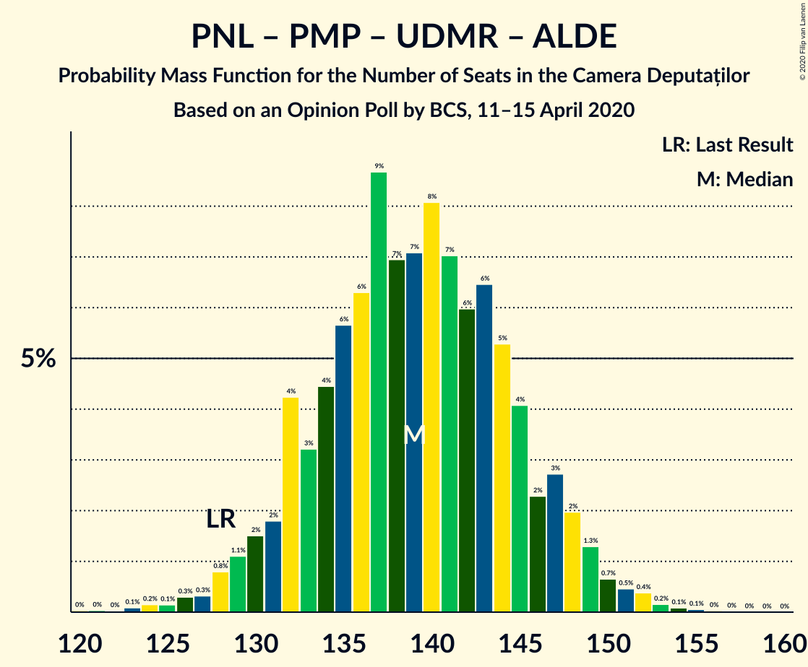

| Number of Seats | Probability | Accumulated | Special Marks |
|:---------------:|:-----------:|:-----------:|:-------------:|
| 120 | 0% | 100% |  |
| 121 | 0% | 99.9% |  |
| 122 | 0% | 99.9% |  |
| 123 | 0.1% | 99.9% |  |
| 124 | 0.2% | 99.8% |  |
| 125 | 0.1% | 99.6% |  |
| 126 | 0.3% | 99.5% |  |
| 127 | 0.3% | 99.2% |  |
| 128 | 0.8% | 98.9% | Last Result |
| 129 | 1.1% | 98% |  |
| 130 | 2% | 97% |  |
| 131 | 2% | 95% |  |
| 132 | 4% | 94% |  |
| 133 | 3% | 89% |  |
| 134 | 4% | 86% |  |
| 135 | 6% | 82% |  |
| 136 | 6% | 76% |  |
| 137 | 9% | 70% |  |
| 138 | 7% | 61% |  |
| 139 | 7% | 54% | Median |
| 140 | 8% | 47% |  |
| 141 | 7% | 39% |  |
| 142 | 6% | 32% |  |
| 143 | 6% | 26% |  |
| 144 | 5% | 20% |  |
| 145 | 4% | 14% |  |
| 146 | 2% | 10% |  |
| 147 | 3% | 8% |  |
| 148 | 2% | 5% |  |
| 149 | 1.3% | 3% |  |
| 150 | 0.7% | 2% |  |
| 151 | 0.5% | 1.2% |  |
| 152 | 0.4% | 0.7% |  |
| 153 | 0.2% | 0.4% |  |
| 154 | 0.1% | 0.2% |  |
| 155 | 0.1% | 0.1% |  |
| 156 | 0% | 0.1% |  |
| 157 | 0% | 0% |  |

### Partidul Național Liberal – Partidul Mișcarea Populară – Uniunea Democrată Maghiară din România

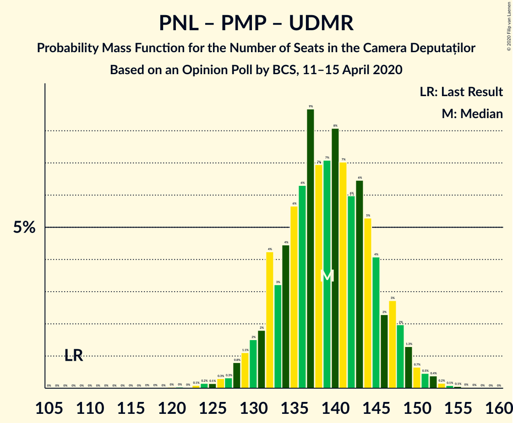

| Number of Seats | Probability | Accumulated | Special Marks |
|:---------------:|:-----------:|:-----------:|:-------------:|
| 108 | 0% | 100% | Last Result |
| 109 | 0% | 100% |  |
| 110 | 0% | 100% |  |
| 111 | 0% | 100% |  |
| 112 | 0% | 100% |  |
| 113 | 0% | 100% |  |
| 114 | 0% | 100% |  |
| 115 | 0% | 100% |  |
| 116 | 0% | 100% |  |
| 117 | 0% | 100% |  |
| 118 | 0% | 100% |  |
| 119 | 0% | 100% |  |
| 120 | 0% | 100% |  |
| 121 | 0% | 99.9% |  |
| 122 | 0% | 99.9% |  |
| 123 | 0.1% | 99.9% |  |
| 124 | 0.2% | 99.8% |  |
| 125 | 0.1% | 99.6% |  |
| 126 | 0.3% | 99.5% |  |
| 127 | 0.3% | 99.2% |  |
| 128 | 0.8% | 98.9% |  |
| 129 | 1.1% | 98% |  |
| 130 | 2% | 97% |  |
| 131 | 2% | 95% |  |
| 132 | 4% | 94% |  |
| 133 | 3% | 89% |  |
| 134 | 4% | 86% |  |
| 135 | 6% | 82% |  |
| 136 | 6% | 76% |  |
| 137 | 9% | 70% |  |
| 138 | 7% | 61% |  |
| 139 | 7% | 54% | Median |
| 140 | 8% | 47% |  |
| 141 | 7% | 39% |  |
| 142 | 6% | 32% |  |
| 143 | 6% | 26% |  |
| 144 | 5% | 20% |  |
| 145 | 4% | 14% |  |
| 146 | 2% | 10% |  |
| 147 | 3% | 8% |  |
| 148 | 2% | 5% |  |
| 149 | 1.3% | 3% |  |
| 150 | 0.7% | 2% |  |
| 151 | 0.5% | 1.2% |  |
| 152 | 0.4% | 0.7% |  |
| 153 | 0.2% | 0.4% |  |
| 154 | 0.1% | 0.2% |  |
| 155 | 0.1% | 0.1% |  |
| 156 | 0% | 0.1% |  |
| 157 | 0% | 0% |  |

### Partidul Național Liberal – Partidul Mișcarea Populară

| Number of Seats | Probability | Accumulated | Special Marks |
|:---------------:|:-----------:|:-----------:|:-------------:|
| 87 | 0% | 100% | Last Result |
| 88 | 0% | 100% |  |
| 89 | 0% | 100% |  |
| 90 | 0% | 100% |  |
| 91 | 0% | 100% |  |
| 92 | 0% | 100% |  |
| 93 | 0% | 100% |  |
| 94 | 0% | 100% |  |
| 95 | 0% | 100% |  |
| 96 | 0% | 100% |  |
| 97 | 0% | 100% |  |
| 98 | 0% | 100% |  |
| 99 | 0% | 100% |  |
| 100 | 0% | 100% |  |
| 101 | 0% | 100% |  |
| 102 | 0% | 100% |  |
| 103 | 0% | 100% |  |
| 104 | 0% | 100% |  |
| 105 | 0% | 100% |  |
| 106 | 0% | 100% |  |
| 107 | 0% | 100% |  |
| 108 | 0% | 100% |  |
| 109 | 0% | 99.9% |  |
| 110 | 0% | 99.9% |  |
| 111 | 0% | 99.8% |  |
| 112 | 0.1% | 99.8% |  |
| 113 | 0.1% | 99.7% |  |
| 114 | 0.3% | 99.5% |  |
| 115 | 0.3% | 99.3% |  |
| 116 | 0.5% | 98.9% |  |
| 117 | 0.9% | 98% |  |
| 118 | 1.3% | 98% |  |
| 119 | 2% | 96% |  |
| 120 | 4% | 94% |  |
| 121 | 3% | 90% |  |
| 122 | 4% | 87% |  |
| 123 | 5% | 83% |  |
| 124 | 7% | 78% |  |
| 125 | 10% | 72% |  |
| 126 | 9% | 62% |  |
| 127 | 6% | 53% | Median |
| 128 | 5% | 47% |  |
| 129 | 5% | 42% |  |
| 130 | 10% | 37% |  |
| 131 | 7% | 27% |  |
| 132 | 5% | 20% |  |
| 133 | 4% | 14% |  |
| 134 | 2% | 10% |  |
| 135 | 2% | 8% |  |
| 136 | 2% | 6% |  |
| 137 | 2% | 4% |  |
| 138 | 1.0% | 2% |  |
| 139 | 0.5% | 1.2% |  |
| 140 | 0.2% | 0.7% |  |
| 141 | 0.2% | 0.4% |  |
| 142 | 0.1% | 0.3% |  |
| 143 | 0.1% | 0.1% |  |
| 144 | 0% | 0.1% |  |
| 145 | 0% | 0% |  |

### Partidul Național Liberal – Uniunea Democrată Maghiară din România – Partidul Alianța Liberalilor și Democraților

| Number of Seats | Probability | Accumulated | Special Marks |
|:---------------:|:-----------:|:-----------:|:-------------:|
| 101 | 0% | 100% |  |
| 102 | 0.1% | 99.9% |  |
| 103 | 0.1% | 99.8% |  |
| 104 | 0.3% | 99.7% |  |
| 105 | 0.4% | 99.4% |  |
| 106 | 0.8% | 99.0% |  |
| 107 | 1.1% | 98% |  |
| 108 | 2% | 97% |  |
| 109 | 2% | 96% |  |
| 110 | 3% | 93% | Last Result |
| 111 | 5% | 90% |  |
| 112 | 5% | 85% |  |
| 113 | 6% | 80% |  |
| 114 | 6% | 74% |  |
| 115 | 7% | 68% |  |
| 116 | 8% | 60% |  |
| 117 | 10% | 52% | Median |
| 118 | 6% | 42% |  |
| 119 | 7% | 35% |  |
| 120 | 5% | 28% |  |
| 121 | 6% | 23% |  |
| 122 | 5% | 17% |  |
| 123 | 3% | 12% |  |
| 124 | 3% | 9% |  |
| 125 | 2% | 6% |  |
| 126 | 2% | 4% |  |
| 127 | 0.8% | 2% |  |
| 128 | 0.7% | 2% |  |
| 129 | 0.4% | 0.9% |  |
| 130 | 0.2% | 0.5% |  |
| 131 | 0.1% | 0.3% |  |
| 132 | 0.1% | 0.2% |  |
| 133 | 0% | 0.1% |  |
| 134 | 0% | 0.1% |  |
| 135 | 0% | 0% |  |

### Partidul Național Liberal – Uniunea Democrată Maghiară din România

| Number of Seats | Probability | Accumulated | Special Marks |
|:---------------:|:-----------:|:-----------:|:-------------:|
| 90 | 0% | 100% | Last Result |
| 91 | 0% | 100% |  |
| 92 | 0% | 100% |  |
| 93 | 0% | 100% |  |
| 94 | 0% | 100% |  |
| 95 | 0% | 100% |  |
| 96 | 0% | 100% |  |
| 97 | 0% | 100% |  |
| 98 | 0% | 100% |  |
| 99 | 0% | 100% |  |
| 100 | 0% | 100% |  |
| 101 | 0% | 100% |  |
| 102 | 0.1% | 99.9% |  |
| 103 | 0.1% | 99.8% |  |
| 104 | 0.3% | 99.7% |  |
| 105 | 0.4% | 99.4% |  |
| 106 | 0.8% | 99.0% |  |
| 107 | 1.1% | 98% |  |
| 108 | 2% | 97% |  |
| 109 | 2% | 96% |  |
| 110 | 3% | 93% |  |
| 111 | 5% | 90% |  |
| 112 | 5% | 85% |  |
| 113 | 6% | 80% |  |
| 114 | 6% | 74% |  |
| 115 | 7% | 68% |  |
| 116 | 8% | 60% |  |
| 117 | 10% | 52% | Median |
| 118 | 6% | 42% |  |
| 119 | 7% | 35% |  |
| 120 | 5% | 28% |  |
| 121 | 6% | 23% |  |
| 122 | 5% | 17% |  |
| 123 | 3% | 12% |  |
| 124 | 3% | 9% |  |
| 125 | 2% | 6% |  |
| 126 | 2% | 4% |  |
| 127 | 0.8% | 2% |  |
| 128 | 0.7% | 2% |  |
| 129 | 0.4% | 0.9% |  |
| 130 | 0.2% | 0.5% |  |
| 131 | 0.1% | 0.3% |  |
| 132 | 0.1% | 0.2% |  |
| 133 | 0% | 0.1% |  |
| 134 | 0% | 0.1% |  |
| 135 | 0% | 0% |  |

### Partidul Social Democrat – PRO România – Partidul Alianța Liberalilor și Democraților

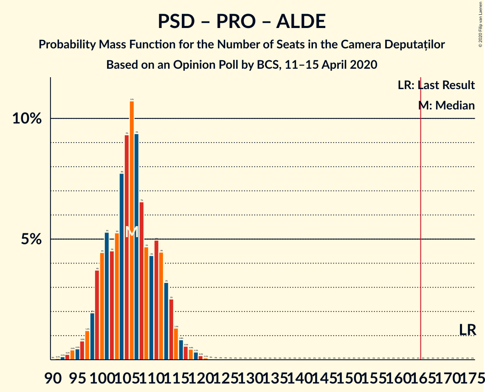

| Number of Seats | Probability | Accumulated | Special Marks |
|:---------------:|:-----------:|:-----------:|:-------------:|
| 91 | 0.1% | 100% |  |
| 92 | 0.1% | 99.9% |  |
| 93 | 0.2% | 99.8% |  |
| 94 | 0.4% | 99.6% |  |
| 95 | 0.5% | 99.2% |  |
| 96 | 0.8% | 98.7% |  |
| 97 | 1.2% | 98% |  |
| 98 | 2% | 97% |  |
| 99 | 4% | 95% |  |
| 100 | 4% | 91% |  |
| 101 | 5% | 87% |  |
| 102 | 5% | 81% |  |
| 103 | 5% | 77% |  |
| 104 | 8% | 72% |  |
| 105 | 9% | 64% | Median |
| 106 | 11% | 55% |  |
| 107 | 9% | 44% |  |
| 108 | 7% | 34% |  |
| 109 | 5% | 28% |  |
| 110 | 4% | 23% |  |
| 111 | 5% | 19% |  |
| 112 | 4% | 14% |  |
| 113 | 3% | 9% |  |
| 114 | 3% | 6% |  |
| 115 | 1.3% | 4% |  |
| 116 | 0.8% | 2% |  |
| 117 | 0.6% | 2% |  |
| 118 | 0.4% | 1.1% |  |
| 119 | 0.3% | 0.6% |  |
| 120 | 0.2% | 0.3% |  |
| 121 | 0.1% | 0.2% |  |
| 122 | 0% | 0.1% |  |
| 123 | 0% | 0.1% |  |
| 124 | 0% | 0% |  |
| 125 | 0% | 0% |  |
| 126 | 0% | 0% |  |
| 127 | 0% | 0% |  |
| 128 | 0% | 0% |  |
| 129 | 0% | 0% |  |
| 130 | 0% | 0% |  |
| 131 | 0% | 0% |  |
| 132 | 0% | 0% |  |
| 133 | 0% | 0% |  |
| 134 | 0% | 0% |  |
| 135 | 0% | 0% |  |
| 136 | 0% | 0% |  |
| 137 | 0% | 0% |  |
| 138 | 0% | 0% |  |
| 139 | 0% | 0% |  |
| 140 | 0% | 0% |  |
| 141 | 0% | 0% |  |
| 142 | 0% | 0% |  |
| 143 | 0% | 0% |  |
| 144 | 0% | 0% |  |
| 145 | 0% | 0% |  |
| 146 | 0% | 0% |  |
| 147 | 0% | 0% |  |
| 148 | 0% | 0% |  |
| 149 | 0% | 0% |  |
| 150 | 0% | 0% |  |
| 151 | 0% | 0% |  |
| 152 | 0% | 0% |  |
| 153 | 0% | 0% |  |
| 154 | 0% | 0% |  |
| 155 | 0% | 0% |  |
| 156 | 0% | 0% |  |
| 157 | 0% | 0% |  |
| 158 | 0% | 0% |  |
| 159 | 0% | 0% |  |
| 160 | 0% | 0% |  |
| 161 | 0% | 0% |  |
| 162 | 0% | 0% |  |
| 163 | 0% | 0% |  |
| 164 | 0% | 0% |  |
| 165 | 0% | 0% | Majority |
| 166 | 0% | 0% |  |
| 167 | 0% | 0% |  |
| 168 | 0% | 0% |  |
| 169 | 0% | 0% |  |
| 170 | 0% | 0% |  |
| 171 | 0% | 0% |  |
| 172 | 0% | 0% |  |
| 173 | 0% | 0% |  |
| 174 | 0% | 0% | Last Result |

### Partidul Social Democrat – PRO România

| Number of Seats | Probability | Accumulated | Special Marks |
|:---------------:|:-----------:|:-----------:|:-------------:|
| 91 | 0.1% | 100% |  |
| 92 | 0.1% | 99.9% |  |
| 93 | 0.2% | 99.8% |  |
| 94 | 0.4% | 99.6% |  |
| 95 | 0.5% | 99.2% |  |
| 96 | 0.8% | 98.7% |  |
| 97 | 1.2% | 98% |  |
| 98 | 2% | 97% |  |
| 99 | 4% | 95% |  |
| 100 | 4% | 91% |  |
| 101 | 5% | 87% |  |
| 102 | 5% | 81% |  |
| 103 | 5% | 77% |  |
| 104 | 8% | 72% |  |
| 105 | 9% | 64% | Median |
| 106 | 11% | 55% |  |
| 107 | 9% | 44% |  |
| 108 | 7% | 34% |  |
| 109 | 5% | 28% |  |
| 110 | 4% | 23% |  |
| 111 | 5% | 19% |  |
| 112 | 4% | 14% |  |
| 113 | 3% | 9% |  |
| 114 | 3% | 6% |  |
| 115 | 1.3% | 4% |  |
| 116 | 0.8% | 2% |  |
| 117 | 0.6% | 2% |  |
| 118 | 0.4% | 1.1% |  |
| 119 | 0.3% | 0.6% |  |
| 120 | 0.2% | 0.3% |  |
| 121 | 0.1% | 0.2% |  |
| 122 | 0% | 0.1% |  |
| 123 | 0% | 0.1% |  |
| 124 | 0% | 0% |  |
| 125 | 0% | 0% |  |
| 126 | 0% | 0% |  |
| 127 | 0% | 0% |  |
| 128 | 0% | 0% |  |
| 129 | 0% | 0% |  |
| 130 | 0% | 0% |  |
| 131 | 0% | 0% |  |
| 132 | 0% | 0% |  |
| 133 | 0% | 0% |  |
| 134 | 0% | 0% |  |
| 135 | 0% | 0% |  |
| 136 | 0% | 0% |  |
| 137 | 0% | 0% |  |
| 138 | 0% | 0% |  |
| 139 | 0% | 0% |  |
| 140 | 0% | 0% |  |
| 141 | 0% | 0% |  |
| 142 | 0% | 0% |  |
| 143 | 0% | 0% |  |
| 144 | 0% | 0% |  |
| 145 | 0% | 0% |  |
| 146 | 0% | 0% |  |
| 147 | 0% | 0% |  |
| 148 | 0% | 0% |  |
| 149 | 0% | 0% |  |
| 150 | 0% | 0% |  |
| 151 | 0% | 0% |  |
| 152 | 0% | 0% |  |
| 153 | 0% | 0% |  |
| 154 | 0% | 0% | Last Result |

### Partidul Național Liberal

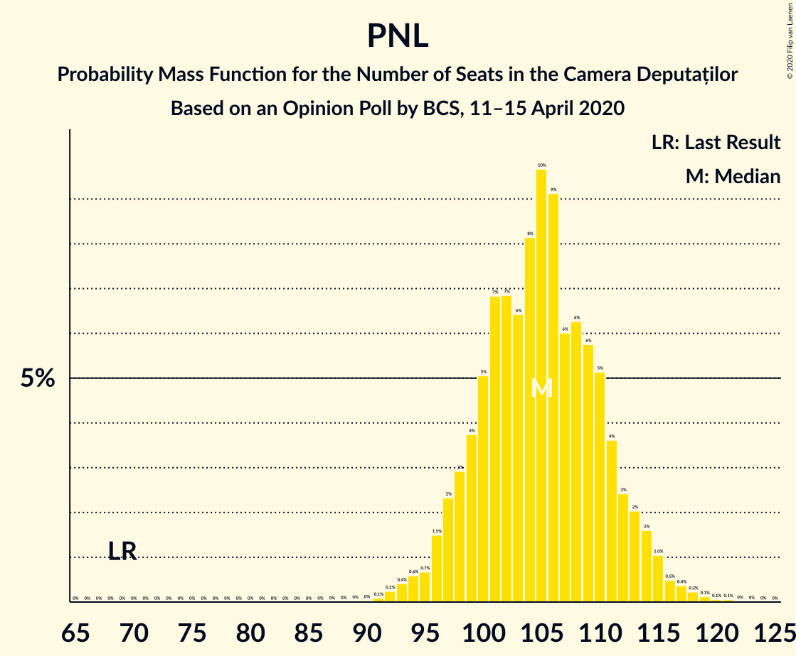

| Number of Seats | Probability | Accumulated | Special Marks |
|:---------------:|:-----------:|:-----------:|:-------------:|
| 69 | 0% | 100% | Last Result |
| 70 | 0% | 100% |  |
| 71 | 0% | 100% |  |
| 72 | 0% | 100% |  |
| 73 | 0% | 100% |  |
| 74 | 0% | 100% |  |
| 75 | 0% | 100% |  |
| 76 | 0% | 100% |  |
| 77 | 0% | 100% |  |
| 78 | 0% | 100% |  |
| 79 | 0% | 100% |  |
| 80 | 0% | 100% |  |
| 81 | 0% | 100% |  |
| 82 | 0% | 100% |  |
| 83 | 0% | 100% |  |
| 84 | 0% | 100% |  |
| 85 | 0% | 100% |  |
| 86 | 0% | 100% |  |
| 87 | 0% | 100% |  |
| 88 | 0% | 100% |  |
| 89 | 0% | 100% |  |
| 90 | 0% | 100% |  |
| 91 | 0.1% | 99.9% |  |
| 92 | 0.2% | 99.8% |  |
| 93 | 0.4% | 99.6% |  |
| 94 | 0.6% | 99.2% |  |
| 95 | 0.7% | 98.6% |  |
| 96 | 1.5% | 98% |  |
| 97 | 2% | 96% |  |
| 98 | 3% | 94% |  |
| 99 | 4% | 91% |  |
| 100 | 5% | 87% |  |
| 101 | 7% | 82% |  |
| 102 | 7% | 76% |  |
| 103 | 6% | 69% |  |
| 104 | 8% | 62% |  |
| 105 | 10% | 54% | Median |
| 106 | 9% | 44% |  |
| 107 | 6% | 35% |  |
| 108 | 6% | 29% |  |
| 109 | 6% | 23% |  |
| 110 | 5% | 17% |  |
| 111 | 4% | 12% |  |
| 112 | 2% | 8% |  |
| 113 | 2% | 6% |  |
| 114 | 2% | 4% |  |
| 115 | 1.0% | 2% |  |
| 116 | 0.5% | 1.4% |  |
| 117 | 0.4% | 0.9% |  |
| 118 | 0.2% | 0.5% |  |
| 119 | 0.1% | 0.3% |  |
| 120 | 0.1% | 0.2% |  |
| 121 | 0.1% | 0.1% |  |
| 122 | 0% | 0% |  |

### Alianța 2020 USR-PLUS – Partidul Mișcarea Populară

| Number of Seats | Probability | Accumulated | Special Marks |
|:---------------:|:-----------:|:-----------:|:-------------:|
| 48 | 0% | 100% | Last Result |
| 49 | 0% | 100% |  |
| 50 | 0% | 100% |  |
| 51 | 0% | 100% |  |
| 52 | 0% | 100% |  |
| 53 | 0% | 100% |  |
| 54 | 0% | 100% |  |
| 55 | 0% | 100% |  |
| 56 | 0% | 100% |  |
| 57 | 0% | 100% |  |
| 58 | 0% | 100% |  |
| 59 | 0% | 100% |  |
| 60 | 0% | 100% |  |
| 61 | 0% | 100% |  |
| 62 | 0% | 100% |  |
| 63 | 0% | 100% |  |
| 64 | 0% | 100% |  |
| 65 | 0% | 100% |  |
| 66 | 0% | 100% |  |
| 67 | 0% | 100% |  |
| 68 | 0% | 99.9% |  |
| 69 | 0% | 99.9% |  |
| 70 | 0% | 99.9% |  |
| 71 | 0% | 99.9% |  |
| 72 | 0% | 99.8% |  |
| 73 | 0% | 99.8% |  |
| 74 | 0% | 99.8% |  |
| 75 | 0.1% | 99.7% |  |
| 76 | 0.1% | 99.6% |  |
| 77 | 0.2% | 99.5% |  |
| 78 | 0.4% | 99.3% |  |
| 79 | 0.7% | 98.8% |  |
| 80 | 1.0% | 98% |  |
| 81 | 1.5% | 97% |  |
| 82 | 3% | 96% |  |
| 83 | 4% | 93% |  |
| 84 | 5% | 89% |  |
| 85 | 6% | 85% |  |
| 86 | 7% | 79% |  |
| 87 | 7% | 73% |  |
| 88 | 8% | 66% |  |
| 89 | 9% | 58% | Median |
| 90 | 9% | 49% |  |
| 91 | 10% | 39% |  |
| 92 | 6% | 30% |  |
| 93 | 6% | 24% |  |
| 94 | 5% | 18% |  |
| 95 | 4% | 13% |  |
| 96 | 3% | 9% |  |
| 97 | 2% | 6% |  |
| 98 | 1.5% | 4% |  |
| 99 | 0.9% | 2% |  |
| 100 | 0.6% | 1.5% |  |
| 101 | 0.4% | 0.9% |  |
| 102 | 0.3% | 0.5% |  |
| 103 | 0.1% | 0.2% |  |
| 104 | 0.1% | 0.1% |  |
| 105 | 0% | 0.1% |  |
| 106 | 0% | 0% |  |

### Partidul Social Democrat – Partidul Alianța Liberalilor și Democraților

| Number of Seats | Probability | Accumulated | Special Marks |
|:---------------:|:-----------:|:-----------:|:-------------:|
| 63 | 0.1% | 100% |  |
| 64 | 0.1% | 99.9% |  |
| 65 | 0.2% | 99.8% |  |
| 66 | 0.4% | 99.5% |  |
| 67 | 0.7% | 99.1% |  |
| 68 | 1.4% | 98% |  |
| 69 | 2% | 97% |  |
| 70 | 3% | 95% |  |
| 71 | 4% | 92% |  |
| 72 | 5% | 88% |  |
| 73 | 7% | 83% |  |
| 74 | 8% | 76% |  |
| 75 | 9% | 68% |  |
| 76 | 10% | 59% | Median |
| 77 | 8% | 49% |  |
| 78 | 8% | 41% |  |
| 79 | 7% | 32% |  |
| 80 | 8% | 25% |  |
| 81 | 5% | 18% |  |
| 82 | 4% | 13% |  |
| 83 | 3% | 9% |  |
| 84 | 3% | 6% |  |
| 85 | 1.2% | 4% |  |
| 86 | 1.0% | 2% |  |
| 87 | 0.6% | 1.3% |  |
| 88 | 0.2% | 0.7% |  |
| 89 | 0.2% | 0.5% |  |
| 90 | 0.1% | 0.2% |  |
| 91 | 0.1% | 0.1% |  |
| 92 | 0% | 0.1% |  |
| 93 | 0% | 0% |  |
| 94 | 0% | 0% |  |
| 95 | 0% | 0% |  |
| 96 | 0% | 0% |  |
| 97 | 0% | 0% |  |
| 98 | 0% | 0% |  |
| 99 | 0% | 0% |  |
| 100 | 0% | 0% |  |
| 101 | 0% | 0% |  |
| 102 | 0% | 0% |  |
| 103 | 0% | 0% |  |
| 104 | 0% | 0% |  |
| 105 | 0% | 0% |  |
| 106 | 0% | 0% |  |
| 107 | 0% | 0% |  |
| 108 | 0% | 0% |  |
| 109 | 0% | 0% |  |
| 110 | 0% | 0% |  |
| 111 | 0% | 0% |  |
| 112 | 0% | 0% |  |
| 113 | 0% | 0% |  |
| 114 | 0% | 0% |  |
| 115 | 0% | 0% |  |
| 116 | 0% | 0% |  |
| 117 | 0% | 0% |  |
| 118 | 0% | 0% |  |
| 119 | 0% | 0% |  |
| 120 | 0% | 0% |  |
| 121 | 0% | 0% |  |
| 122 | 0% | 0% |  |
| 123 | 0% | 0% |  |
| 124 | 0% | 0% |  |
| 125 | 0% | 0% |  |
| 126 | 0% | 0% |  |
| 127 | 0% | 0% |  |
| 128 | 0% | 0% |  |
| 129 | 0% | 0% |  |
| 130 | 0% | 0% |  |
| 131 | 0% | 0% |  |
| 132 | 0% | 0% |  |
| 133 | 0% | 0% |  |
| 134 | 0% | 0% |  |
| 135 | 0% | 0% |  |
| 136 | 0% | 0% |  |
| 137 | 0% | 0% |  |
| 138 | 0% | 0% |  |
| 139 | 0% | 0% |  |
| 140 | 0% | 0% |  |
| 141 | 0% | 0% |  |
| 142 | 0% | 0% |  |
| 143 | 0% | 0% |  |
| 144 | 0% | 0% |  |
| 145 | 0% | 0% |  |
| 146 | 0% | 0% |  |
| 147 | 0% | 0% |  |
| 148 | 0% | 0% |  |
| 149 | 0% | 0% |  |
| 150 | 0% | 0% |  |
| 151 | 0% | 0% |  |
| 152 | 0% | 0% |  |
| 153 | 0% | 0% |  |
| 154 | 0% | 0% |  |
| 155 | 0% | 0% |  |
| 156 | 0% | 0% |  |
| 157 | 0% | 0% |  |
| 158 | 0% | 0% |  |
| 159 | 0% | 0% |  |
| 160 | 0% | 0% |  |
| 161 | 0% | 0% |  |
| 162 | 0% | 0% |  |
| 163 | 0% | 0% |  |
| 164 | 0% | 0% |  |
| 165 | 0% | 0% | Majority |
| 166 | 0% | 0% |  |
| 167 | 0% | 0% |  |
| 168 | 0% | 0% |  |
| 169 | 0% | 0% |  |
| 170 | 0% | 0% |  |
| 171 | 0% | 0% |  |
| 172 | 0% | 0% |  |
| 173 | 0% | 0% |  |
| 174 | 0% | 0% | Last Result |

## Technical Information

### Opinion Poll

+ **Polling firm:** BCS
+ **Commissioner(s):** —
+ **Fieldwork period:** 11–15 April 2020

### Calculations

+ **Sample size:** 1008
+ **Simulations done:** 1,048,576
+ **Error estimate:** 1.04%

