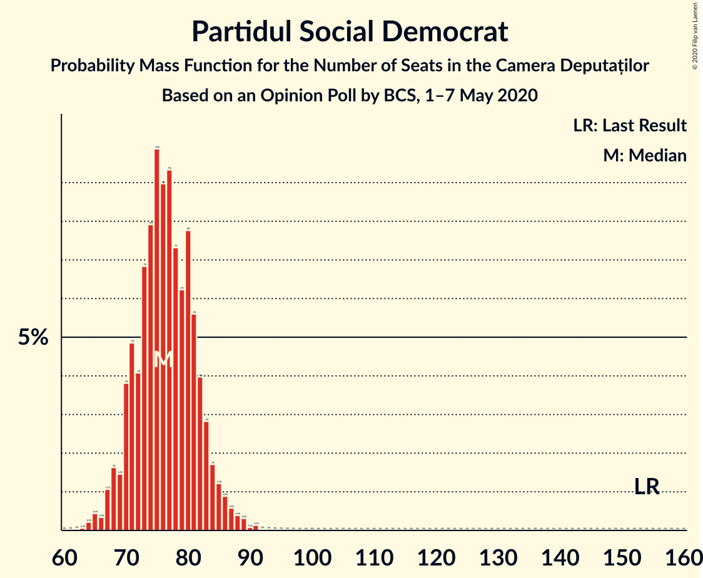
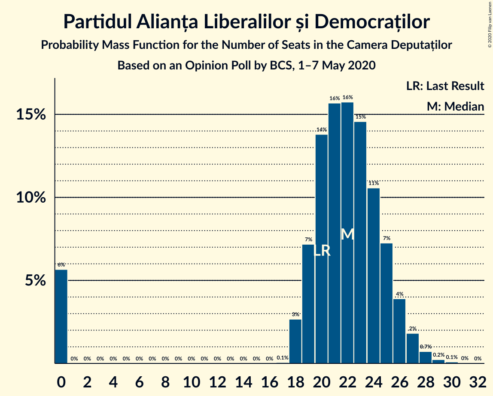
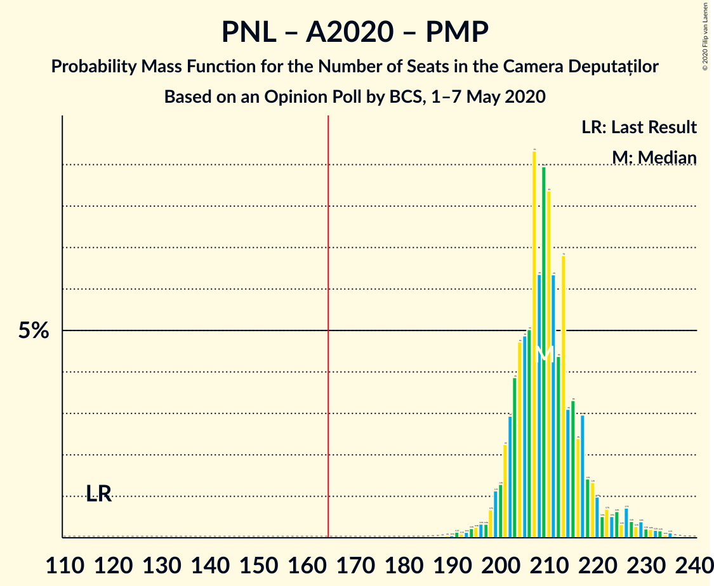
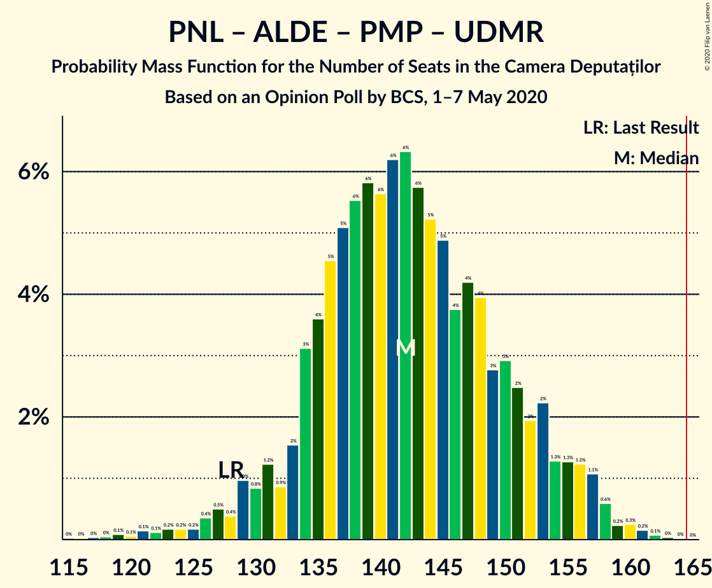
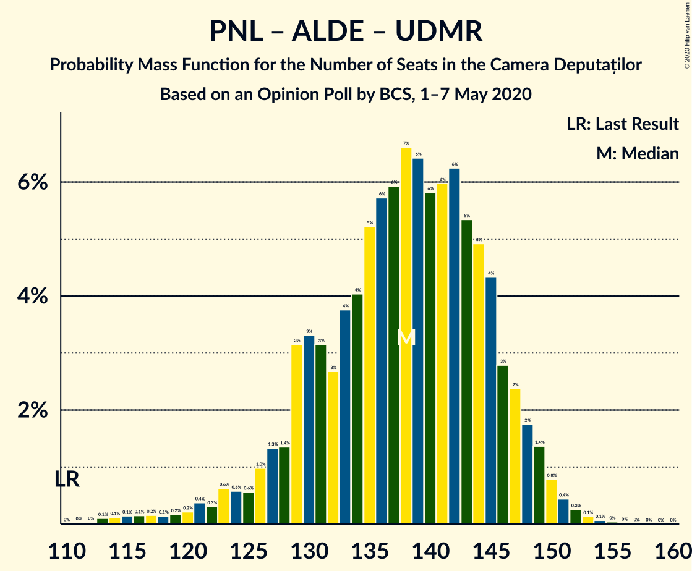
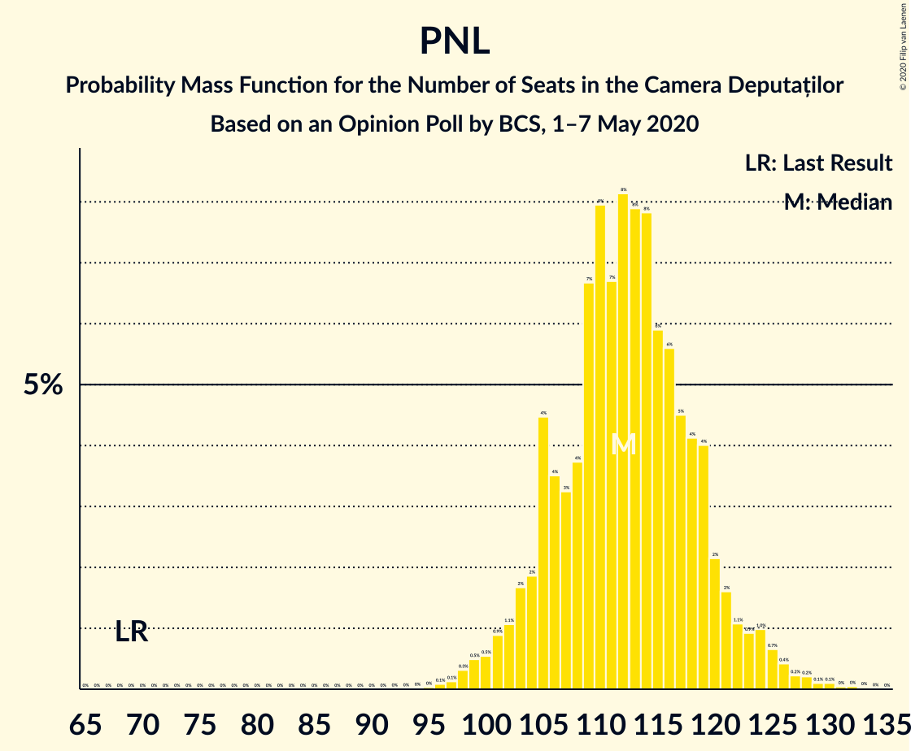

# Opinion Poll by BCS, 1–7 May 2020

<a href="#voting-intentions">Voting Intentions</a> | <a href="#seats">Seats</a> | <a href="#coalitions">Coalitions</a> | <a href="#technical-information">Technical Information</a>

## Voting Intentions

### Confidence Intervals

| Party | Last Result | Poll Result | 80% Confidence Interval | 90% Confidence Interval | 95% Confidence Interval | 99% Confidence Interval |
|:-----:|:-----------:|:-----------:|:-----------------------:|:-----------------------:|:-----------------------:|:-----------------------:|
| Partidul Național Liberal | 20.0% | 29.8% | 28.4–31.4% |28.0–31.8% |27.6–32.2% |26.9–32.9% |
| Alianța 2020 USR-PLUS | 8.9% | 24.7% | 23.3–26.1% |22.9–26.5% |22.6–26.9% |21.9–27.6% |
| Partidul Social Democrat | 45.5% | 20.3% | 19.1–21.7% |18.7–22.1% |18.4–22.4% |17.8–23.1% |
| Partidul Alianța Liberalilor și Democraților | 5.6% | 5.9% | 5.2–6.7% |5.0–7.0% |4.8–7.2% |4.5–7.6% |
| Partidul Mișcarea Populară | 5.4% | 4.6% | 4.0–5.4% |3.8–5.6% |3.7–5.8% |3.4–6.1% |
| PRO România | 0.0% | 3.9% | 3.3–4.6% |3.2–4.8% |3.0–5.0% |2.8–5.3% |
| Uniunea Democrată Maghiară din România | 6.2% | 1.3% | 1.0–1.8% |0.9–1.9% |0.8–2.0% |0.7–2.2% |

*Note:* The poll result column reflects the actual value used in the calculations. Published results may vary slightly, and in addition be rounded to fewer digits.

## Seats

### Confidence Intervals

| Party | Last Result | Median | 80% Confidence Interval | 90% Confidence Interval | 95% Confidence Interval | 99% Confidence Interval |
|:-----:|:-----------:|:------:|:-----------------------:|:-----------------------:|:-----------------------:|:-----------------------:|
| <a href="#partidul-național-liberal">Partidul Național Liberal</a> | 69 | 112 | 105–119 |103–121 |102–123 |98–127 |
| <a href="#alianța-2020-usr-plus">Alianța 2020 USR-PLUS</a> | 30 | 93 | 86–99 |85–101 |83–103 |80–106 |
| <a href="#partidul-social-democrat">Partidul Social Democrat</a> | 154 | 76 | 70–82 |69–84 |68–86 |65–89 |
| <a href="#partidul-alianța-liberalilor-și-democraților">Partidul Alianța Liberalilor și Democraților</a> | 20 | 22 | 19–25 |0–26 |0–27 |0–28 |
| <a href="#partidul-mișcarea-populară">Partidul Mișcarea Populară</a> | 18 | 0 | 0–19 |0–20 |0–21 |0–22 |
| <a href="#pro-românia">PRO România</a> | 0 | 0 | 0 |0 |0 |0–19 |
| <a href="#uniunea-democrată-maghiară-din-românia">Uniunea Democrată Maghiară din România</a> | 21 | 5 | 3–6 |3–7 |3–7 |2–8 |

### Partidul Național Liberal

*For a full overview of the results for this party, see the [Partidul Național Liberal](party-partidulnaționalliberal.html) page.*

| Number of Seats | Probability | Accumulated | Special Marks |
|:---------------:|:-----------:|:-----------:|:-------------:|
| 69 | 0% | 100% | Last Result |
| 70 | 0% | 100% |  |
| 71 | 0% | 100% |  |
| 72 | 0% | 100% |  |
| 73 | 0% | 100% |  |
| 74 | 0% | 100% |  |
| 75 | 0% | 100% |  |
| 76 | 0% | 100% |  |
| 77 | 0% | 100% |  |
| 78 | 0% | 100% |  |
| 79 | 0% | 100% |  |
| 80 | 0% | 100% |  |
| 81 | 0% | 100% |  |
| 82 | 0% | 100% |  |
| 83 | 0% | 100% |  |
| 84 | 0% | 100% |  |
| 85 | 0% | 100% |  |
| 86 | 0% | 100% |  |
| 87 | 0% | 100% |  |
| 88 | 0% | 100% |  |
| 89 | 0% | 100% |  |
| 90 | 0% | 100% |  |
| 91 | 0% | 100% |  |
| 92 | 0% | 100% |  |
| 93 | 0% | 100% |  |
| 94 | 0% | 100% |  |
| 95 | 0% | 100% |  |
| 96 | 0.1% | 99.9% |  |
| 97 | 0.2% | 99.8% |  |
| 98 | 0.3% | 99.7% |  |
| 99 | 0.5% | 99.4% |  |
| 100 | 0.4% | 98.9% |  |
| 101 | 0.8% | 98% |  |
| 102 | 1.2% | 98% |  |
| 103 | 2% | 97% |  |
| 104 | 2% | 95% |  |
| 105 | 3% | 93% |  |
| 106 | 3% | 90% |  |
| 107 | 3% | 87% |  |
| 108 | 4% | 83% |  |
| 109 | 7% | 79% |  |
| 110 | 8% | 72% |  |
| 111 | 9% | 64% |  |
| 112 | 9% | 55% | Median |
| 113 | 5% | 46% |  |
| 114 | 9% | 42% |  |
| 115 | 6% | 33% |  |
| 116 | 5% | 27% |  |
| 117 | 6% | 22% |  |
| 118 | 4% | 16% |  |
| 119 | 4% | 13% |  |
| 120 | 3% | 9% |  |
| 121 | 1.4% | 6% |  |
| 122 | 1.2% | 5% |  |
| 123 | 1.3% | 3% |  |
| 124 | 0.8% | 2% |  |
| 125 | 0.4% | 1.4% |  |
| 126 | 0.3% | 1.0% |  |
| 127 | 0.2% | 0.7% |  |
| 128 | 0.2% | 0.5% |  |
| 129 | 0.1% | 0.3% |  |
| 130 | 0% | 0.2% |  |
| 131 | 0.1% | 0.2% |  |
| 132 | 0.1% | 0.1% |  |
| 133 | 0% | 0.1% |  |
| 134 | 0% | 0% |  |

### Alianța 2020 USR-PLUS

*For a full overview of the results for this party, see the [Alianța 2020 USR-PLUS](party-alianța2020usr-plus.html) page.*

| Number of Seats | Probability | Accumulated | Special Marks |
|:---------------:|:-----------:|:-----------:|:-------------:|
| 30 | 0% | 100% | Last Result |
| 31 | 0% | 100% |  |
| 32 | 0% | 100% |  |
| 33 | 0% | 100% |  |
| 34 | 0% | 100% |  |
| 35 | 0% | 100% |  |
| 36 | 0% | 100% |  |
| 37 | 0% | 100% |  |
| 38 | 0% | 100% |  |
| 39 | 0% | 100% |  |
| 40 | 0% | 100% |  |
| 41 | 0% | 100% |  |
| 42 | 0% | 100% |  |
| 43 | 0% | 100% |  |
| 44 | 0% | 100% |  |
| 45 | 0% | 100% |  |
| 46 | 0% | 100% |  |
| 47 | 0% | 100% |  |
| 48 | 0% | 100% |  |
| 49 | 0% | 100% |  |
| 50 | 0% | 100% |  |
| 51 | 0% | 100% |  |
| 52 | 0% | 100% |  |
| 53 | 0% | 100% |  |
| 54 | 0% | 100% |  |
| 55 | 0% | 100% |  |
| 56 | 0% | 100% |  |
| 57 | 0% | 100% |  |
| 58 | 0% | 100% |  |
| 59 | 0% | 100% |  |
| 60 | 0% | 100% |  |
| 61 | 0% | 100% |  |
| 62 | 0% | 100% |  |
| 63 | 0% | 100% |  |
| 64 | 0% | 100% |  |
| 65 | 0% | 100% |  |
| 66 | 0% | 100% |  |
| 67 | 0% | 100% |  |
| 68 | 0% | 100% |  |
| 69 | 0% | 100% |  |
| 70 | 0% | 100% |  |
| 71 | 0% | 100% |  |
| 72 | 0% | 100% |  |
| 73 | 0% | 100% |  |
| 74 | 0% | 100% |  |
| 75 | 0% | 100% |  |
| 76 | 0% | 100% |  |
| 77 | 0.1% | 100% |  |
| 78 | 0.1% | 99.9% |  |
| 79 | 0.2% | 99.8% |  |
| 80 | 0.3% | 99.6% |  |
| 81 | 0.6% | 99.4% |  |
| 82 | 0.6% | 98.8% |  |
| 83 | 2% | 98% |  |
| 84 | 1.1% | 96% |  |
| 85 | 2% | 95% |  |
| 86 | 3% | 93% |  |
| 87 | 4% | 89% |  |
| 88 | 4% | 86% |  |
| 89 | 6% | 82% |  |
| 90 | 7% | 75% |  |
| 91 | 7% | 69% |  |
| 92 | 8% | 62% |  |
| 93 | 6% | 53% | Median |
| 94 | 7% | 47% |  |
| 95 | 11% | 40% |  |
| 96 | 6% | 29% |  |
| 97 | 5% | 23% |  |
| 98 | 6% | 18% |  |
| 99 | 4% | 12% |  |
| 100 | 3% | 8% |  |
| 101 | 2% | 5% |  |
| 102 | 1.1% | 4% |  |
| 103 | 1.0% | 3% |  |
| 104 | 0.6% | 2% |  |
| 105 | 0.3% | 1.1% |  |
| 106 | 0.3% | 0.7% |  |
| 107 | 0.1% | 0.4% |  |
| 108 | 0.1% | 0.3% |  |
| 109 | 0.1% | 0.2% |  |
| 110 | 0% | 0.1% |  |
| 111 | 0% | 0.1% |  |
| 112 | 0% | 0% |  |

### Partidul Social Democrat

*For a full overview of the results for this party, see the [Partidul Social Democrat](party-partidulsocialdemocrat.html) page.*

| Number of Seats | Probability | Accumulated | Special Marks |
|:---------------:|:-----------:|:-----------:|:-------------:|
| 62 | 0% | 100% |  |
| 63 | 0.1% | 99.9% |  |
| 64 | 0.3% | 99.9% |  |
| 65 | 0.4% | 99.6% |  |
| 66 | 0.3% | 99.2% |  |
| 67 | 1.0% | 98.9% |  |
| 68 | 2% | 98% |  |
| 69 | 1.5% | 96% |  |
| 70 | 5% | 95% |  |
| 71 | 4% | 90% |  |
| 72 | 5% | 86% |  |
| 73 | 6% | 81% |  |
| 74 | 9% | 75% |  |
| 75 | 8% | 66% |  |
| 76 | 9% | 58% | Median |
| 77 | 6% | 49% |  |
| 78 | 9% | 43% |  |
| 79 | 7% | 34% |  |
| 80 | 10% | 27% |  |
| 81 | 5% | 17% |  |
| 82 | 5% | 13% |  |
| 83 | 2% | 8% |  |
| 84 | 2% | 5% |  |
| 85 | 1.2% | 4% |  |
| 86 | 1.0% | 3% |  |
| 87 | 0.6% | 2% |  |
| 88 | 0.4% | 1.0% |  |
| 89 | 0.4% | 0.6% |  |
| 90 | 0.1% | 0.2% |  |
| 91 | 0.1% | 0.2% |  |
| 92 | 0% | 0.1% |  |
| 93 | 0% | 0% |  |
| 94 | 0% | 0% |  |
| 95 | 0% | 0% |  |
| 96 | 0% | 0% |  |
| 97 | 0% | 0% |  |
| 98 | 0% | 0% |  |
| 99 | 0% | 0% |  |
| 100 | 0% | 0% |  |
| 101 | 0% | 0% |  |
| 102 | 0% | 0% |  |
| 103 | 0% | 0% |  |
| 104 | 0% | 0% |  |
| 105 | 0% | 0% |  |
| 106 | 0% | 0% |  |
| 107 | 0% | 0% |  |
| 108 | 0% | 0% |  |
| 109 | 0% | 0% |  |
| 110 | 0% | 0% |  |
| 111 | 0% | 0% |  |
| 112 | 0% | 0% |  |
| 113 | 0% | 0% |  |
| 114 | 0% | 0% |  |
| 115 | 0% | 0% |  |
| 116 | 0% | 0% |  |
| 117 | 0% | 0% |  |
| 118 | 0% | 0% |  |
| 119 | 0% | 0% |  |
| 120 | 0% | 0% |  |
| 121 | 0% | 0% |  |
| 122 | 0% | 0% |  |
| 123 | 0% | 0% |  |
| 124 | 0% | 0% |  |
| 125 | 0% | 0% |  |
| 126 | 0% | 0% |  |
| 127 | 0% | 0% |  |
| 128 | 0% | 0% |  |
| 129 | 0% | 0% |  |
| 130 | 0% | 0% |  |
| 131 | 0% | 0% |  |
| 132 | 0% | 0% |  |
| 133 | 0% | 0% |  |
| 134 | 0% | 0% |  |
| 135 | 0% | 0% |  |
| 136 | 0% | 0% |  |
| 137 | 0% | 0% |  |
| 138 | 0% | 0% |  |
| 139 | 0% | 0% |  |
| 140 | 0% | 0% |  |
| 141 | 0% | 0% |  |
| 142 | 0% | 0% |  |
| 143 | 0% | 0% |  |
| 144 | 0% | 0% |  |
| 145 | 0% | 0% |  |
| 146 | 0% | 0% |  |
| 147 | 0% | 0% |  |
| 148 | 0% | 0% |  |
| 149 | 0% | 0% |  |
| 150 | 0% | 0% |  |
| 151 | 0% | 0% |  |
| 152 | 0% | 0% |  |
| 153 | 0% | 0% |  |
| 154 | 0% | 0% | Last Result |

### Partidul Alianța Liberalilor și Democraților

*For a full overview of the results for this party, see the [Partidul Alianța Liberalilor și Democraților](party-partidulalianțaliberalilorșidemocraților.html) page.*

| Number of Seats | Probability | Accumulated | Special Marks |
|:---------------:|:-----------:|:-----------:|:-------------:|
| 0 | 6% | 100% |  |
| 1 | 0% | 94% |  |
| 2 | 0% | 94% |  |
| 3 | 0% | 94% |  |
| 4 | 0% | 94% |  |
| 5 | 0% | 94% |  |
| 6 | 0% | 94% |  |
| 7 | 0% | 94% |  |
| 8 | 0% | 94% |  |
| 9 | 0% | 94% |  |
| 10 | 0% | 94% |  |
| 11 | 0% | 94% |  |
| 12 | 0% | 94% |  |
| 13 | 0% | 94% |  |
| 14 | 0% | 94% |  |
| 15 | 0% | 94% |  |
| 16 | 0% | 94% |  |
| 17 | 0% | 94% |  |
| 18 | 3% | 94% |  |
| 19 | 7% | 92% |  |
| 20 | 13% | 85% | Last Result |
| 21 | 16% | 71% |  |
| 22 | 17% | 56% | Median |
| 23 | 15% | 39% |  |
| 24 | 10% | 24% |  |
| 25 | 7% | 14% |  |
| 26 | 4% | 7% |  |
| 27 | 2% | 3% |  |
| 28 | 0.7% | 1.0% |  |
| 29 | 0.2% | 0.3% |  |
| 30 | 0.1% | 0.1% |  |
| 31 | 0% | 0% |  |

### Partidul Mișcarea Populară

*For a full overview of the results for this party, see the [Partidul Mișcarea Populară](party-partidulmișcareapopulară.html) page.*

| Number of Seats | Probability | Accumulated | Special Marks |
|:---------------:|:-----------:|:-----------:|:-------------:|
| 0 | 77% | 100% | Median |
| 1 | 0% | 23% |  |
| 2 | 0% | 23% |  |
| 3 | 0% | 23% |  |
| 4 | 0% | 23% |  |
| 5 | 0% | 23% |  |
| 6 | 0% | 23% |  |
| 7 | 0% | 23% |  |
| 8 | 0% | 23% |  |
| 9 | 0% | 23% |  |
| 10 | 0% | 23% |  |
| 11 | 0% | 23% |  |
| 12 | 0% | 23% |  |
| 13 | 0% | 23% |  |
| 14 | 0% | 23% |  |
| 15 | 0% | 23% |  |
| 16 | 0% | 23% |  |
| 17 | 0.3% | 23% |  |
| 18 | 9% | 22% | Last Result |
| 19 | 6% | 13% |  |
| 20 | 4% | 7% |  |
| 21 | 2% | 3% |  |
| 22 | 0.6% | 0.8% |  |
| 23 | 0.1% | 0.2% |  |
| 24 | 0% | 0.1% |  |
| 25 | 0% | 0% |  |

### PRO România

*For a full overview of the results for this party, see the [PRO România](party-proromânia.html) page.*

| Number of Seats | Probability | Accumulated | Special Marks |
|:---------------:|:-----------:|:-----------:|:-------------:|
| 0 | 98% | 100% | Last Result, Median |
| 1 | 0% | 2% |  |
| 2 | 0% | 2% |  |
| 3 | 0% | 2% |  |
| 4 | 0% | 2% |  |
| 5 | 0% | 2% |  |
| 6 | 0% | 2% |  |
| 7 | 0% | 2% |  |
| 8 | 0% | 2% |  |
| 9 | 0% | 2% |  |
| 10 | 0% | 2% |  |
| 11 | 0% | 2% |  |
| 12 | 0% | 2% |  |
| 13 | 0% | 2% |  |
| 14 | 0% | 2% |  |
| 15 | 0% | 2% |  |
| 16 | 0% | 2% |  |
| 17 | 0.2% | 2% |  |
| 18 | 1.1% | 2% |  |
| 19 | 0.5% | 0.8% |  |
| 20 | 0.2% | 0.2% |  |
| 21 | 0% | 0% |  |

### Uniunea Democrată Maghiară din România

*For a full overview of the results for this party, see the [Uniunea Democrată Maghiară din România](party-uniuneademocratămaghiarădinromânia.html) page.*

| Number of Seats | Probability | Accumulated | Special Marks |
|:---------------:|:-----------:|:-----------:|:-------------:|
| 2 | 1.4% | 100% |  |
| 3 | 15% | 98.6% |  |
| 4 | 31% | 84% |  |
| 5 | 32% | 53% | Median |
| 6 | 15% | 21% |  |
| 7 | 5% | 6% |  |
| 8 | 1.0% | 1.2% |  |
| 9 | 0.2% | 0.2% |  |
| 10 | 0% | 0% |  |
| 11 | 0% | 0% |  |
| 12 | 0% | 0% |  |
| 13 | 0% | 0% |  |
| 14 | 0% | 0% |  |
| 15 | 0% | 0% |  |
| 16 | 0% | 0% |  |
| 17 | 0% | 0% |  |
| 18 | 0% | 0% |  |
| 19 | 0% | 0% |  |
| 20 | 0% | 0% |  |
| 21 | 0% | 0% | Last Result |

## Coalitions

### Confidence Intervals

| Coalition | Last Result | Median | Majority? | 80% Confidence Interval | 90% Confidence Interval | 95% Confidence Interval | 99% Confidence Interval |
|:---------:|:-----------:|:------:|:---------:|:-----------------------:|:-----------------------:|:-----------------------:|:-----------------------:|
| Partidul Național Liberal – Alianța 2020 USR-PLUS – Partidul Alianța Liberalilor și Democraților – Partidul Mișcarea Populară – Uniunea Democrată Maghiară din România | 158 | 235 | 100% | 230–241 | 227–242 | 224–244 | 217–247 |
| Partidul Național Liberal – Alianța 2020 USR-PLUS – Partidul Alianța Liberalilor și Democraților – Uniunea Democrată Maghiară din România | 140 | 232 | 100% | 219–239 | 216–240 | 214–241 | 210–244 |
| Partidul Național Liberal – Alianța 2020 USR-PLUS – Partidul Alianța Liberalilor și Democraților – Partidul Mișcarea Populară | 137 | 231 | 100% | 225–237 | 222–238 | 220–240 | 213–242 |
| Partidul Național Liberal – Alianța 2020 USR-PLUS – Partidul Alianța Liberalilor și Democraților | 119 | 228 | 100% | 214–234 | 212–236 | 210–237 | 205–239 |
| Partidul Național Liberal – Alianța 2020 USR-PLUS – Partidul Mișcarea Populară – Uniunea Democrată Maghiară din România | 138 | 214 | 100% | 207–222 | 205–226 | 203–231 | 197–237 |
| Partidul Național Liberal – Alianța 2020 USR-PLUS – Uniunea Democrată Maghiară din România | 120 | 211 | 100% | 199–218 | 196–220 | 194–227 | 190–233 |
| Partidul Național Liberal – Alianța 2020 USR-PLUS – Partidul Mișcarea Populară | 117 | 209 | 100% | 202–217 | 201–222 | 199–226 | 193–232 |
| Partidul Național Liberal – Alianța 2020 USR-PLUS | 99 | 207 | 100% | 194–213 | 192–216 | 190–222 | 186–228 |
| Partidul Național Liberal – Partidul Alianța Liberalilor și Democraților – Partidul Mișcarea Populară – Uniunea Democrată Maghiară din România | 128 | 142 | 0% | 134–152 | 131–154 | 128–156 | 122–160 |
| Partidul Național Liberal – Partidul Alianța Liberalilor și Democraților – Uniunea Democrată Maghiară din România | 110 | 139 | 0% | 129–145 | 126–148 | 123–149 | 116–151 |
| Partidul Național Liberal – Partidul Mișcarea Populară – Uniunea Democrată Maghiară din România | 108 | 120 | 0% | 113–132 | 112–134 | 110–137 | 107–143 |
| Partidul Național Liberal – Partidul Mișcarea Populară | 87 | 115 | 0% | 109–128 | 107–130 | 106–132 | 102–138 |
| Partidul Național Liberal – Uniunea Democrată Maghiară din România | 90 | 117 | 0% | 110–124 | 108–126 | 106–128 | 102–133 |
| Partidul Național Liberal | 69 | 112 | 0% | 105–119 | 103–121 | 102–123 | 98–127 |
| Alianța 2020 USR-PLUS – Partidul Mișcarea Populară | 48 | 96 | 0% | 89–108 | 87–111 | 86–113 | 84–118 |
| Partidul Social Democrat – Partidul Alianța Liberalilor și Democraților – PRO România | 174 | 98 | 0% | 90–105 | 86–107 | 81–109 | 75–115 |
| Partidul Social Democrat – Partidul Alianța Liberalilor și Democraților | 174 | 98 | 0% | 90–104 | 85–106 | 81–107 | 75–110 |
| Partidul Social Democrat – PRO România | 154 | 77 | 0% | 71–82 | 70–85 | 68–88 | 65–95 |

### Partidul Național Liberal – Alianța 2020 USR-PLUS – Partidul Alianța Liberalilor și Democraților – Partidul Mișcarea Populară – Uniunea Democrată Maghiară din România

| Number of Seats | Probability | Accumulated | Special Marks |
|:---------------:|:-----------:|:-----------:|:-------------:|
| 158 | 0% | 100% | Last Result |
| 159 | 0% | 100% |  |
| 160 | 0% | 100% |  |
| 161 | 0% | 100% |  |
| 162 | 0% | 100% |  |
| 163 | 0% | 100% |  |
| 164 | 0% | 100% |  |
| 165 | 0% | 100% | Majority |
| 166 | 0% | 100% |  |
| 167 | 0% | 100% |  |
| 168 | 0% | 100% |  |
| 169 | 0% | 100% |  |
| 170 | 0% | 100% |  |
| 171 | 0% | 100% |  |
| 172 | 0% | 100% |  |
| 173 | 0% | 100% |  |
| 174 | 0% | 100% |  |
| 175 | 0% | 100% |  |
| 176 | 0% | 100% |  |
| 177 | 0% | 100% |  |
| 178 | 0% | 100% |  |
| 179 | 0% | 100% |  |
| 180 | 0% | 100% |  |
| 181 | 0% | 100% |  |
| 182 | 0% | 100% |  |
| 183 | 0% | 100% |  |
| 184 | 0% | 100% |  |
| 185 | 0% | 100% |  |
| 186 | 0% | 100% |  |
| 187 | 0% | 100% |  |
| 188 | 0% | 100% |  |
| 189 | 0% | 100% |  |
| 190 | 0% | 100% |  |
| 191 | 0% | 100% |  |
| 192 | 0% | 100% |  |
| 193 | 0% | 100% |  |
| 194 | 0% | 100% |  |
| 195 | 0% | 100% |  |
| 196 | 0% | 100% |  |
| 197 | 0% | 100% |  |
| 198 | 0% | 100% |  |
| 199 | 0% | 100% |  |
| 200 | 0% | 100% |  |
| 201 | 0% | 100% |  |
| 202 | 0% | 100% |  |
| 203 | 0% | 100% |  |
| 204 | 0% | 100% |  |
| 205 | 0% | 100% |  |
| 206 | 0% | 100% |  |
| 207 | 0% | 100% |  |
| 208 | 0% | 100% |  |
| 209 | 0% | 100% |  |
| 210 | 0% | 100% |  |
| 211 | 0% | 100% |  |
| 212 | 0% | 100% |  |
| 213 | 0% | 99.9% |  |
| 214 | 0% | 99.9% |  |
| 215 | 0.1% | 99.9% |  |
| 216 | 0.2% | 99.8% |  |
| 217 | 0.1% | 99.6% |  |
| 218 | 0.1% | 99.4% |  |
| 219 | 0.2% | 99.4% |  |
| 220 | 0.2% | 99.2% |  |
| 221 | 0.2% | 99.0% |  |
| 222 | 0.5% | 98.8% |  |
| 223 | 0.5% | 98% |  |
| 224 | 0.5% | 98% |  |
| 225 | 0.6% | 97% |  |
| 226 | 1.1% | 97% |  |
| 227 | 1.3% | 96% |  |
| 228 | 2% | 94% |  |
| 229 | 2% | 93% |  |
| 230 | 5% | 90% |  |
| 231 | 5% | 85% |  |
| 232 | 10% | 81% | Median |
| 233 | 7% | 71% |  |
| 234 | 9% | 64% |  |
| 235 | 6% | 55% |  |
| 236 | 9% | 49% |  |
| 237 | 8% | 40% |  |
| 238 | 9% | 33% |  |
| 239 | 6% | 24% |  |
| 240 | 4% | 18% |  |
| 241 | 4% | 13% |  |
| 242 | 4% | 9% |  |
| 243 | 1.4% | 5% |  |
| 244 | 2% | 4% |  |
| 245 | 0.9% | 2% |  |
| 246 | 0.2% | 0.9% |  |
| 247 | 0.3% | 0.6% |  |
| 248 | 0.3% | 0.3% |  |
| 249 | 0% | 0.1% |  |
| 250 | 0% | 0% |  |

### Partidul Național Liberal – Alianța 2020 USR-PLUS – Partidul Alianța Liberalilor și Democraților – Uniunea Democrată Maghiară din România

| Number of Seats | Probability | Accumulated | Special Marks |
|:---------------:|:-----------:|:-----------:|:-------------:|
| 140 | 0% | 100% | Last Result |
| 141 | 0% | 100% |  |
| 142 | 0% | 100% |  |
| 143 | 0% | 100% |  |
| 144 | 0% | 100% |  |
| 145 | 0% | 100% |  |
| 146 | 0% | 100% |  |
| 147 | 0% | 100% |  |
| 148 | 0% | 100% |  |
| 149 | 0% | 100% |  |
| 150 | 0% | 100% |  |
| 151 | 0% | 100% |  |
| 152 | 0% | 100% |  |
| 153 | 0% | 100% |  |
| 154 | 0% | 100% |  |
| 155 | 0% | 100% |  |
| 156 | 0% | 100% |  |
| 157 | 0% | 100% |  |
| 158 | 0% | 100% |  |
| 159 | 0% | 100% |  |
| 160 | 0% | 100% |  |
| 161 | 0% | 100% |  |
| 162 | 0% | 100% |  |
| 163 | 0% | 100% |  |
| 164 | 0% | 100% |  |
| 165 | 0% | 100% | Majority |
| 166 | 0% | 100% |  |
| 167 | 0% | 100% |  |
| 168 | 0% | 100% |  |
| 169 | 0% | 100% |  |
| 170 | 0% | 100% |  |
| 171 | 0% | 100% |  |
| 172 | 0% | 100% |  |
| 173 | 0% | 100% |  |
| 174 | 0% | 100% |  |
| 175 | 0% | 100% |  |
| 176 | 0% | 100% |  |
| 177 | 0% | 100% |  |
| 178 | 0% | 100% |  |
| 179 | 0% | 100% |  |
| 180 | 0% | 100% |  |
| 181 | 0% | 100% |  |
| 182 | 0% | 100% |  |
| 183 | 0% | 100% |  |
| 184 | 0% | 100% |  |
| 185 | 0% | 100% |  |
| 186 | 0% | 100% |  |
| 187 | 0% | 100% |  |
| 188 | 0% | 100% |  |
| 189 | 0% | 100% |  |
| 190 | 0% | 100% |  |
| 191 | 0% | 100% |  |
| 192 | 0% | 100% |  |
| 193 | 0% | 100% |  |
| 194 | 0% | 100% |  |
| 195 | 0% | 100% |  |
| 196 | 0% | 100% |  |
| 197 | 0% | 100% |  |
| 198 | 0% | 100% |  |
| 199 | 0% | 100% |  |
| 200 | 0% | 100% |  |
| 201 | 0% | 100% |  |
| 202 | 0% | 100% |  |
| 203 | 0% | 100% |  |
| 204 | 0% | 99.9% |  |
| 205 | 0% | 99.9% |  |
| 206 | 0% | 99.9% |  |
| 207 | 0.1% | 99.8% |  |
| 208 | 0.1% | 99.8% |  |
| 209 | 0.1% | 99.6% |  |
| 210 | 0.2% | 99.5% |  |
| 211 | 0.2% | 99.4% |  |
| 212 | 0.3% | 99.2% |  |
| 213 | 0.6% | 98.8% |  |
| 214 | 0.8% | 98% |  |
| 215 | 1.2% | 97% |  |
| 216 | 1.3% | 96% |  |
| 217 | 2% | 95% |  |
| 218 | 2% | 93% |  |
| 219 | 2% | 91% |  |
| 220 | 2% | 89% |  |
| 221 | 2% | 87% |  |
| 222 | 2% | 85% |  |
| 223 | 3% | 83% |  |
| 224 | 2% | 79% |  |
| 225 | 1.4% | 78% |  |
| 226 | 2% | 76% |  |
| 227 | 2% | 74% |  |
| 228 | 2% | 72% |  |
| 229 | 2% | 71% |  |
| 230 | 5% | 68% |  |
| 231 | 5% | 64% |  |
| 232 | 9% | 59% | Median |
| 233 | 6% | 49% |  |
| 234 | 8% | 43% |  |
| 235 | 5% | 35% |  |
| 236 | 6% | 30% |  |
| 237 | 6% | 25% |  |
| 238 | 7% | 18% |  |
| 239 | 4% | 11% |  |
| 240 | 3% | 7% |  |
| 241 | 2% | 4% |  |
| 242 | 0.9% | 2% |  |
| 243 | 0.8% | 1.4% |  |
| 244 | 0.3% | 0.7% |  |
| 245 | 0.3% | 0.4% |  |
| 246 | 0.1% | 0.1% |  |
| 247 | 0% | 0% |  |

### Partidul Național Liberal – Alianța 2020 USR-PLUS – Partidul Alianța Liberalilor și Democraților – Partidul Mișcarea Populară

| Number of Seats | Probability | Accumulated | Special Marks |
|:---------------:|:-----------:|:-----------:|:-------------:|
| 137 | 0% | 100% | Last Result |
| 138 | 0% | 100% |  |
| 139 | 0% | 100% |  |
| 140 | 0% | 100% |  |
| 141 | 0% | 100% |  |
| 142 | 0% | 100% |  |
| 143 | 0% | 100% |  |
| 144 | 0% | 100% |  |
| 145 | 0% | 100% |  |
| 146 | 0% | 100% |  |
| 147 | 0% | 100% |  |
| 148 | 0% | 100% |  |
| 149 | 0% | 100% |  |
| 150 | 0% | 100% |  |
| 151 | 0% | 100% |  |
| 152 | 0% | 100% |  |
| 153 | 0% | 100% |  |
| 154 | 0% | 100% |  |
| 155 | 0% | 100% |  |
| 156 | 0% | 100% |  |
| 157 | 0% | 100% |  |
| 158 | 0% | 100% |  |
| 159 | 0% | 100% |  |
| 160 | 0% | 100% |  |
| 161 | 0% | 100% |  |
| 162 | 0% | 100% |  |
| 163 | 0% | 100% |  |
| 164 | 0% | 100% |  |
| 165 | 0% | 100% | Majority |
| 166 | 0% | 100% |  |
| 167 | 0% | 100% |  |
| 168 | 0% | 100% |  |
| 169 | 0% | 100% |  |
| 170 | 0% | 100% |  |
| 171 | 0% | 100% |  |
| 172 | 0% | 100% |  |
| 173 | 0% | 100% |  |
| 174 | 0% | 100% |  |
| 175 | 0% | 100% |  |
| 176 | 0% | 100% |  |
| 177 | 0% | 100% |  |
| 178 | 0% | 100% |  |
| 179 | 0% | 100% |  |
| 180 | 0% | 100% |  |
| 181 | 0% | 100% |  |
| 182 | 0% | 100% |  |
| 183 | 0% | 100% |  |
| 184 | 0% | 100% |  |
| 185 | 0% | 100% |  |
| 186 | 0% | 100% |  |
| 187 | 0% | 100% |  |
| 188 | 0% | 100% |  |
| 189 | 0% | 100% |  |
| 190 | 0% | 100% |  |
| 191 | 0% | 100% |  |
| 192 | 0% | 100% |  |
| 193 | 0% | 100% |  |
| 194 | 0% | 100% |  |
| 195 | 0% | 100% |  |
| 196 | 0% | 100% |  |
| 197 | 0% | 100% |  |
| 198 | 0% | 100% |  |
| 199 | 0% | 100% |  |
| 200 | 0% | 100% |  |
| 201 | 0% | 100% |  |
| 202 | 0% | 100% |  |
| 203 | 0% | 100% |  |
| 204 | 0% | 100% |  |
| 205 | 0% | 100% |  |
| 206 | 0% | 100% |  |
| 207 | 0% | 100% |  |
| 208 | 0% | 99.9% |  |
| 209 | 0% | 99.9% |  |
| 210 | 0.1% | 99.9% |  |
| 211 | 0% | 99.8% |  |
| 212 | 0.1% | 99.7% |  |
| 213 | 0.2% | 99.6% |  |
| 214 | 0.1% | 99.4% |  |
| 215 | 0.4% | 99.3% |  |
| 216 | 0.1% | 99.0% |  |
| 217 | 0.4% | 98.9% |  |
| 218 | 0.6% | 98% |  |
| 219 | 0.3% | 98% |  |
| 220 | 1.1% | 98% |  |
| 221 | 0.7% | 97% |  |
| 222 | 1.4% | 96% |  |
| 223 | 1.4% | 95% |  |
| 224 | 3% | 93% |  |
| 225 | 3% | 90% |  |
| 226 | 6% | 87% |  |
| 227 | 7% | 81% | Median |
| 228 | 7% | 75% |  |
| 229 | 9% | 68% |  |
| 230 | 8% | 59% |  |
| 231 | 8% | 50% |  |
| 232 | 9% | 43% |  |
| 233 | 6% | 34% |  |
| 234 | 7% | 27% |  |
| 235 | 5% | 21% |  |
| 236 | 4% | 15% |  |
| 237 | 4% | 11% |  |
| 238 | 3% | 8% |  |
| 239 | 2% | 4% |  |
| 240 | 2% | 3% |  |
| 241 | 0.5% | 1.3% |  |
| 242 | 0.3% | 0.8% |  |
| 243 | 0.2% | 0.5% |  |
| 244 | 0.2% | 0.2% |  |
| 245 | 0.1% | 0.1% |  |
| 246 | 0% | 0% |  |

### Partidul Național Liberal – Alianța 2020 USR-PLUS – Partidul Alianța Liberalilor și Democraților

| Number of Seats | Probability | Accumulated | Special Marks |
|:---------------:|:-----------:|:-----------:|:-------------:|
| 119 | 0% | 100% | Last Result |
| 120 | 0% | 100% |  |
| 121 | 0% | 100% |  |
| 122 | 0% | 100% |  |
| 123 | 0% | 100% |  |
| 124 | 0% | 100% |  |
| 125 | 0% | 100% |  |
| 126 | 0% | 100% |  |
| 127 | 0% | 100% |  |
| 128 | 0% | 100% |  |
| 129 | 0% | 100% |  |
| 130 | 0% | 100% |  |
| 131 | 0% | 100% |  |
| 132 | 0% | 100% |  |
| 133 | 0% | 100% |  |
| 134 | 0% | 100% |  |
| 135 | 0% | 100% |  |
| 136 | 0% | 100% |  |
| 137 | 0% | 100% |  |
| 138 | 0% | 100% |  |
| 139 | 0% | 100% |  |
| 140 | 0% | 100% |  |
| 141 | 0% | 100% |  |
| 142 | 0% | 100% |  |
| 143 | 0% | 100% |  |
| 144 | 0% | 100% |  |
| 145 | 0% | 100% |  |
| 146 | 0% | 100% |  |
| 147 | 0% | 100% |  |
| 148 | 0% | 100% |  |
| 149 | 0% | 100% |  |
| 150 | 0% | 100% |  |
| 151 | 0% | 100% |  |
| 152 | 0% | 100% |  |
| 153 | 0% | 100% |  |
| 154 | 0% | 100% |  |
| 155 | 0% | 100% |  |
| 156 | 0% | 100% |  |
| 157 | 0% | 100% |  |
| 158 | 0% | 100% |  |
| 159 | 0% | 100% |  |
| 160 | 0% | 100% |  |
| 161 | 0% | 100% |  |
| 162 | 0% | 100% |  |
| 163 | 0% | 100% |  |
| 164 | 0% | 100% |  |
| 165 | 0% | 100% | Majority |
| 166 | 0% | 100% |  |
| 167 | 0% | 100% |  |
| 168 | 0% | 100% |  |
| 169 | 0% | 100% |  |
| 170 | 0% | 100% |  |
| 171 | 0% | 100% |  |
| 172 | 0% | 100% |  |
| 173 | 0% | 100% |  |
| 174 | 0% | 100% |  |
| 175 | 0% | 100% |  |
| 176 | 0% | 100% |  |
| 177 | 0% | 100% |  |
| 178 | 0% | 100% |  |
| 179 | 0% | 100% |  |
| 180 | 0% | 100% |  |
| 181 | 0% | 100% |  |
| 182 | 0% | 100% |  |
| 183 | 0% | 100% |  |
| 184 | 0% | 100% |  |
| 185 | 0% | 100% |  |
| 186 | 0% | 100% |  |
| 187 | 0% | 100% |  |
| 188 | 0% | 100% |  |
| 189 | 0% | 100% |  |
| 190 | 0% | 100% |  |
| 191 | 0% | 100% |  |
| 192 | 0% | 100% |  |
| 193 | 0% | 100% |  |
| 194 | 0% | 100% |  |
| 195 | 0% | 100% |  |
| 196 | 0% | 100% |  |
| 197 | 0% | 100% |  |
| 198 | 0% | 100% |  |
| 199 | 0% | 100% |  |
| 200 | 0% | 99.9% |  |
| 201 | 0% | 99.9% |  |
| 202 | 0.1% | 99.9% |  |
| 203 | 0.1% | 99.8% |  |
| 204 | 0.1% | 99.7% |  |
| 205 | 0.1% | 99.6% |  |
| 206 | 0.2% | 99.4% |  |
| 207 | 0.4% | 99.2% |  |
| 208 | 0.3% | 98.8% |  |
| 209 | 0.7% | 98.5% |  |
| 210 | 1.0% | 98% |  |
| 211 | 1.0% | 97% |  |
| 212 | 2% | 96% |  |
| 213 | 2% | 94% |  |
| 214 | 2% | 92% |  |
| 215 | 2% | 90% |  |
| 216 | 2% | 88% |  |
| 217 | 3% | 86% |  |
| 218 | 2% | 83% |  |
| 219 | 3% | 82% |  |
| 220 | 2% | 79% |  |
| 221 | 2% | 77% |  |
| 222 | 2% | 75% |  |
| 223 | 2% | 73% |  |
| 224 | 3% | 71% |  |
| 225 | 3% | 68% |  |
| 226 | 6% | 65% |  |
| 227 | 6% | 59% | Median |
| 228 | 7% | 53% |  |
| 229 | 8% | 47% |  |
| 230 | 7% | 39% |  |
| 231 | 6% | 31% |  |
| 232 | 7% | 25% |  |
| 233 | 5% | 19% |  |
| 234 | 5% | 13% |  |
| 235 | 3% | 8% |  |
| 236 | 2% | 5% |  |
| 237 | 1.4% | 3% |  |
| 238 | 0.8% | 2% |  |
| 239 | 0.4% | 0.9% |  |
| 240 | 0.3% | 0.5% |  |
| 241 | 0.1% | 0.2% |  |
| 242 | 0.1% | 0.1% |  |
| 243 | 0% | 0% |  |

### Partidul Național Liberal – Alianța 2020 USR-PLUS – Partidul Mișcarea Populară – Uniunea Democrată Maghiară din România

| Number of Seats | Probability | Accumulated | Special Marks |
|:---------------:|:-----------:|:-----------:|:-------------:|
| 138 | 0% | 100% | Last Result |
| 139 | 0% | 100% |  |
| 140 | 0% | 100% |  |
| 141 | 0% | 100% |  |
| 142 | 0% | 100% |  |
| 143 | 0% | 100% |  |
| 144 | 0% | 100% |  |
| 145 | 0% | 100% |  |
| 146 | 0% | 100% |  |
| 147 | 0% | 100% |  |
| 148 | 0% | 100% |  |
| 149 | 0% | 100% |  |
| 150 | 0% | 100% |  |
| 151 | 0% | 100% |  |
| 152 | 0% | 100% |  |
| 153 | 0% | 100% |  |
| 154 | 0% | 100% |  |
| 155 | 0% | 100% |  |
| 156 | 0% | 100% |  |
| 157 | 0% | 100% |  |
| 158 | 0% | 100% |  |
| 159 | 0% | 100% |  |
| 160 | 0% | 100% |  |
| 161 | 0% | 100% |  |
| 162 | 0% | 100% |  |
| 163 | 0% | 100% |  |
| 164 | 0% | 100% |  |
| 165 | 0% | 100% | Majority |
| 166 | 0% | 100% |  |
| 167 | 0% | 100% |  |
| 168 | 0% | 100% |  |
| 169 | 0% | 100% |  |
| 170 | 0% | 100% |  |
| 171 | 0% | 100% |  |
| 172 | 0% | 100% |  |
| 173 | 0% | 100% |  |
| 174 | 0% | 100% |  |
| 175 | 0% | 100% |  |
| 176 | 0% | 100% |  |
| 177 | 0% | 100% |  |
| 178 | 0% | 100% |  |
| 179 | 0% | 100% |  |
| 180 | 0% | 100% |  |
| 181 | 0% | 100% |  |
| 182 | 0% | 100% |  |
| 183 | 0% | 100% |  |
| 184 | 0% | 100% |  |
| 185 | 0% | 100% |  |
| 186 | 0% | 100% |  |
| 187 | 0% | 100% |  |
| 188 | 0% | 100% |  |
| 189 | 0% | 100% |  |
| 190 | 0% | 100% |  |
| 191 | 0% | 100% |  |
| 192 | 0% | 100% |  |
| 193 | 0% | 100% |  |
| 194 | 0.1% | 99.9% |  |
| 195 | 0.1% | 99.9% |  |
| 196 | 0.1% | 99.7% |  |
| 197 | 0.2% | 99.6% |  |
| 198 | 0.2% | 99.4% |  |
| 199 | 0.1% | 99.2% |  |
| 200 | 0.2% | 99.1% |  |
| 201 | 0.3% | 98.9% |  |
| 202 | 0.6% | 98.6% |  |
| 203 | 0.6% | 98% |  |
| 204 | 1.2% | 97% |  |
| 205 | 2% | 96% |  |
| 206 | 2% | 95% |  |
| 207 | 4% | 92% |  |
| 208 | 3% | 88% |  |
| 209 | 6% | 85% |  |
| 210 | 4% | 79% | Median |
| 211 | 6% | 75% |  |
| 212 | 12% | 69% |  |
| 213 | 7% | 57% |  |
| 214 | 8% | 50% |  |
| 215 | 8% | 43% |  |
| 216 | 6% | 35% |  |
| 217 | 6% | 29% |  |
| 218 | 3% | 23% |  |
| 219 | 3% | 20% |  |
| 220 | 3% | 17% |  |
| 221 | 3% | 13% |  |
| 222 | 2% | 10% |  |
| 223 | 2% | 9% |  |
| 224 | 1.2% | 7% |  |
| 225 | 0.8% | 6% |  |
| 226 | 0.6% | 5% |  |
| 227 | 0.7% | 5% |  |
| 228 | 0.2% | 4% |  |
| 229 | 0.6% | 4% |  |
| 230 | 0.7% | 3% |  |
| 231 | 0.5% | 3% |  |
| 232 | 0.4% | 2% |  |
| 233 | 0.3% | 2% |  |
| 234 | 0.3% | 2% |  |
| 235 | 0.5% | 1.2% |  |
| 236 | 0.1% | 0.8% |  |
| 237 | 0.2% | 0.7% |  |
| 238 | 0.2% | 0.4% |  |
| 239 | 0.1% | 0.2% |  |
| 240 | 0.1% | 0.2% |  |
| 241 | 0% | 0.1% |  |
| 242 | 0% | 0% |  |

### Partidul Național Liberal – Alianța 2020 USR-PLUS – Uniunea Democrată Maghiară din România

| Number of Seats | Probability | Accumulated | Special Marks |
|:---------------:|:-----------:|:-----------:|:-------------:|
| 120 | 0% | 100% | Last Result |
| 121 | 0% | 100% |  |
| 122 | 0% | 100% |  |
| 123 | 0% | 100% |  |
| 124 | 0% | 100% |  |
| 125 | 0% | 100% |  |
| 126 | 0% | 100% |  |
| 127 | 0% | 100% |  |
| 128 | 0% | 100% |  |
| 129 | 0% | 100% |  |
| 130 | 0% | 100% |  |
| 131 | 0% | 100% |  |
| 132 | 0% | 100% |  |
| 133 | 0% | 100% |  |
| 134 | 0% | 100% |  |
| 135 | 0% | 100% |  |
| 136 | 0% | 100% |  |
| 137 | 0% | 100% |  |
| 138 | 0% | 100% |  |
| 139 | 0% | 100% |  |
| 140 | 0% | 100% |  |
| 141 | 0% | 100% |  |
| 142 | 0% | 100% |  |
| 143 | 0% | 100% |  |
| 144 | 0% | 100% |  |
| 145 | 0% | 100% |  |
| 146 | 0% | 100% |  |
| 147 | 0% | 100% |  |
| 148 | 0% | 100% |  |
| 149 | 0% | 100% |  |
| 150 | 0% | 100% |  |
| 151 | 0% | 100% |  |
| 152 | 0% | 100% |  |
| 153 | 0% | 100% |  |
| 154 | 0% | 100% |  |
| 155 | 0% | 100% |  |
| 156 | 0% | 100% |  |
| 157 | 0% | 100% |  |
| 158 | 0% | 100% |  |
| 159 | 0% | 100% |  |
| 160 | 0% | 100% |  |
| 161 | 0% | 100% |  |
| 162 | 0% | 100% |  |
| 163 | 0% | 100% |  |
| 164 | 0% | 100% |  |
| 165 | 0% | 100% | Majority |
| 166 | 0% | 100% |  |
| 167 | 0% | 100% |  |
| 168 | 0% | 100% |  |
| 169 | 0% | 100% |  |
| 170 | 0% | 100% |  |
| 171 | 0% | 100% |  |
| 172 | 0% | 100% |  |
| 173 | 0% | 100% |  |
| 174 | 0% | 100% |  |
| 175 | 0% | 100% |  |
| 176 | 0% | 100% |  |
| 177 | 0% | 100% |  |
| 178 | 0% | 100% |  |
| 179 | 0% | 100% |  |
| 180 | 0% | 100% |  |
| 181 | 0% | 100% |  |
| 182 | 0% | 100% |  |
| 183 | 0% | 100% |  |
| 184 | 0% | 100% |  |
| 185 | 0% | 100% |  |
| 186 | 0.1% | 99.9% |  |
| 187 | 0% | 99.9% |  |
| 188 | 0.1% | 99.8% |  |
| 189 | 0.2% | 99.8% |  |
| 190 | 0.2% | 99.6% |  |
| 191 | 0.3% | 99.5% |  |
| 192 | 0.3% | 99.2% |  |
| 193 | 0.7% | 98.9% |  |
| 194 | 1.1% | 98% |  |
| 195 | 0.8% | 97% |  |
| 196 | 2% | 96% |  |
| 197 | 2% | 95% |  |
| 198 | 3% | 93% |  |
| 199 | 2% | 90% |  |
| 200 | 2% | 88% |  |
| 201 | 2% | 86% |  |
| 202 | 2% | 84% |  |
| 203 | 2% | 82% |  |
| 204 | 2% | 80% |  |
| 205 | 3% | 78% |  |
| 206 | 3% | 75% |  |
| 207 | 4% | 72% |  |
| 208 | 4% | 68% |  |
| 209 | 6% | 64% |  |
| 210 | 4% | 59% | Median |
| 211 | 5% | 54% |  |
| 212 | 12% | 49% |  |
| 213 | 6% | 37% |  |
| 214 | 6% | 31% |  |
| 215 | 7% | 25% |  |
| 216 | 3% | 18% |  |
| 217 | 4% | 14% |  |
| 218 | 2% | 10% |  |
| 219 | 2% | 8% |  |
| 220 | 1.4% | 6% |  |
| 221 | 0.7% | 5% |  |
| 222 | 0.3% | 4% |  |
| 223 | 0.6% | 4% |  |
| 224 | 0.2% | 3% |  |
| 225 | 0.2% | 3% |  |
| 226 | 0.1% | 3% |  |
| 227 | 0.5% | 3% |  |
| 228 | 0.2% | 2% |  |
| 229 | 0.5% | 2% |  |
| 230 | 0.6% | 2% |  |
| 231 | 0.4% | 1.1% |  |
| 232 | 0.1% | 0.7% |  |
| 233 | 0.1% | 0.6% |  |
| 234 | 0.1% | 0.4% |  |
| 235 | 0.1% | 0.3% |  |
| 236 | 0.1% | 0.2% |  |
| 237 | 0.1% | 0.1% |  |
| 238 | 0% | 0.1% |  |
| 239 | 0% | 0% |  |

### Partidul Național Liberal – Alianța 2020 USR-PLUS – Partidul Mișcarea Populară

| Number of Seats | Probability | Accumulated | Special Marks |
|:---------------:|:-----------:|:-----------:|:-------------:|
| 117 | 0% | 100% | Last Result |
| 118 | 0% | 100% |  |
| 119 | 0% | 100% |  |
| 120 | 0% | 100% |  |
| 121 | 0% | 100% |  |
| 122 | 0% | 100% |  |
| 123 | 0% | 100% |  |
| 124 | 0% | 100% |  |
| 125 | 0% | 100% |  |
| 126 | 0% | 100% |  |
| 127 | 0% | 100% |  |
| 128 | 0% | 100% |  |
| 129 | 0% | 100% |  |
| 130 | 0% | 100% |  |
| 131 | 0% | 100% |  |
| 132 | 0% | 100% |  |
| 133 | 0% | 100% |  |
| 134 | 0% | 100% |  |
| 135 | 0% | 100% |  |
| 136 | 0% | 100% |  |
| 137 | 0% | 100% |  |
| 138 | 0% | 100% |  |
| 139 | 0% | 100% |  |
| 140 | 0% | 100% |  |
| 141 | 0% | 100% |  |
| 142 | 0% | 100% |  |
| 143 | 0% | 100% |  |
| 144 | 0% | 100% |  |
| 145 | 0% | 100% |  |
| 146 | 0% | 100% |  |
| 147 | 0% | 100% |  |
| 148 | 0% | 100% |  |
| 149 | 0% | 100% |  |
| 150 | 0% | 100% |  |
| 151 | 0% | 100% |  |
| 152 | 0% | 100% |  |
| 153 | 0% | 100% |  |
| 154 | 0% | 100% |  |
| 155 | 0% | 100% |  |
| 156 | 0% | 100% |  |
| 157 | 0% | 100% |  |
| 158 | 0% | 100% |  |
| 159 | 0% | 100% |  |
| 160 | 0% | 100% |  |
| 161 | 0% | 100% |  |
| 162 | 0% | 100% |  |
| 163 | 0% | 100% |  |
| 164 | 0% | 100% |  |
| 165 | 0% | 100% | Majority |
| 166 | 0% | 100% |  |
| 167 | 0% | 100% |  |
| 168 | 0% | 100% |  |
| 169 | 0% | 100% |  |
| 170 | 0% | 100% |  |
| 171 | 0% | 100% |  |
| 172 | 0% | 100% |  |
| 173 | 0% | 100% |  |
| 174 | 0% | 100% |  |
| 175 | 0% | 100% |  |
| 176 | 0% | 100% |  |
| 177 | 0% | 100% |  |
| 178 | 0% | 100% |  |
| 179 | 0% | 100% |  |
| 180 | 0% | 100% |  |
| 181 | 0% | 100% |  |
| 182 | 0% | 100% |  |
| 183 | 0% | 100% |  |
| 184 | 0% | 100% |  |
| 185 | 0% | 100% |  |
| 186 | 0% | 100% |  |
| 187 | 0% | 100% |  |
| 188 | 0% | 100% |  |
| 189 | 0.1% | 99.9% |  |
| 190 | 0.1% | 99.9% |  |
| 191 | 0.1% | 99.8% |  |
| 192 | 0.1% | 99.7% |  |
| 193 | 0.1% | 99.6% |  |
| 194 | 0.3% | 99.4% |  |
| 195 | 0.2% | 99.2% |  |
| 196 | 0.3% | 99.0% |  |
| 197 | 0.4% | 98.7% |  |
| 198 | 0.7% | 98% |  |
| 199 | 1.1% | 98% |  |
| 200 | 1.2% | 97% |  |
| 201 | 2% | 95% |  |
| 202 | 4% | 93% |  |
| 203 | 4% | 89% |  |
| 204 | 4% | 85% |  |
| 205 | 6% | 81% | Median |
| 206 | 4% | 76% |  |
| 207 | 11% | 72% |  |
| 208 | 7% | 60% |  |
| 209 | 7% | 54% |  |
| 210 | 9% | 47% |  |
| 211 | 7% | 37% |  |
| 212 | 5% | 31% |  |
| 213 | 5% | 26% |  |
| 214 | 2% | 21% |  |
| 215 | 4% | 18% |  |
| 216 | 2% | 15% |  |
| 217 | 3% | 13% |  |
| 218 | 2% | 9% |  |
| 219 | 1.1% | 8% |  |
| 220 | 1.3% | 7% |  |
| 221 | 0.4% | 6% |  |
| 222 | 0.9% | 5% |  |
| 223 | 0.3% | 4% |  |
| 224 | 0.7% | 4% |  |
| 225 | 0.4% | 3% |  |
| 226 | 0.5% | 3% |  |
| 227 | 0.6% | 2% |  |
| 228 | 0.2% | 2% |  |
| 229 | 0.3% | 2% |  |
| 230 | 0.3% | 1.2% |  |
| 231 | 0.1% | 0.9% |  |
| 232 | 0.3% | 0.7% |  |
| 233 | 0.2% | 0.5% |  |
| 234 | 0.1% | 0.3% |  |
| 235 | 0.2% | 0.2% |  |
| 236 | 0% | 0.1% |  |
| 237 | 0% | 0% |  |

### Partidul Național Liberal – Alianța 2020 USR-PLUS

| Number of Seats | Probability | Accumulated | Special Marks |
|:---------------:|:-----------:|:-----------:|:-------------:|
| 99 | 0% | 100% | Last Result |
| 100 | 0% | 100% |  |
| 101 | 0% | 100% |  |
| 102 | 0% | 100% |  |
| 103 | 0% | 100% |  |
| 104 | 0% | 100% |  |
| 105 | 0% | 100% |  |
| 106 | 0% | 100% |  |
| 107 | 0% | 100% |  |
| 108 | 0% | 100% |  |
| 109 | 0% | 100% |  |
| 110 | 0% | 100% |  |
| 111 | 0% | 100% |  |
| 112 | 0% | 100% |  |
| 113 | 0% | 100% |  |
| 114 | 0% | 100% |  |
| 115 | 0% | 100% |  |
| 116 | 0% | 100% |  |
| 117 | 0% | 100% |  |
| 118 | 0% | 100% |  |
| 119 | 0% | 100% |  |
| 120 | 0% | 100% |  |
| 121 | 0% | 100% |  |
| 122 | 0% | 100% |  |
| 123 | 0% | 100% |  |
| 124 | 0% | 100% |  |
| 125 | 0% | 100% |  |
| 126 | 0% | 100% |  |
| 127 | 0% | 100% |  |
| 128 | 0% | 100% |  |
| 129 | 0% | 100% |  |
| 130 | 0% | 100% |  |
| 131 | 0% | 100% |  |
| 132 | 0% | 100% |  |
| 133 | 0% | 100% |  |
| 134 | 0% | 100% |  |
| 135 | 0% | 100% |  |
| 136 | 0% | 100% |  |
| 137 | 0% | 100% |  |
| 138 | 0% | 100% |  |
| 139 | 0% | 100% |  |
| 140 | 0% | 100% |  |
| 141 | 0% | 100% |  |
| 142 | 0% | 100% |  |
| 143 | 0% | 100% |  |
| 144 | 0% | 100% |  |
| 145 | 0% | 100% |  |
| 146 | 0% | 100% |  |
| 147 | 0% | 100% |  |
| 148 | 0% | 100% |  |
| 149 | 0% | 100% |  |
| 150 | 0% | 100% |  |
| 151 | 0% | 100% |  |
| 152 | 0% | 100% |  |
| 153 | 0% | 100% |  |
| 154 | 0% | 100% |  |
| 155 | 0% | 100% |  |
| 156 | 0% | 100% |  |
| 157 | 0% | 100% |  |
| 158 | 0% | 100% |  |
| 159 | 0% | 100% |  |
| 160 | 0% | 100% |  |
| 161 | 0% | 100% |  |
| 162 | 0% | 100% |  |
| 163 | 0% | 100% |  |
| 164 | 0% | 100% |  |
| 165 | 0% | 100% | Majority |
| 166 | 0% | 100% |  |
| 167 | 0% | 100% |  |
| 168 | 0% | 100% |  |
| 169 | 0% | 100% |  |
| 170 | 0% | 100% |  |
| 171 | 0% | 100% |  |
| 172 | 0% | 100% |  |
| 173 | 0% | 100% |  |
| 174 | 0% | 100% |  |
| 175 | 0% | 100% |  |
| 176 | 0% | 100% |  |
| 177 | 0% | 100% |  |
| 178 | 0% | 100% |  |
| 179 | 0% | 100% |  |
| 180 | 0% | 100% |  |
| 181 | 0% | 99.9% |  |
| 182 | 0.1% | 99.9% |  |
| 183 | 0.1% | 99.9% |  |
| 184 | 0.1% | 99.8% |  |
| 185 | 0.2% | 99.7% |  |
| 186 | 0.2% | 99.5% |  |
| 187 | 0.4% | 99.4% |  |
| 188 | 0.4% | 99.0% |  |
| 189 | 0.8% | 98.6% |  |
| 190 | 1.0% | 98% |  |
| 191 | 1.3% | 97% |  |
| 192 | 2% | 95% |  |
| 193 | 2% | 94% |  |
| 194 | 2% | 92% |  |
| 195 | 2% | 89% |  |
| 196 | 2% | 87% |  |
| 197 | 2% | 85% |  |
| 198 | 2% | 83% |  |
| 199 | 3% | 82% |  |
| 200 | 2% | 79% |  |
| 201 | 3% | 76% |  |
| 202 | 4% | 73% |  |
| 203 | 4% | 69% |  |
| 204 | 4% | 65% |  |
| 205 | 6% | 61% | Median |
| 206 | 4% | 55% |  |
| 207 | 11% | 51% |  |
| 208 | 6% | 40% |  |
| 209 | 6% | 34% |  |
| 210 | 8% | 28% |  |
| 211 | 6% | 20% |  |
| 212 | 3% | 14% |  |
| 213 | 3% | 11% |  |
| 214 | 1.1% | 8% |  |
| 215 | 2% | 7% |  |
| 216 | 0.9% | 5% |  |
| 217 | 0.6% | 4% |  |
| 218 | 0.3% | 4% |  |
| 219 | 0.3% | 4% |  |
| 220 | 0.5% | 3% |  |
| 221 | 0.1% | 3% |  |
| 222 | 0.3% | 3% |  |
| 223 | 0.1% | 2% |  |
| 224 | 0.6% | 2% |  |
| 225 | 0.4% | 2% |  |
| 226 | 0.4% | 1.2% |  |
| 227 | 0.3% | 0.8% |  |
| 228 | 0.1% | 0.6% |  |
| 229 | 0.2% | 0.5% |  |
| 230 | 0% | 0.3% |  |
| 231 | 0.1% | 0.3% |  |
| 232 | 0.1% | 0.2% |  |
| 233 | 0% | 0.1% |  |
| 234 | 0.1% | 0.1% |  |
| 235 | 0% | 0% |  |

### Partidul Național Liberal – Partidul Alianța Liberalilor și Democraților – Partidul Mișcarea Populară – Uniunea Democrată Maghiară din România

| Number of Seats | Probability | Accumulated | Special Marks |
|:---------------:|:-----------:|:-----------:|:-------------:|
| 116 | 0% | 100% |  |
| 117 | 0% | 99.9% |  |
| 118 | 0.1% | 99.9% |  |
| 119 | 0.1% | 99.8% |  |
| 120 | 0.1% | 99.8% |  |
| 121 | 0.1% | 99.7% |  |
| 122 | 0.1% | 99.6% |  |
| 123 | 0.1% | 99.5% |  |
| 124 | 0.2% | 99.3% |  |
| 125 | 0.2% | 99.1% |  |
| 126 | 0.5% | 99.0% |  |
| 127 | 0.7% | 98% |  |
| 128 | 0.4% | 98% | Last Result |
| 129 | 1.0% | 97% |  |
| 130 | 0.5% | 96% |  |
| 131 | 1.0% | 96% |  |
| 132 | 0.9% | 95% |  |
| 133 | 2% | 94% |  |
| 134 | 3% | 92% |  |
| 135 | 5% | 89% |  |
| 136 | 4% | 85% |  |
| 137 | 5% | 81% |  |
| 138 | 5% | 76% |  |
| 139 | 7% | 71% | Median |
| 140 | 6% | 64% |  |
| 141 | 5% | 58% |  |
| 142 | 8% | 52% |  |
| 143 | 5% | 45% |  |
| 144 | 6% | 40% |  |
| 145 | 5% | 34% |  |
| 146 | 3% | 29% |  |
| 147 | 3% | 26% |  |
| 148 | 3% | 23% |  |
| 149 | 3% | 19% |  |
| 150 | 2% | 16% |  |
| 151 | 4% | 14% |  |
| 152 | 2% | 10% |  |
| 153 | 3% | 8% |  |
| 154 | 1.3% | 6% |  |
| 155 | 1.3% | 5% |  |
| 156 | 1.3% | 3% |  |
| 157 | 0.6% | 2% |  |
| 158 | 0.6% | 1.4% |  |
| 159 | 0.3% | 0.8% |  |
| 160 | 0.2% | 0.5% |  |
| 161 | 0.2% | 0.4% |  |
| 162 | 0% | 0.1% |  |
| 163 | 0.1% | 0.1% |  |
| 164 | 0% | 0% |  |

### Partidul Național Liberal – Partidul Alianța Liberalilor și Democraților – Uniunea Democrată Maghiară din România

| Number of Seats | Probability | Accumulated | Special Marks |
|:---------------:|:-----------:|:-----------:|:-------------:|
| 110 | 0% | 100% | Last Result |
| 111 | 0% | 100% |  |
| 112 | 0% | 100% |  |
| 113 | 0.1% | 99.9% |  |
| 114 | 0.1% | 99.8% |  |
| 115 | 0.1% | 99.7% |  |
| 116 | 0.2% | 99.6% |  |
| 117 | 0.1% | 99.4% |  |
| 118 | 0.1% | 99.3% |  |
| 119 | 0.1% | 99.1% |  |
| 120 | 0.2% | 99.0% |  |
| 121 | 0.5% | 98.8% |  |
| 122 | 0.3% | 98% |  |
| 123 | 0.7% | 98% |  |
| 124 | 0.6% | 97% |  |
| 125 | 0.5% | 97% |  |
| 126 | 1.2% | 96% |  |
| 127 | 1.3% | 95% |  |
| 128 | 2% | 94% |  |
| 129 | 2% | 92% |  |
| 130 | 3% | 90% |  |
| 131 | 3% | 87% |  |
| 132 | 2% | 85% |  |
| 133 | 4% | 82% |  |
| 134 | 4% | 78% |  |
| 135 | 7% | 74% |  |
| 136 | 5% | 67% |  |
| 137 | 6% | 62% |  |
| 138 | 6% | 56% |  |
| 139 | 7% | 50% | Median |
| 140 | 6% | 43% |  |
| 141 | 5% | 37% |  |
| 142 | 8% | 32% |  |
| 143 | 5% | 24% |  |
| 144 | 5% | 19% |  |
| 145 | 4% | 14% |  |
| 146 | 2% | 10% |  |
| 147 | 2% | 8% |  |
| 148 | 2% | 5% |  |
| 149 | 2% | 3% |  |
| 150 | 0.8% | 2% |  |
| 151 | 0.5% | 1.0% |  |
| 152 | 0.2% | 0.5% |  |
| 153 | 0.1% | 0.2% |  |
| 154 | 0.1% | 0.1% |  |
| 155 | 0% | 0.1% |  |
| 156 | 0% | 0% |  |

### Partidul Național Liberal – Partidul Mișcarea Populară – Uniunea Democrată Maghiară din România

| Number of Seats | Probability | Accumulated | Special Marks |
|:---------------:|:-----------:|:-----------:|:-------------:|
| 104 | 0% | 100% |  |
| 105 | 0.1% | 99.9% |  |
| 106 | 0.3% | 99.8% |  |
| 107 | 0.3% | 99.6% |  |
| 108 | 0.2% | 99.2% | Last Result |
| 109 | 0.6% | 99.0% |  |
| 110 | 1.3% | 98% |  |
| 111 | 1.1% | 97% |  |
| 112 | 2% | 96% |  |
| 113 | 5% | 94% |  |
| 114 | 5% | 90% |  |
| 115 | 7% | 85% |  |
| 116 | 4% | 78% |  |
| 117 | 9% | 74% | Median |
| 118 | 6% | 65% |  |
| 119 | 6% | 58% |  |
| 120 | 5% | 53% |  |
| 121 | 6% | 47% |  |
| 122 | 6% | 42% |  |
| 123 | 4% | 35% |  |
| 124 | 3% | 32% |  |
| 125 | 3% | 29% |  |
| 126 | 3% | 26% |  |
| 127 | 3% | 23% |  |
| 128 | 3% | 21% |  |
| 129 | 3% | 18% |  |
| 130 | 2% | 16% |  |
| 131 | 3% | 14% |  |
| 132 | 2% | 11% |  |
| 133 | 2% | 9% |  |
| 134 | 2% | 7% |  |
| 135 | 1.0% | 5% |  |
| 136 | 1.0% | 4% |  |
| 137 | 0.3% | 3% |  |
| 138 | 0.4% | 2% |  |
| 139 | 0.4% | 2% |  |
| 140 | 0.2% | 1.3% |  |
| 141 | 0.4% | 1.1% |  |
| 142 | 0.1% | 0.7% |  |
| 143 | 0.3% | 0.6% |  |
| 144 | 0.1% | 0.3% |  |
| 145 | 0% | 0.2% |  |
| 146 | 0.1% | 0.1% |  |
| 147 | 0% | 0.1% |  |
| 148 | 0% | 0% |  |

### Partidul Național Liberal – Partidul Mișcarea Populară

| Number of Seats | Probability | Accumulated | Special Marks |
|:---------------:|:-----------:|:-----------:|:-------------:|
| 87 | 0% | 100% | Last Result |
| 88 | 0% | 100% |  |
| 89 | 0% | 100% |  |
| 90 | 0% | 100% |  |
| 91 | 0% | 100% |  |
| 92 | 0% | 100% |  |
| 93 | 0% | 100% |  |
| 94 | 0% | 100% |  |
| 95 | 0% | 100% |  |
| 96 | 0% | 100% |  |
| 97 | 0% | 100% |  |
| 98 | 0% | 100% |  |
| 99 | 0% | 100% |  |
| 100 | 0.1% | 100% |  |
| 101 | 0.2% | 99.9% |  |
| 102 | 0.3% | 99.7% |  |
| 103 | 0.3% | 99.4% |  |
| 104 | 0.5% | 99.1% |  |
| 105 | 0.6% | 98.6% |  |
| 106 | 1.1% | 98% |  |
| 107 | 2% | 97% |  |
| 108 | 3% | 95% |  |
| 109 | 5% | 92% |  |
| 110 | 6% | 87% |  |
| 111 | 6% | 80% |  |
| 112 | 8% | 74% | Median |
| 113 | 4% | 66% |  |
| 114 | 8% | 62% |  |
| 115 | 5% | 54% |  |
| 116 | 5% | 48% |  |
| 117 | 6% | 44% |  |
| 118 | 4% | 38% |  |
| 119 | 4% | 34% |  |
| 120 | 3% | 30% |  |
| 121 | 2% | 27% |  |
| 122 | 2% | 24% |  |
| 123 | 3% | 22% |  |
| 124 | 3% | 19% |  |
| 125 | 2% | 17% |  |
| 126 | 2% | 14% |  |
| 127 | 2% | 13% |  |
| 128 | 2% | 10% |  |
| 129 | 3% | 8% |  |
| 130 | 1.5% | 5% |  |
| 131 | 0.7% | 4% |  |
| 132 | 0.4% | 3% |  |
| 133 | 0.6% | 2% |  |
| 134 | 0.4% | 2% |  |
| 135 | 0.4% | 1.5% |  |
| 136 | 0.2% | 1.1% |  |
| 137 | 0.2% | 0.8% |  |
| 138 | 0.4% | 0.6% |  |
| 139 | 0% | 0.3% |  |
| 140 | 0.1% | 0.2% |  |
| 141 | 0.1% | 0.1% |  |
| 142 | 0% | 0.1% |  |
| 143 | 0% | 0% |  |

### Partidul Național Liberal – Uniunea Democrată Maghiară din România

| Number of Seats | Probability | Accumulated | Special Marks |
|:---------------:|:-----------:|:-----------:|:-------------:|
| 90 | 0% | 100% | Last Result |
| 91 | 0% | 100% |  |
| 92 | 0% | 100% |  |
| 93 | 0% | 100% |  |
| 94 | 0% | 100% |  |
| 95 | 0% | 100% |  |
| 96 | 0% | 100% |  |
| 97 | 0% | 100% |  |
| 98 | 0% | 100% |  |
| 99 | 0% | 100% |  |
| 100 | 0.1% | 99.9% |  |
| 101 | 0.1% | 99.9% |  |
| 102 | 0.4% | 99.7% |  |
| 103 | 0.3% | 99.4% |  |
| 104 | 0.4% | 99.1% |  |
| 105 | 0.6% | 98.7% |  |
| 106 | 1.2% | 98% |  |
| 107 | 1.1% | 97% |  |
| 108 | 2% | 96% |  |
| 109 | 3% | 94% |  |
| 110 | 3% | 91% |  |
| 111 | 3% | 88% |  |
| 112 | 3% | 85% |  |
| 113 | 7% | 82% |  |
| 114 | 6% | 75% |  |
| 115 | 9% | 69% |  |
| 116 | 6% | 60% |  |
| 117 | 10% | 54% | Median |
| 118 | 7% | 45% |  |
| 119 | 6% | 38% |  |
| 120 | 5% | 32% |  |
| 121 | 6% | 26% |  |
| 122 | 6% | 21% |  |
| 123 | 4% | 14% |  |
| 124 | 3% | 11% |  |
| 125 | 2% | 8% |  |
| 126 | 1.5% | 6% |  |
| 127 | 1.2% | 4% |  |
| 128 | 0.9% | 3% |  |
| 129 | 1.1% | 2% |  |
| 130 | 0.2% | 1.2% |  |
| 131 | 0.4% | 1.0% |  |
| 132 | 0.1% | 0.7% |  |
| 133 | 0.2% | 0.5% |  |
| 134 | 0.1% | 0.3% |  |
| 135 | 0.1% | 0.3% |  |
| 136 | 0% | 0.2% |  |
| 137 | 0.1% | 0.2% |  |
| 138 | 0% | 0.1% |  |
| 139 | 0% | 0% |  |

### Partidul Național Liberal

| Number of Seats | Probability | Accumulated | Special Marks |
|:---------------:|:-----------:|:-----------:|:-------------:|
| 69 | 0% | 100% | Last Result |
| 70 | 0% | 100% |  |
| 71 | 0% | 100% |  |
| 72 | 0% | 100% |  |
| 73 | 0% | 100% |  |
| 74 | 0% | 100% |  |
| 75 | 0% | 100% |  |
| 76 | 0% | 100% |  |
| 77 | 0% | 100% |  |
| 78 | 0% | 100% |  |
| 79 | 0% | 100% |  |
| 80 | 0% | 100% |  |
| 81 | 0% | 100% |  |
| 82 | 0% | 100% |  |
| 83 | 0% | 100% |  |
| 84 | 0% | 100% |  |
| 85 | 0% | 100% |  |
| 86 | 0% | 100% |  |
| 87 | 0% | 100% |  |
| 88 | 0% | 100% |  |
| 89 | 0% | 100% |  |
| 90 | 0% | 100% |  |
| 91 | 0% | 100% |  |
| 92 | 0% | 100% |  |
| 93 | 0% | 100% |  |
| 94 | 0% | 100% |  |
| 95 | 0% | 100% |  |
| 96 | 0.1% | 99.9% |  |
| 97 | 0.2% | 99.8% |  |
| 98 | 0.3% | 99.7% |  |
| 99 | 0.5% | 99.4% |  |
| 100 | 0.4% | 98.9% |  |
| 101 | 0.8% | 98% |  |
| 102 | 1.2% | 98% |  |
| 103 | 2% | 97% |  |
| 104 | 2% | 95% |  |
| 105 | 3% | 93% |  |
| 106 | 3% | 90% |  |
| 107 | 3% | 87% |  |
| 108 | 4% | 83% |  |
| 109 | 7% | 79% |  |
| 110 | 8% | 72% |  |
| 111 | 9% | 64% |  |
| 112 | 9% | 55% | Median |
| 113 | 5% | 46% |  |
| 114 | 9% | 42% |  |
| 115 | 6% | 33% |  |
| 116 | 5% | 27% |  |
| 117 | 6% | 22% |  |
| 118 | 4% | 16% |  |
| 119 | 4% | 13% |  |
| 120 | 3% | 9% |  |
| 121 | 1.4% | 6% |  |
| 122 | 1.2% | 5% |  |
| 123 | 1.3% | 3% |  |
| 124 | 0.8% | 2% |  |
| 125 | 0.4% | 1.4% |  |
| 126 | 0.3% | 1.0% |  |
| 127 | 0.2% | 0.7% |  |
| 128 | 0.2% | 0.5% |  |
| 129 | 0.1% | 0.3% |  |
| 130 | 0% | 0.2% |  |
| 131 | 0.1% | 0.2% |  |
| 132 | 0.1% | 0.1% |  |
| 133 | 0% | 0.1% |  |
| 134 | 0% | 0% |  |

### Alianța 2020 USR-PLUS – Partidul Mișcarea Populară

| Number of Seats | Probability | Accumulated | Special Marks |
|:---------------:|:-----------:|:-----------:|:-------------:|
| 48 | 0% | 100% | Last Result |
| 49 | 0% | 100% |  |
| 50 | 0% | 100% |  |
| 51 | 0% | 100% |  |
| 52 | 0% | 100% |  |
| 53 | 0% | 100% |  |
| 54 | 0% | 100% |  |
| 55 | 0% | 100% |  |
| 56 | 0% | 100% |  |
| 57 | 0% | 100% |  |
| 58 | 0% | 100% |  |
| 59 | 0% | 100% |  |
| 60 | 0% | 100% |  |
| 61 | 0% | 100% |  |
| 62 | 0% | 100% |  |
| 63 | 0% | 100% |  |
| 64 | 0% | 100% |  |
| 65 | 0% | 100% |  |
| 66 | 0% | 100% |  |
| 67 | 0% | 100% |  |
| 68 | 0% | 100% |  |
| 69 | 0% | 100% |  |
| 70 | 0% | 100% |  |
| 71 | 0% | 100% |  |
| 72 | 0% | 100% |  |
| 73 | 0% | 100% |  |
| 74 | 0% | 100% |  |
| 75 | 0% | 100% |  |
| 76 | 0% | 100% |  |
| 77 | 0% | 100% |  |
| 78 | 0% | 100% |  |
| 79 | 0% | 100% |  |
| 80 | 0% | 100% |  |
| 81 | 0.1% | 100% |  |
| 82 | 0.1% | 99.9% |  |
| 83 | 0.2% | 99.8% |  |
| 84 | 0.4% | 99.5% |  |
| 85 | 0.7% | 99.2% |  |
| 86 | 1.5% | 98% |  |
| 87 | 2% | 97% |  |
| 88 | 2% | 95% |  |
| 89 | 4% | 93% |  |
| 90 | 4% | 88% |  |
| 91 | 5% | 84% |  |
| 92 | 7% | 80% |  |
| 93 | 5% | 73% | Median |
| 94 | 6% | 67% |  |
| 95 | 10% | 61% |  |
| 96 | 6% | 51% |  |
| 97 | 5% | 45% |  |
| 98 | 6% | 40% |  |
| 99 | 4% | 34% |  |
| 100 | 3% | 30% |  |
| 101 | 3% | 27% |  |
| 102 | 2% | 24% |  |
| 103 | 2% | 22% |  |
| 104 | 2% | 20% |  |
| 105 | 2% | 18% |  |
| 106 | 2% | 16% |  |
| 107 | 2% | 14% |  |
| 108 | 3% | 12% |  |
| 109 | 2% | 9% |  |
| 110 | 2% | 7% |  |
| 111 | 1.1% | 5% |  |
| 112 | 2% | 4% |  |
| 113 | 0.6% | 3% |  |
| 114 | 0.5% | 2% |  |
| 115 | 0.4% | 1.5% |  |
| 116 | 0.2% | 1.0% |  |
| 117 | 0.2% | 0.8% |  |
| 118 | 0.2% | 0.6% |  |
| 119 | 0.2% | 0.4% |  |
| 120 | 0.1% | 0.3% |  |
| 121 | 0% | 0.2% |  |
| 122 | 0.1% | 0.1% |  |
| 123 | 0% | 0% |  |

### Partidul Social Democrat – Partidul Alianța Liberalilor și Democraților – PRO România

| Number of Seats | Probability | Accumulated | Special Marks |
|:---------------:|:-----------:|:-----------:|:-------------:|
| 71 | 0% | 100% |  |
| 72 | 0.1% | 99.9% |  |
| 73 | 0.1% | 99.8% |  |
| 74 | 0.2% | 99.8% |  |
| 75 | 0.2% | 99.6% |  |
| 76 | 0.1% | 99.3% |  |
| 77 | 0.5% | 99.2% |  |
| 78 | 0.3% | 98.8% |  |
| 79 | 0.3% | 98% |  |
| 80 | 0.4% | 98% |  |
| 81 | 0.5% | 98% |  |
| 82 | 0.7% | 97% |  |
| 83 | 0.6% | 97% |  |
| 84 | 0.2% | 96% |  |
| 85 | 0.7% | 96% |  |
| 86 | 0.6% | 95% |  |
| 87 | 0.8% | 95% |  |
| 88 | 1.2% | 94% |  |
| 89 | 2% | 93% |  |
| 90 | 2% | 91% |  |
| 91 | 3% | 90% |  |
| 92 | 3% | 87% |  |
| 93 | 3% | 83% |  |
| 94 | 3% | 80% |  |
| 95 | 6% | 77% |  |
| 96 | 6% | 71% |  |
| 97 | 8% | 65% |  |
| 98 | 8% | 57% | Median |
| 99 | 7% | 50% |  |
| 100 | 12% | 43% |  |
| 101 | 6% | 31% |  |
| 102 | 4% | 25% |  |
| 103 | 6% | 21% |  |
| 104 | 3% | 15% |  |
| 105 | 4% | 12% |  |
| 106 | 2% | 8% |  |
| 107 | 2% | 5% |  |
| 108 | 1.2% | 4% |  |
| 109 | 0.6% | 3% |  |
| 110 | 0.6% | 2% |  |
| 111 | 0.3% | 1.4% |  |
| 112 | 0.2% | 1.1% |  |
| 113 | 0.1% | 0.9% |  |
| 114 | 0.2% | 0.8% |  |
| 115 | 0.2% | 0.6% |  |
| 116 | 0.1% | 0.4% |  |
| 117 | 0.1% | 0.3% |  |
| 118 | 0.1% | 0.1% |  |
| 119 | 0% | 0.1% |  |
| 120 | 0% | 0% |  |
| 121 | 0% | 0% |  |
| 122 | 0% | 0% |  |
| 123 | 0% | 0% |  |
| 124 | 0% | 0% |  |
| 125 | 0% | 0% |  |
| 126 | 0% | 0% |  |
| 127 | 0% | 0% |  |
| 128 | 0% | 0% |  |
| 129 | 0% | 0% |  |
| 130 | 0% | 0% |  |
| 131 | 0% | 0% |  |
| 132 | 0% | 0% |  |
| 133 | 0% | 0% |  |
| 134 | 0% | 0% |  |
| 135 | 0% | 0% |  |
| 136 | 0% | 0% |  |
| 137 | 0% | 0% |  |
| 138 | 0% | 0% |  |
| 139 | 0% | 0% |  |
| 140 | 0% | 0% |  |
| 141 | 0% | 0% |  |
| 142 | 0% | 0% |  |
| 143 | 0% | 0% |  |
| 144 | 0% | 0% |  |
| 145 | 0% | 0% |  |
| 146 | 0% | 0% |  |
| 147 | 0% | 0% |  |
| 148 | 0% | 0% |  |
| 149 | 0% | 0% |  |
| 150 | 0% | 0% |  |
| 151 | 0% | 0% |  |
| 152 | 0% | 0% |  |
| 153 | 0% | 0% |  |
| 154 | 0% | 0% |  |
| 155 | 0% | 0% |  |
| 156 | 0% | 0% |  |
| 157 | 0% | 0% |  |
| 158 | 0% | 0% |  |
| 159 | 0% | 0% |  |
| 160 | 0% | 0% |  |
| 161 | 0% | 0% |  |
| 162 | 0% | 0% |  |
| 163 | 0% | 0% |  |
| 164 | 0% | 0% |  |
| 165 | 0% | 0% | Majority |
| 166 | 0% | 0% |  |
| 167 | 0% | 0% |  |
| 168 | 0% | 0% |  |
| 169 | 0% | 0% |  |
| 170 | 0% | 0% |  |
| 171 | 0% | 0% |  |
| 172 | 0% | 0% |  |
| 173 | 0% | 0% |  |
| 174 | 0% | 0% | Last Result |

### Partidul Social Democrat – Partidul Alianța Liberalilor și Democraților

| Number of Seats | Probability | Accumulated | Special Marks |
|:---------------:|:-----------:|:-----------:|:-------------:|
| 71 | 0.1% | 100% |  |
| 72 | 0.1% | 99.9% |  |
| 73 | 0.1% | 99.8% |  |
| 74 | 0.2% | 99.7% |  |
| 75 | 0.2% | 99.5% |  |
| 76 | 0.1% | 99.3% |  |
| 77 | 0.5% | 99.1% |  |
| 78 | 0.3% | 98.7% |  |
| 79 | 0.3% | 98% |  |
| 80 | 0.4% | 98% |  |
| 81 | 0.5% | 98% |  |
| 82 | 0.7% | 97% |  |
| 83 | 0.6% | 96% |  |
| 84 | 0.3% | 96% |  |
| 85 | 0.7% | 96% |  |
| 86 | 0.7% | 95% |  |
| 87 | 0.8% | 94% |  |
| 88 | 1.3% | 93% |  |
| 89 | 2% | 92% |  |
| 90 | 2% | 90% |  |
| 91 | 3% | 89% |  |
| 92 | 4% | 86% |  |
| 93 | 3% | 82% |  |
| 94 | 3% | 79% |  |
| 95 | 6% | 76% |  |
| 96 | 6% | 69% |  |
| 97 | 8% | 64% |  |
| 98 | 8% | 56% | Median |
| 99 | 7% | 48% |  |
| 100 | 12% | 41% |  |
| 101 | 6% | 29% |  |
| 102 | 4% | 23% |  |
| 103 | 6% | 19% |  |
| 104 | 3% | 13% |  |
| 105 | 4% | 10% |  |
| 106 | 2% | 6% |  |
| 107 | 2% | 4% |  |
| 108 | 1.1% | 2% |  |
| 109 | 0.5% | 1.1% |  |
| 110 | 0.3% | 0.6% |  |
| 111 | 0.2% | 0.4% |  |
| 112 | 0.1% | 0.2% |  |
| 113 | 0% | 0.1% |  |
| 114 | 0% | 0% |  |
| 115 | 0% | 0% |  |
| 116 | 0% | 0% |  |
| 117 | 0% | 0% |  |
| 118 | 0% | 0% |  |
| 119 | 0% | 0% |  |
| 120 | 0% | 0% |  |
| 121 | 0% | 0% |  |
| 122 | 0% | 0% |  |
| 123 | 0% | 0% |  |
| 124 | 0% | 0% |  |
| 125 | 0% | 0% |  |
| 126 | 0% | 0% |  |
| 127 | 0% | 0% |  |
| 128 | 0% | 0% |  |
| 129 | 0% | 0% |  |
| 130 | 0% | 0% |  |
| 131 | 0% | 0% |  |
| 132 | 0% | 0% |  |
| 133 | 0% | 0% |  |
| 134 | 0% | 0% |  |
| 135 | 0% | 0% |  |
| 136 | 0% | 0% |  |
| 137 | 0% | 0% |  |
| 138 | 0% | 0% |  |
| 139 | 0% | 0% |  |
| 140 | 0% | 0% |  |
| 141 | 0% | 0% |  |
| 142 | 0% | 0% |  |
| 143 | 0% | 0% |  |
| 144 | 0% | 0% |  |
| 145 | 0% | 0% |  |
| 146 | 0% | 0% |  |
| 147 | 0% | 0% |  |
| 148 | 0% | 0% |  |
| 149 | 0% | 0% |  |
| 150 | 0% | 0% |  |
| 151 | 0% | 0% |  |
| 152 | 0% | 0% |  |
| 153 | 0% | 0% |  |
| 154 | 0% | 0% |  |
| 155 | 0% | 0% |  |
| 156 | 0% | 0% |  |
| 157 | 0% | 0% |  |
| 158 | 0% | 0% |  |
| 159 | 0% | 0% |  |
| 160 | 0% | 0% |  |
| 161 | 0% | 0% |  |
| 162 | 0% | 0% |  |
| 163 | 0% | 0% |  |
| 164 | 0% | 0% |  |
| 165 | 0% | 0% | Majority |
| 166 | 0% | 0% |  |
| 167 | 0% | 0% |  |
| 168 | 0% | 0% |  |
| 169 | 0% | 0% |  |
| 170 | 0% | 0% |  |
| 171 | 0% | 0% |  |
| 172 | 0% | 0% |  |
| 173 | 0% | 0% |  |
| 174 | 0% | 0% | Last Result |

### Partidul Social Democrat – PRO România

| Number of Seats | Probability | Accumulated | Special Marks |
|:---------------:|:-----------:|:-----------:|:-------------:|
| 63 | 0% | 100% |  |
| 64 | 0.3% | 99.9% |  |
| 65 | 0.3% | 99.7% |  |
| 66 | 0.2% | 99.4% |  |
| 67 | 0.9% | 99.1% |  |
| 68 | 2% | 98% |  |
| 69 | 1.4% | 96% |  |
| 70 | 4% | 95% |  |
| 71 | 4% | 91% |  |
| 72 | 4% | 87% |  |
| 73 | 6% | 82% |  |
| 74 | 9% | 76% |  |
| 75 | 8% | 67% |  |
| 76 | 9% | 60% | Median |
| 77 | 6% | 51% |  |
| 78 | 9% | 45% |  |
| 79 | 7% | 36% |  |
| 80 | 10% | 29% |  |
| 81 | 5% | 19% |  |
| 82 | 5% | 15% |  |
| 83 | 2% | 10% |  |
| 84 | 2% | 7% |  |
| 85 | 1.3% | 6% |  |
| 86 | 1.1% | 4% |  |
| 87 | 0.6% | 3% |  |
| 88 | 0.5% | 3% |  |
| 89 | 0.5% | 2% |  |
| 90 | 0.5% | 2% |  |
| 91 | 0.2% | 1.2% |  |
| 92 | 0.2% | 1.0% |  |
| 93 | 0.2% | 0.8% |  |
| 94 | 0.1% | 0.6% |  |
| 95 | 0.1% | 0.6% |  |
| 96 | 0.2% | 0.4% |  |
| 97 | 0.1% | 0.2% |  |
| 98 | 0% | 0.1% |  |
| 99 | 0% | 0.1% |  |
| 100 | 0% | 0.1% |  |
| 101 | 0% | 0% |  |
| 102 | 0% | 0% |  |
| 103 | 0% | 0% |  |
| 104 | 0% | 0% |  |
| 105 | 0% | 0% |  |
| 106 | 0% | 0% |  |
| 107 | 0% | 0% |  |
| 108 | 0% | 0% |  |
| 109 | 0% | 0% |  |
| 110 | 0% | 0% |  |
| 111 | 0% | 0% |  |
| 112 | 0% | 0% |  |
| 113 | 0% | 0% |  |
| 114 | 0% | 0% |  |
| 115 | 0% | 0% |  |
| 116 | 0% | 0% |  |
| 117 | 0% | 0% |  |
| 118 | 0% | 0% |  |
| 119 | 0% | 0% |  |
| 120 | 0% | 0% |  |
| 121 | 0% | 0% |  |
| 122 | 0% | 0% |  |
| 123 | 0% | 0% |  |
| 124 | 0% | 0% |  |
| 125 | 0% | 0% |  |
| 126 | 0% | 0% |  |
| 127 | 0% | 0% |  |
| 128 | 0% | 0% |  |
| 129 | 0% | 0% |  |
| 130 | 0% | 0% |  |
| 131 | 0% | 0% |  |
| 132 | 0% | 0% |  |
| 133 | 0% | 0% |  |
| 134 | 0% | 0% |  |
| 135 | 0% | 0% |  |
| 136 | 0% | 0% |  |
| 137 | 0% | 0% |  |
| 138 | 0% | 0% |  |
| 139 | 0% | 0% |  |
| 140 | 0% | 0% |  |
| 141 | 0% | 0% |  |
| 142 | 0% | 0% |  |
| 143 | 0% | 0% |  |
| 144 | 0% | 0% |  |
| 145 | 0% | 0% |  |
| 146 | 0% | 0% |  |
| 147 | 0% | 0% |  |
| 148 | 0% | 0% |  |
| 149 | 0% | 0% |  |
| 150 | 0% | 0% |  |
| 151 | 0% | 0% |  |
| 152 | 0% | 0% |  |
| 153 | 0% | 0% |  |
| 154 | 0% | 0% | Last Result |

## Technical Information

### Opinion Poll

+ **Polling firm:** BCS
+ **Commissioner(s):** —
+ **Fieldwork period:** 1–7 May 2020

### Calculations

+ **Sample size:** 1545
+ **Simulations done:** 524,288
+ **Error estimate:** 0.64%

