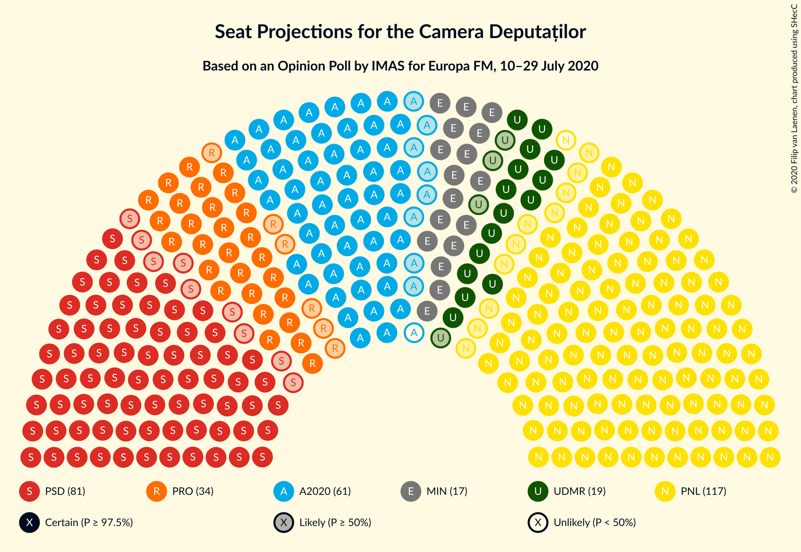
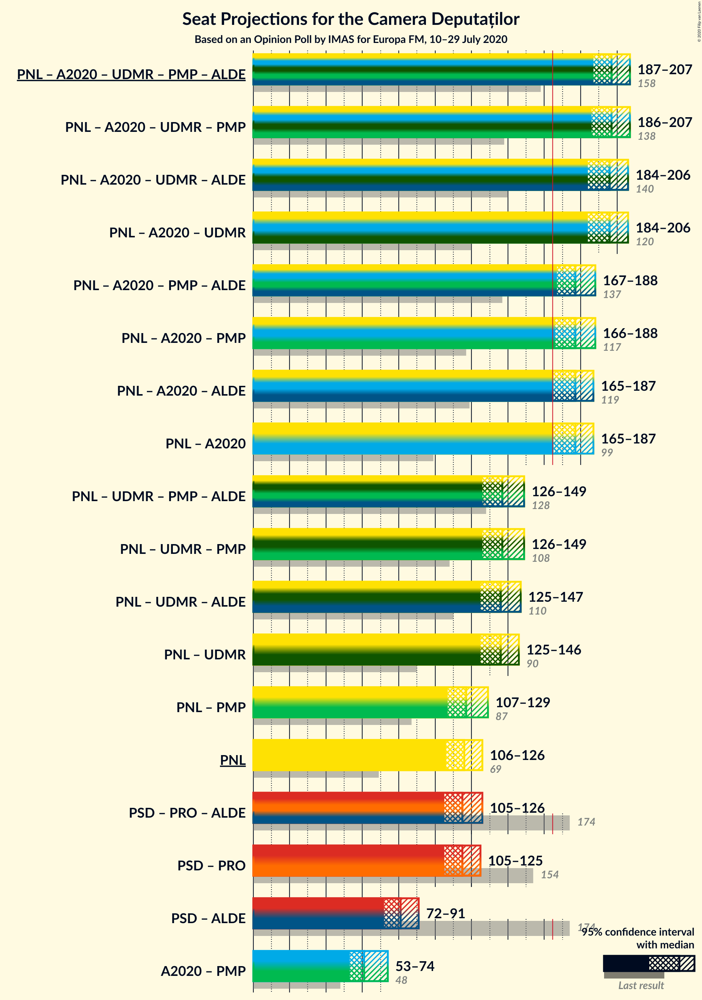
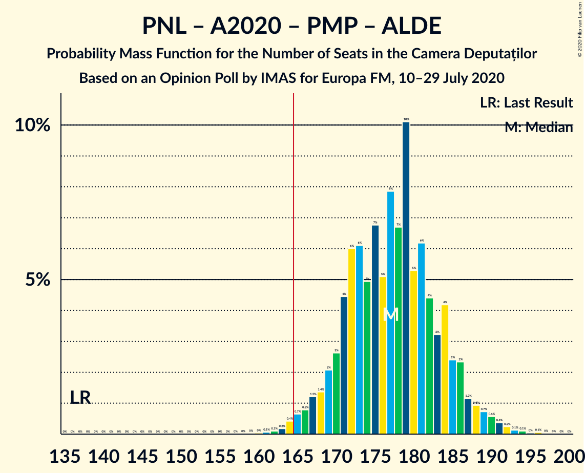
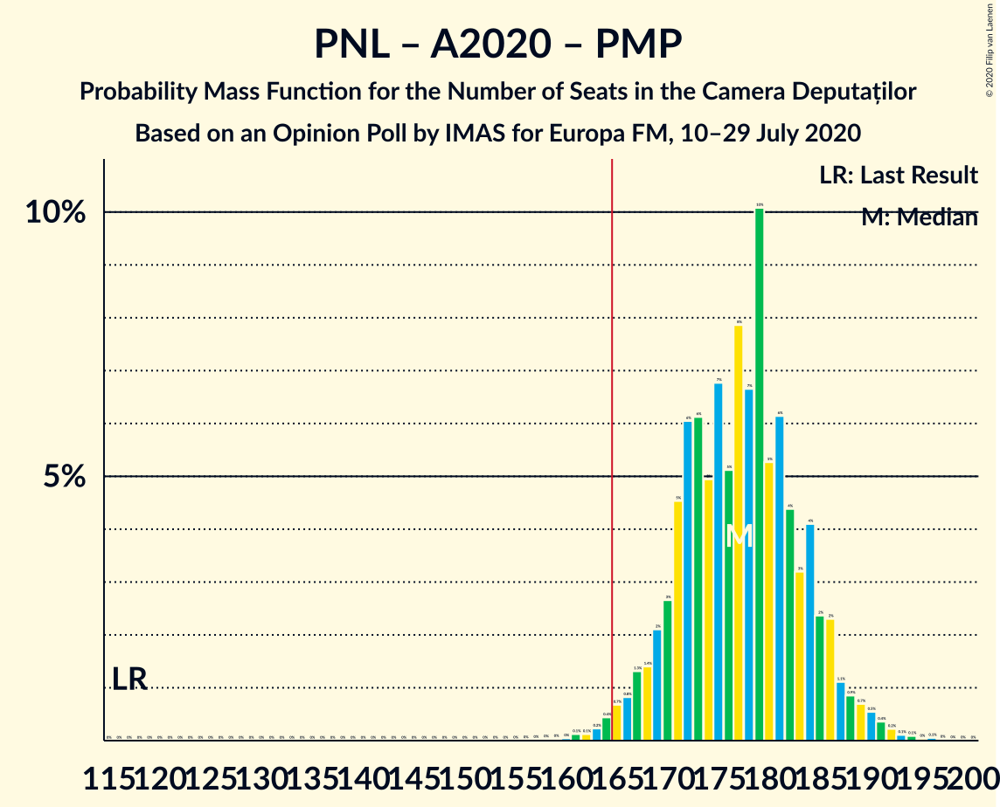

# Opinion Poll by IMAS for Europa FM, 10–29 July 2020

<a href="#voting-intentions">Voting Intentions</a> | <a href="#seats">Seats</a> | <a href="#coalitions">Coalitions</a> | <a href="#technical-information">Technical Information</a>

## Voting Intentions

### Confidence Intervals

| Party | Last Result | Poll Result | 80% Confidence Interval | 90% Confidence Interval | 95% Confidence Interval | 99% Confidence Interval |
|:-----:|:-----------:|:-----------:|:-----------------------:|:-----------------------:|:-----------------------:|:-----------------------:|
| Partidul Național Liberal | 20.0% | 33.4% | 31.5–35.3% |31.0–35.9% |30.5–36.3% |29.6–37.3% |
| Partidul Social Democrat | 45.5% | 23.4% | 21.7–25.1% |21.2–25.7% |20.9–26.1% |20.1–26.9% |
| Alianța 2020 USR-PLUS | 8.9% | 17.2% | 15.8–18.8% |15.4–19.3% |15.0–19.7% |14.3–20.5% |
| PRO România | 0.0% | 9.7% | 8.6–11.0% |8.3–11.4% |8.0–11.7% |7.5–12.3% |
| Uniunea Democrată Maghiară din România | 6.2% | 5.6% | 4.8–6.7% |4.6–7.0% |4.4–7.3% |4.0–7.8% |
| Partidul Mișcarea Populară | 5.4% | 3.9% | 3.2–4.8% |3.0–5.0% |2.8–5.2% |2.5–5.7% |
| Partidul Alianța Liberalilor și Democraților | 5.6% | 3.4% | 2.7–4.2% |2.6–4.5% |2.4–4.7% |2.1–5.1% |

*Note:* The poll result column reflects the actual value used in the calculations. Published results may vary slightly, and in addition be rounded to fewer digits.

## Seats

### Confidence Intervals

| Party | Last Result | Median | 80% Confidence Interval | 90% Confidence Interval | 95% Confidence Interval | 99% Confidence Interval |
|:-----:|:-----------:|:------:|:-----------------------:|:-----------------------:|:-----------------------:|:-----------------------:|
| <a href="#partidul-național-liberal">Partidul Național Liberal</a> | 69 | 116 | 110–123 |108–125 |106–126 |102–130 |
| <a href="#partidul-social-democrat">Partidul Social Democrat</a> | 154 | 81 | 75–87 |74–89 |72–91 |70–94 |
| <a href="#alianța-2020-usr-plus">Alianța 2020 USR-PLUS</a> | 30 | 60 | 55–66 |53–67 |52–68 |50–71 |
| <a href="#pro-românia">PRO România</a> | 0 | 34 | 30–38 |29–39 |28–40 |26–42 |
| <a href="#uniunea-democrată-maghiară-din-românia">Uniunea Democrată Maghiară din România</a> | 21 | 19 | 16–23 |16–24 |15–25 |13–27 |
| <a href="#partidul-mișcarea-populară">Partidul Mișcarea Populară</a> | 18 | 0 | 0 |0 |0–17 |0–19 |
| <a href="#partidul-alianța-liberalilor-și-democraților">Partidul Alianța Liberalilor și Democraților</a> | 20 | 0 | 0 |0 |0 |0–17 |

### Partidul Național Liberal

*For a full overview of the results for this party, see the [Partidul Național Liberal](party-partidulnaționalliberal.html) page.*

| Number of Seats | Probability | Accumulated | Special Marks |
|:---------------:|:-----------:|:-----------:|:-------------:|
| 69 | 0% | 100% | Last Result |
| 70 | 0% | 100% |  |
| 71 | 0% | 100% |  |
| 72 | 0% | 100% |  |
| 73 | 0% | 100% |  |
| 74 | 0% | 100% |  |
| 75 | 0% | 100% |  |
| 76 | 0% | 100% |  |
| 77 | 0% | 100% |  |
| 78 | 0% | 100% |  |
| 79 | 0% | 100% |  |
| 80 | 0% | 100% |  |
| 81 | 0% | 100% |  |
| 82 | 0% | 100% |  |
| 83 | 0% | 100% |  |
| 84 | 0% | 100% |  |
| 85 | 0% | 100% |  |
| 86 | 0% | 100% |  |
| 87 | 0% | 100% |  |
| 88 | 0% | 100% |  |
| 89 | 0% | 100% |  |
| 90 | 0% | 100% |  |
| 91 | 0% | 100% |  |
| 92 | 0% | 100% |  |
| 93 | 0% | 100% |  |
| 94 | 0% | 100% |  |
| 95 | 0% | 100% |  |
| 96 | 0% | 100% |  |
| 97 | 0% | 100% |  |
| 98 | 0% | 100% |  |
| 99 | 0% | 100% |  |
| 100 | 0.1% | 99.9% |  |
| 101 | 0.1% | 99.8% |  |
| 102 | 0.2% | 99.7% |  |
| 103 | 0.3% | 99.5% |  |
| 104 | 0.7% | 99.2% |  |
| 105 | 0.6% | 98.5% |  |
| 106 | 1.0% | 98% |  |
| 107 | 2% | 97% |  |
| 108 | 2% | 95% |  |
| 109 | 3% | 94% |  |
| 110 | 4% | 91% |  |
| 111 | 3% | 86% |  |
| 112 | 8% | 83% |  |
| 113 | 5% | 75% |  |
| 114 | 7% | 70% |  |
| 115 | 9% | 63% |  |
| 116 | 5% | 54% | Median |
| 117 | 8% | 50% |  |
| 118 | 7% | 42% |  |
| 119 | 5% | 34% |  |
| 120 | 7% | 29% |  |
| 121 | 5% | 22% |  |
| 122 | 6% | 17% |  |
| 123 | 4% | 12% |  |
| 124 | 2% | 8% |  |
| 125 | 2% | 6% |  |
| 126 | 1.2% | 4% |  |
| 127 | 0.8% | 2% |  |
| 128 | 0.6% | 2% |  |
| 129 | 0.4% | 1.1% |  |
| 130 | 0.3% | 0.7% |  |
| 131 | 0.2% | 0.4% |  |
| 132 | 0.1% | 0.2% |  |
| 133 | 0.1% | 0.1% |  |
| 134 | 0% | 0% |  |

### Partidul Social Democrat

*For a full overview of the results for this party, see the [Partidul Social Democrat](party-partidulsocialdemocrat.html) page.*

| Number of Seats | Probability | Accumulated | Special Marks |
|:---------------:|:-----------:|:-----------:|:-------------:|
| 66 | 0% | 100% |  |
| 67 | 0.1% | 99.9% |  |
| 68 | 0.1% | 99.9% |  |
| 69 | 0.2% | 99.7% |  |
| 70 | 0.4% | 99.5% |  |
| 71 | 0.8% | 99.1% |  |
| 72 | 1.1% | 98% |  |
| 73 | 1.3% | 97% |  |
| 74 | 3% | 96% |  |
| 75 | 4% | 93% |  |
| 76 | 3% | 89% |  |
| 77 | 5% | 86% |  |
| 78 | 9% | 81% |  |
| 79 | 8% | 72% |  |
| 80 | 8% | 65% |  |
| 81 | 8% | 57% | Median |
| 82 | 8% | 49% |  |
| 83 | 10% | 41% |  |
| 84 | 5% | 31% |  |
| 85 | 6% | 26% |  |
| 86 | 6% | 20% |  |
| 87 | 4% | 14% |  |
| 88 | 3% | 10% |  |
| 89 | 2% | 7% |  |
| 90 | 2% | 5% |  |
| 91 | 1.2% | 3% |  |
| 92 | 0.4% | 1.4% |  |
| 93 | 0.4% | 1.0% |  |
| 94 | 0.3% | 0.6% |  |
| 95 | 0.1% | 0.3% |  |
| 96 | 0% | 0.1% |  |
| 97 | 0% | 0.1% |  |
| 98 | 0% | 0% |  |
| 99 | 0% | 0% |  |
| 100 | 0% | 0% |  |
| 101 | 0% | 0% |  |
| 102 | 0% | 0% |  |
| 103 | 0% | 0% |  |
| 104 | 0% | 0% |  |
| 105 | 0% | 0% |  |
| 106 | 0% | 0% |  |
| 107 | 0% | 0% |  |
| 108 | 0% | 0% |  |
| 109 | 0% | 0% |  |
| 110 | 0% | 0% |  |
| 111 | 0% | 0% |  |
| 112 | 0% | 0% |  |
| 113 | 0% | 0% |  |
| 114 | 0% | 0% |  |
| 115 | 0% | 0% |  |
| 116 | 0% | 0% |  |
| 117 | 0% | 0% |  |
| 118 | 0% | 0% |  |
| 119 | 0% | 0% |  |
| 120 | 0% | 0% |  |
| 121 | 0% | 0% |  |
| 122 | 0% | 0% |  |
| 123 | 0% | 0% |  |
| 124 | 0% | 0% |  |
| 125 | 0% | 0% |  |
| 126 | 0% | 0% |  |
| 127 | 0% | 0% |  |
| 128 | 0% | 0% |  |
| 129 | 0% | 0% |  |
| 130 | 0% | 0% |  |
| 131 | 0% | 0% |  |
| 132 | 0% | 0% |  |
| 133 | 0% | 0% |  |
| 134 | 0% | 0% |  |
| 135 | 0% | 0% |  |
| 136 | 0% | 0% |  |
| 137 | 0% | 0% |  |
| 138 | 0% | 0% |  |
| 139 | 0% | 0% |  |
| 140 | 0% | 0% |  |
| 141 | 0% | 0% |  |
| 142 | 0% | 0% |  |
| 143 | 0% | 0% |  |
| 144 | 0% | 0% |  |
| 145 | 0% | 0% |  |
| 146 | 0% | 0% |  |
| 147 | 0% | 0% |  |
| 148 | 0% | 0% |  |
| 149 | 0% | 0% |  |
| 150 | 0% | 0% |  |
| 151 | 0% | 0% |  |
| 152 | 0% | 0% |  |
| 153 | 0% | 0% |  |
| 154 | 0% | 0% | Last Result |

### Alianța 2020 USR-PLUS

*For a full overview of the results for this party, see the [Alianța 2020 USR-PLUS](party-alianța2020usr-plus.html) page.*

| Number of Seats | Probability | Accumulated | Special Marks |
|:---------------:|:-----------:|:-----------:|:-------------:|
| 30 | 0% | 100% | Last Result |
| 31 | 0% | 100% |  |
| 32 | 0% | 100% |  |
| 33 | 0% | 100% |  |
| 34 | 0% | 100% |  |
| 35 | 0% | 100% |  |
| 36 | 0% | 100% |  |
| 37 | 0% | 100% |  |
| 38 | 0% | 100% |  |
| 39 | 0% | 100% |  |
| 40 | 0% | 100% |  |
| 41 | 0% | 100% |  |
| 42 | 0% | 100% |  |
| 43 | 0% | 100% |  |
| 44 | 0% | 100% |  |
| 45 | 0% | 100% |  |
| 46 | 0% | 100% |  |
| 47 | 0.1% | 100% |  |
| 48 | 0.1% | 99.9% |  |
| 49 | 0.2% | 99.8% |  |
| 50 | 0.6% | 99.6% |  |
| 51 | 0.8% | 98.9% |  |
| 52 | 1.3% | 98% |  |
| 53 | 3% | 97% |  |
| 54 | 4% | 94% |  |
| 55 | 5% | 91% |  |
| 56 | 5% | 85% |  |
| 57 | 10% | 80% |  |
| 58 | 9% | 70% |  |
| 59 | 7% | 61% |  |
| 60 | 7% | 54% | Median |
| 61 | 11% | 47% |  |
| 62 | 7% | 36% |  |
| 63 | 6% | 28% |  |
| 64 | 7% | 23% |  |
| 65 | 6% | 16% |  |
| 66 | 4% | 10% |  |
| 67 | 2% | 6% |  |
| 68 | 2% | 4% |  |
| 69 | 0.9% | 2% |  |
| 70 | 0.5% | 1.2% |  |
| 71 | 0.2% | 0.6% |  |
| 72 | 0.2% | 0.4% |  |
| 73 | 0.1% | 0.2% |  |
| 74 | 0% | 0.1% |  |
| 75 | 0% | 0% |  |

### PRO România

*For a full overview of the results for this party, see the [PRO România](party-proromânia.html) page.*

| Number of Seats | Probability | Accumulated | Special Marks |
|:---------------:|:-----------:|:-----------:|:-------------:|
| 0 | 0% | 100% | Last Result |
| 1 | 0% | 100% |  |
| 2 | 0% | 100% |  |
| 3 | 0% | 100% |  |
| 4 | 0% | 100% |  |
| 5 | 0% | 100% |  |
| 6 | 0% | 100% |  |
| 7 | 0% | 100% |  |
| 8 | 0% | 100% |  |
| 9 | 0% | 100% |  |
| 10 | 0% | 100% |  |
| 11 | 0% | 100% |  |
| 12 | 0% | 100% |  |
| 13 | 0% | 100% |  |
| 14 | 0% | 100% |  |
| 15 | 0% | 100% |  |
| 16 | 0% | 100% |  |
| 17 | 0% | 100% |  |
| 18 | 0% | 100% |  |
| 19 | 0% | 100% |  |
| 20 | 0% | 100% |  |
| 21 | 0% | 100% |  |
| 22 | 0% | 100% |  |
| 23 | 0% | 100% |  |
| 24 | 0.1% | 100% |  |
| 25 | 0.3% | 99.9% |  |
| 26 | 0.7% | 99.6% |  |
| 27 | 1.2% | 98.9% |  |
| 28 | 2% | 98% |  |
| 29 | 5% | 95% |  |
| 30 | 7% | 91% |  |
| 31 | 9% | 84% |  |
| 32 | 10% | 74% |  |
| 33 | 12% | 64% |  |
| 34 | 14% | 52% | Median |
| 35 | 11% | 39% |  |
| 36 | 8% | 28% |  |
| 37 | 7% | 20% |  |
| 38 | 6% | 14% |  |
| 39 | 4% | 8% |  |
| 40 | 2% | 4% |  |
| 41 | 1.2% | 2% |  |
| 42 | 0.7% | 1.2% |  |
| 43 | 0.3% | 0.5% |  |
| 44 | 0.1% | 0.2% |  |
| 45 | 0.1% | 0.1% |  |
| 46 | 0% | 0% |  |

### Uniunea Democrată Maghiară din România

*For a full overview of the results for this party, see the [Uniunea Democrată Maghiară din România](party-uniuneademocratămaghiarădinromânia.html) page.*

| Number of Seats | Probability | Accumulated | Special Marks |
|:---------------:|:-----------:|:-----------:|:-------------:|
| 12 | 0.1% | 100% |  |
| 13 | 0.4% | 99.9% |  |
| 14 | 1.3% | 99.5% |  |
| 15 | 3% | 98% |  |
| 16 | 6% | 95% |  |
| 17 | 11% | 89% |  |
| 18 | 13% | 78% |  |
| 19 | 16% | 65% | Median |
| 20 | 16% | 49% |  |
| 21 | 12% | 34% | Last Result |
| 22 | 9% | 22% |  |
| 23 | 6% | 13% |  |
| 24 | 4% | 7% |  |
| 25 | 2% | 3% |  |
| 26 | 0.8% | 1.4% |  |
| 27 | 0.4% | 0.6% |  |
| 28 | 0.2% | 0.2% |  |
| 29 | 0.1% | 0.1% |  |
| 30 | 0% | 0% |  |

### Partidul Mișcarea Populară

*For a full overview of the results for this party, see the [Partidul Mișcarea Populară](party-partidulmișcareapopulară.html) page.*

| Number of Seats | Probability | Accumulated | Special Marks |
|:---------------:|:-----------:|:-----------:|:-------------:|
| 0 | 95% | 100% | Median |
| 1 | 0% | 5% |  |
| 2 | 0% | 5% |  |
| 3 | 0% | 5% |  |
| 4 | 0% | 5% |  |
| 5 | 0% | 5% |  |
| 6 | 0% | 5% |  |
| 7 | 0% | 5% |  |
| 8 | 0% | 5% |  |
| 9 | 0% | 5% |  |
| 10 | 0% | 5% |  |
| 11 | 0% | 5% |  |
| 12 | 0% | 5% |  |
| 13 | 0% | 5% |  |
| 14 | 0% | 5% |  |
| 15 | 0% | 5% |  |
| 16 | 0.4% | 5% |  |
| 17 | 3% | 4% |  |
| 18 | 1.0% | 2% | Last Result |
| 19 | 0.4% | 0.6% |  |
| 20 | 0.1% | 0.2% |  |
| 21 | 0% | 0.1% |  |
| 22 | 0% | 0% |  |

### Partidul Alianța Liberalilor și Democraților

*For a full overview of the results for this party, see the [Partidul Alianța Liberalilor și Democraților](party-partidulalianțaliberalilorșidemocraților.html) page.*

| Number of Seats | Probability | Accumulated | Special Marks |
|:---------------:|:-----------:|:-----------:|:-------------:|
| 0 | 99.3% | 100% | Median |
| 1 | 0% | 0.7% |  |
| 2 | 0% | 0.7% |  |
| 3 | 0% | 0.7% |  |
| 4 | 0% | 0.7% |  |
| 5 | 0% | 0.7% |  |
| 6 | 0% | 0.7% |  |
| 7 | 0% | 0.7% |  |
| 8 | 0% | 0.7% |  |
| 9 | 0% | 0.7% |  |
| 10 | 0% | 0.7% |  |
| 11 | 0% | 0.7% |  |
| 12 | 0% | 0.7% |  |
| 13 | 0% | 0.7% |  |
| 14 | 0% | 0.7% |  |
| 15 | 0% | 0.7% |  |
| 16 | 0% | 0.7% |  |
| 17 | 0.4% | 0.6% |  |
| 18 | 0.1% | 0.2% |  |
| 19 | 0% | 0.1% |  |
| 20 | 0% | 0% | Last Result |

## Coalitions

### Confidence Intervals

| Coalition | Last Result | Median | Majority? | 80% Confidence Interval | 90% Confidence Interval | 95% Confidence Interval | 99% Confidence Interval |
|:---------:|:-----------:|:------:|:---------:|:-----------------------:|:-----------------------:|:-----------------------:|:-----------------------:|
| Partidul Național Liberal – Alianța 2020 USR-PLUS – Uniunea Democrată Maghiară din România – Partidul Mișcarea Populară – Partidul Alianța Liberalilor și Democraților | 158 | 197 | 100% | 190–204 | 188–205 | 187–207 | 184–211 |
| Partidul Național Liberal – Alianța 2020 USR-PLUS – Uniunea Democrată Maghiară din România – Partidul Mișcarea Populară | 138 | 197 | 100% | 190–203 | 188–205 | 186–207 | 183–210 |
| Partidul Național Liberal – Alianța 2020 USR-PLUS – Uniunea Democrată Maghiară din România – Partidul Alianța Liberalilor și Democraților | 140 | 196 | 100% | 189–203 | 186–205 | 184–206 | 179–209 |
| Partidul Național Liberal – Alianța 2020 USR-PLUS – Uniunea Democrată Maghiară din România | 120 | 196 | 100% | 189–203 | 186–205 | 184–206 | 178–209 |
| Partidul Național Liberal – Alianța 2020 USR-PLUS – Partidul Mișcarea Populară – Partidul Alianța Liberalilor și Democraților | 137 | 177 | 98.5% | 171–184 | 169–186 | 167–188 | 164–192 |
| Partidul Național Liberal – Alianța 2020 USR-PLUS – Partidul Mișcarea Populară | 117 | 177 | 98% | 170–184 | 168–186 | 166–188 | 163–192 |
| Partidul Național Liberal – Alianța 2020 USR-PLUS – Partidul Alianța Liberalilor și Democraților | 119 | 177 | 97% | 169–184 | 167–185 | 165–187 | 160–190 |
| Partidul Național Liberal – Alianța 2020 USR-PLUS | 99 | 177 | 97% | 169–184 | 167–185 | 165–187 | 160–190 |
| Partidul Național Liberal – Uniunea Democrată Maghiară din România – Partidul Mișcarea Populară – Partidul Alianța Liberalilor și Democraților | 128 | 137 | 0% | 130–144 | 128–147 | 126–149 | 123–153 |
| Partidul Național Liberal – Uniunea Democrată Maghiară din România – Partidul Mișcarea Populară | 108 | 137 | 0% | 130–144 | 128–146 | 126–149 | 123–152 |
| Partidul Național Liberal – Uniunea Democrată Maghiară din România – Partidul Alianța Liberalilor și Democraților | 110 | 136 | 0% | 129–143 | 127–145 | 125–147 | 121–150 |
| Partidul Național Liberal – Uniunea Democrată Maghiară din România | 90 | 136 | 0% | 129–143 | 127–145 | 125–146 | 121–150 |
| Partidul Național Liberal – Partidul Mișcarea Populară | 87 | 117 | 0% | 110–124 | 109–127 | 107–129 | 104–134 |
| Partidul Național Liberal | 69 | 116 | 0% | 110–123 | 108–125 | 106–126 | 102–130 |
| Partidul Social Democrat – PRO România – Partidul Alianța Liberalilor și Democraților | 174 | 115 | 0% | 109–122 | 107–124 | 105–126 | 102–129 |
| Partidul Social Democrat – PRO România | 154 | 115 | 0% | 108–122 | 107–124 | 105–125 | 101–128 |
| Partidul Social Democrat – Partidul Alianța Liberalilor și Democraților | 174 | 81 | 0% | 75–88 | 74–90 | 72–91 | 70–95 |
| Alianța 2020 USR-PLUS – Partidul Mișcarea Populară | 48 | 61 | 0% | 55–67 | 54–70 | 53–74 | 50–80 |

### Partidul Național Liberal – Alianța 2020 USR-PLUS – Uniunea Democrată Maghiară din România – Partidul Mișcarea Populară – Partidul Alianța Liberalilor și Democraților

| Number of Seats | Probability | Accumulated | Special Marks |
|:---------------:|:-----------:|:-----------:|:-------------:|
| 158 | 0% | 100% | Last Result |
| 159 | 0% | 100% |  |
| 160 | 0% | 100% |  |
| 161 | 0% | 100% |  |
| 162 | 0% | 100% |  |
| 163 | 0% | 100% |  |
| 164 | 0% | 100% |  |
| 165 | 0% | 100% |  |
| 166 | 0% | 100% | Majority |
| 167 | 0% | 100% |  |
| 168 | 0% | 100% |  |
| 169 | 0% | 100% |  |
| 170 | 0% | 100% |  |
| 171 | 0% | 100% |  |
| 172 | 0% | 100% |  |
| 173 | 0% | 100% |  |
| 174 | 0% | 100% |  |
| 175 | 0% | 100% |  |
| 176 | 0% | 100% |  |
| 177 | 0% | 100% |  |
| 178 | 0% | 100% |  |
| 179 | 0% | 100% |  |
| 180 | 0% | 100% |  |
| 181 | 0.1% | 99.9% |  |
| 182 | 0.1% | 99.8% |  |
| 183 | 0.2% | 99.7% |  |
| 184 | 0.4% | 99.5% |  |
| 185 | 0.8% | 99.1% |  |
| 186 | 0.7% | 98% |  |
| 187 | 1.0% | 98% |  |
| 188 | 2% | 97% |  |
| 189 | 2% | 94% |  |
| 190 | 4% | 92% |  |
| 191 | 4% | 89% |  |
| 192 | 5% | 85% |  |
| 193 | 5% | 80% |  |
| 194 | 7% | 74% |  |
| 195 | 9% | 68% | Median |
| 196 | 6% | 58% |  |
| 197 | 7% | 53% |  |
| 198 | 10% | 46% |  |
| 199 | 6% | 36% |  |
| 200 | 5% | 30% |  |
| 201 | 6% | 25% |  |
| 202 | 5% | 19% |  |
| 203 | 3% | 13% |  |
| 204 | 3% | 10% |  |
| 205 | 3% | 8% |  |
| 206 | 1.2% | 5% |  |
| 207 | 1.2% | 4% |  |
| 208 | 1.0% | 2% |  |
| 209 | 0.6% | 1.4% |  |
| 210 | 0.3% | 0.8% |  |
| 211 | 0.2% | 0.5% |  |
| 212 | 0.2% | 0.3% |  |
| 213 | 0.1% | 0.2% |  |
| 214 | 0% | 0.1% |  |
| 215 | 0% | 0.1% |  |
| 216 | 0% | 0% |  |

### Partidul Național Liberal – Alianța 2020 USR-PLUS – Uniunea Democrată Maghiară din România – Partidul Mișcarea Populară

| Number of Seats | Probability | Accumulated | Special Marks |
|:---------------:|:-----------:|:-----------:|:-------------:|
| 138 | 0% | 100% | Last Result |
| 139 | 0% | 100% |  |
| 140 | 0% | 100% |  |
| 141 | 0% | 100% |  |
| 142 | 0% | 100% |  |
| 143 | 0% | 100% |  |
| 144 | 0% | 100% |  |
| 145 | 0% | 100% |  |
| 146 | 0% | 100% |  |
| 147 | 0% | 100% |  |
| 148 | 0% | 100% |  |
| 149 | 0% | 100% |  |
| 150 | 0% | 100% |  |
| 151 | 0% | 100% |  |
| 152 | 0% | 100% |  |
| 153 | 0% | 100% |  |
| 154 | 0% | 100% |  |
| 155 | 0% | 100% |  |
| 156 | 0% | 100% |  |
| 157 | 0% | 100% |  |
| 158 | 0% | 100% |  |
| 159 | 0% | 100% |  |
| 160 | 0% | 100% |  |
| 161 | 0% | 100% |  |
| 162 | 0% | 100% |  |
| 163 | 0% | 100% |  |
| 164 | 0% | 100% |  |
| 165 | 0% | 100% |  |
| 166 | 0% | 100% | Majority |
| 167 | 0% | 100% |  |
| 168 | 0% | 100% |  |
| 169 | 0% | 100% |  |
| 170 | 0% | 100% |  |
| 171 | 0% | 100% |  |
| 172 | 0% | 100% |  |
| 173 | 0% | 100% |  |
| 174 | 0% | 100% |  |
| 175 | 0% | 100% |  |
| 176 | 0% | 100% |  |
| 177 | 0% | 100% |  |
| 178 | 0% | 100% |  |
| 179 | 0.1% | 99.9% |  |
| 180 | 0.1% | 99.9% |  |
| 181 | 0.1% | 99.8% |  |
| 182 | 0.2% | 99.7% |  |
| 183 | 0.2% | 99.5% |  |
| 184 | 0.4% | 99.3% |  |
| 185 | 0.8% | 98.9% |  |
| 186 | 0.7% | 98% |  |
| 187 | 1.0% | 97% |  |
| 188 | 2% | 96% |  |
| 189 | 2% | 94% |  |
| 190 | 4% | 92% |  |
| 191 | 4% | 88% |  |
| 192 | 5% | 84% |  |
| 193 | 5% | 79% |  |
| 194 | 7% | 74% |  |
| 195 | 9% | 67% | Median |
| 196 | 6% | 58% |  |
| 197 | 7% | 52% |  |
| 198 | 10% | 46% |  |
| 199 | 6% | 35% |  |
| 200 | 5% | 29% |  |
| 201 | 6% | 24% |  |
| 202 | 5% | 18% |  |
| 203 | 3% | 13% |  |
| 204 | 3% | 10% |  |
| 205 | 3% | 7% |  |
| 206 | 1.1% | 5% |  |
| 207 | 1.1% | 3% |  |
| 208 | 0.9% | 2% |  |
| 209 | 0.6% | 1.3% |  |
| 210 | 0.3% | 0.7% |  |
| 211 | 0.2% | 0.5% |  |
| 212 | 0.1% | 0.3% |  |
| 213 | 0.1% | 0.2% |  |
| 214 | 0% | 0.1% |  |
| 215 | 0% | 0% |  |

### Partidul Național Liberal – Alianța 2020 USR-PLUS – Uniunea Democrată Maghiară din România – Partidul Alianța Liberalilor și Democraților

| Number of Seats | Probability | Accumulated | Special Marks |
|:---------------:|:-----------:|:-----------:|:-------------:|
| 140 | 0% | 100% | Last Result |
| 141 | 0% | 100% |  |
| 142 | 0% | 100% |  |
| 143 | 0% | 100% |  |
| 144 | 0% | 100% |  |
| 145 | 0% | 100% |  |
| 146 | 0% | 100% |  |
| 147 | 0% | 100% |  |
| 148 | 0% | 100% |  |
| 149 | 0% | 100% |  |
| 150 | 0% | 100% |  |
| 151 | 0% | 100% |  |
| 152 | 0% | 100% |  |
| 153 | 0% | 100% |  |
| 154 | 0% | 100% |  |
| 155 | 0% | 100% |  |
| 156 | 0% | 100% |  |
| 157 | 0% | 100% |  |
| 158 | 0% | 100% |  |
| 159 | 0% | 100% |  |
| 160 | 0% | 100% |  |
| 161 | 0% | 100% |  |
| 162 | 0% | 100% |  |
| 163 | 0% | 100% |  |
| 164 | 0% | 100% |  |
| 165 | 0% | 100% |  |
| 166 | 0% | 100% | Majority |
| 167 | 0% | 100% |  |
| 168 | 0% | 100% |  |
| 169 | 0% | 100% |  |
| 170 | 0% | 100% |  |
| 171 | 0% | 100% |  |
| 172 | 0% | 100% |  |
| 173 | 0% | 100% |  |
| 174 | 0% | 100% |  |
| 175 | 0% | 99.9% |  |
| 176 | 0% | 99.9% |  |
| 177 | 0.1% | 99.9% |  |
| 178 | 0.2% | 99.8% |  |
| 179 | 0.2% | 99.6% |  |
| 180 | 0.3% | 99.4% |  |
| 181 | 0.3% | 99.1% |  |
| 182 | 0.4% | 98.9% |  |
| 183 | 0.5% | 98% |  |
| 184 | 0.7% | 98% |  |
| 185 | 1.3% | 97% |  |
| 186 | 1.0% | 96% |  |
| 187 | 1.3% | 95% |  |
| 188 | 3% | 94% |  |
| 189 | 2% | 91% |  |
| 190 | 4% | 89% |  |
| 191 | 4% | 85% |  |
| 192 | 6% | 81% |  |
| 193 | 5% | 75% |  |
| 194 | 7% | 70% |  |
| 195 | 9% | 63% | Median |
| 196 | 6% | 54% |  |
| 197 | 7% | 49% |  |
| 198 | 10% | 42% |  |
| 199 | 6% | 32% |  |
| 200 | 5% | 26% |  |
| 201 | 6% | 21% |  |
| 202 | 5% | 16% |  |
| 203 | 3% | 11% |  |
| 204 | 2% | 8% |  |
| 205 | 3% | 6% |  |
| 206 | 1.0% | 3% |  |
| 207 | 0.9% | 2% |  |
| 208 | 0.7% | 1.5% |  |
| 209 | 0.3% | 0.8% |  |
| 210 | 0.2% | 0.4% |  |
| 211 | 0.1% | 0.3% |  |
| 212 | 0.1% | 0.2% |  |
| 213 | 0% | 0.1% |  |
| 214 | 0% | 0% |  |

### Partidul Național Liberal – Alianța 2020 USR-PLUS – Uniunea Democrată Maghiară din România

| Number of Seats | Probability | Accumulated | Special Marks |
|:---------------:|:-----------:|:-----------:|:-------------:|
| 120 | 0% | 100% | Last Result |
| 121 | 0% | 100% |  |
| 122 | 0% | 100% |  |
| 123 | 0% | 100% |  |
| 124 | 0% | 100% |  |
| 125 | 0% | 100% |  |
| 126 | 0% | 100% |  |
| 127 | 0% | 100% |  |
| 128 | 0% | 100% |  |
| 129 | 0% | 100% |  |
| 130 | 0% | 100% |  |
| 131 | 0% | 100% |  |
| 132 | 0% | 100% |  |
| 133 | 0% | 100% |  |
| 134 | 0% | 100% |  |
| 135 | 0% | 100% |  |
| 136 | 0% | 100% |  |
| 137 | 0% | 100% |  |
| 138 | 0% | 100% |  |
| 139 | 0% | 100% |  |
| 140 | 0% | 100% |  |
| 141 | 0% | 100% |  |
| 142 | 0% | 100% |  |
| 143 | 0% | 100% |  |
| 144 | 0% | 100% |  |
| 145 | 0% | 100% |  |
| 146 | 0% | 100% |  |
| 147 | 0% | 100% |  |
| 148 | 0% | 100% |  |
| 149 | 0% | 100% |  |
| 150 | 0% | 100% |  |
| 151 | 0% | 100% |  |
| 152 | 0% | 100% |  |
| 153 | 0% | 100% |  |
| 154 | 0% | 100% |  |
| 155 | 0% | 100% |  |
| 156 | 0% | 100% |  |
| 157 | 0% | 100% |  |
| 158 | 0% | 100% |  |
| 159 | 0% | 100% |  |
| 160 | 0% | 100% |  |
| 161 | 0% | 100% |  |
| 162 | 0% | 100% |  |
| 163 | 0% | 100% |  |
| 164 | 0% | 100% |  |
| 165 | 0% | 100% |  |
| 166 | 0% | 100% | Majority |
| 167 | 0% | 100% |  |
| 168 | 0% | 100% |  |
| 169 | 0% | 100% |  |
| 170 | 0% | 100% |  |
| 171 | 0% | 100% |  |
| 172 | 0% | 100% |  |
| 173 | 0% | 100% |  |
| 174 | 0% | 100% |  |
| 175 | 0% | 99.9% |  |
| 176 | 0.1% | 99.9% |  |
| 177 | 0.1% | 99.8% |  |
| 178 | 0.2% | 99.7% |  |
| 179 | 0.2% | 99.5% |  |
| 180 | 0.3% | 99.3% |  |
| 181 | 0.3% | 99.0% |  |
| 182 | 0.5% | 98.7% |  |
| 183 | 0.5% | 98% |  |
| 184 | 0.8% | 98% |  |
| 185 | 1.4% | 97% |  |
| 186 | 1.1% | 96% |  |
| 187 | 1.3% | 95% |  |
| 188 | 3% | 93% |  |
| 189 | 2% | 91% |  |
| 190 | 4% | 88% |  |
| 191 | 4% | 84% |  |
| 192 | 6% | 80% |  |
| 193 | 5% | 75% |  |
| 194 | 7% | 70% |  |
| 195 | 9% | 63% | Median |
| 196 | 6% | 54% |  |
| 197 | 7% | 48% |  |
| 198 | 10% | 42% |  |
| 199 | 6% | 32% |  |
| 200 | 5% | 26% |  |
| 201 | 6% | 21% |  |
| 202 | 5% | 15% |  |
| 203 | 3% | 11% |  |
| 204 | 2% | 8% |  |
| 205 | 2% | 6% |  |
| 206 | 1.0% | 3% |  |
| 207 | 0.9% | 2% |  |
| 208 | 0.7% | 1.3% |  |
| 209 | 0.3% | 0.7% |  |
| 210 | 0.2% | 0.4% |  |
| 211 | 0.1% | 0.2% |  |
| 212 | 0.1% | 0.1% |  |
| 213 | 0% | 0% |  |

### Partidul Național Liberal – Alianța 2020 USR-PLUS – Partidul Mișcarea Populară – Partidul Alianța Liberalilor și Democraților

| Number of Seats | Probability | Accumulated | Special Marks |
|:---------------:|:-----------:|:-----------:|:-------------:|
| 137 | 0% | 100% | Last Result |
| 138 | 0% | 100% |  |
| 139 | 0% | 100% |  |
| 140 | 0% | 100% |  |
| 141 | 0% | 100% |  |
| 142 | 0% | 100% |  |
| 143 | 0% | 100% |  |
| 144 | 0% | 100% |  |
| 145 | 0% | 100% |  |
| 146 | 0% | 100% |  |
| 147 | 0% | 100% |  |
| 148 | 0% | 100% |  |
| 149 | 0% | 100% |  |
| 150 | 0% | 100% |  |
| 151 | 0% | 100% |  |
| 152 | 0% | 100% |  |
| 153 | 0% | 100% |  |
| 154 | 0% | 100% |  |
| 155 | 0% | 100% |  |
| 156 | 0% | 100% |  |
| 157 | 0% | 100% |  |
| 158 | 0% | 100% |  |
| 159 | 0% | 100% |  |
| 160 | 0% | 100% |  |
| 161 | 0.1% | 99.9% |  |
| 162 | 0.1% | 99.9% |  |
| 163 | 0.2% | 99.8% |  |
| 164 | 0.4% | 99.6% |  |
| 165 | 0.7% | 99.2% |  |
| 166 | 0.8% | 98.5% | Majority |
| 167 | 1.2% | 98% |  |
| 168 | 1.4% | 97% |  |
| 169 | 2% | 95% |  |
| 170 | 3% | 93% |  |
| 171 | 4% | 90% |  |
| 172 | 6% | 86% |  |
| 173 | 6% | 80% |  |
| 174 | 5% | 74% |  |
| 175 | 7% | 69% |  |
| 176 | 5% | 62% | Median |
| 177 | 8% | 57% |  |
| 178 | 7% | 49% |  |
| 179 | 10% | 43% |  |
| 180 | 5% | 32% |  |
| 181 | 6% | 27% |  |
| 182 | 4% | 21% |  |
| 183 | 3% | 17% |  |
| 184 | 4% | 13% |  |
| 185 | 2% | 9% |  |
| 186 | 2% | 7% |  |
| 187 | 1.2% | 4% |  |
| 188 | 0.9% | 3% |  |
| 189 | 0.7% | 2% |  |
| 190 | 0.6% | 2% |  |
| 191 | 0.4% | 1.0% |  |
| 192 | 0.2% | 0.6% |  |
| 193 | 0.1% | 0.4% |  |
| 194 | 0.1% | 0.2% |  |
| 195 | 0% | 0.1% |  |
| 196 | 0.1% | 0.1% |  |
| 197 | 0% | 0% |  |

### Partidul Național Liberal – Alianța 2020 USR-PLUS – Partidul Mișcarea Populară

| Number of Seats | Probability | Accumulated | Special Marks |
|:---------------:|:-----------:|:-----------:|:-------------:|
| 117 | 0% | 100% | Last Result |
| 118 | 0% | 100% |  |
| 119 | 0% | 100% |  |
| 120 | 0% | 100% |  |
| 121 | 0% | 100% |  |
| 122 | 0% | 100% |  |
| 123 | 0% | 100% |  |
| 124 | 0% | 100% |  |
| 125 | 0% | 100% |  |
| 126 | 0% | 100% |  |
| 127 | 0% | 100% |  |
| 128 | 0% | 100% |  |
| 129 | 0% | 100% |  |
| 130 | 0% | 100% |  |
| 131 | 0% | 100% |  |
| 132 | 0% | 100% |  |
| 133 | 0% | 100% |  |
| 134 | 0% | 100% |  |
| 135 | 0% | 100% |  |
| 136 | 0% | 100% |  |
| 137 | 0% | 100% |  |
| 138 | 0% | 100% |  |
| 139 | 0% | 100% |  |
| 140 | 0% | 100% |  |
| 141 | 0% | 100% |  |
| 142 | 0% | 100% |  |
| 143 | 0% | 100% |  |
| 144 | 0% | 100% |  |
| 145 | 0% | 100% |  |
| 146 | 0% | 100% |  |
| 147 | 0% | 100% |  |
| 148 | 0% | 100% |  |
| 149 | 0% | 100% |  |
| 150 | 0% | 100% |  |
| 151 | 0% | 100% |  |
| 152 | 0% | 100% |  |
| 153 | 0% | 100% |  |
| 154 | 0% | 100% |  |
| 155 | 0% | 100% |  |
| 156 | 0% | 100% |  |
| 157 | 0% | 100% |  |
| 158 | 0% | 100% |  |
| 159 | 0% | 99.9% |  |
| 160 | 0% | 99.9% |  |
| 161 | 0.1% | 99.9% |  |
| 162 | 0.1% | 99.7% |  |
| 163 | 0.2% | 99.6% |  |
| 164 | 0.4% | 99.4% |  |
| 165 | 0.7% | 99.0% |  |
| 166 | 0.8% | 98% | Majority |
| 167 | 1.3% | 97% |  |
| 168 | 1.4% | 96% |  |
| 169 | 2% | 95% |  |
| 170 | 3% | 93% |  |
| 171 | 5% | 90% |  |
| 172 | 6% | 85% |  |
| 173 | 6% | 79% |  |
| 174 | 5% | 73% |  |
| 175 | 7% | 68% |  |
| 176 | 5% | 62% | Median |
| 177 | 8% | 56% |  |
| 178 | 7% | 49% |  |
| 179 | 10% | 42% |  |
| 180 | 5% | 32% |  |
| 181 | 6% | 27% |  |
| 182 | 4% | 20% |  |
| 183 | 3% | 16% |  |
| 184 | 4% | 13% |  |
| 185 | 2% | 9% |  |
| 186 | 2% | 6% |  |
| 187 | 1.1% | 4% |  |
| 188 | 0.9% | 3% |  |
| 189 | 0.7% | 2% |  |
| 190 | 0.5% | 1.4% |  |
| 191 | 0.4% | 0.9% |  |
| 192 | 0.2% | 0.5% |  |
| 193 | 0.1% | 0.3% |  |
| 194 | 0.1% | 0.2% |  |
| 195 | 0% | 0.1% |  |
| 196 | 0.1% | 0.1% |  |
| 197 | 0% | 0% |  |

### Partidul Național Liberal – Alianța 2020 USR-PLUS – Partidul Alianța Liberalilor și Democraților

| Number of Seats | Probability | Accumulated | Special Marks |
|:---------------:|:-----------:|:-----------:|:-------------:|
| 119 | 0% | 100% | Last Result |
| 120 | 0% | 100% |  |
| 121 | 0% | 100% |  |
| 122 | 0% | 100% |  |
| 123 | 0% | 100% |  |
| 124 | 0% | 100% |  |
| 125 | 0% | 100% |  |
| 126 | 0% | 100% |  |
| 127 | 0% | 100% |  |
| 128 | 0% | 100% |  |
| 129 | 0% | 100% |  |
| 130 | 0% | 100% |  |
| 131 | 0% | 100% |  |
| 132 | 0% | 100% |  |
| 133 | 0% | 100% |  |
| 134 | 0% | 100% |  |
| 135 | 0% | 100% |  |
| 136 | 0% | 100% |  |
| 137 | 0% | 100% |  |
| 138 | 0% | 100% |  |
| 139 | 0% | 100% |  |
| 140 | 0% | 100% |  |
| 141 | 0% | 100% |  |
| 142 | 0% | 100% |  |
| 143 | 0% | 100% |  |
| 144 | 0% | 100% |  |
| 145 | 0% | 100% |  |
| 146 | 0% | 100% |  |
| 147 | 0% | 100% |  |
| 148 | 0% | 100% |  |
| 149 | 0% | 100% |  |
| 150 | 0% | 100% |  |
| 151 | 0% | 100% |  |
| 152 | 0% | 100% |  |
| 153 | 0% | 100% |  |
| 154 | 0% | 100% |  |
| 155 | 0% | 100% |  |
| 156 | 0% | 100% |  |
| 157 | 0.1% | 99.9% |  |
| 158 | 0.1% | 99.8% |  |
| 159 | 0.1% | 99.8% |  |
| 160 | 0.3% | 99.7% |  |
| 161 | 0.2% | 99.4% |  |
| 162 | 0.3% | 99.2% |  |
| 163 | 0.4% | 98.9% |  |
| 164 | 0.6% | 98.5% |  |
| 165 | 1.1% | 98% |  |
| 166 | 1.3% | 97% | Majority |
| 167 | 2% | 96% |  |
| 168 | 2% | 94% |  |
| 169 | 2% | 92% |  |
| 170 | 3% | 90% |  |
| 171 | 5% | 87% |  |
| 172 | 6% | 82% |  |
| 173 | 6% | 76% |  |
| 174 | 5% | 70% |  |
| 175 | 7% | 65% |  |
| 176 | 5% | 58% | Median |
| 177 | 8% | 53% |  |
| 178 | 7% | 45% |  |
| 179 | 10% | 39% |  |
| 180 | 5% | 29% |  |
| 181 | 6% | 23% |  |
| 182 | 4% | 18% |  |
| 183 | 3% | 13% |  |
| 184 | 4% | 11% |  |
| 185 | 2% | 7% |  |
| 186 | 2% | 5% |  |
| 187 | 1.0% | 3% |  |
| 188 | 0.7% | 2% |  |
| 189 | 0.5% | 1.3% |  |
| 190 | 0.3% | 0.8% |  |
| 191 | 0.2% | 0.5% |  |
| 192 | 0.1% | 0.3% |  |
| 193 | 0.1% | 0.2% |  |
| 194 | 0% | 0.1% |  |
| 195 | 0% | 0% |  |

### Partidul Național Liberal – Alianța 2020 USR-PLUS

| Number of Seats | Probability | Accumulated | Special Marks |
|:---------------:|:-----------:|:-----------:|:-------------:|
| 99 | 0% | 100% | Last Result |
| 100 | 0% | 100% |  |
| 101 | 0% | 100% |  |
| 102 | 0% | 100% |  |
| 103 | 0% | 100% |  |
| 104 | 0% | 100% |  |
| 105 | 0% | 100% |  |
| 106 | 0% | 100% |  |
| 107 | 0% | 100% |  |
| 108 | 0% | 100% |  |
| 109 | 0% | 100% |  |
| 110 | 0% | 100% |  |
| 111 | 0% | 100% |  |
| 112 | 0% | 100% |  |
| 113 | 0% | 100% |  |
| 114 | 0% | 100% |  |
| 115 | 0% | 100% |  |
| 116 | 0% | 100% |  |
| 117 | 0% | 100% |  |
| 118 | 0% | 100% |  |
| 119 | 0% | 100% |  |
| 120 | 0% | 100% |  |
| 121 | 0% | 100% |  |
| 122 | 0% | 100% |  |
| 123 | 0% | 100% |  |
| 124 | 0% | 100% |  |
| 125 | 0% | 100% |  |
| 126 | 0% | 100% |  |
| 127 | 0% | 100% |  |
| 128 | 0% | 100% |  |
| 129 | 0% | 100% |  |
| 130 | 0% | 100% |  |
| 131 | 0% | 100% |  |
| 132 | 0% | 100% |  |
| 133 | 0% | 100% |  |
| 134 | 0% | 100% |  |
| 135 | 0% | 100% |  |
| 136 | 0% | 100% |  |
| 137 | 0% | 100% |  |
| 138 | 0% | 100% |  |
| 139 | 0% | 100% |  |
| 140 | 0% | 100% |  |
| 141 | 0% | 100% |  |
| 142 | 0% | 100% |  |
| 143 | 0% | 100% |  |
| 144 | 0% | 100% |  |
| 145 | 0% | 100% |  |
| 146 | 0% | 100% |  |
| 147 | 0% | 100% |  |
| 148 | 0% | 100% |  |
| 149 | 0% | 100% |  |
| 150 | 0% | 100% |  |
| 151 | 0% | 100% |  |
| 152 | 0% | 100% |  |
| 153 | 0% | 100% |  |
| 154 | 0% | 100% |  |
| 155 | 0% | 100% |  |
| 156 | 0% | 99.9% |  |
| 157 | 0.1% | 99.9% |  |
| 158 | 0.1% | 99.8% |  |
| 159 | 0.1% | 99.7% |  |
| 160 | 0.3% | 99.6% |  |
| 161 | 0.3% | 99.3% |  |
| 162 | 0.3% | 99.0% |  |
| 163 | 0.4% | 98.7% |  |
| 164 | 0.6% | 98% |  |
| 165 | 1.1% | 98% |  |
| 166 | 1.3% | 97% | Majority |
| 167 | 2% | 95% |  |
| 168 | 2% | 93% |  |
| 169 | 2% | 92% |  |
| 170 | 3% | 89% |  |
| 171 | 5% | 87% |  |
| 172 | 6% | 82% |  |
| 173 | 6% | 76% |  |
| 174 | 5% | 69% |  |
| 175 | 7% | 64% |  |
| 176 | 5% | 57% | Median |
| 177 | 8% | 52% |  |
| 178 | 7% | 45% |  |
| 179 | 10% | 38% |  |
| 180 | 5% | 28% |  |
| 181 | 6% | 23% |  |
| 182 | 4% | 17% |  |
| 183 | 3% | 13% |  |
| 184 | 4% | 10% |  |
| 185 | 2% | 7% |  |
| 186 | 2% | 5% |  |
| 187 | 0.9% | 3% |  |
| 188 | 0.6% | 2% |  |
| 189 | 0.4% | 1.1% |  |
| 190 | 0.3% | 0.7% |  |
| 191 | 0.2% | 0.4% |  |
| 192 | 0.1% | 0.2% |  |
| 193 | 0.1% | 0.1% |  |
| 194 | 0% | 0.1% |  |
| 195 | 0% | 0% |  |

### Partidul Național Liberal – Uniunea Democrată Maghiară din România – Partidul Mișcarea Populară – Partidul Alianța Liberalilor și Democraților

| Number of Seats | Probability | Accumulated | Special Marks |
|:---------------:|:-----------:|:-----------:|:-------------:|
| 120 | 0% | 100% |  |
| 121 | 0.1% | 99.9% |  |
| 122 | 0.2% | 99.8% |  |
| 123 | 0.3% | 99.7% |  |
| 124 | 0.4% | 99.4% |  |
| 125 | 0.8% | 99.0% |  |
| 126 | 1.0% | 98% |  |
| 127 | 1.3% | 97% |  |
| 128 | 2% | 96% | Last Result |
| 129 | 3% | 94% |  |
| 130 | 3% | 91% |  |
| 131 | 5% | 88% |  |
| 132 | 6% | 83% |  |
| 133 | 6% | 77% |  |
| 134 | 7% | 71% |  |
| 135 | 6% | 64% | Median |
| 136 | 7% | 58% |  |
| 137 | 7% | 51% |  |
| 138 | 7% | 44% |  |
| 139 | 6% | 37% |  |
| 140 | 7% | 31% |  |
| 141 | 6% | 24% |  |
| 142 | 5% | 19% |  |
| 143 | 3% | 14% |  |
| 144 | 3% | 11% |  |
| 145 | 2% | 9% |  |
| 146 | 2% | 7% |  |
| 147 | 1.4% | 5% |  |
| 148 | 0.8% | 4% |  |
| 149 | 0.8% | 3% |  |
| 150 | 0.6% | 2% |  |
| 151 | 0.3% | 1.4% |  |
| 152 | 0.5% | 1.1% |  |
| 153 | 0.1% | 0.6% |  |
| 154 | 0.1% | 0.4% |  |
| 155 | 0.1% | 0.3% |  |
| 156 | 0.1% | 0.2% |  |
| 157 | 0% | 0.1% |  |
| 158 | 0% | 0.1% |  |
| 159 | 0% | 0% |  |

### Partidul Național Liberal – Uniunea Democrată Maghiară din România – Partidul Mișcarea Populară

| Number of Seats | Probability | Accumulated | Special Marks |
|:---------------:|:-----------:|:-----------:|:-------------:|
| 108 | 0% | 100% | Last Result |
| 109 | 0% | 100% |  |
| 110 | 0% | 100% |  |
| 111 | 0% | 100% |  |
| 112 | 0% | 100% |  |
| 113 | 0% | 100% |  |
| 114 | 0% | 100% |  |
| 115 | 0% | 100% |  |
| 116 | 0% | 100% |  |
| 117 | 0% | 100% |  |
| 118 | 0% | 100% |  |
| 119 | 0% | 100% |  |
| 120 | 0.1% | 99.9% |  |
| 121 | 0.1% | 99.9% |  |
| 122 | 0.2% | 99.8% |  |
| 123 | 0.3% | 99.6% |  |
| 124 | 0.5% | 99.3% |  |
| 125 | 0.8% | 98.8% |  |
| 126 | 1.1% | 98% |  |
| 127 | 1.4% | 97% |  |
| 128 | 2% | 96% |  |
| 129 | 3% | 93% |  |
| 130 | 3% | 91% |  |
| 131 | 5% | 87% |  |
| 132 | 6% | 83% |  |
| 133 | 6% | 77% |  |
| 134 | 7% | 71% |  |
| 135 | 6% | 64% | Median |
| 136 | 7% | 58% |  |
| 137 | 7% | 50% |  |
| 138 | 7% | 44% |  |
| 139 | 6% | 37% |  |
| 140 | 7% | 30% |  |
| 141 | 6% | 24% |  |
| 142 | 5% | 18% |  |
| 143 | 3% | 14% |  |
| 144 | 3% | 11% |  |
| 145 | 2% | 8% |  |
| 146 | 1.5% | 6% |  |
| 147 | 1.4% | 5% |  |
| 148 | 0.8% | 3% |  |
| 149 | 0.7% | 3% |  |
| 150 | 0.6% | 2% |  |
| 151 | 0.3% | 1.2% |  |
| 152 | 0.5% | 1.0% |  |
| 153 | 0.1% | 0.5% |  |
| 154 | 0.1% | 0.4% |  |
| 155 | 0.1% | 0.3% |  |
| 156 | 0.1% | 0.2% |  |
| 157 | 0% | 0.1% |  |
| 158 | 0% | 0.1% |  |
| 159 | 0% | 0% |  |

### Partidul Național Liberal – Uniunea Democrată Maghiară din România – Partidul Alianța Liberalilor și Democraților

| Number of Seats | Probability | Accumulated | Special Marks |
|:---------------:|:-----------:|:-----------:|:-------------:|
| 110 | 0% | 100% | Last Result |
| 111 | 0% | 100% |  |
| 112 | 0% | 100% |  |
| 113 | 0% | 100% |  |
| 114 | 0% | 100% |  |
| 115 | 0% | 100% |  |
| 116 | 0% | 100% |  |
| 117 | 0% | 100% |  |
| 118 | 0.1% | 99.9% |  |
| 119 | 0.1% | 99.9% |  |
| 120 | 0.2% | 99.8% |  |
| 121 | 0.2% | 99.7% |  |
| 122 | 0.3% | 99.5% |  |
| 123 | 0.5% | 99.2% |  |
| 124 | 0.7% | 98.7% |  |
| 125 | 1.2% | 98% |  |
| 126 | 1.2% | 97% |  |
| 127 | 2% | 96% |  |
| 128 | 2% | 94% |  |
| 129 | 3% | 92% |  |
| 130 | 4% | 89% |  |
| 131 | 5% | 85% |  |
| 132 | 6% | 80% |  |
| 133 | 6% | 74% |  |
| 134 | 7% | 67% |  |
| 135 | 7% | 61% | Median |
| 136 | 7% | 54% |  |
| 137 | 7% | 47% |  |
| 138 | 7% | 40% |  |
| 139 | 6% | 33% |  |
| 140 | 7% | 27% |  |
| 141 | 5% | 20% |  |
| 142 | 4% | 15% |  |
| 143 | 3% | 11% |  |
| 144 | 2% | 8% |  |
| 145 | 2% | 6% |  |
| 146 | 1.3% | 4% |  |
| 147 | 1.0% | 3% |  |
| 148 | 0.6% | 2% |  |
| 149 | 0.5% | 1.2% |  |
| 150 | 0.3% | 0.7% |  |
| 151 | 0.2% | 0.4% |  |
| 152 | 0.1% | 0.3% |  |
| 153 | 0.1% | 0.2% |  |
| 154 | 0% | 0.1% |  |
| 155 | 0% | 0.1% |  |
| 156 | 0% | 0% |  |

### Partidul Național Liberal – Uniunea Democrată Maghiară din România

| Number of Seats | Probability | Accumulated | Special Marks |
|:---------------:|:-----------:|:-----------:|:-------------:|
| 90 | 0% | 100% | Last Result |
| 91 | 0% | 100% |  |
| 92 | 0% | 100% |  |
| 93 | 0% | 100% |  |
| 94 | 0% | 100% |  |
| 95 | 0% | 100% |  |
| 96 | 0% | 100% |  |
| 97 | 0% | 100% |  |
| 98 | 0% | 100% |  |
| 99 | 0% | 100% |  |
| 100 | 0% | 100% |  |
| 101 | 0% | 100% |  |
| 102 | 0% | 100% |  |
| 103 | 0% | 100% |  |
| 104 | 0% | 100% |  |
| 105 | 0% | 100% |  |
| 106 | 0% | 100% |  |
| 107 | 0% | 100% |  |
| 108 | 0% | 100% |  |
| 109 | 0% | 100% |  |
| 110 | 0% | 100% |  |
| 111 | 0% | 100% |  |
| 112 | 0% | 100% |  |
| 113 | 0% | 100% |  |
| 114 | 0% | 100% |  |
| 115 | 0% | 100% |  |
| 116 | 0% | 100% |  |
| 117 | 0% | 100% |  |
| 118 | 0.1% | 99.9% |  |
| 119 | 0.1% | 99.9% |  |
| 120 | 0.2% | 99.8% |  |
| 121 | 0.2% | 99.6% |  |
| 122 | 0.3% | 99.4% |  |
| 123 | 0.5% | 99.1% |  |
| 124 | 0.7% | 98.6% |  |
| 125 | 1.2% | 98% |  |
| 126 | 1.3% | 97% |  |
| 127 | 2% | 95% |  |
| 128 | 2% | 94% |  |
| 129 | 3% | 91% |  |
| 130 | 4% | 88% |  |
| 131 | 5% | 84% |  |
| 132 | 6% | 79% |  |
| 133 | 6% | 73% |  |
| 134 | 7% | 67% |  |
| 135 | 7% | 60% | Median |
| 136 | 7% | 53% |  |
| 137 | 7% | 46% |  |
| 138 | 7% | 40% |  |
| 139 | 6% | 32% |  |
| 140 | 7% | 26% |  |
| 141 | 5% | 20% |  |
| 142 | 4% | 15% |  |
| 143 | 3% | 10% |  |
| 144 | 2% | 8% |  |
| 145 | 2% | 5% |  |
| 146 | 1.2% | 4% |  |
| 147 | 0.9% | 2% |  |
| 148 | 0.6% | 2% |  |
| 149 | 0.4% | 1.0% |  |
| 150 | 0.2% | 0.5% |  |
| 151 | 0.2% | 0.3% |  |
| 152 | 0.1% | 0.2% |  |
| 153 | 0% | 0.1% |  |
| 154 | 0% | 0% |  |

### Partidul Național Liberal – Partidul Mișcarea Populară

| Number of Seats | Probability | Accumulated | Special Marks |
|:---------------:|:-----------:|:-----------:|:-------------:|
| 87 | 0% | 100% | Last Result |
| 88 | 0% | 100% |  |
| 89 | 0% | 100% |  |
| 90 | 0% | 100% |  |
| 91 | 0% | 100% |  |
| 92 | 0% | 100% |  |
| 93 | 0% | 100% |  |
| 94 | 0% | 100% |  |
| 95 | 0% | 100% |  |
| 96 | 0% | 100% |  |
| 97 | 0% | 100% |  |
| 98 | 0% | 100% |  |
| 99 | 0% | 100% |  |
| 100 | 0% | 100% |  |
| 101 | 0.1% | 99.9% |  |
| 102 | 0.1% | 99.9% |  |
| 103 | 0.1% | 99.8% |  |
| 104 | 0.5% | 99.6% |  |
| 105 | 0.4% | 99.1% |  |
| 106 | 0.7% | 98.7% |  |
| 107 | 2% | 98% |  |
| 108 | 1.2% | 96% |  |
| 109 | 2% | 95% |  |
| 110 | 4% | 93% |  |
| 111 | 3% | 89% |  |
| 112 | 7% | 86% |  |
| 113 | 5% | 79% |  |
| 114 | 6% | 74% |  |
| 115 | 9% | 67% |  |
| 116 | 4% | 58% | Median |
| 117 | 8% | 54% |  |
| 118 | 7% | 46% |  |
| 119 | 5% | 39% |  |
| 120 | 7% | 34% |  |
| 121 | 5% | 26% |  |
| 122 | 6% | 21% |  |
| 123 | 4% | 16% |  |
| 124 | 2% | 11% |  |
| 125 | 2% | 9% |  |
| 126 | 2% | 7% |  |
| 127 | 1.2% | 5% |  |
| 128 | 0.9% | 4% |  |
| 129 | 0.8% | 3% |  |
| 130 | 0.5% | 2% |  |
| 131 | 0.5% | 2% |  |
| 132 | 0.3% | 1.2% |  |
| 133 | 0.4% | 0.9% |  |
| 134 | 0.1% | 0.5% |  |
| 135 | 0.1% | 0.4% |  |
| 136 | 0.1% | 0.2% |  |
| 137 | 0.1% | 0.2% |  |
| 138 | 0% | 0.1% |  |
| 139 | 0% | 0.1% |  |
| 140 | 0% | 0% |  |

### Partidul Național Liberal

| Number of Seats | Probability | Accumulated | Special Marks |
|:---------------:|:-----------:|:-----------:|:-------------:|
| 69 | 0% | 100% | Last Result |
| 70 | 0% | 100% |  |
| 71 | 0% | 100% |  |
| 72 | 0% | 100% |  |
| 73 | 0% | 100% |  |
| 74 | 0% | 100% |  |
| 75 | 0% | 100% |  |
| 76 | 0% | 100% |  |
| 77 | 0% | 100% |  |
| 78 | 0% | 100% |  |
| 79 | 0% | 100% |  |
| 80 | 0% | 100% |  |
| 81 | 0% | 100% |  |
| 82 | 0% | 100% |  |
| 83 | 0% | 100% |  |
| 84 | 0% | 100% |  |
| 85 | 0% | 100% |  |
| 86 | 0% | 100% |  |
| 87 | 0% | 100% |  |
| 88 | 0% | 100% |  |
| 89 | 0% | 100% |  |
| 90 | 0% | 100% |  |
| 91 | 0% | 100% |  |
| 92 | 0% | 100% |  |
| 93 | 0% | 100% |  |
| 94 | 0% | 100% |  |
| 95 | 0% | 100% |  |
| 96 | 0% | 100% |  |
| 97 | 0% | 100% |  |
| 98 | 0% | 100% |  |
| 99 | 0% | 100% |  |
| 100 | 0.1% | 99.9% |  |
| 101 | 0.1% | 99.8% |  |
| 102 | 0.2% | 99.7% |  |
| 103 | 0.3% | 99.5% |  |
| 104 | 0.7% | 99.2% |  |
| 105 | 0.6% | 98.5% |  |
| 106 | 1.0% | 98% |  |
| 107 | 2% | 97% |  |
| 108 | 2% | 95% |  |
| 109 | 3% | 94% |  |
| 110 | 4% | 91% |  |
| 111 | 3% | 86% |  |
| 112 | 8% | 83% |  |
| 113 | 5% | 75% |  |
| 114 | 7% | 70% |  |
| 115 | 9% | 63% |  |
| 116 | 5% | 54% | Median |
| 117 | 8% | 50% |  |
| 118 | 7% | 42% |  |
| 119 | 5% | 34% |  |
| 120 | 7% | 29% |  |
| 121 | 5% | 22% |  |
| 122 | 6% | 17% |  |
| 123 | 4% | 12% |  |
| 124 | 2% | 8% |  |
| 125 | 2% | 6% |  |
| 126 | 1.2% | 4% |  |
| 127 | 0.8% | 2% |  |
| 128 | 0.6% | 2% |  |
| 129 | 0.4% | 1.1% |  |
| 130 | 0.3% | 0.7% |  |
| 131 | 0.2% | 0.4% |  |
| 132 | 0.1% | 0.2% |  |
| 133 | 0.1% | 0.1% |  |
| 134 | 0% | 0% |  |

### Partidul Social Democrat – PRO România – Partidul Alianța Liberalilor și Democraților

| Number of Seats | Probability | Accumulated | Special Marks |
|:---------------:|:-----------:|:-----------:|:-------------:|
| 98 | 0% | 100% |  |
| 99 | 0.1% | 99.9% |  |
| 100 | 0.1% | 99.8% |  |
| 101 | 0.2% | 99.7% |  |
| 102 | 0.3% | 99.5% |  |
| 103 | 0.6% | 99.3% |  |
| 104 | 0.9% | 98.7% |  |
| 105 | 1.1% | 98% |  |
| 106 | 1.1% | 97% |  |
| 107 | 3% | 95% |  |
| 108 | 3% | 93% |  |
| 109 | 3% | 90% |  |
| 110 | 5% | 87% |  |
| 111 | 6% | 82% |  |
| 112 | 5% | 76% |  |
| 113 | 6% | 71% |  |
| 114 | 10% | 65% |  |
| 115 | 7% | 54% | Median |
| 116 | 6% | 48% |  |
| 117 | 9% | 42% |  |
| 118 | 7% | 33% |  |
| 119 | 5% | 26% |  |
| 120 | 5% | 21% |  |
| 121 | 4% | 16% |  |
| 122 | 4% | 12% |  |
| 123 | 2% | 8% |  |
| 124 | 2% | 6% |  |
| 125 | 1.0% | 4% |  |
| 126 | 0.7% | 3% |  |
| 127 | 0.8% | 2% |  |
| 128 | 0.4% | 1.1% |  |
| 129 | 0.2% | 0.7% |  |
| 130 | 0.2% | 0.5% |  |
| 131 | 0.1% | 0.3% |  |
| 132 | 0.1% | 0.2% |  |
| 133 | 0.1% | 0.1% |  |
| 134 | 0% | 0.1% |  |
| 135 | 0% | 0% |  |
| 136 | 0% | 0% |  |
| 137 | 0% | 0% |  |
| 138 | 0% | 0% |  |
| 139 | 0% | 0% |  |
| 140 | 0% | 0% |  |
| 141 | 0% | 0% |  |
| 142 | 0% | 0% |  |
| 143 | 0% | 0% |  |
| 144 | 0% | 0% |  |
| 145 | 0% | 0% |  |
| 146 | 0% | 0% |  |
| 147 | 0% | 0% |  |
| 148 | 0% | 0% |  |
| 149 | 0% | 0% |  |
| 150 | 0% | 0% |  |
| 151 | 0% | 0% |  |
| 152 | 0% | 0% |  |
| 153 | 0% | 0% |  |
| 154 | 0% | 0% |  |
| 155 | 0% | 0% |  |
| 156 | 0% | 0% |  |
| 157 | 0% | 0% |  |
| 158 | 0% | 0% |  |
| 159 | 0% | 0% |  |
| 160 | 0% | 0% |  |
| 161 | 0% | 0% |  |
| 162 | 0% | 0% |  |
| 163 | 0% | 0% |  |
| 164 | 0% | 0% |  |
| 165 | 0% | 0% |  |
| 166 | 0% | 0% | Majority |
| 167 | 0% | 0% |  |
| 168 | 0% | 0% |  |
| 169 | 0% | 0% |  |
| 170 | 0% | 0% |  |
| 171 | 0% | 0% |  |
| 172 | 0% | 0% |  |
| 173 | 0% | 0% |  |
| 174 | 0% | 0% | Last Result |

### Partidul Social Democrat – PRO România

| Number of Seats | Probability | Accumulated | Special Marks |
|:---------------:|:-----------:|:-----------:|:-------------:|
| 97 | 0% | 100% |  |
| 98 | 0% | 99.9% |  |
| 99 | 0.1% | 99.9% |  |
| 100 | 0.2% | 99.8% |  |
| 101 | 0.2% | 99.7% |  |
| 102 | 0.3% | 99.5% |  |
| 103 | 0.6% | 99.2% |  |
| 104 | 1.0% | 98.6% |  |
| 105 | 1.2% | 98% |  |
| 106 | 1.2% | 96% |  |
| 107 | 3% | 95% |  |
| 108 | 3% | 92% |  |
| 109 | 3% | 90% |  |
| 110 | 5% | 87% |  |
| 111 | 6% | 81% |  |
| 112 | 5% | 75% |  |
| 113 | 6% | 70% |  |
| 114 | 10% | 64% |  |
| 115 | 7% | 54% | Median |
| 116 | 6% | 47% |  |
| 117 | 9% | 42% |  |
| 118 | 7% | 32% |  |
| 119 | 5% | 26% |  |
| 120 | 5% | 20% |  |
| 121 | 4% | 15% |  |
| 122 | 4% | 11% |  |
| 123 | 2% | 8% |  |
| 124 | 2% | 6% |  |
| 125 | 1.0% | 3% |  |
| 126 | 0.7% | 2% |  |
| 127 | 0.8% | 2% |  |
| 128 | 0.4% | 0.9% |  |
| 129 | 0.2% | 0.5% |  |
| 130 | 0.1% | 0.3% |  |
| 131 | 0.1% | 0.2% |  |
| 132 | 0% | 0.1% |  |
| 133 | 0% | 0% |  |
| 134 | 0% | 0% |  |
| 135 | 0% | 0% |  |
| 136 | 0% | 0% |  |
| 137 | 0% | 0% |  |
| 138 | 0% | 0% |  |
| 139 | 0% | 0% |  |
| 140 | 0% | 0% |  |
| 141 | 0% | 0% |  |
| 142 | 0% | 0% |  |
| 143 | 0% | 0% |  |
| 144 | 0% | 0% |  |
| 145 | 0% | 0% |  |
| 146 | 0% | 0% |  |
| 147 | 0% | 0% |  |
| 148 | 0% | 0% |  |
| 149 | 0% | 0% |  |
| 150 | 0% | 0% |  |
| 151 | 0% | 0% |  |
| 152 | 0% | 0% |  |
| 153 | 0% | 0% |  |
| 154 | 0% | 0% | Last Result |

### Partidul Social Democrat – Partidul Alianța Liberalilor și Democraților

| Number of Seats | Probability | Accumulated | Special Marks |
|:---------------:|:-----------:|:-----------:|:-------------:|
| 66 | 0% | 100% |  |
| 67 | 0.1% | 99.9% |  |
| 68 | 0.1% | 99.9% |  |
| 69 | 0.2% | 99.8% |  |
| 70 | 0.4% | 99.5% |  |
| 71 | 0.7% | 99.1% |  |
| 72 | 1.0% | 98% |  |
| 73 | 1.2% | 97% |  |
| 74 | 3% | 96% |  |
| 75 | 3% | 93% |  |
| 76 | 3% | 89% |  |
| 77 | 5% | 86% |  |
| 78 | 9% | 82% |  |
| 79 | 8% | 73% |  |
| 80 | 8% | 65% |  |
| 81 | 8% | 57% | Median |
| 82 | 8% | 49% |  |
| 83 | 10% | 41% |  |
| 84 | 5% | 32% |  |
| 85 | 6% | 27% |  |
| 86 | 6% | 20% |  |
| 87 | 4% | 14% |  |
| 88 | 3% | 10% |  |
| 89 | 2% | 8% |  |
| 90 | 2% | 5% |  |
| 91 | 1.2% | 3% |  |
| 92 | 0.5% | 2% |  |
| 93 | 0.4% | 1.4% |  |
| 94 | 0.4% | 1.0% |  |
| 95 | 0.2% | 0.6% |  |
| 96 | 0.1% | 0.4% |  |
| 97 | 0.1% | 0.3% |  |
| 98 | 0.1% | 0.3% |  |
| 99 | 0.1% | 0.1% |  |
| 100 | 0% | 0.1% |  |
| 101 | 0% | 0.1% |  |
| 102 | 0% | 0% |  |
| 103 | 0% | 0% |  |
| 104 | 0% | 0% |  |
| 105 | 0% | 0% |  |
| 106 | 0% | 0% |  |
| 107 | 0% | 0% |  |
| 108 | 0% | 0% |  |
| 109 | 0% | 0% |  |
| 110 | 0% | 0% |  |
| 111 | 0% | 0% |  |
| 112 | 0% | 0% |  |
| 113 | 0% | 0% |  |
| 114 | 0% | 0% |  |
| 115 | 0% | 0% |  |
| 116 | 0% | 0% |  |
| 117 | 0% | 0% |  |
| 118 | 0% | 0% |  |
| 119 | 0% | 0% |  |
| 120 | 0% | 0% |  |
| 121 | 0% | 0% |  |
| 122 | 0% | 0% |  |
| 123 | 0% | 0% |  |
| 124 | 0% | 0% |  |
| 125 | 0% | 0% |  |
| 126 | 0% | 0% |  |
| 127 | 0% | 0% |  |
| 128 | 0% | 0% |  |
| 129 | 0% | 0% |  |
| 130 | 0% | 0% |  |
| 131 | 0% | 0% |  |
| 132 | 0% | 0% |  |
| 133 | 0% | 0% |  |
| 134 | 0% | 0% |  |
| 135 | 0% | 0% |  |
| 136 | 0% | 0% |  |
| 137 | 0% | 0% |  |
| 138 | 0% | 0% |  |
| 139 | 0% | 0% |  |
| 140 | 0% | 0% |  |
| 141 | 0% | 0% |  |
| 142 | 0% | 0% |  |
| 143 | 0% | 0% |  |
| 144 | 0% | 0% |  |
| 145 | 0% | 0% |  |
| 146 | 0% | 0% |  |
| 147 | 0% | 0% |  |
| 148 | 0% | 0% |  |
| 149 | 0% | 0% |  |
| 150 | 0% | 0% |  |
| 151 | 0% | 0% |  |
| 152 | 0% | 0% |  |
| 153 | 0% | 0% |  |
| 154 | 0% | 0% |  |
| 155 | 0% | 0% |  |
| 156 | 0% | 0% |  |
| 157 | 0% | 0% |  |
| 158 | 0% | 0% |  |
| 159 | 0% | 0% |  |
| 160 | 0% | 0% |  |
| 161 | 0% | 0% |  |
| 162 | 0% | 0% |  |
| 163 | 0% | 0% |  |
| 164 | 0% | 0% |  |
| 165 | 0% | 0% |  |
| 166 | 0% | 0% | Majority |
| 167 | 0% | 0% |  |
| 168 | 0% | 0% |  |
| 169 | 0% | 0% |  |
| 170 | 0% | 0% |  |
| 171 | 0% | 0% |  |
| 172 | 0% | 0% |  |
| 173 | 0% | 0% |  |
| 174 | 0% | 0% | Last Result |

### Alianța 2020 USR-PLUS – Partidul Mișcarea Populară

| Number of Seats | Probability | Accumulated | Special Marks |
|:---------------:|:-----------:|:-----------:|:-------------:|
| 47 | 0% | 100% |  |
| 48 | 0.1% | 99.9% | Last Result |
| 49 | 0.2% | 99.9% |  |
| 50 | 0.5% | 99.7% |  |
| 51 | 0.7% | 99.2% |  |
| 52 | 0.9% | 98.5% |  |
| 53 | 2% | 98% |  |
| 54 | 3% | 95% |  |
| 55 | 5% | 92% |  |
| 56 | 5% | 87% |  |
| 57 | 9% | 82% |  |
| 58 | 9% | 73% |  |
| 59 | 7% | 65% |  |
| 60 | 7% | 57% | Median |
| 61 | 11% | 51% |  |
| 62 | 7% | 40% |  |
| 63 | 5% | 33% |  |
| 64 | 7% | 27% |  |
| 65 | 6% | 20% |  |
| 66 | 4% | 14% |  |
| 67 | 2% | 10% |  |
| 68 | 2% | 8% |  |
| 69 | 1.2% | 6% |  |
| 70 | 0.7% | 5% |  |
| 71 | 0.6% | 4% |  |
| 72 | 0.7% | 4% |  |
| 73 | 0.6% | 3% |  |
| 74 | 0.5% | 3% |  |
| 75 | 0.4% | 2% |  |
| 76 | 0.4% | 2% |  |
| 77 | 0.3% | 1.3% |  |
| 78 | 0.2% | 0.9% |  |
| 79 | 0.2% | 0.7% |  |
| 80 | 0.3% | 0.6% |  |
| 81 | 0.1% | 0.3% |  |
| 82 | 0.1% | 0.2% |  |
| 83 | 0% | 0.1% |  |
| 84 | 0% | 0.1% |  |
| 85 | 0% | 0% |  |

## Technical Information

### Opinion Poll

+ **Polling firm:** IMAS
+ **Commissioner(s):** Europa FM
+ **Fieldwork period:** 10–29 July 2020

### Calculations

+ **Sample size:** 1010
+ **Simulations done:** 1,048,576
+ **Error estimate:** 0.67%

