# Opinion Poll by ADS for PER, 11–18 November 2020

<a href="#voting-intentions">Voting Intentions</a> | <a href="#seats">Seats</a> | <a href="#coalitions">Coalitions</a> | <a href="#technical-information">Technical Information</a>

## Voting Intentions

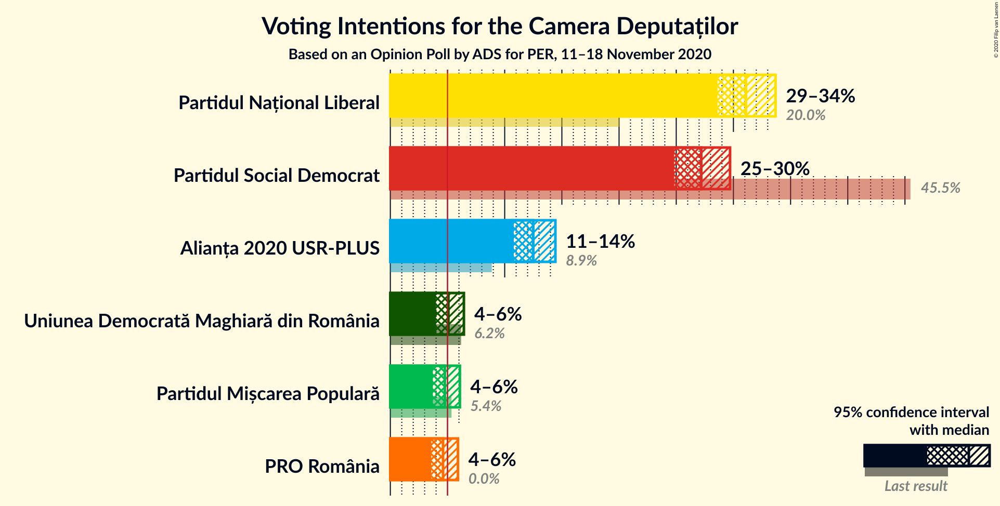

### Confidence Intervals

| Party | Last Result | Poll Result | 80% Confidence Interval | 90% Confidence Interval | 95% Confidence Interval | 99% Confidence Interval |
|:-----:|:-----------:|:-----------:|:-----------------------:|:-----------------------:|:-----------------------:|:-----------------------:|
| Partidul Național Liberal | 20.0% | 31.1% | 29.5–32.8% |29.0–33.3% |28.6–33.7% |27.8–34.5% |
| Partidul Social Democrat | 45.5% | 27.2% | 25.6–28.8% |25.2–29.3% |24.8–29.7% |24.1–30.5% |
| Alianța 2020 USR-PLUS | 8.9% | 12.5% | 11.4–13.8% |11.1–14.1% |10.8–14.4% |10.3–15.1% |
| Uniunea Democrată Maghiară din România | 6.2% | 5.1% | 4.4–6.0% |4.2–6.2% |4.0–6.4% |3.7–6.9% |
| Partidul Mișcarea Populară | 5.4% | 4.8% | 4.1–5.6% |3.9–5.9% |3.7–6.1% |3.4–6.5% |
| PRO România | 0.0% | 4.6% | 3.9–5.5% |3.7–5.7% |3.6–5.9% |3.3–6.3% |

*Note:* The poll result column reflects the actual value used in the calculations. Published results may vary slightly, and in addition be rounded to fewer digits.

## Seats

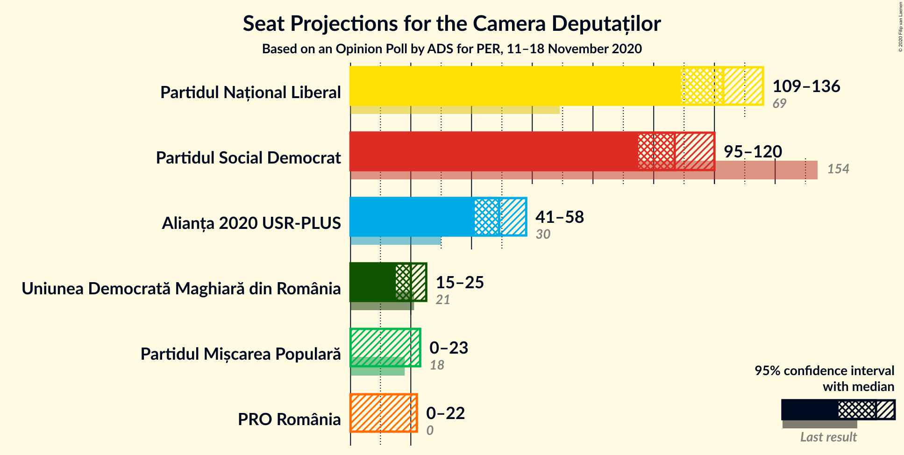

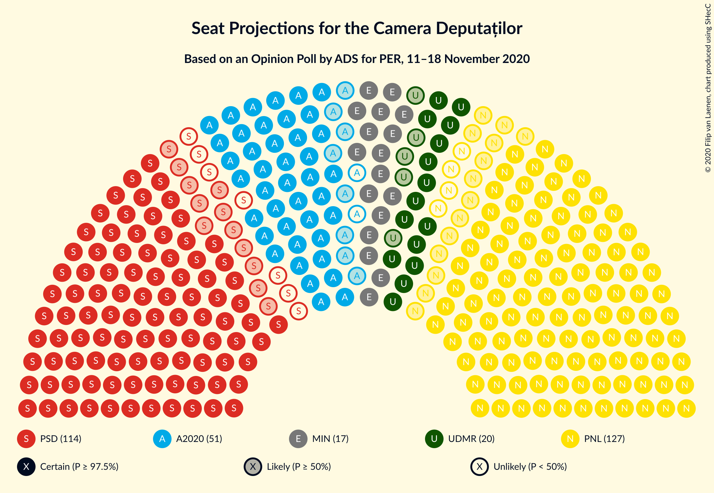

### Confidence Intervals

| Party | Last Result | Median | 80% Confidence Interval | 90% Confidence Interval | 95% Confidence Interval | 99% Confidence Interval |
|:-----:|:-----------:|:------:|:-----------------------:|:-----------------------:|:-----------------------:|:-----------------------:|
| <a href="#partidul-național-liberal">Partidul Național Liberal</a> | 69 | 123 | 114–132 |111–134 |109–136 |105–139 |
| <a href="#partidul-social-democrat">Partidul Social Democrat</a> | 154 | 107 | 99–116 |96–118 |95–120 |91–123 |
| <a href="#alianța-2020-usr-plus">Alianța 2020 USR-PLUS</a> | 30 | 49 | 44–55 |43–56 |41–58 |39–60 |
| <a href="#uniunea-democrată-maghiară-din-românia">Uniunea Democrată Maghiară din România</a> | 21 | 20 | 17–23 |16–24 |15–25 |14–27 |
| <a href="#partidul-mișcarea-populară">Partidul Mișcarea Populară</a> | 18 | 0 | 0–21 |0–22 |0–23 |0–25 |
| <a href="#pro-românia">PRO România</a> | 0 | 0 | 0–20 |0–21 |0–22 |0–24 |

### Partidul Național Liberal

*For a full overview of the results for this party, see the [Partidul Național Liberal](party-partidulnaționalliberal.html) page.*

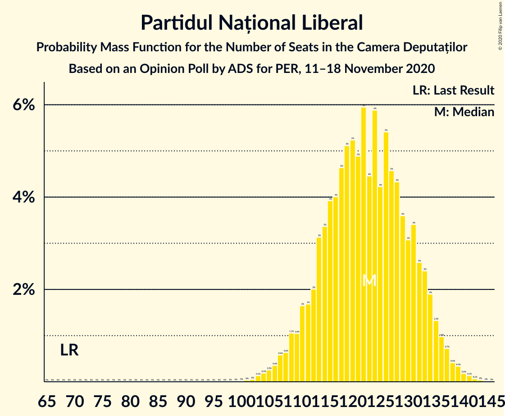

| Number of Seats | Probability | Accumulated | Special Marks |
|:---------------:|:-----------:|:-----------:|:-------------:|
| 69 | 0% | 100% | Last Result |
| 70 | 0% | 100% |  |
| 71 | 0% | 100% |  |
| 72 | 0% | 100% |  |
| 73 | 0% | 100% |  |
| 74 | 0% | 100% |  |
| 75 | 0% | 100% |  |
| 76 | 0% | 100% |  |
| 77 | 0% | 100% |  |
| 78 | 0% | 100% |  |
| 79 | 0% | 100% |  |
| 80 | 0% | 100% |  |
| 81 | 0% | 100% |  |
| 82 | 0% | 100% |  |
| 83 | 0% | 100% |  |
| 84 | 0% | 100% |  |
| 85 | 0% | 100% |  |
| 86 | 0% | 100% |  |
| 87 | 0% | 100% |  |
| 88 | 0% | 100% |  |
| 89 | 0% | 100% |  |
| 90 | 0% | 100% |  |
| 91 | 0% | 100% |  |
| 92 | 0% | 100% |  |
| 93 | 0% | 100% |  |
| 94 | 0% | 100% |  |
| 95 | 0% | 100% |  |
| 96 | 0% | 100% |  |
| 97 | 0% | 100% |  |
| 98 | 0% | 100% |  |
| 99 | 0% | 100% |  |
| 100 | 0% | 100% |  |
| 101 | 0% | 100% |  |
| 102 | 0% | 99.9% |  |
| 103 | 0.1% | 99.9% |  |
| 104 | 0.2% | 99.7% |  |
| 105 | 0.3% | 99.6% |  |
| 106 | 0.4% | 99.3% |  |
| 107 | 0.6% | 99.0% |  |
| 108 | 0.6% | 98% |  |
| 109 | 1.1% | 98% |  |
| 110 | 1.0% | 97% |  |
| 111 | 2% | 96% |  |
| 112 | 2% | 94% |  |
| 113 | 2% | 92% |  |
| 114 | 3% | 90% |  |
| 115 | 3% | 87% |  |
| 116 | 4% | 84% |  |
| 117 | 4% | 80% |  |
| 118 | 5% | 76% |  |
| 119 | 5% | 71% |  |
| 120 | 5% | 66% |  |
| 121 | 5% | 61% |  |
| 122 | 6% | 56% |  |
| 123 | 4% | 50% | Median |
| 124 | 6% | 46% |  |
| 125 | 4% | 40% |  |
| 126 | 5% | 35% |  |
| 127 | 5% | 30% |  |
| 128 | 4% | 26% |  |
| 129 | 4% | 21% |  |
| 130 | 3% | 18% |  |
| 131 | 3% | 15% |  |
| 132 | 3% | 11% |  |
| 133 | 2% | 9% |  |
| 134 | 2% | 6% |  |
| 135 | 1.3% | 4% |  |
| 136 | 1.0% | 3% |  |
| 137 | 0.7% | 2% |  |
| 138 | 0.4% | 1.2% |  |
| 139 | 0.3% | 0.8% |  |
| 140 | 0.2% | 0.5% |  |
| 141 | 0.1% | 0.3% |  |
| 142 | 0.1% | 0.1% |  |
| 143 | 0% | 0.1% |  |
| 144 | 0% | 0% |  |

### Partidul Social Democrat

*For a full overview of the results for this party, see the [Partidul Social Democrat](party-partidulsocialdemocrat.html) page.*

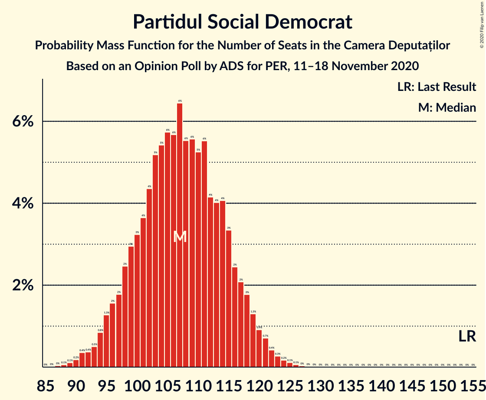

| Number of Seats | Probability | Accumulated | Special Marks |
|:---------------:|:-----------:|:-----------:|:-------------:|
| 87 | 0% | 100% |  |
| 88 | 0.1% | 99.9% |  |
| 89 | 0.1% | 99.9% |  |
| 90 | 0.2% | 99.8% |  |
| 91 | 0.4% | 99.6% |  |
| 92 | 0.4% | 99.2% |  |
| 93 | 0.5% | 98.9% |  |
| 94 | 0.8% | 98% |  |
| 95 | 1.3% | 98% |  |
| 96 | 2% | 96% |  |
| 97 | 2% | 95% |  |
| 98 | 2% | 93% |  |
| 99 | 3% | 90% |  |
| 100 | 3% | 87% |  |
| 101 | 4% | 84% |  |
| 102 | 4% | 81% |  |
| 103 | 5% | 76% |  |
| 104 | 5% | 71% |  |
| 105 | 6% | 66% |  |
| 106 | 6% | 60% |  |
| 107 | 6% | 54% | Median |
| 108 | 6% | 48% |  |
| 109 | 6% | 42% |  |
| 110 | 5% | 37% |  |
| 111 | 6% | 31% |  |
| 112 | 4% | 26% |  |
| 113 | 4% | 22% |  |
| 114 | 4% | 18% |  |
| 115 | 3% | 14% |  |
| 116 | 2% | 10% |  |
| 117 | 2% | 8% |  |
| 118 | 2% | 6% |  |
| 119 | 1.3% | 4% |  |
| 120 | 0.9% | 3% |  |
| 121 | 0.7% | 2% |  |
| 122 | 0.4% | 1.1% |  |
| 123 | 0.3% | 0.7% |  |
| 124 | 0.2% | 0.4% |  |
| 125 | 0.1% | 0.2% |  |
| 126 | 0.1% | 0.1% |  |
| 127 | 0% | 0.1% |  |
| 128 | 0% | 0% |  |
| 129 | 0% | 0% |  |
| 130 | 0% | 0% |  |
| 131 | 0% | 0% |  |
| 132 | 0% | 0% |  |
| 133 | 0% | 0% |  |
| 134 | 0% | 0% |  |
| 135 | 0% | 0% |  |
| 136 | 0% | 0% |  |
| 137 | 0% | 0% |  |
| 138 | 0% | 0% |  |
| 139 | 0% | 0% |  |
| 140 | 0% | 0% |  |
| 141 | 0% | 0% |  |
| 142 | 0% | 0% |  |
| 143 | 0% | 0% |  |
| 144 | 0% | 0% |  |
| 145 | 0% | 0% |  |
| 146 | 0% | 0% |  |
| 147 | 0% | 0% |  |
| 148 | 0% | 0% |  |
| 149 | 0% | 0% |  |
| 150 | 0% | 0% |  |
| 151 | 0% | 0% |  |
| 152 | 0% | 0% |  |
| 153 | 0% | 0% |  |
| 154 | 0% | 0% | Last Result |

### Alianța 2020 USR-PLUS

*For a full overview of the results for this party, see the [Alianța 2020 USR-PLUS](party-alianța2020usr-plus.html) page.*

| Number of Seats | Probability | Accumulated | Special Marks |
|:---------------:|:-----------:|:-----------:|:-------------:|
| 30 | 0% | 100% | Last Result |
| 31 | 0% | 100% |  |
| 32 | 0% | 100% |  |
| 33 | 0% | 100% |  |
| 34 | 0% | 100% |  |
| 35 | 0% | 100% |  |
| 36 | 0% | 100% |  |
| 37 | 0.1% | 100% |  |
| 38 | 0.2% | 99.9% |  |
| 39 | 0.4% | 99.7% |  |
| 40 | 1.0% | 99.3% |  |
| 41 | 1.3% | 98% |  |
| 42 | 2% | 97% |  |
| 43 | 3% | 95% |  |
| 44 | 4% | 92% |  |
| 45 | 8% | 88% |  |
| 46 | 7% | 80% |  |
| 47 | 9% | 73% |  |
| 48 | 7% | 64% |  |
| 49 | 10% | 57% | Median |
| 50 | 9% | 47% |  |
| 51 | 10% | 37% |  |
| 52 | 6% | 28% |  |
| 53 | 6% | 21% |  |
| 54 | 5% | 15% |  |
| 55 | 4% | 10% |  |
| 56 | 2% | 7% |  |
| 57 | 2% | 4% |  |
| 58 | 1.1% | 3% |  |
| 59 | 0.7% | 1.5% |  |
| 60 | 0.4% | 0.8% |  |
| 61 | 0.2% | 0.4% |  |
| 62 | 0.1% | 0.2% |  |
| 63 | 0.1% | 0.1% |  |
| 64 | 0% | 0% |  |

### Uniunea Democrată Maghiară din România

*For a full overview of the results for this party, see the [Uniunea Democrată Maghiară din România](party-uniuneademocratămaghiarădinromânia.html) page.*

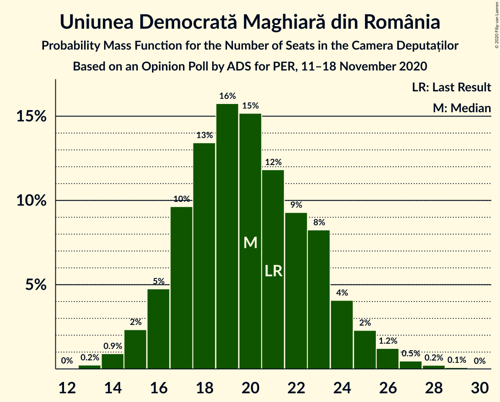

| Number of Seats | Probability | Accumulated | Special Marks |
|:---------------:|:-----------:|:-----------:|:-------------:|
| 12 | 0% | 100% |  |
| 13 | 0.2% | 99.9% |  |
| 14 | 0.9% | 99.7% |  |
| 15 | 2% | 98.8% |  |
| 16 | 5% | 96% |  |
| 17 | 10% | 92% |  |
| 18 | 13% | 82% |  |
| 19 | 16% | 69% |  |
| 20 | 15% | 53% | Median |
| 21 | 12% | 38% | Last Result |
| 22 | 9% | 26% |  |
| 23 | 8% | 17% |  |
| 24 | 4% | 8% |  |
| 25 | 2% | 4% |  |
| 26 | 1.2% | 2% |  |
| 27 | 0.5% | 0.8% |  |
| 28 | 0.2% | 0.3% |  |
| 29 | 0.1% | 0.1% |  |
| 30 | 0% | 0% |  |

### Partidul Mișcarea Populară

*For a full overview of the results for this party, see the [Partidul Mișcarea Populară](party-partidulmișcareapopulară.html) page.*

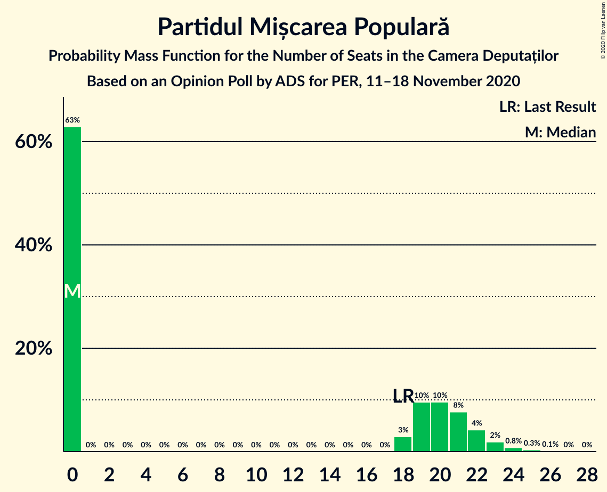

| Number of Seats | Probability | Accumulated | Special Marks |
|:---------------:|:-----------:|:-----------:|:-------------:|
| 0 | 63% | 100% | Median |
| 1 | 0% | 37% |  |
| 2 | 0% | 37% |  |
| 3 | 0% | 37% |  |
| 4 | 0% | 37% |  |
| 5 | 0% | 37% |  |
| 6 | 0% | 37% |  |
| 7 | 0% | 37% |  |
| 8 | 0% | 37% |  |
| 9 | 0% | 37% |  |
| 10 | 0% | 37% |  |
| 11 | 0% | 37% |  |
| 12 | 0% | 37% |  |
| 13 | 0% | 37% |  |
| 14 | 0% | 37% |  |
| 15 | 0% | 37% |  |
| 16 | 0% | 37% |  |
| 17 | 0% | 37% |  |
| 18 | 3% | 37% | Last Result |
| 19 | 10% | 34% |  |
| 20 | 10% | 25% |  |
| 21 | 8% | 15% |  |
| 22 | 4% | 7% |  |
| 23 | 2% | 3% |  |
| 24 | 0.8% | 1.3% |  |
| 25 | 0.3% | 0.5% |  |
| 26 | 0.1% | 0.2% |  |
| 27 | 0% | 0.1% |  |
| 28 | 0% | 0% |  |

### PRO România

*For a full overview of the results for this party, see the [PRO România](party-proromânia.html) page.*

| Number of Seats | Probability | Accumulated | Special Marks |
|:---------------:|:-----------:|:-----------:|:-------------:|
| 0 | 72% | 100% | Last Result, Median |
| 1 | 0% | 28% |  |
| 2 | 0% | 28% |  |
| 3 | 0% | 28% |  |
| 4 | 0% | 28% |  |
| 5 | 0% | 28% |  |
| 6 | 0% | 28% |  |
| 7 | 0% | 28% |  |
| 8 | 0% | 28% |  |
| 9 | 0% | 28% |  |
| 10 | 0% | 28% |  |
| 11 | 0% | 28% |  |
| 12 | 0% | 28% |  |
| 13 | 0% | 28% |  |
| 14 | 0% | 28% |  |
| 15 | 0% | 28% |  |
| 16 | 0% | 28% |  |
| 17 | 0% | 28% |  |
| 18 | 3% | 28% |  |
| 19 | 8% | 25% |  |
| 20 | 9% | 17% |  |
| 21 | 4% | 8% |  |
| 22 | 3% | 4% |  |
| 23 | 1.0% | 2% |  |
| 24 | 0.4% | 0.6% |  |
| 25 | 0.1% | 0.2% |  |
| 26 | 0.1% | 0.1% |  |
| 27 | 0% | 0% |  |

## Coalitions

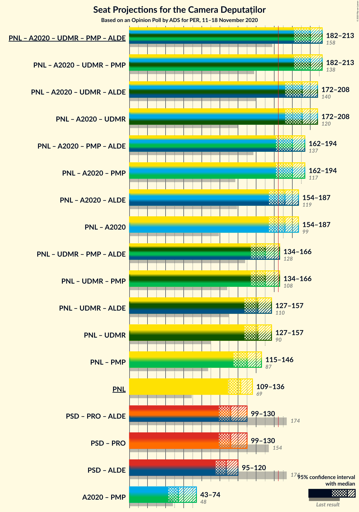

### Confidence Intervals

| Coalition | Last Result | Median | Majority? | 80% Confidence Interval | 90% Confidence Interval | 95% Confidence Interval | 99% Confidence Interval |
|:---------:|:-----------:|:------:|:---------:|:-----------------------:|:-----------------------:|:-----------------------:|:-----------------------:|
| Partidul Național Liberal – Alianța 2020 USR-PLUS – Uniunea Democrată Maghiară din România – Partidul Mișcarea Populară | 138 | 200 | 100% | 187–209 | 184–212 | 182–213 | 178–217 |
| Partidul Național Liberal – Alianța 2020 USR-PLUS – Uniunea Democrată Maghiară din România | 120 | 191 | 99.9% | 179–204 | 175–206 | 172–208 | 168–211 |
| Partidul Național Liberal – Alianța 2020 USR-PLUS – Partidul Mișcarea Populară | 117 | 180 | 95% | 168–190 | 165–192 | 162–194 | 159–198 |
| Partidul Național Liberal – Alianța 2020 USR-PLUS | 99 | 172 | 79% | 160–183 | 157–185 | 154–187 | 150–191 |
| Partidul Național Liberal – Uniunea Democrată Maghiară din România – Partidul Mișcarea Populară | 108 | 150 | 4% | 139–161 | 136–164 | 134–166 | 130–169 |
| Partidul Național Liberal – Uniunea Democrată Maghiară din România | 90 | 142 | 0% | 132–153 | 130–155 | 127–157 | 123–160 |
| Partidul Național Liberal – Partidul Mișcarea Populară | 87 | 130 | 0% | 119–142 | 117–144 | 115–146 | 111–150 |
| Partidul Național Liberal | 69 | 123 | 0% | 114–132 | 111–134 | 109–136 | 105–139 |
| Partidul Social Democrat – PRO România | 154 | 112 | 0% | 103–125 | 100–128 | 99–130 | 95–134 |
| Alianța 2020 USR-PLUS – Partidul Mișcarea Populară | 48 | 54 | 0% | 46–70 | 45–72 | 43–74 | 41–77 |

### Partidul Național Liberal – Alianța 2020 USR-PLUS – Uniunea Democrată Maghiară din România – Partidul Mișcarea Populară

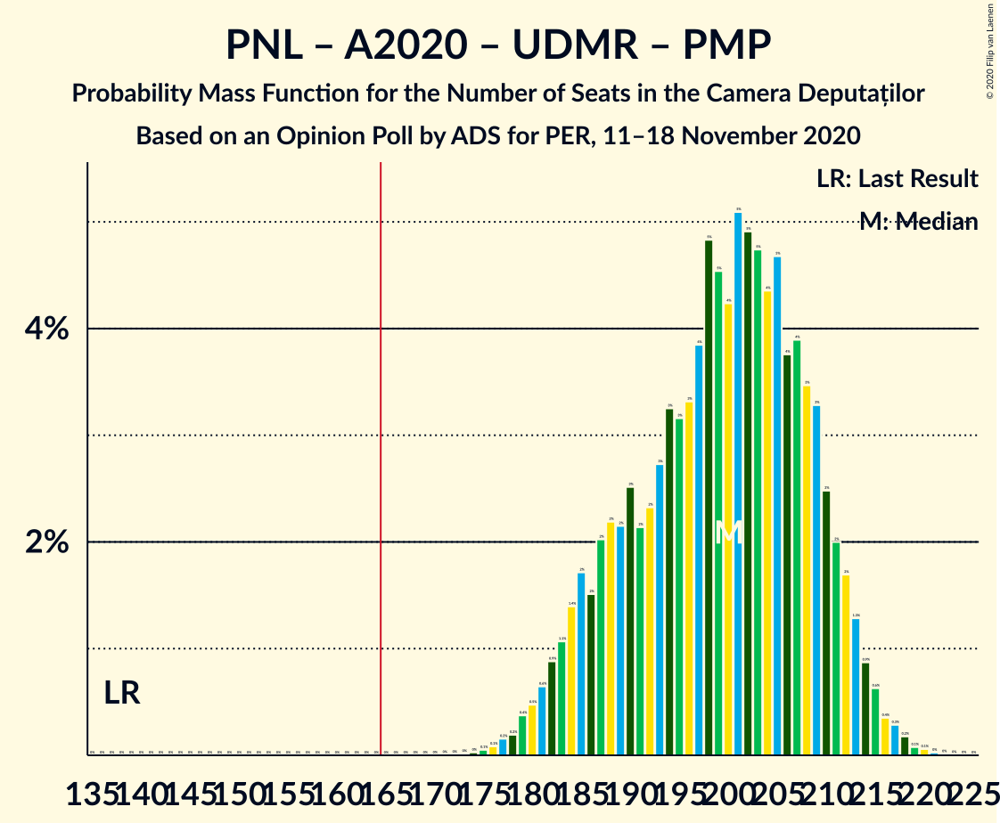

| Number of Seats | Probability | Accumulated | Special Marks |
|:---------------:|:-----------:|:-----------:|:-------------:|
| 138 | 0% | 100% | Last Result |
| 139 | 0% | 100% |  |
| 140 | 0% | 100% |  |
| 141 | 0% | 100% |  |
| 142 | 0% | 100% |  |
| 143 | 0% | 100% |  |
| 144 | 0% | 100% |  |
| 145 | 0% | 100% |  |
| 146 | 0% | 100% |  |
| 147 | 0% | 100% |  |
| 148 | 0% | 100% |  |
| 149 | 0% | 100% |  |
| 150 | 0% | 100% |  |
| 151 | 0% | 100% |  |
| 152 | 0% | 100% |  |
| 153 | 0% | 100% |  |
| 154 | 0% | 100% |  |
| 155 | 0% | 100% |  |
| 156 | 0% | 100% |  |
| 157 | 0% | 100% |  |
| 158 | 0% | 100% |  |
| 159 | 0% | 100% |  |
| 160 | 0% | 100% |  |
| 161 | 0% | 100% |  |
| 162 | 0% | 100% |  |
| 163 | 0% | 100% |  |
| 164 | 0% | 100% |  |
| 165 | 0% | 100% | Majority |
| 166 | 0% | 100% |  |
| 167 | 0% | 100% |  |
| 168 | 0% | 100% |  |
| 169 | 0% | 100% |  |
| 170 | 0% | 100% |  |
| 171 | 0% | 100% |  |
| 172 | 0% | 100% |  |
| 173 | 0% | 100% |  |
| 174 | 0% | 100% |  |
| 175 | 0.1% | 99.9% |  |
| 176 | 0.1% | 99.9% |  |
| 177 | 0.2% | 99.8% |  |
| 178 | 0.2% | 99.7% |  |
| 179 | 0.4% | 99.5% |  |
| 180 | 0.5% | 99.1% |  |
| 181 | 0.6% | 98.6% |  |
| 182 | 0.9% | 98% |  |
| 183 | 1.1% | 97% |  |
| 184 | 1.4% | 96% |  |
| 185 | 2% | 95% |  |
| 186 | 2% | 93% |  |
| 187 | 2% | 91% |  |
| 188 | 2% | 89% |  |
| 189 | 2% | 87% |  |
| 190 | 3% | 85% |  |
| 191 | 2% | 83% |  |
| 192 | 2% | 80% | Median |
| 193 | 3% | 78% |  |
| 194 | 3% | 75% |  |
| 195 | 3% | 72% |  |
| 196 | 3% | 69% |  |
| 197 | 4% | 66% |  |
| 198 | 5% | 62% |  |
| 199 | 5% | 57% |  |
| 200 | 4% | 52% |  |
| 201 | 5% | 48% |  |
| 202 | 5% | 43% |  |
| 203 | 5% | 38% |  |
| 204 | 4% | 33% |  |
| 205 | 5% | 29% |  |
| 206 | 4% | 24% |  |
| 207 | 4% | 21% |  |
| 208 | 3% | 17% |  |
| 209 | 3% | 13% |  |
| 210 | 2% | 10% |  |
| 211 | 2% | 7% |  |
| 212 | 2% | 5% |  |
| 213 | 1.3% | 4% |  |
| 214 | 0.9% | 2% |  |
| 215 | 0.6% | 2% |  |
| 216 | 0.4% | 1.0% |  |
| 217 | 0.3% | 0.6% |  |
| 218 | 0.2% | 0.4% |  |
| 219 | 0.1% | 0.2% |  |
| 220 | 0.1% | 0.1% |  |
| 221 | 0% | 0% |  |

### Partidul Național Liberal – Alianța 2020 USR-PLUS – Uniunea Democrată Maghiară din România

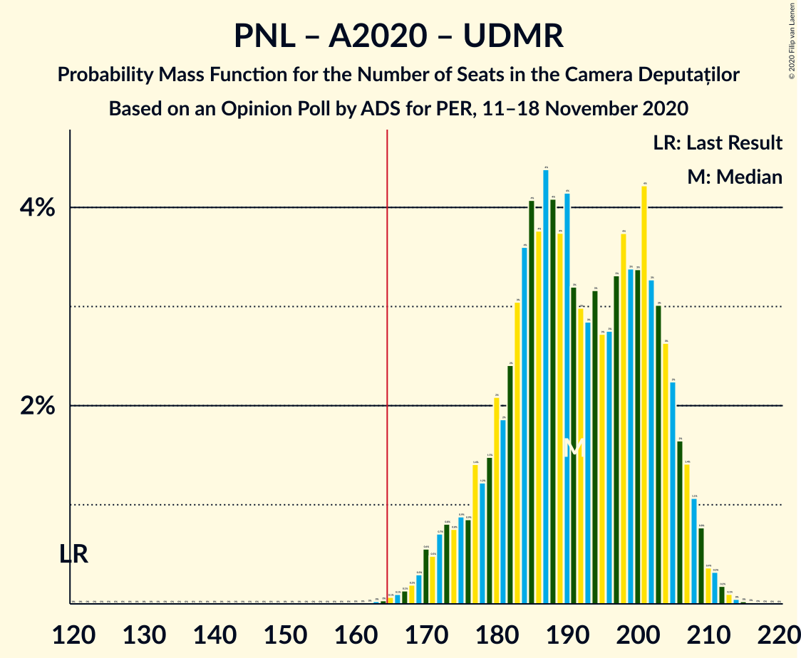

| Number of Seats | Probability | Accumulated | Special Marks |
|:---------------:|:-----------:|:-----------:|:-------------:|
| 120 | 0% | 100% | Last Result |
| 121 | 0% | 100% |  |
| 122 | 0% | 100% |  |
| 123 | 0% | 100% |  |
| 124 | 0% | 100% |  |
| 125 | 0% | 100% |  |
| 126 | 0% | 100% |  |
| 127 | 0% | 100% |  |
| 128 | 0% | 100% |  |
| 129 | 0% | 100% |  |
| 130 | 0% | 100% |  |
| 131 | 0% | 100% |  |
| 132 | 0% | 100% |  |
| 133 | 0% | 100% |  |
| 134 | 0% | 100% |  |
| 135 | 0% | 100% |  |
| 136 | 0% | 100% |  |
| 137 | 0% | 100% |  |
| 138 | 0% | 100% |  |
| 139 | 0% | 100% |  |
| 140 | 0% | 100% |  |
| 141 | 0% | 100% |  |
| 142 | 0% | 100% |  |
| 143 | 0% | 100% |  |
| 144 | 0% | 100% |  |
| 145 | 0% | 100% |  |
| 146 | 0% | 100% |  |
| 147 | 0% | 100% |  |
| 148 | 0% | 100% |  |
| 149 | 0% | 100% |  |
| 150 | 0% | 100% |  |
| 151 | 0% | 100% |  |
| 152 | 0% | 100% |  |
| 153 | 0% | 100% |  |
| 154 | 0% | 100% |  |
| 155 | 0% | 100% |  |
| 156 | 0% | 100% |  |
| 157 | 0% | 100% |  |
| 158 | 0% | 100% |  |
| 159 | 0% | 100% |  |
| 160 | 0% | 100% |  |
| 161 | 0% | 100% |  |
| 162 | 0% | 100% |  |
| 163 | 0% | 100% |  |
| 164 | 0% | 100% |  |
| 165 | 0.1% | 99.9% | Majority |
| 166 | 0.1% | 99.9% |  |
| 167 | 0.1% | 99.8% |  |
| 168 | 0.2% | 99.6% |  |
| 169 | 0.3% | 99.4% |  |
| 170 | 0.6% | 99.1% |  |
| 171 | 0.5% | 98.6% |  |
| 172 | 0.7% | 98% |  |
| 173 | 0.8% | 97% |  |
| 174 | 0.8% | 97% |  |
| 175 | 0.9% | 96% |  |
| 176 | 0.9% | 95% |  |
| 177 | 1.4% | 94% |  |
| 178 | 1.2% | 93% |  |
| 179 | 1.5% | 91% |  |
| 180 | 2% | 90% |  |
| 181 | 2% | 88% |  |
| 182 | 2% | 86% |  |
| 183 | 3% | 84% |  |
| 184 | 4% | 81% |  |
| 185 | 4% | 77% |  |
| 186 | 4% | 73% |  |
| 187 | 4% | 69% |  |
| 188 | 4% | 65% |  |
| 189 | 4% | 61% |  |
| 190 | 4% | 57% |  |
| 191 | 3% | 53% |  |
| 192 | 3% | 50% | Median |
| 193 | 3% | 47% |  |
| 194 | 3% | 44% |  |
| 195 | 3% | 41% |  |
| 196 | 3% | 38% |  |
| 197 | 3% | 35% |  |
| 198 | 4% | 32% |  |
| 199 | 3% | 28% |  |
| 200 | 3% | 25% |  |
| 201 | 4% | 21% |  |
| 202 | 3% | 17% |  |
| 203 | 3% | 14% |  |
| 204 | 3% | 11% |  |
| 205 | 2% | 8% |  |
| 206 | 2% | 6% |  |
| 207 | 1.4% | 4% |  |
| 208 | 1.1% | 3% |  |
| 209 | 0.8% | 2% |  |
| 210 | 0.4% | 1.1% |  |
| 211 | 0.3% | 0.7% |  |
| 212 | 0.2% | 0.4% |  |
| 213 | 0.1% | 0.2% |  |
| 214 | 0% | 0.1% |  |
| 215 | 0% | 0.1% |  |
| 216 | 0% | 0% |  |

### Partidul Național Liberal – Alianța 2020 USR-PLUS – Partidul Mișcarea Populară

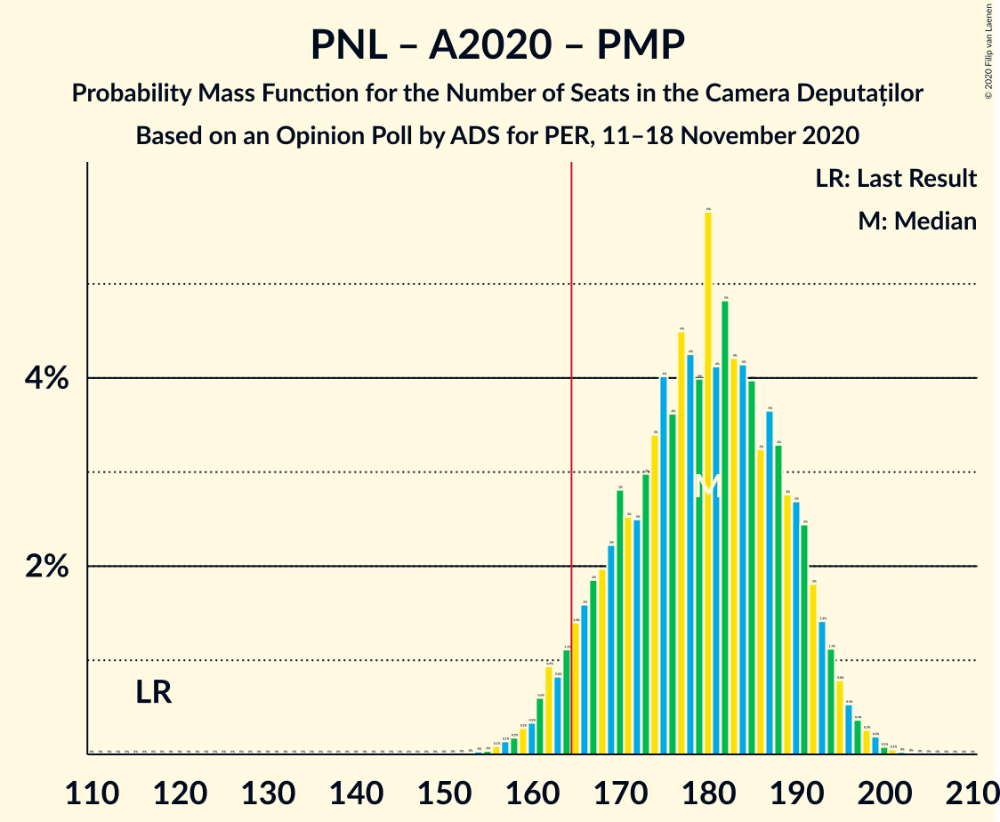

| Number of Seats | Probability | Accumulated | Special Marks |
|:---------------:|:-----------:|:-----------:|:-------------:|
| 117 | 0% | 100% | Last Result |
| 118 | 0% | 100% |  |
| 119 | 0% | 100% |  |
| 120 | 0% | 100% |  |
| 121 | 0% | 100% |  |
| 122 | 0% | 100% |  |
| 123 | 0% | 100% |  |
| 124 | 0% | 100% |  |
| 125 | 0% | 100% |  |
| 126 | 0% | 100% |  |
| 127 | 0% | 100% |  |
| 128 | 0% | 100% |  |
| 129 | 0% | 100% |  |
| 130 | 0% | 100% |  |
| 131 | 0% | 100% |  |
| 132 | 0% | 100% |  |
| 133 | 0% | 100% |  |
| 134 | 0% | 100% |  |
| 135 | 0% | 100% |  |
| 136 | 0% | 100% |  |
| 137 | 0% | 100% |  |
| 138 | 0% | 100% |  |
| 139 | 0% | 100% |  |
| 140 | 0% | 100% |  |
| 141 | 0% | 100% |  |
| 142 | 0% | 100% |  |
| 143 | 0% | 100% |  |
| 144 | 0% | 100% |  |
| 145 | 0% | 100% |  |
| 146 | 0% | 100% |  |
| 147 | 0% | 100% |  |
| 148 | 0% | 100% |  |
| 149 | 0% | 100% |  |
| 150 | 0% | 100% |  |
| 151 | 0% | 100% |  |
| 152 | 0% | 100% |  |
| 153 | 0% | 100% |  |
| 154 | 0% | 100% |  |
| 155 | 0% | 99.9% |  |
| 156 | 0.1% | 99.9% |  |
| 157 | 0.1% | 99.8% |  |
| 158 | 0.2% | 99.7% |  |
| 159 | 0.3% | 99.5% |  |
| 160 | 0.3% | 99.2% |  |
| 161 | 0.6% | 98.9% |  |
| 162 | 0.9% | 98% |  |
| 163 | 0.8% | 97% |  |
| 164 | 1.1% | 97% |  |
| 165 | 1.4% | 95% | Majority |
| 166 | 2% | 94% |  |
| 167 | 2% | 92% |  |
| 168 | 2% | 91% |  |
| 169 | 2% | 89% |  |
| 170 | 3% | 86% |  |
| 171 | 3% | 84% |  |
| 172 | 2% | 81% | Median |
| 173 | 3% | 79% |  |
| 174 | 3% | 76% |  |
| 175 | 4% | 72% |  |
| 176 | 4% | 68% |  |
| 177 | 4% | 65% |  |
| 178 | 4% | 60% |  |
| 179 | 4% | 56% |  |
| 180 | 6% | 52% |  |
| 181 | 4% | 46% |  |
| 182 | 5% | 42% |  |
| 183 | 4% | 37% |  |
| 184 | 4% | 33% |  |
| 185 | 4% | 29% |  |
| 186 | 3% | 25% |  |
| 187 | 4% | 22% |  |
| 188 | 3% | 18% |  |
| 189 | 3% | 15% |  |
| 190 | 3% | 12% |  |
| 191 | 2% | 9% |  |
| 192 | 2% | 7% |  |
| 193 | 1.4% | 5% |  |
| 194 | 1.1% | 3% |  |
| 195 | 0.8% | 2% |  |
| 196 | 0.5% | 2% |  |
| 197 | 0.4% | 1.0% |  |
| 198 | 0.3% | 0.6% |  |
| 199 | 0.2% | 0.4% |  |
| 200 | 0.1% | 0.2% |  |
| 201 | 0.1% | 0.1% |  |
| 202 | 0% | 0.1% |  |
| 203 | 0% | 0% |  |

### Partidul Național Liberal – Alianța 2020 USR-PLUS

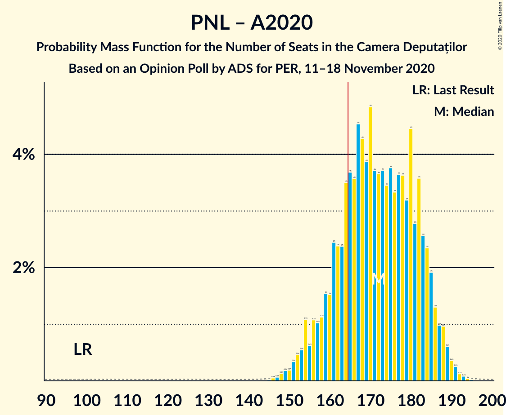

| Number of Seats | Probability | Accumulated | Special Marks |
|:---------------:|:-----------:|:-----------:|:-------------:|
| 99 | 0% | 100% | Last Result |
| 100 | 0% | 100% |  |
| 101 | 0% | 100% |  |
| 102 | 0% | 100% |  |
| 103 | 0% | 100% |  |
| 104 | 0% | 100% |  |
| 105 | 0% | 100% |  |
| 106 | 0% | 100% |  |
| 107 | 0% | 100% |  |
| 108 | 0% | 100% |  |
| 109 | 0% | 100% |  |
| 110 | 0% | 100% |  |
| 111 | 0% | 100% |  |
| 112 | 0% | 100% |  |
| 113 | 0% | 100% |  |
| 114 | 0% | 100% |  |
| 115 | 0% | 100% |  |
| 116 | 0% | 100% |  |
| 117 | 0% | 100% |  |
| 118 | 0% | 100% |  |
| 119 | 0% | 100% |  |
| 120 | 0% | 100% |  |
| 121 | 0% | 100% |  |
| 122 | 0% | 100% |  |
| 123 | 0% | 100% |  |
| 124 | 0% | 100% |  |
| 125 | 0% | 100% |  |
| 126 | 0% | 100% |  |
| 127 | 0% | 100% |  |
| 128 | 0% | 100% |  |
| 129 | 0% | 100% |  |
| 130 | 0% | 100% |  |
| 131 | 0% | 100% |  |
| 132 | 0% | 100% |  |
| 133 | 0% | 100% |  |
| 134 | 0% | 100% |  |
| 135 | 0% | 100% |  |
| 136 | 0% | 100% |  |
| 137 | 0% | 100% |  |
| 138 | 0% | 100% |  |
| 139 | 0% | 100% |  |
| 140 | 0% | 100% |  |
| 141 | 0% | 100% |  |
| 142 | 0% | 100% |  |
| 143 | 0% | 100% |  |
| 144 | 0% | 100% |  |
| 145 | 0% | 100% |  |
| 146 | 0.1% | 100% |  |
| 147 | 0.1% | 99.9% |  |
| 148 | 0.1% | 99.8% |  |
| 149 | 0.2% | 99.7% |  |
| 150 | 0.2% | 99.5% |  |
| 151 | 0.3% | 99.3% |  |
| 152 | 0.5% | 99.0% |  |
| 153 | 0.5% | 98.5% |  |
| 154 | 1.1% | 98% |  |
| 155 | 0.6% | 97% |  |
| 156 | 1.1% | 96% |  |
| 157 | 1.0% | 95% |  |
| 158 | 1.1% | 94% |  |
| 159 | 2% | 93% |  |
| 160 | 2% | 92% |  |
| 161 | 2% | 90% |  |
| 162 | 2% | 88% |  |
| 163 | 2% | 85% |  |
| 164 | 4% | 83% |  |
| 165 | 4% | 79% | Majority |
| 166 | 4% | 76% |  |
| 167 | 5% | 72% |  |
| 168 | 4% | 67% |  |
| 169 | 4% | 63% |  |
| 170 | 5% | 59% |  |
| 171 | 4% | 55% |  |
| 172 | 4% | 51% | Median |
| 173 | 4% | 47% |  |
| 174 | 3% | 43% |  |
| 175 | 4% | 40% |  |
| 176 | 3% | 36% |  |
| 177 | 4% | 33% |  |
| 178 | 4% | 29% |  |
| 179 | 3% | 26% |  |
| 180 | 4% | 22% |  |
| 181 | 3% | 18% |  |
| 182 | 4% | 15% |  |
| 183 | 3% | 12% |  |
| 184 | 2% | 9% |  |
| 185 | 2% | 7% |  |
| 186 | 1.3% | 5% |  |
| 187 | 1.0% | 3% |  |
| 188 | 1.0% | 2% |  |
| 189 | 0.6% | 2% |  |
| 190 | 0.4% | 0.9% |  |
| 191 | 0.3% | 0.5% |  |
| 192 | 0.1% | 0.3% |  |
| 193 | 0.1% | 0.2% |  |
| 194 | 0% | 0.1% |  |
| 195 | 0% | 0% |  |

### Partidul Național Liberal – Uniunea Democrată Maghiară din România – Partidul Mișcarea Populară

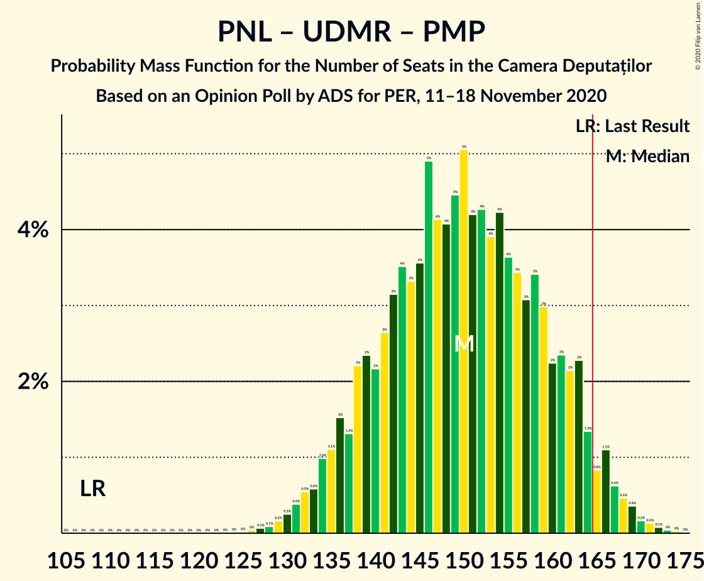

| Number of Seats | Probability | Accumulated | Special Marks |
|:---------------:|:-----------:|:-----------:|:-------------:|
| 108 | 0% | 100% | Last Result |
| 109 | 0% | 100% |  |
| 110 | 0% | 100% |  |
| 111 | 0% | 100% |  |
| 112 | 0% | 100% |  |
| 113 | 0% | 100% |  |
| 114 | 0% | 100% |  |
| 115 | 0% | 100% |  |
| 116 | 0% | 100% |  |
| 117 | 0% | 100% |  |
| 118 | 0% | 100% |  |
| 119 | 0% | 100% |  |
| 120 | 0% | 100% |  |
| 121 | 0% | 100% |  |
| 122 | 0% | 100% |  |
| 123 | 0% | 100% |  |
| 124 | 0% | 100% |  |
| 125 | 0% | 100% |  |
| 126 | 0% | 100% |  |
| 127 | 0.1% | 99.9% |  |
| 128 | 0.1% | 99.9% |  |
| 129 | 0.2% | 99.8% |  |
| 130 | 0.3% | 99.6% |  |
| 131 | 0.4% | 99.3% |  |
| 132 | 0.5% | 99.0% |  |
| 133 | 0.6% | 98% |  |
| 134 | 1.0% | 98% |  |
| 135 | 1.1% | 97% |  |
| 136 | 2% | 96% |  |
| 137 | 1.3% | 94% |  |
| 138 | 2% | 93% |  |
| 139 | 2% | 91% |  |
| 140 | 2% | 88% |  |
| 141 | 3% | 86% |  |
| 142 | 3% | 84% |  |
| 143 | 4% | 80% | Median |
| 144 | 3% | 77% |  |
| 145 | 4% | 74% |  |
| 146 | 5% | 70% |  |
| 147 | 4% | 65% |  |
| 148 | 4% | 61% |  |
| 149 | 4% | 57% |  |
| 150 | 5% | 52% |  |
| 151 | 4% | 47% |  |
| 152 | 4% | 43% |  |
| 153 | 4% | 39% |  |
| 154 | 4% | 35% |  |
| 155 | 4% | 31% |  |
| 156 | 3% | 27% |  |
| 157 | 3% | 24% |  |
| 158 | 3% | 21% |  |
| 159 | 3% | 17% |  |
| 160 | 2% | 14% |  |
| 161 | 2% | 12% |  |
| 162 | 2% | 10% |  |
| 163 | 2% | 7% |  |
| 164 | 1.3% | 5% |  |
| 165 | 0.8% | 4% | Majority |
| 166 | 1.1% | 3% |  |
| 167 | 0.6% | 2% |  |
| 168 | 0.5% | 1.3% |  |
| 169 | 0.4% | 0.8% |  |
| 170 | 0.2% | 0.5% |  |
| 171 | 0.1% | 0.3% |  |
| 172 | 0.1% | 0.2% |  |
| 173 | 0% | 0.1% |  |
| 174 | 0% | 0% |  |

### Partidul Național Liberal – Uniunea Democrată Maghiară din România

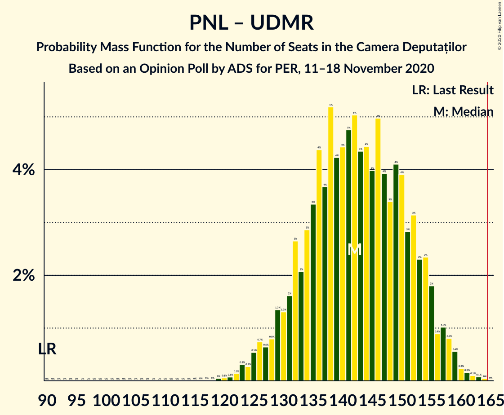

| Number of Seats | Probability | Accumulated | Special Marks |
|:---------------:|:-----------:|:-----------:|:-------------:|
| 90 | 0% | 100% | Last Result |
| 91 | 0% | 100% |  |
| 92 | 0% | 100% |  |
| 93 | 0% | 100% |  |
| 94 | 0% | 100% |  |
| 95 | 0% | 100% |  |
| 96 | 0% | 100% |  |
| 97 | 0% | 100% |  |
| 98 | 0% | 100% |  |
| 99 | 0% | 100% |  |
| 100 | 0% | 100% |  |
| 101 | 0% | 100% |  |
| 102 | 0% | 100% |  |
| 103 | 0% | 100% |  |
| 104 | 0% | 100% |  |
| 105 | 0% | 100% |  |
| 106 | 0% | 100% |  |
| 107 | 0% | 100% |  |
| 108 | 0% | 100% |  |
| 109 | 0% | 100% |  |
| 110 | 0% | 100% |  |
| 111 | 0% | 100% |  |
| 112 | 0% | 100% |  |
| 113 | 0% | 100% |  |
| 114 | 0% | 100% |  |
| 115 | 0% | 100% |  |
| 116 | 0% | 100% |  |
| 117 | 0% | 100% |  |
| 118 | 0% | 100% |  |
| 119 | 0% | 100% |  |
| 120 | 0.1% | 99.9% |  |
| 121 | 0.1% | 99.9% |  |
| 122 | 0.1% | 99.8% |  |
| 123 | 0.3% | 99.6% |  |
| 124 | 0.3% | 99.3% |  |
| 125 | 0.5% | 99.1% |  |
| 126 | 0.7% | 98.5% |  |
| 127 | 0.6% | 98% |  |
| 128 | 0.8% | 97% |  |
| 129 | 1.3% | 96% |  |
| 130 | 1.3% | 95% |  |
| 131 | 2% | 94% |  |
| 132 | 3% | 92% |  |
| 133 | 2% | 89% |  |
| 134 | 3% | 87% |  |
| 135 | 3% | 84% |  |
| 136 | 4% | 81% |  |
| 137 | 4% | 77% |  |
| 138 | 5% | 73% |  |
| 139 | 4% | 68% |  |
| 140 | 4% | 64% |  |
| 141 | 5% | 59% |  |
| 142 | 5% | 54% |  |
| 143 | 4% | 49% | Median |
| 144 | 4% | 45% |  |
| 145 | 4% | 41% |  |
| 146 | 5% | 37% |  |
| 147 | 4% | 32% |  |
| 148 | 3% | 28% |  |
| 149 | 4% | 24% |  |
| 150 | 4% | 20% |  |
| 151 | 3% | 16% |  |
| 152 | 3% | 14% |  |
| 153 | 2% | 10% |  |
| 154 | 2% | 8% |  |
| 155 | 2% | 6% |  |
| 156 | 0.9% | 4% |  |
| 157 | 1.0% | 3% |  |
| 158 | 0.8% | 2% |  |
| 159 | 0.6% | 1.2% |  |
| 160 | 0.2% | 0.7% |  |
| 161 | 0.2% | 0.4% |  |
| 162 | 0.1% | 0.3% |  |
| 163 | 0.1% | 0.2% |  |
| 164 | 0% | 0.1% |  |
| 165 | 0% | 0% | Majority |

### Partidul Național Liberal – Partidul Mișcarea Populară

| Number of Seats | Probability | Accumulated | Special Marks |
|:---------------:|:-----------:|:-----------:|:-------------:|
| 87 | 0% | 100% | Last Result |
| 88 | 0% | 100% |  |
| 89 | 0% | 100% |  |
| 90 | 0% | 100% |  |
| 91 | 0% | 100% |  |
| 92 | 0% | 100% |  |
| 93 | 0% | 100% |  |
| 94 | 0% | 100% |  |
| 95 | 0% | 100% |  |
| 96 | 0% | 100% |  |
| 97 | 0% | 100% |  |
| 98 | 0% | 100% |  |
| 99 | 0% | 100% |  |
| 100 | 0% | 100% |  |
| 101 | 0% | 100% |  |
| 102 | 0% | 100% |  |
| 103 | 0% | 100% |  |
| 104 | 0% | 100% |  |
| 105 | 0% | 100% |  |
| 106 | 0% | 100% |  |
| 107 | 0% | 100% |  |
| 108 | 0.1% | 99.9% |  |
| 109 | 0.1% | 99.9% |  |
| 110 | 0.2% | 99.7% |  |
| 111 | 0.3% | 99.5% |  |
| 112 | 0.4% | 99.3% |  |
| 113 | 0.4% | 98.9% |  |
| 114 | 0.8% | 98% |  |
| 115 | 1.3% | 98% |  |
| 116 | 1.1% | 96% |  |
| 117 | 2% | 95% |  |
| 118 | 2% | 94% |  |
| 119 | 2% | 91% |  |
| 120 | 2% | 89% |  |
| 121 | 3% | 87% |  |
| 122 | 3% | 83% |  |
| 123 | 3% | 80% | Median |
| 124 | 4% | 77% |  |
| 125 | 4% | 73% |  |
| 126 | 5% | 69% |  |
| 127 | 4% | 64% |  |
| 128 | 4% | 60% |  |
| 129 | 4% | 55% |  |
| 130 | 4% | 51% |  |
| 131 | 4% | 47% |  |
| 132 | 4% | 43% |  |
| 133 | 4% | 39% |  |
| 134 | 4% | 35% |  |
| 135 | 3% | 31% |  |
| 136 | 3% | 28% |  |
| 137 | 3% | 25% |  |
| 138 | 3% | 22% |  |
| 139 | 2% | 18% |  |
| 140 | 2% | 16% |  |
| 141 | 3% | 14% |  |
| 142 | 2% | 11% |  |
| 143 | 3% | 9% |  |
| 144 | 1.3% | 6% |  |
| 145 | 1.4% | 5% |  |
| 146 | 1.2% | 4% |  |
| 147 | 0.9% | 2% |  |
| 148 | 0.5% | 2% |  |
| 149 | 0.4% | 1.0% |  |
| 150 | 0.3% | 0.7% |  |
| 151 | 0.1% | 0.4% |  |
| 152 | 0.1% | 0.2% |  |
| 153 | 0.1% | 0.1% |  |
| 154 | 0% | 0.1% |  |
| 155 | 0% | 0% |  |

### Partidul Național Liberal

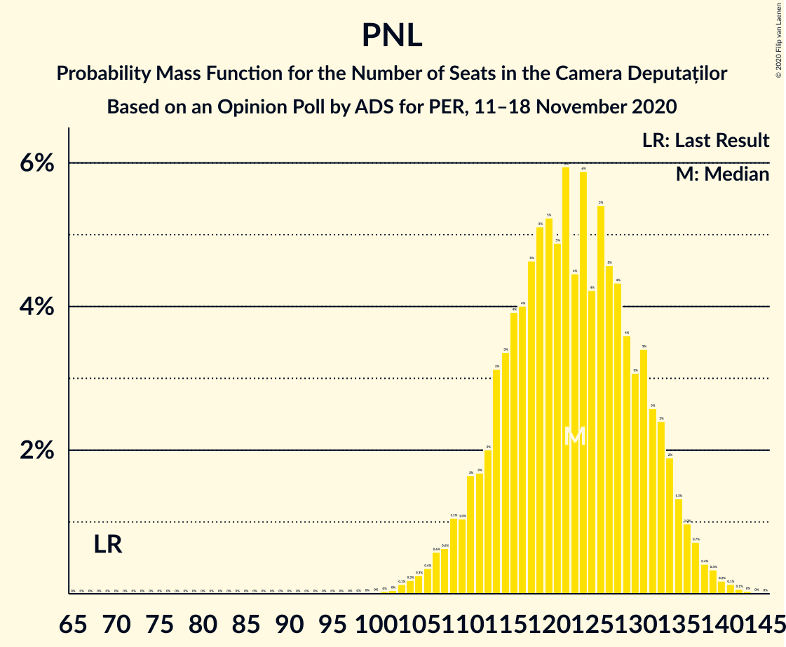

| Number of Seats | Probability | Accumulated | Special Marks |
|:---------------:|:-----------:|:-----------:|:-------------:|
| 69 | 0% | 100% | Last Result |
| 70 | 0% | 100% |  |
| 71 | 0% | 100% |  |
| 72 | 0% | 100% |  |
| 73 | 0% | 100% |  |
| 74 | 0% | 100% |  |
| 75 | 0% | 100% |  |
| 76 | 0% | 100% |  |
| 77 | 0% | 100% |  |
| 78 | 0% | 100% |  |
| 79 | 0% | 100% |  |
| 80 | 0% | 100% |  |
| 81 | 0% | 100% |  |
| 82 | 0% | 100% |  |
| 83 | 0% | 100% |  |
| 84 | 0% | 100% |  |
| 85 | 0% | 100% |  |
| 86 | 0% | 100% |  |
| 87 | 0% | 100% |  |
| 88 | 0% | 100% |  |
| 89 | 0% | 100% |  |
| 90 | 0% | 100% |  |
| 91 | 0% | 100% |  |
| 92 | 0% | 100% |  |
| 93 | 0% | 100% |  |
| 94 | 0% | 100% |  |
| 95 | 0% | 100% |  |
| 96 | 0% | 100% |  |
| 97 | 0% | 100% |  |
| 98 | 0% | 100% |  |
| 99 | 0% | 100% |  |
| 100 | 0% | 100% |  |
| 101 | 0% | 100% |  |
| 102 | 0% | 99.9% |  |
| 103 | 0.1% | 99.9% |  |
| 104 | 0.2% | 99.7% |  |
| 105 | 0.3% | 99.6% |  |
| 106 | 0.4% | 99.3% |  |
| 107 | 0.6% | 99.0% |  |
| 108 | 0.6% | 98% |  |
| 109 | 1.1% | 98% |  |
| 110 | 1.0% | 97% |  |
| 111 | 2% | 96% |  |
| 112 | 2% | 94% |  |
| 113 | 2% | 92% |  |
| 114 | 3% | 90% |  |
| 115 | 3% | 87% |  |
| 116 | 4% | 84% |  |
| 117 | 4% | 80% |  |
| 118 | 5% | 76% |  |
| 119 | 5% | 71% |  |
| 120 | 5% | 66% |  |
| 121 | 5% | 61% |  |
| 122 | 6% | 56% |  |
| 123 | 4% | 50% | Median |
| 124 | 6% | 46% |  |
| 125 | 4% | 40% |  |
| 126 | 5% | 35% |  |
| 127 | 5% | 30% |  |
| 128 | 4% | 26% |  |
| 129 | 4% | 21% |  |
| 130 | 3% | 18% |  |
| 131 | 3% | 15% |  |
| 132 | 3% | 11% |  |
| 133 | 2% | 9% |  |
| 134 | 2% | 6% |  |
| 135 | 1.3% | 4% |  |
| 136 | 1.0% | 3% |  |
| 137 | 0.7% | 2% |  |
| 138 | 0.4% | 1.2% |  |
| 139 | 0.3% | 0.8% |  |
| 140 | 0.2% | 0.5% |  |
| 141 | 0.1% | 0.3% |  |
| 142 | 0.1% | 0.1% |  |
| 143 | 0% | 0.1% |  |
| 144 | 0% | 0% |  |

### Partidul Social Democrat – PRO România

| Number of Seats | Probability | Accumulated | Special Marks |
|:---------------:|:-----------:|:-----------:|:-------------:|
| 92 | 0.1% | 100% |  |
| 93 | 0.1% | 99.9% |  |
| 94 | 0.2% | 99.8% |  |
| 95 | 0.3% | 99.6% |  |
| 96 | 0.4% | 99.4% |  |
| 97 | 0.6% | 99.0% |  |
| 98 | 0.9% | 98% |  |
| 99 | 1.3% | 98% |  |
| 100 | 2% | 96% |  |
| 101 | 2% | 95% |  |
| 102 | 2% | 93% |  |
| 103 | 3% | 90% |  |
| 104 | 3% | 87% |  |
| 105 | 4% | 83% |  |
| 106 | 4% | 79% |  |
| 107 | 5% | 76% | Median |
| 108 | 4% | 71% |  |
| 109 | 5% | 67% |  |
| 110 | 5% | 62% |  |
| 111 | 5% | 57% |  |
| 112 | 4% | 52% |  |
| 113 | 5% | 48% |  |
| 114 | 5% | 43% |  |
| 115 | 4% | 38% |  |
| 116 | 3% | 34% |  |
| 117 | 3% | 31% |  |
| 118 | 3% | 28% |  |
| 119 | 3% | 25% |  |
| 120 | 2% | 22% |  |
| 121 | 2% | 20% |  |
| 122 | 3% | 17% |  |
| 123 | 2% | 15% |  |
| 124 | 2% | 13% |  |
| 125 | 2% | 11% |  |
| 126 | 2% | 9% |  |
| 127 | 2% | 7% |  |
| 128 | 1.4% | 5% |  |
| 129 | 1.1% | 4% |  |
| 130 | 0.9% | 3% |  |
| 131 | 0.6% | 2% |  |
| 132 | 0.5% | 1.4% |  |
| 133 | 0.4% | 0.9% |  |
| 134 | 0.2% | 0.5% |  |
| 135 | 0.2% | 0.3% |  |
| 136 | 0.1% | 0.2% |  |
| 137 | 0.1% | 0.1% |  |
| 138 | 0% | 0.1% |  |
| 139 | 0% | 0% |  |
| 140 | 0% | 0% |  |
| 141 | 0% | 0% |  |
| 142 | 0% | 0% |  |
| 143 | 0% | 0% |  |
| 144 | 0% | 0% |  |
| 145 | 0% | 0% |  |
| 146 | 0% | 0% |  |
| 147 | 0% | 0% |  |
| 148 | 0% | 0% |  |
| 149 | 0% | 0% |  |
| 150 | 0% | 0% |  |
| 151 | 0% | 0% |  |
| 152 | 0% | 0% |  |
| 153 | 0% | 0% |  |
| 154 | 0% | 0% | Last Result |

### Alianța 2020 USR-PLUS – Partidul Mișcarea Populară

| Number of Seats | Probability | Accumulated | Special Marks |
|:---------------:|:-----------:|:-----------:|:-------------:|
| 39 | 0.1% | 100% |  |
| 40 | 0.2% | 99.9% |  |
| 41 | 0.4% | 99.7% |  |
| 42 | 0.7% | 99.3% |  |
| 43 | 1.2% | 98.6% |  |
| 44 | 1.4% | 97% |  |
| 45 | 3% | 96% |  |
| 46 | 4% | 93% |  |
| 47 | 5% | 89% |  |
| 48 | 5% | 84% | Last Result |
| 49 | 6% | 80% | Median |
| 50 | 6% | 73% |  |
| 51 | 7% | 68% |  |
| 52 | 5% | 61% |  |
| 53 | 5% | 56% |  |
| 54 | 4% | 51% |  |
| 55 | 3% | 46% |  |
| 56 | 2% | 43% |  |
| 57 | 2% | 41% |  |
| 58 | 1.3% | 39% |  |
| 59 | 1.2% | 38% |  |
| 60 | 1.0% | 37% |  |
| 61 | 1.0% | 36% |  |
| 62 | 1.3% | 35% |  |
| 63 | 2% | 34% |  |
| 64 | 3% | 31% |  |
| 65 | 3% | 29% |  |
| 66 | 3% | 26% |  |
| 67 | 4% | 23% |  |
| 68 | 3% | 19% |  |
| 69 | 5% | 16% |  |
| 70 | 3% | 11% |  |
| 71 | 2% | 8% |  |
| 72 | 2% | 6% |  |
| 73 | 2% | 4% |  |
| 74 | 1.2% | 3% |  |
| 75 | 0.6% | 1.5% |  |
| 76 | 0.4% | 0.9% |  |
| 77 | 0.3% | 0.5% |  |
| 78 | 0.1% | 0.3% |  |
| 79 | 0.1% | 0.1% |  |
| 80 | 0% | 0.1% |  |
| 81 | 0% | 0% |  |

## Technical Information

### Opinion Poll

+ **Polling firm:** ADS
+ **Commissioner(s):** PER
+ **Fieldwork period:** 11–18 November 2020

### Calculations

+ **Sample size:** 1280
+ **Simulations done:** 1,048,576
+ **Error estimate:** 0.67%

