# Opinion Poll by IMAS for Europa FM, 6–27 November 2020

<a href="#voting-intentions">Voting Intentions</a> | <a href="#seats">Seats</a> | <a href="#coalitions">Coalitions</a> | <a href="#technical-information">Technical Information</a>

## Voting Intentions

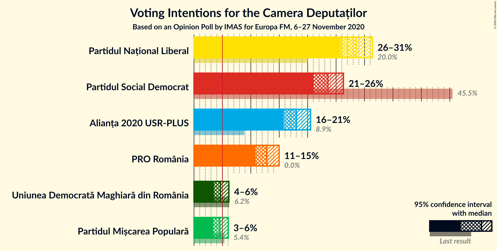

### Confidence Intervals

| Party | Last Result | Poll Result | 80% Confidence Interval | 90% Confidence Interval | 95% Confidence Interval | 99% Confidence Interval |
|:-----:|:-----------:|:-----------:|:-----------------------:|:-----------------------:|:-----------------------:|:-----------------------:|
| Partidul Național Liberal | 20.0% | 28.5% | 26.7–30.4% |26.2–30.9% |25.8–31.4% |25.0–32.3% |
| Partidul Social Democrat | 45.5% | 23.6% | 21.9–25.3% |21.4–25.8% |21.0–26.3% |20.3–27.2% |
| Alianța 2020 USR-PLUS | 8.9% | 18.0% | 16.5–19.6% |16.1–20.1% |15.8–20.5% |15.1–21.3% |
| PRO România | 0.0% | 12.8% | 11.5–14.2% |11.2–14.6% |10.9–15.0% |10.3–15.7% |
| Uniunea Democrată Maghiară din România | 6.2% | 4.7% | 3.9–5.6% |3.7–5.9% |3.5–6.1% |3.2–6.6% |
| Partidul Mișcarea Populară | 5.4% | 4.6% | 3.8–5.5% |3.6–5.8% |3.4–6.0% |3.1–6.5% |

*Note:* The poll result column reflects the actual value used in the calculations. Published results may vary slightly, and in addition be rounded to fewer digits.

## Seats

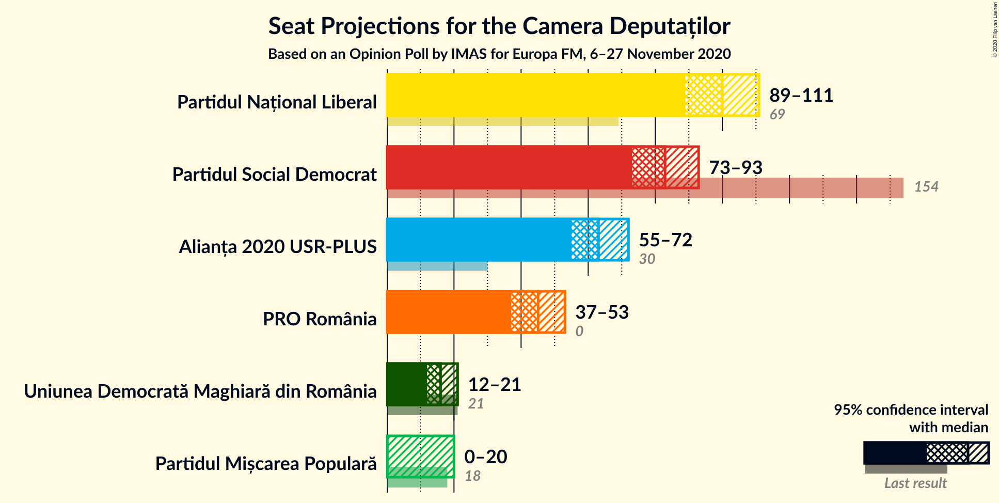

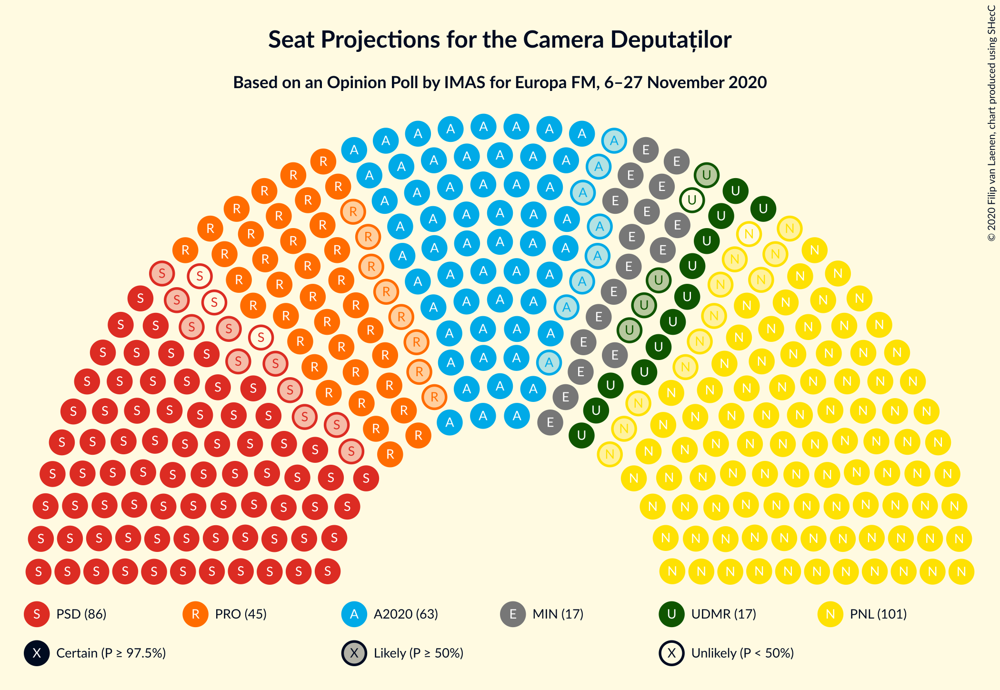

### Confidence Intervals

| Party | Last Result | Median | 80% Confidence Interval | 90% Confidence Interval | 95% Confidence Interval | 99% Confidence Interval |
|:-----:|:-----------:|:------:|:-----------------------:|:-----------------------:|:-----------------------:|:-----------------------:|
| <a href="#partidul-național-liberal">Partidul Național Liberal</a> | 69 | 100 | 93–107 |91–109 |89–111 |86–114 |
| <a href="#partidul-social-democrat">Partidul Social Democrat</a> | 154 | 83 | 76–89 |75–91 |73–93 |70–96 |
| <a href="#alianța-2020-usr-plus">Alianța 2020 USR-PLUS</a> | 30 | 63 | 57–69 |56–71 |55–72 |52–75 |
| <a href="#pro-românia">PRO România</a> | 0 | 45 | 40–50 |39–51 |37–53 |35–55 |
| <a href="#uniunea-democrată-maghiară-din-românia">Uniunea Democrată Maghiară din România</a> | 21 | 16 | 13–19 |13–20 |12–21 |11–23 |
| <a href="#partidul-mișcarea-populară">Partidul Mișcarea Populară</a> | 18 | 0 | 0–18 |0–19 |0–20 |0–22 |

### Partidul Național Liberal

*For a full overview of the results for this party, see the [Partidul Național Liberal](party-partidulnaționalliberal.html) page.*

| Number of Seats | Probability | Accumulated | Special Marks |
|:---------------:|:-----------:|:-----------:|:-------------:|
| 69 | 0% | 100% | Last Result |
| 70 | 0% | 100% |  |
| 71 | 0% | 100% |  |
| 72 | 0% | 100% |  |
| 73 | 0% | 100% |  |
| 74 | 0% | 100% |  |
| 75 | 0% | 100% |  |
| 76 | 0% | 100% |  |
| 77 | 0% | 100% |  |
| 78 | 0% | 100% |  |
| 79 | 0% | 100% |  |
| 80 | 0% | 100% |  |
| 81 | 0% | 100% |  |
| 82 | 0% | 100% |  |
| 83 | 0.1% | 100% |  |
| 84 | 0.1% | 99.9% |  |
| 85 | 0.2% | 99.8% |  |
| 86 | 0.3% | 99.6% |  |
| 87 | 0.4% | 99.4% |  |
| 88 | 0.7% | 99.0% |  |
| 89 | 1.0% | 98% |  |
| 90 | 2% | 97% |  |
| 91 | 2% | 96% |  |
| 92 | 3% | 94% |  |
| 93 | 4% | 91% |  |
| 94 | 3% | 88% |  |
| 95 | 5% | 84% |  |
| 96 | 5% | 79% |  |
| 97 | 5% | 74% |  |
| 98 | 7% | 69% |  |
| 99 | 8% | 62% |  |
| 100 | 7% | 54% | Median |
| 101 | 7% | 48% |  |
| 102 | 7% | 41% |  |
| 103 | 6% | 33% |  |
| 104 | 6% | 27% |  |
| 105 | 5% | 22% |  |
| 106 | 4% | 16% |  |
| 107 | 4% | 13% |  |
| 108 | 2% | 9% |  |
| 109 | 2% | 7% |  |
| 110 | 2% | 5% |  |
| 111 | 1.2% | 3% |  |
| 112 | 0.8% | 2% |  |
| 113 | 0.5% | 1.2% |  |
| 114 | 0.3% | 0.7% |  |
| 115 | 0.1% | 0.4% |  |
| 116 | 0.1% | 0.2% |  |
| 117 | 0.1% | 0.1% |  |
| 118 | 0% | 0.1% |  |
| 119 | 0% | 0% |  |

### Partidul Social Democrat

*For a full overview of the results for this party, see the [Partidul Social Democrat](party-partidulsocialdemocrat.html) page.*

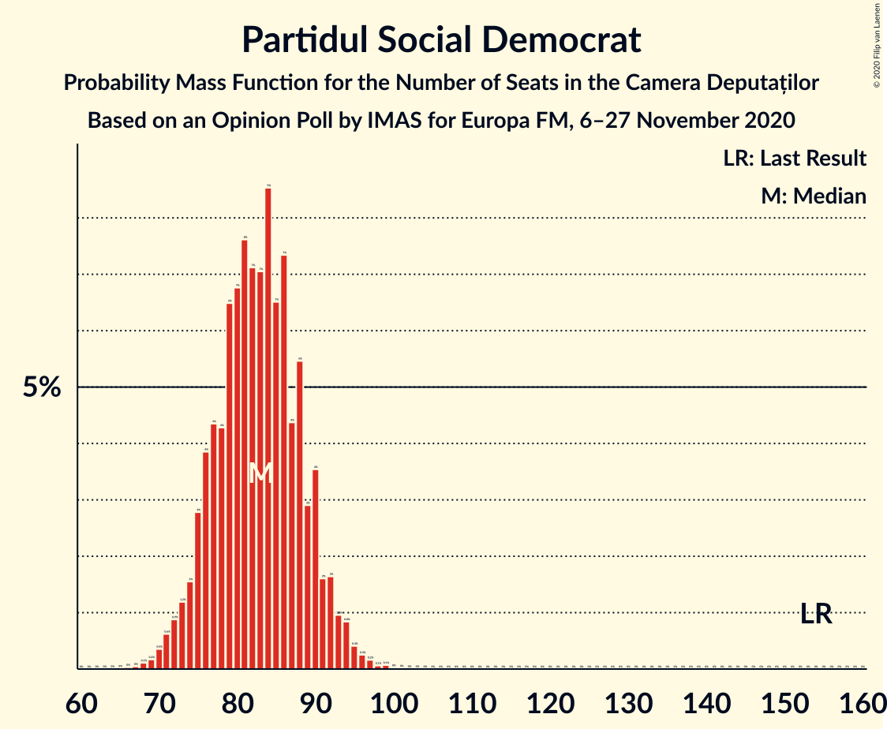

| Number of Seats | Probability | Accumulated | Special Marks |
|:---------------:|:-----------:|:-----------:|:-------------:|
| 67 | 0% | 100% |  |
| 68 | 0.1% | 99.9% |  |
| 69 | 0.2% | 99.8% |  |
| 70 | 0.4% | 99.6% |  |
| 71 | 0.6% | 99.3% |  |
| 72 | 0.9% | 98.6% |  |
| 73 | 1.2% | 98% |  |
| 74 | 2% | 97% |  |
| 75 | 3% | 95% |  |
| 76 | 4% | 92% |  |
| 77 | 4% | 88% |  |
| 78 | 4% | 84% |  |
| 79 | 6% | 80% |  |
| 80 | 7% | 73% |  |
| 81 | 8% | 67% |  |
| 82 | 7% | 59% |  |
| 83 | 7% | 52% | Median |
| 84 | 9% | 45% |  |
| 85 | 7% | 36% |  |
| 86 | 7% | 30% |  |
| 87 | 4% | 22% |  |
| 88 | 5% | 18% |  |
| 89 | 3% | 12% |  |
| 90 | 4% | 10% |  |
| 91 | 2% | 6% |  |
| 92 | 2% | 4% |  |
| 93 | 1.0% | 3% |  |
| 94 | 0.8% | 2% |  |
| 95 | 0.4% | 1.0% |  |
| 96 | 0.3% | 0.6% |  |
| 97 | 0.2% | 0.3% |  |
| 98 | 0.1% | 0.2% |  |
| 99 | 0.1% | 0.1% |  |
| 100 | 0% | 0% |  |
| 101 | 0% | 0% |  |
| 102 | 0% | 0% |  |
| 103 | 0% | 0% |  |
| 104 | 0% | 0% |  |
| 105 | 0% | 0% |  |
| 106 | 0% | 0% |  |
| 107 | 0% | 0% |  |
| 108 | 0% | 0% |  |
| 109 | 0% | 0% |  |
| 110 | 0% | 0% |  |
| 111 | 0% | 0% |  |
| 112 | 0% | 0% |  |
| 113 | 0% | 0% |  |
| 114 | 0% | 0% |  |
| 115 | 0% | 0% |  |
| 116 | 0% | 0% |  |
| 117 | 0% | 0% |  |
| 118 | 0% | 0% |  |
| 119 | 0% | 0% |  |
| 120 | 0% | 0% |  |
| 121 | 0% | 0% |  |
| 122 | 0% | 0% |  |
| 123 | 0% | 0% |  |
| 124 | 0% | 0% |  |
| 125 | 0% | 0% |  |
| 126 | 0% | 0% |  |
| 127 | 0% | 0% |  |
| 128 | 0% | 0% |  |
| 129 | 0% | 0% |  |
| 130 | 0% | 0% |  |
| 131 | 0% | 0% |  |
| 132 | 0% | 0% |  |
| 133 | 0% | 0% |  |
| 134 | 0% | 0% |  |
| 135 | 0% | 0% |  |
| 136 | 0% | 0% |  |
| 137 | 0% | 0% |  |
| 138 | 0% | 0% |  |
| 139 | 0% | 0% |  |
| 140 | 0% | 0% |  |
| 141 | 0% | 0% |  |
| 142 | 0% | 0% |  |
| 143 | 0% | 0% |  |
| 144 | 0% | 0% |  |
| 145 | 0% | 0% |  |
| 146 | 0% | 0% |  |
| 147 | 0% | 0% |  |
| 148 | 0% | 0% |  |
| 149 | 0% | 0% |  |
| 150 | 0% | 0% |  |
| 151 | 0% | 0% |  |
| 152 | 0% | 0% |  |
| 153 | 0% | 0% |  |
| 154 | 0% | 0% | Last Result |

### Alianța 2020 USR-PLUS

*For a full overview of the results for this party, see the [Alianța 2020 USR-PLUS](party-alianța2020usr-plus.html) page.*

| Number of Seats | Probability | Accumulated | Special Marks |
|:---------------:|:-----------:|:-----------:|:-------------:|
| 30 | 0% | 100% | Last Result |
| 31 | 0% | 100% |  |
| 32 | 0% | 100% |  |
| 33 | 0% | 100% |  |
| 34 | 0% | 100% |  |
| 35 | 0% | 100% |  |
| 36 | 0% | 100% |  |
| 37 | 0% | 100% |  |
| 38 | 0% | 100% |  |
| 39 | 0% | 100% |  |
| 40 | 0% | 100% |  |
| 41 | 0% | 100% |  |
| 42 | 0% | 100% |  |
| 43 | 0% | 100% |  |
| 44 | 0% | 100% |  |
| 45 | 0% | 100% |  |
| 46 | 0% | 100% |  |
| 47 | 0% | 100% |  |
| 48 | 0% | 100% |  |
| 49 | 0% | 100% |  |
| 50 | 0.1% | 99.9% |  |
| 51 | 0.2% | 99.8% |  |
| 52 | 0.4% | 99.6% |  |
| 53 | 0.6% | 99.3% |  |
| 54 | 1.1% | 98.7% |  |
| 55 | 2% | 98% |  |
| 56 | 3% | 96% |  |
| 57 | 4% | 93% |  |
| 58 | 5% | 89% |  |
| 59 | 5% | 84% |  |
| 60 | 6% | 80% |  |
| 61 | 9% | 73% |  |
| 62 | 9% | 64% |  |
| 63 | 10% | 56% | Median |
| 64 | 7% | 46% |  |
| 65 | 8% | 38% |  |
| 66 | 7% | 31% |  |
| 67 | 6% | 24% |  |
| 68 | 5% | 18% |  |
| 69 | 4% | 12% |  |
| 70 | 3% | 8% |  |
| 71 | 2% | 6% |  |
| 72 | 2% | 4% |  |
| 73 | 0.6% | 2% |  |
| 74 | 0.5% | 1.3% |  |
| 75 | 0.3% | 0.7% |  |
| 76 | 0.2% | 0.4% |  |
| 77 | 0.1% | 0.2% |  |
| 78 | 0% | 0.1% |  |
| 79 | 0% | 0.1% |  |
| 80 | 0% | 0% |  |

### PRO România

*For a full overview of the results for this party, see the [PRO România](party-proromânia.html) page.*

| Number of Seats | Probability | Accumulated | Special Marks |
|:---------------:|:-----------:|:-----------:|:-------------:|
| 0 | 0% | 100% | Last Result |
| 1 | 0% | 100% |  |
| 2 | 0% | 100% |  |
| 3 | 0% | 100% |  |
| 4 | 0% | 100% |  |
| 5 | 0% | 100% |  |
| 6 | 0% | 100% |  |
| 7 | 0% | 100% |  |
| 8 | 0% | 100% |  |
| 9 | 0% | 100% |  |
| 10 | 0% | 100% |  |
| 11 | 0% | 100% |  |
| 12 | 0% | 100% |  |
| 13 | 0% | 100% |  |
| 14 | 0% | 100% |  |
| 15 | 0% | 100% |  |
| 16 | 0% | 100% |  |
| 17 | 0% | 100% |  |
| 18 | 0% | 100% |  |
| 19 | 0% | 100% |  |
| 20 | 0% | 100% |  |
| 21 | 0% | 100% |  |
| 22 | 0% | 100% |  |
| 23 | 0% | 100% |  |
| 24 | 0% | 100% |  |
| 25 | 0% | 100% |  |
| 26 | 0% | 100% |  |
| 27 | 0% | 100% |  |
| 28 | 0% | 100% |  |
| 29 | 0% | 100% |  |
| 30 | 0% | 100% |  |
| 31 | 0% | 100% |  |
| 32 | 0% | 100% |  |
| 33 | 0.1% | 100% |  |
| 34 | 0.1% | 99.9% |  |
| 35 | 0.3% | 99.8% |  |
| 36 | 0.7% | 99.4% |  |
| 37 | 1.3% | 98.7% |  |
| 38 | 2% | 97% |  |
| 39 | 3% | 95% |  |
| 40 | 5% | 92% |  |
| 41 | 7% | 87% |  |
| 42 | 8% | 80% |  |
| 43 | 9% | 71% |  |
| 44 | 10% | 62% |  |
| 45 | 11% | 52% | Median |
| 46 | 10% | 41% |  |
| 47 | 7% | 31% |  |
| 48 | 8% | 24% |  |
| 49 | 6% | 16% |  |
| 50 | 4% | 11% |  |
| 51 | 3% | 7% |  |
| 52 | 2% | 4% |  |
| 53 | 1.2% | 3% |  |
| 54 | 0.6% | 1.4% |  |
| 55 | 0.3% | 0.7% |  |
| 56 | 0.2% | 0.4% |  |
| 57 | 0.1% | 0.2% |  |
| 58 | 0.1% | 0.1% |  |
| 59 | 0% | 0% |  |

### Uniunea Democrată Maghiară din România

*For a full overview of the results for this party, see the [Uniunea Democrată Maghiară din România](party-uniuneademocratămaghiarădinromânia.html) page.*

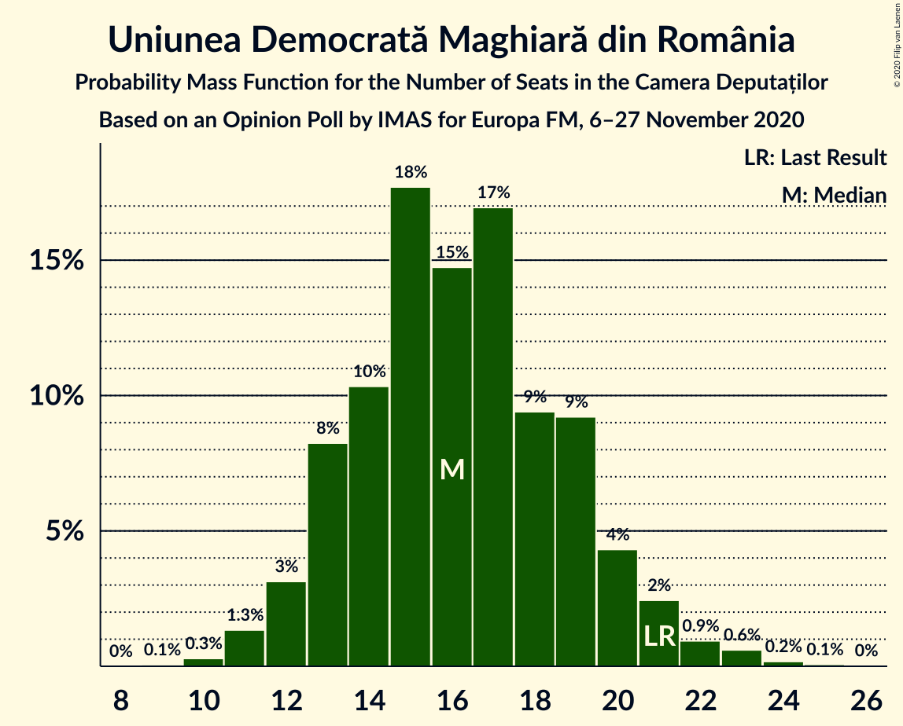

| Number of Seats | Probability | Accumulated | Special Marks |
|:---------------:|:-----------:|:-----------:|:-------------:|
| 9 | 0.1% | 100% |  |
| 10 | 0.3% | 99.9% |  |
| 11 | 1.3% | 99.6% |  |
| 12 | 3% | 98% |  |
| 13 | 8% | 95% |  |
| 14 | 10% | 87% |  |
| 15 | 18% | 77% |  |
| 16 | 15% | 59% | Median |
| 17 | 17% | 44% |  |
| 18 | 9% | 27% |  |
| 19 | 9% | 18% |  |
| 20 | 4% | 9% |  |
| 21 | 2% | 4% | Last Result |
| 22 | 0.9% | 2% |  |
| 23 | 0.6% | 0.9% |  |
| 24 | 0.2% | 0.3% |  |
| 25 | 0.1% | 0.1% |  |
| 26 | 0% | 0% |  |

### Partidul Mișcarea Populară

*For a full overview of the results for this party, see the [Partidul Mișcarea Populară](party-partidulmișcareapopulară.html) page.*

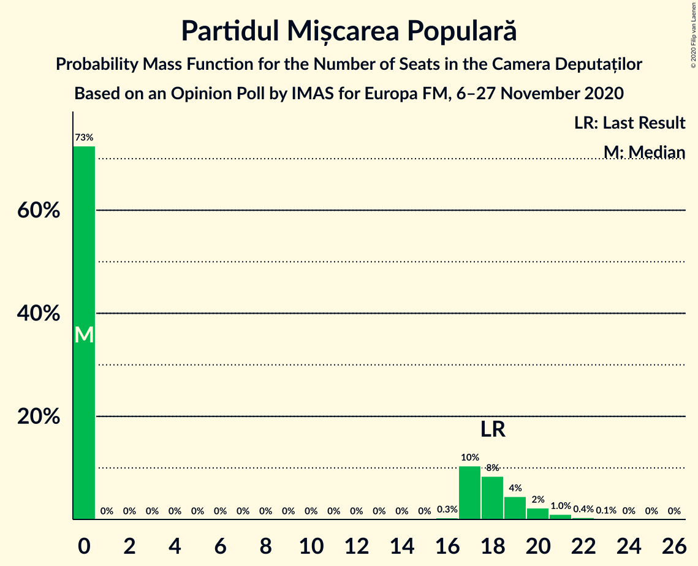

| Number of Seats | Probability | Accumulated | Special Marks |
|:---------------:|:-----------:|:-----------:|:-------------:|
| 0 | 73% | 100% | Median |
| 1 | 0% | 27% |  |
| 2 | 0% | 27% |  |
| 3 | 0% | 27% |  |
| 4 | 0% | 27% |  |
| 5 | 0% | 27% |  |
| 6 | 0% | 27% |  |
| 7 | 0% | 27% |  |
| 8 | 0% | 27% |  |
| 9 | 0% | 27% |  |
| 10 | 0% | 27% |  |
| 11 | 0% | 27% |  |
| 12 | 0% | 27% |  |
| 13 | 0% | 27% |  |
| 14 | 0% | 27% |  |
| 15 | 0% | 27% |  |
| 16 | 0.3% | 27% |  |
| 17 | 10% | 27% |  |
| 18 | 8% | 17% | Last Result |
| 19 | 4% | 8% |  |
| 20 | 2% | 4% |  |
| 21 | 1.0% | 2% |  |
| 22 | 0.4% | 0.6% |  |
| 23 | 0.1% | 0.2% |  |
| 24 | 0% | 0.1% |  |
| 25 | 0% | 0% |  |

## Coalitions

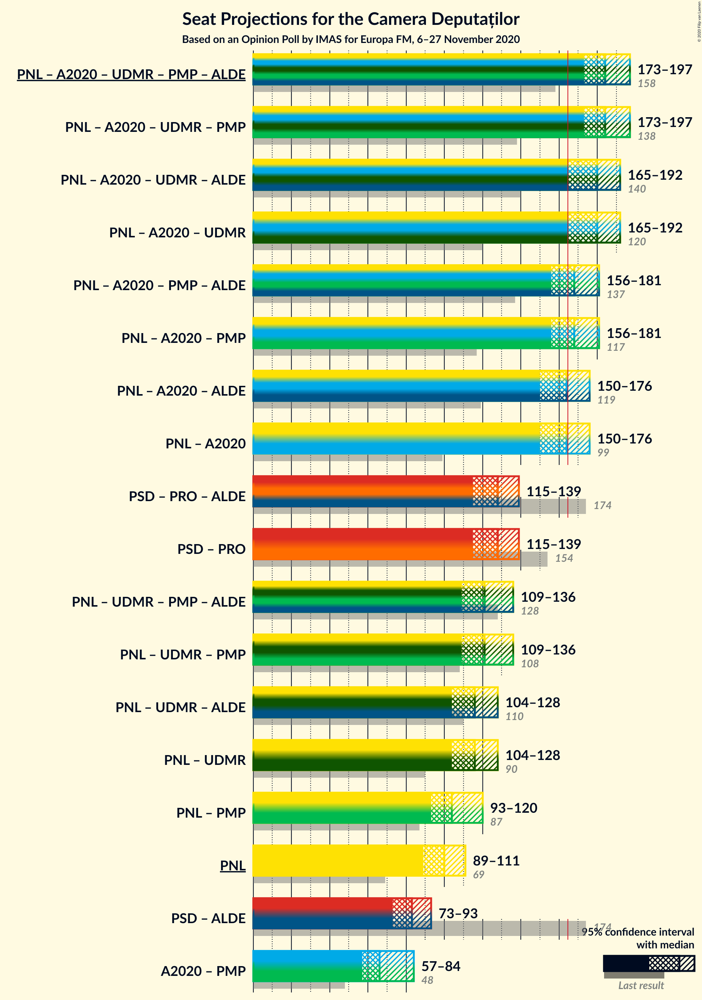

### Confidence Intervals

| Coalition | Last Result | Median | Majority? | 80% Confidence Interval | 90% Confidence Interval | 95% Confidence Interval | 99% Confidence Interval |
|:---------:|:-----------:|:------:|:---------:|:-----------------------:|:-----------------------:|:-----------------------:|:-----------------------:|
| Partidul Național Liberal – Alianța 2020 USR-PLUS – Uniunea Democrată Maghiară din România – Partidul Mișcarea Populară | 138 | 184 | 100% | 177–192 | 175–195 | 173–197 | 170–200 |
| Partidul Național Liberal – Alianța 2020 USR-PLUS – Uniunea Democrată Maghiară din România | 120 | 180 | 98% | 170–188 | 167–190 | 165–192 | 161–196 |
| Partidul Național Liberal – Alianța 2020 USR-PLUS – Partidul Mișcarea Populară | 117 | 168 | 72% | 160–177 | 158–179 | 156–181 | 153–185 |
| Partidul Național Liberal – Alianța 2020 USR-PLUS | 99 | 164 | 47% | 154–172 | 152–174 | 150–176 | 146–179 |
| Partidul Social Democrat – PRO România | 154 | 128 | 0% | 120–135 | 117–137 | 115–139 | 112–142 |
| Partidul Național Liberal – Uniunea Democrată Maghiară din România – Partidul Mișcarea Populară | 108 | 121 | 0% | 113–131 | 111–134 | 109–136 | 106–140 |
| Partidul Național Liberal – Uniunea Democrată Maghiară din România | 90 | 116 | 0% | 109–124 | 107–126 | 104–128 | 101–131 |
| Partidul Național Liberal – Partidul Mișcarea Populară | 87 | 104 | 0% | 96–116 | 95–118 | 93–120 | 90–124 |
| Partidul Național Liberal | 69 | 100 | 0% | 93–107 | 91–109 | 89–111 | 86–114 |
| Alianța 2020 USR-PLUS – Partidul Mișcarea Populară | 48 | 66 | 0% | 60–80 | 58–82 | 57–84 | 54–87 |

### Partidul Național Liberal – Alianța 2020 USR-PLUS – Uniunea Democrată Maghiară din România – Partidul Mișcarea Populară

| Number of Seats | Probability | Accumulated | Special Marks |
|:---------------:|:-----------:|:-----------:|:-------------:|
| 138 | 0% | 100% | Last Result |
| 139 | 0% | 100% |  |
| 140 | 0% | 100% |  |
| 141 | 0% | 100% |  |
| 142 | 0% | 100% |  |
| 143 | 0% | 100% |  |
| 144 | 0% | 100% |  |
| 145 | 0% | 100% |  |
| 146 | 0% | 100% |  |
| 147 | 0% | 100% |  |
| 148 | 0% | 100% |  |
| 149 | 0% | 100% |  |
| 150 | 0% | 100% |  |
| 151 | 0% | 100% |  |
| 152 | 0% | 100% |  |
| 153 | 0% | 100% |  |
| 154 | 0% | 100% |  |
| 155 | 0% | 100% |  |
| 156 | 0% | 100% |  |
| 157 | 0% | 100% |  |
| 158 | 0% | 100% |  |
| 159 | 0% | 100% |  |
| 160 | 0% | 100% |  |
| 161 | 0% | 100% |  |
| 162 | 0% | 100% |  |
| 163 | 0% | 100% |  |
| 164 | 0% | 100% |  |
| 165 | 0% | 100% | Majority |
| 166 | 0% | 100% |  |
| 167 | 0.1% | 99.9% |  |
| 168 | 0.2% | 99.8% |  |
| 169 | 0.2% | 99.7% |  |
| 170 | 0.4% | 99.5% |  |
| 171 | 0.3% | 99.2% |  |
| 172 | 1.1% | 98.9% |  |
| 173 | 0.9% | 98% |  |
| 174 | 1.3% | 97% |  |
| 175 | 3% | 96% |  |
| 176 | 1.2% | 93% |  |
| 177 | 4% | 91% |  |
| 178 | 3% | 87% |  |
| 179 | 5% | 84% | Median |
| 180 | 6% | 79% |  |
| 181 | 4% | 73% |  |
| 182 | 6% | 69% |  |
| 183 | 4% | 62% |  |
| 184 | 9% | 58% |  |
| 185 | 6% | 49% |  |
| 186 | 6% | 43% |  |
| 187 | 7% | 37% |  |
| 188 | 4% | 30% |  |
| 189 | 6% | 26% |  |
| 190 | 4% | 21% |  |
| 191 | 3% | 17% |  |
| 192 | 4% | 13% |  |
| 193 | 2% | 10% |  |
| 194 | 2% | 8% |  |
| 195 | 1.5% | 6% |  |
| 196 | 1.3% | 4% |  |
| 197 | 1.2% | 3% |  |
| 198 | 0.6% | 2% |  |
| 199 | 0.5% | 1.2% |  |
| 200 | 0.2% | 0.7% |  |
| 201 | 0.2% | 0.4% |  |
| 202 | 0.1% | 0.2% |  |
| 203 | 0.1% | 0.1% |  |
| 204 | 0% | 0.1% |  |
| 205 | 0% | 0% |  |

### Partidul Național Liberal – Alianța 2020 USR-PLUS – Uniunea Democrată Maghiară din România

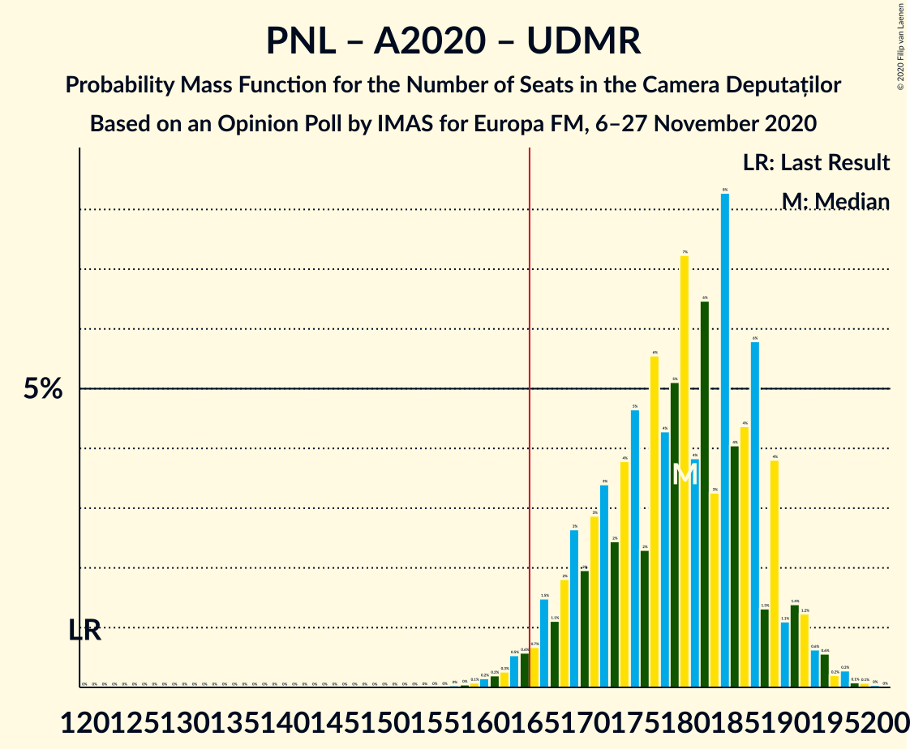

| Number of Seats | Probability | Accumulated | Special Marks |
|:---------------:|:-----------:|:-----------:|:-------------:|
| 120 | 0% | 100% | Last Result |
| 121 | 0% | 100% |  |
| 122 | 0% | 100% |  |
| 123 | 0% | 100% |  |
| 124 | 0% | 100% |  |
| 125 | 0% | 100% |  |
| 126 | 0% | 100% |  |
| 127 | 0% | 100% |  |
| 128 | 0% | 100% |  |
| 129 | 0% | 100% |  |
| 130 | 0% | 100% |  |
| 131 | 0% | 100% |  |
| 132 | 0% | 100% |  |
| 133 | 0% | 100% |  |
| 134 | 0% | 100% |  |
| 135 | 0% | 100% |  |
| 136 | 0% | 100% |  |
| 137 | 0% | 100% |  |
| 138 | 0% | 100% |  |
| 139 | 0% | 100% |  |
| 140 | 0% | 100% |  |
| 141 | 0% | 100% |  |
| 142 | 0% | 100% |  |
| 143 | 0% | 100% |  |
| 144 | 0% | 100% |  |
| 145 | 0% | 100% |  |
| 146 | 0% | 100% |  |
| 147 | 0% | 100% |  |
| 148 | 0% | 100% |  |
| 149 | 0% | 100% |  |
| 150 | 0% | 100% |  |
| 151 | 0% | 100% |  |
| 152 | 0% | 100% |  |
| 153 | 0% | 100% |  |
| 154 | 0% | 100% |  |
| 155 | 0% | 100% |  |
| 156 | 0% | 100% |  |
| 157 | 0% | 100% |  |
| 158 | 0% | 99.9% |  |
| 159 | 0.1% | 99.9% |  |
| 160 | 0.2% | 99.8% |  |
| 161 | 0.2% | 99.7% |  |
| 162 | 0.3% | 99.5% |  |
| 163 | 0.5% | 99.2% |  |
| 164 | 0.6% | 98.7% |  |
| 165 | 0.7% | 98% | Majority |
| 166 | 1.5% | 97% |  |
| 167 | 1.1% | 96% |  |
| 168 | 2% | 95% |  |
| 169 | 3% | 93% |  |
| 170 | 2% | 90% |  |
| 171 | 3% | 88% |  |
| 172 | 3% | 86% |  |
| 173 | 2% | 82% |  |
| 174 | 4% | 80% |  |
| 175 | 5% | 76% |  |
| 176 | 2% | 71% |  |
| 177 | 6% | 69% |  |
| 178 | 4% | 63% |  |
| 179 | 5% | 59% | Median |
| 180 | 7% | 54% |  |
| 181 | 4% | 47% |  |
| 182 | 6% | 43% |  |
| 183 | 3% | 36% |  |
| 184 | 8% | 33% |  |
| 185 | 4% | 25% |  |
| 186 | 4% | 21% |  |
| 187 | 6% | 17% |  |
| 188 | 1.3% | 11% |  |
| 189 | 4% | 9% |  |
| 190 | 1.1% | 6% |  |
| 191 | 1.4% | 5% |  |
| 192 | 1.2% | 3% |  |
| 193 | 0.6% | 2% |  |
| 194 | 0.6% | 1.3% |  |
| 195 | 0.2% | 0.7% |  |
| 196 | 0.3% | 0.5% |  |
| 197 | 0.1% | 0.2% |  |
| 198 | 0.1% | 0.1% |  |
| 199 | 0% | 0.1% |  |
| 200 | 0% | 0% |  |

### Partidul Național Liberal – Alianța 2020 USR-PLUS – Partidul Mișcarea Populară

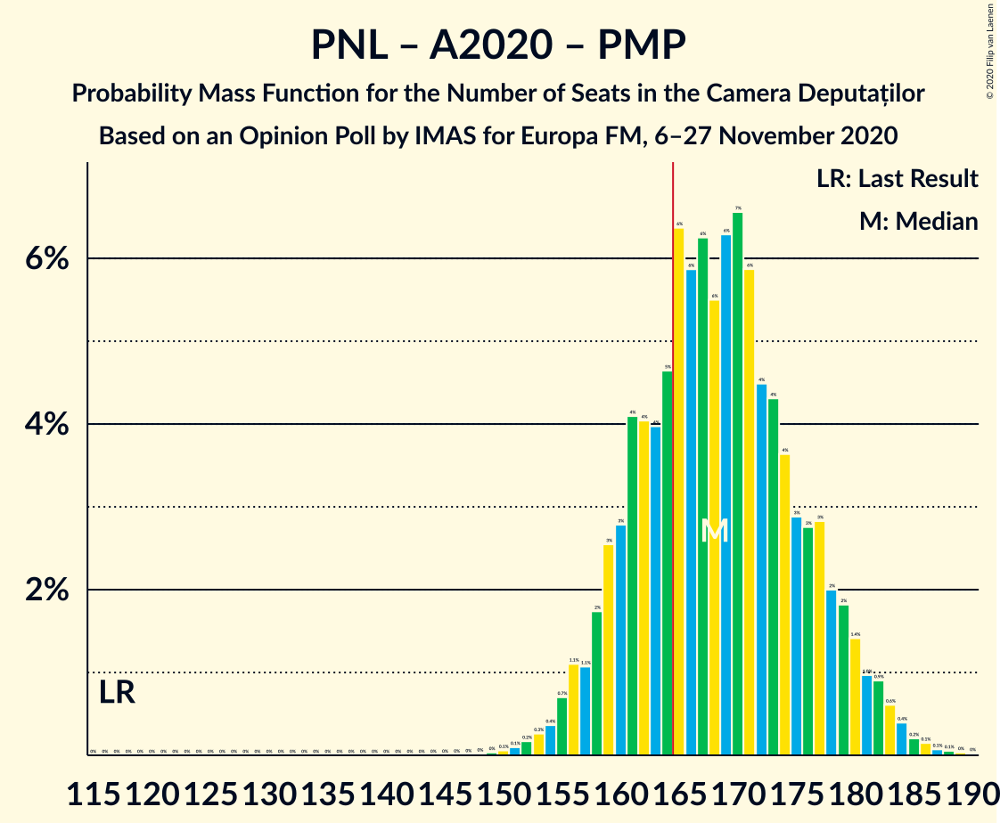

| Number of Seats | Probability | Accumulated | Special Marks |
|:---------------:|:-----------:|:-----------:|:-------------:|
| 117 | 0% | 100% | Last Result |
| 118 | 0% | 100% |  |
| 119 | 0% | 100% |  |
| 120 | 0% | 100% |  |
| 121 | 0% | 100% |  |
| 122 | 0% | 100% |  |
| 123 | 0% | 100% |  |
| 124 | 0% | 100% |  |
| 125 | 0% | 100% |  |
| 126 | 0% | 100% |  |
| 127 | 0% | 100% |  |
| 128 | 0% | 100% |  |
| 129 | 0% | 100% |  |
| 130 | 0% | 100% |  |
| 131 | 0% | 100% |  |
| 132 | 0% | 100% |  |
| 133 | 0% | 100% |  |
| 134 | 0% | 100% |  |
| 135 | 0% | 100% |  |
| 136 | 0% | 100% |  |
| 137 | 0% | 100% |  |
| 138 | 0% | 100% |  |
| 139 | 0% | 100% |  |
| 140 | 0% | 100% |  |
| 141 | 0% | 100% |  |
| 142 | 0% | 100% |  |
| 143 | 0% | 100% |  |
| 144 | 0% | 100% |  |
| 145 | 0% | 100% |  |
| 146 | 0% | 100% |  |
| 147 | 0% | 100% |  |
| 148 | 0% | 100% |  |
| 149 | 0% | 100% |  |
| 150 | 0.1% | 99.9% |  |
| 151 | 0.1% | 99.9% |  |
| 152 | 0.2% | 99.8% |  |
| 153 | 0.3% | 99.6% |  |
| 154 | 0.4% | 99.3% |  |
| 155 | 0.7% | 99.0% |  |
| 156 | 1.1% | 98% |  |
| 157 | 1.1% | 97% |  |
| 158 | 2% | 96% |  |
| 159 | 3% | 94% |  |
| 160 | 3% | 92% |  |
| 161 | 4% | 89% |  |
| 162 | 4% | 85% |  |
| 163 | 4% | 81% | Median |
| 164 | 5% | 77% |  |
| 165 | 6% | 72% | Majority |
| 166 | 6% | 66% |  |
| 167 | 6% | 60% |  |
| 168 | 6% | 54% |  |
| 169 | 6% | 48% |  |
| 170 | 7% | 42% |  |
| 171 | 6% | 35% |  |
| 172 | 4% | 30% |  |
| 173 | 4% | 25% |  |
| 174 | 4% | 21% |  |
| 175 | 3% | 17% |  |
| 176 | 3% | 14% |  |
| 177 | 3% | 11% |  |
| 178 | 2% | 9% |  |
| 179 | 2% | 7% |  |
| 180 | 1.4% | 5% |  |
| 181 | 1.0% | 3% |  |
| 182 | 0.9% | 2% |  |
| 183 | 0.6% | 2% |  |
| 184 | 0.4% | 0.9% |  |
| 185 | 0.2% | 0.6% |  |
| 186 | 0.1% | 0.3% |  |
| 187 | 0.1% | 0.2% |  |
| 188 | 0.1% | 0.1% |  |
| 189 | 0% | 0.1% |  |
| 190 | 0% | 0% |  |

### Partidul Național Liberal – Alianța 2020 USR-PLUS

| Number of Seats | Probability | Accumulated | Special Marks |
|:---------------:|:-----------:|:-----------:|:-------------:|
| 99 | 0% | 100% | Last Result |
| 100 | 0% | 100% |  |
| 101 | 0% | 100% |  |
| 102 | 0% | 100% |  |
| 103 | 0% | 100% |  |
| 104 | 0% | 100% |  |
| 105 | 0% | 100% |  |
| 106 | 0% | 100% |  |
| 107 | 0% | 100% |  |
| 108 | 0% | 100% |  |
| 109 | 0% | 100% |  |
| 110 | 0% | 100% |  |
| 111 | 0% | 100% |  |
| 112 | 0% | 100% |  |
| 113 | 0% | 100% |  |
| 114 | 0% | 100% |  |
| 115 | 0% | 100% |  |
| 116 | 0% | 100% |  |
| 117 | 0% | 100% |  |
| 118 | 0% | 100% |  |
| 119 | 0% | 100% |  |
| 120 | 0% | 100% |  |
| 121 | 0% | 100% |  |
| 122 | 0% | 100% |  |
| 123 | 0% | 100% |  |
| 124 | 0% | 100% |  |
| 125 | 0% | 100% |  |
| 126 | 0% | 100% |  |
| 127 | 0% | 100% |  |
| 128 | 0% | 100% |  |
| 129 | 0% | 100% |  |
| 130 | 0% | 100% |  |
| 131 | 0% | 100% |  |
| 132 | 0% | 100% |  |
| 133 | 0% | 100% |  |
| 134 | 0% | 100% |  |
| 135 | 0% | 100% |  |
| 136 | 0% | 100% |  |
| 137 | 0% | 100% |  |
| 138 | 0% | 100% |  |
| 139 | 0% | 100% |  |
| 140 | 0% | 100% |  |
| 141 | 0% | 100% |  |
| 142 | 0.1% | 100% |  |
| 143 | 0.1% | 99.9% |  |
| 144 | 0.1% | 99.8% |  |
| 145 | 0.2% | 99.8% |  |
| 146 | 0.3% | 99.5% |  |
| 147 | 0.3% | 99.2% |  |
| 148 | 0.5% | 98.9% |  |
| 149 | 0.7% | 98% |  |
| 150 | 0.8% | 98% |  |
| 151 | 2% | 97% |  |
| 152 | 1.4% | 95% |  |
| 153 | 2% | 94% |  |
| 154 | 3% | 91% |  |
| 155 | 3% | 89% |  |
| 156 | 4% | 86% |  |
| 157 | 3% | 82% |  |
| 158 | 3% | 79% |  |
| 159 | 4% | 76% |  |
| 160 | 4% | 72% |  |
| 161 | 6% | 68% |  |
| 162 | 5% | 62% |  |
| 163 | 5% | 57% | Median |
| 164 | 5% | 52% |  |
| 165 | 7% | 47% | Majority |
| 166 | 6% | 40% |  |
| 167 | 6% | 34% |  |
| 168 | 4% | 29% |  |
| 169 | 5% | 24% |  |
| 170 | 5% | 19% |  |
| 171 | 4% | 14% |  |
| 172 | 3% | 10% |  |
| 173 | 2% | 7% |  |
| 174 | 2% | 5% |  |
| 175 | 1.0% | 4% |  |
| 176 | 1.2% | 3% |  |
| 177 | 0.6% | 2% |  |
| 178 | 0.4% | 1.1% |  |
| 179 | 0.3% | 0.7% |  |
| 180 | 0.2% | 0.4% |  |
| 181 | 0.1% | 0.2% |  |
| 182 | 0.1% | 0.1% |  |
| 183 | 0% | 0.1% |  |
| 184 | 0% | 0% |  |

### Partidul Social Democrat – PRO România

| Number of Seats | Probability | Accumulated | Special Marks |
|:---------------:|:-----------:|:-----------:|:-------------:|
| 108 | 0% | 100% |  |
| 109 | 0.1% | 99.9% |  |
| 110 | 0.1% | 99.9% |  |
| 111 | 0.2% | 99.8% |  |
| 112 | 0.2% | 99.6% |  |
| 113 | 0.5% | 99.3% |  |
| 114 | 0.6% | 98.8% |  |
| 115 | 1.2% | 98% |  |
| 116 | 1.3% | 97% |  |
| 117 | 1.5% | 96% |  |
| 118 | 2% | 94% |  |
| 119 | 2% | 92% |  |
| 120 | 4% | 90% |  |
| 121 | 3% | 87% |  |
| 122 | 4% | 83% |  |
| 123 | 6% | 79% |  |
| 124 | 4% | 74% |  |
| 125 | 7% | 70% |  |
| 126 | 6% | 63% |  |
| 127 | 6% | 57% |  |
| 128 | 9% | 51% | Median |
| 129 | 4% | 42% |  |
| 130 | 6% | 38% |  |
| 131 | 4% | 31% |  |
| 132 | 6% | 27% |  |
| 133 | 5% | 21% |  |
| 134 | 3% | 16% |  |
| 135 | 4% | 13% |  |
| 136 | 1.2% | 9% |  |
| 137 | 3% | 7% |  |
| 138 | 1.3% | 4% |  |
| 139 | 0.9% | 3% |  |
| 140 | 1.1% | 2% |  |
| 141 | 0.3% | 1.1% |  |
| 142 | 0.4% | 0.8% |  |
| 143 | 0.2% | 0.5% |  |
| 144 | 0.2% | 0.3% |  |
| 145 | 0.1% | 0.2% |  |
| 146 | 0% | 0.1% |  |
| 147 | 0% | 0% |  |
| 148 | 0% | 0% |  |
| 149 | 0% | 0% |  |
| 150 | 0% | 0% |  |
| 151 | 0% | 0% |  |
| 152 | 0% | 0% |  |
| 153 | 0% | 0% |  |
| 154 | 0% | 0% | Last Result |

### Partidul Național Liberal – Uniunea Democrată Maghiară din România – Partidul Mișcarea Populară

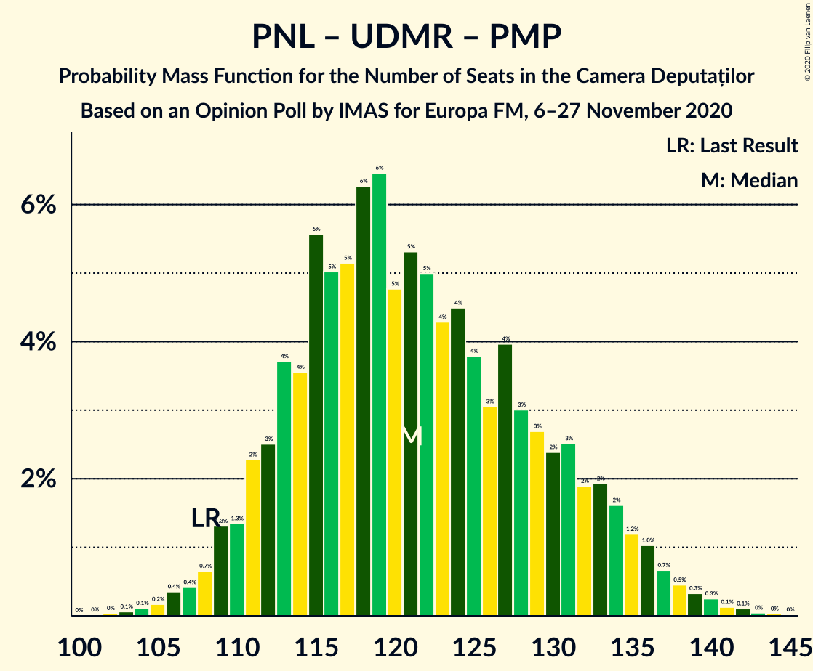

| Number of Seats | Probability | Accumulated | Special Marks |
|:---------------:|:-----------:|:-----------:|:-------------:|
| 102 | 0% | 100% |  |
| 103 | 0.1% | 99.9% |  |
| 104 | 0.1% | 99.9% |  |
| 105 | 0.2% | 99.8% |  |
| 106 | 0.4% | 99.6% |  |
| 107 | 0.4% | 99.2% |  |
| 108 | 0.7% | 98.8% | Last Result |
| 109 | 1.3% | 98% |  |
| 110 | 1.3% | 97% |  |
| 111 | 2% | 95% |  |
| 112 | 3% | 93% |  |
| 113 | 4% | 91% |  |
| 114 | 4% | 87% |  |
| 115 | 6% | 83% |  |
| 116 | 5% | 78% | Median |
| 117 | 5% | 73% |  |
| 118 | 6% | 68% |  |
| 119 | 6% | 61% |  |
| 120 | 5% | 55% |  |
| 121 | 5% | 50% |  |
| 122 | 5% | 45% |  |
| 123 | 4% | 40% |  |
| 124 | 4% | 36% |  |
| 125 | 4% | 31% |  |
| 126 | 3% | 27% |  |
| 127 | 4% | 24% |  |
| 128 | 3% | 20% |  |
| 129 | 3% | 17% |  |
| 130 | 2% | 15% |  |
| 131 | 3% | 12% |  |
| 132 | 2% | 10% |  |
| 133 | 2% | 8% |  |
| 134 | 2% | 6% |  |
| 135 | 1.2% | 4% |  |
| 136 | 1.0% | 3% |  |
| 137 | 0.7% | 2% |  |
| 138 | 0.5% | 1.4% |  |
| 139 | 0.3% | 0.9% |  |
| 140 | 0.3% | 0.6% |  |
| 141 | 0.1% | 0.3% |  |
| 142 | 0.1% | 0.2% |  |
| 143 | 0% | 0.1% |  |
| 144 | 0% | 0.1% |  |
| 145 | 0% | 0% |  |

### Partidul Național Liberal – Uniunea Democrată Maghiară din România

| Number of Seats | Probability | Accumulated | Special Marks |
|:---------------:|:-----------:|:-----------:|:-------------:|
| 90 | 0% | 100% | Last Result |
| 91 | 0% | 100% |  |
| 92 | 0% | 100% |  |
| 93 | 0% | 100% |  |
| 94 | 0% | 100% |  |
| 95 | 0% | 100% |  |
| 96 | 0% | 100% |  |
| 97 | 0% | 100% |  |
| 98 | 0.1% | 99.9% |  |
| 99 | 0.1% | 99.9% |  |
| 100 | 0.2% | 99.8% |  |
| 101 | 0.3% | 99.6% |  |
| 102 | 0.3% | 99.4% |  |
| 103 | 0.7% | 99.0% |  |
| 104 | 0.8% | 98% |  |
| 105 | 0.9% | 97% |  |
| 106 | 2% | 97% |  |
| 107 | 2% | 95% |  |
| 108 | 2% | 93% |  |
| 109 | 3% | 91% |  |
| 110 | 4% | 87% |  |
| 111 | 4% | 83% |  |
| 112 | 5% | 79% |  |
| 113 | 6% | 74% |  |
| 114 | 5% | 68% |  |
| 115 | 8% | 63% |  |
| 116 | 6% | 56% | Median |
| 117 | 6% | 50% |  |
| 118 | 7% | 43% |  |
| 119 | 7% | 36% |  |
| 120 | 5% | 29% |  |
| 121 | 5% | 24% |  |
| 122 | 5% | 19% |  |
| 123 | 3% | 15% |  |
| 124 | 3% | 11% |  |
| 125 | 2% | 8% |  |
| 126 | 2% | 6% |  |
| 127 | 1.2% | 4% |  |
| 128 | 1.1% | 3% |  |
| 129 | 0.7% | 2% |  |
| 130 | 0.4% | 1.0% |  |
| 131 | 0.3% | 0.7% |  |
| 132 | 0.1% | 0.4% |  |
| 133 | 0.1% | 0.2% |  |
| 134 | 0.1% | 0.1% |  |
| 135 | 0% | 0.1% |  |
| 136 | 0% | 0% |  |

### Partidul Național Liberal – Partidul Mișcarea Populară

| Number of Seats | Probability | Accumulated | Special Marks |
|:---------------:|:-----------:|:-----------:|:-------------:|
| 86 | 0% | 100% |  |
| 87 | 0.1% | 99.9% | Last Result |
| 88 | 0.1% | 99.9% |  |
| 89 | 0.2% | 99.8% |  |
| 90 | 0.3% | 99.6% |  |
| 91 | 0.6% | 99.3% |  |
| 92 | 0.7% | 98.7% |  |
| 93 | 1.3% | 98% |  |
| 94 | 2% | 97% |  |
| 95 | 2% | 95% |  |
| 96 | 3% | 93% |  |
| 97 | 3% | 90% |  |
| 98 | 5% | 86% |  |
| 99 | 6% | 82% |  |
| 100 | 5% | 76% | Median |
| 101 | 6% | 70% |  |
| 102 | 6% | 65% |  |
| 103 | 5% | 58% |  |
| 104 | 5% | 53% |  |
| 105 | 5% | 48% |  |
| 106 | 4% | 42% |  |
| 107 | 4% | 38% |  |
| 108 | 3% | 34% |  |
| 109 | 3% | 31% |  |
| 110 | 3% | 27% |  |
| 111 | 3% | 24% |  |
| 112 | 3% | 21% |  |
| 113 | 2% | 18% |  |
| 114 | 2% | 15% |  |
| 115 | 2% | 13% |  |
| 116 | 2% | 11% |  |
| 117 | 2% | 8% |  |
| 118 | 2% | 6% |  |
| 119 | 1.4% | 5% |  |
| 120 | 1.0% | 3% |  |
| 121 | 0.8% | 2% |  |
| 122 | 0.6% | 2% |  |
| 123 | 0.4% | 1.0% |  |
| 124 | 0.2% | 0.6% |  |
| 125 | 0.2% | 0.4% |  |
| 126 | 0.1% | 0.2% |  |
| 127 | 0% | 0.1% |  |
| 128 | 0% | 0.1% |  |
| 129 | 0% | 0% |  |

### Partidul Național Liberal

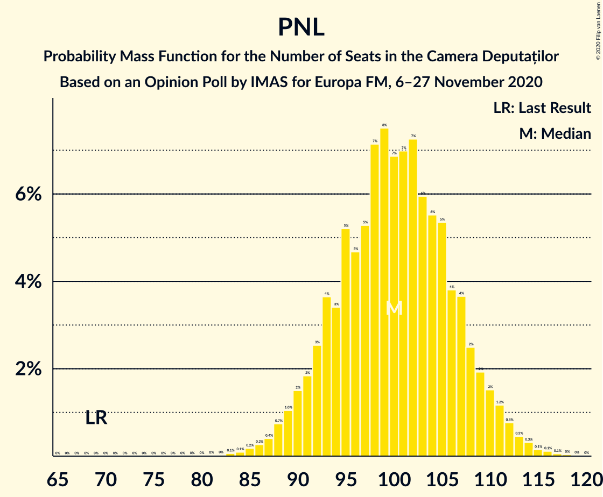

| Number of Seats | Probability | Accumulated | Special Marks |
|:---------------:|:-----------:|:-----------:|:-------------:|
| 69 | 0% | 100% | Last Result |
| 70 | 0% | 100% |  |
| 71 | 0% | 100% |  |
| 72 | 0% | 100% |  |
| 73 | 0% | 100% |  |
| 74 | 0% | 100% |  |
| 75 | 0% | 100% |  |
| 76 | 0% | 100% |  |
| 77 | 0% | 100% |  |
| 78 | 0% | 100% |  |
| 79 | 0% | 100% |  |
| 80 | 0% | 100% |  |
| 81 | 0% | 100% |  |
| 82 | 0% | 100% |  |
| 83 | 0.1% | 100% |  |
| 84 | 0.1% | 99.9% |  |
| 85 | 0.2% | 99.8% |  |
| 86 | 0.3% | 99.6% |  |
| 87 | 0.4% | 99.4% |  |
| 88 | 0.7% | 99.0% |  |
| 89 | 1.0% | 98% |  |
| 90 | 2% | 97% |  |
| 91 | 2% | 96% |  |
| 92 | 3% | 94% |  |
| 93 | 4% | 91% |  |
| 94 | 3% | 88% |  |
| 95 | 5% | 84% |  |
| 96 | 5% | 79% |  |
| 97 | 5% | 74% |  |
| 98 | 7% | 69% |  |
| 99 | 8% | 62% |  |
| 100 | 7% | 54% | Median |
| 101 | 7% | 48% |  |
| 102 | 7% | 41% |  |
| 103 | 6% | 33% |  |
| 104 | 6% | 27% |  |
| 105 | 5% | 22% |  |
| 106 | 4% | 16% |  |
| 107 | 4% | 13% |  |
| 108 | 2% | 9% |  |
| 109 | 2% | 7% |  |
| 110 | 2% | 5% |  |
| 111 | 1.2% | 3% |  |
| 112 | 0.8% | 2% |  |
| 113 | 0.5% | 1.2% |  |
| 114 | 0.3% | 0.7% |  |
| 115 | 0.1% | 0.4% |  |
| 116 | 0.1% | 0.2% |  |
| 117 | 0.1% | 0.1% |  |
| 118 | 0% | 0.1% |  |
| 119 | 0% | 0% |  |

### Alianța 2020 USR-PLUS – Partidul Mișcarea Populară

| Number of Seats | Probability | Accumulated | Special Marks |
|:---------------:|:-----------:|:-----------:|:-------------:|
| 48 | 0% | 100% | Last Result |
| 49 | 0% | 100% |  |
| 50 | 0% | 100% |  |
| 51 | 0% | 100% |  |
| 52 | 0.1% | 99.9% |  |
| 53 | 0.2% | 99.9% |  |
| 54 | 0.3% | 99.7% |  |
| 55 | 0.6% | 99.3% |  |
| 56 | 1.2% | 98.8% |  |
| 57 | 2% | 98% |  |
| 58 | 3% | 96% |  |
| 59 | 3% | 93% |  |
| 60 | 4% | 91% |  |
| 61 | 5% | 87% |  |
| 62 | 6% | 81% |  |
| 63 | 8% | 75% | Median |
| 64 | 6% | 67% |  |
| 65 | 7% | 62% |  |
| 66 | 6% | 55% |  |
| 67 | 6% | 49% |  |
| 68 | 5% | 44% |  |
| 69 | 4% | 39% |  |
| 70 | 3% | 35% |  |
| 71 | 2% | 32% |  |
| 72 | 3% | 30% |  |
| 73 | 2% | 28% |  |
| 74 | 2% | 26% |  |
| 75 | 2% | 23% |  |
| 76 | 2% | 21% |  |
| 77 | 2% | 19% |  |
| 78 | 3% | 17% |  |
| 79 | 3% | 14% |  |
| 80 | 3% | 11% |  |
| 81 | 2% | 9% |  |
| 82 | 2% | 6% |  |
| 83 | 2% | 5% |  |
| 84 | 1.0% | 3% |  |
| 85 | 0.8% | 2% |  |
| 86 | 0.7% | 2% |  |
| 87 | 0.3% | 0.8% |  |
| 88 | 0.2% | 0.5% |  |
| 89 | 0.1% | 0.3% |  |
| 90 | 0.1% | 0.2% |  |
| 91 | 0% | 0.1% |  |
| 92 | 0% | 0% |  |

## Technical Information

### Opinion Poll

+ **Polling firm:** IMAS
+ **Commissioner(s):** Europa FM
+ **Fieldwork period:** 6–27 November 2020

### Calculations

+ **Sample size:** 1010
+ **Simulations done:** 1,048,576
+ **Error estimate:** 0.52%

