# Opinion Poll by IRES, 2–3 December 2020

<a href="#voting-intentions">Voting Intentions</a> | <a href="#seats">Seats</a> | <a href="#coalitions">Coalitions</a> | <a href="#technical-information">Technical Information</a>

## Voting Intentions

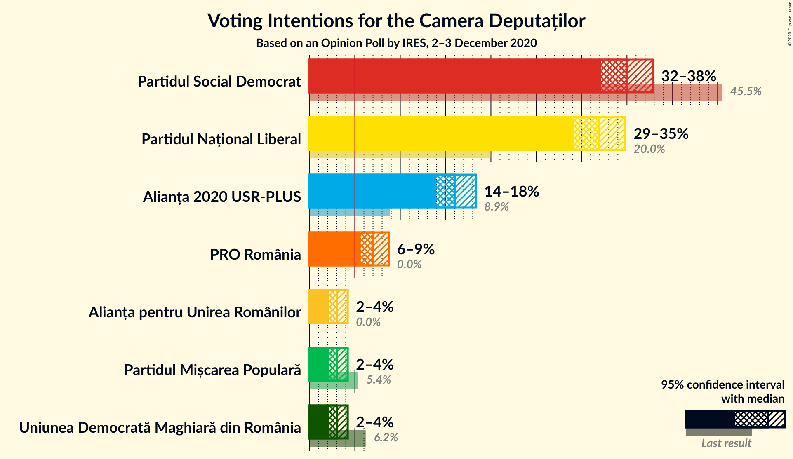

### Confidence Intervals

| Party | Last Result | Poll Result | 80% Confidence Interval | 90% Confidence Interval | 95% Confidence Interval | 99% Confidence Interval |
|:-----:|:-----------:|:-----------:|:-----------------------:|:-----------------------:|:-----------------------:|:-----------------------:|
| Partidul Social Democrat | 45.5% | 35.0% | 33.1–36.9% |32.6–37.4% |32.1–37.9% |31.3–38.8% |
| Partidul Național Liberal | 20.0% | 32.0% | 30.2–33.8% |29.7–34.4% |29.2–34.8% |28.4–35.7% |
| Alianța 2020 USR-PLUS | 8.9% | 16.0% | 14.7–17.5% |14.3–18.0% |13.9–18.4% |13.3–19.1% |
| PRO România | 0.0% | 7.0% | 6.1–8.1% |5.9–8.5% |5.6–8.7% |5.2–9.3% |
| Uniunea Democrată Maghiară din România | 6.2% | 3.0% | 2.4–3.8% |2.3–4.0% |2.1–4.2% |1.9–4.6% |
| Partidul Mișcarea Populară | 5.4% | 3.0% | 2.4–3.8% |2.3–4.0% |2.1–4.2% |1.9–4.6% |
| Alianța pentru Unirea Românilor | 0.0% | 3.0% | 2.4–3.8% |2.3–4.0% |2.1–4.2% |1.9–4.6% |

*Note:* The poll result column reflects the actual value used in the calculations. Published results may vary slightly, and in addition be rounded to fewer digits.

## Seats

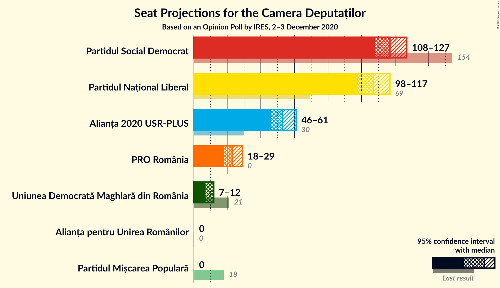

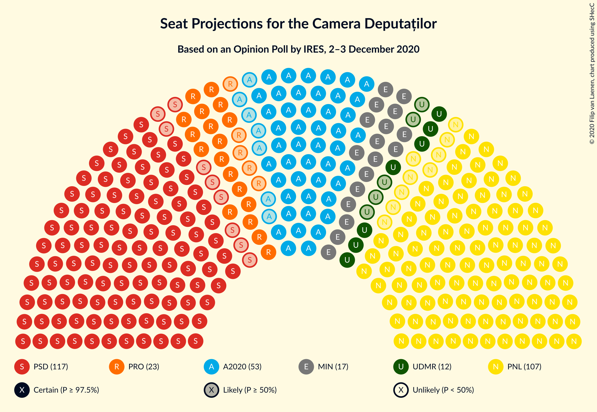

### Confidence Intervals

| Party | Last Result | Median | 80% Confidence Interval | 90% Confidence Interval | 95% Confidence Interval | 99% Confidence Interval |
|:-----:|:-----------:|:------:|:-----------------------:|:-----------------------:|:-----------------------:|:-----------------------:|
| <a href="#partidul-social-democrat">Partidul Social Democrat</a> | 154 | 117 | 111–123 |109–125 |108–127 |105–130 |
| <a href="#partidul-național-liberal">Partidul Național Liberal</a> | 69 | 107 | 101–113 |100–115 |98–117 |95–120 |
| <a href="#alianța-2020-usr-plus">Alianța 2020 USR-PLUS</a> | 30 | 53 | 49–59 |48–60 |46–61 |44–64 |
| <a href="#pro-românia">PRO România</a> | 0 | 23 | 20–27 |19–28 |18–29 |17–31 |
| <a href="#uniunea-democrată-maghiară-din-românia">Uniunea Democrată Maghiară din România</a> | 21 | 12 | 7–12 |7–12 |7–12 |7–14 |
| <a href="#partidul-mișcarea-populară">Partidul Mișcarea Populară</a> | 18 | 0 | 0 |0 |0 |0 |
| <a href="#alianța-pentru-unirea-românilor">Alianța pentru Unirea Românilor</a> | 0 | 0 | 0 |0 |0 |0 |

### Partidul Social Democrat

*For a full overview of the results for this party, see the [Partidul Social Democrat](party-partidulsocialdemocrat.html) page.*

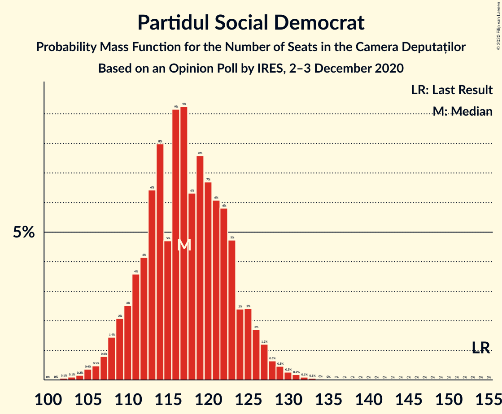

| Number of Seats | Probability | Accumulated | Special Marks |
|:---------------:|:-----------:|:-----------:|:-------------:|
| 102 | 0.1% | 100% |  |
| 103 | 0.1% | 99.9% |  |
| 104 | 0.2% | 99.8% |  |
| 105 | 0.4% | 99.6% |  |
| 106 | 0.5% | 99.3% |  |
| 107 | 0.8% | 98.8% |  |
| 108 | 1.4% | 98% |  |
| 109 | 2% | 97% |  |
| 110 | 3% | 94% |  |
| 111 | 4% | 92% |  |
| 112 | 4% | 88% |  |
| 113 | 6% | 84% |  |
| 114 | 8% | 78% |  |
| 115 | 5% | 70% |  |
| 116 | 9% | 65% |  |
| 117 | 9% | 56% | Median |
| 118 | 6% | 47% |  |
| 119 | 8% | 40% |  |
| 120 | 7% | 33% |  |
| 121 | 6% | 26% |  |
| 122 | 6% | 20% |  |
| 123 | 5% | 14% |  |
| 124 | 2% | 10% |  |
| 125 | 2% | 7% |  |
| 126 | 2% | 5% |  |
| 127 | 1.2% | 3% |  |
| 128 | 0.6% | 2% |  |
| 129 | 0.5% | 1.1% |  |
| 130 | 0.3% | 0.7% |  |
| 131 | 0.2% | 0.4% |  |
| 132 | 0.1% | 0.2% |  |
| 133 | 0.1% | 0.1% |  |
| 134 | 0% | 0.1% |  |
| 135 | 0% | 0% |  |
| 136 | 0% | 0% |  |
| 137 | 0% | 0% |  |
| 138 | 0% | 0% |  |
| 139 | 0% | 0% |  |
| 140 | 0% | 0% |  |
| 141 | 0% | 0% |  |
| 142 | 0% | 0% |  |
| 143 | 0% | 0% |  |
| 144 | 0% | 0% |  |
| 145 | 0% | 0% |  |
| 146 | 0% | 0% |  |
| 147 | 0% | 0% |  |
| 148 | 0% | 0% |  |
| 149 | 0% | 0% |  |
| 150 | 0% | 0% |  |
| 151 | 0% | 0% |  |
| 152 | 0% | 0% |  |
| 153 | 0% | 0% |  |
| 154 | 0% | 0% | Last Result |

### Partidul Național Liberal

*For a full overview of the results for this party, see the [Partidul Național Liberal](party-partidulnaționalliberal.html) page.*

| Number of Seats | Probability | Accumulated | Special Marks |
|:---------------:|:-----------:|:-----------:|:-------------:|
| 69 | 0% | 100% | Last Result |
| 70 | 0% | 100% |  |
| 71 | 0% | 100% |  |
| 72 | 0% | 100% |  |
| 73 | 0% | 100% |  |
| 74 | 0% | 100% |  |
| 75 | 0% | 100% |  |
| 76 | 0% | 100% |  |
| 77 | 0% | 100% |  |
| 78 | 0% | 100% |  |
| 79 | 0% | 100% |  |
| 80 | 0% | 100% |  |
| 81 | 0% | 100% |  |
| 82 | 0% | 100% |  |
| 83 | 0% | 100% |  |
| 84 | 0% | 100% |  |
| 85 | 0% | 100% |  |
| 86 | 0% | 100% |  |
| 87 | 0% | 100% |  |
| 88 | 0% | 100% |  |
| 89 | 0% | 100% |  |
| 90 | 0% | 100% |  |
| 91 | 0% | 100% |  |
| 92 | 0.1% | 100% |  |
| 93 | 0.1% | 99.9% |  |
| 94 | 0.2% | 99.8% |  |
| 95 | 0.3% | 99.7% |  |
| 96 | 0.4% | 99.4% |  |
| 97 | 1.1% | 99.0% |  |
| 98 | 0.9% | 98% |  |
| 99 | 2% | 97% |  |
| 100 | 3% | 95% |  |
| 101 | 2% | 92% |  |
| 102 | 6% | 89% |  |
| 103 | 5% | 83% |  |
| 104 | 6% | 78% |  |
| 105 | 9% | 72% |  |
| 106 | 6% | 63% |  |
| 107 | 10% | 57% | Median |
| 108 | 7% | 47% |  |
| 109 | 7% | 39% |  |
| 110 | 8% | 32% |  |
| 111 | 5% | 24% |  |
| 112 | 6% | 19% |  |
| 113 | 3% | 13% |  |
| 114 | 3% | 10% |  |
| 115 | 3% | 7% |  |
| 116 | 1.1% | 4% |  |
| 117 | 1.2% | 3% |  |
| 118 | 0.6% | 2% |  |
| 119 | 0.4% | 1.0% |  |
| 120 | 0.3% | 0.6% |  |
| 121 | 0.1% | 0.3% |  |
| 122 | 0.1% | 0.2% |  |
| 123 | 0% | 0.1% |  |
| 124 | 0% | 0% |  |

### Alianța 2020 USR-PLUS

*For a full overview of the results for this party, see the [Alianța 2020 USR-PLUS](party-alianța2020usr-plus.html) page.*

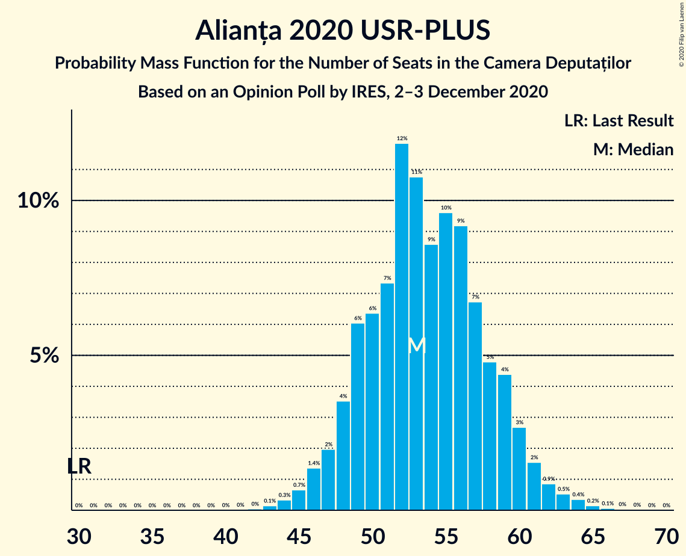

| Number of Seats | Probability | Accumulated | Special Marks |
|:---------------:|:-----------:|:-----------:|:-------------:|
| 30 | 0% | 100% | Last Result |
| 31 | 0% | 100% |  |
| 32 | 0% | 100% |  |
| 33 | 0% | 100% |  |
| 34 | 0% | 100% |  |
| 35 | 0% | 100% |  |
| 36 | 0% | 100% |  |
| 37 | 0% | 100% |  |
| 38 | 0% | 100% |  |
| 39 | 0% | 100% |  |
| 40 | 0% | 100% |  |
| 41 | 0% | 100% |  |
| 42 | 0% | 100% |  |
| 43 | 0.1% | 99.9% |  |
| 44 | 0.3% | 99.8% |  |
| 45 | 0.7% | 99.4% |  |
| 46 | 1.4% | 98.8% |  |
| 47 | 2% | 97% |  |
| 48 | 4% | 95% |  |
| 49 | 6% | 92% |  |
| 50 | 6% | 86% |  |
| 51 | 7% | 80% |  |
| 52 | 12% | 72% |  |
| 53 | 11% | 60% | Median |
| 54 | 9% | 50% |  |
| 55 | 10% | 41% |  |
| 56 | 9% | 31% |  |
| 57 | 7% | 22% |  |
| 58 | 5% | 15% |  |
| 59 | 4% | 11% |  |
| 60 | 3% | 6% |  |
| 61 | 2% | 4% |  |
| 62 | 0.9% | 2% |  |
| 63 | 0.5% | 1.2% |  |
| 64 | 0.4% | 0.6% |  |
| 65 | 0.2% | 0.3% |  |
| 66 | 0.1% | 0.1% |  |
| 67 | 0% | 0.1% |  |
| 68 | 0% | 0% |  |

### PRO România

*For a full overview of the results for this party, see the [PRO România](party-proromânia.html) page.*

| Number of Seats | Probability | Accumulated | Special Marks |
|:---------------:|:-----------:|:-----------:|:-------------:|
| 0 | 0.2% | 100% | Last Result |
| 1 | 0% | 99.8% |  |
| 2 | 0% | 99.8% |  |
| 3 | 0% | 99.8% |  |
| 4 | 0% | 99.8% |  |
| 5 | 0% | 99.8% |  |
| 6 | 0% | 99.8% |  |
| 7 | 0% | 99.8% |  |
| 8 | 0% | 99.8% |  |
| 9 | 0% | 99.8% |  |
| 10 | 0% | 99.8% |  |
| 11 | 0% | 99.8% |  |
| 12 | 0% | 99.8% |  |
| 13 | 0% | 99.8% |  |
| 14 | 0% | 99.8% |  |
| 15 | 0% | 99.8% |  |
| 16 | 0% | 99.8% |  |
| 17 | 0.5% | 99.8% |  |
| 18 | 2% | 99.2% |  |
| 19 | 3% | 97% |  |
| 20 | 8% | 94% |  |
| 21 | 10% | 86% |  |
| 22 | 12% | 76% |  |
| 23 | 15% | 64% | Median |
| 24 | 16% | 49% |  |
| 25 | 13% | 33% |  |
| 26 | 8% | 21% |  |
| 27 | 6% | 13% |  |
| 28 | 3% | 7% |  |
| 29 | 2% | 3% |  |
| 30 | 0.8% | 1.5% |  |
| 31 | 0.4% | 0.7% |  |
| 32 | 0.2% | 0.2% |  |
| 33 | 0.1% | 0.1% |  |
| 34 | 0% | 0% |  |

### Uniunea Democrată Maghiară din România

*For a full overview of the results for this party, see the [Uniunea Democrată Maghiară din România](party-uniuneademocratămaghiarădinromânia.html) page.*

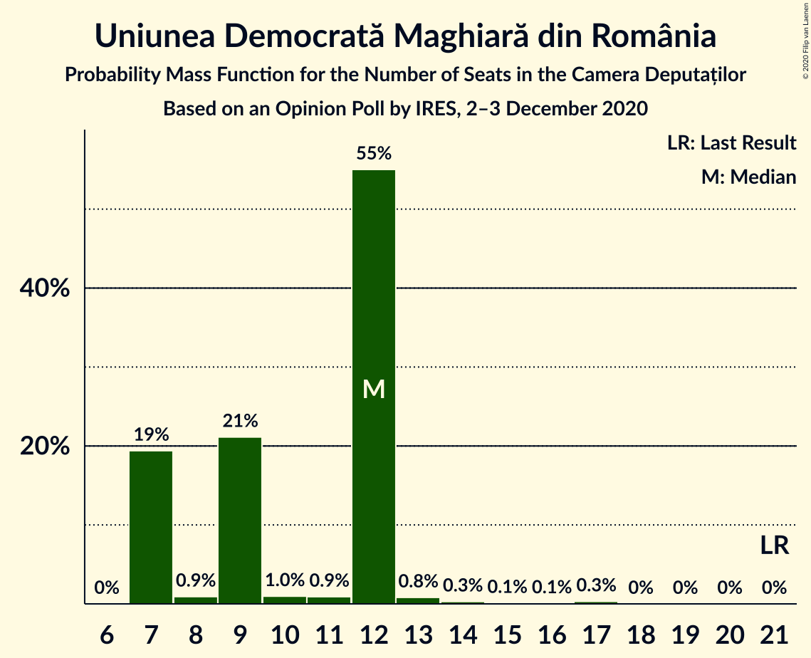

| Number of Seats | Probability | Accumulated | Special Marks |
|:---------------:|:-----------:|:-----------:|:-------------:|
| 7 | 19% | 100% |  |
| 8 | 0.9% | 81% |  |
| 9 | 21% | 80% |  |
| 10 | 1.0% | 59% |  |
| 11 | 0.9% | 58% |  |
| 12 | 55% | 57% | Median |
| 13 | 0.8% | 2% |  |
| 14 | 0.3% | 0.8% |  |
| 15 | 0.1% | 0.5% |  |
| 16 | 0.1% | 0.4% |  |
| 17 | 0.3% | 0.3% |  |
| 18 | 0% | 0% |  |
| 19 | 0% | 0% |  |
| 20 | 0% | 0% |  |
| 21 | 0% | 0% | Last Result |

### Partidul Mișcarea Populară

*For a full overview of the results for this party, see the [Partidul Mișcarea Populară](party-partidulmișcareapopulară.html) page.*

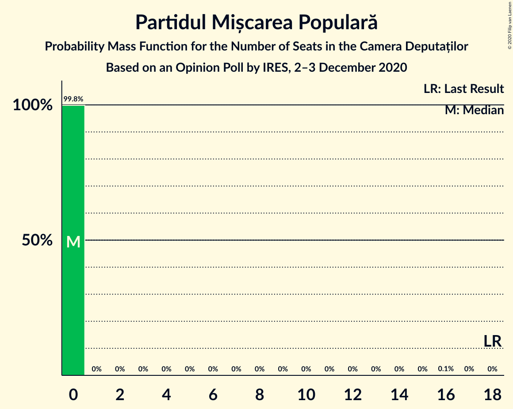

| Number of Seats | Probability | Accumulated | Special Marks |
|:---------------:|:-----------:|:-----------:|:-------------:|
| 0 | 99.8% | 100% | Median |
| 1 | 0% | 0.2% |  |
| 2 | 0% | 0.2% |  |
| 3 | 0% | 0.2% |  |
| 4 | 0% | 0.2% |  |
| 5 | 0% | 0.2% |  |
| 6 | 0% | 0.2% |  |
| 7 | 0% | 0.2% |  |
| 8 | 0% | 0.2% |  |
| 9 | 0% | 0.2% |  |
| 10 | 0% | 0.2% |  |
| 11 | 0% | 0.2% |  |
| 12 | 0% | 0.2% |  |
| 13 | 0% | 0.2% |  |
| 14 | 0% | 0.2% |  |
| 15 | 0% | 0.2% |  |
| 16 | 0.1% | 0.2% |  |
| 17 | 0% | 0.1% |  |
| 18 | 0% | 0% | Last Result |

### Alianța pentru Unirea Românilor

*For a full overview of the results for this party, see the [Alianța pentru Unirea Românilor](party-alianțapentruunirearomânilor.html) page.*

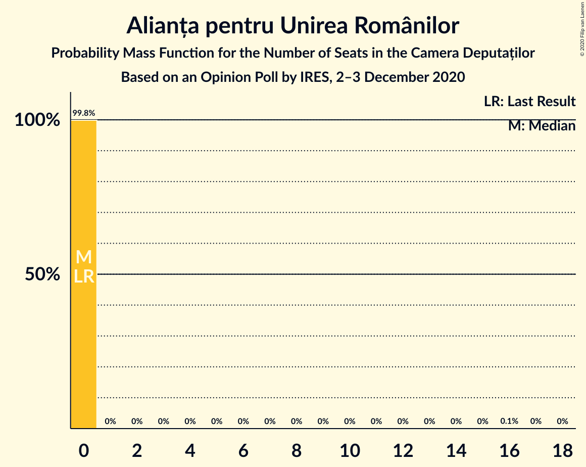

| Number of Seats | Probability | Accumulated | Special Marks |
|:---------------:|:-----------:|:-----------:|:-------------:|
| 0 | 99.8% | 100% | Last Result, Median |
| 1 | 0% | 0.2% |  |
| 2 | 0% | 0.2% |  |
| 3 | 0% | 0.2% |  |
| 4 | 0% | 0.2% |  |
| 5 | 0% | 0.2% |  |
| 6 | 0% | 0.2% |  |
| 7 | 0% | 0.2% |  |
| 8 | 0% | 0.2% |  |
| 9 | 0% | 0.2% |  |
| 10 | 0% | 0.2% |  |
| 11 | 0% | 0.2% |  |
| 12 | 0% | 0.2% |  |
| 13 | 0% | 0.2% |  |
| 14 | 0% | 0.2% |  |
| 15 | 0% | 0.2% |  |
| 16 | 0.1% | 0.2% |  |
| 17 | 0% | 0.1% |  |
| 18 | 0% | 0% |  |

## Coalitions

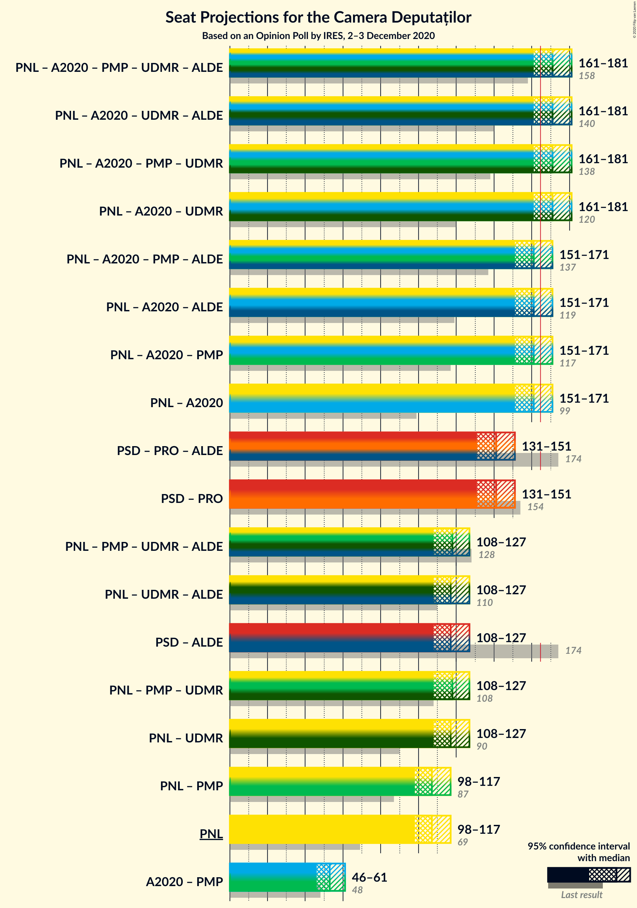

### Confidence Intervals

| Coalition | Last Result | Median | Majority? | 80% Confidence Interval | 90% Confidence Interval | 95% Confidence Interval | 99% Confidence Interval |
|:---------:|:-----------:|:------:|:---------:|:-----------------------:|:-----------------------:|:-----------------------:|:-----------------------:|
| Partidul Național Liberal – Alianța 2020 USR-PLUS – Partidul Mișcarea Populară – Uniunea Democrată Maghiară din România | 138 | 171 | 92% | 165–178 | 163–180 | 161–181 | 158–184 |
| Partidul Național Liberal – Alianța 2020 USR-PLUS – Uniunea Democrată Maghiară din România | 120 | 171 | 91% | 165–178 | 163–180 | 161–181 | 158–184 |
| Partidul Național Liberal – Alianța 2020 USR-PLUS – Partidul Mișcarea Populară | 117 | 161 | 22% | 155–168 | 153–169 | 151–171 | 148–174 |
| Partidul Național Liberal – Alianța 2020 USR-PLUS | 99 | 161 | 22% | 154–167 | 153–169 | 151–171 | 148–174 |
| Partidul Social Democrat – PRO România | 154 | 141 | 0% | 134–147 | 132–149 | 131–151 | 128–153 |
| Partidul Național Liberal – Partidul Mișcarea Populară – Uniunea Democrată Maghiară din România | 108 | 118 | 0% | 111–124 | 109–126 | 108–127 | 105–131 |
| Partidul Național Liberal – Uniunea Democrată Maghiară din România | 90 | 117 | 0% | 111–124 | 109–126 | 108–127 | 105–130 |
| Partidul Național Liberal – Partidul Mișcarea Populară | 87 | 107 | 0% | 101–113 | 100–115 | 98–117 | 95–120 |
| Partidul Național Liberal | 69 | 107 | 0% | 101–113 | 100–115 | 98–117 | 95–120 |
| Alianța 2020 USR-PLUS – Partidul Mișcarea Populară | 48 | 53 | 0% | 49–59 | 48–60 | 46–61 | 44–64 |

### Partidul Național Liberal – Alianța 2020 USR-PLUS – Partidul Mișcarea Populară – Uniunea Democrată Maghiară din România

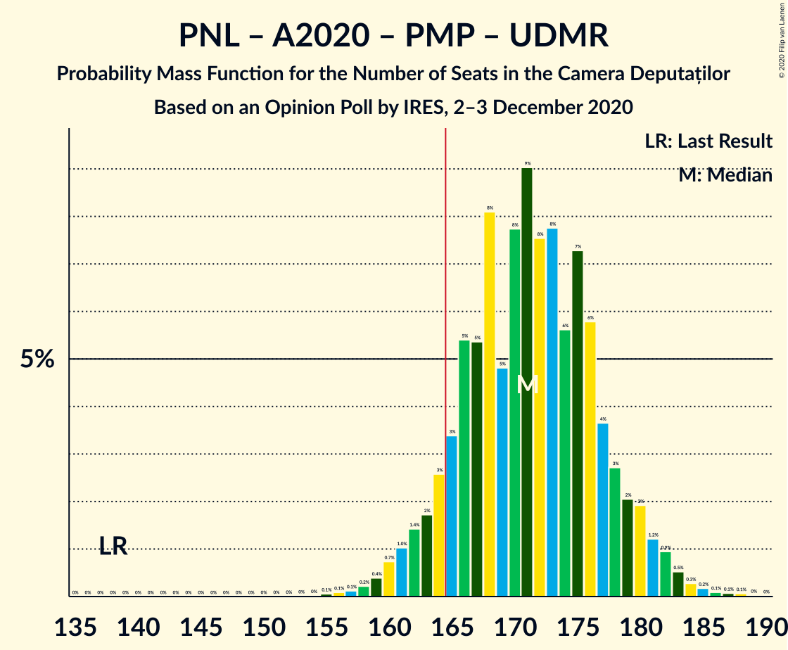

| Number of Seats | Probability | Accumulated | Special Marks |
|:---------------:|:-----------:|:-----------:|:-------------:|
| 138 | 0% | 100% | Last Result |
| 139 | 0% | 100% |  |
| 140 | 0% | 100% |  |
| 141 | 0% | 100% |  |
| 142 | 0% | 100% |  |
| 143 | 0% | 100% |  |
| 144 | 0% | 100% |  |
| 145 | 0% | 100% |  |
| 146 | 0% | 100% |  |
| 147 | 0% | 100% |  |
| 148 | 0% | 100% |  |
| 149 | 0% | 100% |  |
| 150 | 0% | 100% |  |
| 151 | 0% | 100% |  |
| 152 | 0% | 100% |  |
| 153 | 0% | 100% |  |
| 154 | 0% | 100% |  |
| 155 | 0.1% | 100% |  |
| 156 | 0.1% | 99.9% |  |
| 157 | 0.1% | 99.8% |  |
| 158 | 0.2% | 99.7% |  |
| 159 | 0.4% | 99.5% |  |
| 160 | 0.7% | 99.1% |  |
| 161 | 1.0% | 98% |  |
| 162 | 1.4% | 97% |  |
| 163 | 2% | 96% |  |
| 164 | 3% | 94% |  |
| 165 | 3% | 92% | Majority |
| 166 | 5% | 88% |  |
| 167 | 5% | 83% |  |
| 168 | 8% | 77% |  |
| 169 | 5% | 69% |  |
| 170 | 8% | 65% |  |
| 171 | 9% | 57% |  |
| 172 | 8% | 48% | Median |
| 173 | 8% | 40% |  |
| 174 | 6% | 32% |  |
| 175 | 7% | 27% |  |
| 176 | 6% | 20% |  |
| 177 | 4% | 14% |  |
| 178 | 3% | 10% |  |
| 179 | 2% | 7% |  |
| 180 | 2% | 5% |  |
| 181 | 1.2% | 3% |  |
| 182 | 0.9% | 2% |  |
| 183 | 0.5% | 1.3% |  |
| 184 | 0.3% | 0.7% |  |
| 185 | 0.2% | 0.5% |  |
| 186 | 0.1% | 0.3% |  |
| 187 | 0.1% | 0.2% |  |
| 188 | 0.1% | 0.1% |  |
| 189 | 0% | 0.1% |  |
| 190 | 0% | 0% |  |

### Partidul Național Liberal – Alianța 2020 USR-PLUS – Uniunea Democrată Maghiară din România

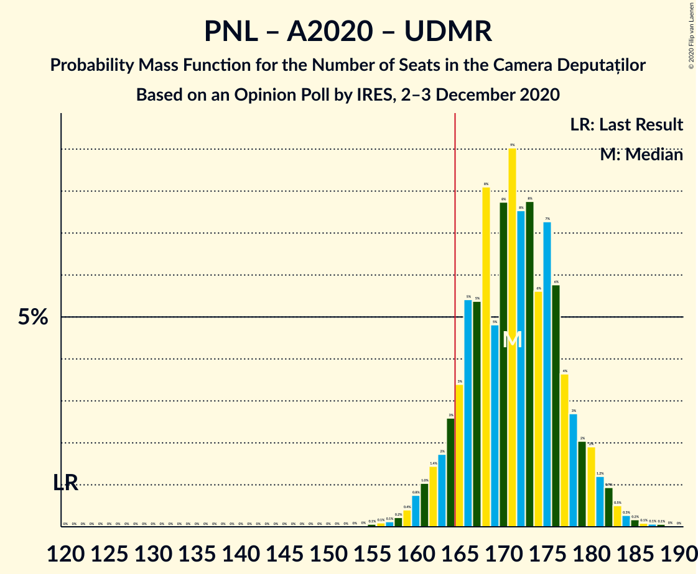

| Number of Seats | Probability | Accumulated | Special Marks |
|:---------------:|:-----------:|:-----------:|:-------------:|
| 120 | 0% | 100% | Last Result |
| 121 | 0% | 100% |  |
| 122 | 0% | 100% |  |
| 123 | 0% | 100% |  |
| 124 | 0% | 100% |  |
| 125 | 0% | 100% |  |
| 126 | 0% | 100% |  |
| 127 | 0% | 100% |  |
| 128 | 0% | 100% |  |
| 129 | 0% | 100% |  |
| 130 | 0% | 100% |  |
| 131 | 0% | 100% |  |
| 132 | 0% | 100% |  |
| 133 | 0% | 100% |  |
| 134 | 0% | 100% |  |
| 135 | 0% | 100% |  |
| 136 | 0% | 100% |  |
| 137 | 0% | 100% |  |
| 138 | 0% | 100% |  |
| 139 | 0% | 100% |  |
| 140 | 0% | 100% |  |
| 141 | 0% | 100% |  |
| 142 | 0% | 100% |  |
| 143 | 0% | 100% |  |
| 144 | 0% | 100% |  |
| 145 | 0% | 100% |  |
| 146 | 0% | 100% |  |
| 147 | 0% | 100% |  |
| 148 | 0% | 100% |  |
| 149 | 0% | 100% |  |
| 150 | 0% | 100% |  |
| 151 | 0% | 100% |  |
| 152 | 0% | 100% |  |
| 153 | 0% | 100% |  |
| 154 | 0% | 100% |  |
| 155 | 0.1% | 99.9% |  |
| 156 | 0.1% | 99.9% |  |
| 157 | 0.1% | 99.8% |  |
| 158 | 0.2% | 99.7% |  |
| 159 | 0.4% | 99.4% |  |
| 160 | 0.8% | 99.0% |  |
| 161 | 1.0% | 98% |  |
| 162 | 1.4% | 97% |  |
| 163 | 2% | 96% |  |
| 164 | 3% | 94% |  |
| 165 | 3% | 91% | Majority |
| 166 | 5% | 88% |  |
| 167 | 5% | 83% |  |
| 168 | 8% | 77% |  |
| 169 | 5% | 69% |  |
| 170 | 8% | 64% |  |
| 171 | 9% | 57% |  |
| 172 | 8% | 48% | Median |
| 173 | 8% | 40% |  |
| 174 | 6% | 32% |  |
| 175 | 7% | 27% |  |
| 176 | 6% | 19% |  |
| 177 | 4% | 14% |  |
| 178 | 3% | 10% |  |
| 179 | 2% | 7% |  |
| 180 | 2% | 5% |  |
| 181 | 1.2% | 3% |  |
| 182 | 0.9% | 2% |  |
| 183 | 0.5% | 1.2% |  |
| 184 | 0.3% | 0.7% |  |
| 185 | 0.2% | 0.5% |  |
| 186 | 0.1% | 0.3% |  |
| 187 | 0.1% | 0.2% |  |
| 188 | 0.1% | 0.1% |  |
| 189 | 0% | 0.1% |  |
| 190 | 0% | 0% |  |

### Partidul Național Liberal – Alianța 2020 USR-PLUS – Partidul Mișcarea Populară

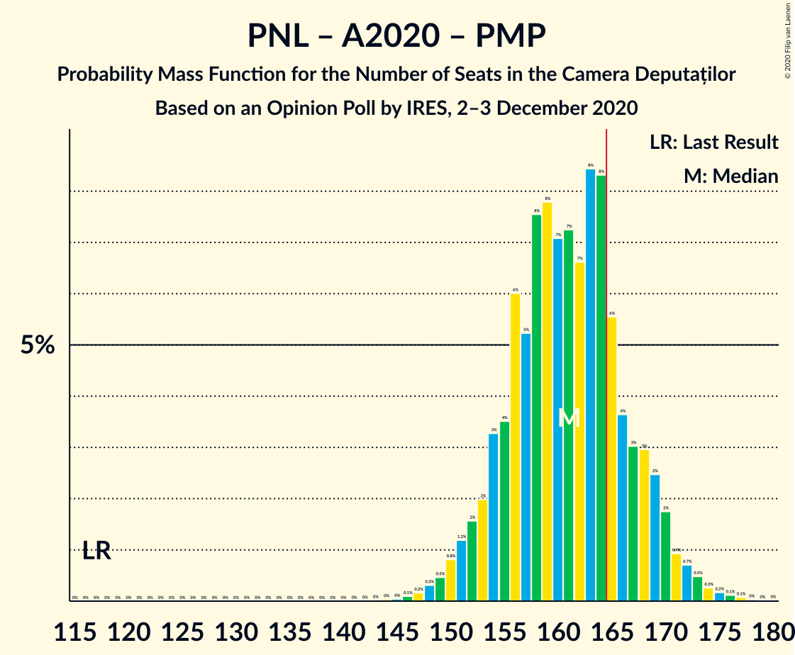

| Number of Seats | Probability | Accumulated | Special Marks |
|:---------------:|:-----------:|:-----------:|:-------------:|
| 117 | 0% | 100% | Last Result |
| 118 | 0% | 100% |  |
| 119 | 0% | 100% |  |
| 120 | 0% | 100% |  |
| 121 | 0% | 100% |  |
| 122 | 0% | 100% |  |
| 123 | 0% | 100% |  |
| 124 | 0% | 100% |  |
| 125 | 0% | 100% |  |
| 126 | 0% | 100% |  |
| 127 | 0% | 100% |  |
| 128 | 0% | 100% |  |
| 129 | 0% | 100% |  |
| 130 | 0% | 100% |  |
| 131 | 0% | 100% |  |
| 132 | 0% | 100% |  |
| 133 | 0% | 100% |  |
| 134 | 0% | 100% |  |
| 135 | 0% | 100% |  |
| 136 | 0% | 100% |  |
| 137 | 0% | 100% |  |
| 138 | 0% | 100% |  |
| 139 | 0% | 100% |  |
| 140 | 0% | 100% |  |
| 141 | 0% | 100% |  |
| 142 | 0% | 100% |  |
| 143 | 0% | 100% |  |
| 144 | 0% | 100% |  |
| 145 | 0% | 99.9% |  |
| 146 | 0.1% | 99.9% |  |
| 147 | 0.2% | 99.8% |  |
| 148 | 0.3% | 99.6% |  |
| 149 | 0.5% | 99.3% |  |
| 150 | 0.8% | 98.9% |  |
| 151 | 1.2% | 98% |  |
| 152 | 2% | 97% |  |
| 153 | 2% | 95% |  |
| 154 | 3% | 93% |  |
| 155 | 4% | 90% |  |
| 156 | 6% | 87% |  |
| 157 | 5% | 81% |  |
| 158 | 8% | 75% |  |
| 159 | 8% | 68% |  |
| 160 | 7% | 60% | Median |
| 161 | 7% | 53% |  |
| 162 | 7% | 46% |  |
| 163 | 8% | 39% |  |
| 164 | 8% | 31% |  |
| 165 | 6% | 22% | Majority |
| 166 | 4% | 17% |  |
| 167 | 3% | 13% |  |
| 168 | 3% | 10% |  |
| 169 | 2% | 7% |  |
| 170 | 2% | 5% |  |
| 171 | 0.9% | 3% |  |
| 172 | 0.7% | 2% |  |
| 173 | 0.5% | 1.2% |  |
| 174 | 0.3% | 0.7% |  |
| 175 | 0.2% | 0.5% |  |
| 176 | 0.1% | 0.3% |  |
| 177 | 0.1% | 0.2% |  |
| 178 | 0% | 0.1% |  |
| 179 | 0% | 0.1% |  |
| 180 | 0% | 0% |  |

### Partidul Național Liberal – Alianța 2020 USR-PLUS

| Number of Seats | Probability | Accumulated | Special Marks |
|:---------------:|:-----------:|:-----------:|:-------------:|
| 99 | 0% | 100% | Last Result |
| 100 | 0% | 100% |  |
| 101 | 0% | 100% |  |
| 102 | 0% | 100% |  |
| 103 | 0% | 100% |  |
| 104 | 0% | 100% |  |
| 105 | 0% | 100% |  |
| 106 | 0% | 100% |  |
| 107 | 0% | 100% |  |
| 108 | 0% | 100% |  |
| 109 | 0% | 100% |  |
| 110 | 0% | 100% |  |
| 111 | 0% | 100% |  |
| 112 | 0% | 100% |  |
| 113 | 0% | 100% |  |
| 114 | 0% | 100% |  |
| 115 | 0% | 100% |  |
| 116 | 0% | 100% |  |
| 117 | 0% | 100% |  |
| 118 | 0% | 100% |  |
| 119 | 0% | 100% |  |
| 120 | 0% | 100% |  |
| 121 | 0% | 100% |  |
| 122 | 0% | 100% |  |
| 123 | 0% | 100% |  |
| 124 | 0% | 100% |  |
| 125 | 0% | 100% |  |
| 126 | 0% | 100% |  |
| 127 | 0% | 100% |  |
| 128 | 0% | 100% |  |
| 129 | 0% | 100% |  |
| 130 | 0% | 100% |  |
| 131 | 0% | 100% |  |
| 132 | 0% | 100% |  |
| 133 | 0% | 100% |  |
| 134 | 0% | 100% |  |
| 135 | 0% | 100% |  |
| 136 | 0% | 100% |  |
| 137 | 0% | 100% |  |
| 138 | 0% | 100% |  |
| 139 | 0% | 100% |  |
| 140 | 0% | 100% |  |
| 141 | 0% | 100% |  |
| 142 | 0% | 100% |  |
| 143 | 0% | 100% |  |
| 144 | 0% | 100% |  |
| 145 | 0% | 99.9% |  |
| 146 | 0.1% | 99.9% |  |
| 147 | 0.2% | 99.8% |  |
| 148 | 0.3% | 99.6% |  |
| 149 | 0.5% | 99.3% |  |
| 150 | 0.8% | 98.8% |  |
| 151 | 1.2% | 98% |  |
| 152 | 2% | 97% |  |
| 153 | 2% | 95% |  |
| 154 | 3% | 93% |  |
| 155 | 4% | 90% |  |
| 156 | 6% | 86% |  |
| 157 | 5% | 80% |  |
| 158 | 8% | 75% |  |
| 159 | 8% | 68% |  |
| 160 | 7% | 60% | Median |
| 161 | 7% | 53% |  |
| 162 | 7% | 45% |  |
| 163 | 8% | 39% |  |
| 164 | 8% | 30% |  |
| 165 | 6% | 22% | Majority |
| 166 | 4% | 17% |  |
| 167 | 3% | 13% |  |
| 168 | 3% | 10% |  |
| 169 | 2% | 7% |  |
| 170 | 2% | 5% |  |
| 171 | 0.9% | 3% |  |
| 172 | 0.7% | 2% |  |
| 173 | 0.5% | 1.2% |  |
| 174 | 0.3% | 0.7% |  |
| 175 | 0.2% | 0.4% |  |
| 176 | 0.1% | 0.3% |  |
| 177 | 0.1% | 0.2% |  |
| 178 | 0% | 0.1% |  |
| 179 | 0% | 0.1% |  |
| 180 | 0% | 0% |  |

### Partidul Social Democrat – PRO România

| Number of Seats | Probability | Accumulated | Special Marks |
|:---------------:|:-----------:|:-----------:|:-------------:|
| 123 | 0% | 100% |  |
| 124 | 0.1% | 99.9% |  |
| 125 | 0.1% | 99.9% |  |
| 126 | 0.1% | 99.8% |  |
| 127 | 0.2% | 99.7% |  |
| 128 | 0.3% | 99.5% |  |
| 129 | 0.5% | 99.2% |  |
| 130 | 1.0% | 98.7% |  |
| 131 | 1.2% | 98% |  |
| 132 | 2% | 97% |  |
| 133 | 2% | 95% |  |
| 134 | 3% | 93% |  |
| 135 | 4% | 90% |  |
| 136 | 6% | 86% |  |
| 137 | 7% | 80% |  |
| 138 | 6% | 73% |  |
| 139 | 8% | 67% |  |
| 140 | 8% | 60% | Median |
| 141 | 9% | 52% |  |
| 142 | 8% | 43% |  |
| 143 | 5% | 35% |  |
| 144 | 8% | 31% |  |
| 145 | 5% | 22% |  |
| 146 | 5% | 17% |  |
| 147 | 3% | 12% |  |
| 148 | 3% | 8% |  |
| 149 | 2% | 6% |  |
| 150 | 1.4% | 4% |  |
| 151 | 1.0% | 3% |  |
| 152 | 0.7% | 2% |  |
| 153 | 0.4% | 0.9% |  |
| 154 | 0.2% | 0.5% | Last Result |
| 155 | 0.1% | 0.3% |  |
| 156 | 0.1% | 0.2% |  |
| 157 | 0% | 0.1% |  |
| 158 | 0% | 0% |  |

### Partidul Național Liberal – Partidul Mișcarea Populară – Uniunea Democrată Maghiară din România

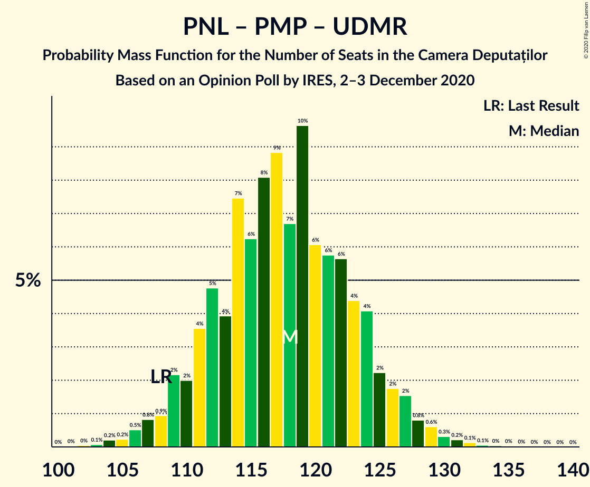

| Number of Seats | Probability | Accumulated | Special Marks |
|:---------------:|:-----------:|:-----------:|:-------------:|
| 102 | 0% | 100% |  |
| 103 | 0.1% | 99.9% |  |
| 104 | 0.2% | 99.8% |  |
| 105 | 0.2% | 99.6% |  |
| 106 | 0.5% | 99.4% |  |
| 107 | 0.8% | 98.9% |  |
| 108 | 0.9% | 98% | Last Result |
| 109 | 2% | 97% |  |
| 110 | 2% | 95% |  |
| 111 | 4% | 93% |  |
| 112 | 5% | 89% |  |
| 113 | 4% | 85% |  |
| 114 | 7% | 81% |  |
| 115 | 6% | 73% |  |
| 116 | 8% | 67% |  |
| 117 | 9% | 59% |  |
| 118 | 7% | 50% |  |
| 119 | 10% | 43% | Median |
| 120 | 6% | 34% |  |
| 121 | 6% | 28% |  |
| 122 | 6% | 22% |  |
| 123 | 4% | 16% |  |
| 124 | 4% | 12% |  |
| 125 | 2% | 8% |  |
| 126 | 2% | 6% |  |
| 127 | 2% | 4% |  |
| 128 | 0.8% | 2% |  |
| 129 | 0.6% | 1.4% |  |
| 130 | 0.3% | 0.8% |  |
| 131 | 0.2% | 0.5% |  |
| 132 | 0.1% | 0.3% |  |
| 133 | 0.1% | 0.2% |  |
| 134 | 0% | 0.1% |  |
| 135 | 0% | 0.1% |  |
| 136 | 0% | 0% |  |

### Partidul Național Liberal – Uniunea Democrată Maghiară din România

| Number of Seats | Probability | Accumulated | Special Marks |
|:---------------:|:-----------:|:-----------:|:-------------:|
| 90 | 0% | 100% | Last Result |
| 91 | 0% | 100% |  |
| 92 | 0% | 100% |  |
| 93 | 0% | 100% |  |
| 94 | 0% | 100% |  |
| 95 | 0% | 100% |  |
| 96 | 0% | 100% |  |
| 97 | 0% | 100% |  |
| 98 | 0% | 100% |  |
| 99 | 0% | 100% |  |
| 100 | 0% | 100% |  |
| 101 | 0% | 100% |  |
| 102 | 0.1% | 100% |  |
| 103 | 0.1% | 99.9% |  |
| 104 | 0.2% | 99.8% |  |
| 105 | 0.2% | 99.6% |  |
| 106 | 0.5% | 99.4% |  |
| 107 | 0.8% | 98.9% |  |
| 108 | 1.0% | 98% |  |
| 109 | 2% | 97% |  |
| 110 | 2% | 95% |  |
| 111 | 4% | 93% |  |
| 112 | 5% | 89% |  |
| 113 | 4% | 85% |  |
| 114 | 7% | 81% |  |
| 115 | 6% | 73% |  |
| 116 | 8% | 67% |  |
| 117 | 9% | 59% |  |
| 118 | 7% | 50% |  |
| 119 | 10% | 43% | Median |
| 120 | 6% | 34% |  |
| 121 | 6% | 27% |  |
| 122 | 6% | 22% |  |
| 123 | 4% | 16% |  |
| 124 | 4% | 12% |  |
| 125 | 2% | 8% |  |
| 126 | 2% | 5% |  |
| 127 | 2% | 4% |  |
| 128 | 0.8% | 2% |  |
| 129 | 0.6% | 1.4% |  |
| 130 | 0.3% | 0.8% |  |
| 131 | 0.2% | 0.5% |  |
| 132 | 0.1% | 0.3% |  |
| 133 | 0.1% | 0.1% |  |
| 134 | 0% | 0.1% |  |
| 135 | 0% | 0.1% |  |
| 136 | 0% | 0% |  |

### Partidul Național Liberal – Partidul Mișcarea Populară

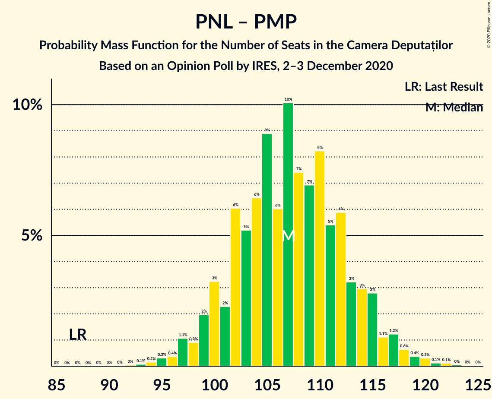

| Number of Seats | Probability | Accumulated | Special Marks |
|:---------------:|:-----------:|:-----------:|:-------------:|
| 87 | 0% | 100% | Last Result |
| 88 | 0% | 100% |  |
| 89 | 0% | 100% |  |
| 90 | 0% | 100% |  |
| 91 | 0% | 100% |  |
| 92 | 0% | 100% |  |
| 93 | 0.1% | 99.9% |  |
| 94 | 0.2% | 99.8% |  |
| 95 | 0.3% | 99.7% |  |
| 96 | 0.4% | 99.4% |  |
| 97 | 1.1% | 99.0% |  |
| 98 | 0.9% | 98% |  |
| 99 | 2% | 97% |  |
| 100 | 3% | 95% |  |
| 101 | 2% | 92% |  |
| 102 | 6% | 90% |  |
| 103 | 5% | 83% |  |
| 104 | 6% | 78% |  |
| 105 | 9% | 72% |  |
| 106 | 6% | 63% |  |
| 107 | 10% | 57% | Median |
| 108 | 7% | 47% |  |
| 109 | 7% | 39% |  |
| 110 | 8% | 33% |  |
| 111 | 5% | 24% |  |
| 112 | 6% | 19% |  |
| 113 | 3% | 13% |  |
| 114 | 3% | 10% |  |
| 115 | 3% | 7% |  |
| 116 | 1.1% | 4% |  |
| 117 | 1.2% | 3% |  |
| 118 | 0.6% | 2% |  |
| 119 | 0.4% | 1.0% |  |
| 120 | 0.3% | 0.7% |  |
| 121 | 0.1% | 0.4% |  |
| 122 | 0.1% | 0.2% |  |
| 123 | 0% | 0.1% |  |
| 124 | 0% | 0.1% |  |
| 125 | 0% | 0% |  |

### Partidul Național Liberal

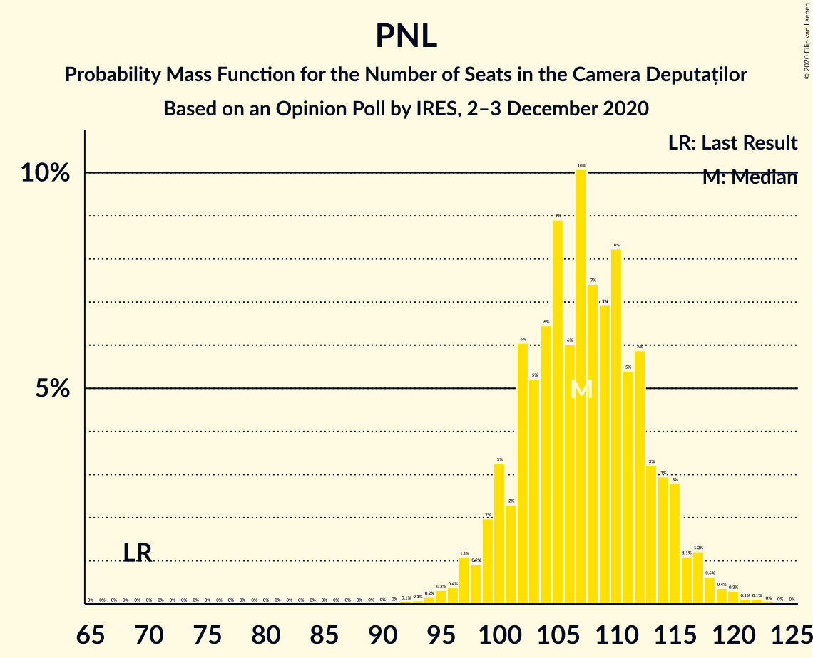

| Number of Seats | Probability | Accumulated | Special Marks |
|:---------------:|:-----------:|:-----------:|:-------------:|
| 69 | 0% | 100% | Last Result |
| 70 | 0% | 100% |  |
| 71 | 0% | 100% |  |
| 72 | 0% | 100% |  |
| 73 | 0% | 100% |  |
| 74 | 0% | 100% |  |
| 75 | 0% | 100% |  |
| 76 | 0% | 100% |  |
| 77 | 0% | 100% |  |
| 78 | 0% | 100% |  |
| 79 | 0% | 100% |  |
| 80 | 0% | 100% |  |
| 81 | 0% | 100% |  |
| 82 | 0% | 100% |  |
| 83 | 0% | 100% |  |
| 84 | 0% | 100% |  |
| 85 | 0% | 100% |  |
| 86 | 0% | 100% |  |
| 87 | 0% | 100% |  |
| 88 | 0% | 100% |  |
| 89 | 0% | 100% |  |
| 90 | 0% | 100% |  |
| 91 | 0% | 100% |  |
| 92 | 0.1% | 100% |  |
| 93 | 0.1% | 99.9% |  |
| 94 | 0.2% | 99.8% |  |
| 95 | 0.3% | 99.7% |  |
| 96 | 0.4% | 99.4% |  |
| 97 | 1.1% | 99.0% |  |
| 98 | 0.9% | 98% |  |
| 99 | 2% | 97% |  |
| 100 | 3% | 95% |  |
| 101 | 2% | 92% |  |
| 102 | 6% | 89% |  |
| 103 | 5% | 83% |  |
| 104 | 6% | 78% |  |
| 105 | 9% | 72% |  |
| 106 | 6% | 63% |  |
| 107 | 10% | 57% | Median |
| 108 | 7% | 47% |  |
| 109 | 7% | 39% |  |
| 110 | 8% | 32% |  |
| 111 | 5% | 24% |  |
| 112 | 6% | 19% |  |
| 113 | 3% | 13% |  |
| 114 | 3% | 10% |  |
| 115 | 3% | 7% |  |
| 116 | 1.1% | 4% |  |
| 117 | 1.2% | 3% |  |
| 118 | 0.6% | 2% |  |
| 119 | 0.4% | 1.0% |  |
| 120 | 0.3% | 0.6% |  |
| 121 | 0.1% | 0.3% |  |
| 122 | 0.1% | 0.2% |  |
| 123 | 0% | 0.1% |  |
| 124 | 0% | 0% |  |

### Alianța 2020 USR-PLUS – Partidul Mișcarea Populară

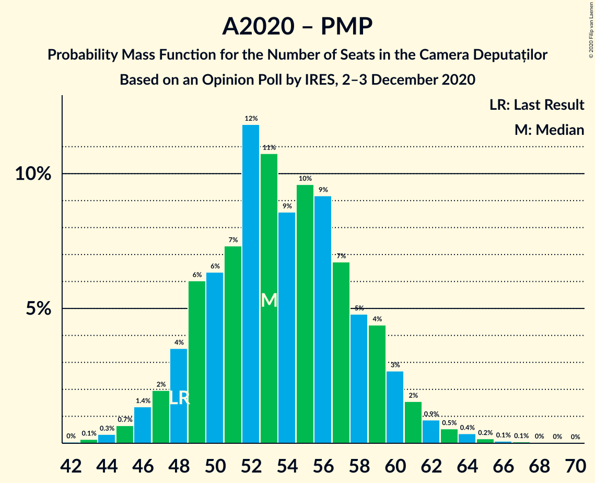

| Number of Seats | Probability | Accumulated | Special Marks |
|:---------------:|:-----------:|:-----------:|:-------------:|
| 42 | 0% | 100% |  |
| 43 | 0.1% | 99.9% |  |
| 44 | 0.3% | 99.8% |  |
| 45 | 0.7% | 99.4% |  |
| 46 | 1.4% | 98.8% |  |
| 47 | 2% | 97% |  |
| 48 | 4% | 95% | Last Result |
| 49 | 6% | 92% |  |
| 50 | 6% | 86% |  |
| 51 | 7% | 80% |  |
| 52 | 12% | 72% |  |
| 53 | 11% | 60% | Median |
| 54 | 9% | 50% |  |
| 55 | 10% | 41% |  |
| 56 | 9% | 32% |  |
| 57 | 7% | 22% |  |
| 58 | 5% | 16% |  |
| 59 | 4% | 11% |  |
| 60 | 3% | 6% |  |
| 61 | 2% | 4% |  |
| 62 | 0.9% | 2% |  |
| 63 | 0.5% | 1.3% |  |
| 64 | 0.4% | 0.8% |  |
| 65 | 0.2% | 0.4% |  |
| 66 | 0.1% | 0.2% |  |
| 67 | 0.1% | 0.2% |  |
| 68 | 0% | 0.1% |  |
| 69 | 0% | 0.1% |  |
| 70 | 0% | 0% |  |

## Technical Information

### Opinion Poll

+ **Polling firm:** IRES
+ **Commissioner(s):** —
+ **Fieldwork period:** 2–3 December 2020

### Calculations

+ **Sample size:** 1067
+ **Simulations done:** 1,048,576
+ **Error estimate:** 0.88%

