# Opinion Poll by Avangarde, 11–23 August 2017

<a href="#voting-intentions">Voting Intentions</a> | <a href="#seats">Seats</a> | <a href="#coalitions">Coalitions</a> | <a href="#technical-information">Technical Information</a>

## Voting Intentions

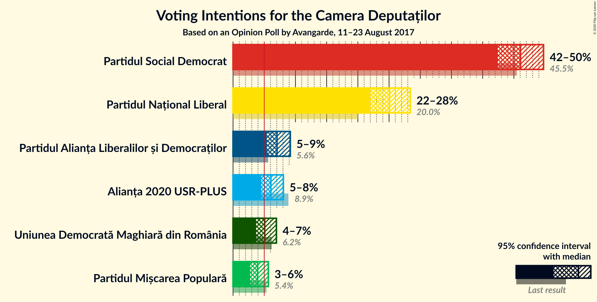

### Confidence Intervals

| Party | Last Result | Poll Result | 80% Confidence Interval | 90% Confidence Interval | 95% Confidence Interval | 99% Confidence Interval |
|:-----:|:-----------:|:-----------:|:-----------------------:|:-----------------------:|:-----------------------:|:-----------------------:|
| Partidul Social Democrat | 45.5% | 46.1% | 43.7–48.5% |43.0–49.2% |42.4–49.7% |41.3–50.9% |
| Partidul Național Liberal | 20.0% | 25.1% | 23.1–27.3% |22.5–27.9% |22.0–28.4% |21.1–29.5% |
| Partidul Alianța Liberalilor și Democraților | 5.6% | 7.0% | 5.9–8.4% |5.6–8.8% |5.4–9.2% |4.9–9.9% |
| Alianța 2020 USR-PLUS | 8.9% | 6.1% | 5.0–7.4% |4.8–7.7% |4.5–8.1% |4.1–8.7% |
| Uniunea Democrată Maghiară din România | 6.2% | 5.1% | 4.2–6.3% |3.9–6.6% |3.7–7.0% |3.3–7.6% |
| Partidul Mișcarea Populară | 5.4% | 3.9% | 3.2–5.1% |2.9–5.4% |2.7–5.7% |2.4–6.2% |

*Note:* The poll result column reflects the actual value used in the calculations. Published results may vary slightly, and in addition be rounded to fewer digits.

## Seats

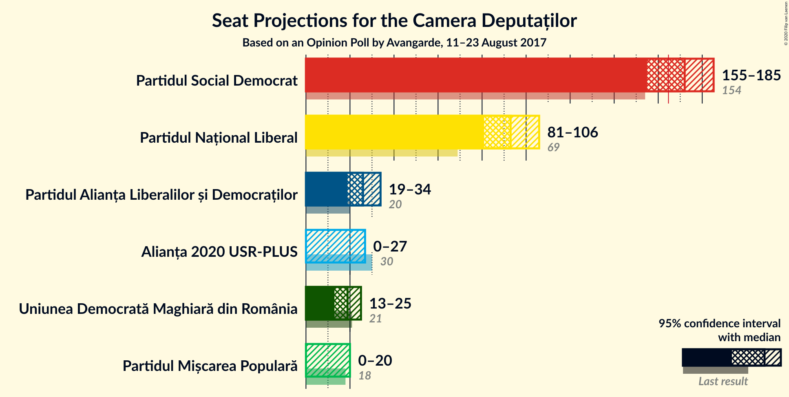

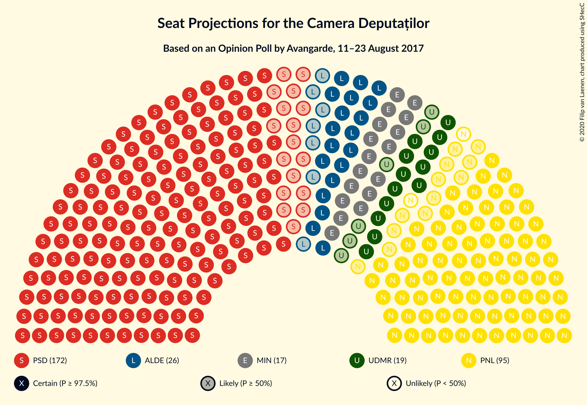

### Confidence Intervals

| Party | Last Result | Median | 80% Confidence Interval | 90% Confidence Interval | 95% Confidence Interval | 99% Confidence Interval |
|:-----:|:-----------:|:------:|:-----------------------:|:-----------------------:|:-----------------------:|:-----------------------:|
| <a href="#partidul-social-democrat">Partidul Social Democrat</a> | 154 | 172 | 161–180 |158–183 |155–185 |149–190 |
| <a href="#partidul-național-liberal">Partidul Național Liberal</a> | 69 | 93 | 85–101 |83–103 |81–106 |77–110 |
| <a href="#partidul-alianța-liberalilor-și-democraților">Partidul Alianța Liberalilor și Democraților</a> | 20 | 26 | 22–31 |20–32 |19–34 |0–36 |
| <a href="#alianța-2020-usr-plus">Alianța 2020 USR-PLUS</a> | 30 | 0 | 0 |0 |0–27 |0–30 |
| <a href="#uniunea-democrată-maghiară-din-românia">Uniunea Democrată Maghiară din România</a> | 21 | 19 | 15–23 |14–24 |13–25 |12–28 |
| <a href="#partidul-mișcarea-populară">Partidul Mișcarea Populară</a> | 18 | 0 | 0–17 |0–19 |0–20 |0–22 |

### Partidul Social Democrat

*For a full overview of the results for this party, see the [Partidul Social Democrat](party-partidulsocialdemocrat.html) page.*

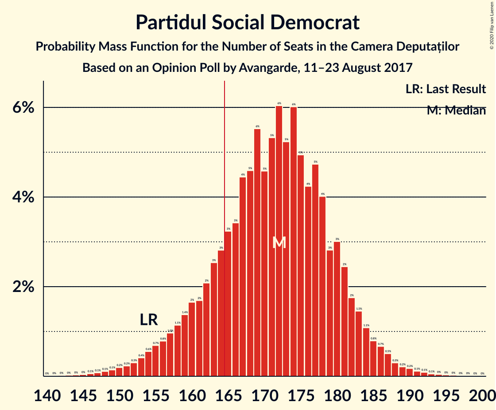

| Number of Seats | Probability | Accumulated | Special Marks |
|:---------------:|:-----------:|:-----------:|:-------------:|
| 142 | 0% | 100% |  |
| 143 | 0% | 99.9% |  |
| 144 | 0% | 99.9% |  |
| 145 | 0% | 99.9% |  |
| 146 | 0.1% | 99.8% |  |
| 147 | 0.1% | 99.8% |  |
| 148 | 0.1% | 99.7% |  |
| 149 | 0.1% | 99.6% |  |
| 150 | 0.2% | 99.4% |  |
| 151 | 0.2% | 99.2% |  |
| 152 | 0.3% | 99.0% |  |
| 153 | 0.4% | 98.7% |  |
| 154 | 0.6% | 98% | Last Result |
| 155 | 0.7% | 98% |  |
| 156 | 0.8% | 97% |  |
| 157 | 1.0% | 96% |  |
| 158 | 1.1% | 95% |  |
| 159 | 1.4% | 94% |  |
| 160 | 2% | 93% |  |
| 161 | 2% | 91% |  |
| 162 | 2% | 89% |  |
| 163 | 3% | 87% |  |
| 164 | 3% | 85% |  |
| 165 | 3% | 82% | Majority |
| 166 | 3% | 79% |  |
| 167 | 4% | 75% |  |
| 168 | 5% | 71% |  |
| 169 | 6% | 66% |  |
| 170 | 5% | 61% |  |
| 171 | 5% | 56% |  |
| 172 | 6% | 51% | Median |
| 173 | 5% | 45% |  |
| 174 | 6% | 40% |  |
| 175 | 5% | 34% |  |
| 176 | 4% | 29% |  |
| 177 | 5% | 24% |  |
| 178 | 4% | 20% |  |
| 179 | 3% | 16% |  |
| 180 | 3% | 13% |  |
| 181 | 2% | 10% |  |
| 182 | 2% | 7% |  |
| 183 | 1.5% | 6% |  |
| 184 | 1.1% | 4% |  |
| 185 | 0.8% | 3% |  |
| 186 | 0.7% | 2% |  |
| 187 | 0.5% | 2% |  |
| 188 | 0.3% | 1.1% |  |
| 189 | 0.2% | 0.8% |  |
| 190 | 0.2% | 0.6% |  |
| 191 | 0.1% | 0.4% |  |
| 192 | 0.1% | 0.3% |  |
| 193 | 0.1% | 0.2% |  |
| 194 | 0% | 0.2% |  |
| 195 | 0% | 0.1% |  |
| 196 | 0% | 0.1% |  |
| 197 | 0% | 0.1% |  |
| 198 | 0% | 0.1% |  |
| 199 | 0% | 0% |  |

### Partidul Național Liberal

*For a full overview of the results for this party, see the [Partidul Național Liberal](party-partidulnaționalliberal.html) page.*

| Number of Seats | Probability | Accumulated | Special Marks |
|:---------------:|:-----------:|:-----------:|:-------------:|
| 69 | 0% | 100% | Last Result |
| 70 | 0% | 100% |  |
| 71 | 0% | 100% |  |
| 72 | 0% | 100% |  |
| 73 | 0% | 99.9% |  |
| 74 | 0.1% | 99.9% |  |
| 75 | 0.1% | 99.8% |  |
| 76 | 0.1% | 99.7% |  |
| 77 | 0.2% | 99.6% |  |
| 78 | 0.4% | 99.4% |  |
| 79 | 0.5% | 99.0% |  |
| 80 | 0.7% | 98.5% |  |
| 81 | 1.0% | 98% |  |
| 82 | 1.2% | 97% |  |
| 83 | 2% | 96% |  |
| 84 | 2% | 94% |  |
| 85 | 3% | 92% |  |
| 86 | 3% | 89% |  |
| 87 | 4% | 86% |  |
| 88 | 4% | 82% |  |
| 89 | 6% | 78% |  |
| 90 | 5% | 72% |  |
| 91 | 6% | 67% |  |
| 92 | 6% | 61% |  |
| 93 | 6% | 54% | Median |
| 94 | 7% | 49% |  |
| 95 | 7% | 42% |  |
| 96 | 5% | 35% |  |
| 97 | 5% | 30% |  |
| 98 | 5% | 25% |  |
| 99 | 4% | 20% |  |
| 100 | 4% | 16% |  |
| 101 | 3% | 12% |  |
| 102 | 2% | 9% |  |
| 103 | 2% | 7% |  |
| 104 | 1.4% | 5% |  |
| 105 | 0.9% | 4% |  |
| 106 | 0.9% | 3% |  |
| 107 | 0.5% | 2% |  |
| 108 | 0.4% | 1.2% |  |
| 109 | 0.3% | 0.8% |  |
| 110 | 0.2% | 0.5% |  |
| 111 | 0.1% | 0.3% |  |
| 112 | 0.1% | 0.2% |  |
| 113 | 0% | 0.1% |  |
| 114 | 0% | 0.1% |  |
| 115 | 0% | 0.1% |  |
| 116 | 0% | 0% |  |

### Partidul Alianța Liberalilor și Democraților

*For a full overview of the results for this party, see the [Partidul Alianța Liberalilor și Democraților](party-partidulalianțaliberalilorșidemocraților.html) page.*

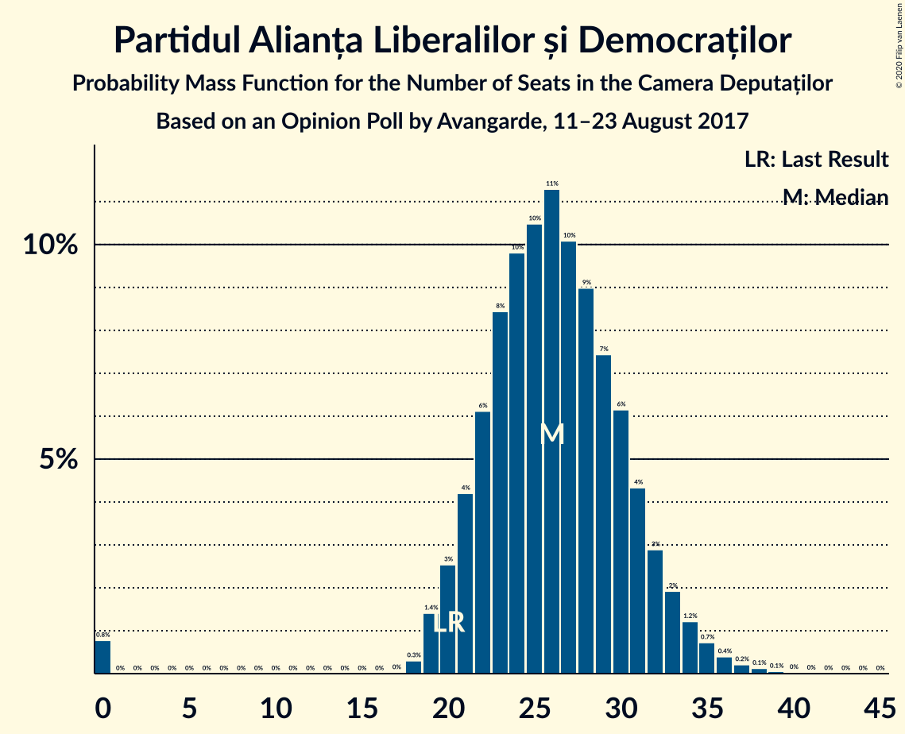

| Number of Seats | Probability | Accumulated | Special Marks |
|:---------------:|:-----------:|:-----------:|:-------------:|
| 0 | 0.8% | 100% |  |
| 1 | 0% | 99.2% |  |
| 2 | 0% | 99.2% |  |
| 3 | 0% | 99.2% |  |
| 4 | 0% | 99.2% |  |
| 5 | 0% | 99.2% |  |
| 6 | 0% | 99.2% |  |
| 7 | 0% | 99.2% |  |
| 8 | 0% | 99.2% |  |
| 9 | 0% | 99.2% |  |
| 10 | 0% | 99.2% |  |
| 11 | 0% | 99.2% |  |
| 12 | 0% | 99.2% |  |
| 13 | 0% | 99.2% |  |
| 14 | 0% | 99.2% |  |
| 15 | 0% | 99.2% |  |
| 16 | 0% | 99.2% |  |
| 17 | 0% | 99.2% |  |
| 18 | 0.3% | 99.2% |  |
| 19 | 1.4% | 98.9% |  |
| 20 | 3% | 97% | Last Result |
| 21 | 4% | 95% |  |
| 22 | 6% | 91% |  |
| 23 | 8% | 85% |  |
| 24 | 10% | 76% |  |
| 25 | 10% | 66% |  |
| 26 | 11% | 56% | Median |
| 27 | 10% | 45% |  |
| 28 | 9% | 35% |  |
| 29 | 7% | 26% |  |
| 30 | 6% | 18% |  |
| 31 | 4% | 12% |  |
| 32 | 3% | 8% |  |
| 33 | 2% | 5% |  |
| 34 | 1.2% | 3% |  |
| 35 | 0.7% | 2% |  |
| 36 | 0.4% | 0.8% |  |
| 37 | 0.2% | 0.4% |  |
| 38 | 0.1% | 0.2% |  |
| 39 | 0.1% | 0.1% |  |
| 40 | 0% | 0.1% |  |
| 41 | 0% | 0% |  |

### Alianța 2020 USR-PLUS

*For a full overview of the results for this party, see the [Alianța 2020 USR-PLUS](party-alianța2020usr-plus.html) page.*

| Number of Seats | Probability | Accumulated | Special Marks |
|:---------------:|:-----------:|:-----------:|:-------------:|
| 0 | 97% | 100% | Median |
| 1 | 0% | 3% |  |
| 2 | 0% | 3% |  |
| 3 | 0% | 3% |  |
| 4 | 0% | 3% |  |
| 5 | 0% | 3% |  |
| 6 | 0% | 3% |  |
| 7 | 0% | 3% |  |
| 8 | 0% | 3% |  |
| 9 | 0% | 3% |  |
| 10 | 0% | 3% |  |
| 11 | 0% | 3% |  |
| 12 | 0% | 3% |  |
| 13 | 0% | 3% |  |
| 14 | 0% | 3% |  |
| 15 | 0% | 3% |  |
| 16 | 0% | 3% |  |
| 17 | 0% | 3% |  |
| 18 | 0% | 3% |  |
| 19 | 0% | 3% |  |
| 20 | 0% | 3% |  |
| 21 | 0% | 3% |  |
| 22 | 0% | 3% |  |
| 23 | 0% | 3% |  |
| 24 | 0% | 3% |  |
| 25 | 0% | 3% |  |
| 26 | 0% | 3% |  |
| 27 | 0.2% | 3% |  |
| 28 | 0.9% | 2% |  |
| 29 | 0.7% | 1.4% |  |
| 30 | 0.4% | 0.7% | Last Result |
| 31 | 0.2% | 0.3% |  |
| 32 | 0.1% | 0.2% |  |
| 33 | 0% | 0.1% |  |
| 34 | 0% | 0% |  |

### Uniunea Democrată Maghiară din România

*For a full overview of the results for this party, see the [Uniunea Democrată Maghiară din România](party-uniuneademocratămaghiarădinromânia.html) page.*

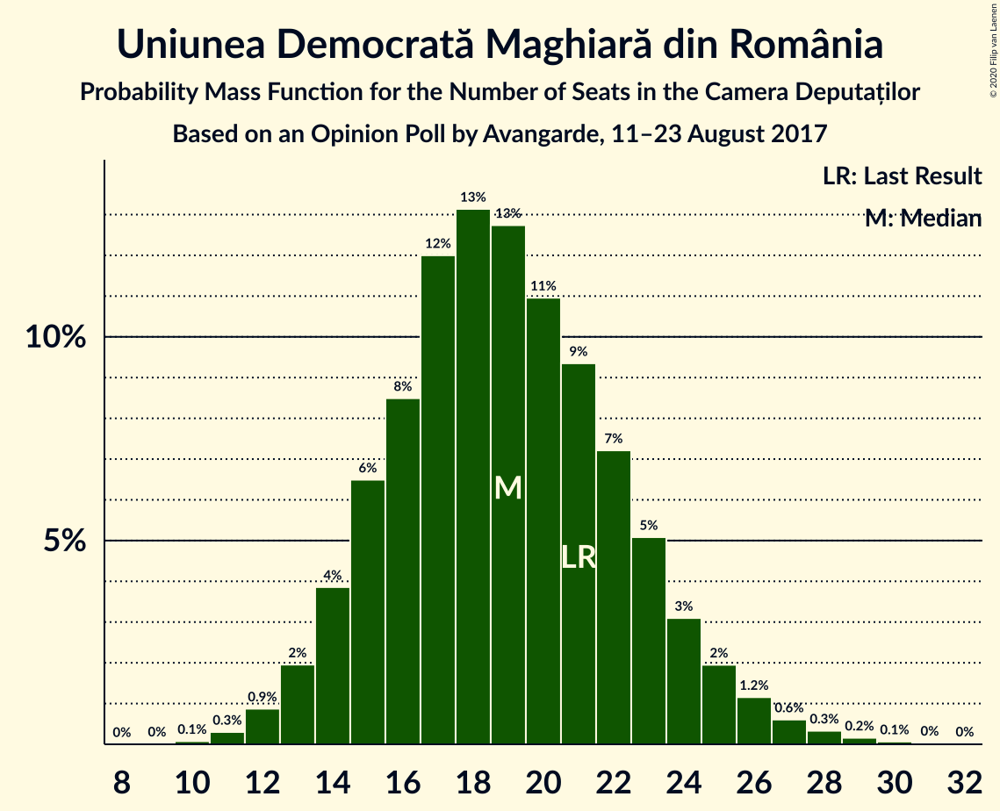

| Number of Seats | Probability | Accumulated | Special Marks |
|:---------------:|:-----------:|:-----------:|:-------------:|
| 10 | 0.1% | 100% |  |
| 11 | 0.3% | 99.9% |  |
| 12 | 0.9% | 99.6% |  |
| 13 | 2% | 98.7% |  |
| 14 | 4% | 97% |  |
| 15 | 6% | 93% |  |
| 16 | 8% | 86% |  |
| 17 | 12% | 78% |  |
| 18 | 13% | 66% |  |
| 19 | 13% | 53% | Median |
| 20 | 11% | 40% |  |
| 21 | 9% | 29% | Last Result |
| 22 | 7% | 20% |  |
| 23 | 5% | 13% |  |
| 24 | 3% | 7% |  |
| 25 | 2% | 4% |  |
| 26 | 1.2% | 2% |  |
| 27 | 0.6% | 1.2% |  |
| 28 | 0.3% | 0.6% |  |
| 29 | 0.2% | 0.3% |  |
| 30 | 0.1% | 0.1% |  |
| 31 | 0% | 0.1% |  |
| 32 | 0% | 0% |  |

### Partidul Mișcarea Populară

*For a full overview of the results for this party, see the [Partidul Mișcarea Populară](party-partidulmișcareapopulară.html) page.*

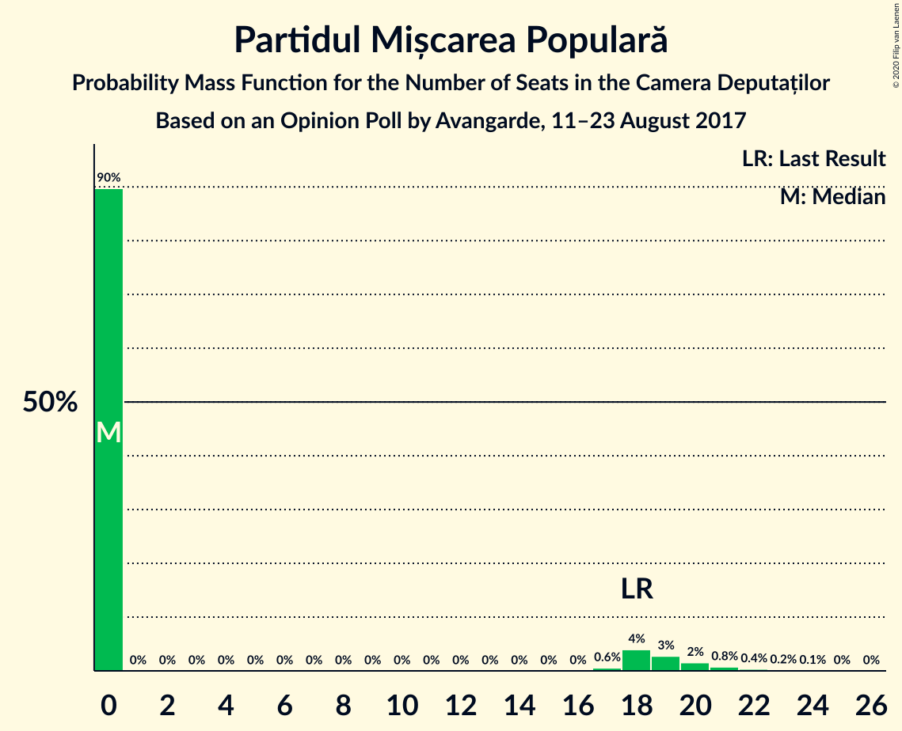

| Number of Seats | Probability | Accumulated | Special Marks |
|:---------------:|:-----------:|:-----------:|:-------------:|
| 0 | 90% | 100% | Median |
| 1 | 0% | 10% |  |
| 2 | 0% | 10% |  |
| 3 | 0% | 10% |  |
| 4 | 0% | 10% |  |
| 5 | 0% | 10% |  |
| 6 | 0% | 10% |  |
| 7 | 0% | 10% |  |
| 8 | 0% | 10% |  |
| 9 | 0% | 10% |  |
| 10 | 0% | 10% |  |
| 11 | 0% | 10% |  |
| 12 | 0% | 10% |  |
| 13 | 0% | 10% |  |
| 14 | 0% | 10% |  |
| 15 | 0% | 10% |  |
| 16 | 0% | 10% |  |
| 17 | 0.6% | 10% |  |
| 18 | 4% | 10% | Last Result |
| 19 | 3% | 6% |  |
| 20 | 2% | 3% |  |
| 21 | 0.8% | 1.4% |  |
| 22 | 0.4% | 0.6% |  |
| 23 | 0.2% | 0.3% |  |
| 24 | 0.1% | 0.1% |  |
| 25 | 0% | 0% |  |

## Coalitions

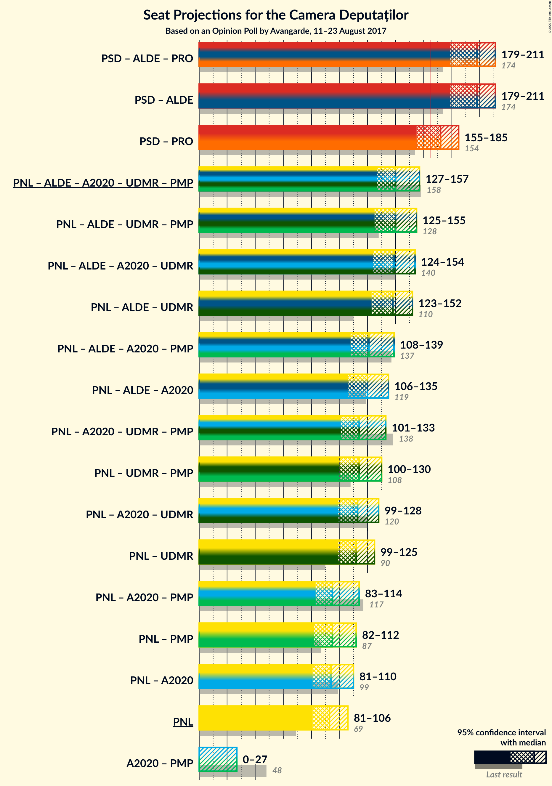

### Confidence Intervals

| Coalition | Last Result | Median | Majority? | 80% Confidence Interval | 90% Confidence Interval | 95% Confidence Interval | 99% Confidence Interval |
|:---------:|:-----------:|:------:|:---------:|:-----------------------:|:-----------------------:|:-----------------------:|:-----------------------:|
| Partidul Social Democrat – Partidul Alianța Liberalilor și Democraților | 174 | 198 | 100% | 187–206 | 183–209 | 179–211 | 173–214 |
| Partidul Național Liberal – Partidul Alianța Liberalilor și Democraților – Alianța 2020 USR-PLUS – Uniunea Democrată Maghiară din România – Partidul Mișcarea Populară | 158 | 140 | 0.3% | 132–151 | 129–154 | 127–157 | 122–163 |
| Partidul Național Liberal – Partidul Alianța Liberalilor și Democraților – Uniunea Democrată Maghiară din România – Partidul Mișcarea Populară | 128 | 140 | 0.1% | 131–150 | 128–153 | 125–155 | 119–160 |
| Partidul Național Liberal – Partidul Alianța Liberalilor și Democraților – Alianța 2020 USR-PLUS – Uniunea Democrată Maghiară din România | 140 | 139 | 0.1% | 130–148 | 127–151 | 124–154 | 119–160 |
| Partidul Național Liberal – Partidul Alianța Liberalilor și Democraților – Uniunea Democrată Maghiară din România | 110 | 138 | 0% | 129–147 | 126–150 | 123–152 | 117–156 |
| Partidul Național Liberal – Partidul Alianța Liberalilor și Democraților – Alianța 2020 USR-PLUS – Partidul Mișcarea Populară | 137 | 121 | 0% | 113–132 | 110–136 | 108–139 | 103–145 |
| Partidul Național Liberal – Partidul Alianța Liberalilor și Democraților – Alianța 2020 USR-PLUS | 119 | 120 | 0% | 111–129 | 108–132 | 106–135 | 101–143 |
| Partidul Național Liberal – Alianța 2020 USR-PLUS – Uniunea Democrată Maghiară din România – Partidul Mișcarea Populară | 138 | 114 | 0% | 106–125 | 103–129 | 101–133 | 98–139 |
| Partidul Național Liberal – Uniunea Democrată Maghiară din România – Partidul Mișcarea Populară | 108 | 114 | 0% | 105–124 | 102–127 | 100–130 | 96–135 |
| Partidul Național Liberal – Alianța 2020 USR-PLUS – Uniunea Democrată Maghiară din România | 120 | 113 | 0% | 104–122 | 102–125 | 99–128 | 95–137 |
| Partidul Național Liberal – Uniunea Democrată Maghiară din România | 90 | 112 | 0% | 103–121 | 101–123 | 99–125 | 94–129 |
| Partidul Național Liberal – Alianța 2020 USR-PLUS – Partidul Mișcarea Populară | 117 | 95 | 0% | 87–106 | 85–111 | 83–114 | 80–121 |
| Partidul Național Liberal – Partidul Mișcarea Populară | 87 | 95 | 0% | 86–105 | 84–109 | 82–112 | 78–117 |
| Partidul Național Liberal – Alianța 2020 USR-PLUS | 99 | 94 | 0% | 86–102 | 83–106 | 81–110 | 78–119 |
| Partidul Național Liberal | 69 | 93 | 0% | 85–101 | 83–103 | 81–106 | 77–110 |
| Alianța 2020 USR-PLUS – Partidul Mișcarea Populară | 48 | 0 | 0% | 0–18 | 0–20 | 0–27 | 0–30 |

### Partidul Social Democrat – Partidul Alianța Liberalilor și Democraților

| Number of Seats | Probability | Accumulated | Special Marks |
|:---------------:|:-----------:|:-----------:|:-------------:|
| 165 | 0% | 100% | Majority |
| 166 | 0% | 99.9% |  |
| 167 | 0% | 99.9% |  |
| 168 | 0% | 99.9% |  |
| 169 | 0% | 99.9% |  |
| 170 | 0.1% | 99.8% |  |
| 171 | 0.1% | 99.8% |  |
| 172 | 0.1% | 99.7% |  |
| 173 | 0.1% | 99.6% |  |
| 174 | 0.1% | 99.4% | Last Result |
| 175 | 0.3% | 99.3% |  |
| 176 | 0.3% | 99.0% |  |
| 177 | 0.4% | 98.8% |  |
| 178 | 0.4% | 98% |  |
| 179 | 0.6% | 98% |  |
| 180 | 0.5% | 97% |  |
| 181 | 0.7% | 97% |  |
| 182 | 0.8% | 96% |  |
| 183 | 0.9% | 95% |  |
| 184 | 1.0% | 94% |  |
| 185 | 1.2% | 93% |  |
| 186 | 1.4% | 92% |  |
| 187 | 2% | 91% |  |
| 188 | 2% | 89% |  |
| 189 | 2% | 87% |  |
| 190 | 3% | 85% |  |
| 191 | 3% | 83% |  |
| 192 | 3% | 80% |  |
| 193 | 4% | 76% |  |
| 194 | 4% | 72% |  |
| 195 | 5% | 68% |  |
| 196 | 5% | 63% |  |
| 197 | 5% | 58% |  |
| 198 | 6% | 52% | Median |
| 199 | 6% | 47% |  |
| 200 | 5% | 41% |  |
| 201 | 5% | 36% |  |
| 202 | 5% | 30% |  |
| 203 | 5% | 25% |  |
| 204 | 4% | 20% |  |
| 205 | 3% | 16% |  |
| 206 | 3% | 13% |  |
| 207 | 3% | 10% |  |
| 208 | 2% | 7% |  |
| 209 | 2% | 5% |  |
| 210 | 1.2% | 4% |  |
| 211 | 0.9% | 3% |  |
| 212 | 0.6% | 2% |  |
| 213 | 0.4% | 1.2% |  |
| 214 | 0.3% | 0.8% |  |
| 215 | 0.2% | 0.5% |  |
| 216 | 0.1% | 0.3% |  |
| 217 | 0.1% | 0.2% |  |
| 218 | 0% | 0.1% |  |
| 219 | 0% | 0.1% |  |
| 220 | 0% | 0% |  |

### Partidul Național Liberal – Partidul Alianța Liberalilor și Democraților – Alianța 2020 USR-PLUS – Uniunea Democrată Maghiară din România – Partidul Mișcarea Populară

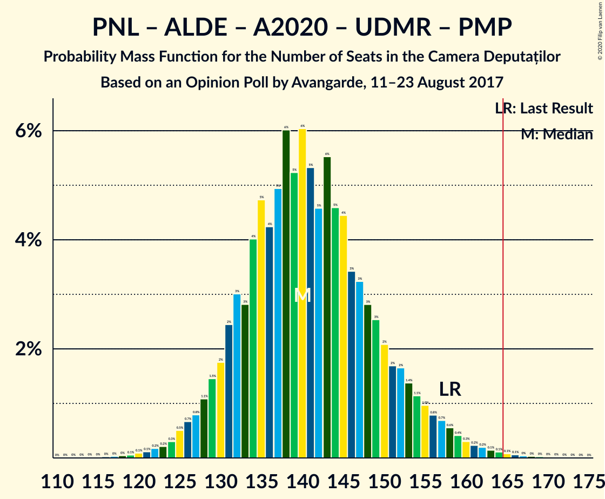

| Number of Seats | Probability | Accumulated | Special Marks |
|:---------------:|:-----------:|:-----------:|:-------------:|
| 114 | 0% | 100% |  |
| 115 | 0% | 99.9% |  |
| 116 | 0% | 99.9% |  |
| 117 | 0% | 99.9% |  |
| 118 | 0% | 99.9% |  |
| 119 | 0.1% | 99.8% |  |
| 120 | 0.1% | 99.8% |  |
| 121 | 0.1% | 99.7% |  |
| 122 | 0.2% | 99.6% |  |
| 123 | 0.2% | 99.4% |  |
| 124 | 0.3% | 99.2% |  |
| 125 | 0.5% | 98.9% |  |
| 126 | 0.7% | 98% |  |
| 127 | 0.8% | 98% |  |
| 128 | 1.1% | 97% |  |
| 129 | 1.5% | 96% |  |
| 130 | 2% | 94% |  |
| 131 | 2% | 93% |  |
| 132 | 3% | 90% |  |
| 133 | 3% | 87% |  |
| 134 | 4% | 84% |  |
| 135 | 5% | 80% |  |
| 136 | 4% | 76% |  |
| 137 | 5% | 71% |  |
| 138 | 6% | 66% | Median |
| 139 | 5% | 60% |  |
| 140 | 6% | 55% |  |
| 141 | 5% | 49% |  |
| 142 | 5% | 44% |  |
| 143 | 6% | 39% |  |
| 144 | 5% | 34% |  |
| 145 | 4% | 29% |  |
| 146 | 3% | 25% |  |
| 147 | 3% | 21% |  |
| 148 | 3% | 18% |  |
| 149 | 3% | 15% |  |
| 150 | 2% | 13% |  |
| 151 | 2% | 11% |  |
| 152 | 2% | 9% |  |
| 153 | 1.4% | 7% |  |
| 154 | 1.1% | 6% |  |
| 155 | 1.0% | 5% |  |
| 156 | 0.8% | 4% |  |
| 157 | 0.7% | 3% |  |
| 158 | 0.6% | 2% | Last Result |
| 159 | 0.4% | 2% |  |
| 160 | 0.3% | 1.3% |  |
| 161 | 0.2% | 1.0% |  |
| 162 | 0.2% | 0.8% |  |
| 163 | 0.1% | 0.6% |  |
| 164 | 0.1% | 0.4% |  |
| 165 | 0.1% | 0.3% | Majority |
| 166 | 0.1% | 0.2% |  |
| 167 | 0% | 0.2% |  |
| 168 | 0% | 0.1% |  |
| 169 | 0% | 0.1% |  |
| 170 | 0% | 0.1% |  |
| 171 | 0% | 0% |  |

### Partidul Național Liberal – Partidul Alianța Liberalilor și Democraților – Uniunea Democrată Maghiară din România – Partidul Mișcarea Populară

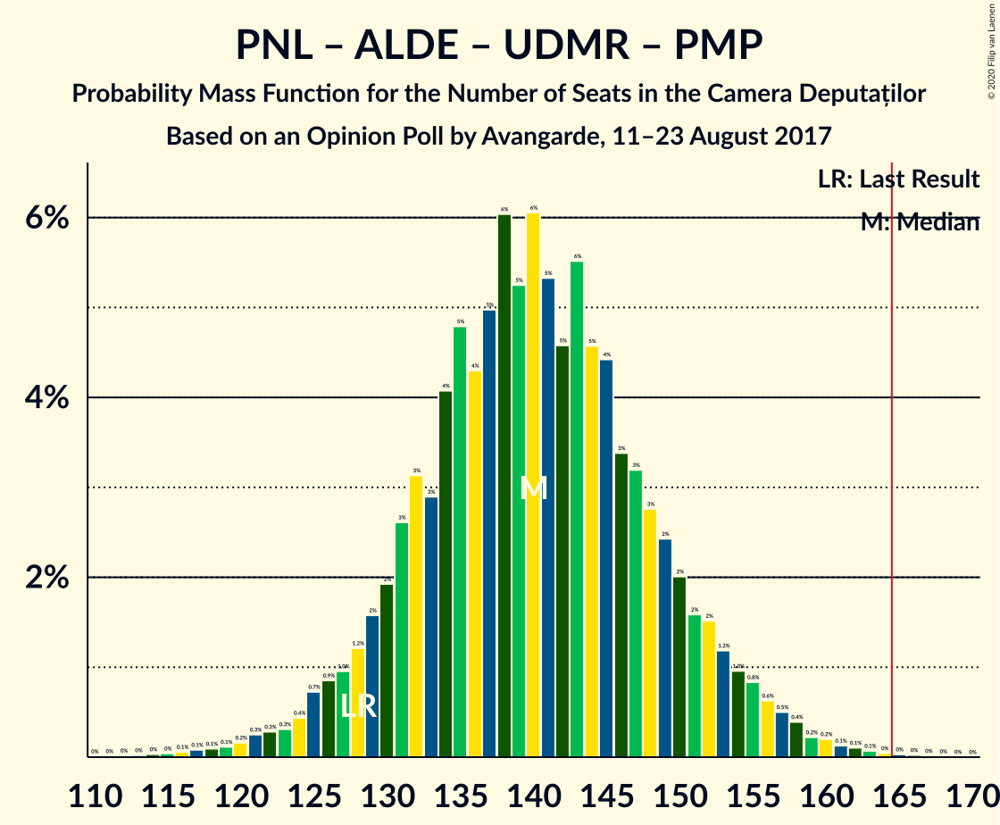

| Number of Seats | Probability | Accumulated | Special Marks |
|:---------------:|:-----------:|:-----------:|:-------------:|
| 112 | 0% | 100% |  |
| 113 | 0% | 99.9% |  |
| 114 | 0% | 99.9% |  |
| 115 | 0% | 99.9% |  |
| 116 | 0.1% | 99.8% |  |
| 117 | 0.1% | 99.8% |  |
| 118 | 0.1% | 99.7% |  |
| 119 | 0.1% | 99.6% |  |
| 120 | 0.2% | 99.5% |  |
| 121 | 0.3% | 99.3% |  |
| 122 | 0.3% | 99.1% |  |
| 123 | 0.3% | 98.8% |  |
| 124 | 0.4% | 98% |  |
| 125 | 0.7% | 98% |  |
| 126 | 0.9% | 97% |  |
| 127 | 1.0% | 96% |  |
| 128 | 1.2% | 96% | Last Result |
| 129 | 2% | 94% |  |
| 130 | 2% | 93% |  |
| 131 | 3% | 91% |  |
| 132 | 3% | 88% |  |
| 133 | 3% | 85% |  |
| 134 | 4% | 82% |  |
| 135 | 5% | 78% |  |
| 136 | 4% | 73% |  |
| 137 | 5% | 69% |  |
| 138 | 6% | 64% | Median |
| 139 | 5% | 58% |  |
| 140 | 6% | 53% |  |
| 141 | 5% | 47% |  |
| 142 | 5% | 41% |  |
| 143 | 6% | 37% |  |
| 144 | 5% | 31% |  |
| 145 | 4% | 27% |  |
| 146 | 3% | 22% |  |
| 147 | 3% | 19% |  |
| 148 | 3% | 16% |  |
| 149 | 2% | 13% |  |
| 150 | 2% | 10% |  |
| 151 | 2% | 8% |  |
| 152 | 2% | 7% |  |
| 153 | 1.2% | 5% |  |
| 154 | 1.0% | 4% |  |
| 155 | 0.8% | 3% |  |
| 156 | 0.6% | 2% |  |
| 157 | 0.5% | 2% |  |
| 158 | 0.4% | 1.3% |  |
| 159 | 0.2% | 0.9% |  |
| 160 | 0.2% | 0.6% |  |
| 161 | 0.1% | 0.4% |  |
| 162 | 0.1% | 0.3% |  |
| 163 | 0.1% | 0.2% |  |
| 164 | 0% | 0.1% |  |
| 165 | 0% | 0.1% | Majority |
| 166 | 0% | 0.1% |  |
| 167 | 0% | 0% |  |

### Partidul Național Liberal – Partidul Alianța Liberalilor și Democraților – Alianța 2020 USR-PLUS – Uniunea Democrată Maghiară din România

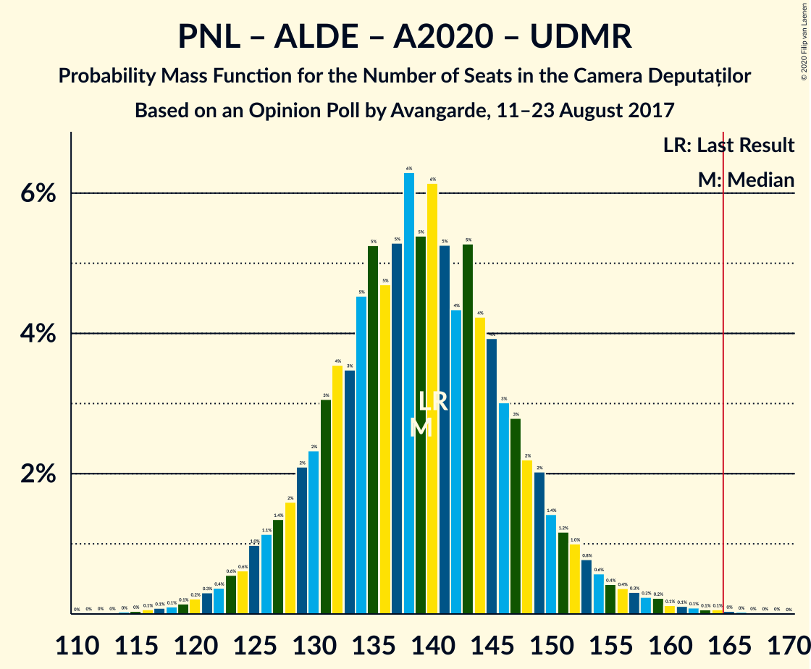

| Number of Seats | Probability | Accumulated | Special Marks |
|:---------------:|:-----------:|:-----------:|:-------------:|
| 111 | 0% | 100% |  |
| 112 | 0% | 99.9% |  |
| 113 | 0% | 99.9% |  |
| 114 | 0% | 99.9% |  |
| 115 | 0% | 99.9% |  |
| 116 | 0.1% | 99.8% |  |
| 117 | 0.1% | 99.8% |  |
| 118 | 0.1% | 99.7% |  |
| 119 | 0.1% | 99.6% |  |
| 120 | 0.2% | 99.4% |  |
| 121 | 0.3% | 99.2% |  |
| 122 | 0.4% | 98.9% |  |
| 123 | 0.6% | 98.5% |  |
| 124 | 0.6% | 98% |  |
| 125 | 1.0% | 97% |  |
| 126 | 1.1% | 96% |  |
| 127 | 1.4% | 95% |  |
| 128 | 2% | 94% |  |
| 129 | 2% | 92% |  |
| 130 | 2% | 90% |  |
| 131 | 3% | 88% |  |
| 132 | 4% | 85% |  |
| 133 | 3% | 81% |  |
| 134 | 5% | 78% |  |
| 135 | 5% | 73% |  |
| 136 | 5% | 68% |  |
| 137 | 5% | 63% |  |
| 138 | 6% | 58% | Median |
| 139 | 5% | 52% |  |
| 140 | 6% | 46% | Last Result |
| 141 | 5% | 40% |  |
| 142 | 4% | 35% |  |
| 143 | 5% | 31% |  |
| 144 | 4% | 25% |  |
| 145 | 4% | 21% |  |
| 146 | 3% | 17% |  |
| 147 | 3% | 14% |  |
| 148 | 2% | 11% |  |
| 149 | 2% | 9% |  |
| 150 | 1.4% | 7% |  |
| 151 | 1.2% | 6% |  |
| 152 | 1.0% | 5% |  |
| 153 | 0.8% | 4% |  |
| 154 | 0.6% | 3% |  |
| 155 | 0.4% | 2% |  |
| 156 | 0.4% | 2% |  |
| 157 | 0.3% | 1.4% |  |
| 158 | 0.2% | 1.1% |  |
| 159 | 0.2% | 0.8% |  |
| 160 | 0.1% | 0.6% |  |
| 161 | 0.1% | 0.5% |  |
| 162 | 0.1% | 0.4% |  |
| 163 | 0.1% | 0.3% |  |
| 164 | 0.1% | 0.2% |  |
| 165 | 0% | 0.1% | Majority |
| 166 | 0% | 0.1% |  |
| 167 | 0% | 0.1% |  |
| 168 | 0% | 0% |  |

### Partidul Național Liberal – Partidul Alianța Liberalilor și Democraților – Uniunea Democrată Maghiară din România

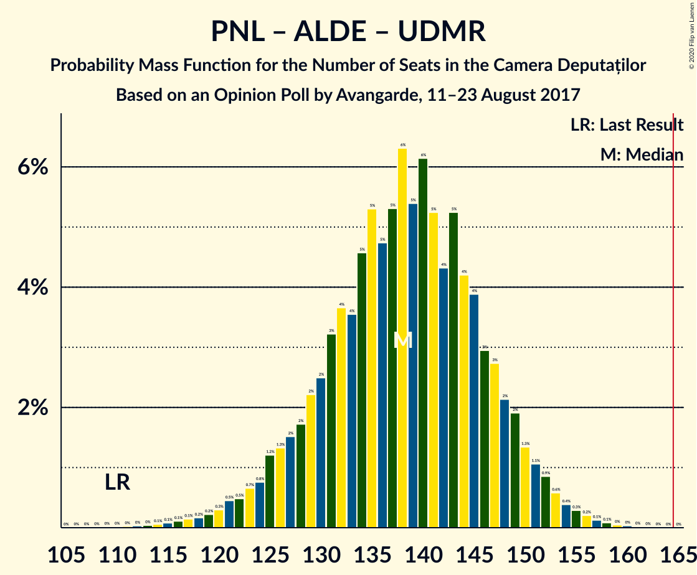

| Number of Seats | Probability | Accumulated | Special Marks |
|:---------------:|:-----------:|:-----------:|:-------------:|
| 109 | 0% | 100% |  |
| 110 | 0% | 99.9% | Last Result |
| 111 | 0% | 99.9% |  |
| 112 | 0% | 99.9% |  |
| 113 | 0% | 99.9% |  |
| 114 | 0.1% | 99.8% |  |
| 115 | 0.1% | 99.8% |  |
| 116 | 0.1% | 99.7% |  |
| 117 | 0.1% | 99.6% |  |
| 118 | 0.2% | 99.4% |  |
| 119 | 0.2% | 99.3% |  |
| 120 | 0.3% | 99.0% |  |
| 121 | 0.5% | 98.7% |  |
| 122 | 0.5% | 98% |  |
| 123 | 0.7% | 98% |  |
| 124 | 0.8% | 97% |  |
| 125 | 1.2% | 96% |  |
| 126 | 1.3% | 95% |  |
| 127 | 2% | 94% |  |
| 128 | 2% | 92% |  |
| 129 | 2% | 91% |  |
| 130 | 2% | 88% |  |
| 131 | 3% | 86% |  |
| 132 | 4% | 83% |  |
| 133 | 4% | 79% |  |
| 134 | 5% | 75% |  |
| 135 | 5% | 71% |  |
| 136 | 5% | 66% |  |
| 137 | 5% | 61% |  |
| 138 | 6% | 56% | Median |
| 139 | 5% | 49% |  |
| 140 | 6% | 44% |  |
| 141 | 5% | 38% |  |
| 142 | 4% | 32% |  |
| 143 | 5% | 28% |  |
| 144 | 4% | 23% |  |
| 145 | 4% | 19% |  |
| 146 | 3% | 15% |  |
| 147 | 3% | 12% |  |
| 148 | 2% | 9% |  |
| 149 | 2% | 7% |  |
| 150 | 1.3% | 5% |  |
| 151 | 1.1% | 4% |  |
| 152 | 0.9% | 3% |  |
| 153 | 0.6% | 2% |  |
| 154 | 0.4% | 1.2% |  |
| 155 | 0.3% | 0.8% |  |
| 156 | 0.2% | 0.5% |  |
| 157 | 0.1% | 0.3% |  |
| 158 | 0.1% | 0.2% |  |
| 159 | 0% | 0.1% |  |
| 160 | 0% | 0.1% |  |
| 161 | 0% | 0% |  |

### Partidul Național Liberal – Partidul Alianța Liberalilor și Democraților – Alianța 2020 USR-PLUS – Partidul Mișcarea Populară

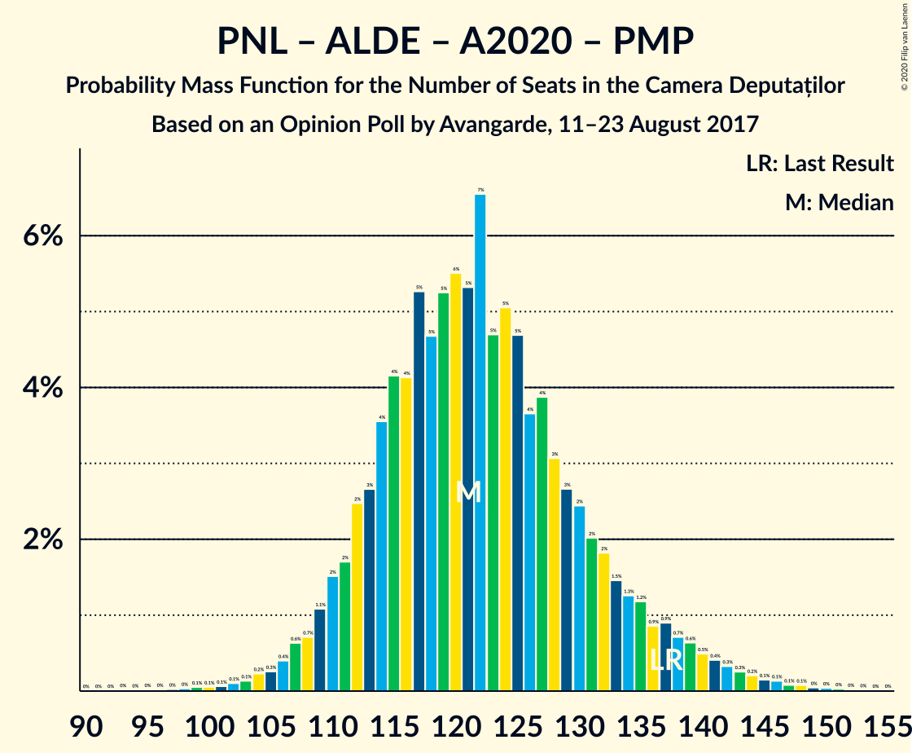

| Number of Seats | Probability | Accumulated | Special Marks |
|:---------------:|:-----------:|:-----------:|:-------------:|
| 93 | 0% | 100% |  |
| 94 | 0% | 99.9% |  |
| 95 | 0% | 99.9% |  |
| 96 | 0% | 99.9% |  |
| 97 | 0% | 99.9% |  |
| 98 | 0% | 99.9% |  |
| 99 | 0.1% | 99.8% |  |
| 100 | 0.1% | 99.8% |  |
| 101 | 0.1% | 99.7% |  |
| 102 | 0.1% | 99.7% |  |
| 103 | 0.1% | 99.6% |  |
| 104 | 0.2% | 99.4% |  |
| 105 | 0.3% | 99.2% |  |
| 106 | 0.4% | 98.9% |  |
| 107 | 0.6% | 98.5% |  |
| 108 | 0.7% | 98% |  |
| 109 | 1.1% | 97% |  |
| 110 | 2% | 96% |  |
| 111 | 2% | 95% |  |
| 112 | 2% | 93% |  |
| 113 | 3% | 90% |  |
| 114 | 4% | 88% |  |
| 115 | 4% | 84% |  |
| 116 | 4% | 80% |  |
| 117 | 5% | 76% |  |
| 118 | 5% | 71% |  |
| 119 | 5% | 66% | Median |
| 120 | 6% | 61% |  |
| 121 | 5% | 55% |  |
| 122 | 7% | 50% |  |
| 123 | 5% | 43% |  |
| 124 | 5% | 39% |  |
| 125 | 5% | 34% |  |
| 126 | 4% | 29% |  |
| 127 | 4% | 25% |  |
| 128 | 3% | 21% |  |
| 129 | 3% | 18% |  |
| 130 | 2% | 16% |  |
| 131 | 2% | 13% |  |
| 132 | 2% | 11% |  |
| 133 | 1.5% | 9% |  |
| 134 | 1.3% | 8% |  |
| 135 | 1.2% | 7% |  |
| 136 | 0.9% | 5% |  |
| 137 | 0.9% | 5% | Last Result |
| 138 | 0.7% | 4% |  |
| 139 | 0.6% | 3% |  |
| 140 | 0.5% | 2% |  |
| 141 | 0.4% | 2% |  |
| 142 | 0.3% | 1.4% |  |
| 143 | 0.3% | 1.1% |  |
| 144 | 0.2% | 0.8% |  |
| 145 | 0.1% | 0.6% |  |
| 146 | 0.1% | 0.5% |  |
| 147 | 0.1% | 0.4% |  |
| 148 | 0.1% | 0.3% |  |
| 149 | 0% | 0.2% |  |
| 150 | 0% | 0.2% |  |
| 151 | 0% | 0.1% |  |
| 152 | 0% | 0.1% |  |
| 153 | 0% | 0.1% |  |
| 154 | 0% | 0% |  |

### Partidul Național Liberal – Partidul Alianța Liberalilor și Democraților – Alianța 2020 USR-PLUS

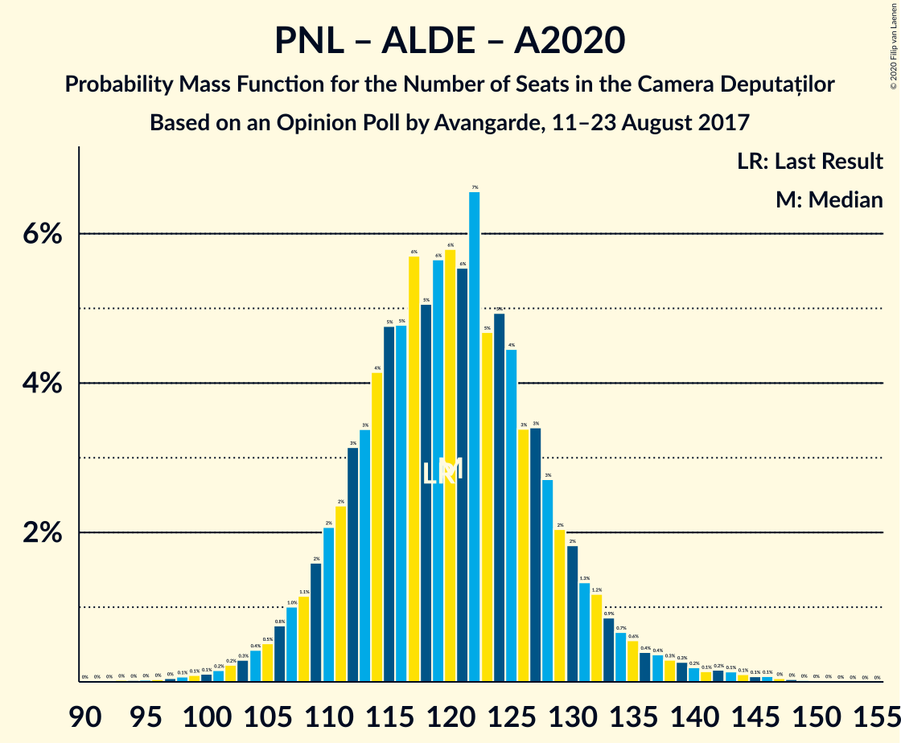

| Number of Seats | Probability | Accumulated | Special Marks |
|:---------------:|:-----------:|:-----------:|:-------------:|
| 92 | 0% | 100% |  |
| 93 | 0% | 99.9% |  |
| 94 | 0% | 99.9% |  |
| 95 | 0% | 99.9% |  |
| 96 | 0% | 99.9% |  |
| 97 | 0% | 99.8% |  |
| 98 | 0.1% | 99.8% |  |
| 99 | 0.1% | 99.7% |  |
| 100 | 0.1% | 99.6% |  |
| 101 | 0.2% | 99.5% |  |
| 102 | 0.2% | 99.4% |  |
| 103 | 0.3% | 99.1% |  |
| 104 | 0.4% | 98.8% |  |
| 105 | 0.5% | 98% |  |
| 106 | 0.8% | 98% |  |
| 107 | 1.0% | 97% |  |
| 108 | 1.1% | 96% |  |
| 109 | 2% | 95% |  |
| 110 | 2% | 93% |  |
| 111 | 2% | 91% |  |
| 112 | 3% | 89% |  |
| 113 | 3% | 86% |  |
| 114 | 4% | 82% |  |
| 115 | 5% | 78% |  |
| 116 | 5% | 74% |  |
| 117 | 6% | 69% |  |
| 118 | 5% | 63% |  |
| 119 | 6% | 58% | Last Result, Median |
| 120 | 6% | 52% |  |
| 121 | 6% | 47% |  |
| 122 | 7% | 41% |  |
| 123 | 5% | 34% |  |
| 124 | 5% | 30% |  |
| 125 | 4% | 25% |  |
| 126 | 3% | 20% |  |
| 127 | 3% | 17% |  |
| 128 | 3% | 14% |  |
| 129 | 2% | 11% |  |
| 130 | 2% | 9% |  |
| 131 | 1.3% | 7% |  |
| 132 | 1.2% | 6% |  |
| 133 | 0.9% | 4% |  |
| 134 | 0.7% | 4% |  |
| 135 | 0.6% | 3% |  |
| 136 | 0.4% | 2% |  |
| 137 | 0.4% | 2% |  |
| 138 | 0.3% | 2% |  |
| 139 | 0.3% | 1.3% |  |
| 140 | 0.2% | 1.1% |  |
| 141 | 0.1% | 0.9% |  |
| 142 | 0.2% | 0.7% |  |
| 143 | 0.1% | 0.6% |  |
| 144 | 0.1% | 0.4% |  |
| 145 | 0.1% | 0.3% |  |
| 146 | 0.1% | 0.2% |  |
| 147 | 0% | 0.2% |  |
| 148 | 0% | 0.1% |  |
| 149 | 0% | 0.1% |  |
| 150 | 0% | 0.1% |  |
| 151 | 0% | 0% |  |

### Partidul Național Liberal – Alianța 2020 USR-PLUS – Uniunea Democrată Maghiară din România – Partidul Mișcarea Populară

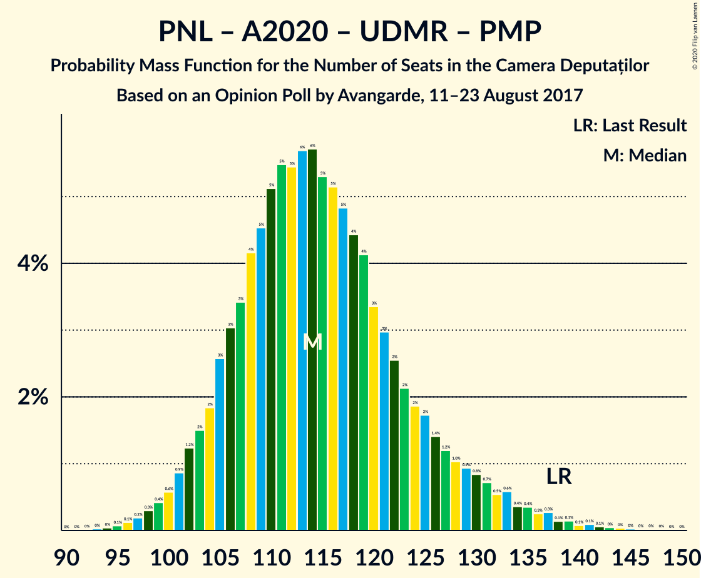

| Number of Seats | Probability | Accumulated | Special Marks |
|:---------------:|:-----------:|:-----------:|:-------------:|
| 93 | 0% | 100% |  |
| 94 | 0% | 99.9% |  |
| 95 | 0.1% | 99.9% |  |
| 96 | 0.1% | 99.8% |  |
| 97 | 0.2% | 99.7% |  |
| 98 | 0.3% | 99.5% |  |
| 99 | 0.4% | 99.2% |  |
| 100 | 0.6% | 98.8% |  |
| 101 | 0.9% | 98% |  |
| 102 | 1.2% | 97% |  |
| 103 | 2% | 96% |  |
| 104 | 2% | 95% |  |
| 105 | 3% | 93% |  |
| 106 | 3% | 90% |  |
| 107 | 3% | 87% |  |
| 108 | 4% | 84% |  |
| 109 | 5% | 80% |  |
| 110 | 5% | 75% |  |
| 111 | 5% | 70% |  |
| 112 | 5% | 64% | Median |
| 113 | 6% | 59% |  |
| 114 | 6% | 53% |  |
| 115 | 5% | 48% |  |
| 116 | 5% | 42% |  |
| 117 | 5% | 37% |  |
| 118 | 4% | 32% |  |
| 119 | 4% | 28% |  |
| 120 | 3% | 24% |  |
| 121 | 3% | 20% |  |
| 122 | 3% | 17% |  |
| 123 | 2% | 15% |  |
| 124 | 2% | 13% |  |
| 125 | 2% | 11% |  |
| 126 | 1.4% | 9% |  |
| 127 | 1.2% | 8% |  |
| 128 | 1.0% | 7% |  |
| 129 | 0.9% | 6% |  |
| 130 | 0.8% | 5% |  |
| 131 | 0.7% | 4% |  |
| 132 | 0.5% | 3% |  |
| 133 | 0.6% | 3% |  |
| 134 | 0.4% | 2% |  |
| 135 | 0.4% | 2% |  |
| 136 | 0.3% | 1.2% |  |
| 137 | 0.3% | 1.0% |  |
| 138 | 0.1% | 0.7% | Last Result |
| 139 | 0.1% | 0.6% |  |
| 140 | 0.1% | 0.4% |  |
| 141 | 0.1% | 0.3% |  |
| 142 | 0.1% | 0.2% |  |
| 143 | 0% | 0.2% |  |
| 144 | 0% | 0.1% |  |
| 145 | 0% | 0.1% |  |
| 146 | 0% | 0.1% |  |
| 147 | 0% | 0.1% |  |
| 148 | 0% | 0% |  |

### Partidul Național Liberal – Uniunea Democrată Maghiară din România – Partidul Mișcarea Populară

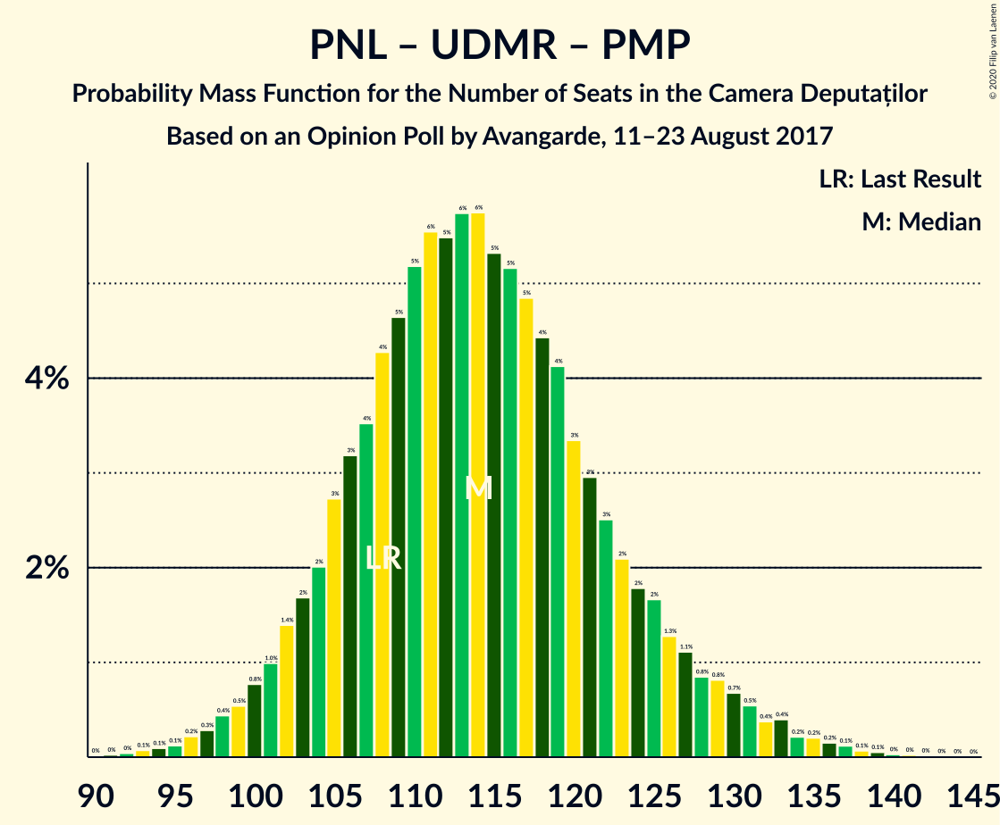

| Number of Seats | Probability | Accumulated | Special Marks |
|:---------------:|:-----------:|:-----------:|:-------------:|
| 91 | 0% | 100% |  |
| 92 | 0% | 99.9% |  |
| 93 | 0.1% | 99.9% |  |
| 94 | 0.1% | 99.8% |  |
| 95 | 0.1% | 99.7% |  |
| 96 | 0.2% | 99.6% |  |
| 97 | 0.3% | 99.4% |  |
| 98 | 0.4% | 99.1% |  |
| 99 | 0.5% | 98.7% |  |
| 100 | 0.8% | 98% |  |
| 101 | 1.0% | 97% |  |
| 102 | 1.4% | 96% |  |
| 103 | 2% | 95% |  |
| 104 | 2% | 93% |  |
| 105 | 3% | 91% |  |
| 106 | 3% | 89% |  |
| 107 | 4% | 85% |  |
| 108 | 4% | 82% | Last Result |
| 109 | 5% | 78% |  |
| 110 | 5% | 73% |  |
| 111 | 6% | 68% |  |
| 112 | 5% | 62% | Median |
| 113 | 6% | 57% |  |
| 114 | 6% | 51% |  |
| 115 | 5% | 45% |  |
| 116 | 5% | 40% |  |
| 117 | 5% | 35% |  |
| 118 | 4% | 30% |  |
| 119 | 4% | 25% |  |
| 120 | 3% | 21% |  |
| 121 | 3% | 18% |  |
| 122 | 3% | 15% |  |
| 123 | 2% | 13% |  |
| 124 | 2% | 10% |  |
| 125 | 2% | 9% |  |
| 126 | 1.3% | 7% |  |
| 127 | 1.1% | 6% |  |
| 128 | 0.8% | 5% |  |
| 129 | 0.8% | 4% |  |
| 130 | 0.7% | 3% |  |
| 131 | 0.5% | 2% |  |
| 132 | 0.4% | 2% |  |
| 133 | 0.4% | 1.3% |  |
| 134 | 0.2% | 0.9% |  |
| 135 | 0.2% | 0.7% |  |
| 136 | 0.2% | 0.5% |  |
| 137 | 0.1% | 0.3% |  |
| 138 | 0.1% | 0.2% |  |
| 139 | 0.1% | 0.2% |  |
| 140 | 0% | 0.1% |  |
| 141 | 0% | 0.1% |  |
| 142 | 0% | 0% |  |

### Partidul Național Liberal – Alianța 2020 USR-PLUS – Uniunea Democrată Maghiară din România

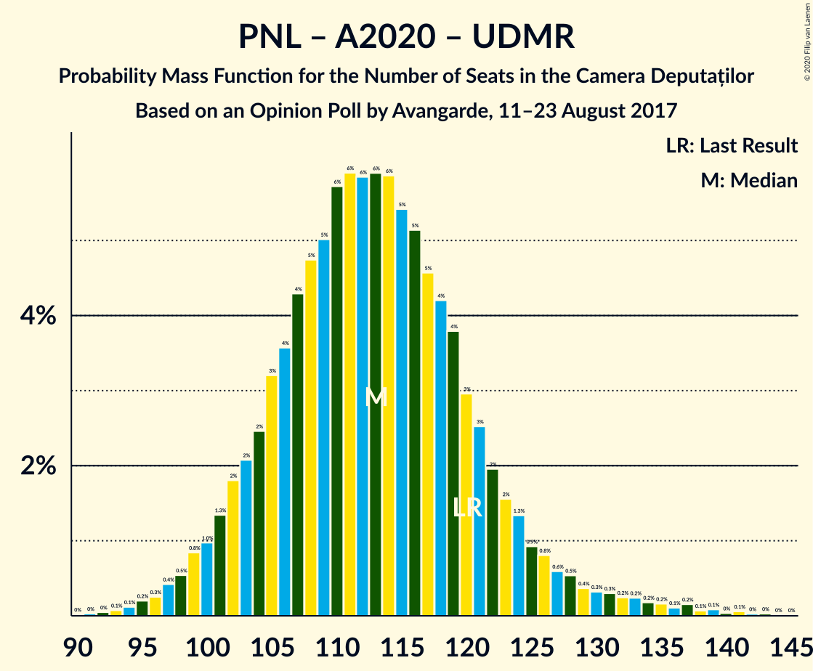

| Number of Seats | Probability | Accumulated | Special Marks |
|:---------------:|:-----------:|:-----------:|:-------------:|
| 91 | 0% | 100% |  |
| 92 | 0% | 99.9% |  |
| 93 | 0.1% | 99.9% |  |
| 94 | 0.1% | 99.8% |  |
| 95 | 0.2% | 99.7% |  |
| 96 | 0.3% | 99.5% |  |
| 97 | 0.4% | 99.2% |  |
| 98 | 0.5% | 98.8% |  |
| 99 | 0.8% | 98% |  |
| 100 | 1.0% | 97% |  |
| 101 | 1.3% | 96% |  |
| 102 | 2% | 95% |  |
| 103 | 2% | 93% |  |
| 104 | 2% | 91% |  |
| 105 | 3% | 89% |  |
| 106 | 4% | 86% |  |
| 107 | 4% | 82% |  |
| 108 | 5% | 78% |  |
| 109 | 5% | 73% |  |
| 110 | 6% | 68% |  |
| 111 | 6% | 62% |  |
| 112 | 6% | 56% | Median |
| 113 | 6% | 50% |  |
| 114 | 6% | 45% |  |
| 115 | 5% | 39% |  |
| 116 | 5% | 33% |  |
| 117 | 5% | 28% |  |
| 118 | 4% | 24% |  |
| 119 | 4% | 19% |  |
| 120 | 3% | 16% | Last Result |
| 121 | 3% | 13% |  |
| 122 | 2% | 10% |  |
| 123 | 2% | 8% |  |
| 124 | 1.3% | 7% |  |
| 125 | 0.9% | 5% |  |
| 126 | 0.8% | 4% |  |
| 127 | 0.6% | 4% |  |
| 128 | 0.5% | 3% |  |
| 129 | 0.4% | 2% |  |
| 130 | 0.3% | 2% |  |
| 131 | 0.3% | 2% |  |
| 132 | 0.2% | 1.4% |  |
| 133 | 0.2% | 1.2% |  |
| 134 | 0.2% | 0.9% |  |
| 135 | 0.2% | 0.8% |  |
| 136 | 0.1% | 0.6% |  |
| 137 | 0.2% | 0.5% |  |
| 138 | 0.1% | 0.3% |  |
| 139 | 0.1% | 0.3% |  |
| 140 | 0% | 0.2% |  |
| 141 | 0.1% | 0.2% |  |
| 142 | 0% | 0.1% |  |
| 143 | 0% | 0.1% |  |
| 144 | 0% | 0.1% |  |
| 145 | 0% | 0% |  |

### Partidul Național Liberal – Uniunea Democrată Maghiară din România

| Number of Seats | Probability | Accumulated | Special Marks |
|:---------------:|:-----------:|:-----------:|:-------------:|
| 89 | 0% | 100% |  |
| 90 | 0% | 99.9% | Last Result |
| 91 | 0.1% | 99.9% |  |
| 92 | 0.1% | 99.8% |  |
| 93 | 0.1% | 99.8% |  |
| 94 | 0.2% | 99.6% |  |
| 95 | 0.3% | 99.4% |  |
| 96 | 0.4% | 99.2% |  |
| 97 | 0.5% | 98.8% |  |
| 98 | 0.7% | 98% |  |
| 99 | 1.0% | 98% |  |
| 100 | 1.2% | 97% |  |
| 101 | 1.5% | 95% |  |
| 102 | 2% | 94% |  |
| 103 | 2% | 92% |  |
| 104 | 3% | 90% |  |
| 105 | 3% | 87% |  |
| 106 | 4% | 84% |  |
| 107 | 4% | 80% |  |
| 108 | 5% | 76% |  |
| 109 | 5% | 71% |  |
| 110 | 6% | 66% |  |
| 111 | 6% | 60% |  |
| 112 | 6% | 54% | Median |
| 113 | 6% | 48% |  |
| 114 | 6% | 42% |  |
| 115 | 5% | 36% |  |
| 116 | 5% | 31% |  |
| 117 | 5% | 26% |  |
| 118 | 4% | 21% |  |
| 119 | 4% | 17% |  |
| 120 | 3% | 13% |  |
| 121 | 2% | 10% |  |
| 122 | 2% | 8% |  |
| 123 | 1.5% | 6% |  |
| 124 | 1.2% | 4% |  |
| 125 | 0.9% | 3% |  |
| 126 | 0.7% | 2% |  |
| 127 | 0.5% | 2% |  |
| 128 | 0.3% | 1.1% |  |
| 129 | 0.2% | 0.7% |  |
| 130 | 0.2% | 0.5% |  |
| 131 | 0.1% | 0.3% |  |
| 132 | 0.1% | 0.2% |  |
| 133 | 0.1% | 0.1% |  |
| 134 | 0% | 0.1% |  |
| 135 | 0% | 0.1% |  |
| 136 | 0% | 0% |  |

### Partidul Național Liberal – Alianța 2020 USR-PLUS – Partidul Mișcarea Populară

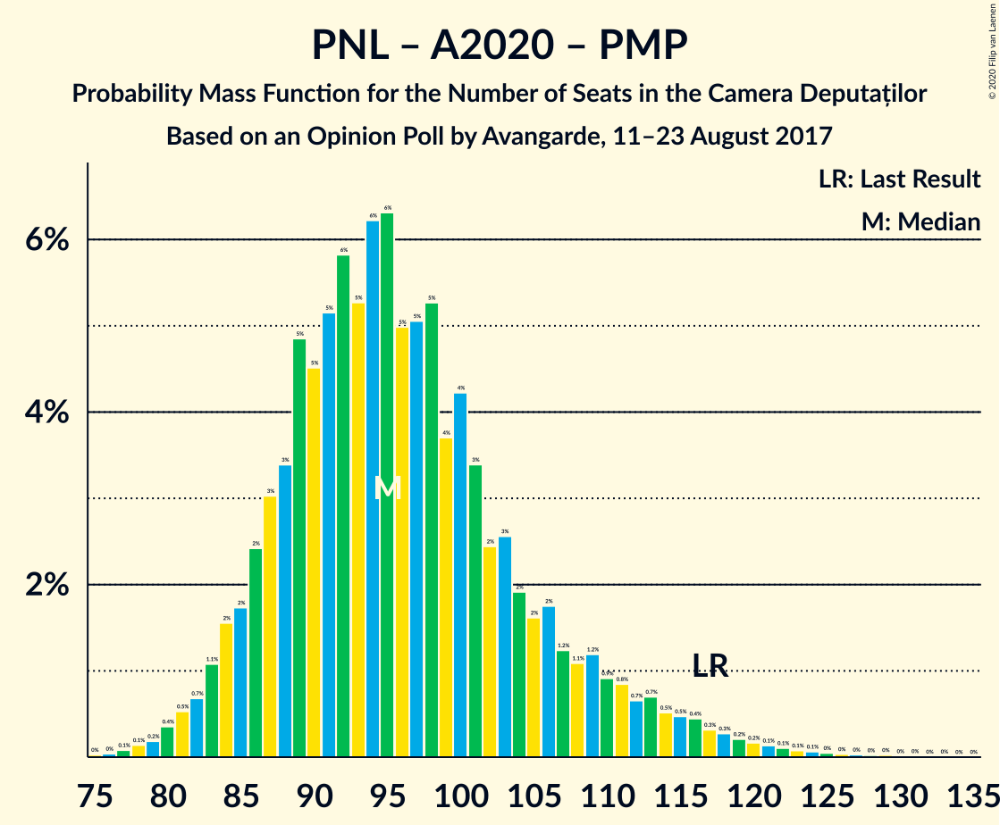

| Number of Seats | Probability | Accumulated | Special Marks |
|:---------------:|:-----------:|:-----------:|:-------------:|
| 75 | 0% | 100% |  |
| 76 | 0% | 99.9% |  |
| 77 | 0.1% | 99.9% |  |
| 78 | 0.1% | 99.8% |  |
| 79 | 0.2% | 99.7% |  |
| 80 | 0.4% | 99.5% |  |
| 81 | 0.5% | 99.1% |  |
| 82 | 0.7% | 98.6% |  |
| 83 | 1.1% | 98% |  |
| 84 | 2% | 97% |  |
| 85 | 2% | 95% |  |
| 86 | 2% | 94% |  |
| 87 | 3% | 91% |  |
| 88 | 3% | 88% |  |
| 89 | 5% | 85% |  |
| 90 | 5% | 80% |  |
| 91 | 5% | 75% |  |
| 92 | 6% | 70% |  |
| 93 | 5% | 64% | Median |
| 94 | 6% | 59% |  |
| 95 | 6% | 53% |  |
| 96 | 5% | 47% |  |
| 97 | 5% | 42% |  |
| 98 | 5% | 37% |  |
| 99 | 4% | 31% |  |
| 100 | 4% | 28% |  |
| 101 | 3% | 23% |  |
| 102 | 2% | 20% |  |
| 103 | 3% | 17% |  |
| 104 | 2% | 15% |  |
| 105 | 2% | 13% |  |
| 106 | 2% | 11% |  |
| 107 | 1.2% | 10% |  |
| 108 | 1.1% | 8% |  |
| 109 | 1.2% | 7% |  |
| 110 | 0.9% | 6% |  |
| 111 | 0.8% | 5% |  |
| 112 | 0.7% | 4% |  |
| 113 | 0.7% | 4% |  |
| 114 | 0.5% | 3% |  |
| 115 | 0.5% | 2% |  |
| 116 | 0.4% | 2% |  |
| 117 | 0.3% | 2% | Last Result |
| 118 | 0.3% | 1.3% |  |
| 119 | 0.2% | 1.0% |  |
| 120 | 0.2% | 0.8% |  |
| 121 | 0.1% | 0.6% |  |
| 122 | 0.1% | 0.5% |  |
| 123 | 0.1% | 0.4% |  |
| 124 | 0.1% | 0.3% |  |
| 125 | 0% | 0.2% |  |
| 126 | 0% | 0.2% |  |
| 127 | 0% | 0.1% |  |
| 128 | 0% | 0.1% |  |
| 129 | 0% | 0.1% |  |
| 130 | 0% | 0.1% |  |
| 131 | 0% | 0% |  |

### Partidul Național Liberal – Partidul Mișcarea Populară

| Number of Seats | Probability | Accumulated | Special Marks |
|:---------------:|:-----------:|:-----------:|:-------------:|
| 74 | 0% | 100% |  |
| 75 | 0.1% | 99.9% |  |
| 76 | 0.1% | 99.9% |  |
| 77 | 0.1% | 99.8% |  |
| 78 | 0.2% | 99.7% |  |
| 79 | 0.3% | 99.4% |  |
| 80 | 0.4% | 99.2% |  |
| 81 | 0.7% | 98.7% |  |
| 82 | 0.8% | 98% |  |
| 83 | 1.2% | 97% |  |
| 84 | 2% | 96% |  |
| 85 | 2% | 94% |  |
| 86 | 3% | 92% |  |
| 87 | 3% | 90% | Last Result |
| 88 | 4% | 87% |  |
| 89 | 5% | 83% |  |
| 90 | 5% | 78% |  |
| 91 | 5% | 73% |  |
| 92 | 6% | 68% |  |
| 93 | 5% | 62% | Median |
| 94 | 6% | 57% |  |
| 95 | 6% | 51% |  |
| 96 | 5% | 44% |  |
| 97 | 5% | 39% |  |
| 98 | 5% | 34% |  |
| 99 | 4% | 29% |  |
| 100 | 4% | 25% |  |
| 101 | 3% | 21% |  |
| 102 | 2% | 17% |  |
| 103 | 3% | 15% |  |
| 104 | 2% | 12% |  |
| 105 | 2% | 11% |  |
| 106 | 2% | 9% |  |
| 107 | 1.2% | 7% |  |
| 108 | 1.0% | 6% |  |
| 109 | 1.1% | 5% |  |
| 110 | 0.8% | 4% |  |
| 111 | 0.7% | 3% |  |
| 112 | 0.5% | 3% |  |
| 113 | 0.5% | 2% |  |
| 114 | 0.4% | 2% |  |
| 115 | 0.3% | 1.2% |  |
| 116 | 0.3% | 0.8% |  |
| 117 | 0.2% | 0.6% |  |
| 118 | 0.1% | 0.4% |  |
| 119 | 0.1% | 0.3% |  |
| 120 | 0.1% | 0.2% |  |
| 121 | 0% | 0.1% |  |
| 122 | 0% | 0.1% |  |
| 123 | 0% | 0.1% |  |
| 124 | 0% | 0% |  |

### Partidul Național Liberal – Alianța 2020 USR-PLUS

| Number of Seats | Probability | Accumulated | Special Marks |
|:---------------:|:-----------:|:-----------:|:-------------:|
| 74 | 0% | 100% |  |
| 75 | 0.1% | 99.9% |  |
| 76 | 0.1% | 99.9% |  |
| 77 | 0.2% | 99.8% |  |
| 78 | 0.3% | 99.6% |  |
| 79 | 0.4% | 99.3% |  |
| 80 | 0.6% | 98.9% |  |
| 81 | 0.9% | 98% |  |
| 82 | 1.1% | 97% |  |
| 83 | 2% | 96% |  |
| 84 | 2% | 95% |  |
| 85 | 2% | 93% |  |
| 86 | 3% | 90% |  |
| 87 | 4% | 87% |  |
| 88 | 4% | 84% |  |
| 89 | 6% | 80% |  |
| 90 | 5% | 74% |  |
| 91 | 6% | 69% |  |
| 92 | 6% | 63% |  |
| 93 | 6% | 57% | Median |
| 94 | 7% | 51% |  |
| 95 | 7% | 44% |  |
| 96 | 5% | 38% |  |
| 97 | 5% | 33% |  |
| 98 | 5% | 27% |  |
| 99 | 4% | 22% | Last Result |
| 100 | 4% | 19% |  |
| 101 | 3% | 15% |  |
| 102 | 2% | 12% |  |
| 103 | 2% | 9% |  |
| 104 | 1.4% | 7% |  |
| 105 | 1.0% | 6% |  |
| 106 | 1.0% | 5% |  |
| 107 | 0.6% | 4% |  |
| 108 | 0.5% | 3% |  |
| 109 | 0.4% | 3% |  |
| 110 | 0.3% | 3% |  |
| 111 | 0.3% | 2% |  |
| 112 | 0.3% | 2% |  |
| 113 | 0.2% | 2% |  |
| 114 | 0.2% | 1.4% |  |
| 115 | 0.2% | 1.2% |  |
| 116 | 0.2% | 1.1% |  |
| 117 | 0.2% | 0.8% |  |
| 118 | 0.1% | 0.7% |  |
| 119 | 0.1% | 0.5% |  |
| 120 | 0.1% | 0.4% |  |
| 121 | 0.1% | 0.3% |  |
| 122 | 0.1% | 0.2% |  |
| 123 | 0% | 0.2% |  |
| 124 | 0% | 0.1% |  |
| 125 | 0% | 0.1% |  |
| 126 | 0% | 0.1% |  |
| 127 | 0% | 0% |  |

### Partidul Național Liberal

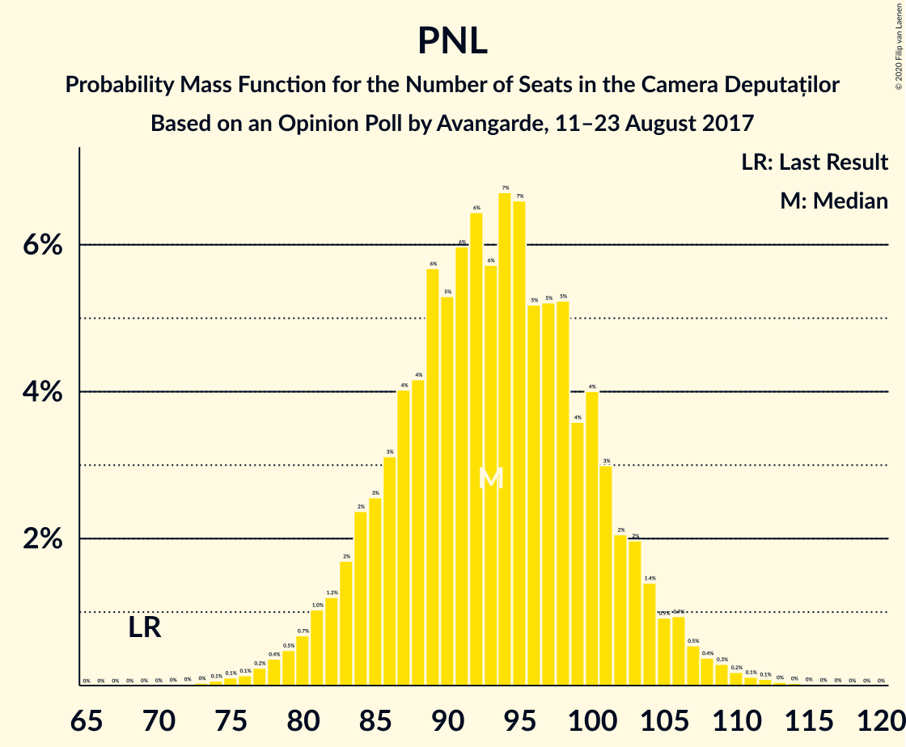

| Number of Seats | Probability | Accumulated | Special Marks |
|:---------------:|:-----------:|:-----------:|:-------------:|
| 69 | 0% | 100% | Last Result |
| 70 | 0% | 100% |  |
| 71 | 0% | 100% |  |
| 72 | 0% | 100% |  |
| 73 | 0% | 99.9% |  |
| 74 | 0.1% | 99.9% |  |
| 75 | 0.1% | 99.8% |  |
| 76 | 0.1% | 99.7% |  |
| 77 | 0.2% | 99.6% |  |
| 78 | 0.4% | 99.4% |  |
| 79 | 0.5% | 99.0% |  |
| 80 | 0.7% | 98.5% |  |
| 81 | 1.0% | 98% |  |
| 82 | 1.2% | 97% |  |
| 83 | 2% | 96% |  |
| 84 | 2% | 94% |  |
| 85 | 3% | 92% |  |
| 86 | 3% | 89% |  |
| 87 | 4% | 86% |  |
| 88 | 4% | 82% |  |
| 89 | 6% | 78% |  |
| 90 | 5% | 72% |  |
| 91 | 6% | 67% |  |
| 92 | 6% | 61% |  |
| 93 | 6% | 54% | Median |
| 94 | 7% | 49% |  |
| 95 | 7% | 42% |  |
| 96 | 5% | 35% |  |
| 97 | 5% | 30% |  |
| 98 | 5% | 25% |  |
| 99 | 4% | 20% |  |
| 100 | 4% | 16% |  |
| 101 | 3% | 12% |  |
| 102 | 2% | 9% |  |
| 103 | 2% | 7% |  |
| 104 | 1.4% | 5% |  |
| 105 | 0.9% | 4% |  |
| 106 | 0.9% | 3% |  |
| 107 | 0.5% | 2% |  |
| 108 | 0.4% | 1.2% |  |
| 109 | 0.3% | 0.8% |  |
| 110 | 0.2% | 0.5% |  |
| 111 | 0.1% | 0.3% |  |
| 112 | 0.1% | 0.2% |  |
| 113 | 0% | 0.1% |  |
| 114 | 0% | 0.1% |  |
| 115 | 0% | 0.1% |  |
| 116 | 0% | 0% |  |

### Alianța 2020 USR-PLUS – Partidul Mișcarea Populară

| Number of Seats | Probability | Accumulated | Special Marks |
|:---------------:|:-----------:|:-----------:|:-------------:|
| 0 | 87% | 100% | Median |
| 1 | 0% | 13% |  |
| 2 | 0% | 13% |  |
| 3 | 0% | 13% |  |
| 4 | 0% | 13% |  |
| 5 | 0% | 13% |  |
| 6 | 0% | 13% |  |
| 7 | 0% | 13% |  |
| 8 | 0% | 13% |  |
| 9 | 0% | 13% |  |
| 10 | 0% | 13% |  |
| 11 | 0% | 13% |  |
| 12 | 0% | 13% |  |
| 13 | 0% | 13% |  |
| 14 | 0% | 13% |  |
| 15 | 0% | 13% |  |
| 16 | 0% | 13% |  |
| 17 | 0.5% | 13% |  |
| 18 | 4% | 12% |  |
| 19 | 3% | 8% |  |
| 20 | 2% | 5% |  |
| 21 | 0.8% | 4% |  |
| 22 | 0.4% | 3% |  |
| 23 | 0.2% | 3% |  |
| 24 | 0.1% | 3% |  |
| 25 | 0% | 3% |  |
| 26 | 0% | 3% |  |
| 27 | 0.1% | 3% |  |
| 28 | 0.9% | 2% |  |
| 29 | 0.7% | 2% |  |
| 30 | 0.4% | 0.9% |  |
| 31 | 0.2% | 0.5% |  |
| 32 | 0.1% | 0.3% |  |
| 33 | 0% | 0.3% |  |
| 34 | 0% | 0.2% |  |
| 35 | 0% | 0.2% |  |
| 36 | 0% | 0.2% |  |
| 37 | 0% | 0.2% |  |
| 38 | 0% | 0.2% |  |
| 39 | 0% | 0.2% |  |
| 40 | 0% | 0.2% |  |
| 41 | 0% | 0.2% |  |
| 42 | 0% | 0.2% |  |
| 43 | 0% | 0.2% |  |
| 44 | 0% | 0.2% |  |
| 45 | 0% | 0.1% |  |
| 46 | 0% | 0.1% |  |
| 47 | 0% | 0.1% |  |
| 48 | 0% | 0% | Last Result |

## Technical Information

### Opinion Poll

+ **Polling firm:** Avangarde
+ **Commissioner(s):** —
+ **Fieldwork period:** 11–23 August 2017

### Calculations

+ **Sample size:** 710
+ **Simulations done:** 1,048,576
+ **Error estimate:** 0.64%

