# Opinion Poll by CURS for STIRIPESURSE.RO, 1–30 November 2017

<a href="#voting-intentions">Voting Intentions</a> | <a href="#seats">Seats</a> | <a href="#coalitions">Coalitions</a> | <a href="#technical-information">Technical Information</a>

## Voting Intentions

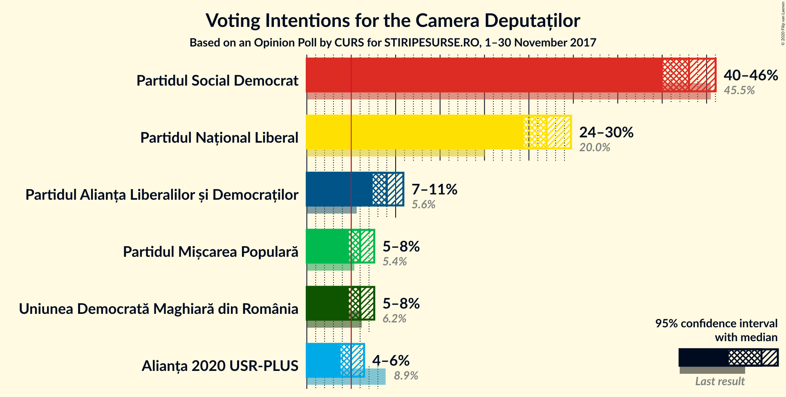

### Confidence Intervals

| Party | Last Result | Poll Result | 80% Confidence Interval | 90% Confidence Interval | 95% Confidence Interval | 99% Confidence Interval |
|:-----:|:-----------:|:-----------:|:-----------------------:|:-----------------------:|:-----------------------:|:-----------------------:|
| Partidul Social Democrat | 45.5% | 43.0% | 41.1–45.0% |40.5–45.5% |40.1–46.0% |39.2–47.0% |
| Partidul Național Liberal | 20.0% | 27.0% | 25.3–28.8% |24.8–29.3% |24.4–29.7% |23.6–30.6% |
| Partidul Alianța Liberalilor și Democraților | 5.6% | 9.0% | 8.0–10.2% |7.7–10.6% |7.4–10.9% |7.0–11.5% |
| Uniunea Democrată Maghiară din România | 6.2% | 6.0% | 5.2–7.0% |4.9–7.3% |4.7–7.6% |4.3–8.1% |
| Partidul Mișcarea Populară | 5.4% | 6.0% | 5.2–7.0% |4.9–7.3% |4.7–7.6% |4.3–8.1% |
| Alianța 2020 USR-PLUS | 8.9% | 5.0% | 4.2–5.9% |4.0–6.2% |3.8–6.4% |3.5–6.9% |

*Note:* The poll result column reflects the actual value used in the calculations. Published results may vary slightly, and in addition be rounded to fewer digits.

## Seats

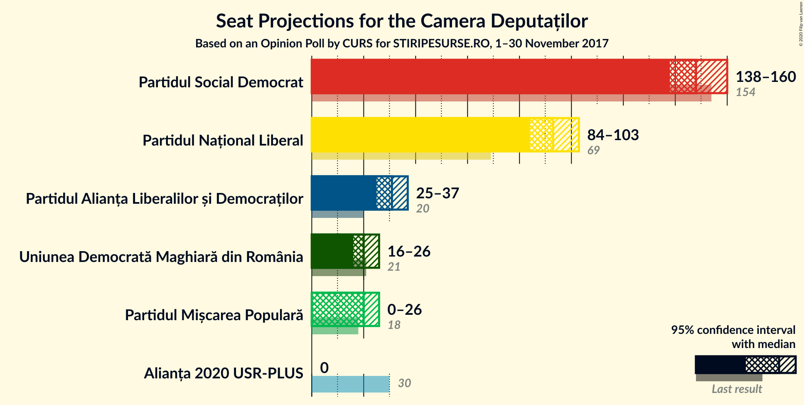

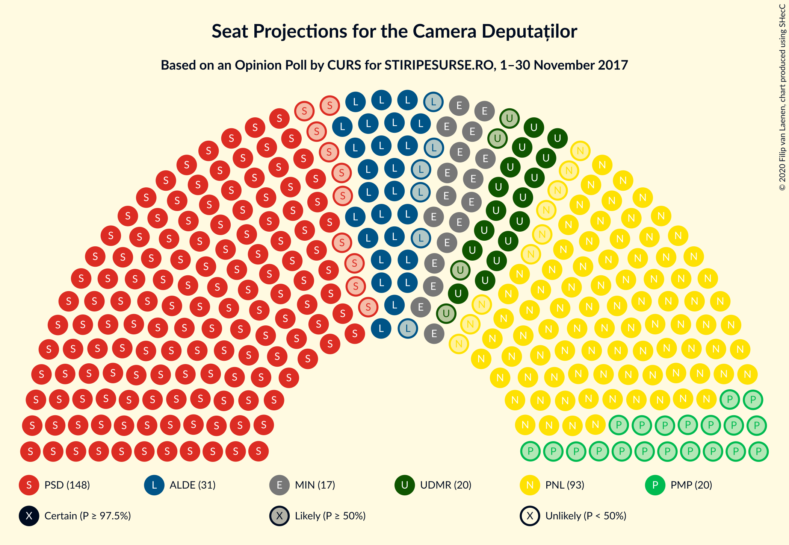

### Confidence Intervals

| Party | Last Result | Median | 80% Confidence Interval | 90% Confidence Interval | 95% Confidence Interval | 99% Confidence Interval |
|:-----:|:-----------:|:------:|:-----------------------:|:-----------------------:|:-----------------------:|:-----------------------:|
| <a href="#partidul-social-democrat">Partidul Social Democrat</a> | 154 | 148 | 141–155 |140–158 |138–160 |135–165 |
| <a href="#partidul-național-liberal">Partidul Național Liberal</a> | 69 | 93 | 87–99 |85–101 |84–103 |81–107 |
| <a href="#partidul-alianța-liberalilor-și-democraților">Partidul Alianța Liberalilor și Democraților</a> | 20 | 31 | 27–35 |26–36 |25–37 |24–39 |
| <a href="#uniunea-democrată-maghiară-din-românia">Uniunea Democrată Maghiară din România</a> | 21 | 20 | 17–24 |17–25 |16–26 |15–28 |
| <a href="#partidul-mișcarea-populară">Partidul Mișcarea Populară</a> | 18 | 20 | 17–24 |0–25 |0–26 |0–27 |
| <a href="#alianța-2020-usr-plus">Alianța 2020 USR-PLUS</a> | 30 | 0 | 0 |0 |0 |0 |

### Partidul Social Democrat

*For a full overview of the results for this party, see the [Partidul Social Democrat](party-partidulsocialdemocrat.html) page.*

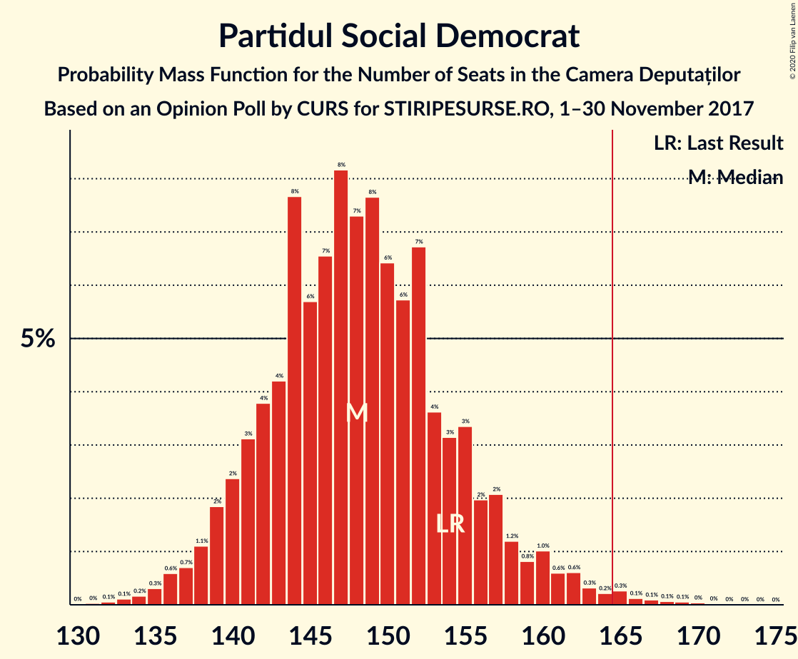

| Number of Seats | Probability | Accumulated | Special Marks |
|:---------------:|:-----------:|:-----------:|:-------------:|
| 131 | 0% | 100% |  |
| 132 | 0.1% | 99.9% |  |
| 133 | 0.1% | 99.9% |  |
| 134 | 0.2% | 99.8% |  |
| 135 | 0.3% | 99.6% |  |
| 136 | 0.6% | 99.3% |  |
| 137 | 0.7% | 98.7% |  |
| 138 | 1.1% | 98% |  |
| 139 | 2% | 97% |  |
| 140 | 2% | 95% |  |
| 141 | 3% | 93% |  |
| 142 | 4% | 90% |  |
| 143 | 4% | 86% |  |
| 144 | 8% | 82% |  |
| 145 | 6% | 74% |  |
| 146 | 7% | 68% |  |
| 147 | 8% | 62% |  |
| 148 | 7% | 53% | Median |
| 149 | 8% | 46% |  |
| 150 | 6% | 39% |  |
| 151 | 6% | 32% |  |
| 152 | 7% | 26% |  |
| 153 | 4% | 20% |  |
| 154 | 3% | 16% | Last Result |
| 155 | 3% | 13% |  |
| 156 | 2% | 10% |  |
| 157 | 2% | 8% |  |
| 158 | 1.2% | 5% |  |
| 159 | 0.8% | 4% |  |
| 160 | 1.0% | 3% |  |
| 161 | 0.6% | 2% |  |
| 162 | 0.6% | 2% |  |
| 163 | 0.3% | 1.2% |  |
| 164 | 0.2% | 0.9% |  |
| 165 | 0.3% | 0.7% | Majority |
| 166 | 0.1% | 0.4% |  |
| 167 | 0.1% | 0.3% |  |
| 168 | 0.1% | 0.2% |  |
| 169 | 0.1% | 0.1% |  |
| 170 | 0% | 0.1% |  |
| 171 | 0% | 0.1% |  |
| 172 | 0% | 0% |  |

### Partidul Național Liberal

*For a full overview of the results for this party, see the [Partidul Național Liberal](party-partidulnaționalliberal.html) page.*

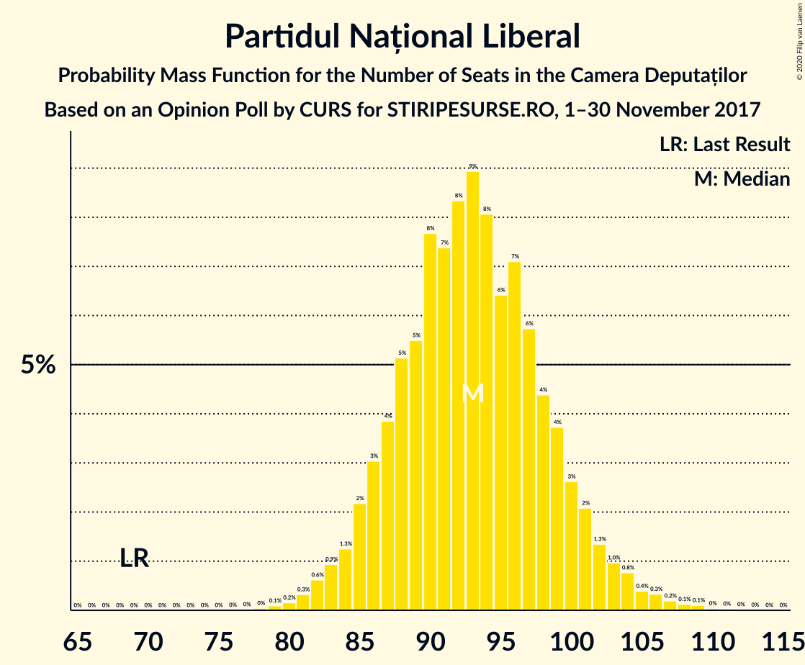

| Number of Seats | Probability | Accumulated | Special Marks |
|:---------------:|:-----------:|:-----------:|:-------------:|
| 69 | 0% | 100% | Last Result |
| 70 | 0% | 100% |  |
| 71 | 0% | 100% |  |
| 72 | 0% | 100% |  |
| 73 | 0% | 100% |  |
| 74 | 0% | 100% |  |
| 75 | 0% | 100% |  |
| 76 | 0% | 100% |  |
| 77 | 0% | 100% |  |
| 78 | 0% | 100% |  |
| 79 | 0.1% | 99.9% |  |
| 80 | 0.2% | 99.8% |  |
| 81 | 0.3% | 99.7% |  |
| 82 | 0.6% | 99.3% |  |
| 83 | 0.9% | 98.7% |  |
| 84 | 1.3% | 98% |  |
| 85 | 2% | 97% |  |
| 86 | 3% | 94% |  |
| 87 | 4% | 91% |  |
| 88 | 5% | 87% |  |
| 89 | 5% | 82% |  |
| 90 | 8% | 77% |  |
| 91 | 7% | 69% |  |
| 92 | 8% | 62% |  |
| 93 | 9% | 53% | Median |
| 94 | 8% | 44% |  |
| 95 | 6% | 36% |  |
| 96 | 7% | 30% |  |
| 97 | 6% | 23% |  |
| 98 | 4% | 17% |  |
| 99 | 4% | 13% |  |
| 100 | 3% | 9% |  |
| 101 | 2% | 6% |  |
| 102 | 1.3% | 4% |  |
| 103 | 1.0% | 3% |  |
| 104 | 0.8% | 2% |  |
| 105 | 0.4% | 1.3% |  |
| 106 | 0.3% | 0.9% |  |
| 107 | 0.2% | 0.5% |  |
| 108 | 0.1% | 0.3% |  |
| 109 | 0.1% | 0.2% |  |
| 110 | 0% | 0.1% |  |
| 111 | 0% | 0.1% |  |
| 112 | 0% | 0% |  |

### Partidul Alianța Liberalilor și Democraților

*For a full overview of the results for this party, see the [Partidul Alianța Liberalilor și Democraților](party-partidulalianțaliberalilorșidemocraților.html) page.*

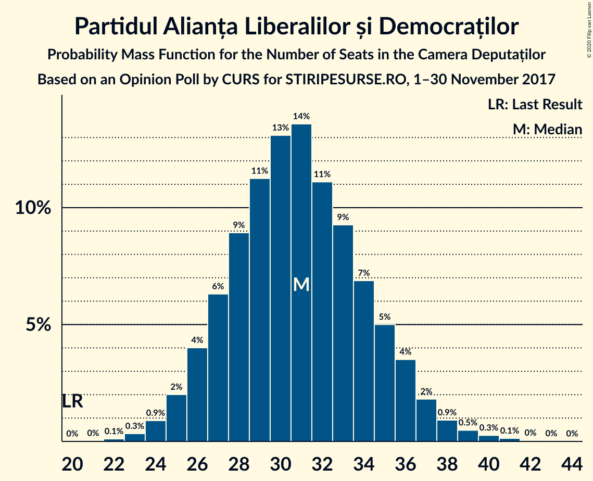

| Number of Seats | Probability | Accumulated | Special Marks |
|:---------------:|:-----------:|:-----------:|:-------------:|
| 20 | 0% | 100% | Last Result |
| 21 | 0% | 100% |  |
| 22 | 0.1% | 100% |  |
| 23 | 0.3% | 99.9% |  |
| 24 | 0.9% | 99.5% |  |
| 25 | 2% | 98.6% |  |
| 26 | 4% | 97% |  |
| 27 | 6% | 93% |  |
| 28 | 9% | 86% |  |
| 29 | 11% | 77% |  |
| 30 | 13% | 66% |  |
| 31 | 14% | 53% | Median |
| 32 | 11% | 39% |  |
| 33 | 9% | 28% |  |
| 34 | 7% | 19% |  |
| 35 | 5% | 12% |  |
| 36 | 4% | 7% |  |
| 37 | 2% | 4% |  |
| 38 | 0.9% | 2% |  |
| 39 | 0.5% | 0.9% |  |
| 40 | 0.3% | 0.5% |  |
| 41 | 0.1% | 0.2% |  |
| 42 | 0% | 0.1% |  |
| 43 | 0% | 0% |  |

### Uniunea Democrată Maghiară din România

*For a full overview of the results for this party, see the [Uniunea Democrată Maghiară din România](party-uniuneademocratămaghiarădinromânia.html) page.*

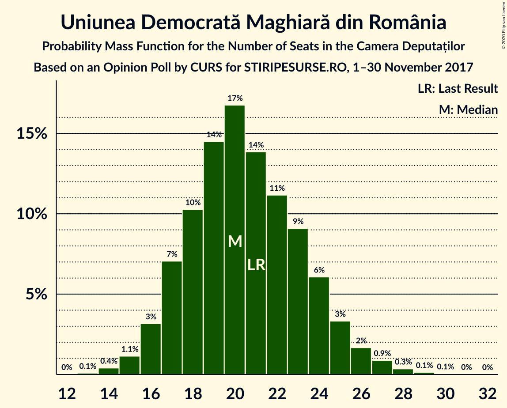

| Number of Seats | Probability | Accumulated | Special Marks |
|:---------------:|:-----------:|:-----------:|:-------------:|
| 13 | 0.1% | 100% |  |
| 14 | 0.4% | 99.9% |  |
| 15 | 1.1% | 99.5% |  |
| 16 | 3% | 98% |  |
| 17 | 7% | 95% |  |
| 18 | 10% | 88% |  |
| 19 | 14% | 78% |  |
| 20 | 17% | 63% | Median |
| 21 | 14% | 47% | Last Result |
| 22 | 11% | 33% |  |
| 23 | 9% | 22% |  |
| 24 | 6% | 12% |  |
| 25 | 3% | 6% |  |
| 26 | 2% | 3% |  |
| 27 | 0.9% | 1.4% |  |
| 28 | 0.3% | 0.6% |  |
| 29 | 0.1% | 0.2% |  |
| 30 | 0.1% | 0.1% |  |
| 31 | 0% | 0% |  |

### Partidul Mișcarea Populară

*For a full overview of the results for this party, see the [Partidul Mișcarea Populară](party-partidulmișcareapopulară.html) page.*

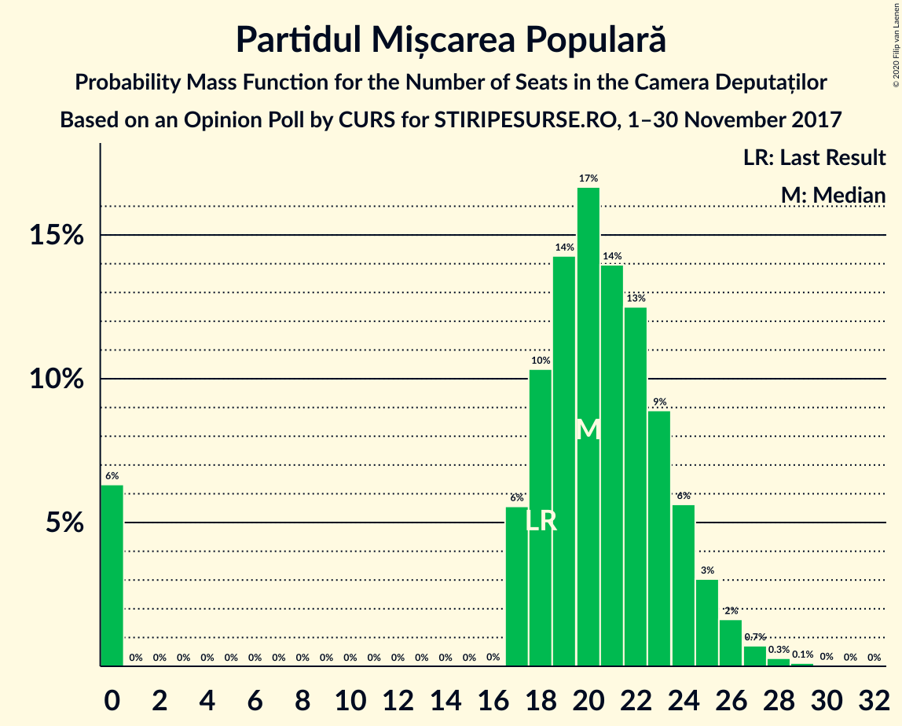

| Number of Seats | Probability | Accumulated | Special Marks |
|:---------------:|:-----------:|:-----------:|:-------------:|
| 0 | 6% | 100% |  |
| 1 | 0% | 94% |  |
| 2 | 0% | 94% |  |
| 3 | 0% | 94% |  |
| 4 | 0% | 94% |  |
| 5 | 0% | 94% |  |
| 6 | 0% | 94% |  |
| 7 | 0% | 94% |  |
| 8 | 0% | 94% |  |
| 9 | 0% | 94% |  |
| 10 | 0% | 94% |  |
| 11 | 0% | 94% |  |
| 12 | 0% | 94% |  |
| 13 | 0% | 94% |  |
| 14 | 0% | 94% |  |
| 15 | 0% | 94% |  |
| 16 | 0% | 94% |  |
| 17 | 6% | 94% |  |
| 18 | 10% | 88% | Last Result |
| 19 | 14% | 78% |  |
| 20 | 17% | 63% | Median |
| 21 | 14% | 47% |  |
| 22 | 13% | 33% |  |
| 23 | 9% | 20% |  |
| 24 | 6% | 11% |  |
| 25 | 3% | 6% |  |
| 26 | 2% | 3% |  |
| 27 | 0.7% | 1.2% |  |
| 28 | 0.3% | 0.4% |  |
| 29 | 0.1% | 0.2% |  |
| 30 | 0% | 0.1% |  |
| 31 | 0% | 0% |  |

### Alianța 2020 USR-PLUS

*For a full overview of the results for this party, see the [Alianța 2020 USR-PLUS](party-alianța2020usr-plus.html) page.*

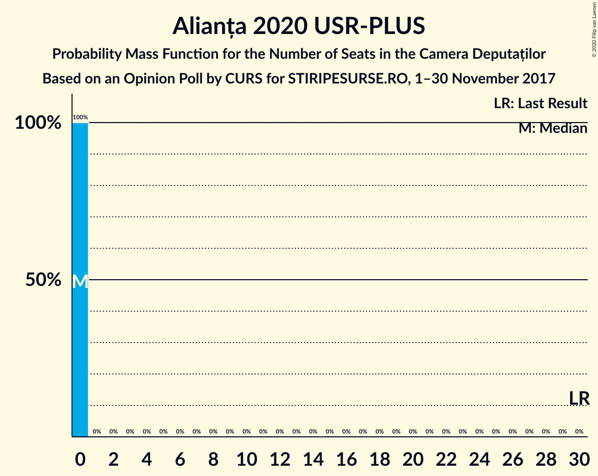

| Number of Seats | Probability | Accumulated | Special Marks |
|:---------------:|:-----------:|:-----------:|:-------------:|
| 0 | 100% | 100% | Median |
| 1 | 0% | 0% |  |
| 2 | 0% | 0% |  |
| 3 | 0% | 0% |  |
| 4 | 0% | 0% |  |
| 5 | 0% | 0% |  |
| 6 | 0% | 0% |  |
| 7 | 0% | 0% |  |
| 8 | 0% | 0% |  |
| 9 | 0% | 0% |  |
| 10 | 0% | 0% |  |
| 11 | 0% | 0% |  |
| 12 | 0% | 0% |  |
| 13 | 0% | 0% |  |
| 14 | 0% | 0% |  |
| 15 | 0% | 0% |  |
| 16 | 0% | 0% |  |
| 17 | 0% | 0% |  |
| 18 | 0% | 0% |  |
| 19 | 0% | 0% |  |
| 20 | 0% | 0% |  |
| 21 | 0% | 0% |  |
| 22 | 0% | 0% |  |
| 23 | 0% | 0% |  |
| 24 | 0% | 0% |  |
| 25 | 0% | 0% |  |
| 26 | 0% | 0% |  |
| 27 | 0% | 0% |  |
| 28 | 0% | 0% |  |
| 29 | 0% | 0% |  |
| 30 | 0% | 0% | Last Result |

## Coalitions

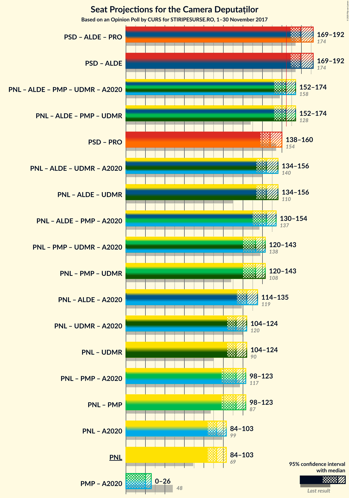

### Confidence Intervals

| Coalition | Last Result | Median | Majority? | 80% Confidence Interval | 90% Confidence Interval | 95% Confidence Interval | 99% Confidence Interval |
|:---------:|:-----------:|:------:|:---------:|:-----------------------:|:-----------------------:|:-----------------------:|:-----------------------:|
| Partidul Social Democrat – Partidul Alianța Liberalilor și Democraților | 174 | 179 | 99.7% | 172–186 | 170–189 | 169–192 | 166–198 |
| Partidul Național Liberal – Partidul Alianța Liberalilor și Democraților – Partidul Mișcarea Populară – Uniunea Democrată Maghiară din România – Alianța 2020 USR-PLUS | 158 | 164 | 47% | 157–171 | 154–172 | 152–174 | 147–177 |
| Partidul Național Liberal – Partidul Alianța Liberalilor și Democraților – Partidul Mișcarea Populară – Uniunea Democrată Maghiară din România | 128 | 164 | 47% | 157–171 | 154–172 | 152–174 | 147–177 |
| Partidul Național Liberal – Partidul Alianța Liberalilor și Democraților – Uniunea Democrată Maghiară din România – Alianța 2020 USR-PLUS | 140 | 144 | 0.1% | 137–151 | 136–154 | 134–156 | 131–161 |
| Partidul Național Liberal – Partidul Alianța Liberalilor și Democraților – Uniunea Democrată Maghiară din România | 110 | 144 | 0.1% | 137–151 | 136–154 | 134–156 | 131–161 |
| Partidul Național Liberal – Partidul Alianța Liberalilor și Democraților – Partidul Mișcarea Populară – Alianța 2020 USR-PLUS | 137 | 144 | 0% | 136–150 | 133–152 | 130–154 | 125–157 |
| Partidul Național Liberal – Partidul Mișcarea Populară – Uniunea Democrată Maghiară din România – Alianța 2020 USR-PLUS | 138 | 133 | 0% | 126–140 | 123–142 | 120–143 | 114–146 |
| Partidul Național Liberal – Partidul Mișcarea Populară – Uniunea Democrată Maghiară din România | 108 | 133 | 0% | 126–140 | 123–142 | 120–143 | 114–146 |
| Partidul Național Liberal – Partidul Alianța Liberalilor și Democraților – Alianța 2020 USR-PLUS | 119 | 124 | 0% | 117–131 | 115–133 | 114–135 | 111–139 |
| Partidul Național Liberal – Uniunea Democrată Maghiară din România – Alianța 2020 USR-PLUS | 120 | 113 | 0% | 107–120 | 105–122 | 104–124 | 101–129 |
| Partidul Național Liberal – Uniunea Democrată Maghiară din România | 90 | 113 | 0% | 107–120 | 105–122 | 104–124 | 101–129 |
| Partidul Național Liberal – Partidul Mișcarea Populară – Alianța 2020 USR-PLUS | 117 | 113 | 0% | 105–119 | 102–121 | 98–123 | 92–126 |
| Partidul Național Liberal – Partidul Mișcarea Populară | 87 | 113 | 0% | 105–119 | 102–121 | 98–123 | 92–126 |
| Partidul Național Liberal – Alianța 2020 USR-PLUS | 99 | 93 | 0% | 87–99 | 85–101 | 84–103 | 81–107 |
| Partidul Național Liberal | 69 | 93 | 0% | 87–99 | 85–101 | 84–103 | 81–107 |
| Partidul Mișcarea Populară – Alianța 2020 USR-PLUS | 48 | 20 | 0% | 17–24 | 0–25 | 0–26 | 0–27 |

### Partidul Social Democrat – Partidul Alianța Liberalilor și Democraților

| Number of Seats | Probability | Accumulated | Special Marks |
|:---------------:|:-----------:|:-----------:|:-------------:|
| 162 | 0% | 100% |  |
| 163 | 0.1% | 99.9% |  |
| 164 | 0.1% | 99.9% |  |
| 165 | 0.2% | 99.7% | Majority |
| 166 | 0.4% | 99.5% |  |
| 167 | 0.5% | 99.2% |  |
| 168 | 0.8% | 98.6% |  |
| 169 | 2% | 98% |  |
| 170 | 2% | 96% |  |
| 171 | 2% | 95% |  |
| 172 | 4% | 92% |  |
| 173 | 4% | 88% |  |
| 174 | 5% | 84% | Last Result |
| 175 | 6% | 80% |  |
| 176 | 7% | 73% |  |
| 177 | 7% | 67% |  |
| 178 | 8% | 60% |  |
| 179 | 9% | 52% | Median |
| 180 | 6% | 43% |  |
| 181 | 7% | 37% |  |
| 182 | 6% | 30% |  |
| 183 | 5% | 24% |  |
| 184 | 3% | 19% |  |
| 185 | 3% | 16% |  |
| 186 | 3% | 12% |  |
| 187 | 2% | 9% |  |
| 188 | 2% | 8% |  |
| 189 | 1.4% | 6% |  |
| 190 | 0.8% | 5% |  |
| 191 | 0.8% | 4% |  |
| 192 | 0.8% | 3% |  |
| 193 | 0.5% | 2% |  |
| 194 | 0.3% | 2% |  |
| 195 | 0.4% | 2% |  |
| 196 | 0.4% | 1.2% |  |
| 197 | 0.2% | 0.8% |  |
| 198 | 0.2% | 0.6% |  |
| 199 | 0.2% | 0.4% |  |
| 200 | 0.1% | 0.3% |  |
| 201 | 0.1% | 0.2% |  |
| 202 | 0.1% | 0.1% |  |
| 203 | 0% | 0.1% |  |
| 204 | 0% | 0% |  |

### Partidul Național Liberal – Partidul Alianța Liberalilor și Democraților – Partidul Mișcarea Populară – Uniunea Democrată Maghiară din România – Alianța 2020 USR-PLUS

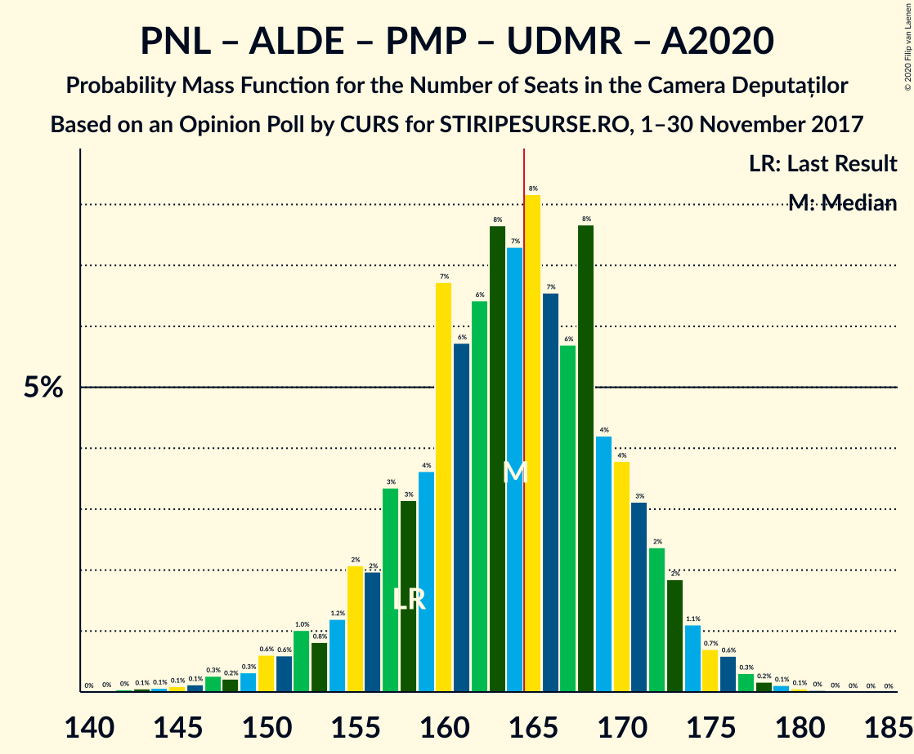

| Number of Seats | Probability | Accumulated | Special Marks |
|:---------------:|:-----------:|:-----------:|:-------------:|
| 141 | 0% | 100% |  |
| 142 | 0% | 99.9% |  |
| 143 | 0.1% | 99.9% |  |
| 144 | 0.1% | 99.9% |  |
| 145 | 0.1% | 99.8% |  |
| 146 | 0.1% | 99.7% |  |
| 147 | 0.3% | 99.6% |  |
| 148 | 0.2% | 99.3% |  |
| 149 | 0.3% | 99.1% |  |
| 150 | 0.6% | 98.8% |  |
| 151 | 0.6% | 98% |  |
| 152 | 1.0% | 98% |  |
| 153 | 0.8% | 97% |  |
| 154 | 1.2% | 96% |  |
| 155 | 2% | 95% |  |
| 156 | 2% | 92% |  |
| 157 | 3% | 90% |  |
| 158 | 3% | 87% | Last Result |
| 159 | 4% | 84% |  |
| 160 | 7% | 80% |  |
| 161 | 6% | 74% |  |
| 162 | 6% | 68% |  |
| 163 | 8% | 61% |  |
| 164 | 7% | 54% | Median |
| 165 | 8% | 47% | Majority |
| 166 | 7% | 38% |  |
| 167 | 6% | 32% |  |
| 168 | 8% | 26% |  |
| 169 | 4% | 18% |  |
| 170 | 4% | 14% |  |
| 171 | 3% | 10% |  |
| 172 | 2% | 7% |  |
| 173 | 2% | 5% |  |
| 174 | 1.1% | 3% |  |
| 175 | 0.7% | 2% |  |
| 176 | 0.6% | 1.3% |  |
| 177 | 0.3% | 0.7% |  |
| 178 | 0.2% | 0.4% |  |
| 179 | 0.1% | 0.2% |  |
| 180 | 0.1% | 0.1% |  |
| 181 | 0% | 0.1% |  |
| 182 | 0% | 0% |  |

### Partidul Național Liberal – Partidul Alianța Liberalilor și Democraților – Partidul Mișcarea Populară – Uniunea Democrată Maghiară din România

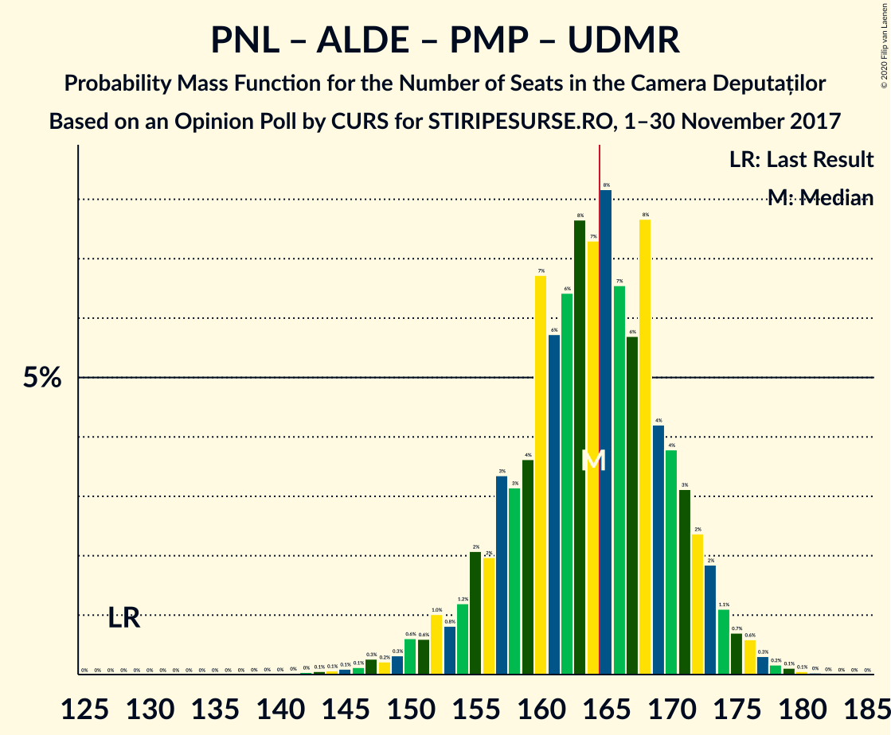

| Number of Seats | Probability | Accumulated | Special Marks |
|:---------------:|:-----------:|:-----------:|:-------------:|
| 128 | 0% | 100% | Last Result |
| 129 | 0% | 100% |  |
| 130 | 0% | 100% |  |
| 131 | 0% | 100% |  |
| 132 | 0% | 100% |  |
| 133 | 0% | 100% |  |
| 134 | 0% | 100% |  |
| 135 | 0% | 100% |  |
| 136 | 0% | 100% |  |
| 137 | 0% | 100% |  |
| 138 | 0% | 100% |  |
| 139 | 0% | 100% |  |
| 140 | 0% | 100% |  |
| 141 | 0% | 100% |  |
| 142 | 0% | 99.9% |  |
| 143 | 0.1% | 99.9% |  |
| 144 | 0.1% | 99.8% |  |
| 145 | 0.1% | 99.8% |  |
| 146 | 0.1% | 99.7% |  |
| 147 | 0.3% | 99.6% |  |
| 148 | 0.2% | 99.3% |  |
| 149 | 0.3% | 99.1% |  |
| 150 | 0.6% | 98.8% |  |
| 151 | 0.6% | 98% |  |
| 152 | 1.0% | 98% |  |
| 153 | 0.8% | 97% |  |
| 154 | 1.2% | 96% |  |
| 155 | 2% | 95% |  |
| 156 | 2% | 92% |  |
| 157 | 3% | 90% |  |
| 158 | 3% | 87% |  |
| 159 | 4% | 84% |  |
| 160 | 7% | 80% |  |
| 161 | 6% | 74% |  |
| 162 | 6% | 68% |  |
| 163 | 8% | 61% |  |
| 164 | 7% | 54% | Median |
| 165 | 8% | 47% | Majority |
| 166 | 7% | 38% |  |
| 167 | 6% | 32% |  |
| 168 | 8% | 26% |  |
| 169 | 4% | 18% |  |
| 170 | 4% | 14% |  |
| 171 | 3% | 10% |  |
| 172 | 2% | 7% |  |
| 173 | 2% | 5% |  |
| 174 | 1.1% | 3% |  |
| 175 | 0.7% | 2% |  |
| 176 | 0.6% | 1.3% |  |
| 177 | 0.3% | 0.7% |  |
| 178 | 0.2% | 0.4% |  |
| 179 | 0.1% | 0.2% |  |
| 180 | 0.1% | 0.1% |  |
| 181 | 0% | 0.1% |  |
| 182 | 0% | 0% |  |

### Partidul Național Liberal – Partidul Alianța Liberalilor și Democraților – Uniunea Democrată Maghiară din România – Alianța 2020 USR-PLUS

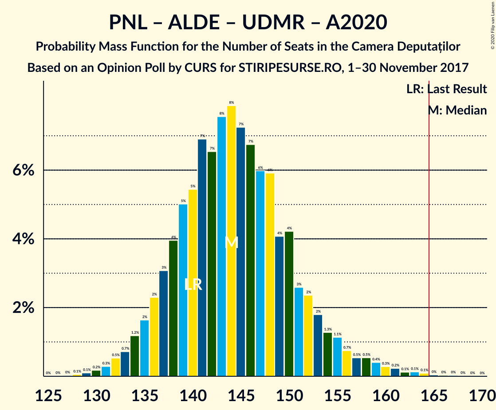

| Number of Seats | Probability | Accumulated | Special Marks |
|:---------------:|:-----------:|:-----------:|:-------------:|
| 127 | 0% | 100% |  |
| 128 | 0.1% | 99.9% |  |
| 129 | 0.1% | 99.9% |  |
| 130 | 0.2% | 99.8% |  |
| 131 | 0.3% | 99.6% |  |
| 132 | 0.5% | 99.3% |  |
| 133 | 0.7% | 98.8% |  |
| 134 | 1.2% | 98% |  |
| 135 | 2% | 97% |  |
| 136 | 2% | 95% |  |
| 137 | 3% | 93% |  |
| 138 | 4% | 90% |  |
| 139 | 5% | 86% |  |
| 140 | 5% | 81% | Last Result |
| 141 | 7% | 75% |  |
| 142 | 7% | 69% |  |
| 143 | 8% | 62% |  |
| 144 | 8% | 54% | Median |
| 145 | 7% | 47% |  |
| 146 | 7% | 39% |  |
| 147 | 6% | 33% |  |
| 148 | 6% | 27% |  |
| 149 | 4% | 21% |  |
| 150 | 4% | 17% |  |
| 151 | 3% | 12% |  |
| 152 | 2% | 10% |  |
| 153 | 2% | 7% |  |
| 154 | 1.3% | 6% |  |
| 155 | 1.1% | 4% |  |
| 156 | 0.7% | 3% |  |
| 157 | 0.5% | 2% |  |
| 158 | 0.5% | 2% |  |
| 159 | 0.4% | 1.4% |  |
| 160 | 0.3% | 1.0% |  |
| 161 | 0.2% | 0.7% |  |
| 162 | 0.1% | 0.5% |  |
| 163 | 0.1% | 0.4% |  |
| 164 | 0.1% | 0.2% |  |
| 165 | 0% | 0.1% | Majority |
| 166 | 0% | 0.1% |  |
| 167 | 0% | 0.1% |  |
| 168 | 0% | 0% |  |

### Partidul Național Liberal – Partidul Alianța Liberalilor și Democraților – Uniunea Democrată Maghiară din România

| Number of Seats | Probability | Accumulated | Special Marks |
|:---------------:|:-----------:|:-----------:|:-------------:|
| 110 | 0% | 100% | Last Result |
| 111 | 0% | 100% |  |
| 112 | 0% | 100% |  |
| 113 | 0% | 100% |  |
| 114 | 0% | 100% |  |
| 115 | 0% | 100% |  |
| 116 | 0% | 100% |  |
| 117 | 0% | 100% |  |
| 118 | 0% | 100% |  |
| 119 | 0% | 100% |  |
| 120 | 0% | 100% |  |
| 121 | 0% | 100% |  |
| 122 | 0% | 100% |  |
| 123 | 0% | 100% |  |
| 124 | 0% | 100% |  |
| 125 | 0% | 100% |  |
| 126 | 0% | 100% |  |
| 127 | 0% | 100% |  |
| 128 | 0.1% | 99.9% |  |
| 129 | 0.1% | 99.9% |  |
| 130 | 0.2% | 99.8% |  |
| 131 | 0.3% | 99.6% |  |
| 132 | 0.5% | 99.3% |  |
| 133 | 0.7% | 98.8% |  |
| 134 | 1.2% | 98% |  |
| 135 | 2% | 97% |  |
| 136 | 2% | 95% |  |
| 137 | 3% | 93% |  |
| 138 | 4% | 90% |  |
| 139 | 5% | 86% |  |
| 140 | 5% | 81% |  |
| 141 | 7% | 75% |  |
| 142 | 7% | 69% |  |
| 143 | 8% | 62% |  |
| 144 | 8% | 54% | Median |
| 145 | 7% | 47% |  |
| 146 | 7% | 39% |  |
| 147 | 6% | 33% |  |
| 148 | 6% | 27% |  |
| 149 | 4% | 21% |  |
| 150 | 4% | 17% |  |
| 151 | 3% | 12% |  |
| 152 | 2% | 10% |  |
| 153 | 2% | 7% |  |
| 154 | 1.3% | 6% |  |
| 155 | 1.1% | 4% |  |
| 156 | 0.7% | 3% |  |
| 157 | 0.5% | 2% |  |
| 158 | 0.5% | 2% |  |
| 159 | 0.4% | 1.4% |  |
| 160 | 0.3% | 1.0% |  |
| 161 | 0.2% | 0.7% |  |
| 162 | 0.1% | 0.5% |  |
| 163 | 0.1% | 0.4% |  |
| 164 | 0.1% | 0.2% |  |
| 165 | 0% | 0.1% | Majority |
| 166 | 0% | 0.1% |  |
| 167 | 0% | 0.1% |  |
| 168 | 0% | 0% |  |

### Partidul Național Liberal – Partidul Alianța Liberalilor și Democraților – Partidul Mișcarea Populară – Alianța 2020 USR-PLUS

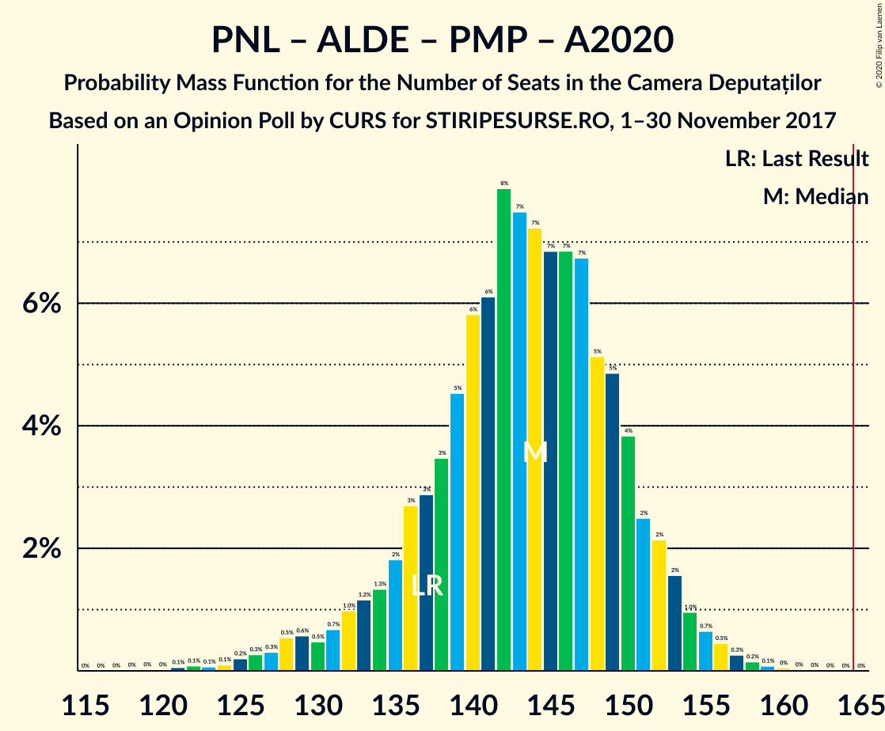

| Number of Seats | Probability | Accumulated | Special Marks |
|:---------------:|:-----------:|:-----------:|:-------------:|
| 119 | 0% | 100% |  |
| 120 | 0% | 99.9% |  |
| 121 | 0.1% | 99.9% |  |
| 122 | 0.1% | 99.9% |  |
| 123 | 0.1% | 99.8% |  |
| 124 | 0.1% | 99.7% |  |
| 125 | 0.2% | 99.6% |  |
| 126 | 0.3% | 99.4% |  |
| 127 | 0.3% | 99.1% |  |
| 128 | 0.5% | 98.8% |  |
| 129 | 0.6% | 98% |  |
| 130 | 0.5% | 98% |  |
| 131 | 0.7% | 97% |  |
| 132 | 1.0% | 97% |  |
| 133 | 1.2% | 96% |  |
| 134 | 1.3% | 94% |  |
| 135 | 2% | 93% |  |
| 136 | 3% | 91% |  |
| 137 | 3% | 89% | Last Result |
| 138 | 3% | 86% |  |
| 139 | 5% | 82% |  |
| 140 | 6% | 78% |  |
| 141 | 6% | 72% |  |
| 142 | 8% | 66% |  |
| 143 | 7% | 58% |  |
| 144 | 7% | 50% | Median |
| 145 | 7% | 43% |  |
| 146 | 7% | 36% |  |
| 147 | 7% | 29% |  |
| 148 | 5% | 23% |  |
| 149 | 5% | 18% |  |
| 150 | 4% | 13% |  |
| 151 | 2% | 9% |  |
| 152 | 2% | 6% |  |
| 153 | 2% | 4% |  |
| 154 | 1.0% | 3% |  |
| 155 | 0.7% | 2% |  |
| 156 | 0.5% | 1.0% |  |
| 157 | 0.3% | 0.6% |  |
| 158 | 0.2% | 0.3% |  |
| 159 | 0.1% | 0.2% |  |
| 160 | 0% | 0.1% |  |
| 161 | 0% | 0% |  |

### Partidul Național Liberal – Partidul Mișcarea Populară – Uniunea Democrată Maghiară din România – Alianța 2020 USR-PLUS

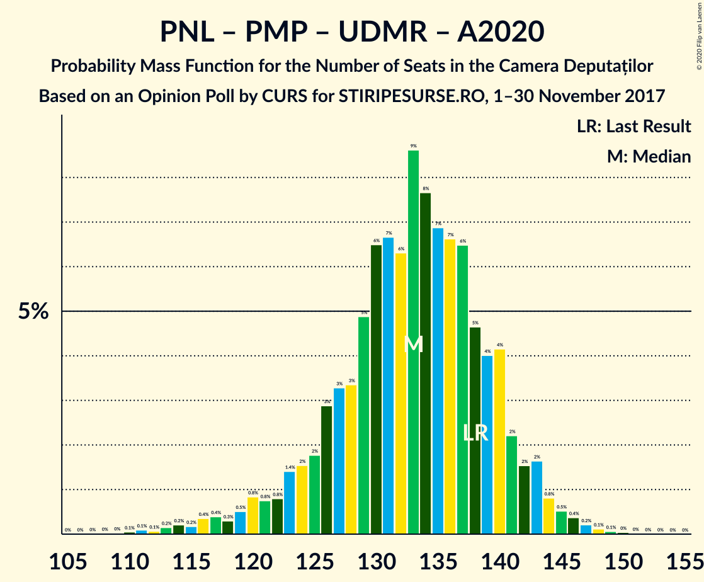

| Number of Seats | Probability | Accumulated | Special Marks |
|:---------------:|:-----------:|:-----------:|:-------------:|
| 109 | 0% | 100% |  |
| 110 | 0.1% | 99.9% |  |
| 111 | 0.1% | 99.9% |  |
| 112 | 0.1% | 99.8% |  |
| 113 | 0.2% | 99.7% |  |
| 114 | 0.2% | 99.6% |  |
| 115 | 0.2% | 99.4% |  |
| 116 | 0.4% | 99.2% |  |
| 117 | 0.4% | 98.8% |  |
| 118 | 0.3% | 98% |  |
| 119 | 0.5% | 98% |  |
| 120 | 0.8% | 98% |  |
| 121 | 0.8% | 97% |  |
| 122 | 0.8% | 96% |  |
| 123 | 1.4% | 95% |  |
| 124 | 2% | 94% |  |
| 125 | 2% | 92% |  |
| 126 | 3% | 91% |  |
| 127 | 3% | 88% |  |
| 128 | 3% | 84% |  |
| 129 | 5% | 81% |  |
| 130 | 6% | 76% |  |
| 131 | 7% | 70% |  |
| 132 | 6% | 63% |  |
| 133 | 9% | 57% | Median |
| 134 | 8% | 48% |  |
| 135 | 7% | 40% |  |
| 136 | 7% | 33% |  |
| 137 | 6% | 27% |  |
| 138 | 5% | 20% | Last Result |
| 139 | 4% | 16% |  |
| 140 | 4% | 12% |  |
| 141 | 2% | 8% |  |
| 142 | 2% | 5% |  |
| 143 | 2% | 4% |  |
| 144 | 0.8% | 2% |  |
| 145 | 0.5% | 1.4% |  |
| 146 | 0.4% | 0.8% |  |
| 147 | 0.2% | 0.5% |  |
| 148 | 0.1% | 0.3% |  |
| 149 | 0.1% | 0.1% |  |
| 150 | 0% | 0.1% |  |
| 151 | 0% | 0% |  |

### Partidul Național Liberal – Partidul Mișcarea Populară – Uniunea Democrată Maghiară din România

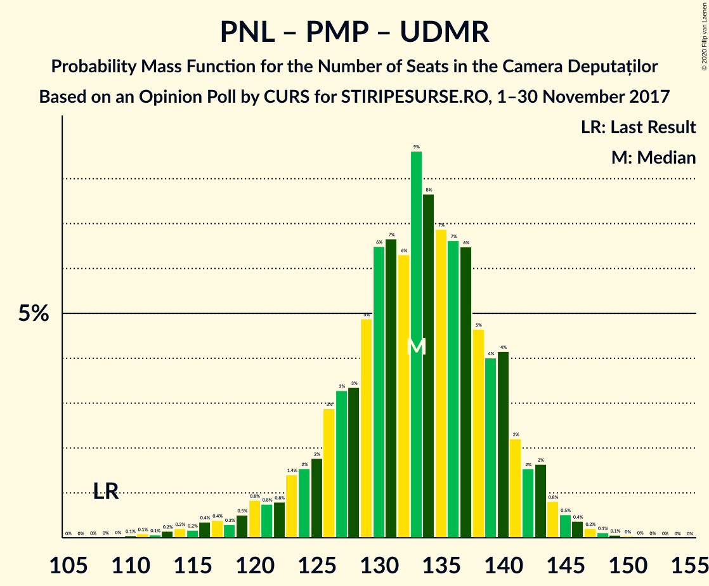

| Number of Seats | Probability | Accumulated | Special Marks |
|:---------------:|:-----------:|:-----------:|:-------------:|
| 108 | 0% | 100% | Last Result |
| 109 | 0% | 100% |  |
| 110 | 0.1% | 99.9% |  |
| 111 | 0.1% | 99.9% |  |
| 112 | 0.1% | 99.8% |  |
| 113 | 0.2% | 99.7% |  |
| 114 | 0.2% | 99.6% |  |
| 115 | 0.2% | 99.4% |  |
| 116 | 0.4% | 99.2% |  |
| 117 | 0.4% | 98.8% |  |
| 118 | 0.3% | 98% |  |
| 119 | 0.5% | 98% |  |
| 120 | 0.8% | 98% |  |
| 121 | 0.8% | 97% |  |
| 122 | 0.8% | 96% |  |
| 123 | 1.4% | 95% |  |
| 124 | 2% | 94% |  |
| 125 | 2% | 92% |  |
| 126 | 3% | 91% |  |
| 127 | 3% | 88% |  |
| 128 | 3% | 84% |  |
| 129 | 5% | 81% |  |
| 130 | 6% | 76% |  |
| 131 | 7% | 70% |  |
| 132 | 6% | 63% |  |
| 133 | 9% | 57% | Median |
| 134 | 8% | 48% |  |
| 135 | 7% | 40% |  |
| 136 | 7% | 33% |  |
| 137 | 6% | 27% |  |
| 138 | 5% | 20% |  |
| 139 | 4% | 16% |  |
| 140 | 4% | 12% |  |
| 141 | 2% | 8% |  |
| 142 | 2% | 5% |  |
| 143 | 2% | 4% |  |
| 144 | 0.8% | 2% |  |
| 145 | 0.5% | 1.4% |  |
| 146 | 0.4% | 0.8% |  |
| 147 | 0.2% | 0.5% |  |
| 148 | 0.1% | 0.3% |  |
| 149 | 0.1% | 0.1% |  |
| 150 | 0% | 0.1% |  |
| 151 | 0% | 0% |  |

### Partidul Național Liberal – Partidul Alianța Liberalilor și Democraților – Alianța 2020 USR-PLUS

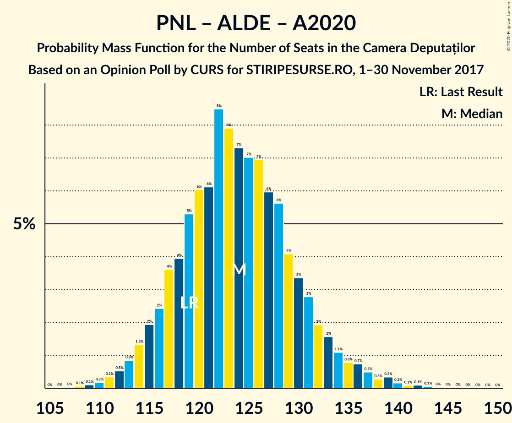

| Number of Seats | Probability | Accumulated | Special Marks |
|:---------------:|:-----------:|:-----------:|:-------------:|
| 107 | 0% | 100% |  |
| 108 | 0.1% | 99.9% |  |
| 109 | 0.1% | 99.9% |  |
| 110 | 0.2% | 99.8% |  |
| 111 | 0.3% | 99.6% |  |
| 112 | 0.5% | 99.3% |  |
| 113 | 0.8% | 98.7% |  |
| 114 | 1.3% | 98% |  |
| 115 | 2% | 97% |  |
| 116 | 2% | 95% |  |
| 117 | 4% | 92% |  |
| 118 | 4% | 89% |  |
| 119 | 5% | 85% | Last Result |
| 120 | 6% | 79% |  |
| 121 | 6% | 73% |  |
| 122 | 8% | 67% |  |
| 123 | 8% | 59% |  |
| 124 | 7% | 51% | Median |
| 125 | 7% | 43% |  |
| 126 | 7% | 36% |  |
| 127 | 6% | 30% |  |
| 128 | 6% | 24% |  |
| 129 | 4% | 18% |  |
| 130 | 3% | 14% |  |
| 131 | 3% | 10% |  |
| 132 | 2% | 8% |  |
| 133 | 2% | 6% |  |
| 134 | 1.1% | 4% |  |
| 135 | 0.8% | 3% |  |
| 136 | 0.7% | 2% |  |
| 137 | 0.5% | 2% |  |
| 138 | 0.3% | 1.1% |  |
| 139 | 0.3% | 0.8% |  |
| 140 | 0.2% | 0.5% |  |
| 141 | 0.1% | 0.3% |  |
| 142 | 0.1% | 0.2% |  |
| 143 | 0.1% | 0.1% |  |
| 144 | 0% | 0.1% |  |
| 145 | 0% | 0.1% |  |
| 146 | 0% | 0% |  |

### Partidul Național Liberal – Uniunea Democrată Maghiară din România – Alianța 2020 USR-PLUS

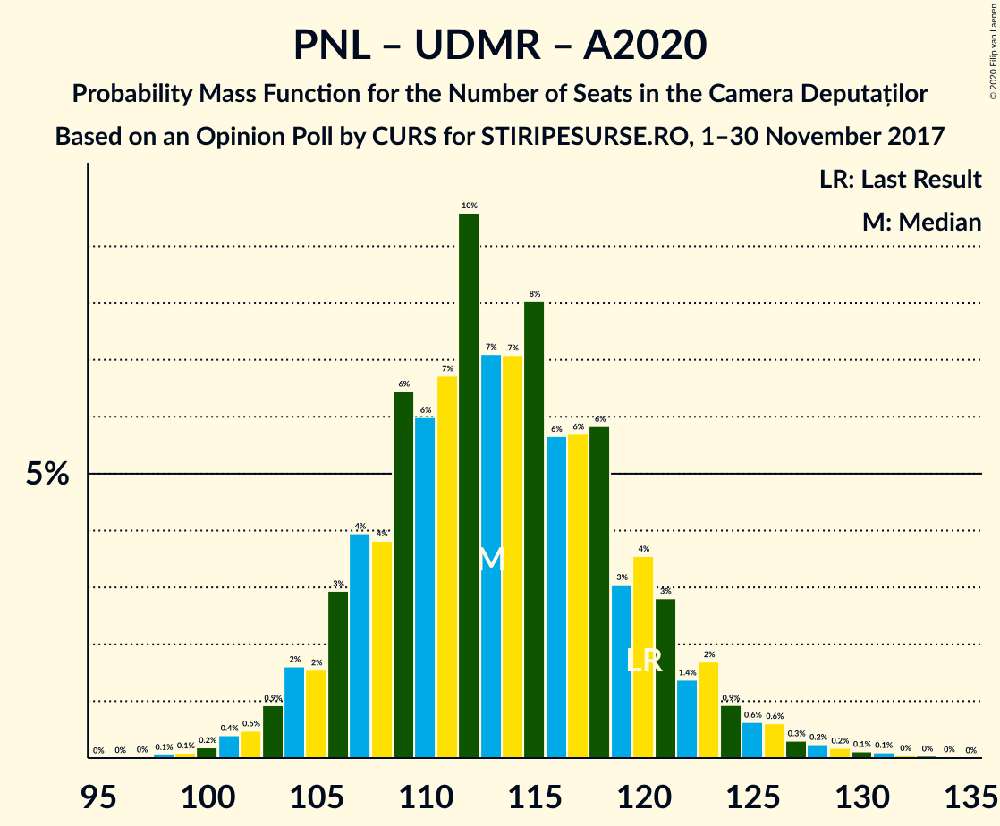

| Number of Seats | Probability | Accumulated | Special Marks |
|:---------------:|:-----------:|:-----------:|:-------------:|
| 98 | 0.1% | 100% |  |
| 99 | 0.1% | 99.9% |  |
| 100 | 0.2% | 99.8% |  |
| 101 | 0.4% | 99.6% |  |
| 102 | 0.5% | 99.2% |  |
| 103 | 0.9% | 98.7% |  |
| 104 | 2% | 98% |  |
| 105 | 2% | 96% |  |
| 106 | 3% | 95% |  |
| 107 | 4% | 92% |  |
| 108 | 4% | 88% |  |
| 109 | 6% | 84% |  |
| 110 | 6% | 77% |  |
| 111 | 7% | 71% |  |
| 112 | 10% | 65% |  |
| 113 | 7% | 55% | Median |
| 114 | 7% | 48% |  |
| 115 | 8% | 41% |  |
| 116 | 6% | 33% |  |
| 117 | 6% | 27% |  |
| 118 | 6% | 22% |  |
| 119 | 3% | 16% |  |
| 120 | 4% | 13% | Last Result |
| 121 | 3% | 9% |  |
| 122 | 1.4% | 6% |  |
| 123 | 2% | 5% |  |
| 124 | 0.9% | 3% |  |
| 125 | 0.6% | 2% |  |
| 126 | 0.6% | 2% |  |
| 127 | 0.3% | 1.1% |  |
| 128 | 0.2% | 0.8% |  |
| 129 | 0.2% | 0.5% |  |
| 130 | 0.1% | 0.4% |  |
| 131 | 0.1% | 0.2% |  |
| 132 | 0% | 0.1% |  |
| 133 | 0% | 0.1% |  |
| 134 | 0% | 0.1% |  |
| 135 | 0% | 0% |  |

### Partidul Național Liberal – Uniunea Democrată Maghiară din România

| Number of Seats | Probability | Accumulated | Special Marks |
|:---------------:|:-----------:|:-----------:|:-------------:|
| 90 | 0% | 100% | Last Result |
| 91 | 0% | 100% |  |
| 92 | 0% | 100% |  |
| 93 | 0% | 100% |  |
| 94 | 0% | 100% |  |
| 95 | 0% | 100% |  |
| 96 | 0% | 100% |  |
| 97 | 0% | 100% |  |
| 98 | 0.1% | 100% |  |
| 99 | 0.1% | 99.9% |  |
| 100 | 0.2% | 99.8% |  |
| 101 | 0.4% | 99.6% |  |
| 102 | 0.5% | 99.2% |  |
| 103 | 0.9% | 98.7% |  |
| 104 | 2% | 98% |  |
| 105 | 2% | 96% |  |
| 106 | 3% | 95% |  |
| 107 | 4% | 92% |  |
| 108 | 4% | 88% |  |
| 109 | 6% | 84% |  |
| 110 | 6% | 77% |  |
| 111 | 7% | 71% |  |
| 112 | 10% | 65% |  |
| 113 | 7% | 55% | Median |
| 114 | 7% | 48% |  |
| 115 | 8% | 41% |  |
| 116 | 6% | 33% |  |
| 117 | 6% | 27% |  |
| 118 | 6% | 22% |  |
| 119 | 3% | 16% |  |
| 120 | 4% | 13% |  |
| 121 | 3% | 9% |  |
| 122 | 1.4% | 6% |  |
| 123 | 2% | 5% |  |
| 124 | 0.9% | 3% |  |
| 125 | 0.6% | 2% |  |
| 126 | 0.6% | 2% |  |
| 127 | 0.3% | 1.1% |  |
| 128 | 0.2% | 0.8% |  |
| 129 | 0.2% | 0.5% |  |
| 130 | 0.1% | 0.4% |  |
| 131 | 0.1% | 0.2% |  |
| 132 | 0% | 0.1% |  |
| 133 | 0% | 0.1% |  |
| 134 | 0% | 0.1% |  |
| 135 | 0% | 0% |  |

### Partidul Național Liberal – Partidul Mișcarea Populară – Alianța 2020 USR-PLUS

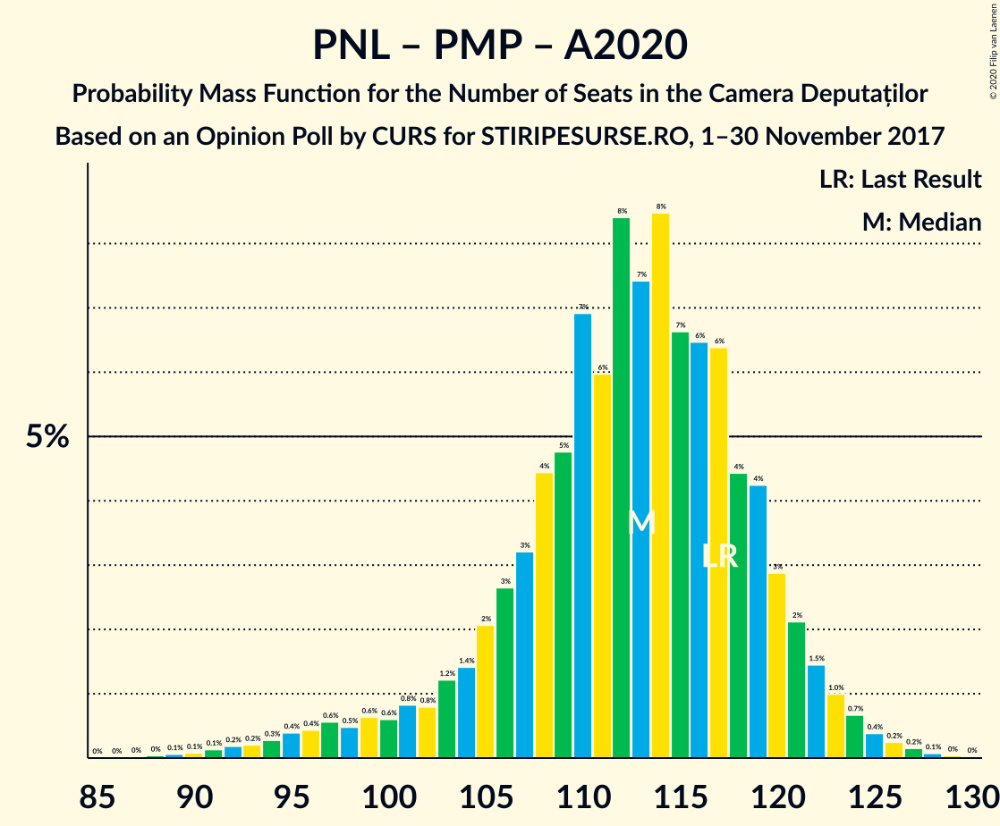

| Number of Seats | Probability | Accumulated | Special Marks |
|:---------------:|:-----------:|:-----------:|:-------------:|
| 88 | 0% | 100% |  |
| 89 | 0.1% | 99.9% |  |
| 90 | 0.1% | 99.8% |  |
| 91 | 0.1% | 99.8% |  |
| 92 | 0.2% | 99.6% |  |
| 93 | 0.2% | 99.4% |  |
| 94 | 0.3% | 99.2% |  |
| 95 | 0.4% | 99.0% |  |
| 96 | 0.4% | 98.6% |  |
| 97 | 0.6% | 98% |  |
| 98 | 0.5% | 98% |  |
| 99 | 0.6% | 97% |  |
| 100 | 0.6% | 96% |  |
| 101 | 0.8% | 96% |  |
| 102 | 0.8% | 95% |  |
| 103 | 1.2% | 94% |  |
| 104 | 1.4% | 93% |  |
| 105 | 2% | 92% |  |
| 106 | 3% | 90% |  |
| 107 | 3% | 87% |  |
| 108 | 4% | 84% |  |
| 109 | 5% | 79% |  |
| 110 | 7% | 74% |  |
| 111 | 6% | 68% |  |
| 112 | 8% | 62% |  |
| 113 | 7% | 53% | Median |
| 114 | 8% | 46% |  |
| 115 | 7% | 37% |  |
| 116 | 6% | 31% |  |
| 117 | 6% | 24% | Last Result |
| 118 | 4% | 18% |  |
| 119 | 4% | 13% |  |
| 120 | 3% | 9% |  |
| 121 | 2% | 6% |  |
| 122 | 1.5% | 4% |  |
| 123 | 1.0% | 3% |  |
| 124 | 0.7% | 2% |  |
| 125 | 0.4% | 0.9% |  |
| 126 | 0.2% | 0.6% |  |
| 127 | 0.2% | 0.3% |  |
| 128 | 0.1% | 0.2% |  |
| 129 | 0% | 0.1% |  |
| 130 | 0% | 0% |  |

### Partidul Național Liberal – Partidul Mișcarea Populară

| Number of Seats | Probability | Accumulated | Special Marks |
|:---------------:|:-----------:|:-----------:|:-------------:|
| 87 | 0% | 100% | Last Result |
| 88 | 0% | 100% |  |
| 89 | 0.1% | 99.9% |  |
| 90 | 0.1% | 99.8% |  |
| 91 | 0.1% | 99.8% |  |
| 92 | 0.2% | 99.6% |  |
| 93 | 0.2% | 99.4% |  |
| 94 | 0.3% | 99.2% |  |
| 95 | 0.4% | 99.0% |  |
| 96 | 0.4% | 98.6% |  |
| 97 | 0.6% | 98% |  |
| 98 | 0.5% | 98% |  |
| 99 | 0.6% | 97% |  |
| 100 | 0.6% | 96% |  |
| 101 | 0.8% | 96% |  |
| 102 | 0.8% | 95% |  |
| 103 | 1.2% | 94% |  |
| 104 | 1.4% | 93% |  |
| 105 | 2% | 92% |  |
| 106 | 3% | 90% |  |
| 107 | 3% | 87% |  |
| 108 | 4% | 84% |  |
| 109 | 5% | 79% |  |
| 110 | 7% | 74% |  |
| 111 | 6% | 68% |  |
| 112 | 8% | 62% |  |
| 113 | 7% | 53% | Median |
| 114 | 8% | 46% |  |
| 115 | 7% | 37% |  |
| 116 | 6% | 31% |  |
| 117 | 6% | 24% |  |
| 118 | 4% | 18% |  |
| 119 | 4% | 13% |  |
| 120 | 3% | 9% |  |
| 121 | 2% | 6% |  |
| 122 | 1.5% | 4% |  |
| 123 | 1.0% | 3% |  |
| 124 | 0.7% | 2% |  |
| 125 | 0.4% | 0.9% |  |
| 126 | 0.2% | 0.6% |  |
| 127 | 0.2% | 0.3% |  |
| 128 | 0.1% | 0.2% |  |
| 129 | 0% | 0.1% |  |
| 130 | 0% | 0% |  |

### Partidul Național Liberal – Alianța 2020 USR-PLUS

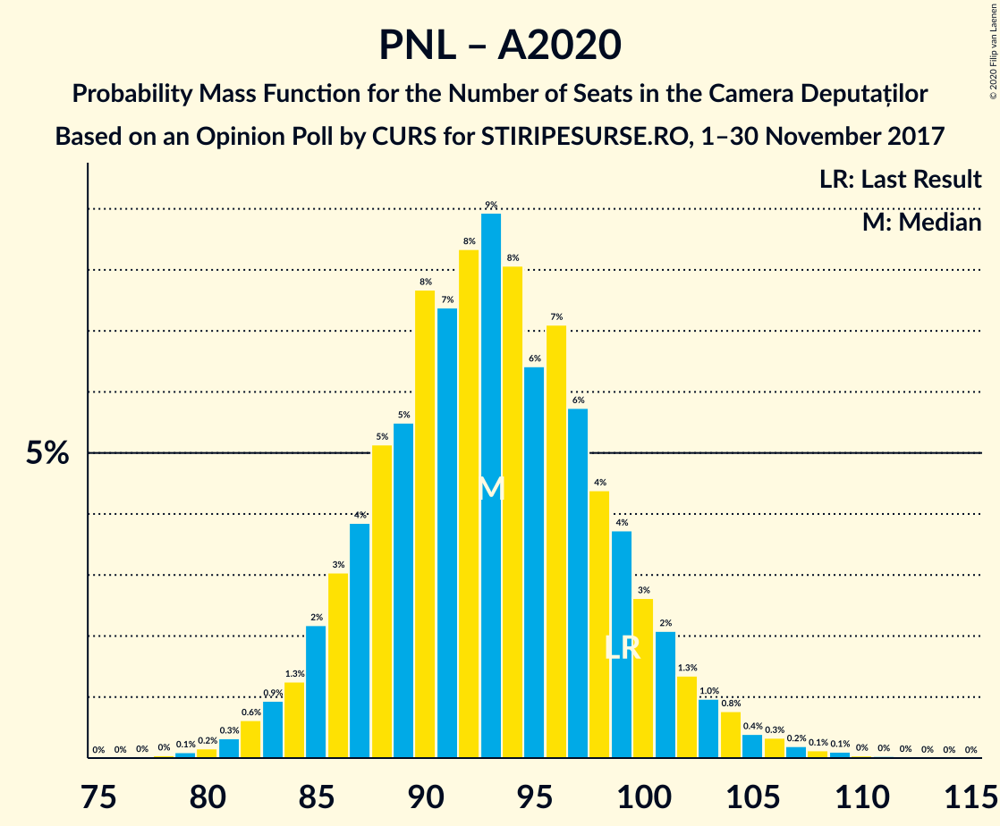

| Number of Seats | Probability | Accumulated | Special Marks |
|:---------------:|:-----------:|:-----------:|:-------------:|
| 78 | 0% | 100% |  |
| 79 | 0.1% | 99.9% |  |
| 80 | 0.2% | 99.8% |  |
| 81 | 0.3% | 99.7% |  |
| 82 | 0.6% | 99.3% |  |
| 83 | 0.9% | 98.7% |  |
| 84 | 1.3% | 98% |  |
| 85 | 2% | 97% |  |
| 86 | 3% | 94% |  |
| 87 | 4% | 91% |  |
| 88 | 5% | 87% |  |
| 89 | 5% | 82% |  |
| 90 | 8% | 77% |  |
| 91 | 7% | 69% |  |
| 92 | 8% | 62% |  |
| 93 | 9% | 53% | Median |
| 94 | 8% | 45% |  |
| 95 | 6% | 36% |  |
| 96 | 7% | 30% |  |
| 97 | 6% | 23% |  |
| 98 | 4% | 17% |  |
| 99 | 4% | 13% | Last Result |
| 100 | 3% | 9% |  |
| 101 | 2% | 6% |  |
| 102 | 1.3% | 4% |  |
| 103 | 1.0% | 3% |  |
| 104 | 0.8% | 2% |  |
| 105 | 0.4% | 1.3% |  |
| 106 | 0.3% | 0.9% |  |
| 107 | 0.2% | 0.5% |  |
| 108 | 0.1% | 0.3% |  |
| 109 | 0.1% | 0.2% |  |
| 110 | 0% | 0.1% |  |
| 111 | 0% | 0.1% |  |
| 112 | 0% | 0% |  |

### Partidul Național Liberal

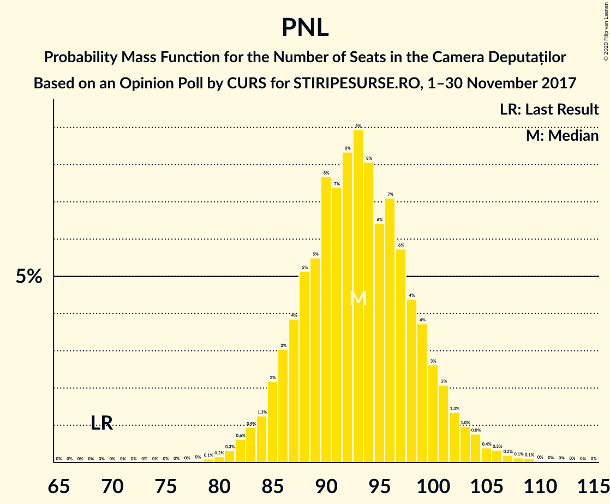

| Number of Seats | Probability | Accumulated | Special Marks |
|:---------------:|:-----------:|:-----------:|:-------------:|
| 69 | 0% | 100% | Last Result |
| 70 | 0% | 100% |  |
| 71 | 0% | 100% |  |
| 72 | 0% | 100% |  |
| 73 | 0% | 100% |  |
| 74 | 0% | 100% |  |
| 75 | 0% | 100% |  |
| 76 | 0% | 100% |  |
| 77 | 0% | 100% |  |
| 78 | 0% | 100% |  |
| 79 | 0.1% | 99.9% |  |
| 80 | 0.2% | 99.8% |  |
| 81 | 0.3% | 99.7% |  |
| 82 | 0.6% | 99.3% |  |
| 83 | 0.9% | 98.7% |  |
| 84 | 1.3% | 98% |  |
| 85 | 2% | 97% |  |
| 86 | 3% | 94% |  |
| 87 | 4% | 91% |  |
| 88 | 5% | 87% |  |
| 89 | 5% | 82% |  |
| 90 | 8% | 77% |  |
| 91 | 7% | 69% |  |
| 92 | 8% | 62% |  |
| 93 | 9% | 53% | Median |
| 94 | 8% | 44% |  |
| 95 | 6% | 36% |  |
| 96 | 7% | 30% |  |
| 97 | 6% | 23% |  |
| 98 | 4% | 17% |  |
| 99 | 4% | 13% |  |
| 100 | 3% | 9% |  |
| 101 | 2% | 6% |  |
| 102 | 1.3% | 4% |  |
| 103 | 1.0% | 3% |  |
| 104 | 0.8% | 2% |  |
| 105 | 0.4% | 1.3% |  |
| 106 | 0.3% | 0.9% |  |
| 107 | 0.2% | 0.5% |  |
| 108 | 0.1% | 0.3% |  |
| 109 | 0.1% | 0.2% |  |
| 110 | 0% | 0.1% |  |
| 111 | 0% | 0.1% |  |
| 112 | 0% | 0% |  |

### Partidul Mișcarea Populară – Alianța 2020 USR-PLUS

| Number of Seats | Probability | Accumulated | Special Marks |
|:---------------:|:-----------:|:-----------:|:-------------:|
| 0 | 6% | 100% |  |
| 1 | 0% | 94% |  |
| 2 | 0% | 94% |  |
| 3 | 0% | 94% |  |
| 4 | 0% | 94% |  |
| 5 | 0% | 94% |  |
| 6 | 0% | 94% |  |
| 7 | 0% | 94% |  |
| 8 | 0% | 94% |  |
| 9 | 0% | 94% |  |
| 10 | 0% | 94% |  |
| 11 | 0% | 94% |  |
| 12 | 0% | 94% |  |
| 13 | 0% | 94% |  |
| 14 | 0% | 94% |  |
| 15 | 0% | 94% |  |
| 16 | 0% | 94% |  |
| 17 | 6% | 94% |  |
| 18 | 10% | 88% |  |
| 19 | 14% | 78% |  |
| 20 | 17% | 63% | Median |
| 21 | 14% | 47% |  |
| 22 | 13% | 33% |  |
| 23 | 9% | 20% |  |
| 24 | 6% | 11% |  |
| 25 | 3% | 6% |  |
| 26 | 2% | 3% |  |
| 27 | 0.7% | 1.2% |  |
| 28 | 0.3% | 0.5% |  |
| 29 | 0.1% | 0.2% |  |
| 30 | 0% | 0.1% |  |
| 31 | 0% | 0% |  |
| 32 | 0% | 0% |  |
| 33 | 0% | 0% |  |
| 34 | 0% | 0% |  |
| 35 | 0% | 0% |  |
| 36 | 0% | 0% |  |
| 37 | 0% | 0% |  |
| 38 | 0% | 0% |  |
| 39 | 0% | 0% |  |
| 40 | 0% | 0% |  |
| 41 | 0% | 0% |  |
| 42 | 0% | 0% |  |
| 43 | 0% | 0% |  |
| 44 | 0% | 0% |  |
| 45 | 0% | 0% |  |
| 46 | 0% | 0% |  |
| 47 | 0% | 0% |  |
| 48 | 0% | 0% | Last Result |

## Technical Information

### Opinion Poll

+ **Polling firm:** CURS
+ **Commissioner(s):** STIRIPESURSE.RO
+ **Fieldwork period:** 1–30 November 2017

### Calculations

+ **Sample size:** 1067
+ **Simulations done:** 1,048,576
+ **Error estimate:** 0.87%

