# Opinion Poll by CURS for STIRIPESURSE.RO, 24 November–9 December 2018

<a href="#voting-intentions">Voting Intentions</a> | <a href="#seats">Seats</a> | <a href="#coalitions">Coalitions</a> | <a href="#technical-information">Technical Information</a>

## Voting Intentions

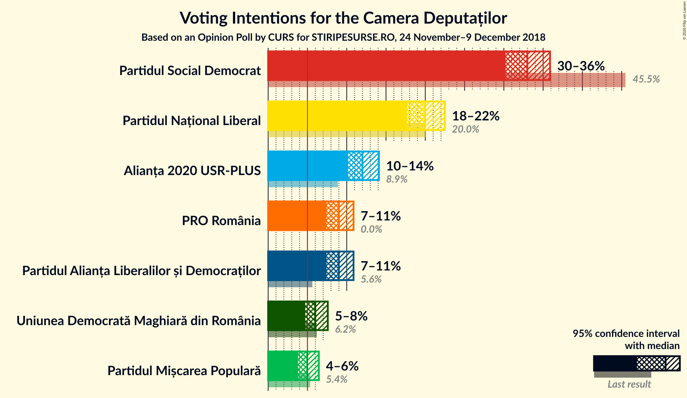

### Confidence Intervals

| Party | Last Result | Poll Result | 80% Confidence Interval | 90% Confidence Interval | 95% Confidence Interval | 99% Confidence Interval |
|:-----:|:-----------:|:-----------:|:-----------------------:|:-----------------------:|:-----------------------:|:-----------------------:|
| Partidul Social Democrat | 45.5% | 33.0% | 31.2–34.9% |30.7–35.4% |30.2–35.9% |29.4–36.8% |
| Partidul Național Liberal | 20.0% | 20.0% | 18.5–21.6% |18.0–22.1% |17.7–22.5% |17.0–23.3% |
| Alianța 2020 USR-PLUS | 8.9% | 12.0% | 10.8–13.4% |10.5–13.7% |10.2–14.1% |9.6–14.8% |
| Partidul Alianța Liberalilor și Democraților | 5.6% | 9.0% | 8.0–10.2% |7.7–10.6% |7.4–10.9% |7.0–11.5% |
| PRO România | 0.0% | 9.0% | 8.0–10.2% |7.7–10.6% |7.4–10.9% |7.0–11.5% |
| Uniunea Democrată Maghiară din România | 6.2% | 6.0% | 5.2–7.0% |4.9–7.3% |4.7–7.6% |4.3–8.1% |
| Partidul Mișcarea Populară | 5.4% | 5.0% | 4.2–5.9% |4.0–6.2% |3.8–6.4% |3.5–6.9% |

*Note:* The poll result column reflects the actual value used in the calculations. Published results may vary slightly, and in addition be rounded to fewer digits.

## Seats

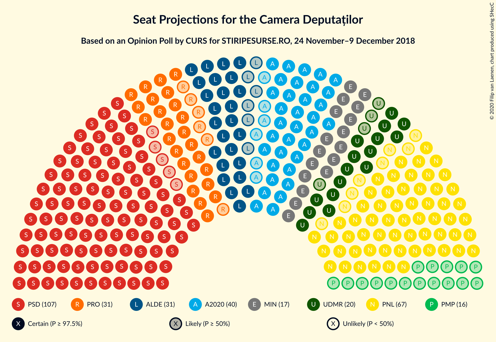

### Confidence Intervals

| Party | Last Result | Median | 80% Confidence Interval | 90% Confidence Interval | 95% Confidence Interval | 99% Confidence Interval |
|:-----:|:-----------:|:------:|:-----------------------:|:-----------------------:|:-----------------------:|:-----------------------:|
| <a href="#partidul-social-democrat">Partidul Social Democrat</a> | 154 | 112 | 105–120 |103–122 |102–124 |99–128 |
| <a href="#partidul-național-liberal">Partidul Național Liberal</a> | 69 | 68 | 62–74 |61–76 |59–78 |57–80 |
| <a href="#alianța-2020-usr-plus">Alianța 2020 USR-PLUS</a> | 30 | 41 | 36–46 |35–47 |34–48 |32–51 |
| <a href="#partidul-alianța-liberalilor-și-democraților">Partidul Alianța Liberalilor și Democraților</a> | 20 | 31 | 27–35 |26–36 |25–37 |23–39 |
| <a href="#pro-românia">PRO România</a> | 0 | 31 | 27–34 |26–36 |25–37 |23–39 |
| <a href="#uniunea-democrată-maghiară-din-românia">Uniunea Democrată Maghiară din România</a> | 21 | 20 | 17–24 |16–25 |16–26 |14–27 |
| <a href="#partidul-mișcarea-populară">Partidul Mișcarea Populară</a> | 18 | 16 | 0–19 |0–20 |0–21 |0–23 |

### Partidul Social Democrat

*For a full overview of the results for this party, see the [Partidul Social Democrat](party-partidulsocialdemocrat.html) page.*

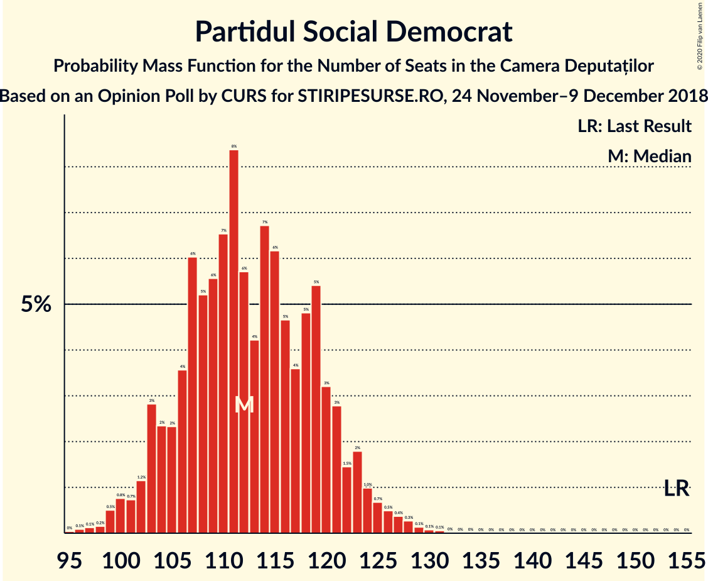

| Number of Seats | Probability | Accumulated | Special Marks |
|:---------------:|:-----------:|:-----------:|:-------------:|
| 95 | 0% | 100% |  |
| 96 | 0.1% | 99.9% |  |
| 97 | 0.1% | 99.8% |  |
| 98 | 0.2% | 99.7% |  |
| 99 | 0.5% | 99.6% |  |
| 100 | 0.8% | 99.1% |  |
| 101 | 0.7% | 98% |  |
| 102 | 1.2% | 98% |  |
| 103 | 3% | 96% |  |
| 104 | 2% | 94% |  |
| 105 | 2% | 91% |  |
| 106 | 4% | 89% |  |
| 107 | 6% | 85% |  |
| 108 | 5% | 79% |  |
| 109 | 6% | 74% |  |
| 110 | 7% | 69% |  |
| 111 | 8% | 62% |  |
| 112 | 6% | 54% | Median |
| 113 | 4% | 48% |  |
| 114 | 7% | 44% |  |
| 115 | 6% | 37% |  |
| 116 | 5% | 31% |  |
| 117 | 4% | 26% |  |
| 118 | 5% | 23% |  |
| 119 | 5% | 18% |  |
| 120 | 3% | 12% |  |
| 121 | 3% | 9% |  |
| 122 | 1.5% | 6% |  |
| 123 | 2% | 5% |  |
| 124 | 1.0% | 3% |  |
| 125 | 0.7% | 2% |  |
| 126 | 0.5% | 1.4% |  |
| 127 | 0.4% | 0.9% |  |
| 128 | 0.3% | 0.6% |  |
| 129 | 0.1% | 0.3% |  |
| 130 | 0.1% | 0.2% |  |
| 131 | 0.1% | 0.1% |  |
| 132 | 0% | 0% |  |
| 133 | 0% | 0% |  |
| 134 | 0% | 0% |  |
| 135 | 0% | 0% |  |
| 136 | 0% | 0% |  |
| 137 | 0% | 0% |  |
| 138 | 0% | 0% |  |
| 139 | 0% | 0% |  |
| 140 | 0% | 0% |  |
| 141 | 0% | 0% |  |
| 142 | 0% | 0% |  |
| 143 | 0% | 0% |  |
| 144 | 0% | 0% |  |
| 145 | 0% | 0% |  |
| 146 | 0% | 0% |  |
| 147 | 0% | 0% |  |
| 148 | 0% | 0% |  |
| 149 | 0% | 0% |  |
| 150 | 0% | 0% |  |
| 151 | 0% | 0% |  |
| 152 | 0% | 0% |  |
| 153 | 0% | 0% |  |
| 154 | 0% | 0% | Last Result |

### Partidul Național Liberal

*For a full overview of the results for this party, see the [Partidul Național Liberal](party-partidulnaționalliberal.html) page.*

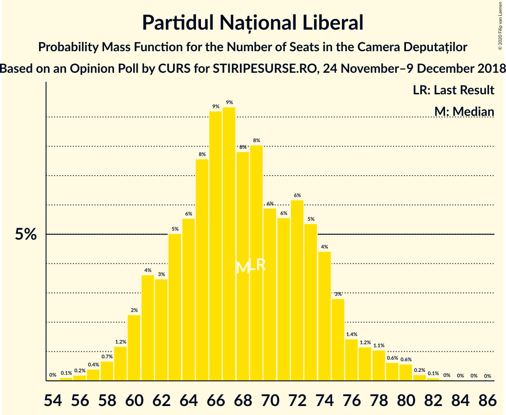

| Number of Seats | Probability | Accumulated | Special Marks |
|:---------------:|:-----------:|:-----------:|:-------------:|
| 54 | 0% | 100% |  |
| 55 | 0.1% | 99.9% |  |
| 56 | 0.2% | 99.8% |  |
| 57 | 0.4% | 99.6% |  |
| 58 | 0.7% | 99.2% |  |
| 59 | 1.2% | 98.5% |  |
| 60 | 2% | 97% |  |
| 61 | 4% | 95% |  |
| 62 | 3% | 91% |  |
| 63 | 5% | 88% |  |
| 64 | 6% | 83% |  |
| 65 | 8% | 77% |  |
| 66 | 9% | 70% |  |
| 67 | 9% | 61% |  |
| 68 | 8% | 51% | Median |
| 69 | 8% | 44% | Last Result |
| 70 | 6% | 35% |  |
| 71 | 6% | 30% |  |
| 72 | 6% | 24% |  |
| 73 | 5% | 18% |  |
| 74 | 4% | 12% |  |
| 75 | 3% | 8% |  |
| 76 | 1.4% | 5% |  |
| 77 | 1.2% | 4% |  |
| 78 | 1.1% | 3% |  |
| 79 | 0.6% | 2% |  |
| 80 | 0.6% | 1.0% |  |
| 81 | 0.2% | 0.4% |  |
| 82 | 0.1% | 0.2% |  |
| 83 | 0% | 0.1% |  |
| 84 | 0% | 0.1% |  |
| 85 | 0% | 0% |  |

### Alianța 2020 USR-PLUS

*For a full overview of the results for this party, see the [Alianța 2020 USR-PLUS](party-alianța2020usr-plus.html) page.*

| Number of Seats | Probability | Accumulated | Special Marks |
|:---------------:|:-----------:|:-----------:|:-------------:|
| 30 | 0.1% | 100% | Last Result |
| 31 | 0.2% | 99.9% |  |
| 32 | 0.4% | 99.7% |  |
| 33 | 0.8% | 99.3% |  |
| 34 | 2% | 98.5% |  |
| 35 | 4% | 97% |  |
| 36 | 4% | 93% |  |
| 37 | 8% | 89% |  |
| 38 | 8% | 81% |  |
| 39 | 9% | 74% |  |
| 40 | 11% | 64% |  |
| 41 | 11% | 53% | Median |
| 42 | 11% | 42% |  |
| 43 | 8% | 31% |  |
| 44 | 8% | 23% |  |
| 45 | 5% | 15% |  |
| 46 | 4% | 10% |  |
| 47 | 3% | 6% |  |
| 48 | 1.4% | 3% |  |
| 49 | 0.8% | 2% |  |
| 50 | 0.5% | 1.1% |  |
| 51 | 0.3% | 0.5% |  |
| 52 | 0.1% | 0.3% |  |
| 53 | 0.1% | 0.1% |  |
| 54 | 0% | 0% |  |

### Partidul Alianța Liberalilor și Democraților

*For a full overview of the results for this party, see the [Partidul Alianța Liberalilor și Democraților](party-partidulalianțaliberalilorșidemocraților.html) page.*

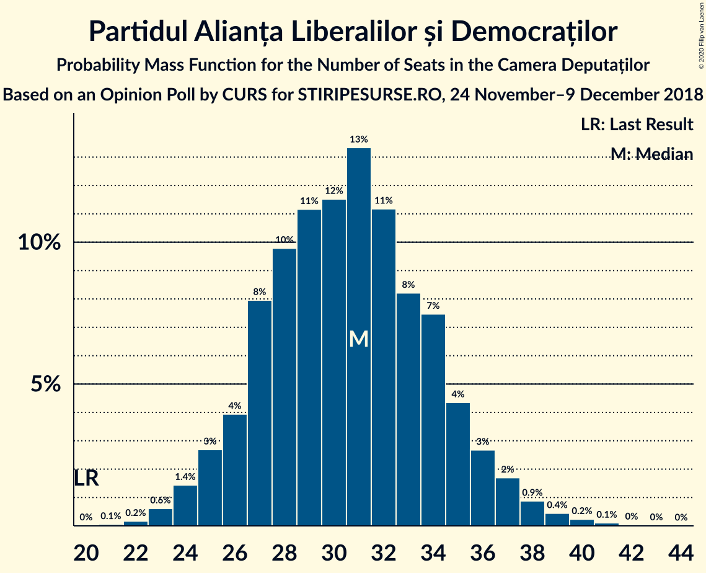

| Number of Seats | Probability | Accumulated | Special Marks |
|:---------------:|:-----------:|:-----------:|:-------------:|
| 20 | 0% | 100% | Last Result |
| 21 | 0.1% | 100% |  |
| 22 | 0.2% | 99.9% |  |
| 23 | 0.6% | 99.8% |  |
| 24 | 1.4% | 99.1% |  |
| 25 | 3% | 98% |  |
| 26 | 4% | 95% |  |
| 27 | 8% | 91% |  |
| 28 | 10% | 83% |  |
| 29 | 11% | 73% |  |
| 30 | 12% | 62% |  |
| 31 | 13% | 51% | Median |
| 32 | 11% | 37% |  |
| 33 | 8% | 26% |  |
| 34 | 7% | 18% |  |
| 35 | 4% | 10% |  |
| 36 | 3% | 6% |  |
| 37 | 2% | 3% |  |
| 38 | 0.9% | 2% |  |
| 39 | 0.4% | 0.8% |  |
| 40 | 0.2% | 0.4% |  |
| 41 | 0.1% | 0.2% |  |
| 42 | 0% | 0.1% |  |
| 43 | 0% | 0% |  |

### PRO România

*For a full overview of the results for this party, see the [PRO România](party-proromânia.html) page.*

| Number of Seats | Probability | Accumulated | Special Marks |
|:---------------:|:-----------:|:-----------:|:-------------:|
| 0 | 0% | 100% | Last Result |
| 1 | 0% | 100% |  |
| 2 | 0% | 100% |  |
| 3 | 0% | 100% |  |
| 4 | 0% | 100% |  |
| 5 | 0% | 100% |  |
| 6 | 0% | 100% |  |
| 7 | 0% | 100% |  |
| 8 | 0% | 100% |  |
| 9 | 0% | 100% |  |
| 10 | 0% | 100% |  |
| 11 | 0% | 100% |  |
| 12 | 0% | 100% |  |
| 13 | 0% | 100% |  |
| 14 | 0% | 100% |  |
| 15 | 0% | 100% |  |
| 16 | 0% | 100% |  |
| 17 | 0% | 100% |  |
| 18 | 0% | 100% |  |
| 19 | 0% | 100% |  |
| 20 | 0% | 100% |  |
| 21 | 0.1% | 100% |  |
| 22 | 0.2% | 99.9% |  |
| 23 | 0.5% | 99.8% |  |
| 24 | 1.3% | 99.3% |  |
| 25 | 3% | 98% |  |
| 26 | 5% | 95% |  |
| 27 | 8% | 90% |  |
| 28 | 9% | 82% |  |
| 29 | 8% | 73% |  |
| 30 | 12% | 65% |  |
| 31 | 14% | 53% | Median |
| 32 | 12% | 39% |  |
| 33 | 10% | 27% |  |
| 34 | 7% | 17% |  |
| 35 | 3% | 10% |  |
| 36 | 3% | 6% |  |
| 37 | 2% | 4% |  |
| 38 | 1.1% | 2% |  |
| 39 | 0.5% | 0.8% |  |
| 40 | 0.2% | 0.4% |  |
| 41 | 0.1% | 0.2% |  |
| 42 | 0% | 0.1% |  |
| 43 | 0% | 0% |  |

### Uniunea Democrată Maghiară din România

*For a full overview of the results for this party, see the [Uniunea Democrată Maghiară din România](party-uniuneademocratămaghiarădinromânia.html) page.*

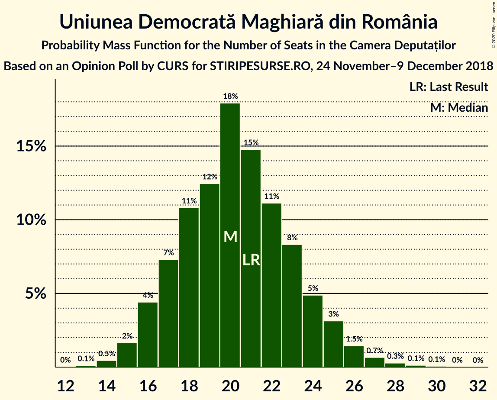

| Number of Seats | Probability | Accumulated | Special Marks |
|:---------------:|:-----------:|:-----------:|:-------------:|
| 13 | 0.1% | 100% |  |
| 14 | 0.5% | 99.9% |  |
| 15 | 2% | 99.4% |  |
| 16 | 4% | 98% |  |
| 17 | 7% | 93% |  |
| 18 | 11% | 86% |  |
| 19 | 12% | 75% |  |
| 20 | 18% | 63% | Median |
| 21 | 15% | 45% | Last Result |
| 22 | 11% | 30% |  |
| 23 | 8% | 19% |  |
| 24 | 5% | 11% |  |
| 25 | 3% | 6% |  |
| 26 | 1.5% | 3% |  |
| 27 | 0.7% | 1.2% |  |
| 28 | 0.3% | 0.5% |  |
| 29 | 0.1% | 0.2% |  |
| 30 | 0.1% | 0.1% |  |
| 31 | 0% | 0% |  |

### Partidul Mișcarea Populară

*For a full overview of the results for this party, see the [Partidul Mișcarea Populară](party-partidulmișcareapopulară.html) page.*

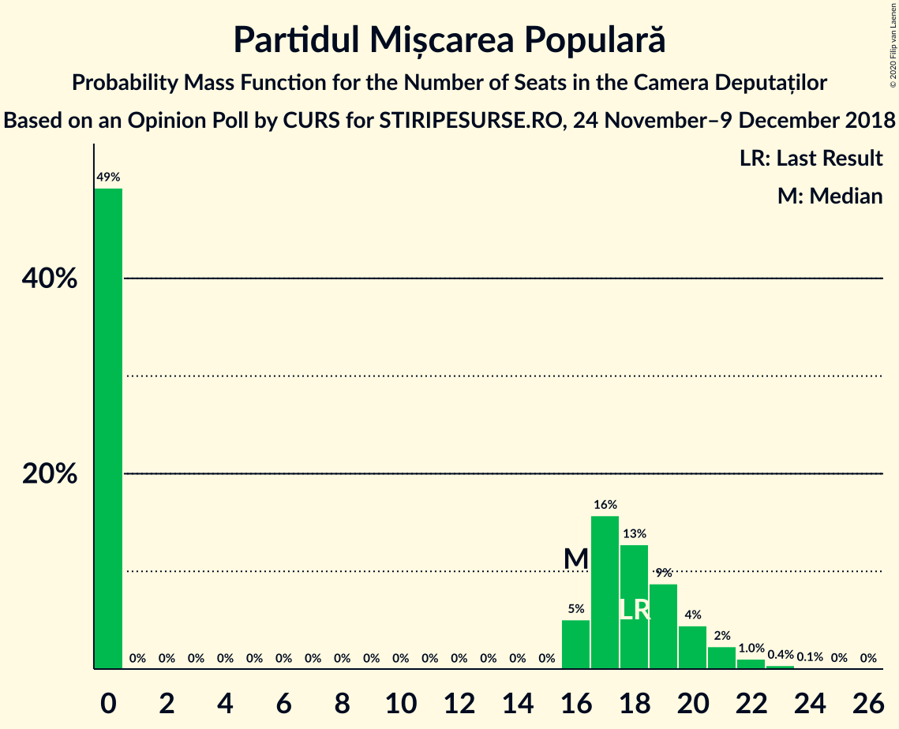

| Number of Seats | Probability | Accumulated | Special Marks |
|:---------------:|:-----------:|:-----------:|:-------------:|
| 0 | 49% | 100% |  |
| 1 | 0% | 51% |  |
| 2 | 0% | 51% |  |
| 3 | 0% | 51% |  |
| 4 | 0% | 51% |  |
| 5 | 0% | 51% |  |
| 6 | 0% | 51% |  |
| 7 | 0% | 51% |  |
| 8 | 0% | 51% |  |
| 9 | 0% | 51% |  |
| 10 | 0% | 51% |  |
| 11 | 0% | 51% |  |
| 12 | 0% | 51% |  |
| 13 | 0% | 51% |  |
| 14 | 0% | 51% |  |
| 15 | 0% | 51% |  |
| 16 | 5% | 51% | Median |
| 17 | 16% | 46% |  |
| 18 | 13% | 30% | Last Result |
| 19 | 9% | 17% |  |
| 20 | 4% | 8% |  |
| 21 | 2% | 4% |  |
| 22 | 1.0% | 2% |  |
| 23 | 0.4% | 0.6% |  |
| 24 | 0.1% | 0.2% |  |
| 25 | 0% | 0.1% |  |
| 26 | 0% | 0% |  |

## Coalitions

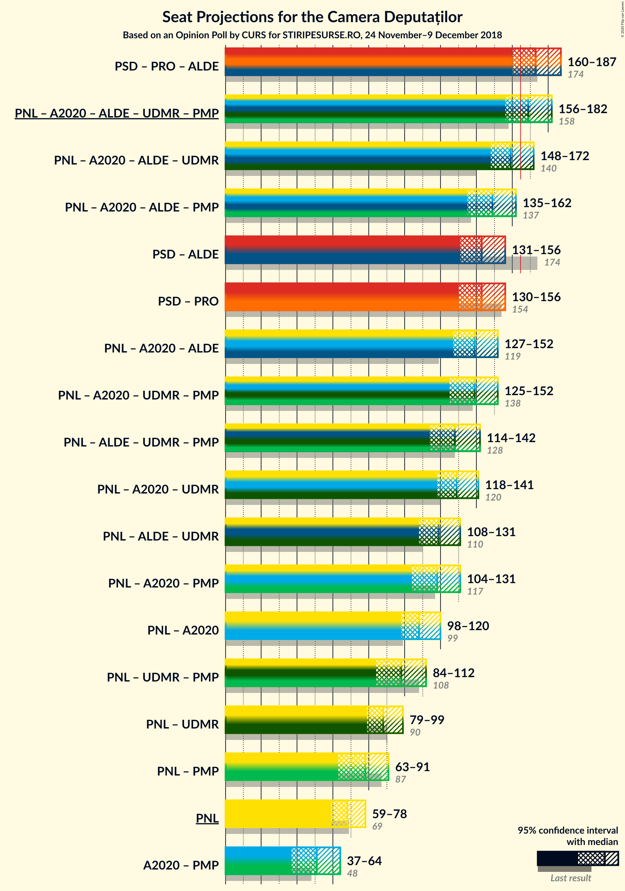

### Confidence Intervals

| Coalition | Last Result | Median | Majority? | 80% Confidence Interval | 90% Confidence Interval | 95% Confidence Interval | 99% Confidence Interval |
|:---------:|:-----------:|:------:|:---------:|:-----------------------:|:-----------------------:|:-----------------------:|:-----------------------:|
| Partidul Social Democrat – PRO România – Partidul Alianța Liberalilor și Democraților | 174 | 173 | 90% | 164–183 | 162–185 | 160–187 | 157–190 |
| Partidul Național Liberal – Alianța 2020 USR-PLUS – Partidul Alianța Liberalilor și Democraților – Uniunea Democrată Maghiară din România – Partidul Mișcarea Populară | 158 | 169 | 71% | 160–177 | 159–180 | 156–182 | 153–184 |
| Partidul Național Liberal – Alianța 2020 USR-PLUS – Partidul Alianța Liberalilor și Democraților – Uniunea Democrată Maghiară din România | 140 | 159 | 24% | 150–170 | 149–171 | 148–172 | 144–176 |
| Partidul Național Liberal – Alianța 2020 USR-PLUS – Partidul Alianța Liberalilor și Democraților – Partidul Mișcarea Populară | 137 | 149 | 0.7% | 139–157 | 137–160 | 135–162 | 132–165 |
| Partidul Social Democrat – Partidul Alianța Liberalilor și Democraților | 174 | 143 | 0% | 135–152 | 132–154 | 131–156 | 128–159 |
| Partidul Social Democrat – PRO România | 154 | 143 | 0% | 135–152 | 132–153 | 130–156 | 128–159 |
| Partidul Național Liberal – Alianța 2020 USR-PLUS – Partidul Alianța Liberalilor și Democraților | 119 | 139 | 0% | 131–148 | 129–150 | 127–152 | 124–155 |
| Partidul Național Liberal – Alianța 2020 USR-PLUS – Uniunea Democrată Maghiară din România – Partidul Mișcarea Populară | 138 | 139 | 0% | 129–148 | 127–150 | 125–152 | 122–155 |
| Partidul Național Liberal – Partidul Alianța Liberalilor și Democraților – Uniunea Democrată Maghiară din România – Partidul Mișcarea Populară | 128 | 128 | 0% | 118–138 | 116–140 | 114–142 | 111–145 |
| Partidul Național Liberal – Alianța 2020 USR-PLUS – Uniunea Democrată Maghiară din România | 120 | 129 | 0% | 121–138 | 119–140 | 118–141 | 114–145 |
| Partidul Național Liberal – Partidul Alianța Liberalilor și Democraților – Uniunea Democrată Maghiară din România | 110 | 119 | 0% | 111–127 | 109–129 | 108–131 | 105–134 |
| Partidul Național Liberal – Alianța 2020 USR-PLUS – Partidul Mișcarea Populară | 117 | 118 | 0% | 108–128 | 107–130 | 104–131 | 101–134 |
| Partidul Național Liberal – Alianța 2020 USR-PLUS | 99 | 108 | 0% | 101–116 | 99–119 | 98–120 | 95–124 |
| Partidul Național Liberal – Uniunea Democrată Maghiară din România – Partidul Mișcarea Populară | 108 | 98 | 0% | 87–107 | 86–110 | 84–112 | 81–114 |
| Partidul Național Liberal – Uniunea Democrată Maghiară din România | 90 | 88 | 0% | 81–95 | 80–97 | 79–99 | 75–102 |
| Partidul Național Liberal – Partidul Mișcarea Populară | 87 | 78 | 0% | 66–87 | 65–90 | 63–91 | 60–94 |
| Partidul Național Liberal | 69 | 68 | 0% | 62–74 | 61–76 | 59–78 | 57–80 |
| Alianța 2020 USR-PLUS – Partidul Mișcarea Populară | 48 | 51 | 0% | 39–61 | 38–62 | 37–64 | 34–66 |

### Partidul Social Democrat – PRO România – Partidul Alianța Liberalilor și Democraților

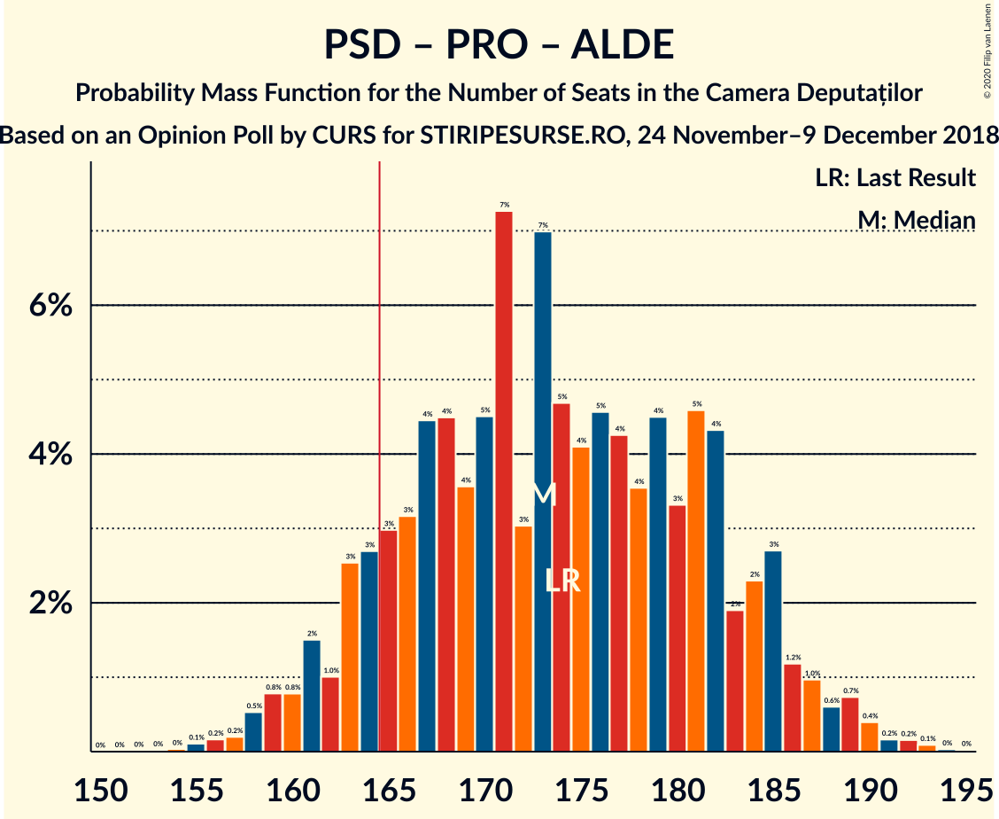

| Number of Seats | Probability | Accumulated | Special Marks |
|:---------------:|:-----------:|:-----------:|:-------------:|
| 154 | 0% | 100% |  |
| 155 | 0.1% | 99.9% |  |
| 156 | 0.2% | 99.8% |  |
| 157 | 0.2% | 99.6% |  |
| 158 | 0.5% | 99.4% |  |
| 159 | 0.8% | 98.9% |  |
| 160 | 0.8% | 98% |  |
| 161 | 2% | 97% |  |
| 162 | 1.0% | 96% |  |
| 163 | 3% | 95% |  |
| 164 | 3% | 92% |  |
| 165 | 3% | 90% | Majority |
| 166 | 3% | 87% |  |
| 167 | 4% | 83% |  |
| 168 | 4% | 79% |  |
| 169 | 4% | 75% |  |
| 170 | 5% | 71% |  |
| 171 | 7% | 66% |  |
| 172 | 3% | 59% |  |
| 173 | 7% | 56% |  |
| 174 | 5% | 49% | Last Result, Median |
| 175 | 4% | 44% |  |
| 176 | 5% | 40% |  |
| 177 | 4% | 36% |  |
| 178 | 4% | 32% |  |
| 179 | 4% | 28% |  |
| 180 | 3% | 24% |  |
| 181 | 5% | 20% |  |
| 182 | 4% | 16% |  |
| 183 | 2% | 11% |  |
| 184 | 2% | 9% |  |
| 185 | 3% | 7% |  |
| 186 | 1.2% | 4% |  |
| 187 | 1.0% | 3% |  |
| 188 | 0.6% | 2% |  |
| 189 | 0.7% | 2% |  |
| 190 | 0.4% | 0.9% |  |
| 191 | 0.2% | 0.5% |  |
| 192 | 0.2% | 0.3% |  |
| 193 | 0.1% | 0.2% |  |
| 194 | 0% | 0.1% |  |
| 195 | 0% | 0% |  |

### Partidul Național Liberal – Alianța 2020 USR-PLUS – Partidul Alianța Liberalilor și Democraților – Uniunea Democrată Maghiară din România – Partidul Mișcarea Populară

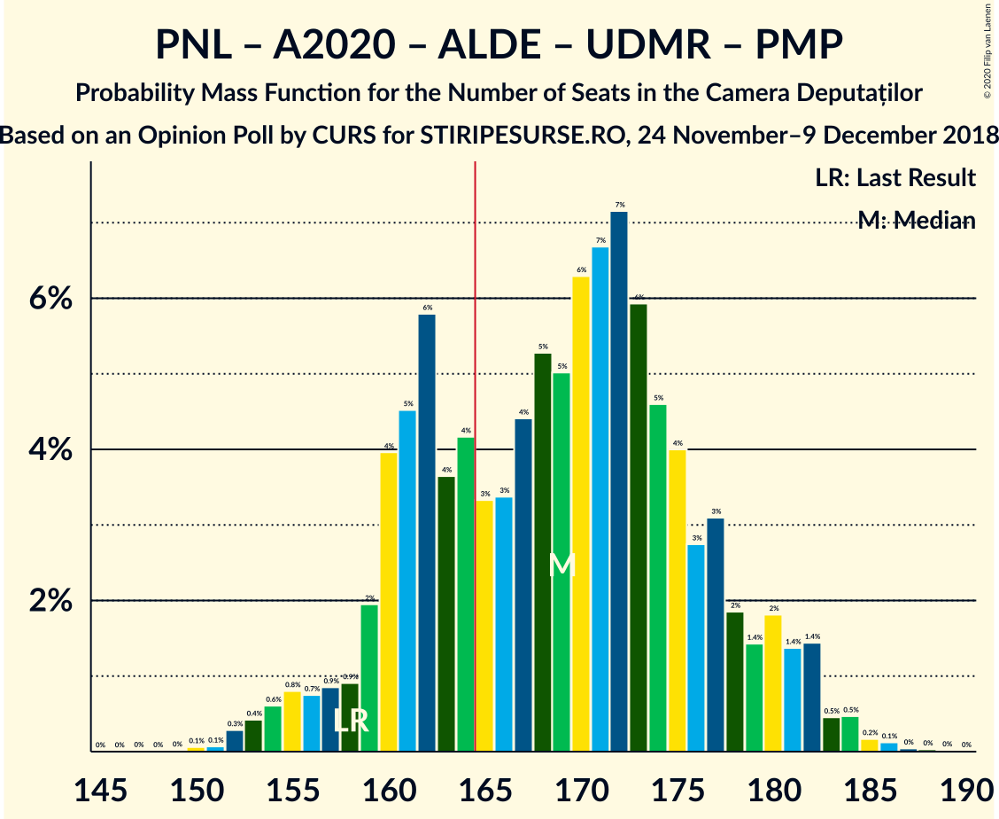

| Number of Seats | Probability | Accumulated | Special Marks |
|:---------------:|:-----------:|:-----------:|:-------------:|
| 150 | 0.1% | 100% |  |
| 151 | 0.1% | 99.9% |  |
| 152 | 0.3% | 99.8% |  |
| 153 | 0.4% | 99.5% |  |
| 154 | 0.6% | 99.1% |  |
| 155 | 0.8% | 98.5% |  |
| 156 | 0.7% | 98% |  |
| 157 | 0.9% | 97% |  |
| 158 | 0.9% | 96% | Last Result |
| 159 | 2% | 95% |  |
| 160 | 4% | 93% |  |
| 161 | 5% | 89% |  |
| 162 | 6% | 85% |  |
| 163 | 4% | 79% |  |
| 164 | 4% | 75% |  |
| 165 | 3% | 71% | Majority |
| 166 | 3% | 68% |  |
| 167 | 4% | 64% |  |
| 168 | 5% | 60% |  |
| 169 | 5% | 55% |  |
| 170 | 6% | 50% |  |
| 171 | 7% | 43% |  |
| 172 | 7% | 37% |  |
| 173 | 6% | 30% |  |
| 174 | 5% | 24% |  |
| 175 | 4% | 19% |  |
| 176 | 3% | 15% | Median |
| 177 | 3% | 12% |  |
| 178 | 2% | 9% |  |
| 179 | 1.4% | 7% |  |
| 180 | 2% | 6% |  |
| 181 | 1.4% | 4% |  |
| 182 | 1.4% | 3% |  |
| 183 | 0.5% | 1.3% |  |
| 184 | 0.5% | 0.9% |  |
| 185 | 0.2% | 0.4% |  |
| 186 | 0.1% | 0.2% |  |
| 187 | 0% | 0.1% |  |
| 188 | 0% | 0.1% |  |
| 189 | 0% | 0% |  |

### Partidul Național Liberal – Alianța 2020 USR-PLUS – Partidul Alianța Liberalilor și Democraților – Uniunea Democrată Maghiară din România

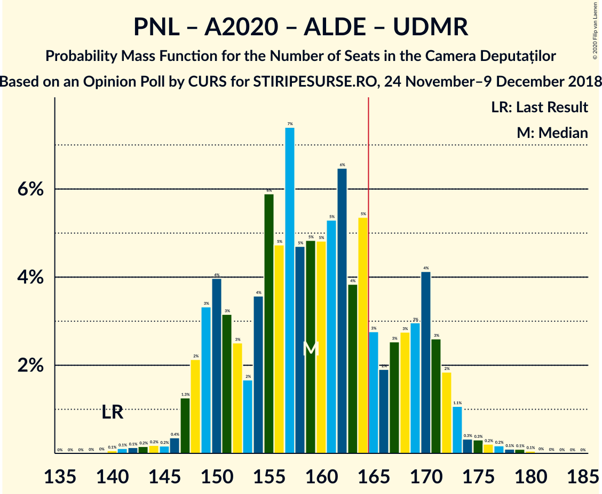

| Number of Seats | Probability | Accumulated | Special Marks |
|:---------------:|:-----------:|:-----------:|:-------------:|
| 140 | 0.1% | 100% | Last Result |
| 141 | 0.1% | 99.9% |  |
| 142 | 0.1% | 99.8% |  |
| 143 | 0.2% | 99.7% |  |
| 144 | 0.2% | 99.5% |  |
| 145 | 0.2% | 99.3% |  |
| 146 | 0.4% | 99.2% |  |
| 147 | 1.3% | 98.8% |  |
| 148 | 2% | 98% |  |
| 149 | 3% | 95% |  |
| 150 | 4% | 92% |  |
| 151 | 3% | 88% |  |
| 152 | 3% | 85% |  |
| 153 | 2% | 82% |  |
| 154 | 4% | 81% |  |
| 155 | 6% | 77% |  |
| 156 | 5% | 71% |  |
| 157 | 7% | 67% |  |
| 158 | 5% | 59% |  |
| 159 | 5% | 54% |  |
| 160 | 5% | 50% | Median |
| 161 | 5% | 45% |  |
| 162 | 6% | 40% |  |
| 163 | 4% | 33% |  |
| 164 | 5% | 29% |  |
| 165 | 3% | 24% | Majority |
| 166 | 2% | 21% |  |
| 167 | 3% | 19% |  |
| 168 | 3% | 17% |  |
| 169 | 3% | 14% |  |
| 170 | 4% | 11% |  |
| 171 | 3% | 7% |  |
| 172 | 2% | 4% |  |
| 173 | 1.1% | 2% |  |
| 174 | 0.3% | 1.3% |  |
| 175 | 0.3% | 1.0% |  |
| 176 | 0.2% | 0.7% |  |
| 177 | 0.2% | 0.5% |  |
| 178 | 0.1% | 0.3% |  |
| 179 | 0.1% | 0.2% |  |
| 180 | 0.1% | 0.1% |  |
| 181 | 0% | 0% |  |

### Partidul Național Liberal – Alianța 2020 USR-PLUS – Partidul Alianța Liberalilor și Democraților – Partidul Mișcarea Populară

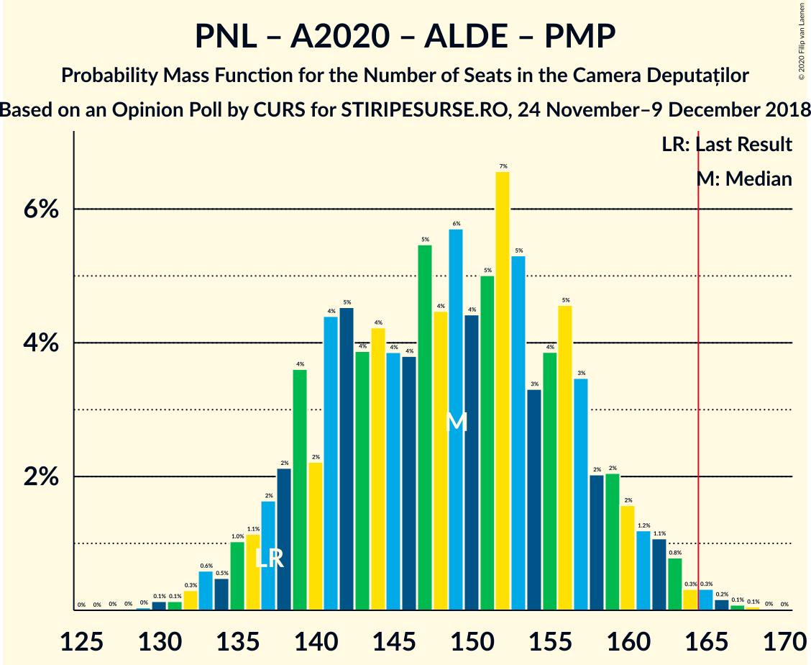

| Number of Seats | Probability | Accumulated | Special Marks |
|:---------------:|:-----------:|:-----------:|:-------------:|
| 128 | 0% | 100% |  |
| 129 | 0% | 99.9% |  |
| 130 | 0.1% | 99.9% |  |
| 131 | 0.1% | 99.8% |  |
| 132 | 0.3% | 99.6% |  |
| 133 | 0.6% | 99.3% |  |
| 134 | 0.5% | 98.7% |  |
| 135 | 1.0% | 98% |  |
| 136 | 1.1% | 97% |  |
| 137 | 2% | 96% | Last Result |
| 138 | 2% | 94% |  |
| 139 | 4% | 92% |  |
| 140 | 2% | 89% |  |
| 141 | 4% | 87% |  |
| 142 | 5% | 82% |  |
| 143 | 4% | 78% |  |
| 144 | 4% | 74% |  |
| 145 | 4% | 69% |  |
| 146 | 4% | 66% |  |
| 147 | 5% | 62% |  |
| 148 | 4% | 56% |  |
| 149 | 6% | 52% |  |
| 150 | 4% | 46% |  |
| 151 | 5% | 42% |  |
| 152 | 7% | 37% |  |
| 153 | 5% | 30% |  |
| 154 | 3% | 25% |  |
| 155 | 4% | 22% |  |
| 156 | 5% | 18% | Median |
| 157 | 3% | 13% |  |
| 158 | 2% | 10% |  |
| 159 | 2% | 8% |  |
| 160 | 2% | 6% |  |
| 161 | 1.2% | 4% |  |
| 162 | 1.1% | 3% |  |
| 163 | 0.8% | 2% |  |
| 164 | 0.3% | 1.0% |  |
| 165 | 0.3% | 0.7% | Majority |
| 166 | 0.2% | 0.3% |  |
| 167 | 0.1% | 0.2% |  |
| 168 | 0.1% | 0.1% |  |
| 169 | 0% | 0% |  |

### Partidul Social Democrat – Partidul Alianța Liberalilor și Democraților

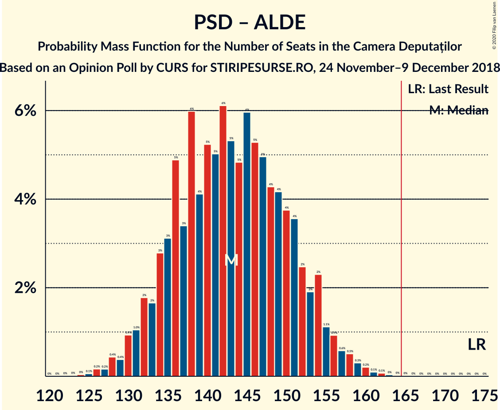

| Number of Seats | Probability | Accumulated | Special Marks |
|:---------------:|:-----------:|:-----------:|:-------------:|
| 124 | 0% | 100% |  |
| 125 | 0.1% | 99.9% |  |
| 126 | 0.2% | 99.9% |  |
| 127 | 0.2% | 99.7% |  |
| 128 | 0.4% | 99.5% |  |
| 129 | 0.4% | 99.1% |  |
| 130 | 0.9% | 98.7% |  |
| 131 | 1.0% | 98% |  |
| 132 | 2% | 97% |  |
| 133 | 2% | 95% |  |
| 134 | 3% | 93% |  |
| 135 | 3% | 91% |  |
| 136 | 5% | 87% |  |
| 137 | 3% | 83% |  |
| 138 | 6% | 79% |  |
| 139 | 4% | 73% |  |
| 140 | 5% | 69% |  |
| 141 | 5% | 64% |  |
| 142 | 6% | 59% |  |
| 143 | 5% | 53% | Median |
| 144 | 5% | 47% |  |
| 145 | 6% | 43% |  |
| 146 | 5% | 37% |  |
| 147 | 5% | 31% |  |
| 148 | 4% | 26% |  |
| 149 | 4% | 22% |  |
| 150 | 4% | 18% |  |
| 151 | 4% | 14% |  |
| 152 | 2% | 11% |  |
| 153 | 2% | 8% |  |
| 154 | 2% | 6% |  |
| 155 | 1.1% | 4% |  |
| 156 | 0.9% | 3% |  |
| 157 | 0.6% | 2% |  |
| 158 | 0.5% | 1.3% |  |
| 159 | 0.3% | 0.7% |  |
| 160 | 0.2% | 0.4% |  |
| 161 | 0.1% | 0.2% |  |
| 162 | 0.1% | 0.1% |  |
| 163 | 0% | 0.1% |  |
| 164 | 0% | 0% |  |
| 165 | 0% | 0% | Majority |
| 166 | 0% | 0% |  |
| 167 | 0% | 0% |  |
| 168 | 0% | 0% |  |
| 169 | 0% | 0% |  |
| 170 | 0% | 0% |  |
| 171 | 0% | 0% |  |
| 172 | 0% | 0% |  |
| 173 | 0% | 0% |  |
| 174 | 0% | 0% | Last Result |

### Partidul Social Democrat – PRO România

| Number of Seats | Probability | Accumulated | Special Marks |
|:---------------:|:-----------:|:-----------:|:-------------:|
| 124 | 0% | 100% |  |
| 125 | 0% | 99.9% |  |
| 126 | 0.1% | 99.9% |  |
| 127 | 0.2% | 99.8% |  |
| 128 | 0.5% | 99.6% |  |
| 129 | 0.5% | 99.1% |  |
| 130 | 1.4% | 98.7% |  |
| 131 | 1.4% | 97% |  |
| 132 | 2% | 96% |  |
| 133 | 1.4% | 94% |  |
| 134 | 2% | 93% |  |
| 135 | 3% | 91% |  |
| 136 | 3% | 88% |  |
| 137 | 4% | 85% |  |
| 138 | 5% | 81% |  |
| 139 | 6% | 76% |  |
| 140 | 7% | 70% |  |
| 141 | 7% | 63% |  |
| 142 | 6% | 57% |  |
| 143 | 5% | 50% | Median |
| 144 | 5% | 45% |  |
| 145 | 4% | 40% |  |
| 146 | 3% | 36% |  |
| 147 | 3% | 32% |  |
| 148 | 4% | 29% |  |
| 149 | 4% | 25% |  |
| 150 | 6% | 21% |  |
| 151 | 5% | 15% |  |
| 152 | 4% | 11% |  |
| 153 | 2% | 7% |  |
| 154 | 0.9% | 5% | Last Result |
| 155 | 0.9% | 4% |  |
| 156 | 0.7% | 3% |  |
| 157 | 0.8% | 2% |  |
| 158 | 0.6% | 1.5% |  |
| 159 | 0.4% | 0.9% |  |
| 160 | 0.3% | 0.5% |  |
| 161 | 0.1% | 0.2% |  |
| 162 | 0.1% | 0.1% |  |
| 163 | 0% | 0% |  |

### Partidul Național Liberal – Alianța 2020 USR-PLUS – Partidul Alianța Liberalilor și Democraților

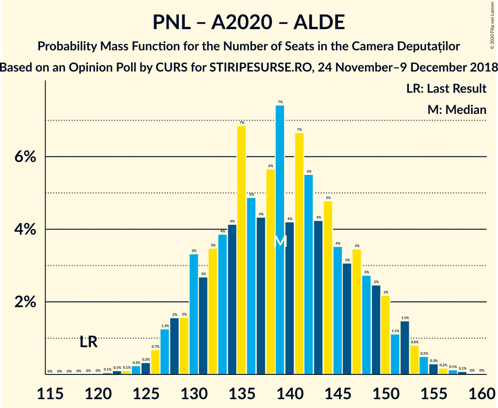

| Number of Seats | Probability | Accumulated | Special Marks |
|:---------------:|:-----------:|:-----------:|:-------------:|
| 119 | 0% | 100% | Last Result |
| 120 | 0% | 100% |  |
| 121 | 0.1% | 99.9% |  |
| 122 | 0.1% | 99.9% |  |
| 123 | 0.1% | 99.8% |  |
| 124 | 0.2% | 99.7% |  |
| 125 | 0.3% | 99.5% |  |
| 126 | 0.7% | 99.1% |  |
| 127 | 1.3% | 98% |  |
| 128 | 2% | 97% |  |
| 129 | 2% | 96% |  |
| 130 | 3% | 94% |  |
| 131 | 3% | 91% |  |
| 132 | 3% | 88% |  |
| 133 | 4% | 85% |  |
| 134 | 4% | 81% |  |
| 135 | 7% | 77% |  |
| 136 | 5% | 70% |  |
| 137 | 4% | 65% |  |
| 138 | 6% | 61% |  |
| 139 | 7% | 55% |  |
| 140 | 4% | 47% | Median |
| 141 | 7% | 43% |  |
| 142 | 6% | 37% |  |
| 143 | 4% | 31% |  |
| 144 | 5% | 27% |  |
| 145 | 4% | 22% |  |
| 146 | 3% | 19% |  |
| 147 | 3% | 15% |  |
| 148 | 3% | 12% |  |
| 149 | 2% | 9% |  |
| 150 | 2% | 7% |  |
| 151 | 1.1% | 5% |  |
| 152 | 1.5% | 4% |  |
| 153 | 0.8% | 2% |  |
| 154 | 0.5% | 1.2% |  |
| 155 | 0.3% | 0.7% |  |
| 156 | 0.2% | 0.4% |  |
| 157 | 0.1% | 0.3% |  |
| 158 | 0.1% | 0.2% |  |
| 159 | 0% | 0.1% |  |
| 160 | 0% | 0% |  |

### Partidul Național Liberal – Alianța 2020 USR-PLUS – Uniunea Democrată Maghiară din România – Partidul Mișcarea Populară

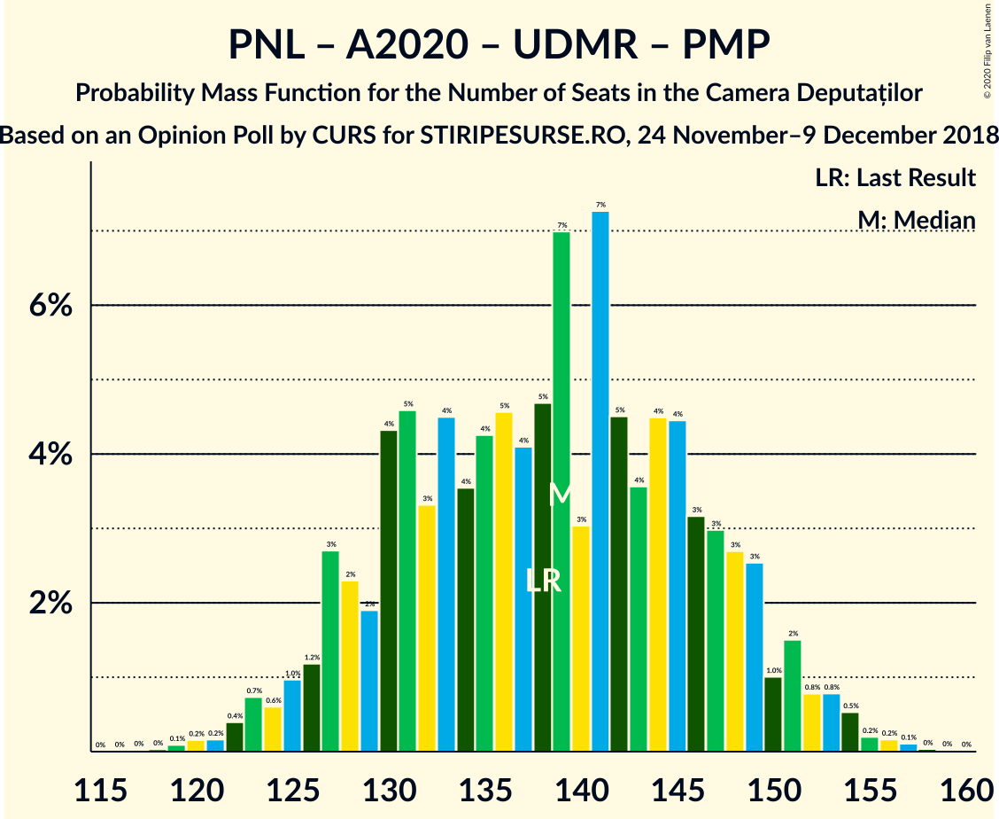

| Number of Seats | Probability | Accumulated | Special Marks |
|:---------------:|:-----------:|:-----------:|:-------------:|
| 118 | 0% | 100% |  |
| 119 | 0.1% | 99.9% |  |
| 120 | 0.2% | 99.8% |  |
| 121 | 0.2% | 99.7% |  |
| 122 | 0.4% | 99.5% |  |
| 123 | 0.7% | 99.1% |  |
| 124 | 0.6% | 98% |  |
| 125 | 1.0% | 98% |  |
| 126 | 1.2% | 97% |  |
| 127 | 3% | 96% |  |
| 128 | 2% | 93% |  |
| 129 | 2% | 91% |  |
| 130 | 4% | 89% |  |
| 131 | 5% | 84% |  |
| 132 | 3% | 80% |  |
| 133 | 4% | 76% |  |
| 134 | 4% | 72% |  |
| 135 | 4% | 68% |  |
| 136 | 5% | 64% |  |
| 137 | 4% | 60% |  |
| 138 | 5% | 56% | Last Result |
| 139 | 7% | 51% |  |
| 140 | 3% | 44% |  |
| 141 | 7% | 41% |  |
| 142 | 5% | 34% |  |
| 143 | 4% | 29% |  |
| 144 | 4% | 25% |  |
| 145 | 4% | 21% | Median |
| 146 | 3% | 17% |  |
| 147 | 3% | 13% |  |
| 148 | 3% | 10% |  |
| 149 | 3% | 8% |  |
| 150 | 1.0% | 5% |  |
| 151 | 2% | 4% |  |
| 152 | 0.8% | 3% |  |
| 153 | 0.8% | 2% |  |
| 154 | 0.5% | 1.1% |  |
| 155 | 0.2% | 0.6% |  |
| 156 | 0.2% | 0.4% |  |
| 157 | 0.1% | 0.2% |  |
| 158 | 0% | 0.1% |  |
| 159 | 0% | 0% |  |

### Partidul Național Liberal – Partidul Alianța Liberalilor și Democraților – Uniunea Democrată Maghiară din România – Partidul Mișcarea Populară

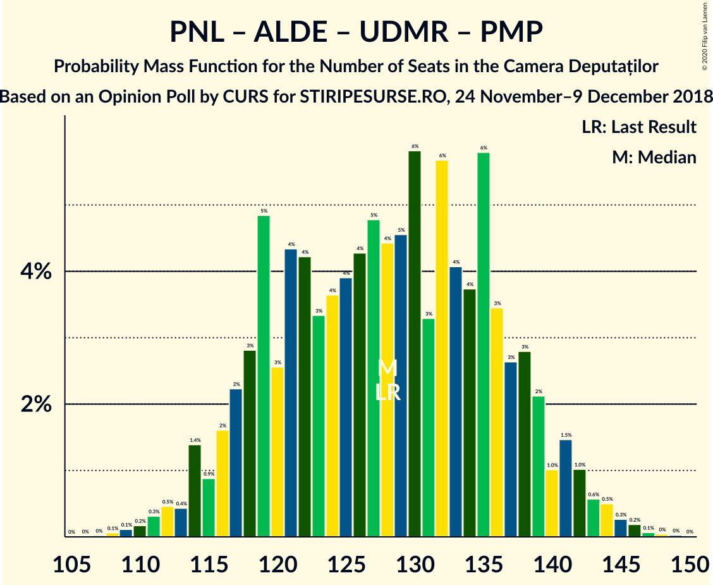

| Number of Seats | Probability | Accumulated | Special Marks |
|:---------------:|:-----------:|:-----------:|:-------------:|
| 108 | 0.1% | 100% |  |
| 109 | 0.1% | 99.9% |  |
| 110 | 0.2% | 99.8% |  |
| 111 | 0.3% | 99.6% |  |
| 112 | 0.5% | 99.3% |  |
| 113 | 0.4% | 98.8% |  |
| 114 | 1.4% | 98% |  |
| 115 | 0.9% | 97% |  |
| 116 | 2% | 96% |  |
| 117 | 2% | 95% |  |
| 118 | 3% | 92% |  |
| 119 | 5% | 89% |  |
| 120 | 3% | 85% |  |
| 121 | 4% | 82% |  |
| 122 | 4% | 78% |  |
| 123 | 3% | 74% |  |
| 124 | 4% | 70% |  |
| 125 | 4% | 67% |  |
| 126 | 4% | 63% |  |
| 127 | 5% | 58% |  |
| 128 | 4% | 54% | Last Result |
| 129 | 5% | 49% |  |
| 130 | 6% | 45% |  |
| 131 | 3% | 39% |  |
| 132 | 6% | 35% |  |
| 133 | 4% | 30% |  |
| 134 | 4% | 26% |  |
| 135 | 6% | 22% | Median |
| 136 | 3% | 16% |  |
| 137 | 3% | 13% |  |
| 138 | 3% | 10% |  |
| 139 | 2% | 7% |  |
| 140 | 1.0% | 5% |  |
| 141 | 1.5% | 4% |  |
| 142 | 1.0% | 3% |  |
| 143 | 0.6% | 2% |  |
| 144 | 0.5% | 1.1% |  |
| 145 | 0.3% | 0.6% |  |
| 146 | 0.2% | 0.3% |  |
| 147 | 0.1% | 0.2% |  |
| 148 | 0% | 0.1% |  |
| 149 | 0% | 0% |  |

### Partidul Național Liberal – Alianța 2020 USR-PLUS – Uniunea Democrată Maghiară din România

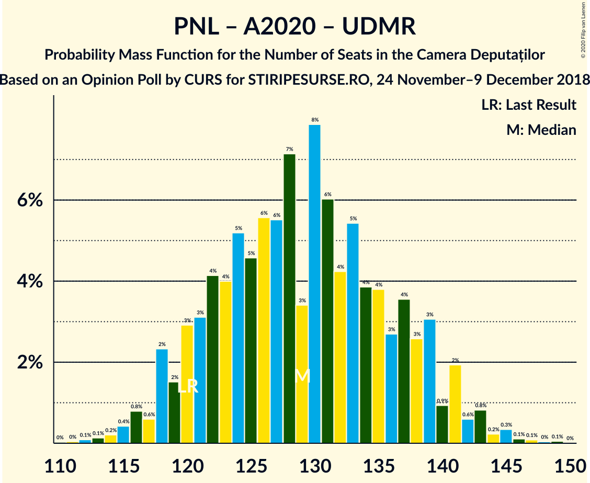

| Number of Seats | Probability | Accumulated | Special Marks |
|:---------------:|:-----------:|:-----------:|:-------------:|
| 110 | 0% | 100% |  |
| 111 | 0% | 99.9% |  |
| 112 | 0.1% | 99.9% |  |
| 113 | 0.1% | 99.8% |  |
| 114 | 0.2% | 99.7% |  |
| 115 | 0.4% | 99.5% |  |
| 116 | 0.8% | 99.1% |  |
| 117 | 0.6% | 98% |  |
| 118 | 2% | 98% |  |
| 119 | 2% | 95% |  |
| 120 | 3% | 94% | Last Result |
| 121 | 3% | 91% |  |
| 122 | 4% | 88% |  |
| 123 | 4% | 84% |  |
| 124 | 5% | 80% |  |
| 125 | 5% | 74% |  |
| 126 | 6% | 70% |  |
| 127 | 6% | 64% |  |
| 128 | 7% | 59% |  |
| 129 | 3% | 52% | Median |
| 130 | 8% | 48% |  |
| 131 | 6% | 40% |  |
| 132 | 4% | 34% |  |
| 133 | 5% | 30% |  |
| 134 | 4% | 25% |  |
| 135 | 4% | 21% |  |
| 136 | 3% | 17% |  |
| 137 | 4% | 14% |  |
| 138 | 3% | 11% |  |
| 139 | 3% | 8% |  |
| 140 | 0.9% | 5% |  |
| 141 | 2% | 4% |  |
| 142 | 0.6% | 2% |  |
| 143 | 0.8% | 2% |  |
| 144 | 0.2% | 0.9% |  |
| 145 | 0.3% | 0.6% |  |
| 146 | 0.1% | 0.3% |  |
| 147 | 0.1% | 0.2% |  |
| 148 | 0% | 0.1% |  |
| 149 | 0.1% | 0.1% |  |
| 150 | 0% | 0% |  |

### Partidul Național Liberal – Partidul Alianța Liberalilor și Democraților – Uniunea Democrată Maghiară din România

| Number of Seats | Probability | Accumulated | Special Marks |
|:---------------:|:-----------:|:-----------:|:-------------:|
| 101 | 0.1% | 100% |  |
| 102 | 0.1% | 99.9% |  |
| 103 | 0.1% | 99.8% |  |
| 104 | 0.2% | 99.7% |  |
| 105 | 0.3% | 99.5% |  |
| 106 | 0.6% | 99.2% |  |
| 107 | 1.0% | 98.6% |  |
| 108 | 2% | 98% |  |
| 109 | 1.4% | 96% |  |
| 110 | 3% | 94% | Last Result |
| 111 | 3% | 91% |  |
| 112 | 4% | 88% |  |
| 113 | 5% | 85% |  |
| 114 | 5% | 80% |  |
| 115 | 5% | 75% |  |
| 116 | 5% | 70% |  |
| 117 | 7% | 65% |  |
| 118 | 7% | 58% |  |
| 119 | 9% | 51% | Median |
| 120 | 5% | 43% |  |
| 121 | 6% | 38% |  |
| 122 | 6% | 32% |  |
| 123 | 4% | 27% |  |
| 124 | 3% | 23% |  |
| 125 | 4% | 20% |  |
| 126 | 3% | 16% |  |
| 127 | 4% | 12% |  |
| 128 | 2% | 9% |  |
| 129 | 2% | 7% |  |
| 130 | 1.4% | 4% |  |
| 131 | 0.9% | 3% |  |
| 132 | 0.8% | 2% |  |
| 133 | 0.4% | 1.0% |  |
| 134 | 0.2% | 0.6% |  |
| 135 | 0.2% | 0.4% |  |
| 136 | 0.1% | 0.2% |  |
| 137 | 0.1% | 0.1% |  |
| 138 | 0% | 0.1% |  |
| 139 | 0% | 0% |  |

### Partidul Național Liberal – Alianța 2020 USR-PLUS – Partidul Mișcarea Populară

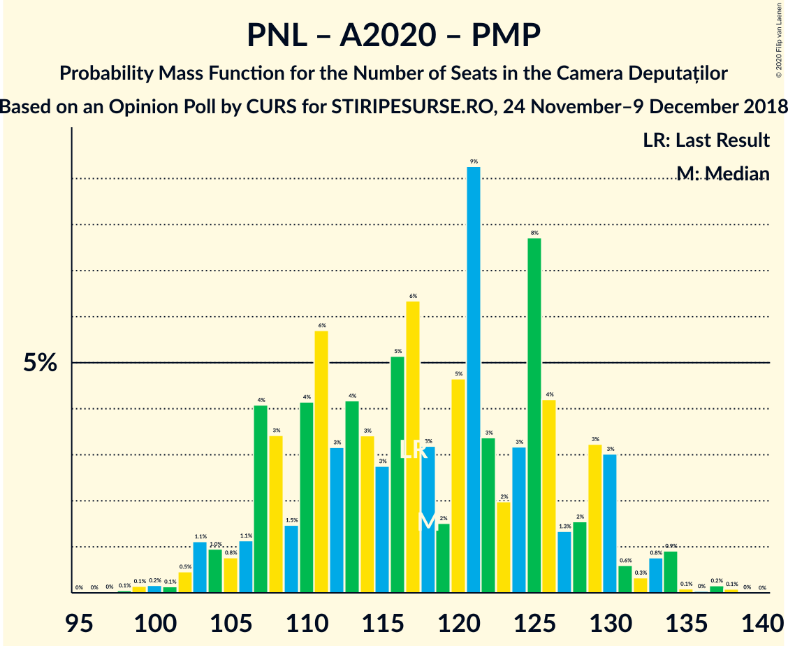

| Number of Seats | Probability | Accumulated | Special Marks |
|:---------------:|:-----------:|:-----------:|:-------------:|
| 97 | 0% | 100% |  |
| 98 | 0.1% | 99.9% |  |
| 99 | 0.1% | 99.9% |  |
| 100 | 0.2% | 99.8% |  |
| 101 | 0.1% | 99.6% |  |
| 102 | 0.5% | 99.5% |  |
| 103 | 1.1% | 99.0% |  |
| 104 | 1.0% | 98% |  |
| 105 | 0.8% | 97% |  |
| 106 | 1.1% | 96% |  |
| 107 | 4% | 95% |  |
| 108 | 3% | 91% |  |
| 109 | 1.5% | 88% |  |
| 110 | 4% | 86% |  |
| 111 | 6% | 82% |  |
| 112 | 3% | 76% |  |
| 113 | 4% | 73% |  |
| 114 | 3% | 69% |  |
| 115 | 3% | 65% |  |
| 116 | 5% | 63% |  |
| 117 | 6% | 58% | Last Result |
| 118 | 3% | 51% |  |
| 119 | 2% | 48% |  |
| 120 | 5% | 47% |  |
| 121 | 9% | 42% |  |
| 122 | 3% | 33% |  |
| 123 | 2% | 29% |  |
| 124 | 3% | 27% |  |
| 125 | 8% | 24% | Median |
| 126 | 4% | 16% |  |
| 127 | 1.3% | 12% |  |
| 128 | 2% | 11% |  |
| 129 | 3% | 9% |  |
| 130 | 3% | 6% |  |
| 131 | 0.6% | 3% |  |
| 132 | 0.3% | 2% |  |
| 133 | 0.8% | 2% |  |
| 134 | 0.9% | 1.3% |  |
| 135 | 0.1% | 0.4% |  |
| 136 | 0% | 0.3% |  |
| 137 | 0.2% | 0.3% |  |
| 138 | 0.1% | 0.1% |  |
| 139 | 0% | 0% |  |

### Partidul Național Liberal – Alianța 2020 USR-PLUS

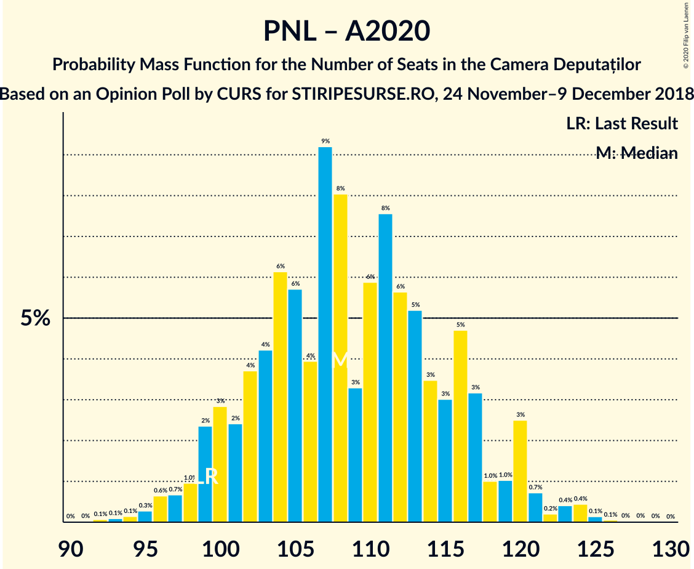

| Number of Seats | Probability | Accumulated | Special Marks |
|:---------------:|:-----------:|:-----------:|:-------------:|
| 92 | 0.1% | 100% |  |
| 93 | 0.1% | 99.9% |  |
| 94 | 0.1% | 99.8% |  |
| 95 | 0.3% | 99.7% |  |
| 96 | 0.6% | 99.4% |  |
| 97 | 0.7% | 98.7% |  |
| 98 | 1.0% | 98% |  |
| 99 | 2% | 97% | Last Result |
| 100 | 3% | 95% |  |
| 101 | 2% | 92% |  |
| 102 | 4% | 89% |  |
| 103 | 4% | 86% |  |
| 104 | 6% | 82% |  |
| 105 | 6% | 75% |  |
| 106 | 4% | 70% |  |
| 107 | 9% | 66% |  |
| 108 | 8% | 57% |  |
| 109 | 3% | 49% | Median |
| 110 | 6% | 45% |  |
| 111 | 8% | 39% |  |
| 112 | 6% | 32% |  |
| 113 | 5% | 26% |  |
| 114 | 3% | 21% |  |
| 115 | 3% | 17% |  |
| 116 | 5% | 14% |  |
| 117 | 3% | 10% |  |
| 118 | 1.0% | 7% |  |
| 119 | 1.0% | 6% |  |
| 120 | 3% | 5% |  |
| 121 | 0.7% | 2% |  |
| 122 | 0.2% | 1.3% |  |
| 123 | 0.4% | 1.1% |  |
| 124 | 0.4% | 0.7% |  |
| 125 | 0.1% | 0.3% |  |
| 126 | 0.1% | 0.1% |  |
| 127 | 0% | 0.1% |  |
| 128 | 0% | 0.1% |  |
| 129 | 0% | 0% |  |

### Partidul Național Liberal – Uniunea Democrată Maghiară din România – Partidul Mișcarea Populară

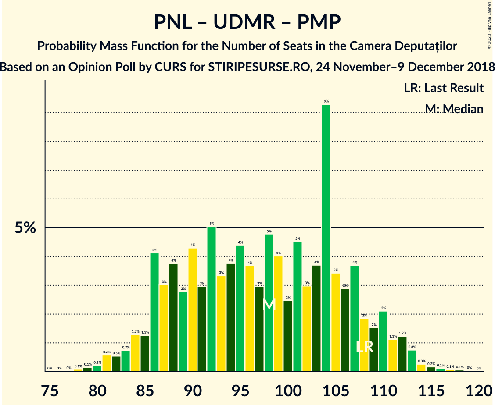

| Number of Seats | Probability | Accumulated | Special Marks |
|:---------------:|:-----------:|:-----------:|:-------------:|
| 77 | 0% | 100% |  |
| 78 | 0.1% | 99.9% |  |
| 79 | 0.1% | 99.9% |  |
| 80 | 0.2% | 99.7% |  |
| 81 | 0.6% | 99.5% |  |
| 82 | 0.5% | 98.9% |  |
| 83 | 0.7% | 98% |  |
| 84 | 1.3% | 98% |  |
| 85 | 1.3% | 96% |  |
| 86 | 4% | 95% |  |
| 87 | 3% | 91% |  |
| 88 | 4% | 88% |  |
| 89 | 3% | 84% |  |
| 90 | 4% | 81% |  |
| 91 | 3% | 77% |  |
| 92 | 5% | 74% |  |
| 93 | 3% | 69% |  |
| 94 | 4% | 66% |  |
| 95 | 4% | 62% |  |
| 96 | 4% | 58% |  |
| 97 | 3% | 54% |  |
| 98 | 5% | 51% |  |
| 99 | 4% | 46% |  |
| 100 | 2% | 42% |  |
| 101 | 5% | 40% |  |
| 102 | 3% | 35% |  |
| 103 | 4% | 32% |  |
| 104 | 9% | 29% | Median |
| 105 | 3% | 19% |  |
| 106 | 3% | 16% |  |
| 107 | 4% | 13% |  |
| 108 | 2% | 9% | Last Result |
| 109 | 2% | 7% |  |
| 110 | 2% | 6% |  |
| 111 | 1.1% | 4% |  |
| 112 | 1.2% | 3% |  |
| 113 | 0.8% | 1.5% |  |
| 114 | 0.3% | 0.7% |  |
| 115 | 0.2% | 0.4% |  |
| 116 | 0.1% | 0.3% |  |
| 117 | 0.1% | 0.2% |  |
| 118 | 0.1% | 0.1% |  |
| 119 | 0% | 0% |  |

### Partidul Național Liberal – Uniunea Democrată Maghiară din România

| Number of Seats | Probability | Accumulated | Special Marks |
|:---------------:|:-----------:|:-----------:|:-------------:|
| 73 | 0.1% | 100% |  |
| 74 | 0.1% | 99.9% |  |
| 75 | 0.3% | 99.8% |  |
| 76 | 0.3% | 99.5% |  |
| 77 | 0.5% | 99.2% |  |
| 78 | 0.9% | 98.6% |  |
| 79 | 2% | 98% |  |
| 80 | 3% | 96% |  |
| 81 | 4% | 93% |  |
| 82 | 3% | 89% |  |
| 83 | 4% | 85% |  |
| 84 | 5% | 82% |  |
| 85 | 6% | 76% |  |
| 86 | 10% | 71% |  |
| 87 | 9% | 61% |  |
| 88 | 7% | 52% | Median |
| 89 | 5% | 45% |  |
| 90 | 7% | 40% | Last Result |
| 91 | 5% | 33% |  |
| 92 | 6% | 28% |  |
| 93 | 4% | 22% |  |
| 94 | 5% | 18% |  |
| 95 | 4% | 13% |  |
| 96 | 3% | 9% |  |
| 97 | 1.4% | 6% |  |
| 98 | 1.1% | 4% |  |
| 99 | 1.2% | 3% |  |
| 100 | 0.6% | 2% |  |
| 101 | 0.8% | 1.4% |  |
| 102 | 0.2% | 0.6% |  |
| 103 | 0.2% | 0.4% |  |
| 104 | 0.1% | 0.2% |  |
| 105 | 0.1% | 0.1% |  |
| 106 | 0% | 0% |  |

### Partidul Național Liberal – Partidul Mișcarea Populară

| Number of Seats | Probability | Accumulated | Special Marks |
|:---------------:|:-----------:|:-----------:|:-------------:|
| 58 | 0.1% | 100% |  |
| 59 | 0.2% | 99.9% |  |
| 60 | 0.3% | 99.7% |  |
| 61 | 0.5% | 99.4% |  |
| 62 | 0.6% | 98.9% |  |
| 63 | 1.1% | 98% |  |
| 64 | 1.4% | 97% |  |
| 65 | 2% | 96% |  |
| 66 | 4% | 94% |  |
| 67 | 4% | 89% |  |
| 68 | 3% | 85% |  |
| 69 | 4% | 82% |  |
| 70 | 4% | 78% |  |
| 71 | 3% | 74% |  |
| 72 | 5% | 70% |  |
| 73 | 4% | 65% |  |
| 74 | 4% | 61% |  |
| 75 | 2% | 57% |  |
| 76 | 2% | 55% |  |
| 77 | 2% | 53% |  |
| 78 | 3% | 51% |  |
| 79 | 3% | 47% |  |
| 80 | 6% | 45% |  |
| 81 | 3% | 39% |  |
| 82 | 3% | 36% |  |
| 83 | 4% | 33% |  |
| 84 | 6% | 29% | Median |
| 85 | 4% | 23% |  |
| 86 | 6% | 18% |  |
| 87 | 3% | 13% | Last Result |
| 88 | 2% | 10% |  |
| 89 | 2% | 7% |  |
| 90 | 2% | 5% |  |
| 91 | 2% | 4% |  |
| 92 | 1.1% | 2% |  |
| 93 | 0.5% | 1.2% |  |
| 94 | 0.3% | 0.7% |  |
| 95 | 0.1% | 0.4% |  |
| 96 | 0.1% | 0.2% |  |
| 97 | 0.1% | 0.1% |  |
| 98 | 0% | 0.1% |  |
| 99 | 0% | 0% |  |

### Partidul Național Liberal

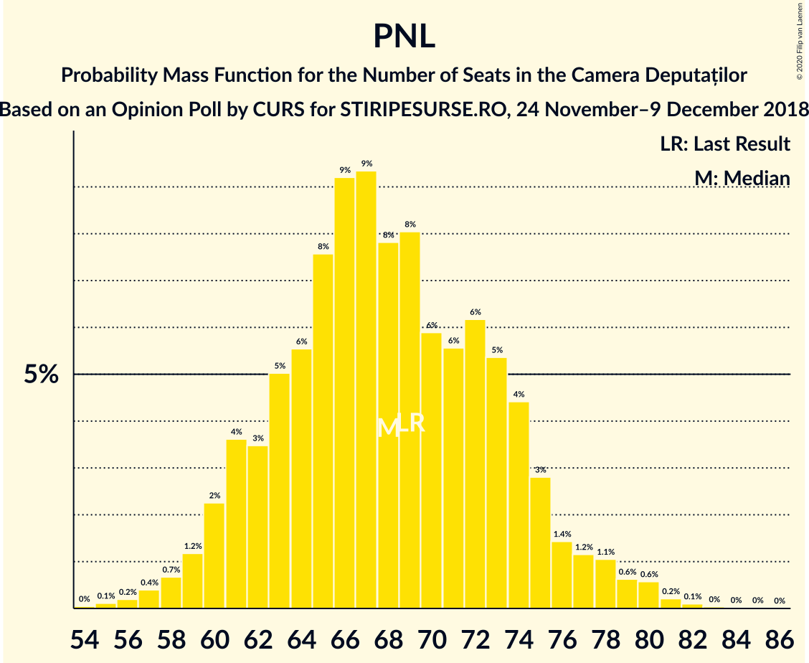

| Number of Seats | Probability | Accumulated | Special Marks |
|:---------------:|:-----------:|:-----------:|:-------------:|
| 54 | 0% | 100% |  |
| 55 | 0.1% | 99.9% |  |
| 56 | 0.2% | 99.8% |  |
| 57 | 0.4% | 99.6% |  |
| 58 | 0.7% | 99.2% |  |
| 59 | 1.2% | 98.5% |  |
| 60 | 2% | 97% |  |
| 61 | 4% | 95% |  |
| 62 | 3% | 91% |  |
| 63 | 5% | 88% |  |
| 64 | 6% | 83% |  |
| 65 | 8% | 77% |  |
| 66 | 9% | 70% |  |
| 67 | 9% | 61% |  |
| 68 | 8% | 51% | Median |
| 69 | 8% | 44% | Last Result |
| 70 | 6% | 35% |  |
| 71 | 6% | 30% |  |
| 72 | 6% | 24% |  |
| 73 | 5% | 18% |  |
| 74 | 4% | 12% |  |
| 75 | 3% | 8% |  |
| 76 | 1.4% | 5% |  |
| 77 | 1.2% | 4% |  |
| 78 | 1.1% | 3% |  |
| 79 | 0.6% | 2% |  |
| 80 | 0.6% | 1.0% |  |
| 81 | 0.2% | 0.4% |  |
| 82 | 0.1% | 0.2% |  |
| 83 | 0% | 0.1% |  |
| 84 | 0% | 0.1% |  |
| 85 | 0% | 0% |  |

### Alianța 2020 USR-PLUS – Partidul Mișcarea Populară

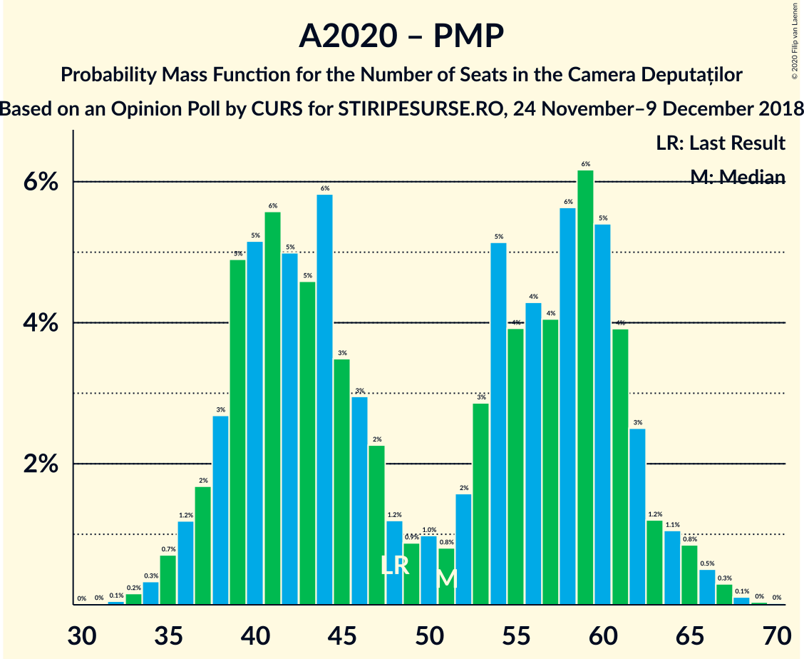

| Number of Seats | Probability | Accumulated | Special Marks |
|:---------------:|:-----------:|:-----------:|:-------------:|
| 32 | 0.1% | 100% |  |
| 33 | 0.2% | 99.9% |  |
| 34 | 0.3% | 99.8% |  |
| 35 | 0.7% | 99.4% |  |
| 36 | 1.2% | 98.7% |  |
| 37 | 2% | 98% |  |
| 38 | 3% | 96% |  |
| 39 | 5% | 93% |  |
| 40 | 5% | 88% |  |
| 41 | 6% | 83% |  |
| 42 | 5% | 78% |  |
| 43 | 5% | 73% |  |
| 44 | 6% | 68% |  |
| 45 | 3% | 62% |  |
| 46 | 3% | 59% |  |
| 47 | 2% | 56% |  |
| 48 | 1.2% | 53% | Last Result |
| 49 | 0.9% | 52% |  |
| 50 | 1.0% | 51% |  |
| 51 | 0.8% | 50% |  |
| 52 | 2% | 50% |  |
| 53 | 3% | 48% |  |
| 54 | 5% | 45% |  |
| 55 | 4% | 40% |  |
| 56 | 4% | 36% |  |
| 57 | 4% | 32% | Median |
| 58 | 6% | 28% |  |
| 59 | 6% | 22% |  |
| 60 | 5% | 16% |  |
| 61 | 4% | 11% |  |
| 62 | 3% | 7% |  |
| 63 | 1.2% | 4% |  |
| 64 | 1.1% | 3% |  |
| 65 | 0.8% | 2% |  |
| 66 | 0.5% | 1.0% |  |
| 67 | 0.3% | 0.5% |  |
| 68 | 0.1% | 0.2% |  |
| 69 | 0% | 0.1% |  |
| 70 | 0% | 0% |  |

## Technical Information

### Opinion Poll

+ **Polling firm:** CURS
+ **Commissioner(s):** STIRIPESURSE.RO
+ **Fieldwork period:** 24 November–9 December 2018

### Calculations

+ **Sample size:** 1067
+ **Simulations done:** 1,048,576
+ **Error estimate:** 1.69%

