# Opinion Poll by IMAS for Europa FM, 11–30 January 2019

<a href="#voting-intentions">Voting Intentions</a> | <a href="#seats">Seats</a> | <a href="#coalitions">Coalitions</a> | <a href="#technical-information">Technical Information</a>

## Voting Intentions

### Confidence Intervals

| Party | Last Result | Poll Result | 80% Confidence Interval | 90% Confidence Interval | 95% Confidence Interval | 99% Confidence Interval |
|:-----:|:-----------:|:-----------:|:-----------------------:|:-----------------------:|:-----------------------:|:-----------------------:|
| Partidul Social Democrat | 45.5% | 25.2% | 23.5–27.0% |23.0–27.6% |22.6–28.0% |21.8–28.9% |
| Partidul Național Liberal | 20.0% | 22.1% | 20.4–23.8% |20.0–24.3% |19.6–24.7% |18.9–25.6% |
| Alianța 2020 USR-PLUS | 8.9% | 19.9% | 18.3–21.6% |17.9–22.0% |17.5–22.5% |16.8–23.3% |
| Partidul Alianța Liberalilor și Democraților | 5.6% | 13.4% | 12.1–14.8% |11.7–15.2% |11.4–15.6% |10.8–16.3% |
| PRO România | 0.0% | 8.1% | 7.1–9.3% |6.8–9.7% |6.6–10.0% |6.1–10.6% |
| Uniunea Democrată Maghiară din România | 6.2% | 4.4% | 3.6–5.3% |3.4–5.6% |3.3–5.8% |2.9–6.3% |
| Partidul Mișcarea Populară | 5.4% | 3.8% | 3.1–4.6% |2.9–4.9% |2.7–5.1% |2.5–5.6% |

*Note:* The poll result column reflects the actual value used in the calculations. Published results may vary slightly, and in addition be rounded to fewer digits.

## Seats

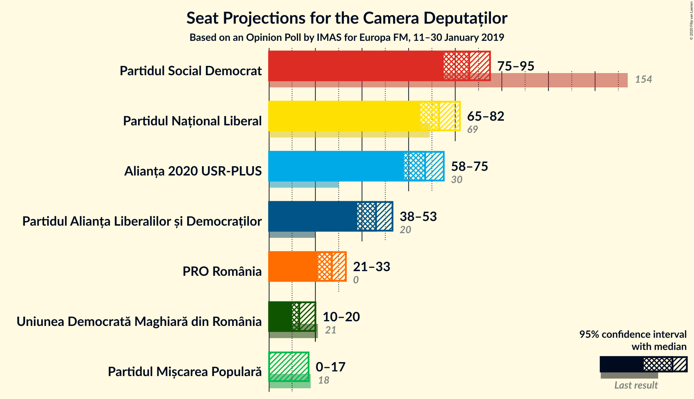

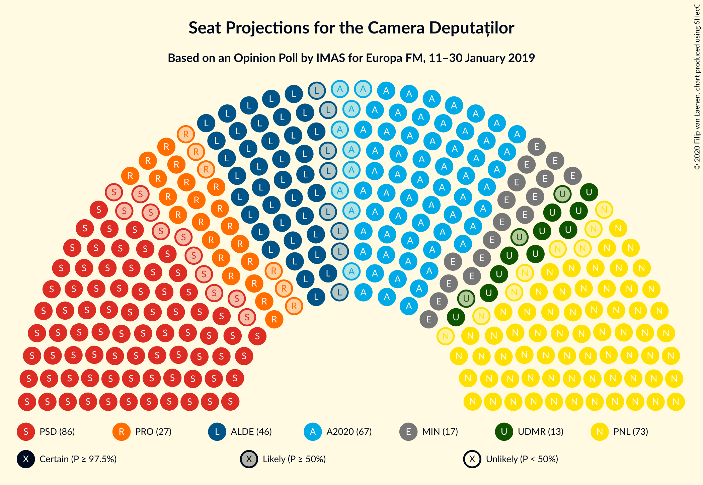

### Confidence Intervals

| Party | Last Result | Median | 80% Confidence Interval | 90% Confidence Interval | 95% Confidence Interval | 99% Confidence Interval |
|:-----:|:-----------:|:------:|:-----------------------:|:-----------------------:|:-----------------------:|:-----------------------:|
| <a href="#partidul-social-democrat">Partidul Social Democrat</a> | 154 | 86 | 79–92 |77–94 |75–95 |73–97 |
| <a href="#partidul-național-liberal">Partidul Național Liberal</a> | 69 | 73 | 68–79 |66–81 |65–82 |62–86 |
| <a href="#alianța-2020-usr-plus">Alianța 2020 USR-PLUS</a> | 30 | 67 | 61–72 |60–74 |58–75 |56–78 |
| <a href="#partidul-alianța-liberalilor-și-democraților">Partidul Alianța Liberalilor și Democraților</a> | 20 | 46 | 40–50 |39–52 |38–53 |36–55 |
| <a href="#pro-românia">PRO România</a> | 0 | 27 | 23–30 |22–32 |21–33 |20–35 |
| <a href="#uniunea-democrată-maghiară-din-românia">Uniunea Democrată Maghiară din România</a> | 21 | 13 | 11–18 |11–19 |10–20 |9–21 |
| <a href="#partidul-mișcarea-populară">Partidul Mișcarea Populară</a> | 18 | 0 | 0 |0 |0–17 |0–18 |

### Partidul Social Democrat

*For a full overview of the results for this party, see the [Partidul Social Democrat](party-partidulsocialdemocrat.html) page.*

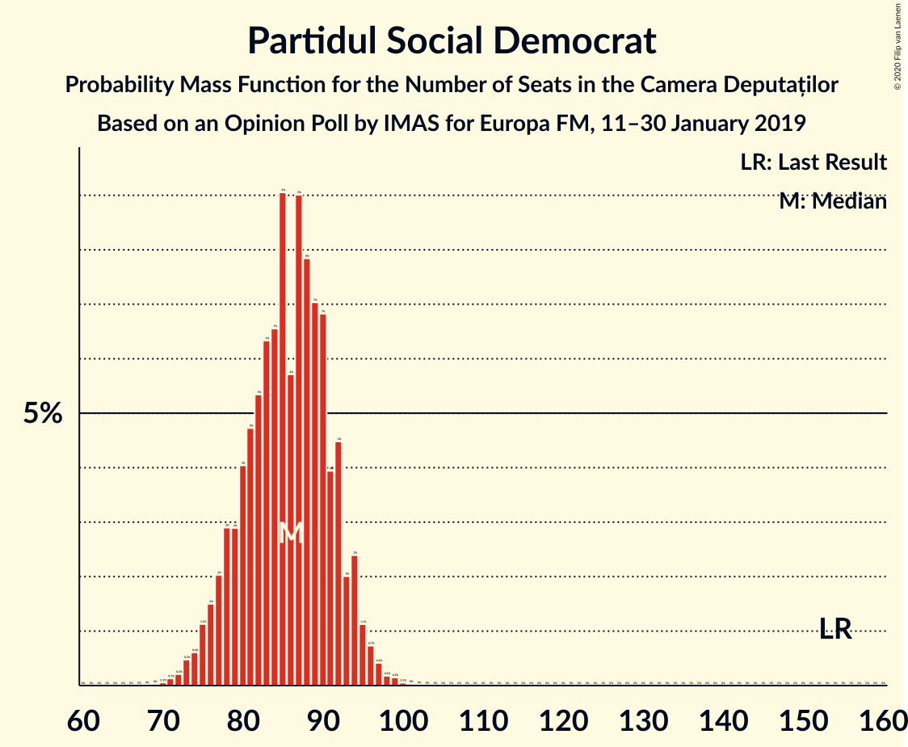

| Number of Seats | Probability | Accumulated | Special Marks |
|:---------------:|:-----------:|:-----------:|:-------------:|
| 69 | 0% | 100% |  |
| 70 | 0.1% | 99.9% |  |
| 71 | 0.1% | 99.9% |  |
| 72 | 0.2% | 99.8% |  |
| 73 | 0.5% | 99.6% |  |
| 74 | 0.6% | 99.1% |  |
| 75 | 1.1% | 98% |  |
| 76 | 2% | 97% |  |
| 77 | 2% | 96% |  |
| 78 | 3% | 94% |  |
| 79 | 3% | 91% |  |
| 80 | 4% | 88% |  |
| 81 | 5% | 84% |  |
| 82 | 5% | 79% |  |
| 83 | 6% | 74% |  |
| 84 | 7% | 68% |  |
| 85 | 9% | 61% |  |
| 86 | 6% | 52% | Median |
| 87 | 9% | 46% |  |
| 88 | 8% | 37% |  |
| 89 | 7% | 29% |  |
| 90 | 7% | 22% |  |
| 91 | 4% | 16% |  |
| 92 | 4% | 12% |  |
| 93 | 2% | 7% |  |
| 94 | 2% | 5% |  |
| 95 | 1.1% | 3% |  |
| 96 | 0.7% | 2% |  |
| 97 | 0.4% | 0.8% |  |
| 98 | 0.2% | 0.4% |  |
| 99 | 0.2% | 0.3% |  |
| 100 | 0.1% | 0.1% |  |
| 101 | 0% | 0.1% |  |
| 102 | 0% | 0% |  |
| 103 | 0% | 0% |  |
| 104 | 0% | 0% |  |
| 105 | 0% | 0% |  |
| 106 | 0% | 0% |  |
| 107 | 0% | 0% |  |
| 108 | 0% | 0% |  |
| 109 | 0% | 0% |  |
| 110 | 0% | 0% |  |
| 111 | 0% | 0% |  |
| 112 | 0% | 0% |  |
| 113 | 0% | 0% |  |
| 114 | 0% | 0% |  |
| 115 | 0% | 0% |  |
| 116 | 0% | 0% |  |
| 117 | 0% | 0% |  |
| 118 | 0% | 0% |  |
| 119 | 0% | 0% |  |
| 120 | 0% | 0% |  |
| 121 | 0% | 0% |  |
| 122 | 0% | 0% |  |
| 123 | 0% | 0% |  |
| 124 | 0% | 0% |  |
| 125 | 0% | 0% |  |
| 126 | 0% | 0% |  |
| 127 | 0% | 0% |  |
| 128 | 0% | 0% |  |
| 129 | 0% | 0% |  |
| 130 | 0% | 0% |  |
| 131 | 0% | 0% |  |
| 132 | 0% | 0% |  |
| 133 | 0% | 0% |  |
| 134 | 0% | 0% |  |
| 135 | 0% | 0% |  |
| 136 | 0% | 0% |  |
| 137 | 0% | 0% |  |
| 138 | 0% | 0% |  |
| 139 | 0% | 0% |  |
| 140 | 0% | 0% |  |
| 141 | 0% | 0% |  |
| 142 | 0% | 0% |  |
| 143 | 0% | 0% |  |
| 144 | 0% | 0% |  |
| 145 | 0% | 0% |  |
| 146 | 0% | 0% |  |
| 147 | 0% | 0% |  |
| 148 | 0% | 0% |  |
| 149 | 0% | 0% |  |
| 150 | 0% | 0% |  |
| 151 | 0% | 0% |  |
| 152 | 0% | 0% |  |
| 153 | 0% | 0% |  |
| 154 | 0% | 0% | Last Result |

### Partidul Național Liberal

*For a full overview of the results for this party, see the [Partidul Național Liberal](party-partidulnaționalliberal.html) page.*

| Number of Seats | Probability | Accumulated | Special Marks |
|:---------------:|:-----------:|:-----------:|:-------------:|
| 60 | 0.1% | 100% |  |
| 61 | 0.2% | 99.9% |  |
| 62 | 0.3% | 99.7% |  |
| 63 | 0.5% | 99.4% |  |
| 64 | 0.9% | 98.9% |  |
| 65 | 2% | 98% |  |
| 66 | 2% | 96% |  |
| 67 | 4% | 94% |  |
| 68 | 5% | 90% |  |
| 69 | 7% | 85% | Last Result |
| 70 | 8% | 78% |  |
| 71 | 7% | 70% |  |
| 72 | 8% | 63% |  |
| 73 | 11% | 54% | Median |
| 74 | 9% | 44% |  |
| 75 | 8% | 35% |  |
| 76 | 6% | 27% |  |
| 77 | 5% | 21% |  |
| 78 | 4% | 16% |  |
| 79 | 3% | 11% |  |
| 80 | 2% | 8% |  |
| 81 | 2% | 6% |  |
| 82 | 1.3% | 4% |  |
| 83 | 1.0% | 2% |  |
| 84 | 0.5% | 1.5% |  |
| 85 | 0.4% | 1.0% |  |
| 86 | 0.2% | 0.6% |  |
| 87 | 0.2% | 0.3% |  |
| 88 | 0.1% | 0.2% |  |
| 89 | 0.1% | 0.1% |  |
| 90 | 0% | 0% |  |

### Alianța 2020 USR-PLUS

*For a full overview of the results for this party, see the [Alianța 2020 USR-PLUS](party-alianța2020usr-plus.html) page.*

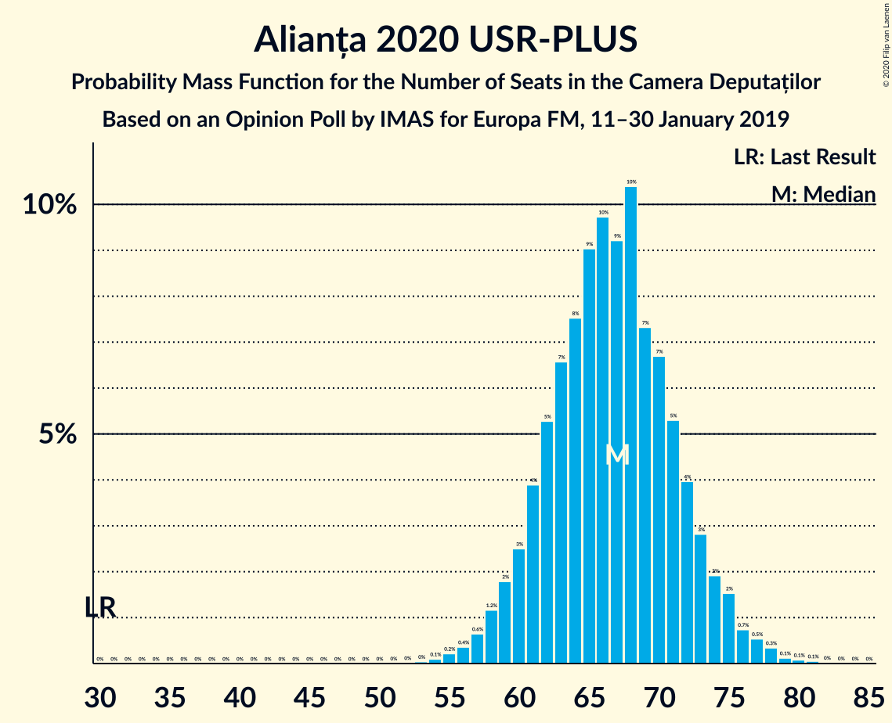

| Number of Seats | Probability | Accumulated | Special Marks |
|:---------------:|:-----------:|:-----------:|:-------------:|
| 30 | 0% | 100% | Last Result |
| 31 | 0% | 100% |  |
| 32 | 0% | 100% |  |
| 33 | 0% | 100% |  |
| 34 | 0% | 100% |  |
| 35 | 0% | 100% |  |
| 36 | 0% | 100% |  |
| 37 | 0% | 100% |  |
| 38 | 0% | 100% |  |
| 39 | 0% | 100% |  |
| 40 | 0% | 100% |  |
| 41 | 0% | 100% |  |
| 42 | 0% | 100% |  |
| 43 | 0% | 100% |  |
| 44 | 0% | 100% |  |
| 45 | 0% | 100% |  |
| 46 | 0% | 100% |  |
| 47 | 0% | 100% |  |
| 48 | 0% | 100% |  |
| 49 | 0% | 100% |  |
| 50 | 0% | 100% |  |
| 51 | 0% | 100% |  |
| 52 | 0% | 100% |  |
| 53 | 0% | 100% |  |
| 54 | 0.1% | 99.9% |  |
| 55 | 0.2% | 99.8% |  |
| 56 | 0.4% | 99.6% |  |
| 57 | 0.6% | 99.2% |  |
| 58 | 1.2% | 98.6% |  |
| 59 | 2% | 97% |  |
| 60 | 3% | 96% |  |
| 61 | 4% | 93% |  |
| 62 | 5% | 89% |  |
| 63 | 7% | 84% |  |
| 64 | 8% | 77% |  |
| 65 | 9% | 70% |  |
| 66 | 10% | 61% |  |
| 67 | 9% | 51% | Median |
| 68 | 10% | 42% |  |
| 69 | 7% | 31% |  |
| 70 | 7% | 24% |  |
| 71 | 5% | 17% |  |
| 72 | 4% | 12% |  |
| 73 | 3% | 8% |  |
| 74 | 2% | 5% |  |
| 75 | 2% | 3% |  |
| 76 | 0.7% | 2% |  |
| 77 | 0.5% | 1.2% |  |
| 78 | 0.3% | 0.6% |  |
| 79 | 0.1% | 0.3% |  |
| 80 | 0.1% | 0.2% |  |
| 81 | 0.1% | 0.1% |  |
| 82 | 0% | 0% |  |

### Partidul Alianța Liberalilor și Democraților

*For a full overview of the results for this party, see the [Partidul Alianța Liberalilor și Democraților](party-partidulalianțaliberalilorșidemocraților.html) page.*

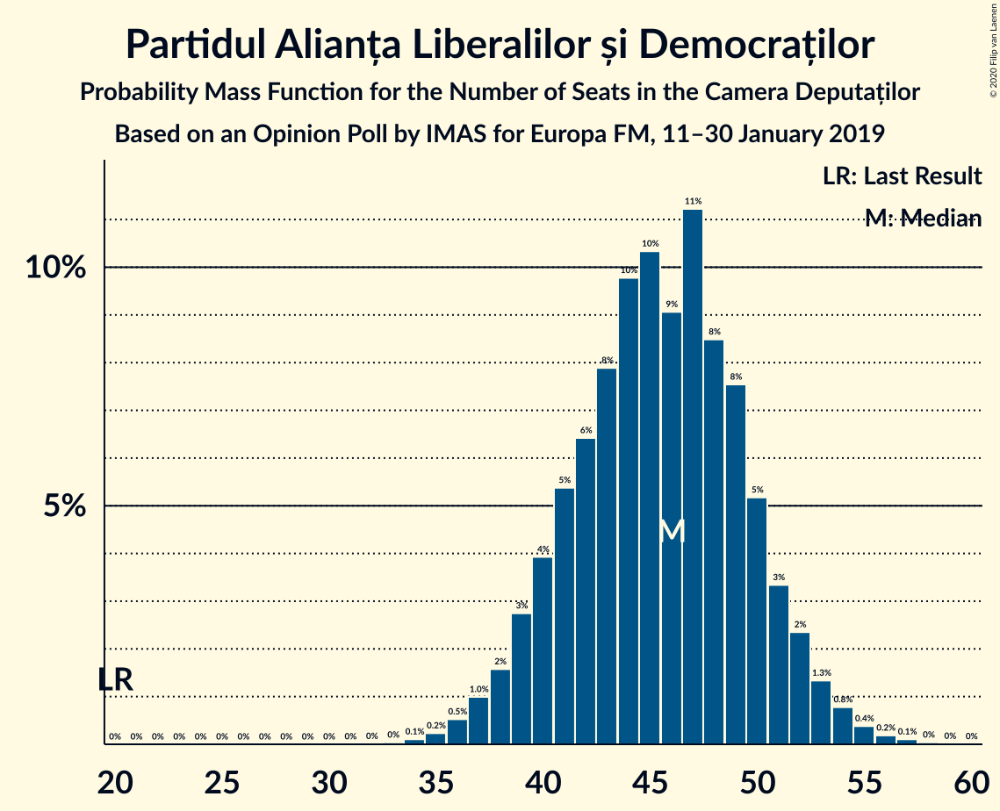

| Number of Seats | Probability | Accumulated | Special Marks |
|:---------------:|:-----------:|:-----------:|:-------------:|
| 20 | 0% | 100% | Last Result |
| 21 | 0% | 100% |  |
| 22 | 0% | 100% |  |
| 23 | 0% | 100% |  |
| 24 | 0% | 100% |  |
| 25 | 0% | 100% |  |
| 26 | 0% | 100% |  |
| 27 | 0% | 100% |  |
| 28 | 0% | 100% |  |
| 29 | 0% | 100% |  |
| 30 | 0% | 100% |  |
| 31 | 0% | 100% |  |
| 32 | 0% | 100% |  |
| 33 | 0% | 100% |  |
| 34 | 0.1% | 99.9% |  |
| 35 | 0.2% | 99.8% |  |
| 36 | 0.5% | 99.6% |  |
| 37 | 1.0% | 99.1% |  |
| 38 | 2% | 98% |  |
| 39 | 3% | 97% |  |
| 40 | 4% | 94% |  |
| 41 | 5% | 90% |  |
| 42 | 6% | 84% |  |
| 43 | 8% | 78% |  |
| 44 | 10% | 70% |  |
| 45 | 10% | 60% |  |
| 46 | 9% | 50% | Median |
| 47 | 11% | 41% |  |
| 48 | 8% | 30% |  |
| 49 | 8% | 21% |  |
| 50 | 5% | 14% |  |
| 51 | 3% | 9% |  |
| 52 | 2% | 5% |  |
| 53 | 1.3% | 3% |  |
| 54 | 0.8% | 2% |  |
| 55 | 0.4% | 0.7% |  |
| 56 | 0.2% | 0.4% |  |
| 57 | 0.1% | 0.2% |  |
| 58 | 0% | 0.1% |  |
| 59 | 0% | 0% |  |

### PRO România

*For a full overview of the results for this party, see the [PRO România](party-proromânia.html) page.*

| Number of Seats | Probability | Accumulated | Special Marks |
|:---------------:|:-----------:|:-----------:|:-------------:|
| 0 | 0% | 100% | Last Result |
| 1 | 0% | 100% |  |
| 2 | 0% | 100% |  |
| 3 | 0% | 100% |  |
| 4 | 0% | 100% |  |
| 5 | 0% | 100% |  |
| 6 | 0% | 100% |  |
| 7 | 0% | 100% |  |
| 8 | 0% | 100% |  |
| 9 | 0% | 100% |  |
| 10 | 0% | 100% |  |
| 11 | 0% | 100% |  |
| 12 | 0% | 100% |  |
| 13 | 0% | 100% |  |
| 14 | 0% | 100% |  |
| 15 | 0% | 100% |  |
| 16 | 0% | 100% |  |
| 17 | 0% | 100% |  |
| 18 | 0.1% | 100% |  |
| 19 | 0.3% | 99.9% |  |
| 20 | 0.7% | 99.6% |  |
| 21 | 2% | 98.9% |  |
| 22 | 4% | 97% |  |
| 23 | 7% | 93% |  |
| 24 | 11% | 86% |  |
| 25 | 12% | 75% |  |
| 26 | 13% | 63% |  |
| 27 | 15% | 50% | Median |
| 28 | 11% | 35% |  |
| 29 | 9% | 25% |  |
| 30 | 6% | 16% |  |
| 31 | 4% | 10% |  |
| 32 | 3% | 6% |  |
| 33 | 1.5% | 3% |  |
| 34 | 0.8% | 2% |  |
| 35 | 0.4% | 0.8% |  |
| 36 | 0.2% | 0.4% |  |
| 37 | 0.1% | 0.1% |  |
| 38 | 0% | 0.1% |  |
| 39 | 0% | 0% |  |

### Uniunea Democrată Maghiară din România

*For a full overview of the results for this party, see the [Uniunea Democrată Maghiară din România](party-uniuneademocratămaghiarădinromânia.html) page.*

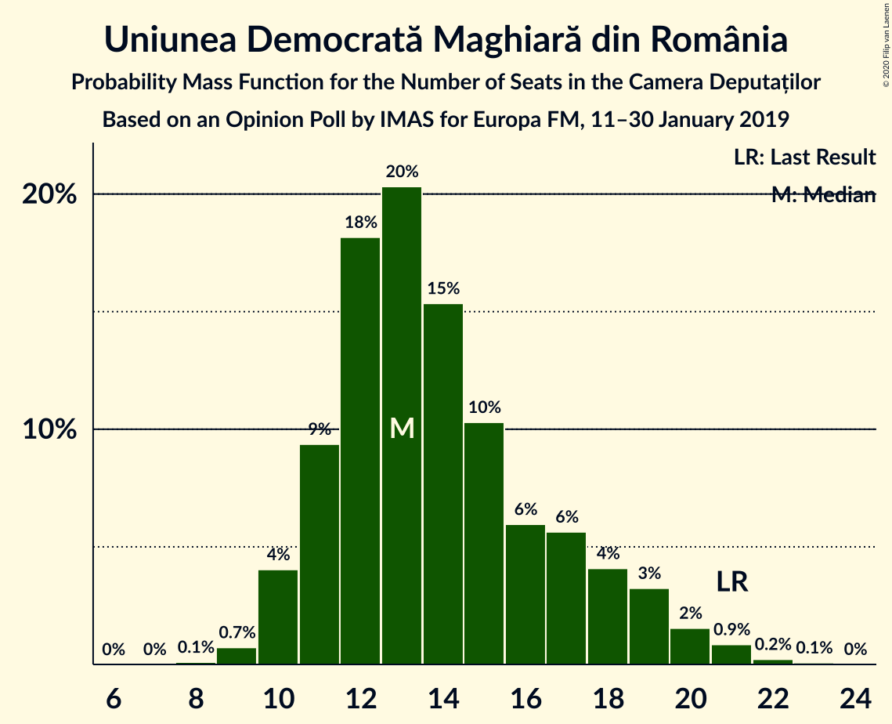

| Number of Seats | Probability | Accumulated | Special Marks |
|:---------------:|:-----------:|:-----------:|:-------------:|
| 8 | 0.1% | 100% |  |
| 9 | 0.7% | 99.9% |  |
| 10 | 4% | 99.2% |  |
| 11 | 9% | 95% |  |
| 12 | 18% | 86% |  |
| 13 | 20% | 68% | Median |
| 14 | 15% | 47% |  |
| 15 | 10% | 32% |  |
| 16 | 6% | 22% |  |
| 17 | 6% | 16% |  |
| 18 | 4% | 10% |  |
| 19 | 3% | 6% |  |
| 20 | 2% | 3% |  |
| 21 | 0.9% | 1.2% | Last Result |
| 22 | 0.2% | 0.3% |  |
| 23 | 0.1% | 0.1% |  |
| 24 | 0% | 0% |  |

### Partidul Mișcarea Populară

*For a full overview of the results for this party, see the [Partidul Mișcarea Populară](party-partidulmișcareapopulară.html) page.*

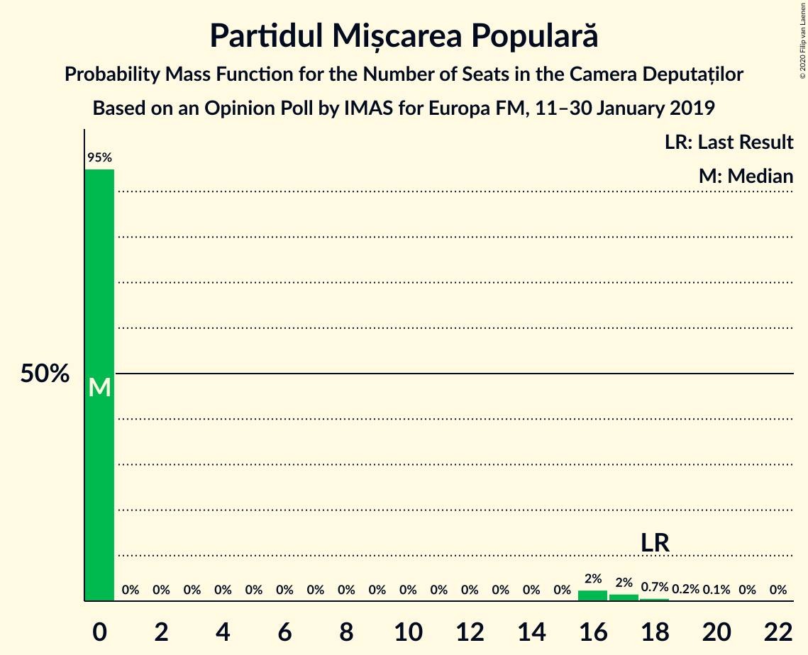

| Number of Seats | Probability | Accumulated | Special Marks |
|:---------------:|:-----------:|:-----------:|:-------------:|
| 0 | 95% | 100% | Median |
| 1 | 0% | 5% |  |
| 2 | 0% | 5% |  |
| 3 | 0% | 5% |  |
| 4 | 0% | 5% |  |
| 5 | 0% | 5% |  |
| 6 | 0% | 5% |  |
| 7 | 0% | 5% |  |
| 8 | 0% | 5% |  |
| 9 | 0% | 5% |  |
| 10 | 0% | 5% |  |
| 11 | 0% | 5% |  |
| 12 | 0% | 5% |  |
| 13 | 0% | 5% |  |
| 14 | 0% | 5% |  |
| 15 | 0% | 5% |  |
| 16 | 2% | 5% |  |
| 17 | 2% | 3% |  |
| 18 | 0.7% | 0.9% | Last Result |
| 19 | 0.2% | 0.3% |  |
| 20 | 0.1% | 0.1% |  |
| 21 | 0% | 0% |  |

## Coalitions

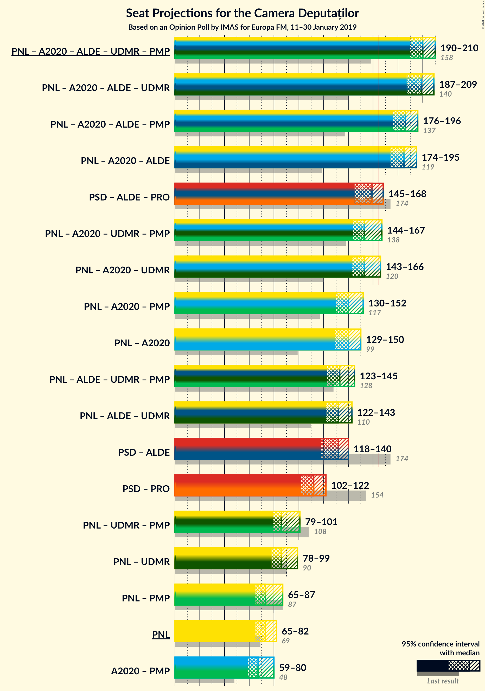

### Confidence Intervals

| Coalition | Last Result | Median | Majority? | 80% Confidence Interval | 90% Confidence Interval | 95% Confidence Interval | 99% Confidence Interval |
|:---------:|:-----------:|:------:|:---------:|:-----------------------:|:-----------------------:|:-----------------------:|:-----------------------:|
| Partidul Național Liberal – Alianța 2020 USR-PLUS – Partidul Alianța Liberalilor și Democraților – Uniunea Democrată Maghiară din România – Partidul Mișcarea Populară | 158 | 200 | 100% | 193–206 | 191–208 | 190–210 | 187–214 |
| Partidul Național Liberal – Alianța 2020 USR-PLUS – Partidul Alianța Liberalilor și Democraților – Uniunea Democrată Maghiară din România | 140 | 199 | 100% | 192–206 | 190–208 | 187–209 | 183–212 |
| Partidul Național Liberal – Alianța 2020 USR-PLUS – Partidul Alianța Liberalilor și Democraților – Partidul Mișcarea Populară | 137 | 186 | 100% | 179–193 | 177–195 | 176–196 | 173–200 |
| Partidul Național Liberal – Alianța 2020 USR-PLUS – Partidul Alianța Liberalilor și Democraților | 119 | 185 | 100% | 178–192 | 176–194 | 174–195 | 169–198 |
| Partidul Social Democrat – Partidul Alianța Liberalilor și Democraților – PRO România | 174 | 159 | 10% | 149–165 | 147–166 | 145–168 | 142–171 |
| Partidul Național Liberal – Alianța 2020 USR-PLUS – Uniunea Democrată Maghiară din România – Partidul Mișcarea Populară | 138 | 153 | 6% | 147–163 | 146–165 | 144–167 | 141–170 |
| Partidul Național Liberal – Alianța 2020 USR-PLUS – Uniunea Democrată Maghiară din România | 120 | 153 | 4% | 147–161 | 145–164 | 143–166 | 140–169 |
| Partidul Național Liberal – Alianța 2020 USR-PLUS – Partidul Mișcarea Populară | 117 | 140 | 0% | 134–148 | 132–150 | 130–152 | 127–157 |
| Partidul Național Liberal – Alianța 2020 USR-PLUS | 99 | 140 | 0% | 133–147 | 131–148 | 129–150 | 126–154 |
| Partidul Național Liberal – Partidul Alianța Liberalilor și Democraților – Uniunea Democrată Maghiară din România – Partidul Mișcarea Populară | 128 | 133 | 0% | 126–140 | 124–143 | 123–145 | 119–149 |
| Partidul Național Liberal – Partidul Alianța Liberalilor și Democraților – Uniunea Democrată Maghiară din România | 110 | 132 | 0% | 125–139 | 123–141 | 122–143 | 118–147 |
| Partidul Social Democrat – Partidul Alianța Liberalilor și Democraților | 174 | 132 | 0% | 122–138 | 120–139 | 118–140 | 115–142 |
| Partidul Social Democrat – PRO România | 154 | 112 | 0% | 106–119 | 104–121 | 102–122 | 98–125 |
| Partidul Național Liberal – Uniunea Democrată Maghiară din România – Partidul Mișcarea Populară | 108 | 86 | 0% | 81–96 | 80–99 | 79–101 | 77–105 |
| Partidul Național Liberal – Uniunea Democrată Maghiară din România | 90 | 86 | 0% | 81–95 | 80–97 | 78–99 | 76–102 |
| Partidul Național Liberal – Partidul Mișcarea Populară | 87 | 73 | 0% | 68–81 | 67–84 | 65–87 | 63–92 |
| Partidul Național Liberal | 69 | 73 | 0% | 68–79 | 66–81 | 65–82 | 62–86 |
| Alianța 2020 USR-PLUS – Partidul Mișcarea Populară | 48 | 67 | 0% | 62–74 | 60–77 | 59–80 | 56–85 |

### Partidul Național Liberal – Alianța 2020 USR-PLUS – Partidul Alianța Liberalilor și Democraților – Uniunea Democrată Maghiară din România – Partidul Mișcarea Populară

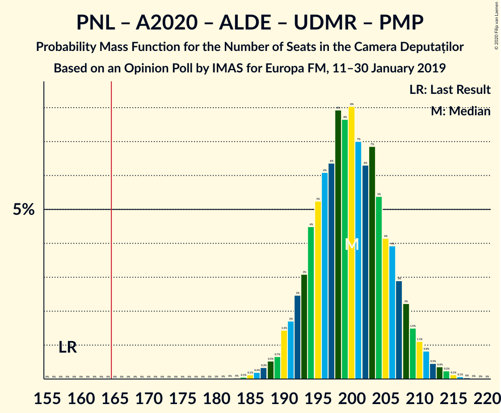

| Number of Seats | Probability | Accumulated | Special Marks |
|:---------------:|:-----------:|:-----------:|:-------------:|
| 158 | 0% | 100% | Last Result |
| 159 | 0% | 100% |  |
| 160 | 0% | 100% |  |
| 161 | 0% | 100% |  |
| 162 | 0% | 100% |  |
| 163 | 0% | 100% |  |
| 164 | 0% | 100% |  |
| 165 | 0% | 100% | Majority |
| 166 | 0% | 100% |  |
| 167 | 0% | 100% |  |
| 168 | 0% | 100% |  |
| 169 | 0% | 100% |  |
| 170 | 0% | 100% |  |
| 171 | 0% | 100% |  |
| 172 | 0% | 100% |  |
| 173 | 0% | 100% |  |
| 174 | 0% | 100% |  |
| 175 | 0% | 100% |  |
| 176 | 0% | 100% |  |
| 177 | 0% | 100% |  |
| 178 | 0% | 100% |  |
| 179 | 0% | 100% |  |
| 180 | 0% | 100% |  |
| 181 | 0% | 100% |  |
| 182 | 0% | 100% |  |
| 183 | 0% | 100% |  |
| 184 | 0.1% | 99.9% |  |
| 185 | 0.1% | 99.9% |  |
| 186 | 0.2% | 99.8% |  |
| 187 | 0.3% | 99.6% |  |
| 188 | 0.5% | 99.2% |  |
| 189 | 0.7% | 98.7% |  |
| 190 | 1.4% | 98% |  |
| 191 | 2% | 97% |  |
| 192 | 2% | 95% |  |
| 193 | 3% | 92% |  |
| 194 | 4% | 89% |  |
| 195 | 5% | 85% |  |
| 196 | 6% | 80% |  |
| 197 | 6% | 73% |  |
| 198 | 8% | 67% |  |
| 199 | 8% | 59% | Median |
| 200 | 8% | 52% |  |
| 201 | 7% | 44% |  |
| 202 | 6% | 37% |  |
| 203 | 7% | 30% |  |
| 204 | 5% | 23% |  |
| 205 | 4% | 18% |  |
| 206 | 4% | 14% |  |
| 207 | 3% | 10% |  |
| 208 | 2% | 7% |  |
| 209 | 1.5% | 5% |  |
| 210 | 1.1% | 3% |  |
| 211 | 0.8% | 2% |  |
| 212 | 0.5% | 1.3% |  |
| 213 | 0.4% | 0.9% |  |
| 214 | 0.2% | 0.5% |  |
| 215 | 0.1% | 0.3% |  |
| 216 | 0.1% | 0.1% |  |
| 217 | 0% | 0.1% |  |
| 218 | 0% | 0% |  |

### Partidul Național Liberal – Alianța 2020 USR-PLUS – Partidul Alianța Liberalilor și Democraților – Uniunea Democrată Maghiară din România

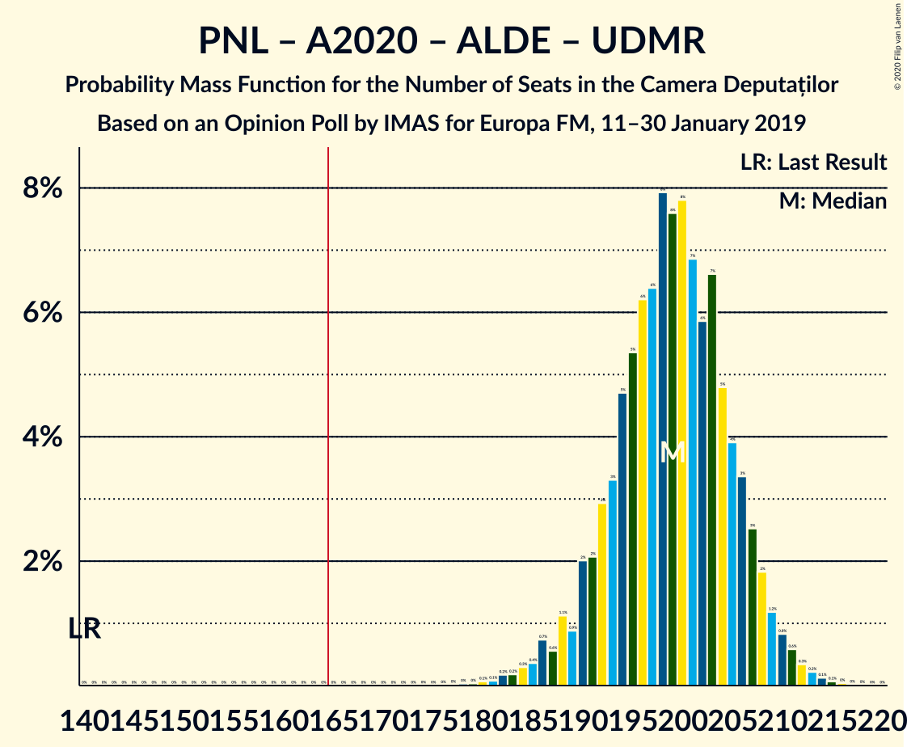

| Number of Seats | Probability | Accumulated | Special Marks |
|:---------------:|:-----------:|:-----------:|:-------------:|
| 140 | 0% | 100% | Last Result |
| 141 | 0% | 100% |  |
| 142 | 0% | 100% |  |
| 143 | 0% | 100% |  |
| 144 | 0% | 100% |  |
| 145 | 0% | 100% |  |
| 146 | 0% | 100% |  |
| 147 | 0% | 100% |  |
| 148 | 0% | 100% |  |
| 149 | 0% | 100% |  |
| 150 | 0% | 100% |  |
| 151 | 0% | 100% |  |
| 152 | 0% | 100% |  |
| 153 | 0% | 100% |  |
| 154 | 0% | 100% |  |
| 155 | 0% | 100% |  |
| 156 | 0% | 100% |  |
| 157 | 0% | 100% |  |
| 158 | 0% | 100% |  |
| 159 | 0% | 100% |  |
| 160 | 0% | 100% |  |
| 161 | 0% | 100% |  |
| 162 | 0% | 100% |  |
| 163 | 0% | 100% |  |
| 164 | 0% | 100% |  |
| 165 | 0% | 100% | Majority |
| 166 | 0% | 100% |  |
| 167 | 0% | 100% |  |
| 168 | 0% | 100% |  |
| 169 | 0% | 100% |  |
| 170 | 0% | 100% |  |
| 171 | 0% | 100% |  |
| 172 | 0% | 100% |  |
| 173 | 0% | 100% |  |
| 174 | 0% | 100% |  |
| 175 | 0% | 100% |  |
| 176 | 0% | 100% |  |
| 177 | 0% | 100% |  |
| 178 | 0% | 100% |  |
| 179 | 0% | 99.9% |  |
| 180 | 0.1% | 99.9% |  |
| 181 | 0.1% | 99.8% |  |
| 182 | 0.2% | 99.8% |  |
| 183 | 0.2% | 99.6% |  |
| 184 | 0.3% | 99.4% |  |
| 185 | 0.4% | 99.1% |  |
| 186 | 0.7% | 98.8% |  |
| 187 | 0.6% | 98% |  |
| 188 | 1.1% | 97% |  |
| 189 | 0.9% | 96% |  |
| 190 | 2% | 95% |  |
| 191 | 2% | 93% |  |
| 192 | 3% | 91% |  |
| 193 | 3% | 88% |  |
| 194 | 5% | 85% |  |
| 195 | 5% | 80% |  |
| 196 | 6% | 75% |  |
| 197 | 6% | 69% |  |
| 198 | 8% | 62% |  |
| 199 | 8% | 55% | Median |
| 200 | 8% | 47% |  |
| 201 | 7% | 39% |  |
| 202 | 6% | 32% |  |
| 203 | 7% | 26% |  |
| 204 | 5% | 20% |  |
| 205 | 4% | 15% |  |
| 206 | 3% | 11% |  |
| 207 | 3% | 8% |  |
| 208 | 2% | 5% |  |
| 209 | 1.2% | 3% |  |
| 210 | 0.8% | 2% |  |
| 211 | 0.6% | 1.4% |  |
| 212 | 0.3% | 0.8% |  |
| 213 | 0.2% | 0.5% |  |
| 214 | 0.1% | 0.3% |  |
| 215 | 0.1% | 0.1% |  |
| 216 | 0% | 0.1% |  |
| 217 | 0% | 0% |  |

### Partidul Național Liberal – Alianța 2020 USR-PLUS – Partidul Alianța Liberalilor și Democraților – Partidul Mișcarea Populară

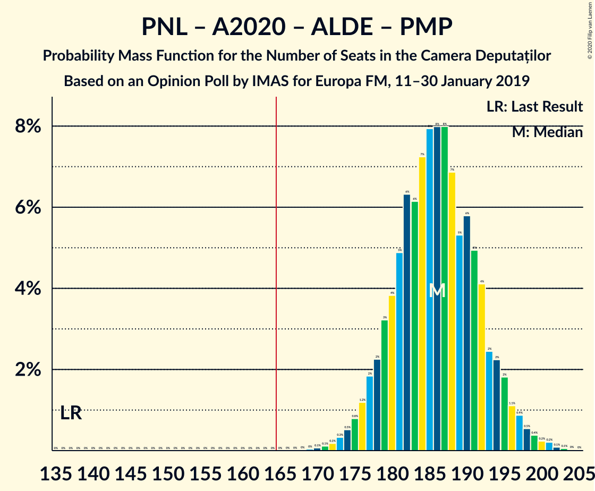

| Number of Seats | Probability | Accumulated | Special Marks |
|:---------------:|:-----------:|:-----------:|:-------------:|
| 137 | 0% | 100% | Last Result |
| 138 | 0% | 100% |  |
| 139 | 0% | 100% |  |
| 140 | 0% | 100% |  |
| 141 | 0% | 100% |  |
| 142 | 0% | 100% |  |
| 143 | 0% | 100% |  |
| 144 | 0% | 100% |  |
| 145 | 0% | 100% |  |
| 146 | 0% | 100% |  |
| 147 | 0% | 100% |  |
| 148 | 0% | 100% |  |
| 149 | 0% | 100% |  |
| 150 | 0% | 100% |  |
| 151 | 0% | 100% |  |
| 152 | 0% | 100% |  |
| 153 | 0% | 100% |  |
| 154 | 0% | 100% |  |
| 155 | 0% | 100% |  |
| 156 | 0% | 100% |  |
| 157 | 0% | 100% |  |
| 158 | 0% | 100% |  |
| 159 | 0% | 100% |  |
| 160 | 0% | 100% |  |
| 161 | 0% | 100% |  |
| 162 | 0% | 100% |  |
| 163 | 0% | 100% |  |
| 164 | 0% | 100% |  |
| 165 | 0% | 100% | Majority |
| 166 | 0% | 100% |  |
| 167 | 0% | 100% |  |
| 168 | 0% | 100% |  |
| 169 | 0% | 100% |  |
| 170 | 0.1% | 99.9% |  |
| 171 | 0.1% | 99.9% |  |
| 172 | 0.2% | 99.7% |  |
| 173 | 0.3% | 99.6% |  |
| 174 | 0.5% | 99.2% |  |
| 175 | 0.8% | 98.7% |  |
| 176 | 1.2% | 98% |  |
| 177 | 2% | 97% |  |
| 178 | 2% | 95% |  |
| 179 | 3% | 93% |  |
| 180 | 4% | 89% |  |
| 181 | 5% | 86% |  |
| 182 | 6% | 81% |  |
| 183 | 6% | 74% |  |
| 184 | 7% | 68% |  |
| 185 | 8% | 61% |  |
| 186 | 8% | 53% | Median |
| 187 | 8% | 45% |  |
| 188 | 7% | 37% |  |
| 189 | 5% | 30% |  |
| 190 | 6% | 25% |  |
| 191 | 5% | 19% |  |
| 192 | 4% | 14% |  |
| 193 | 2% | 10% |  |
| 194 | 2% | 8% |  |
| 195 | 2% | 5% |  |
| 196 | 1.1% | 4% |  |
| 197 | 0.9% | 2% |  |
| 198 | 0.5% | 2% |  |
| 199 | 0.4% | 1.0% |  |
| 200 | 0.2% | 0.6% |  |
| 201 | 0.2% | 0.4% |  |
| 202 | 0.1% | 0.2% |  |
| 203 | 0.1% | 0.1% |  |
| 204 | 0% | 0.1% |  |
| 205 | 0% | 0% |  |

### Partidul Național Liberal – Alianța 2020 USR-PLUS – Partidul Alianța Liberalilor și Democraților

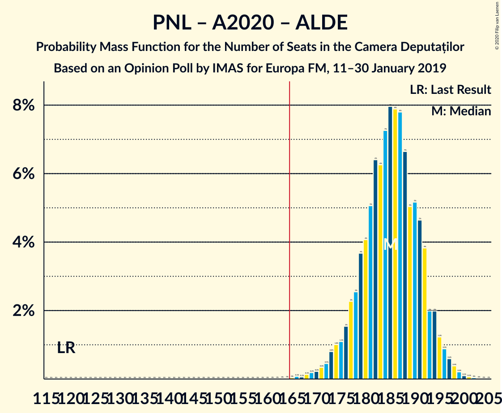

| Number of Seats | Probability | Accumulated | Special Marks |
|:---------------:|:-----------:|:-----------:|:-------------:|
| 119 | 0% | 100% | Last Result |
| 120 | 0% | 100% |  |
| 121 | 0% | 100% |  |
| 122 | 0% | 100% |  |
| 123 | 0% | 100% |  |
| 124 | 0% | 100% |  |
| 125 | 0% | 100% |  |
| 126 | 0% | 100% |  |
| 127 | 0% | 100% |  |
| 128 | 0% | 100% |  |
| 129 | 0% | 100% |  |
| 130 | 0% | 100% |  |
| 131 | 0% | 100% |  |
| 132 | 0% | 100% |  |
| 133 | 0% | 100% |  |
| 134 | 0% | 100% |  |
| 135 | 0% | 100% |  |
| 136 | 0% | 100% |  |
| 137 | 0% | 100% |  |
| 138 | 0% | 100% |  |
| 139 | 0% | 100% |  |
| 140 | 0% | 100% |  |
| 141 | 0% | 100% |  |
| 142 | 0% | 100% |  |
| 143 | 0% | 100% |  |
| 144 | 0% | 100% |  |
| 145 | 0% | 100% |  |
| 146 | 0% | 100% |  |
| 147 | 0% | 100% |  |
| 148 | 0% | 100% |  |
| 149 | 0% | 100% |  |
| 150 | 0% | 100% |  |
| 151 | 0% | 100% |  |
| 152 | 0% | 100% |  |
| 153 | 0% | 100% |  |
| 154 | 0% | 100% |  |
| 155 | 0% | 100% |  |
| 156 | 0% | 100% |  |
| 157 | 0% | 100% |  |
| 158 | 0% | 100% |  |
| 159 | 0% | 100% |  |
| 160 | 0% | 100% |  |
| 161 | 0% | 100% |  |
| 162 | 0% | 100% |  |
| 163 | 0% | 100% |  |
| 164 | 0% | 100% |  |
| 165 | 0% | 100% | Majority |
| 166 | 0.1% | 99.9% |  |
| 167 | 0.1% | 99.8% |  |
| 168 | 0.1% | 99.8% |  |
| 169 | 0.2% | 99.6% |  |
| 170 | 0.2% | 99.5% |  |
| 171 | 0.3% | 99.2% |  |
| 172 | 0.5% | 98.9% |  |
| 173 | 0.8% | 98% |  |
| 174 | 1.0% | 98% |  |
| 175 | 1.1% | 97% |  |
| 176 | 2% | 96% |  |
| 177 | 2% | 94% |  |
| 178 | 3% | 92% |  |
| 179 | 4% | 89% |  |
| 180 | 4% | 86% |  |
| 181 | 5% | 81% |  |
| 182 | 6% | 76% |  |
| 183 | 6% | 70% |  |
| 184 | 7% | 64% |  |
| 185 | 8% | 56% |  |
| 186 | 8% | 48% | Median |
| 187 | 8% | 41% |  |
| 188 | 7% | 33% |  |
| 189 | 5% | 26% |  |
| 190 | 5% | 21% |  |
| 191 | 5% | 16% |  |
| 192 | 4% | 11% |  |
| 193 | 2% | 7% |  |
| 194 | 2% | 6% |  |
| 195 | 1.2% | 4% |  |
| 196 | 0.9% | 2% |  |
| 197 | 0.6% | 1.4% |  |
| 198 | 0.4% | 0.8% |  |
| 199 | 0.2% | 0.4% |  |
| 200 | 0.1% | 0.2% |  |
| 201 | 0.1% | 0.1% |  |
| 202 | 0% | 0.1% |  |
| 203 | 0% | 0% |  |

### Partidul Social Democrat – Partidul Alianța Liberalilor și Democraților – PRO România

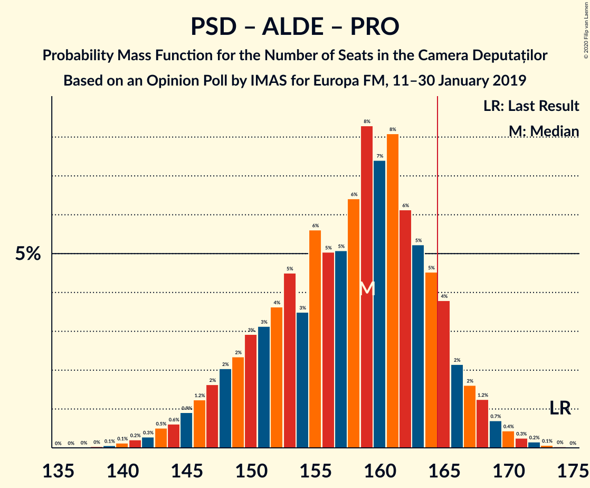

| Number of Seats | Probability | Accumulated | Special Marks |
|:---------------:|:-----------:|:-----------:|:-------------:|
| 138 | 0% | 100% |  |
| 139 | 0.1% | 99.9% |  |
| 140 | 0.1% | 99.9% |  |
| 141 | 0.2% | 99.7% |  |
| 142 | 0.3% | 99.5% |  |
| 143 | 0.5% | 99.2% |  |
| 144 | 0.6% | 98.7% |  |
| 145 | 0.9% | 98% |  |
| 146 | 1.2% | 97% |  |
| 147 | 2% | 96% |  |
| 148 | 2% | 94% |  |
| 149 | 2% | 92% |  |
| 150 | 3% | 90% |  |
| 151 | 3% | 87% |  |
| 152 | 4% | 84% |  |
| 153 | 5% | 80% |  |
| 154 | 3% | 76% |  |
| 155 | 6% | 72% |  |
| 156 | 5% | 67% |  |
| 157 | 5% | 62% |  |
| 158 | 6% | 57% |  |
| 159 | 8% | 50% | Median |
| 160 | 7% | 42% |  |
| 161 | 8% | 34% |  |
| 162 | 6% | 26% |  |
| 163 | 5% | 20% |  |
| 164 | 5% | 15% |  |
| 165 | 4% | 10% | Majority |
| 166 | 2% | 7% |  |
| 167 | 2% | 5% |  |
| 168 | 1.2% | 3% |  |
| 169 | 0.7% | 2% |  |
| 170 | 0.4% | 1.0% |  |
| 171 | 0.3% | 0.5% |  |
| 172 | 0.2% | 0.3% |  |
| 173 | 0.1% | 0.1% |  |
| 174 | 0% | 0.1% | Last Result |
| 175 | 0% | 0% |  |

### Partidul Național Liberal – Alianța 2020 USR-PLUS – Uniunea Democrată Maghiară din România – Partidul Mișcarea Populară

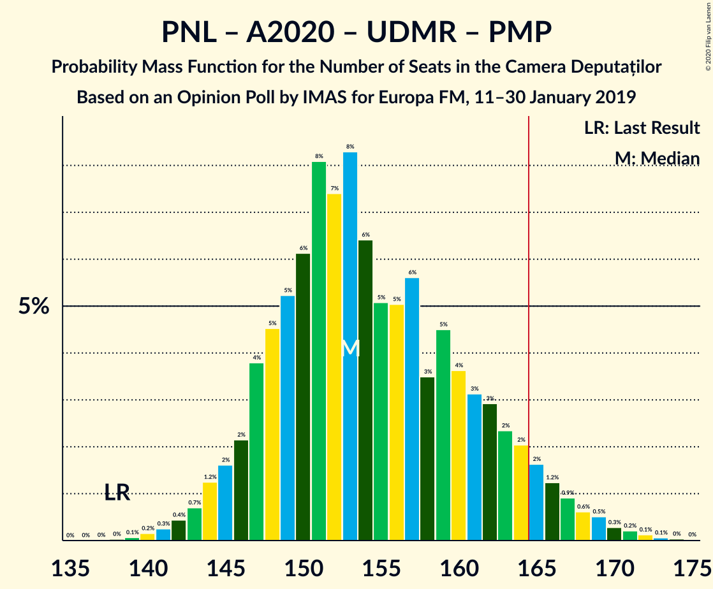

| Number of Seats | Probability | Accumulated | Special Marks |
|:---------------:|:-----------:|:-----------:|:-------------:|
| 138 | 0% | 100% | Last Result |
| 139 | 0.1% | 99.9% |  |
| 140 | 0.2% | 99.9% |  |
| 141 | 0.3% | 99.7% |  |
| 142 | 0.4% | 99.5% |  |
| 143 | 0.7% | 99.0% |  |
| 144 | 1.2% | 98% |  |
| 145 | 2% | 97% |  |
| 146 | 2% | 95% |  |
| 147 | 4% | 93% |  |
| 148 | 5% | 90% |  |
| 149 | 5% | 85% |  |
| 150 | 6% | 80% |  |
| 151 | 8% | 74% |  |
| 152 | 7% | 66% |  |
| 153 | 8% | 58% | Median |
| 154 | 6% | 50% |  |
| 155 | 5% | 43% |  |
| 156 | 5% | 38% |  |
| 157 | 6% | 33% |  |
| 158 | 3% | 28% |  |
| 159 | 5% | 24% |  |
| 160 | 4% | 20% |  |
| 161 | 3% | 16% |  |
| 162 | 3% | 13% |  |
| 163 | 2% | 10% |  |
| 164 | 2% | 8% |  |
| 165 | 2% | 6% | Majority |
| 166 | 1.2% | 4% |  |
| 167 | 0.9% | 3% |  |
| 168 | 0.6% | 2% |  |
| 169 | 0.5% | 1.3% |  |
| 170 | 0.3% | 0.8% |  |
| 171 | 0.2% | 0.5% |  |
| 172 | 0.1% | 0.3% |  |
| 173 | 0.1% | 0.1% |  |
| 174 | 0% | 0.1% |  |
| 175 | 0% | 0% |  |

### Partidul Național Liberal – Alianța 2020 USR-PLUS – Uniunea Democrată Maghiară din România

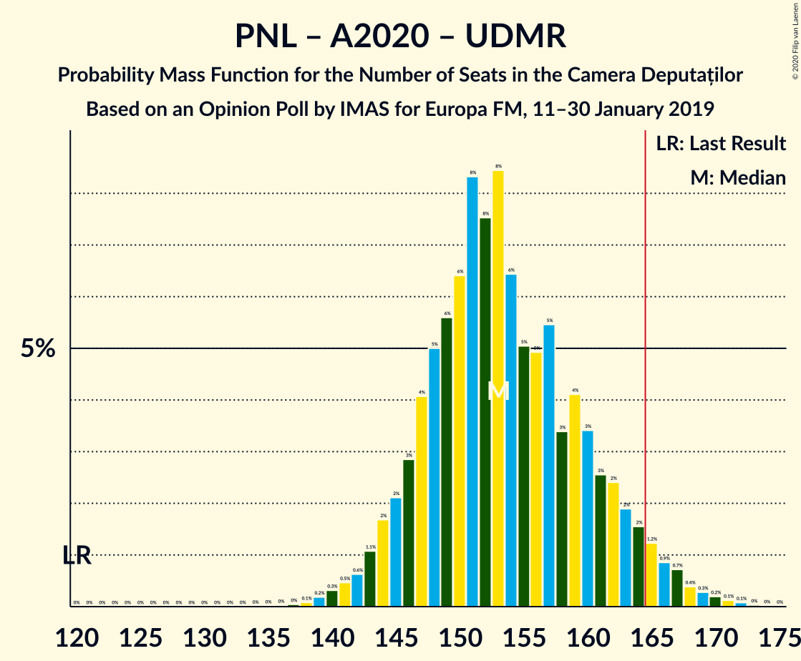

| Number of Seats | Probability | Accumulated | Special Marks |
|:---------------:|:-----------:|:-----------:|:-------------:|
| 120 | 0% | 100% | Last Result |
| 121 | 0% | 100% |  |
| 122 | 0% | 100% |  |
| 123 | 0% | 100% |  |
| 124 | 0% | 100% |  |
| 125 | 0% | 100% |  |
| 126 | 0% | 100% |  |
| 127 | 0% | 100% |  |
| 128 | 0% | 100% |  |
| 129 | 0% | 100% |  |
| 130 | 0% | 100% |  |
| 131 | 0% | 100% |  |
| 132 | 0% | 100% |  |
| 133 | 0% | 100% |  |
| 134 | 0% | 100% |  |
| 135 | 0% | 100% |  |
| 136 | 0% | 100% |  |
| 137 | 0% | 99.9% |  |
| 138 | 0.1% | 99.9% |  |
| 139 | 0.2% | 99.8% |  |
| 140 | 0.3% | 99.6% |  |
| 141 | 0.5% | 99.3% |  |
| 142 | 0.6% | 98.9% |  |
| 143 | 1.1% | 98% |  |
| 144 | 2% | 97% |  |
| 145 | 2% | 95% |  |
| 146 | 3% | 93% |  |
| 147 | 4% | 91% |  |
| 148 | 5% | 86% |  |
| 149 | 6% | 81% |  |
| 150 | 6% | 76% |  |
| 151 | 8% | 69% |  |
| 152 | 8% | 61% |  |
| 153 | 8% | 54% | Median |
| 154 | 6% | 45% |  |
| 155 | 5% | 39% |  |
| 156 | 5% | 34% |  |
| 157 | 5% | 29% |  |
| 158 | 3% | 23% |  |
| 159 | 4% | 20% |  |
| 160 | 3% | 16% |  |
| 161 | 3% | 12% |  |
| 162 | 2% | 10% |  |
| 163 | 2% | 7% |  |
| 164 | 2% | 5% |  |
| 165 | 1.2% | 4% | Majority |
| 166 | 0.9% | 3% |  |
| 167 | 0.7% | 2% |  |
| 168 | 0.4% | 1.1% |  |
| 169 | 0.3% | 0.7% |  |
| 170 | 0.2% | 0.5% |  |
| 171 | 0.1% | 0.3% |  |
| 172 | 0.1% | 0.1% |  |
| 173 | 0% | 0.1% |  |
| 174 | 0% | 0% |  |

### Partidul Național Liberal – Alianța 2020 USR-PLUS – Partidul Mișcarea Populară

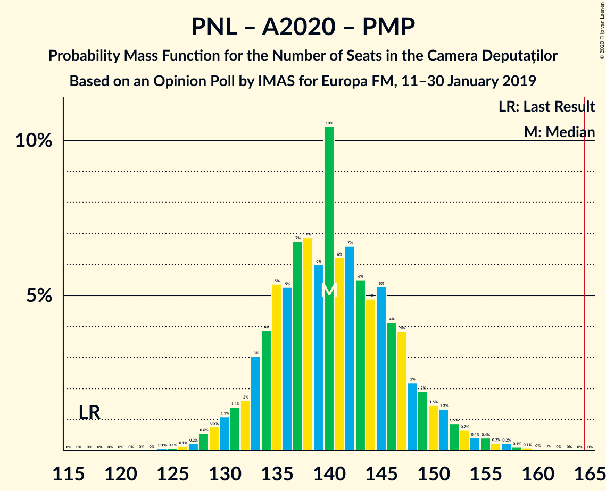

| Number of Seats | Probability | Accumulated | Special Marks |
|:---------------:|:-----------:|:-----------:|:-------------:|
| 117 | 0% | 100% | Last Result |
| 118 | 0% | 100% |  |
| 119 | 0% | 100% |  |
| 120 | 0% | 100% |  |
| 121 | 0% | 100% |  |
| 122 | 0% | 100% |  |
| 123 | 0% | 100% |  |
| 124 | 0.1% | 100% |  |
| 125 | 0.1% | 99.9% |  |
| 126 | 0.1% | 99.8% |  |
| 127 | 0.2% | 99.7% |  |
| 128 | 0.6% | 99.5% |  |
| 129 | 0.8% | 98.9% |  |
| 130 | 1.1% | 98% |  |
| 131 | 1.4% | 97% |  |
| 132 | 2% | 96% |  |
| 133 | 3% | 94% |  |
| 134 | 4% | 91% |  |
| 135 | 5% | 87% |  |
| 136 | 5% | 82% |  |
| 137 | 7% | 77% |  |
| 138 | 7% | 70% |  |
| 139 | 6% | 63% |  |
| 140 | 10% | 57% | Median |
| 141 | 6% | 46% |  |
| 142 | 7% | 40% |  |
| 143 | 6% | 34% |  |
| 144 | 5% | 28% |  |
| 145 | 5% | 23% |  |
| 146 | 4% | 18% |  |
| 147 | 4% | 14% |  |
| 148 | 2% | 10% |  |
| 149 | 2% | 8% |  |
| 150 | 1.5% | 6% |  |
| 151 | 1.3% | 4% |  |
| 152 | 0.9% | 3% |  |
| 153 | 0.7% | 2% |  |
| 154 | 0.4% | 2% |  |
| 155 | 0.4% | 1.2% |  |
| 156 | 0.2% | 0.8% |  |
| 157 | 0.2% | 0.5% |  |
| 158 | 0.1% | 0.3% |  |
| 159 | 0.1% | 0.2% |  |
| 160 | 0% | 0.1% |  |
| 161 | 0% | 0.1% |  |
| 162 | 0% | 0% |  |

### Partidul Național Liberal – Alianța 2020 USR-PLUS

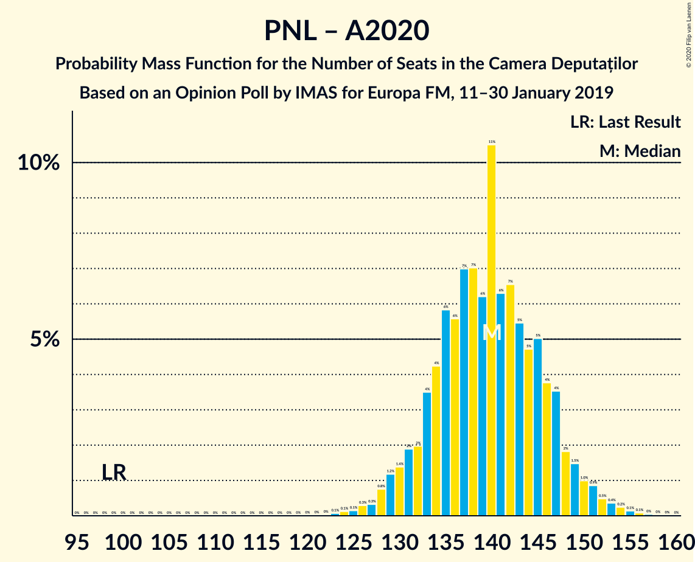

| Number of Seats | Probability | Accumulated | Special Marks |
|:---------------:|:-----------:|:-----------:|:-------------:|
| 99 | 0% | 100% | Last Result |
| 100 | 0% | 100% |  |
| 101 | 0% | 100% |  |
| 102 | 0% | 100% |  |
| 103 | 0% | 100% |  |
| 104 | 0% | 100% |  |
| 105 | 0% | 100% |  |
| 106 | 0% | 100% |  |
| 107 | 0% | 100% |  |
| 108 | 0% | 100% |  |
| 109 | 0% | 100% |  |
| 110 | 0% | 100% |  |
| 111 | 0% | 100% |  |
| 112 | 0% | 100% |  |
| 113 | 0% | 100% |  |
| 114 | 0% | 100% |  |
| 115 | 0% | 100% |  |
| 116 | 0% | 100% |  |
| 117 | 0% | 100% |  |
| 118 | 0% | 100% |  |
| 119 | 0% | 100% |  |
| 120 | 0% | 100% |  |
| 121 | 0% | 100% |  |
| 122 | 0% | 100% |  |
| 123 | 0.1% | 99.9% |  |
| 124 | 0.1% | 99.9% |  |
| 125 | 0.1% | 99.7% |  |
| 126 | 0.3% | 99.6% |  |
| 127 | 0.3% | 99.3% |  |
| 128 | 0.8% | 99.0% |  |
| 129 | 1.2% | 98% |  |
| 130 | 1.4% | 97% |  |
| 131 | 2% | 96% |  |
| 132 | 2% | 94% |  |
| 133 | 4% | 92% |  |
| 134 | 4% | 88% |  |
| 135 | 6% | 84% |  |
| 136 | 6% | 78% |  |
| 137 | 7% | 73% |  |
| 138 | 7% | 66% |  |
| 139 | 6% | 59% |  |
| 140 | 11% | 52% | Median |
| 141 | 6% | 42% |  |
| 142 | 7% | 36% |  |
| 143 | 5% | 29% |  |
| 144 | 5% | 24% |  |
| 145 | 5% | 19% |  |
| 146 | 4% | 14% |  |
| 147 | 4% | 10% |  |
| 148 | 2% | 7% |  |
| 149 | 1.5% | 5% |  |
| 150 | 1.0% | 3% |  |
| 151 | 0.9% | 2% |  |
| 152 | 0.5% | 1.4% |  |
| 153 | 0.4% | 0.9% |  |
| 154 | 0.2% | 0.6% |  |
| 155 | 0.1% | 0.3% |  |
| 156 | 0.1% | 0.2% |  |
| 157 | 0% | 0.1% |  |
| 158 | 0% | 0.1% |  |
| 159 | 0% | 0% |  |

### Partidul Național Liberal – Partidul Alianța Liberalilor și Democraților – Uniunea Democrată Maghiară din România – Partidul Mișcarea Populară

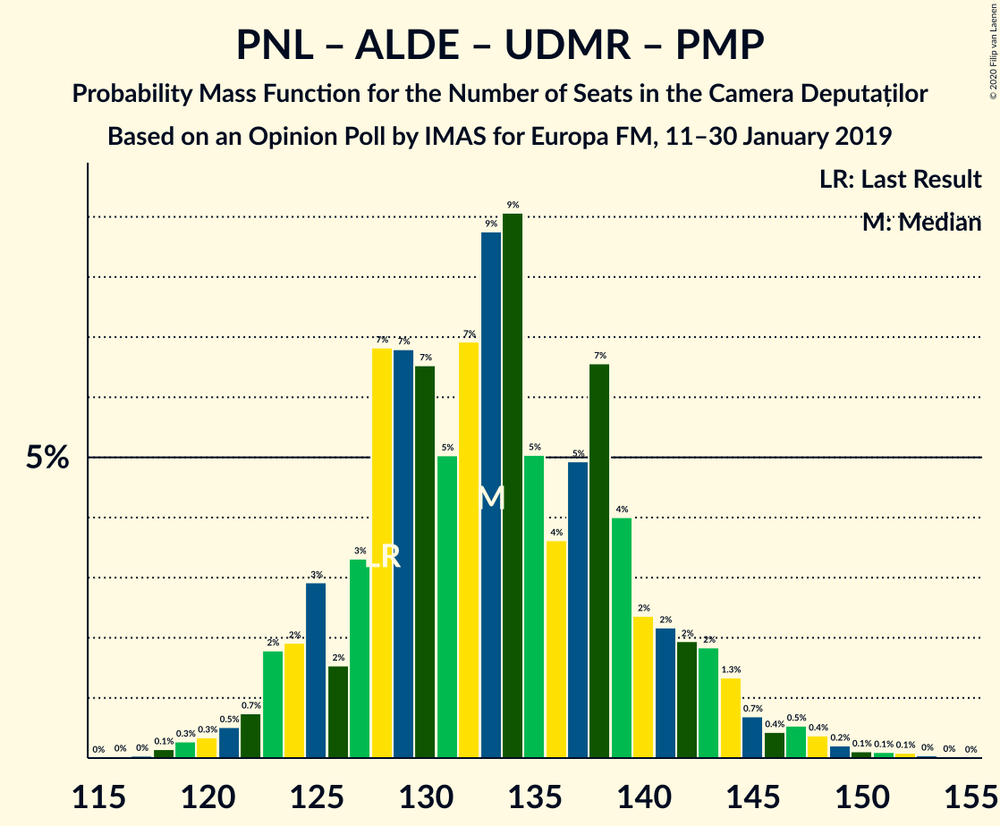

| Number of Seats | Probability | Accumulated | Special Marks |
|:---------------:|:-----------:|:-----------:|:-------------:|
| 116 | 0% | 100% |  |
| 117 | 0% | 99.9% |  |
| 118 | 0.1% | 99.9% |  |
| 119 | 0.3% | 99.8% |  |
| 120 | 0.3% | 99.5% |  |
| 121 | 0.5% | 99.1% |  |
| 122 | 0.7% | 98.6% |  |
| 123 | 2% | 98% |  |
| 124 | 2% | 96% |  |
| 125 | 3% | 94% |  |
| 126 | 2% | 91% |  |
| 127 | 3% | 90% |  |
| 128 | 7% | 86% | Last Result |
| 129 | 7% | 80% |  |
| 130 | 7% | 73% |  |
| 131 | 5% | 66% |  |
| 132 | 7% | 61% | Median |
| 133 | 9% | 54% |  |
| 134 | 9% | 46% |  |
| 135 | 5% | 36% |  |
| 136 | 4% | 31% |  |
| 137 | 5% | 28% |  |
| 138 | 7% | 23% |  |
| 139 | 4% | 16% |  |
| 140 | 2% | 12% |  |
| 141 | 2% | 10% |  |
| 142 | 2% | 8% |  |
| 143 | 2% | 6% |  |
| 144 | 1.3% | 4% |  |
| 145 | 0.7% | 3% |  |
| 146 | 0.4% | 2% |  |
| 147 | 0.5% | 2% |  |
| 148 | 0.4% | 1.0% |  |
| 149 | 0.2% | 0.6% |  |
| 150 | 0.1% | 0.4% |  |
| 151 | 0.1% | 0.3% |  |
| 152 | 0.1% | 0.2% |  |
| 153 | 0% | 0.1% |  |
| 154 | 0% | 0.1% |  |
| 155 | 0% | 0% |  |

### Partidul Național Liberal – Partidul Alianța Liberalilor și Democraților – Uniunea Democrată Maghiară din România

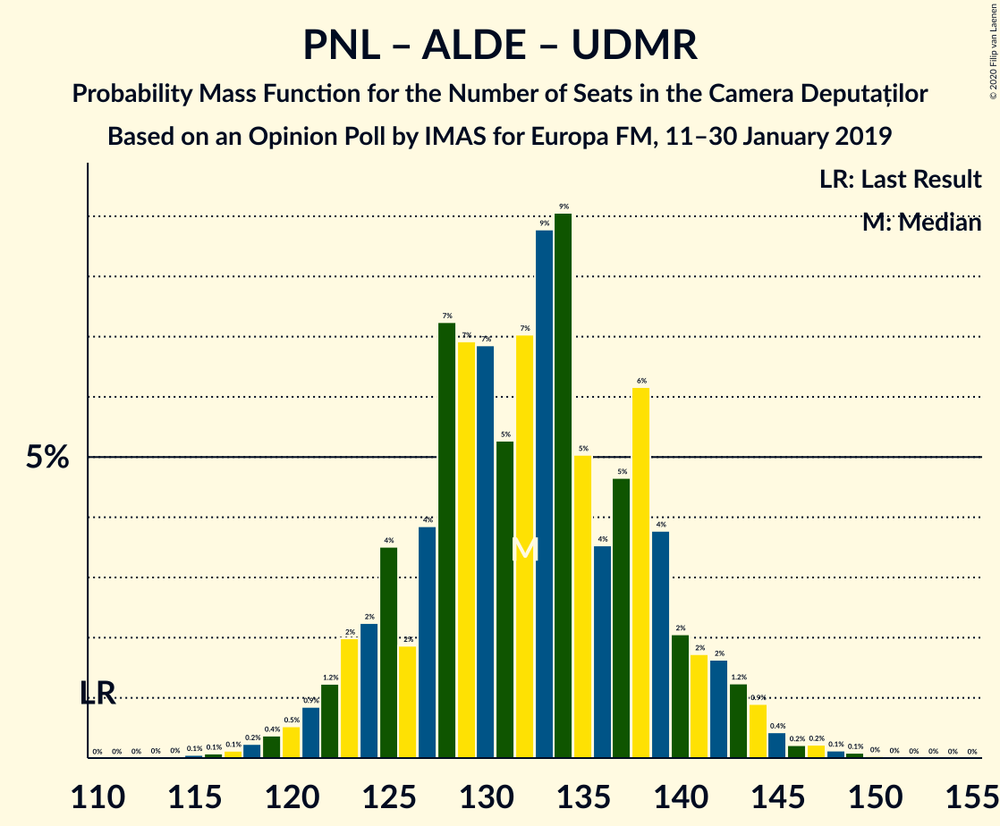

| Number of Seats | Probability | Accumulated | Special Marks |
|:---------------:|:-----------:|:-----------:|:-------------:|
| 110 | 0% | 100% | Last Result |
| 111 | 0% | 100% |  |
| 112 | 0% | 100% |  |
| 113 | 0% | 100% |  |
| 114 | 0% | 100% |  |
| 115 | 0.1% | 100% |  |
| 116 | 0.1% | 99.9% |  |
| 117 | 0.1% | 99.8% |  |
| 118 | 0.2% | 99.7% |  |
| 119 | 0.4% | 99.5% |  |
| 120 | 0.5% | 99.1% |  |
| 121 | 0.9% | 98.6% |  |
| 122 | 1.2% | 98% |  |
| 123 | 2% | 96% |  |
| 124 | 2% | 94% |  |
| 125 | 4% | 92% |  |
| 126 | 2% | 89% |  |
| 127 | 4% | 87% |  |
| 128 | 7% | 83% |  |
| 129 | 7% | 76% |  |
| 130 | 7% | 69% |  |
| 131 | 5% | 62% |  |
| 132 | 7% | 57% | Median |
| 133 | 9% | 50% |  |
| 134 | 9% | 41% |  |
| 135 | 5% | 32% |  |
| 136 | 4% | 27% |  |
| 137 | 5% | 23% |  |
| 138 | 6% | 19% |  |
| 139 | 4% | 12% |  |
| 140 | 2% | 9% |  |
| 141 | 2% | 7% |  |
| 142 | 2% | 5% |  |
| 143 | 1.2% | 3% |  |
| 144 | 0.9% | 2% |  |
| 145 | 0.4% | 1.1% |  |
| 146 | 0.2% | 0.7% |  |
| 147 | 0.2% | 0.5% |  |
| 148 | 0.1% | 0.3% |  |
| 149 | 0.1% | 0.2% |  |
| 150 | 0% | 0.1% |  |
| 151 | 0% | 0% |  |

### Partidul Social Democrat – Partidul Alianța Liberalilor și Democraților

| Number of Seats | Probability | Accumulated | Special Marks |
|:---------------:|:-----------:|:-----------:|:-------------:|
| 112 | 0% | 100% |  |
| 113 | 0.1% | 99.9% |  |
| 114 | 0.2% | 99.9% |  |
| 115 | 0.2% | 99.7% |  |
| 116 | 0.4% | 99.5% |  |
| 117 | 0.8% | 99.1% |  |
| 118 | 1.2% | 98% |  |
| 119 | 2% | 97% |  |
| 120 | 2% | 96% |  |
| 121 | 3% | 94% |  |
| 122 | 3% | 91% |  |
| 123 | 3% | 88% |  |
| 124 | 3% | 85% |  |
| 125 | 2% | 81% |  |
| 126 | 3% | 79% |  |
| 127 | 2% | 76% |  |
| 128 | 3% | 74% |  |
| 129 | 3% | 71% |  |
| 130 | 5% | 68% |  |
| 131 | 5% | 63% |  |
| 132 | 9% | 58% | Median |
| 133 | 7% | 49% |  |
| 134 | 9% | 42% |  |
| 135 | 10% | 33% |  |
| 136 | 7% | 24% |  |
| 137 | 6% | 17% |  |
| 138 | 5% | 11% |  |
| 139 | 3% | 6% |  |
| 140 | 2% | 4% |  |
| 141 | 1.3% | 2% |  |
| 142 | 0.4% | 0.8% |  |
| 143 | 0.3% | 0.5% |  |
| 144 | 0.1% | 0.2% |  |
| 145 | 0% | 0.1% |  |
| 146 | 0% | 0% |  |
| 147 | 0% | 0% |  |
| 148 | 0% | 0% |  |
| 149 | 0% | 0% |  |
| 150 | 0% | 0% |  |
| 151 | 0% | 0% |  |
| 152 | 0% | 0% |  |
| 153 | 0% | 0% |  |
| 154 | 0% | 0% |  |
| 155 | 0% | 0% |  |
| 156 | 0% | 0% |  |
| 157 | 0% | 0% |  |
| 158 | 0% | 0% |  |
| 159 | 0% | 0% |  |
| 160 | 0% | 0% |  |
| 161 | 0% | 0% |  |
| 162 | 0% | 0% |  |
| 163 | 0% | 0% |  |
| 164 | 0% | 0% |  |
| 165 | 0% | 0% | Majority |
| 166 | 0% | 0% |  |
| 167 | 0% | 0% |  |
| 168 | 0% | 0% |  |
| 169 | 0% | 0% |  |
| 170 | 0% | 0% |  |
| 171 | 0% | 0% |  |
| 172 | 0% | 0% |  |
| 173 | 0% | 0% |  |
| 174 | 0% | 0% | Last Result |

### Partidul Social Democrat – PRO România

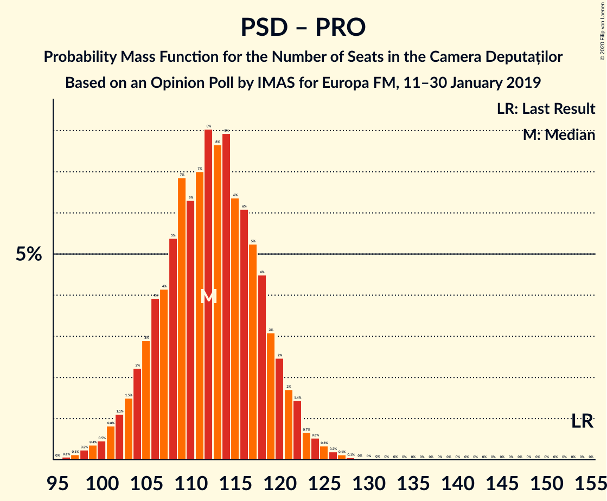

| Number of Seats | Probability | Accumulated | Special Marks |
|:---------------:|:-----------:|:-----------:|:-------------:|
| 95 | 0% | 100% |  |
| 96 | 0.1% | 99.9% |  |
| 97 | 0.1% | 99.9% |  |
| 98 | 0.2% | 99.7% |  |
| 99 | 0.4% | 99.5% |  |
| 100 | 0.5% | 99.1% |  |
| 101 | 0.8% | 98.7% |  |
| 102 | 1.1% | 98% |  |
| 103 | 1.5% | 97% |  |
| 104 | 2% | 95% |  |
| 105 | 3% | 93% |  |
| 106 | 4% | 90% |  |
| 107 | 4% | 86% |  |
| 108 | 5% | 82% |  |
| 109 | 7% | 77% |  |
| 110 | 6% | 70% |  |
| 111 | 7% | 63% |  |
| 112 | 8% | 56% |  |
| 113 | 8% | 48% | Median |
| 114 | 8% | 41% |  |
| 115 | 6% | 33% |  |
| 116 | 6% | 27% |  |
| 117 | 5% | 20% |  |
| 118 | 4% | 15% |  |
| 119 | 3% | 11% |  |
| 120 | 2% | 8% |  |
| 121 | 2% | 5% |  |
| 122 | 1.4% | 3% |  |
| 123 | 0.7% | 2% |  |
| 124 | 0.5% | 1.3% |  |
| 125 | 0.3% | 0.8% |  |
| 126 | 0.2% | 0.4% |  |
| 127 | 0.1% | 0.2% |  |
| 128 | 0.1% | 0.1% |  |
| 129 | 0% | 0.1% |  |
| 130 | 0% | 0% |  |
| 131 | 0% | 0% |  |
| 132 | 0% | 0% |  |
| 133 | 0% | 0% |  |
| 134 | 0% | 0% |  |
| 135 | 0% | 0% |  |
| 136 | 0% | 0% |  |
| 137 | 0% | 0% |  |
| 138 | 0% | 0% |  |
| 139 | 0% | 0% |  |
| 140 | 0% | 0% |  |
| 141 | 0% | 0% |  |
| 142 | 0% | 0% |  |
| 143 | 0% | 0% |  |
| 144 | 0% | 0% |  |
| 145 | 0% | 0% |  |
| 146 | 0% | 0% |  |
| 147 | 0% | 0% |  |
| 148 | 0% | 0% |  |
| 149 | 0% | 0% |  |
| 150 | 0% | 0% |  |
| 151 | 0% | 0% |  |
| 152 | 0% | 0% |  |
| 153 | 0% | 0% |  |
| 154 | 0% | 0% | Last Result |

### Partidul Național Liberal – Uniunea Democrată Maghiară din România – Partidul Mișcarea Populară

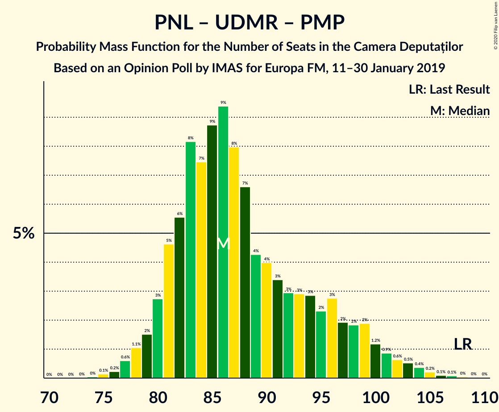

| Number of Seats | Probability | Accumulated | Special Marks |
|:---------------:|:-----------:|:-----------:|:-------------:|
| 74 | 0% | 100% |  |
| 75 | 0.1% | 99.9% |  |
| 76 | 0.2% | 99.8% |  |
| 77 | 0.6% | 99.6% |  |
| 78 | 1.1% | 99.0% |  |
| 79 | 2% | 98% |  |
| 80 | 3% | 96% |  |
| 81 | 5% | 94% |  |
| 82 | 6% | 89% |  |
| 83 | 8% | 83% |  |
| 84 | 7% | 75% |  |
| 85 | 9% | 68% |  |
| 86 | 9% | 59% | Median |
| 87 | 8% | 50% |  |
| 88 | 7% | 42% |  |
| 89 | 4% | 35% |  |
| 90 | 4% | 31% |  |
| 91 | 3% | 27% |  |
| 92 | 3% | 24% |  |
| 93 | 3% | 21% |  |
| 94 | 3% | 18% |  |
| 95 | 2% | 15% |  |
| 96 | 3% | 12% |  |
| 97 | 2% | 10% |  |
| 98 | 2% | 8% |  |
| 99 | 2% | 6% |  |
| 100 | 1.2% | 4% |  |
| 101 | 0.9% | 3% |  |
| 102 | 0.6% | 2% |  |
| 103 | 0.5% | 1.4% |  |
| 104 | 0.4% | 0.9% |  |
| 105 | 0.2% | 0.5% |  |
| 106 | 0.1% | 0.3% |  |
| 107 | 0.1% | 0.2% |  |
| 108 | 0% | 0.1% | Last Result |
| 109 | 0% | 0.1% |  |
| 110 | 0% | 0% |  |

### Partidul Național Liberal – Uniunea Democrată Maghiară din România

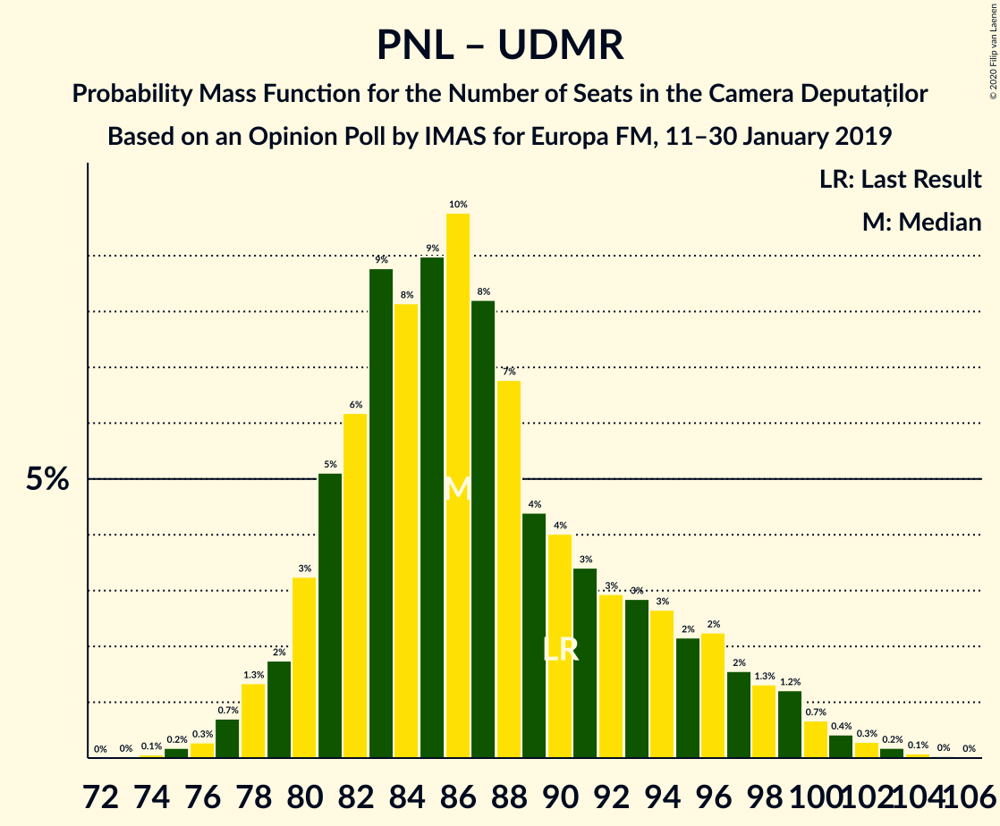

| Number of Seats | Probability | Accumulated | Special Marks |
|:---------------:|:-----------:|:-----------:|:-------------:|
| 74 | 0.1% | 100% |  |
| 75 | 0.2% | 99.9% |  |
| 76 | 0.3% | 99.7% |  |
| 77 | 0.7% | 99.4% |  |
| 78 | 1.3% | 98.7% |  |
| 79 | 2% | 97% |  |
| 80 | 3% | 96% |  |
| 81 | 5% | 92% |  |
| 82 | 6% | 87% |  |
| 83 | 9% | 81% |  |
| 84 | 8% | 72% |  |
| 85 | 9% | 64% |  |
| 86 | 10% | 55% | Median |
| 87 | 8% | 45% |  |
| 88 | 7% | 37% |  |
| 89 | 4% | 30% |  |
| 90 | 4% | 26% | Last Result |
| 91 | 3% | 22% |  |
| 92 | 3% | 19% |  |
| 93 | 3% | 16% |  |
| 94 | 3% | 13% |  |
| 95 | 2% | 10% |  |
| 96 | 2% | 8% |  |
| 97 | 2% | 6% |  |
| 98 | 1.3% | 4% |  |
| 99 | 1.2% | 3% |  |
| 100 | 0.7% | 2% |  |
| 101 | 0.4% | 1.0% |  |
| 102 | 0.3% | 0.6% |  |
| 103 | 0.2% | 0.3% |  |
| 104 | 0.1% | 0.1% |  |
| 105 | 0% | 0.1% |  |
| 106 | 0% | 0% |  |

### Partidul Național Liberal – Partidul Mișcarea Populară

| Number of Seats | Probability | Accumulated | Special Marks |
|:---------------:|:-----------:|:-----------:|:-------------:|
| 60 | 0.1% | 100% |  |
| 61 | 0.1% | 99.9% |  |
| 62 | 0.2% | 99.8% |  |
| 63 | 0.4% | 99.6% |  |
| 64 | 0.8% | 99.2% |  |
| 65 | 1.3% | 98% |  |
| 66 | 2% | 97% |  |
| 67 | 4% | 95% |  |
| 68 | 5% | 91% |  |
| 69 | 6% | 87% |  |
| 70 | 7% | 80% |  |
| 71 | 7% | 73% |  |
| 72 | 8% | 66% |  |
| 73 | 10% | 58% | Median |
| 74 | 9% | 48% |  |
| 75 | 8% | 39% |  |
| 76 | 6% | 31% |  |
| 77 | 5% | 25% |  |
| 78 | 4% | 20% |  |
| 79 | 3% | 16% |  |
| 80 | 2% | 13% |  |
| 81 | 2% | 10% |  |
| 82 | 2% | 8% |  |
| 83 | 1.3% | 7% |  |
| 84 | 1.0% | 5% |  |
| 85 | 0.8% | 4% |  |
| 86 | 0.9% | 4% |  |
| 87 | 0.6% | 3% | Last Result |
| 88 | 0.4% | 2% |  |
| 89 | 0.6% | 2% |  |
| 90 | 0.3% | 1.1% |  |
| 91 | 0.2% | 0.8% |  |
| 92 | 0.2% | 0.6% |  |
| 93 | 0.1% | 0.4% |  |
| 94 | 0.1% | 0.2% |  |
| 95 | 0.1% | 0.1% |  |
| 96 | 0% | 0.1% |  |
| 97 | 0% | 0% |  |

### Partidul Național Liberal

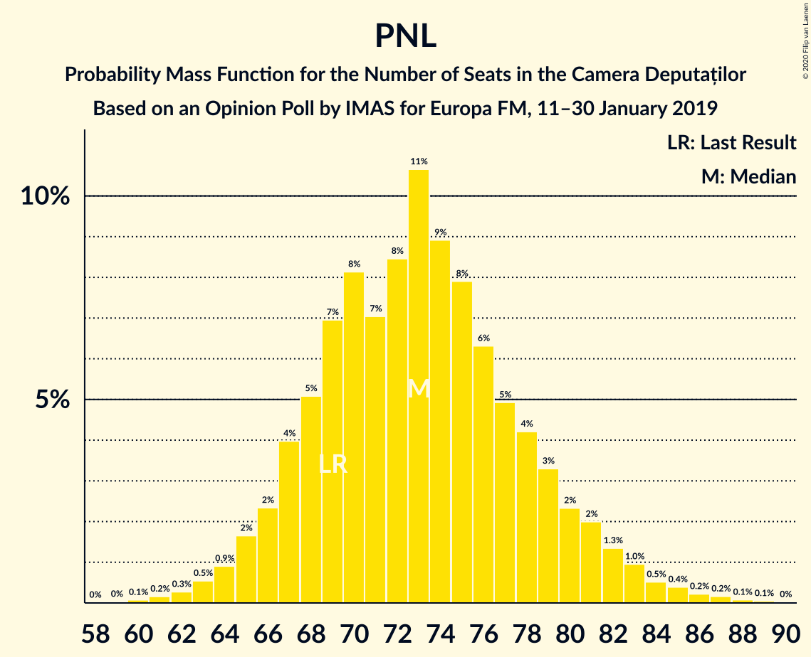

| Number of Seats | Probability | Accumulated | Special Marks |
|:---------------:|:-----------:|:-----------:|:-------------:|
| 60 | 0.1% | 100% |  |
| 61 | 0.2% | 99.9% |  |
| 62 | 0.3% | 99.7% |  |
| 63 | 0.5% | 99.4% |  |
| 64 | 0.9% | 98.9% |  |
| 65 | 2% | 98% |  |
| 66 | 2% | 96% |  |
| 67 | 4% | 94% |  |
| 68 | 5% | 90% |  |
| 69 | 7% | 85% | Last Result |
| 70 | 8% | 78% |  |
| 71 | 7% | 70% |  |
| 72 | 8% | 63% |  |
| 73 | 11% | 54% | Median |
| 74 | 9% | 44% |  |
| 75 | 8% | 35% |  |
| 76 | 6% | 27% |  |
| 77 | 5% | 21% |  |
| 78 | 4% | 16% |  |
| 79 | 3% | 11% |  |
| 80 | 2% | 8% |  |
| 81 | 2% | 6% |  |
| 82 | 1.3% | 4% |  |
| 83 | 1.0% | 2% |  |
| 84 | 0.5% | 1.5% |  |
| 85 | 0.4% | 1.0% |  |
| 86 | 0.2% | 0.6% |  |
| 87 | 0.2% | 0.3% |  |
| 88 | 0.1% | 0.2% |  |
| 89 | 0.1% | 0.1% |  |
| 90 | 0% | 0% |  |

### Alianța 2020 USR-PLUS – Partidul Mișcarea Populară

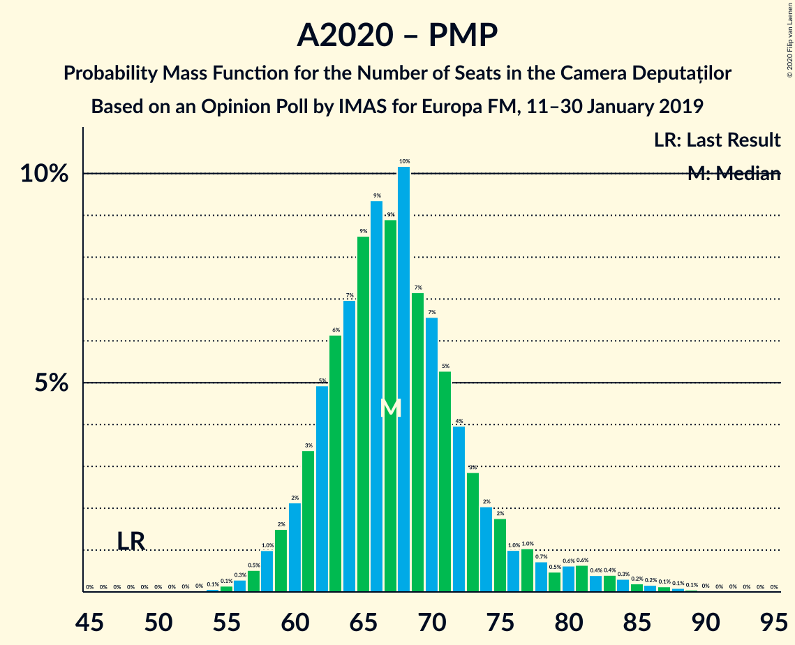

| Number of Seats | Probability | Accumulated | Special Marks |
|:---------------:|:-----------:|:-----------:|:-------------:|
| 48 | 0% | 100% | Last Result |
| 49 | 0% | 100% |  |
| 50 | 0% | 100% |  |
| 51 | 0% | 100% |  |
| 52 | 0% | 100% |  |
| 53 | 0% | 100% |  |
| 54 | 0.1% | 100% |  |
| 55 | 0.1% | 99.9% |  |
| 56 | 0.3% | 99.7% |  |
| 57 | 0.5% | 99.5% |  |
| 58 | 1.0% | 98.9% |  |
| 59 | 2% | 98% |  |
| 60 | 2% | 96% |  |
| 61 | 3% | 94% |  |
| 62 | 5% | 91% |  |
| 63 | 6% | 86% |  |
| 64 | 7% | 80% |  |
| 65 | 9% | 73% |  |
| 66 | 9% | 64% |  |
| 67 | 9% | 55% | Median |
| 68 | 10% | 46% |  |
| 69 | 7% | 36% |  |
| 70 | 7% | 29% |  |
| 71 | 5% | 22% |  |
| 72 | 4% | 17% |  |
| 73 | 3% | 13% |  |
| 74 | 2% | 10% |  |
| 75 | 2% | 8% |  |
| 76 | 1.0% | 6% |  |
| 77 | 1.0% | 5% |  |
| 78 | 0.7% | 4% |  |
| 79 | 0.5% | 4% |  |
| 80 | 0.6% | 3% |  |
| 81 | 0.6% | 2% |  |
| 82 | 0.4% | 2% |  |
| 83 | 0.4% | 1.4% |  |
| 84 | 0.3% | 1.0% |  |
| 85 | 0.2% | 0.7% |  |
| 86 | 0.2% | 0.5% |  |
| 87 | 0.1% | 0.3% |  |
| 88 | 0.1% | 0.2% |  |
| 89 | 0.1% | 0.1% |  |
| 90 | 0% | 0.1% |  |
| 91 | 0% | 0% |  |

## Technical Information

### Opinion Poll

+ **Polling firm:** IMAS
+ **Commissioner(s):** Europa FM
+ **Fieldwork period:** 11–30 January 2019

### Calculations

+ **Sample size:** 1011
+ **Simulations done:** 1,048,576
+ **Error estimate:** 1.05%

