# Opinion Poll by Socio-Data, 26–30 August 2019

<a href="#voting-intentions">Voting Intentions</a> | <a href="#seats">Seats</a> | <a href="#coalitions">Coalitions</a> | <a href="#technical-information">Technical Information</a>

## Voting Intentions

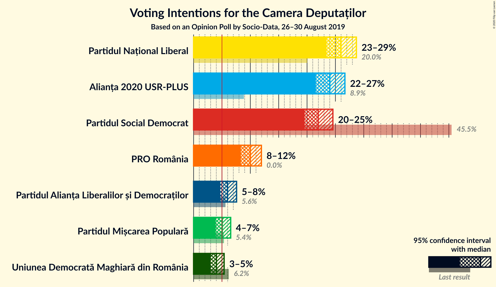

### Confidence Intervals

| Party | Last Result | Poll Result | 80% Confidence Interval | 90% Confidence Interval | 95% Confidence Interval | 99% Confidence Interval |
|:-----:|:-----------:|:-----------:|:-----------------------:|:-----------------------:|:-----------------------:|:-----------------------:|
| Partidul Național Liberal | 20.0% | 26.0% | 24.3–27.8% |23.8–28.3% |23.4–28.7% |22.6–29.6% |
| Alianța 2020 USR-PLUS | 8.9% | 24.0% | 22.4–25.8% |21.9–26.2% |21.6–26.7% |20.8–27.5% |
| Partidul Social Democrat | 45.5% | 22.0% | 20.4–23.7% |20.0–24.1% |19.6–24.6% |18.9–25.4% |
| PRO România | 0.0% | 10.0% | 8.9–11.3% |8.6–11.6% |8.3–11.9% |7.8–12.6% |
| Partidul Alianța Liberalilor și Democraților | 5.6% | 6.0% | 5.1–7.0% |4.9–7.3% |4.7–7.6% |4.3–8.1% |
| Partidul Mișcarea Populară | 5.4% | 5.0% | 4.3–6.0% |4.1–6.3% |3.9–6.5% |3.6–7.0% |
| Uniunea Democrată Maghiară din România | 6.2% | 4.0% | 3.3–4.9% |3.2–5.2% |3.0–5.4% |2.7–5.8% |

*Note:* The poll result column reflects the actual value used in the calculations. Published results may vary slightly, and in addition be rounded to fewer digits.

## Seats

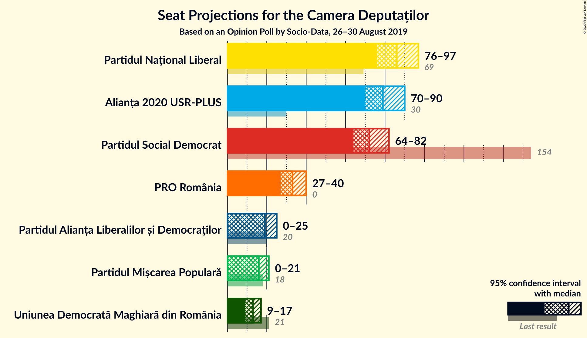

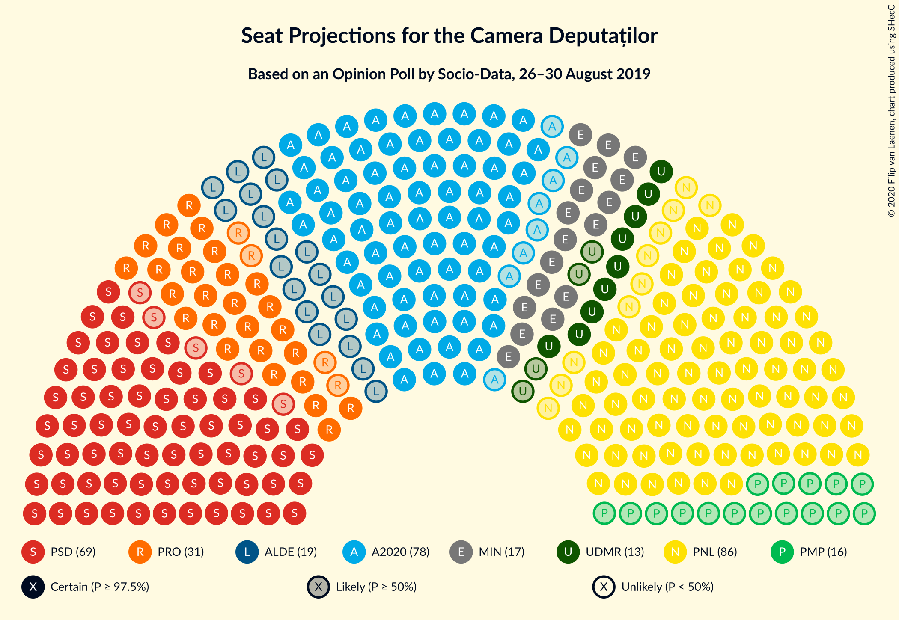

### Confidence Intervals

| Party | Last Result | Median | 80% Confidence Interval | 90% Confidence Interval | 95% Confidence Interval | 99% Confidence Interval |
|:-----:|:-----------:|:------:|:-----------------------:|:-----------------------:|:-----------------------:|:-----------------------:|
| <a href="#partidul-național-liberal">Partidul Național Liberal</a> | 69 | 86 | 79–93 |77–95 |76–97 |73–101 |
| <a href="#alianța-2020-usr-plus">Alianța 2020 USR-PLUS</a> | 30 | 79 | 73–86 |71–88 |70–90 |67–93 |
| <a href="#partidul-social-democrat">Partidul Social Democrat</a> | 154 | 72 | 67–79 |65–81 |64–82 |61–86 |
| <a href="#pro-românia">PRO România</a> | 0 | 33 | 29–37 |28–39 |27–40 |25–42 |
| <a href="#partidul-alianța-liberalilor-și-democraților">Partidul Alianța Liberalilor și Democraților</a> | 20 | 19 | 16–23 |0–24 |0–25 |0–26 |
| <a href="#partidul-mișcarea-populară">Partidul Mișcarea Populară</a> | 18 | 16 | 0–19 |0–20 |0–21 |0–22 |
| <a href="#uniunea-democrată-maghiară-din-românia">Uniunea Democrată Maghiară din România</a> | 21 | 13 | 11–16 |10–17 |9–17 |8–19 |

### Partidul Național Liberal

*For a full overview of the results for this party, see the [Partidul Național Liberal](party-partidulnaționalliberal.html) page.*

| Number of Seats | Probability | Accumulated | Special Marks |
|:---------------:|:-----------:|:-----------:|:-------------:|
| 69 | 0% | 100% | Last Result |
| 70 | 0% | 100% |  |
| 71 | 0.1% | 99.9% |  |
| 72 | 0.2% | 99.9% |  |
| 73 | 0.3% | 99.7% |  |
| 74 | 0.4% | 99.4% |  |
| 75 | 0.9% | 99.1% |  |
| 76 | 2% | 98% |  |
| 77 | 2% | 97% |  |
| 78 | 2% | 95% |  |
| 79 | 4% | 92% |  |
| 80 | 5% | 89% |  |
| 81 | 5% | 84% |  |
| 82 | 7% | 79% |  |
| 83 | 8% | 72% |  |
| 84 | 7% | 65% |  |
| 85 | 6% | 58% |  |
| 86 | 9% | 52% | Median |
| 87 | 5% | 43% |  |
| 88 | 6% | 38% |  |
| 89 | 7% | 32% |  |
| 90 | 5% | 25% |  |
| 91 | 4% | 20% |  |
| 92 | 4% | 15% |  |
| 93 | 3% | 11% |  |
| 94 | 3% | 8% |  |
| 95 | 1.5% | 6% |  |
| 96 | 1.1% | 4% |  |
| 97 | 1.0% | 3% |  |
| 98 | 0.7% | 2% |  |
| 99 | 0.6% | 1.4% |  |
| 100 | 0.2% | 0.8% |  |
| 101 | 0.3% | 0.5% |  |
| 102 | 0.1% | 0.3% |  |
| 103 | 0.1% | 0.2% |  |
| 104 | 0% | 0.1% |  |
| 105 | 0% | 0% |  |

### Alianța 2020 USR-PLUS

*For a full overview of the results for this party, see the [Alianța 2020 USR-PLUS](party-alianța2020usr-plus.html) page.*

| Number of Seats | Probability | Accumulated | Special Marks |
|:---------------:|:-----------:|:-----------:|:-------------:|
| 30 | 0% | 100% | Last Result |
| 31 | 0% | 100% |  |
| 32 | 0% | 100% |  |
| 33 | 0% | 100% |  |
| 34 | 0% | 100% |  |
| 35 | 0% | 100% |  |
| 36 | 0% | 100% |  |
| 37 | 0% | 100% |  |
| 38 | 0% | 100% |  |
| 39 | 0% | 100% |  |
| 40 | 0% | 100% |  |
| 41 | 0% | 100% |  |
| 42 | 0% | 100% |  |
| 43 | 0% | 100% |  |
| 44 | 0% | 100% |  |
| 45 | 0% | 100% |  |
| 46 | 0% | 100% |  |
| 47 | 0% | 100% |  |
| 48 | 0% | 100% |  |
| 49 | 0% | 100% |  |
| 50 | 0% | 100% |  |
| 51 | 0% | 100% |  |
| 52 | 0% | 100% |  |
| 53 | 0% | 100% |  |
| 54 | 0% | 100% |  |
| 55 | 0% | 100% |  |
| 56 | 0% | 100% |  |
| 57 | 0% | 100% |  |
| 58 | 0% | 100% |  |
| 59 | 0% | 100% |  |
| 60 | 0% | 100% |  |
| 61 | 0% | 100% |  |
| 62 | 0% | 100% |  |
| 63 | 0% | 100% |  |
| 64 | 0% | 100% |  |
| 65 | 0.1% | 100% |  |
| 66 | 0.2% | 99.9% |  |
| 67 | 0.3% | 99.7% |  |
| 68 | 0.5% | 99.4% |  |
| 69 | 0.9% | 98.9% |  |
| 70 | 1.0% | 98% |  |
| 71 | 3% | 97% |  |
| 72 | 3% | 94% |  |
| 73 | 4% | 91% |  |
| 74 | 4% | 87% |  |
| 75 | 5% | 83% |  |
| 76 | 7% | 78% |  |
| 77 | 7% | 71% |  |
| 78 | 10% | 64% |  |
| 79 | 9% | 54% | Median |
| 80 | 6% | 45% |  |
| 81 | 6% | 40% |  |
| 82 | 6% | 34% |  |
| 83 | 6% | 28% |  |
| 84 | 7% | 22% |  |
| 85 | 4% | 15% |  |
| 86 | 3% | 11% |  |
| 87 | 2% | 8% |  |
| 88 | 2% | 6% |  |
| 89 | 1.2% | 5% |  |
| 90 | 2% | 3% |  |
| 91 | 0.8% | 2% |  |
| 92 | 0.3% | 0.9% |  |
| 93 | 0.2% | 0.6% |  |
| 94 | 0.1% | 0.5% |  |
| 95 | 0.1% | 0.4% |  |
| 96 | 0.1% | 0.3% |  |
| 97 | 0.1% | 0.1% |  |
| 98 | 0% | 0% |  |

### Partidul Social Democrat

*For a full overview of the results for this party, see the [Partidul Social Democrat](party-partidulsocialdemocrat.html) page.*

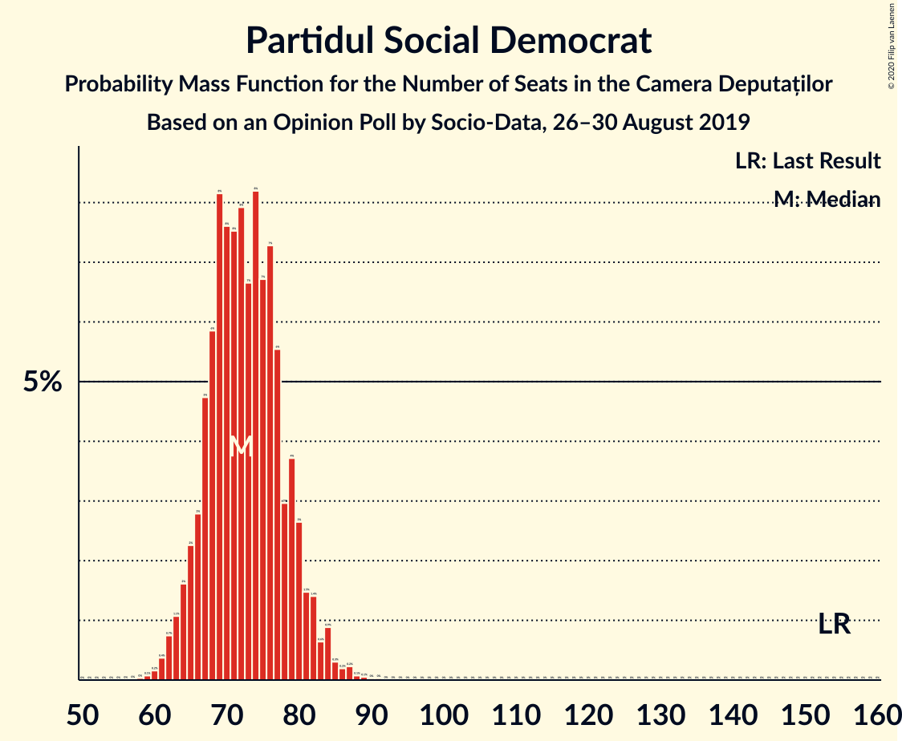

| Number of Seats | Probability | Accumulated | Special Marks |
|:---------------:|:-----------:|:-----------:|:-------------:|
| 58 | 0% | 100% |  |
| 59 | 0.1% | 99.9% |  |
| 60 | 0.2% | 99.9% |  |
| 61 | 0.4% | 99.7% |  |
| 62 | 0.7% | 99.3% |  |
| 63 | 1.1% | 98.6% |  |
| 64 | 2% | 98% |  |
| 65 | 2% | 96% |  |
| 66 | 3% | 94% |  |
| 67 | 5% | 91% |  |
| 68 | 6% | 86% |  |
| 69 | 8% | 80% |  |
| 70 | 8% | 72% |  |
| 71 | 8% | 65% |  |
| 72 | 8% | 57% | Median |
| 73 | 7% | 49% |  |
| 74 | 8% | 42% |  |
| 75 | 7% | 34% |  |
| 76 | 7% | 27% |  |
| 77 | 6% | 20% |  |
| 78 | 3% | 15% |  |
| 79 | 4% | 12% |  |
| 80 | 3% | 8% |  |
| 81 | 1.5% | 5% |  |
| 82 | 1.4% | 4% |  |
| 83 | 0.6% | 2% |  |
| 84 | 0.9% | 2% |  |
| 85 | 0.3% | 0.9% |  |
| 86 | 0.2% | 0.6% |  |
| 87 | 0.2% | 0.4% |  |
| 88 | 0.1% | 0.2% |  |
| 89 | 0.1% | 0.1% |  |
| 90 | 0% | 0.1% |  |
| 91 | 0% | 0% |  |
| 92 | 0% | 0% |  |
| 93 | 0% | 0% |  |
| 94 | 0% | 0% |  |
| 95 | 0% | 0% |  |
| 96 | 0% | 0% |  |
| 97 | 0% | 0% |  |
| 98 | 0% | 0% |  |
| 99 | 0% | 0% |  |
| 100 | 0% | 0% |  |
| 101 | 0% | 0% |  |
| 102 | 0% | 0% |  |
| 103 | 0% | 0% |  |
| 104 | 0% | 0% |  |
| 105 | 0% | 0% |  |
| 106 | 0% | 0% |  |
| 107 | 0% | 0% |  |
| 108 | 0% | 0% |  |
| 109 | 0% | 0% |  |
| 110 | 0% | 0% |  |
| 111 | 0% | 0% |  |
| 112 | 0% | 0% |  |
| 113 | 0% | 0% |  |
| 114 | 0% | 0% |  |
| 115 | 0% | 0% |  |
| 116 | 0% | 0% |  |
| 117 | 0% | 0% |  |
| 118 | 0% | 0% |  |
| 119 | 0% | 0% |  |
| 120 | 0% | 0% |  |
| 121 | 0% | 0% |  |
| 122 | 0% | 0% |  |
| 123 | 0% | 0% |  |
| 124 | 0% | 0% |  |
| 125 | 0% | 0% |  |
| 126 | 0% | 0% |  |
| 127 | 0% | 0% |  |
| 128 | 0% | 0% |  |
| 129 | 0% | 0% |  |
| 130 | 0% | 0% |  |
| 131 | 0% | 0% |  |
| 132 | 0% | 0% |  |
| 133 | 0% | 0% |  |
| 134 | 0% | 0% |  |
| 135 | 0% | 0% |  |
| 136 | 0% | 0% |  |
| 137 | 0% | 0% |  |
| 138 | 0% | 0% |  |
| 139 | 0% | 0% |  |
| 140 | 0% | 0% |  |
| 141 | 0% | 0% |  |
| 142 | 0% | 0% |  |
| 143 | 0% | 0% |  |
| 144 | 0% | 0% |  |
| 145 | 0% | 0% |  |
| 146 | 0% | 0% |  |
| 147 | 0% | 0% |  |
| 148 | 0% | 0% |  |
| 149 | 0% | 0% |  |
| 150 | 0% | 0% |  |
| 151 | 0% | 0% |  |
| 152 | 0% | 0% |  |
| 153 | 0% | 0% |  |
| 154 | 0% | 0% | Last Result |

### PRO România

*For a full overview of the results for this party, see the [PRO România](party-proromânia.html) page.*

| Number of Seats | Probability | Accumulated | Special Marks |
|:---------------:|:-----------:|:-----------:|:-------------:|
| 0 | 0% | 100% | Last Result |
| 1 | 0% | 100% |  |
| 2 | 0% | 100% |  |
| 3 | 0% | 100% |  |
| 4 | 0% | 100% |  |
| 5 | 0% | 100% |  |
| 6 | 0% | 100% |  |
| 7 | 0% | 100% |  |
| 8 | 0% | 100% |  |
| 9 | 0% | 100% |  |
| 10 | 0% | 100% |  |
| 11 | 0% | 100% |  |
| 12 | 0% | 100% |  |
| 13 | 0% | 100% |  |
| 14 | 0% | 100% |  |
| 15 | 0% | 100% |  |
| 16 | 0% | 100% |  |
| 17 | 0% | 100% |  |
| 18 | 0% | 100% |  |
| 19 | 0% | 100% |  |
| 20 | 0% | 100% |  |
| 21 | 0% | 100% |  |
| 22 | 0% | 100% |  |
| 23 | 0% | 100% |  |
| 24 | 0.2% | 99.9% |  |
| 25 | 0.4% | 99.8% |  |
| 26 | 0.9% | 99.4% |  |
| 27 | 3% | 98% |  |
| 28 | 4% | 96% |  |
| 29 | 6% | 91% |  |
| 30 | 9% | 86% |  |
| 31 | 13% | 77% |  |
| 32 | 10% | 64% |  |
| 33 | 11% | 54% | Median |
| 34 | 11% | 43% |  |
| 35 | 11% | 31% |  |
| 36 | 7% | 21% |  |
| 37 | 5% | 13% |  |
| 38 | 3% | 8% |  |
| 39 | 3% | 6% |  |
| 40 | 2% | 3% |  |
| 41 | 0.7% | 1.4% |  |
| 42 | 0.3% | 0.6% |  |
| 43 | 0.2% | 0.3% |  |
| 44 | 0.1% | 0.1% |  |
| 45 | 0.1% | 0.1% |  |
| 46 | 0% | 0% |  |

### Partidul Alianța Liberalilor și Democraților

*For a full overview of the results for this party, see the [Partidul Alianța Liberalilor și Democraților](party-partidulalianțaliberalilorșidemocraților.html) page.*

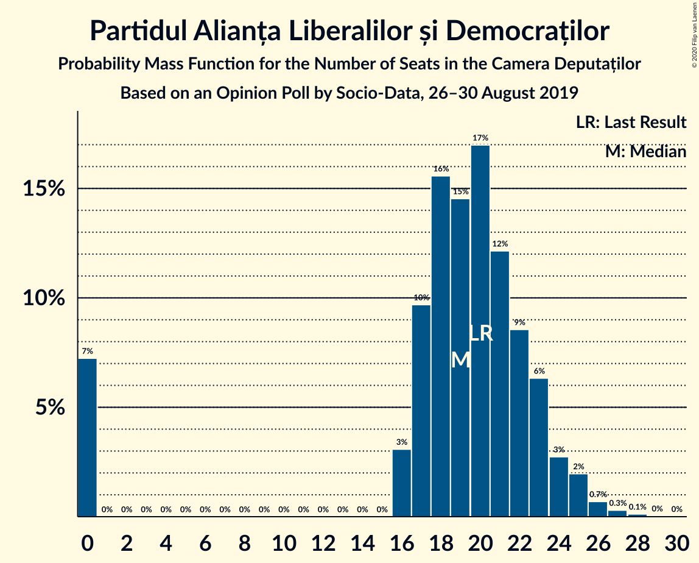

| Number of Seats | Probability | Accumulated | Special Marks |
|:---------------:|:-----------:|:-----------:|:-------------:|
| 0 | 7% | 100% |  |
| 1 | 0% | 93% |  |
| 2 | 0% | 93% |  |
| 3 | 0% | 93% |  |
| 4 | 0% | 93% |  |
| 5 | 0% | 93% |  |
| 6 | 0% | 93% |  |
| 7 | 0% | 93% |  |
| 8 | 0% | 93% |  |
| 9 | 0% | 93% |  |
| 10 | 0% | 93% |  |
| 11 | 0% | 93% |  |
| 12 | 0% | 93% |  |
| 13 | 0% | 93% |  |
| 14 | 0% | 93% |  |
| 15 | 0% | 93% |  |
| 16 | 3% | 93% |  |
| 17 | 10% | 90% |  |
| 18 | 16% | 80% |  |
| 19 | 15% | 64% | Median |
| 20 | 17% | 50% | Last Result |
| 21 | 12% | 33% |  |
| 22 | 9% | 21% |  |
| 23 | 6% | 12% |  |
| 24 | 3% | 6% |  |
| 25 | 2% | 3% |  |
| 26 | 0.7% | 1.2% |  |
| 27 | 0.3% | 0.5% |  |
| 28 | 0.1% | 0.2% |  |
| 29 | 0% | 0.1% |  |
| 30 | 0% | 0% |  |

### Partidul Mișcarea Populară

*For a full overview of the results for this party, see the [Partidul Mișcarea Populară](party-partidulmișcareapopulară.html) page.*

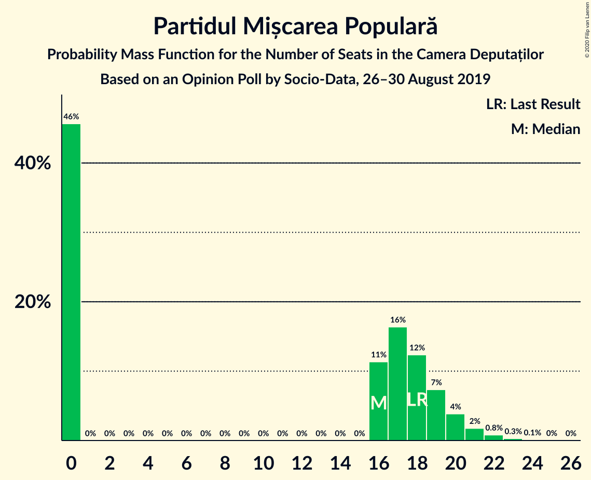

| Number of Seats | Probability | Accumulated | Special Marks |
|:---------------:|:-----------:|:-----------:|:-------------:|
| 0 | 46% | 100% |  |
| 1 | 0% | 54% |  |
| 2 | 0% | 54% |  |
| 3 | 0% | 54% |  |
| 4 | 0% | 54% |  |
| 5 | 0% | 54% |  |
| 6 | 0% | 54% |  |
| 7 | 0% | 54% |  |
| 8 | 0% | 54% |  |
| 9 | 0% | 54% |  |
| 10 | 0% | 54% |  |
| 11 | 0% | 54% |  |
| 12 | 0% | 54% |  |
| 13 | 0% | 54% |  |
| 14 | 0% | 54% |  |
| 15 | 0% | 54% |  |
| 16 | 11% | 54% | Median |
| 17 | 16% | 43% |  |
| 18 | 12% | 27% | Last Result |
| 19 | 7% | 14% |  |
| 20 | 4% | 7% |  |
| 21 | 2% | 3% |  |
| 22 | 0.8% | 1.3% |  |
| 23 | 0.3% | 0.5% |  |
| 24 | 0.1% | 0.2% |  |
| 25 | 0% | 0% |  |

### Uniunea Democrată Maghiară din România

*For a full overview of the results for this party, see the [Uniunea Democrată Maghiară din România](party-uniuneademocratămaghiarădinromânia.html) page.*

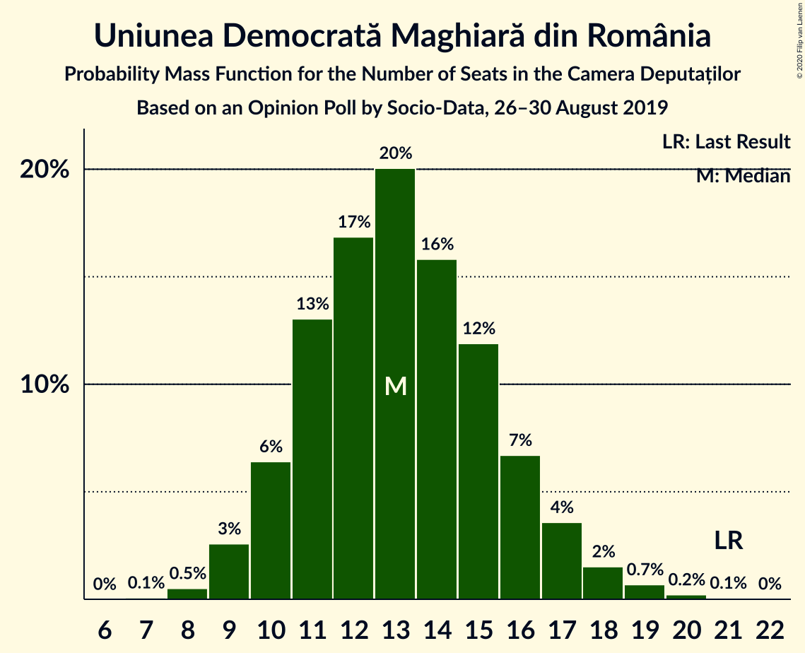

| Number of Seats | Probability | Accumulated | Special Marks |
|:---------------:|:-----------:|:-----------:|:-------------:|
| 7 | 0.1% | 100% |  |
| 8 | 0.5% | 99.9% |  |
| 9 | 3% | 99.4% |  |
| 10 | 6% | 97% |  |
| 11 | 13% | 90% |  |
| 12 | 17% | 77% |  |
| 13 | 20% | 61% | Median |
| 14 | 16% | 40% |  |
| 15 | 12% | 25% |  |
| 16 | 7% | 13% |  |
| 17 | 4% | 6% |  |
| 18 | 2% | 2% |  |
| 19 | 0.7% | 1.0% |  |
| 20 | 0.2% | 0.3% |  |
| 21 | 0.1% | 0.1% | Last Result |
| 22 | 0% | 0% |  |

## Coalitions

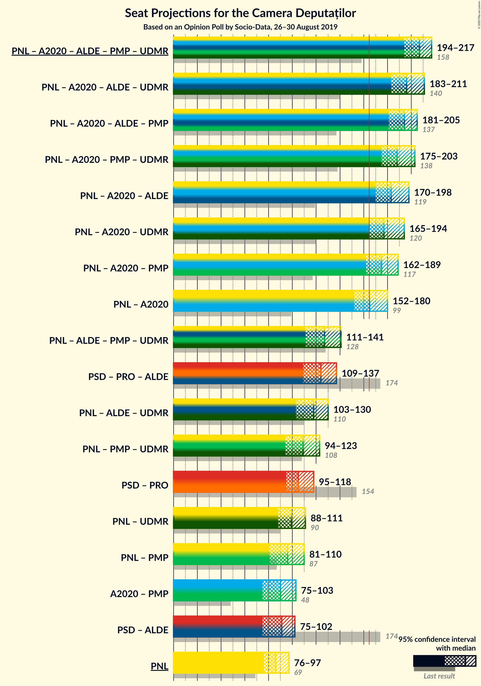

### Confidence Intervals

| Coalition | Last Result | Median | Majority? | 80% Confidence Interval | 90% Confidence Interval | 95% Confidence Interval | 99% Confidence Interval |
|:---------:|:-----------:|:------:|:---------:|:-----------------------:|:-----------------------:|:-----------------------:|:-----------------------:|
| Partidul Național Liberal – Alianța 2020 USR-PLUS – Partidul Alianța Liberalilor și Democraților – Partidul Mișcarea Populară – Uniunea Democrată Maghiară din România | 158 | 207 | 100% | 199–214 | 196–216 | 194–217 | 190–220 |
| Partidul Național Liberal – Alianța 2020 USR-PLUS – Partidul Alianța Liberalilor și Democraților – Uniunea Democrată Maghiară din România | 140 | 196 | 100% | 187–207 | 185–209 | 183–211 | 178–214 |
| Partidul Național Liberal – Alianța 2020 USR-PLUS – Partidul Alianța Liberalilor și Democraților – Partidul Mișcarea Populară | 137 | 194 | 100% | 185–201 | 183–203 | 181–205 | 176–208 |
| Partidul Național Liberal – Alianța 2020 USR-PLUS – Partidul Mișcarea Populară – Uniunea Democrată Maghiară din România | 138 | 188 | 100% | 180–196 | 176–200 | 175–203 | 173–209 |
| Partidul Național Liberal – Alianța 2020 USR-PLUS – Partidul Alianța Liberalilor și Democraților | 119 | 183 | 99.5% | 174–194 | 171–196 | 170–198 | 164–201 |
| Partidul Național Liberal – Alianța 2020 USR-PLUS – Uniunea Democrată Maghiară din România | 120 | 177 | 98% | 169–189 | 167–191 | 165–194 | 162–201 |
| Partidul Național Liberal – Alianța 2020 USR-PLUS – Partidul Mișcarea Populară | 117 | 175 | 93% | 166–184 | 163–187 | 162–189 | 159–195 |
| Partidul Național Liberal – Alianța 2020 USR-PLUS | 99 | 165 | 51% | 156–175 | 154–177 | 152–180 | 149–187 |
| Partidul Național Liberal – Partidul Alianța Liberalilor și Democraților – Partidul Mișcarea Populară – Uniunea Democrată Maghiară din România | 128 | 127 | 0% | 117–137 | 114–139 | 111–141 | 105–144 |
| Partidul Social Democrat – PRO România – Partidul Alianța Liberalilor și Democraților | 174 | 124 | 0% | 116–132 | 112–136 | 109–137 | 103–139 |
| Partidul Național Liberal – Partidul Alianța Liberalilor și Democraților – Uniunea Democrată Maghiară din România | 110 | 118 | 0% | 109–126 | 106–129 | 103–130 | 97–134 |
| Partidul Național Liberal – Partidul Mișcarea Populară – Uniunea Democrată Maghiară din România | 108 | 109 | 0% | 98–118 | 96–121 | 94–123 | 91–127 |
| Partidul Social Democrat – PRO România | 154 | 105 | 0% | 98–113 | 96–116 | 95–118 | 92–122 |
| Partidul Național Liberal – Uniunea Democrată Maghiară din România | 90 | 99 | 0% | 92–106 | 90–109 | 88–111 | 86–115 |
| Partidul Național Liberal – Partidul Mișcarea Populară | 87 | 96 | 0% | 85–106 | 83–108 | 81–110 | 78–113 |
| Alianța 2020 USR-PLUS – Partidul Mișcarea Populară | 48 | 90 | 0% | 78–99 | 76–102 | 75–103 | 72–107 |
| Partidul Social Democrat – Partidul Alianța Liberalilor și Democraților | 174 | 91 | 0% | 83–98 | 79–100 | 75–102 | 70–106 |
| Partidul Național Liberal | 69 | 86 | 0% | 79–93 | 77–95 | 76–97 | 73–101 |

### Partidul Național Liberal – Alianța 2020 USR-PLUS – Partidul Alianța Liberalilor și Democraților – Partidul Mișcarea Populară – Uniunea Democrată Maghiară din România

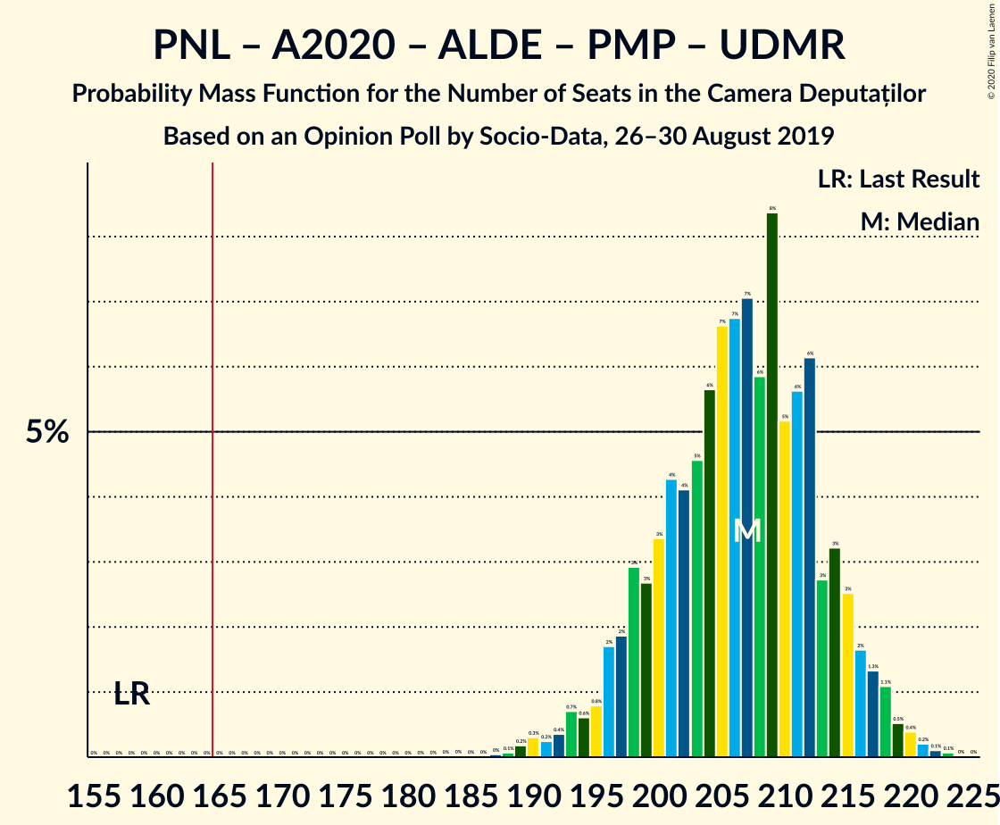

| Number of Seats | Probability | Accumulated | Special Marks |
|:---------------:|:-----------:|:-----------:|:-------------:|
| 158 | 0% | 100% | Last Result |
| 159 | 0% | 100% |  |
| 160 | 0% | 100% |  |
| 161 | 0% | 100% |  |
| 162 | 0% | 100% |  |
| 163 | 0% | 100% |  |
| 164 | 0% | 100% |  |
| 165 | 0% | 100% | Majority |
| 166 | 0% | 100% |  |
| 167 | 0% | 100% |  |
| 168 | 0% | 100% |  |
| 169 | 0% | 100% |  |
| 170 | 0% | 100% |  |
| 171 | 0% | 100% |  |
| 172 | 0% | 100% |  |
| 173 | 0% | 100% |  |
| 174 | 0% | 100% |  |
| 175 | 0% | 100% |  |
| 176 | 0% | 100% |  |
| 177 | 0% | 100% |  |
| 178 | 0% | 100% |  |
| 179 | 0% | 100% |  |
| 180 | 0% | 100% |  |
| 181 | 0% | 100% |  |
| 182 | 0% | 100% |  |
| 183 | 0% | 100% |  |
| 184 | 0% | 100% |  |
| 185 | 0% | 100% |  |
| 186 | 0% | 99.9% |  |
| 187 | 0% | 99.9% |  |
| 188 | 0.1% | 99.9% |  |
| 189 | 0.2% | 99.8% |  |
| 190 | 0.3% | 99.6% |  |
| 191 | 0.2% | 99.3% |  |
| 192 | 0.4% | 99.1% |  |
| 193 | 0.7% | 98.7% |  |
| 194 | 0.6% | 98% |  |
| 195 | 0.8% | 97% |  |
| 196 | 2% | 97% |  |
| 197 | 2% | 95% |  |
| 198 | 3% | 93% |  |
| 199 | 3% | 90% |  |
| 200 | 3% | 87% |  |
| 201 | 4% | 84% |  |
| 202 | 4% | 80% |  |
| 203 | 5% | 76% |  |
| 204 | 6% | 71% |  |
| 205 | 7% | 65% |  |
| 206 | 7% | 59% |  |
| 207 | 7% | 52% |  |
| 208 | 6% | 45% |  |
| 209 | 8% | 39% |  |
| 210 | 5% | 31% |  |
| 211 | 6% | 26% |  |
| 212 | 6% | 20% |  |
| 213 | 3% | 14% | Median |
| 214 | 3% | 11% |  |
| 215 | 3% | 8% |  |
| 216 | 2% | 5% |  |
| 217 | 1.3% | 4% |  |
| 218 | 1.1% | 2% |  |
| 219 | 0.5% | 1.3% |  |
| 220 | 0.4% | 0.8% |  |
| 221 | 0.2% | 0.4% |  |
| 222 | 0.1% | 0.2% |  |
| 223 | 0.1% | 0.1% |  |
| 224 | 0% | 0% |  |

### Partidul Național Liberal – Alianța 2020 USR-PLUS – Partidul Alianța Liberalilor și Democraților – Uniunea Democrată Maghiară din România

| Number of Seats | Probability | Accumulated | Special Marks |
|:---------------:|:-----------:|:-----------:|:-------------:|
| 140 | 0% | 100% | Last Result |
| 141 | 0% | 100% |  |
| 142 | 0% | 100% |  |
| 143 | 0% | 100% |  |
| 144 | 0% | 100% |  |
| 145 | 0% | 100% |  |
| 146 | 0% | 100% |  |
| 147 | 0% | 100% |  |
| 148 | 0% | 100% |  |
| 149 | 0% | 100% |  |
| 150 | 0% | 100% |  |
| 151 | 0% | 100% |  |
| 152 | 0% | 100% |  |
| 153 | 0% | 100% |  |
| 154 | 0% | 100% |  |
| 155 | 0% | 100% |  |
| 156 | 0% | 100% |  |
| 157 | 0% | 100% |  |
| 158 | 0% | 100% |  |
| 159 | 0% | 100% |  |
| 160 | 0% | 100% |  |
| 161 | 0% | 100% |  |
| 162 | 0% | 100% |  |
| 163 | 0% | 100% |  |
| 164 | 0% | 100% |  |
| 165 | 0% | 100% | Majority |
| 166 | 0% | 100% |  |
| 167 | 0% | 100% |  |
| 168 | 0% | 100% |  |
| 169 | 0% | 100% |  |
| 170 | 0% | 100% |  |
| 171 | 0% | 100% |  |
| 172 | 0% | 100% |  |
| 173 | 0% | 100% |  |
| 174 | 0% | 99.9% |  |
| 175 | 0.1% | 99.9% |  |
| 176 | 0.1% | 99.9% |  |
| 177 | 0.1% | 99.8% |  |
| 178 | 0.2% | 99.7% |  |
| 179 | 0.3% | 99.4% |  |
| 180 | 0.2% | 99.2% |  |
| 181 | 0.6% | 98.9% |  |
| 182 | 0.7% | 98% |  |
| 183 | 0.8% | 98% |  |
| 184 | 2% | 97% |  |
| 185 | 1.3% | 95% |  |
| 186 | 2% | 94% |  |
| 187 | 3% | 92% |  |
| 188 | 3% | 89% |  |
| 189 | 5% | 86% |  |
| 190 | 4% | 82% |  |
| 191 | 4% | 78% |  |
| 192 | 6% | 75% |  |
| 193 | 5% | 69% |  |
| 194 | 5% | 63% |  |
| 195 | 6% | 59% |  |
| 196 | 4% | 53% |  |
| 197 | 4% | 49% | Median |
| 198 | 4% | 45% |  |
| 199 | 4% | 41% |  |
| 200 | 4% | 37% |  |
| 201 | 4% | 34% |  |
| 202 | 3% | 30% |  |
| 203 | 3% | 26% |  |
| 204 | 3% | 23% |  |
| 205 | 4% | 20% |  |
| 206 | 3% | 16% |  |
| 207 | 3% | 12% |  |
| 208 | 2% | 9% |  |
| 209 | 2% | 7% |  |
| 210 | 2% | 5% |  |
| 211 | 1.1% | 3% |  |
| 212 | 0.6% | 2% |  |
| 213 | 0.6% | 1.2% |  |
| 214 | 0.2% | 0.7% |  |
| 215 | 0.2% | 0.4% |  |
| 216 | 0.1% | 0.2% |  |
| 217 | 0.1% | 0.1% |  |
| 218 | 0% | 0.1% |  |
| 219 | 0% | 0% |  |

### Partidul Național Liberal – Alianța 2020 USR-PLUS – Partidul Alianța Liberalilor și Democraților – Partidul Mișcarea Populară

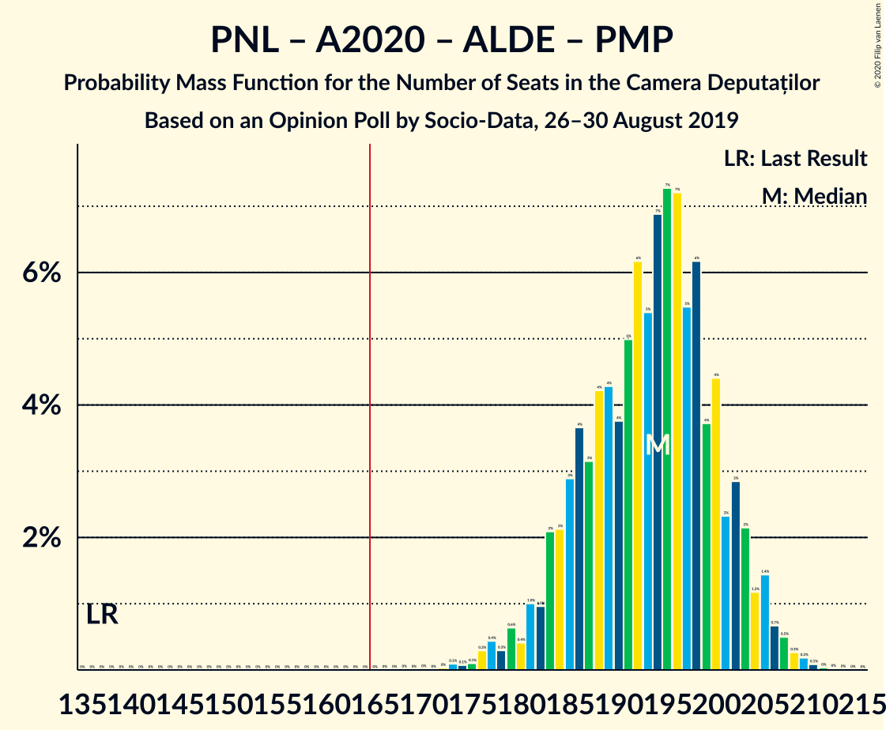

| Number of Seats | Probability | Accumulated | Special Marks |
|:---------------:|:-----------:|:-----------:|:-------------:|
| 137 | 0% | 100% | Last Result |
| 138 | 0% | 100% |  |
| 139 | 0% | 100% |  |
| 140 | 0% | 100% |  |
| 141 | 0% | 100% |  |
| 142 | 0% | 100% |  |
| 143 | 0% | 100% |  |
| 144 | 0% | 100% |  |
| 145 | 0% | 100% |  |
| 146 | 0% | 100% |  |
| 147 | 0% | 100% |  |
| 148 | 0% | 100% |  |
| 149 | 0% | 100% |  |
| 150 | 0% | 100% |  |
| 151 | 0% | 100% |  |
| 152 | 0% | 100% |  |
| 153 | 0% | 100% |  |
| 154 | 0% | 100% |  |
| 155 | 0% | 100% |  |
| 156 | 0% | 100% |  |
| 157 | 0% | 100% |  |
| 158 | 0% | 100% |  |
| 159 | 0% | 100% |  |
| 160 | 0% | 100% |  |
| 161 | 0% | 100% |  |
| 162 | 0% | 100% |  |
| 163 | 0% | 100% |  |
| 164 | 0% | 100% |  |
| 165 | 0% | 100% | Majority |
| 166 | 0% | 100% |  |
| 167 | 0% | 100% |  |
| 168 | 0% | 100% |  |
| 169 | 0% | 100% |  |
| 170 | 0% | 100% |  |
| 171 | 0% | 100% |  |
| 172 | 0% | 100% |  |
| 173 | 0.1% | 99.9% |  |
| 174 | 0.1% | 99.8% |  |
| 175 | 0.1% | 99.8% |  |
| 176 | 0.3% | 99.7% |  |
| 177 | 0.4% | 99.4% |  |
| 178 | 0.3% | 98.9% |  |
| 179 | 0.6% | 98.6% |  |
| 180 | 0.4% | 98% |  |
| 181 | 1.0% | 98% |  |
| 182 | 1.0% | 97% |  |
| 183 | 2% | 96% |  |
| 184 | 2% | 94% |  |
| 185 | 3% | 91% |  |
| 186 | 4% | 89% |  |
| 187 | 3% | 85% |  |
| 188 | 4% | 82% |  |
| 189 | 4% | 77% |  |
| 190 | 4% | 73% |  |
| 191 | 5% | 69% |  |
| 192 | 6% | 64% |  |
| 193 | 5% | 58% |  |
| 194 | 7% | 53% |  |
| 195 | 7% | 46% |  |
| 196 | 7% | 39% |  |
| 197 | 5% | 31% |  |
| 198 | 6% | 26% |  |
| 199 | 4% | 20% |  |
| 200 | 4% | 16% | Median |
| 201 | 2% | 12% |  |
| 202 | 3% | 9% |  |
| 203 | 2% | 7% |  |
| 204 | 1.2% | 4% |  |
| 205 | 1.4% | 3% |  |
| 206 | 0.7% | 2% |  |
| 207 | 0.5% | 1.1% |  |
| 208 | 0.3% | 0.6% |  |
| 209 | 0.2% | 0.3% |  |
| 210 | 0.1% | 0.2% |  |
| 211 | 0% | 0.1% |  |
| 212 | 0% | 0% |  |

### Partidul Național Liberal – Alianța 2020 USR-PLUS – Partidul Mișcarea Populară – Uniunea Democrată Maghiară din România

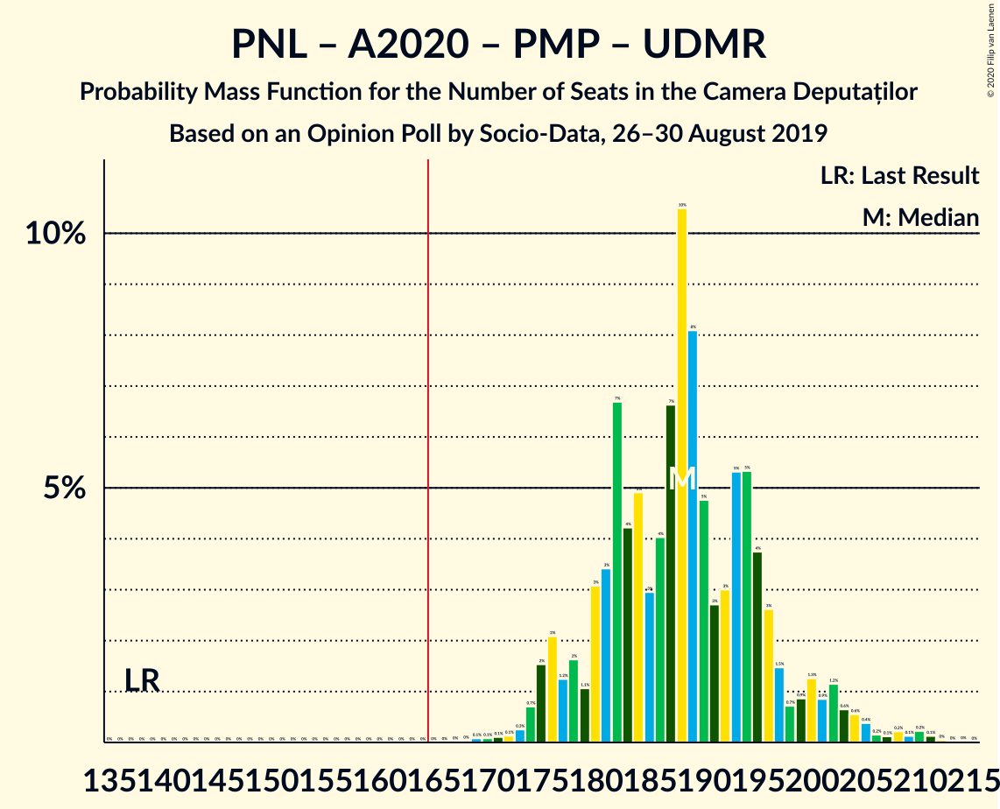

| Number of Seats | Probability | Accumulated | Special Marks |
|:---------------:|:-----------:|:-----------:|:-------------:|
| 138 | 0% | 100% | Last Result |
| 139 | 0% | 100% |  |
| 140 | 0% | 100% |  |
| 141 | 0% | 100% |  |
| 142 | 0% | 100% |  |
| 143 | 0% | 100% |  |
| 144 | 0% | 100% |  |
| 145 | 0% | 100% |  |
| 146 | 0% | 100% |  |
| 147 | 0% | 100% |  |
| 148 | 0% | 100% |  |
| 149 | 0% | 100% |  |
| 150 | 0% | 100% |  |
| 151 | 0% | 100% |  |
| 152 | 0% | 100% |  |
| 153 | 0% | 100% |  |
| 154 | 0% | 100% |  |
| 155 | 0% | 100% |  |
| 156 | 0% | 100% |  |
| 157 | 0% | 100% |  |
| 158 | 0% | 100% |  |
| 159 | 0% | 100% |  |
| 160 | 0% | 100% |  |
| 161 | 0% | 100% |  |
| 162 | 0% | 100% |  |
| 163 | 0% | 100% |  |
| 164 | 0% | 100% |  |
| 165 | 0% | 100% | Majority |
| 166 | 0% | 100% |  |
| 167 | 0% | 100% |  |
| 168 | 0% | 100% |  |
| 169 | 0.1% | 99.9% |  |
| 170 | 0.1% | 99.9% |  |
| 171 | 0.1% | 99.8% |  |
| 172 | 0.1% | 99.7% |  |
| 173 | 0.3% | 99.5% |  |
| 174 | 0.7% | 99.3% |  |
| 175 | 2% | 98.6% |  |
| 176 | 2% | 97% |  |
| 177 | 1.2% | 95% |  |
| 178 | 2% | 94% |  |
| 179 | 1.1% | 92% |  |
| 180 | 3% | 91% |  |
| 181 | 3% | 88% |  |
| 182 | 7% | 85% |  |
| 183 | 4% | 78% |  |
| 184 | 5% | 74% |  |
| 185 | 3% | 69% |  |
| 186 | 4% | 66% |  |
| 187 | 7% | 62% |  |
| 188 | 10% | 55% |  |
| 189 | 8% | 45% |  |
| 190 | 5% | 36% |  |
| 191 | 3% | 32% |  |
| 192 | 3% | 29% |  |
| 193 | 5% | 26% |  |
| 194 | 5% | 21% | Median |
| 195 | 4% | 15% |  |
| 196 | 3% | 12% |  |
| 197 | 1.5% | 9% |  |
| 198 | 0.7% | 8% |  |
| 199 | 0.9% | 7% |  |
| 200 | 1.3% | 6% |  |
| 201 | 0.9% | 5% |  |
| 202 | 1.2% | 4% |  |
| 203 | 0.6% | 3% |  |
| 204 | 0.6% | 2% |  |
| 205 | 0.4% | 1.5% |  |
| 206 | 0.2% | 1.1% |  |
| 207 | 0.1% | 0.9% |  |
| 208 | 0.2% | 0.8% |  |
| 209 | 0.1% | 0.6% |  |
| 210 | 0.2% | 0.5% |  |
| 211 | 0.1% | 0.2% |  |
| 212 | 0% | 0.1% |  |
| 213 | 0% | 0.1% |  |
| 214 | 0% | 0.1% |  |
| 215 | 0% | 0% |  |

### Partidul Național Liberal – Alianța 2020 USR-PLUS – Partidul Alianța Liberalilor și Democraților

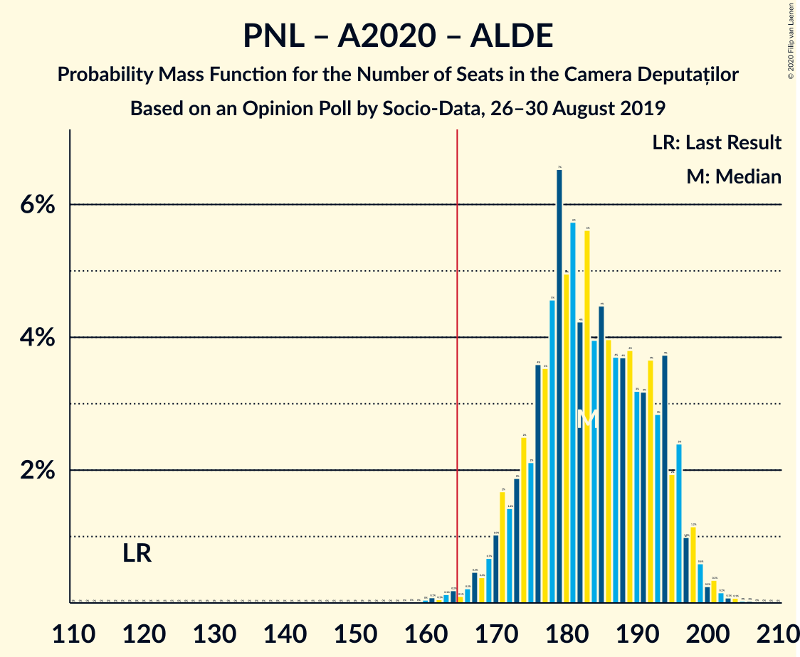

| Number of Seats | Probability | Accumulated | Special Marks |
|:---------------:|:-----------:|:-----------:|:-------------:|
| 119 | 0% | 100% | Last Result |
| 120 | 0% | 100% |  |
| 121 | 0% | 100% |  |
| 122 | 0% | 100% |  |
| 123 | 0% | 100% |  |
| 124 | 0% | 100% |  |
| 125 | 0% | 100% |  |
| 126 | 0% | 100% |  |
| 127 | 0% | 100% |  |
| 128 | 0% | 100% |  |
| 129 | 0% | 100% |  |
| 130 | 0% | 100% |  |
| 131 | 0% | 100% |  |
| 132 | 0% | 100% |  |
| 133 | 0% | 100% |  |
| 134 | 0% | 100% |  |
| 135 | 0% | 100% |  |
| 136 | 0% | 100% |  |
| 137 | 0% | 100% |  |
| 138 | 0% | 100% |  |
| 139 | 0% | 100% |  |
| 140 | 0% | 100% |  |
| 141 | 0% | 100% |  |
| 142 | 0% | 100% |  |
| 143 | 0% | 100% |  |
| 144 | 0% | 100% |  |
| 145 | 0% | 100% |  |
| 146 | 0% | 100% |  |
| 147 | 0% | 100% |  |
| 148 | 0% | 100% |  |
| 149 | 0% | 100% |  |
| 150 | 0% | 100% |  |
| 151 | 0% | 100% |  |
| 152 | 0% | 100% |  |
| 153 | 0% | 100% |  |
| 154 | 0% | 100% |  |
| 155 | 0% | 100% |  |
| 156 | 0% | 100% |  |
| 157 | 0% | 100% |  |
| 158 | 0% | 100% |  |
| 159 | 0% | 100% |  |
| 160 | 0% | 100% |  |
| 161 | 0.1% | 99.9% |  |
| 162 | 0.1% | 99.8% |  |
| 163 | 0.1% | 99.8% |  |
| 164 | 0.2% | 99.7% |  |
| 165 | 0.1% | 99.5% | Majority |
| 166 | 0.2% | 99.4% |  |
| 167 | 0.5% | 99.1% |  |
| 168 | 0.4% | 98.7% |  |
| 169 | 0.7% | 98% |  |
| 170 | 1.0% | 98% |  |
| 171 | 2% | 97% |  |
| 172 | 1.4% | 95% |  |
| 173 | 2% | 93% |  |
| 174 | 2% | 92% |  |
| 175 | 2% | 89% |  |
| 176 | 4% | 87% |  |
| 177 | 4% | 83% |  |
| 178 | 5% | 80% |  |
| 179 | 7% | 75% |  |
| 180 | 5% | 69% |  |
| 181 | 6% | 64% |  |
| 182 | 4% | 58% |  |
| 183 | 6% | 54% |  |
| 184 | 4% | 48% | Median |
| 185 | 4% | 44% |  |
| 186 | 4% | 40% |  |
| 187 | 4% | 36% |  |
| 188 | 4% | 32% |  |
| 189 | 4% | 28% |  |
| 190 | 3% | 25% |  |
| 191 | 3% | 21% |  |
| 192 | 4% | 18% |  |
| 193 | 3% | 15% |  |
| 194 | 4% | 12% |  |
| 195 | 2% | 8% |  |
| 196 | 2% | 6% |  |
| 197 | 1.0% | 4% |  |
| 198 | 1.2% | 3% |  |
| 199 | 0.6% | 2% |  |
| 200 | 0.2% | 1.0% |  |
| 201 | 0.3% | 0.7% |  |
| 202 | 0.2% | 0.4% |  |
| 203 | 0.1% | 0.2% |  |
| 204 | 0.1% | 0.1% |  |
| 205 | 0% | 0.1% |  |
| 206 | 0% | 0% |  |

### Partidul Național Liberal – Alianța 2020 USR-PLUS – Uniunea Democrată Maghiară din România

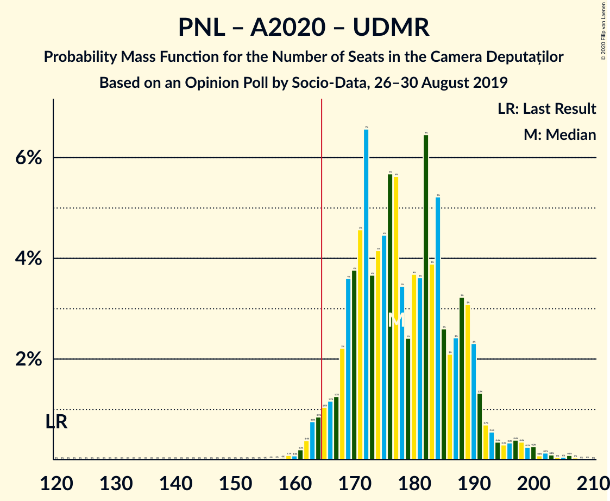

| Number of Seats | Probability | Accumulated | Special Marks |
|:---------------:|:-----------:|:-----------:|:-------------:|
| 120 | 0% | 100% | Last Result |
| 121 | 0% | 100% |  |
| 122 | 0% | 100% |  |
| 123 | 0% | 100% |  |
| 124 | 0% | 100% |  |
| 125 | 0% | 100% |  |
| 126 | 0% | 100% |  |
| 127 | 0% | 100% |  |
| 128 | 0% | 100% |  |
| 129 | 0% | 100% |  |
| 130 | 0% | 100% |  |
| 131 | 0% | 100% |  |
| 132 | 0% | 100% |  |
| 133 | 0% | 100% |  |
| 134 | 0% | 100% |  |
| 135 | 0% | 100% |  |
| 136 | 0% | 100% |  |
| 137 | 0% | 100% |  |
| 138 | 0% | 100% |  |
| 139 | 0% | 100% |  |
| 140 | 0% | 100% |  |
| 141 | 0% | 100% |  |
| 142 | 0% | 100% |  |
| 143 | 0% | 100% |  |
| 144 | 0% | 100% |  |
| 145 | 0% | 100% |  |
| 146 | 0% | 100% |  |
| 147 | 0% | 100% |  |
| 148 | 0% | 100% |  |
| 149 | 0% | 100% |  |
| 150 | 0% | 100% |  |
| 151 | 0% | 100% |  |
| 152 | 0% | 100% |  |
| 153 | 0% | 100% |  |
| 154 | 0% | 100% |  |
| 155 | 0% | 100% |  |
| 156 | 0% | 100% |  |
| 157 | 0% | 100% |  |
| 158 | 0% | 100% |  |
| 159 | 0.1% | 99.9% |  |
| 160 | 0.1% | 99.9% |  |
| 161 | 0.2% | 99.8% |  |
| 162 | 0.4% | 99.6% |  |
| 163 | 0.8% | 99.2% |  |
| 164 | 0.9% | 98% |  |
| 165 | 1.0% | 98% | Majority |
| 166 | 1.2% | 97% |  |
| 167 | 1.3% | 95% |  |
| 168 | 2% | 94% |  |
| 169 | 4% | 92% |  |
| 170 | 4% | 88% |  |
| 171 | 5% | 85% |  |
| 172 | 7% | 80% |  |
| 173 | 4% | 73% |  |
| 174 | 4% | 70% |  |
| 175 | 4% | 66% |  |
| 176 | 6% | 61% |  |
| 177 | 6% | 55% |  |
| 178 | 3% | 50% | Median |
| 179 | 2% | 46% |  |
| 180 | 4% | 44% |  |
| 181 | 4% | 40% |  |
| 182 | 6% | 37% |  |
| 183 | 4% | 30% |  |
| 184 | 5% | 26% |  |
| 185 | 3% | 21% |  |
| 186 | 2% | 18% |  |
| 187 | 2% | 16% |  |
| 188 | 3% | 14% |  |
| 189 | 3% | 11% |  |
| 190 | 2% | 8% |  |
| 191 | 1.3% | 5% |  |
| 192 | 0.7% | 4% |  |
| 193 | 0.6% | 3% |  |
| 194 | 0.4% | 3% |  |
| 195 | 0.3% | 2% |  |
| 196 | 0.3% | 2% |  |
| 197 | 0.4% | 2% |  |
| 198 | 0.4% | 1.4% |  |
| 199 | 0.2% | 1.1% |  |
| 200 | 0.3% | 0.8% |  |
| 201 | 0.1% | 0.5% |  |
| 202 | 0.1% | 0.5% |  |
| 203 | 0.1% | 0.3% |  |
| 204 | 0% | 0.2% |  |
| 205 | 0% | 0.2% |  |
| 206 | 0.1% | 0.1% |  |
| 207 | 0% | 0.1% |  |
| 208 | 0% | 0% |  |

### Partidul Național Liberal – Alianța 2020 USR-PLUS – Partidul Mișcarea Populară

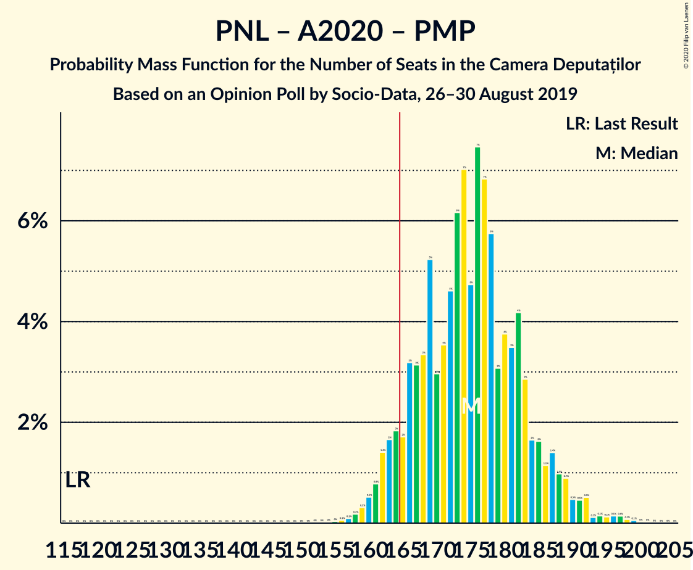

| Number of Seats | Probability | Accumulated | Special Marks |
|:---------------:|:-----------:|:-----------:|:-------------:|
| 117 | 0% | 100% | Last Result |
| 118 | 0% | 100% |  |
| 119 | 0% | 100% |  |
| 120 | 0% | 100% |  |
| 121 | 0% | 100% |  |
| 122 | 0% | 100% |  |
| 123 | 0% | 100% |  |
| 124 | 0% | 100% |  |
| 125 | 0% | 100% |  |
| 126 | 0% | 100% |  |
| 127 | 0% | 100% |  |
| 128 | 0% | 100% |  |
| 129 | 0% | 100% |  |
| 130 | 0% | 100% |  |
| 131 | 0% | 100% |  |
| 132 | 0% | 100% |  |
| 133 | 0% | 100% |  |
| 134 | 0% | 100% |  |
| 135 | 0% | 100% |  |
| 136 | 0% | 100% |  |
| 137 | 0% | 100% |  |
| 138 | 0% | 100% |  |
| 139 | 0% | 100% |  |
| 140 | 0% | 100% |  |
| 141 | 0% | 100% |  |
| 142 | 0% | 100% |  |
| 143 | 0% | 100% |  |
| 144 | 0% | 100% |  |
| 145 | 0% | 100% |  |
| 146 | 0% | 100% |  |
| 147 | 0% | 100% |  |
| 148 | 0% | 100% |  |
| 149 | 0% | 100% |  |
| 150 | 0% | 100% |  |
| 151 | 0% | 100% |  |
| 152 | 0% | 100% |  |
| 153 | 0% | 100% |  |
| 154 | 0% | 100% |  |
| 155 | 0% | 99.9% |  |
| 156 | 0.1% | 99.9% |  |
| 157 | 0.1% | 99.9% |  |
| 158 | 0.2% | 99.8% |  |
| 159 | 0.3% | 99.6% |  |
| 160 | 0.5% | 99.3% |  |
| 161 | 0.8% | 98.8% |  |
| 162 | 1.4% | 98% |  |
| 163 | 2% | 97% |  |
| 164 | 2% | 95% |  |
| 165 | 2% | 93% | Majority |
| 166 | 3% | 91% |  |
| 167 | 3% | 88% |  |
| 168 | 3% | 85% |  |
| 169 | 5% | 82% |  |
| 170 | 3% | 76% |  |
| 171 | 4% | 73% |  |
| 172 | 5% | 70% |  |
| 173 | 6% | 65% |  |
| 174 | 7% | 59% |  |
| 175 | 5% | 52% |  |
| 176 | 7% | 47% |  |
| 177 | 7% | 40% |  |
| 178 | 6% | 33% |  |
| 179 | 3% | 27% |  |
| 180 | 4% | 24% |  |
| 181 | 3% | 21% | Median |
| 182 | 4% | 17% |  |
| 183 | 3% | 13% |  |
| 184 | 2% | 10% |  |
| 185 | 2% | 8% |  |
| 186 | 1.1% | 7% |  |
| 187 | 1.4% | 6% |  |
| 188 | 1.0% | 4% |  |
| 189 | 0.9% | 3% |  |
| 190 | 0.5% | 2% |  |
| 191 | 0.5% | 2% |  |
| 192 | 0.5% | 1.4% |  |
| 193 | 0.1% | 0.9% |  |
| 194 | 0.1% | 0.8% |  |
| 195 | 0.1% | 0.6% |  |
| 196 | 0.1% | 0.5% |  |
| 197 | 0.1% | 0.3% |  |
| 198 | 0.1% | 0.2% |  |
| 199 | 0.1% | 0.1% |  |
| 200 | 0% | 0.1% |  |
| 201 | 0% | 0% |  |

### Partidul Național Liberal – Alianța 2020 USR-PLUS

| Number of Seats | Probability | Accumulated | Special Marks |
|:---------------:|:-----------:|:-----------:|:-------------:|
| 99 | 0% | 100% | Last Result |
| 100 | 0% | 100% |  |
| 101 | 0% | 100% |  |
| 102 | 0% | 100% |  |
| 103 | 0% | 100% |  |
| 104 | 0% | 100% |  |
| 105 | 0% | 100% |  |
| 106 | 0% | 100% |  |
| 107 | 0% | 100% |  |
| 108 | 0% | 100% |  |
| 109 | 0% | 100% |  |
| 110 | 0% | 100% |  |
| 111 | 0% | 100% |  |
| 112 | 0% | 100% |  |
| 113 | 0% | 100% |  |
| 114 | 0% | 100% |  |
| 115 | 0% | 100% |  |
| 116 | 0% | 100% |  |
| 117 | 0% | 100% |  |
| 118 | 0% | 100% |  |
| 119 | 0% | 100% |  |
| 120 | 0% | 100% |  |
| 121 | 0% | 100% |  |
| 122 | 0% | 100% |  |
| 123 | 0% | 100% |  |
| 124 | 0% | 100% |  |
| 125 | 0% | 100% |  |
| 126 | 0% | 100% |  |
| 127 | 0% | 100% |  |
| 128 | 0% | 100% |  |
| 129 | 0% | 100% |  |
| 130 | 0% | 100% |  |
| 131 | 0% | 100% |  |
| 132 | 0% | 100% |  |
| 133 | 0% | 100% |  |
| 134 | 0% | 100% |  |
| 135 | 0% | 100% |  |
| 136 | 0% | 100% |  |
| 137 | 0% | 100% |  |
| 138 | 0% | 100% |  |
| 139 | 0% | 100% |  |
| 140 | 0% | 100% |  |
| 141 | 0% | 100% |  |
| 142 | 0% | 100% |  |
| 143 | 0% | 100% |  |
| 144 | 0% | 100% |  |
| 145 | 0% | 100% |  |
| 146 | 0% | 99.9% |  |
| 147 | 0.1% | 99.9% |  |
| 148 | 0.2% | 99.8% |  |
| 149 | 0.3% | 99.6% |  |
| 150 | 0.5% | 99.3% |  |
| 151 | 1.2% | 98.8% |  |
| 152 | 0.7% | 98% |  |
| 153 | 1.1% | 97% |  |
| 154 | 2% | 96% |  |
| 155 | 2% | 94% |  |
| 156 | 2% | 92% |  |
| 157 | 4% | 90% |  |
| 158 | 5% | 86% |  |
| 159 | 5% | 81% |  |
| 160 | 6% | 77% |  |
| 161 | 6% | 71% |  |
| 162 | 4% | 65% |  |
| 163 | 4% | 60% |  |
| 164 | 5% | 56% |  |
| 165 | 4% | 51% | Median, Majority |
| 166 | 5% | 47% |  |
| 167 | 5% | 42% |  |
| 168 | 3% | 38% |  |
| 169 | 6% | 34% |  |
| 170 | 3% | 28% |  |
| 171 | 4% | 25% |  |
| 172 | 3% | 22% |  |
| 173 | 4% | 18% |  |
| 174 | 4% | 15% |  |
| 175 | 2% | 11% |  |
| 176 | 3% | 9% |  |
| 177 | 2% | 7% |  |
| 178 | 1.0% | 5% |  |
| 179 | 0.9% | 4% |  |
| 180 | 0.4% | 3% |  |
| 181 | 0.4% | 2% |  |
| 182 | 0.3% | 2% |  |
| 183 | 0.6% | 2% |  |
| 184 | 0.1% | 1.2% |  |
| 185 | 0.1% | 1.1% |  |
| 186 | 0.2% | 0.9% |  |
| 187 | 0.3% | 0.7% |  |
| 188 | 0.1% | 0.4% |  |
| 189 | 0.1% | 0.3% |  |
| 190 | 0% | 0.2% |  |
| 191 | 0.1% | 0.2% |  |
| 192 | 0% | 0.1% |  |
| 193 | 0% | 0.1% |  |
| 194 | 0% | 0% |  |

### Partidul Național Liberal – Partidul Alianța Liberalilor și Democraților – Partidul Mișcarea Populară – Uniunea Democrată Maghiară din România

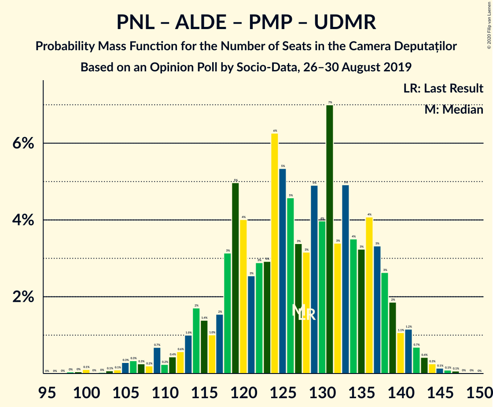

| Number of Seats | Probability | Accumulated | Special Marks |
|:---------------:|:-----------:|:-----------:|:-------------:|
| 98 | 0% | 100% |  |
| 99 | 0% | 99.9% |  |
| 100 | 0.1% | 99.9% |  |
| 101 | 0% | 99.8% |  |
| 102 | 0% | 99.8% |  |
| 103 | 0.1% | 99.7% |  |
| 104 | 0.1% | 99.7% |  |
| 105 | 0.3% | 99.6% |  |
| 106 | 0.3% | 99.3% |  |
| 107 | 0.3% | 99.0% |  |
| 108 | 0.2% | 98.7% |  |
| 109 | 0.7% | 98.5% |  |
| 110 | 0.2% | 98% |  |
| 111 | 0.4% | 98% |  |
| 112 | 0.6% | 97% |  |
| 113 | 1.0% | 97% |  |
| 114 | 2% | 96% |  |
| 115 | 1.4% | 94% |  |
| 116 | 1.0% | 92% |  |
| 117 | 2% | 91% |  |
| 118 | 3% | 90% |  |
| 119 | 5% | 87% |  |
| 120 | 4% | 82% |  |
| 121 | 3% | 78% |  |
| 122 | 3% | 75% |  |
| 123 | 3% | 72% |  |
| 124 | 6% | 69% |  |
| 125 | 5% | 63% |  |
| 126 | 5% | 58% |  |
| 127 | 3% | 53% |  |
| 128 | 3% | 50% | Last Result |
| 129 | 5% | 47% |  |
| 130 | 4% | 42% |  |
| 131 | 7% | 38% |  |
| 132 | 3% | 31% |  |
| 133 | 5% | 27% |  |
| 134 | 4% | 23% | Median |
| 135 | 3% | 19% |  |
| 136 | 4% | 16% |  |
| 137 | 3% | 12% |  |
| 138 | 3% | 8% |  |
| 139 | 2% | 6% |  |
| 140 | 1.1% | 4% |  |
| 141 | 1.2% | 3% |  |
| 142 | 0.7% | 2% |  |
| 143 | 0.4% | 1.0% |  |
| 144 | 0.3% | 0.6% |  |
| 145 | 0.1% | 0.3% |  |
| 146 | 0.1% | 0.2% |  |
| 147 | 0.1% | 0.1% |  |
| 148 | 0% | 0% |  |

### Partidul Social Democrat – PRO România – Partidul Alianța Liberalilor și Democraților

| Number of Seats | Probability | Accumulated | Special Marks |
|:---------------:|:-----------:|:-----------:|:-------------:|
| 98 | 0% | 100% |  |
| 99 | 0% | 99.9% |  |
| 100 | 0% | 99.9% |  |
| 101 | 0.1% | 99.9% |  |
| 102 | 0.2% | 99.8% |  |
| 103 | 0.1% | 99.5% |  |
| 104 | 0.2% | 99.4% |  |
| 105 | 0.1% | 99.2% |  |
| 106 | 0.2% | 99.1% |  |
| 107 | 0.4% | 98.9% |  |
| 108 | 0.6% | 98.5% |  |
| 109 | 0.6% | 98% |  |
| 110 | 1.2% | 97% |  |
| 111 | 0.9% | 96% |  |
| 112 | 1.3% | 95% |  |
| 113 | 0.9% | 94% |  |
| 114 | 0.7% | 93% |  |
| 115 | 1.5% | 92% |  |
| 116 | 3% | 91% |  |
| 117 | 4% | 88% |  |
| 118 | 5% | 85% |  |
| 119 | 5% | 79% |  |
| 120 | 3% | 74% |  |
| 121 | 3% | 71% |  |
| 122 | 5% | 68% |  |
| 123 | 8% | 64% |  |
| 124 | 10% | 55% | Median |
| 125 | 7% | 45% |  |
| 126 | 4% | 38% |  |
| 127 | 3% | 34% |  |
| 128 | 5% | 31% |  |
| 129 | 4% | 26% |  |
| 130 | 7% | 22% |  |
| 131 | 3% | 15% |  |
| 132 | 3% | 12% |  |
| 133 | 1.1% | 9% |  |
| 134 | 2% | 8% |  |
| 135 | 1.2% | 6% |  |
| 136 | 2% | 5% |  |
| 137 | 2% | 3% |  |
| 138 | 0.7% | 1.4% |  |
| 139 | 0.3% | 0.7% |  |
| 140 | 0.1% | 0.5% |  |
| 141 | 0.1% | 0.3% |  |
| 142 | 0.1% | 0.2% |  |
| 143 | 0.1% | 0.1% |  |
| 144 | 0% | 0.1% |  |
| 145 | 0% | 0% |  |
| 146 | 0% | 0% |  |
| 147 | 0% | 0% |  |
| 148 | 0% | 0% |  |
| 149 | 0% | 0% |  |
| 150 | 0% | 0% |  |
| 151 | 0% | 0% |  |
| 152 | 0% | 0% |  |
| 153 | 0% | 0% |  |
| 154 | 0% | 0% |  |
| 155 | 0% | 0% |  |
| 156 | 0% | 0% |  |
| 157 | 0% | 0% |  |
| 158 | 0% | 0% |  |
| 159 | 0% | 0% |  |
| 160 | 0% | 0% |  |
| 161 | 0% | 0% |  |
| 162 | 0% | 0% |  |
| 163 | 0% | 0% |  |
| 164 | 0% | 0% |  |
| 165 | 0% | 0% | Majority |
| 166 | 0% | 0% |  |
| 167 | 0% | 0% |  |
| 168 | 0% | 0% |  |
| 169 | 0% | 0% |  |
| 170 | 0% | 0% |  |
| 171 | 0% | 0% |  |
| 172 | 0% | 0% |  |
| 173 | 0% | 0% |  |
| 174 | 0% | 0% | Last Result |

### Partidul Național Liberal – Partidul Alianța Liberalilor și Democraților – Uniunea Democrată Maghiară din România

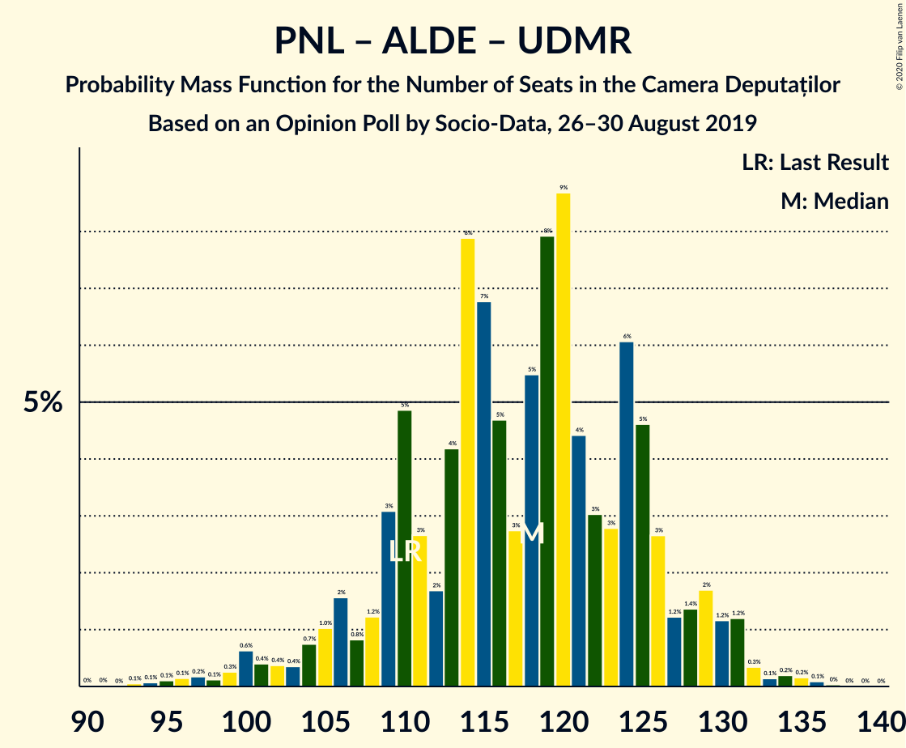

| Number of Seats | Probability | Accumulated | Special Marks |
|:---------------:|:-----------:|:-----------:|:-------------:|
| 92 | 0% | 100% |  |
| 93 | 0.1% | 99.9% |  |
| 94 | 0.1% | 99.9% |  |
| 95 | 0.1% | 99.8% |  |
| 96 | 0.1% | 99.7% |  |
| 97 | 0.2% | 99.6% |  |
| 98 | 0.1% | 99.4% |  |
| 99 | 0.3% | 99.3% |  |
| 100 | 0.6% | 99.0% |  |
| 101 | 0.4% | 98% |  |
| 102 | 0.4% | 98% |  |
| 103 | 0.4% | 98% |  |
| 104 | 0.7% | 97% |  |
| 105 | 1.0% | 97% |  |
| 106 | 2% | 95% |  |
| 107 | 0.8% | 94% |  |
| 108 | 1.2% | 93% |  |
| 109 | 3% | 92% |  |
| 110 | 5% | 89% | Last Result |
| 111 | 3% | 84% |  |
| 112 | 2% | 81% |  |
| 113 | 4% | 80% |  |
| 114 | 8% | 75% |  |
| 115 | 7% | 68% |  |
| 116 | 5% | 61% |  |
| 117 | 3% | 56% |  |
| 118 | 5% | 53% | Median |
| 119 | 8% | 48% |  |
| 120 | 9% | 40% |  |
| 121 | 4% | 31% |  |
| 122 | 3% | 27% |  |
| 123 | 3% | 24% |  |
| 124 | 6% | 21% |  |
| 125 | 5% | 15% |  |
| 126 | 3% | 10% |  |
| 127 | 1.2% | 8% |  |
| 128 | 1.4% | 6% |  |
| 129 | 2% | 5% |  |
| 130 | 1.2% | 3% |  |
| 131 | 1.2% | 2% |  |
| 132 | 0.3% | 1.0% |  |
| 133 | 0.1% | 0.6% |  |
| 134 | 0.2% | 0.5% |  |
| 135 | 0.2% | 0.3% |  |
| 136 | 0.1% | 0.2% |  |
| 137 | 0% | 0.1% |  |
| 138 | 0% | 0% |  |

### Partidul Național Liberal – Partidul Mișcarea Populară – Uniunea Democrată Maghiară din România

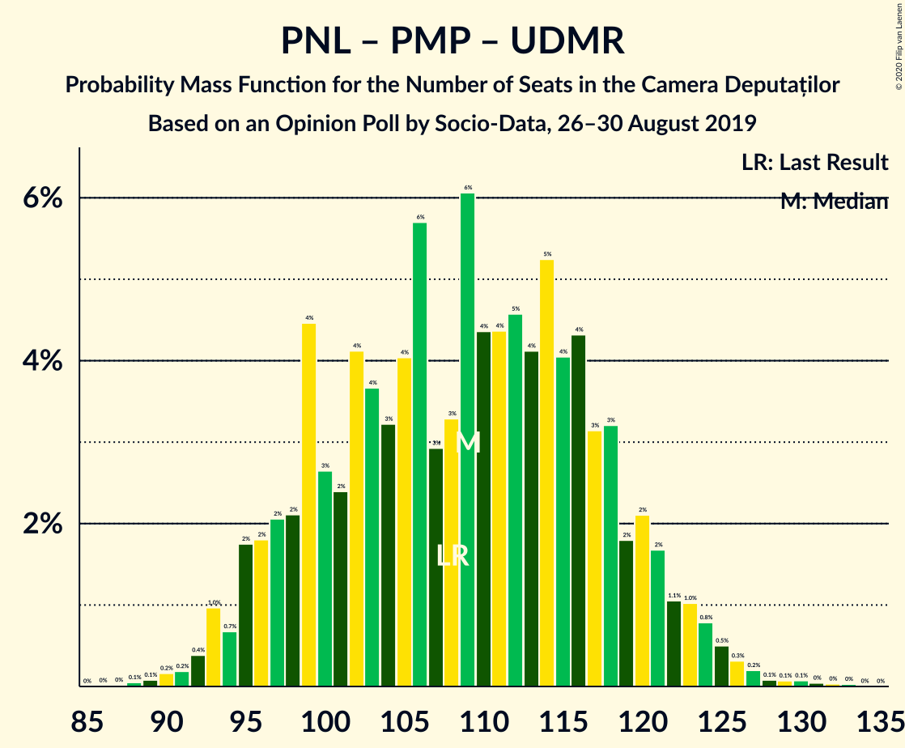

| Number of Seats | Probability | Accumulated | Special Marks |
|:---------------:|:-----------:|:-----------:|:-------------:|
| 88 | 0.1% | 100% |  |
| 89 | 0.1% | 99.9% |  |
| 90 | 0.2% | 99.8% |  |
| 91 | 0.2% | 99.7% |  |
| 92 | 0.4% | 99.5% |  |
| 93 | 1.0% | 99.1% |  |
| 94 | 0.7% | 98% |  |
| 95 | 2% | 97% |  |
| 96 | 2% | 96% |  |
| 97 | 2% | 94% |  |
| 98 | 2% | 92% |  |
| 99 | 4% | 90% |  |
| 100 | 3% | 85% |  |
| 101 | 2% | 83% |  |
| 102 | 4% | 80% |  |
| 103 | 4% | 76% |  |
| 104 | 3% | 72% |  |
| 105 | 4% | 69% |  |
| 106 | 6% | 65% |  |
| 107 | 3% | 59% |  |
| 108 | 3% | 57% | Last Result |
| 109 | 6% | 53% |  |
| 110 | 4% | 47% |  |
| 111 | 4% | 43% |  |
| 112 | 5% | 38% |  |
| 113 | 4% | 34% |  |
| 114 | 5% | 30% |  |
| 115 | 4% | 25% | Median |
| 116 | 4% | 20% |  |
| 117 | 3% | 16% |  |
| 118 | 3% | 13% |  |
| 119 | 2% | 10% |  |
| 120 | 2% | 8% |  |
| 121 | 2% | 6% |  |
| 122 | 1.1% | 4% |  |
| 123 | 1.0% | 3% |  |
| 124 | 0.8% | 2% |  |
| 125 | 0.5% | 1.4% |  |
| 126 | 0.3% | 0.9% |  |
| 127 | 0.2% | 0.5% |  |
| 128 | 0.1% | 0.3% |  |
| 129 | 0.1% | 0.3% |  |
| 130 | 0.1% | 0.2% |  |
| 131 | 0% | 0.1% |  |
| 132 | 0% | 0.1% |  |
| 133 | 0% | 0% |  |

### Partidul Social Democrat – PRO România

| Number of Seats | Probability | Accumulated | Special Marks |
|:---------------:|:-----------:|:-----------:|:-------------:|
| 89 | 0.1% | 100% |  |
| 90 | 0.1% | 99.9% |  |
| 91 | 0.2% | 99.8% |  |
| 92 | 0.4% | 99.6% |  |
| 93 | 0.5% | 99.2% |  |
| 94 | 1.1% | 98.7% |  |
| 95 | 1.3% | 98% |  |
| 96 | 2% | 96% |  |
| 97 | 3% | 95% |  |
| 98 | 3% | 92% |  |
| 99 | 3% | 89% |  |
| 100 | 6% | 86% |  |
| 101 | 6% | 80% |  |
| 102 | 5% | 74% |  |
| 103 | 8% | 69% |  |
| 104 | 6% | 61% |  |
| 105 | 7% | 55% | Median |
| 106 | 7% | 48% |  |
| 107 | 7% | 41% |  |
| 108 | 6% | 35% |  |
| 109 | 5% | 29% |  |
| 110 | 4% | 24% |  |
| 111 | 4% | 20% |  |
| 112 | 3% | 16% |  |
| 113 | 3% | 13% |  |
| 114 | 3% | 10% |  |
| 115 | 2% | 7% |  |
| 116 | 2% | 5% |  |
| 117 | 0.8% | 3% |  |
| 118 | 0.6% | 3% |  |
| 119 | 0.7% | 2% |  |
| 120 | 0.4% | 1.3% |  |
| 121 | 0.2% | 0.9% |  |
| 122 | 0.3% | 0.7% |  |
| 123 | 0.2% | 0.4% |  |
| 124 | 0.1% | 0.2% |  |
| 125 | 0% | 0.1% |  |
| 126 | 0% | 0.1% |  |
| 127 | 0% | 0.1% |  |
| 128 | 0% | 0% |  |
| 129 | 0% | 0% |  |
| 130 | 0% | 0% |  |
| 131 | 0% | 0% |  |
| 132 | 0% | 0% |  |
| 133 | 0% | 0% |  |
| 134 | 0% | 0% |  |
| 135 | 0% | 0% |  |
| 136 | 0% | 0% |  |
| 137 | 0% | 0% |  |
| 138 | 0% | 0% |  |
| 139 | 0% | 0% |  |
| 140 | 0% | 0% |  |
| 141 | 0% | 0% |  |
| 142 | 0% | 0% |  |
| 143 | 0% | 0% |  |
| 144 | 0% | 0% |  |
| 145 | 0% | 0% |  |
| 146 | 0% | 0% |  |
| 147 | 0% | 0% |  |
| 148 | 0% | 0% |  |
| 149 | 0% | 0% |  |
| 150 | 0% | 0% |  |
| 151 | 0% | 0% |  |
| 152 | 0% | 0% |  |
| 153 | 0% | 0% |  |
| 154 | 0% | 0% | Last Result |

### Partidul Național Liberal – Uniunea Democrată Maghiară din România

| Number of Seats | Probability | Accumulated | Special Marks |
|:---------------:|:-----------:|:-----------:|:-------------:|
| 83 | 0.1% | 100% |  |
| 84 | 0.1% | 99.9% |  |
| 85 | 0.3% | 99.8% |  |
| 86 | 0.3% | 99.5% |  |
| 87 | 0.7% | 99.2% |  |
| 88 | 1.2% | 98% |  |
| 89 | 1.3% | 97% |  |
| 90 | 2% | 96% | Last Result |
| 91 | 3% | 94% |  |
| 92 | 3% | 90% |  |
| 93 | 6% | 87% |  |
| 94 | 6% | 82% |  |
| 95 | 4% | 76% |  |
| 96 | 5% | 71% |  |
| 97 | 8% | 66% |  |
| 98 | 6% | 58% |  |
| 99 | 7% | 52% | Median |
| 100 | 7% | 45% |  |
| 101 | 5% | 38% |  |
| 102 | 6% | 34% |  |
| 103 | 5% | 28% |  |
| 104 | 4% | 23% |  |
| 105 | 4% | 19% |  |
| 106 | 5% | 15% |  |
| 107 | 2% | 9% |  |
| 108 | 2% | 8% |  |
| 109 | 2% | 6% |  |
| 110 | 1.1% | 4% |  |
| 111 | 0.8% | 3% |  |
| 112 | 0.6% | 2% |  |
| 113 | 0.4% | 1.3% |  |
| 114 | 0.2% | 0.9% |  |
| 115 | 0.2% | 0.6% |  |
| 116 | 0.3% | 0.5% |  |
| 117 | 0.1% | 0.2% |  |
| 118 | 0% | 0.1% |  |
| 119 | 0% | 0.1% |  |
| 120 | 0% | 0% |  |

### Partidul Național Liberal – Partidul Mișcarea Populară

| Number of Seats | Probability | Accumulated | Special Marks |
|:---------------:|:-----------:|:-----------:|:-------------:|
| 75 | 0% | 100% |  |
| 76 | 0.1% | 99.9% |  |
| 77 | 0.2% | 99.8% |  |
| 78 | 0.3% | 99.7% |  |
| 79 | 0.4% | 99.4% |  |
| 80 | 0.8% | 98.9% |  |
| 81 | 0.8% | 98% |  |
| 82 | 1.4% | 97% |  |
| 83 | 2% | 96% |  |
| 84 | 3% | 94% |  |
| 85 | 2% | 91% |  |
| 86 | 4% | 89% |  |
| 87 | 2% | 85% | Last Result |
| 88 | 4% | 82% |  |
| 89 | 5% | 79% |  |
| 90 | 4% | 74% |  |
| 91 | 3% | 70% |  |
| 92 | 4% | 67% |  |
| 93 | 4% | 62% |  |
| 94 | 3% | 59% |  |
| 95 | 3% | 56% |  |
| 96 | 5% | 53% |  |
| 97 | 4% | 48% |  |
| 98 | 4% | 44% |  |
| 99 | 5% | 40% |  |
| 100 | 5% | 35% |  |
| 101 | 4% | 30% |  |
| 102 | 4% | 25% | Median |
| 103 | 6% | 22% |  |
| 104 | 3% | 16% |  |
| 105 | 3% | 13% |  |
| 106 | 2% | 10% |  |
| 107 | 2% | 8% |  |
| 108 | 2% | 6% |  |
| 109 | 0.8% | 4% |  |
| 110 | 0.9% | 3% |  |
| 111 | 1.0% | 2% |  |
| 112 | 0.6% | 1.1% |  |
| 113 | 0.1% | 0.6% |  |
| 114 | 0.1% | 0.4% |  |
| 115 | 0.1% | 0.3% |  |
| 116 | 0.1% | 0.2% |  |
| 117 | 0% | 0.1% |  |
| 118 | 0% | 0.1% |  |
| 119 | 0% | 0% |  |

### Alianța 2020 USR-PLUS – Partidul Mișcarea Populară

| Number of Seats | Probability | Accumulated | Special Marks |
|:---------------:|:-----------:|:-----------:|:-------------:|
| 48 | 0% | 100% | Last Result |
| 49 | 0% | 100% |  |
| 50 | 0% | 100% |  |
| 51 | 0% | 100% |  |
| 52 | 0% | 100% |  |
| 53 | 0% | 100% |  |
| 54 | 0% | 100% |  |
| 55 | 0% | 100% |  |
| 56 | 0% | 100% |  |
| 57 | 0% | 100% |  |
| 58 | 0% | 100% |  |
| 59 | 0% | 100% |  |
| 60 | 0% | 100% |  |
| 61 | 0% | 100% |  |
| 62 | 0% | 100% |  |
| 63 | 0% | 100% |  |
| 64 | 0% | 100% |  |
| 65 | 0% | 100% |  |
| 66 | 0% | 100% |  |
| 67 | 0% | 100% |  |
| 68 | 0% | 100% |  |
| 69 | 0.1% | 100% |  |
| 70 | 0.1% | 99.9% |  |
| 71 | 0.3% | 99.8% |  |
| 72 | 0.4% | 99.5% |  |
| 73 | 0.5% | 99.1% |  |
| 74 | 1.0% | 98.7% |  |
| 75 | 1.2% | 98% |  |
| 76 | 3% | 96% |  |
| 77 | 3% | 94% |  |
| 78 | 4% | 91% |  |
| 79 | 3% | 88% |  |
| 80 | 3% | 85% |  |
| 81 | 3% | 82% |  |
| 82 | 4% | 79% |  |
| 83 | 5% | 75% |  |
| 84 | 5% | 70% |  |
| 85 | 3% | 66% |  |
| 86 | 3% | 63% |  |
| 87 | 2% | 60% |  |
| 88 | 4% | 58% |  |
| 89 | 3% | 54% |  |
| 90 | 4% | 51% |  |
| 91 | 5% | 47% |  |
| 92 | 4% | 42% |  |
| 93 | 3% | 38% |  |
| 94 | 5% | 35% |  |
| 95 | 6% | 31% | Median |
| 96 | 5% | 24% |  |
| 97 | 4% | 19% |  |
| 98 | 4% | 15% |  |
| 99 | 2% | 12% |  |
| 100 | 2% | 9% |  |
| 101 | 2% | 7% |  |
| 102 | 2% | 5% |  |
| 103 | 1.0% | 3% |  |
| 104 | 0.8% | 2% |  |
| 105 | 0.4% | 1.2% |  |
| 106 | 0.3% | 0.8% |  |
| 107 | 0.2% | 0.5% |  |
| 108 | 0.1% | 0.4% |  |
| 109 | 0.1% | 0.2% |  |
| 110 | 0% | 0.1% |  |
| 111 | 0% | 0.1% |  |
| 112 | 0% | 0% |  |

### Partidul Social Democrat – Partidul Alianța Liberalilor și Democraților

| Number of Seats | Probability | Accumulated | Special Marks |
|:---------------:|:-----------:|:-----------:|:-------------:|
| 65 | 0% | 100% |  |
| 66 | 0% | 99.9% |  |
| 67 | 0.1% | 99.9% |  |
| 68 | 0.1% | 99.8% |  |
| 69 | 0.2% | 99.7% |  |
| 70 | 0.3% | 99.6% |  |
| 71 | 0.2% | 99.2% |  |
| 72 | 0.4% | 99.0% |  |
| 73 | 0.5% | 98.6% |  |
| 74 | 0.5% | 98% |  |
| 75 | 0.3% | 98% |  |
| 76 | 0.7% | 97% |  |
| 77 | 0.6% | 97% |  |
| 78 | 0.6% | 96% |  |
| 79 | 0.9% | 95% |  |
| 80 | 0.9% | 95% |  |
| 81 | 0.8% | 94% |  |
| 82 | 1.2% | 93% |  |
| 83 | 2% | 92% |  |
| 84 | 2% | 90% |  |
| 85 | 3% | 88% |  |
| 86 | 3% | 85% |  |
| 87 | 6% | 82% |  |
| 88 | 5% | 76% |  |
| 89 | 9% | 71% |  |
| 90 | 7% | 63% |  |
| 91 | 7% | 56% | Median |
| 92 | 7% | 49% |  |
| 93 | 6% | 42% |  |
| 94 | 5% | 36% |  |
| 95 | 7% | 31% |  |
| 96 | 6% | 24% |  |
| 97 | 5% | 19% |  |
| 98 | 4% | 13% |  |
| 99 | 3% | 10% |  |
| 100 | 2% | 7% |  |
| 101 | 1.2% | 5% |  |
| 102 | 2% | 4% |  |
| 103 | 0.8% | 2% |  |
| 104 | 0.6% | 1.4% |  |
| 105 | 0.3% | 0.8% |  |
| 106 | 0.2% | 0.5% |  |
| 107 | 0.2% | 0.3% |  |
| 108 | 0.1% | 0.2% |  |
| 109 | 0% | 0.1% |  |
| 110 | 0% | 0% |  |
| 111 | 0% | 0% |  |
| 112 | 0% | 0% |  |
| 113 | 0% | 0% |  |
| 114 | 0% | 0% |  |
| 115 | 0% | 0% |  |
| 116 | 0% | 0% |  |
| 117 | 0% | 0% |  |
| 118 | 0% | 0% |  |
| 119 | 0% | 0% |  |
| 120 | 0% | 0% |  |
| 121 | 0% | 0% |  |
| 122 | 0% | 0% |  |
| 123 | 0% | 0% |  |
| 124 | 0% | 0% |  |
| 125 | 0% | 0% |  |
| 126 | 0% | 0% |  |
| 127 | 0% | 0% |  |
| 128 | 0% | 0% |  |
| 129 | 0% | 0% |  |
| 130 | 0% | 0% |  |
| 131 | 0% | 0% |  |
| 132 | 0% | 0% |  |
| 133 | 0% | 0% |  |
| 134 | 0% | 0% |  |
| 135 | 0% | 0% |  |
| 136 | 0% | 0% |  |
| 137 | 0% | 0% |  |
| 138 | 0% | 0% |  |
| 139 | 0% | 0% |  |
| 140 | 0% | 0% |  |
| 141 | 0% | 0% |  |
| 142 | 0% | 0% |  |
| 143 | 0% | 0% |  |
| 144 | 0% | 0% |  |
| 145 | 0% | 0% |  |
| 146 | 0% | 0% |  |
| 147 | 0% | 0% |  |
| 148 | 0% | 0% |  |
| 149 | 0% | 0% |  |
| 150 | 0% | 0% |  |
| 151 | 0% | 0% |  |
| 152 | 0% | 0% |  |
| 153 | 0% | 0% |  |
| 154 | 0% | 0% |  |
| 155 | 0% | 0% |  |
| 156 | 0% | 0% |  |
| 157 | 0% | 0% |  |
| 158 | 0% | 0% |  |
| 159 | 0% | 0% |  |
| 160 | 0% | 0% |  |
| 161 | 0% | 0% |  |
| 162 | 0% | 0% |  |
| 163 | 0% | 0% |  |
| 164 | 0% | 0% |  |
| 165 | 0% | 0% | Majority |
| 166 | 0% | 0% |  |
| 167 | 0% | 0% |  |
| 168 | 0% | 0% |  |
| 169 | 0% | 0% |  |
| 170 | 0% | 0% |  |
| 171 | 0% | 0% |  |
| 172 | 0% | 0% |  |
| 173 | 0% | 0% |  |
| 174 | 0% | 0% | Last Result |

### Partidul Național Liberal

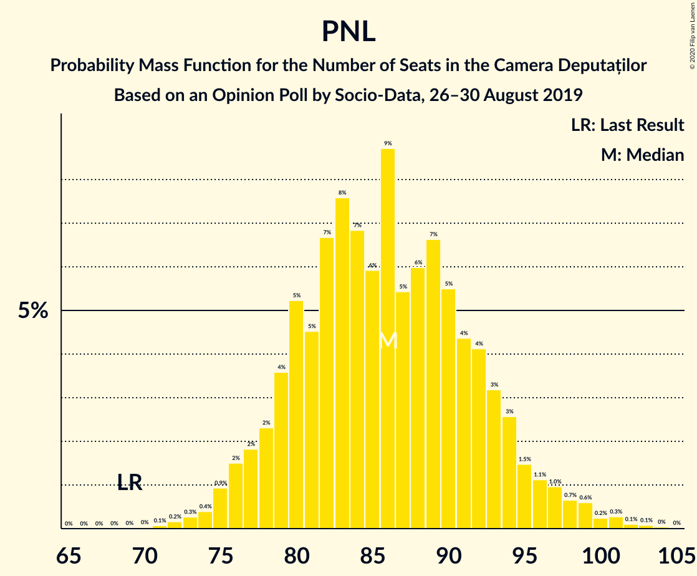

| Number of Seats | Probability | Accumulated | Special Marks |
|:---------------:|:-----------:|:-----------:|:-------------:|
| 69 | 0% | 100% | Last Result |
| 70 | 0% | 100% |  |
| 71 | 0.1% | 99.9% |  |
| 72 | 0.2% | 99.9% |  |
| 73 | 0.3% | 99.7% |  |
| 74 | 0.4% | 99.4% |  |
| 75 | 0.9% | 99.1% |  |
| 76 | 2% | 98% |  |
| 77 | 2% | 97% |  |
| 78 | 2% | 95% |  |
| 79 | 4% | 92% |  |
| 80 | 5% | 89% |  |
| 81 | 5% | 84% |  |
| 82 | 7% | 79% |  |
| 83 | 8% | 72% |  |
| 84 | 7% | 65% |  |
| 85 | 6% | 58% |  |
| 86 | 9% | 52% | Median |
| 87 | 5% | 43% |  |
| 88 | 6% | 38% |  |
| 89 | 7% | 32% |  |
| 90 | 5% | 25% |  |
| 91 | 4% | 20% |  |
| 92 | 4% | 15% |  |
| 93 | 3% | 11% |  |
| 94 | 3% | 8% |  |
| 95 | 1.5% | 6% |  |
| 96 | 1.1% | 4% |  |
| 97 | 1.0% | 3% |  |
| 98 | 0.7% | 2% |  |
| 99 | 0.6% | 1.4% |  |
| 100 | 0.2% | 0.8% |  |
| 101 | 0.3% | 0.5% |  |
| 102 | 0.1% | 0.3% |  |
| 103 | 0.1% | 0.2% |  |
| 104 | 0% | 0.1% |  |
| 105 | 0% | 0% |  |

## Technical Information

### Opinion Poll

+ **Polling firm:** Socio-Data
+ **Commissioner(s):** —
+ **Fieldwork period:** 26–30 August 2019

### Calculations

+ **Sample size:** 1070
+ **Simulations done:** 1,048,576
+ **Error estimate:** 1.02%

