# Opinion Poll by Socio Data, 16–20 September 2019

<a href="#voting-intentions">Voting Intentions</a> | <a href="#seats">Seats</a> | <a href="#coalitions">Coalitions</a> | <a href="#technical-information">Technical Information</a>

## Voting Intentions

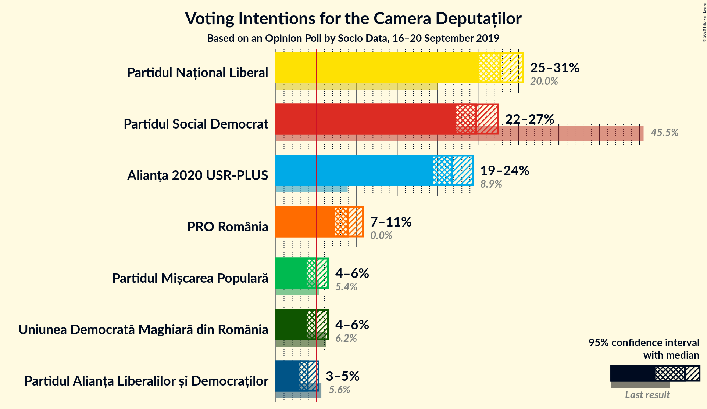

### Confidence Intervals

| Party | Last Result | Poll Result | 80% Confidence Interval | 90% Confidence Interval | 95% Confidence Interval | 99% Confidence Interval |
|:-----:|:-----------:|:-----------:|:-----------------------:|:-----------------------:|:-----------------------:|:-----------------------:|
| Partidul Național Liberal | 20.0% | 27.8% | 26.0–29.6% |25.6–30.1% |25.1–30.5% |24.4–31.4% |
| Partidul Social Democrat | 45.5% | 24.8% | 23.1–26.5% |22.7–27.0% |22.3–27.5% |21.5–28.3% |
| Alianța 2020 USR-PLUS | 8.9% | 21.8% | 20.2–23.5% |19.8–23.9% |19.4–24.4% |18.7–25.2% |
| PRO România | 0.0% | 8.9% | 7.8–10.1% |7.6–10.4% |7.3–10.7% |6.8–11.4% |
| Uniunea Democrată Maghiară din România | 6.2% | 5.0% | 4.2–5.9% |4.0–6.2% |3.8–6.4% |3.5–6.9% |
| Partidul Mișcarea Populară | 5.4% | 5.0% | 4.2–5.9% |4.0–6.2% |3.8–6.4% |3.5–6.9% |
| Partidul Alianța Liberalilor și Democraților | 5.6% | 3.9% | 3.3–4.8% |3.1–5.0% |2.9–5.3% |2.6–5.7% |

*Note:* The poll result column reflects the actual value used in the calculations. Published results may vary slightly, and in addition be rounded to fewer digits.

## Seats

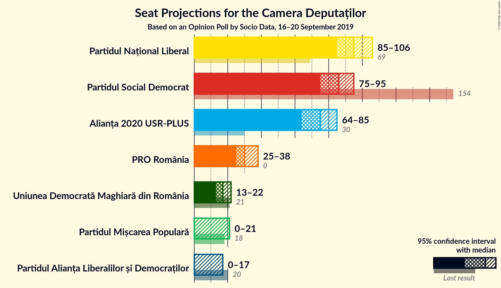

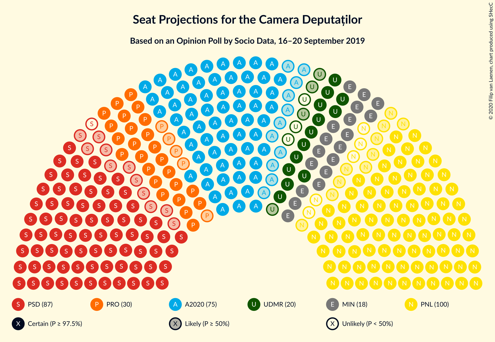

### Confidence Intervals

| Party | Last Result | Median | 80% Confidence Interval | 90% Confidence Interval | 95% Confidence Interval | 99% Confidence Interval |
|:-----:|:-----------:|:------:|:-----------------------:|:-----------------------:|:-----------------------:|:-----------------------:|
| <a href="#partidul-național-liberal">Partidul Național Liberal</a> | 69 | 95 | 88–102 |86–104 |85–106 |81–110 |
| <a href="#partidul-social-democrat">Partidul Social Democrat</a> | 154 | 86 | 79–92 |77–94 |75–95 |72–99 |
| <a href="#alianța-2020-usr-plus">Alianța 2020 USR-PLUS</a> | 30 | 75 | 68–80 |66–83 |64–85 |63–87 |
| <a href="#pro-românia">PRO România</a> | 0 | 30 | 27–34 |25–36 |25–38 |23–39 |
| <a href="#uniunea-democrată-maghiară-din-românia">Uniunea Democrată Maghiară din România</a> | 21 | 17 | 14–20 |13–20 |13–22 |11–24 |
| <a href="#partidul-mișcarea-populară">Partidul Mișcarea Populară</a> | 18 | 0 | 0–19 |0–20 |0–21 |0–22 |
| <a href="#partidul-alianța-liberalilor-și-democraților">Partidul Alianța Liberalilor și Democraților</a> | 20 | 0 | 0 |0 |0–17 |0–18 |

### Partidul Național Liberal

*For a full overview of the results for this party, see the [Partidul Național Liberal](party-partidulnaționalliberal.html) page.*

| Number of Seats | Probability | Accumulated | Special Marks |
|:---------------:|:-----------:|:-----------:|:-------------:|
| 69 | 0% | 100% | Last Result |
| 70 | 0% | 100% |  |
| 71 | 0% | 100% |  |
| 72 | 0% | 100% |  |
| 73 | 0% | 100% |  |
| 74 | 0% | 100% |  |
| 75 | 0% | 100% |  |
| 76 | 0% | 100% |  |
| 77 | 0% | 100% |  |
| 78 | 0% | 100% |  |
| 79 | 0.1% | 99.9% |  |
| 80 | 0.1% | 99.8% |  |
| 81 | 0.2% | 99.7% |  |
| 82 | 0.7% | 99.5% |  |
| 83 | 0.3% | 98.8% |  |
| 84 | 0.6% | 98% |  |
| 85 | 1.2% | 98% |  |
| 86 | 2% | 97% |  |
| 87 | 2% | 95% |  |
| 88 | 3% | 93% |  |
| 89 | 5% | 90% |  |
| 90 | 3% | 85% |  |
| 91 | 5% | 81% |  |
| 92 | 4% | 76% |  |
| 93 | 7% | 72% |  |
| 94 | 9% | 65% |  |
| 95 | 7% | 56% | Median |
| 96 | 5% | 49% |  |
| 97 | 7% | 44% |  |
| 98 | 4% | 38% |  |
| 99 | 6% | 33% |  |
| 100 | 11% | 28% |  |
| 101 | 5% | 16% |  |
| 102 | 2% | 11% |  |
| 103 | 3% | 9% |  |
| 104 | 2% | 6% |  |
| 105 | 0.9% | 3% |  |
| 106 | 0.7% | 3% |  |
| 107 | 0.7% | 2% |  |
| 108 | 0.3% | 1.2% |  |
| 109 | 0.3% | 0.9% |  |
| 110 | 0.1% | 0.6% |  |
| 111 | 0.3% | 0.4% |  |
| 112 | 0% | 0.2% |  |
| 113 | 0% | 0.1% |  |
| 114 | 0.1% | 0.1% |  |
| 115 | 0% | 0% |  |

### Partidul Social Democrat

*For a full overview of the results for this party, see the [Partidul Social Democrat](party-partidulsocialdemocrat.html) page.*

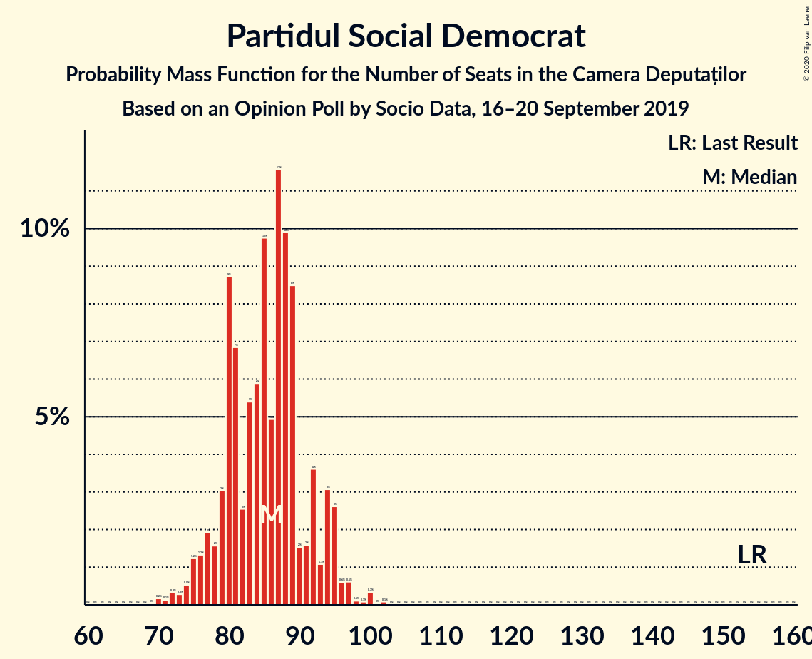

| Number of Seats | Probability | Accumulated | Special Marks |
|:---------------:|:-----------:|:-----------:|:-------------:|
| 69 | 0% | 100% |  |
| 70 | 0.2% | 99.9% |  |
| 71 | 0.1% | 99.8% |  |
| 72 | 0.3% | 99.6% |  |
| 73 | 0.3% | 99.3% |  |
| 74 | 0.5% | 99.0% |  |
| 75 | 1.2% | 98% |  |
| 76 | 1.3% | 97% |  |
| 77 | 2% | 96% |  |
| 78 | 2% | 94% |  |
| 79 | 3% | 92% |  |
| 80 | 9% | 89% |  |
| 81 | 7% | 81% |  |
| 82 | 3% | 74% |  |
| 83 | 5% | 71% |  |
| 84 | 6% | 66% |  |
| 85 | 10% | 60% |  |
| 86 | 5% | 50% | Median |
| 87 | 12% | 45% |  |
| 88 | 10% | 34% |  |
| 89 | 8% | 24% |  |
| 90 | 2% | 15% |  |
| 91 | 2% | 14% |  |
| 92 | 4% | 12% |  |
| 93 | 1.1% | 9% |  |
| 94 | 3% | 8% |  |
| 95 | 3% | 4% |  |
| 96 | 0.6% | 2% |  |
| 97 | 0.6% | 1.3% |  |
| 98 | 0.1% | 0.7% |  |
| 99 | 0.1% | 0.6% |  |
| 100 | 0.3% | 0.5% |  |
| 101 | 0% | 0.1% |  |
| 102 | 0.1% | 0.1% |  |
| 103 | 0% | 0% |  |
| 104 | 0% | 0% |  |
| 105 | 0% | 0% |  |
| 106 | 0% | 0% |  |
| 107 | 0% | 0% |  |
| 108 | 0% | 0% |  |
| 109 | 0% | 0% |  |
| 110 | 0% | 0% |  |
| 111 | 0% | 0% |  |
| 112 | 0% | 0% |  |
| 113 | 0% | 0% |  |
| 114 | 0% | 0% |  |
| 115 | 0% | 0% |  |
| 116 | 0% | 0% |  |
| 117 | 0% | 0% |  |
| 118 | 0% | 0% |  |
| 119 | 0% | 0% |  |
| 120 | 0% | 0% |  |
| 121 | 0% | 0% |  |
| 122 | 0% | 0% |  |
| 123 | 0% | 0% |  |
| 124 | 0% | 0% |  |
| 125 | 0% | 0% |  |
| 126 | 0% | 0% |  |
| 127 | 0% | 0% |  |
| 128 | 0% | 0% |  |
| 129 | 0% | 0% |  |
| 130 | 0% | 0% |  |
| 131 | 0% | 0% |  |
| 132 | 0% | 0% |  |
| 133 | 0% | 0% |  |
| 134 | 0% | 0% |  |
| 135 | 0% | 0% |  |
| 136 | 0% | 0% |  |
| 137 | 0% | 0% |  |
| 138 | 0% | 0% |  |
| 139 | 0% | 0% |  |
| 140 | 0% | 0% |  |
| 141 | 0% | 0% |  |
| 142 | 0% | 0% |  |
| 143 | 0% | 0% |  |
| 144 | 0% | 0% |  |
| 145 | 0% | 0% |  |
| 146 | 0% | 0% |  |
| 147 | 0% | 0% |  |
| 148 | 0% | 0% |  |
| 149 | 0% | 0% |  |
| 150 | 0% | 0% |  |
| 151 | 0% | 0% |  |
| 152 | 0% | 0% |  |
| 153 | 0% | 0% |  |
| 154 | 0% | 0% | Last Result |

### Alianța 2020 USR-PLUS

*For a full overview of the results for this party, see the [Alianța 2020 USR-PLUS](party-alianța2020usr-plus.html) page.*

| Number of Seats | Probability | Accumulated | Special Marks |
|:---------------:|:-----------:|:-----------:|:-------------:|
| 30 | 0% | 100% | Last Result |
| 31 | 0% | 100% |  |
| 32 | 0% | 100% |  |
| 33 | 0% | 100% |  |
| 34 | 0% | 100% |  |
| 35 | 0% | 100% |  |
| 36 | 0% | 100% |  |
| 37 | 0% | 100% |  |
| 38 | 0% | 100% |  |
| 39 | 0% | 100% |  |
| 40 | 0% | 100% |  |
| 41 | 0% | 100% |  |
| 42 | 0% | 100% |  |
| 43 | 0% | 100% |  |
| 44 | 0% | 100% |  |
| 45 | 0% | 100% |  |
| 46 | 0% | 100% |  |
| 47 | 0% | 100% |  |
| 48 | 0% | 100% |  |
| 49 | 0% | 100% |  |
| 50 | 0% | 100% |  |
| 51 | 0% | 100% |  |
| 52 | 0% | 100% |  |
| 53 | 0% | 100% |  |
| 54 | 0% | 100% |  |
| 55 | 0% | 100% |  |
| 56 | 0% | 100% |  |
| 57 | 0% | 100% |  |
| 58 | 0% | 100% |  |
| 59 | 0% | 100% |  |
| 60 | 0% | 99.9% |  |
| 61 | 0.1% | 99.9% |  |
| 62 | 0.2% | 99.8% |  |
| 63 | 0.2% | 99.6% |  |
| 64 | 2% | 99.4% |  |
| 65 | 0.4% | 97% |  |
| 66 | 3% | 97% |  |
| 67 | 0.9% | 94% |  |
| 68 | 4% | 93% |  |
| 69 | 3% | 90% |  |
| 70 | 4% | 87% |  |
| 71 | 4% | 82% |  |
| 72 | 7% | 79% |  |
| 73 | 7% | 72% |  |
| 74 | 10% | 65% |  |
| 75 | 15% | 55% | Median |
| 76 | 1.2% | 39% |  |
| 77 | 12% | 38% |  |
| 78 | 1.2% | 26% |  |
| 79 | 13% | 25% |  |
| 80 | 3% | 12% |  |
| 81 | 2% | 9% |  |
| 82 | 1.0% | 7% |  |
| 83 | 1.2% | 6% |  |
| 84 | 2% | 4% |  |
| 85 | 0.5% | 3% |  |
| 86 | 1.4% | 2% |  |
| 87 | 0.2% | 0.6% |  |
| 88 | 0.1% | 0.4% |  |
| 89 | 0% | 0.3% |  |
| 90 | 0.2% | 0.3% |  |
| 91 | 0% | 0.1% |  |
| 92 | 0% | 0% |  |

### PRO România

*For a full overview of the results for this party, see the [PRO România](party-proromânia.html) page.*

| Number of Seats | Probability | Accumulated | Special Marks |
|:---------------:|:-----------:|:-----------:|:-------------:|
| 0 | 0% | 100% | Last Result |
| 1 | 0% | 100% |  |
| 2 | 0% | 100% |  |
| 3 | 0% | 100% |  |
| 4 | 0% | 100% |  |
| 5 | 0% | 100% |  |
| 6 | 0% | 100% |  |
| 7 | 0% | 100% |  |
| 8 | 0% | 100% |  |
| 9 | 0% | 100% |  |
| 10 | 0% | 100% |  |
| 11 | 0% | 100% |  |
| 12 | 0% | 100% |  |
| 13 | 0% | 100% |  |
| 14 | 0% | 100% |  |
| 15 | 0% | 100% |  |
| 16 | 0% | 100% |  |
| 17 | 0% | 100% |  |
| 18 | 0% | 100% |  |
| 19 | 0% | 100% |  |
| 20 | 0% | 100% |  |
| 21 | 0.1% | 100% |  |
| 22 | 0.2% | 99.9% |  |
| 23 | 0.6% | 99.7% |  |
| 24 | 1.3% | 99.1% |  |
| 25 | 4% | 98% |  |
| 26 | 2% | 94% |  |
| 27 | 15% | 92% |  |
| 28 | 7% | 78% |  |
| 29 | 6% | 71% |  |
| 30 | 20% | 65% | Median |
| 31 | 9% | 45% |  |
| 32 | 12% | 36% |  |
| 33 | 6% | 24% |  |
| 34 | 9% | 18% |  |
| 35 | 5% | 10% |  |
| 36 | 2% | 5% |  |
| 37 | 0.4% | 3% |  |
| 38 | 1.5% | 3% |  |
| 39 | 0.9% | 1.2% |  |
| 40 | 0.2% | 0.3% |  |
| 41 | 0% | 0.1% |  |
| 42 | 0.1% | 0.1% |  |
| 43 | 0% | 0% |  |

### Uniunea Democrată Maghiară din România

*For a full overview of the results for this party, see the [Uniunea Democrată Maghiară din România](party-uniuneademocratămaghiarădinromânia.html) page.*

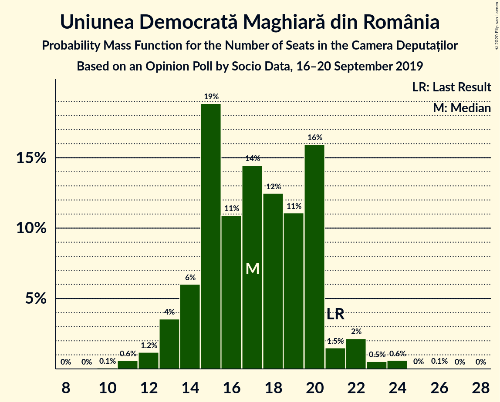

| Number of Seats | Probability | Accumulated | Special Marks |
|:---------------:|:-----------:|:-----------:|:-------------:|
| 10 | 0.1% | 100% |  |
| 11 | 0.6% | 99.9% |  |
| 12 | 1.2% | 99.3% |  |
| 13 | 4% | 98% |  |
| 14 | 6% | 95% |  |
| 15 | 19% | 89% |  |
| 16 | 11% | 70% |  |
| 17 | 14% | 59% | Median |
| 18 | 12% | 44% |  |
| 19 | 11% | 32% |  |
| 20 | 16% | 21% |  |
| 21 | 1.5% | 5% | Last Result |
| 22 | 2% | 3% |  |
| 23 | 0.5% | 1.2% |  |
| 24 | 0.6% | 0.7% |  |
| 25 | 0% | 0.1% |  |
| 26 | 0.1% | 0.1% |  |
| 27 | 0% | 0% |  |

### Partidul Mișcarea Populară

*For a full overview of the results for this party, see the [Partidul Mișcarea Populară](party-partidulmișcareapopulară.html) page.*

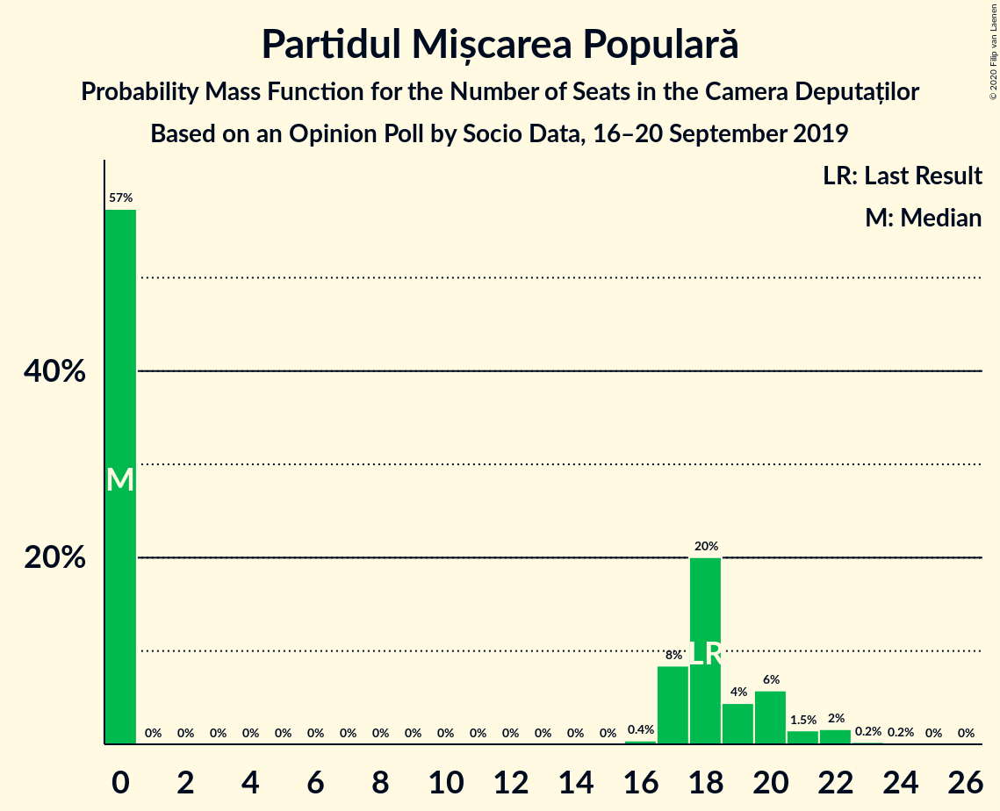

| Number of Seats | Probability | Accumulated | Special Marks |
|:---------------:|:-----------:|:-----------:|:-------------:|
| 0 | 57% | 100% | Median |
| 1 | 0% | 43% |  |
| 2 | 0% | 43% |  |
| 3 | 0% | 43% |  |
| 4 | 0% | 43% |  |
| 5 | 0% | 43% |  |
| 6 | 0% | 43% |  |
| 7 | 0% | 43% |  |
| 8 | 0% | 43% |  |
| 9 | 0% | 43% |  |
| 10 | 0% | 43% |  |
| 11 | 0% | 43% |  |
| 12 | 0% | 43% |  |
| 13 | 0% | 43% |  |
| 14 | 0% | 43% |  |
| 15 | 0% | 43% |  |
| 16 | 0.4% | 43% |  |
| 17 | 8% | 42% |  |
| 18 | 20% | 34% | Last Result |
| 19 | 4% | 14% |  |
| 20 | 6% | 9% |  |
| 21 | 1.5% | 4% |  |
| 22 | 2% | 2% |  |
| 23 | 0.2% | 0.4% |  |
| 24 | 0.2% | 0.2% |  |
| 25 | 0% | 0.1% |  |
| 26 | 0% | 0% |  |

### Partidul Alianța Liberalilor și Democraților

*For a full overview of the results for this party, see the [Partidul Alianța Liberalilor și Democraților](party-partidulalianțaliberalilorșidemocraților.html) page.*

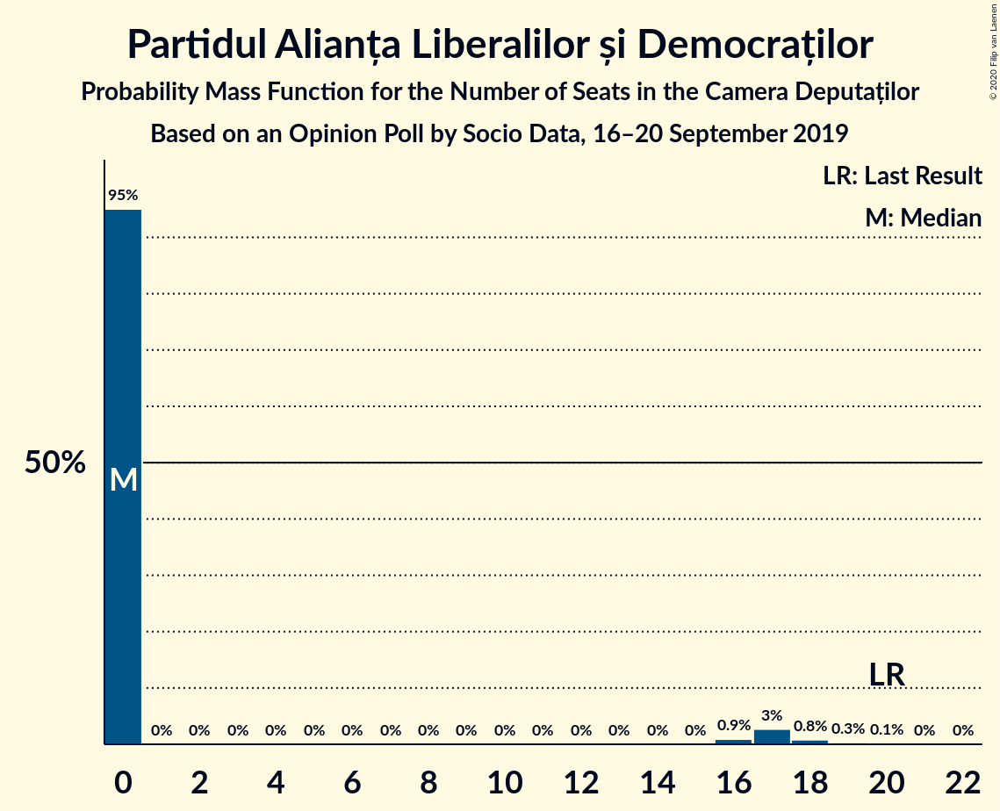

| Number of Seats | Probability | Accumulated | Special Marks |
|:---------------:|:-----------:|:-----------:|:-------------:|
| 0 | 95% | 100% | Median |
| 1 | 0% | 5% |  |
| 2 | 0% | 5% |  |
| 3 | 0% | 5% |  |
| 4 | 0% | 5% |  |
| 5 | 0% | 5% |  |
| 6 | 0% | 5% |  |
| 7 | 0% | 5% |  |
| 8 | 0% | 5% |  |
| 9 | 0% | 5% |  |
| 10 | 0% | 5% |  |
| 11 | 0% | 5% |  |
| 12 | 0% | 5% |  |
| 13 | 0% | 5% |  |
| 14 | 0% | 5% |  |
| 15 | 0% | 5% |  |
| 16 | 0.9% | 5% |  |
| 17 | 3% | 4% |  |
| 18 | 0.8% | 1.3% |  |
| 19 | 0.3% | 0.5% |  |
| 20 | 0.1% | 0.2% | Last Result |
| 21 | 0% | 0% |  |

## Coalitions

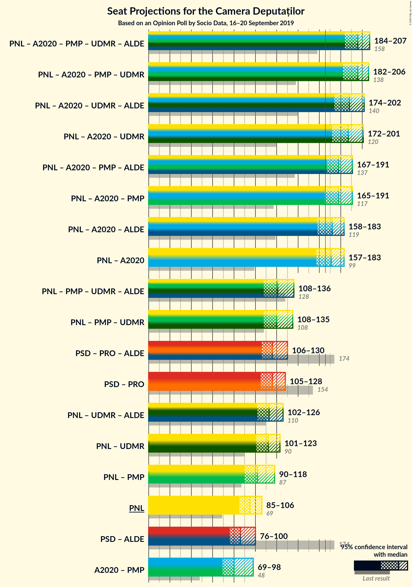

### Confidence Intervals

| Coalition | Last Result | Median | Majority? | 80% Confidence Interval | 90% Confidence Interval | 95% Confidence Interval | 99% Confidence Interval |
|:---------:|:-----------:|:------:|:---------:|:-----------------------:|:-----------------------:|:-----------------------:|:-----------------------:|
| Partidul Național Liberal – Alianța 2020 USR-PLUS – Partidul Mișcarea Populară – Uniunea Democrată Maghiară din România – Partidul Alianța Liberalilor și Democraților | 158 | 196 | 100% | 188–204 | 185–205 | 184–207 | 182–212 |
| Partidul Național Liberal – Alianța 2020 USR-PLUS – Partidul Mișcarea Populară – Uniunea Democrată Maghiară din România | 138 | 196 | 100% | 186–204 | 184–205 | 182–206 | 175–211 |
| Partidul Național Liberal – Alianța 2020 USR-PLUS – Uniunea Democrată Maghiară din România – Partidul Alianța Liberalilor și Democraților | 140 | 188 | 100% | 179–198 | 177–200 | 174–202 | 171–206 |
| Partidul Național Liberal – Alianța 2020 USR-PLUS – Uniunea Democrată Maghiară din România | 120 | 187 | 99.7% | 178–197 | 174–199 | 172–201 | 167–204 |
| Partidul Național Liberal – Alianța 2020 USR-PLUS – Partidul Mișcarea Populară – Partidul Alianța Liberalilor și Democraților | 137 | 178 | 99.0% | 170–188 | 168–190 | 167–191 | 165–196 |
| Partidul Național Liberal – Alianța 2020 USR-PLUS – Partidul Mișcarea Populară | 117 | 178 | 97% | 168–187 | 167–190 | 165–191 | 160–194 |
| Partidul Național Liberal – Alianța 2020 USR-PLUS – Partidul Alianța Liberalilor și Democraților | 119 | 172 | 80% | 161–181 | 159–182 | 158–183 | 154–189 |
| Partidul Național Liberal – Alianța 2020 USR-PLUS | 99 | 171 | 76% | 160–179 | 159–182 | 157–183 | 151–187 |
| Partidul Național Liberal – Partidul Mișcarea Populară – Uniunea Democrată Maghiară din România – Partidul Alianța Liberalilor și Democraților | 128 | 121 | 0% | 112–132 | 109–134 | 108–136 | 105–140 |
| Partidul Național Liberal – Partidul Mișcarea Populară – Uniunea Democrată Maghiară din România | 108 | 120 | 0% | 112–131 | 108–134 | 108–135 | 103–138 |
| Partidul Social Democrat – PRO România – Partidul Alianța Liberalilor și Democraților | 174 | 116 | 0% | 108–126 | 107–128 | 106–130 | 101–137 |
| Partidul Social Democrat – PRO România | 154 | 116 | 0% | 108–124 | 107–127 | 105–128 | 100–130 |
| Partidul Național Liberal – Uniunea Democrată Maghiară din România – Partidul Alianța Liberalilor și Democraților | 110 | 113 | 0% | 105–121 | 103–123 | 102–126 | 99–134 |
| Partidul Național Liberal – Uniunea Democrată Maghiară din România | 90 | 112 | 0% | 105–120 | 102–122 | 101–123 | 97–128 |
| Partidul Național Liberal – Partidul Mișcarea Populară | 87 | 102 | 0% | 94–115 | 91–117 | 90–118 | 87–122 |
| Partidul Național Liberal | 69 | 95 | 0% | 88–102 | 86–104 | 85–106 | 81–110 |
| Partidul Social Democrat – Partidul Alianța Liberalilor și Democraților | 174 | 86 | 0% | 80–94 | 78–96 | 76–100 | 73–105 |
| Alianța 2020 USR-PLUS – Partidul Mișcarea Populară | 48 | 80 | 0% | 73–94 | 72–95 | 69–98 | 66–101 |

### Partidul Național Liberal – Alianța 2020 USR-PLUS – Partidul Mișcarea Populară – Uniunea Democrată Maghiară din România – Partidul Alianța Liberalilor și Democraților

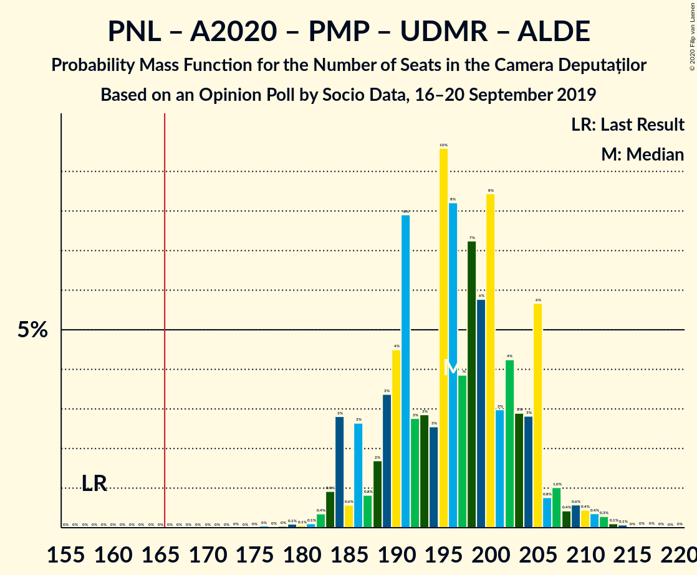

| Number of Seats | Probability | Accumulated | Special Marks |
|:---------------:|:-----------:|:-----------:|:-------------:|
| 158 | 0% | 100% | Last Result |
| 159 | 0% | 100% |  |
| 160 | 0% | 100% |  |
| 161 | 0% | 100% |  |
| 162 | 0% | 100% |  |
| 163 | 0% | 100% |  |
| 164 | 0% | 100% |  |
| 165 | 0% | 100% |  |
| 166 | 0% | 100% | Majority |
| 167 | 0% | 100% |  |
| 168 | 0% | 100% |  |
| 169 | 0% | 100% |  |
| 170 | 0% | 100% |  |
| 171 | 0% | 100% |  |
| 172 | 0% | 100% |  |
| 173 | 0% | 100% |  |
| 174 | 0% | 100% |  |
| 175 | 0% | 100% |  |
| 176 | 0% | 100% |  |
| 177 | 0% | 99.9% |  |
| 178 | 0% | 99.9% |  |
| 179 | 0.1% | 99.9% |  |
| 180 | 0.1% | 99.8% |  |
| 181 | 0.1% | 99.7% |  |
| 182 | 0.4% | 99.6% |  |
| 183 | 0.9% | 99.3% |  |
| 184 | 3% | 98% |  |
| 185 | 0.6% | 96% |  |
| 186 | 3% | 95% |  |
| 187 | 0.8% | 92% | Median |
| 188 | 2% | 91% |  |
| 189 | 3% | 90% |  |
| 190 | 4% | 86% |  |
| 191 | 8% | 82% |  |
| 192 | 3% | 74% |  |
| 193 | 3% | 71% |  |
| 194 | 3% | 68% |  |
| 195 | 10% | 66% |  |
| 196 | 8% | 56% |  |
| 197 | 4% | 48% |  |
| 198 | 7% | 44% |  |
| 199 | 6% | 37% |  |
| 200 | 8% | 31% |  |
| 201 | 3% | 23% |  |
| 202 | 4% | 20% |  |
| 203 | 3% | 16% |  |
| 204 | 3% | 13% |  |
| 205 | 6% | 10% |  |
| 206 | 0.8% | 4% |  |
| 207 | 1.0% | 3% |  |
| 208 | 0.4% | 2% |  |
| 209 | 0.6% | 2% |  |
| 210 | 0.4% | 1.3% |  |
| 211 | 0.4% | 0.9% |  |
| 212 | 0.3% | 0.5% |  |
| 213 | 0.1% | 0.2% |  |
| 214 | 0.1% | 0.1% |  |
| 215 | 0% | 0.1% |  |
| 216 | 0% | 0.1% |  |
| 217 | 0% | 0% |  |

### Partidul Național Liberal – Alianța 2020 USR-PLUS – Partidul Mișcarea Populară – Uniunea Democrată Maghiară din România

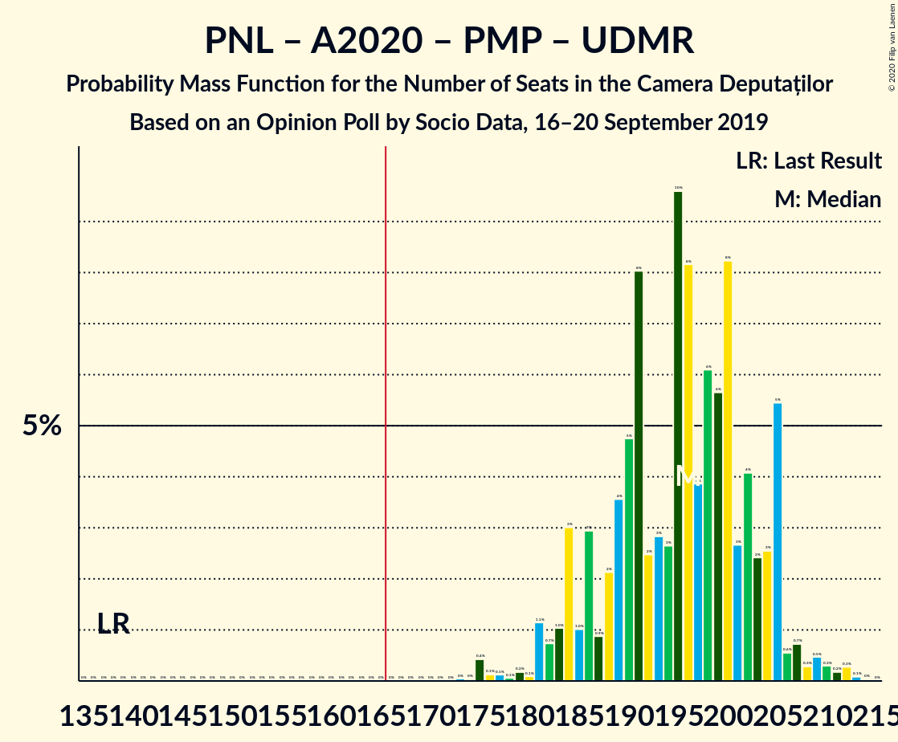

| Number of Seats | Probability | Accumulated | Special Marks |
|:---------------:|:-----------:|:-----------:|:-------------:|
| 138 | 0% | 100% | Last Result |
| 139 | 0% | 100% |  |
| 140 | 0% | 100% |  |
| 141 | 0% | 100% |  |
| 142 | 0% | 100% |  |
| 143 | 0% | 100% |  |
| 144 | 0% | 100% |  |
| 145 | 0% | 100% |  |
| 146 | 0% | 100% |  |
| 147 | 0% | 100% |  |
| 148 | 0% | 100% |  |
| 149 | 0% | 100% |  |
| 150 | 0% | 100% |  |
| 151 | 0% | 100% |  |
| 152 | 0% | 100% |  |
| 153 | 0% | 100% |  |
| 154 | 0% | 100% |  |
| 155 | 0% | 100% |  |
| 156 | 0% | 100% |  |
| 157 | 0% | 100% |  |
| 158 | 0% | 100% |  |
| 159 | 0% | 100% |  |
| 160 | 0% | 100% |  |
| 161 | 0% | 100% |  |
| 162 | 0% | 100% |  |
| 163 | 0% | 100% |  |
| 164 | 0% | 100% |  |
| 165 | 0% | 100% |  |
| 166 | 0% | 100% | Majority |
| 167 | 0% | 100% |  |
| 168 | 0% | 100% |  |
| 169 | 0% | 100% |  |
| 170 | 0% | 100% |  |
| 171 | 0% | 100% |  |
| 172 | 0% | 100% |  |
| 173 | 0% | 100% |  |
| 174 | 0% | 99.9% |  |
| 175 | 0.4% | 99.9% |  |
| 176 | 0.1% | 99.5% |  |
| 177 | 0.1% | 99.3% |  |
| 178 | 0.1% | 99.2% |  |
| 179 | 0.2% | 99.2% |  |
| 180 | 0.1% | 99.0% |  |
| 181 | 1.1% | 98.9% |  |
| 182 | 0.7% | 98% |  |
| 183 | 1.0% | 97% |  |
| 184 | 3% | 96% |  |
| 185 | 1.0% | 93% |  |
| 186 | 3% | 92% |  |
| 187 | 0.9% | 89% | Median |
| 188 | 2% | 88% |  |
| 189 | 4% | 86% |  |
| 190 | 5% | 82% |  |
| 191 | 8% | 78% |  |
| 192 | 2% | 70% |  |
| 193 | 3% | 67% |  |
| 194 | 3% | 64% |  |
| 195 | 10% | 62% |  |
| 196 | 8% | 52% |  |
| 197 | 4% | 44% |  |
| 198 | 6% | 40% |  |
| 199 | 6% | 34% |  |
| 200 | 8% | 28% |  |
| 201 | 3% | 20% |  |
| 202 | 4% | 17% |  |
| 203 | 2% | 13% |  |
| 204 | 3% | 11% |  |
| 205 | 5% | 8% |  |
| 206 | 0.6% | 3% |  |
| 207 | 0.7% | 2% |  |
| 208 | 0.3% | 2% |  |
| 209 | 0.5% | 1.4% |  |
| 210 | 0.3% | 0.9% |  |
| 211 | 0.2% | 0.6% |  |
| 212 | 0.3% | 0.4% |  |
| 213 | 0.1% | 0.1% |  |
| 214 | 0% | 0.1% |  |
| 215 | 0% | 0% |  |

### Partidul Național Liberal – Alianța 2020 USR-PLUS – Uniunea Democrată Maghiară din România – Partidul Alianța Liberalilor și Democraților

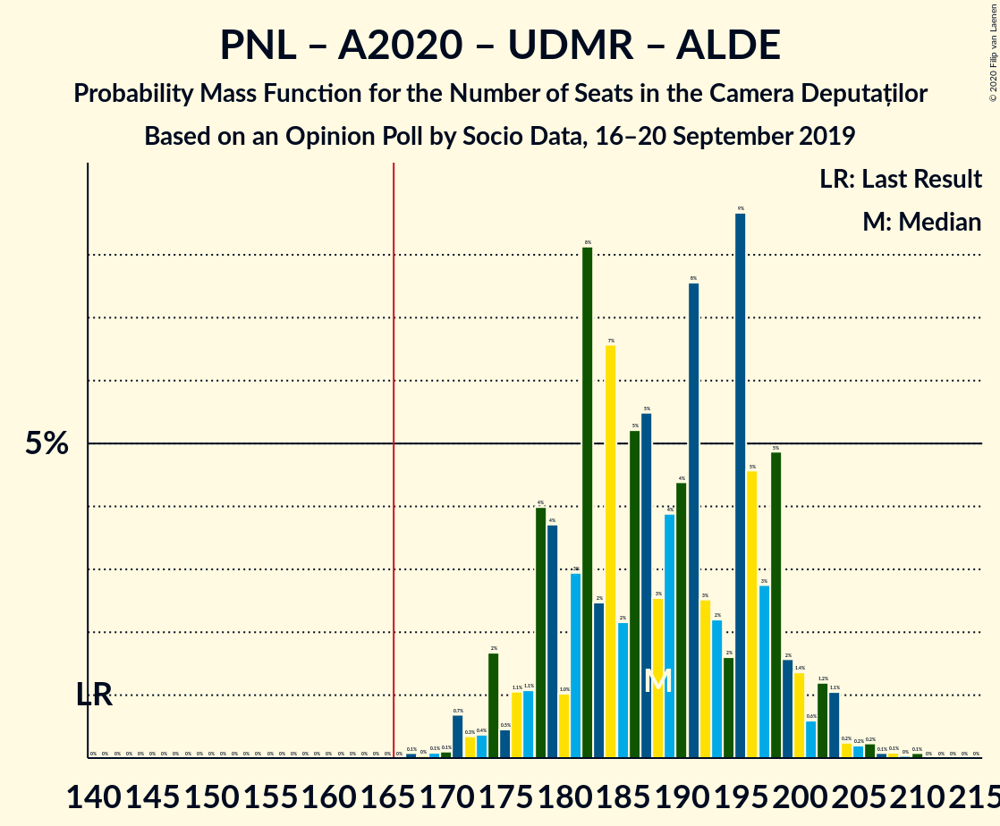

| Number of Seats | Probability | Accumulated | Special Marks |
|:---------------:|:-----------:|:-----------:|:-------------:|
| 140 | 0% | 100% | Last Result |
| 141 | 0% | 100% |  |
| 142 | 0% | 100% |  |
| 143 | 0% | 100% |  |
| 144 | 0% | 100% |  |
| 145 | 0% | 100% |  |
| 146 | 0% | 100% |  |
| 147 | 0% | 100% |  |
| 148 | 0% | 100% |  |
| 149 | 0% | 100% |  |
| 150 | 0% | 100% |  |
| 151 | 0% | 100% |  |
| 152 | 0% | 100% |  |
| 153 | 0% | 100% |  |
| 154 | 0% | 100% |  |
| 155 | 0% | 100% |  |
| 156 | 0% | 100% |  |
| 157 | 0% | 100% |  |
| 158 | 0% | 100% |  |
| 159 | 0% | 100% |  |
| 160 | 0% | 100% |  |
| 161 | 0% | 100% |  |
| 162 | 0% | 100% |  |
| 163 | 0% | 100% |  |
| 164 | 0% | 100% |  |
| 165 | 0% | 100% |  |
| 166 | 0% | 100% | Majority |
| 167 | 0.1% | 100% |  |
| 168 | 0% | 99.9% |  |
| 169 | 0.1% | 99.9% |  |
| 170 | 0.1% | 99.8% |  |
| 171 | 0.7% | 99.7% |  |
| 172 | 0.3% | 99.0% |  |
| 173 | 0.4% | 98.6% |  |
| 174 | 2% | 98% |  |
| 175 | 0.5% | 97% |  |
| 176 | 1.1% | 96% |  |
| 177 | 1.1% | 95% |  |
| 178 | 4% | 94% |  |
| 179 | 4% | 90% |  |
| 180 | 1.0% | 86% |  |
| 181 | 3% | 85% |  |
| 182 | 8% | 82% |  |
| 183 | 2% | 74% |  |
| 184 | 7% | 72% |  |
| 185 | 2% | 65% |  |
| 186 | 5% | 63% |  |
| 187 | 5% | 58% | Median |
| 188 | 3% | 52% |  |
| 189 | 4% | 50% |  |
| 190 | 4% | 46% |  |
| 191 | 8% | 41% |  |
| 192 | 3% | 34% |  |
| 193 | 2% | 31% |  |
| 194 | 2% | 29% |  |
| 195 | 9% | 28% |  |
| 196 | 5% | 19% |  |
| 197 | 3% | 14% |  |
| 198 | 5% | 12% |  |
| 199 | 2% | 7% |  |
| 200 | 1.4% | 5% |  |
| 201 | 0.6% | 4% |  |
| 202 | 1.2% | 3% |  |
| 203 | 1.1% | 2% |  |
| 204 | 0.2% | 1.0% |  |
| 205 | 0.2% | 0.7% |  |
| 206 | 0.2% | 0.5% |  |
| 207 | 0.1% | 0.3% |  |
| 208 | 0.1% | 0.2% |  |
| 209 | 0% | 0.1% |  |
| 210 | 0.1% | 0.1% |  |
| 211 | 0% | 0% |  |

### Partidul Național Liberal – Alianța 2020 USR-PLUS – Uniunea Democrată Maghiară din România

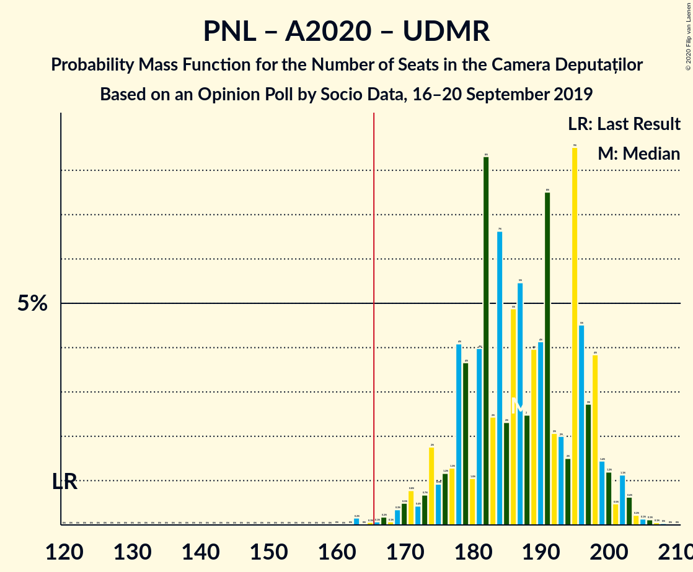

| Number of Seats | Probability | Accumulated | Special Marks |
|:---------------:|:-----------:|:-----------:|:-------------:|
| 120 | 0% | 100% | Last Result |
| 121 | 0% | 100% |  |
| 122 | 0% | 100% |  |
| 123 | 0% | 100% |  |
| 124 | 0% | 100% |  |
| 125 | 0% | 100% |  |
| 126 | 0% | 100% |  |
| 127 | 0% | 100% |  |
| 128 | 0% | 100% |  |
| 129 | 0% | 100% |  |
| 130 | 0% | 100% |  |
| 131 | 0% | 100% |  |
| 132 | 0% | 100% |  |
| 133 | 0% | 100% |  |
| 134 | 0% | 100% |  |
| 135 | 0% | 100% |  |
| 136 | 0% | 100% |  |
| 137 | 0% | 100% |  |
| 138 | 0% | 100% |  |
| 139 | 0% | 100% |  |
| 140 | 0% | 100% |  |
| 141 | 0% | 100% |  |
| 142 | 0% | 100% |  |
| 143 | 0% | 100% |  |
| 144 | 0% | 100% |  |
| 145 | 0% | 100% |  |
| 146 | 0% | 100% |  |
| 147 | 0% | 100% |  |
| 148 | 0% | 100% |  |
| 149 | 0% | 100% |  |
| 150 | 0% | 100% |  |
| 151 | 0% | 100% |  |
| 152 | 0% | 100% |  |
| 153 | 0% | 100% |  |
| 154 | 0% | 100% |  |
| 155 | 0% | 100% |  |
| 156 | 0% | 100% |  |
| 157 | 0% | 100% |  |
| 158 | 0% | 100% |  |
| 159 | 0% | 100% |  |
| 160 | 0% | 100% |  |
| 161 | 0% | 100% |  |
| 162 | 0% | 100% |  |
| 163 | 0.2% | 100% |  |
| 164 | 0% | 99.8% |  |
| 165 | 0.1% | 99.8% |  |
| 166 | 0.1% | 99.7% | Majority |
| 167 | 0.2% | 99.7% |  |
| 168 | 0.1% | 99.5% |  |
| 169 | 0.3% | 99.4% |  |
| 170 | 0.5% | 99.1% |  |
| 171 | 0.8% | 98.6% |  |
| 172 | 0.4% | 98% |  |
| 173 | 0.7% | 97% |  |
| 174 | 2% | 97% |  |
| 175 | 0.9% | 95% |  |
| 176 | 1.2% | 94% |  |
| 177 | 1.3% | 93% |  |
| 178 | 4% | 92% |  |
| 179 | 4% | 87% |  |
| 180 | 1.0% | 84% |  |
| 181 | 4% | 83% |  |
| 182 | 8% | 79% |  |
| 183 | 2% | 70% |  |
| 184 | 7% | 68% |  |
| 185 | 2% | 61% |  |
| 186 | 5% | 59% |  |
| 187 | 5% | 54% | Median |
| 188 | 2% | 49% |  |
| 189 | 4% | 46% |  |
| 190 | 4% | 42% |  |
| 191 | 8% | 38% |  |
| 192 | 2% | 31% |  |
| 193 | 2% | 29% |  |
| 194 | 2% | 27% |  |
| 195 | 9% | 25% |  |
| 196 | 5% | 17% |  |
| 197 | 3% | 12% |  |
| 198 | 4% | 9% |  |
| 199 | 1.4% | 5% |  |
| 200 | 1.2% | 4% |  |
| 201 | 0.5% | 3% |  |
| 202 | 1.1% | 2% |  |
| 203 | 0.6% | 1.2% |  |
| 204 | 0.2% | 0.6% |  |
| 205 | 0.1% | 0.4% |  |
| 206 | 0.1% | 0.2% |  |
| 207 | 0.1% | 0.1% |  |
| 208 | 0% | 0.1% |  |
| 209 | 0% | 0% |  |

### Partidul Național Liberal – Alianța 2020 USR-PLUS – Partidul Mișcarea Populară – Partidul Alianța Liberalilor și Democraților

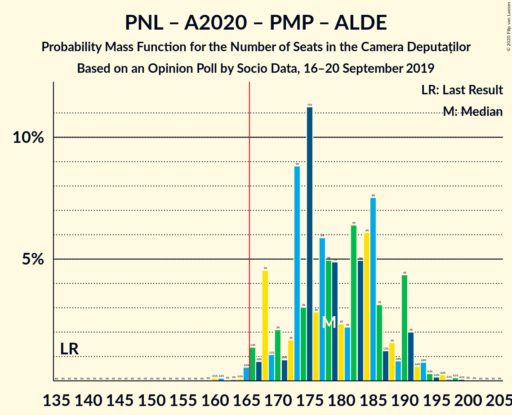

| Number of Seats | Probability | Accumulated | Special Marks |
|:---------------:|:-----------:|:-----------:|:-------------:|
| 137 | 0% | 100% | Last Result |
| 138 | 0% | 100% |  |
| 139 | 0% | 100% |  |
| 140 | 0% | 100% |  |
| 141 | 0% | 100% |  |
| 142 | 0% | 100% |  |
| 143 | 0% | 100% |  |
| 144 | 0% | 100% |  |
| 145 | 0% | 100% |  |
| 146 | 0% | 100% |  |
| 147 | 0% | 100% |  |
| 148 | 0% | 100% |  |
| 149 | 0% | 100% |  |
| 150 | 0% | 100% |  |
| 151 | 0% | 100% |  |
| 152 | 0% | 100% |  |
| 153 | 0% | 100% |  |
| 154 | 0% | 100% |  |
| 155 | 0% | 100% |  |
| 156 | 0% | 100% |  |
| 157 | 0% | 100% |  |
| 158 | 0% | 100% |  |
| 159 | 0% | 100% |  |
| 160 | 0.1% | 100% |  |
| 161 | 0.1% | 99.8% |  |
| 162 | 0% | 99.7% |  |
| 163 | 0% | 99.7% |  |
| 164 | 0.1% | 99.7% |  |
| 165 | 0.6% | 99.6% |  |
| 166 | 1.4% | 99.0% | Majority |
| 167 | 0.8% | 98% |  |
| 168 | 5% | 97% |  |
| 169 | 1.1% | 92% |  |
| 170 | 2% | 91% | Median |
| 171 | 0.9% | 89% |  |
| 172 | 2% | 88% |  |
| 173 | 9% | 87% |  |
| 174 | 3% | 78% |  |
| 175 | 11% | 75% |  |
| 176 | 3% | 64% |  |
| 177 | 6% | 61% |  |
| 178 | 5% | 55% |  |
| 179 | 5% | 50% |  |
| 180 | 2% | 45% |  |
| 181 | 2% | 43% |  |
| 182 | 6% | 40% |  |
| 183 | 5% | 34% |  |
| 184 | 6% | 29% |  |
| 185 | 8% | 23% |  |
| 186 | 3% | 15% |  |
| 187 | 1.2% | 12% |  |
| 188 | 2% | 11% |  |
| 189 | 0.8% | 10% |  |
| 190 | 4% | 9% |  |
| 191 | 2% | 4% |  |
| 192 | 0.6% | 2% |  |
| 193 | 0.8% | 2% |  |
| 194 | 0.3% | 1.0% |  |
| 195 | 0.2% | 0.7% |  |
| 196 | 0.2% | 0.6% |  |
| 197 | 0.1% | 0.3% |  |
| 198 | 0.1% | 0.3% |  |
| 199 | 0.1% | 0.1% |  |
| 200 | 0% | 0.1% |  |
| 201 | 0% | 0% |  |

### Partidul Național Liberal – Alianța 2020 USR-PLUS – Partidul Mișcarea Populară

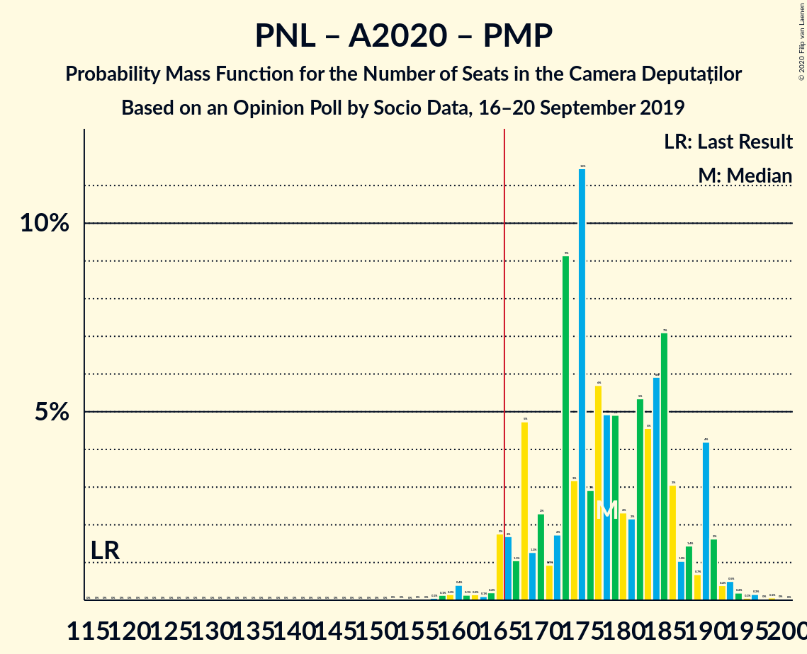

| Number of Seats | Probability | Accumulated | Special Marks |
|:---------------:|:-----------:|:-----------:|:-------------:|
| 117 | 0% | 100% | Last Result |
| 118 | 0% | 100% |  |
| 119 | 0% | 100% |  |
| 120 | 0% | 100% |  |
| 121 | 0% | 100% |  |
| 122 | 0% | 100% |  |
| 123 | 0% | 100% |  |
| 124 | 0% | 100% |  |
| 125 | 0% | 100% |  |
| 126 | 0% | 100% |  |
| 127 | 0% | 100% |  |
| 128 | 0% | 100% |  |
| 129 | 0% | 100% |  |
| 130 | 0% | 100% |  |
| 131 | 0% | 100% |  |
| 132 | 0% | 100% |  |
| 133 | 0% | 100% |  |
| 134 | 0% | 100% |  |
| 135 | 0% | 100% |  |
| 136 | 0% | 100% |  |
| 137 | 0% | 100% |  |
| 138 | 0% | 100% |  |
| 139 | 0% | 100% |  |
| 140 | 0% | 100% |  |
| 141 | 0% | 100% |  |
| 142 | 0% | 100% |  |
| 143 | 0% | 100% |  |
| 144 | 0% | 100% |  |
| 145 | 0% | 100% |  |
| 146 | 0% | 100% |  |
| 147 | 0% | 100% |  |
| 148 | 0% | 100% |  |
| 149 | 0% | 100% |  |
| 150 | 0% | 100% |  |
| 151 | 0% | 100% |  |
| 152 | 0% | 100% |  |
| 153 | 0% | 100% |  |
| 154 | 0% | 100% |  |
| 155 | 0% | 100% |  |
| 156 | 0% | 100% |  |
| 157 | 0.1% | 100% |  |
| 158 | 0.1% | 99.9% |  |
| 159 | 0.2% | 99.8% |  |
| 160 | 0.4% | 99.6% |  |
| 161 | 0.1% | 99.2% |  |
| 162 | 0.2% | 99.1% |  |
| 163 | 0.1% | 98.9% |  |
| 164 | 0.2% | 98.8% |  |
| 165 | 2% | 98.6% |  |
| 166 | 2% | 97% | Majority |
| 167 | 1.1% | 95% |  |
| 168 | 5% | 94% |  |
| 169 | 1.3% | 89% |  |
| 170 | 2% | 88% | Median |
| 171 | 0.9% | 86% |  |
| 172 | 2% | 85% |  |
| 173 | 9% | 83% |  |
| 174 | 3% | 74% |  |
| 175 | 11% | 71% |  |
| 176 | 3% | 59% |  |
| 177 | 6% | 56% |  |
| 178 | 5% | 51% |  |
| 179 | 5% | 46% |  |
| 180 | 2% | 41% |  |
| 181 | 2% | 39% |  |
| 182 | 5% | 36% |  |
| 183 | 5% | 31% |  |
| 184 | 6% | 27% |  |
| 185 | 7% | 21% |  |
| 186 | 3% | 14% |  |
| 187 | 1.0% | 10% |  |
| 188 | 1.4% | 9% |  |
| 189 | 0.7% | 8% |  |
| 190 | 4% | 7% |  |
| 191 | 2% | 3% |  |
| 192 | 0.4% | 1.5% |  |
| 193 | 0.5% | 1.1% |  |
| 194 | 0.2% | 0.6% |  |
| 195 | 0.1% | 0.4% |  |
| 196 | 0.2% | 0.3% |  |
| 197 | 0% | 0.2% |  |
| 198 | 0.1% | 0.1% |  |
| 199 | 0% | 0.1% |  |
| 200 | 0% | 0% |  |

### Partidul Național Liberal – Alianța 2020 USR-PLUS – Partidul Alianța Liberalilor și Democraților

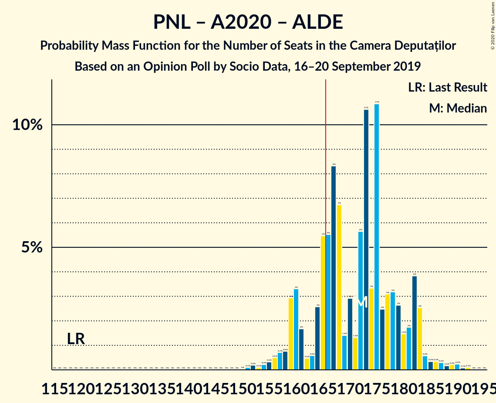

| Number of Seats | Probability | Accumulated | Special Marks |
|:---------------:|:-----------:|:-----------:|:-------------:|
| 119 | 0% | 100% | Last Result |
| 120 | 0% | 100% |  |
| 121 | 0% | 100% |  |
| 122 | 0% | 100% |  |
| 123 | 0% | 100% |  |
| 124 | 0% | 100% |  |
| 125 | 0% | 100% |  |
| 126 | 0% | 100% |  |
| 127 | 0% | 100% |  |
| 128 | 0% | 100% |  |
| 129 | 0% | 100% |  |
| 130 | 0% | 100% |  |
| 131 | 0% | 100% |  |
| 132 | 0% | 100% |  |
| 133 | 0% | 100% |  |
| 134 | 0% | 100% |  |
| 135 | 0% | 100% |  |
| 136 | 0% | 100% |  |
| 137 | 0% | 100% |  |
| 138 | 0% | 100% |  |
| 139 | 0% | 100% |  |
| 140 | 0% | 100% |  |
| 141 | 0% | 100% |  |
| 142 | 0% | 100% |  |
| 143 | 0% | 100% |  |
| 144 | 0% | 100% |  |
| 145 | 0% | 100% |  |
| 146 | 0% | 100% |  |
| 147 | 0% | 100% |  |
| 148 | 0% | 100% |  |
| 149 | 0% | 100% |  |
| 150 | 0% | 100% |  |
| 151 | 0.1% | 100% |  |
| 152 | 0.2% | 99.9% |  |
| 153 | 0.1% | 99.7% |  |
| 154 | 0.2% | 99.6% |  |
| 155 | 0.3% | 99.4% |  |
| 156 | 0.5% | 99.0% |  |
| 157 | 0.7% | 98.5% |  |
| 158 | 0.8% | 98% |  |
| 159 | 3% | 97% |  |
| 160 | 3% | 94% |  |
| 161 | 2% | 91% |  |
| 162 | 0.5% | 89% |  |
| 163 | 0.6% | 89% |  |
| 164 | 3% | 88% |  |
| 165 | 5% | 86% |  |
| 166 | 6% | 80% | Majority |
| 167 | 8% | 75% |  |
| 168 | 7% | 66% |  |
| 169 | 1.4% | 59% |  |
| 170 | 3% | 58% | Median |
| 171 | 1.3% | 55% |  |
| 172 | 6% | 54% |  |
| 173 | 11% | 48% |  |
| 174 | 3% | 38% |  |
| 175 | 11% | 34% |  |
| 176 | 2% | 23% |  |
| 177 | 3% | 21% |  |
| 178 | 3% | 18% |  |
| 179 | 3% | 15% |  |
| 180 | 1.5% | 12% |  |
| 181 | 2% | 10% |  |
| 182 | 4% | 9% |  |
| 183 | 3% | 5% |  |
| 184 | 0.6% | 2% |  |
| 185 | 0.3% | 2% |  |
| 186 | 0.3% | 1.5% |  |
| 187 | 0.3% | 1.1% |  |
| 188 | 0.2% | 0.8% |  |
| 189 | 0.2% | 0.7% |  |
| 190 | 0.2% | 0.4% |  |
| 191 | 0.1% | 0.2% |  |
| 192 | 0.1% | 0.1% |  |
| 193 | 0% | 0% |  |

### Partidul Național Liberal – Alianța 2020 USR-PLUS

| Number of Seats | Probability | Accumulated | Special Marks |
|:---------------:|:-----------:|:-----------:|:-------------:|
| 99 | 0% | 100% | Last Result |
| 100 | 0% | 100% |  |
| 101 | 0% | 100% |  |
| 102 | 0% | 100% |  |
| 103 | 0% | 100% |  |
| 104 | 0% | 100% |  |
| 105 | 0% | 100% |  |
| 106 | 0% | 100% |  |
| 107 | 0% | 100% |  |
| 108 | 0% | 100% |  |
| 109 | 0% | 100% |  |
| 110 | 0% | 100% |  |
| 111 | 0% | 100% |  |
| 112 | 0% | 100% |  |
| 113 | 0% | 100% |  |
| 114 | 0% | 100% |  |
| 115 | 0% | 100% |  |
| 116 | 0% | 100% |  |
| 117 | 0% | 100% |  |
| 118 | 0% | 100% |  |
| 119 | 0% | 100% |  |
| 120 | 0% | 100% |  |
| 121 | 0% | 100% |  |
| 122 | 0% | 100% |  |
| 123 | 0% | 100% |  |
| 124 | 0% | 100% |  |
| 125 | 0% | 100% |  |
| 126 | 0% | 100% |  |
| 127 | 0% | 100% |  |
| 128 | 0% | 100% |  |
| 129 | 0% | 100% |  |
| 130 | 0% | 100% |  |
| 131 | 0% | 100% |  |
| 132 | 0% | 100% |  |
| 133 | 0% | 100% |  |
| 134 | 0% | 100% |  |
| 135 | 0% | 100% |  |
| 136 | 0% | 100% |  |
| 137 | 0% | 100% |  |
| 138 | 0% | 100% |  |
| 139 | 0% | 100% |  |
| 140 | 0% | 100% |  |
| 141 | 0% | 100% |  |
| 142 | 0% | 100% |  |
| 143 | 0% | 100% |  |
| 144 | 0% | 100% |  |
| 145 | 0% | 100% |  |
| 146 | 0% | 100% |  |
| 147 | 0% | 100% |  |
| 148 | 0% | 100% |  |
| 149 | 0.2% | 99.9% |  |
| 150 | 0.1% | 99.7% |  |
| 151 | 0.3% | 99.6% |  |
| 152 | 0.3% | 99.3% |  |
| 153 | 0.2% | 99.0% |  |
| 154 | 0.2% | 98.8% |  |
| 155 | 0.3% | 98.6% |  |
| 156 | 0.7% | 98% |  |
| 157 | 1.2% | 98% |  |
| 158 | 0.9% | 96% |  |
| 159 | 3% | 95% |  |
| 160 | 4% | 92% |  |
| 161 | 2% | 89% |  |
| 162 | 0.7% | 87% |  |
| 163 | 0.7% | 86% |  |
| 164 | 3% | 86% |  |
| 165 | 7% | 83% |  |
| 166 | 6% | 76% | Majority |
| 167 | 8% | 71% |  |
| 168 | 7% | 62% |  |
| 169 | 1.4% | 56% |  |
| 170 | 3% | 54% | Median |
| 171 | 1.4% | 51% |  |
| 172 | 6% | 50% |  |
| 173 | 10% | 44% |  |
| 174 | 3% | 34% |  |
| 175 | 11% | 31% |  |
| 176 | 2% | 20% |  |
| 177 | 3% | 18% |  |
| 178 | 3% | 15% |  |
| 179 | 2% | 12% |  |
| 180 | 1.3% | 9% |  |
| 181 | 2% | 8% |  |
| 182 | 3% | 7% |  |
| 183 | 2% | 4% |  |
| 184 | 0.5% | 2% |  |
| 185 | 0.1% | 1.1% |  |
| 186 | 0.3% | 1.0% |  |
| 187 | 0.2% | 0.7% |  |
| 188 | 0.1% | 0.4% |  |
| 189 | 0.2% | 0.3% |  |
| 190 | 0.1% | 0.1% |  |
| 191 | 0% | 0% |  |

### Partidul Național Liberal – Partidul Mișcarea Populară – Uniunea Democrată Maghiară din România – Partidul Alianța Liberalilor și Democraților

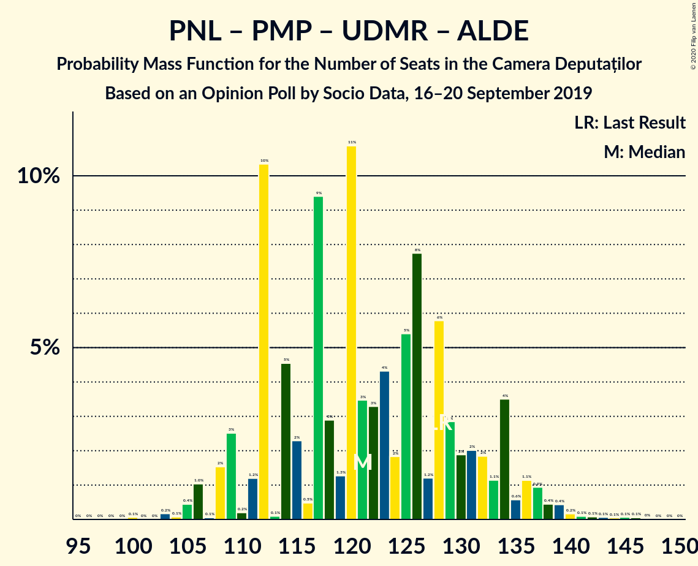

| Number of Seats | Probability | Accumulated | Special Marks |
|:---------------:|:-----------:|:-----------:|:-------------:|
| 100 | 0.1% | 100% |  |
| 101 | 0% | 99.9% |  |
| 102 | 0% | 99.9% |  |
| 103 | 0.2% | 99.9% |  |
| 104 | 0.1% | 99.7% |  |
| 105 | 0.4% | 99.7% |  |
| 106 | 1.0% | 99.2% |  |
| 107 | 0.1% | 98% |  |
| 108 | 2% | 98% |  |
| 109 | 3% | 97% |  |
| 110 | 0.2% | 94% |  |
| 111 | 1.2% | 94% |  |
| 112 | 10% | 93% | Median |
| 113 | 0.1% | 82% |  |
| 114 | 5% | 82% |  |
| 115 | 2% | 78% |  |
| 116 | 0.5% | 75% |  |
| 117 | 9% | 75% |  |
| 118 | 3% | 66% |  |
| 119 | 1.3% | 63% |  |
| 120 | 11% | 61% |  |
| 121 | 3% | 50% |  |
| 122 | 3% | 47% |  |
| 123 | 4% | 44% |  |
| 124 | 2% | 39% |  |
| 125 | 5% | 38% |  |
| 126 | 8% | 32% |  |
| 127 | 1.2% | 24% |  |
| 128 | 6% | 23% | Last Result |
| 129 | 3% | 17% |  |
| 130 | 2% | 15% |  |
| 131 | 2% | 13% |  |
| 132 | 2% | 11% |  |
| 133 | 1.1% | 9% |  |
| 134 | 4% | 8% |  |
| 135 | 0.6% | 4% |  |
| 136 | 1.1% | 4% |  |
| 137 | 0.9% | 2% |  |
| 138 | 0.4% | 1.5% |  |
| 139 | 0.4% | 1.0% |  |
| 140 | 0.2% | 0.6% |  |
| 141 | 0.1% | 0.4% |  |
| 142 | 0.1% | 0.4% |  |
| 143 | 0.1% | 0.3% |  |
| 144 | 0.1% | 0.2% |  |
| 145 | 0.1% | 0.2% |  |
| 146 | 0.1% | 0.1% |  |
| 147 | 0% | 0% |  |

### Partidul Național Liberal – Partidul Mișcarea Populară – Uniunea Democrată Maghiară din România

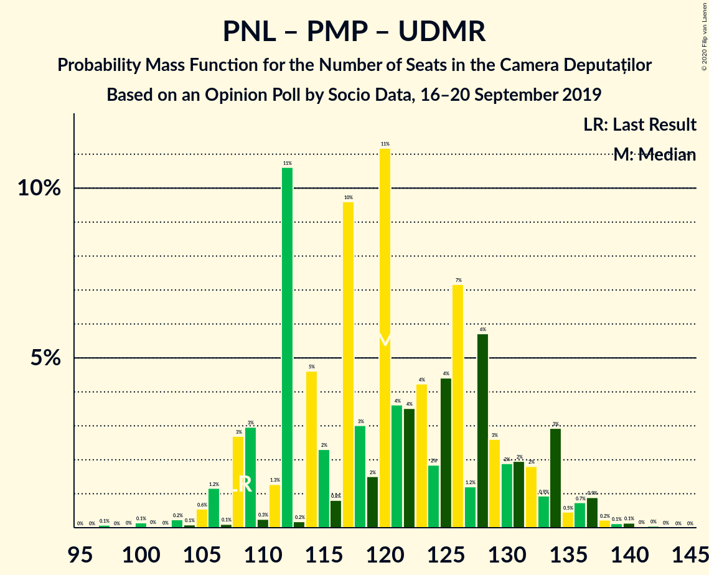

| Number of Seats | Probability | Accumulated | Special Marks |
|:---------------:|:-----------:|:-----------:|:-------------:|
| 97 | 0.1% | 100% |  |
| 98 | 0% | 99.9% |  |
| 99 | 0% | 99.9% |  |
| 100 | 0.1% | 99.9% |  |
| 101 | 0% | 99.7% |  |
| 102 | 0% | 99.7% |  |
| 103 | 0.2% | 99.7% |  |
| 104 | 0.1% | 99.5% |  |
| 105 | 0.6% | 99.4% |  |
| 106 | 1.2% | 98.8% |  |
| 107 | 0.1% | 98% |  |
| 108 | 3% | 98% | Last Result |
| 109 | 3% | 95% |  |
| 110 | 0.3% | 92% |  |
| 111 | 1.3% | 92% |  |
| 112 | 11% | 90% | Median |
| 113 | 0.2% | 80% |  |
| 114 | 5% | 80% |  |
| 115 | 2% | 75% |  |
| 116 | 0.8% | 73% |  |
| 117 | 10% | 72% |  |
| 118 | 3% | 62% |  |
| 119 | 2% | 59% |  |
| 120 | 11% | 58% |  |
| 121 | 4% | 47% |  |
| 122 | 4% | 43% |  |
| 123 | 4% | 39% |  |
| 124 | 2% | 35% |  |
| 125 | 4% | 33% |  |
| 126 | 7% | 29% |  |
| 127 | 1.2% | 22% |  |
| 128 | 6% | 21% |  |
| 129 | 3% | 15% |  |
| 130 | 2% | 12% |  |
| 131 | 2% | 10% |  |
| 132 | 2% | 8% |  |
| 133 | 0.9% | 7% |  |
| 134 | 3% | 6% |  |
| 135 | 0.5% | 3% |  |
| 136 | 0.7% | 2% |  |
| 137 | 0.9% | 1.5% |  |
| 138 | 0.2% | 0.6% |  |
| 139 | 0.1% | 0.4% |  |
| 140 | 0.1% | 0.2% |  |
| 141 | 0% | 0.1% |  |
| 142 | 0% | 0.1% |  |
| 143 | 0% | 0% |  |

### Partidul Social Democrat – PRO România – Partidul Alianța Liberalilor și Democraților

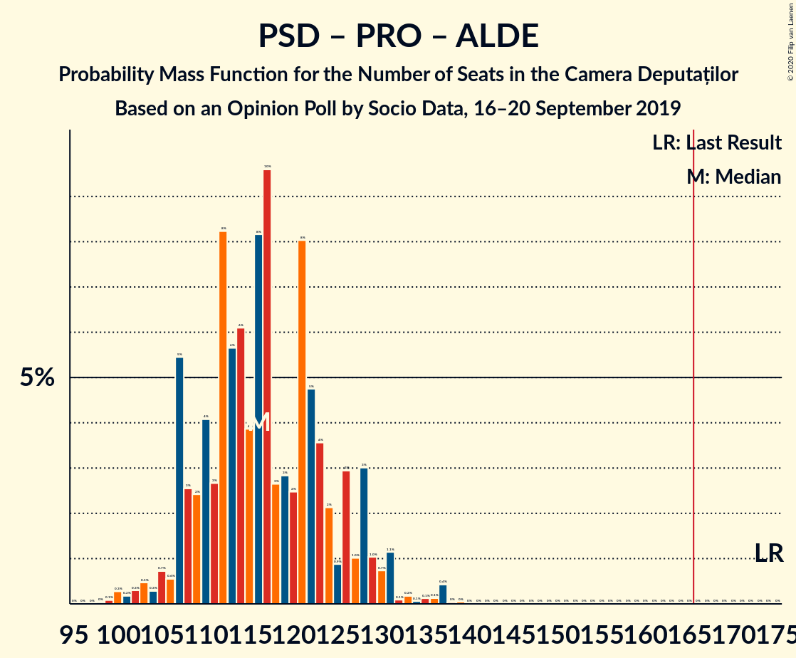

| Number of Seats | Probability | Accumulated | Special Marks |
|:---------------:|:-----------:|:-----------:|:-------------:|
| 98 | 0% | 100% |  |
| 99 | 0.1% | 99.9% |  |
| 100 | 0.3% | 99.9% |  |
| 101 | 0.2% | 99.6% |  |
| 102 | 0.3% | 99.4% |  |
| 103 | 0.5% | 99.1% |  |
| 104 | 0.3% | 98.6% |  |
| 105 | 0.7% | 98% |  |
| 106 | 0.6% | 98% |  |
| 107 | 5% | 97% |  |
| 108 | 3% | 92% |  |
| 109 | 2% | 89% |  |
| 110 | 4% | 87% |  |
| 111 | 3% | 83% |  |
| 112 | 8% | 80% |  |
| 113 | 6% | 72% |  |
| 114 | 6% | 66% |  |
| 115 | 4% | 60% |  |
| 116 | 8% | 56% | Median |
| 117 | 10% | 48% |  |
| 118 | 3% | 38% |  |
| 119 | 3% | 36% |  |
| 120 | 2% | 33% |  |
| 121 | 8% | 30% |  |
| 122 | 5% | 22% |  |
| 123 | 4% | 18% |  |
| 124 | 2% | 14% |  |
| 125 | 0.9% | 12% |  |
| 126 | 3% | 11% |  |
| 127 | 1.0% | 8% |  |
| 128 | 3% | 7% |  |
| 129 | 1.0% | 4% |  |
| 130 | 0.7% | 3% |  |
| 131 | 1.1% | 2% |  |
| 132 | 0.1% | 1.1% |  |
| 133 | 0.2% | 1.0% |  |
| 134 | 0.1% | 0.8% |  |
| 135 | 0.1% | 0.8% |  |
| 136 | 0.1% | 0.7% |  |
| 137 | 0.4% | 0.5% |  |
| 138 | 0% | 0.1% |  |
| 139 | 0% | 0.1% |  |
| 140 | 0% | 0% |  |
| 141 | 0% | 0% |  |
| 142 | 0% | 0% |  |
| 143 | 0% | 0% |  |
| 144 | 0% | 0% |  |
| 145 | 0% | 0% |  |
| 146 | 0% | 0% |  |
| 147 | 0% | 0% |  |
| 148 | 0% | 0% |  |
| 149 | 0% | 0% |  |
| 150 | 0% | 0% |  |
| 151 | 0% | 0% |  |
| 152 | 0% | 0% |  |
| 153 | 0% | 0% |  |
| 154 | 0% | 0% |  |
| 155 | 0% | 0% |  |
| 156 | 0% | 0% |  |
| 157 | 0% | 0% |  |
| 158 | 0% | 0% |  |
| 159 | 0% | 0% |  |
| 160 | 0% | 0% |  |
| 161 | 0% | 0% |  |
| 162 | 0% | 0% |  |
| 163 | 0% | 0% |  |
| 164 | 0% | 0% |  |
| 165 | 0% | 0% |  |
| 166 | 0% | 0% | Majority |
| 167 | 0% | 0% |  |
| 168 | 0% | 0% |  |
| 169 | 0% | 0% |  |
| 170 | 0% | 0% |  |
| 171 | 0% | 0% |  |
| 172 | 0% | 0% |  |
| 173 | 0% | 0% |  |
| 174 | 0% | 0% | Last Result |

### Partidul Social Democrat – PRO România

| Number of Seats | Probability | Accumulated | Special Marks |
|:---------------:|:-----------:|:-----------:|:-------------:|
| 96 | 0% | 100% |  |
| 97 | 0% | 99.9% |  |
| 98 | 0.1% | 99.9% |  |
| 99 | 0.1% | 99.9% |  |
| 100 | 0.3% | 99.8% |  |
| 101 | 0.4% | 99.5% |  |
| 102 | 0.4% | 99.1% |  |
| 103 | 0.6% | 98.7% |  |
| 104 | 0.4% | 98% |  |
| 105 | 1.0% | 98% |  |
| 106 | 0.8% | 97% |  |
| 107 | 6% | 96% |  |
| 108 | 3% | 90% |  |
| 109 | 3% | 87% |  |
| 110 | 4% | 84% |  |
| 111 | 3% | 80% |  |
| 112 | 8% | 77% |  |
| 113 | 6% | 69% |  |
| 114 | 7% | 63% |  |
| 115 | 4% | 56% |  |
| 116 | 8% | 52% | Median |
| 117 | 10% | 44% |  |
| 118 | 3% | 34% |  |
| 119 | 3% | 32% |  |
| 120 | 3% | 29% |  |
| 121 | 8% | 26% |  |
| 122 | 4% | 18% |  |
| 123 | 3% | 14% |  |
| 124 | 2% | 10% |  |
| 125 | 0.8% | 9% |  |
| 126 | 3% | 8% |  |
| 127 | 0.6% | 5% |  |
| 128 | 3% | 4% |  |
| 129 | 0.9% | 2% |  |
| 130 | 0.4% | 0.7% |  |
| 131 | 0.1% | 0.4% |  |
| 132 | 0.1% | 0.3% |  |
| 133 | 0.1% | 0.2% |  |
| 134 | 0% | 0.1% |  |
| 135 | 0% | 0.1% |  |
| 136 | 0% | 0.1% |  |
| 137 | 0% | 0% |  |
| 138 | 0% | 0% |  |
| 139 | 0% | 0% |  |
| 140 | 0% | 0% |  |
| 141 | 0% | 0% |  |
| 142 | 0% | 0% |  |
| 143 | 0% | 0% |  |
| 144 | 0% | 0% |  |
| 145 | 0% | 0% |  |
| 146 | 0% | 0% |  |
| 147 | 0% | 0% |  |
| 148 | 0% | 0% |  |
| 149 | 0% | 0% |  |
| 150 | 0% | 0% |  |
| 151 | 0% | 0% |  |
| 152 | 0% | 0% |  |
| 153 | 0% | 0% |  |
| 154 | 0% | 0% | Last Result |

### Partidul Național Liberal – Uniunea Democrată Maghiară din România – Partidul Alianța Liberalilor și Democraților

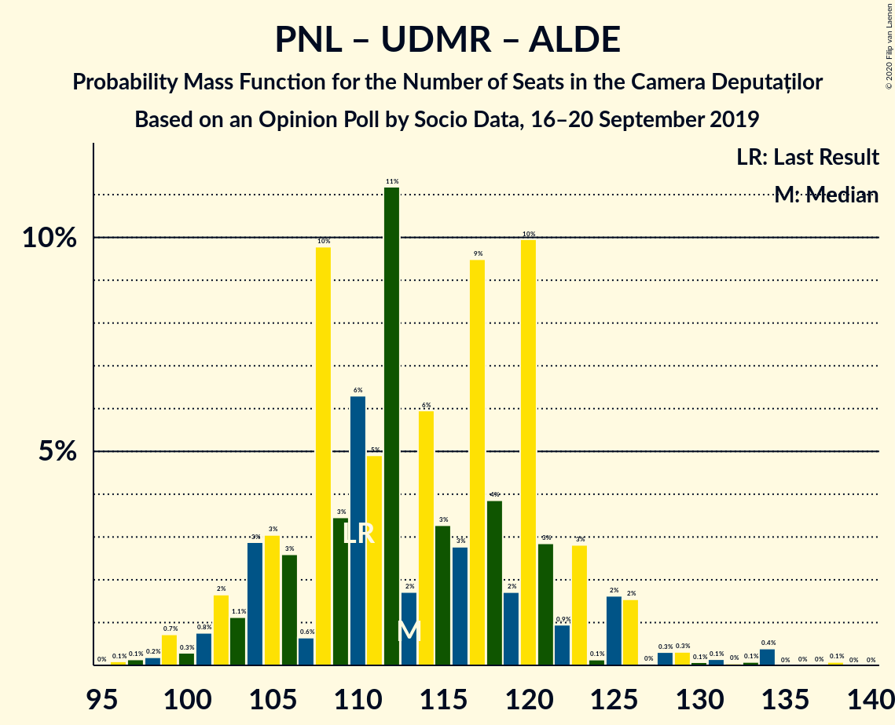

| Number of Seats | Probability | Accumulated | Special Marks |
|:---------------:|:-----------:|:-----------:|:-------------:|
| 95 | 0% | 100% |  |
| 96 | 0.1% | 99.9% |  |
| 97 | 0.1% | 99.8% |  |
| 98 | 0.2% | 99.7% |  |
| 99 | 0.7% | 99.5% |  |
| 100 | 0.3% | 98.8% |  |
| 101 | 0.8% | 98.5% |  |
| 102 | 2% | 98% |  |
| 103 | 1.1% | 96% |  |
| 104 | 3% | 95% |  |
| 105 | 3% | 92% |  |
| 106 | 3% | 89% |  |
| 107 | 0.6% | 86% |  |
| 108 | 10% | 86% |  |
| 109 | 3% | 76% |  |
| 110 | 6% | 73% | Last Result |
| 111 | 5% | 66% |  |
| 112 | 11% | 61% | Median |
| 113 | 2% | 50% |  |
| 114 | 6% | 48% |  |
| 115 | 3% | 42% |  |
| 116 | 3% | 39% |  |
| 117 | 9% | 36% |  |
| 118 | 4% | 27% |  |
| 119 | 2% | 23% |  |
| 120 | 10% | 21% |  |
| 121 | 3% | 11% |  |
| 122 | 0.9% | 9% |  |
| 123 | 3% | 8% |  |
| 124 | 0.1% | 5% |  |
| 125 | 2% | 5% |  |
| 126 | 2% | 3% |  |
| 127 | 0% | 2% |  |
| 128 | 0.3% | 1.5% |  |
| 129 | 0.3% | 1.2% |  |
| 130 | 0.1% | 0.8% |  |
| 131 | 0.1% | 0.8% |  |
| 132 | 0% | 0.6% |  |
| 133 | 0.1% | 0.6% |  |
| 134 | 0.4% | 0.5% |  |
| 135 | 0% | 0.1% |  |
| 136 | 0% | 0.1% |  |
| 137 | 0% | 0.1% |  |
| 138 | 0.1% | 0.1% |  |
| 139 | 0% | 0% |  |

### Partidul Național Liberal – Uniunea Democrată Maghiară din România

| Number of Seats | Probability | Accumulated | Special Marks |
|:---------------:|:-----------:|:-----------:|:-------------:|
| 90 | 0% | 100% | Last Result |
| 91 | 0% | 100% |  |
| 92 | 0% | 100% |  |
| 93 | 0% | 100% |  |
| 94 | 0.1% | 100% |  |
| 95 | 0.1% | 99.9% |  |
| 96 | 0.2% | 99.8% |  |
| 97 | 0.3% | 99.6% |  |
| 98 | 0.2% | 99.3% |  |
| 99 | 1.0% | 99.1% |  |
| 100 | 0.4% | 98% |  |
| 101 | 0.9% | 98% |  |
| 102 | 2% | 97% |  |
| 103 | 1.3% | 95% |  |
| 104 | 3% | 93% |  |
| 105 | 3% | 90% |  |
| 106 | 3% | 87% |  |
| 107 | 0.8% | 84% |  |
| 108 | 11% | 83% |  |
| 109 | 4% | 73% |  |
| 110 | 6% | 69% |  |
| 111 | 5% | 62% |  |
| 112 | 11% | 57% | Median |
| 113 | 2% | 46% |  |
| 114 | 6% | 44% |  |
| 115 | 3% | 38% |  |
| 116 | 3% | 35% |  |
| 117 | 9% | 32% |  |
| 118 | 3% | 23% |  |
| 119 | 2% | 19% |  |
| 120 | 10% | 18% |  |
| 121 | 3% | 8% |  |
| 122 | 0.6% | 5% |  |
| 123 | 3% | 5% |  |
| 124 | 0.1% | 2% |  |
| 125 | 0.5% | 2% |  |
| 126 | 0.9% | 1.4% |  |
| 127 | 0% | 0.5% |  |
| 128 | 0.3% | 0.5% |  |
| 129 | 0.1% | 0.2% |  |
| 130 | 0% | 0.1% |  |
| 131 | 0.1% | 0.1% |  |
| 132 | 0% | 0% |  |

### Partidul Național Liberal – Partidul Mișcarea Populară

| Number of Seats | Probability | Accumulated | Special Marks |
|:---------------:|:-----------:|:-----------:|:-------------:|
| 83 | 0.1% | 100% |  |
| 84 | 0.1% | 99.9% |  |
| 85 | 0.1% | 99.8% |  |
| 86 | 0.1% | 99.7% |  |
| 87 | 0.2% | 99.6% | Last Result |
| 88 | 0.5% | 99.4% |  |
| 89 | 1.1% | 98.9% |  |
| 90 | 0.8% | 98% |  |
| 91 | 3% | 97% |  |
| 92 | 2% | 94% |  |
| 93 | 0.8% | 92% |  |
| 94 | 7% | 92% |  |
| 95 | 2% | 84% | Median |
| 96 | 3% | 82% |  |
| 97 | 4% | 78% |  |
| 98 | 4% | 74% |  |
| 99 | 3% | 70% |  |
| 100 | 11% | 67% |  |
| 101 | 5% | 56% |  |
| 102 | 2% | 51% |  |
| 103 | 4% | 49% |  |
| 104 | 3% | 46% |  |
| 105 | 2% | 42% |  |
| 106 | 5% | 40% |  |
| 107 | 3% | 35% |  |
| 108 | 3% | 32% |  |
| 109 | 2% | 29% |  |
| 110 | 2% | 27% |  |
| 111 | 7% | 25% |  |
| 112 | 0.7% | 17% |  |
| 113 | 5% | 17% |  |
| 114 | 2% | 12% |  |
| 115 | 2% | 10% |  |
| 116 | 1.1% | 8% |  |
| 117 | 3% | 7% |  |
| 118 | 1.4% | 4% |  |
| 119 | 0.6% | 2% |  |
| 120 | 0.4% | 2% |  |
| 121 | 0.6% | 1.1% |  |
| 122 | 0.3% | 0.5% |  |
| 123 | 0% | 0.2% |  |
| 124 | 0.1% | 0.2% |  |
| 125 | 0% | 0.1% |  |
| 126 | 0% | 0% |  |

### Partidul Național Liberal

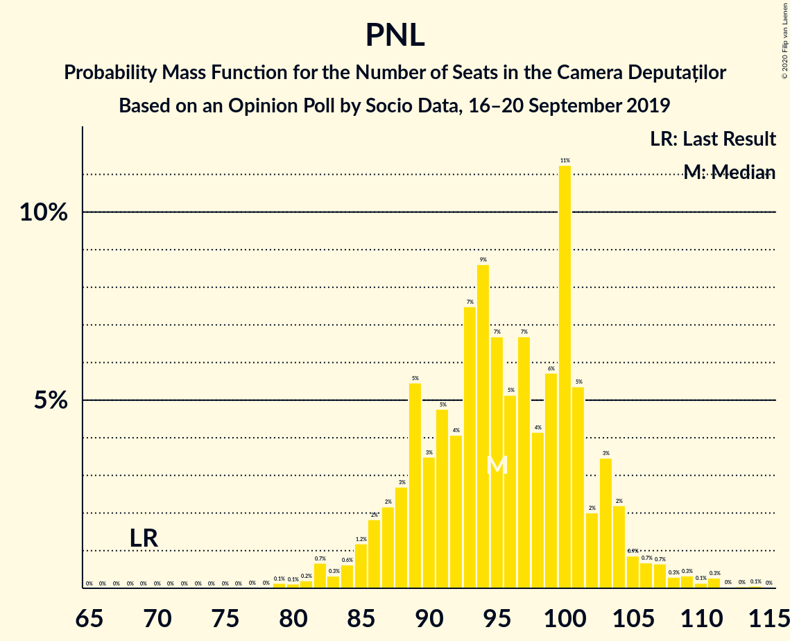

| Number of Seats | Probability | Accumulated | Special Marks |
|:---------------:|:-----------:|:-----------:|:-------------:|
| 69 | 0% | 100% | Last Result |
| 70 | 0% | 100% |  |
| 71 | 0% | 100% |  |
| 72 | 0% | 100% |  |
| 73 | 0% | 100% |  |
| 74 | 0% | 100% |  |
| 75 | 0% | 100% |  |
| 76 | 0% | 100% |  |
| 77 | 0% | 100% |  |
| 78 | 0% | 100% |  |
| 79 | 0.1% | 99.9% |  |
| 80 | 0.1% | 99.8% |  |
| 81 | 0.2% | 99.7% |  |
| 82 | 0.7% | 99.5% |  |
| 83 | 0.3% | 98.8% |  |
| 84 | 0.6% | 98% |  |
| 85 | 1.2% | 98% |  |
| 86 | 2% | 97% |  |
| 87 | 2% | 95% |  |
| 88 | 3% | 93% |  |
| 89 | 5% | 90% |  |
| 90 | 3% | 85% |  |
| 91 | 5% | 81% |  |
| 92 | 4% | 76% |  |
| 93 | 7% | 72% |  |
| 94 | 9% | 65% |  |
| 95 | 7% | 56% | Median |
| 96 | 5% | 49% |  |
| 97 | 7% | 44% |  |
| 98 | 4% | 38% |  |
| 99 | 6% | 33% |  |
| 100 | 11% | 28% |  |
| 101 | 5% | 16% |  |
| 102 | 2% | 11% |  |
| 103 | 3% | 9% |  |
| 104 | 2% | 6% |  |
| 105 | 0.9% | 3% |  |
| 106 | 0.7% | 3% |  |
| 107 | 0.7% | 2% |  |
| 108 | 0.3% | 1.2% |  |
| 109 | 0.3% | 0.9% |  |
| 110 | 0.1% | 0.6% |  |
| 111 | 0.3% | 0.4% |  |
| 112 | 0% | 0.2% |  |
| 113 | 0% | 0.1% |  |
| 114 | 0.1% | 0.1% |  |
| 115 | 0% | 0% |  |

### Partidul Social Democrat – Partidul Alianța Liberalilor și Democraților

| Number of Seats | Probability | Accumulated | Special Marks |
|:---------------:|:-----------:|:-----------:|:-------------:|
| 70 | 0.1% | 100% |  |
| 71 | 0.1% | 99.9% |  |
| 72 | 0.2% | 99.8% |  |
| 73 | 0.2% | 99.6% |  |
| 74 | 0.4% | 99.4% |  |
| 75 | 1.1% | 99.0% |  |
| 76 | 1.1% | 98% |  |
| 77 | 1.3% | 97% |  |
| 78 | 1.5% | 95% |  |
| 79 | 3% | 94% |  |
| 80 | 8% | 91% |  |
| 81 | 6% | 83% |  |
| 82 | 2% | 76% |  |
| 83 | 5% | 74% |  |
| 84 | 5% | 69% |  |
| 85 | 10% | 64% |  |
| 86 | 5% | 54% | Median |
| 87 | 11% | 49% |  |
| 88 | 10% | 38% |  |
| 89 | 9% | 28% |  |
| 90 | 1.4% | 20% |  |
| 91 | 2% | 18% |  |
| 92 | 4% | 17% |  |
| 93 | 2% | 13% |  |
| 94 | 3% | 12% |  |
| 95 | 3% | 8% |  |
| 96 | 0.9% | 5% |  |
| 97 | 1.0% | 5% |  |
| 98 | 0.2% | 3% |  |
| 99 | 0.7% | 3% |  |
| 100 | 0.4% | 3% |  |
| 101 | 1.1% | 2% |  |
| 102 | 0.1% | 1.1% |  |
| 103 | 0.1% | 0.9% |  |
| 104 | 0.1% | 0.8% |  |
| 105 | 0.4% | 0.7% |  |
| 106 | 0.1% | 0.3% |  |
| 107 | 0.1% | 0.2% |  |
| 108 | 0.1% | 0.1% |  |
| 109 | 0% | 0% |  |
| 110 | 0% | 0% |  |
| 111 | 0% | 0% |  |
| 112 | 0% | 0% |  |
| 113 | 0% | 0% |  |
| 114 | 0% | 0% |  |
| 115 | 0% | 0% |  |
| 116 | 0% | 0% |  |
| 117 | 0% | 0% |  |
| 118 | 0% | 0% |  |
| 119 | 0% | 0% |  |
| 120 | 0% | 0% |  |
| 121 | 0% | 0% |  |
| 122 | 0% | 0% |  |
| 123 | 0% | 0% |  |
| 124 | 0% | 0% |  |
| 125 | 0% | 0% |  |
| 126 | 0% | 0% |  |
| 127 | 0% | 0% |  |
| 128 | 0% | 0% |  |
| 129 | 0% | 0% |  |
| 130 | 0% | 0% |  |
| 131 | 0% | 0% |  |
| 132 | 0% | 0% |  |
| 133 | 0% | 0% |  |
| 134 | 0% | 0% |  |
| 135 | 0% | 0% |  |
| 136 | 0% | 0% |  |
| 137 | 0% | 0% |  |
| 138 | 0% | 0% |  |
| 139 | 0% | 0% |  |
| 140 | 0% | 0% |  |
| 141 | 0% | 0% |  |
| 142 | 0% | 0% |  |
| 143 | 0% | 0% |  |
| 144 | 0% | 0% |  |
| 145 | 0% | 0% |  |
| 146 | 0% | 0% |  |
| 147 | 0% | 0% |  |
| 148 | 0% | 0% |  |
| 149 | 0% | 0% |  |
| 150 | 0% | 0% |  |
| 151 | 0% | 0% |  |
| 152 | 0% | 0% |  |
| 153 | 0% | 0% |  |
| 154 | 0% | 0% |  |
| 155 | 0% | 0% |  |
| 156 | 0% | 0% |  |
| 157 | 0% | 0% |  |
| 158 | 0% | 0% |  |
| 159 | 0% | 0% |  |
| 160 | 0% | 0% |  |
| 161 | 0% | 0% |  |
| 162 | 0% | 0% |  |
| 163 | 0% | 0% |  |
| 164 | 0% | 0% |  |
| 165 | 0% | 0% |  |
| 166 | 0% | 0% | Majority |
| 167 | 0% | 0% |  |
| 168 | 0% | 0% |  |
| 169 | 0% | 0% |  |
| 170 | 0% | 0% |  |
| 171 | 0% | 0% |  |
| 172 | 0% | 0% |  |
| 173 | 0% | 0% |  |
| 174 | 0% | 0% | Last Result |

### Alianța 2020 USR-PLUS – Partidul Mișcarea Populară

| Number of Seats | Probability | Accumulated | Special Marks |
|:---------------:|:-----------:|:-----------:|:-------------:|
| 48 | 0% | 100% | Last Result |
| 49 | 0% | 100% |  |
| 50 | 0% | 100% |  |
| 51 | 0% | 100% |  |
| 52 | 0% | 100% |  |
| 53 | 0% | 100% |  |
| 54 | 0% | 100% |  |
| 55 | 0% | 100% |  |
| 56 | 0% | 100% |  |
| 57 | 0% | 100% |  |
| 58 | 0% | 100% |  |
| 59 | 0% | 100% |  |
| 60 | 0% | 100% |  |
| 61 | 0% | 100% |  |
| 62 | 0% | 100% |  |
| 63 | 0.1% | 100% |  |
| 64 | 0.1% | 99.9% |  |
| 65 | 0% | 99.8% |  |
| 66 | 0.5% | 99.8% |  |
| 67 | 0.1% | 99.3% |  |
| 68 | 1.0% | 99.1% |  |
| 69 | 1.2% | 98% |  |
| 70 | 0.7% | 97% |  |
| 71 | 1.1% | 96% |  |
| 72 | 4% | 95% |  |
| 73 | 6% | 91% |  |
| 74 | 0.3% | 85% |  |
| 75 | 13% | 85% | Median |
| 76 | 0.5% | 72% |  |
| 77 | 6% | 71% |  |
| 78 | 0.6% | 65% |  |
| 79 | 12% | 64% |  |
| 80 | 3% | 53% |  |
| 81 | 1.5% | 50% |  |
| 82 | 3% | 48% |  |
| 83 | 2% | 46% |  |
| 84 | 3% | 44% |  |
| 85 | 1.2% | 41% |  |
| 86 | 4% | 39% |  |
| 87 | 1.3% | 35% |  |
| 88 | 4% | 34% |  |
| 89 | 2% | 30% |  |
| 90 | 2% | 28% |  |
| 91 | 3% | 27% |  |
| 92 | 9% | 24% |  |
| 93 | 1.3% | 15% |  |
| 94 | 3% | 13% |  |
| 95 | 5% | 10% |  |
| 96 | 0.6% | 5% |  |
| 97 | 2% | 4% |  |
| 98 | 0.9% | 3% |  |
| 99 | 0.8% | 2% |  |
| 100 | 0.4% | 1.1% |  |
| 101 | 0.4% | 0.7% |  |
| 102 | 0.1% | 0.3% |  |
| 103 | 0.1% | 0.2% |  |
| 104 | 0.1% | 0.1% |  |
| 105 | 0% | 0% |  |

## Technical Information

### Opinion Poll

+ **Polling firm:** Socio Data
+ **Commissioner(s):** —
+ **Fieldwork period:** 16–20 September 2019

### Calculations

+ **Sample size:** 1070
+ **Simulations done:** 131,072
+ **Error estimate:** 1.01%

