# Opinion Poll by BCS, 12–19 October 2019

<a href="#voting-intentions">Voting Intentions</a> | <a href="#seats">Seats</a> | <a href="#coalitions">Coalitions</a> | <a href="#technical-information">Technical Information</a>

## Voting Intentions

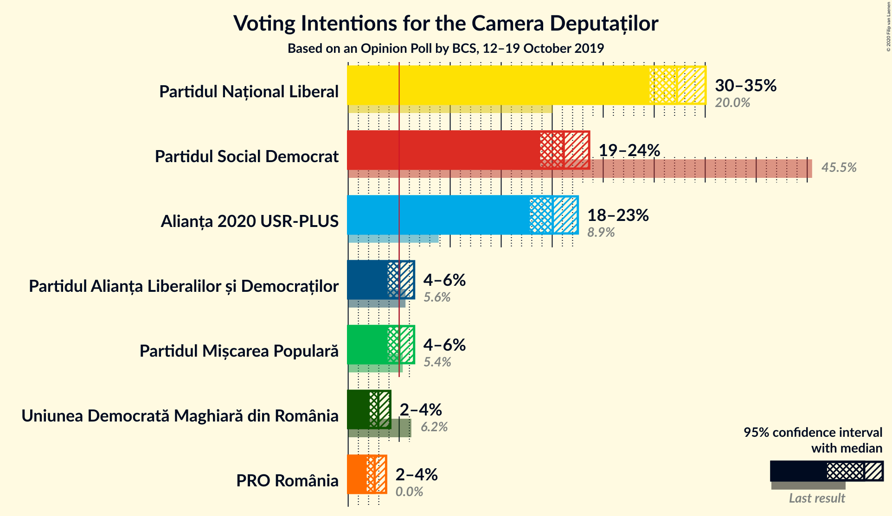

### Confidence Intervals

| Party | Last Result | Poll Result | 80% Confidence Interval | 90% Confidence Interval | 95% Confidence Interval | 99% Confidence Interval |
|:-----:|:-----------:|:-----------:|:-----------------------:|:-----------------------:|:-----------------------:|:-----------------------:|
| Partidul Național Liberal | 20.0% | 32.2% | 30.5–34.1% |30.0–34.6% |29.6–35.0% |28.7–35.9% |
| Partidul Social Democrat | 45.5% | 21.1% | 19.6–22.8% |19.2–23.2% |18.8–23.6% |18.1–24.4% |
| Alianța 2020 USR-PLUS | 8.9% | 20.1% | 18.6–21.7% |18.2–22.1% |17.8–22.5% |17.1–23.3% |
| Partidul Alianța Liberalilor și Democraților | 5.6% | 5.0% | 4.3–6.0% |4.1–6.2% |3.9–6.5% |3.6–6.9% |
| Partidul Mișcarea Populară | 5.4% | 5.0% | 4.3–6.0% |4.1–6.2% |3.9–6.5% |3.6–6.9% |
| Uniunea Democrată Maghiară din România | 6.2% | 3.0% | 2.4–3.7% |2.2–3.9% |2.1–4.1% |1.9–4.5% |
| PRO România | 0.0% | 2.6% | 2.1–3.3% |1.9–3.5% |1.8–3.7% |1.6–4.1% |

*Note:* The poll result column reflects the actual value used in the calculations. Published results may vary slightly, and in addition be rounded to fewer digits.

## Seats

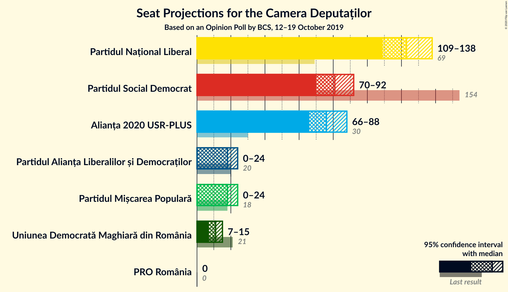

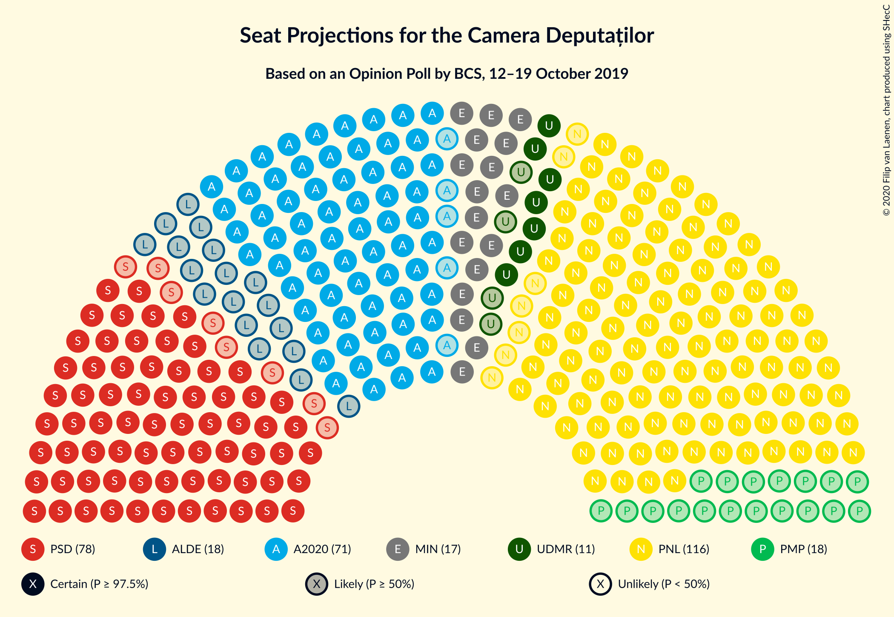

### Confidence Intervals

| Party | Last Result | Median | 80% Confidence Interval | 90% Confidence Interval | 95% Confidence Interval | 99% Confidence Interval |
|:-----:|:-----------:|:------:|:-----------------------:|:-----------------------:|:-----------------------:|:-----------------------:|
| <a href="#partidul-național-liberal">Partidul Național Liberal</a> | 69 | 123 | 113–133 |111–136 |109–138 |105–143 |
| <a href="#partidul-social-democrat">Partidul Social Democrat</a> | 154 | 81 | 73–88 |71–90 |70–92 |67–96 |
| <a href="#alianța-2020-usr-plus">Alianța 2020 USR-PLUS</a> | 30 | 76 | 69–84 |68–86 |66–88 |63–91 |
| <a href="#partidul-alianța-liberalilor-și-democraților">Partidul Alianța Liberalilor și Democraților</a> | 20 | 18 | 0–22 |0–23 |0–24 |0–26 |
| <a href="#partidul-mișcarea-populară">Partidul Mișcarea Populară</a> | 18 | 18 | 0–22 |0–23 |0–24 |0–26 |
| <a href="#uniunea-democrată-maghiară-din-românia">Uniunea Democrată Maghiară din România</a> | 21 | 11 | 9–14 |8–15 |7–15 |6–17 |
| <a href="#pro-românia">PRO România</a> | 0 | 0 | 0 |0 |0 |0 |

### Partidul Național Liberal

*For a full overview of the results for this party, see the [Partidul Național Liberal](party-partidulnaționalliberal.html) page.*

| Number of Seats | Probability | Accumulated | Special Marks |
|:---------------:|:-----------:|:-----------:|:-------------:|
| 69 | 0% | 100% | Last Result |
| 70 | 0% | 100% |  |
| 71 | 0% | 100% |  |
| 72 | 0% | 100% |  |
| 73 | 0% | 100% |  |
| 74 | 0% | 100% |  |
| 75 | 0% | 100% |  |
| 76 | 0% | 100% |  |
| 77 | 0% | 100% |  |
| 78 | 0% | 100% |  |
| 79 | 0% | 100% |  |
| 80 | 0% | 100% |  |
| 81 | 0% | 100% |  |
| 82 | 0% | 100% |  |
| 83 | 0% | 100% |  |
| 84 | 0% | 100% |  |
| 85 | 0% | 100% |  |
| 86 | 0% | 100% |  |
| 87 | 0% | 100% |  |
| 88 | 0% | 100% |  |
| 89 | 0% | 100% |  |
| 90 | 0% | 100% |  |
| 91 | 0% | 100% |  |
| 92 | 0% | 100% |  |
| 93 | 0% | 100% |  |
| 94 | 0% | 100% |  |
| 95 | 0% | 100% |  |
| 96 | 0% | 100% |  |
| 97 | 0% | 100% |  |
| 98 | 0% | 100% |  |
| 99 | 0% | 100% |  |
| 100 | 0% | 100% |  |
| 101 | 0% | 100% |  |
| 102 | 0% | 99.9% |  |
| 103 | 0.1% | 99.9% |  |
| 104 | 0.1% | 99.9% |  |
| 105 | 0.3% | 99.7% |  |
| 106 | 0.4% | 99.4% |  |
| 107 | 0.5% | 99.0% |  |
| 108 | 0.6% | 98.5% |  |
| 109 | 1.0% | 98% |  |
| 110 | 1.2% | 97% |  |
| 111 | 2% | 96% |  |
| 112 | 3% | 94% |  |
| 113 | 3% | 91% |  |
| 114 | 2% | 88% |  |
| 115 | 4% | 86% |  |
| 116 | 5% | 82% |  |
| 117 | 4% | 78% |  |
| 118 | 3% | 74% |  |
| 119 | 5% | 71% |  |
| 120 | 5% | 66% |  |
| 121 | 4% | 61% |  |
| 122 | 4% | 57% |  |
| 123 | 5% | 53% | Median |
| 124 | 5% | 47% |  |
| 125 | 6% | 42% |  |
| 126 | 5% | 36% |  |
| 127 | 4% | 31% |  |
| 128 | 3% | 27% |  |
| 129 | 4% | 24% |  |
| 130 | 3% | 20% |  |
| 131 | 3% | 17% |  |
| 132 | 3% | 14% |  |
| 133 | 3% | 11% |  |
| 134 | 2% | 9% |  |
| 135 | 1.0% | 7% |  |
| 136 | 2% | 6% |  |
| 137 | 1.4% | 4% |  |
| 138 | 1.0% | 3% |  |
| 139 | 0.5% | 2% |  |
| 140 | 0.3% | 1.4% |  |
| 141 | 0.2% | 1.2% |  |
| 142 | 0.3% | 0.9% |  |
| 143 | 0.3% | 0.6% |  |
| 144 | 0.1% | 0.3% |  |
| 145 | 0.1% | 0.2% |  |
| 146 | 0% | 0.1% |  |
| 147 | 0% | 0.1% |  |
| 148 | 0% | 0% |  |

### Partidul Social Democrat

*For a full overview of the results for this party, see the [Partidul Social Democrat](party-partidulsocialdemocrat.html) page.*

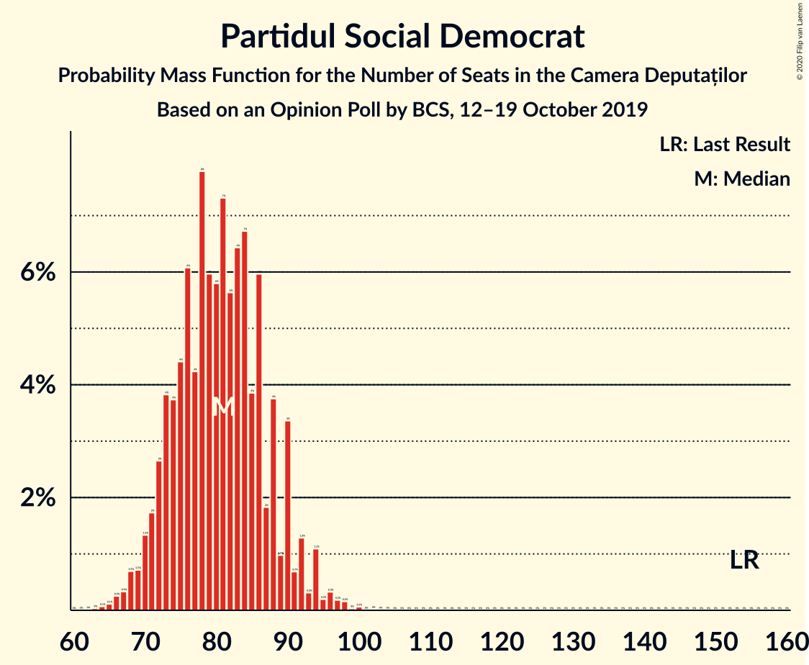

| Number of Seats | Probability | Accumulated | Special Marks |
|:---------------:|:-----------:|:-----------:|:-------------:|
| 63 | 0% | 100% |  |
| 64 | 0.1% | 99.9% |  |
| 65 | 0.1% | 99.9% |  |
| 66 | 0.3% | 99.8% |  |
| 67 | 0.3% | 99.5% |  |
| 68 | 0.7% | 99.2% |  |
| 69 | 0.7% | 98% |  |
| 70 | 1.3% | 98% |  |
| 71 | 2% | 96% |  |
| 72 | 3% | 95% |  |
| 73 | 4% | 92% |  |
| 74 | 4% | 88% |  |
| 75 | 4% | 84% |  |
| 76 | 6% | 80% |  |
| 77 | 4% | 74% |  |
| 78 | 8% | 70% |  |
| 79 | 6% | 62% |  |
| 80 | 6% | 56% |  |
| 81 | 7% | 50% | Median |
| 82 | 6% | 43% |  |
| 83 | 6% | 37% |  |
| 84 | 7% | 31% |  |
| 85 | 4% | 24% |  |
| 86 | 6% | 20% |  |
| 87 | 2% | 14% |  |
| 88 | 4% | 12% |  |
| 89 | 1.0% | 9% |  |
| 90 | 3% | 8% |  |
| 91 | 0.7% | 4% |  |
| 92 | 1.3% | 4% |  |
| 93 | 0.3% | 2% |  |
| 94 | 1.1% | 2% |  |
| 95 | 0.2% | 1.0% |  |
| 96 | 0.3% | 0.8% |  |
| 97 | 0.2% | 0.5% |  |
| 98 | 0.2% | 0.3% |  |
| 99 | 0% | 0.1% |  |
| 100 | 0.1% | 0.1% |  |
| 101 | 0% | 0% |  |
| 102 | 0% | 0% |  |
| 103 | 0% | 0% |  |
| 104 | 0% | 0% |  |
| 105 | 0% | 0% |  |
| 106 | 0% | 0% |  |
| 107 | 0% | 0% |  |
| 108 | 0% | 0% |  |
| 109 | 0% | 0% |  |
| 110 | 0% | 0% |  |
| 111 | 0% | 0% |  |
| 112 | 0% | 0% |  |
| 113 | 0% | 0% |  |
| 114 | 0% | 0% |  |
| 115 | 0% | 0% |  |
| 116 | 0% | 0% |  |
| 117 | 0% | 0% |  |
| 118 | 0% | 0% |  |
| 119 | 0% | 0% |  |
| 120 | 0% | 0% |  |
| 121 | 0% | 0% |  |
| 122 | 0% | 0% |  |
| 123 | 0% | 0% |  |
| 124 | 0% | 0% |  |
| 125 | 0% | 0% |  |
| 126 | 0% | 0% |  |
| 127 | 0% | 0% |  |
| 128 | 0% | 0% |  |
| 129 | 0% | 0% |  |
| 130 | 0% | 0% |  |
| 131 | 0% | 0% |  |
| 132 | 0% | 0% |  |
| 133 | 0% | 0% |  |
| 134 | 0% | 0% |  |
| 135 | 0% | 0% |  |
| 136 | 0% | 0% |  |
| 137 | 0% | 0% |  |
| 138 | 0% | 0% |  |
| 139 | 0% | 0% |  |
| 140 | 0% | 0% |  |
| 141 | 0% | 0% |  |
| 142 | 0% | 0% |  |
| 143 | 0% | 0% |  |
| 144 | 0% | 0% |  |
| 145 | 0% | 0% |  |
| 146 | 0% | 0% |  |
| 147 | 0% | 0% |  |
| 148 | 0% | 0% |  |
| 149 | 0% | 0% |  |
| 150 | 0% | 0% |  |
| 151 | 0% | 0% |  |
| 152 | 0% | 0% |  |
| 153 | 0% | 0% |  |
| 154 | 0% | 0% | Last Result |

### Alianța 2020 USR-PLUS

*For a full overview of the results for this party, see the [Alianța 2020 USR-PLUS](party-alianța2020usr-plus.html) page.*

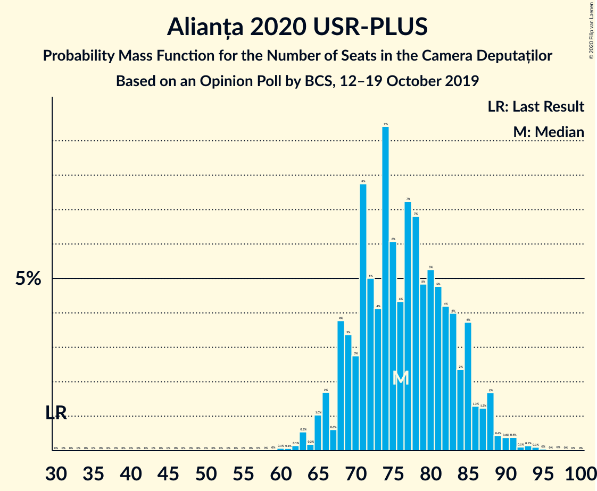

| Number of Seats | Probability | Accumulated | Special Marks |
|:---------------:|:-----------:|:-----------:|:-------------:|
| 30 | 0% | 100% | Last Result |
| 31 | 0% | 100% |  |
| 32 | 0% | 100% |  |
| 33 | 0% | 100% |  |
| 34 | 0% | 100% |  |
| 35 | 0% | 100% |  |
| 36 | 0% | 100% |  |
| 37 | 0% | 100% |  |
| 38 | 0% | 100% |  |
| 39 | 0% | 100% |  |
| 40 | 0% | 100% |  |
| 41 | 0% | 100% |  |
| 42 | 0% | 100% |  |
| 43 | 0% | 100% |  |
| 44 | 0% | 100% |  |
| 45 | 0% | 100% |  |
| 46 | 0% | 100% |  |
| 47 | 0% | 100% |  |
| 48 | 0% | 100% |  |
| 49 | 0% | 100% |  |
| 50 | 0% | 100% |  |
| 51 | 0% | 100% |  |
| 52 | 0% | 100% |  |
| 53 | 0% | 100% |  |
| 54 | 0% | 100% |  |
| 55 | 0% | 100% |  |
| 56 | 0% | 100% |  |
| 57 | 0% | 100% |  |
| 58 | 0% | 100% |  |
| 59 | 0% | 100% |  |
| 60 | 0.1% | 100% |  |
| 61 | 0.1% | 99.9% |  |
| 62 | 0.1% | 99.8% |  |
| 63 | 0.5% | 99.7% |  |
| 64 | 0.2% | 99.1% |  |
| 65 | 1.0% | 99.0% |  |
| 66 | 2% | 98% |  |
| 67 | 0.6% | 96% |  |
| 68 | 4% | 96% |  |
| 69 | 3% | 92% |  |
| 70 | 3% | 88% |  |
| 71 | 8% | 86% |  |
| 72 | 5% | 78% |  |
| 73 | 4% | 73% |  |
| 74 | 9% | 69% |  |
| 75 | 6% | 59% |  |
| 76 | 4% | 53% | Median |
| 77 | 7% | 49% |  |
| 78 | 7% | 42% |  |
| 79 | 5% | 35% |  |
| 80 | 5% | 30% |  |
| 81 | 5% | 25% |  |
| 82 | 4% | 20% |  |
| 83 | 4% | 16% |  |
| 84 | 2% | 12% |  |
| 85 | 4% | 10% |  |
| 86 | 1.3% | 6% |  |
| 87 | 1.2% | 5% |  |
| 88 | 2% | 3% |  |
| 89 | 0.4% | 2% |  |
| 90 | 0.4% | 1.2% |  |
| 91 | 0.4% | 0.8% |  |
| 92 | 0.1% | 0.5% |  |
| 93 | 0.1% | 0.3% |  |
| 94 | 0.1% | 0.2% |  |
| 95 | 0% | 0.1% |  |
| 96 | 0% | 0.1% |  |
| 97 | 0% | 0% |  |

### Partidul Alianța Liberalilor și Democraților

*For a full overview of the results for this party, see the [Partidul Alianța Liberalilor și Democraților](party-partidulalianțaliberalilorșidemocraților.html) page.*

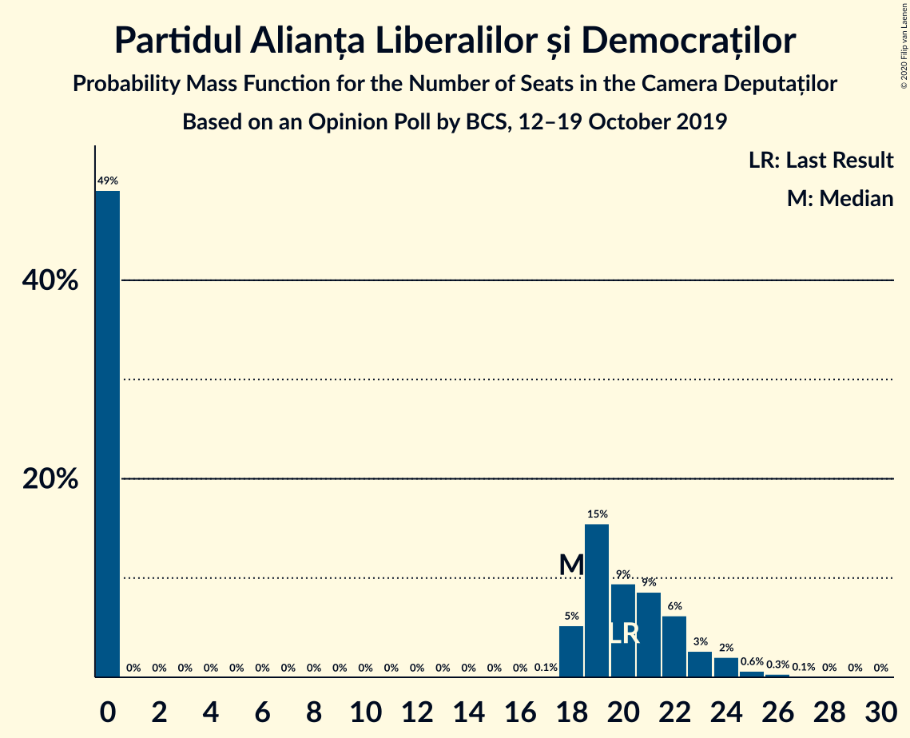

| Number of Seats | Probability | Accumulated | Special Marks |
|:---------------:|:-----------:|:-----------:|:-------------:|
| 0 | 49% | 100% |  |
| 1 | 0% | 51% |  |
| 2 | 0% | 51% |  |
| 3 | 0% | 51% |  |
| 4 | 0% | 51% |  |
| 5 | 0% | 51% |  |
| 6 | 0% | 51% |  |
| 7 | 0% | 51% |  |
| 8 | 0% | 51% |  |
| 9 | 0% | 51% |  |
| 10 | 0% | 51% |  |
| 11 | 0% | 51% |  |
| 12 | 0% | 51% |  |
| 13 | 0% | 51% |  |
| 14 | 0% | 51% |  |
| 15 | 0% | 51% |  |
| 16 | 0% | 51% |  |
| 17 | 0.1% | 51% |  |
| 18 | 5% | 51% | Median |
| 19 | 15% | 46% |  |
| 20 | 9% | 30% | Last Result |
| 21 | 9% | 21% |  |
| 22 | 6% | 12% |  |
| 23 | 3% | 6% |  |
| 24 | 2% | 3% |  |
| 25 | 0.6% | 1.2% |  |
| 26 | 0.3% | 0.5% |  |
| 27 | 0.1% | 0.2% |  |
| 28 | 0% | 0.1% |  |
| 29 | 0% | 0% |  |

### Partidul Mișcarea Populară

*For a full overview of the results for this party, see the [Partidul Mișcarea Populară](party-partidulmișcareapopulară.html) page.*

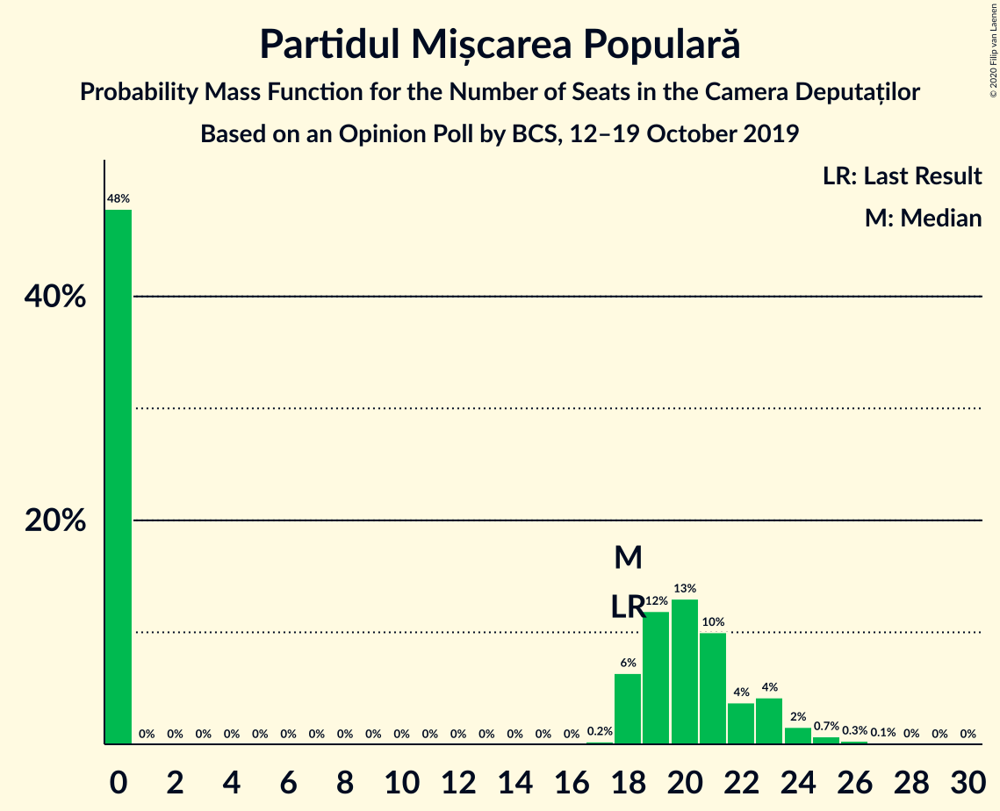

| Number of Seats | Probability | Accumulated | Special Marks |
|:---------------:|:-----------:|:-----------:|:-------------:|
| 0 | 48% | 100% |  |
| 1 | 0% | 52% |  |
| 2 | 0% | 52% |  |
| 3 | 0% | 52% |  |
| 4 | 0% | 52% |  |
| 5 | 0% | 52% |  |
| 6 | 0% | 52% |  |
| 7 | 0% | 52% |  |
| 8 | 0% | 52% |  |
| 9 | 0% | 52% |  |
| 10 | 0% | 52% |  |
| 11 | 0% | 52% |  |
| 12 | 0% | 52% |  |
| 13 | 0% | 52% |  |
| 14 | 0% | 52% |  |
| 15 | 0% | 52% |  |
| 16 | 0% | 52% |  |
| 17 | 0.2% | 52% |  |
| 18 | 6% | 52% | Last Result, Median |
| 19 | 12% | 46% |  |
| 20 | 13% | 34% |  |
| 21 | 10% | 21% |  |
| 22 | 4% | 11% |  |
| 23 | 4% | 7% |  |
| 24 | 2% | 3% |  |
| 25 | 0.7% | 1.2% |  |
| 26 | 0.3% | 0.5% |  |
| 27 | 0.1% | 0.2% |  |
| 28 | 0% | 0.1% |  |
| 29 | 0% | 0% |  |

### Uniunea Democrată Maghiară din România

*For a full overview of the results for this party, see the [Uniunea Democrată Maghiară din România](party-uniuneademocratămaghiarădinromânia.html) page.*

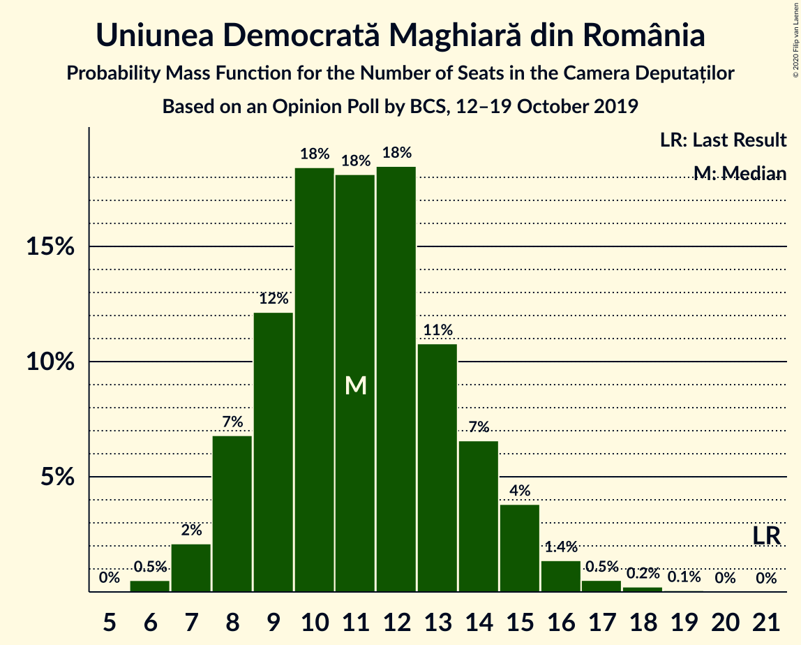

| Number of Seats | Probability | Accumulated | Special Marks |
|:---------------:|:-----------:|:-----------:|:-------------:|
| 6 | 0.5% | 100% |  |
| 7 | 2% | 99.5% |  |
| 8 | 7% | 97% |  |
| 9 | 12% | 91% |  |
| 10 | 18% | 78% |  |
| 11 | 18% | 60% | Median |
| 12 | 18% | 42% |  |
| 13 | 11% | 23% |  |
| 14 | 7% | 13% |  |
| 15 | 4% | 6% |  |
| 16 | 1.4% | 2% |  |
| 17 | 0.5% | 0.8% |  |
| 18 | 0.2% | 0.3% |  |
| 19 | 0.1% | 0.1% |  |
| 20 | 0% | 0% |  |
| 21 | 0% | 0% | Last Result |

### PRO România

*For a full overview of the results for this party, see the [PRO România](party-proromânia.html) page.*

| Number of Seats | Probability | Accumulated | Special Marks |
|:---------------:|:-----------:|:-----------:|:-------------:|
| 0 | 100% | 100% | Last Result, Median |

## Coalitions

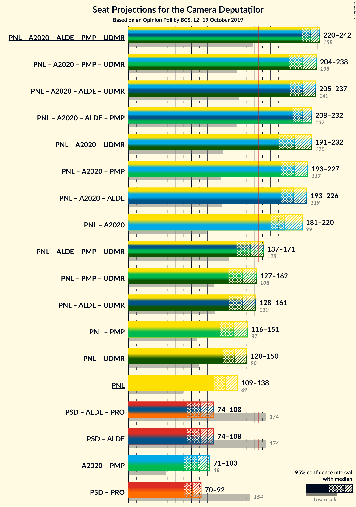

### Confidence Intervals

| Coalition | Last Result | Median | Majority? | 80% Confidence Interval | 90% Confidence Interval | 95% Confidence Interval | 99% Confidence Interval |
|:---------:|:-----------:|:------:|:---------:|:-----------------------:|:-----------------------:|:-----------------------:|:-----------------------:|
| Partidul Național Liberal – Alianța 2020 USR-PLUS – Partidul Alianța Liberalilor și Democraților – Partidul Mișcarea Populară – Uniunea Democrată Maghiară din România | 158 | 231 | 100% | 224–239 | 222–241 | 220–242 | 216–245 |
| Partidul Național Liberal – Alianța 2020 USR-PLUS – Partidul Mișcarea Populară – Uniunea Democrată Maghiară din România | 138 | 221 | 100% | 209–233 | 206–236 | 204–238 | 201–241 |
| Partidul Național Liberal – Alianța 2020 USR-PLUS – Partidul Alianța Liberalilor și Democraților – Uniunea Democrată Maghiară din România | 140 | 220 | 100% | 209–234 | 207–236 | 205–237 | 200–240 |
| Partidul Național Liberal – Alianța 2020 USR-PLUS – Partidul Alianța Liberalilor și Democraților – Partidul Mișcarea Populară | 137 | 220 | 100% | 212–228 | 209–230 | 208–232 | 204–235 |
| Partidul Național Liberal – Alianța 2020 USR-PLUS – Uniunea Democrată Maghiară din România | 120 | 210 | 100% | 196–226 | 193–230 | 191–232 | 188–235 |
| Partidul Național Liberal – Alianța 2020 USR-PLUS – Partidul Mișcarea Populară | 117 | 210 | 100% | 197–222 | 195–225 | 193–227 | 189–229 |
| Partidul Național Liberal – Alianța 2020 USR-PLUS – Partidul Alianța Liberalilor și Democraților | 119 | 209 | 100% | 198–223 | 196–225 | 193–226 | 189–230 |
| Partidul Național Liberal – Alianța 2020 USR-PLUS | 99 | 198 | 100% | 185–214 | 183–218 | 181–220 | 177–223 |
| Partidul Național Liberal – Partidul Alianța Liberalilor și Democraților – Partidul Mișcarea Populară – Uniunea Democrată Maghiară din România | 128 | 155 | 16% | 143–167 | 139–169 | 137–171 | 132–175 |
| Partidul Național Liberal – Partidul Mișcarea Populară – Uniunea Democrată Maghiară din România | 108 | 144 | 0.9% | 132–156 | 129–160 | 127–162 | 123–166 |
| Partidul Național Liberal – Partidul Alianța Liberalilor și Democraților – Uniunea Democrată Maghiară din România | 110 | 144 | 1.1% | 132–157 | 130–159 | 128–161 | 124–166 |
| Partidul Național Liberal – Partidul Mișcarea Populară | 87 | 133 | 0% | 122–146 | 118–148 | 116–151 | 113–154 |
| Partidul Național Liberal – Uniunea Democrată Maghiară din România | 90 | 134 | 0% | 123–144 | 121–148 | 120–150 | 116–155 |
| Partidul Național Liberal | 69 | 123 | 0% | 113–133 | 111–136 | 109–138 | 105–143 |
| Partidul Social Democrat – Partidul Alianța Liberalilor și Democraților – PRO România | 174 | 91 | 0% | 79–103 | 76–106 | 74–108 | 71–111 |
| Partidul Social Democrat – Partidul Alianța Liberalilor și Democraților | 174 | 91 | 0% | 79–103 | 76–106 | 74–108 | 71–111 |
| Alianța 2020 USR-PLUS – Partidul Mișcarea Populară | 48 | 88 | 0% | 75–99 | 72–102 | 71–103 | 67–107 |
| Partidul Social Democrat – PRO România | 154 | 81 | 0% | 73–88 | 71–90 | 70–92 | 67–96 |

### Partidul Național Liberal – Alianța 2020 USR-PLUS – Partidul Alianța Liberalilor și Democraților – Partidul Mișcarea Populară – Uniunea Democrată Maghiară din România

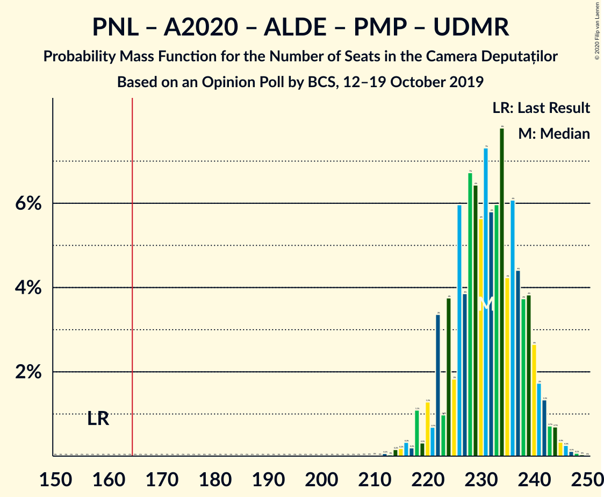

| Number of Seats | Probability | Accumulated | Special Marks |
|:---------------:|:-----------:|:-----------:|:-------------:|
| 158 | 0% | 100% | Last Result |
| 159 | 0% | 100% |  |
| 160 | 0% | 100% |  |
| 161 | 0% | 100% |  |
| 162 | 0% | 100% |  |
| 163 | 0% | 100% |  |
| 164 | 0% | 100% |  |
| 165 | 0% | 100% | Majority |
| 166 | 0% | 100% |  |
| 167 | 0% | 100% |  |
| 168 | 0% | 100% |  |
| 169 | 0% | 100% |  |
| 170 | 0% | 100% |  |
| 171 | 0% | 100% |  |
| 172 | 0% | 100% |  |
| 173 | 0% | 100% |  |
| 174 | 0% | 100% |  |
| 175 | 0% | 100% |  |
| 176 | 0% | 100% |  |
| 177 | 0% | 100% |  |
| 178 | 0% | 100% |  |
| 179 | 0% | 100% |  |
| 180 | 0% | 100% |  |
| 181 | 0% | 100% |  |
| 182 | 0% | 100% |  |
| 183 | 0% | 100% |  |
| 184 | 0% | 100% |  |
| 185 | 0% | 100% |  |
| 186 | 0% | 100% |  |
| 187 | 0% | 100% |  |
| 188 | 0% | 100% |  |
| 189 | 0% | 100% |  |
| 190 | 0% | 100% |  |
| 191 | 0% | 100% |  |
| 192 | 0% | 100% |  |
| 193 | 0% | 100% |  |
| 194 | 0% | 100% |  |
| 195 | 0% | 100% |  |
| 196 | 0% | 100% |  |
| 197 | 0% | 100% |  |
| 198 | 0% | 100% |  |
| 199 | 0% | 100% |  |
| 200 | 0% | 100% |  |
| 201 | 0% | 100% |  |
| 202 | 0% | 100% |  |
| 203 | 0% | 100% |  |
| 204 | 0% | 100% |  |
| 205 | 0% | 100% |  |
| 206 | 0% | 100% |  |
| 207 | 0% | 100% |  |
| 208 | 0% | 100% |  |
| 209 | 0% | 100% |  |
| 210 | 0% | 100% |  |
| 211 | 0% | 100% |  |
| 212 | 0.1% | 100% |  |
| 213 | 0% | 99.9% |  |
| 214 | 0.2% | 99.9% |  |
| 215 | 0.2% | 99.7% |  |
| 216 | 0.3% | 99.5% |  |
| 217 | 0.2% | 99.2% |  |
| 218 | 1.1% | 99.0% |  |
| 219 | 0.3% | 98% |  |
| 220 | 1.3% | 98% |  |
| 221 | 0.7% | 96% |  |
| 222 | 3% | 96% |  |
| 223 | 1.0% | 92% |  |
| 224 | 4% | 91% |  |
| 225 | 2% | 88% |  |
| 226 | 6% | 86% |  |
| 227 | 4% | 80% |  |
| 228 | 7% | 76% |  |
| 229 | 6% | 69% |  |
| 230 | 6% | 63% |  |
| 231 | 7% | 57% |  |
| 232 | 6% | 50% |  |
| 233 | 6% | 44% |  |
| 234 | 8% | 38% |  |
| 235 | 4% | 30% |  |
| 236 | 6% | 26% |  |
| 237 | 4% | 20% |  |
| 238 | 4% | 16% |  |
| 239 | 4% | 12% |  |
| 240 | 3% | 8% |  |
| 241 | 2% | 5% |  |
| 242 | 1.3% | 4% |  |
| 243 | 0.7% | 2% |  |
| 244 | 0.7% | 2% |  |
| 245 | 0.3% | 0.8% |  |
| 246 | 0.3% | 0.5% | Median |
| 247 | 0.1% | 0.2% |  |
| 248 | 0.1% | 0.1% |  |
| 249 | 0% | 0.1% |  |
| 250 | 0% | 0% |  |

### Partidul Național Liberal – Alianța 2020 USR-PLUS – Partidul Mișcarea Populară – Uniunea Democrată Maghiară din România

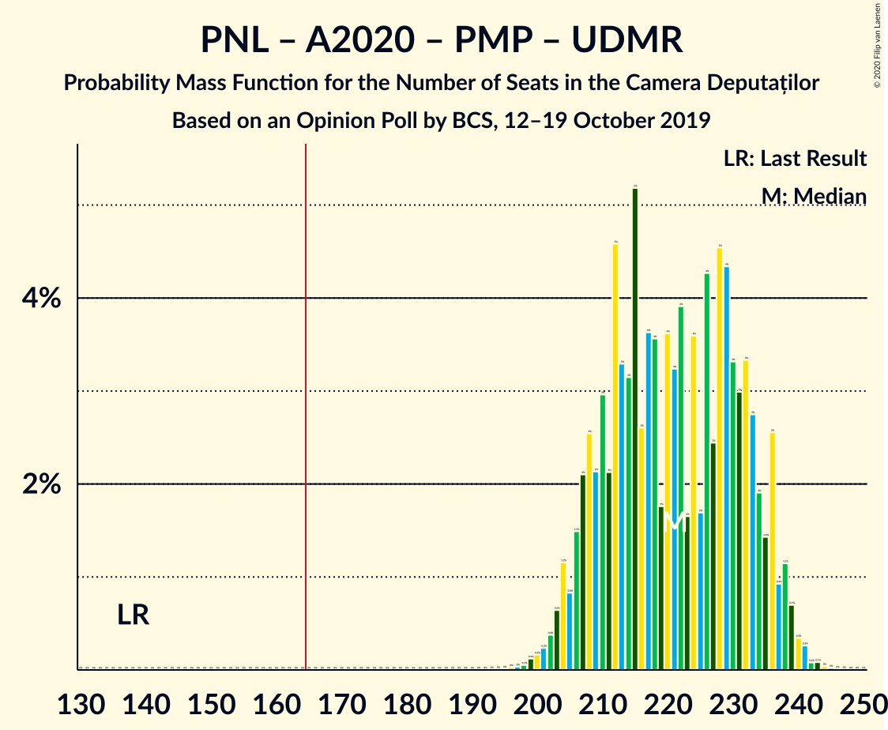

| Number of Seats | Probability | Accumulated | Special Marks |
|:---------------:|:-----------:|:-----------:|:-------------:|
| 138 | 0% | 100% | Last Result |
| 139 | 0% | 100% |  |
| 140 | 0% | 100% |  |
| 141 | 0% | 100% |  |
| 142 | 0% | 100% |  |
| 143 | 0% | 100% |  |
| 144 | 0% | 100% |  |
| 145 | 0% | 100% |  |
| 146 | 0% | 100% |  |
| 147 | 0% | 100% |  |
| 148 | 0% | 100% |  |
| 149 | 0% | 100% |  |
| 150 | 0% | 100% |  |
| 151 | 0% | 100% |  |
| 152 | 0% | 100% |  |
| 153 | 0% | 100% |  |
| 154 | 0% | 100% |  |
| 155 | 0% | 100% |  |
| 156 | 0% | 100% |  |
| 157 | 0% | 100% |  |
| 158 | 0% | 100% |  |
| 159 | 0% | 100% |  |
| 160 | 0% | 100% |  |
| 161 | 0% | 100% |  |
| 162 | 0% | 100% |  |
| 163 | 0% | 100% |  |
| 164 | 0% | 100% |  |
| 165 | 0% | 100% | Majority |
| 166 | 0% | 100% |  |
| 167 | 0% | 100% |  |
| 168 | 0% | 100% |  |
| 169 | 0% | 100% |  |
| 170 | 0% | 100% |  |
| 171 | 0% | 100% |  |
| 172 | 0% | 100% |  |
| 173 | 0% | 100% |  |
| 174 | 0% | 100% |  |
| 175 | 0% | 100% |  |
| 176 | 0% | 100% |  |
| 177 | 0% | 100% |  |
| 178 | 0% | 100% |  |
| 179 | 0% | 100% |  |
| 180 | 0% | 100% |  |
| 181 | 0% | 100% |  |
| 182 | 0% | 100% |  |
| 183 | 0% | 100% |  |
| 184 | 0% | 100% |  |
| 185 | 0% | 100% |  |
| 186 | 0% | 100% |  |
| 187 | 0% | 100% |  |
| 188 | 0% | 100% |  |
| 189 | 0% | 100% |  |
| 190 | 0% | 100% |  |
| 191 | 0% | 100% |  |
| 192 | 0% | 100% |  |
| 193 | 0% | 100% |  |
| 194 | 0% | 100% |  |
| 195 | 0% | 100% |  |
| 196 | 0% | 100% |  |
| 197 | 0% | 99.9% |  |
| 198 | 0.1% | 99.9% |  |
| 199 | 0.1% | 99.9% |  |
| 200 | 0.2% | 99.7% |  |
| 201 | 0.2% | 99.6% |  |
| 202 | 0.4% | 99.3% |  |
| 203 | 0.6% | 99.0% |  |
| 204 | 1.2% | 98% |  |
| 205 | 0.8% | 97% |  |
| 206 | 1.5% | 96% |  |
| 207 | 2% | 95% |  |
| 208 | 3% | 93% |  |
| 209 | 2% | 90% |  |
| 210 | 3% | 88% |  |
| 211 | 2% | 85% |  |
| 212 | 5% | 83% |  |
| 213 | 3% | 78% |  |
| 214 | 3% | 75% |  |
| 215 | 5% | 72% |  |
| 216 | 3% | 67% |  |
| 217 | 4% | 64% |  |
| 218 | 4% | 61% |  |
| 219 | 2% | 57% |  |
| 220 | 4% | 55% |  |
| 221 | 3% | 52% |  |
| 222 | 4% | 48% |  |
| 223 | 2% | 44% |  |
| 224 | 4% | 43% |  |
| 225 | 2% | 39% |  |
| 226 | 4% | 37% |  |
| 227 | 2% | 33% |  |
| 228 | 5% | 31% | Median |
| 229 | 4% | 26% |  |
| 230 | 3% | 22% |  |
| 231 | 3% | 19% |  |
| 232 | 3% | 16% |  |
| 233 | 3% | 12% |  |
| 234 | 2% | 10% |  |
| 235 | 1.4% | 8% |  |
| 236 | 3% | 6% |  |
| 237 | 0.9% | 4% |  |
| 238 | 1.1% | 3% |  |
| 239 | 0.7% | 2% |  |
| 240 | 0.3% | 0.8% |  |
| 241 | 0.3% | 0.5% |  |
| 242 | 0.1% | 0.2% |  |
| 243 | 0.1% | 0.2% |  |
| 244 | 0% | 0.1% |  |
| 245 | 0% | 0% |  |

### Partidul Național Liberal – Alianța 2020 USR-PLUS – Partidul Alianța Liberalilor și Democraților – Uniunea Democrată Maghiară din România

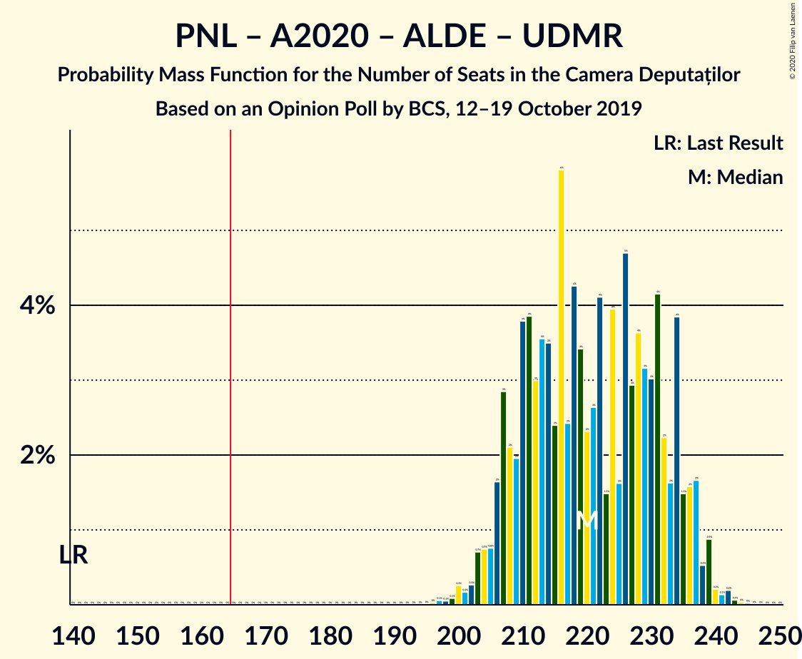

| Number of Seats | Probability | Accumulated | Special Marks |
|:---------------:|:-----------:|:-----------:|:-------------:|
| 140 | 0% | 100% | Last Result |
| 141 | 0% | 100% |  |
| 142 | 0% | 100% |  |
| 143 | 0% | 100% |  |
| 144 | 0% | 100% |  |
| 145 | 0% | 100% |  |
| 146 | 0% | 100% |  |
| 147 | 0% | 100% |  |
| 148 | 0% | 100% |  |
| 149 | 0% | 100% |  |
| 150 | 0% | 100% |  |
| 151 | 0% | 100% |  |
| 152 | 0% | 100% |  |
| 153 | 0% | 100% |  |
| 154 | 0% | 100% |  |
| 155 | 0% | 100% |  |
| 156 | 0% | 100% |  |
| 157 | 0% | 100% |  |
| 158 | 0% | 100% |  |
| 159 | 0% | 100% |  |
| 160 | 0% | 100% |  |
| 161 | 0% | 100% |  |
| 162 | 0% | 100% |  |
| 163 | 0% | 100% |  |
| 164 | 0% | 100% |  |
| 165 | 0% | 100% | Majority |
| 166 | 0% | 100% |  |
| 167 | 0% | 100% |  |
| 168 | 0% | 100% |  |
| 169 | 0% | 100% |  |
| 170 | 0% | 100% |  |
| 171 | 0% | 100% |  |
| 172 | 0% | 100% |  |
| 173 | 0% | 100% |  |
| 174 | 0% | 100% |  |
| 175 | 0% | 100% |  |
| 176 | 0% | 100% |  |
| 177 | 0% | 100% |  |
| 178 | 0% | 100% |  |
| 179 | 0% | 100% |  |
| 180 | 0% | 100% |  |
| 181 | 0% | 100% |  |
| 182 | 0% | 100% |  |
| 183 | 0% | 100% |  |
| 184 | 0% | 100% |  |
| 185 | 0% | 100% |  |
| 186 | 0% | 100% |  |
| 187 | 0% | 100% |  |
| 188 | 0% | 100% |  |
| 189 | 0% | 100% |  |
| 190 | 0% | 100% |  |
| 191 | 0% | 100% |  |
| 192 | 0% | 100% |  |
| 193 | 0% | 100% |  |
| 194 | 0% | 100% |  |
| 195 | 0% | 100% |  |
| 196 | 0% | 100% |  |
| 197 | 0.1% | 99.9% |  |
| 198 | 0.1% | 99.9% |  |
| 199 | 0.1% | 99.8% |  |
| 200 | 0.3% | 99.7% |  |
| 201 | 0.2% | 99.5% |  |
| 202 | 0.3% | 99.3% |  |
| 203 | 0.7% | 99.1% |  |
| 204 | 0.7% | 98% |  |
| 205 | 0.8% | 98% |  |
| 206 | 2% | 97% |  |
| 207 | 3% | 95% |  |
| 208 | 2% | 92% |  |
| 209 | 2% | 90% |  |
| 210 | 4% | 88% |  |
| 211 | 4% | 84% |  |
| 212 | 3% | 81% |  |
| 213 | 4% | 78% |  |
| 214 | 3% | 74% |  |
| 215 | 2% | 71% |  |
| 216 | 6% | 68% |  |
| 217 | 2% | 62% |  |
| 218 | 4% | 60% |  |
| 219 | 3% | 56% |  |
| 220 | 2% | 52% |  |
| 221 | 3% | 50% |  |
| 222 | 4% | 47% |  |
| 223 | 1.5% | 43% |  |
| 224 | 4% | 42% |  |
| 225 | 2% | 38% |  |
| 226 | 5% | 36% |  |
| 227 | 3% | 31% |  |
| 228 | 4% | 29% | Median |
| 229 | 3% | 25% |  |
| 230 | 3% | 22% |  |
| 231 | 4% | 19% |  |
| 232 | 2% | 15% |  |
| 233 | 2% | 12% |  |
| 234 | 4% | 11% |  |
| 235 | 1.5% | 7% |  |
| 236 | 2% | 5% |  |
| 237 | 2% | 4% |  |
| 238 | 0.5% | 2% |  |
| 239 | 0.9% | 2% |  |
| 240 | 0.2% | 0.7% |  |
| 241 | 0.1% | 0.5% |  |
| 242 | 0.2% | 0.3% |  |
| 243 | 0.1% | 0.1% |  |
| 244 | 0% | 0.1% |  |
| 245 | 0% | 0% |  |

### Partidul Național Liberal – Alianța 2020 USR-PLUS – Partidul Alianța Liberalilor și Democraților – Partidul Mișcarea Populară

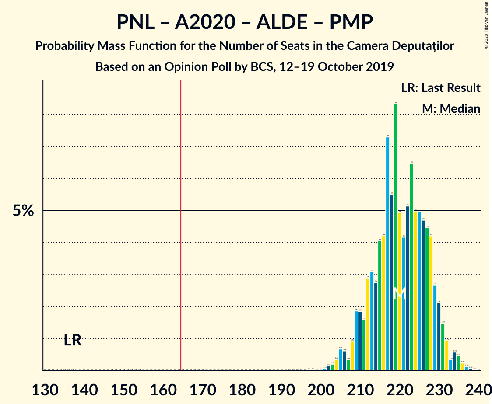

| Number of Seats | Probability | Accumulated | Special Marks |
|:---------------:|:-----------:|:-----------:|:-------------:|
| 137 | 0% | 100% | Last Result |
| 138 | 0% | 100% |  |
| 139 | 0% | 100% |  |
| 140 | 0% | 100% |  |
| 141 | 0% | 100% |  |
| 142 | 0% | 100% |  |
| 143 | 0% | 100% |  |
| 144 | 0% | 100% |  |
| 145 | 0% | 100% |  |
| 146 | 0% | 100% |  |
| 147 | 0% | 100% |  |
| 148 | 0% | 100% |  |
| 149 | 0% | 100% |  |
| 150 | 0% | 100% |  |
| 151 | 0% | 100% |  |
| 152 | 0% | 100% |  |
| 153 | 0% | 100% |  |
| 154 | 0% | 100% |  |
| 155 | 0% | 100% |  |
| 156 | 0% | 100% |  |
| 157 | 0% | 100% |  |
| 158 | 0% | 100% |  |
| 159 | 0% | 100% |  |
| 160 | 0% | 100% |  |
| 161 | 0% | 100% |  |
| 162 | 0% | 100% |  |
| 163 | 0% | 100% |  |
| 164 | 0% | 100% |  |
| 165 | 0% | 100% | Majority |
| 166 | 0% | 100% |  |
| 167 | 0% | 100% |  |
| 168 | 0% | 100% |  |
| 169 | 0% | 100% |  |
| 170 | 0% | 100% |  |
| 171 | 0% | 100% |  |
| 172 | 0% | 100% |  |
| 173 | 0% | 100% |  |
| 174 | 0% | 100% |  |
| 175 | 0% | 100% |  |
| 176 | 0% | 100% |  |
| 177 | 0% | 100% |  |
| 178 | 0% | 100% |  |
| 179 | 0% | 100% |  |
| 180 | 0% | 100% |  |
| 181 | 0% | 100% |  |
| 182 | 0% | 100% |  |
| 183 | 0% | 100% |  |
| 184 | 0% | 100% |  |
| 185 | 0% | 100% |  |
| 186 | 0% | 100% |  |
| 187 | 0% | 100% |  |
| 188 | 0% | 100% |  |
| 189 | 0% | 100% |  |
| 190 | 0% | 100% |  |
| 191 | 0% | 100% |  |
| 192 | 0% | 100% |  |
| 193 | 0% | 100% |  |
| 194 | 0% | 100% |  |
| 195 | 0% | 100% |  |
| 196 | 0% | 100% |  |
| 197 | 0% | 100% |  |
| 198 | 0% | 100% |  |
| 199 | 0% | 100% |  |
| 200 | 0% | 99.9% |  |
| 201 | 0.1% | 99.9% |  |
| 202 | 0.1% | 99.9% |  |
| 203 | 0.2% | 99.7% |  |
| 204 | 0.4% | 99.5% |  |
| 205 | 0.7% | 99.2% |  |
| 206 | 0.6% | 98% |  |
| 207 | 0.3% | 98% |  |
| 208 | 0.9% | 98% |  |
| 209 | 2% | 97% |  |
| 210 | 2% | 95% |  |
| 211 | 2% | 93% |  |
| 212 | 3% | 91% |  |
| 213 | 3% | 88% |  |
| 214 | 3% | 85% |  |
| 215 | 4% | 83% |  |
| 216 | 4% | 78% |  |
| 217 | 7% | 74% |  |
| 218 | 6% | 67% |  |
| 219 | 8% | 61% |  |
| 220 | 5% | 53% |  |
| 221 | 4% | 48% |  |
| 222 | 5% | 44% |  |
| 223 | 6% | 39% |  |
| 224 | 5% | 32% |  |
| 225 | 5% | 27% |  |
| 226 | 5% | 22% |  |
| 227 | 4% | 18% |  |
| 228 | 4% | 13% |  |
| 229 | 3% | 9% |  |
| 230 | 2% | 6% |  |
| 231 | 1.5% | 4% |  |
| 232 | 0.9% | 3% |  |
| 233 | 0.3% | 2% |  |
| 234 | 0.6% | 2% |  |
| 235 | 0.5% | 1.0% | Median |
| 236 | 0.2% | 0.5% |  |
| 237 | 0.1% | 0.2% |  |
| 238 | 0.1% | 0.1% |  |
| 239 | 0% | 0% |  |

### Partidul Național Liberal – Alianța 2020 USR-PLUS – Uniunea Democrată Maghiară din România

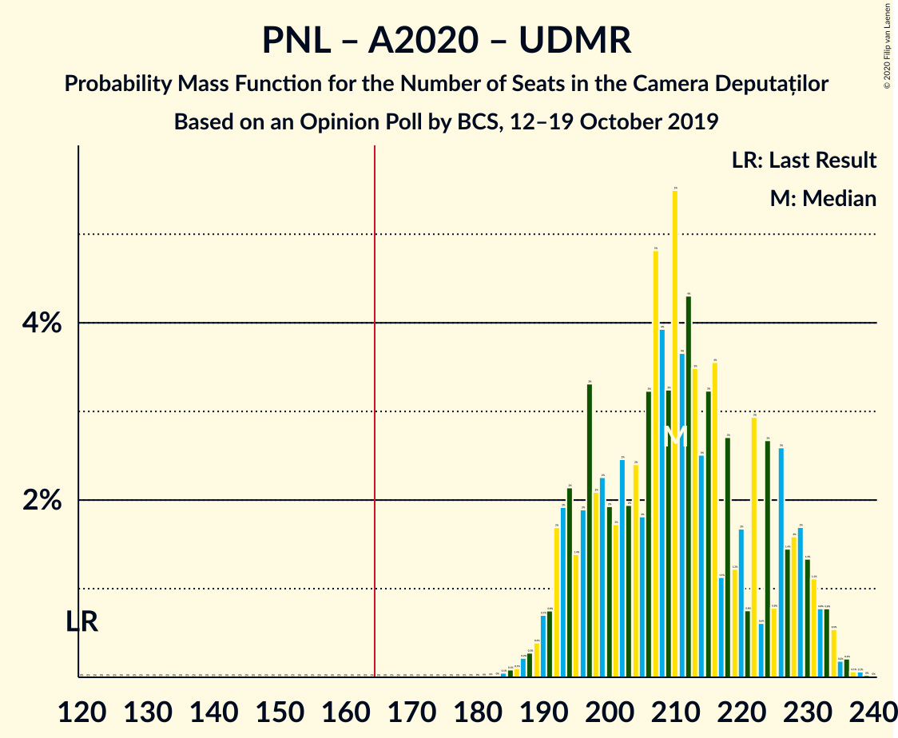

| Number of Seats | Probability | Accumulated | Special Marks |
|:---------------:|:-----------:|:-----------:|:-------------:|
| 120 | 0% | 100% | Last Result |
| 121 | 0% | 100% |  |
| 122 | 0% | 100% |  |
| 123 | 0% | 100% |  |
| 124 | 0% | 100% |  |
| 125 | 0% | 100% |  |
| 126 | 0% | 100% |  |
| 127 | 0% | 100% |  |
| 128 | 0% | 100% |  |
| 129 | 0% | 100% |  |
| 130 | 0% | 100% |  |
| 131 | 0% | 100% |  |
| 132 | 0% | 100% |  |
| 133 | 0% | 100% |  |
| 134 | 0% | 100% |  |
| 135 | 0% | 100% |  |
| 136 | 0% | 100% |  |
| 137 | 0% | 100% |  |
| 138 | 0% | 100% |  |
| 139 | 0% | 100% |  |
| 140 | 0% | 100% |  |
| 141 | 0% | 100% |  |
| 142 | 0% | 100% |  |
| 143 | 0% | 100% |  |
| 144 | 0% | 100% |  |
| 145 | 0% | 100% |  |
| 146 | 0% | 100% |  |
| 147 | 0% | 100% |  |
| 148 | 0% | 100% |  |
| 149 | 0% | 100% |  |
| 150 | 0% | 100% |  |
| 151 | 0% | 100% |  |
| 152 | 0% | 100% |  |
| 153 | 0% | 100% |  |
| 154 | 0% | 100% |  |
| 155 | 0% | 100% |  |
| 156 | 0% | 100% |  |
| 157 | 0% | 100% |  |
| 158 | 0% | 100% |  |
| 159 | 0% | 100% |  |
| 160 | 0% | 100% |  |
| 161 | 0% | 100% |  |
| 162 | 0% | 100% |  |
| 163 | 0% | 100% |  |
| 164 | 0% | 100% |  |
| 165 | 0% | 100% | Majority |
| 166 | 0% | 100% |  |
| 167 | 0% | 100% |  |
| 168 | 0% | 100% |  |
| 169 | 0% | 100% |  |
| 170 | 0% | 100% |  |
| 171 | 0% | 100% |  |
| 172 | 0% | 100% |  |
| 173 | 0% | 100% |  |
| 174 | 0% | 100% |  |
| 175 | 0% | 100% |  |
| 176 | 0% | 100% |  |
| 177 | 0% | 100% |  |
| 178 | 0% | 100% |  |
| 179 | 0% | 100% |  |
| 180 | 0% | 100% |  |
| 181 | 0% | 100% |  |
| 182 | 0% | 100% |  |
| 183 | 0% | 100% |  |
| 184 | 0.1% | 100% |  |
| 185 | 0.1% | 99.9% |  |
| 186 | 0.1% | 99.8% |  |
| 187 | 0.2% | 99.7% |  |
| 188 | 0.3% | 99.5% |  |
| 189 | 0.4% | 99.2% |  |
| 190 | 0.7% | 98.8% |  |
| 191 | 0.8% | 98% |  |
| 192 | 2% | 97% |  |
| 193 | 2% | 96% |  |
| 194 | 2% | 94% |  |
| 195 | 1.4% | 92% |  |
| 196 | 2% | 90% |  |
| 197 | 3% | 88% |  |
| 198 | 2% | 85% |  |
| 199 | 2% | 83% |  |
| 200 | 2% | 81% |  |
| 201 | 2% | 79% |  |
| 202 | 2% | 77% |  |
| 203 | 2% | 75% |  |
| 204 | 2% | 73% |  |
| 205 | 2% | 70% |  |
| 206 | 3% | 68% |  |
| 207 | 5% | 65% |  |
| 208 | 4% | 60% |  |
| 209 | 3% | 56% |  |
| 210 | 5% | 53% | Median |
| 211 | 4% | 48% |  |
| 212 | 4% | 44% |  |
| 213 | 3% | 40% |  |
| 214 | 3% | 36% |  |
| 215 | 3% | 34% |  |
| 216 | 4% | 30% |  |
| 217 | 1.1% | 27% |  |
| 218 | 3% | 26% |  |
| 219 | 1.2% | 23% |  |
| 220 | 2% | 22% |  |
| 221 | 0.8% | 20% |  |
| 222 | 3% | 19% |  |
| 223 | 0.6% | 17% |  |
| 224 | 3% | 16% |  |
| 225 | 0.8% | 13% |  |
| 226 | 3% | 12% |  |
| 227 | 1.4% | 10% |  |
| 228 | 2% | 8% |  |
| 229 | 2% | 7% |  |
| 230 | 1.3% | 5% |  |
| 231 | 1.1% | 4% |  |
| 232 | 0.8% | 3% |  |
| 233 | 0.8% | 2% |  |
| 234 | 0.5% | 1.1% |  |
| 235 | 0.2% | 0.6% |  |
| 236 | 0.2% | 0.4% |  |
| 237 | 0.1% | 0.2% |  |
| 238 | 0.1% | 0.1% |  |
| 239 | 0% | 0.1% |  |
| 240 | 0% | 0% |  |

### Partidul Național Liberal – Alianța 2020 USR-PLUS – Partidul Mișcarea Populară

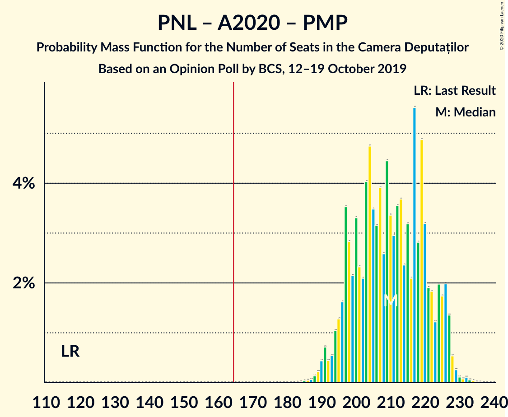

| Number of Seats | Probability | Accumulated | Special Marks |
|:---------------:|:-----------:|:-----------:|:-------------:|
| 117 | 0% | 100% | Last Result |
| 118 | 0% | 100% |  |
| 119 | 0% | 100% |  |
| 120 | 0% | 100% |  |
| 121 | 0% | 100% |  |
| 122 | 0% | 100% |  |
| 123 | 0% | 100% |  |
| 124 | 0% | 100% |  |
| 125 | 0% | 100% |  |
| 126 | 0% | 100% |  |
| 127 | 0% | 100% |  |
| 128 | 0% | 100% |  |
| 129 | 0% | 100% |  |
| 130 | 0% | 100% |  |
| 131 | 0% | 100% |  |
| 132 | 0% | 100% |  |
| 133 | 0% | 100% |  |
| 134 | 0% | 100% |  |
| 135 | 0% | 100% |  |
| 136 | 0% | 100% |  |
| 137 | 0% | 100% |  |
| 138 | 0% | 100% |  |
| 139 | 0% | 100% |  |
| 140 | 0% | 100% |  |
| 141 | 0% | 100% |  |
| 142 | 0% | 100% |  |
| 143 | 0% | 100% |  |
| 144 | 0% | 100% |  |
| 145 | 0% | 100% |  |
| 146 | 0% | 100% |  |
| 147 | 0% | 100% |  |
| 148 | 0% | 100% |  |
| 149 | 0% | 100% |  |
| 150 | 0% | 100% |  |
| 151 | 0% | 100% |  |
| 152 | 0% | 100% |  |
| 153 | 0% | 100% |  |
| 154 | 0% | 100% |  |
| 155 | 0% | 100% |  |
| 156 | 0% | 100% |  |
| 157 | 0% | 100% |  |
| 158 | 0% | 100% |  |
| 159 | 0% | 100% |  |
| 160 | 0% | 100% |  |
| 161 | 0% | 100% |  |
| 162 | 0% | 100% |  |
| 163 | 0% | 100% |  |
| 164 | 0% | 100% |  |
| 165 | 0% | 100% | Majority |
| 166 | 0% | 100% |  |
| 167 | 0% | 100% |  |
| 168 | 0% | 100% |  |
| 169 | 0% | 100% |  |
| 170 | 0% | 100% |  |
| 171 | 0% | 100% |  |
| 172 | 0% | 100% |  |
| 173 | 0% | 100% |  |
| 174 | 0% | 100% |  |
| 175 | 0% | 100% |  |
| 176 | 0% | 100% |  |
| 177 | 0% | 100% |  |
| 178 | 0% | 100% |  |
| 179 | 0% | 100% |  |
| 180 | 0% | 100% |  |
| 181 | 0% | 100% |  |
| 182 | 0% | 100% |  |
| 183 | 0% | 100% |  |
| 184 | 0% | 100% |  |
| 185 | 0% | 100% |  |
| 186 | 0% | 99.9% |  |
| 187 | 0.1% | 99.9% |  |
| 188 | 0.1% | 99.8% |  |
| 189 | 0.2% | 99.7% |  |
| 190 | 0.4% | 99.5% |  |
| 191 | 0.7% | 99.0% |  |
| 192 | 0.4% | 98% |  |
| 193 | 0.5% | 98% |  |
| 194 | 1.0% | 97% |  |
| 195 | 1.3% | 96% |  |
| 196 | 2% | 95% |  |
| 197 | 4% | 93% |  |
| 198 | 3% | 90% |  |
| 199 | 2% | 87% |  |
| 200 | 3% | 85% |  |
| 201 | 2% | 82% |  |
| 202 | 2% | 79% |  |
| 203 | 4% | 77% |  |
| 204 | 5% | 73% |  |
| 205 | 3% | 68% |  |
| 206 | 3% | 65% |  |
| 207 | 4% | 62% |  |
| 208 | 3% | 58% |  |
| 209 | 4% | 55% |  |
| 210 | 3% | 51% |  |
| 211 | 3% | 47% |  |
| 212 | 4% | 44% |  |
| 213 | 4% | 41% |  |
| 214 | 2% | 37% |  |
| 215 | 3% | 35% |  |
| 216 | 2% | 32% |  |
| 217 | 6% | 30% | Median |
| 218 | 3% | 24% |  |
| 219 | 5% | 21% |  |
| 220 | 3% | 16% |  |
| 221 | 2% | 13% |  |
| 222 | 2% | 11% |  |
| 223 | 1.2% | 9% |  |
| 224 | 2% | 8% |  |
| 225 | 2% | 6% |  |
| 226 | 2% | 5% |  |
| 227 | 1.4% | 3% |  |
| 228 | 0.5% | 1.2% |  |
| 229 | 0.3% | 0.7% |  |
| 230 | 0.1% | 0.4% |  |
| 231 | 0.1% | 0.3% |  |
| 232 | 0.1% | 0.2% |  |
| 233 | 0.1% | 0.1% |  |
| 234 | 0% | 0.1% |  |
| 235 | 0% | 0% |  |

### Partidul Național Liberal – Alianța 2020 USR-PLUS – Partidul Alianța Liberalilor și Democraților

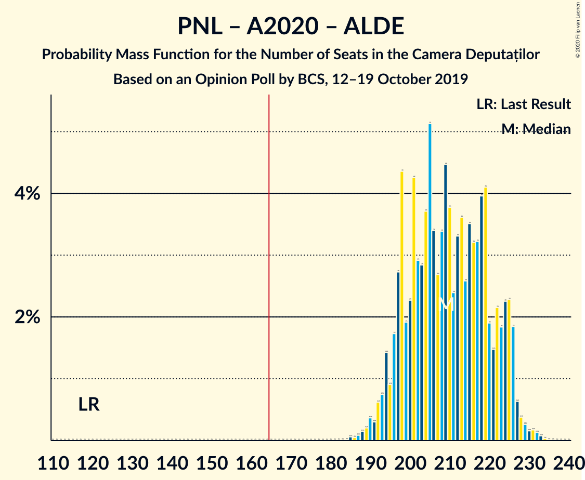

| Number of Seats | Probability | Accumulated | Special Marks |
|:---------------:|:-----------:|:-----------:|:-------------:|
| 119 | 0% | 100% | Last Result |
| 120 | 0% | 100% |  |
| 121 | 0% | 100% |  |
| 122 | 0% | 100% |  |
| 123 | 0% | 100% |  |
| 124 | 0% | 100% |  |
| 125 | 0% | 100% |  |
| 126 | 0% | 100% |  |
| 127 | 0% | 100% |  |
| 128 | 0% | 100% |  |
| 129 | 0% | 100% |  |
| 130 | 0% | 100% |  |
| 131 | 0% | 100% |  |
| 132 | 0% | 100% |  |
| 133 | 0% | 100% |  |
| 134 | 0% | 100% |  |
| 135 | 0% | 100% |  |
| 136 | 0% | 100% |  |
| 137 | 0% | 100% |  |
| 138 | 0% | 100% |  |
| 139 | 0% | 100% |  |
| 140 | 0% | 100% |  |
| 141 | 0% | 100% |  |
| 142 | 0% | 100% |  |
| 143 | 0% | 100% |  |
| 144 | 0% | 100% |  |
| 145 | 0% | 100% |  |
| 146 | 0% | 100% |  |
| 147 | 0% | 100% |  |
| 148 | 0% | 100% |  |
| 149 | 0% | 100% |  |
| 150 | 0% | 100% |  |
| 151 | 0% | 100% |  |
| 152 | 0% | 100% |  |
| 153 | 0% | 100% |  |
| 154 | 0% | 100% |  |
| 155 | 0% | 100% |  |
| 156 | 0% | 100% |  |
| 157 | 0% | 100% |  |
| 158 | 0% | 100% |  |
| 159 | 0% | 100% |  |
| 160 | 0% | 100% |  |
| 161 | 0% | 100% |  |
| 162 | 0% | 100% |  |
| 163 | 0% | 100% |  |
| 164 | 0% | 100% |  |
| 165 | 0% | 100% | Majority |
| 166 | 0% | 100% |  |
| 167 | 0% | 100% |  |
| 168 | 0% | 100% |  |
| 169 | 0% | 100% |  |
| 170 | 0% | 100% |  |
| 171 | 0% | 100% |  |
| 172 | 0% | 100% |  |
| 173 | 0% | 100% |  |
| 174 | 0% | 100% |  |
| 175 | 0% | 100% |  |
| 176 | 0% | 100% |  |
| 177 | 0% | 100% |  |
| 178 | 0% | 100% |  |
| 179 | 0% | 100% |  |
| 180 | 0% | 100% |  |
| 181 | 0% | 100% |  |
| 182 | 0% | 100% |  |
| 183 | 0% | 100% |  |
| 184 | 0% | 100% |  |
| 185 | 0.1% | 100% |  |
| 186 | 0% | 99.9% |  |
| 187 | 0.1% | 99.9% |  |
| 188 | 0.1% | 99.8% |  |
| 189 | 0.2% | 99.6% |  |
| 190 | 0.4% | 99.4% |  |
| 191 | 0.3% | 99.1% |  |
| 192 | 0.6% | 98.8% |  |
| 193 | 0.7% | 98% |  |
| 194 | 1.4% | 97% |  |
| 195 | 0.9% | 96% |  |
| 196 | 2% | 95% |  |
| 197 | 3% | 93% |  |
| 198 | 4% | 91% |  |
| 199 | 2% | 86% |  |
| 200 | 2% | 84% |  |
| 201 | 4% | 82% |  |
| 202 | 3% | 78% |  |
| 203 | 3% | 75% |  |
| 204 | 4% | 72% |  |
| 205 | 5% | 68% |  |
| 206 | 3% | 63% |  |
| 207 | 3% | 60% |  |
| 208 | 3% | 57% |  |
| 209 | 4% | 54% |  |
| 210 | 4% | 49% |  |
| 211 | 2% | 45% |  |
| 212 | 3% | 43% |  |
| 213 | 4% | 40% |  |
| 214 | 3% | 36% |  |
| 215 | 4% | 34% |  |
| 216 | 3% | 30% |  |
| 217 | 3% | 27% | Median |
| 218 | 4% | 24% |  |
| 219 | 4% | 20% |  |
| 220 | 2% | 16% |  |
| 221 | 1.5% | 14% |  |
| 222 | 2% | 12% |  |
| 223 | 2% | 10% |  |
| 224 | 2% | 8% |  |
| 225 | 2% | 6% |  |
| 226 | 2% | 4% |  |
| 227 | 0.6% | 2% |  |
| 228 | 0.4% | 1.2% |  |
| 229 | 0.3% | 0.8% |  |
| 230 | 0.2% | 0.6% |  |
| 231 | 0.2% | 0.4% |  |
| 232 | 0.1% | 0.3% |  |
| 233 | 0.1% | 0.1% |  |
| 234 | 0% | 0.1% |  |
| 235 | 0% | 0% |  |

### Partidul Național Liberal – Alianța 2020 USR-PLUS

| Number of Seats | Probability | Accumulated | Special Marks |
|:---------------:|:-----------:|:-----------:|:-------------:|
| 99 | 0% | 100% | Last Result |
| 100 | 0% | 100% |  |
| 101 | 0% | 100% |  |
| 102 | 0% | 100% |  |
| 103 | 0% | 100% |  |
| 104 | 0% | 100% |  |
| 105 | 0% | 100% |  |
| 106 | 0% | 100% |  |
| 107 | 0% | 100% |  |
| 108 | 0% | 100% |  |
| 109 | 0% | 100% |  |
| 110 | 0% | 100% |  |
| 111 | 0% | 100% |  |
| 112 | 0% | 100% |  |
| 113 | 0% | 100% |  |
| 114 | 0% | 100% |  |
| 115 | 0% | 100% |  |
| 116 | 0% | 100% |  |
| 117 | 0% | 100% |  |
| 118 | 0% | 100% |  |
| 119 | 0% | 100% |  |
| 120 | 0% | 100% |  |
| 121 | 0% | 100% |  |
| 122 | 0% | 100% |  |
| 123 | 0% | 100% |  |
| 124 | 0% | 100% |  |
| 125 | 0% | 100% |  |
| 126 | 0% | 100% |  |
| 127 | 0% | 100% |  |
| 128 | 0% | 100% |  |
| 129 | 0% | 100% |  |
| 130 | 0% | 100% |  |
| 131 | 0% | 100% |  |
| 132 | 0% | 100% |  |
| 133 | 0% | 100% |  |
| 134 | 0% | 100% |  |
| 135 | 0% | 100% |  |
| 136 | 0% | 100% |  |
| 137 | 0% | 100% |  |
| 138 | 0% | 100% |  |
| 139 | 0% | 100% |  |
| 140 | 0% | 100% |  |
| 141 | 0% | 100% |  |
| 142 | 0% | 100% |  |
| 143 | 0% | 100% |  |
| 144 | 0% | 100% |  |
| 145 | 0% | 100% |  |
| 146 | 0% | 100% |  |
| 147 | 0% | 100% |  |
| 148 | 0% | 100% |  |
| 149 | 0% | 100% |  |
| 150 | 0% | 100% |  |
| 151 | 0% | 100% |  |
| 152 | 0% | 100% |  |
| 153 | 0% | 100% |  |
| 154 | 0% | 100% |  |
| 155 | 0% | 100% |  |
| 156 | 0% | 100% |  |
| 157 | 0% | 100% |  |
| 158 | 0% | 100% |  |
| 159 | 0% | 100% |  |
| 160 | 0% | 100% |  |
| 161 | 0% | 100% |  |
| 162 | 0% | 100% |  |
| 163 | 0% | 100% |  |
| 164 | 0% | 100% |  |
| 165 | 0% | 100% | Majority |
| 166 | 0% | 100% |  |
| 167 | 0% | 100% |  |
| 168 | 0% | 100% |  |
| 169 | 0% | 100% |  |
| 170 | 0% | 100% |  |
| 171 | 0% | 100% |  |
| 172 | 0% | 100% |  |
| 173 | 0% | 100% |  |
| 174 | 0.1% | 99.9% |  |
| 175 | 0.1% | 99.9% |  |
| 176 | 0.2% | 99.8% |  |
| 177 | 0.3% | 99.6% |  |
| 178 | 0.4% | 99.3% |  |
| 179 | 0.4% | 98.9% |  |
| 180 | 0.8% | 98% |  |
| 181 | 0.9% | 98% |  |
| 182 | 1.2% | 97% |  |
| 183 | 3% | 96% |  |
| 184 | 1.2% | 93% |  |
| 185 | 3% | 92% |  |
| 186 | 3% | 89% |  |
| 187 | 2% | 86% |  |
| 188 | 3% | 84% |  |
| 189 | 2% | 82% |  |
| 190 | 3% | 80% |  |
| 191 | 3% | 77% |  |
| 192 | 2% | 75% |  |
| 193 | 2% | 73% |  |
| 194 | 3% | 71% |  |
| 195 | 2% | 68% |  |
| 196 | 3% | 65% |  |
| 197 | 6% | 62% |  |
| 198 | 7% | 56% |  |
| 199 | 3% | 50% | Median |
| 200 | 4% | 47% |  |
| 201 | 3% | 42% |  |
| 202 | 3% | 39% |  |
| 203 | 3% | 37% |  |
| 204 | 3% | 34% |  |
| 205 | 4% | 31% |  |
| 206 | 3% | 28% |  |
| 207 | 2% | 24% |  |
| 208 | 1.2% | 22% |  |
| 209 | 2% | 21% |  |
| 210 | 2% | 19% |  |
| 211 | 1.2% | 17% |  |
| 212 | 2% | 16% |  |
| 213 | 2% | 14% |  |
| 214 | 2% | 11% |  |
| 215 | 2% | 10% |  |
| 216 | 0.9% | 8% |  |
| 217 | 1.3% | 7% |  |
| 218 | 1.3% | 6% |  |
| 219 | 1.0% | 4% |  |
| 220 | 1.4% | 3% |  |
| 221 | 0.7% | 2% |  |
| 222 | 0.4% | 1.2% |  |
| 223 | 0.3% | 0.7% |  |
| 224 | 0.2% | 0.4% |  |
| 225 | 0.1% | 0.2% |  |
| 226 | 0% | 0.1% |  |
| 227 | 0% | 0.1% |  |
| 228 | 0% | 0.1% |  |
| 229 | 0% | 0% |  |

### Partidul Național Liberal – Partidul Alianța Liberalilor și Democraților – Partidul Mișcarea Populară – Uniunea Democrată Maghiară din România

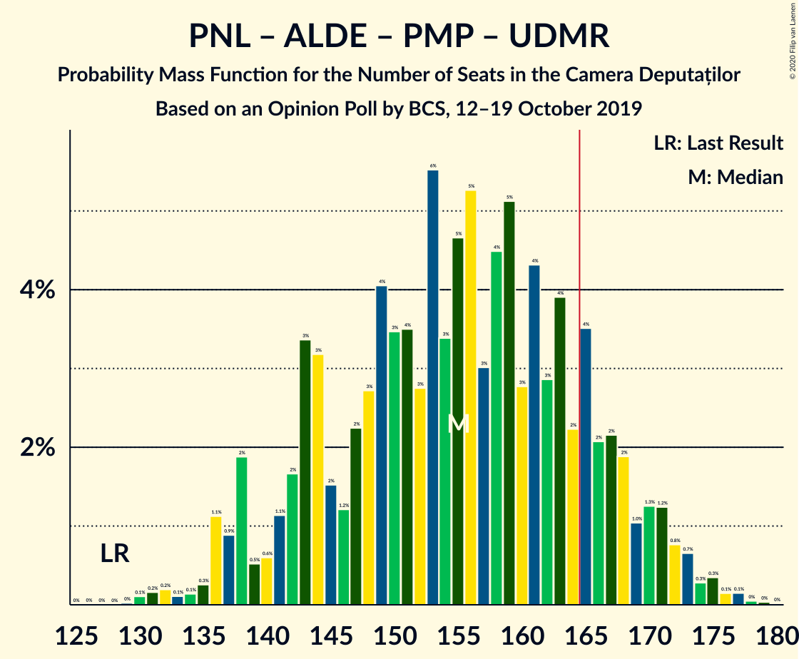

| Number of Seats | Probability | Accumulated | Special Marks |
|:---------------:|:-----------:|:-----------:|:-------------:|
| 128 | 0% | 100% | Last Result |
| 129 | 0% | 100% |  |
| 130 | 0.1% | 100% |  |
| 131 | 0.2% | 99.8% |  |
| 132 | 0.2% | 99.7% |  |
| 133 | 0.1% | 99.5% |  |
| 134 | 0.1% | 99.4% |  |
| 135 | 0.3% | 99.2% |  |
| 136 | 1.1% | 99.0% |  |
| 137 | 0.9% | 98% |  |
| 138 | 2% | 97% |  |
| 139 | 0.5% | 95% |  |
| 140 | 0.6% | 95% |  |
| 141 | 1.1% | 94% |  |
| 142 | 2% | 93% |  |
| 143 | 3% | 91% |  |
| 144 | 3% | 88% |  |
| 145 | 2% | 85% |  |
| 146 | 1.2% | 83% |  |
| 147 | 2% | 82% |  |
| 148 | 3% | 80% |  |
| 149 | 4% | 77% |  |
| 150 | 3% | 73% |  |
| 151 | 4% | 69% |  |
| 152 | 3% | 66% |  |
| 153 | 6% | 63% |  |
| 154 | 3% | 58% |  |
| 155 | 5% | 54% |  |
| 156 | 5% | 50% |  |
| 157 | 3% | 44% |  |
| 158 | 4% | 41% |  |
| 159 | 5% | 37% |  |
| 160 | 3% | 32% |  |
| 161 | 4% | 29% |  |
| 162 | 3% | 25% |  |
| 163 | 4% | 22% |  |
| 164 | 2% | 18% |  |
| 165 | 4% | 16% | Majority |
| 166 | 2% | 12% |  |
| 167 | 2% | 10% |  |
| 168 | 2% | 8% |  |
| 169 | 1.0% | 6% |  |
| 170 | 1.3% | 5% | Median |
| 171 | 1.2% | 4% |  |
| 172 | 0.8% | 2% |  |
| 173 | 0.7% | 2% |  |
| 174 | 0.3% | 1.0% |  |
| 175 | 0.3% | 0.8% |  |
| 176 | 0.1% | 0.4% |  |
| 177 | 0.1% | 0.3% |  |
| 178 | 0% | 0.1% |  |
| 179 | 0% | 0.1% |  |
| 180 | 0% | 0% |  |

### Partidul Național Liberal – Partidul Mișcarea Populară – Uniunea Democrată Maghiară din România

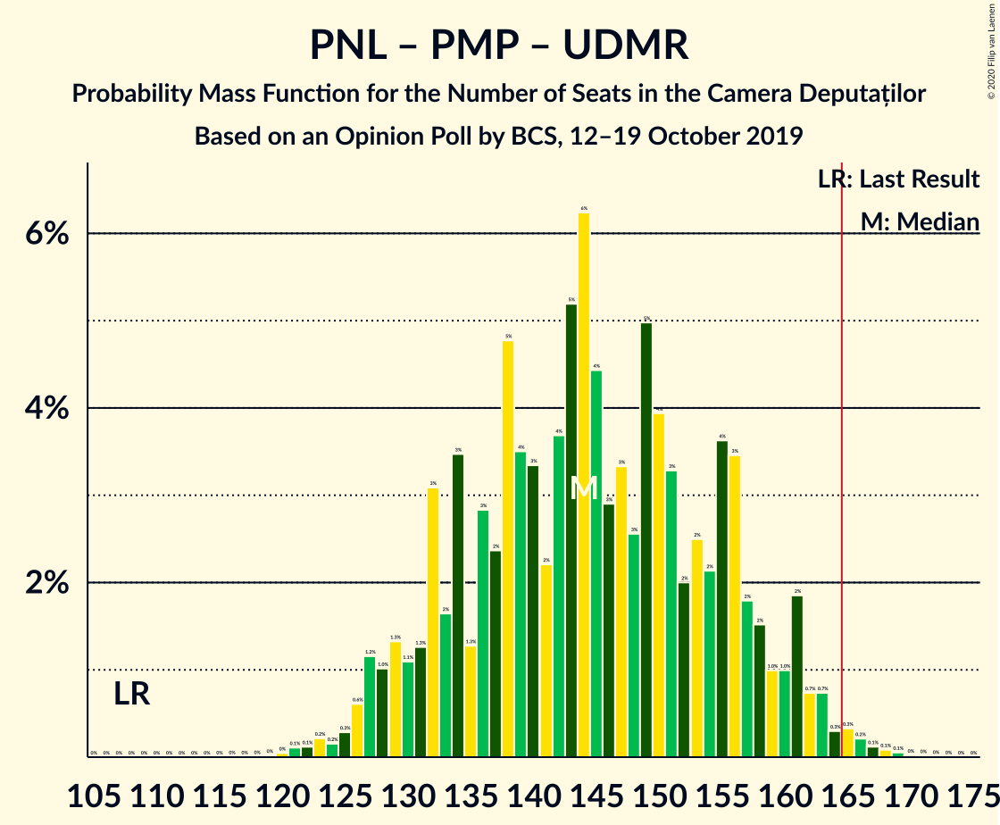

| Number of Seats | Probability | Accumulated | Special Marks |
|:---------------:|:-----------:|:-----------:|:-------------:|
| 108 | 0% | 100% | Last Result |
| 109 | 0% | 100% |  |
| 110 | 0% | 100% |  |
| 111 | 0% | 100% |  |
| 112 | 0% | 100% |  |
| 113 | 0% | 100% |  |
| 114 | 0% | 100% |  |
| 115 | 0% | 100% |  |
| 116 | 0% | 100% |  |
| 117 | 0% | 100% |  |
| 118 | 0% | 100% |  |
| 119 | 0% | 100% |  |
| 120 | 0% | 100% |  |
| 121 | 0.1% | 99.9% |  |
| 122 | 0.1% | 99.8% |  |
| 123 | 0.2% | 99.7% |  |
| 124 | 0.2% | 99.5% |  |
| 125 | 0.3% | 99.3% |  |
| 126 | 0.6% | 99.0% |  |
| 127 | 1.2% | 98% |  |
| 128 | 1.0% | 97% |  |
| 129 | 1.3% | 96% |  |
| 130 | 1.1% | 95% |  |
| 131 | 1.3% | 94% |  |
| 132 | 3% | 93% |  |
| 133 | 2% | 89% |  |
| 134 | 3% | 88% |  |
| 135 | 1.3% | 84% |  |
| 136 | 3% | 83% |  |
| 137 | 2% | 80% |  |
| 138 | 5% | 78% |  |
| 139 | 4% | 73% |  |
| 140 | 3% | 70% |  |
| 141 | 2% | 66% |  |
| 142 | 4% | 64% |  |
| 143 | 5% | 60% |  |
| 144 | 6% | 55% |  |
| 145 | 4% | 49% |  |
| 146 | 3% | 45% |  |
| 147 | 3% | 42% |  |
| 148 | 3% | 38% |  |
| 149 | 5% | 36% |  |
| 150 | 4% | 31% |  |
| 151 | 3% | 27% |  |
| 152 | 2% | 24% | Median |
| 153 | 2% | 22% |  |
| 154 | 2% | 19% |  |
| 155 | 4% | 17% |  |
| 156 | 3% | 13% |  |
| 157 | 2% | 10% |  |
| 158 | 2% | 8% |  |
| 159 | 1.0% | 6% |  |
| 160 | 1.0% | 5% |  |
| 161 | 2% | 4% |  |
| 162 | 0.7% | 3% |  |
| 163 | 0.7% | 2% |  |
| 164 | 0.3% | 1.2% |  |
| 165 | 0.3% | 0.9% | Majority |
| 166 | 0.2% | 0.5% |  |
| 167 | 0.1% | 0.3% |  |
| 168 | 0.1% | 0.2% |  |
| 169 | 0.1% | 0.1% |  |
| 170 | 0% | 0.1% |  |
| 171 | 0% | 0% |  |

### Partidul Național Liberal – Partidul Alianța Liberalilor și Democraților – Uniunea Democrată Maghiară din România

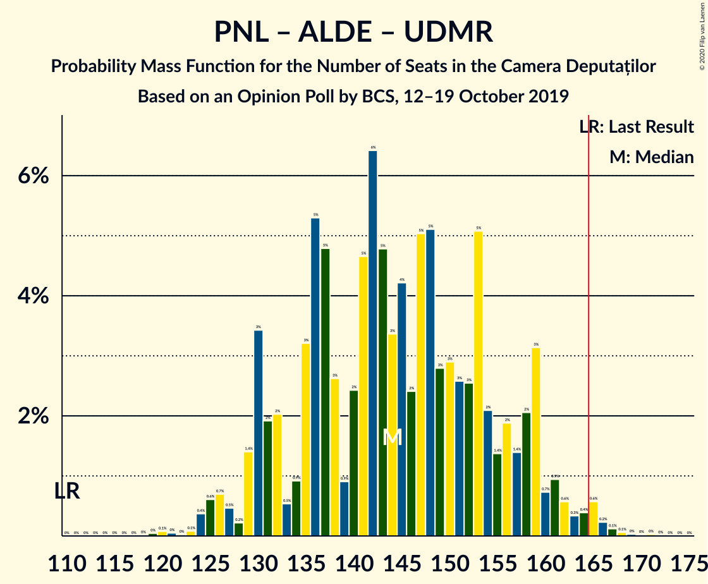

| Number of Seats | Probability | Accumulated | Special Marks |
|:---------------:|:-----------:|:-----------:|:-------------:|
| 110 | 0% | 100% | Last Result |
| 111 | 0% | 100% |  |
| 112 | 0% | 100% |  |
| 113 | 0% | 100% |  |
| 114 | 0% | 100% |  |
| 115 | 0% | 100% |  |
| 116 | 0% | 100% |  |
| 117 | 0% | 100% |  |
| 118 | 0% | 100% |  |
| 119 | 0% | 100% |  |
| 120 | 0.1% | 99.9% |  |
| 121 | 0% | 99.9% |  |
| 122 | 0% | 99.8% |  |
| 123 | 0.1% | 99.8% |  |
| 124 | 0.4% | 99.7% |  |
| 125 | 0.6% | 99.3% |  |
| 126 | 0.7% | 98.7% |  |
| 127 | 0.5% | 98% |  |
| 128 | 0.2% | 98% |  |
| 129 | 1.4% | 97% |  |
| 130 | 3% | 96% |  |
| 131 | 2% | 93% |  |
| 132 | 2% | 91% |  |
| 133 | 0.5% | 89% |  |
| 134 | 0.9% | 88% |  |
| 135 | 3% | 87% |  |
| 136 | 5% | 84% |  |
| 137 | 5% | 79% |  |
| 138 | 3% | 74% |  |
| 139 | 0.9% | 71% |  |
| 140 | 2% | 70% |  |
| 141 | 5% | 68% |  |
| 142 | 6% | 63% |  |
| 143 | 5% | 57% |  |
| 144 | 3% | 52% |  |
| 145 | 4% | 49% |  |
| 146 | 2% | 44% |  |
| 147 | 5% | 42% |  |
| 148 | 5% | 37% |  |
| 149 | 3% | 32% |  |
| 150 | 3% | 29% |  |
| 151 | 3% | 26% |  |
| 152 | 3% | 24% | Median |
| 153 | 5% | 21% |  |
| 154 | 2% | 16% |  |
| 155 | 1.4% | 14% |  |
| 156 | 2% | 13% |  |
| 157 | 1.4% | 11% |  |
| 158 | 2% | 9% |  |
| 159 | 3% | 7% |  |
| 160 | 0.7% | 4% |  |
| 161 | 0.9% | 3% |  |
| 162 | 0.6% | 2% |  |
| 163 | 0.3% | 2% |  |
| 164 | 0.4% | 1.5% |  |
| 165 | 0.6% | 1.1% | Majority |
| 166 | 0.2% | 0.5% |  |
| 167 | 0.1% | 0.3% |  |
| 168 | 0.1% | 0.2% |  |
| 169 | 0% | 0.1% |  |
| 170 | 0% | 0.1% |  |
| 171 | 0% | 0% |  |

### Partidul Național Liberal – Partidul Mișcarea Populară

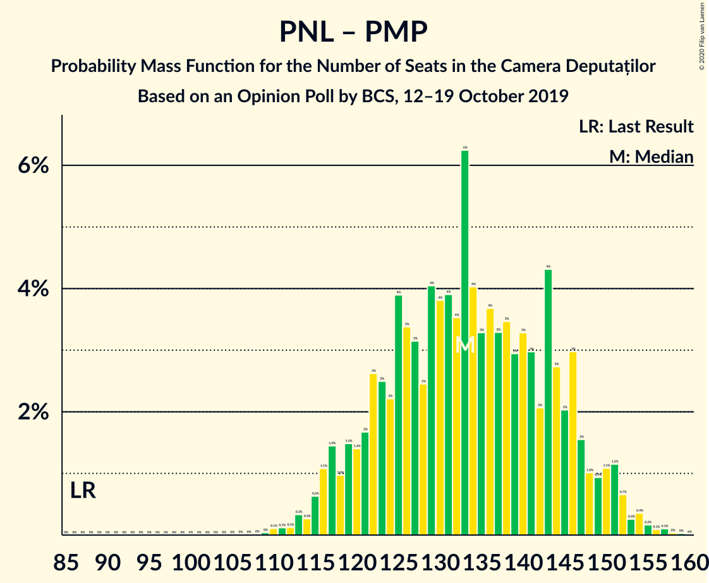

| Number of Seats | Probability | Accumulated | Special Marks |
|:---------------:|:-----------:|:-----------:|:-------------:|
| 87 | 0% | 100% | Last Result |
| 88 | 0% | 100% |  |
| 89 | 0% | 100% |  |
| 90 | 0% | 100% |  |
| 91 | 0% | 100% |  |
| 92 | 0% | 100% |  |
| 93 | 0% | 100% |  |
| 94 | 0% | 100% |  |
| 95 | 0% | 100% |  |
| 96 | 0% | 100% |  |
| 97 | 0% | 100% |  |
| 98 | 0% | 100% |  |
| 99 | 0% | 100% |  |
| 100 | 0% | 100% |  |
| 101 | 0% | 100% |  |
| 102 | 0% | 100% |  |
| 103 | 0% | 100% |  |
| 104 | 0% | 100% |  |
| 105 | 0% | 100% |  |
| 106 | 0% | 100% |  |
| 107 | 0% | 100% |  |
| 108 | 0% | 100% |  |
| 109 | 0% | 100% |  |
| 110 | 0.1% | 99.9% |  |
| 111 | 0.1% | 99.8% |  |
| 112 | 0.1% | 99.7% |  |
| 113 | 0.3% | 99.6% |  |
| 114 | 0.3% | 99.2% |  |
| 115 | 0.6% | 99.0% |  |
| 116 | 1.1% | 98% |  |
| 117 | 1.4% | 97% |  |
| 118 | 1.0% | 96% |  |
| 119 | 1.5% | 95% |  |
| 120 | 1.4% | 93% |  |
| 121 | 2% | 92% |  |
| 122 | 3% | 90% |  |
| 123 | 2% | 88% |  |
| 124 | 2% | 85% |  |
| 125 | 4% | 83% |  |
| 126 | 3% | 79% |  |
| 127 | 3% | 76% |  |
| 128 | 2% | 73% |  |
| 129 | 4% | 70% |  |
| 130 | 4% | 66% |  |
| 131 | 4% | 62% |  |
| 132 | 4% | 58% |  |
| 133 | 6% | 55% |  |
| 134 | 4% | 49% |  |
| 135 | 3% | 45% |  |
| 136 | 4% | 41% |  |
| 137 | 3% | 38% |  |
| 138 | 3% | 34% |  |
| 139 | 3% | 31% |  |
| 140 | 3% | 28% |  |
| 141 | 3% | 25% | Median |
| 142 | 2% | 22% |  |
| 143 | 4% | 20% |  |
| 144 | 3% | 15% |  |
| 145 | 2% | 12% |  |
| 146 | 3% | 10% |  |
| 147 | 2% | 7% |  |
| 148 | 1.0% | 6% |  |
| 149 | 0.9% | 5% |  |
| 150 | 1.1% | 4% |  |
| 151 | 1.2% | 3% |  |
| 152 | 0.7% | 2% |  |
| 153 | 0.3% | 1.1% |  |
| 154 | 0.4% | 0.8% |  |
| 155 | 0.2% | 0.4% |  |
| 156 | 0.1% | 0.3% |  |
| 157 | 0.1% | 0.2% |  |
| 158 | 0% | 0.1% |  |
| 159 | 0% | 0% |  |

### Partidul Național Liberal – Uniunea Democrată Maghiară din România

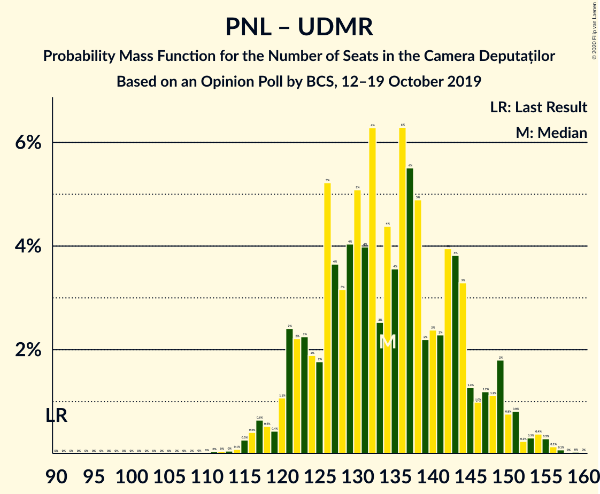

| Number of Seats | Probability | Accumulated | Special Marks |
|:---------------:|:-----------:|:-----------:|:-------------:|
| 90 | 0% | 100% | Last Result |
| 91 | 0% | 100% |  |
| 92 | 0% | 100% |  |
| 93 | 0% | 100% |  |
| 94 | 0% | 100% |  |
| 95 | 0% | 100% |  |
| 96 | 0% | 100% |  |
| 97 | 0% | 100% |  |
| 98 | 0% | 100% |  |
| 99 | 0% | 100% |  |
| 100 | 0% | 100% |  |
| 101 | 0% | 100% |  |
| 102 | 0% | 100% |  |
| 103 | 0% | 100% |  |
| 104 | 0% | 100% |  |
| 105 | 0% | 100% |  |
| 106 | 0% | 100% |  |
| 107 | 0% | 100% |  |
| 108 | 0% | 100% |  |
| 109 | 0% | 100% |  |
| 110 | 0% | 100% |  |
| 111 | 0% | 100% |  |
| 112 | 0% | 99.9% |  |
| 113 | 0% | 99.9% |  |
| 114 | 0.1% | 99.9% |  |
| 115 | 0.3% | 99.8% |  |
| 116 | 0.4% | 99.5% |  |
| 117 | 0.6% | 99.1% |  |
| 118 | 0.5% | 98% |  |
| 119 | 0.4% | 98% |  |
| 120 | 1.1% | 98% |  |
| 121 | 2% | 96% |  |
| 122 | 2% | 94% |  |
| 123 | 2% | 92% |  |
| 124 | 2% | 90% |  |
| 125 | 2% | 88% |  |
| 126 | 5% | 86% |  |
| 127 | 4% | 81% |  |
| 128 | 3% | 77% |  |
| 129 | 4% | 74% |  |
| 130 | 5% | 70% |  |
| 131 | 4% | 65% |  |
| 132 | 6% | 61% |  |
| 133 | 3% | 54% |  |
| 134 | 4% | 52% | Median |
| 135 | 4% | 48% |  |
| 136 | 6% | 44% |  |
| 137 | 6% | 38% |  |
| 138 | 5% | 32% |  |
| 139 | 2% | 27% |  |
| 140 | 2% | 25% |  |
| 141 | 2% | 23% |  |
| 142 | 4% | 20% |  |
| 143 | 4% | 17% |  |
| 144 | 3% | 13% |  |
| 145 | 1.3% | 9% |  |
| 146 | 1.0% | 8% |  |
| 147 | 1.2% | 7% |  |
| 148 | 1.1% | 6% |  |
| 149 | 2% | 5% |  |
| 150 | 0.8% | 3% |  |
| 151 | 0.8% | 2% |  |
| 152 | 0.2% | 1.5% |  |
| 153 | 0.3% | 1.2% |  |
| 154 | 0.4% | 0.9% |  |
| 155 | 0.3% | 0.6% |  |
| 156 | 0.1% | 0.3% |  |
| 157 | 0.1% | 0.2% |  |
| 158 | 0% | 0.1% |  |
| 159 | 0% | 0.1% |  |
| 160 | 0% | 0% |  |

### Partidul Național Liberal

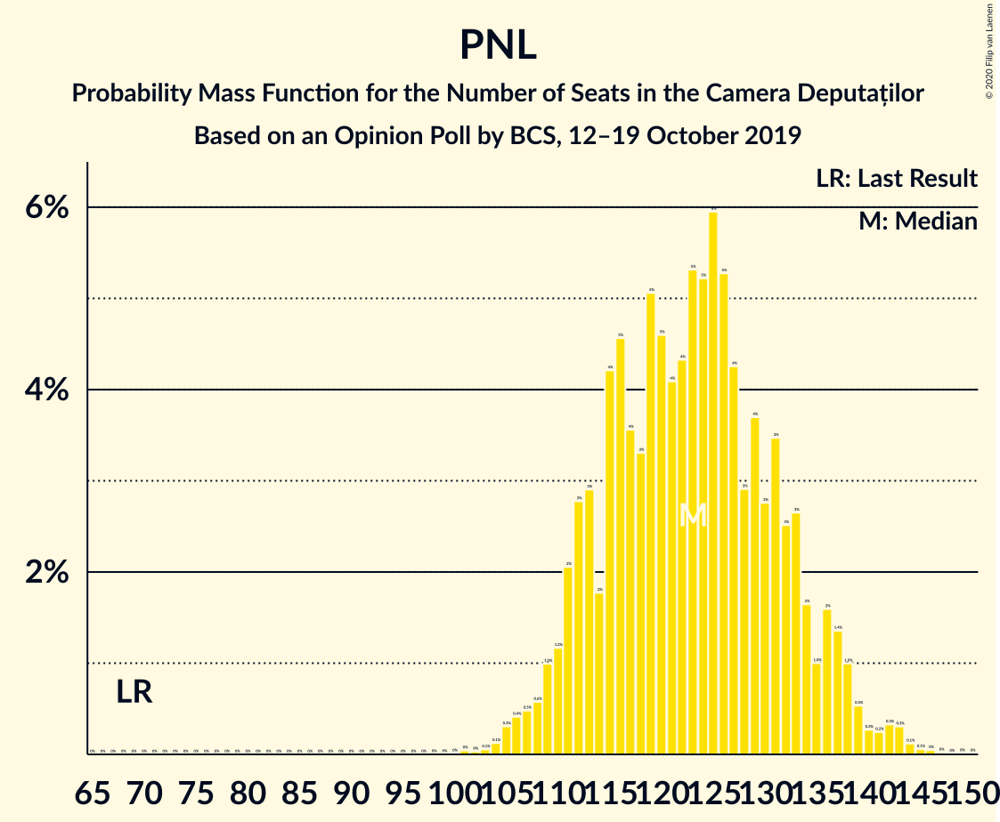

| Number of Seats | Probability | Accumulated | Special Marks |
|:---------------:|:-----------:|:-----------:|:-------------:|
| 69 | 0% | 100% | Last Result |
| 70 | 0% | 100% |  |
| 71 | 0% | 100% |  |
| 72 | 0% | 100% |  |
| 73 | 0% | 100% |  |
| 74 | 0% | 100% |  |
| 75 | 0% | 100% |  |
| 76 | 0% | 100% |  |
| 77 | 0% | 100% |  |
| 78 | 0% | 100% |  |
| 79 | 0% | 100% |  |
| 80 | 0% | 100% |  |
| 81 | 0% | 100% |  |
| 82 | 0% | 100% |  |
| 83 | 0% | 100% |  |
| 84 | 0% | 100% |  |
| 85 | 0% | 100% |  |
| 86 | 0% | 100% |  |
| 87 | 0% | 100% |  |
| 88 | 0% | 100% |  |
| 89 | 0% | 100% |  |
| 90 | 0% | 100% |  |
| 91 | 0% | 100% |  |
| 92 | 0% | 100% |  |
| 93 | 0% | 100% |  |
| 94 | 0% | 100% |  |
| 95 | 0% | 100% |  |
| 96 | 0% | 100% |  |
| 97 | 0% | 100% |  |
| 98 | 0% | 100% |  |
| 99 | 0% | 100% |  |
| 100 | 0% | 100% |  |
| 101 | 0% | 100% |  |
| 102 | 0% | 99.9% |  |
| 103 | 0.1% | 99.9% |  |
| 104 | 0.1% | 99.9% |  |
| 105 | 0.3% | 99.7% |  |
| 106 | 0.4% | 99.4% |  |
| 107 | 0.5% | 99.0% |  |
| 108 | 0.6% | 98.5% |  |
| 109 | 1.0% | 98% |  |
| 110 | 1.2% | 97% |  |
| 111 | 2% | 96% |  |
| 112 | 3% | 94% |  |
| 113 | 3% | 91% |  |
| 114 | 2% | 88% |  |
| 115 | 4% | 86% |  |
| 116 | 5% | 82% |  |
| 117 | 4% | 78% |  |
| 118 | 3% | 74% |  |
| 119 | 5% | 71% |  |
| 120 | 5% | 66% |  |
| 121 | 4% | 61% |  |
| 122 | 4% | 57% |  |
| 123 | 5% | 53% | Median |
| 124 | 5% | 47% |  |
| 125 | 6% | 42% |  |
| 126 | 5% | 36% |  |
| 127 | 4% | 31% |  |
| 128 | 3% | 27% |  |
| 129 | 4% | 24% |  |
| 130 | 3% | 20% |  |
| 131 | 3% | 17% |  |
| 132 | 3% | 14% |  |
| 133 | 3% | 11% |  |
| 134 | 2% | 9% |  |
| 135 | 1.0% | 7% |  |
| 136 | 2% | 6% |  |
| 137 | 1.4% | 4% |  |
| 138 | 1.0% | 3% |  |
| 139 | 0.5% | 2% |  |
| 140 | 0.3% | 1.4% |  |
| 141 | 0.2% | 1.2% |  |
| 142 | 0.3% | 0.9% |  |
| 143 | 0.3% | 0.6% |  |
| 144 | 0.1% | 0.3% |  |
| 145 | 0.1% | 0.2% |  |
| 146 | 0% | 0.1% |  |
| 147 | 0% | 0.1% |  |
| 148 | 0% | 0% |  |

### Partidul Social Democrat – Partidul Alianța Liberalilor și Democraților – PRO România

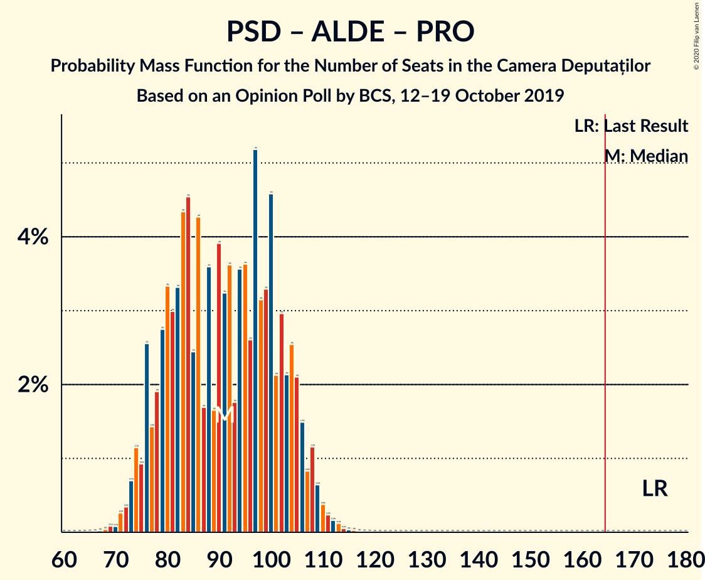

| Number of Seats | Probability | Accumulated | Special Marks |
|:---------------:|:-----------:|:-----------:|:-------------:|
| 68 | 0% | 100% |  |
| 69 | 0.1% | 99.9% |  |
| 70 | 0.1% | 99.8% |  |
| 71 | 0.3% | 99.8% |  |
| 72 | 0.3% | 99.5% |  |
| 73 | 0.7% | 99.2% |  |
| 74 | 1.1% | 98% |  |
| 75 | 0.9% | 97% |  |
| 76 | 3% | 96% |  |
| 77 | 1.4% | 94% |  |
| 78 | 2% | 92% |  |
| 79 | 3% | 90% |  |
| 80 | 3% | 88% |  |
| 81 | 3% | 84% |  |
| 82 | 3% | 81% |  |
| 83 | 4% | 78% |  |
| 84 | 5% | 74% |  |
| 85 | 2% | 69% |  |
| 86 | 4% | 67% |  |
| 87 | 2% | 63% |  |
| 88 | 4% | 61% |  |
| 89 | 2% | 57% |  |
| 90 | 4% | 56% |  |
| 91 | 3% | 52% |  |
| 92 | 4% | 48% |  |
| 93 | 2% | 45% |  |
| 94 | 4% | 43% |  |
| 95 | 4% | 39% |  |
| 96 | 3% | 36% |  |
| 97 | 5% | 33% |  |
| 98 | 3% | 28% |  |
| 99 | 3% | 25% | Median |
| 100 | 5% | 22% |  |
| 101 | 2% | 17% |  |
| 102 | 3% | 15% |  |
| 103 | 2% | 12% |  |
| 104 | 3% | 10% |  |
| 105 | 2% | 7% |  |
| 106 | 1.5% | 5% |  |
| 107 | 0.8% | 4% |  |
| 108 | 1.2% | 3% |  |
| 109 | 0.6% | 2% |  |
| 110 | 0.4% | 1.0% |  |
| 111 | 0.2% | 0.7% |  |
| 112 | 0.2% | 0.4% |  |
| 113 | 0.1% | 0.3% |  |
| 114 | 0.1% | 0.1% |  |
| 115 | 0% | 0.1% |  |
| 116 | 0% | 0.1% |  |
| 117 | 0% | 0% |  |
| 118 | 0% | 0% |  |
| 119 | 0% | 0% |  |
| 120 | 0% | 0% |  |
| 121 | 0% | 0% |  |
| 122 | 0% | 0% |  |
| 123 | 0% | 0% |  |
| 124 | 0% | 0% |  |
| 125 | 0% | 0% |  |
| 126 | 0% | 0% |  |
| 127 | 0% | 0% |  |
| 128 | 0% | 0% |  |
| 129 | 0% | 0% |  |
| 130 | 0% | 0% |  |
| 131 | 0% | 0% |  |
| 132 | 0% | 0% |  |
| 133 | 0% | 0% |  |
| 134 | 0% | 0% |  |
| 135 | 0% | 0% |  |
| 136 | 0% | 0% |  |
| 137 | 0% | 0% |  |
| 138 | 0% | 0% |  |
| 139 | 0% | 0% |  |
| 140 | 0% | 0% |  |
| 141 | 0% | 0% |  |
| 142 | 0% | 0% |  |
| 143 | 0% | 0% |  |
| 144 | 0% | 0% |  |
| 145 | 0% | 0% |  |
| 146 | 0% | 0% |  |
| 147 | 0% | 0% |  |
| 148 | 0% | 0% |  |
| 149 | 0% | 0% |  |
| 150 | 0% | 0% |  |
| 151 | 0% | 0% |  |
| 152 | 0% | 0% |  |
| 153 | 0% | 0% |  |
| 154 | 0% | 0% |  |
| 155 | 0% | 0% |  |
| 156 | 0% | 0% |  |
| 157 | 0% | 0% |  |
| 158 | 0% | 0% |  |
| 159 | 0% | 0% |  |
| 160 | 0% | 0% |  |
| 161 | 0% | 0% |  |
| 162 | 0% | 0% |  |
| 163 | 0% | 0% |  |
| 164 | 0% | 0% |  |
| 165 | 0% | 0% | Majority |
| 166 | 0% | 0% |  |
| 167 | 0% | 0% |  |
| 168 | 0% | 0% |  |
| 169 | 0% | 0% |  |
| 170 | 0% | 0% |  |
| 171 | 0% | 0% |  |
| 172 | 0% | 0% |  |
| 173 | 0% | 0% |  |
| 174 | 0% | 0% | Last Result |

### Partidul Social Democrat – Partidul Alianța Liberalilor și Democraților

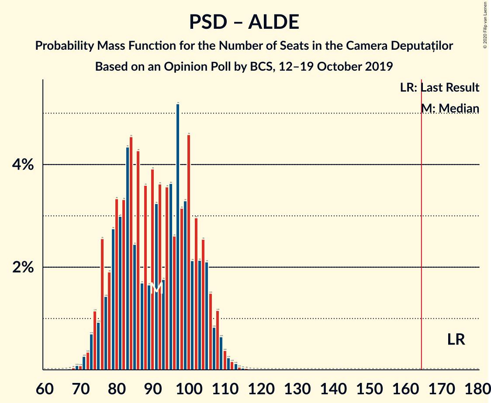

| Number of Seats | Probability | Accumulated | Special Marks |
|:---------------:|:-----------:|:-----------:|:-------------:|
| 68 | 0% | 100% |  |
| 69 | 0.1% | 99.9% |  |
| 70 | 0.1% | 99.8% |  |
| 71 | 0.3% | 99.8% |  |
| 72 | 0.3% | 99.5% |  |
| 73 | 0.7% | 99.2% |  |
| 74 | 1.1% | 98% |  |
| 75 | 0.9% | 97% |  |
| 76 | 3% | 96% |  |
| 77 | 1.4% | 94% |  |
| 78 | 2% | 92% |  |
| 79 | 3% | 90% |  |
| 80 | 3% | 88% |  |
| 81 | 3% | 84% |  |
| 82 | 3% | 81% |  |
| 83 | 4% | 78% |  |
| 84 | 5% | 74% |  |
| 85 | 2% | 69% |  |
| 86 | 4% | 67% |  |
| 87 | 2% | 63% |  |
| 88 | 4% | 61% |  |
| 89 | 2% | 57% |  |
| 90 | 4% | 56% |  |
| 91 | 3% | 52% |  |
| 92 | 4% | 48% |  |
| 93 | 2% | 45% |  |
| 94 | 4% | 43% |  |
| 95 | 4% | 39% |  |
| 96 | 3% | 36% |  |
| 97 | 5% | 33% |  |
| 98 | 3% | 28% |  |
| 99 | 3% | 25% | Median |
| 100 | 5% | 22% |  |
| 101 | 2% | 17% |  |
| 102 | 3% | 15% |  |
| 103 | 2% | 12% |  |
| 104 | 3% | 10% |  |
| 105 | 2% | 7% |  |
| 106 | 1.5% | 5% |  |
| 107 | 0.8% | 4% |  |
| 108 | 1.2% | 3% |  |
| 109 | 0.6% | 2% |  |
| 110 | 0.4% | 1.0% |  |
| 111 | 0.2% | 0.7% |  |
| 112 | 0.2% | 0.4% |  |
| 113 | 0.1% | 0.3% |  |
| 114 | 0.1% | 0.1% |  |
| 115 | 0% | 0.1% |  |
| 116 | 0% | 0.1% |  |
| 117 | 0% | 0% |  |
| 118 | 0% | 0% |  |
| 119 | 0% | 0% |  |
| 120 | 0% | 0% |  |
| 121 | 0% | 0% |  |
| 122 | 0% | 0% |  |
| 123 | 0% | 0% |  |
| 124 | 0% | 0% |  |
| 125 | 0% | 0% |  |
| 126 | 0% | 0% |  |
| 127 | 0% | 0% |  |
| 128 | 0% | 0% |  |
| 129 | 0% | 0% |  |
| 130 | 0% | 0% |  |
| 131 | 0% | 0% |  |
| 132 | 0% | 0% |  |
| 133 | 0% | 0% |  |
| 134 | 0% | 0% |  |
| 135 | 0% | 0% |  |
| 136 | 0% | 0% |  |
| 137 | 0% | 0% |  |
| 138 | 0% | 0% |  |
| 139 | 0% | 0% |  |
| 140 | 0% | 0% |  |
| 141 | 0% | 0% |  |
| 142 | 0% | 0% |  |
| 143 | 0% | 0% |  |
| 144 | 0% | 0% |  |
| 145 | 0% | 0% |  |
| 146 | 0% | 0% |  |
| 147 | 0% | 0% |  |
| 148 | 0% | 0% |  |
| 149 | 0% | 0% |  |
| 150 | 0% | 0% |  |
| 151 | 0% | 0% |  |
| 152 | 0% | 0% |  |
| 153 | 0% | 0% |  |
| 154 | 0% | 0% |  |
| 155 | 0% | 0% |  |
| 156 | 0% | 0% |  |
| 157 | 0% | 0% |  |
| 158 | 0% | 0% |  |
| 159 | 0% | 0% |  |
| 160 | 0% | 0% |  |
| 161 | 0% | 0% |  |
| 162 | 0% | 0% |  |
| 163 | 0% | 0% |  |
| 164 | 0% | 0% |  |
| 165 | 0% | 0% | Majority |
| 166 | 0% | 0% |  |
| 167 | 0% | 0% |  |
| 168 | 0% | 0% |  |
| 169 | 0% | 0% |  |
| 170 | 0% | 0% |  |
| 171 | 0% | 0% |  |
| 172 | 0% | 0% |  |
| 173 | 0% | 0% |  |
| 174 | 0% | 0% | Last Result |

### Alianța 2020 USR-PLUS – Partidul Mișcarea Populară

| Number of Seats | Probability | Accumulated | Special Marks |
|:---------------:|:-----------:|:-----------:|:-------------:|
| 48 | 0% | 100% | Last Result |
| 49 | 0% | 100% |  |
| 50 | 0% | 100% |  |
| 51 | 0% | 100% |  |
| 52 | 0% | 100% |  |
| 53 | 0% | 100% |  |
| 54 | 0% | 100% |  |
| 55 | 0% | 100% |  |
| 56 | 0% | 100% |  |
| 57 | 0% | 100% |  |
| 58 | 0% | 100% |  |
| 59 | 0% | 100% |  |
| 60 | 0% | 100% |  |
| 61 | 0% | 100% |  |
| 62 | 0% | 100% |  |
| 63 | 0% | 100% |  |
| 64 | 0% | 99.9% |  |
| 65 | 0% | 99.9% |  |
| 66 | 0.3% | 99.9% |  |
| 67 | 0.1% | 99.6% |  |
| 68 | 0.3% | 99.5% |  |
| 69 | 0.7% | 99.1% |  |
| 70 | 0.6% | 98% |  |
| 71 | 1.1% | 98% |  |
| 72 | 3% | 97% |  |
| 73 | 2% | 94% |  |
| 74 | 3% | 93% |  |
| 75 | 4% | 90% |  |
| 76 | 2% | 86% |  |
| 77 | 2% | 85% |  |
| 78 | 5% | 82% |  |
| 79 | 3% | 78% |  |
| 80 | 3% | 75% |  |
| 81 | 4% | 72% |  |
| 82 | 4% | 68% |  |
| 83 | 3% | 65% |  |
| 84 | 3% | 62% |  |
| 85 | 4% | 59% |  |
| 86 | 3% | 55% |  |
| 87 | 2% | 52% |  |
| 88 | 4% | 50% |  |
| 89 | 3% | 46% |  |
| 90 | 3% | 43% |  |
| 91 | 4% | 40% |  |
| 92 | 3% | 35% |  |
| 93 | 6% | 33% |  |
| 94 | 2% | 27% | Median |
| 95 | 3% | 25% |  |
| 96 | 4% | 21% |  |
| 97 | 3% | 18% |  |
| 98 | 2% | 14% |  |
| 99 | 3% | 12% |  |
| 100 | 2% | 9% |  |
| 101 | 2% | 7% |  |
| 102 | 1.2% | 5% |  |
| 103 | 2% | 4% |  |
| 104 | 0.6% | 2% |  |
| 105 | 0.7% | 2% |  |
| 106 | 0.4% | 1.1% |  |
| 107 | 0.3% | 0.7% |  |
| 108 | 0.2% | 0.4% |  |
| 109 | 0.1% | 0.2% |  |
| 110 | 0% | 0.1% |  |
| 111 | 0% | 0.1% |  |
| 112 | 0% | 0% |  |

### Partidul Social Democrat – PRO România

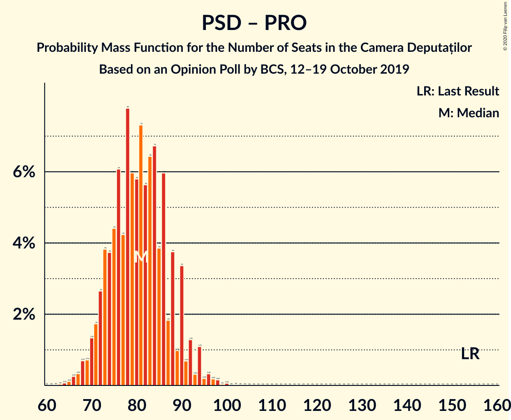

| Number of Seats | Probability | Accumulated | Special Marks |
|:---------------:|:-----------:|:-----------:|:-------------:|
| 63 | 0% | 100% |  |
| 64 | 0.1% | 99.9% |  |
| 65 | 0.1% | 99.9% |  |
| 66 | 0.3% | 99.8% |  |
| 67 | 0.3% | 99.5% |  |
| 68 | 0.7% | 99.2% |  |
| 69 | 0.7% | 98% |  |
| 70 | 1.3% | 98% |  |
| 71 | 2% | 96% |  |
| 72 | 3% | 95% |  |
| 73 | 4% | 92% |  |
| 74 | 4% | 88% |  |
| 75 | 4% | 84% |  |
| 76 | 6% | 80% |  |
| 77 | 4% | 74% |  |
| 78 | 8% | 70% |  |
| 79 | 6% | 62% |  |
| 80 | 6% | 56% |  |
| 81 | 7% | 50% | Median |
| 82 | 6% | 43% |  |
| 83 | 6% | 37% |  |
| 84 | 7% | 31% |  |
| 85 | 4% | 24% |  |
| 86 | 6% | 20% |  |
| 87 | 2% | 14% |  |
| 88 | 4% | 12% |  |
| 89 | 1.0% | 9% |  |
| 90 | 3% | 8% |  |
| 91 | 0.7% | 4% |  |
| 92 | 1.3% | 4% |  |
| 93 | 0.3% | 2% |  |
| 94 | 1.1% | 2% |  |
| 95 | 0.2% | 1.0% |  |
| 96 | 0.3% | 0.8% |  |
| 97 | 0.2% | 0.5% |  |
| 98 | 0.2% | 0.3% |  |
| 99 | 0% | 0.1% |  |
| 100 | 0.1% | 0.1% |  |
| 101 | 0% | 0% |  |
| 102 | 0% | 0% |  |
| 103 | 0% | 0% |  |
| 104 | 0% | 0% |  |
| 105 | 0% | 0% |  |
| 106 | 0% | 0% |  |
| 107 | 0% | 0% |  |
| 108 | 0% | 0% |  |
| 109 | 0% | 0% |  |
| 110 | 0% | 0% |  |
| 111 | 0% | 0% |  |
| 112 | 0% | 0% |  |
| 113 | 0% | 0% |  |
| 114 | 0% | 0% |  |
| 115 | 0% | 0% |  |
| 116 | 0% | 0% |  |
| 117 | 0% | 0% |  |
| 118 | 0% | 0% |  |
| 119 | 0% | 0% |  |
| 120 | 0% | 0% |  |
| 121 | 0% | 0% |  |
| 122 | 0% | 0% |  |
| 123 | 0% | 0% |  |
| 124 | 0% | 0% |  |
| 125 | 0% | 0% |  |
| 126 | 0% | 0% |  |
| 127 | 0% | 0% |  |
| 128 | 0% | 0% |  |
| 129 | 0% | 0% |  |
| 130 | 0% | 0% |  |
| 131 | 0% | 0% |  |
| 132 | 0% | 0% |  |
| 133 | 0% | 0% |  |
| 134 | 0% | 0% |  |
| 135 | 0% | 0% |  |
| 136 | 0% | 0% |  |
| 137 | 0% | 0% |  |
| 138 | 0% | 0% |  |
| 139 | 0% | 0% |  |
| 140 | 0% | 0% |  |
| 141 | 0% | 0% |  |
| 142 | 0% | 0% |  |
| 143 | 0% | 0% |  |
| 144 | 0% | 0% |  |
| 145 | 0% | 0% |  |
| 146 | 0% | 0% |  |
| 147 | 0% | 0% |  |
| 148 | 0% | 0% |  |
| 149 | 0% | 0% |  |
| 150 | 0% | 0% |  |
| 151 | 0% | 0% |  |
| 152 | 0% | 0% |  |
| 153 | 0% | 0% |  |
| 154 | 0% | 0% | Last Result |

## Technical Information

### Opinion Poll

+ **Polling firm:** BCS
+ **Commissioner(s):** —
+ **Fieldwork period:** 12–19 October 2019

### Calculations

+ **Sample size:** 1117
+ **Simulations done:** 1,048,576
+ **Error estimate:** 0.70%

