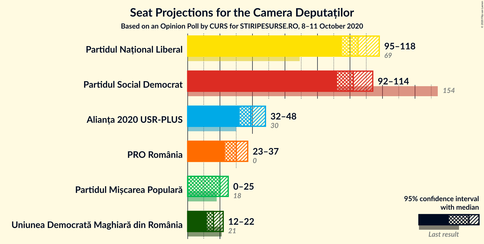
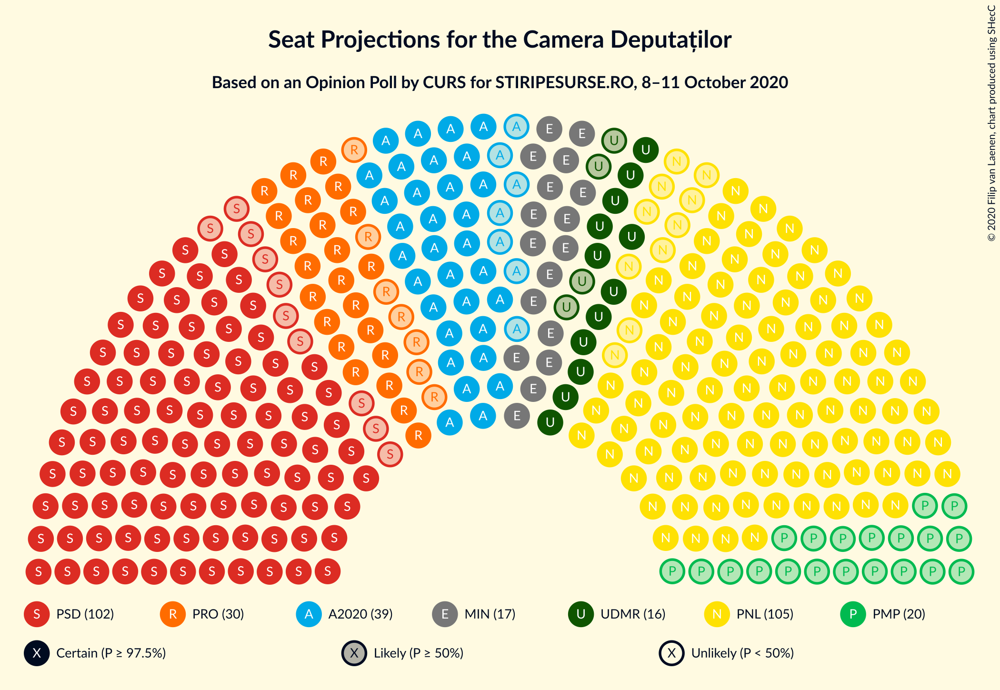
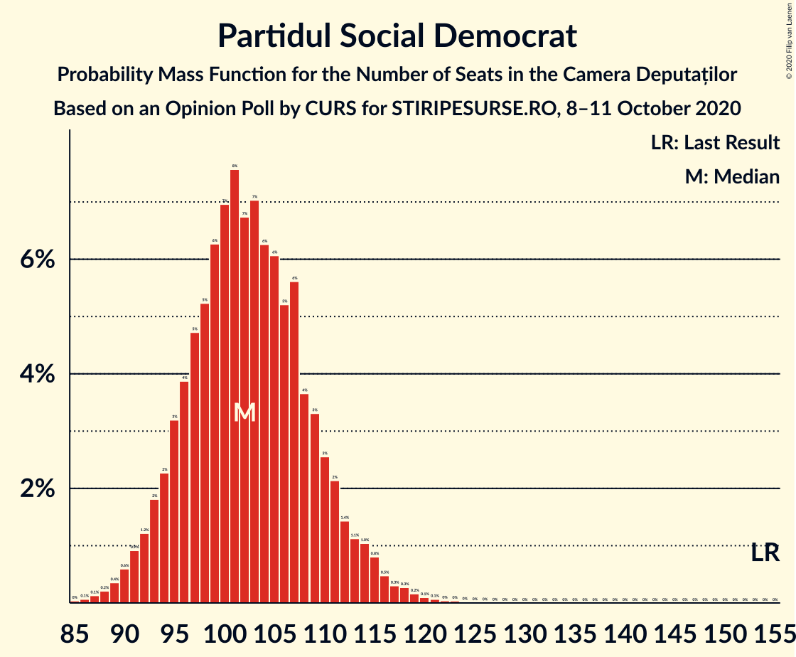
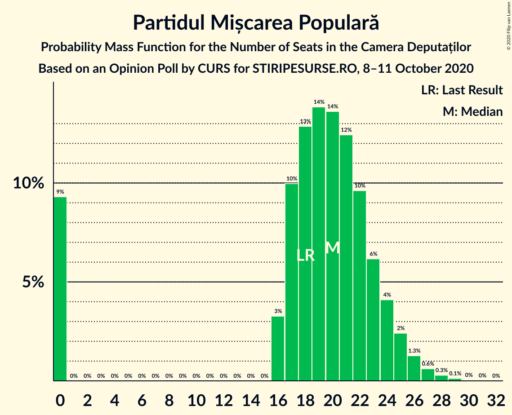
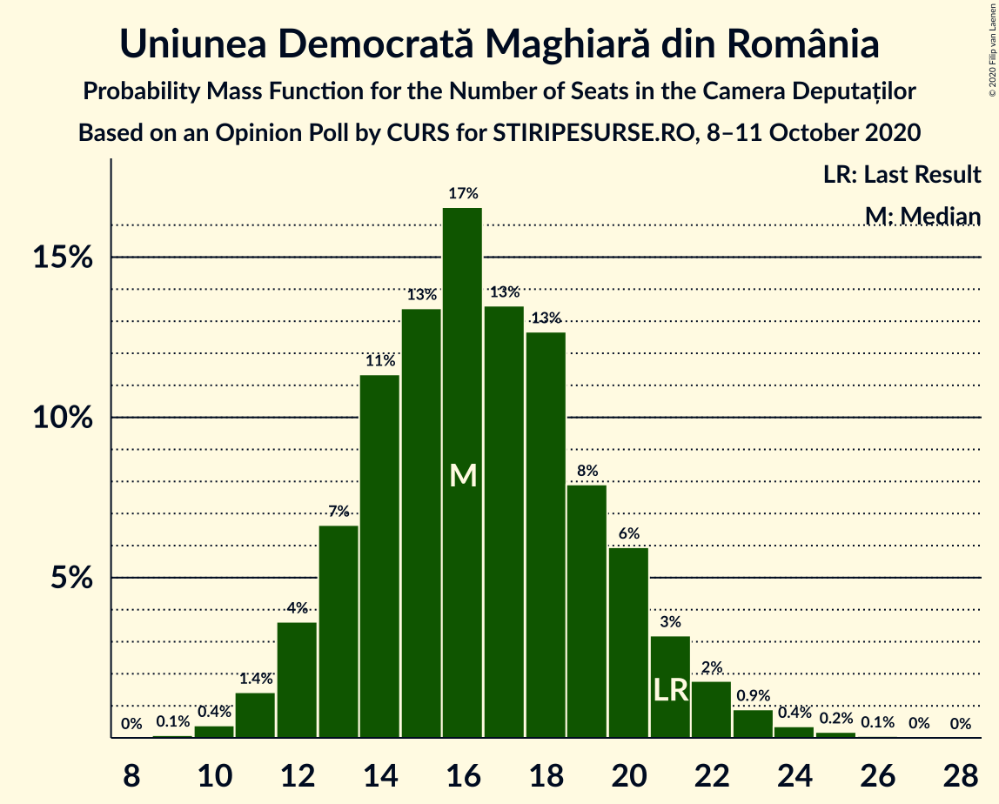
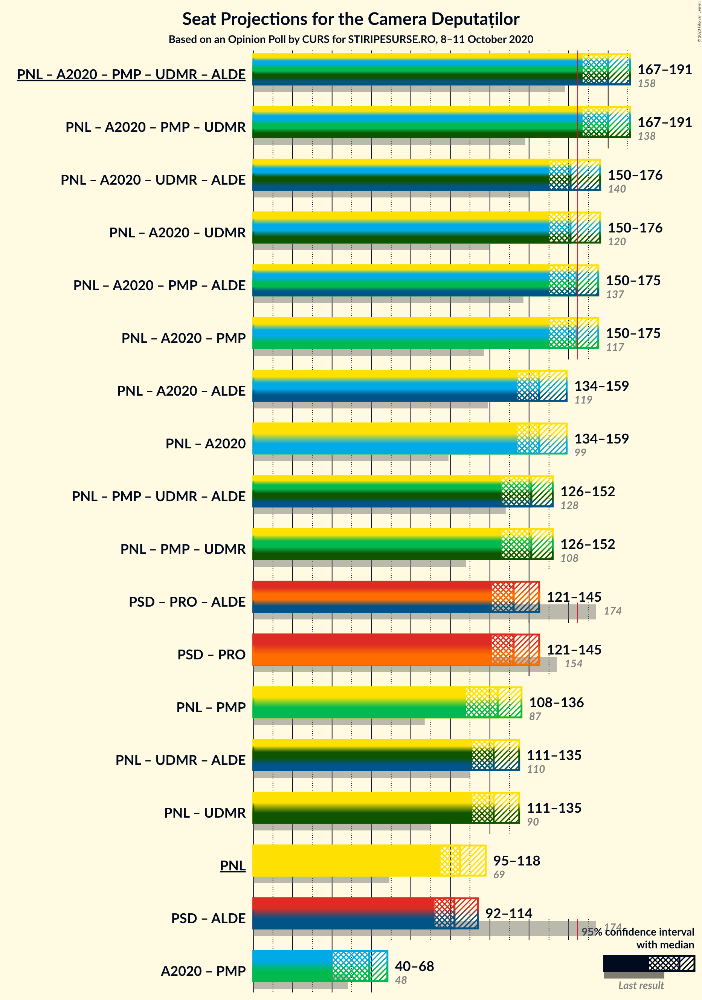
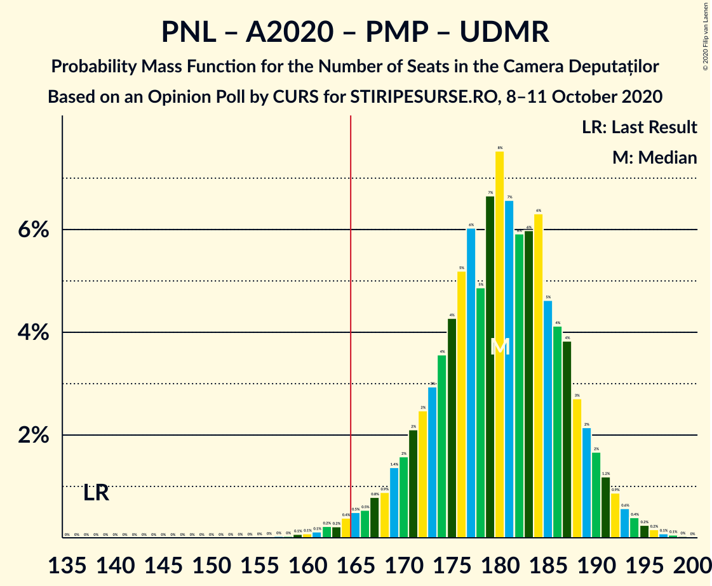
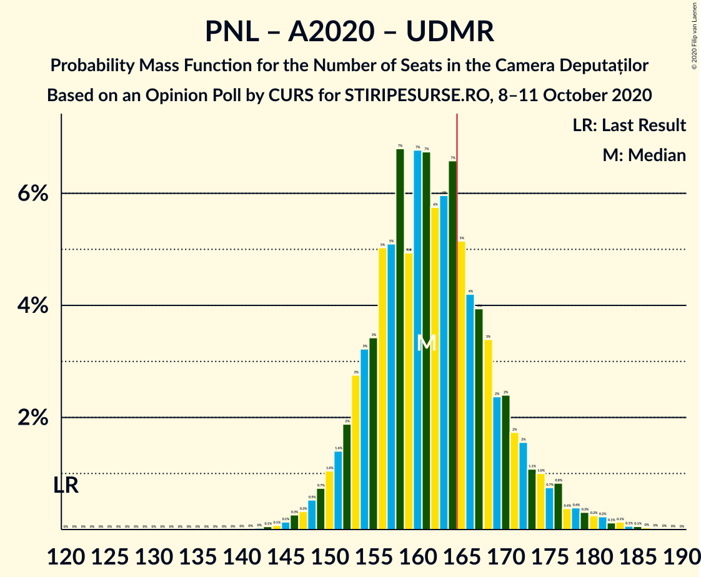
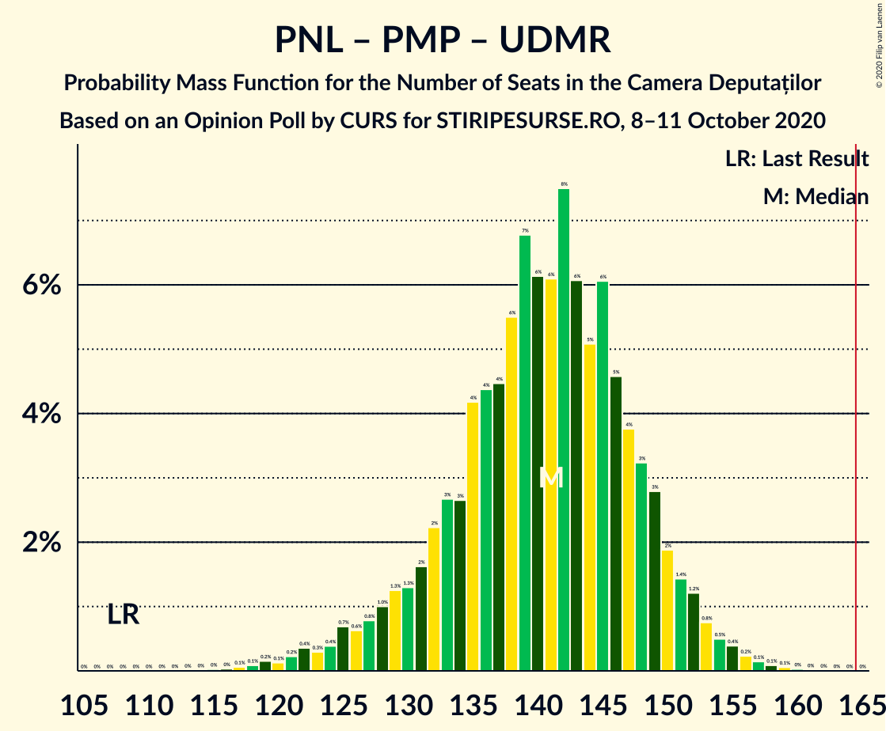
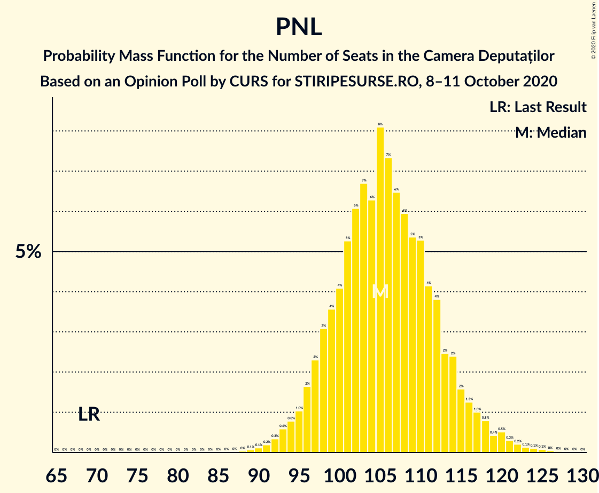

# Opinion Poll by CURS for STIRIPESURSE.RO, 8–11 October 2020

<a href="#voting-intentions">Voting Intentions</a> | <a href="#seats">Seats</a> | <a href="#coalitions">Coalitions</a> | <a href="#technical-information">Technical Information</a>

## Voting Intentions

### Confidence Intervals

| Party | Last Result | Poll Result | 80% Confidence Interval | 90% Confidence Interval | 95% Confidence Interval | 99% Confidence Interval |
|:-----:|:-----------:|:-----------:|:-----------------------:|:-----------------------:|:-----------------------:|:-----------------------:|
| Partidul Național Liberal | 20.0% | 32.0% | 29.9–34.2% |29.4–34.8% |28.9–35.3% |27.9–36.4% |
| Partidul Social Democrat | 45.5% | 31.0% | 29.0–33.2% |28.4–33.8% |27.9–34.3% |26.9–35.3% |
| Alianța 2020 USR-PLUS | 8.9% | 12.0% | 10.6–13.6% |10.2–14.1% |9.9–14.4% |9.3–15.2% |
| PRO România | 0.0% | 9.0% | 7.8–10.4% |7.5–10.8% |7.2–11.2% |6.7–11.9% |
| Partidul Mișcarea Populară | 5.4% | 6.0% | 5.0–7.2% |4.8–7.6% |4.6–7.9% |4.1–8.5% |
| Uniunea Democrată Maghiară din România | 6.2% | 5.0% | 4.1–6.1% |3.9–6.5% |3.7–6.8% |3.3–7.3% |

*Note:* The poll result column reflects the actual value used in the calculations. Published results may vary slightly, and in addition be rounded to fewer digits.

## Seats

### Confidence Intervals

| Party | Last Result | Median | 80% Confidence Interval | 90% Confidence Interval | 95% Confidence Interval | 99% Confidence Interval |
|:-----:|:-----------:|:------:|:-----------------------:|:-----------------------:|:-----------------------:|:-----------------------:|
| <a href="#partidul-național-liberal">Partidul Național Liberal</a> | 69 | 105 | 98–113 |97–115 |95–118 |92–122 |
| <a href="#partidul-social-democrat">Partidul Social Democrat</a> | 154 | 102 | 95–110 |93–112 |92–114 |89–118 |
| <a href="#alianța-2020-usr-plus">Alianța 2020 USR-PLUS</a> | 30 | 39 | 35–45 |33–46 |32–48 |30–50 |
| <a href="#pro-românia">PRO România</a> | 0 | 30 | 25–34 |24–35 |23–37 |22–39 |
| <a href="#partidul-mișcarea-populară">Partidul Mișcarea Populară</a> | 18 | 20 | 16–23 |0–24 |0–25 |0–27 |
| <a href="#uniunea-democrată-maghiară-din-românia">Uniunea Democrată Maghiară din România</a> | 21 | 16 | 13–20 |12–21 |12–22 |11–24 |

### Partidul Național Liberal

*For a full overview of the results for this party, see the [Partidul Național Liberal](party-partidulnaționalliberal.html) page.*

| Number of Seats | Probability | Accumulated | Special Marks |
|:---------------:|:-----------:|:-----------:|:-------------:|
| 69 | 0% | 100% | Last Result |
| 70 | 0% | 100% |  |
| 71 | 0% | 100% |  |
| 72 | 0% | 100% |  |
| 73 | 0% | 100% |  |
| 74 | 0% | 100% |  |
| 75 | 0% | 100% |  |
| 76 | 0% | 100% |  |
| 77 | 0% | 100% |  |
| 78 | 0% | 100% |  |
| 79 | 0% | 100% |  |
| 80 | 0% | 100% |  |
| 81 | 0% | 100% |  |
| 82 | 0% | 100% |  |
| 83 | 0% | 100% |  |
| 84 | 0% | 100% |  |
| 85 | 0% | 100% |  |
| 86 | 0% | 100% |  |
| 87 | 0% | 100% |  |
| 88 | 0% | 100% |  |
| 89 | 0.1% | 99.9% |  |
| 90 | 0.1% | 99.9% |  |
| 91 | 0.2% | 99.8% |  |
| 92 | 0.3% | 99.6% |  |
| 93 | 0.6% | 99.2% |  |
| 94 | 0.8% | 98.6% |  |
| 95 | 1.0% | 98% |  |
| 96 | 2% | 97% |  |
| 97 | 2% | 95% |  |
| 98 | 3% | 93% |  |
| 99 | 4% | 90% |  |
| 100 | 4% | 86% |  |
| 101 | 5% | 82% |  |
| 102 | 6% | 77% |  |
| 103 | 7% | 71% |  |
| 104 | 6% | 64% |  |
| 105 | 8% | 58% | Median |
| 106 | 7% | 50% |  |
| 107 | 6% | 42% |  |
| 108 | 6% | 36% |  |
| 109 | 5% | 30% |  |
| 110 | 5% | 25% |  |
| 111 | 4% | 19% |  |
| 112 | 4% | 15% |  |
| 113 | 2% | 11% |  |
| 114 | 2% | 9% |  |
| 115 | 2% | 6% |  |
| 116 | 1.3% | 5% |  |
| 117 | 1.0% | 4% |  |
| 118 | 0.8% | 3% |  |
| 119 | 0.4% | 2% |  |
| 120 | 0.5% | 1.4% |  |
| 121 | 0.3% | 0.9% |  |
| 122 | 0.2% | 0.6% |  |
| 123 | 0.1% | 0.4% |  |
| 124 | 0.1% | 0.3% |  |
| 125 | 0.1% | 0.2% |  |
| 126 | 0% | 0.1% |  |
| 127 | 0% | 0.1% |  |
| 128 | 0% | 0% |  |

### Partidul Social Democrat

*For a full overview of the results for this party, see the [Partidul Social Democrat](party-partidulsocialdemocrat.html) page.*

| Number of Seats | Probability | Accumulated | Special Marks |
|:---------------:|:-----------:|:-----------:|:-------------:|
| 85 | 0% | 100% |  |
| 86 | 0.1% | 99.9% |  |
| 87 | 0.1% | 99.9% |  |
| 88 | 0.2% | 99.7% |  |
| 89 | 0.4% | 99.5% |  |
| 90 | 0.6% | 99.2% |  |
| 91 | 0.9% | 98.6% |  |
| 92 | 1.2% | 98% |  |
| 93 | 2% | 96% |  |
| 94 | 2% | 95% |  |
| 95 | 3% | 92% |  |
| 96 | 4% | 89% |  |
| 97 | 5% | 85% |  |
| 98 | 5% | 81% |  |
| 99 | 6% | 75% |  |
| 100 | 7% | 69% |  |
| 101 | 8% | 62% |  |
| 102 | 7% | 55% | Median |
| 103 | 7% | 48% |  |
| 104 | 6% | 41% |  |
| 105 | 6% | 34% |  |
| 106 | 5% | 28% |  |
| 107 | 6% | 23% |  |
| 108 | 4% | 18% |  |
| 109 | 3% | 14% |  |
| 110 | 3% | 11% |  |
| 111 | 2% | 8% |  |
| 112 | 1.4% | 6% |  |
| 113 | 1.1% | 4% |  |
| 114 | 1.0% | 3% |  |
| 115 | 0.8% | 2% |  |
| 116 | 0.5% | 2% |  |
| 117 | 0.3% | 1.0% |  |
| 118 | 0.3% | 0.7% |  |
| 119 | 0.2% | 0.5% |  |
| 120 | 0.1% | 0.3% |  |
| 121 | 0.1% | 0.2% |  |
| 122 | 0% | 0.1% |  |
| 123 | 0% | 0.1% |  |
| 124 | 0% | 0% |  |
| 125 | 0% | 0% |  |
| 126 | 0% | 0% |  |
| 127 | 0% | 0% |  |
| 128 | 0% | 0% |  |
| 129 | 0% | 0% |  |
| 130 | 0% | 0% |  |
| 131 | 0% | 0% |  |
| 132 | 0% | 0% |  |
| 133 | 0% | 0% |  |
| 134 | 0% | 0% |  |
| 135 | 0% | 0% |  |
| 136 | 0% | 0% |  |
| 137 | 0% | 0% |  |
| 138 | 0% | 0% |  |
| 139 | 0% | 0% |  |
| 140 | 0% | 0% |  |
| 141 | 0% | 0% |  |
| 142 | 0% | 0% |  |
| 143 | 0% | 0% |  |
| 144 | 0% | 0% |  |
| 145 | 0% | 0% |  |
| 146 | 0% | 0% |  |
| 147 | 0% | 0% |  |
| 148 | 0% | 0% |  |
| 149 | 0% | 0% |  |
| 150 | 0% | 0% |  |
| 151 | 0% | 0% |  |
| 152 | 0% | 0% |  |
| 153 | 0% | 0% |  |
| 154 | 0% | 0% | Last Result |

### Alianța 2020 USR-PLUS

*For a full overview of the results for this party, see the [Alianța 2020 USR-PLUS](party-alianța2020usr-plus.html) page.*

| Number of Seats | Probability | Accumulated | Special Marks |
|:---------------:|:-----------:|:-----------:|:-------------:|
| 28 | 0.1% | 100% |  |
| 29 | 0.2% | 99.9% |  |
| 30 | 0.4% | 99.8% | Last Result |
| 31 | 0.8% | 99.4% |  |
| 32 | 1.5% | 98.6% |  |
| 33 | 2% | 97% |  |
| 34 | 4% | 95% |  |
| 35 | 5% | 91% |  |
| 36 | 7% | 86% |  |
| 37 | 9% | 79% |  |
| 38 | 10% | 70% |  |
| 39 | 11% | 60% | Median |
| 40 | 10% | 49% |  |
| 41 | 9% | 39% |  |
| 42 | 8% | 29% |  |
| 43 | 6% | 22% |  |
| 44 | 5% | 15% |  |
| 45 | 4% | 11% |  |
| 46 | 3% | 7% |  |
| 47 | 2% | 4% |  |
| 48 | 1.0% | 3% |  |
| 49 | 0.7% | 2% |  |
| 50 | 0.4% | 0.9% |  |
| 51 | 0.2% | 0.4% |  |
| 52 | 0.1% | 0.2% |  |
| 53 | 0.1% | 0.1% |  |
| 54 | 0% | 0.1% |  |
| 55 | 0% | 0% |  |

### PRO România

*For a full overview of the results for this party, see the [PRO România](party-proromânia.html) page.*

| Number of Seats | Probability | Accumulated | Special Marks |
|:---------------:|:-----------:|:-----------:|:-------------:|
| 0 | 0% | 100% | Last Result |
| 1 | 0% | 100% |  |
| 2 | 0% | 100% |  |
| 3 | 0% | 100% |  |
| 4 | 0% | 100% |  |
| 5 | 0% | 100% |  |
| 6 | 0% | 100% |  |
| 7 | 0% | 100% |  |
| 8 | 0% | 100% |  |
| 9 | 0% | 100% |  |
| 10 | 0% | 100% |  |
| 11 | 0% | 100% |  |
| 12 | 0% | 100% |  |
| 13 | 0% | 100% |  |
| 14 | 0% | 100% |  |
| 15 | 0% | 100% |  |
| 16 | 0% | 100% |  |
| 17 | 0% | 100% |  |
| 18 | 0% | 100% |  |
| 19 | 0% | 100% |  |
| 20 | 0.1% | 100% |  |
| 21 | 0.3% | 99.9% |  |
| 22 | 0.8% | 99.6% |  |
| 23 | 2% | 98.8% |  |
| 24 | 3% | 97% |  |
| 25 | 5% | 94% |  |
| 26 | 6% | 89% |  |
| 27 | 10% | 83% |  |
| 28 | 11% | 73% |  |
| 29 | 11% | 62% |  |
| 30 | 12% | 51% | Median |
| 31 | 10% | 39% |  |
| 32 | 9% | 29% |  |
| 33 | 7% | 20% |  |
| 34 | 5% | 13% |  |
| 35 | 3% | 8% |  |
| 36 | 2% | 5% |  |
| 37 | 1.2% | 3% |  |
| 38 | 0.7% | 2% |  |
| 39 | 0.4% | 0.8% |  |
| 40 | 0.2% | 0.4% |  |
| 41 | 0.1% | 0.2% |  |
| 42 | 0% | 0.1% |  |
| 43 | 0% | 0% |  |

### Partidul Mișcarea Populară

*For a full overview of the results for this party, see the [Partidul Mișcarea Populară](party-partidulmișcareapopulară.html) page.*

| Number of Seats | Probability | Accumulated | Special Marks |
|:---------------:|:-----------:|:-----------:|:-------------:|
| 0 | 9% | 100% |  |
| 1 | 0% | 91% |  |
| 2 | 0% | 91% |  |
| 3 | 0% | 91% |  |
| 4 | 0% | 91% |  |
| 5 | 0% | 91% |  |
| 6 | 0% | 91% |  |
| 7 | 0% | 91% |  |
| 8 | 0% | 91% |  |
| 9 | 0% | 91% |  |
| 10 | 0% | 91% |  |
| 11 | 0% | 91% |  |
| 12 | 0% | 91% |  |
| 13 | 0% | 91% |  |
| 14 | 0% | 91% |  |
| 15 | 0% | 91% |  |
| 16 | 3% | 91% |  |
| 17 | 10% | 87% |  |
| 18 | 13% | 77% | Last Result |
| 19 | 14% | 65% |  |
| 20 | 14% | 51% | Median |
| 21 | 12% | 37% |  |
| 22 | 10% | 25% |  |
| 23 | 6% | 15% |  |
| 24 | 4% | 9% |  |
| 25 | 2% | 5% |  |
| 26 | 1.3% | 2% |  |
| 27 | 0.6% | 1.1% |  |
| 28 | 0.3% | 0.5% |  |
| 29 | 0.1% | 0.2% |  |
| 30 | 0% | 0.1% |  |
| 31 | 0% | 0% |  |

### Uniunea Democrată Maghiară din România

*For a full overview of the results for this party, see the [Uniunea Democrată Maghiară din România](party-uniuneademocratămaghiarădinromânia.html) page.*

| Number of Seats | Probability | Accumulated | Special Marks |
|:---------------:|:-----------:|:-----------:|:-------------:|
| 9 | 0.1% | 100% |  |
| 10 | 0.4% | 99.9% |  |
| 11 | 1.4% | 99.5% |  |
| 12 | 4% | 98% |  |
| 13 | 7% | 94% |  |
| 14 | 11% | 88% |  |
| 15 | 13% | 76% |  |
| 16 | 17% | 63% | Median |
| 17 | 13% | 47% |  |
| 18 | 13% | 33% |  |
| 19 | 8% | 20% |  |
| 20 | 6% | 12% |  |
| 21 | 3% | 7% | Last Result |
| 22 | 2% | 3% |  |
| 23 | 0.9% | 2% |  |
| 24 | 0.4% | 0.6% |  |
| 25 | 0.2% | 0.3% |  |
| 26 | 0.1% | 0.1% |  |
| 27 | 0% | 0% |  |

## Coalitions

### Confidence Intervals

| Coalition | Last Result | Median | Majority? | 80% Confidence Interval | 90% Confidence Interval | 95% Confidence Interval | 99% Confidence Interval |
|:---------:|:-----------:|:------:|:---------:|:-----------------------:|:-----------------------:|:-----------------------:|:-----------------------:|
| Partidul Național Liberal – Alianța 2020 USR-PLUS – Partidul Mișcarea Populară – Uniunea Democrată Maghiară din România | 138 | 180 | 98.8% | 172–188 | 169–190 | 167–191 | 162–195 |
| Partidul Național Liberal – Alianța 2020 USR-PLUS – Uniunea Democrată Maghiară din România | 120 | 161 | 30% | 154–170 | 152–173 | 150–176 | 146–181 |
| Partidul Național Liberal – Alianța 2020 USR-PLUS – Partidul Mișcarea Populară | 117 | 164 | 46% | 155–171 | 152–174 | 150–175 | 145–179 |
| Partidul Național Liberal – Alianța 2020 USR-PLUS | 99 | 145 | 0.4% | 137–153 | 135–156 | 134–159 | 130–164 |
| Partidul Național Liberal – Partidul Mișcarea Populară – Uniunea Democrată Maghiară din România | 108 | 141 | 0% | 132–148 | 129–150 | 126–152 | 120–156 |
| Partidul Social Democrat – PRO România | 154 | 132 | 0% | 124–140 | 122–143 | 121–145 | 117–150 |
| Partidul Național Liberal – Partidul Mișcarea Populară | 87 | 124 | 0% | 115–132 | 112–134 | 108–136 | 103–139 |
| Partidul Național Liberal – Uniunea Democrată Maghiară din România | 90 | 122 | 0% | 115–130 | 113–132 | 111–135 | 107–140 |
| Partidul Național Liberal | 69 | 105 | 0% | 98–113 | 97–115 | 95–118 | 92–122 |
| Alianța 2020 USR-PLUS – Partidul Mișcarea Populară | 48 | 59 | 0% | 50–65 | 42–67 | 40–68 | 36–71 |

### Partidul Național Liberal – Alianța 2020 USR-PLUS – Partidul Mișcarea Populară – Uniunea Democrată Maghiară din România

| Number of Seats | Probability | Accumulated | Special Marks |
|:---------------:|:-----------:|:-----------:|:-------------:|
| 138 | 0% | 100% | Last Result |
| 139 | 0% | 100% |  |
| 140 | 0% | 100% |  |
| 141 | 0% | 100% |  |
| 142 | 0% | 100% |  |
| 143 | 0% | 100% |  |
| 144 | 0% | 100% |  |
| 145 | 0% | 100% |  |
| 146 | 0% | 100% |  |
| 147 | 0% | 100% |  |
| 148 | 0% | 100% |  |
| 149 | 0% | 100% |  |
| 150 | 0% | 100% |  |
| 151 | 0% | 100% |  |
| 152 | 0% | 100% |  |
| 153 | 0% | 100% |  |
| 154 | 0% | 100% |  |
| 155 | 0% | 100% |  |
| 156 | 0% | 100% |  |
| 157 | 0% | 100% |  |
| 158 | 0% | 99.9% |  |
| 159 | 0.1% | 99.9% |  |
| 160 | 0.1% | 99.8% |  |
| 161 | 0.1% | 99.7% |  |
| 162 | 0.2% | 99.6% |  |
| 163 | 0.2% | 99.4% |  |
| 164 | 0.4% | 99.2% |  |
| 165 | 0.5% | 98.8% | Majority |
| 166 | 0.5% | 98% |  |
| 167 | 0.8% | 98% |  |
| 168 | 0.9% | 97% |  |
| 169 | 1.4% | 96% |  |
| 170 | 2% | 95% |  |
| 171 | 2% | 93% |  |
| 172 | 2% | 91% |  |
| 173 | 3% | 89% |  |
| 174 | 4% | 86% |  |
| 175 | 4% | 82% |  |
| 176 | 5% | 78% |  |
| 177 | 6% | 73% |  |
| 178 | 5% | 67% |  |
| 179 | 7% | 62% |  |
| 180 | 8% | 55% | Median |
| 181 | 7% | 48% |  |
| 182 | 6% | 41% |  |
| 183 | 6% | 35% |  |
| 184 | 6% | 29% |  |
| 185 | 5% | 23% |  |
| 186 | 4% | 18% |  |
| 187 | 4% | 14% |  |
| 188 | 3% | 10% |  |
| 189 | 2% | 7% |  |
| 190 | 2% | 5% |  |
| 191 | 1.2% | 4% |  |
| 192 | 0.9% | 2% |  |
| 193 | 0.6% | 2% |  |
| 194 | 0.4% | 1.0% |  |
| 195 | 0.2% | 0.6% |  |
| 196 | 0.2% | 0.4% |  |
| 197 | 0.1% | 0.2% |  |
| 198 | 0.1% | 0.1% |  |
| 199 | 0% | 0.1% |  |
| 200 | 0% | 0% |  |

### Partidul Național Liberal – Alianța 2020 USR-PLUS – Uniunea Democrată Maghiară din România

| Number of Seats | Probability | Accumulated | Special Marks |
|:---------------:|:-----------:|:-----------:|:-------------:|
| 120 | 0% | 100% | Last Result |
| 121 | 0% | 100% |  |
| 122 | 0% | 100% |  |
| 123 | 0% | 100% |  |
| 124 | 0% | 100% |  |
| 125 | 0% | 100% |  |
| 126 | 0% | 100% |  |
| 127 | 0% | 100% |  |
| 128 | 0% | 100% |  |
| 129 | 0% | 100% |  |
| 130 | 0% | 100% |  |
| 131 | 0% | 100% |  |
| 132 | 0% | 100% |  |
| 133 | 0% | 100% |  |
| 134 | 0% | 100% |  |
| 135 | 0% | 100% |  |
| 136 | 0% | 100% |  |
| 137 | 0% | 100% |  |
| 138 | 0% | 100% |  |
| 139 | 0% | 100% |  |
| 140 | 0% | 100% |  |
| 141 | 0% | 100% |  |
| 142 | 0% | 100% |  |
| 143 | 0.1% | 99.9% |  |
| 144 | 0.1% | 99.9% |  |
| 145 | 0.1% | 99.8% |  |
| 146 | 0.3% | 99.7% |  |
| 147 | 0.3% | 99.4% |  |
| 148 | 0.5% | 99.1% |  |
| 149 | 0.7% | 98.6% |  |
| 150 | 1.0% | 98% |  |
| 151 | 1.4% | 97% |  |
| 152 | 2% | 95% |  |
| 153 | 3% | 93% |  |
| 154 | 3% | 91% |  |
| 155 | 3% | 88% |  |
| 156 | 5% | 84% |  |
| 157 | 5% | 79% |  |
| 158 | 7% | 74% |  |
| 159 | 5% | 67% |  |
| 160 | 7% | 62% | Median |
| 161 | 7% | 55% |  |
| 162 | 6% | 49% |  |
| 163 | 6% | 43% |  |
| 164 | 7% | 37% |  |
| 165 | 5% | 30% | Majority |
| 166 | 4% | 25% |  |
| 167 | 4% | 21% |  |
| 168 | 3% | 17% |  |
| 169 | 2% | 14% |  |
| 170 | 2% | 11% |  |
| 171 | 2% | 9% |  |
| 172 | 2% | 7% |  |
| 173 | 1.1% | 6% |  |
| 174 | 1.0% | 5% |  |
| 175 | 0.7% | 4% |  |
| 176 | 0.8% | 3% |  |
| 177 | 0.4% | 2% |  |
| 178 | 0.4% | 2% |  |
| 179 | 0.3% | 1.2% |  |
| 180 | 0.2% | 0.9% |  |
| 181 | 0.2% | 0.7% |  |
| 182 | 0.1% | 0.5% |  |
| 183 | 0.1% | 0.3% |  |
| 184 | 0.1% | 0.2% |  |
| 185 | 0.1% | 0.1% |  |
| 186 | 0% | 0.1% |  |
| 187 | 0% | 0.1% |  |
| 188 | 0% | 0% |  |

### Partidul Național Liberal – Alianța 2020 USR-PLUS – Partidul Mișcarea Populară

| Number of Seats | Probability | Accumulated | Special Marks |
|:---------------:|:-----------:|:-----------:|:-------------:|
| 117 | 0% | 100% | Last Result |
| 118 | 0% | 100% |  |
| 119 | 0% | 100% |  |
| 120 | 0% | 100% |  |
| 121 | 0% | 100% |  |
| 122 | 0% | 100% |  |
| 123 | 0% | 100% |  |
| 124 | 0% | 100% |  |
| 125 | 0% | 100% |  |
| 126 | 0% | 100% |  |
| 127 | 0% | 100% |  |
| 128 | 0% | 100% |  |
| 129 | 0% | 100% |  |
| 130 | 0% | 100% |  |
| 131 | 0% | 100% |  |
| 132 | 0% | 100% |  |
| 133 | 0% | 100% |  |
| 134 | 0% | 100% |  |
| 135 | 0% | 100% |  |
| 136 | 0% | 100% |  |
| 137 | 0% | 100% |  |
| 138 | 0% | 100% |  |
| 139 | 0% | 100% |  |
| 140 | 0% | 99.9% |  |
| 141 | 0.1% | 99.9% |  |
| 142 | 0.1% | 99.8% |  |
| 143 | 0.1% | 99.8% |  |
| 144 | 0.1% | 99.7% |  |
| 145 | 0.2% | 99.6% |  |
| 146 | 0.3% | 99.4% |  |
| 147 | 0.4% | 99.1% |  |
| 148 | 0.4% | 98.7% |  |
| 149 | 0.6% | 98% |  |
| 150 | 0.7% | 98% |  |
| 151 | 1.0% | 97% |  |
| 152 | 1.1% | 96% |  |
| 153 | 2% | 95% |  |
| 154 | 2% | 93% |  |
| 155 | 2% | 92% |  |
| 156 | 2% | 89% |  |
| 157 | 4% | 87% |  |
| 158 | 4% | 83% |  |
| 159 | 4% | 80% |  |
| 160 | 5% | 75% |  |
| 161 | 5% | 70% |  |
| 162 | 6% | 65% |  |
| 163 | 7% | 59% |  |
| 164 | 6% | 52% | Median |
| 165 | 7% | 46% | Majority |
| 166 | 6% | 39% |  |
| 167 | 6% | 32% |  |
| 168 | 5% | 27% |  |
| 169 | 5% | 21% |  |
| 170 | 4% | 17% |  |
| 171 | 3% | 13% |  |
| 172 | 2% | 9% |  |
| 173 | 2% | 7% |  |
| 174 | 2% | 5% |  |
| 175 | 1.0% | 3% |  |
| 176 | 0.8% | 2% |  |
| 177 | 0.5% | 1.5% |  |
| 178 | 0.4% | 1.0% |  |
| 179 | 0.2% | 0.6% |  |
| 180 | 0.2% | 0.3% |  |
| 181 | 0.1% | 0.2% |  |
| 182 | 0.1% | 0.1% |  |
| 183 | 0% | 0.1% |  |
| 184 | 0% | 0% |  |

### Partidul Național Liberal – Alianța 2020 USR-PLUS

| Number of Seats | Probability | Accumulated | Special Marks |
|:---------------:|:-----------:|:-----------:|:-------------:|
| 99 | 0% | 100% | Last Result |
| 100 | 0% | 100% |  |
| 101 | 0% | 100% |  |
| 102 | 0% | 100% |  |
| 103 | 0% | 100% |  |
| 104 | 0% | 100% |  |
| 105 | 0% | 100% |  |
| 106 | 0% | 100% |  |
| 107 | 0% | 100% |  |
| 108 | 0% | 100% |  |
| 109 | 0% | 100% |  |
| 110 | 0% | 100% |  |
| 111 | 0% | 100% |  |
| 112 | 0% | 100% |  |
| 113 | 0% | 100% |  |
| 114 | 0% | 100% |  |
| 115 | 0% | 100% |  |
| 116 | 0% | 100% |  |
| 117 | 0% | 100% |  |
| 118 | 0% | 100% |  |
| 119 | 0% | 100% |  |
| 120 | 0% | 100% |  |
| 121 | 0% | 100% |  |
| 122 | 0% | 100% |  |
| 123 | 0% | 100% |  |
| 124 | 0% | 100% |  |
| 125 | 0% | 100% |  |
| 126 | 0% | 100% |  |
| 127 | 0% | 99.9% |  |
| 128 | 0.1% | 99.9% |  |
| 129 | 0.1% | 99.8% |  |
| 130 | 0.2% | 99.6% |  |
| 131 | 0.4% | 99.4% |  |
| 132 | 0.6% | 99.0% |  |
| 133 | 0.9% | 98% |  |
| 134 | 1.1% | 98% |  |
| 135 | 2% | 96% |  |
| 136 | 2% | 95% |  |
| 137 | 3% | 93% |  |
| 138 | 3% | 90% |  |
| 139 | 4% | 87% |  |
| 140 | 4% | 82% |  |
| 141 | 6% | 78% |  |
| 142 | 5% | 72% |  |
| 143 | 8% | 67% |  |
| 144 | 5% | 59% | Median |
| 145 | 7% | 53% |  |
| 146 | 6% | 46% |  |
| 147 | 7% | 41% |  |
| 148 | 5% | 33% |  |
| 149 | 5% | 28% |  |
| 150 | 4% | 23% |  |
| 151 | 4% | 19% |  |
| 152 | 3% | 15% |  |
| 153 | 3% | 12% |  |
| 154 | 2% | 9% |  |
| 155 | 1.3% | 7% |  |
| 156 | 1.3% | 6% |  |
| 157 | 1.0% | 5% |  |
| 158 | 1.0% | 4% |  |
| 159 | 0.6% | 3% |  |
| 160 | 0.4% | 2% |  |
| 161 | 0.4% | 2% |  |
| 162 | 0.3% | 1.3% |  |
| 163 | 0.3% | 0.9% |  |
| 164 | 0.2% | 0.6% |  |
| 165 | 0.1% | 0.4% | Majority |
| 166 | 0.1% | 0.3% |  |
| 167 | 0.1% | 0.2% |  |
| 168 | 0% | 0.1% |  |
| 169 | 0% | 0.1% |  |
| 170 | 0% | 0% |  |

### Partidul Național Liberal – Partidul Mișcarea Populară – Uniunea Democrată Maghiară din România

| Number of Seats | Probability | Accumulated | Special Marks |
|:---------------:|:-----------:|:-----------:|:-------------:|
| 108 | 0% | 100% | Last Result |
| 109 | 0% | 100% |  |
| 110 | 0% | 100% |  |
| 111 | 0% | 100% |  |
| 112 | 0% | 100% |  |
| 113 | 0% | 100% |  |
| 114 | 0% | 100% |  |
| 115 | 0% | 100% |  |
| 116 | 0% | 99.9% |  |
| 117 | 0.1% | 99.9% |  |
| 118 | 0.1% | 99.8% |  |
| 119 | 0.2% | 99.8% |  |
| 120 | 0.1% | 99.6% |  |
| 121 | 0.2% | 99.5% |  |
| 122 | 0.4% | 99.2% |  |
| 123 | 0.3% | 98.9% |  |
| 124 | 0.4% | 98.6% |  |
| 125 | 0.7% | 98% |  |
| 126 | 0.6% | 98% |  |
| 127 | 0.8% | 97% |  |
| 128 | 1.0% | 96% |  |
| 129 | 1.3% | 95% |  |
| 130 | 1.3% | 94% |  |
| 131 | 2% | 93% |  |
| 132 | 2% | 91% |  |
| 133 | 3% | 89% |  |
| 134 | 3% | 86% |  |
| 135 | 4% | 83% |  |
| 136 | 4% | 79% |  |
| 137 | 4% | 75% |  |
| 138 | 6% | 70% |  |
| 139 | 7% | 65% |  |
| 140 | 6% | 58% |  |
| 141 | 6% | 52% | Median |
| 142 | 8% | 46% |  |
| 143 | 6% | 38% |  |
| 144 | 5% | 32% |  |
| 145 | 6% | 27% |  |
| 146 | 5% | 21% |  |
| 147 | 4% | 17% |  |
| 148 | 3% | 13% |  |
| 149 | 3% | 10% |  |
| 150 | 2% | 7% |  |
| 151 | 1.4% | 5% |  |
| 152 | 1.2% | 3% |  |
| 153 | 0.8% | 2% |  |
| 154 | 0.5% | 1.5% |  |
| 155 | 0.4% | 1.0% |  |
| 156 | 0.2% | 0.6% |  |
| 157 | 0.1% | 0.4% |  |
| 158 | 0.1% | 0.2% |  |
| 159 | 0.1% | 0.1% |  |
| 160 | 0% | 0.1% |  |
| 161 | 0% | 0% |  |

### Partidul Social Democrat – PRO România

| Number of Seats | Probability | Accumulated | Special Marks |
|:---------------:|:-----------:|:-----------:|:-------------:|
| 113 | 0% | 100% |  |
| 114 | 0.1% | 99.9% |  |
| 115 | 0.1% | 99.9% |  |
| 116 | 0.2% | 99.8% |  |
| 117 | 0.2% | 99.6% |  |
| 118 | 0.4% | 99.4% |  |
| 119 | 0.6% | 99.0% |  |
| 120 | 0.9% | 98% |  |
| 121 | 1.2% | 98% |  |
| 122 | 2% | 96% |  |
| 123 | 2% | 95% |  |
| 124 | 3% | 93% |  |
| 125 | 4% | 90% |  |
| 126 | 4% | 86% |  |
| 127 | 5% | 82% |  |
| 128 | 6% | 77% |  |
| 129 | 6% | 71% |  |
| 130 | 6% | 65% |  |
| 131 | 7% | 59% |  |
| 132 | 8% | 52% | Median |
| 133 | 7% | 45% |  |
| 134 | 5% | 38% |  |
| 135 | 6% | 33% |  |
| 136 | 5% | 27% |  |
| 137 | 4% | 22% |  |
| 138 | 4% | 18% |  |
| 139 | 3% | 14% |  |
| 140 | 2% | 11% |  |
| 141 | 2% | 9% |  |
| 142 | 2% | 7% |  |
| 143 | 1.4% | 5% |  |
| 144 | 0.9% | 4% |  |
| 145 | 0.8% | 3% |  |
| 146 | 0.5% | 2% |  |
| 147 | 0.5% | 2% |  |
| 148 | 0.4% | 1.2% |  |
| 149 | 0.2% | 0.8% |  |
| 150 | 0.2% | 0.6% |  |
| 151 | 0.1% | 0.4% |  |
| 152 | 0.1% | 0.3% |  |
| 153 | 0.1% | 0.2% |  |
| 154 | 0% | 0.1% | Last Result |
| 155 | 0% | 0.1% |  |
| 156 | 0% | 0% |  |

### Partidul Național Liberal – Partidul Mișcarea Populară

| Number of Seats | Probability | Accumulated | Special Marks |
|:---------------:|:-----------:|:-----------:|:-------------:|
| 87 | 0% | 100% | Last Result |
| 88 | 0% | 100% |  |
| 89 | 0% | 100% |  |
| 90 | 0% | 100% |  |
| 91 | 0% | 100% |  |
| 92 | 0% | 100% |  |
| 93 | 0% | 100% |  |
| 94 | 0% | 100% |  |
| 95 | 0% | 100% |  |
| 96 | 0% | 100% |  |
| 97 | 0% | 100% |  |
| 98 | 0% | 100% |  |
| 99 | 0% | 99.9% |  |
| 100 | 0.1% | 99.9% |  |
| 101 | 0.1% | 99.8% |  |
| 102 | 0.2% | 99.8% |  |
| 103 | 0.2% | 99.6% |  |
| 104 | 0.3% | 99.5% |  |
| 105 | 0.4% | 99.2% |  |
| 106 | 0.4% | 98.8% |  |
| 107 | 0.4% | 98% |  |
| 108 | 0.8% | 98% |  |
| 109 | 0.6% | 97% |  |
| 110 | 0.8% | 97% |  |
| 111 | 0.8% | 96% |  |
| 112 | 1.1% | 95% |  |
| 113 | 1.1% | 94% |  |
| 114 | 1.5% | 93% |  |
| 115 | 2% | 91% |  |
| 116 | 2% | 90% |  |
| 117 | 3% | 88% |  |
| 118 | 3% | 85% |  |
| 119 | 4% | 82% |  |
| 120 | 5% | 78% |  |
| 121 | 5% | 73% |  |
| 122 | 6% | 69% |  |
| 123 | 6% | 63% |  |
| 124 | 7% | 56% |  |
| 125 | 7% | 50% | Median |
| 126 | 7% | 43% |  |
| 127 | 6% | 36% |  |
| 128 | 6% | 30% |  |
| 129 | 5% | 24% |  |
| 130 | 4% | 19% |  |
| 131 | 4% | 15% |  |
| 132 | 3% | 11% |  |
| 133 | 2% | 8% |  |
| 134 | 2% | 6% |  |
| 135 | 1.2% | 4% |  |
| 136 | 1.0% | 3% |  |
| 137 | 0.6% | 2% |  |
| 138 | 0.5% | 1.2% |  |
| 139 | 0.3% | 0.7% |  |
| 140 | 0.2% | 0.5% |  |
| 141 | 0.1% | 0.3% |  |
| 142 | 0.1% | 0.2% |  |
| 143 | 0% | 0.1% |  |
| 144 | 0% | 0.1% |  |
| 145 | 0% | 0% |  |

### Partidul Național Liberal – Uniunea Democrată Maghiară din România

| Number of Seats | Probability | Accumulated | Special Marks |
|:---------------:|:-----------:|:-----------:|:-------------:|
| 90 | 0% | 100% | Last Result |
| 91 | 0% | 100% |  |
| 92 | 0% | 100% |  |
| 93 | 0% | 100% |  |
| 94 | 0% | 100% |  |
| 95 | 0% | 100% |  |
| 96 | 0% | 100% |  |
| 97 | 0% | 100% |  |
| 98 | 0% | 100% |  |
| 99 | 0% | 100% |  |
| 100 | 0% | 100% |  |
| 101 | 0% | 100% |  |
| 102 | 0% | 100% |  |
| 103 | 0% | 100% |  |
| 104 | 0% | 100% |  |
| 105 | 0.1% | 99.9% |  |
| 106 | 0.1% | 99.8% |  |
| 107 | 0.2% | 99.7% |  |
| 108 | 0.3% | 99.5% |  |
| 109 | 0.5% | 99.2% |  |
| 110 | 0.8% | 98.6% |  |
| 111 | 1.2% | 98% |  |
| 112 | 1.5% | 97% |  |
| 113 | 2% | 95% |  |
| 114 | 3% | 93% |  |
| 115 | 3% | 90% |  |
| 116 | 4% | 87% |  |
| 117 | 5% | 83% |  |
| 118 | 5% | 78% |  |
| 119 | 7% | 73% |  |
| 120 | 6% | 66% |  |
| 121 | 7% | 60% | Median |
| 122 | 7% | 53% |  |
| 123 | 7% | 46% |  |
| 124 | 6% | 39% |  |
| 125 | 6% | 33% |  |
| 126 | 5% | 27% |  |
| 127 | 5% | 22% |  |
| 128 | 4% | 18% |  |
| 129 | 3% | 14% |  |
| 130 | 3% | 11% |  |
| 131 | 2% | 8% |  |
| 132 | 2% | 6% |  |
| 133 | 1.0% | 5% |  |
| 134 | 1.0% | 4% |  |
| 135 | 0.7% | 3% |  |
| 136 | 0.6% | 2% |  |
| 137 | 0.4% | 1.4% |  |
| 138 | 0.3% | 1.0% |  |
| 139 | 0.2% | 0.7% |  |
| 140 | 0.2% | 0.5% |  |
| 141 | 0.1% | 0.3% |  |
| 142 | 0.1% | 0.2% |  |
| 143 | 0.1% | 0.2% |  |
| 144 | 0% | 0.1% |  |
| 145 | 0% | 0.1% |  |
| 146 | 0% | 0% |  |

### Partidul Național Liberal

| Number of Seats | Probability | Accumulated | Special Marks |
|:---------------:|:-----------:|:-----------:|:-------------:|
| 69 | 0% | 100% | Last Result |
| 70 | 0% | 100% |  |
| 71 | 0% | 100% |  |
| 72 | 0% | 100% |  |
| 73 | 0% | 100% |  |
| 74 | 0% | 100% |  |
| 75 | 0% | 100% |  |
| 76 | 0% | 100% |  |
| 77 | 0% | 100% |  |
| 78 | 0% | 100% |  |
| 79 | 0% | 100% |  |
| 80 | 0% | 100% |  |
| 81 | 0% | 100% |  |
| 82 | 0% | 100% |  |
| 83 | 0% | 100% |  |
| 84 | 0% | 100% |  |
| 85 | 0% | 100% |  |
| 86 | 0% | 100% |  |
| 87 | 0% | 100% |  |
| 88 | 0% | 100% |  |
| 89 | 0.1% | 99.9% |  |
| 90 | 0.1% | 99.9% |  |
| 91 | 0.2% | 99.8% |  |
| 92 | 0.3% | 99.6% |  |
| 93 | 0.6% | 99.2% |  |
| 94 | 0.8% | 98.6% |  |
| 95 | 1.0% | 98% |  |
| 96 | 2% | 97% |  |
| 97 | 2% | 95% |  |
| 98 | 3% | 93% |  |
| 99 | 4% | 90% |  |
| 100 | 4% | 86% |  |
| 101 | 5% | 82% |  |
| 102 | 6% | 77% |  |
| 103 | 7% | 71% |  |
| 104 | 6% | 64% |  |
| 105 | 8% | 58% | Median |
| 106 | 7% | 50% |  |
| 107 | 6% | 42% |  |
| 108 | 6% | 36% |  |
| 109 | 5% | 30% |  |
| 110 | 5% | 25% |  |
| 111 | 4% | 19% |  |
| 112 | 4% | 15% |  |
| 113 | 2% | 11% |  |
| 114 | 2% | 9% |  |
| 115 | 2% | 6% |  |
| 116 | 1.3% | 5% |  |
| 117 | 1.0% | 4% |  |
| 118 | 0.8% | 3% |  |
| 119 | 0.4% | 2% |  |
| 120 | 0.5% | 1.4% |  |
| 121 | 0.3% | 0.9% |  |
| 122 | 0.2% | 0.6% |  |
| 123 | 0.1% | 0.4% |  |
| 124 | 0.1% | 0.3% |  |
| 125 | 0.1% | 0.2% |  |
| 126 | 0% | 0.1% |  |
| 127 | 0% | 0.1% |  |
| 128 | 0% | 0% |  |

### Alianța 2020 USR-PLUS – Partidul Mișcarea Populară

| Number of Seats | Probability | Accumulated | Special Marks |
|:---------------:|:-----------:|:-----------:|:-------------:|
| 32 | 0% | 100% |  |
| 33 | 0.1% | 99.9% |  |
| 34 | 0.1% | 99.9% |  |
| 35 | 0.2% | 99.8% |  |
| 36 | 0.4% | 99.5% |  |
| 37 | 0.4% | 99.2% |  |
| 38 | 0.5% | 98.7% |  |
| 39 | 0.7% | 98% |  |
| 40 | 0.8% | 98% |  |
| 41 | 1.0% | 97% |  |
| 42 | 0.8% | 96% |  |
| 43 | 0.8% | 95% |  |
| 44 | 0.8% | 94% |  |
| 45 | 0.8% | 93% |  |
| 46 | 0.6% | 93% |  |
| 47 | 0.5% | 92% |  |
| 48 | 0.4% | 91% | Last Result |
| 49 | 0.6% | 91% |  |
| 50 | 0.8% | 90% |  |
| 51 | 1.2% | 90% |  |
| 52 | 2% | 88% |  |
| 53 | 3% | 86% |  |
| 54 | 4% | 84% |  |
| 55 | 5% | 80% |  |
| 56 | 7% | 75% |  |
| 57 | 8% | 67% |  |
| 58 | 8% | 60% |  |
| 59 | 8% | 52% | Median |
| 60 | 8% | 44% |  |
| 61 | 8% | 36% |  |
| 62 | 7% | 28% |  |
| 63 | 6% | 21% |  |
| 64 | 5% | 16% |  |
| 65 | 4% | 11% |  |
| 66 | 3% | 8% |  |
| 67 | 2% | 5% |  |
| 68 | 1.1% | 3% |  |
| 69 | 0.8% | 2% |  |
| 70 | 0.5% | 1.2% |  |
| 71 | 0.3% | 0.7% |  |
| 72 | 0.2% | 0.4% |  |
| 73 | 0.1% | 0.2% |  |
| 74 | 0.1% | 0.1% |  |
| 75 | 0% | 0.1% |  |
| 76 | 0% | 0% |  |

## Technical Information

### Opinion Poll

+ **Polling firm:** CURS
+ **Commissioner(s):** STIRIPESURSE.RO
+ **Fieldwork period:** 8–11 October 2020

### Calculations

+ **Sample size:** 800
+ **Simulations done:** 1,048,576
+ **Error estimate:** 0.73%

